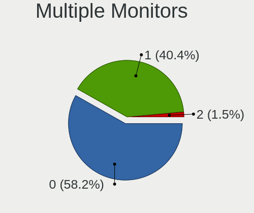

BSD in Italy - Tested Hardware & Statistics
-------------------------------------------

A project to collect tested hardware configurations for BSD in Italy.

Anyone can contribute to this report by the [hw-probe](https://github.com/linuxhw/hw-probe/blob/master/INSTALL.BSD.md) tool:

    hw-probe -all -upload

Please contribute! Especially if your hardware is rare.

This is a report for all computer types. See also reports for [desktops](/Location/Italy/Desktop/README.md) and [notebooks](/Location/Italy/Notebook/README.md).

Contents
--------

* [ Test Cases ](#test-cases)

* [ System ](#system)
  - [ OS                       ](#os)
  - [ OS Family                ](#os-family)
  - [ Arch                     ](#arch)
  - [ DE                       ](#de)
  - [ Display Server           ](#display-server)
  - [ Display Manager          ](#display-manager)
  - [ OS Lang                  ](#os-lang)
  - [ Boot Mode                ](#boot-mode)
  - [ Filesystem               ](#filesystem)
  - [ Part. scheme             ](#part-scheme)

* [ Board ](#board)
  - [ Vendor                   ](#vendor)
  - [ Model                    ](#model)
  - [ Model Family             ](#model-family)
  - [ MFG Year                 ](#mfg-year)
  - [ Form Factor              ](#form-factor)
  - [ Coreboot                 ](#coreboot)
  - [ RAM Size                 ](#ram-size)
  - [ RAM Used                 ](#ram-used)
  - [ Total Drives             ](#total-drives)
  - [ Has CD-ROM               ](#has-cd-rom)
  - [ Has Ethernet             ](#has-ethernet)
  - [ Has WiFi                 ](#has-wifi)
  - [ Has Bluetooth            ](#has-bluetooth)

* [ Location ](#location)
  - [ Country                  ](#country)
  - [ City                     ](#city)

* [ Drives ](#drives)
  - [ Drive Vendor             ](#drive-vendor)
  - [ Drive Model              ](#drive-model)
  - [ HDD Vendor               ](#hdd-vendor)
  - [ SSD Vendor               ](#ssd-vendor)
  - [ Drive Kind               ](#drive-kind)
  - [ Drive Connector          ](#drive-connector)
  - [ Drive Size               ](#drive-size)
  - [ Space Total              ](#space-total)
  - [ Space Used               ](#space-used)
  - [ Malfunc. Drives          ](#malfunc-drives)
  - [ Malfunc. Drive Vendor    ](#malfunc-drive-vendor)
  - [ Malfunc. HDD Vendor      ](#malfunc-hdd-vendor)
  - [ Malfunc. Drive Kind      ](#malfunc-drive-kind)
  - [ Failed Drives            ](#failed-drives)
  - [ Failed Drive Vendor      ](#failed-drive-vendor)
  - [ Drive Status             ](#drive-status)

* [ Storage controller ](#storage-controller)
  - [ Storage Vendor           ](#storage-vendor)
  - [ Storage Model            ](#storage-model)
  - [ Storage Kind             ](#storage-kind)

* [ Processor ](#processor)
  - [ CPU Vendor               ](#cpu-vendor)
  - [ CPU Model                ](#cpu-model)
  - [ CPU Model Family         ](#cpu-model-family)
  - [ CPU Cores                ](#cpu-cores)
  - [ CPU Sockets              ](#cpu-sockets)
  - [ CPU Threads              ](#cpu-threads)
  - [ CPU Microarch            ](#cpu-microarch)

* [ Graphics ](#graphics)
  - [ GPU Vendor               ](#gpu-vendor)
  - [ GPU Model                ](#gpu-model)
  - [ GPU Combo                ](#gpu-combo)
  - [ GPU Driver               ](#gpu-driver)
  - [ GPU Memory               ](#gpu-memory)

* [ Monitor ](#monitor)
  - [ Monitor Vendor           ](#monitor-vendor)
  - [ Monitor Model            ](#monitor-model)
  - [ Monitor Resolution       ](#monitor-resolution)
  - [ Monitor Diagonal         ](#monitor-diagonal)
  - [ Monitor Width            ](#monitor-width)
  - [ Aspect Ratio             ](#aspect-ratio)
  - [ Monitor Area             ](#monitor-area)
  - [ Pixel Density            ](#pixel-density)
  - [ Multiple Monitors        ](#multiple-monitors)

* [ Network ](#network)
  - [ Net Controller Vendor    ](#net-controller-vendor)
  - [ Net Controller Model     ](#net-controller-model)
  - [ Wireless Vendor          ](#wireless-vendor)
  - [ Wireless Model           ](#wireless-model)
  - [ Ethernet Vendor          ](#ethernet-vendor)
  - [ Ethernet Model           ](#ethernet-model)
  - [ Net Controller Kind      ](#net-controller-kind)
  - [ Used Controller          ](#used-controller)
  - [ NICs                     ](#nics)
  - [ IPv6                     ](#ipv6)

* [ Bluetooth ](#bluetooth)
  - [ Bluetooth Vendor         ](#bluetooth-vendor)
  - [ Bluetooth Model          ](#bluetooth-model)

* [ Sound ](#sound)
  - [ Sound Vendor             ](#sound-vendor)
  - [ Sound Model              ](#sound-model)

* [ Memory ](#memory)
  - [ Memory Vendor            ](#memory-vendor)
  - [ Memory Model             ](#memory-model)
  - [ Memory Kind              ](#memory-kind)
  - [ Memory Form Factor       ](#memory-form-factor)
  - [ Memory Size              ](#memory-size)
  - [ Memory Speed             ](#memory-speed)

* [ Printers & scanners ](#printers--scanners)
  - [ Printer Vendor           ](#printer-vendor)
  - [ Printer Model            ](#printer-model)
  - [ Scanner Vendor           ](#scanner-vendor)
  - [ Scanner Model            ](#scanner-model)

* [ Camera ](#camera)
  - [ Camera Vendor            ](#camera-vendor)
  - [ Camera Model             ](#camera-model)

* [ Security ](#security)
  - [ Fingerprint Vendor       ](#fingerprint-vendor)
  - [ Fingerprint Model        ](#fingerprint-model)
  - [ Chipcard Vendor          ](#chipcard-vendor)
  - [ Chipcard Model           ](#chipcard-model)

* [ Unsupported ](#unsupported)
  - [ Unsupported Devices      ](#unsupported-devices)
  - [ Unsupported Device Types ](#unsupported-device-types)

Test Cases
----------

Total: 345

| Vendor        | Model                       | Form-Factor | Probe                                                     | Date         |
|---------------|-----------------------------|-------------|-----------------------------------------------------------|--------------|
| Fujitsu       | D3313-A1 S26361-D3313-A1    | Desktop     | [fe412825f2](https://bsd-hardware.info/?probe=fe412825f2) | Jun 10, 2023 |
| Dell          | 0WR7PY A03                  | Desktop     | [c8496622be](https://bsd-hardware.info/?probe=c8496622be) | Jun 03, 2023 |
| Dell          | 0WR7PY A03                  | Desktop     | [b9f7e3e209](https://bsd-hardware.info/?probe=b9f7e3e209) | Jun 03, 2023 |
| Fujitsu       | D3313-A1 S26361-D3313-A1    | Desktop     | [d08f309c4c](https://bsd-hardware.info/?probe=d08f309c4c) | May 26, 2023 |
| Intel         | Q3XXG4-P V1.0               | Desktop     | [9160d45441](https://bsd-hardware.info/?probe=9160d45441) | May 25, 2023 |
| Unknown       | Unknown                     | Desktop     | [8b5ec8c5f4](https://bsd-hardware.info/?probe=8b5ec8c5f4) | May 23, 2023 |
| Gigabyte      | A520M S2H                   | Desktop     | [582dc6ab9f](https://bsd-hardware.info/?probe=582dc6ab9f) | May 15, 2023 |
| Unknown       | Unknown                     | Desktop     | [b26eac2277](https://bsd-hardware.info/?probe=b26eac2277) | May 13, 2023 |
| Fujitsu       | D3313-A1 S26361-D3313-A1    | Desktop     | [1dac5a7bb2](https://bsd-hardware.info/?probe=1dac5a7bb2) | May 13, 2023 |
| Unknown       | Unknown                     | Desktop     | [bf8246ecb5](https://bsd-hardware.info/?probe=bf8246ecb5) | May 11, 2023 |
| ASUSTek       | PRIME B650-PLUS             | Desktop     | [be83fbb0f2](https://bsd-hardware.info/?probe=be83fbb0f2) | May 09, 2023 |
| Unknown       | Unknown                     | Desktop     | [5c6c169e73](https://bsd-hardware.info/?probe=5c6c169e73) | May 01, 2023 |
| Unknown       | Unknown                     | Desktop     | [d572f5ff91](https://bsd-hardware.info/?probe=d572f5ff91) | May 01, 2023 |
| Unknown       | HX90                        | Desktop     | [b3300c45bc](https://bsd-hardware.info/?probe=b3300c45bc) | May 01, 2023 |
| Unknown       | Unknown                     | Desktop     | [1774da050f](https://bsd-hardware.info/?probe=1774da050f) | Apr 29, 2023 |
| AWOW          | AK34Pro                     | Mini pc     | [0471af8c22](https://bsd-hardware.info/?probe=0471af8c22) | Apr 24, 2023 |
| AWOW          | AK34Pro                     | Mini pc     | [30062ec670](https://bsd-hardware.info/?probe=30062ec670) | Apr 23, 2023 |
| HP            | 82B4                        | Desktop     | [9ec1e6d6f4](https://bsd-hardware.info/?probe=9ec1e6d6f4) | Apr 23, 2023 |
| Intel         | SKYBAY                      | Desktop     | [03dd920110](https://bsd-hardware.info/?probe=03dd920110) | Apr 22, 2023 |
| Sophos        | UTM                         | Firewall    | [85bf260703](https://bsd-hardware.info/?probe=85bf260703) | Apr 21, 2023 |
| Fujitsu       | D3313-A1 S26361-D3313-A1    | Desktop     | [d343800c53](https://bsd-hardware.info/?probe=d343800c53) | Apr 16, 2023 |
| PC Engines    | apu4                        | Desktop     | [9217e1982f](https://bsd-hardware.info/?probe=9217e1982f) | Apr 14, 2023 |
| ASRock        | G31M-S                      | Desktop     | [fed4a42c32](https://bsd-hardware.info/?probe=fed4a42c32) | Apr 08, 2023 |
| ASRock        | G31M-S                      | Desktop     | [4596f78aee](https://bsd-hardware.info/?probe=4596f78aee) | Apr 08, 2023 |
| Dell          | XPS 13 9343                 | Notebook    | [8354aed46e](https://bsd-hardware.info/?probe=8354aed46e) | Apr 07, 2023 |
| Unknown       | Unknown                     | Desktop     | [5168183b15](https://bsd-hardware.info/?probe=5168183b15) | Apr 06, 2023 |
| Acer          | Aspire 5250                 | Notebook    | [385751dbc3](https://bsd-hardware.info/?probe=385751dbc3) | Apr 06, 2023 |
| Fujitsu       | D3028-A1 S26361-D3028-A1    | Desktop     | [45f590d129](https://bsd-hardware.info/?probe=45f590d129) | Apr 04, 2023 |
| Fujitsu       | D3028-A1 S26361-D3028-A1    | Desktop     | [ab0643727f](https://bsd-hardware.info/?probe=ab0643727f) | Apr 02, 2023 |
| Fujitsu       | D3313-A1 S26361-D3313-A1    | Desktop     | [fb6477d43e](https://bsd-hardware.info/?probe=fb6477d43e) | Mar 31, 2023 |
| Dell          | 0M877N A01                  | Server      | [dabe853e69](https://bsd-hardware.info/?probe=dabe853e69) | Mar 30, 2023 |
| LG Electro... | COLUMBIA                    | Notebook    | [4872f6c377](https://bsd-hardware.info/?probe=4872f6c377) | Mar 27, 2023 |
| YANYU         | H17SL                       | Desktop     | [0f9829ebe4](https://bsd-hardware.info/?probe=0f9829ebe4) | Mar 26, 2023 |
| ASUSTek       | F1A55                       | Desktop     | [91ad5bab75](https://bsd-hardware.info/?probe=91ad5bab75) | Mar 25, 2023 |
| Unknown       | Unknown                     | Desktop     | [a7e98f9a10](https://bsd-hardware.info/?probe=a7e98f9a10) | Mar 23, 2023 |
| T-bao         | MINI PC V1.0                | Desktop     | [eb2bc1cd51](https://bsd-hardware.info/?probe=eb2bc1cd51) | Mar 23, 2023 |
| ASUSTek       | PRIME H410M-A               | Desktop     | [cbbeb5c41c](https://bsd-hardware.info/?probe=cbbeb5c41c) | Mar 22, 2023 |
| HP            | 8054                        | Desktop     | [6e5a18f346](https://bsd-hardware.info/?probe=6e5a18f346) | Mar 20, 2023 |
| Intel         | S1200RP_SE                  | Notebook    | [5ae9400f0b](https://bsd-hardware.info/?probe=5ae9400f0b) | Mar 17, 2023 |
| Lenovo        | ThinkPad T440p              | Notebook    | [575123c3ac](https://bsd-hardware.info/?probe=575123c3ac) | Mar 17, 2023 |
| Dell          | Latitude E5570              | Notebook    | [8b9aa95420](https://bsd-hardware.info/?probe=8b9aa95420) | Mar 17, 2023 |
| Dell          | Latitude E5570              | Notebook    | [937a7c9385](https://bsd-hardware.info/?probe=937a7c9385) | Mar 17, 2023 |
| SiComputer    | Embedded                    | Soc         | [9d6aa61a5c](https://bsd-hardware.info/?probe=9d6aa61a5c) | Mar 17, 2023 |
| YANYU         | H17SL                       | Desktop     | [37a549331f](https://bsd-hardware.info/?probe=37a549331f) | Mar 14, 2023 |
| MSI           | 0A48                        | Desktop     | [815f019a8c](https://bsd-hardware.info/?probe=815f019a8c) | Mar 14, 2023 |
| AZW           | U59                         | Desktop     | [5a6ef3fb8d](https://bsd-hardware.info/?probe=5a6ef3fb8d) | Mar 14, 2023 |
| Dell          | 0WMJ54 A01                  | Desktop     | [7949f20162](https://bsd-hardware.info/?probe=7949f20162) | Mar 12, 2023 |
| Fujitsu       | D3313-A1 S26361-D3313-A1    | Desktop     | [a3f921de9a](https://bsd-hardware.info/?probe=a3f921de9a) | Mar 12, 2023 |
| Fujitsu       | D3313-A1 S26361-D3313-A1    | Desktop     | [2050921c3d](https://bsd-hardware.info/?probe=2050921c3d) | Mar 12, 2023 |
| Lenovo        | ThinkPad T440p              | Notebook    | [6d372db804](https://bsd-hardware.info/?probe=6d372db804) | Mar 12, 2023 |
| Gigabyte      | B450M K                     | Desktop     | [0d0433284e](https://bsd-hardware.info/?probe=0d0433284e) | Mar 11, 2023 |
| NF692         | 1.0                         | Desktop     | [16fa0b0102](https://bsd-hardware.info/?probe=16fa0b0102) | Mar 11, 2023 |
| Fujitsu       | D3313-A1 S26361-D3313-A1    | Desktop     | [6729453203](https://bsd-hardware.info/?probe=6729453203) | Mar 09, 2023 |
| Fujitsu       | D3313-A1 S26361-D3313-A1    | Desktop     | [6dee276a48](https://bsd-hardware.info/?probe=6dee276a48) | Mar 07, 2023 |
| Gigabyte      | H97M-HD3                    | Desktop     | [77a58527da](https://bsd-hardware.info/?probe=77a58527da) | Mar 01, 2023 |
| Stonesoft     | FW-315-C1                   | Desktop     | [e8a2206ad2](https://bsd-hardware.info/?probe=e8a2206ad2) | Feb 28, 2023 |
| Lenovo        | ThinkPad T410 2537B94       | Notebook    | [9f9cb3e201](https://bsd-hardware.info/?probe=9f9cb3e201) | Feb 19, 2023 |
| Intel         | JSL MRD                     | Desktop     | [1587ea95da](https://bsd-hardware.info/?probe=1587ea95da) | Feb 18, 2023 |
| Unknown       | SKYBAY                      | Desktop     | [df7f4524d7](https://bsd-hardware.info/?probe=df7f4524d7) | Feb 12, 2023 |
| Unknown       | Unknown                     | Desktop     | [7f9208dc11](https://bsd-hardware.info/?probe=7f9208dc11) | Feb 06, 2023 |
| HP            | Mini 210-1000               | Notebook    | [eaabd2a89d](https://bsd-hardware.info/?probe=eaabd2a89d) | Feb 02, 2023 |
| HP            | 213D A01                    | Desktop     | [659939cc8b](https://bsd-hardware.info/?probe=659939cc8b) | Jan 26, 2023 |
| Unknown       | Unknown                     | Desktop     | [aa940792fc](https://bsd-hardware.info/?probe=aa940792fc) | Jan 25, 2023 |
| Gigabyte      | A520M S2H                   | Desktop     | [803a152afc](https://bsd-hardware.info/?probe=803a152afc) | Jan 23, 2023 |
| ASUSTek       | PRO A520M-C                 | Desktop     | [bebcd1a008](https://bsd-hardware.info/?probe=bebcd1a008) | Jan 20, 2023 |
| Gigabyte      | H270M-DS3H-CF               | Desktop     | [d0e2e85346](https://bsd-hardware.info/?probe=d0e2e85346) | Jan 17, 2023 |
| Unknown       | SKYBAY                      | Desktop     | [c1e1ba5558](https://bsd-hardware.info/?probe=c1e1ba5558) | Jan 16, 2023 |
| Supermicro    | X9SCI/X9SCA                 | Desktop     | [942d966486](https://bsd-hardware.info/?probe=942d966486) | Jan 11, 2023 |
| Sophos        | UTM                         | Firewall    | [6379cce732](https://bsd-hardware.info/?probe=6379cce732) | Jan 06, 2023 |
| Lenovo        | ThinkPad T460s 20FAS3L00... | Notebook    | [ef6972d07a](https://bsd-hardware.info/?probe=ef6972d07a) | Jan 03, 2023 |
| Fujitsu       | D3041-A1 S26361-D3041-A1    | Desktop     | [2265227a5c](https://bsd-hardware.info/?probe=2265227a5c) | Dec 26, 2022 |
| Dell          | Inspiron 15-3552            | Notebook    | [eea4262af2](https://bsd-hardware.info/?probe=eea4262af2) | Dec 22, 2022 |
| Dell          | Inspiron 15-3552            | Notebook    | [cae00eb4d6](https://bsd-hardware.info/?probe=cae00eb4d6) | Dec 22, 2022 |
| MSI           | MS-7922                     | Desktop     | [95dbf4f7a8](https://bsd-hardware.info/?probe=95dbf4f7a8) | Dec 19, 2022 |
| Pegatron      | 2ACF                        | Desktop     | [511f2a6d16](https://bsd-hardware.info/?probe=511f2a6d16) | Dec 19, 2022 |
| Lenovo        | ThinkPad X1 Extreme Gen ... | Notebook    | [d19db2828c](https://bsd-hardware.info/?probe=d19db2828c) | Dec 16, 2022 |
| Gigabyte      | N3160ND3V                   | Desktop     | [c84bedc821](https://bsd-hardware.info/?probe=c84bedc821) | Dec 15, 2022 |
| Fujitsu       | D3313-A1 S26361-D3313-A1    | Desktop     | [435807287e](https://bsd-hardware.info/?probe=435807287e) | Dec 15, 2022 |
| AZW           | U59                         | Desktop     | [9b22c68e98](https://bsd-hardware.info/?probe=9b22c68e98) | Dec 13, 2022 |
| ASUSTek       | PRIME Z390M-PLUS            | Desktop     | [7329e04c22](https://bsd-hardware.info/?probe=7329e04c22) | Nov 27, 2022 |
| ASUSTek       | P11C-X Series               | Desktop     | [6860cd72f8](https://bsd-hardware.info/?probe=6860cd72f8) | Nov 26, 2022 |
| ASUSTek       | P11C-X Series               | Desktop     | [cfdb06e761](https://bsd-hardware.info/?probe=cfdb06e761) | Nov 26, 2022 |
| Dell          | 0PTTT9 A01                  | Desktop     | [74575d6dfe](https://bsd-hardware.info/?probe=74575d6dfe) | Nov 25, 2022 |
| Dell          | Vostro 3550                 | Notebook    | [2aeadb4dfc](https://bsd-hardware.info/?probe=2aeadb4dfc) | Nov 14, 2022 |
| Dell          | 0VD5HY A00                  | Desktop     | [1a0df311e3](https://bsd-hardware.info/?probe=1a0df311e3) | Nov 07, 2022 |
| Gigabyte      | H270M-DS3H-CF               | Desktop     | [5784d8bed6](https://bsd-hardware.info/?probe=5784d8bed6) | Nov 04, 2022 |
| HP            | Laptop 15-da0xxx            | Notebook    | [72d95a4938](https://bsd-hardware.info/?probe=72d95a4938) | Nov 03, 2022 |
| Acer          | Veriton X2610G              | Desktop     | [e4289c3f15](https://bsd-hardware.info/?probe=e4289c3f15) | Oct 24, 2022 |
| Sophos        | UTM                         | Firewall    | [6a4c00a973](https://bsd-hardware.info/?probe=6a4c00a973) | Oct 21, 2022 |
| Unknown       | Unknown                     | Desktop     | [1188b56e14](https://bsd-hardware.info/?probe=1188b56e14) | Oct 19, 2022 |
| Unknown       | Unknown                     | Desktop     | [915c66f8bd](https://bsd-hardware.info/?probe=915c66f8bd) | Oct 19, 2022 |
| PC Engines    | apu4                        | Desktop     | [20cfd8a3c8](https://bsd-hardware.info/?probe=20cfd8a3c8) | Oct 17, 2022 |
| Pegatron      | 2ACF                        | Desktop     | [c57cc3a923](https://bsd-hardware.info/?probe=c57cc3a923) | Oct 17, 2022 |
| ASRock        | Q1900M                      | Desktop     | [7d0380e2d0](https://bsd-hardware.info/?probe=7d0380e2d0) | Oct 15, 2022 |
| Sophos        | UTM                         | Firewall    | [364e007b1c](https://bsd-hardware.info/?probe=364e007b1c) | Oct 13, 2022 |
| Lenovo        | IdeaPad 3 15ADA05 81W1      | Notebook    | [dec7108b53](https://bsd-hardware.info/?probe=dec7108b53) | Oct 11, 2022 |
| ASRock        | J3355B-ITX                  | Desktop     | [d802705c1d](https://bsd-hardware.info/?probe=d802705c1d) | Oct 10, 2022 |
| ASRock        | B75M R2.0                   | Desktop     | [a28ea59f1f](https://bsd-hardware.info/?probe=a28ea59f1f) | Oct 07, 2022 |
| Unknown       | Unknown                     | Desktop     | [bdabafdcb1](https://bsd-hardware.info/?probe=bdabafdcb1) | Oct 01, 2022 |
| ASRock        | Q1900B-ITX                  | Desktop     | [81722a937a](https://bsd-hardware.info/?probe=81722a937a) | Sep 13, 2022 |
| HP            | 8648                        | Desktop     | [e7e610794c](https://bsd-hardware.info/?probe=e7e610794c) | Sep 12, 2022 |
| Fujitsu       | D3313-A1 S26361-D3313-A1    | Desktop     | [b54e6663f9](https://bsd-hardware.info/?probe=b54e6663f9) | Sep 10, 2022 |
| Intel         | J1900                       | Desktop     | [a95dd12c65](https://bsd-hardware.info/?probe=a95dd12c65) | Sep 06, 2022 |
| HP            | 1496                        | Desktop     | [7cd97bd330](https://bsd-hardware.info/?probe=7cd97bd330) | Sep 05, 2022 |
| PC Engines    | APU2                        | Desktop     | [d9216cb730](https://bsd-hardware.info/?probe=d9216cb730) | Sep 05, 2022 |
| HP            | 1496                        | Desktop     | [94e8713f6d](https://bsd-hardware.info/?probe=94e8713f6d) | Sep 03, 2022 |
| Dell          | 0TY179 A05                  | Server      | [482bca3952](https://bsd-hardware.info/?probe=482bca3952) | Sep 01, 2022 |
| HP            | 1496                        | Desktop     | [1567aa1c21](https://bsd-hardware.info/?probe=1567aa1c21) | Sep 01, 2022 |
| Unknown       | HX90                        | Desktop     | [568468e95b](https://bsd-hardware.info/?probe=568468e95b) | Sep 01, 2022 |
| Fujitsu       | D3041-A1 S26361-D3041-A1    | Desktop     | [2349014a6c](https://bsd-hardware.info/?probe=2349014a6c) | Aug 29, 2022 |
| PC Engines    | APU2                        | Desktop     | [b3d60c2790](https://bsd-hardware.info/?probe=b3d60c2790) | Aug 22, 2022 |
| AMI           | Aptio CRB                   | Mini pc     | [02e11159f5](https://bsd-hardware.info/?probe=02e11159f5) | Aug 18, 2022 |
| Fujitsu       | D3373-B1 S26361-D3373-B1... | Server      | [676fd4e9b4](https://bsd-hardware.info/?probe=676fd4e9b4) | Aug 17, 2022 |
| ASUSTek       | M4A87TD EVO                 | Desktop     | [c03da8657e](https://bsd-hardware.info/?probe=c03da8657e) | Aug 17, 2022 |
| PC Engines    | APU2                        | Desktop     | [028dc7aa20](https://bsd-hardware.info/?probe=028dc7aa20) | Aug 17, 2022 |
| BESSTAR Te... | VB9                         | All in one  | [ec5b4884a7](https://bsd-hardware.info/?probe=ec5b4884a7) | Aug 13, 2022 |
| Fujitsu       | D3313-A1 S26361-D3313-A1    | Desktop     | [1d4ccaabda](https://bsd-hardware.info/?probe=1d4ccaabda) | Aug 13, 2022 |
| Fujitsu       | D3041-A1 S26361-D3041-A1    | Desktop     | [17dc06ed68](https://bsd-hardware.info/?probe=17dc06ed68) | Aug 12, 2022 |
| Unknown       | Unknown                     | Desktop     | [af3d9689c2](https://bsd-hardware.info/?probe=af3d9689c2) | Aug 11, 2022 |
| Unknown       | Unknown                     | Desktop     | [5049417b7b](https://bsd-hardware.info/?probe=5049417b7b) | Aug 11, 2022 |
| Intel         | SKYBAY                      | Desktop     | [c7010b7ebc](https://bsd-hardware.info/?probe=c7010b7ebc) | Aug 09, 2022 |
| Unknown       | Unknown                     | Desktop     | [21cda0eb5d](https://bsd-hardware.info/?probe=21cda0eb5d) | Aug 09, 2022 |
| Intel         | SKYBAY                      | Desktop     | [bc7d4d8e1e](https://bsd-hardware.info/?probe=bc7d4d8e1e) | Aug 08, 2022 |
| eMachines     | eME728                      | Notebook    | [96d745589c](https://bsd-hardware.info/?probe=96d745589c) | Aug 06, 2022 |
| Unknown       | Unknown                     | Desktop     | [df3667156b](https://bsd-hardware.info/?probe=df3667156b) | Aug 02, 2022 |
| Lex           | Pineview-D                  | Desktop     | [7d7195024e](https://bsd-hardware.info/?probe=7d7195024e) | Aug 02, 2022 |
| Intel         | Q3XXG4-P V1.0               | Desktop     | [d6a3d57165](https://bsd-hardware.info/?probe=d6a3d57165) | Jul 29, 2022 |
| PC Engines    | APU2                        | Desktop     | [bb5d45a75d](https://bsd-hardware.info/?probe=bb5d45a75d) | Jul 29, 2022 |
| Fujitsu       | D3313-A1 S26361-D3313-A1    | Desktop     | [e3655742ba](https://bsd-hardware.info/?probe=e3655742ba) | Jul 18, 2022 |
| Lenovo        | SHARKBAY SDK0E50510 WIN     | Desktop     | [4b9e0bb7bb](https://bsd-hardware.info/?probe=4b9e0bb7bb) | Jul 18, 2022 |
| Fujitsu       | D3313-A1 S26361-D3313-A1    | Desktop     | [af1e80d15d](https://bsd-hardware.info/?probe=af1e80d15d) | Jul 18, 2022 |
| ASUSTek       | M4A785TD-M EVO              | Desktop     | [def87ec245](https://bsd-hardware.info/?probe=def87ec245) | Jul 18, 2022 |
| ASUSTek       | PRIME H410M-A               | Desktop     | [7b6faf5301](https://bsd-hardware.info/?probe=7b6faf5301) | Jul 14, 2022 |
| Dell          | Latitude E5450              | Notebook    | [5f1183ab0b](https://bsd-hardware.info/?probe=5f1183ab0b) | Jul 14, 2022 |
| Dell          | Latitude E5450              | Notebook    | [1080ed5654](https://bsd-hardware.info/?probe=1080ed5654) | Jul 14, 2022 |
| HP            | Laptop 15-da0xxx            | Notebook    | [0434c94fad](https://bsd-hardware.info/?probe=0434c94fad) | Jul 09, 2022 |
| ASUSTek       | PRIME H410M-A               | Desktop     | [ba243fa7c4](https://bsd-hardware.info/?probe=ba243fa7c4) | Jul 09, 2022 |
| Unknown       | Unknown                     | Notebook    | [4ac86f5979](https://bsd-hardware.info/?probe=4ac86f5979) | Jul 09, 2022 |
| Fujitsu       | D3041-A1 S26361-D3041-A1    | Desktop     | [d3aba12432](https://bsd-hardware.info/?probe=d3aba12432) | Jul 09, 2022 |
| ASRock        | B75M R2.0                   | Desktop     | [6011c70ca4](https://bsd-hardware.info/?probe=6011c70ca4) | Jul 07, 2022 |
| BESSTAR Te... | GB1B                        | Mini pc     | [dbbe9124a2](https://bsd-hardware.info/?probe=dbbe9124a2) | Jul 05, 2022 |
| HP            | 0A98h                       | Desktop     | [655fc531fb](https://bsd-hardware.info/?probe=655fc531fb) | Jun 30, 2022 |
| Acer          | AOD260                      | Notebook    | [08dc464d1b](https://bsd-hardware.info/?probe=08dc464d1b) | Jun 30, 2022 |
| Pegatron      | 2ACF                        | Desktop     | [e461a4559d](https://bsd-hardware.info/?probe=e461a4559d) | Jun 29, 2022 |
| HP            | 304Bh                       | Desktop     | [8a3151b3cd](https://bsd-hardware.info/?probe=8a3151b3cd) | Jun 16, 2022 |
| NF692         | 1.0                         | Desktop     | [e87866bf5a](https://bsd-hardware.info/?probe=e87866bf5a) | Jun 10, 2022 |
| Lenovo        | ThinkPad L530 24812TG       | Notebook    | [5b66684c4a](https://bsd-hardware.info/?probe=5b66684c4a) | Jun 05, 2022 |
| ASUSTek       | PRIME H410M-E               | Desktop     | [8099e7abaf](https://bsd-hardware.info/?probe=8099e7abaf) | Jun 03, 2022 |
| HP            | ProLiant MicroServer Gen... | Desktop     | [4b3b7a0929](https://bsd-hardware.info/?probe=4b3b7a0929) | May 31, 2022 |
| HP            | ProLiant MicroServer Gen... | Desktop     | [5d3db8382f](https://bsd-hardware.info/?probe=5d3db8382f) | May 31, 2022 |
| Lenovo        | ThinkPad X250 20CMS0FA00    | Notebook    | [5afeac632d](https://bsd-hardware.info/?probe=5afeac632d) | May 28, 2022 |
| T-bao         | MINI PC V1.0                | Desktop     | [a89b2081bb](https://bsd-hardware.info/?probe=a89b2081bb) | May 25, 2022 |
| ASUSTek       | F50SL                       | Notebook    | [e26b522868](https://bsd-hardware.info/?probe=e26b522868) | May 22, 2022 |
| Acer          | Aspire E1-522               | Notebook    | [23396b461f](https://bsd-hardware.info/?probe=23396b461f) | May 18, 2022 |
| ASUSTek       | PRIME B550M-K               | Desktop     | [ce5ddde5ad](https://bsd-hardware.info/?probe=ce5ddde5ad) | May 18, 2022 |
| Protectli     | FW4B Ver                    | Desktop     | [2769c8f286](https://bsd-hardware.info/?probe=2769c8f286) | May 17, 2022 |
| Acer          | Aspire E1-522               | Notebook    | [55cda59c51](https://bsd-hardware.info/?probe=55cda59c51) | May 17, 2022 |
| ASUSTek       | K52F                        | Notebook    | [6e86ce2a12](https://bsd-hardware.info/?probe=6e86ce2a12) | May 15, 2022 |
| ASUSTek       | K52F                        | Notebook    | [4c12c55177](https://bsd-hardware.info/?probe=4c12c55177) | May 15, 2022 |
| Dell          | Inspiron 15-3552            | Notebook    | [5e781a451d](https://bsd-hardware.info/?probe=5e781a451d) | May 12, 2022 |
| BESSTAR Te... | GB1B                        | Mini pc     | [407fc42fad](https://bsd-hardware.info/?probe=407fc42fad) | May 05, 2022 |
| Fujitsu       | D3041-A1 S26361-D3041-A1    | Desktop     | [5ff176fff8](https://bsd-hardware.info/?probe=5ff176fff8) | May 05, 2022 |
| Deciso        | OPNsense Appliance          | Notebook    | [8a8db12cf2](https://bsd-hardware.info/?probe=8a8db12cf2) | May 02, 2022 |
| Lenovo        | ThinkPad T420 4236BD5       | Notebook    | [867ed989e2](https://bsd-hardware.info/?probe=867ed989e2) | Apr 27, 2022 |
| MSI           | GF65 Thin 10SER             | Notebook    | [cedf98c955](https://bsd-hardware.info/?probe=cedf98c955) | Apr 26, 2022 |
| ASUSTek       | M4A88TD-V EVO/USB3          | Desktop     | [12cc40cc60](https://bsd-hardware.info/?probe=12cc40cc60) | Apr 23, 2022 |
| Dell          | 0TY179 A05                  | Server      | [124e42e2c1](https://bsd-hardware.info/?probe=124e42e2c1) | Apr 21, 2022 |
| Intel         | NUC5i5RYB H40999-502        | Mini pc     | [9a50fe43a7](https://bsd-hardware.info/?probe=9a50fe43a7) | Apr 21, 2022 |
| Pegatron      | Benicia                     | Desktop     | [9045b4f449](https://bsd-hardware.info/?probe=9045b4f449) | Apr 16, 2022 |
| ASUSTek       | PRIME Z390M-PLUS            | Desktop     | [680303f943](https://bsd-hardware.info/?probe=680303f943) | Apr 16, 2022 |
| ASUSTek       | PRIME Z390M-PLUS            | Desktop     | [47d17d48a7](https://bsd-hardware.info/?probe=47d17d48a7) | Apr 15, 2022 |
| Dell          | 07978V A08                  | Server      | [f315c33e95](https://bsd-hardware.info/?probe=f315c33e95) | Apr 06, 2022 |
| ShenZhen M... | MW-NANO-APL-4L              | Desktop     | [fbdd8d4f48](https://bsd-hardware.info/?probe=fbdd8d4f48) | Apr 05, 2022 |
| HP            | 212B                        | Desktop     | [33e7c65907](https://bsd-hardware.info/?probe=33e7c65907) | Apr 04, 2022 |
| Gigabyte      | X570 AORUS PRO              | Desktop     | [3877a33214](https://bsd-hardware.info/?probe=3877a33214) | Apr 02, 2022 |
| Gigabyte      | X570 AORUS PRO              | Desktop     | [3da637e3c6](https://bsd-hardware.info/?probe=3da637e3c6) | Apr 02, 2022 |
| Fujitsu       | D3041-A1 S26361-D3041-A1    | Desktop     | [7b79164c18](https://bsd-hardware.info/?probe=7b79164c18) | Apr 01, 2022 |
| ASUSTek       | X555LJ                      | Notebook    | [6bf51cc915](https://bsd-hardware.info/?probe=6bf51cc915) | Mar 28, 2022 |
| BESSTAR Te... | GB1B                        | Mini pc     | [9f760529c1](https://bsd-hardware.info/?probe=9f760529c1) | Mar 21, 2022 |
| Unknown       | Unknown                     | Desktop     | [bddd5d8963](https://bsd-hardware.info/?probe=bddd5d8963) | Mar 18, 2022 |
| BESSTAR Te... | GB1B                        | Mini pc     | [bb895c5df3](https://bsd-hardware.info/?probe=bb895c5df3) | Mar 16, 2022 |
| Unknown       | Unknown                     | Desktop     | [65ada9d5da](https://bsd-hardware.info/?probe=65ada9d5da) | Mar 11, 2022 |
| Raspberry ... | Raspberry Pi 4 Model B      | Soc         | [0394e3272e](https://bsd-hardware.info/?probe=0394e3272e) | Mar 03, 2022 |
| HP            | 3397                        | Desktop     | [841ed56816](https://bsd-hardware.info/?probe=841ed56816) | Mar 02, 2022 |
| BESSTAR Te... | GB1B                        | Mini pc     | [6696106165](https://bsd-hardware.info/?probe=6696106165) | Feb 19, 2022 |
| Pegatron      | 2ACF                        | Desktop     | [e098f52d51](https://bsd-hardware.info/?probe=e098f52d51) | Feb 19, 2022 |
| MSI           | B450 GAMING PLUS MAX        | Desktop     | [df6278638e](https://bsd-hardware.info/?probe=df6278638e) | Feb 15, 2022 |
| Acer          | V5-131                      | Notebook    | [2d5bfae3b4](https://bsd-hardware.info/?probe=2d5bfae3b4) | Feb 15, 2022 |
| Intel         | Q3XXG4-P V1.0               | Desktop     | [ea7cf2885f](https://bsd-hardware.info/?probe=ea7cf2885f) | Feb 13, 2022 |
| Intel         | NUC6i5SYB H81131-503        | Mini pc     | [946c9acc2e](https://bsd-hardware.info/?probe=946c9acc2e) | Feb 11, 2022 |
| MSI           | B450 GAMING PLUS MAX        | Desktop     | [6997de25f9](https://bsd-hardware.info/?probe=6997de25f9) | Feb 11, 2022 |
| MW            | GMLK-2_5G4L                 | Desktop     | [7a3744a41a](https://bsd-hardware.info/?probe=7a3744a41a) | Feb 07, 2022 |
| HP            | EliteBook 6930p             | Notebook    | [d8fb34de12](https://bsd-hardware.info/?probe=d8fb34de12) | Feb 04, 2022 |
| HP            | Mini 210-1000               | Notebook    | [8a8bfdaee1](https://bsd-hardware.info/?probe=8a8bfdaee1) | Feb 02, 2022 |
| Dell          | 0TK7TF A00                  | Desktop     | [d13ca7163c](https://bsd-hardware.info/?probe=d13ca7163c) | Jan 30, 2022 |
| Intel         | D2500CC AAG81477-401        | Desktop     | [f4d8bd7979](https://bsd-hardware.info/?probe=f4d8bd7979) | Jan 30, 2022 |
| Fujitsu       | D3028-A1 S26361-D3028-A1    | Desktop     | [f7e7df9416](https://bsd-hardware.info/?probe=f7e7df9416) | Jan 30, 2022 |
| Fujitsu       | D3028-A1 S26361-D3028-A1    | Desktop     | [fc63aa695e](https://bsd-hardware.info/?probe=fc63aa695e) | Jan 27, 2022 |
| PC Engines    | APU2                        | Desktop     | [52bd5dc1ce](https://bsd-hardware.info/?probe=52bd5dc1ce) | Jan 26, 2022 |
| ASUSTek       | BM6835_BM6635_BP6335        | Desktop     | [73562aa169](https://bsd-hardware.info/?probe=73562aa169) | Jan 25, 2022 |
| ASUSTek       | VivoBook_ASUSLaptop X515... | Notebook    | [cf360a6098](https://bsd-hardware.info/?probe=cf360a6098) | Jan 16, 2022 |
| Acer          | Extensa 5635Z               | Notebook    | [d76873c5dd](https://bsd-hardware.info/?probe=d76873c5dd) | Jan 16, 2022 |
| Fujitsu       | D3041-A1 S26361-D3041-A1    | Desktop     | [ed9f5d1a27](https://bsd-hardware.info/?probe=ed9f5d1a27) | Jan 15, 2022 |
| PC Engines    | APU2                        | Desktop     | [c2b05fc937](https://bsd-hardware.info/?probe=c2b05fc937) | Jan 14, 2022 |
| ASRock        | B75M R2.0                   | Desktop     | [7b99b0eaa6](https://bsd-hardware.info/?probe=7b99b0eaa6) | Jan 10, 2022 |
| TUXEDO        | N14xWU                      | Notebook    | [4ac0707c49](https://bsd-hardware.info/?probe=4ac0707c49) | Jan 06, 2022 |
| Unknown       | Unknown                     | Notebook    | [341401bb02](https://bsd-hardware.info/?probe=341401bb02) | Jan 04, 2022 |
| Unknown       | Unknown                     | Notebook    | [46e5f9b021](https://bsd-hardware.info/?probe=46e5f9b021) | Dec 29, 2021 |
| Fujitsu       | D3041-A1 S26361-D3041-A1    | Desktop     | [7a43524381](https://bsd-hardware.info/?probe=7a43524381) | Dec 13, 2021 |
| Packard Be... | EasyNote_MX61-B-038         | Notebook    | [235d60060d](https://bsd-hardware.info/?probe=235d60060d) | Dec 12, 2021 |
| Gigabyte      | H270M-DS3H-CF               | Desktop     | [50fba6deda](https://bsd-hardware.info/?probe=50fba6deda) | Dec 11, 2021 |
| Acer          | Aspire 5749Z                | Notebook    | [60a25af38c](https://bsd-hardware.info/?probe=60a25af38c) | Dec 09, 2021 |
| Gigabyte      | H270M-DS3H-CF               | Desktop     | [a084ff48c2](https://bsd-hardware.info/?probe=a084ff48c2) | Dec 09, 2021 |
| Gigabyte      | H270M-DS3H-CF               | Desktop     | [17b557d792](https://bsd-hardware.info/?probe=17b557d792) | Dec 08, 2021 |
| ASUSTek       | 1000                        | Notebook    | [da8689c840](https://bsd-hardware.info/?probe=da8689c840) | Dec 08, 2021 |
| Fujitsu       | D3041-A1 S26361-D3041-A1    | Desktop     | [ddcab97db2](https://bsd-hardware.info/?probe=ddcab97db2) | Dec 03, 2021 |
| Toshiba       | Satellite C855-1U4          | Notebook    | [4107fc9eee](https://bsd-hardware.info/?probe=4107fc9eee) | Nov 14, 2021 |
| Toshiba       | PORTEGE M780                | Notebook    | [2ac9bea1e6](https://bsd-hardware.info/?probe=2ac9bea1e6) | Nov 13, 2021 |
| T-bao         | MINI PC V1.0                | Desktop     | [4ee7de3597](https://bsd-hardware.info/?probe=4ee7de3597) | Nov 12, 2021 |
| Intel         | Q3XXG4-P V1.0               | Desktop     | [22a18ba45e](https://bsd-hardware.info/?probe=22a18ba45e) | Nov 08, 2021 |
| HP            | ProBook 470 G4              | Notebook    | [5f026ff3a2](https://bsd-hardware.info/?probe=5f026ff3a2) | Oct 17, 2021 |
| Pegatron      | 2ACF                        | Desktop     | [ca23d3bbf0](https://bsd-hardware.info/?probe=ca23d3bbf0) | Oct 13, 2021 |
| ASUSTek       | PRIME Z390M-PLUS            | Desktop     | [b3b31d25b0](https://bsd-hardware.info/?probe=b3b31d25b0) | Oct 13, 2021 |
| Pegatron      | 2ACF                        | Desktop     | [97aa5e56e4](https://bsd-hardware.info/?probe=97aa5e56e4) | Oct 12, 2021 |
| ASUSTek       | PRIME Z390M-PLUS            | Desktop     | [5a7c1871b1](https://bsd-hardware.info/?probe=5a7c1871b1) | Oct 11, 2021 |
| HP            | ProBook 470 G4              | Notebook    | [a9c135bf27](https://bsd-hardware.info/?probe=a9c135bf27) | Oct 10, 2021 |
| Acer          | Veriton X2610G              | Desktop     | [1e9ed23164](https://bsd-hardware.info/?probe=1e9ed23164) | Oct 03, 2021 |
| ASUSTek       | X555LJ                      | Notebook    | [81dd2ba2f0](https://bsd-hardware.info/?probe=81dd2ba2f0) | Oct 02, 2021 |
| ASRock        | B75M R2.0                   | Desktop     | [51b47d9321](https://bsd-hardware.info/?probe=51b47d9321) | Sep 27, 2021 |
| ASRock        | B75M R2.0                   | Desktop     | [de031313ff](https://bsd-hardware.info/?probe=de031313ff) | Sep 27, 2021 |
| BESSTAR Te... | GB1B                        | Mini pc     | [e0ad80acf9](https://bsd-hardware.info/?probe=e0ad80acf9) | Sep 20, 2021 |
| Gigabyte      | H270M-DS3H-CF               | Desktop     | [9b046b157e](https://bsd-hardware.info/?probe=9b046b157e) | Sep 17, 2021 |
| ASRock        | B75M R2.0                   | Desktop     | [0d23147c7d](https://bsd-hardware.info/?probe=0d23147c7d) | Sep 17, 2021 |
| ASUSTek       | VivoBook_ASUSLaptop X512... | Notebook    | [0b73df29bf](https://bsd-hardware.info/?probe=0b73df29bf) | Sep 15, 2021 |
| ASRock        | B75M R2.0                   | Desktop     | [e0ae9af4ab](https://bsd-hardware.info/?probe=e0ae9af4ab) | Sep 15, 2021 |
| BESSTAR Te... | GB1B                        | Mini pc     | [f1a2baeecb](https://bsd-hardware.info/?probe=f1a2baeecb) | Sep 14, 2021 |
| Gigabyte      | H270M-DS3H-CF               | Desktop     | [bc2a287495](https://bsd-hardware.info/?probe=bc2a287495) | Sep 13, 2021 |
| BESSTAR Te... | GB1B                        | Mini pc     | [3607c373aa](https://bsd-hardware.info/?probe=3607c373aa) | Sep 11, 2021 |
| Apple         | Mac-F2268DC8                | All in one  | [73912d5852](https://bsd-hardware.info/?probe=73912d5852) | Sep 09, 2021 |
| Unknown       | YL-J3160L4                  | Desktop     | [861a1f7012](https://bsd-hardware.info/?probe=861a1f7012) | Aug 25, 2021 |
| MSI           | MS-B1591                    | Desktop     | [679b2010e9](https://bsd-hardware.info/?probe=679b2010e9) | Aug 03, 2021 |
| MSI           | MS-B1591                    | Desktop     | [b370a74ec0](https://bsd-hardware.info/?probe=b370a74ec0) | Aug 02, 2021 |
| Lenovo        | G505 20240                  | Notebook    | [16e6ec4054](https://bsd-hardware.info/?probe=16e6ec4054) | Aug 02, 2021 |
| AMI           | Aptio CRB                   | Mini pc     | [acfe0caa83](https://bsd-hardware.info/?probe=acfe0caa83) | Jul 22, 2021 |
| ASUSTek       | VivoBook_ASUSLaptop X512... | Notebook    | [9c9d4cc782](https://bsd-hardware.info/?probe=9c9d4cc782) | Jul 18, 2021 |
| ASUSTek       | VivoBook_ASUSLaptop X512... | Notebook    | [3d5e512e18](https://bsd-hardware.info/?probe=3d5e512e18) | Jul 18, 2021 |
| Gigabyte      | P55A-UD3                    | Desktop     | [dc1b4d8a6b](https://bsd-hardware.info/?probe=dc1b4d8a6b) | Jul 16, 2021 |
| ASRock        | B75M R2.0                   | Desktop     | [d51149c1d5](https://bsd-hardware.info/?probe=d51149c1d5) | Jul 13, 2021 |
| Intel         | NUC6i5SYB H81131-503        | Mini pc     | [7fe4b5ff70](https://bsd-hardware.info/?probe=7fe4b5ff70) | Jul 12, 2021 |
| Intel         | NUC10i7FNB K61360-303       | Mini pc     | [dbacaa5c65](https://bsd-hardware.info/?probe=dbacaa5c65) | Jul 08, 2021 |
| Samsung       | 3570R/370R/470R/450R/510... | Notebook    | [31d42f4469](https://bsd-hardware.info/?probe=31d42f4469) | Jul 05, 2021 |
| Lenovo        | B590 62743PG                | Notebook    | [2400297995](https://bsd-hardware.info/?probe=2400297995) | Jul 03, 2021 |
| Lenovo        | SHARKBAY SDK0E50510 WIN     | Desktop     | [6cf3337855](https://bsd-hardware.info/?probe=6cf3337855) | Jul 01, 2021 |
| MSI           | B450 GAMING PLUS MAX        | Desktop     | [f0e80b0788](https://bsd-hardware.info/?probe=f0e80b0788) | Jun 28, 2021 |
| PC Engines    | APU2                        | Desktop     | [dde9077545](https://bsd-hardware.info/?probe=dde9077545) | Jun 24, 2021 |
| ZOTAC         | ZBOX-CI323NANO              | Mini pc     | [7cf77c6f1f](https://bsd-hardware.info/?probe=7cf77c6f1f) | Jun 12, 2021 |
| Unknown       | Unknown                     | Desktop     | [822df8eb91](https://bsd-hardware.info/?probe=822df8eb91) | May 11, 2021 |
| Unknown       | Unknown                     | Desktop     | [cc17eea606](https://bsd-hardware.info/?probe=cc17eea606) | May 10, 2021 |
| ASUSTek       | IP4BL-ME-Oli                | Desktop     | [e26ecef661](https://bsd-hardware.info/?probe=e26ecef661) | May 03, 2021 |
| MSI           | B450-A PRO                  | Desktop     | [ed656e816f](https://bsd-hardware.info/?probe=ed656e816f) | May 01, 2021 |
| Unknown       | Unknown                     | Desktop     | [df793cf09f](https://bsd-hardware.info/?probe=df793cf09f) | Apr 08, 2021 |
| Unknown       | Unknown                     | Desktop     | [f8ba0ba112](https://bsd-hardware.info/?probe=f8ba0ba112) | Apr 08, 2021 |
| HP            | Laptop 15-da0xxx            | Notebook    | [cb09a1b771](https://bsd-hardware.info/?probe=cb09a1b771) | Apr 08, 2021 |
| Lenovo        | SHARKBAY SDK0E50510 WIN     | Desktop     | [62376c16a4](https://bsd-hardware.info/?probe=62376c16a4) | Mar 31, 2021 |
| Intel         | CRESCENTBAY                 | Desktop     | [5a7ba137e0](https://bsd-hardware.info/?probe=5a7ba137e0) | Mar 27, 2021 |
| Acer          | EG43M                       | Desktop     | [0bc978756c](https://bsd-hardware.info/?probe=0bc978756c) | Mar 27, 2021 |
| AMI           | Aptio CRB                   | Mini pc     | [139e702b9a](https://bsd-hardware.info/?probe=139e702b9a) | Mar 27, 2021 |
| Lenovo        | ThinkPad L530 24812TG       | Notebook    | [520982317e](https://bsd-hardware.info/?probe=520982317e) | Mar 25, 2021 |
| Lenovo        | SHARKBAY SDK0E50510 WIN     | Desktop     | [f9c3fc3b84](https://bsd-hardware.info/?probe=f9c3fc3b84) | Mar 19, 2021 |
| Lenovo        | SHARKBAY SDK0E50510 WIN     | Desktop     | [5ae508dfa8](https://bsd-hardware.info/?probe=5ae508dfa8) | Mar 19, 2021 |
| Lenovo        | ThinkPad X260 20F5S82N00    | Notebook    | [aa3deadedd](https://bsd-hardware.info/?probe=aa3deadedd) | Mar 19, 2021 |
| ASUSTek       | PRIME Z390M-PLUS            | Desktop     | [0a3b290f9f](https://bsd-hardware.info/?probe=0a3b290f9f) | Mar 15, 2021 |
| ASUSTek       | M4A88TD-V EVO/USB3          | Desktop     | [1c30f7523f](https://bsd-hardware.info/?probe=1c30f7523f) | Mar 15, 2021 |
| PC Engines    | APU3                        | Desktop     | [822a83f208](https://bsd-hardware.info/?probe=822a83f208) | Mar 11, 2021 |
| ASUSTek       | IP4BL-ME-Oli                | Desktop     | [c672201bcb](https://bsd-hardware.info/?probe=c672201bcb) | Mar 10, 2021 |
| Lenovo        | SHARKBAY SDK0E50510 WIN     | Desktop     | [66a223add9](https://bsd-hardware.info/?probe=66a223add9) | Mar 08, 2021 |
| Dell          | 00NH4P A07                  | Server      | [7cff5a5c58](https://bsd-hardware.info/?probe=7cff5a5c58) | Mar 08, 2021 |
| HP            | Laptop 15-da0xxx            | Notebook    | [bf572bc102](https://bsd-hardware.info/?probe=bf572bc102) | Mar 06, 2021 |
| Dell          | 0R849J A00                  | Desktop     | [1bd1dc24c9](https://bsd-hardware.info/?probe=1bd1dc24c9) | Mar 06, 2021 |
| Intel         | NUC6i5SYB H81131-503        | Mini pc     | [55045aa9e5](https://bsd-hardware.info/?probe=55045aa9e5) | Mar 03, 2021 |
| Foxconn       | 2ADA                        | Desktop     | [10d02d0982](https://bsd-hardware.info/?probe=10d02d0982) | Mar 03, 2021 |
| Intel         | MAHOBAY                     | Desktop     | [3c5bd7b7f8](https://bsd-hardware.info/?probe=3c5bd7b7f8) | Mar 02, 2021 |
| Intel         | MAHOBAY                     | Desktop     | [04e66ca239](https://bsd-hardware.info/?probe=04e66ca239) | Mar 02, 2021 |
| ASUSTek       | G1S                         | Notebook    | [593c12aa06](https://bsd-hardware.info/?probe=593c12aa06) | Feb 28, 2021 |
| Intel         | MAHOBAY                     | Desktop     | [50652a4263](https://bsd-hardware.info/?probe=50652a4263) | Feb 26, 2021 |
| ASUSTek       | PRIME Z390M-PLUS            | Desktop     | [58c6bf426e](https://bsd-hardware.info/?probe=58c6bf426e) | Feb 22, 2021 |
| Dell          | 00NH4P A07                  | Server      | [fff0533829](https://bsd-hardware.info/?probe=fff0533829) | Feb 20, 2021 |
| Intel         | MAHOBAY                     | Desktop     | [5257239fdc](https://bsd-hardware.info/?probe=5257239fdc) | Feb 20, 2021 |
| Acer          | Extensa 5635Z               | Notebook    | [837c6f28b4](https://bsd-hardware.info/?probe=837c6f28b4) | Feb 19, 2021 |
| HARDKERNEL    | ODROID-H2                   | Desktop     | [6fe9279f1f](https://bsd-hardware.info/?probe=6fe9279f1f) | Feb 18, 2021 |
| eMachines     | eME732ZG                    | Notebook    | [d0c0433452](https://bsd-hardware.info/?probe=d0c0433452) | Feb 16, 2021 |
| ASUSTek       | X555LD                      | Notebook    | [74d43ccd10](https://bsd-hardware.info/?probe=74d43ccd10) | Feb 16, 2021 |
| ASUSTek       | PRIME Z390M-PLUS            | Desktop     | [c996e74ebc](https://bsd-hardware.info/?probe=c996e74ebc) | Feb 14, 2021 |
| HP            | ProBook 470 G4              | Notebook    | [f808e6bb4a](https://bsd-hardware.info/?probe=f808e6bb4a) | Feb 13, 2021 |
| eMachines     | eME732ZG                    | Notebook    | [c51678397d](https://bsd-hardware.info/?probe=c51678397d) | Feb 13, 2021 |
| Dell          | 06NWYK A00                  | Desktop     | [32acfb4467](https://bsd-hardware.info/?probe=32acfb4467) | Feb 13, 2021 |
| ASUSTek       | P8H61-M LE                  | Desktop     | [b861820636](https://bsd-hardware.info/?probe=b861820636) | Feb 13, 2021 |
| Dell          | 06NWYK A00                  | Desktop     | [2ff05af403](https://bsd-hardware.info/?probe=2ff05af403) | Feb 13, 2021 |
| ASUSTek       | P8H61-M LE                  | Desktop     | [3a3d7d0701](https://bsd-hardware.info/?probe=3a3d7d0701) | Feb 12, 2021 |
| ASUSTek       | VivoBook_ASUSLaptop X512... | Notebook    | [37e4e7c85c](https://bsd-hardware.info/?probe=37e4e7c85c) | Feb 12, 2021 |
| ASUSTek       | P8Z77-V PRO/THUNDERBOLT     | Desktop     | [6fdcef7c9e](https://bsd-hardware.info/?probe=6fdcef7c9e) | Feb 10, 2021 |
| ASUSTek       | PRIME X470-PRO              | Desktop     | [a77e980850](https://bsd-hardware.info/?probe=a77e980850) | Feb 09, 2021 |
| ASUSTek       | X502CA                      | Notebook    | [5e15d06a9b](https://bsd-hardware.info/?probe=5e15d06a9b) | Feb 06, 2021 |
| ASUSTek       | X502CA                      | Notebook    | [1a2df26f19](https://bsd-hardware.info/?probe=1a2df26f19) | Feb 06, 2021 |
| ASUSTek       | IP4BL-ME-Oli                | Desktop     | [4d225e7ebe](https://bsd-hardware.info/?probe=4d225e7ebe) | Feb 04, 2021 |
| Intel         | NUC6i5SYB H81131-503        | Mini pc     | [01a2dd5a52](https://bsd-hardware.info/?probe=01a2dd5a52) | Feb 02, 2021 |
| Intel         | CRESCENTBAY                 | Desktop     | [f813782c8a](https://bsd-hardware.info/?probe=f813782c8a) | Jan 29, 2021 |
| ZOTAC         | ZBOX-MI640/MI660/MI620NA... | Mini pc     | [2aa7735e59](https://bsd-hardware.info/?probe=2aa7735e59) | Jan 24, 2021 |
| Sun Micros... | Ultra 24 50                 | Desktop     | [622589c8e7](https://bsd-hardware.info/?probe=622589c8e7) | Jan 22, 2021 |
| Sun Micros... | Ultra 24 50                 | Desktop     | [7a3cb6a061](https://bsd-hardware.info/?probe=7a3cb6a061) | Jan 22, 2021 |
| Apple         | MacBook4,1                  | Notebook    | [9eca3b0463](https://bsd-hardware.info/?probe=9eca3b0463) | Jan 22, 2021 |
| ASUSTek       | M4A87TD EVO                 | Desktop     | [12ea57f317](https://bsd-hardware.info/?probe=12ea57f317) | Jan 22, 2021 |
| Dell          | 088DT1 A01                  | Desktop     | [fcc759e013](https://bsd-hardware.info/?probe=fcc759e013) | Jan 21, 2021 |
| ASRock        | H81 Pro BTC                 | Desktop     | [afb7cd1f1a](https://bsd-hardware.info/?probe=afb7cd1f1a) | Jan 20, 2021 |
| Intel         | CRESCENTBAY                 | Desktop     | [92577053eb](https://bsd-hardware.info/?probe=92577053eb) | Jan 20, 2021 |
| Intel         | CRESCENTBAY                 | Desktop     | [33a6dda088](https://bsd-hardware.info/?probe=33a6dda088) | Jan 20, 2021 |
| Apple         | MacBook4,1                  | Notebook    | [539b95f535](https://bsd-hardware.info/?probe=539b95f535) | Jan 20, 2021 |
| PC Engines    | APU2                        | Desktop     | [a178f8eb47](https://bsd-hardware.info/?probe=a178f8eb47) | Jan 19, 2021 |
| HP            | ProBook 470 G4              | Notebook    | [bc4bca1e5e](https://bsd-hardware.info/?probe=bc4bca1e5e) | Jan 18, 2021 |
| HP            | ProBook 470 G4              | Notebook    | [e39a46cadf](https://bsd-hardware.info/?probe=e39a46cadf) | Jan 17, 2021 |
| MSI           | Boston                      | Desktop     | [aa9d7bae21](https://bsd-hardware.info/?probe=aa9d7bae21) | Jan 17, 2021 |
| MSI           | Boston                      | Desktop     | [f21954fa35](https://bsd-hardware.info/?probe=f21954fa35) | Jan 17, 2021 |
| Supermicro    | X8STi                       | Desktop     | [7d0e121099](https://bsd-hardware.info/?probe=7d0e121099) | Jan 15, 2021 |
| HP            | ProBook 470 G4              | Notebook    | [c4eecdac67](https://bsd-hardware.info/?probe=c4eecdac67) | Jan 14, 2021 |
| IBM           | ThinkPad R51 2887AVG        | Notebook    | [289177c624](https://bsd-hardware.info/?probe=289177c624) | Jan 02, 2021 |
| IBM           | ThinkPad R51 2887AVG        | Notebook    | [88d4fc2693](https://bsd-hardware.info/?probe=88d4fc2693) | Dec 30, 2020 |
| Unknown       | Unknown                     | Desktop     | [8668b1d651](https://bsd-hardware.info/?probe=8668b1d651) | Dec 17, 2020 |
| Unknown       | Unknown                     | Desktop     | [d2cdc0fc7f](https://bsd-hardware.info/?probe=d2cdc0fc7f) | Nov 29, 2020 |
| Unknown       | Unknown                     | Desktop     | [aee9f448af](https://bsd-hardware.info/?probe=aee9f448af) | Nov 25, 2020 |
| Lenovo        | ThinkPad T495 20NJS0KP00    | Notebook    | [7a706e46de](https://bsd-hardware.info/?probe=7a706e46de) | Oct 31, 2020 |
| Lenovo        | ThinkPad T430 23501B3       | Notebook    | [53233cc736](https://bsd-hardware.info/?probe=53233cc736) | Oct 31, 2020 |
| Intel         | D945GCLF2                   | Desktop     | [58678b0643](https://bsd-hardware.info/?probe=58678b0643) | Oct 30, 2020 |
| Intel         | D945GCLF2                   | Desktop     | [3354fb903b](https://bsd-hardware.info/?probe=3354fb903b) | Oct 30, 2020 |
| Gigabyte      | X570 AORUS ELITE            | Desktop     | [973b62551f](https://bsd-hardware.info/?probe=973b62551f) | Oct 30, 2020 |
| AZW           | BT3 X                       | Desktop     | [b9f23ee753](https://bsd-hardware.info/?probe=b9f23ee753) | Oct 30, 2020 |
| Dell          | Precision 3510              | Notebook    | [85a55ab7c3](https://bsd-hardware.info/?probe=85a55ab7c3) | Oct 22, 2020 |
| HP            | Laptop 15-da0xxx            | Notebook    | [7faf1699d6](https://bsd-hardware.info/?probe=7faf1699d6) | Oct 04, 2020 |
| Apple         | MacBookAir7,2               | Notebook    | [36d0d99aa6](https://bsd-hardware.info/?probe=36d0d99aa6) | Oct 04, 2020 |
| Lenovo        | G50-45 80E3                 | Notebook    | [1d227a9cd2](https://bsd-hardware.info/?probe=1d227a9cd2) | Oct 04, 2020 |
| Lenovo        | ThinkPad X1 Carbon 6th 2... | Notebook    | [2f119a81b4](https://bsd-hardware.info/?probe=2f119a81b4) | Aug 13, 2020 |
| Lenovo        | ThinkPad T450 20BUS06B00    | Notebook    | [f437a3b5ab](https://bsd-hardware.info/?probe=f437a3b5ab) | Jul 06, 2020 |
| ASRock        | 990FX Extreme9              | Desktop     | [6c0bba6d4f](https://bsd-hardware.info/?probe=6c0bba6d4f) | Jun 26, 2020 |
| Intel         | NUC6i5SYB H81131-503        | Mini pc     | [6b854263e7](https://bsd-hardware.info/?probe=6b854263e7) | May 25, 2020 |
| Lenovo        | ThinkPad T440 20B7S1C600    | Notebook    | [a4a62cb85e](https://bsd-hardware.info/?probe=a4a62cb85e) | May 24, 2020 |
| Lenovo        | ThinkPad X240 20AMS0J01N    | Notebook    | [4df07718d1](https://bsd-hardware.info/?probe=4df07718d1) | May 23, 2020 |

System
------

OS
--

Installed operating systems

| Name              | Computers | Percent |
|-------------------|-----------|---------|
| helloSystem 0.7.0 | 18        | 6.74%   |
| helloSystem 0.4.0 | 12        | 4.49%   |
| helloSystem 0.8.1 | 10        | 3.75%   |
| OpenBSD 7.1       | 9         | 3.37%   |
| helloSystem 0.5.0 | 9         | 3.37%   |
| OPNsense 22.7     | 7         | 2.62%   |
| helloSystem 0.8.0 | 7         | 2.62%   |
| OPNsense 23.1.6   | 6         | 2.25%   |
| OPNsense 23.1.5   | 6         | 2.25%   |
| helloSystem 0.6.0 | 6         | 2.25%   |
| OPNsense 22.1.6   | 5         | 1.87%   |
| OPNsense 21.1     | 5         | 1.87%   |
| OpenBSD 7.2       | 5         | 1.87%   |
| helloSystem 0.3.0 | 5         | 1.87%   |
| FreeBSD 13.1      | 5         | 1.87%   |
| OPNsense 22.7.9   | 4         | 1.5%    |
| OPNsense 22.7.6   | 4         | 1.5%    |
| OPNsense 22.7.3   | 4         | 1.5%    |
| OPNsense 22.7.10  | 4         | 1.5%    |
| OPNsense 22.1.9   | 4         | 1.5%    |
| OPNsense 22.1     | 4         | 1.5%    |
| OPNsense 23.1.7   | 3         | 1.12%   |
| OPNsense 23.1.4   | 3         | 1.12%   |
| OPNsense 23.1.1   | 3         | 1.12%   |
| OPNsense 23.1     | 3         | 1.12%   |
| OPNsense 22.7.2   | 3         | 1.12%   |
| OPNsense 22.7.1   | 3         | 1.12%   |
| OPNsense 22.1.10  | 3         | 1.12%   |
| OPNsense 21.7.7   | 3         | 1.12%   |
| OPNsense 21.7.3   | 3         | 1.12%   |
| OPNsense 21.1.8   | 3         | 1.12%   |
| OPNsense 21.1.3   | 3         | 1.12%   |
| OPNsense 21.1.2   | 3         | 1.12%   |
| OPNsense 20.7.8   | 3         | 1.12%   |
| OpenBSD 6.8       | 3         | 1.12%   |
| NomadBSD 1.4      | 3         | 1.12%   |
| FreeBSD 13.0-p7   | 3         | 1.12%   |
| FreeBSD 12.2-p2   | 3         | 1.12%   |
| OPNsense 23.1.8   | 2         | 0.75%   |
| OPNsense 22.7.5   | 2         | 0.75%   |

OS Family
---------

OS without a version

| Name        | Computers | Percent |
|-------------|-----------|---------|
| OPNsense    | 84        | 40.38%  |
| helloSystem | 56        | 26.92%  |
| FreeBSD     | 30        | 14.42%  |
| OpenBSD     | 19        | 9.13%   |
| NomadBSD    | 7         | 3.37%   |
| NetBSD      | 7         | 3.37%   |
| GhostBSD    | 4         | 1.92%   |
| XigmaNAS    | 1         | 0.48%   |

Arch
----

OS architecture (x86_64, i586, etc.)

| Name   | Computers | Percent |
|--------|-----------|---------|
| amd64  | 201       | 97.1%   |
| i386   | 3         | 1.45%   |
| evbarm | 3         | 1.45%   |

DE
--

Desktop Environment

| Name          | Computers | Percent |
|---------------|-----------|---------|
| Console       | 94        | 44.98%  |
| helloDesktop  | 62        | 29.67%  |
| XFCE          | 12        | 5.74%   |
| Openbox       | 7         | 3.35%   |
| KDE5          | 7         | 3.35%   |
| MATE          | 5         | 2.39%   |
| fvwm          | 4         | 1.91%   |
| ctwm          | 4         | 1.91%   |
| TWM           | 3         | 1.44%   |
| i3            | 3         | 1.44%   |
| Cinnamon      | 3         | 1.44%   |
| xfwm          | 2         | 0.96%   |
| LXQt          | 1         | 0.48%   |
| Fluxbox       | 1         | 0.48%   |
| Enlightenment | 1         | 0.48%   |

Display Server
--------------

X11 or Wayland

| Name    | Computers | Percent |
|---------|-----------|---------|
| X11     | 112       | 53.85%  |
| Console | 95        | 45.67%  |
| Wayland | 1         | 0.48%   |

Display Manager
---------------

SDDM, LightDM, etc.

| Name    | Computers | Percent |
|---------|-----------|---------|
| Console | 128       | 61.84%  |
| SLiM    | 68        | 32.85%  |
| LightDM | 6         | 2.9%    |
| SDDM    | 3         | 1.45%   |
| XDM     | 2         | 0.97%   |

OS Lang
-------

Language

| Lang             | Computers | Percent |
|------------------|-----------|---------|
| Unknown          | 106       | 49.53%  |
| en_US            | 59        | 27.57%  |
| it_IT            | 19        | 8.88%   |
| C                | 15        | 7.01%   |
| fr_FR            | 5         | 2.34%   |
| it               | 3         | 1.4%    |
| it_IT.ISO8859-15 | 2         | 0.93%   |
| en               | 2         | 0.93%   |
| ru_RU            | 1         | 0.47%   |
| it_IT.ISO8859-1  | 1         | 0.47%   |
| en_GB            | 1         | 0.47%   |

Boot Mode
---------

EFI or BIOS

| Mode | Computers | Percent |
|------|-----------|---------|
| EFI  | 173       | 82.78%  |
| BIOS | 36        | 17.22%  |

Filesystem
----------

Type of filesystem

| Type   | Computers | Percent |
|--------|-----------|---------|
| Ufs    | 93        | 43.66%  |
| Zfs    | 80        | 37.56%  |
| Cd9660 | 21        | 9.86%   |
| Ffs    | 19        | 8.92%   |

Part. scheme
------------

Scheme of partitioning

| Type    | Computers | Percent |
|---------|-----------|---------|
| GPT     | 184       | 87.62%  |
| MBR     | 20        | 9.52%   |
| Unknown | 6         | 2.86%   |

Board
-----

Vendor
------

Motherboard manufacturer

| Name                       | Computers | Percent |
|----------------------------|-----------|---------|
| ASUSTek Computer           | 31        | 14.98%  |
| Lenovo                     | 20        | 9.66%   |
| Unknown                    | 20        | 9.66%   |
| Dell                       | 18        | 8.7%    |
| Hewlett-Packard            | 15        | 7.25%   |
| Intel                      | 14        | 6.76%   |
| Gigabyte Technology        | 9         | 4.35%   |
| Acer                       | 8         | 3.86%   |
| MSI                        | 7         | 3.38%   |
| ASRock                     | 7         | 3.38%   |
| PC Engines                 | 6         | 2.9%    |
| Fujitsu                    | 6         | 2.9%    |
| BESSTAR Tech               | 4         | 1.93%   |
| Apple                      | 4         | 1.93%   |
| AZW                        | 3         | 1.45%   |
| AMI                        | 3         | 1.45%   |
| ZOTAC                      | 2         | 0.97%   |
| Toshiba                    | 2         | 0.97%   |
| Supermicro                 | 2         | 0.97%   |
| Sophos                     | 2         | 0.97%   |
| Pegatron                   | 2         | 0.97%   |
| eMachines                  | 2         | 0.97%   |
| YANYU                      | 1         | 0.48%   |
| TUXEDO                     | 1         | 0.48%   |
| T-bao                      | 1         | 0.48%   |
| Sun Microsystems           | 1         | 0.48%   |
| Stonesoft                  | 1         | 0.48%   |
| SiComputer                 | 1         | 0.48%   |
| ShenZhen MinWin Technology | 1         | 0.48%   |
| Samsung Electronics        | 1         | 0.48%   |
| Raspberry Pi Foundation    | 1         | 0.48%   |
| Protectli                  | 1         | 0.48%   |
| Packard Bell               | 1         | 0.48%   |
| NF692                      | 1         | 0.48%   |
| MW                         | 1         | 0.48%   |
| LG Electronics             | 1         | 0.48%   |
| Lex                        | 1         | 0.48%   |
| IBM                        | 1         | 0.48%   |
| HARDKERNEL                 | 1         | 0.48%   |
| Foxconn                    | 1         | 0.48%   |

Model
-----

Motherboard model

| Name                                     | Computers | Percent |
|------------------------------------------|-----------|---------|
| Unknown                                  | 20        | 9.66%   |
| PC Engines APU2                          | 3         | 1.45%   |
| Fujitsu FUTRO S920                       | 3         | 1.45%   |
| BESSTAR Tech N40                         | 3         | 1.45%   |
| ASUS PRIME H410M-A                       | 3         | 1.45%   |
| Sophos UTM                               | 2         | 0.97%   |
| PC Engines apu4                          | 2         | 0.97%   |
| MSI MS-7B86                              | 2         | 0.97%   |
| Lenovo ThinkCentre M83 10AHS35Q00        | 2         | 0.97%   |
| Intel Q3XXG4-P V1.0                      | 2         | 0.97%   |
| Intel NCB-4210WG                         | 2         | 0.97%   |
| HP Laptop 15-da0xxx                      | 2         | 0.97%   |
| Gigabyte A520M S2H                       | 2         | 0.97%   |
| AZW U59                                  | 2         | 0.97%   |
| ASUS VivoBook_ASUSLaptop X512DA_F512DA   | 2         | 0.97%   |
| ASUS M4A88TD-V EVO/USB3                  | 2         | 0.97%   |
| ASUS IP4BL-ME                            | 2         | 0.97%   |
| Apple MacBook4,1                         | 2         | 0.97%   |
| AMI Aptio CRB                            | 2         | 0.97%   |
| ZOTAC ZBOX-MI640/MI660/MI620NANO         | 1         | 0.48%   |
| ZOTAC ZBOX-CI323NANO                     | 1         | 0.48%   |
| YANYU H17SL                              | 1         | 0.48%   |
| TUXEDO N14xWU                            | 1         | 0.48%   |
| Toshiba Satellite C855-1U4               | 1         | 0.48%   |
| Toshiba PORTEGE M780                     | 1         | 0.48%   |
| T-bao MINI PC                            | 1         | 0.48%   |
| Supermicro X9SCI/X9SCA                   | 1         | 0.48%   |
| Supermicro X8STi                         | 1         | 0.48%   |
| Sun Microsystems Ultra 24                | 1         | 0.48%   |
| Stonesoft FW-315-C1                      | 1         | 0.48%   |
| SiComputer Embedded                      | 1         | 0.48%   |
| ShenZhen MinWin MW-NANO-APL-4L           | 1         | 0.48%   |
| Samsung 3570R/370R/470R/450R/510R/4450RV | 1         | 0.48%   |
| RPi Raspberry Pi 4 Model B               | 1         | 0.48%   |
| Protectli FW4B                           | 1         | 0.48%   |
| Pegatron Pro 3405 Series                 | 1         | 0.48%   |
| Pegatron KX629AA-ABZ a6561.it            | 1         | 0.48%   |
| PC Engines APU3                          | 1         | 0.48%   |
| Packard Bell EasyNote_MX61-B-038         | 1         | 0.48%   |
| NF692 1.0                                | 1         | 0.48%   |

Model Family
------------

Motherboard model prefix

| Name                   | Computers | Percent |
|------------------------|-----------|---------|
| Unknown                | 20        | 9.66%   |
| Lenovo ThinkPad        | 14        | 6.76%   |
| ASUS PRIME             | 8         | 3.86%   |
| Dell PowerEdge         | 5         | 2.42%   |
| Acer Aspire            | 4         | 1.93%   |
| PC Engines APU2        | 3         | 1.45%   |
| HP Compaq              | 3         | 1.45%   |
| Fujitsu FUTRO          | 3         | 1.45%   |
| Dell Precision         | 3         | 1.45%   |
| Dell OptiPlex          | 3         | 1.45%   |
| BESSTAR Tech N40       | 3         | 1.45%   |
| ASUS VivoBook          | 3         | 1.45%   |
| Sophos UTM             | 2         | 0.97%   |
| PC Engines apu4        | 2         | 0.97%   |
| MSI MS-7B86            | 2         | 0.97%   |
| Lenovo ThinkCentre     | 2         | 0.97%   |
| Intel Q3XXG4-P         | 2         | 0.97%   |
| Intel NCB-4210WG       | 2         | 0.97%   |
| HP Laptop              | 2         | 0.97%   |
| Gigabyte X570          | 2         | 0.97%   |
| Gigabyte A520M         | 2         | 0.97%   |
| Fujitsu ESPRIMO        | 2         | 0.97%   |
| Dell Latitude          | 2         | 0.97%   |
| Dell Inspiron          | 2         | 0.97%   |
| AZW U59                | 2         | 0.97%   |
| ASUS M4A88TD-V         | 2         | 0.97%   |
| ASUS IP4BL-ME          | 2         | 0.97%   |
| Apple MacBook4         | 2         | 0.97%   |
| AMI Aptio              | 2         | 0.97%   |
| ZOTAC ZBOX-MI640       | 1         | 0.48%   |
| ZOTAC ZBOX-CI323NANO   | 1         | 0.48%   |
| YANYU H17SL            | 1         | 0.48%   |
| TUXEDO N14xWU          | 1         | 0.48%   |
| Toshiba Satellite      | 1         | 0.48%   |
| Toshiba PORTEGE        | 1         | 0.48%   |
| T-bao MINI             | 1         | 0.48%   |
| Supermicro X9SCI       | 1         | 0.48%   |
| Supermicro X8STi       | 1         | 0.48%   |
| Sun Microsystems Ultra | 1         | 0.48%   |
| Stonesoft FW-315-C1    | 1         | 0.48%   |

MFG Year
--------

Motherboard manufacture year

| Year    | Computers | Percent |
|---------|-----------|---------|
| 2014    | 20        | 9.66%   |
| 2019    | 19        | 9.18%   |
| 2021    | 18        | 8.7%    |
| 2016    | 17        | 8.21%   |
| 2011    | 16        | 7.73%   |
| 2018    | 15        | 7.25%   |
| 2010    | 15        | 7.25%   |
| 2022    | 14        | 6.76%   |
| 2012    | 13        | 6.28%   |
| 2020    | 12        | 5.8%    |
| 2013    | 11        | 5.31%   |
| 2008    | 8         | 3.86%   |
| 2017    | 7         | 3.38%   |
| 2009    | 7         | 3.38%   |
| 2015    | 5         | 2.42%   |
| 2023    | 3         | 1.45%   |
| Unknown | 3         | 1.45%   |
| 2007    | 2         | 0.97%   |
| 2006    | 2         | 0.97%   |

Form Factor
-----------

Physical design of the computer

| Name           | Computers | Percent |
|----------------|-----------|---------|
| Desktop        | 122       | 58.94%  |
| Notebook       | 62        | 29.95%  |
| Mini pc        | 12        | 5.8%    |
| Server         | 5         | 2.42%   |
| System on chip | 2         | 0.97%   |
| Firewall       | 2         | 0.97%   |
| All in one     | 2         | 0.97%   |

Coreboot
--------

Have coreboot on board

| Used | Computers | Percent |
|------|-----------|---------|
| No   | 200       | 96.62%  |
| Yes  | 7         | 3.38%   |

RAM Size
--------

Total RAM memory

| Size in GB  | Computers | Percent |
|-------------|-----------|---------|
| 8.01-16.0   | 80        | 37.74%  |
| 4.01-8.0    | 58        | 27.36%  |
| 16.01-24.0  | 33        | 15.57%  |
| 2.01-3.0    | 16        | 7.55%   |
| 32.01-64.0  | 14        | 6.6%    |
| 3.01-4.0    | 3         | 1.42%   |
| 24.01-32.0  | 3         | 1.42%   |
| 64.01-256.0 | 3         | 1.42%   |
| 0.51-1.0    | 1         | 0.47%   |
| 0.01-0.5    | 1         | 0.47%   |

RAM Used
--------

Used RAM memory

| Used GB    | Computers | Percent |
|------------|-----------|---------|
| 0.01-0.5   | 129       | 60.85%  |
| 0.51-1.0   | 49        | 23.11%  |
| 1.01-2.0   | 14        | 6.6%    |
| 2.01-3.0   | 7         | 3.3%    |
| Unknown    | 7         | 3.3%    |
| 4.01-8.0   | 4         | 1.89%   |
| 24.01-32.0 | 1         | 0.47%   |
| 8.01-16.0  | 1         | 0.47%   |

Total Drives
------------

Number of drives on board

| Drives | Computers | Percent |
|--------|-----------|---------|
| 1      | 141       | 65.89%  |
| 2      | 34        | 15.89%  |
| 0      | 16        | 7.48%   |
| 4      | 8         | 3.74%   |
| 3      | 8         | 3.74%   |
| 7      | 2         | 0.93%   |
| 6      | 2         | 0.93%   |
| 10     | 1         | 0.47%   |
| 9      | 1         | 0.47%   |
| 5      | 1         | 0.47%   |

Has CD-ROM
----------

Has CD-ROM on board

| Presented | Computers | Percent |
|-----------|-----------|---------|
| No        | 147       | 70.67%  |
| Yes       | 61        | 29.33%  |

Has Ethernet
------------

Has Ethernet on board

| Presented | Computers | Percent |
|-----------|-----------|---------|
| Yes       | 197       | 95.17%  |
| No        | 10        | 4.83%   |

Has WiFi
--------

Has WiFi module

| Presented | Computers | Percent |
|-----------|-----------|---------|
| No        | 114       | 54.81%  |
| Yes       | 94        | 45.19%  |

Has Bluetooth
-------------

Has Bluetooth module

| Presented | Computers | Percent |
|-----------|-----------|---------|
| No        | 146       | 69.86%  |
| Yes       | 63        | 30.14%  |

Location
--------

Country
-------

Geographic location (country)

| Country | Computers | Percent |
|---------|-----------|---------|
| Italy   | 207       | 100%    |

City
----

Geographic location (city)

| City               | Computers | Percent |
|--------------------|-----------|---------|
| Milan              | 29        | 11.79%  |
| Rome               | 25        | 10.16%  |
| Turin              | 6         | 2.44%   |
| Trieste            | 6         | 2.44%   |
| Bologna            | 6         | 2.44%   |
| Naples             | 4         | 1.63%   |
| Brescia            | 4         | 1.63%   |
| Venice             | 3         | 1.22%   |
| Padova             | 3         | 1.22%   |
| Verona             | 2         | 0.81%   |
| Turrivalignani     | 2         | 0.81%   |
| Treviso            | 2         | 0.81%   |
| Taviano            | 2         | 0.81%   |
| Silea              | 2         | 0.81%   |
| Sesto San Giovanni | 2         | 0.81%   |
| Rho                | 2         | 0.81%   |
| Reggio Emilia      | 2         | 0.81%   |
| Monza              | 2         | 0.81%   |
| Monterotondo       | 2         | 0.81%   |
| Modena             | 2         | 0.81%   |
| Lucca              | 2         | 0.81%   |
| Genoa              | 2         | 0.81%   |
| Gallarate          | 2         | 0.81%   |
| Ferrara            | 2         | 0.81%   |
| Desio              | 2         | 0.81%   |
| Catania            | 2         | 0.81%   |
| Arezzo             | 2         | 0.81%   |
| Ancona             | 2         | 0.81%   |
| Adelfia            | 2         | 0.81%   |
| Vogogna            | 1         | 0.41%   |
| Viterbo            | 1         | 0.41%   |
| Villa Bartolomea   | 1         | 0.41%   |
| Vigonza            | 1         | 0.41%   |
| Vigonovo           | 1         | 0.41%   |
| Vanzago            | 1         | 0.41%   |
| Udine              | 1         | 0.41%   |
| Trento             | 1         | 0.41%   |
| Terni              | 1         | 0.41%   |
| Soresina           | 1         | 0.41%   |
| Somma Vesuviana    | 1         | 0.41%   |

Drives
------

Drive Vendor
------------

Hard drive vendors

| Vendor              | Computers | Drives | Percent |
|---------------------|-----------|--------|---------|
| WDC                 | 33        | 67     | 12.74%  |
| Samsung Electronics | 30        | 50     | 11.58%  |
| Seagate             | 29        | 57     | 11.2%   |
| Toshiba             | 21        | 45     | 8.11%   |
| Kingston            | 21        | 24     | 8.11%   |
| Crucial             | 20        | 35     | 7.72%   |
| Transcend           | 15        | 24     | 5.79%   |
| SanDisk             | 10        | 11     | 3.86%   |
| Hitachi             | 8         | 10     | 3.09%   |
| NVMe                | 5         | 5      | 1.93%   |
| China               | 5         | 9      | 1.93%   |
| PNY                 | 4         | 8      | 1.54%   |
| Intel               | 4         | 5      | 1.54%   |
| Hoodisk             | 4         | 4      | 1.54%   |
| Emtec               | 4         | 6      | 1.54%   |
| OCZ                 | 3         | 3      | 1.16%   |
| Micron Technology   | 3         | 3      | 1.16%   |
| Maxtor              | 3         | 3      | 1.16%   |
| KingSpec            | 3         | 4      | 1.16%   |
| Innodisk            | 3         | 5      | 1.16%   |
| SPCC                | 2         | 2      | 0.77%   |
| Phison              | 2         | 2      | 0.77%   |
| Leven               | 2         | 2      | 0.77%   |
| HGST                | 2         | 2      | 0.77%   |
| FORESEE             | 2         | 3      | 0.77%   |
| Dogfish             | 2         | 2      | 0.77%   |
| BAITITON            | 2         | 2      | 0.77%   |
| A-DATA Technology   | 2         | 3      | 0.77%   |
| Union Memory        | 1         | 1      | 0.39%   |
| SK hynix            | 1         | 1      | 0.39%   |
| Silicon Motion      | 1         | 2      | 0.39%   |
| Plextor             | 1         | 1      | 0.39%   |
| Pccooler            | 1         | 2      | 0.39%   |
| Lexar               | 1         | 1      | 0.39%   |
| KingDian            | 1         | 1      | 0.39%   |
| Intenso             | 1         | 1      | 0.39%   |
| Indilinx            | 1         | 1      | 0.39%   |
| Fujitsu             | 1         | 1      | 0.39%   |
| Fanxiang            | 1         | 1      | 0.39%   |
| Corsair             | 1         | 2      | 0.39%   |

Drive Model
-----------

Hard drive models

| Model                           | Computers | Percent |
|---------------------------------|-----------|---------|
| Crucial CT240BX500SSD1 240GB    | 5         | 1.78%   |
| Samsung SSD 860 EVO 250GB       | 4         | 1.42%   |
| NVMe Samsung SSD 980 500GB      | 4         | 1.42%   |
| Samsung SSD 860 EVO 500GB       | 3         | 1.07%   |
| Samsung SSD 850 EVO 500GB       | 3         | 1.07%   |
| Samsung SSD 850 EVO 250GB       | 3         | 1.07%   |
| Kingston SV300S37A120G 120GB    | 3         | 1.07%   |
| Kingston SEDC500M480G 480GB     | 3         | 1.07%   |
| Kingston SA400S37120G 120GB     | 3         | 1.07%   |
| Emtec X150 120GB                | 3         | 1.07%   |
| Crucial CT500MX500SSD1 500GB    | 3         | 1.07%   |
| WDC WDS240G2G0A-00JH30 240GB    | 2         | 0.71%   |
| WDC WD5000AAKS-22V1A0 500GB     | 2         | 0.71%   |
| Transcend TS256GMTS430S 256GB   | 2         | 0.71%   |
| Transcend TS16GMSA370 16GB      | 2         | 0.71%   |
| Transcend TS128GMSA230S 128GB   | 2         | 0.71%   |
| Toshiba Q300 240GB              | 2         | 0.71%   |
| Toshiba MQ04ABF100 1TB          | 2         | 0.71%   |
| Toshiba MQ01ABD100 1TB          | 2         | 0.71%   |
| Toshiba HDWG440 4TB             | 2         | 0.71%   |
| Toshiba HDWD110 1TB             | 2         | 0.71%   |
| Toshiba DT01ACA050 500GB        | 2         | 0.71%   |
| Seagate ST320LT007-9ZV142 320GB | 2         | 0.71%   |
| Seagate ST1000DM003-1ER162 1TB  | 2         | 0.71%   |
| SanDisk SDSSDP128G 128GB        | 2         | 0.71%   |
| Samsung SSD 970 EVO 250GB       | 2         | 0.71%   |
| Samsung SSD 870 EVO 250GB       | 2         | 0.71%   |
| Samsung HM321HI 320GB           | 2         | 0.71%   |
| PNY CS900 120GB SSD             | 2         | 0.71%   |
| Phison SATA SSD 16GB            | 2         | 0.71%   |
| OCZ VERTEX3 120GB               | 2         | 0.71%   |
| Maxtor 6V080E0 80GB             | 2         | 0.71%   |
| Kingston SA400S37240G 240GB     | 2         | 0.71%   |
| KingSpec Q-720 720GB            | 2         | 0.71%   |
| Innodisk DEMSR- 16GB mSATA 3ME3 | 2         | 0.71%   |
| Hoodisk SSD 256GB               | 2         | 0.71%   |
| FORESEE 128GB SSD               | 2         | 0.71%   |
| Crucial CT480BX500SSD1 480GB    | 2         | 0.71%   |
| Crucial CT250MX500SSD1 250GB    | 2         | 0.71%   |
| Crucial CT120BX500SSD1 120GB    | 2         | 0.71%   |

HDD Vendor
----------

Hard disk drive vendors

| Vendor              | Computers | Drives | Percent |
|---------------------|-----------|--------|---------|
| Seagate             | 29        | 57     | 31.87%  |
| WDC                 | 26        | 59     | 28.57%  |
| Toshiba             | 18        | 39     | 19.78%  |
| Hitachi             | 8         | 10     | 8.79%   |
| Samsung Electronics | 3         | 3      | 3.3%    |
| Maxtor              | 3         | 3      | 3.3%    |
| HGST                | 2         | 2      | 2.2%    |
| NVMe                | 1         | 1      | 1.1%    |
| Fujitsu             | 1         | 1      | 1.1%    |

SSD Vendor
----------

Solid state drive vendors

| Vendor              | Computers | Drives | Percent |
|---------------------|-----------|--------|---------|
| Samsung Electronics | 22        | 38     | 14.67%  |
| Crucial             | 19        | 34     | 12.67%  |
| Kingston            | 15        | 16     | 10%     |
| Transcend           | 14        | 23     | 9.33%   |
| SanDisk             | 10        | 11     | 6.67%   |
| WDC                 | 7         | 7      | 4.67%   |
| China               | 5         | 9      | 3.33%   |
| PNY                 | 4         | 8      | 2.67%   |
| NVMe                | 4         | 4      | 2.67%   |
| Intel               | 4         | 5      | 2.67%   |
| Hoodisk             | 4         | 4      | 2.67%   |
| Emtec               | 4         | 6      | 2.67%   |
| Toshiba             | 3         | 6      | 2%      |
| OCZ                 | 3         | 3      | 2%      |
| KingSpec            | 3         | 4      | 2%      |
| Innodisk            | 3         | 5      | 2%      |
| SPCC                | 2         | 2      | 1.33%   |
| Phison              | 2         | 2      | 1.33%   |
| Micron Technology   | 2         | 2      | 1.33%   |
| Leven               | 2         | 2      | 1.33%   |
| FORESEE             | 2         | 3      | 1.33%   |
| Dogfish             | 2         | 2      | 1.33%   |
| BAITITON            | 2         | 2      | 1.33%   |
| A-DATA Technology   | 2         | 3      | 1.33%   |
| SK hynix            | 1         | 1      | 0.67%   |
| Plextor             | 1         | 1      | 0.67%   |
| Pccooler            | 1         | 2      | 0.67%   |
| Lexar               | 1         | 1      | 0.67%   |
| KingDian            | 1         | 1      | 0.67%   |
| Intenso             | 1         | 1      | 0.67%   |
| Indilinx            | 1         | 1      | 0.67%   |
| Corsair             | 1         | 2      | 0.67%   |
| ASUSTek Computer    | 1         | 2      | 0.67%   |
| Apple               | 1         | 1      | 0.67%   |

Drive Kind
----------

HDD or SSD

| Kind | Computers | Drives | Percent |
|------|-----------|--------|---------|
| SSD  | 130       | 214    | 59.09%  |
| HDD  | 70        | 175    | 31.82%  |
| NVMe | 20        | 26     | 9.09%   |

Drive Connector
---------------

SATA, SAS, NVMe, etc.

| Type | Computers | Drives | Percent |
|------|-----------|--------|---------|
| SATA | 180       | 389    | 90%     |
| NVMe | 20        | 26     | 10%     |

Drive Size
----------

Size of hard drive

| Size in TB | Computers | Drives | Percent |
|------------|-----------|--------|---------|
| 0.01-0.5   | 157       | 272    | 75.48%  |
| 0.51-1.0   | 28        | 65     | 13.46%  |
| 1.01-2.0   | 10        | 14     | 4.81%   |
| 3.01-4.0   | 7         | 15     | 3.37%   |
| 4.01-10.0  | 3         | 10     | 1.44%   |
| 2.01-3.0   | 2         | 5      | 0.96%   |
| 10.01-20.0 | 1         | 8      | 0.48%   |

Space Total
-----------

Amount of disk space available on the file system

| Size in GB     | Computers | Percent |
|----------------|-----------|---------|
| 101-250        | 65        | 30.37%  |
| 1-20           | 63        | 29.44%  |
| 251-500        | 34        | 15.89%  |
| 21-50          | 17        | 7.94%   |
| 51-100         | 16        | 7.48%   |
| 501-1000       | 12        | 5.61%   |
| More than 3000 | 4         | 1.87%   |
| 1001-2000      | 2         | 0.93%   |
| Unknown        | 1         | 0.47%   |

Space Used
----------

Amount of used disk space

| Used GB        | Computers | Percent |
|----------------|-----------|---------|
| 1-20           | 191       | 89.25%  |
| 21-50          | 13        | 6.07%   |
| 51-100         | 4         | 1.87%   |
| 501-1000       | 2         | 0.93%   |
| More than 3000 | 1         | 0.47%   |
| 101-250        | 1         | 0.47%   |
| 1001-2000      | 1         | 0.47%   |
| Unknown        | 1         | 0.47%   |

Malfunc. Drives
---------------

Drive models with a malfunction

| Model                                 | Computers | Drives | Percent |
|---------------------------------------|-----------|--------|---------|
| WDC WD5000AAKS-22V1A0 500GB           | 2         | 2      | 5.41%   |
| Seagate ST320LT007-9ZV142 320GB       | 2         | 2      | 5.41%   |
| OCZ VERTEX3 120GB                     | 2         | 2      | 5.41%   |
| WDC WD800JD-75MSA3 80GB               | 1         | 1      | 2.7%    |
| WDC WD5000AAKX-75U6AA0 500GB          | 1         | 2      | 2.7%    |
| WDC WD5000AAKS-00E4A0 500GB           | 1         | 1      | 2.7%    |
| WDC WD20EVDS-63T3B0 2TB               | 1         | 1      | 2.7%    |
| WDC WD2002FYPS-01U1B1 2TB             | 1         | 1      | 2.7%    |
| WDC WD1000DHTZ-04N21V1 1TB            | 1         | 2      | 2.7%    |
| Transcend TS128GMSA230S 128GB         | 1         | 2      | 2.7%    |
| Toshiba MQ01ABD050 500GB              | 1         | 1      | 2.7%    |
| Seagate ST9750420AS 752GB             | 1         | 1      | 2.7%    |
| Seagate ST9160821AS 160GB             | 1         | 1      | 2.7%    |
| Seagate ST500LT012-9WS142 500GB       | 1         | 1      | 2.7%    |
| Seagate ST500LM021-1KJ152 500GB       | 1         | 1      | 2.7%    |
| Seagate ST500DM002-1BD142 500GB       | 1         | 5      | 2.7%    |
| Seagate ST4000LM024-2AN17V 4TB        | 1         | 1      | 2.7%    |
| Seagate ST31500341AS 1.5TB            | 1         | 1      | 2.7%    |
| SanDisk SDSSDP064G 64GB               | 1         | 1      | 2.7%    |
| SanDisk SD9SN8W-128G-1006 128GB       | 1         | 1      | 2.7%    |
| Samsung Electronics SSD 870 EVO 500GB | 1         | 1      | 2.7%    |
| Samsung Electronics HM321HI 320GB     | 1         | 1      | 2.7%    |
| Maxtor 6V080E0 80GB                   | 1         | 1      | 2.7%    |
| Kingston SV300S37A120G 120GB          | 1         | 1      | 2.7%    |
| Intel SSDSC2BF180A4L 180GB            | 1         | 1      | 2.7%    |
| Hitachi HTS548040M9AT00 37GB          | 1         | 2      | 2.7%    |
| Hitachi HTS545050A7E380 500GB         | 1         | 1      | 2.7%    |
| Hitachi HDS723030ALA640 3TB           | 1         | 2      | 2.7%    |
| HGST HTS541075A9E680 752GB            | 1         | 1      | 2.7%    |
| Crucial CT525MX300SSD1 528GB          | 1         | 3      | 2.7%    |
| China SH00R120GB                      | 1         | 1      | 2.7%    |
| China SATA3 240GB SSD                 | 1         | 1      | 2.7%    |
| BAITITON BT58SSD08M 128GB             | 1         | 1      | 2.7%    |
| A-DATA Technology SX300 128GB         | 1         | 1      | 2.7%    |

Malfunc. Drive Vendor
---------------------

Vendors of faulty drives

| Vendor              | Computers | Drives | Percent |
|---------------------|-----------|--------|---------|
| Seagate             | 9         | 13     | 24.32%  |
| WDC                 | 8         | 10     | 21.62%  |
| Hitachi             | 3         | 5      | 8.11%   |
| SanDisk             | 2         | 2      | 5.41%   |
| Samsung Electronics | 2         | 2      | 5.41%   |
| OCZ                 | 2         | 2      | 5.41%   |
| China               | 2         | 2      | 5.41%   |
| Transcend           | 1         | 2      | 2.7%    |
| Toshiba             | 1         | 1      | 2.7%    |
| Maxtor              | 1         | 1      | 2.7%    |
| Kingston            | 1         | 1      | 2.7%    |
| Intel               | 1         | 1      | 2.7%    |
| HGST                | 1         | 1      | 2.7%    |
| Crucial             | 1         | 3      | 2.7%    |
| BAITITON            | 1         | 1      | 2.7%    |
| A-DATA Technology   | 1         | 1      | 2.7%    |

Malfunc. HDD Vendor
-------------------

Vendors of faulty HDD drives

| Vendor              | Computers | Drives | Percent |
|---------------------|-----------|--------|---------|
| Seagate             | 9         | 13     | 37.5%   |
| WDC                 | 8         | 10     | 33.33%  |
| Hitachi             | 3         | 5      | 12.5%   |
| Toshiba             | 1         | 1      | 4.17%   |
| Samsung Electronics | 1         | 1      | 4.17%   |
| Maxtor              | 1         | 1      | 4.17%   |
| HGST                | 1         | 1      | 4.17%   |

Malfunc. Drive Kind
-------------------

Kinds of faulty drives

| Kind | Computers | Drives | Percent |
|------|-----------|--------|---------|
| HDD  | 22        | 32     | 64.71%  |
| SSD  | 12        | 16     | 35.29%  |

Failed Drives
-------------

Failed drive models

Zero info for selected period =(

Failed Drive Vendor
-------------------

Failed drive vendors

Zero info for selected period =(

Drive Status
------------

Number of failed and malfunc. drives

| Status   | Computers | Drives | Percent |
|----------|-----------|--------|---------|
| Works    | 162       | 344    | 77.51%  |
| Malfunc  | 34        | 48     | 16.27%  |
| Detected | 13        | 23     | 6.22%   |

Storage controller
------------------

Storage Vendor
--------------

Storage controller vendors

| Vendor                           | Computers | Percent |
|----------------------------------|-----------|---------|
| Intel                            | 153       | 63.75%  |
| AMD                              | 40        | 16.67%  |
| Samsung Electronics              | 11        | 4.58%   |
| Kingston Technology Company      | 6         | 2.5%    |
| Marvell Technology Group         | 4         | 1.67%   |
| Broadcom / LSI                   | 4         | 1.67%   |
| ASMedia Technology               | 4         | 1.67%   |
| VIA Technologies                 | 2         | 0.83%   |
| Silicon Integrated Systems [SiS] | 2         | 0.83%   |
| JMicron Technology               | 2         | 0.83%   |
| Union Memory (Shenzhen)          | 1         | 0.42%   |
| Transcend                        | 1         | 0.42%   |
| Silicon Motion                   | 1         | 0.42%   |
| Silicon Image                    | 1         | 0.42%   |
| SanDisk                          | 1         | 0.42%   |
| Nvidia                           | 1         | 0.42%   |
| Micron/Crucial Technology        | 1         | 0.42%   |
| Micron Technology                | 1         | 0.42%   |
| MAXIO Technology (Hangzhou)      | 1         | 0.42%   |
| KIOXIA                           | 1         | 0.42%   |
| Integrated Technology Express    | 1         | 0.42%   |
| Adaptec                          | 1         | 0.42%   |

Storage Model
-------------

Storage controller models

| Model                                                                            | Computers | Percent |
|----------------------------------------------------------------------------------|-----------|---------|
| AMD FCH SATA Controller [AHCI mode]                                              | 24        | 8.6%    |
| Intel Sunrise Point-LP SATA Controller [AHCI mode]                               | 11        | 3.94%   |
| Intel Celeron/Pentium Silver Processor SATA Controller                           | 11        | 3.94%   |
| Intel 82801HM/HEM (ICH8M/ICH8M-E) IDE Controller                                 | 9         | 3.23%   |
| Intel Wildcat Point-LP SATA Controller [AHCI Mode]                               | 8         | 2.87%   |
| Intel 8 Series/C220 Series Chipset Family 6-port SATA Controller 1 [AHCI mode]   | 8         | 2.87%   |
| Intel NM10/ICH7 Family SATA Controller [IDE mode]                                | 7         | 2.51%   |
| Intel Atom Processor E3800 Series SATA AHCI Controller                           | 7         | 2.51%   |
| Intel 82801HM/HEM (ICH8M/ICH8M-E) SATA Controller [AHCI mode]                    | 7         | 2.51%   |
| Intel 7 Series Chipset Family 6-port SATA Controller [AHCI mode]                 | 7         | 2.51%   |
| Intel 6 Series/C200 Series Chipset Family 6 port Desktop SATA AHCI Controller    | 7         | 2.51%   |
| Samsung NVMe SSD Controller PM9A1/PM9A3/980PRO                                   | 6         | 2.15%   |
| Intel Q170/Q150/B150/H170/H110/Z170/CM236 Chipset SATA Controller [AHCI Mode]    | 6         | 2.15%   |
| Intel Atom/Celeron/Pentium Processor x5-E8000/J3xxx/N3xxx Series SATA Controller | 6         | 2.15%   |
| Intel Jasper Lake SATA AHCI Controller                                           | 5         | 1.79%   |
| Intel 82801G (ICH7 Family) IDE Controller                                        | 5         | 1.79%   |
| Intel 8 Series SATA Controller 1 [AHCI mode]                                     | 5         | 1.79%   |
| Intel 7 Series/C210 Series Chipset Family 6-port SATA Controller [AHCI mode]     | 5         | 1.79%   |
| Intel 6 Series/C200 Series Chipset Family 6 port Mobile SATA AHCI Controller     | 5         | 1.79%   |
| Intel Celeron N3350/Pentium N4200/Atom E3900 Series SATA AHCI Controller         | 4         | 1.43%   |
| Intel 400 Series Chipset Family SATA AHCI Controller                             | 4         | 1.43%   |
| ASMedia ASM1062 Serial ATA Controller                                            | 4         | 1.43%   |
| AMD SB7x0/SB8x0/SB9x0 SATA Controller [AHCI mode]                                | 4         | 1.43%   |
| AMD 500 Series Chipset SATA Controller                                           | 4         | 1.43%   |
| AMD 400 Series Chipset SATA Controller                                           | 4         | 1.43%   |
| Unknown                                                                          | 4         | 1.43%   |
| Samsung NVMe SSD Controller SM981/PM981/PM983                                    | 3         | 1.08%   |
| Intel NM10/ICH7 Family SATA Controller [AHCI mode]                               | 3         | 1.08%   |
| Intel 82801IR/IO/IH (ICH9R/DO/DH) 6 port SATA Controller [AHCI mode]             | 3         | 1.08%   |
| Intel 82801IBM/IEM (ICH9M/ICH9M-E) 4 port SATA Controller [AHCI mode]            | 3         | 1.08%   |
| Intel 5 Series/3400 Series Chipset 4 port SATA IDE Controller                    | 3         | 1.08%   |
| Intel 5 Series/3400 Series Chipset 2 port SATA IDE Controller                    | 3         | 1.08%   |
| AMD SB7x0/SB8x0/SB9x0 IDE Controller                                             | 3         | 1.08%   |
| AMD FCH SATA Controller [IDE mode]                                               | 3         | 1.08%   |
| VIA VT6415 PATA IDE Host Controller                                              | 2         | 0.72%   |
| Marvell Group 88SE9215 PCIe 2.0 x1 4-port SATA 6 Gb/s Controller                 | 2         | 0.72%   |
| Intel SATA Controller [RAID mode]                                                | 2         | 0.72%   |
| Intel Cannon Lake PCH SATA AHCI Controller                                       | 2         | 0.72%   |
| Intel 9 Series Chipset Family SATA Controller [AHCI Mode]                        | 2         | 0.72%   |
| Intel 82801HM/HEM (ICH8M/ICH8M-E) SATA Controller [IDE mode]                     | 2         | 0.72%   |

Storage Kind
------------

Kind of storage controller (IDE, SATA, NVMe, SAS, ...)

| Kind | Computers | Percent |
|------|-----------|---------|
| SATA | 166       | 68.6%   |
| IDE  | 40        | 16.53%  |
| NVMe | 24        | 9.92%   |
| RAID | 9         | 3.72%   |
| SCSI | 3         | 1.24%   |

Processor
---------

CPU Vendor
----------

Processor vendors

| Vendor   | Computers | Percent |
|----------|-----------|---------|
| Intel    | 163       | 78.74%  |
| AMD      | 41        | 19.81%  |
| Broadcom | 1         | 0.48%   |
| Arm      | 1         | 0.48%   |
| Unknown  | 1         | 0.48%   |

CPU Model
---------

Processor models

| Model                                         | Computers | Percent |
|-----------------------------------------------|-----------|---------|
| Intel Celeron CPU J1900 @ 1.99GHz             | 6         | 2.88%   |
| AMD GX-412TC SOC                              | 6         | 2.88%   |
| Intel Core i7-7500U CPU @ 2.70GHz             | 4         | 1.92%   |
| Intel Celeron N5105 @ 2.00GHz                 | 4         | 1.92%   |
| Intel Celeron J4125 CPU @ 2.00GHz             | 4         | 1.92%   |
| Intel Atom CPU N450 @ 1.66GHz                 | 4         | 1.92%   |
| Intel Core i5-6300U CPU @ 2.40GHz             | 3         | 1.44%   |
| Intel Core i5-2520M CPU @ 2.50GHz             | 3         | 1.44%   |
| Intel Celeron N4020 CPU @ 1.10GHz             | 3         | 1.44%   |
| Intel Celeron CPU J3160 @ 1.60GHz             | 3         | 1.44%   |
| AMD Phenom II X4 965 Processor                | 3         | 1.44%   |
| AMD GX-415GA SOC with Radeon HD Graphics      | 3         | 1.44%   |
| Intel Pentium Dual CPU E2180 @ 2.00GHz        | 2         | 0.96%   |
| Intel Pentium CPU G3220 @ 3.00GHz             | 2         | 0.96%   |
| Intel Core i7-8550U CPU @ 1.80GHz             | 2         | 0.96%   |
| Intel Core i7-5500U CPU @ 2.40GHz             | 2         | 0.96%   |
| Intel Core i5-5300U CPU @ 2.30GHz             | 2         | 0.96%   |
| Intel Core i5-5250U CPU @ 1.60GHz             | 2         | 0.96%   |
| Intel Core i5-3210M CPU @ 2.50GHz             | 2         | 0.96%   |
| Intel Core i3-4170 CPU @ 3.70GHz              | 2         | 0.96%   |
| Intel Core i3-4160 CPU @ 3.60GHz              | 2         | 0.96%   |
| Intel Core i3-10100F CPU @ 3.60GHz            | 2         | 0.96%   |
| Intel Celeron J4105 CPU @ 1.50GHz             | 2         | 0.96%   |
| Intel Celeron CPU J3455 @ 1.50GHz             | 2         | 0.96%   |
| Intel Celeron CPU J3355 @ 2.00GHz             | 2         | 0.96%   |
| Intel Atom CPU D525 @ 1.80GHz                 | 2         | 0.96%   |
| AMD Ryzen 5 5600G with Radeon Graphics        | 2         | 0.96%   |
| AMD Ryzen 5 3500U with Radeon Vega Mobile Gfx | 2         | 0.96%   |
| Intel Xeon Silver 4214R CPU @ 2.40GHz         | 1         | 0.48%   |
| Intel Xeon E-2236 CPU @ 3.40GHz               | 1         | 0.48%   |
| Intel Xeon CPU X5650 @ 2.67GHz                | 1         | 0.48%   |
| Intel Xeon CPU X3470 @ 2.93GHz                | 1         | 0.48%   |
| Intel Xeon CPU X3430 @ 2.40GHz                | 1         | 0.48%   |
| Intel Xeon CPU W3520 @ 2.67GHz                | 1         | 0.48%   |
| Intel Xeon CPU E5440 @ 2.83GHz                | 1         | 0.48%   |
| Intel Xeon CPU E5-1620 v3 @ 3.50GHz           | 1         | 0.48%   |
| Intel Xeon CPU E5-1620 0 @ 3.60GH             | 1         | 0.48%   |
| Intel Xeon CPU E31245 @ 3.30GHz               | 1         | 0.48%   |
| Intel Xeon CPU E31245 @ 3.30GH                | 1         | 0.48%   |
| Intel Xeon CPU E31220 @ 3.10GHz               | 1         | 0.48%   |

CPU Model Family
----------------

Processor model prefix

| Model                   | Computers | Percent |
|-------------------------|-----------|---------|
| Intel Celeron           | 37        | 17.79%  |
| Intel Core i5           | 35        | 16.83%  |
| Intel Core i7           | 17        | 8.17%   |
| Intel Xeon              | 14        | 6.73%   |
| Intel Core i3           | 14        | 6.73%   |
| Intel Atom              | 13        | 6.25%   |
| AMD GX                  | 10        | 4.81%   |
| Intel Pentium           | 9         | 4.33%   |
| Intel Core 2 Duo        | 8         | 3.85%   |
| AMD Ryzen 5             | 8         | 3.85%   |
| Other                   | 5         | 2.4%    |
| Intel Pentium Dual-Core | 5         | 2.4%    |
| AMD Ryzen 7             | 4         | 1.92%   |
| Intel Pentium Dual      | 3         | 1.44%   |
| AMD Ryzen 9             | 3         | 1.44%   |
| AMD Phenom II X4        | 3         | 1.44%   |
| AMD A4                  | 2         | 0.96%   |
| Intel Xeon Silver       | 1         | 0.48%   |
| Intel Pentium Silver    | 1         | 0.48%   |
| Intel Pentium M         | 1         | 0.48%   |
| Intel Pentium 4         | 1         | 0.48%   |
| Intel Core 2 Quad       | 1         | 0.48%   |
| Intel Core 2 Extreme    | 1         | 0.48%   |
| Intel Core 2            | 1         | 0.48%   |
| Intel 686-class         | 1         | 0.48%   |
| AMD Turion 64 X2 Mobile | 1         | 0.48%   |
| AMD Ryzen Embedded      | 1         | 0.48%   |
| AMD Ryzen 7 PRO         | 1         | 0.48%   |
| AMD Ryzen 3             | 1         | 0.48%   |
| AMD FX                  | 1         | 0.48%   |
| AMD E2                  | 1         | 0.48%   |
| AMD E1                  | 1         | 0.48%   |
| AMD E                   | 1         | 0.48%   |
| AMD Athlon II X4        | 1         | 0.48%   |
| AMD A6                  | 1         | 0.48%   |

CPU Cores
---------

Number of processor cores

| Number  | Computers | Percent |
|---------|-----------|---------|
| 2       | 80        | 38.46%  |
| 4       | 75        | 36.06%  |
| Unknown | 19        | 9.13%   |
| 12      | 8         | 3.85%   |
| 8       | 8         | 3.85%   |
| 1       | 7         | 3.37%   |
| 16      | 5         | 2.4%    |
| 6       | 4         | 1.92%   |
| 32      | 1         | 0.48%   |
| 24      | 1         | 0.48%   |

CPU Sockets
-----------

Number of sockets

| Number  | Computers | Percent |
|---------|-----------|---------|
| 1       | 198       | 95.19%  |
| 2       | 6         | 2.88%   |
| Unknown | 4         | 1.92%   |

CPU Threads
-----------

Threads per core (Hyper-Threading)

| Number  | Computers | Percent |
|---------|-----------|---------|
| 1       | 109       | 52.4%   |
| 2       | 80        | 38.46%  |
| Unknown | 19        | 9.13%   |

CPU Microarch
-------------

Microarchitecture

| Name          | Computers | Percent |
|---------------|-----------|---------|
| KabyLake      | 17        | 8.17%   |
| SandyBridge   | 16        | 7.69%   |
| Penryn        | 16        | 7.69%   |
| Haswell       | 16        | 7.69%   |
| Silvermont    | 13        | 6.25%   |
| Unknown       | 13        | 6.25%   |
| Bonnell       | 12        | 5.77%   |
| Goldmont plus | 11        | 5.29%   |
| IvyBridge     | 10        | 4.81%   |
| Skylake       | 9         | 4.33%   |
| Broadwell     | 9         | 4.33%   |
| Zen 3         | 7         | 3.37%   |
| Puma          | 7         | 3.37%   |
| Westmere      | 6         | 2.88%   |
| Jaguar        | 6         | 2.88%   |
| CometLake     | 6         | 2.88%   |
| Zen+          | 5         | 2.4%    |
| Core          | 5         | 2.4%    |
| Nehalem       | 4         | 1.92%   |
| K10           | 4         | 1.92%   |
| Goldmont      | 4         | 1.92%   |
| Zen           | 3         | 1.44%   |
| Zen 2         | 2         | 0.96%   |
| K10 Llano     | 2         | 0.96%   |
| Piledriver    | 1         | 0.48%   |
| P6            | 1         | 0.48%   |
| NetBurst      | 1         | 0.48%   |
| K8 Hammer     | 1         | 0.48%   |
| Bobcat        | 1         | 0.48%   |

Graphics
--------

GPU Vendor
----------

Vendors of graphics cards

| Vendor                           | Computers | Percent |
|----------------------------------|-----------|---------|
| Intel                            | 126       | 60.87%  |
| AMD                              | 48        | 23.19%  |
| Nvidia                           | 24        | 11.59%  |
| Matrox Electronics Systems       | 7         | 3.38%   |
| Silicon Integrated Systems [SiS] | 1         | 0.48%   |
| ASPEED Technology                | 1         | 0.48%   |

GPU Model
---------

Graphics card models

| Model                                                                                    | Computers | Percent |
|------------------------------------------------------------------------------------------|-----------|---------|
| Intel 2nd Generation Core Processor Family Integrated Graphics Controller                | 11        | 5.21%   |
| Intel GeminiLake [UHD Graphics 600]                                                      | 10        | 4.74%   |
| Intel Atom Processor D4xx/D5xx/N4xx/N5xx Integrated Graphics Controller                  | 8         | 3.79%   |
| Intel Atom Processor Z36xxx/Z37xxx Series Graphics & Display                             | 7         | 3.32%   |
| Intel HD Graphics 620                                                                    | 6         | 2.84%   |
| Intel Atom/Celeron/Pentium Processor x5-E8000/J3xxx/N3xxx Integrated Graphics Controller | 6         | 2.84%   |
| AMD Caicos [Radeon HD 6450/7450/8450 / R5 230 OEM]                                       | 6         | 2.84%   |
| Intel JasperLake [UHD Graphics]                                                          | 5         | 2.37%   |
| Intel HD Graphics 5500                                                                   | 5         | 2.37%   |
| Intel 82G33/G31 Express Integrated Graphics Controller                                   | 5         | 2.37%   |
| Intel UHD Graphics 620                                                                   | 4         | 1.9%    |
| Intel HD Graphics 500                                                                    | 4         | 1.9%    |
| Intel 4th Generation Core Processor Family Integrated Graphics Controller                | 4         | 1.9%    |
| Intel 3rd Gen Core processor Graphics Controller                                         | 4         | 1.9%    |
| AMD Picasso/Raven 2 [Radeon Vega Series / Radeon Vega Mobile Series]                     | 4         | 1.9%    |
| Matrox Electronics Systems MGA G200eW WPCM450                                            | 3         | 1.42%   |
| Intel Xeon E3-1200 v3/4th Gen Core Processor Integrated Graphics Controller              | 3         | 1.42%   |
| Intel Skylake GT2 [HD Graphics 520]                                                      | 3         | 1.42%   |
| Intel HD Graphics 630                                                                    | 3         | 1.42%   |
| Intel HD Graphics 6000                                                                   | 3         | 1.42%   |
| Intel Haswell-ULT Integrated Graphics Controller                                         | 3         | 1.42%   |
| Intel Core Processor Integrated Graphics Controller                                      | 3         | 1.42%   |
| AMD Kabini [Radeon HD 8330E]                                                             | 3         | 1.42%   |
| AMD Cezanne [Radeon Vega Series / Radeon Vega Mobile Series]                             | 3         | 1.42%   |
| Nvidia GT218 [GeForce 210]                                                               | 2         | 0.95%   |
| Nvidia GK208B [GeForce GT 710]                                                           | 2         | 0.95%   |
| Matrox Electronics Systems MGA G200e [Pilot] ServerEngines (SEP1)                        | 2         | 0.95%   |
| Intel Xeon E3-1200 v2/3rd Gen Core processor Graphics Controller                         | 2         | 0.95%   |
| Intel Mobile GM965/GL960 Integrated Graphics Controller (secondary)                      | 2         | 0.95%   |
| Intel Mobile GM965/GL960 Integrated Graphics Controller (primary)                        | 2         | 0.95%   |
| Intel Mobile 4 Series Chipset Integrated Graphics Controller                             | 2         | 0.95%   |
| Intel IvyBridge GT2 [HD Graphics 4000]                                                   | 2         | 0.95%   |
| Intel HD Graphics 530                                                                    | 2         | 0.95%   |
| Intel Haswell-ULT Integrated Graphics Controller [HD Graphics]                           | 2         | 0.95%   |
| Intel CometLake-S GT2 [UHD Graphics 630]                                                 | 2         | 0.95%   |
| Intel 4 Series Chipset Integrated Graphics Controller                                    | 2         | 0.95%   |
| AMD Ellesmere [Radeon RX 470/480/570/570X/580/580X/590]                                  | 2         | 0.95%   |
| AMD Cedar [Radeon HD 5000/6000/7350/8350 Series]                                         | 2         | 0.95%   |
| AMD Baffin [Radeon RX 460/560D / Pro 450/455/460/555/555X/560/560X]                      | 2         | 0.95%   |
| Silicon Integrated Systems [SiS] 771/671 PCIE VGA Display Adapter                        | 1         | 0.47%   |

GPU Combo
---------

Combinations of graphics cards

| Name           | Computers | Percent |
|----------------|-----------|---------|
| 1 x Intel      | 104       | 50%     |
| 1 x AMD        | 43        | 20.67%  |
| 1 x Nvidia     | 16        | 7.69%   |
| 2 x Intel      | 13        | 6.25%   |
| Other          | 12        | 5.77%   |
| Intel + Nvidia | 7         | 3.37%   |
| 1 x Matrox     | 6         | 2.88%   |
| Intel + AMD    | 2         | 0.96%   |
| 2 x AMD        | 1         | 0.48%   |
| 1 x SiS        | 1         | 0.48%   |
| 1 x ASPEED     | 1         | 0.48%   |
| AMD + Nvidia   | 1         | 0.48%   |
| AMD + Matrox   | 1         | 0.48%   |

GPU Driver
----------

Free vs proprietary

| Driver      | Computers | Percent |
|-------------|-----------|---------|
| Free        | 178       | 84.36%  |
| Unknown     | 17        | 8.06%   |
| Proprietary | 16        | 7.58%   |

GPU Memory
----------

Total video memory

| Size in GB | Computers | Percent |
|------------|-----------|---------|
| Unknown    | 170       | 81.34%  |
| 0.01-0.5   | 15        | 7.18%   |
| 1.01-2.0   | 10        | 4.78%   |
| 3.01-4.0   | 6         | 2.87%   |
| 0.51-1.0   | 6         | 2.87%   |
| 7.01-8.0   | 1         | 0.48%   |
| 5.01-6.0   | 1         | 0.48%   |

Monitor
-------

Monitor Vendor
--------------

Monitor vendors

| Vendor               | Computers | Percent |
|----------------------|-----------|---------|
| AU Optronics         | 13        | 13.68%  |
| Philips              | 12        | 12.63%  |
| Samsung Electronics  | 10        | 10.53%  |
| LG Display           | 9         | 9.47%   |
| Hewlett-Packard      | 7         | 7.37%   |
| Acer                 | 6         | 6.32%   |
| Chimei Innolux       | 5         | 5.26%   |
| BOE                  | 5         | 5.26%   |
| Dell                 | 4         | 4.21%   |
| Apple                | 4         | 4.21%   |
| Goldstar             | 3         | 3.16%   |
| Lenovo               | 2         | 2.11%   |
| HannStar             | 2         | 2.11%   |
| ___                  | 1         | 1.05%   |
| Sony                 | 1         | 1.05%   |
| Packard Bell         | 1         | 1.05%   |
| Orion                | 1         | 1.05%   |
| Mi                   | 1         | 1.05%   |
| LPL                  | 1         | 1.05%   |
| LG Philips           | 1         | 1.05%   |
| LG Electronics       | 1         | 1.05%   |
| Iiyama               | 1         | 1.05%   |
| Fujitsu Siemens      | 1         | 1.05%   |
| Eizo                 | 1         | 1.05%   |
| ASUSTek Computer     | 1         | 1.05%   |
| Ancor Communications | 1         | 1.05%   |

Monitor Model
-------------

Monitor models

| Model                                                                | Computers | Percent |
|----------------------------------------------------------------------|-----------|---------|
| Philips 227E4LH PHLC0AC 1920x1080 480x270mm 21.7-inch                | 10        | 10.53%  |
| Samsung Electronics SyncMaster SAM05C5 1920x1080                     | 2         | 2.11%   |
| Hewlett-Packard 27w HPN3494 1920x1080 600x340mm 27.2-inch            | 2         | 2.11%   |
| AU Optronics LCD Monitor AUO2A3C 1366x768 310x170mm 13.9-inch        | 2         | 2.11%   |
| AU Optronics LCD Monitor AUO26EC 1366x768 340x190mm 15.3-inch        | 2         | 2.11%   |
| Acer V193W ACR0025 1440x900 400x250mm 18.6-inch                      | 2         | 2.11%   |
| ___ MY TV LED TV ___0101 1920x1080                                   | 1         | 1.05%   |
| Sony TV SNY5D01 1360x768                                             | 1         | 1.05%   |
| Samsung Electronics U28E590 SAM0C4D 3840x2160 610x350mm 27.7-inch    | 1         | 1.05%   |
| Samsung Electronics T24D390 SAM0B6E 1920x1080 520x290mm 23.4-inch    | 1         | 1.05%   |
| Samsung Electronics SyncMaster SAM05B0 1920x1080                     | 1         | 1.05%   |
| Samsung Electronics S24D300 SAM0B43 1920x1080 530x300mm 24.0-inch    | 1         | 1.05%   |
| Samsung Electronics S22F350 SAM0D1A 1920x1080 480x270mm 21.7-inch    | 1         | 1.05%   |
| Samsung Electronics LCD Monitor SEC304C 1366x768 310x170mm 13.9-inch | 1         | 1.05%   |
| Samsung Electronics LCD Monitor SDC314D 1366x768 310x170mm 13.9-inch | 1         | 1.05%   |
| Samsung Electronics LCD Monitor SAM4A75 1024x768 300x230mm 14.9-inch | 1         | 1.05%   |
| Philips PHL 328E9Q PHLC180 1920x1080 700x390mm 31.5-inch             | 1         | 1.05%   |
| Philips 22PFL3404D PHLD05D 1920x1080 640x360mm 28.9-inch             | 1         | 1.05%   |
| Packard Bell Viseo 193 Ws PKB008C 1440x900 410x260mm 19.1-inch       | 1         | 1.05%   |
| Orion LCD Monitor ORN1207 1920x1080                                  | 1         | 1.05%   |
| Mi 27 NFGL XMIB004 1920x1080 600x330mm 27.0-inch                     | 1         | 1.05%   |
| LPL LCD Monitor 1680x1050                                            | 1         | 1.05%   |
| LG Philips LCD Monitor LPLE300 1280x800 330x210mm 15.4-inch          | 1         | 1.05%   |
| LG Electronics LCD Monitor E2360 1920x1080                           | 1         | 1.05%   |
| LG Display LCD Monitor LGD06AA 3840x2400 340x210mm 15.7-inch         | 1         | 1.05%   |
| LG Display LCD Monitor LGD0521 1920x1080 310x170mm 13.9-inch         | 1         | 1.05%   |
| LG Display LCD Monitor LGD049B 1920x1080 340x190mm 15.3-inch         | 1         | 1.05%   |
| LG Display LCD Monitor LGD045C 1366x768 350x190mm 15.7-inch          | 1         | 1.05%   |
| LG Display LCD Monitor LGD03CD 1366x768 280x160mm 12.7-inch          | 1         | 1.05%   |
| LG Display LCD Monitor LGD039F 1366x768 350x190mm 15.7-inch          | 1         | 1.05%   |
| LG Display LCD Monitor LGD033A 1366x768 340x190mm 15.3-inch          | 1         | 1.05%   |
| LG Display LCD Monitor LGD02DC 1366x768 340x190mm 15.3-inch          | 1         | 1.05%   |
| LG Display LCD Monitor LGD0250 1366x768 350x190mm 15.7-inch          | 1         | 1.05%   |
| Lenovo LCD Monitor LEN40B1 1600x900 340x190mm 15.3-inch              | 1         | 1.05%   |
| Lenovo LCD Monitor LEN40A3 1920x1080 310x170mm 13.9-inch             | 1         | 1.05%   |
| Iiyama PLE2403WS IVM5604 1920x1200 520x330mm 24.2-inch               | 1         | 1.05%   |
| Hewlett-Packard LCD Monitor HPN351A 1920x1080 700x390mm 31.5-inch    | 1         | 1.05%   |
| Hewlett-Packard 27o HPN342C 1920x1080 600x340mm 27.2-inch            | 1         | 1.05%   |
| Hewlett-Packard 27f HPN354A 1920x1080 600x340mm 27.2-inch            | 1         | 1.05%   |
| Hewlett-Packard 24fw HPN3605 1920x1080 530x300mm 24.0-inch           | 1         | 1.05%   |

Monitor Resolution
------------------

Monitor screen resolution

| Resolution         | Computers | Percent |
|--------------------|-----------|---------|
| 1920x1080 (FHD)    | 44        | 48.35%  |
| 1366x768 (WXGA)    | 22        | 24.18%  |
| 1440x900 (WXGA+)   | 4         | 4.4%    |
| 1600x900 (HD+)     | 3         | 3.3%    |
| 1280x1024 (SXGA)   | 3         | 3.3%    |
| 2560x1080          | 2         | 2.2%    |
| 1920x1200 (WUXGA)  | 2         | 2.2%    |
| 1280x800 (WXGA)    | 2         | 2.2%    |
| 1024x600           | 2         | 2.2%    |
| 3840x2400          | 1         | 1.1%    |
| 3840x2160 (4K)     | 1         | 1.1%    |
| 2560x1440 (QHD)    | 1         | 1.1%    |
| 1680x1050 (WSXGA+) | 1         | 1.1%    |
| 1600x1200          | 1         | 1.1%    |
| 1360x768           | 1         | 1.1%    |
| 1024x768 (XGA)     | 1         | 1.1%    |

Monitor Diagonal
----------------

Diagonal size in inches

| Inches  | Computers | Percent |
|---------|-----------|---------|
| 15      | 23        | 24.21%  |
| 21      | 12        | 12.63%  |
| 13      | 11        | 11.58%  |
| Unknown | 9         | 9.47%   |
| 27      | 8         | 8.42%   |
| 24      | 7         | 7.37%   |
| 23      | 5         | 5.26%   |
| 19      | 4         | 4.21%   |
| 31      | 2         | 2.11%   |
| 18      | 2         | 2.11%   |
| 12      | 2         | 2.11%   |
| 10      | 2         | 2.11%   |
| 39      | 1         | 1.05%   |
| 34      | 1         | 1.05%   |
| 28      | 1         | 1.05%   |
| 22      | 1         | 1.05%   |
| 20      | 1         | 1.05%   |
| 17      | 1         | 1.05%   |
| 14      | 1         | 1.05%   |
| 11      | 1         | 1.05%   |

Monitor Width
-------------

Physical width

| Width in mm | Computers | Percent |
|-------------|-----------|---------|
| 301-350     | 32        | 34.41%  |
| 501-600     | 18        | 19.35%  |
| 401-500     | 15        | 16.13%  |
| Unknown     | 9         | 9.68%   |
| 201-300     | 8         | 8.6%    |
| 351-400     | 5         | 5.38%   |
| 601-700     | 4         | 4.3%    |
| 701-800     | 1         | 1.08%   |
| 901-1000    | 1         | 1.08%   |

Aspect Ratio
------------

Proportional relationship between the width and the height

| Ratio   | Computers | Percent |
|---------|-----------|---------|
| 16/9    | 70        | 79.55%  |
| 16/10   | 9         | 10.23%  |
| Unknown | 3         | 3.41%   |
| 5/4     | 2         | 2.27%   |
| 4/3     | 2         | 2.27%   |
| 21/9    | 2         | 2.27%   |

Monitor Area
------------

Area in inch

| Area in inch | Computers | Percent |
|----------------|-----------|---------|
| 201-250        | 21        | 22.83%  |
| 91-100         | 15        | 16.3%   |
| 81-90          | 11        | 11.96%  |
| Unknown        | 9         | 9.78%   |
| 301-350        | 8         | 8.7%    |
| 101-110        | 8         | 8.7%    |
| 151-200        | 6         | 6.52%   |
| 351-500        | 4         | 4.35%   |
| 61-70          | 2         | 2.17%   |
| 41-50          | 2         | 2.17%   |
| 251-300        | 2         | 2.17%   |
| 51-60          | 1         | 1.09%   |
| 121-130        | 1         | 1.09%   |
| 111-120        | 1         | 1.09%   |
| 501-1000       | 1         | 1.09%   |

Pixel Density
-------------

Pixels per inch

| Density       | Computers | Percent |
|---------------|-----------|---------|
| 51-100        | 34        | 37.36%  |
| 101-120       | 33        | 36.26%  |
| 121-160       | 13        | 14.29%  |
| Unknown       | 9         | 9.89%   |
| More than 240 | 1         | 1.1%    |
| 161-240       | 1         | 1.1%    |

Multiple Monitors
-----------------

Total monitors connected

| Total | Computers | Percent |
|-------|-----------|---------|
| 0     | 108       | 51.18%  |
| 1     | 98        | 46.45%  |
| 2     | 5         | 2.37%   |

Network
-------

Net Controller Vendor
---------------------

Controller vendors

| Vendor                           | Computers | Percent |
|----------------------------------|-----------|---------|
| Intel                            | 119       | 41.32%  |
| Realtek Semiconductor            | 88        | 30.56%  |
| Qualcomm Atheros                 | 31        | 10.76%  |
| Broadcom                         | 19        | 6.6%    |
| Ralink Technology                | 4         | 1.39%   |
| Samsung Electronics              | 2         | 0.69%   |
| Ralink                           | 2         | 0.69%   |
| MediaTek                         | 2         | 0.69%   |
| Marvell Technology Group         | 2         | 0.69%   |
| Huawei Technologies              | 2         | 0.69%   |
| Xiaomi                           | 1         | 0.35%   |
| Sitecom Europe                   | 1         | 0.35%   |
| Silicon Integrated Systems [SiS] | 1         | 0.35%   |
| OPPO Electronics                 | 1         | 0.35%   |
| Nvidia                           | 1         | 0.35%   |
| NetGear                          | 1         | 0.35%   |
| JMicron Technology               | 1         | 0.35%   |
| IMC Networks                     | 1         | 0.35%   |
| Hewlett-Packard                  | 1         | 0.35%   |
| Google                           | 1         | 0.35%   |
| Edimax Technology                | 1         | 0.35%   |
| Digital Equipment                | 1         | 0.35%   |
| Davicom Semiconductor            | 1         | 0.35%   |
| BUFFALO                          | 1         | 0.35%   |
| Aquantia                         | 1         | 0.35%   |
| Apple                            | 1         | 0.35%   |
| AMD                              | 1         | 0.35%   |

Net Controller Model
--------------------

Controller models

| Model                                                                         | Computers | Percent |
|-------------------------------------------------------------------------------|-----------|---------|
| Realtek RTL8111/8168/8411 PCI Express Gigabit Ethernet Controller             | 77        | 21.94%  |
| Intel I211 Gigabit Network Connection                                         | 24        | 6.84%   |
| Intel I210 Gigabit Network Connection                                         | 10        | 2.85%   |
| Intel 82579LM Gigabit Network Connection (Lewisville)                         | 8         | 2.28%   |
| Intel 82574L Gigabit Network Connection                                       | 8         | 2.28%   |
| Intel Wireless 3165                                                           | 7         | 1.99%   |
| Qualcomm Atheros QCA9565 / AR9565 Wireless Network Adapter                    | 6         | 1.71%   |
| Qualcomm Atheros AR9485 Wireless Network Adapter                              | 6         | 1.71%   |
| Intel Wireless 7265                                                           | 6         | 1.71%   |
| Realtek RTL-8100/8101L/8139 PCI Fast Ethernet Adapter                         | 5         | 1.42%   |
| Intel Wireless 8260                                                           | 5         | 1.42%   |
| Intel 82583V Gigabit Network Connection                                       | 5         | 1.42%   |
| Realtek RTL8821CE 802.11ac PCIe Wireless Network Adapter                      | 4         | 1.14%   |
| Realtek RTL810xE PCI Express Fast Ethernet controller                         | 4         | 1.14%   |
| Qualcomm Atheros AR928X Wireless Network Adapter (PCI-Express)                | 4         | 1.14%   |
| Intel Wireless 8265 / 8275                                                    | 4         | 1.14%   |
| Intel Ethernet Connection I217-LM                                             | 4         | 1.14%   |
| Realtek RTL8822CE 802.11ac PCIe Wireless Network Adapter                      | 3         | 0.85%   |
| Qualcomm Atheros AR9287 Wireless Network Adapter (PCI-Express)                | 3         | 0.85%   |
| Qualcomm Atheros AR9285 Wireless Network Adapter (PCI-Express)                | 3         | 0.85%   |
| Intel I350 Gigabit Network Connection                                         | 3         | 0.85%   |
| Intel Ethernet Controller I226-V                                              | 3         | 0.85%   |
| Intel Ethernet Controller I225-V                                              | 3         | 0.85%   |
| Intel Ethernet Connection I219-LM                                             | 3         | 0.85%   |
| Intel Ethernet Connection (3) I218-LM                                         | 3         | 0.85%   |
| Intel 82579V Gigabit Network Connection                                       | 3         | 0.85%   |
| Intel 82571EB/82571GB Gigabit Ethernet Controller D0/D1 (copper applications) | 3         | 0.85%   |
| Samsung Galaxy series, misc. (tethering mode)                                 | 2         | 0.57%   |
| Realtek RTL8188EUS 802.11n Wireless Network Adapter                           | 2         | 0.57%   |
| Realtek RTL8125 2.5GbE Controller                                             | 2         | 0.57%   |
| Ralink RT5370 Wireless Adapter                                                | 2         | 0.57%   |
| Qualcomm Atheros QCA9377 802.11ac Wireless Network Adapter                    | 2         | 0.57%   |
| Qualcomm Atheros AR8152 v2.0 Fast Ethernet                                    | 2         | 0.57%   |
| Qualcomm Atheros AR8131 Gigabit Ethernet                                      | 2         | 0.57%   |
| Qualcomm Atheros AR242x / AR542x Wireless Network Adapter (PCI-Express)       | 2         | 0.57%   |
| Marvell Group 88E8058 PCI-E Gigabit Ethernet Controller                       | 2         | 0.57%   |
| Intel Wireless 7260                                                           | 2         | 0.57%   |
| Intel PRO/Wireless 4965 AG or AGN [Kedron] Network Connection                 | 2         | 0.57%   |
| Intel Ethernet Controller 10-Gigabit X540-AT2                                 | 2         | 0.57%   |
| Intel Ethernet Connection (2) I219-LM                                         | 2         | 0.57%   |

Wireless Vendor
---------------

Wireless vendors

| Vendor                | Computers | Percent |
|-----------------------|-----------|---------|
| Intel                 | 37        | 35.92%  |
| Qualcomm Atheros      | 30        | 29.13%  |
| Realtek Semiconductor | 15        | 14.56%  |
| Broadcom              | 9         | 8.74%   |
| Ralink Technology     | 4         | 3.88%   |
| Ralink                | 2         | 1.94%   |
| Sitecom Europe        | 1         | 0.97%   |
| NetGear               | 1         | 0.97%   |
| MediaTek              | 1         | 0.97%   |
| IMC Networks          | 1         | 0.97%   |
| Edimax Technology     | 1         | 0.97%   |
| BUFFALO               | 1         | 0.97%   |

Wireless Model
--------------

Wireless models

| Model                                                                                 | Computers | Percent |
|---------------------------------------------------------------------------------------|-----------|---------|
| Intel Wireless 3165                                                                   | 7         | 6.6%    |
| Qualcomm Atheros QCA9565 / AR9565 Wireless Network Adapter                            | 6         | 5.66%   |
| Qualcomm Atheros AR9485 Wireless Network Adapter                                      | 6         | 5.66%   |
| Intel Wireless 7265                                                                   | 6         | 5.66%   |
| Intel Wireless 8260                                                                   | 5         | 4.72%   |
| Realtek RTL8821CE 802.11ac PCIe Wireless Network Adapter                              | 4         | 3.77%   |
| Qualcomm Atheros AR928X Wireless Network Adapter (PCI-Express)                        | 4         | 3.77%   |
| Intel Wireless 8265 / 8275                                                            | 4         | 3.77%   |
| Realtek RTL8822CE 802.11ac PCIe Wireless Network Adapter                              | 3         | 2.83%   |
| Qualcomm Atheros AR9287 Wireless Network Adapter (PCI-Express)                        | 3         | 2.83%   |
| Qualcomm Atheros AR9285 Wireless Network Adapter (PCI-Express)                        | 3         | 2.83%   |
| Realtek RTL8188EUS 802.11n Wireless Network Adapter                                   | 2         | 1.89%   |
| Ralink RT5370 Wireless Adapter                                                        | 2         | 1.89%   |
| Qualcomm Atheros QCA9377 802.11ac Wireless Network Adapter                            | 2         | 1.89%   |
| Qualcomm Atheros AR242x / AR542x Wireless Network Adapter (PCI-Express)               | 2         | 1.89%   |
| Intel Wireless 7260                                                                   | 2         | 1.89%   |
| Intel PRO/Wireless 4965 AG or AGN [Kedron] Network Connection                         | 2         | 1.89%   |
| Broadcom BCM43228 802.11a/b/g/n                                                       | 2         | 1.89%   |
| Broadcom BCM43225 802.11b/g/n                                                         | 2         | 1.89%   |
| Broadcom BCM4321 802.11a/b/g/n                                                        | 2         | 1.89%   |
| Sitecom Europe 802.11n WLAN Adapter                                                   | 1         | 0.94%   |
| Realtek RTL8812AE 802.11ac PCIe Wireless Network Adapter                              | 1         | 0.94%   |
| Realtek RTL8723BE PCIe Wireless Network Adapter                                       | 1         | 0.94%   |
| Realtek RTL8723AE PCIe Wireless Network Adapter                                       | 1         | 0.94%   |
| Realtek RTL8192CE PCIe Wireless Network Adapter                                       | 1         | 0.94%   |
| Realtek RTL8188FTV 802.11b/g/n 1T1R 2.4G WLAN Adapter                                 | 1         | 0.94%   |
| Realtek RTL8188EE Wireless Network Adapter                                            | 1         | 0.94%   |
| Realtek RTL8188CE 802.11b/g/n WiFi Adapter                                            | 1         | 0.94%   |
| Realtek Bluetooth Adapter                                                             | 1         | 0.94%   |
| Ralink RT5572 Wireless Adapter                                                        | 1         | 0.94%   |
| Ralink MT7601U Wireless Adapter                                                       | 1         | 0.94%   |
| Ralink RT5390R 802.11bgn PCIe Wireless Network Adapter                                | 1         | 0.94%   |
| Ralink RT2790 Wireless 802.11n 1T/2R PCIe                                             | 1         | 0.94%   |
| Qualcomm Atheros QCA986x/988x 802.11ac Wireless Network Adapter                       | 1         | 0.94%   |
| Qualcomm Atheros QCA6174 802.11ac Wireless Network Adapter                            | 1         | 0.94%   |
| Qualcomm Atheros AR9462 Wireless Network Adapter                                      | 1         | 0.94%   |
| Qualcomm Atheros AR93xx Wireless Network Adapter                                      | 1         | 0.94%   |
| Qualcomm Atheros AR5418 Wireless Network Adapter [AR5008E 802.11(a)bgn] (PCI-Express) | 1         | 0.94%   |
| NetGear WNA1000M 802.11bgn [Realtek RTL8188CUS]                                       | 1         | 0.94%   |
| MediaTek MT7921K (RZ608) Wi-Fi 6E 80MHz                                               | 1         | 0.94%   |

Ethernet Vendor
---------------

Ethernet vendors

| Vendor                           | Computers | Percent |
|----------------------------------|-----------|---------|
| Intel                            | 102       | 46.15%  |
| Realtek Semiconductor            | 84        | 38.01%  |
| Broadcom                         | 11        | 4.98%   |
| Qualcomm Atheros                 | 9         | 4.07%   |
| Samsung Electronics              | 2         | 0.9%    |
| Marvell Technology Group         | 2         | 0.9%    |
| Xiaomi                           | 1         | 0.45%   |
| Silicon Integrated Systems [SiS] | 1         | 0.45%   |
| OPPO Electronics                 | 1         | 0.45%   |
| Nvidia                           | 1         | 0.45%   |
| MediaTek                         | 1         | 0.45%   |
| JMicron Technology               | 1         | 0.45%   |
| Digital Equipment                | 1         | 0.45%   |
| Davicom Semiconductor            | 1         | 0.45%   |
| Aquantia                         | 1         | 0.45%   |
| Apple                            | 1         | 0.45%   |
| AMD                              | 1         | 0.45%   |

Ethernet Model
--------------

Ethernet models

| Model                                                                         | Computers | Percent |
|-------------------------------------------------------------------------------|-----------|---------|
| Realtek RTL8111/8168/8411 PCI Express Gigabit Ethernet Controller             | 77        | 32.35%  |
| Intel I211 Gigabit Network Connection                                         | 24        | 10.08%  |
| Intel I210 Gigabit Network Connection                                         | 10        | 4.2%    |
| Intel 82579LM Gigabit Network Connection (Lewisville)                         | 8         | 3.36%   |
| Intel 82574L Gigabit Network Connection                                       | 8         | 3.36%   |
| Realtek RTL-8100/8101L/8139 PCI Fast Ethernet Adapter                         | 5         | 2.1%    |
| Intel 82583V Gigabit Network Connection                                       | 5         | 2.1%    |
| Realtek RTL810xE PCI Express Fast Ethernet controller                         | 4         | 1.68%   |
| Intel Ethernet Connection I217-LM                                             | 4         | 1.68%   |
| Intel I350 Gigabit Network Connection                                         | 3         | 1.26%   |
| Intel Ethernet Controller I226-V                                              | 3         | 1.26%   |
| Intel Ethernet Controller I225-V                                              | 3         | 1.26%   |
| Intel Ethernet Connection I219-LM                                             | 3         | 1.26%   |
| Intel Ethernet Connection (3) I218-LM                                         | 3         | 1.26%   |
| Intel 82579V Gigabit Network Connection                                       | 3         | 1.26%   |
| Intel 82571EB/82571GB Gigabit Ethernet Controller D0/D1 (copper applications) | 3         | 1.26%   |
| Samsung Galaxy series, misc. (tethering mode)                                 | 2         | 0.84%   |
| Realtek RTL8125 2.5GbE Controller                                             | 2         | 0.84%   |
| Qualcomm Atheros AR8152 v2.0 Fast Ethernet                                    | 2         | 0.84%   |
| Qualcomm Atheros AR8131 Gigabit Ethernet                                      | 2         | 0.84%   |
| Marvell Group 88E8058 PCI-E Gigabit Ethernet Controller                       | 2         | 0.84%   |
| Intel Ethernet Controller 10-Gigabit X540-AT2                                 | 2         | 0.84%   |
| Intel Ethernet Connection (2) I219-LM                                         | 2         | 0.84%   |
| Intel 82575EB Gigabit Network Connection                                      | 2         | 0.84%   |
| Broadcom NetXtreme II BCM5709 Gigabit Ethernet                                | 2         | 0.84%   |
| Broadcom NetXtreme BCM5722 Gigabit Ethernet PCI Express                       | 2         | 0.84%   |
| Xiaomi Mi/Redmi series (RNDIS)                                                | 1         | 0.42%   |
| Silicon Integrated Systems [SiS] 191 Gigabit Ethernet Adapter                 | 1         | 0.42%   |
| Qualcomm Atheros QCA8172 Fast Ethernet                                        | 1         | 0.42%   |
| Qualcomm Atheros QCA8171 Gigabit Ethernet                                     | 1         | 0.42%   |
| Qualcomm Atheros AR8161 Gigabit Ethernet                                      | 1         | 0.42%   |
| Qualcomm Atheros AR8132 Fast Ethernet                                         | 1         | 0.42%   |
| Qualcomm Atheros AR8121/AR8113/AR8114 Gigabit or Fast Ethernet                | 1         | 0.42%   |
| OPPO CPH1909 RNDIS Control RNDIS Ethernet Data                                | 1         | 0.42%   |
| Nvidia MCP79 Ethernet                                                         | 1         | 0.42%   |
| MediaTek USB Ethernet-RNDIS                                                   | 1         | 0.42%   |
| JMicron JMC250 PCI Express Gigabit Ethernet Controller                        | 1         | 0.42%   |
| Intel Ethernet Controller I225-LM                                             | 1         | 0.42%   |
| Intel Ethernet Connection I219-V                                              | 1         | 0.42%   |
| Intel Ethernet Connection I218-V                                              | 1         | 0.42%   |

Net Controller Kind
-------------------

Ethernet, WiFi or modem

| Kind     | Computers | Percent |
|----------|-----------|---------|
| Ethernet | 197       | 66.11%  |
| WiFi     | 94        | 31.54%  |
| Unknown  | 4         | 1.34%   |
| Modem    | 3         | 1.01%   |

Used Controller
---------------

Currently used network controller

| Kind     | Computers | Percent |
|----------|-----------|---------|
| Ethernet | 177       | 77.97%  |
| WiFi     | 50        | 22.03%  |

NICs
----

Total network controllers on board

| Total | Computers | Percent |
|-------|-----------|---------|
| 2     | 84        | 40.38%  |
| 1     | 51        | 24.52%  |
| 3     | 24        | 11.54%  |
| 4     | 20        | 9.62%   |
| 6     | 9         | 4.33%   |
| 5     | 9         | 4.33%   |
| 7     | 3         | 1.44%   |
| 0     | 3         | 1.44%   |
| 9     | 2         | 0.96%   |
| 8     | 2         | 0.96%   |
| 12    | 1         | 0.48%   |

IPv6
----

IPv6 vs IPv4

| Used | Computers | Percent |
|------|-----------|---------|
| No   | 205       | 99.03%  |
| Yes  | 2         | 0.97%   |

Bluetooth
---------

Bluetooth Vendor
----------------

Controller vendors

| Vendor                          | Computers | Percent |
|---------------------------------|-----------|---------|
| Intel                           | 26        | 39.39%  |
| Realtek Semiconductor           | 6         | 9.09%   |
| Qualcomm Atheros Communications | 6         | 9.09%   |
| Cambridge Silicon Radio         | 6         | 9.09%   |
| IMC Networks                    | 5         | 7.58%   |
| Broadcom                        | 4         | 6.06%   |
| Lite-On Technology              | 3         | 4.55%   |
| Apple                           | 3         | 4.55%   |
| Integrated System Solution      | 2         | 3.03%   |
| Toshiba                         | 1         | 1.52%   |
| MediaTek                        | 1         | 1.52%   |
| Hewlett-Packard                 | 1         | 1.52%   |
| Foxconn / Hon Hai               | 1         | 1.52%   |
| ASUSTek Computer                | 1         | 1.52%   |

Bluetooth Model
---------------

Controller models

| Model                                                       | Computers | Percent |
|-------------------------------------------------------------|-----------|---------|
| Intel Bluetooth wireless interface                          | 20        | 30.3%   |
| Cambridge Silicon Radio Bluetooth Dongle (HCI mode)         | 6         | 9.09%   |
| Realtek  Bluetooth 4.2 Adapter                              | 2         | 3.03%   |
| Realtek Bluetooth Adapter                                   | 2         | 3.03%   |
| Qualcomm Atheros AR3012 Bluetooth 4.0                       | 2         | 3.03%   |
| Intel AX201 Bluetooth                                       | 2         | 3.03%   |
| Integrated System Solution Bluetooth Device                 | 2         | 3.03%   |
| IMC Networks Realtek Bluetooth Adapter                      | 2         | 3.03%   |
| IMC Networks Qualcomm Atheros Bluetooth 4.1                 | 2         | 3.03%   |
| Broadcom BCM20702 Bluetooth 4.0 [ThinkPad]                  | 2         | 3.03%   |
| Toshiba Realtek Bluetooth 4.0 + High Speed Chip             | 1         | 1.52%   |
| Realtek RTL8723B Bluetooth                                  | 1         | 1.52%   |
| Realtek Bluetooth 4.2 Adapter                               | 1         | 1.52%   |
| Qualcomm Atheros QCA61x4 Bluetooth 4.0                      | 1         | 1.52%   |
| Qualcomm Atheros Dell Wireless 1707 Bluetooth 4.0 LE Device | 1         | 1.52%   |
| Qualcomm Atheros AR9462 Bluetooth 3.0 + HS Adapter          | 1         | 1.52%   |
| Qualcomm Atheros AR3011 Bluetooth                           | 1         | 1.52%   |
| MediaTek RZ608 Bluetooth Adapter                            | 1         | 1.52%   |
| Lite-On Qualcomm Atheros Bluetooth 4.0 + HS                 | 1         | 1.52%   |
| Lite-On Qualcomm Atheros Bluetooth                          | 1         | 1.52%   |
| Lite-On Atheros AR3012 Bluetooth                            | 1         | 1.52%   |
| Intel Wireless-AC 9260 Bluetooth Adapter                    | 1         | 1.52%   |
| Intel Wireless-AC 3168 Bluetooth                            | 1         | 1.52%   |
| Intel Centrino Bluetooth Wireless Transceiver               | 1         | 1.52%   |
| Intel AX210 Bluetooth                                       | 1         | 1.52%   |
| IMC Networks Qualcomm Atheros Bluetooth 4.0 + HS            | 1         | 1.52%   |
| HP Bluetooth 2.0 Interface [Broadcom BCM2045]               | 1         | 1.52%   |
| Foxconn / Hon Hai Qualcomm Atheros AR3011 Bluetooth Adapter | 1         | 1.52%   |
| Broadcom BCM20702A0 Bluetooth                               | 1         | 1.52%   |
| Broadcom BCM2045B (BDC-2.1)                                 | 1         | 1.52%   |
| ASUS BT-183 Bluetooth 2.0+EDR adapter                       | 1         | 1.52%   |
| Apple Built-in iSight (no firmware loaded)                  | 1         | 1.52%   |
| Apple Built-in Bluetooth 2.0+EDR HCI                        | 1         | 1.52%   |
| Apple Broadcom Built-in Bluetooth                           | 1         | 1.52%   |

Sound
-----

Sound Vendor
------------

Sound card vendors

| Vendor                           | Computers | Percent |
|----------------------------------|-----------|---------|
| Intel                            | 131       | 62.09%  |
| AMD                              | 49        | 23.22%  |
| Nvidia                           | 17        | 8.06%   |
| C-Media Electronics              | 6         | 2.84%   |
| Silicon Integrated Systems [SiS] | 2         | 0.95%   |
| Logitech                         | 2         | 0.95%   |
| KTMicro                          | 2         | 0.95%   |
| Plantronics                      | 1         | 0.47%   |
| Bose                             | 1         | 0.47%   |

Sound Model
-----------

Sound card models

| Model                                                                                             | Computers | Percent |
|---------------------------------------------------------------------------------------------------|-----------|---------|
| Intel Sunrise Point-LP HD Audio                                                                   | 12        | 4.65%   |
| Intel 7 Series/C216 Chipset Family High Definition Audio Controller                               | 12        | 4.65%   |
| Intel Celeron/Pentium Silver Processor High Definition Audio                                      | 11        | 4.26%   |
| AMD Family 17h/19h HD Audio Controller                                                            | 11        | 4.26%   |
| Intel NM10/ICH7 Family High Definition Audio Controller                                           | 10        | 3.88%   |
| Intel 6 Series/C200 Series Chipset Family High Definition Audio Controller                        | 10        | 3.88%   |
| AMD FCH Azalia Controller                                                                         | 9         | 3.49%   |
| Intel Broadwell-U Audio Controller                                                                | 8         | 3.1%    |
| Intel Xeon E3-1200 v3/4th Gen Core Processor HD Audio Controller                                  | 7         | 2.71%   |
| Intel Wildcat Point-LP High Definition Audio Controller                                           | 7         | 2.71%   |
| AMD SBx00 Azalia (Intel HDA)                                                                      | 7         | 2.71%   |
| AMD Kabini HDMI/DP Audio                                                                          | 7         | 2.71%   |
| Intel Atom/Celeron/Pentium Processor x5-E8000/J3xxx/N3xxx Series High Definition Audio Controller | 6         | 2.33%   |
| Intel 8 Series/C220 Series Chipset High Definition Audio Controller                               | 6         | 2.33%   |
| Intel 5 Series/3400 Series Chipset High Definition Audio                                          | 6         | 2.33%   |
| AMD Starship/Matisse HD Audio Controller                                                          | 6         | 2.33%   |
| AMD Caicos HDMI Audio [Radeon HD 6450 / 7450/8450/8490 OEM / R5 230/235/235X OEM]                 | 6         | 2.33%   |
| Intel Jasper Lake HD Audio                                                                        | 5         | 1.94%   |
| Intel Haswell-ULT HD Audio Controller                                                             | 5         | 1.94%   |
| Intel Atom Processor Z36xxx/Z37xxx Series High Definition Audio Controller                        | 5         | 1.94%   |
| Intel 82801I (ICH9 Family) HD Audio Controller                                                    | 5         | 1.94%   |
| Intel 82801H (ICH8 Family) HD Audio Controller                                                    | 5         | 1.94%   |
| Intel 8 Series HD Audio Controller                                                                | 5         | 1.94%   |
| AMD Raven/Raven2/Fenghuang HDMI/DP Audio Controller                                               | 5         | 1.94%   |
| Intel Comet Lake PCH-V cAVS                                                                       | 4         | 1.55%   |
| Intel Celeron N3350/Pentium N4200/Atom E3900 Series Audio Cluster                                 | 4         | 1.55%   |
| C-Media Electronics Audio Adapter (Unitek Y-247A)                                                 | 4         | 1.55%   |
| AMD Renoir Radeon High Definition Audio Controller                                                | 4         | 1.55%   |
| AMD Cedar HDMI Audio [Radeon HD 5400/6300/7300 Series]                                            | 4         | 1.55%   |
| Nvidia GK208 HDMI/DP Audio Controller                                                             | 3         | 1.16%   |
| Intel 100 Series/C230 Series Chipset Family HD Audio Controller                                   | 3         | 1.16%   |
| AMD RV710/730 HDMI Audio [Radeon HD 4000 series]                                                  | 3         | 1.16%   |
| Silicon Integrated Systems [SiS] Azalia Audio Controller                                          | 2         | 0.78%   |
| Nvidia High Definition Audio Controller                                                           | 2         | 0.78%   |
| KTMicro KT USB Audio                                                                              | 2         | 0.78%   |
| Intel Cannon Lake PCH cAVS                                                                        | 2         | 0.78%   |
| Intel 82801JI (ICH10 Family) HD Audio Controller                                                  | 2         | 0.78%   |
| AMD RS880 HDMI Audio [Radeon HD 4200 Series]                                                      | 2         | 0.78%   |
| AMD Navi 21/23 HDMI/DP Audio Controller                                                           | 2         | 0.78%   |
| AMD Family 17h (Models 00h-0fh) HD Audio Controller                                               | 2         | 0.78%   |

Memory
------

Memory Vendor
-------------

Memory module vendors

| Vendor              | Computers | Percent |
|---------------------|-----------|---------|
| Samsung Electronics | 44        | 20.47%  |
| Unknown             | 28        | 13.02%  |
| SK hynix            | 28        | 13.02%  |
| Kingston            | 27        | 12.56%  |
| Crucial             | 14        | 6.51%   |
| Micron Technology   | 13        | 6.05%   |
| Unknown             | 12        | 5.58%   |
| Unknown (ABCD)      | 7         | 3.26%   |
| Transcend           | 7         | 3.26%   |
| Nanya Technology    | 7         | 3.26%   |
| Ramaxel Technology  | 5         | 2.33%   |
| Corsair             | 4         | 1.86%   |
| Elpida              | 3         | 1.4%    |
| A-DATA Technology   | 2         | 0.93%   |
| Unknown (F301)      | 1         | 0.47%   |
| Unknown (AB)        | 1         | 0.47%   |
| Unknown (0x0DD5)    | 1         | 0.47%   |
| SK_Hynix            | 1         | 0.47%   |
| KomputerBay         | 1         | 0.47%   |
| Intersil            | 1         | 0.47%   |
| Heoriady            | 1         | 0.47%   |
| G.Skill             | 1         | 0.47%   |
| ASint Technology    | 1         | 0.47%   |
| Apacer              | 1         | 0.47%   |
| 2C0C0843D7349CA2    | 1         | 0.47%   |
| 2C0C0843D7349C9D    | 1         | 0.47%   |
| 2C080815D82F5C7B    | 1         | 0.47%   |
| 2C0108214C359D20    | 1         | 0.47%   |

Memory Model
------------

Memory module models

| Model                                                          | Computers | Percent |
|----------------------------------------------------------------|-----------|---------|
| Unknown                                                        | 12        | 5.08%   |
| Unknown (ABCD) RAM 123456789012345678 2GB DIMM LPDDR4 2400MT/s | 7         | 2.97%   |
| Unknown RAM Module 2GB SODIMM DDR2 667MT/s                     | 4         | 1.69%   |
| SK hynix RAM HMT451S6BFR8A-PB 4GB SODIMM DDR3 1600MT/s         | 4         | 1.69%   |
| Unknown RAM Module 4GB SODIMM DDR3 1333MT/s                    | 3         | 1.27%   |
| Unknown RAM Module 2GB DIMM DDR2 800MT/s                       | 3         | 1.27%   |
| Samsung RAM M471B5173DB0-YK0 4GB SODIMM DDR3 1600MT/s          | 3         | 1.27%   |
| Ramaxel RAM RMT3170EB68F9W1600 4GB SODIMM DDR3 1600MT/s        | 3         | 1.27%   |
| Unknown RAM Module 2048MB SODIMM DDR2 667MT/s                  | 2         | 0.85%   |
| Unknown RAM Module 1GB DIMM DDR2 800MT/s                       | 2         | 0.85%   |
| Transcend RAM TS512MLH72V1H 4GB DIMM DDR4 2133MT/s             | 2         | 0.85%   |
| SK hynix RAM HMT41GS6AFR8A-PB 8GB SODIMM DDR3 1600MT/s         | 2         | 0.85%   |
| SK hynix RAM HMT351S6CFR8C-PB 4GB SODIMM DDR3 1600MT/s         | 2         | 0.85%   |
| Samsung RAM Module 8GB DIMM DDR4 2133MT/s                      | 2         | 0.85%   |
| Samsung RAM M471B5273DH0-CH9 4GB SODIMM DDR3 1334MT/s          | 2         | 0.85%   |
| Samsung RAM M471B5173BH0-CK0 4GB SODIMM DDR3 1600MT/s          | 2         | 0.85%   |
| Samsung RAM M471B1G73DB0-YK0 8GB DIMM DDR3 1600MT/s            | 2         | 0.85%   |
| Samsung RAM M471A5244CB0-CTD 4GB SODIMM DDR4 2667MT/s          | 2         | 0.85%   |
| Ramaxel RAM RMR5030MN68F9F1600 4GB DIMM DDR3 1600MT/s          | 2         | 0.85%   |
| Nanya RAM NT4GC64B8HB0NS-CG 4GB SODIMM DDR3 1333MT/s           | 2         | 0.85%   |
| Kingston RAM Module 2GB SODIMM DDR2 667MT/s                    | 2         | 0.85%   |
| Kingston RAM ACR256X64D3U1333C9 2GB DIMM DDR3 1333MT/s         | 2         | 0.85%   |
| Kingston RAM 99P5700-017.A00G 16GB SODIMM DDR4 2667MT/s        | 2         | 0.85%   |
| Crucial RAM CT8G4DFRA32A.M4FF 8GB DIMM DDR4 3200MT/s           | 2         | 0.85%   |
| Crucial RAM CT102464BF160B.M16 8GB SODIMM DDR3 1600MT/s        | 2         | 0.85%   |
| Unknown SODIMM 4GB SODIMM 800MT/s                              | 1         | 0.42%   |
| Unknown RAM Module 8GB DIMM DDR3 1866MT/s                      | 1         | 0.42%   |
| Unknown RAM Module 4GB SODIMM DDR3 800MT/s                     | 1         | 0.42%   |
| Unknown RAM Module 4GB DIMM DDR3 1600MT/s                      | 1         | 0.42%   |
| Unknown RAM Module 4GB DIMM 1333MT/s                           | 1         | 0.42%   |
| Unknown RAM Module 4096MB DIMM DDR3 1067MT/s                   | 1         | 0.42%   |
| Unknown RAM Module 4096MB DIMM 1333MT/s                        | 1         | 0.42%   |
| Unknown RAM Module 2GB SODIMM DDR3 1333MT/s                    | 1         | 0.42%   |
| Unknown RAM Module 2GB SODIMM DDR2 800MT/s                     | 1         | 0.42%   |
| Unknown RAM Module 2GB DIMM SDRAM                              | 1         | 0.42%   |
| Unknown RAM Module 2GB DIMM DDR3 1066MT/s                      | 1         | 0.42%   |
| Unknown RAM Module 2GB DIMM DDR2 667MT/s                       | 1         | 0.42%   |
| Unknown RAM Module 2GB DIMM 1333MT/s                           | 1         | 0.42%   |
| Unknown RAM Module 256MB SODIMM DDR                            | 1         | 0.42%   |
| Unknown RAM Module 1GB DIMM SDRAM                              | 1         | 0.42%   |

Memory Kind
-----------

Memory module kinds

| Kind    | Computers | Percent |
|---------|-----------|---------|
| DDR3    | 89        | 48.63%  |
| DDR4    | 49        | 26.78%  |
| DDR2    | 24        | 13.11%  |
| LPDDR4  | 9         | 4.92%   |
| Unknown | 6         | 3.28%   |
| SDRAM   | 4         | 2.19%   |
| LPDDR3  | 1         | 0.55%   |
| DDR     | 1         | 0.55%   |

Memory Form Factor
------------------

Physical design of the memory module

| Name         | Computers | Percent |
|--------------|-----------|---------|
| SODIMM       | 95        | 52.49%  |
| DIMM         | 78        | 43.09%  |
| Chip         | 4         | 2.21%   |
| Row Of Chips | 3         | 1.66%   |
| FB-DIMM      | 1         | 0.55%   |

Memory Size
-----------

Memory module size

| Size  | Computers | Percent |
|-------|-----------|---------|
| 4096  | 77        | 38.12%  |
| 8192  | 49        | 24.26%  |
| 2048  | 43        | 21.29%  |
| 16384 | 22        | 10.89%  |
| 1024  | 7         | 3.47%   |
| 32768 | 3         | 1.49%   |
| 256   | 1         | 0.5%    |

Memory Speed
------------

Memory module speed

| Speed   | Computers | Percent |
|---------|-----------|---------|
| 1600    | 50        | 25.51%  |
| 1333    | 29        | 14.8%   |
| 2400    | 22        | 11.22%  |
| 2667    | 15        | 7.65%   |
| 3200    | 13        | 6.63%   |
| 667     | 13        | 6.63%   |
| 2133    | 12        | 6.12%   |
| 800     | 12        | 6.12%   |
| 1067    | 8         | 4.08%   |
| Unknown | 6         | 3.06%   |
| 1066    | 5         | 2.55%   |
| 1334    | 4         | 2.04%   |
| 2933    | 1         | 0.51%   |
| 2666    | 1         | 0.51%   |
| 2048    | 1         | 0.51%   |
| 1867    | 1         | 0.51%   |
| 1866    | 1         | 0.51%   |
| 1200    | 1         | 0.51%   |
| 333     | 1         | 0.51%   |

Printers & scanners
-------------------

Printer Vendor
--------------

Printer device vendors

Zero info for selected period =(

Printer Model
-------------

Printer device models

Zero info for selected period =(

Scanner Vendor
--------------

Scanner device vendors

Zero info for selected period =(

Scanner Model
-------------

Scanner device models

Zero info for selected period =(

Camera
------

Camera Vendor
-------------

Camera device vendors

| Vendor                                 | Computers | Percent |
|----------------------------------------|-----------|---------|
| Chicony Electronics                    | 15        | 27.78%  |
| IMC Networks                           | 7         | 12.96%  |
| Realtek Semiconductor                  | 6         | 11.11%  |
| Sunplus Innovation Technology          | 5         | 9.26%   |
| Bison Electronics                      | 4         | 7.41%   |
| ALi                                    | 3         | 5.56%   |
| Silicon Motion                         | 2         | 3.7%    |
| Microdia                               | 2         | 3.7%    |
| Logitech                               | 2         | 3.7%    |
| Genesys Logic                          | 2         | 3.7%    |
| Syntek                                 | 1         | 1.85%   |
| Suyin                                  | 1         | 1.85%   |
| Lite-On Technology                     | 1         | 1.85%   |
| Lenovo                                 | 1         | 1.85%   |
| KYE Systems (Mouse Systems)            | 1         | 1.85%   |
| Cheng Uei Precision Industry (Foxlink) | 1         | 1.85%   |

Camera Model
------------

Camera device models

| Model                                                      | Computers | Percent |
|------------------------------------------------------------|-----------|---------|
| Chicony Integrated Camera                                  | 4         | 7.41%   |
| Realtek Integrated_Webcam_HD                               | 3         | 5.56%   |
| Realtek Lenovo EasyCamera                                  | 2         | 3.7%    |
| IMC Networks Realtek PC Camera                             | 2         | 3.7%    |
| IMC Networks Integrated Camera                             | 2         | 3.7%    |
| Genesys Logic Digital Microscope                           | 2         | 3.7%    |
| Chicony HD WebCam (Acer)                                   | 2         | 3.7%    |
| Bison Integrated Camera                                    | 2         | 3.7%    |
| ALi Gateway Webcam                                         | 2         | 3.7%    |
| Syntek EasyCamera                                          | 1         | 1.85%   |
| Suyin Acer/HP Integrated Webcam [CN0314]                   | 1         | 1.85%   |
| Sunplus Laptop_Integrated_Webcam_FHD                       | 1         | 1.85%   |
| Sunplus Integrated Camera                                  | 1         | 1.85%   |
| Sunplus Dell E5570 integrated webcam                       | 1         | 1.85%   |
| Sunplus Aukey-PC-LM1E Camera                               | 1         | 1.85%   |
| Sunplus 1.3M HD WebCam                                     | 1         | 1.85%   |
| Silicon Motion Realtek USB 2.0 PC Camera                   | 1         | 1.85%   |
| Silicon Motion HP Webcam-50                                | 1         | 1.85%   |
| Realtek USB Camera                                         | 1         | 1.85%   |
| Microdia Integrated_Webcam_HD                              | 1         | 1.85%   |
| Microdia ASUS USB 2.0 Webcam                               | 1         | 1.85%   |
| Logitech Webcam C310                                       | 1         | 1.85%   |
| Logitech C505 HD Webcam                                    | 1         | 1.85%   |
| Lite-On HP TrueVision HD Camera                            | 1         | 1.85%   |
| Lenovo Integrated Webcam [R5U877]                          | 1         | 1.85%   |
| KYE Systems (Mouse Systems) AUKEY PC-LM1E Camera           | 1         | 1.85%   |
| IMC Networks USB 2.0 UVC HD Webcam                         | 1         | 1.85%   |
| IMC Networks Realtek DMFT RGB                              | 1         | 1.85%   |
| IMC Networks Integrated Webcam                             | 1         | 1.85%   |
| Chicony WebCam                                             | 1         | 1.85%   |
| Chicony USB2.0 VGA UVC WebCam                              | 1         | 1.85%   |
| Chicony ThinkPad T490 Webcam                               | 1         | 1.85%   |
| Chicony Thinkpad T430 camera                               | 1         | 1.85%   |
| Chicony Integrated Camera [ThinkPad]                       | 1         | 1.85%   |
| Chicony HP TrueVision HD Camera                            | 1         | 1.85%   |
| Chicony 2.0M UVC Webcam / CNF7129                          | 1         | 1.85%   |
| Chicony 1.3M Webcam                                        | 1         | 1.85%   |
| Chicony 1.3 MPixel UVC Webcam                              | 1         | 1.85%   |
| Cheng Uei Precision Industry (Foxlink) HP Universal Camera | 1         | 1.85%   |
| Bison SunplusIT INC. Integrated Camera                     | 1         | 1.85%   |

Security
--------

Fingerprint Vendor
------------------

Fingerprint sensor vendors

| Vendor                | Computers | Percent |
|-----------------------|-----------|---------|
| AuthenTec             | 3         | 33.33%  |
| Validity Sensors      | 2         | 22.22%  |
| Synaptics             | 2         | 22.22%  |
| Upek                  | 1         | 11.11%  |
| Elan Microelectronics | 1         | 11.11%  |

Fingerprint Model
-----------------

Fingerprint sensor models

| Model                                                  | Computers | Percent |
|--------------------------------------------------------|-----------|---------|
| AuthenTec AES1600                                      | 2         | 22.22%  |
| Validity Sensors VFS5011 Fingerprint Reader            | 1         | 11.11%  |
| Validity Sensors VFS495 Fingerprint Reader             | 1         | 11.11%  |
| Upek Biometric Touchchip/Touchstrip Fingerprint Sensor | 1         | 11.11%  |
| Synaptics UWP WBDI Device                              | 1         | 11.11%  |
| Synaptics Metallica MIS Touch Fingerprint Reader       | 1         | 11.11%  |
| Elan Fingerprint Sensor                                | 1         | 11.11%  |
| AuthenTec AES2810                                      | 1         | 11.11%  |

Chipcard Vendor
---------------

Chipcard module vendors

Zero info for selected period =(

Chipcard Model
--------------

Chipcard module models

Zero info for selected period =(

Unsupported
-----------

Unsupported Devices
-------------------

Total unsupported devices on board

| Total | Computers | Percent |
|-------|-----------|---------|
| 1     | 84        | 39.81%  |
| 0     | 70        | 33.18%  |
| 2     | 34        | 16.11%  |
| 3     | 20        | 9.48%   |
| 4     | 3         | 1.42%   |

Unsupported Device Types
------------------------

Types of unsupported devices

| Type                     | Computers | Percent |
|--------------------------|-----------|---------|
| Communication controller | 107       | 52.2%   |
| Net/wireless             | 25        | 12.2%   |
| Card reader              | 22        | 10.73%  |
| Bluetooth                | 21        | 10.24%  |
| Firewire controller      | 10        | 4.88%   |
| Fingerprint reader       | 9         | 4.39%   |
| Graphics card            | 4         | 1.95%   |
| Network                  | 3         | 1.46%   |
| Storage                  | 1         | 0.49%   |
| Sound                    | 1         | 0.49%   |
| Modem                    | 1         | 0.49%   |
| Dvb card                 | 1         | 0.49%   |

