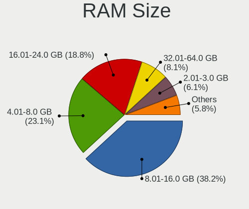
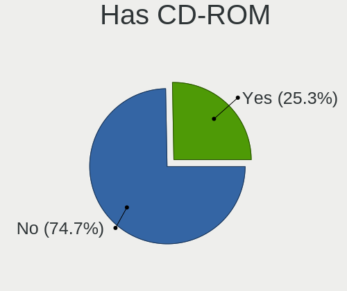
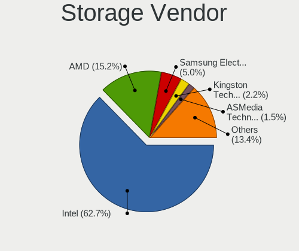
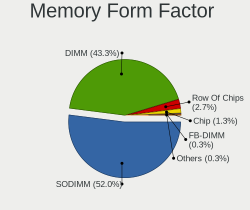

BSD in Italy - Tested Hardware & Statistics
-------------------------------------------

A project to collect tested hardware configurations for BSD in Italy.

Anyone can contribute to this report by the [hw-probe](https://github.com/linuxhw/hw-probe/blob/master/INSTALL.BSD.md) tool:

    hw-probe -all -upload

Please contribute! Especially if your hardware is rare.

This is a report for all computer types. See also reports for [desktops](/Location/Italy/Desktop/README.md) and [notebooks](/Location/Italy/Notebook/README.md).

Contents
--------

* [ Test Cases ](#test-cases)

* [ System ](#system)
  - [ OS                       ](#os)
  - [ OS Family                ](#os-family)
  - [ Arch                     ](#arch)
  - [ DE                       ](#de)
  - [ Display Server           ](#display-server)
  - [ Display Manager          ](#display-manager)
  - [ OS Lang                  ](#os-lang)
  - [ Boot Mode                ](#boot-mode)
  - [ Filesystem               ](#filesystem)
  - [ Part. scheme             ](#part-scheme)

* [ Board ](#board)
  - [ Vendor                   ](#vendor)
  - [ Model                    ](#model)
  - [ Model Family             ](#model-family)
  - [ MFG Year                 ](#mfg-year)
  - [ Form Factor              ](#form-factor)
  - [ Coreboot                 ](#coreboot)
  - [ RAM Size                 ](#ram-size)
  - [ RAM Used                 ](#ram-used)
  - [ Total Drives             ](#total-drives)
  - [ Has CD-ROM               ](#has-cd-rom)
  - [ Has Ethernet             ](#has-ethernet)
  - [ Has WiFi                 ](#has-wifi)
  - [ Has Bluetooth            ](#has-bluetooth)

* [ Location ](#location)
  - [ Country                  ](#country)
  - [ City                     ](#city)

* [ Drives ](#drives)
  - [ Drive Vendor             ](#drive-vendor)
  - [ Drive Model              ](#drive-model)
  - [ HDD Vendor               ](#hdd-vendor)
  - [ SSD Vendor               ](#ssd-vendor)
  - [ Drive Kind               ](#drive-kind)
  - [ Drive Connector          ](#drive-connector)
  - [ Drive Size               ](#drive-size)
  - [ Space Total              ](#space-total)
  - [ Space Used               ](#space-used)
  - [ Malfunc. Drives          ](#malfunc-drives)
  - [ Malfunc. Drive Vendor    ](#malfunc-drive-vendor)
  - [ Malfunc. HDD Vendor      ](#malfunc-hdd-vendor)
  - [ Malfunc. Drive Kind      ](#malfunc-drive-kind)
  - [ Failed Drives            ](#failed-drives)
  - [ Failed Drive Vendor      ](#failed-drive-vendor)
  - [ Drive Status             ](#drive-status)

* [ Storage controller ](#storage-controller)
  - [ Storage Vendor           ](#storage-vendor)
  - [ Storage Model            ](#storage-model)
  - [ Storage Kind             ](#storage-kind)

* [ Processor ](#processor)
  - [ CPU Vendor               ](#cpu-vendor)
  - [ CPU Model                ](#cpu-model)
  - [ CPU Model Family         ](#cpu-model-family)
  - [ CPU Cores                ](#cpu-cores)
  - [ CPU Sockets              ](#cpu-sockets)
  - [ CPU Threads              ](#cpu-threads)
  - [ CPU Microarch            ](#cpu-microarch)

* [ Graphics ](#graphics)
  - [ GPU Vendor               ](#gpu-vendor)
  - [ GPU Model                ](#gpu-model)
  - [ GPU Combo                ](#gpu-combo)
  - [ GPU Driver               ](#gpu-driver)
  - [ GPU Memory               ](#gpu-memory)

* [ Monitor ](#monitor)
  - [ Monitor Vendor           ](#monitor-vendor)
  - [ Monitor Model            ](#monitor-model)
  - [ Monitor Resolution       ](#monitor-resolution)
  - [ Monitor Diagonal         ](#monitor-diagonal)
  - [ Monitor Width            ](#monitor-width)
  - [ Aspect Ratio             ](#aspect-ratio)
  - [ Monitor Area             ](#monitor-area)
  - [ Pixel Density            ](#pixel-density)
  - [ Multiple Monitors        ](#multiple-monitors)

* [ Network ](#network)
  - [ Net Controller Vendor    ](#net-controller-vendor)
  - [ Net Controller Model     ](#net-controller-model)
  - [ Wireless Vendor          ](#wireless-vendor)
  - [ Wireless Model           ](#wireless-model)
  - [ Ethernet Vendor          ](#ethernet-vendor)
  - [ Ethernet Model           ](#ethernet-model)
  - [ Net Controller Kind      ](#net-controller-kind)
  - [ Used Controller          ](#used-controller)
  - [ NICs                     ](#nics)
  - [ IPv6                     ](#ipv6)

* [ Bluetooth ](#bluetooth)
  - [ Bluetooth Vendor         ](#bluetooth-vendor)
  - [ Bluetooth Model          ](#bluetooth-model)

* [ Sound ](#sound)
  - [ Sound Vendor             ](#sound-vendor)
  - [ Sound Model              ](#sound-model)

* [ Memory ](#memory)
  - [ Memory Vendor            ](#memory-vendor)
  - [ Memory Model             ](#memory-model)
  - [ Memory Kind              ](#memory-kind)
  - [ Memory Form Factor       ](#memory-form-factor)
  - [ Memory Size              ](#memory-size)
  - [ Memory Speed             ](#memory-speed)

* [ Printers & scanners ](#printers--scanners)
  - [ Printer Vendor           ](#printer-vendor)
  - [ Printer Model            ](#printer-model)
  - [ Scanner Vendor           ](#scanner-vendor)
  - [ Scanner Model            ](#scanner-model)

* [ Camera ](#camera)
  - [ Camera Vendor            ](#camera-vendor)
  - [ Camera Model             ](#camera-model)

* [ Security ](#security)
  - [ Fingerprint Vendor       ](#fingerprint-vendor)
  - [ Fingerprint Model        ](#fingerprint-model)
  - [ Chipcard Vendor          ](#chipcard-vendor)
  - [ Chipcard Model           ](#chipcard-model)

* [ Unsupported ](#unsupported)
  - [ Unsupported Devices      ](#unsupported-devices)
  - [ Unsupported Device Types ](#unsupported-device-types)

Test Cases
----------

Total: 262

| Vendor        | Model                       | Form-Factor | Probe                                                     | Date         |
|---------------|-----------------------------|-------------|-----------------------------------------------------------|--------------|
| Unknown       | Unknown                     | Desktop     | [bdabafdcb1](https://bsd-hardware.info/?probe=bdabafdcb1) | Oct 01, 2022 |
| ASRock        | Q1900B-ITX                  | Desktop     | [81722a937a](https://bsd-hardware.info/?probe=81722a937a) | Sep 13, 2022 |
| HP            | 8648                        | Desktop     | [e7e610794c](https://bsd-hardware.info/?probe=e7e610794c) | Sep 12, 2022 |
| Fujitsu       | D3313-A1 S26361-D3313-A1    | Desktop     | [b54e6663f9](https://bsd-hardware.info/?probe=b54e6663f9) | Sep 10, 2022 |
| Intel         | J1900                       | Desktop     | [a95dd12c65](https://bsd-hardware.info/?probe=a95dd12c65) | Sep 06, 2022 |
| HP            | 1496                        | Desktop     | [7cd97bd330](https://bsd-hardware.info/?probe=7cd97bd330) | Sep 05, 2022 |
| PC Engines    | APU2                        | Desktop     | [d9216cb730](https://bsd-hardware.info/?probe=d9216cb730) | Sep 05, 2022 |
| HP            | 1496                        | Desktop     | [94e8713f6d](https://bsd-hardware.info/?probe=94e8713f6d) | Sep 03, 2022 |
| Dell          | 0TY179 A05                  | Server      | [482bca3952](https://bsd-hardware.info/?probe=482bca3952) | Sep 01, 2022 |
| HP            | 1496                        | Desktop     | [1567aa1c21](https://bsd-hardware.info/?probe=1567aa1c21) | Sep 01, 2022 |
| Unknown       | HX90                        | Desktop     | [568468e95b](https://bsd-hardware.info/?probe=568468e95b) | Sep 01, 2022 |
| Fujitsu       | D3041-A1 S26361-D3041-A1    | Desktop     | [2349014a6c](https://bsd-hardware.info/?probe=2349014a6c) | Aug 29, 2022 |
| PC Engines    | APU2                        | Desktop     | [b3d60c2790](https://bsd-hardware.info/?probe=b3d60c2790) | Aug 22, 2022 |
| AMI           | Aptio CRB                   | Mini pc     | [02e11159f5](https://bsd-hardware.info/?probe=02e11159f5) | Aug 18, 2022 |
| Fujitsu       | D3373-B1 S26361-D3373-B1... | Server      | [676fd4e9b4](https://bsd-hardware.info/?probe=676fd4e9b4) | Aug 17, 2022 |
| ASUSTek       | M4A87TD EVO                 | Desktop     | [c03da8657e](https://bsd-hardware.info/?probe=c03da8657e) | Aug 17, 2022 |
| PC Engines    | APU2                        | Desktop     | [028dc7aa20](https://bsd-hardware.info/?probe=028dc7aa20) | Aug 17, 2022 |
| BESSTAR Te... | VB9                         | All in one  | [ec5b4884a7](https://bsd-hardware.info/?probe=ec5b4884a7) | Aug 13, 2022 |
| Fujitsu       | D3313-A1 S26361-D3313-A1    | Desktop     | [1d4ccaabda](https://bsd-hardware.info/?probe=1d4ccaabda) | Aug 13, 2022 |
| Fujitsu       | D3041-A1 S26361-D3041-A1    | Desktop     | [17dc06ed68](https://bsd-hardware.info/?probe=17dc06ed68) | Aug 12, 2022 |
| Unknown       | Unknown                     | Desktop     | [af3d9689c2](https://bsd-hardware.info/?probe=af3d9689c2) | Aug 11, 2022 |
| Unknown       | Unknown                     | Desktop     | [5049417b7b](https://bsd-hardware.info/?probe=5049417b7b) | Aug 11, 2022 |
| Intel         | SKYBAY                      | Desktop     | [c7010b7ebc](https://bsd-hardware.info/?probe=c7010b7ebc) | Aug 09, 2022 |
| Unknown       | Unknown                     | Desktop     | [21cda0eb5d](https://bsd-hardware.info/?probe=21cda0eb5d) | Aug 09, 2022 |
| Intel         | SKYBAY                      | Desktop     | [bc7d4d8e1e](https://bsd-hardware.info/?probe=bc7d4d8e1e) | Aug 08, 2022 |
| eMachines     | eME728                      | Notebook    | [96d745589c](https://bsd-hardware.info/?probe=96d745589c) | Aug 06, 2022 |
| Unknown       | Unknown                     | Desktop     | [df3667156b](https://bsd-hardware.info/?probe=df3667156b) | Aug 02, 2022 |
| Lex           | Pineview-D                  | Desktop     | [7d7195024e](https://bsd-hardware.info/?probe=7d7195024e) | Aug 02, 2022 |
| Intel         | Q3XXG4-P V1.0               | Desktop     | [d6a3d57165](https://bsd-hardware.info/?probe=d6a3d57165) | Jul 29, 2022 |
| PC Engines    | APU2                        | Desktop     | [bb5d45a75d](https://bsd-hardware.info/?probe=bb5d45a75d) | Jul 29, 2022 |
| Fujitsu       | D3313-A1 S26361-D3313-A1    | Desktop     | [e3655742ba](https://bsd-hardware.info/?probe=e3655742ba) | Jul 18, 2022 |
| Lenovo        | SHARKBAY SDK0E50510 WIN     | Desktop     | [4b9e0bb7bb](https://bsd-hardware.info/?probe=4b9e0bb7bb) | Jul 18, 2022 |
| Fujitsu       | D3313-A1 S26361-D3313-A1    | Desktop     | [af1e80d15d](https://bsd-hardware.info/?probe=af1e80d15d) | Jul 18, 2022 |
| ASUSTek       | M4A785TD-M EVO              | Desktop     | [def87ec245](https://bsd-hardware.info/?probe=def87ec245) | Jul 18, 2022 |
| ASUSTek       | PRIME H410M-A               | Desktop     | [7b6faf5301](https://bsd-hardware.info/?probe=7b6faf5301) | Jul 14, 2022 |
| Dell          | Latitude E5450              | Notebook    | [5f1183ab0b](https://bsd-hardware.info/?probe=5f1183ab0b) | Jul 14, 2022 |
| Dell          | Latitude E5450              | Notebook    | [1080ed5654](https://bsd-hardware.info/?probe=1080ed5654) | Jul 14, 2022 |
| HP            | Laptop 15-da0xxx            | Notebook    | [0434c94fad](https://bsd-hardware.info/?probe=0434c94fad) | Jul 09, 2022 |
| ASUSTek       | PRIME H410M-A               | Desktop     | [ba243fa7c4](https://bsd-hardware.info/?probe=ba243fa7c4) | Jul 09, 2022 |
| Unknown       | Unknown                     | Notebook    | [4ac86f5979](https://bsd-hardware.info/?probe=4ac86f5979) | Jul 09, 2022 |
| Fujitsu       | D3041-A1 S26361-D3041-A1    | Desktop     | [d3aba12432](https://bsd-hardware.info/?probe=d3aba12432) | Jul 09, 2022 |
| ASRock        | B75M R2.0                   | Desktop     | [6011c70ca4](https://bsd-hardware.info/?probe=6011c70ca4) | Jul 07, 2022 |
| BESSTAR Te... | GB1B                        | Mini pc     | [dbbe9124a2](https://bsd-hardware.info/?probe=dbbe9124a2) | Jul 05, 2022 |
| HP            | 0A98h                       | Desktop     | [655fc531fb](https://bsd-hardware.info/?probe=655fc531fb) | Jun 30, 2022 |
| Acer          | AOD260                      | Notebook    | [08dc464d1b](https://bsd-hardware.info/?probe=08dc464d1b) | Jun 30, 2022 |
| Pegatron      | 2ACF                        | Desktop     | [e461a4559d](https://bsd-hardware.info/?probe=e461a4559d) | Jun 29, 2022 |
| HP            | 304Bh                       | Desktop     | [8a3151b3cd](https://bsd-hardware.info/?probe=8a3151b3cd) | Jun 16, 2022 |
| NF692         | 1.0                         | Desktop     | [e87866bf5a](https://bsd-hardware.info/?probe=e87866bf5a) | Jun 10, 2022 |
| Lenovo        | ThinkPad L530 24812TG       | Notebook    | [5b66684c4a](https://bsd-hardware.info/?probe=5b66684c4a) | Jun 05, 2022 |
| ASUSTek       | PRIME H410M-E               | Desktop     | [8099e7abaf](https://bsd-hardware.info/?probe=8099e7abaf) | Jun 03, 2022 |
| HP            | ProLiant MicroServer Gen... | Desktop     | [4b3b7a0929](https://bsd-hardware.info/?probe=4b3b7a0929) | May 31, 2022 |
| HP            | ProLiant MicroServer Gen... | Desktop     | [5d3db8382f](https://bsd-hardware.info/?probe=5d3db8382f) | May 31, 2022 |
| Lenovo        | ThinkPad X250 20CMS0FA00    | Notebook    | [5afeac632d](https://bsd-hardware.info/?probe=5afeac632d) | May 28, 2022 |
| T-bao         | MINI PC V1.0                | Desktop     | [a89b2081bb](https://bsd-hardware.info/?probe=a89b2081bb) | May 25, 2022 |
| ASUSTek       | F50SL                       | Notebook    | [e26b522868](https://bsd-hardware.info/?probe=e26b522868) | May 22, 2022 |
| Acer          | Aspire E1-522               | Notebook    | [23396b461f](https://bsd-hardware.info/?probe=23396b461f) | May 18, 2022 |
| ASUSTek       | PRIME B550M-K               | Desktop     | [ce5ddde5ad](https://bsd-hardware.info/?probe=ce5ddde5ad) | May 18, 2022 |
| Protectli     | FW4B Ver                    | Desktop     | [2769c8f286](https://bsd-hardware.info/?probe=2769c8f286) | May 17, 2022 |
| Acer          | Aspire E1-522               | Notebook    | [55cda59c51](https://bsd-hardware.info/?probe=55cda59c51) | May 17, 2022 |
| ASUSTek       | K52F                        | Notebook    | [6e86ce2a12](https://bsd-hardware.info/?probe=6e86ce2a12) | May 15, 2022 |
| ASUSTek       | K52F                        | Notebook    | [4c12c55177](https://bsd-hardware.info/?probe=4c12c55177) | May 15, 2022 |
| Dell          | Inspiron 15-3552            | Notebook    | [5e781a451d](https://bsd-hardware.info/?probe=5e781a451d) | May 12, 2022 |
| BESSTAR Te... | GB1B                        | Mini pc     | [407fc42fad](https://bsd-hardware.info/?probe=407fc42fad) | May 05, 2022 |
| Fujitsu       | D3041-A1 S26361-D3041-A1    | Desktop     | [5ff176fff8](https://bsd-hardware.info/?probe=5ff176fff8) | May 05, 2022 |
| Deciso        | OPNsense Appliance          | Notebook    | [8a8db12cf2](https://bsd-hardware.info/?probe=8a8db12cf2) | May 02, 2022 |
| Lenovo        | ThinkPad T420 4236BD5       | Notebook    | [867ed989e2](https://bsd-hardware.info/?probe=867ed989e2) | Apr 27, 2022 |
| MSI           | GF65 Thin 10SER             | Notebook    | [cedf98c955](https://bsd-hardware.info/?probe=cedf98c955) | Apr 26, 2022 |
| ASUSTek       | M4A88TD-V EVO/USB3          | Desktop     | [12cc40cc60](https://bsd-hardware.info/?probe=12cc40cc60) | Apr 23, 2022 |
| Dell          | 0TY179 A05                  | Server      | [124e42e2c1](https://bsd-hardware.info/?probe=124e42e2c1) | Apr 21, 2022 |
| Intel         | NUC5i5RYB H40999-502        | Mini pc     | [9a50fe43a7](https://bsd-hardware.info/?probe=9a50fe43a7) | Apr 21, 2022 |
| Pegatron      | Benicia                     | Desktop     | [9045b4f449](https://bsd-hardware.info/?probe=9045b4f449) | Apr 16, 2022 |
| ASUSTek       | PRIME Z390M-PLUS            | Desktop     | [680303f943](https://bsd-hardware.info/?probe=680303f943) | Apr 16, 2022 |
| ASUSTek       | PRIME Z390M-PLUS            | Desktop     | [47d17d48a7](https://bsd-hardware.info/?probe=47d17d48a7) | Apr 15, 2022 |
| Dell          | 07978V A08                  | Server      | [f315c33e95](https://bsd-hardware.info/?probe=f315c33e95) | Apr 06, 2022 |
| ShenZhen M... | MW-NANO-APL-4L              | Desktop     | [fbdd8d4f48](https://bsd-hardware.info/?probe=fbdd8d4f48) | Apr 05, 2022 |
| HP            | 212B                        | Desktop     | [33e7c65907](https://bsd-hardware.info/?probe=33e7c65907) | Apr 04, 2022 |
| Gigabyte      | X570 AORUS PRO              | Desktop     | [3877a33214](https://bsd-hardware.info/?probe=3877a33214) | Apr 02, 2022 |
| Gigabyte      | X570 AORUS PRO              | Desktop     | [3da637e3c6](https://bsd-hardware.info/?probe=3da637e3c6) | Apr 02, 2022 |
| Fujitsu       | D3041-A1 S26361-D3041-A1    | Desktop     | [7b79164c18](https://bsd-hardware.info/?probe=7b79164c18) | Apr 01, 2022 |
| ASUSTek       | X555LJ                      | Notebook    | [6bf51cc915](https://bsd-hardware.info/?probe=6bf51cc915) | Mar 28, 2022 |
| BESSTAR Te... | GB1B                        | Mini pc     | [9f760529c1](https://bsd-hardware.info/?probe=9f760529c1) | Mar 21, 2022 |
| Unknown       | Unknown                     | Desktop     | [bddd5d8963](https://bsd-hardware.info/?probe=bddd5d8963) | Mar 18, 2022 |
| BESSTAR Te... | GB1B                        | Mini pc     | [bb895c5df3](https://bsd-hardware.info/?probe=bb895c5df3) | Mar 16, 2022 |
| Unknown       | Unknown                     | Desktop     | [65ada9d5da](https://bsd-hardware.info/?probe=65ada9d5da) | Mar 11, 2022 |
| Raspberry ... | Raspberry Pi 4 Model B      | Soc         | [0394e3272e](https://bsd-hardware.info/?probe=0394e3272e) | Mar 03, 2022 |
| HP            | 3397                        | Desktop     | [841ed56816](https://bsd-hardware.info/?probe=841ed56816) | Mar 02, 2022 |
| BESSTAR Te... | GB1B                        | Mini pc     | [6696106165](https://bsd-hardware.info/?probe=6696106165) | Feb 19, 2022 |
| Pegatron      | 2ACF                        | Desktop     | [e098f52d51](https://bsd-hardware.info/?probe=e098f52d51) | Feb 19, 2022 |
| MSI           | B450 GAMING PLUS MAX        | Desktop     | [df6278638e](https://bsd-hardware.info/?probe=df6278638e) | Feb 15, 2022 |
| Acer          | V5-131                      | Notebook    | [2d5bfae3b4](https://bsd-hardware.info/?probe=2d5bfae3b4) | Feb 15, 2022 |
| Intel         | Q3XXG4-P V1.0               | Desktop     | [ea7cf2885f](https://bsd-hardware.info/?probe=ea7cf2885f) | Feb 13, 2022 |
| Intel         | NUC6i5SYB H81131-503        | Mini pc     | [946c9acc2e](https://bsd-hardware.info/?probe=946c9acc2e) | Feb 11, 2022 |
| MSI           | B450 GAMING PLUS MAX        | Desktop     | [6997de25f9](https://bsd-hardware.info/?probe=6997de25f9) | Feb 11, 2022 |
| MW            | GMLK-2_5G4L                 | Desktop     | [7a3744a41a](https://bsd-hardware.info/?probe=7a3744a41a) | Feb 07, 2022 |
| HP            | EliteBook 6930p             | Notebook    | [d8fb34de12](https://bsd-hardware.info/?probe=d8fb34de12) | Feb 04, 2022 |
| HP            | Mini 210-1000               | Notebook    | [8a8bfdaee1](https://bsd-hardware.info/?probe=8a8bfdaee1) | Feb 02, 2022 |
| Dell          | 0TK7TF A00                  | Desktop     | [d13ca7163c](https://bsd-hardware.info/?probe=d13ca7163c) | Jan 30, 2022 |
| Intel         | D2500CC AAG81477-401        | Desktop     | [f4d8bd7979](https://bsd-hardware.info/?probe=f4d8bd7979) | Jan 30, 2022 |
| Fujitsu       | D3028-A1 S26361-D3028-A1    | Desktop     | [f7e7df9416](https://bsd-hardware.info/?probe=f7e7df9416) | Jan 30, 2022 |
| Fujitsu       | D3028-A1 S26361-D3028-A1    | Desktop     | [fc63aa695e](https://bsd-hardware.info/?probe=fc63aa695e) | Jan 27, 2022 |
| PC Engines    | APU2                        | Desktop     | [52bd5dc1ce](https://bsd-hardware.info/?probe=52bd5dc1ce) | Jan 26, 2022 |
| PC Engines    | APU2                        | Desktop     | [54ada090c6](https://bsd-hardware.info/?probe=54ada090c6) | Jan 26, 2022 |
| ASUSTek       | BM6835_BM6635_BP6335        | Desktop     | [73562aa169](https://bsd-hardware.info/?probe=73562aa169) | Jan 25, 2022 |
| ASUSTek       | VivoBook_ASUSLaptop X515... | Notebook    | [cf360a6098](https://bsd-hardware.info/?probe=cf360a6098) | Jan 16, 2022 |
| Acer          | Extensa 5635Z               | Notebook    | [d76873c5dd](https://bsd-hardware.info/?probe=d76873c5dd) | Jan 16, 2022 |
| Fujitsu       | D3041-A1 S26361-D3041-A1    | Desktop     | [ed9f5d1a27](https://bsd-hardware.info/?probe=ed9f5d1a27) | Jan 15, 2022 |
| PC Engines    | APU2                        | Desktop     | [c2b05fc937](https://bsd-hardware.info/?probe=c2b05fc937) | Jan 14, 2022 |
| ASRock        | B75M R2.0                   | Desktop     | [7b99b0eaa6](https://bsd-hardware.info/?probe=7b99b0eaa6) | Jan 10, 2022 |
| TUXEDO        | N14xWU                      | Notebook    | [4ac0707c49](https://bsd-hardware.info/?probe=4ac0707c49) | Jan 06, 2022 |
| Unknown       | Unknown                     | Notebook    | [341401bb02](https://bsd-hardware.info/?probe=341401bb02) | Jan 04, 2022 |
| Unknown       | Unknown                     | Notebook    | [46e5f9b021](https://bsd-hardware.info/?probe=46e5f9b021) | Dec 29, 2021 |
| Fujitsu       | D3041-A1 S26361-D3041-A1    | Desktop     | [7a43524381](https://bsd-hardware.info/?probe=7a43524381) | Dec 13, 2021 |
| Packard Be... | EasyNote_MX61-B-038         | Notebook    | [235d60060d](https://bsd-hardware.info/?probe=235d60060d) | Dec 12, 2021 |
| Gigabyte      | H270M-DS3H-CF               | Desktop     | [50fba6deda](https://bsd-hardware.info/?probe=50fba6deda) | Dec 11, 2021 |
| Acer          | Aspire 5749Z                | Notebook    | [60a25af38c](https://bsd-hardware.info/?probe=60a25af38c) | Dec 09, 2021 |
| Gigabyte      | H270M-DS3H-CF               | Desktop     | [a084ff48c2](https://bsd-hardware.info/?probe=a084ff48c2) | Dec 09, 2021 |
| Gigabyte      | H270M-DS3H-CF               | Desktop     | [17b557d792](https://bsd-hardware.info/?probe=17b557d792) | Dec 08, 2021 |
| ASUSTek       | 1000                        | Notebook    | [da8689c840](https://bsd-hardware.info/?probe=da8689c840) | Dec 08, 2021 |
| Fujitsu       | D3041-A1 S26361-D3041-A1    | Desktop     | [8812a8e8c8](https://bsd-hardware.info/?probe=8812a8e8c8) | Dec 04, 2021 |
| Fujitsu       | D3041-A1 S26361-D3041-A1    | Desktop     | [ddcab97db2](https://bsd-hardware.info/?probe=ddcab97db2) | Dec 03, 2021 |
| Toshiba       | Satellite C855-1U4          | Notebook    | [4107fc9eee](https://bsd-hardware.info/?probe=4107fc9eee) | Nov 14, 2021 |
| Toshiba       | PORTEGE M780                | Notebook    | [2ac9bea1e6](https://bsd-hardware.info/?probe=2ac9bea1e6) | Nov 13, 2021 |
| T-bao         | MINI PC V1.0                | Desktop     | [4ee7de3597](https://bsd-hardware.info/?probe=4ee7de3597) | Nov 12, 2021 |
| Intel         | Q3XXG4-P V1.0               | Desktop     | [22a18ba45e](https://bsd-hardware.info/?probe=22a18ba45e) | Nov 08, 2021 |
| HP            | ProBook 470 G4              | Notebook    | [5f026ff3a2](https://bsd-hardware.info/?probe=5f026ff3a2) | Oct 17, 2021 |
| HP            | ProBook 470 G4              | Notebook    | [40c180238f](https://bsd-hardware.info/?probe=40c180238f) | Oct 17, 2021 |
| Pegatron      | 2ACF                        | Desktop     | [ca23d3bbf0](https://bsd-hardware.info/?probe=ca23d3bbf0) | Oct 13, 2021 |
| ASUSTek       | PRIME Z390M-PLUS            | Desktop     | [b3b31d25b0](https://bsd-hardware.info/?probe=b3b31d25b0) | Oct 13, 2021 |
| Pegatron      | 2ACF                        | Desktop     | [97aa5e56e4](https://bsd-hardware.info/?probe=97aa5e56e4) | Oct 12, 2021 |
| ASUSTek       | PRIME Z390M-PLUS            | Desktop     | [5a7c1871b1](https://bsd-hardware.info/?probe=5a7c1871b1) | Oct 11, 2021 |
| HP            | ProBook 470 G4              | Notebook    | [a9c135bf27](https://bsd-hardware.info/?probe=a9c135bf27) | Oct 10, 2021 |
| Acer          | Veriton X2610G              | Desktop     | [1e9ed23164](https://bsd-hardware.info/?probe=1e9ed23164) | Oct 03, 2021 |
| ASUSTek       | X555LJ                      | Notebook    | [81dd2ba2f0](https://bsd-hardware.info/?probe=81dd2ba2f0) | Oct 02, 2021 |
| ASRock        | B75M R2.0                   | Desktop     | [51b47d9321](https://bsd-hardware.info/?probe=51b47d9321) | Sep 27, 2021 |
| ASRock        | B75M R2.0                   | Desktop     | [de031313ff](https://bsd-hardware.info/?probe=de031313ff) | Sep 27, 2021 |
| BESSTAR Te... | GB1B                        | Mini pc     | [e0ad80acf9](https://bsd-hardware.info/?probe=e0ad80acf9) | Sep 20, 2021 |
| Gigabyte      | H270M-DS3H-CF               | Desktop     | [9b046b157e](https://bsd-hardware.info/?probe=9b046b157e) | Sep 17, 2021 |
| ASRock        | B75M R2.0                   | Desktop     | [0d23147c7d](https://bsd-hardware.info/?probe=0d23147c7d) | Sep 17, 2021 |
| ASUSTek       | VivoBook_ASUSLaptop X512... | Notebook    | [0b73df29bf](https://bsd-hardware.info/?probe=0b73df29bf) | Sep 15, 2021 |
| ASRock        | B75M R2.0                   | Desktop     | [e0ae9af4ab](https://bsd-hardware.info/?probe=e0ae9af4ab) | Sep 15, 2021 |
| BESSTAR Te... | GB1B                        | Mini pc     | [f1a2baeecb](https://bsd-hardware.info/?probe=f1a2baeecb) | Sep 14, 2021 |
| Gigabyte      | H270M-DS3H-CF               | Desktop     | [bc2a287495](https://bsd-hardware.info/?probe=bc2a287495) | Sep 13, 2021 |
| BESSTAR Te... | GB1B                        | Mini pc     | [3607c373aa](https://bsd-hardware.info/?probe=3607c373aa) | Sep 11, 2021 |
| Apple         | Mac-F2268DC8                | All in one  | [73912d5852](https://bsd-hardware.info/?probe=73912d5852) | Sep 09, 2021 |
| Unknown       | YL-J3160L4                  | Desktop     | [861a1f7012](https://bsd-hardware.info/?probe=861a1f7012) | Aug 25, 2021 |
| MSI           | MS-B1591                    | Desktop     | [679b2010e9](https://bsd-hardware.info/?probe=679b2010e9) | Aug 03, 2021 |
| MSI           | MS-B1591                    | Desktop     | [b370a74ec0](https://bsd-hardware.info/?probe=b370a74ec0) | Aug 02, 2021 |
| Lenovo        | G505 20240                  | Notebook    | [16e6ec4054](https://bsd-hardware.info/?probe=16e6ec4054) | Aug 02, 2021 |
| AMI           | Aptio CRB                   | Mini pc     | [acfe0caa83](https://bsd-hardware.info/?probe=acfe0caa83) | Jul 22, 2021 |
| ASUSTek       | VivoBook_ASUSLaptop X512... | Notebook    | [9c9d4cc782](https://bsd-hardware.info/?probe=9c9d4cc782) | Jul 18, 2021 |
| ASUSTek       | VivoBook_ASUSLaptop X512... | Notebook    | [3d5e512e18](https://bsd-hardware.info/?probe=3d5e512e18) | Jul 18, 2021 |
| Gigabyte      | P55A-UD3                    | Desktop     | [dc1b4d8a6b](https://bsd-hardware.info/?probe=dc1b4d8a6b) | Jul 16, 2021 |
| ASRock        | B75M R2.0                   | Desktop     | [d51149c1d5](https://bsd-hardware.info/?probe=d51149c1d5) | Jul 13, 2021 |
| Intel         | NUC6i5SYB H81131-503        | Mini pc     | [7fe4b5ff70](https://bsd-hardware.info/?probe=7fe4b5ff70) | Jul 12, 2021 |
| Intel         | NUC10i7FNB K61360-303       | Mini pc     | [dbacaa5c65](https://bsd-hardware.info/?probe=dbacaa5c65) | Jul 08, 2021 |
| Samsung       | 3570R/370R/470R/450R/510... | Notebook    | [31d42f4469](https://bsd-hardware.info/?probe=31d42f4469) | Jul 05, 2021 |
| Lenovo        | B590 62743PG                | Notebook    | [2400297995](https://bsd-hardware.info/?probe=2400297995) | Jul 03, 2021 |
| Lenovo        | SHARKBAY SDK0E50510 WIN     | Desktop     | [6cf3337855](https://bsd-hardware.info/?probe=6cf3337855) | Jul 01, 2021 |
| MSI           | B450 GAMING PLUS MAX        | Desktop     | [f0e80b0788](https://bsd-hardware.info/?probe=f0e80b0788) | Jun 28, 2021 |
| PC Engines    | APU2                        | Desktop     | [dde9077545](https://bsd-hardware.info/?probe=dde9077545) | Jun 24, 2021 |
| ZOTAC         | ZBOX-CI323NANO              | Mini pc     | [7cf77c6f1f](https://bsd-hardware.info/?probe=7cf77c6f1f) | Jun 12, 2021 |
| Unknown       | Unknown                     | Desktop     | [822df8eb91](https://bsd-hardware.info/?probe=822df8eb91) | May 11, 2021 |
| Unknown       | Unknown                     | Desktop     | [cc17eea606](https://bsd-hardware.info/?probe=cc17eea606) | May 10, 2021 |
| ASUSTek       | IP4BL-ME-Oli                | Desktop     | [e26ecef661](https://bsd-hardware.info/?probe=e26ecef661) | May 03, 2021 |
| MSI           | B450-A PRO                  | Desktop     | [ed656e816f](https://bsd-hardware.info/?probe=ed656e816f) | May 01, 2021 |
| Unknown       | Unknown                     | Desktop     | [df793cf09f](https://bsd-hardware.info/?probe=df793cf09f) | Apr 08, 2021 |
| Unknown       | Unknown                     | Desktop     | [de8a18ca09](https://bsd-hardware.info/?probe=de8a18ca09) | Apr 08, 2021 |
| Unknown       | Unknown                     | Desktop     | [f8ba0ba112](https://bsd-hardware.info/?probe=f8ba0ba112) | Apr 08, 2021 |
| HP            | Laptop 15-da0xxx            | Notebook    | [cb09a1b771](https://bsd-hardware.info/?probe=cb09a1b771) | Apr 08, 2021 |
| Lenovo        | SHARKBAY SDK0E50510 WIN     | Desktop     | [62376c16a4](https://bsd-hardware.info/?probe=62376c16a4) | Mar 31, 2021 |
| Intel         | Q3XXG4-P V1.0               | Desktop     | [5a7ba137e0](https://bsd-hardware.info/?probe=5a7ba137e0) | Mar 27, 2021 |
| Acer          | EG43M                       | Desktop     | [0bc978756c](https://bsd-hardware.info/?probe=0bc978756c) | Mar 27, 2021 |
| AMI           | Aptio CRB                   | Mini pc     | [139e702b9a](https://bsd-hardware.info/?probe=139e702b9a) | Mar 27, 2021 |
| Lenovo        | ThinkPad L530 24812TG       | Notebook    | [520982317e](https://bsd-hardware.info/?probe=520982317e) | Mar 25, 2021 |
| Lenovo        | SHARKBAY SDK0E50510 WIN     | Desktop     | [78a7c7b8cb](https://bsd-hardware.info/?probe=78a7c7b8cb) | Mar 23, 2021 |
| Lenovo        | SHARKBAY SDK0E50510 WIN     | Desktop     | [f9c3fc3b84](https://bsd-hardware.info/?probe=f9c3fc3b84) | Mar 19, 2021 |
| Lenovo        | SHARKBAY SDK0E50510 WIN     | Desktop     | [5ae508dfa8](https://bsd-hardware.info/?probe=5ae508dfa8) | Mar 19, 2021 |
| Lenovo        | ThinkPad X260 20F5S82N00    | Notebook    | [aa3deadedd](https://bsd-hardware.info/?probe=aa3deadedd) | Mar 19, 2021 |
| HP            | Laptop 15-da0xxx            | Notebook    | [a7a25be087](https://bsd-hardware.info/?probe=a7a25be087) | Mar 16, 2021 |
| ASUSTek       | PRIME Z390M-PLUS            | Desktop     | [0a3b290f9f](https://bsd-hardware.info/?probe=0a3b290f9f) | Mar 15, 2021 |
| ASUSTek       | M4A88TD-V EVO/USB3          | Desktop     | [1c30f7523f](https://bsd-hardware.info/?probe=1c30f7523f) | Mar 15, 2021 |
| PC Engines    | APU3                        | Desktop     | [822a83f208](https://bsd-hardware.info/?probe=822a83f208) | Mar 11, 2021 |
| ASUSTek       | IP4BL-ME-Oli                | Desktop     | [c672201bcb](https://bsd-hardware.info/?probe=c672201bcb) | Mar 10, 2021 |
| Lenovo        | SHARKBAY SDK0E50510 WIN     | Desktop     | [66a223add9](https://bsd-hardware.info/?probe=66a223add9) | Mar 08, 2021 |
| Dell          | 00NH4P A07                  | Server      | [7cff5a5c58](https://bsd-hardware.info/?probe=7cff5a5c58) | Mar 08, 2021 |
| HP            | Laptop 15-da0xxx            | Notebook    | [bf572bc102](https://bsd-hardware.info/?probe=bf572bc102) | Mar 06, 2021 |
| Dell          | 0R849J A00                  | Desktop     | [1bd1dc24c9](https://bsd-hardware.info/?probe=1bd1dc24c9) | Mar 06, 2021 |
| Intel         | NUC6i5SYB H81131-503        | Mini pc     | [55045aa9e5](https://bsd-hardware.info/?probe=55045aa9e5) | Mar 03, 2021 |
| Foxconn       | 2ADA                        | Desktop     | [10d02d0982](https://bsd-hardware.info/?probe=10d02d0982) | Mar 03, 2021 |
| Intel         | MAHOBAY                     | Desktop     | [3c5bd7b7f8](https://bsd-hardware.info/?probe=3c5bd7b7f8) | Mar 02, 2021 |
| Intel         | MAHOBAY                     | Desktop     | [04e66ca239](https://bsd-hardware.info/?probe=04e66ca239) | Mar 02, 2021 |
| ASUSTek       | G1S                         | Notebook    | [593c12aa06](https://bsd-hardware.info/?probe=593c12aa06) | Feb 28, 2021 |
| Intel         | MAHOBAY                     | Desktop     | [50652a4263](https://bsd-hardware.info/?probe=50652a4263) | Feb 26, 2021 |
| Intel         | MAHOBAY                     | Desktop     | [c3dc05bbac](https://bsd-hardware.info/?probe=c3dc05bbac) | Feb 26, 2021 |
| Intel         | MAHOBAY                     | Desktop     | [7ab47e0db7](https://bsd-hardware.info/?probe=7ab47e0db7) | Feb 25, 2021 |
| ASUSTek       | PRIME Z390M-PLUS            | Desktop     | [58c6bf426e](https://bsd-hardware.info/?probe=58c6bf426e) | Feb 22, 2021 |
| Intel         | MAHOBAY                     | Desktop     | [5ecd568ce9](https://bsd-hardware.info/?probe=5ecd568ce9) | Feb 21, 2021 |
| Intel         | MAHOBAY                     | Desktop     | [138dbdcece](https://bsd-hardware.info/?probe=138dbdcece) | Feb 21, 2021 |
| Dell          | 00NH4P A07                  | Server      | [fff0533829](https://bsd-hardware.info/?probe=fff0533829) | Feb 20, 2021 |
| Intel         | MAHOBAY                     | Desktop     | [5257239fdc](https://bsd-hardware.info/?probe=5257239fdc) | Feb 20, 2021 |
| Acer          | Extensa 5635Z               | Notebook    | [837c6f28b4](https://bsd-hardware.info/?probe=837c6f28b4) | Feb 19, 2021 |
| HARDKERNEL    | ODROID-H2                   | Desktop     | [6fe9279f1f](https://bsd-hardware.info/?probe=6fe9279f1f) | Feb 18, 2021 |
| eMachines     | eME732ZG                    | Notebook    | [d0c0433452](https://bsd-hardware.info/?probe=d0c0433452) | Feb 16, 2021 |
| ASUSTek       | X555LD                      | Notebook    | [74d43ccd10](https://bsd-hardware.info/?probe=74d43ccd10) | Feb 16, 2021 |
| ASUSTek       | PRIME Z390M-PLUS            | Desktop     | [c996e74ebc](https://bsd-hardware.info/?probe=c996e74ebc) | Feb 14, 2021 |
| HP            | ProBook 470 G4              | Notebook    | [f808e6bb4a](https://bsd-hardware.info/?probe=f808e6bb4a) | Feb 13, 2021 |
| eMachines     | eME732ZG                    | Notebook    | [c51678397d](https://bsd-hardware.info/?probe=c51678397d) | Feb 13, 2021 |
| Dell          | 06NWYK A00                  | Desktop     | [32acfb4467](https://bsd-hardware.info/?probe=32acfb4467) | Feb 13, 2021 |
| ASUSTek       | P8H61-M LE                  | Desktop     | [b861820636](https://bsd-hardware.info/?probe=b861820636) | Feb 13, 2021 |
| Dell          | 06NWYK A00                  | Desktop     | [2ff05af403](https://bsd-hardware.info/?probe=2ff05af403) | Feb 13, 2021 |
| ASUSTek       | P8H61-M LE                  | Desktop     | [3a3d7d0701](https://bsd-hardware.info/?probe=3a3d7d0701) | Feb 12, 2021 |
| ASUSTek       | VivoBook_ASUSLaptop X512... | Notebook    | [37e4e7c85c](https://bsd-hardware.info/?probe=37e4e7c85c) | Feb 12, 2021 |
| ASUSTek       | P8Z77-V PRO/THUNDERBOLT     | Desktop     | [6fdcef7c9e](https://bsd-hardware.info/?probe=6fdcef7c9e) | Feb 10, 2021 |
| ASUSTek       | PRIME X470-PRO              | Desktop     | [a77e980850](https://bsd-hardware.info/?probe=a77e980850) | Feb 09, 2021 |
| HP            | Laptop 15-da0xxx            | Notebook    | [d6bc2b2c1d](https://bsd-hardware.info/?probe=d6bc2b2c1d) | Feb 08, 2021 |
| ASUSTek       | X502CA                      | Notebook    | [5e15d06a9b](https://bsd-hardware.info/?probe=5e15d06a9b) | Feb 06, 2021 |
| ASUSTek       | X502CA                      | Notebook    | [1a2df26f19](https://bsd-hardware.info/?probe=1a2df26f19) | Feb 06, 2021 |
| ASUSTek       | IP4BL-ME-Oli                | Desktop     | [4d225e7ebe](https://bsd-hardware.info/?probe=4d225e7ebe) | Feb 04, 2021 |
| Intel         | NUC6i5SYB H81131-503        | Mini pc     | [01a2dd5a52](https://bsd-hardware.info/?probe=01a2dd5a52) | Feb 02, 2021 |
| HP            | Laptop 15-da0xxx            | Notebook    | [869d894f4f](https://bsd-hardware.info/?probe=869d894f4f) | Jan 30, 2021 |
| Intel         | Q3XXG4-P V1.0               | Desktop     | [f813782c8a](https://bsd-hardware.info/?probe=f813782c8a) | Jan 29, 2021 |
| ZOTAC         | ZBOX-MI640/MI660/MI620NA... | Mini pc     | [2aa7735e59](https://bsd-hardware.info/?probe=2aa7735e59) | Jan 24, 2021 |
| HP            | Laptop 15-da0xxx            | Notebook    | [3e37c56f14](https://bsd-hardware.info/?probe=3e37c56f14) | Jan 23, 2021 |
| Sun Micros... | Ultra 24 50                 | Desktop     | [622589c8e7](https://bsd-hardware.info/?probe=622589c8e7) | Jan 22, 2021 |
| Sun Micros... | Ultra 24 50                 | Desktop     | [7a3cb6a061](https://bsd-hardware.info/?probe=7a3cb6a061) | Jan 22, 2021 |
| Apple         | MacBook4,1                  | Notebook    | [9eca3b0463](https://bsd-hardware.info/?probe=9eca3b0463) | Jan 22, 2021 |
| ASUSTek       | M4A87TD EVO                 | Desktop     | [12ea57f317](https://bsd-hardware.info/?probe=12ea57f317) | Jan 22, 2021 |
| Dell          | 088DT1 A01                  | Desktop     | [fcc759e013](https://bsd-hardware.info/?probe=fcc759e013) | Jan 21, 2021 |
| ASRock        | H81 Pro BTC                 | Desktop     | [afb7cd1f1a](https://bsd-hardware.info/?probe=afb7cd1f1a) | Jan 20, 2021 |
| Intel         | Q3XXG4-P V1.0               | Desktop     | [92577053eb](https://bsd-hardware.info/?probe=92577053eb) | Jan 20, 2021 |
| Intel         | Q3XXG4-P V1.0               | Desktop     | [33a6dda088](https://bsd-hardware.info/?probe=33a6dda088) | Jan 20, 2021 |
| Apple         | MacBook4,1                  | Notebook    | [539b95f535](https://bsd-hardware.info/?probe=539b95f535) | Jan 20, 2021 |
| PC Engines    | APU2                        | Desktop     | [a178f8eb47](https://bsd-hardware.info/?probe=a178f8eb47) | Jan 19, 2021 |
| HP            | ProBook 470 G4              | Notebook    | [bc4bca1e5e](https://bsd-hardware.info/?probe=bc4bca1e5e) | Jan 18, 2021 |
| HP            | ProBook 470 G4              | Notebook    | [e39a46cadf](https://bsd-hardware.info/?probe=e39a46cadf) | Jan 17, 2021 |
| MSI           | Boston                      | Desktop     | [aa9d7bae21](https://bsd-hardware.info/?probe=aa9d7bae21) | Jan 17, 2021 |
| HP            | ProBook 470 G4              | Notebook    | [55c762d22e](https://bsd-hardware.info/?probe=55c762d22e) | Jan 17, 2021 |
| MSI           | Boston                      | Desktop     | [f21954fa35](https://bsd-hardware.info/?probe=f21954fa35) | Jan 17, 2021 |
| Supermicro    | X8STi                       | Desktop     | [7d0e121099](https://bsd-hardware.info/?probe=7d0e121099) | Jan 15, 2021 |
| HP            | ProBook 470 G4              | Notebook    | [c4eecdac67](https://bsd-hardware.info/?probe=c4eecdac67) | Jan 14, 2021 |
| IBM           | ThinkPad R51 2887AVG        | Notebook    | [289177c624](https://bsd-hardware.info/?probe=289177c624) | Jan 02, 2021 |
| IBM           | ThinkPad R51 2887AVG        | Notebook    | [88d4fc2693](https://bsd-hardware.info/?probe=88d4fc2693) | Dec 30, 2020 |
| Unknown       | Unknown                     | Desktop     | [8668b1d651](https://bsd-hardware.info/?probe=8668b1d651) | Dec 17, 2020 |
| Unknown       | Unknown                     | Desktop     | [d2cdc0fc7f](https://bsd-hardware.info/?probe=d2cdc0fc7f) | Nov 29, 2020 |
| Unknown       | Unknown                     | Desktop     | [afbbc44ac5](https://bsd-hardware.info/?probe=afbbc44ac5) | Nov 29, 2020 |
| Unknown       | Unknown                     | Desktop     | [aee9f448af](https://bsd-hardware.info/?probe=aee9f448af) | Nov 25, 2020 |
| Lenovo        | ThinkPad T495 20NJS0KP00    | Notebook    | [7a706e46de](https://bsd-hardware.info/?probe=7a706e46de) | Oct 31, 2020 |
| Lenovo        | ThinkPad T430 23501B3       | Notebook    | [53233cc736](https://bsd-hardware.info/?probe=53233cc736) | Oct 31, 2020 |
| Intel         | D945GCLF2                   | Desktop     | [58678b0643](https://bsd-hardware.info/?probe=58678b0643) | Oct 30, 2020 |
| Intel         | D945GCLF2                   | Desktop     | [3354fb903b](https://bsd-hardware.info/?probe=3354fb903b) | Oct 30, 2020 |
| Gigabyte      | X570 AORUS ELITE            | Desktop     | [973b62551f](https://bsd-hardware.info/?probe=973b62551f) | Oct 30, 2020 |
| AZW           | BT3 X                       | Desktop     | [b9f23ee753](https://bsd-hardware.info/?probe=b9f23ee753) | Oct 30, 2020 |
| Dell          | Precision 3510              | Notebook    | [85a55ab7c3](https://bsd-hardware.info/?probe=85a55ab7c3) | Oct 22, 2020 |
| HP            | Laptop 15-da0xxx            | Notebook    | [7faf1699d6](https://bsd-hardware.info/?probe=7faf1699d6) | Oct 04, 2020 |
| Apple         | MacBookAir7,2               | Notebook    | [36d0d99aa6](https://bsd-hardware.info/?probe=36d0d99aa6) | Oct 04, 2020 |
| Lenovo        | G50-45 80E3                 | Notebook    | [1d227a9cd2](https://bsd-hardware.info/?probe=1d227a9cd2) | Oct 04, 2020 |
| Lenovo        | ThinkPad X1 Carbon 6th 2... | Notebook    | [2f119a81b4](https://bsd-hardware.info/?probe=2f119a81b4) | Aug 13, 2020 |
| Lenovo        | ThinkPad T450 20BUS06B00    | Notebook    | [f437a3b5ab](https://bsd-hardware.info/?probe=f437a3b5ab) | Jul 06, 2020 |
| ASRock        | 990FX Extreme9              | Desktop     | [6c0bba6d4f](https://bsd-hardware.info/?probe=6c0bba6d4f) | Jun 26, 2020 |
| Intel         | NUC6i5SYB H81131-503        | Mini pc     | [6b854263e7](https://bsd-hardware.info/?probe=6b854263e7) | May 25, 2020 |
| Lenovo        | ThinkPad T440 20B7S1C600    | Notebook    | [a4a62cb85e](https://bsd-hardware.info/?probe=a4a62cb85e) | May 24, 2020 |
| Lenovo        | ThinkPad X240 20AMS0J01N    | Notebook    | [4df07718d1](https://bsd-hardware.info/?probe=4df07718d1) | May 23, 2020 |

System
------

OS
--

Installed operating systems

| Name                 | Computers | Percent |
|----------------------|-----------|---------|
| helloSystem 0.7.0    | 16        | 8.47%   |
| helloSystem 0.4.0    | 12        | 6.35%   |
| helloSystem 0.5.0    | 9         | 4.76%   |
| OpenBSD 7.1          | 7         | 3.7%    |
| OPNsense 22.7        | 6         | 3.17%   |
| helloSystem 0.6.0    | 6         | 3.17%   |
| OPNsense 22.1.6      | 5         | 2.65%   |
| OPNsense 21.1        | 5         | 2.65%   |
| helloSystem 0.3.0    | 5         | 2.65%   |
| OPNsense 22.7.3      | 4         | 2.12%   |
| OPNsense 22.1.9      | 4         | 2.12%   |
| OPNsense 22.1        | 4         | 2.12%   |
| OPNsense 22.7.2      | 3         | 1.59%   |
| OPNsense 22.7.1      | 3         | 1.59%   |
| OPNsense 22.1.10     | 3         | 1.59%   |
| OPNsense 21.7.7      | 3         | 1.59%   |
| OPNsense 21.7.3      | 3         | 1.59%   |
| OPNsense 21.1.8      | 3         | 1.59%   |
| OPNsense 21.1.3      | 3         | 1.59%   |
| OPNsense 21.1.2      | 3         | 1.59%   |
| OPNsense 20.7.8      | 3         | 1.59%   |
| OpenBSD 6.8          | 3         | 1.59%   |
| NomadBSD 1.4         | 3         | 1.59%   |
| FreeBSD 13.1         | 3         | 1.59%   |
| FreeBSD 13.0-p7      | 3         | 1.59%   |
| FreeBSD 12.2-p2      | 3         | 1.59%   |
| OPNsense 22.7.4      | 2         | 1.06%   |
| OPNsense 22.1.8      | 2         | 1.06%   |
| OPNsense 22.1.4      | 2         | 1.06%   |
| OPNsense 21.1.1      | 2         | 1.06%   |
| NomadBSD 1.3.2       | 2         | 1.06%   |
| GhostBSD 21.08.27    | 2         | 1.06%   |
| GhostBSD 20.04.02    | 2         | 1.06%   |
| FreeBSD 13.1-p2      | 2         | 1.06%   |
| FreeBSD 13.0-p4      | 2         | 1.06%   |
| FreeBSD 13.0-CURRENT | 2         | 1.06%   |
| FreeBSD 12.3-p1      | 2         | 1.06%   |
| FreeBSD 12.2-p6      | 2         | 1.06%   |
| FreeBSD 12.2-p4      | 2         | 1.06%   |
| FreeBSD 12.1-p10     | 2         | 1.06%   |

OS Family
---------

OS without a version

| Name        | Computers | Percent |
|-------------|-----------|---------|
| OPNsense    | 55        | 36.18%  |
| helloSystem | 41        | 26.97%  |
| FreeBSD     | 28        | 18.42%  |
| OpenBSD     | 11        | 7.24%   |
| NomadBSD    | 7         | 4.61%   |
| NetBSD      | 6         | 3.95%   |
| GhostBSD    | 4         | 2.63%   |

Arch
----

OS architecture (x86_64, i586, etc.)

| Name   | Computers | Percent |
|--------|-----------|---------|
| amd64  | 145       | 96.03%  |
| i386   | 3         | 1.99%   |
| evbarm | 3         | 1.99%   |

DE
--

Desktop Environment

| Name          | Computers | Percent |
|---------------|-----------|---------|
| Console       | 64        | 41.83%  |
| helloDesktop  | 45        | 29.41%  |
| XFCE          | 7         | 4.58%   |
| Openbox       | 7         | 4.58%   |
| KDE5          | 5         | 3.27%   |
| MATE          | 4         | 2.61%   |
| fvwm          | 4         | 2.61%   |
| TWM           | 3         | 1.96%   |
| i3            | 3         | 1.96%   |
| ctwm          | 3         | 1.96%   |
| Cinnamon      | 3         | 1.96%   |
| xfwm          | 2         | 1.31%   |
| LXQt          | 1         | 0.65%   |
| Fluxbox       | 1         | 0.65%   |
| Enlightenment | 1         | 0.65%   |

Display Server
--------------

X11 or Wayland

| Name    | Computers | Percent |
|---------|-----------|---------|
| X11     | 87        | 57.24%  |
| Console | 65        | 42.76%  |

Display Manager
---------------

SDDM, LightDM, etc.

| Name    | Computers | Percent |
|---------|-----------|---------|
| Console | 89        | 58.94%  |
| SLiM    | 52        | 34.44%  |
| LightDM | 6         | 3.97%   |
| XDM     | 2         | 1.32%   |
| SDDM    | 2         | 1.32%   |

OS Lang
-------

Language

| Lang             | Computers | Percent |
|------------------|-----------|---------|
| Unknown          | 72        | 46.75%  |
| en_US            | 52        | 33.77%  |
| it_IT            | 14        | 9.09%   |
| C                | 11        | 7.14%   |
| it_IT.ISO8859-15 | 2         | 1.3%    |
| ru_RU            | 1         | 0.65%   |
| it_IT.ISO8859-1  | 1         | 0.65%   |
| en_GB            | 1         | 0.65%   |

Boot Mode
---------

EFI or BIOS

| Mode | Computers | Percent |
|------|-----------|---------|
| EFI  | 123       | 80.39%  |
| BIOS | 30        | 19.61%  |

Filesystem
----------

Type of filesystem

| Type   | Computers | Percent |
|--------|-----------|---------|
| Ufs    | 72        | 46.45%  |
| Zfs    | 64        | 41.29%  |
| Ffs    | 11        | 7.1%    |
| Cd9660 | 8         | 5.16%   |

Part. scheme
------------

Scheme of partitioning

| Type    | Computers | Percent |
|---------|-----------|---------|
| GPT     | 133       | 87.5%   |
| MBR     | 16        | 10.53%  |
| Unknown | 3         | 1.97%   |

Board
-----

Vendor
------

Motherboard manufacturer

| Name                       | Computers | Percent |
|----------------------------|-----------|---------|
| ASUSTek Computer           | 26        | 17.22%  |
| Lenovo                     | 15        | 9.93%   |
| Hewlett-Packard            | 12        | 7.95%   |
| Unknown                    | 12        | 7.95%   |
| Intel                      | 11        | 7.28%   |
| Dell                       | 10        | 6.62%   |
| Acer                       | 7         | 4.64%   |
| MSI                        | 5         | 3.31%   |
| Fujitsu                    | 5         | 3.31%   |
| PC Engines                 | 4         | 2.65%   |
| Gigabyte Technology        | 4         | 2.65%   |
| BESSTAR Tech               | 4         | 2.65%   |
| ASRock                     | 4         | 2.65%   |
| Apple                      | 4         | 2.65%   |
| AMI                        | 3         | 1.99%   |
| ZOTAC                      | 2         | 1.32%   |
| Toshiba                    | 2         | 1.32%   |
| Pegatron                   | 2         | 1.32%   |
| eMachines                  | 2         | 1.32%   |
| TUXEDO                     | 1         | 0.66%   |
| T-bao                      | 1         | 0.66%   |
| Supermicro                 | 1         | 0.66%   |
| Sun Microsystems           | 1         | 0.66%   |
| ShenZhen MinWin Technology | 1         | 0.66%   |
| Samsung Electronics        | 1         | 0.66%   |
| Raspberry Pi Foundation    | 1         | 0.66%   |
| Protectli                  | 1         | 0.66%   |
| Packard Bell               | 1         | 0.66%   |
| NF692                      | 1         | 0.66%   |
| MW                         | 1         | 0.66%   |
| Lex                        | 1         | 0.66%   |
| IBM                        | 1         | 0.66%   |
| HARDKERNEL                 | 1         | 0.66%   |
| Foxconn                    | 1         | 0.66%   |
| Deciso                     | 1         | 0.66%   |
| AZW                        | 1         | 0.66%   |

Model
-----

Motherboard model

| Name                                     | Computers | Percent |
|------------------------------------------|-----------|---------|
| Unknown                                  | 12        | 7.95%   |
| PC Engines APU2                          | 3         | 1.99%   |
| Intel Q3XXG4-P V1.0                      | 3         | 1.99%   |
| BESSTAR Tech N40                         | 3         | 1.99%   |
| MSI MS-7B86                              | 2         | 1.32%   |
| Lenovo ThinkCentre M83 10AHS35Q00        | 2         | 1.32%   |
| HP Laptop 15-da0xxx                      | 2         | 1.32%   |
| Fujitsu FUTRO S920                       | 2         | 1.32%   |
| ASUS VivoBook_ASUSLaptop X512DA_F512DA   | 2         | 1.32%   |
| ASUS PRIME H410M-A                       | 2         | 1.32%   |
| ASUS M4A88TD-V EVO/USB3                  | 2         | 1.32%   |
| ASUS IP4BL-ME                            | 2         | 1.32%   |
| Apple MacBook4,1                         | 2         | 1.32%   |
| AMI Aptio CRB                            | 2         | 1.32%   |
| ZOTAC ZBOX-MI640/MI660/MI620NANO         | 1         | 0.66%   |
| ZOTAC ZBOX-CI323NANO                     | 1         | 0.66%   |
| TUXEDO N14xWU                            | 1         | 0.66%   |
| Toshiba Satellite C855-1U4               | 1         | 0.66%   |
| Toshiba PORTEGE M780                     | 1         | 0.66%   |
| T-bao MINI PC                            | 1         | 0.66%   |
| Supermicro X8STi                         | 1         | 0.66%   |
| Sun Microsystems Ultra 24                | 1         | 0.66%   |
| ShenZhen MinWin MW-NANO-APL-4L           | 1         | 0.66%   |
| Samsung 3570R/370R/470R/450R/510R/4450RV | 1         | 0.66%   |
| RPi Raspberry Pi 4 Model B               | 1         | 0.66%   |
| Protectli FW4B                           | 1         | 0.66%   |
| Pegatron Pro 3405 Series                 | 1         | 0.66%   |
| Pegatron KX629AA-ABZ a6561.it            | 1         | 0.66%   |
| PC Engines APU3                          | 1         | 0.66%   |
| Packard Bell EasyNote_MX61-B-038         | 1         | 0.66%   |
| NF692 1.0                                | 1         | 0.66%   |
| MW GMLK-2_5G4L                           | 1         | 0.66%   |
| MSI NR074AA-ABZ CQ5125IT                 | 1         | 0.66%   |
| MSI KBL-U Pro Cubi 3 Silent S (MS-B159)  | 1         | 0.66%   |
| MSI GF65 Thin 10SER                      | 1         | 0.66%   |
| Lex Pineview-D                           | 1         | 0.66%   |
| Lenovo ThinkPad X260 20F5S82N00          | 1         | 0.66%   |
| Lenovo ThinkPad X250 20CMS0FA00          | 1         | 0.66%   |
| Lenovo ThinkPad X240 20AMS0J01N          | 1         | 0.66%   |
| Lenovo ThinkPad X1 Carbon 6th 20KGS6PC00 | 1         | 0.66%   |

Model Family
------------

Motherboard model prefix

| Name                           | Computers | Percent |
|--------------------------------|-----------|---------|
| Unknown                        | 12        | 7.95%   |
| Lenovo ThinkPad                | 10        | 6.62%   |
| ASUS PRIME                     | 6         | 3.97%   |
| PC Engines APU2                | 3         | 1.99%   |
| Intel Q3XXG4-P                 | 3         | 1.99%   |
| HP Compaq                      | 3         | 1.99%   |
| Dell PowerEdge                 | 3         | 1.99%   |
| BESSTAR Tech N40               | 3         | 1.99%   |
| ASUS VivoBook                  | 3         | 1.99%   |
| Acer Aspire                    | 3         | 1.99%   |
| MSI MS-7B86                    | 2         | 1.32%   |
| Lenovo ThinkCentre             | 2         | 1.32%   |
| HP Laptop                      | 2         | 1.32%   |
| Gigabyte X570                  | 2         | 1.32%   |
| Fujitsu FUTRO                  | 2         | 1.32%   |
| Fujitsu ESPRIMO                | 2         | 1.32%   |
| Dell Precision                 | 2         | 1.32%   |
| Dell Inspiron                  | 2         | 1.32%   |
| ASUS M4A88TD-V                 | 2         | 1.32%   |
| ASUS IP4BL-ME                  | 2         | 1.32%   |
| Apple MacBook4                 | 2         | 1.32%   |
| AMI Aptio                      | 2         | 1.32%   |
| ZOTAC ZBOX-MI640               | 1         | 0.66%   |
| ZOTAC ZBOX-CI323NANO           | 1         | 0.66%   |
| TUXEDO N14xWU                  | 1         | 0.66%   |
| Toshiba Satellite              | 1         | 0.66%   |
| Toshiba PORTEGE                | 1         | 0.66%   |
| T-bao MINI                     | 1         | 0.66%   |
| Supermicro X8STi               | 1         | 0.66%   |
| Sun Microsystems Ultra         | 1         | 0.66%   |
| ShenZhen MinWin MW-NANO-APL-4L | 1         | 0.66%   |
| Samsung 3570R                  | 1         | 0.66%   |
| RPi Raspberry                  | 1         | 0.66%   |
| Protectli FW4B                 | 1         | 0.66%   |
| Pegatron Pro                   | 1         | 0.66%   |
| Pegatron KX629AA-ABZ           | 1         | 0.66%   |
| PC Engines APU3                | 1         | 0.66%   |
| Packard Bell EasyNote          | 1         | 0.66%   |
| NF692 1.0                      | 1         | 0.66%   |
| MW GMLK-2                      | 1         | 0.66%   |

MFG Year
--------

Motherboard manufacture year

| Year    | Computers | Percent |
|---------|-----------|---------|
| 2019    | 16        | 10.6%   |
| 2021    | 13        | 8.61%   |
| 2016    | 13        | 8.61%   |
| 2011    | 12        | 7.95%   |
| 2010    | 12        | 7.95%   |
| 2020    | 11        | 7.28%   |
| 2018    | 11        | 7.28%   |
| 2014    | 11        | 7.28%   |
| 2013    | 9         | 5.96%   |
| 2012    | 8         | 5.3%    |
| 2008    | 8         | 5.3%    |
| 2015    | 7         | 4.64%   |
| 2009    | 7         | 4.64%   |
| 2017    | 4         | 2.65%   |
| 2022    | 3         | 1.99%   |
| Unknown | 3         | 1.99%   |
| 2007    | 2         | 1.32%   |
| 2006    | 1         | 0.66%   |

Form Factor
-----------

Physical design of the computer

| Name           | Computers | Percent |
|----------------|-----------|---------|
| Desktop        | 82        | 54.3%   |
| Notebook       | 51        | 33.77%  |
| Mini pc        | 11        | 7.28%   |
| Server         | 4         | 2.65%   |
| All in one     | 2         | 1.32%   |
| System on chip | 1         | 0.66%   |

Coreboot
--------

Have coreboot on board

| Used | Computers | Percent |
|------|-----------|---------|
| No   | 147       | 97.35%  |
| Yes  | 4         | 2.65%   |

RAM Size
--------

Total RAM memory

| Size in GB  | Computers | Percent |
|-------------|-----------|---------|
| 8.01-16.0   | 58        | 37.66%  |
| 4.01-8.0    | 46        | 29.87%  |
| 16.01-24.0  | 18        | 11.69%  |
| 2.01-3.0    | 12        | 7.79%   |
| 32.01-64.0  | 10        | 6.49%   |
| 24.01-32.0  | 3         | 1.95%   |
| 64.01-256.0 | 3         | 1.95%   |
| 3.01-4.0    | 2         | 1.3%    |
| 0.51-1.0    | 1         | 0.65%   |
| 0.01-0.5    | 1         | 0.65%   |

RAM Used
--------

Used RAM memory

| Used GB    | Computers | Percent |
|------------|-----------|---------|
| 0.01-0.5   | 98        | 62.82%  |
| 0.51-1.0   | 31        | 19.87%  |
| 1.01-2.0   | 9         | 5.77%   |
| 2.01-3.0   | 6         | 3.85%   |
| Unknown    | 6         | 3.85%   |
| 4.01-8.0   | 4         | 2.56%   |
| 24.01-32.0 | 1         | 0.64%   |
| 8.01-16.0  | 1         | 0.64%   |

Total Drives
------------

Number of drives on board

| Drives | Computers | Percent |
|--------|-----------|---------|
| 1      | 96        | 61.54%  |
| 2      | 31        | 19.87%  |
| 0      | 11        | 7.05%   |
| 4      | 8         | 5.13%   |
| 3      | 6         | 3.85%   |
| 10     | 1         | 0.64%   |
| 9      | 1         | 0.64%   |
| 7      | 1         | 0.64%   |
| 6      | 1         | 0.64%   |

Has CD-ROM
----------

Has CD-ROM on board

| Presented | Computers | Percent |
|-----------|-----------|---------|
| No        | 105       | 69.08%  |
| Yes       | 47        | 30.92%  |

Has Ethernet
------------

Has Ethernet on board

| Presented | Computers | Percent |
|-----------|-----------|---------|
| Yes       | 143       | 94.7%   |
| No        | 8         | 5.3%    |

Has WiFi
--------

Has WiFi module

| Presented | Computers | Percent |
|-----------|-----------|---------|
| No        | 77        | 50.66%  |
| Yes       | 75        | 49.34%  |

Has Bluetooth
-------------

Has Bluetooth module

| Presented | Computers | Percent |
|-----------|-----------|---------|
| No        | 105       | 68.63%  |
| Yes       | 48        | 31.37%  |

Location
--------

Country
-------

Geographic location (country)

| Country | Computers | Percent |
|---------|-----------|---------|
| Italy   | 151       | 100%    |

City
----

Geographic location (city)

| City                | Computers | Percent |
|---------------------|-----------|---------|
| Milan               | 23        | 13.07%  |
| Rome                | 17        | 9.66%   |
| Bologna             | 6         | 3.41%   |
| Turin               | 5         | 2.84%   |
| Trieste             | 3         | 1.7%    |
| Naples              | 3         | 1.7%    |
| Venice              | 2         | 1.14%   |
| Turrivalignani      | 2         | 1.14%   |
| Silea               | 2         | 1.14%   |
| Rho                 | 2         | 1.14%   |
| Reggio Emilia       | 2         | 1.14%   |
| Padova              | 2         | 1.14%   |
| Monterotondo        | 2         | 1.14%   |
| Modena              | 2         | 1.14%   |
| Lucca               | 2         | 1.14%   |
| Catania             | 2         | 1.14%   |
| Brescia             | 2         | 1.14%   |
| Ancona              | 2         | 1.14%   |
| Adelfia             | 2         | 1.14%   |
| Viterbo             | 1         | 0.57%   |
| Villa Bartolomea    | 1         | 0.57%   |
| Vigonovo            | 1         | 0.57%   |
| Verona              | 1         | 0.57%   |
| Udine               | 1         | 0.57%   |
| Treviso             | 1         | 0.57%   |
| Trento              | 1         | 0.57%   |
| Terni               | 1         | 0.57%   |
| Soresina            | 1         | 0.57%   |
| Solarino            | 1         | 0.57%   |
| Sesto San Giovanni  | 1         | 0.57%   |
| Sasso Marconi       | 1         | 0.57%   |
| Saronno             | 1         | 0.57%   |
| Sannicandro di Bari | 1         | 0.57%   |
| San Prospero        | 1         | 0.57%   |
| San Fior            | 1         | 0.57%   |
| San Donato Milanese | 1         | 0.57%   |
| Roncade             | 1         | 0.57%   |
| Resana              | 1         | 0.57%   |
| Reggio Calabria     | 1         | 0.57%   |
| Ravenna             | 1         | 0.57%   |

Drives
------

Drive Vendor
------------

Hard drive vendors

| Vendor              | Computers | Drives | Percent |
|---------------------|-----------|--------|---------|
| WDC                 | 29        | 60     | 14.8%   |
| Samsung Electronics | 25        | 44     | 12.76%  |
| Seagate             | 23        | 46     | 11.73%  |
| Crucial             | 17        | 27     | 8.67%   |
| Toshiba             | 15        | 33     | 7.65%   |
| Kingston            | 12        | 13     | 6.12%   |
| Transcend           | 10        | 15     | 5.1%    |
| SanDisk             | 9         | 9      | 4.59%   |
| Hitachi             | 5         | 7      | 2.55%   |
| PNY                 | 3         | 6      | 1.53%   |
| Micron Technology   | 3         | 3      | 1.53%   |
| KingSpec            | 3         | 4      | 1.53%   |
| Intel               | 3         | 4      | 1.53%   |
| Innodisk            | 3         | 4      | 1.53%   |
| Hoodisk             | 3         | 3      | 1.53%   |
| EMTEC               | 3         | 4      | 1.53%   |
| Phison              | 2         | 2      | 1.02%   |
| OCZ                 | 2         | 2      | 1.02%   |
| NVMe                | 2         | 2      | 1.02%   |
| Maxtor              | 2         | 2      | 1.02%   |
| Leven               | 2         | 2      | 1.02%   |
| HGST                | 2         | 2      | 1.02%   |
| Dogfish             | 2         | 2      | 1.02%   |
| China               | 2         | 3      | 1.02%   |
| Union Memory        | 1         | 1      | 0.51%   |
| SK hynix            | 1         | 1      | 0.51%   |
| Silicon Motion      | 1         | 2      | 0.51%   |
| Pccooler            | 1         | 1      | 0.51%   |
| KingDian            | 1         | 1      | 0.51%   |
| Intenso             | 1         | 1      | 0.51%   |
| Indilinx            | 1         | 1      | 0.51%   |
| Fujitsu             | 1         | 1      | 0.51%   |
| FORESEE             | 1         | 2      | 0.51%   |
| Corsair             | 1         | 2      | 0.51%   |
| BAITITON            | 1         | 1      | 0.51%   |
| ASUSTek Computer    | 1         | 2      | 0.51%   |
| Apple               | 1         | 1      | 0.51%   |
| A-DATA Technology   | 1         | 2      | 0.51%   |

Drive Model
-----------

Hard drive models

| Model                           | Computers | Percent |
|---------------------------------|-----------|---------|
| Samsung SSD 860 EVO 250GB       | 4         | 1.85%   |
| Crucial CT240BX500SSD1 240GB    | 4         | 1.85%   |
| Samsung SSD 850 EVO 500GB       | 3         | 1.39%   |
| Samsung SSD 850 EVO 250GB       | 3         | 1.39%   |
| EMTEC X150 120GB                | 3         | 1.39%   |
| Crucial CT500MX500SSD1 500GB    | 3         | 1.39%   |
| WDC WDS240G2G0A-00JH30 240GB    | 2         | 0.93%   |
| WDC WD5000AAKS-22V1A0 500GB     | 2         | 0.93%   |
| Transcend TS256GMTS430S 256GB   | 2         | 0.93%   |
| Toshiba MQ04ABF100 1TB          | 2         | 0.93%   |
| Toshiba HDWG440 4TB             | 2         | 0.93%   |
| Toshiba DT01ACA050 500GB        | 2         | 0.93%   |
| Seagate ST320LT007-9ZV142 320GB | 2         | 0.93%   |
| Seagate ST1000DM003-1ER162 1TB  | 2         | 0.93%   |
| Samsung SSD 970 EVO 250GB       | 2         | 0.93%   |
| Samsung SSD 860 EVO 500GB       | 2         | 0.93%   |
| Samsung HM321HI 320GB           | 2         | 0.93%   |
| PNY CS900 120GB SSD             | 2         | 0.93%   |
| Phison SATA SSD 16GB            | 2         | 0.93%   |
| Kingston SV300S37A120G 120GB    | 2         | 0.93%   |
| Kingston SA400S37240G 240GB     | 2         | 0.93%   |
| Kingston SA400S37120G 120GB     | 2         | 0.93%   |
| KingSpec Q-720 720GB            | 2         | 0.93%   |
| Innodisk DEMSR- 16GB mSATA 3ME3 | 2         | 0.93%   |
| Hoodisk SSD 256GB               | 2         | 0.93%   |
| Crucial CT250MX500SSD1 250GB    | 2         | 0.93%   |
| Crucial CT120BX500SSD1 120GB    | 2         | 0.93%   |
| WDC WDS250G1B0A-00H9H0 250GB    | 1         | 0.46%   |
| WDC WDS120G2G0A-00JH30 120GB    | 1         | 0.46%   |
| WDC WDS100T2B0B-00YS70 1TB      | 1         | 0.46%   |
| WDC WDS100T2B0A-00SM50 1TB      | 1         | 0.46%   |
| WDC WD6400AAKS-65A7B0 640GB     | 1         | 0.46%   |
| WDC WD5003ABYX-01WERA2 500GB    | 1         | 0.46%   |
| WDC WD5000LPVT-80G33T2 500GB    | 1         | 0.46%   |
| WDC WD5000BPKX-00HPJT0 500GB    | 1         | 0.46%   |
| WDC WD5000BPKT-00PK4T0 500GB    | 1         | 0.46%   |
| WDC WD5000BMVV-11A1CS0 500GB    | 1         | 0.46%   |
| WDC WD5000BEVT-00A03T0 500GB    | 1         | 0.46%   |
| WDC WD5000AAKX-75U6AA0 500GB    | 1         | 0.46%   |
| WDC WD5000AAKX-00ERMA0 500GB    | 1         | 0.46%   |

HDD Vendor
----------

Hard disk drive vendors

| Vendor              | Computers | Drives | Percent |
|---------------------|-----------|--------|---------|
| WDC                 | 23        | 53     | 31.51%  |
| Seagate             | 23        | 46     | 31.51%  |
| Toshiba             | 13        | 29     | 17.81%  |
| Hitachi             | 5         | 7      | 6.85%   |
| Samsung Electronics | 3         | 3      | 4.11%   |
| Maxtor              | 2         | 2      | 2.74%   |
| HGST                | 2         | 2      | 2.74%   |
| NVMe                | 1         | 1      | 1.37%   |
| Fujitsu             | 1         | 1      | 1.37%   |

SSD Vendor
----------

Solid state drive vendors

| Vendor              | Computers | Drives | Percent |
|---------------------|-----------|--------|---------|
| Samsung Electronics | 18        | 35     | 16.22%  |
| Crucial             | 16        | 26     | 14.41%  |
| Transcend           | 9         | 14     | 8.11%   |
| SanDisk             | 9         | 9      | 8.11%   |
| Kingston            | 9         | 9      | 8.11%   |
| WDC                 | 6         | 6      | 5.41%   |
| PNY                 | 3         | 6      | 2.7%    |
| KingSpec            | 3         | 4      | 2.7%    |
| Intel               | 3         | 4      | 2.7%    |
| Innodisk            | 3         | 4      | 2.7%    |
| Hoodisk             | 3         | 3      | 2.7%    |
| EMTEC               | 3         | 4      | 2.7%    |
| Toshiba             | 2         | 4      | 1.8%    |
| Phison              | 2         | 2      | 1.8%    |
| OCZ                 | 2         | 2      | 1.8%    |
| Micron Technology   | 2         | 2      | 1.8%    |
| Leven               | 2         | 2      | 1.8%    |
| Dogfish             | 2         | 2      | 1.8%    |
| China               | 2         | 3      | 1.8%    |
| SK hynix            | 1         | 1      | 0.9%    |
| Pccooler            | 1         | 1      | 0.9%    |
| NVMe                | 1         | 1      | 0.9%    |
| KingDian            | 1         | 1      | 0.9%    |
| Intenso             | 1         | 1      | 0.9%    |
| Indilinx            | 1         | 1      | 0.9%    |
| FORESEE             | 1         | 2      | 0.9%    |
| Corsair             | 1         | 2      | 0.9%    |
| BAITITON            | 1         | 1      | 0.9%    |
| ASUSTek Computer    | 1         | 2      | 0.9%    |
| Apple               | 1         | 1      | 0.9%    |
| A-DATA Technology   | 1         | 2      | 0.9%    |

Drive Kind
----------

HDD or SSD

| Kind | Computers | Drives | Percent |
|------|-----------|--------|---------|
| SSD  | 94        | 157    | 56.97%  |
| HDD  | 56        | 144    | 33.94%  |
| NVMe | 15        | 17     | 9.09%   |

Drive Connector
---------------

SATA, SAS, NVMe, etc.

| Type | Computers | Drives | Percent |
|------|-----------|--------|---------|
| SATA | 133       | 301    | 89.86%  |
| NVMe | 15        | 17     | 10.14%  |

Drive Size
----------

Size of hard drive

| Size in TB | Computers | Drives | Percent |
|------------|-----------|--------|---------|
| 0.01-0.5   | 114       | 201    | 74.03%  |
| 0.51-1.0   | 23        | 64     | 14.94%  |
| 1.01-2.0   | 7         | 9      | 4.55%   |
| 3.01-4.0   | 5         | 10     | 3.25%   |
| 2.01-3.0   | 2         | 5      | 1.3%    |
| 4.01-10.0  | 2         | 4      | 1.3%    |
| 10.01-20.0 | 1         | 8      | 0.65%   |

Space Total
-----------

Amount of disk space available on the file system

| Size in GB     | Computers | Percent |
|----------------|-----------|---------|
| 1-20           | 47        | 30.32%  |
| 101-250        | 41        | 26.45%  |
| 251-500        | 26        | 16.77%  |
| 21-50          | 15        | 9.68%   |
| 51-100         | 11        | 7.1%    |
| 501-1000       | 10        | 6.45%   |
| More than 3000 | 3         | 1.94%   |
| 1001-2000      | 1         | 0.65%   |
| Unknown        | 1         | 0.65%   |

Space Used
----------

Amount of used disk space

| Used GB        | Computers | Percent |
|----------------|-----------|---------|
| 1-20           | 135       | 86.54%  |
| 21-50          | 11        | 7.05%   |
| 51-100         | 4         | 2.56%   |
| 501-1000       | 2         | 1.28%   |
| More than 3000 | 1         | 0.64%   |
| 101-250        | 1         | 0.64%   |
| 1001-2000      | 1         | 0.64%   |
| Unknown        | 1         | 0.64%   |

Malfunc. Drives
---------------

Drive models with a malfunction

| Model                             | Computers | Drives | Percent |
|-----------------------------------|-----------|--------|---------|
| WDC WD5000AAKS-22V1A0 500GB       | 2         | 2      | 6.9%    |
| Seagate ST320LT007-9ZV142 320GB   | 2         | 2      | 6.9%    |
| WDC WD5000AAKX-75U6AA0 500GB      | 1         | 2      | 3.45%   |
| WDC WD5000AAKS-00E4A0 500GB       | 1         | 1      | 3.45%   |
| WDC WD20EVDS-63T3B0 2TB           | 1         | 1      | 3.45%   |
| WDC WD2002FYPS-01U1B1 2TB         | 1         | 1      | 3.45%   |
| WDC WD1000DHTZ-04N21V1 1TB        | 1         | 2      | 3.45%   |
| Toshiba MQ01ABD050 500GB          | 1         | 1      | 3.45%   |
| Seagate ST9160821AS 160GB         | 1         | 1      | 3.45%   |
| Seagate ST500LT012-9WS142 500GB   | 1         | 1      | 3.45%   |
| Seagate ST500LM021-1KJ152 500GB   | 1         | 1      | 3.45%   |
| Seagate ST500DM002-1BD142 500GB   | 1         | 3      | 3.45%   |
| Seagate ST4000LM024-2AN17V 4TB    | 1         | 1      | 3.45%   |
| Seagate ST31500341AS 1.5TB        | 1         | 1      | 3.45%   |
| SanDisk SDSSDP064G 64GB           | 1         | 1      | 3.45%   |
| SanDisk SD9SN8W-128G-1006 128GB   | 1         | 1      | 3.45%   |
| Samsung Electronics HM321HI 320GB | 1         | 1      | 3.45%   |
| OCZ VERTEX3 120GB                 | 1         | 1      | 3.45%   |
| Kingston SV300S37A120G 120GB      | 1         | 1      | 3.45%   |
| Intel SSDSC2BF180A4L 180GB        | 1         | 1      | 3.45%   |
| Hitachi HTS548040M9AT00 37GB      | 1         | 2      | 3.45%   |
| Hitachi HTS545050A7E380 500GB     | 1         | 1      | 3.45%   |
| Hitachi HDS723030ALA640 3TB       | 1         | 2      | 3.45%   |
| HGST HTS541075A9E680 752GB        | 1         | 1      | 3.45%   |
| Crucial CT525MX300SSD1 528GB      | 1         | 3      | 3.45%   |
| China SATA3 240GB SSD             | 1         | 1      | 3.45%   |
| A-DATA Technology SX300 128GB     | 1         | 1      | 3.45%   |

Malfunc. Drive Vendor
---------------------

Vendors of faulty drives

| Vendor              | Computers | Drives | Percent |
|---------------------|-----------|--------|---------|
| Seagate             | 8         | 10     | 27.59%  |
| WDC                 | 7         | 9      | 24.14%  |
| Hitachi             | 3         | 5      | 10.34%  |
| SanDisk             | 2         | 2      | 6.9%    |
| Toshiba             | 1         | 1      | 3.45%   |
| Samsung Electronics | 1         | 1      | 3.45%   |
| OCZ                 | 1         | 1      | 3.45%   |
| Kingston            | 1         | 1      | 3.45%   |
| Intel               | 1         | 1      | 3.45%   |
| HGST                | 1         | 1      | 3.45%   |
| Crucial             | 1         | 3      | 3.45%   |
| China               | 1         | 1      | 3.45%   |
| A-DATA Technology   | 1         | 1      | 3.45%   |

Malfunc. HDD Vendor
-------------------

Vendors of faulty HDD drives

| Vendor              | Computers | Drives | Percent |
|---------------------|-----------|--------|---------|
| Seagate             | 8         | 10     | 38.1%   |
| WDC                 | 7         | 9      | 33.33%  |
| Hitachi             | 3         | 5      | 14.29%  |
| Toshiba             | 1         | 1      | 4.76%   |
| Samsung Electronics | 1         | 1      | 4.76%   |
| HGST                | 1         | 1      | 4.76%   |

Malfunc. Drive Kind
-------------------

Kinds of faulty drives

| Kind | Computers | Drives | Percent |
|------|-----------|--------|---------|
| HDD  | 19        | 27     | 70.37%  |
| SSD  | 8         | 10     | 29.63%  |

Failed Drives
-------------

Failed drive models

Zero info for selected period =(

Failed Drive Vendor
-------------------

Failed drive vendors

Zero info for selected period =(

Drive Status
------------

Number of failed and malfunc. drives

| Status   | Computers | Drives | Percent |
|----------|-----------|--------|---------|
| Works    | 120       | 262    | 76.92%  |
| Malfunc  | 27        | 37     | 17.31%  |
| Detected | 9         | 19     | 5.77%   |

Storage controller
------------------

Storage Vendor
--------------

Storage controller vendors

| Vendor                           | Computers | Percent |
|----------------------------------|-----------|---------|
| Intel                            | 112       | 64%     |
| AMD                              | 27        | 15.43%  |
| Samsung Electronics              | 8         | 4.57%   |
| Broadcom / LSI                   | 4         | 2.29%   |
| Marvell Technology Group         | 3         | 1.71%   |
| Kingston Technology Company      | 3         | 1.71%   |
| VIA Technologies                 | 2         | 1.14%   |
| Silicon Integrated Systems [SiS] | 2         | 1.14%   |
| JMicron Technology               | 2         | 1.14%   |
| ASMedia Technology               | 2         | 1.14%   |
| Union Memory (Shenzhen)          | 1         | 0.57%   |
| Silicon Motion                   | 1         | 0.57%   |
| SanDisk                          | 1         | 0.57%   |
| Nvidia                           | 1         | 0.57%   |
| Micron/Crucial Technology        | 1         | 0.57%   |
| Micron Technology                | 1         | 0.57%   |
| KIOXIA                           | 1         | 0.57%   |
| Integrated Technology Express    | 1         | 0.57%   |
| Adaptec                          | 1         | 0.57%   |
| Unknown                          | 1         | 0.57%   |

Storage Model
-------------

Storage controller models

| Model                                                                            | Computers | Percent |
|----------------------------------------------------------------------------------|-----------|---------|
| AMD FCH SATA Controller [AHCI mode]                                              | 19        | 9.31%   |
| Intel Sunrise Point-LP SATA Controller [AHCI mode]                               | 9         | 4.41%   |
| Intel Celeron/Pentium Silver Processor SATA Controller                           | 8         | 3.92%   |
| Intel Wildcat Point-LP SATA Controller [AHCI Mode]                               | 7         | 3.43%   |
| Intel 7 Series Chipset Family 6-port SATA Controller [AHCI mode]                 | 7         | 3.43%   |
| Intel NM10/ICH7 Family SATA Controller [IDE mode]                                | 6         | 2.94%   |
| Intel 6 Series/C200 Series Chipset Family 6 port Desktop SATA AHCI Controller    | 6         | 2.94%   |
| Intel Atom/Celeron/Pentium Processor x5-E8000/J3xxx/N3xxx Series SATA Controller | 5         | 2.45%   |
| Intel 8 Series SATA Controller 1 [AHCI mode]                                     | 5         | 2.45%   |
| Intel Atom Processor E3800 Series SATA AHCI Controller                           | 4         | 1.96%   |
| Intel 82801HM/HEM (ICH8M/ICH8M-E) IDE Controller                                 | 4         | 1.96%   |
| Intel 82801G (ICH7 Family) IDE Controller                                        | 4         | 1.96%   |
| Intel 8 Series/C220 Series Chipset Family 6-port SATA Controller 1 [AHCI mode]   | 4         | 1.96%   |
| Intel 7 Series/C210 Series Chipset Family 6-port SATA Controller [AHCI mode]     | 4         | 1.96%   |
| Intel 6 Series/C200 Series Chipset Family 6 port Mobile SATA AHCI Controller     | 4         | 1.96%   |
| Unknown                                                                          | 4         | 1.96%   |
| Samsung NVMe SSD Controller SM981/PM981/PM983                                    | 3         | 1.47%   |
| Samsung NVMe SSD Controller PM9A1/PM9A3/980PRO                                   | 3         | 1.47%   |
| Intel Q170/Q150/B150/H170/H110/Z170/CM236 Chipset SATA Controller [AHCI Mode]    | 3         | 1.47%   |
| Intel NM10/ICH7 Family SATA Controller [AHCI mode]                               | 3         | 1.47%   |
| Intel Celeron N3350/Pentium N4200/Atom E3900 Series SATA AHCI Controller         | 3         | 1.47%   |
| Intel 82801IR/IO/IH (ICH9R/DO/DH) 6 port SATA Controller [AHCI mode]             | 3         | 1.47%   |
| Intel 82801IBM/IEM (ICH9M/ICH9M-E) 4 port SATA Controller [AHCI mode]            | 3         | 1.47%   |
| Intel 82801HM/HEM (ICH8M/ICH8M-E) SATA Controller [AHCI mode]                    | 3         | 1.47%   |
| Intel 400 Series Chipset Family SATA AHCI Controller                             | 3         | 1.47%   |
| AMD SB7x0/SB8x0/SB9x0 SATA Controller [AHCI mode]                                | 3         | 1.47%   |
| AMD SB7x0/SB8x0/SB9x0 IDE Controller                                             | 3         | 1.47%   |
| AMD 400 Series Chipset SATA Controller                                           | 3         | 1.47%   |
| VIA VT6415 PATA IDE Host Controller                                              | 2         | 0.98%   |
| Intel 82801 Mobile SATA Controller [RAID mode]                                   | 2         | 0.98%   |
| Intel 5 Series/3400 Series Chipset 4 port SATA IDE Controller                    | 2         | 0.98%   |
| Intel 5 Series/3400 Series Chipset 4 port SATA AHCI Controller                   | 2         | 0.98%   |
| Intel 5 Series/3400 Series Chipset 2 port SATA IDE Controller                    | 2         | 0.98%   |
| ASMedia ASM1062 Serial ATA Controller                                            | 2         | 0.98%   |
| Silicon Motion SM2263EN/SM2263XT SSD Controller                                  | 1         | 0.49%   |
| Silicon Integrated Systems [SiS] SATA Controller / IDE mode                      | 1         | 0.49%   |
| Silicon Integrated Systems [SiS] AHCI IDE Controller (0106)                      | 1         | 0.49%   |
| Silicon Integrated Systems [SiS] 5513 IDE Controller                             | 1         | 0.49%   |
| SanDisk WD Blue SN550 NVMe SSD                                                   | 1         | 0.49%   |
| Samsung SM951 AHCI                                                               | 1         | 0.49%   |

Storage Kind
------------

Kind of storage controller (IDE, SATA, NVMe, SAS, ...)

| Kind | Computers | Percent |
|------|-----------|---------|
| SATA | 118       | 67.43%  |
| IDE  | 30        | 17.14%  |
| NVMe | 17        | 9.71%   |
| RAID | 7         | 4%      |
| SCSI | 3         | 1.71%   |

Processor
---------

CPU Vendor
----------

Processor vendors

| Vendor   | Computers | Percent |
|----------|-----------|---------|
| Intel    | 119       | 78.81%  |
| AMD      | 29        | 19.21%  |
| Broadcom | 1         | 0.66%   |
| Arm      | 1         | 0.66%   |
| Unknown  | 1         | 0.66%   |

CPU Model
---------

Processor models

| Model                                         | Computers | Percent |
|-----------------------------------------------|-----------|---------|
| Intel Core i7-7500U CPU @ 2.70GHz             | 4         | 2.63%   |
| AMD GX-412TC SOC                              | 4         | 2.63%   |
| Intel Celeron N4020 CPU @ 1.10GHz             | 3         | 1.97%   |
| Intel Celeron CPU J3160 @ 1.60GHz             | 3         | 1.97%   |
| Intel Celeron CPU J1900 @ 1.99GHz             | 3         | 1.97%   |
| AMD Phenom II X4 965 Processor                | 3         | 1.97%   |
| Intel Pentium Dual CPU E2180 @ 2.00GHz        | 2         | 1.32%   |
| Intel Core i7-8550U CPU @ 1.80GHz             | 2         | 1.32%   |
| Intel Core i5-5300U CPU @ 2.30GHz             | 2         | 1.32%   |
| Intel Core i5-5250U CPU @ 1.60GHz             | 2         | 1.32%   |
| Intel Core i5-3210M CPU @ 2.50GHz             | 2         | 1.32%   |
| Intel Core i5-2520M CPU @ 2.50GHz             | 2         | 1.32%   |
| Intel Core i3-4170 CPU @ 3.70GHz              | 2         | 1.32%   |
| Intel Core i3-10100F CPU @ 3.60GHz            | 2         | 1.32%   |
| Intel Celeron J4125 CPU @ 2.00GHz             | 2         | 1.32%   |
| Intel Celeron CPU J3455 @ 1.50GHz             | 2         | 1.32%   |
| Intel Atom CPU N450 @ 1.66GHz                 | 2         | 1.32%   |
| AMD Ryzen 5 3500U with Radeon Vega Mobile Gfx | 2         | 1.32%   |
| AMD GX-415GA SOC with Radeon HD Graphics      | 2         | 1.32%   |
| Intel Xeon Silver 4214R CPU @ 2.40GHz         | 1         | 0.66%   |
| Intel Xeon CPU X5650 @ 2.67GHz                | 1         | 0.66%   |
| Intel Xeon CPU X3470 @ 2.93GHz                | 1         | 0.66%   |
| Intel Xeon CPU W3520 @ 2.67GHz                | 1         | 0.66%   |
| Intel Xeon CPU E5440 @ 2.83GHz                | 1         | 0.66%   |
| Intel Xeon CPU E5-1620 v3 @ 3.50GHz           | 1         | 0.66%   |
| Intel Xeon CPU E31245 @ 3.30GHz               | 1         | 0.66%   |
| Intel Xeon CPU E31245 @ 3.30GH                | 1         | 0.66%   |
| Intel Xeon CPU E31220 @ 3.10GHz               | 1         | 0.66%   |
| Intel Xeon CPU E3113 @ 3.00GHz                | 1         | 0.66%   |
| Intel Xeon CPU E3-1220 v6 @ 3.00GHz           | 1         | 0.66%   |
| Intel Pentium Silver J5040 CPU @ 2.00GHz      | 1         | 0.66%   |
| Intel Pentium M processor                     | 1         | 0.66%   |
| Intel Pentium Dual-Core CPU T4500 @ 2.30GHz   | 1         | 0.66%   |
| Intel Pentium Dual-Core CPU T4200 @ 2.00GHz   | 1         | 0.66%   |
| Intel Pentium Dual-Core CPU E6600             | 1         | 0.66%   |
| Intel Pentium Dual-Core CPU E5800 @ 3.20GHz   | 1         | 0.66%   |
| Intel Pentium Dual CPU E2160 @ 1.80GHz        | 1         | 0.66%   |
| Intel Pentium CPU P6200 @ 2.13GHz             | 1         | 0.66%   |
| Intel Pentium CPU P6200 @ 2.13GH              | 1         | 0.66%   |
| Intel Pentium CPU G640 @ 2.80GHz              | 1         | 0.66%   |

CPU Model Family
----------------

Processor model prefix

| Model                   | Computers | Percent |
|-------------------------|-----------|---------|
| Intel Core i5           | 25        | 16.45%  |
| Intel Celeron           | 21        | 13.82%  |
| Intel Core i7           | 14        | 9.21%   |
| Intel Core i3           | 13        | 8.55%   |
| Intel Xeon              | 10        | 6.58%   |
| Intel Atom              | 9         | 5.92%   |
| Intel Core 2 Duo        | 8         | 5.26%   |
| Intel Pentium           | 7         | 4.61%   |
| AMD Ryzen 5             | 6         | 3.95%   |
| AMD GX                  | 6         | 3.95%   |
| Intel Pentium Dual-Core | 4         | 2.63%   |
| Other                   | 3         | 1.97%   |
| Intel Pentium Dual      | 3         | 1.97%   |
| AMD Phenom II X4        | 3         | 1.97%   |
| AMD Ryzen 9             | 2         | 1.32%   |
| AMD Ryzen 7             | 2         | 1.32%   |
| Intel Xeon Silver       | 1         | 0.66%   |
| Intel Pentium Silver    | 1         | 0.66%   |
| Intel Pentium M         | 1         | 0.66%   |
| Intel Core 2 Quad       | 1         | 0.66%   |
| Intel Core 2 Extreme    | 1         | 0.66%   |
| Intel 686-class         | 1         | 0.66%   |
| AMD Turion 64 X2 Mobile | 1         | 0.66%   |
| AMD Ryzen Embedded      | 1         | 0.66%   |
| AMD Ryzen 7 PRO         | 1         | 0.66%   |
| AMD Ryzen 3             | 1         | 0.66%   |
| AMD FX                  | 1         | 0.66%   |
| AMD E2                  | 1         | 0.66%   |
| AMD E1                  | 1         | 0.66%   |
| AMD Athlon II X4        | 1         | 0.66%   |
| AMD A6                  | 1         | 0.66%   |
| AMD A4                  | 1         | 0.66%   |

CPU Cores
---------

Number of processor cores

| Number  | Computers | Percent |
|---------|-----------|---------|
| 2       | 66        | 43.42%  |
| 4       | 49        | 32.24%  |
| Unknown | 16        | 10.53%  |
| 12      | 6         | 3.95%   |
| 8       | 6         | 3.95%   |
| 16      | 3         | 1.97%   |
| 1       | 3         | 1.97%   |
| 6       | 2         | 1.32%   |
| 32      | 1         | 0.66%   |

CPU Sockets
-----------

Number of sockets

| Number  | Computers | Percent |
|---------|-----------|---------|
| 1       | 143       | 94.08%  |
| 2       | 5         | 3.29%   |
| Unknown | 4         | 2.63%   |

CPU Threads
-----------

Threads per core (Hyper-Threading)

| Number  | Computers | Percent |
|---------|-----------|---------|
| 1       | 73        | 48.03%  |
| 2       | 63        | 41.45%  |
| Unknown | 16        | 10.53%  |

CPU Microarch
-------------

Microarchitecture

| Name          | Computers | Percent |
|---------------|-----------|---------|
| Penryn        | 14        | 9.21%   |
| SandyBridge   | 13        | 8.55%   |
| KabyLake      | 13        | 8.55%   |
| Haswell       | 10        | 6.58%   |
| Silvermont    | 9         | 5.92%   |
| IvyBridge     | 9         | 5.92%   |
| Goldmont plus | 8         | 5.26%   |
| Broadwell     | 8         | 5.26%   |
| Bonnell       | 8         | 5.26%   |
| Zen+          | 5         | 3.29%   |
| Westmere      | 5         | 3.29%   |
| Skylake       | 5         | 3.29%   |
| Puma          | 5         | 3.29%   |
| Core          | 5         | 3.29%   |
| CometLake     | 5         | 3.29%   |
| Unknown       | 5         | 3.29%   |
| K10           | 4         | 2.63%   |
| Jaguar        | 4         | 2.63%   |
| Zen 3         | 3         | 1.97%   |
| Nehalem       | 3         | 1.97%   |
| Goldmont      | 3         | 1.97%   |
| Zen 2         | 2         | 1.32%   |
| Zen           | 2         | 1.32%   |
| Piledriver    | 1         | 0.66%   |
| P6            | 1         | 0.66%   |
| K8 Hammer     | 1         | 0.66%   |
| K10 Llano     | 1         | 0.66%   |

Graphics
--------

GPU Vendor
----------

Vendors of graphics cards

| Vendor                           | Computers | Percent |
|----------------------------------|-----------|---------|
| Intel                            | 91        | 60.67%  |
| AMD                              | 34        | 22.67%  |
| Nvidia                           | 20        | 13.33%  |
| Matrox Electronics Systems       | 4         | 2.67%   |
| Silicon Integrated Systems [SiS] | 1         | 0.67%   |

GPU Model
---------

Graphics card models

| Model                                                                                    | Computers | Percent |
|------------------------------------------------------------------------------------------|-----------|---------|
| Intel 2nd Generation Core Processor Family Integrated Graphics Controller                | 10        | 6.49%   |
| Intel GeminiLake [UHD Graphics 600]                                                      | 7         | 4.55%   |
| Intel HD Graphics 620                                                                    | 6         | 3.9%    |
| Intel Atom/Celeron/Pentium Processor x5-E8000/J3xxx/N3xxx Integrated Graphics Controller | 5         | 3.25%   |
| AMD Caicos [Radeon HD 6450/7450/8450 / R5 230 OEM]                                       | 5         | 3.25%   |
| Intel UHD Graphics 620                                                                   | 4         | 2.6%    |
| Intel HD Graphics 5500                                                                   | 4         | 2.6%    |
| Intel Atom Processor Z36xxx/Z37xxx Series Graphics & Display                             | 4         | 2.6%    |
| Intel Atom Processor D4xx/D5xx/N4xx/N5xx Integrated Graphics Controller                  | 4         | 2.6%    |
| Intel 82G33/G31 Express Integrated Graphics Controller                                   | 4         | 2.6%    |
| Intel 3rd Gen Core processor Graphics Controller                                         | 4         | 2.6%    |
| Intel HD Graphics 6000                                                                   | 3         | 1.95%   |
| Intel HD Graphics 500                                                                    | 3         | 1.95%   |
| Intel Haswell-ULT Integrated Graphics Controller                                         | 3         | 1.95%   |
| Intel 4th Generation Core Processor Family Integrated Graphics Controller                | 3         | 1.95%   |
| AMD Picasso/Raven 2 [Radeon Vega Series / Radeon Vega Mobile Series]                     | 3         | 1.95%   |
| Nvidia GT218 [GeForce 210]                                                               | 2         | 1.3%    |
| Nvidia GK208B [GeForce GT 710]                                                           | 2         | 1.3%    |
| Intel Mobile GM965/GL960 Integrated Graphics Controller (secondary)                      | 2         | 1.3%    |
| Intel Mobile GM965/GL960 Integrated Graphics Controller (primary)                        | 2         | 1.3%    |
| Intel Mobile 4 Series Chipset Integrated Graphics Controller                             | 2         | 1.3%    |
| Intel IvyBridge GT2 [HD Graphics 4000]                                                   | 2         | 1.3%    |
| Intel Haswell-ULT High Definition Audio Controller [HD Graphics]                         | 2         | 1.3%    |
| Intel Core Processor Integrated Graphics Controller                                      | 2         | 1.3%    |
| Intel 4 Series Chipset Integrated Graphics Controller                                    | 2         | 1.3%    |
| AMD Kabini [Radeon HD 8330E]                                                             | 2         | 1.3%    |
| AMD Ellesmere [Radeon RX 470/480/570/570X/580/580X/590]                                  | 2         | 1.3%    |
| AMD Baffin [Radeon RX 460/560D / Pro 450/455/460/555/555X/560/560X]                      | 2         | 1.3%    |
| Silicon Integrated Systems [SiS] 771/671 PCIE VGA Display Adapter                        | 1         | 0.65%   |
| Nvidia TU116 [GeForce GTX 1660 SUPER]                                                    | 1         | 0.65%   |
| Nvidia TU106M [GeForce RTX 2060 Mobile]                                                  | 1         | 0.65%   |
| Nvidia GP108 [GeForce GT 1030]                                                           | 1         | 0.65%   |
| Nvidia GP107 [GeForce GTX 1050 Ti]                                                       | 1         | 0.65%   |
| Nvidia GM204 [GeForce GTX 970]                                                           | 1         | 0.65%   |
| Nvidia GM108M [GeForce MX130]                                                            | 1         | 0.65%   |
| Nvidia GM108M [GeForce 930MX]                                                            | 1         | 0.65%   |
| Nvidia GK208BM [GeForce 920M]                                                            | 1         | 0.65%   |
| Nvidia GK208B [GeForce GT 730]                                                           | 1         | 0.65%   |
| Nvidia GK107 [NVS 510]                                                                   | 1         | 0.65%   |
| Nvidia GK106 [GeForce GTX 660]                                                           | 1         | 0.65%   |

GPU Combo
---------

Combinations of graphics cards

| Name           | Computers | Percent |
|----------------|-----------|---------|
| 1 x Intel      | 75        | 49.34%  |
| 1 x AMD        | 32        | 21.05%  |
| 1 x Nvidia     | 14        | 9.21%   |
| Other          | 9         | 5.92%   |
| 2 x Intel      | 9         | 5.92%   |
| Intel + Nvidia | 6         | 3.95%   |
| 1 x Matrox     | 4         | 2.63%   |
| 2 x AMD        | 1         | 0.66%   |
| 1 x SiS        | 1         | 0.66%   |
| Intel + AMD    | 1         | 0.66%   |

GPU Driver
----------

Free vs proprietary

| Driver      | Computers | Percent |
|-------------|-----------|---------|
| Free        | 127       | 82.47%  |
| Unknown     | 14        | 9.09%   |
| Proprietary | 13        | 8.44%   |

GPU Memory
----------

Total video memory

| Size in GB | Computers | Percent |
|------------|-----------|---------|
| Unknown    | 121       | 79.08%  |
| 0.01-0.5   | 11        | 7.19%   |
| 1.01-2.0   | 9         | 5.88%   |
| 3.01-4.0   | 6         | 3.92%   |
| 0.51-1.0   | 4         | 2.61%   |
| 7.01-8.0   | 1         | 0.65%   |
| 5.01-6.0   | 1         | 0.65%   |

Monitor
-------

Monitor Vendor
--------------

Monitor vendors

| Vendor               | Computers | Percent |
|----------------------|-----------|---------|
| AU Optronics         | 13        | 15.85%  |
| Samsung Electronics  | 9         | 10.98%  |
| Philips              | 8         | 9.76%   |
| LG Display           | 7         | 8.54%   |
| Acer                 | 6         | 7.32%   |
| BOE                  | 5         | 6.1%    |
| Hewlett-Packard      | 4         | 4.88%   |
| Dell                 | 4         | 4.88%   |
| Chimei Innolux       | 4         | 4.88%   |
| Apple                | 4         | 4.88%   |
| Goldstar             | 3         | 3.66%   |
| Lenovo               | 2         | 2.44%   |
| HannStar             | 2         | 2.44%   |
| ___                  | 1         | 1.22%   |
| Sony                 | 1         | 1.22%   |
| Packard Bell         | 1         | 1.22%   |
| Orion                | 1         | 1.22%   |
| LG Philips           | 1         | 1.22%   |
| LG Electronics       | 1         | 1.22%   |
| Iiyama               | 1         | 1.22%   |
| Fujitsu Siemens      | 1         | 1.22%   |
| Eizo                 | 1         | 1.22%   |
| ASUSTek Computer     | 1         | 1.22%   |
| Ancor Communications | 1         | 1.22%   |

Monitor Model
-------------

Monitor models

| Model                                                                | Computers | Percent |
|----------------------------------------------------------------------|-----------|---------|
| Philips 227E4LH PHLC0AC 1920x1080 480x270mm 21.7-inch                | 6         | 7.32%   |
| Samsung Electronics SyncMaster SAM05C5 1920x1080                     | 2         | 2.44%   |
| AU Optronics LCD Monitor AUO2A3C 1366x768 310x170mm 13.9-inch        | 2         | 2.44%   |
| AU Optronics LCD Monitor AUO26EC 1366x768 340x190mm 15.3-inch        | 2         | 2.44%   |
| Acer V193W ACR0025 1440x900 400x250mm 18.6-inch                      | 2         | 2.44%   |
| ___ MY TV LED TV ___0101 1920x1080                                   | 1         | 1.22%   |
| Sony TV SNY5D01 1360x768                                             | 1         | 1.22%   |
| Samsung Electronics U28E590 SAM0C4D 3840x2160 610x350mm 27.7-inch    | 1         | 1.22%   |
| Samsung Electronics T24D390 SAM0B6E 1920x1080 520x290mm 23.4-inch    | 1         | 1.22%   |
| Samsung Electronics SyncMaster SAM05B0 1920x1080                     | 1         | 1.22%   |
| Samsung Electronics S22F350 SAM0D1A 1920x1080 480x270mm 21.7-inch    | 1         | 1.22%   |
| Samsung Electronics LCD Monitor SEC304C 1366x768 350x200mm 15.9-inch | 1         | 1.22%   |
| Samsung Electronics LCD Monitor SDC314D 1366x768 310x170mm 13.9-inch | 1         | 1.22%   |
| Samsung Electronics LCD Monitor SAM4A75 1024x768 300x230mm 14.9-inch | 1         | 1.22%   |
| Philips PHL 328E9Q PHLC180 1920x1080 700x390mm 31.5-inch             | 1         | 1.22%   |
| Philips 22PFL3404D PHLD05D 1920x1080 640x360mm 28.9-inch             | 1         | 1.22%   |
| Packard Bell Viseo 193 Ws PKB008C 1440x900 410x260mm 19.1-inch       | 1         | 1.22%   |
| Orion LCD Monitor ORN1207 1920x1080                                  | 1         | 1.22%   |
| LG Philips LCD Monitor LPLE300 1280x800 330x210mm 15.4-inch          | 1         | 1.22%   |
| LG Electronics LCD Monitor E2360 1920x1080                           | 1         | 1.22%   |
| LG Display LCD Monitor LGD049B 1920x1080 340x190mm 15.3-inch         | 1         | 1.22%   |
| LG Display LCD Monitor LGD045C 1366x768 350x190mm 15.7-inch          | 1         | 1.22%   |
| LG Display LCD Monitor LGD03CD 1366x768 280x160mm 12.7-inch          | 1         | 1.22%   |
| LG Display LCD Monitor LGD039F 1366x768 350x190mm 15.7-inch          | 1         | 1.22%   |
| LG Display LCD Monitor LGD033A 1366x768 340x190mm 15.3-inch          | 1         | 1.22%   |
| LG Display LCD Monitor LGD02DC 1366x768 340x190mm 15.3-inch          | 1         | 1.22%   |
| LG Display LCD Monitor LGD0250 1366x768 350x190mm 15.7-inch          | 1         | 1.22%   |
| Lenovo LCD Monitor LEN40B1 1600x900 340x190mm 15.3-inch              | 1         | 1.22%   |
| Lenovo LCD Monitor LEN40A3 1920x1080 310x170mm 13.9-inch             | 1         | 1.22%   |
| Iiyama PLE2403WS IVM5604 1920x1200 520x330mm 24.2-inch               | 1         | 1.22%   |
| Hewlett-Packard LCD Monitor HPN351A 1920x1080 700x390mm 31.5-inch    | 1         | 1.22%   |
| Hewlett-Packard 27f HPN354A 1920x1080 600x340mm 27.2-inch            | 1         | 1.22%   |
| Hewlett-Packard 24fw HPN3605 1920x1080 530x300mm 24.0-inch           | 1         | 1.22%   |
| Hewlett-Packard 22cw HWP3183 1920x1080 480x270mm 21.7-inch           | 1         | 1.22%   |
| HannStar LCD Monitor HSD03E9 1024x600 220x130mm 10.1-inch            | 1         | 1.22%   |
| HannStar HSG1233 HSP0018 1920x1080 520x290mm 23.4-inch               | 1         | 1.22%   |
| Goldstar W2261 GSM56CF 1920x1080 530x300mm 24.0-inch                 | 1         | 1.22%   |
| Goldstar LG ULTRAWIDE GSM59F1 2560x1080 800x340mm 34.2-inch          | 1         | 1.22%   |
| Goldstar 2D FHD LG TV GSM59C4 1920x1080 510x290mm 23.1-inch          | 1         | 1.22%   |
| Fujitsu Siemens B23T-6 LED FUS07FB 1920x1080 510x290mm 23.1-inch     | 1         | 1.22%   |

Monitor Resolution
------------------

Monitor screen resolution

| Resolution        | Computers | Percent |
|-------------------|-----------|---------|
| 1920x1080 (FHD)   | 34        | 43.59%  |
| 1366x768 (WXGA)   | 21        | 26.92%  |
| 1440x900 (WXGA+)  | 4         | 5.13%   |
| 1600x900 (HD+)    | 3         | 3.85%   |
| 1280x1024 (SXGA)  | 3         | 3.85%   |
| 2560x1080         | 2         | 2.56%   |
| 1920x1200 (WUXGA) | 2         | 2.56%   |
| 1280x800 (WXGA)   | 2         | 2.56%   |
| 1024x600          | 2         | 2.56%   |
| 3840x2160 (4K)    | 1         | 1.28%   |
| 2560x1440 (QHD)   | 1         | 1.28%   |
| 1600x1200         | 1         | 1.28%   |
| 1360x768          | 1         | 1.28%   |
| 1024x768 (XGA)    | 1         | 1.28%   |

Monitor Diagonal
----------------

Diagonal size in inches

| Inches  | Computers | Percent |
|---------|-----------|---------|
| 15      | 21        | 25.61%  |
| 13      | 10        | 12.2%   |
| 21      | 8         | 9.76%   |
| Unknown | 8         | 9.76%   |
| 24      | 6         | 7.32%   |
| 23      | 5         | 6.1%    |
| 27      | 4         | 4.88%   |
| 19      | 4         | 4.88%   |
| 31      | 2         | 2.44%   |
| 18      | 2         | 2.44%   |
| 12      | 2         | 2.44%   |
| 10      | 2         | 2.44%   |
| 39      | 1         | 1.22%   |
| 34      | 1         | 1.22%   |
| 28      | 1         | 1.22%   |
| 22      | 1         | 1.22%   |
| 20      | 1         | 1.22%   |
| 17      | 1         | 1.22%   |
| 14      | 1         | 1.22%   |
| 11      | 1         | 1.22%   |

Monitor Width
-------------

Physical width

| Width in mm | Computers | Percent |
|-------------|-----------|---------|
| 301-350     | 29        | 36.25%  |
| 501-600     | 13        | 16.25%  |
| 401-500     | 11        | 13.75%  |
| 201-300     | 8         | 10%     |
| Unknown     | 8         | 10%     |
| 351-400     | 5         | 6.25%   |
| 601-700     | 4         | 5%      |
| 701-800     | 1         | 1.25%   |
| 901-1000    | 1         | 1.25%   |

Aspect Ratio
------------

Proportional relationship between the width and the height

| Ratio   | Computers | Percent |
|---------|-----------|---------|
| 16/9    | 59        | 78.67%  |
| 16/10   | 8         | 10.67%  |
| 5/4     | 2         | 2.67%   |
| 4/3     | 2         | 2.67%   |
| 21/9    | 2         | 2.67%   |
| Unknown | 2         | 2.67%   |

Monitor Area
------------

Area in inch

| Area in inch | Computers | Percent |
|----------------|-----------|---------|
| 201-250        | 16        | 20.25%  |
| 91-100         | 14        | 17.72%  |
| 81-90          | 10        | 12.66%  |
| 101-110        | 8         | 10.13%  |
| Unknown        | 8         | 10.13%  |
| 151-200        | 6         | 7.59%   |
| 351-500        | 4         | 5.06%   |
| 301-350        | 4         | 5.06%   |
| 61-70          | 2         | 2.53%   |
| 41-50          | 2         | 2.53%   |
| 251-300        | 2         | 2.53%   |
| 51-60          | 1         | 1.27%   |
| 121-130        | 1         | 1.27%   |
| 501-1000       | 1         | 1.27%   |

Pixel Density
-------------

Pixels per inch

| Density | Computers | Percent |
|---------|-----------|---------|
| 51-100  | 29        | 37.18%  |
| 101-120 | 28        | 35.9%   |
| 121-160 | 12        | 15.38%  |
| Unknown | 8         | 10.26%  |
| 161-240 | 1         | 1.28%   |

Multiple Monitors
-----------------

Total monitors connected

| Total | Computers | Percent |
|-------|-----------|---------|
| 0     | 76        | 49.03%  |
| 1     | 74        | 47.74%  |
| 2     | 5         | 3.23%   |

Network
-------

Net Controller Vendor
---------------------

Controller vendors

| Vendor                           | Computers | Percent |
|----------------------------------|-----------|---------|
| Intel                            | 83        | 39.34%  |
| Realtek Semiconductor            | 63        | 29.86%  |
| Qualcomm Atheros                 | 26        | 12.32%  |
| Broadcom                         | 16        | 7.58%   |
| Ralink Technology                | 2         | 0.95%   |
| Ralink                           | 2         | 0.95%   |
| Marvell Technology Group         | 2         | 0.95%   |
| Huawei Technologies              | 2         | 0.95%   |
| Sitecom Europe                   | 1         | 0.47%   |
| Silicon Integrated Systems [SiS] | 1         | 0.47%   |
| Samsung Electronics              | 1         | 0.47%   |
| OPPO Electronics                 | 1         | 0.47%   |
| Nvidia                           | 1         | 0.47%   |
| NetGear                          | 1         | 0.47%   |
| MediaTek                         | 1         | 0.47%   |
| JMicron Technology               | 1         | 0.47%   |
| IMC Networks                     | 1         | 0.47%   |
| Hewlett-Packard                  | 1         | 0.47%   |
| Edimax Technology                | 1         | 0.47%   |
| Digital Equipment                | 1         | 0.47%   |
| Davicom Semiconductor            | 1         | 0.47%   |
| Apple                            | 1         | 0.47%   |
| AMD                              | 1         | 0.47%   |

Net Controller Model
--------------------

Controller models

| Model                                                                   | Computers | Percent |
|-------------------------------------------------------------------------|-----------|---------|
| Realtek RTL8111/8168/8411 PCI Express Gigabit Ethernet Controller       | 54        | 20.93%  |
| Intel I211 Gigabit Network Connection                                   | 20        | 7.75%   |
| Intel I210 Gigabit Network Connection                                   | 7         | 2.71%   |
| Intel Wireless 7265                                                     | 6         | 2.33%   |
| Intel 82579LM Gigabit Network Connection (Lewisville)                   | 6         | 2.33%   |
| Qualcomm Atheros QCA9565 / AR9565 Wireless Network Adapter              | 5         | 1.94%   |
| Qualcomm Atheros AR9485 Wireless Network Adapter                        | 5         | 1.94%   |
| Intel 82574L Gigabit Network Connection                                 | 5         | 1.94%   |
| Intel Wireless 8265 / 8275                                              | 4         | 1.55%   |
| Realtek RTL8822CE 802.11ac PCIe Wireless Network Adapter                | 3         | 1.16%   |
| Realtek RTL8821CE 802.11ac PCIe Wireless Network Adapter                | 3         | 1.16%   |
| Realtek RTL810xE PCI Express Fast Ethernet controller                   | 3         | 1.16%   |
| Realtek RTL-8100/8101L/8139 PCI Fast Ethernet Adapter                   | 3         | 1.16%   |
| Qualcomm Atheros AR928X Wireless Network Adapter (PCI-Express)          | 3         | 1.16%   |
| Qualcomm Atheros AR9287 Wireless Network Adapter (PCI-Express)          | 3         | 1.16%   |
| Intel Wireless 8260                                                     | 3         | 1.16%   |
| Intel Wireless 3165                                                     | 3         | 1.16%   |
| Intel I350 Gigabit Network Connection                                   | 3         | 1.16%   |
| Intel Ethernet Connection (3) I218-LM                                   | 3         | 1.16%   |
| Intel 82579V Gigabit Network Connection                                 | 3         | 1.16%   |
| Realtek RTL8188EUS 802.11n Wireless Network Adapter                     | 2         | 0.78%   |
| Qualcomm Atheros QCA9377 802.11ac Wireless Network Adapter              | 2         | 0.78%   |
| Qualcomm Atheros AR9285 Wireless Network Adapter (PCI-Express)          | 2         | 0.78%   |
| Qualcomm Atheros AR8131 Gigabit Ethernet                                | 2         | 0.78%   |
| Qualcomm Atheros AR242x / AR542x Wireless Network Adapter (PCI-Express) | 2         | 0.78%   |
| Marvell Group 88E8058 PCI-E Gigabit Ethernet Controller                 | 2         | 0.78%   |
| Intel Wireless 7260                                                     | 2         | 0.78%   |
| Intel Ethernet Controller I225-V                                        | 2         | 0.78%   |
| Intel Ethernet Controller 10-Gigabit X540-AT2                           | 2         | 0.78%   |
| Intel Ethernet Connection I217-LM                                       | 2         | 0.78%   |
| Broadcom NetXtreme BCM5722 Gigabit Ethernet PCI Express                 | 2         | 0.78%   |
| Broadcom BCM43225 802.11b/g/n                                           | 2         | 0.78%   |
| Broadcom BCM4321 802.11a/b/g/n                                          | 2         | 0.78%   |
| Sitecom Europe 802.11n WLAN Adapter                                     | 1         | 0.39%   |
| Silicon Integrated Systems [SiS] 191 Gigabit Ethernet Adapter           | 1         | 0.39%   |
| Samsung Galaxy series, misc. (tethering mode)                           | 1         | 0.39%   |
| Realtek RTL8812AE 802.11ac PCIe Wireless Network Adapter                | 1         | 0.39%   |
| Realtek RTL8723BE PCIe Wireless Network Adapter                         | 1         | 0.39%   |
| Realtek RTL8723AE PCIe Wireless Network Adapter                         | 1         | 0.39%   |
| Realtek RTL8192CE PCIe Wireless Network Adapter                         | 1         | 0.39%   |

Wireless Vendor
---------------

Wireless vendors

| Vendor                | Computers | Percent |
|-----------------------|-----------|---------|
| Intel                 | 27        | 33.33%  |
| Qualcomm Atheros      | 25        | 30.86%  |
| Realtek Semiconductor | 13        | 16.05%  |
| Broadcom              | 7         | 8.64%   |
| Ralink Technology     | 2         | 2.47%   |
| Ralink                | 2         | 2.47%   |
| Sitecom Europe        | 1         | 1.23%   |
| NetGear               | 1         | 1.23%   |
| MediaTek              | 1         | 1.23%   |
| IMC Networks          | 1         | 1.23%   |
| Edimax Technology     | 1         | 1.23%   |

Wireless Model
--------------

Wireless models

| Model                                                                                 | Computers | Percent |
|---------------------------------------------------------------------------------------|-----------|---------|
| Intel Wireless 7265                                                                   | 6         | 7.14%   |
| Qualcomm Atheros QCA9565 / AR9565 Wireless Network Adapter                            | 5         | 5.95%   |
| Qualcomm Atheros AR9485 Wireless Network Adapter                                      | 5         | 5.95%   |
| Intel Wireless 8265 / 8275                                                            | 4         | 4.76%   |
| Realtek RTL8822CE 802.11ac PCIe Wireless Network Adapter                              | 3         | 3.57%   |
| Realtek RTL8821CE 802.11ac PCIe Wireless Network Adapter                              | 3         | 3.57%   |
| Qualcomm Atheros AR928X Wireless Network Adapter (PCI-Express)                        | 3         | 3.57%   |
| Qualcomm Atheros AR9287 Wireless Network Adapter (PCI-Express)                        | 3         | 3.57%   |
| Intel Wireless 8260                                                                   | 3         | 3.57%   |
| Intel Wireless 3165                                                                   | 3         | 3.57%   |
| Realtek RTL8188EUS 802.11n Wireless Network Adapter                                   | 2         | 2.38%   |
| Qualcomm Atheros QCA9377 802.11ac Wireless Network Adapter                            | 2         | 2.38%   |
| Qualcomm Atheros AR9285 Wireless Network Adapter (PCI-Express)                        | 2         | 2.38%   |
| Qualcomm Atheros AR242x / AR542x Wireless Network Adapter (PCI-Express)               | 2         | 2.38%   |
| Intel Wireless 7260                                                                   | 2         | 2.38%   |
| Broadcom BCM43225 802.11b/g/n                                                         | 2         | 2.38%   |
| Broadcom BCM4321 802.11a/b/g/n                                                        | 2         | 2.38%   |
| Sitecom Europe 802.11n WLAN Adapter                                                   | 1         | 1.19%   |
| Realtek RTL8812AE 802.11ac PCIe Wireless Network Adapter                              | 1         | 1.19%   |
| Realtek RTL8723BE PCIe Wireless Network Adapter                                       | 1         | 1.19%   |
| Realtek RTL8723AE PCIe Wireless Network Adapter                                       | 1         | 1.19%   |
| Realtek RTL8192CE PCIe Wireless Network Adapter                                       | 1         | 1.19%   |
| Realtek RTL8188FTV 802.11b/g/n 1T1R 2.4G WLAN Adapter                                 | 1         | 1.19%   |
| Realtek RTL8188EE Wireless Network Adapter                                            | 1         | 1.19%   |
| Realtek RTL8188CE 802.11b/g/n WiFi Adapter                                            | 1         | 1.19%   |
| Ralink RT5370 Wireless Adapter                                                        | 1         | 1.19%   |
| Ralink MT7601U Wireless Adapter                                                       | 1         | 1.19%   |
| Ralink RT5390R 802.11bgn PCIe Wireless Network Adapter                                | 1         | 1.19%   |
| Ralink RT2790 Wireless 802.11n 1T/2R PCIe                                             | 1         | 1.19%   |
| Qualcomm Atheros QCA986x/988x 802.11ac Wireless Network Adapter                       | 1         | 1.19%   |
| Qualcomm Atheros AR9462 Wireless Network Adapter                                      | 1         | 1.19%   |
| Qualcomm Atheros AR93xx Wireless Network Adapter                                      | 1         | 1.19%   |
| Qualcomm Atheros AR5418 Wireless Network Adapter [AR5008E 802.11(a)bgn] (PCI-Express) | 1         | 1.19%   |
| NetGear WNA1000M 802.11bgn [Realtek RTL8188CUS]                                       | 1         | 1.19%   |
| MediaTek MT7921K (RZ608) Wi-Fi 6E 80MHz                                               | 1         | 1.19%   |
| Intel Wireless-AC 9260                                                                | 1         | 1.19%   |
| Intel WiFi Link 5100                                                                  | 1         | 1.19%   |
| Intel Ultimate N WiFi Link 5300                                                       | 1         | 1.19%   |
| Intel PRO/Wireless 4965 AG or AGN [Kedron] Network Connection                         | 1         | 1.19%   |
| Intel PRO/Wireless 2200BG [Calexico2] Network Connection                              | 1         | 1.19%   |

Ethernet Vendor
---------------

Ethernet vendors

| Vendor                           | Computers | Percent |
|----------------------------------|-----------|---------|
| Intel                            | 71        | 44.65%  |
| Realtek Semiconductor            | 59        | 37.11%  |
| Broadcom                         | 10        | 6.29%   |
| Qualcomm Atheros                 | 8         | 5.03%   |
| Marvell Technology Group         | 2         | 1.26%   |
| Silicon Integrated Systems [SiS] | 1         | 0.63%   |
| Samsung Electronics              | 1         | 0.63%   |
| OPPO Electronics                 | 1         | 0.63%   |
| Nvidia                           | 1         | 0.63%   |
| JMicron Technology               | 1         | 0.63%   |
| Digital Equipment                | 1         | 0.63%   |
| Davicom Semiconductor            | 1         | 0.63%   |
| Apple                            | 1         | 0.63%   |
| AMD                              | 1         | 0.63%   |

Ethernet Model
--------------

Ethernet models

| Model                                                             | Computers | Percent |
|-------------------------------------------------------------------|-----------|---------|
| Realtek RTL8111/8168/8411 PCI Express Gigabit Ethernet Controller | 54        | 31.95%  |
| Intel I211 Gigabit Network Connection                             | 20        | 11.83%  |
| Intel I210 Gigabit Network Connection                             | 7         | 4.14%   |
| Intel 82579LM Gigabit Network Connection (Lewisville)             | 6         | 3.55%   |
| Intel 82574L Gigabit Network Connection                           | 5         | 2.96%   |
| Realtek RTL810xE PCI Express Fast Ethernet controller             | 3         | 1.78%   |
| Realtek RTL-8100/8101L/8139 PCI Fast Ethernet Adapter             | 3         | 1.78%   |
| Intel I350 Gigabit Network Connection                             | 3         | 1.78%   |
| Intel Ethernet Connection (3) I218-LM                             | 3         | 1.78%   |
| Intel 82579V Gigabit Network Connection                           | 3         | 1.78%   |
| Qualcomm Atheros AR8131 Gigabit Ethernet                          | 2         | 1.18%   |
| Marvell Group 88E8058 PCI-E Gigabit Ethernet Controller           | 2         | 1.18%   |
| Intel Ethernet Controller I225-V                                  | 2         | 1.18%   |
| Intel Ethernet Controller 10-Gigabit X540-AT2                     | 2         | 1.18%   |
| Intel Ethernet Connection I217-LM                                 | 2         | 1.18%   |
| Broadcom NetXtreme BCM5722 Gigabit Ethernet PCI Express           | 2         | 1.18%   |
| Silicon Integrated Systems [SiS] 191 Gigabit Ethernet Adapter     | 1         | 0.59%   |
| Samsung Galaxy series, misc. (tethering mode)                     | 1         | 0.59%   |
| Realtek RTL8125 2.5GbE Controller                                 | 1         | 0.59%   |
| Qualcomm Atheros QCA8172 Fast Ethernet                            | 1         | 0.59%   |
| Qualcomm Atheros QCA8171 Gigabit Ethernet                         | 1         | 0.59%   |
| Qualcomm Atheros AR8161 Gigabit Ethernet                          | 1         | 0.59%   |
| Qualcomm Atheros AR8152 v2.0 Fast Ethernet                        | 1         | 0.59%   |
| Qualcomm Atheros AR8132 Fast Ethernet                             | 1         | 0.59%   |
| Qualcomm Atheros AR8121/AR8113/AR8114 Gigabit or Fast Ethernet    | 1         | 0.59%   |
| OPPO SDM720G-IDP _SN:8A58D65F RNDIS Control RNDIS Ethernet Data   | 1         | 0.59%   |
| Nvidia MCP79 Ethernet                                             | 1         | 0.59%   |
| JMicron JMC250 PCI Express Gigabit Ethernet Controller            | 1         | 0.59%   |
| Intel Ethernet Connection I219-V                                  | 1         | 0.59%   |
| Intel Ethernet Connection I219-LM                                 | 1         | 0.59%   |
| Intel Ethernet Connection I218-V                                  | 1         | 0.59%   |
| Intel Ethernet Connection I218-LM                                 | 1         | 0.59%   |
| Intel Ethernet Connection (7) I219-V                              | 1         | 0.59%   |
| Intel Ethernet Connection (4) I219-V                              | 1         | 0.59%   |
| Intel Ethernet Connection (3) I218-V                              | 1         | 0.59%   |
| Intel Ethernet Connection (2) I219-V                              | 1         | 0.59%   |
| Intel Ethernet Connection (2) I219-LM                             | 1         | 0.59%   |
| Intel Ethernet Connection (2) I218-LM                             | 1         | 0.59%   |
| Intel Ethernet Connection (10) I219-V                             | 1         | 0.59%   |
| Intel 82801DB PRO/100 VE (MOB) Ethernet Controller                | 1         | 0.59%   |

Net Controller Kind
-------------------

Ethernet, WiFi or modem

| Kind     | Computers | Percent |
|----------|-----------|---------|
| Ethernet | 143       | 64.13%  |
| WiFi     | 75        | 33.63%  |
| Modem    | 3         | 1.35%   |
| Unknown  | 2         | 0.9%    |

Used Controller
---------------

Currently used network controller

| Kind     | Computers | Percent |
|----------|-----------|---------|
| Ethernet | 131       | 74.43%  |
| WiFi     | 45        | 25.57%  |

NICs
----

Total network controllers on board

| Total | Computers | Percent |
|-------|-----------|---------|
| 2     | 71        | 46.71%  |
| 1     | 35        | 23.03%  |
| 3     | 15        | 9.87%   |
| 4     | 11        | 7.24%   |
| 5     | 6         | 3.95%   |
| 6     | 5         | 3.29%   |
| 7     | 3         | 1.97%   |
| 0     | 3         | 1.97%   |
| 8     | 2         | 1.32%   |
| 9     | 1         | 0.66%   |

IPv6
----

IPv6 vs IPv4

| Used | Computers | Percent |
|------|-----------|---------|
| No   | 151       | 100%    |

Bluetooth
---------

Bluetooth Vendor
----------------

Controller vendors

| Vendor                          | Computers | Percent |
|---------------------------------|-----------|---------|
| Intel                           | 18        | 35.29%  |
| Realtek Semiconductor           | 5         | 9.8%    |
| IMC Networks                    | 5         | 9.8%    |
| Cambridge Silicon Radio         | 5         | 9.8%    |
| Qualcomm Atheros Communications | 4         | 7.84%   |
| Apple                           | 3         | 5.88%   |
| Lite-On Technology              | 2         | 3.92%   |
| Integrated System Solution      | 2         | 3.92%   |
| Broadcom                        | 2         | 3.92%   |
| Toshiba                         | 1         | 1.96%   |
| MediaTek                        | 1         | 1.96%   |
| Hewlett-Packard                 | 1         | 1.96%   |
| Foxconn / Hon Hai               | 1         | 1.96%   |
| ASUSTek Computer                | 1         | 1.96%   |

Bluetooth Model
---------------

Controller models

| Model                                                       | Computers | Percent |
|-------------------------------------------------------------|-----------|---------|
| Intel Bluetooth wireless interface                          | 14        | 27.45%  |
| Cambridge Silicon Radio Bluetooth Dongle (HCI mode)         | 5         | 9.8%    |
| Realtek  Bluetooth 4.2 Adapter                              | 3         | 5.88%   |
| Qualcomm Atheros AR3012 Bluetooth 4.0                       | 2         | 3.92%   |
| Intel AX201 Bluetooth                                       | 2         | 3.92%   |
| Integrated System Solution Bluetooth Device                 | 2         | 3.92%   |
| IMC Networks Qualcomm Atheros Bluetooth 4.1                 | 2         | 3.92%   |
| IMC Networks Bluetooth Radio                                | 2         | 3.92%   |
| Broadcom BCM20702 Bluetooth 4.0 [ThinkPad]                  | 2         | 3.92%   |
| Toshiba Realtek Bluetooth 4.0 + High Speed Chip             | 1         | 1.96%   |
| Realtek RTL8723B Bluetooth                                  | 1         | 1.96%   |
| Realtek  Bluetooth Adapter                                  | 1         | 1.96%   |
| Qualcomm Atheros Dell Wireless 1707 Bluetooth 4.0 LE Device | 1         | 1.96%   |
| Qualcomm Atheros Atheros AR9462 Bluetooth 3.0 + HS Adapter  | 1         | 1.96%   |
| MediaTek Wireless_Device                                    | 1         | 1.96%   |
| Lite-On Qualcomm Atheros Bluetooth 4.0 + HS                 | 1         | 1.96%   |
| Lite-On Atheros AR3012 Bluetooth                            | 1         | 1.96%   |
| Intel Wireless-AC 9260 Bluetooth Adapter                    | 1         | 1.96%   |
| Intel Wireless-AC 3168 Bluetooth                            | 1         | 1.96%   |
| IMC Networks Qualcomm Atheros Bluetooth 4.0 + HS            | 1         | 1.96%   |
| HP Bluetooth 2.0 Interface [Broadcom BCM2045]               | 1         | 1.96%   |
| Foxconn / Hon Hai Qualcomm Atheros AR3011 Bluetooth Adapter | 1         | 1.96%   |
| ASUS BT-183 Bluetooth 2.0+EDR adapter                       | 1         | 1.96%   |
| Apple Built-in iSight (no firmware loaded)                  | 1         | 1.96%   |
| Apple Built-in Bluetooth 2.0+EDR HCI                        | 1         | 1.96%   |
| Apple Apple Broadcom Built-in Bluetooth                     | 1         | 1.96%   |

Sound
-----

Sound Vendor
------------

Sound card vendors

| Vendor                           | Computers | Percent |
|----------------------------------|-----------|---------|
| Intel                            | 100       | 63.29%  |
| AMD                              | 35        | 22.15%  |
| Nvidia                           | 15        | 9.49%   |
| C-Media Electronics              | 3         | 1.9%    |
| Silicon Integrated Systems [SiS] | 2         | 1.27%   |
| Logitech                         | 2         | 1.27%   |
| Bose                             | 1         | 0.63%   |

Sound Model
-----------

Sound card models

| Model                                                                                             | Computers | Percent |
|---------------------------------------------------------------------------------------------------|-----------|---------|
| Intel 7 Series/C216 Chipset Family High Definition Audio Controller                               | 11        | 5.67%   |
| Intel Sunrise Point-LP HD Audio                                                                   | 10        | 5.15%   |
| Intel NM10/ICH7 Family High Definition Audio Controller                                           | 9         | 4.64%   |
| Intel 6 Series/C200 Series Chipset Family High Definition Audio Controller                        | 9         | 4.64%   |
| Intel Celeron/Pentium Silver Processor High Definition Audio                                      | 8         | 4.12%   |
| Intel Wildcat Point-LP High Definition Audio Controller                                           | 7         | 3.61%   |
| Intel Broadwell-U Audio Controller                                                                | 7         | 3.61%   |
| AMD Family 17h/19h HD Audio Controller                                                            | 7         | 3.61%   |
| AMD SBx00 Azalia (Intel HDA)                                                                      | 6         | 3.09%   |
| AMD FCH Azalia Controller                                                                         | 6         | 3.09%   |
| Intel Haswell-ULT HD Audio Controller                                                             | 5         | 2.58%   |
| Intel Atom/Celeron/Pentium Processor x5-E8000/J3xxx/N3xxx Series High Definition Audio Controller | 5         | 2.58%   |
| Intel 82801I (ICH9 Family) HD Audio Controller                                                    | 5         | 2.58%   |
| Intel 8 Series HD Audio Controller                                                                | 5         | 2.58%   |
| Intel 5 Series/3400 Series Chipset High Definition Audio                                          | 5         | 2.58%   |
| AMD Kabini HDMI/DP Audio                                                                          | 5         | 2.58%   |
| AMD Caicos HDMI Audio [Radeon HD 6450 / 7450/8450/8490 OEM / R5 230/235/235X OEM]                 | 5         | 2.58%   |
| Intel Xeon E3-1200 v3/4th Gen Core Processor HD Audio Controller                                  | 4         | 2.06%   |
| Intel 82801H (ICH8 Family) HD Audio Controller                                                    | 4         | 2.06%   |
| Intel 8 Series/C220 Series Chipset High Definition Audio Controller                               | 4         | 2.06%   |
| AMD Starship/Matisse HD Audio Controller                                                          | 4         | 2.06%   |
| AMD Raven/Raven2/Fenghuang HDMI/DP Audio Controller                                               | 4         | 2.06%   |
| Nvidia GK208 HDMI/DP Audio Controller                                                             | 3         | 1.55%   |
| Intel Comet Lake PCH-V cAVS                                                                       | 3         | 1.55%   |
| Intel Celeron N3350/Pentium N4200/Atom E3900 Series Audio Cluster                                 | 3         | 1.55%   |
| Intel Atom Processor Z36xxx/Z37xxx Series High Definition Audio Controller                        | 3         | 1.55%   |
| AMD RV710/730 HDMI Audio [Radeon HD 4000 series]                                                  | 3         | 1.55%   |
| Silicon Integrated Systems [SiS] Azalia Audio Controller                                          | 2         | 1.03%   |
| Nvidia High Definition Audio Controller                                                           | 2         | 1.03%   |
| Intel 82801JI (ICH10 Family) HD Audio Controller                                                  | 2         | 1.03%   |
| C-Media Electronics Audio Adapter (Unitek Y-247A)                                                 | 2         | 1.03%   |
| AMD RS880 HDMI Audio [Radeon HD 4200 Series]                                                      | 2         | 1.03%   |
| AMD Renoir Radeon High Definition Audio Controller                                                | 2         | 1.03%   |
| AMD Family 17h (Models 00h-0fh) HD Audio Controller                                               | 2         | 1.03%   |
| AMD Ellesmere HDMI Audio [Radeon RX 470/480 / 570/580/590]                                        | 2         | 1.03%   |
| AMD Cedar HDMI Audio [Radeon HD 5400/6300/7300 Series]                                            | 2         | 1.03%   |
| AMD Baffin HDMI/DP Audio [Radeon RX 550 640SP / RX 560/560X]                                      | 2         | 1.03%   |
| Nvidia TU116 High Definition Audio Controller                                                     | 1         | 0.52%   |
| Nvidia TU106 High Definition Audio Controller                                                     | 1         | 0.52%   |
| Nvidia MCP79 High Definition Audio                                                                | 1         | 0.52%   |

Memory
------

Memory Vendor
-------------

Memory module vendors

| Vendor              | Computers | Percent |
|---------------------|-----------|---------|
| Samsung Electronics | 33        | 20.25%  |
| Kingston            | 23        | 14.11%  |
| SK hynix            | 22        | 13.5%   |
| Unknown             | 19        | 11.66%  |
| Micron Technology   | 11        | 6.75%   |
| Crucial             | 10        | 6.13%   |
| Unknown             | 8         | 4.91%   |
| Unknown (ABCD)      | 5         | 3.07%   |
| Ramaxel Technology  | 5         | 3.07%   |
| Nanya Technology    | 5         | 3.07%   |
| Corsair             | 4         | 2.45%   |
| Transcend           | 3         | 1.84%   |
| Elpida              | 2         | 1.23%   |
| Unknown (F301)      | 1         | 0.61%   |
| Unknown (AB)        | 1         | 0.61%   |
| SK_Hynix            | 1         | 0.61%   |
| KomputerBay         | 1         | 0.61%   |
| Intersil            | 1         | 0.61%   |
| G.Skill             | 1         | 0.61%   |
| ASint Technology    | 1         | 0.61%   |
| Apacer              | 1         | 0.61%   |
| A-DATA Technology   | 1         | 0.61%   |
| 2C0C0843D7349CA2    | 1         | 0.61%   |
| 2C0C0843D7349C9D    | 1         | 0.61%   |
| 2C080815D82F5C7B    | 1         | 0.61%   |
| 2C0108214C359D20    | 1         | 0.61%   |

Memory Model
------------

Memory module models

| Model                                                             | Computers | Percent |
|-------------------------------------------------------------------|-----------|---------|
| Unknown                                                           | 8         | 4.49%   |
| Unknown (ABCD) RAM 123456789012345678 1536MB DIMM LPDDR3 2400MT/s | 5         | 2.81%   |
| SK hynix RAM HMT451S6BFR8A-PB 4GB SODIMM DDR3 1600MT/s            | 3         | 1.69%   |
| Samsung RAM M471B5173DB0-YK0 4GB SODIMM DDR3 1600MT/s             | 3         | 1.69%   |
| Ramaxel RAM RMT3170EB68F9W1600 4GB SODIMM DDR3 1600MT/s           | 3         | 1.69%   |
| Unknown RAM Module 4GB SODIMM DDR3 1333MT/s                       | 2         | 1.12%   |
| Unknown RAM Module 2GB DIMM DDR2 800MT/s                          | 2         | 1.12%   |
| Unknown RAM Module 2048MB SODIMM DDR2 667MT/s                     | 2         | 1.12%   |
| SK hynix RAM HMT41GS6AFR8A-PB 8GB SODIMM DDR3 1600MT/s            | 2         | 1.12%   |
| SK hynix RAM HMT351S6CFR8C-PB 4GB SODIMM DDR3 1600MT/s            | 2         | 1.12%   |
| Samsung RAM M471B5273DH0-CH9 4GB SODIMM DDR3 1334MT/s             | 2         | 1.12%   |
| Samsung RAM M471B5173BH0-CK0 4GB SODIMM DDR3 1600MT/s             | 2         | 1.12%   |
| Samsung RAM M471A5244CB0-CTD 4GB SODIMM DDR4 2667MT/s             | 2         | 1.12%   |
| Ramaxel RAM RMR5030MN68F9F1600 4GB DIMM DDR3 1600MT/s             | 2         | 1.12%   |
| Kingston RAM Module 2GB SODIMM DDR2 667MT/s                       | 2         | 1.12%   |
| Kingston RAM 99P5700-017.A00G 16GB SODIMM DDR4 2667MT/s           | 2         | 1.12%   |
| Crucial RAM CT102464BF160B.M16 8GB SODIMM DDR3 1600MT/s           | 2         | 1.12%   |
| Unknown SODIMM 4GB SODIMM 800MT/s                                 | 1         | 0.56%   |
| Unknown RAM Module 8GB DIMM DDR3 1866MT/s                         | 1         | 0.56%   |
| Unknown RAM Module 4GB DIMM 1333MT/s                              | 1         | 0.56%   |
| Unknown RAM Module 4096MB DIMM DDR3 1067MT/s                      | 1         | 0.56%   |
| Unknown RAM Module 4096MB DIMM 1333MT/s                           | 1         | 0.56%   |
| Unknown RAM Module 2GB SODIMM DDR3 1333MT/s                       | 1         | 0.56%   |
| Unknown RAM Module 2GB SODIMM DDR2 800MT/s                        | 1         | 0.56%   |
| Unknown RAM Module 2GB SODIMM DDR2 667MT/s                        | 1         | 0.56%   |
| Unknown RAM Module 2GB DIMM DDR3 1066MT/s                         | 1         | 0.56%   |
| Unknown RAM Module 2GB DIMM DDR2 667MT/s                          | 1         | 0.56%   |
| Unknown RAM Module 2GB DIMM 1333MT/s                              | 1         | 0.56%   |
| Unknown RAM Module 256MB SODIMM DDR                               | 1         | 0.56%   |
| Unknown RAM Module 1GB DIMM DDR2 800MT/s                          | 1         | 0.56%   |
| Unknown (F301) RAM G2JT-4AFR00 16GB SODIMM DDR4 2400MT/s          | 1         | 0.56%   |
| Unknown (AB) RAM Module 2048MB DIMM LPDDR4 2133MT/s               | 1         | 0.56%   |
| Transcend RAM TS512MLH72V1H 4GB DIMM DDR4 2133MT/s                | 1         | 0.56%   |
| Transcend RAM TS256MSK64V3N 2GB SODIMM DDR3 1333MT/s              | 1         | 0.56%   |
| Transcend RAM TS1GLH64V6BL 8GB SODIMM DDR4 2667MT/s               | 1         | 0.56%   |
| SK_Hynix RAM Module 8GB SODIMM DDR4 2400MT/s                      | 1         | 0.56%   |
| SK hynix RAM Module 4GB SODIMM DDR3 1333MT/s                      | 1         | 0.56%   |
| SK hynix RAM Module 4GB DIMM DDR3 1333MT/s                        | 1         | 0.56%   |
| SK hynix RAM Module 2GB SODIMM DDR3 1067MT/s                      | 1         | 0.56%   |
| SK hynix RAM Module 1GB SODIMM DDR2 667MT/s                       | 1         | 0.56%   |

Memory Kind
-----------

Memory module kinds

| Kind    | Computers | Percent |
|---------|-----------|---------|
| DDR3    | 68        | 49.64%  |
| DDR4    | 33        | 24.09%  |
| DDR2    | 19        | 13.87%  |
| Unknown | 7         | 5.11%   |
| LPDDR4  | 6         | 4.38%   |
| SDRAM   | 2         | 1.46%   |
| LPDDR3  | 1         | 0.73%   |
| DDR     | 1         | 0.73%   |

Memory Form Factor
------------------

Physical design of the memory module

| Name         | Computers | Percent |
|--------------|-----------|---------|
| SODIMM       | 74        | 54.81%  |
| DIMM         | 57        | 42.22%  |
| Chip         | 2         | 1.48%   |
| Row Of Chips | 1         | 0.74%   |
| FB-DIMM      | 1         | 0.74%   |

Memory Size
-----------

Memory module size

| Size  | Computers | Percent |
|-------|-----------|---------|
| 4096  | 56        | 37.84%  |
| 2048  | 34        | 22.97%  |
| 8192  | 33        | 22.3%   |
| 16384 | 17        | 11.49%  |
| 1024  | 5         | 3.38%   |
| 32768 | 2         | 1.35%   |
| 256   | 1         | 0.68%   |

Memory Speed
------------

Memory module speed

| Speed   | Computers | Percent |
|---------|-----------|---------|
| 1600    | 37        | 24.83%  |
| 1333    | 22        | 14.77%  |
| 2400    | 17        | 11.41%  |
| 2667    | 14        | 9.4%    |
| 667     | 11        | 7.38%   |
| 1067    | 10        | 6.71%   |
| 800     | 10        | 6.71%   |
| 2133    | 7         | 4.7%    |
| 3200    | 5         | 3.36%   |
| Unknown | 4         | 2.68%   |
| 1334    | 3         | 2.01%   |
| 1066    | 3         | 2.01%   |
| 2933    | 1         | 0.67%   |
| 2666    | 1         | 0.67%   |
| 1867    | 1         | 0.67%   |
| 1866    | 1         | 0.67%   |
| 1200    | 1         | 0.67%   |
| 333     | 1         | 0.67%   |

Printers & scanners
-------------------

Printer Vendor
--------------

Printer device vendors

Zero info for selected period =(

Printer Model
-------------

Printer device models

Zero info for selected period =(

Scanner Vendor
--------------

Scanner device vendors

Zero info for selected period =(

Scanner Model
-------------

Scanner device models

Zero info for selected period =(

Camera
------

Camera Vendor
-------------

Camera device vendors

| Vendor                                 | Computers | Percent |
|----------------------------------------|-----------|---------|
| Chicony Electronics                    | 13        | 29.55%  |
| IMC Networks                           | 6         | 13.64%  |
| Realtek Semiconductor                  | 4         | 9.09%   |
| Acer                                   | 4         | 9.09%   |
| Sunplus Innovation Technology          | 3         | 6.82%   |
| ALi                                    | 3         | 6.82%   |
| Silicon Motion                         | 2         | 4.55%   |
| Microdia                               | 2         | 4.55%   |
| Logitech                               | 2         | 4.55%   |
| Suyin                                  | 1         | 2.27%   |
| Lite-On Technology                     | 1         | 2.27%   |
| KYE Systems (Mouse Systems)            | 1         | 2.27%   |
| Genesys Logic                          | 1         | 2.27%   |
| Cheng Uei Precision Industry (Foxlink) | 1         | 2.27%   |

Camera Model
------------

Camera device models

| Model                                                      | Computers | Percent |
|------------------------------------------------------------|-----------|---------|
| Realtek Lenovo EasyCamera                                  | 2         | 4.55%   |
| IMC Networks USB2.0 HD UVC WebCam                          | 2         | 4.55%   |
| Chicony Integrated Camera                                  | 2         | 4.55%   |
| Chicony HD WebCam (Acer)                                   | 2         | 4.55%   |
| ALi Gateway Webcam                                         | 2         | 4.55%   |
| Acer Integrated Camera                                     | 2         | 4.55%   |
| Suyin Acer/HP Integrated Webcam [CN0314]                   | 1         | 2.27%   |
| Sunplus Integrated Camera                                  | 1         | 2.27%   |
| Sunplus Dell E5570 integrated webcam                       | 1         | 2.27%   |
| Sunplus Aukey-PC-LM1E Camera                               | 1         | 2.27%   |
| Silicon Motion Realtek USB2.0 PC Camera                    | 1         | 2.27%   |
| Silicon Motion HP Webcam-50                                | 1         | 2.27%   |
| Realtek USB Camera                                         | 1         | 2.27%   |
| Realtek Integrated_Webcam_HD                               | 1         | 2.27%   |
| Microdia Integrated_Webcam_HD                              | 1         | 2.27%   |
| Microdia ASUS USB2.0 Webcam                                | 1         | 2.27%   |
| Logitech Webcam C310                                       | 1         | 2.27%   |
| Logitech C505 HD Webcam                                    | 1         | 2.27%   |
| Lite-On HP TrueVision HD Camera                            | 1         | 2.27%   |
| KYE Systems (Mouse Systems) AUKEY PC-LM1E Camera           | 1         | 2.27%   |
| IMC Networks USB2.0 VGA UVC WebCam                         | 1         | 2.27%   |
| IMC Networks USB2.0 UVC HD Webcam                          | 1         | 2.27%   |
| IMC Networks Integrated Webcam                             | 1         | 2.27%   |
| IMC Networks Integrated Camera                             | 1         | 2.27%   |
| Genesys Logic Digital Microscope                           | 1         | 2.27%   |
| Chicony WebCam                                             | 1         | 2.27%   |
| Chicony USB2.0 VGA UVC WebCam                              | 1         | 2.27%   |
| Chicony ThinkPad T490 Webcam                               | 1         | 2.27%   |
| Chicony Thinkpad T430 camera                               | 1         | 2.27%   |
| Chicony Integrated Camera [ThinkPad]                       | 1         | 2.27%   |
| Chicony HP TrueVision HD Camera                            | 1         | 2.27%   |
| Chicony 2.0M UVC Webcam / CNF7129                          | 1         | 2.27%   |
| Chicony 1.3M Webcam                                        | 1         | 2.27%   |
| Chicony 1.3 MPixel UVC Webcam                              | 1         | 2.27%   |
| Cheng Uei Precision Industry (Foxlink) HP Universal Camera | 1         | 2.27%   |
| ALi M5602 Video Camera Controller                          | 1         | 2.27%   |
| Acer SunplusIT INC. Integrated Camera                      | 1         | 2.27%   |
| Acer HD Webcam                                             | 1         | 2.27%   |

Security
--------

Fingerprint Vendor
------------------

Fingerprint sensor vendors

| Vendor                | Computers | Percent |
|-----------------------|-----------|---------|
| AuthenTec             | 2         | 33.33%  |
| Validity Sensors      | 1         | 16.67%  |
| Upek                  | 1         | 16.67%  |
| Synaptics             | 1         | 16.67%  |
| Elan Microelectronics | 1         | 16.67%  |

Fingerprint Model
-----------------

Fingerprint sensor models

| Model                                                  | Computers | Percent |
|--------------------------------------------------------|-----------|---------|
| Validity Sensors VFS495 Fingerprint Reader             | 1         | 16.67%  |
| Upek Biometric Touchchip/Touchstrip Fingerprint Sensor | 1         | 16.67%  |
| Synaptics Metallica MIS Touch Fingerprint Reader       | 1         | 16.67%  |
| Elan ELAN WBF Fingerprint Sensor                       | 1         | 16.67%  |
| AuthenTec AES2810                                      | 1         | 16.67%  |
| AuthenTec AES1600                                      | 1         | 16.67%  |

Chipcard Vendor
---------------

Chipcard module vendors

Zero info for selected period =(

Chipcard Model
--------------

Chipcard module models

Zero info for selected period =(

Unsupported
-----------

Unsupported Devices
-------------------

Total unsupported devices on board

| Total | Computers | Percent |
|-------|-----------|---------|
| 1     | 61        | 39.61%  |
| 0     | 50        | 32.47%  |
| 2     | 25        | 16.23%  |
| 3     | 16        | 10.39%  |
| 4     | 2         | 1.3%    |

Unsupported Device Types
------------------------

Types of unsupported devices

| Type                     | Computers | Percent |
|--------------------------|-----------|---------|
| Communication controller | 78        | 50%     |
| Net/wireless             | 21        | 13.46%  |
| Card reader              | 20        | 12.82%  |
| Bluetooth                | 16        | 10.26%  |
| Firewire controller      | 10        | 6.41%   |
| Fingerprint reader       | 6         | 3.85%   |
| Network                  | 2         | 1.28%   |
| Graphics card            | 2         | 1.28%   |
| Modem                    | 1         | 0.64%   |

