BSD in Netherlands - Tested Hardware & Statistics
-------------------------------------------------

A project to collect tested hardware configurations for BSD in Netherlands.

Anyone can contribute to this report by the [hw-probe](https://github.com/linuxhw/hw-probe/blob/master/INSTALL.BSD.md) tool:

    hw-probe -all -upload

Please contribute! Especially if your hardware is rare.

This is a report for all computer types. See also reports for [desktops](/Location/Netherlands/Desktop/README.md) and [notebooks](/Location/Netherlands/Notebook/README.md).

Contents
--------

* [ Test Cases ](#test-cases)

* [ System ](#system)
  - [ OS                       ](#os)
  - [ OS Family                ](#os-family)
  - [ Arch                     ](#arch)
  - [ DE                       ](#de)
  - [ Display Server           ](#display-server)
  - [ Display Manager          ](#display-manager)
  - [ OS Lang                  ](#os-lang)
  - [ Boot Mode                ](#boot-mode)
  - [ Filesystem               ](#filesystem)
  - [ Part. scheme             ](#part-scheme)

* [ Board ](#board)
  - [ Vendor                   ](#vendor)
  - [ Model                    ](#model)
  - [ Model Family             ](#model-family)
  - [ MFG Year                 ](#mfg-year)
  - [ Form Factor              ](#form-factor)
  - [ Coreboot                 ](#coreboot)
  - [ RAM Size                 ](#ram-size)
  - [ RAM Used                 ](#ram-used)
  - [ Total Drives             ](#total-drives)
  - [ Has CD-ROM               ](#has-cd-rom)
  - [ Has Ethernet             ](#has-ethernet)
  - [ Has WiFi                 ](#has-wifi)
  - [ Has Bluetooth            ](#has-bluetooth)

* [ Location ](#location)
  - [ Country                  ](#country)
  - [ City                     ](#city)

* [ Drives ](#drives)
  - [ Drive Vendor             ](#drive-vendor)
  - [ Drive Model              ](#drive-model)
  - [ HDD Vendor               ](#hdd-vendor)
  - [ SSD Vendor               ](#ssd-vendor)
  - [ Drive Kind               ](#drive-kind)
  - [ Drive Connector          ](#drive-connector)
  - [ Drive Size               ](#drive-size)
  - [ Space Total              ](#space-total)
  - [ Space Used               ](#space-used)
  - [ Malfunc. Drives          ](#malfunc-drives)
  - [ Malfunc. Drive Vendor    ](#malfunc-drive-vendor)
  - [ Malfunc. HDD Vendor      ](#malfunc-hdd-vendor)
  - [ Malfunc. Drive Kind      ](#malfunc-drive-kind)
  - [ Failed Drives            ](#failed-drives)
  - [ Failed Drive Vendor      ](#failed-drive-vendor)
  - [ Drive Status             ](#drive-status)

* [ Storage controller ](#storage-controller)
  - [ Storage Vendor           ](#storage-vendor)
  - [ Storage Model            ](#storage-model)
  - [ Storage Kind             ](#storage-kind)

* [ Processor ](#processor)
  - [ CPU Vendor               ](#cpu-vendor)
  - [ CPU Model                ](#cpu-model)
  - [ CPU Model Family         ](#cpu-model-family)
  - [ CPU Cores                ](#cpu-cores)
  - [ CPU Sockets              ](#cpu-sockets)
  - [ CPU Threads              ](#cpu-threads)
  - [ CPU Microarch            ](#cpu-microarch)

* [ Graphics ](#graphics)
  - [ GPU Vendor               ](#gpu-vendor)
  - [ GPU Model                ](#gpu-model)
  - [ GPU Combo                ](#gpu-combo)
  - [ GPU Driver               ](#gpu-driver)
  - [ GPU Memory               ](#gpu-memory)

* [ Monitor ](#monitor)
  - [ Monitor Vendor           ](#monitor-vendor)
  - [ Monitor Model            ](#monitor-model)
  - [ Monitor Resolution       ](#monitor-resolution)
  - [ Monitor Diagonal         ](#monitor-diagonal)
  - [ Monitor Width            ](#monitor-width)
  - [ Aspect Ratio             ](#aspect-ratio)
  - [ Monitor Area             ](#monitor-area)
  - [ Pixel Density            ](#pixel-density)
  - [ Multiple Monitors        ](#multiple-monitors)

* [ Network ](#network)
  - [ Net Controller Vendor    ](#net-controller-vendor)
  - [ Net Controller Model     ](#net-controller-model)
  - [ Wireless Vendor          ](#wireless-vendor)
  - [ Wireless Model           ](#wireless-model)
  - [ Ethernet Vendor          ](#ethernet-vendor)
  - [ Ethernet Model           ](#ethernet-model)
  - [ Net Controller Kind      ](#net-controller-kind)
  - [ Used Controller          ](#used-controller)
  - [ NICs                     ](#nics)
  - [ IPv6                     ](#ipv6)

* [ Bluetooth ](#bluetooth)
  - [ Bluetooth Vendor         ](#bluetooth-vendor)
  - [ Bluetooth Model          ](#bluetooth-model)

* [ Sound ](#sound)
  - [ Sound Vendor             ](#sound-vendor)
  - [ Sound Model              ](#sound-model)

* [ Memory ](#memory)
  - [ Memory Vendor            ](#memory-vendor)
  - [ Memory Model             ](#memory-model)
  - [ Memory Kind              ](#memory-kind)
  - [ Memory Form Factor       ](#memory-form-factor)
  - [ Memory Size              ](#memory-size)
  - [ Memory Speed             ](#memory-speed)

* [ Printers & scanners ](#printers--scanners)
  - [ Printer Vendor           ](#printer-vendor)
  - [ Printer Model            ](#printer-model)
  - [ Scanner Vendor           ](#scanner-vendor)
  - [ Scanner Model            ](#scanner-model)

* [ Camera ](#camera)
  - [ Camera Vendor            ](#camera-vendor)
  - [ Camera Model             ](#camera-model)

* [ Security ](#security)
  - [ Fingerprint Vendor       ](#fingerprint-vendor)
  - [ Fingerprint Model        ](#fingerprint-model)
  - [ Chipcard Vendor          ](#chipcard-vendor)
  - [ Chipcard Model           ](#chipcard-model)

* [ Unsupported ](#unsupported)
  - [ Unsupported Devices      ](#unsupported-devices)
  - [ Unsupported Device Types ](#unsupported-device-types)

Test Cases
----------

Total: 695

| Vendor        | Model                       | Form-Factor | Probe                                                     | Date         |
|---------------|-----------------------------|-------------|-----------------------------------------------------------|--------------|
| Supermicro    | X12STL-IF                   | Server      | [d5a836a447](https://bsd-hardware.info/?probe=d5a836a447) | Jan 02, 2025 |
| HP            | 1998                        | Desktop     | [fea249da53](https://bsd-hardware.info/?probe=fea249da53) | Jan 02, 2025 |
| Intel         | NUC11TNBi3 M11908-404       | Mini pc     | [399b611f07](https://bsd-hardware.info/?probe=399b611f07) | Jan 01, 2025 |
| Unknown       | Unknown                     | Desktop     | [76ca94279b](https://bsd-hardware.info/?probe=76ca94279b) | Dec 26, 2024 |
| HP            | 1998                        | Desktop     | [ba1d68d913](https://bsd-hardware.info/?probe=ba1d68d913) | Dec 22, 2024 |
| Lenovo        | SHARKBAY NO DPK             | Desktop     | [0e54b0ed66](https://bsd-hardware.info/?probe=0e54b0ed66) | Dec 20, 2024 |
| Unknown       | Unknown                     | Desktop     | [bd10f68ea1](https://bsd-hardware.info/?probe=bd10f68ea1) | Dec 19, 2024 |
| Unknown       | Unknown                     | Desktop     | [95c73f09bb](https://bsd-hardware.info/?probe=95c73f09bb) | Dec 19, 2024 |
| HP            | 1998                        | Desktop     | [b1709549d3](https://bsd-hardware.info/?probe=b1709549d3) | Dec 19, 2024 |
| Lenovo        | 30D0 SDK0J40705 WIN 3425... | Desktop     | [bc05ffdf29](https://bsd-hardware.info/?probe=bc05ffdf29) | Dec 17, 2024 |
| Lenovo        | 30D0 SDK0J40705 WIN 3425... | Desktop     | [6c2b52a263](https://bsd-hardware.info/?probe=6c2b52a263) | Dec 17, 2024 |
| Fujitsu       | D3313-E1 S26361-D3313-E1    | Desktop     | [cf9666db46](https://bsd-hardware.info/?probe=cf9666db46) | Dec 16, 2024 |
| Fujitsu       | D3313-E1 S26361-D3313-E1    | Desktop     | [0a6c6691da](https://bsd-hardware.info/?probe=0a6c6691da) | Dec 15, 2024 |
| Dell          | 07WP95 A02                  | Desktop     | [8d3eeb9ac4](https://bsd-hardware.info/?probe=8d3eeb9ac4) | Dec 12, 2024 |
| Sophos        | SG                          | Firewall    | [509a702478](https://bsd-hardware.info/?probe=509a702478) | Dec 10, 2024 |
| ASUSTek       | Crosshair IV Formula        | Desktop     | [ec03b89f9b](https://bsd-hardware.info/?probe=ec03b89f9b) | Nov 28, 2024 |
| Intel         | Q3XXG4-P V1.0               | Desktop     | [63226167b4](https://bsd-hardware.info/?probe=63226167b4) | Nov 28, 2024 |
| Sophos        | SG                          | Firewall    | [f9c087cb84](https://bsd-hardware.info/?probe=f9c087cb84) | Nov 22, 2024 |
| AZW           | EQ                          | Mini pc     | [683e30ba16](https://bsd-hardware.info/?probe=683e30ba16) | Nov 20, 2024 |
| MSI           | 760GA-P43                   | Desktop     | [7ccfc4fcb1](https://bsd-hardware.info/?probe=7ccfc4fcb1) | Nov 18, 2024 |
| Unknown       | Unknown                     | Desktop     | [84e42c2a22](https://bsd-hardware.info/?probe=84e42c2a22) | Nov 17, 2024 |
| GoWin Solu... | R86S                        | Desktop     | [63defc5602](https://bsd-hardware.info/?probe=63defc5602) | Nov 15, 2024 |
| GoWin Solu... | R86S                        | Desktop     | [99b2c399dd](https://bsd-hardware.info/?probe=99b2c399dd) | Nov 15, 2024 |
| Unknown       | Unknown                     | Desktop     | [17a5e76c42](https://bsd-hardware.info/?probe=17a5e76c42) | Nov 12, 2024 |
| Techvision    | TVI7309X B0                 | Desktop     | [ef59765ba7](https://bsd-hardware.info/?probe=ef59765ba7) | Nov 12, 2024 |
| Unknown       | Unknown                     | Desktop     | [0839e56e76](https://bsd-hardware.info/?probe=0839e56e76) | Nov 10, 2024 |
| Deciso        | OPNsense Appliance          | Notebook    | [f10f897c2a](https://bsd-hardware.info/?probe=f10f897c2a) | Nov 07, 2024 |
| PC Engines    | apu4                        | Desktop     | [f136f5d6ff](https://bsd-hardware.info/?probe=f136f5d6ff) | Nov 06, 2024 |
| Sophos        | XG                          | Firewall    | [6ccc658dbb](https://bsd-hardware.info/?probe=6ccc658dbb) | Nov 05, 2024 |
| Deciso        | OPNsense Appliance          | Notebook    | [853823751f](https://bsd-hardware.info/?probe=853823751f) | Nov 03, 2024 |
| Techvision    | TVI7309X B0                 | Desktop     | [e0cd65f0fa](https://bsd-hardware.info/?probe=e0cd65f0fa) | Nov 02, 2024 |
| ASUSTek       | GL752VW                     | Notebook    | [efc1d86951](https://bsd-hardware.info/?probe=efc1d86951) | Nov 02, 2024 |
| ASRock        | X570 Taichi                 | Desktop     | [4c642bb872](https://bsd-hardware.info/?probe=4c642bb872) | Oct 28, 2024 |
| Sophos        | SG                          | Firewall    | [40e43179b9](https://bsd-hardware.info/?probe=40e43179b9) | Oct 27, 2024 |
| Lenovo        | Yoga 900S-12ISK 80ML        | Notebook    | [c16eee5fcc](https://bsd-hardware.info/?probe=c16eee5fcc) | Oct 27, 2024 |
| Deciso        | NetBoard-A10                | Notebook    | [98c9b9552b](https://bsd-hardware.info/?probe=98c9b9552b) | Oct 24, 2024 |
| Intel         | QHSW02                      | Desktop     | [85f998d2ab](https://bsd-hardware.info/?probe=85f998d2ab) | Oct 20, 2024 |
| AZW           | EQ                          | Mini pc     | [53bde1bfa7](https://bsd-hardware.info/?probe=53bde1bfa7) | Oct 18, 2024 |
| Sophos        | SG                          | Firewall    | [4f08d9abaf](https://bsd-hardware.info/?probe=4f08d9abaf) | Oct 16, 2024 |
| Sophos        | XG                          | Firewall    | [76f5794b2c](https://bsd-hardware.info/?probe=76f5794b2c) | Oct 16, 2024 |
| Unknown       | Unknown                     | Desktop     | [0c7252cd01](https://bsd-hardware.info/?probe=0c7252cd01) | Oct 13, 2024 |
| Sophos        | XG                          | Firewall    | [18c7f2caae](https://bsd-hardware.info/?probe=18c7f2caae) | Oct 09, 2024 |
| Sophos        | XG                          | Firewall    | [c98c47fe80](https://bsd-hardware.info/?probe=c98c47fe80) | Oct 08, 2024 |
| Fujitsu       | D3220-A1 S26361-D3220-A1    | Desktop     | [bc4e95c012](https://bsd-hardware.info/?probe=bc4e95c012) | Oct 07, 2024 |
| Dell          | Latitude 5440               | Notebook    | [8add6da490](https://bsd-hardware.info/?probe=8add6da490) | Oct 01, 2024 |
| Unknown       | Unknown                     | Desktop     | [1cc5769409](https://bsd-hardware.info/?probe=1cc5769409) | Sep 28, 2024 |
| Unknown       | Unknown                     | Desktop     | [be4202fdac](https://bsd-hardware.info/?probe=be4202fdac) | Sep 26, 2024 |
| Supermicro    | A2SDi-12C-HLN4F             | Server      | [7e03be508a](https://bsd-hardware.info/?probe=7e03be508a) | Sep 25, 2024 |
| Lenovo        | 312D SDK0J40697 WIN 3305... | Mini pc     | [b8ecf57a04](https://bsd-hardware.info/?probe=b8ecf57a04) | Sep 20, 2024 |
| Supermicro    | X10DAi                      | Desktop     | [11f1473c17](https://bsd-hardware.info/?probe=11f1473c17) | Sep 17, 2024 |
| IceWhale T... | ZimaBoard 832 ZMB           | Desktop     | [1afab16a49](https://bsd-hardware.info/?probe=1afab16a49) | Sep 07, 2024 |
| CWWK          | CW-J6-6L                    | Desktop     | [d2697b892b](https://bsd-hardware.info/?probe=d2697b892b) | Sep 07, 2024 |
| Unknown       | Unknown                     | Desktop     | [35864cc447](https://bsd-hardware.info/?probe=35864cc447) | Sep 01, 2024 |
| Deciso        | OPNsense Appliance          | Notebook    | [9fbd21afba](https://bsd-hardware.info/?probe=9fbd21afba) | Aug 29, 2024 |
| IceWhale T... | ZimaBoard 832 ZMB           | Desktop     | [0dc8d6207f](https://bsd-hardware.info/?probe=0dc8d6207f) | Aug 28, 2024 |
| Unknown       | Unknown                     | Desktop     | [92e9512b16](https://bsd-hardware.info/?probe=92e9512b16) | Aug 23, 2024 |
| Deciso        | OPNsense Appliance          | Notebook    | [5eeb077668](https://bsd-hardware.info/?probe=5eeb077668) | Aug 22, 2024 |
| Intel         | QHSW02                      | Desktop     | [6545f7e3fc](https://bsd-hardware.info/?probe=6545f7e3fc) | Aug 17, 2024 |
| Intel         | QHSW02                      | Desktop     | [2d15723913](https://bsd-hardware.info/?probe=2d15723913) | Aug 15, 2024 |
| Deciso        | OPNsense Appliance          | Notebook    | [f9c65cab62](https://bsd-hardware.info/?probe=f9c65cab62) | Aug 10, 2024 |
| Sophos        | SG                          | Firewall    | [390ad56cc2](https://bsd-hardware.info/?probe=390ad56cc2) | Aug 10, 2024 |
| MW            | GMLK-2_5G4L                 | Desktop     | [a3f4a87151](https://bsd-hardware.info/?probe=a3f4a87151) | Aug 09, 2024 |
| Deciso        | Netboard A10 GEN2 Model ... | Desktop     | [45a66e5f48](https://bsd-hardware.info/?probe=45a66e5f48) | Aug 05, 2024 |
| Unknown       | Unknown                     | Desktop     | [9e814df45b](https://bsd-hardware.info/?probe=9e814df45b) | Aug 04, 2024 |
| Unknown       | Unknown                     | Desktop     | [8ccfc1d5d3](https://bsd-hardware.info/?probe=8ccfc1d5d3) | Aug 04, 2024 |
| Unknown       | Unknown                     | Desktop     | [80c68b4fe7](https://bsd-hardware.info/?probe=80c68b4fe7) | Jul 28, 2024 |
| Unknown       | Unknown                     | Desktop     | [626e02557e](https://bsd-hardware.info/?probe=626e02557e) | Jul 28, 2024 |
| CWWK          | CW-AD4L-N V1                | Desktop     | [68e51ddf8a](https://bsd-hardware.info/?probe=68e51ddf8a) | Jul 25, 2024 |
| Deciso        | Netboard A10 GEN2 Model ... | Desktop     | [13dc808f36](https://bsd-hardware.info/?probe=13dc808f36) | Jul 22, 2024 |
| Unknown       | Unknown                     | Desktop     | [da8fa96ea7](https://bsd-hardware.info/?probe=da8fa96ea7) | Jul 22, 2024 |
| HP            | 158A                        | Desktop     | [3645ec654d](https://bsd-hardware.info/?probe=3645ec654d) | Jul 18, 2024 |
| PC Engines    | APU                         | Desktop     | [fb167aa256](https://bsd-hardware.info/?probe=fb167aa256) | Jul 17, 2024 |
| ASRock        | H110M-ITX                   | Desktop     | [3c1a7da970](https://bsd-hardware.info/?probe=3c1a7da970) | Jul 17, 2024 |
| ASUSTek       | ROG STRIX B550-F GAMING     | Desktop     | [f8e29bf3c5](https://bsd-hardware.info/?probe=f8e29bf3c5) | Jul 16, 2024 |
| Unknown       | Unknown                     | Desktop     | [9b206e1bb8](https://bsd-hardware.info/?probe=9b206e1bb8) | Jul 13, 2024 |
| Techvision    | TVI7309X B0                 | Desktop     | [f9246367f0](https://bsd-hardware.info/?probe=f9246367f0) | Jul 07, 2024 |
| Unknown       | Unknown                     | Desktop     | [47089e03a6](https://bsd-hardware.info/?probe=47089e03a6) | Jul 05, 2024 |
| Unknown       | Unknown                     | Desktop     | [06f1617c93](https://bsd-hardware.info/?probe=06f1617c93) | Jul 02, 2024 |
| HP            | 8768 A                      | Desktop     | [67b49ad92a](https://bsd-hardware.info/?probe=67b49ad92a) | Jun 30, 2024 |
| CncTion       | J4125-4L-I225               | Desktop     | [3b9745204a](https://bsd-hardware.info/?probe=3b9745204a) | Jun 30, 2024 |
| Unknown       | Unknown                     | Desktop     | [4034ab5cf7](https://bsd-hardware.info/?probe=4034ab5cf7) | Jun 29, 2024 |
| Protectli     | FW4C                        | Desktop     | [9e21da2add](https://bsd-hardware.info/?probe=9e21da2add) | Jun 27, 2024 |
| Huanan        | B75                         | Desktop     | [f4d01eba2d](https://bsd-hardware.info/?probe=f4d01eba2d) | Jun 26, 2024 |
| HP            | 1494                        | Desktop     | [d8baf62c51](https://bsd-hardware.info/?probe=d8baf62c51) | Jun 26, 2024 |
| ASRock        | B85M-ITX                    | Desktop     | [ee4b22edb5](https://bsd-hardware.info/?probe=ee4b22edb5) | Jun 24, 2024 |
| AMI           | Aptio CRB                   | Mini pc     | [c4484e69ee](https://bsd-hardware.info/?probe=c4484e69ee) | Jun 23, 2024 |
| AMI           | Aptio CRB                   | Mini pc     | [bad53f44e6](https://bsd-hardware.info/?probe=bad53f44e6) | Jun 23, 2024 |
| Sophos        | SG                          | Firewall    | [02c0600fa8](https://bsd-hardware.info/?probe=02c0600fa8) | Jun 23, 2024 |
| Sophos        | SG                          | Firewall    | [638966cc5a](https://bsd-hardware.info/?probe=638966cc5a) | Jun 21, 2024 |
| AMI           | Aptio CRB                   | Mini pc     | [e9d8e451ae](https://bsd-hardware.info/?probe=e9d8e451ae) | Jun 21, 2024 |
| ASRock        | H110M-ITX                   | Desktop     | [8db6276d73](https://bsd-hardware.info/?probe=8db6276d73) | Jun 16, 2024 |
| MW            | GMLK-2_5G4L                 | Desktop     | [013756e5dc](https://bsd-hardware.info/?probe=013756e5dc) | Jun 16, 2024 |
| ASUSTek       | VivoBook_ASUSLaptop M140... | Notebook    | [290910cd2c](https://bsd-hardware.info/?probe=290910cd2c) | Jun 07, 2024 |
| HP            | ProLiant DL360p Gen8        | Server      | [53f89c2239](https://bsd-hardware.info/?probe=53f89c2239) | Jun 05, 2024 |
| Protectli     | FW4B                        | Desktop     | [139b5453a7](https://bsd-hardware.info/?probe=139b5453a7) | Jun 04, 2024 |
| HP            | ProBook 6550b               | Notebook    | [8c0329672d](https://bsd-hardware.info/?probe=8c0329672d) | Jun 03, 2024 |
| Hardkernel    | ODROID-H3                   | Desktop     | [675906385c](https://bsd-hardware.info/?probe=675906385c) | Jun 01, 2024 |
| MSI           | H110M PRO-VH                | Desktop     | [7fdc7a3552](https://bsd-hardware.info/?probe=7fdc7a3552) | May 30, 2024 |
| Lenovo        | 3111 SDK0J40700 WIN 3258... | Mini pc     | [abb7b87016](https://bsd-hardware.info/?probe=abb7b87016) | May 29, 2024 |
| Unknown       | Unknown                     | Desktop     | [73c1e4f876](https://bsd-hardware.info/?probe=73c1e4f876) | May 29, 2024 |
| Acer          | Aspire X3-780               | Desktop     | [65c4e9c26d](https://bsd-hardware.info/?probe=65c4e9c26d) | May 27, 2024 |
| Protectli     | VP2420                      | Desktop     | [df5f4bf034](https://bsd-hardware.info/?probe=df5f4bf034) | May 24, 2024 |
| Shenzhen M... | DNBID                       | Desktop     | [43be8d8600](https://bsd-hardware.info/?probe=43be8d8600) | May 24, 2024 |
| AMI           | Aptio CRB                   | Mini pc     | [f078c11d6b](https://bsd-hardware.info/?probe=f078c11d6b) | May 22, 2024 |
| Protectli     | VP2420                      | Desktop     | [0629a26f8c](https://bsd-hardware.info/?probe=0629a26f8c) | May 22, 2024 |
| HP            | OMEN by Laptop              | Notebook    | [7148244e3e](https://bsd-hardware.info/?probe=7148244e3e) | May 21, 2024 |
| Unknown       | Unknown                     | Desktop     | [00bf3cbe22](https://bsd-hardware.info/?probe=00bf3cbe22) | May 20, 2024 |
| Protectli     | VP6670                      | Desktop     | [95a0d70ef0](https://bsd-hardware.info/?probe=95a0d70ef0) | May 14, 2024 |
| Deciso        | NetBoard-A10                | Notebook    | [9dbb0ae3f2](https://bsd-hardware.info/?probe=9dbb0ae3f2) | May 12, 2024 |
| Lenovo        | ThinkPad W520 4284GZ1       | Notebook    | [0990e7253e](https://bsd-hardware.info/?probe=0990e7253e) | May 07, 2024 |
| Unknown       | Unknown                     | Desktop     | [b85bfd579d](https://bsd-hardware.info/?probe=b85bfd579d) | May 06, 2024 |
| Micro Comp... | Venus series                | Notebook    | [11184b32bb](https://bsd-hardware.info/?probe=11184b32bb) | May 05, 2024 |
| Protectli     | VP6670                      | Desktop     | [a51c988dd7](https://bsd-hardware.info/?probe=a51c988dd7) | May 03, 2024 |
| AMI           | Aptio CRB                   | Mini pc     | [67d936ebd3](https://bsd-hardware.info/?probe=67d936ebd3) | May 01, 2024 |
| ASUSTek       | Z170 PRO GAMING             | Desktop     | [72deae70f8](https://bsd-hardware.info/?probe=72deae70f8) | Apr 29, 2024 |
| Unknown       | Unknown                     | Desktop     | [c5e1759317](https://bsd-hardware.info/?probe=c5e1759317) | Apr 28, 2024 |
| Lenovo        | 319E SEK0T35577 IOT 4247... | Mini pc     | [ef26dc1d85](https://bsd-hardware.info/?probe=ef26dc1d85) | Apr 27, 2024 |
| HP            | OMEN by Laptop              | Notebook    | [e2bce481c8](https://bsd-hardware.info/?probe=e2bce481c8) | Apr 21, 2024 |
| Unknown       | Unknown                     | Desktop     | [2917802dc7](https://bsd-hardware.info/?probe=2917802dc7) | Apr 21, 2024 |
| Intel         | DP965LT AAD41694-210        | Desktop     | [90e9ba9d77](https://bsd-hardware.info/?probe=90e9ba9d77) | Apr 16, 2024 |
| Lenovo        | 3136 SDK0J40697 WIN 3305... | Mini pc     | [58b24173b7](https://bsd-hardware.info/?probe=58b24173b7) | Apr 11, 2024 |
| CWWK          | CW-AD4L-N V1                | Desktop     | [6f3bd2d62a](https://bsd-hardware.info/?probe=6f3bd2d62a) | Apr 10, 2024 |
| SolidRun      | CEX7 Platform               | Desktop     | [7c5ed3c2fe](https://bsd-hardware.info/?probe=7c5ed3c2fe) | Apr 06, 2024 |
| Deciso        | NetBoard-A10                | Notebook    | [659c975065](https://bsd-hardware.info/?probe=659c975065) | Apr 02, 2024 |
| CWWK          | CW-AD4L-N V1                | Desktop     | [e3e1bc7f64](https://bsd-hardware.info/?probe=e3e1bc7f64) | Mar 29, 2024 |
| Gigabyte      | H55M-USB3                   | Desktop     | [748ef69c9f](https://bsd-hardware.info/?probe=748ef69c9f) | Mar 25, 2024 |
| Deciso        | NetBoard-A20                | Notebook    | [f5341b37b3](https://bsd-hardware.info/?probe=f5341b37b3) | Mar 21, 2024 |
| Deciso        | OPNsense Appliance          | Notebook    | [8283ee7c1b](https://bsd-hardware.info/?probe=8283ee7c1b) | Mar 21, 2024 |
| Lenovo        | 319E SEK0T35577 IOT 4247... | Mini pc     | [254e7a36a4](https://bsd-hardware.info/?probe=254e7a36a4) | Mar 11, 2024 |
| HP            | 1998                        | Desktop     | [59f52a840c](https://bsd-hardware.info/?probe=59f52a840c) | Mar 05, 2024 |
| HP            | 1998                        | Desktop     | [8ba9691176](https://bsd-hardware.info/?probe=8ba9691176) | Feb 23, 2024 |
| Deciso        | NetBoard-A10                | Notebook    | [0b83b42575](https://bsd-hardware.info/?probe=0b83b42575) | Feb 22, 2024 |
| Gigabyte      | GB-BSi3-1115G4              | Desktop     | [6664a3d164](https://bsd-hardware.info/?probe=6664a3d164) | Feb 22, 2024 |
| Sophos        | SG                          | Firewall    | [c37c436cdd](https://bsd-hardware.info/?probe=c37c436cdd) | Feb 18, 2024 |
| PC Engines    | APU2                        | Desktop     | [70927f49d1](https://bsd-hardware.info/?probe=70927f49d1) | Feb 12, 2024 |
| ASUSTek       | PRIME Z790M-PLUS D4         | Desktop     | [7f4338cdd1](https://bsd-hardware.info/?probe=7f4338cdd1) | Feb 10, 2024 |
| Micro Comp... | Venus series                | Notebook    | [20e602834b](https://bsd-hardware.info/?probe=20e602834b) | Feb 08, 2024 |
| Micro Comp... | Venus series                | Notebook    | [3a2455558f](https://bsd-hardware.info/?probe=3a2455558f) | Feb 08, 2024 |
| Deciso        | NetBoard-A10                | Notebook    | [6cfe3230e8](https://bsd-hardware.info/?probe=6cfe3230e8) | Feb 07, 2024 |
| Fujitsu       | D3313-A1 S26361-D3313-A1    | Desktop     | [ba3543c2a6](https://bsd-hardware.info/?probe=ba3543c2a6) | Feb 06, 2024 |
| Dell          | 0M5DCD A00                  | Desktop     | [1ce2ca36bf](https://bsd-hardware.info/?probe=1ce2ca36bf) | Feb 04, 2024 |
| Panasonic     | CF-52PGNBX2M                | Notebook    | [401aeae642](https://bsd-hardware.info/?probe=401aeae642) | Feb 03, 2024 |
| Micro Comp... | Venus series                | Notebook    | [2fbda08743](https://bsd-hardware.info/?probe=2fbda08743) | Feb 03, 2024 |
| Micro Comp... | Venus series                | Notebook    | [e7693b7781](https://bsd-hardware.info/?probe=e7693b7781) | Feb 03, 2024 |
| SolidRun      | CEX7 Platform               | Desktop     | [ae1a4bcbae](https://bsd-hardware.info/?probe=ae1a4bcbae) | Jan 23, 2024 |
| HP            | ProBook 650 G1              | Notebook    | [50888a6e05](https://bsd-hardware.info/?probe=50888a6e05) | Jan 22, 2024 |
| Lenovo        | SKYBAY SDK0J40700 WIN 32... | Desktop     | [dced74ec00](https://bsd-hardware.info/?probe=dced74ec00) | Jan 22, 2024 |
| SolidRun      | CEX7 Platform               | Desktop     | [d876c335eb](https://bsd-hardware.info/?probe=d876c335eb) | Jan 21, 2024 |
| Lenovo        | ThinkPad W520 4284GZ1       | Notebook    | [32bc5e823d](https://bsd-hardware.info/?probe=32bc5e823d) | Jan 17, 2024 |
| Protectli     | FW4C                        | Desktop     | [2c1c42d709](https://bsd-hardware.info/?probe=2c1c42d709) | Jan 14, 2024 |
| Micro Comp... | Venus series                | Notebook    | [fc242d0e50](https://bsd-hardware.info/?probe=fc242d0e50) | Jan 13, 2024 |
| JHZD          | BQM6                        | Desktop     | [da3f533607](https://bsd-hardware.info/?probe=da3f533607) | Jan 12, 2024 |
| Sophos        | SG                          | Firewall    | [6e5e687219](https://bsd-hardware.info/?probe=6e5e687219) | Jan 12, 2024 |
| PC Engines    | APU2                        | Desktop     | [a382f94e4c](https://bsd-hardware.info/?probe=a382f94e4c) | Jan 11, 2024 |
| PC Engines    | APU2                        | Desktop     | [59c447670f](https://bsd-hardware.info/?probe=59c447670f) | Jan 11, 2024 |
| Unknown       | Unknown                     | Desktop     | [f2dc1aea59](https://bsd-hardware.info/?probe=f2dc1aea59) | Jan 09, 2024 |
| Protectli     | FW6                         | Desktop     | [ec96e60da6](https://bsd-hardware.info/?probe=ec96e60da6) | Jan 09, 2024 |
| Supermicro    | X10SDV-TLN4F                | Server      | [315bd14cff](https://bsd-hardware.info/?probe=315bd14cff) | Jan 07, 2024 |
| CWWK          | CW-J6-6L                    | Desktop     | [f4b8232caf](https://bsd-hardware.info/?probe=f4b8232caf) | Jan 07, 2024 |
| Intel         | NUC6i3SYB H81132-505        | Mini pc     | [abe984f554](https://bsd-hardware.info/?probe=abe984f554) | Jan 07, 2024 |
| ASRock        | N100DC-ITX                  | Desktop     | [221546eb8c](https://bsd-hardware.info/?probe=221546eb8c) | Jan 05, 2024 |
| Intel         | Q3XXG4-P V1.0               | Desktop     | [02a64e7c07](https://bsd-hardware.info/?probe=02a64e7c07) | Jan 04, 2024 |
| Intel         | NUC11TNBi3 M11908-404       | Mini pc     | [5dac39e062](https://bsd-hardware.info/?probe=5dac39e062) | Jan 02, 2024 |
| Unknown       | Unknown                     | Desktop     | [cd6ce65004](https://bsd-hardware.info/?probe=cd6ce65004) | Dec 29, 2023 |
| Lenovo        | IdeaPad 5 15ALC05 82LN      | Notebook    | [f34b5d84dd](https://bsd-hardware.info/?probe=f34b5d84dd) | Dec 28, 2023 |
| Lenovo        | ThinkPad W520 4284GZ1       | Notebook    | [533a831b97](https://bsd-hardware.info/?probe=533a831b97) | Dec 26, 2023 |
| Deciso        | NetBoard-A10                | Notebook    | [c728132d77](https://bsd-hardware.info/?probe=c728132d77) | Dec 20, 2023 |
| Lenovo        | 3111 SDK0J40697 WIN 3305... | Desktop     | [321e9d7328](https://bsd-hardware.info/?probe=321e9d7328) | Dec 20, 2023 |
| Lenovo        | 314C SEK0T35577 IOT 4247... | Mini pc     | [5b09e2113c](https://bsd-hardware.info/?probe=5b09e2113c) | Dec 17, 2023 |
| Techvision    | TVI7309X B0                 | Desktop     | [fe741ca47c](https://bsd-hardware.info/?probe=fe741ca47c) | Dec 17, 2023 |
| Dell          | 05XGC8 A00                  | Desktop     | [b453da5223](https://bsd-hardware.info/?probe=b453da5223) | Dec 12, 2023 |
| Unknown       | Unknown                     | Desktop     | [37499be816](https://bsd-hardware.info/?probe=37499be816) | Dec 11, 2023 |
| AAEON         | FWS-2362 V1.0               | Desktop     | [a58d1df175](https://bsd-hardware.info/?probe=a58d1df175) | Dec 10, 2023 |
| HP            | 82A2                        | Desktop     | [688675d8ea](https://bsd-hardware.info/?probe=688675d8ea) | Dec 10, 2023 |
| Dell          | 05XGC8 A00                  | Desktop     | [b193b5141c](https://bsd-hardware.info/?probe=b193b5141c) | Dec 07, 2023 |
| ASUSTek       | ZenBook UX482EA_UX482EA     | Notebook    | [b5bbc08efe](https://bsd-hardware.info/?probe=b5bbc08efe) | Dec 07, 2023 |
| Protectli     | FW4C                        | Desktop     | [d14bbfd96c](https://bsd-hardware.info/?probe=d14bbfd96c) | Dec 05, 2023 |
| Dell          | 0NW6H5 A00                  | Desktop     | [d9c6d21d10](https://bsd-hardware.info/?probe=d9c6d21d10) | Dec 05, 2023 |
| Deciso        | OPNsense Appliance          | Notebook    | [cb6b022d45](https://bsd-hardware.info/?probe=cb6b022d45) | Dec 04, 2023 |
| Protectli     | FW4B                        | Desktop     | [a92d9762ce](https://bsd-hardware.info/?probe=a92d9762ce) | Dec 04, 2023 |
| Dell          | 0GCPWH A00                  | Mini pc     | [27867fc6fb](https://bsd-hardware.info/?probe=27867fc6fb) | Nov 30, 2023 |
| BESSTAR Te... | GB7B                        | Mini pc     | [ceccfb11da](https://bsd-hardware.info/?probe=ceccfb11da) | Nov 30, 2023 |
| BESSTAR Te... | GB7B                        | Mini pc     | [2d16e2f338](https://bsd-hardware.info/?probe=2d16e2f338) | Nov 29, 2023 |
| HP            | ProLiant ML350p Gen8        | Desktop     | [24f4b0ec7e](https://bsd-hardware.info/?probe=24f4b0ec7e) | Nov 24, 2023 |
| Unknown       | Unknown                     | Desktop     | [00ad304a82](https://bsd-hardware.info/?probe=00ad304a82) | Nov 24, 2023 |
| HP            | 21D0                        | Desktop     | [d03aa6a73b](https://bsd-hardware.info/?probe=d03aa6a73b) | Nov 23, 2023 |
| Intel         | Q3XXG4-P V1.0               | Desktop     | [829f20c667](https://bsd-hardware.info/?probe=829f20c667) | Nov 23, 2023 |
| Shuttle       | XH310V2                     | Desktop     | [524f7be8b5](https://bsd-hardware.info/?probe=524f7be8b5) | Nov 22, 2023 |
| Intel         | Q3XXG4-P V1.0               | Desktop     | [cb6ef0498c](https://bsd-hardware.info/?probe=cb6ef0498c) | Nov 22, 2023 |
| Lenovo        | 3136 SDK0J40697 WIN 3305... | Mini pc     | [8610627793](https://bsd-hardware.info/?probe=8610627793) | Nov 16, 2023 |
| Lenovo        | 3136 SDK0J40697 WIN 3305... | Mini pc     | [a5aa96e30f](https://bsd-hardware.info/?probe=a5aa96e30f) | Nov 16, 2023 |
| HP            | 82A2                        | Desktop     | [11985512b1](https://bsd-hardware.info/?probe=11985512b1) | Nov 08, 2023 |
| Deciso        | Netboard A10 GEN2 Model ... | Desktop     | [e3852e0a81](https://bsd-hardware.info/?probe=e3852e0a81) | Nov 05, 2023 |
| ASUSTek       | PRIME B250M-A               | Desktop     | [0caf100d71](https://bsd-hardware.info/?probe=0caf100d71) | Oct 30, 2023 |
| ASUSTek       | PRIME B250M-A               | Desktop     | [534dc363f2](https://bsd-hardware.info/?probe=534dc363f2) | Oct 30, 2023 |
| PC Engines    | APU2                        | Desktop     | [78e2f0b5e4](https://bsd-hardware.info/?probe=78e2f0b5e4) | Oct 30, 2023 |
| AAEON         | FWS-2362 V1.0               | Desktop     | [cddea934bd](https://bsd-hardware.info/?probe=cddea934bd) | Oct 30, 2023 |
| Dell          | 0JP3NX A01                  | Desktop     | [937bf733c5](https://bsd-hardware.info/?probe=937bf733c5) | Oct 28, 2023 |
| ASRock        | N100DC-ITX                  | Desktop     | [888d7c9d18](https://bsd-hardware.info/?probe=888d7c9d18) | Oct 28, 2023 |
| Deciso        | OPNsense Appliance          | Notebook    | [9508bd06f5](https://bsd-hardware.info/?probe=9508bd06f5) | Oct 28, 2023 |
| Deciso        | OPNsense Appliance          | Notebook    | [d9f0644c56](https://bsd-hardware.info/?probe=d9f0644c56) | Oct 24, 2023 |
| Lenovo        | 319E SEK0T35577 IOT 4247... | Mini pc     | [52715e6be9](https://bsd-hardware.info/?probe=52715e6be9) | Oct 22, 2023 |
| Unknown       | Unknown                     | Desktop     | [648234b9c2](https://bsd-hardware.info/?probe=648234b9c2) | Oct 09, 2023 |
| Hardkernel    | ODROID-H3                   | Desktop     | [dc147098c6](https://bsd-hardware.info/?probe=dc147098c6) | Oct 08, 2023 |
| HP            | 82B4                        | Desktop     | [daaf49e002](https://bsd-hardware.info/?probe=daaf49e002) | Oct 06, 2023 |
| AMI           | Aptio CRB                   | Mini pc     | [dfaa515b13](https://bsd-hardware.info/?probe=dfaa515b13) | Oct 04, 2023 |
| Intel         | NUC8BEB J72692-307          | Mini pc     | [e43673f564](https://bsd-hardware.info/?probe=e43673f564) | Oct 01, 2023 |
| AMI           | Aptio CRB                   | Mini pc     | [bfe4c8617a](https://bsd-hardware.info/?probe=bfe4c8617a) | Sep 29, 2023 |
| Dell          | 0M5DCD A00                  | Desktop     | [c7e64c0893](https://bsd-hardware.info/?probe=c7e64c0893) | Sep 19, 2023 |
| HP            | ProLiant DL380 Gen9         | Server      | [65aa2c10a3](https://bsd-hardware.info/?probe=65aa2c10a3) | Sep 18, 2023 |
| Sophos        | SG                          | Firewall    | [3328f1aa70](https://bsd-hardware.info/?probe=3328f1aa70) | Sep 13, 2023 |
| Sophos        | SG                          | Firewall    | [4bc5b044cd](https://bsd-hardware.info/?probe=4bc5b044cd) | Sep 12, 2023 |
| Dell          | 0HD5W2 A00                  | Desktop     | [6857d78d0b](https://bsd-hardware.info/?probe=6857d78d0b) | Sep 12, 2023 |
| HP            | 8105                        | Desktop     | [ea4f88787c](https://bsd-hardware.info/?probe=ea4f88787c) | Sep 10, 2023 |
| HP            | 8105                        | Desktop     | [0e45394704](https://bsd-hardware.info/?probe=0e45394704) | Sep 10, 2023 |
| HP            | OMEN by Laptop              | Notebook    | [f0fc4f47b8](https://bsd-hardware.info/?probe=f0fc4f47b8) | Sep 10, 2023 |
| Unknown       | Unknown                     | Desktop     | [35e9ee2a00](https://bsd-hardware.info/?probe=35e9ee2a00) | Sep 07, 2023 |
| Lenovo        | IdeaPad Gaming 3 15IHU6 ... | Notebook    | [a308c3a87b](https://bsd-hardware.info/?probe=a308c3a87b) | Aug 31, 2023 |
| HP            | ProLiant DL360p Gen8        | Server      | [914608f1b7](https://bsd-hardware.info/?probe=914608f1b7) | Aug 30, 2023 |
| Dell          | 0NW6H5 A00                  | Desktop     | [8109e9f43f](https://bsd-hardware.info/?probe=8109e9f43f) | Aug 29, 2023 |
| SolidRun      | CEX7 Platform               | Desktop     | [b83ebfd33b](https://bsd-hardware.info/?probe=b83ebfd33b) | Aug 29, 2023 |
| Unknown       | Unknown                     | Desktop     | [0de8fccd23](https://bsd-hardware.info/?probe=0de8fccd23) | Aug 27, 2023 |
| SolidRun      | CEX7 Platform               | Desktop     | [4d51e18ce4](https://bsd-hardware.info/?probe=4d51e18ce4) | Aug 25, 2023 |
| Intel         | DQ67SW AAG12527-310         | Desktop     | [f07be9b690](https://bsd-hardware.info/?probe=f07be9b690) | Aug 24, 2023 |
| Advantech     | SYS-2USM02-6M01E            | Desktop     | [dd02b9879d](https://bsd-hardware.info/?probe=dd02b9879d) | Aug 20, 2023 |
| CncTion       | N5105-4L-I226 B0            | Desktop     | [40f2ba2800](https://bsd-hardware.info/?probe=40f2ba2800) | Aug 18, 2023 |
| ASUSTek       | PRIME Z790M-PLUS D4         | Desktop     | [ad77aba442](https://bsd-hardware.info/?probe=ad77aba442) | Aug 15, 2023 |
| Dell          | 0NW6H5 A00                  | Desktop     | [b05547dfb4](https://bsd-hardware.info/?probe=b05547dfb4) | Aug 13, 2023 |
| ASRock        | IMB-195                     | Desktop     | [7b5a73b87e](https://bsd-hardware.info/?probe=7b5a73b87e) | Aug 09, 2023 |
| Supermicro    | X12STL-IF                   | Server      | [e588cd796e](https://bsd-hardware.info/?probe=e588cd796e) | Aug 02, 2023 |
| Unknown       | Unknown                     | Desktop     | [080c931545](https://bsd-hardware.info/?probe=080c931545) | Jul 31, 2023 |
| Supermicro    | X7SLA                       | Desktop     | [c9a39071d0](https://bsd-hardware.info/?probe=c9a39071d0) | Jul 31, 2023 |
| Techvision    | TVI7309X B0                 | Desktop     | [e06b70a370](https://bsd-hardware.info/?probe=e06b70a370) | Jul 29, 2023 |
| MW            | GMLK-2_5G4L                 | Desktop     | [c9ecdb6ecc](https://bsd-hardware.info/?probe=c9ecdb6ecc) | Jul 28, 2023 |
| Unknown       | Unknown                     | Desktop     | [468f7385c9](https://bsd-hardware.info/?probe=468f7385c9) | Jul 25, 2023 |
| ASRock        | J4205-ITX                   | Desktop     | [90fc3f8e29](https://bsd-hardware.info/?probe=90fc3f8e29) | Jul 23, 2023 |
| Techvision    | TVI7309X B0                 | Desktop     | [154660fa30](https://bsd-hardware.info/?probe=154660fa30) | Jul 21, 2023 |
| Dell          | 0VRWRC A00                  | Desktop     | [abec149182](https://bsd-hardware.info/?probe=abec149182) | Jul 17, 2023 |
| MW            | GMLK-2_5G4L                 | Desktop     | [a99b1233cf](https://bsd-hardware.info/?probe=a99b1233cf) | Jul 15, 2023 |
| SLIMBOOK      | PROX-AMD5                   | Notebook    | [d4265533e2](https://bsd-hardware.info/?probe=d4265533e2) | Jul 15, 2023 |
| Protectli     | VP46xx                      | Desktop     | [516324d248](https://bsd-hardware.info/?probe=516324d248) | Jul 13, 2023 |
| Gigabyte      | X470 AORUS ULTRA GAMING-... | Desktop     | [08b0409497](https://bsd-hardware.info/?probe=08b0409497) | Jul 12, 2023 |
| Unknown       | Unknown                     | Desktop     | [19bec52055](https://bsd-hardware.info/?probe=19bec52055) | Jul 12, 2023 |
| Dell          | 0M5DCD A00                  | Desktop     | [0723a0cf95](https://bsd-hardware.info/?probe=0723a0cf95) | Jul 11, 2023 |
| Lenovo        | 319E SEK0T35577 IOT 4247... | Mini pc     | [979d165cae](https://bsd-hardware.info/?probe=979d165cae) | Jul 11, 2023 |
| Protectli     | FW2B Ver                    | Desktop     | [e0746e5253](https://bsd-hardware.info/?probe=e0746e5253) | Jul 10, 2023 |
| Lenovo        | ThinkPad W520 4284GZ1       | Notebook    | [7119cd7ae3](https://bsd-hardware.info/?probe=7119cd7ae3) | Jul 08, 2023 |
| Shuttle       | FH110                       | Desktop     | [e68f7ffbf9](https://bsd-hardware.info/?probe=e68f7ffbf9) | Jul 06, 2023 |
| Unknown       | Unknown                     | Desktop     | [e0dd332586](https://bsd-hardware.info/?probe=e0dd332586) | Jul 05, 2023 |
| Lenovo        | ThinkPad W520 4284GZ1       | Notebook    | [f74b33bc25](https://bsd-hardware.info/?probe=f74b33bc25) | Jul 03, 2023 |
| Lenovo        | ThinkPad W520 4284GZ1       | Notebook    | [f9f815c60e](https://bsd-hardware.info/?probe=f9f815c60e) | Jul 02, 2023 |
| Lenovo        | ThinkPad W520 4284GZ1       | Notebook    | [39e46fd477](https://bsd-hardware.info/?probe=39e46fd477) | Jul 02, 2023 |
| Intel         | QHSW02                      | Desktop     | [3e8f4fb0a8](https://bsd-hardware.info/?probe=3e8f4fb0a8) | Jun 29, 2023 |
| HP            | EliteBook 840 G3            | Notebook    | [17834256ca](https://bsd-hardware.info/?probe=17834256ca) | Jun 28, 2023 |
| Fujitsu       | D3313-A1 S26361-D3313-A1    | Desktop     | [96917bdb04](https://bsd-hardware.info/?probe=96917bdb04) | Jun 26, 2023 |
| Deciso        | OPNsense Appliance          | Notebook    | [be0008eb2a](https://bsd-hardware.info/?probe=be0008eb2a) | Jun 26, 2023 |
| Unknown       | Unknown                     | Desktop     | [18da718e9e](https://bsd-hardware.info/?probe=18da718e9e) | Jun 26, 2023 |
| Gigabyte      | H610I DDR4                  | Desktop     | [dea4808206](https://bsd-hardware.info/?probe=dea4808206) | Jun 24, 2023 |
| Lenovo        | ThinkPad W520 4284GZ1       | Notebook    | [d194e8bc0d](https://bsd-hardware.info/?probe=d194e8bc0d) | Jun 22, 2023 |
| ASUSTek       | TUF Gaming B450-PLUS II     | Desktop     | [6172c8b66f](https://bsd-hardware.info/?probe=6172c8b66f) | Jun 22, 2023 |
| ASRock        | H110M-ITX                   | Desktop     | [1180da18fb](https://bsd-hardware.info/?probe=1180da18fb) | Jun 22, 2023 |
| Unknown       | Unknown                     | Desktop     | [29313e36c9](https://bsd-hardware.info/?probe=29313e36c9) | Jun 18, 2023 |
| Unknown       | Unknown                     | Desktop     | [2cc06a4553](https://bsd-hardware.info/?probe=2cc06a4553) | Jun 18, 2023 |
| Deciso        | OPNsense Appliance          | Notebook    | [43936f5f1c](https://bsd-hardware.info/?probe=43936f5f1c) | Jun 15, 2023 |
| CWWK          | CW-J6-6L                    | Desktop     | [a380503321](https://bsd-hardware.info/?probe=a380503321) | Jun 11, 2023 |
| Sophos        | SG                          | Firewall    | [cde6f61458](https://bsd-hardware.info/?probe=cde6f61458) | Jun 08, 2023 |
| HP            | 18E7                        | Desktop     | [6daf82289e](https://bsd-hardware.info/?probe=6daf82289e) | Jun 07, 2023 |
| HP            | 18E7                        | Desktop     | [4ca0d96863](https://bsd-hardware.info/?probe=4ca0d96863) | Jun 03, 2023 |
| Deciso        | OPNsense Appliance          | Notebook    | [c47f62b522](https://bsd-hardware.info/?probe=c47f62b522) | May 28, 2023 |
| HP            | 18E7                        | Desktop     | [5ab1548fe9](https://bsd-hardware.info/?probe=5ab1548fe9) | May 26, 2023 |
| HP            | 18E7                        | Desktop     | [a4d64c1a5e](https://bsd-hardware.info/?probe=a4d64c1a5e) | May 23, 2023 |
| HP            | 18E7                        | Desktop     | [f6986c366c](https://bsd-hardware.info/?probe=f6986c366c) | May 22, 2023 |
| Apple         | MacBookPro10,1              | Notebook    | [643f7277de](https://bsd-hardware.info/?probe=643f7277de) | May 21, 2023 |
| Dell          | 0M5DCD A00                  | Desktop     | [9e1f65bb29](https://bsd-hardware.info/?probe=9e1f65bb29) | May 18, 2023 |
| Dell          | 08NPPY A00                  | Desktop     | [c27d2cfe8b](https://bsd-hardware.info/?probe=c27d2cfe8b) | May 15, 2023 |
| MW            | GMLK-2_5G4L                 | Desktop     | [40b5182f45](https://bsd-hardware.info/?probe=40b5182f45) | May 15, 2023 |
| IceWhale T... | ZimaBoard 432 ZMB           | Desktop     | [819076e07f](https://bsd-hardware.info/?probe=819076e07f) | May 14, 2023 |
| Unknown       | Unknown                     | Desktop     | [d678e62c0c](https://bsd-hardware.info/?probe=d678e62c0c) | May 14, 2023 |
| MW            | GMLK-2_5G4L                 | Desktop     | [7b02526ba4](https://bsd-hardware.info/?probe=7b02526ba4) | May 14, 2023 |
| MW            | GMLK-2_5G4L                 | Desktop     | [488a5022ca](https://bsd-hardware.info/?probe=488a5022ca) | May 12, 2023 |
| Medion        | Major X10                   | Notebook    | [99228fd9da](https://bsd-hardware.info/?probe=99228fd9da) | May 10, 2023 |
| Dell          | 0HD5W2 A00                  | Desktop     | [5e5f24af1f](https://bsd-hardware.info/?probe=5e5f24af1f) | May 10, 2023 |
| MW            | GMLK-2_5G4L                 | Desktop     | [deb6e3ffa7](https://bsd-hardware.info/?probe=deb6e3ffa7) | May 10, 2023 |
| Unknown       | Unknown                     | Desktop     | [8b403d4350](https://bsd-hardware.info/?probe=8b403d4350) | May 08, 2023 |
| Intel         | QHSW02                      | Desktop     | [52110244c4](https://bsd-hardware.info/?probe=52110244c4) | May 07, 2023 |
| ASRock        | H110M-ITX                   | Desktop     | [5526aa67e8](https://bsd-hardware.info/?probe=5526aa67e8) | May 07, 2023 |
| Deciso        | OPNsense Appliance          | Notebook    | [2745eadfd9](https://bsd-hardware.info/?probe=2745eadfd9) | May 07, 2023 |
| Intel         | D54250WYK H13922-303        | Desktop     | [f9366e2ccc](https://bsd-hardware.info/?probe=f9366e2ccc) | May 01, 2023 |
| ASUSTek       | ROG STRIX B550-F GAMING     | Desktop     | [779f5f8827](https://bsd-hardware.info/?probe=779f5f8827) | Apr 30, 2023 |
| Intel         | D54250WYK H13922-303        | Desktop     | [4539fe8a93](https://bsd-hardware.info/?probe=4539fe8a93) | Apr 18, 2023 |
| ASUSTek       | P8H67-M EVO                 | Desktop     | [9d189f3b10](https://bsd-hardware.info/?probe=9d189f3b10) | Apr 18, 2023 |
| ASUSTek       | PRIME X299-A II             | Desktop     | [8c345e7a24](https://bsd-hardware.info/?probe=8c345e7a24) | Apr 14, 2023 |
| CWWK          | CW-J6-6L                    | Desktop     | [b89912af4b](https://bsd-hardware.info/?probe=b89912af4b) | Apr 10, 2023 |
| Techvision    | TVI7309X B0                 | Desktop     | [ab8a1de878](https://bsd-hardware.info/?probe=ab8a1de878) | Apr 10, 2023 |
| Techvision    | TVI7309X B0                 | Desktop     | [d3756c5ab8](https://bsd-hardware.info/?probe=d3756c5ab8) | Apr 09, 2023 |
| HP            | 18E7                        | Desktop     | [b9e5e9a352](https://bsd-hardware.info/?probe=b9e5e9a352) | Apr 05, 2023 |
| Protectli     | VP4650                      | Desktop     | [685cfdf67f](https://bsd-hardware.info/?probe=685cfdf67f) | Apr 05, 2023 |
| Acer          | Aspire TC-780               | Desktop     | [9691b30e4d](https://bsd-hardware.info/?probe=9691b30e4d) | Apr 01, 2023 |
| Sophos        | SG                          | Firewall    | [350970e2eb](https://bsd-hardware.info/?probe=350970e2eb) | Apr 01, 2023 |
| ASRockRack    | X470D4U                     | Desktop     | [675bcfa82d](https://bsd-hardware.info/?probe=675bcfa82d) | Mar 29, 2023 |
| Dell          | Inspiron 7437               | Notebook    | [2c4de59558](https://bsd-hardware.info/?probe=2c4de59558) | Mar 27, 2023 |
| HP            | 2820h                       | Desktop     | [58d6933119](https://bsd-hardware.info/?probe=58d6933119) | Mar 26, 2023 |
| Lenovo        | 3102 SDK0J40700 WIN 3258... | Desktop     | [1ffbf45d40](https://bsd-hardware.info/?probe=1ffbf45d40) | Mar 19, 2023 |
| CNCTION-IA... | Unknown                     | Desktop     | [ba5de75eaa](https://bsd-hardware.info/?probe=ba5de75eaa) | Mar 19, 2023 |
| ASUSTek       | P6X58D-E                    | Desktop     | [ec05209185](https://bsd-hardware.info/?probe=ec05209185) | Mar 18, 2023 |
| Sophos        | SG                          | Firewall    | [c671946961](https://bsd-hardware.info/?probe=c671946961) | Mar 12, 2023 |
| Dell EMC      | VEP1425-V210-CPU A00        | Desktop     | [6faf4aed53](https://bsd-hardware.info/?probe=6faf4aed53) | Mar 11, 2023 |
| Notebook      | N2x0WU                      | Notebook    | [9545f36dee](https://bsd-hardware.info/?probe=9545f36dee) | Feb 27, 2023 |
| Supermicro    | X11SCL-IF                   | Server      | [febc7f7a94](https://bsd-hardware.info/?probe=febc7f7a94) | Feb 26, 2023 |
| HP            | 3031h                       | Desktop     | [7324a71ceb](https://bsd-hardware.info/?probe=7324a71ceb) | Feb 23, 2023 |
| Intel         | NUC11TNBi3 M11908-404       | Mini pc     | [6061a0f9c4](https://bsd-hardware.info/?probe=6061a0f9c4) | Feb 23, 2023 |
| Sophos        | SG                          | Firewall    | [b9fc0f3ba3](https://bsd-hardware.info/?probe=b9fc0f3ba3) | Feb 17, 2023 |
| HP            | 3398                        | Desktop     | [186e63e8fe](https://bsd-hardware.info/?probe=186e63e8fe) | Feb 15, 2023 |
| Hardkernel    | ODROID-H2                   | Desktop     | [f63a5598d7](https://bsd-hardware.info/?probe=f63a5598d7) | Feb 14, 2023 |
| HP            | 3031h                       | Desktop     | [cbbf836268](https://bsd-hardware.info/?probe=cbbf836268) | Feb 13, 2023 |
| Lenovo        | 319E SEK0T35577 IOT 4247... | Mini pc     | [708741a2f4](https://bsd-hardware.info/?probe=708741a2f4) | Feb 13, 2023 |
| Dell          | 0WMJ54 A01                  | Desktop     | [e0eac39f4a](https://bsd-hardware.info/?probe=e0eac39f4a) | Feb 10, 2023 |
| Techvision    | TVI7309X B0                 | Desktop     | [a726812ab6](https://bsd-hardware.info/?probe=a726812ab6) | Feb 09, 2023 |
| Lenovo        | 319E SEK0T35577 IOT 4247... | Mini pc     | [865b492e94](https://bsd-hardware.info/?probe=865b492e94) | Feb 08, 2023 |
| SLIMBOOK      | PROX-AMD5                   | Notebook    | [8083410c50](https://bsd-hardware.info/?probe=8083410c50) | Feb 06, 2023 |
| Deciso        | OPNsense Appliance          | Notebook    | [62452eaaaa](https://bsd-hardware.info/?probe=62452eaaaa) | Feb 05, 2023 |
| Deciso        | OPNsense Appliance          | Notebook    | [96df89832f](https://bsd-hardware.info/?probe=96df89832f) | Feb 04, 2023 |
| Dell          | 0WMJ54 A01                  | Desktop     | [7d6cfe5543](https://bsd-hardware.info/?probe=7d6cfe5543) | Feb 04, 2023 |
| Gigabyte      | B150-HD3P-CF                | Desktop     | [fb5a559634](https://bsd-hardware.info/?probe=fb5a559634) | Feb 03, 2023 |
| Unknown       | Unknown                     | Notebook    | [a7d54d41c8](https://bsd-hardware.info/?probe=a7d54d41c8) | Feb 02, 2023 |
| Acer          | Aspire ES1-520              | Notebook    | [efac696b1a](https://bsd-hardware.info/?probe=efac696b1a) | Jan 31, 2023 |
| PC Engines    | APU2                        | Desktop     | [2679b3584d](https://bsd-hardware.info/?probe=2679b3584d) | Jan 30, 2023 |
| Lenovo        | 319E SEK0T35577 IOT 4247... | Mini pc     | [09b0e5fc0e](https://bsd-hardware.info/?probe=09b0e5fc0e) | Jan 29, 2023 |
| CncTion       | J4125-4L-I225               | Desktop     | [65ee58e34e](https://bsd-hardware.info/?probe=65ee58e34e) | Jan 28, 2023 |
| Techvision    | TVI7309X B0                 | Desktop     | [88e42156af](https://bsd-hardware.info/?probe=88e42156af) | Jan 28, 2023 |
| CNCTION-IA... | Unknown                     | Desktop     | [b639f4670e](https://bsd-hardware.info/?probe=b639f4670e) | Jan 27, 2023 |
| AAEON         | UP-APL01 V0.4               | Desktop     | [8537ac75a1](https://bsd-hardware.info/?probe=8537ac75a1) | Jan 26, 2023 |
| Google        | Cave                        | Notebook    | [76ac12f1e2](https://bsd-hardware.info/?probe=76ac12f1e2) | Jan 25, 2023 |
| ASRock        | X299E-ITX/ac                | Desktop     | [0b7dacf902](https://bsd-hardware.info/?probe=0b7dacf902) | Jan 25, 2023 |
| Lenovo        | ThinkPad S1 Yoga 20CD003... | Notebook    | [17fd94a4c0](https://bsd-hardware.info/?probe=17fd94a4c0) | Jan 23, 2023 |
| Dell          | 0HD5W2 A00                  | Desktop     | [6b1a9b8d00](https://bsd-hardware.info/?probe=6b1a9b8d00) | Jan 21, 2023 |
| PC Engines    | APU2                        | Desktop     | [172844bd8b](https://bsd-hardware.info/?probe=172844bd8b) | Jan 21, 2023 |
| AZW           | SEi                         | Mini pc     | [362a33bd50](https://bsd-hardware.info/?probe=362a33bd50) | Jan 15, 2023 |
| Lenovo        | 3102 SDK0J40700 WIN 3258... | Desktop     | [9805fe9459](https://bsd-hardware.info/?probe=9805fe9459) | Jan 13, 2023 |
| Lenovo        | 3102 SDK0J40700 WIN 3258... | Desktop     | [1ec6c3acf2](https://bsd-hardware.info/?probe=1ec6c3acf2) | Jan 13, 2023 |
| ASUSTek       | ROG STRIX B550-F GAMING     | Desktop     | [335c3c990a](https://bsd-hardware.info/?probe=335c3c990a) | Jan 08, 2023 |
| Supermicro    | Super Server                | Server      | [841407deb7](https://bsd-hardware.info/?probe=841407deb7) | Jan 07, 2023 |
| Intel         | Milstead Platform           | Notebook    | [21ec3118ef](https://bsd-hardware.info/?probe=21ec3118ef) | Jan 02, 2023 |
| Notebook      | NS5x_NS7xPU                 | Notebook    | [7dc1fdfadb](https://bsd-hardware.info/?probe=7dc1fdfadb) | Jan 02, 2023 |
| Shuttle       | FH110                       | Desktop     | [3759d77a05](https://bsd-hardware.info/?probe=3759d77a05) | Dec 29, 2022 |
| Advantech     | UNO-2483G-474AE             | Desktop     | [d453f64b4f](https://bsd-hardware.info/?probe=d453f64b4f) | Dec 29, 2022 |
| Shuttle       | FH110                       | Desktop     | [be457c2796](https://bsd-hardware.info/?probe=be457c2796) | Dec 27, 2022 |
| MW            | GMLK-2_5G4L                 | Desktop     | [8d3ab2cab5](https://bsd-hardware.info/?probe=8d3ab2cab5) | Dec 27, 2022 |
| Shuttle       | FH110                       | Desktop     | [a194756b95](https://bsd-hardware.info/?probe=a194756b95) | Dec 25, 2022 |
| Lenovo        | ThinkPad T490 20N2CTO1WW    | Notebook    | [32207ea5d9](https://bsd-hardware.info/?probe=32207ea5d9) | Dec 19, 2022 |
| ASUSTek       | PRIME H410M-A               | Desktop     | [f51b401c31](https://bsd-hardware.info/?probe=f51b401c31) | Dec 13, 2022 |
| Deciso        | NetBoard-A10                | Notebook    | [79b2a5d3a5](https://bsd-hardware.info/?probe=79b2a5d3a5) | Dec 08, 2022 |
| Deciso        | NetBoard-A10                | Notebook    | [575d201794](https://bsd-hardware.info/?probe=575d201794) | Dec 07, 2022 |
| Lenovo        | 319E SEK0T35577 IOT 4247... | Mini pc     | [33545a5181](https://bsd-hardware.info/?probe=33545a5181) | Dec 07, 2022 |
| Supermicro    | X10SLM+-LN4F                | Server      | [319819f81d](https://bsd-hardware.info/?probe=319819f81d) | Dec 06, 2022 |
| Lenovo        | ThinkPad X250 20CLS5BU00    | Notebook    | [10619ac217](https://bsd-hardware.info/?probe=10619ac217) | Dec 03, 2022 |
| Unknown       | Unknown                     | Desktop     | [32a4df9cae](https://bsd-hardware.info/?probe=32a4df9cae) | Dec 01, 2022 |
| Lenovo        | MAHOBAY                     | Desktop     | [1d61d0cf62](https://bsd-hardware.info/?probe=1d61d0cf62) | Nov 29, 2022 |
| ASRockRack    | X470D4U                     | Desktop     | [38d7f55ef7](https://bsd-hardware.info/?probe=38d7f55ef7) | Nov 29, 2022 |
| Lenovo        | ThinkPad T430 2347G7G       | Notebook    | [640540cd67](https://bsd-hardware.info/?probe=640540cd67) | Nov 29, 2022 |
| Unknown       | Unknown                     | Desktop     | [4e40278b06](https://bsd-hardware.info/?probe=4e40278b06) | Nov 28, 2022 |
| Deciso        | NetBoard-A10                | Notebook    | [20058331ef](https://bsd-hardware.info/?probe=20058331ef) | Nov 19, 2022 |
| ZOTAC         | ZBOX-CI327NANO-GS-01        | Mini pc     | [7bfffa2718](https://bsd-hardware.info/?probe=7bfffa2718) | Nov 19, 2022 |
| AMI           | Aptio CRB                   | Mini pc     | [0989913192](https://bsd-hardware.info/?probe=0989913192) | Nov 12, 2022 |
| Sophos        | SG                          | Firewall    | [cab7a59023](https://bsd-hardware.info/?probe=cab7a59023) | Oct 30, 2022 |
| Sophos        | SG                          | Firewall    | [01f57abe1b](https://bsd-hardware.info/?probe=01f57abe1b) | Oct 29, 2022 |
| ASUSTek       | K53TA                       | Notebook    | [521283b723](https://bsd-hardware.info/?probe=521283b723) | Oct 22, 2022 |
| HP            | 8719                        | Desktop     | [6bca1a0466](https://bsd-hardware.info/?probe=6bca1a0466) | Oct 22, 2022 |
| HP            | 8719                        | Desktop     | [87efb126fc](https://bsd-hardware.info/?probe=87efb126fc) | Oct 16, 2022 |
| NU941         | 1.0                         | Desktop     | [2690c2a8df](https://bsd-hardware.info/?probe=2690c2a8df) | Oct 10, 2022 |
| Intel         | Q3XXG4-P V1.0               | Desktop     | [58def8d407](https://bsd-hardware.info/?probe=58def8d407) | Oct 03, 2022 |
| Unknown       | Unknown                     | Desktop     | [4e021d720f](https://bsd-hardware.info/?probe=4e021d720f) | Oct 02, 2022 |
| Unknown       | Unknown                     | Desktop     | [050c365fcd](https://bsd-hardware.info/?probe=050c365fcd) | Sep 17, 2022 |
| HP            | EliteBook 840 G3            | Notebook    | [7bf7249432](https://bsd-hardware.info/?probe=7bf7249432) | Sep 16, 2022 |
| Dell          | 0R230R A00                  | Desktop     | [ad70ccea4d](https://bsd-hardware.info/?probe=ad70ccea4d) | Sep 15, 2022 |
| Intel         | Q3XXG4-P V1.0               | Desktop     | [13ec5a6f20](https://bsd-hardware.info/?probe=13ec5a6f20) | Sep 14, 2022 |
| Dell EMC      | VEP1425-V210-CPU A00        | Desktop     | [871a29677b](https://bsd-hardware.info/?probe=871a29677b) | Sep 12, 2022 |
| Lenovo        | ThinkPad T440 20B7S2LT00    | Notebook    | [5104875f94](https://bsd-hardware.info/?probe=5104875f94) | Sep 06, 2022 |
| Intel         | Q3XXG4-P V1.0               | Desktop     | [88d8df1e3a](https://bsd-hardware.info/?probe=88d8df1e3a) | Sep 03, 2022 |
| Dell          | 0DVNTK A00                  | Mini pc     | [216197e933](https://bsd-hardware.info/?probe=216197e933) | Sep 03, 2022 |
| MSI           | H410M-A PRO                 | Desktop     | [d71ca3999c](https://bsd-hardware.info/?probe=d71ca3999c) | Sep 02, 2022 |
| Intel         | Q3XXG4-P V1.0               | Desktop     | [05bb23ae87](https://bsd-hardware.info/?probe=05bb23ae87) | Aug 26, 2022 |
| Dell          | PowerEdge R620              | Desktop     | [66db9eb745](https://bsd-hardware.info/?probe=66db9eb745) | Aug 25, 2022 |
| Fujitsu       | D3313-G1 S26361-D3313-G1    | Desktop     | [5280e7a6d2](https://bsd-hardware.info/?probe=5280e7a6d2) | Aug 18, 2022 |
| Cisco         | ASA5512 A0                  | Desktop     | [9ac038fe9d](https://bsd-hardware.info/?probe=9ac038fe9d) | Aug 17, 2022 |
| HP            | EliteBook 840 G3            | Notebook    | [28929cae10](https://bsd-hardware.info/?probe=28929cae10) | Aug 17, 2022 |
| PC Engines    | APU2                        | Desktop     | [beb01b4e9c](https://bsd-hardware.info/?probe=beb01b4e9c) | Aug 06, 2022 |
| HP            | 8266                        | Desktop     | [a204146221](https://bsd-hardware.info/?probe=a204146221) | Aug 04, 2022 |
| Intel         | NUC6i3SYB H81132-505        | Mini pc     | [f346b8d7f0](https://bsd-hardware.info/?probe=f346b8d7f0) | Aug 02, 2022 |
| Gigabyte      | X570 AORUS PRO              | Desktop     | [ad56307789](https://bsd-hardware.info/?probe=ad56307789) | Aug 01, 2022 |
| Gigabyte      | H310M S2H                   | Desktop     | [03d0919731](https://bsd-hardware.info/?probe=03d0919731) | Jul 29, 2022 |
| Deciso        | Netboard A10                | Desktop     | [3f548f31e3](https://bsd-hardware.info/?probe=3f548f31e3) | Jul 25, 2022 |
| Intel         | Q3XXG4-P V1.0               | Desktop     | [6daa6d0060](https://bsd-hardware.info/?probe=6daa6d0060) | Jul 24, 2022 |
| Lenovo        | ThinkPad X61s 76693KG       | Notebook    | [445446cc28](https://bsd-hardware.info/?probe=445446cc28) | Jul 18, 2022 |
| Protectli     | FW4B                        | Desktop     | [b1ac4ad0dd](https://bsd-hardware.info/?probe=b1ac4ad0dd) | Jul 18, 2022 |
| ASUSTek       | X751LB                      | Notebook    | [5c2ef28301](https://bsd-hardware.info/?probe=5c2ef28301) | Jul 12, 2022 |
| Acer          | Aspire E1-522               | Notebook    | [d680e0d05d](https://bsd-hardware.info/?probe=d680e0d05d) | Jul 10, 2022 |
| Pegatron      | 2AB5                        | Desktop     | [d48d3e4777](https://bsd-hardware.info/?probe=d48d3e4777) | Jul 05, 2022 |
| Star Labs     | LabTop                      | Notebook    | [390c4c4d55](https://bsd-hardware.info/?probe=390c4c4d55) | Jul 03, 2022 |
| Protectli     | FW4B                        | Desktop     | [c4e6db8739](https://bsd-hardware.info/?probe=c4e6db8739) | Jul 03, 2022 |
| ASRock        | X300M-STX                   | Desktop     | [a76b64487b](https://bsd-hardware.info/?probe=a76b64487b) | Jul 01, 2022 |
| Lenovo        | IdeaPad 130-15AST 81H5      | Notebook    | [9f33082ffa](https://bsd-hardware.info/?probe=9f33082ffa) | Jun 08, 2022 |
| ASRock        | B550 Phantom Gaming-ITX/... | Desktop     | [ff3865e01f](https://bsd-hardware.info/?probe=ff3865e01f) | Jun 05, 2022 |
| ASRock        | Z77 Pro4-M                  | Desktop     | [4be827d8fe](https://bsd-hardware.info/?probe=4be827d8fe) | Jun 01, 2022 |
| MW            | GMLK-2_5G4L                 | Desktop     | [5893942a80](https://bsd-hardware.info/?probe=5893942a80) | May 30, 2022 |
| Unknown       | Raspberry Pi 4 Model B R... | Desktop     | [ade09344b8](https://bsd-hardware.info/?probe=ade09344b8) | May 26, 2022 |
| Unknown       | Raspberry Pi 4 Model B R... | Desktop     | [cc37ea1b7d](https://bsd-hardware.info/?probe=cc37ea1b7d) | May 26, 2022 |
| Unknown       | Raspberry Pi 4 Model B R... | Desktop     | [abacee12a9](https://bsd-hardware.info/?probe=abacee12a9) | May 26, 2022 |
| Unknown       | Raspberry Pi 3 Model B P... | Desktop     | [21fa41e4c1](https://bsd-hardware.info/?probe=21fa41e4c1) | May 26, 2022 |
| ASRock        | B550 Phantom Gaming-ITX/... | Desktop     | [3dc5a6f7d2](https://bsd-hardware.info/?probe=3dc5a6f7d2) | May 24, 2022 |
| Dell          | Latitude E7240              | Notebook    | [970234b430](https://bsd-hardware.info/?probe=970234b430) | May 22, 2022 |
| HP            | EliteBook 8460p             | Notebook    | [b9350aeb55](https://bsd-hardware.info/?probe=b9350aeb55) | May 21, 2022 |
| Pegatron      | 2AB5                        | Desktop     | [5cc0eb3e94](https://bsd-hardware.info/?probe=5cc0eb3e94) | May 11, 2022 |
| Unknown       | Unknown                     | Desktop     | [66432302a4](https://bsd-hardware.info/?probe=66432302a4) | May 07, 2022 |
| PC Engines    | APU2                        | Desktop     | [26be7dfcb8](https://bsd-hardware.info/?probe=26be7dfcb8) | Apr 28, 2022 |
| PC Engines    | APU2                        | Desktop     | [4405a65be4](https://bsd-hardware.info/?probe=4405a65be4) | Apr 28, 2022 |
| PC Engines    | APU2                        | Desktop     | [3fe99889aa](https://bsd-hardware.info/?probe=3fe99889aa) | Apr 26, 2022 |
| Unknown       | Unknown                     | Desktop     | [095a279c7b](https://bsd-hardware.info/?probe=095a279c7b) | Apr 25, 2022 |
| Gigabyte      | X570 AORUS PRO              | Desktop     | [4e7d57df3b](https://bsd-hardware.info/?probe=4e7d57df3b) | Apr 18, 2022 |
| HP            | 1998                        | Desktop     | [4f15447536](https://bsd-hardware.info/?probe=4f15447536) | Apr 18, 2022 |
| Deciso        | OPNsense Appliance          | Notebook    | [c78d18300d](https://bsd-hardware.info/?probe=c78d18300d) | Apr 18, 2022 |
| Unknown       | Unknown                     | Desktop     | [f58e088df2](https://bsd-hardware.info/?probe=f58e088df2) | Apr 16, 2022 |
| Sony          | SVZ1311C5E                  | Notebook    | [c1c429a7e6](https://bsd-hardware.info/?probe=c1c429a7e6) | Apr 15, 2022 |
| AMI           | Aptio CRB                   | Mini pc     | [87306109c8](https://bsd-hardware.info/?probe=87306109c8) | Apr 11, 2022 |
| Protectli     | FW6D                        | Desktop     | [e79304e1dc](https://bsd-hardware.info/?probe=e79304e1dc) | Apr 07, 2022 |
| Gigabyte      | B560M D3H                   | Desktop     | [99343fc0da](https://bsd-hardware.info/?probe=99343fc0da) | Apr 06, 2022 |
| HPE           | ProLiant MicroServer Gen... | Desktop     | [7db1501c5c](https://bsd-hardware.info/?probe=7db1501c5c) | Apr 06, 2022 |
| ASRock        | H61DE/S3                    | Desktop     | [00183a69ec](https://bsd-hardware.info/?probe=00183a69ec) | Apr 05, 2022 |
| Lenovo        | 319E SEK0T35577 IOT 4247... | Mini pc     | [634f184200](https://bsd-hardware.info/?probe=634f184200) | Apr 05, 2022 |
| Biostar       | H61MGV3                     | Desktop     | [1ef10e5e36](https://bsd-hardware.info/?probe=1ef10e5e36) | Apr 03, 2022 |
| Supermicro    | X12STL-IF                   | Server      | [87912d52e4](https://bsd-hardware.info/?probe=87912d52e4) | Mar 28, 2022 |
| PC Engines    | apu4                        | Desktop     | [618b2c7955](https://bsd-hardware.info/?probe=618b2c7955) | Mar 27, 2022 |
| Hardkernel    | ODROID-H2                   | Desktop     | [a1700b0347](https://bsd-hardware.info/?probe=a1700b0347) | Mar 21, 2022 |
| Deciso        | Netboard A10 V2.1           | Desktop     | [671c66ca19](https://bsd-hardware.info/?probe=671c66ca19) | Mar 21, 2022 |
| Protectli     | FW4B                        | Desktop     | [5323027ba0](https://bsd-hardware.info/?probe=5323027ba0) | Mar 13, 2022 |
| Dell          | 03X6X0 A01                  | Server      | [00ccb7abb3](https://bsd-hardware.info/?probe=00ccb7abb3) | Mar 08, 2022 |
| Gigabyte      | J1900N-D3V                  | Desktop     | [ec336ddab4](https://bsd-hardware.info/?probe=ec336ddab4) | Mar 08, 2022 |
| Supermicro    | X12STL-IF                   | Server      | [5054f03888](https://bsd-hardware.info/?probe=5054f03888) | Mar 06, 2022 |
| AMI           | Aptio CRB                   | Mini pc     | [19ed08c39c](https://bsd-hardware.info/?probe=19ed08c39c) | Mar 03, 2022 |
| Unknown       | Unknown                     | Desktop     | [c91c5fe588](https://bsd-hardware.info/?probe=c91c5fe588) | Mar 03, 2022 |
| AMI           | Aptio CRB                   | Mini pc     | [c6caefebe6](https://bsd-hardware.info/?probe=c6caefebe6) | Feb 28, 2022 |
| Supermicro    | M11SDV-8C-LN4F              | Desktop     | [e4f7f31828](https://bsd-hardware.info/?probe=e4f7f31828) | Feb 28, 2022 |
| Intel         | Q3XXG4-P V1.0               | Desktop     | [74f28d34fd](https://bsd-hardware.info/?probe=74f28d34fd) | Feb 27, 2022 |
| Sophos        | XG                          | Firewall    | [44c92baffd](https://bsd-hardware.info/?probe=44c92baffd) | Feb 22, 2022 |
| AMI           | Aptio CRB                   | Mini pc     | [a5a8c71167](https://bsd-hardware.info/?probe=a5a8c71167) | Feb 18, 2022 |
| Apple         | MacBookPro10,1              | Notebook    | [64ccf1e6a0](https://bsd-hardware.info/?probe=64ccf1e6a0) | Feb 18, 2022 |
| Dell          | 05KX61 A02                  | Server      | [5e72ec3104](https://bsd-hardware.info/?probe=5e72ec3104) | Feb 17, 2022 |
| Dell          | 0R230R A00                  | Desktop     | [f3444924fd](https://bsd-hardware.info/?probe=f3444924fd) | Feb 17, 2022 |
| Lenovo        | ThinkPad X250 20CLS59400    | Notebook    | [92333ad60b](https://bsd-hardware.info/?probe=92333ad60b) | Feb 17, 2022 |
| HP            | EliteBook 840 G3            | Notebook    | [f259f73c17](https://bsd-hardware.info/?probe=f259f73c17) | Feb 14, 2022 |
| CompuLab      | uSVR                        | Mini pc     | [9afa228b2a](https://bsd-hardware.info/?probe=9afa228b2a) | Feb 12, 2022 |
| Dell          | 0R230R A00                  | Desktop     | [91870de9fe](https://bsd-hardware.info/?probe=91870de9fe) | Feb 06, 2022 |
| MSI           | H81I                        | Desktop     | [fe3a834f0b](https://bsd-hardware.info/?probe=fe3a834f0b) | Feb 05, 2022 |
| MW            | GMLK-2_5G4L                 | Desktop     | [f785bcb17a](https://bsd-hardware.info/?probe=f785bcb17a) | Feb 04, 2022 |
| MW            | GMLK-2_5G4L                 | Desktop     | [96436a1882](https://bsd-hardware.info/?probe=96436a1882) | Feb 03, 2022 |
| Supermicro    | A1SRi 123456789             | Mini pc     | [f13e7340b1](https://bsd-hardware.info/?probe=f13e7340b1) | Jan 30, 2022 |
| Dell          | 0R230R A00                  | Desktop     | [cb50949dca](https://bsd-hardware.info/?probe=cb50949dca) | Jan 28, 2022 |
| ASUSTek       | PRIME H410M-A               | Desktop     | [c7ef0e518f](https://bsd-hardware.info/?probe=c7ef0e518f) | Jan 27, 2022 |
| Intel         | Q3XXG4-P V1.0               | Desktop     | [04afa3aa4f](https://bsd-hardware.info/?probe=04afa3aa4f) | Jan 23, 2022 |
| Dell          | 03X6X0 A01                  | Server      | [1c3abdddf5](https://bsd-hardware.info/?probe=1c3abdddf5) | Jan 19, 2022 |
| Dell          | Latitude E5430 non-vPro     | Notebook    | [e795c7ec91](https://bsd-hardware.info/?probe=e795c7ec91) | Jan 17, 2022 |
| ASUSTek       | PRIME H410M-A               | Desktop     | [d09cf2e0a7](https://bsd-hardware.info/?probe=d09cf2e0a7) | Jan 14, 2022 |
| ZOTAC         | ZBOX-CI327NANO-GS-01        | Mini pc     | [462b721778](https://bsd-hardware.info/?probe=462b721778) | Jan 11, 2022 |
| Dell          | Latitude E5430 non-vPro     | Notebook    | [877bb1b29f](https://bsd-hardware.info/?probe=877bb1b29f) | Jan 10, 2022 |
| Unknown       | Unknown                     | Notebook    | [974e1f4e5e](https://bsd-hardware.info/?probe=974e1f4e5e) | Jan 07, 2022 |
| MSI           | H61I-E35 V2/W8              | Desktop     | [8ae05f9d72](https://bsd-hardware.info/?probe=8ae05f9d72) | Jan 05, 2022 |
| XtReAmEr      | Unknown                     | Desktop     | [bd1315aa70](https://bsd-hardware.info/?probe=bd1315aa70) | Jan 04, 2022 |
| Unknown       | Unknown                     | Desktop     | [0efa2c0531](https://bsd-hardware.info/?probe=0efa2c0531) | Dec 31, 2021 |
| Dell          | 0F9NPY A02                  | Server      | [1e0e3c3739](https://bsd-hardware.info/?probe=1e0e3c3739) | Dec 29, 2021 |
| Unknown       | Unknown                     | Desktop     | [79370c33df](https://bsd-hardware.info/?probe=79370c33df) | Dec 28, 2021 |
| Dell          | 03X6X0 A03                  | Server      | [2a59c1bfa2](https://bsd-hardware.info/?probe=2a59c1bfa2) | Dec 28, 2021 |
| Unknown       | Unknown                     | Desktop     | [c5e31aaf52](https://bsd-hardware.info/?probe=c5e31aaf52) | Dec 28, 2021 |
| Intel         | QHSW02                      | Desktop     | [30aab74fbc](https://bsd-hardware.info/?probe=30aab74fbc) | Dec 24, 2021 |
| Toshiba       | Satellite C50-B             | Notebook    | [6b03a2c4c2](https://bsd-hardware.info/?probe=6b03a2c4c2) | Dec 22, 2021 |
| ZOTAC         | ZBOX-CI327NANO-GS-01        | Mini pc     | [6529da52dc](https://bsd-hardware.info/?probe=6529da52dc) | Dec 21, 2021 |
| Unknown       | Raspberry Pi 4 Model B R... | Desktop     | [69bf80f0c6](https://bsd-hardware.info/?probe=69bf80f0c6) | Dec 20, 2021 |
| Unknown       | Raspberry Pi 3 Model B P... | Desktop     | [ef0dcfaccf](https://bsd-hardware.info/?probe=ef0dcfaccf) | Dec 20, 2021 |
| TOXIC by B... | 15CL872 1050TI              | Notebook    | [0a1683170a](https://bsd-hardware.info/?probe=0a1683170a) | Dec 20, 2021 |
| ZOTAC         | ZBOX-CI327NANO-GS-01        | Mini pc     | [b099f26b73](https://bsd-hardware.info/?probe=b099f26b73) | Dec 20, 2021 |
| Gigabyte      | X570 AORUS PRO              | Desktop     | [17cad87a0d](https://bsd-hardware.info/?probe=17cad87a0d) | Dec 19, 2021 |
| PC Engines    | apu4                        | Desktop     | [f72343bec1](https://bsd-hardware.info/?probe=f72343bec1) | Dec 19, 2021 |
| Unknown       | Unknown                     | Desktop     | [cd27dd3e2b](https://bsd-hardware.info/?probe=cd27dd3e2b) | Dec 17, 2021 |
| Lenovo        | ThinkPad A285 20MW000JMH    | Notebook    | [ff53f0763c](https://bsd-hardware.info/?probe=ff53f0763c) | Dec 12, 2021 |
| Fujitsu       | D3313-A1 S26361-D3313-A1    | Desktop     | [fd05f5bf41](https://bsd-hardware.info/?probe=fd05f5bf41) | Dec 11, 2021 |
| HP            | 8105                        | Desktop     | [e38c91e91e](https://bsd-hardware.info/?probe=e38c91e91e) | Dec 11, 2021 |
| HP            | 8105                        | Desktop     | [0b923d55bc](https://bsd-hardware.info/?probe=0b923d55bc) | Dec 11, 2021 |
| Sophos        | XG                          | Firewall    | [59485a80e1](https://bsd-hardware.info/?probe=59485a80e1) | Dec 11, 2021 |
| Protectli     | FW6D                        | Desktop     | [33731d5933](https://bsd-hardware.info/?probe=33731d5933) | Dec 11, 2021 |
| Apple         | MacBookAir1,1               | Notebook    | [61c7028e83](https://bsd-hardware.info/?probe=61c7028e83) | Dec 07, 2021 |
| Unknown       | Raspberry Pi 4 Model B R... | Desktop     | [5dbff17614](https://bsd-hardware.info/?probe=5dbff17614) | Dec 06, 2021 |
| Unknown       | Raspberry Pi 3 Model B P... | Desktop     | [646ca92a69](https://bsd-hardware.info/?probe=646ca92a69) | Dec 06, 2021 |
| Alienware     | 01NYPT A00                  | Desktop     | [75aa0c00fb](https://bsd-hardware.info/?probe=75aa0c00fb) | Dec 06, 2021 |
| TOXIC by B... | 15CL872 1050TI              | Notebook    | [4fbb430947](https://bsd-hardware.info/?probe=4fbb430947) | Dec 05, 2021 |
| Lenovo        | MAHOBAY                     | Desktop     | [b77016bee5](https://bsd-hardware.info/?probe=b77016bee5) | Nov 25, 2021 |
| Dell          | 01V648 A04                  | Server      | [0f0265d958](https://bsd-hardware.info/?probe=0f0265d958) | Nov 25, 2021 |
| ASRock        | IMB-195                     | Desktop     | [58e7426808](https://bsd-hardware.info/?probe=58e7426808) | Nov 24, 2021 |
| Lenovo        | ThinkPad T430 2347G7G       | Notebook    | [66c64c1af9](https://bsd-hardware.info/?probe=66c64c1af9) | Nov 23, 2021 |
| AMI           | Aptio CRB                   | Mini pc     | [2276cb5406](https://bsd-hardware.info/?probe=2276cb5406) | Nov 20, 2021 |
| HP            | 339A                        | Desktop     | [a123d76249](https://bsd-hardware.info/?probe=a123d76249) | Nov 19, 2021 |
| Intel         | NUC5i3RYB H41000-502        | Mini pc     | [1486dc195e](https://bsd-hardware.info/?probe=1486dc195e) | Nov 17, 2021 |
| HP            | 1497                        | Desktop     | [24a8d1bb7a](https://bsd-hardware.info/?probe=24a8d1bb7a) | Nov 17, 2021 |
| PC Engines    | APU                         | Desktop     | [ca05f41685](https://bsd-hardware.info/?probe=ca05f41685) | Nov 16, 2021 |
| Dell          | 0R230R A00                  | Desktop     | [c2c6cf4b4d](https://bsd-hardware.info/?probe=c2c6cf4b4d) | Nov 16, 2021 |
| Unknown       | Unknown                     | Desktop     | [c473c704a9](https://bsd-hardware.info/?probe=c473c704a9) | Nov 14, 2021 |
| Unknown       | Unknown                     | Desktop     | [ec7dfabb51](https://bsd-hardware.info/?probe=ec7dfabb51) | Nov 12, 2021 |
| Apple         | MacBookPro9,2               | Notebook    | [04cc56305c](https://bsd-hardware.info/?probe=04cc56305c) | Nov 11, 2021 |
| Protectli     | FW4B                        | Desktop     | [cb7b87cd57](https://bsd-hardware.info/?probe=cb7b87cd57) | Nov 09, 2021 |
| TUXEDO        | Pulse 15 Gen1               | Notebook    | [6f779d5170](https://bsd-hardware.info/?probe=6f779d5170) | Nov 03, 2021 |
| TUXEDO        | Pulse 15 Gen1               | Notebook    | [72f0937505](https://bsd-hardware.info/?probe=72f0937505) | Nov 02, 2021 |
| Unknown       | Unknown                     | Desktop     | [f80c884b6f](https://bsd-hardware.info/?probe=f80c884b6f) | Oct 31, 2021 |
| Gigabyte      | J1900N-D3V                  | Desktop     | [e4958e59b0](https://bsd-hardware.info/?probe=e4958e59b0) | Oct 29, 2021 |
| AMI           | Aptio CRB                   | Mini pc     | [70da799fd0](https://bsd-hardware.info/?probe=70da799fd0) | Oct 25, 2021 |
| Unknown       | YL-J3160L4                  | Desktop     | [bc4b7f33d5](https://bsd-hardware.info/?probe=bc4b7f33d5) | Oct 25, 2021 |
| Supermicro    | M11SDV-8C-LN4F              | Desktop     | [54c792ac8a](https://bsd-hardware.info/?probe=54c792ac8a) | Oct 20, 2021 |
| Barracuda ... | Barracuda NG Firewall F1... | Firewall    | [9ed491d56a](https://bsd-hardware.info/?probe=9ed491d56a) | Oct 16, 2021 |
| Intel         | QHSW02                      | Desktop     | [67e62d9dd3](https://bsd-hardware.info/?probe=67e62d9dd3) | Oct 11, 2021 |
| Unknown       | Unknown                     | Desktop     | [b3b0308132](https://bsd-hardware.info/?probe=b3b0308132) | Oct 02, 2021 |
| Intel         | CRESCENTBAY                 | Desktop     | [712bbd0635](https://bsd-hardware.info/?probe=712bbd0635) | Sep 29, 2021 |
| Protectli     | FW6D                        | Desktop     | [ee70d4b2fe](https://bsd-hardware.info/?probe=ee70d4b2fe) | Sep 25, 2021 |
| MSI           | H61I-E35 V2/W8              | Desktop     | [359cb66936](https://bsd-hardware.info/?probe=359cb66936) | Sep 24, 2021 |
| Intel         | QHSW02                      | Desktop     | [1afa203e69](https://bsd-hardware.info/?probe=1afa203e69) | Sep 22, 2021 |
| Sapphire      | EDGE-FT1M1 E450 1AOVU044    | Desktop     | [ea8fefdf4e](https://bsd-hardware.info/?probe=ea8fefdf4e) | Sep 20, 2021 |
| Shuttle       | XH310V2                     | Desktop     | [f37b485384](https://bsd-hardware.info/?probe=f37b485384) | Sep 19, 2021 |
| Unknown       | Unknown                     | Desktop     | [ba40cc9f75](https://bsd-hardware.info/?probe=ba40cc9f75) | Sep 17, 2021 |
| HP            | 8103 A01                    | Mini pc     | [860e4a3d12](https://bsd-hardware.info/?probe=860e4a3d12) | Sep 16, 2021 |
| Intel         | SHARKBAY                    | Desktop     | [70d35afae8](https://bsd-hardware.info/?probe=70d35afae8) | Sep 15, 2021 |
| Sapphire      | EDGE-FT1M1 E450 1AOVU044    | Desktop     | [85ed325446](https://bsd-hardware.info/?probe=85ed325446) | Sep 11, 2021 |
| Fujitsu       | D3003-S2 S26361-D3003-S2    | Desktop     | [0510213747](https://bsd-hardware.info/?probe=0510213747) | Aug 30, 2021 |
| Unknown       | YL-J3160L4                  | Desktop     | [b3a20bafca](https://bsd-hardware.info/?probe=b3a20bafca) | Aug 29, 2021 |
| Unknown       | YL-J3160L4                  | Desktop     | [03e08762a6](https://bsd-hardware.info/?probe=03e08762a6) | Aug 27, 2021 |
| HP            | ProLiant DL380 G7           | Server      | [36e36edb7a](https://bsd-hardware.info/?probe=36e36edb7a) | Aug 24, 2021 |
| Shuttle       | DH370                       | Desktop     | [dea088a5bd](https://bsd-hardware.info/?probe=dea088a5bd) | Aug 20, 2021 |
| HP            | ProLiant DL380 G7           | Server      | [ad6b718b92](https://bsd-hardware.info/?probe=ad6b718b92) | Aug 20, 2021 |
| Protectli     | FW4B                        | Desktop     | [ab6695bb0b](https://bsd-hardware.info/?probe=ab6695bb0b) | Aug 18, 2021 |
| Intel         | NUC6i3SYB H81132-505        | Mini pc     | [e057495ca3](https://bsd-hardware.info/?probe=e057495ca3) | Aug 14, 2021 |
| HP            | ProLiant DL380 G7           | Server      | [e9335d8295](https://bsd-hardware.info/?probe=e9335d8295) | Aug 13, 2021 |
| HP            | 625                         | Notebook    | [606d75e6a1](https://bsd-hardware.info/?probe=606d75e6a1) | Aug 11, 2021 |
| HP            | 213D A01                    | Desktop     | [6e52020062](https://bsd-hardware.info/?probe=6e52020062) | Aug 10, 2021 |
| Shuttle       | DH370                       | Desktop     | [6d81fef4fb](https://bsd-hardware.info/?probe=6d81fef4fb) | Aug 09, 2021 |
| Unknown       | Unknown                     | Desktop     | [164b888dbe](https://bsd-hardware.info/?probe=164b888dbe) | Aug 08, 2021 |
| Supermicro    | A1SRi 123456789             | Mini pc     | [0ad676c6a9](https://bsd-hardware.info/?probe=0ad676c6a9) | Aug 06, 2021 |
| Unknown       | Unknown                     | Notebook    | [d4122c5eb0](https://bsd-hardware.info/?probe=d4122c5eb0) | Aug 03, 2021 |
| Supermicro    | A1SRi 123456789             | Mini pc     | [4253ffb8fb](https://bsd-hardware.info/?probe=4253ffb8fb) | Aug 02, 2021 |
| Intel         | QHSW02                      | Desktop     | [a6de85de91](https://bsd-hardware.info/?probe=a6de85de91) | Jul 29, 2021 |
| Intel         | QHSW02                      | Desktop     | [1e337fe131](https://bsd-hardware.info/?probe=1e337fe131) | Jul 29, 2021 |
| Unknown       | Unknown                     | Desktop     | [dd66bc21f6](https://bsd-hardware.info/?probe=dd66bc21f6) | Jul 27, 2021 |
| Unknown       | Unknown                     | Desktop     | [b7edcfabb6](https://bsd-hardware.info/?probe=b7edcfabb6) | Jul 25, 2021 |
| Lenovo        | ThinkPad X230 2325IG2       | Notebook    | [158ecc5e0b](https://bsd-hardware.info/?probe=158ecc5e0b) | Jul 14, 2021 |
| PC Engines    | apu4                        | Desktop     | [027bbc5028](https://bsd-hardware.info/?probe=027bbc5028) | Jul 14, 2021 |
| HP            | 18E9                        | Desktop     | [7bac3be335](https://bsd-hardware.info/?probe=7bac3be335) | Jun 29, 2021 |
| Dell EMC      | VEP1425-V210-CPU A00        | Desktop     | [ad34d48259](https://bsd-hardware.info/?probe=ad34d48259) | Jun 27, 2021 |
| Apple         | Mac-F4228EC8 DVT            | All in one  | [5f46ba6832](https://bsd-hardware.info/?probe=5f46ba6832) | Jun 26, 2021 |
| Dell          | 0WR7PY A02                  | Desktop     | [ad5db0563f](https://bsd-hardware.info/?probe=ad5db0563f) | Jun 26, 2021 |
| Lenovo        | Yoga 500-14IBD 80N4         | Notebook    | [9fda78d739](https://bsd-hardware.info/?probe=9fda78d739) | Jun 23, 2021 |
| Lenovo        | ThinkPad T440s 20ARS1B70... | Notebook    | [46dca136f6](https://bsd-hardware.info/?probe=46dca136f6) | Jun 21, 2021 |
| WYSE          | Z CLASS                     | Notebook    | [571fdbf390](https://bsd-hardware.info/?probe=571fdbf390) | Jun 19, 2021 |
| Intel         | QHSW02                      | Desktop     | [ee8a47b051](https://bsd-hardware.info/?probe=ee8a47b051) | Jun 17, 2021 |
| HP            | 3397                        | Desktop     | [3dd97c60ca](https://bsd-hardware.info/?probe=3dd97c60ca) | Jun 16, 2021 |
| Lenovo        | ThinkPad T440s 20ARS1B70... | Notebook    | [9ae8146589](https://bsd-hardware.info/?probe=9ae8146589) | Jun 15, 2021 |
| Dell          | Latitude E4300              | Notebook    | [7855973957](https://bsd-hardware.info/?probe=7855973957) | Jun 12, 2021 |
| SLIMBOOK      | Unknown                     | Notebook    | [80a9ba918e](https://bsd-hardware.info/?probe=80a9ba918e) | Jun 11, 2021 |
| MSI           | B85M-P33 V2                 | Desktop     | [0633d1c78e](https://bsd-hardware.info/?probe=0633d1c78e) | Jun 10, 2021 |
| Dell          | 03X6X0 A02                  | Server      | [deb193d10f](https://bsd-hardware.info/?probe=deb193d10f) | Jun 10, 2021 |
| ASUSTek       | PRIME Z590M-PLUS            | Desktop     | [db12a78352](https://bsd-hardware.info/?probe=db12a78352) | Jun 08, 2021 |
| ASRock        | B450M Pro4                  | Desktop     | [9a7adb8860](https://bsd-hardware.info/?probe=9a7adb8860) | Jun 06, 2021 |
| Intel         | NUC6i3SYB H81132-505        | Mini pc     | [4607d1410c](https://bsd-hardware.info/?probe=4607d1410c) | May 31, 2021 |
| Inventec      | R CLASS A02                 | Desktop     | [b621aeaac3](https://bsd-hardware.info/?probe=b621aeaac3) | May 30, 2021 |
| Gigabyte      | B85-HD3                     | Desktop     | [331da3091c](https://bsd-hardware.info/?probe=331da3091c) | May 28, 2021 |
| Dell          | 0200DY A02                  | Desktop     | [fcbfbc2dfa](https://bsd-hardware.info/?probe=fcbfbc2dfa) | May 25, 2021 |
| Unknown       | YL-J3160L4                  | Desktop     | [8448df79cd](https://bsd-hardware.info/?probe=8448df79cd) | May 21, 2021 |
| Unknown       | YL-J3160L4                  | Desktop     | [594c0438a0](https://bsd-hardware.info/?probe=594c0438a0) | May 21, 2021 |
| Notebook      | NL5xRU                      | Notebook    | [792fb07dd9](https://bsd-hardware.info/?probe=792fb07dd9) | May 10, 2021 |
| Unknown       | Raspberry Pi                | Soc         | [add2c1bcba](https://bsd-hardware.info/?probe=add2c1bcba) | May 09, 2021 |
| Dell          | 03X6X0 A03                  | Server      | [d6312ecf58](https://bsd-hardware.info/?probe=d6312ecf58) | May 09, 2021 |
| Shuttle       | FH87                        | Desktop     | [bf5457ff02](https://bsd-hardware.info/?probe=bf5457ff02) | May 09, 2021 |
| Dell          | 0FJ030                      | Desktop     | [91418a4965](https://bsd-hardware.info/?probe=91418a4965) | Apr 30, 2021 |
| Dell          | 0FJ030                      | Desktop     | [7bee24ee8a](https://bsd-hardware.info/?probe=7bee24ee8a) | Apr 30, 2021 |
| Dell          | 0FJ030                      | Desktop     | [d5277ad9e1](https://bsd-hardware.info/?probe=d5277ad9e1) | Apr 30, 2021 |
| Dell          | 0FJ030                      | Desktop     | [63b1980830](https://bsd-hardware.info/?probe=63b1980830) | Apr 30, 2021 |
| HP            | 1998                        | Desktop     | [f6b53096d4](https://bsd-hardware.info/?probe=f6b53096d4) | Apr 28, 2021 |
| Intel         | QHSW02                      | Desktop     | [a90eea4001](https://bsd-hardware.info/?probe=a90eea4001) | Apr 27, 2021 |
| HP            | 1497                        | Desktop     | [26724735db](https://bsd-hardware.info/?probe=26724735db) | Apr 24, 2021 |
| HP            | 1998                        | Desktop     | [051c63e153](https://bsd-hardware.info/?probe=051c63e153) | Apr 24, 2021 |
| ASRock        | J4105-ITX                   | Desktop     | [66eee76b50](https://bsd-hardware.info/?probe=66eee76b50) | Apr 21, 2021 |
| Dell          | 0F9NPY A02                  | Server      | [4ebcbdc297](https://bsd-hardware.info/?probe=4ebcbdc297) | Apr 20, 2021 |
| HP            | 1998                        | Desktop     | [7207f742d6](https://bsd-hardware.info/?probe=7207f742d6) | Apr 20, 2021 |
| Intel         | QHSW02                      | Desktop     | [634521b082](https://bsd-hardware.info/?probe=634521b082) | Apr 07, 2021 |
| Barracuda ... | Barracuda NG Firewall F1... | Firewall    | [31caab92cf](https://bsd-hardware.info/?probe=31caab92cf) | Apr 07, 2021 |
| Unknown       | Unknown                     | Desktop     | [15e5f7932e](https://bsd-hardware.info/?probe=15e5f7932e) | Apr 06, 2021 |
| PC Engines    | apu4                        | Desktop     | [06a59860a8](https://bsd-hardware.info/?probe=06a59860a8) | Apr 04, 2021 |
| Lenovo        | ThinkPad T440s 20ARS1B70... | Notebook    | [b644ed3914](https://bsd-hardware.info/?probe=b644ed3914) | Mar 31, 2021 |
| Dell          | 0200DY A02                  | Desktop     | [060ebba6d2](https://bsd-hardware.info/?probe=060ebba6d2) | Mar 30, 2021 |
| Lenovo        | ThinkPad X1 Carbon 7th 2... | Notebook    | [4376accb5e](https://bsd-hardware.info/?probe=4376accb5e) | Mar 29, 2021 |
| MSI           | H410M-A PRO                 | Desktop     | [88f2766975](https://bsd-hardware.info/?probe=88f2766975) | Mar 27, 2021 |
| Lenovo        | ThinkPad X230 23255Y4       | Notebook    | [ab871769f0](https://bsd-hardware.info/?probe=ab871769f0) | Mar 27, 2021 |
| Dell          | 0DRR0P A00                  | Server      | [ebc09e92eb](https://bsd-hardware.info/?probe=ebc09e92eb) | Mar 26, 2021 |
| Shuttle       | FS310                       | Desktop     | [6514807d96](https://bsd-hardware.info/?probe=6514807d96) | Mar 25, 2021 |
| Lenovo        | ThinkPad T440s 20ARS1B70... | Notebook    | [d856b5bf95](https://bsd-hardware.info/?probe=d856b5bf95) | Mar 23, 2021 |
| AMI           | Aptio CRB                   | Mini pc     | [4c06c1a897](https://bsd-hardware.info/?probe=4c06c1a897) | Mar 23, 2021 |
| ASRock        | Z77 Pro4-M                  | Desktop     | [b8f568202d](https://bsd-hardware.info/?probe=b8f568202d) | Mar 22, 2021 |
| Dell          | Latitude E7270              | Notebook    | [5ba79f9aa5](https://bsd-hardware.info/?probe=5ba79f9aa5) | Mar 19, 2021 |
| HP            | ProLiant DL360 Gen9         | Desktop     | [b283b34881](https://bsd-hardware.info/?probe=b283b34881) | Mar 17, 2021 |
| Supermicro    | X10SDV-4C-TLN2F             | Server      | [d5a1acb61b](https://bsd-hardware.info/?probe=d5a1acb61b) | Mar 17, 2021 |
| Supermicro    | X10SDV-4C-TLN2F             | Server      | [21d6db75f5](https://bsd-hardware.info/?probe=21d6db75f5) | Mar 17, 2021 |
| HP            | ProLiant DL120 Gen9         | Server      | [533b1e078e](https://bsd-hardware.info/?probe=533b1e078e) | Mar 17, 2021 |
| Fujitsu       | D3279-H1 S26361-D3279-H1... | Server      | [7a9d95b303](https://bsd-hardware.info/?probe=7a9d95b303) | Mar 17, 2021 |
| Supermicro    | Super Server                | Server      | [ec1e532ea9](https://bsd-hardware.info/?probe=ec1e532ea9) | Mar 17, 2021 |
| Lenovo        | ThinkPad X280 20KESA000B    | Notebook    | [e2b586d597](https://bsd-hardware.info/?probe=e2b586d597) | Mar 17, 2021 |
| Supermicro    | X10SDV-4C-TLN2F             | Server      | [fa0e0228a3](https://bsd-hardware.info/?probe=fa0e0228a3) | Mar 17, 2021 |
| iEi           | E452 V1.00                  | Desktop     | [b5665d0df2](https://bsd-hardware.info/?probe=b5665d0df2) | Mar 17, 2021 |
| HP            | ProLiant DL360 Gen9         | Desktop     | [bf440e72a1](https://bsd-hardware.info/?probe=bf440e72a1) | Mar 17, 2021 |
| HP            | EliteDesk 800 G5 SFF        | Desktop     | [aaf9bc1c12](https://bsd-hardware.info/?probe=aaf9bc1c12) | Mar 17, 2021 |
| ASRock        | Z490M Pro4                  | Desktop     | [6e0891ce80](https://bsd-hardware.info/?probe=6e0891ce80) | Mar 17, 2021 |
| Dell          | 0F9NPY A02                  | Server      | [ff4d8d8eca](https://bsd-hardware.info/?probe=ff4d8d8eca) | Mar 16, 2021 |
| Dell          | 0F9NPY A02                  | Server      | [cb3c1ad90e](https://bsd-hardware.info/?probe=cb3c1ad90e) | Mar 16, 2021 |
| ASRock        | Z490M-ITX/ac                | Desktop     | [ee59c99fe4](https://bsd-hardware.info/?probe=ee59c99fe4) | Mar 15, 2021 |
| Unknown       | YL-J3160L4                  | Desktop     | [359c03f28d](https://bsd-hardware.info/?probe=359c03f28d) | Mar 12, 2021 |
| HP            | 18E9                        | Desktop     | [cc435f4cd1](https://bsd-hardware.info/?probe=cc435f4cd1) | Mar 10, 2021 |
| Unknown       | Unknown                     | Desktop     | [2093895427](https://bsd-hardware.info/?probe=2093895427) | Mar 10, 2021 |
| Lenovo        | ThinkPad X200s 7470W1V      | Notebook    | [926fe13d8f](https://bsd-hardware.info/?probe=926fe13d8f) | Mar 09, 2021 |
| ASUSTek       | X556UA                      | Notebook    | [57018edd10](https://bsd-hardware.info/?probe=57018edd10) | Mar 07, 2021 |
| Pegatron      | 2AB5                        | Desktop     | [f30a9505dd](https://bsd-hardware.info/?probe=f30a9505dd) | Mar 07, 2021 |
| Unknown       | Unknown                     | Desktop     | [2abc226441](https://bsd-hardware.info/?probe=2abc226441) | Mar 05, 2021 |
| Unknown       | Unknown                     | Desktop     | [60e0b1d346](https://bsd-hardware.info/?probe=60e0b1d346) | Mar 04, 2021 |
| Unknown       | Unknown                     | Desktop     | [db37dfcbf3](https://bsd-hardware.info/?probe=db37dfcbf3) | Mar 02, 2021 |
| MSI           | H410M-A PRO                 | Desktop     | [64bf9eb4cf](https://bsd-hardware.info/?probe=64bf9eb4cf) | Mar 01, 2021 |
| MSI           | H410M-A PRO                 | Desktop     | [eacaff1fff](https://bsd-hardware.info/?probe=eacaff1fff) | Feb 28, 2021 |
| Unknown       | YL-J3160L4                  | Desktop     | [47c08e3817](https://bsd-hardware.info/?probe=47c08e3817) | Feb 27, 2021 |
| ASRock        | Z490M-ITX/ac                | Desktop     | [9901302790](https://bsd-hardware.info/?probe=9901302790) | Feb 27, 2021 |
| Dell          | 00V62H A00                  | Desktop     | [441133db7f](https://bsd-hardware.info/?probe=441133db7f) | Feb 24, 2021 |
| Unknown       | Unknown                     | Desktop     | [1008505c8a](https://bsd-hardware.info/?probe=1008505c8a) | Feb 23, 2021 |
| MSI           | H410M-A PRO                 | Desktop     | [7d9e05b2fd](https://bsd-hardware.info/?probe=7d9e05b2fd) | Feb 21, 2021 |
| MSI           | H410M-A PRO                 | Desktop     | [408ba48f1f](https://bsd-hardware.info/?probe=408ba48f1f) | Feb 21, 2021 |
| Unknown       | Unknown                     | Desktop     | [6c0a1e1154](https://bsd-hardware.info/?probe=6c0a1e1154) | Feb 20, 2021 |
| Supermicro    | X8SIL                       | Desktop     | [6318953f01](https://bsd-hardware.info/?probe=6318953f01) | Feb 18, 2021 |
| Dell          | Latitude E4300              | Notebook    | [d5051ef185](https://bsd-hardware.info/?probe=d5051ef185) | Feb 16, 2021 |
| Supermicro    | X9SCL/X9SCM                 | Desktop     | [a57dba0cb2](https://bsd-hardware.info/?probe=a57dba0cb2) | Feb 16, 2021 |
| Lenovo        | G505s 20255                 | Notebook    | [8bfcff9039](https://bsd-hardware.info/?probe=8bfcff9039) | Feb 16, 2021 |
| Dell          | 0T7D40 A01                  | Desktop     | [301fc86371](https://bsd-hardware.info/?probe=301fc86371) | Feb 15, 2021 |
| Protectli     | FW2B Ver                    | Desktop     | [57ca4c3cac](https://bsd-hardware.info/?probe=57ca4c3cac) | Feb 15, 2021 |
| Dell          | Latitude E4300              | Notebook    | [981de7fd20](https://bsd-hardware.info/?probe=981de7fd20) | Feb 14, 2021 |
| Apple         | Mac-F2238BAE iMac11,3       | All in one  | [d7cca96f72](https://bsd-hardware.info/?probe=d7cca96f72) | Feb 13, 2021 |
| Unknown       | Unknown                     | Desktop     | [994b94b7f5](https://bsd-hardware.info/?probe=994b94b7f5) | Feb 13, 2021 |
| Apple         | MacBookPro8,1               | Notebook    | [8f93b4146d](https://bsd-hardware.info/?probe=8f93b4146d) | Feb 12, 2021 |
| Apple         | MacBookPro8,1               | Notebook    | [e74d76ecb3](https://bsd-hardware.info/?probe=e74d76ecb3) | Feb 12, 2021 |
| Dell          | Latitude 7280               | Notebook    | [defaee0e5c](https://bsd-hardware.info/?probe=defaee0e5c) | Feb 12, 2021 |
| ASUSTek       | P5Q-PRO                     | Desktop     | [9ff4167171](https://bsd-hardware.info/?probe=9ff4167171) | Feb 12, 2021 |
| Dell          | XPS 15 9560                 | Notebook    | [687008da4f](https://bsd-hardware.info/?probe=687008da4f) | Feb 11, 2021 |
| Dell          | Latitude 7280               | Notebook    | [d62b7120c8](https://bsd-hardware.info/?probe=d62b7120c8) | Feb 11, 2021 |
| Dell          | 0DRR0P A00                  | Server      | [0b9292a0a4](https://bsd-hardware.info/?probe=0b9292a0a4) | Feb 11, 2021 |
| Dell          | Latitude 7370               | Notebook    | [8ec8d28024](https://bsd-hardware.info/?probe=8ec8d28024) | Feb 08, 2021 |
| PC Engines    | apu4                        | Desktop     | [67e0b30093](https://bsd-hardware.info/?probe=67e0b30093) | Feb 05, 2021 |
| PC Engines    | apu4                        | Desktop     | [d4b1d0ae99](https://bsd-hardware.info/?probe=d4b1d0ae99) | Feb 03, 2021 |
| PC Engines    | APU                         | Desktop     | [91da54ca8c](https://bsd-hardware.info/?probe=91da54ca8c) | Feb 02, 2021 |
| Dell          | Latitude E4300              | Notebook    | [84925c014a](https://bsd-hardware.info/?probe=84925c014a) | Feb 01, 2021 |
| Dell          | 0T7D40 A01                  | Desktop     | [1f5bf7092c](https://bsd-hardware.info/?probe=1f5bf7092c) | Feb 01, 2021 |
| Inventec      | VXC Class A02               | Desktop     | [22d0861af3](https://bsd-hardware.info/?probe=22d0861af3) | Jan 29, 2021 |
| Sophos        | SG                          | Firewall    | [d11e60890a](https://bsd-hardware.info/?probe=d11e60890a) | Jan 28, 2021 |
| Unknown       | Unknown                     | Desktop     | [f4b460a5e4](https://bsd-hardware.info/?probe=f4b460a5e4) | Jan 28, 2021 |
| Inventec      | VXC Class A02               | Desktop     | [8c298fa5bf](https://bsd-hardware.info/?probe=8c298fa5bf) | Jan 28, 2021 |
| Inventec      | VXC Class A02               | Desktop     | [6127d635de](https://bsd-hardware.info/?probe=6127d635de) | Jan 27, 2021 |
| Unknown       | Unknown                     | Desktop     | [f76df86f03](https://bsd-hardware.info/?probe=f76df86f03) | Jan 26, 2021 |
| HPE           | ProLiant MicroServer Gen... | Desktop     | [881d50fc9e](https://bsd-hardware.info/?probe=881d50fc9e) | Jan 26, 2021 |
| ASRock        | Z490M-ITX/ac                | Desktop     | [97fd3d11e8](https://bsd-hardware.info/?probe=97fd3d11e8) | Jan 25, 2021 |
| ASRock        | Z490M-ITX/ac                | Desktop     | [2577292fe1](https://bsd-hardware.info/?probe=2577292fe1) | Jan 25, 2021 |
| Inventec      | R CLASS A02                 | Desktop     | [545854fcfd](https://bsd-hardware.info/?probe=545854fcfd) | Jan 24, 2021 |
| Intel         | Q3XXG4-P V1.0               | Desktop     | [5b00abed29](https://bsd-hardware.info/?probe=5b00abed29) | Jan 23, 2021 |
| Intel         | CRESCENTBAY                 | Desktop     | [f8e3f072fc](https://bsd-hardware.info/?probe=f8e3f072fc) | Jan 23, 2021 |
| Intel         | Q3XXG4-P V1.0               | Desktop     | [3c0683ff11](https://bsd-hardware.info/?probe=3c0683ff11) | Jan 22, 2021 |
| Intel         | Q3XXG4-P V1.0               | Desktop     | [5d556cc47f](https://bsd-hardware.info/?probe=5d556cc47f) | Jan 22, 2021 |
| Barracuda ... | Barracuda NG Firewall F1... | Firewall    | [6a1974bebd](https://bsd-hardware.info/?probe=6a1974bebd) | Jan 22, 2021 |
| AMI           | PEISIA E3845 VER1.0         | Desktop     | [4b2e64662e](https://bsd-hardware.info/?probe=4b2e64662e) | Jan 21, 2021 |
| Unknown       | Unknown                     | Desktop     | [951a898a3f](https://bsd-hardware.info/?probe=951a898a3f) | Jan 21, 2021 |
| Unknown       | Unknown                     | Desktop     | [a1b0841493](https://bsd-hardware.info/?probe=a1b0841493) | Jan 21, 2021 |
| ASRock        | Z77 Pro4-M                  | Desktop     | [064e82b131](https://bsd-hardware.info/?probe=064e82b131) | Jan 21, 2021 |
| HP            | EliteBook 2530p             | Notebook    | [1fd927e2cd](https://bsd-hardware.info/?probe=1fd927e2cd) | Jan 11, 2021 |
| ASRockRack    | EPC612D4U-8R                | Desktop     | [617694f591](https://bsd-hardware.info/?probe=617694f591) | Dec 19, 2020 |
| Supermicro    | X10SAE                      | Server      | [d29048ae5d](https://bsd-hardware.info/?probe=d29048ae5d) | Oct 29, 2020 |
| ASRock        | B360 Pro4                   | Desktop     | [05d3ab8d4b](https://bsd-hardware.info/?probe=05d3ab8d4b) | Oct 29, 2020 |
| ASUSTek       | H110I-PLUS                  | Desktop     | [57ecc0c410](https://bsd-hardware.info/?probe=57ecc0c410) | Oct 29, 2020 |
| HPE           | ProLiant MicroServer Gen... | Desktop     | [3cebf4d7db](https://bsd-hardware.info/?probe=3cebf4d7db) | Oct 29, 2020 |
| ASRockRack    | EPC612D4U-8R                | Desktop     | [b9ecd0e2b3](https://bsd-hardware.info/?probe=b9ecd0e2b3) | Oct 29, 2020 |
| Dell          | Precision WorkStation T7... | Desktop     | [c01ce9ec81](https://bsd-hardware.info/?probe=c01ce9ec81) | Oct 24, 2020 |
| Gigabyte      | Z97-D3H-CF                  | Desktop     | [dc33c84287](https://bsd-hardware.info/?probe=dc33c84287) | Oct 22, 2020 |
| Lenovo        | ThinkPad X250 20CLS4WV08    | Notebook    | [2808d1dd6a](https://bsd-hardware.info/?probe=2808d1dd6a) | Oct 20, 2020 |
| Apple         | Macmini7,1                  | Mini pc     | [5caa1e1c7b](https://bsd-hardware.info/?probe=5caa1e1c7b) | Oct 19, 2020 |
| Dell          | PowerEdge R620              | Desktop     | [7671a495d1](https://bsd-hardware.info/?probe=7671a495d1) | Oct 19, 2020 |
| Dell          | PowerEdge R620              | Desktop     | [c1a2bc7a51](https://bsd-hardware.info/?probe=c1a2bc7a51) | Oct 19, 2020 |
| Dell          | PowerEdge R620              | Desktop     | [c1c5ee566c](https://bsd-hardware.info/?probe=c1c5ee566c) | Oct 19, 2020 |
| Dell          | PowerEdge R620              | Desktop     | [af87ddbbaa](https://bsd-hardware.info/?probe=af87ddbbaa) | Oct 19, 2020 |
| Lenovo        | ThinkPad X1 Carbon 5th 2... | Notebook    | [bee732e516](https://bsd-hardware.info/?probe=bee732e516) | Oct 19, 2020 |
| Intel         | S1200RP G62253-405          | Server      | [2793b07b38](https://bsd-hardware.info/?probe=2793b07b38) | May 30, 2020 |
| Gigabyte      | MQLP7AP-00                  | Desktop     | [07036eab43](https://bsd-hardware.info/?probe=07036eab43) | May 28, 2020 |
| Gigabyte      | Z68MA-D2H-B3                | Desktop     | [85bebeaea0](https://bsd-hardware.info/?probe=85bebeaea0) | May 25, 2020 |
| Gigabyte      | Z68MA-D2H-B3                | Desktop     | [9fea968a19](https://bsd-hardware.info/?probe=9fea968a19) | May 25, 2020 |

...

See full list of test cases in the file [Test_Cases.md](</Location/Netherlands/All/Test_Cases.md>).

System
------

OS
--

Installed operating systems

| Name              | Computers | Percent |
|-------------------|-----------|---------|
| OPNsense 23.1.11  | 14        | 2.43%   |
| OPNsense 24.1.9   | 13        | 2.26%   |
| OPNsense 21.7.7   | 13        | 2.26%   |
| OPNsense 23.7.9   | 11        | 1.91%   |
| helloSystem 0.7.0 | 11        | 1.91%   |
| OPNsense 23.7.10  | 10        | 1.74%   |
| OPNsense 23.1.7   | 10        | 1.74%   |
| OPNsense 23.1     | 10        | 1.74%   |
| helloSystem 0.8.1 | 10        | 1.74%   |
| OPNsense 24.1.6   | 9         | 1.57%   |
| OPNsense 23.1.5   | 9         | 1.57%   |
| OPNsense 21.7.5   | 9         | 1.57%   |
| OPNsense 21.1.3   | 9         | 1.57%   |
| OPNsense 24.7.8   | 8         | 1.39%   |
| OPNsense 23.7.11  | 8         | 1.39%   |
| OPNsense 21.7.3   | 8         | 1.39%   |
| OPNsense 21.7.1   | 8         | 1.39%   |
| OPNsense 21.1.1   | 8         | 1.39%   |
| OPNsense 20.7.8   | 8         | 1.39%   |
| OpenBSD 6.8       | 8         | 1.39%   |
| OPNsense 21.7.2   | 7         | 1.22%   |
| helloSystem 0.5.0 | 7         | 1.22%   |
| FreeBSD 13.0      | 7         | 1.22%   |
| OPNsense 24.7.11  | 6         | 1.04%   |
| OPNsense 24.1.10  | 6         | 1.04%   |
| OPNsense 23.7.7   | 6         | 1.04%   |
| OPNsense 22.7.4   | 6         | 1.04%   |
| OPNsense 22.1.6   | 6         | 1.04%   |
| OPNsense 22.1.4   | 6         | 1.04%   |
| OPNsense 22.1.1   | 6         | 1.04%   |
| OPNsense 22.1     | 6         | 1.04%   |
| OPNsense 21.1.2   | 6         | 1.04%   |
| OPNsense 21.1     | 6         | 1.04%   |
| OpenBSD 7.1       | 6         | 1.04%   |
| OPNsense 24.7     | 5         | 0.87%   |
| OPNsense 24.1.7   | 5         | 0.87%   |
| OPNsense 23.7.2   | 5         | 0.87%   |
| OPNsense 23.1.9   | 5         | 0.87%   |
| OPNsense 22.1.10  | 5         | 0.87%   |
| OPNsense 21.1.7   | 5         | 0.87%   |

OS Family
---------

OS without a version

| Name        | Computers | Percent |
|-------------|-----------|---------|
| OPNsense    | 269       | 64.98%  |
| FreeBSD     | 64        | 15.46%  |
| helloSystem | 44        | 10.63%  |
| OpenBSD     | 25        | 6.04%   |
| HardenedBSD | 4         | 0.97%   |
| GhostBSD    | 4         | 0.97%   |
| NomadBSD    | 2         | 0.48%   |
| pfSense     | 1         | 0.24%   |
| NetBSD      | 1         | 0.24%   |

Arch
----

OS architecture (x86_64, i586, etc.)

| Name  | Computers | Percent |
|-------|-----------|---------|
| amd64 | 401       | 98.04%  |
| arm64 | 7         | 1.71%   |
| i386  | 1         | 0.24%   |

DE
--

Desktop Environment

| Name          | Computers | Percent |
|---------------|-----------|---------|
| Console       | 307       | 73.62%  |
| helloDesktop  | 54        | 12.95%  |
| KDE5          | 9         | 2.16%   |
| XFCE          | 8         | 1.92%   |
| GNOME         | 8         | 1.92%   |
| fvwm          | 7         | 1.68%   |
| MATE          | 6         | 1.44%   |
| TWM           | 5         | 1.2%    |
| i3            | 4         | 0.96%   |
| LXQt          | 3         | 0.72%   |
| xinitrc       | 1         | 0.24%   |
| Openbox       | 1         | 0.24%   |
| GNUstep       | 1         | 0.24%   |
| Fluxbox       | 1         | 0.24%   |
| Enlightenment | 1         | 0.24%   |
| AwesomeWM     | 1         | 0.24%   |

Display Server
--------------

X11 or Wayland

| Name    | Computers | Percent |
|---------|-----------|---------|
| Console | 308       | 75.31%  |
| X11     | 96        | 23.47%  |
| Wayland | 5         | 1.22%   |

Display Manager
---------------

SDDM, LightDM, etc.

| Name    | Computers | Percent |
|---------|-----------|---------|
| Console | 330       | 79.9%   |
| SLiM    | 49        | 11.86%  |
| SDDM    | 11        | 2.66%   |
| XDM     | 9         | 2.18%   |
| LightDM | 9         | 2.18%   |
| GDM     | 5         | 1.21%   |

OS Lang
-------

Language

| Lang    | Computers | Percent |
|---------|-----------|---------|
| Unknown | 296       | 70.48%  |
| en_US   | 55        | 13.1%   |
| C       | 49        | 11.67%  |
| nl_NL   | 9         | 2.14%   |
| fr_FR   | 4         | 0.95%   |
| en      | 3         | 0.71%   |
| de_DE   | 2         | 0.48%   |
| tr_TR   | 1         | 0.24%   |
| nl      | 1         | 0.24%   |

Boot Mode
---------

EFI or BIOS

| Mode | Computers | Percent |
|------|-----------|---------|
| EFI  | 359       | 87.14%  |
| BIOS | 53        | 12.86%  |

Filesystem
----------

Type of filesystem

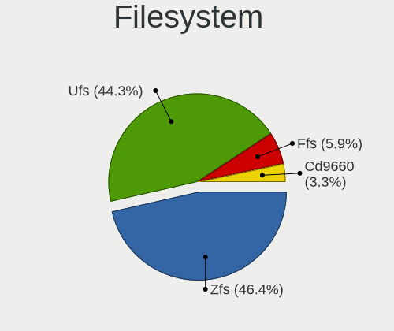

| Type   | Computers | Percent |
|--------|-----------|---------|
| Zfs    | 196       | 46.45%  |
| Ufs    | 187       | 44.31%  |
| Ffs    | 25        | 5.92%   |
| Cd9660 | 14        | 3.32%   |

Part. scheme
------------

Scheme of partitioning

| Type    | Computers | Percent |
|---------|-----------|---------|
| GPT     | 378       | 92.2%   |
| MBR     | 29        | 7.07%   |
| Unknown | 3         | 0.73%   |

Board
-----

Vendor
------

Motherboard manufacturer

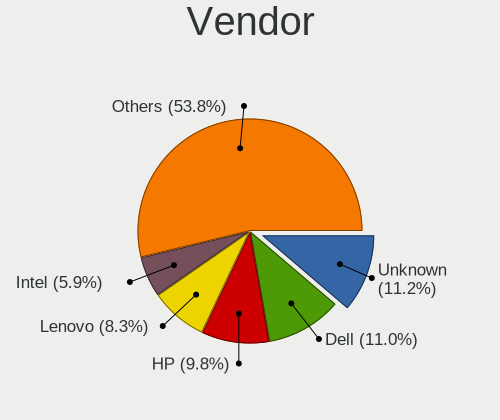

| Name                             | Computers | Percent |
|----------------------------------|-----------|---------|
| Unknown                          | 46        | 11.25%  |
| Dell                             | 45        | 11%     |
| Hewlett-Packard                  | 40        | 9.78%   |
| Lenovo                           | 34        | 8.31%   |
| Intel                            | 24        | 5.87%   |
| ASUSTek Computer                 | 19        | 4.65%   |
| Supermicro                       | 17        | 4.16%   |
| Sophos                           | 16        | 3.91%   |
| ASRock                           | 16        | 3.91%   |
| Gigabyte Technology              | 14        | 3.42%   |
| PC Engines                       | 11        | 2.69%   |
| Deciso                           | 11        | 2.69%   |
| Protectli                        | 10        | 2.44%   |
| AMI                              | 10        | 2.44%   |
| Fujitsu                          | 7         | 1.71%   |
| Apple                            | 7         | 1.71%   |
| Techvision                       | 6         | 1.47%   |
| MSI                              | 6         | 1.47%   |
| Shuttle                          | 5         | 1.22%   |
| Acer                             | 4         | 0.98%   |
| Notebook                         | 3         | 0.73%   |
| MW                               | 3         | 0.73%   |
| Inventec                         | 3         | 0.73%   |
| CncTion                          | 3         | 0.73%   |
| ASRockRack                       | 3         | 0.73%   |
| SLIMBOOK                         | 2         | 0.49%   |
| Micro Computer (HK) Tech Limited | 2         | 0.49%   |
| IceWhale Technology              | 2         | 0.49%   |
| Hardkernel                       | 2         | 0.49%   |
| CWWK                             | 2         | 0.49%   |
| Barracuda Networks               | 2         | 0.49%   |
| AZW                              | 2         | 0.49%   |
| Advantech                        | 2         | 0.49%   |
| AAEON                            | 2         | 0.49%   |
| ZOTAC                            | 1         | 0.24%   |
| XtReAmEr                         | 1         | 0.24%   |
| WYSE                             | 1         | 0.24%   |
| TUXEDO                           | 1         | 0.24%   |
| TOXIC by BTO                     | 1         | 0.24%   |
| Toshiba                          | 1         | 0.24%   |

Model
-----

Motherboard model

| Name                                 | Computers | Percent |
|--------------------------------------|-----------|---------|
| Unknown                              | 48        | 11.74%  |
| Sophos SG                            | 13        | 3.18%   |
| Intel Q3XXG4-P V1.0                  | 11        | 2.69%   |
| Supermicro Super Server              | 8         | 1.96%   |
| AMI Aptio CRB                        | 7         | 1.71%   |
| Techvision TVI7309X                  | 6         | 1.47%   |
| HP EliteDesk 800 G1 SFF              | 5         | 1.22%   |
| Dell PowerEdge R620                  | 5         | 1.22%   |
| Dell PowerEdge R210 II               | 5         | 1.22%   |
| PC Engines apu4                      | 4         | 0.98%   |
| PC Engines APU2                      | 4         | 0.98%   |
| Sophos XG                            | 3         | 0.73%   |
| PC Engines APU                       | 3         | 0.73%   |
| MW GMLK-2_5G4L                       | 3         | 0.73%   |
| Fujitsu FUTRO S920                   | 3         | 0.73%   |
| Dell OptiPlex 7040                   | 3         | 0.73%   |
| Deciso OPNsense Appliance            | 3         | 0.73%   |
| Deciso NetBoard-A10                  | 3         | 0.73%   |
| Protectli FW4B                       | 2         | 0.49%   |
| Micro (HK) Tech Limited Venus series | 2         | 0.49%   |
| Inventec VXC Class                   | 2         | 0.49%   |
| Intel NUC6i3SYB H81132-505           | 2         | 0.49%   |
| HP ProDesk 400 G2.5 SFF              | 2         | 0.49%   |
| HP EliteBook 840 G3                  | 2         | 0.49%   |
| Gigabyte X570 AORUS PRO              | 2         | 0.49%   |
| Dell OptiPlex 7050                   | 2         | 0.49%   |
| Dell OptiPlex 390                    | 2         | 0.49%   |
| Dell OptiPlex 3050                   | 2         | 0.49%   |
| Dell Latitude E4300                  | 2         | 0.49%   |
| Deciso Netboard A10 GEN2 Model G     | 2         | 0.49%   |
| CncTion J4125-4L-I225                | 2         | 0.49%   |
| ASRockRack X470D4U                   | 2         | 0.49%   |
| AMI SG                               | 2         | 0.49%   |
| ZOTAC ZBOX-CI327NANO-GS-01           | 1         | 0.24%   |
| WYSE Z CLASS                         | 1         | 0.24%   |
| TUXEDO Pulse 15 Gen1                 | 1         | 0.24%   |
| TOXIC by BTO 15CL872 1050TI          | 1         | 0.24%   |
| Toshiba Satellite C50-B              | 1         | 0.24%   |
| Supermicro X9SCL/X9SCM               | 1         | 0.24%   |
| Supermicro X8SIL                     | 1         | 0.24%   |

Model Family
------------

Motherboard model prefix

| Name                          | Computers | Percent |
|-------------------------------|-----------|---------|
| Unknown                       | 48        | 11.74%  |
| Dell OptiPlex                 | 18        | 4.4%    |
| Lenovo ThinkPad               | 17        | 4.16%   |
| Sophos SG                     | 13        | 3.18%   |
| Dell PowerEdge                | 13        | 3.18%   |
| Intel Q3XXG4-P                | 11        | 2.69%   |
| Supermicro Super              | 8         | 1.96%   |
| HP ProDesk                    | 8         | 1.96%   |
| Dell Latitude                 | 8         | 1.96%   |
| HP EliteDesk                  | 7         | 1.71%   |
| AMI Aptio                     | 7         | 1.71%   |
| Techvision TVI7309X           | 6         | 1.47%   |
| Lenovo ThinkCentre            | 6         | 1.47%   |
| HP ProLiant                   | 6         | 1.47%   |
| HP Compaq                     | 6         | 1.47%   |
| ASUS PRIME                    | 5         | 1.22%   |
| PC Engines apu4               | 4         | 0.98%   |
| PC Engines APU2               | 4         | 0.98%   |
| HP EliteBook                  | 4         | 0.98%   |
| Fujitsu FUTRO                 | 4         | 0.98%   |
| Deciso Netboard               | 4         | 0.98%   |
| Acer Aspire                   | 4         | 0.98%   |
| Sophos XG                     | 3         | 0.73%   |
| PC Engines APU                | 3         | 0.73%   |
| MW GMLK-2                     | 3         | 0.73%   |
| Lenovo IdeaPad                | 3         | 0.73%   |
| Deciso OPNsense               | 3         | 0.73%   |
| Deciso NetBoard-A10           | 3         | 0.73%   |
| Supermicro AS                 | 2         | 0.49%   |
| Protectli FW4B                | 2         | 0.49%   |
| Micro (HK) Tech Limited Venus | 2         | 0.49%   |
| Lenovo Yoga                   | 2         | 0.49%   |
| Lenovo ThinkStation           | 2         | 0.49%   |
| Inventec VXC                  | 2         | 0.49%   |
| Intel NUC6i3SYB               | 2         | 0.49%   |
| IceWhale ZimaBoard            | 2         | 0.49%   |
| HP ProBook                    | 2         | 0.49%   |
| Gigabyte X570                 | 2         | 0.49%   |
| Dell Wyse                     | 2         | 0.49%   |
| CncTion J4125-4L-I225         | 2         | 0.49%   |

MFG Year
--------

Motherboard manufacture year

| Year    | Computers | Percent |
|---------|-----------|---------|
| 2018    | 48        | 11.74%  |
| 2022    | 39        | 9.54%   |
| 2016    | 37        | 9.05%   |
| 2014    | 33        | 8.07%   |
| 2020    | 29        | 7.09%   |
| 2019    | 29        | 7.09%   |
| 2023    | 27        | 6.6%    |
| 2021    | 27        | 6.6%    |
| 2017    | 27        | 6.6%    |
| 2015    | 25        | 6.11%   |
| 2011    | 18        | 4.4%    |
| 2013    | 17        | 4.16%   |
| 2012    | 17        | 4.16%   |
| 2009    | 8         | 1.96%   |
| Unknown | 8         | 1.96%   |
| 2010    | 7         | 1.71%   |
| 2008    | 7         | 1.71%   |
| 2024    | 4         | 0.98%   |
| 2007    | 1         | 0.24%   |
| 2006    | 1         | 0.24%   |

Form Factor
-----------

Physical design of the computer

| Name           | Computers | Percent |
|----------------|-----------|---------|
| Desktop        | 256       | 62.59%  |
| Notebook       | 79        | 19.32%  |
| Mini pc        | 29        | 7.09%   |
| Server         | 24        | 5.87%   |
| Firewall       | 18        | 4.4%    |
| All in one     | 2         | 0.49%   |
| System on chip | 1         | 0.24%   |

Coreboot
--------

Have coreboot on board

| Used | Computers | Percent |
|------|-----------|---------|
| No   | 390       | 95.35%  |
| Yes  | 19        | 4.65%   |

RAM Size
--------

Total RAM memory

| Size in GB      | Computers | Percent |
|-----------------|-----------|---------|
| 8.01-16.0       | 155       | 37.17%  |
| 16.01-24.0      | 102       | 24.46%  |
| 4.01-8.0        | 76        | 18.23%  |
| 32.01-64.0      | 43        | 10.31%  |
| 64.01-256.0     | 17        | 4.08%   |
| 2.01-3.0        | 10        | 2.4%    |
| 3.01-4.0        | 5         | 1.2%    |
| More than 256.0 | 3         | 0.72%   |
| 24.01-32.0      | 2         | 0.48%   |
| 1.01-2.0        | 2         | 0.48%   |
| 0.51-1.0        | 2         | 0.48%   |

RAM Used
--------

Used RAM memory

| Used GB    | Computers | Percent |
|------------|-----------|---------|
| 0.01-0.5   | 206       | 48.82%  |
| 0.51-1.0   | 132       | 31.28%  |
| 1.01-2.0   | 51        | 12.09%  |
| 4.01-8.0   | 9         | 2.13%   |
| 2.01-3.0   | 8         | 1.9%    |
| 3.01-4.0   | 5         | 1.18%   |
| 8.01-16.0  | 4         | 0.95%   |
| 32.01-64.0 | 2         | 0.47%   |
| 24.01-32.0 | 2         | 0.47%   |
| 16.01-24.0 | 1         | 0.24%   |
| 0          | 1         | 0.24%   |
| Unknown    | 1         | 0.24%   |

Total Drives
------------

Number of drives on board

| Drives | Computers | Percent |
|--------|-----------|---------|
| 1      | 284       | 67.46%  |
| 2      | 57        | 13.54%  |
| 0      | 40        | 9.5%    |
| 3      | 17        | 4.04%   |
| 4      | 9         | 2.14%   |
| 5      | 6         | 1.43%   |
| 7      | 3         | 0.71%   |
| 17     | 1         | 0.24%   |
| 15     | 1         | 0.24%   |
| 12     | 1         | 0.24%   |
| 10     | 1         | 0.24%   |
| 6      | 1         | 0.24%   |

Has CD-ROM
----------

Has CD-ROM on board

| Presented | Computers | Percent |
|-----------|-----------|---------|
| No        | 360       | 87.8%   |
| Yes       | 50        | 12.2%   |

Has Ethernet
------------

Has Ethernet on board

| Presented | Computers | Percent |
|-----------|-----------|---------|
| Yes       | 390       | 95.12%  |
| No        | 20        | 4.88%   |

Has WiFi
--------

Has WiFi module

| Presented | Computers | Percent |
|-----------|-----------|---------|
| No        | 288       | 69.57%  |
| Yes       | 126       | 30.43%  |

Has Bluetooth
-------------

Has Bluetooth module

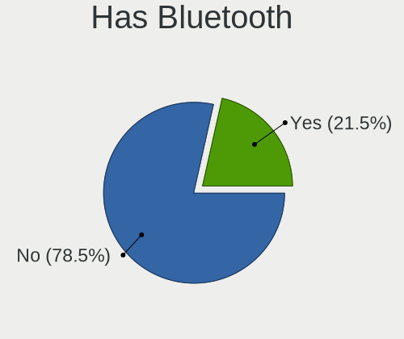

| Presented | Computers | Percent |
|-----------|-----------|---------|
| No        | 325       | 78.5%   |
| Yes       | 89        | 21.5%   |

Location
--------

Country
-------

Geographic location (country)

| Country     | Computers | Percent |
|-------------|-----------|---------|
| Netherlands | 409       | 100%    |

City
----

Geographic location (city)

| City                | Computers | Percent |
|---------------------|-----------|---------|
| Amsterdam           | 69        | 14.87%  |
| The Hague           | 14        | 3.02%   |
| Almere Stad         | 12        | 2.59%   |
| Rotterdam           | 11        | 2.37%   |
| Utrecht             | 10        | 2.16%   |
| Groningen           | 7         | 1.51%   |
| Eindhoven           | 7         | 1.51%   |
| Hoofddorp           | 5         | 1.08%   |
| Heerlen             | 5         | 1.08%   |
| Amersfoort          | 5         | 1.08%   |
| Zwolle              | 4         | 0.86%   |
| Zeist               | 4         | 0.86%   |
| Zaandam             | 4         | 0.86%   |
| Vlaardingen         | 4         | 0.86%   |
| Veenendaal          | 4         | 0.86%   |
| Poortugaal          | 4         | 0.86%   |
| Papendrecht         | 4         | 0.86%   |
| Naaldwijk           | 4         | 0.86%   |
| Leeuwarden          | 4         | 0.86%   |
| Hengelo             | 4         | 0.86%   |
| Enschede            | 4         | 0.86%   |
| Delft               | 4         | 0.86%   |
| Barneveld           | 4         | 0.86%   |
| Alphen aan den Rijn | 4         | 0.86%   |
| 's-Hertogenbosch    | 4         | 0.86%   |
| Zoetermeer          | 3         | 0.65%   |
| Tilburg             | 3         | 0.65%   |
| Roosendaal          | 3         | 0.65%   |
| Ridderkerk          | 3         | 0.65%   |
| Ospel               | 3         | 0.65%   |
| Oegstgeest          | 3         | 0.65%   |
| Nieuwegein          | 3         | 0.65%   |
| Maastricht          | 3         | 0.65%   |
| Leiden              | 3         | 0.65%   |
| IJsselstein         | 3         | 0.65%   |
| IJmuiden            | 3         | 0.65%   |
| Hoogeveen           | 3         | 0.65%   |
| Hilversum           | 3         | 0.65%   |
| Helmond             | 3         | 0.65%   |
| Hellevoetsluis      | 3         | 0.65%   |

Drives
------

Drive Vendor
------------

Hard drive vendors

| Vendor              | Computers | Drives | Percent |
|---------------------|-----------|--------|---------|
| Samsung Electronics | 89        | 162    | 19.52%  |
| WDC                 | 40        | 85     | 8.77%   |
| Crucial             | 37        | 56     | 8.11%   |
| Kingston            | 33        | 49     | 7.24%   |
| Transcend           | 32        | 63     | 7.02%   |
| Seagate             | 26        | 62     | 5.7%    |
| SanDisk             | 16        | 16     | 3.51%   |
| Intel               | 15        | 18     | 3.29%   |
| Toshiba             | 12        | 29     | 2.63%   |
| Hoodisk             | 12        | 18     | 2.63%   |
| Hewlett-Packard     | 9         | 26     | 1.97%   |
| China               | 8         | 13     | 1.75%   |
| Phison              | 7         | 10     | 1.54%   |
| Hitachi             | 7         | 10     | 1.54%   |
| HGST                | 7         | 11     | 1.54%   |
| Gigabyte Technology | 7         | 9      | 1.54%   |
| OCZ                 | 6         | 8      | 1.32%   |
| A-DATA Technology   | 6         | 7      | 1.32%   |
| NVMe                | 5         | 6      | 1.1%    |
| Silicon Motion      | 4         | 5      | 0.88%   |
| LITEON              | 4         | 5      | 0.88%   |
| Dell                | 4         | 8      | 0.88%   |
| VICKTER             | 3         | 5      | 0.66%   |
| UDinfo              | 3         | 3      | 0.66%   |
| SK hynix            | 3         | 4      | 0.66%   |
| ShiJi               | 3         | 4      | 0.66%   |
| Protectli           | 3         | 7      | 0.66%   |
| PNY                 | 3         | 4      | 0.66%   |
| Kston               | 3         | 7      | 0.66%   |
| FORESEE             | 3         | 6      | 0.66%   |
| Apple               | 3         | 4      | 0.66%   |
| Apacer              | 3         | 5      | 0.66%   |
| Plextor             | 2         | 2      | 0.44%   |
| NETAPP              | 2         | 7      | 0.44%   |
| Mushkin             | 2         | 4      | 0.44%   |
| Micron Technology   | 2         | 2      | 0.44%   |
| Lexar               | 2         | 2      | 0.44%   |
| Intenso             | 2         | 5      | 0.44%   |
| Innodisk            | 2         | 2      | 0.44%   |
| HPE                 | 2         | 5      | 0.44%   |

Drive Model
-----------

Hard drive models

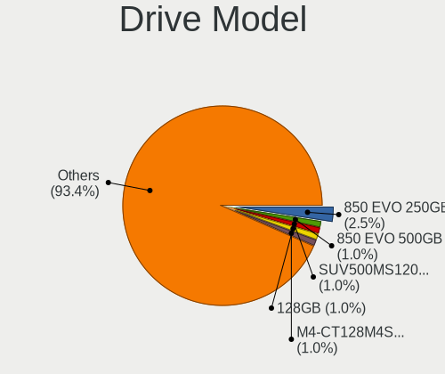

| Model                            | Computers | Percent |
|----------------------------------|-----------|---------|
| Samsung SSD 850 EVO 250GB        | 12        | 2.46%   |
| Samsung SSD 850 EVO 500GB        | 5         | 1.03%   |
| Kingston SUV500MS120G 120GB      | 5         | 1.03%   |
| Hoodisk SSD 128GB                | 5         | 1.03%   |
| Crucial M4-CT128M4SSD2 128GB     | 5         | 1.03%   |
| Transcend TS128GMTE110S 128GB    | 4         | 0.82%   |
| Transcend TS128GMSA230S 128GB    | 4         | 0.82%   |
| Kingston SKC600MS256G 256GB      | 4         | 0.82%   |
| Kingston SA400S37240G 240GB      | 4         | 0.82%   |
| Intel SSDSC2BW120A4 120GB        | 4         | 0.82%   |
| Dell PERC H710 282GB             | 4         | 0.82%   |
| Crucial CT250MX500SSD1 250GB     | 4         | 0.82%   |
| Crucial CT120BX500SSD1 120GB     | 4         | 0.82%   |
| China SATA SSD 16GB              | 4         | 0.82%   |
| A-DATA IM2S3134N-064GM 64GB      | 4         | 0.82%   |
| UDinfo M2S 120GB                 | 3         | 0.62%   |
| Transcend TS64GSSD370 64GB       | 3         | 0.62%   |
| Transcend TS256GMTE652T2 256GB   | 3         | 0.62%   |
| Transcend TS256GMSA230S 256GB    | 3         | 0.62%   |
| Toshiba MQ04ABF100 1TB           | 3         | 0.62%   |
| Samsung SSD 870 QVO 2TB          | 3         | 0.62%   |
| Samsung SSD 850 EVO 120GB        | 3         | 0.62%   |
| Kingston SA400S37120G 120GB      | 3         | 0.62%   |
| Hoodisk SSD 64GB                 | 3         | 0.62%   |
| Hoodisk SSD 32GB                 | 3         | 0.62%   |
| Gigabyte GP-GSM2NE3256GNTD 256GB | 3         | 0.62%   |
| Crucial CT240BX500SSD1 240GB     | 3         | 0.62%   |
| WDC WD80EFAX-68KNBN0 8TB         | 2         | 0.41%   |
| WDC WD60EFRX-68L0BN1 6TB         | 2         | 0.41%   |
| WDC WD5000LPVX-22V0TT0 500GB     | 2         | 0.41%   |
| WDC WD40EFRX-68WT0N0 4TB         | 2         | 0.41%   |
| WDC WD40EFRX-68N32N0 4TB         | 2         | 0.41%   |
| VICKTER SSD 512GB                | 2         | 0.41%   |
| Transcend TS64GMTS400SD 64GB     | 2         | 0.41%   |
| Transcend TS32GSSD370S 32GB      | 2         | 0.41%   |
| Transcend TS256GMSA452T2 256GB   | 2         | 0.41%   |
| Transcend TS128GMSA370 128GB     | 2         | 0.41%   |
| Seagate ST500LM000-SSHD-8GB      | 2         | 0.41%   |
| Seagate ST1000LM049-2GH172 1TB   | 2         | 0.41%   |
| Samsung SSD 980 PRO 1TB          | 2         | 0.41%   |

HDD Vendor
----------

Hard disk drive vendors

| Vendor              | Computers | Drives | Percent |
|---------------------|-----------|--------|---------|
| WDC                 | 30        | 68     | 30%     |
| Seagate             | 26        | 62     | 26%     |
| Samsung Electronics | 7         | 10     | 7%      |
| Hitachi             | 7         | 10     | 7%      |
| HGST                | 7         | 11     | 7%      |
| Toshiba             | 6         | 18     | 6%      |
| Hewlett-Packard     | 5         | 21     | 5%      |
| Dell                | 4         | 8      | 4%      |
| NVMe                | 2         | 2      | 2%      |
| StoreJet            | 1         | 1      | 1%      |
| OPENBSD             | 1         | 1      | 1%      |
| Maxtor              | 1         | 1      | 1%      |
| Lenovo              | 1         | 2      | 1%      |
| HPE                 | 1         | 4      | 1%      |
| Apple               | 1         | 1      | 1%      |

SSD Vendor
----------

Solid state drive vendors

| Vendor              | Computers | Drives | Percent |
|---------------------|-----------|--------|---------|
| Samsung Electronics | 64        | 116    | 22.7%   |
| Crucial             | 32        | 46     | 11.35%  |
| Kingston            | 27        | 43     | 9.57%   |
| Transcend           | 24        | 52     | 8.51%   |
| SanDisk             | 16        | 16     | 5.67%   |
| Intel               | 13        | 16     | 4.61%   |
| Hoodisk             | 12        | 18     | 4.26%   |
| China               | 8         | 13     | 2.84%   |
| WDC                 | 7         | 11     | 2.48%   |
| OCZ                 | 6         | 8      | 2.13%   |
| LITEON              | 4         | 5      | 1.42%   |
| A-DATA Technology   | 4         | 5      | 1.42%   |
| VICKTER             | 3         | 5      | 1.06%   |
| UDinfo              | 3         | 3      | 1.06%   |
| SK hynix            | 3         | 4      | 1.06%   |
| Protectli           | 3         | 7      | 1.06%   |
| PNY                 | 3         | 4      | 1.06%   |
| Phison              | 3         | 3      | 1.06%   |
| NVMe                | 3         | 4      | 1.06%   |
| Kston               | 3         | 7      | 1.06%   |
| Hewlett-Packard     | 3         | 4      | 1.06%   |
| FORESEE             | 3         | 6      | 1.06%   |
| Apacer              | 3         | 5      | 1.06%   |
| Toshiba             | 2         | 4      | 0.71%   |
| ShiJi               | 2         | 3      | 0.71%   |
| NETAPP              | 2         | 7      | 0.71%   |
| Mushkin             | 2         | 4      | 0.71%   |
| Intenso             | 2         | 5      | 0.71%   |
| Innodisk            | 2         | 2      | 0.71%   |
| Gigabyte Technology | 2         | 2      | 0.71%   |
| Apple               | 2         | 3      | 0.71%   |
| Vaseky              | 1         | 1      | 0.35%   |
| Supermicro          | 1         | 1      | 0.35%   |
| Plextor             | 1         | 1      | 0.35%   |
| Patriot             | 1         | 2      | 0.35%   |
| OWC                 | 1         | 1      | 0.35%   |
| ORICO               | 1         | 1      | 0.35%   |
| Micron Technology   | 1         | 1      | 0.35%   |
| Maximus             | 1         | 1      | 0.35%   |
| LITEONIT            | 1         | 3      | 0.35%   |

Drive Kind
----------

HDD or SSD

| Kind | Computers | Drives | Percent |
|------|-----------|--------|---------|
| SSD  | 261       | 452    | 61.56%  |
| HDD  | 88        | 220    | 20.75%  |
| NVMe | 75        | 114    | 17.69%  |

Drive Connector
---------------

SATA, SAS, NVMe, etc.

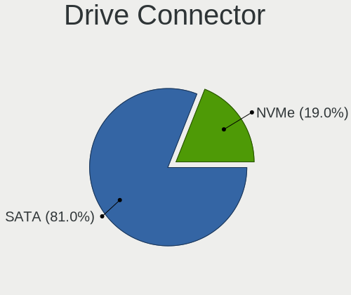

| Type | Computers | Drives | Percent |
|------|-----------|--------|---------|
| SATA | 320       | 672    | 81.01%  |
| NVMe | 75        | 114    | 18.99%  |

Drive Size
----------

Size of hard drive

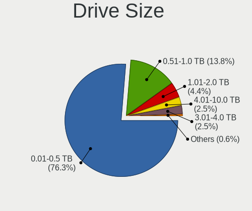

| Size in TB | Computers | Drives | Percent |
|------------|-----------|--------|---------|
| 0.01-0.5   | 277       | 468    | 76.31%  |
| 0.51-1.0   | 50        | 90     | 13.77%  |
| 1.01-2.0   | 16        | 29     | 4.41%   |
| 3.01-4.0   | 9         | 22     | 2.48%   |
| 4.01-10.0  | 9         | 54     | 2.48%   |
| 2.01-3.0   | 1         | 4      | 0.28%   |
| 10.01-20.0 | 1         | 5      | 0.28%   |

Space Total
-----------

Amount of disk space available on the file system

| Size in GB     | Computers | Percent |
|----------------|-----------|---------|
| 101-250        | 182       | 42.72%  |
| 251-500        | 69        | 16.2%   |
| 51-100         | 53        | 12.44%  |
| 1-20           | 46        | 10.8%   |
| 21-50          | 30        | 7.04%   |
| 501-1000       | 27        | 6.34%   |
| 1001-2000      | 10        | 2.35%   |
| 2001-3000      | 4         | 0.94%   |
| More than 3000 | 3         | 0.7%    |
| Unknown        | 2         | 0.47%   |

Space Used
----------

Amount of used disk space

| Used GB  | Computers | Percent |
|----------|-----------|---------|
| 1-20     | 371       | 88.12%  |
| 21-50    | 23        | 5.46%   |
| 101-250  | 9         | 2.14%   |
| 51-100   | 7         | 1.66%   |
| 251-500  | 5         | 1.19%   |
| 501-1000 | 4         | 0.95%   |
| Unknown  | 2         | 0.48%   |

Malfunc. Drives
---------------

Drive models with a malfunction

| Model                                     | Computers | Drives | Percent |
|-------------------------------------------|-----------|--------|---------|
| Crucial CT480M500SSD1 480GB               | 2         | 3      | 4.76%   |
| WDC WD5000AAKX-08U6AA0 500GB              | 1         | 1      | 2.38%   |
| WDC WD3200BEKT-60V5T1 320GB               | 1         | 1      | 2.38%   |
| WDC WD2500BEKT-75PVMT0 250GB              | 1         | 1      | 2.38%   |
| WDC WD15EARS-00Z5B1 1.5TB                 | 1         | 1      | 2.38%   |
| Toshiba MK3252GSX 320GB                   | 1         | 1      | 2.38%   |
| SK hynix SC308 SATA 128GB                 | 1         | 2      | 2.38%   |
| SK hynix HFS128G39TND-N210A 128GB         | 1         | 1      | 2.38%   |
| ShiJi SSD 32GB                            | 1         | 2      | 2.38%   |
| Seagate ST500LT012-9WS142 500GB           | 1         | 2      | 2.38%   |
| Seagate ST500LM021-1KJ152 500GB           | 1         | 1      | 2.38%   |
| Seagate ST3360320AS 360GB                 | 1         | 1      | 2.38%   |
| Seagate ST3160318AS 160GB                 | 1         | 4      | 2.38%   |
| SanDisk SDSSDP064G 64GB                   | 1         | 1      | 2.38%   |
| SanDisk SD7UB3Q256G1001 256GB             | 1         | 1      | 2.38%   |
| Samsung Electronics SSD 870 EVO 1TB       | 1         | 1      | 2.38%   |
| Samsung Electronics SSD 850 EVO mSATA 1TB | 1         | 1      | 2.38%   |
| Samsung Electronics SSD 850 EVO 1TB       | 1         | 1      | 2.38%   |
| Samsung Electronics SSD 840 Series 120GB  | 1         | 1      | 2.38%   |
| Samsung Electronics SSD 840 EVO 120GB     | 1         | 1      | 2.38%   |
| Samsung Electronics HS082HB 80GB          | 1         | 1      | 2.38%   |
| Samsung Electronics HD322HJ 320GB         | 1         | 1      | 2.38%   |
| Samsung Electronics HD161GJ 160GB         | 1         | 1      | 2.38%   |
| Samsung Electronics HD103SJ 1TB           | 1         | 2      | 2.38%   |
| Kingston SMS200S3120G 120GB               | 1         | 1      | 2.38%   |
| Kingston SA400S37240G 240GB               | 1         | 1      | 2.38%   |
| Intel SSDSC2BA200G3T 200GB                | 1         | 4      | 2.38%   |
| Intel SSDSA2M080G2GC 80GB                 | 1         | 1      | 2.38%   |
| HPE MM1000GBKAL 1TB                       | 1         | 4      | 2.38%   |
| Hitachi HTS545032B9A300 320GB             | 1         | 1      | 2.38%   |
| Hitachi HTS543232A7A384 320GB             | 1         | 1      | 2.38%   |
| Hitachi HTS541612J9SA00 120GB             | 1         | 2      | 2.38%   |
| Hitachi HDS723015BLA642 1.5TB             | 1         | 3      | 2.38%   |
| HGST HTS725050A7E630 500GB                | 1         | 1      | 2.38%   |
| HGST HDN726060ALE614 6TB                  | 1         | 2      | 2.38%   |
| Hewlett-Packard FB160C4081 160GB          | 1         | 2      | 2.38%   |
| Crucial CT240M500SSD1 240GB               | 1         | 1      | 2.38%   |
| Crucial CT128MX100SSD1 128GB              | 1         | 2      | 2.38%   |
| Corsair Force LS SSD 64GB                 | 1         | 2      | 2.38%   |
| China SH00M128GB                          | 1         | 1      | 2.38%   |

Malfunc. Drive Vendor
---------------------

Vendors of faulty drives

| Vendor              | Computers | Drives | Percent |
|---------------------|-----------|--------|---------|
| Samsung Electronics | 8         | 10     | 19.51%  |
| WDC                 | 4         | 4      | 9.76%   |
| Seagate             | 4         | 8      | 9.76%   |
| Hitachi             | 4         | 7      | 9.76%   |
| Crucial             | 4         | 6      | 9.76%   |
| SK hynix            | 2         | 3      | 4.88%   |
| SanDisk             | 2         | 2      | 4.88%   |
| Kingston            | 2         | 2      | 4.88%   |
| Intel               | 2         | 5      | 4.88%   |
| HGST                | 2         | 3      | 4.88%   |
| Toshiba             | 1         | 1      | 2.44%   |
| ShiJi               | 1         | 2      | 2.44%   |
| HPE                 | 1         | 4      | 2.44%   |
| Hewlett-Packard     | 1         | 2      | 2.44%   |
| Corsair             | 1         | 2      | 2.44%   |
| China               | 1         | 1      | 2.44%   |
| A-DATA Technology   | 1         | 1      | 2.44%   |

Malfunc. HDD Vendor
-------------------

Vendors of faulty HDD drives

| Vendor              | Computers | Drives | Percent |
|---------------------|-----------|--------|---------|
| WDC                 | 4         | 4      | 19.05%  |
| Seagate             | 4         | 8      | 19.05%  |
| Samsung Electronics | 4         | 5      | 19.05%  |
| Hitachi             | 4         | 7      | 19.05%  |
| HGST                | 2         | 3      | 9.52%   |
| Toshiba             | 1         | 1      | 4.76%   |
| HPE                 | 1         | 4      | 4.76%   |
| Hewlett-Packard     | 1         | 2      | 4.76%   |

Malfunc. Drive Kind
-------------------

Kinds of faulty drives

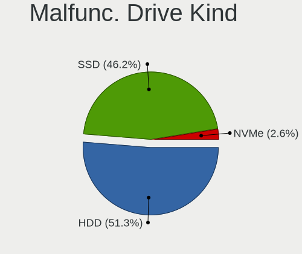

| Kind | Computers | Drives | Percent |
|------|-----------|--------|---------|
| HDD  | 20        | 34     | 51.28%  |
| SSD  | 18        | 28     | 46.15%  |
| NVMe | 1         | 1      | 2.56%   |

Failed Drives
-------------

Failed drive models

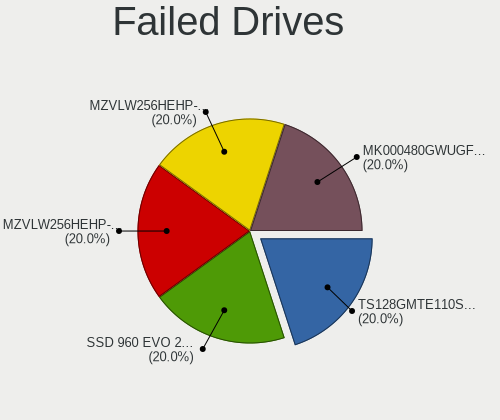

| Model                                        | Computers | Drives | Percent |
|----------------------------------------------|-----------|--------|---------|
| Transcend TS128GMTE110S 128GB                | 1         | 1      | 20%     |
| Samsung Electronics SSD 960 EVO 250GB        | 1         | 1      | 20%     |
| Samsung Electronics MZVLW256HEHP-000H1 256GB | 1         | 2      | 20%     |
| Samsung Electronics MZVLW256HEHP-00000 256GB | 1         | 1      | 20%     |
| HPE MK000480GWUGF 480GB                      | 1         | 1      | 20%     |

Failed Drive Vendor
-------------------

Failed drive vendors

| Vendor              | Computers | Drives | Percent |
|---------------------|-----------|--------|---------|
| Samsung Electronics | 3         | 4      | 60%     |
| Transcend           | 1         | 1      | 20%     |
| HPE                 | 1         | 1      | 20%     |

Drive Status
------------

Number of failed and malfunc. drives

| Status   | Computers | Drives | Percent |
|----------|-----------|--------|---------|
| Works    | 340       | 695    | 86.08%  |
| Malfunc  | 37        | 63     | 9.37%   |
| Detected | 13        | 22     | 3.29%   |
| Failed   | 5         | 6      | 1.27%   |

Storage controller
------------------

Storage Vendor
--------------

Storage controller vendors

| Vendor                       | Computers | Percent |
|------------------------------|-----------|---------|
| Intel                        | 319       | 61.58%  |
| AMD                          | 53        | 10.23%  |
| Samsung Electronics          | 34        | 6.56%   |
| Phison Electronics           | 14        | 2.7%    |
| Silicon Motion               | 12        | 2.32%   |
| ASMedia Technology           | 12        | 2.32%   |
| Broadcom / LSI               | 11        | 2.12%   |
| Transcend                    | 7         | 1.35%   |
| Micron/Crucial Technology    | 7         | 1.35%   |
| Kingston Technology Company  | 7         | 1.35%   |
| SanDisk                      | 6         | 1.16%   |
| Micron Technology            | 6         | 1.16%   |
| Hewlett-Packard              | 6         | 1.16%   |
| Toshiba                      | 4         | 0.77%   |
| Marvell Technology Group     | 4         | 0.77%   |
| MAXIO Technology (Hangzhou)  | 3         | 0.58%   |
| JMicron Technology           | 3         | 0.58%   |
| Shenzhen Longsys Electronics | 2         | 0.39%   |
| Seagate Technology           | 1         | 0.19%   |
| Realtek Semiconductor        | 1         | 0.19%   |
| Lite-On Technology           | 1         | 0.19%   |
| KIOXIA                       | 1         | 0.19%   |
| Hosin Global Electronics     | 1         | 0.19%   |
| Dell                         | 1         | 0.19%   |
| Chelsio Communications       | 1         | 0.19%   |
| Unknown                      | 1         | 0.19%   |

Storage Model
-------------

Storage controller models

| Model                                                                            | Computers | Percent |
|----------------------------------------------------------------------------------|-----------|---------|
| Intel 8 Series/C220 Series Chipset Family 6-port SATA Controller 1 [AHCI mode]   | 35        | 6.25%   |
| AMD FCH SATA Controller [AHCI mode]                                              | 35        | 6.25%   |
| Intel Q170/Q150/B150/H170/H110/Z170/CM236 Chipset SATA Controller [AHCI Mode]    | 18        | 3.21%   |
| Intel Wildcat Point-LP SATA Controller [AHCI Mode]                               | 17        | 3.04%   |
| Samsung NVMe SSD Controller SM981/PM981/PM983                                    | 15        | 2.68%   |
| Intel Alder Lake-N SATA AHCI Controller                                          | 15        | 2.68%   |
| Intel 6 Series/C200 Series Chipset Family 6 port Desktop SATA AHCI Controller    | 14        | 2.5%    |
| Intel Sunrise Point-LP SATA Controller [AHCI mode]                               | 13        | 2.32%   |
| Intel Atom Processor E3800 Series SATA AHCI Controller                           | 12        | 2.14%   |
| Silicon Motion SM2263EN/SM2263XT (DRAM-less) NVMe SSD Controllers                | 11        | 1.96%   |
| Intel Jasper Lake SATA AHCI Controller                                           | 11        | 1.96%   |
| Intel Celeron/Pentium Silver Processor SATA Controller                           | 11        | 1.96%   |
| Intel 8 Series SATA Controller 1 [AHCI mode]                                     | 11        | 1.96%   |
| Intel 200 Series PCH SATA controller [AHCI mode]                                 | 11        | 1.96%   |
| Intel Atom/Celeron/Pentium Processor x5-E8000/J3xxx/N3xxx Series SATA Controller | 10        | 1.79%   |
| Intel Comet Lake SATA AHCI Controller                                            | 9         | 1.61%   |
| Intel Cannon Lake PCH SATA AHCI Controller                                       | 9         | 1.61%   |
| Intel 82801 Mobile SATA Controller [RAID mode]                                   | 9         | 1.61%   |
| ASMedia ASM1061/ASM1062 Serial ATA Controller                                    | 9         | 1.61%   |
| AMD SB7x0/SB8x0/SB9x0 SATA Controller [AHCI mode]                                | 9         | 1.61%   |
| Intel Atom Processor C3000 Series SATA Controller 0                              | 8         | 1.43%   |
| Phison PS5013-E13 PCIe3 NVMe Controller (DRAM-less)                              | 7         | 1.25%   |
| Intel Celeron N3350/Pentium N4200/Atom E3900 Series SATA AHCI Controller         | 7         | 1.25%   |
| Intel 7 Series/C210 Series Chipset Family 6-port SATA Controller [AHCI mode]     | 7         | 1.25%   |
| Transcend NVMe PCIe SSD 110S/112S/120S/MTE300S/MTE400S/MTE652T2 (DRAM-less)      | 6         | 1.07%   |
| Samsung NVMe SSD Controller SM961/PM961/SM963                                    | 6         | 1.07%   |
| Samsung NVMe SSD Controller PM9A1/PM9A3/980PRO                                   | 6         | 1.07%   |
| Micron/Crucial P2 [Nick P2] / P3 / P3 Plus NVMe PCIe SSD (DRAM-less)             | 6         | 1.07%   |
| Intel SATA Controller [RAID Mode]                                                | 6         | 1.07%   |
| Intel Cannon Point-LP SATA Controller [AHCI Mode]                                | 5         | 0.89%   |
| Intel C610/X99 series chipset 6-Port SATA Controller [AHCI mode]                 | 5         | 0.89%   |
| Intel C600/X79 series chipset 6-Port SATA AHCI Controller                        | 5         | 0.89%   |
| Intel Atom processor C2000 AHCI SATA3 Controller                                 | 5         | 0.89%   |
| Intel 7 Series Chipset Family 6-port SATA Controller [AHCI mode]                 | 5         | 0.89%   |
| Intel 5 Series/3400 Series Chipset 6 port SATA AHCI Controller                   | 5         | 0.89%   |
| AMD 400 Series Chipset SATA Controller                                           | 5         | 0.89%   |
| Samsung NVMe SSD Controller 980 (DRAM-less)                                      | 4         | 0.71%   |
| Micron 2550 NVMe SSD (DRAM-less)                                                 | 4         | 0.71%   |
| Intel Volume Management Device NVMe RAID Controller                              | 4         | 0.71%   |
| Intel 82801JI (ICH10 Family) SATA AHCI Controller                                | 4         | 0.71%   |

Storage Kind
------------

Kind of storage controller (IDE, SATA, NVMe, SAS, ...)

| Kind | Computers | Percent |
|------|-----------|---------|
| SATA | 335       | 65.82%  |
| NVMe | 105       | 20.63%  |
| RAID | 32        | 6.29%   |
| IDE  | 27        | 5.3%    |
| SAS  | 9         | 1.77%   |
| SCSI | 1         | 0.2%    |

Processor
---------

CPU Vendor
----------

Processor vendors

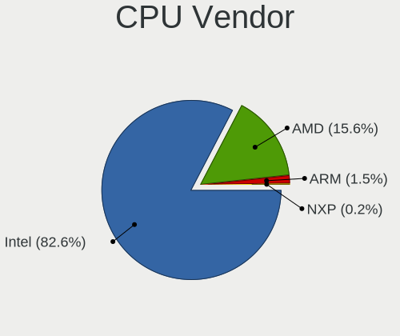

| Vendor | Computers | Percent |
|--------|-----------|---------|
| Intel  | 338       | 82.64%  |
| AMD    | 64        | 15.65%  |
| ARM    | 6         | 1.47%   |
| NXP    | 1         | 0.24%   |

CPU Model
---------

Processor models

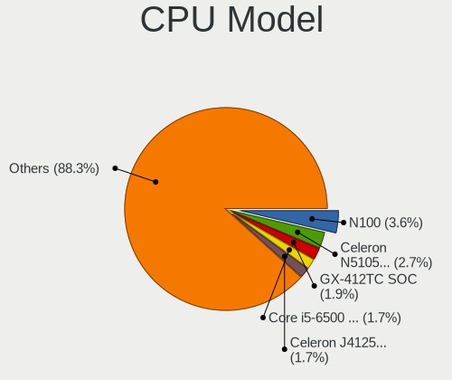

| Model                                | Computers | Percent |
|--------------------------------------|-----------|---------|
| Intel N100                           | 15        | 3.65%   |
| Intel Celeron N5105 @ 2.00GHz        | 11        | 2.68%   |
| AMD GX-412TC SOC                     | 8         | 1.95%   |
| Intel Core i5-6500 CPU @ 3.20GHz     | 7         | 1.7%    |
| Intel Celeron J4125 CPU @ 2.00GHz    | 7         | 1.7%    |
| Intel Celeron CPU J1900 @ 1.99GHz    | 7         | 1.7%    |
| Intel Celeron CPU J3160 @ 1.60GHz    | 6         | 1.46%   |
| Intel Core i5-4590 CPU @ 3.30GHz     | 5         | 1.22%   |
| AMD Ryzen Embedded V1500B            | 5         | 1.22%   |
| Intel Core i7-4500U CPU @ 1.80GHz    | 4         | 0.97%   |
| Intel Core i5-6400 CPU @ 2.70GHz     | 4         | 0.97%   |
| Intel Core i5-5200U CPU @ 2.20GHz    | 4         | 0.97%   |
| Intel Core 2 Duo                     | 4         | 0.97%   |
| Intel Atom CPU C3508 @ 1.60GHz       | 4         | 0.97%   |
| ARM Cortex-A72 r0p3                  | 4         | 0.97%   |
| AMD G-T56N Processor                 | 4         | 0.97%   |
| Intel Xeon CPU D-1521 @ 2.40GHz      | 3         | 0.73%   |
| Intel Pentium CPU G3420 @ 3.20GHz    | 3         | 0.73%   |
| Intel Core i7-2600K CPU @ 3.40GHz    | 3         | 0.73%   |
| Intel Core i5-8365U CPU @ 1.60GHz    | 3         | 0.73%   |
| Intel Core i5-5250U CPU @ 1.60GHz    | 3         | 0.73%   |
| Intel Core i5-4570 CPU @ 3.20GHz     | 3         | 0.73%   |
| Intel Core i5-10400 CPU @ 2.90GHz    | 3         | 0.73%   |
| Intel Core i3-N305                   | 3         | 0.73%   |
| Intel Celeron CPU N3450 @ 1.10GHz    | 3         | 0.73%   |
| Intel Atom CPU C3558 @ 2.20GHz       | 3         | 0.73%   |
| AMD G-T40E Processor                 | 3         | 0.73%   |
| Intel Xeon CPU E5-2640 0 @ 2.50GHz   | 2         | 0.49%   |
| Intel Xeon CPU E5-2630 0 @ 2.30GHz   | 2         | 0.49%   |
| Intel Xeon CPU E5-2620 v3 @ 2.40GHz  | 2         | 0.49%   |
| Intel Pentium Silver N6005 @ 2.00GHz | 2         | 0.49%   |
| Intel Pentium CPU G4400 @ 3.30GHz    | 2         | 0.49%   |
| Intel Core m7-6Y75 CPU @ 1.20GHz     | 2         | 0.49%   |
| Intel Core i7-8750H CPU @ 2.20GHz    | 2         | 0.49%   |
| Intel Core i7-7600U CPU @ 2.80GHz    | 2         | 0.49%   |
| Intel Core i7-6700K CPU @ 4.00GHz    | 2         | 0.49%   |
| Intel Core i7-5550U CPU @ 2.00GHz    | 2         | 0.49%   |
| Intel Core i7-5500U CPU @ 2.40GHz    | 2         | 0.49%   |
| Intel Core i7-4600U CPU @ 2.10GHz    | 2         | 0.49%   |
| Intel Core i7-3520M CPU @ 2.90GHz    | 2         | 0.49%   |

CPU Model Family
----------------

Processor model prefix

| Model                | Computers | Percent |
|----------------------|-----------|---------|
| Intel Core i5        | 91        | 22.14%  |
| Intel Celeron        | 50        | 12.17%  |
| Intel Core i7        | 44        | 10.71%  |
| Intel Xeon           | 36        | 8.76%   |
| Other                | 33        | 8.03%   |
| Intel Core i3        | 28        | 6.81%   |
| Intel Atom           | 24        | 5.84%   |
| AMD GX               | 18        | 4.38%   |
| Intel Pentium        | 13        | 3.16%   |
| Intel Core 2 Duo     | 11        | 2.68%   |
| AMD Ryzen 7          | 9         | 2.19%   |
| AMD G                | 7         | 1.7%    |
| ARM Cortex           | 6         | 1.46%   |
| AMD Ryzen Embedded   | 5         | 1.22%   |
| AMD Ryzen 5          | 4         | 0.97%   |
| AMD EPYC             | 4         | 0.97%   |
| Intel Pentium Silver | 3         | 0.73%   |
| Intel Pentium Gold   | 3         | 0.73%   |
| Intel Core m7        | 2         | 0.49%   |
| Intel Core i9        | 2         | 0.49%   |
| AMD Ryzen 9          | 2         | 0.49%   |
| AMD E1               | 2         | 0.49%   |
| Intel Pentium 4      | 1         | 0.24%   |
| Intel Core m3        | 1         | 0.24%   |
| Intel Core 2 Quad    | 1         | 0.24%   |
| Intel Core 2         | 1         | 0.24%   |
| AMD Ryzen 7 PRO      | 1         | 0.24%   |
| AMD Ryzen 5 PRO      | 1         | 0.24%   |
| AMD Ryzen 3          | 1         | 0.24%   |
| AMD Phenom II X6     | 1         | 0.24%   |
| AMD FX               | 1         | 0.24%   |
| AMD E2               | 1         | 0.24%   |
| AMD E                | 1         | 0.24%   |
| AMD Athlon II        | 1         | 0.24%   |
| AMD A8               | 1         | 0.24%   |
| AMD A6               | 1         | 0.24%   |

CPU Cores
---------

Number of processor cores

| Number  | Computers | Percent |
|---------|-----------|---------|
| 4       | 195       | 47.45%  |
| 2       | 124       | 30.17%  |
| 6       | 25        | 6.08%   |
| 8       | 22        | 5.35%   |
| Unknown | 14        | 3.41%   |
| 16      | 11        | 2.68%   |
| 12      | 11        | 2.68%   |
| 20      | 2         | 0.49%   |
| 10      | 2         | 0.49%   |
| 1       | 2         | 0.49%   |
| 24      | 1         | 0.24%   |
| 18      | 1         | 0.24%   |
| 3       | 1         | 0.24%   |

CPU Sockets
-----------

Number of sockets

| Number  | Computers | Percent |
|---------|-----------|---------|
| 1       | 392       | 95.84%  |
| 2       | 11        | 2.69%   |
| Unknown | 6         | 1.47%   |

CPU Threads
-----------

Threads per core (Hyper-Threading)

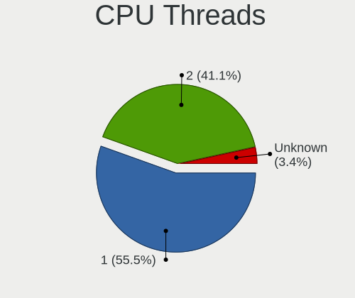

| Number  | Computers | Percent |
|---------|-----------|---------|
| 1       | 228       | 55.47%  |
| 2       | 169       | 41.12%  |
| Unknown | 14        | 3.41%   |

CPU Microarch
-------------

Microarchitecture

| Name          | Computers | Percent |
|---------------|-----------|---------|
| Unknown       | 54        | 13.17%  |
| Haswell       | 48        | 11.71%  |
| KabyLake      | 44        | 10.73%  |
| Skylake       | 37        | 9.02%   |
| Silvermont    | 27        | 6.59%   |
| SandyBridge   | 24        | 5.85%   |
| Broadwell     | 24        | 5.85%   |
| IvyBridge     | 20        | 4.88%   |
| Goldmont      | 15        | 3.66%   |
| Puma          | 13        | 3.17%   |
| Zen           | 12        | 2.93%   |
| Goldmont plus | 11        | 2.68%   |
| CometLake     | 10        | 2.44%   |
| Penryn        | 9         | 2.2%    |
| Zen 2         | 8         | 1.95%   |
| Bobcat        | 8         | 1.95%   |
| Jaguar        | 7         | 1.71%   |
| Nehalem       | 6         | 1.46%   |
| Westmere      | 5         | 1.22%   |
| TigerLake     | 5         | 1.22%   |
| Bonnell       | 5         | 1.22%   |
| Core          | 4         | 0.98%   |
| Zen 3         | 3         | 0.73%   |
| Piledriver    | 2         | 0.49%   |
| K10           | 2         | 0.49%   |
| Excavator     | 2         | 0.49%   |
| Zen+          | 1         | 0.24%   |
| Steamroller   | 1         | 0.24%   |
| NetBurst      | 1         | 0.24%   |
| K8 Hammer     | 1         | 0.24%   |
| K10 Llano     | 1         | 0.24%   |

Graphics
--------

GPU Vendor
----------

Vendors of graphics cards

| Vendor                     | Computers | Percent |
|----------------------------|-----------|---------|
| Intel                      | 267       | 68.64%  |
| AMD                        | 46        | 11.83%  |
| Nvidia                     | 28        | 7.2%    |
| ASPEED Technology          | 25        | 6.43%   |
| Matrox Electronics Systems | 23        | 5.91%   |

GPU Model
---------

Graphics card models

| Model                                                                                    | Computers | Percent |
|------------------------------------------------------------------------------------------|-----------|---------|
| ASPEED Technology ASPEED Graphics Family                                                 | 25        | 6.31%   |
| Intel Xeon E3-1200 v3/4th Gen Core Processor Integrated Graphics Controller              | 23        | 5.81%   |
| Intel HD Graphics 530                                                                    | 19        | 4.8%    |
| Intel Alder Lake-N [UHD Graphics]                                                        | 18        | 4.55%   |
| Intel JasperLake [UHD Graphics]                                                          | 13        | 3.28%   |
| Intel HD Graphics 5500                                                                   | 12        | 3.03%   |
| Intel Haswell-ULT Integrated Graphics Controller                                         | 12        | 3.03%   |
| Intel Atom Processor Z36xxx/Z37xxx Series Graphics & Display                             | 12        | 3.03%   |
| Intel GeminiLake [UHD Graphics 600]                                                      | 10        | 2.53%   |
| Intel Atom/Celeron/Pentium Processor x5-E8000/J3xxx/N3xxx Integrated Graphics Controller | 10        | 2.53%   |
| Intel 2nd Generation Core Processor Family Integrated Graphics Controller                | 10        | 2.53%   |
| Matrox Electronics Systems MGA G200eW WPCM450                                            | 9         | 2.27%   |
| Intel CoffeeLake-S GT2 [UHD Graphics 630]                                                | 8         | 2.02%   |
| Intel 3rd Gen Core processor Graphics Controller                                         | 8         | 2.02%   |
| Intel Skylake GT2 [HD Graphics 520]                                                      | 7         | 1.77%   |
| Intel HD Graphics 620                                                                    | 7         | 1.77%   |
| Intel HD Graphics 630                                                                    | 6         | 1.52%   |
| Intel CometLake-S GT2 [UHD Graphics 630]                                                 | 6         | 1.52%   |
| Matrox Electronics Systems MGA G200EH                                                    | 5         | 1.26%   |
| Matrox Electronics Systems G200eR2                                                       | 5         | 1.26%   |
| Intel Xeon E3-1200 v2/3rd Gen Core processor Graphics Controller                         | 5         | 1.26%   |
| Intel WhiskeyLake-U GT2 [UHD Graphics 620]                                               | 5         | 1.26%   |
| Intel HD Graphics 6000                                                                   | 5         | 1.26%   |
| Intel HD Graphics 500                                                                    | 5         | 1.26%   |
| Intel Mobile 4 Series Chipset Integrated Graphics Controller                             | 4         | 1.01%   |
| AMD Renoir [Radeon Vega Series / Radeon Vega Mobile Series]                              | 4         | 1.01%   |
| AMD Ellesmere [Radeon RX 470/480/570/570X/580/580X/590]                                  | 4         | 1.01%   |
| Intel Tiger Lake-LP GT2 [UHD Graphics G4]                                                | 3         | 0.76%   |
| Intel HD Graphics 610                                                                    | 3         | 0.76%   |
| Intel HD Graphics 515                                                                    | 3         | 0.76%   |
| Intel HD Graphics 510                                                                    | 3         | 0.76%   |
| Intel Elkhart Lake [UHD Graphics Gen11 16EU]                                             | 3         | 0.76%   |
| Intel CometLake-U GT2 [UHD Graphics]                                                     | 3         | 0.76%   |
| Intel Comet Lake UHD Graphics                                                            | 3         | 0.76%   |
| Intel 4 Series Chipset Integrated Graphics Controller                                    | 3         | 0.76%   |
| AMD Wrestler [Radeon HD 6310]                                                            | 3         | 0.76%   |
| AMD Mullins [Radeon R4/R5 Graphics]                                                      | 3         | 0.76%   |
| Nvidia GP107M [GeForce GTX 1050 Mobile]                                                  | 2         | 0.51%   |
| Nvidia GK208B [GeForce GT 710]                                                           | 2         | 0.51%   |
| Nvidia G98 [GeForce 8400 GS Rev. 2]                                                      | 2         | 0.51%   |

GPU Combo
---------

Combinations of graphics cards

| Name           | Computers | Percent |
|----------------|-----------|---------|
| 1 x Intel      | 245       | 59.47%  |
| 1 x AMD        | 44        | 10.68%  |
| Other          | 32        | 7.77%   |
| 1 x ASPEED     | 25        | 6.07%   |
| 1 x Matrox     | 23        | 5.58%   |
| 1 x Nvidia     | 17        | 4.13%   |
| 2 x Intel      | 12        | 2.91%   |
| Intel + Nvidia | 11        | 2.67%   |
| 2 x AMD        | 2         | 0.49%   |
| 2 x Nvidia     | 1         | 0.24%   |

GPU Driver
----------

Free vs proprietary

| Driver      | Computers | Percent |
|-------------|-----------|---------|
| Free        | 362       | 88.08%  |
| Unknown     | 36        | 8.76%   |
| Proprietary | 13        | 3.16%   |

GPU Memory
----------

Total video memory

| Size in GB | Computers | Percent |
|------------|-----------|---------|
| Unknown    | 381       | 92.7%   |
| 0.01-0.5   | 9         | 2.19%   |
| 1.01-2.0   | 8         | 1.95%   |
| 7.01-8.0   | 6         | 1.46%   |
| 0.51-1.0   | 4         | 0.97%   |
| 3.01-4.0   | 2         | 0.49%   |
| 8.01-16.0  | 1         | 0.24%   |

Monitor
-------

Monitor Vendor
--------------

Monitor vendors

| Vendor                  | Computers | Percent |
|-------------------------|-----------|---------|
| Samsung Electronics     | 11        | 12.22%  |
| LG Display              | 11        | 12.22%  |
| Chimei Innolux          | 11        | 12.22%  |
| BOE                     | 8         | 8.89%   |
| AU Optronics            | 8         | 8.89%   |
| Iiyama                  | 6         | 6.67%   |
| Apple                   | 6         | 6.67%   |
| Goldstar                | 5         | 5.56%   |
| Sharp                   | 3         | 3.33%   |
| Philips                 | 3         | 3.33%   |
| Lenovo                  | 3         | 3.33%   |
| Dell                    | 3         | 3.33%   |
| Sony                    | 2         | 2.22%   |
| Chi Mei Optoelectronics | 2         | 2.22%   |
| ViewSonic               | 1         | 1.11%   |
| PANDA                   | 1         | 1.11%   |
| Hewlett-Packard         | 1         | 1.11%   |
| Fujitsu Siemens         | 1         | 1.11%   |
| ASUSTek Computer        | 1         | 1.11%   |
| AOC                     | 1         | 1.11%   |
| Acer                    | 1         | 1.11%   |
| Unknown                 | 1         | 1.11%   |

Monitor Model
-------------

Monitor models

| Model                                                                   | Computers | Percent |
|-------------------------------------------------------------------------|-----------|---------|
| Philips PHL 328E1 PHLC204 3840x2160 700x390mm 31.5-inch                 | 2         | 2.2%    |
| LG Display LCD Monitor LGD11F9 1280x800 290x180mm 13.4-inch             | 2         | 2.2%    |
| ViewSonic LCD Monitor VX3276-QHD 2560x1440                              | 1         | 1.1%    |
| Sony TV SNYC901 1920x1080                                               | 1         | 1.1%    |
| Sony LCD SNY06FA 1600x900 290x160mm 13.0-inch                           | 1         | 1.1%    |
| Sharp LCD Monitor SHP1461 3200x1800 290x170mm 13.2-inch                 | 1         | 1.1%    |
| Sharp LCD Monitor SHP1457 2560x1440 280x160mm 12.7-inch                 | 1         | 1.1%    |
| Sharp LCD Monitor SHP1453 1920x1080 350x190mm 15.7-inch                 | 1         | 1.1%    |
| Samsung Electronics SyncMaster SAM027F 1680x1050 470x300mm 22.0-inch    | 1         | 1.1%    |
| Samsung Electronics SyncMaster SAM01E7 1920x1200 520x320mm 24.0-inch    | 1         | 1.1%    |
| Samsung Electronics SyncMaster SAM01AE 1600x1200 410x310mm 20.2-inch    | 1         | 1.1%    |
| Samsung Electronics SA300/350/360 SAM07D5 1920x1080 530x300mm 24.0-inch | 1         | 1.1%    |
| Samsung Electronics S24H85x SAM0E0C 2560x1440 530x300mm 24.0-inch       | 1         | 1.1%    |
| Samsung Electronics S24E450 SAM0C80 1920x1080 520x290mm 23.4-inch       | 1         | 1.1%    |
| Samsung Electronics LCD Monitor SEC4541 1280x800 260x160mm 12.0-inch    | 1         | 1.1%    |
| Samsung Electronics LCD Monitor SEC324C 1600x900 310x170mm 13.9-inch    | 1         | 1.1%    |
| Samsung Electronics LCD Monitor SEC3047 1366x768 280x160mm 12.7-inch    | 1         | 1.1%    |
| Samsung Electronics LCD Monitor SDC4347 1366x768 340x190mm 15.3-inch    | 1         | 1.1%    |
| Samsung Electronics C27F390 SAM0D32 1920x1080 600x340mm 27.2-inch       | 1         | 1.1%    |
| Philips LCD Monitor PHL 240V5A 1920x1080                                | 1         | 1.1%    |
| PANDA LC133LF1L02 NCP0019 1920x1080 290x170mm 13.2-inch                 | 1         | 1.1%    |
| LG Display LCD Monitor LGD05C0 1920x1080 344x194mm 15.5-inch            | 1         | 1.1%    |
| LG Display LCD Monitor LGD058B 2560x1440 310x170mm 13.9-inch            | 1         | 1.1%    |
| LG Display LCD Monitor LGD0450 1366x768 280x160mm 12.7-inch             | 1         | 1.1%    |
| LG Display LCD Monitor LGD0437 1920x1080 280x160mm 12.7-inch            | 1         | 1.1%    |
| LG Display LCD Monitor LGD0414 1920x1080 280x160mm 12.7-inch            | 1         | 1.1%    |
| LG Display LCD Monitor LGD0408 1920x1080 280x160mm 12.7-inch            | 1         | 1.1%    |
| LG Display LCD Monitor LGD03ED 1366x768 280x160mm 12.7-inch             | 1         | 1.1%    |
| LG Display LCD Monitor LGD02D8 1366x768 280x160mm 12.7-inch             | 1         | 1.1%    |
| LG Display LCD Monitor LGD02AD 1366x768 340x190mm 15.3-inch             | 1         | 1.1%    |
| Lenovo LCD Monitor LEN40B1 1600x900 350x190mm 15.7-inch                 | 1         | 1.1%    |
| Lenovo LCD Monitor LEN4010 1280x800 260x160mm 12.0-inch                 | 1         | 1.1%    |
| Lenovo LCD Monitor LEN4000 1024x768 250x180mm 12.1-inch                 | 1         | 1.1%    |
| Iiyama PLE2607WS IVM5608 1920x1080 550x340mm 25.5-inch                  | 1         | 1.1%    |
| Iiyama PLE2407HDS IVM560D 1920x1080 520x300mm 23.6-inch                 | 1         | 1.1%    |
| Iiyama PL3294Q IVM762D 2560x1440 700x390mm 31.5-inch                    | 1         | 1.1%    |
| Iiyama PL2740HS IVM6662 1920x1080 600x340mm 27.2-inch                   | 1         | 1.1%    |
| Iiyama PL2492H IVM612F 1920x1080 530x300mm 24.0-inch                    | 1         | 1.1%    |
| Iiyama PL2209HD IVM560B 1920x1080 480x270mm 21.7-inch                   | 1         | 1.1%    |
| Hewlett-Packard LA1951 HWP285A 1280x1024 380x300mm 19.1-inch            | 1         | 1.1%    |

Monitor Resolution
------------------

Monitor screen resolution

| Resolution         | Computers | Percent |
|--------------------|-----------|---------|
| 1920x1080 (FHD)    | 37        | 41.11%  |
| 1366x768 (WXGA)    | 14        | 15.56%  |
| 2560x1440 (QHD)    | 10        | 11.11%  |
| 1280x800 (WXGA)    | 7         | 7.78%   |
| 3840x2160 (4K)     | 5         | 5.56%   |
| 1600x900 (HD+)     | 5         | 5.56%   |
| 3440x1440          | 2         | 2.22%   |
| 1680x1050 (WSXGA+) | 2         | 2.22%   |
| 1280x1024 (SXGA)   | 2         | 2.22%   |
| 3200x1800 (QHD+)   | 1         | 1.11%   |
| 2880x1800          | 1         | 1.11%   |
| 2560x1080          | 1         | 1.11%   |
| 1920x515           | 1         | 1.11%   |
| 1920x1200 (WUXGA)  | 1         | 1.11%   |
| 1600x1200          | 1         | 1.11%   |

Monitor Diagonal
----------------

Diagonal size in inches

| Inches  | Computers | Percent |
|---------|-----------|---------|
| 13      | 19        | 21.11%  |
| 15      | 18        | 20%     |
| 12      | 15        | 16.67%  |
| 27      | 8         | 8.89%   |
| 24      | 6         | 6.67%   |
| 23      | 4         | 4.44%   |
| Unknown | 4         | 4.44%   |
| 34      | 3         | 3.33%   |
| 31      | 3         | 3.33%   |
| 17      | 3         | 3.33%   |
| 20      | 2         | 2.22%   |
| 19      | 2         | 2.22%   |
| 25      | 1         | 1.11%   |
| 22      | 1         | 1.11%   |
| 21      | 1         | 1.11%   |

Monitor Width
-------------

Physical width

| Width in mm | Computers | Percent |
|-------------|-----------|---------|
| 301-350     | 29        | 32.58%  |
| 201-300     | 22        | 24.72%  |
| 501-600     | 18        | 20.22%  |
| 351-400     | 5         | 5.62%   |
| 601-700     | 4         | 4.49%   |
| 401-500     | 4         | 4.49%   |
| Unknown     | 4         | 4.49%   |
| 701-800     | 3         | 3.37%   |

Aspect Ratio
------------

Proportional relationship between the width and the height

| Ratio   | Computers | Percent |
|---------|-----------|---------|
| 16/9    | 67        | 75.28%  |
| 16/10   | 11        | 12.36%  |
| 21/9    | 3         | 3.37%   |
| Unknown | 3         | 3.37%   |
| 5/4     | 2         | 2.25%   |
| 4/3     | 1         | 1.12%   |
| 3/2     | 1         | 1.12%   |
| 3.88    | 1         | 1.12%   |

Monitor Area
------------

Area in inch

| Area in inch | Computers | Percent |
|----------------|-----------|---------|
| 81-90          | 16        | 17.98%  |
| 61-70          | 14        | 15.73%  |
| 91-100         | 12        | 13.48%  |
| 201-250        | 10        | 11.24%  |
| 301-350        | 8         | 8.99%   |
| 101-110        | 6         | 6.74%   |
| 351-500        | 5         | 5.62%   |
| 151-200        | 4         | 4.49%   |
| Unknown        | 4         | 4.49%   |
| 71-80          | 3         | 3.37%   |
| 251-300        | 3         | 3.37%   |
| 121-130        | 3         | 3.37%   |
| 1-40           | 1         | 1.12%   |

Pixel Density
-------------

Pixels per inch

| Density       | Computers | Percent |
|---------------|-----------|---------|
| 121-160       | 28        | 32.18%  |
| 51-100        | 21        | 24.14%  |
| 101-120       | 20        | 22.99%  |
| 161-240       | 12        | 13.79%  |
| Unknown       | 4         | 4.6%    |
| More than 240 | 2         | 2.3%    |

Multiple Monitors
-----------------

Total monitors connected

| Total | Computers | Percent |
|-------|-----------|---------|
| 0     | 318       | 77.37%  |
| 1     | 85        | 20.68%  |
| 2     | 8         | 1.95%   |

Network
-------

Net Controller Vendor
---------------------

Controller vendors

| Vendor                            | Computers | Percent |
|-----------------------------------|-----------|---------|
| Intel                             | 338       | 61.12%  |
| Realtek Semiconductor             | 109       | 19.71%  |
| Broadcom                          | 34        | 6.15%   |
| Qualcomm Atheros                  | 26        | 4.7%    |
| TP-Link                           | 7         | 1.27%   |
| AMD                               | 7         | 1.27%   |
| Mellanox Technologies             | 4         | 0.72%   |
| IMC Networks                      | 4         | 0.72%   |
| Ralink Technology                 | 3         | 0.54%   |
| Ralink                            | 3         | 0.54%   |
| Marvell Technology Group          | 3         | 0.54%   |
| Hewlett-Packard                   | 2         | 0.36%   |
| Edimax Technology                 | 2         | 0.36%   |
| U-Blox                            | 1         | 0.18%   |
| Sierra Wireless                   | 1         | 0.18%   |
| Samsung Electronics               | 1         | 0.18%   |
| MediaTek                          | 1         | 0.18%   |
| Insyde Software                   | 1         | 0.18%   |
| Huawei Technologies               | 1         | 0.18%   |
| HMD Global                        | 1         | 0.18%   |
| Fibocom                           | 1         | 0.18%   |
| Ericsson Business Mobile Networks | 1         | 0.18%   |
| Chelsio Communications            | 1         | 0.18%   |
| ADMtek                            | 1         | 0.18%   |

Net Controller Model
--------------------

Controller models

| Model                                                                         | Computers | Percent |
|-------------------------------------------------------------------------------|-----------|---------|
| Realtek RTL8111/8168/8211/8411 PCI Express Gigabit Ethernet Controller        | 92        | 13.49%  |
| Intel I211 Gigabit Network Connection                                         | 61        | 8.94%   |
| Intel I210 Gigabit Network Connection                                         | 39        | 5.72%   |
| Intel I350 Gigabit Network Connection                                         | 32        | 4.69%   |
| Intel Ethernet Controller I226-V                                              | 30        | 4.4%    |
| Intel Ethernet Controller I225-V                                              | 20        | 2.93%   |
| Intel 82574L Gigabit Network Connection                                       | 19        | 2.79%   |
| Intel 82579LM Gigabit Network Connection (Lewisville)                         | 16        | 2.35%   |
| Intel 82571EB/82571GB Gigabit Ethernet Controller D0/D1 (copper applications) | 15        | 2.2%    |
| Intel Wi-Fi 6 AX200                                                           | 11        | 1.61%   |
| Intel Ethernet Connection I217-LM                                             | 10        | 1.47%   |
| Intel Ethernet Connection (2) I219-V                                          | 10        | 1.47%   |
| Intel Wireless 7265                                                           | 8         | 1.17%   |
| Intel Ethernet Connection X553 1GbE                                           | 8         | 1.17%   |
| Intel I210 Gigabit Fiber Network Connection                                   | 7         | 1.03%   |
| Intel 82599ES 10-Gigabit SFI/SFP+ Network Connection                          | 7         | 1.03%   |
| Broadcom NetXtreme II BCM5716 Gigabit Ethernet                                | 7         | 1.03%   |
| AMD XGMAC 10GbE Controller                                                    | 7         | 1.03%   |
| Realtek RTL8125 2.5GbE Controller                                             | 6         | 0.88%   |
| Qualcomm Atheros QCA9565 / AR9565 Wireless Network Adapter                    | 6         | 0.88%   |
| Intel Wireless 7260                                                           | 6         | 0.88%   |
| Realtek RTL8188EUS 802.11n Wireless Network Adapter                           | 5         | 0.73%   |
| Qualcomm Atheros AR9285 Wireless Network Adapter (PCI-Express)                | 5         | 0.73%   |
| Intel Wireless 8265 / 8275                                                    | 5         | 0.73%   |
| Intel Ethernet Connection X552/X557-AT 10GBASE-T                              | 5         | 0.73%   |
| Intel Ethernet Connection I354                                                | 5         | 0.73%   |
| Intel 82572EI Gigabit Ethernet Controller (Copper)                            | 5         | 0.73%   |
| Broadcom NetXtreme BCM5719 Gigabit Ethernet PCIe                              | 5         | 0.73%   |
| Intel Wireless 8260                                                           | 4         | 0.59%   |
| Intel Wireless 3165                                                           | 4         | 0.59%   |
| Intel Ethernet Connection (2) I219-LM                                         | 4         | 0.59%   |
| Intel Centrino Advanced-N 6205 [Taylor Peak]                                  | 4         | 0.59%   |
| Intel Cannon Point-LP CNVi [Wireless-AC]                                      | 4         | 0.59%   |
| Intel 82576 Gigabit Network Connection                                        | 4         | 0.59%   |
| Intel 82567LM Gigabit Network Connection                                      | 4         | 0.59%   |
| Realtek RTL8821CE 802.11ac PCIe Wireless Network Adapter                      | 3         | 0.44%   |
| Realtek RTL810xE PCI Express Fast Ethernet controller                         | 3         | 0.44%   |
| Qualcomm Atheros AR93xx Wireless Network Adapter                              | 3         | 0.44%   |
| Intel Wi-Fi 6 AX201                                                           | 3         | 0.44%   |
| Intel Wi-Fi 5(802.11ac) Wireless-AC 9x6x [Thunder Peak]                       | 3         | 0.44%   |

Wireless Vendor
---------------

Wireless vendors

| Vendor                | Computers | Percent |
|-----------------------|-----------|---------|
| Intel                 | 75        | 53.19%  |
| Qualcomm Atheros      | 22        | 15.6%   |
| Realtek Semiconductor | 13        | 9.22%   |
| Broadcom              | 11        | 7.8%    |
| TP-Link               | 6         | 4.26%   |
| IMC Networks          | 4         | 2.84%   |
| Ralink Technology     | 3         | 2.13%   |
| Ralink                | 3         | 2.13%   |
| Edimax Technology     | 2         | 1.42%   |
| Sierra Wireless       | 1         | 0.71%   |
| MediaTek              | 1         | 0.71%   |

Wireless Model
--------------

Wireless models

| Model                                                                   | Computers | Percent |
|-------------------------------------------------------------------------|-----------|---------|
| Intel Wi-Fi 6 AX200                                                     | 11        | 7.8%    |
| Intel Wireless 7265                                                     | 8         | 5.67%   |
| Qualcomm Atheros QCA9565 / AR9565 Wireless Network Adapter              | 6         | 4.26%   |
| Intel Wireless 7260                                                     | 6         | 4.26%   |
| Realtek RTL8188EUS 802.11n Wireless Network Adapter                     | 5         | 3.55%   |
| Qualcomm Atheros AR9285 Wireless Network Adapter (PCI-Express)          | 5         | 3.55%   |
| Intel Wireless 8265 / 8275                                              | 5         | 3.55%   |
| Intel Wireless 8260                                                     | 4         | 2.84%   |
| Intel Wireless 3165                                                     | 4         | 2.84%   |
| Intel Centrino Advanced-N 6205 [Taylor Peak]                            | 4         | 2.84%   |
| Intel Cannon Point-LP CNVi [Wireless-AC]                                | 4         | 2.84%   |
| Realtek RTL8821CE 802.11ac PCIe Wireless Network Adapter                | 3         | 2.13%   |
| Qualcomm Atheros AR93xx Wireless Network Adapter                        | 3         | 2.13%   |
| Intel Wi-Fi 6 AX201                                                     | 3         | 2.13%   |
| Intel Wi-Fi 5(802.11ac) Wireless-AC 9x6x [Thunder Peak]                 | 3         | 2.13%   |
| Intel PRO/Wireless 5100 AGN [Shiloh] Network Connection                 | 3         | 2.13%   |
| IMC Networks 802.11 n/g/b Wireless LAN USB Mini-Card                    | 3         | 2.13%   |
| Broadcom BCM4331 802.11a/b/g/n                                          | 3         | 2.13%   |
| TP-Link AC600 wireless Realtek RTL8811AU [Archer T2U Nano]              | 2         | 1.42%   |
| Ralink RT5370 Wireless Adapter                                          | 2         | 1.42%   |
| Qualcomm Atheros QCA986x/988x 802.11ac Wireless Network Adapter         | 2         | 1.42%   |
| Qualcomm Atheros AR9287 Wireless Network Adapter (PCI-Express)          | 2         | 1.42%   |
| Qualcomm Atheros AR242x / AR542x Wireless Network Adapter (PCI-Express) | 2         | 1.42%   |
| Intel Wireless 3160                                                     | 2         | 1.42%   |
| Intel WiFi Link 5100                                                    | 2         | 1.42%   |
| Intel Raptor Lake PCH CNVi WiFi                                         | 2         | 1.42%   |
| Intel Gemini Lake PCH CNVi WiFi                                         | 2         | 1.42%   |
| Intel Dual Band Wireless-AC 3168NGW [Stone Peak]                        | 2         | 1.42%   |
| Intel Comet Lake PCH-LP CNVi WiFi                                       | 2         | 1.42%   |
| Intel Cannon Lake PCH CNVi WiFi                                         | 2         | 1.42%   |
| Edimax EW-7811Un 802.11n Wireless Adapter [Realtek RTL8188CUS]          | 2         | 1.42%   |
| Broadcom BCM43228 802.11a/b/g/n                                         | 2         | 1.42%   |
| Broadcom BCM4321 802.11a/b/g/n                                          | 2         | 1.42%   |
| TP-Link Wireless USB Adapter                                            | 1         | 0.71%   |
| TP-Link Wireless MU-MIMO USB Adapter                                    | 1         | 0.71%   |
| TP-Link Archer T3U [Realtek RTL8812BU]                                  | 1         | 0.71%   |
| TP-Link Archer T2U PLUS [RTL8821AU]                                     | 1         | 0.71%   |
| Sierra Wireless EM7455                                                  | 1         | 0.71%   |
| Realtek RTL88x2bu [AC1200 Techkey]                                      | 1         | 0.71%   |
| Realtek RTL8723AE PCIe Wireless Network Adapter                         | 1         | 0.71%   |

Ethernet Vendor
---------------

Ethernet vendors

| Vendor                   | Computers | Percent |
|--------------------------|-----------|---------|
| Intel                    | 304       | 67.11%  |
| Realtek Semiconductor    | 100       | 22.08%  |
| Broadcom                 | 27        | 5.96%   |
| AMD                      | 7         | 1.55%   |
| Qualcomm Atheros         | 6         | 1.32%   |
| Marvell Technology Group | 3         | 0.66%   |
| TP-Link                  | 1         | 0.22%   |
| Samsung Electronics      | 1         | 0.22%   |
| Insyde Software          | 1         | 0.22%   |
| HMD Global               | 1         | 0.22%   |
| Chelsio Communications   | 1         | 0.22%   |
| ADMtek                   | 1         | 0.22%   |

Ethernet Model
--------------

Ethernet models

| Model                                                                         | Computers | Percent |
|-------------------------------------------------------------------------------|-----------|---------|
| Realtek RTL8111/8168/8211/8411 PCI Express Gigabit Ethernet Controller        | 92        | 17.33%  |
| Intel I211 Gigabit Network Connection                                         | 61        | 11.49%  |
| Intel I210 Gigabit Network Connection                                         | 39        | 7.34%   |
| Intel I350 Gigabit Network Connection                                         | 32        | 6.03%   |
| Intel Ethernet Controller I226-V                                              | 30        | 5.65%   |
| Intel Ethernet Controller I225-V                                              | 20        | 3.77%   |
| Intel 82574L Gigabit Network Connection                                       | 19        | 3.58%   |
| Intel 82579LM Gigabit Network Connection (Lewisville)                         | 16        | 3.01%   |
| Intel 82571EB/82571GB Gigabit Ethernet Controller D0/D1 (copper applications) | 15        | 2.82%   |
| Intel Ethernet Connection I217-LM                                             | 10        | 1.88%   |
| Intel Ethernet Connection (2) I219-V                                          | 10        | 1.88%   |
| Intel Ethernet Connection X553 1GbE                                           | 8         | 1.51%   |
| Intel I210 Gigabit Fiber Network Connection                                   | 7         | 1.32%   |
| Intel 82599ES 10-Gigabit SFI/SFP+ Network Connection                          | 7         | 1.32%   |
| Broadcom NetXtreme II BCM5716 Gigabit Ethernet                                | 7         | 1.32%   |
| AMD XGMAC 10GbE Controller                                                    | 7         | 1.32%   |
| Realtek RTL8125 2.5GbE Controller                                             | 6         | 1.13%   |
| Intel Ethernet Connection X552/X557-AT 10GBASE-T                              | 5         | 0.94%   |
| Intel Ethernet Connection I354                                                | 5         | 0.94%   |
| Intel 82572EI Gigabit Ethernet Controller (Copper)                            | 5         | 0.94%   |
| Broadcom NetXtreme BCM5719 Gigabit Ethernet PCIe                              | 5         | 0.94%   |
| Intel Ethernet Connection (2) I219-LM                                         | 4         | 0.75%   |
| Intel 82576 Gigabit Network Connection                                        | 4         | 0.75%   |
| Intel 82567LM Gigabit Network Connection                                      | 4         | 0.75%   |
| Realtek RTL810xE PCI Express Fast Ethernet controller                         | 3         | 0.56%   |
| Intel Ethernet Controller 10-Gigabit X540-AT2                                 | 3         | 0.56%   |
| Intel Ethernet Connection I219-V                                              | 3         | 0.56%   |
| Intel Ethernet Connection I218-LM                                             | 3         | 0.56%   |
| Intel Ethernet Connection I217-V                                              | 3         | 0.56%   |
| Intel Ethernet Connection (5) I219-LM                                         | 3         | 0.56%   |
| Intel Ethernet Connection (3) I218-LM                                         | 3         | 0.56%   |
| Intel 82583V Gigabit Network Connection                                       | 3         | 0.56%   |
| Intel 82575GB Gigabit Network Connection                                      | 3         | 0.56%   |
| Intel 82575EB Gigabit Network Connection                                      | 3         | 0.56%   |
| Intel 82567LM-3 Gigabit Network Connection                                    | 3         | 0.56%   |
| Qualcomm Atheros QCA8171 Gigabit Ethernet                                     | 2         | 0.38%   |
| Intel I350 Gigabit Fiber Network Connection                                   | 2         | 0.38%   |
| Intel Ethernet Connection I219-LM                                             | 2         | 0.38%   |
| Intel Ethernet Connection I218-V                                              | 2         | 0.38%   |
| Intel Ethernet Connection (7) I219-V                                          | 2         | 0.38%   |

Net Controller Kind
-------------------

Ethernet, WiFi or modem

| Kind     | Computers | Percent |
|----------|-----------|---------|
| Ethernet | 390       | 74.14%  |
| WiFi     | 126       | 23.95%  |
| Unknown  | 7         | 1.33%   |
| Modem    | 3         | 0.57%   |

Used Controller
---------------

Currently used network controller

| Kind     | Computers | Percent |
|----------|-----------|---------|
| Ethernet | 358       | 86.89%  |
| WiFi     | 54        | 13.11%  |

NICs
----

Total network controllers on board

| Total | Computers | Percent |
|-------|-----------|---------|
| 2     | 134       | 32.45%  |
| 4     | 94        | 22.76%  |
| 1     | 52        | 12.59%  |
| 3     | 49        | 11.86%  |
| 6     | 31        | 7.51%   |
| 5     | 26        | 6.3%    |
| 9     | 8         | 1.94%   |
| 8     | 7         | 1.69%   |
| 0     | 6         | 1.45%   |
| 7     | 3         | 0.73%   |
| 14    | 1         | 0.24%   |
| 12    | 1         | 0.24%   |
| 10    | 1         | 0.24%   |

IPv6
----

IPv6 vs IPv4

| Used | Computers | Percent |
|------|-----------|---------|
| No   | 336       | 78.32%  |
| Yes  | 93        | 21.68%  |

Bluetooth
---------

Bluetooth Vendor
----------------

Controller vendors

| Vendor                          | Computers | Percent |
|---------------------------------|-----------|---------|
| Intel                           | 55        | 60.44%  |
| Cambridge Silicon Radio         | 7         | 7.69%   |
| Apple                           | 7         | 7.69%   |
| IMC Networks                    | 5         | 5.49%   |
| Broadcom                        | 5         | 5.49%   |
| Realtek Semiconductor           | 3         | 3.3%    |
| TP-Link                         | 2         | 2.2%    |
| Hewlett-Packard                 | 2         | 2.2%    |
| Foxconn / Hon Hai               | 2         | 2.2%    |
| Qualcomm Atheros Communications | 1         | 1.1%    |
| Lite-On Technology              | 1         | 1.1%    |
| Dell                            | 1         | 1.1%    |

Bluetooth Model
---------------

Controller models

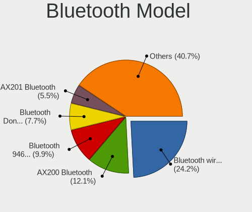

| Model                                                  | Computers | Percent |
|--------------------------------------------------------|-----------|---------|
| Intel Bluetooth wireless interface                     | 22        | 24.18%  |
| Intel AX200 Bluetooth                                  | 11        | 12.09%  |
| Intel Bluetooth 9460/9560 Jefferson Peak (JfP)         | 9         | 9.89%   |
| Cambridge Silicon Radio Bluetooth Dongle (HCI mode)    | 7         | 7.69%   |
| Intel AX201 Bluetooth                                  | 5         | 5.49%   |
| Intel Wireless-AC 9260 Bluetooth Adapter               | 3         | 3.3%    |
| Apple Bluetooth Host Controller                        | 3         | 3.3%    |
| TP-Link Bluetooth 5.0 USB Adapter                      | 2         | 2.2%    |
| Realtek Bluetooth Adapter                              | 2         | 2.2%    |
| Intel Wireless-AC 3168 Bluetooth                       | 2         | 2.2%    |
| Broadcom BCM20702 Bluetooth 4.0 [ThinkPad]             | 2         | 2.2%    |
| Realtek RTL8723A Bluetooth                             | 1         | 1.1%    |
| Qualcomm Atheros AR3012 Bluetooth                      | 1         | 1.1%    |
| Lite-On Atheros AR3012 Bluetooth                       | 1         | 1.1%    |
| Intel Centrino Bluetooth Wireless Transceiver          | 1         | 1.1%    |
| Intel AX211 Bluetooth                                  | 1         | 1.1%    |
| Intel AX210 Bluetooth                                  | 1         | 1.1%    |
| IMC Networks Realtek Bluetooth Adapter                 | 1         | 1.1%    |
| IMC Networks Qualcomm Atheros Bluetooth 4.1            | 1         | 1.1%    |
| IMC Networks Qualcomm Atheros Bluetooth 4.0 + HS       | 1         | 1.1%    |
| IMC Networks Qualcomm Atheros Bluetooth 4.0            | 1         | 1.1%    |
| IMC Networks Asus Integrated Bluetooth module [AR3011] | 1         | 1.1%    |
| HP Broadcom 2070 Bluetooth Combo                       | 1         | 1.1%    |
| HP Bluetooth 2.0 Interface [Broadcom BCM2045]          | 1         | 1.1%    |
| Foxconn / Hon Hai MediaTek Bluetooth Adapter           | 1         | 1.1%    |
| Foxconn / Hon Hai BCM43142A0 broadcom bluetooth        | 1         | 1.1%    |
| Dell Dell Wireless 380 Bluetooth 4.0 Module            | 1         | 1.1%    |
| Broadcom Bluetooth 4.1 USB                             | 1         | 1.1%    |
| Broadcom BCM2070 Bluetooth 2.1 + EDR                   | 1         | 1.1%    |
| Broadcom BCM2045B (BDC-2.1)                            | 1         | 1.1%    |
| Apple Built-in iSight (no firmware loaded)             | 1         | 1.1%    |
| Apple Built-in Bluetooth 2.0+EDR HCI                   | 1         | 1.1%    |
| Apple Broadcom Built-in Bluetooth                      | 1         | 1.1%    |
| Apple Broadcom Bluetooth 2.1 module                    | 1         | 1.1%    |

Sound
-----

Sound Vendor
------------

Sound card vendors

| Vendor                                       | Computers | Percent |
|----------------------------------------------|-----------|---------|
| Intel                                        | 258       | 75.88%  |
| AMD                                          | 56        | 16.47%  |
| Nvidia                                       | 18        | 5.29%   |
| Zoran Co. Personal Media Division (Nogatech) | 1         | 0.29%   |
| VIA Technologies                             | 1         | 0.29%   |
| Steinberg Soft-und Hardware                  | 1         | 0.29%   |
| JMTek                                        | 1         | 0.29%   |
| Harman Kardon                                | 1         | 0.29%   |
| Creative Labs                                | 1         | 0.29%   |
| Corsair                                      | 1         | 0.29%   |
| Blue Microphones                             | 1         | 0.29%   |

Sound Model
-----------

Sound card models

| Model                                                                                             | Computers | Percent |
|---------------------------------------------------------------------------------------------------|-----------|---------|
| Intel Xeon E3-1200 v3/4th Gen Core Processor HD Audio Controller                                  | 23        | 5.56%   |
| Intel 8 Series/C220 Series Chipset High Definition Audio Controller                               | 19        | 4.59%   |
| Intel 100 Series/C230 Series Chipset Family HD Audio Controller                                   | 18        | 4.35%   |
| Intel Sunrise Point-LP HD Audio                                                                   | 17        | 4.11%   |
| Intel Alder Lake-N PCH High Definition Audio Controller                                           | 17        | 4.11%   |
| AMD Family 17h/19h/1ah HD Audio Controller                                                        | 17        | 4.11%   |
| Intel Wildcat Point-LP High Definition Audio Controller                                           | 15        | 3.62%   |
| Intel Broadwell-U Audio Controller                                                                | 15        | 3.62%   |
| Intel 7 Series/C216 Chipset Family High Definition Audio Controller                               | 15        | 3.62%   |
| Intel Jasper Lake HD Audio                                                                        | 13        | 3.14%   |
| Intel Haswell-ULT HD Audio Controller                                                             | 12        | 2.9%    |
| Intel 6 Series/C200 Series Chipset Family High Definition Audio Controller                        | 12        | 2.9%    |
| Intel 8 Series HD Audio Controller                                                                | 11        | 2.66%   |
| Intel 200 Series PCH HD Audio                                                                     | 11        | 2.66%   |
| Intel Celeron/Pentium Silver Processor High Definition Audio                                      | 10        | 2.42%   |
| Intel Atom/Celeron/Pentium Processor x5-E8000/J3xxx/N3xxx Series High Definition Audio Controller | 10        | 2.42%   |
| AMD FCH Azalia Controller                                                                         | 10        | 2.42%   |
| Intel Cannon Lake PCH cAVS                                                                        | 9         | 2.17%   |
| AMD Kabini HDMI/DP Audio                                                                          | 9         | 2.17%   |
| Intel Cannon Point-LP High Definition Audio Controller                                            | 8         | 1.93%   |
| Intel Atom Processor Z36xxx/Z37xxx Series High Definition Audio Controller                        | 8         | 1.93%   |
| AMD Renoir Radeon High Definition Audio Controller                                                | 8         | 1.93%   |
| AMD SBx00 Azalia (Intel HDA)                                                                      | 7         | 1.69%   |
| Intel Comet Lake PCH-LP cAVS                                                                      | 6         | 1.45%   |
| Intel Tiger Lake-LP Smart Sound Technology Audio Controller                                       | 5         | 1.21%   |
| Intel 82801I (ICH9 Family) HD Audio Controller                                                    | 5         | 1.21%   |
| Intel 82801H (ICH8 Family) HD Audio Controller                                                    | 5         | 1.21%   |
| AMD Wrestler HDMI Audio                                                                           | 5         | 1.21%   |
| AMD Starship/Matisse HD Audio Controller                                                          | 5         | 1.21%   |
| Intel Celeron N3350/Pentium N4200/Atom E3900 Series Audio Cluster                                 | 4         | 0.97%   |
| Intel 82801JI (ICH10 Family) HD Audio Controller                                                  | 4         | 0.97%   |
| Intel 5 Series/3400 Series Chipset High Definition Audio                                          | 4         | 0.97%   |
| AMD Ellesmere HDMI Audio [Radeon RX 470/480 / 570/580/590]                                        | 4         | 0.97%   |
| Nvidia GP104 High Definition Audio Controller                                                     | 3         | 0.72%   |
| Nvidia GF108 High Definition Audio Controller                                                     | 3         | 0.72%   |
| Intel Elkhart Lake High Density Audio bus interface                                               | 3         | 0.72%   |
| Intel Comet Lake PCH-V cAVS                                                                       | 3         | 0.72%   |
| Intel 82801JD/DO (ICH10 Family) HD Audio Controller                                               | 3         | 0.72%   |
| Nvidia TU107 GeForce GTX 1650 High Definition Audio Controller                                    | 2         | 0.48%   |
| Nvidia High Definition Audio Controller                                                           | 2         | 0.48%   |

Memory
------

Memory Vendor
-------------

Memory module vendors

| Vendor                | Computers | Percent |
|-----------------------|-----------|---------|
| Samsung Electronics   | 74        | 18.18%  |
| Kingston              | 50        | 12.29%  |
| SK hynix              | 45        | 11.06%  |
| Micron Technology     | 43        | 10.57%  |
| Crucial               | 41        | 10.07%  |
| Unknown               | 30        | 7.37%   |
| Corsair               | 30        | 7.37%   |
| Transcend             | 14        | 3.44%   |
| A-DATA Technology     | 11        | 2.7%    |
| G.Skill               | 8         | 1.97%   |
| Kimtigo               | 6         | 1.47%   |
| Unknown (ABCD)        | 5         | 1.23%   |
| Ramaxel Technology    | 5         | 1.23%   |
| Apacer                | 5         | 1.23%   |
| Nanya Technology      | 4         | 0.98%   |
| Unknown               | 4         | 0.98%   |
| Toshiba               | 3         | 0.74%   |
| Teikon                | 3         | 0.74%   |
| Hewlett-Packard       | 3         | 0.74%   |
| GeIL                  | 3         | 0.74%   |
| Elpida                | 3         | 0.74%   |
| Avant                 | 3         | 0.74%   |
| tigo                  | 2         | 0.49%   |
| Team                  | 2         | 0.49%   |
| SK_Hynix              | 2         | 0.49%   |
| Patriot               | 2         | 0.49%   |
| Unknown (AB)          | 1         | 0.25%   |
| Unknown (07FB)        | 1         | 0.25%   |
| KomputerBay           | 1         | 0.25%   |
| Kingmax Semiconductor | 1         | 0.25%   |
| HPE                   | 1         | 0.25%   |
| GOODRAM               | 1         | 0.25%   |

Memory Model
------------

Memory module models

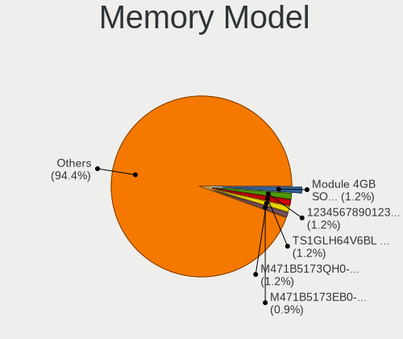

| Model                                                          | Computers | Percent |
|----------------------------------------------------------------|-----------|---------|
| Unknown RAM Module 4GB SODIMM DDR3 1333MT/s                    | 5         | 1.16%   |
| Unknown (ABCD) RAM 123456789012345678 2GB DIMM LPDDR4 2133MT/s | 5         | 1.16%   |
| Transcend RAM TS1GLH64V6BL 8GB SODIMM DDR4 2667MT/s            | 5         | 1.16%   |
| Samsung RAM M471B5173QH0-YK0 4GB SODIMM DDR3 1600MT/s          | 5         | 1.16%   |
| Samsung RAM M471B5173EB0-YK0 4GB SODIMM DDR3 1600MT/s          | 4         | 0.93%   |
| A-DATA RAM Module 4GB DIMM DDR4 1866MT/s                       | 4         | 0.93%   |
| Unknown                                                        | 4         | 0.93%   |
| Unknown RAM Module 8GB 1600MT/s                                | 3         | 0.69%   |
| Unknown RAM Module 2GB DIMM DDR2 667MT/s                       | 3         | 0.69%   |
| SK hynix RAM HMT41GS6BFR8A-PB 8GB SODIMM DDR3 1600MT/s         | 3         | 0.69%   |
| SK hynix RAM HMA81GS6AFR8N-UH 8GB SODIMM DDR4 2400MT/s         | 3         | 0.69%   |
| SK hynix RAM HMA451U6AFR8N-TF 4GB DIMM DDR4 2133MT/s           | 3         | 0.69%   |
| Samsung RAM M471A5244CB0-CTD 4GB SODIMM DDR4 2667MT/s          | 3         | 0.69%   |
| Samsung RAM M471A1K43CB1-CTD 8GB SODIMM DDR4 2667MT/s          | 3         | 0.69%   |
| Micron RAM 8ATF1G64AZ-2G3B1 8GB DIMM DDR4 2400MT/s             | 3         | 0.69%   |
| Kingston RAM KHX1600C9S3L/8G 8GB SODIMM DDR3 1600MT/s          | 3         | 0.69%   |
| Crucial RAM CT32G48C40S5.C16A1 32GB SODIMM DDR5 4800MT/s       | 3         | 0.69%   |
| Apacer RAM 37352E4138334331 2GB SODIMM DDR3 1333MT/s           | 3         | 0.69%   |
| Unknown RAM Module 8GB DIMM DDR3 1600MT/s                      | 2         | 0.46%   |
| Unknown RAM Module 8GB DIMM DDR3 1333MT/s                      | 2         | 0.46%   |
| Unknown RAM Module 4GB DIMM DDR3 1333MT/s                      | 2         | 0.46%   |
| Transcend RAM TS512MLH64V6HL 4GB SODIMM DDR4 2667MT/s          | 2         | 0.46%   |
| tigo RAM 1600Mhz-8G 8GB SODIMM DDR3 1600MT/s                   | 2         | 0.46%   |
| Teikon RAM TMTS8G58DFRBFEN-16 8GB SODIMM DDR3 1600MT/s         | 2         | 0.46%   |
| Team RAM TEAMGROUP-SD4-2400 8GB SODIMM DDR4 2400MT/s           | 2         | 0.46%   |
| SK hynix RAM HMT351U6CFR8C-PB 4GB DIMM DDR3 1600MT/s           | 2         | 0.46%   |
| SK hynix RAM HMT325U6CFR8C-H9 2GB DIMM DDR3 1333MT/s           | 2         | 0.46%   |
| SK hynix RAM HMA81GS6JJR8N-VK 8GB SODIMM DDR4 2667MT/s         | 2         | 0.46%   |
| SK hynix RAM HMA41GU6AFR8N-TF 8GB DIMM DDR4 2133MT/s           | 2         | 0.46%   |
| Samsung RAM Module 8GB SODIMM DDR4 2133MT/s                    | 2         | 0.46%   |
| Samsung RAM Module 4GB Row Of Chips LPDDR5 4000MT/s            | 2         | 0.46%   |
| Samsung RAM M471B5173QH0-YK0 4GB DIMM DDR3 1600MT/s            | 2         | 0.46%   |
| Samsung RAM M471B5173DB0-YK0 4GB SODIMM DDR3 1600MT/s          | 2         | 0.46%   |
| Samsung RAM M471A1K43DB1-CTD 8GB SODIMM DDR4 2667MT/s          | 2         | 0.46%   |
| Samsung RAM M425R2GA3BBO-CQKOL 16GB SODIMM DDR5 4800MT/s       | 2         | 0.46%   |
| Samsung RAM M425R1GB4BB0-CQKOL 8GB SODIMM DDR5 4800MT/s        | 2         | 0.46%   |
| Samsung RAM M378B5673FH0-CH9 2GB DIMM DDR3 1333MT/s            | 2         | 0.46%   |
| Samsung RAM M378B5273DH0-CK0 4GB DIMM DDR3 1600MT/s            | 2         | 0.46%   |
| Micron RAM 8KTF51264HZ-1G6E1 4GB SODIMM DDR3 1600MT/s          | 2         | 0.46%   |
| Micron RAM 8ATF1G64HZ-2G6E1 8GB SODIMM DDR4 2667MT/s           | 2         | 0.46%   |

Memory Kind
-----------

Memory module kinds

| Kind    | Computers | Percent |
|---------|-----------|---------|
| DDR3    | 154       | 42.9%   |
| DDR4    | 151       | 42.06%  |
| DDR5    | 18        | 5.01%   |
| DDR2    | 13        | 3.62%   |
| Unknown | 8         | 2.23%   |
| LPDDR4  | 7         | 1.95%   |
| LPDDR5  | 4         | 1.11%   |
| LPDDR3  | 2         | 0.56%   |
| SDRAM   | 1         | 0.28%   |
| DDR     | 1         | 0.28%   |

Memory Form Factor
------------------

Physical design of the memory module

| Name         | Computers | Percent |
|--------------|-----------|---------|
| SODIMM       | 181       | 50.28%  |
| DIMM         | 164       | 45.56%  |
| Row Of Chips | 8         | 2.22%   |
| Unknown      | 4         | 1.11%   |
| Chip         | 3         | 0.83%   |

Memory Size
-----------

Memory module size

| Size  | Computers | Percent |
|-------|-----------|---------|
| 8192  | 158       | 40.31%  |
| 4096  | 119       | 30.36%  |
| 16384 | 55        | 14.03%  |
| 2048  | 44        | 11.22%  |
| 32768 | 11        | 2.81%   |
| 1024  | 5         | 1.28%   |

Memory Speed
------------

Memory module speed

| Speed   | Computers | Percent |
|---------|-----------|---------|
| 1600    | 102       | 26.84%  |
| 1333    | 46        | 12.11%  |
| 2400    | 39        | 10.26%  |
| 2667    | 37        | 9.74%   |
| 3200    | 36        | 9.47%   |
| 2133    | 35        | 9.21%   |
| 4800    | 16        | 4.21%   |
| 1866    | 9         | 2.37%   |
| 800     | 7         | 1.84%   |
| 667     | 7         | 1.84%   |
| 2666    | 6         | 1.58%   |
| 3000    | 5         | 1.32%   |
| 1867    | 5         | 1.32%   |
| 1334    | 5         | 1.32%   |
| Unknown | 4         | 1.05%   |
| 5600    | 3         | 0.79%   |
| 3600    | 3         | 0.79%   |
| 1067    | 3         | 0.79%   |
| 1066    | 3         | 0.79%   |
| 4000    | 2         | 0.53%   |
| 2933    | 2         | 0.53%   |
| 6400    | 1         | 0.26%   |
| 5200    | 1         | 0.26%   |
| 4267    | 1         | 0.26%   |
| 3400    | 1         | 0.26%   |
| 533     | 1         | 0.26%   |

Printers & scanners
-------------------

Printer Vendor
--------------

Printer device vendors

Zero info for selected period =(

Printer Model
-------------

Printer device models

Zero info for selected period =(

Scanner Vendor
--------------

Scanner device vendors

| Vendor | Computers | Percent |
|--------|-----------|---------|
| Canon  | 1         | 100%    |

Scanner Model
-------------

Scanner device models

| Model                   | Computers | Percent |
|-------------------------|-----------|---------|
| Canon CanoScan LiDE 110 | 1         | 100%    |

Camera
------

Camera Vendor
-------------

Camera device vendors

| Vendor                                 | Computers | Percent |
|----------------------------------------|-----------|---------|
| Chicony Electronics                    | 18        | 32.14%  |
| IMC Networks                           | 7         | 12.5%   |
| Realtek Semiconductor                  | 6         | 10.71%  |
| Lite-On Technology                     | 4         | 7.14%   |
| Bison Electronics                      | 4         | 7.14%   |
| Microdia                               | 3         | 5.36%   |
| Cheng Uei Precision Industry (Foxlink) | 3         | 5.36%   |
| Apple                                  | 3         | 5.36%   |
| Sunplus Innovation Technology          | 2         | 3.57%   |
| Alcor Micro                            | 2         | 3.57%   |
| Supreme Electronics                    | 1         | 1.79%   |
| Sonix Technology                       | 1         | 1.79%   |
| Ricoh                                  | 1         | 1.79%   |
| Logitech                               | 1         | 1.79%   |

Camera Model
------------

Camera device models

| Model                                               | Computers | Percent |
|-----------------------------------------------------|-----------|---------|
| Chicony Integrated Camera                           | 4         | 7.14%   |
| IMC Networks Integrated Camera                      | 3         | 5.36%   |
| Realtek USB Camera                                  | 2         | 3.57%   |
| Realtek Integrated_Webcam_HD                        | 2         | 3.57%   |
| Microdia Integrated_Webcam_HD                       | 2         | 3.57%   |
| Lite-On Integrated Camera                           | 2         | 3.57%   |
| IMC Networks Realtek PC Camera                      | 2         | 3.57%   |
| Chicony Realtek DMFT RGB                            | 2         | 3.57%   |
| Chicony Chicony USB2.0 Camera                       | 2         | 3.57%   |
| Cheng Uei Precision Industry (Foxlink) Webcam       | 2         | 3.57%   |
| Bison Lenovo EasyCamera                             | 2         | 3.57%   |
| Bison Integrated Camera                             | 2         | 3.57%   |
| Apple FaceTime HD Camera                            | 2         | 3.57%   |
| Supreme Integrated Camera                           | 1         | 1.79%   |
| Sunplus Laptop Integrated Webcam HD                 | 1         | 1.79%   |
| Sunplus Integrated_Webcam_FHD                       | 1         | 1.79%   |
| Sonix FHD Webcam                                    | 1         | 1.79%   |
| Ricoh USB2.0 Camera                                 | 1         | 1.79%   |
| Realtek Lenovo EasyCamera                           | 1         | 1.79%   |
| Realtek Integrated Webcam HD                        | 1         | 1.79%   |
| Microdia Dell Integrated HD Webcam                  | 1         | 1.79%   |
| Logitech HD Pro Webcam C920                         | 1         | 1.79%   |
| Lite-On TOSHIBA Web Camera - HD                     | 1         | 1.79%   |
| Lite-On HP Universal Camera                         | 1         | 1.79%   |
| IMC Networks USB2.0 HD UVC WebCam                   | 1         | 1.79%   |
| IMC Networks EasyCamera                             | 1         | 1.79%   |
| Chicony VGA Webcam                                  | 1         | 1.79%   |
| Chicony USB2.0 HD UVC WebCam                        | 1         | 1.79%   |
| Chicony thinkpad t430s camera                       | 1         | 1.79%   |
| Chicony Lenovo Integrated Camera (0.3MP)            | 1         | 1.79%   |
| Chicony Integrated IR Camera                        | 1         | 1.79%   |
| Chicony Integrated Camera (1280x720@30)             | 1         | 1.79%   |
| Chicony HP Wide Vision HD Camera                    | 1         | 1.79%   |
| Chicony HP Webcam [2 MP]                            | 1         | 1.79%   |
| Chicony HD WebCam (Acer)                            | 1         | 1.79%   |
| Chicony HD Webcam                                   | 1         | 1.79%   |
| Cheng Uei Precision Industry (Foxlink) HP HD Webcam | 1         | 1.79%   |
| Apple FaceTime HD Camera (Built-in)                 | 1         | 1.79%   |
| Alcor Micro ASUS USB2.0 WebCam                      | 1         | 1.79%   |
| Alcor Micro Asus Integrated Webcam                  | 1         | 1.79%   |

Security
--------

Fingerprint Vendor
------------------

Fingerprint sensor vendors

| Vendor             | Computers | Percent |
|--------------------|-----------|---------|
| Validity Sensors   | 3         | 37.5%   |
| Synaptics          | 2         | 25%     |
| AuthenTec          | 2         | 25%     |
| STMicroelectronics | 1         | 12.5%   |

Fingerprint Model
-----------------

Fingerprint sensor models

| Model                                             | Computers | Percent |
|---------------------------------------------------|-----------|---------|
| Validity Sensors VFS451 Fingerprint Reader        | 1         | 12.5%   |
| Validity Sensors VFS 5011 fingerprint sensor      | 1         | 12.5%   |
| Validity Sensors Synaptics WBDI                   | 1         | 12.5%   |
| Synaptics Prometheus MIS Touch Fingerprint Reader | 1         | 12.5%   |
| Synaptics Metallica MIS Touch Fingerprint Reader  | 1         | 12.5%   |
| STMicroelectronics Fingerprint Reader             | 1         | 12.5%   |
| AuthenTec AES2810                                 | 1         | 12.5%   |
| AuthenTec AES1660 Fingerprint Sensor              | 1         | 12.5%   |

Chipcard Vendor
---------------

Chipcard module vendors

Zero info for selected period =(

Chipcard Model
--------------

Chipcard module models

Zero info for selected period =(

Unsupported
-----------

Unsupported Devices
-------------------

Total unsupported devices on board

| Total | Computers | Percent |
|-------|-----------|---------|
| 1     | 208       | 49.76%  |
| 0     | 124       | 29.67%  |
| 2     | 57        | 13.64%  |
| 3     | 22        | 5.26%   |
| 4     | 7         | 1.67%   |

Unsupported Device Types
------------------------

Types of unsupported devices

| Type                     | Computers | Percent |
|--------------------------|-----------|---------|
| Communication controller | 263       | 71.86%  |
| Bluetooth                | 31        | 8.47%   |
| Net/wireless             | 26        | 7.1%    |
| Card reader              | 17        | 4.64%   |
| Firewire controller      | 8         | 2.19%   |
| Fingerprint reader       | 7         | 1.91%   |
| Net/ethernet             | 4         | 1.09%   |
| Graphics card            | 4         | 1.09%   |
| Storage/ata              | 3         | 0.82%   |
| Storage/raid             | 1         | 0.27%   |
| Storage                  | 1         | 0.27%   |
| Sound                    | 1         | 0.27%   |

