BSD in Netherlands - Tested Hardware & Statistics (Desktops)
------------------------------------------------------------

A project to collect tested hardware configurations for BSD in Netherlands.

Anyone can contribute to this report by the [hw-probe](https://github.com/linuxhw/hw-probe/blob/master/INSTALL.BSD.md) tool:

    hw-probe -all -upload

Please contribute! Especially if your hardware is rare.

Contents
--------

* [ Test Cases ](#test-cases)

* [ System ](#system)
  - [ OS                       ](#os)
  - [ OS Family                ](#os-family)
  - [ Arch                     ](#arch)
  - [ DE                       ](#de)
  - [ Display Server           ](#display-server)
  - [ Display Manager          ](#display-manager)
  - [ OS Lang                  ](#os-lang)
  - [ Boot Mode                ](#boot-mode)
  - [ Filesystem               ](#filesystem)
  - [ Part. scheme             ](#part-scheme)

* [ Board ](#board)
  - [ Vendor                   ](#vendor)
  - [ Model                    ](#model)
  - [ Model Family             ](#model-family)
  - [ MFG Year                 ](#mfg-year)
  - [ Form Factor              ](#form-factor)
  - [ Coreboot                 ](#coreboot)
  - [ RAM Size                 ](#ram-size)
  - [ RAM Used                 ](#ram-used)
  - [ Total Drives             ](#total-drives)
  - [ Has CD-ROM               ](#has-cd-rom)
  - [ Has Ethernet             ](#has-ethernet)
  - [ Has WiFi                 ](#has-wifi)
  - [ Has Bluetooth            ](#has-bluetooth)

* [ Location ](#location)
  - [ Country                  ](#country)
  - [ City                     ](#city)

* [ Drives ](#drives)
  - [ Drive Vendor             ](#drive-vendor)
  - [ Drive Model              ](#drive-model)
  - [ HDD Vendor               ](#hdd-vendor)
  - [ SSD Vendor               ](#ssd-vendor)
  - [ Drive Kind               ](#drive-kind)
  - [ Drive Connector          ](#drive-connector)
  - [ Drive Size               ](#drive-size)
  - [ Space Total              ](#space-total)
  - [ Space Used               ](#space-used)
  - [ Malfunc. Drives          ](#malfunc-drives)
  - [ Malfunc. Drive Vendor    ](#malfunc-drive-vendor)
  - [ Malfunc. HDD Vendor      ](#malfunc-hdd-vendor)
  - [ Malfunc. Drive Kind      ](#malfunc-drive-kind)
  - [ Failed Drives            ](#failed-drives)
  - [ Failed Drive Vendor      ](#failed-drive-vendor)
  - [ Drive Status             ](#drive-status)

* [ Storage controller ](#storage-controller)
  - [ Storage Vendor           ](#storage-vendor)
  - [ Storage Model            ](#storage-model)
  - [ Storage Kind             ](#storage-kind)

* [ Processor ](#processor)
  - [ CPU Vendor               ](#cpu-vendor)
  - [ CPU Model                ](#cpu-model)
  - [ CPU Model Family         ](#cpu-model-family)
  - [ CPU Cores                ](#cpu-cores)
  - [ CPU Sockets              ](#cpu-sockets)
  - [ CPU Threads              ](#cpu-threads)
  - [ CPU Microarch            ](#cpu-microarch)

* [ Graphics ](#graphics)
  - [ GPU Vendor               ](#gpu-vendor)
  - [ GPU Model                ](#gpu-model)
  - [ GPU Combo                ](#gpu-combo)
  - [ GPU Driver               ](#gpu-driver)
  - [ GPU Memory               ](#gpu-memory)

* [ Monitor ](#monitor)
  - [ Monitor Vendor           ](#monitor-vendor)
  - [ Monitor Model            ](#monitor-model)
  - [ Monitor Resolution       ](#monitor-resolution)
  - [ Monitor Diagonal         ](#monitor-diagonal)
  - [ Monitor Width            ](#monitor-width)
  - [ Aspect Ratio             ](#aspect-ratio)
  - [ Monitor Area             ](#monitor-area)
  - [ Pixel Density            ](#pixel-density)
  - [ Multiple Monitors        ](#multiple-monitors)

* [ Network ](#network)
  - [ Net Controller Vendor    ](#net-controller-vendor)
  - [ Net Controller Model     ](#net-controller-model)
  - [ Wireless Vendor          ](#wireless-vendor)
  - [ Wireless Model           ](#wireless-model)
  - [ Ethernet Vendor          ](#ethernet-vendor)
  - [ Ethernet Model           ](#ethernet-model)
  - [ Net Controller Kind      ](#net-controller-kind)
  - [ Used Controller          ](#used-controller)
  - [ NICs                     ](#nics)
  - [ IPv6                     ](#ipv6)

* [ Bluetooth ](#bluetooth)
  - [ Bluetooth Vendor         ](#bluetooth-vendor)
  - [ Bluetooth Model          ](#bluetooth-model)

* [ Sound ](#sound)
  - [ Sound Vendor             ](#sound-vendor)
  - [ Sound Model              ](#sound-model)

* [ Memory ](#memory)
  - [ Memory Vendor            ](#memory-vendor)
  - [ Memory Model             ](#memory-model)
  - [ Memory Kind              ](#memory-kind)
  - [ Memory Form Factor       ](#memory-form-factor)
  - [ Memory Size              ](#memory-size)
  - [ Memory Speed             ](#memory-speed)

* [ Printers & scanners ](#printers--scanners)
  - [ Printer Vendor           ](#printer-vendor)
  - [ Printer Model            ](#printer-model)
  - [ Scanner Vendor           ](#scanner-vendor)
  - [ Scanner Model            ](#scanner-model)

* [ Camera ](#camera)
  - [ Camera Vendor            ](#camera-vendor)
  - [ Camera Model             ](#camera-model)

* [ Security ](#security)
  - [ Fingerprint Vendor       ](#fingerprint-vendor)
  - [ Fingerprint Model        ](#fingerprint-model)
  - [ Chipcard Vendor          ](#chipcard-vendor)
  - [ Chipcard Model           ](#chipcard-model)

* [ Unsupported ](#unsupported)
  - [ Unsupported Devices      ](#unsupported-devices)
  - [ Unsupported Device Types ](#unsupported-device-types)

Test Cases
----------

Total: 523

| Vendor        | Model                       | Probe                                                     | Date         |
|---------------|-----------------------------|-----------------------------------------------------------|--------------|
| Gigabyte      | Z590 UD AC                  | [2fc259e539](https://bsd-hardware.info/?probe=2fc259e539) | Dec 30, 2025 |
| Unknown       | Unknown                     | [80f39b70f4](https://bsd-hardware.info/?probe=80f39b70f4) | Dec 26, 2025 |
| Unknown       | Unknown                     | [c239dd747a](https://bsd-hardware.info/?probe=c239dd747a) | Dec 23, 2025 |
| Teknoservi... | TTL TeknoSlim               | [7b331a4759](https://bsd-hardware.info/?probe=7b331a4759) | Dec 21, 2025 |
| CWWK          | CW-AD4L-N V1                | [a374059d2c](https://bsd-hardware.info/?probe=a374059d2c) | Dec 21, 2025 |
| Intel         | BOX-J41L4A V3.01            | [b634dbafd2](https://bsd-hardware.info/?probe=b634dbafd2) | Dec 20, 2025 |
| ASRock        | Q1900-ITX                   | [ef8e99dc7c](https://bsd-hardware.info/?probe=ef8e99dc7c) | Dec 09, 2025 |
| Unknown       | Unknown                     | [2646de8fde](https://bsd-hardware.info/?probe=2646de8fde) | Nov 30, 2025 |
| Intel         | MAHOBAY                     | [c68a1b68b3](https://bsd-hardware.info/?probe=c68a1b68b3) | Nov 15, 2025 |
| Unknown       | Unknown                     | [81f552f3f9](https://bsd-hardware.info/?probe=81f552f3f9) | Nov 13, 2025 |
| MW            | GMLK-2_5G4L                 | [9d20d26645](https://bsd-hardware.info/?probe=9d20d26645) | Nov 11, 2025 |
| Firebat_Co... | T8_Plus                     | [1dd8d60469](https://bsd-hardware.info/?probe=1dd8d60469) | Nov 06, 2025 |
| Unknown       | Unknown                     | [606b3e7d15](https://bsd-hardware.info/?probe=606b3e7d15) | Oct 26, 2025 |
| Unknown       | Unknown                     | [f5d9da92b2](https://bsd-hardware.info/?probe=f5d9da92b2) | Oct 26, 2025 |
| Unknown       | Unknown                     | [27eff89bb3](https://bsd-hardware.info/?probe=27eff89bb3) | Oct 15, 2025 |
| Protectli     | VP2440                      | [c74c607aea](https://bsd-hardware.info/?probe=c74c607aea) | Oct 13, 2025 |
| Protectli     | VP2440                      | [ffee6cd26f](https://bsd-hardware.info/?probe=ffee6cd26f) | Oct 12, 2025 |
| Unknown       | Unknown                     | [56c55aaf1d](https://bsd-hardware.info/?probe=56c55aaf1d) | Oct 12, 2025 |
| SLIMBOOK      | ZERO-N100-4RJ               | [f536cd2595](https://bsd-hardware.info/?probe=f536cd2595) | Sep 27, 2025 |
| Unknown       | Unknown                     | [c8828aa33d](https://bsd-hardware.info/?probe=c8828aa33d) | Sep 16, 2025 |
| Protectli     | VP2430                      | [212096277b](https://bsd-hardware.info/?probe=212096277b) | Sep 05, 2025 |
| SLIMBOOK      | ZERO-N100-4RJ               | [8abddf5e2c](https://bsd-hardware.info/?probe=8abddf5e2c) | Sep 01, 2025 |
| Dell          | 0WR7PY A02                  | [8025822366](https://bsd-hardware.info/?probe=8025822366) | Sep 01, 2025 |
| AMI           | PB_1900A                    | [273ab683b4](https://bsd-hardware.info/?probe=273ab683b4) | Aug 28, 2025 |
| Unknown       | Unknown                     | [42cddcf517](https://bsd-hardware.info/?probe=42cddcf517) | Aug 22, 2025 |
| Gigabyte      | EP35-DS3                    | [59c90c13a2](https://bsd-hardware.info/?probe=59c90c13a2) | Aug 02, 2025 |
| Gigabyte      | EP35-DS3                    | [a400900476](https://bsd-hardware.info/?probe=a400900476) | Aug 02, 2025 |
| Dell          | 02N3WF A02                  | [3133d8f38f](https://bsd-hardware.info/?probe=3133d8f38f) | Jul 31, 2025 |
| Dell          | 02N3WF A02                  | [b530f349ab](https://bsd-hardware.info/?probe=b530f349ab) | Jul 31, 2025 |
| HP            | 81C5 MVB                    | [529a360446](https://bsd-hardware.info/?probe=529a360446) | Jul 11, 2025 |
| CWWK          | CW-AD4L-N V1                | [6e9418864c](https://bsd-hardware.info/?probe=6e9418864c) | Jul 09, 2025 |
| Unknown       | Unknown                     | [3a115ee8dc](https://bsd-hardware.info/?probe=3a115ee8dc) | Jun 28, 2025 |
| Firebat_Co... | T8_Plus                     | [751c5aaec7](https://bsd-hardware.info/?probe=751c5aaec7) | Jun 20, 2025 |
| MW            | GMLK-2_5G4L                 | [c18c33b390](https://bsd-hardware.info/?probe=c18c33b390) | Jun 10, 2025 |
| ASUSTek       | Maximus VIII GENE           | [f6d90794a6](https://bsd-hardware.info/?probe=f6d90794a6) | Jun 10, 2025 |
| Unknown       | Unknown                     | [25f6c156db](https://bsd-hardware.info/?probe=25f6c156db) | Jun 09, 2025 |
| Dell          | 02N3WF A02                  | [a79289ddf6](https://bsd-hardware.info/?probe=a79289ddf6) | Jun 01, 2025 |
| Unknown       | Unknown                     | [3f66ed8b28](https://bsd-hardware.info/?probe=3f66ed8b28) | May 25, 2025 |
| Dell          | 02N3WF A02                  | [ceae7c65a1](https://bsd-hardware.info/?probe=ceae7c65a1) | May 21, 2025 |
| Gigabyte      | MRHM5AP                     | [32f0e5d317](https://bsd-hardware.info/?probe=32f0e5d317) | May 18, 2025 |
| SLIMBOOK      | ZERO-N100-4RJ               | [d87bfe4e8d](https://bsd-hardware.info/?probe=d87bfe4e8d) | May 14, 2025 |
| Unknown       | Unknown                     | [4885e64f59](https://bsd-hardware.info/?probe=4885e64f59) | May 07, 2025 |
| CWWK          | CW-AD4L-N V1                | [ba08f1afd3](https://bsd-hardware.info/?probe=ba08f1afd3) | May 06, 2025 |
| Unknown       | Unknown                     | [b1898b3efa](https://bsd-hardware.info/?probe=b1898b3efa) | Apr 28, 2025 |
| Unknown       | Unknown                     | [4221e767b7](https://bsd-hardware.info/?probe=4221e767b7) | Apr 26, 2025 |
| CWWK          | CW-AD4L-N V1                | [d0c36e544a](https://bsd-hardware.info/?probe=d0c36e544a) | Apr 26, 2025 |
| Unknown       | Unknown                     | [a8017ace54](https://bsd-hardware.info/?probe=a8017ace54) | Apr 24, 2025 |
| Intel         | D54250WYK H13922-303        | [919e6c094b](https://bsd-hardware.info/?probe=919e6c094b) | Apr 18, 2025 |
| Intel         | Q3XXG4-P V1.0               | [6030740e9f](https://bsd-hardware.info/?probe=6030740e9f) | Apr 15, 2025 |
| Unknown       | QDNV01                      | [f0f3d4138d](https://bsd-hardware.info/?probe=f0f3d4138d) | Apr 11, 2025 |
| Unknown       | Unknown                     | [ba18089135](https://bsd-hardware.info/?probe=ba18089135) | Apr 06, 2025 |
| Firebat_Co... | T8_Plus                     | [9a9724e7cc](https://bsd-hardware.info/?probe=9a9724e7cc) | Apr 04, 2025 |
| ASUSTek       | Maximus VIII GENE           | [3a759c9d6e](https://bsd-hardware.info/?probe=3a759c9d6e) | Apr 02, 2025 |
| Gigabyte      | X470 AORUS ULTRA GAMING-... | [b770040540](https://bsd-hardware.info/?probe=b770040540) | Apr 02, 2025 |
| Unknown       | Unknown                     | [8c82da1864](https://bsd-hardware.info/?probe=8c82da1864) | Mar 30, 2025 |
| Unknown       | Unknown                     | [25ab8ab567](https://bsd-hardware.info/?probe=25ab8ab567) | Mar 29, 2025 |
| Unknown       | QDNV01                      | [6ea3657a74](https://bsd-hardware.info/?probe=6ea3657a74) | Mar 22, 2025 |
| Unknown       | Unknown                     | [e70cebabc4](https://bsd-hardware.info/?probe=e70cebabc4) | Mar 21, 2025 |
| Shuttle       | FH81                        | [2d368d3382](https://bsd-hardware.info/?probe=2d368d3382) | Mar 20, 2025 |
| Intel         | Q3XXG4-P V1.0               | [482f87f6b2](https://bsd-hardware.info/?probe=482f87f6b2) | Mar 19, 2025 |
| Techvision    | TVI7309X B0                 | [19778d557d](https://bsd-hardware.info/?probe=19778d557d) | Mar 15, 2025 |
| Firebat_Co... | T8_Plus                     | [2036cb1109](https://bsd-hardware.info/?probe=2036cb1109) | Mar 13, 2025 |
| ASRock        | Q1900-ITX                   | [10f9672004](https://bsd-hardware.info/?probe=10f9672004) | Mar 11, 2025 |
| ASUSTek       | Maximus VIII GENE           | [0e13e3fce7](https://bsd-hardware.info/?probe=0e13e3fce7) | Mar 11, 2025 |
| ASRock        | X570 Taichi                 | [e619e20d9a](https://bsd-hardware.info/?probe=e619e20d9a) | Mar 01, 2025 |
| Unknown       | Unknown                     | [1e2cba27ca](https://bsd-hardware.info/?probe=1e2cba27ca) | Feb 22, 2025 |
| Unknown       | Unknown                     | [d53a4a90a6](https://bsd-hardware.info/?probe=d53a4a90a6) | Feb 21, 2025 |
| Unknown       | Unknown                     | [63304183db](https://bsd-hardware.info/?probe=63304183db) | Feb 21, 2025 |
| Unknown       | Unknown                     | [318bf842e4](https://bsd-hardware.info/?probe=318bf842e4) | Feb 17, 2025 |
| Unknown       | QD-CMU01                    | [9a33f10220](https://bsd-hardware.info/?probe=9a33f10220) | Feb 17, 2025 |
| Unknown       | Unknown                     | [caaaabf7a4](https://bsd-hardware.info/?probe=caaaabf7a4) | Feb 06, 2025 |
| ASRock        | H110M-ITX                   | [774e3460d3](https://bsd-hardware.info/?probe=774e3460d3) | Feb 02, 2025 |
| PC Engines    | apu6                        | [57065de69c](https://bsd-hardware.info/?probe=57065de69c) | Jan 30, 2025 |
| Unknown       | Unknown                     | [d5c71287a5](https://bsd-hardware.info/?probe=d5c71287a5) | Jan 29, 2025 |
| Fujitsu       | D3313-A1 S26361-D3313-A1    | [638480c016](https://bsd-hardware.info/?probe=638480c016) | Jan 26, 2025 |
| Unknown       | Unknown                     | [3906e91e6a](https://bsd-hardware.info/?probe=3906e91e6a) | Jan 21, 2025 |
| Unknown       | Unknown                     | [62987b5270](https://bsd-hardware.info/?probe=62987b5270) | Jan 19, 2025 |
| Lenovo        | SKYBAY SDK0J40700 WIN 32... | [2ca6604184](https://bsd-hardware.info/?probe=2ca6604184) | Jan 15, 2025 |
| Lenovo        | 30D0 SDK0J40705 WIN 3425... | [d6d1f70fc7](https://bsd-hardware.info/?probe=d6d1f70fc7) | Jan 11, 2025 |
| HP            | 1998                        | [fea249da53](https://bsd-hardware.info/?probe=fea249da53) | Jan 02, 2025 |
| Unknown       | Unknown                     | [76ca94279b](https://bsd-hardware.info/?probe=76ca94279b) | Dec 26, 2024 |
| HP            | 1998                        | [ba1d68d913](https://bsd-hardware.info/?probe=ba1d68d913) | Dec 22, 2024 |
| Lenovo        | SHARKBAY NO DPK             | [0e54b0ed66](https://bsd-hardware.info/?probe=0e54b0ed66) | Dec 20, 2024 |
| Unknown       | Unknown                     | [bd10f68ea1](https://bsd-hardware.info/?probe=bd10f68ea1) | Dec 19, 2024 |
| Unknown       | Unknown                     | [95c73f09bb](https://bsd-hardware.info/?probe=95c73f09bb) | Dec 19, 2024 |
| HP            | 1998                        | [b1709549d3](https://bsd-hardware.info/?probe=b1709549d3) | Dec 19, 2024 |
| Fujitsu       | D3313-E1 S26361-D3313-E1    | [cf9666db46](https://bsd-hardware.info/?probe=cf9666db46) | Dec 16, 2024 |
| Fujitsu       | D3313-E1 S26361-D3313-E1    | [0a6c6691da](https://bsd-hardware.info/?probe=0a6c6691da) | Dec 15, 2024 |
| Dell          | 07WP95 A02                  | [8d3eeb9ac4](https://bsd-hardware.info/?probe=8d3eeb9ac4) | Dec 12, 2024 |
| ASUSTek       | Crosshair IV Formula        | [ec03b89f9b](https://bsd-hardware.info/?probe=ec03b89f9b) | Nov 28, 2024 |
| Intel         | Q3XXG4-P V1.0               | [63226167b4](https://bsd-hardware.info/?probe=63226167b4) | Nov 28, 2024 |
| MSI           | 760GA-P43                   | [7ccfc4fcb1](https://bsd-hardware.info/?probe=7ccfc4fcb1) | Nov 18, 2024 |
| Unknown       | Unknown                     | [84e42c2a22](https://bsd-hardware.info/?probe=84e42c2a22) | Nov 17, 2024 |
| GoWin Solu... | R86S                        | [63defc5602](https://bsd-hardware.info/?probe=63defc5602) | Nov 15, 2024 |
| GoWin Solu... | R86S                        | [99b2c399dd](https://bsd-hardware.info/?probe=99b2c399dd) | Nov 15, 2024 |
| Unknown       | Unknown                     | [17a5e76c42](https://bsd-hardware.info/?probe=17a5e76c42) | Nov 12, 2024 |
| Techvision    | TVI7309X B0                 | [ef59765ba7](https://bsd-hardware.info/?probe=ef59765ba7) | Nov 12, 2024 |
| Unknown       | Unknown                     | [0839e56e76](https://bsd-hardware.info/?probe=0839e56e76) | Nov 10, 2024 |
| PC Engines    | apu4                        | [f136f5d6ff](https://bsd-hardware.info/?probe=f136f5d6ff) | Nov 06, 2024 |
| Techvision    | TVI7309X B0                 | [e0cd65f0fa](https://bsd-hardware.info/?probe=e0cd65f0fa) | Nov 02, 2024 |
| ASRock        | X570 Taichi                 | [4c642bb872](https://bsd-hardware.info/?probe=4c642bb872) | Oct 28, 2024 |
| Intel         | QHSW02                      | [85f998d2ab](https://bsd-hardware.info/?probe=85f998d2ab) | Oct 20, 2024 |
| Unknown       | Unknown                     | [0c7252cd01](https://bsd-hardware.info/?probe=0c7252cd01) | Oct 13, 2024 |
| Fujitsu       | D3220-A1 S26361-D3220-A1    | [bc4e95c012](https://bsd-hardware.info/?probe=bc4e95c012) | Oct 07, 2024 |
| Unknown       | Unknown                     | [1cc5769409](https://bsd-hardware.info/?probe=1cc5769409) | Sep 28, 2024 |
| Unknown       | Unknown                     | [be4202fdac](https://bsd-hardware.info/?probe=be4202fdac) | Sep 26, 2024 |
| Supermicro    | X10DAi                      | [11f1473c17](https://bsd-hardware.info/?probe=11f1473c17) | Sep 17, 2024 |
| IceWhale T... | ZimaBoard 832 ZMB           | [1afab16a49](https://bsd-hardware.info/?probe=1afab16a49) | Sep 07, 2024 |
| CWWK          | CW-J6-6L                    | [d2697b892b](https://bsd-hardware.info/?probe=d2697b892b) | Sep 07, 2024 |
| Unknown       | Unknown                     | [35864cc447](https://bsd-hardware.info/?probe=35864cc447) | Sep 01, 2024 |
| IceWhale T... | ZimaBoard 832 ZMB           | [0dc8d6207f](https://bsd-hardware.info/?probe=0dc8d6207f) | Aug 28, 2024 |
| Unknown       | Unknown                     | [92e9512b16](https://bsd-hardware.info/?probe=92e9512b16) | Aug 23, 2024 |
| Intel         | QHSW02                      | [6545f7e3fc](https://bsd-hardware.info/?probe=6545f7e3fc) | Aug 17, 2024 |
| Intel         | QHSW02                      | [2d15723913](https://bsd-hardware.info/?probe=2d15723913) | Aug 15, 2024 |
| MW            | GMLK-2_5G4L                 | [a3f4a87151](https://bsd-hardware.info/?probe=a3f4a87151) | Aug 09, 2024 |
| Deciso        | Netboard A10 GEN2 Model ... | [45a66e5f48](https://bsd-hardware.info/?probe=45a66e5f48) | Aug 05, 2024 |
| Unknown       | Unknown                     | [9e814df45b](https://bsd-hardware.info/?probe=9e814df45b) | Aug 04, 2024 |
| Unknown       | Unknown                     | [8ccfc1d5d3](https://bsd-hardware.info/?probe=8ccfc1d5d3) | Aug 04, 2024 |
| Unknown       | Unknown                     | [80c68b4fe7](https://bsd-hardware.info/?probe=80c68b4fe7) | Jul 28, 2024 |
| Unknown       | Unknown                     | [626e02557e](https://bsd-hardware.info/?probe=626e02557e) | Jul 28, 2024 |
| CWWK          | CW-AD4L-N V1                | [68e51ddf8a](https://bsd-hardware.info/?probe=68e51ddf8a) | Jul 25, 2024 |
| Deciso        | Netboard A10 GEN2 Model ... | [13dc808f36](https://bsd-hardware.info/?probe=13dc808f36) | Jul 22, 2024 |
| Unknown       | Unknown                     | [da8fa96ea7](https://bsd-hardware.info/?probe=da8fa96ea7) | Jul 22, 2024 |
| HP            | 158A                        | [3645ec654d](https://bsd-hardware.info/?probe=3645ec654d) | Jul 18, 2024 |
| PC Engines    | APU                         | [fb167aa256](https://bsd-hardware.info/?probe=fb167aa256) | Jul 17, 2024 |
| ASRock        | H110M-ITX                   | [3c1a7da970](https://bsd-hardware.info/?probe=3c1a7da970) | Jul 17, 2024 |
| ASUSTek       | ROG STRIX B550-F GAMING     | [f8e29bf3c5](https://bsd-hardware.info/?probe=f8e29bf3c5) | Jul 16, 2024 |
| Unknown       | Unknown                     | [9b206e1bb8](https://bsd-hardware.info/?probe=9b206e1bb8) | Jul 13, 2024 |
| Techvision    | TVI7309X B0                 | [f9246367f0](https://bsd-hardware.info/?probe=f9246367f0) | Jul 07, 2024 |
| Unknown       | Unknown                     | [47089e03a6](https://bsd-hardware.info/?probe=47089e03a6) | Jul 05, 2024 |
| Unknown       | Unknown                     | [06f1617c93](https://bsd-hardware.info/?probe=06f1617c93) | Jul 02, 2024 |
| HP            | 8768 A                      | [67b49ad92a](https://bsd-hardware.info/?probe=67b49ad92a) | Jun 30, 2024 |
| CncTion       | J4125-4L-I225               | [3b9745204a](https://bsd-hardware.info/?probe=3b9745204a) | Jun 30, 2024 |
| Unknown       | Unknown                     | [4034ab5cf7](https://bsd-hardware.info/?probe=4034ab5cf7) | Jun 29, 2024 |
| Protectli     | FW4C                        | [9e21da2add](https://bsd-hardware.info/?probe=9e21da2add) | Jun 27, 2024 |
| Huanan        | B75                         | [f4d01eba2d](https://bsd-hardware.info/?probe=f4d01eba2d) | Jun 26, 2024 |
| HP            | 1494                        | [d8baf62c51](https://bsd-hardware.info/?probe=d8baf62c51) | Jun 26, 2024 |
| ASRock        | B85M-ITX                    | [ee4b22edb5](https://bsd-hardware.info/?probe=ee4b22edb5) | Jun 24, 2024 |
| ASRock        | H110M-ITX                   | [8db6276d73](https://bsd-hardware.info/?probe=8db6276d73) | Jun 16, 2024 |
| MW            | GMLK-2_5G4L                 | [013756e5dc](https://bsd-hardware.info/?probe=013756e5dc) | Jun 16, 2024 |
| Protectli     | FW4B                        | [139b5453a7](https://bsd-hardware.info/?probe=139b5453a7) | Jun 04, 2024 |
| Hardkernel    | ODROID-H3                   | [675906385c](https://bsd-hardware.info/?probe=675906385c) | Jun 01, 2024 |
| MSI           | H110M PRO-VH                | [7fdc7a3552](https://bsd-hardware.info/?probe=7fdc7a3552) | May 30, 2024 |
| Unknown       | Unknown                     | [73c1e4f876](https://bsd-hardware.info/?probe=73c1e4f876) | May 29, 2024 |
| Acer          | Aspire X3-780               | [65c4e9c26d](https://bsd-hardware.info/?probe=65c4e9c26d) | May 27, 2024 |
| Protectli     | VP2420                      | [df5f4bf034](https://bsd-hardware.info/?probe=df5f4bf034) | May 24, 2024 |
| Shenzhen M... | DNBID                       | [43be8d8600](https://bsd-hardware.info/?probe=43be8d8600) | May 24, 2024 |
| Protectli     | VP2420                      | [0629a26f8c](https://bsd-hardware.info/?probe=0629a26f8c) | May 22, 2024 |
| Unknown       | Unknown                     | [00bf3cbe22](https://bsd-hardware.info/?probe=00bf3cbe22) | May 20, 2024 |
| Protectli     | VP6670                      | [95a0d70ef0](https://bsd-hardware.info/?probe=95a0d70ef0) | May 14, 2024 |
| Unknown       | Unknown                     | [b85bfd579d](https://bsd-hardware.info/?probe=b85bfd579d) | May 06, 2024 |
| Protectli     | VP6670                      | [a51c988dd7](https://bsd-hardware.info/?probe=a51c988dd7) | May 03, 2024 |
| ASUSTek       | Z170 PRO GAMING             | [72deae70f8](https://bsd-hardware.info/?probe=72deae70f8) | Apr 29, 2024 |
| Unknown       | Unknown                     | [c5e1759317](https://bsd-hardware.info/?probe=c5e1759317) | Apr 28, 2024 |
| Unknown       | Unknown                     | [2917802dc7](https://bsd-hardware.info/?probe=2917802dc7) | Apr 21, 2024 |
| Intel         | DP965LT AAD41694-210        | [90e9ba9d77](https://bsd-hardware.info/?probe=90e9ba9d77) | Apr 16, 2024 |
| CWWK          | CW-AD4L-N V1                | [6f3bd2d62a](https://bsd-hardware.info/?probe=6f3bd2d62a) | Apr 10, 2024 |
| SolidRun      | CEX7 Platform               | [7c5ed3c2fe](https://bsd-hardware.info/?probe=7c5ed3c2fe) | Apr 06, 2024 |
| CWWK          | CW-AD4L-N V1                | [e3e1bc7f64](https://bsd-hardware.info/?probe=e3e1bc7f64) | Mar 29, 2024 |
| Gigabyte      | H55M-USB3                   | [748ef69c9f](https://bsd-hardware.info/?probe=748ef69c9f) | Mar 25, 2024 |
| HP            | 1998                        | [59f52a840c](https://bsd-hardware.info/?probe=59f52a840c) | Mar 05, 2024 |
| HP            | 1998                        | [8ba9691176](https://bsd-hardware.info/?probe=8ba9691176) | Feb 23, 2024 |
| Gigabyte      | GB-BSi3-1115G4              | [6664a3d164](https://bsd-hardware.info/?probe=6664a3d164) | Feb 22, 2024 |
| PC Engines    | APU2                        | [70927f49d1](https://bsd-hardware.info/?probe=70927f49d1) | Feb 12, 2024 |
| ASUSTek       | PRIME Z790M-PLUS D4         | [7f4338cdd1](https://bsd-hardware.info/?probe=7f4338cdd1) | Feb 10, 2024 |
| Fujitsu       | D3313-A1 S26361-D3313-A1    | [ba3543c2a6](https://bsd-hardware.info/?probe=ba3543c2a6) | Feb 06, 2024 |
| ASUSTek       | Q87M-E                      | [1ce2ca36bf](https://bsd-hardware.info/?probe=1ce2ca36bf) | Feb 04, 2024 |
| SolidRun      | CEX7 Platform               | [ae1a4bcbae](https://bsd-hardware.info/?probe=ae1a4bcbae) | Jan 23, 2024 |
| Lenovo        | SKYBAY SDK0J40700 WIN 32... | [dced74ec00](https://bsd-hardware.info/?probe=dced74ec00) | Jan 22, 2024 |
| SolidRun      | CEX7 Platform               | [d876c335eb](https://bsd-hardware.info/?probe=d876c335eb) | Jan 21, 2024 |
| Protectli     | FW4C                        | [2c1c42d709](https://bsd-hardware.info/?probe=2c1c42d709) | Jan 14, 2024 |
| JHZD          | BQM6                        | [da3f533607](https://bsd-hardware.info/?probe=da3f533607) | Jan 12, 2024 |
| PC Engines    | APU2                        | [a382f94e4c](https://bsd-hardware.info/?probe=a382f94e4c) | Jan 11, 2024 |
| PC Engines    | APU2                        | [59c447670f](https://bsd-hardware.info/?probe=59c447670f) | Jan 11, 2024 |
| Unknown       | Unknown                     | [f2dc1aea59](https://bsd-hardware.info/?probe=f2dc1aea59) | Jan 09, 2024 |
| Protectli     | FW6                         | [ec96e60da6](https://bsd-hardware.info/?probe=ec96e60da6) | Jan 09, 2024 |
| CWWK          | CW-J6-6L                    | [f4b8232caf](https://bsd-hardware.info/?probe=f4b8232caf) | Jan 07, 2024 |
| ASRock        | N100DC-ITX                  | [221546eb8c](https://bsd-hardware.info/?probe=221546eb8c) | Jan 05, 2024 |
| Intel         | Q3XXG4-P V1.0               | [02a64e7c07](https://bsd-hardware.info/?probe=02a64e7c07) | Jan 04, 2024 |
| Unknown       | Unknown                     | [cd6ce65004](https://bsd-hardware.info/?probe=cd6ce65004) | Dec 29, 2023 |
| Lenovo        | 3111 SDK0J40697 WIN 3305... | [321e9d7328](https://bsd-hardware.info/?probe=321e9d7328) | Dec 20, 2023 |
| Techvision    | TVI7309X B0                 | [fe741ca47c](https://bsd-hardware.info/?probe=fe741ca47c) | Dec 17, 2023 |
| Dell          | 05XGC8 A00                  | [b453da5223](https://bsd-hardware.info/?probe=b453da5223) | Dec 12, 2023 |
| Unknown       | Unknown                     | [37499be816](https://bsd-hardware.info/?probe=37499be816) | Dec 11, 2023 |
| AAEON         | FWS-2362 V1.0               | [a58d1df175](https://bsd-hardware.info/?probe=a58d1df175) | Dec 10, 2023 |
| HP            | 82A2                        | [688675d8ea](https://bsd-hardware.info/?probe=688675d8ea) | Dec 10, 2023 |
| Dell          | 05XGC8 A00                  | [b193b5141c](https://bsd-hardware.info/?probe=b193b5141c) | Dec 07, 2023 |
| Protectli     | FW4C                        | [d14bbfd96c](https://bsd-hardware.info/?probe=d14bbfd96c) | Dec 05, 2023 |
| Dell          | 0NW6H5 A00                  | [d9c6d21d10](https://bsd-hardware.info/?probe=d9c6d21d10) | Dec 05, 2023 |
| Protectli     | FW4B                        | [a92d9762ce](https://bsd-hardware.info/?probe=a92d9762ce) | Dec 04, 2023 |
| HP            | ProLiant ML350p Gen8        | [24f4b0ec7e](https://bsd-hardware.info/?probe=24f4b0ec7e) | Nov 24, 2023 |
| Unknown       | Unknown                     | [00ad304a82](https://bsd-hardware.info/?probe=00ad304a82) | Nov 24, 2023 |
| HP            | 21D0                        | [d03aa6a73b](https://bsd-hardware.info/?probe=d03aa6a73b) | Nov 23, 2023 |
| Intel         | Q3XXG4-P V1.0               | [829f20c667](https://bsd-hardware.info/?probe=829f20c667) | Nov 23, 2023 |
| Shuttle       | XH310V2                     | [524f7be8b5](https://bsd-hardware.info/?probe=524f7be8b5) | Nov 22, 2023 |
| Intel         | Q3XXG4-P V1.0               | [cb6ef0498c](https://bsd-hardware.info/?probe=cb6ef0498c) | Nov 22, 2023 |
| HP            | 82A2                        | [11985512b1](https://bsd-hardware.info/?probe=11985512b1) | Nov 08, 2023 |
| Deciso        | Netboard A10 GEN2 Model ... | [e3852e0a81](https://bsd-hardware.info/?probe=e3852e0a81) | Nov 05, 2023 |
| ASUSTek       | PRIME B250M-A               | [0caf100d71](https://bsd-hardware.info/?probe=0caf100d71) | Oct 30, 2023 |
| ASUSTek       | PRIME B250M-A               | [534dc363f2](https://bsd-hardware.info/?probe=534dc363f2) | Oct 30, 2023 |
| PC Engines    | APU2                        | [78e2f0b5e4](https://bsd-hardware.info/?probe=78e2f0b5e4) | Oct 30, 2023 |
| AAEON         | FWS-2362 V1.0               | [cddea934bd](https://bsd-hardware.info/?probe=cddea934bd) | Oct 30, 2023 |
| Dell          | 0JP3NX A01                  | [937bf733c5](https://bsd-hardware.info/?probe=937bf733c5) | Oct 28, 2023 |
| ASRock        | N100DC-ITX                  | [888d7c9d18](https://bsd-hardware.info/?probe=888d7c9d18) | Oct 28, 2023 |
| Unknown       | Unknown                     | [648234b9c2](https://bsd-hardware.info/?probe=648234b9c2) | Oct 09, 2023 |
| Hardkernel    | ODROID-H3                   | [dc147098c6](https://bsd-hardware.info/?probe=dc147098c6) | Oct 08, 2023 |
| HP            | 82B4                        | [daaf49e002](https://bsd-hardware.info/?probe=daaf49e002) | Oct 06, 2023 |
| ASUSTek       | Q87M-E                      | [c7e64c0893](https://bsd-hardware.info/?probe=c7e64c0893) | Sep 19, 2023 |
| Dell          | 0HD5W2 A00                  | [6857d78d0b](https://bsd-hardware.info/?probe=6857d78d0b) | Sep 12, 2023 |
| HP            | 8105                        | [ea4f88787c](https://bsd-hardware.info/?probe=ea4f88787c) | Sep 10, 2023 |
| HP            | 8105                        | [0e45394704](https://bsd-hardware.info/?probe=0e45394704) | Sep 10, 2023 |
| Unknown       | Unknown                     | [35e9ee2a00](https://bsd-hardware.info/?probe=35e9ee2a00) | Sep 07, 2023 |
| Dell          | 0NW6H5 A00                  | [8109e9f43f](https://bsd-hardware.info/?probe=8109e9f43f) | Aug 29, 2023 |
| SolidRun      | CEX7 Platform               | [b83ebfd33b](https://bsd-hardware.info/?probe=b83ebfd33b) | Aug 29, 2023 |
| Unknown       | Unknown                     | [0de8fccd23](https://bsd-hardware.info/?probe=0de8fccd23) | Aug 27, 2023 |
| SolidRun      | CEX7 Platform               | [4d51e18ce4](https://bsd-hardware.info/?probe=4d51e18ce4) | Aug 25, 2023 |
| Intel         | DQ67SW AAG12527-310         | [f07be9b690](https://bsd-hardware.info/?probe=f07be9b690) | Aug 24, 2023 |
| Advantech     | SYS-2USM02-6M01E            | [dd02b9879d](https://bsd-hardware.info/?probe=dd02b9879d) | Aug 20, 2023 |
| CncTion       | N5105-4L-I226 B0            | [40f2ba2800](https://bsd-hardware.info/?probe=40f2ba2800) | Aug 18, 2023 |
| ASUSTek       | PRIME Z790M-PLUS D4         | [ad77aba442](https://bsd-hardware.info/?probe=ad77aba442) | Aug 15, 2023 |
| Dell          | 0NW6H5 A00                  | [b05547dfb4](https://bsd-hardware.info/?probe=b05547dfb4) | Aug 13, 2023 |
| ASRock        | IMB-195                     | [7b5a73b87e](https://bsd-hardware.info/?probe=7b5a73b87e) | Aug 09, 2023 |
| Unknown       | Unknown                     | [080c931545](https://bsd-hardware.info/?probe=080c931545) | Jul 31, 2023 |
| Supermicro    | X7SLA                       | [c9a39071d0](https://bsd-hardware.info/?probe=c9a39071d0) | Jul 31, 2023 |
| Techvision    | TVI7309X B0                 | [e06b70a370](https://bsd-hardware.info/?probe=e06b70a370) | Jul 29, 2023 |
| MW            | GMLK-2_5G4L                 | [c9ecdb6ecc](https://bsd-hardware.info/?probe=c9ecdb6ecc) | Jul 28, 2023 |
| Unknown       | Unknown                     | [468f7385c9](https://bsd-hardware.info/?probe=468f7385c9) | Jul 25, 2023 |
| ASRock        | J4205-ITX                   | [90fc3f8e29](https://bsd-hardware.info/?probe=90fc3f8e29) | Jul 23, 2023 |
| SLIMBOOK      | ZERO-N100-4RJ               | [154660fa30](https://bsd-hardware.info/?probe=154660fa30) | Jul 21, 2023 |
| Dell          | 0VRWRC A00                  | [abec149182](https://bsd-hardware.info/?probe=abec149182) | Jul 17, 2023 |
| MW            | GMLK-2_5G4L                 | [a99b1233cf](https://bsd-hardware.info/?probe=a99b1233cf) | Jul 15, 2023 |
| Protectli     | VP46xx                      | [516324d248](https://bsd-hardware.info/?probe=516324d248) | Jul 13, 2023 |
| Gigabyte      | X470 AORUS ULTRA GAMING-... | [08b0409497](https://bsd-hardware.info/?probe=08b0409497) | Jul 12, 2023 |
| Unknown       | Unknown                     | [19bec52055](https://bsd-hardware.info/?probe=19bec52055) | Jul 12, 2023 |
| ASUSTek       | Q87M-E                      | [0723a0cf95](https://bsd-hardware.info/?probe=0723a0cf95) | Jul 11, 2023 |
| Protectli     | FW2B Ver                    | [e0746e5253](https://bsd-hardware.info/?probe=e0746e5253) | Jul 10, 2023 |
| Shuttle       | FH110                       | [e68f7ffbf9](https://bsd-hardware.info/?probe=e68f7ffbf9) | Jul 06, 2023 |
| Unknown       | Unknown                     | [e0dd332586](https://bsd-hardware.info/?probe=e0dd332586) | Jul 05, 2023 |
| Intel         | QHSW02                      | [3e8f4fb0a8](https://bsd-hardware.info/?probe=3e8f4fb0a8) | Jun 29, 2023 |
| Fujitsu       | D3313-A1 S26361-D3313-A1    | [96917bdb04](https://bsd-hardware.info/?probe=96917bdb04) | Jun 26, 2023 |
| Unknown       | Unknown                     | [18da718e9e](https://bsd-hardware.info/?probe=18da718e9e) | Jun 26, 2023 |
| Gigabyte      | H610I DDR4                  | [dea4808206](https://bsd-hardware.info/?probe=dea4808206) | Jun 24, 2023 |
| ASUSTek       | TUF Gaming B450-PLUS II     | [6172c8b66f](https://bsd-hardware.info/?probe=6172c8b66f) | Jun 22, 2023 |
| ASRock        | H110M-ITX                   | [1180da18fb](https://bsd-hardware.info/?probe=1180da18fb) | Jun 22, 2023 |
| Unknown       | Unknown                     | [29313e36c9](https://bsd-hardware.info/?probe=29313e36c9) | Jun 18, 2023 |
| Unknown       | Unknown                     | [2cc06a4553](https://bsd-hardware.info/?probe=2cc06a4553) | Jun 18, 2023 |
| CWWK          | CW-J6-6L                    | [a380503321](https://bsd-hardware.info/?probe=a380503321) | Jun 11, 2023 |
| HP            | 18E7                        | [6daf82289e](https://bsd-hardware.info/?probe=6daf82289e) | Jun 07, 2023 |
| HP            | 18E7                        | [4ca0d96863](https://bsd-hardware.info/?probe=4ca0d96863) | Jun 03, 2023 |
| HP            | 18E7                        | [5ab1548fe9](https://bsd-hardware.info/?probe=5ab1548fe9) | May 26, 2023 |
| HP            | 18E7                        | [a4d64c1a5e](https://bsd-hardware.info/?probe=a4d64c1a5e) | May 23, 2023 |
| HP            | 18E7                        | [f6986c366c](https://bsd-hardware.info/?probe=f6986c366c) | May 22, 2023 |
| Dell          | 0M5DCD A00                  | [9e1f65bb29](https://bsd-hardware.info/?probe=9e1f65bb29) | May 18, 2023 |
| Dell          | 08NPPY A00                  | [c27d2cfe8b](https://bsd-hardware.info/?probe=c27d2cfe8b) | May 15, 2023 |
| MW            | GMLK-2_5G4L                 | [40b5182f45](https://bsd-hardware.info/?probe=40b5182f45) | May 15, 2023 |
| IceWhale T... | ZimaBoard 432 ZMB           | [819076e07f](https://bsd-hardware.info/?probe=819076e07f) | May 14, 2023 |
| Unknown       | Unknown                     | [d678e62c0c](https://bsd-hardware.info/?probe=d678e62c0c) | May 14, 2023 |
| MW            | GMLK-2_5G4L                 | [7b02526ba4](https://bsd-hardware.info/?probe=7b02526ba4) | May 14, 2023 |
| MW            | GMLK-2_5G4L                 | [488a5022ca](https://bsd-hardware.info/?probe=488a5022ca) | May 12, 2023 |
| Dell          | 0HD5W2 A00                  | [5e5f24af1f](https://bsd-hardware.info/?probe=5e5f24af1f) | May 10, 2023 |
| MW            | GMLK-2_5G4L                 | [deb6e3ffa7](https://bsd-hardware.info/?probe=deb6e3ffa7) | May 10, 2023 |
| Unknown       | Unknown                     | [8b403d4350](https://bsd-hardware.info/?probe=8b403d4350) | May 08, 2023 |
| Intel         | QHSW02                      | [52110244c4](https://bsd-hardware.info/?probe=52110244c4) | May 07, 2023 |
| ASRock        | H110M-ITX                   | [5526aa67e8](https://bsd-hardware.info/?probe=5526aa67e8) | May 07, 2023 |
| Intel         | D54250WYK H13922-303        | [f9366e2ccc](https://bsd-hardware.info/?probe=f9366e2ccc) | May 01, 2023 |
| ASUSTek       | ROG STRIX B550-F GAMING     | [779f5f8827](https://bsd-hardware.info/?probe=779f5f8827) | Apr 30, 2023 |
| Intel         | D54250WYK H13922-303        | [4539fe8a93](https://bsd-hardware.info/?probe=4539fe8a93) | Apr 18, 2023 |
| ASUSTek       | P8H67-M EVO                 | [9d189f3b10](https://bsd-hardware.info/?probe=9d189f3b10) | Apr 18, 2023 |
| ASUSTek       | PRIME X299-A II             | [8c345e7a24](https://bsd-hardware.info/?probe=8c345e7a24) | Apr 14, 2023 |
| CWWK          | CW-J6-6L                    | [b89912af4b](https://bsd-hardware.info/?probe=b89912af4b) | Apr 10, 2023 |
| Techvision    | TVI7309X B0                 | [ab8a1de878](https://bsd-hardware.info/?probe=ab8a1de878) | Apr 10, 2023 |
| Techvision    | TVI7309X B0                 | [d3756c5ab8](https://bsd-hardware.info/?probe=d3756c5ab8) | Apr 09, 2023 |
| HP            | 18E7                        | [b9e5e9a352](https://bsd-hardware.info/?probe=b9e5e9a352) | Apr 05, 2023 |
| Protectli     | VP4650                      | [685cfdf67f](https://bsd-hardware.info/?probe=685cfdf67f) | Apr 05, 2023 |
| Acer          | Aspire TC-780               | [9691b30e4d](https://bsd-hardware.info/?probe=9691b30e4d) | Apr 01, 2023 |
| ASRockRack    | X470D4U                     | [675bcfa82d](https://bsd-hardware.info/?probe=675bcfa82d) | Mar 29, 2023 |
| HP            | 2820h                       | [58d6933119](https://bsd-hardware.info/?probe=58d6933119) | Mar 26, 2023 |
| Lenovo        | 3102 SDK0J40700 WIN 3258... | [1ffbf45d40](https://bsd-hardware.info/?probe=1ffbf45d40) | Mar 19, 2023 |
| CNCTION-IA... | Unknown                     | [ba5de75eaa](https://bsd-hardware.info/?probe=ba5de75eaa) | Mar 19, 2023 |
| ASUSTek       | P6X58D-E                    | [ec05209185](https://bsd-hardware.info/?probe=ec05209185) | Mar 18, 2023 |
| Dell EMC      | VEP1425-V210-CPU A00        | [6faf4aed53](https://bsd-hardware.info/?probe=6faf4aed53) | Mar 11, 2023 |
| HP            | 3031h                       | [7324a71ceb](https://bsd-hardware.info/?probe=7324a71ceb) | Feb 23, 2023 |
| HP            | 3398                        | [186e63e8fe](https://bsd-hardware.info/?probe=186e63e8fe) | Feb 15, 2023 |
| Hardkernel    | ODROID-H2                   | [f63a5598d7](https://bsd-hardware.info/?probe=f63a5598d7) | Feb 14, 2023 |
| HP            | 3031h                       | [cbbf836268](https://bsd-hardware.info/?probe=cbbf836268) | Feb 13, 2023 |
| Dell          | 0WMJ54 A01                  | [e0eac39f4a](https://bsd-hardware.info/?probe=e0eac39f4a) | Feb 10, 2023 |
| SLIMBOOK      | ZERO-N100-4RJ               | [a726812ab6](https://bsd-hardware.info/?probe=a726812ab6) | Feb 09, 2023 |
| Dell          | 0WMJ54 A01                  | [7d6cfe5543](https://bsd-hardware.info/?probe=7d6cfe5543) | Feb 04, 2023 |
| Gigabyte      | B150-HD3P-CF                | [fb5a559634](https://bsd-hardware.info/?probe=fb5a559634) | Feb 03, 2023 |
| PC Engines    | APU2                        | [2679b3584d](https://bsd-hardware.info/?probe=2679b3584d) | Jan 30, 2023 |
| CncTion       | J4125-4L-I225               | [65ee58e34e](https://bsd-hardware.info/?probe=65ee58e34e) | Jan 28, 2023 |
| Techvision    | TVI7309X B0                 | [88e42156af](https://bsd-hardware.info/?probe=88e42156af) | Jan 28, 2023 |
| CNCTION-IA... | Unknown                     | [b639f4670e](https://bsd-hardware.info/?probe=b639f4670e) | Jan 27, 2023 |
| AAEON         | UP-APL01 V0.4               | [8537ac75a1](https://bsd-hardware.info/?probe=8537ac75a1) | Jan 26, 2023 |
| ASRock        | X299E-ITX/ac                | [0b7dacf902](https://bsd-hardware.info/?probe=0b7dacf902) | Jan 25, 2023 |
| Dell          | 0HD5W2 A00                  | [6b1a9b8d00](https://bsd-hardware.info/?probe=6b1a9b8d00) | Jan 21, 2023 |
| PC Engines    | APU2                        | [172844bd8b](https://bsd-hardware.info/?probe=172844bd8b) | Jan 21, 2023 |
| Lenovo        | 3102 SDK0J40700 WIN 3258... | [9805fe9459](https://bsd-hardware.info/?probe=9805fe9459) | Jan 13, 2023 |
| Lenovo        | 3102 SDK0J40700 WIN 3258... | [1ec6c3acf2](https://bsd-hardware.info/?probe=1ec6c3acf2) | Jan 13, 2023 |
| ASUSTek       | ROG STRIX B550-F GAMING     | [335c3c990a](https://bsd-hardware.info/?probe=335c3c990a) | Jan 08, 2023 |
| Shuttle       | FH110                       | [3759d77a05](https://bsd-hardware.info/?probe=3759d77a05) | Dec 29, 2022 |
| Advantech     | UNO-2483G-474AE             | [d453f64b4f](https://bsd-hardware.info/?probe=d453f64b4f) | Dec 29, 2022 |
| Shuttle       | FH110                       | [be457c2796](https://bsd-hardware.info/?probe=be457c2796) | Dec 27, 2022 |
| MW            | GMLK-2_5G4L                 | [8d3ab2cab5](https://bsd-hardware.info/?probe=8d3ab2cab5) | Dec 27, 2022 |
| Shuttle       | FH110                       | [a194756b95](https://bsd-hardware.info/?probe=a194756b95) | Dec 25, 2022 |
| ASUSTek       | PRIME H410M-A               | [f51b401c31](https://bsd-hardware.info/?probe=f51b401c31) | Dec 13, 2022 |
| Unknown       | Unknown                     | [32a4df9cae](https://bsd-hardware.info/?probe=32a4df9cae) | Dec 01, 2022 |
| Lenovo        | MAHOBAY                     | [1d61d0cf62](https://bsd-hardware.info/?probe=1d61d0cf62) | Nov 29, 2022 |
| ASRockRack    | X470D4U                     | [38d7f55ef7](https://bsd-hardware.info/?probe=38d7f55ef7) | Nov 29, 2022 |
| Unknown       | Unknown                     | [4e40278b06](https://bsd-hardware.info/?probe=4e40278b06) | Nov 28, 2022 |
| HP            | 8719                        | [6bca1a0466](https://bsd-hardware.info/?probe=6bca1a0466) | Oct 22, 2022 |
| HP            | 8719                        | [87efb126fc](https://bsd-hardware.info/?probe=87efb126fc) | Oct 16, 2022 |
| NU941         | 1.0                         | [2690c2a8df](https://bsd-hardware.info/?probe=2690c2a8df) | Oct 10, 2022 |
| Intel         | Q3XXG4-P V1.0               | [58def8d407](https://bsd-hardware.info/?probe=58def8d407) | Oct 03, 2022 |
| Unknown       | Unknown                     | [4e021d720f](https://bsd-hardware.info/?probe=4e021d720f) | Oct 02, 2022 |
| Unknown       | Unknown                     | [050c365fcd](https://bsd-hardware.info/?probe=050c365fcd) | Sep 17, 2022 |
| Dell          | 0R230R A00                  | [ad70ccea4d](https://bsd-hardware.info/?probe=ad70ccea4d) | Sep 15, 2022 |
| Intel         | Q3XXG4-P V1.0               | [13ec5a6f20](https://bsd-hardware.info/?probe=13ec5a6f20) | Sep 14, 2022 |
| Dell EMC      | VEP1425-V210-CPU A00        | [871a29677b](https://bsd-hardware.info/?probe=871a29677b) | Sep 12, 2022 |
| Intel         | Q3XXG4-P V1.0               | [88d8df1e3a](https://bsd-hardware.info/?probe=88d8df1e3a) | Sep 03, 2022 |
| MSI           | H410M-A PRO                 | [d71ca3999c](https://bsd-hardware.info/?probe=d71ca3999c) | Sep 02, 2022 |
| Intel         | Q3XXG4-P V1.0               | [05bb23ae87](https://bsd-hardware.info/?probe=05bb23ae87) | Aug 26, 2022 |
| Dell          | PowerEdge R620              | [66db9eb745](https://bsd-hardware.info/?probe=66db9eb745) | Aug 25, 2022 |
| Fujitsu       | D3313-G1 S26361-D3313-G1    | [5280e7a6d2](https://bsd-hardware.info/?probe=5280e7a6d2) | Aug 18, 2022 |
| Cisco         | ASA5512 A0                  | [9ac038fe9d](https://bsd-hardware.info/?probe=9ac038fe9d) | Aug 17, 2022 |
| PC Engines    | APU2                        | [beb01b4e9c](https://bsd-hardware.info/?probe=beb01b4e9c) | Aug 06, 2022 |
| HP            | 8266                        | [a204146221](https://bsd-hardware.info/?probe=a204146221) | Aug 04, 2022 |
| Gigabyte      | X570 AORUS PRO              | [ad56307789](https://bsd-hardware.info/?probe=ad56307789) | Aug 01, 2022 |
| Gigabyte      | H310M S2H                   | [03d0919731](https://bsd-hardware.info/?probe=03d0919731) | Jul 29, 2022 |
| Deciso        | Netboard A10                | [3f548f31e3](https://bsd-hardware.info/?probe=3f548f31e3) | Jul 25, 2022 |
| Intel         | Q3XXG4-P V1.0               | [6daa6d0060](https://bsd-hardware.info/?probe=6daa6d0060) | Jul 24, 2022 |
| Protectli     | FW4B                        | [b1ac4ad0dd](https://bsd-hardware.info/?probe=b1ac4ad0dd) | Jul 18, 2022 |
| Pegatron      | 2AB5                        | [d48d3e4777](https://bsd-hardware.info/?probe=d48d3e4777) | Jul 05, 2022 |
| Protectli     | FW4B                        | [c4e6db8739](https://bsd-hardware.info/?probe=c4e6db8739) | Jul 03, 2022 |
| ASRock        | X300M-STX                   | [a76b64487b](https://bsd-hardware.info/?probe=a76b64487b) | Jul 01, 2022 |
| ASRock        | B550 Phantom Gaming-ITX/... | [ff3865e01f](https://bsd-hardware.info/?probe=ff3865e01f) | Jun 05, 2022 |
| ASRock        | Z77 Pro4-M                  | [4be827d8fe](https://bsd-hardware.info/?probe=4be827d8fe) | Jun 01, 2022 |
| MW            | GMLK-2_5G4L                 | [5893942a80](https://bsd-hardware.info/?probe=5893942a80) | May 30, 2022 |
| Unknown       | Raspberry Pi 4 Model B R... | [ade09344b8](https://bsd-hardware.info/?probe=ade09344b8) | May 26, 2022 |
| Unknown       | Raspberry Pi 4 Model B R... | [cc37ea1b7d](https://bsd-hardware.info/?probe=cc37ea1b7d) | May 26, 2022 |
| Unknown       | Raspberry Pi 4 Model B R... | [abacee12a9](https://bsd-hardware.info/?probe=abacee12a9) | May 26, 2022 |
| Unknown       | Raspberry Pi 3 Model B P... | [21fa41e4c1](https://bsd-hardware.info/?probe=21fa41e4c1) | May 26, 2022 |
| ASRock        | B550 Phantom Gaming-ITX/... | [3dc5a6f7d2](https://bsd-hardware.info/?probe=3dc5a6f7d2) | May 24, 2022 |
| Pegatron      | 2AB5                        | [5cc0eb3e94](https://bsd-hardware.info/?probe=5cc0eb3e94) | May 11, 2022 |
| Unknown       | Unknown                     | [66432302a4](https://bsd-hardware.info/?probe=66432302a4) | May 07, 2022 |
| PC Engines    | APU2                        | [26be7dfcb8](https://bsd-hardware.info/?probe=26be7dfcb8) | Apr 28, 2022 |
| PC Engines    | APU2                        | [4405a65be4](https://bsd-hardware.info/?probe=4405a65be4) | Apr 28, 2022 |
| PC Engines    | APU2                        | [3fe99889aa](https://bsd-hardware.info/?probe=3fe99889aa) | Apr 26, 2022 |
| Unknown       | Unknown                     | [095a279c7b](https://bsd-hardware.info/?probe=095a279c7b) | Apr 25, 2022 |
| Gigabyte      | X570 AORUS PRO              | [4e7d57df3b](https://bsd-hardware.info/?probe=4e7d57df3b) | Apr 18, 2022 |
| HP            | 1998                        | [4f15447536](https://bsd-hardware.info/?probe=4f15447536) | Apr 18, 2022 |
| Unknown       | Unknown                     | [f58e088df2](https://bsd-hardware.info/?probe=f58e088df2) | Apr 16, 2022 |
| Protectli     | FW6D                        | [e79304e1dc](https://bsd-hardware.info/?probe=e79304e1dc) | Apr 07, 2022 |
| Gigabyte      | B560M D3H                   | [99343fc0da](https://bsd-hardware.info/?probe=99343fc0da) | Apr 06, 2022 |
| HPE           | ProLiant MicroServer Gen... | [7db1501c5c](https://bsd-hardware.info/?probe=7db1501c5c) | Apr 06, 2022 |
| ASRock        | H61DE/S3                    | [00183a69ec](https://bsd-hardware.info/?probe=00183a69ec) | Apr 05, 2022 |
| Biostar       | H61MGV3                     | [1ef10e5e36](https://bsd-hardware.info/?probe=1ef10e5e36) | Apr 03, 2022 |
| PC Engines    | apu4                        | [618b2c7955](https://bsd-hardware.info/?probe=618b2c7955) | Mar 27, 2022 |
| Hardkernel    | ODROID-H2                   | [a1700b0347](https://bsd-hardware.info/?probe=a1700b0347) | Mar 21, 2022 |
| Deciso        | Netboard A10 V2.1           | [671c66ca19](https://bsd-hardware.info/?probe=671c66ca19) | Mar 21, 2022 |
| Protectli     | FW4B                        | [5323027ba0](https://bsd-hardware.info/?probe=5323027ba0) | Mar 13, 2022 |
| Gigabyte      | J1900N-D3V                  | [ec336ddab4](https://bsd-hardware.info/?probe=ec336ddab4) | Mar 08, 2022 |
| Unknown       | Unknown                     | [c91c5fe588](https://bsd-hardware.info/?probe=c91c5fe588) | Mar 03, 2022 |
| Supermicro    | M11SDV-8C-LN4F              | [e4f7f31828](https://bsd-hardware.info/?probe=e4f7f31828) | Feb 28, 2022 |
| Intel         | Q3XXG4-P V1.0               | [74f28d34fd](https://bsd-hardware.info/?probe=74f28d34fd) | Feb 27, 2022 |
| Dell          | 0R230R A00                  | [f3444924fd](https://bsd-hardware.info/?probe=f3444924fd) | Feb 17, 2022 |
| Dell          | 0R230R A00                  | [91870de9fe](https://bsd-hardware.info/?probe=91870de9fe) | Feb 06, 2022 |
| MSI           | H81I                        | [fe3a834f0b](https://bsd-hardware.info/?probe=fe3a834f0b) | Feb 05, 2022 |
| MW            | GMLK-2_5G4L                 | [f785bcb17a](https://bsd-hardware.info/?probe=f785bcb17a) | Feb 04, 2022 |
| MW            | GMLK-2_5G4L                 | [96436a1882](https://bsd-hardware.info/?probe=96436a1882) | Feb 03, 2022 |
| Dell          | 0R230R A00                  | [cb50949dca](https://bsd-hardware.info/?probe=cb50949dca) | Jan 28, 2022 |
| ASUSTek       | PRIME H410M-A               | [c7ef0e518f](https://bsd-hardware.info/?probe=c7ef0e518f) | Jan 27, 2022 |
| Intel         | Q3XXG4-P V1.0               | [04afa3aa4f](https://bsd-hardware.info/?probe=04afa3aa4f) | Jan 23, 2022 |
| ASUSTek       | PRIME H410M-A               | [d09cf2e0a7](https://bsd-hardware.info/?probe=d09cf2e0a7) | Jan 14, 2022 |
| MSI           | H61I-E35 V2/W8              | [8ae05f9d72](https://bsd-hardware.info/?probe=8ae05f9d72) | Jan 05, 2022 |
| XtReAmEr      | Unknown                     | [bd1315aa70](https://bsd-hardware.info/?probe=bd1315aa70) | Jan 04, 2022 |
| Unknown       | Unknown                     | [0efa2c0531](https://bsd-hardware.info/?probe=0efa2c0531) | Dec 31, 2021 |
| Unknown       | Unknown                     | [79370c33df](https://bsd-hardware.info/?probe=79370c33df) | Dec 28, 2021 |
| Unknown       | Unknown                     | [c5e31aaf52](https://bsd-hardware.info/?probe=c5e31aaf52) | Dec 28, 2021 |
| Intel         | QHSW02                      | [30aab74fbc](https://bsd-hardware.info/?probe=30aab74fbc) | Dec 24, 2021 |
| Unknown       | Raspberry Pi 4 Model B R... | [69bf80f0c6](https://bsd-hardware.info/?probe=69bf80f0c6) | Dec 20, 2021 |
| Unknown       | Raspberry Pi 3 Model B P... | [ef0dcfaccf](https://bsd-hardware.info/?probe=ef0dcfaccf) | Dec 20, 2021 |
| Gigabyte      | X570 AORUS PRO              | [17cad87a0d](https://bsd-hardware.info/?probe=17cad87a0d) | Dec 19, 2021 |
| PC Engines    | apu4                        | [f72343bec1](https://bsd-hardware.info/?probe=f72343bec1) | Dec 19, 2021 |
| Unknown       | Unknown                     | [cd27dd3e2b](https://bsd-hardware.info/?probe=cd27dd3e2b) | Dec 17, 2021 |
| Fujitsu       | D3313-A1 S26361-D3313-A1    | [fd05f5bf41](https://bsd-hardware.info/?probe=fd05f5bf41) | Dec 11, 2021 |
| HP            | 8105                        | [e38c91e91e](https://bsd-hardware.info/?probe=e38c91e91e) | Dec 11, 2021 |
| HP            | 8105                        | [0b923d55bc](https://bsd-hardware.info/?probe=0b923d55bc) | Dec 11, 2021 |
| Protectli     | FW6D                        | [33731d5933](https://bsd-hardware.info/?probe=33731d5933) | Dec 11, 2021 |
| Unknown       | Raspberry Pi 4 Model B R... | [5dbff17614](https://bsd-hardware.info/?probe=5dbff17614) | Dec 06, 2021 |
| Unknown       | Raspberry Pi 3 Model B P... | [646ca92a69](https://bsd-hardware.info/?probe=646ca92a69) | Dec 06, 2021 |
| Alienware     | 01NYPT A00                  | [75aa0c00fb](https://bsd-hardware.info/?probe=75aa0c00fb) | Dec 06, 2021 |
| Lenovo        | MAHOBAY                     | [b77016bee5](https://bsd-hardware.info/?probe=b77016bee5) | Nov 25, 2021 |
| ASRock        | IMB-195                     | [58e7426808](https://bsd-hardware.info/?probe=58e7426808) | Nov 24, 2021 |
| HP            | 339A                        | [a123d76249](https://bsd-hardware.info/?probe=a123d76249) | Nov 19, 2021 |
| HP            | 1497                        | [24a8d1bb7a](https://bsd-hardware.info/?probe=24a8d1bb7a) | Nov 17, 2021 |
| PC Engines    | APU                         | [ca05f41685](https://bsd-hardware.info/?probe=ca05f41685) | Nov 16, 2021 |
| Dell          | 0R230R A00                  | [c2c6cf4b4d](https://bsd-hardware.info/?probe=c2c6cf4b4d) | Nov 16, 2021 |
| Unknown       | Unknown                     | [c473c704a9](https://bsd-hardware.info/?probe=c473c704a9) | Nov 14, 2021 |
| Unknown       | Unknown                     | [ec7dfabb51](https://bsd-hardware.info/?probe=ec7dfabb51) | Nov 12, 2021 |
| Protectli     | FW4B                        | [cb7b87cd57](https://bsd-hardware.info/?probe=cb7b87cd57) | Nov 09, 2021 |
| Unknown       | Unknown                     | [f80c884b6f](https://bsd-hardware.info/?probe=f80c884b6f) | Oct 31, 2021 |
| Gigabyte      | J1900N-D3V                  | [e4958e59b0](https://bsd-hardware.info/?probe=e4958e59b0) | Oct 29, 2021 |
| Unknown       | YL-J3160L4                  | [bc4b7f33d5](https://bsd-hardware.info/?probe=bc4b7f33d5) | Oct 25, 2021 |
| Supermicro    | M11SDV-8C-LN4F              | [54c792ac8a](https://bsd-hardware.info/?probe=54c792ac8a) | Oct 20, 2021 |
| Intel         | QHSW02                      | [67e62d9dd3](https://bsd-hardware.info/?probe=67e62d9dd3) | Oct 11, 2021 |
| Unknown       | Unknown                     | [b3b0308132](https://bsd-hardware.info/?probe=b3b0308132) | Oct 02, 2021 |
| Intel         | CRESCENTBAY                 | [712bbd0635](https://bsd-hardware.info/?probe=712bbd0635) | Sep 29, 2021 |
| Protectli     | FW6D                        | [ee70d4b2fe](https://bsd-hardware.info/?probe=ee70d4b2fe) | Sep 25, 2021 |
| MSI           | H61I-E35 V2/W8              | [359cb66936](https://bsd-hardware.info/?probe=359cb66936) | Sep 24, 2021 |
| Intel         | QHSW02                      | [1afa203e69](https://bsd-hardware.info/?probe=1afa203e69) | Sep 22, 2021 |
| Sapphire      | EDGE-FT1M1 E450 1AOVU044    | [ea8fefdf4e](https://bsd-hardware.info/?probe=ea8fefdf4e) | Sep 20, 2021 |
| Shuttle       | XH310V2                     | [f37b485384](https://bsd-hardware.info/?probe=f37b485384) | Sep 19, 2021 |
| Unknown       | Unknown                     | [ba40cc9f75](https://bsd-hardware.info/?probe=ba40cc9f75) | Sep 17, 2021 |
| Intel         | SHARKBAY                    | [70d35afae8](https://bsd-hardware.info/?probe=70d35afae8) | Sep 15, 2021 |
| Sapphire      | EDGE-FT1M1 E450 1AOVU044    | [85ed325446](https://bsd-hardware.info/?probe=85ed325446) | Sep 11, 2021 |
| Fujitsu       | D3003-S2 S26361-D3003-S2    | [0510213747](https://bsd-hardware.info/?probe=0510213747) | Aug 30, 2021 |
| Unknown       | YL-J3160L4                  | [b3a20bafca](https://bsd-hardware.info/?probe=b3a20bafca) | Aug 29, 2021 |
| Unknown       | YL-J3160L4                  | [03e08762a6](https://bsd-hardware.info/?probe=03e08762a6) | Aug 27, 2021 |
| Shuttle       | DH370                       | [dea088a5bd](https://bsd-hardware.info/?probe=dea088a5bd) | Aug 20, 2021 |
| Protectli     | FW4B                        | [ab6695bb0b](https://bsd-hardware.info/?probe=ab6695bb0b) | Aug 18, 2021 |
| HP            | 213D A01                    | [6e52020062](https://bsd-hardware.info/?probe=6e52020062) | Aug 10, 2021 |
| Shuttle       | DH370                       | [6d81fef4fb](https://bsd-hardware.info/?probe=6d81fef4fb) | Aug 09, 2021 |
| Unknown       | Unknown                     | [164b888dbe](https://bsd-hardware.info/?probe=164b888dbe) | Aug 08, 2021 |
| Intel         | QHSW02                      | [a6de85de91](https://bsd-hardware.info/?probe=a6de85de91) | Jul 29, 2021 |
| Intel         | QHSW02                      | [1e337fe131](https://bsd-hardware.info/?probe=1e337fe131) | Jul 29, 2021 |
| Unknown       | Unknown                     | [dd66bc21f6](https://bsd-hardware.info/?probe=dd66bc21f6) | Jul 27, 2021 |
| Unknown       | Unknown                     | [b7edcfabb6](https://bsd-hardware.info/?probe=b7edcfabb6) | Jul 25, 2021 |
| PC Engines    | apu4                        | [027bbc5028](https://bsd-hardware.info/?probe=027bbc5028) | Jul 14, 2021 |
| HP            | 18E9                        | [7bac3be335](https://bsd-hardware.info/?probe=7bac3be335) | Jun 29, 2021 |
| Dell EMC      | VEP1425-V210-CPU A00        | [ad34d48259](https://bsd-hardware.info/?probe=ad34d48259) | Jun 27, 2021 |
| Dell          | 0WR7PY A02                  | [ad5db0563f](https://bsd-hardware.info/?probe=ad5db0563f) | Jun 26, 2021 |
| Intel         | QHSW02                      | [ee8a47b051](https://bsd-hardware.info/?probe=ee8a47b051) | Jun 17, 2021 |
| HP            | 3397                        | [3dd97c60ca](https://bsd-hardware.info/?probe=3dd97c60ca) | Jun 16, 2021 |
| MSI           | B85M-P33 V2                 | [0633d1c78e](https://bsd-hardware.info/?probe=0633d1c78e) | Jun 10, 2021 |
| ASUSTek       | PRIME Z590M-PLUS            | [db12a78352](https://bsd-hardware.info/?probe=db12a78352) | Jun 08, 2021 |
| ASRock        | B450M Pro4                  | [9a7adb8860](https://bsd-hardware.info/?probe=9a7adb8860) | Jun 06, 2021 |
| Inventec      | R CLASS A02                 | [b621aeaac3](https://bsd-hardware.info/?probe=b621aeaac3) | May 30, 2021 |
| Gigabyte      | B85-HD3                     | [331da3091c](https://bsd-hardware.info/?probe=331da3091c) | May 28, 2021 |
| Dell          | 0200DY A02                  | [fcbfbc2dfa](https://bsd-hardware.info/?probe=fcbfbc2dfa) | May 25, 2021 |
| Unknown       | YL-J3160L4                  | [8448df79cd](https://bsd-hardware.info/?probe=8448df79cd) | May 21, 2021 |
| Unknown       | YL-J3160L4                  | [594c0438a0](https://bsd-hardware.info/?probe=594c0438a0) | May 21, 2021 |
| Shuttle       | FH87                        | [bf5457ff02](https://bsd-hardware.info/?probe=bf5457ff02) | May 09, 2021 |
| Dell          | 0FJ030                      | [91418a4965](https://bsd-hardware.info/?probe=91418a4965) | Apr 30, 2021 |
| Dell          | 0FJ030                      | [7bee24ee8a](https://bsd-hardware.info/?probe=7bee24ee8a) | Apr 30, 2021 |
| Dell          | 0FJ030                      | [d5277ad9e1](https://bsd-hardware.info/?probe=d5277ad9e1) | Apr 30, 2021 |
| Dell          | 0FJ030                      | [63b1980830](https://bsd-hardware.info/?probe=63b1980830) | Apr 30, 2021 |
| HP            | 1998                        | [f6b53096d4](https://bsd-hardware.info/?probe=f6b53096d4) | Apr 28, 2021 |
| Intel         | QHSW02                      | [a90eea4001](https://bsd-hardware.info/?probe=a90eea4001) | Apr 27, 2021 |
| HP            | 1497                        | [26724735db](https://bsd-hardware.info/?probe=26724735db) | Apr 24, 2021 |
| HP            | 1998                        | [051c63e153](https://bsd-hardware.info/?probe=051c63e153) | Apr 24, 2021 |
| ASRock        | J4105-ITX                   | [66eee76b50](https://bsd-hardware.info/?probe=66eee76b50) | Apr 21, 2021 |
| HP            | 1998                        | [7207f742d6](https://bsd-hardware.info/?probe=7207f742d6) | Apr 20, 2021 |
| Intel         | QHSW02                      | [634521b082](https://bsd-hardware.info/?probe=634521b082) | Apr 07, 2021 |
| Unknown       | Unknown                     | [15e5f7932e](https://bsd-hardware.info/?probe=15e5f7932e) | Apr 06, 2021 |
| PC Engines    | apu4                        | [06a59860a8](https://bsd-hardware.info/?probe=06a59860a8) | Apr 04, 2021 |
| Dell          | 0200DY A02                  | [060ebba6d2](https://bsd-hardware.info/?probe=060ebba6d2) | Mar 30, 2021 |
| MSI           | H410M-A PRO                 | [88f2766975](https://bsd-hardware.info/?probe=88f2766975) | Mar 27, 2021 |
| Shuttle       | FS310                       | [6514807d96](https://bsd-hardware.info/?probe=6514807d96) | Mar 25, 2021 |
| ASRock        | Z77 Pro4-M                  | [b8f568202d](https://bsd-hardware.info/?probe=b8f568202d) | Mar 22, 2021 |
| HP            | ProLiant DL360 Gen9         | [b283b34881](https://bsd-hardware.info/?probe=b283b34881) | Mar 17, 2021 |
| iEi           | E452 V1.00                  | [b5665d0df2](https://bsd-hardware.info/?probe=b5665d0df2) | Mar 17, 2021 |
| HP            | ProLiant DL360 Gen9         | [bf440e72a1](https://bsd-hardware.info/?probe=bf440e72a1) | Mar 17, 2021 |
| HP            | EliteDesk 800 G5 SFF        | [aaf9bc1c12](https://bsd-hardware.info/?probe=aaf9bc1c12) | Mar 17, 2021 |
| ASRock        | Z490M Pro4                  | [6e0891ce80](https://bsd-hardware.info/?probe=6e0891ce80) | Mar 17, 2021 |
| ASRock        | Z490M-ITX/ac                | [ee59c99fe4](https://bsd-hardware.info/?probe=ee59c99fe4) | Mar 15, 2021 |
| Unknown       | YL-J3160L4                  | [359c03f28d](https://bsd-hardware.info/?probe=359c03f28d) | Mar 12, 2021 |
| HP            | 18E9                        | [cc435f4cd1](https://bsd-hardware.info/?probe=cc435f4cd1) | Mar 10, 2021 |
| Unknown       | Unknown                     | [2093895427](https://bsd-hardware.info/?probe=2093895427) | Mar 10, 2021 |
| Pegatron      | 2AB5                        | [f30a9505dd](https://bsd-hardware.info/?probe=f30a9505dd) | Mar 07, 2021 |
| Unknown       | Unknown                     | [2abc226441](https://bsd-hardware.info/?probe=2abc226441) | Mar 05, 2021 |
| Unknown       | Unknown                     | [60e0b1d346](https://bsd-hardware.info/?probe=60e0b1d346) | Mar 04, 2021 |
| Unknown       | Unknown                     | [db37dfcbf3](https://bsd-hardware.info/?probe=db37dfcbf3) | Mar 02, 2021 |
| MSI           | H410M-A PRO                 | [64bf9eb4cf](https://bsd-hardware.info/?probe=64bf9eb4cf) | Mar 01, 2021 |
| MSI           | H410M-A PRO                 | [eacaff1fff](https://bsd-hardware.info/?probe=eacaff1fff) | Feb 28, 2021 |
| Unknown       | YL-J3160L4                  | [47c08e3817](https://bsd-hardware.info/?probe=47c08e3817) | Feb 27, 2021 |
| ASRock        | Z490M-ITX/ac                | [9901302790](https://bsd-hardware.info/?probe=9901302790) | Feb 27, 2021 |
| Dell          | 00V62H A00                  | [441133db7f](https://bsd-hardware.info/?probe=441133db7f) | Feb 24, 2021 |
| Unknown       | Unknown                     | [1008505c8a](https://bsd-hardware.info/?probe=1008505c8a) | Feb 23, 2021 |
| MSI           | H410M-A PRO                 | [7d9e05b2fd](https://bsd-hardware.info/?probe=7d9e05b2fd) | Feb 21, 2021 |
| MSI           | H410M-A PRO                 | [408ba48f1f](https://bsd-hardware.info/?probe=408ba48f1f) | Feb 21, 2021 |
| Unknown       | Unknown                     | [6c0a1e1154](https://bsd-hardware.info/?probe=6c0a1e1154) | Feb 20, 2021 |
| Supermicro    | X8SIL                       | [6318953f01](https://bsd-hardware.info/?probe=6318953f01) | Feb 18, 2021 |
| Supermicro    | X9SCL/X9SCM                 | [a57dba0cb2](https://bsd-hardware.info/?probe=a57dba0cb2) | Feb 16, 2021 |
| Dell          | 0T7D40 A01                  | [301fc86371](https://bsd-hardware.info/?probe=301fc86371) | Feb 15, 2021 |
| Protectli     | FW2B Ver                    | [57ca4c3cac](https://bsd-hardware.info/?probe=57ca4c3cac) | Feb 15, 2021 |
| Unknown       | Unknown                     | [994b94b7f5](https://bsd-hardware.info/?probe=994b94b7f5) | Feb 13, 2021 |
| ASUSTek       | P5Q-PRO                     | [9ff4167171](https://bsd-hardware.info/?probe=9ff4167171) | Feb 12, 2021 |
| PC Engines    | apu4                        | [67e0b30093](https://bsd-hardware.info/?probe=67e0b30093) | Feb 05, 2021 |
| PC Engines    | apu4                        | [d4b1d0ae99](https://bsd-hardware.info/?probe=d4b1d0ae99) | Feb 03, 2021 |
| PC Engines    | APU                         | [91da54ca8c](https://bsd-hardware.info/?probe=91da54ca8c) | Feb 02, 2021 |
| Dell          | 0T7D40 A01                  | [1f5bf7092c](https://bsd-hardware.info/?probe=1f5bf7092c) | Feb 01, 2021 |
| Inventec      | VXC Class A02               | [22d0861af3](https://bsd-hardware.info/?probe=22d0861af3) | Jan 29, 2021 |
| Unknown       | Unknown                     | [f4b460a5e4](https://bsd-hardware.info/?probe=f4b460a5e4) | Jan 28, 2021 |
| Inventec      | VXC Class A02               | [8c298fa5bf](https://bsd-hardware.info/?probe=8c298fa5bf) | Jan 28, 2021 |
| Inventec      | VXC Class A02               | [6127d635de](https://bsd-hardware.info/?probe=6127d635de) | Jan 27, 2021 |
| Unknown       | Unknown                     | [f76df86f03](https://bsd-hardware.info/?probe=f76df86f03) | Jan 26, 2021 |
| HPE           | ProLiant MicroServer Gen... | [881d50fc9e](https://bsd-hardware.info/?probe=881d50fc9e) | Jan 26, 2021 |
| ASRock        | Z490M-ITX/ac                | [97fd3d11e8](https://bsd-hardware.info/?probe=97fd3d11e8) | Jan 25, 2021 |
| ASRock        | Z490M-ITX/ac                | [2577292fe1](https://bsd-hardware.info/?probe=2577292fe1) | Jan 25, 2021 |
| Inventec      | R CLASS A02                 | [545854fcfd](https://bsd-hardware.info/?probe=545854fcfd) | Jan 24, 2021 |
| Intel         | Q3XXG4-P V1.0               | [5b00abed29](https://bsd-hardware.info/?probe=5b00abed29) | Jan 23, 2021 |
| Intel         | CRESCENTBAY                 | [f8e3f072fc](https://bsd-hardware.info/?probe=f8e3f072fc) | Jan 23, 2021 |
| Intel         | Q3XXG4-P V1.0               | [3c0683ff11](https://bsd-hardware.info/?probe=3c0683ff11) | Jan 22, 2021 |
| Intel         | Q3XXG4-P V1.0               | [5d556cc47f](https://bsd-hardware.info/?probe=5d556cc47f) | Jan 22, 2021 |
| AMI           | PEISIA E3845 VER1.0         | [4b2e64662e](https://bsd-hardware.info/?probe=4b2e64662e) | Jan 21, 2021 |
| Unknown       | Unknown                     | [951a898a3f](https://bsd-hardware.info/?probe=951a898a3f) | Jan 21, 2021 |
| Unknown       | Unknown                     | [a1b0841493](https://bsd-hardware.info/?probe=a1b0841493) | Jan 21, 2021 |
| ASRock        | Z77 Pro4-M                  | [064e82b131](https://bsd-hardware.info/?probe=064e82b131) | Jan 21, 2021 |
| ASRockRack    | EPC612D4U-8R                | [617694f591](https://bsd-hardware.info/?probe=617694f591) | Dec 19, 2020 |
| ASRock        | B360 Pro4                   | [05d3ab8d4b](https://bsd-hardware.info/?probe=05d3ab8d4b) | Oct 29, 2020 |
| ASUSTek       | H110I-PLUS                  | [57ecc0c410](https://bsd-hardware.info/?probe=57ecc0c410) | Oct 29, 2020 |
| HPE           | ProLiant MicroServer Gen... | [3cebf4d7db](https://bsd-hardware.info/?probe=3cebf4d7db) | Oct 29, 2020 |
| ASRockRack    | EPC612D4U-8R                | [b9ecd0e2b3](https://bsd-hardware.info/?probe=b9ecd0e2b3) | Oct 29, 2020 |
| Dell          | Precision WorkStation T7... | [c01ce9ec81](https://bsd-hardware.info/?probe=c01ce9ec81) | Oct 24, 2020 |
| Gigabyte      | Z97-D3H-CF                  | [dc33c84287](https://bsd-hardware.info/?probe=dc33c84287) | Oct 22, 2020 |
| Dell          | PowerEdge R620              | [7671a495d1](https://bsd-hardware.info/?probe=7671a495d1) | Oct 19, 2020 |
| Dell          | PowerEdge R620              | [c1a2bc7a51](https://bsd-hardware.info/?probe=c1a2bc7a51) | Oct 19, 2020 |
| Dell          | PowerEdge R620              | [c1c5ee566c](https://bsd-hardware.info/?probe=c1c5ee566c) | Oct 19, 2020 |
| Dell          | PowerEdge R620              | [af87ddbbaa](https://bsd-hardware.info/?probe=af87ddbbaa) | Oct 19, 2020 |
| Gigabyte      | MQLP7AP-00                  | [07036eab43](https://bsd-hardware.info/?probe=07036eab43) | May 28, 2020 |
| Gigabyte      | Z68MA-D2H-B3                | [85bebeaea0](https://bsd-hardware.info/?probe=85bebeaea0) | May 25, 2020 |
| Gigabyte      | Z68MA-D2H-B3                | [9fea968a19](https://bsd-hardware.info/?probe=9fea968a19) | May 25, 2020 |

...

See full list of test cases in the file [Test_Cases.md](</Location/Netherlands/Desktop/Test_Cases.md>).

System
------

OS
--

Installed operating systems

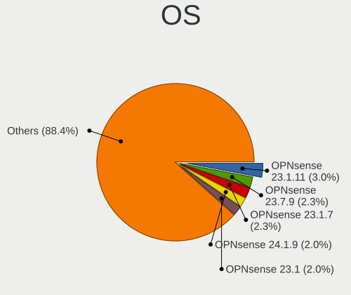

| Name             | Desktops | Percent |
|------------------|----------|---------|
| OPNsense 23.1.11 | 13       | 2.95%   |
| OPNsense 23.7.9  | 10       | 2.27%   |
| OPNsense 23.1.7  | 10       | 2.27%   |
| OPNsense 24.1.9  | 9        | 2.05%   |
| OPNsense 23.1    | 9        | 2.05%   |
| OPNsense 23.1.5  | 8        | 1.82%   |
| OPNsense 21.7.7  | 8        | 1.82%   |
| OPNsense 25.1.5  | 7        | 1.59%   |
| OPNsense 24.7.8  | 7        | 1.59%   |
| OPNsense 23.7.10 | 7        | 1.59%   |
| OPNsense 21.1.1  | 7        | 1.59%   |
| OPNsense 20.7.8  | 7        | 1.59%   |
| OPNsense 24.7.12 | 6        | 1.36%   |
| OPNsense 24.1.10 | 6        | 1.36%   |
| OPNsense 23.7.7  | 6        | 1.36%   |
| OPNsense 21.7.5  | 6        | 1.36%   |
| OPNsense 21.7.3  | 6        | 1.36%   |
| OPNsense 21.7.2  | 6        | 1.36%   |
| OPNsense 21.7.1  | 6        | 1.36%   |
| OPNsense 21.1.2  | 6        | 1.36%   |
| OPNsense 25.1.4  | 5        | 1.14%   |
| OPNsense 25.1.1  | 5        | 1.14%   |
| OPNsense 24.7.11 | 5        | 1.14%   |
| OPNsense 24.7    | 5        | 1.14%   |
| OPNsense 24.1.6  | 5        | 1.14%   |
| OPNsense 23.7.11 | 5        | 1.14%   |
| OPNsense 23.1.9  | 5        | 1.14%   |
| OPNsense 22.7.4  | 5        | 1.14%   |
| OPNsense 22.1.6  | 5        | 1.14%   |
| OPNsense 21.1.7  | 5        | 1.14%   |
| OPNsense 21.1.3  | 5        | 1.14%   |
| OPNsense 21.1    | 5        | 1.14%   |
| OpenBSD 6.8      | 5        | 1.14%   |
| FreeBSD 13.0     | 5        | 1.14%   |
| OPNsense 25.7.2  | 4        | 0.91%   |
| OPNsense 25.1.7  | 4        | 0.91%   |
| OPNsense 25.1.3  | 4        | 0.91%   |
| OPNsense 25.1    | 4        | 0.91%   |
| OPNsense 24.1.7  | 4        | 0.91%   |
| OPNsense 23.7.2  | 4        | 0.91%   |

OS Family
---------

OS without a version

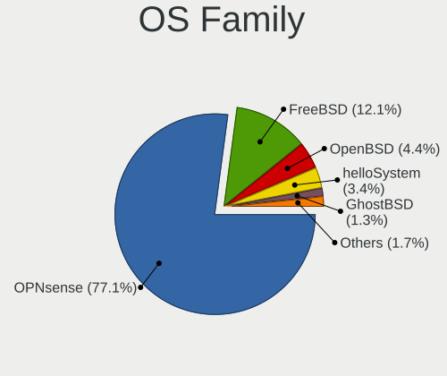

| Name        | Desktops | Percent |
|-------------|----------|---------|
| OPNsense    | 229      | 77.1%   |
| FreeBSD     | 36       | 12.12%  |
| OpenBSD     | 13       | 4.38%   |
| helloSystem | 10       | 3.37%   |
| GhostBSD    | 4        | 1.35%   |
| NomadBSD    | 2        | 0.67%   |
| pfSense     | 1        | 0.34%   |
| NetBSD      | 1        | 0.34%   |
| HardenedBSD | 1        | 0.34%   |

Arch
----

OS architecture (x86_64, i586, etc.)

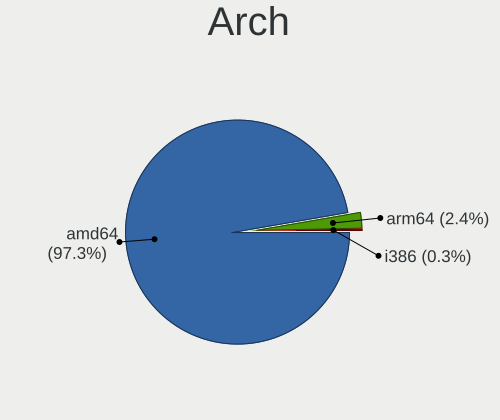

| Name  | Desktops | Percent |
|-------|----------|---------|
| amd64 | 285      | 97.27%  |
| arm64 | 7        | 2.39%   |
| i386  | 1        | 0.34%   |

DE
--

Desktop Environment

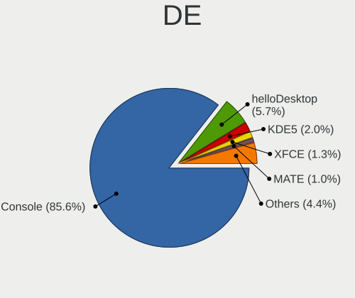

| Name         | Desktops | Percent |
|--------------|----------|---------|
| Console      | 255      | 85.57%  |
| helloDesktop | 17       | 5.7%    |
| KDE5         | 6        | 2.01%   |
| XFCE         | 4        | 1.34%   |
| MATE         | 3        | 1.01%   |
| GNOME        | 3        | 1.01%   |
| TWM          | 2        | 0.67%   |
| i3           | 2        | 0.67%   |
| fvwm         | 2        | 0.67%   |
| xinitrc      | 1        | 0.34%   |
| Openbox      | 1        | 0.34%   |
| LXQt         | 1        | 0.34%   |
| Fluxbox      | 1        | 0.34%   |

Display Server
--------------

X11 or Wayland

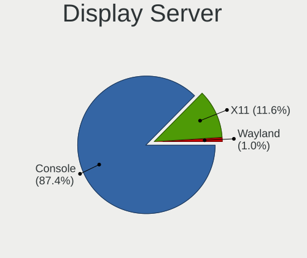

| Name    | Desktops | Percent |
|---------|----------|---------|
| Console | 257      | 87.41%  |
| X11     | 34       | 11.56%  |
| Wayland | 3        | 1.02%   |

Display Manager
---------------

SDDM, LightDM, etc.

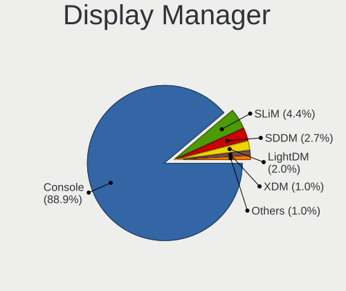

| Name    | Desktops | Percent |
|---------|----------|---------|
| Console | 263      | 88.85%  |
| SLiM    | 13       | 4.39%   |
| SDDM    | 8        | 2.7%    |
| LightDM | 6        | 2.03%   |
| XDM     | 3        | 1.01%   |
| GDM     | 3        | 1.01%   |

OS Lang
-------

Language

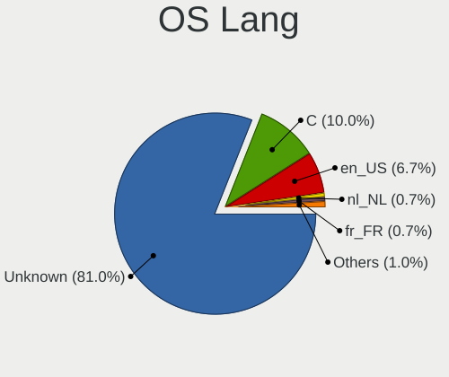

| Lang    | Desktops | Percent |
|---------|----------|---------|
| Unknown | 243      | 81%     |
| C       | 30       | 10%     |
| en_US   | 20       | 6.67%   |
| nl_NL   | 2        | 0.67%   |
| fr_FR   | 2        | 0.67%   |
| de_DE   | 2        | 0.67%   |
| tr_TR   | 1        | 0.33%   |

Boot Mode
---------

EFI or BIOS

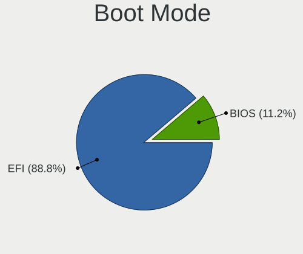

| Mode | Desktops | Percent |
|------|----------|---------|
| EFI  | 261      | 88.78%  |
| BIOS | 33       | 11.22%  |

Filesystem
----------

Type of filesystem

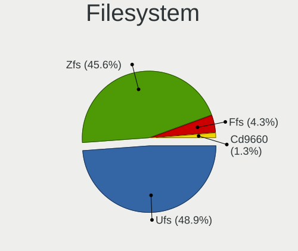

| Type   | Desktops | Percent |
|--------|----------|---------|
| Ufs    | 149      | 48.85%  |
| Zfs    | 139      | 45.57%  |
| Ffs    | 13       | 4.26%   |
| Cd9660 | 4        | 1.31%   |

Part. scheme
------------

Scheme of partitioning

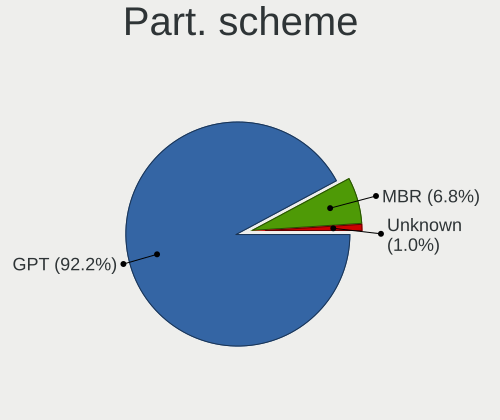

| Type    | Desktops | Percent |
|---------|----------|---------|
| GPT     | 271      | 92.18%  |
| MBR     | 20       | 6.8%    |
| Unknown | 3        | 1.02%   |

Board
-----

Vendor
------

Motherboard manufacturer

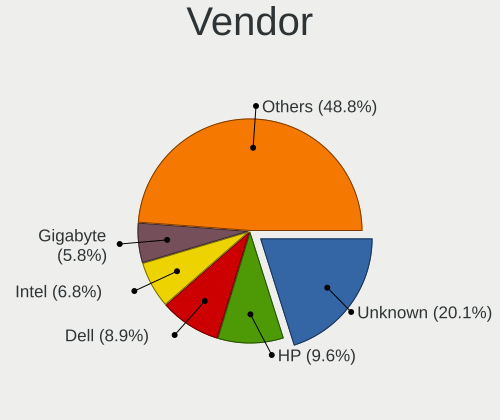

| Name                                 | Desktops | Percent |
|--------------------------------------|----------|---------|
| Unknown                              | 59       | 20.14%  |
| Hewlett-Packard                      | 28       | 9.56%   |
| Dell                                 | 26       | 8.87%   |
| Intel                                | 20       | 6.83%   |
| Gigabyte Technology                  | 17       | 5.8%    |
| ASRock                               | 17       | 5.8%    |
| ASUSTek Computer                     | 15       | 5.12%   |
| Protectli                            | 12       | 4.1%    |
| PC Engines                           | 12       | 4.1%    |
| Lenovo                               | 7        | 2.39%   |
| Fujitsu                              | 7        | 2.39%   |
| Supermicro                           | 6        | 2.05%   |
| Shuttle                              | 6        | 2.05%   |
| MSI                                  | 6        | 2.05%   |
| Techvision                           | 5        | 1.71%   |
| Deciso                               | 4        | 1.37%   |
| MW                                   | 3        | 1.02%   |
| Inventec                             | 3        | 1.02%   |
| CWWK                                 | 3        | 1.02%   |
| CncTion                              | 3        | 1.02%   |
| ASRockRack                           | 3        | 1.02%   |
| IceWhale Technology                  | 2        | 0.68%   |
| Hardkernel                           | 2        | 0.68%   |
| AMI                                  | 2        | 0.68%   |
| Advantech                            | 2        | 0.68%   |
| Acer                                 | 2        | 0.68%   |
| AAEON                                | 2        | 0.68%   |
| XtReAmEr                             | 1        | 0.34%   |
| Teknoservice                         | 1        | 0.34%   |
| SolidRun                             | 1        | 0.34%   |
| SLIMBOOK                             | 1        | 0.34%   |
| Shenzhen Meigao Electronic Equipment | 1        | 0.34%   |
| Sapphire                             | 1        | 0.34%   |
| Pegatron                             | 1        | 0.34%   |
| NU941                                | 1        | 0.34%   |
| JHZD                                 | 1        | 0.34%   |
| iEi                                  | 1        | 0.34%   |
| Huanan                               | 1        | 0.34%   |
| HPE                                  | 1        | 0.34%   |
| GoWin Solution                       | 1        | 0.34%   |

Model
-----

Motherboard model

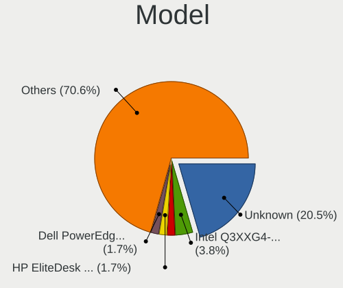

| Name                                              | Desktops | Percent |
|---------------------------------------------------|----------|---------|
| Unknown                                           | 60       | 20.48%  |
| Intel Q3XXG4-P V1.0                               | 11       | 3.75%   |
| Techvision TVI7309X                               | 5        | 1.71%   |
| HP EliteDesk 800 G1 SFF                           | 5        | 1.71%   |
| Dell PowerEdge R620                               | 5        | 1.71%   |
| PC Engines apu4                                   | 4        | 1.37%   |
| PC Engines APU2                                   | 4        | 1.37%   |
| Fujitsu FUTRO S920                                | 4        | 1.37%   |
| PC Engines APU                                    | 3        | 1.02%   |
| MW GMLK-2_5G4L                                    | 3        | 1.02%   |
| Dell OptiPlex 7040                                | 3        | 1.02%   |
| Protectli FW4B                                    | 2        | 0.68%   |
| Inventec VXC Class                                | 2        | 0.68%   |
| Intel D54250WYK H13922-303                        | 2        | 0.68%   |
| HP ProDesk 400 G2.5 SFF                           | 2        | 0.68%   |
| Gigabyte X570 AORUS PRO                           | 2        | 0.68%   |
| Dell OptiPlex 7050                                | 2        | 0.68%   |
| Dell OptiPlex 7010                                | 2        | 0.68%   |
| Dell OptiPlex 3070                                | 2        | 0.68%   |
| Dell OptiPlex 3050                                | 2        | 0.68%   |
| Deciso Netboard A10 GEN2 Model G                  | 2        | 0.68%   |
| CWWK CW-AD4L-N V1                                 | 2        | 0.68%   |
| CncTion J4125-4L-I225                             | 2        | 0.68%   |
| ASRockRack X470D4U                                | 2        | 0.68%   |
| Teknoservice TTL TeknoSlim                        | 1        | 0.34%   |
| Supermicro X9SCL/X9SCM                            | 1        | 0.34%   |
| Supermicro X8SIL                                  | 1        | 0.34%   |
| Supermicro X7SLA                                  | 1        | 0.34%   |
| Supermicro X10DAi                                 | 1        | 0.34%   |
| Supermicro AS -E301-9D-8CN4                       | 1        | 0.34%   |
| Supermicro AS -5019D-FTN4                         | 1        | 0.34%   |
| SolidRun CEX7 Platform                            | 1        | 0.34%   |
| SLIMBOOK ZERO-N100-4RJ                            | 1        | 0.34%   |
| Shuttle XH81V                                     | 1        | 0.34%   |
| Shuttle XH310V2                                   | 1        | 0.34%   |
| Shuttle XH110                                     | 1        | 0.34%   |
| Shuttle SH87R                                     | 1        | 0.34%   |
| Shuttle DH370                                     | 1        | 0.34%   |
| Shuttle DH310                                     | 1        | 0.34%   |
| Shenzhen Meigao Electronic Equipment Venus Series | 1        | 0.34%   |

Model Family
------------

Motherboard model prefix

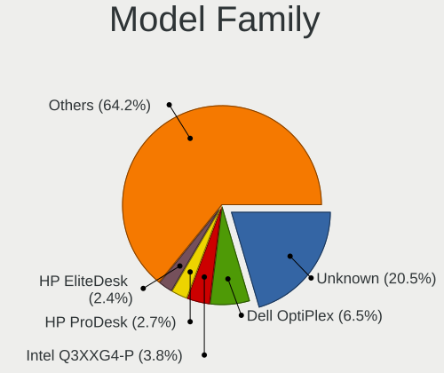

| Name                   | Desktops | Percent |
|------------------------|----------|---------|
| Unknown                | 60       | 20.48%  |
| Dell OptiPlex          | 19       | 6.48%   |
| Intel Q3XXG4-P         | 11       | 3.75%   |
| HP ProDesk             | 8        | 2.73%   |
| HP EliteDesk           | 7        | 2.39%   |
| HP Compaq              | 6        | 2.05%   |
| Techvision TVI7309X    | 5        | 1.71%   |
| Fujitsu FUTRO          | 5        | 1.71%   |
| Dell PowerEdge         | 5        | 1.71%   |
| ASUS PRIME             | 5        | 1.71%   |
| PC Engines apu4        | 4        | 1.37%   |
| PC Engines APU2        | 4        | 1.37%   |
| Deciso Netboard        | 4        | 1.37%   |
| PC Engines APU         | 3        | 1.02%   |
| MW GMLK-2              | 3        | 1.02%   |
| Lenovo ThinkCentre     | 3        | 1.02%   |
| Supermicro AS          | 2        | 0.68%   |
| Protectli FW4B         | 2        | 0.68%   |
| Lenovo ThinkStation    | 2        | 0.68%   |
| Inventec VXC           | 2        | 0.68%   |
| Intel D54250WYK        | 2        | 0.68%   |
| IceWhale ZimaBoard     | 2        | 0.68%   |
| HP ProLiant            | 2        | 0.68%   |
| Gigabyte X570          | 2        | 0.68%   |
| CWWK CW-AD4L-N         | 2        | 0.68%   |
| CncTion J4125-4L-I225  | 2        | 0.68%   |
| ASRockRack X470D4U     | 2        | 0.68%   |
| Acer Aspire            | 2        | 0.68%   |
| Teknoservice TTL       | 1        | 0.34%   |
| Supermicro X9SCL       | 1        | 0.34%   |
| Supermicro X8SIL       | 1        | 0.34%   |
| Supermicro X7SLA       | 1        | 0.34%   |
| Supermicro X10DAi      | 1        | 0.34%   |
| SolidRun CEX7          | 1        | 0.34%   |
| SLIMBOOK ZERO-N100-4RJ | 1        | 0.34%   |
| Shuttle XH81V          | 1        | 0.34%   |
| Shuttle XH310V2        | 1        | 0.34%   |
| Shuttle XH110          | 1        | 0.34%   |
| Shuttle SH87R          | 1        | 0.34%   |
| Shuttle DH370          | 1        | 0.34%   |

MFG Year
--------

Motherboard manufacture year

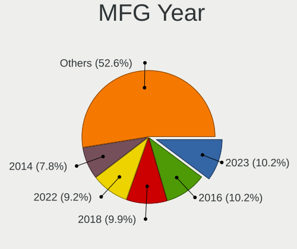

| Year    | Desktops | Percent |
|---------|----------|---------|
| 2023    | 30       | 10.24%  |
| 2016    | 30       | 10.24%  |
| 2018    | 29       | 9.9%    |
| 2022    | 27       | 9.22%   |
| 2014    | 23       | 7.85%   |
| 2020    | 20       | 6.83%   |
| 2019    | 19       | 6.48%   |
| 2021    | 18       | 6.14%   |
| 2017    | 14       | 4.78%   |
| 2013    | 14       | 4.78%   |
| 2015    | 12       | 4.1%    |
| 2011    | 12       | 4.1%    |
| 2024    | 11       | 3.75%   |
| 2012    | 8        | 2.73%   |
| 2009    | 7        | 2.39%   |
| 2010    | 5        | 1.71%   |
| 2008    | 5        | 1.71%   |
| Unknown | 5        | 1.71%   |
| 2025    | 3        | 1.02%   |
| 2006    | 1        | 0.34%   |

Form Factor
-----------

Physical design of the computer

| Name    | Desktops | Percent |
|---------|----------|---------|
| Desktop | 293      | 100%    |

Coreboot
--------

Have coreboot on board

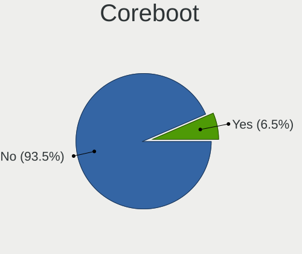

| Used | Desktops | Percent |
|------|----------|---------|
| No   | 274      | 93.52%  |
| Yes  | 19       | 6.48%   |

RAM Size
--------

Total RAM memory

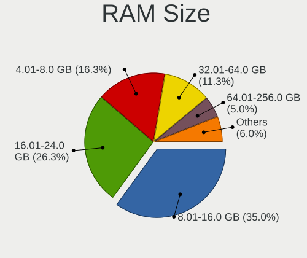

| Size in GB      | Desktops | Percent |
|-----------------|----------|---------|
| 8.01-16.0       | 105      | 35%     |
| 16.01-24.0      | 79       | 26.33%  |
| 4.01-8.0        | 49       | 16.33%  |
| 32.01-64.0      | 34       | 11.33%  |
| 64.01-256.0     | 15       | 5%      |
| 2.01-3.0        | 7        | 2.33%   |
| 3.01-4.0        | 3        | 1%      |
| More than 256.0 | 2        | 0.67%   |
| 24.01-32.0      | 2        | 0.67%   |
| 1.01-2.0        | 2        | 0.67%   |
| 0.51-1.0        | 2        | 0.67%   |

RAM Used
--------

Used RAM memory

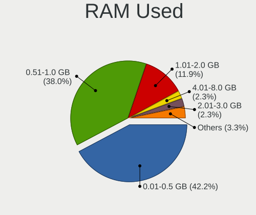

| Used GB    | Desktops | Percent |
|------------|----------|---------|
| 0.01-0.5   | 128      | 42.24%  |
| 0.51-1.0   | 115      | 37.95%  |
| 1.01-2.0   | 36       | 11.88%  |
| 4.01-8.0   | 7        | 2.31%   |
| 2.01-3.0   | 7        | 2.31%   |
| 8.01-16.0  | 4        | 1.32%   |
| 3.01-4.0   | 2        | 0.66%   |
| 32.01-64.0 | 1        | 0.33%   |
| 24.01-32.0 | 1        | 0.33%   |
| 0          | 1        | 0.33%   |
| Unknown    | 1        | 0.33%   |

Total Drives
------------

Number of drives on board

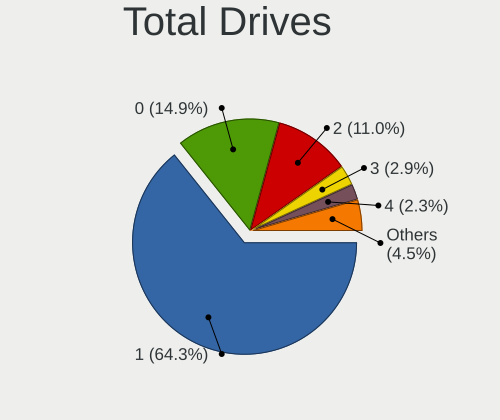

| Drives | Desktops | Percent |
|--------|----------|---------|
| 1      | 198      | 64.29%  |
| 0      | 46       | 14.94%  |
| 2      | 34       | 11.04%  |
| 3      | 9        | 2.92%   |
| 4      | 7        | 2.27%   |
| 5      | 5        | 1.62%   |
| 7      | 3        | 0.97%   |
| 6      | 2        | 0.65%   |
| 17     | 1        | 0.32%   |
| 15     | 1        | 0.32%   |
| 12     | 1        | 0.32%   |
| 10     | 1        | 0.32%   |

Has CD-ROM
----------

Has CD-ROM on board

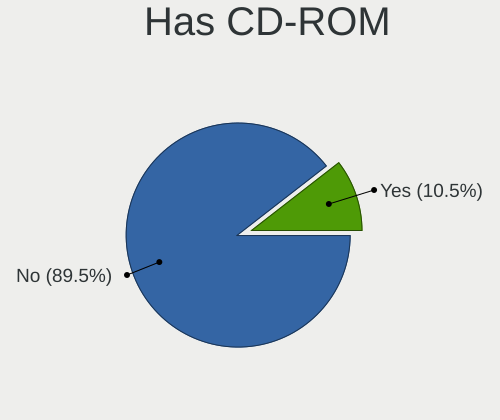

| Presented | Desktops | Percent |
|-----------|----------|---------|
| No        | 264      | 89.49%  |
| Yes       | 31       | 10.51%  |

Has Ethernet
------------

Has Ethernet on board

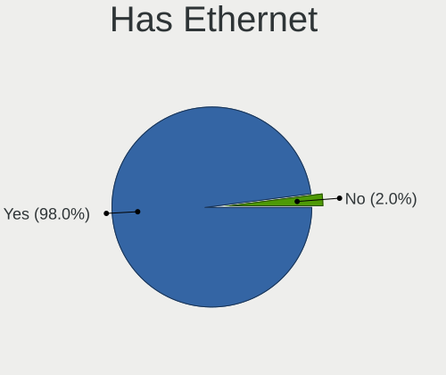

| Presented | Desktops | Percent |
|-----------|----------|---------|
| Yes       | 288      | 97.96%  |
| No        | 6        | 2.04%   |

Has WiFi
--------

Has WiFi module

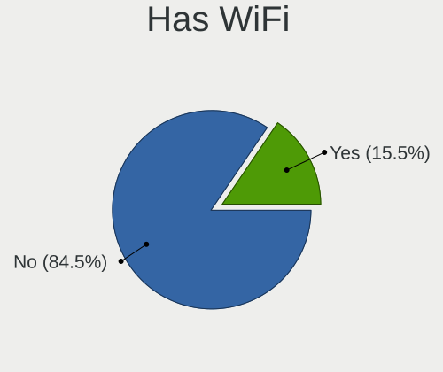

| Presented | Desktops | Percent |
|-----------|----------|---------|
| No        | 251      | 84.51%  |
| Yes       | 46       | 15.49%  |

Has Bluetooth
-------------

Has Bluetooth module

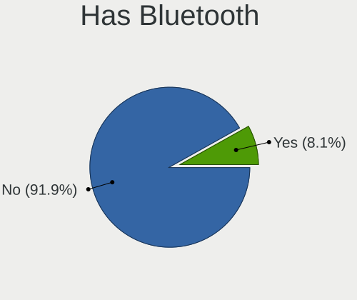

| Presented | Desktops | Percent |
|-----------|----------|---------|
| No        | 272      | 91.89%  |
| Yes       | 24       | 8.11%   |

Location
--------

Country
-------

Geographic location (country)

| Country     | Desktops | Percent |
|-------------|----------|---------|
| Netherlands | 293      | 100%    |

City
----

Geographic location (city)

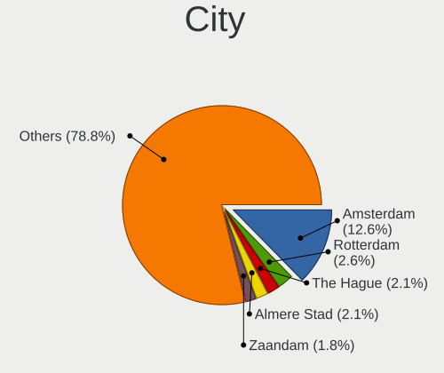

| City         | Desktops | Percent |
|--------------|----------|---------|
| Amsterdam    | 43       | 12.65%  |
| Rotterdam    | 9        | 2.65%   |
| The Hague    | 7        | 2.06%   |
| Almere Stad  | 7        | 2.06%   |
| Zaandam      | 6        | 1.76%   |
| Amersfoort   | 6        | 1.76%   |
| Groningen    | 5        | 1.47%   |
| Zeist        | 4        | 1.18%   |
| Veenendaal   | 4        | 1.18%   |
| Poortugaal   | 4        | 1.18%   |
| Leiden       | 4        | 1.18%   |
| Hoofddorp    | 4        | 1.18%   |
| Heerlen      | 4        | 1.18%   |
| Breda        | 4        | 1.18%   |
| Utrecht      | 3        | 0.88%   |
| Ridderkerk   | 3        | 0.88%   |
| Ospel        | 3        | 0.88%   |
| Nieuwegein   | 3        | 0.88%   |
| Naaldwijk    | 3        | 0.88%   |
| Maastricht   | 3        | 0.88%   |
| IJsselstein  | 3        | 0.88%   |
| Hengelo      | 3        | 0.88%   |
| Helmond      | 3        | 0.88%   |
| Heemskerk    | 3        | 0.88%   |
| Haarlem      | 3        | 0.88%   |
| Druten       | 3        | 0.88%   |
| Dordrecht    | 3        | 0.88%   |
| Delft        | 3        | 0.88%   |
| Barneveld    | 3        | 0.88%   |
| Apeldoorn    | 3        | 0.88%   |
| Zoetermeer   | 2        | 0.59%   |
| Wassenaar    | 2        | 0.59%   |
| Vleuten      | 2        | 0.59%   |
| Vlaardingen  | 2        | 0.59%   |
| Valkenswaard | 2        | 0.59%   |
| Tilburg      | 2        | 0.59%   |
| Tiel         | 2        | 0.59%   |
| Steenbergen  | 2        | 0.59%   |
| Sint Pancras | 2        | 0.59%   |
| Roosendaal   | 2        | 0.59%   |

Drives
------

Drive Vendor
------------

Hard drive vendors

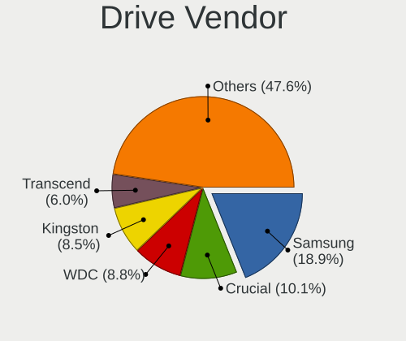

| Vendor              | Desktops | Drives | Percent |
|---------------------|----------|--------|---------|
| Samsung Electronics | 60       | 114    | 18.93%  |
| Crucial             | 32       | 50     | 10.09%  |
| WDC                 | 28       | 71     | 8.83%   |
| Kingston            | 27       | 44     | 8.52%   |
| Transcend           | 19       | 40     | 5.99%   |
| Seagate             | 16       | 47     | 5.05%   |
| Hoodisk             | 11       | 19     | 3.47%   |
| SanDisk             | 10       | 12     | 3.15%   |
| Toshiba             | 8        | 24     | 2.52%   |
| China               | 8        | 12     | 2.52%   |
| Intel               | 7        | 10     | 2.21%   |
| Hewlett-Packard     | 6        | 19     | 1.89%   |
| Phison              | 5        | 8      | 1.58%   |
| OCZ                 | 5        | 7      | 1.58%   |
| HGST                | 5        | 9      | 1.58%   |
| Gigabyte Technology | 5        | 6      | 1.58%   |
| LITEON              | 4        | 5      | 1.26%   |
| Hitachi             | 4        | 7      | 1.26%   |
| Dell                | 4        | 8      | 1.26%   |
| Silicon Motion      | 3        | 4      | 0.95%   |
| ShiJi               | 3        | 4      | 0.95%   |
| Protectli           | 3        | 7      | 0.95%   |
| FORESEE             | 3        | 6      | 0.95%   |
| SPCC                | 2        | 2      | 0.63%   |
| SK hynix            | 2        | 3      | 0.63%   |
| PNY                 | 2        | 2      | 0.63%   |
| Plextor             | 2        | 2      | 0.63%   |
| Lexar               | 2        | 2      | 0.63%   |
| Kston               | 2        | 6      | 0.63%   |
| KeepData            | 2        | 2      | 0.63%   |
| Intenso             | 2        | 5      | 0.63%   |
| Innodisk            | 2        | 2      | 0.63%   |
| A-DATA Technology   | 2        | 2      | 0.63%   |
| Wicgtyp             | 1        | 4      | 0.32%   |
| VICKTER             | 1        | 1      | 0.32%   |
| StoreJet            | 1        | 1      | 0.32%   |
| Patriot             | 1        | 2      | 0.32%   |
| ORICO               | 1        | 1      | 0.32%   |
| OPENBSD             | 1        | 1      | 0.32%   |
| NVMe                | 1        | 1      | 0.32%   |

Drive Model
-----------

Hard drive models

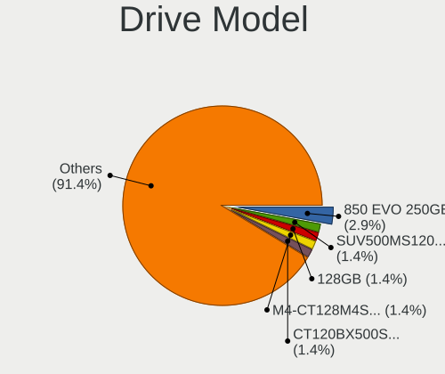

| Model                            | Desktops | Percent |
|----------------------------------|----------|---------|
| Samsung SSD 850 EVO 250GB        | 10       | 2.88%   |
| Kingston SUV500MS120G 120GB      | 5        | 1.44%   |
| Hoodisk SSD 128GB                | 5        | 1.44%   |
| Crucial M4-CT128M4SSD2 128GB     | 5        | 1.44%   |
| Crucial CT120BX500SSD1 120GB     | 5        | 1.44%   |
| China SATA SSD 16GB              | 5        | 1.44%   |
| Transcend TS128GMSA230S 128GB    | 4        | 1.15%   |
| Samsung SSD 850 EVO 500GB        | 4        | 1.15%   |
| Kingston SKC600MS256G 256GB      | 4        | 1.15%   |
| Dell PERC H710 282GB             | 4        | 1.15%   |
| Transcend TS32GSSD370S 32GB      | 3        | 0.86%   |
| Transcend TS256GMSA230S 256GB    | 3        | 0.86%   |
| Samsung SSD 870 EVO 500GB        | 3        | 0.86%   |
| Samsung SSD 850 EVO 120GB        | 3        | 0.86%   |
| Hoodisk SSD 32GB                 | 3        | 0.86%   |
| Crucial CT250MX500SSD1 250GB     | 3        | 0.86%   |
| Crucial CT240BX500SSD1 240GB     | 3        | 0.86%   |
| WDC WDS500G2B0A-00SM50 500GB     | 2        | 0.58%   |
| WDC WD40EFRX-68WT0N0 4TB         | 2        | 0.58%   |
| WDC WD40EFRX-68N32N0 4TB         | 2        | 0.58%   |
| Transcend TS256GMSA452T2 256GB   | 2        | 0.58%   |
| Transcend TS128GMSA370 128GB     | 2        | 0.58%   |
| Samsung SSD 980 500GB            | 2        | 0.58%   |
| Samsung SSD 970 EVO Plus 2TB     | 2        | 0.58%   |
| Samsung SSD 970 EVO Plus 1TB     | 2        | 0.58%   |
| Samsung SSD 970 EVO 1TB          | 2        | 0.58%   |
| Samsung SSD 870 QVO 2TB          | 2        | 0.58%   |
| Samsung SSD 870 EVO 1TB          | 2        | 0.58%   |
| Samsung SSD 860 EVO mSATA 250GB  | 2        | 0.58%   |
| Samsung SSD 850 PRO 128GB        | 2        | 0.58%   |
| Samsung SSD 840 Series 120GB     | 2        | 0.58%   |
| Samsung MZ7L37T6HBLA-00A07 7.6TB | 2        | 0.58%   |
| OCZ TRION150 120GB               | 2        | 0.58%   |
| LITEON CS1-SP16-11 M.2 2242 16GB | 2        | 0.58%   |
| Lexar SSD NM790 1TB              | 2        | 0.58%   |
| Kston SSD 128GB                  | 2        | 0.58%   |
| Kingston SV300S37A60G 64GB       | 2        | 0.58%   |
| Kingston SA400S37240G 240GB      | 2        | 0.58%   |
| Kingston SA400S37120G 120GB      | 2        | 0.58%   |
| KeepData GIM128 128GB            | 2        | 0.58%   |

HDD Vendor
----------

Hard disk drive vendors

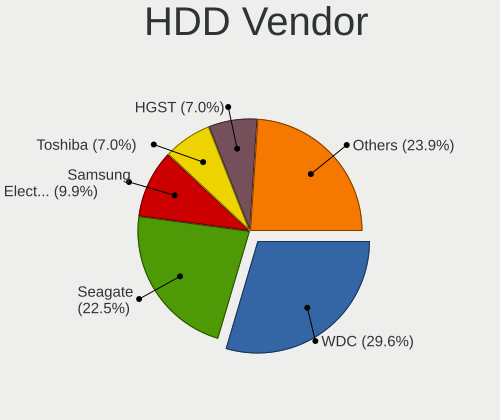

| Vendor              | Desktops | Drives | Percent |
|---------------------|----------|--------|---------|
| WDC                 | 21       | 58     | 29.58%  |
| Seagate             | 16       | 47     | 22.54%  |
| Samsung Electronics | 7        | 10     | 9.86%   |
| Toshiba             | 5        | 17     | 7.04%   |
| HGST                | 5        | 9      | 7.04%   |
| Hitachi             | 4        | 7      | 5.63%   |
| Hewlett-Packard     | 4        | 17     | 5.63%   |
| Dell                | 4        | 8      | 5.63%   |
| StoreJet            | 1        | 1      | 1.41%   |
| OPENBSD             | 1        | 1      | 1.41%   |
| NVMe                | 1        | 1      | 1.41%   |
| Maxtor              | 1        | 1      | 1.41%   |
| HPE                 | 1        | 4      | 1.41%   |

SSD Vendor
----------

Solid state drive vendors

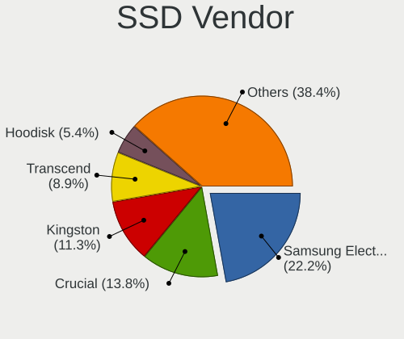

| Vendor              | Desktops | Drives | Percent |
|---------------------|----------|--------|---------|
| Samsung Electronics | 45       | 82     | 22.17%  |
| Crucial             | 28       | 42     | 13.79%  |
| Kingston            | 23       | 40     | 11.33%  |
| Transcend           | 18       | 39     | 8.87%   |
| Hoodisk             | 11       | 19     | 5.42%   |
| SanDisk             | 10       | 12     | 4.93%   |
| China               | 8        | 12     | 3.94%   |
| Intel               | 6        | 9      | 2.96%   |
| WDC                 | 5        | 8      | 2.46%   |
| OCZ                 | 5        | 7      | 2.46%   |
| LITEON              | 4        | 5      | 1.97%   |
| Protectli           | 3        | 7      | 1.48%   |
| FORESEE             | 3        | 6      | 1.48%   |
| SK hynix            | 2        | 3      | 0.99%   |
| ShiJi               | 2        | 3      | 0.99%   |
| PNY                 | 2        | 2      | 0.99%   |
| Plextor             | 2        | 2      | 0.99%   |
| Phison              | 2        | 2      | 0.99%   |
| Kston               | 2        | 6      | 0.99%   |
| KeepData            | 2        | 2      | 0.99%   |
| Intenso             | 2        | 5      | 0.99%   |
| Innodisk            | 2        | 2      | 0.99%   |
| Wicgtyp             | 1        | 4      | 0.49%   |
| VICKTER             | 1        | 1      | 0.49%   |
| Toshiba             | 1        | 3      | 0.49%   |
| SPCC                | 1        | 1      | 0.49%   |
| Patriot             | 1        | 2      | 0.49%   |
| ORICO               | 1        | 1      | 0.49%   |
| NETAPP              | 1        | 4      | 0.49%   |
| Mushkin             | 1        | 1      | 0.49%   |
| Micron Technology   | 1        | 3      | 0.49%   |
| LITEONIT            | 1        | 3      | 0.49%   |
| Hewlett-Packard     | 1        | 1      | 0.49%   |
| GOFATOO             | 1        | 1      | 0.49%   |
| Gigabyte Technology | 1        | 1      | 0.49%   |
| BAITITON            | 1        | 2      | 0.49%   |
| Apacer              | 1        | 2      | 0.49%   |
| Advantech           | 1        | 1      | 0.49%   |

Drive Kind
----------

HDD or SSD

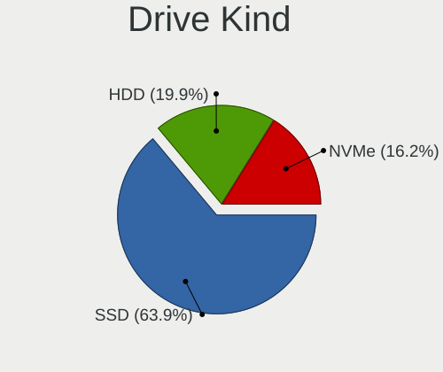

| Kind | Desktops | Drives | Percent |
|------|----------|--------|---------|
| SSD  | 186      | 346    | 63.92%  |
| HDD  | 58       | 181    | 19.93%  |
| NVMe | 47       | 73     | 16.15%  |

Drive Connector
---------------

SATA, SAS, NVMe, etc.

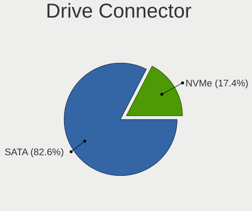

| Type | Desktops | Drives | Percent |
|------|----------|--------|---------|
| SATA | 223      | 527    | 82.59%  |
| NVMe | 47       | 73     | 17.41%  |

Drive Size
----------

Size of hard drive

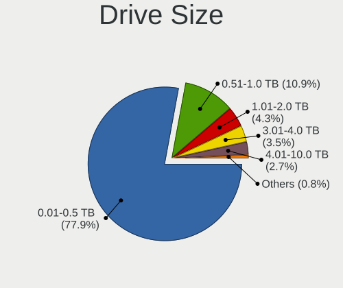

| Size in TB | Desktops | Drives | Percent |
|------------|----------|--------|---------|
| 0.01-0.5   | 201      | 360    | 77.91%  |
| 0.51-1.0   | 28       | 64     | 10.85%  |
| 1.01-2.0   | 11       | 18     | 4.26%   |
| 3.01-4.0   | 9        | 22     | 3.49%   |
| 4.01-10.0  | 7        | 55     | 2.71%   |
| 2.01-3.0   | 1        | 3      | 0.39%   |
| 10.01-20.0 | 1        | 5      | 0.39%   |

Space Total
-----------

Amount of disk space available on the file system

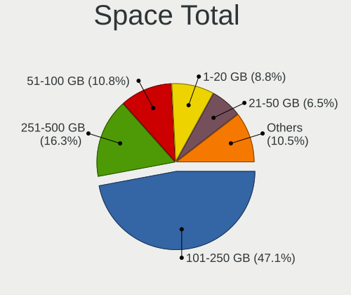

| Size in GB     | Desktops | Percent |
|----------------|----------|---------|
| 101-250        | 144      | 47.06%  |
| 251-500        | 50       | 16.34%  |
| 51-100         | 33       | 10.78%  |
| 1-20           | 27       | 8.82%   |
| 21-50          | 20       | 6.54%   |
| 501-1000       | 19       | 6.21%   |
| 1001-2000      | 6        | 1.96%   |
| 2001-3000      | 4        | 1.31%   |
| More than 3000 | 2        | 0.65%   |
| Unknown        | 1        | 0.33%   |

Space Used
----------

Amount of used disk space

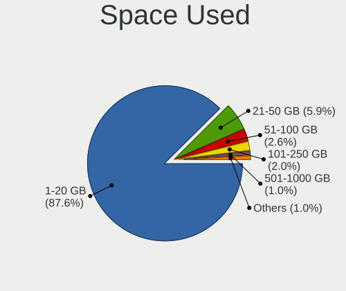

| Used GB  | Desktops | Percent |
|----------|----------|---------|
| 1-20     | 268      | 87.58%  |
| 21-50    | 18       | 5.88%   |
| 51-100   | 8        | 2.61%   |
| 101-250  | 6        | 1.96%   |
| 501-1000 | 3        | 0.98%   |
| 251-500  | 2        | 0.65%   |
| Unknown  | 1        | 0.33%   |

Malfunc. Drives
---------------

Drive models with a malfunction

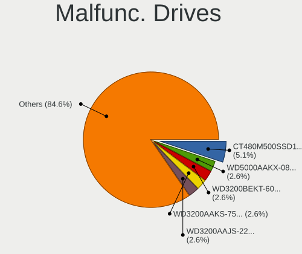

| Model                                     | Desktops | Drives | Percent |
|-------------------------------------------|----------|--------|---------|
| Crucial CT480M500SSD1 480GB               | 2        | 3      | 5.13%   |
| WDC WD5000AAKX-08U6AA0 500GB              | 1        | 1      | 2.56%   |
| WDC WD3200BEKT-60V5T1 320GB               | 1        | 1      | 2.56%   |
| WDC WD3200AAKS-75L9A0 320GB               | 1        | 1      | 2.56%   |
| WDC WD3200AAJS-22B4A0 320GB               | 1        | 1      | 2.56%   |
| WDC WD2500BEKT-75PVMT0 250GB              | 1        | 1      | 2.56%   |
| Toshiba MK3252GSX 320GB                   | 1        | 1      | 2.56%   |
| SK hynix SC308 SATA 128GB                 | 1        | 2      | 2.56%   |
| SK hynix HFS128G39TND-N210A 128GB         | 1        | 1      | 2.56%   |
| ShiJi SSD 32GB                            | 1        | 2      | 2.56%   |
| Seagate ST500LT012-9WS142 500GB           | 1        | 2      | 2.56%   |
| Seagate ST3360320AS 360GB                 | 1        | 1      | 2.56%   |
| Seagate ST3160318AS 160GB                 | 1        | 4      | 2.56%   |
| SanDisk SDSSDP064G 64GB                   | 1        | 1      | 2.56%   |
| Samsung Electronics SSD 870 EVO 500GB     | 1        | 1      | 2.56%   |
| Samsung Electronics SSD 870 EVO 1TB       | 1        | 1      | 2.56%   |
| Samsung Electronics SSD 850 EVO mSATA 1TB | 1        | 1      | 2.56%   |
| Samsung Electronics SSD 850 EVO 1TB       | 1        | 1      | 2.56%   |
| Samsung Electronics SSD 840 Series 120GB  | 1        | 1      | 2.56%   |
| Samsung Electronics SSD 840 EVO 120GB     | 1        | 1      | 2.56%   |
| Samsung Electronics HD322HJ 320GB         | 1        | 1      | 2.56%   |
| Samsung Electronics HD161GJ 160GB         | 1        | 1      | 2.56%   |
| Samsung Electronics HD103SJ 1TB           | 1        | 2      | 2.56%   |
| Plextor PX-256M5M 256GB                   | 1        | 1      | 2.56%   |
| Micron Technology 1100_MTFDDAK2T0TBN 2TB  | 1        | 3      | 2.56%   |
| Kingston SMS200S3120G 120GB               | 1        | 1      | 2.56%   |
| Kingston SA400S37240G 240GB               | 1        | 1      | 2.56%   |
| Intel SSDSC2BA200G3T 200GB                | 1        | 4      | 2.56%   |
| HPE MM1000GBKAL 1TB                       | 1        | 4      | 2.56%   |
| Hitachi HTS543232A7A384 320GB             | 1        | 1      | 2.56%   |
| Hitachi HTS541612J9SA00 120GB             | 1        | 2      | 2.56%   |
| Hitachi HDS723015BLA642 1.5TB             | 1        | 3      | 2.56%   |
| HGST HTS725050A7E630 500GB                | 1        | 1      | 2.56%   |
| HGST HDN726060ALE614 6TB                  | 1        | 2      | 2.56%   |
| Hewlett-Packard FB160C4081 160GB          | 1        | 2      | 2.56%   |
| Crucial CT240M500SSD1 240GB               | 1        | 1      | 2.56%   |
| Crucial CT128MX100SSD1 128GB              | 1        | 2      | 2.56%   |
| A-DATA Technology SX7000NP 128GB          | 1        | 1      | 2.56%   |

Malfunc. Drive Vendor
---------------------

Vendors of faulty drives

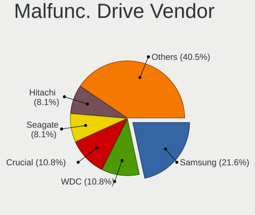

| Vendor              | Desktops | Drives | Percent |
|---------------------|----------|--------|---------|
| Samsung Electronics | 8        | 10     | 21.62%  |
| WDC                 | 4        | 5      | 10.81%  |
| Crucial             | 4        | 6      | 10.81%  |
| Seagate             | 3        | 7      | 8.11%   |
| Hitachi             | 3        | 6      | 8.11%   |
| SK hynix            | 2        | 3      | 5.41%   |
| Kingston            | 2        | 2      | 5.41%   |
| HGST                | 2        | 3      | 5.41%   |
| Toshiba             | 1        | 1      | 2.7%    |
| ShiJi               | 1        | 2      | 2.7%    |
| SanDisk             | 1        | 1      | 2.7%    |
| Plextor             | 1        | 1      | 2.7%    |
| Micron Technology   | 1        | 3      | 2.7%    |
| Intel               | 1        | 4      | 2.7%    |
| HPE                 | 1        | 4      | 2.7%    |
| Hewlett-Packard     | 1        | 2      | 2.7%    |
| A-DATA Technology   | 1        | 1      | 2.7%    |

Malfunc. HDD Vendor
-------------------

Vendors of faulty HDD drives

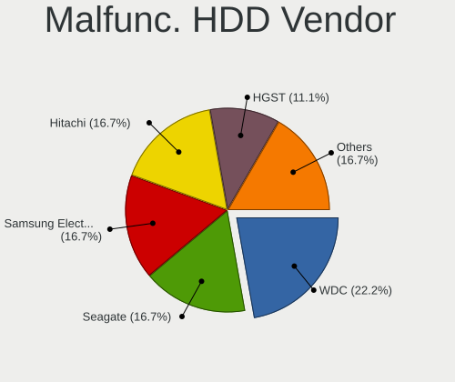

| Vendor              | Desktops | Drives | Percent |
|---------------------|----------|--------|---------|
| WDC                 | 4        | 5      | 22.22%  |
| Seagate             | 3        | 7      | 16.67%  |
| Samsung Electronics | 3        | 4      | 16.67%  |
| Hitachi             | 3        | 6      | 16.67%  |
| HGST                | 2        | 3      | 11.11%  |
| Toshiba             | 1        | 1      | 5.56%   |
| HPE                 | 1        | 4      | 5.56%   |
| Hewlett-Packard     | 1        | 2      | 5.56%   |

Malfunc. Drive Kind
-------------------

Kinds of faulty drives

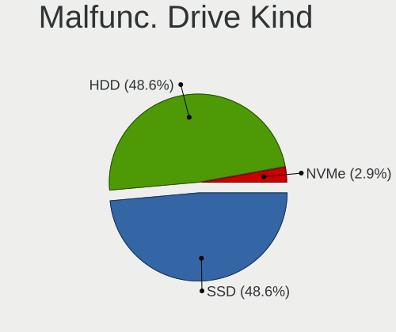

| Kind | Desktops | Drives | Percent |
|------|----------|--------|---------|
| SSD  | 17       | 28     | 48.57%  |
| HDD  | 17       | 32     | 48.57%  |
| NVMe | 1        | 1      | 2.86%   |

Failed Drives
-------------

Failed drive models

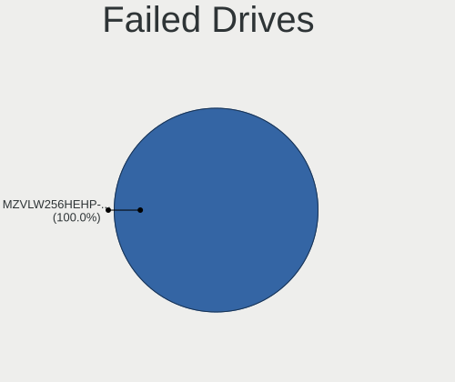

| Model                                        | Desktops | Drives | Percent |
|----------------------------------------------|----------|--------|---------|
| Samsung Electronics MZVLW256HEHP-00000 256GB | 1        | 1      | 100%    |

Failed Drive Vendor
-------------------

Failed drive vendors

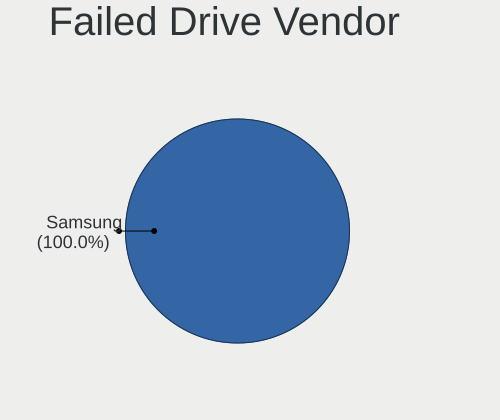

| Vendor              | Desktops | Drives | Percent |
|---------------------|----------|--------|---------|
| Samsung Electronics | 1        | 1      | 100%    |

Drive Status
------------

Number of failed and malfunc. drives

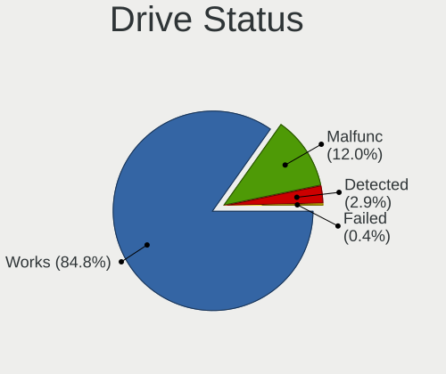

| Status   | Desktops | Drives | Percent |
|----------|----------|--------|---------|
| Works    | 234      | 526    | 84.78%  |
| Malfunc  | 33       | 61     | 11.96%  |
| Detected | 8        | 12     | 2.9%    |
| Failed   | 1        | 1      | 0.36%   |

Storage controller
------------------

Storage Vendor
--------------

Storage controller vendors

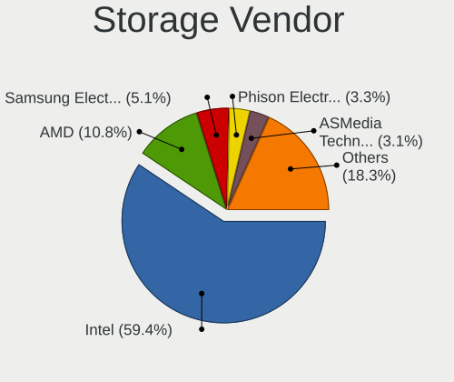

| Vendor                       | Desktops | Percent |
|------------------------------|----------|---------|
| Intel                        | 231      | 59.38%  |
| AMD                          | 42       | 10.8%   |
| Samsung Electronics          | 20       | 5.14%   |
| Phison Electronics           | 13       | 3.34%   |
| ASMedia Technology           | 12       | 3.08%   |
| Silicon Motion               | 10       | 2.57%   |
| Broadcom / LSI               | 10       | 2.57%   |
| SanDisk                      | 9        | 2.31%   |
| Micron/Crucial Technology    | 6        | 1.54%   |
| MAXIO Technology (Hangzhou)  | 5        | 1.29%   |
| Kingston Technology Company  | 5        | 1.29%   |
| Marvell Technology Group     | 4        | 1.03%   |
| JMicron Technology           | 4        | 1.03%   |
| Micron Technology            | 3        | 0.77%   |
| Transcend                    | 2        | 0.51%   |
| Toshiba                      | 2        | 0.51%   |
| Shenzhen Longsys Electronics | 2        | 0.51%   |
| Hewlett-Packard              | 2        | 0.51%   |
| Realtek Semiconductor        | 1        | 0.26%   |
| Lite-On Technology           | 1        | 0.26%   |
| KIOXIA                       | 1        | 0.26%   |
| INNOGRIT                     | 1        | 0.26%   |
| Hosin Global Electronics     | 1        | 0.26%   |
| Chelsio Communications       | 1        | 0.26%   |
| Unknown                      | 1        | 0.26%   |

Storage Model
-------------

Storage controller models

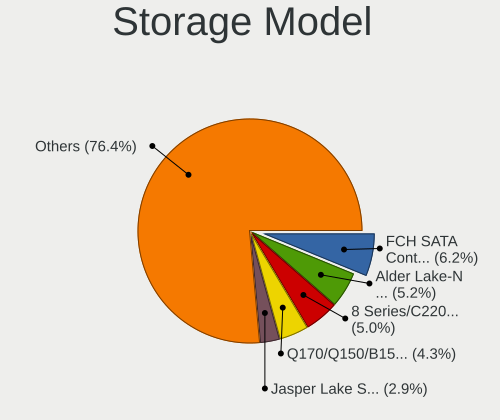

| Model                                                                                   | Desktops | Percent |
|-----------------------------------------------------------------------------------------|----------|---------|
| AMD FCH SATA Controller [AHCI mode]                                                     | 26       | 6.19%   |
| Intel Alder Lake-N SATA AHCI Controller                                                 | 22       | 5.24%   |
| Intel 8 Series/C220 Series Chipset Family 6-port SATA Controller 1 [AHCI mode]          | 21       | 5%      |
| Intel Q170/Q150/B150/H170/H110/Z170/CM236 Chipset SATA Controller [AHCI Mode]           | 18       | 4.29%   |
| Intel Jasper Lake SATA AHCI Controller                                                  | 12       | 2.86%   |
| Intel Wildcat Point-LP SATA Controller [AHCI Mode]                                      | 11       | 2.62%   |
| Intel 200 Series PCH SATA controller [AHCI mode]                                        | 11       | 2.62%   |
| Samsung NVMe SSD Controller SM981/PM981/PM983                                           | 10       | 2.38%   |
| Intel Celeron/Pentium Silver Processor SATA Controller                                  | 10       | 2.38%   |
| Intel 6 Series/C200 Series Chipset Family 6 port Desktop SATA AHCI Controller           | 10       | 2.38%   |
| Silicon Motion SM2263EN/SM2263XT (DRAM-less) NVMe SSD Controllers                       | 9        | 2.14%   |
| Intel Sunrise Point-LP SATA Controller [AHCI mode]                                      | 9        | 2.14%   |
| Intel Atom/Celeron/Pentium Processor x5-E8000/J3xxx/N3xxx Series SATA Controller        | 9        | 2.14%   |
| ASMedia ASM1061/ASM1062 Serial ATA Controller                                           | 9        | 2.14%   |
| Phison PS5013-E13 PCIe3 NVMe Controller (DRAM-less)                                     | 8        | 1.9%    |
| Intel Cannon Lake PCH SATA AHCI Controller                                              | 8        | 1.9%    |
| Intel 7 Series/C210 Series Chipset Family 6-port SATA Controller [AHCI mode]            | 8        | 1.9%    |
| Intel Comet Lake SATA AHCI Controller                                                   | 7        | 1.67%   |
| AMD SB7x0/SB8x0/SB9x0 SATA Controller [AHCI mode]                                       | 7        | 1.67%   |
| Intel SATA Controller [RAID mode]                                                       | 6        | 1.43%   |
| Intel 8 Series SATA Controller 1 [AHCI mode]                                            | 6        | 1.43%   |
| Micron/Crucial P2 [Nick P2] / P3 / P3 Plus NVMe PCIe SSD (DRAM-less)                    | 5        | 1.19%   |
| MAXIO (Hangzhou) NVMe SSD Controller MAP1202 (DRAM-less)                                | 5        | 1.19%   |
| Intel Celeron N3350/Pentium N4200/Atom E3900 Series SATA AHCI Controller                | 5        | 1.19%   |
| Intel C600/X79 series chipset 6-Port SATA AHCI Controller                               | 5        | 1.19%   |
| Intel Atom Processor E3800 Series SATA AHCI Controller                                  | 5        | 1.19%   |
| AMD 400 Series Chipset SATA Controller                                                  | 5        | 1.19%   |
| Samsung NVMe SSD Controller PM9A1/PM9A3/980PRO                                          | 4        | 0.95%   |
| Intel Cannon Point-LP SATA Controller [AHCI Mode]                                       | 4        | 0.95%   |
| Broadcom / LSI MegaRAID SAS 2208 [Thunderbolt]                                          | 4        | 0.95%   |
| Samsung NVMe SSD Controller SM961/PM961/SM963                                           | 3        | 0.71%   |
| Samsung NVMe SSD Controller 980 (DRAM-less)                                             | 3        | 0.71%   |
| Micron 2550 NVMe SSD (DRAM-less)                                                        | 3        | 0.71%   |
| JMicron JMB363 SATA/IDE Controller                                                      | 3        | 0.71%   |
| Intel Elkhart Lake SATA AHCI                                                            | 3        | 0.71%   |
| Intel C610/X99 series chipset 6-Port SATA Controller [AHCI mode]                        | 3        | 0.71%   |
| Intel Atom Processor C3000 Series SATA Controller 0                                     | 3        | 0.71%   |
| Intel Alder Lake-P SATA AHCI Controller                                                 | 3        | 0.71%   |
| Intel 6 Series/C200 Series Chipset Family Desktop SATA Controller (IDE mode, ports 4-5) | 3        | 0.71%   |
| Intel 6 Series/C200 Series Chipset Family Desktop SATA Controller (IDE mode, ports 0-3) | 3        | 0.71%   |

Storage Kind
------------

Kind of storage controller (IDE, SATA, NVMe, SAS, ...)

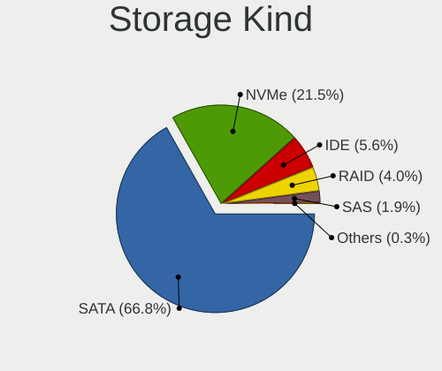

| Kind | Desktops | Percent |
|------|----------|---------|
| SATA | 252      | 66.84%  |
| NVMe | 81       | 21.49%  |
| IDE  | 21       | 5.57%   |
| RAID | 15       | 3.98%   |
| SAS  | 7        | 1.86%   |
| SCSI | 1        | 0.27%   |

Processor
---------

CPU Vendor
----------

Processor vendors

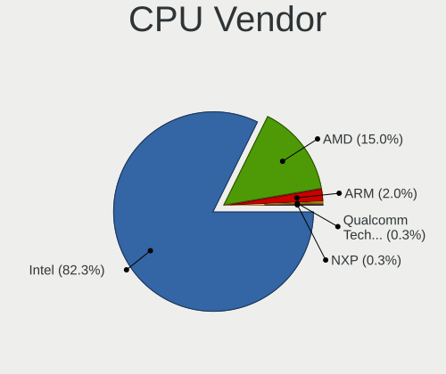

| Vendor                | Desktops | Percent |
|-----------------------|----------|---------|
| Intel                 | 242      | 82.31%  |
| AMD                   | 44       | 14.97%  |
| ARM                   | 6        | 2.04%   |
| Qualcomm Technologies | 1        | 0.34%   |
| NXP                   | 1        | 0.34%   |

CPU Model
---------

Processor models

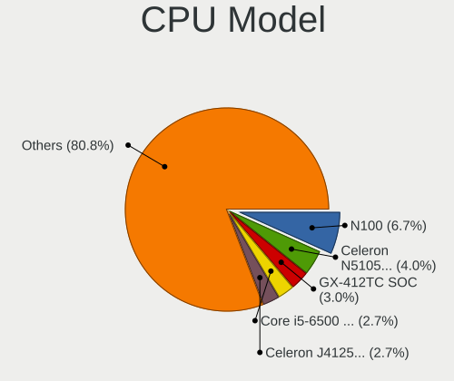

| Model                                    | Desktops | Percent |
|------------------------------------------|----------|---------|
| Intel N100                               | 20       | 6.73%   |
| Intel Celeron N5105 @ 2.00GHz            | 12       | 4.04%   |
| AMD GX-412TC SOC                         | 9        | 3.03%   |
| Intel Core i5-6500 CPU @ 3.20GHz         | 8        | 2.69%   |
| Intel Celeron J4125 CPU @ 2.00GHz        | 8        | 2.69%   |
| Intel N150                               | 6        | 2.02%   |
| Intel Celeron CPU J3160 @ 1.60GHz        | 6        | 2.02%   |
| Intel Core i5-4590 CPU @ 3.30GHz         | 5        | 1.68%   |
| Intel Core i3-N305                       | 5        | 1.68%   |
| Intel Core i5-6400 CPU @ 2.70GHz         | 4        | 1.35%   |
| Intel Core i5-5200U CPU @ 2.20GHz        | 4        | 1.35%   |
| Intel Celeron CPU J1900 @ 1.99GHz        | 4        | 1.35%   |
| Intel Core i7-2600K CPU @ 3.40GHz        | 3        | 1.01%   |
| Intel Core i5-5250U CPU @ 1.60GHz        | 3        | 1.01%   |
| Intel Core i5-3470 CPU @ 3.20GHz         | 3        | 1.01%   |
| Intel Core i5-10400 CPU @ 2.90GHz        | 3        | 1.01%   |
| ARM Cortex-A72 r0p3                      | 3        | 1.01%   |
| AMD GX-415GA SOC with Radeon HD Graphics | 3        | 1.01%   |
| AMD G-T56N Processor                     | 3        | 1.01%   |
| AMD G-T40E Processor                     | 3        | 1.01%   |
| Intel Xeon CPU E5-2640 0 @ 2.50GHz       | 2        | 0.67%   |
| Intel Xeon CPU E5-2630 0 @ 2.30GHz       | 2        | 0.67%   |
| Intel Xeon CPU E5-2620 v3 @ 2.40GHz      | 2        | 0.67%   |
| Intel Pentium Silver N6005 @ 2.00GHz     | 2        | 0.67%   |
| Intel Core i7-6700K CPU @ 4.00GHz        | 2        | 0.67%   |
| Intel Core i7-5550U CPU @ 2.00GHz        | 2        | 0.67%   |
| Intel Core i7-4500U CPU @ 1.80GHz        | 2        | 0.67%   |
| Intel Core i7-2600 CPU @ 3.40GHz         | 2        | 0.67%   |
| Intel Core i5-9500 CPU @ 3.00GHz         | 2        | 0.67%   |
| Intel Core i5-8600 CPU @ 3.10GHz         | 2        | 0.67%   |
| Intel Core i5-8365U CPU @ 1.60GHz        | 2        | 0.67%   |
| Intel Core i5-7500 CPU @ 3.40GHz         | 2        | 0.67%   |
| Intel Core i5-4690 CPU @ 3.50GHz         | 2        | 0.67%   |
| Intel Core i5-4590T CPU @ 2.00GHz        | 2        | 0.67%   |
| Intel Core i5-4590S CPU @ 3.00GHz        | 2        | 0.67%   |
| Intel Core i5-4570 CPU @ 3.20GHz         | 2        | 0.67%   |
| Intel Core i5-4250U CPU @ 1.30GHz        | 2        | 0.67%   |
| Intel Core i5-2320 CPU @ 3.00GHz         | 2        | 0.67%   |
| Intel Core i3-9100 CPU @ 3.60GHz         | 2        | 0.67%   |
| Intel Core i3-6100T CPU @ 3.20GHz        | 2        | 0.67%   |

CPU Model Family
----------------

Processor model prefix

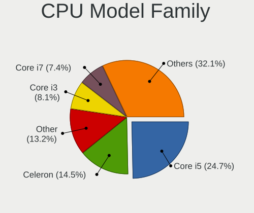

| Model                | Desktops | Percent |
|----------------------|----------|---------|
| Intel Core i5        | 73       | 24.66%  |
| Intel Celeron        | 43       | 14.53%  |
| Other                | 39       | 13.18%  |
| Intel Core i3        | 24       | 8.11%   |
| Intel Core i7        | 22       | 7.43%   |
| AMD GX               | 20       | 6.76%   |
| Intel Xeon           | 16       | 5.41%   |
| Intel Atom           | 9        | 3.04%   |
| Intel Pentium        | 7        | 2.36%   |
| ARM Cortex           | 6        | 2.03%   |
| AMD G                | 6        | 2.03%   |
| Intel Core 2 Duo     | 5        | 1.69%   |
| AMD Ryzen 7          | 4        | 1.35%   |
| Intel Pentium Gold   | 3        | 1.01%   |
| AMD Ryzen 5          | 3        | 1.01%   |
| Intel Pentium Silver | 2        | 0.68%   |
| Intel Core i9        | 2        | 0.68%   |
| Intel Core 2 Quad    | 2        | 0.68%   |
| AMD Ryzen 9          | 2        | 0.68%   |
| AMD EPYC             | 2        | 0.68%   |
| Intel Pentium 4      | 1        | 0.34%   |
| AMD Ryzen 7 PRO      | 1        | 0.34%   |
| AMD Ryzen 3          | 1        | 0.34%   |
| AMD Phenom II X6     | 1        | 0.34%   |
| AMD FX               | 1        | 0.34%   |
| AMD E                | 1        | 0.34%   |

CPU Cores
---------

Number of processor cores

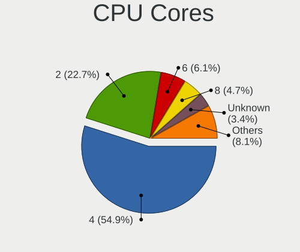

| Number  | Desktops | Percent |
|---------|----------|---------|
| 4       | 162      | 54.92%  |
| 2       | 67       | 22.71%  |
| 6       | 18       | 6.1%    |
| 8       | 14       | 4.75%   |
| Unknown | 10       | 3.39%   |
| 12      | 9        | 3.05%   |
| 16      | 7        | 2.37%   |
| 10      | 2        | 0.68%   |
| 1       | 2        | 0.68%   |
| 24      | 1        | 0.34%   |
| 20      | 1        | 0.34%   |
| 18      | 1        | 0.34%   |
| 3       | 1        | 0.34%   |

CPU Sockets
-----------

Number of sockets

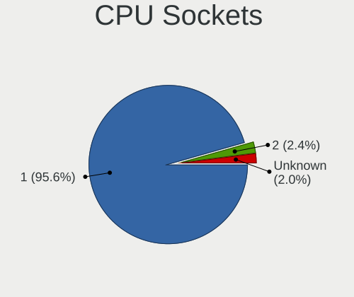

| Number  | Desktops | Percent |
|---------|----------|---------|
| 1       | 281      | 95.58%  |
| 2       | 7        | 2.38%   |
| Unknown | 6        | 2.04%   |

CPU Threads
-----------

Threads per core (Hyper-Threading)

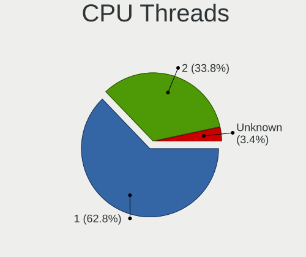

| Number  | Desktops | Percent |
|---------|----------|---------|
| 1       | 186      | 62.84%  |
| 2       | 100      | 33.78%  |
| Unknown | 10       | 3.38%   |

CPU Microarch
-------------

Microarchitecture

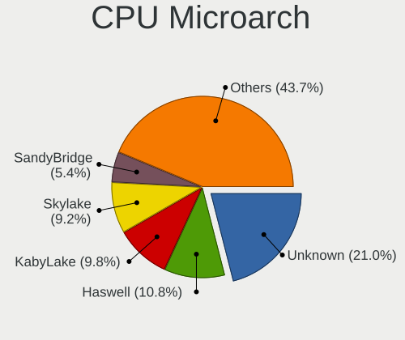

| Name          | Desktops | Percent |
|---------------|----------|---------|
| Unknown       | 62       | 21.02%  |
| Haswell       | 32       | 10.85%  |
| KabyLake      | 29       | 9.83%   |
| Skylake       | 27       | 9.15%   |
| SandyBridge   | 16       | 5.42%   |
| Silvermont    | 14       | 4.75%   |
| Puma          | 14       | 4.75%   |
| IvyBridge     | 13       | 4.41%   |
| Broadwell     | 11       | 3.73%   |
| Goldmont plus | 10       | 3.39%   |
| CometLake     | 10       | 3.39%   |
| Goldmont      | 8        | 2.71%   |
| Bobcat        | 7        | 2.37%   |
| Penryn        | 6        | 2.03%   |
| Jaguar        | 6        | 2.03%   |
| Zen 2         | 5        | 1.69%   |
| Zen 3         | 4        | 1.36%   |
| Zen           | 4        | 1.36%   |
| Bonnell       | 4        | 1.36%   |
| Nehalem       | 3        | 1.02%   |
| Westmere      | 2        | 0.68%   |
| Zen+          | 1        | 0.34%   |
| TigerLake     | 1        | 0.34%   |
| Piledriver    | 1        | 0.34%   |
| NetBurst      | 1        | 0.34%   |
| K8 Hammer     | 1        | 0.34%   |
| K10           | 1        | 0.34%   |
| Excavator     | 1        | 0.34%   |
| Core          | 1        | 0.34%   |

Graphics
--------

GPU Vendor
----------

Vendors of graphics cards

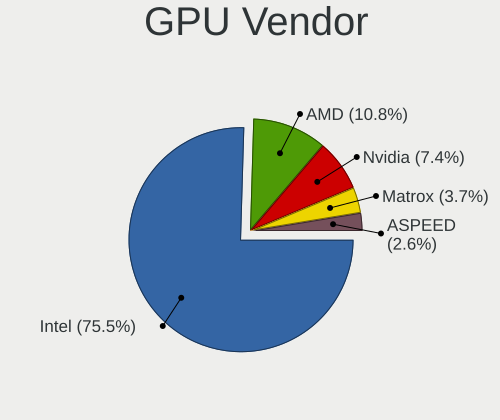

| Vendor                     | Desktops | Percent |
|----------------------------|----------|---------|
| Intel                      | 203      | 75.46%  |
| AMD                        | 29       | 10.78%  |
| Nvidia                     | 20       | 7.43%   |
| Matrox Electronics Systems | 10       | 3.72%   |
| ASPEED Technology          | 7        | 2.6%    |

GPU Model
---------

Graphics card models

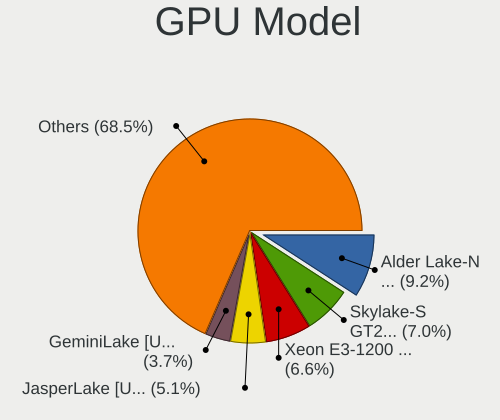

| Model                                                                                    | Desktops | Percent |
|------------------------------------------------------------------------------------------|----------|---------|
| Intel Alder Lake-N [UHD Graphics]                                                        | 25       | 9.16%   |
| Intel Skylake-S GT2 [HD Graphics 530]                                                    | 19       | 6.96%   |
| Intel Xeon E3-1200 v3/4th Gen Core Processor Integrated Graphics Controller              | 18       | 6.59%   |
| Intel JasperLake [UHD Graphics]                                                          | 14       | 5.13%   |
| Intel GeminiLake [UHD Graphics 600]                                                      | 10       | 3.66%   |
| Intel Atom/Celeron/Pentium Processor x5-E8000/J3xxx/N3xxx Integrated Graphics Controller | 9        | 3.3%    |
| Intel CoffeeLake-S GT2 [UHD Graphics 630]                                                | 8        | 2.93%   |
| Intel Xeon E3-1200 v2/3rd Gen Core processor Graphics Controller                         | 7        | 2.56%   |
| Intel 2nd Generation Core Processor Family Integrated Graphics Controller                | 7        | 2.56%   |
| ASPEED Technology ASPEED Graphics Family                                                 | 7        | 2.56%   |
| Intel Haswell-ULT Integrated Graphics Controller                                         | 6        | 2.2%    |
| Intel CometLake-S GT2 [UHD Graphics 630]                                                 | 6        | 2.2%    |
| Intel Broadwell-U GT2 [HD Graphics 5500]                                                 | 6        | 2.2%    |
| Intel Alder Lake-N [Intel Graphics]                                                      | 6        | 2.2%    |
| Matrox Electronics Systems G200eR2                                                       | 5        | 1.83%   |
| Intel Kaby Lake-S GT2 [HD Graphics 630]                                                  | 5        | 1.83%   |
| Intel Broadwell-U GT3 [HD Graphics 6000]                                                 | 5        | 1.83%   |
| Intel Atom Processor Z36xxx/Z37xxx Series Graphics & Display                             | 5        | 1.83%   |
| Intel Kaby Lake-U GT2 [HD Graphics 620]                                                  | 4        | 1.47%   |
| AMD Ellesmere [Radeon RX 470/480/570/570X/580/580X/590]                                  | 4        | 1.47%   |
| Intel Elkhart Lake [UHD Graphics Gen11 16EU]                                             | 3        | 1.1%    |
| Intel Comet Lake UHD Graphics                                                            | 3        | 1.1%    |
| Intel Apollo Lake GT1 [HD Graphics 500]                                                  | 3        | 1.1%    |
| Intel 4 Series Chipset Integrated Graphics Controller                                    | 3        | 1.1%    |
| AMD Mullins [Radeon R4/R5 Graphics]                                                      | 3        | 1.1%    |
| AMD Kabini [Radeon HD 8330E]                                                             | 3        | 1.1%    |
| Nvidia GK208B [GeForce GT 710]                                                           | 2        | 0.73%   |
| Nvidia G98 [GeForce 8400 GS Rev. 2]                                                      | 2        | 0.73%   |
| Matrox Electronics Systems MGA G200eW WPCM450                                            | 2        | 0.73%   |
| Matrox Electronics Systems MGA G200EH                                                    | 2        | 0.73%   |
| Intel WhiskeyLake-U GT2 [UHD Graphics 620]                                               | 2        | 0.73%   |
| Intel Kaby Lake-U GT1 [HD Graphics 610]                                                  | 2        | 0.73%   |
| Intel IvyBridge GT2 [HD Graphics 4000]                                                   | 2        | 0.73%   |
| Intel Atom Processor D4xx/D5xx/N4xx/N5xx Integrated Graphics Controller                  | 2        | 0.73%   |
| Intel Apollo Lake [HD Graphics 505]                                                      | 2        | 0.73%   |
| Intel 4th Generation Core Processor Family Integrated Graphics Controller                | 2        | 0.73%   |
| AMD Wrestler [Radeon HD 6320]                                                            | 2        | 0.73%   |
| AMD Wrestler [Radeon HD 6310]                                                            | 2        | 0.73%   |
| Nvidia TU117GLM [Quadro T400 Mobile]                                                     | 1        | 0.37%   |
| Nvidia TU117 [GeForce GTX 1650]                                                          | 1        | 0.37%   |

GPU Combo
---------

Combinations of graphics cards

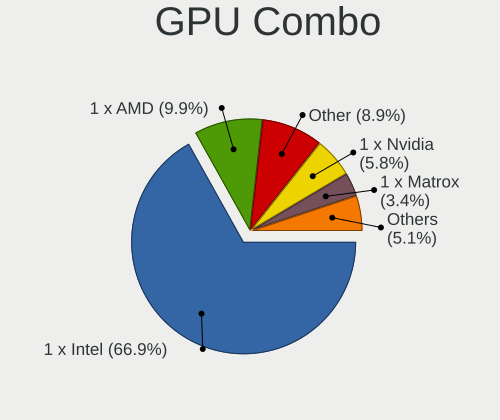

| Name           | Desktops | Percent |
|----------------|----------|---------|
| 1 x Intel      | 196      | 66.89%  |
| 1 x AMD        | 29       | 9.9%    |
| Other          | 26       | 8.87%   |
| 1 x Nvidia     | 17       | 5.8%    |
| 1 x Matrox     | 10       | 3.41%   |
| 1 x ASPEED     | 7        | 2.39%   |
| 2 x Intel      | 5        | 1.71%   |
| Intel + Nvidia | 2        | 0.68%   |
| 2 x Nvidia     | 1        | 0.34%   |

GPU Driver
----------

Free vs proprietary

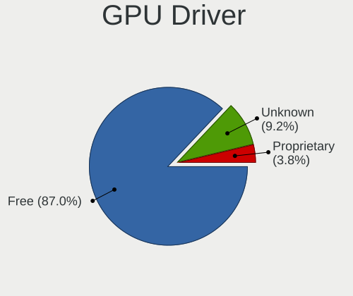

| Driver      | Desktops | Percent |
|-------------|----------|---------|
| Free        | 255      | 87.03%  |
| Unknown     | 27       | 9.22%   |
| Proprietary | 11       | 3.75%   |

GPU Memory
----------

Total video memory

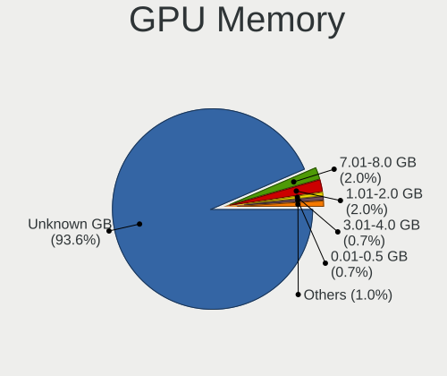

| Size in GB | Desktops | Percent |
|------------|----------|---------|
| Unknown    | 276      | 93.56%  |
| 7.01-8.0   | 6        | 2.03%   |
| 1.01-2.0   | 6        | 2.03%   |
| 3.01-4.0   | 2        | 0.68%   |
| 0.01-0.5   | 2        | 0.68%   |
| 5.01-6.0   | 1        | 0.34%   |
| 8.01-16.0  | 1        | 0.34%   |
| 0.51-1.0   | 1        | 0.34%   |

Monitor
-------

Monitor Vendor
--------------

Monitor vendors

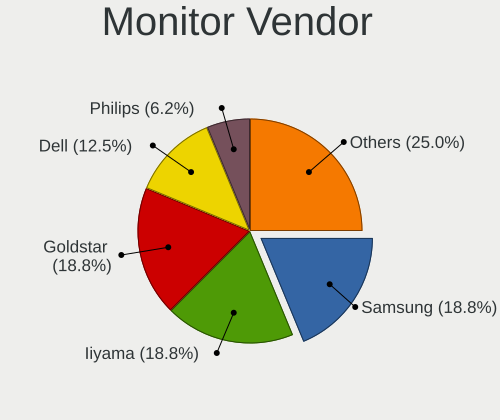

| Vendor               | Desktops | Percent |
|----------------------|----------|---------|
| Samsung Electronics  | 6        | 18.75%  |
| Iiyama               | 6        | 18.75%  |
| Goldstar             | 6        | 18.75%  |
| Dell                 | 4        | 12.5%   |
| Philips              | 2        | 6.25%   |
| Unknown              | 2        | 6.25%   |
| ViewSonic            | 1        | 3.13%   |
| Sony                 | 1        | 3.13%   |
| Hewlett-Packard      | 1        | 3.13%   |
| Fujitsu Siemens      | 1        | 3.13%   |
| ASUSTek Computer     | 1        | 3.13%   |
| Ancor Communications | 1        | 3.13%   |

Monitor Model
-------------

Monitor models

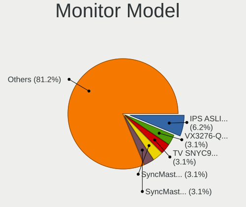

| Model                                                                   | Desktops | Percent |
|-------------------------------------------------------------------------|----------|---------|
| Unknown                                                                 | 2        | 6.25%   |
| ViewSonic LCD Monitor VX3276-QHD 2560x1440                              | 1        | 3.13%   |
| Sony TV SNYC901 1920x1080                                               | 1        | 3.13%   |
| Samsung Electronics SyncMaster SAM027F 1680x1050 470x300mm 22.0-inch    | 1        | 3.13%   |
| Samsung Electronics SyncMaster SAM01E7 1920x1200 520x320mm 24.0-inch    | 1        | 3.13%   |
| Samsung Electronics SyncMaster SAM01AE 1600x1200 410x310mm 20.2-inch    | 1        | 3.13%   |
| Samsung Electronics SA300/350/360 SAM07D5 1920x1080 530x300mm 24.0-inch | 1        | 3.13%   |
| Samsung Electronics S24H85x SAM0E0C 2560x1440 530x300mm 24.0-inch       | 1        | 3.13%   |
| Samsung Electronics S24E450 SAM0C80 1920x1080 520x290mm 23.4-inch       | 1        | 3.13%   |
| Philips PHL 328E1 PHLC204 3840x2160 700x390mm 31.5-inch                 | 1        | 3.13%   |
| Philips LCD Monitor PHL 240V5A 1920x1080                                | 1        | 3.13%   |
| Iiyama PLE2607WS IVM5608 1920x1080 550x340mm 25.5-inch                  | 1        | 3.13%   |
| Iiyama PLE2407HDS IVM560D 1920x1080 520x300mm 23.6-inch                 | 1        | 3.13%   |
| Iiyama PL3294Q IVM762D 2560x1440 700x390mm 31.5-inch                    | 1        | 3.13%   |
| Iiyama PL2740HS IVM6662 1920x1080 600x340mm 27.2-inch                   | 1        | 3.13%   |
| Iiyama PL2492H IVM612F 1920x1080 530x300mm 24.0-inch                    | 1        | 3.13%   |
| Iiyama PL2209HD IVM560B 1920x1080 480x270mm 21.7-inch                   | 1        | 3.13%   |
| Hewlett-Packard LA2205 HWP2848 1680x1050 470x300mm 22.0-inch            | 1        | 3.13%   |
| Goldstar W2486 GSM5729 1920x1080 530x300mm 24.0-inch                    | 1        | 3.13%   |
| Goldstar LG ULTRAWIDE GSM5AE2 3440x1440 800x340mm 34.2-inch             | 1        | 3.13%   |
| Goldstar LG ULTRAWIDE GSM59F1 2560x1080 670x280mm 28.6-inch             | 1        | 3.13%   |
| Goldstar LG Ultra HD GSM5B09 3840x2160 600x340mm 27.2-inch              | 1        | 3.13%   |
| Goldstar LG Ultra HD GSM5B08 3840x2160 600x340mm 27.2-inch              | 1        | 3.13%   |
| Goldstar 34GK950F GSM7727 3440x1440 800x330mm 34.1-inch                 | 1        | 3.13%   |
| Fujitsu Siemens L19-1 FUS07DB 1280x1024 380x300mm 19.1-inch             | 1        | 3.13%   |
| Dell UP2716D DEL40DD 2560x1440 600x340mm 27.2-inch                      | 1        | 3.13%   |
| Dell U2715H DELD065 2560x1440 600x340mm 27.2-inch                       | 1        | 3.13%   |
| Dell U2414H DELA0A4 1920x1080 530x300mm 24.0-inch                       | 1        | 3.13%   |
| Dell U2311H DELA060 1920x1080 510x290mm 23.1-inch                       | 1        | 3.13%   |
| ASUSTek Computer VG259 AUS25A6 1920x1080 540x300mm 24.3-inch            | 1        | 3.13%   |
| Ancor Communications ASUS VC239 ACI23C4 1920x1080 510x290mm 23.1-inch   | 1        | 3.13%   |

Monitor Resolution
------------------

Monitor screen resolution

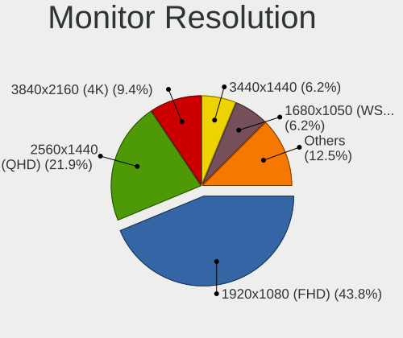

| Resolution         | Desktops | Percent |
|--------------------|----------|---------|
| 1920x1080 (FHD)    | 14       | 43.75%  |
| 2560x1440 (QHD)    | 7        | 21.88%  |
| 3840x2160 (4K)     | 3        | 9.38%   |
| 3440x1440          | 2        | 6.25%   |
| 1680x1050 (WSXGA+) | 2        | 6.25%   |
| 2560x1080          | 1        | 3.13%   |
| 1920x1200 (WUXGA)  | 1        | 3.13%   |
| 1600x1200          | 1        | 3.13%   |
| 1280x1024 (SXGA)   | 1        | 3.13%   |

Monitor Diagonal
----------------

Diagonal size in inches

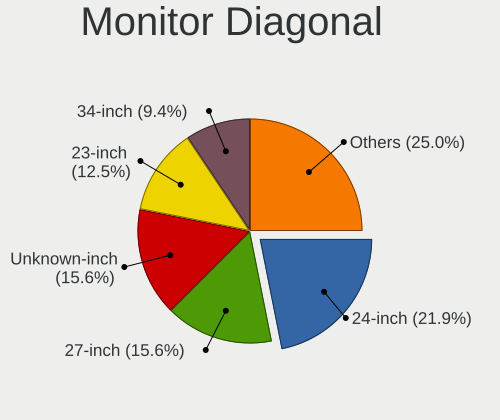

| Inches  | Desktops | Percent |
|---------|----------|---------|
| 24      | 7        | 21.88%  |
| 27      | 5        | 15.63%  |
| Unknown | 5        | 15.63%  |
| 23      | 4        | 12.5%   |
| 34      | 3        | 9.38%   |
| 31      | 2        | 6.25%   |
| 22      | 2        | 6.25%   |
| 25      | 1        | 3.13%   |
| 21      | 1        | 3.13%   |
| 20      | 1        | 3.13%   |
| 19      | 1        | 3.13%   |

Monitor Width
-------------

Physical width

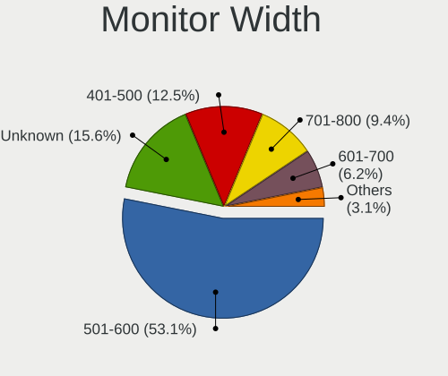

| Width in mm | Desktops | Percent |
|-------------|----------|---------|
| 501-600     | 17       | 53.13%  |
| Unknown     | 5        | 15.63%  |
| 401-500     | 4        | 12.5%   |
| 701-800     | 3        | 9.38%   |
| 601-700     | 2        | 6.25%   |
| 351-400     | 1        | 3.13%   |

Aspect Ratio
------------

Proportional relationship between the width and the height

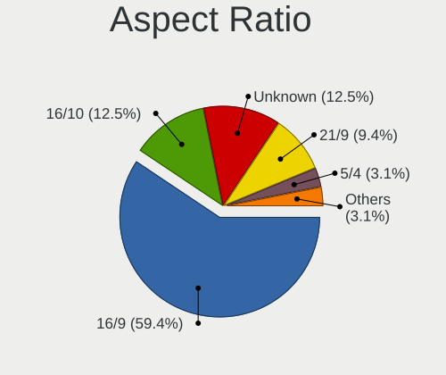

| Ratio   | Desktops | Percent |
|---------|----------|---------|
| 16/9    | 19       | 59.38%  |
| 16/10   | 4        | 12.5%   |
| Unknown | 4        | 12.5%   |
| 21/9    | 3        | 9.38%   |
| 5/4     | 1        | 3.13%   |
| 4/3     | 1        | 3.13%   |

Monitor Area
------------

Area in inch²

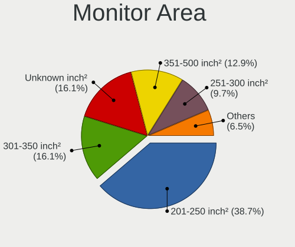

| Area in inch² | Desktops | Percent |
|----------------|----------|---------|
| 201-250        | 12       | 38.71%  |
| 301-350        | 5        | 16.13%  |
| Unknown        | 5        | 16.13%  |
| 351-500        | 4        | 12.9%   |
| 251-300        | 3        | 9.68%   |
| 151-200        | 2        | 6.45%   |

Pixel Density
-------------

Pixels per inch

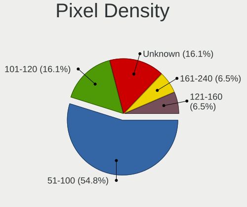

| Density | Desktops | Percent |
|---------|----------|---------|
| 51-100  | 17       | 54.84%  |
| 101-120 | 5        | 16.13%  |
| Unknown | 5        | 16.13%  |
| 161-240 | 2        | 6.45%   |
| 121-160 | 2        | 6.45%   |

Multiple Monitors
-----------------

Total monitors connected

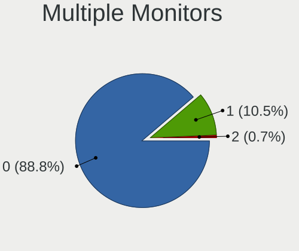

| Total | Desktops | Percent |
|-------|----------|---------|
| 0     | 261      | 88.78%  |
| 1     | 31       | 10.54%  |
| 2     | 2        | 0.68%   |

Network
-------

Net Controller Vendor
---------------------

Controller vendors

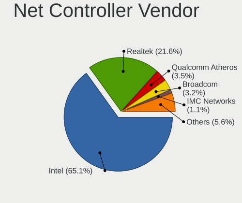

| Vendor                   | Desktops | Percent |
|--------------------------|----------|---------|
| Intel                    | 244      | 65.07%  |
| Realtek Semiconductor    | 81       | 21.6%   |
| Qualcomm Atheros         | 13       | 3.47%   |
| Broadcom                 | 12       | 3.2%    |
| IMC Networks             | 4        | 1.07%   |
| TP-Link                  | 3        | 0.8%    |
| Mellanox Technologies    | 3        | 0.8%    |
| Ralink Technology        | 2        | 0.53%   |
| Ralink                   | 2        | 0.53%   |
| Marvell Technology Group | 2        | 0.53%   |
| U-Blox                   | 1        | 0.27%   |
| Samsung Electronics      | 1        | 0.27%   |
| Qualcomm Technologies    | 1        | 0.27%   |
| Microchip Technology     | 1        | 0.27%   |
| Huawei Technologies      | 1        | 0.27%   |
| Hewlett-Packard          | 1        | 0.27%   |
| Edimax Technology        | 1        | 0.27%   |
| Chelsio Communications   | 1        | 0.27%   |
| ADMtek                   | 1        | 0.27%   |

Net Controller Model
--------------------

Controller models

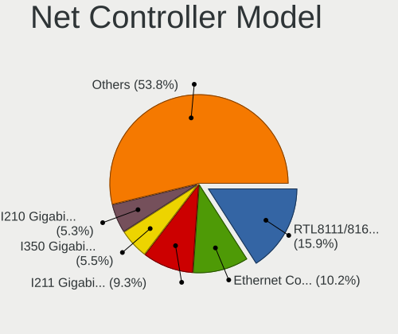

| Model                                                                         | Desktops | Percent |
|-------------------------------------------------------------------------------|----------|---------|
| Realtek RTL8111/8168/8211/8411 PCI Express Gigabit Ethernet Controller        | 72       | 15.93%  |
| Intel Ethernet Controller I226-V                                              | 46       | 10.18%  |
| Intel I211 Gigabit Network Connection                                         | 42       | 9.29%   |
| Intel I350 Gigabit Network Connection                                         | 25       | 5.53%   |
| Intel I210 Gigabit Network Connection                                         | 24       | 5.31%   |
| Intel Ethernet Controller I225-V                                              | 21       | 4.65%   |
| Intel 82574L Gigabit Network Connection                                       | 17       | 3.76%   |
| Intel 82571EB/82571GB Gigabit Ethernet Controller D0/D1 (copper applications) | 12       | 2.65%   |
| Intel 82579LM Gigabit Network Connection (Lewisville)                         | 11       | 2.43%   |
| Intel Ethernet Connection (2) I219-V                                          | 10       | 2.21%   |
| Intel Ethernet Connection I217-LM                                             | 9        | 1.99%   |
| Intel 82599ES 10-Gigabit SFI/SFP+ Network Connection                          | 9        | 1.99%   |
| Realtek RTL8125 2.5GbE Controller                                             | 8        | 1.77%   |
| Intel Wi-Fi 6 AX200                                                           | 5        | 1.11%   |
| Intel Ethernet Connection (2) I219-LM                                         | 5        | 1.11%   |
| Intel 82583V Gigabit Network Connection                                       | 4        | 0.88%   |
| Intel 82572EI Gigabit Ethernet Controller (Copper)                            | 4        | 0.88%   |
| Broadcom NetXtreme BCM5719 Gigabit Ethernet PCIe                              | 4        | 0.88%   |
| Intel Ethernet Controller 10-Gigabit X540-AT2                                 | 3        | 0.66%   |
| Intel Ethernet Connection (5) I219-LM                                         | 3        | 0.66%   |
| Intel 82580 Gigabit Network Connection                                        | 3        | 0.66%   |
| Intel 82576 Gigabit Network Connection                                        | 3        | 0.66%   |
| Intel 82575GB Gigabit Network Connection                                      | 3        | 0.66%   |
| Intel 82575EB Gigabit Network Connection                                      | 3        | 0.66%   |
| Intel 82567LM-3 Gigabit Network Connection                                    | 3        | 0.66%   |
| IMC Networks 802.11 n/g/b Wireless LAN USB Mini-Card                          | 3        | 0.66%   |
| Realtek RTL8821CE 802.11ac PCIe Wireless Network Adapter                      | 2        | 0.44%   |
| Ralink RT5370 Wireless Adapter                                                | 2        | 0.44%   |
| Qualcomm Atheros QCA986x/988x 802.11ac Wireless Network Adapter               | 2        | 0.44%   |
| Qualcomm Atheros AR9287 Wireless Network Adapter (PCI-Express)                | 2        | 0.44%   |
| Qualcomm Atheros AR242x / AR542x Wireless Network Adapter (PCI-Express)       | 2        | 0.44%   |
| Mellanox MT27500 Family [ConnectX-3]                                          | 2        | 0.44%   |
| Intel Wireless 3165                                                           | 2        | 0.44%   |
| Intel Ethernet Controller X710 for 10GbE SFP+                                 | 2        | 0.44%   |
| Intel Ethernet Connection X553 1GbE                                           | 2        | 0.44%   |
| Intel Ethernet Connection X553 10 GbE SFP+                                    | 2        | 0.44%   |
| Intel Ethernet Connection I218-V                                              | 2        | 0.44%   |
| Intel Ethernet Connection I217-V                                              | 2        | 0.44%   |
| Intel Ethernet Connection (14) I219-V                                         | 2        | 0.44%   |
| Intel Ethernet 10G 2P X520 Adapter                                            | 2        | 0.44%   |

Wireless Vendor
---------------

Wireless vendors

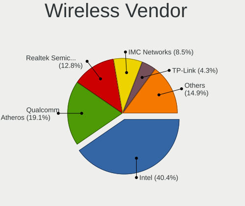

| Vendor                | Desktops | Percent |
|-----------------------|----------|---------|
| Intel                 | 19       | 40.43%  |
| Qualcomm Atheros      | 9        | 19.15%  |
| Realtek Semiconductor | 6        | 12.77%  |
| IMC Networks          | 4        | 8.51%   |
| TP-Link               | 2        | 4.26%   |
| Ralink Technology     | 2        | 4.26%   |
| Ralink                | 2        | 4.26%   |
| Qualcomm Technologies | 1        | 2.13%   |
| Edimax Technology     | 1        | 2.13%   |
| Broadcom              | 1        | 2.13%   |

Wireless Model
--------------

Wireless models

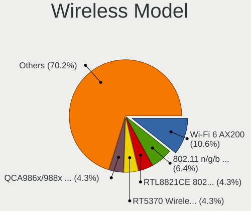

| Model                                                                       | Desktops | Percent |
|-----------------------------------------------------------------------------|----------|---------|
| Intel Wi-Fi 6 AX200                                                         | 5        | 10.64%  |
| IMC Networks 802.11 n/g/b Wireless LAN USB Mini-Card                        | 3        | 6.38%   |
| Realtek RTL8821CE 802.11ac PCIe Wireless Network Adapter                    | 2        | 4.26%   |
| Ralink RT5370 Wireless Adapter                                              | 2        | 4.26%   |
| Qualcomm Atheros QCA986x/988x 802.11ac Wireless Network Adapter             | 2        | 4.26%   |
| Qualcomm Atheros AR9287 Wireless Network Adapter (PCI-Express)              | 2        | 4.26%   |
| Qualcomm Atheros AR242x / AR542x Wireless Network Adapter (PCI-Express)     | 2        | 4.26%   |
| Intel Wireless 3165                                                         | 2        | 4.26%   |
| Intel Dual Band Wireless-AC 3168NGW [Stone Peak]                            | 2        | 4.26%   |
| TP-Link Wireless MU-MIMO USB Adapter                                        | 1        | 2.13%   |
| TP-Link Archer T2U PLUS [RTL8821AU]                                         | 1        | 2.13%   |
| Realtek RTL88x2bu [AC1200 Techkey]                                          | 1        | 2.13%   |
| Realtek RTL8192SU 802.11n WLAN Adapter                                      | 1        | 2.13%   |
| Realtek RTL8188EUS 802.11n Wireless Network Adapter                         | 1        | 2.13%   |
| Realtek RTL8188CE 802.11b/g/n WiFi Adapter                                  | 1        | 2.13%   |
| Ralink RT2800 802.11n PCI                                                   | 1        | 2.13%   |
| Ralink RT2500 Wireless 802.11bg                                             | 1        | 2.13%   |
| Qualcomm QCNFA765 Wireless Network Adapter                                  | 1        | 2.13%   |
| Qualcomm Atheros QCA9565 / AR9565 Wireless Network Adapter                  | 1        | 2.13%   |
| Qualcomm Atheros AR93xx Wireless Network Adapter                            | 1        | 2.13%   |
| Qualcomm Atheros AR9285 Wireless Network Adapter (PCI-Express)              | 1        | 2.13%   |
| Intel Wireless 8265 / 8275                                                  | 1        | 2.13%   |
| Intel Wireless 7260                                                         | 1        | 2.13%   |
| Intel Wireless 3160                                                         | 1        | 2.13%   |
| Intel Wi-Fi 6 AX201                                                         | 1        | 2.13%   |
| Intel Tiger Lake PCH CNVi WiFi                                              | 1        | 2.13%   |
| Intel Raptor Lake PCH CNVi WiFi                                             | 1        | 2.13%   |
| Intel PRO/Wireless 5100 AGN [Shiloh] Network Connection                     | 1        | 2.13%   |
| Intel Gemini Lake PCH CNVi WiFi                                             | 1        | 2.13%   |
| Intel Dual Band Wireless-AC 3165 Plus Bluetooth                             | 1        | 2.13%   |
| Intel Alder Lake-N PCH CNVi WiFi                                            | 1        | 2.13%   |
| IMC Networks Realtek RTL8191SU Wireless LAN 802.11n USB 2.0 Network Adapter | 1        | 2.13%   |
| Edimax EW-7811Un 802.11n Wireless Adapter [Realtek RTL8188CUS]              | 1        | 2.13%   |
| Broadcom BCM43228 802.11a/b/g/n                                             | 1        | 2.13%   |

Ethernet Vendor
---------------

Ethernet vendors

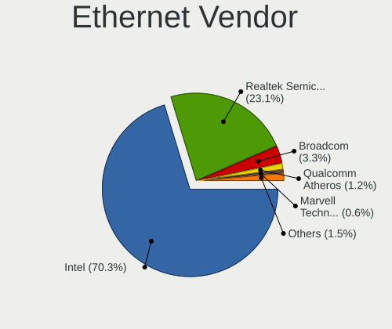

| Vendor                   | Desktops | Percent |
|--------------------------|----------|---------|
| Intel                    | 237      | 70.33%  |
| Realtek Semiconductor    | 78       | 23.15%  |
| Broadcom                 | 11       | 3.26%   |
| Qualcomm Atheros         | 4        | 1.19%   |
| Marvell Technology Group | 2        | 0.59%   |
| TP-Link                  | 1        | 0.3%    |
| Samsung Electronics      | 1        | 0.3%    |
| Microchip Technology     | 1        | 0.3%    |
| Chelsio Communications   | 1        | 0.3%    |
| ADMtek                   | 1        | 0.3%    |

Ethernet Model
--------------

Ethernet models

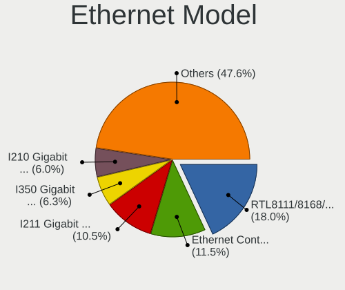

| Model                                                                         | Desktops | Percent |
|-------------------------------------------------------------------------------|----------|---------|
| Realtek RTL8111/8168/8211/8411 PCI Express Gigabit Ethernet Controller        | 72       | 18.05%  |
| Intel Ethernet Controller I226-V                                              | 46       | 11.53%  |
| Intel I211 Gigabit Network Connection                                         | 42       | 10.53%  |
| Intel I350 Gigabit Network Connection                                         | 25       | 6.27%   |
| Intel I210 Gigabit Network Connection                                         | 24       | 6.02%   |
| Intel Ethernet Controller I225-V                                              | 21       | 5.26%   |
| Intel 82574L Gigabit Network Connection                                       | 17       | 4.26%   |
| Intel 82571EB/82571GB Gigabit Ethernet Controller D0/D1 (copper applications) | 12       | 3.01%   |
| Intel 82579LM Gigabit Network Connection (Lewisville)                         | 11       | 2.76%   |
| Intel Ethernet Connection (2) I219-V                                          | 10       | 2.51%   |
| Intel Ethernet Connection I217-LM                                             | 9        | 2.26%   |
| Intel 82599ES 10-Gigabit SFI/SFP+ Network Connection                          | 9        | 2.26%   |
| Realtek RTL8125 2.5GbE Controller                                             | 8        | 2.01%   |
| Intel Ethernet Connection (2) I219-LM                                         | 5        | 1.25%   |
| Intel 82583V Gigabit Network Connection                                       | 4        | 1%      |
| Intel 82572EI Gigabit Ethernet Controller (Copper)                            | 4        | 1%      |
| Broadcom NetXtreme BCM5719 Gigabit Ethernet PCIe                              | 4        | 1%      |
| Intel Ethernet Controller 10-Gigabit X540-AT2                                 | 3        | 0.75%   |
| Intel Ethernet Connection (5) I219-LM                                         | 3        | 0.75%   |
| Intel 82580 Gigabit Network Connection                                        | 3        | 0.75%   |
| Intel 82576 Gigabit Network Connection                                        | 3        | 0.75%   |
| Intel 82575GB Gigabit Network Connection                                      | 3        | 0.75%   |
| Intel 82575EB Gigabit Network Connection                                      | 3        | 0.75%   |
| Intel 82567LM-3 Gigabit Network Connection                                    | 3        | 0.75%   |
| Intel Ethernet Controller X710 for 10GbE SFP+                                 | 2        | 0.5%    |
| Intel Ethernet Connection X553 1GbE                                           | 2        | 0.5%    |
| Intel Ethernet Connection X553 10 GbE SFP+                                    | 2        | 0.5%    |
| Intel Ethernet Connection I218-V                                              | 2        | 0.5%    |
| Intel Ethernet Connection I217-V                                              | 2        | 0.5%    |
| Intel Ethernet Connection (14) I219-V                                         | 2        | 0.5%    |
| Intel Ethernet 10G 2P X520 Adapter                                            | 2        | 0.5%    |
| Intel 82571EB/82571GB Gigabit Ethernet Controller (Copper)                    | 2        | 0.5%    |
| Intel 82567V-3 Gigabit Network Connection                                     | 2        | 0.5%    |
| Intel 82541PI Gigabit Ethernet Controller                                     | 2        | 0.5%    |
| Broadcom NetXtreme BCM5722 Gigabit Ethernet PCI Express                       | 2        | 0.5%    |
| TP-Link M7350 4G Mi-Fi Router                                                 | 1        | 0.25%   |
| Samsung Galaxy series, misc. (tethering mode)                                 | 1        | 0.25%   |
| Realtek USB 2.5GbE Controller                                                 | 1        | 0.25%   |
| Realtek RTL-8110SC/8169SC Gigabit Ethernet                                    | 1        | 0.25%   |
| Qualcomm Atheros QCA8171 Gigabit Ethernet                                     | 1        | 0.25%   |

Net Controller Kind
-------------------

Ethernet, WiFi or modem

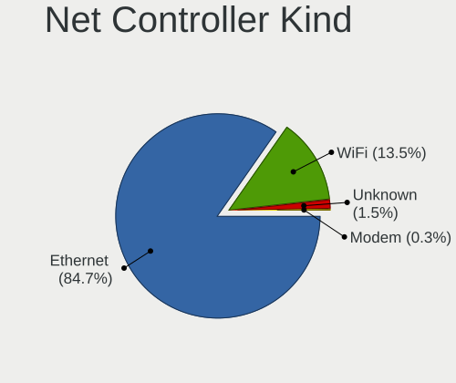

| Kind     | Desktops | Percent |
|----------|----------|---------|
| Ethernet | 288      | 84.71%  |
| WiFi     | 46       | 13.53%  |
| Unknown  | 5        | 1.47%   |
| Modem    | 1        | 0.29%   |

Used Controller
---------------

Currently used network controller

| Kind     | Desktops | Percent |
|----------|----------|---------|
| Ethernet | 276      | 97.87%  |
| WiFi     | 6        | 2.13%   |

NICs
----

Total network controllers on board

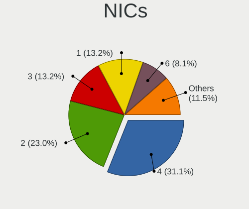

| Total | Desktops | Percent |
|-------|----------|---------|
| 4     | 92       | 31.08%  |
| 2     | 68       | 22.97%  |
| 3     | 39       | 13.18%  |
| 1     | 39       | 13.18%  |
| 6     | 24       | 8.11%   |
| 5     | 19       | 6.42%   |
| 0     | 5        | 1.69%   |
| 9     | 4        | 1.35%   |
| 8     | 3        | 1.01%   |
| 7     | 2        | 0.68%   |
| 12    | 1        | 0.34%   |

IPv6
----

IPv6 vs IPv4

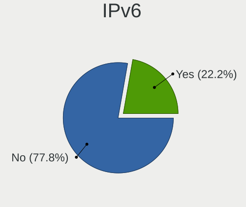

| Used | Desktops | Percent |
|------|----------|---------|
| No   | 238      | 77.78%  |
| Yes  | 68       | 22.22%  |

Bluetooth
---------

Bluetooth Vendor
----------------

Controller vendors

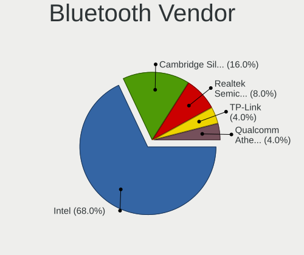

| Vendor                          | Desktops | Percent |
|---------------------------------|----------|---------|
| Intel                           | 17       | 68%     |
| Cambridge Silicon Radio         | 4        | 16%     |
| Realtek Semiconductor           | 2        | 8%      |
| TP-Link                         | 1        | 4%      |
| Qualcomm Atheros Communications | 1        | 4%      |

Bluetooth Model
---------------

Controller models

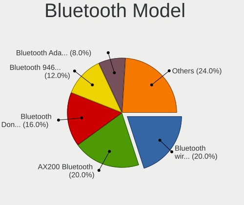

| Model                                               | Desktops | Percent |
|-----------------------------------------------------|----------|---------|
| Intel Bluetooth wireless interface                  | 5        | 20%     |
| Intel AX200 Bluetooth                               | 5        | 20%     |
| Cambridge Silicon Radio Bluetooth Dongle (HCI mode) | 4        | 16%     |
| Intel Bluetooth 9460/9560 Jefferson Peak (JfP)      | 3        | 12%     |
| Realtek Bluetooth Adapter                           | 2        | 8%      |
| Intel Wireless-AC 3168 Bluetooth                    | 2        | 8%      |
| Intel AX201 Bluetooth                               | 2        | 8%      |
| TP-Link Bluetooth 5.0 USB Adapter                   | 1        | 4%      |
| Qualcomm Atheros AR3012 Bluetooth                   | 1        | 4%      |

Sound
-----

Sound Vendor
------------

Sound card vendors

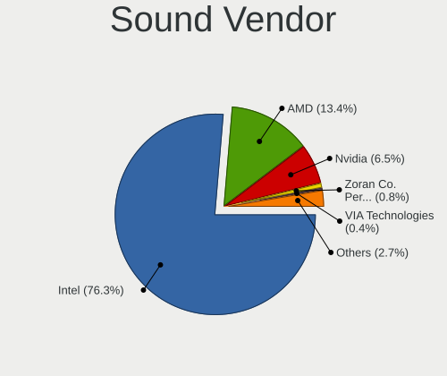

| Vendor                                       | Desktops | Percent |
|----------------------------------------------|----------|---------|
| Intel                                        | 200      | 76.34%  |
| AMD                                          | 35       | 13.36%  |
| Nvidia                                       | 17       | 6.49%   |
| Zoran Co. Personal Media Division (Nogatech) | 2        | 0.76%   |
| VIA Technologies                             | 1        | 0.38%   |
| Steinberg Soft-und Hardware                  | 1        | 0.38%   |
| JMTek                                        | 1        | 0.38%   |
| Harman Kardon                                | 1        | 0.38%   |
| Focusrite-Novation                           | 1        | 0.38%   |
| Creative Labs                                | 1        | 0.38%   |
| Corsair                                      | 1        | 0.38%   |
| Blue Microphones                             | 1        | 0.38%   |

Sound Model
-----------

Sound card models

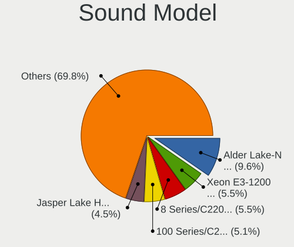

| Model                                                                                             | Desktops | Percent |
|---------------------------------------------------------------------------------------------------|----------|---------|
| Intel Alder Lake-N PCH High Definition Audio Controller                                           | 30       | 9.65%   |
| Intel Xeon E3-1200 v3/4th Gen Core Processor HD Audio Controller                                  | 17       | 5.47%   |
| Intel 8 Series/C220 Series Chipset High Definition Audio Controller                               | 17       | 5.47%   |
| Intel 100 Series/C230 Series Chipset Family HD Audio Controller                                   | 16       | 5.14%   |
| Intel Jasper Lake HD Audio                                                                        | 14       | 4.5%    |
| Intel 200 Series PCH HD Audio                                                                     | 11       | 3.54%   |
| Intel Wildcat Point-LP High Definition Audio Controller                                           | 10       | 3.22%   |
| Intel Celeron/Pentium Silver Processor High Definition Audio                                      | 10       | 3.22%   |
| Intel Broadwell-U Audio Controller                                                                | 9        | 2.89%   |
| Intel Atom/Celeron/Pentium Processor x5-E8000/J3xxx/N3xxx Series High Definition Audio Controller | 9        | 2.89%   |
| Intel 7 Series/C216 Chipset Family High Definition Audio Controller                               | 9        | 2.89%   |
| Intel 6 Series/C200 Series Chipset Family High Definition Audio Controller                        | 8        | 2.57%   |
| AMD Kabini HDMI/DP Audio                                                                          | 8        | 2.57%   |
| Intel Sunrise Point-LP HD Audio                                                                   | 7        | 2.25%   |
| AMD FCH Azalia Controller                                                                         | 7        | 2.25%   |
| Intel Haswell-ULT HD Audio Controller                                                             | 6        | 1.93%   |
| Intel Cannon Lake PCH cAVS                                                                        | 6        | 1.93%   |
| AMD Starship/Matisse HD Audio Controller                                                          | 6        | 1.93%   |
| AMD SBx00 Azalia (Intel HDA)                                                                      | 5        | 1.61%   |
| AMD Ryzen HD Audio Controller                                                                     | 5        | 1.61%   |
| Intel Comet Lake PCH-LP cAVS                                                                      | 4        | 1.29%   |
| Intel Cannon Point-LP High Definition Audio Controller                                            | 4        | 1.29%   |
| Intel Atom Processor Z36xxx/Z37xxx Series High Definition Audio Controller                        | 4        | 1.29%   |
| Intel 8 Series HD Audio Controller                                                                | 4        | 1.29%   |
| AMD Wrestler HDMI Audio                                                                           | 4        | 1.29%   |
| AMD Ellesmere HDMI Audio [Radeon RX 470/480 / 570/580/590]                                        | 4        | 1.29%   |
| Nvidia GP104 High Definition Audio Controller                                                     | 3        | 0.96%   |
| Intel Elkhart Lake High Density Audio bus interface                                               | 3        | 0.96%   |
| Intel Comet Lake PCH-V cAVS                                                                       | 3        | 0.96%   |
| Intel Celeron N3350/Pentium N4200/Atom E3900 Series Audio Cluster                                 | 3        | 0.96%   |
| Intel 82801JI (ICH10 Family) HD Audio Controller                                                  | 3        | 0.96%   |
| Intel 82801JD/DO (ICH10 Family) HD Audio Controller                                               | 3        | 0.96%   |
| Intel 82801H (ICH8 Family) HD Audio Controller                                                    | 3        | 0.96%   |
| AMD Renoir/Cezanne HDMI/DP Audio Controller                                                       | 3        | 0.96%   |
| Zoran Co. Personal Media Division (Nogatech) USB Audio and HID                                    | 2        | 0.64%   |
| Nvidia TU107 GeForce GTX 1650 High Definition Audio Controller                                    | 2        | 0.64%   |
| Nvidia TU104 HD Audio Controller                                                                  | 2        | 0.64%   |
| Nvidia High Definition Audio Controller                                                           | 2        | 0.64%   |
| Nvidia GK208 HDMI/DP Audio Controller                                                             | 2        | 0.64%   |
| Intel Tiger Lake-H HD Audio Controller                                                            | 2        | 0.64%   |

Memory
------

Memory Vendor
-------------

Memory module vendors

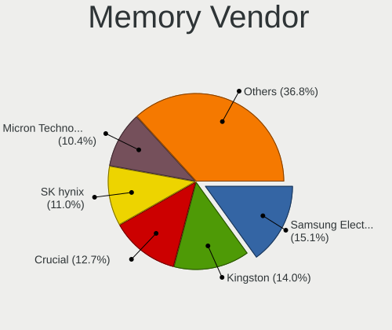

| Vendor                       | Desktops | Percent |
|------------------------------|----------|---------|
| Samsung Electronics          | 45       | 15.05%  |
| Kingston                     | 42       | 14.05%  |
| Crucial                      | 38       | 12.71%  |
| SK hynix                     | 33       | 11.04%  |
| Micron Technology            | 31       | 10.37%  |
| Corsair                      | 29       | 9.7%    |
| Unknown                      | 22       | 7.36%   |
| G.Skill                      | 7        | 2.34%   |
| Transcend                    | 6        | 2.01%   |
| Kimtigo                      | 6        | 2.01%   |
| Unknown (ABCD)               | 5        | 1.67%   |
| Apacer                       | 4        | 1.34%   |
| Unknown                      | 4        | 1.34%   |
| Teikon                       | 3        | 1%      |
| Nanya Technology             | 3        | 1%      |
| GeIL                         | 3        | 1%      |
| tigo                         | 2        | 0.67%   |
| Ramaxel Technology           | 2        | 0.67%   |
| Patriot Memory (PDP Systems) | 2        | 0.67%   |
| Patriot                      | 2        | 0.67%   |
| A-DATA Technology            | 2        | 0.67%   |
| Unknown (AB)                 | 1        | 0.33%   |
| Unknown (07FB)               | 1        | 0.33%   |
| Toshiba                      | 1        | 0.33%   |
| Team                         | 1        | 0.33%   |
| HPE                          | 1        | 0.33%   |
| Hewlett-Packard              | 1        | 0.33%   |
| GOODRAM                      | 1        | 0.33%   |
| Avant                        | 1        | 0.33%   |

Memory Model
------------

Memory module models

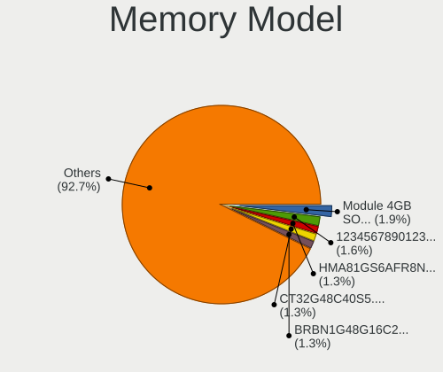

| Model                                                        | Desktops | Percent |
|--------------------------------------------------------------|----------|---------|
| Unknown RAM Module 4GB SODIMM DDR3 1333MT/s                  | 6        | 1.9%    |
| Unknown (ABCD) RAM 123456789012345678 8GB DIMM DDR4 2400MT/s | 5        | 1.58%   |
| SK hynix RAM HMA81GS6AFR8N-UH 8GB SODIMM DDR4 2400MT/s       | 4        | 1.27%   |
| Crucial RAM CT32G48C40S5.C16A1 32GB SODIMM DDR5 4800MT/s     | 4        | 1.27%   |
| Unknown                                                      | 4        | 1.27%   |
| Unknown RAM Module 8GB 1600MT/s                              | 3        | 0.95%   |
| Unknown RAM Module 2GB DIMM DDR2 667MT/s                     | 3        | 0.95%   |
| SK hynix RAM HMA451U6AFR8N-TF 4GB DIMM DDR4 2133MT/s         | 3        | 0.95%   |
| Samsung RAM M471A1K43CB1-CTD 8GB SODIMM DDR4 3200MT/s        | 3        | 0.95%   |
| Samsung RAM M425R1GB4BB0-CQKOL 8GB SODIMM DDR5 4800MT/s      | 3        | 0.95%   |
| Micron RAM 8ATF1G64AZ-2G3B1 8GB DIMM DDR4 2400MT/s           | 3        | 0.95%   |
| Kingston RAM KHX1600C9S3L/8G 8GB SODIMM DDR3 1600MT/s        | 3        | 0.95%   |
| tigo RAM 1600Mhz-8G 8GB SODIMM DDR3 1600MT/s                 | 2        | 0.63%   |
| Teikon RAM TMTS8G58DFRBFEN-16 8GB SODIMM DDR3 1600MT/s       | 2        | 0.63%   |
| SK hynix RAM HMT351U6CFR8C-PB 4GB DIMM DDR3 1600MT/s         | 2        | 0.63%   |
| SK hynix RAM HMT325U6CFR8C-H9 2GB DIMM DDR3 1333MT/s         | 2        | 0.63%   |
| SK hynix RAM HMA81GS6JJR8N-VK 8GB SODIMM DDR4 2667MT/s       | 2        | 0.63%   |
| SK hynix RAM HMA41GU6AFR8N-TF 8GB DIMM DDR4 2133MT/s         | 2        | 0.63%   |
| Samsung RAM M471B5173QH0-YK0 4GB SODIMM DDR3 1600MT/s        | 2        | 0.63%   |
| Samsung RAM M471B5173QH0-YK0 4GB DIMM DDR3 1600MT/s          | 2        | 0.63%   |
| Samsung RAM M471B5173EB0-YK0 4GB SODIMM DDR3 1600MT/s        | 2        | 0.63%   |
| Samsung RAM M471B5173DB0-YK0 4GB SODIMM DDR3 1600MT/s        | 2        | 0.63%   |
| Samsung RAM M471A5244CB0-CTD 4GB SODIMM DDR4 3200MT/s        | 2        | 0.63%   |
| Samsung RAM M425R2GA3BBO-CQKOL 16GB SODIMM DDR5 4800MT/s     | 2        | 0.63%   |
| Samsung RAM M378B5673FH0-CH9 2GB DIMM DDR3 1333MT/s          | 2        | 0.63%   |
| Samsung RAM M378B5273DH0-CK0 4GB DIMM DDR3 1600MT/s          | 2        | 0.63%   |
| Micron RAM 8KTF51264HZ-1G6E1 4GB SODIMM DDR3 1600MT/s        | 2        | 0.63%   |
| Micron RAM 8JTF51264AZ-1G6E1 4GB DIMM DDR3 1600MT/s          | 2        | 0.63%   |
| Kimtigo RAM KT8GS3EDF 8GB SODIMM DDR3 1600MT/s               | 2        | 0.63%   |
| Kimtigo RAM KT4GS3ED8 4GB SODIMM DDR3 1600MT/s               | 2        | 0.63%   |
| G.Skill RAM F4-3200C22-8GRS 8GB SODIMM DDR4 3200MT/s         | 2        | 0.63%   |
| Crucial RAM CT8G48C40S5.M4A1 8GB SODIMM DDR5 4800MT/s        | 2        | 0.63%   |
| Crucial RAM CT16G48C40S5.M8A1 16GB SODIMM DDR5 4800MT/s      | 2        | 0.63%   |
| Crucial RAM CT102464BA160B.M16 8GB DIMM DDR3 1600MT/s        | 2        | 0.63%   |
| Corsair RAM CMX8GX3M1A1600C11 8GB DIMM DDR3 1600MT/s         | 2        | 0.63%   |
| Corsair RAM CMV8GX3M1A1600C11 8GB DIMM DDR3 1600MT/s         | 2        | 0.63%   |
| Corsair RAM CMSX16GX5M1A4800C40 16GB SODIMM DDR5 4800MT/s    | 2        | 0.63%   |
| Corsair RAM CMSO8GX4M1A2133C15 8GB SODIMM DDR4 2133MT/s      | 2        | 0.63%   |
| Apacer RAM 37352E4138334331 2GB SODIMM DDR3 1333MT/s         | 2        | 0.63%   |
| Unknown RAM WPBS16D308SWD-4G 4GB DIMM DDR3 1600MT/s          | 1        | 0.32%   |

Memory Kind
-----------

Memory module kinds

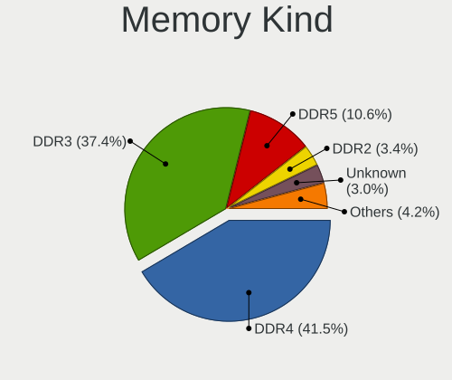

| Kind    | Desktops | Percent |
|---------|----------|---------|
| DDR4    | 110      | 41.51%  |
| DDR3    | 99       | 37.36%  |
| DDR5    | 28       | 10.57%  |
| DDR2    | 9        | 3.4%    |
| Unknown | 8        | 3.02%   |
| LPDDR4  | 6        | 2.26%   |
| LPDDR5  | 3        | 1.13%   |
| SDRAM   | 1        | 0.38%   |
| DDR     | 1        | 0.38%   |

Memory Form Factor
------------------

Physical design of the memory module

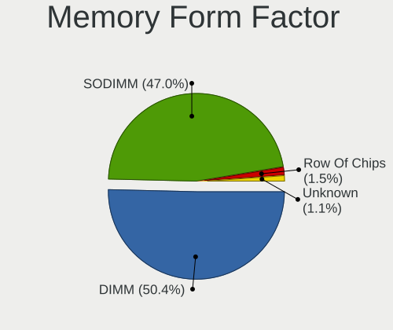

| Name         | Desktops | Percent |
|--------------|----------|---------|
| DIMM         | 133      | 50.38%  |
| SODIMM       | 124      | 46.97%  |
| Row Of Chips | 4        | 1.52%   |
| Unknown      | 3        | 1.14%   |

Memory Size
-----------

Memory module size

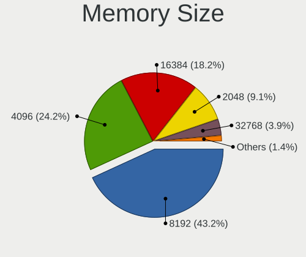

| Size  | Desktops | Percent |
|-------|----------|---------|
| 8192  | 123      | 43.16%  |
| 4096  | 69       | 24.21%  |
| 16384 | 52       | 18.25%  |
| 2048  | 26       | 9.12%   |
| 32768 | 11       | 3.86%   |
| 1024  | 4        | 1.4%    |

Memory Speed
------------

Memory module speed

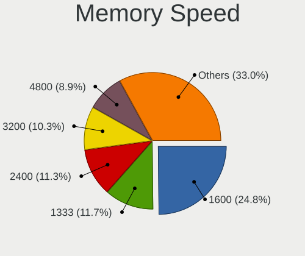

| Speed   | Desktops | Percent |
|---------|----------|---------|
| 1600    | 70       | 24.82%  |
| 1333    | 33       | 11.7%   |
| 2400    | 32       | 11.35%  |
| 3200    | 29       | 10.28%  |
| 4800    | 25       | 8.87%   |
| 2133    | 25       | 8.87%   |
| 2667    | 20       | 7.09%   |
| 2666    | 6        | 2.13%   |
| 800     | 6        | 2.13%   |
| 3000    | 5        | 1.77%   |
| 5600    | 4        | 1.42%   |
| 3600    | 4        | 1.42%   |
| 667     | 4        | 1.42%   |
| 2933    | 3        | 1.06%   |
| 1866    | 3        | 1.06%   |
| Unknown | 3        | 1.06%   |
| 6400    | 2        | 0.71%   |
| 5200    | 1        | 0.35%   |
| 3733    | 1        | 0.35%   |
| 3400    | 1        | 0.35%   |
| 1867    | 1        | 0.35%   |
| 1334    | 1        | 0.35%   |
| 1067    | 1        | 0.35%   |
| 1066    | 1        | 0.35%   |
| 533     | 1        | 0.35%   |

Printers & scanners
-------------------

Printer Vendor
--------------

Printer device vendors

Zero info for selected period =(

Printer Model
-------------

Printer device models

Zero info for selected period =(

Scanner Vendor
--------------

Scanner device vendors

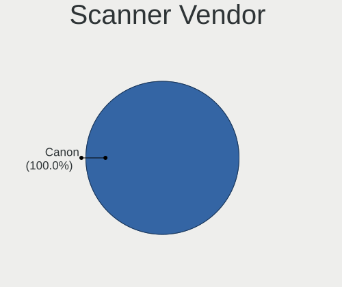

| Vendor | Desktops | Percent |
|--------|----------|---------|
| Canon  | 1        | 100%    |

Scanner Model
-------------

Scanner device models

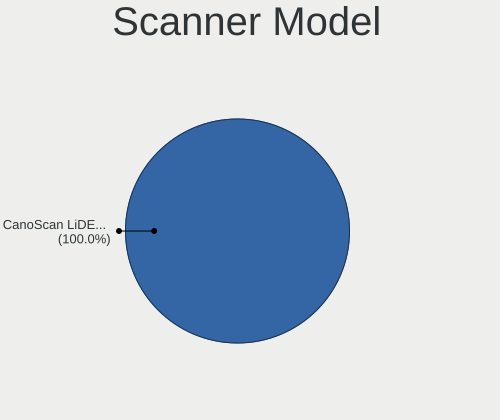

| Model                   | Desktops | Percent |
|-------------------------|----------|---------|
| Canon CanoScan LiDE 110 | 1        | 100%    |

Camera
------

Camera Vendor
-------------

Camera device vendors

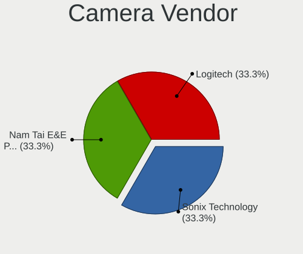

| Vendor               | Desktops | Percent |
|----------------------|----------|---------|
| Sonix Technology     | 1        | 33.33%  |
| Nam Tai E&E Products | 1        | 33.33%  |
| Logitech             | 1        | 33.33%  |

Camera Model
------------

Camera device models

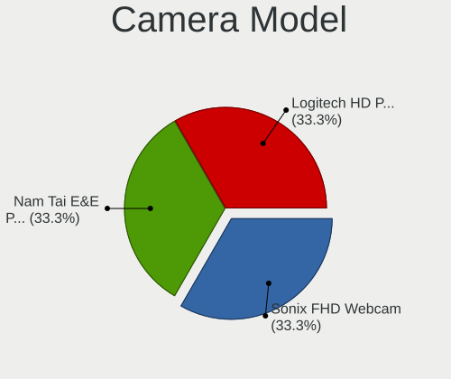

| Model                                     | Desktops | Percent |
|-------------------------------------------|----------|---------|
| Sonix FHD Webcam                          | 1        | 33.33%  |
| Nam Tai E&E Products Sony Playstation Eye | 1        | 33.33%  |
| Logitech HD Pro Webcam C920               | 1        | 33.33%  |

Security
--------

Fingerprint Vendor
------------------

Fingerprint sensor vendors

Zero info for selected period =(

Fingerprint Model
-----------------

Fingerprint sensor models

Zero info for selected period =(

Chipcard Vendor
---------------

Chipcard module vendors

Zero info for selected period =(

Chipcard Model
--------------

Chipcard module models

Zero info for selected period =(

Unsupported
-----------

Unsupported Devices
-------------------

Total unsupported devices on board

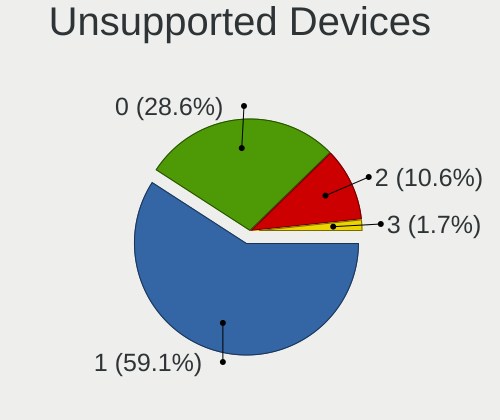

| Total | Desktops | Percent |
|-------|----------|---------|
| 1     | 178      | 59.14%  |
| 0     | 86       | 28.57%  |
| 2     | 32       | 10.63%  |
| 3     | 5        | 1.66%   |

Unsupported Device Types
------------------------

Types of unsupported devices

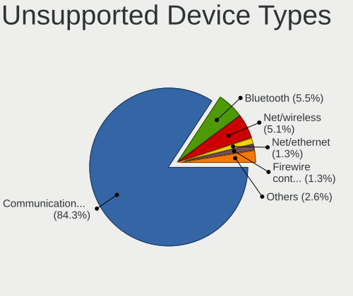

| Type                     | Desktops | Percent |
|--------------------------|----------|---------|
| Communication controller | 198      | 84.26%  |
| Bluetooth                | 13       | 5.53%   |
| Net/wireless             | 12       | 5.11%   |
| Net/ethernet             | 3        | 1.28%   |
| Firewire controller      | 3        | 1.28%   |
| Card reader              | 3        | 1.28%   |
| Storage/ata              | 1        | 0.43%   |
| Storage                  | 1        | 0.43%   |
| Graphics card            | 1        | 0.43%   |

