BSD in Netherlands - Tested Hardware & Statistics (Desktops)
------------------------------------------------------------

A project to collect tested hardware configurations for BSD in Netherlands.

Anyone can contribute to this report by the [hw-probe](https://github.com/linuxhw/hw-probe/blob/master/INSTALL.BSD.md) tool:

    hw-probe -all -upload

Please contribute! Especially if your hardware is rare.

Contents
--------

* [ Test Cases ](#test-cases)

* [ System ](#system)
  - [ OS                       ](#os)
  - [ OS Family                ](#os-family)
  - [ Arch                     ](#arch)
  - [ DE                       ](#de)
  - [ Display Server           ](#display-server)
  - [ Display Manager          ](#display-manager)
  - [ OS Lang                  ](#os-lang)
  - [ Boot Mode                ](#boot-mode)
  - [ Filesystem               ](#filesystem)
  - [ Part. scheme             ](#part-scheme)

* [ Board ](#board)
  - [ Vendor                   ](#vendor)
  - [ Model                    ](#model)
  - [ Model Family             ](#model-family)
  - [ MFG Year                 ](#mfg-year)
  - [ Form Factor              ](#form-factor)
  - [ Coreboot                 ](#coreboot)
  - [ RAM Size                 ](#ram-size)
  - [ RAM Used                 ](#ram-used)
  - [ Total Drives             ](#total-drives)
  - [ Has CD-ROM               ](#has-cd-rom)
  - [ Has Ethernet             ](#has-ethernet)
  - [ Has WiFi                 ](#has-wifi)
  - [ Has Bluetooth            ](#has-bluetooth)

* [ Location ](#location)
  - [ Country                  ](#country)
  - [ City                     ](#city)

* [ Drives ](#drives)
  - [ Drive Vendor             ](#drive-vendor)
  - [ Drive Model              ](#drive-model)
  - [ HDD Vendor               ](#hdd-vendor)
  - [ SSD Vendor               ](#ssd-vendor)
  - [ Drive Kind               ](#drive-kind)
  - [ Drive Connector          ](#drive-connector)
  - [ Drive Size               ](#drive-size)
  - [ Space Total              ](#space-total)
  - [ Space Used               ](#space-used)
  - [ Malfunc. Drives          ](#malfunc-drives)
  - [ Malfunc. Drive Vendor    ](#malfunc-drive-vendor)
  - [ Malfunc. HDD Vendor      ](#malfunc-hdd-vendor)
  - [ Malfunc. Drive Kind      ](#malfunc-drive-kind)
  - [ Failed Drives            ](#failed-drives)
  - [ Failed Drive Vendor      ](#failed-drive-vendor)
  - [ Drive Status             ](#drive-status)

* [ Storage controller ](#storage-controller)
  - [ Storage Vendor           ](#storage-vendor)
  - [ Storage Model            ](#storage-model)
  - [ Storage Kind             ](#storage-kind)

* [ Processor ](#processor)
  - [ CPU Vendor               ](#cpu-vendor)
  - [ CPU Model                ](#cpu-model)
  - [ CPU Model Family         ](#cpu-model-family)
  - [ CPU Cores                ](#cpu-cores)
  - [ CPU Sockets              ](#cpu-sockets)
  - [ CPU Threads              ](#cpu-threads)
  - [ CPU Microarch            ](#cpu-microarch)

* [ Graphics ](#graphics)
  - [ GPU Vendor               ](#gpu-vendor)
  - [ GPU Model                ](#gpu-model)
  - [ GPU Combo                ](#gpu-combo)
  - [ GPU Driver               ](#gpu-driver)
  - [ GPU Memory               ](#gpu-memory)

* [ Monitor ](#monitor)
  - [ Monitor Vendor           ](#monitor-vendor)
  - [ Monitor Model            ](#monitor-model)
  - [ Monitor Resolution       ](#monitor-resolution)
  - [ Monitor Diagonal         ](#monitor-diagonal)
  - [ Monitor Width            ](#monitor-width)
  - [ Aspect Ratio             ](#aspect-ratio)
  - [ Monitor Area             ](#monitor-area)
  - [ Pixel Density            ](#pixel-density)
  - [ Multiple Monitors        ](#multiple-monitors)

* [ Network ](#network)
  - [ Net Controller Vendor    ](#net-controller-vendor)
  - [ Net Controller Model     ](#net-controller-model)
  - [ Wireless Vendor          ](#wireless-vendor)
  - [ Wireless Model           ](#wireless-model)
  - [ Ethernet Vendor          ](#ethernet-vendor)
  - [ Ethernet Model           ](#ethernet-model)
  - [ Net Controller Kind      ](#net-controller-kind)
  - [ Used Controller          ](#used-controller)
  - [ NICs                     ](#nics)
  - [ IPv6                     ](#ipv6)

* [ Bluetooth ](#bluetooth)
  - [ Bluetooth Vendor         ](#bluetooth-vendor)
  - [ Bluetooth Model          ](#bluetooth-model)

* [ Sound ](#sound)
  - [ Sound Vendor             ](#sound-vendor)
  - [ Sound Model              ](#sound-model)

* [ Memory ](#memory)
  - [ Memory Vendor            ](#memory-vendor)
  - [ Memory Model             ](#memory-model)
  - [ Memory Kind              ](#memory-kind)
  - [ Memory Form Factor       ](#memory-form-factor)
  - [ Memory Size              ](#memory-size)
  - [ Memory Speed             ](#memory-speed)

* [ Printers & scanners ](#printers--scanners)
  - [ Printer Vendor           ](#printer-vendor)
  - [ Printer Model            ](#printer-model)
  - [ Scanner Vendor           ](#scanner-vendor)
  - [ Scanner Model            ](#scanner-model)

* [ Camera ](#camera)
  - [ Camera Vendor            ](#camera-vendor)
  - [ Camera Model             ](#camera-model)

* [ Security ](#security)
  - [ Fingerprint Vendor       ](#fingerprint-vendor)
  - [ Fingerprint Model        ](#fingerprint-model)
  - [ Chipcard Vendor          ](#chipcard-vendor)
  - [ Chipcard Model           ](#chipcard-model)

* [ Unsupported ](#unsupported)
  - [ Unsupported Devices      ](#unsupported-devices)
  - [ Unsupported Device Types ](#unsupported-device-types)

Test Cases
----------

Total: 228

| Vendor     | Model                       | Probe                                                     | Date         |
|------------|-----------------------------|-----------------------------------------------------------|--------------|
| Dell       | 0HD5W2 A00                  | [6b1a9b8d00](https://bsd-hardware.info/?probe=6b1a9b8d00) | Jan 21, 2023 |
| PC Engines | APU2                        | [172844bd8b](https://bsd-hardware.info/?probe=172844bd8b) | Jan 21, 2023 |
| Lenovo     | 3102 SDK0J40700 WIN 3258... | [9805fe9459](https://bsd-hardware.info/?probe=9805fe9459) | Jan 13, 2023 |
| Lenovo     | 3102 SDK0J40700 WIN 3258... | [1ec6c3acf2](https://bsd-hardware.info/?probe=1ec6c3acf2) | Jan 13, 2023 |
| ASUSTek    | ROG STRIX B550-F GAMING     | [335c3c990a](https://bsd-hardware.info/?probe=335c3c990a) | Jan 08, 2023 |
| Shuttle    | FH110                       | [3759d77a05](https://bsd-hardware.info/?probe=3759d77a05) | Dec 29, 2022 |
| Advantech  | UNO-2483G-474AE             | [d453f64b4f](https://bsd-hardware.info/?probe=d453f64b4f) | Dec 29, 2022 |
| Shuttle    | FH110                       | [be457c2796](https://bsd-hardware.info/?probe=be457c2796) | Dec 27, 2022 |
| MW         | GMLK-2_5G4L                 | [8d3ab2cab5](https://bsd-hardware.info/?probe=8d3ab2cab5) | Dec 27, 2022 |
| Shuttle    | FH110                       | [a194756b95](https://bsd-hardware.info/?probe=a194756b95) | Dec 25, 2022 |
| ASUSTek    | PRIME H410M-A               | [f51b401c31](https://bsd-hardware.info/?probe=f51b401c31) | Dec 13, 2022 |
| Unknown    | Unknown                     | [32a4df9cae](https://bsd-hardware.info/?probe=32a4df9cae) | Dec 01, 2022 |
| Lenovo     | MAHOBAY                     | [1d61d0cf62](https://bsd-hardware.info/?probe=1d61d0cf62) | Nov 29, 2022 |
| ASRockRack | X470D4U                     | [38d7f55ef7](https://bsd-hardware.info/?probe=38d7f55ef7) | Nov 29, 2022 |
| Unknown    | Unknown                     | [4e40278b06](https://bsd-hardware.info/?probe=4e40278b06) | Nov 28, 2022 |
| HP         | 8719                        | [6bca1a0466](https://bsd-hardware.info/?probe=6bca1a0466) | Oct 22, 2022 |
| HP         | 8719                        | [87efb126fc](https://bsd-hardware.info/?probe=87efb126fc) | Oct 16, 2022 |
| NU941      | 1.0                         | [2690c2a8df](https://bsd-hardware.info/?probe=2690c2a8df) | Oct 10, 2022 |
| Intel      | Q3XXG4-P V1.0               | [58def8d407](https://bsd-hardware.info/?probe=58def8d407) | Oct 03, 2022 |
| Unknown    | Unknown                     | [4e021d720f](https://bsd-hardware.info/?probe=4e021d720f) | Oct 02, 2022 |
| Unknown    | Unknown                     | [050c365fcd](https://bsd-hardware.info/?probe=050c365fcd) | Sep 17, 2022 |
| Dell       | 0R230R A00                  | [ad70ccea4d](https://bsd-hardware.info/?probe=ad70ccea4d) | Sep 15, 2022 |
| Intel      | Q3XXG4-P V1.0               | [13ec5a6f20](https://bsd-hardware.info/?probe=13ec5a6f20) | Sep 14, 2022 |
| Dell EMC   | VEP1425-V210-CPU A00        | [871a29677b](https://bsd-hardware.info/?probe=871a29677b) | Sep 12, 2022 |
| Intel      | Q3XXG4-P V1.0               | [88d8df1e3a](https://bsd-hardware.info/?probe=88d8df1e3a) | Sep 03, 2022 |
| MSI        | H410M-A PRO                 | [d71ca3999c](https://bsd-hardware.info/?probe=d71ca3999c) | Sep 02, 2022 |
| Intel      | Q3XXG4-P V1.0               | [05bb23ae87](https://bsd-hardware.info/?probe=05bb23ae87) | Aug 26, 2022 |
| Dell       | PowerEdge R620              | [66db9eb745](https://bsd-hardware.info/?probe=66db9eb745) | Aug 25, 2022 |
| Fujitsu    | D3313-G1 S26361-D3313-G1    | [5280e7a6d2](https://bsd-hardware.info/?probe=5280e7a6d2) | Aug 18, 2022 |
| Cisco      | ASA5512 A0                  | [9ac038fe9d](https://bsd-hardware.info/?probe=9ac038fe9d) | Aug 17, 2022 |
| PC Engines | APU2                        | [beb01b4e9c](https://bsd-hardware.info/?probe=beb01b4e9c) | Aug 06, 2022 |
| HP         | 8266                        | [a204146221](https://bsd-hardware.info/?probe=a204146221) | Aug 04, 2022 |
| Gigabyte   | X570 AORUS PRO              | [ad56307789](https://bsd-hardware.info/?probe=ad56307789) | Aug 01, 2022 |
| Gigabyte   | H310M S2H                   | [03d0919731](https://bsd-hardware.info/?probe=03d0919731) | Jul 29, 2022 |
| Deciso     | Netboard A10                | [3f548f31e3](https://bsd-hardware.info/?probe=3f548f31e3) | Jul 25, 2022 |
| Intel      | Q3XXG4-P V1.0               | [6daa6d0060](https://bsd-hardware.info/?probe=6daa6d0060) | Jul 24, 2022 |
| Protectli  | FW4B                        | [b1ac4ad0dd](https://bsd-hardware.info/?probe=b1ac4ad0dd) | Jul 18, 2022 |
| Pegatron   | 2AB5                        | [d48d3e4777](https://bsd-hardware.info/?probe=d48d3e4777) | Jul 05, 2022 |
| Protectli  | FW4B                        | [c4e6db8739](https://bsd-hardware.info/?probe=c4e6db8739) | Jul 03, 2022 |
| ASRock     | X300M-STX                   | [a76b64487b](https://bsd-hardware.info/?probe=a76b64487b) | Jul 01, 2022 |
| ASRock     | B550 Phantom Gaming-ITX/... | [ff3865e01f](https://bsd-hardware.info/?probe=ff3865e01f) | Jun 05, 2022 |
| ASRock     | Z77 Pro4-M                  | [4be827d8fe](https://bsd-hardware.info/?probe=4be827d8fe) | Jun 01, 2022 |
| MW         | GMLK-2_5G4L                 | [5893942a80](https://bsd-hardware.info/?probe=5893942a80) | May 30, 2022 |
| Unknown    | Raspberry Pi 4 Model B R... | [ade09344b8](https://bsd-hardware.info/?probe=ade09344b8) | May 26, 2022 |
| Unknown    | Raspberry Pi 4 Model B R... | [cc37ea1b7d](https://bsd-hardware.info/?probe=cc37ea1b7d) | May 26, 2022 |
| Unknown    | Raspberry Pi 4 Model B R... | [abacee12a9](https://bsd-hardware.info/?probe=abacee12a9) | May 26, 2022 |
| Unknown    | Raspberry Pi 3 Model B P... | [21fa41e4c1](https://bsd-hardware.info/?probe=21fa41e4c1) | May 26, 2022 |
| ASRock     | B550 Phantom Gaming-ITX/... | [3dc5a6f7d2](https://bsd-hardware.info/?probe=3dc5a6f7d2) | May 24, 2022 |
| Pegatron   | 2AB5                        | [5cc0eb3e94](https://bsd-hardware.info/?probe=5cc0eb3e94) | May 11, 2022 |
| Unknown    | Unknown                     | [66432302a4](https://bsd-hardware.info/?probe=66432302a4) | May 07, 2022 |
| PC Engines | APU2                        | [26be7dfcb8](https://bsd-hardware.info/?probe=26be7dfcb8) | Apr 28, 2022 |
| PC Engines | APU2                        | [4405a65be4](https://bsd-hardware.info/?probe=4405a65be4) | Apr 28, 2022 |
| PC Engines | APU2                        | [3fe99889aa](https://bsd-hardware.info/?probe=3fe99889aa) | Apr 26, 2022 |
| Unknown    | Unknown                     | [095a279c7b](https://bsd-hardware.info/?probe=095a279c7b) | Apr 25, 2022 |
| Gigabyte   | X570 AORUS PRO              | [4e7d57df3b](https://bsd-hardware.info/?probe=4e7d57df3b) | Apr 18, 2022 |
| HP         | 1998                        | [4f15447536](https://bsd-hardware.info/?probe=4f15447536) | Apr 18, 2022 |
| Unknown    | Unknown                     | [f58e088df2](https://bsd-hardware.info/?probe=f58e088df2) | Apr 16, 2022 |
| Protectli  | FW6D                        | [e79304e1dc](https://bsd-hardware.info/?probe=e79304e1dc) | Apr 07, 2022 |
| Gigabyte   | B560M D3H                   | [99343fc0da](https://bsd-hardware.info/?probe=99343fc0da) | Apr 06, 2022 |
| HPE        | ProLiant MicroServer Gen... | [7db1501c5c](https://bsd-hardware.info/?probe=7db1501c5c) | Apr 06, 2022 |
| ASRock     | H61DE/S3                    | [00183a69ec](https://bsd-hardware.info/?probe=00183a69ec) | Apr 05, 2022 |
| Biostar    | H61MGV3                     | [1ef10e5e36](https://bsd-hardware.info/?probe=1ef10e5e36) | Apr 03, 2022 |
| PC Engines | apu4                        | [618b2c7955](https://bsd-hardware.info/?probe=618b2c7955) | Mar 27, 2022 |
| HARDKERNEL | ODROID-H2                   | [a1700b0347](https://bsd-hardware.info/?probe=a1700b0347) | Mar 21, 2022 |
| Deciso     | Netboard A10 V2.1           | [671c66ca19](https://bsd-hardware.info/?probe=671c66ca19) | Mar 21, 2022 |
| Protectli  | FW4B                        | [5323027ba0](https://bsd-hardware.info/?probe=5323027ba0) | Mar 13, 2022 |
| Gigabyte   | J1900N-D3V                  | [ec336ddab4](https://bsd-hardware.info/?probe=ec336ddab4) | Mar 08, 2022 |
| Unknown    | Unknown                     | [c91c5fe588](https://bsd-hardware.info/?probe=c91c5fe588) | Mar 03, 2022 |
| Supermicro | M11SDV-8C-LN4F              | [e4f7f31828](https://bsd-hardware.info/?probe=e4f7f31828) | Feb 28, 2022 |
| Intel      | Q3XXG4-P V1.0               | [74f28d34fd](https://bsd-hardware.info/?probe=74f28d34fd) | Feb 27, 2022 |
| Dell       | 0R230R A00                  | [f3444924fd](https://bsd-hardware.info/?probe=f3444924fd) | Feb 17, 2022 |
| Dell       | 0R230R A00                  | [91870de9fe](https://bsd-hardware.info/?probe=91870de9fe) | Feb 06, 2022 |
| MSI        | H81I                        | [fe3a834f0b](https://bsd-hardware.info/?probe=fe3a834f0b) | Feb 05, 2022 |
| MW         | GMLK-2_5G4L                 | [f785bcb17a](https://bsd-hardware.info/?probe=f785bcb17a) | Feb 04, 2022 |
| MW         | GMLK-2_5G4L                 | [96436a1882](https://bsd-hardware.info/?probe=96436a1882) | Feb 03, 2022 |
| Dell       | 0R230R A00                  | [cb50949dca](https://bsd-hardware.info/?probe=cb50949dca) | Jan 28, 2022 |
| ASUSTek    | PRIME H410M-A               | [c7ef0e518f](https://bsd-hardware.info/?probe=c7ef0e518f) | Jan 27, 2022 |
| Intel      | Q3XXG4-P V1.0               | [04afa3aa4f](https://bsd-hardware.info/?probe=04afa3aa4f) | Jan 23, 2022 |
| ASUSTek    | PRIME H410M-A               | [d09cf2e0a7](https://bsd-hardware.info/?probe=d09cf2e0a7) | Jan 14, 2022 |
| MSI        | H61I-E35 V2/W8              | [8ae05f9d72](https://bsd-hardware.info/?probe=8ae05f9d72) | Jan 05, 2022 |
| XtReAmEr   | Unknown                     | [bd1315aa70](https://bsd-hardware.info/?probe=bd1315aa70) | Jan 04, 2022 |
| Unknown    | Unknown                     | [0efa2c0531](https://bsd-hardware.info/?probe=0efa2c0531) | Dec 31, 2021 |
| Unknown    | Unknown                     | [79370c33df](https://bsd-hardware.info/?probe=79370c33df) | Dec 28, 2021 |
| Unknown    | Unknown                     | [c5e31aaf52](https://bsd-hardware.info/?probe=c5e31aaf52) | Dec 28, 2021 |
| Intel      | Q3XXG4-P V1.0               | [30aab74fbc](https://bsd-hardware.info/?probe=30aab74fbc) | Dec 24, 2021 |
| Unknown    | Raspberry Pi 4 Model B R... | [69bf80f0c6](https://bsd-hardware.info/?probe=69bf80f0c6) | Dec 20, 2021 |
| Unknown    | Raspberry Pi 3 Model B P... | [ef0dcfaccf](https://bsd-hardware.info/?probe=ef0dcfaccf) | Dec 20, 2021 |
| Gigabyte   | X570 AORUS PRO              | [17cad87a0d](https://bsd-hardware.info/?probe=17cad87a0d) | Dec 19, 2021 |
| PC Engines | apu4                        | [f72343bec1](https://bsd-hardware.info/?probe=f72343bec1) | Dec 19, 2021 |
| Unknown    | Unknown                     | [cd27dd3e2b](https://bsd-hardware.info/?probe=cd27dd3e2b) | Dec 17, 2021 |
| Fujitsu    | D3313-A1 S26361-D3313-A1    | [fd05f5bf41](https://bsd-hardware.info/?probe=fd05f5bf41) | Dec 11, 2021 |
| HP         | 8105                        | [e38c91e91e](https://bsd-hardware.info/?probe=e38c91e91e) | Dec 11, 2021 |
| HP         | 8105                        | [0b923d55bc](https://bsd-hardware.info/?probe=0b923d55bc) | Dec 11, 2021 |
| Protectli  | FW6D                        | [33731d5933](https://bsd-hardware.info/?probe=33731d5933) | Dec 11, 2021 |
| Unknown    | Raspberry Pi 4 Model B R... | [5dbff17614](https://bsd-hardware.info/?probe=5dbff17614) | Dec 06, 2021 |
| Unknown    | Raspberry Pi 3 Model B P... | [646ca92a69](https://bsd-hardware.info/?probe=646ca92a69) | Dec 06, 2021 |
| Alienware  | 01NYPT A00                  | [75aa0c00fb](https://bsd-hardware.info/?probe=75aa0c00fb) | Dec 06, 2021 |
| Lenovo     | MAHOBAY                     | [b77016bee5](https://bsd-hardware.info/?probe=b77016bee5) | Nov 25, 2021 |
| ASRock     | IMB-195                     | [58e7426808](https://bsd-hardware.info/?probe=58e7426808) | Nov 24, 2021 |
| HP         | 339A                        | [a123d76249](https://bsd-hardware.info/?probe=a123d76249) | Nov 19, 2021 |
| HP         | 1497                        | [24a8d1bb7a](https://bsd-hardware.info/?probe=24a8d1bb7a) | Nov 17, 2021 |
| PC Engines | APU                         | [ca05f41685](https://bsd-hardware.info/?probe=ca05f41685) | Nov 16, 2021 |
| Dell       | 0R230R A00                  | [c2c6cf4b4d](https://bsd-hardware.info/?probe=c2c6cf4b4d) | Nov 16, 2021 |
| Unknown    | Unknown                     | [c473c704a9](https://bsd-hardware.info/?probe=c473c704a9) | Nov 14, 2021 |
| Unknown    | Unknown                     | [ec7dfabb51](https://bsd-hardware.info/?probe=ec7dfabb51) | Nov 12, 2021 |
| Protectli  | FW4B                        | [cb7b87cd57](https://bsd-hardware.info/?probe=cb7b87cd57) | Nov 09, 2021 |
| Unknown    | Unknown                     | [f80c884b6f](https://bsd-hardware.info/?probe=f80c884b6f) | Oct 31, 2021 |
| Gigabyte   | J1900N-D3V                  | [e4958e59b0](https://bsd-hardware.info/?probe=e4958e59b0) | Oct 29, 2021 |
| Unknown    | YL-J3160L4                  | [bc4b7f33d5](https://bsd-hardware.info/?probe=bc4b7f33d5) | Oct 25, 2021 |
| Supermicro | M11SDV-8C-LN4F              | [54c792ac8a](https://bsd-hardware.info/?probe=54c792ac8a) | Oct 20, 2021 |
| Intel      | Q3XXG4-P V1.0               | [67e62d9dd3](https://bsd-hardware.info/?probe=67e62d9dd3) | Oct 11, 2021 |
| Unknown    | Unknown                     | [b3b0308132](https://bsd-hardware.info/?probe=b3b0308132) | Oct 02, 2021 |
| Intel      | CRESCENTBAY                 | [712bbd0635](https://bsd-hardware.info/?probe=712bbd0635) | Sep 29, 2021 |
| Protectli  | FW6D                        | [ee70d4b2fe](https://bsd-hardware.info/?probe=ee70d4b2fe) | Sep 25, 2021 |
| MSI        | H61I-E35 V2/W8              | [359cb66936](https://bsd-hardware.info/?probe=359cb66936) | Sep 24, 2021 |
| Intel      | Q3XXG4-P V1.0               | [1afa203e69](https://bsd-hardware.info/?probe=1afa203e69) | Sep 22, 2021 |
| Sapphire   | EDGE-FT1M1 E450 1AOVU044    | [ea8fefdf4e](https://bsd-hardware.info/?probe=ea8fefdf4e) | Sep 20, 2021 |
| Shuttle    | XH310V2                     | [f37b485384](https://bsd-hardware.info/?probe=f37b485384) | Sep 19, 2021 |
| Unknown    | Unknown                     | [ba40cc9f75](https://bsd-hardware.info/?probe=ba40cc9f75) | Sep 17, 2021 |
| Intel      | SHARKBAY                    | [70d35afae8](https://bsd-hardware.info/?probe=70d35afae8) | Sep 15, 2021 |
| Sapphire   | EDGE-FT1M1 E450 1AOVU044    | [85ed325446](https://bsd-hardware.info/?probe=85ed325446) | Sep 11, 2021 |
| Fujitsu    | D3003-S2 S26361-D3003-S2    | [0510213747](https://bsd-hardware.info/?probe=0510213747) | Aug 30, 2021 |
| Unknown    | YL-J3160L4                  | [b3a20bafca](https://bsd-hardware.info/?probe=b3a20bafca) | Aug 29, 2021 |
| Unknown    | YL-J3160L4                  | [03e08762a6](https://bsd-hardware.info/?probe=03e08762a6) | Aug 27, 2021 |
| Shuttle    | DH370                       | [dea088a5bd](https://bsd-hardware.info/?probe=dea088a5bd) | Aug 20, 2021 |
| Protectli  | FW4B                        | [ab6695bb0b](https://bsd-hardware.info/?probe=ab6695bb0b) | Aug 18, 2021 |
| HP         | 213D A01                    | [6e52020062](https://bsd-hardware.info/?probe=6e52020062) | Aug 10, 2021 |
| Shuttle    | DH370                       | [6d81fef4fb](https://bsd-hardware.info/?probe=6d81fef4fb) | Aug 09, 2021 |
| Unknown    | Unknown                     | [164b888dbe](https://bsd-hardware.info/?probe=164b888dbe) | Aug 08, 2021 |
| Intel      | Q3XXG4-P V1.0               | [a6de85de91](https://bsd-hardware.info/?probe=a6de85de91) | Jul 29, 2021 |
| Intel      | Q3XXG4-P V1.0               | [1e337fe131](https://bsd-hardware.info/?probe=1e337fe131) | Jul 29, 2021 |
| Unknown    | Unknown                     | [dd66bc21f6](https://bsd-hardware.info/?probe=dd66bc21f6) | Jul 27, 2021 |
| Unknown    | Unknown                     | [b7edcfabb6](https://bsd-hardware.info/?probe=b7edcfabb6) | Jul 25, 2021 |
| PC Engines | apu4                        | [027bbc5028](https://bsd-hardware.info/?probe=027bbc5028) | Jul 14, 2021 |
| HP         | 18E9                        | [7bac3be335](https://bsd-hardware.info/?probe=7bac3be335) | Jun 29, 2021 |
| Dell EMC   | VEP1425-V210-CPU A00        | [ad34d48259](https://bsd-hardware.info/?probe=ad34d48259) | Jun 27, 2021 |
| Dell       | 0WR7PY A02                  | [ad5db0563f](https://bsd-hardware.info/?probe=ad5db0563f) | Jun 26, 2021 |
| Intel      | Q3XXG4-P V1.0               | [ee8a47b051](https://bsd-hardware.info/?probe=ee8a47b051) | Jun 17, 2021 |
| HP         | 3397                        | [3dd97c60ca](https://bsd-hardware.info/?probe=3dd97c60ca) | Jun 16, 2021 |
| MSI        | B85M-P33 V2                 | [0633d1c78e](https://bsd-hardware.info/?probe=0633d1c78e) | Jun 10, 2021 |
| ASUSTek    | PRIME Z590M-PLUS            | [db12a78352](https://bsd-hardware.info/?probe=db12a78352) | Jun 08, 2021 |
| ASRock     | B450M Pro4                  | [9a7adb8860](https://bsd-hardware.info/?probe=9a7adb8860) | Jun 06, 2021 |
| Inventec   | R CLASS A02                 | [b621aeaac3](https://bsd-hardware.info/?probe=b621aeaac3) | May 30, 2021 |
| Gigabyte   | B85-HD3                     | [331da3091c](https://bsd-hardware.info/?probe=331da3091c) | May 28, 2021 |
| Dell       | 0200DY A02                  | [fcbfbc2dfa](https://bsd-hardware.info/?probe=fcbfbc2dfa) | May 25, 2021 |
| Unknown    | YL-J3160L4                  | [8448df79cd](https://bsd-hardware.info/?probe=8448df79cd) | May 21, 2021 |
| Unknown    | YL-J3160L4                  | [594c0438a0](https://bsd-hardware.info/?probe=594c0438a0) | May 21, 2021 |
| Shuttle    | FH87                        | [bf5457ff02](https://bsd-hardware.info/?probe=bf5457ff02) | May 09, 2021 |
| Dell       | 0FJ030                      | [91418a4965](https://bsd-hardware.info/?probe=91418a4965) | Apr 30, 2021 |
| Dell       | 0FJ030                      | [7bee24ee8a](https://bsd-hardware.info/?probe=7bee24ee8a) | Apr 30, 2021 |
| Dell       | 0FJ030                      | [d5277ad9e1](https://bsd-hardware.info/?probe=d5277ad9e1) | Apr 30, 2021 |
| Dell       | 0FJ030                      | [63b1980830](https://bsd-hardware.info/?probe=63b1980830) | Apr 30, 2021 |
| HP         | 1998                        | [f6b53096d4](https://bsd-hardware.info/?probe=f6b53096d4) | Apr 28, 2021 |
| Intel      | Q3XXG4-P V1.0               | [a90eea4001](https://bsd-hardware.info/?probe=a90eea4001) | Apr 27, 2021 |
| HP         | 1497                        | [26724735db](https://bsd-hardware.info/?probe=26724735db) | Apr 24, 2021 |
| HP         | 1998                        | [051c63e153](https://bsd-hardware.info/?probe=051c63e153) | Apr 24, 2021 |
| ASRock     | J4105-ITX                   | [66eee76b50](https://bsd-hardware.info/?probe=66eee76b50) | Apr 21, 2021 |
| HP         | 1998                        | [7207f742d6](https://bsd-hardware.info/?probe=7207f742d6) | Apr 20, 2021 |
| Intel      | Q3XXG4-P V1.0               | [634521b082](https://bsd-hardware.info/?probe=634521b082) | Apr 07, 2021 |
| Unknown    | Unknown                     | [15e5f7932e](https://bsd-hardware.info/?probe=15e5f7932e) | Apr 06, 2021 |
| PC Engines | apu4                        | [06a59860a8](https://bsd-hardware.info/?probe=06a59860a8) | Apr 04, 2021 |
| Dell       | 0200DY A02                  | [060ebba6d2](https://bsd-hardware.info/?probe=060ebba6d2) | Mar 30, 2021 |
| MSI        | H410M-A PRO                 | [88f2766975](https://bsd-hardware.info/?probe=88f2766975) | Mar 27, 2021 |
| Shuttle    | FS310                       | [6514807d96](https://bsd-hardware.info/?probe=6514807d96) | Mar 25, 2021 |
| ASRock     | Z77 Pro4-M                  | [b8f568202d](https://bsd-hardware.info/?probe=b8f568202d) | Mar 22, 2021 |
| HP         | ProLiant DL360 Gen9         | [b283b34881](https://bsd-hardware.info/?probe=b283b34881) | Mar 17, 2021 |
| iEi        | E452 V1.00                  | [b5665d0df2](https://bsd-hardware.info/?probe=b5665d0df2) | Mar 17, 2021 |
| HP         | ProLiant DL360 Gen9         | [bf440e72a1](https://bsd-hardware.info/?probe=bf440e72a1) | Mar 17, 2021 |
| HP         | EliteDesk 800 G5 SFF        | [aaf9bc1c12](https://bsd-hardware.info/?probe=aaf9bc1c12) | Mar 17, 2021 |
| ASRock     | Z490M Pro4                  | [6e0891ce80](https://bsd-hardware.info/?probe=6e0891ce80) | Mar 17, 2021 |
| ASRock     | Z490M-ITX/ac                | [ee59c99fe4](https://bsd-hardware.info/?probe=ee59c99fe4) | Mar 15, 2021 |
| Unknown    | YL-J3160L4                  | [359c03f28d](https://bsd-hardware.info/?probe=359c03f28d) | Mar 12, 2021 |
| HP         | 18E9                        | [cc435f4cd1](https://bsd-hardware.info/?probe=cc435f4cd1) | Mar 10, 2021 |
| Unknown    | Unknown                     | [2093895427](https://bsd-hardware.info/?probe=2093895427) | Mar 10, 2021 |
| Pegatron   | 2AB5                        | [f30a9505dd](https://bsd-hardware.info/?probe=f30a9505dd) | Mar 07, 2021 |
| Unknown    | Unknown                     | [2abc226441](https://bsd-hardware.info/?probe=2abc226441) | Mar 05, 2021 |
| Unknown    | Unknown                     | [60e0b1d346](https://bsd-hardware.info/?probe=60e0b1d346) | Mar 04, 2021 |
| Unknown    | Unknown                     | [db37dfcbf3](https://bsd-hardware.info/?probe=db37dfcbf3) | Mar 02, 2021 |
| MSI        | H410M-A PRO                 | [64bf9eb4cf](https://bsd-hardware.info/?probe=64bf9eb4cf) | Mar 01, 2021 |
| MSI        | H410M-A PRO                 | [eacaff1fff](https://bsd-hardware.info/?probe=eacaff1fff) | Feb 28, 2021 |
| Unknown    | YL-J3160L4                  | [47c08e3817](https://bsd-hardware.info/?probe=47c08e3817) | Feb 27, 2021 |
| ASRock     | Z490M-ITX/ac                | [9901302790](https://bsd-hardware.info/?probe=9901302790) | Feb 27, 2021 |
| Dell       | 00V62H A00                  | [441133db7f](https://bsd-hardware.info/?probe=441133db7f) | Feb 24, 2021 |
| Unknown    | Unknown                     | [1008505c8a](https://bsd-hardware.info/?probe=1008505c8a) | Feb 23, 2021 |
| MSI        | H410M-A PRO                 | [7d9e05b2fd](https://bsd-hardware.info/?probe=7d9e05b2fd) | Feb 21, 2021 |
| MSI        | H410M-A PRO                 | [408ba48f1f](https://bsd-hardware.info/?probe=408ba48f1f) | Feb 21, 2021 |
| Unknown    | Unknown                     | [6c0a1e1154](https://bsd-hardware.info/?probe=6c0a1e1154) | Feb 20, 2021 |
| Supermicro | X8SIL                       | [6318953f01](https://bsd-hardware.info/?probe=6318953f01) | Feb 18, 2021 |
| Supermicro | X9SCL/X9SCM                 | [a57dba0cb2](https://bsd-hardware.info/?probe=a57dba0cb2) | Feb 16, 2021 |
| Dell       | 0T7D40 A01                  | [301fc86371](https://bsd-hardware.info/?probe=301fc86371) | Feb 15, 2021 |
| Protectli  | FW2B Ver                    | [57ca4c3cac](https://bsd-hardware.info/?probe=57ca4c3cac) | Feb 15, 2021 |
| Unknown    | Unknown                     | [994b94b7f5](https://bsd-hardware.info/?probe=994b94b7f5) | Feb 13, 2021 |
| ASUSTek    | P5Q-PRO                     | [9ff4167171](https://bsd-hardware.info/?probe=9ff4167171) | Feb 12, 2021 |
| PC Engines | apu4                        | [67e0b30093](https://bsd-hardware.info/?probe=67e0b30093) | Feb 05, 2021 |
| PC Engines | apu4                        | [d4b1d0ae99](https://bsd-hardware.info/?probe=d4b1d0ae99) | Feb 03, 2021 |
| PC Engines | APU                         | [91da54ca8c](https://bsd-hardware.info/?probe=91da54ca8c) | Feb 02, 2021 |
| Dell       | 0T7D40 A01                  | [1f5bf7092c](https://bsd-hardware.info/?probe=1f5bf7092c) | Feb 01, 2021 |
| Inventec   | VXC Class A02               | [22d0861af3](https://bsd-hardware.info/?probe=22d0861af3) | Jan 29, 2021 |
| Unknown    | Unknown                     | [f4b460a5e4](https://bsd-hardware.info/?probe=f4b460a5e4) | Jan 28, 2021 |
| Inventec   | VXC Class A02               | [8c298fa5bf](https://bsd-hardware.info/?probe=8c298fa5bf) | Jan 28, 2021 |
| Inventec   | VXC Class A02               | [6127d635de](https://bsd-hardware.info/?probe=6127d635de) | Jan 27, 2021 |
| Unknown    | Unknown                     | [f76df86f03](https://bsd-hardware.info/?probe=f76df86f03) | Jan 26, 2021 |
| HPE        | ProLiant MicroServer Gen... | [881d50fc9e](https://bsd-hardware.info/?probe=881d50fc9e) | Jan 26, 2021 |
| ASRock     | Z490M-ITX/ac                | [97fd3d11e8](https://bsd-hardware.info/?probe=97fd3d11e8) | Jan 25, 2021 |
| ASRock     | Z490M-ITX/ac                | [2577292fe1](https://bsd-hardware.info/?probe=2577292fe1) | Jan 25, 2021 |
| Inventec   | R CLASS A02                 | [545854fcfd](https://bsd-hardware.info/?probe=545854fcfd) | Jan 24, 2021 |
| Intel      | Q3XXG4-P V1.0               | [5b00abed29](https://bsd-hardware.info/?probe=5b00abed29) | Jan 23, 2021 |
| Intel      | CRESCENTBAY                 | [f8e3f072fc](https://bsd-hardware.info/?probe=f8e3f072fc) | Jan 23, 2021 |
| Intel      | Q3XXG4-P V1.0               | [3c0683ff11](https://bsd-hardware.info/?probe=3c0683ff11) | Jan 22, 2021 |
| Intel      | Q3XXG4-P V1.0               | [5d556cc47f](https://bsd-hardware.info/?probe=5d556cc47f) | Jan 22, 2021 |
| AMI        | PEISIA E3845 VER1.0         | [4b2e64662e](https://bsd-hardware.info/?probe=4b2e64662e) | Jan 21, 2021 |
| Unknown    | Unknown                     | [951a898a3f](https://bsd-hardware.info/?probe=951a898a3f) | Jan 21, 2021 |
| Unknown    | Unknown                     | [a1b0841493](https://bsd-hardware.info/?probe=a1b0841493) | Jan 21, 2021 |
| ASRock     | Z77 Pro4-M                  | [064e82b131](https://bsd-hardware.info/?probe=064e82b131) | Jan 21, 2021 |
| ASRockRack | EPC612D4U-8R                | [617694f591](https://bsd-hardware.info/?probe=617694f591) | Dec 19, 2020 |
| ASRock     | B360 Pro4                   | [05d3ab8d4b](https://bsd-hardware.info/?probe=05d3ab8d4b) | Oct 29, 2020 |
| ASUSTek    | H110I-PLUS                  | [57ecc0c410](https://bsd-hardware.info/?probe=57ecc0c410) | Oct 29, 2020 |
| HPE        | ProLiant MicroServer Gen... | [3cebf4d7db](https://bsd-hardware.info/?probe=3cebf4d7db) | Oct 29, 2020 |
| ASRockRack | EPC612D4U-8R                | [b9ecd0e2b3](https://bsd-hardware.info/?probe=b9ecd0e2b3) | Oct 29, 2020 |
| Dell       | Precision WorkStation T7... | [c01ce9ec81](https://bsd-hardware.info/?probe=c01ce9ec81) | Oct 24, 2020 |
| Gigabyte   | Z97-D3H-CF                  | [dc33c84287](https://bsd-hardware.info/?probe=dc33c84287) | Oct 22, 2020 |
| Dell       | PowerEdge R620              | [7671a495d1](https://bsd-hardware.info/?probe=7671a495d1) | Oct 19, 2020 |
| Dell       | PowerEdge R620              | [c1a2bc7a51](https://bsd-hardware.info/?probe=c1a2bc7a51) | Oct 19, 2020 |
| Dell       | PowerEdge R620              | [c1c5ee566c](https://bsd-hardware.info/?probe=c1c5ee566c) | Oct 19, 2020 |
| Dell       | PowerEdge R620              | [af87ddbbaa](https://bsd-hardware.info/?probe=af87ddbbaa) | Oct 19, 2020 |
| Gigabyte   | MQLP7AP-00                  | [07036eab43](https://bsd-hardware.info/?probe=07036eab43) | May 28, 2020 |
| Gigabyte   | Z68MA-D2H-B3                | [85bebeaea0](https://bsd-hardware.info/?probe=85bebeaea0) | May 25, 2020 |
| Gigabyte   | Z68MA-D2H-B3                | [9fea968a19](https://bsd-hardware.info/?probe=9fea968a19) | May 25, 2020 |

System
------

OS
--

Installed operating systems

| Name             | Desktops | Percent |
|------------------|----------|---------|
| OPNsense 21.7.7  | 8        | 4.28%   |
| OPNsense 21.1.1  | 7        | 3.74%   |
| OPNsense 20.7.8  | 7        | 3.74%   |
| OPNsense 21.7.5  | 6        | 3.21%   |
| OPNsense 21.7.3  | 6        | 3.21%   |
| OPNsense 21.7.2  | 6        | 3.21%   |
| OPNsense 21.7.1  | 6        | 3.21%   |
| OPNsense 21.1.2  | 6        | 3.21%   |
| OPNsense 22.7.4  | 5        | 2.67%   |
| OPNsense 22.1.6  | 5        | 2.67%   |
| OPNsense 21.1.7  | 5        | 2.67%   |
| OPNsense 21.1.3  | 5        | 2.67%   |
| OPNsense 21.1    | 5        | 2.67%   |
| OpenBSD 6.8      | 5        | 2.67%   |
| FreeBSD 13.0     | 5        | 2.67%   |
| OPNsense 22.1.4  | 4        | 2.14%   |
| OPNsense 22.1.10 | 4        | 2.14%   |
| OPNsense 21.1.5  | 4        | 2.14%   |
| OpenBSD 7.1      | 4        | 2.14%   |
| OPNsense 22.7.2  | 3        | 1.6%    |
| OPNsense 22.7.10 | 3        | 1.6%    |
| OPNsense 22.7    | 3        | 1.6%    |
| OPNsense 22.1.1  | 3        | 1.6%    |
| OPNsense 22.1    | 3        | 1.6%    |
| OPNsense 21.7.8  | 3        | 1.6%    |
| OPNsense 21.7.6  | 3        | 1.6%    |
| OPNsense 21.7.4  | 3        | 1.6%    |
| OPNsense 21.1.4  | 3        | 1.6%    |
| FreeBSD 13.0-p5  | 3        | 1.6%    |
| FreeBSD 12.1-p10 | 3        | 1.6%    |
| OPNsense 22.7.3  | 2        | 1.07%   |
| OPNsense 22.7.11 | 2        | 1.07%   |
| OPNsense 22.1.8  | 2        | 1.07%   |
| OPNsense 21.1.9  | 2        | 1.07%   |
| OPNsense 21.1.6  | 2        | 1.07%   |
| OPNsense 20.7.7  | 2        | 1.07%   |
| OpenBSD 6.9      | 2        | 1.07%   |
| FreeBSD 13.1     | 2        | 1.07%   |
| FreeBSD 12.2-p2  | 2        | 1.07%   |
| FreeBSD 12.1-p5  | 2        | 1.07%   |

OS Family
---------

OS without a version

| Name        | Desktops | Percent |
|-------------|----------|---------|
| OPNsense    | 91       | 67.91%  |
| FreeBSD     | 22       | 16.42%  |
| OpenBSD     | 12       | 8.96%   |
| helloSystem | 3        | 2.24%   |
| GhostBSD    | 2        | 1.49%   |
| pfSense     | 1        | 0.75%   |
| NomadBSD    | 1        | 0.75%   |
| NetBSD      | 1        | 0.75%   |
| HardenedBSD | 1        | 0.75%   |

Arch
----

OS architecture (x86_64, i586, etc.)

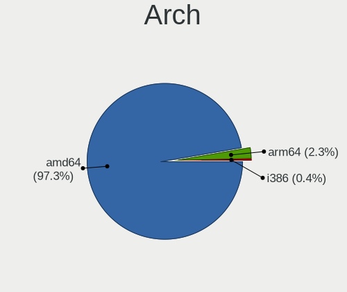

| Name  | Desktops | Percent |
|-------|----------|---------|
| amd64 | 125      | 95.42%  |
| arm64 | 5        | 3.82%   |
| i386  | 1        | 0.76%   |

DE
--

Desktop Environment

| Name         | Desktops | Percent |
|--------------|----------|---------|
| Console      | 111      | 82.84%  |
| helloDesktop | 9        | 6.72%   |
| KDE5         | 5        | 3.73%   |
| GNOME        | 2        | 1.49%   |
| fvwm         | 2        | 1.49%   |
| XFCE         | 1        | 0.75%   |
| Openbox      | 1        | 0.75%   |
| MATE         | 1        | 0.75%   |
| LXQt         | 1        | 0.75%   |
| i3           | 1        | 0.75%   |

Display Server
--------------

X11 or Wayland

| Name    | Desktops | Percent |
|---------|----------|---------|
| Console | 114      | 87.02%  |
| X11     | 16       | 12.21%  |
| Wayland | 1        | 0.76%   |

Display Manager
---------------

SDDM, LightDM, etc.

| Name    | Desktops | Percent |
|---------|----------|---------|
| Console | 117      | 88.64%  |
| SDDM    | 5        | 3.79%   |
| SLiM    | 4        | 3.03%   |
| LightDM | 3        | 2.27%   |
| GDM     | 2        | 1.52%   |
| XDM     | 1        | 0.76%   |

OS Lang
-------

Language

| Lang    | Desktops | Percent |
|---------|----------|---------|
| Unknown | 107      | 79.26%  |
| C       | 15       | 11.11%  |
| en_US   | 12       | 8.89%   |
| nl_NL   | 1        | 0.74%   |

Boot Mode
---------

EFI or BIOS

| Mode | Desktops | Percent |
|------|----------|---------|
| EFI  | 105      | 79.55%  |
| BIOS | 27       | 20.45%  |

Filesystem
----------

Type of filesystem

| Type   | Desktops | Percent |
|--------|----------|---------|
| Ufs    | 79       | 58.52%  |
| Zfs    | 43       | 31.85%  |
| Ffs    | 12       | 8.89%   |
| Cd9660 | 1        | 0.74%   |

Part. scheme
------------

Scheme of partitioning

| Type    | Desktops | Percent |
|---------|----------|---------|
| GPT     | 112      | 84.85%  |
| MBR     | 19       | 14.39%  |
| Unknown | 1        | 0.76%   |

Board
-----

Vendor
------

Motherboard manufacturer

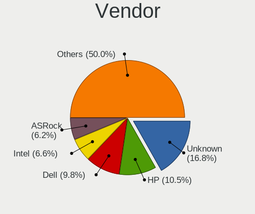

| Name                | Desktops | Percent |
|---------------------|----------|---------|
| Unknown             | 21       | 16.03%  |
| Dell                | 13       | 9.92%   |
| Hewlett-Packard     | 12       | 9.16%   |
| Intel               | 10       | 7.63%   |
| ASRock              | 10       | 7.63%   |
| Gigabyte Technology | 9        | 6.87%   |
| PC Engines          | 8        | 6.11%   |
| Shuttle             | 5        | 3.82%   |
| ASUSTek Computer    | 5        | 3.82%   |
| Supermicro          | 4        | 3.05%   |
| MSI                 | 4        | 3.05%   |
| Protectli           | 3        | 2.29%   |
| Inventec            | 3        | 2.29%   |
| Fujitsu             | 3        | 2.29%   |
| MW                  | 2        | 1.53%   |
| Lenovo              | 2        | 1.53%   |
| Deciso              | 2        | 1.53%   |
| ASRockRack          | 2        | 1.53%   |
| XtReAmEr            | 1        | 0.76%   |
| Sapphire            | 1        | 0.76%   |
| Pegatron            | 1        | 0.76%   |
| NU941               | 1        | 0.76%   |
| iEi                 | 1        | 0.76%   |
| HPE                 | 1        | 0.76%   |
| HARDKERNEL          | 1        | 0.76%   |
| Dell EMC            | 1        | 0.76%   |
| Cisco               | 1        | 0.76%   |
| Biostar             | 1        | 0.76%   |
| AMI                 | 1        | 0.76%   |
| Alienware           | 1        | 0.76%   |
| Advantech           | 1        | 0.76%   |

Model
-----

Motherboard model

| Name                                   | Desktops | Percent |
|----------------------------------------|----------|---------|
| Unknown                                | 22       | 16.79%  |
| Intel Q3XXG4-P V1.0                    | 8        | 6.11%   |
| Dell PowerEdge R620                    | 5        | 3.82%   |
| PC Engines apu4                        | 3        | 2.29%   |
| PC Engines APU2                        | 3        | 2.29%   |
| PC Engines APU                         | 2        | 1.53%   |
| MW GMLK-2_5G4L                         | 2        | 1.53%   |
| Inventec VXC Class                     | 2        | 1.53%   |
| HP EliteDesk 800 G1 SFF                | 2        | 1.53%   |
| Gigabyte X570 AORUS PRO                | 2        | 1.53%   |
| Fujitsu FUTRO S920                     | 2        | 1.53%   |
| Supermicro X9SCL/X9SCM                 | 1        | 0.76%   |
| Supermicro X8SIL                       | 1        | 0.76%   |
| Supermicro AS -E301-9D-8CN4            | 1        | 0.76%   |
| Supermicro AS -5019D-FTN4              | 1        | 0.76%   |
| Shuttle XH310V2                        | 1        | 0.76%   |
| Shuttle XH110                          | 1        | 0.76%   |
| Shuttle SH87R                          | 1        | 0.76%   |
| Shuttle DH370                          | 1        | 0.76%   |
| Shuttle DH310                          | 1        | 0.76%   |
| Sapphire EDGE-FT1M1 E450 1AOVU044      | 1        | 0.76%   |
| Protectli FW6D                         | 1        | 0.76%   |
| Protectli FW4B                         | 1        | 0.76%   |
| Protectli FW2B                         | 1        | 0.76%   |
| Pegatron h8-1102nl                     | 1        | 0.76%   |
| NU941 1.0                              | 1        | 0.76%   |
| MSI MS-7C89                            | 1        | 0.76%   |
| MSI MS-7851                            | 1        | 0.76%   |
| MSI MS-7846                            | 1        | 0.76%   |
| MSI MS-7677                            | 1        | 0.76%   |
| Lenovo V520S-08IKL Desktop 10NNS04A00  | 1        | 0.76%   |
| Lenovo ThinkStation E31 255526G        | 1        | 0.76%   |
| Inventec R CLASS                       | 1        | 0.76%   |
| Intel SHARKBAY                         | 1        | 0.76%   |
| Intel CRESCENTBAY                      | 1        | 0.76%   |
| iEi E452                               | 1        | 0.76%   |
| HPE ProLiant MicroServer Gen10 Plus    | 1        | 0.76%   |
| HP t620 PLUS Quad Core TC              | 1        | 0.76%   |
| HP ProLiant DL360 Gen9                 | 1        | 0.76%   |
| HP ProDesk 400 G7 Small Form Factor PC | 1        | 0.76%   |

Model Family
------------

Motherboard model prefix

| Name                | Desktops | Percent |
|---------------------|----------|---------|
| Unknown             | 22       | 16.79%  |
| Intel Q3XXG4-P      | 8        | 6.11%   |
| Dell OptiPlex       | 6        | 4.58%   |
| Dell PowerEdge      | 5        | 3.82%   |
| HP EliteDesk        | 4        | 3.05%   |
| PC Engines apu4     | 3        | 2.29%   |
| PC Engines APU2     | 3        | 2.29%   |
| HP ProDesk          | 3        | 2.29%   |
| HP Compaq           | 3        | 2.29%   |
| Supermicro AS       | 2        | 1.53%   |
| PC Engines APU      | 2        | 1.53%   |
| MW GMLK-2           | 2        | 1.53%   |
| Inventec VXC        | 2        | 1.53%   |
| Gigabyte X570       | 2        | 1.53%   |
| Fujitsu FUTRO       | 2        | 1.53%   |
| Deciso Netboard     | 2        | 1.53%   |
| ASUS PRIME          | 2        | 1.53%   |
| Supermicro X9SCL    | 1        | 0.76%   |
| Supermicro X8SIL    | 1        | 0.76%   |
| Shuttle XH310V2     | 1        | 0.76%   |
| Shuttle XH110       | 1        | 0.76%   |
| Shuttle SH87R       | 1        | 0.76%   |
| Shuttle DH370       | 1        | 0.76%   |
| Shuttle DH310       | 1        | 0.76%   |
| Sapphire EDGE-FT1M1 | 1        | 0.76%   |
| Protectli FW6D      | 1        | 0.76%   |
| Protectli FW4B      | 1        | 0.76%   |
| Protectli FW2B      | 1        | 0.76%   |
| Pegatron h8-1102nl  | 1        | 0.76%   |
| NU941 1.0           | 1        | 0.76%   |
| MSI MS-7C89         | 1        | 0.76%   |
| MSI MS-7851         | 1        | 0.76%   |
| MSI MS-7846         | 1        | 0.76%   |
| MSI MS-7677         | 1        | 0.76%   |
| Lenovo V520S-08IKL  | 1        | 0.76%   |
| Lenovo ThinkStation | 1        | 0.76%   |
| Inventec R          | 1        | 0.76%   |
| Intel SHARKBAY      | 1        | 0.76%   |
| Intel CRESCENTBAY   | 1        | 0.76%   |
| iEi E452            | 1        | 0.76%   |

MFG Year
--------

Motherboard manufacture year

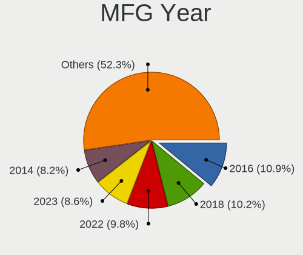

| Year    | Desktops | Percent |
|---------|----------|---------|
| 2020    | 17       | 12.98%  |
| 2018    | 17       | 12.98%  |
| 2016    | 16       | 12.21%  |
| 2019    | 15       | 11.45%  |
| 2014    | 13       | 9.92%   |
| 2013    | 9        | 6.87%   |
| 2021    | 8        | 6.11%   |
| 2011    | 7        | 5.34%   |
| 2017    | 5        | 3.82%   |
| 2015    | 5        | 3.82%   |
| Unknown | 5        | 3.82%   |
| 2022    | 4        | 3.05%   |
| 2009    | 4        | 3.05%   |
| 2012    | 3        | 2.29%   |
| 2010    | 1        | 0.76%   |
| 2008    | 1        | 0.76%   |
| 2006    | 1        | 0.76%   |

Form Factor
-----------

Physical design of the computer

| Name    | Desktops | Percent |
|---------|----------|---------|
| Desktop | 131      | 100%    |

Coreboot
--------

Have coreboot on board

| Used | Desktops | Percent |
|------|----------|---------|
| No   | 120      | 91.6%   |
| Yes  | 11       | 8.4%    |

RAM Size
--------

Total RAM memory

| Size in GB      | Desktops | Percent |
|-----------------|----------|---------|
| 8.01-16.0       | 46       | 34.85%  |
| 4.01-8.0        | 32       | 24.24%  |
| 16.01-24.0      | 21       | 15.91%  |
| 32.01-64.0      | 13       | 9.85%   |
| 64.01-256.0     | 6        | 4.55%   |
| 2.01-3.0        | 5        | 3.79%   |
| 3.01-4.0        | 3        | 2.27%   |
| More than 256.0 | 2        | 1.52%   |
| 1.01-2.0        | 2        | 1.52%   |
| 24.01-32.0      | 1        | 0.76%   |
| 0.51-1.0        | 1        | 0.76%   |

RAM Used
--------

Used RAM memory

| Used GB    | Desktops | Percent |
|------------|----------|---------|
| 0.01-0.5   | 72       | 52.94%  |
| 0.51-1.0   | 36       | 26.47%  |
| 1.01-2.0   | 10       | 7.35%   |
| 4.01-8.0   | 6        | 4.41%   |
| 8.01-16.0  | 4        | 2.94%   |
| 2.01-3.0   | 3        | 2.21%   |
| 32.01-64.0 | 1        | 0.74%   |
| 3.01-4.0   | 1        | 0.74%   |
| 24.01-32.0 | 1        | 0.74%   |
| 0          | 1        | 0.74%   |
| Unknown    | 1        | 0.74%   |

Total Drives
------------

Number of drives on board

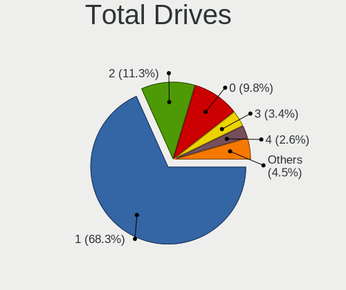

| Drives | Desktops | Percent |
|--------|----------|---------|
| 1      | 92       | 69.7%   |
| 2      | 15       | 11.36%  |
| 0      | 7        | 5.3%    |
| 4      | 5        | 3.79%   |
| 3      | 5        | 3.79%   |
| 5      | 3        | 2.27%   |
| 15     | 1        | 0.76%   |
| 12     | 1        | 0.76%   |
| 10     | 1        | 0.76%   |
| 7      | 1        | 0.76%   |
| 6      | 1        | 0.76%   |

Has CD-ROM
----------

Has CD-ROM on board

| Presented | Desktops | Percent |
|-----------|----------|---------|
| No        | 117      | 89.31%  |
| Yes       | 14       | 10.69%  |

Has Ethernet
------------

Has Ethernet on board

| Presented | Desktops | Percent |
|-----------|----------|---------|
| Yes       | 127      | 96.95%  |
| No        | 4        | 3.05%   |

Has WiFi
--------

Has WiFi module

| Presented | Desktops | Percent |
|-----------|----------|---------|
| No        | 111      | 83.46%  |
| Yes       | 22       | 16.54%  |

Has Bluetooth
-------------

Has Bluetooth module

| Presented | Desktops | Percent |
|-----------|----------|---------|
| No        | 122      | 92.42%  |
| Yes       | 10       | 7.58%   |

Location
--------

Country
-------

Geographic location (country)

| Country     | Desktops | Percent |
|-------------|----------|---------|
| Netherlands | 131      | 100%    |

City
----

Geographic location (city)

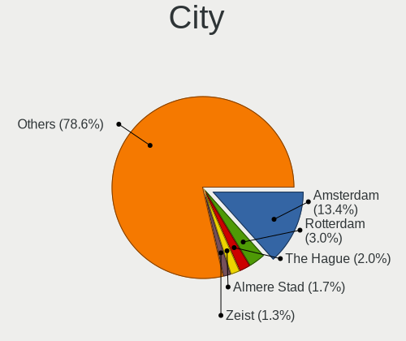

| City                | Desktops | Percent |
|---------------------|----------|---------|
| Amsterdam           | 24       | 15.29%  |
| Rotterdam           | 4        | 2.55%   |
| Poortugaal          | 4        | 2.55%   |
| Zeist               | 3        | 1.91%   |
| The Hague           | 3        | 1.91%   |
| Ospel               | 3        | 1.91%   |
| Heemskerk           | 3        | 1.91%   |
| Groningen           | 3        | 1.91%   |
| Breda               | 3        | 1.91%   |
| Barneveld           | 3        | 1.91%   |
| Amersfoort          | 3        | 1.91%   |
| Zaandam             | 2        | 1.27%   |
| Vlaardingen         | 2        | 1.27%   |
| Veenendaal          | 2        | 1.27%   |
| Steenbergen         | 2        | 1.27%   |
| Papendrecht         | 2        | 1.27%   |
| Nieuwegein          | 2        | 1.27%   |
| Maastricht          | 2        | 1.27%   |
| IJsselstein         | 2        | 1.27%   |
| Hengelo             | 2        | 1.27%   |
| Delft               | 2        | 1.27%   |
| Alphen aan den Rijn | 2        | 1.27%   |
| Almere Stad         | 2        | 1.27%   |
| Almere Poort        | 2        | 1.27%   |
| Almelo              | 2        | 1.27%   |
| Aalsmeer            | 2        | 1.27%   |
| Zutphen             | 1        | 0.64%   |
| Zuidhorn            | 1        | 0.64%   |
| Zoetermeer          | 1        | 0.64%   |
| Zetten              | 1        | 0.64%   |
| Zaltbommel          | 1        | 0.64%   |
| Winschoten          | 1        | 0.64%   |
| Wijchen             | 1        | 0.64%   |
| Wassenaar           | 1        | 0.64%   |
| Vleuten             | 1        | 0.64%   |
| Venlo               | 1        | 0.64%   |
| Valkenswaard        | 1        | 0.64%   |
| Utrecht             | 1        | 0.64%   |
| Tilburg             | 1        | 0.64%   |
| Tiel                | 1        | 0.64%   |

Drives
------

Drive Vendor
------------

Hard drive vendors

| Vendor              | Desktops | Drives | Percent |
|---------------------|----------|--------|---------|
| Samsung Electronics | 29       | 42     | 18.83%  |
| WDC                 | 17       | 57     | 11.04%  |
| Crucial             | 17       | 33     | 11.04%  |
| Kingston            | 11       | 15     | 7.14%   |
| Transcend           | 8        | 12     | 5.19%   |
| Hoodisk             | 8        | 12     | 5.19%   |
| Seagate             | 6        | 35     | 3.9%    |
| Toshiba             | 4        | 14     | 2.6%    |
| SanDisk             | 4        | 4      | 2.6%    |
| HGST                | 4        | 8      | 2.6%    |
| Dell                | 4        | 8      | 2.6%    |
| China               | 4        | 8      | 2.6%    |
| LITEON              | 3        | 4      | 1.95%   |
| Intel               | 3        | 6      | 1.95%   |
| Hitachi             | 3        | 5      | 1.95%   |
| Hewlett-Packard     | 3        | 5      | 1.95%   |
| Gigabyte Technology | 3        | 3      | 1.95%   |
| FORESEE             | 3        | 6      | 1.95%   |
| Phison              | 2        | 2      | 1.3%    |
| Kston               | 2        | 5      | 1.3%    |
| StoreJet            | 1        | 1      | 0.65%   |
| Silicon Motion      | 1        | 2      | 0.65%   |
| ShiJi               | 1        | 1      | 0.65%   |
| Protectli           | 1        | 4      | 0.65%   |
| PNY                 | 1        | 1      | 0.65%   |
| ORICO               | 1        | 1      | 0.65%   |
| OPENBSD             | 1        | 1      | 0.65%   |
| OCZ                 | 1        | 1      | 0.65%   |
| NVMe                | 1        | 1      | 0.65%   |
| NETAPP              | 1        | 4      | 0.65%   |
| Intenso             | 1        | 1      | 0.65%   |
| Innodisk            | 1        | 1      | 0.65%   |
| Corsair             | 1        | 1      | 0.65%   |
| BAITITON            | 1        | 2      | 0.65%   |
| Apacer              | 1        | 1      | 0.65%   |
| Advantech           | 1        | 1      | 0.65%   |

Drive Model
-----------

Hard drive models

| Model                                | Desktops | Percent |
|--------------------------------------|----------|---------|
| Samsung SSD 850 EVO 250GB            | 6        | 3.51%   |
| Kingston SUV500MS120G 120GB          | 4        | 2.34%   |
| Hoodisk SSD 128GB                    | 4        | 2.34%   |
| Dell PERC H710 282GB                 | 4        | 2.34%   |
| Crucial CT250MX500SSD1 250GB         | 3        | 1.75%   |
| Crucial CT240BX500SSD1 240GB         | 3        | 1.75%   |
| Crucial CT120BX500SSD1 120GB         | 3        | 1.75%   |
| China SATA SSD 16GB                  | 3        | 1.75%   |
| WDC WD40EFRX-68WT0N0 4TB             | 2        | 1.17%   |
| WDC WD40EFRX-68N32N0 4TB             | 2        | 1.17%   |
| Transcend TS32GSSD370S 32GB          | 2        | 1.17%   |
| Samsung SSD 970 EVO 1TB              | 2        | 1.17%   |
| Samsung SSD 850 EVO 500GB            | 2        | 1.17%   |
| Samsung SSD 840 Series 120GB         | 2        | 1.17%   |
| LITEON CS1-SP16-11 M.2 2242 16GB     | 2        | 1.17%   |
| Kston SSD 128GB                      | 2        | 1.17%   |
| Hoodisk SSD 64GB                     | 2        | 1.17%   |
| HGST HTS725050A7E630 500GB           | 2        | 1.17%   |
| Crucial M4-CT128M4SSD2 128GB         | 2        | 1.17%   |
| Crucial CT480M500SSD1 480GB          | 2        | 1.17%   |
| WDC WDS500G1X0E-00AFY0 500GB         | 1        | 0.58%   |
| WDC WDS240G2G0B-00EPW0 240GB         | 1        | 0.58%   |
| WDC WDS100T3X0C-00SJG0 1TB           | 1        | 0.58%   |
| WDC WD8003FFBX-68B9AN0 8TB           | 1        | 0.58%   |
| WDC WD7500AYYS-01RCA0 752GB          | 1        | 0.58%   |
| WDC WD60EFRX-68L0BN1 6TB             | 1        | 0.58%   |
| WDC WD5000AAKX-603CA0 500GB          | 1        | 0.58%   |
| WDC WD5000AAKS-00A7B0 500GB          | 1        | 0.58%   |
| WDC WD5000AACS-00ZUB0 500GB          | 1        | 0.58%   |
| WDC WD4004FZWX-00GBGB0 4TB           | 1        | 0.58%   |
| WDC WD3200JS-22PDB0 320GB            | 1        | 0.58%   |
| WDC WD3200BPVT-22JJ5T0 320GB         | 1        | 0.58%   |
| WDC WD20EFRX-68EUZN0 2TB             | 1        | 0.58%   |
| WDC WD2000FYYZ-01UL1B0 2TB           | 1        | 0.58%   |
| WDC WD10JFCX-68N6GN0 1TB             | 1        | 0.58%   |
| WDC WD10EZEX-08WN4A0 1TB             | 1        | 0.58%   |
| WDC WD10EFRX-68PJCN0 1TB             | 1        | 0.58%   |
| WDC WD10EADS-00L5B1 1TB              | 1        | 0.58%   |
| WDC PC SN530 SDBPNPZ-256G-1006 256GB | 1        | 0.58%   |
| Transcend TS64GMSA230S 64GB          | 1        | 0.58%   |

HDD Vendor
----------

Hard disk drive vendors

| Vendor              | Desktops | Drives | Percent |
|---------------------|----------|--------|---------|
| WDC                 | 15       | 50     | 34.88%  |
| Seagate             | 6        | 35     | 13.95%  |
| Samsung Electronics | 4        | 7      | 9.3%    |
| HGST                | 4        | 8      | 9.3%    |
| Dell                | 4        | 8      | 9.3%    |
| Hitachi             | 3        | 5      | 6.98%   |
| Toshiba             | 2        | 10     | 4.65%   |
| Hewlett-Packard     | 2        | 4      | 4.65%   |
| StoreJet            | 1        | 1      | 2.33%   |
| OPENBSD             | 1        | 1      | 2.33%   |
| NVMe                | 1        | 1      | 2.33%   |

SSD Vendor
----------

Solid state drive vendors

| Vendor              | Desktops | Drives | Percent |
|---------------------|----------|--------|---------|
| Samsung Electronics | 22       | 26     | 22.68%  |
| Crucial             | 17       | 29     | 17.53%  |
| Kingston            | 8        | 12     | 8.25%   |
| Hoodisk             | 8        | 12     | 8.25%   |
| Transcend           | 7        | 11     | 7.22%   |
| SanDisk             | 4        | 4      | 4.12%   |
| China               | 4        | 8      | 4.12%   |
| LITEON              | 3        | 4      | 3.09%   |
| Intel               | 3        | 6      | 3.09%   |
| FORESEE             | 3        | 6      | 3.09%   |
| Phison              | 2        | 2      | 2.06%   |
| Kston               | 2        | 5      | 2.06%   |
| WDC                 | 1        | 3      | 1.03%   |
| Toshiba             | 1        | 3      | 1.03%   |
| ShiJi               | 1        | 1      | 1.03%   |
| Protectli           | 1        | 4      | 1.03%   |
| PNY                 | 1        | 1      | 1.03%   |
| ORICO               | 1        | 1      | 1.03%   |
| OCZ                 | 1        | 1      | 1.03%   |
| NETAPP              | 1        | 4      | 1.03%   |
| Intenso             | 1        | 1      | 1.03%   |
| Innodisk            | 1        | 1      | 1.03%   |
| Hewlett-Packard     | 1        | 1      | 1.03%   |
| BAITITON            | 1        | 2      | 1.03%   |
| Apacer              | 1        | 1      | 1.03%   |
| Advantech           | 1        | 1      | 1.03%   |

Drive Kind
----------

HDD or SSD

| Kind | Desktops | Drives | Percent |
|------|----------|--------|---------|
| SSD  | 91       | 150    | 63.64%  |
| HDD  | 36       | 130    | 25.17%  |
| NVMe | 16       | 28     | 11.19%  |

Drive Connector
---------------

SATA, SAS, NVMe, etc.

| Type | Desktops | Drives | Percent |
|------|----------|--------|---------|
| SATA | 114      | 280    | 87.69%  |
| NVMe | 16       | 28     | 12.31%  |

Drive Size
----------

Size of hard drive

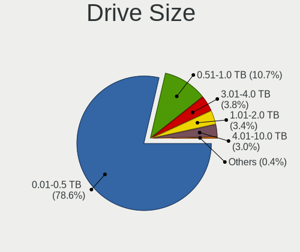

| Size in TB | Desktops | Drives | Percent |
|------------|----------|--------|---------|
| 0.01-0.5   | 106      | 179    | 79.1%   |
| 0.51-1.0   | 12       | 33     | 8.96%   |
| 3.01-4.0   | 7        | 20     | 5.22%   |
| 4.01-10.0  | 5        | 40     | 3.73%   |
| 1.01-2.0   | 4        | 8      | 2.99%   |

Space Total
-----------

Amount of disk space available on the file system

| Size in GB     | Desktops | Percent |
|----------------|----------|---------|
| 101-250        | 58       | 42.65%  |
| 51-100         | 23       | 16.91%  |
| 1-20           | 17       | 12.5%   |
| 251-500        | 14       | 10.29%  |
| 21-50          | 10       | 7.35%   |
| 501-1000       | 6        | 4.41%   |
| 1001-2000      | 4        | 2.94%   |
| 2001-3000      | 2        | 1.47%   |
| More than 3000 | 1        | 0.74%   |
| Unknown        | 1        | 0.74%   |

Space Used
----------

Amount of used disk space

| Used GB  | Desktops | Percent |
|----------|----------|---------|
| 1-20     | 117      | 87.31%  |
| 21-50    | 6        | 4.48%   |
| 101-250  | 3        | 2.24%   |
| 51-100   | 3        | 2.24%   |
| 251-500  | 2        | 1.49%   |
| 501-1000 | 2        | 1.49%   |
| Unknown  | 1        | 0.75%   |

Malfunc. Drives
---------------

Drive models with a malfunction

| Model                                     | Desktops | Drives | Percent |
|-------------------------------------------|----------|--------|---------|
| Crucial CT480M500SSD1 480GB               | 2        | 3      | 10%     |
| ShiJi SSD 32GB                            | 1        | 1      | 5%      |
| Seagate ST500LT012-9WS142 500GB           | 1        | 2      | 5%      |
| Seagate ST3160318AS 160GB                 | 1        | 4      | 5%      |
| Samsung Electronics SSD 870 EVO 1TB       | 1        | 1      | 5%      |
| Samsung Electronics SSD 850 EVO mSATA 1TB | 1        | 1      | 5%      |
| Samsung Electronics SSD 850 EVO 1TB       | 1        | 1      | 5%      |
| Samsung Electronics SSD 840 Series 120GB  | 1        | 1      | 5%      |
| Samsung Electronics SSD 840 EVO 120GB     | 1        | 1      | 5%      |
| Samsung Electronics HD322HJ 320GB         | 1        | 1      | 5%      |
| Samsung Electronics HD103SJ 1TB           | 1        | 2      | 5%      |
| Kingston SMS200S3120G 120GB               | 1        | 1      | 5%      |
| Intel SSDSC2BA200G3T 200GB                | 1        | 4      | 5%      |
| Hitachi HTS543232A7A384 320GB             | 1        | 1      | 5%      |
| Hitachi HDS723015BLA642 1.5TB             | 1        | 3      | 5%      |
| HGST HTS725050A7E630 500GB                | 1        | 1      | 5%      |
| HGST HDN726060ALE614 6TB                  | 1        | 2      | 5%      |
| Hewlett-Packard FB160C4081 160GB          | 1        | 2      | 5%      |
| Crucial CT128MX100SSD1 128GB              | 1        | 2      | 5%      |

Malfunc. Drive Vendor
---------------------

Vendors of faulty drives

| Vendor              | Desktops | Drives | Percent |
|---------------------|----------|--------|---------|
| Samsung Electronics | 6        | 8      | 31.58%  |
| Crucial             | 3        | 5      | 15.79%  |
| Seagate             | 2        | 6      | 10.53%  |
| Hitachi             | 2        | 4      | 10.53%  |
| HGST                | 2        | 3      | 10.53%  |
| ShiJi               | 1        | 1      | 5.26%   |
| Kingston            | 1        | 1      | 5.26%   |
| Intel               | 1        | 4      | 5.26%   |
| Hewlett-Packard     | 1        | 2      | 5.26%   |

Malfunc. HDD Vendor
-------------------

Vendors of faulty HDD drives

| Vendor              | Desktops | Drives | Percent |
|---------------------|----------|--------|---------|
| Seagate             | 2        | 6      | 22.22%  |
| Samsung Electronics | 2        | 3      | 22.22%  |
| Hitachi             | 2        | 4      | 22.22%  |
| HGST                | 2        | 3      | 22.22%  |
| Hewlett-Packard     | 1        | 2      | 11.11%  |

Malfunc. Drive Kind
-------------------

Kinds of faulty drives

| Kind | Desktops | Drives | Percent |
|------|----------|--------|---------|
| SSD  | 9        | 16     | 50%     |
| HDD  | 9        | 18     | 50%     |

Failed Drives
-------------

Failed drive models

Zero info for selected period =(

Failed Drive Vendor
-------------------

Failed drive vendors

Zero info for selected period =(

Drive Status
------------

Number of failed and malfunc. drives

| Status   | Desktops | Drives | Percent |
|----------|----------|--------|---------|
| Works    | 110      | 264    | 82.09%  |
| Malfunc  | 18       | 34     | 13.43%  |
| Detected | 6        | 10     | 4.48%   |

Storage controller
------------------

Storage Vendor
--------------

Storage controller vendors

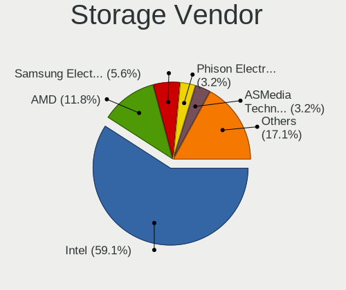

| Vendor                      | Desktops | Percent |
|-----------------------------|----------|---------|
| Intel                       | 95       | 60.13%  |
| AMD                         | 27       | 17.09%  |
| Broadcom / LSI              | 7        | 4.43%   |
| Samsung Electronics         | 6        | 3.8%    |
| Phison Electronics          | 6        | 3.8%    |
| ASMedia Technology          | 6        | 3.8%    |
| SanDisk                     | 2        | 1.27%   |
| Kingston Technology Company | 2        | 1.27%   |
| Toshiba                     | 1        | 0.63%   |
| Silicon Motion              | 1        | 0.63%   |
| Micron/Crucial Technology   | 1        | 0.63%   |
| Marvell Technology Group    | 1        | 0.63%   |
| JMicron Technology          | 1        | 0.63%   |
| Hewlett-Packard             | 1        | 0.63%   |
| Chelsio Communications      | 1        | 0.63%   |

Storage Model
-------------

Storage controller models

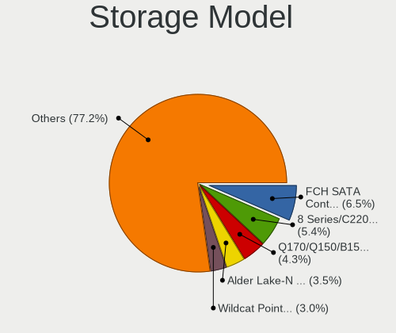

| Model                                                                            | Desktops | Percent |
|----------------------------------------------------------------------------------|----------|---------|
| AMD FCH SATA Controller [AHCI mode]                                              | 17       | 10.18%  |
| Intel 8 Series/C220 Series Chipset Family 6-port SATA Controller 1 [AHCI mode]   | 10       | 5.99%   |
| Intel Wildcat Point-LP SATA Controller [AHCI Mode]                               | 9        | 5.39%   |
| Intel Sunrise Point-LP SATA Controller [AHCI mode]                               | 7        | 4.19%   |
| Intel Atom/Celeron/Pentium Processor x5-E8000/J3xxx/N3xxx Series SATA Controller | 7        | 4.19%   |
| Intel 6 Series/C200 Series Chipset Family 6 port Desktop SATA AHCI Controller    | 7        | 4.19%   |
| Intel Cannon Lake PCH SATA AHCI Controller                                       | 6        | 3.59%   |
| AMD SB7x0/SB8x0/SB9x0 SATA Controller [AHCI mode]                                | 6        | 3.59%   |
| Intel Q170/Q150/B150/H170/H110/Z170/CM236 Chipset SATA Controller [AHCI Mode]    | 5        | 2.99%   |
| Intel 7 Series/C210 Series Chipset Family 6-port SATA Controller [AHCI mode]     | 5        | 2.99%   |
| ASMedia ASM1062 Serial ATA Controller                                            | 5        | 2.99%   |
| Samsung NVMe SSD Controller SM981/PM981/PM983                                    | 4        | 2.4%    |
| Intel Celeron/Pentium Silver Processor SATA Controller                           | 4        | 2.4%    |
| Intel C600/X79 series chipset 6-Port SATA AHCI Controller                        | 4        | 2.4%    |
| Broadcom / LSI MegaRAID SAS 2208 [Thunderbolt]                                   | 4        | 2.4%    |
| Intel Comet Lake SATA AHCI Controller                                            | 3        | 1.8%    |
| Intel Atom Processor E3800 Series SATA AHCI Controller                           | 3        | 1.8%    |
| Phison PS5013 E13 NVMe Controller                                                | 2        | 1.2%    |
| Intel SATA Controller [RAID mode]                                                | 2        | 1.2%    |
| Intel Jasper Lake SATA AHCI Controller                                           | 2        | 1.2%    |
| Intel Cannon Point-LP SATA Controller [AHCI Mode]                                | 2        | 1.2%    |
| Intel C610/X99 series chipset 6-Port SATA Controller [AHCI mode]                 | 2        | 1.2%    |
| Intel 82801JI (ICH10 Family) SATA AHCI Controller                                | 2        | 1.2%    |
| Intel 8 Series SATA Controller 1 [AHCI mode]                                     | 2        | 1.2%    |
| Intel 500 Series Chipset Family SATA AHCI Controller                             | 2        | 1.2%    |
| Intel 5 Series/3400 Series Chipset 6 port SATA AHCI Controller                   | 2        | 1.2%    |
| Intel 400 Series Chipset Family SATA AHCI Controller                             | 2        | 1.2%    |
| AMD 500 Series Chipset SATA Controller                                           | 2        | 1.2%    |
| AMD 400 Series Chipset SATA Controller                                           | 2        | 1.2%    |
| Unknown                                                                          | 2        | 1.2%    |
| Toshiba XG4 NVMe SSD Controller                                                  | 1        | 0.6%    |
| Silicon Motion SM2263EN/SM2263XT SSD Controller                                  | 1        | 0.6%    |
| SanDisk WD PC SN810 / Black SN850 NVMe SSD                                       | 1        | 0.6%    |
| SanDisk WD Blue SN550 NVMe SSD                                                   | 1        | 0.6%    |
| SanDisk WD Black SN750 / PC SN730 NVMe SSD                                       | 1        | 0.6%    |
| Samsung NVMe SSD Controller SM951/PM951                                          | 1        | 0.6%    |
| Samsung NVMe SSD Controller PM9A1/PM9A3/980PRO                                   | 1        | 0.6%    |
| Samsung NVMe SSD Controller 980                                                  | 1        | 0.6%    |
| Phison NVMe Storage Controller                                                   | 1        | 0.6%    |
| Phison E7 NVMe Controller                                                        | 1        | 0.6%    |

Storage Kind
------------

Kind of storage controller (IDE, SATA, NVMe, SAS, ...)

| Kind | Desktops | Percent |
|------|----------|---------|
| SATA | 118      | 78.15%  |
| NVMe | 17       | 11.26%  |
| RAID | 8        | 5.3%    |
| IDE  | 4        | 2.65%   |
| SAS  | 3        | 1.99%   |
| SCSI | 1        | 0.66%   |

Processor
---------

CPU Vendor
----------

Processor vendors

| Vendor | Desktops | Percent |
|--------|----------|---------|
| Intel  | 97       | 74.05%  |
| AMD    | 29       | 22.14%  |
| ARM    | 5        | 3.82%   |

CPU Model
---------

Processor models

| Model                                  | Desktops | Percent |
|----------------------------------------|----------|---------|
| AMD GX-412TC SOC                       | 6        | 4.58%   |
| Intel Celeron CPU J3160 @ 1.60GHz      | 5        | 3.82%   |
| Intel Core i5-5200U CPU @ 2.20GHz      | 3        | 2.29%   |
| ARM Cortex-A72 r0p3                    | 3        | 2.29%   |
| AMD G-T56N Processor                   | 3        | 2.29%   |
| Intel Xeon CPU E5-2640 0 @ 2.50GHz     | 2        | 1.53%   |
| Intel Xeon CPU E5-2630 0 @ 2.30GHz     | 2        | 1.53%   |
| Intel Pentium Silver N6005 @ 2.00GHz   | 2        | 1.53%   |
| Intel Core i7-5550U CPU @ 2.00GHz      | 2        | 1.53%   |
| Intel Core i7-2600 CPU @ 3.40GHz       | 2        | 1.53%   |
| Intel Core i5-8600 CPU @ 3.10GHz       | 2        | 1.53%   |
| Intel Core i5-6500 CPU @ 3.20GHz       | 2        | 1.53%   |
| Intel Core i5-5250U CPU @ 1.60GHz      | 2        | 1.53%   |
| Intel Core i5-4690 CPU @ 3.50GHz       | 2        | 1.53%   |
| Intel Core i5-4590 CPU @ 3.30GHz       | 2        | 1.53%   |
| Intel Core i5-3470 CPU @ 3.20GHz       | 2        | 1.53%   |
| Intel Core i5-10400 CPU @ 2.90GHz      | 2        | 1.53%   |
| Intel Core 2 Duo                       | 2        | 1.53%   |
| Intel Celeron J4125 CPU @ 2.00GHz      | 2        | 1.53%   |
| Intel Celeron CPU J1900 @ 1.99GHz      | 2        | 1.53%   |
| ARM Cortex-A53 r0p4                    | 2        | 1.53%   |
| AMD G-T40E Processor                   | 2        | 1.53%   |
| AMD EPYC 3251 8-Core Processor         | 2        | 1.53%   |
| Intel Xeon E-2224 CPU @ 3.40GHz        | 1        | 0.76%   |
| Intel Xeon CPU X5680 @ 3.33GHz         | 1        | 0.76%   |
| Intel Xeon CPU L3426 @ 1.87GHz         | 1        | 0.76%   |
| Intel Xeon CPU E5-2690 0 @ 2.90GHz     | 1        | 0.76%   |
| Intel Xeon CPU E5-2650L v3 @ 1.80GHz   | 1        | 0.76%   |
| Intel Xeon CPU E5-2620 v3 @ 2.40GHz    | 1        | 0.76%   |
| Intel Xeon CPU E31270 @ 3.40GHz        | 1        | 0.76%   |
| Intel Xeon CPU E3-1225 v3 @ 3.20GHz    | 1        | 0.76%   |
| Intel Pentium Gold G6500 CPU @ 4.10GHz | 1        | 0.76%   |
| Intel Pentium Gold G5600 CPU @ 3.90GHz | 1        | 0.76%   |
| Intel Pentium Gold G5400 CPU @ 3.70GHz | 1        | 0.76%   |
| Intel Pentium CPU G4560 @ 3.50GHz      | 1        | 0.76%   |
| Intel Pentium CPU G3220 @ 3.00GHz      | 1        | 0.76%   |
| Intel Pentium CPU 5405U @ 2.30GHz      | 1        | 0.76%   |
| Intel Pentium 4                        | 1        | 0.76%   |
| Intel Core i7-6700TE CPU @ 2.40GHz     | 1        | 0.76%   |
| Intel Core i7-6700K CPU @ 4.00GHz      | 1        | 0.76%   |

CPU Model Family
----------------

Processor model prefix

| Model                | Desktops | Percent |
|----------------------|----------|---------|
| Intel Core i5        | 34       | 25.95%  |
| Intel Celeron        | 16       | 12.21%  |
| Intel Xeon           | 12       | 9.16%   |
| AMD GX               | 12       | 9.16%   |
| Intel Core i7        | 11       | 8.4%    |
| Intel Core i3        | 7        | 5.34%   |
| ARM Cortex           | 5        | 3.82%   |
| AMD G                | 5        | 3.82%   |
| Intel Atom           | 4        | 3.05%   |
| Other                | 3        | 2.29%   |
| Intel Pentium Gold   | 3        | 2.29%   |
| Intel Pentium        | 3        | 2.29%   |
| Intel Core 2 Duo     | 3        | 2.29%   |
| Intel Pentium Silver | 2        | 1.53%   |
| AMD Ryzen 7          | 2        | 1.53%   |
| AMD Ryzen 5          | 2        | 1.53%   |
| AMD EPYC             | 2        | 1.53%   |
| Intel Pentium 4      | 1        | 0.76%   |
| AMD Ryzen 9          | 1        | 0.76%   |
| AMD Ryzen 7 PRO      | 1        | 0.76%   |
| AMD Ryzen 3          | 1        | 0.76%   |
| AMD E                | 1        | 0.76%   |

CPU Cores
---------

Number of processor cores

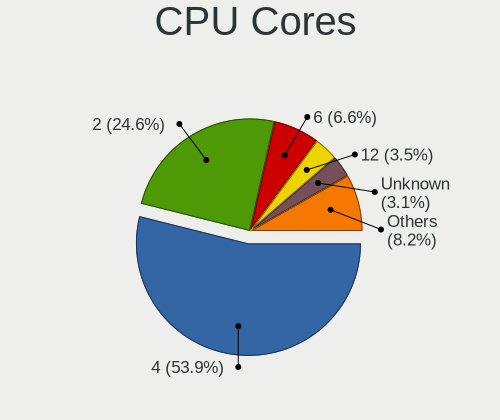

| Number  | Desktops | Percent |
|---------|----------|---------|
| 4       | 56       | 42.75%  |
| 2       | 42       | 32.06%  |
| 6       | 10       | 7.63%   |
| 12      | 7        | 5.34%   |
| Unknown | 6        | 4.58%   |
| 16      | 4        | 3.05%   |
| 8       | 4        | 3.05%   |
| 1       | 2        | 1.53%   |

CPU Sockets
-----------

Number of sockets

| Number  | Desktops | Percent |
|---------|----------|---------|
| 1       | 122      | 93.13%  |
| Unknown | 5        | 3.82%   |
| 2       | 4        | 3.05%   |

CPU Threads
-----------

Threads per core (Hyper-Threading)

| Number  | Desktops | Percent |
|---------|----------|---------|
| 1       | 73       | 55.73%  |
| 2       | 52       | 39.69%  |
| Unknown | 6        | 4.58%   |

CPU Microarch
-------------

Microarchitecture

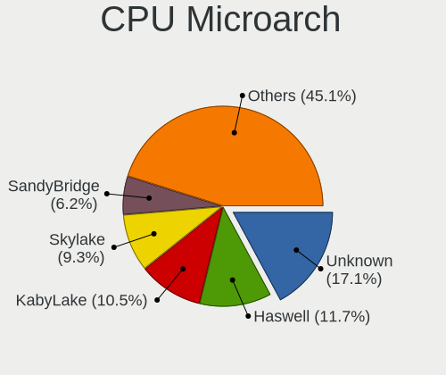

| Name          | Desktops | Percent |
|---------------|----------|---------|
| KabyLake      | 17       | 12.98%  |
| Haswell       | 15       | 11.45%  |
| Silvermont    | 10       | 7.63%   |
| SandyBridge   | 10       | 7.63%   |
| Broadwell     | 9        | 6.87%   |
| Puma          | 8        | 6.11%   |
| Unknown       | 8        | 6.11%   |
| IvyBridge     | 7        | 5.34%   |
| Skylake       | 6        | 4.58%   |
| CometLake     | 6        | 4.58%   |
| Bobcat        | 6        | 4.58%   |
| Zen           | 4        | 3.05%   |
| Jaguar        | 4        | 3.05%   |
| Goldmont plus | 4        | 3.05%   |
| Zen 2         | 3        | 2.29%   |
| Penryn        | 3        | 2.29%   |
| Zen 3         | 2        | 1.53%   |
| Westmere      | 2        | 1.53%   |
| Bonnell       | 2        | 1.53%   |
| NetBurst      | 1        | 0.76%   |
| Nehalem       | 1        | 0.76%   |
| K8 Hammer     | 1        | 0.76%   |
| Goldmont      | 1        | 0.76%   |
| Excavator     | 1        | 0.76%   |

Graphics
--------

GPU Vendor
----------

Vendors of graphics cards

| Vendor                     | Desktops | Percent |
|----------------------------|----------|---------|
| Intel                      | 74       | 63.79%  |
| AMD                        | 18       | 15.52%  |
| Nvidia                     | 10       | 8.62%   |
| Matrox Electronics Systems | 9        | 7.76%   |
| ASPEED Technology          | 5        | 4.31%   |

GPU Model
---------

Graphics card models

| Model                                                                                    | Desktops | Percent |
|------------------------------------------------------------------------------------------|----------|---------|
| Intel Xeon E3-1200 v3/4th Gen Core Processor Integrated Graphics Controller              | 8        | 6.9%    |
| Intel Atom/Celeron/Pentium Processor x5-E8000/J3xxx/N3xxx Integrated Graphics Controller | 7        | 6.03%   |
| Matrox Electronics Systems G200eR2                                                       | 5        | 4.31%   |
| Intel HD Graphics 5500                                                                   | 5        | 4.31%   |
| Intel HD Graphics 530                                                                    | 5        | 4.31%   |
| Intel CometLake-S GT2 [UHD Graphics 630]                                                 | 5        | 4.31%   |
| Intel CoffeeLake-S GT2 [UHD Graphics 630]                                                | 5        | 4.31%   |
| ASPEED Technology ASPEED Graphics Family                                                 | 5        | 4.31%   |
| Intel Xeon E3-1200 v2/3rd Gen Core processor Graphics Controller                         | 4        | 3.45%   |
| Intel HD Graphics 6000                                                                   | 4        | 3.45%   |
| Intel GeminiLake [UHD Graphics 600]                                                      | 4        | 3.45%   |
| Intel HD Graphics 610                                                                    | 3        | 2.59%   |
| Intel Atom Processor Z36xxx/Z37xxx Series Graphics & Display                             | 3        | 2.59%   |
| AMD Ellesmere [Radeon RX 470/480/570/570X/580/580X/590]                                  | 3        | 2.59%   |
| Matrox Electronics Systems MGA G200eW WPCM450                                            | 2        | 1.72%   |
| Intel JasperLake [UHD Graphics]                                                          | 2        | 1.72%   |
| Intel HD Graphics 620                                                                    | 2        | 1.72%   |
| Intel Haswell-ULT Integrated Graphics Controller                                         | 2        | 1.72%   |
| Intel 4 Series Chipset Integrated Graphics Controller                                    | 2        | 1.72%   |
| Intel 2nd Generation Core Processor Family Integrated Graphics Controller                | 2        | 1.72%   |
| AMD Wrestler [Radeon HD 6320]                                                            | 2        | 1.72%   |
| AMD Wrestler [Radeon HD 6310]                                                            | 2        | 1.72%   |
| AMD Mullins [Radeon R4/R5 Graphics]                                                      | 2        | 1.72%   |
| Nvidia TU117 [GeForce GTX 1650]                                                          | 1        | 0.86%   |
| Nvidia GT218 [ION]                                                                       | 1        | 0.86%   |
| Nvidia GT218 [GeForce 210]                                                               | 1        | 0.86%   |
| Nvidia GP108 [GeForce GT 1030]                                                           | 1        | 0.86%   |
| Nvidia GP104 [GeForce GTX 1080]                                                          | 1        | 0.86%   |
| Nvidia GM206 [GeForce GTX 960]                                                           | 1        | 0.86%   |
| Nvidia GK208B [GeForce GT 710]                                                           | 1        | 0.86%   |
| Nvidia GF108 [GeForce GT 530]                                                            | 1        | 0.86%   |
| Nvidia G98 [GeForce 8400 GS Rev. 2]                                                      | 1        | 0.86%   |
| Nvidia G72 [GeForce 7300 LE]                                                             | 1        | 0.86%   |
| Matrox Electronics Systems MGA G200eH3                                                   | 1        | 0.86%   |
| Matrox Electronics Systems MGA G200EH                                                    | 1        | 0.86%   |
| Intel Xeon E3-1200 v3 Processor Integrated Graphics Controller                           | 1        | 0.86%   |
| Intel WhiskeyLake-U GT2 [UHD Graphics 620]                                               | 1        | 0.86%   |
| Intel Whiskey Lake-U GT1 [UHD Graphics 610]                                              | 1        | 0.86%   |
| Intel UHD Graphics 620                                                                   | 1        | 0.86%   |
| Intel Skylake GT2 [HD Graphics 520]                                                      | 1        | 0.86%   |

GPU Combo
---------

Combinations of graphics cards

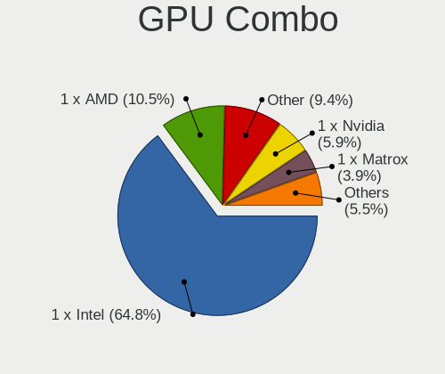

| Name           | Desktops | Percent |
|----------------|----------|---------|
| 1 x Intel      | 69       | 52.67%  |
| 1 x AMD        | 18       | 13.74%  |
| Other          | 17       | 12.98%  |
| 1 x Matrox     | 9        | 6.87%   |
| 1 x Nvidia     | 8        | 6.11%   |
| 1 x ASPEED     | 5        | 3.82%   |
| 2 x Intel      | 3        | 2.29%   |
| Intel + Nvidia | 2        | 1.53%   |

GPU Driver
----------

Free vs proprietary

| Driver      | Desktops | Percent |
|-------------|----------|---------|
| Free        | 108      | 82.44%  |
| Unknown     | 18       | 13.74%  |
| Proprietary | 5        | 3.82%   |

GPU Memory
----------

Total video memory

| Size in GB | Desktops | Percent |
|------------|----------|---------|
| Unknown    | 123      | 93.18%  |
| 1.01-2.0   | 4        | 3.03%   |
| 7.01-8.0   | 3        | 2.27%   |
| 3.01-4.0   | 1        | 0.76%   |
| 0.01-0.5   | 1        | 0.76%   |

Monitor
-------

Monitor Vendor
--------------

Monitor vendors

| Vendor              | Desktops | Percent |
|---------------------|----------|---------|
| Iiyama              | 4        | 26.67%  |
| Samsung Electronics | 3        | 20%     |
| Goldstar            | 2        | 13.33%  |
| Dell                | 2        | 13.33%  |
| ViewSonic           | 1        | 6.67%   |
| Sony                | 1        | 6.67%   |
| Philips             | 1        | 6.67%   |
| ASUSTek Computer    | 1        | 6.67%   |

Monitor Model
-------------

Monitor models

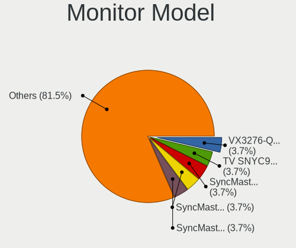

| Model                                                                | Desktops | Percent |
|----------------------------------------------------------------------|----------|---------|
| ViewSonic LCD Monitor VX3276-QHD 2560x1440                           | 1        | 6.67%   |
| Sony TV SNYC901 1920x1080                                            | 1        | 6.67%   |
| Samsung Electronics SyncMaster SAM027F 1680x1050 470x300mm 22.0-inch | 1        | 6.67%   |
| Samsung Electronics SyncMaster SAM01AE 1600x1200 410x310mm 20.2-inch | 1        | 6.67%   |
| Samsung Electronics S24H85x SAM0E0C 2560x1440 530x300mm 24.0-inch    | 1        | 6.67%   |
| Philips PHL 328E1 PHLC204 3840x2160 700x390mm 31.5-inch              | 1        | 6.67%   |
| Iiyama PLE2407HDS IVM560D 1920x1080 520x300mm 23.6-inch              | 1        | 6.67%   |
| Iiyama PL2740HS IVM6662 1920x1080 600x340mm 27.2-inch                | 1        | 6.67%   |
| Iiyama PL2492H IVM612F 1920x1080 530x300mm 24.0-inch                 | 1        | 6.67%   |
| Iiyama PL2209HD IVM560B 1920x1080 480x270mm 21.7-inch                | 1        | 6.67%   |
| Goldstar LG ULTRAWIDE GSM5AE2 3440x1440 800x340mm 34.2-inch          | 1        | 6.67%   |
| Goldstar LG Ultra HD GSM5B08 3840x2160 600x340mm 27.2-inch           | 1        | 6.67%   |
| Dell UP2716D DEL40DD 2560x1440 600x340mm 27.2-inch                   | 1        | 6.67%   |
| Dell U2715H DELD065 2560x1440 600x340mm 27.2-inch                    | 1        | 6.67%   |
| ASUSTek Computer VG259 AUS25A6 1920x1080 540x300mm 24.3-inch         | 1        | 6.67%   |

Monitor Resolution
------------------

Monitor screen resolution

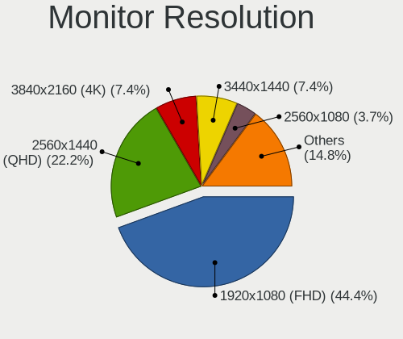

| Resolution         | Desktops | Percent |
|--------------------|----------|---------|
| 1920x1080 (FHD)    | 6        | 40%     |
| 2560x1440 (QHD)    | 4        | 26.67%  |
| 3840x2160 (4K)     | 2        | 13.33%  |
| 3440x1440          | 1        | 6.67%   |
| 1680x1050 (WSXGA+) | 1        | 6.67%   |
| 1600x1200          | 1        | 6.67%   |

Monitor Diagonal
----------------

Diagonal size in inches

| Inches  | Desktops | Percent |
|---------|----------|---------|
| 27      | 4        | 26.67%  |
| 24      | 3        | 20%     |
| Unknown | 2        | 13.33%  |
| 34      | 1        | 6.67%   |
| 31      | 1        | 6.67%   |
| 23      | 1        | 6.67%   |
| 22      | 1        | 6.67%   |
| 21      | 1        | 6.67%   |
| 20      | 1        | 6.67%   |

Monitor Width
-------------

Physical width

| Width in mm | Desktops | Percent |
|-------------|----------|---------|
| 501-600     | 8        | 53.33%  |
| 401-500     | 3        | 20%     |
| Unknown     | 2        | 13.33%  |
| 701-800     | 1        | 6.67%   |
| 601-700     | 1        | 6.67%   |

Aspect Ratio
------------

Proportional relationship between the width and the height

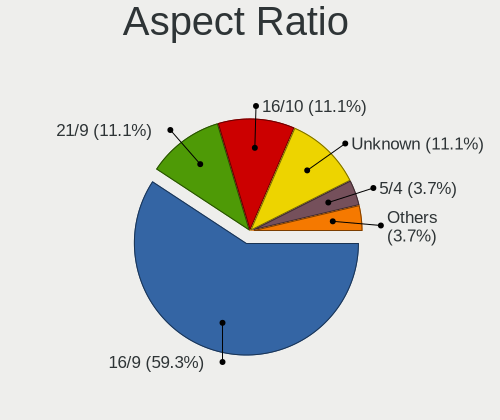

| Ratio   | Desktops | Percent |
|---------|----------|---------|
| 16/9    | 11       | 73.33%  |
| 4/3     | 1        | 6.67%   |
| 21/9    | 1        | 6.67%   |
| 16/10   | 1        | 6.67%   |
| Unknown | 1        | 6.67%   |

Monitor Area
------------

Area in inch

| Area in inch | Desktops | Percent |
|----------------|----------|---------|
| 201-250        | 5        | 33.33%  |
| 301-350        | 4        | 26.67%  |
| 351-500        | 2        | 13.33%  |
| Unknown        | 2        | 13.33%  |
| 251-300        | 1        | 6.67%   |
| 151-200        | 1        | 6.67%   |

Pixel Density
-------------

Pixels per inch

| Density | Desktops | Percent |
|---------|----------|---------|
| 51-100  | 6        | 40%     |
| 101-120 | 4        | 26.67%  |
| 121-160 | 2        | 13.33%  |
| Unknown | 2        | 13.33%  |
| 161-240 | 1        | 6.67%   |

Multiple Monitors
-----------------

Total monitors connected

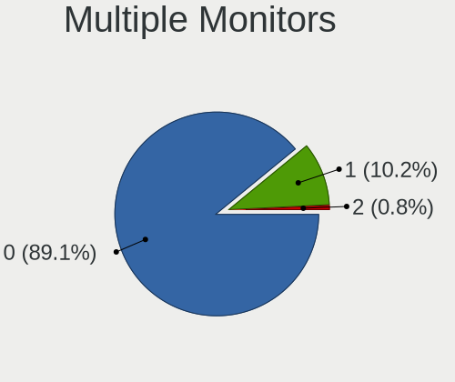

| Total | Desktops | Percent |
|-------|----------|---------|
| 0     | 116      | 88.55%  |
| 1     | 15       | 11.45%  |

Network
-------

Net Controller Vendor
---------------------

Controller vendors

| Vendor                   | Desktops | Percent |
|--------------------------|----------|---------|
| Intel                    | 110      | 64.33%  |
| Realtek Semiconductor    | 35       | 20.47%  |
| Qualcomm Atheros         | 9        | 5.26%   |
| Broadcom                 | 6        | 3.51%   |
| IMC Networks             | 3        | 1.75%   |
| U-Blox                   | 1        | 0.58%   |
| Ralink Technology        | 1        | 0.58%   |
| Ralink                   | 1        | 0.58%   |
| Marvell Technology Group | 1        | 0.58%   |
| Hewlett-Packard          | 1        | 0.58%   |
| Edimax Technology        | 1        | 0.58%   |
| Chelsio Communications   | 1        | 0.58%   |
| ADMtek                   | 1        | 0.58%   |

Net Controller Model
--------------------

Controller models

| Model                                                                          | Desktops | Percent |
|--------------------------------------------------------------------------------|----------|---------|
| Realtek RTL8111/8168/8411 PCI Express Gigabit Ethernet Controller              | 31       | 15.5%   |
| Intel I211 Gigabit Network Connection                                          | 27       | 13.5%   |
| Intel I210 Gigabit Network Connection                                          | 18       | 9%      |
| Intel I350 Gigabit Network Connection                                          | 16       | 8%      |
| Intel 82574L Gigabit Network Connection                                        | 14       | 7%      |
| Intel 82579LM Gigabit Network Connection (Lewisville)                          | 6        | 3%      |
| Intel 82571EB/82571GB Gigabit Ethernet Controller D0/D1 (copper applications)  | 6        | 3%      |
| Intel Ethernet Controller I225-V                                               | 4        | 2%      |
| Intel Wi-Fi 6 AX200                                                            | 3        | 1.5%    |
| Intel Ethernet Connection I217-LM                                              | 3        | 1.5%    |
| Qualcomm Atheros QCA986x/988x 802.11ac Wireless Network Adapter                | 2        | 1%      |
| Qualcomm Atheros AR242x / AR542x Wireless Network Adapter (PCI-Express)        | 2        | 1%      |
| Intel Ethernet Controller I226-V                                               | 2        | 1%      |
| Intel Ethernet Connection (2) I219-V                                           | 2        | 1%      |
| Intel Ethernet Connection (14) I219-V                                          | 2        | 1%      |
| Intel 82599ES 10-Gigabit SFI/SFP+ Network Connection                           | 2        | 1%      |
| Intel 82583V Gigabit Network Connection                                        | 2        | 1%      |
| Intel 82575GB Gigabit Network Connection                                       | 2        | 1%      |
| Intel 82572EI Gigabit Ethernet Controller (Copper)                             | 2        | 1%      |
| Intel 82567LM-3 Gigabit Network Connection                                     | 2        | 1%      |
| Intel 82541PI Gigabit Ethernet Controller                                      | 2        | 1%      |
| IMC Networks 802.11 n/g/b Wireless LAN USB Mini-Card                           | 2        | 1%      |
| Broadcom NetXtreme BCM5719 Gigabit Ethernet PCIe                               | 2        | 1%      |
| U-Blox [u-blox 7]                                                              | 1        | 0.5%    |
| Realtek RTL8192SU 802.11n WLAN Adapter                                         | 1        | 0.5%    |
| Realtek RTL8188EUS 802.11n Wireless Network Adapter                            | 1        | 0.5%    |
| Realtek RTL8125 2.5GbE Controller                                              | 1        | 0.5%    |
| Realtek RTL-8110SC/8169SC Gigabit Ethernet                                     | 1        | 0.5%    |
| Ralink RT5370 Wireless Adapter                                                 | 1        | 0.5%    |
| Ralink RT2500 Wireless 802.11bg                                                | 1        | 0.5%    |
| Qualcomm Atheros Killer E2400 Gigabit Ethernet Controller                      | 1        | 0.5%    |
| Qualcomm Atheros AR9287 Wireless Network Adapter (PCI-Express)                 | 1        | 0.5%    |
| Qualcomm Atheros AR9285 Wireless Network Adapter (PCI-Express)                 | 1        | 0.5%    |
| Qualcomm Atheros AR8151 v2.0 Gigabit Ethernet                                  | 1        | 0.5%    |
| Qualcomm Atheros AR8121/AR8113/AR8114 Gigabit or Fast Ethernet                 | 1        | 0.5%    |
| Marvell Group Yukon Optima 88E8059 [PCIe Gigabit Ethernet Controller with AVB] | 1        | 0.5%    |
| Intel Wireless 3165                                                            | 1        | 0.5%    |
| Intel Wireless 3160                                                            | 1        | 0.5%    |
| Intel PRO/Wireless 5100 AGN [Shiloh] Network Connection                        | 1        | 0.5%    |
| Intel Gemini Lake PCH CNVi WiFi                                                | 1        | 0.5%    |

Wireless Vendor
---------------

Wireless vendors

| Vendor                | Desktops | Percent |
|-----------------------|----------|---------|
| Intel                 | 8        | 34.78%  |
| Qualcomm Atheros      | 6        | 26.09%  |
| IMC Networks          | 3        | 13.04%  |
| Realtek Semiconductor | 2        | 8.7%    |
| Ralink Technology     | 1        | 4.35%   |
| Ralink                | 1        | 4.35%   |
| Edimax Technology     | 1        | 4.35%   |
| Broadcom              | 1        | 4.35%   |

Wireless Model
--------------

Wireless models

| Model                                                                       | Desktops | Percent |
|-----------------------------------------------------------------------------|----------|---------|
| Intel Wi-Fi 6 AX200                                                         | 3        | 13.04%  |
| Qualcomm Atheros QCA986x/988x 802.11ac Wireless Network Adapter             | 2        | 8.7%    |
| Qualcomm Atheros AR242x / AR542x Wireless Network Adapter (PCI-Express)     | 2        | 8.7%    |
| IMC Networks 802.11 n/g/b Wireless LAN USB Mini-Card                        | 2        | 8.7%    |
| Realtek RTL8192SU 802.11n WLAN Adapter                                      | 1        | 4.35%   |
| Realtek RTL8188EUS 802.11n Wireless Network Adapter                         | 1        | 4.35%   |
| Ralink RT5370 Wireless Adapter                                              | 1        | 4.35%   |
| Ralink RT2500 Wireless 802.11bg                                             | 1        | 4.35%   |
| Qualcomm Atheros AR9287 Wireless Network Adapter (PCI-Express)              | 1        | 4.35%   |
| Qualcomm Atheros AR9285 Wireless Network Adapter (PCI-Express)              | 1        | 4.35%   |
| Intel Wireless 3165                                                         | 1        | 4.35%   |
| Intel Wireless 3160                                                         | 1        | 4.35%   |
| Intel PRO/Wireless 5100 AGN [Shiloh] Network Connection                     | 1        | 4.35%   |
| Intel Gemini Lake PCH CNVi WiFi                                             | 1        | 4.35%   |
| Intel Dual Band Wireless-AC 3168NGW [Stone Peak]                            | 1        | 4.35%   |
| IMC Networks Realtek RTL8191SU Wireless LAN 802.11n USB 2.0 Network Adapter | 1        | 4.35%   |
| Edimax EW-7811Un 802.11n Wireless Adapter [Realtek RTL8188CUS]              | 1        | 4.35%   |
| Broadcom BCM43228 802.11a/b/g/n                                             | 1        | 4.35%   |

Ethernet Vendor
---------------

Ethernet vendors

| Vendor                   | Desktops | Percent |
|--------------------------|----------|---------|
| Intel                    | 106      | 70.67%  |
| Realtek Semiconductor    | 33       | 22%     |
| Broadcom                 | 5        | 3.33%   |
| Qualcomm Atheros         | 3        | 2%      |
| Marvell Technology Group | 1        | 0.67%   |
| Chelsio Communications   | 1        | 0.67%   |
| ADMtek                   | 1        | 0.67%   |

Ethernet Model
--------------

Ethernet models

| Model                                                                          | Desktops | Percent |
|--------------------------------------------------------------------------------|----------|---------|
| Realtek RTL8111/8168/8411 PCI Express Gigabit Ethernet Controller              | 31       | 17.71%  |
| Intel I211 Gigabit Network Connection                                          | 27       | 15.43%  |
| Intel I210 Gigabit Network Connection                                          | 18       | 10.29%  |
| Intel I350 Gigabit Network Connection                                          | 16       | 9.14%   |
| Intel 82574L Gigabit Network Connection                                        | 14       | 8%      |
| Intel 82579LM Gigabit Network Connection (Lewisville)                          | 6        | 3.43%   |
| Intel 82571EB/82571GB Gigabit Ethernet Controller D0/D1 (copper applications)  | 6        | 3.43%   |
| Intel Ethernet Controller I225-V                                               | 4        | 2.29%   |
| Intel Ethernet Connection I217-LM                                              | 3        | 1.71%   |
| Intel Ethernet Controller I226-V                                               | 2        | 1.14%   |
| Intel Ethernet Connection (2) I219-V                                           | 2        | 1.14%   |
| Intel Ethernet Connection (14) I219-V                                          | 2        | 1.14%   |
| Intel 82599ES 10-Gigabit SFI/SFP+ Network Connection                           | 2        | 1.14%   |
| Intel 82583V Gigabit Network Connection                                        | 2        | 1.14%   |
| Intel 82575GB Gigabit Network Connection                                       | 2        | 1.14%   |
| Intel 82572EI Gigabit Ethernet Controller (Copper)                             | 2        | 1.14%   |
| Intel 82567LM-3 Gigabit Network Connection                                     | 2        | 1.14%   |
| Intel 82541PI Gigabit Ethernet Controller                                      | 2        | 1.14%   |
| Broadcom NetXtreme BCM5719 Gigabit Ethernet PCIe                               | 2        | 1.14%   |
| Realtek RTL8125 2.5GbE Controller                                              | 1        | 0.57%   |
| Realtek RTL-8110SC/8169SC Gigabit Ethernet                                     | 1        | 0.57%   |
| Qualcomm Atheros Killer E2400 Gigabit Ethernet Controller                      | 1        | 0.57%   |
| Qualcomm Atheros AR8151 v2.0 Gigabit Ethernet                                  | 1        | 0.57%   |
| Qualcomm Atheros AR8121/AR8113/AR8114 Gigabit or Fast Ethernet                 | 1        | 0.57%   |
| Marvell Group Yukon Optima 88E8059 [PCIe Gigabit Ethernet Controller with AVB] | 1        | 0.57%   |
| Intel Ethernet Controller 10-Gigabit X540-AT2                                  | 1        | 0.57%   |
| Intel Ethernet Connection X553 1GbE                                            | 1        | 0.57%   |
| Intel Ethernet Connection X553 10 GbE SFP+                                     | 1        | 0.57%   |
| Intel Ethernet Connection I218-LM                                              | 1        | 0.57%   |
| Intel Ethernet Connection I217-V                                               | 1        | 0.57%   |
| Intel Ethernet Connection (7) I219-V                                           | 1        | 0.57%   |
| Intel Ethernet Connection (7) I219-LM                                          | 1        | 0.57%   |
| Intel Ethernet Connection (3) I219-LM                                          | 1        | 0.57%   |
| Intel Ethernet Connection (2) I219-LM                                          | 1        | 0.57%   |
| Intel Ethernet Connection (12) I219-V                                          | 1        | 0.57%   |
| Intel Ethernet Connection (11) I219-V                                          | 1        | 0.57%   |
| Intel Ethernet Connection (11) I219-LM                                         | 1        | 0.57%   |
| Intel 82580 Gigabit Network Connection                                         | 1        | 0.57%   |
| Intel 82576 Gigabit Network Connection                                         | 1        | 0.57%   |
| Intel 82573L Gigabit Ethernet Controller                                       | 1        | 0.57%   |

Net Controller Kind
-------------------

Ethernet, WiFi or modem

| Kind     | Desktops | Percent |
|----------|----------|---------|
| Ethernet | 127      | 84.11%  |
| WiFi     | 22       | 14.57%  |
| Modem    | 1        | 0.66%   |
| Unknown  | 1        | 0.66%   |

Used Controller
---------------

Currently used network controller

| Kind     | Desktops | Percent |
|----------|----------|---------|
| Ethernet | 120      | 96.77%  |
| WiFi     | 4        | 3.23%   |

NICs
----

Total network controllers on board

| Total | Desktops | Percent |
|-------|----------|---------|
| 4     | 37       | 28.03%  |
| 2     | 33       | 25%     |
| 1     | 19       | 14.39%  |
| 3     | 13       | 9.85%   |
| 5     | 11       | 8.33%   |
| 6     | 10       | 7.58%   |
| 0     | 4        | 3.03%   |
| 9     | 2        | 1.52%   |
| 12    | 1        | 0.76%   |
| 8     | 1        | 0.76%   |
| 7     | 1        | 0.76%   |

IPv6
----

IPv6 vs IPv4

| Used | Desktops | Percent |
|------|----------|---------|
| No   | 115      | 83.94%  |
| Yes  | 22       | 16.06%  |

Bluetooth
---------

Bluetooth Vendor
----------------

Controller vendors

| Vendor                  | Desktops | Percent |
|-------------------------|----------|---------|
| Intel                   | 6        | 54.55%  |
| Cambridge Silicon Radio | 4        | 36.36%  |
| TP-Link                 | 1        | 9.09%   |

Bluetooth Model
---------------

Controller models

| Model                                               | Desktops | Percent |
|-----------------------------------------------------|----------|---------|
| Cambridge Silicon Radio Bluetooth Dongle (HCI mode) | 4        | 36.36%  |
| Intel AX200 Bluetooth                               | 3        | 27.27%  |
| TP-Link TP-Link UB500 Adapter                       | 1        | 9.09%   |
| Intel Wireless-AC 3168 Bluetooth                    | 1        | 9.09%   |
| Intel Bluetooth wireless interface                  | 1        | 9.09%   |
| Intel Bluetooth 9460/9560 Jefferson Peak (JfP)      | 1        | 9.09%   |

Sound
-----

Sound Vendor
------------

Sound card vendors

| Vendor                      | Desktops | Percent |
|-----------------------------|----------|---------|
| Intel                       | 74       | 69.16%  |
| AMD                         | 21       | 19.63%  |
| Nvidia                      | 8        | 7.48%   |
| VIA Technologies            | 1        | 0.93%   |
| Steinberg Soft-und Hardware | 1        | 0.93%   |
| Creative Labs               | 1        | 0.93%   |
| Corsair                     | 1        | 0.93%   |

Sound Model
-----------

Sound card models

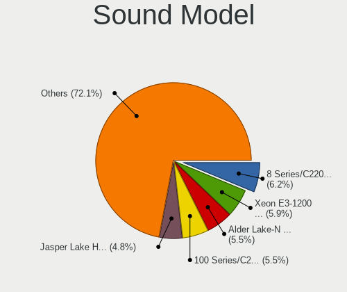

| Model                                                                                             | Desktops | Percent |
|---------------------------------------------------------------------------------------------------|----------|---------|
| Intel Wildcat Point-LP High Definition Audio Controller                                           | 8        | 5.88%   |
| Intel Broadwell-U Audio Controller                                                                | 8        | 5.88%   |
| Intel 8 Series/C220 Series Chipset High Definition Audio Controller                               | 8        | 5.88%   |
| Intel Xeon E3-1200 v3/4th Gen Core Processor HD Audio Controller                                  | 7        | 5.15%   |
| Intel Atom/Celeron/Pentium Processor x5-E8000/J3xxx/N3xxx Series High Definition Audio Controller | 7        | 5.15%   |
| Intel Sunrise Point-LP HD Audio                                                                   | 6        | 4.41%   |
| Intel 7 Series/C216 Chipset Family High Definition Audio Controller                               | 5        | 3.68%   |
| Intel 100 Series/C230 Series Chipset Family HD Audio Controller                                   | 5        | 3.68%   |
| AMD Kabini HDMI/DP Audio                                                                          | 5        | 3.68%   |
| AMD FCH Azalia Controller                                                                         | 5        | 3.68%   |
| AMD Family 17h/19h HD Audio Controller                                                            | 5        | 3.68%   |
| Intel Celeron/Pentium Silver Processor High Definition Audio                                      | 4        | 2.94%   |
| Intel Cannon Lake PCH cAVS                                                                        | 4        | 2.94%   |
| Intel 6 Series/C200 Series Chipset Family High Definition Audio Controller                        | 4        | 2.94%   |
| AMD Wrestler HDMI Audio                                                                           | 4        | 2.94%   |
| AMD SBx00 Azalia (Intel HDA)                                                                      | 4        | 2.94%   |
| Intel Atom Processor Z36xxx/Z37xxx Series High Definition Audio Controller                        | 3        | 2.21%   |
| AMD Renoir Radeon High Definition Audio Controller                                                | 3        | 2.21%   |
| AMD Ellesmere HDMI Audio [Radeon RX 470/480 / 570/580/590]                                        | 3        | 2.21%   |
| Nvidia High Definition Audio Controller                                                           | 2        | 1.47%   |
| Intel Jasper Lake HD Audio                                                                        | 2        | 1.47%   |
| Intel Haswell-ULT HD Audio Controller                                                             | 2        | 1.47%   |
| Intel Comet Lake PCH-V cAVS                                                                       | 2        | 1.47%   |
| Intel Comet Lake PCH cAVS                                                                         | 2        | 1.47%   |
| Intel Cannon Point-LP High Definition Audio Controller                                            | 2        | 1.47%   |
| Intel 82801JI (ICH10 Family) HD Audio Controller                                                  | 2        | 1.47%   |
| Intel 82801JD/DO (ICH10 Family) HD Audio Controller                                               | 2        | 1.47%   |
| Intel 8 Series HD Audio Controller                                                                | 2        | 1.47%   |
| AMD Starship/Matisse HD Audio Controller                                                          | 2        | 1.47%   |
| VIA Technologies USB Audio Device                                                                 | 1        | 0.74%   |
| Steinberg Soft-und Hardware MI4                                                                   | 1        | 0.74%   |
| Nvidia TU107 GeForce GTX 1650 High Definition Audio Controller                                    | 1        | 0.74%   |
| Nvidia GP108 High Definition Audio Controller                                                     | 1        | 0.74%   |
| Nvidia GP104 High Definition Audio Controller                                                     | 1        | 0.74%   |
| Nvidia GM206 High Definition Audio Controller                                                     | 1        | 0.74%   |
| Nvidia GK208 HDMI/DP Audio Controller                                                             | 1        | 0.74%   |
| Nvidia GF108 High Definition Audio Controller                                                     | 1        | 0.74%   |
| Intel Tiger Lake-H HD Audio Controller                                                            | 1        | 0.74%   |
| Intel NM10/ICH7 Family High Definition Audio Controller                                           | 1        | 0.74%   |
| Intel 82801H (ICH8 Family) HD Audio Controller                                                    | 1        | 0.74%   |

Memory
------

Memory Vendor
-------------

Memory module vendors

| Vendor              | Desktops | Percent |
|---------------------|----------|---------|
| Kingston            | 26       | 21.31%  |
| Samsung Electronics | 16       | 13.11%  |
| Unknown             | 14       | 11.48%  |
| Corsair             | 13       | 10.66%  |
| SK hynix            | 12       | 9.84%   |
| Micron Technology   | 9        | 7.38%   |
| Crucial             | 9        | 7.38%   |
| Kimtigo             | 5        | 4.1%    |
| Transcend           | 4        | 3.28%   |
| Nanya Technology    | 2        | 1.64%   |
| G.Skill             | 2        | 1.64%   |
| Apacer              | 2        | 1.64%   |
| Unknown (ABCD)      | 1        | 0.82%   |
| Unknown (07FB)      | 1        | 0.82%   |
| Tigo                | 1        | 0.82%   |
| Teikon              | 1        | 0.82%   |
| Team                | 1        | 0.82%   |
| Ramaxel Technology  | 1        | 0.82%   |
| Patriot             | 1        | 0.82%   |
| HPE                 | 1        | 0.82%   |

Memory Model
------------

Memory module models

| Model                                                        | Desktops | Percent |
|--------------------------------------------------------------|----------|---------|
| Unknown RAM Module 4GB SODIMM DDR3 1333MT/s                  | 5        | 3.85%   |
| Kingston RAM KHX1600C9S3L/8G 8GB SODIMM DDR3 1600MT/s        | 3        | 2.31%   |
| Unknown RAM Module 2GB DIMM DDR2 667MT/s                     | 2        | 1.54%   |
| SK hynix RAM HMT325U6CFR8C-H9 2GB DIMM DDR3 1333MT/s         | 2        | 1.54%   |
| Samsung RAM M471B5173QH0-YK0 4GB DIMM DDR3 1600MT/s          | 2        | 1.54%   |
| Samsung RAM M471A1K43CB1-CTD 8GB SODIMM DDR4 2667MT/s        | 2        | 1.54%   |
| Samsung RAM M378B5673FH0-CH9 2GB DIMM DDR3 1333MT/s          | 2        | 1.54%   |
| Kimtigo RAM KT8GS3EDF 8GB SODIMM DDR3 1600MT/s               | 2        | 1.54%   |
| Corsair RAM CMSO8GX4M1A2133C15 8GB SODIMM DDR4 2133MT/s      | 2        | 1.54%   |
| Apacer RAM 37352E4138334331 2GB SODIMM DDR3 1333MT/s         | 2        | 1.54%   |
| Unknown RAM WPBS16D308SWD-4G 4GB DIMM DDR3 1600MT/s          | 1        | 0.77%   |
| Unknown RAM Module 8GB SODIMM DDR3 1600MT/s                  | 1        | 0.77%   |
| Unknown RAM Module 8GB DIMM DDR4 2400MT/s                    | 1        | 0.77%   |
| Unknown RAM Module 8GB DIMM DDR3 1600MT/s                    | 1        | 0.77%   |
| Unknown RAM Module 8GB 1600MT/s                              | 1        | 0.77%   |
| Unknown RAM Module 4GB SODIMM DDR2 800MT/s                   | 1        | 0.77%   |
| Unknown RAM Module 2GB DIMM DDR2                             | 1        | 0.77%   |
| Unknown RAM Module 1GB DIMM DDR2 667MT/s                     | 1        | 0.77%   |
| Unknown (ABCD) RAM 123456789012345678 4GB DIMM DDR4 2400MT/s | 1        | 0.77%   |
| Unknown (07FB) RAM GSA8G4SCL156P-21 8GB SODIMM DDR4 2133MT/s | 1        | 0.77%   |
| Transcend RAM TS2GSH64V1B 16GB SODIMM DDR4 2133MT/s          | 1        | 0.77%   |
| Transcend RAM JM1600KLN-4G 4GB DIMM DDR3 1600MT/s            | 1        | 0.77%   |
| Transcend RAM JM1333KSN-4G 4GB DIMM DDR3 1333MT/s            | 1        | 0.77%   |
| Transcend RAM AQD-SD3L8GN16-S G 8GB SODIMM DDR3 1600MT/s     | 1        | 0.77%   |
| Tigo RAM 1600Mhz-8G 8GB SODIMM DDR3 1600MT/s                 | 1        | 0.77%   |
| Teikon RAM TMTS8G58DFRBFEN-16 8GB SODIMM DDR3 1600MT/s       | 1        | 0.77%   |
| Team RAM TEAMGROUP-SD4-2400 8GB SODIMM DDR4 2400MT/s         | 1        | 0.77%   |
| SK hynix RAM Module 8GB DIMM DDR4 3200MT/s                   | 1        | 0.77%   |
| SK hynix RAM Module 8GB DIMM DDR3 1600MT/s                   | 1        | 0.77%   |
| SK hynix RAM HMT425S6AFR6A-PB 2GB SODIMM DDR3 3200MT/s       | 1        | 0.77%   |
| SK hynix RAM HMT41GS6BFR8A-PB 8GB SODIMM DDR3 1600MT/s       | 1        | 0.77%   |
| SK hynix RAM HMT351U6CFR8C-PB 4GB DIMM DDR3 1600MT/s         | 1        | 0.77%   |
| SK hynix RAM HMT325U6CFR8C-PB 2GB DIMM DDR3 1600MT/s         | 1        | 0.77%   |
| SK hynix RAM HMT125U6TFR8C-H9 2GB DIMM DDR3 1333MT/s         | 1        | 0.77%   |
| SK hynix RAM HMA82GS6MFR8N-TF 16GB SODIMM DDR4 2133MT/s      | 1        | 0.77%   |
| SK hynix RAM HMA81GS6JJR8N-VK 8GB SODIMM DDR4 2667MT/s       | 1        | 0.77%   |
| SK hynix RAM HMA451U6AFR8N-TF 4GB DIMM DDR4 2133MT/s         | 1        | 0.77%   |
| Samsung RAM Module 8GB SODIMM DDR4 2133MT/s                  | 1        | 0.77%   |
| Samsung RAM Module 2GB DIMM DDR3 1333MT/s                    | 1        | 0.77%   |
| Samsung RAM M471B5173QH0-YK0 4GB SODIMM DDR3 1600MT/s        | 1        | 0.77%   |

Memory Kind
-----------

Memory module kinds

| Kind    | Desktops | Percent |
|---------|----------|---------|
| DDR3    | 59       | 53.64%  |
| DDR4    | 42       | 38.18%  |
| DDR2    | 5        | 4.55%   |
| Unknown | 2        | 1.82%   |
| LPDDR4  | 1        | 0.91%   |
| DDR     | 1        | 0.91%   |

Memory Form Factor
------------------

Physical design of the memory module

| Name    | Desktops | Percent |
|---------|----------|---------|
| DIMM    | 66       | 60%     |
| SODIMM  | 43       | 39.09%  |
| Unknown | 1        | 0.91%   |

Memory Size
-----------

Memory module size

| Size  | Desktops | Percent |
|-------|----------|---------|
| 8192  | 48       | 41.03%  |
| 4096  | 40       | 34.19%  |
| 2048  | 15       | 12.82%  |
| 16384 | 11       | 9.4%    |
| 1024  | 2        | 1.71%   |
| 32768 | 1        | 0.85%   |

Memory Speed
------------

Memory module speed

| Speed   | Desktops | Percent |
|---------|----------|---------|
| 1600    | 38       | 33.33%  |
| 1333    | 22       | 19.3%   |
| 2400    | 11       | 9.65%   |
| 2133    | 11       | 9.65%   |
| 2667    | 9        | 7.89%   |
| 3200    | 7        | 6.14%   |
| 2666    | 3        | 2.63%   |
| 800     | 3        | 2.63%   |
| 667     | 2        | 1.75%   |
| 3400    | 1        | 0.88%   |
| 3000    | 1        | 0.88%   |
| 2933    | 1        | 0.88%   |
| 2134    | 1        | 0.88%   |
| 1867    | 1        | 0.88%   |
| 1067    | 1        | 0.88%   |
| 533     | 1        | 0.88%   |
| Unknown | 1        | 0.88%   |

Printers & scanners
-------------------

Printer Vendor
--------------

Printer device vendors

Zero info for selected period =(

Printer Model
-------------

Printer device models

Zero info for selected period =(

Scanner Vendor
--------------

Scanner device vendors

| Vendor | Desktops | Percent |
|--------|----------|---------|
| Canon  | 1        | 100%    |

Scanner Model
-------------

Scanner device models

| Model                   | Desktops | Percent |
|-------------------------|----------|---------|
| Canon CanoScan LiDE 110 | 1        | 100%    |

Camera
------

Camera Vendor
-------------

Camera device vendors

| Vendor           | Desktops | Percent |
|------------------|----------|---------|
| Sonix Technology | 1        | 50%     |
| Logitech         | 1        | 50%     |

Camera Model
------------

Camera device models

| Model                       | Desktops | Percent |
|-----------------------------|----------|---------|
| Sonix FHD Webcam            | 1        | 50%     |
| Logitech HD Pro Webcam C920 | 1        | 50%     |

Security
--------

Fingerprint Vendor
------------------

Fingerprint sensor vendors

Zero info for selected period =(

Fingerprint Model
-----------------

Fingerprint sensor models

Zero info for selected period =(

Chipcard Vendor
---------------

Chipcard module vendors

Zero info for selected period =(

Chipcard Model
--------------

Chipcard module models

Zero info for selected period =(

Unsupported
-----------

Unsupported Devices
-------------------

Total unsupported devices on board

| Total | Desktops | Percent |
|-------|----------|---------|
| 1     | 67       | 50%     |
| 0     | 49       | 36.57%  |
| 2     | 16       | 11.94%  |
| 3     | 2        | 1.49%   |

Unsupported Device Types
------------------------

Types of unsupported devices

| Type                     | Desktops | Percent |
|--------------------------|----------|---------|
| Communication controller | 76       | 78.35%  |
| Net/wireless             | 8        | 8.25%   |
| Bluetooth                | 5        | 5.15%   |
| Net/ethernet             | 2        | 2.06%   |
| Card reader              | 2        | 2.06%   |
| Storage/ata              | 1        | 1.03%   |
| Storage                  | 1        | 1.03%   |
| Graphics card            | 1        | 1.03%   |
| Firewire controller      | 1        | 1.03%   |

