BSD in Netherlands - Tested Hardware & Statistics (Notebooks)
-------------------------------------------------------------

A project to collect tested hardware configurations for BSD in Netherlands.

Anyone can contribute to this report by the [hw-probe](https://github.com/linuxhw/hw-probe/blob/master/INSTALL.BSD.md) tool:

    hw-probe -all -upload

Please contribute! Especially if your hardware is rare.

Contents
--------

* [ Test Cases ](#test-cases)

* [ System ](#system)
  - [ OS                       ](#os)
  - [ OS Family                ](#os-family)
  - [ Arch                     ](#arch)
  - [ DE                       ](#de)
  - [ Display Server           ](#display-server)
  - [ Display Manager          ](#display-manager)
  - [ OS Lang                  ](#os-lang)
  - [ Boot Mode                ](#boot-mode)
  - [ Filesystem               ](#filesystem)
  - [ Part. scheme             ](#part-scheme)

* [ Board ](#board)
  - [ Vendor                   ](#vendor)
  - [ Model                    ](#model)
  - [ Model Family             ](#model-family)
  - [ MFG Year                 ](#mfg-year)
  - [ Form Factor              ](#form-factor)
  - [ Coreboot                 ](#coreboot)
  - [ RAM Size                 ](#ram-size)
  - [ RAM Used                 ](#ram-used)
  - [ Total Drives             ](#total-drives)
  - [ Has CD-ROM               ](#has-cd-rom)
  - [ Has Ethernet             ](#has-ethernet)
  - [ Has WiFi                 ](#has-wifi)
  - [ Has Bluetooth            ](#has-bluetooth)

* [ Location ](#location)
  - [ Country                  ](#country)
  - [ City                     ](#city)

* [ Drives ](#drives)
  - [ Drive Vendor             ](#drive-vendor)
  - [ Drive Model              ](#drive-model)
  - [ HDD Vendor               ](#hdd-vendor)
  - [ SSD Vendor               ](#ssd-vendor)
  - [ Drive Kind               ](#drive-kind)
  - [ Drive Connector          ](#drive-connector)
  - [ Drive Size               ](#drive-size)
  - [ Space Total              ](#space-total)
  - [ Space Used               ](#space-used)
  - [ Malfunc. Drives          ](#malfunc-drives)
  - [ Malfunc. Drive Vendor    ](#malfunc-drive-vendor)
  - [ Malfunc. HDD Vendor      ](#malfunc-hdd-vendor)
  - [ Malfunc. Drive Kind      ](#malfunc-drive-kind)
  - [ Failed Drives            ](#failed-drives)
  - [ Failed Drive Vendor      ](#failed-drive-vendor)
  - [ Drive Status             ](#drive-status)

* [ Storage controller ](#storage-controller)
  - [ Storage Vendor           ](#storage-vendor)
  - [ Storage Model            ](#storage-model)
  - [ Storage Kind             ](#storage-kind)

* [ Processor ](#processor)
  - [ CPU Vendor               ](#cpu-vendor)
  - [ CPU Model                ](#cpu-model)
  - [ CPU Model Family         ](#cpu-model-family)
  - [ CPU Cores                ](#cpu-cores)
  - [ CPU Sockets              ](#cpu-sockets)
  - [ CPU Threads              ](#cpu-threads)
  - [ CPU Microarch            ](#cpu-microarch)

* [ Graphics ](#graphics)
  - [ GPU Vendor               ](#gpu-vendor)
  - [ GPU Model                ](#gpu-model)
  - [ GPU Combo                ](#gpu-combo)
  - [ GPU Driver               ](#gpu-driver)
  - [ GPU Memory               ](#gpu-memory)

* [ Monitor ](#monitor)
  - [ Monitor Vendor           ](#monitor-vendor)
  - [ Monitor Model            ](#monitor-model)
  - [ Monitor Resolution       ](#monitor-resolution)
  - [ Monitor Diagonal         ](#monitor-diagonal)
  - [ Monitor Width            ](#monitor-width)
  - [ Aspect Ratio             ](#aspect-ratio)
  - [ Monitor Area             ](#monitor-area)
  - [ Pixel Density            ](#pixel-density)
  - [ Multiple Monitors        ](#multiple-monitors)

* [ Network ](#network)
  - [ Net Controller Vendor    ](#net-controller-vendor)
  - [ Net Controller Model     ](#net-controller-model)
  - [ Wireless Vendor          ](#wireless-vendor)
  - [ Wireless Model           ](#wireless-model)
  - [ Ethernet Vendor          ](#ethernet-vendor)
  - [ Ethernet Model           ](#ethernet-model)
  - [ Net Controller Kind      ](#net-controller-kind)
  - [ Used Controller          ](#used-controller)
  - [ NICs                     ](#nics)
  - [ IPv6                     ](#ipv6)

* [ Bluetooth ](#bluetooth)
  - [ Bluetooth Vendor         ](#bluetooth-vendor)
  - [ Bluetooth Model          ](#bluetooth-model)

* [ Sound ](#sound)
  - [ Sound Vendor             ](#sound-vendor)
  - [ Sound Model              ](#sound-model)

* [ Memory ](#memory)
  - [ Memory Vendor            ](#memory-vendor)
  - [ Memory Model             ](#memory-model)
  - [ Memory Kind              ](#memory-kind)
  - [ Memory Form Factor       ](#memory-form-factor)
  - [ Memory Size              ](#memory-size)
  - [ Memory Speed             ](#memory-speed)

* [ Printers & scanners ](#printers--scanners)
  - [ Printer Vendor           ](#printer-vendor)
  - [ Printer Model            ](#printer-model)
  - [ Scanner Vendor           ](#scanner-vendor)
  - [ Scanner Model            ](#scanner-model)

* [ Camera ](#camera)
  - [ Camera Vendor            ](#camera-vendor)
  - [ Camera Model             ](#camera-model)

* [ Security ](#security)
  - [ Fingerprint Vendor       ](#fingerprint-vendor)
  - [ Fingerprint Model        ](#fingerprint-model)
  - [ Chipcard Vendor          ](#chipcard-vendor)
  - [ Chipcard Model           ](#chipcard-model)

* [ Unsupported ](#unsupported)
  - [ Unsupported Devices      ](#unsupported-devices)
  - [ Unsupported Device Types ](#unsupported-device-types)

Test Cases
----------

Total: 152

| Vendor        | Model                       | Probe                                                     | Date         |
|---------------|-----------------------------|-----------------------------------------------------------|--------------|
| Deciso        | NetBoard-A20                | [95c5498986](https://bsd-hardware.info/?probe=95c5498986) | Dec 14, 2025 |
| Deciso        | NetBoard-A10_Gen.3          | [239d703e1c](https://bsd-hardware.info/?probe=239d703e1c) | Dec 02, 2025 |
| Dell          | Latitude E6400              | [1e9d1dbfc3](https://bsd-hardware.info/?probe=1e9d1dbfc3) | Nov 11, 2025 |
| Dell          | Latitude E5540              | [fc45b96d37](https://bsd-hardware.info/?probe=fc45b96d37) | Nov 09, 2025 |
| Deciso        | NetBoard-A10_Gen.3          | [05b20ec8a9](https://bsd-hardware.info/?probe=05b20ec8a9) | Oct 25, 2025 |
| Dell          | Latitude E6400              | [53652af94e](https://bsd-hardware.info/?probe=53652af94e) | Oct 06, 2025 |
| Deciso        | NetBoard-A20                | [6052e9d63c](https://bsd-hardware.info/?probe=6052e9d63c) | Sep 28, 2025 |
| HP            | EliteBook 850 G7 Noteboo... | [e111a98c7e](https://bsd-hardware.info/?probe=e111a98c7e) | Sep 24, 2025 |
| Deciso        | NetBoard-A10_Gen.3          | [b652878208](https://bsd-hardware.info/?probe=b652878208) | Sep 07, 2025 |
| Deciso        | NetBoard-A10_Gen.3          | [8418d50aca](https://bsd-hardware.info/?probe=8418d50aca) | Jul 31, 2025 |
| Dell          | Latitude E5540              | [d06f9ddc1e](https://bsd-hardware.info/?probe=d06f9ddc1e) | Jul 30, 2025 |
| Lenovo        | ThinkPad X200s 74695KG      | [144f1eaaf3](https://bsd-hardware.info/?probe=144f1eaaf3) | Jul 29, 2025 |
| Apple         | MacBookPro6,2               | [cdcb93efe4](https://bsd-hardware.info/?probe=cdcb93efe4) | Jul 16, 2025 |
| TongFang      | GX4HRXL                     | [62273ded61](https://bsd-hardware.info/?probe=62273ded61) | Jul 07, 2025 |
| TongFang      | GX4HRXL                     | [b54a0dfd0b](https://bsd-hardware.info/?probe=b54a0dfd0b) | Jul 04, 2025 |
| Deciso        | NetBoard-A10_Gen.3          | [b761fe6c78](https://bsd-hardware.info/?probe=b761fe6c78) | Jul 04, 2025 |
| Dell          | Latitude E6400              | [9bb64474ed](https://bsd-hardware.info/?probe=9bb64474ed) | Jun 23, 2025 |
| Deciso        | NetBoard-A20                | [6e781d3078](https://bsd-hardware.info/?probe=6e781d3078) | Apr 25, 2025 |
| Deciso        | OPNsense Appliance          | [ce02a7aa6d](https://bsd-hardware.info/?probe=ce02a7aa6d) | Apr 18, 2025 |
| Deciso        | NetBoard-A10_Gen.3          | [104b02da18](https://bsd-hardware.info/?probe=104b02da18) | Mar 16, 2025 |
| Framework     | Laptop                      | [044fd91ec8](https://bsd-hardware.info/?probe=044fd91ec8) | Mar 01, 2025 |
| Deciso        | NetBoard-A10_Gen.3          | [64272d08b2](https://bsd-hardware.info/?probe=64272d08b2) | Feb 26, 2025 |
| Lenovo        | ThinkBook 13s G3 ACN 20Y... | [63bc47ac95](https://bsd-hardware.info/?probe=63bc47ac95) | Feb 09, 2025 |
| HP            | ProBook 6470b               | [fa5e35f567](https://bsd-hardware.info/?probe=fa5e35f567) | Feb 02, 2025 |
| Lenovo        | ThinkPad X1 Carbon Gen 1... | [d47a9e522d](https://bsd-hardware.info/?probe=d47a9e522d) | Jan 11, 2025 |
| Deciso        | OPNsense Appliance          | [f10f897c2a](https://bsd-hardware.info/?probe=f10f897c2a) | Nov 07, 2024 |
| Deciso        | OPNsense Appliance          | [853823751f](https://bsd-hardware.info/?probe=853823751f) | Nov 03, 2024 |
| ASUSTek       | GL752VW                     | [efc1d86951](https://bsd-hardware.info/?probe=efc1d86951) | Nov 02, 2024 |
| Lenovo        | Yoga 900S-12ISK 80ML        | [c16eee5fcc](https://bsd-hardware.info/?probe=c16eee5fcc) | Oct 27, 2024 |
| Deciso        | NetBoard-A10_Gen.3          | [98c9b9552b](https://bsd-hardware.info/?probe=98c9b9552b) | Oct 24, 2024 |
| Dell          | Latitude 5440               | [8add6da490](https://bsd-hardware.info/?probe=8add6da490) | Oct 01, 2024 |
| Deciso        | OPNsense Appliance          | [9fbd21afba](https://bsd-hardware.info/?probe=9fbd21afba) | Aug 29, 2024 |
| Deciso        | OPNsense Appliance          | [5eeb077668](https://bsd-hardware.info/?probe=5eeb077668) | Aug 22, 2024 |
| Deciso        | OPNsense Appliance          | [f9c65cab62](https://bsd-hardware.info/?probe=f9c65cab62) | Aug 10, 2024 |
| ASUSTek       | VivoBook_ASUSLaptop M140... | [290910cd2c](https://bsd-hardware.info/?probe=290910cd2c) | Jun 07, 2024 |
| HP            | ProBook 6550b               | [8c0329672d](https://bsd-hardware.info/?probe=8c0329672d) | Jun 03, 2024 |
| HP            | OMEN by Laptop              | [7148244e3e](https://bsd-hardware.info/?probe=7148244e3e) | May 21, 2024 |
| Deciso        | NetBoard-A10                | [9dbb0ae3f2](https://bsd-hardware.info/?probe=9dbb0ae3f2) | May 12, 2024 |
| Lenovo        | ThinkPad W520 4284GZ1       | [0990e7253e](https://bsd-hardware.info/?probe=0990e7253e) | May 07, 2024 |
| Micro Comp... | Venus series                | [11184b32bb](https://bsd-hardware.info/?probe=11184b32bb) | May 05, 2024 |
| HP            | OMEN by Laptop              | [e2bce481c8](https://bsd-hardware.info/?probe=e2bce481c8) | Apr 21, 2024 |
| Deciso        | NetBoard-A10_Gen.3          | [659c975065](https://bsd-hardware.info/?probe=659c975065) | Apr 02, 2024 |
| Deciso        | NetBoard-A20                | [f5341b37b3](https://bsd-hardware.info/?probe=f5341b37b3) | Mar 21, 2024 |
| Deciso        | OPNsense Appliance          | [8283ee7c1b](https://bsd-hardware.info/?probe=8283ee7c1b) | Mar 21, 2024 |
| Deciso        | NetBoard-A10_Gen.3          | [0b83b42575](https://bsd-hardware.info/?probe=0b83b42575) | Feb 22, 2024 |
| Micro Comp... | Venus series                | [20e602834b](https://bsd-hardware.info/?probe=20e602834b) | Feb 08, 2024 |
| Micro Comp... | Venus series                | [3a2455558f](https://bsd-hardware.info/?probe=3a2455558f) | Feb 08, 2024 |
| Deciso        | NetBoard-A10_Gen.3          | [6cfe3230e8](https://bsd-hardware.info/?probe=6cfe3230e8) | Feb 07, 2024 |
| Panasonic     | CF-52PGNBX2M                | [401aeae642](https://bsd-hardware.info/?probe=401aeae642) | Feb 03, 2024 |
| Micro Comp... | Venus series                | [2fbda08743](https://bsd-hardware.info/?probe=2fbda08743) | Feb 03, 2024 |
| Micro Comp... | Venus series                | [e7693b7781](https://bsd-hardware.info/?probe=e7693b7781) | Feb 03, 2024 |
| HP            | ProBook 650 G1              | [50888a6e05](https://bsd-hardware.info/?probe=50888a6e05) | Jan 22, 2024 |
| Lenovo        | ThinkPad W520 4284GZ1       | [32bc5e823d](https://bsd-hardware.info/?probe=32bc5e823d) | Jan 17, 2024 |
| Micro Comp... | Venus series                | [fc242d0e50](https://bsd-hardware.info/?probe=fc242d0e50) | Jan 13, 2024 |
| Lenovo        | IdeaPad 5 15ALC05 82LN      | [f34b5d84dd](https://bsd-hardware.info/?probe=f34b5d84dd) | Dec 28, 2023 |
| Lenovo        | ThinkPad W520 4284GZ1       | [533a831b97](https://bsd-hardware.info/?probe=533a831b97) | Dec 26, 2023 |
| Deciso        | NetBoard-A10_Gen.3          | [c728132d77](https://bsd-hardware.info/?probe=c728132d77) | Dec 20, 2023 |
| ASUSTek       | ZenBook UX482EA_UX482EA     | [b5bbc08efe](https://bsd-hardware.info/?probe=b5bbc08efe) | Dec 07, 2023 |
| Deciso        | OPNsense Appliance          | [cb6b022d45](https://bsd-hardware.info/?probe=cb6b022d45) | Dec 04, 2023 |
| Deciso        | OPNsense Appliance          | [9508bd06f5](https://bsd-hardware.info/?probe=9508bd06f5) | Oct 28, 2023 |
| Deciso        | OPNsense Appliance          | [d9f0644c56](https://bsd-hardware.info/?probe=d9f0644c56) | Oct 24, 2023 |
| HP            | OMEN by Laptop              | [f0fc4f47b8](https://bsd-hardware.info/?probe=f0fc4f47b8) | Sep 10, 2023 |
| Lenovo        | IdeaPad Gaming 3 15IHU6 ... | [a308c3a87b](https://bsd-hardware.info/?probe=a308c3a87b) | Aug 31, 2023 |
| SLIMBOOK      | PROX-AMD5                   | [d4265533e2](https://bsd-hardware.info/?probe=d4265533e2) | Jul 15, 2023 |
| Lenovo        | ThinkPad W520 4284GZ1       | [7119cd7ae3](https://bsd-hardware.info/?probe=7119cd7ae3) | Jul 08, 2023 |
| Lenovo        | ThinkPad W520 4284GZ1       | [f74b33bc25](https://bsd-hardware.info/?probe=f74b33bc25) | Jul 03, 2023 |
| Lenovo        | ThinkPad W520 4284GZ1       | [f9f815c60e](https://bsd-hardware.info/?probe=f9f815c60e) | Jul 02, 2023 |
| Lenovo        | ThinkPad W520 4284GZ1       | [39e46fd477](https://bsd-hardware.info/?probe=39e46fd477) | Jul 02, 2023 |
| HP            | EliteBook 840 G3            | [17834256ca](https://bsd-hardware.info/?probe=17834256ca) | Jun 28, 2023 |
| Deciso        | OPNsense Appliance          | [be0008eb2a](https://bsd-hardware.info/?probe=be0008eb2a) | Jun 26, 2023 |
| Lenovo        | ThinkPad W520 4284GZ1       | [d194e8bc0d](https://bsd-hardware.info/?probe=d194e8bc0d) | Jun 22, 2023 |
| Deciso        | OPNsense Appliance          | [43936f5f1c](https://bsd-hardware.info/?probe=43936f5f1c) | Jun 15, 2023 |
| Deciso        | OPNsense Appliance          | [c47f62b522](https://bsd-hardware.info/?probe=c47f62b522) | May 28, 2023 |
| Apple         | MacBookPro10,1              | [643f7277de](https://bsd-hardware.info/?probe=643f7277de) | May 21, 2023 |
| Medion        | Major X10                   | [99228fd9da](https://bsd-hardware.info/?probe=99228fd9da) | May 10, 2023 |
| Deciso        | OPNsense Appliance          | [2745eadfd9](https://bsd-hardware.info/?probe=2745eadfd9) | May 07, 2023 |
| Dell          | Inspiron 7437               | [2c4de59558](https://bsd-hardware.info/?probe=2c4de59558) | Mar 27, 2023 |
| Notebook      | N2x0WU                      | [9545f36dee](https://bsd-hardware.info/?probe=9545f36dee) | Feb 27, 2023 |
| SLIMBOOK      | PROX-AMD5                   | [8083410c50](https://bsd-hardware.info/?probe=8083410c50) | Feb 06, 2023 |
| Deciso        | OPNsense Appliance          | [62452eaaaa](https://bsd-hardware.info/?probe=62452eaaaa) | Feb 05, 2023 |
| Deciso        | OPNsense Appliance          | [96df89832f](https://bsd-hardware.info/?probe=96df89832f) | Feb 04, 2023 |
| Unknown       | Unknown                     | [a7d54d41c8](https://bsd-hardware.info/?probe=a7d54d41c8) | Feb 02, 2023 |
| Acer          | Aspire ES1-520              | [efac696b1a](https://bsd-hardware.info/?probe=efac696b1a) | Jan 31, 2023 |
| Google        | Cave                        | [76ac12f1e2](https://bsd-hardware.info/?probe=76ac12f1e2) | Jan 25, 2023 |
| Lenovo        | ThinkPad S1 Yoga 20CD003... | [17fd94a4c0](https://bsd-hardware.info/?probe=17fd94a4c0) | Jan 23, 2023 |
| Intel         | Milstead Platform           | [21ec3118ef](https://bsd-hardware.info/?probe=21ec3118ef) | Jan 02, 2023 |
| Notebook      | NS5x_NS7xPU                 | [7dc1fdfadb](https://bsd-hardware.info/?probe=7dc1fdfadb) | Jan 02, 2023 |
| Lenovo        | ThinkPad T490 20N2CTO1WW    | [32207ea5d9](https://bsd-hardware.info/?probe=32207ea5d9) | Dec 19, 2022 |
| Deciso        | NetBoard-A10_Gen.3          | [79b2a5d3a5](https://bsd-hardware.info/?probe=79b2a5d3a5) | Dec 08, 2022 |
| Deciso        | NetBoard-A10_Gen.3          | [575d201794](https://bsd-hardware.info/?probe=575d201794) | Dec 07, 2022 |
| Lenovo        | ThinkPad X250 20CLS5BU00    | [10619ac217](https://bsd-hardware.info/?probe=10619ac217) | Dec 03, 2022 |
| Lenovo        | ThinkPad T430 2347G7G       | [640540cd67](https://bsd-hardware.info/?probe=640540cd67) | Nov 29, 2022 |
| Deciso        | NetBoard-A10                | [20058331ef](https://bsd-hardware.info/?probe=20058331ef) | Nov 19, 2022 |
| ASUSTek       | K53TA                       | [521283b723](https://bsd-hardware.info/?probe=521283b723) | Oct 22, 2022 |
| HP            | EliteBook 840 G3            | [7bf7249432](https://bsd-hardware.info/?probe=7bf7249432) | Sep 16, 2022 |
| Lenovo        | ThinkPad T440 20B7S2LT00    | [5104875f94](https://bsd-hardware.info/?probe=5104875f94) | Sep 06, 2022 |
| HP            | EliteBook 840 G3            | [28929cae10](https://bsd-hardware.info/?probe=28929cae10) | Aug 17, 2022 |
| Lenovo        | ThinkPad X61s 76693KG       | [445446cc28](https://bsd-hardware.info/?probe=445446cc28) | Jul 18, 2022 |
| ASUSTek       | X751LB                      | [5c2ef28301](https://bsd-hardware.info/?probe=5c2ef28301) | Jul 12, 2022 |
| Acer          | Aspire E1-522               | [d680e0d05d](https://bsd-hardware.info/?probe=d680e0d05d) | Jul 10, 2022 |
| Star Labs     | LabTop                      | [390c4c4d55](https://bsd-hardware.info/?probe=390c4c4d55) | Jul 03, 2022 |
| Lenovo        | IdeaPad 130-15AST 81H5      | [9f33082ffa](https://bsd-hardware.info/?probe=9f33082ffa) | Jun 08, 2022 |
| Dell          | Latitude E7240              | [970234b430](https://bsd-hardware.info/?probe=970234b430) | May 22, 2022 |
| HP            | EliteBook 8460p             | [b9350aeb55](https://bsd-hardware.info/?probe=b9350aeb55) | May 21, 2022 |
| Deciso        | OPNsense Appliance          | [c78d18300d](https://bsd-hardware.info/?probe=c78d18300d) | Apr 18, 2022 |
| Sony          | SVZ1311C5E                  | [c1c429a7e6](https://bsd-hardware.info/?probe=c1c429a7e6) | Apr 15, 2022 |
| Apple         | MacBookPro10,1              | [64ccf1e6a0](https://bsd-hardware.info/?probe=64ccf1e6a0) | Feb 18, 2022 |
| Lenovo        | ThinkPad X250 20CLS59400    | [92333ad60b](https://bsd-hardware.info/?probe=92333ad60b) | Feb 17, 2022 |
| HP            | EliteBook 840 G3            | [f259f73c17](https://bsd-hardware.info/?probe=f259f73c17) | Feb 14, 2022 |
| Dell          | Latitude E5430 non-vPro     | [e795c7ec91](https://bsd-hardware.info/?probe=e795c7ec91) | Jan 17, 2022 |
| Dell          | Latitude E5430 non-vPro     | [877bb1b29f](https://bsd-hardware.info/?probe=877bb1b29f) | Jan 10, 2022 |
| Unknown       | Unknown                     | [974e1f4e5e](https://bsd-hardware.info/?probe=974e1f4e5e) | Jan 07, 2022 |
| Toshiba       | Satellite C50-B             | [6b03a2c4c2](https://bsd-hardware.info/?probe=6b03a2c4c2) | Dec 22, 2021 |
| TOXIC by B... | 15CL872 1050TI              | [0a1683170a](https://bsd-hardware.info/?probe=0a1683170a) | Dec 20, 2021 |
| Lenovo        | ThinkPad A285 20MW000JMH    | [ff53f0763c](https://bsd-hardware.info/?probe=ff53f0763c) | Dec 12, 2021 |
| Apple         | MacBookAir1,1               | [61c7028e83](https://bsd-hardware.info/?probe=61c7028e83) | Dec 07, 2021 |
| TOXIC by B... | 15CL872 1050TI              | [4fbb430947](https://bsd-hardware.info/?probe=4fbb430947) | Dec 05, 2021 |
| Lenovo        | ThinkPad T430 2347G7G       | [66c64c1af9](https://bsd-hardware.info/?probe=66c64c1af9) | Nov 23, 2021 |
| Apple         | MacBookPro9,2               | [04cc56305c](https://bsd-hardware.info/?probe=04cc56305c) | Nov 11, 2021 |
| TUXEDO        | Pulse 15 Gen1               | [6f779d5170](https://bsd-hardware.info/?probe=6f779d5170) | Nov 03, 2021 |
| TUXEDO        | Pulse 15 Gen1               | [72f0937505](https://bsd-hardware.info/?probe=72f0937505) | Nov 02, 2021 |
| HP            | 625                         | [606d75e6a1](https://bsd-hardware.info/?probe=606d75e6a1) | Aug 11, 2021 |
| Unknown       | Unknown                     | [d4122c5eb0](https://bsd-hardware.info/?probe=d4122c5eb0) | Aug 03, 2021 |
| Lenovo        | ThinkPad X230 2325IG2       | [158ecc5e0b](https://bsd-hardware.info/?probe=158ecc5e0b) | Jul 14, 2021 |
| Lenovo        | Yoga 500-14IBD 80N4         | [9fda78d739](https://bsd-hardware.info/?probe=9fda78d739) | Jun 23, 2021 |
| Lenovo        | ThinkPad T440s 20ARS1B70... | [46dca136f6](https://bsd-hardware.info/?probe=46dca136f6) | Jun 21, 2021 |
| WYSE          | Z CLASS                     | [571fdbf390](https://bsd-hardware.info/?probe=571fdbf390) | Jun 19, 2021 |
| Lenovo        | ThinkPad T440s 20ARS1B70... | [9ae8146589](https://bsd-hardware.info/?probe=9ae8146589) | Jun 15, 2021 |
| Dell          | Latitude E4300              | [7855973957](https://bsd-hardware.info/?probe=7855973957) | Jun 12, 2021 |
| SLIMBOOK      | Unknown                     | [80a9ba918e](https://bsd-hardware.info/?probe=80a9ba918e) | Jun 11, 2021 |
| Notebook      | NL5xRU                      | [792fb07dd9](https://bsd-hardware.info/?probe=792fb07dd9) | May 10, 2021 |
| Lenovo        | ThinkPad T440s 20ARS1B70... | [b644ed3914](https://bsd-hardware.info/?probe=b644ed3914) | Mar 31, 2021 |
| Lenovo        | ThinkPad X1 Carbon 7th 2... | [4376accb5e](https://bsd-hardware.info/?probe=4376accb5e) | Mar 29, 2021 |
| Lenovo        | ThinkPad X230 23255Y4       | [ab871769f0](https://bsd-hardware.info/?probe=ab871769f0) | Mar 27, 2021 |
| Lenovo        | ThinkPad T440s 20ARS1B70... | [d856b5bf95](https://bsd-hardware.info/?probe=d856b5bf95) | Mar 23, 2021 |
| Dell          | Latitude E7270              | [5ba79f9aa5](https://bsd-hardware.info/?probe=5ba79f9aa5) | Mar 19, 2021 |
| Lenovo        | ThinkPad X280 20KESA000B    | [e2b586d597](https://bsd-hardware.info/?probe=e2b586d597) | Mar 17, 2021 |
| Lenovo        | ThinkPad X200s 7470W1V      | [926fe13d8f](https://bsd-hardware.info/?probe=926fe13d8f) | Mar 09, 2021 |
| ASUSTek       | X556UA                      | [57018edd10](https://bsd-hardware.info/?probe=57018edd10) | Mar 07, 2021 |
| Dell          | Latitude E4300              | [d5051ef185](https://bsd-hardware.info/?probe=d5051ef185) | Feb 16, 2021 |
| Lenovo        | G505s 20255                 | [8bfcff9039](https://bsd-hardware.info/?probe=8bfcff9039) | Feb 16, 2021 |
| Dell          | Latitude E4300              | [981de7fd20](https://bsd-hardware.info/?probe=981de7fd20) | Feb 14, 2021 |
| Apple         | MacBookPro8,1               | [8f93b4146d](https://bsd-hardware.info/?probe=8f93b4146d) | Feb 12, 2021 |
| Apple         | MacBookPro8,1               | [e74d76ecb3](https://bsd-hardware.info/?probe=e74d76ecb3) | Feb 12, 2021 |
| Dell          | Latitude 7280               | [defaee0e5c](https://bsd-hardware.info/?probe=defaee0e5c) | Feb 12, 2021 |
| Dell          | XPS 15 9560                 | [687008da4f](https://bsd-hardware.info/?probe=687008da4f) | Feb 11, 2021 |
| Dell          | Latitude 7280               | [d62b7120c8](https://bsd-hardware.info/?probe=d62b7120c8) | Feb 11, 2021 |
| Dell          | Latitude 7370               | [8ec8d28024](https://bsd-hardware.info/?probe=8ec8d28024) | Feb 08, 2021 |
| Dell          | Latitude E4300              | [84925c014a](https://bsd-hardware.info/?probe=84925c014a) | Feb 01, 2021 |
| HP            | EliteBook 2530p             | [1fd927e2cd](https://bsd-hardware.info/?probe=1fd927e2cd) | Jan 11, 2021 |
| Lenovo        | ThinkPad X250 20CLS4WV08    | [2808d1dd6a](https://bsd-hardware.info/?probe=2808d1dd6a) | Oct 20, 2020 |
| Lenovo        | ThinkPad X1 Carbon 5th 2... | [bee732e516](https://bsd-hardware.info/?probe=bee732e516) | Oct 19, 2020 |

System
------

OS
--

Installed operating systems

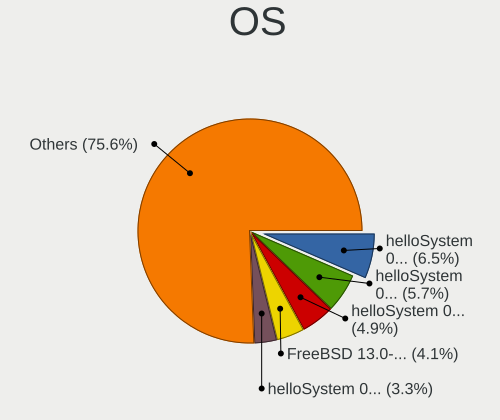

| Name                 | Notebooks | Percent |
|----------------------|-----------|---------|
| helloSystem 0.7.0    | 8         | 6.5%    |
| helloSystem 0.8.1    | 7         | 5.69%   |
| helloSystem 0.5.0    | 6         | 4.88%   |
| FreeBSD 13.0-STABLE  | 5         | 4.07%   |
| helloSystem 0.8.0    | 4         | 3.25%   |
| helloSystem 0.6.0    | 3         | 2.44%   |
| helloSystem 0.3.0    | 3         | 2.44%   |
| FreeBSD 15.0-CURRENT | 3         | 2.44%   |
| OPNsense 25.4        | 2         | 1.63%   |
| OPNsense 24.1.6      | 2         | 1.63%   |
| OPNsense 23.10.2     | 2         | 1.63%   |
| OPNsense 22.10       | 2         | 1.63%   |
| OpenBSD 7.1          | 2         | 1.63%   |
| OpenBSD 6.9          | 2         | 1.63%   |
| OpenBSD 6.8          | 2         | 1.63%   |
| helloSystem 0.8.2    | 2         | 1.63%   |
| helloSystem 0.4.0    | 2         | 1.63%   |
| GhostBSD 22.06.18    | 2         | 1.63%   |
| FreeBSD 15.0-BETA5   | 2         | 1.63%   |
| FreeBSD 14.2         | 2         | 1.63%   |
| FreeBSD 14.0-p6      | 2         | 1.63%   |
| FreeBSD 14.0-p4      | 2         | 1.63%   |
| FreeBSD 14.0         | 2         | 1.63%   |
| FreeBSD 13.1-p4      | 2         | 1.63%   |
| FreeBSD 13.1         | 2         | 1.63%   |
| FreeBSD 13.0-p5      | 2         | 1.63%   |
| OPNsense 25.7.8      | 1         | 0.81%   |
| OPNsense 25.7.6      | 1         | 0.81%   |
| OPNsense 25.7.2      | 1         | 0.81%   |
| OPNsense 25.7.1      | 1         | 0.81%   |
| OPNsense 25.4.3      | 1         | 0.81%   |
| OPNsense 25.10.1     | 1         | 0.81%   |
| OPNsense 25.1.3      | 1         | 0.81%   |
| OPNsense 24.7.7      | 1         | 0.81%   |
| OPNsense 24.4.2      | 1         | 0.81%   |
| OPNsense 24.4.1      | 1         | 0.81%   |
| OPNsense 24.10.2     | 1         | 0.81%   |
| OPNsense 24.10       | 1         | 0.81%   |
| OPNsense 24.1.4      | 1         | 0.81%   |
| OPNsense 24.1.2      | 1         | 0.81%   |

OS Family
---------

OS without a version

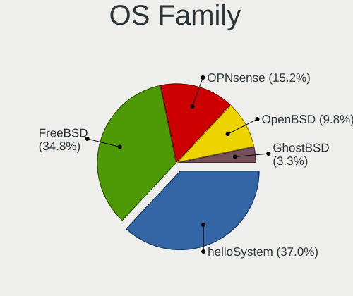

| Name        | Notebooks | Percent |
|-------------|-----------|---------|
| helloSystem | 34        | 36.96%  |
| FreeBSD     | 32        | 34.78%  |
| OPNsense    | 14        | 15.22%  |
| OpenBSD     | 9         | 9.78%   |
| GhostBSD    | 3         | 3.26%   |

Arch
----

OS architecture (x86_64, i586, etc.)

| Name  | Notebooks | Percent |
|-------|-----------|---------|
| amd64 | 91        | 100%    |

DE
--

Desktop Environment

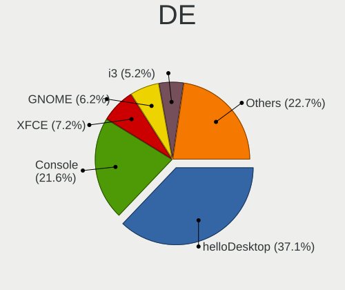

| Name         | Notebooks | Percent |
|--------------|-----------|---------|
| helloDesktop | 36        | 37.11%  |
| Console      | 21        | 21.65%  |
| XFCE         | 7         | 7.22%   |
| GNOME        | 6         | 6.19%   |
| MATE         | 5         | 5.15%   |
| i3           | 5         | 5.15%   |
| fvwm         | 5         | 5.15%   |
| TWM          | 4         | 4.12%   |
| KDE5         | 3         | 3.09%   |
| LXQt         | 2         | 2.06%   |
| KDE6         | 1         | 1.03%   |
| GNUstep      | 1         | 1.03%   |
| AwesomeWM    | 1         | 1.03%   |

Display Server
--------------

X11 or Wayland

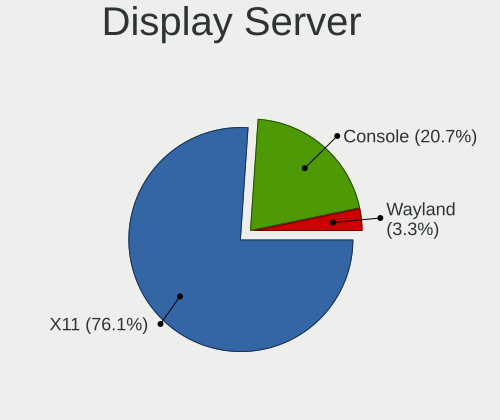

| Name    | Notebooks | Percent |
|---------|-----------|---------|
| X11     | 70        | 76.09%  |
| Console | 19        | 20.65%  |
| Wayland | 3         | 3.26%   |

Display Manager
---------------

SDDM, LightDM, etc.

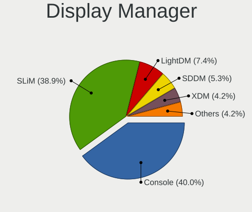

| Name    | Notebooks | Percent |
|---------|-----------|---------|
| Console | 38        | 40%     |
| SLiM    | 37        | 38.95%  |
| LightDM | 7         | 7.37%   |
| SDDM    | 5         | 5.26%   |
| XDM     | 4         | 4.21%   |
| GDM     | 4         | 4.21%   |

OS Lang
-------

Language

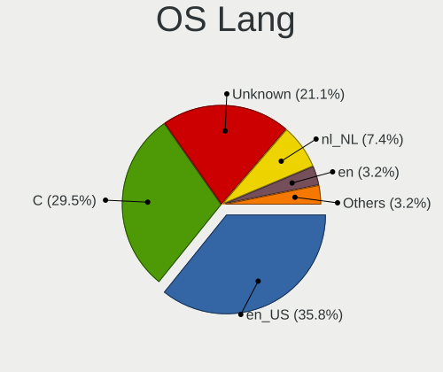

| Lang    | Notebooks | Percent |
|---------|-----------|---------|
| en_US   | 34        | 35.79%  |
| C       | 28        | 29.47%  |
| Unknown | 20        | 21.05%  |
| nl_NL   | 7         | 7.37%   |
| en      | 3         | 3.16%   |
| fr_FR   | 2         | 2.11%   |
| nl      | 1         | 1.05%   |

Boot Mode
---------

EFI or BIOS

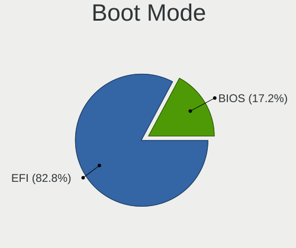

| Mode | Notebooks | Percent |
|------|-----------|---------|
| EFI  | 77        | 82.8%   |
| BIOS | 16        | 17.2%   |

Filesystem
----------

Type of filesystem

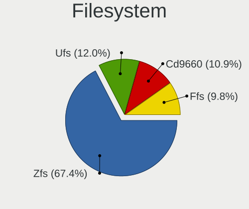

| Type   | Notebooks | Percent |
|--------|-----------|---------|
| Zfs    | 62        | 67.39%  |
| Ufs    | 11        | 11.96%  |
| Cd9660 | 10        | 10.87%  |
| Ffs    | 9         | 9.78%   |

Part. scheme
------------

Scheme of partitioning

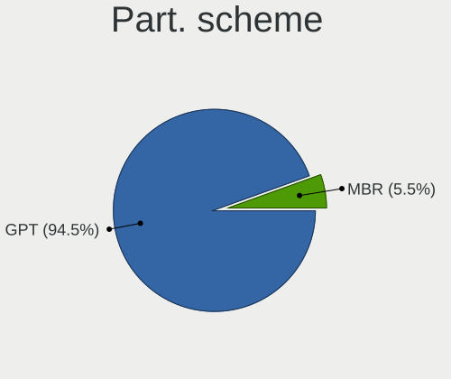

| Type | Notebooks | Percent |
|------|-----------|---------|
| GPT  | 86        | 94.51%  |
| MBR  | 5         | 5.49%   |

Board
-----

Vendor
------

Motherboard manufacturer

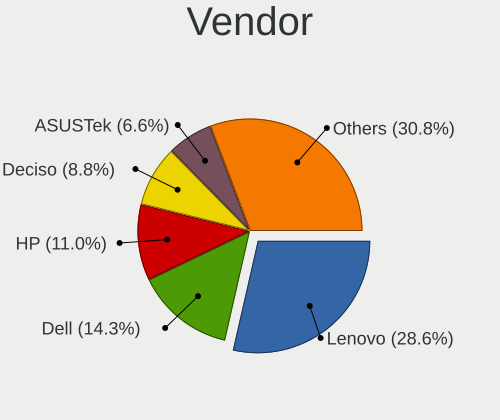

| Name                             | Notebooks | Percent |
|----------------------------------|-----------|---------|
| Lenovo                           | 26        | 28.57%  |
| Dell                             | 13        | 14.29%  |
| Hewlett-Packard                  | 10        | 10.99%  |
| Deciso                           | 8         | 8.79%   |
| ASUSTek Computer                 | 6         | 6.59%   |
| Apple                            | 5         | 5.49%   |
| Notebook                         | 3         | 3.3%    |
| SLIMBOOK                         | 2         | 2.2%    |
| Micro Computer (HK) Tech Limited | 2         | 2.2%    |
| Acer                             | 2         | 2.2%    |
| Unknown                          | 2         | 2.2%    |
| WYSE                             | 1         | 1.1%    |
| TUXEDO                           | 1         | 1.1%    |
| TOXIC by BTO                     | 1         | 1.1%    |
| Toshiba                          | 1         | 1.1%    |
| TongFang                         | 1         | 1.1%    |
| Star Labs                        | 1         | 1.1%    |
| Sony                             | 1         | 1.1%    |
| Panasonic                        | 1         | 1.1%    |
| Medion                           | 1         | 1.1%    |
| Intel                            | 1         | 1.1%    |
| Google                           | 1         | 1.1%    |
| Framework                        | 1         | 1.1%    |

Model
-----

Motherboard model

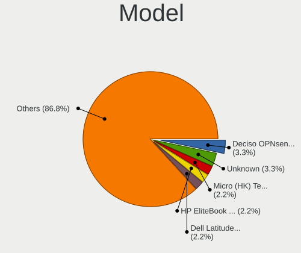

| Name                                        | Notebooks | Percent |
|---------------------------------------------|-----------|---------|
| Deciso OPNsense Appliance                   | 3         | 3.3%    |
| Unknown                                     | 3         | 3.3%    |
| Micro (HK) Tech Limited Venus series        | 2         | 2.2%    |
| HP EliteBook 840 G3                         | 2         | 2.2%    |
| Dell Latitude E6400                         | 2         | 2.2%    |
| Dell Latitude E4300                         | 2         | 2.2%    |
| Deciso NetBoard-A10_Gen.3                   | 2         | 2.2%    |
| Deciso NetBoard-A10                         | 2         | 2.2%    |
| WYSE Z CLASS                                | 1         | 1.1%    |
| TUXEDO Pulse 15 Gen1                        | 1         | 1.1%    |
| TOXIC by BTO 15CL872 1050TI                 | 1         | 1.1%    |
| Toshiba Satellite C50-B                     | 1         | 1.1%    |
| TongFang GX4HRXL                            | 1         | 1.1%    |
| Star Labs LabTop                            | 1         | 1.1%    |
| Sony SVZ1311C5E                             | 1         | 1.1%    |
| SLIMBOOK PROX-AMD5                          | 1         | 1.1%    |
| Panasonic CF-52PGNBX2M                      | 1         | 1.1%    |
| Notebook NS5x_NS7xPU                        | 1         | 1.1%    |
| Notebook NL5xRU                             | 1         | 1.1%    |
| Notebook N2x0WU                             | 1         | 1.1%    |
| Medion Major X10                            | 1         | 1.1%    |
| Lenovo Yoga 900S-12ISK 80ML                 | 1         | 1.1%    |
| Lenovo Yoga 500-14IBD 80N4                  | 1         | 1.1%    |
| Lenovo ThinkPad X61s 76693KG                | 1         | 1.1%    |
| Lenovo ThinkPad X280 20KESA000B             | 1         | 1.1%    |
| Lenovo ThinkPad X250 20CLS5BU00             | 1         | 1.1%    |
| Lenovo ThinkPad X250 20CLS59400             | 1         | 1.1%    |
| Lenovo ThinkPad X250 20CLS4WV08             | 1         | 1.1%    |
| Lenovo ThinkPad X230 2325IG2                | 1         | 1.1%    |
| Lenovo ThinkPad X230 23255Y4                | 1         | 1.1%    |
| Lenovo ThinkPad X200s 7470W1V               | 1         | 1.1%    |
| Lenovo ThinkPad X200s 74695KG               | 1         | 1.1%    |
| Lenovo ThinkPad X1 Carbon Gen 11 21HMCTO1WW | 1         | 1.1%    |
| Lenovo ThinkPad X1 Carbon 7th 20QDCTO1WW    | 1         | 1.1%    |
| Lenovo ThinkPad X1 Carbon 5th 20HRCTO1WW    | 1         | 1.1%    |
| Lenovo ThinkPad W520 4284GZ1                | 1         | 1.1%    |
| Lenovo ThinkPad T490 20N2CTO1WW             | 1         | 1.1%    |
| Lenovo ThinkPad T440s 20ARS1B704            | 1         | 1.1%    |
| Lenovo ThinkPad T440 20B7S2LT00             | 1         | 1.1%    |
| Lenovo ThinkPad T430 2347G7G                | 1         | 1.1%    |

Model Family
------------

Motherboard model prefix

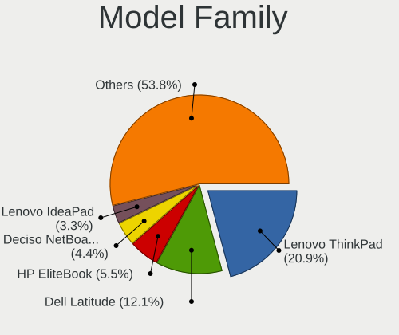

| Name                          | Notebooks | Percent |
|-------------------------------|-----------|---------|
| Lenovo ThinkPad               | 19        | 20.88%  |
| Dell Latitude                 | 11        | 12.09%  |
| HP EliteBook                  | 5         | 5.49%   |
| Deciso NetBoard-A10           | 4         | 4.4%    |
| Lenovo IdeaPad                | 3         | 3.3%    |
| HP ProBook                    | 3         | 3.3%    |
| Deciso OPNsense               | 3         | 3.3%    |
| Unknown                       | 3         | 3.3%    |
| Micro (HK) Tech Limited Venus | 2         | 2.2%    |
| Lenovo Yoga                   | 2         | 2.2%    |
| Acer Aspire                   | 2         | 2.2%    |
| WYSE Z                        | 1         | 1.1%    |
| TUXEDO Pulse                  | 1         | 1.1%    |
| TOXIC by BTO 15CL872          | 1         | 1.1%    |
| Toshiba Satellite             | 1         | 1.1%    |
| TongFang GX4HRXL              | 1         | 1.1%    |
| Star Labs LabTop              | 1         | 1.1%    |
| Sony SVZ1311C5E               | 1         | 1.1%    |
| SLIMBOOK PROX-AMD5            | 1         | 1.1%    |
| Panasonic CF-52PGNBX2M        | 1         | 1.1%    |
| Notebook NS5x                 | 1         | 1.1%    |
| Notebook NL5xRU               | 1         | 1.1%    |
| Notebook N2x0WU               | 1         | 1.1%    |
| Medion Major                  | 1         | 1.1%    |
| Lenovo ThinkBook              | 1         | 1.1%    |
| Lenovo G505s                  | 1         | 1.1%    |
| Intel Milstead                | 1         | 1.1%    |
| HP OMEN                       | 1         | 1.1%    |
| HP 625                        | 1         | 1.1%    |
| Google Cave                   | 1         | 1.1%    |
| Framework Laptop              | 1         | 1.1%    |
| Dell XPS                      | 1         | 1.1%    |
| Dell Inspiron                 | 1         | 1.1%    |
| Deciso NetBoard-A20           | 1         | 1.1%    |
| ASUS ZenBook                  | 1         | 1.1%    |
| ASUS X751LB                   | 1         | 1.1%    |
| ASUS X556UA                   | 1         | 1.1%    |
| ASUS VivoBook                 | 1         | 1.1%    |
| ASUS K53TA                    | 1         | 1.1%    |
| ASUS GL752VW                  | 1         | 1.1%    |

MFG Year
--------

Motherboard manufacture year

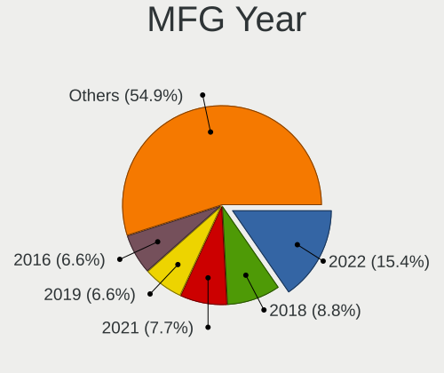

| Year    | Notebooks | Percent |
|---------|-----------|---------|
| 2022    | 14        | 15.38%  |
| 2018    | 8         | 8.79%   |
| 2021    | 7         | 7.69%   |
| 2019    | 6         | 6.59%   |
| 2016    | 6         | 6.59%   |
| 2015    | 6         | 6.59%   |
| 2014    | 6         | 6.59%   |
| 2012    | 6         | 6.59%   |
| 2023    | 4         | 4.4%    |
| 2020    | 4         | 4.4%    |
| 2013    | 4         | 4.4%    |
| 2011    | 4         | 4.4%    |
| 2009    | 4         | 4.4%    |
| 2017    | 3         | 3.3%    |
| 2010    | 3         | 3.3%    |
| 2024    | 2         | 2.2%    |
| 2008    | 2         | 2.2%    |
| Unknown | 2         | 2.2%    |

Form Factor
-----------

Physical design of the computer

| Name     | Notebooks | Percent |
|----------|-----------|---------|
| Notebook | 91        | 100%    |

Coreboot
--------

Have coreboot on board

| Used | Notebooks | Percent |
|------|-----------|---------|
| No   | 90        | 98.9%   |
| Yes  | 1         | 1.1%    |

RAM Size
--------

Total RAM memory

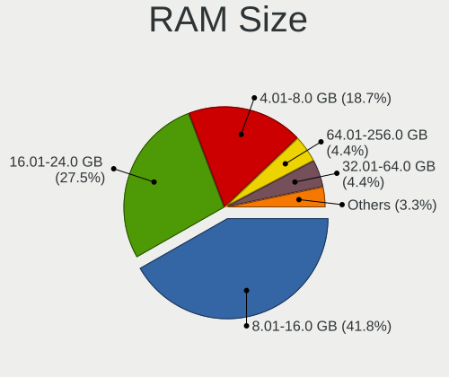

| Size in GB  | Notebooks | Percent |
|-------------|-----------|---------|
| 8.01-16.0   | 38        | 41.76%  |
| 16.01-24.0  | 25        | 27.47%  |
| 4.01-8.0    | 17        | 18.68%  |
| 32.01-64.0  | 4         | 4.4%    |
| 64.01-256.0 | 4         | 4.4%    |
| 2.01-3.0    | 3         | 3.3%    |

RAM Used
--------

Used RAM memory

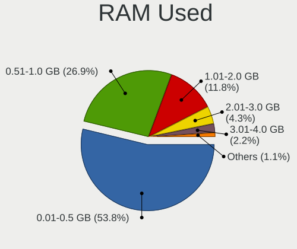

| Used GB  | Notebooks | Percent |
|----------|-----------|---------|
| 0.01-0.5 | 50        | 53.76%  |
| 0.51-1.0 | 25        | 26.88%  |
| 1.01-2.0 | 11        | 11.83%  |
| 2.01-3.0 | 4         | 4.3%    |
| 3.01-4.0 | 2         | 2.15%   |
| 4.01-8.0 | 1         | 1.08%   |

Total Drives
------------

Number of drives on board

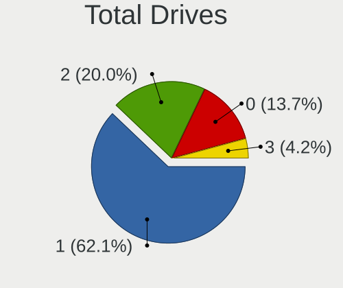

| Drives | Notebooks | Percent |
|--------|-----------|---------|
| 1      | 59        | 62.11%  |
| 2      | 19        | 20%     |
| 0      | 13        | 13.68%  |
| 3      | 4         | 4.21%   |

Has CD-ROM
----------

Has CD-ROM on board

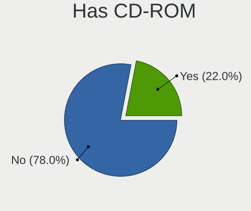

| Presented | Notebooks | Percent |
|-----------|-----------|---------|
| No        | 71        | 78.02%  |
| Yes       | 20        | 21.98%  |

Has Ethernet
------------

Has Ethernet on board

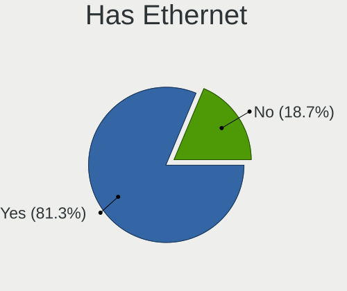

| Presented | Notebooks | Percent |
|-----------|-----------|---------|
| Yes       | 74        | 81.32%  |
| No        | 17        | 18.68%  |

Has WiFi
--------

Has WiFi module

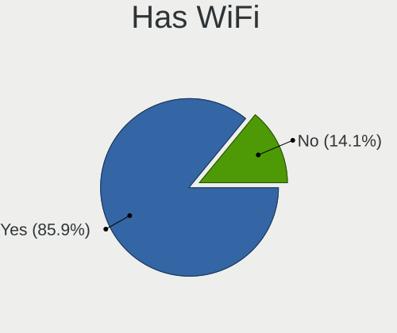

| Presented | Notebooks | Percent |
|-----------|-----------|---------|
| Yes       | 78        | 85.71%  |
| No        | 13        | 14.29%  |

Has Bluetooth
-------------

Has Bluetooth module

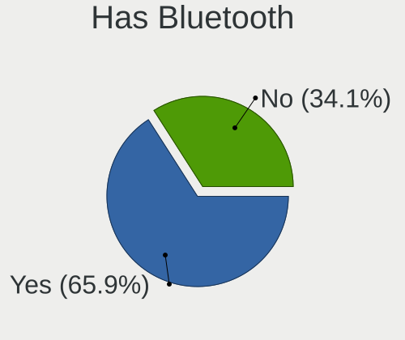

| Presented | Notebooks | Percent |
|-----------|-----------|---------|
| Yes       | 60        | 65.93%  |
| No        | 31        | 34.07%  |

Location
--------

Country
-------

Geographic location (country)

| Country     | Notebooks | Percent |
|-------------|-----------|---------|
| Netherlands | 91        | 100%    |

City
----

Geographic location (city)

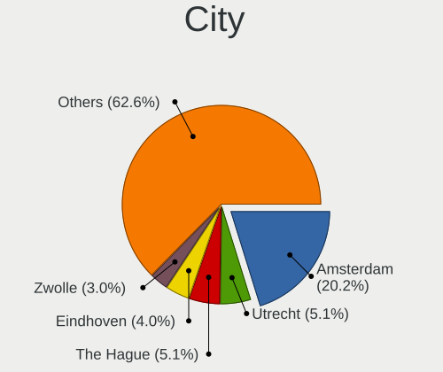

| City                    | Notebooks | Percent |
|-------------------------|-----------|---------|
| Amsterdam               | 20        | 20.2%   |
| Utrecht                 | 5         | 5.05%   |
| The Hague               | 5         | 5.05%   |
| Eindhoven               | 4         | 4.04%   |
| Zwolle                  | 3         | 3.03%   |
| Schiedam                | 2         | 2.02%   |
| Rotterdam               | 2         | 2.02%   |
| Papendrecht             | 2         | 2.02%   |
| Oosterhout              | 2         | 2.02%   |
| Oegstgeest              | 2         | 2.02%   |
| Leeuwarden              | 2         | 2.02%   |
| Hoogeveen               | 2         | 2.02%   |
| Hilversum               | 2         | 2.02%   |
| Groningen               | 2         | 2.02%   |
| 's-Hertogenbosch        | 2         | 2.02%   |
| Woerdense Verlaat       | 1         | 1.01%   |
| Westervoort             | 1         | 1.01%   |
| Warmond                 | 1         | 1.01%   |
| Wageningen              | 1         | 1.01%   |
| Waddinxveen             | 1         | 1.01%   |
| Veendam                 | 1         | 1.01%   |
| Tilburg                 | 1         | 1.01%   |
| Rozenburg               | 1         | 1.01%   |
| Roosendaal              | 1         | 1.01%   |
| Rhoon                   | 1         | 1.01%   |
| Ouderkerk aan de Amstel | 1         | 1.01%   |
| Oss                     | 1         | 1.01%   |
| Ooij                    | 1         | 1.01%   |
| Nuth                    | 1         | 1.01%   |
| Norg                    | 1         | 1.01%   |
| Munnikens-Vinkel        | 1         | 1.01%   |
| Lent                    | 1         | 1.01%   |
| Lelystad                | 1         | 1.01%   |
| Leiden                  | 1         | 1.01%   |
| Hoek van Holland        | 1         | 1.01%   |
| Haarlem                 | 1         | 1.01%   |
| Gouda                   | 1         | 1.01%   |
| Elim                    | 1         | 1.01%   |
| Ede                     | 1         | 1.01%   |
| Dronten                 | 1         | 1.01%   |

Drives
------

Drive Vendor
------------

Hard drive vendors

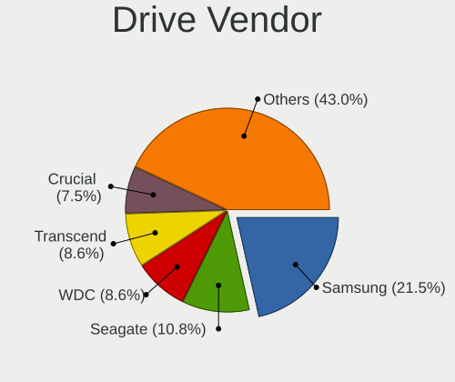

| Vendor              | Notebooks | Drives | Percent |
|---------------------|-----------|--------|---------|
| Samsung Electronics | 20        | 32     | 21.51%  |
| Seagate             | 10        | 15     | 10.75%  |
| WDC                 | 8         | 8      | 8.6%    |
| Transcend           | 8         | 20     | 8.6%    |
| Crucial             | 7         | 9      | 7.53%   |
| SanDisk             | 5         | 5      | 5.38%   |
| Toshiba             | 4         | 4      | 4.3%    |
| NVMe                | 3         | 4      | 3.23%   |
| Kingston            | 3         | 3      | 3.23%   |
| VICKTER             | 2         | 4      | 2.15%   |
| SK hynix            | 2         | 2      | 2.15%   |
| Intel               | 2         | 2      | 2.15%   |
| Hitachi             | 2         | 2      | 2.15%   |
| HGST                | 2         | 2      | 2.15%   |
| Gigabyte Technology | 2         | 3      | 2.15%   |
| Apple               | 2         | 3      | 2.15%   |
| Vaseky              | 1         | 1      | 1.08%   |
| Star Drive          | 1         | 1      | 1.08%   |
| Phison              | 1         | 1      | 1.08%   |
| OCZ                 | 1         | 1      | 1.08%   |
| Micron Technology   | 1         | 1      | 1.08%   |
| LITEON              | 1         | 1      | 1.08%   |
| Leven               | 1         | 1      | 1.08%   |
| Integral            | 1         | 1      | 1.08%   |
| HPE                 | 1         | 1      | 1.08%   |
| Hoodisk             | 1         | 2      | 1.08%   |
| China               | 1         | 1      | 1.08%   |

Drive Model
-----------

Hard drive models

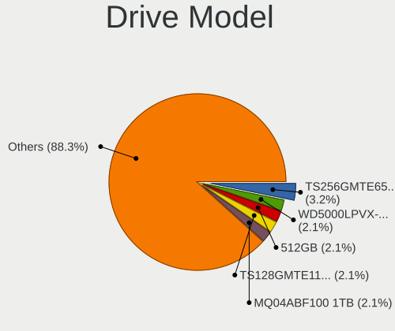

| Model                                   | Notebooks | Percent |
|-----------------------------------------|-----------|---------|
| Transcend TS256GMTE652T2 256GB          | 3         | 3.19%   |
| WDC WD5000LPVX-22V0TT0 500GB            | 2         | 2.13%   |
| VICKTER SSD 512GB                       | 2         | 2.13%   |
| Transcend TS128GMTE110S 128GB           | 2         | 2.13%   |
| Toshiba MQ04ABF100 1TB                  | 2         | 2.13%   |
| Seagate ST9160412ASG 160GB              | 2         | 2.13%   |
| Seagate ST500LM000-SSHD-8GB             | 2         | 2.13%   |
| Seagate ST1000LM049-2GH172 1TB          | 2         | 2.13%   |
| Samsung SSD 840 EVO 250GB               | 2         | 2.13%   |
| Crucial CT500MX500SSD1 500GB            | 2         | 2.13%   |
| WDC WDS500G2B0C-00PXH0 500GB            | 1         | 1.06%   |
| WDC WDS500G2B0A 500GB                   | 1         | 1.06%   |
| WDC WDS100T2B0B-00YS70 1TB              | 1         | 1.06%   |
| WDC WD15EARS-00Z5B1 1.5TB               | 1         | 1.06%   |
| WDC WD10SPZX-24Z10 1TB                  | 1         | 1.06%   |
| WDC WD10SPZX-00Z10T0 1TB                | 1         | 1.06%   |
| Vaseky V850-128G                        | 1         | 1.06%   |
| Transcend TS512GMTS430S 512GB           | 1         | 1.06%   |
| Transcend TS256GMTS952T2 256GB          | 1         | 1.06%   |
| Transcend TS256GMTE710T 256GB           | 1         | 1.06%   |
| Toshiba THNSN5512GPUK NVMe 512GB        | 1         | 1.06%   |
| Toshiba THNSFJ256GCSU 256GB             | 1         | 1.06%   |
| Star Drive PCIe SSD 960GB               | 1         | 1.06%   |
| SK hynix SC311 SATA 256GB               | 1         | 1.06%   |
| SK hynix BC511 HFM256GDJTNI-82A0A 256GB | 1         | 1.06%   |
| Seagate ST9250410AS 250GB               | 1         | 1.06%   |
| Seagate ST500VT000-1DK142 500GB         | 1         | 1.06%   |
| Seagate ST500LM021-1KJ152 500GB         | 1         | 1.06%   |
| Seagate ST1000LM024 HN-M101MBB 1TB      | 1         | 1.06%   |
| SanDisk SD8SN8U-128G-1006 128GB         | 1         | 1.06%   |
| SanDisk SD8SBAT256G1002 256GB           | 1         | 1.06%   |
| SanDisk SD7UB3Q256G1001 256GB           | 1         | 1.06%   |
| SanDisk SD7TB3Q-256G-1006 256GB         | 1         | 1.06%   |
| SanDisk SD6SB1M064G 64GB                | 1         | 1.06%   |
| Samsung SSD PM851 mSATA 512GB           | 1         | 1.06%   |
| Samsung SSD PM841 mSATA 256GB           | 1         | 1.06%   |
| Samsung SSD 980 PRO 1TB                 | 1         | 1.06%   |
| Samsung SSD 970 PRO 512GB               | 1         | 1.06%   |
| Samsung SSD 970 EVO 500GB               | 1         | 1.06%   |
| Samsung SSD 870 QVO 1TB                 | 1         | 1.06%   |

HDD Vendor
----------

Hard disk drive vendors

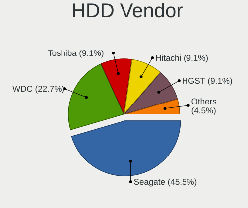

| Vendor              | Notebooks | Drives | Percent |
|---------------------|-----------|--------|---------|
| Seagate             | 10        | 15     | 45.45%  |
| WDC                 | 5         | 5      | 22.73%  |
| Toshiba             | 2         | 2      | 9.09%   |
| Hitachi             | 2         | 2      | 9.09%   |
| HGST                | 2         | 2      | 9.09%   |
| Samsung Electronics | 1         | 1      | 4.55%   |

SSD Vendor
----------

Solid state drive vendors

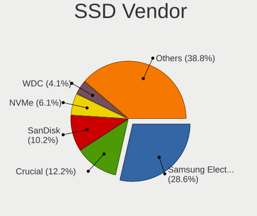

| Vendor              | Notebooks | Drives | Percent |
|---------------------|-----------|--------|---------|
| Samsung Electronics | 14        | 23     | 28.57%  |
| Crucial             | 6         | 7      | 12.24%  |
| SanDisk             | 5         | 5      | 10.2%   |
| NVMe                | 3         | 4      | 6.12%   |
| WDC                 | 2         | 2      | 4.08%   |
| VICKTER             | 2         | 4      | 4.08%   |
| Transcend           | 2         | 11     | 4.08%   |
| Apple               | 2         | 3      | 4.08%   |
| Vaseky              | 1         | 1      | 2.04%   |
| Toshiba             | 1         | 1      | 2.04%   |
| SK hynix            | 1         | 1      | 2.04%   |
| OCZ                 | 1         | 1      | 2.04%   |
| LITEON              | 1         | 1      | 2.04%   |
| Leven               | 1         | 1      | 2.04%   |
| Kingston            | 1         | 1      | 2.04%   |
| Intel               | 1         | 1      | 2.04%   |
| Integral            | 1         | 1      | 2.04%   |
| HPE                 | 1         | 1      | 2.04%   |
| Hoodisk             | 1         | 2      | 2.04%   |
| Gigabyte Technology | 1         | 1      | 2.04%   |
| China               | 1         | 1      | 2.04%   |

Drive Kind
----------

HDD or SSD

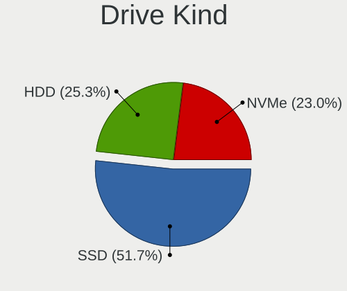

| Kind | Notebooks | Drives | Percent |
|------|-----------|--------|---------|
| SSD  | 45        | 73     | 51.72%  |
| HDD  | 22        | 27     | 25.29%  |
| NVMe | 20        | 30     | 22.99%  |

Drive Connector
---------------

SATA, SAS, NVMe, etc.

| Type | Notebooks | Drives | Percent |
|------|-----------|--------|---------|
| SATA | 64        | 100    | 76.19%  |
| NVMe | 20        | 30     | 23.81%  |

Drive Size
----------

Size of hard drive

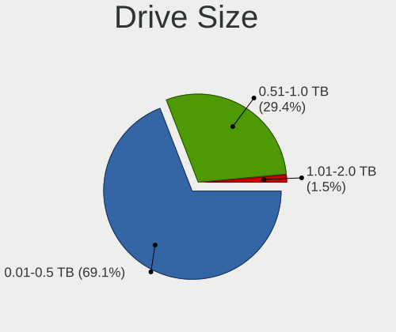

| Size in TB | Notebooks | Drives | Percent |
|------------|-----------|--------|---------|
| 0.01-0.5   | 47        | 72     | 69.12%  |
| 0.51-1.0   | 20        | 27     | 29.41%  |
| 1.01-2.0   | 1         | 1      | 1.47%   |

Space Total
-----------

Amount of disk space available on the file system

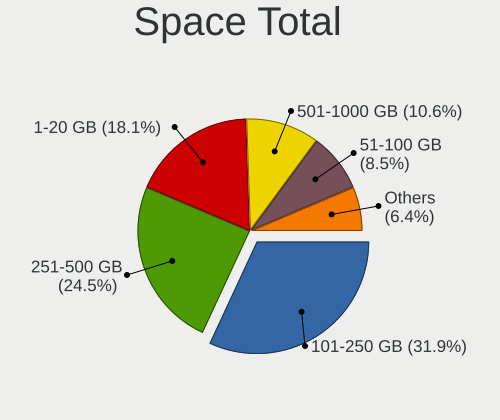

| Size in GB | Notebooks | Percent |
|------------|-----------|---------|
| 101-250    | 30        | 31.91%  |
| 251-500    | 23        | 24.47%  |
| 1-20       | 17        | 18.09%  |
| 501-1000   | 10        | 10.64%  |
| 51-100     | 8         | 8.51%   |
| 1001-2000  | 3         | 3.19%   |
| 21-50      | 2         | 2.13%   |
| Unknown    | 1         | 1.06%   |

Space Used
----------

Amount of used disk space

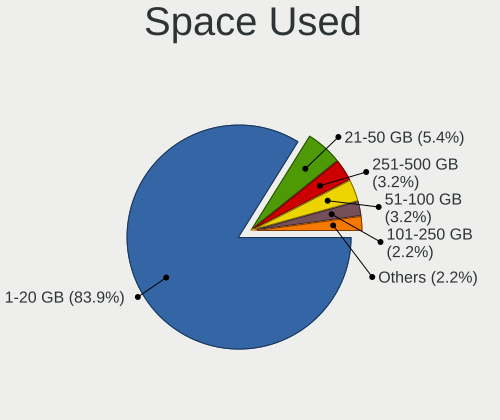

| Used GB  | Notebooks | Percent |
|----------|-----------|---------|
| 1-20     | 78        | 83.87%  |
| 21-50    | 5         | 5.38%   |
| 251-500  | 3         | 3.23%   |
| 51-100   | 3         | 3.23%   |
| 101-250  | 2         | 2.15%   |
| 501-1000 | 1         | 1.08%   |
| Unknown  | 1         | 1.08%   |

Malfunc. Drives
---------------

Drive models with a malfunction

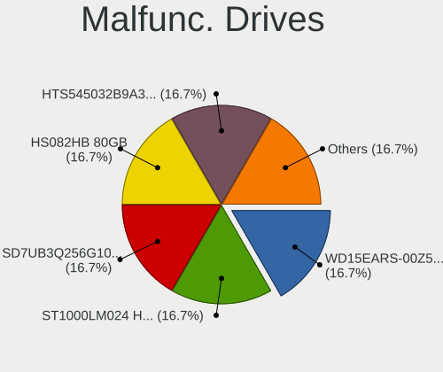

| Model                              | Notebooks | Drives | Percent |
|------------------------------------|-----------|--------|---------|
| WDC WD15EARS-00Z5B1 1.5TB          | 1         | 1      | 16.67%  |
| Seagate ST1000LM024 HN-M101MBB 1TB | 1         | 1      | 16.67%  |
| SanDisk SD7UB3Q256G1001 256GB      | 1         | 1      | 16.67%  |
| Samsung Electronics HS082HB 80GB   | 1         | 1      | 16.67%  |
| Hitachi HTS545032B9A300 320GB      | 1         | 1      | 16.67%  |
| China SH00M128GB                   | 1         | 1      | 16.67%  |

Malfunc. Drive Vendor
---------------------

Vendors of faulty drives

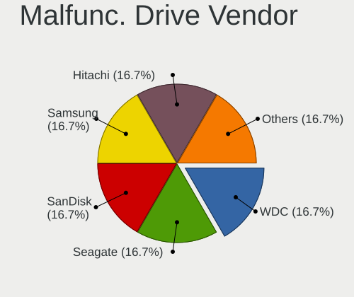

| Vendor              | Notebooks | Drives | Percent |
|---------------------|-----------|--------|---------|
| WDC                 | 1         | 1      | 16.67%  |
| Seagate             | 1         | 1      | 16.67%  |
| SanDisk             | 1         | 1      | 16.67%  |
| Samsung Electronics | 1         | 1      | 16.67%  |
| Hitachi             | 1         | 1      | 16.67%  |
| China               | 1         | 1      | 16.67%  |

Malfunc. HDD Vendor
-------------------

Vendors of faulty HDD drives

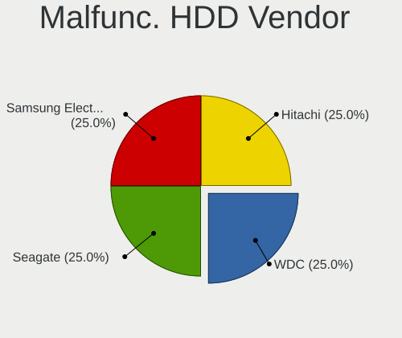

| Vendor              | Notebooks | Drives | Percent |
|---------------------|-----------|--------|---------|
| WDC                 | 1         | 1      | 25%     |
| Seagate             | 1         | 1      | 25%     |
| Samsung Electronics | 1         | 1      | 25%     |
| Hitachi             | 1         | 1      | 25%     |

Malfunc. Drive Kind
-------------------

Kinds of faulty drives

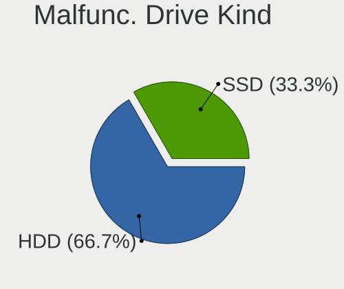

| Kind | Notebooks | Drives | Percent |
|------|-----------|--------|---------|
| HDD  | 4         | 4      | 66.67%  |
| SSD  | 2         | 2      | 33.33%  |

Failed Drives
-------------

Failed drive models

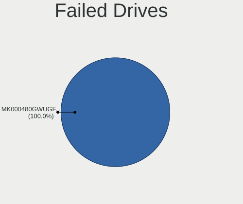

| Model                         | Notebooks | Drives | Percent |
|-------------------------------|-----------|--------|---------|
| Transcend TS128GMTE110S 128GB | 1         | 1      | 50%     |
| HPE MK000480GWUGF 480GB       | 1         | 1      | 50%     |

Failed Drive Vendor
-------------------

Failed drive vendors

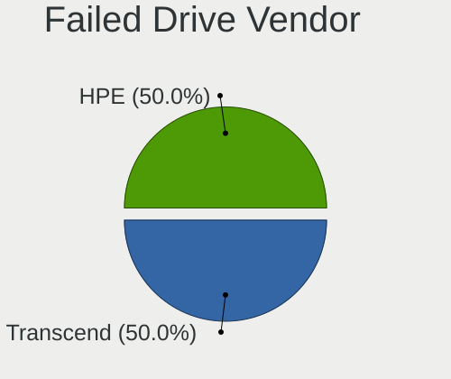

| Vendor    | Notebooks | Drives | Percent |
|-----------|-----------|--------|---------|
| Transcend | 1         | 1      | 50%     |
| HPE       | 1         | 1      | 50%     |

Drive Status
------------

Number of failed and malfunc. drives

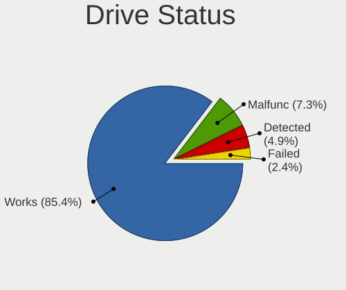

| Status   | Notebooks | Drives | Percent |
|----------|-----------|--------|---------|
| Works    | 70        | 116    | 85.37%  |
| Malfunc  | 6         | 6      | 7.32%   |
| Detected | 4         | 6      | 4.88%   |
| Failed   | 2         | 2      | 2.44%   |

Storage controller
------------------

Storage Vendor
--------------

Storage controller vendors

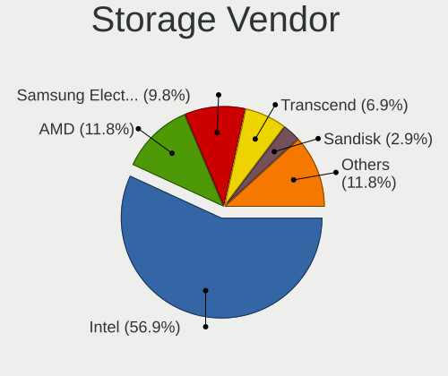

| Vendor                      | Notebooks | Percent |
|-----------------------------|-----------|---------|
| Intel                       | 58        | 56.86%  |
| AMD                         | 12        | 11.76%  |
| Samsung Electronics         | 10        | 9.8%    |
| Transcend                   | 7         | 6.86%   |
| Sandisk                     | 3         | 2.94%   |
| Phison Electronics          | 3         | 2.94%   |
| Kingston Technology Company | 2         | 1.96%   |
| Toshiba                     | 1         | 0.98%   |
| SK hynix                    | 1         | 0.98%   |
| Seagate Technology          | 1         | 0.98%   |
| Realtek Semiconductor       | 1         | 0.98%   |
| Micron/Crucial Technology   | 1         | 0.98%   |
| Micron Technology           | 1         | 0.98%   |
| KIOXIA                      | 1         | 0.98%   |

Storage Model
-------------

Storage controller models

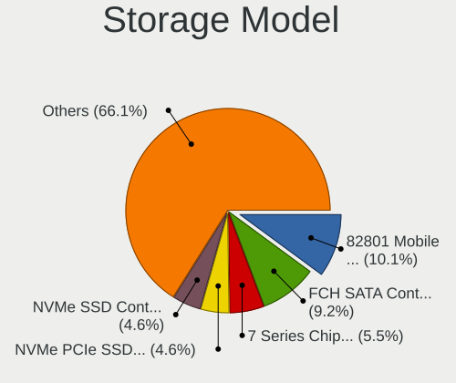

| Model                                                                        | Notebooks | Percent |
|------------------------------------------------------------------------------|-----------|---------|
| Intel 82801 Mobile SATA Controller [RAID mode]                               | 11        | 10.09%  |
| AMD FCH SATA Controller [AHCI mode]                                          | 10        | 9.17%   |
| Intel 7 Series Chipset Family 6-port SATA Controller [AHCI mode]             | 6         | 5.5%    |
| Transcend NVMe PCIe SSD 110S/112S/120S/MTE300S/MTE400S/MTE652T2 (DRAM-less)  | 5         | 4.59%   |
| Samsung NVMe SSD Controller SM981/PM981/PM983                                | 5         | 4.59%   |
| Intel Wildcat Point-LP SATA Controller [AHCI Mode]                           | 5         | 4.59%   |
| Intel 8 Series SATA Controller 1 [AHCI mode]                                 | 5         | 4.59%   |
| Intel Sunrise Point-LP SATA Controller [AHCI mode]                           | 4         | 3.67%   |
| Intel 82801IBM/IEM (ICH9M/ICH9M-E) 4 port SATA Controller [AHCI mode]        | 4         | 3.67%   |
| Intel 6 Series/C200 Series Chipset Family 6 port Mobile SATA AHCI Controller | 4         | 3.67%   |
| Transcend NVMe PCIe SSD 220S/240S/MTE710T                                    | 2         | 1.83%   |
| Samsung NVMe SSD Controller PM9A1/PM9A3/980PRO                               | 2         | 1.83%   |
| Samsung NVMe SSD Controller 980 (DRAM-less)                                  | 2         | 1.83%   |
| Intel Volume Management Device NVMe RAID Controller                          | 2         | 1.83%   |
| Intel SSD DC P4101/Pro 7600p/760p/E 6100p Series                             | 2         | 1.83%   |
| Intel HM170/QM170 Chipset SATA Controller [AHCI Mode]                        | 2         | 1.83%   |
| Intel Comet Lake SATA AHCI Controller                                        | 2         | 1.83%   |
| Intel Alder Lake-N SATA AHCI Controller                                      | 2         | 1.83%   |
| Intel 82801HM/HEM (ICH8M/ICH8M-E) SATA Controller [AHCI mode]                | 2         | 1.83%   |
| Intel 82801HM/HEM (ICH8M/ICH8M-E) IDE Controller                             | 2         | 1.83%   |
| Intel 5 Series/3400 Series Chipset 4 port SATA AHCI Controller               | 2         | 1.83%   |
| AMD SB7x0/SB8x0/SB9x0 SATA Controller [AHCI mode]                            | 2         | 1.83%   |
| Toshiba XG4 NVMe SSD Controller                                              | 1         | 0.92%   |
| SK hynix BC511 NVMe SSD                                                      | 1         | 0.92%   |
| Seagate PCIe Gen4 SSD                                                        | 1         | 0.92%   |
| SanDisk WD PC SN810 / Black SN850 NVMe SSD                                   | 1         | 0.92%   |
| Sandisk WD Black SN850X NVMe SSD                                             | 1         | 0.92%   |
| SanDisk Ultra 3D / WD PC SN530, IX SN530, Blue SN550 NVMe SSD (DRAM-less)    | 1         | 0.92%   |
| Samsung NVMe SSD Controller SM951/PM951                                      | 1         | 0.92%   |
| Realtek RTS5765DL NVMe SSD Controller (DRAM-less)                            | 1         | 0.92%   |
| Phison PS5013-E13 PCIe3 NVMe Controller (DRAM-less)                          | 1         | 0.92%   |
| Phison E18 PCIe4 NVMe Controller                                             | 1         | 0.92%   |
| Phison E12 NVMe Controller                                                   | 1         | 0.92%   |
| Micron/Crucial P2 [Nick P2] / P3 / P3 Plus NVMe PCIe SSD (DRAM-less)         | 1         | 0.92%   |
| Micron 2210 NVMe SSD [Cobain]                                                | 1         | 0.92%   |
| KIOXIA NVMe SSD Controller XG8                                               | 1         | 0.92%   |
| Kingston Company NV2 NVMe SSD [SM2267XT] (DRAM-less)                         | 1         | 0.92%   |
| Kingston Company A2000 NVMe SSD [SM2263EN]                                   | 1         | 0.92%   |
| Intel Tiger Lake-LP SATA Controller                                          | 1         | 0.92%   |
| Intel SSD 670p Series [Keystone Harbor]                                      | 1         | 0.92%   |

Storage Kind
------------

Kind of storage controller (IDE, SATA, NVMe, SAS, ...)

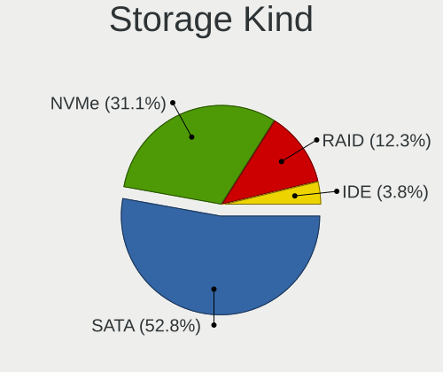

| Kind | Notebooks | Percent |
|------|-----------|---------|
| SATA | 56        | 52.83%  |
| NVMe | 33        | 31.13%  |
| RAID | 13        | 12.26%  |
| IDE  | 4         | 3.77%   |

Processor
---------

CPU Vendor
----------

Processor vendors

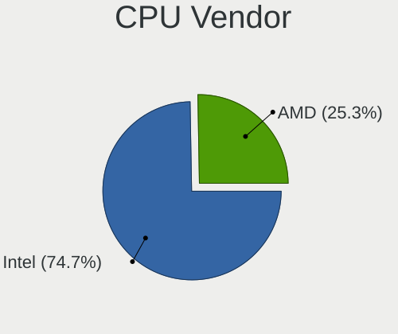

| Vendor | Notebooks | Percent |
|--------|-----------|---------|
| Intel  | 68        | 74.73%  |
| AMD    | 23        | 25.27%  |

CPU Model
---------

Processor models

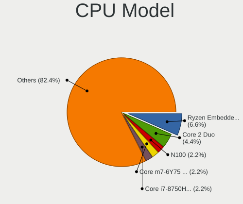

| Model                                   | Notebooks | Percent |
|-----------------------------------------|-----------|---------|
| AMD Ryzen Embedded V1500B               | 6         | 6.59%   |
| Intel Core 2 Duo                        | 4         | 4.4%    |
| Intel N100                              | 2         | 2.2%    |
| Intel Core m7-6Y75 CPU @ 1.20GHz        | 2         | 2.2%    |
| Intel Core i7-8750H CPU @ 2.20GHz       | 2         | 2.2%    |
| Intel Core i7-7600U CPU @ 2.80GHz       | 2         | 2.2%    |
| Intel Core i7-4600U CPU @ 2.10GHz       | 2         | 2.2%    |
| Intel Core i7-4500U CPU @ 1.80GHz       | 2         | 2.2%    |
| Intel Core i7-3520M CPU @ 2.90GHz       | 2         | 2.2%    |
| Intel Core i7-2630QM CPU @ 2.00GHz      | 2         | 2.2%    |
| Intel Core i5-6300U CPU @ 2.40GHz       | 2         | 2.2%    |
| Intel Core i5-5300U CPU @ 2.30GHz       | 2         | 2.2%    |
| Intel Core i5-3320M CPU @ 2.60GHz       | 2         | 2.2%    |
| Intel Core i5-3210M CPU @ 2.50GHz       | 2         | 2.2%    |
| Intel Core 2 Duo CPU L9400 @ 1.86GHz    | 2         | 2.2%    |
| AMD Ryzen 7 5700U with Radeon Graphics  | 2         | 2.2%    |
| AMD Ryzen 7 4800H with Radeon Graphics  | 2         | 2.2%    |
| AMD EPYC 3201 8-Core Processor          | 2         | 2.2%    |
| AMD E1-2500 APU with Radeon HD Graphics | 2         | 2.2%    |
| Intel Pentium CPU N3530 @ 2.16GHz       | 1         | 1.1%    |
| Intel Core m3-6Y30 CPU @ 0.90GHz        | 1         | 1.1%    |
| Intel Core i7-8665U CPU @ 1.90GHz       | 1         | 1.1%    |
| Intel Core i7-8565U CPU @ 1.80GHz       | 1         | 1.1%    |
| Intel Core i7-7700HQ CPU @ 2.80GHz      | 1         | 1.1%    |
| Intel Core i7-6700HQ CPU @ 2.60GHz      | 1         | 1.1%    |
| Intel Core i7-6500U CPU @ 2.50GHz       | 1         | 1.1%    |
| Intel Core i7-5600U CPU @ 2.60GHz       | 1         | 1.1%    |
| Intel Core i7-5500U CPU @ 2.40GHz       | 1         | 1.1%    |
| Intel Core i7-3615QM CPU @ 2.30GHz      | 1         | 1.1%    |
| Intel Core i7-3612QM CPU @ 2.10GHz      | 1         | 1.1%    |
| Intel Core i7-10710U CPU @ 1.10GHz      | 1         | 1.1%    |
| Intel Core i5-8350U CPU @ 1.70GHz       | 1         | 1.1%    |
| Intel Core i5-6200U CPU @ 2.30GHz       | 1         | 1.1%    |
| Intel Core i5-4310M CPU @ 2.70GHz       | 1         | 1.1%    |
| Intel Core i5-4210U CPU @ 1.70GHz       | 1         | 1.1%    |
| Intel Core i5-4200U CPU @ 1.60GHz       | 1         | 1.1%    |
| Intel Core i5-2520M CPU @ 2.50GHz       | 1         | 1.1%    |
| Intel Core i5-2435M CPU @ 2.40GHz       | 1         | 1.1%    |
| Intel Core i5-10310U CPU @ 1.70GHz      | 1         | 1.1%    |
| Intel Core i5-10210U CPU @ 1.60GHz      | 1         | 1.1%    |

CPU Model Family
----------------

Processor model prefix

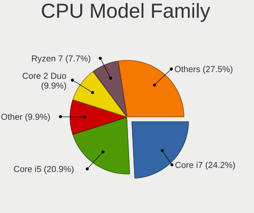

| Model              | Notebooks | Percent |
|--------------------|-----------|---------|
| Intel Core i7      | 22        | 24.18%  |
| Intel Core i5      | 19        | 20.88%  |
| Other              | 9         | 9.89%   |
| Intel Core 2 Duo   | 9         | 9.89%   |
| AMD Ryzen 7        | 7         | 7.69%   |
| AMD Ryzen Embedded | 6         | 6.59%   |
| Intel Core i3      | 3         | 3.3%    |
| Intel Core m7      | 2         | 2.2%    |
| AMD EPYC           | 2         | 2.2%    |
| AMD E1             | 2         | 2.2%    |
| Intel Pentium      | 1         | 1.1%    |
| Intel Core m3      | 1         | 1.1%    |
| Intel Celeron      | 1         | 1.1%    |
| Intel Atom         | 1         | 1.1%    |
| AMD Ryzen 5 PRO    | 1         | 1.1%    |
| AMD G              | 1         | 1.1%    |
| AMD E2             | 1         | 1.1%    |
| AMD Athlon II      | 1         | 1.1%    |
| AMD A8             | 1         | 1.1%    |
| AMD A6             | 1         | 1.1%    |

CPU Cores
---------

Number of processor cores

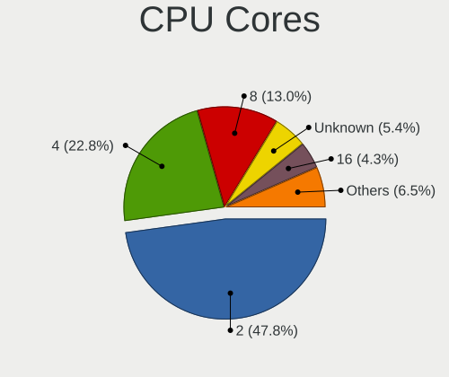

| Number  | Notebooks | Percent |
|---------|-----------|---------|
| 2       | 44        | 47.83%  |
| 4       | 21        | 22.83%  |
| 8       | 12        | 13.04%  |
| Unknown | 5         | 5.43%   |
| 16      | 4         | 4.35%   |
| 6       | 3         | 3.26%   |
| 20      | 1         | 1.09%   |
| 12      | 1         | 1.09%   |
| 10      | 1         | 1.09%   |

CPU Sockets
-----------

Number of sockets

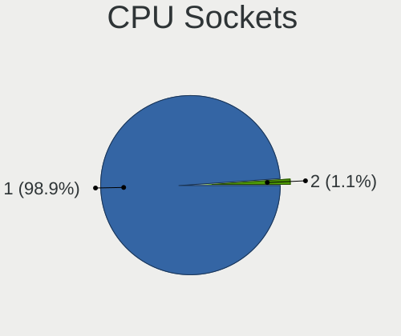

| Number | Notebooks | Percent |
|--------|-----------|---------|
| 1      | 90        | 98.9%   |
| 2      | 1         | 1.1%    |

CPU Threads
-----------

Threads per core (Hyper-Threading)

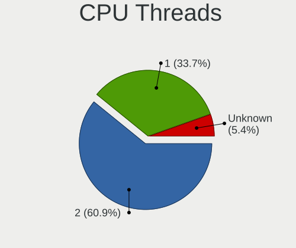

| Number  | Notebooks | Percent |
|---------|-----------|---------|
| 2       | 56        | 60.87%  |
| 1       | 31        | 33.7%   |
| Unknown | 5         | 5.43%   |

CPU Microarch
-------------

Microarchitecture

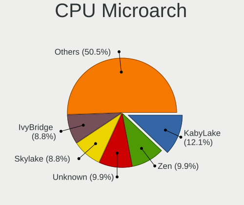

| Name        | Notebooks | Percent |
|-------------|-----------|---------|
| KabyLake    | 11        | 12.09%  |
| Zen         | 9         | 9.89%   |
| Unknown     | 9         | 9.89%   |
| Skylake     | 8         | 8.79%   |
| IvyBridge   | 8         | 8.79%   |
| Haswell     | 8         | 8.79%   |
| Penryn      | 7         | 7.69%   |
| Broadwell   | 5         | 5.49%   |
| SandyBridge | 4         | 4.4%    |
| Zen 2       | 3         | 3.3%    |
| Westmere    | 3         | 3.3%    |
| TigerLake   | 3         | 3.3%    |
| Jaguar      | 2         | 2.2%    |
| Core        | 2         | 2.2%    |
| Zen 3       | 1         | 1.1%    |
| Silvermont  | 1         | 1.1%    |
| Piledriver  | 1         | 1.1%    |
| K10 Llano   | 1         | 1.1%    |
| K10         | 1         | 1.1%    |
| Excavator   | 1         | 1.1%    |
| CometLake   | 1         | 1.1%    |
| Bonnell     | 1         | 1.1%    |
| Bobcat      | 1         | 1.1%    |

Graphics
--------

GPU Vendor
----------

Vendors of graphics cards

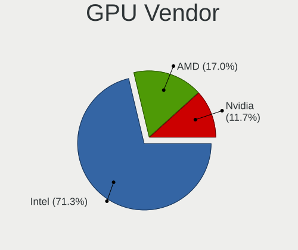

| Vendor | Notebooks | Percent |
|--------|-----------|---------|
| Intel  | 67        | 71.28%  |
| AMD    | 16        | 17.02%  |
| Nvidia | 11        | 11.7%   |

GPU Model
---------

Graphics card models

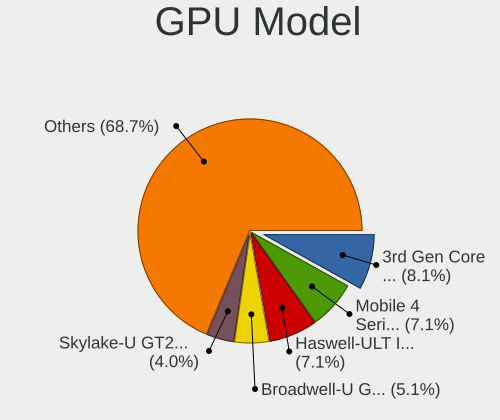

| Model                                                                     | Notebooks | Percent |
|---------------------------------------------------------------------------|-----------|---------|
| Intel 3rd Gen Core processor Graphics Controller                          | 8         | 8.08%   |
| Intel Mobile 4 Series Chipset Integrated Graphics Controller              | 7         | 7.07%   |
| Intel Haswell-ULT Integrated Graphics Controller                          | 7         | 7.07%   |
| Intel Broadwell-U GT2 [HD Graphics 5500]                                  | 5         | 5.05%   |
| Intel Skylake-U GT2 [HD Graphics 520]                                     | 4         | 4.04%   |
| Intel TigerLake-LP GT2 [Iris Xe Graphics]                                 | 3         | 3.03%   |
| Intel Skylake-Y GT2 [HD Graphics 515]                                     | 3         | 3.03%   |
| Intel Kaby Lake-U GT2 [HD Graphics 620]                                   | 3         | 3.03%   |
| Intel Core Processor Integrated Graphics Controller                       | 3         | 3.03%   |
| Intel 2nd Generation Core Processor Family Integrated Graphics Controller | 3         | 3.03%   |
| AMD Renoir [Radeon Vega Series / Radeon Vega Mobile Series]               | 3         | 3.03%   |
| Nvidia GP107M [GeForce GTX 1050 Mobile]                                   | 2         | 2.02%   |
| Intel WhiskeyLake-U GT2 [UHD Graphics 620]                                | 2         | 2.02%   |
| Intel Mobile GM965/GL960 Integrated Graphics Controller (secondary)       | 2         | 2.02%   |
| Intel Mobile GM965/GL960 Integrated Graphics Controller (primary)         | 2         | 2.02%   |
| Intel CometLake-U GT2 [UHD Graphics]                                      | 2         | 2.02%   |
| Intel CoffeeLake-H GT2 [UHD Graphics 630]                                 | 2         | 2.02%   |
| Intel Alder Lake-P GT2 [Iris Xe Graphics]                                 | 2         | 2.02%   |
| Intel Alder Lake-N [UHD Graphics]                                         | 2         | 2.02%   |
| AMD Lucienne                                                              | 2         | 2.02%   |
| AMD Kabini [Radeon HD 8240 / R3 Series]                                   | 2         | 2.02%   |
| Nvidia TU117M [GeForce GTX 1650 Mobile / Max-Q]                           | 1         | 1.01%   |
| Nvidia GT216M [GeForce GT 330M]                                           | 1         | 1.01%   |
| Nvidia GP107M [GeForce GTX 1050 Ti Mobile]                                | 1         | 1.01%   |
| Nvidia GM108M [GeForce 940M]                                              | 1         | 1.01%   |
| Nvidia GM107M [GeForce GTX 960M]                                          | 1         | 1.01%   |
| Nvidia GK107M [GeForce GT 650M Mac Edition]                               | 1         | 1.01%   |
| Nvidia GF108M [NVS 5400M]                                                 | 1         | 1.01%   |
| Nvidia GF108M [GeForce GT 540M]                                           | 1         | 1.01%   |
| Nvidia GF108GLM [Quadro 1000M]                                            | 1         | 1.01%   |
| Intel Skylake-H GT2 [HD Graphics 530]                                     | 1         | 1.01%   |
| Intel Raptor Lake-P [UHD Graphics]                                        | 1         | 1.01%   |
| Intel Raptor Lake-P [Iris Xe Graphics]                                    | 1         | 1.01%   |
| Intel Kaby Lake-R GT2 [UHD Graphics 620]                                  | 1         | 1.01%   |
| Intel Kaby Lake-H GT2 [HD Graphics 630]                                   | 1         | 1.01%   |
| Intel DG2 [Arc A730M]                                                     | 1         | 1.01%   |
| Intel Comet Lake UHD Graphics                                             | 1         | 1.01%   |
| Intel Atom Processor Z36xxx/Z37xxx Series Graphics & Display              | 1         | 1.01%   |
| Intel Atom Processor D2xxx/N2xxx Integrated Graphics Controller           | 1         | 1.01%   |
| Intel 4th Gen Core Processor Integrated Graphics Controller               | 1         | 1.01%   |

GPU Combo
---------

Combinations of graphics cards

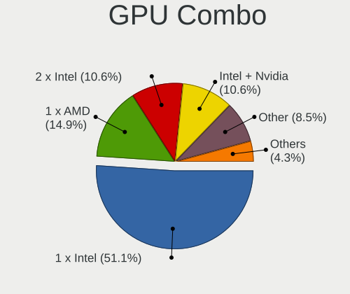

| Name           | Notebooks | Percent |
|----------------|-----------|---------|
| 1 x Intel      | 48        | 51.06%  |
| 1 x AMD        | 14        | 14.89%  |
| 2 x Intel      | 10        | 10.64%  |
| Intel + Nvidia | 10        | 10.64%  |
| Other          | 8         | 8.51%   |
| 2 x AMD        | 2         | 2.13%   |
| 1 x Nvidia     | 2         | 2.13%   |

GPU Driver
----------

Free vs proprietary

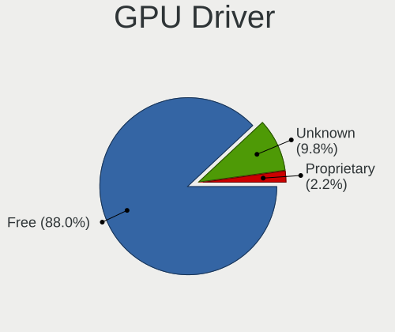

| Driver      | Notebooks | Percent |
|-------------|-----------|---------|
| Free        | 81        | 88.04%  |
| Unknown     | 9         | 9.78%   |
| Proprietary | 2         | 2.17%   |

GPU Memory
----------

Total video memory

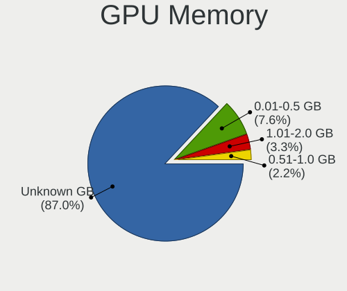

| Size in GB | Notebooks | Percent |
|------------|-----------|---------|
| Unknown    | 80        | 86.96%  |
| 0.01-0.5   | 7         | 7.61%   |
| 1.01-2.0   | 3         | 3.26%   |
| 0.51-1.0   | 2         | 2.17%   |

Monitor
-------

Monitor Vendor
--------------

Monitor vendors

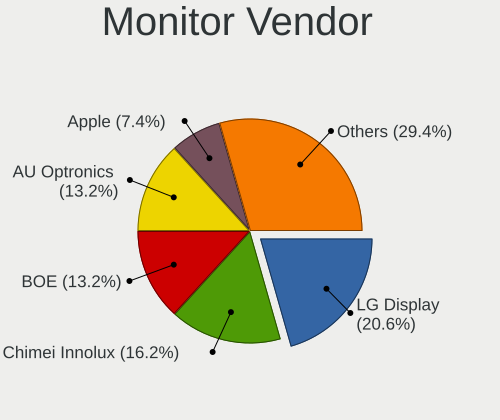

| Vendor                  | Notebooks | Percent |
|-------------------------|-----------|---------|
| LG Display              | 14        | 20.59%  |
| Chimei Innolux          | 11        | 16.18%  |
| BOE                     | 9         | 13.24%  |
| AU Optronics            | 9         | 13.24%  |
| Apple                   | 5         | 7.35%   |
| Samsung Electronics     | 4         | 5.88%   |
| Lenovo                  | 4         | 5.88%   |
| Sharp                   | 3         | 4.41%   |
| Philips                 | 2         | 2.94%   |
| Chi Mei Optoelectronics | 2         | 2.94%   |
| Sony                    | 1         | 1.47%   |
| PANDA                   | 1         | 1.47%   |
| Hewlett-Packard         | 1         | 1.47%   |
| CSW                     | 1         | 1.47%   |
| AOC                     | 1         | 1.47%   |

Monitor Model
-------------

Monitor models

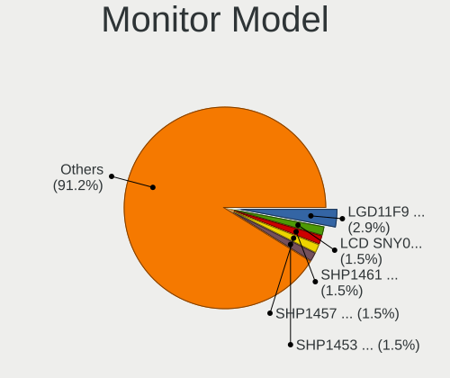

| Model                                                                | Notebooks | Percent |
|----------------------------------------------------------------------|-----------|---------|
| LG Display LCD Monitor LGD11F9 1280x800 290x180mm 13.4-inch          | 2         | 2.94%   |
| Sony LCD SNY06FA 1600x900 290x160mm 13.0-inch                        | 1         | 1.47%   |
| Sharp LCD Monitor SHP1461 3200x1800 290x170mm 13.2-inch              | 1         | 1.47%   |
| Sharp LCD Monitor SHP1457 2560x1440 280x160mm 12.7-inch              | 1         | 1.47%   |
| Sharp LCD Monitor SHP1453 1920x1080 350x190mm 15.7-inch              | 1         | 1.47%   |
| Samsung Electronics LCD Monitor SEC4541 1280x800 260x160mm 12.0-inch | 1         | 1.47%   |
| Samsung Electronics LCD Monitor SEC324C 1600x900 310x170mm 13.9-inch | 1         | 1.47%   |
| Samsung Electronics LCD Monitor SEC3047 1366x768 280x160mm 12.7-inch | 1         | 1.47%   |
| Samsung Electronics LCD Monitor SDC4347 1366x768 340x190mm 15.3-inch | 1         | 1.47%   |
| Philips PHL 328E1 PHLC204 3840x2160 700x390mm 31.5-inch              | 1         | 1.47%   |
| Philips PHL 276E8V PHLC18F 3840x2160 600x340mm 27.2-inch             | 1         | 1.47%   |
| PANDA LC133LF1L02 NCP0019 1920x1080 290x170mm 13.2-inch              | 1         | 1.47%   |
| LG Display LCD Monitor LGD0ABC 1280x800 300x190mm 14.0-inch          | 1         | 1.47%   |
| LG Display LCD Monitor LGD064C 1920x1080 340x190mm 15.3-inch         | 1         | 1.47%   |
| LG Display LCD Monitor LGD05C0 1920x1080 344x194mm 15.5-inch         | 1         | 1.47%   |
| LG Display LCD Monitor LGD058B 2560x1440 310x170mm 13.9-inch         | 1         | 1.47%   |
| LG Display LCD Monitor LGD0450 1366x768 280x160mm 12.7-inch          | 1         | 1.47%   |
| LG Display LCD Monitor LGD0437 1920x1080 280x160mm 12.7-inch         | 1         | 1.47%   |
| LG Display LCD Monitor LGD0414 1920x1080 280x160mm 12.7-inch         | 1         | 1.47%   |
| LG Display LCD Monitor LGD0408 1920x1080 280x160mm 12.7-inch         | 1         | 1.47%   |
| LG Display LCD Monitor LGD03ED 1366x768 280x160mm 12.7-inch          | 1         | 1.47%   |
| LG Display LCD Monitor LGD02D8 1366x768 280x160mm 12.7-inch          | 1         | 1.47%   |
| LG Display LCD Monitor LGD02AD 1366x768 340x190mm 15.3-inch          | 1         | 1.47%   |
| LG Display LCD Monitor LGD01F5 1280x800 300x190mm 14.0-inch          | 1         | 1.47%   |
| Lenovo LCD Monitor LEN40B1 1600x900 340x190mm 15.3-inch              | 1         | 1.47%   |
| Lenovo LCD Monitor LEN4014 1440x900 260x160mm 12.0-inch              | 1         | 1.47%   |
| Lenovo LCD Monitor LEN4010 1280x800 260x160mm 12.0-inch              | 1         | 1.47%   |
| Lenovo LCD Monitor LEN4000 1024x768 250x180mm 12.1-inch              | 1         | 1.47%   |
| Hewlett-Packard LA1951 HWP285A 1280x1024 380x300mm 19.1-inch         | 1         | 1.47%   |
| CSW MNE007ZA3-2 CSW1431 2880x1800 300x190mm 14.0-inch                | 1         | 1.47%   |
| Chimei Innolux LCD Monitor CMN175A 1920x1080 380x210mm 17.1-inch     | 1         | 1.47%   |
| Chimei Innolux LCD Monitor CMN1735 1920x1080 380x210mm 17.1-inch     | 1         | 1.47%   |
| Chimei Innolux LCD Monitor CMN1734 1600x900 380x210mm 17.1-inch      | 1         | 1.47%   |
| Chimei Innolux LCD Monitor CMN15C9 1366x768 340x190mm 15.3-inch      | 1         | 1.47%   |
| Chimei Innolux LCD Monitor CMN15C3 1920x1080 340x190mm 15.3-inch     | 1         | 1.47%   |
| Chimei Innolux LCD Monitor CMN15BF 1366x768 340x190mm 15.3-inch      | 1         | 1.47%   |
| Chimei Innolux LCD Monitor CMN15B5 1366x768 340x190mm 15.3-inch      | 1         | 1.47%   |
| Chimei Innolux LCD Monitor CMN152D 1920x1080 340x190mm 15.3-inch     | 1         | 1.47%   |
| Chimei Innolux LCD Monitor CMN1490 1366x768 310x170mm 13.9-inch      | 1         | 1.47%   |
| Chimei Innolux LCD Monitor CMN1404 1920x1080 310x170mm 13.9-inch     | 1         | 1.47%   |

Monitor Resolution
------------------

Monitor screen resolution

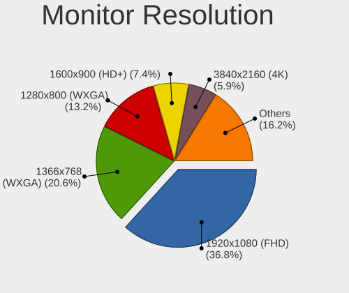

| Resolution         | Notebooks | Percent |
|--------------------|-----------|---------|
| 1920x1080 (FHD)    | 25        | 36.76%  |
| 1366x768 (WXGA)    | 14        | 20.59%  |
| 1280x800 (WXGA)    | 9         | 13.24%  |
| 1600x900 (HD+)     | 5         | 7.35%   |
| 3840x2160 (4K)     | 4         | 5.88%   |
| 2560x1440 (QHD)    | 3         | 4.41%   |
| 2880x1800          | 2         | 2.94%   |
| 3200x1800 (QHD+)   | 1         | 1.47%   |
| 2256x1504          | 1         | 1.47%   |
| 1920x515           | 1         | 1.47%   |
| 1680x1050 (WSXGA+) | 1         | 1.47%   |
| 1440x900 (WXGA+)   | 1         | 1.47%   |
| 1280x1024 (SXGA)   | 1         | 1.47%   |

Monitor Diagonal
----------------

Diagonal size in inches

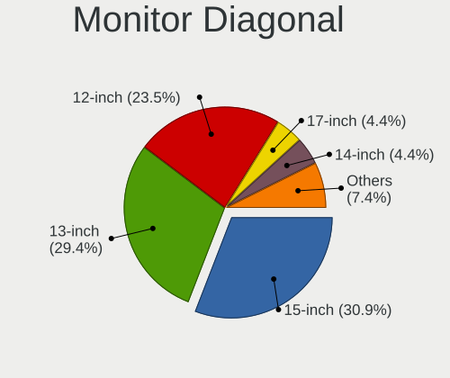

| Inches | Notebooks | Percent |
|--------|-----------|---------|
| 15     | 21        | 30.88%  |
| 13     | 20        | 29.41%  |
| 12     | 16        | 23.53%  |
| 17     | 3         | 4.41%   |
| 14     | 3         | 4.41%   |
| 27     | 2         | 2.94%   |
| 31     | 1         | 1.47%   |
| 23     | 1         | 1.47%   |
| 19     | 1         | 1.47%   |

Monitor Width
-------------

Physical width

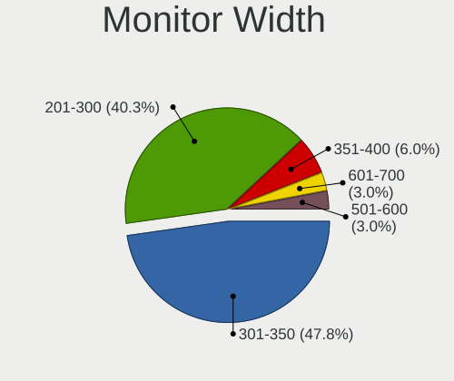

| Width in mm | Notebooks | Percent |
|-------------|-----------|---------|
| 301-350     | 32        | 47.76%  |
| 201-300     | 27        | 40.3%   |
| 351-400     | 4         | 5.97%   |
| 601-700     | 2         | 2.99%   |
| 501-600     | 2         | 2.99%   |

Aspect Ratio
------------

Proportional relationship between the width and the height

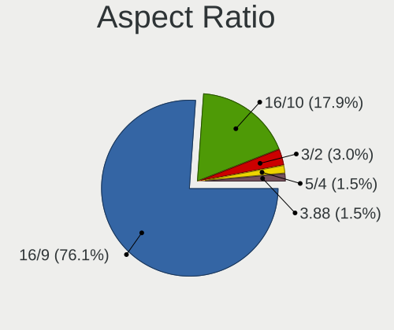

| Ratio | Notebooks | Percent |
|-------|-----------|---------|
| 16/9  | 51        | 76.12%  |
| 16/10 | 12        | 17.91%  |
| 3/2   | 2         | 2.99%   |
| 5/4   | 1         | 1.49%   |
| 3.88  | 1         | 1.49%   |

Monitor Area
------------

Area in inch²

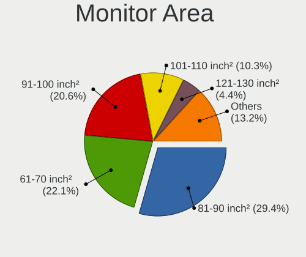

| Area in inch² | Notebooks | Percent |
|----------------|-----------|---------|
| 81-90          | 20        | 29.41%  |
| 61-70          | 15        | 22.06%  |
| 91-100         | 14        | 20.59%  |
| 101-110        | 7         | 10.29%  |
| 71-80          | 3         | 4.41%   |
| 121-130        | 3         | 4.41%   |
| 301-350        | 2         | 2.94%   |
| 351-500        | 1         | 1.47%   |
| 1-40           | 1         | 1.47%   |
| 201-250        | 1         | 1.47%   |
| 151-200        | 1         | 1.47%   |

Pixel Density
-------------

Pixels per inch

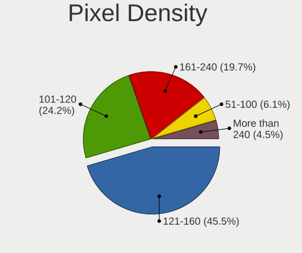

| Density       | Notebooks | Percent |
|---------------|-----------|---------|
| 121-160       | 30        | 45.45%  |
| 101-120       | 16        | 24.24%  |
| 161-240       | 13        | 19.7%   |
| 51-100        | 4         | 6.06%   |
| More than 240 | 3         | 4.55%   |

Multiple Monitors
-----------------

Total monitors connected

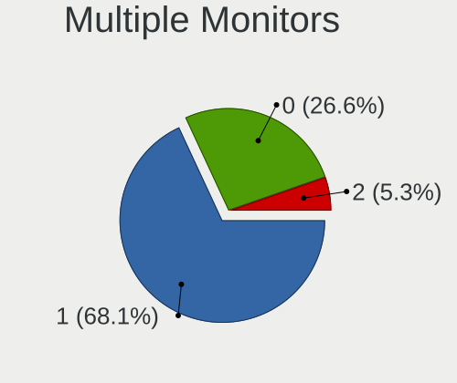

| Total | Notebooks | Percent |
|-------|-----------|---------|
| 1     | 64        | 68.09%  |
| 0     | 25        | 26.6%   |
| 2     | 5         | 5.32%   |

Network
-------

Net Controller Vendor
---------------------

Controller vendors

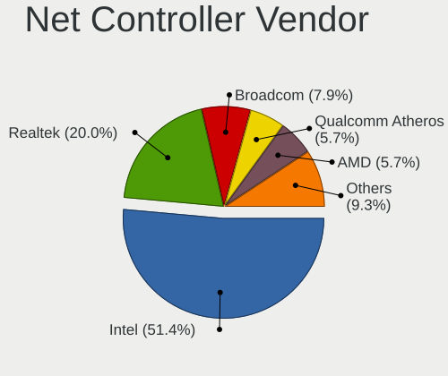

| Vendor                                 | Notebooks | Percent |
|----------------------------------------|-----------|---------|
| Intel                                  | 72        | 51.43%  |
| Realtek Semiconductor                  | 28        | 20%     |
| Broadcom                               | 11        | 7.86%   |
| Qualcomm Atheros                       | 8         | 5.71%   |
| AMD                                    | 8         | 5.71%   |
| TP-Link                                | 4         | 2.86%   |
| Suzhou Motorcomm Electronic Technology | 1         | 0.71%   |
| Sierra Wireless                        | 1         | 0.71%   |
| Ralink Technology                      | 1         | 0.71%   |
| Ralink                                 | 1         | 0.71%   |
| MediaTek                               | 1         | 0.71%   |
| HMD Global                             | 1         | 0.71%   |
| Hewlett-Packard                        | 1         | 0.71%   |
| Fibocom                                | 1         | 0.71%   |
| Ericsson Business Mobile Networks      | 1         | 0.71%   |

Net Controller Model
--------------------

Controller models

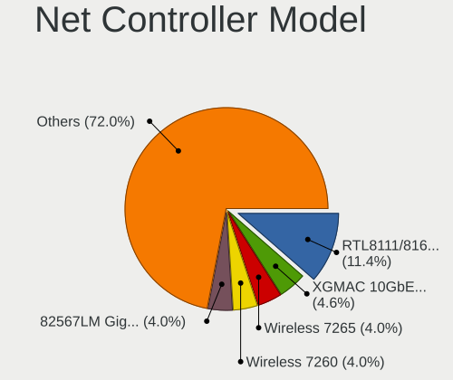

| Model                                                                  | Notebooks | Percent |
|------------------------------------------------------------------------|-----------|---------|
| Realtek RTL8111/8168/8211/8411 PCI Express Gigabit Ethernet Controller | 20        | 11.43%  |
| AMD XGMAC 10GbE Controller                                             | 8         | 4.57%   |
| Intel Wireless 7265                                                    | 7         | 4%      |
| Intel Wireless 7260                                                    | 7         | 4%      |
| Intel 82567LM Gigabit Network Connection                               | 7         | 4%      |
| Intel Wi-Fi 6 AX200                                                    | 6         | 3.43%   |
| Qualcomm Atheros QCA9565 / AR9565 Wireless Network Adapter             | 5         | 2.86%   |
| Intel Centrino Advanced-N 6205 [Taylor Peak]                           | 5         | 2.86%   |
| Intel 82579LM Gigabit Network Connection (Lewisville)                  | 5         | 2.86%   |
| Realtek RTL8188EUS 802.11n Wireless Network Adapter                    | 4         | 2.29%   |
| Intel Wireless 8265 / 8275                                             | 4         | 2.29%   |
| Intel I211 Gigabit Network Connection                                  | 4         | 2.29%   |
| Realtek RTL810xE PCI Express Fast Ethernet controller                  | 3         | 1.71%   |
| Qualcomm Atheros AR9285 Wireless Network Adapter (PCI-Express)         | 3         | 1.71%   |
| Intel Wireless 8260                                                    | 3         | 1.71%   |
| Intel Wi-Fi 6E(802.11ax) AX210/AX1675* 2x2 [Typhoon Peak]              | 3         | 1.71%   |
| Intel I210 Gigabit Network Connection                                  | 3         | 1.71%   |
| Intel Ethernet Connection I218-LM                                      | 3         | 1.71%   |
| Intel Ethernet Connection (3) I218-LM                                  | 3         | 1.71%   |
| Intel Comet Lake PCH-LP CNVi WiFi                                      | 3         | 1.71%   |
| Broadcom BCM4331 802.11a/b/g/n                                         | 3         | 1.71%   |
| TP-Link AC600 wireless Realtek RTL8811AU [Archer T2U Nano]             | 2         | 1.14%   |
| Realtek RTL8821CE 802.11ac PCIe Wireless Network Adapter               | 2         | 1.14%   |
| Intel WiFi Link 5100                                                   | 2         | 1.14%   |
| Intel Wi-Fi 5(802.11ac) Wireless-AC 9x6x [Thunder Peak]                | 2         | 1.14%   |
| Intel Raptor Lake PCH CNVi WiFi                                        | 2         | 1.14%   |
| Intel PRO/Wireless 5100 AGN [Shiloh] Network Connection                | 2         | 1.14%   |
| Intel Ethernet Controller I225-V                                       | 2         | 1.14%   |
| Intel Ethernet Connection I219-LM                                      | 2         | 1.14%   |
| Intel Ethernet Connection (4) I219-LM                                  | 2         | 1.14%   |
| Intel Cannon Point-LP CNVi [Wireless-AC]                               | 2         | 1.14%   |
| Intel Cannon Lake PCH CNVi WiFi                                        | 2         | 1.14%   |
| Broadcom NetXtreme BCM57765 Gigabit Ethernet PCIe                      | 2         | 1.14%   |
| Broadcom BCM4312 802.11b/g LP-PHY                                      | 2         | 1.14%   |
| TP-Link Wireless USB Adapter                                           | 1         | 0.57%   |
| TP-Link Archer T3U [Realtek RTL8812BU]                                 | 1         | 0.57%   |
| Suzhou Motorcomm Electronic YT6801 Gigabit Ethernet Controller         | 1         | 0.57%   |
| Sierra Wireless EM7455                                                 | 1         | 0.57%   |
| Realtek RTL8188CUS 802.11n WLAN Adapter                                | 1         | 0.57%   |
| Ralink RT5370 Wireless Adapter                                         | 1         | 0.57%   |

Wireless Vendor
---------------

Wireless vendors

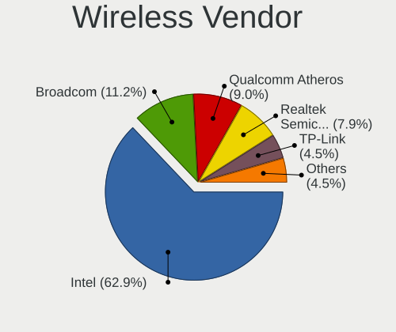

| Vendor                | Notebooks | Percent |
|-----------------------|-----------|---------|
| Intel                 | 56        | 62.92%  |
| Broadcom              | 10        | 11.24%  |
| Qualcomm Atheros      | 8         | 8.99%   |
| Realtek Semiconductor | 7         | 7.87%   |
| TP-Link               | 4         | 4.49%   |
| Sierra Wireless       | 1         | 1.12%   |
| Ralink Technology     | 1         | 1.12%   |
| Ralink                | 1         | 1.12%   |
| MediaTek              | 1         | 1.12%   |

Wireless Model
--------------

Wireless models

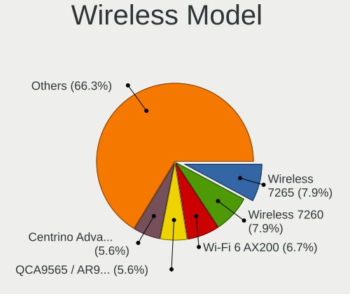

| Model                                                                | Notebooks | Percent |
|----------------------------------------------------------------------|-----------|---------|
| Intel Wireless 7265                                                  | 7         | 7.87%   |
| Intel Wireless 7260                                                  | 7         | 7.87%   |
| Intel Wi-Fi 6 AX200                                                  | 6         | 6.74%   |
| Qualcomm Atheros QCA9565 / AR9565 Wireless Network Adapter           | 5         | 5.62%   |
| Intel Centrino Advanced-N 6205 [Taylor Peak]                         | 5         | 5.62%   |
| Realtek RTL8188EUS 802.11n Wireless Network Adapter                  | 4         | 4.49%   |
| Intel Wireless 8265 / 8275                                           | 4         | 4.49%   |
| Qualcomm Atheros AR9285 Wireless Network Adapter (PCI-Express)       | 3         | 3.37%   |
| Intel Wireless 8260                                                  | 3         | 3.37%   |
| Intel Wi-Fi 6E(802.11ax) AX210/AX1675* 2x2 [Typhoon Peak]            | 3         | 3.37%   |
| Intel Comet Lake PCH-LP CNVi WiFi                                    | 3         | 3.37%   |
| Broadcom BCM4331 802.11a/b/g/n                                       | 3         | 3.37%   |
| TP-Link AC600 wireless Realtek RTL8811AU [Archer T2U Nano]           | 2         | 2.25%   |
| Realtek RTL8821CE 802.11ac PCIe Wireless Network Adapter             | 2         | 2.25%   |
| Intel WiFi Link 5100                                                 | 2         | 2.25%   |
| Intel Wi-Fi 5(802.11ac) Wireless-AC 9x6x [Thunder Peak]              | 2         | 2.25%   |
| Intel Raptor Lake PCH CNVi WiFi                                      | 2         | 2.25%   |
| Intel PRO/Wireless 5100 AGN [Shiloh] Network Connection              | 2         | 2.25%   |
| Intel Cannon Point-LP CNVi [Wireless-AC]                             | 2         | 2.25%   |
| Intel Cannon Lake PCH CNVi WiFi                                      | 2         | 2.25%   |
| Broadcom BCM4312 802.11b/g LP-PHY                                    | 2         | 2.25%   |
| TP-Link Wireless USB Adapter                                         | 1         | 1.12%   |
| TP-Link Archer T3U [Realtek RTL8812BU]                               | 1         | 1.12%   |
| Sierra Wireless EM7455                                               | 1         | 1.12%   |
| Realtek RTL8188CUS 802.11n WLAN Adapter                              | 1         | 1.12%   |
| Ralink RT5370 Wireless Adapter                                       | 1         | 1.12%   |
| Ralink RT3592 Wireless 802.11abgn 2T/2R PCIe                         | 1         | 1.12%   |
| MediaTek MT7921 802.11ax PCIe Wireless Network Adapter [Filogic 330] | 1         | 1.12%   |
| Intel Wireless 3160                                                  | 1         | 1.12%   |
| Intel Wi-Fi 6 AX201                                                  | 1         | 1.12%   |
| Intel Ultimate N WiFi Link 5300                                      | 1         | 1.12%   |
| Intel Centrino Ultimate-N 6300                                       | 1         | 1.12%   |
| Intel Centrino Advanced-N 6235                                       | 1         | 1.12%   |
| Intel Centrino Advanced-N 6200                                       | 1         | 1.12%   |
| Broadcom BCM4350 802.11ac Wireless Network Adapter                   | 1         | 1.12%   |
| Broadcom BCM43224 802.11a/b/g/n                                      | 1         | 1.12%   |
| Broadcom BCM4321 802.11a/b/g/n                                       | 1         | 1.12%   |
| Broadcom BCM43142 802.11b/g/n                                        | 1         | 1.12%   |
| Broadcom BCM4313 802.11bgn Wireless Network Adapter                  | 1         | 1.12%   |

Ethernet Vendor
---------------

Ethernet vendors

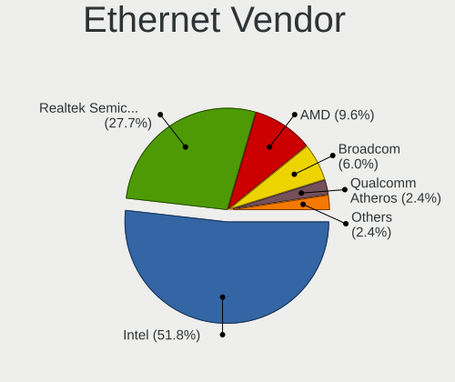

| Vendor                                 | Notebooks | Percent |
|----------------------------------------|-----------|---------|
| Intel                                  | 43        | 51.81%  |
| Realtek Semiconductor                  | 23        | 27.71%  |
| AMD                                    | 8         | 9.64%   |
| Broadcom                               | 5         | 6.02%   |
| Qualcomm Atheros                       | 2         | 2.41%   |
| Suzhou Motorcomm Electronic Technology | 1         | 1.2%    |
| HMD Global                             | 1         | 1.2%    |

Ethernet Model
--------------

Ethernet models

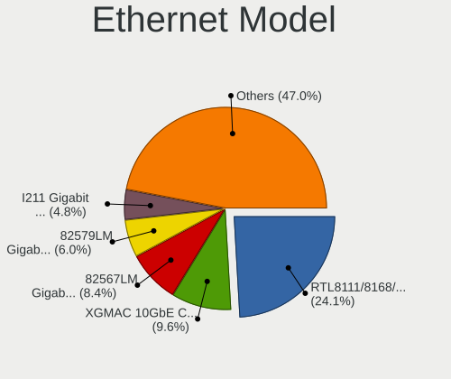

| Model                                                                  | Notebooks | Percent |
|------------------------------------------------------------------------|-----------|---------|
| Realtek RTL8111/8168/8211/8411 PCI Express Gigabit Ethernet Controller | 20        | 24.1%   |
| AMD XGMAC 10GbE Controller                                             | 8         | 9.64%   |
| Intel 82567LM Gigabit Network Connection                               | 7         | 8.43%   |
| Intel 82579LM Gigabit Network Connection (Lewisville)                  | 5         | 6.02%   |
| Intel I211 Gigabit Network Connection                                  | 4         | 4.82%   |
| Realtek RTL810xE PCI Express Fast Ethernet controller                  | 3         | 3.61%   |
| Intel I210 Gigabit Network Connection                                  | 3         | 3.61%   |
| Intel Ethernet Connection I218-LM                                      | 3         | 3.61%   |
| Intel Ethernet Connection (3) I218-LM                                  | 3         | 3.61%   |
| Intel Ethernet Controller I225-V                                       | 2         | 2.41%   |
| Intel Ethernet Connection I219-LM                                      | 2         | 2.41%   |
| Intel Ethernet Connection (4) I219-LM                                  | 2         | 2.41%   |
| Broadcom NetXtreme BCM57765 Gigabit Ethernet PCIe                      | 2         | 2.41%   |
| Suzhou Motorcomm Electronic YT6801 Gigabit Ethernet Controller         | 1         | 1.2%    |
| Qualcomm Atheros QCA8172 Fast Ethernet                                 | 1         | 1.2%    |
| Qualcomm Atheros QCA8171 Gigabit Ethernet                              | 1         | 1.2%    |
| Intel Ethernet Connection I219-V                                       | 1         | 1.2%    |
| Intel Ethernet Connection I218-V                                       | 1         | 1.2%    |
| Intel Ethernet Connection I217-V                                       | 1         | 1.2%    |
| Intel Ethernet Connection (6) I219-V                                   | 1         | 1.2%    |
| Intel Ethernet Connection (6) I219-LM                                  | 1         | 1.2%    |
| Intel Ethernet Connection (23) I219-LM                                 | 1         | 1.2%    |
| Intel Ethernet Connection (16) I219-V                                  | 1         | 1.2%    |
| Intel 82579V Gigabit Network Connection                                | 1         | 1.2%    |
| Intel 82577LM Gigabit Network Connection                               | 1         | 1.2%    |
| Intel 82577LC Gigabit Network Connection                               | 1         | 1.2%    |
| Intel 82574L Gigabit Network Connection                                | 1         | 1.2%    |
| Intel 82566MM Gigabit Network Connection                               | 1         | 1.2%    |
| HMD Global Nokia 5.3 RNDIS Control RNDIS Ethernet Data                 | 1         | 1.2%    |
| Broadcom NetXtreme BCM57786 Gigabit Ethernet PCIe                      | 1         | 1.2%    |
| Broadcom NetXtreme BCM5764M Gigabit Ethernet PCIe                      | 1         | 1.2%    |
| Broadcom NetXtreme BCM5761 Gigabit Ethernet PCIe                       | 1         | 1.2%    |

Net Controller Kind
-------------------

Ethernet, WiFi or modem

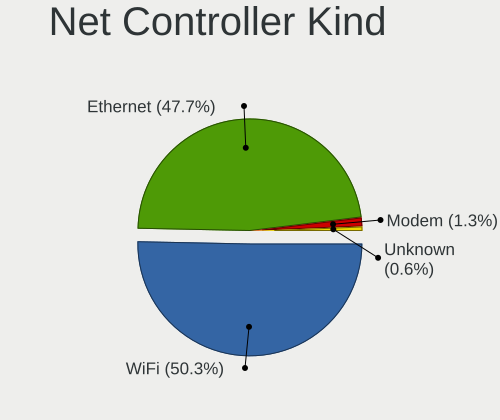

| Kind     | Notebooks | Percent |
|----------|-----------|---------|
| WiFi     | 78        | 50.32%  |
| Ethernet | 74        | 47.74%  |
| Modem    | 2         | 1.29%   |
| Unknown  | 1         | 0.65%   |

Used Controller
---------------

Currently used network controller

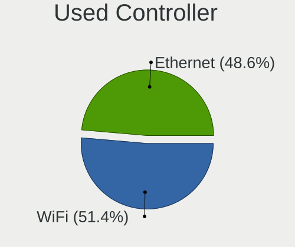

| Kind     | Notebooks | Percent |
|----------|-----------|---------|
| WiFi     | 56        | 51.38%  |
| Ethernet | 53        | 48.62%  |

NICs
----

Total network controllers on board

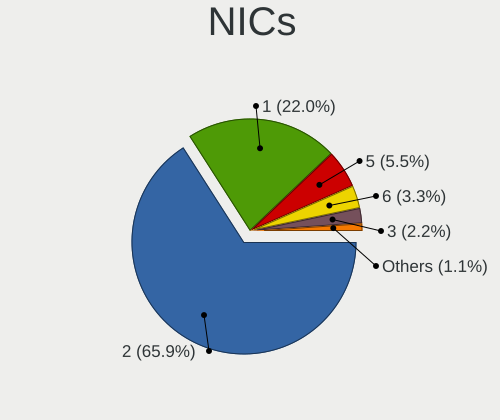

| Total | Notebooks | Percent |
|-------|-----------|---------|
| 2     | 60        | 65.93%  |
| 1     | 20        | 21.98%  |
| 5     | 5         | 5.49%   |
| 6     | 3         | 3.3%    |
| 3     | 2         | 2.2%    |
| 9     | 1         | 1.1%    |

IPv6
----

IPv6 vs IPv4

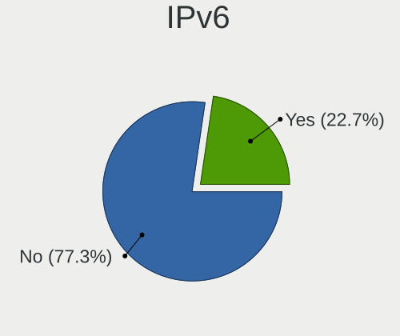

| Used | Notebooks | Percent |
|------|-----------|---------|
| No   | 75        | 77.32%  |
| Yes  | 22        | 22.68%  |

Bluetooth
---------

Bluetooth Vendor
----------------

Controller vendors

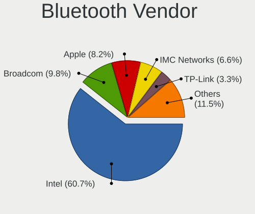

| Vendor                | Notebooks | Percent |
|-----------------------|-----------|---------|
| Intel                 | 37        | 60.66%  |
| Broadcom              | 6         | 9.84%   |
| Apple                 | 5         | 8.2%    |
| IMC Networks          | 4         | 6.56%   |
| TP-Link               | 2         | 3.28%   |
| Hewlett-Packard       | 2         | 3.28%   |
| Foxconn / Hon Hai     | 2         | 3.28%   |
| Realtek Semiconductor | 1         | 1.64%   |
| Lite-On Technology    | 1         | 1.64%   |
| Dell                  | 1         | 1.64%   |

Bluetooth Model
---------------

Controller models

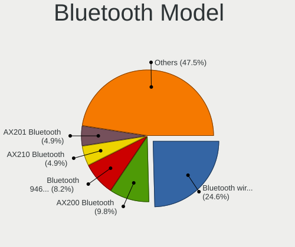

| Model                                                  | Notebooks | Percent |
|--------------------------------------------------------|-----------|---------|
| Intel Bluetooth wireless interface                     | 15        | 24.59%  |
| Intel AX200 Bluetooth                                  | 6         | 9.84%   |
| Intel Bluetooth 9460/9560 Jefferson Peak (JfP)         | 5         | 8.2%    |
| Intel AX210 Bluetooth                                  | 3         | 4.92%   |
| Intel AX201 Bluetooth                                  | 3         | 4.92%   |
| Apple Bluetooth Host Controller                        | 3         | 4.92%   |
| TP-Link Bluetooth 5.0 USB Adapter                      | 2         | 3.28%   |
| Intel Wireless-AC 9260 Bluetooth Adapter               | 2         | 3.28%   |
| Intel AX211 Bluetooth                                  | 2         | 3.28%   |
| Broadcom BCM20702 Bluetooth 4.0 [ThinkPad]             | 2         | 3.28%   |
| Realtek Bluetooth Adapter                              | 1         | 1.64%   |
| Lite-On Atheros AR3012 Bluetooth                       | 1         | 1.64%   |
| Intel Centrino Bluetooth Wireless Transceiver          | 1         | 1.64%   |
| IMC Networks Realtek Bluetooth Adapter                 | 1         | 1.64%   |
| IMC Networks Qualcomm Atheros Bluetooth 4.0 + HS       | 1         | 1.64%   |
| IMC Networks Qualcomm Atheros Bluetooth 4.0            | 1         | 1.64%   |
| IMC Networks Asus Integrated Bluetooth module [AR3011] | 1         | 1.64%   |
| HP Broadcom 2070 Bluetooth Combo                       | 1         | 1.64%   |
| HP Bluetooth 2.0 Interface [Broadcom BCM2045]          | 1         | 1.64%   |
| Foxconn / Hon Hai MediaTek Bluetooth Adapter           | 1         | 1.64%   |
| Foxconn / Hon Hai BCM43142A0 broadcom bluetooth        | 1         | 1.64%   |
| Dell Dell Wireless 380 Bluetooth 4.0 Module            | 1         | 1.64%   |
| Broadcom Bluetooth 4.1 USB                             | 1         | 1.64%   |
| Broadcom BCM2070 Bluetooth 2.1 + EDR                   | 1         | 1.64%   |
| Broadcom BCM2045B (BDC-2.1) [Bluetooth Controller]     | 1         | 1.64%   |
| Broadcom BCM2045B (BDC-2.1)                            | 1         | 1.64%   |
| Apple Broadcom Built-in Bluetooth                      | 1         | 1.64%   |
| Apple Broadcom Bluetooth 2.1 module                    | 1         | 1.64%   |

Sound
-----

Sound Vendor
------------

Sound card vendors

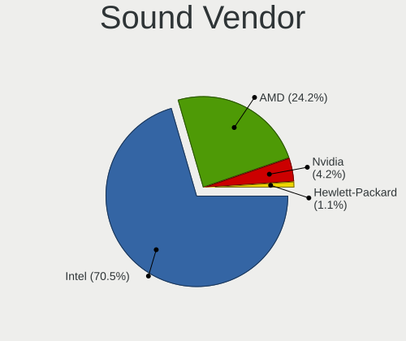

| Vendor          | Notebooks | Percent |
|-----------------|-----------|---------|
| Intel           | 67        | 70.53%  |
| AMD             | 23        | 24.21%  |
| Nvidia          | 4         | 4.21%   |
| Hewlett-Packard | 1         | 1.05%   |

Sound Model
-----------

Sound card models

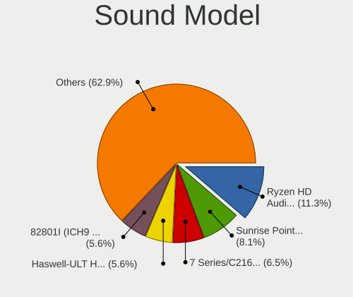

| Model                                                                      | Notebooks | Percent |
|----------------------------------------------------------------------------|-----------|---------|
| AMD Ryzen HD Audio Controller                                              | 14        | 11.29%  |
| Intel Sunrise Point-LP HD Audio                                            | 10        | 8.06%   |
| Intel 7 Series/C216 Chipset Family High Definition Audio Controller        | 8         | 6.45%   |
| Intel Haswell-ULT HD Audio Controller                                      | 7         | 5.65%   |
| Intel 82801I (ICH9 Family) HD Audio Controller                             | 7         | 5.65%   |
| Intel 8 Series HD Audio Controller                                         | 7         | 5.65%   |
| AMD Renoir/Cezanne HDMI/DP Audio Controller                                | 6         | 4.84%   |
| Intel Wildcat Point-LP High Definition Audio Controller                    | 5         | 4.03%   |
| Intel Broadwell-U Audio Controller                                         | 5         | 4.03%   |
| Intel 6 Series/C200 Series Chipset Family High Definition Audio Controller | 4         | 3.23%   |
| AMD FCH Azalia Controller                                                  | 4         | 3.23%   |
| Intel Tiger Lake-LP Smart Sound Technology Audio Controller                | 3         | 2.42%   |
| Intel Comet Lake PCH-LP cAVS                                               | 3         | 2.42%   |
| Intel 5 Series/3400 Series Chipset High Definition Audio                   | 3         | 2.42%   |
| Nvidia GF108 High Definition Audio Controller                              | 2         | 1.61%   |
| Intel Raptor Lake-P/U/H cAVS                                               | 2         | 1.61%   |
| Intel Cannon Point-LP High Definition Audio Controller                     | 2         | 1.61%   |
| Intel Cannon Lake PCH cAVS                                                 | 2         | 1.61%   |
| Intel Alder Lake-N PCH High Definition Audio Controller                    | 2         | 1.61%   |
| Intel Alder Lake PCH-P High Definition Audio Controller                    | 2         | 1.61%   |
| Intel 82801H (ICH8 Family) HD Audio Controller                             | 2         | 1.61%   |
| AMD SBx00 Azalia (Intel HDA)                                               | 2         | 1.61%   |
| AMD Kabini HDMI/DP Audio                                                   | 2         | 1.61%   |
| Nvidia GT216 HDMI Audio Controller                                         | 1         | 0.81%   |
| Nvidia GK107 HDMI Audio Controller                                         | 1         | 0.81%   |
| Intel Xeon E3-1200 v3/4th Gen Core Processor HD Audio Controller           | 1         | 0.81%   |
| Intel DG2 Audio Controller                                                 | 1         | 0.81%   |
| Intel CM238 HD Audio Controller                                            | 1         | 0.81%   |
| Intel Atom Processor Z36xxx/Z37xxx Series High Definition Audio Controller | 1         | 0.81%   |
| Intel 82801JI (ICH10 Family) HD Audio Controller                           | 1         | 0.81%   |
| Intel 8 Series/C220 Series Chipset High Definition Audio Controller        | 1         | 0.81%   |
| Intel 100 Series/C230 Series Chipset Family HD Audio Controller            | 1         | 0.81%   |
| Hewlett-Packard Sound Research Device Extension                            | 1         | 0.81%   |
| AMD Wrestler HDMI Audio                                                    | 1         | 0.81%   |
| AMD Trinity HDMI Audio Controller                                          | 1         | 0.81%   |
| AMD RS880 HDMI Audio [Radeon HD 4200 Series]                               | 1         | 0.81%   |
| AMD Raven/Raven2/Fenghuang HDMI/DP Audio Controller                        | 1         | 0.81%   |
| AMD Radeon High Definition Audio Controller                                | 1         | 0.81%   |
| AMD High Definition Audio Controller                                       | 1         | 0.81%   |
| AMD Family 17h (Models 00h-0fh) HD Audio Controller                        | 1         | 0.81%   |

Memory
------

Memory Vendor
-------------

Memory module vendors

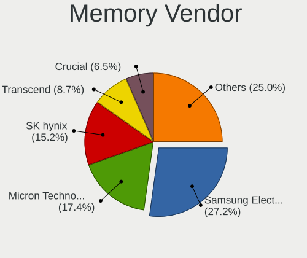

| Vendor                | Notebooks | Percent |
|-----------------------|-----------|---------|
| Samsung Electronics   | 25        | 27.17%  |
| Micron Technology     | 16        | 17.39%  |
| SK hynix              | 14        | 15.22%  |
| Transcend             | 8         | 8.7%    |
| Crucial               | 6         | 6.52%   |
| Unknown               | 5         | 5.43%   |
| Elpida                | 4         | 4.35%   |
| Kingston              | 3         | 3.26%   |
| Ramaxel Technology    | 2         | 2.17%   |
| Corsair               | 2         | 2.17%   |
| Apacer                | 2         | 2.17%   |
| Team                  | 1         | 1.09%   |
| Nanya Technology      | 1         | 1.09%   |
| Kingmax Semiconductor | 1         | 1.09%   |
| G.Skill               | 1         | 1.09%   |
| A-DATA Technology     | 1         | 1.09%   |

Memory Model
------------

Memory module models

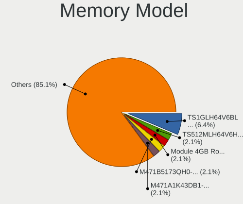

| Model                                                        | Notebooks | Percent |
|--------------------------------------------------------------|-----------|---------|
| Transcend RAM TS1GLH64V6BL 8GB SODIMM DDR4 2667MT/s          | 6         | 6.38%   |
| Transcend RAM TS512MLH64V6HL 4GB SODIMM DDR4 2667MT/s        | 2         | 2.13%   |
| SK hynix RAM HYMP125S64CP8-S6 2GB SODIMM DDR2 975MT/s        | 2         | 2.13%   |
| SK hynix RAM HMT351S6EFR8C-PB 4GB SODIMM DDR3 1600MT/s       | 2         | 2.13%   |
| Samsung RAM Module 4GB Row Of Chips LPDDR5 4000MT/s          | 2         | 2.13%   |
| Samsung RAM M471B5173QH0-YK0 4GB SODIMM DDR3 1600MT/s        | 2         | 2.13%   |
| Samsung RAM M471A1K43DB1-CTD 8GB SODIMM DDR4 2667MT/s        | 2         | 2.13%   |
| Elpida RAM EBJ41UF8BCS0-DJ-F 4GB SODIMM DDR3                 | 2         | 2.13%   |
| Unknown RAM Module 8GB SODIMM LPDDR3 1867MT/s                | 1         | 1.06%   |
| Unknown RAM Module 4GB SODIMM DDR3 1067MT/s                  | 1         | 1.06%   |
| Unknown RAM Module 4GB SODIMM DDR3                           | 1         | 1.06%   |
| Unknown RAM Module 2GB SODIMM DDR3 1067MT/s                  | 1         | 1.06%   |
| Unknown RAM Module 2GB SODIMM DDR2 667MT/s                   | 1         | 1.06%   |
| Unknown RAM Module 1GB SODIMM DDR2 667MT/s                   | 1         | 1.06%   |
| Team RAM TEAMGROUP-SD4-2400 8GB SODIMM DDR4 2400MT/s         | 1         | 1.06%   |
| SK hynix RAM Module 8GB SODIMM DDR4 2133MT/s                 | 1         | 1.06%   |
| SK hynix RAM Module 4GB SODIMM DDR3 1600MT/s                 | 1         | 1.06%   |
| SK hynix RAM Module 4096MB SODIMM DDR3 1333MT/s              | 1         | 1.06%   |
| SK hynix RAM HMT451S6MFR8A-PB 4GB SODIMM DDR3 800MT/s        | 1         | 1.06%   |
| SK hynix RAM HMT451S6BFR8A-PB 4GB SODIMM DDR3 1600MT/s       | 1         | 1.06%   |
| SK hynix RAM HMT41GS6BFR8A-PB 8GB SODIMM DDR3 1600MT/s       | 1         | 1.06%   |
| SK hynix RAM HMT41GS6AFR8A-PB 8GB SODIMM DDR3 1600MT/s       | 1         | 1.06%   |
| SK hynix RAM HMT351S6CFR8C-PB 4GB SODIMM DDR3 1600MT/s       | 1         | 1.06%   |
| SK hynix RAM HMT351S6CFR8A-PB 4GB SODIMM DDR3 1333MT/s       | 1         | 1.06%   |
| SK hynix RAM HMAA1GS6CJR6N-XN 8GB Row Of Chips DDR4 3200MT/s | 1         | 1.06%   |
| SK hynix RAM H58G78BK7BX114 8GB Row Of Chips LPDDR5 6400MT/s | 1         | 1.06%   |
| Samsung RAM Module 8GB SODIMM DDR4 2133MT/s                  | 1         | 1.06%   |
| Samsung RAM Module 8GB Row Of Chips LPDDR3 2133MT/s          | 1         | 1.06%   |
| Samsung RAM Module 16GB SODIMM DDR4 3200MT/s                 | 1         | 1.06%   |
| Samsung RAM M471B5773CHS-CH9 2GB SODIMM DDR3 1333MT/s        | 1         | 1.06%   |
| Samsung RAM M471B5673FH0-CH9 2GB SODIMM DDR3 1334MT/s        | 1         | 1.06%   |
| Samsung RAM M471B5273CH0-CH9 4GB SODIMM DDR3 1334MT/s        | 1         | 1.06%   |
| Samsung RAM M471B5174BM0-YK0 4GB SODIMM DDR3 1600MT/s        | 1         | 1.06%   |
| Samsung RAM M471B5173EB0-YK0 4GB SODIMM DDR3 1600MT/s        | 1         | 1.06%   |
| Samsung RAM M471B5173CB0-YK0 4GB SODIMM DDR3 1600MT/s        | 1         | 1.06%   |
| Samsung RAM M471B1G73QH0-YK0 8GB SODIMM DDR3 1867MT/s        | 1         | 1.06%   |
| Samsung RAM M471B1G73DB0-YK0 8GB SODIMM DDR3 1600MT/s        | 1         | 1.06%   |
| Samsung RAM M471A5244CB0-CTD 4GB SODIMM DDR4 3200MT/s        | 1         | 1.06%   |
| Samsung RAM M471A5143DB0-CPB 4GB SODIMM DDR4 2133MT/s        | 1         | 1.06%   |
| Samsung RAM M471A4G43AB1-CWE 32GB SODIMM DDR4 3200MT/s       | 1         | 1.06%   |

Memory Kind
-----------

Memory module kinds

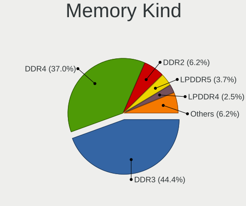

| Kind    | Notebooks | Percent |
|---------|-----------|---------|
| DDR3    | 36        | 44.44%  |
| DDR4    | 30        | 37.04%  |
| DDR2    | 5         | 6.17%   |
| LPDDR5  | 3         | 3.7%    |
| LPDDR4  | 2         | 2.47%   |
| LPDDR3  | 2         | 2.47%   |
| DDR5    | 2         | 2.47%   |
| Unknown | 1         | 1.23%   |

Memory Form Factor
------------------

Physical design of the memory module

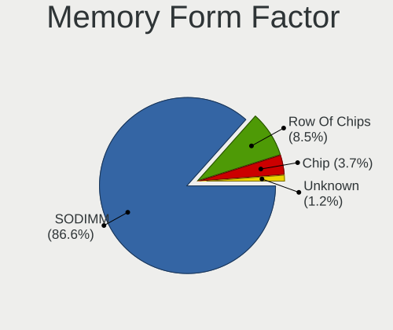

| Name         | Notebooks | Percent |
|--------------|-----------|---------|
| SODIMM       | 71        | 86.59%  |
| Row Of Chips | 7         | 8.54%   |
| Chip         | 3         | 3.66%   |
| Unknown      | 1         | 1.22%   |

Memory Size
-----------

Memory module size

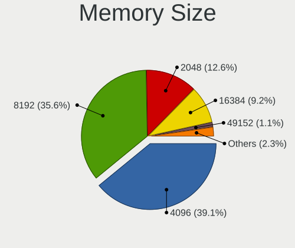

| Size  | Notebooks | Percent |
|-------|-----------|---------|
| 4096  | 34        | 39.08%  |
| 8192  | 31        | 35.63%  |
| 2048  | 11        | 12.64%  |
| 16384 | 8         | 9.2%    |
| 49152 | 1         | 1.15%   |
| 32768 | 1         | 1.15%   |
| 1024  | 1         | 1.15%   |

Memory Speed
------------

Memory module speed

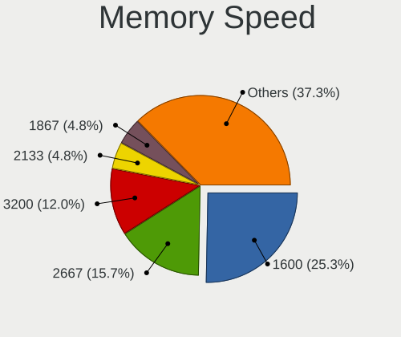

| Speed   | Notebooks | Percent |
|---------|-----------|---------|
| 1600    | 21        | 25.3%   |
| 2667    | 13        | 15.66%  |
| 3200    | 10        | 12.05%  |
| 2133    | 4         | 4.82%   |
| 1867    | 4         | 4.82%   |
| 1334    | 4         | 4.82%   |
| 1333    | 4         | 4.82%   |
| 2400    | 3         | 3.61%   |
| 1067    | 3         | 3.61%   |
| 4267    | 2         | 2.41%   |
| 4000    | 2         | 2.41%   |
| 1866    | 2         | 2.41%   |
| 975     | 2         | 2.41%   |
| 800     | 2         | 2.41%   |
| 667     | 2         | 2.41%   |
| 6400    | 1         | 1.2%    |
| 5600    | 1         | 1.2%    |
| 4800    | 1         | 1.2%    |
| 1066    | 1         | 1.2%    |
| Unknown | 1         | 1.2%    |

Printers & scanners
-------------------

Printer Vendor
--------------

Printer device vendors

Zero info for selected period =(

Printer Model
-------------

Printer device models

Zero info for selected period =(

Scanner Vendor
--------------

Scanner device vendors

Zero info for selected period =(

Scanner Model
-------------

Scanner device models

Zero info for selected period =(

Camera
------

Camera Vendor
-------------

Camera device vendors

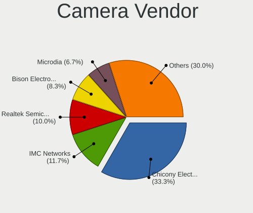

| Vendor                                 | Notebooks | Percent |
|----------------------------------------|-----------|---------|
| Chicony Electronics                    | 20        | 33.33%  |
| IMC Networks                           | 7         | 11.67%  |
| Realtek Semiconductor                  | 6         | 10%     |
| Bison Electronics                      | 5         | 8.33%   |
| Microdia                               | 4         | 6.67%   |
| Lite-On Technology                     | 4         | 6.67%   |
| Sunplus Innovation Technology          | 3         | 5%      |
| Cheng Uei Precision Industry (Foxlink) | 3         | 5%      |
| Apple                                  | 3         | 5%      |
| Alcor Micro                            | 2         | 3.33%   |
| Supreme Electronics                    | 1         | 1.67%   |
| Shenzhen Kingcome Optoelectronic       | 1         | 1.67%   |
| Ricoh                                  | 1         | 1.67%   |

Camera Model
------------

Camera device models

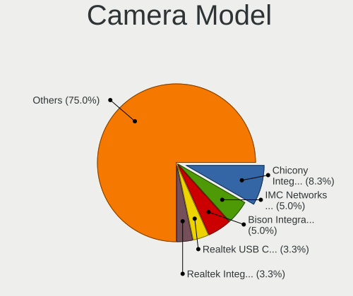

| Model                                               | Notebooks | Percent |
|-----------------------------------------------------|-----------|---------|
| Chicony Integrated Camera                           | 5         | 8.33%   |
| IMC Networks Integrated Camera                      | 3         | 5%      |
| Bison Integrated Camera                             | 3         | 5%      |
| Realtek USB Camera                                  | 2         | 3.33%   |
| Realtek Integrated_Webcam_HD                        | 2         | 3.33%   |
| Microdia Integrated_Webcam_HD                       | 2         | 3.33%   |
| Lite-On Integrated Camera                           | 2         | 3.33%   |
| IMC Networks Realtek PC Camera                      | 2         | 3.33%   |
| Chicony Realtek DMFT RGB                            | 2         | 3.33%   |
| Chicony Chicony USB2.0 Camera                       | 2         | 3.33%   |
| Cheng Uei Precision Industry (Foxlink) Webcam       | 2         | 3.33%   |
| Bison Lenovo EasyCamera                             | 2         | 3.33%   |
| Apple FaceTime HD Camera                            | 2         | 3.33%   |
| Supreme Integrated Camera                           | 1         | 1.67%   |
| Sunplus Laptop Integrated Webcam HD                 | 1         | 1.67%   |
| Sunplus Integrated_Webcam_FHD                       | 1         | 1.67%   |
| Sunplus HP HD Webcam [Fixed]                        | 1         | 1.67%   |
| Shenzhen Kingcome Optoelectronic FHD WebCam         | 1         | 1.67%   |
| Ricoh USB2.0 Camera                                 | 1         | 1.67%   |
| Realtek Lenovo EasyCamera                           | 1         | 1.67%   |
| Realtek Integrated Webcam HD                        | 1         | 1.67%   |
| Microdia Integrated Webcam                          | 1         | 1.67%   |
| Microdia Dell Integrated HD Webcam                  | 1         | 1.67%   |
| Lite-On TOSHIBA Web Camera - HD                     | 1         | 1.67%   |
| Lite-On HP Universal Camera                         | 1         | 1.67%   |
| IMC Networks USB2.0 HD UVC WebCam                   | 1         | 1.67%   |
| IMC Networks EasyCamera                             | 1         | 1.67%   |
| Chicony VGA Webcam                                  | 1         | 1.67%   |
| Chicony USB2.0 HD UVC WebCam                        | 1         | 1.67%   |
| Chicony thinkpad t430s camera                       | 1         | 1.67%   |
| Chicony Lenovo Integrated Camera (0.3MP)            | 1         | 1.67%   |
| Chicony Integrated IR Camera                        | 1         | 1.67%   |
| Chicony Integrated Camera (1280x720@30)             | 1         | 1.67%   |
| Chicony HP Wide Vision HD Camera                    | 1         | 1.67%   |
| Chicony HP Webcam [2 MP]                            | 1         | 1.67%   |
| Chicony HP HD Camera                                | 1         | 1.67%   |
| Chicony HD WebCam (Acer)                            | 1         | 1.67%   |
| Chicony HD Webcam                                   | 1         | 1.67%   |
| Cheng Uei Precision Industry (Foxlink) HP HD Webcam | 1         | 1.67%   |
| Apple FaceTime HD Camera (Built-in)                 | 1         | 1.67%   |

Security
--------

Fingerprint Vendor
------------------

Fingerprint sensor vendors

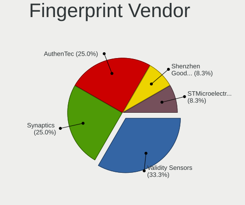

| Vendor                     | Notebooks | Percent |
|----------------------------|-----------|---------|
| Validity Sensors           | 4         | 33.33%  |
| Synaptics                  | 3         | 25%     |
| AuthenTec                  | 3         | 25%     |
| STMicroelectronics         | 1         | 8.33%   |
| Shenzhen Goodix Technology | 1         | 8.33%   |

Fingerprint Model
-----------------

Fingerprint sensor models

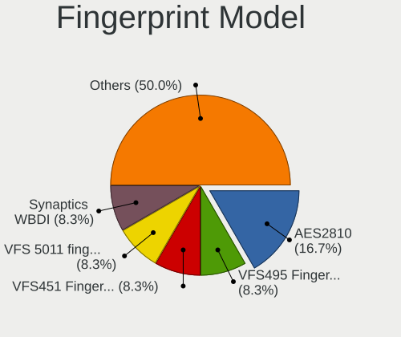

| Model                                                    | Notebooks | Percent |
|----------------------------------------------------------|-----------|---------|
| AuthenTec AES2810                                        | 2         | 16.67%  |
| Validity Sensors VFS495 Fingerprint Reader               | 1         | 8.33%   |
| Validity Sensors VFS451 Fingerprint Reader               | 1         | 8.33%   |
| Validity Sensors VFS 5011 fingerprint sensor             | 1         | 8.33%   |
| Validity Sensors Synaptics WBDI                          | 1         | 8.33%   |
| Synaptics Prometheus MIS Touch Fingerprint Reader        | 1         | 8.33%   |
| Synaptics Metallica MIS Touch Fingerprint Reader         | 1         | 8.33%   |
| Synaptics FS7604 Touch Fingerprint Sensor with PurePrint | 1         | 8.33%   |
| STMicroelectronics Fingerprint Reader                    | 1         | 8.33%   |
| Shenzhen Goodix Fingerprint Reader                       | 1         | 8.33%   |
| AuthenTec AES1660 Fingerprint Sensor                     | 1         | 8.33%   |

Chipcard Vendor
---------------

Chipcard module vendors

Zero info for selected period =(

Chipcard Model
--------------

Chipcard module models

Zero info for selected period =(

Unsupported
-----------

Unsupported Devices
-------------------

Total unsupported devices on board

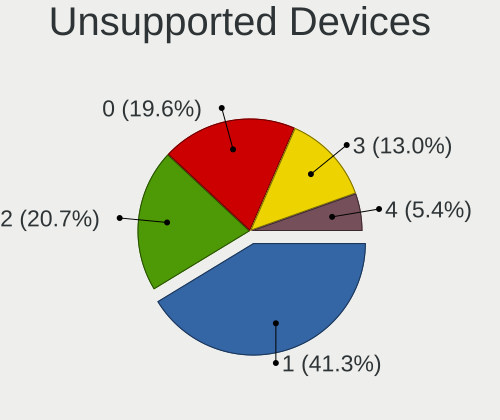

| Total | Notebooks | Percent |
|-------|-----------|---------|
| 1     | 38        | 41.3%   |
| 2     | 19        | 20.65%  |
| 0     | 18        | 19.57%  |
| 3     | 12        | 13.04%  |
| 4     | 5         | 5.43%   |

Unsupported Device Types
------------------------

Types of unsupported devices

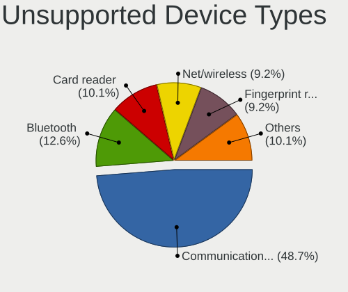

| Type                     | Notebooks | Percent |
|--------------------------|-----------|---------|
| Communication controller | 58        | 48.74%  |
| Bluetooth                | 15        | 12.61%  |
| Card reader              | 12        | 10.08%  |
| Net/wireless             | 11        | 9.24%   |
| Fingerprint reader       | 11        | 9.24%   |
| Firewire controller      | 8         | 6.72%   |
| Net/ethernet             | 2         | 1.68%   |
| Sound                    | 1         | 0.84%   |
| Graphics card            | 1         | 0.84%   |

