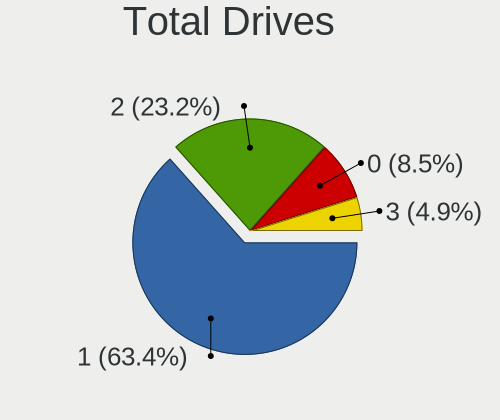
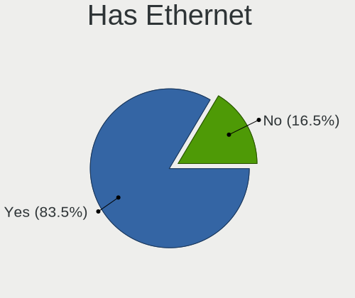
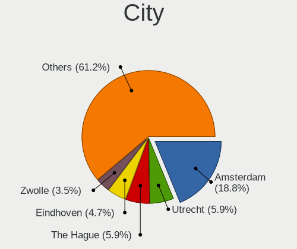
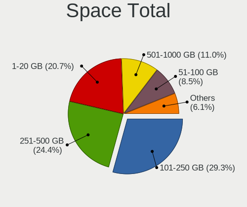
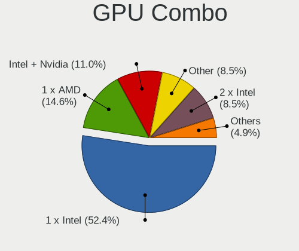
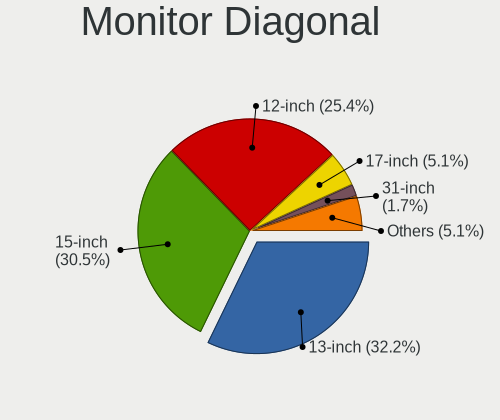
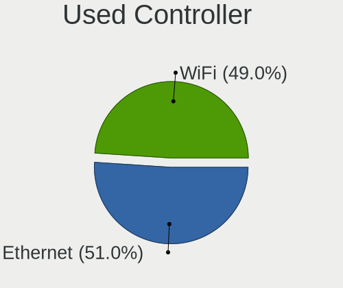
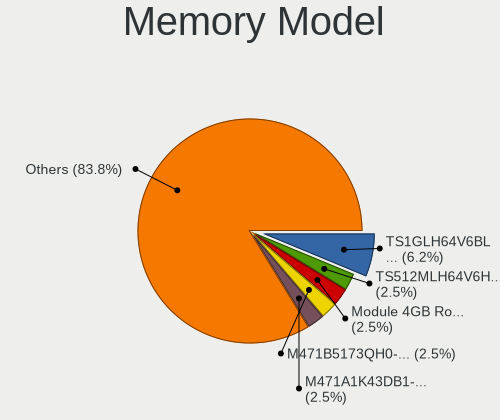

BSD in Netherlands - Tested Hardware & Statistics (Notebooks)
-------------------------------------------------------------

A project to collect tested hardware configurations for BSD in Netherlands.

Anyone can contribute to this report by the [hw-probe](https://github.com/linuxhw/hw-probe/blob/master/INSTALL.BSD.md) tool:

    hw-probe -all -upload

Please contribute! Especially if your hardware is rare.

Contents
--------

* [ Test Cases ](#test-cases)

* [ System ](#system)
  - [ OS                       ](#os)
  - [ OS Family                ](#os-family)
  - [ Arch                     ](#arch)
  - [ DE                       ](#de)
  - [ Display Server           ](#display-server)
  - [ Display Manager          ](#display-manager)
  - [ OS Lang                  ](#os-lang)
  - [ Boot Mode                ](#boot-mode)
  - [ Filesystem               ](#filesystem)
  - [ Part. scheme             ](#part-scheme)

* [ Board ](#board)
  - [ Vendor                   ](#vendor)
  - [ Model                    ](#model)
  - [ Model Family             ](#model-family)
  - [ MFG Year                 ](#mfg-year)
  - [ Form Factor              ](#form-factor)
  - [ Coreboot                 ](#coreboot)
  - [ RAM Size                 ](#ram-size)
  - [ RAM Used                 ](#ram-used)
  - [ Total Drives             ](#total-drives)
  - [ Has CD-ROM               ](#has-cd-rom)
  - [ Has Ethernet             ](#has-ethernet)
  - [ Has WiFi                 ](#has-wifi)
  - [ Has Bluetooth            ](#has-bluetooth)

* [ Location ](#location)
  - [ Country                  ](#country)
  - [ City                     ](#city)

* [ Drives ](#drives)
  - [ Drive Vendor             ](#drive-vendor)
  - [ Drive Model              ](#drive-model)
  - [ HDD Vendor               ](#hdd-vendor)
  - [ SSD Vendor               ](#ssd-vendor)
  - [ Drive Kind               ](#drive-kind)
  - [ Drive Connector          ](#drive-connector)
  - [ Drive Size               ](#drive-size)
  - [ Space Total              ](#space-total)
  - [ Space Used               ](#space-used)
  - [ Malfunc. Drives          ](#malfunc-drives)
  - [ Malfunc. Drive Vendor    ](#malfunc-drive-vendor)
  - [ Malfunc. HDD Vendor      ](#malfunc-hdd-vendor)
  - [ Malfunc. Drive Kind      ](#malfunc-drive-kind)
  - [ Failed Drives            ](#failed-drives)
  - [ Failed Drive Vendor      ](#failed-drive-vendor)
  - [ Drive Status             ](#drive-status)

* [ Storage controller ](#storage-controller)
  - [ Storage Vendor           ](#storage-vendor)
  - [ Storage Model            ](#storage-model)
  - [ Storage Kind             ](#storage-kind)

* [ Processor ](#processor)
  - [ CPU Vendor               ](#cpu-vendor)
  - [ CPU Model                ](#cpu-model)
  - [ CPU Model Family         ](#cpu-model-family)
  - [ CPU Cores                ](#cpu-cores)
  - [ CPU Sockets              ](#cpu-sockets)
  - [ CPU Threads              ](#cpu-threads)
  - [ CPU Microarch            ](#cpu-microarch)

* [ Graphics ](#graphics)
  - [ GPU Vendor               ](#gpu-vendor)
  - [ GPU Model                ](#gpu-model)
  - [ GPU Combo                ](#gpu-combo)
  - [ GPU Driver               ](#gpu-driver)
  - [ GPU Memory               ](#gpu-memory)

* [ Monitor ](#monitor)
  - [ Monitor Vendor           ](#monitor-vendor)
  - [ Monitor Model            ](#monitor-model)
  - [ Monitor Resolution       ](#monitor-resolution)
  - [ Monitor Diagonal         ](#monitor-diagonal)
  - [ Monitor Width            ](#monitor-width)
  - [ Aspect Ratio             ](#aspect-ratio)
  - [ Monitor Area             ](#monitor-area)
  - [ Pixel Density            ](#pixel-density)
  - [ Multiple Monitors        ](#multiple-monitors)

* [ Network ](#network)
  - [ Net Controller Vendor    ](#net-controller-vendor)
  - [ Net Controller Model     ](#net-controller-model)
  - [ Wireless Vendor          ](#wireless-vendor)
  - [ Wireless Model           ](#wireless-model)
  - [ Ethernet Vendor          ](#ethernet-vendor)
  - [ Ethernet Model           ](#ethernet-model)
  - [ Net Controller Kind      ](#net-controller-kind)
  - [ Used Controller          ](#used-controller)
  - [ NICs                     ](#nics)
  - [ IPv6                     ](#ipv6)

* [ Bluetooth ](#bluetooth)
  - [ Bluetooth Vendor         ](#bluetooth-vendor)
  - [ Bluetooth Model          ](#bluetooth-model)

* [ Sound ](#sound)
  - [ Sound Vendor             ](#sound-vendor)
  - [ Sound Model              ](#sound-model)

* [ Memory ](#memory)
  - [ Memory Vendor            ](#memory-vendor)
  - [ Memory Model             ](#memory-model)
  - [ Memory Kind              ](#memory-kind)
  - [ Memory Form Factor       ](#memory-form-factor)
  - [ Memory Size              ](#memory-size)
  - [ Memory Speed             ](#memory-speed)

* [ Printers & scanners ](#printers--scanners)
  - [ Printer Vendor           ](#printer-vendor)
  - [ Printer Model            ](#printer-model)
  - [ Scanner Vendor           ](#scanner-vendor)
  - [ Scanner Model            ](#scanner-model)

* [ Camera ](#camera)
  - [ Camera Vendor            ](#camera-vendor)
  - [ Camera Model             ](#camera-model)

* [ Security ](#security)
  - [ Fingerprint Vendor       ](#fingerprint-vendor)
  - [ Fingerprint Model        ](#fingerprint-model)
  - [ Chipcard Vendor          ](#chipcard-vendor)
  - [ Chipcard Model           ](#chipcard-model)

* [ Unsupported ](#unsupported)
  - [ Unsupported Devices      ](#unsupported-devices)
  - [ Unsupported Device Types ](#unsupported-device-types)

Test Cases
----------

Total: 67

| Vendor        | Model                       | Probe                                                     | Date         |
|---------------|-----------------------------|-----------------------------------------------------------|--------------|
| Intel         | Milstead Platform           | [21ec3118ef](https://bsd-hardware.info/?probe=21ec3118ef) | Jan 02, 2023 |
| Notebook      | NS5x_NS7xPU                 | [7dc1fdfadb](https://bsd-hardware.info/?probe=7dc1fdfadb) | Jan 02, 2023 |
| Lenovo        | ThinkPad T490 20N2CTO1WW    | [32207ea5d9](https://bsd-hardware.info/?probe=32207ea5d9) | Dec 19, 2022 |
| Deciso        | NetBoard-A10                | [79b2a5d3a5](https://bsd-hardware.info/?probe=79b2a5d3a5) | Dec 08, 2022 |
| Deciso        | NetBoard-A10                | [575d201794](https://bsd-hardware.info/?probe=575d201794) | Dec 07, 2022 |
| Lenovo        | ThinkPad X250 20CLS5BU00    | [10619ac217](https://bsd-hardware.info/?probe=10619ac217) | Dec 03, 2022 |
| Lenovo        | ThinkPad T430 2347G7G       | [640540cd67](https://bsd-hardware.info/?probe=640540cd67) | Nov 29, 2022 |
| Deciso        | NetBoard-A10                | [20058331ef](https://bsd-hardware.info/?probe=20058331ef) | Nov 19, 2022 |
| ASUSTek       | K53TA                       | [521283b723](https://bsd-hardware.info/?probe=521283b723) | Oct 22, 2022 |
| HP            | EliteBook 840 G3            | [7bf7249432](https://bsd-hardware.info/?probe=7bf7249432) | Sep 16, 2022 |
| Lenovo        | ThinkPad T440 20B7S2LT00    | [5104875f94](https://bsd-hardware.info/?probe=5104875f94) | Sep 06, 2022 |
| HP            | EliteBook 840 G3            | [28929cae10](https://bsd-hardware.info/?probe=28929cae10) | Aug 17, 2022 |
| Lenovo        | ThinkPad X61s 76693KG       | [445446cc28](https://bsd-hardware.info/?probe=445446cc28) | Jul 18, 2022 |
| ASUSTek       | X751LB                      | [5c2ef28301](https://bsd-hardware.info/?probe=5c2ef28301) | Jul 12, 2022 |
| Acer          | Aspire E1-522               | [d680e0d05d](https://bsd-hardware.info/?probe=d680e0d05d) | Jul 10, 2022 |
| Star Labs     | LabTop                      | [390c4c4d55](https://bsd-hardware.info/?probe=390c4c4d55) | Jul 03, 2022 |
| Lenovo        | IdeaPad 130-15AST 81H5      | [9f33082ffa](https://bsd-hardware.info/?probe=9f33082ffa) | Jun 08, 2022 |
| Dell          | Latitude E7240              | [970234b430](https://bsd-hardware.info/?probe=970234b430) | May 22, 2022 |
| HP            | EliteBook 8460p             | [b9350aeb55](https://bsd-hardware.info/?probe=b9350aeb55) | May 21, 2022 |
| Deciso        | OPNsense Appliance          | [c78d18300d](https://bsd-hardware.info/?probe=c78d18300d) | Apr 18, 2022 |
| Sony          | SVZ1311C5E                  | [c1c429a7e6](https://bsd-hardware.info/?probe=c1c429a7e6) | Apr 15, 2022 |
| Apple         | MacBookPro10,1              | [64ccf1e6a0](https://bsd-hardware.info/?probe=64ccf1e6a0) | Feb 18, 2022 |
| Lenovo        | ThinkPad X250 20CLS59400    | [92333ad60b](https://bsd-hardware.info/?probe=92333ad60b) | Feb 17, 2022 |
| HP            | EliteBook 840 G3            | [f259f73c17](https://bsd-hardware.info/?probe=f259f73c17) | Feb 14, 2022 |
| Dell          | Latitude E5430 non-vPro     | [e795c7ec91](https://bsd-hardware.info/?probe=e795c7ec91) | Jan 17, 2022 |
| Dell          | Latitude E5430 non-vPro     | [877bb1b29f](https://bsd-hardware.info/?probe=877bb1b29f) | Jan 10, 2022 |
| Unknown       | Unknown                     | [974e1f4e5e](https://bsd-hardware.info/?probe=974e1f4e5e) | Jan 07, 2022 |
| Toshiba       | Satellite C50-B             | [6b03a2c4c2](https://bsd-hardware.info/?probe=6b03a2c4c2) | Dec 22, 2021 |
| TOXIC by B... | 15CL872 1050TI              | [0a1683170a](https://bsd-hardware.info/?probe=0a1683170a) | Dec 20, 2021 |
| Lenovo        | ThinkPad A285 20MW000JMH    | [ff53f0763c](https://bsd-hardware.info/?probe=ff53f0763c) | Dec 12, 2021 |
| Apple         | MacBookAir1,1               | [61c7028e83](https://bsd-hardware.info/?probe=61c7028e83) | Dec 07, 2021 |
| TOXIC by B... | 15CL872 1050TI              | [4fbb430947](https://bsd-hardware.info/?probe=4fbb430947) | Dec 05, 2021 |
| Lenovo        | ThinkPad T430 2347G7G       | [66c64c1af9](https://bsd-hardware.info/?probe=66c64c1af9) | Nov 23, 2021 |
| Apple         | MacBookPro9,2               | [04cc56305c](https://bsd-hardware.info/?probe=04cc56305c) | Nov 11, 2021 |
| TUXEDO        | Pulse 15 Gen1               | [6f779d5170](https://bsd-hardware.info/?probe=6f779d5170) | Nov 03, 2021 |
| TUXEDO        | Pulse 15 Gen1               | [72f0937505](https://bsd-hardware.info/?probe=72f0937505) | Nov 02, 2021 |
| HP            | 625                         | [606d75e6a1](https://bsd-hardware.info/?probe=606d75e6a1) | Aug 11, 2021 |
| Unknown       | Unknown                     | [d4122c5eb0](https://bsd-hardware.info/?probe=d4122c5eb0) | Aug 03, 2021 |
| Lenovo        | ThinkPad X230 2325IG2       | [158ecc5e0b](https://bsd-hardware.info/?probe=158ecc5e0b) | Jul 14, 2021 |
| Lenovo        | Yoga 500-14IBD 80N4         | [9fda78d739](https://bsd-hardware.info/?probe=9fda78d739) | Jun 23, 2021 |
| Lenovo        | ThinkPad T440s 20ARS1B70... | [46dca136f6](https://bsd-hardware.info/?probe=46dca136f6) | Jun 21, 2021 |
| WYSE          | Z CLASS                     | [571fdbf390](https://bsd-hardware.info/?probe=571fdbf390) | Jun 19, 2021 |
| Lenovo        | ThinkPad T440s 20ARS1B70... | [9ae8146589](https://bsd-hardware.info/?probe=9ae8146589) | Jun 15, 2021 |
| Dell          | Latitude E4300              | [7855973957](https://bsd-hardware.info/?probe=7855973957) | Jun 12, 2021 |
| SLIMBOOK      | Unknown                     | [80a9ba918e](https://bsd-hardware.info/?probe=80a9ba918e) | Jun 11, 2021 |
| Notebook      | NL5xRU                      | [792fb07dd9](https://bsd-hardware.info/?probe=792fb07dd9) | May 10, 2021 |
| Lenovo        | ThinkPad T440s 20ARS1B70... | [b644ed3914](https://bsd-hardware.info/?probe=b644ed3914) | Mar 31, 2021 |
| Lenovo        | ThinkPad X1 Carbon 7th 2... | [4376accb5e](https://bsd-hardware.info/?probe=4376accb5e) | Mar 29, 2021 |
| Lenovo        | ThinkPad X230 23255Y4       | [ab871769f0](https://bsd-hardware.info/?probe=ab871769f0) | Mar 27, 2021 |
| Lenovo        | ThinkPad T440s 20ARS1B70... | [d856b5bf95](https://bsd-hardware.info/?probe=d856b5bf95) | Mar 23, 2021 |
| Dell          | Latitude E7270              | [5ba79f9aa5](https://bsd-hardware.info/?probe=5ba79f9aa5) | Mar 19, 2021 |
| Lenovo        | ThinkPad X280 20KESA000B    | [e2b586d597](https://bsd-hardware.info/?probe=e2b586d597) | Mar 17, 2021 |
| Lenovo        | ThinkPad X200s 7470W1V      | [926fe13d8f](https://bsd-hardware.info/?probe=926fe13d8f) | Mar 09, 2021 |
| ASUSTek       | X556UA                      | [57018edd10](https://bsd-hardware.info/?probe=57018edd10) | Mar 07, 2021 |
| Dell          | Latitude E4300              | [d5051ef185](https://bsd-hardware.info/?probe=d5051ef185) | Feb 16, 2021 |
| Lenovo        | G505s 20255                 | [8bfcff9039](https://bsd-hardware.info/?probe=8bfcff9039) | Feb 16, 2021 |
| Dell          | Latitude E4300              | [981de7fd20](https://bsd-hardware.info/?probe=981de7fd20) | Feb 14, 2021 |
| Apple         | MacBookPro8,1               | [8f93b4146d](https://bsd-hardware.info/?probe=8f93b4146d) | Feb 12, 2021 |
| Apple         | MacBookPro8,1               | [e74d76ecb3](https://bsd-hardware.info/?probe=e74d76ecb3) | Feb 12, 2021 |
| Dell          | Latitude 7280               | [defaee0e5c](https://bsd-hardware.info/?probe=defaee0e5c) | Feb 12, 2021 |
| Dell          | XPS 15 9560                 | [687008da4f](https://bsd-hardware.info/?probe=687008da4f) | Feb 11, 2021 |
| Dell          | Latitude 7280               | [d62b7120c8](https://bsd-hardware.info/?probe=d62b7120c8) | Feb 11, 2021 |
| Dell          | Latitude 7370               | [8ec8d28024](https://bsd-hardware.info/?probe=8ec8d28024) | Feb 08, 2021 |
| Dell          | Latitude E4300              | [84925c014a](https://bsd-hardware.info/?probe=84925c014a) | Feb 01, 2021 |
| HP            | EliteBook 2530p             | [1fd927e2cd](https://bsd-hardware.info/?probe=1fd927e2cd) | Jan 11, 2021 |
| Lenovo        | ThinkPad X250 20CLS4WV08    | [2808d1dd6a](https://bsd-hardware.info/?probe=2808d1dd6a) | Oct 20, 2020 |
| Lenovo        | ThinkPad X1 Carbon 5th 2... | [bee732e516](https://bsd-hardware.info/?probe=bee732e516) | Oct 19, 2020 |

System
------

OS
--

Installed operating systems

| Name                 | Notebooks | Percent |
|----------------------|-----------|---------|
| helloSystem 0.7.0    | 6         | 10.53%  |
| helloSystem 0.5.0    | 6         | 10.53%  |
| FreeBSD 13.0-STABLE  | 5         | 8.77%   |
| helloSystem 0.6.0    | 3         | 5.26%   |
| helloSystem 0.3.0    | 3         | 5.26%   |
| OPNsense 22.10       | 2         | 3.51%   |
| OpenBSD 7.1          | 2         | 3.51%   |
| OpenBSD 6.9          | 2         | 3.51%   |
| OpenBSD 6.8          | 2         | 3.51%   |
| helloSystem 0.4.0    | 2         | 3.51%   |
| GhostBSD 22.06.18    | 2         | 3.51%   |
| FreeBSD 13.1-p4      | 2         | 3.51%   |
| FreeBSD 13.1         | 2         | 3.51%   |
| FreeBSD 13.0-p5      | 2         | 3.51%   |
| OPNsense 22.7.4      | 1         | 1.75%   |
| OPNsense 22.7.2      | 1         | 1.75%   |
| OPNsense 22.7.10     | 1         | 1.75%   |
| OPNsense 22.1.7      | 1         | 1.75%   |
| OPNsense 22.1.6      | 1         | 1.75%   |
| OPNsense 22.1        | 1         | 1.75%   |
| OPNsense 21.7.7      | 1         | 1.75%   |
| OPNsense 21.1.9      | 1         | 1.75%   |
| OpenBSD 7.2          | 1         | 1.75%   |
| OpenBSD 7.0          | 1         | 1.75%   |
| FreeBSD 14.0-CURRENT | 1         | 1.75%   |
| FreeBSD 13.0-p2      | 1         | 1.75%   |
| FreeBSD 13.0-BETA1   | 1         | 1.75%   |
| FreeBSD 13.0         | 1         | 1.75%   |
| FreeBSD 12.2-p2      | 1         | 1.75%   |
| FreeBSD 12.2         | 1         | 1.75%   |

OS Family
---------

OS without a version

| Name        | Notebooks | Percent |
|-------------|-----------|---------|
| helloSystem | 19        | 36.54%  |
| FreeBSD     | 16        | 30.77%  |
| OpenBSD     | 8         | 15.38%  |
| OPNsense    | 7         | 13.46%  |
| GhostBSD    | 2         | 3.85%   |

Arch
----

OS architecture (x86_64, i586, etc.)

| Name  | Notebooks | Percent |
|-------|-----------|---------|
| amd64 | 52        | 100%    |

DE
--

Desktop Environment

| Name         | Notebooks | Percent |
|--------------|-----------|---------|
| helloDesktop | 21        | 40.38%  |
| Console      | 9         | 17.31%  |
| fvwm         | 5         | 9.62%   |
| MATE         | 4         | 7.69%   |
| GNOME        | 3         | 5.77%   |
| TWM          | 2         | 3.85%   |
| KDE5         | 2         | 3.85%   |
| i3           | 2         | 3.85%   |
| XFCE         | 1         | 1.92%   |
| LXQt         | 1         | 1.92%   |
| GNUstep      | 1         | 1.92%   |
| AwesomeWM    | 1         | 1.92%   |

Display Server
--------------

X11 or Wayland

| Name    | Notebooks | Percent |
|---------|-----------|---------|
| X11     | 43        | 82.69%  |
| Console | 8         | 15.38%  |
| Wayland | 1         | 1.92%   |

Display Manager
---------------

SDDM, LightDM, etc.

| Name    | Notebooks | Percent |
|---------|-----------|---------|
| SLiM    | 22        | 42.31%  |
| Console | 19        | 36.54%  |
| XDM     | 4         | 7.69%   |
| LightDM | 3         | 5.77%   |
| SDDM    | 2         | 3.85%   |
| GDM     | 2         | 3.85%   |

OS Lang
-------

Language

| Lang    | Notebooks | Percent |
|---------|-----------|---------|
| en_US   | 25        | 48.08%  |
| C       | 13        | 25%     |
| Unknown | 12        | 23.08%  |
| nl_NL   | 1         | 1.92%   |
| fr_FR   | 1         | 1.92%   |

Boot Mode
---------

EFI or BIOS

| Mode | Notebooks | Percent |
|------|-----------|---------|
| EFI  | 42        | 79.25%  |
| BIOS | 11        | 20.75%  |

Filesystem
----------

Type of filesystem

| Type   | Notebooks | Percent |
|--------|-----------|---------|
| Zfs    | 32        | 61.54%  |
| Ufs    | 8         | 15.38%  |
| Ffs    | 8         | 15.38%  |
| Cd9660 | 4         | 7.69%   |

Part. scheme
------------

Scheme of partitioning

| Type | Notebooks | Percent |
|------|-----------|---------|
| GPT  | 48        | 92.31%  |
| MBR  | 4         | 7.69%   |

Board
-----

Vendor
------

Motherboard manufacturer

| Name             | Notebooks | Percent |
|------------------|-----------|---------|
| Lenovo           | 18        | 34.62%  |
| Dell             | 8         | 15.38%  |
| Hewlett-Packard  | 4         | 7.69%   |
| Apple            | 4         | 7.69%   |
| Deciso           | 3         | 5.77%   |
| ASUSTek Computer | 3         | 5.77%   |
| Notebook         | 2         | 3.85%   |
| WYSE             | 1         | 1.92%   |
| TUXEDO           | 1         | 1.92%   |
| TOXIC by BTO     | 1         | 1.92%   |
| Toshiba          | 1         | 1.92%   |
| Star Labs        | 1         | 1.92%   |
| Sony             | 1         | 1.92%   |
| SLIMBOOK         | 1         | 1.92%   |
| Intel            | 1         | 1.92%   |
| Acer             | 1         | 1.92%   |
| Unknown          | 1         | 1.92%   |

Model
-----

Motherboard model

| Name                                     | Notebooks | Percent |
|------------------------------------------|-----------|---------|
| Dell Latitude E4300                      | 2         | 3.85%   |
| Deciso NetBoard-A10                      | 2         | 3.85%   |
| Unknown                                  | 2         | 3.85%   |
| WYSE Z CLASS                             | 1         | 1.92%   |
| TUXEDO Pulse 15 Gen1                     | 1         | 1.92%   |
| TOXIC by BTO 15CL872 1050TI              | 1         | 1.92%   |
| Toshiba Satellite C50-B                  | 1         | 1.92%   |
| Star Labs LabTop                         | 1         | 1.92%   |
| Sony SVZ1311C5E                          | 1         | 1.92%   |
| Notebook NS5x_NS7xPU                     | 1         | 1.92%   |
| Notebook NL5xRU                          | 1         | 1.92%   |
| Lenovo Yoga 500-14IBD 80N4               | 1         | 1.92%   |
| Lenovo ThinkPad X61s 76693KG             | 1         | 1.92%   |
| Lenovo ThinkPad X280 20KESA000B          | 1         | 1.92%   |
| Lenovo ThinkPad X250 20CLS5BU00          | 1         | 1.92%   |
| Lenovo ThinkPad X250 20CLS59400          | 1         | 1.92%   |
| Lenovo ThinkPad X250 20CLS4WV08          | 1         | 1.92%   |
| Lenovo ThinkPad X230 2325IG2             | 1         | 1.92%   |
| Lenovo ThinkPad X230 23255Y4             | 1         | 1.92%   |
| Lenovo ThinkPad X200s 7470W1V            | 1         | 1.92%   |
| Lenovo ThinkPad X1 Carbon 7th 20QDCTO1WW | 1         | 1.92%   |
| Lenovo ThinkPad X1 Carbon 5th 20HRCTO1WW | 1         | 1.92%   |
| Lenovo ThinkPad T490 20N2CTO1WW          | 1         | 1.92%   |
| Lenovo ThinkPad T440s 20ARS1B704         | 1         | 1.92%   |
| Lenovo ThinkPad T440 20B7S2LT00          | 1         | 1.92%   |
| Lenovo ThinkPad T430 2347G7G             | 1         | 1.92%   |
| Lenovo ThinkPad A285 20MW000JMH          | 1         | 1.92%   |
| Lenovo IdeaPad 130-15AST 81H5            | 1         | 1.92%   |
| Lenovo G505s 20255                       | 1         | 1.92%   |
| Intel Milstead Platform                  | 1         | 1.92%   |
| HP EliteBook 8460p                       | 1         | 1.92%   |
| HP EliteBook 840 G3                      | 1         | 1.92%   |
| HP EliteBook 2530p                       | 1         | 1.92%   |
| HP 625                                   | 1         | 1.92%   |
| Dell XPS 15 9560                         | 1         | 1.92%   |
| Dell Latitude E7270                      | 1         | 1.92%   |
| Dell Latitude E7240                      | 1         | 1.92%   |
| Dell Latitude E5430 non-vPro             | 1         | 1.92%   |
| Dell Latitude 7370                       | 1         | 1.92%   |
| Dell Latitude 7280                       | 1         | 1.92%   |

Model Family
------------

Motherboard model prefix

| Name                 | Notebooks | Percent |
|----------------------|-----------|---------|
| Lenovo ThinkPad      | 15        | 28.85%  |
| Dell Latitude        | 7         | 13.46%  |
| HP EliteBook         | 3         | 5.77%   |
| Deciso NetBoard-A10  | 2         | 3.85%   |
| Unknown              | 2         | 3.85%   |
| WYSE Z               | 1         | 1.92%   |
| TUXEDO Pulse         | 1         | 1.92%   |
| TOXIC by BTO 15CL872 | 1         | 1.92%   |
| Toshiba Satellite    | 1         | 1.92%   |
| Star Labs LabTop     | 1         | 1.92%   |
| Sony SVZ1311C5E      | 1         | 1.92%   |
| Notebook NS5x        | 1         | 1.92%   |
| Notebook NL5xRU      | 1         | 1.92%   |
| Lenovo Yoga          | 1         | 1.92%   |
| Lenovo IdeaPad       | 1         | 1.92%   |
| Lenovo G505s         | 1         | 1.92%   |
| Intel Milstead       | 1         | 1.92%   |
| HP 625               | 1         | 1.92%   |
| Dell XPS             | 1         | 1.92%   |
| Deciso OPNsense      | 1         | 1.92%   |
| ASUS X751LB          | 1         | 1.92%   |
| ASUS X556UA          | 1         | 1.92%   |
| ASUS K53TA           | 1         | 1.92%   |
| Apple MacBookPro9    | 1         | 1.92%   |
| Apple MacBookPro8    | 1         | 1.92%   |
| Apple MacBookPro10   | 1         | 1.92%   |
| Apple MacBookAir1    | 1         | 1.92%   |
| Acer Aspire          | 1         | 1.92%   |

MFG Year
--------

Motherboard manufacture year

| Year    | Notebooks | Percent |
|---------|-----------|---------|
| 2019    | 6         | 11.54%  |
| 2015    | 6         | 11.54%  |
| 2020    | 5         | 9.62%   |
| 2012    | 5         | 9.62%   |
| 2022    | 4         | 7.69%   |
| 2011    | 4         | 7.69%   |
| 2021    | 3         | 5.77%   |
| 2018    | 3         | 5.77%   |
| 2016    | 3         | 5.77%   |
| 2014    | 3         | 5.77%   |
| 2013    | 3         | 5.77%   |
| 2017    | 2         | 3.85%   |
| 2009    | 2         | 3.85%   |
| 2010    | 1         | 1.92%   |
| 2008    | 1         | 1.92%   |
| Unknown | 1         | 1.92%   |

Form Factor
-----------

Physical design of the computer

| Name     | Notebooks | Percent |
|----------|-----------|---------|
| Notebook | 52        | 100%    |

Coreboot
--------

Have coreboot on board

| Used | Notebooks | Percent |
|------|-----------|---------|
| No   | 52        | 100%    |

RAM Size
--------

Total RAM memory

| Size in GB  | Notebooks | Percent |
|-------------|-----------|---------|
| 8.01-16.0   | 24        | 46.15%  |
| 4.01-8.0    | 12        | 23.08%  |
| 16.01-24.0  | 10        | 19.23%  |
| 32.01-64.0  | 3         | 5.77%   |
| 64.01-256.0 | 2         | 3.85%   |
| 2.01-3.0    | 1         | 1.92%   |

RAM Used
--------

Used RAM memory

| Used GB  | Notebooks | Percent |
|----------|-----------|---------|
| 0.01-0.5 | 31        | 57.41%  |
| 0.51-1.0 | 13        | 24.07%  |
| 1.01-2.0 | 7         | 12.96%  |
| 3.01-4.0 | 2         | 3.7%    |
| 2.01-3.0 | 1         | 1.85%   |

Total Drives
------------

Number of drives on board

| Drives | Notebooks | Percent |
|--------|-----------|---------|
| 1      | 34        | 64.15%  |
| 2      | 14        | 26.42%  |
| 3      | 3         | 5.66%   |
| 0      | 2         | 3.77%   |

Has CD-ROM
----------

Has CD-ROM on board

| Presented | Notebooks | Percent |
|-----------|-----------|---------|
| No        | 42        | 80.77%  |
| Yes       | 10        | 19.23%  |

Has Ethernet
------------

Has Ethernet on board

| Presented | Notebooks | Percent |
|-----------|-----------|---------|
| Yes       | 46        | 88.46%  |
| No        | 6         | 11.54%  |

Has WiFi
--------

Has WiFi module

| Presented | Notebooks | Percent |
|-----------|-----------|---------|
| Yes       | 44        | 84.62%  |
| No        | 8         | 15.38%  |

Has Bluetooth
-------------

Has Bluetooth module

| Presented | Notebooks | Percent |
|-----------|-----------|---------|
| Yes       | 32        | 61.54%  |
| No        | 20        | 38.46%  |

Location
--------

Country
-------

Geographic location (country)

| Country     | Notebooks | Percent |
|-------------|-----------|---------|
| Netherlands | 52        | 100%    |

City
----

Geographic location (city)

| City                    | Notebooks | Percent |
|-------------------------|-----------|---------|
| Amsterdam               | 14        | 25.93%  |
| Utrecht                 | 4         | 7.41%   |
| Eindhoven               | 3         | 5.56%   |
| The Hague               | 2         | 3.7%    |
| Oegstgeest              | 2         | 3.7%    |
| Hoogeveen               | 2         | 3.7%    |
| Groningen               | 2         | 3.7%    |
| 's-Hertogenbosch        | 2         | 3.7%    |
| Woerdense Verlaat       | 1         | 1.85%   |
| Warmond                 | 1         | 1.85%   |
| Tilburg                 | 1         | 1.85%   |
| Rozenburg               | 1         | 1.85%   |
| Roosendaal              | 1         | 1.85%   |
| Rhoon                   | 1         | 1.85%   |
| Papendrecht             | 1         | 1.85%   |
| Ouderkerk aan de Amstel | 1         | 1.85%   |
| Oosterhout              | 1         | 1.85%   |
| Munnikens-Vinkel        | 1         | 1.85%   |
| Lent                    | 1         | 1.85%   |
| Leiden                  | 1         | 1.85%   |
| Hoek van Holland        | 1         | 1.85%   |
| Ede                     | 1         | 1.85%   |
| Dronten                 | 1         | 1.85%   |
| Diemen                  | 1         | 1.85%   |
| Deventer                | 1         | 1.85%   |
| Den Dolder              | 1         | 1.85%   |
| De Lutte                | 1         | 1.85%   |
| Cuijk                   | 1         | 1.85%   |
| Capelle aan den IJssel  | 1         | 1.85%   |
| Bergambacht             | 1         | 1.85%   |
| Alphen aan den Rijn     | 1         | 1.85%   |

Drives
------

Drive Vendor
------------

Hard drive vendors

| Vendor              | Notebooks | Drives | Percent |
|---------------------|-----------|--------|---------|
| Samsung Electronics | 14        | 20     | 23.73%  |
| WDC                 | 6         | 6      | 10.17%  |
| Seagate             | 6         | 7      | 10.17%  |
| Transcend           | 4         | 5      | 6.78%   |
| Crucial             | 4         | 5      | 6.78%   |
| Toshiba             | 3         | 3      | 5.08%   |
| SanDisk             | 3         | 3      | 5.08%   |
| NVMe                | 3         | 4      | 5.08%   |
| Hitachi             | 2         | 2      | 3.39%   |
| Apple               | 2         | 2      | 3.39%   |
| Star Drive          | 1         | 1      | 1.69%   |
| SK hynix            | 1         | 1      | 1.69%   |
| OCZ                 | 1         | 1      | 1.69%   |
| LITEON              | 1         | 1      | 1.69%   |
| Leven               | 1         | 1      | 1.69%   |
| Kingston            | 1         | 1      | 1.69%   |
| Intel               | 1         | 1      | 1.69%   |
| HPE                 | 1         | 1      | 1.69%   |
| Hoodisk             | 1         | 2      | 1.69%   |
| HGST                | 1         | 1      | 1.69%   |
| Gigabyte Technology | 1         | 1      | 1.69%   |
| China               | 1         | 1      | 1.69%   |

Drive Model
-----------

Hard drive models

| Model                            | Notebooks | Percent |
|----------------------------------|-----------|---------|
| Transcend TS256GMTE652T2 256GB   | 2         | 3.33%   |
| Seagate ST500LM000-SSHD-8GB      | 2         | 3.33%   |
| WDC WDS500G2B0C-00PXH0 500GB     | 1         | 1.67%   |
| WDC WDS100T2B0B-00YS70 1TB       | 1         | 1.67%   |
| WDC WD5000LPVX-22V0TT0 500GB     | 1         | 1.67%   |
| WDC WD15EARS-00Z5B1 1.5TB        | 1         | 1.67%   |
| WDC WD10SPZX-24Z10 1TB           | 1         | 1.67%   |
| WDC WD10SPZX-00Z10T0 1TB         | 1         | 1.67%   |
| Transcend TS512GMTS430S 512GB    | 1         | 1.67%   |
| Transcend TS128GMTE110S 128GB    | 1         | 1.67%   |
| Toshiba THNSN5512GPUK NVMe 512GB | 1         | 1.67%   |
| Toshiba THNSFJ256GCSU 256GB      | 1         | 1.67%   |
| Toshiba MQ04ABF100 1TB           | 1         | 1.67%   |
| Star Drive PCIe SSD 960GB        | 1         | 1.67%   |
| SK hynix SC311 SATA 256GB        | 1         | 1.67%   |
| Seagate ST9250410AS 250GB        | 1         | 1.67%   |
| Seagate ST9160412ASG 160GB       | 1         | 1.67%   |
| Seagate ST500VT000-1DK142 500GB  | 1         | 1.67%   |
| Seagate ST1000LM049-2GH172 1TB   | 1         | 1.67%   |
| SanDisk SD8SBAT256G1002 256GB    | 1         | 1.67%   |
| SanDisk SD7UB3Q256G1001 256GB    | 1         | 1.67%   |
| SanDisk SD6SB1M064G 64GB         | 1         | 1.67%   |
| Samsung SSD PM851 mSATA 512GB    | 1         | 1.67%   |
| Samsung SSD 980 PRO 1TB          | 1         | 1.67%   |
| Samsung SSD 970 PRO 512GB        | 1         | 1.67%   |
| Samsung SSD 970 EVO 500GB        | 1         | 1.67%   |
| Samsung SSD 870 QVO 1TB          | 1         | 1.67%   |
| Samsung SSD 860 EVO 1TB          | 1         | 1.67%   |
| Samsung SSD 850 EVO 500GB        | 1         | 1.67%   |
| Samsung SSD 850 EVO 250GB        | 1         | 1.67%   |
| Samsung SSD 840 EVO 250GB        | 1         | 1.67%   |
| Samsung SSD 840 EVO 120GB        | 1         | 1.67%   |
| Samsung SSD 830 Series 64GB      | 1         | 1.67%   |
| Samsung MZVLB1T0HBLR-000L7 1TB   | 1         | 1.67%   |
| Samsung MZRPC256HADR-000SO 128GB | 1         | 1.67%   |
| Samsung MZNLN256HCHP-000H1 256GB | 1         | 1.67%   |
| Samsung HS082HB 80GB             | 1         | 1.67%   |
| OCZ VERTEX PLUS 64GB             | 1         | 1.67%   |
| NVMe Samsung SSD 980 2TB         | 1         | 1.67%   |
| NVMe Samsung SSD 970 250GB       | 1         | 1.67%   |

HDD Vendor
----------

Hard disk drive vendors

| Vendor              | Notebooks | Drives | Percent |
|---------------------|-----------|--------|---------|
| Seagate             | 6         | 7      | 40%     |
| WDC                 | 4         | 4      | 26.67%  |
| Hitachi             | 2         | 2      | 13.33%  |
| Toshiba             | 1         | 1      | 6.67%   |
| Samsung Electronics | 1         | 1      | 6.67%   |
| HGST                | 1         | 1      | 6.67%   |

SSD Vendor
----------

Solid state drive vendors

| Vendor              | Notebooks | Drives | Percent |
|---------------------|-----------|--------|---------|
| Samsung Electronics | 9         | 14     | 28.13%  |
| Crucial             | 4         | 5      | 12.5%   |
| SanDisk             | 3         | 3      | 9.38%   |
| NVMe                | 3         | 4      | 9.38%   |
| Apple               | 2         | 2      | 6.25%   |
| WDC                 | 1         | 1      | 3.13%   |
| Transcend           | 1         | 2      | 3.13%   |
| Toshiba             | 1         | 1      | 3.13%   |
| SK hynix            | 1         | 1      | 3.13%   |
| OCZ                 | 1         | 1      | 3.13%   |
| LITEON              | 1         | 1      | 3.13%   |
| Leven               | 1         | 1      | 3.13%   |
| HPE                 | 1         | 1      | 3.13%   |
| Hoodisk             | 1         | 2      | 3.13%   |
| Gigabyte Technology | 1         | 1      | 3.13%   |
| China               | 1         | 1      | 3.13%   |

Drive Kind
----------

HDD or SSD

| Kind | Notebooks | Drives | Percent |
|------|-----------|--------|---------|
| SSD  | 29        | 41     | 51.79%  |
| HDD  | 15        | 16     | 26.79%  |
| NVMe | 12        | 13     | 21.43%  |

Drive Connector
---------------

SATA, SAS, NVMe, etc.

| Type | Notebooks | Drives | Percent |
|------|-----------|--------|---------|
| SATA | 41        | 57     | 77.36%  |
| NVMe | 12        | 13     | 22.64%  |

Drive Size
----------

Size of hard drive

| Size in TB | Notebooks | Drives | Percent |
|------------|-----------|--------|---------|
| 0.01-0.5   | 31        | 41     | 70.45%  |
| 0.51-1.0   | 11        | 13     | 25%     |
| 1.01-2.0   | 2         | 3      | 4.55%   |

Space Total
-----------

Amount of disk space available on the file system

| Size in GB | Notebooks | Percent |
|------------|-----------|---------|
| 101-250    | 14        | 26.42%  |
| 251-500    | 13        | 24.53%  |
| 1-20       | 12        | 22.64%  |
| 501-1000   | 6         | 11.32%  |
| 51-100     | 5         | 9.43%   |
| 21-50      | 1         | 1.89%   |
| 1001-2000  | 1         | 1.89%   |
| Unknown    | 1         | 1.89%   |

Space Used
----------

Amount of used disk space

| Used GB  | Notebooks | Percent |
|----------|-----------|---------|
| 1-20     | 43        | 82.69%  |
| 251-500  | 2         | 3.85%   |
| 21-50    | 2         | 3.85%   |
| 51-100   | 2         | 3.85%   |
| 101-250  | 1         | 1.92%   |
| 501-1000 | 1         | 1.92%   |
| Unknown  | 1         | 1.92%   |

Malfunc. Drives
---------------

Drive models with a malfunction

| Model                            | Notebooks | Drives | Percent |
|----------------------------------|-----------|--------|---------|
| WDC WD15EARS-00Z5B1 1.5TB        | 1         | 1      | 20%     |
| SanDisk SD7UB3Q256G1001 256GB    | 1         | 1      | 20%     |
| Samsung Electronics HS082HB 80GB | 1         | 1      | 20%     |
| Hitachi HTS545032B9A300 320GB    | 1         | 1      | 20%     |
| China SH00M128GB                 | 1         | 1      | 20%     |

Malfunc. Drive Vendor
---------------------

Vendors of faulty drives

| Vendor              | Notebooks | Drives | Percent |
|---------------------|-----------|--------|---------|
| WDC                 | 1         | 1      | 20%     |
| SanDisk             | 1         | 1      | 20%     |
| Samsung Electronics | 1         | 1      | 20%     |
| Hitachi             | 1         | 1      | 20%     |
| China               | 1         | 1      | 20%     |

Malfunc. HDD Vendor
-------------------

Vendors of faulty HDD drives

| Vendor              | Notebooks | Drives | Percent |
|---------------------|-----------|--------|---------|
| WDC                 | 1         | 1      | 33.33%  |
| Samsung Electronics | 1         | 1      | 33.33%  |
| Hitachi             | 1         | 1      | 33.33%  |

Malfunc. Drive Kind
-------------------

Kinds of faulty drives

| Kind | Notebooks | Drives | Percent |
|------|-----------|--------|---------|
| HDD  | 3         | 3      | 60%     |
| SSD  | 2         | 2      | 40%     |

Failed Drives
-------------

Failed drive models

| Model                   | Notebooks | Drives | Percent |
|-------------------------|-----------|--------|---------|
| HPE MK000480GWUGF 480GB | 1         | 1      | 100%    |

Failed Drive Vendor
-------------------

Failed drive vendors

| Vendor | Notebooks | Drives | Percent |
|--------|-----------|--------|---------|
| HPE    | 1         | 1      | 100%    |

Drive Status
------------

Number of failed and malfunc. drives

| Status   | Notebooks | Drives | Percent |
|----------|-----------|--------|---------|
| Works    | 43        | 58     | 81.13%  |
| Malfunc  | 5         | 5      | 9.43%   |
| Detected | 4         | 6      | 7.55%   |
| Failed   | 1         | 1      | 1.89%   |

Storage controller
------------------

Storage Vendor
--------------

Storage controller vendors

| Vendor                      | Notebooks | Percent |
|-----------------------------|-----------|---------|
| Intel                       | 36        | 62.07%  |
| AMD                         | 9         | 15.52%  |
| Samsung Electronics         | 6         | 10.34%  |
| Transcend                   | 3         | 5.17%   |
| Toshiba                     | 1         | 1.72%   |
| SanDisk                     | 1         | 1.72%   |
| Phison Electronics          | 1         | 1.72%   |
| Kingston Technology Company | 1         | 1.72%   |

Storage Model
-------------

Storage controller models

| Model                                                                        | Notebooks | Percent |
|------------------------------------------------------------------------------|-----------|---------|
| AMD FCH SATA Controller [AHCI mode]                                          | 7         | 11.11%  |
| Intel 82801 Mobile SATA Controller [RAID mode]                               | 6         | 9.52%   |
| Intel Wildcat Point-LP SATA Controller [AHCI Mode]                           | 5         | 7.94%   |
| Intel 7 Series Chipset Family 6-port SATA Controller [AHCI mode]             | 5         | 7.94%   |
| Samsung NVMe SSD Controller SM981/PM981/PM983                                | 4         | 6.35%   |
| Intel Sunrise Point-LP SATA Controller [AHCI mode]                           | 3         | 4.76%   |
| Intel 82801IBM/IEM (ICH9M/ICH9M-E) 4 port SATA Controller [AHCI mode]        | 3         | 4.76%   |
| Intel 8 Series SATA Controller 1 [AHCI mode]                                 | 3         | 4.76%   |
| Unknown                                                                      | 3         | 4.76%   |
| Samsung NVMe SSD Controller PM9A1/PM9A3/980PRO                               | 2         | 3.17%   |
| Intel SSD Pro 7600p/760p/E 6100p Series                                      | 2         | 3.17%   |
| Intel Comet Lake SATA AHCI Controller                                        | 2         | 3.17%   |
| Intel 82801HM/HEM (ICH8M/ICH8M-E) SATA Controller [AHCI mode]                | 2         | 3.17%   |
| Intel 82801HM/HEM (ICH8M/ICH8M-E) IDE Controller                             | 2         | 3.17%   |
| Intel 6 Series/C200 Series Chipset Family 6 port Mobile SATA AHCI Controller | 2         | 3.17%   |
| AMD SB7x0/SB8x0/SB9x0 SATA Controller [AHCI mode]                            | 2         | 3.17%   |
| Toshiba XG4 NVMe SSD Controller                                              | 1         | 1.59%   |
| SanDisk WD Blue SN550 NVMe SSD                                               | 1         | 1.59%   |
| Phison E12 NVMe Controller                                                   | 1         | 1.59%   |
| Kingston Company A2000 NVMe SSD                                              | 1         | 1.59%   |
| Intel Mobile 4 Series Chipset PT IDER Controller                             | 1         | 1.59%   |
| Intel HM170/QM170 Chipset SATA Controller [AHCI Mode]                        | 1         | 1.59%   |
| Intel Cannon Lake Mobile PCH SATA AHCI Controller                            | 1         | 1.59%   |
| Intel Atom Processor E3800 Series SATA AHCI Controller                       | 1         | 1.59%   |
| Intel 82801JI (ICH10 Family) SATA AHCI Controller                            | 1         | 1.59%   |
| Intel 82801IBM/IEM (ICH9M/ICH9M-E) 2 port SATA Controller [IDE mode]         | 1         | 1.59%   |

Storage Kind
------------

Kind of storage controller (IDE, SATA, NVMe, SAS, ...)

| Kind | Notebooks | Percent |
|------|-----------|---------|
| SATA | 38        | 60.32%  |
| NVMe | 15        | 23.81%  |
| RAID | 6         | 9.52%   |
| IDE  | 4         | 6.35%   |

Processor
---------

CPU Vendor
----------

Processor vendors

| Vendor | Notebooks | Percent |
|--------|-----------|---------|
| Intel  | 40        | 76.92%  |
| AMD    | 12        | 23.08%  |

CPU Model
---------

Processor models

| Model                                           | Notebooks | Percent |
|-------------------------------------------------|-----------|---------|
| AMD Ryzen Embedded V1500B                       | 3         | 5.77%   |
| Intel Core i7-7600U CPU @ 2.80GHz               | 2         | 3.85%   |
| Intel Core i7-4600U CPU @ 2.10GHz               | 2         | 3.85%   |
| Intel Core i7-3520M CPU @ 2.90GHz               | 2         | 3.85%   |
| Intel Core i5-5300U CPU @ 2.30GHz               | 2         | 3.85%   |
| Intel Core i5-3210M CPU @ 2.50GHz               | 2         | 3.85%   |
| Intel Core 2 Duo                                | 2         | 3.85%   |
| Intel Pentium CPU N3530 @ 2.16GHz               | 1         | 1.92%   |
| Intel Core m7-6Y75 CPU @ 1.20GHz                | 1         | 1.92%   |
| Intel Core i7-8750H CPU @ 2.20GHz               | 1         | 1.92%   |
| Intel Core i7-8665U CPU @ 1.90GHz               | 1         | 1.92%   |
| Intel Core i7-8565U CPU @ 1.80GHz               | 1         | 1.92%   |
| Intel Core i7-7700HQ CPU @ 2.80GHz              | 1         | 1.92%   |
| Intel Core i7-6500U CPU @ 2.50GHz               | 1         | 1.92%   |
| Intel Core i7-5600U CPU @ 2.60GHz               | 1         | 1.92%   |
| Intel Core i7-5500U CPU @ 2.40GHz               | 1         | 1.92%   |
| Intel Core i7-3615QM CPU @ 2.30GHz              | 1         | 1.92%   |
| Intel Core i7-3612QM CPU @ 2.10GHz              | 1         | 1.92%   |
| Intel Core i7-10710U CPU @ 1.10GHz              | 1         | 1.92%   |
| Intel Core i5-8350U CPU @ 1.70GHz               | 1         | 1.92%   |
| Intel Core i5-6300U CPU @ 2.40GHz               | 1         | 1.92%   |
| Intel Core i5-6200U CPU @ 2.30GHz               | 1         | 1.92%   |
| Intel Core i5-4200U CPU @ 1.60GHz               | 1         | 1.92%   |
| Intel Core i5-3320M CPU @ 2.60GHz               | 1         | 1.92%   |
| Intel Core i5-2520M CPU @ 2.50GHz               | 1         | 1.92%   |
| Intel Core i5-2435M CPU @ 2.40GHz               | 1         | 1.92%   |
| Intel Core i5-10210U CPU @ 1.60GHz              | 1         | 1.92%   |
| Intel Core i3-5005U CPU @ 2.00GHz               | 1         | 1.92%   |
| Intel Core 2 Duo CPU P7500 @ 1.60GHz            | 1         | 1.92%   |
| Intel Core 2 Duo CPU L9400 @ 1.86GHz            | 1         | 1.92%   |
| Intel Core 2 Duo CPU L9300 @ 1.60GHz            | 1         | 1.92%   |
| Intel Core 2 Duo CPU L7500 @ 1.60GHz            | 1         | 1.92%   |
| Intel Celeron 2955U @ 1.40GHz                   | 1         | 1.92%   |
| Intel Atom CPU D2550 @ 1.86GHz                  | 1         | 1.92%   |
| Intel 12th Gen Core i7-1260P                    | 1         | 1.92%   |
| AMD Ryzen 7 4800H with Radeon Graphics          | 1         | 1.92%   |
| AMD Ryzen 7 4700U with Radeon Graphics          | 1         | 1.92%   |
| AMD Ryzen 5 PRO 2500U w/ Radeon Vega Mobile Gfx | 1         | 1.92%   |
| AMD G-T56N Processor                            | 1         | 1.92%   |
| AMD E2-9000 RADEON R2, 4 COMPUTE CORES 2C+2G    | 1         | 1.92%   |

CPU Model Family
----------------

Processor model prefix

| Model              | Notebooks | Percent |
|--------------------|-----------|---------|
| Intel Core i7      | 16        | 30.77%  |
| Intel Core i5      | 12        | 23.08%  |
| Intel Core 2 Duo   | 6         | 11.54%  |
| AMD Ryzen Embedded | 3         | 5.77%   |
| AMD Ryzen 7        | 2         | 3.85%   |
| Other              | 1         | 1.92%   |
| Intel Pentium      | 1         | 1.92%   |
| Intel Core m7      | 1         | 1.92%   |
| Intel Core i3      | 1         | 1.92%   |
| Intel Celeron      | 1         | 1.92%   |
| Intel Atom         | 1         | 1.92%   |
| AMD Ryzen 5 PRO    | 1         | 1.92%   |
| AMD G              | 1         | 1.92%   |
| AMD E2             | 1         | 1.92%   |
| AMD E1             | 1         | 1.92%   |
| AMD Athlon II      | 1         | 1.92%   |
| AMD A8             | 1         | 1.92%   |
| AMD A6             | 1         | 1.92%   |

CPU Cores
---------

Number of processor cores

| Number  | Notebooks | Percent |
|---------|-----------|---------|
| 2       | 29        | 55.77%  |
| 4       | 10        | 19.23%  |
| 8       | 6         | 11.54%  |
| Unknown | 4         | 7.69%   |
| 6       | 2         | 3.85%   |
| 16      | 1         | 1.92%   |

CPU Sockets
-----------

Number of sockets

| Number | Notebooks | Percent |
|--------|-----------|---------|
| 1      | 51        | 98.08%  |
| 2      | 1         | 1.92%   |

CPU Threads
-----------

Threads per core (Hyper-Threading)

| Number  | Notebooks | Percent |
|---------|-----------|---------|
| 2       | 32        | 61.54%  |
| 1       | 16        | 30.77%  |
| Unknown | 4         | 7.69%   |

CPU Microarch
-------------

Microarchitecture

| Name        | Notebooks | Percent |
|-------------|-----------|---------|
| KabyLake    | 8         | 15.38%  |
| IvyBridge   | 7         | 13.46%  |
| Broadwell   | 5         | 9.62%   |
| Zen         | 4         | 7.69%   |
| Skylake     | 4         | 7.69%   |
| Penryn      | 4         | 7.69%   |
| Haswell     | 4         | 7.69%   |
| Zen 2       | 2         | 3.85%   |
| SandyBridge | 2         | 3.85%   |
| Core        | 2         | 3.85%   |
| Silvermont  | 1         | 1.92%   |
| Piledriver  | 1         | 1.92%   |
| K10 Llano   | 1         | 1.92%   |
| K10         | 1         | 1.92%   |
| Jaguar      | 1         | 1.92%   |
| Excavator   | 1         | 1.92%   |
| CometLake   | 1         | 1.92%   |
| Bonnell     | 1         | 1.92%   |
| Bobcat      | 1         | 1.92%   |
| Unknown     | 1         | 1.92%   |

Graphics
--------

GPU Vendor
----------

Vendors of graphics cards

| Vendor | Notebooks | Percent |
|--------|-----------|---------|
| Intel  | 39        | 72.22%  |
| AMD    | 10        | 18.52%  |
| Nvidia | 5         | 9.26%   |

GPU Model
---------

Graphics card models

| Model                                                                     | Notebooks | Percent |
|---------------------------------------------------------------------------|-----------|---------|
| Intel 3rd Gen Core processor Graphics Controller                          | 7         | 12.07%  |
| Intel HD Graphics 5500                                                    | 5         | 8.62%   |
| Intel Mobile 4 Series Chipset Integrated Graphics Controller              | 4         | 6.9%    |
| Intel Haswell-ULT Integrated Graphics Controller                          | 4         | 6.9%    |
| Intel Skylake GT2 [HD Graphics 520]                                       | 3         | 5.17%   |
| Intel WhiskeyLake-U GT2 [UHD Graphics 620]                                | 2         | 3.45%   |
| Intel Mobile GM965/GL960 Integrated Graphics Controller (secondary)       | 2         | 3.45%   |
| Intel Mobile GM965/GL960 Integrated Graphics Controller (primary)         | 2         | 3.45%   |
| Intel HD Graphics 620                                                     | 2         | 3.45%   |
| AMD Renoir                                                                | 2         | 3.45%   |
| Nvidia GP107M [GeForce GTX 1050 Ti Mobile]                                | 1         | 1.72%   |
| Nvidia GP107M [GeForce GTX 1050 Mobile]                                   | 1         | 1.72%   |
| Nvidia GM108M [GeForce 940M]                                              | 1         | 1.72%   |
| Nvidia GK107M [GeForce GT 650M Mac Edition]                               | 1         | 1.72%   |
| Nvidia GF108M [NVS 5400M]                                                 | 1         | 1.72%   |
| Intel UHD Graphics 620                                                    | 1         | 1.72%   |
| Intel HD Graphics 630                                                     | 1         | 1.72%   |
| Intel HD Graphics 515                                                     | 1         | 1.72%   |
| Intel CometLake-U GT2 [UHD Graphics]                                      | 1         | 1.72%   |
| Intel Comet Lake UHD Graphics                                             | 1         | 1.72%   |
| Intel CoffeeLake-H GT2 [UHD Graphics 630]                                 | 1         | 1.72%   |
| Intel Atom Processor Z36xxx/Z37xxx Series Graphics & Display              | 1         | 1.72%   |
| Intel Atom Processor D2xxx/N2xxx Integrated Graphics Controller           | 1         | 1.72%   |
| Intel Alder Lake-P Integrated Graphics Controller                         | 1         | 1.72%   |
| Intel 2nd Generation Core Processor Family Integrated Graphics Controller | 1         | 1.72%   |
| AMD Wrestler [Radeon HD 6310]                                             | 1         | 1.72%   |
| AMD Whistler [Radeon HD 6630M/6650M/6750M/7670M/7690M]                    | 1         | 1.72%   |
| AMD Trinity [Radeon HD 7640G]                                             | 1         | 1.72%   |
| AMD Sun PRO [Radeon HD 8570A/8570M]                                       | 1         | 1.72%   |
| AMD Sumo [Radeon HD 6520G]                                                | 1         | 1.72%   |
| AMD Stoney [Radeon R2/R3/R4/R5 Graphics]                                  | 1         | 1.72%   |
| AMD Seymour [Radeon HD 6400M/7400M Series]                                | 1         | 1.72%   |
| AMD RS880M [Mobility Radeon HD 4225/4250]                                 | 1         | 1.72%   |
| AMD Raven Ridge [Radeon Vega Series / Radeon Vega Mobile Series]          | 1         | 1.72%   |
| AMD Kabini [Radeon HD 8240 / R3 Series]                                   | 1         | 1.72%   |

GPU Combo
---------

Combinations of graphics cards

| Name           | Notebooks | Percent |
|----------------|-----------|---------|
| 1 x Intel      | 29        | 54.72%  |
| 1 x AMD        | 8         | 15.09%  |
| 2 x Intel      | 6         | 11.32%  |
| Intel + Nvidia | 4         | 7.55%   |
| Other          | 3         | 5.66%   |
| 2 x AMD        | 2         | 3.77%   |
| 1 x Nvidia     | 1         | 1.89%   |

GPU Driver
----------

Free vs proprietary

| Driver      | Notebooks | Percent |
|-------------|-----------|---------|
| Free        | 48        | 90.57%  |
| Unknown     | 3         | 5.66%   |
| Proprietary | 2         | 3.77%   |

GPU Memory
----------

Total video memory

| Size in GB | Notebooks | Percent |
|------------|-----------|---------|
| Unknown    | 45        | 84.91%  |
| 0.01-0.5   | 5         | 9.43%   |
| 0.51-1.0   | 2         | 3.77%   |
| 1.01-2.0   | 1         | 1.89%   |

Monitor
-------

Monitor Vendor
--------------

Monitor vendors

| Vendor                  | Notebooks | Percent |
|-------------------------|-----------|---------|
| LG Display              | 10        | 24.39%  |
| Chimei Innolux          | 6         | 14.63%  |
| BOE                     | 5         | 12.2%   |
| Samsung Electronics     | 4         | 9.76%   |
| AU Optronics            | 4         | 9.76%   |
| Apple                   | 3         | 7.32%   |
| Sharp                   | 2         | 4.88%   |
| Lenovo                  | 2         | 4.88%   |
| Sony                    | 1         | 2.44%   |
| Philips                 | 1         | 2.44%   |
| PANDA                   | 1         | 2.44%   |
| Chi Mei Optoelectronics | 1         | 2.44%   |
| AOC                     | 1         | 2.44%   |

Monitor Model
-------------

Monitor models

| Model                                                                    | Notebooks | Percent |
|--------------------------------------------------------------------------|-----------|---------|
| LG Display LCD Monitor LGD11F9 1280x800 290x180mm 13.4-inch              | 2         | 4.88%   |
| Sony LCD SNY06FA 1600x900 290x160mm 13.0-inch                            | 1         | 2.44%   |
| Sharp LCD Monitor SHP1461 3200x1800 290x170mm 13.2-inch                  | 1         | 2.44%   |
| Sharp LCD Monitor SHP1453 1920x1080 350x190mm 15.7-inch                  | 1         | 2.44%   |
| Samsung Electronics LCD Monitor SEC4541 1280x800 260x160mm 12.0-inch     | 1         | 2.44%   |
| Samsung Electronics LCD Monitor SEC324C 1600x900 310x170mm 13.9-inch     | 1         | 2.44%   |
| Samsung Electronics LCD Monitor SEC3047 1366x768 280x160mm 12.7-inch     | 1         | 2.44%   |
| Samsung Electronics LCD Monitor SDC4347 1366x768 340x190mm 15.3-inch     | 1         | 2.44%   |
| Philips PHL 328E1 PHLC204 3840x2160 700x390mm 31.5-inch                  | 1         | 2.44%   |
| PANDA LC133LF1L02 NCP0019 1920x1080 290x170mm 13.2-inch                  | 1         | 2.44%   |
| LG Display LCD Monitor LGD05C0 1920x1080 344x194mm 15.5-inch             | 1         | 2.44%   |
| LG Display LCD Monitor LGD058B 2560x1440 310x170mm 13.9-inch             | 1         | 2.44%   |
| LG Display LCD Monitor LGD0450 1366x768 280x160mm 12.7-inch              | 1         | 2.44%   |
| LG Display LCD Monitor LGD0437 1920x1080 280x160mm 12.7-inch             | 1         | 2.44%   |
| LG Display LCD Monitor LGD0408 1920x1080 280x160mm 12.7-inch             | 1         | 2.44%   |
| LG Display LCD Monitor LGD03ED 1366x768 280x160mm 12.7-inch              | 1         | 2.44%   |
| LG Display LCD Monitor LGD02D8 1366x768 280x160mm 12.7-inch              | 1         | 2.44%   |
| LG Display LCD Monitor LGD02AD 1366x768 340x190mm 15.3-inch              | 1         | 2.44%   |
| Lenovo LCD Monitor LEN4010 1280x800 260x160mm 12.0-inch                  | 1         | 2.44%   |
| Lenovo LCD Monitor LEN4000 1024x768 250x180mm 12.1-inch                  | 1         | 2.44%   |
| Chimei Innolux LCD Monitor CMN1734 1600x900 380x210mm 17.1-inch          | 1         | 2.44%   |
| Chimei Innolux LCD Monitor CMN15BF 1366x768 340x190mm 15.3-inch          | 1         | 2.44%   |
| Chimei Innolux LCD Monitor CMN15B5 1366x768 340x190mm 15.3-inch          | 1         | 2.44%   |
| Chimei Innolux LCD Monitor CMN1490 1366x768 310x170mm 13.9-inch          | 1         | 2.44%   |
| Chimei Innolux LCD Monitor CMN1404 1920x1080 310x170mm 13.9-inch         | 1         | 2.44%   |
| Chimei Innolux LCD Monitor CMN1239 1920x1080 280x160mm 12.7-inch         | 1         | 2.44%   |
| Chi Mei Optoelectronics LCD Monitor CMO15A7 1366x768 350x190mm 15.7-inch | 1         | 2.44%   |
| BOE LCD Monitor BOE07F7 1920x1080 310x170mm 13.9-inch                    | 1         | 2.44%   |
| BOE LCD Monitor BOE07D8 1920x1080 340x190mm 15.3-inch                    | 1         | 2.44%   |
| BOE LCD Monitor BOE07C8 3840x2160 310x170mm 13.9-inch                    | 1         | 2.44%   |
| BOE LCD Monitor BOE06BF 1920x1080 280x160mm 12.7-inch                    | 1         | 2.44%   |
| BOE LCD Monitor BOE0675 1366x768 340x190mm 15.3-inch                     | 1         | 2.44%   |
| AU Optronics LCD Monitor AUO38ED 1920x1080 340x190mm 15.3-inch           | 1         | 2.44%   |
| AU Optronics LCD Monitor AUO313E 1600x900 310x170mm 13.9-inch            | 1         | 2.44%   |
| AU Optronics LCD Monitor AUO2036 2560x1440 310x170mm 13.9-inch           | 1         | 2.44%   |
| AU Optronics LCD Monitor AUO106C 1366x768 280x160mm 12.7-inch            | 1         | 2.44%   |
| Apple LCD Monitor APP9CC3 1280x800 290x180mm 13.4-inch                   | 1         | 2.44%   |
| Apple Color LCD APP9CC7 1280x800 290x180mm 13.4-inch                     | 1         | 2.44%   |
| Apple Color LCD APP9C6F 1280x800 290x190mm 13.6-inch                     | 1         | 2.44%   |
| AOC U2868 AOC2868 3840x2160 620x340mm 27.8-inch                          | 1         | 2.44%   |

Monitor Resolution
------------------

Monitor screen resolution

| Resolution       | Notebooks | Percent |
|------------------|-----------|---------|
| 1920x1080 (FHD)  | 12        | 29.27%  |
| 1366x768 (WXGA)  | 12        | 29.27%  |
| 1280x800 (WXGA)  | 7         | 17.07%  |
| 1600x900 (HD+)   | 4         | 9.76%   |
| 3840x2160 (4K)   | 3         | 7.32%   |
| 2560x1440 (QHD)  | 2         | 4.88%   |
| 3200x1800 (QHD+) | 1         | 2.44%   |

Monitor Diagonal
----------------

Diagonal size in inches

| Inches | Notebooks | Percent |
|--------|-----------|---------|
| 13     | 16        | 39.02%  |
| 12     | 11        | 26.83%  |
| 15     | 10        | 24.39%  |
| 31     | 1         | 2.44%   |
| 27     | 1         | 2.44%   |
| 23     | 1         | 2.44%   |
| 17     | 1         | 2.44%   |

Monitor Width
-------------

Physical width

| Width in mm | Notebooks | Percent |
|-------------|-----------|---------|
| 201-300     | 19        | 46.34%  |
| 301-350     | 18        | 43.9%   |
| 601-700     | 2         | 4.88%   |
| 501-600     | 1         | 2.44%   |
| 351-400     | 1         | 2.44%   |

Aspect Ratio
------------

Proportional relationship between the width and the height

| Ratio | Notebooks | Percent |
|-------|-----------|---------|
| 16/9  | 33        | 82.5%   |
| 16/10 | 6         | 15%     |
| 3/2   | 1         | 2.5%    |

Monitor Area
------------

Area in inch

| Area in inch | Notebooks | Percent |
|----------------|-----------|---------|
| 81-90          | 13        | 31.71%  |
| 61-70          | 11        | 26.83%  |
| 91-100         | 7         | 17.07%  |
| 71-80          | 3         | 7.32%   |
| 101-110        | 3         | 7.32%   |
| 351-500        | 1         | 2.44%   |
| 301-350        | 1         | 2.44%   |
| 201-250        | 1         | 2.44%   |
| 121-130        | 1         | 2.44%   |

Pixel Density
-------------

Pixels per inch

| Density       | Notebooks | Percent |
|---------------|-----------|---------|
| 121-160       | 17        | 42.5%   |
| 101-120       | 12        | 30%     |
| 161-240       | 7         | 17.5%   |
| More than 240 | 2         | 5%      |
| 51-100        | 2         | 5%      |

Multiple Monitors
-----------------

Total monitors connected

| Total | Notebooks | Percent |
|-------|-----------|---------|
| 1     | 40        | 76.92%  |
| 0     | 11        | 21.15%  |
| 2     | 1         | 1.92%   |

Network
-------

Net Controller Vendor
---------------------

Controller vendors

| Vendor                            | Notebooks | Percent |
|-----------------------------------|-----------|---------|
| Intel                             | 39        | 48.15%  |
| Realtek Semiconductor             | 18        | 22.22%  |
| Qualcomm Atheros                  | 6         | 7.41%   |
| Broadcom                          | 6         | 7.41%   |
| AMD                               | 3         | 3.7%    |
| TP-Link                           | 2         | 2.47%   |
| Sierra Wireless                   | 1         | 1.23%   |
| Ralink Technology                 | 1         | 1.23%   |
| Ralink                            | 1         | 1.23%   |
| HMD Global                        | 1         | 1.23%   |
| Hewlett-Packard                   | 1         | 1.23%   |
| Fibocom                           | 1         | 1.23%   |
| Ericsson Business Mobile Networks | 1         | 1.23%   |

Net Controller Model
--------------------

Controller models

| Model                                                             | Notebooks | Percent |
|-------------------------------------------------------------------|-----------|---------|
| Realtek RTL8111/8168/8411 PCI Express Gigabit Ethernet Controller | 11        | 10.38%  |
| Qualcomm Atheros QCA9565 / AR9565 Wireless Network Adapter        | 5         | 4.72%   |
| Realtek RTL8188EUS 802.11n Wireless Network Adapter               | 4         | 3.77%   |
| Intel 82579LM Gigabit Network Connection (Lewisville)             | 4         | 3.77%   |
| Intel 82567LM Gigabit Network Connection                          | 4         | 3.77%   |
| Realtek RTL810xE PCI Express Fast Ethernet controller             | 3         | 2.83%   |
| Intel Wireless 8265 / 8275                                        | 3         | 2.83%   |
| Intel Wireless 7265                                               | 3         | 2.83%   |
| Intel Wireless 7260                                               | 3         | 2.83%   |
| Intel Wi-Fi 6 AX200                                               | 3         | 2.83%   |
| Intel I211 Gigabit Network Connection                             | 3         | 2.83%   |
| Intel Ethernet Connection (3) I218-LM                             | 3         | 2.83%   |
| Intel Centrino Advanced-N 6205 [Taylor Peak]                      | 3         | 2.83%   |
| Broadcom BCM4331 802.11a/b/g/n                                    | 3         | 2.83%   |
| AMD Family 17h Processor 10 Gb Ethernet Controller Port 0         | 3         | 2.83%   |
| Intel Wireless-AC 9260                                            | 2         | 1.89%   |
| Intel Wireless 8260                                               | 2         | 1.89%   |
| Intel WiFi Link 5100                                              | 2         | 1.89%   |
| Intel PRO/Wireless 5100 AGN [Shiloh] Network Connection           | 2         | 1.89%   |
| Intel Ethernet Connection I218-LM                                 | 2         | 1.89%   |
| Intel Ethernet Connection (4) I219-LM                             | 2         | 1.89%   |
| Intel Comet Lake PCH-LP CNVi WiFi                                 | 2         | 1.89%   |
| Intel Cannon Point-LP CNVi [Wireless-AC]                          | 2         | 1.89%   |
| Broadcom NetXtreme BCM57765 Gigabit Ethernet PCIe                 | 2         | 1.89%   |
| TP-Link TP-LINK Wireless USB Adapter                              | 1         | 0.94%   |
| TP-Link AC600 wireless Realtek RTL8811AU [Archer T2U Nano]        | 1         | 0.94%   |
| Sierra Wireless EM7455                                            | 1         | 0.94%   |
| Realtek RTL8821CE 802.11ac PCIe Wireless Network Adapter          | 1         | 0.94%   |
| Realtek RTL8188CUS 802.11n WLAN Adapter                           | 1         | 0.94%   |
| Ralink RT5370 Wireless Adapter                                    | 1         | 0.94%   |
| Ralink RT3592 Wireless 802.11abgn 2T/2R PCIe                      | 1         | 0.94%   |
| Qualcomm Atheros QCA8172 Fast Ethernet                            | 1         | 0.94%   |
| Qualcomm Atheros QCA8171 Gigabit Ethernet                         | 1         | 0.94%   |
| Qualcomm Atheros AR9285 Wireless Network Adapter (PCI-Express)    | 1         | 0.94%   |
| Intel Wireless 3160                                               | 1         | 0.94%   |
| Intel I210 Gigabit Network Connection                             | 1         | 0.94%   |
| Intel Ethernet Connection I219-V                                  | 1         | 0.94%   |
| Intel Ethernet Connection I219-LM                                 | 1         | 0.94%   |
| Intel Ethernet Connection I218-V                                  | 1         | 0.94%   |
| Intel Ethernet Connection (6) I219-V                              | 1         | 0.94%   |

Wireless Vendor
---------------

Wireless vendors

| Vendor                | Notebooks | Percent |
|-----------------------|-----------|---------|
| Intel                 | 31        | 58.49%  |
| Realtek Semiconductor | 6         | 11.32%  |
| Qualcomm Atheros      | 6         | 11.32%  |
| Broadcom              | 5         | 9.43%   |
| TP-Link               | 2         | 3.77%   |
| Sierra Wireless       | 1         | 1.89%   |
| Ralink Technology     | 1         | 1.89%   |
| Ralink                | 1         | 1.89%   |

Wireless Model
--------------

Wireless models

| Model                                                          | Notebooks | Percent |
|----------------------------------------------------------------|-----------|---------|
| Qualcomm Atheros QCA9565 / AR9565 Wireless Network Adapter     | 5         | 9.43%   |
| Realtek RTL8188EUS 802.11n Wireless Network Adapter            | 4         | 7.55%   |
| Intel Wireless 8265 / 8275                                     | 3         | 5.66%   |
| Intel Wireless 7265                                            | 3         | 5.66%   |
| Intel Wireless 7260                                            | 3         | 5.66%   |
| Intel Wi-Fi 6 AX200                                            | 3         | 5.66%   |
| Intel Centrino Advanced-N 6205 [Taylor Peak]                   | 3         | 5.66%   |
| Broadcom BCM4331 802.11a/b/g/n                                 | 3         | 5.66%   |
| Intel Wireless-AC 9260                                         | 2         | 3.77%   |
| Intel Wireless 8260                                            | 2         | 3.77%   |
| Intel WiFi Link 5100                                           | 2         | 3.77%   |
| Intel PRO/Wireless 5100 AGN [Shiloh] Network Connection        | 2         | 3.77%   |
| Intel Comet Lake PCH-LP CNVi WiFi                              | 2         | 3.77%   |
| Intel Cannon Point-LP CNVi [Wireless-AC]                       | 2         | 3.77%   |
| TP-Link TP-LINK Wireless USB Adapter                           | 1         | 1.89%   |
| TP-Link AC600 wireless Realtek RTL8811AU [Archer T2U Nano]     | 1         | 1.89%   |
| Sierra Wireless EM7455                                         | 1         | 1.89%   |
| Realtek RTL8821CE 802.11ac PCIe Wireless Network Adapter       | 1         | 1.89%   |
| Realtek RTL8188CUS 802.11n WLAN Adapter                        | 1         | 1.89%   |
| Ralink RT5370 Wireless Adapter                                 | 1         | 1.89%   |
| Ralink RT3592 Wireless 802.11abgn 2T/2R PCIe                   | 1         | 1.89%   |
| Qualcomm Atheros AR9285 Wireless Network Adapter (PCI-Express) | 1         | 1.89%   |
| Intel Wireless 3160                                            | 1         | 1.89%   |
| Intel Centrino Ultimate-N 6300                                 | 1         | 1.89%   |
| Intel Centrino Advanced-N 6235                                 | 1         | 1.89%   |
| Intel Cannon Lake PCH CNVi WiFi                                | 1         | 1.89%   |
| Broadcom BCM4321 802.11a/b/g/n                                 | 1         | 1.89%   |
| Broadcom BCM4313 802.11bgn Wireless Network Adapter            | 1         | 1.89%   |

Ethernet Vendor
---------------

Ethernet vendors

| Vendor                | Notebooks | Percent |
|-----------------------|-----------|---------|
| Intel                 | 26        | 52%     |
| Realtek Semiconductor | 14        | 28%     |
| Broadcom              | 4         | 8%      |
| AMD                   | 3         | 6%      |
| Qualcomm Atheros      | 2         | 4%      |
| HMD Global            | 1         | 2%      |

Ethernet Model
--------------

Ethernet models

| Model                                                             | Notebooks | Percent |
|-------------------------------------------------------------------|-----------|---------|
| Realtek RTL8111/8168/8411 PCI Express Gigabit Ethernet Controller | 11        | 22%     |
| Intel 82579LM Gigabit Network Connection (Lewisville)             | 4         | 8%      |
| Intel 82567LM Gigabit Network Connection                          | 4         | 8%      |
| Realtek RTL810xE PCI Express Fast Ethernet controller             | 3         | 6%      |
| Intel I211 Gigabit Network Connection                             | 3         | 6%      |
| Intel Ethernet Connection (3) I218-LM                             | 3         | 6%      |
| AMD Family 17h Processor 10 Gb Ethernet Controller Port 0         | 3         | 6%      |
| Intel Ethernet Connection I218-LM                                 | 2         | 4%      |
| Intel Ethernet Connection (4) I219-LM                             | 2         | 4%      |
| Broadcom NetXtreme BCM57765 Gigabit Ethernet PCIe                 | 2         | 4%      |
| Qualcomm Atheros QCA8172 Fast Ethernet                            | 1         | 2%      |
| Qualcomm Atheros QCA8171 Gigabit Ethernet                         | 1         | 2%      |
| Intel I210 Gigabit Network Connection                             | 1         | 2%      |
| Intel Ethernet Connection I219-V                                  | 1         | 2%      |
| Intel Ethernet Connection I219-LM                                 | 1         | 2%      |
| Intel Ethernet Connection I218-V                                  | 1         | 2%      |
| Intel Ethernet Connection (6) I219-V                              | 1         | 2%      |
| Intel Ethernet Connection (6) I219-LM                             | 1         | 2%      |
| Intel 82574L Gigabit Network Connection                           | 1         | 2%      |
| Intel 82566MM Gigabit Network Connection                          | 1         | 2%      |
| HMD Global Nokia 5.3 RNDIS Control RNDIS Ethernet Data            | 1         | 2%      |
| Broadcom NetXtreme BCM57786 Gigabit Ethernet PCIe                 | 1         | 2%      |
| Broadcom NetXtreme BCM5761 Gigabit Ethernet PCIe                  | 1         | 2%      |

Net Controller Kind
-------------------

Ethernet, WiFi or modem

| Kind     | Notebooks | Percent |
|----------|-----------|---------|
| Ethernet | 46        | 49.46%  |
| WiFi     | 44        | 47.31%  |
| Modem    | 2         | 2.15%   |
| Unknown  | 1         | 1.08%   |

Used Controller
---------------

Currently used network controller

| Kind     | Notebooks | Percent |
|----------|-----------|---------|
| WiFi     | 35        | 50.72%  |
| Ethernet | 34        | 49.28%  |

NICs
----

Total network controllers on board

| Total | Notebooks | Percent |
|-------|-----------|---------|
| 2     | 39        | 75%     |
| 1     | 9         | 17.31%  |
| 5     | 3         | 5.77%   |
| 6     | 1         | 1.92%   |

IPv6
----

IPv6 vs IPv4

| Used | Notebooks | Percent |
|------|-----------|---------|
| No   | 42        | 79.25%  |
| Yes  | 11        | 20.75%  |

Bluetooth
---------

Bluetooth Vendor
----------------

Controller vendors

| Vendor                | Notebooks | Percent |
|-----------------------|-----------|---------|
| Intel                 | 19        | 59.38%  |
| Apple                 | 4         | 12.5%   |
| Broadcom              | 3         | 9.38%   |
| IMC Networks          | 2         | 6.25%   |
| Realtek Semiconductor | 1         | 3.13%   |
| Lite-On Technology    | 1         | 3.13%   |
| Hewlett-Packard       | 1         | 3.13%   |
| Dell                  | 1         | 3.13%   |

Bluetooth Model
---------------

Controller models

| Model                                            | Notebooks | Percent |
|--------------------------------------------------|-----------|---------|
| Intel Bluetooth wireless interface               | 8         | 25%     |
| Intel Bluetooth 9460/9560 Jefferson Peak (JfP)   | 4         | 12.5%   |
| Intel AX200 Bluetooth                            | 3         | 9.38%   |
| Intel Wireless-AC 9260 Bluetooth Adapter         | 2         | 6.25%   |
| Broadcom BCM20702 Bluetooth 4.0 [ThinkPad]       | 2         | 6.25%   |
| Apple Bluetooth Host Controller                  | 2         | 6.25%   |
| Realtek  Bluetooth Adapter                       | 1         | 3.13%   |
| Lite-On Atheros AR3012 Bluetooth                 | 1         | 3.13%   |
| Intel Centrino Bluetooth Wireless Transceiver    | 1         | 3.13%   |
| Intel AX201 Bluetooth                            | 1         | 3.13%   |
| IMC Networks Qualcomm Atheros Bluetooth 4.0 + HS | 1         | 3.13%   |
| IMC Networks Qualcomm Atheros Bluetooth 4.0      | 1         | 3.13%   |
| HP Bluetooth 2.0 Interface [Broadcom BCM2045]    | 1         | 3.13%   |
| Dell Dell Wireless 380 Bluetooth 4.0 Module      | 1         | 3.13%   |
| Broadcom BCM2070 Bluetooth 2.1 + EDR             | 1         | 3.13%   |
| Apple Broadcom Bluetooth 2.1 module              | 1         | 3.13%   |
| Apple Apple Broadcom Built-in Bluetooth          | 1         | 3.13%   |

Sound
-----

Sound Vendor
------------

Sound card vendors

| Vendor | Notebooks | Percent |
|--------|-----------|---------|
| Intel  | 39        | 72.22%  |
| AMD    | 13        | 24.07%  |
| Nvidia | 2         | 3.7%    |

Sound Model
-----------

Sound card models

| Model                                                                             | Notebooks | Percent |
|-----------------------------------------------------------------------------------|-----------|---------|
| Intel 7 Series/C216 Chipset Family High Definition Audio Controller               | 7         | 9.72%   |
| Intel Sunrise Point-LP HD Audio                                                   | 6         | 8.33%   |
| AMD Family 17h/19h HD Audio Controller                                            | 6         | 8.33%   |
| Intel Wildcat Point-LP High Definition Audio Controller                           | 5         | 6.94%   |
| Intel Broadwell-U Audio Controller                                                | 5         | 6.94%   |
| Intel Haswell-ULT HD Audio Controller                                             | 4         | 5.56%   |
| Intel 82801I (ICH9 Family) HD Audio Controller                                    | 4         | 5.56%   |
| Intel 8 Series HD Audio Controller                                                | 4         | 5.56%   |
| AMD FCH Azalia Controller                                                         | 3         | 4.17%   |
| Intel Comet Lake PCH-LP cAVS                                                      | 2         | 2.78%   |
| Intel Cannon Point-LP High Definition Audio Controller                            | 2         | 2.78%   |
| Intel 82801H (ICH8 Family) HD Audio Controller                                    | 2         | 2.78%   |
| Intel 6 Series/C200 Series Chipset Family High Definition Audio Controller        | 2         | 2.78%   |
| AMD SBx00 Azalia (Intel HDA)                                                      | 2         | 2.78%   |
| AMD Renoir Radeon High Definition Audio Controller                                | 2         | 2.78%   |
| Nvidia GK107 HDMI Audio Controller                                                | 1         | 1.39%   |
| Nvidia GF108 High Definition Audio Controller                                     | 1         | 1.39%   |
| Intel CM238 HD Audio Controller                                                   | 1         | 1.39%   |
| Intel Cannon Lake PCH cAVS                                                        | 1         | 1.39%   |
| Intel Atom Processor Z36xxx/Z37xxx Series High Definition Audio Controller        | 1         | 1.39%   |
| Intel Alder Lake PCH-P High Definition Audio Controller                           | 1         | 1.39%   |
| Intel 82801JI (ICH10 Family) HD Audio Controller                                  | 1         | 1.39%   |
| AMD Wrestler HDMI Audio                                                           | 1         | 1.39%   |
| AMD Trinity HDMI Audio Controller                                                 | 1         | 1.39%   |
| AMD RS880 HDMI Audio [Radeon HD 4200 Series]                                      | 1         | 1.39%   |
| AMD Raven/Raven2/Fenghuang HDMI/DP Audio Controller                               | 1         | 1.39%   |
| AMD Kabini HDMI/DP Audio                                                          | 1         | 1.39%   |
| AMD High Definition Audio Controller                                              | 1         | 1.39%   |
| AMD Family 15h (Models 60h-6fh) Audio Controller                                  | 1         | 1.39%   |
| AMD Caicos HDMI Audio [Radeon HD 6450 / 7450/8450/8490 OEM / R5 230/235/235X OEM] | 1         | 1.39%   |
| AMD BeaverCreek HDMI Audio [Radeon HD 6500D and 6400G-6600G series]               | 1         | 1.39%   |

Memory
------

Memory Vendor
-------------

Memory module vendors

| Vendor                | Notebooks | Percent |
|-----------------------|-----------|---------|
| Samsung Electronics   | 11        | 21.15%  |
| Micron Technology     | 9         | 17.31%  |
| SK hynix              | 7         | 13.46%  |
| Unknown               | 4         | 7.69%   |
| Crucial               | 4         | 7.69%   |
| Transcend             | 3         | 5.77%   |
| Kingston              | 3         | 5.77%   |
| Elpida                | 3         | 5.77%   |
| Ramaxel Technology    | 2         | 3.85%   |
| Apacer                | 2         | 3.85%   |
| Nanya Technology      | 1         | 1.92%   |
| Kingmax Semiconductor | 1         | 1.92%   |
| G.Skill               | 1         | 1.92%   |
| Corsair               | 1         | 1.92%   |

Memory Model
------------

Memory module models

| Model                                                    | Notebooks | Percent |
|----------------------------------------------------------|-----------|---------|
| Transcend RAM TS1GLH64V6BL 8GB SODIMM DDR4 2667MT/s      | 2         | 3.85%   |
| Samsung RAM M471B5173QH0-YK0 4GB SODIMM DDR3 1600MT/s    | 2         | 3.85%   |
| Elpida RAM EBJ41UF8BCS0-DJ-F 4GB SODIMM DDR3 1334MT/s    | 2         | 3.85%   |
| Unknown RAM Module 8GB SODIMM LPDDR3 1867MT/s            | 1         | 1.92%   |
| Unknown RAM Module 4GB SODIMM DDR3                       | 1         | 1.92%   |
| Unknown RAM Module 2GB SODIMM DDR2 667MT/s               | 1         | 1.92%   |
| Unknown RAM Module 1GB SODIMM DDR2 667MT/s               | 1         | 1.92%   |
| Transcend RAM TS512MLH64V6HL 4GB SODIMM DDR4 2667MT/s    | 1         | 1.92%   |
| SK hynix RAM Module 4GB SODIMM DDR3 1600MT/s             | 1         | 1.92%   |
| SK hynix RAM Module 4096MB SODIMM DDR3 1333MT/s          | 1         | 1.92%   |
| SK hynix RAM HMT451S6MFR8A-PB 4GB SODIMM DDR3 800MT/s    | 1         | 1.92%   |
| SK hynix RAM HMT41GS6BFR8A-PB 8GB SODIMM DDR3 1600MT/s   | 1         | 1.92%   |
| SK hynix RAM HMT41GS6AFR8A-PB 8GB SODIMM DDR3 1600MT/s   | 1         | 1.92%   |
| SK hynix RAM HMT351S6EFR8C-PB 4GB SODIMM DDR3 1600MT/s   | 1         | 1.92%   |
| SK hynix RAM HMT351S6CFR8A-PB 4GB SODIMM DDR3 1333MT/s   | 1         | 1.92%   |
| Samsung RAM Module 8GB SODIMM DDR4 2133MT/s              | 1         | 1.92%   |
| Samsung RAM Module 8GB Row Of Chips LPDDR3 2133MT/s      | 1         | 1.92%   |
| Samsung RAM M471B5673FH0-CH9 2GB SODIMM DDR3 1334MT/s    | 1         | 1.92%   |
| Samsung RAM M471B5273CH0-CH9 4GB SODIMM DDR3 1334MT/s    | 1         | 1.92%   |
| Samsung RAM M471B1G73QH0-YK0 8GB SODIMM DDR3 1867MT/s    | 1         | 1.92%   |
| Samsung RAM M471B1G73DB0-YK0 8GB SODIMM DDR3 1600MT/s    | 1         | 1.92%   |
| Samsung RAM M471A5244CB0-CTD 4GB SODIMM DDR4 2667MT/s    | 1         | 1.92%   |
| Samsung RAM M471A4G43AB1-CWE 32GB SODIMM DDR4 3200MT/s   | 1         | 1.92%   |
| Samsung RAM M471A1K43DB1-CTD 8GB SODIMM DDR4 2667MT/s    | 1         | 1.92%   |
| Ramaxel RAM RMT3170MN68F9F1600 4GB SODIMM DDR3 1600MT/s  | 1         | 1.92%   |
| Ramaxel RAM RMT3020EF48E8W1333 2GB SODIMM DDR3 1334MT/s  | 1         | 1.92%   |
| Nanya RAM NT2GC64B8HA1NS-BE 2GB SODIMM DDR3 1067MT/s     | 1         | 1.92%   |
| Micron RAM MT41K512M16TNA-125 4GB Chip DDR3 1600MT/s     | 1         | 1.92%   |
| Micron RAM 8KTF51264HDZ-1G6E1 4GB SODIMM DDR3 1600MT/s   | 1         | 1.92%   |
| Micron RAM 4ATS1G64HZ-2G6E1 8GB SODIMM DDR4 2667MT/s     | 1         | 1.92%   |
| Micron RAM 4ATF51264HZ-2G3BZ 8GB SODIMM DDR4 2667MT/s    | 1         | 1.92%   |
| Micron RAM 16KTF51264HZ-1G6M1 4GB SODIMM DDR3 1600MT/s   | 1         | 1.92%   |
| Micron RAM 16KTF1G64HZ-1G9P1 8GB SODIMM DDR3 1866MT/s    | 1         | 1.92%   |
| Micron RAM 16KTF1G64HZ-1G9P1 8GB Chip DDR3 1867MT/s      | 1         | 1.92%   |
| Micron RAM 16HTF51264HZ-800C1 4GB SODIMM DDR2 800MT/s    | 1         | 1.92%   |
| Micron RAM 16ATF2G64HZ-2G3H1 16GB SODIMM DDR4 2400MT/s   | 1         | 1.92%   |
| Kingston RAM 99U5663-007.A00G 16GB SODIMM DDR4 2667MT/s  | 1         | 1.92%   |
| Kingston RAM 9905428-005.A02L 4GB SODIMM DDR3 1066MT/s   | 1         | 1.92%   |
| Kingston RAM 393930353437312D 4GB SODIMM DDR3 1333MT/s   | 1         | 1.92%   |
| Kingmax RAM GSLG42F-18--------- 8GB SODIMM DDR4 1866MT/s | 1         | 1.92%   |

Memory Kind
-----------

Memory module kinds

| Kind   | Notebooks | Percent |
|--------|-----------|---------|
| DDR3   | 25        | 56.82%  |
| DDR4   | 14        | 31.82%  |
| DDR2   | 3         | 6.82%   |
| LPDDR3 | 2         | 4.55%   |

Memory Form Factor
------------------

Physical design of the memory module

| Name         | Notebooks | Percent |
|--------------|-----------|---------|
| SODIMM       | 42        | 93.33%  |
| Chip         | 2         | 4.44%   |
| Row Of Chips | 1         | 2.22%   |

Memory Size
-----------

Memory module size

| Size  | Notebooks | Percent |
|-------|-----------|---------|
| 4096  | 19        | 38.78%  |
| 8192  | 16        | 32.65%  |
| 2048  | 7         | 14.29%  |
| 16384 | 5         | 10.2%   |
| 32768 | 1         | 2.04%   |
| 1024  | 1         | 2.04%   |

Memory Speed
------------

Memory module speed

| Speed   | Notebooks | Percent |
|---------|-----------|---------|
| 1600    | 12        | 26.09%  |
| 2667    | 8         | 17.39%  |
| 1334    | 4         | 8.7%    |
| 1333    | 4         | 8.7%    |
| 2400    | 3         | 6.52%   |
| 1867    | 3         | 6.52%   |
| 2133    | 2         | 4.35%   |
| 1866    | 2         | 4.35%   |
| 800     | 2         | 4.35%   |
| 667     | 2         | 4.35%   |
| 3200    | 1         | 2.17%   |
| 1067    | 1         | 2.17%   |
| 1066    | 1         | 2.17%   |
| Unknown | 1         | 2.17%   |

Printers & scanners
-------------------

Printer Vendor
--------------

Printer device vendors

Zero info for selected period =(

Printer Model
-------------

Printer device models

Zero info for selected period =(

Scanner Vendor
--------------

Scanner device vendors

Zero info for selected period =(

Scanner Model
-------------

Scanner device models

Zero info for selected period =(

Camera
------

Camera Vendor
-------------

Camera device vendors

| Vendor                                 | Notebooks | Percent |
|----------------------------------------|-----------|---------|
| Chicony Electronics                    | 10        | 29.41%  |
| Realtek Semiconductor                  | 6         | 17.65%  |
| Lite-On Technology                     | 3         | 8.82%   |
| IMC Networks                           | 3         | 8.82%   |
| Apple                                  | 3         | 8.82%   |
| Acer                                   | 3         | 8.82%   |
| Microdia                               | 2         | 5.88%   |
| Sunplus Innovation Technology          | 1         | 2.94%   |
| Ricoh                                  | 1         | 2.94%   |
| Cheng Uei Precision Industry (Foxlink) | 1         | 2.94%   |
| Alcor Micro                            | 1         | 2.94%   |

Camera Model
------------

Camera device models

| Model                                         | Notebooks | Percent |
|-----------------------------------------------|-----------|---------|
| Realtek USB Camera                            | 2         | 5.88%   |
| Realtek Integrated_Webcam_HD                  | 2         | 5.88%   |
| Lite-On Integrated Camera                     | 2         | 5.88%   |
| IMC Networks Integrated Camera                | 2         | 5.88%   |
| Chicony Integrated Camera                     | 2         | 5.88%   |
| Chicony HD Webcam                             | 2         | 5.88%   |
| Chicony Chicony USB2.0 Camera                 | 2         | 5.88%   |
| Apple FaceTime HD Camera                      | 2         | 5.88%   |
| Acer Integrated Camera                        | 2         | 5.88%   |
| Sunplus Laptop Integrated Webcam HD           | 1         | 2.94%   |
| Ricoh USB2.0 Camera                           | 1         | 2.94%   |
| Realtek Lenovo EasyCamera                     | 1         | 2.94%   |
| Realtek Integrated Webcam HD                  | 1         | 2.94%   |
| Microdia Integrated_Webcam_HD                 | 1         | 2.94%   |
| Microdia Dell Integrated HD Webcam            | 1         | 2.94%   |
| Lite-On TOSHIBA Web Camera - HD               | 1         | 2.94%   |
| IMC Networks EasyCamera                       | 1         | 2.94%   |
| Chicony thinkpad t430s camera                 | 1         | 2.94%   |
| Chicony Integrated Camera (1280x720@30)       | 1         | 2.94%   |
| Chicony HP Webcam [2 MP]                      | 1         | 2.94%   |
| Chicony HD WebCam (Acer)                      | 1         | 2.94%   |
| Cheng Uei Precision Industry (Foxlink) Webcam | 1         | 2.94%   |
| Apple FaceTime HD Camera (Built-in)           | 1         | 2.94%   |
| Alcor Micro ASUS USB2.0 WebCam                | 1         | 2.94%   |
| Acer Lenovo EasyCamera                        | 1         | 2.94%   |

Security
--------

Fingerprint Vendor
------------------

Fingerprint sensor vendors

| Vendor             | Notebooks | Percent |
|--------------------|-----------|---------|
| Validity Sensors   | 2         | 28.57%  |
| Synaptics          | 2         | 28.57%  |
| AuthenTec          | 2         | 28.57%  |
| STMicroelectronics | 1         | 14.29%  |

Fingerprint Model
-----------------

Fingerprint sensor models

| Model                                             | Notebooks | Percent |
|---------------------------------------------------|-----------|---------|
| Validity Sensors VFS 5011 fingerprint sensor      | 1         | 14.29%  |
| Validity Sensors Synaptics WBDI                   | 1         | 14.29%  |
| Synaptics Prometheus MIS Touch Fingerprint Reader | 1         | 14.29%  |
| Synaptics Metallica MIS Touch Fingerprint Reader  | 1         | 14.29%  |
| STMicroelectronics Fingerprint Reader             | 1         | 14.29%  |
| AuthenTec AES2810                                 | 1         | 14.29%  |
| AuthenTec AES1660 Fingerprint Sensor              | 1         | 14.29%  |

Chipcard Vendor
---------------

Chipcard module vendors

Zero info for selected period =(

Chipcard Model
--------------

Chipcard module models

Zero info for selected period =(

Unsupported
-----------

Unsupported Devices
-------------------

Total unsupported devices on board

| Total | Notebooks | Percent |
|-------|-----------|---------|
| 1     | 25        | 47.17%  |
| 0     | 10        | 18.87%  |
| 2     | 8         | 15.09%  |
| 3     | 6         | 11.32%  |
| 4     | 4         | 7.55%   |

Unsupported Device Types
------------------------

Types of unsupported devices

| Type                     | Notebooks | Percent |
|--------------------------|-----------|---------|
| Communication controller | 34        | 50%     |
| Card reader              | 9         | 13.24%  |
| Net/wireless             | 8         | 11.76%  |
| Fingerprint reader       | 6         | 8.82%   |
| Bluetooth                | 6         | 8.82%   |
| Firewire controller      | 2         | 2.94%   |
| Sound                    | 1         | 1.47%   |
| Net/ethernet             | 1         | 1.47%   |
| Graphics card            | 1         | 1.47%   |

