BSD in Netherlands - Tested Hardware & Statistics
-------------------------------------------------

A project to collect tested hardware configurations for BSD in Netherlands.

Anyone can contribute to this report by the [hw-probe](https://github.com/linuxhw/hw-probe/blob/master/INSTALL.BSD.md) tool:

    hw-probe -all -upload

Please contribute! Especially if your hardware is rare.

This is a report for all computer types. See also reports for [desktops](/Location/Netherlands/Desktop/README.md) and [notebooks](/Location/Netherlands/Notebook/README.md).

Contents
--------

* [ Test Cases ](#test-cases)

* [ System ](#system)
  - [ OS                       ](#os)
  - [ OS Family                ](#os-family)
  - [ Arch                     ](#arch)
  - [ DE                       ](#de)
  - [ Display Server           ](#display-server)
  - [ Display Manager          ](#display-manager)
  - [ OS Lang                  ](#os-lang)
  - [ Boot Mode                ](#boot-mode)
  - [ Filesystem               ](#filesystem)
  - [ Part. scheme             ](#part-scheme)

* [ Board ](#board)
  - [ Vendor                   ](#vendor)
  - [ Model                    ](#model)
  - [ Model Family             ](#model-family)
  - [ MFG Year                 ](#mfg-year)
  - [ Form Factor              ](#form-factor)
  - [ Coreboot                 ](#coreboot)
  - [ RAM Size                 ](#ram-size)
  - [ RAM Used                 ](#ram-used)
  - [ Total Drives             ](#total-drives)
  - [ Has CD-ROM               ](#has-cd-rom)
  - [ Has Ethernet             ](#has-ethernet)
  - [ Has WiFi                 ](#has-wifi)
  - [ Has Bluetooth            ](#has-bluetooth)

* [ Location ](#location)
  - [ Country                  ](#country)
  - [ City                     ](#city)

* [ Drives ](#drives)
  - [ Drive Vendor             ](#drive-vendor)
  - [ Drive Model              ](#drive-model)
  - [ HDD Vendor               ](#hdd-vendor)
  - [ SSD Vendor               ](#ssd-vendor)
  - [ Drive Kind               ](#drive-kind)
  - [ Drive Connector          ](#drive-connector)
  - [ Drive Size               ](#drive-size)
  - [ Space Total              ](#space-total)
  - [ Space Used               ](#space-used)
  - [ Malfunc. Drives          ](#malfunc-drives)
  - [ Malfunc. Drive Vendor    ](#malfunc-drive-vendor)
  - [ Malfunc. HDD Vendor      ](#malfunc-hdd-vendor)
  - [ Malfunc. Drive Kind      ](#malfunc-drive-kind)
  - [ Failed Drives            ](#failed-drives)
  - [ Failed Drive Vendor      ](#failed-drive-vendor)
  - [ Drive Status             ](#drive-status)

* [ Storage controller ](#storage-controller)
  - [ Storage Vendor           ](#storage-vendor)
  - [ Storage Model            ](#storage-model)
  - [ Storage Kind             ](#storage-kind)

* [ Processor ](#processor)
  - [ CPU Vendor               ](#cpu-vendor)
  - [ CPU Model                ](#cpu-model)
  - [ CPU Model Family         ](#cpu-model-family)
  - [ CPU Cores                ](#cpu-cores)
  - [ CPU Sockets              ](#cpu-sockets)
  - [ CPU Threads              ](#cpu-threads)
  - [ CPU Microarch            ](#cpu-microarch)

* [ Graphics ](#graphics)
  - [ GPU Vendor               ](#gpu-vendor)
  - [ GPU Model                ](#gpu-model)
  - [ GPU Combo                ](#gpu-combo)
  - [ GPU Driver               ](#gpu-driver)
  - [ GPU Memory               ](#gpu-memory)

* [ Monitor ](#monitor)
  - [ Monitor Vendor           ](#monitor-vendor)
  - [ Monitor Model            ](#monitor-model)
  - [ Monitor Resolution       ](#monitor-resolution)
  - [ Monitor Diagonal         ](#monitor-diagonal)
  - [ Monitor Width            ](#monitor-width)
  - [ Aspect Ratio             ](#aspect-ratio)
  - [ Monitor Area             ](#monitor-area)
  - [ Pixel Density            ](#pixel-density)
  - [ Multiple Monitors        ](#multiple-monitors)

* [ Network ](#network)
  - [ Net Controller Vendor    ](#net-controller-vendor)
  - [ Net Controller Model     ](#net-controller-model)
  - [ Wireless Vendor          ](#wireless-vendor)
  - [ Wireless Model           ](#wireless-model)
  - [ Ethernet Vendor          ](#ethernet-vendor)
  - [ Ethernet Model           ](#ethernet-model)
  - [ Net Controller Kind      ](#net-controller-kind)
  - [ Used Controller          ](#used-controller)
  - [ NICs                     ](#nics)
  - [ IPv6                     ](#ipv6)

* [ Bluetooth ](#bluetooth)
  - [ Bluetooth Vendor         ](#bluetooth-vendor)
  - [ Bluetooth Model          ](#bluetooth-model)

* [ Sound ](#sound)
  - [ Sound Vendor             ](#sound-vendor)
  - [ Sound Model              ](#sound-model)

* [ Memory ](#memory)
  - [ Memory Vendor            ](#memory-vendor)
  - [ Memory Model             ](#memory-model)
  - [ Memory Kind              ](#memory-kind)
  - [ Memory Form Factor       ](#memory-form-factor)
  - [ Memory Size              ](#memory-size)
  - [ Memory Speed             ](#memory-speed)

* [ Printers & scanners ](#printers--scanners)
  - [ Printer Vendor           ](#printer-vendor)
  - [ Printer Model            ](#printer-model)
  - [ Scanner Vendor           ](#scanner-vendor)
  - [ Scanner Model            ](#scanner-model)

* [ Camera ](#camera)
  - [ Camera Vendor            ](#camera-vendor)
  - [ Camera Model             ](#camera-model)

* [ Security ](#security)
  - [ Fingerprint Vendor       ](#fingerprint-vendor)
  - [ Fingerprint Model        ](#fingerprint-model)
  - [ Chipcard Vendor          ](#chipcard-vendor)
  - [ Chipcard Model           ](#chipcard-model)

* [ Unsupported ](#unsupported)
  - [ Unsupported Devices      ](#unsupported-devices)
  - [ Unsupported Device Types ](#unsupported-device-types)

Test Cases
----------

Total: 331

| Vendor        | Model                       | Form-Factor | Probe                                                     | Date         |
|---------------|-----------------------------|-------------|-----------------------------------------------------------|--------------|
| Sophos        | SG                          | Firewall    | [cab7a59023](https://bsd-hardware.info/?probe=cab7a59023) | Oct 30, 2022 |
| Sophos        | SG                          | Firewall    | [01f57abe1b](https://bsd-hardware.info/?probe=01f57abe1b) | Oct 29, 2022 |
| ASUSTek       | K53TA                       | Notebook    | [521283b723](https://bsd-hardware.info/?probe=521283b723) | Oct 22, 2022 |
| HP            | 8719                        | Desktop     | [6bca1a0466](https://bsd-hardware.info/?probe=6bca1a0466) | Oct 22, 2022 |
| HP            | 8719                        | Desktop     | [87efb126fc](https://bsd-hardware.info/?probe=87efb126fc) | Oct 16, 2022 |
| NU941         | 1.0                         | Desktop     | [2690c2a8df](https://bsd-hardware.info/?probe=2690c2a8df) | Oct 10, 2022 |
| Intel         | Q3XXG4-P V1.0               | Desktop     | [58def8d407](https://bsd-hardware.info/?probe=58def8d407) | Oct 03, 2022 |
| Unknown       | Unknown                     | Desktop     | [4e021d720f](https://bsd-hardware.info/?probe=4e021d720f) | Oct 02, 2022 |
| Unknown       | Unknown                     | Desktop     | [050c365fcd](https://bsd-hardware.info/?probe=050c365fcd) | Sep 17, 2022 |
| HP            | EliteBook 840 G3            | Notebook    | [7bf7249432](https://bsd-hardware.info/?probe=7bf7249432) | Sep 16, 2022 |
| Dell          | 0R230R A00                  | Desktop     | [ad70ccea4d](https://bsd-hardware.info/?probe=ad70ccea4d) | Sep 15, 2022 |
| Intel         | Q3XXG4-P V1.0               | Desktop     | [13ec5a6f20](https://bsd-hardware.info/?probe=13ec5a6f20) | Sep 14, 2022 |
| Dell EMC      | VEP1425-V210-CPU A00        | Desktop     | [871a29677b](https://bsd-hardware.info/?probe=871a29677b) | Sep 12, 2022 |
| Lenovo        | ThinkPad T440 20B7S2LT00    | Notebook    | [5104875f94](https://bsd-hardware.info/?probe=5104875f94) | Sep 06, 2022 |
| Intel         | Q3XXG4-P V1.0               | Desktop     | [88d8df1e3a](https://bsd-hardware.info/?probe=88d8df1e3a) | Sep 03, 2022 |
| Dell          | 0DVNTK A00                  | Mini pc     | [216197e933](https://bsd-hardware.info/?probe=216197e933) | Sep 03, 2022 |
| MSI           | H410M-A PRO                 | Desktop     | [d71ca3999c](https://bsd-hardware.info/?probe=d71ca3999c) | Sep 02, 2022 |
| Intel         | Q3XXG4-P V1.0               | Desktop     | [05bb23ae87](https://bsd-hardware.info/?probe=05bb23ae87) | Aug 26, 2022 |
| Dell          | PowerEdge R620              | Desktop     | [66db9eb745](https://bsd-hardware.info/?probe=66db9eb745) | Aug 25, 2022 |
| Fujitsu       | D3313-G1 S26361-D3313-G1    | Desktop     | [5280e7a6d2](https://bsd-hardware.info/?probe=5280e7a6d2) | Aug 18, 2022 |
| Cisco         | ASA5512 A0                  | Desktop     | [9ac038fe9d](https://bsd-hardware.info/?probe=9ac038fe9d) | Aug 17, 2022 |
| HP            | EliteBook 840 G3            | Notebook    | [28929cae10](https://bsd-hardware.info/?probe=28929cae10) | Aug 17, 2022 |
| PC Engines    | APU2                        | Desktop     | [beb01b4e9c](https://bsd-hardware.info/?probe=beb01b4e9c) | Aug 06, 2022 |
| HP            | 8266                        | Desktop     | [a204146221](https://bsd-hardware.info/?probe=a204146221) | Aug 04, 2022 |
| Intel         | NUC6i3SYB H81132-505        | Mini pc     | [f346b8d7f0](https://bsd-hardware.info/?probe=f346b8d7f0) | Aug 02, 2022 |
| Gigabyte      | X570 AORUS PRO              | Desktop     | [ad56307789](https://bsd-hardware.info/?probe=ad56307789) | Aug 01, 2022 |
| Gigabyte      | H310M S2H                   | Desktop     | [03d0919731](https://bsd-hardware.info/?probe=03d0919731) | Jul 29, 2022 |
| Deciso        | Netboard A10                | Desktop     | [3f548f31e3](https://bsd-hardware.info/?probe=3f548f31e3) | Jul 25, 2022 |
| Intel         | Q3XXG4-P V1.0               | Desktop     | [6daa6d0060](https://bsd-hardware.info/?probe=6daa6d0060) | Jul 24, 2022 |
| Lenovo        | ThinkPad X61s 76693KG       | Notebook    | [445446cc28](https://bsd-hardware.info/?probe=445446cc28) | Jul 18, 2022 |
| Protectli     | FW4B                        | Desktop     | [b1ac4ad0dd](https://bsd-hardware.info/?probe=b1ac4ad0dd) | Jul 18, 2022 |
| ASUSTek       | X751LB                      | Notebook    | [5c2ef28301](https://bsd-hardware.info/?probe=5c2ef28301) | Jul 12, 2022 |
| Acer          | Aspire E1-522               | Notebook    | [d680e0d05d](https://bsd-hardware.info/?probe=d680e0d05d) | Jul 10, 2022 |
| Pegatron      | 2AB5                        | Desktop     | [d48d3e4777](https://bsd-hardware.info/?probe=d48d3e4777) | Jul 05, 2022 |
| Star Labs     | LabTop                      | Notebook    | [390c4c4d55](https://bsd-hardware.info/?probe=390c4c4d55) | Jul 03, 2022 |
| Protectli     | FW4B                        | Desktop     | [c4e6db8739](https://bsd-hardware.info/?probe=c4e6db8739) | Jul 03, 2022 |
| ASRock        | X300M-STX                   | Desktop     | [a76b64487b](https://bsd-hardware.info/?probe=a76b64487b) | Jul 01, 2022 |
| Lenovo        | IdeaPad 130-15AST 81H5      | Notebook    | [9f33082ffa](https://bsd-hardware.info/?probe=9f33082ffa) | Jun 08, 2022 |
| ASRock        | B550 Phantom Gaming-ITX/... | Desktop     | [ff3865e01f](https://bsd-hardware.info/?probe=ff3865e01f) | Jun 05, 2022 |
| ASRock        | Z77 Pro4-M                  | Desktop     | [4be827d8fe](https://bsd-hardware.info/?probe=4be827d8fe) | Jun 01, 2022 |
| MW            | GMLK-2_5G4L                 | Desktop     | [5893942a80](https://bsd-hardware.info/?probe=5893942a80) | May 30, 2022 |
| Unknown       | Raspberry Pi 4 Model B R... | Desktop     | [ade09344b8](https://bsd-hardware.info/?probe=ade09344b8) | May 26, 2022 |
| Unknown       | Raspberry Pi 4 Model B R... | Desktop     | [cc37ea1b7d](https://bsd-hardware.info/?probe=cc37ea1b7d) | May 26, 2022 |
| Unknown       | Raspberry Pi 4 Model B R... | Desktop     | [abacee12a9](https://bsd-hardware.info/?probe=abacee12a9) | May 26, 2022 |
| Unknown       | Raspberry Pi 3 Model B P... | Desktop     | [21fa41e4c1](https://bsd-hardware.info/?probe=21fa41e4c1) | May 26, 2022 |
| ASRock        | B550 Phantom Gaming-ITX/... | Desktop     | [3dc5a6f7d2](https://bsd-hardware.info/?probe=3dc5a6f7d2) | May 24, 2022 |
| Dell          | Latitude E7240              | Notebook    | [970234b430](https://bsd-hardware.info/?probe=970234b430) | May 22, 2022 |
| HP            | EliteBook 8460p             | Notebook    | [b9350aeb55](https://bsd-hardware.info/?probe=b9350aeb55) | May 21, 2022 |
| Pegatron      | 2AB5                        | Desktop     | [5cc0eb3e94](https://bsd-hardware.info/?probe=5cc0eb3e94) | May 11, 2022 |
| Unknown       | Unknown                     | Desktop     | [66432302a4](https://bsd-hardware.info/?probe=66432302a4) | May 07, 2022 |
| PC Engines    | APU2                        | Desktop     | [26be7dfcb8](https://bsd-hardware.info/?probe=26be7dfcb8) | Apr 28, 2022 |
| PC Engines    | APU2                        | Desktop     | [4405a65be4](https://bsd-hardware.info/?probe=4405a65be4) | Apr 28, 2022 |
| PC Engines    | APU2                        | Desktop     | [3fe99889aa](https://bsd-hardware.info/?probe=3fe99889aa) | Apr 26, 2022 |
| Unknown       | Unknown                     | Desktop     | [095a279c7b](https://bsd-hardware.info/?probe=095a279c7b) | Apr 25, 2022 |
| Gigabyte      | X570 AORUS PRO              | Desktop     | [4e7d57df3b](https://bsd-hardware.info/?probe=4e7d57df3b) | Apr 18, 2022 |
| HP            | 1998                        | Desktop     | [4f15447536](https://bsd-hardware.info/?probe=4f15447536) | Apr 18, 2022 |
| Deciso        | OPNsense Appliance          | Notebook    | [c78d18300d](https://bsd-hardware.info/?probe=c78d18300d) | Apr 18, 2022 |
| Unknown       | Unknown                     | Desktop     | [f58e088df2](https://bsd-hardware.info/?probe=f58e088df2) | Apr 16, 2022 |
| Sony          | SVZ1311C5E                  | Notebook    | [c1c429a7e6](https://bsd-hardware.info/?probe=c1c429a7e6) | Apr 15, 2022 |
| AMI           | Aptio CRB                   | Mini pc     | [87306109c8](https://bsd-hardware.info/?probe=87306109c8) | Apr 11, 2022 |
| Protectli     | FW6D                        | Desktop     | [e79304e1dc](https://bsd-hardware.info/?probe=e79304e1dc) | Apr 07, 2022 |
| Gigabyte      | B560M D3H                   | Desktop     | [99343fc0da](https://bsd-hardware.info/?probe=99343fc0da) | Apr 06, 2022 |
| HPE           | ProLiant MicroServer Gen... | Desktop     | [7db1501c5c](https://bsd-hardware.info/?probe=7db1501c5c) | Apr 06, 2022 |
| ASRock        | H61DE/S3                    | Desktop     | [00183a69ec](https://bsd-hardware.info/?probe=00183a69ec) | Apr 05, 2022 |
| Lenovo        | 319E SEK0T35577 IOT 4247... | Mini pc     | [634f184200](https://bsd-hardware.info/?probe=634f184200) | Apr 05, 2022 |
| Biostar       | H61MGV3                     | Desktop     | [1ef10e5e36](https://bsd-hardware.info/?probe=1ef10e5e36) | Apr 03, 2022 |
| Supermicro    | X12STL-IF                   | Server      | [87912d52e4](https://bsd-hardware.info/?probe=87912d52e4) | Mar 28, 2022 |
| PC Engines    | apu4                        | Desktop     | [618b2c7955](https://bsd-hardware.info/?probe=618b2c7955) | Mar 27, 2022 |
| HARDKERNEL    | ODROID-H2                   | Desktop     | [a1700b0347](https://bsd-hardware.info/?probe=a1700b0347) | Mar 21, 2022 |
| Deciso        | Netboard A10 V2.1           | Desktop     | [671c66ca19](https://bsd-hardware.info/?probe=671c66ca19) | Mar 21, 2022 |
| Protectli     | FW4B                        | Desktop     | [5323027ba0](https://bsd-hardware.info/?probe=5323027ba0) | Mar 13, 2022 |
| Dell          | 03X6X0 A01                  | Server      | [00ccb7abb3](https://bsd-hardware.info/?probe=00ccb7abb3) | Mar 08, 2022 |
| Gigabyte      | J1900N-D3V                  | Desktop     | [ec336ddab4](https://bsd-hardware.info/?probe=ec336ddab4) | Mar 08, 2022 |
| Supermicro    | X12STL-IF                   | Server      | [5054f03888](https://bsd-hardware.info/?probe=5054f03888) | Mar 06, 2022 |
| AMI           | Aptio CRB                   | Mini pc     | [19ed08c39c](https://bsd-hardware.info/?probe=19ed08c39c) | Mar 03, 2022 |
| Unknown       | Unknown                     | Desktop     | [c91c5fe588](https://bsd-hardware.info/?probe=c91c5fe588) | Mar 03, 2022 |
| AMI           | Aptio CRB                   | Mini pc     | [c6caefebe6](https://bsd-hardware.info/?probe=c6caefebe6) | Feb 28, 2022 |
| Supermicro    | M11SDV-8C-LN4F              | Desktop     | [e4f7f31828](https://bsd-hardware.info/?probe=e4f7f31828) | Feb 28, 2022 |
| Intel         | Q3XXG4-P V1.0               | Desktop     | [74f28d34fd](https://bsd-hardware.info/?probe=74f28d34fd) | Feb 27, 2022 |
| Sophos        | XG                          | Firewall    | [44c92baffd](https://bsd-hardware.info/?probe=44c92baffd) | Feb 22, 2022 |
| AMI           | Aptio CRB                   | Mini pc     | [a5a8c71167](https://bsd-hardware.info/?probe=a5a8c71167) | Feb 18, 2022 |
| Apple         | MacBookPro10,1              | Notebook    | [64ccf1e6a0](https://bsd-hardware.info/?probe=64ccf1e6a0) | Feb 18, 2022 |
| Dell          | 05KX61 A02                  | Server      | [5e72ec3104](https://bsd-hardware.info/?probe=5e72ec3104) | Feb 17, 2022 |
| Dell          | 0R230R A00                  | Desktop     | [f3444924fd](https://bsd-hardware.info/?probe=f3444924fd) | Feb 17, 2022 |
| Lenovo        | ThinkPad X250 20CLS59400    | Notebook    | [92333ad60b](https://bsd-hardware.info/?probe=92333ad60b) | Feb 17, 2022 |
| HP            | EliteBook 840 G3            | Notebook    | [f259f73c17](https://bsd-hardware.info/?probe=f259f73c17) | Feb 14, 2022 |
| CompuLab      | uSVR                        | Mini pc     | [9afa228b2a](https://bsd-hardware.info/?probe=9afa228b2a) | Feb 12, 2022 |
| Dell          | 0R230R A00                  | Desktop     | [91870de9fe](https://bsd-hardware.info/?probe=91870de9fe) | Feb 06, 2022 |
| MSI           | H81I                        | Desktop     | [fe3a834f0b](https://bsd-hardware.info/?probe=fe3a834f0b) | Feb 05, 2022 |
| MW            | GMLK-2_5G4L                 | Desktop     | [f785bcb17a](https://bsd-hardware.info/?probe=f785bcb17a) | Feb 04, 2022 |
| MW            | GMLK-2_5G4L                 | Desktop     | [96436a1882](https://bsd-hardware.info/?probe=96436a1882) | Feb 03, 2022 |
| Supermicro    | A1SRi 123456789             | Mini pc     | [f13e7340b1](https://bsd-hardware.info/?probe=f13e7340b1) | Jan 30, 2022 |
| Dell          | 0R230R A00                  | Desktop     | [cb50949dca](https://bsd-hardware.info/?probe=cb50949dca) | Jan 28, 2022 |
| ASUSTek       | PRIME H410M-A               | Desktop     | [c7ef0e518f](https://bsd-hardware.info/?probe=c7ef0e518f) | Jan 27, 2022 |
| Intel         | Q3XXG4-P V1.0               | Desktop     | [04afa3aa4f](https://bsd-hardware.info/?probe=04afa3aa4f) | Jan 23, 2022 |
| Dell          | 03X6X0 A01                  | Server      | [1c3abdddf5](https://bsd-hardware.info/?probe=1c3abdddf5) | Jan 19, 2022 |
| Dell          | Latitude E5430 non-vPro     | Notebook    | [e795c7ec91](https://bsd-hardware.info/?probe=e795c7ec91) | Jan 17, 2022 |
| ASUSTek       | PRIME H410M-A               | Desktop     | [d09cf2e0a7](https://bsd-hardware.info/?probe=d09cf2e0a7) | Jan 14, 2022 |
| ZOTAC         | ZBOX-CI327NANO-GS-01        | Mini pc     | [462b721778](https://bsd-hardware.info/?probe=462b721778) | Jan 11, 2022 |
| Dell          | Latitude E5430 non-vPro     | Notebook    | [877bb1b29f](https://bsd-hardware.info/?probe=877bb1b29f) | Jan 10, 2022 |
| Unknown       | Unknown                     | Notebook    | [974e1f4e5e](https://bsd-hardware.info/?probe=974e1f4e5e) | Jan 07, 2022 |
| MSI           | H61I-E35 V2/W8              | Desktop     | [8ae05f9d72](https://bsd-hardware.info/?probe=8ae05f9d72) | Jan 05, 2022 |
| XtReAmEr      | Unknown                     | Desktop     | [bd1315aa70](https://bsd-hardware.info/?probe=bd1315aa70) | Jan 04, 2022 |
| Unknown       | Unknown                     | Desktop     | [0efa2c0531](https://bsd-hardware.info/?probe=0efa2c0531) | Dec 31, 2021 |
| Dell          | 0F9NPY A02                  | Server      | [1e0e3c3739](https://bsd-hardware.info/?probe=1e0e3c3739) | Dec 29, 2021 |
| Unknown       | Unknown                     | Desktop     | [79370c33df](https://bsd-hardware.info/?probe=79370c33df) | Dec 28, 2021 |
| Dell          | 03X6X0 A03                  | Server      | [2a59c1bfa2](https://bsd-hardware.info/?probe=2a59c1bfa2) | Dec 28, 2021 |
| Unknown       | Unknown                     | Desktop     | [c5e31aaf52](https://bsd-hardware.info/?probe=c5e31aaf52) | Dec 28, 2021 |
| Intel         | Q3XXG4-P V1.0               | Desktop     | [30aab74fbc](https://bsd-hardware.info/?probe=30aab74fbc) | Dec 24, 2021 |
| Toshiba       | Satellite C50-B             | Notebook    | [6b03a2c4c2](https://bsd-hardware.info/?probe=6b03a2c4c2) | Dec 22, 2021 |
| ZOTAC         | ZBOX-CI327NANO-GS-01        | Mini pc     | [6529da52dc](https://bsd-hardware.info/?probe=6529da52dc) | Dec 21, 2021 |
| Unknown       | Raspberry Pi 4 Model B R... | Desktop     | [69bf80f0c6](https://bsd-hardware.info/?probe=69bf80f0c6) | Dec 20, 2021 |
| Unknown       | Raspberry Pi 3 Model B P... | Desktop     | [ef0dcfaccf](https://bsd-hardware.info/?probe=ef0dcfaccf) | Dec 20, 2021 |
| TOXIC by B... | 15CL872 1050TI              | Notebook    | [0a1683170a](https://bsd-hardware.info/?probe=0a1683170a) | Dec 20, 2021 |
| ZOTAC         | ZBOX-CI327NANO-GS-01        | Mini pc     | [b099f26b73](https://bsd-hardware.info/?probe=b099f26b73) | Dec 20, 2021 |
| Gigabyte      | X570 AORUS PRO              | Desktop     | [17cad87a0d](https://bsd-hardware.info/?probe=17cad87a0d) | Dec 19, 2021 |
| PC Engines    | apu4                        | Desktop     | [f72343bec1](https://bsd-hardware.info/?probe=f72343bec1) | Dec 19, 2021 |
| Unknown       | Unknown                     | Desktop     | [cd27dd3e2b](https://bsd-hardware.info/?probe=cd27dd3e2b) | Dec 17, 2021 |
| Lenovo        | ThinkPad A285 20MW000JMH    | Notebook    | [ff53f0763c](https://bsd-hardware.info/?probe=ff53f0763c) | Dec 12, 2021 |
| Fujitsu       | D3313-A1 S26361-D3313-A1    | Desktop     | [fd05f5bf41](https://bsd-hardware.info/?probe=fd05f5bf41) | Dec 11, 2021 |
| HP            | 8105                        | Desktop     | [e38c91e91e](https://bsd-hardware.info/?probe=e38c91e91e) | Dec 11, 2021 |
| HP            | 8105                        | Desktop     | [0b923d55bc](https://bsd-hardware.info/?probe=0b923d55bc) | Dec 11, 2021 |
| Sophos        | XG                          | Firewall    | [59485a80e1](https://bsd-hardware.info/?probe=59485a80e1) | Dec 11, 2021 |
| Protectli     | FW6D                        | Desktop     | [33731d5933](https://bsd-hardware.info/?probe=33731d5933) | Dec 11, 2021 |
| Apple         | MacBookAir1,1               | Notebook    | [61c7028e83](https://bsd-hardware.info/?probe=61c7028e83) | Dec 07, 2021 |
| Unknown       | Raspberry Pi 4 Model B R... | Desktop     | [5dbff17614](https://bsd-hardware.info/?probe=5dbff17614) | Dec 06, 2021 |
| Unknown       | Raspberry Pi 3 Model B P... | Desktop     | [646ca92a69](https://bsd-hardware.info/?probe=646ca92a69) | Dec 06, 2021 |
| Alienware     | 01NYPT A00                  | Desktop     | [75aa0c00fb](https://bsd-hardware.info/?probe=75aa0c00fb) | Dec 06, 2021 |
| TOXIC by B... | 15CL872 1050TI              | Notebook    | [4fbb430947](https://bsd-hardware.info/?probe=4fbb430947) | Dec 05, 2021 |
| Lenovo        | MAHOBAY                     | Desktop     | [b77016bee5](https://bsd-hardware.info/?probe=b77016bee5) | Nov 25, 2021 |
| Dell          | 01V648 A04                  | Server      | [0f0265d958](https://bsd-hardware.info/?probe=0f0265d958) | Nov 25, 2021 |
| ASRock        | IMB-195                     | Desktop     | [58e7426808](https://bsd-hardware.info/?probe=58e7426808) | Nov 24, 2021 |
| Lenovo        | ThinkPad T430 2347G7G       | Notebook    | [66c64c1af9](https://bsd-hardware.info/?probe=66c64c1af9) | Nov 23, 2021 |
| AMI           | Aptio CRB                   | Mini pc     | [2276cb5406](https://bsd-hardware.info/?probe=2276cb5406) | Nov 20, 2021 |
| HP            | 339A                        | Desktop     | [a123d76249](https://bsd-hardware.info/?probe=a123d76249) | Nov 19, 2021 |
| Intel         | NUC5i3RYB H41000-502        | Mini pc     | [1486dc195e](https://bsd-hardware.info/?probe=1486dc195e) | Nov 17, 2021 |
| HP            | 1497                        | Desktop     | [24a8d1bb7a](https://bsd-hardware.info/?probe=24a8d1bb7a) | Nov 17, 2021 |
| PC Engines    | APU                         | Desktop     | [ca05f41685](https://bsd-hardware.info/?probe=ca05f41685) | Nov 16, 2021 |
| Dell          | 0R230R A00                  | Desktop     | [c2c6cf4b4d](https://bsd-hardware.info/?probe=c2c6cf4b4d) | Nov 16, 2021 |
| Unknown       | Unknown                     | Desktop     | [c473c704a9](https://bsd-hardware.info/?probe=c473c704a9) | Nov 14, 2021 |
| Unknown       | Unknown                     | Desktop     | [ec7dfabb51](https://bsd-hardware.info/?probe=ec7dfabb51) | Nov 12, 2021 |
| Apple         | MacBookPro9,2               | Notebook    | [04cc56305c](https://bsd-hardware.info/?probe=04cc56305c) | Nov 11, 2021 |
| Protectli     | FW4B                        | Desktop     | [cb7b87cd57](https://bsd-hardware.info/?probe=cb7b87cd57) | Nov 09, 2021 |
| TUXEDO        | Pulse 15 Gen1               | Notebook    | [6f779d5170](https://bsd-hardware.info/?probe=6f779d5170) | Nov 03, 2021 |
| TUXEDO        | Pulse 15 Gen1               | Notebook    | [72f0937505](https://bsd-hardware.info/?probe=72f0937505) | Nov 02, 2021 |
| Unknown       | Unknown                     | Desktop     | [f80c884b6f](https://bsd-hardware.info/?probe=f80c884b6f) | Oct 31, 2021 |
| Gigabyte      | J1900N-D3V                  | Desktop     | [e4958e59b0](https://bsd-hardware.info/?probe=e4958e59b0) | Oct 29, 2021 |
| AMI           | Aptio CRB                   | Mini pc     | [70da799fd0](https://bsd-hardware.info/?probe=70da799fd0) | Oct 25, 2021 |
| Unknown       | YL-J3160L4                  | Desktop     | [bc4b7f33d5](https://bsd-hardware.info/?probe=bc4b7f33d5) | Oct 25, 2021 |
| Supermicro    | M11SDV-8C-LN4F              | Desktop     | [54c792ac8a](https://bsd-hardware.info/?probe=54c792ac8a) | Oct 20, 2021 |
| Barracuda ... | Barracuda NG Firewall F1... | Firewall    | [9ed491d56a](https://bsd-hardware.info/?probe=9ed491d56a) | Oct 16, 2021 |
| Intel         | Q3XXG4-P V1.0               | Desktop     | [67e62d9dd3](https://bsd-hardware.info/?probe=67e62d9dd3) | Oct 11, 2021 |
| Unknown       | Unknown                     | Desktop     | [b3b0308132](https://bsd-hardware.info/?probe=b3b0308132) | Oct 02, 2021 |
| Intel         | CRESCENTBAY                 | Desktop     | [712bbd0635](https://bsd-hardware.info/?probe=712bbd0635) | Sep 29, 2021 |
| Protectli     | FW6D                        | Desktop     | [ee70d4b2fe](https://bsd-hardware.info/?probe=ee70d4b2fe) | Sep 25, 2021 |
| MSI           | H61I-E35 V2/W8              | Desktop     | [359cb66936](https://bsd-hardware.info/?probe=359cb66936) | Sep 24, 2021 |
| Intel         | Q3XXG4-P V1.0               | Desktop     | [1afa203e69](https://bsd-hardware.info/?probe=1afa203e69) | Sep 22, 2021 |
| Sapphire      | EDGE-FT1M1 E450 1AOVU044    | Desktop     | [ea8fefdf4e](https://bsd-hardware.info/?probe=ea8fefdf4e) | Sep 20, 2021 |
| Shuttle       | XH310V2                     | Desktop     | [f37b485384](https://bsd-hardware.info/?probe=f37b485384) | Sep 19, 2021 |
| Unknown       | Unknown                     | Desktop     | [ba40cc9f75](https://bsd-hardware.info/?probe=ba40cc9f75) | Sep 17, 2021 |
| HP            | 8103 A01                    | Mini pc     | [860e4a3d12](https://bsd-hardware.info/?probe=860e4a3d12) | Sep 16, 2021 |
| Intel         | SHARKBAY                    | Desktop     | [70d35afae8](https://bsd-hardware.info/?probe=70d35afae8) | Sep 15, 2021 |
| Sapphire      | EDGE-FT1M1 E450 1AOVU044    | Desktop     | [85ed325446](https://bsd-hardware.info/?probe=85ed325446) | Sep 11, 2021 |
| Fujitsu       | D3003-S2 S26361-D3003-S2    | Desktop     | [0510213747](https://bsd-hardware.info/?probe=0510213747) | Aug 30, 2021 |
| Unknown       | YL-J3160L4                  | Desktop     | [b3a20bafca](https://bsd-hardware.info/?probe=b3a20bafca) | Aug 29, 2021 |
| Unknown       | YL-J3160L4                  | Desktop     | [03e08762a6](https://bsd-hardware.info/?probe=03e08762a6) | Aug 27, 2021 |
| HP            | ProLiant DL380 G7           | Server      | [36e36edb7a](https://bsd-hardware.info/?probe=36e36edb7a) | Aug 24, 2021 |
| Shuttle       | DH370                       | Desktop     | [dea088a5bd](https://bsd-hardware.info/?probe=dea088a5bd) | Aug 20, 2021 |
| HP            | ProLiant DL380 G7           | Server      | [ad6b718b92](https://bsd-hardware.info/?probe=ad6b718b92) | Aug 20, 2021 |
| Protectli     | FW4B                        | Desktop     | [ab6695bb0b](https://bsd-hardware.info/?probe=ab6695bb0b) | Aug 18, 2021 |
| Intel         | NUC6i3SYB H81132-505        | Mini pc     | [e057495ca3](https://bsd-hardware.info/?probe=e057495ca3) | Aug 14, 2021 |
| HP            | ProLiant DL380 G7           | Server      | [e9335d8295](https://bsd-hardware.info/?probe=e9335d8295) | Aug 13, 2021 |
| HP            | 625                         | Notebook    | [606d75e6a1](https://bsd-hardware.info/?probe=606d75e6a1) | Aug 11, 2021 |
| HP            | 213D A01                    | Desktop     | [6e52020062](https://bsd-hardware.info/?probe=6e52020062) | Aug 10, 2021 |
| Shuttle       | DH370                       | Desktop     | [6d81fef4fb](https://bsd-hardware.info/?probe=6d81fef4fb) | Aug 09, 2021 |
| Unknown       | Unknown                     | Desktop     | [164b888dbe](https://bsd-hardware.info/?probe=164b888dbe) | Aug 08, 2021 |
| Supermicro    | A1SRi 123456789             | Mini pc     | [0ad676c6a9](https://bsd-hardware.info/?probe=0ad676c6a9) | Aug 06, 2021 |
| Unknown       | Unknown                     | Notebook    | [d4122c5eb0](https://bsd-hardware.info/?probe=d4122c5eb0) | Aug 03, 2021 |
| Supermicro    | A1SRi 123456789             | Mini pc     | [4253ffb8fb](https://bsd-hardware.info/?probe=4253ffb8fb) | Aug 02, 2021 |
| Intel         | Q3XXG4-P V1.0               | Desktop     | [a6de85de91](https://bsd-hardware.info/?probe=a6de85de91) | Jul 29, 2021 |
| Intel         | Q3XXG4-P V1.0               | Desktop     | [1e337fe131](https://bsd-hardware.info/?probe=1e337fe131) | Jul 29, 2021 |
| Unknown       | Unknown                     | Desktop     | [dd66bc21f6](https://bsd-hardware.info/?probe=dd66bc21f6) | Jul 27, 2021 |
| Unknown       | Unknown                     | Desktop     | [b7edcfabb6](https://bsd-hardware.info/?probe=b7edcfabb6) | Jul 25, 2021 |
| Lenovo        | ThinkPad X230 2325IG2       | Notebook    | [158ecc5e0b](https://bsd-hardware.info/?probe=158ecc5e0b) | Jul 14, 2021 |
| PC Engines    | apu4                        | Desktop     | [027bbc5028](https://bsd-hardware.info/?probe=027bbc5028) | Jul 14, 2021 |
| HP            | 18E9                        | Desktop     | [7bac3be335](https://bsd-hardware.info/?probe=7bac3be335) | Jun 29, 2021 |
| Dell EMC      | VEP1425-V210-CPU A00        | Desktop     | [ad34d48259](https://bsd-hardware.info/?probe=ad34d48259) | Jun 27, 2021 |
| Apple         | Mac-F4228EC8 DVT            | All in one  | [5f46ba6832](https://bsd-hardware.info/?probe=5f46ba6832) | Jun 26, 2021 |
| Dell          | 0WR7PY A02                  | Desktop     | [ad5db0563f](https://bsd-hardware.info/?probe=ad5db0563f) | Jun 26, 2021 |
| Lenovo        | Yoga 500-14IBD 80N4         | Notebook    | [9fda78d739](https://bsd-hardware.info/?probe=9fda78d739) | Jun 23, 2021 |
| Lenovo        | ThinkPad T440s 20ARS1B70... | Notebook    | [46dca136f6](https://bsd-hardware.info/?probe=46dca136f6) | Jun 21, 2021 |
| WYSE          | Z CLASS                     | Notebook    | [571fdbf390](https://bsd-hardware.info/?probe=571fdbf390) | Jun 19, 2021 |
| Intel         | Q3XXG4-P V1.0               | Desktop     | [ee8a47b051](https://bsd-hardware.info/?probe=ee8a47b051) | Jun 17, 2021 |
| HP            | 3397                        | Desktop     | [3dd97c60ca](https://bsd-hardware.info/?probe=3dd97c60ca) | Jun 16, 2021 |
| Lenovo        | ThinkPad T440s 20ARS1B70... | Notebook    | [9ae8146589](https://bsd-hardware.info/?probe=9ae8146589) | Jun 15, 2021 |
| Dell          | Latitude E4300              | Notebook    | [7855973957](https://bsd-hardware.info/?probe=7855973957) | Jun 12, 2021 |
| SLIMBOOK      | Unknown                     | Notebook    | [80a9ba918e](https://bsd-hardware.info/?probe=80a9ba918e) | Jun 11, 2021 |
| MSI           | B85M-P33 V2                 | Desktop     | [0633d1c78e](https://bsd-hardware.info/?probe=0633d1c78e) | Jun 10, 2021 |
| Dell          | 03X6X0 A02                  | Server      | [deb193d10f](https://bsd-hardware.info/?probe=deb193d10f) | Jun 10, 2021 |
| ASUSTek       | PRIME Z590M-PLUS            | Desktop     | [db12a78352](https://bsd-hardware.info/?probe=db12a78352) | Jun 08, 2021 |
| ASRock        | B450M Pro4                  | Desktop     | [9a7adb8860](https://bsd-hardware.info/?probe=9a7adb8860) | Jun 06, 2021 |
| Intel         | NUC6i3SYB H81132-505        | Mini pc     | [4607d1410c](https://bsd-hardware.info/?probe=4607d1410c) | May 31, 2021 |
| Inventec      | R CLASS A02                 | Desktop     | [b621aeaac3](https://bsd-hardware.info/?probe=b621aeaac3) | May 30, 2021 |
| Gigabyte      | B85-HD3                     | Desktop     | [331da3091c](https://bsd-hardware.info/?probe=331da3091c) | May 28, 2021 |
| Dell          | 0200DY A02                  | Desktop     | [fcbfbc2dfa](https://bsd-hardware.info/?probe=fcbfbc2dfa) | May 25, 2021 |
| Unknown       | YL-J3160L4                  | Desktop     | [8448df79cd](https://bsd-hardware.info/?probe=8448df79cd) | May 21, 2021 |
| Unknown       | YL-J3160L4                  | Desktop     | [594c0438a0](https://bsd-hardware.info/?probe=594c0438a0) | May 21, 2021 |
| Notebook      | NL5xRU                      | Notebook    | [792fb07dd9](https://bsd-hardware.info/?probe=792fb07dd9) | May 10, 2021 |
| Unknown       | Raspberry Pi                | Soc         | [add2c1bcba](https://bsd-hardware.info/?probe=add2c1bcba) | May 09, 2021 |
| Dell          | 03X6X0 A03                  | Server      | [d6312ecf58](https://bsd-hardware.info/?probe=d6312ecf58) | May 09, 2021 |
| Shuttle       | FH87                        | Desktop     | [bf5457ff02](https://bsd-hardware.info/?probe=bf5457ff02) | May 09, 2021 |
| Dell          | 0FJ030                      | Desktop     | [91418a4965](https://bsd-hardware.info/?probe=91418a4965) | Apr 30, 2021 |
| Dell          | 0FJ030                      | Desktop     | [7bee24ee8a](https://bsd-hardware.info/?probe=7bee24ee8a) | Apr 30, 2021 |
| Dell          | 0FJ030                      | Desktop     | [d5277ad9e1](https://bsd-hardware.info/?probe=d5277ad9e1) | Apr 30, 2021 |
| Dell          | 0FJ030                      | Desktop     | [63b1980830](https://bsd-hardware.info/?probe=63b1980830) | Apr 30, 2021 |
| HP            | 1998                        | Desktop     | [f6b53096d4](https://bsd-hardware.info/?probe=f6b53096d4) | Apr 28, 2021 |
| Intel         | Q3XXG4-P V1.0               | Desktop     | [a90eea4001](https://bsd-hardware.info/?probe=a90eea4001) | Apr 27, 2021 |
| HP            | 1497                        | Desktop     | [26724735db](https://bsd-hardware.info/?probe=26724735db) | Apr 24, 2021 |
| HP            | 1998                        | Desktop     | [051c63e153](https://bsd-hardware.info/?probe=051c63e153) | Apr 24, 2021 |
| ASRock        | J4105-ITX                   | Desktop     | [66eee76b50](https://bsd-hardware.info/?probe=66eee76b50) | Apr 21, 2021 |
| Dell          | 0F9NPY A02                  | Server      | [4ebcbdc297](https://bsd-hardware.info/?probe=4ebcbdc297) | Apr 20, 2021 |
| HP            | 1998                        | Desktop     | [7207f742d6](https://bsd-hardware.info/?probe=7207f742d6) | Apr 20, 2021 |
| Intel         | Q3XXG4-P V1.0               | Desktop     | [634521b082](https://bsd-hardware.info/?probe=634521b082) | Apr 07, 2021 |
| Barracuda ... | Barracuda NG Firewall F1... | Firewall    | [31caab92cf](https://bsd-hardware.info/?probe=31caab92cf) | Apr 07, 2021 |
| Unknown       | Unknown                     | Desktop     | [15e5f7932e](https://bsd-hardware.info/?probe=15e5f7932e) | Apr 06, 2021 |
| PC Engines    | apu4                        | Desktop     | [06a59860a8](https://bsd-hardware.info/?probe=06a59860a8) | Apr 04, 2021 |
| Lenovo        | ThinkPad T440s 20ARS1B70... | Notebook    | [b644ed3914](https://bsd-hardware.info/?probe=b644ed3914) | Mar 31, 2021 |
| Dell          | 0200DY A02                  | Desktop     | [060ebba6d2](https://bsd-hardware.info/?probe=060ebba6d2) | Mar 30, 2021 |
| Lenovo        | ThinkPad X1 Carbon 7th 2... | Notebook    | [4376accb5e](https://bsd-hardware.info/?probe=4376accb5e) | Mar 29, 2021 |
| MSI           | H410M-A PRO                 | Desktop     | [88f2766975](https://bsd-hardware.info/?probe=88f2766975) | Mar 27, 2021 |
| Lenovo        | ThinkPad X230 23255Y4       | Notebook    | [ab871769f0](https://bsd-hardware.info/?probe=ab871769f0) | Mar 27, 2021 |
| Dell          | 0DRR0P A00                  | Server      | [ebc09e92eb](https://bsd-hardware.info/?probe=ebc09e92eb) | Mar 26, 2021 |
| Shuttle       | FS310                       | Desktop     | [6514807d96](https://bsd-hardware.info/?probe=6514807d96) | Mar 25, 2021 |
| Lenovo        | ThinkPad T440s 20ARS1B70... | Notebook    | [d856b5bf95](https://bsd-hardware.info/?probe=d856b5bf95) | Mar 23, 2021 |
| AMI           | Aptio CRB                   | Mini pc     | [4c06c1a897](https://bsd-hardware.info/?probe=4c06c1a897) | Mar 23, 2021 |
| ASRock        | Z77 Pro4-M                  | Desktop     | [b8f568202d](https://bsd-hardware.info/?probe=b8f568202d) | Mar 22, 2021 |
| Dell          | Latitude E7270              | Notebook    | [5ba79f9aa5](https://bsd-hardware.info/?probe=5ba79f9aa5) | Mar 19, 2021 |
| HP            | ProLiant DL360 Gen9         | Desktop     | [b283b34881](https://bsd-hardware.info/?probe=b283b34881) | Mar 17, 2021 |
| Supermicro    | X10SDV-4C-TLN2F             | Server      | [d5a1acb61b](https://bsd-hardware.info/?probe=d5a1acb61b) | Mar 17, 2021 |
| Supermicro    | X10SDV-4C-TLN2F             | Server      | [21d6db75f5](https://bsd-hardware.info/?probe=21d6db75f5) | Mar 17, 2021 |
| HP            | ProLiant DL120 Gen9         | Server      | [533b1e078e](https://bsd-hardware.info/?probe=533b1e078e) | Mar 17, 2021 |
| Fujitsu       | D3279-H1 S26361-D3279-H1... | Server      | [7a9d95b303](https://bsd-hardware.info/?probe=7a9d95b303) | Mar 17, 2021 |
| Supermicro    | Super Server                | Server      | [ec1e532ea9](https://bsd-hardware.info/?probe=ec1e532ea9) | Mar 17, 2021 |
| Lenovo        | ThinkPad X280 20KESA000B    | Notebook    | [e2b586d597](https://bsd-hardware.info/?probe=e2b586d597) | Mar 17, 2021 |
| Supermicro    | X10SDV-4C-TLN2F             | Server      | [fa0e0228a3](https://bsd-hardware.info/?probe=fa0e0228a3) | Mar 17, 2021 |
| iEi           | E452 V1.00                  | Desktop     | [b5665d0df2](https://bsd-hardware.info/?probe=b5665d0df2) | Mar 17, 2021 |
| HP            | ProLiant DL360 Gen9         | Desktop     | [bf440e72a1](https://bsd-hardware.info/?probe=bf440e72a1) | Mar 17, 2021 |
| HP            | EliteDesk 800 G5 SFF        | Desktop     | [aaf9bc1c12](https://bsd-hardware.info/?probe=aaf9bc1c12) | Mar 17, 2021 |
| ASRock        | Z490M Pro4                  | Desktop     | [6e0891ce80](https://bsd-hardware.info/?probe=6e0891ce80) | Mar 17, 2021 |
| Dell          | 0F9NPY A02                  | Server      | [ff4d8d8eca](https://bsd-hardware.info/?probe=ff4d8d8eca) | Mar 16, 2021 |
| Dell          | 0F9NPY A02                  | Server      | [cb3c1ad90e](https://bsd-hardware.info/?probe=cb3c1ad90e) | Mar 16, 2021 |
| ASRock        | Z490M-ITX/ac                | Desktop     | [ee59c99fe4](https://bsd-hardware.info/?probe=ee59c99fe4) | Mar 15, 2021 |
| Unknown       | YL-J3160L4                  | Desktop     | [359c03f28d](https://bsd-hardware.info/?probe=359c03f28d) | Mar 12, 2021 |
| HP            | 18E9                        | Desktop     | [cc435f4cd1](https://bsd-hardware.info/?probe=cc435f4cd1) | Mar 10, 2021 |
| Unknown       | Unknown                     | Desktop     | [2093895427](https://bsd-hardware.info/?probe=2093895427) | Mar 10, 2021 |
| Lenovo        | ThinkPad X200s 7470W1V      | Notebook    | [926fe13d8f](https://bsd-hardware.info/?probe=926fe13d8f) | Mar 09, 2021 |
| ASUSTek       | X556UA                      | Notebook    | [57018edd10](https://bsd-hardware.info/?probe=57018edd10) | Mar 07, 2021 |
| Pegatron      | 2AB5                        | Desktop     | [f30a9505dd](https://bsd-hardware.info/?probe=f30a9505dd) | Mar 07, 2021 |
| Unknown       | Unknown                     | Desktop     | [2abc226441](https://bsd-hardware.info/?probe=2abc226441) | Mar 05, 2021 |
| Unknown       | Unknown                     | Desktop     | [60e0b1d346](https://bsd-hardware.info/?probe=60e0b1d346) | Mar 04, 2021 |
| Unknown       | Unknown                     | Desktop     | [db37dfcbf3](https://bsd-hardware.info/?probe=db37dfcbf3) | Mar 02, 2021 |
| MSI           | H410M-A PRO                 | Desktop     | [64bf9eb4cf](https://bsd-hardware.info/?probe=64bf9eb4cf) | Mar 01, 2021 |
| MSI           | H410M-A PRO                 | Desktop     | [eacaff1fff](https://bsd-hardware.info/?probe=eacaff1fff) | Feb 28, 2021 |
| Unknown       | YL-J3160L4                  | Desktop     | [47c08e3817](https://bsd-hardware.info/?probe=47c08e3817) | Feb 27, 2021 |
| ASRock        | Z490M-ITX/ac                | Desktop     | [9901302790](https://bsd-hardware.info/?probe=9901302790) | Feb 27, 2021 |
| Dell          | 00V62H A00                  | Desktop     | [441133db7f](https://bsd-hardware.info/?probe=441133db7f) | Feb 24, 2021 |
| Unknown       | Unknown                     | Desktop     | [1008505c8a](https://bsd-hardware.info/?probe=1008505c8a) | Feb 23, 2021 |
| MSI           | H410M-A PRO                 | Desktop     | [7d9e05b2fd](https://bsd-hardware.info/?probe=7d9e05b2fd) | Feb 21, 2021 |
| MSI           | H410M-A PRO                 | Desktop     | [408ba48f1f](https://bsd-hardware.info/?probe=408ba48f1f) | Feb 21, 2021 |
| Unknown       | Unknown                     | Desktop     | [6c0a1e1154](https://bsd-hardware.info/?probe=6c0a1e1154) | Feb 20, 2021 |
| Supermicro    | X8SIL                       | Desktop     | [6318953f01](https://bsd-hardware.info/?probe=6318953f01) | Feb 18, 2021 |
| Dell          | Latitude E4300              | Notebook    | [d5051ef185](https://bsd-hardware.info/?probe=d5051ef185) | Feb 16, 2021 |
| Supermicro    | X9SCL/X9SCM                 | Desktop     | [a57dba0cb2](https://bsd-hardware.info/?probe=a57dba0cb2) | Feb 16, 2021 |
| Lenovo        | G505s 20255                 | Notebook    | [8bfcff9039](https://bsd-hardware.info/?probe=8bfcff9039) | Feb 16, 2021 |
| Dell          | 0T7D40 A01                  | Desktop     | [301fc86371](https://bsd-hardware.info/?probe=301fc86371) | Feb 15, 2021 |
| Protectli     | FW2B Ver                    | Desktop     | [57ca4c3cac](https://bsd-hardware.info/?probe=57ca4c3cac) | Feb 15, 2021 |
| Dell          | Latitude E4300              | Notebook    | [981de7fd20](https://bsd-hardware.info/?probe=981de7fd20) | Feb 14, 2021 |
| Apple         | Mac-F2238BAE iMac11,3       | All in one  | [d7cca96f72](https://bsd-hardware.info/?probe=d7cca96f72) | Feb 13, 2021 |
| Unknown       | Unknown                     | Desktop     | [994b94b7f5](https://bsd-hardware.info/?probe=994b94b7f5) | Feb 13, 2021 |
| Apple         | MacBookPro8,1               | Notebook    | [8f93b4146d](https://bsd-hardware.info/?probe=8f93b4146d) | Feb 12, 2021 |
| Apple         | MacBookPro8,1               | Notebook    | [e74d76ecb3](https://bsd-hardware.info/?probe=e74d76ecb3) | Feb 12, 2021 |
| Dell          | Latitude 7280               | Notebook    | [defaee0e5c](https://bsd-hardware.info/?probe=defaee0e5c) | Feb 12, 2021 |
| ASUSTek       | P5Q-PRO                     | Desktop     | [9ff4167171](https://bsd-hardware.info/?probe=9ff4167171) | Feb 12, 2021 |
| Dell          | XPS 15 9560                 | Notebook    | [687008da4f](https://bsd-hardware.info/?probe=687008da4f) | Feb 11, 2021 |
| Dell          | Latitude 7280               | Notebook    | [d62b7120c8](https://bsd-hardware.info/?probe=d62b7120c8) | Feb 11, 2021 |
| Dell          | 0DRR0P A00                  | Server      | [0b9292a0a4](https://bsd-hardware.info/?probe=0b9292a0a4) | Feb 11, 2021 |
| Dell          | Latitude 7370               | Notebook    | [8ec8d28024](https://bsd-hardware.info/?probe=8ec8d28024) | Feb 08, 2021 |
| PC Engines    | apu4                        | Desktop     | [67e0b30093](https://bsd-hardware.info/?probe=67e0b30093) | Feb 05, 2021 |
| PC Engines    | apu4                        | Desktop     | [d4b1d0ae99](https://bsd-hardware.info/?probe=d4b1d0ae99) | Feb 03, 2021 |
| PC Engines    | APU                         | Desktop     | [91da54ca8c](https://bsd-hardware.info/?probe=91da54ca8c) | Feb 02, 2021 |
| Dell          | Latitude E4300              | Notebook    | [84925c014a](https://bsd-hardware.info/?probe=84925c014a) | Feb 01, 2021 |
| Dell          | 0T7D40 A01                  | Desktop     | [1f5bf7092c](https://bsd-hardware.info/?probe=1f5bf7092c) | Feb 01, 2021 |
| Inventec      | VXC Class A02               | Desktop     | [22d0861af3](https://bsd-hardware.info/?probe=22d0861af3) | Jan 29, 2021 |
| Sophos        | SG                          | Firewall    | [d11e60890a](https://bsd-hardware.info/?probe=d11e60890a) | Jan 28, 2021 |
| Unknown       | Unknown                     | Desktop     | [f4b460a5e4](https://bsd-hardware.info/?probe=f4b460a5e4) | Jan 28, 2021 |
| Inventec      | VXC Class A02               | Desktop     | [8c298fa5bf](https://bsd-hardware.info/?probe=8c298fa5bf) | Jan 28, 2021 |
| Inventec      | VXC Class A02               | Desktop     | [6127d635de](https://bsd-hardware.info/?probe=6127d635de) | Jan 27, 2021 |
| Unknown       | Unknown                     | Desktop     | [f76df86f03](https://bsd-hardware.info/?probe=f76df86f03) | Jan 26, 2021 |
| HPE           | ProLiant MicroServer Gen... | Desktop     | [881d50fc9e](https://bsd-hardware.info/?probe=881d50fc9e) | Jan 26, 2021 |
| ASRock        | Z490M-ITX/ac                | Desktop     | [97fd3d11e8](https://bsd-hardware.info/?probe=97fd3d11e8) | Jan 25, 2021 |
| ASRock        | Z490M-ITX/ac                | Desktop     | [2577292fe1](https://bsd-hardware.info/?probe=2577292fe1) | Jan 25, 2021 |
| Inventec      | R CLASS A02                 | Desktop     | [545854fcfd](https://bsd-hardware.info/?probe=545854fcfd) | Jan 24, 2021 |
| Intel         | Q3XXG4-P V1.0               | Desktop     | [5b00abed29](https://bsd-hardware.info/?probe=5b00abed29) | Jan 23, 2021 |
| Intel         | CRESCENTBAY                 | Desktop     | [f8e3f072fc](https://bsd-hardware.info/?probe=f8e3f072fc) | Jan 23, 2021 |
| Intel         | Q3XXG4-P V1.0               | Desktop     | [3c0683ff11](https://bsd-hardware.info/?probe=3c0683ff11) | Jan 22, 2021 |
| Intel         | Q3XXG4-P V1.0               | Desktop     | [5d556cc47f](https://bsd-hardware.info/?probe=5d556cc47f) | Jan 22, 2021 |
| Barracuda ... | Barracuda NG Firewall F1... | Firewall    | [6a1974bebd](https://bsd-hardware.info/?probe=6a1974bebd) | Jan 22, 2021 |
| AMI           | PEISIA E3845 VER1.0         | Desktop     | [4b2e64662e](https://bsd-hardware.info/?probe=4b2e64662e) | Jan 21, 2021 |
| Unknown       | Unknown                     | Desktop     | [951a898a3f](https://bsd-hardware.info/?probe=951a898a3f) | Jan 21, 2021 |
| Unknown       | Unknown                     | Desktop     | [a1b0841493](https://bsd-hardware.info/?probe=a1b0841493) | Jan 21, 2021 |
| ASRock        | Z77 Pro4-M                  | Desktop     | [064e82b131](https://bsd-hardware.info/?probe=064e82b131) | Jan 21, 2021 |
| HP            | EliteBook 2530p             | Notebook    | [1fd927e2cd](https://bsd-hardware.info/?probe=1fd927e2cd) | Jan 11, 2021 |
| ASRockRack    | EPC612D4U-8R                | Desktop     | [617694f591](https://bsd-hardware.info/?probe=617694f591) | Dec 19, 2020 |
| Supermicro    | X10SAE                      | Server      | [d29048ae5d](https://bsd-hardware.info/?probe=d29048ae5d) | Oct 29, 2020 |
| ASRock        | B360 Pro4                   | Desktop     | [05d3ab8d4b](https://bsd-hardware.info/?probe=05d3ab8d4b) | Oct 29, 2020 |
| ASUSTek       | H110I-PLUS                  | Desktop     | [57ecc0c410](https://bsd-hardware.info/?probe=57ecc0c410) | Oct 29, 2020 |
| HPE           | ProLiant MicroServer Gen... | Desktop     | [3cebf4d7db](https://bsd-hardware.info/?probe=3cebf4d7db) | Oct 29, 2020 |
| ASRockRack    | EPC612D4U-8R                | Desktop     | [b9ecd0e2b3](https://bsd-hardware.info/?probe=b9ecd0e2b3) | Oct 29, 2020 |
| Dell          | Precision WorkStation T7... | Desktop     | [c01ce9ec81](https://bsd-hardware.info/?probe=c01ce9ec81) | Oct 24, 2020 |
| Gigabyte      | Z97-D3H-CF                  | Desktop     | [dc33c84287](https://bsd-hardware.info/?probe=dc33c84287) | Oct 22, 2020 |
| Lenovo        | ThinkPad X250 20CLS4WV08    | Notebook    | [2808d1dd6a](https://bsd-hardware.info/?probe=2808d1dd6a) | Oct 20, 2020 |
| Apple         | Macmini7,1                  | Mini pc     | [5caa1e1c7b](https://bsd-hardware.info/?probe=5caa1e1c7b) | Oct 19, 2020 |
| Dell          | PowerEdge R620              | Desktop     | [7671a495d1](https://bsd-hardware.info/?probe=7671a495d1) | Oct 19, 2020 |
| Dell          | PowerEdge R620              | Desktop     | [c1a2bc7a51](https://bsd-hardware.info/?probe=c1a2bc7a51) | Oct 19, 2020 |
| Dell          | PowerEdge R620              | Desktop     | [c1c5ee566c](https://bsd-hardware.info/?probe=c1c5ee566c) | Oct 19, 2020 |
| Dell          | PowerEdge R620              | Desktop     | [af87ddbbaa](https://bsd-hardware.info/?probe=af87ddbbaa) | Oct 19, 2020 |
| Lenovo        | ThinkPad X1 Carbon 5th 2... | Notebook    | [bee732e516](https://bsd-hardware.info/?probe=bee732e516) | Oct 19, 2020 |
| Intel         | S1200RP G62253-405          | Server      | [2793b07b38](https://bsd-hardware.info/?probe=2793b07b38) | May 30, 2020 |
| Gigabyte      | MQLP7AP-00                  | Desktop     | [07036eab43](https://bsd-hardware.info/?probe=07036eab43) | May 28, 2020 |
| Gigabyte      | Z68MA-D2H-B3                | Desktop     | [85bebeaea0](https://bsd-hardware.info/?probe=85bebeaea0) | May 25, 2020 |
| Gigabyte      | Z68MA-D2H-B3                | Desktop     | [9fea968a19](https://bsd-hardware.info/?probe=9fea968a19) | May 25, 2020 |

System
------

OS
--

Installed operating systems

| Name                   | Computers | Percent |
|------------------------|-----------|---------|
| OPNsense 21.7.7        | 13        | 4.73%   |
| OPNsense 21.7.5        | 9         | 3.27%   |
| OPNsense 21.1.3        | 9         | 3.27%   |
| OPNsense 21.7.3        | 8         | 2.91%   |
| OPNsense 21.7.1        | 8         | 2.91%   |
| OPNsense 21.1.1        | 8         | 2.91%   |
| OPNsense 20.7.8        | 8         | 2.91%   |
| OpenBSD 6.8            | 8         | 2.91%   |
| OPNsense 21.7.2        | 7         | 2.55%   |
| helloSystem 0.7.0      | 7         | 2.55%   |
| helloSystem 0.5.0      | 7         | 2.55%   |
| FreeBSD 13.0           | 7         | 2.55%   |
| OPNsense 22.7.4        | 6         | 2.18%   |
| OPNsense 22.1.6        | 6         | 2.18%   |
| OPNsense 22.1.4        | 6         | 2.18%   |
| OPNsense 22.1.1        | 6         | 2.18%   |
| OPNsense 22.1          | 6         | 2.18%   |
| OPNsense 21.1.2        | 6         | 2.18%   |
| OPNsense 21.1          | 6         | 2.18%   |
| OpenBSD 7.1            | 6         | 2.18%   |
| OPNsense 22.1.10       | 5         | 1.82%   |
| OPNsense 21.1.7        | 5         | 1.82%   |
| OPNsense 21.1.4        | 5         | 1.82%   |
| OpenBSD 6.9            | 5         | 1.82%   |
| FreeBSD 13.0-STABLE    | 5         | 1.82%   |
| FreeBSD 13.0-p5        | 5         | 1.82%   |
| OPNsense 22.7.2        | 4         | 1.45%   |
| OPNsense 21.7.6        | 4         | 1.45%   |
| OPNsense 21.1.6        | 4         | 1.45%   |
| OPNsense 21.1.5        | 4         | 1.45%   |
| helloSystem 0.6.0      | 4         | 1.45%   |
| helloSystem 0.3.0      | 4         | 1.45%   |
| FreeBSD 13.1           | 4         | 1.45%   |
| OPNsense 22.7.3        | 3         | 1.09%   |
| OPNsense 22.7          | 3         | 1.09%   |
| OPNsense 22.1.2        | 3         | 1.09%   |
| OPNsense 21.7.8        | 3         | 1.09%   |
| OPNsense 21.7.4        | 3         | 1.09%   |
| OPNsense 21.1.9        | 3         | 1.09%   |
| HardenedBSD 12.2--HBSD | 3         | 1.09%   |

OS Family
---------

OS without a version

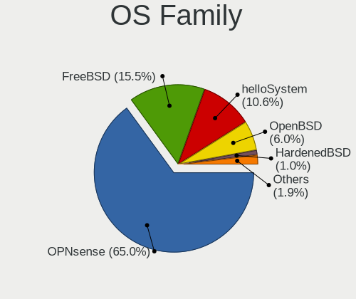

| Name        | Computers | Percent |
|-------------|-----------|---------|
| OPNsense    | 117       | 55.45%  |
| FreeBSD     | 41        | 19.43%  |
| helloSystem | 23        | 10.9%   |
| OpenBSD     | 21        | 9.95%   |
| HardenedBSD | 4         | 1.9%    |
| GhostBSD    | 3         | 1.42%   |
| pfSense     | 1         | 0.47%   |
| NetBSD      | 1         | 0.47%   |

Arch
----

OS architecture (x86_64, i586, etc.)

| Name  | Computers | Percent |
|-------|-----------|---------|
| amd64 | 201       | 96.63%  |
| arm64 | 6         | 2.88%   |
| i386  | 1         | 0.48%   |

DE
--

Desktop Environment

| Name         | Computers | Percent |
|--------------|-----------|---------|
| Console      | 146       | 69.19%  |
| helloDesktop | 31        | 14.69%  |
| KDE5         | 7         | 3.32%   |
| fvwm         | 7         | 3.32%   |
| GNOME        | 5         | 2.37%   |
| MATE         | 4         | 1.9%    |
| XFCE         | 3         | 1.42%   |
| TWM          | 2         | 0.95%   |
| LXQt         | 2         | 0.95%   |
| i3           | 2         | 0.95%   |
| GNUstep      | 1         | 0.47%   |
| AwesomeWM    | 1         | 0.47%   |

Display Server
--------------

X11 or Wayland

| Name    | Computers | Percent |
|---------|-----------|---------|
| Console | 148       | 71.15%  |
| X11     | 58        | 27.88%  |
| Wayland | 2         | 0.96%   |

Display Manager
---------------

SDDM, LightDM, etc.

| Name    | Computers | Percent |
|---------|-----------|---------|
| Console | 160       | 76.56%  |
| SLiM    | 27        | 12.92%  |
| XDM     | 7         | 3.35%   |
| SDDM    | 6         | 2.87%   |
| LightDM | 5         | 2.39%   |
| GDM     | 4         | 1.91%   |

OS Lang
-------

Language

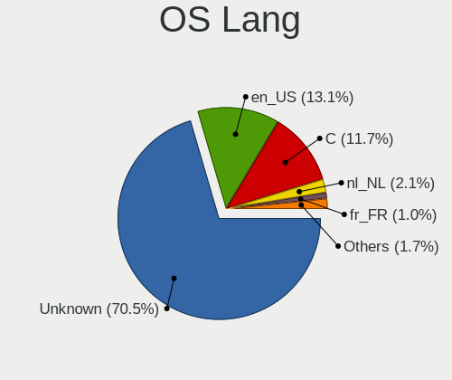

| Lang    | Computers | Percent |
|---------|-----------|---------|
| Unknown | 142       | 66.98%  |
| en_US   | 40        | 18.87%  |
| C       | 27        | 12.74%  |
| nl_NL   | 2         | 0.94%   |
| fr_FR   | 1         | 0.47%   |

Boot Mode
---------

EFI or BIOS

| Mode | Computers | Percent |
|------|-----------|---------|
| EFI  | 168       | 80%     |
| BIOS | 42        | 20%     |

Filesystem
----------

Type of filesystem

| Type   | Computers | Percent |
|--------|-----------|---------|
| Ufs    | 104       | 49.06%  |
| Zfs    | 82        | 38.68%  |
| Ffs    | 21        | 9.91%   |
| Cd9660 | 5         | 2.36%   |

Part. scheme
------------

Scheme of partitioning

| Type    | Computers | Percent |
|---------|-----------|---------|
| GPT     | 181       | 86.6%   |
| MBR     | 27        | 12.92%  |
| Unknown | 1         | 0.48%   |

Board
-----

Vendor
------

Motherboard manufacturer

| Name                | Computers | Percent |
|---------------------|-----------|---------|
| Dell                | 29        | 13.94%  |
| Unknown             | 22        | 10.58%  |
| Hewlett-Packard     | 19        | 9.13%   |
| Lenovo              | 18        | 8.65%   |
| Intel               | 13        | 6.25%   |
| Supermicro          | 10        | 4.81%   |
| ASRock              | 10        | 4.81%   |
| Gigabyte Technology | 9         | 4.33%   |
| PC Engines          | 7         | 3.37%   |
| ASUSTek Computer    | 7         | 3.37%   |
| Apple               | 7         | 3.37%   |
| AMI                 | 6         | 2.88%   |
| Sophos              | 4         | 1.92%   |
| Shuttle             | 4         | 1.92%   |
| MSI                 | 4         | 1.92%   |
| Fujitsu             | 4         | 1.92%   |
| Protectli           | 3         | 1.44%   |
| Inventec            | 3         | 1.44%   |
| Deciso              | 3         | 1.44%   |
| Barracuda Networks  | 2         | 0.96%   |
| ZOTAC               | 1         | 0.48%   |
| XtReAmEr            | 1         | 0.48%   |
| WYSE                | 1         | 0.48%   |
| TUXEDO              | 1         | 0.48%   |
| TOXIC by BTO        | 1         | 0.48%   |
| Toshiba             | 1         | 0.48%   |
| Star Labs           | 1         | 0.48%   |
| Sony                | 1         | 0.48%   |
| SLIMBOOK            | 1         | 0.48%   |
| Sapphire            | 1         | 0.48%   |
| Pegatron            | 1         | 0.48%   |
| NU941               | 1         | 0.48%   |
| Notebook            | 1         | 0.48%   |
| MW                  | 1         | 0.48%   |
| iEi                 | 1         | 0.48%   |
| HPE                 | 1         | 0.48%   |
| HARDKERNEL          | 1         | 0.48%   |
| Dell EMC            | 1         | 0.48%   |
| CompuLab            | 1         | 0.48%   |
| Cisco               | 1         | 0.48%   |

Model
-----

Motherboard model

| Name                              | Computers | Percent |
|-----------------------------------|-----------|---------|
| Unknown                           | 24        | 11.54%  |
| Intel Q3XXG4-P V1.0               | 8         | 3.85%   |
| Dell PowerEdge R620               | 5         | 2.4%    |
| Dell PowerEdge R210 II            | 5         | 2.4%    |
| AMI Aptio CRB                     | 5         | 2.4%    |
| Supermicro Super Server           | 4         | 1.92%   |
| PC Engines apu4                   | 3         | 1.44%   |
| Sophos XG                         | 2         | 0.96%   |
| Sophos SG                         | 2         | 0.96%   |
| PC Engines APU2                   | 2         | 0.96%   |
| PC Engines APU                    | 2         | 0.96%   |
| Inventec VXC Class                | 2         | 0.96%   |
| HP EliteDesk 800 G1 SFF           | 2         | 0.96%   |
| Gigabyte X570 AORUS PRO           | 2         | 0.96%   |
| Fujitsu FUTRO S920                | 2         | 0.96%   |
| Dell Latitude E4300               | 2         | 0.96%   |
| ZOTAC ZBOX-CI327NANO-GS-01        | 1         | 0.48%   |
| WYSE Z CLASS                      | 1         | 0.48%   |
| TUXEDO Pulse 15 Gen1              | 1         | 0.48%   |
| TOXIC by BTO 15CL872 1050TI       | 1         | 0.48%   |
| Toshiba Satellite C50-B           | 1         | 0.48%   |
| Supermicro X9SCL/X9SCM            | 1         | 0.48%   |
| Supermicro X8SIL                  | 1         | 0.48%   |
| Supermicro X10SAE                 | 1         | 0.48%   |
| Supermicro AS -E301-9D-8CN4       | 1         | 0.48%   |
| Supermicro AS -5019D-FTN4         | 1         | 0.48%   |
| Supermicro A1SAi                  | 1         | 0.48%   |
| Star Labs LabTop                  | 1         | 0.48%   |
| Sony SVZ1311C5E                   | 1         | 0.48%   |
| Shuttle XH310V2                   | 1         | 0.48%   |
| Shuttle SH87R                     | 1         | 0.48%   |
| Shuttle DH370                     | 1         | 0.48%   |
| Shuttle DH310                     | 1         | 0.48%   |
| Sapphire EDGE-FT1M1 E450 1AOVU044 | 1         | 0.48%   |
| Protectli FW6D                    | 1         | 0.48%   |
| Protectli FW4B                    | 1         | 0.48%   |
| Protectli FW2B                    | 1         | 0.48%   |
| Pegatron h8-1102nl                | 1         | 0.48%   |
| NU941 1.0                         | 1         | 0.48%   |
| Notebook NL5xRU                   | 1         | 0.48%   |

Model Family
------------

Motherboard model prefix

| Name                         | Computers | Percent |
|------------------------------|-----------|---------|
| Unknown                      | 24        | 11.54%  |
| Lenovo ThinkPad              | 13        | 6.25%   |
| Dell PowerEdge               | 13        | 6.25%   |
| Intel Q3XXG4-P               | 8         | 3.85%   |
| Dell Latitude                | 7         | 3.37%   |
| Dell OptiPlex                | 5         | 2.4%    |
| AMI Aptio                    | 5         | 2.4%    |
| Supermicro Super             | 4         | 1.92%   |
| HP EliteDesk                 | 4         | 1.92%   |
| PC Engines apu4              | 3         | 1.44%   |
| HP ProLiant                  | 3         | 1.44%   |
| HP ProDesk                   | 3         | 1.44%   |
| HP EliteBook                 | 3         | 1.44%   |
| HP Compaq                    | 3         | 1.44%   |
| Supermicro AS                | 2         | 0.96%   |
| Sophos XG                    | 2         | 0.96%   |
| Sophos SG                    | 2         | 0.96%   |
| PC Engines APU2              | 2         | 0.96%   |
| PC Engines APU               | 2         | 0.96%   |
| Inventec VXC                 | 2         | 0.96%   |
| Gigabyte X570                | 2         | 0.96%   |
| Fujitsu FUTRO                | 2         | 0.96%   |
| Deciso Netboard              | 2         | 0.96%   |
| Barracuda Networks Barracuda | 2         | 0.96%   |
| ASUS PRIME                   | 2         | 0.96%   |
| ZOTAC ZBOX-CI327NANO-GS-01   | 1         | 0.48%   |
| WYSE Z                       | 1         | 0.48%   |
| TUXEDO Pulse                 | 1         | 0.48%   |
| TOXIC by BTO 15CL872         | 1         | 0.48%   |
| Toshiba Satellite            | 1         | 0.48%   |
| Supermicro X9SCL             | 1         | 0.48%   |
| Supermicro X8SIL             | 1         | 0.48%   |
| Supermicro X10SAE            | 1         | 0.48%   |
| Supermicro A1SAi             | 1         | 0.48%   |
| Star Labs LabTop             | 1         | 0.48%   |
| Sony SVZ1311C5E              | 1         | 0.48%   |
| Shuttle XH310V2              | 1         | 0.48%   |
| Shuttle SH87R                | 1         | 0.48%   |
| Shuttle DH370                | 1         | 0.48%   |
| Shuttle DH310                | 1         | 0.48%   |

MFG Year
--------

Motherboard manufacture year

| Year    | Computers | Percent |
|---------|-----------|---------|
| 2018    | 28        | 13.46%  |
| 2020    | 22        | 10.58%  |
| 2019    | 22        | 10.58%  |
| 2016    | 18        | 8.65%   |
| 2014    | 18        | 8.65%   |
| 2015    | 15        | 7.21%   |
| 2013    | 14        | 6.73%   |
| 2017    | 13        | 6.25%   |
| 2011    | 13        | 6.25%   |
| 2021    | 12        | 5.77%   |
| 2012    | 11        | 5.29%   |
| Unknown | 7         | 3.37%   |
| 2009    | 6         | 2.88%   |
| 2022    | 4         | 1.92%   |
| 2010    | 2         | 0.96%   |
| 2008    | 1         | 0.48%   |
| 2007    | 1         | 0.48%   |
| 2006    | 1         | 0.48%   |

Form Factor
-----------

Physical design of the computer

| Name           | Computers | Percent |
|----------------|-----------|---------|
| Desktop        | 122       | 58.65%  |
| Notebook       | 46        | 22.12%  |
| Server         | 17        | 8.17%   |
| Mini pc        | 14        | 6.73%   |
| Firewall       | 6         | 2.88%   |
| All in one     | 2         | 0.96%   |
| System on chip | 1         | 0.48%   |

Coreboot
--------

Have coreboot on board

| Used | Computers | Percent |
|------|-----------|---------|
| No   | 198       | 95.19%  |
| Yes  | 10        | 4.81%   |

RAM Size
--------

Total RAM memory

| Size in GB      | Computers | Percent |
|-----------------|-----------|---------|
| 8.01-16.0       | 76        | 36.36%  |
| 4.01-8.0        | 52        | 24.88%  |
| 16.01-24.0      | 36        | 17.22%  |
| 32.01-64.0      | 20        | 9.57%   |
| 2.01-3.0        | 7         | 3.35%   |
| 64.01-256.0     | 7         | 3.35%   |
| 3.01-4.0        | 5         | 2.39%   |
| More than 256.0 | 2         | 0.96%   |
| 1.01-2.0        | 2         | 0.96%   |
| 24.01-32.0      | 1         | 0.48%   |
| 0.51-1.0        | 1         | 0.48%   |

RAM Used
--------

Used RAM memory

| Used GB    | Computers | Percent |
|------------|-----------|---------|
| 0.01-0.5   | 119       | 55.35%  |
| 0.51-1.0   | 51        | 23.72%  |
| 1.01-2.0   | 21        | 9.77%   |
| 4.01-8.0   | 6         | 2.79%   |
| 2.01-3.0   | 4         | 1.86%   |
| 8.01-16.0  | 4         | 1.86%   |
| 3.01-4.0   | 3         | 1.4%    |
| 32.01-64.0 | 2         | 0.93%   |
| 24.01-32.0 | 2         | 0.93%   |
| 16.01-24.0 | 1         | 0.47%   |
| 0          | 1         | 0.47%   |
| Unknown    | 1         | 0.47%   |

Total Drives
------------

Number of drives on board

| Drives | Computers | Percent |
|--------|-----------|---------|
| 1      | 142       | 67.62%  |
| 2      | 31        | 14.76%  |
| 3      | 11        | 5.24%   |
| 0      | 11        | 5.24%   |
| 4      | 6         | 2.86%   |
| 5      | 4         | 1.9%    |
| 15     | 1         | 0.48%   |
| 12     | 1         | 0.48%   |
| 10     | 1         | 0.48%   |
| 7      | 1         | 0.48%   |
| 6      | 1         | 0.48%   |

Has CD-ROM
----------

Has CD-ROM on board

| Presented | Computers | Percent |
|-----------|-----------|---------|
| No        | 179       | 86.06%  |
| Yes       | 29        | 13.94%  |

Has Ethernet
------------

Has Ethernet on board

| Presented | Computers | Percent |
|-----------|-----------|---------|
| Yes       | 197       | 94.71%  |
| No        | 11        | 5.29%   |

Has WiFi
--------

Has WiFi module

| Presented | Computers | Percent |
|-----------|-----------|---------|
| No        | 135       | 64.29%  |
| Yes       | 75        | 35.71%  |

Has Bluetooth
-------------

Has Bluetooth module

| Presented | Computers | Percent |
|-----------|-----------|---------|
| No        | 162       | 77.88%  |
| Yes       | 46        | 22.12%  |

Location
--------

Country
-------

Geographic location (country)

| Country     | Computers | Percent |
|-------------|-----------|---------|
| Netherlands | 208       | 100%    |

City
----

Geographic location (city)

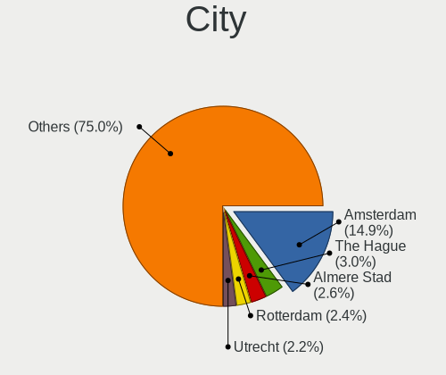

| City                | Computers | Percent |
|---------------------|-----------|---------|
| Amsterdam           | 45        | 19.23%  |
| Utrecht             | 6         | 2.56%   |
| Groningen           | 6         | 2.56%   |
| The Hague           | 5         | 2.14%   |
| Vlaardingen         | 4         | 1.71%   |
| Rotterdam           | 4         | 1.71%   |
| Poortugaal          | 4         | 1.71%   |
| Eindhoven           | 4         | 1.71%   |
| Barneveld           | 4         | 1.71%   |
| Alphen aan den Rijn | 4         | 1.71%   |
| Almere Stad         | 4         | 1.71%   |
| Zeist               | 3         | 1.28%   |
| Zaandam             | 3         | 1.28%   |
| Ospel               | 3         | 1.28%   |
| Hoogeveen           | 3         | 1.28%   |
| Breda               | 3         | 1.28%   |
| Amersfoort          | 3         | 1.28%   |
| Almere Poort        | 3         | 1.28%   |
| Zoetermeer          | 2         | 0.85%   |
| Veenendaal          | 2         | 0.85%   |
| Tilburg             | 2         | 0.85%   |
| Soest               | 2         | 0.85%   |
| Oegstgeest          | 2         | 0.85%   |
| Nieuwegein          | 2         | 0.85%   |
| Naaldwijk           | 2         | 0.85%   |
| Maastricht          | 2         | 0.85%   |
| Leiden              | 2         | 0.85%   |
| IJsselstein         | 2         | 0.85%   |
| Hoofddorp           | 2         | 0.85%   |
| Hengelo             | 2         | 0.85%   |
| Hellevoetsluis      | 2         | 0.85%   |
| Deventer            | 2         | 0.85%   |
| Delft               | 2         | 0.85%   |
| Beekbergen          | 2         | 0.85%   |
| Almelo              | 2         | 0.85%   |
| Aalsmeer            | 2         | 0.85%   |
| 's-Hertogenbosch    | 2         | 0.85%   |
| Zutphen             | 1         | 0.43%   |
| Zuidhorn            | 1         | 0.43%   |
| Zetten              | 1         | 0.43%   |

Drives
------

Drive Vendor
------------

Hard drive vendors

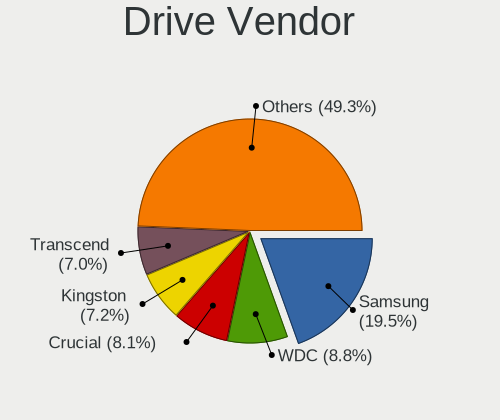

| Vendor              | Computers | Drives | Percent |
|---------------------|-----------|--------|---------|
| Samsung Electronics | 45        | 66     | 18.44%  |
| WDC                 | 27        | 68     | 11.07%  |
| Crucial             | 22        | 37     | 9.02%   |
| Seagate             | 15        | 47     | 6.15%   |
| Kingston            | 14        | 18     | 5.74%   |
| Transcend           | 10        | 15     | 4.1%    |
| SanDisk             | 9         | 9      | 3.69%   |
| Hoodisk             | 9         | 14     | 3.69%   |
| Toshiba             | 7         | 18     | 2.87%   |
| Hitachi             | 6         | 8      | 2.46%   |
| HGST                | 5         | 7      | 2.05%   |
| Hewlett-Packard     | 5         | 10     | 2.05%   |
| China               | 5         | 10     | 2.05%   |
| LITEON              | 4         | 5      | 1.64%   |
| Intel               | 4         | 7      | 1.64%   |
| Gigabyte Technology | 4         | 4      | 1.64%   |
| Dell                | 4         | 8      | 1.64%   |
| UDinfo              | 3         | 3      | 1.23%   |
| Phison              | 3         | 3      | 1.23%   |
| NVMe                | 3         | 3      | 1.23%   |
| FORESEE             | 3         | 6      | 1.23%   |
| Apple               | 3         | 3      | 1.23%   |
| Apacer              | 3         | 4      | 1.23%   |
| A-DATA Technology   | 3         | 3      | 1.23%   |
| OCZ                 | 2         | 2      | 0.82%   |
| NETAPP              | 2         | 7      | 0.82%   |
| Kston               | 2         | 5      | 0.82%   |
| Innodisk            | 2         | 2      | 0.82%   |
| StoreJet            | 1         | 1      | 0.41%   |
| Star Drive          | 1         | 1      | 0.41%   |
| SK hynix            | 1         | 1      | 0.41%   |
| Silicon Motion      | 1         | 1      | 0.41%   |
| Protectli           | 1         | 4      | 0.41%   |
| PNY                 | 1         | 1      | 0.41%   |
| Plextor             | 1         | 1      | 0.41%   |
| OWC                 | 1         | 1      | 0.41%   |
| ORICO               | 1         | 1      | 0.41%   |
| OPENBSD             | 1         | 1      | 0.41%   |
| Mushkin             | 1         | 2      | 0.41%   |
| Micron Technology   | 1         | 1      | 0.41%   |

Drive Model
-----------

Hard drive models

| Model                            | Computers | Percent |
|----------------------------------|-----------|---------|
| Samsung SSD 850 EVO 250GB        | 7         | 2.67%   |
| Kingston SUV500MS120G 120GB      | 4         | 1.53%   |
| Hoodisk SSD 128GB                | 4         | 1.53%   |
| Dell PERC H710 282GB             | 4         | 1.53%   |
| Crucial CT250MX500SSD1 250GB     | 4         | 1.53%   |
| UDinfo M2S 120GB                 | 3         | 1.15%   |
| Samsung SSD 850 EVO 500GB        | 3         | 1.15%   |
| Hoodisk SSD 64GB                 | 3         | 1.15%   |
| Crucial CT240BX500SSD1 240GB     | 3         | 1.15%   |
| A-DATA IM2S3134N-064GM 64GB      | 3         | 1.15%   |
| WDC WD80EFAX-68KNBN0 8TB         | 2         | 0.76%   |
| WDC WD60EFRX-68L0BN1 6TB         | 2         | 0.76%   |
| WDC WD40EFRX-68WT0N0 4TB         | 2         | 0.76%   |
| WDC WD40EFRX-68N32N0 4TB         | 2         | 0.76%   |
| Transcend TS32GSSD370S 32GB      | 2         | 0.76%   |
| Transcend TS128GMTE110S 128GB    | 2         | 0.76%   |
| Toshiba MQ04ABF100 1TB           | 2         | 0.76%   |
| Seagate ST500LM000-SSHD-8GB      | 2         | 0.76%   |
| Samsung SSD 980 PRO 1TB          | 2         | 0.76%   |
| Samsung SSD 970 EVO 1TB          | 2         | 0.76%   |
| Samsung SSD 840 Series 120GB     | 2         | 0.76%   |
| Samsung SSD 840 EVO 120GB        | 2         | 0.76%   |
| NETAPP X446_RALS200MCHT 200GB    | 2         | 0.76%   |
| LITEON IT LCS-128L9S-HP 128GB    | 2         | 0.76%   |
| LITEON CS1-SP16-11 M.2 2242 16GB | 2         | 0.76%   |
| Kston SSD 128GB                  | 2         | 0.76%   |
| HGST HTS725050A7E630 500GB       | 2         | 0.76%   |
| Crucial M4-CT128M4SSD2 128GB     | 2         | 0.76%   |
| Crucial CT500MX500SSD1 500GB     | 2         | 0.76%   |
| Crucial CT500MX200SSD1 500GB     | 2         | 0.76%   |
| Crucial CT480M500SSD1 480GB      | 2         | 0.76%   |
| Crucial CT120BX500SSD1 120GB     | 2         | 0.76%   |
| China SATA SSD 16GB              | 2         | 0.76%   |
| Apacer 64GB SATA Flash Drive     | 2         | 0.76%   |
| WDC WDS500G2B0C-00PXH0 500GB     | 1         | 0.38%   |
| WDC WDS500G1X0E-00AFY0 500GB     | 1         | 0.38%   |
| WDC WDS240G2G0B-00EPW0 240GB     | 1         | 0.38%   |
| WDC WDS120G2G0A-00JH30 120GB     | 1         | 0.38%   |
| WDC WDS100T3X0C-00SJG0 1TB       | 1         | 0.38%   |
| WDC WDS100T2B0B-00YS70 1TB       | 1         | 0.38%   |

HDD Vendor
----------

Hard disk drive vendors

| Vendor              | Computers | Drives | Percent |
|---------------------|-----------|--------|---------|
| WDC                 | 22        | 57     | 31.88%  |
| Seagate             | 15        | 47     | 21.74%  |
| Hitachi             | 6         | 8      | 8.7%    |
| Samsung Electronics | 5         | 8      | 7.25%   |
| HGST                | 5         | 7      | 7.25%   |
| Hewlett-Packard     | 4         | 9      | 5.8%    |
| Dell                | 4         | 8      | 5.8%    |
| Toshiba             | 3         | 11     | 4.35%   |
| StoreJet            | 1         | 1      | 1.45%   |
| OPENBSD             | 1         | 1      | 1.45%   |
| NVMe                | 1         | 1      | 1.45%   |
| Lenovo              | 1         | 2      | 1.45%   |
| Apple               | 1         | 1      | 1.45%   |

SSD Vendor
----------

Solid state drive vendors

| Vendor              | Computers | Drives | Percent |
|---------------------|-----------|--------|---------|
| Samsung Electronics | 33        | 45     | 21.85%  |
| Crucial             | 22        | 33     | 14.57%  |
| Kingston            | 10        | 14     | 6.62%   |
| SanDisk             | 9         | 9      | 5.96%   |
| Hoodisk             | 9         | 14     | 5.96%   |
| Transcend           | 8         | 13     | 5.3%    |
| China               | 5         | 10     | 3.31%   |
| LITEON              | 4         | 5      | 2.65%   |
| Intel               | 4         | 7      | 2.65%   |
| WDC                 | 3         | 6      | 1.99%   |
| UDinfo              | 3         | 3      | 1.99%   |
| Phison              | 3         | 3      | 1.99%   |
| FORESEE             | 3         | 6      | 1.99%   |
| Apacer              | 3         | 4      | 1.99%   |
| A-DATA Technology   | 3         | 3      | 1.99%   |
| Toshiba             | 2         | 4      | 1.32%   |
| OCZ                 | 2         | 2      | 1.32%   |
| NVMe                | 2         | 2      | 1.32%   |
| NETAPP              | 2         | 7      | 1.32%   |
| Kston               | 2         | 5      | 1.32%   |
| Innodisk            | 2         | 2      | 1.32%   |
| Apple               | 2         | 2      | 1.32%   |
| SK hynix            | 1         | 1      | 0.66%   |
| Protectli           | 1         | 4      | 0.66%   |
| PNY                 | 1         | 1      | 0.66%   |
| OWC                 | 1         | 1      | 0.66%   |
| ORICO               | 1         | 1      | 0.66%   |
| Mushkin             | 1         | 2      | 0.66%   |
| Micron Technology   | 1         | 1      | 0.66%   |
| Leven               | 1         | 1      | 0.66%   |
| Intenso             | 1         | 1      | 0.66%   |
| Indilinx            | 1         | 1      | 0.66%   |
| HPE                 | 1         | 1      | 0.66%   |
| Hewlett-Packard     | 1         | 1      | 0.66%   |
| Gigabyte Technology | 1         | 1      | 0.66%   |
| Corsair             | 1         | 2      | 0.66%   |
| BAITITON            | 1         | 2      | 0.66%   |

Drive Kind
----------

HDD or SSD

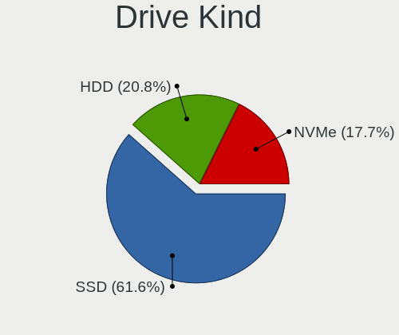

| Kind | Computers | Drives | Percent |
|------|-----------|--------|---------|
| SSD  | 142       | 220    | 62.01%  |
| HDD  | 61        | 161    | 26.64%  |
| NVMe | 26        | 38     | 11.35%  |

Drive Connector
---------------

SATA, SAS, NVMe, etc.

| Type | Computers | Drives | Percent |
|------|-----------|--------|---------|
| SATA | 181       | 381    | 87.44%  |
| NVMe | 26        | 38     | 12.56%  |

Drive Size
----------

Size of hard drive

| Size in TB | Computers | Drives | Percent |
|------------|-----------|--------|---------|
| 0.01-0.5   | 160       | 252    | 76.56%  |
| 0.51-1.0   | 24        | 47     | 11.48%  |
| 1.01-2.0   | 10        | 16     | 4.78%   |
| 3.01-4.0   | 7         | 18     | 3.35%   |
| 4.01-10.0  | 7         | 44     | 3.35%   |
| 2.01-3.0   | 1         | 4      | 0.48%   |

Space Total
-----------

Amount of disk space available on the file system

| Size in GB     | Computers | Percent |
|----------------|-----------|---------|
| 101-250        | 78        | 36.28%  |
| 51-100         | 36        | 16.74%  |
| 251-500        | 31        | 14.42%  |
| 1-20           | 30        | 13.95%  |
| 21-50          | 17        | 7.91%   |
| 501-1000       | 11        | 5.12%   |
| 1001-2000      | 6         | 2.79%   |
| More than 3000 | 2         | 0.93%   |
| 2001-3000      | 2         | 0.93%   |
| Unknown        | 2         | 0.93%   |

Space Used
----------

Amount of used disk space

| Used GB  | Computers | Percent |
|----------|-----------|---------|
| 1-20     | 183       | 86.73%  |
| 21-50    | 10        | 4.74%   |
| 101-250  | 5         | 2.37%   |
| 51-100   | 5         | 2.37%   |
| 251-500  | 3         | 1.42%   |
| 501-1000 | 3         | 1.42%   |
| Unknown  | 2         | 0.95%   |

Malfunc. Drives
---------------

Drive models with a malfunction

| Model                                     | Computers | Drives | Percent |
|-------------------------------------------|-----------|--------|---------|
| Crucial CT480M500SSD1 480GB               | 2         | 3      | 7.69%   |
| WDC WD15EARS-00Z5B1 1.5TB                 | 1         | 1      | 3.85%   |
| Seagate ST500LT012-9WS142 500GB           | 1         | 2      | 3.85%   |
| Seagate ST500LM021-1KJ152 500GB           | 1         | 1      | 3.85%   |
| Seagate ST3160318AS 160GB                 | 1         | 4      | 3.85%   |
| SanDisk SD7UB3Q256G1001 256GB             | 1         | 1      | 3.85%   |
| Samsung Electronics SSD 870 EVO 1TB       | 1         | 1      | 3.85%   |
| Samsung Electronics SSD 850 EVO mSATA 1TB | 1         | 1      | 3.85%   |
| Samsung Electronics SSD 850 EVO 1TB       | 1         | 1      | 3.85%   |
| Samsung Electronics SSD 840 Series 120GB  | 1         | 1      | 3.85%   |
| Samsung Electronics SSD 840 EVO 120GB     | 1         | 1      | 3.85%   |
| Samsung Electronics HS082HB 80GB          | 1         | 1      | 3.85%   |
| Samsung Electronics HD322HJ 320GB         | 1         | 1      | 3.85%   |
| Samsung Electronics HD103SJ 1TB           | 1         | 2      | 3.85%   |
| Kingston SMS200S3120G 120GB               | 1         | 1      | 3.85%   |
| Intel SSDSC2BA200G3T 200GB                | 1         | 4      | 3.85%   |
| Hitachi HTS545032B9A300 320GB             | 1         | 1      | 3.85%   |
| Hitachi HTS543232A7A384 320GB             | 1         | 1      | 3.85%   |
| Hitachi HDS723015BLA642 1.5TB             | 1         | 3      | 3.85%   |
| HGST HTS725050A7E630 500GB                | 1         | 1      | 3.85%   |
| HGST HDN726060ALE614 6TB                  | 1         | 2      | 3.85%   |
| Hewlett-Packard FB160C4081 160GB          | 1         | 2      | 3.85%   |
| Crucial CT128MX100SSD1 128GB              | 1         | 2      | 3.85%   |
| Corsair Force LS SSD 64GB                 | 1         | 2      | 3.85%   |
| China SH00M128GB                          | 1         | 1      | 3.85%   |

Malfunc. Drive Vendor
---------------------

Vendors of faulty drives

| Vendor              | Computers | Drives | Percent |
|---------------------|-----------|--------|---------|
| Samsung Electronics | 7         | 9      | 28%     |
| Seagate             | 3         | 7      | 12%     |
| Hitachi             | 3         | 5      | 12%     |
| Crucial             | 3         | 5      | 12%     |
| HGST                | 2         | 3      | 8%      |
| WDC                 | 1         | 1      | 4%      |
| SanDisk             | 1         | 1      | 4%      |
| Kingston            | 1         | 1      | 4%      |
| Intel               | 1         | 4      | 4%      |
| Hewlett-Packard     | 1         | 2      | 4%      |
| Corsair             | 1         | 2      | 4%      |
| China               | 1         | 1      | 4%      |

Malfunc. HDD Vendor
-------------------

Vendors of faulty HDD drives

| Vendor              | Computers | Drives | Percent |
|---------------------|-----------|--------|---------|
| Seagate             | 3         | 7      | 23.08%  |
| Samsung Electronics | 3         | 4      | 23.08%  |
| Hitachi             | 3         | 5      | 23.08%  |
| HGST                | 2         | 3      | 15.38%  |
| WDC                 | 1         | 1      | 7.69%   |
| Hewlett-Packard     | 1         | 2      | 7.69%   |

Malfunc. Drive Kind
-------------------

Kinds of faulty drives

| Kind | Computers | Drives | Percent |
|------|-----------|--------|---------|
| HDD  | 13        | 22     | 54.17%  |
| SSD  | 11        | 19     | 45.83%  |

Failed Drives
-------------

Failed drive models

| Model                                 | Computers | Drives | Percent |
|---------------------------------------|-----------|--------|---------|
| Samsung Electronics SSD 960 EVO 250GB | 1         | 1      | 50%     |
| HPE MK000480GWUGF 480GB               | 1         | 1      | 50%     |

Failed Drive Vendor
-------------------

Failed drive vendors

| Vendor              | Computers | Drives | Percent |
|---------------------|-----------|--------|---------|
| Samsung Electronics | 1         | 1      | 50%     |
| HPE                 | 1         | 1      | 50%     |

Drive Status
------------

Number of failed and malfunc. drives

| Status   | Computers | Drives | Percent |
|----------|-----------|--------|---------|
| Works    | 174       | 357    | 82.46%  |
| Malfunc  | 24        | 41     | 11.37%  |
| Detected | 11        | 19     | 5.21%   |
| Failed   | 2         | 2      | 0.95%   |

Storage controller
------------------

Storage Vendor
--------------

Storage controller vendors

| Vendor                      | Computers | Percent |
|-----------------------------|-----------|---------|
| Intel                       | 159       | 65.16%  |
| AMD                         | 34        | 13.93%  |
| Samsung Electronics         | 11        | 4.51%   |
| Broadcom / LSI              | 8         | 3.28%   |
| Phison Electronics          | 6         | 2.46%   |
| ASMedia Technology          | 6         | 2.46%   |
| SanDisk                     | 3         | 1.23%   |
| Kingston Technology Company | 3         | 1.23%   |
| Hewlett-Packard             | 3         | 1.23%   |
| Toshiba                     | 2         | 0.82%   |
| Silicon Motion              | 1         | 0.41%   |
| Micron/Crucial Technology   | 1         | 0.41%   |
| Micron Technology           | 1         | 0.41%   |
| Marvell Technology Group    | 1         | 0.41%   |
| Lite-On Technology          | 1         | 0.41%   |
| JMicron Technology          | 1         | 0.41%   |
| Dell                        | 1         | 0.41%   |
| Chelsio Communications      | 1         | 0.41%   |
| Unknown                     | 1         | 0.41%   |

Storage Model
-------------

Storage controller models

| Model                                                                            | Computers | Percent |
|----------------------------------------------------------------------------------|-----------|---------|
| AMD FCH SATA Controller [AHCI mode]                                              | 23        | 8.78%   |
| Intel 8 Series/C220 Series Chipset Family 6-port SATA Controller 1 [AHCI mode]   | 16        | 6.11%   |
| Intel Wildcat Point-LP SATA Controller [AHCI Mode]                               | 14        | 5.34%   |
| Intel 6 Series/C200 Series Chipset Family 6 port Desktop SATA AHCI Controller    | 12        | 4.58%   |
| Intel Sunrise Point-LP SATA Controller [AHCI mode]                               | 10        | 3.82%   |
| Intel Atom/Celeron/Pentium Processor x5-E8000/J3xxx/N3xxx Series SATA Controller | 8         | 3.05%   |
| Intel Atom Processor E3800 Series SATA AHCI Controller                           | 8         | 3.05%   |
| AMD SB7x0/SB8x0/SB9x0 SATA Controller [AHCI mode]                                | 8         | 3.05%   |
| Samsung NVMe SSD Controller SM981/PM981/PM983                                    | 7         | 2.67%   |
| Intel Cannon Lake PCH SATA AHCI Controller                                       | 7         | 2.67%   |
| Intel 82801 Mobile SATA Controller [RAID mode]                                   | 7         | 2.67%   |
| Intel Comet Lake SATA AHCI Controller                                            | 5         | 1.91%   |
| Intel 8 Series SATA Controller 1 [AHCI mode]                                     | 5         | 1.91%   |
| Intel 7 Series/C210 Series Chipset Family 6-port SATA Controller [AHCI mode]     | 5         | 1.91%   |
| Intel 7 Series Chipset Family 6-port SATA Controller [AHCI mode]                 | 5         | 1.91%   |
| ASMedia ASM1062 Serial ATA Controller                                            | 5         | 1.91%   |
| Intel Celeron/Pentium Silver Processor SATA Controller                           | 4         | 1.53%   |
| Intel C600/X79 series chipset 6-Port SATA AHCI Controller                        | 4         | 1.53%   |
| Intel Atom Processor C3000 Series SATA Controller 0                              | 4         | 1.53%   |
| Broadcom / LSI MegaRAID SAS 2208 [Thunderbolt]                                   | 4         | 1.53%   |
| Intel Q170/Q150/B150/H170/H110/Z170/CM236 Chipset SATA Controller [AHCI Mode]    | 3         | 1.15%   |
| Intel C610/X99 series chipset 6-Port SATA Controller [AHCI mode]                 | 3         | 1.15%   |
| Intel Atom processor C2000 AHCI SATA3 Controller                                 | 3         | 1.15%   |
| Intel 82801JI (ICH10 Family) SATA AHCI Controller                                | 3         | 1.15%   |
| Intel 82801IBM/IEM (ICH9M/ICH9M-E) 4 port SATA Controller [AHCI mode]            | 3         | 1.15%   |
| Intel 82801HM/HEM (ICH8M/ICH8M-E) SATA Controller [AHCI mode]                    | 3         | 1.15%   |
| Intel 82801HM/HEM (ICH8M/ICH8M-E) IDE Controller                                 | 3         | 1.15%   |
| Intel 500 Series Chipset Family SATA AHCI Controller                             | 3         | 1.15%   |
| Intel 5 Series/3400 Series Chipset 6 port SATA AHCI Controller                   | 3         | 1.15%   |
| Unknown                                                                          | 3         | 1.15%   |
| SanDisk WD Blue SN550 NVMe SSD                                                   | 2         | 0.76%   |
| Samsung NVMe SSD Controller PM9A1/PM9A3/980PRO                                   | 2         | 0.76%   |
| Phison PS5013 E13 NVMe Controller                                                | 2         | 0.76%   |
| Kingston Company A2000 NVMe SSD                                                  | 2         | 0.76%   |
| Intel SATA Controller [RAID mode]                                                | 2         | 0.76%   |
| Intel Cannon Point-LP SATA Controller [AHCI Mode]                                | 2         | 0.76%   |
| Intel C610/X99 series chipset sSATA Controller [AHCI mode]                       | 2         | 0.76%   |
| Intel 82801G (ICH7 Family) IDE Controller                                        | 2         | 0.76%   |
| Intel 6 Series/C200 Series Chipset Family 6 port Mobile SATA AHCI Controller     | 2         | 0.76%   |
| Intel 400 Series Chipset Family SATA AHCI Controller                             | 2         | 0.76%   |

Storage Kind
------------

Kind of storage controller (IDE, SATA, NVMe, SAS, ...)

| Kind | Computers | Percent |
|------|-----------|---------|
| SATA | 178       | 73.25%  |
| NVMe | 30        | 12.35%  |
| RAID | 19        | 7.82%   |
| IDE  | 11        | 4.53%   |
| SAS  | 4         | 1.65%   |
| SCSI | 1         | 0.41%   |

Processor
---------

CPU Vendor
----------

Processor vendors

| Vendor | Computers | Percent |
|--------|-----------|---------|
| Intel  | 165       | 79.33%  |
| AMD    | 37        | 17.79%  |
| ARM    | 6         | 2.88%   |

CPU Model
---------

Processor models

| Model                              | Computers | Percent |
|------------------------------------|-----------|---------|
| Intel Celeron CPU J3160 @ 1.60GHz  | 5         | 2.4%    |
| Intel Celeron CPU J1900 @ 1.99GHz  | 5         | 2.4%    |
| AMD GX-412TC SOC                   | 5         | 2.4%    |
| Intel Core 2 Duo                   | 4         | 1.92%   |
| ARM Cortex-A72 r0p3                | 4         | 1.92%   |
| AMD G-T56N Processor               | 4         | 1.92%   |
| Intel Xeon CPU D-1521 @ 2.40GHz    | 3         | 1.44%   |
| Intel Core i5-5200U CPU @ 2.20GHz  | 3         | 1.44%   |
| Intel Xeon CPU E5-2640 0 @ 2.50GHz | 2         | 0.96%   |
| Intel Xeon CPU E5-2630 0 @ 2.30GHz | 2         | 0.96%   |
| Intel Core i7-7600U CPU @ 2.80GHz  | 2         | 0.96%   |
| Intel Core i7-5550U CPU @ 2.00GHz  | 2         | 0.96%   |
| Intel Core i7-5500U CPU @ 2.40GHz  | 2         | 0.96%   |
| Intel Core i7-4600U CPU @ 2.10GHz  | 2         | 0.96%   |
| Intel Core i7-3520M CPU @ 2.90GHz  | 2         | 0.96%   |
| Intel Core i7-2600 CPU @ 3.40GHz   | 2         | 0.96%   |
| Intel Core i5-8600 CPU @ 3.10GHz   | 2         | 0.96%   |
| Intel Core i5-6200U CPU @ 2.30GHz  | 2         | 0.96%   |
| Intel Core i5-5250U CPU @ 1.60GHz  | 2         | 0.96%   |
| Intel Core i5-4690 CPU @ 3.50GHz   | 2         | 0.96%   |
| Intel Core i5-4590 CPU @ 3.30GHz   | 2         | 0.96%   |
| Intel Core i5-3470 CPU @ 3.20GHz   | 2         | 0.96%   |
| Intel Core i5-3210M CPU @ 2.50GHz  | 2         | 0.96%   |
| Intel Core i5-10400 CPU @ 2.90GHz  | 2         | 0.96%   |
| Intel Core i3-5005U CPU @ 2.00GHz  | 2         | 0.96%   |
| Intel Celeron CPU N3160 @ 1.60GHz  | 2         | 0.96%   |
| Intel Atom CPU C3558 @ 2.20GHz     | 2         | 0.96%   |
| Intel Atom CPU C3508 @ 1.60GHz     | 2         | 0.96%   |
| Intel Atom CPU C2358 @ 1.74GHz     | 2         | 0.96%   |
| ARM Cortex-A53 r0p4                | 2         | 0.96%   |
| AMD G-T40E Processor               | 2         | 0.96%   |
| AMD EPYC 3251 8-Core Processor     | 2         | 0.96%   |
| Intel Xeon E-2314 CPU @ 2.80GHz    | 1         | 0.48%   |
| Intel Xeon E-2274G CPU @ 4.00GHz   | 1         | 0.48%   |
| Intel Xeon E-2224 CPU @ 3.40GHz    | 1         | 0.48%   |
| Intel Xeon CPU X5680 @ 3.33GHz     | 1         | 0.48%   |
| Intel Xeon CPU X3430 @ 2.40GHz     | 1         | 0.48%   |
| Intel Xeon CPU L3426 @ 1.87GHz     | 1         | 0.48%   |
| Intel Xeon CPU E5606 @ 2.13GHz     | 1         | 0.48%   |
| Intel Xeon CPU E5520 @ 2.27GHz     | 1         | 0.48%   |

CPU Model Family
----------------

Processor model prefix

| Model                | Computers | Percent |
|----------------------|-----------|---------|
| Intel Core i5        | 46        | 22.12%  |
| Intel Xeon           | 28        | 13.46%  |
| Intel Core i7        | 26        | 12.5%   |
| Intel Celeron        | 21        | 10.1%   |
| Intel Atom           | 11        | 5.29%   |
| AMD GX               | 11        | 5.29%   |
| Intel Core 2 Duo     | 9         | 4.33%   |
| Intel Core i3        | 8         | 3.85%   |
| Intel Pentium        | 6         | 2.88%   |
| ARM Cortex           | 6         | 2.88%   |
| AMD G                | 6         | 2.88%   |
| Other                | 5         | 2.4%    |
| Intel Pentium Gold   | 3         | 1.44%   |
| AMD Ryzen 7          | 3         | 1.44%   |
| Intel Pentium Silver | 2         | 0.96%   |
| AMD Ryzen 5          | 2         | 0.96%   |
| AMD EPYC             | 2         | 0.96%   |
| Intel Pentium 4      | 1         | 0.48%   |
| Intel Core m7        | 1         | 0.48%   |
| Intel Core 2         | 1         | 0.48%   |
| AMD Ryzen Embedded   | 1         | 0.48%   |
| AMD Ryzen 9          | 1         | 0.48%   |
| AMD Ryzen 7 PRO      | 1         | 0.48%   |
| AMD Ryzen 5 PRO      | 1         | 0.48%   |
| AMD E2               | 1         | 0.48%   |
| AMD E1               | 1         | 0.48%   |
| AMD E                | 1         | 0.48%   |
| AMD Athlon II        | 1         | 0.48%   |
| AMD A8               | 1         | 0.48%   |
| AMD A6               | 1         | 0.48%   |

CPU Cores
---------

Number of processor cores

| Number  | Computers | Percent |
|---------|-----------|---------|
| 4       | 84        | 40.38%  |
| 2       | 76        | 36.54%  |
| 6       | 12        | 5.77%   |
| Unknown | 12        | 5.77%   |
| 8       | 11        | 5.29%   |
| 12      | 7         | 3.37%   |
| 16      | 4         | 1.92%   |
| 1       | 2         | 0.96%   |

CPU Sockets
-----------

Number of sockets

| Number  | Computers | Percent |
|---------|-----------|---------|
| 1       | 195       | 93.75%  |
| 2       | 7         | 3.37%   |
| Unknown | 6         | 2.88%   |

CPU Threads
-----------

Threads per core (Hyper-Threading)

| Number  | Computers | Percent |
|---------|-----------|---------|
| 1       | 103       | 49.52%  |
| 2       | 93        | 44.71%  |
| Unknown | 12        | 5.77%   |

CPU Microarch
-------------

Microarchitecture

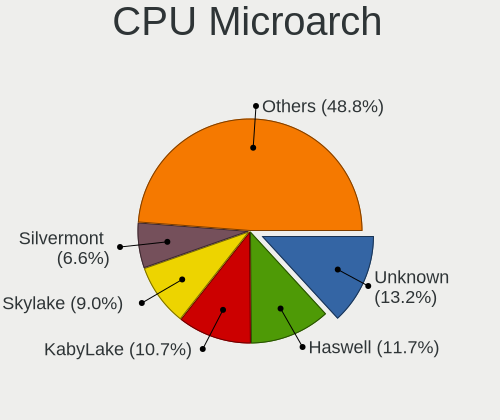

| Name          | Computers | Percent |
|---------------|-----------|---------|
| KabyLake      | 24        | 11.54%  |
| Haswell       | 22        | 10.58%  |
| Silvermont    | 19        | 9.13%   |
| Broadwell     | 19        | 9.13%   |
| IvyBridge     | 17        | 8.17%   |
| SandyBridge   | 15        | 7.21%   |
| Skylake       | 9         | 4.33%   |
| Unknown       | 9         | 4.33%   |
| Puma          | 7         | 3.37%   |
| Penryn        | 7         | 3.37%   |
| CometLake     | 7         | 3.37%   |
| Bobcat        | 7         | 3.37%   |
| Zen 2         | 5         | 2.4%    |
| Zen           | 5         | 2.4%    |
| Jaguar        | 5         | 2.4%    |
| Goldmont      | 5         | 2.4%    |
| Nehalem       | 4         | 1.92%   |
| Goldmont plus | 4         | 1.92%   |
| Westmere      | 3         | 1.44%   |
| Core          | 3         | 1.44%   |
| Excavator     | 2         | 0.96%   |
| Bonnell       | 2         | 0.96%   |
| Zen 3         | 1         | 0.48%   |
| TigerLake     | 1         | 0.48%   |
| Steamroller   | 1         | 0.48%   |
| Piledriver    | 1         | 0.48%   |
| NetBurst      | 1         | 0.48%   |
| K8 Hammer     | 1         | 0.48%   |
| K10 Llano     | 1         | 0.48%   |
| K10           | 1         | 0.48%   |

Graphics
--------

GPU Vendor
----------

Vendors of graphics cards

| Vendor                     | Computers | Percent |
|----------------------------|-----------|---------|
| Intel                      | 116       | 59.18%  |
| AMD                        | 31        | 15.82%  |
| Matrox Electronics Systems | 20        | 10.2%   |
| Nvidia                     | 15        | 7.65%   |
| ASPEED Technology          | 14        | 7.14%   |

GPU Model
---------

Graphics card models

| Model                                                                                    | Computers | Percent |
|------------------------------------------------------------------------------------------|-----------|---------|
| ASPEED Technology ASPEED Graphics Family                                                 | 14        | 7%      |
| Intel HD Graphics 5500                                                                   | 10        | 5%      |
| Matrox Electronics Systems MGA G200eW WPCM450                                            | 9         | 4.5%    |
| Intel Xeon E3-1200 v3/4th Gen Core Processor Integrated Graphics Controller              | 9         | 4.5%    |
| Intel Atom/Celeron/Pentium Processor x5-E8000/J3xxx/N3xxx Integrated Graphics Controller | 8         | 4%      |
| Intel Atom Processor Z36xxx/Z37xxx Series Graphics & Display                             | 8         | 4%      |
| Intel 3rd Gen Core processor Graphics Controller                                         | 7         | 3.5%    |
| Intel Haswell-ULT Integrated Graphics Controller                                         | 6         | 3%      |
| Matrox Electronics Systems G200eR2                                                       | 5         | 2.5%    |
| Intel Skylake GT2 [HD Graphics 520]                                                      | 5         | 2.5%    |
| Intel CometLake-S GT2 [UHD Graphics 630]                                                 | 5         | 2.5%    |
| Intel CoffeeLake-S GT2 [UHD Graphics 630]                                                | 5         | 2.5%    |
| Intel Xeon E3-1200 v2/3rd Gen Core processor Graphics Controller                         | 4         | 2%      |
| Intel Mobile 4 Series Chipset Integrated Graphics Controller                             | 4         | 2%      |
| Intel HD Graphics 620                                                                    | 4         | 2%      |
| Intel HD Graphics 6000                                                                   | 4         | 2%      |
| Intel HD Graphics 530                                                                    | 3         | 1.5%    |
| Intel GeminiLake [UHD Graphics 600]                                                      | 3         | 1.5%    |
| Intel 2nd Generation Core Processor Family Integrated Graphics Controller                | 3         | 1.5%    |
| AMD Wrestler [Radeon HD 6310]                                                            | 3         | 1.5%    |
| AMD Renoir                                                                               | 3         | 1.5%    |
| AMD Ellesmere [Radeon RX 470/480/570/570X/580/580X/590]                                  | 3         | 1.5%    |
| Matrox Electronics Systems MGA G200EH                                                    | 2         | 1%      |
| Matrox Electronics Systems MGA G200e [Pilot] ServerEngines (SEP1)                        | 2         | 1%      |
| Intel WhiskeyLake-U GT2 [UHD Graphics 620]                                               | 2         | 1%      |
| Intel UHD Graphics 620                                                                   | 2         | 1%      |
| Intel Mobile GM965/GL960 Integrated Graphics Controller (secondary)                      | 2         | 1%      |
| Intel Mobile GM965/GL960 Integrated Graphics Controller (primary)                        | 2         | 1%      |
| Intel Kaby Lake-U GT1 Integrated Graphics Controller                                     | 2         | 1%      |
| Intel 4 Series Chipset Integrated Graphics Controller                                    | 2         | 1%      |
| AMD Wrestler [Radeon HD 6320]                                                            | 2         | 1%      |
| AMD Raven Ridge [Radeon Vega Series / Radeon Vega Mobile Series]                         | 2         | 1%      |
| AMD Mullins [Radeon R4/R5 Graphics]                                                      | 2         | 1%      |
| Nvidia TU117 [GeForce GTX 1650]                                                          | 1         | 0.5%    |
| Nvidia GT218 [ION]                                                                       | 1         | 0.5%    |
| Nvidia GT218 [GeForce 210]                                                               | 1         | 0.5%    |
| Nvidia GP108 [GeForce GT 1030]                                                           | 1         | 0.5%    |
| Nvidia GP107M [GeForce GTX 1050 Ti Mobile]                                               | 1         | 0.5%    |
| Nvidia GP107M [GeForce GTX 1050 Mobile]                                                  | 1         | 0.5%    |
| Nvidia GP104 [GeForce GTX 1080]                                                          | 1         | 0.5%    |

GPU Combo
---------

Combinations of graphics cards

| Name           | Computers | Percent |
|----------------|-----------|---------|
| 1 x Intel      | 101       | 48.56%  |
| 1 x AMD        | 29        | 13.94%  |
| 1 x Matrox     | 20        | 9.62%   |
| Other          | 18        | 8.65%   |
| 1 x ASPEED     | 14        | 6.73%   |
| 2 x Intel      | 9         | 4.33%   |
| 1 x Nvidia     | 9         | 4.33%   |
| Intel + Nvidia | 6         | 2.88%   |
| 2 x AMD        | 2         | 0.96%   |

GPU Driver
----------

Free vs proprietary

| Driver      | Computers | Percent |
|-------------|-----------|---------|
| Free        | 181       | 87.02%  |
| Unknown     | 20        | 9.62%   |
| Proprietary | 7         | 3.37%   |

GPU Memory
----------

Total video memory

| Size in GB | Computers | Percent |
|------------|-----------|---------|
| Unknown    | 190       | 90.91%  |
| 0.01-0.5   | 7         | 3.35%   |
| 1.01-2.0   | 5         | 2.39%   |
| 7.01-8.0   | 3         | 1.44%   |
| 0.51-1.0   | 3         | 1.44%   |
| 3.01-4.0   | 1         | 0.48%   |

Monitor
-------

Monitor Vendor
--------------

Monitor vendors

| Vendor                  | Computers | Percent |
|-------------------------|-----------|---------|
| LG Display              | 9         | 16.36%  |
| Samsung Electronics     | 7         | 12.73%  |
| Chimei Innolux          | 6         | 10.91%  |
| Apple                   | 5         | 9.09%   |
| Iiyama                  | 4         | 7.27%   |
| BOE                     | 4         | 7.27%   |
| AU Optronics            | 3         | 5.45%   |
| Sony                    | 2         | 3.64%   |
| Sharp                   | 2         | 3.64%   |
| Philips                 | 2         | 3.64%   |
| Lenovo                  | 2         | 3.64%   |
| Goldstar                | 2         | 3.64%   |
| Dell                    | 2         | 3.64%   |
| ViewSonic               | 1         | 1.82%   |
| PANDA                   | 1         | 1.82%   |
| Chi Mei Optoelectronics | 1         | 1.82%   |
| ASUSTek Computer        | 1         | 1.82%   |
| AOC                     | 1         | 1.82%   |

Monitor Model
-------------

Monitor models

| Model                                                                    | Computers | Percent |
|--------------------------------------------------------------------------|-----------|---------|
| Philips PHL 328E1 PHLC204 3840x2160 700x390mm 31.5-inch                  | 2         | 3.64%   |
| LG Display LCD Monitor LGD11F9 1280x800 290x180mm 13.4-inch              | 2         | 3.64%   |
| ViewSonic LCD Monitor VX3276-QHD 2560x1440                               | 1         | 1.82%   |
| Sony TV SNYC901 1920x1080                                                | 1         | 1.82%   |
| Sony LCD SNY06FA 1600x900 290x160mm 13.0-inch                            | 1         | 1.82%   |
| Sharp LCD Monitor SHP1461 3200x1800 290x170mm 13.2-inch                  | 1         | 1.82%   |
| Sharp LCD Monitor SHP1453 1920x1080 350x190mm 15.7-inch                  | 1         | 1.82%   |
| Samsung Electronics SyncMaster SAM027F 1680x1050 470x300mm 22.0-inch     | 1         | 1.82%   |
| Samsung Electronics SyncMaster SAM01AE 1600x1200 410x310mm 20.2-inch     | 1         | 1.82%   |
| Samsung Electronics S24H85x SAM0E0C 2560x1440 530x300mm 24.0-inch        | 1         | 1.82%   |
| Samsung Electronics LCD Monitor SEC4541 1280x800 260x160mm 12.0-inch     | 1         | 1.82%   |
| Samsung Electronics LCD Monitor SEC324C 1600x900 310x170mm 13.9-inch     | 1         | 1.82%   |
| Samsung Electronics LCD Monitor SEC3047 1366x768 280x160mm 12.7-inch     | 1         | 1.82%   |
| Samsung Electronics LCD Monitor SDC4347 1366x768 340x190mm 15.3-inch     | 1         | 1.82%   |
| PANDA LC133LF1L02 NCP0019 1920x1080 290x170mm 13.2-inch                  | 1         | 1.82%   |
| LG Display LCD Monitor LGD05C0 1920x1080 344x194mm 15.5-inch             | 1         | 1.82%   |
| LG Display LCD Monitor LGD058B 2560x1440 310x170mm 13.9-inch             | 1         | 1.82%   |
| LG Display LCD Monitor LGD0450 1366x768 280x160mm 12.7-inch              | 1         | 1.82%   |
| LG Display LCD Monitor LGD0437 1920x1080 280x160mm 12.7-inch             | 1         | 1.82%   |
| LG Display LCD Monitor LGD0408 1920x1080 280x160mm 12.7-inch             | 1         | 1.82%   |
| LG Display LCD Monitor LGD02D8 1366x768 280x160mm 12.7-inch              | 1         | 1.82%   |
| LG Display LCD Monitor LGD02AD 1366x768 340x190mm 15.3-inch              | 1         | 1.82%   |
| Lenovo LCD Monitor LEN4010 1280x800 260x160mm 12.0-inch                  | 1         | 1.82%   |
| Lenovo LCD Monitor LEN4000 1024x768 250x180mm 12.1-inch                  | 1         | 1.82%   |
| Iiyama PLE2407HDS IVM560D 1920x1080 520x300mm 23.6-inch                  | 1         | 1.82%   |
| Iiyama PL2740HS IVM6662 1920x1080 600x340mm 27.2-inch                    | 1         | 1.82%   |
| Iiyama PL2492H IVM612F 1920x1080 530x300mm 24.0-inch                     | 1         | 1.82%   |
| Iiyama PL2209HD IVM560B 1920x1080 480x270mm 21.7-inch                    | 1         | 1.82%   |
| Goldstar LG ULTRAWIDE GSM5AE2 3440x1440 800x340mm 34.2-inch              | 1         | 1.82%   |
| Goldstar LG Ultra HD GSM5B08 3840x2160 600x340mm 27.2-inch               | 1         | 1.82%   |
| Dell UP2716D DEL40DD 2560x1440 600x340mm 27.2-inch                       | 1         | 1.82%   |
| Dell U2715H DELD065 2560x1440 600x340mm 27.2-inch                        | 1         | 1.82%   |
| Chimei Innolux LCD Monitor CMN1734 1600x900 380x210mm 17.1-inch          | 1         | 1.82%   |
| Chimei Innolux LCD Monitor CMN15BF 1366x768 340x190mm 15.3-inch          | 1         | 1.82%   |
| Chimei Innolux LCD Monitor CMN15B5 1366x768 340x190mm 15.3-inch          | 1         | 1.82%   |
| Chimei Innolux LCD Monitor CMN1490 1366x768 310x170mm 13.9-inch          | 1         | 1.82%   |
| Chimei Innolux LCD Monitor CMN1404 1920x1080 310x170mm 13.9-inch         | 1         | 1.82%   |
| Chimei Innolux LCD Monitor CMN1239 1920x1080 280x160mm 12.7-inch         | 1         | 1.82%   |
| Chi Mei Optoelectronics LCD Monitor CMO15A7 1366x768 350x190mm 15.7-inch | 1         | 1.82%   |
| BOE LCD Monitor BOE07F7 1920x1080 310x170mm 13.9-inch                    | 1         | 1.82%   |

Monitor Resolution
------------------

Monitor screen resolution

| Resolution         | Computers | Percent |
|--------------------|-----------|---------|
| 1920x1080 (FHD)    | 17        | 30.91%  |
| 1366x768 (WXGA)    | 11        | 20%     |
| 1280x800 (WXGA)    | 7         | 12.73%  |
| 2560x1440 (QHD)    | 6         | 10.91%  |
| 3840x2160 (4K)     | 5         | 9.09%   |
| 1600x900 (HD+)     | 4         | 7.27%   |
| 1680x1050 (WSXGA+) | 2         | 3.64%   |
| 3440x1440          | 1         | 1.82%   |
| 3200x1800 (QHD+)   | 1         | 1.82%   |
| 1600x1200          | 1         | 1.82%   |

Monitor Diagonal
----------------

Diagonal size in inches

| Inches  | Computers | Percent |
|---------|-----------|---------|
| 13      | 15        | 27.27%  |
| 12      | 10        | 18.18%  |
| 15      | 9         | 16.36%  |
| 27      | 6         | 10.91%  |
| 24      | 3         | 5.45%   |
| 31      | 2         | 3.64%   |
| 23      | 2         | 3.64%   |
| 20      | 2         | 3.64%   |
| Unknown | 2         | 3.64%   |
| 34      | 1         | 1.82%   |
| 22      | 1         | 1.82%   |
| 21      | 1         | 1.82%   |
| 17      | 1         | 1.82%   |

Monitor Width
-------------

Physical width

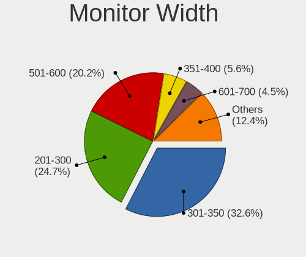

| Width in mm | Computers | Percent |
|-------------|-----------|---------|
| 201-300     | 18        | 32.73%  |
| 301-350     | 16        | 29.09%  |
| 501-600     | 10        | 18.18%  |
| 401-500     | 4         | 7.27%   |
| 601-700     | 3         | 5.45%   |
| Unknown     | 2         | 3.64%   |
| 701-800     | 1         | 1.82%   |
| 351-400     | 1         | 1.82%   |

Aspect Ratio
------------

Proportional relationship between the width and the height

| Ratio   | Computers | Percent |
|---------|-----------|---------|
| 16/9    | 42        | 77.78%  |
| 16/10   | 8         | 14.81%  |
| 4/3     | 1         | 1.85%   |
| 3/2     | 1         | 1.85%   |
| 21/9    | 1         | 1.85%   |
| Unknown | 1         | 1.85%   |

Monitor Area
------------

Area in inch

| Area in inch | Computers | Percent |
|----------------|-----------|---------|
| 81-90          | 12        | 21.82%  |
| 61-70          | 10        | 18.18%  |
| 301-350        | 6         | 10.91%  |
| 201-250        | 6         | 10.91%  |
| 91-100         | 6         | 10.91%  |
| 71-80          | 3         | 5.45%   |
| 351-500        | 3         | 5.45%   |
| 101-110        | 3         | 5.45%   |
| 151-200        | 2         | 3.64%   |
| Unknown        | 2         | 3.64%   |
| 251-300        | 1         | 1.82%   |
| 121-130        | 1         | 1.82%   |

Pixel Density
-------------

Pixels per inch

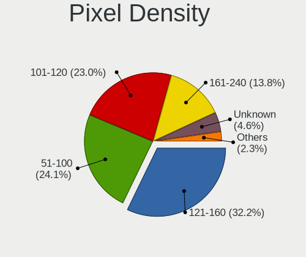

| Density       | Computers | Percent |
|---------------|-----------|---------|
| 121-160       | 17        | 31.48%  |
| 101-120       | 17        | 31.48%  |
| 51-100        | 9         | 16.67%  |
| 161-240       | 7         | 12.96%  |
| More than 240 | 2         | 3.7%    |
| Unknown       | 2         | 3.7%    |

Multiple Monitors
-----------------

Total monitors connected

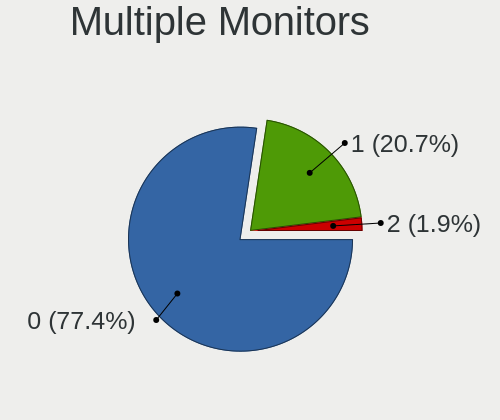

| Total | Computers | Percent |
|-------|-----------|---------|
| 0     | 153       | 73.56%  |
| 1     | 53        | 25.48%  |
| 2     | 2         | 0.96%   |

Network
-------

Net Controller Vendor
---------------------

Controller vendors

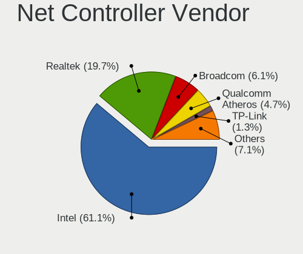

| Vendor                            | Computers | Percent |
|-----------------------------------|-----------|---------|
| Intel                             | 164       | 56.55%  |
| Realtek Semiconductor             | 56        | 19.31%  |
| Broadcom                          | 25        | 8.62%   |
| Qualcomm Atheros                  | 18        | 6.21%   |
| IMC Networks                      | 4         | 1.38%   |
| Ralink Technology                 | 3         | 1.03%   |
| TP-Link                           | 2         | 0.69%   |
| Ralink                            | 2         | 0.69%   |
| Marvell Technology Group          | 2         | 0.69%   |
| Hewlett-Packard                   | 2         | 0.69%   |
| Edimax Technology                 | 2         | 0.69%   |
| U-Blox                            | 1         | 0.34%   |
| Sierra Wireless                   | 1         | 0.34%   |
| Mellanox Technologies             | 1         | 0.34%   |
| Insyde Software                   | 1         | 0.34%   |
| HMD Global                        | 1         | 0.34%   |
| Fibocom                           | 1         | 0.34%   |
| Ericsson Business Mobile Networks | 1         | 0.34%   |
| Chelsio Communications            | 1         | 0.34%   |
| AMD                               | 1         | 0.34%   |
| ADMtek                            | 1         | 0.34%   |

Net Controller Model
--------------------

Controller models

| Model                                                                         | Computers | Percent |
|-------------------------------------------------------------------------------|-----------|---------|
| Realtek RTL8111/8168/8411 PCI Express Gigabit Ethernet Controller             | 44        | 12.54%  |
| Intel I211 Gigabit Network Connection                                         | 33        | 9.4%    |
| Intel I210 Gigabit Network Connection                                         | 22        | 6.27%   |
| Intel I350 Gigabit Network Connection                                         | 19        | 5.41%   |
| Intel 82574L Gigabit Network Connection                                       | 13        | 3.7%    |
| Intel 82579LM Gigabit Network Connection (Lewisville)                         | 11        | 3.13%   |
| Intel 82571EB/82571GB Gigabit Ethernet Controller D0/D1 (copper applications) | 7         | 1.99%   |
| Broadcom NetXtreme II BCM5716 Gigabit Ethernet                                | 7         | 1.99%   |
| Realtek RTL8188EUS 802.11n Wireless Network Adapter                           | 5         | 1.42%   |
| Qualcomm Atheros QCA9565 / AR9565 Wireless Network Adapter                    | 5         | 1.42%   |
| Intel Wi-Fi 6 AX200                                                           | 5         | 1.42%   |
| Intel Ethernet Connection X553 1GbE                                           | 4         | 1.14%   |
| Intel Ethernet Connection I217-LM                                             | 4         | 1.14%   |
| Intel 82567LM Gigabit Network Connection                                      | 4         | 1.14%   |
| Realtek RTL810xE PCI Express Fast Ethernet controller                         | 3         | 0.85%   |
| Qualcomm Atheros AR9285 Wireless Network Adapter (PCI-Express)                | 3         | 0.85%   |
| Intel Wireless-AC 9260                                                        | 3         | 0.85%   |
| Intel Wireless 8265 / 8275                                                    | 3         | 0.85%   |
| Intel Wireless 8260                                                           | 3         | 0.85%   |
| Intel Wireless 7265                                                           | 3         | 0.85%   |
| Intel Wireless 7260                                                           | 3         | 0.85%   |
| Intel PRO/Wireless 5100 AGN [Shiloh] Network Connection                       | 3         | 0.85%   |
| Intel I210 Gigabit Fiber Network Connection                                   | 3         | 0.85%   |
| Intel Ethernet Connection X552/X557-AT 10GBASE-T                              | 3         | 0.85%   |
| Intel Ethernet Connection I354                                                | 3         | 0.85%   |
| Intel Centrino Advanced-N 6205 [Taylor Peak]                                  | 3         | 0.85%   |
| IMC Networks 802.11 n/g/b Wireless LAN USB Mini-Card                          | 3         | 0.85%   |
| Broadcom BCM4331 802.11a/b/g/n                                                | 3         | 0.85%   |
| Ralink RT5370 Wireless Adapter                                                | 2         | 0.57%   |
| Qualcomm Atheros QCA986x/988x 802.11ac Wireless Network Adapter               | 2         | 0.57%   |
| Qualcomm Atheros AR242x / AR542x Wireless Network Adapter (PCI-Express)       | 2         | 0.57%   |
| Intel Wireless 3165                                                           | 2         | 0.57%   |
| Intel Wireless 3160                                                           | 2         | 0.57%   |
| Intel WiFi Link 5100                                                          | 2         | 0.57%   |
| Intel Ethernet Controller I225-V                                              | 2         | 0.57%   |
| Intel Ethernet Connection I219-V                                              | 2         | 0.57%   |
| Intel Ethernet Connection I218-LM                                             | 2         | 0.57%   |
| Intel Ethernet Connection (4) I219-LM                                         | 2         | 0.57%   |
| Intel Ethernet Connection (3) I218-LM                                         | 2         | 0.57%   |
| Intel Ethernet Connection (2) I219-V                                          | 2         | 0.57%   |

Wireless Vendor
---------------

Wireless vendors

| Vendor                | Computers | Percent |
|-----------------------|-----------|---------|
| Intel                 | 40        | 45.98%  |
| Qualcomm Atheros      | 15        | 17.24%  |
| Realtek Semiconductor | 9         | 10.34%  |
| Broadcom              | 9         | 10.34%  |
| IMC Networks          | 4         | 4.6%    |
| Ralink Technology     | 3         | 3.45%   |
| TP-Link               | 2         | 2.3%    |
| Ralink                | 2         | 2.3%    |
| Edimax Technology     | 2         | 2.3%    |
| Sierra Wireless       | 1         | 1.15%   |

Wireless Model
--------------

Wireless models

| Model                                                                   | Computers | Percent |
|-------------------------------------------------------------------------|-----------|---------|
| Realtek RTL8188EUS 802.11n Wireless Network Adapter                     | 5         | 5.75%   |
| Qualcomm Atheros QCA9565 / AR9565 Wireless Network Adapter              | 5         | 5.75%   |
| Intel Wi-Fi 6 AX200                                                     | 5         | 5.75%   |
| Qualcomm Atheros AR9285 Wireless Network Adapter (PCI-Express)          | 3         | 3.45%   |
| Intel Wireless-AC 9260                                                  | 3         | 3.45%   |
| Intel Wireless 8265 / 8275                                              | 3         | 3.45%   |
| Intel Wireless 8260                                                     | 3         | 3.45%   |
| Intel Wireless 7265                                                     | 3         | 3.45%   |
| Intel Wireless 7260                                                     | 3         | 3.45%   |
| Intel PRO/Wireless 5100 AGN [Shiloh] Network Connection                 | 3         | 3.45%   |
| Intel Centrino Advanced-N 6205 [Taylor Peak]                            | 3         | 3.45%   |
| IMC Networks 802.11 n/g/b Wireless LAN USB Mini-Card                    | 3         | 3.45%   |
| Broadcom BCM4331 802.11a/b/g/n                                          | 3         | 3.45%   |
| Ralink RT5370 Wireless Adapter                                          | 2         | 2.3%    |
| Qualcomm Atheros QCA986x/988x 802.11ac Wireless Network Adapter         | 2         | 2.3%    |
| Qualcomm Atheros AR242x / AR542x Wireless Network Adapter (PCI-Express) | 2         | 2.3%    |
| Intel Wireless 3165                                                     | 2         | 2.3%    |
| Intel Wireless 3160                                                     | 2         | 2.3%    |
| Intel WiFi Link 5100                                                    | 2         | 2.3%    |
| Intel Comet Lake PCH-LP CNVi WiFi                                       | 2         | 2.3%    |
| Edimax EW-7811Un 802.11n Wireless Adapter [Realtek RTL8188CUS]          | 2         | 2.3%    |
| Broadcom BCM43228 802.11a/b/g/n                                         | 2         | 2.3%    |
| Broadcom BCM4321 802.11a/b/g/n                                          | 2         | 2.3%    |
| TP-Link TP-LINK Wireless USB Adapter                                    | 1         | 1.15%   |
| TP-Link AC600 wireless Realtek RTL8811AU [Archer T2U Nano]              | 1         | 1.15%   |
| Sierra Wireless EM7455                                                  | 1         | 1.15%   |
| Realtek RTL8821CE 802.11ac PCIe Wireless Network Adapter                | 1         | 1.15%   |
| Realtek RTL8723AE PCIe Wireless Network Adapter                         | 1         | 1.15%   |
| Realtek RTL8192SU 802.11n WLAN Adapter                                  | 1         | 1.15%   |
| Realtek RTL8188CUS 802.11n WLAN Adapter                                 | 1         | 1.15%   |
| Ralink RT3572 Wireless Adapter                                          | 1         | 1.15%   |
| Ralink RT3592 Wireless 802.11abgn 2T/2R PCIe                            | 1         | 1.15%   |
| Ralink RT2500 Wireless 802.11bg                                         | 1         | 1.15%   |
| Qualcomm Atheros AR93xx Wireless Network Adapter                        | 1         | 1.15%   |
| Qualcomm Atheros AR928X Wireless Network Adapter (PCI-Express)          | 1         | 1.15%   |
| Qualcomm Atheros AR9287 Wireless Network Adapter (PCI-Express)          | 1         | 1.15%   |
| Intel Gemini Lake PCH CNVi WiFi                                         | 1         | 1.15%   |
| Intel Dual Band Wireless-AC 3168NGW [Stone Peak]                        | 1         | 1.15%   |
| Intel Centrino Ultimate-N 6300                                          | 1         | 1.15%   |
| Intel Centrino Advanced-N 6235                                          | 1         | 1.15%   |

Ethernet Vendor
---------------

Ethernet vendors

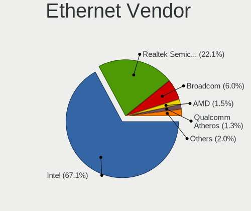

| Vendor                   | Computers | Percent |
|--------------------------|-----------|---------|
| Intel                    | 147       | 64.47%  |
| Realtek Semiconductor    | 49        | 21.49%  |
| Broadcom                 | 20        | 8.77%   |
| Qualcomm Atheros         | 5         | 2.19%   |
| Marvell Technology Group | 2         | 0.88%   |
| Insyde Software          | 1         | 0.44%   |
| HMD Global               | 1         | 0.44%   |
| Chelsio Communications   | 1         | 0.44%   |
| AMD                      | 1         | 0.44%   |
| ADMtek                   | 1         | 0.44%   |

Ethernet Model
--------------

Ethernet models

| Model                                                                          | Computers | Percent |
|--------------------------------------------------------------------------------|-----------|---------|
| Realtek RTL8111/8168/8411 PCI Express Gigabit Ethernet Controller              | 44        | 17.05%  |
| Intel I211 Gigabit Network Connection                                          | 33        | 12.79%  |
| Intel I210 Gigabit Network Connection                                          | 22        | 8.53%   |
| Intel I350 Gigabit Network Connection                                          | 19        | 7.36%   |
| Intel 82574L Gigabit Network Connection                                        | 13        | 5.04%   |
| Intel 82579LM Gigabit Network Connection (Lewisville)                          | 11        | 4.26%   |
| Intel 82571EB/82571GB Gigabit Ethernet Controller D0/D1 (copper applications)  | 7         | 2.71%   |
| Broadcom NetXtreme II BCM5716 Gigabit Ethernet                                 | 7         | 2.71%   |
| Intel Ethernet Connection X553 1GbE                                            | 4         | 1.55%   |
| Intel Ethernet Connection I217-LM                                              | 4         | 1.55%   |
| Intel 82567LM Gigabit Network Connection                                       | 4         | 1.55%   |
| Realtek RTL810xE PCI Express Fast Ethernet controller                          | 3         | 1.16%   |
| Intel I210 Gigabit Fiber Network Connection                                    | 3         | 1.16%   |
| Intel Ethernet Connection X552/X557-AT 10GBASE-T                               | 3         | 1.16%   |
| Intel Ethernet Connection I354                                                 | 3         | 1.16%   |
| Intel Ethernet Controller I225-V                                               | 2         | 0.78%   |
| Intel Ethernet Connection I219-V                                               | 2         | 0.78%   |
| Intel Ethernet Connection I218-LM                                              | 2         | 0.78%   |
| Intel Ethernet Connection (4) I219-LM                                          | 2         | 0.78%   |
| Intel Ethernet Connection (3) I218-LM                                          | 2         | 0.78%   |
| Intel Ethernet Connection (2) I219-V                                           | 2         | 0.78%   |
| Intel Ethernet Connection (14) I219-V                                          | 2         | 0.78%   |
| Intel 82599ES 10-Gigabit SFI/SFP+ Network Connection                           | 2         | 0.78%   |
| Intel 82583V Gigabit Network Connection                                        | 2         | 0.78%   |
| Intel 82576 Gigabit Network Connection                                         | 2         | 0.78%   |
| Intel 82575GB Gigabit Network Connection                                       | 2         | 0.78%   |
| Intel 82572EI Gigabit Ethernet Controller (Copper)                             | 2         | 0.78%   |
| Intel 82567LM-3 Gigabit Network Connection                                     | 2         | 0.78%   |
| Intel 82541PI Gigabit Ethernet Controller                                      | 2         | 0.78%   |
| Broadcom NetXtreme BCM57765 Gigabit Ethernet PCIe                              | 2         | 0.78%   |
| Broadcom NetXtreme BCM5761 Gigabit Ethernet PCIe                               | 2         | 0.78%   |
| Broadcom NetXtreme BCM5719 Gigabit Ethernet PCIe                               | 2         | 0.78%   |
| Realtek RTL8125 2.5GbE Controller                                              | 1         | 0.39%   |
| Realtek RTL-8110SC/8169SC Gigabit Ethernet                                     | 1         | 0.39%   |
| Qualcomm Atheros QCA8172 Fast Ethernet                                         | 1         | 0.39%   |
| Qualcomm Atheros QCA8171 Gigabit Ethernet                                      | 1         | 0.39%   |
| Qualcomm Atheros Killer E2400 Gigabit Ethernet Controller                      | 1         | 0.39%   |
| Qualcomm Atheros AR8151 v2.0 Gigabit Ethernet                                  | 1         | 0.39%   |
| Qualcomm Atheros AR8121/AR8113/AR8114 Gigabit or Fast Ethernet                 | 1         | 0.39%   |
| Marvell Group Yukon Optima 88E8059 [PCIe Gigabit Ethernet Controller with AVB] | 1         | 0.39%   |

Net Controller Kind
-------------------

Ethernet, WiFi or modem

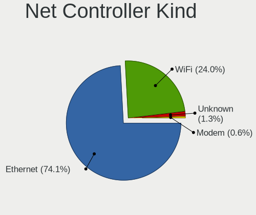

| Kind     | Computers | Percent |
|----------|-----------|---------|
| Ethernet | 197       | 70.86%  |
| WiFi     | 75        | 26.98%  |
| Modem    | 3         | 1.08%   |
| Unknown  | 3         | 1.08%   |

Used Controller
---------------

Currently used network controller

| Kind     | Computers | Percent |
|----------|-----------|---------|
| Ethernet | 177       | 81.57%  |
| WiFi     | 40        | 18.43%  |

NICs
----

Total network controllers on board

| Total | Computers | Percent |
|-------|-----------|---------|
| 2     | 81        | 38.76%  |
| 4     | 44        | 21.05%  |
| 1     | 27        | 12.92%  |
| 3     | 15        | 7.18%   |
| 6     | 14        | 6.7%    |
| 5     | 13        | 6.22%   |
| 9     | 5         | 2.39%   |
| 0     | 5         | 2.39%   |
| 8     | 2         | 0.96%   |
| 7     | 2         | 0.96%   |
| 12    | 1         | 0.48%   |

IPv6
----

IPv6 vs IPv4

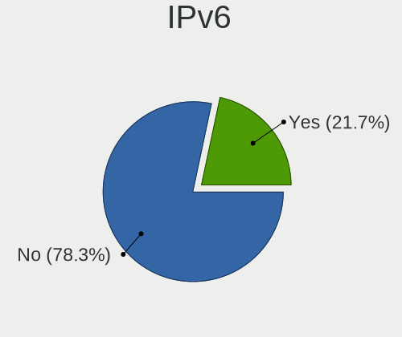

| Used | Computers | Percent |
|------|-----------|---------|
| No   | 181       | 83.8%   |
| Yes  | 35        | 16.2%   |

Bluetooth
---------

Bluetooth Vendor
----------------

Controller vendors

| Vendor                  | Computers | Percent |
|-------------------------|-----------|---------|
| Intel                   | 24        | 51.06%  |
| Apple                   | 7         | 14.89%  |
| Cambridge Silicon Radio | 5         | 10.64%  |
| Broadcom                | 3         | 6.38%   |
| Realtek Semiconductor   | 2         | 4.26%   |
| IMC Networks            | 2         | 4.26%   |
| TP-Link                 | 1         | 2.13%   |
| Lite-On Technology      | 1         | 2.13%   |
| Hewlett-Packard         | 1         | 2.13%   |
| Dell                    | 1         | 2.13%   |

Bluetooth Model
---------------

Controller models

| Model                                               | Computers | Percent |
|-----------------------------------------------------|-----------|---------|
| Intel Bluetooth wireless interface                  | 9         | 19.15%  |
| Intel AX200 Bluetooth                               | 5         | 10.64%  |
| Cambridge Silicon Radio Bluetooth Dongle (HCI mode) | 5         | 10.64%  |
| Intel Bluetooth 9460/9560 Jefferson Peak (JfP)      | 4         | 8.51%   |
| Intel Wireless-AC 9260 Bluetooth Adapter            | 3         | 6.38%   |
| Apple Bluetooth Host Controller                     | 3         | 6.38%   |
| Broadcom BCM20702 Bluetooth 4.0 [ThinkPad]          | 2         | 4.26%   |
| TP-Link TP-Link UB500 Adapter                       | 1         | 2.13%   |
| Realtek RTL8723A Bluetooth                          | 1         | 2.13%   |
| Realtek  Bluetooth Adapter                          | 1         | 2.13%   |
| Lite-On Atheros AR3012 Bluetooth                    | 1         | 2.13%   |
| Intel Wireless-AC 3168 Bluetooth                    | 1         | 2.13%   |
| Intel Centrino Bluetooth Wireless Transceiver       | 1         | 2.13%   |
| Intel AX201 Bluetooth                               | 1         | 2.13%   |
| IMC Networks Qualcomm Atheros Bluetooth 4.0 + HS    | 1         | 2.13%   |
| IMC Networks Qualcomm Atheros Bluetooth 4.0         | 1         | 2.13%   |
| HP Bluetooth 2.0 Interface [Broadcom BCM2045]       | 1         | 2.13%   |
| Dell Dell Wireless 380 Bluetooth 4.0 Module         | 1         | 2.13%   |
| Broadcom BCM2070 Bluetooth 2.1 + EDR                | 1         | 2.13%   |
| Apple Built-in iSight (no firmware loaded)          | 1         | 2.13%   |
| Apple Built-in Bluetooth 2.0+EDR HCI                | 1         | 2.13%   |
| Apple Broadcom Bluetooth 2.1 module                 | 1         | 2.13%   |
| Apple Apple Broadcom Built-in Bluetooth             | 1         | 2.13%   |

Sound
-----

Sound Vendor
------------

Sound card vendors

| Vendor                      | Computers | Percent |
|-----------------------------|-----------|---------|
| Intel                       | 116       | 71.6%   |
| AMD                         | 32        | 19.75%  |
| Nvidia                      | 10        | 6.17%   |
| VIA Technologies            | 1         | 0.62%   |
| Steinberg Soft-und Hardware | 1         | 0.62%   |
| Creative Labs               | 1         | 0.62%   |
| Corsair                     | 1         | 0.62%   |

Sound Model
-----------

Sound card models

| Model                                                                                             | Computers | Percent |
|---------------------------------------------------------------------------------------------------|-----------|---------|
| Intel Broadwell-U Audio Controller                                                                | 13        | 6.28%   |
| Intel 7 Series/C216 Chipset Family High Definition Audio Controller                               | 13        | 6.28%   |
| Intel Wildcat Point-LP High Definition Audio Controller                                           | 12        | 5.8%    |
| Intel Sunrise Point-LP HD Audio                                                                   | 12        | 5.8%    |
| Intel 8 Series/C220 Series Chipset High Definition Audio Controller                               | 9         | 4.35%   |
| Intel Xeon E3-1200 v3/4th Gen Core Processor HD Audio Controller                                  | 8         | 3.86%   |
| Intel Atom/Celeron/Pentium Processor x5-E8000/J3xxx/N3xxx Series High Definition Audio Controller | 8         | 3.86%   |
| AMD FCH Azalia Controller                                                                         | 8         | 3.86%   |
| Intel Atom Processor Z36xxx/Z37xxx Series High Definition Audio Controller                        | 7         | 3.38%   |
| AMD Family 17h/19h HD Audio Controller                                                            | 7         | 3.38%   |
| Intel Haswell-ULT HD Audio Controller                                                             | 6         | 2.9%    |
| Intel 8 Series HD Audio Controller                                                                | 6         | 2.9%    |
| Intel 6 Series/C200 Series Chipset Family High Definition Audio Controller                        | 6         | 2.9%    |
| AMD SBx00 Azalia (Intel HDA)                                                                      | 6         | 2.9%    |
| AMD Kabini HDMI/DP Audio                                                                          | 6         | 2.9%    |
| Intel Cannon Lake PCH cAVS                                                                        | 5         | 2.42%   |
| AMD Wrestler HDMI Audio                                                                           | 5         | 2.42%   |
| Intel Celeron/Pentium Silver Processor High Definition Audio                                      | 4         | 1.93%   |
| Intel 82801I (ICH9 Family) HD Audio Controller                                                    | 4         | 1.93%   |
| AMD Renoir Radeon High Definition Audio Controller                                                | 4         | 1.93%   |
| Intel Cannon Point-LP High Definition Audio Controller                                            | 3         | 1.45%   |
| Intel 82801H (ICH8 Family) HD Audio Controller                                                    | 3         | 1.45%   |
| Intel 100 Series/C230 Series Chipset Family HD Audio Controller                                   | 3         | 1.45%   |
| AMD Ellesmere HDMI Audio [Radeon RX 470/480 / 570/580/590]                                        | 3         | 1.45%   |
| Nvidia High Definition Audio Controller                                                           | 2         | 0.97%   |
| Nvidia GF108 High Definition Audio Controller                                                     | 2         | 0.97%   |
| Intel NM10/ICH7 Family High Definition Audio Controller                                           | 2         | 0.97%   |
| Intel Comet Lake PCH-V cAVS                                                                       | 2         | 0.97%   |
| Intel Comet Lake PCH-LP cAVS                                                                      | 2         | 0.97%   |
| Intel Comet Lake PCH cAVS                                                                         | 2         | 0.97%   |
| Intel 82801JI (ICH10 Family) HD Audio Controller                                                  | 2         | 0.97%   |
| Intel 82801JD/DO (ICH10 Family) HD Audio Controller                                               | 2         | 0.97%   |
| AMD Starship/Matisse HD Audio Controller                                                          | 2         | 0.97%   |
| AMD Raven/Raven2/Fenghuang HDMI/DP Audio Controller                                               | 2         | 0.97%   |
| AMD Family 15h (Models 60h-6fh) Audio Controller                                                  | 2         | 0.97%   |
| VIA Technologies USB Audio Device                                                                 | 1         | 0.48%   |
| Steinberg Soft-und Hardware MI4                                                                   | 1         | 0.48%   |
| Nvidia TU107 GeForce GTX 1650 High Definition Audio Controller                                    | 1         | 0.48%   |
| Nvidia GP108 High Definition Audio Controller                                                     | 1         | 0.48%   |
| Nvidia GP104 High Definition Audio Controller                                                     | 1         | 0.48%   |

Memory
------

Memory Vendor
-------------

Memory module vendors

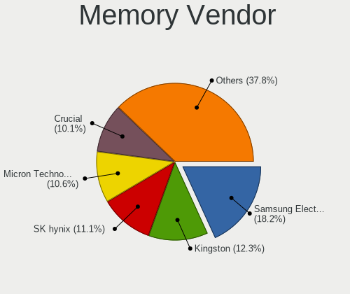

| Vendor                | Computers | Percent |
|-----------------------|-----------|---------|
| Samsung Electronics   | 35        | 17.86%  |
| Kingston              | 31        | 15.82%  |
| SK hynix              | 21        | 10.71%  |
| Unknown               | 20        | 10.2%   |
| Micron Technology     | 19        | 9.69%   |
| Corsair               | 16        | 8.16%   |
| Crucial               | 13        | 6.63%   |
| Kimtigo               | 5         | 2.55%   |
| Transcend             | 4         | 2.04%   |
| Apacer                | 4         | 2.04%   |
| A-DATA Technology     | 4         | 2.04%   |
| Ramaxel Technology    | 3         | 1.53%   |
| Nanya Technology      | 3         | 1.53%   |
| G.Skill               | 3         | 1.53%   |
| Elpida                | 3         | 1.53%   |
| Unknown (ABCD)        | 1         | 0.51%   |
| Unknown (07FB)        | 1         | 0.51%   |
| Toshiba               | 1         | 0.51%   |
| Tigo                  | 1         | 0.51%   |
| Teikon                | 1         | 0.51%   |
| Team                  | 1         | 0.51%   |
| SK_Hynix              | 1         | 0.51%   |
| Patriot               | 1         | 0.51%   |
| Kingmax Semiconductor | 1         | 0.51%   |
| HPE                   | 1         | 0.51%   |
| Hewlett-Packard       | 1         | 0.51%   |
| Avant                 | 1         | 0.51%   |

Memory Model
------------

Memory module models

| Model                                                             | Computers | Percent |
|-------------------------------------------------------------------|-----------|---------|
| Unknown RAM Module 4GB SODIMM DDR3 1333MT/s                       | 4         | 1.91%   |
| Samsung RAM M471B5173QH0-YK0 4GB SODIMM DDR3 1600MT/s             | 4         | 1.91%   |
| Kingston RAM KHX1600C9S3L/8G 8GB SODIMM DDR3 1600MT/s             | 3         | 1.44%   |
| Apacer RAM 37352E4138334331 2GB SODIMM DDR3 1333MT/s              | 3         | 1.44%   |
| Unknown RAM Module 4GB DIMM DDR3 1333MT/s                         | 2         | 0.96%   |
| Unknown RAM Module 2GB DIMM DDR2 667MT/s                          | 2         | 0.96%   |
| SK hynix RAM HMT41GS6BFR8A-PB 8GB SODIMM DDR3 1600MT/s            | 2         | 0.96%   |
| SK hynix RAM HMT325U6CFR8C-H9 2GB DIMM DDR3 1333MT/s              | 2         | 0.96%   |
| Samsung RAM Module 8GB SODIMM DDR4 2133MT/s                       | 2         | 0.96%   |
| Samsung RAM M471B5173QH0-YK0 4GB DIMM DDR3 1600MT/s               | 2         | 0.96%   |
| Samsung RAM M471A1K43CB1-CTD 8GB SODIMM DDR4 2667MT/s             | 2         | 0.96%   |
| Samsung RAM M378B5673FH0-CH9 2GB DIMM DDR3 1333MT/s               | 2         | 0.96%   |
| Kingston RAM 9965669-031.A00G 16GB DIMM DDR4 2400MT/s             | 2         | 0.96%   |
| Kimtigo RAM KT8GS3EDF 8GB SODIMM DDR3 1600MT/s                    | 2         | 0.96%   |
| Elpida RAM EBJ41UF8BCS0-DJ-F 4GB SODIMM DDR3 1333MT/s             | 2         | 0.96%   |
| Corsair RAM CMSO8GX4M1A2133C15 8GB SODIMM DDR4 2133MT/s           | 2         | 0.96%   |
| A-DATA RAM Module 4GB DIMM DDR4 1866MT/s                          | 2         | 0.96%   |
| Unknown RAM WPBS16D308SWD-4G 4GB DIMM DDR3 1600MT/s               | 1         | 0.48%   |
| Unknown RAM Module 8GB SODIMM LPDDR3 1867MT/s                     | 1         | 0.48%   |
| Unknown RAM Module 8GB SODIMM DDR3 1600MT/s                       | 1         | 0.48%   |
| Unknown RAM Module 8GB DIMM DDR4 2400MT/s                         | 1         | 0.48%   |
| Unknown RAM Module 8GB DIMM DDR3 1600MT/s                         | 1         | 0.48%   |
| Unknown RAM Module 8GB 1600MT/s                                   | 1         | 0.48%   |
| Unknown RAM Module 4GB SODIMM DDR3                                | 1         | 0.48%   |
| Unknown RAM Module 4GB SODIMM DDR2 800MT/s                        | 1         | 0.48%   |
| Unknown RAM Module 4GB DIMM DDR3 1600MT/s                         | 1         | 0.48%   |
| Unknown RAM Module 2GB SODIMM DDR2 667MT/s                        | 1         | 0.48%   |
| Unknown RAM Module 2GB DIMM DDR2                                  | 1         | 0.48%   |
| Unknown RAM Module 1GB SODIMM DDR2 667MT/s                        | 1         | 0.48%   |
| Unknown RAM Module 1GB DIMM DDR3 1333MT/s                         | 1         | 0.48%   |
| Unknown RAM Module 1GB DIMM DDR2 667MT/s                          | 1         | 0.48%   |
| Unknown (ABCD) RAM 123456789012345678 1536MB DIMM LPDDR4 2400MT/s | 1         | 0.48%   |
| Unknown (07FB) RAM GSA8G4SCL156P-21 8GB SODIMM DDR4 2133MT/s      | 1         | 0.48%   |
| Transcend RAM TS512MLH64V6HL 4GB SODIMM DDR4 2667MT/s             | 1         | 0.48%   |
| Transcend RAM TS2GSH64V1B 16GB SODIMM DDR4 2133MT/s               | 1         | 0.48%   |
| Transcend RAM JM1600KLN-4G 4GB DIMM DDR3 1600MT/s                 | 1         | 0.48%   |
| Transcend RAM JM1333KSN-4G 4GB DIMM DDR3 1333MT/s                 | 1         | 0.48%   |
| Toshiba RAM 9965527-025.A00LF 8GB SODIMM DDR3 1600MT/s            | 1         | 0.48%   |
| Tigo RAM 1600Mhz-8G 8GB SODIMM DDR3 1600MT/s                      | 1         | 0.48%   |
| Teikon RAM TMTS8G58DFRBFEN-16 8GB SODIMM DDR3 1600MT/s            | 1         | 0.48%   |

Memory Kind
-----------

Memory module kinds

| Kind    | Computers | Percent |
|---------|-----------|---------|
| DDR3    | 102       | 57.95%  |
| DDR4    | 59        | 33.52%  |
| DDR2    | 9         | 5.11%   |
| LPDDR3  | 2         | 1.14%   |
| Unknown | 2         | 1.14%   |
| LPDDR4  | 1         | 0.57%   |
| DDR     | 1         | 0.57%   |

Memory Form Factor
------------------

Physical design of the memory module

| Name         | Computers | Percent |
|--------------|-----------|---------|
| DIMM         | 89        | 50.28%  |
| SODIMM       | 84        | 47.46%  |
| Chip         | 2         | 1.13%   |
| Row Of Chips | 1         | 0.56%   |
| Unknown      | 1         | 0.56%   |

Memory Size
-----------

Memory module size

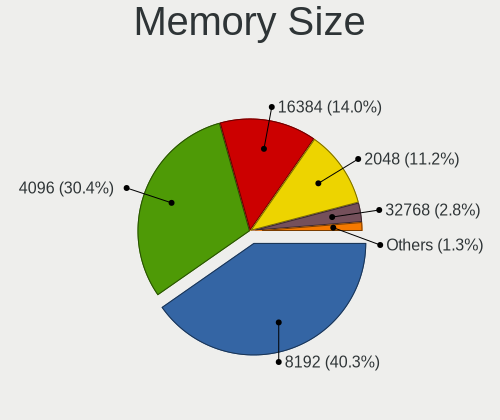

| Size  | Computers | Percent |
|-------|-----------|---------|
| 4096  | 71        | 36.98%  |
| 8192  | 69        | 35.94%  |
| 2048  | 29        | 15.1%   |
| 16384 | 16        | 8.33%   |
| 1024  | 4         | 2.08%   |
| 32768 | 3         | 1.56%   |

Memory Speed
------------

Memory module speed

| Speed   | Computers | Percent |
|---------|-----------|---------|
| 1600    | 62        | 33.7%   |
| 1333    | 37        | 20.11%  |
| 2400    | 15        | 8.15%   |
| 2667    | 14        | 7.61%   |
| 2133    | 14        | 7.61%   |
| 3200    | 9         | 4.89%   |
| 800     | 5         | 2.72%   |
| 667     | 5         | 2.72%   |
| 2666    | 4         | 2.17%   |
| 1866    | 4         | 2.17%   |
| 1867    | 3         | 1.63%   |
| 1334    | 3         | 1.63%   |
| 1067    | 2         | 1.09%   |
| Unknown | 2         | 1.09%   |
| 3400    | 1         | 0.54%   |
| 3000    | 1         | 0.54%   |
| 2933    | 1         | 0.54%   |
| 2134    | 1         | 0.54%   |
| 533     | 1         | 0.54%   |

Printers & scanners
-------------------

Printer Vendor
--------------

Printer device vendors

Zero info for selected period =(

Printer Model
-------------

Printer device models

Zero info for selected period =(

Scanner Vendor
--------------

Scanner device vendors

| Vendor | Computers | Percent |
|--------|-----------|---------|
| Canon  | 1         | 100%    |

Scanner Model
-------------

Scanner device models

| Model                   | Computers | Percent |
|-------------------------|-----------|---------|
| Canon CanoScan LiDE 110 | 1         | 100%    |

Camera
------

Camera Vendor
-------------

Camera device vendors

| Vendor                                 | Computers | Percent |
|----------------------------------------|-----------|---------|
| Chicony Electronics                    | 9         | 27.27%  |
| Realtek Semiconductor                  | 6         | 18.18%  |
| Lite-On Technology                     | 3         | 9.09%   |
| Apple                                  | 3         | 9.09%   |
| Microdia                               | 2         | 6.06%   |
| IMC Networks                           | 2         | 6.06%   |
| Acer                                   | 2         | 6.06%   |
| Sunplus Innovation Technology          | 1         | 3.03%   |
| Sonix Technology                       | 1         | 3.03%   |
| Ricoh                                  | 1         | 3.03%   |
| Logitech                               | 1         | 3.03%   |
| Cheng Uei Precision Industry (Foxlink) | 1         | 3.03%   |
| Alcor Micro                            | 1         | 3.03%   |

Camera Model
------------

Camera device models

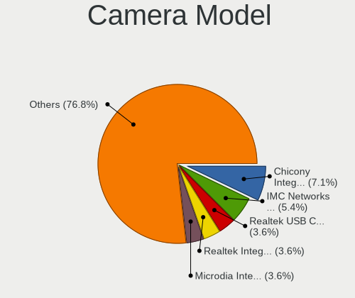

| Model                                         | Computers | Percent |
|-----------------------------------------------|-----------|---------|
| Realtek USB Camera                            | 2         | 6.06%   |
| Realtek Integrated_Webcam_HD                  | 2         | 6.06%   |
| Lite-On Integrated Camera                     | 2         | 6.06%   |
| Chicony Integrated Camera                     | 2         | 6.06%   |
| Chicony HD Webcam                             | 2         | 6.06%   |
| Apple FaceTime HD Camera                      | 2         | 6.06%   |
| Sunplus Laptop Integrated Webcam HD           | 1         | 3.03%   |
| Sonix FHD Webcam                              | 1         | 3.03%   |
| Ricoh USB2.0 Camera                           | 1         | 3.03%   |
| Realtek Lenovo EasyCamera                     | 1         | 3.03%   |
| Realtek Integrated Webcam HD                  | 1         | 3.03%   |
| Microdia Integrated_Webcam_HD                 | 1         | 3.03%   |
| Microdia Dell Integrated HD Webcam            | 1         | 3.03%   |
| Logitech HD Pro Webcam C920                   | 1         | 3.03%   |
| Lite-On TOSHIBA Web Camera - HD               | 1         | 3.03%   |
| IMC Networks Integrated Camera                | 1         | 3.03%   |
| IMC Networks EasyCamera                       | 1         | 3.03%   |
| Chicony thinkpad t430s camera                 | 1         | 3.03%   |
| Chicony Integrated Camera (1280x720@30)       | 1         | 3.03%   |
| Chicony HP Webcam [2 MP]                      | 1         | 3.03%   |
| Chicony HD WebCam (Acer)                      | 1         | 3.03%   |
| Chicony Chicony USB2.0 Camera                 | 1         | 3.03%   |
| Cheng Uei Precision Industry (Foxlink) Webcam | 1         | 3.03%   |
| Apple FaceTime HD Camera (Built-in)           | 1         | 3.03%   |
| Alcor Micro ASUS USB2.0 WebCam                | 1         | 3.03%   |
| Acer Lenovo EasyCamera                        | 1         | 3.03%   |
| Acer Integrated Camera                        | 1         | 3.03%   |

Security
--------

Fingerprint Vendor
------------------

Fingerprint sensor vendors

| Vendor             | Computers | Percent |
|--------------------|-----------|---------|
| Validity Sensors   | 2         | 28.57%  |
| Synaptics          | 2         | 28.57%  |
| AuthenTec          | 2         | 28.57%  |
| STMicroelectronics | 1         | 14.29%  |

Fingerprint Model
-----------------

Fingerprint sensor models

| Model                                             | Computers | Percent |
|---------------------------------------------------|-----------|---------|
| Validity Sensors VFS 5011 fingerprint sensor      | 1         | 14.29%  |
| Validity Sensors Synaptics WBDI                   | 1         | 14.29%  |
| Synaptics Prometheus MIS Touch Fingerprint Reader | 1         | 14.29%  |
| Synaptics Metallica MIS Touch Fingerprint Reader  | 1         | 14.29%  |
| STMicroelectronics Fingerprint Reader             | 1         | 14.29%  |
| AuthenTec AES2810                                 | 1         | 14.29%  |
| AuthenTec AES1660 Fingerprint Sensor              | 1         | 14.29%  |

Chipcard Vendor
---------------

Chipcard module vendors

Zero info for selected period =(

Chipcard Model
--------------

Chipcard module models

Zero info for selected period =(

Unsupported
-----------

Unsupported Devices
-------------------

Total unsupported devices on board

| Total | Computers | Percent |
|-------|-----------|---------|
| 1     | 92        | 43.4%   |
| 0     | 73        | 34.43%  |
| 2     | 31        | 14.62%  |
| 3     | 11        | 5.19%   |
| 4     | 5         | 2.36%   |

Unsupported Device Types
------------------------

Types of unsupported devices

| Type                     | Computers | Percent |
|--------------------------|-----------|---------|
| Communication controller | 118       | 64.48%  |
| Net/wireless             | 19        | 10.38%  |
| Bluetooth                | 13        | 7.1%    |
| Card reader              | 11        | 6.01%   |
| Fingerprint reader       | 6         | 3.28%   |
| Firewire controller      | 5         | 2.73%   |
| Net/ethernet             | 3         | 1.64%   |
| Graphics card            | 3         | 1.64%   |
| Storage/ata              | 2         | 1.09%   |
| Storage/raid             | 1         | 0.55%   |
| Storage                  | 1         | 0.55%   |
| Sound                    | 1         | 0.55%   |

