BSD in Poland - Tested Hardware & Statistics (Desktops)
-------------------------------------------------------

A project to collect tested hardware configurations for BSD in Poland.

Anyone can contribute to this report by the [hw-probe](https://github.com/linuxhw/hw-probe/blob/master/INSTALL.BSD.md) tool:

    hw-probe -all -upload

Please contribute! Especially if your hardware is rare.

Contents
--------

* [ Test Cases ](#test-cases)

* [ System ](#system)
  - [ OS                       ](#os)
  - [ OS Family                ](#os-family)
  - [ Arch                     ](#arch)
  - [ DE                       ](#de)
  - [ Display Server           ](#display-server)
  - [ Display Manager          ](#display-manager)
  - [ OS Lang                  ](#os-lang)
  - [ Boot Mode                ](#boot-mode)
  - [ Filesystem               ](#filesystem)
  - [ Part. scheme             ](#part-scheme)

* [ Board ](#board)
  - [ Vendor                   ](#vendor)
  - [ Model                    ](#model)
  - [ Model Family             ](#model-family)
  - [ MFG Year                 ](#mfg-year)
  - [ Form Factor              ](#form-factor)
  - [ Coreboot                 ](#coreboot)
  - [ RAM Size                 ](#ram-size)
  - [ RAM Used                 ](#ram-used)
  - [ Total Drives             ](#total-drives)
  - [ Has CD-ROM               ](#has-cd-rom)
  - [ Has Ethernet             ](#has-ethernet)
  - [ Has WiFi                 ](#has-wifi)
  - [ Has Bluetooth            ](#has-bluetooth)

* [ Location ](#location)
  - [ Country                  ](#country)
  - [ City                     ](#city)

* [ Drives ](#drives)
  - [ Drive Vendor             ](#drive-vendor)
  - [ Drive Model              ](#drive-model)
  - [ HDD Vendor               ](#hdd-vendor)
  - [ SSD Vendor               ](#ssd-vendor)
  - [ Drive Kind               ](#drive-kind)
  - [ Drive Connector          ](#drive-connector)
  - [ Drive Size               ](#drive-size)
  - [ Space Total              ](#space-total)
  - [ Space Used               ](#space-used)
  - [ Malfunc. Drives          ](#malfunc-drives)
  - [ Malfunc. Drive Vendor    ](#malfunc-drive-vendor)
  - [ Malfunc. HDD Vendor      ](#malfunc-hdd-vendor)
  - [ Malfunc. Drive Kind      ](#malfunc-drive-kind)
  - [ Failed Drives            ](#failed-drives)
  - [ Failed Drive Vendor      ](#failed-drive-vendor)
  - [ Drive Status             ](#drive-status)

* [ Storage controller ](#storage-controller)
  - [ Storage Vendor           ](#storage-vendor)
  - [ Storage Model            ](#storage-model)
  - [ Storage Kind             ](#storage-kind)

* [ Processor ](#processor)
  - [ CPU Vendor               ](#cpu-vendor)
  - [ CPU Model                ](#cpu-model)
  - [ CPU Model Family         ](#cpu-model-family)
  - [ CPU Cores                ](#cpu-cores)
  - [ CPU Sockets              ](#cpu-sockets)
  - [ CPU Threads              ](#cpu-threads)
  - [ CPU Microarch            ](#cpu-microarch)

* [ Graphics ](#graphics)
  - [ GPU Vendor               ](#gpu-vendor)
  - [ GPU Model                ](#gpu-model)
  - [ GPU Combo                ](#gpu-combo)
  - [ GPU Driver               ](#gpu-driver)
  - [ GPU Memory               ](#gpu-memory)

* [ Monitor ](#monitor)
  - [ Monitor Vendor           ](#monitor-vendor)
  - [ Monitor Model            ](#monitor-model)
  - [ Monitor Resolution       ](#monitor-resolution)
  - [ Monitor Diagonal         ](#monitor-diagonal)
  - [ Monitor Width            ](#monitor-width)
  - [ Aspect Ratio             ](#aspect-ratio)
  - [ Monitor Area             ](#monitor-area)
  - [ Pixel Density            ](#pixel-density)
  - [ Multiple Monitors        ](#multiple-monitors)

* [ Network ](#network)
  - [ Net Controller Vendor    ](#net-controller-vendor)
  - [ Net Controller Model     ](#net-controller-model)
  - [ Wireless Vendor          ](#wireless-vendor)
  - [ Wireless Model           ](#wireless-model)
  - [ Ethernet Vendor          ](#ethernet-vendor)
  - [ Ethernet Model           ](#ethernet-model)
  - [ Net Controller Kind      ](#net-controller-kind)
  - [ Used Controller          ](#used-controller)
  - [ NICs                     ](#nics)
  - [ IPv6                     ](#ipv6)

* [ Bluetooth ](#bluetooth)
  - [ Bluetooth Vendor         ](#bluetooth-vendor)
  - [ Bluetooth Model          ](#bluetooth-model)

* [ Sound ](#sound)
  - [ Sound Vendor             ](#sound-vendor)
  - [ Sound Model              ](#sound-model)

* [ Memory ](#memory)
  - [ Memory Vendor            ](#memory-vendor)
  - [ Memory Model             ](#memory-model)
  - [ Memory Kind              ](#memory-kind)
  - [ Memory Form Factor       ](#memory-form-factor)
  - [ Memory Size              ](#memory-size)
  - [ Memory Speed             ](#memory-speed)

* [ Printers & scanners ](#printers--scanners)
  - [ Printer Vendor           ](#printer-vendor)
  - [ Printer Model            ](#printer-model)
  - [ Scanner Vendor           ](#scanner-vendor)
  - [ Scanner Model            ](#scanner-model)

* [ Camera ](#camera)
  - [ Camera Vendor            ](#camera-vendor)
  - [ Camera Model             ](#camera-model)

* [ Security ](#security)
  - [ Fingerprint Vendor       ](#fingerprint-vendor)
  - [ Fingerprint Model        ](#fingerprint-model)
  - [ Chipcard Vendor          ](#chipcard-vendor)
  - [ Chipcard Model           ](#chipcard-model)

* [ Unsupported ](#unsupported)
  - [ Unsupported Devices      ](#unsupported-devices)
  - [ Unsupported Device Types ](#unsupported-device-types)

Test Cases
----------

Total: 523

| Vendor        | Model                       | Probe                                                     | Date         |
|---------------|-----------------------------|-----------------------------------------------------------|--------------|
| Gigabyte      | J4005ND2P-CF                | [fab0b32dc7](https://bsd-hardware.info/?probe=fab0b32dc7) | Dec 28, 2025 |
| Biostar       | J4125NHU                    | [9d72923faf](https://bsd-hardware.info/?probe=9d72923faf) | Dec 28, 2025 |
| Biostar       | J4125NHU                    | [a2e45c2a59](https://bsd-hardware.info/?probe=a2e45c2a59) | Dec 28, 2025 |
| ASRock        | N100M                       | [4f99de8a31](https://bsd-hardware.info/?probe=4f99de8a31) | Dec 28, 2025 |
| ASRock        | X570 Pro4                   | [81962180fa](https://bsd-hardware.info/?probe=81962180fa) | Dec 25, 2025 |
| Protectli     | V1410                       | [655f503723](https://bsd-hardware.info/?probe=655f503723) | Dec 21, 2025 |
| Wincor Nix... | M2.0-H110-uATX Motherboa... | [fac59b87e0](https://bsd-hardware.info/?probe=fac59b87e0) | Dec 20, 2025 |
| Fujitsu       | D3313-B1 S26361-D3313-B1    | [0b504098f4](https://bsd-hardware.info/?probe=0b504098f4) | Dec 20, 2025 |
| Unknown       | Unknown                     | [4915ce02c7](https://bsd-hardware.info/?probe=4915ce02c7) | Dec 18, 2025 |
| ASUSTek       | Z10PA-U8 Series             | [7dbdf4a9a9](https://bsd-hardware.info/?probe=7dbdf4a9a9) | Dec 05, 2025 |
| MSI           | MAG Z790 TOMAHAWK MAX WI... | [dd395c355e](https://bsd-hardware.info/?probe=dd395c355e) | Nov 20, 2025 |
| CWWK          | CW-AD4L-N V1                | [3478ea8bcf](https://bsd-hardware.info/?probe=3478ea8bcf) | Nov 16, 2025 |
| HP            | 21EF 00.~                   | [c4c315d548](https://bsd-hardware.info/?probe=c4c315d548) | Nov 09, 2025 |
| AOpen         | iBTMx-DS R1.10 55DED10A0... | [ef232a7d5d](https://bsd-hardware.info/?probe=ef232a7d5d) | Nov 09, 2025 |
| Intel         | DQ77MK AAG39642-400         | [165ad8ccf7](https://bsd-hardware.info/?probe=165ad8ccf7) | Nov 07, 2025 |
| ASUSTek       | PRIME H310M-D R2.0          | [c5849e0963](https://bsd-hardware.info/?probe=c5849e0963) | Oct 27, 2025 |
| Dell          | 0NW6H5 A00                  | [89c0e5056b](https://bsd-hardware.info/?probe=89c0e5056b) | Oct 24, 2025 |
| ASRock        | H510 Pro BTC+               | [cb5da041fa](https://bsd-hardware.info/?probe=cb5da041fa) | Oct 15, 2025 |
| Unknown       | Unknown                     | [8f325d378f](https://bsd-hardware.info/?probe=8f325d378f) | Oct 04, 2025 |
| Unknown       | Unknown                     | [622add33b1](https://bsd-hardware.info/?probe=622add33b1) | Oct 03, 2025 |
| Unknown       | Unknown                     | [e395e6db6c](https://bsd-hardware.info/?probe=e395e6db6c) | Sep 24, 2025 |
| Intel         | DQ77MK AAG39642-400         | [6176796649](https://bsd-hardware.info/?probe=6176796649) | Sep 22, 2025 |
| AOpen         | iBTMx-DS R1.10 55DED10A0... | [1c812c72b6](https://bsd-hardware.info/?probe=1c812c72b6) | Sep 17, 2025 |
| Unknown       | Unknown                     | [5fb9dc2de7](https://bsd-hardware.info/?probe=5fb9dc2de7) | Sep 16, 2025 |
| HP            | 21EF 00.~                   | [a8856c1eac](https://bsd-hardware.info/?probe=a8856c1eac) | Sep 15, 2025 |
| HP            | 21EF 00.~                   | [8d119797ff](https://bsd-hardware.info/?probe=8d119797ff) | Sep 15, 2025 |
| ASRock        | H510 Pro BTC+               | [afa245f519](https://bsd-hardware.info/?probe=afa245f519) | Sep 14, 2025 |
| Intel         | DQ77MK AAG39642-400         | [f211734892](https://bsd-hardware.info/?probe=f211734892) | Sep 11, 2025 |
| Unknown       | Unknown                     | [61c4dc29dc](https://bsd-hardware.info/?probe=61c4dc29dc) | Sep 08, 2025 |
| HP            | 21EF 00.~                   | [204e07d34a](https://bsd-hardware.info/?probe=204e07d34a) | Sep 05, 2025 |
| Unknown       | Unknown                     | [bcaeb35922](https://bsd-hardware.info/?probe=bcaeb35922) | Sep 02, 2025 |
| Unknown       | Unknown                     | [0214893818](https://bsd-hardware.info/?probe=0214893818) | Aug 24, 2025 |
| HP            | 3396                        | [58dea99364](https://bsd-hardware.info/?probe=58dea99364) | Aug 11, 2025 |
| HP            | 17E2                        | [d1187635ea](https://bsd-hardware.info/?probe=d1187635ea) | Aug 09, 2025 |
| Unknown       | Unknown                     | [2d7980b5e3](https://bsd-hardware.info/?probe=2d7980b5e3) | Aug 08, 2025 |
| Dell          | 0D4MD1 A04                  | [efbd3718aa](https://bsd-hardware.info/?probe=efbd3718aa) | Aug 03, 2025 |
| ASRock        | H510 Pro BTC+               | [bb7bbce3d7](https://bsd-hardware.info/?probe=bb7bbce3d7) | Jul 28, 2025 |
| Intel         | Q3XXG4-P V1.0               | [287f0e48e2](https://bsd-hardware.info/?probe=287f0e48e2) | Jul 23, 2025 |
| Unknown       | Unknown                     | [fa5ace0c09](https://bsd-hardware.info/?probe=fa5ace0c09) | Jul 09, 2025 |
| ASRock        | N100M                       | [186380feef](https://bsd-hardware.info/?probe=186380feef) | Jul 08, 2025 |
| ASRock        | SBC-210                     | [0ef46acbb3](https://bsd-hardware.info/?probe=0ef46acbb3) | Jun 27, 2025 |
| NU591R        | 1.0                         | [e968aa8e02](https://bsd-hardware.info/?probe=e968aa8e02) | Jun 27, 2025 |
| Unknown       | Unknown                     | [c72f876ffb](https://bsd-hardware.info/?probe=c72f876ffb) | Jun 23, 2025 |
| Unknown       | Unknown                     | [df26e76470](https://bsd-hardware.info/?probe=df26e76470) | Jun 23, 2025 |
| AOpen         | iBTMx-DS R1.10 55DED10A0... | [344a8c0d7e](https://bsd-hardware.info/?probe=344a8c0d7e) | Jun 22, 2025 |
| Biostar       | J4125NHU                    | [a41747a045](https://bsd-hardware.info/?probe=a41747a045) | Jun 20, 2025 |
| AOpen         | iBTMx-DS R1.10 55DED10A0... | [bc31656cbe](https://bsd-hardware.info/?probe=bc31656cbe) | Jun 15, 2025 |
| Unknown       | Unknown                     | [abe8245d9b](https://bsd-hardware.info/?probe=abe8245d9b) | Jun 13, 2025 |
| Protectli     | V1410                       | [34dad34c82](https://bsd-hardware.info/?probe=34dad34c82) | Jun 07, 2025 |
| Unknown       | Unknown                     | [bc4ff40183](https://bsd-hardware.info/?probe=bc4ff40183) | Jun 07, 2025 |
| Techvision    | TVI7309X B0                 | [b55da67328](https://bsd-hardware.info/?probe=b55da67328) | Jun 06, 2025 |
| HP            | 17E2                        | [842abba043](https://bsd-hardware.info/?probe=842abba043) | Jun 05, 2025 |
| Fujitsu       | D3313-A1 S26361-D3313-A1    | [0edae5e574](https://bsd-hardware.info/?probe=0edae5e574) | May 24, 2025 |
| Unknown       | Unknown                     | [0ab6c68407](https://bsd-hardware.info/?probe=0ab6c68407) | May 23, 2025 |
| ASUSTek       | TUF Gaming Z890-PRO WIFI    | [d20947a825](https://bsd-hardware.info/?probe=d20947a825) | May 11, 2025 |
| IceWhale T... | ZBB001-BK10032 ZMB          | [e8392f351b](https://bsd-hardware.info/?probe=e8392f351b) | May 10, 2025 |
| xunlong       | Orange Pi 3B v1.1           | [bb61dc152d](https://bsd-hardware.info/?probe=bb61dc152d) | Apr 28, 2025 |
| HP            | 17E2                        | [d746c1123d](https://bsd-hardware.info/?probe=d746c1123d) | Apr 27, 2025 |
| Unknown       | Unknown                     | [f46b47942d](https://bsd-hardware.info/?probe=f46b47942d) | Apr 26, 2025 |
| Unknown       | Unknown                     | [3e6d9297c6](https://bsd-hardware.info/?probe=3e6d9297c6) | Apr 24, 2025 |
| ASRock        | H370M-ITX/ac                | [4a501ca582](https://bsd-hardware.info/?probe=4a501ca582) | Apr 21, 2025 |
| ASRock        | SBC-210                     | [eb4aabc226](https://bsd-hardware.info/?probe=eb4aabc226) | Apr 19, 2025 |
| LCO           | A320M-A PRO M2              | [b824b92901](https://bsd-hardware.info/?probe=b824b92901) | Apr 18, 2025 |
| Unknown       | Unknown                     | [a348bf3391](https://bsd-hardware.info/?probe=a348bf3391) | Apr 17, 2025 |
| Unknown       | Unknown                     | [baa3b3c513](https://bsd-hardware.info/?probe=baa3b3c513) | Apr 17, 2025 |
| Unknown       | Unknown                     | [f296143547](https://bsd-hardware.info/?probe=f296143547) | Apr 17, 2025 |
| ASUSTek       | Z10PA-U8 Series             | [3bc8e7fcb7](https://bsd-hardware.info/?probe=3bc8e7fcb7) | Apr 12, 2025 |
| Unknown       | Unknown                     | [f91d5ef082](https://bsd-hardware.info/?probe=f91d5ef082) | Apr 11, 2025 |
| Fujitsu       | D3313-A1 S26361-D3313-A1    | [7f4661c827](https://bsd-hardware.info/?probe=7f4661c827) | Apr 03, 2025 |
| Unknown       | Unknown                     | [f6dbcb860d](https://bsd-hardware.info/?probe=f6dbcb860d) | Mar 28, 2025 |
| ASRock        | H370M-ITX/ac                | [221da30d49](https://bsd-hardware.info/?probe=221da30d49) | Mar 26, 2025 |
| ASRock        | H370M-ITX/ac                | [ed76bc6900](https://bsd-hardware.info/?probe=ed76bc6900) | Mar 26, 2025 |
| HP            | 8056                        | [8a8f5b5d40](https://bsd-hardware.info/?probe=8a8f5b5d40) | Mar 24, 2025 |
| ASUSTek       | Z10PA-U8 Series             | [29b0f8e87d](https://bsd-hardware.info/?probe=29b0f8e87d) | Mar 18, 2025 |
| Lenovo        | MAHOBAY                     | [4e5453823e](https://bsd-hardware.info/?probe=4e5453823e) | Mar 07, 2025 |
| HP            | 3397                        | [9c899c390f](https://bsd-hardware.info/?probe=9c899c390f) | Mar 07, 2025 |
| Unknown       | Unknown                     | [7033a4807c](https://bsd-hardware.info/?probe=7033a4807c) | Mar 06, 2025 |
| MSI           | Z370 PC PRO                 | [15e3e22705](https://bsd-hardware.info/?probe=15e3e22705) | Mar 05, 2025 |
| Biostar       | J4125NHU                    | [0af6f04848](https://bsd-hardware.info/?probe=0af6f04848) | Mar 04, 2025 |
| Protectli     | V1410                       | [c07e915c8b](https://bsd-hardware.info/?probe=c07e915c8b) | Mar 02, 2025 |
| ASUSTek       | PRIME H310M-D R2.0          | [bb149e96b4](https://bsd-hardware.info/?probe=bb149e96b4) | Feb 25, 2025 |
| HP            | 213D A01                    | [6df4f0d4fc](https://bsd-hardware.info/?probe=6df4f0d4fc) | Feb 25, 2025 |
| Fujitsu       | D3313-A1 S26361-D3313-A1    | [cb0f8f42d8](https://bsd-hardware.info/?probe=cb0f8f42d8) | Feb 22, 2025 |
| HP            | 8056                        | [059c274aa1](https://bsd-hardware.info/?probe=059c274aa1) | Feb 20, 2025 |
| CheckPoint    | QS-22-00                    | [0a111ef681](https://bsd-hardware.info/?probe=0a111ef681) | Feb 19, 2025 |
| Unknown       | Unknown                     | [78ab25d174](https://bsd-hardware.info/?probe=78ab25d174) | Feb 17, 2025 |
| Protectli     | V1410                       | [11599d3413](https://bsd-hardware.info/?probe=11599d3413) | Feb 15, 2025 |
| Fujitsu       | D3543-A1 S26361-D3543-A1... | [e54e66f244](https://bsd-hardware.info/?probe=e54e66f244) | Feb 14, 2025 |
| Fujitsu       | D3543-A1 S26361-D3543-A1... | [5cbae9683a](https://bsd-hardware.info/?probe=5cbae9683a) | Feb 14, 2025 |
| ASUSTek       | Z10PA-U8 Series             | [1193915796](https://bsd-hardware.info/?probe=1193915796) | Feb 13, 2025 |
| HP            | 8056                        | [9b58f3be10](https://bsd-hardware.info/?probe=9b58f3be10) | Feb 11, 2025 |
| Fujitsu       | D3313-A1 S26361-D3313-A1    | [ae8c4d3839](https://bsd-hardware.info/?probe=ae8c4d3839) | Feb 09, 2025 |
| Unknown       | Unknown                     | [68c71bbfab](https://bsd-hardware.info/?probe=68c71bbfab) | Feb 08, 2025 |
| CheckPoint    | QS-22-00                    | [0d46035e49](https://bsd-hardware.info/?probe=0d46035e49) | Feb 05, 2025 |
| CheckPoint    | QS-22-00                    | [aa070df7a0](https://bsd-hardware.info/?probe=aa070df7a0) | Feb 05, 2025 |
| Dell          | 030VXY A02                  | [bb9126087f](https://bsd-hardware.info/?probe=bb9126087f) | Feb 02, 2025 |
| HP            | 17E2                        | [bdb840ee5d](https://bsd-hardware.info/?probe=bdb840ee5d) | Jan 31, 2025 |
| xunlong       | Orange Pi 3B v1.1           | [99d7cd5d62](https://bsd-hardware.info/?probe=99d7cd5d62) | Jan 31, 2025 |
| Protectli     | V1410                       | [60f660f376](https://bsd-hardware.info/?probe=60f660f376) | Jan 26, 2025 |
| Dell          | 030VXY A02                  | [ca832592ce](https://bsd-hardware.info/?probe=ca832592ce) | Jan 25, 2025 |
| Fujitsu       | D3167-A1 S26361-D3167-A1    | [7639c665eb](https://bsd-hardware.info/?probe=7639c665eb) | Jan 23, 2025 |
| Dell          | 08NPPY A00                  | [cd7b468b5b](https://bsd-hardware.info/?probe=cd7b468b5b) | Jan 23, 2025 |
| MSI           | MS-98G6                     | [7149cd797e](https://bsd-hardware.info/?probe=7149cd797e) | Jan 21, 2025 |
| HP            | 213D A01                    | [afd15efbe1](https://bsd-hardware.info/?probe=afd15efbe1) | Jan 19, 2025 |
| ASRock        | H370M-ITX/ac                | [6c0ff0dc1e](https://bsd-hardware.info/?probe=6c0ff0dc1e) | Jan 18, 2025 |
| Unknown       | Unknown                     | [c962b778bb](https://bsd-hardware.info/?probe=c962b778bb) | Jan 12, 2025 |
| Unknown       | Unknown                     | [2cb490448d](https://bsd-hardware.info/?probe=2cb490448d) | Jan 11, 2025 |
| ASRock        | N100M                       | [6f731c0dca](https://bsd-hardware.info/?probe=6f731c0dca) | Jan 11, 2025 |
| MSI           | Z97I AC                     | [bb77264a7a](https://bsd-hardware.info/?probe=bb77264a7a) | Jan 10, 2025 |
| MSI           | Z97I AC                     | [598b5cc048](https://bsd-hardware.info/?probe=598b5cc048) | Jan 09, 2025 |
| Unknown       | Unknown                     | [a4bbd79171](https://bsd-hardware.info/?probe=a4bbd79171) | Jan 08, 2025 |
| Unknown       | QDNV01                      | [ca2dd0099d](https://bsd-hardware.info/?probe=ca2dd0099d) | Jan 05, 2025 |
| Dell          | 0JP3NX A00                  | [27d474564d](https://bsd-hardware.info/?probe=27d474564d) | Dec 24, 2024 |
| MSI           | Z97I AC                     | [b6ff881901](https://bsd-hardware.info/?probe=b6ff881901) | Dec 21, 2024 |
| PC Engines    | APU2                        | [731738fd98](https://bsd-hardware.info/?probe=731738fd98) | Dec 15, 2024 |
| MSI           | Z97I AC                     | [844a11760c](https://bsd-hardware.info/?probe=844a11760c) | Dec 13, 2024 |
| MSI           | Z97 GAMING 3                | [9cd14a585d](https://bsd-hardware.info/?probe=9cd14a585d) | Dec 04, 2024 |
| OEM           | BayTrail JHS60K             | [0e795e9e06](https://bsd-hardware.info/?probe=0e795e9e06) | Nov 30, 2024 |
| Lenovo        | 0x30F617AA SDK0J40705 WI... | [793b039943](https://bsd-hardware.info/?probe=793b039943) | Nov 29, 2024 |
| iEi           | B542 V1.00                  | [fc2b00d368](https://bsd-hardware.info/?probe=fc2b00d368) | Nov 24, 2024 |
| Unknown       | QDNV01                      | [3c7e558c94](https://bsd-hardware.info/?probe=3c7e558c94) | Nov 22, 2024 |
| Acer          | Revo RL80                   | [51e0b0c016](https://bsd-hardware.info/?probe=51e0b0c016) | Nov 22, 2024 |
| ASUSTek       | PRIME H310M-D R2.0          | [e59272c611](https://bsd-hardware.info/?probe=e59272c611) | Nov 18, 2024 |
| ASRock        | N100M                       | [62d2f6b522](https://bsd-hardware.info/?probe=62d2f6b522) | Nov 14, 2024 |
| Fujitsu       | D3313-A1 S26361-D3313-A1    | [8b74f88be7](https://bsd-hardware.info/?probe=8b74f88be7) | Nov 14, 2024 |
| MSI           | B450-A PRO MAX              | [265f542246](https://bsd-hardware.info/?probe=265f542246) | Nov 12, 2024 |
| HP            | 17E2                        | [1125a48b97](https://bsd-hardware.info/?probe=1125a48b97) | Oct 27, 2024 |
| ASUSTek       | P5G41T-M LX3                | [1195b00783](https://bsd-hardware.info/?probe=1195b00783) | Oct 18, 2024 |
| ASRock        | N100M                       | [2634b14037](https://bsd-hardware.info/?probe=2634b14037) | Oct 13, 2024 |
| Hardkernel    | ODROID-H2                   | [fdbcde66d7](https://bsd-hardware.info/?probe=fdbcde66d7) | Oct 13, 2024 |
| Unknown       | Unknown                     | [9f95f388e0](https://bsd-hardware.info/?probe=9f95f388e0) | Oct 12, 2024 |
| Unknown       | Unknown                     | [d7f091b659](https://bsd-hardware.info/?probe=d7f091b659) | Oct 06, 2024 |
| Lenovo        | MAHOBAY 0B98401 PRO         | [174b97a5f7](https://bsd-hardware.info/?probe=174b97a5f7) | Oct 06, 2024 |
| Intel         | J1900                       | [5193dbe58d](https://bsd-hardware.info/?probe=5193dbe58d) | Oct 02, 2024 |
| Biostar       | B450MHP                     | [af6e8cf307](https://bsd-hardware.info/?probe=af6e8cf307) | Sep 29, 2024 |
| Unknown       | Unknown                     | [2f6692ef1f](https://bsd-hardware.info/?probe=2f6692ef1f) | Sep 29, 2024 |
| HP            | 213D A01                    | [487226104e](https://bsd-hardware.info/?probe=487226104e) | Sep 28, 2024 |
| Supermicro    | X9SCL/X9SCMA                | [063740b539](https://bsd-hardware.info/?probe=063740b539) | Sep 25, 2024 |
| Fujitsu       | D3544-A1 S26361-D3544-A1... | [3082b44977](https://bsd-hardware.info/?probe=3082b44977) | Sep 24, 2024 |
| NU591R        | 1.0                         | [d993b74208](https://bsd-hardware.info/?probe=d993b74208) | Sep 24, 2024 |
| Dell          | 03NVJ6 A01                  | [ebf63c5ffd](https://bsd-hardware.info/?probe=ebf63c5ffd) | Sep 22, 2024 |
| Dell          | 03NVJ6 A01                  | [f13225748a](https://bsd-hardware.info/?probe=f13225748a) | Sep 18, 2024 |
| Shuttle       | FZ270                       | [eff73dcdb7](https://bsd-hardware.info/?probe=eff73dcdb7) | Sep 17, 2024 |
| ASUSTek       | P7P55D                      | [dd70c06a90](https://bsd-hardware.info/?probe=dd70c06a90) | Sep 17, 2024 |
| Unknown       | Unknown                     | [586433be33](https://bsd-hardware.info/?probe=586433be33) | Sep 11, 2024 |
| ASRock        | B360M Pro4                  | [64d222278e](https://bsd-hardware.info/?probe=64d222278e) | Sep 06, 2024 |
| Lenovo        | MAHOBAY 0B98401 PRO         | [2655c01614](https://bsd-hardware.info/?probe=2655c01614) | Sep 05, 2024 |
| Unknown       | Unknown                     | [e58c13f756](https://bsd-hardware.info/?probe=e58c13f756) | Sep 02, 2024 |
| Unknown       | Unknown                     | [ebb28a1abb](https://bsd-hardware.info/?probe=ebb28a1abb) | Aug 24, 2024 |
| ASUSTek       | Z10PA-U8 Series             | [4e57035d21](https://bsd-hardware.info/?probe=4e57035d21) | Aug 24, 2024 |
| ASUSTek       | P7P55D                      | [4d303038e8](https://bsd-hardware.info/?probe=4d303038e8) | Aug 21, 2024 |
| ASUSTek       | P7P55D                      | [d457cff496](https://bsd-hardware.info/?probe=d457cff496) | Aug 19, 2024 |
| ASUSTek       | ROG STRIX B550-I GAMING     | [bb5610fbd5](https://bsd-hardware.info/?probe=bb5610fbd5) | Aug 18, 2024 |
| Unknown       | Unknown                     | [dd5c3a1a85](https://bsd-hardware.info/?probe=dd5c3a1a85) | Aug 18, 2024 |
| Techvision    | TVI7309X B0                 | [984f299fae](https://bsd-hardware.info/?probe=984f299fae) | Aug 11, 2024 |
| Lenovo        | 3098 SDK0E50510 PRO or W... | [49322a0f1b](https://bsd-hardware.info/?probe=49322a0f1b) | Aug 10, 2024 |
| Fujitsu       | D3543-A1 S26361-D3543-A1... | [4b81b4bd7f](https://bsd-hardware.info/?probe=4b81b4bd7f) | Aug 08, 2024 |
| Shuttle       | FZ270                       | [a509bdd918](https://bsd-hardware.info/?probe=a509bdd918) | Aug 06, 2024 |
| ASUSTek       | Z10PA-U8 Series             | [6c162eb9de](https://bsd-hardware.info/?probe=6c162eb9de) | Aug 04, 2024 |
| Fujitsu       | D3313-A1 S26361-D3313-A1    | [65838d86a4](https://bsd-hardware.info/?probe=65838d86a4) | Jul 31, 2024 |
| ASUSTek       | P8P67 LE                    | [38d26ac7ef](https://bsd-hardware.info/?probe=38d26ac7ef) | Jul 30, 2024 |
| Unknown       | Unknown                     | [3f5facaca0](https://bsd-hardware.info/?probe=3f5facaca0) | Jul 28, 2024 |
| Fujitsu       | D3313-A1 S26361-D3313-A1    | [769af57314](https://bsd-hardware.info/?probe=769af57314) | Jul 19, 2024 |
| NU591R        | 1.0                         | [15bdc18801](https://bsd-hardware.info/?probe=15bdc18801) | Jul 16, 2024 |
| Protectli     | V1410                       | [a009041b01](https://bsd-hardware.info/?probe=a009041b01) | Jul 14, 2024 |
| Gigabyte      | H170M-D3H                   | [7fc1b74405](https://bsd-hardware.info/?probe=7fc1b74405) | Jul 11, 2024 |
| MSI           | Z77A-G43                    | [9dbddeec9f](https://bsd-hardware.info/?probe=9dbddeec9f) | Jun 26, 2024 |
| MSI           | Z77A-G43                    | [794812339d](https://bsd-hardware.info/?probe=794812339d) | Jun 26, 2024 |
| Gigabyte      | X670 GAMING X AX V2         | [4ba8f14215](https://bsd-hardware.info/?probe=4ba8f14215) | Jun 23, 2024 |
| Supermicro    | X9SCL/X9SCMA                | [3bae42b16c](https://bsd-hardware.info/?probe=3bae42b16c) | Jun 23, 2024 |
| Supermicro    | X9SCL/X9SCMA                | [43d331e51c](https://bsd-hardware.info/?probe=43d331e51c) | Jun 22, 2024 |
| Unknown       | Unknown                     | [0ccbb8fb68](https://bsd-hardware.info/?probe=0ccbb8fb68) | Jun 21, 2024 |
| ASUSTek       | Z10PA-U8 Series             | [ed87446558](https://bsd-hardware.info/?probe=ed87446558) | Jun 15, 2024 |
| ASUSTek       | Z10PA-U8 Series             | [386e93d33b](https://bsd-hardware.info/?probe=386e93d33b) | Jun 15, 2024 |
| MSI           | PRO Z690-A WIFI DDR4        | [2ccb52d7b5](https://bsd-hardware.info/?probe=2ccb52d7b5) | Jun 11, 2024 |
| CheckPoint    | QS-22-00                    | [2b53b8d5eb](https://bsd-hardware.info/?probe=2b53b8d5eb) | Jun 11, 2024 |
| CheckPoint    | QS-22-00                    | [b077c2faa1](https://bsd-hardware.info/?probe=b077c2faa1) | Jun 11, 2024 |
| ASUSTek       | Maximus IV GENE-Z           | [5b53bd70e9](https://bsd-hardware.info/?probe=5b53bd70e9) | Jun 08, 2024 |
| CheckPoint    | QS-22-00                    | [8b2b2b405b](https://bsd-hardware.info/?probe=8b2b2b405b) | Jun 06, 2024 |
| Unknown       | Unknown                     | [60afe7652a](https://bsd-hardware.info/?probe=60afe7652a) | Jun 04, 2024 |
| ASRock        | X99 Extreme4                | [af182c3b9b](https://bsd-hardware.info/?probe=af182c3b9b) | Jun 04, 2024 |
| PC Engines    | apu6                        | [1ddfd14973](https://bsd-hardware.info/?probe=1ddfd14973) | Jun 02, 2024 |
| HP            | 18E5                        | [c599ffe53f](https://bsd-hardware.info/?probe=c599ffe53f) | May 31, 2024 |
| Giada         | Apollolake JHS61L           | [d7c4508cf5](https://bsd-hardware.info/?probe=d7c4508cf5) | May 29, 2024 |
| Unknown       | Unknown                     | [aae0ad6a9a](https://bsd-hardware.info/?probe=aae0ad6a9a) | May 28, 2024 |
| HP            | 213D A01                    | [f2751f087b](https://bsd-hardware.info/?probe=f2751f087b) | May 24, 2024 |
| Unknown       | Unknown                     | [5bf9269ec0](https://bsd-hardware.info/?probe=5bf9269ec0) | May 23, 2024 |
| Unknown       | Unknown                     | [729aeb790d](https://bsd-hardware.info/?probe=729aeb790d) | May 19, 2024 |
| Unknown       | Unknown                     | [b158edf2bd](https://bsd-hardware.info/?probe=b158edf2bd) | May 19, 2024 |
| Unknown       | Unknown                     | [1f563c3df1](https://bsd-hardware.info/?probe=1f563c3df1) | May 19, 2024 |
| HP            | 213D A01                    | [56245654e5](https://bsd-hardware.info/?probe=56245654e5) | May 18, 2024 |
| Unknown       | Unknown                     | [e54a161178](https://bsd-hardware.info/?probe=e54a161178) | Apr 28, 2024 |
| HP            | 8054                        | [7a76b345c0](https://bsd-hardware.info/?probe=7a76b345c0) | Apr 23, 2024 |
| HP            | 8054                        | [040f48e020](https://bsd-hardware.info/?probe=040f48e020) | Apr 23, 2024 |
| HP            | 3396                        | [f154c34157](https://bsd-hardware.info/?probe=f154c34157) | Apr 19, 2024 |
| ASRock        | X99 Extreme4                | [8d5a19e786](https://bsd-hardware.info/?probe=8d5a19e786) | Apr 13, 2024 |
| ASRock        | X99 Extreme4                | [f2fdbc8d66](https://bsd-hardware.info/?probe=f2fdbc8d66) | Apr 13, 2024 |
| Fujitsu       | D3313-A1 S26361-D3313-A1    | [66aaf90799](https://bsd-hardware.info/?probe=66aaf90799) | Apr 12, 2024 |
| Unknown       | Unknown                     | [55fcf12f06](https://bsd-hardware.info/?probe=55fcf12f06) | Apr 12, 2024 |
| Gigabyte      | H97M-D3H                    | [8c0a605e99](https://bsd-hardware.info/?probe=8c0a605e99) | Apr 10, 2024 |
| HP            | ProLiant ML310e Gen8        | [040c686c32](https://bsd-hardware.info/?probe=040c686c32) | Apr 07, 2024 |
| Intel         | D2500CC AAG81477-400        | [883217db7f](https://bsd-hardware.info/?probe=883217db7f) | Apr 05, 2024 |
| Unknown       | Unknown                     | [b0994abd3c](https://bsd-hardware.info/?probe=b0994abd3c) | Apr 04, 2024 |
| Unknown       | Unknown                     | [c805058269](https://bsd-hardware.info/?probe=c805058269) | Apr 03, 2024 |
| ASRock        | A520M-ITX/ac                | [1239807f69](https://bsd-hardware.info/?probe=1239807f69) | Mar 30, 2024 |
| ASUSTek       | P5G41T-M LX2/GB             | [be101e8917](https://bsd-hardware.info/?probe=be101e8917) | Mar 29, 2024 |
| MSI           | MS-98G4                     | [22901a90e7](https://bsd-hardware.info/?probe=22901a90e7) | Mar 25, 2024 |
| ASUSTek       | SABERTOOTH 990FX R2.0       | [c00f4d37cc](https://bsd-hardware.info/?probe=c00f4d37cc) | Mar 22, 2024 |
| Gigabyte      | B550 GAMING X V2            | [6741cefeb7](https://bsd-hardware.info/?probe=6741cefeb7) | Mar 12, 2024 |
| Unknown       | Unknown                     | [a88d3b4a91](https://bsd-hardware.info/?probe=a88d3b4a91) | Mar 09, 2024 |
| Unknown       | QDNV01                      | [2092ae4116](https://bsd-hardware.info/?probe=2092ae4116) | Mar 09, 2024 |
| Unknown       | QDNV01                      | [1d7ee8bcc2](https://bsd-hardware.info/?probe=1d7ee8bcc2) | Mar 09, 2024 |
| Fujitsu       | D3313-A1 S26361-D3313-A1    | [c050de5841](https://bsd-hardware.info/?probe=c050de5841) | Mar 01, 2024 |
| HP            | 213D A01                    | [c5bdc2713e](https://bsd-hardware.info/?probe=c5bdc2713e) | Feb 27, 2024 |
| Lenovo        | MAHOBAY 0B98401 PRO         | [1f76f6d5f9](https://bsd-hardware.info/?probe=1f76f6d5f9) | Feb 25, 2024 |
| Dell          | 0G261D A00                  | [34a8d8ab2f](https://bsd-hardware.info/?probe=34a8d8ab2f) | Feb 25, 2024 |
| Biostar       | J4125NHU                    | [1527f68f80](https://bsd-hardware.info/?probe=1527f68f80) | Feb 19, 2024 |
| HP            | 17E2                        | [946d33d274](https://bsd-hardware.info/?probe=946d33d274) | Feb 09, 2024 |
| Unknown       | Unknown                     | [0bf7e7f085](https://bsd-hardware.info/?probe=0bf7e7f085) | Feb 03, 2024 |
| Gigabyte      | Z690 UD DDR4                | [f6f19ac329](https://bsd-hardware.info/?probe=f6f19ac329) | Feb 02, 2024 |
| Dell          | 0NW6H5 A00                  | [043918562c](https://bsd-hardware.info/?probe=043918562c) | Jan 30, 2024 |
| Gigabyte      | Z690 UD DDR4                | [8b93ca6177](https://bsd-hardware.info/?probe=8b93ca6177) | Jan 29, 2024 |
| Gigabyte      | Z690 UD DDR4                | [5d0e727014](https://bsd-hardware.info/?probe=5d0e727014) | Jan 29, 2024 |
| HP            | 17E2                        | [f5d50d721e](https://bsd-hardware.info/?probe=f5d50d721e) | Jan 28, 2024 |
| ASRock        | H310M-ITX/ac                | [55ac417044](https://bsd-hardware.info/?probe=55ac417044) | Jan 28, 2024 |
| HP            | 17E2                        | [970b437e61](https://bsd-hardware.info/?probe=970b437e61) | Jan 21, 2024 |
| HP            | 213D A01                    | [23ae22cd46](https://bsd-hardware.info/?probe=23ae22cd46) | Jan 19, 2024 |
| Unknown       | Unknown                     | [6afcd4a25f](https://bsd-hardware.info/?probe=6afcd4a25f) | Jan 19, 2024 |
| Unknown       | Unknown                     | [36e0f351c2](https://bsd-hardware.info/?probe=36e0f351c2) | Jan 18, 2024 |
| Fujitsu       | D3313-A1 S26361-D3313-A1    | [53acaf27b3](https://bsd-hardware.info/?probe=53acaf27b3) | Jan 16, 2024 |
| ASUSTek       | TUF B450-PRO GAMING         | [d318950ac5](https://bsd-hardware.info/?probe=d318950ac5) | Jan 15, 2024 |
| Dell          | 0MGK50 A02                  | [311083cbe9](https://bsd-hardware.info/?probe=311083cbe9) | Jan 11, 2024 |
| Dell          | 0MGK50 A02                  | [7c2faad499](https://bsd-hardware.info/?probe=7c2faad499) | Jan 11, 2024 |
| HP            | 18E5                        | [cdea726a3a](https://bsd-hardware.info/?probe=cdea726a3a) | Jan 03, 2024 |
| Intel         | H61M-DS2                    | [bd541b60c8](https://bsd-hardware.info/?probe=bd541b60c8) | Dec 30, 2023 |
| Unknown       | Unknown                     | [c99ee25103](https://bsd-hardware.info/?probe=c99ee25103) | Dec 17, 2023 |
| ASUSTek       | ROG STRIX B550-I GAMING     | [b600237a69](https://bsd-hardware.info/?probe=b600237a69) | Dec 12, 2023 |
| Unknown       | Unknown                     | [92ae7371ee](https://bsd-hardware.info/?probe=92ae7371ee) | Dec 06, 2023 |
| Unknown       | Unknown                     | [6097033e25](https://bsd-hardware.info/?probe=6097033e25) | Dec 05, 2023 |
| Yanling       | YL-EL4L-0A Ver              | [d0c780fa8b](https://bsd-hardware.info/?probe=d0c780fa8b) | Nov 27, 2023 |
| NU591R        | 1.0                         | [2552269778](https://bsd-hardware.info/?probe=2552269778) | Nov 27, 2023 |
| Lenovo        | 0x30F617AA SDK0J40705 WI... | [3385be6d7c](https://bsd-hardware.info/?probe=3385be6d7c) | Nov 24, 2023 |
| Unknown       | Unknown                     | [74aaffb0d7](https://bsd-hardware.info/?probe=74aaffb0d7) | Nov 21, 2023 |
| ASUSTek       | P7P55D                      | [9eab94b4f7](https://bsd-hardware.info/?probe=9eab94b4f7) | Nov 18, 2023 |
| ASUSTek       | P7P55D                      | [2487233a5d](https://bsd-hardware.info/?probe=2487233a5d) | Nov 13, 2023 |
| Lenovo        | 30D2 SDK0J40697 WIN 3305... | [a217880b63](https://bsd-hardware.info/?probe=a217880b63) | Nov 05, 2023 |
| HP            | 213D A01                    | [e7de264f61](https://bsd-hardware.info/?probe=e7de264f61) | Nov 05, 2023 |
| Lenovo        | 3102 SDK0J40697 WIN 3305... | [e977a38199](https://bsd-hardware.info/?probe=e977a38199) | Nov 02, 2023 |
| Intel         | JSL MRD                     | [328c764941](https://bsd-hardware.info/?probe=328c764941) | Oct 27, 2023 |
| Fujitsu       | D3313-A1 S26361-D3313-A1    | [1157df98bf](https://bsd-hardware.info/?probe=1157df98bf) | Oct 27, 2023 |
| Dell          | 02YYK5 A01                  | [1b42e4a912](https://bsd-hardware.info/?probe=1b42e4a912) | Oct 26, 2023 |
| Unknown       | Unknown                     | [8e245ccb85](https://bsd-hardware.info/?probe=8e245ccb85) | Oct 25, 2023 |
| Shuttle       | FZ270                       | [1aa4ad0971](https://bsd-hardware.info/?probe=1aa4ad0971) | Oct 23, 2023 |
| Dell          | 02YYK5 A01                  | [ab44e043d2](https://bsd-hardware.info/?probe=ab44e043d2) | Oct 23, 2023 |
| Unknown       | Unknown                     | [cc1a558efe](https://bsd-hardware.info/?probe=cc1a558efe) | Oct 21, 2023 |
| Dell          | 02YYK5 A01                  | [a8727c3ee3](https://bsd-hardware.info/?probe=a8727c3ee3) | Oct 19, 2023 |
| Dell          | 0NW6H5 A00                  | [b2a20ba176](https://bsd-hardware.info/?probe=b2a20ba176) | Oct 10, 2023 |
| Gigabyte      | P35-DS3R                    | [6f742cd646](https://bsd-hardware.info/?probe=6f742cd646) | Oct 05, 2023 |
| MSI           | MS-98G4                     | [fa88c3c925](https://bsd-hardware.info/?probe=fa88c3c925) | Oct 04, 2023 |
| IGEL Techn... | VX900                       | [eb65624dc3](https://bsd-hardware.info/?probe=eb65624dc3) | Sep 29, 2023 |
| MSI           | MS-98G4                     | [a8ea23c0df](https://bsd-hardware.info/?probe=a8ea23c0df) | Sep 28, 2023 |
| Dell          | 0NW6H5 A00                  | [b698f41785](https://bsd-hardware.info/?probe=b698f41785) | Sep 28, 2023 |
| Dell          | 05XGC8 A00                  | [a0d9fae143](https://bsd-hardware.info/?probe=a0d9fae143) | Sep 27, 2023 |
| HP            | 3396                        | [a60feb9960](https://bsd-hardware.info/?probe=a60feb9960) | Sep 25, 2023 |
| ASUSTek       | P5G41T-M LX3                | [621470728b](https://bsd-hardware.info/?probe=621470728b) | Sep 19, 2023 |
| Dell          | 0D24M8 A03                  | [48441955a6](https://bsd-hardware.info/?probe=48441955a6) | Sep 14, 2023 |
| Lenovo        | 30D2 SDK0J40697 WIN 3305... | [cda96eed7a](https://bsd-hardware.info/?probe=cda96eed7a) | Aug 28, 2023 |
| Gigabyte      | GA-890FXA-UD5               | [85b0bba1ea](https://bsd-hardware.info/?probe=85b0bba1ea) | Aug 27, 2023 |
| Gigabyte      | H510M K                     | [17f15f19f4](https://bsd-hardware.info/?probe=17f15f19f4) | Aug 26, 2023 |
| HP            | 18E5                        | [61bde93177](https://bsd-hardware.info/?probe=61bde93177) | Aug 11, 2023 |
| Unknown       | Unknown                     | [7751768206](https://bsd-hardware.info/?probe=7751768206) | Aug 10, 2023 |
| AMI           | PB_1900A                    | [791f6e0cb4](https://bsd-hardware.info/?probe=791f6e0cb4) | Aug 07, 2023 |
| ASUSTek       | PRIME A320I-K               | [09f173d4b6](https://bsd-hardware.info/?probe=09f173d4b6) | Jul 30, 2023 |
| Dell          | 0WMJ54 A01                  | [e11855c762](https://bsd-hardware.info/?probe=e11855c762) | Jul 24, 2023 |
| Dell          | 05XGC8 A00                  | [3a774e653a](https://bsd-hardware.info/?probe=3a774e653a) | Jul 19, 2023 |
| Dell          | 05XGC8 A00                  | [604ac1ea85](https://bsd-hardware.info/?probe=604ac1ea85) | Jul 19, 2023 |
| Supermicro    | A2SDV-4C-LN10PF             | [8be657ad15](https://bsd-hardware.info/?probe=8be657ad15) | Jul 17, 2023 |
| HP            | 213D A01                    | [ae7b01c282](https://bsd-hardware.info/?probe=ae7b01c282) | Jul 16, 2023 |
| Gigabyte      | B150N Phoenix-WIFI-CF       | [1de68296ba](https://bsd-hardware.info/?probe=1de68296ba) | Jul 15, 2023 |
| Gigabyte      | B150N Phoenix-WIFI-CF       | [5f5c78ed40](https://bsd-hardware.info/?probe=5f5c78ed40) | Jul 15, 2023 |
| Dell          | 05XGC8 A00                  | [16fc35ccac](https://bsd-hardware.info/?probe=16fc35ccac) | Jul 06, 2023 |
| Gigabyte      | B360N WIFI-CF               | [e569621be2](https://bsd-hardware.info/?probe=e569621be2) | Jul 03, 2023 |
| Gigabyte      | H270N-WIFI-CF               | [553cd9ecae](https://bsd-hardware.info/?probe=553cd9ecae) | Jul 03, 2023 |
| ASRock        | J3455B-ITX                  | [3c80c960d3](https://bsd-hardware.info/?probe=3c80c960d3) | Jul 03, 2023 |
| ASRock        | J3455B-ITX                  | [051ddf6f8d](https://bsd-hardware.info/?probe=051ddf6f8d) | Jul 03, 2023 |
| Gigabyte      | H270N-WIFI-CF               | [dfdb0bd650](https://bsd-hardware.info/?probe=dfdb0bd650) | Jul 03, 2023 |
| Gigabyte      | B360N WIFI-CF               | [e68bb73773](https://bsd-hardware.info/?probe=e68bb73773) | Jul 03, 2023 |
| Gigabyte      | B360N WIFI-CF               | [3b4a248520](https://bsd-hardware.info/?probe=3b4a248520) | Jul 03, 2023 |
| Gigabyte      | B360N WIFI-CF               | [0a2a221aae](https://bsd-hardware.info/?probe=0a2a221aae) | Jul 03, 2023 |
| Gigabyte      | B360N WIFI-CF               | [7e5ee8de12](https://bsd-hardware.info/?probe=7e5ee8de12) | Jul 03, 2023 |
| Gigabyte      | B360N WIFI-CF               | [3b50a90ebc](https://bsd-hardware.info/?probe=3b50a90ebc) | Jul 03, 2023 |
| HP            | 213D A01                    | [eccc48bb80](https://bsd-hardware.info/?probe=eccc48bb80) | Jun 23, 2023 |
| Unknown       | Unknown                     | [6b4f214b72](https://bsd-hardware.info/?probe=6b4f214b72) | Jun 15, 2023 |
| Unknown       | Unknown                     | [615e7cbf52](https://bsd-hardware.info/?probe=615e7cbf52) | Jun 15, 2023 |
| Unknown       | Unknown                     | [8357f0f72e](https://bsd-hardware.info/?probe=8357f0f72e) | Jun 15, 2023 |
| Intel         | D2500CC AAG81477-401        | [15329a007b](https://bsd-hardware.info/?probe=15329a007b) | Jun 14, 2023 |
| Techvision    | TVI7309X B0                 | [3679eb8cd4](https://bsd-hardware.info/?probe=3679eb8cd4) | Jun 11, 2023 |
| Dell          | 05XGC8 A00                  | [f79924e37b](https://bsd-hardware.info/?probe=f79924e37b) | Jun 08, 2023 |
| Fujitsu       | D3313-A1 S26361-D3313-A1    | [95ceb1335c](https://bsd-hardware.info/?probe=95ceb1335c) | Jun 04, 2023 |
| Dell          | 05XGC8 A00                  | [98ebd3efdb](https://bsd-hardware.info/?probe=98ebd3efdb) | Jun 02, 2023 |
| Unknown       | Unknown                     | [e057606b14](https://bsd-hardware.info/?probe=e057606b14) | May 29, 2023 |
| NU591R        | 1.0                         | [e4bdd753d1](https://bsd-hardware.info/?probe=e4bdd753d1) | May 28, 2023 |
| Dell          | 05XGC8 A00                  | [b121b2cba9](https://bsd-hardware.info/?probe=b121b2cba9) | May 26, 2023 |
| Unknown       | Unknown                     | [1070ff80a8](https://bsd-hardware.info/?probe=1070ff80a8) | May 26, 2023 |
| PC Engines    | apu6                        | [cfebc05e50](https://bsd-hardware.info/?probe=cfebc05e50) | May 21, 2023 |
| PC Engines    | apu6                        | [320d6a85a3](https://bsd-hardware.info/?probe=320d6a85a3) | May 21, 2023 |
| HP            | 213D A01                    | [8e1d1d5670](https://bsd-hardware.info/?probe=8e1d1d5670) | May 20, 2023 |
| PC Engines    | apu4                        | [1d4c0fad6a](https://bsd-hardware.info/?probe=1d4c0fad6a) | May 16, 2023 |
| PC Engines    | apu4                        | [94bdc05090](https://bsd-hardware.info/?probe=94bdc05090) | May 16, 2023 |
| Supermicro    | X8SIL                       | [bb30062fc1](https://bsd-hardware.info/?probe=bb30062fc1) | May 14, 2023 |
| Dell          | 05XGC8 A00                  | [dd2b0657d0](https://bsd-hardware.info/?probe=dd2b0657d0) | May 13, 2023 |
| Dell          | 05XGC8 A00                  | [131214e3a7](https://bsd-hardware.info/?probe=131214e3a7) | May 12, 2023 |
| HP            | 213D A01                    | [92c8d4c54e](https://bsd-hardware.info/?probe=92c8d4c54e) | May 12, 2023 |
| ASRock        | J4125-ITX                   | [6e34c8b22a](https://bsd-hardware.info/?probe=6e34c8b22a) | May 05, 2023 |
| Gigabyte      | H510M K                     | [e4a5065086](https://bsd-hardware.info/?probe=e4a5065086) | May 03, 2023 |
| HP            | 213D A01                    | [6810604547](https://bsd-hardware.info/?probe=6810604547) | May 03, 2023 |
| Gigabyte      | H510M K                     | [a952664d92](https://bsd-hardware.info/?probe=a952664d92) | Apr 29, 2023 |
| MSI           | H110M PRO-VD                | [ce8453fcce](https://bsd-hardware.info/?probe=ce8453fcce) | Apr 27, 2023 |
| HP            | 18E5                        | [9f82560327](https://bsd-hardware.info/?probe=9f82560327) | Apr 26, 2023 |
| ASUSTek       | ROG STRIX B550-E GAMING     | [838979f891](https://bsd-hardware.info/?probe=838979f891) | Apr 20, 2023 |
| ASUSTek       | Crosshair IV Formula        | [a7830f5244](https://bsd-hardware.info/?probe=a7830f5244) | Apr 17, 2023 |
| Unknown       | Unknown                     | [fb756bb34e](https://bsd-hardware.info/?probe=fb756bb34e) | Apr 16, 2023 |
| Techvision    | TVI7309X B0                 | [e1e041b34a](https://bsd-hardware.info/?probe=e1e041b34a) | Apr 07, 2023 |
| Techvision    | TVI7309X B0                 | [ac38e117ac](https://bsd-hardware.info/?probe=ac38e117ac) | Apr 04, 2023 |
| Fujitsu       | D3313-A1 S26361-D3313-A1    | [032a4be314](https://bsd-hardware.info/?probe=032a4be314) | Apr 03, 2023 |
| Techvision    | TVI7309X B0                 | [f4d583f326](https://bsd-hardware.info/?probe=f4d583f326) | Apr 01, 2023 |
| Techvision    | TVI7309X B0                 | [837fdf1a2c](https://bsd-hardware.info/?probe=837fdf1a2c) | Mar 31, 2023 |
| Dell          | 0T1D10 A01                  | [2f5592023f](https://bsd-hardware.info/?probe=2f5592023f) | Mar 29, 2023 |
| Dell          | 0T1D10 A01                  | [6316b108be](https://bsd-hardware.info/?probe=6316b108be) | Mar 29, 2023 |
| HP            | 18E5                        | [1f402a50e7](https://bsd-hardware.info/?probe=1f402a50e7) | Mar 22, 2023 |
| Intel         | X99                         | [a74c2b96ff](https://bsd-hardware.info/?probe=a74c2b96ff) | Mar 21, 2023 |
| ASUSTek       | PRIME B350-PLUS             | [8d0e6be5da](https://bsd-hardware.info/?probe=8d0e6be5da) | Mar 20, 2023 |
| ASUSTek       | PRIME B350-PLUS             | [acc1970543](https://bsd-hardware.info/?probe=acc1970543) | Mar 18, 2023 |
| Fujitsu       | D3313-A1 S26361-D3313-A1    | [b8404f57ba](https://bsd-hardware.info/?probe=b8404f57ba) | Mar 15, 2023 |
| Fujitsu       | D3313-A1 S26361-D3313-A1    | [2d5e8056c0](https://bsd-hardware.info/?probe=2d5e8056c0) | Mar 15, 2023 |
| MSI           | A320M-A PRO                 | [593f6ff02d](https://bsd-hardware.info/?probe=593f6ff02d) | Mar 12, 2023 |
| Fujitsu       | D3313-A1 S26361-D3313-A1    | [e8204efca6](https://bsd-hardware.info/?probe=e8204efca6) | Mar 12, 2023 |
| ASUSTek       | P5G41T-M LX2/GB             | [29ad0e1044](https://bsd-hardware.info/?probe=29ad0e1044) | Mar 11, 2023 |
| Fujitsu       | D3313-A1 S26361-D3313-A1    | [12990e3b0f](https://bsd-hardware.info/?probe=12990e3b0f) | Mar 09, 2023 |
| AMI           | PB_1900A                    | [79504fcf66](https://bsd-hardware.info/?probe=79504fcf66) | Mar 02, 2023 |
| Unknown       | Unknown                     | [78d56cd69d](https://bsd-hardware.info/?probe=78d56cd69d) | Mar 01, 2023 |
| Techvision    | TVI7309X B0                 | [1758c6207c](https://bsd-hardware.info/?probe=1758c6207c) | Feb 27, 2023 |
| Gigabyte      | X670E AORUS MASTER          | [e55635df08](https://bsd-hardware.info/?probe=e55635df08) | Feb 23, 2023 |
| PC Engines    | apu1                        | [41fe7362c4](https://bsd-hardware.info/?probe=41fe7362c4) | Feb 22, 2023 |
| Unknown       | V0.9x                       | [21243cad5f](https://bsd-hardware.info/?probe=21243cad5f) | Feb 21, 2023 |
| MSI           | Z97 GUARD-PRO               | [43d56964b9](https://bsd-hardware.info/?probe=43d56964b9) | Feb 12, 2023 |
| Supermicro    | X8STi                       | [4faeca02d3](https://bsd-hardware.info/?probe=4faeca02d3) | Feb 11, 2023 |
| MSI           | Z97 GUARD-PRO               | [9f066752d5](https://bsd-hardware.info/?probe=9f066752d5) | Feb 11, 2023 |
| HP            | 3396                        | [6a20d52898](https://bsd-hardware.info/?probe=6a20d52898) | Feb 08, 2023 |
| MSI           | Z97 GAMING 3                | [bbe7b327fd](https://bsd-hardware.info/?probe=bbe7b327fd) | Feb 06, 2023 |
| Unknown       | Unknown                     | [cb25ee692c](https://bsd-hardware.info/?probe=cb25ee692c) | Feb 05, 2023 |
| ASUSTek       | P5G41T-M LX3                | [ea5b1c178b](https://bsd-hardware.info/?probe=ea5b1c178b) | Feb 01, 2023 |
| Unknown       | Unknown                     | [e76cc93e5d](https://bsd-hardware.info/?probe=e76cc93e5d) | Jan 31, 2023 |
| Unknown       | Unknown                     | [540696f4e5](https://bsd-hardware.info/?probe=540696f4e5) | Jan 29, 2023 |
| Unknown       | Unknown                     | [6aa648ba82](https://bsd-hardware.info/?probe=6aa648ba82) | Jan 19, 2023 |
| HP            | 1495                        | [4e16deda5a](https://bsd-hardware.info/?probe=4e16deda5a) | Jan 11, 2023 |
| Gigabyte      | H510M K                     | [c30a71f5ae](https://bsd-hardware.info/?probe=c30a71f5ae) | Jan 10, 2023 |
| Biostar       | J4125NHU                    | [41114c45b7](https://bsd-hardware.info/?probe=41114c45b7) | Jan 05, 2023 |
| Gigabyte      | J4005ND2P-CF                | [4bcc34fdca](https://bsd-hardware.info/?probe=4bcc34fdca) | Dec 27, 2022 |
| Intel         | D2500HN AAG81480-500        | [dae5627541](https://bsd-hardware.info/?probe=dae5627541) | Dec 27, 2022 |
| Acer          | WG43M                       | [d316352c20](https://bsd-hardware.info/?probe=d316352c20) | Dec 22, 2022 |
| Unknown       | Unknown                     | [0e98358cf3](https://bsd-hardware.info/?probe=0e98358cf3) | Dec 17, 2022 |
| ASRock        | X570 Pro4                   | [b23f59a068](https://bsd-hardware.info/?probe=b23f59a068) | Nov 27, 2022 |
| ASRock        | Q1900B-ITX                  | [c93690c7ca](https://bsd-hardware.info/?probe=c93690c7ca) | Nov 27, 2022 |
| Shuttle       | FZ270                       | [04a7f49322](https://bsd-hardware.info/?probe=04a7f49322) | Nov 27, 2022 |
| Shuttle       | FZ270                       | [10016f39b9](https://bsd-hardware.info/?probe=10016f39b9) | Nov 27, 2022 |
| ASRock        | Q1900B-ITX                  | [675c9fdf94](https://bsd-hardware.info/?probe=675c9fdf94) | Nov 27, 2022 |
| ASRock        | Q1900B-ITX                  | [a337eb9e5f](https://bsd-hardware.info/?probe=a337eb9e5f) | Nov 27, 2022 |
| Shuttle       | FH270                       | [192351ac6f](https://bsd-hardware.info/?probe=192351ac6f) | Nov 27, 2022 |
| Shuttle       | FH270                       | [3b68d89092](https://bsd-hardware.info/?probe=3b68d89092) | Nov 27, 2022 |
| HP            | 3396                        | [dc94cbde1a](https://bsd-hardware.info/?probe=dc94cbde1a) | Nov 23, 2022 |
| Gigabyte      | H110TN                      | [c121bad3fb](https://bsd-hardware.info/?probe=c121bad3fb) | Nov 17, 2022 |
| Intel         | D2500CC AAG81477-401        | [f27ff1a7c3](https://bsd-hardware.info/?probe=f27ff1a7c3) | Oct 22, 2022 |
| ASUSTek       | SABERTOOTH Z77              | [348bef7dba](https://bsd-hardware.info/?probe=348bef7dba) | Oct 20, 2022 |
| Lenovo        | 3188 SDK0J40697 WIN 3305... | [f84b205626](https://bsd-hardware.info/?probe=f84b205626) | Oct 18, 2022 |
| Lenovo        | 3132 SDK0J40697 WIN 3305... | [e08c408ced](https://bsd-hardware.info/?probe=e08c408ced) | Oct 14, 2022 |
| ASRockRack    | EP2C612D16FM                | [30a582fccb](https://bsd-hardware.info/?probe=30a582fccb) | Oct 07, 2022 |
| Seeed Stud... | ODYSSEY-X86J41X5 SD-BS-C... | [f521533d51](https://bsd-hardware.info/?probe=f521533d51) | Oct 06, 2022 |
| Gigabyte      | H510M K                     | [27f932ee37](https://bsd-hardware.info/?probe=27f932ee37) | Oct 02, 2022 |
| Gigabyte      | H510M K                     | [4beab225f6](https://bsd-hardware.info/?probe=4beab225f6) | Sep 28, 2022 |
| Supermicro    | X9SCL/X9SCMA                | [fe44242c3b](https://bsd-hardware.info/?probe=fe44242c3b) | Sep 25, 2022 |
| Gigabyte      | H81M-S1                     | [fe9eecb935](https://bsd-hardware.info/?probe=fe9eecb935) | Sep 18, 2022 |
| Intel         | Q3XXG4-P V1.0               | [7aa564bfb2](https://bsd-hardware.info/?probe=7aa564bfb2) | Sep 14, 2022 |
| ASUSTek       | H61M-K                      | [0ee299e989](https://bsd-hardware.info/?probe=0ee299e989) | Sep 14, 2022 |
| HP            | 213D A01                    | [6354ddb4a8](https://bsd-hardware.info/?probe=6354ddb4a8) | Sep 12, 2022 |
| Fujitsu       | D3313-A1 S26361-D3313-A1    | [b2dc861f47](https://bsd-hardware.info/?probe=b2dc861f47) | Sep 10, 2022 |
| HP            | 213D A01                    | [c495fb5448](https://bsd-hardware.info/?probe=c495fb5448) | Aug 30, 2022 |
| HP            | 213D A01                    | [1b90f312ea](https://bsd-hardware.info/?probe=1b90f312ea) | Aug 26, 2022 |
| Inventec      | Z CLASS A02                 | [cb3708c9bf](https://bsd-hardware.info/?probe=cb3708c9bf) | Aug 21, 2022 |
| Gigabyte      | IMB4100TN                   | [aa4bae0d12](https://bsd-hardware.info/?probe=aa4bae0d12) | Aug 15, 2022 |
| ASRock        | Z370 Pro4                   | [038c5f8763](https://bsd-hardware.info/?probe=038c5f8763) | Aug 10, 2022 |
| Dell          | 084J0R A00                  | [932058e97a](https://bsd-hardware.info/?probe=932058e97a) | Aug 09, 2022 |
| iEi           | B449 V1.00                  | [7776910eea](https://bsd-hardware.info/?probe=7776910eea) | Aug 05, 2022 |
| Gigabyte      | J4005ND2P-CF                | [2967d5275e](https://bsd-hardware.info/?probe=2967d5275e) | Jul 29, 2022 |
| HP            | 3397                        | [68eb683936](https://bsd-hardware.info/?probe=68eb683936) | Jul 27, 2022 |
| ASUSTek       | P8B WS                      | [dd7f8123d2](https://bsd-hardware.info/?probe=dd7f8123d2) | Jul 19, 2022 |
| HP            | 213D A01                    | [0f58ab215e](https://bsd-hardware.info/?probe=0f58ab215e) | Jul 03, 2022 |
| Gigabyte      | GA-970A-UD3                 | [a094c1c53b](https://bsd-hardware.info/?probe=a094c1c53b) | Jun 20, 2022 |
| Unknown       | Unknown                     | [fe9f636040](https://bsd-hardware.info/?probe=fe9f636040) | Jun 13, 2022 |
| Unknown       | Unknown                     | [6acbc93101](https://bsd-hardware.info/?probe=6acbc93101) | May 30, 2022 |
| ASUSTek       | P5G41T-M LX3                | [3f39f21672](https://bsd-hardware.info/?probe=3f39f21672) | May 29, 2022 |
| Intel         | Q3XXG4-P V1.0               | [ce4d7c01e5](https://bsd-hardware.info/?probe=ce4d7c01e5) | May 24, 2022 |
| HP            | 213D A01                    | [562722ac56](https://bsd-hardware.info/?probe=562722ac56) | Apr 30, 2022 |
| Fujitsu       | D3313-B1 S26361-D3313-B1    | [0d46ae5678](https://bsd-hardware.info/?probe=0d46ae5678) | Apr 25, 2022 |
| Apple         | PowerMac10,1                | [e054e605fa](https://bsd-hardware.info/?probe=e054e605fa) | Apr 23, 2022 |
| Unknown       | Unknown                     | [3c5fcc2377](https://bsd-hardware.info/?probe=3c5fcc2377) | Apr 22, 2022 |
| HP            | 213D A01                    | [4dea775e1b](https://bsd-hardware.info/?probe=4dea775e1b) | Apr 12, 2022 |
| ASUSTek       | PRIME H310M-D R2.0          | [da64cbb0d1](https://bsd-hardware.info/?probe=da64cbb0d1) | Apr 07, 2022 |
| Fujitsu       | D3222-A1 S26361-D3222-A1    | [9a260e4d21](https://bsd-hardware.info/?probe=9a260e4d21) | Apr 05, 2022 |
| Lenovo        | 30D9 SDK0J40705 WIN 3425... | [964ceb3616](https://bsd-hardware.info/?probe=964ceb3616) | Apr 03, 2022 |
| Lenovo        | 30D9 SDK0J40705 WIN 3425... | [5038186437](https://bsd-hardware.info/?probe=5038186437) | Apr 02, 2022 |
| ASUSTek       | P6-P8H61E                   | [11664cd9d7](https://bsd-hardware.info/?probe=11664cd9d7) | Mar 30, 2022 |
| ASUSTek       | P6-P8H61E                   | [540f66f678](https://bsd-hardware.info/?probe=540f66f678) | Mar 29, 2022 |
| Dell          | 0GXM1W A00                  | [717721a634](https://bsd-hardware.info/?probe=717721a634) | Mar 29, 2022 |
| Unknown       | Unknown                     | [38c71bac61](https://bsd-hardware.info/?probe=38c71bac61) | Mar 22, 2022 |
| Unknown       | Unknown                     | [a54ee6f019](https://bsd-hardware.info/?probe=a54ee6f019) | Mar 18, 2022 |
| Fujitsu       | D3313-B1 S26361-D3313-B1    | [55515325c4](https://bsd-hardware.info/?probe=55515325c4) | Mar 15, 2022 |
| Dell          | 0GXM1W A00                  | [a488c9af25](https://bsd-hardware.info/?probe=a488c9af25) | Mar 14, 2022 |
| ASRock        | Q1900B-ITX                  | [b4142103cb](https://bsd-hardware.info/?probe=b4142103cb) | Mar 10, 2022 |
| Unknown       | LeMaker Banana Pi           | [37e7d1912b](https://bsd-hardware.info/?probe=37e7d1912b) | Mar 05, 2022 |
| Intel         | D945GSEJT                   | [bf6a38dfcb](https://bsd-hardware.info/?probe=bf6a38dfcb) | Feb 26, 2022 |
| HP            | 213D A01                    | [b9560ec339](https://bsd-hardware.info/?probe=b9560ec339) | Feb 24, 2022 |
| ASRock        | ConRoe1333-D667             | [624b4f4de7](https://bsd-hardware.info/?probe=624b4f4de7) | Feb 23, 2022 |
| Shuttle       | FZ270                       | [7e0eb61342](https://bsd-hardware.info/?probe=7e0eb61342) | Feb 22, 2022 |
| Unknown       | Raspberry Pi 4 Model B R... | [04e528ca9f](https://bsd-hardware.info/?probe=04e528ca9f) | Feb 19, 2022 |
| ASUSTek       | TUF GAMING X570-PLUS        | [64999a24c1](https://bsd-hardware.info/?probe=64999a24c1) | Feb 16, 2022 |
| Raspberry ... | Raspberry Pi 400            | [dd56609ceb](https://bsd-hardware.info/?probe=dd56609ceb) | Feb 14, 2022 |
| HP            | 213D A01                    | [0171663489](https://bsd-hardware.info/?probe=0171663489) | Feb 12, 2022 |
| Unknown       | LeMaker Banana Pi           | [77413a3d9d](https://bsd-hardware.info/?probe=77413a3d9d) | Feb 12, 2022 |
| MSI           | B75A-G43                    | [8e445eb2d4](https://bsd-hardware.info/?probe=8e445eb2d4) | Feb 08, 2022 |
| MSI           | H61M-P20                    | [98ec852f90](https://bsd-hardware.info/?probe=98ec852f90) | Feb 06, 2022 |
| ASUSTek       | P6-P8H61E                   | [e838981914](https://bsd-hardware.info/?probe=e838981914) | Feb 06, 2022 |
| Dell          | 04YP6J A02                  | [550e7feb7f](https://bsd-hardware.info/?probe=550e7feb7f) | Feb 03, 2022 |
| Gigabyte      | J4005ND2P-CF                | [2acf9ac926](https://bsd-hardware.info/?probe=2acf9ac926) | Jan 29, 2022 |
| Intel         | D2500HN AAG81480-500        | [3a39fe5ec2](https://bsd-hardware.info/?probe=3a39fe5ec2) | Jan 29, 2022 |
| Gigabyte      | J4005ND2P-CF                | [268906bcbe](https://bsd-hardware.info/?probe=268906bcbe) | Jan 29, 2022 |
| Dell          | 014GRG A03                  | [8e0a22c065](https://bsd-hardware.info/?probe=8e0a22c065) | Jan 28, 2022 |
| Dell          | 014GRG A03                  | [5996ba19b1](https://bsd-hardware.info/?probe=5996ba19b1) | Jan 27, 2022 |
| Dell          | 014GRG A03                  | [223d955a90](https://bsd-hardware.info/?probe=223d955a90) | Jan 26, 2022 |
| ASRock        | A300M-STX                   | [8edf072b67](https://bsd-hardware.info/?probe=8edf072b67) | Jan 25, 2022 |
| ASRock        | X570 Pro4                   | [d77aae8064](https://bsd-hardware.info/?probe=d77aae8064) | Jan 23, 2022 |
| MSI           | PRO Z690-A WIFI DDR4        | [04abd226f3](https://bsd-hardware.info/?probe=04abd226f3) | Jan 21, 2022 |
| ASUSTek       | ROG STRIX B550-I GAMING     | [9f06290060](https://bsd-hardware.info/?probe=9f06290060) | Jan 17, 2022 |
| ASUSTek       | M5A97 R2.0                  | [9f442754d0](https://bsd-hardware.info/?probe=9f442754d0) | Jan 17, 2022 |
| Intel         | SKYBAY                      | [64db889658](https://bsd-hardware.info/?probe=64db889658) | Jan 01, 2022 |
| ASUSTek       | TUF GAMING X570-PLUS        | [a671e3eb04](https://bsd-hardware.info/?probe=a671e3eb04) | Dec 31, 2021 |
| MSI           | H81M-P32                    | [bb4e756ca9](https://bsd-hardware.info/?probe=bb4e756ca9) | Dec 20, 2021 |
| Gigabyte      | H110TN                      | [8b6f0f839d](https://bsd-hardware.info/?probe=8b6f0f839d) | Dec 18, 2021 |
| Dell          | 0YY821 A00                  | [5de293a0be](https://bsd-hardware.info/?probe=5de293a0be) | Dec 17, 2021 |
| ASUSTek       | TUF GAMING X570-PLUS        | [32d20b9b8e](https://bsd-hardware.info/?probe=32d20b9b8e) | Dec 14, 2021 |
| ASUSTek       | H110M-K                     | [2921401f70](https://bsd-hardware.info/?probe=2921401f70) | Dec 12, 2021 |
| Gigabyte      | B550M AORUS ELITE           | [66ed413cab](https://bsd-hardware.info/?probe=66ed413cab) | Dec 05, 2021 |
| ASUSTek       | P7P55D                      | [73373c3c65](https://bsd-hardware.info/?probe=73373c3c65) | Dec 04, 2021 |
| ASUSTek       | P7P55D                      | [540d2ef68c](https://bsd-hardware.info/?probe=540d2ef68c) | Nov 29, 2021 |
| Fujitsu       | D3220-A1 S26361-D3220-A1    | [bc3b65334e](https://bsd-hardware.info/?probe=bc3b65334e) | Nov 29, 2021 |
| Shuttle       | FH270                       | [81643d52fd](https://bsd-hardware.info/?probe=81643d52fd) | Nov 26, 2021 |
| ASRock        | Q1900B-ITX                  | [7f32937b2c](https://bsd-hardware.info/?probe=7f32937b2c) | Nov 26, 2021 |
| Shuttle       | FZ270                       | [309687b5be](https://bsd-hardware.info/?probe=309687b5be) | Nov 26, 2021 |
| ASRock        | Q1900B-ITX                  | [4df18caa5f](https://bsd-hardware.info/?probe=4df18caa5f) | Nov 26, 2021 |
| HP            | 213D A01                    | [0059e5b645](https://bsd-hardware.info/?probe=0059e5b645) | Nov 23, 2021 |
| ASUSTek       | TUF GAMING X570-PLUS        | [12a360ddd1](https://bsd-hardware.info/?probe=12a360ddd1) | Nov 14, 2021 |
| Unknown       | Unknown                     | [d31ea9f041](https://bsd-hardware.info/?probe=d31ea9f041) | Nov 02, 2021 |
| ASUSTek       | TUF GAMING X570-PLUS        | [9f8010bdbe](https://bsd-hardware.info/?probe=9f8010bdbe) | Oct 25, 2021 |
| Gigabyte      | B450M S2H                   | [f3bf8edc1e](https://bsd-hardware.info/?probe=f3bf8edc1e) | Oct 22, 2021 |
| HP            | 213D A01                    | [4b4903dfb2](https://bsd-hardware.info/?probe=4b4903dfb2) | Oct 17, 2021 |
| Gigabyte      | B450M DS3H                  | [445b53ddba](https://bsd-hardware.info/?probe=445b53ddba) | Oct 15, 2021 |
| Unknown       | YL-J3160L4                  | [3d0a63b493](https://bsd-hardware.info/?probe=3d0a63b493) | Oct 12, 2021 |
| Gigabyte      | B450M DS3H                  | [50e4e13ee0](https://bsd-hardware.info/?probe=50e4e13ee0) | Oct 07, 2021 |
| MSI           | MS-7B53                     | [c7104d301e](https://bsd-hardware.info/?probe=c7104d301e) | Oct 05, 2021 |
| Unknown       | Raspberry Pi 4 Model B R... | [49173900e7](https://bsd-hardware.info/?probe=49173900e7) | Oct 04, 2021 |
| Unknown       | Raspberry Pi 4 Model B R... | [d05a877535](https://bsd-hardware.info/?probe=d05a877535) | Oct 03, 2021 |
| Intel         | SHARKBAY                    | [96448603f5](https://bsd-hardware.info/?probe=96448603f5) | Oct 02, 2021 |
| ASUSTek       | PRIME H310M-D R2.0          | [a302e181a5](https://bsd-hardware.info/?probe=a302e181a5) | Sep 27, 2021 |
| Dell          | 04YP6J A02                  | [9ff547c00b](https://bsd-hardware.info/?probe=9ff547c00b) | Sep 16, 2021 |
| ASUSTek       | Q87T                        | [91e631c240](https://bsd-hardware.info/?probe=91e631c240) | Sep 11, 2021 |
| ASUSTek       | TUF GAMING X570-PLUS        | [9e13729a12](https://bsd-hardware.info/?probe=9e13729a12) | Sep 02, 2021 |
| Essentiel ... | MS-7848                     | [fa20a0307e](https://bsd-hardware.info/?probe=fa20a0307e) | Sep 01, 2021 |
| Intel         | SHARKBAY                    | [38332c6f8d](https://bsd-hardware.info/?probe=38332c6f8d) | Aug 16, 2021 |
| AOpen         | D1009 A1A4                  | [dc60a8dece](https://bsd-hardware.info/?probe=dc60a8dece) | Aug 03, 2021 |
| HP            | 1998                        | [fdf0088303](https://bsd-hardware.info/?probe=fdf0088303) | Jul 08, 2021 |
| Unknown       | Unknown                     | [1fffc03fbf](https://bsd-hardware.info/?probe=1fffc03fbf) | Jun 24, 2021 |
| Lenovo        | Board                       | [c981ffdff7](https://bsd-hardware.info/?probe=c981ffdff7) | Jun 15, 2021 |
| ASUSTek       | TUF GAMING X570-PLUS        | [eeb4489d2f](https://bsd-hardware.info/?probe=eeb4489d2f) | Jun 13, 2021 |
| Gigabyte      | G31M-ES2L                   | [338240a790](https://bsd-hardware.info/?probe=338240a790) | Jun 05, 2021 |
| Gigabyte      | G31M-ES2L                   | [bf23a1ca58](https://bsd-hardware.info/?probe=bf23a1ca58) | Jun 02, 2021 |
| MSI           | H81M-P32                    | [1ffaa46853](https://bsd-hardware.info/?probe=1ffaa46853) | May 31, 2021 |
| MSI           | H81M-P32                    | [253deda07f](https://bsd-hardware.info/?probe=253deda07f) | May 28, 2021 |
| Lenovo        | Board                       | [1d6f23a5de](https://bsd-hardware.info/?probe=1d6f23a5de) | May 24, 2021 |
| Dell          | 0R230R A00                  | [bd8bf06e7f](https://bsd-hardware.info/?probe=bd8bf06e7f) | May 21, 2021 |
| MSI           | B450M-A PRO MAX             | [6317bd7dbd](https://bsd-hardware.info/?probe=6317bd7dbd) | May 05, 2021 |
| Unknown       | Unknown                     | [1dcb55d9fe](https://bsd-hardware.info/?probe=1dcb55d9fe) | May 05, 2021 |
| Supermicro    | X7DCL                       | [27fc294bca](https://bsd-hardware.info/?probe=27fc294bca) | May 03, 2021 |
| ShenZhen M... | MW-NANO-APL-4L              | [b848b8e046](https://bsd-hardware.info/?probe=b848b8e046) | Apr 03, 2021 |
| Gigabyte      | J4005ND2P-CF                | [7ce3b2f01e](https://bsd-hardware.info/?probe=7ce3b2f01e) | Mar 27, 2021 |
| Supermicro    | X7SLA                       | [043c20b93d](https://bsd-hardware.info/?probe=043c20b93d) | Mar 19, 2021 |
| Fujitsu       | D3313-A1 S26361-D3313-A1    | [b570778ef7](https://bsd-hardware.info/?probe=b570778ef7) | Mar 14, 2021 |
| Lenovo        | SHARKBAY SDK0E50512 STD     | [dee034110e](https://bsd-hardware.info/?probe=dee034110e) | Mar 05, 2021 |
| Intel         | Q3XXG4-P V1.0               | [73eec13c5e](https://bsd-hardware.info/?probe=73eec13c5e) | Mar 02, 2021 |
| Unknown       | Unknown                     | [6d7bac1be1](https://bsd-hardware.info/?probe=6d7bac1be1) | Feb 23, 2021 |
| Intel         | Q3XXG4-P V1.0               | [60d084275e](https://bsd-hardware.info/?probe=60d084275e) | Feb 19, 2021 |
| Gigabyte      | J4005ND2P-CF                | [8d8683565a](https://bsd-hardware.info/?probe=8d8683565a) | Feb 13, 2021 |
| ASRock        | D1800B-ITX                  | [38f8b13f43](https://bsd-hardware.info/?probe=38f8b13f43) | Feb 10, 2021 |
| Unknown       | Unknown                     | [f4b7bb4518](https://bsd-hardware.info/?probe=f4b7bb4518) | Feb 08, 2021 |
| Dell          | 096JG8 A00                  | [b6630c8516](https://bsd-hardware.info/?probe=b6630c8516) | Feb 07, 2021 |
| Dell          | 096JG8 A00                  | [e73a728a76](https://bsd-hardware.info/?probe=e73a728a76) | Feb 03, 2021 |
| Dell          | 096JG8 A00                  | [612272e598](https://bsd-hardware.info/?probe=612272e598) | Feb 03, 2021 |
| ASUSTek       | PRIME H310M-D R2.0          | [b26cfcd81d](https://bsd-hardware.info/?probe=b26cfcd81d) | Dec 28, 2020 |
| ASUSTek       | E45M1-I DELUXE              | [8e767b517d](https://bsd-hardware.info/?probe=8e767b517d) | Dec 16, 2020 |
| HP            | 213D A01                    | [ca6ab5347e](https://bsd-hardware.info/?probe=ca6ab5347e) | Nov 13, 2020 |
| Shuttle       | FH270                       | [532cda62a8](https://bsd-hardware.info/?probe=532cda62a8) | Oct 29, 2020 |
| Intel         | D53427RKE G87971-406        | [bb6eeb8ef8](https://bsd-hardware.info/?probe=bb6eeb8ef8) | Oct 29, 2020 |
| Shuttle       | FH270                       | [e93928c59b](https://bsd-hardware.info/?probe=e93928c59b) | Oct 29, 2020 |
| ASRock        | QC5000M-ITX/PH              | [8d27c35122](https://bsd-hardware.info/?probe=8d27c35122) | Oct 29, 2020 |
| Dell          | 06NWYK A01                  | [9d4ea8797b](https://bsd-hardware.info/?probe=9d4ea8797b) | Oct 29, 2020 |
| Dell          | 06NWYK A01                  | [5ae47d058d](https://bsd-hardware.info/?probe=5ae47d058d) | Oct 29, 2020 |
| PC Engines    | apu1                        | [c77b06b3eb](https://bsd-hardware.info/?probe=c77b06b3eb) | Oct 20, 2020 |
| Wistron       | ProLiant ML110 G5           | [4906f28cfc](https://bsd-hardware.info/?probe=4906f28cfc) | Aug 14, 2020 |
| ASUSTek       | AM1M-A                      | [4dca0d2aa4](https://bsd-hardware.info/?probe=4dca0d2aa4) | Aug 14, 2020 |
| PC Engines    | APU2                        | [82f64585b8](https://bsd-hardware.info/?probe=82f64585b8) | Aug 14, 2020 |
| Fujitsu       | D3003-B1 S26361-D3003-B1    | [8c92fcf25f](https://bsd-hardware.info/?probe=8c92fcf25f) | Aug 14, 2020 |
| Fujitsu       | D3003-B1 S26361-D3003-B1    | [b6a4e39a1b](https://bsd-hardware.info/?probe=b6a4e39a1b) | Aug 14, 2020 |
| ASRock        | N3150B-ITX                  | [2b9248155e](https://bsd-hardware.info/?probe=2b9248155e) | Jun 09, 2020 |
| ASUSTek       | N3150I-C                    | [3da71be3c9](https://bsd-hardware.info/?probe=3da71be3c9) | Jun 09, 2020 |

...

See full list of test cases in the file [Test_Cases.md](</Location/Poland/Desktop/Test_Cases.md>).

System
------

OS
--

Installed operating systems

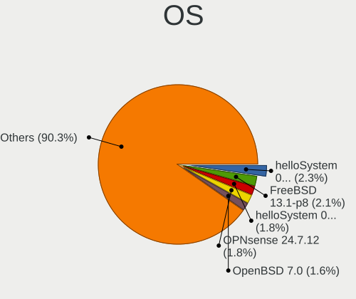

| Name              | Desktops | Percent |
|-------------------|----------|---------|
| helloSystem 0.8.1 | 10       | 2.31%   |
| FreeBSD 13.1-p8   | 9        | 2.08%   |
| OPNsense 24.7.12  | 8        | 1.85%   |
| helloSystem 0.7.0 | 8        | 1.85%   |
| OPNsense 24.1.7   | 7        | 1.62%   |
| OpenBSD 7.0       | 7        | 1.62%   |
| OPNsense 25.7.3   | 6        | 1.39%   |
| OPNsense 25.1.7   | 6        | 1.39%   |
| OPNsense 25.1.5   | 6        | 1.39%   |
| OPNsense 25.1.1   | 6        | 1.39%   |
| OPNsense 24.7.11  | 6        | 1.39%   |
| OPNsense 23.7.9   | 6        | 1.39%   |
| OPNsense 23.1     | 6        | 1.39%   |
| OPNsense 22.7.10  | 6        | 1.39%   |
| OPNsense 25.7.10  | 5        | 1.15%   |
| OPNsense 25.1.2   | 5        | 1.15%   |
| OPNsense 24.1.8   | 5        | 1.15%   |
| OPNsense 24.1.4   | 5        | 1.15%   |
| OPNsense 23.7.12  | 5        | 1.15%   |
| OPNsense 23.1.7   | 5        | 1.15%   |
| OPNsense 23.1.11  | 5        | 1.15%   |
| helloSystem 0.9.0 | 5        | 1.15%   |
| OPNsense 25.7.7   | 4        | 0.92%   |
| OPNsense 24.7.9   | 4        | 0.92%   |
| OPNsense 24.7.6   | 4        | 0.92%   |
| OPNsense 24.7.5   | 4        | 0.92%   |
| OPNsense 24.7.1   | 4        | 0.92%   |
| OPNsense 24.1.5   | 4        | 0.92%   |
| OPNsense 23.7.7   | 4        | 0.92%   |
| OPNsense 23.7.5   | 4        | 0.92%   |
| OPNsense 23.7.4   | 4        | 0.92%   |
| OPNsense 23.1.8   | 4        | 0.92%   |
| OPNsense 23.1.5   | 4        | 0.92%   |
| OPNsense 23.1.1   | 4        | 0.92%   |
| OPNsense 22.7.4   | 4        | 0.92%   |
| OPNsense 22.1.10  | 4        | 0.92%   |
| helloSystem 0.6.0 | 4        | 0.92%   |
| FreeBSD 12.3-p2   | 4        | 0.92%   |
| OPNsense 25.7.1   | 3        | 0.69%   |
| OPNsense 25.1.9   | 3        | 0.69%   |

OS Family
---------

OS without a version

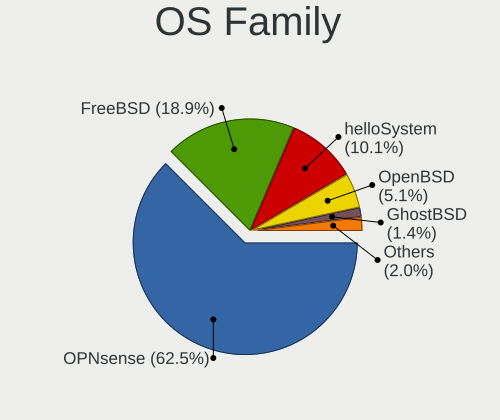

| Name        | Desktops | Percent |
|-------------|----------|---------|
| OPNsense    | 185      | 62.5%   |
| FreeBSD     | 56       | 18.92%  |
| helloSystem | 30       | 10.14%  |
| OpenBSD     | 15       | 5.07%   |
| GhostBSD    | 4        | 1.35%   |
| XigmaNAS    | 2        | 0.68%   |
| NetBSD      | 2        | 0.68%   |
| NomadBSD    | 1        | 0.34%   |
| ClonOS      | 1        | 0.34%   |

Arch
----

OS architecture (x86_64, i586, etc.)

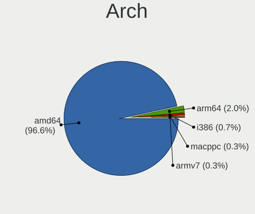

| Name   | Desktops | Percent |
|--------|----------|---------|
| amd64  | 285      | 96.61%  |
| arm64  | 6        | 2.03%   |
| i386   | 2        | 0.68%   |
| macppc | 1        | 0.34%   |
| armv7  | 1        | 0.34%   |

DE
--

Desktop Environment

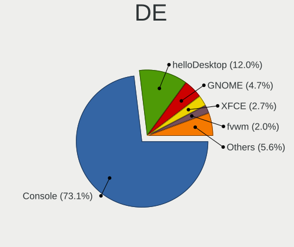

| Name          | Desktops | Percent |
|---------------|----------|---------|
| Console       | 220      | 73.09%  |
| helloDesktop  | 36       | 11.96%  |
| GNOME         | 14       | 4.65%   |
| XFCE          | 8        | 2.66%   |
| KDE5          | 6        | 1.99%   |
| fvwm          | 6        | 1.99%   |
| MATE          | 4        | 1.33%   |
| TWM           | 2        | 0.66%   |
| Openbox       | 2        | 0.66%   |
| xinitrc       | 1        | 0.33%   |
| i3            | 1        | 0.33%   |
| Enlightenment | 1        | 0.33%   |

Display Server
--------------

X11 or Wayland

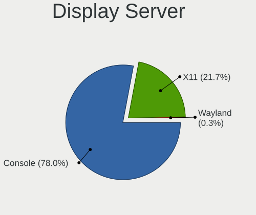

| Name    | Desktops | Percent |
|---------|----------|---------|
| Console | 230      | 77.97%  |
| X11     | 64       | 21.69%  |
| Wayland | 1        | 0.34%   |

Display Manager
---------------

SDDM, LightDM, etc.

| Name    | Desktops | Percent |
|---------|----------|---------|
| Console | 241      | 81.42%  |
| SLiM    | 30       | 10.14%  |
| LightDM | 8        | 2.7%    |
| GDM     | 7        | 2.36%   |
| XDM     | 6        | 2.03%   |
| SDDM    | 4        | 1.35%   |

OS Lang
-------

Language

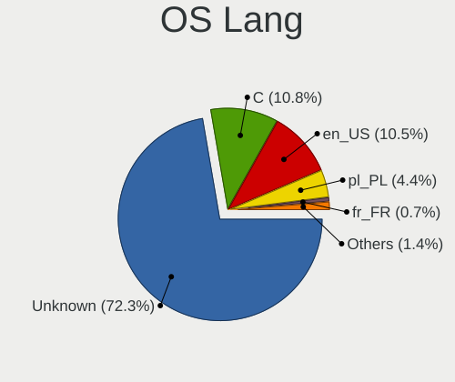

| Lang    | Desktops | Percent |
|---------|----------|---------|
| Unknown | 214      | 72.3%   |
| C       | 32       | 10.81%  |
| en_US   | 31       | 10.47%  |
| pl_PL   | 13       | 4.39%   |
| fr_FR   | 2        | 0.68%   |
| en_GB   | 2        | 0.68%   |
| pt_PT   | 1        | 0.34%   |
| pl      | 1        | 0.34%   |

Boot Mode
---------

EFI or BIOS

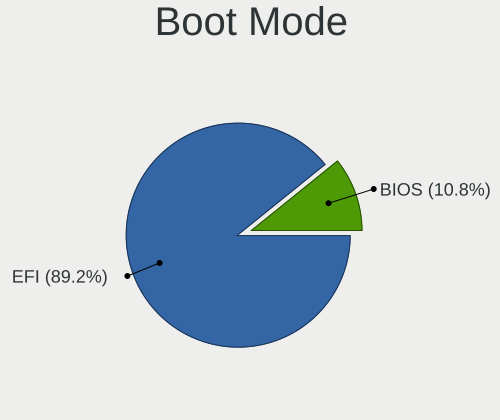

| Mode | Desktops | Percent |
|------|----------|---------|
| EFI  | 264      | 89.19%  |
| BIOS | 32       | 10.81%  |

Filesystem
----------

Type of filesystem

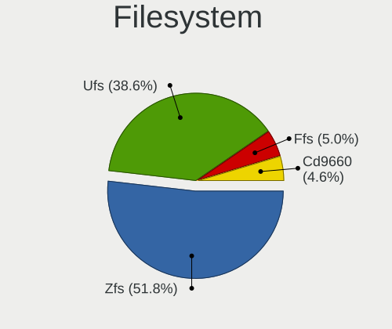

| Type   | Desktops | Percent |
|--------|----------|---------|
| Zfs    | 157      | 51.82%  |
| Ufs    | 117      | 38.61%  |
| Ffs    | 15       | 4.95%   |
| Cd9660 | 14       | 4.62%   |

Part. scheme
------------

Scheme of partitioning

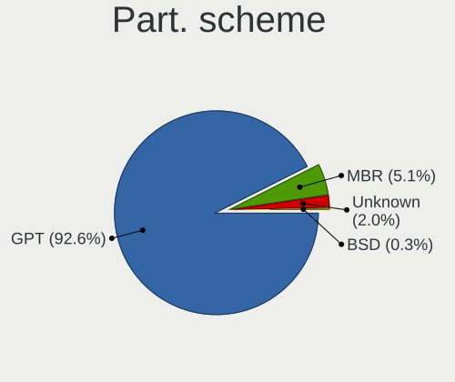

| Type    | Desktops | Percent |
|---------|----------|---------|
| GPT     | 274      | 92.57%  |
| MBR     | 15       | 5.07%   |
| Unknown | 6        | 2.03%   |
| BSD     | 1        | 0.34%   |

Board
-----

Vendor
------

Motherboard manufacturer

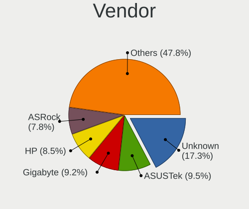

| Name                       | Desktops | Percent |
|----------------------------|----------|---------|
| Unknown                    | 51       | 17.29%  |
| ASUSTek Computer           | 28       | 9.49%   |
| Gigabyte Technology        | 27       | 9.15%   |
| Hewlett-Packard            | 25       | 8.47%   |
| ASRock                     | 23       | 7.8%    |
| Dell                       | 21       | 7.12%   |
| MSI                        | 19       | 6.44%   |
| Fujitsu                    | 18       | 6.1%    |
| Intel                      | 17       | 5.76%   |
| Lenovo                     | 12       | 4.07%   |
| Supermicro                 | 8        | 2.71%   |
| Techvision                 | 5        | 1.69%   |
| PC Engines                 | 5        | 1.69%   |
| Shuttle                    | 3        | 1.02%   |
| Protectli                  | 3        | 1.02%   |
| iEi                        | 2        | 0.68%   |
| CheckPoint                 | 2        | 0.68%   |
| Biostar                    | 2        | 0.68%   |
| AOpen                      | 2        | 0.68%   |
| Acer                       | 2        | 0.68%   |
| Yanling                    | 1        | 0.34%   |
| xunlong                    | 1        | 0.34%   |
| Wistron                    | 1        | 0.34%   |
| Wincor Nixdorf             | 1        | 0.34%   |
| ShenZhen MinWin Technology | 1        | 0.34%   |
| Seeed Studio               | 1        | 0.34%   |
| Raspberry Pi Foundation    | 1        | 0.34%   |
| OEM                        | 1        | 0.34%   |
| NU591R                     | 1        | 0.34%   |
| LCO                        | 1        | 0.34%   |
| Inventec                   | 1        | 0.34%   |
| IGEL Technology            | 1        | 0.34%   |
| IceWhale Technology        | 1        | 0.34%   |
| Hardkernel                 | 1        | 0.34%   |
| Giada                      | 1        | 0.34%   |
| Essentiel B                | 1        | 0.34%   |
| CWWK                       | 1        | 0.34%   |
| ASRockRack                 | 1        | 0.34%   |
| Apple                      | 1        | 0.34%   |
| AMI                        | 1        | 0.34%   |

Model
-----

Motherboard model

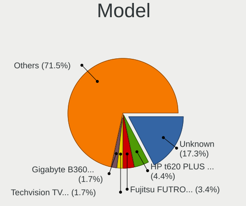

| Name                               | Desktops | Percent |
|------------------------------------|----------|---------|
| Unknown                            | 51       | 17.29%  |
| HP t620 PLUS Quad Core TC          | 13       | 4.41%   |
| Fujitsu FUTRO S920                 | 10       | 3.39%   |
| Techvision TVI7309X                | 5        | 1.69%   |
| Gigabyte B360N WIFI                | 5        | 1.69%   |
| Supermicro X9SCL/X9SCM             | 3        | 1.02%   |
| Protectli V1410                    | 3        | 1.02%   |
| Intel Q3XXG4-P V1.0                | 3        | 1.02%   |
| ASUS All Series                    | 3        | 1.02%   |
| ASRock Q1900B-ITX                  | 3        | 1.02%   |
| ASRock H370M-ITX/ac                | 3        | 1.02%   |
| PC Engines APU2                    | 2        | 0.68%   |
| MSI MS-7D25                        | 2        | 0.68%   |
| MSI MS-7918                        | 2        | 0.68%   |
| MSI MS-7758                        | 2        | 0.68%   |
| Lenovo ThinkCentre M700 10J0S1CK00 | 2        | 0.68%   |
| Intel SHARKBAY                     | 2        | 0.68%   |
| Intel D2500CC AAG81477-401         | 2        | 0.68%   |
| HP Compaq Elite 8300 CMT           | 2        | 0.68%   |
| HP 17E2                            | 2        | 0.68%   |
| Gigabyte H270N-WIFI                | 2        | 0.68%   |
| Gigabyte H110TN                    | 2        | 0.68%   |
| Fujitsu FUTRO S720                 | 2        | 0.68%   |
| Dell OptiPlex 7050                 | 2        | 0.68%   |
| Dell OptiPlex 3050                 | 2        | 0.68%   |
| Dell OptiPlex 3040                 | 2        | 0.68%   |
| Dell OptiPlex 3020                 | 2        | 0.68%   |
| CheckPoint QS-22-00                | 2        | 0.68%   |
| ASUS Z10PA-U8 Series               | 2        | 0.68%   |
| ASUS P7P55D                        | 2        | 0.68%   |
| ASRock J3455B-ITX                  | 2        | 0.68%   |
| Yanling YL-EL4L-0A                 | 1        | 0.34%   |
| xunlong Orange Pi 3B v1.1          | 1        | 0.34%   |
| Wistron ProLiant ML110 G5          | 1        | 0.34%   |
| Wincor Nixdorf BEETLE /MIII        | 1        | 0.34%   |
| Supermicro X8STi                   | 1        | 0.34%   |
| Supermicro X8SIL                   | 1        | 0.34%   |
| Supermicro X7SLA                   | 1        | 0.34%   |
| Supermicro X7DCL                   | 1        | 0.34%   |
| Supermicro SYS-E300-9A-4CN10P      | 1        | 0.34%   |

Model Family
------------

Motherboard model prefix

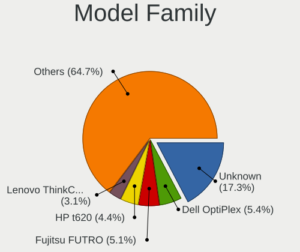

| Name                  | Desktops | Percent |
|-----------------------|----------|---------|
| Unknown               | 51       | 17.29%  |
| Dell OptiPlex         | 16       | 5.42%   |
| Fujitsu FUTRO         | 15       | 5.08%   |
| HP t620               | 13       | 4.41%   |
| Lenovo ThinkCentre    | 9        | 3.05%   |
| Techvision TVI7309X   | 5        | 1.69%   |
| Gigabyte B360N        | 5        | 1.69%   |
| HP EliteDesk          | 4        | 1.36%   |
| HP Compaq             | 4        | 1.36%   |
| Supermicro X9SCL      | 3        | 1.02%   |
| Protectli V1410       | 3        | 1.02%   |
| Intel Q3XXG4-P        | 3        | 1.02%   |
| Intel D2500CC         | 3        | 1.02%   |
| ASUS TUF              | 3        | 1.02%   |
| ASUS PRIME            | 3        | 1.02%   |
| ASUS All              | 3        | 1.02%   |
| ASRock Q1900B-ITX     | 3        | 1.02%   |
| ASRock H370M-ITX      | 3        | 1.02%   |
| PC Engines APU2       | 2        | 0.68%   |
| MSI MS-7D25           | 2        | 0.68%   |
| MSI MS-7918           | 2        | 0.68%   |
| MSI MS-7758           | 2        | 0.68%   |
| Intel SHARKBAY        | 2        | 0.68%   |
| HP 17E2               | 2        | 0.68%   |
| Gigabyte H270N-WIFI   | 2        | 0.68%   |
| Gigabyte H110TN       | 2        | 0.68%   |
| Gigabyte B450M        | 2        | 0.68%   |
| Dell Vostro           | 2        | 0.68%   |
| Dell Precision        | 2        | 0.68%   |
| CheckPoint QS-22-00   | 2        | 0.68%   |
| ASUS Z10PA-U8         | 2        | 0.68%   |
| ASUS ROG              | 2        | 0.68%   |
| ASUS P7P55D           | 2        | 0.68%   |
| ASUS P5G41T-M         | 2        | 0.68%   |
| ASRock J3455B-ITX     | 2        | 0.68%   |
| Yanling YL-EL4L-0A    | 1        | 0.34%   |
| xunlong Orange        | 1        | 0.34%   |
| Wistron ProLiant      | 1        | 0.34%   |
| Wincor Nixdorf BEETLE | 1        | 0.34%   |
| Supermicro X8STi      | 1        | 0.34%   |

MFG Year
--------

Motherboard manufacture year

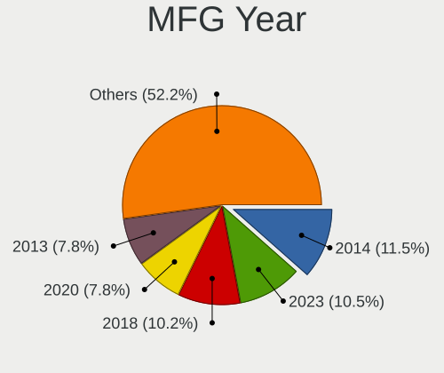

| Year    | Desktops | Percent |
|---------|----------|---------|
| 2014    | 34       | 11.53%  |
| 2023    | 31       | 10.51%  |
| 2018    | 30       | 10.17%  |
| 2020    | 23       | 7.8%    |
| 2013    | 23       | 7.8%    |
| 2012    | 23       | 7.8%    |
| 2022    | 21       | 7.12%   |
| 2016    | 18       | 6.1%    |
| 2019    | 16       | 5.42%   |
| 2021    | 14       | 4.75%   |
| 2024    | 12       | 4.07%   |
| 2015    | 9        | 3.05%   |
| 2011    | 8        | 2.71%   |
| 2009    | 8        | 2.71%   |
| 2017    | 7        | 2.37%   |
| 2010    | 6        | 2.03%   |
| Unknown | 5        | 1.69%   |
| 2025    | 4        | 1.36%   |
| 2007    | 3        | 1.02%   |

Form Factor
-----------

Physical design of the computer

| Name    | Desktops | Percent |
|---------|----------|---------|
| Desktop | 295      | 100%    |

Coreboot
--------

Have coreboot on board

| Used | Desktops | Percent |
|------|----------|---------|
| No   | 290      | 98.31%  |
| Yes  | 5        | 1.69%   |

RAM Size
--------

Total RAM memory

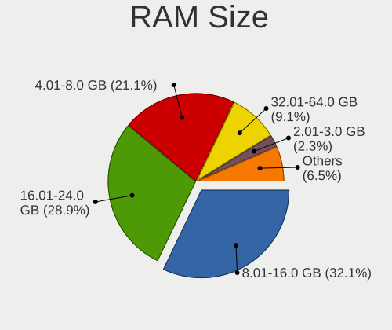

| Size in GB      | Desktops | Percent |
|-----------------|----------|---------|
| 8.01-16.0       | 99       | 32.14%  |
| 16.01-24.0      | 89       | 28.9%   |
| 4.01-8.0        | 65       | 21.1%   |
| 32.01-64.0      | 28       | 9.09%   |
| 2.01-3.0        | 7        | 2.27%   |
| 64.01-256.0     | 5        | 1.62%   |
| 0.51-1.0        | 5        | 1.62%   |
| 3.01-4.0        | 4        | 1.3%    |
| More than 256.0 | 3        | 0.97%   |
| 24.01-32.0      | 2        | 0.65%   |
| 1.01-2.0        | 1        | 0.32%   |

RAM Used
--------

Used RAM memory

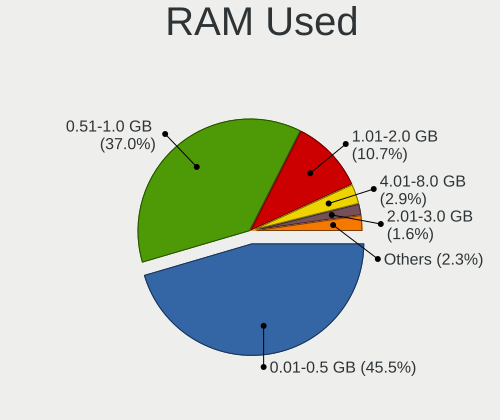

| Used GB   | Desktops | Percent |
|-----------|----------|---------|
| 0.01-0.5  | 140      | 45.45%  |
| 0.51-1.0  | 114      | 37.01%  |
| 1.01-2.0  | 33       | 10.71%  |
| 4.01-8.0  | 9        | 2.92%   |
| 2.01-3.0  | 5        | 1.62%   |
| 8.01-16.0 | 2        | 0.65%   |
| 0         | 2        | 0.65%   |
| Unknown   | 2        | 0.65%   |
| 3.01-4.0  | 1        | 0.32%   |

Total Drives
------------

Number of drives on board

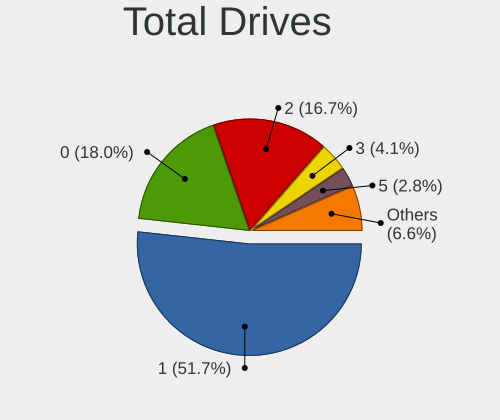

| Drives | Desktops | Percent |
|--------|----------|---------|
| 1      | 164      | 51.74%  |
| 0      | 57       | 17.98%  |
| 2      | 53       | 16.72%  |
| 3      | 13       | 4.1%    |
| 5      | 9        | 2.84%   |
| 4      | 9        | 2.84%   |
| 6      | 6        | 1.89%   |
| 9      | 2        | 0.63%   |
| 7      | 2        | 0.63%   |
| 10     | 1        | 0.32%   |
| 8      | 1        | 0.32%   |

Has CD-ROM
----------

Has CD-ROM on board

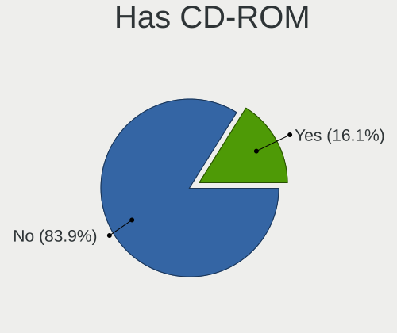

| Presented | Desktops | Percent |
|-----------|----------|---------|
| No        | 250      | 83.89%  |
| Yes       | 48       | 16.11%  |

Has Ethernet
------------

Has Ethernet on board

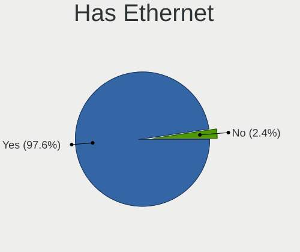

| Presented | Desktops | Percent |
|-----------|----------|---------|
| Yes       | 288      | 97.63%  |
| No        | 7        | 2.37%   |

Has WiFi
--------

Has WiFi module

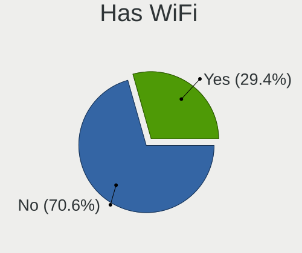

| Presented | Desktops | Percent |
|-----------|----------|---------|
| No        | 215      | 71.43%  |
| Yes       | 86       | 28.57%  |

Has Bluetooth
-------------

Has Bluetooth module

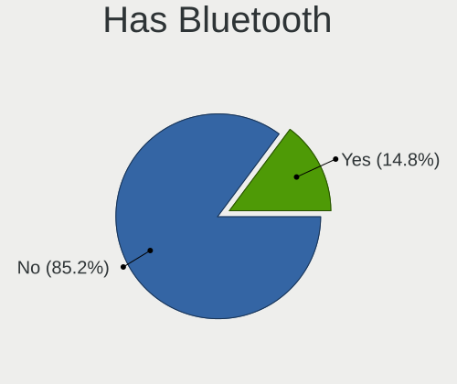

| Presented | Desktops | Percent |
|-----------|----------|---------|
| No        | 253      | 85.19%  |
| Yes       | 44       | 14.81%  |

Location
--------

Country
-------

Geographic location (country)

| Country | Desktops | Percent |
|---------|----------|---------|
| Poland  | 295      | 100%    |

City
----

Geographic location (city)

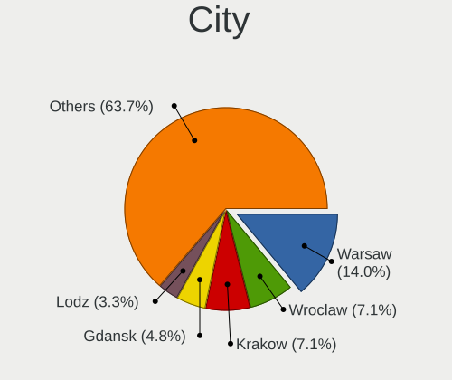

| City              | Desktops | Percent |
|-------------------|----------|---------|
| Warsaw            | 47       | 13.99%  |
| Wroclaw           | 24       | 7.14%   |
| Krakow            | 24       | 7.14%   |
| Gdansk            | 16       | 4.76%   |
| Lodz              | 11       | 3.27%   |
| Poznan            | 10       | 2.98%   |
| Lublin            | 9        | 2.68%   |
| Radom             | 7        | 2.08%   |
| Gdynia            | 5        | 1.49%   |
| Bydgoszcz         | 5        | 1.49%   |
| Szczecin          | 4        | 1.19%   |
| Kielce            | 4        | 1.19%   |
| Gliwice           | 4        | 1.19%   |
| Siedlce           | 3        | 0.89%   |
| Pstragowa         | 3        | 0.89%   |
| Piaseczno         | 3        | 0.89%   |
| Miedziana Gora    | 3        | 0.89%   |
| Lezno             | 3        | 0.89%   |
| Katowice          | 3        | 0.89%   |
| Gmina Świebodzin | 3        | 0.89%   |
| Е»ukowo         | 2        | 0.6%    |
| Zielona Góra     | 2        | 0.6%    |
| Zgierz            | 2        | 0.6%    |
| Zdunska Wola      | 2        | 0.6%    |
| Włocławek       | 2        | 0.6%    |
| Walendow          | 2        | 0.6%    |
| Tychy             | 2        | 0.6%    |
| Torun             | 2        | 0.6%    |
| Sulejowek         | 2        | 0.6%    |
| Rybnik            | 2        | 0.6%    |
| Radzionkow        | 2        | 0.6%    |
| Puławy           | 2        | 0.6%    |
| Police            | 2        | 0.6%    |
| Pepowo            | 2        | 0.6%    |
| Olsztyn           | 2        | 0.6%    |
| Myszkow           | 2        | 0.6%    |
| Makow Mazowiecki  | 2        | 0.6%    |
| Lubin             | 2        | 0.6%    |
| Legionowo         | 2        | 0.6%    |
| Lancut            | 2        | 0.6%    |

Drives
------

Drive Vendor
------------

Hard drive vendors

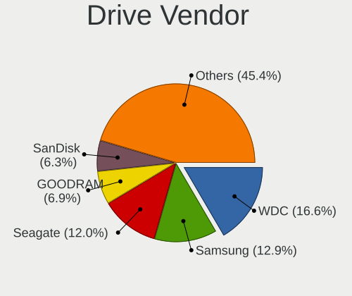

| Vendor              | Desktops | Drives | Percent |
|---------------------|----------|--------|---------|
| WDC                 | 58       | 145    | 16.57%  |
| Samsung Electronics | 45       | 104    | 12.86%  |
| Seagate             | 42       | 90     | 12%     |
| GOODRAM             | 24       | 43     | 6.86%   |
| SanDisk             | 22       | 30     | 6.29%   |
| A-DATA Technology   | 16       | 20     | 4.57%   |
| Kingston            | 13       | 15     | 3.71%   |
| SPCC                | 11       | 22     | 3.14%   |
| Toshiba             | 10       | 22     | 2.86%   |
| Patriot             | 7        | 12     | 2%      |
| Hoodisk             | 7        | 14     | 2%      |
| Crucial             | 7        | 21     | 2%      |
| Intel               | 6        | 9      | 1.71%   |
| Innodisk            | 6        | 8      | 1.71%   |
| China               | 6        | 12     | 1.71%   |
| Apacer              | 6        | 9      | 1.71%   |
| Lexar               | 5        | 8      | 1.43%   |
| Hitachi             | 5        | 5      | 1.43%   |
| PNY                 | 4        | 8      | 1.14%   |
| OCZ                 | 4        | 4      | 1.14%   |
| LITEONIT            | 4        | 10     | 1.14%   |
| Transcend           | 3        | 9      | 0.86%   |
| NVMe                | 3        | 4      | 0.86%   |
| LITEON              | 3        | 3      | 0.86%   |
| Gigabyte Technology | 3        | 4      | 0.86%   |
| Corsair             | 3        | 6      | 0.86%   |
| SK hynix            | 2        | 3      | 0.57%   |
| Plextor             | 2        | 2      | 0.57%   |
| Phison              | 2        | 2      | 0.57%   |
| Micron Technology   | 2        | 7      | 0.57%   |
| Kston               | 2        | 2      | 0.57%   |
| KIOXIA-EXCERIA      | 2        | 2      | 0.57%   |
| HGST                | 2        | 3      | 0.57%   |
| Fanxiang            | 2        | 3      | 0.57%   |
| XPG                 | 1        | 1      | 0.29%   |
| WALRAM              | 1        | 3      | 0.29%   |
| Vaseky              | 1        | 1      | 0.29%   |
| Team                | 1        | 1      | 0.29%   |
| SSDPR-CX            | 1        | 1      | 0.29%   |
| Silicon Power       | 1        | 1      | 0.29%   |

Drive Model
-----------

Hard drive models

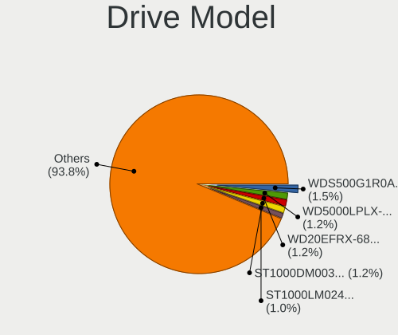

| Model                                | Desktops | Percent |
|--------------------------------------|----------|---------|
| WDC WDS500G1R0A-68A4W0 500GB         | 6        | 1.5%    |
| WDC WD5000LPLX-22ZNTT0 500GB         | 5        | 1.25%   |
| WDC WD20EFRX-68EUZN0 1TB             | 5        | 1.25%   |
| Seagate ST1000DM003-1CH162 1TB       | 5        | 1.25%   |
| SPCC Solid State Disk 256GB          | 4        | 1%      |
| Seagate ST1000LM024 HN-M101MBB 1TB   | 4        | 1%      |
| Samsung SSD 860 EVO 1TB              | 4        | 1%      |
| Hoodisk SSD 128GB                    | 4        | 1%      |
| WDC WD5003ABYZ-011FA0 500GB          | 3        | 0.75%   |
| Seagate ST500DM002-1BD142 500GB      | 3        | 0.75%   |
| SanDisk SDSA6MM-016G-1006 16GB       | 3        | 0.75%   |
| Samsung SSD 850 EVO 250GB            | 3        | 0.75%   |
| Patriot Burst 120GB                  | 3        | 0.75%   |
| Kingston SUV500MS120G 120GB          | 3        | 0.75%   |
| Innodisk DEMSR- 16GB mSATA 3ME3      | 3        | 0.75%   |
| GOODRAM SSDPR-CX400-128 128GB        | 3        | 0.75%   |
| GOODRAM SSDPR-CL100-120-G3 120GB     | 3        | 0.75%   |
| A-DATA SU900 256GB                   | 3        | 0.75%   |
| WDC WDS500G2B0B-00YS70 500GB         | 2        | 0.5%    |
| WDC WD4003FFBX-68MU3N0 4TB           | 2        | 0.5%    |
| WDC WD2500AAKX-60U6AA0 250GB         | 2        | 0.5%    |
| WDC WD20SDZW-11JJ8S0 2TB             | 2        | 0.5%    |
| WDC WD20NMVW-59EDZS7 2TB             | 2        | 0.5%    |
| WDC WD20EARS-00MVWB0 2TB             | 2        | 0.5%    |
| WDC WD10JPLX-00MBPT0 1TB             | 2        | 0.5%    |
| WDC PC SN530 SDBPNPZ-256G-1114 256GB | 2        | 0.5%    |
| Toshiba MQ04ABF100 1TB               | 2        | 0.5%    |
| Toshiba HDWD110 1TB                  | 2        | 0.5%    |
| SPCC Solid State Disk 512GB          | 2        | 0.5%    |
| SPCC M.2 SSD 256GB                   | 2        | 0.5%    |
| Seagate ST96812AS 64GB               | 2        | 0.5%    |
| Seagate ST500LT012-1DG142 500GB      | 2        | 0.5%    |
| Seagate ST4000LM024-2U817V 4TB       | 2        | 0.5%    |
| Seagate ST4000LM024-2AN17V 4TB       | 2        | 0.5%    |
| Seagate ST4000DM004-2CV104 4TB       | 2        | 0.5%    |
| Seagate ST2000DM008-2FR102 2TB       | 2        | 0.5%    |
| Seagate ST2000DL003-9VT166 2TB       | 2        | 0.5%    |
| Seagate ST16000NM001G-2KK103 16TB    | 2        | 0.5%    |
| Seagate ST1000LM035-1RK172 1TB       | 2        | 0.5%    |
| Seagate ST1000DM010-2EP102 1TB       | 2        | 0.5%    |

HDD Vendor
----------

Hard disk drive vendors

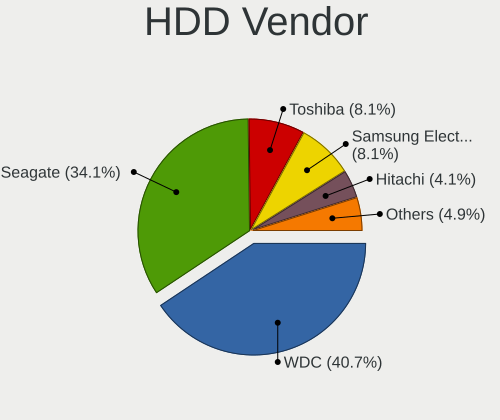

| Vendor                             | Desktops | Drives | Percent |
|------------------------------------|----------|--------|---------|
| WDC                                | 50       | 117    | 40.65%  |
| Seagate                            | 42       | 90     | 34.15%  |
| Toshiba                            | 10       | 22     | 8.13%   |
| Samsung Electronics                | 10       | 20     | 8.13%   |
| Hitachi                            | 5        | 5      | 4.07%   |
| NVMe                               | 2        | 3      | 1.63%   |
| HGST                               | 2        | 3      | 1.63%   |
| SSDPR-CX                           | 1        | 1      | 0.81%   |
| Product:              USB DISK 2.0 | 1        | 1      | 0.81%   |

SSD Vendor
----------

Solid state drive vendors

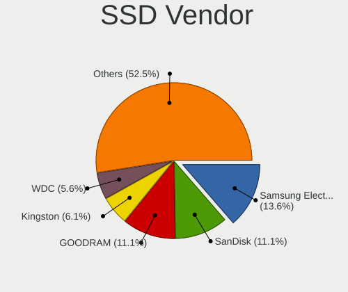

| Vendor              | Desktops | Drives | Percent |
|---------------------|----------|--------|---------|
| Samsung Electronics | 27       | 67     | 13.64%  |
| SanDisk             | 22       | 30     | 11.11%  |
| GOODRAM             | 22       | 39     | 11.11%  |
| Kingston            | 12       | 13     | 6.06%   |
| WDC                 | 11       | 23     | 5.56%   |
| SPCC                | 11       | 22     | 5.56%   |
| A-DATA Technology   | 11       | 14     | 5.56%   |
| Hoodisk             | 7        | 14     | 3.54%   |
| Crucial             | 7        | 21     | 3.54%   |
| Innodisk            | 6        | 8      | 3.03%   |
| China               | 6        | 12     | 3.03%   |
| Apacer              | 6        | 9      | 3.03%   |
| Patriot             | 5        | 8      | 2.53%   |
| Intel               | 5        | 8      | 2.53%   |
| OCZ                 | 4        | 4      | 2.02%   |
| LITEONIT            | 4        | 10     | 2.02%   |
| Transcend           | 3        | 9      | 1.52%   |
| PNY                 | 3        | 6      | 1.52%   |
| Gigabyte Technology | 3        | 4      | 1.52%   |
| Corsair             | 3        | 6      | 1.52%   |
| Plextor             | 2        | 2      | 1.01%   |
| Micron Technology   | 2        | 7      | 1.01%   |
| LITEON              | 2        | 2      | 1.01%   |
| Kston               | 2        | 2      | 1.01%   |
| KIOXIA-EXCERIA      | 2        | 2      | 1.01%   |
| WALRAM              | 1        | 3      | 0.51%   |
| Team                | 1        | 1      | 0.51%   |
| SK hynix            | 1        | 2      | 0.51%   |
| Silicon Power       | 1        | 1      | 0.51%   |
| Phison              | 1        | 1      | 0.51%   |
| NVMe                | 1        | 1      | 0.51%   |
| Lexar               | 1        | 1      | 0.51%   |
| Intenso             | 1        | 2      | 0.51%   |
| HP Phison           | 1        | 2      | 0.51%   |
| Biostar             | 1        | 1      | 0.51%   |

Drive Kind
----------

HDD or SSD

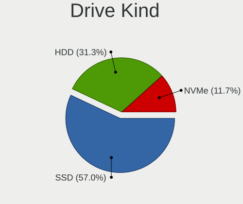

| Kind | Desktops | Drives | Percent |
|------|----------|--------|---------|
| SSD  | 171      | 357    | 57%     |
| HDD  | 94       | 262    | 31.33%  |
| NVMe | 35       | 57     | 11.67%  |

Drive Connector
---------------

SATA, SAS, NVMe, etc.

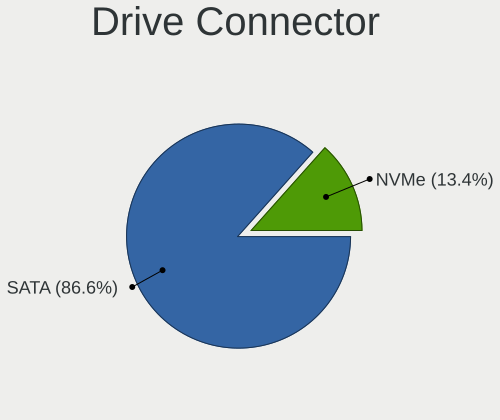

| Type | Desktops | Drives | Percent |
|------|----------|--------|---------|
| SATA | 226      | 619    | 86.59%  |
| NVMe | 35       | 57     | 13.41%  |

Drive Size
----------

Size of hard drive

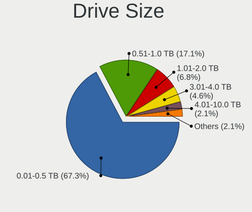

| Size in TB | Desktops | Drives | Percent |
|------------|----------|--------|---------|
| 0.01-0.5   | 189      | 374    | 67.26%  |
| 0.51-1.0   | 48       | 112    | 17.08%  |
| 1.01-2.0   | 19       | 56     | 6.76%   |
| 3.01-4.0   | 13       | 45     | 4.63%   |
| 4.01-10.0  | 6        | 15     | 2.14%   |
| 2.01-3.0   | 4        | 14     | 1.42%   |
| 10.01-20.0 | 2        | 3      | 0.71%   |

Space Total
-----------

Amount of disk space available on the file system

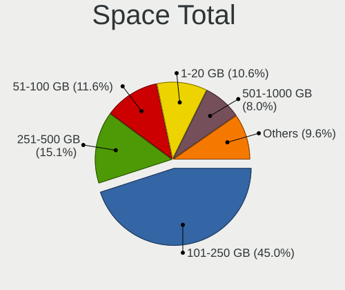

| Size in GB     | Desktops | Percent |
|----------------|----------|---------|
| 101-250        | 140      | 45.02%  |
| 251-500        | 47       | 15.11%  |
| 51-100         | 36       | 11.58%  |
| 1-20           | 33       | 10.61%  |
| 501-1000       | 25       | 8.04%   |
| 21-50          | 21       | 6.75%   |
| More than 3000 | 3        | 0.96%   |
| 1001-2000      | 3        | 0.96%   |
| Unknown        | 2        | 0.64%   |
| 2001-3000      | 1        | 0.32%   |

Space Used
----------

Amount of used disk space

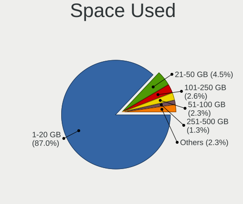

| Used GB        | Desktops | Percent |
|----------------|----------|---------|
| 1-20           | 268      | 87.01%  |
| 21-50          | 14       | 4.55%   |
| 101-250        | 8        | 2.6%    |
| 51-100         | 7        | 2.27%   |
| 251-500        | 4        | 1.3%    |
| More than 3000 | 2        | 0.65%   |
| 1001-2000      | 2        | 0.65%   |
| Unknown        | 2        | 0.65%   |
| 501-1000       | 1        | 0.32%   |

Malfunc. Drives
---------------

Drive models with a malfunction

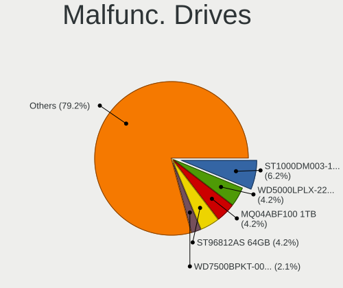

| Model                                           | Desktops | Drives | Percent |
|-------------------------------------------------|----------|--------|---------|
| Seagate ST1000DM003-1CH162 1TB                  | 3        | 3      | 6.25%   |
| WDC WD5000LPLX-22ZNTT0 500GB                    | 2        | 2      | 4.17%   |
| Toshiba MQ04ABF100 1TB                          | 2        | 2      | 4.17%   |
| Seagate ST96812AS 64GB                          | 2        | 5      | 4.17%   |
| WDC WD7500BPKT-00PK4T0 752GB                    | 1        | 1      | 2.08%   |
| WDC WD40EFRX-68WT0N0 4TB                        | 1        | 1      | 2.08%   |
| WDC WD360ADFD-00NLR1 37GB                       | 1        | 1      | 2.08%   |
| WDC WD3200AAVS-00ZTB0 320GB                     | 1        | 1      | 2.08%   |
| WDC WD2500BEKT-60F3T1 250GB                     | 1        | 2      | 2.08%   |
| WDC WD2500AAKX-753CA0 250GB                     | 1        | 2      | 2.08%   |
| WDC WD2500AAKX-60U6AA0 250GB                    | 1        | 2      | 2.08%   |
| WDC WD2500AAKX-083CA1 250GB                     | 1        | 2      | 2.08%   |
| WDC WD20NPVX-00EA4T0 2TB                        | 1        | 2      | 2.08%   |
| WDC WD20EZRX-00D8PB0 2TB                        | 1        | 1      | 2.08%   |
| WDC WD20EURS-63S48Y0 2TB                        | 1        | 1      | 2.08%   |
| WDC WD20EFRX-68EUZN0 1TB                        | 1        | 2      | 2.08%   |
| WDC WD20EARS-00MVWB0 2TB                        | 1        | 1      | 2.08%   |
| WDC WD1600BEVE-00UYT0 160GB                     | 1        | 1      | 2.08%   |
| WDC WD10TPVT-65HT5T0 1TB                        | 1        | 1      | 2.08%   |
| WDC WD10EZEX-75M2NA0 1TB                        | 1        | 1      | 2.08%   |
| WDC WD10EZEX-08M2NA0 1TB                        | 1        | 1      | 2.08%   |
| WDC WD10EARS-003BB1 1TB                         | 1        | 1      | 2.08%   |
| Toshiba MK3261GSYN 320GB                        | 1        | 1      | 2.08%   |
| SPCC Solid State Disk 240GB                     | 1        | 1      | 2.08%   |
| Seagate ST9250410AS 250GB                       | 1        | 1      | 2.08%   |
| Seagate ST500DM002-1BD142 500GB                 | 1        | 1      | 2.08%   |
| Seagate ST32000542AS 2TB                        | 1        | 3      | 2.08%   |
| Seagate ST2000LM015-2E8174 2TB                  | 1        | 2      | 2.08%   |
| Seagate ST2000DL003-9VT166 2TB                  | 1        | 1      | 2.08%   |
| SanDisk SSD U100 64GB                           | 1        | 5      | 2.08%   |
| Samsung Electronics SSD 870 EVO 1TB             | 1        | 1      | 2.08%   |
| Samsung Electronics SP2504C 250GB               | 1        | 1      | 2.08%   |
| Samsung Electronics HD154UI 1.5TB               | 1        | 1      | 2.08%   |
| Micron Technology MTFDDAK128MAY-1AH1ZABHA 128GB | 1        | 1      | 2.08%   |
| LITEONIT CMT-64L3M 64GB                         | 1        | 1      | 2.08%   |
| Kingston SHFS37A120G 120GB                      | 1        | 2      | 2.08%   |
| HP Phison PSSBN016GA27MC0 16GB                  | 1        | 2      | 2.08%   |
| Hitachi HTS725032A9A364 320GB                   | 1        | 1      | 2.08%   |
| Hitachi HTS721060G9SA00 64GB                    | 1        | 1      | 2.08%   |
| Hitachi HTS541680J9SA00 80GB                    | 1        | 1      | 2.08%   |

Malfunc. Drive Vendor
---------------------

Vendors of faulty drives

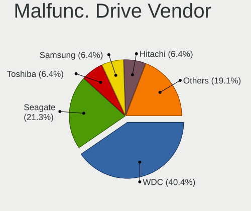

| Vendor              | Desktops | Drives | Percent |
|---------------------|----------|--------|---------|
| WDC                 | 19       | 26     | 40.43%  |
| Seagate             | 10       | 16     | 21.28%  |
| Toshiba             | 3        | 3      | 6.38%   |
| Samsung Electronics | 3        | 3      | 6.38%   |
| Hitachi             | 3        | 3      | 6.38%   |
| SPCC                | 1        | 1      | 2.13%   |
| SanDisk             | 1        | 5      | 2.13%   |
| Micron Technology   | 1        | 1      | 2.13%   |
| LITEONIT            | 1        | 1      | 2.13%   |
| Kingston            | 1        | 2      | 2.13%   |
| HP Phison           | 1        | 2      | 2.13%   |
| Crucial             | 1        | 1      | 2.13%   |
| Apacer              | 1        | 2      | 2.13%   |
| A-DATA Technology   | 1        | 1      | 2.13%   |

Malfunc. HDD Vendor
-------------------

Vendors of faulty HDD drives

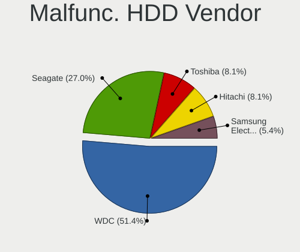

| Vendor              | Desktops | Drives | Percent |
|---------------------|----------|--------|---------|
| WDC                 | 19       | 26     | 51.35%  |
| Seagate             | 10       | 16     | 27.03%  |
| Toshiba             | 3        | 3      | 8.11%   |
| Hitachi             | 3        | 3      | 8.11%   |
| Samsung Electronics | 2        | 2      | 5.41%   |

Malfunc. Drive Kind
-------------------

Kinds of faulty drives

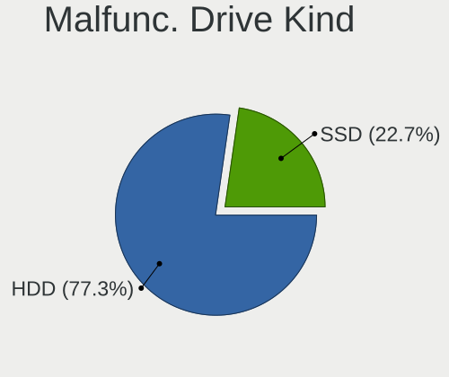

| Kind | Desktops | Drives | Percent |
|------|----------|--------|---------|
| HDD  | 34       | 50     | 77.27%  |
| SSD  | 10       | 17     | 22.73%  |

Failed Drives
-------------

Failed drive models

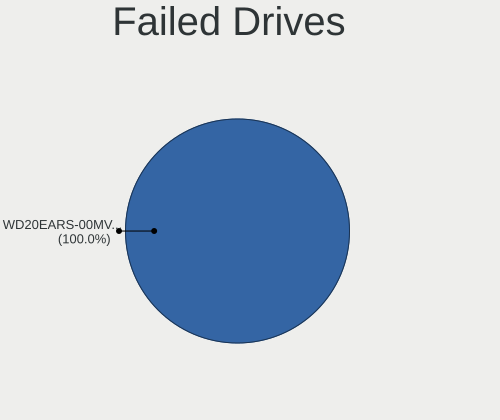

| Model                           | Desktops | Drives | Percent |
|---------------------------------|----------|--------|---------|
| WDC WD20EARS-00MVWB0 2TB        | 1        | 1      | 33.33%  |
| Vaseky V900-120G                | 1        | 1      | 33.33%  |
| SanDisk SD9SN8W-256G-1006 256GB | 1        | 1      | 33.33%  |

Failed Drive Vendor
-------------------

Failed drive vendors

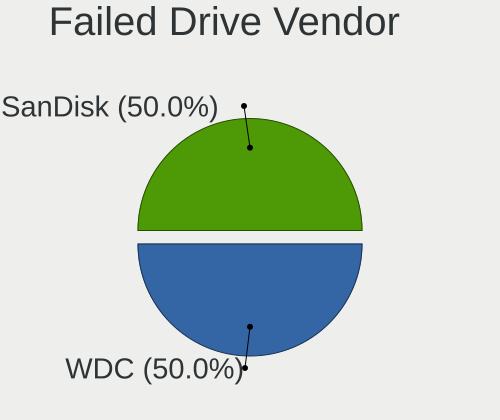

| Vendor  | Desktops | Drives | Percent |
|---------|----------|--------|---------|
| WDC     | 1        | 1      | 33.33%  |
| Vaseky  | 1        | 1      | 33.33%  |
| SanDisk | 1        | 1      | 33.33%  |

Drive Status
------------

Number of failed and malfunc. drives

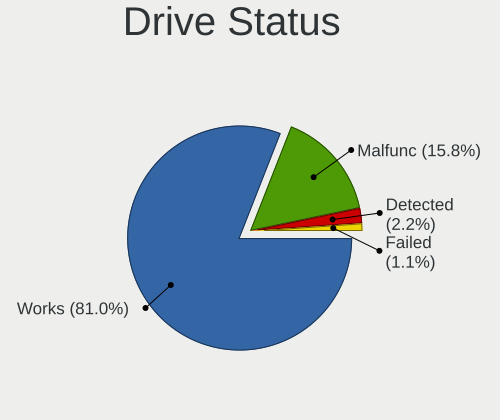

| Status   | Desktops | Drives | Percent |
|----------|----------|--------|---------|
| Works    | 221      | 598    | 80.95%  |
| Malfunc  | 43       | 67     | 15.75%  |
| Detected | 6        | 8      | 2.2%    |
| Failed   | 3        | 3      | 1.1%    |

Storage controller
------------------

Storage Vendor
--------------

Storage controller vendors

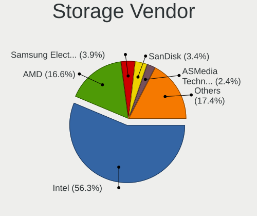

| Vendor                         | Desktops | Percent |
|--------------------------------|----------|---------|
| Intel                          | 214      | 56.32%  |
| AMD                            | 63       | 16.58%  |
| Samsung Electronics            | 15       | 3.95%   |
| SanDisk                        | 13       | 3.42%   |
| ASMedia Technology             | 9        | 2.37%   |
| Silicon Motion                 | 8        | 2.11%   |
| Shenzhen Longsys Electronics   | 8        | 2.11%   |
| Phison Electronics             | 5        | 1.32%   |
| MAXIO Technology (Hangzhou)    | 5        | 1.32%   |
| Kingston Technology Company    | 5        | 1.32%   |
| JMicron Technology             | 5        | 1.32%   |
| Broadcom / LSI                 | 5        | 1.32%   |
| ADATA Technology               | 5        | 1.32%   |
| Marvell Technology Group       | 4        | 1.05%   |
| SK hynix                       | 3        | 0.79%   |
| Lite-On Technology             | 2        | 0.53%   |
| VIA Technologies               | 1        | 0.26%   |
| Transcend                      | 1        | 0.26%   |
| Solid State Storage Technology | 1        | 0.26%   |
| Realtek Semiconductor          | 1        | 0.26%   |
| O2 Micro                       | 1        | 0.26%   |
| Nvidia                         | 1        | 0.26%   |
| Micron/Crucial Technology      | 1        | 0.26%   |
| Micron Technology              | 1        | 0.26%   |
| Integrated Technology Express  | 1        | 0.26%   |
| Hosin Global Electronics       | 1        | 0.26%   |
| Adaptec                        | 1        | 0.26%   |

Storage Model
-------------

Storage controller models

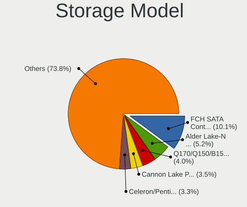

| Model                                                                                   | Desktops | Percent |
|-----------------------------------------------------------------------------------------|----------|---------|
| AMD FCH SATA Controller [AHCI mode]                                                     | 43       | 10.14%  |
| Intel Alder Lake-N SATA AHCI Controller                                                 | 22       | 5.19%   |
| Intel Q170/Q150/B150/H170/H110/Z170/CM236 Chipset SATA Controller [AHCI Mode]           | 17       | 4.01%   |
| Intel Cannon Lake PCH SATA AHCI Controller                                              | 15       | 3.54%   |
| Intel Celeron/Pentium Silver Processor SATA Controller                                  | 14       | 3.3%    |
| Intel 8 Series/C220 Series Chipset Family 6-port SATA Controller 1 [AHCI mode]          | 14       | 3.3%    |
| Intel 6 Series/C200 Series Chipset Family 6 port Desktop SATA AHCI Controller           | 13       | 3.07%   |
| AMD SB7x0/SB8x0/SB9x0 SATA Controller [AHCI mode]                                       | 12       | 2.83%   |
| Intel Jasper Lake SATA AHCI Controller                                                  | 11       | 2.59%   |
| Intel Atom Processor E3800 Series SATA AHCI Controller                                  | 11       | 2.59%   |
| Intel 7 Series/C210 Series Chipset Family 6-port SATA Controller [AHCI mode]            | 11       | 2.59%   |
| Intel 200 Series PCH SATA controller [AHCI mode]                                        | 11       | 2.59%   |
| Samsung NVMe SSD Controller 980 (DRAM-less)                                             | 8        | 1.89%   |
| Silicon Motion SM2263EN/SM2263XT (DRAM-less) NVMe SSD Controllers                       | 7        | 1.65%   |
| AMD 400 Series Chipset SATA Controller                                                  | 7        | 1.65%   |
| Intel Celeron N3350/Pentium N4200/Atom E3900 Series SATA AHCI Controller                | 6        | 1.42%   |
| ASMedia ASM1061/ASM1062 Serial ATA Controller                                           | 6        | 1.42%   |
| SanDisk Ultra 3D / WD PC SN530, IX SN530, Blue SN550 NVMe SSD (DRAM-less)               | 5        | 1.18%   |
| MAXIO (Hangzhou) NVMe SSD Controller MAP1202 (DRAM-less)                                | 5        | 1.18%   |
| Intel SATA Controller [RAID mode]                                                       | 5        | 1.18%   |
| Intel NM10/ICH7 Family SATA Controller [IDE mode]                                       | 5        | 1.18%   |
| Intel C610/X99 series chipset sSATA Controller [AHCI mode]                              | 5        | 1.18%   |
| Intel C610/X99 series chipset 6-Port SATA Controller [AHCI mode]                        | 5        | 1.18%   |
| Intel Atom Processor C3000 Series SATA Controller 1                                     | 5        | 1.18%   |
| Intel 9 Series Chipset Family SATA Controller [AHCI Mode]                               | 5        | 1.18%   |
| Intel 82801G (ICH7 Family) IDE Controller                                               | 5        | 1.18%   |
| AMD 500 Series Chipset SATA Controller                                                  | 5        | 1.18%   |
| Shenzhen Longsys Lexar NM790 / Patriot Viper VP4300 Lite NVMe SSD (DRAM-less)           | 4        | 0.94%   |
| Intel NM10/ICH7 Family SATA Controller [AHCI mode]                                      | 4        | 0.94%   |
| Intel Atom/Celeron/Pentium Processor x5-E8000/J3xxx/N3xxx Series SATA Controller        | 4        | 0.94%   |
| Intel Atom Processor C3000 Series SATA Controller 0                                     | 4        | 0.94%   |
| Shenzhen Longsys Lexar NM610 PRO NVME SSD (DRAM-less)                                   | 3        | 0.71%   |
| Sandisk WD SN560/SN740/SN770/SN5000 NVMe SSD                                            | 3        | 0.71%   |
| SanDisk Extreme Pro / WD Black SN750 / PC SN730 / Red SN700 NVMe SSD                    | 3        | 0.71%   |
| Samsung NVMe SSD Controller SM981/PM981/PM983                                           | 3        | 0.71%   |
| JMicron JMB363 SATA/IDE Controller                                                      | 3        | 0.71%   |
| Intel Elkhart Lake SATA AHCI                                                            | 3        | 0.71%   |
| Intel 6 Series/C200 Series Chipset Family Desktop SATA Controller (IDE mode, ports 4-5) | 3        | 0.71%   |
| Intel 6 Series/C200 Series Chipset Family Desktop SATA Controller (IDE mode, ports 0-3) | 3        | 0.71%   |
| Intel 4 Series Chipset PT IDER Controller                                               | 3        | 0.71%   |

Storage Kind
------------

Kind of storage controller (IDE, SATA, NVMe, SAS, ...)

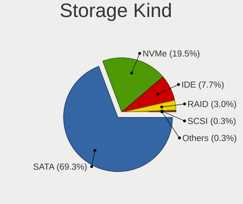

| Kind | Desktops | Percent |
|------|----------|---------|
| SATA | 253      | 69.32%  |
| NVMe | 71       | 19.45%  |
| IDE  | 28       | 7.67%   |
| RAID | 11       | 3.01%   |
| SAS  | 1        | 0.27%   |
| SCSI | 1        | 0.27%   |

Processor
---------

CPU Vendor
----------

Processor vendors

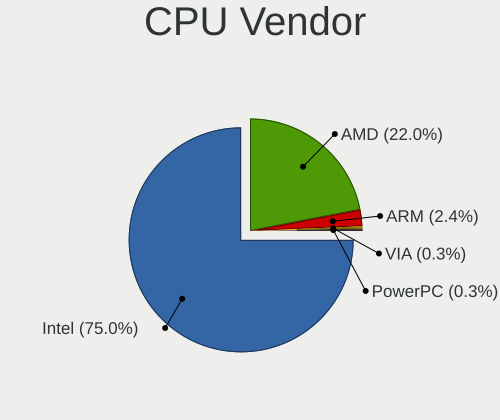

| Vendor  | Desktops | Percent |
|---------|----------|---------|
| Intel   | 222      | 75%     |
| AMD     | 65       | 21.96%  |
| ARM     | 7        | 2.36%   |
| VIA     | 1        | 0.34%   |
| PowerPC | 1        | 0.34%   |

CPU Model
---------

Processor models

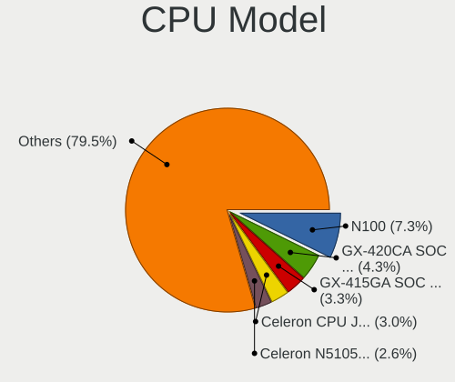

| Model                                    | Desktops | Percent |
|------------------------------------------|----------|---------|
| Intel N100                               | 22       | 7.28%   |
| AMD GX-420CA SOC with Radeon HD Graphics | 13       | 4.3%    |
| AMD GX-415GA SOC with Radeon HD Graphics | 10       | 3.31%   |
| Intel Celeron CPU J1900 @ 1.99GHz        | 9        | 2.98%   |
| Intel Celeron N5105 @ 2.00GHz            | 8        | 2.65%   |
| Intel Celeron J4125 CPU @ 2.00GHz        | 8        | 2.65%   |
| Intel Core i5-6500 CPU @ 3.20GHz         | 6        | 1.99%   |
| Intel Core i3-8300T CPU @ 3.20GHz        | 4        | 1.32%   |
| Intel Core i3-6100 CPU @ 3.70GHz         | 4        | 1.32%   |
| Intel Atom CPU D2500 @ 1.86GHz           | 4        | 1.32%   |
| ARM Cortex-A55 r2p0                      | 4        | 1.32%   |
| AMD GX-412TC SOC                         | 4        | 1.32%   |
| AMD G-T56N Processor                     | 4        | 1.32%   |
| Intel Xeon CPU E3-1270 V2 @ 3.50GHz      | 3        | 0.99%   |
| Intel N150                               | 3        | 0.99%   |
| Intel Core i7-8700 CPU @ 3.20GHz         | 3        | 0.99%   |
| Intel Core i7-3770 CPU @ 3.40GHz         | 3        | 0.99%   |
| Intel Core i5-4590 CPU @ 3.30GHz         | 3        | 0.99%   |
| Intel Core i5-4570 CPU @ 3.20GHz         | 3        | 0.99%   |
| Intel Core i5-3470 CPU @ 3.20GHz         | 3        | 0.99%   |
| Intel Core i5-2400 CPU @ 3.10GHz         | 3        | 0.99%   |
| Intel Celeron J4105 CPU @ 1.50GHz        | 3        | 0.99%   |
| Intel Celeron CPU J3455 @ 1.50GHz        | 3        | 0.99%   |
| Intel Atom CPU C3758R @ 2.40GHz          | 3        | 0.99%   |
| AMD Phenom II X4 965 Processor           | 3        | 0.99%   |
| Intel Xeon CPU E5-2695 v4 @ 2.10GHz      | 2        | 0.66%   |
| Intel Xeon CPU E3-1220 V2 @ 3.10GHz      | 2        | 0.66%   |
| Intel Pentium Gold G5400 CPU @ 3.70GHz   | 2        | 0.66%   |
| Intel Pentium CPU G860 @ 3.00GHz         | 2        | 0.66%   |
| Intel Pentium CPU G4600T @ 3.00GHz       | 2        | 0.66%   |
| Intel Pentium CPU G3220 @ 3.00GHz        | 2        | 0.66%   |
| Intel Core i7-5550U CPU @ 2.00GHz        | 2        | 0.66%   |
| Intel Core i7-4790 CPU @ 3.60GHz         | 2        | 0.66%   |
| Intel Core i7-4770 CPU @ 3.40GHz         | 2        | 0.66%   |
| Intel Core i5-8400 CPU @ 2.80GHz         | 2        | 0.66%   |
| Intel Core i5-6400T CPU @ 2.20GHz        | 2        | 0.66%   |
| Intel Core i5-4460 CPU @ 3.20GHz         | 2        | 0.66%   |
| Intel Core i3-4170 CPU @ 3.70GHz         | 2        | 0.66%   |
| Intel Core 2 Duo                         | 2        | 0.66%   |
| Intel Celeron J6412 @ 2.00GHz            | 2        | 0.66%   |

CPU Model Family
----------------

Processor model prefix

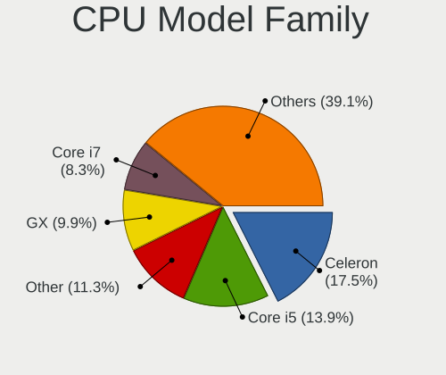

| Model                   | Desktops | Percent |
|-------------------------|----------|---------|
| Intel Celeron           | 53       | 17.55%  |
| Intel Core i5           | 42       | 13.91%  |
| Other                   | 34       | 11.26%  |
| AMD GX                  | 30       | 9.93%   |
| Intel Core i7           | 25       | 8.28%   |
| Intel Core i3           | 20       | 6.62%   |
| Intel Xeon              | 16       | 5.3%    |
| Intel Pentium           | 12       | 3.97%   |
| Intel Atom              | 12       | 3.97%   |
| ARM Cortex              | 7        | 2.32%   |
| AMD Ryzen 5             | 7        | 2.32%   |
| AMD G                   | 6        | 1.99%   |
| AMD Ryzen 3             | 5        | 1.66%   |
| AMD Ryzen 7             | 4        | 1.32%   |
| Intel Pentium Gold      | 3        | 0.99%   |
| Intel Core 2 Quad       | 3        | 0.99%   |
| AMD Ryzen 9             | 3        | 0.99%   |
| AMD Phenom II X4        | 3        | 0.99%   |
| Intel Pentium Silver    | 2        | 0.66%   |
| Intel Pentium Dual-Core | 2        | 0.66%   |
| Intel Core 2 Duo        | 2        | 0.66%   |
| Intel Core 2            | 2        | 0.66%   |
| Intel Core              | 1        | 0.33%   |
| AMD Ryzen 5 PRO         | 1        | 0.33%   |
| AMD Ryzen 3 PRO         | 1        | 0.33%   |
| AMD Phenom II X6        | 1        | 0.33%   |
| AMD FX                  | 1        | 0.33%   |
| AMD E                   | 1        | 0.33%   |
| AMD Athlon 64 X2        | 1        | 0.33%   |
| AMD Athlon              | 1        | 0.33%   |
| AMD A4                  | 1        | 0.33%   |

CPU Cores
---------

Number of processor cores

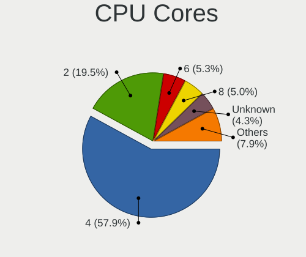

| Number  | Desktops | Percent |
|---------|----------|---------|
| 4       | 175      | 57.95%  |
| 2       | 59       | 19.54%  |
| 6       | 16       | 5.3%    |
| 8       | 15       | 4.97%   |
| Unknown | 13       | 4.3%    |
| 12      | 6        | 1.99%   |
| 16      | 4        | 1.32%   |
| 1       | 4        | 1.32%   |
| 24      | 3        | 0.99%   |
| 18      | 2        | 0.66%   |
| 14      | 2        | 0.66%   |
| 32      | 1        | 0.33%   |
| 20      | 1        | 0.33%   |
| 3       | 1        | 0.33%   |

CPU Sockets
-----------

Number of sockets

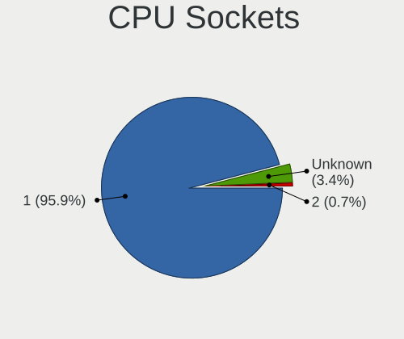

| Number  | Desktops | Percent |
|---------|----------|---------|
| 1       | 283      | 95.93%  |
| Unknown | 10       | 3.39%   |
| 2       | 2        | 0.68%   |

CPU Threads
-----------

Threads per core (Hyper-Threading)

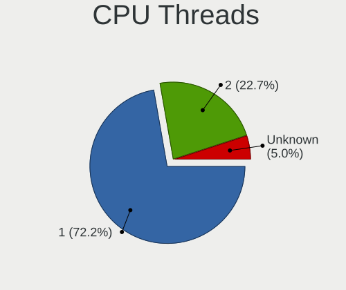

| Number  | Desktops | Percent |
|---------|----------|---------|
| 1       | 216      | 72.24%  |
| 2       | 68       | 22.74%  |
| Unknown | 15       | 5.02%   |

CPU Microarch
-------------

Microarchitecture

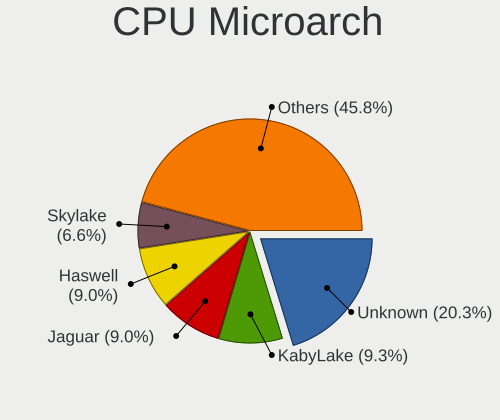

| Name          | Desktops | Percent |
|---------------|----------|---------|
| Unknown       | 61       | 20.27%  |
| KabyLake      | 28       | 9.3%    |
| Jaguar        | 27       | 8.97%   |
| Haswell       | 27       | 8.97%   |
| Skylake       | 20       | 6.64%   |
| Silvermont    | 16       | 5.32%   |
| SandyBridge   | 16       | 5.32%   |
| IvyBridge     | 15       | 4.98%   |
| Goldmont plus | 14       | 4.65%   |
| Goldmont      | 11       | 3.65%   |
| Penryn        | 9        | 2.99%   |
| Bobcat        | 7        | 2.33%   |
| Zen 3         | 6        | 1.99%   |
| Zen 2         | 6        | 1.99%   |
| Bonnell       | 6        | 1.99%   |
| Zen           | 5        | 1.66%   |
| Puma          | 5        | 1.66%   |
| Nehalem       | 4        | 1.33%   |
| K10           | 4        | 1.33%   |
| Broadwell     | 4        | 1.33%   |
| Core          | 3        | 1%      |
| Zen+          | 2        | 0.66%   |
| CometLake     | 2        | 0.66%   |
| Westmere      | 1        | 0.33%   |
| Piledriver    | 1        | 0.33%   |
| K8 Hammer     | 1        | 0.33%   |

Graphics
--------

GPU Vendor
----------

Vendors of graphics cards

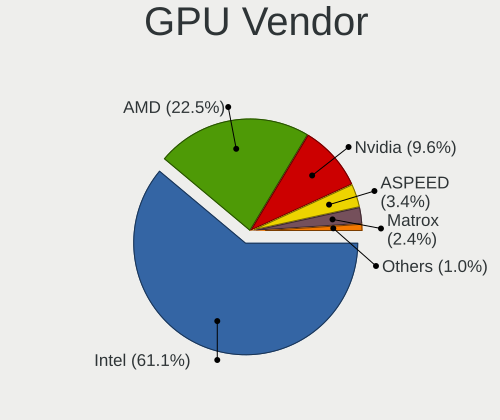

| Vendor                                       | Desktops | Percent |
|----------------------------------------------|----------|---------|
| Intel                                        | 179      | 61.09%  |
| AMD                                          | 66       | 22.53%  |
| Nvidia                                       | 28       | 9.56%   |
| ASPEED Technology                            | 10       | 3.41%   |
| Matrox Electronics Systems                   | 7        | 2.39%   |
| XGI Technology (eXtreme Graphics Innovation) | 2        | 0.68%   |
| VIA Technologies                             | 1        | 0.34%   |

GPU Model
---------

Graphics card models

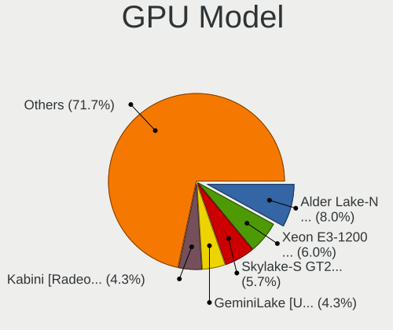

| Model                                                                                    | Desktops | Percent |
|------------------------------------------------------------------------------------------|----------|---------|
| Intel Alder Lake-N [UHD Graphics]                                                        | 24       | 8%      |
| Intel Xeon E3-1200 v3/4th Gen Core Processor Integrated Graphics Controller              | 18       | 6%      |
| Intel Skylake-S GT2 [HD Graphics 530]                                                    | 17       | 5.67%   |
| Intel GeminiLake [UHD Graphics 600]                                                      | 13       | 4.33%   |
| AMD Kabini [Radeon HD 8400E]                                                             | 13       | 4.33%   |
| Intel 2nd Generation Core Processor Family Integrated Graphics Controller                | 12       | 4%      |
| Intel JasperLake [UHD Graphics]                                                          | 11       | 3.67%   |
| Intel CoffeeLake-S GT2 [UHD Graphics 630]                                                | 11       | 3.67%   |
| Intel Atom Processor Z36xxx/Z37xxx Series Graphics & Display                             | 11       | 3.67%   |
| ASPEED Technology ASPEED Graphics Family                                                 | 10       | 3.33%   |
| AMD Kabini [Radeon HD 8330E]                                                             | 10       | 3.33%   |
| AMD Ellesmere [Radeon RX 470/480/570/570X/580/580X/590]                                  | 9        | 3%      |
| Intel Kaby Lake-S GT2 [HD Graphics 630]                                                  | 6        | 2%      |
| Intel Apollo Lake GT1 [HD Graphics 500]                                                  | 6        | 2%      |
| Matrox Electronics Systems MGA G200eW WPCM450                                            | 5        | 1.67%   |
| Intel Xeon E3-1200 v2/3rd Gen Core processor Graphics Controller                         | 5        | 1.67%   |
| Intel Atom/Celeron/Pentium Processor x5-E8000/J3xxx/N3xxx Integrated Graphics Controller | 5        | 1.67%   |
| Intel 4 Series Chipset Integrated Graphics Controller                                    | 5        | 1.67%   |
| AMD Wrestler [Radeon HD 6320]                                                            | 5        | 1.67%   |
| Intel Atom Processor D2xxx/N2xxx Integrated Graphics Controller                          | 4        | 1.33%   |
| Intel 4th Generation Core Processor Family Integrated Graphics Controller                | 4        | 1.33%   |
| Nvidia GK208B [GeForce GT 710]                                                           | 3        | 1%      |
| Intel Elkhart Lake [UHD Graphics Gen11 16EU]                                             | 3        | 1%      |
| Intel Alder Lake-N [Intel Graphics]                                                      | 3        | 1%      |
| AMD Cezanne [Radeon Vega Series / Radeon Vega Mobile Series]                             | 3        | 1%      |
| Nvidia GP106 [GeForce GTX 1060 3GB]                                                      | 2        | 0.67%   |
| Intel WhiskeyLake-U GT2 [UHD Graphics 620]                                               | 2        | 0.67%   |
| Intel Skylake-S GT1 [HD Graphics 510]                                                    | 2        | 0.67%   |
| Intel CometLake-S GT2 [UHD Graphics 630]                                                 | 2        | 0.67%   |
| Intel Broadwell-U GT3 [HD Graphics 6000]                                                 | 2        | 0.67%   |
| Intel Alder Lake-S GT1 [UHD Graphics 770]                                                | 2        | 0.67%   |
| Intel 82945G/GZ Integrated Graphics Controller                                           | 2        | 0.67%   |
| AMD Renoir [Radeon Vega Series / Radeon Vega Mobile Series]                              | 2        | 0.67%   |
| AMD Oland [Radeon HD 8570 / R5 430 OEM / R7 240/340 / Radeon 520 OEM]                    | 2        | 0.67%   |
| AMD Navi 14 [Radeon RX 5500/5500M / Pro 5500M]                                           | 2        | 0.67%   |
| AMD Lexa PRO [Radeon 540/540X/550/550X / RX 540X/550/550X]                               | 2        | 0.67%   |
| AMD Kabini [Radeon HD 8280E]                                                             | 2        | 0.67%   |
| XGI Technology (eXtreme Graphics Innovation) Z9s/Z9m (XG21 core)                         | 1        | 0.33%   |
| XGI Technology (eXtreme Graphics Innovation) Z11/Z11M                                    | 1        | 0.33%   |
| VIA Technologies VX900 Graphics [Chrome9 HD]                                             | 1        | 0.33%   |

GPU Combo
---------

Combinations of graphics cards

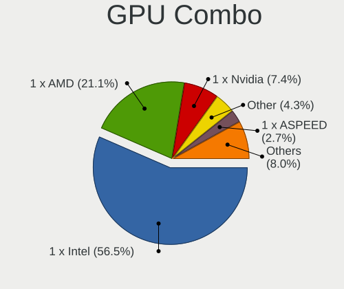

| Name            | Desktops | Percent |
|-----------------|----------|---------|
| 1 x Intel       | 169      | 56.52%  |
| 1 x AMD         | 63       | 21.07%  |
| 1 x Nvidia      | 22       | 7.36%   |
| Other           | 13       | 4.35%   |
| 1 x ASPEED      | 8        | 2.68%   |
| 1 x Matrox      | 7        | 2.34%   |
| 2 x Intel       | 4        | 1.34%   |
| Intel + Nvidia  | 4        | 1.34%   |
| 1 x XGI         | 2        | 0.67%   |
| Nvidia + ASPEED | 2        | 0.67%   |
| Intel + AMD     | 2        | 0.67%   |
| 1 x VIA         | 1        | 0.33%   |
| AMD + Nvidia    | 1        | 0.33%   |
| AMD + ASPEED    | 1        | 0.33%   |

GPU Driver
----------

Free vs proprietary

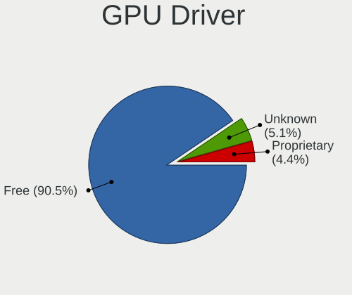

| Driver      | Desktops | Percent |
|-------------|----------|---------|
| Free        | 268      | 90.54%  |
| Unknown     | 15       | 5.07%   |
| Proprietary | 13       | 4.39%   |

GPU Memory
----------

Total video memory

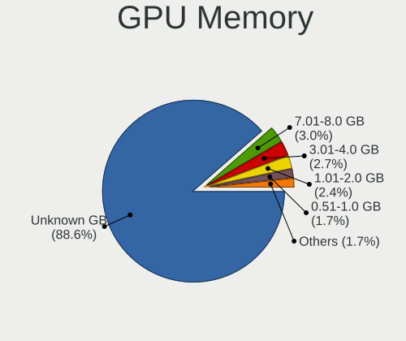

| Size in GB | Desktops | Percent |
|------------|----------|---------|
| Unknown    | 263      | 88.55%  |
| 7.01-8.0   | 9        | 3.03%   |
| 3.01-4.0   | 8        | 2.69%   |
| 1.01-2.0   | 7        | 2.36%   |
| 0.51-1.0   | 5        | 1.68%   |
| 5.01-6.0   | 2        | 0.67%   |
| 0.01-0.5   | 2        | 0.67%   |
| 8.01-16.0  | 1        | 0.34%   |

Monitor
-------

Monitor Vendor
--------------

Monitor vendors

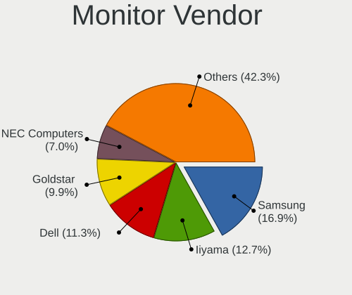

| Vendor              | Desktops | Percent |
|---------------------|----------|---------|
| Samsung Electronics | 12       | 16.9%   |
| Iiyama              | 9        | 12.68%  |
| Dell                | 8        | 11.27%  |
| Goldstar            | 7        | 9.86%   |
| NEC Computers       | 5        | 7.04%   |
| Acer                | 5        | 7.04%   |
| Philips             | 4        | 5.63%   |
| Hewlett-Packard     | 3        | 4.23%   |
| Idek Iiyama         | 2        | 2.82%   |
| BenQ                | 2        | 2.82%   |
| AOC                 | 2        | 2.82%   |
| Vestel Elektronik   | 1        | 1.41%   |
| Toshiba             | 1        | 1.41%   |
| RTK                 | 1        | 1.41%   |
| Medion              | 1        | 1.41%   |
| LG Electronics      | 1        | 1.41%   |
| Lenovo              | 1        | 1.41%   |
| Huion               | 1        | 1.41%   |
| HPN                 | 1        | 1.41%   |
| Gateway             | 1        | 1.41%   |
| Fujitsu Siemens     | 1        | 1.41%   |
| Eizo                | 1        | 1.41%   |
| Unknown             | 1        | 1.41%   |

Monitor Model
-------------

Monitor models

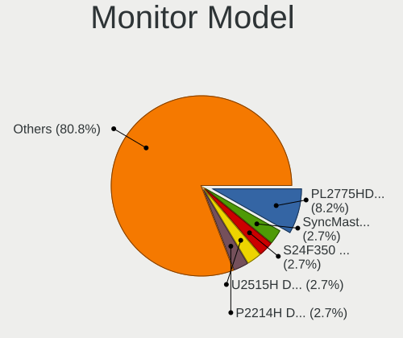

| Model                                                                 | Desktops | Percent |
|-----------------------------------------------------------------------|----------|---------|
| Iiyama PL2775HD IVM6604 1920x1080 600x340mm 27.2-inch                 | 6        | 8.22%   |
| Samsung Electronics SyncMaster SAM011F 1280x1024 380x300mm 19.1-inch  | 2        | 2.74%   |
| Samsung Electronics S24F350 SAM0D20 1920x1080 520x290mm 23.4-inch     | 2        | 2.74%   |
| Dell U2515H DELD070 2560x1440 550x310mm 24.9-inch                     | 2        | 2.74%   |
| Dell P2214H DELA099 1920x1080 480x270mm 21.7-inch                     | 2        | 2.74%   |
| Vestel Elektronik 32W_LCD_TV VES3700 1920x1080 710x400mm 32.1-inch    | 1        | 1.37%   |
| Toshiba TV TSB0110 1920x1080 1110x620mm 50.1-inch                     | 1        | 1.37%   |
| Samsung Electronics U32J59x SAM0F35 3840x2160 700x390mm 31.5-inch     | 1        | 1.37%   |
| Samsung Electronics T24D391 SAM0B73 1920x1080 520x290mm 23.4-inch     | 1        | 1.37%   |
| Samsung Electronics SyncMaster SAM0523 1920x1080 480x270mm 21.7-inch  | 1        | 1.37%   |
| Samsung Electronics SyncMaster SAM0304 1680x1050 490x320mm 23.0-inch  | 1        | 1.37%   |
| Samsung Electronics LU28R55 SAM1016 3840x2160 630x360mm 28.6-inch     | 1        | 1.37%   |
| Samsung Electronics LCD Monitor SAM7103 3840x2160 700x390mm 31.5-inch | 1        | 1.37%   |
| Samsung Electronics LCD Monitor SAM0509 1920x1080                     | 1        | 1.37%   |
| Samsung Electronics LCD Monitor S24F350 1920x1080                     | 1        | 1.37%   |
| RTK FHD RTK0039 1920x1080 300x190mm 14.0-inch                         | 1        | 1.37%   |
| Philips PHL 243V7 PHLC155 1920x1080 530x300mm 24.0-inch               | 1        | 1.37%   |
| Philips LCD Monitor PHLC01A 1680x1050 470x300mm 22.0-inch             | 1        | 1.37%   |
| Philips FTV PHL0583 3840x2160 1440x810mm 65.0-inch                    | 1        | 1.37%   |
| Philips 150S PHL0820 1024x768 300x230mm 14.9-inch                     | 1        | 1.37%   |
| NEC Computers LCD73V NEC66C2 1280x1024 340x270mm 17.1-inch            | 1        | 1.37%   |
| NEC Computers LCD4020 NEC66EA 1920x540 890x500mm 40.2-inch            | 1        | 1.37%   |
| NEC Computers LCD24WMCX NEC6720 1920x1200 520x320mm 24.0-inch         | 1        | 1.37%   |
| NEC Computers EA294WMi NEC68CF 2560x1080 670x280mm 28.6-inch          | 1        | 1.37%   |
| NEC Computers EA223WM NEC6891 1680x1050 470x300mm 22.0-inch           | 1        | 1.37%   |
| NEC Computers E438 NEC335C 3840x2160 940x530mm 42.5-inch              | 1        | 1.37%   |
| Medion MD32119PR MED89C2 1280x1024 380x300mm 19.1-inch                | 1        | 1.37%   |
| LG Electronics LCD Monitor LG HDR 4K 6400x2160                        | 1        | 1.37%   |
| Lenovo P27h-20 LEN61E9 2560x1440 600x340mm 27.2-inch                  | 1        | 1.37%   |
| Iiyama PLE2407HDS IVM560D 1920x1080 520x300mm 23.6-inch               | 1        | 1.37%   |
| Iiyama PL2773HD IVM6606 1920x1080 600x340mm 27.2-inch                 | 1        | 1.37%   |
| Iiyama PL2409HD IVM560C 1920x1080 520x290mm 23.4-inch                 | 1        | 1.37%   |
| Idek Iiyama LCD Monitor PL2792UH 3840x2160                            | 1        | 1.37%   |
| Idek Iiyama LCD Monitor PL2209HD 5760x2160                            | 1        | 1.37%   |
| Huion GS1562 HAT1560 1920x1080 340x200mm 15.5-inch                    | 1        | 1.37%   |
| HPN LCD Monitor HP E233 1920x1080                                     | 1        | 1.37%   |
| Hewlett-Packard V27i G5 HPN3830 1920x1080 600x340mm 27.2-inch         | 1        | 1.37%   |
| Hewlett-Packard E221c HWP3092 1920x1080 500x290mm 22.8-inch           | 1        | 1.37%   |
| Hewlett-Packard 19ka HWP3328 1366x768 410x230mm 18.5-inch             | 1        | 1.37%   |
| Goldstar W1934 GSM4B7A 1440x900 410x260mm 19.1-inch                   | 1        | 1.37%   |

Monitor Resolution
------------------

Monitor screen resolution

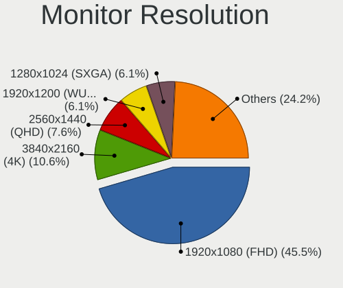

| Resolution         | Desktops | Percent |
|--------------------|----------|---------|
| 1920x1080 (FHD)    | 30       | 45.45%  |
| 3840x2160 (4K)     | 7        | 10.61%  |
| 2560x1440 (QHD)    | 5        | 7.58%   |
| 1920x1200 (WUXGA)  | 4        | 6.06%   |
| 1280x1024 (SXGA)   | 4        | 6.06%   |
| 1680x1050 (WSXGA+) | 3        | 4.55%   |
| 1366x768 (WXGA)    | 3        | 4.55%   |
| 2560x1080          | 2        | 3.03%   |
| 1920x540           | 2        | 3.03%   |
| Unknown            | 2        | 3.03%   |
| 6400x2160          | 1        | 1.52%   |
| 5760x2160          | 1        | 1.52%   |
| 1440x900 (WXGA+)   | 1        | 1.52%   |
| 1024x768 (XGA)     | 1        | 1.52%   |

Monitor Diagonal
----------------

Diagonal size in inches

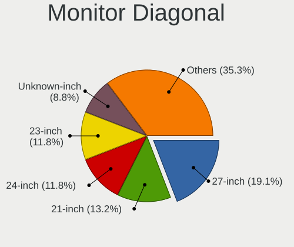

| Inches  | Desktops | Percent |
|---------|----------|---------|
| 27      | 13       | 19.12%  |
| 21      | 9        | 13.24%  |
| 24      | 8        | 11.76%  |
| 23      | 8        | 11.76%  |
| Unknown | 6        | 8.82%   |
| 19      | 4        | 5.88%   |
| 22      | 3        | 4.41%   |
| 18      | 3        | 4.41%   |
| 42      | 2        | 2.94%   |
| 31      | 2        | 2.94%   |
| 28      | 2        | 2.94%   |
| 14      | 2        | 2.94%   |
| 65      | 1        | 1.47%   |
| 50      | 1        | 1.47%   |
| 40      | 1        | 1.47%   |
| 34      | 1        | 1.47%   |
| 17      | 1        | 1.47%   |
| 15      | 1        | 1.47%   |

Monitor Width
-------------

Physical width

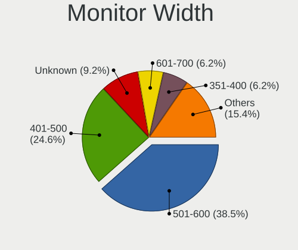

| Width in mm | Desktops | Percent |
|-------------|----------|---------|
| 501-600     | 25       | 38.46%  |
| 401-500     | 16       | 24.62%  |
| Unknown     | 6        | 9.23%   |
| 601-700     | 4        | 6.15%   |
| 351-400     | 4        | 6.15%   |
| 301-350     | 2        | 3.08%   |
| 201-300     | 2        | 3.08%   |
| 1001-1500   | 2        | 3.08%   |
| 901-1000    | 2        | 3.08%   |
| 801-900     | 1        | 1.54%   |
| 701-800     | 1        | 1.54%   |

Aspect Ratio
------------

Proportional relationship between the width and the height

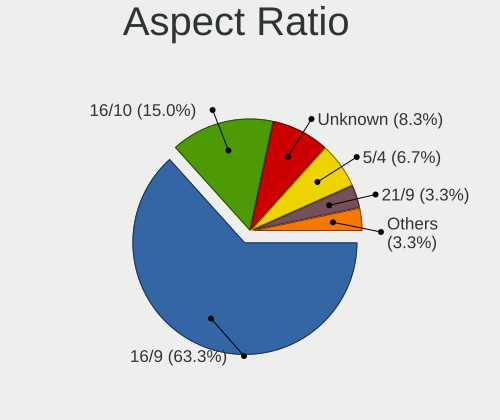

| Ratio   | Desktops | Percent |
|---------|----------|---------|
| 16/9    | 38       | 63.33%  |
| 16/10   | 9        | 15%     |
| Unknown | 5        | 8.33%   |
| 5/4     | 4        | 6.67%   |
| 21/9    | 2        | 3.33%   |
| 4/3     | 1        | 1.67%   |
| 3/2     | 1        | 1.67%   |

Monitor Area
------------

Area in inch²

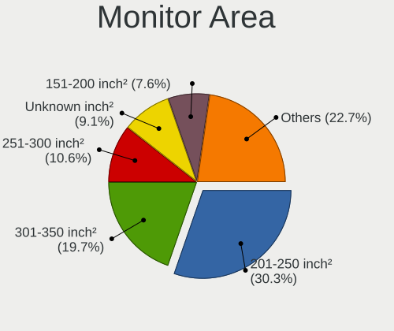

| Area in inch² | Desktops | Percent |
|----------------|----------|---------|
| 201-250        | 20       | 30.3%   |
| 301-350        | 13       | 19.7%   |
| 251-300        | 7        | 10.61%  |
| Unknown        | 6        | 9.09%   |
| 151-200        | 5        | 7.58%   |
| 351-500        | 4        | 6.06%   |
| 141-150        | 3        | 4.55%   |
| 501-1000       | 3        | 4.55%   |
| More than 1000 | 2        | 3.03%   |
| 101-110        | 2        | 3.03%   |
| 81-90          | 1        | 1.52%   |

Pixel Density
-------------

Pixels per inch

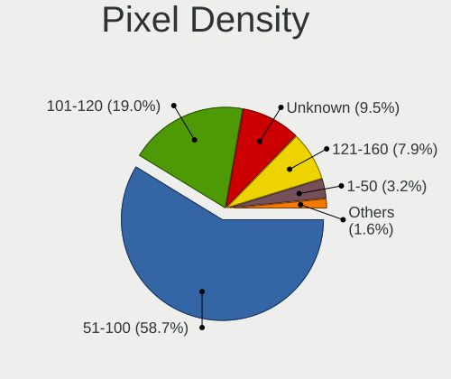

| Density | Desktops | Percent |
|---------|----------|---------|
| 51-100  | 37       | 58.73%  |
| 101-120 | 12       | 19.05%  |
| Unknown | 6        | 9.52%   |
| 121-160 | 5        | 7.94%   |
| 1-50    | 2        | 3.17%   |
| 161-240 | 1        | 1.59%   |

Multiple Monitors
-----------------

Total monitors connected

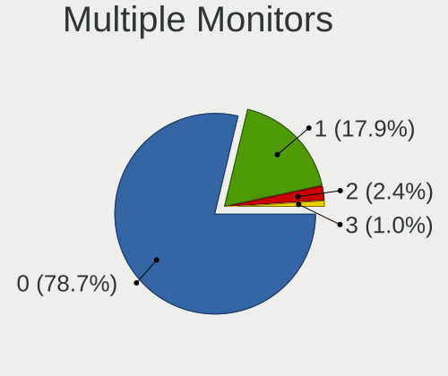

| Total | Desktops | Percent |
|-------|----------|---------|
| 0     | 233      | 78.72%  |
| 1     | 53       | 17.91%  |
| 2     | 7        | 2.36%   |
| 3     | 3        | 1.01%   |

Network
-------

Net Controller Vendor
---------------------

Controller vendors

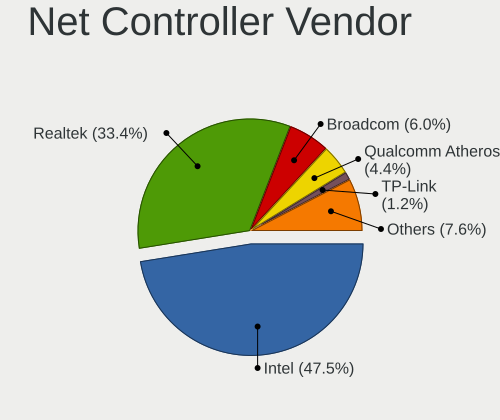

| Vendor                            | Desktops | Percent |
|-----------------------------------|----------|---------|
| Intel                             | 206      | 47.47%  |
| Realtek Semiconductor             | 145      | 33.41%  |
| Broadcom                          | 26       | 5.99%   |
| Qualcomm Atheros                  | 19       | 4.38%   |
| TP-Link                           | 5        | 1.15%   |
| Qualcomm Atheros Communications   | 4        | 0.92%   |
| Huawei Technologies               | 3        | 0.69%   |
| Xiaomi                            | 2        | 0.46%   |
| Seeed Technology                  | 2        | 0.46%   |
| Ralink Technology                 | 2        | 0.46%   |
| Mellanox Technologies             | 2        | 0.46%   |
| ZyXEL Communications              | 1        | 0.23%   |
| U-Blox                            | 1        | 0.23%   |
| Sundance Technology Inc / IC Plus | 1        | 0.23%   |
| SEGGER                            | 1        | 0.23%   |
| Samsung Electronics               | 1        | 0.23%   |
| Ralink                            | 1        | 0.23%   |
| Nuvoton                           | 1        | 0.23%   |
| NetGear                           | 1        | 0.23%   |
| MediaTek                          | 1        | 0.23%   |
| Marvell Technology Group          | 1        | 0.23%   |
| IMC Networks                      | 1        | 0.23%   |
| Espressif                         | 1        | 0.23%   |
| D-Link System                     | 1        | 0.23%   |
| Conexant Systems                  | 1        | 0.23%   |
| ASUSTek Computer                  | 1        | 0.23%   |
| Apple                             | 1        | 0.23%   |
| American Megatrends               | 1        | 0.23%   |
| 3Com                              | 1        | 0.23%   |

Net Controller Model
--------------------

Controller models

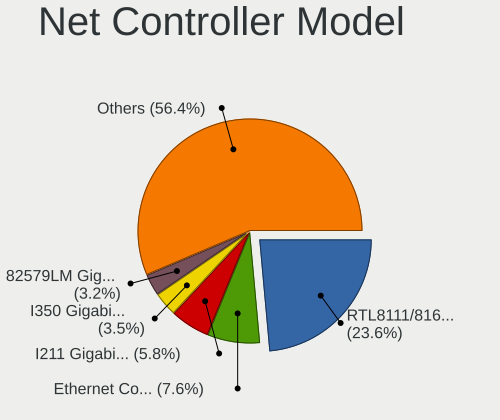

| Model                                                                         | Desktops | Percent |
|-------------------------------------------------------------------------------|----------|---------|
| Realtek RTL8111/8168/8211/8411 PCI Express Gigabit Ethernet Controller        | 127      | 23.56%  |
| Intel Ethernet Controller I226-V                                              | 41       | 7.61%   |
| Intel I211 Gigabit Network Connection                                         | 31       | 5.75%   |
| Intel I350 Gigabit Network Connection                                         | 19       | 3.53%   |
| Intel 82579LM Gigabit Network Connection (Lewisville)                         | 17       | 3.15%   |
| Intel I210 Gigabit Network Connection                                         | 15       | 2.78%   |
| Intel Ethernet Controller I225-V                                              | 14       | 2.6%    |
| Intel 82574L Gigabit Network Connection                                       | 14       | 2.6%    |
| Intel Ethernet Connection (7) I219-V                                          | 11       | 2.04%   |
| Intel Ethernet Connection (2) I219-V                                          | 11       | 2.04%   |
| Intel Ethernet Connection I217-LM                                             | 9        | 1.67%   |
| Intel 82571EB/82571GB Gigabit Ethernet Controller D0/D1 (copper applications) | 8        | 1.48%   |
| Intel 82580 Gigabit Network Connection                                        | 7        | 1.3%    |
| Intel 82571EB/82571GB Gigabit Ethernet Controller (Copper)                    | 7        | 1.3%    |
| Broadcom NetXtreme BCM5719 Gigabit Ethernet PCIe                              | 6        | 1.11%   |
| Realtek RTL8188EUS 802.11n Wireless Network Adapter                           | 5        | 0.93%   |
| Realtek RTL-8100/8101L/8139 PCI Fast Ethernet Adapter                         | 5        | 0.93%   |
| Intel Centrino Advanced-N 6205 [Taylor Peak]                                  | 5        | 0.93%   |
| Intel Cannon Lake PCH CNVi WiFi                                               | 5        | 0.93%   |
| Intel 82599ES 10-Gigabit SFI/SFP+ Network Connection                          | 5        | 0.93%   |
| Intel 82576 Gigabit Network Connection                                        | 5        | 0.93%   |
| Broadcom BCM43228 802.11a/b/g/n                                               | 5        | 0.93%   |
| Qualcomm Atheros AR9287 Wireless Network Adapter (PCI-Express)                | 4        | 0.74%   |
| Intel Wi-Fi 6 AX200                                                           | 4        | 0.74%   |
| Intel Ethernet Connection X553 10 GbE SFP+                                    | 4        | 0.74%   |
| Intel Dual Band Wireless-AC 3168NGW [Stone Peak]                              | 4        | 0.74%   |
| Broadcom NetXtreme BCM5720 Gigabit Ethernet PCIe                              | 4        | 0.74%   |
| Realtek RTL8821CE 802.11ac PCIe Wireless Network Adapter                      | 3        | 0.56%   |
| Realtek RTL8125 2.5GbE Controller                                             | 3        | 0.56%   |
| Realtek RTL8111/8168/8411 PCI Express Gigabit Ethernet Controller             | 3        | 0.56%   |
| Qualcomm Atheros QCA9565 / AR9565 Wireless Network Adapter                    | 3        | 0.56%   |
| Qualcomm Atheros AR9271 802.11n                                               | 3        | 0.56%   |
| Intel Wireless 8265 / 8275                                                    | 3        | 0.56%   |
| Intel Wireless 8260                                                           | 3        | 0.56%   |
| Intel Wireless 7260                                                           | 3        | 0.56%   |
| Intel Ethernet Controller X710 for 10GbE SFP+                                 | 3        | 0.56%   |
| Intel 82579V Gigabit Network Connection                                       | 3        | 0.56%   |
| Intel 82572EI Gigabit Ethernet Controller (Copper)                            | 3        | 0.56%   |
| Intel 82567LM-3 Gigabit Network Connection                                    | 3        | 0.56%   |
| Broadcom NetLink BCM57781 Gigabit Ethernet PCIe                               | 3        | 0.56%   |

Wireless Vendor
---------------

Wireless vendors

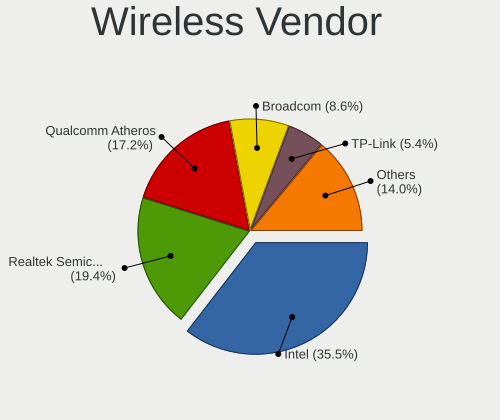

| Vendor                          | Desktops | Percent |
|---------------------------------|----------|---------|
| Intel                           | 33       | 35.48%  |
| Realtek Semiconductor           | 18       | 19.35%  |
| Qualcomm Atheros                | 16       | 17.2%   |
| Broadcom                        | 8        | 8.6%    |
| TP-Link                         | 5        | 5.38%   |
| Qualcomm Atheros Communications | 4        | 4.3%    |
| Ralink Technology               | 2        | 2.15%   |
| ZyXEL Communications            | 1        | 1.08%   |
| Ralink                          | 1        | 1.08%   |
| NetGear                         | 1        | 1.08%   |
| MediaTek                        | 1        | 1.08%   |
| IMC Networks                    | 1        | 1.08%   |
| D-Link System                   | 1        | 1.08%   |
| ASUSTek Computer                | 1        | 1.08%   |

Wireless Model
--------------

Wireless models

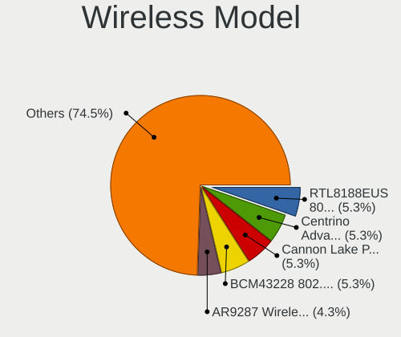

| Model                                                                         | Desktops | Percent |
|-------------------------------------------------------------------------------|----------|---------|
| Realtek RTL8188EUS 802.11n Wireless Network Adapter                           | 5        | 5.32%   |
| Intel Centrino Advanced-N 6205 [Taylor Peak]                                  | 5        | 5.32%   |
| Intel Cannon Lake PCH CNVi WiFi                                               | 5        | 5.32%   |
| Broadcom BCM43228 802.11a/b/g/n                                               | 5        | 5.32%   |
| Qualcomm Atheros AR9287 Wireless Network Adapter (PCI-Express)                | 4        | 4.26%   |
| Intel Wi-Fi 6 AX200                                                           | 4        | 4.26%   |
| Intel Dual Band Wireless-AC 3168NGW [Stone Peak]                              | 4        | 4.26%   |
| Realtek RTL8821CE 802.11ac PCIe Wireless Network Adapter                      | 3        | 3.19%   |
| Qualcomm Atheros QCA9565 / AR9565 Wireless Network Adapter                    | 3        | 3.19%   |
| Qualcomm Atheros AR9271 802.11n                                               | 3        | 3.19%   |
| Intel Wireless 8265 / 8275                                                    | 3        | 3.19%   |
| Intel Wireless 8260                                                           | 3        | 3.19%   |
| Intel Wireless 7260                                                           | 3        | 3.19%   |
| TP-Link TL-WN722N v2/v3 [Realtek RTL8188EUS]                                  | 2        | 2.13%   |
| TP-Link AC600 wireless Realtek RTL8811AU [Archer T2U Nano]                    | 2        | 2.13%   |
| Realtek RTL88x2bu [AC1200 Techkey]                                            | 2        | 2.13%   |
| Realtek RTL8188EE Wireless Network Adapter                                    | 2        | 2.13%   |
| Realtek RTL8188CUS 802.11n WLAN Adapter                                       | 2        | 2.13%   |
| Ralink RT5370 Wireless Adapter                                                | 2        | 2.13%   |
| Qualcomm Atheros QCA986x/988x 802.11ac Wireless Network Adapter               | 2        | 2.13%   |
| Qualcomm Atheros AR9285 Wireless Network Adapter (PCI-Express)                | 2        | 2.13%   |
| Intel Wi-Fi 6E(802.11ax) AX210/AX1675* 2x2 [Typhoon Peak]                     | 2        | 2.13%   |
| Intel Alder Lake-S PCH CNVi WiFi                                              | 2        | 2.13%   |
| ZyXEL NWD2205 802.11n Wireless N Adapter [Realtek RTL8192CU]                  | 1        | 1.06%   |
| TP-Link TL-WN823N v2/v3 [Realtek RTL8192EU]                                   | 1        | 1.06%   |
| TP-Link TL-WN821N v5/v6 [RTL8192EU]                                           | 1        | 1.06%   |
| Realtek RTL8852CE PCIe 802.11ax Wireless Network Controller                   | 1        | 1.06%   |
| Realtek RTL8723BE PCIe Wireless Network Adapter                               | 1        | 1.06%   |
| Realtek RTL8192CE PCIe Wireless Network Adapter                               | 1        | 1.06%   |
| Realtek RTL8187SE Wireless LAN Controller                                     | 1        | 1.06%   |
| Ralink RT2561/RT61 rev B 802.11g                                              | 1        | 1.06%   |
| Qualcomm Atheros QCA9377 802.11ac Wireless Network Adapter                    | 1        | 1.06%   |
| Qualcomm Atheros TP-Link TL-WN821N v2 / TL-WN822N v1 802.11n [Atheros AR9170] | 1        | 1.06%   |
| Qualcomm Atheros AR9485 Wireless Network Adapter                              | 1        | 1.06%   |
| Qualcomm Atheros AR9462 Wireless Network Adapter                              | 1        | 1.06%   |
| Qualcomm Atheros AR928X Wireless Network Adapter (PCI-Express)                | 1        | 1.06%   |
| Qualcomm Atheros AR9227 Wireless Network Adapter                              | 1        | 1.06%   |
| NetGear WN111(v2) RangeMax Next Wireless [Atheros AR9170+AR9101]              | 1        | 1.06%   |
| MediaTek MT7921K (RZ608) Wi-Fi 6E 80MHz                                       | 1        | 1.06%   |
| Intel PRO/Wireless 4965 AG or AGN [Kedron] Network Connection                 | 1        | 1.06%   |

Ethernet Vendor
---------------

Ethernet vendors

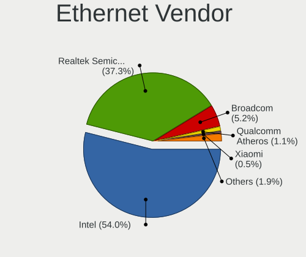

| Vendor                            | Desktops | Percent |
|-----------------------------------|----------|---------|
| Intel                             | 198      | 53.95%  |
| Realtek Semiconductor             | 137      | 37.33%  |
| Broadcom                          | 19       | 5.18%   |
| Qualcomm Atheros                  | 4        | 1.09%   |
| Xiaomi                            | 2        | 0.54%   |
| Sundance Technology Inc / IC Plus | 1        | 0.27%   |
| Samsung Electronics               | 1        | 0.27%   |
| Marvell Technology Group          | 1        | 0.27%   |
| Huawei Technologies               | 1        | 0.27%   |
| Apple                             | 1        | 0.27%   |
| American Megatrends               | 1        | 0.27%   |
| 3Com                              | 1        | 0.27%   |

Ethernet Model
--------------

Ethernet models

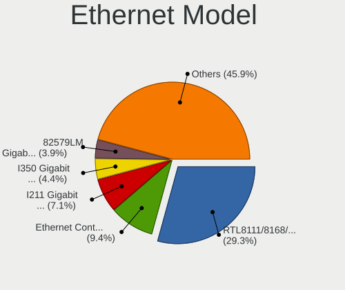

| Model                                                                         | Desktops | Percent |
|-------------------------------------------------------------------------------|----------|---------|
| Realtek RTL8111/8168/8211/8411 PCI Express Gigabit Ethernet Controller        | 127      | 29.26%  |
| Intel Ethernet Controller I226-V                                              | 41       | 9.45%   |
| Intel I211 Gigabit Network Connection                                         | 31       | 7.14%   |
| Intel I350 Gigabit Network Connection                                         | 19       | 4.38%   |
| Intel 82579LM Gigabit Network Connection (Lewisville)                         | 17       | 3.92%   |
| Intel I210 Gigabit Network Connection                                         | 15       | 3.46%   |
| Intel Ethernet Controller I225-V                                              | 14       | 3.23%   |
| Intel 82574L Gigabit Network Connection                                       | 14       | 3.23%   |
| Intel Ethernet Connection (7) I219-V                                          | 11       | 2.53%   |
| Intel Ethernet Connection (2) I219-V                                          | 11       | 2.53%   |
| Intel Ethernet Connection I217-LM                                             | 9        | 2.07%   |
| Intel 82571EB/82571GB Gigabit Ethernet Controller D0/D1 (copper applications) | 8        | 1.84%   |
| Intel 82580 Gigabit Network Connection                                        | 7        | 1.61%   |
| Intel 82571EB/82571GB Gigabit Ethernet Controller (Copper)                    | 7        | 1.61%   |
| Broadcom NetXtreme BCM5719 Gigabit Ethernet PCIe                              | 6        | 1.38%   |
| Realtek RTL-8100/8101L/8139 PCI Fast Ethernet Adapter                         | 5        | 1.15%   |
| Intel 82599ES 10-Gigabit SFI/SFP+ Network Connection                          | 5        | 1.15%   |
| Intel 82576 Gigabit Network Connection                                        | 5        | 1.15%   |
| Intel Ethernet Connection X553 10 GbE SFP+                                    | 4        | 0.92%   |
| Broadcom NetXtreme BCM5720 Gigabit Ethernet PCIe                              | 4        | 0.92%   |
| Realtek RTL8125 2.5GbE Controller                                             | 3        | 0.69%   |
| Realtek RTL8111/8168/8411 PCI Express Gigabit Ethernet Controller             | 3        | 0.69%   |
| Intel Ethernet Controller X710 for 10GbE SFP+                                 | 3        | 0.69%   |
| Intel 82579V Gigabit Network Connection                                       | 3        | 0.69%   |
| Intel 82572EI Gigabit Ethernet Controller (Copper)                            | 3        | 0.69%   |
| Intel 82567LM-3 Gigabit Network Connection                                    | 3        | 0.69%   |
| Broadcom NetLink BCM57781 Gigabit Ethernet PCIe                               | 3        | 0.69%   |
| Realtek USB 2.5GbE Controller                                                 | 2        | 0.46%   |
| Realtek RTL810xE PCI Express Fast Ethernet controller                         | 2        | 0.46%   |
| Qualcomm Atheros Killer E220x Gigabit Ethernet Controller                     | 2        | 0.46%   |
| Intel I350 Gigabit Fiber Network Connection                                   | 2        | 0.46%   |
| Intel I210 Gigabit Fiber Network Connection                                   | 2        | 0.46%   |
| Intel Ethernet Connection X553 1GbE                                           | 2        | 0.46%   |
| Intel Ethernet Connection (5) I219-LM                                         | 2        | 0.46%   |
| Intel Ethernet Connection (2) I219-LM                                         | 2        | 0.46%   |
| Intel 82583V Gigabit Network Connection                                       | 2        | 0.46%   |
| Intel 82576NS Gigabit Network Connection                                      | 2        | 0.46%   |
| Intel 82557/8/9/0/1 Ethernet Pro 100                                          | 2        | 0.46%   |
| Broadcom NetXtreme BCM5751 Gigabit Ethernet PCI Express                       | 2        | 0.46%   |
| Xiaomi Mi/Redmi series (RNDIS)                                                | 1        | 0.23%   |

Net Controller Kind
-------------------

Ethernet, WiFi or modem

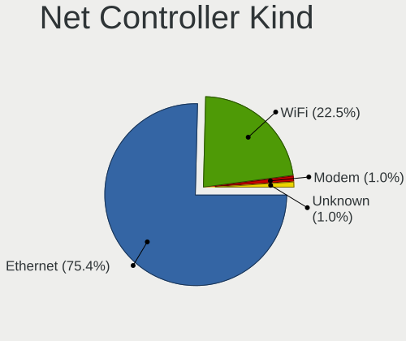

| Kind     | Desktops | Percent |
|----------|----------|---------|
| Ethernet | 288      | 75.39%  |
| WiFi     | 86       | 22.51%  |
| Modem    | 4        | 1.05%   |
| Unknown  | 4        | 1.05%   |

Used Controller
---------------

Currently used network controller

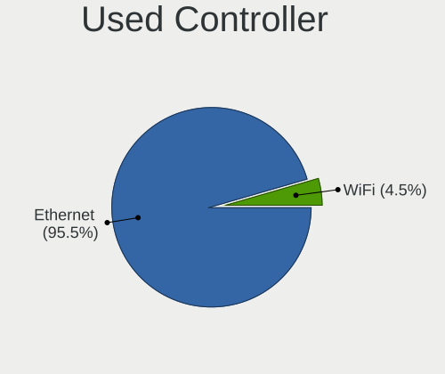

| Kind     | Desktops | Percent |
|----------|----------|---------|
| Ethernet | 277      | 95.52%  |
| WiFi     | 13       | 4.48%   |

NICs
----

Total network controllers on board

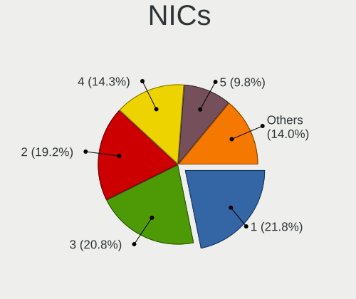

| Total | Desktops | Percent |
|-------|----------|---------|
| 1     | 67       | 21.82%  |
| 3     | 64       | 20.85%  |
| 2     | 59       | 19.22%  |
| 4     | 44       | 14.33%  |
| 5     | 30       | 9.77%   |
| 6     | 27       | 8.79%   |
| 0     | 7        | 2.28%   |
| 9     | 3        | 0.98%   |
| 14    | 2        | 0.65%   |
| 17    | 1        | 0.33%   |
| 10    | 1        | 0.33%   |
| 8     | 1        | 0.33%   |
| 7     | 1        | 0.33%   |

IPv6
----

IPv6 vs IPv4

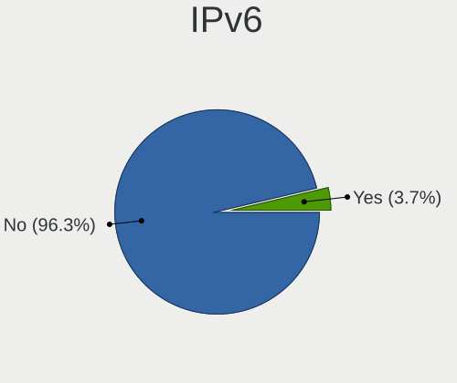

| Used | Desktops | Percent |
|------|----------|---------|
| No   | 286      | 96.3%   |
| Yes  | 11       | 3.7%    |

Bluetooth
---------

Bluetooth Vendor
----------------

Controller vendors

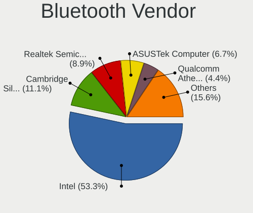

| Vendor                          | Desktops | Percent |
|---------------------------------|----------|---------|
| Intel                           | 24       | 53.33%  |
| Cambridge Silicon Radio         | 5        | 11.11%  |
| Realtek Semiconductor           | 4        | 8.89%   |
| ASUSTek Computer                | 3        | 6.67%   |
| Qualcomm Atheros Communications | 2        | 4.44%   |
| IMC Networks                    | 2        | 4.44%   |
| TP-Link                         | 1        | 2.22%   |
| Qcom                            | 1        | 2.22%   |
| MediaTek                        | 1        | 2.22%   |
| Lite-On Technology              | 1        | 2.22%   |
| Apple                           | 1        | 2.22%   |

Bluetooth Model
---------------

Controller models

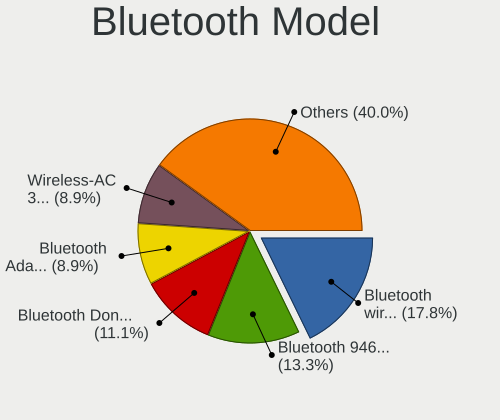

| Model                                                | Desktops | Percent |
|------------------------------------------------------|----------|---------|
| Intel Bluetooth wireless interface                   | 8        | 17.78%  |
| Intel Bluetooth 9460/9560 Jefferson Peak (JfP)       | 6        | 13.33%  |
| Cambridge Silicon Radio Bluetooth Dongle (HCI mode)  | 5        | 11.11%  |
| Realtek Bluetooth Adapter                            | 4        | 8.89%   |
| Intel Wireless-AC 3168 Bluetooth                     | 4        | 8.89%   |
| Qualcomm Atheros AR9462 Bluetooth                    | 2        | 4.44%   |
| Intel AX210 Bluetooth                                | 2        | 4.44%   |
| Intel AX201 Bluetooth                                | 2        | 4.44%   |
| Intel AX200 Bluetooth                                | 2        | 4.44%   |
| ASUS USB-BT500                                       | 2        | 4.44%   |
| TP-Link Bluetooth 5.0 USB Adapter                    | 1        | 2.22%   |
| Qcom Broadcom BCM2070 Bluetooth 2.1+EDR USB Device   | 1        | 2.22%   |
| MediaTek RZ608 Bluetooth Adapter                     | 1        | 2.22%   |
| Lite-On Bluetooth USB Module                         | 1        | 2.22%   |
| IMC Networks Realtek Bluetooth 4.0 + High Speed Chip | 1        | 2.22%   |
| IMC Networks Qualcomm Atheros Bluetooth 4.0 + HS     | 1        | 2.22%   |
| ASUS Broadcom BCM20702A0 Bluetooth                   | 1        | 2.22%   |
| Apple Bluetooth Host Controller                      | 1        | 2.22%   |

Sound
-----

Sound Vendor
------------

Sound card vendors

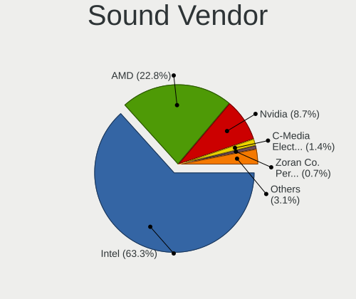

| Vendor                                       | Desktops | Percent |
|----------------------------------------------|----------|---------|
| Intel                                        | 183      | 63.32%  |
| AMD                                          | 66       | 22.84%  |
| Nvidia                                       | 25       | 8.65%   |
| C-Media Electronics                          | 4        | 1.38%   |
| Zoran Co. Personal Media Division (Nogatech) | 2        | 0.69%   |
| Logitech                                     | 2        | 0.69%   |
| Creative Labs                                | 2        | 0.69%   |
| VIA Technologies                             | 1        | 0.35%   |
| ROCCAT                                       | 1        | 0.35%   |
| Nektar                                       | 1        | 0.35%   |
| Creative Technology                          | 1        | 0.35%   |
| Cambridge Silicon Radio                      | 1        | 0.35%   |

Sound Model
-----------

Sound card models

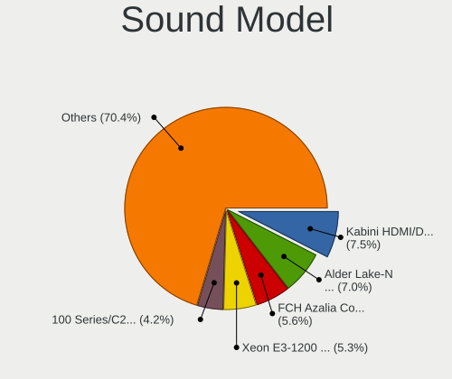

| Model                                                                                             | Desktops | Percent |
|---------------------------------------------------------------------------------------------------|----------|---------|
| AMD Kabini HDMI/DP Audio                                                                          | 27       | 7.54%   |
| Intel Alder Lake-N PCH High Definition Audio Controller                                           | 25       | 6.98%   |
| AMD FCH Azalia Controller                                                                         | 20       | 5.59%   |
| Intel Xeon E3-1200 v3/4th Gen Core Processor HD Audio Controller                                  | 19       | 5.31%   |
| Intel 100 Series/C230 Series Chipset Family HD Audio Controller                                   | 15       | 4.19%   |
| Intel Celeron/Pentium Silver Processor High Definition Audio                                      | 14       | 3.91%   |
| Intel Cannon Lake PCH cAVS                                                                        | 14       | 3.91%   |
| Intel 8 Series/C220 Series Chipset High Definition Audio Controller                               | 14       | 3.91%   |
| Intel 7 Series/C216 Chipset Family High Definition Audio Controller                               | 12       | 3.35%   |
| Intel Jasper Lake HD Audio                                                                        | 11       | 3.07%   |
| Intel 6 Series/C200 Series Chipset Family High Definition Audio Controller                        | 11       | 3.07%   |
| Intel 200 Series PCH HD Audio                                                                     | 10       | 2.79%   |
| Intel NM10/ICH7 Family High Definition Audio Controller                                           | 9        | 2.51%   |
| AMD SBx00 Azalia (Intel HDA)                                                                      | 9        | 2.51%   |
| AMD Ryzen HD Audio Controller                                                                     | 9        | 2.51%   |
| AMD Ellesmere HDMI Audio [Radeon RX 470/480 / 570/580/590]                                        | 9        | 2.51%   |
| Intel Atom Processor Z36xxx/Z37xxx Series High Definition Audio Controller                        | 7        | 1.96%   |
| AMD Wrestler HDMI Audio                                                                           | 6        | 1.68%   |
| AMD Starship/Matisse HD Audio Controller                                                          | 6        | 1.68%   |
| Intel Celeron N3350/Pentium N4200/Atom E3900 Series Audio Cluster                                 | 5        | 1.4%    |
| Intel 9 Series Chipset Family HD Audio Controller                                                 | 5        | 1.4%    |
| AMD Renoir/Cezanne HDMI/DP Audio Controller                                                       | 5        | 1.4%    |
| AMD Oland/Hainan/Cape Verde/Pitcairn HDMI Audio [Radeon HD 7000 Series]                           | 5        | 1.4%    |
| AMD Family 17h (Models 00h-0fh) HD Audio Controller                                               | 5        | 1.4%    |
| Intel Atom/Celeron/Pentium Processor x5-E8000/J3xxx/N3xxx Series High Definition Audio Controller | 4        | 1.12%   |
| Nvidia GP106 High Definition Audio Controller                                                     | 3        | 0.84%   |
| Nvidia GK208 HDMI/DP Audio Controller                                                             | 3        | 0.84%   |
| Intel Elkhart Lake High Density Audio bus interface                                               | 3        | 0.84%   |
| Intel 82801JD/DO (ICH10 Family) HD Audio Controller                                               | 3        | 0.84%   |
| AMD Navi 10 HDMI Audio                                                                            | 3        | 0.84%   |
| AMD Baffin HDMI/DP Audio [Radeon RX 550 640SP / RX 560/560X]                                      | 3        | 0.84%   |
| Zoran Co. Personal Media Division (Nogatech) USB Audio and HID                                    | 2        | 0.56%   |
| Nvidia GP104 High Definition Audio Controller                                                     | 2        | 0.56%   |
| Nvidia GM206 High Definition Audio Controller                                                     | 2        | 0.56%   |
| Nvidia GK106 HDMI Audio Controller                                                                | 2        | 0.56%   |
| Intel Wildcat Point-LP High Definition Audio Controller                                           | 2        | 0.56%   |
| Intel Tiger Lake-H HD Audio Controller                                                            | 2        | 0.56%   |
| Intel Sunrise Point-LP HD Audio                                                                   | 2        | 0.56%   |
| Intel Cannon Point-LP High Definition Audio Controller                                            | 2        | 0.56%   |
| Intel Alder Lake-S HD Audio Controller                                                            | 2        | 0.56%   |

Memory
------

Memory Vendor
-------------

Memory module vendors

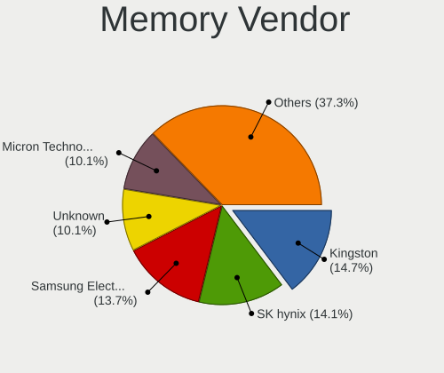

| Vendor              | Desktops | Percent |
|---------------------|----------|---------|
| Kingston            | 45       | 14.71%  |
| SK hynix            | 43       | 14.05%  |
| Samsung Electronics | 42       | 13.73%  |
| Unknown             | 31       | 10.13%  |
| Micron Technology   | 31       | 10.13%  |
| GOODRAM             | 24       | 7.84%   |
| Crucial             | 20       | 6.54%   |
| G.Skill             | 16       | 5.23%   |
| Unknown             | 9        | 2.94%   |
| Corsair             | 8        | 2.61%   |
| Wilk                | 6        | 1.96%   |
| Patriot             | 5        | 1.63%   |
| Ramaxel Technology  | 4        | 1.31%   |
| Unknown (ABCD)      | 2        | 0.65%   |
| PUSKILL             | 2        | 0.65%   |
| Nanya Technology    | 2        | 0.65%   |
| Lexar Co Limited    | 2        | 0.65%   |
| Kimtigo             | 2        | 0.65%   |
| Apacer              | 2        | 0.65%   |
| A-DATA Technology   | 2        | 0.65%   |
| Unknown (AB)        | 1        | 0.33%   |
| Unknown (07FB)      | 1        | 0.33%   |
| Toshiba             | 1        | 0.33%   |
| Silicon_Power       | 1        | 0.33%   |
| Qimonda             | 1        | 0.33%   |
| GeIL                | 1        | 0.33%   |
| Cors                | 1        | 0.33%   |
| ATP                 | 1        | 0.33%   |

Memory Model
------------

Memory module models

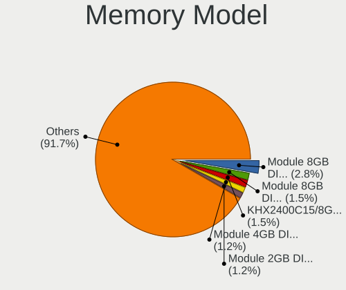

| Model                                                         | Desktops | Percent |
|---------------------------------------------------------------|----------|---------|
| Unknown                                                       | 9        | 2.77%   |
| Unknown RAM Module 8GB DIMM DDR3 1600MT/s                     | 5        | 1.54%   |
| Kingston RAM KHX2400C15/8G 8GB DIMM DDR4 2400MT/s             | 5        | 1.54%   |
| Unknown RAM Module 4GB DIMM 1333MT/s                          | 4        | 1.23%   |
| Unknown RAM Module 2GB DIMM DDR3 1066MT/s                     | 4        | 1.23%   |
| SK hynix RAM HMA851S6AFR6N-UH 4GB SODIMM DDR4 2400MT/s        | 4        | 1.23%   |
| SK hynix RAM HMT451U6AFR8C-PB 4GB DIMM DDR3 1600MT/s          | 3        | 0.92%   |
| SK hynix RAM HMT351U6CFR8C-PB 4GB DIMM DDR3 1600MT/s          | 3        | 0.92%   |
| Samsung RAM M471B5674EB0-YK0 2GB SODIMM DDR3 1600MT/s         | 3        | 0.92%   |
| Samsung RAM M471B5173EB0-YK0 4GB SODIMM DDR3 1600MT/s         | 3        | 0.92%   |
| Samsung RAM M471A1K43CB1-CRC 8GB SODIMM DDR4 2667MT/s         | 3        | 0.92%   |
| Micron RAM 53D512M64D4RQ-046 8GB Row Of Chips LPDDR4 4800MT/s | 3        | 0.92%   |
| Micron RAM 16ATF2G64HZ-2G3H1 16GB SODIMM DDR4 2400MT/s        | 3        | 0.92%   |
| GOODRAM RAM IR2400D464L15S/8G 8GB DIMM DDR4 2400MT/s          | 3        | 0.92%   |
| Crucial RAM CT16G48C40S5.M8A1 16GB SODIMM DDR5 4800MT/s       | 3        | 0.92%   |
| Unknown RAM Module 8GB SODIMM DDR3 1600MT/s                   | 2        | 0.62%   |
| Unknown RAM Module 4GB SODIMM DDR3 1333MT/s                   | 2        | 0.62%   |
| Unknown RAM Module 4GB DIMM DDR 1333MT/s                      | 2        | 0.62%   |
| Unknown RAM Module 2GB DIMM 800MT/s                           | 2        | 0.62%   |
| Unknown (ABCD) RAM 123456789012345678 8GB DIMM DDR4 2400MT/s  | 2        | 0.62%   |
| SK hynix RAM HMT451U6BFR8A-PB 4GB DIMM DDR3 1600MT/s          | 2        | 0.62%   |
| SK hynix RAM HMT451S6BFR8A-PB 4GB SODIMM DDR3 1600MT/s        | 2        | 0.62%   |
| SK hynix RAM HMT451S6AFR8A-PB 4GB SODIMM DDR3 1600MT/s        | 2        | 0.62%   |
| SK hynix RAM HMCG66AGBSA095N 8GB SODIMM DDR5 5600MT/s         | 2        | 0.62%   |
| Samsung RAM M471B5674QH0-YK0 2GB SODIMM DDR3 1600MT/s         | 2        | 0.62%   |
| Samsung RAM M471B5273DH0-CK0 8GB SODIMM DDR3 1600MT/s         | 2        | 0.62%   |
| Samsung RAM M471B5173QH0-YK0 4GB SODIMM DDR3 1600MT/s         | 2        | 0.62%   |
| Samsung RAM M471B1G73QH0-YK0 8GB SODIMM DDR3 1867MT/s         | 2        | 0.62%   |
| Samsung RAM M471B1G73EB0-YK0 8GB SODIMM DDR3 1600MT/s         | 2        | 0.62%   |
| Samsung RAM M425R1GB4BB0-CQKOL 8GB SODIMM DDR5 4800MT/s       | 2        | 0.62%   |
| Samsung RAM M378B5773DH0-CH9 2GB DIMM DDR3 1333MT/s           | 2        | 0.62%   |
| Samsung RAM M378B5173QH0-CK0 4GB DIMM DDR3 1600MT/s           | 2        | 0.62%   |
| Patriot RAM 1600 CL9 Series 8GB DIMM DDR3 1600MT/s            | 2        | 0.62%   |
| Micron RAM MTC4C10163S1SC48BA1 8GB SODIMM DDR5 4800MT/s       | 2        | 0.62%   |
| Micron RAM Module 8GB SODIMM DDR4 3200MT/s                    | 2        | 0.62%   |
| Micron RAM Module 4GB Row Of Chips LPDDR5 6400MT/s            | 2        | 0.62%   |
| Micron RAM 8KTF51264HZ-1G6E1 4GB SODIMM DDR3 1600MT/s         | 2        | 0.62%   |
| Micron RAM 36ASF4G72PZ-2G3B1 32GB DIMM DDR4 2400MT/s          | 2        | 0.62%   |
| Micron RAM 16KTF1G64HZ-1G6P1 8GB SODIMM DDR3 1600MT/s         | 2        | 0.62%   |
| Kingston RAM Module 2GB DIMM DDR3 1333MT/s                    | 2        | 0.62%   |

Memory Kind
-----------

Memory module kinds

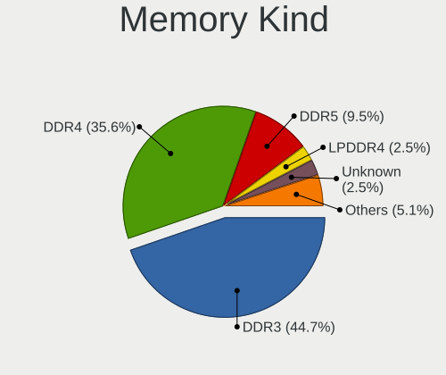

| Kind    | Desktops | Percent |
|---------|----------|---------|
| DDR3    | 123      | 44.73%  |
| DDR4    | 98       | 35.64%  |
| DDR5    | 26       | 9.45%   |
| LPDDR4  | 7        | 2.55%   |
| Unknown | 7        | 2.55%   |
| DDR2    | 5        | 1.82%   |
| SDRAM   | 3        | 1.09%   |
| LPDDR5  | 2        | 0.73%   |
| DRAM    | 2        | 0.73%   |
| DDR     | 2        | 0.73%   |

Memory Form Factor
------------------

Physical design of the memory module

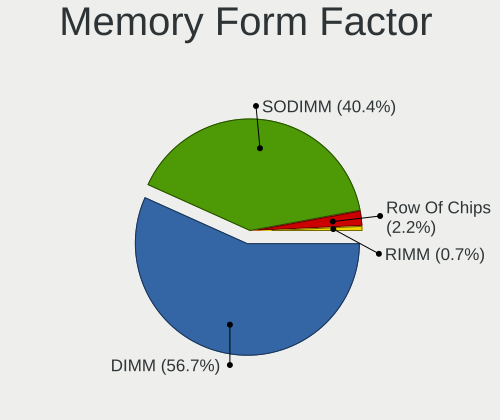

| Name         | Desktops | Percent |
|--------------|----------|---------|
| DIMM         | 156      | 56.73%  |
| SODIMM       | 111      | 40.36%  |
| Row Of Chips | 6        | 2.18%   |
| RIMM         | 2        | 0.73%   |

Memory Size
-----------

Memory module size

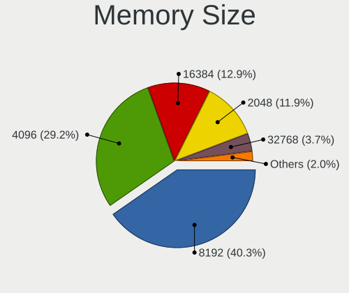

| Size  | Desktops | Percent |
|-------|----------|---------|
| 8192  | 119      | 40.34%  |
| 4096  | 86       | 29.15%  |
| 16384 | 38       | 12.88%  |
| 2048  | 35       | 11.86%  |
| 32768 | 11       | 3.73%   |
| 1024  | 4        | 1.36%   |
| 49152 | 1        | 0.34%   |
| 512   | 1        | 0.34%   |

Memory Speed
------------

Memory module speed

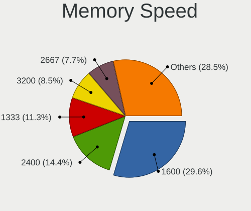

| Speed   | Desktops | Percent |
|---------|----------|---------|
| 1600    | 84       | 29.58%  |
| 2400    | 41       | 14.44%  |
| 1333    | 32       | 11.27%  |
| 3200    | 24       | 8.45%   |
| 2667    | 22       | 7.75%   |
| 4800    | 21       | 7.39%   |
| 2133    | 11       | 3.87%   |
| 800     | 9        | 3.17%   |
| 5600    | 6        | 2.11%   |
| 667     | 5        | 1.76%   |
| 2666    | 4        | 1.41%   |
| 1066    | 4        | 1.41%   |
| 1867    | 3        | 1.06%   |
| 1866    | 3        | 1.06%   |
| Unknown | 3        | 1.06%   |
| 6400    | 2        | 0.7%    |
| 6000    | 1        | 0.35%   |
| 5200    | 1        | 0.35%   |
| 4000    | 1        | 0.35%   |
| 3733    | 1        | 0.35%   |
| 3600    | 1        | 0.35%   |
| 3333    | 1        | 0.35%   |
| 3000    | 1        | 0.35%   |
| 2933    | 1        | 0.35%   |
| 1334    | 1        | 0.35%   |
| 1067    | 1        | 0.35%   |

Printers & scanners
-------------------

Printer Vendor
--------------

Printer device vendors

Zero info for selected period =(

Printer Model
-------------

Printer device models

Zero info for selected period =(

Scanner Vendor
--------------

Scanner device vendors

Zero info for selected period =(

Scanner Model
-------------

Scanner device models

Zero info for selected period =(

Camera
------

Camera Vendor
-------------

Camera device vendors

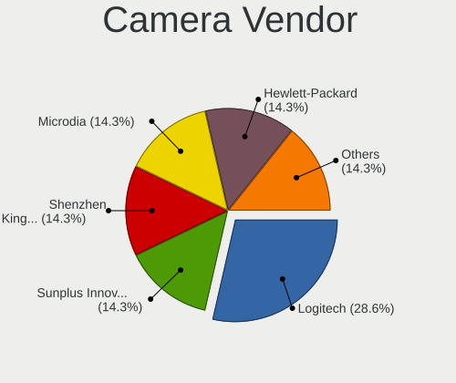

| Vendor                           | Desktops | Percent |
|----------------------------------|----------|---------|
| Logitech                         | 2        | 28.57%  |
| Sunplus Innovation Technology    | 1        | 14.29%  |
| Shenzhen Kingcome Optoelectronic | 1        | 14.29%  |
| Microdia                         | 1        | 14.29%  |
| Hewlett-Packard                  | 1        | 14.29%  |
| Asuscom Network                  | 1        | 14.29%  |

Camera Model
------------

Camera device models

| Model                                                         | Desktops | Percent |
|---------------------------------------------------------------|----------|---------|
| Logitech HD Pro Webcam C920                                   | 2        | 28.57%  |
| Sunplus SPCA2281 Web Camera                                   | 1        | 14.29%  |
| Shenzhen Kingcome Optoelectronic NexiGo HelloCam N930W Camera | 1        | 14.29%  |
| Microdia USB 2.0 Camera                                       | 1        | 14.29%  |
| HP Premium Starter Webcam                                     | 1        | 14.29%  |
| Asuscom Network Depstech webcam                               | 1        | 14.29%  |

Security
--------

Fingerprint Vendor
------------------

Fingerprint sensor vendors

Zero info for selected period =(

Fingerprint Model
-----------------

Fingerprint sensor models

Zero info for selected period =(

Chipcard Vendor
---------------

Chipcard module vendors

Zero info for selected period =(

Chipcard Model
--------------

Chipcard module models

Zero info for selected period =(

Unsupported
-----------

Unsupported Devices
-------------------

Total unsupported devices on board

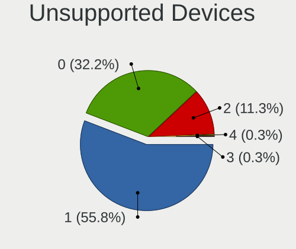

| Total | Desktops | Percent |
|-------|----------|---------|
| 1     | 168      | 55.81%  |
| 0     | 97       | 32.23%  |
| 2     | 34       | 11.3%   |
| 4     | 1        | 0.33%   |
| 3     | 1        | 0.33%   |

Unsupported Device Types
------------------------

Types of unsupported devices

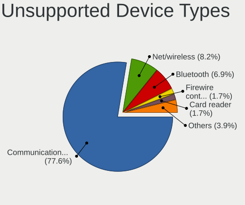

| Type                     | Desktops | Percent |
|--------------------------|----------|---------|
| Communication controller | 180      | 77.59%  |
| Net/wireless             | 19       | 8.19%   |
| Bluetooth                | 16       | 6.9%    |
| Firewire controller      | 4        | 1.72%   |
| Card reader              | 4        | 1.72%   |
| Sound                    | 3        | 1.29%   |
| Net/ethernet             | 2        | 0.86%   |
| Graphics card            | 2        | 0.86%   |
| Storage/raid             | 1        | 0.43%   |
| Network                  | 1        | 0.43%   |

