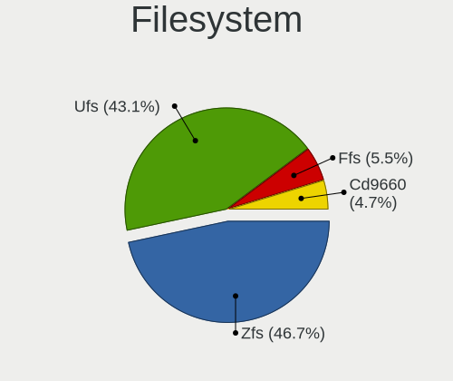
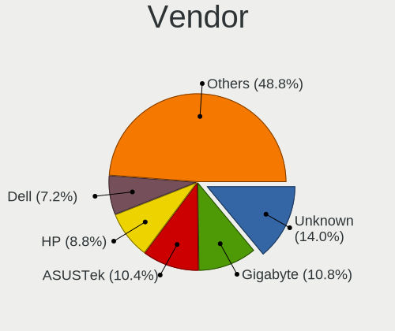
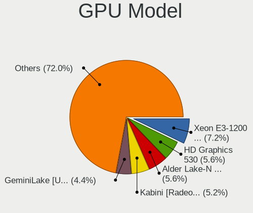
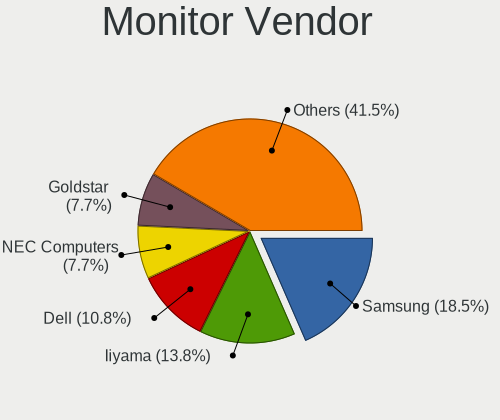
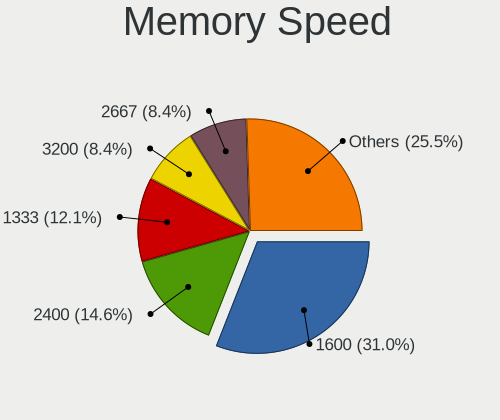
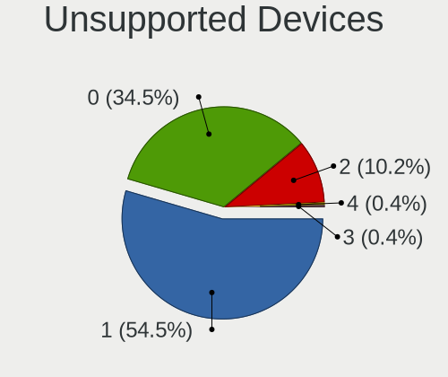

BSD in Poland - Tested Hardware & Statistics (Desktops)
-------------------------------------------------------

A project to collect tested hardware configurations for BSD in Poland.

Anyone can contribute to this report by the [hw-probe](https://github.com/linuxhw/hw-probe/blob/master/INSTALL.BSD.md) tool:

    hw-probe -all -upload

Please contribute! Especially if your hardware is rare.

Contents
--------

* [ Test Cases ](#test-cases)

* [ System ](#system)
  - [ OS                       ](#os)
  - [ OS Family                ](#os-family)
  - [ Arch                     ](#arch)
  - [ DE                       ](#de)
  - [ Display Server           ](#display-server)
  - [ Display Manager          ](#display-manager)
  - [ OS Lang                  ](#os-lang)
  - [ Boot Mode                ](#boot-mode)
  - [ Filesystem               ](#filesystem)
  - [ Part. scheme             ](#part-scheme)

* [ Board ](#board)
  - [ Vendor                   ](#vendor)
  - [ Model                    ](#model)
  - [ Model Family             ](#model-family)
  - [ MFG Year                 ](#mfg-year)
  - [ Form Factor              ](#form-factor)
  - [ Coreboot                 ](#coreboot)
  - [ RAM Size                 ](#ram-size)
  - [ RAM Used                 ](#ram-used)
  - [ Total Drives             ](#total-drives)
  - [ Has CD-ROM               ](#has-cd-rom)
  - [ Has Ethernet             ](#has-ethernet)
  - [ Has WiFi                 ](#has-wifi)
  - [ Has Bluetooth            ](#has-bluetooth)

* [ Location ](#location)
  - [ Country                  ](#country)
  - [ City                     ](#city)

* [ Drives ](#drives)
  - [ Drive Vendor             ](#drive-vendor)
  - [ Drive Model              ](#drive-model)
  - [ HDD Vendor               ](#hdd-vendor)
  - [ SSD Vendor               ](#ssd-vendor)
  - [ Drive Kind               ](#drive-kind)
  - [ Drive Connector          ](#drive-connector)
  - [ Drive Size               ](#drive-size)
  - [ Space Total              ](#space-total)
  - [ Space Used               ](#space-used)
  - [ Malfunc. Drives          ](#malfunc-drives)
  - [ Malfunc. Drive Vendor    ](#malfunc-drive-vendor)
  - [ Malfunc. HDD Vendor      ](#malfunc-hdd-vendor)
  - [ Malfunc. Drive Kind      ](#malfunc-drive-kind)
  - [ Failed Drives            ](#failed-drives)
  - [ Failed Drive Vendor      ](#failed-drive-vendor)
  - [ Drive Status             ](#drive-status)

* [ Storage controller ](#storage-controller)
  - [ Storage Vendor           ](#storage-vendor)
  - [ Storage Model            ](#storage-model)
  - [ Storage Kind             ](#storage-kind)

* [ Processor ](#processor)
  - [ CPU Vendor               ](#cpu-vendor)
  - [ CPU Model                ](#cpu-model)
  - [ CPU Model Family         ](#cpu-model-family)
  - [ CPU Cores                ](#cpu-cores)
  - [ CPU Sockets              ](#cpu-sockets)
  - [ CPU Threads              ](#cpu-threads)
  - [ CPU Microarch            ](#cpu-microarch)

* [ Graphics ](#graphics)
  - [ GPU Vendor               ](#gpu-vendor)
  - [ GPU Model                ](#gpu-model)
  - [ GPU Combo                ](#gpu-combo)
  - [ GPU Driver               ](#gpu-driver)
  - [ GPU Memory               ](#gpu-memory)

* [ Monitor ](#monitor)
  - [ Monitor Vendor           ](#monitor-vendor)
  - [ Monitor Model            ](#monitor-model)
  - [ Monitor Resolution       ](#monitor-resolution)
  - [ Monitor Diagonal         ](#monitor-diagonal)
  - [ Monitor Width            ](#monitor-width)
  - [ Aspect Ratio             ](#aspect-ratio)
  - [ Monitor Area             ](#monitor-area)
  - [ Pixel Density            ](#pixel-density)
  - [ Multiple Monitors        ](#multiple-monitors)

* [ Network ](#network)
  - [ Net Controller Vendor    ](#net-controller-vendor)
  - [ Net Controller Model     ](#net-controller-model)
  - [ Wireless Vendor          ](#wireless-vendor)
  - [ Wireless Model           ](#wireless-model)
  - [ Ethernet Vendor          ](#ethernet-vendor)
  - [ Ethernet Model           ](#ethernet-model)
  - [ Net Controller Kind      ](#net-controller-kind)
  - [ Used Controller          ](#used-controller)
  - [ NICs                     ](#nics)
  - [ IPv6                     ](#ipv6)

* [ Bluetooth ](#bluetooth)
  - [ Bluetooth Vendor         ](#bluetooth-vendor)
  - [ Bluetooth Model          ](#bluetooth-model)

* [ Sound ](#sound)
  - [ Sound Vendor             ](#sound-vendor)
  - [ Sound Model              ](#sound-model)

* [ Memory ](#memory)
  - [ Memory Vendor            ](#memory-vendor)
  - [ Memory Model             ](#memory-model)
  - [ Memory Kind              ](#memory-kind)
  - [ Memory Form Factor       ](#memory-form-factor)
  - [ Memory Size              ](#memory-size)
  - [ Memory Speed             ](#memory-speed)

* [ Printers & scanners ](#printers--scanners)
  - [ Printer Vendor           ](#printer-vendor)
  - [ Printer Model            ](#printer-model)
  - [ Scanner Vendor           ](#scanner-vendor)
  - [ Scanner Model            ](#scanner-model)

* [ Camera ](#camera)
  - [ Camera Vendor            ](#camera-vendor)
  - [ Camera Model             ](#camera-model)

* [ Security ](#security)
  - [ Fingerprint Vendor       ](#fingerprint-vendor)
  - [ Fingerprint Model        ](#fingerprint-model)
  - [ Chipcard Vendor          ](#chipcard-vendor)
  - [ Chipcard Model           ](#chipcard-model)

* [ Unsupported ](#unsupported)
  - [ Unsupported Devices      ](#unsupported-devices)
  - [ Unsupported Device Types ](#unsupported-device-types)

Test Cases
----------

Total: 161

| Vendor        | Model                       | Probe                                                     | Date         |
|---------------|-----------------------------|-----------------------------------------------------------|--------------|
| ASRock        | X570 Pro4                   | [b23f59a068](https://bsd-hardware.info/?probe=b23f59a068) | Nov 27, 2022 |
| ASRock        | Q1900B-ITX                  | [c93690c7ca](https://bsd-hardware.info/?probe=c93690c7ca) | Nov 27, 2022 |
| Shuttle       | FZ270                       | [04a7f49322](https://bsd-hardware.info/?probe=04a7f49322) | Nov 27, 2022 |
| Shuttle       | FZ270                       | [10016f39b9](https://bsd-hardware.info/?probe=10016f39b9) | Nov 27, 2022 |
| ASRock        | Q1900B-ITX                  | [675c9fdf94](https://bsd-hardware.info/?probe=675c9fdf94) | Nov 27, 2022 |
| ASRock        | Q1900B-ITX                  | [a337eb9e5f](https://bsd-hardware.info/?probe=a337eb9e5f) | Nov 27, 2022 |
| Shuttle       | FH270                       | [192351ac6f](https://bsd-hardware.info/?probe=192351ac6f) | Nov 27, 2022 |
| Shuttle       | FH270                       | [3b68d89092](https://bsd-hardware.info/?probe=3b68d89092) | Nov 27, 2022 |
| HP            | 3396                        | [dc94cbde1a](https://bsd-hardware.info/?probe=dc94cbde1a) | Nov 23, 2022 |
| Gigabyte      | H110TN                      | [c121bad3fb](https://bsd-hardware.info/?probe=c121bad3fb) | Nov 17, 2022 |
| Intel         | D2500CC AAG81477-401        | [f27ff1a7c3](https://bsd-hardware.info/?probe=f27ff1a7c3) | Oct 22, 2022 |
| ASUSTek       | SABERTOOTH Z77              | [348bef7dba](https://bsd-hardware.info/?probe=348bef7dba) | Oct 20, 2022 |
| Lenovo        | 3188 SDK0J40697 WIN 3305... | [f84b205626](https://bsd-hardware.info/?probe=f84b205626) | Oct 18, 2022 |
| Lenovo        | 3132 SDK0J40697 WIN 3305... | [e08c408ced](https://bsd-hardware.info/?probe=e08c408ced) | Oct 14, 2022 |
| ASRockRack    | EP2C612D16FM                | [30a582fccb](https://bsd-hardware.info/?probe=30a582fccb) | Oct 07, 2022 |
| Seeed Stud... | ODYSSEY-X86J41X5 SD-BS-C... | [f521533d51](https://bsd-hardware.info/?probe=f521533d51) | Oct 06, 2022 |
| Biostar       | B450NH                      | [27f932ee37](https://bsd-hardware.info/?probe=27f932ee37) | Oct 02, 2022 |
| Biostar       | B450NH                      | [4beab225f6](https://bsd-hardware.info/?probe=4beab225f6) | Sep 28, 2022 |
| Supermicro    | X9SCL/X9SCMA                | [fe44242c3b](https://bsd-hardware.info/?probe=fe44242c3b) | Sep 25, 2022 |
| Gigabyte      | H81M-S1                     | [fe9eecb935](https://bsd-hardware.info/?probe=fe9eecb935) | Sep 18, 2022 |
| Intel         | Q3XXG4-P V1.0               | [7aa564bfb2](https://bsd-hardware.info/?probe=7aa564bfb2) | Sep 14, 2022 |
| ASUSTek       | H61M-K                      | [0ee299e989](https://bsd-hardware.info/?probe=0ee299e989) | Sep 14, 2022 |
| HP            | 213D A01                    | [6354ddb4a8](https://bsd-hardware.info/?probe=6354ddb4a8) | Sep 12, 2022 |
| Fujitsu       | D3313-A1 S26361-D3313-A1    | [b2dc861f47](https://bsd-hardware.info/?probe=b2dc861f47) | Sep 10, 2022 |
| HP            | 213D A01                    | [c495fb5448](https://bsd-hardware.info/?probe=c495fb5448) | Aug 30, 2022 |
| HP            | 213D A01                    | [1b90f312ea](https://bsd-hardware.info/?probe=1b90f312ea) | Aug 26, 2022 |
| Inventec      | Z CLASS A02                 | [cb3708c9bf](https://bsd-hardware.info/?probe=cb3708c9bf) | Aug 21, 2022 |
| Gigabyte      | IMB4100TN                   | [aa4bae0d12](https://bsd-hardware.info/?probe=aa4bae0d12) | Aug 15, 2022 |
| ASRock        | Z370 Pro4                   | [038c5f8763](https://bsd-hardware.info/?probe=038c5f8763) | Aug 10, 2022 |
| Dell          | 084J0R A00                  | [932058e97a](https://bsd-hardware.info/?probe=932058e97a) | Aug 09, 2022 |
| iEi           | B449 V1.00                  | [7776910eea](https://bsd-hardware.info/?probe=7776910eea) | Aug 05, 2022 |
| Gigabyte      | J4005ND2P-CF                | [2967d5275e](https://bsd-hardware.info/?probe=2967d5275e) | Jul 29, 2022 |
| HP            | 3397                        | [68eb683936](https://bsd-hardware.info/?probe=68eb683936) | Jul 27, 2022 |
| ASUSTek       | P8B WS                      | [dd7f8123d2](https://bsd-hardware.info/?probe=dd7f8123d2) | Jul 19, 2022 |
| HP            | 213D A01                    | [0f58ab215e](https://bsd-hardware.info/?probe=0f58ab215e) | Jul 03, 2022 |
| Gigabyte      | GA-970A-UD3                 | [a094c1c53b](https://bsd-hardware.info/?probe=a094c1c53b) | Jun 20, 2022 |
| Unknown       | Unknown                     | [fe9f636040](https://bsd-hardware.info/?probe=fe9f636040) | Jun 13, 2022 |
| Unknown       | Unknown                     | [6acbc93101](https://bsd-hardware.info/?probe=6acbc93101) | May 30, 2022 |
| ASUSTek       | P5G41T-M LX3                | [3f39f21672](https://bsd-hardware.info/?probe=3f39f21672) | May 29, 2022 |
| Intel         | Q3XXG4-P V1.0               | [ce4d7c01e5](https://bsd-hardware.info/?probe=ce4d7c01e5) | May 24, 2022 |
| HP            | 213D A01                    | [562722ac56](https://bsd-hardware.info/?probe=562722ac56) | Apr 30, 2022 |
| Fujitsu       | D3313-B1 S26361-D3313-B1    | [0d46ae5678](https://bsd-hardware.info/?probe=0d46ae5678) | Apr 25, 2022 |
| Apple         | PowerMac10,1                | [e054e605fa](https://bsd-hardware.info/?probe=e054e605fa) | Apr 23, 2022 |
| Unknown       | Unknown                     | [3c5fcc2377](https://bsd-hardware.info/?probe=3c5fcc2377) | Apr 22, 2022 |
| HP            | 213D A01                    | [4dea775e1b](https://bsd-hardware.info/?probe=4dea775e1b) | Apr 12, 2022 |
| ASUSTek       | PRIME H310M-D R2.0          | [da64cbb0d1](https://bsd-hardware.info/?probe=da64cbb0d1) | Apr 07, 2022 |
| Fujitsu       | D3222-A1 S26361-D3222-A1    | [9a260e4d21](https://bsd-hardware.info/?probe=9a260e4d21) | Apr 05, 2022 |
| Lenovo        | 30D9 SDK0J40705 WIN 3425... | [964ceb3616](https://bsd-hardware.info/?probe=964ceb3616) | Apr 03, 2022 |
| Lenovo        | 30D9 SDK0J40705 WIN 3425... | [5038186437](https://bsd-hardware.info/?probe=5038186437) | Apr 02, 2022 |
| ASUSTek       | P6-P8H61E                   | [11664cd9d7](https://bsd-hardware.info/?probe=11664cd9d7) | Mar 30, 2022 |
| ASUSTek       | P6-P8H61E                   | [540f66f678](https://bsd-hardware.info/?probe=540f66f678) | Mar 29, 2022 |
| Dell          | 0GXM1W A00                  | [717721a634](https://bsd-hardware.info/?probe=717721a634) | Mar 29, 2022 |
| Unknown       | Unknown                     | [38c71bac61](https://bsd-hardware.info/?probe=38c71bac61) | Mar 22, 2022 |
| Unknown       | Unknown                     | [a54ee6f019](https://bsd-hardware.info/?probe=a54ee6f019) | Mar 18, 2022 |
| Fujitsu       | D3313-B1 S26361-D3313-B1    | [55515325c4](https://bsd-hardware.info/?probe=55515325c4) | Mar 15, 2022 |
| Dell          | 0GXM1W A00                  | [a488c9af25](https://bsd-hardware.info/?probe=a488c9af25) | Mar 14, 2022 |
| ASRock        | Q1900B-ITX                  | [b4142103cb](https://bsd-hardware.info/?probe=b4142103cb) | Mar 10, 2022 |
| Unknown       | LeMaker Banana Pi           | [37e7d1912b](https://bsd-hardware.info/?probe=37e7d1912b) | Mar 05, 2022 |
| Intel         | D945GSEJT                   | [bf6a38dfcb](https://bsd-hardware.info/?probe=bf6a38dfcb) | Feb 26, 2022 |
| HP            | 213D A01                    | [b9560ec339](https://bsd-hardware.info/?probe=b9560ec339) | Feb 24, 2022 |
| ASRock        | ConRoe1333-D667             | [624b4f4de7](https://bsd-hardware.info/?probe=624b4f4de7) | Feb 23, 2022 |
| Shuttle       | FZ270                       | [7e0eb61342](https://bsd-hardware.info/?probe=7e0eb61342) | Feb 22, 2022 |
| Unknown       | Raspberry Pi 4 Model B R... | [04e528ca9f](https://bsd-hardware.info/?probe=04e528ca9f) | Feb 19, 2022 |
| ASUSTek       | TUF GAMING X570-PLUS        | [64999a24c1](https://bsd-hardware.info/?probe=64999a24c1) | Feb 16, 2022 |
| Raspberry ... | Raspberry Pi 400            | [dd56609ceb](https://bsd-hardware.info/?probe=dd56609ceb) | Feb 14, 2022 |
| HP            | 213D A01                    | [0171663489](https://bsd-hardware.info/?probe=0171663489) | Feb 12, 2022 |
| Unknown       | LeMaker Banana Pi           | [77413a3d9d](https://bsd-hardware.info/?probe=77413a3d9d) | Feb 12, 2022 |
| MSI           | B75A-G43                    | [8e445eb2d4](https://bsd-hardware.info/?probe=8e445eb2d4) | Feb 08, 2022 |
| MSI           | H61M-P20                    | [98ec852f90](https://bsd-hardware.info/?probe=98ec852f90) | Feb 06, 2022 |
| ASUSTek       | P6-P8H61E                   | [e838981914](https://bsd-hardware.info/?probe=e838981914) | Feb 06, 2022 |
| Dell          | 04YP6J A02                  | [550e7feb7f](https://bsd-hardware.info/?probe=550e7feb7f) | Feb 03, 2022 |
| Gigabyte      | J4005ND2P-CF                | [2acf9ac926](https://bsd-hardware.info/?probe=2acf9ac926) | Jan 29, 2022 |
| Intel         | D2500HN AAG81480-500        | [3a39fe5ec2](https://bsd-hardware.info/?probe=3a39fe5ec2) | Jan 29, 2022 |
| Gigabyte      | J4005ND2P-CF                | [268906bcbe](https://bsd-hardware.info/?probe=268906bcbe) | Jan 29, 2022 |
| Dell          | 014GRG A03                  | [8e0a22c065](https://bsd-hardware.info/?probe=8e0a22c065) | Jan 28, 2022 |
| Dell          | 014GRG A03                  | [5996ba19b1](https://bsd-hardware.info/?probe=5996ba19b1) | Jan 27, 2022 |
| Dell          | 014GRG A03                  | [223d955a90](https://bsd-hardware.info/?probe=223d955a90) | Jan 26, 2022 |
| ASRock        | A300M-STX                   | [8edf072b67](https://bsd-hardware.info/?probe=8edf072b67) | Jan 25, 2022 |
| ASRock        | X570 Pro4                   | [d77aae8064](https://bsd-hardware.info/?probe=d77aae8064) | Jan 23, 2022 |
| MSI           | PRO Z690-A WIFI DDR4        | [04abd226f3](https://bsd-hardware.info/?probe=04abd226f3) | Jan 21, 2022 |
| ASRockRack    | X570D4I-2T                  | [9f06290060](https://bsd-hardware.info/?probe=9f06290060) | Jan 17, 2022 |
| ASUSTek       | M5A97 R2.0                  | [9f442754d0](https://bsd-hardware.info/?probe=9f442754d0) | Jan 17, 2022 |
| Intel         | SKYBAY                      | [64db889658](https://bsd-hardware.info/?probe=64db889658) | Jan 01, 2022 |
| ASUSTek       | TUF GAMING X570-PLUS        | [a671e3eb04](https://bsd-hardware.info/?probe=a671e3eb04) | Dec 31, 2021 |
| MSI           | H81M-P32                    | [bb4e756ca9](https://bsd-hardware.info/?probe=bb4e756ca9) | Dec 20, 2021 |
| Gigabyte      | H110TN                      | [8b6f0f839d](https://bsd-hardware.info/?probe=8b6f0f839d) | Dec 18, 2021 |
| Dell          | 0YY821 A00                  | [5de293a0be](https://bsd-hardware.info/?probe=5de293a0be) | Dec 17, 2021 |
| ASUSTek       | TUF GAMING X570-PLUS        | [32d20b9b8e](https://bsd-hardware.info/?probe=32d20b9b8e) | Dec 14, 2021 |
| ASUSTek       | H110M-K                     | [2921401f70](https://bsd-hardware.info/?probe=2921401f70) | Dec 12, 2021 |
| Gigabyte      | B550M AORUS ELITE           | [66ed413cab](https://bsd-hardware.info/?probe=66ed413cab) | Dec 05, 2021 |
| ASUSTek       | P7P55D                      | [73373c3c65](https://bsd-hardware.info/?probe=73373c3c65) | Dec 04, 2021 |
| ASUSTek       | P7P55D                      | [540d2ef68c](https://bsd-hardware.info/?probe=540d2ef68c) | Nov 29, 2021 |
| Fujitsu       | D3220-A1 S26361-D3220-A1    | [bc3b65334e](https://bsd-hardware.info/?probe=bc3b65334e) | Nov 29, 2021 |
| Shuttle       | FH270                       | [81643d52fd](https://bsd-hardware.info/?probe=81643d52fd) | Nov 26, 2021 |
| ASRock        | Q1900B-ITX                  | [7f32937b2c](https://bsd-hardware.info/?probe=7f32937b2c) | Nov 26, 2021 |
| Shuttle       | FZ270                       | [309687b5be](https://bsd-hardware.info/?probe=309687b5be) | Nov 26, 2021 |
| ASRock        | Q1900B-ITX                  | [4df18caa5f](https://bsd-hardware.info/?probe=4df18caa5f) | Nov 26, 2021 |
| HP            | 213D A01                    | [0059e5b645](https://bsd-hardware.info/?probe=0059e5b645) | Nov 23, 2021 |
| ASUSTek       | TUF GAMING X570-PLUS        | [12a360ddd1](https://bsd-hardware.info/?probe=12a360ddd1) | Nov 14, 2021 |
| Unknown       | Unknown                     | [d31ea9f041](https://bsd-hardware.info/?probe=d31ea9f041) | Nov 02, 2021 |
| ASUSTek       | TUF GAMING X570-PLUS        | [9f8010bdbe](https://bsd-hardware.info/?probe=9f8010bdbe) | Oct 25, 2021 |
| Gigabyte      | B450M S2H                   | [f3bf8edc1e](https://bsd-hardware.info/?probe=f3bf8edc1e) | Oct 22, 2021 |
| HP            | 213D A01                    | [4b4903dfb2](https://bsd-hardware.info/?probe=4b4903dfb2) | Oct 17, 2021 |
| Gigabyte      | B450M DS3H                  | [445b53ddba](https://bsd-hardware.info/?probe=445b53ddba) | Oct 15, 2021 |
| Unknown       | YL-J3160L4                  | [3d0a63b493](https://bsd-hardware.info/?probe=3d0a63b493) | Oct 12, 2021 |
| Gigabyte      | B450M DS3H                  | [50e4e13ee0](https://bsd-hardware.info/?probe=50e4e13ee0) | Oct 07, 2021 |
| MSI           | MS-7B53                     | [c7104d301e](https://bsd-hardware.info/?probe=c7104d301e) | Oct 05, 2021 |
| Unknown       | Raspberry Pi 4 Model B R... | [49173900e7](https://bsd-hardware.info/?probe=49173900e7) | Oct 04, 2021 |
| Unknown       | Raspberry Pi 4 Model B R... | [d05a877535](https://bsd-hardware.info/?probe=d05a877535) | Oct 03, 2021 |
| Intel         | SHARKBAY                    | [96448603f5](https://bsd-hardware.info/?probe=96448603f5) | Oct 02, 2021 |
| ASUSTek       | PRIME H310M-D R2.0          | [a302e181a5](https://bsd-hardware.info/?probe=a302e181a5) | Sep 27, 2021 |
| Dell          | 04YP6J A02                  | [9ff547c00b](https://bsd-hardware.info/?probe=9ff547c00b) | Sep 16, 2021 |
| ASUSTek       | Q87T                        | [91e631c240](https://bsd-hardware.info/?probe=91e631c240) | Sep 11, 2021 |
| ASUSTek       | TUF GAMING X570-PLUS        | [9e13729a12](https://bsd-hardware.info/?probe=9e13729a12) | Sep 02, 2021 |
| Essentiel ... | MS-7848                     | [fa20a0307e](https://bsd-hardware.info/?probe=fa20a0307e) | Sep 01, 2021 |
| Intel         | SHARKBAY                    | [38332c6f8d](https://bsd-hardware.info/?probe=38332c6f8d) | Aug 16, 2021 |
| AOpen         | D1009 A1A4                  | [dc60a8dece](https://bsd-hardware.info/?probe=dc60a8dece) | Aug 03, 2021 |
| HP            | 1998                        | [fdf0088303](https://bsd-hardware.info/?probe=fdf0088303) | Jul 08, 2021 |
| Unknown       | Unknown                     | [1fffc03fbf](https://bsd-hardware.info/?probe=1fffc03fbf) | Jun 24, 2021 |
| Lenovo        | Board                       | [c981ffdff7](https://bsd-hardware.info/?probe=c981ffdff7) | Jun 15, 2021 |
| ASUSTek       | TUF GAMING X570-PLUS        | [eeb4489d2f](https://bsd-hardware.info/?probe=eeb4489d2f) | Jun 13, 2021 |
| Gigabyte      | G31M-ES2L                   | [338240a790](https://bsd-hardware.info/?probe=338240a790) | Jun 05, 2021 |
| Gigabyte      | G31M-ES2L                   | [bf23a1ca58](https://bsd-hardware.info/?probe=bf23a1ca58) | Jun 02, 2021 |
| MSI           | H81M-P32                    | [1ffaa46853](https://bsd-hardware.info/?probe=1ffaa46853) | May 31, 2021 |
| MSI           | H81M-P32                    | [253deda07f](https://bsd-hardware.info/?probe=253deda07f) | May 28, 2021 |
| Lenovo        | Board                       | [1d6f23a5de](https://bsd-hardware.info/?probe=1d6f23a5de) | May 24, 2021 |
| Dell          | 0R230R A00                  | [bd8bf06e7f](https://bsd-hardware.info/?probe=bd8bf06e7f) | May 21, 2021 |
| MSI           | B450M-A PRO MAX             | [6317bd7dbd](https://bsd-hardware.info/?probe=6317bd7dbd) | May 05, 2021 |
| Unknown       | Unknown                     | [1dcb55d9fe](https://bsd-hardware.info/?probe=1dcb55d9fe) | May 05, 2021 |
| Supermicro    | X7DCL                       | [27fc294bca](https://bsd-hardware.info/?probe=27fc294bca) | May 03, 2021 |
| ShenZhen M... | MW-NANO-APL-4L              | [b848b8e046](https://bsd-hardware.info/?probe=b848b8e046) | Apr 03, 2021 |
| Gigabyte      | J4005ND2P-CF                | [7ce3b2f01e](https://bsd-hardware.info/?probe=7ce3b2f01e) | Mar 27, 2021 |
| Supermicro    | X7SLA                       | [043c20b93d](https://bsd-hardware.info/?probe=043c20b93d) | Mar 19, 2021 |
| Fujitsu       | D3313-A1 S26361-D3313-A1    | [b570778ef7](https://bsd-hardware.info/?probe=b570778ef7) | Mar 14, 2021 |
| Lenovo        | SHARKBAY SDK0E50512 STD     | [dee034110e](https://bsd-hardware.info/?probe=dee034110e) | Mar 05, 2021 |
| Intel         | Q3XXG4-P V1.0               | [73eec13c5e](https://bsd-hardware.info/?probe=73eec13c5e) | Mar 02, 2021 |
| Unknown       | Unknown                     | [6d7bac1be1](https://bsd-hardware.info/?probe=6d7bac1be1) | Feb 23, 2021 |
| Intel         | Q3XXG4-P V1.0               | [60d084275e](https://bsd-hardware.info/?probe=60d084275e) | Feb 19, 2021 |
| Gigabyte      | J4005ND2P-CF                | [8d8683565a](https://bsd-hardware.info/?probe=8d8683565a) | Feb 13, 2021 |
| ASRock        | D1800B-ITX                  | [38f8b13f43](https://bsd-hardware.info/?probe=38f8b13f43) | Feb 10, 2021 |
| Unknown       | Unknown                     | [f4b7bb4518](https://bsd-hardware.info/?probe=f4b7bb4518) | Feb 08, 2021 |
| Dell          | 096JG8 A00                  | [b6630c8516](https://bsd-hardware.info/?probe=b6630c8516) | Feb 07, 2021 |
| Dell          | 096JG8 A00                  | [e73a728a76](https://bsd-hardware.info/?probe=e73a728a76) | Feb 03, 2021 |
| Dell          | 096JG8 A00                  | [612272e598](https://bsd-hardware.info/?probe=612272e598) | Feb 03, 2021 |
| ASUSTek       | PRIME H310M-D R2.0          | [b26cfcd81d](https://bsd-hardware.info/?probe=b26cfcd81d) | Dec 28, 2020 |
| ASUSTek       | E45M1-I DELUXE              | [8e767b517d](https://bsd-hardware.info/?probe=8e767b517d) | Dec 16, 2020 |
| HP            | 213D A01                    | [ca6ab5347e](https://bsd-hardware.info/?probe=ca6ab5347e) | Nov 13, 2020 |
| Shuttle       | FH270                       | [532cda62a8](https://bsd-hardware.info/?probe=532cda62a8) | Oct 29, 2020 |
| Intel         | D53427RKE G87971-406        | [bb6eeb8ef8](https://bsd-hardware.info/?probe=bb6eeb8ef8) | Oct 29, 2020 |
| Shuttle       | FH270                       | [e93928c59b](https://bsd-hardware.info/?probe=e93928c59b) | Oct 29, 2020 |
| ASRock        | QC5000M-ITX/PH              | [8d27c35122](https://bsd-hardware.info/?probe=8d27c35122) | Oct 29, 2020 |
| Dell          | 06NWYK A01                  | [9d4ea8797b](https://bsd-hardware.info/?probe=9d4ea8797b) | Oct 29, 2020 |
| Dell          | 06NWYK A01                  | [5ae47d058d](https://bsd-hardware.info/?probe=5ae47d058d) | Oct 29, 2020 |
| PC Engines    | apu1                        | [c77b06b3eb](https://bsd-hardware.info/?probe=c77b06b3eb) | Oct 20, 2020 |
| Wistron       | ProLiant ML110 G5           | [4906f28cfc](https://bsd-hardware.info/?probe=4906f28cfc) | Aug 14, 2020 |
| ASUSTek       | AM1M-A                      | [4dca0d2aa4](https://bsd-hardware.info/?probe=4dca0d2aa4) | Aug 14, 2020 |
| PC Engines    | APU2                        | [82f64585b8](https://bsd-hardware.info/?probe=82f64585b8) | Aug 14, 2020 |
| Fujitsu       | D3003-B1 S26361-D3003-B1    | [8c92fcf25f](https://bsd-hardware.info/?probe=8c92fcf25f) | Aug 14, 2020 |
| Fujitsu       | D3003-B1 S26361-D3003-B1    | [b6a4e39a1b](https://bsd-hardware.info/?probe=b6a4e39a1b) | Aug 14, 2020 |
| ASRock        | N3150B-ITX                  | [2b9248155e](https://bsd-hardware.info/?probe=2b9248155e) | Jun 09, 2020 |
| ASUSTek       | N3150I-C                    | [3da71be3c9](https://bsd-hardware.info/?probe=3da71be3c9) | Jun 09, 2020 |

System
------

OS
--

Installed operating systems

| Name              | Desktops | Percent |
|-------------------|----------|---------|
| helloSystem 0.7.0 | 8        | 5.97%   |
| OpenBSD 7.0       | 7        | 5.22%   |
| OPNsense 22.7.4   | 4        | 2.99%   |
| OPNsense 22.1.10  | 4        | 2.99%   |
| helloSystem 0.6.0 | 4        | 2.99%   |
| FreeBSD 12.3-p2   | 4        | 2.99%   |
| OPNsense 22.7.6   | 3        | 2.24%   |
| OPNsense 22.7.2   | 3        | 2.24%   |
| OPNsense 22.1     | 3        | 2.24%   |
| OPNsense 21.7.7   | 3        | 2.24%   |
| OPNsense 21.7.3   | 3        | 2.24%   |
| OPNsense 21.1.2   | 3        | 2.24%   |
| OPNsense 21.1.1   | 3        | 2.24%   |
| OPNsense 21.1     | 3        | 2.24%   |
| FreeBSD 13.0-p5   | 3        | 2.24%   |
| FreeBSD 12.2-p2   | 3        | 2.24%   |
| FreeBSD 12.1-p8   | 3        | 2.24%   |
| FreeBSD 12.1-p13  | 3        | 2.24%   |
| OPNsense 22.7.8   | 2        | 1.49%   |
| OPNsense 22.7     | 2        | 1.49%   |
| OPNsense 22.1.8   | 2        | 1.49%   |
| OPNsense 22.1.6   | 2        | 1.49%   |
| OPNsense 22.1.5   | 2        | 1.49%   |
| OPNsense 22.1.4   | 2        | 1.49%   |
| OPNsense 22.1.1   | 2        | 1.49%   |
| OPNsense 21.7.4   | 2        | 1.49%   |
| OPNsense 21.7.2   | 2        | 1.49%   |
| OPNsense 21.7.1   | 2        | 1.49%   |
| OPNsense 21.1.6   | 2        | 1.49%   |
| OPNsense 21.1.3   | 2        | 1.49%   |
| OpenBSD 7.1       | 2        | 1.49%   |
| helloSystem 0.8.0 | 2        | 1.49%   |
| helloSystem 0.5.0 | 2        | 1.49%   |
| helloSystem 0.4.0 | 2        | 1.49%   |
| FreeBSD 13.1-p2   | 2        | 1.49%   |
| FreeBSD 13.0-p4   | 2        | 1.49%   |
| FreeBSD 12.2      | 2        | 1.49%   |
| XigmaNAS 12.2-p7  | 1        | 0.75%   |
| XigmaNAS 12.2-p6  | 1        | 0.75%   |
| OPNsense 22.7.5   | 1        | 0.75%   |

OS Family
---------

OS without a version

| Name        | Desktops | Percent |
|-------------|----------|---------|
| OPNsense    | 56       | 52.34%  |
| FreeBSD     | 24       | 22.43%  |
| helloSystem | 14       | 13.08%  |
| OpenBSD     | 10       | 9.35%   |
| XigmaNAS    | 2        | 1.87%   |
| NetBSD      | 1        | 0.93%   |

Arch
----

OS architecture (x86_64, i586, etc.)

| Name   | Desktops | Percent |
|--------|----------|---------|
| amd64  | 102      | 95.33%  |
| arm64  | 2        | 1.87%   |
| macppc | 1        | 0.93%   |
| i386   | 1        | 0.93%   |
| armv7  | 1        | 0.93%   |

DE
--

Desktop Environment

| Name          | Desktops | Percent |
|---------------|----------|---------|
| Console       | 77       | 70.64%  |
| helloDesktop  | 16       | 14.68%  |
| fvwm          | 6        | 5.5%    |
| GNOME         | 4        | 3.67%   |
| XFCE          | 2        | 1.83%   |
| KDE5          | 2        | 1.83%   |
| i3            | 1        | 0.92%   |
| Enlightenment | 1        | 0.92%   |

Display Server
--------------

X11 or Wayland

| Name    | Desktops | Percent |
|---------|----------|---------|
| Console | 79       | 73.83%  |
| X11     | 28       | 26.17%  |

Display Manager
---------------

SDDM, LightDM, etc.

| Name    | Desktops | Percent |
|---------|----------|---------|
| Console | 88       | 82.24%  |
| SLiM    | 14       | 13.08%  |
| LightDM | 2        | 1.87%   |
| GDM     | 2        | 1.87%   |
| SDDM    | 1        | 0.93%   |

OS Lang
-------

Language

| Lang    | Desktops | Percent |
|---------|----------|---------|
| Unknown | 78       | 72.9%   |
| en_US   | 22       | 20.56%  |
| C       | 4        | 3.74%   |
| pl_PL   | 2        | 1.87%   |
| en_GB   | 1        | 0.93%   |

Boot Mode
---------

EFI or BIOS

| Mode | Desktops | Percent |
|------|----------|---------|
| EFI  | 87       | 81.31%  |
| BIOS | 20       | 18.69%  |

Filesystem
----------

Type of filesystem

| Type   | Desktops | Percent |
|--------|----------|---------|
| Ufs    | 48       | 44.44%  |
| Zfs    | 46       | 42.59%  |
| Ffs    | 10       | 9.26%   |
| Cd9660 | 4        | 3.7%    |

Part. scheme
------------

Scheme of partitioning

| Type    | Desktops | Percent |
|---------|----------|---------|
| GPT     | 93       | 86.92%  |
| MBR     | 11       | 10.28%  |
| Unknown | 3        | 2.8%    |

Board
-----

Vendor
------

Motherboard manufacturer

| Name                       | Desktops | Percent |
|----------------------------|----------|---------|
| ASUSTek Computer           | 14       | 13.08%  |
| Hewlett-Packard            | 11       | 10.28%  |
| Gigabyte Technology        | 10       | 9.35%   |
| ASRock                     | 10       | 9.35%   |
| Intel                      | 9        | 8.41%   |
| Dell                       | 8        | 7.48%   |
| Unknown                    | 8        | 7.48%   |
| MSI                        | 6        | 5.61%   |
| Fujitsu                    | 6        | 5.61%   |
| Lenovo                     | 5        | 4.67%   |
| Supermicro                 | 3        | 2.8%    |
| Shuttle                    | 3        | 2.8%    |
| PC Engines                 | 2        | 1.87%   |
| ASRockRack                 | 2        | 1.87%   |
| Wistron                    | 1        | 0.93%   |
| ShenZhen MinWin Technology | 1        | 0.93%   |
| Seeed Studio               | 1        | 0.93%   |
| Raspberry Pi Foundation    | 1        | 0.93%   |
| Inventec                   | 1        | 0.93%   |
| iEi                        | 1        | 0.93%   |
| Essentiel B                | 1        | 0.93%   |
| Biostar                    | 1        | 0.93%   |
| Apple                      | 1        | 0.93%   |
| AOpen                      | 1        | 0.93%   |

Model
-----

Motherboard model

| Name                                | Desktops | Percent |
|-------------------------------------|----------|---------|
| HP t620 PLUS Quad Core TC           | 8        | 7.48%   |
| Unknown                             | 8        | 7.48%   |
| ASUS All Series                     | 3        | 2.8%    |
| ASRock Q1900B-ITX                   | 3        | 2.8%    |
| Intel SHARKBAY                      | 2        | 1.87%   |
| Intel Q3XXG4-P V1.0                 | 2        | 1.87%   |
| Gigabyte H110TN                     | 2        | 1.87%   |
| Fujitsu FUTRO S920                  | 2        | 1.87%   |
| Wistron ProLiant ML110 G5           | 1        | 0.93%   |
| Supermicro X9SCL/X9SCM              | 1        | 0.93%   |
| Supermicro X7SLA                    | 1        | 0.93%   |
| Supermicro X7DCL                    | 1        | 0.93%   |
| Shuttle XH270                       | 1        | 0.93%   |
| Shuttle SZ270R9                     | 1        | 0.93%   |
| Shuttle SZ270                       | 1        | 0.93%   |
| ShenZhen MinWin MW-NANO-APL-4L      | 1        | 0.93%   |
| Seeed Studio ODYSSEY-X86J4125       | 1        | 0.93%   |
| RPi Raspberry Pi 400                | 1        | 0.93%   |
| PC Engines APU2                     | 1        | 0.93%   |
| PC Engines apu1                     | 1        | 0.93%   |
| MSI MS-7D25                         | 1        | 0.93%   |
| MSI MS-7C52                         | 1        | 0.93%   |
| MSI MS-7B53                         | 1        | 0.93%   |
| MSI MS-7846                         | 1        | 0.93%   |
| MSI MS-7788                         | 1        | 0.93%   |
| MSI MS-7758                         | 1        | 0.93%   |
| Lenovo V50s-07IMB 11EF000YPB        | 1        | 0.93%   |
| Lenovo ThinkCentre M93 10A2S01Q00   | 1        | 0.93%   |
| Lenovo ThinkCentre M920s 10SJ0011US | 1        | 0.93%   |
| Lenovo ThinkCentre M91p 7033DE6     | 1        | 0.93%   |
| Lenovo ThinkCentre M700 10GS        | 1        | 0.93%   |
| Inventec Z CLASS                    | 1        | 0.93%   |
| Intel SKYBAY                        | 1        | 0.93%   |
| Intel D945GSEJT                     | 1        | 0.93%   |
| Intel D53427RKE G87971-406          | 1        | 0.93%   |
| Intel D2500HN AAG81480-500          | 1        | 0.93%   |
| Intel D2500CC AAG81477-401          | 1        | 0.93%   |
| iEi Z436                            | 1        | 0.93%   |
| HP EliteDesk 800 G1 SFF             | 1        | 0.93%   |
| HP Compaq Elite 8300 SFF            | 1        | 0.93%   |

Model Family
------------

Motherboard model prefix

| Name                           | Desktops | Percent |
|--------------------------------|----------|---------|
| HP t620                        | 8        | 7.48%   |
| Unknown                        | 8        | 7.48%   |
| Dell OptiPlex                  | 5        | 4.67%   |
| Lenovo ThinkCentre             | 4        | 3.74%   |
| Fujitsu FUTRO                  | 4        | 3.74%   |
| ASUS All                       | 3        | 2.8%    |
| ASRock Q1900B-ITX              | 3        | 2.8%    |
| Intel SHARKBAY                 | 2        | 1.87%   |
| Intel Q3XXG4-P                 | 2        | 1.87%   |
| HP Compaq                      | 2        | 1.87%   |
| Gigabyte H110TN                | 2        | 1.87%   |
| Gigabyte B450M                 | 2        | 1.87%   |
| Wistron ProLiant               | 1        | 0.93%   |
| Supermicro X9SCL               | 1        | 0.93%   |
| Supermicro X7SLA               | 1        | 0.93%   |
| Supermicro X7DCL               | 1        | 0.93%   |
| Shuttle XH270                  | 1        | 0.93%   |
| Shuttle SZ270R9                | 1        | 0.93%   |
| Shuttle SZ270                  | 1        | 0.93%   |
| ShenZhen MinWin MW-NANO-APL-4L | 1        | 0.93%   |
| Seeed Studio ODYSSEY-X86J4125  | 1        | 0.93%   |
| RPi Raspberry                  | 1        | 0.93%   |
| PC Engines APU2                | 1        | 0.93%   |
| PC Engines apu1                | 1        | 0.93%   |
| MSI MS-7D25                    | 1        | 0.93%   |
| MSI MS-7C52                    | 1        | 0.93%   |
| MSI MS-7B53                    | 1        | 0.93%   |
| MSI MS-7846                    | 1        | 0.93%   |
| MSI MS-7788                    | 1        | 0.93%   |
| MSI MS-7758                    | 1        | 0.93%   |
| Lenovo V50s-07IMB              | 1        | 0.93%   |
| Inventec Z                     | 1        | 0.93%   |
| Intel SKYBAY                   | 1        | 0.93%   |
| Intel D945GSEJT                | 1        | 0.93%   |
| Intel D53427RKE                | 1        | 0.93%   |
| Intel D2500HN                  | 1        | 0.93%   |
| Intel D2500CC                  | 1        | 0.93%   |
| iEi Z436                       | 1        | 0.93%   |
| HP EliteDesk                   | 1        | 0.93%   |
| Gigabyte J4005ND2P-CF          | 1        | 0.93%   |

MFG Year
--------

Motherboard manufacture year

| Year    | Desktops | Percent |
|---------|----------|---------|
| 2014    | 24       | 22.43%  |
| 2018    | 13       | 12.15%  |
| 2020    | 10       | 9.35%   |
| 2012    | 10       | 9.35%   |
| 2016    | 9        | 8.41%   |
| 2021    | 6        | 5.61%   |
| 2019    | 6        | 5.61%   |
| 2015    | 5        | 4.67%   |
| 2009    | 5        | 4.67%   |
| 2013    | 4        | 3.74%   |
| 2011    | 4        | 3.74%   |
| 2022    | 3        | 2.8%    |
| 2017    | 3        | 2.8%    |
| 2007    | 2        | 1.87%   |
| Unknown | 2        | 1.87%   |
| 2010    | 1        | 0.93%   |

Form Factor
-----------

Physical design of the computer

| Name    | Desktops | Percent |
|---------|----------|---------|
| Desktop | 107      | 100%    |

Coreboot
--------

Have coreboot on board

| Used | Desktops | Percent |
|------|----------|---------|
| No   | 105      | 98.13%  |
| Yes  | 2        | 1.87%   |

RAM Size
--------

Total RAM memory

| Size in GB | Desktops | Percent |
|------------|----------|---------|
| 8.01-16.0  | 34       | 30.91%  |
| 4.01-8.0   | 33       | 30%     |
| 16.01-24.0 | 25       | 22.73%  |
| 32.01-64.0 | 5        | 4.55%   |
| 2.01-3.0   | 5        | 4.55%   |
| 3.01-4.0   | 3        | 2.73%   |
| 24.01-32.0 | 2        | 1.82%   |
| 0.51-1.0   | 2        | 1.82%   |
| 1.01-2.0   | 1        | 0.91%   |

RAM Used
--------

Used RAM memory

| Used GB   | Desktops | Percent |
|-----------|----------|---------|
| 0.01-0.5  | 64       | 56.14%  |
| 0.51-1.0  | 28       | 24.56%  |
| 1.01-2.0  | 10       | 8.77%   |
| 4.01-8.0  | 4        | 3.51%   |
| 2.01-3.0  | 2        | 1.75%   |
| 8.01-16.0 | 2        | 1.75%   |
| 0         | 2        | 1.75%   |
| 3.01-4.0  | 1        | 0.88%   |
| Unknown   | 1        | 0.88%   |

Total Drives
------------

Number of drives on board

| Drives | Desktops | Percent |
|--------|----------|---------|
| 1      | 62       | 54.39%  |
| 2      | 24       | 21.05%  |
| 3      | 8        | 7.02%   |
| 0      | 6        | 5.26%   |
| 6      | 5        | 4.39%   |
| 4      | 5        | 4.39%   |
| 5      | 3        | 2.63%   |
| 9      | 1        | 0.88%   |

Has CD-ROM
----------

Has CD-ROM on board

| Presented | Desktops | Percent |
|-----------|----------|---------|
| No        | 89       | 83.18%  |
| Yes       | 18       | 16.82%  |

Has Ethernet
------------

Has Ethernet on board

| Presented | Desktops | Percent |
|-----------|----------|---------|
| Yes       | 104      | 97.2%   |
| No        | 3        | 2.8%    |

Has WiFi
--------

Has WiFi module

| Presented | Desktops | Percent |
|-----------|----------|---------|
| No        | 80       | 74.07%  |
| Yes       | 28       | 25.93%  |

Has Bluetooth
-------------

Has Bluetooth module

| Presented | Desktops | Percent |
|-----------|----------|---------|
| No        | 97       | 90.65%  |
| Yes       | 10       | 9.35%   |

Location
--------

Country
-------

Geographic location (country)

| Country | Desktops | Percent |
|---------|----------|---------|
| Poland  | 107      | 100%    |

City
----

Geographic location (city)

| City              | Desktops | Percent |
|-------------------|----------|---------|
| Warsaw            | 15       | 12.61%  |
| Gdansk            | 10       | 8.4%    |
| Wroclaw           | 9        | 7.56%   |
| Krakow            | 7        | 5.88%   |
| Lodz              | 4        | 3.36%   |
| Poznan            | 3        | 2.52%   |
| Miedziana Gora    | 3        | 2.52%   |
| Lezno             | 3        | 2.52%   |
| Е»ukowo         | 2        | 1.68%   |
| Siedlce           | 2        | 1.68%   |
| Legionowo         | 2        | 1.68%   |
| Glincz            | 2        | 1.68%   |
| Zgierz            | 1        | 0.84%   |
| Zajaczki Pierwsze | 1        | 0.84%   |
| Zagnansk          | 1        | 0.84%   |
| WЕ‚ocЕ‚awek | 1        | 0.84%   |
| Wolsztyn          | 1        | 0.84%   |
| Walcz             | 1        | 0.84%   |
| Tychy             | 1        | 0.84%   |
| Szczytno          | 1        | 0.84%   |
| Sulejowek         | 1        | 0.84%   |
| Stopnica          | 1        | 0.84%   |
| Stary Sacz        | 1        | 0.84%   |
| Spalice           | 1        | 0.84%   |
| Sosnowiec         | 1        | 0.84%   |
| RzeszГіw        | 1        | 0.84%   |
| Rzeszów        | 1        | 0.84%   |
| Rybnik            | 1        | 0.84%   |
| Radzionkow        | 1        | 0.84%   |
| Radostowice       | 1        | 0.84%   |
| Pruszków         | 1        | 0.84%   |
| Pruszków       | 1        | 0.84%   |
| Pilica            | 1        | 0.84%   |
| Piastow           | 1        | 0.84%   |
| Piaseczno         | 1        | 0.84%   |
| OЕ›wiД™cim  | 1        | 0.84%   |
| Ostrzeszow        | 1        | 0.84%   |
| Olsztyn           | 1        | 0.84%   |
| Mława            | 1        | 0.84%   |
| Mogilno           | 1        | 0.84%   |

Drives
------

Drive Vendor
------------

Hard drive vendors

| Vendor              | Desktops | Drives | Percent |
|---------------------|----------|--------|---------|
| WDC                 | 25       | 62     | 16.89%  |
| Seagate             | 21       | 44     | 14.19%  |
| Samsung Electronics | 17       | 43     | 11.49%  |
| SanDisk             | 11       | 12     | 7.43%   |
| GOODRAM             | 11       | 22     | 7.43%   |
| Toshiba             | 9        | 18     | 6.08%   |
| A-DATA Technology   | 6        | 7      | 4.05%   |
| Kingston            | 5        | 5      | 3.38%   |
| Hoodisk             | 4        | 6      | 2.7%    |
| OCZ                 | 3        | 3      | 2.03%   |
| LITEON              | 3        | 3      | 2.03%   |
| Innodisk            | 3        | 4      | 2.03%   |
| Corsair             | 3        | 3      | 2.03%   |
| Apacer              | 3        | 3      | 2.03%   |
| Transcend           | 2        | 6      | 1.35%   |
| SPCC                | 2        | 2      | 1.35%   |
| PNY                 | 2        | 4      | 1.35%   |
| Patriot             | 2        | 2      | 1.35%   |
| Kston               | 2        | 2      | 1.35%   |
| Hitachi             | 2        | 2      | 1.35%   |
| Gigabyte Technology | 2        | 2      | 1.35%   |
| Crucial             | 2        | 3      | 1.35%   |
| Team                | 1        | 1      | 0.68%   |
| SSDPR-CX            | 1        | 1      | 0.68%   |
| Plextor             | 1        | 1      | 0.68%   |
| Phison              | 1        | 1      | 0.68%   |
| NVMe                | 1        | 2      | 0.68%   |
| Micron Technology   | 1        | 6      | 0.68%   |
| Intenso             | 1        | 2      | 0.68%   |
| HGST                | 1        | 2      | 0.68%   |

Drive Model
-----------

Hard drive models

| Model                              | Desktops | Percent |
|------------------------------------|----------|---------|
| GOODRAM SSDPR-CX400-128 128GB      | 3        | 1.79%   |
| WDC WD20SDZW-11JJ8S0 2TB           | 2        | 1.19%   |
| WDC WD20NMVW-59EDZS7 2TB           | 2        | 1.19%   |
| WDC WD20EFRX-68EUZN0 2TB           | 2        | 1.19%   |
| WDC WD20EARS-00MVWB0 2TB           | 2        | 1.19%   |
| Toshiba MQ04ABF100 1TB             | 2        | 1.19%   |
| Seagate ST96812AS 64GB             | 2        | 1.19%   |
| Seagate ST500DM002-1BD142 500GB    | 2        | 1.19%   |
| Seagate ST2000DL003-9VT166 2TB     | 2        | 1.19%   |
| Seagate ST1000LM035-1RK172 1TB     | 2        | 1.19%   |
| Seagate ST1000LM024 HN-M101MBB 1TB | 2        | 1.19%   |
| Seagate ST1000DM010-2EP102 1TB     | 2        | 1.19%   |
| Seagate ST1000DM003-1CH162 1TB     | 2        | 1.19%   |
| SanDisk SDSA6MM-016G-1006 16GB     | 2        | 1.19%   |
| Samsung SSD 860 EVO 250GB          | 2        | 1.19%   |
| Samsung SSD 850 EVO 250GB          | 2        | 1.19%   |
| Patriot Burst 120GB                | 2        | 1.19%   |
| Kingston SUV500MS120G 120GB        | 2        | 1.19%   |
| Innodisk DEMSR- 16GB mSATA 3ME3    | 2        | 1.19%   |
| Hoodisk SSD 128GB                  | 2        | 1.19%   |
| GOODRAM SSDPR-CL100-120-G3 120GB   | 2        | 1.19%   |
| Corsair CMFSSD-256D1 256GB         | 2        | 1.19%   |
| WDC WDS240G2G0A-00JH30 240GB       | 1        | 0.6%    |
| WDC WD5000LPVT-75G33T0 500GB       | 1        | 0.6%    |
| WDC WD5000BPVT-08HXZT3 500GB       | 1        | 0.6%    |
| WDC WD360ADFD-00NLR5 37GB          | 1        | 0.6%    |
| WDC WD360ADFD-00NLR1 37GB          | 1        | 0.6%    |
| WDC WD3200AVVS-63L2B0 320GB        | 1        | 0.6%    |
| WDC WD3200AAVS-00ZTB0 320GB        | 1        | 0.6%    |
| WDC WD30EZRZ-00Z5HB0 3TB           | 1        | 0.6%    |
| WDC WD3003FZEX-00Z4SA0 3TB         | 1        | 0.6%    |
| WDC WD2500AAKX-753CA0 250GB        | 1        | 0.6%    |
| WDC WD2500AAKX-60U6AA0 250GB       | 1        | 0.6%    |
| WDC WD2500AAKX-083CA1 250GB        | 1        | 0.6%    |
| WDC WD2500AAKX-00ERMA0 250GB       | 1        | 0.6%    |
| WDC WD20SMZW-11YFCS0 2TB           | 1        | 0.6%    |
| WDC WD20SDRW-11VUUS0 2TB           | 1        | 0.6%    |
| WDC WD20PURZ-85GU6Y0 2TB           | 1        | 0.6%    |
| WDC WD20EURS-63S48Y0 2TB           | 1        | 0.6%    |
| WDC WD1600BEVT-75ZCT2 160GB        | 1        | 0.6%    |

HDD Vendor
----------

Hard disk drive vendors

| Vendor              | Desktops | Drives | Percent |
|---------------------|----------|--------|---------|
| WDC                 | 24       | 50     | 37.5%   |
| Seagate             | 21       | 44     | 32.81%  |
| Toshiba             | 9        | 18     | 14.06%  |
| Samsung Electronics | 5        | 11     | 7.81%   |
| Hitachi             | 2        | 2      | 3.13%   |
| SSDPR-CX            | 1        | 1      | 1.56%   |
| NVMe                | 1        | 2      | 1.56%   |
| HGST                | 1        | 2      | 1.56%   |

SSD Vendor
----------

Solid state drive vendors

| Vendor              | Desktops | Drives | Percent |
|---------------------|----------|--------|---------|
| SanDisk             | 11       | 12     | 14.29%  |
| Samsung Electronics | 10       | 28     | 12.99%  |
| GOODRAM             | 10       | 21     | 12.99%  |
| Kingston            | 5        | 5      | 6.49%   |
| Hoodisk             | 4        | 6      | 5.19%   |
| A-DATA Technology   | 4        | 4      | 5.19%   |
| OCZ                 | 3        | 3      | 3.9%    |
| Innodisk            | 3        | 4      | 3.9%    |
| Corsair             | 3        | 3      | 3.9%    |
| Apacer              | 3        | 3      | 3.9%    |
| Transcend           | 2        | 6      | 2.6%    |
| SPCC                | 2        | 2      | 2.6%    |
| Patriot             | 2        | 2      | 2.6%    |
| LITEON              | 2        | 2      | 2.6%    |
| Kston               | 2        | 2      | 2.6%    |
| Gigabyte Technology | 2        | 2      | 2.6%    |
| Crucial             | 2        | 3      | 2.6%    |
| WDC                 | 1        | 12     | 1.3%    |
| Team                | 1        | 1      | 1.3%    |
| PNY                 | 1        | 2      | 1.3%    |
| Plextor             | 1        | 1      | 1.3%    |
| Phison              | 1        | 1      | 1.3%    |
| Micron Technology   | 1        | 6      | 1.3%    |
| Intenso             | 1        | 2      | 1.3%    |

Drive Kind
----------

HDD or SSD

| Kind | Desktops | Drives | Percent |
|------|----------|--------|---------|
| SSD  | 68       | 133    | 55.28%  |
| HDD  | 46       | 130    | 37.4%   |
| NVMe | 9        | 11     | 7.32%   |

Drive Connector
---------------

SATA, SAS, NVMe, etc.

| Type | Desktops | Drives | Percent |
|------|----------|--------|---------|
| SATA | 96       | 263    | 91.43%  |
| NVMe | 9        | 11     | 8.57%   |

Drive Size
----------

Size of hard drive

| Size in TB | Desktops | Drives | Percent |
|------------|----------|--------|---------|
| 0.01-0.5   | 79       | 153    | 65.83%  |
| 0.51-1.0   | 22       | 53     | 18.33%  |
| 1.01-2.0   | 12       | 29     | 10%     |
| 4.01-10.0  | 3        | 10     | 2.5%    |
| 3.01-4.0   | 2        | 6      | 1.67%   |
| 2.01-3.0   | 2        | 12     | 1.67%   |

Space Total
-----------

Amount of disk space available on the file system

| Size in GB     | Desktops | Percent |
|----------------|----------|---------|
| 101-250        | 44       | 38.26%  |
| 1-20           | 19       | 16.52%  |
| 51-100         | 19       | 16.52%  |
| 251-500        | 14       | 12.17%  |
| 21-50          | 8        | 6.96%   |
| 501-1000       | 7        | 6.09%   |
| 1001-2000      | 2        | 1.74%   |
| More than 3000 | 1        | 0.87%   |
| 2001-3000      | 1        | 0.87%   |

Space Used
----------

Amount of used disk space

| Used GB        | Desktops | Percent |
|----------------|----------|---------|
| 1-20           | 99       | 90%     |
| 21-50          | 4        | 3.64%   |
| 101-250        | 3        | 2.73%   |
| 1001-2000      | 2        | 1.82%   |
| More than 3000 | 1        | 0.91%   |
| 51-100         | 1        | 0.91%   |

Malfunc. Drives
---------------

Drive models with a malfunction

| Model                               | Desktops | Drives | Percent |
|-------------------------------------|----------|--------|---------|
| Toshiba MQ04ABF100 1TB              | 2        | 2      | 10%     |
| Seagate ST96812AS 64GB              | 2        | 5      | 10%     |
| WDC WD360ADFD-00NLR1 37GB           | 1        | 1      | 5%      |
| WDC WD3200AAVS-00ZTB0 320GB         | 1        | 1      | 5%      |
| WDC WD2500AAKX-753CA0 250GB         | 1        | 1      | 5%      |
| WDC WD2500AAKX-083CA1 250GB         | 1        | 2      | 5%      |
| WDC WD20EURS-63S48Y0 2TB            | 1        | 1      | 5%      |
| WDC WD20EARS-00MVWB0 2TB            | 1        | 1      | 5%      |
| WDC WD1600BEVE-00UYT0 160GB         | 1        | 1      | 5%      |
| WDC WD10EARS-003BB1 1TB             | 1        | 1      | 5%      |
| Toshiba MK3261GSYN 320GB            | 1        | 1      | 5%      |
| Seagate ST500DM002-1BD142 500GB     | 1        | 1      | 5%      |
| Seagate ST32000542AS 2TB            | 1        | 1      | 5%      |
| Seagate ST2000DL003-9VT166 2TB      | 1        | 1      | 5%      |
| Seagate ST1000DM003-1CH162 1TB      | 1        | 1      | 5%      |
| Samsung Electronics SSD 870 EVO 1TB | 1        | 1      | 5%      |
| Samsung Electronics HD154UI 1.5TB   | 1        | 1      | 5%      |
| Hitachi HTS721060G9SA00 64GB        | 1        | 1      | 5%      |

Malfunc. Drive Vendor
---------------------

Vendors of faulty drives

| Vendor              | Desktops | Drives | Percent |
|---------------------|----------|--------|---------|
| WDC                 | 8        | 9      | 40%     |
| Seagate             | 6        | 9      | 30%     |
| Toshiba             | 3        | 3      | 15%     |
| Samsung Electronics | 2        | 2      | 10%     |
| Hitachi             | 1        | 1      | 5%      |

Malfunc. HDD Vendor
-------------------

Vendors of faulty HDD drives

| Vendor              | Desktops | Drives | Percent |
|---------------------|----------|--------|---------|
| WDC                 | 8        | 9      | 42.11%  |
| Seagate             | 6        | 9      | 31.58%  |
| Toshiba             | 3        | 3      | 15.79%  |
| Samsung Electronics | 1        | 1      | 5.26%   |
| Hitachi             | 1        | 1      | 5.26%   |

Malfunc. Drive Kind
-------------------

Kinds of faulty drives

| Kind | Desktops | Drives | Percent |
|------|----------|--------|---------|
| HDD  | 18       | 23     | 94.74%  |
| SSD  | 1        | 1      | 5.26%   |

Failed Drives
-------------

Failed drive models

| Model                    | Desktops | Drives | Percent |
|--------------------------|----------|--------|---------|
| WDC WD20EARS-00MVWB0 2TB | 1        | 1      | 100%    |

Failed Drive Vendor
-------------------

Failed drive vendors

| Vendor | Desktops | Drives | Percent |
|--------|----------|--------|---------|
| WDC    | 1        | 1      | 100%    |

Drive Status
------------

Number of failed and malfunc. drives

| Status   | Desktops | Drives | Percent |
|----------|----------|--------|---------|
| Works    | 93       | 244    | 80.17%  |
| Malfunc  | 18       | 24     | 15.52%  |
| Detected | 4        | 5      | 3.45%   |
| Failed   | 1        | 1      | 0.86%   |

Storage controller
------------------

Storage Vendor
--------------

Storage controller vendors

| Vendor                        | Desktops | Percent |
|-------------------------------|----------|---------|
| Intel                         | 70       | 60.34%  |
| AMD                           | 28       | 24.14%  |
| Samsung Electronics           | 4        | 3.45%   |
| Broadcom / LSI                | 2        | 1.72%   |
| ASMedia Technology            | 2        | 1.72%   |
| Silicon Motion                | 1        | 0.86%   |
| SanDisk                       | 1        | 0.86%   |
| Realtek Semiconductor         | 1        | 0.86%   |
| Phison Electronics            | 1        | 0.86%   |
| Nvidia                        | 1        | 0.86%   |
| Marvell Technology Group      | 1        | 0.86%   |
| Lite-On Technology            | 1        | 0.86%   |
| JMicron Technology            | 1        | 0.86%   |
| Integrated Technology Express | 1        | 0.86%   |
| ADATA Technology              | 1        | 0.86%   |

Storage Model
-------------

Storage controller models

| Model                                                                            | Desktops | Percent |
|----------------------------------------------------------------------------------|----------|---------|
| AMD FCH SATA Controller [AHCI mode]                                              | 20       | 15.38%  |
| Intel 8 Series/C220 Series Chipset Family 6-port SATA Controller 1 [AHCI mode]   | 8        | 6.15%   |
| Intel 6 Series/C200 Series Chipset Family 6 port Desktop SATA AHCI Controller    | 7        | 5.38%   |
| Intel Q170/Q150/B150/H170/H110/Z170/CM236 Chipset SATA Controller [AHCI Mode]    | 6        | 4.62%   |
| AMD SB7x0/SB8x0/SB9x0 SATA Controller [AHCI mode]                                | 6        | 4.62%   |
| Intel 7 Series/C210 Series Chipset Family 6-port SATA Controller [AHCI mode]     | 5        | 3.85%   |
| Samsung NVMe SSD Controller 980                                                  | 4        | 3.08%   |
| Intel NM10/ICH7 Family SATA Controller [IDE mode]                                | 4        | 3.08%   |
| Intel Celeron/Pentium Silver Processor SATA Controller                           | 4        | 3.08%   |
| Intel Atom Processor E3800 Series SATA AHCI Controller                           | 4        | 3.08%   |
| Intel 82801G (ICH7 Family) IDE Controller                                        | 4        | 3.08%   |
| Intel 200 Series PCH SATA controller [AHCI mode]                                 | 4        | 3.08%   |
| AMD 400 Series Chipset SATA Controller                                           | 4        | 3.08%   |
| Intel SATA Controller [RAID mode]                                                | 3        | 2.31%   |
| Intel NM10/ICH7 Family SATA Controller [AHCI mode]                               | 2        | 1.54%   |
| Intel Celeron N3350/Pentium N4200/Atom E3900 Series SATA AHCI Controller         | 2        | 1.54%   |
| Intel Cannon Point-LP SATA Controller [AHCI Mode]                                | 2        | 1.54%   |
| Intel Cannon Lake PCH SATA AHCI Controller                                       | 2        | 1.54%   |
| Intel Atom/Celeron/Pentium Processor x5-E8000/J3xxx/N3xxx Series SATA Controller | 2        | 1.54%   |
| Intel 82801IR/IO/IH (ICH9R/DO/DH) 4 port SATA Controller [IDE mode]              | 2        | 1.54%   |
| Intel 82801I (ICH9 Family) 2 port SATA Controller [IDE mode]                     | 2        | 1.54%   |
| Intel 8 Series/C220 Series Chipset Family 4-port SATA Controller 1 [IDE mode]    | 2        | 1.54%   |
| ASMedia ASM1062 Serial ATA Controller                                            | 2        | 1.54%   |
| Unknown                                                                          | 2        | 1.54%   |
| Silicon Motion SM2263EN/SM2263XT SSD Controller                                  | 1        | 0.77%   |
| SanDisk WD Black SN750 / PC SN730 NVMe SSD                                       | 1        | 0.77%   |
| Phison E12 NVMe Controller                                                       | 1        | 0.77%   |
| Nvidia MCP51 Serial ATA Controller                                               | 1        | 0.77%   |
| Marvell Group 88SS9183 PCIe SSD Controller                                       | 1        | 0.77%   |
| JMicron JMB363 SATA/IDE Controller                                               | 1        | 0.77%   |
| Intel Wildcat Point-LP SATA Controller [AHCI Mode]                               | 1        | 0.77%   |
| Intel Sunrise Point-LP SATA Controller [AHCI mode]                               | 1        | 0.77%   |
| Intel Comet Lake SATA AHCI Controller                                            | 1        | 0.77%   |
| Intel C610/X99 series chipset sSATA Controller [AHCI mode]                       | 1        | 0.77%   |
| Intel C610/X99 series chipset 6-Port SATA Controller [AHCI mode]                 | 1        | 0.77%   |
| Intel Alder Lake-S PCH SATA Controller [AHCI Mode]                               | 1        | 0.77%   |
| Intel 82801JD/DO (ICH10 Family) SATA AHCI Controller                             | 1        | 0.77%   |
| Intel 82801GBM/GHM (ICH7-M Family) SATA Controller [IDE mode]                    | 1        | 0.77%   |
| Intel 8 Series SATA Controller 1 [AHCI mode]                                     | 1        | 0.77%   |
| Intel 7 Series Chipset Family 6-port SATA Controller [AHCI mode]                 | 1        | 0.77%   |

Storage Kind
------------

Kind of storage controller (IDE, SATA, NVMe, SAS, ...)

| Kind | Desktops | Percent |
|------|----------|---------|
| SATA | 87       | 74.36%  |
| IDE  | 15       | 12.82%  |
| NVMe | 10       | 8.55%   |
| RAID | 3        | 2.56%   |
| SAS  | 1        | 0.85%   |
| SCSI | 1        | 0.85%   |

Processor
---------

CPU Vendor
----------

Processor vendors

| Vendor  | Desktops | Percent |
|---------|----------|---------|
| Intel   | 73       | 68.22%  |
| AMD     | 30       | 28.04%  |
| ARM     | 3        | 2.8%    |
| PowerPC | 1        | 0.93%   |

CPU Model
---------

Processor models

| Model                                    | Desktops | Percent |
|------------------------------------------|----------|---------|
| AMD GX-420CA SOC with Radeon HD Graphics | 8        | 7.48%   |
| Intel Core i5-4570 CPU @ 3.20GHz         | 3        | 2.8%    |
| Intel Core i5-3470 CPU @ 3.20GHz         | 3        | 2.8%    |
| Intel Celeron CPU J1900 @ 1.99GHz        | 3        | 2.8%    |
| Intel Pentium CPU G860 @ 3.00GHz         | 2        | 1.87%   |
| Intel Core i7-8700 CPU @ 3.20GHz         | 2        | 1.87%   |
| Intel Core i5-6400T CPU @ 2.20GHz        | 2        | 1.87%   |
| Intel Core i5-4590 CPU @ 3.30GHz         | 2        | 1.87%   |
| Intel Core i5-2400 CPU @ 3.10GHz         | 2        | 1.87%   |
| Intel Core i3-6100 CPU @ 3.70GHz         | 2        | 1.87%   |
| Intel Celeron CPU N3150 @ 1.60GHz        | 2        | 1.87%   |
| Intel Atom CPU D2500 @ 1.86GHz           | 2        | 1.87%   |
| ARM Cortex-A72 r0p3                      | 2        | 1.87%   |
| AMD Ryzen 3 3100 4-Core Processor        | 2        | 1.87%   |
| AMD GX-415GA SOC with Radeon HD Graphics | 2        | 1.87%   |
| PowerPC 7447A (Revision 0x102)           | 1        | 0.93%   |
| Intel Xeon CPU E5410 @ 2.33GHz           | 1        | 0.93%   |
| Intel Xeon CPU E5-2650 v3 @ 2.30GHz      | 1        | 0.93%   |
| Intel Xeon CPU E31225 @ 3.10GH           | 1        | 0.93%   |
| Intel Xeon CPU E31220 @ 3.10GHz          | 1        | 0.93%   |
| Intel Xeon CPU E3-1230 V2 @ 3.30GHz      | 1        | 0.93%   |
| Intel Pentium Dual-Core CPU E6           | 1        | 0.93%   |
| Intel Pentium CPU G620 @ 2.60GHz         | 1        | 0.93%   |
| Intel Pentium CPU G4400 @ 3.30GHz        | 1        | 0.93%   |
| Intel Pentium CPU G3250 @ 3.20GHz        | 1        | 0.93%   |
| Intel Pentium CPU G3220 @ 3.00GHz        | 1        | 0.93%   |
| Intel Core i7-7700 CPU @ 3.60GHz         | 1        | 0.93%   |
| Intel Core i7-6700T CPU @ 2.80GHz        | 1        | 0.93%   |
| Intel Core i7-5550U CPU @ 2.00GHz        | 1        | 0.93%   |
| Intel Core i7-4790 CPU @ 3.60GHz         | 1        | 0.93%   |
| Intel Core i7-3770 CPU @ 3.40GHz         | 1        | 0.93%   |
| Intel Core i5-9400F CPU @ 2.90GHz        | 1        | 0.93%   |
| Intel Core i5-8365U CPU @ 1.60GHz        | 1        | 0.93%   |
| Intel Core i5-8265U CPU @ 1.60GHz        | 1        | 0.93%   |
| Intel Core i5-7500T CPU @ 2.70GHz        | 1        | 0.93%   |
| Intel Core i5-6600 CPU @ 3.30GHz         | 1        | 0.93%   |
| Intel Core i5-4570S CPU @ 2.90GHz        | 1        | 0.93%   |
| Intel Core i5-3427U CPU @ 1.80GHz        | 1        | 0.93%   |
| Intel Core i5-2520M CPU @ 2.50GHz        | 1        | 0.93%   |
| Intel Core i5-10400 CPU @ 2.90GHz        | 1        | 0.93%   |

CPU Model Family
----------------

Processor model prefix

| Model                   | Desktops | Percent |
|-------------------------|----------|---------|
| Intel Core i5           | 23       | 21.5%   |
| Intel Celeron           | 15       | 14.02%  |
| AMD GX                  | 12       | 11.21%  |
| Intel Core i7           | 7        | 6.54%   |
| Intel Core i3           | 7        | 6.54%   |
| Intel Pentium           | 6        | 5.61%   |
| Intel Xeon              | 5        | 4.67%   |
| Intel Atom              | 5        | 4.67%   |
| Other                   | 3        | 2.8%    |
| ARM Cortex              | 3        | 2.8%    |
| AMD Ryzen 5             | 3        | 2.8%    |
| AMD Ryzen 3             | 3        | 2.8%    |
| AMD G                   | 3        | 2.8%    |
| Intel Pentium Dual-Core | 1        | 0.93%   |
| Intel Core 2 Duo        | 1        | 0.93%   |
| Intel Core 2            | 1        | 0.93%   |
| AMD Ryzen 9             | 1        | 0.93%   |
| AMD Ryzen 7             | 1        | 0.93%   |
| AMD Ryzen 5 PRO         | 1        | 0.93%   |
| AMD Phenom II X6        | 1        | 0.93%   |
| AMD Phenom II X4        | 1        | 0.93%   |
| AMD E                   | 1        | 0.93%   |
| AMD Athlon 64 X2        | 1        | 0.93%   |
| AMD Athlon              | 1        | 0.93%   |
| AMD A4                  | 1        | 0.93%   |

CPU Cores
---------

Number of processor cores

| Number  | Desktops | Percent |
|---------|----------|---------|
| 4       | 51       | 47.66%  |
| 2       | 30       | 28.04%  |
| Unknown | 8        | 7.48%   |
| 8       | 5        | 4.67%   |
| 6       | 4        | 3.74%   |
| 12      | 3        | 2.8%    |
| 1       | 3        | 2.8%    |
| 24      | 1        | 0.93%   |
| 20      | 1        | 0.93%   |
| 16      | 1        | 0.93%   |

CPU Sockets
-----------

Number of sockets

| Number  | Desktops | Percent |
|---------|----------|---------|
| 1       | 99       | 92.52%  |
| Unknown | 6        | 5.61%   |
| 2       | 2        | 1.87%   |

CPU Threads
-----------

Threads per core (Hyper-Threading)

| Number  | Desktops | Percent |
|---------|----------|---------|
| 1       | 73       | 68.22%  |
| 2       | 24       | 22.43%  |
| Unknown | 10       | 9.35%   |

CPU Microarch
-------------

Microarchitecture

| Name          | Desktops | Percent |
|---------------|----------|---------|
| Haswell       | 14       | 13.08%  |
| Jaguar        | 13       | 12.15%  |
| KabyLake      | 9        | 8.41%   |
| SandyBridge   | 8        | 7.48%   |
| Skylake       | 7        | 6.54%   |
| Silvermont    | 7        | 6.54%   |
| IvyBridge     | 7        | 6.54%   |
| Unknown       | 6        | 5.61%   |
| Penryn        | 5        | 4.67%   |
| Zen 2         | 4        | 3.74%   |
| Goldmont plus | 4        | 3.74%   |
| Bonnell       | 4        | 3.74%   |
| Bobcat        | 4        | 3.74%   |
| Zen 3         | 2        | 1.87%   |
| Zen           | 2        | 1.87%   |
| K10           | 2        | 1.87%   |
| Goldmont      | 2        | 1.87%   |
| Zen+          | 1        | 0.93%   |
| Westmere      | 1        | 0.93%   |
| Puma          | 1        | 0.93%   |
| K8 Hammer     | 1        | 0.93%   |
| Core          | 1        | 0.93%   |
| CometLake     | 1        | 0.93%   |
| Broadwell     | 1        | 0.93%   |

Graphics
--------

GPU Vendor
----------

Vendors of graphics cards

| Vendor                                       | Desktops | Percent |
|----------------------------------------------|----------|---------|
| Intel                                        | 60       | 56.07%  |
| AMD                                          | 30       | 28.04%  |
| Nvidia                                       | 12       | 11.21%  |
| Matrox Electronics Systems                   | 2        | 1.87%   |
| ASPEED Technology                            | 2        | 1.87%   |
| XGI Technology (eXtreme Graphics Innovation) | 1        | 0.93%   |

GPU Model
---------

Graphics card models

| Model                                                                                    | Desktops | Percent |
|------------------------------------------------------------------------------------------|----------|---------|
| AMD Kabini [Radeon HD 8400E]                                                             | 8        | 7.41%   |
| Intel Xeon E3-1200 v3/4th Gen Core Processor Integrated Graphics Controller              | 7        | 6.48%   |
| Intel HD Graphics 530                                                                    | 6        | 5.56%   |
| AMD Ellesmere [Radeon RX 470/480/570/570X/580/580X/590]                                  | 6        | 5.56%   |
| Intel 2nd Generation Core Processor Family Integrated Graphics Controller                | 5        | 4.63%   |
| Intel Xeon E3-1200 v2/3rd Gen Core processor Graphics Controller                         | 4        | 3.7%    |
| Intel GeminiLake [UHD Graphics 600]                                                      | 4        | 3.7%    |
| Intel Atom Processor Z36xxx/Z37xxx Series Graphics & Display                             | 4        | 3.7%    |
| Intel Atom/Celeron/Pentium Processor x5-E8000/J3xxx/N3xxx Integrated Graphics Controller | 3        | 2.78%   |
| Intel 4th Generation Core Processor Family Integrated Graphics Controller                | 3        | 2.78%   |
| Nvidia GP106 [GeForce GTX 1060 3GB]                                                      | 2        | 1.85%   |
| Intel WhiskeyLake-U GT2 [UHD Graphics 620]                                               | 2        | 1.85%   |
| Intel HD Graphics 630                                                                    | 2        | 1.85%   |
| Intel HD Graphics 500                                                                    | 2        | 1.85%   |
| Intel Atom Processor D2xxx/N2xxx Integrated Graphics Controller                          | 2        | 1.85%   |
| Intel 82945G/GZ Integrated Graphics Controller                                           | 2        | 1.85%   |
| Intel 4 Series Chipset Integrated Graphics Controller                                    | 2        | 1.85%   |
| ASPEED Technology ASPEED Graphics Family                                                 | 2        | 1.85%   |
| AMD Wrestler [Radeon HD 6320]                                                            | 2        | 1.85%   |
| AMD Kabini [Radeon HD 8330E]                                                             | 2        | 1.85%   |
| AMD Cezanne [Radeon Vega Series / Radeon Vega Mobile Series]                             | 2        | 1.85%   |
| XGI Technology (eXtreme Graphics Innovation) Z9s/Z9m (XG21 core)                         | 1        | 0.93%   |
| Nvidia GP104GL [Quadro P4000]                                                            | 1        | 0.93%   |
| Nvidia GP102 [GeForce GTX 1080 Ti]                                                       | 1        | 0.93%   |
| Nvidia GM206GL [Quadro M2000]                                                            | 1        | 0.93%   |
| Nvidia GM206 [GeForce GTX 950]                                                           | 1        | 0.93%   |
| Nvidia GK208B [GeForce GT 710]                                                           | 1        | 0.93%   |
| Nvidia GF119 [GeForce GT 610]                                                            | 1        | 0.93%   |
| Nvidia GF108 [GeForce GT 430]                                                            | 1        | 0.93%   |
| Nvidia G98 [Quadro NVS 295]                                                              | 1        | 0.93%   |
| Nvidia G96C [GeForce 9400 GT]                                                            | 1        | 0.93%   |
| Nvidia C51 [GeForce 6150 LE]                                                             | 1        | 0.93%   |
| Matrox Electronics Systems MGA G200eW WPCM450                                            | 1        | 0.93%   |
| Matrox Electronics Systems MGA G200e [Pilot] ServerEngines (SEP1)                        | 1        | 0.93%   |
| Intel Mobile 945GSE Express Integrated Graphics Controller                               | 1        | 0.93%   |
| Intel Mobile 945GM/GMS/GME, 943/940GML Express Integrated Graphics Controller            | 1        | 0.93%   |
| Intel IvyBridge GT2 [HD Graphics 4000]                                                   | 1        | 0.93%   |
| Intel HD Graphics 610                                                                    | 1        | 0.93%   |
| Intel HD Graphics 6000                                                                   | 1        | 0.93%   |
| Intel HD Graphics 510                                                                    | 1        | 0.93%   |

GPU Combo
---------

Combinations of graphics cards

| Name            | Desktops | Percent |
|-----------------|----------|---------|
| 1 x Intel       | 55       | 50.93%  |
| 1 x AMD         | 28       | 25.93%  |
| 1 x Nvidia      | 10       | 9.26%   |
| Other           | 5        | 4.63%   |
| 2 x Intel       | 2        | 1.85%   |
| 1 x Matrox      | 2        | 1.85%   |
| Intel + Nvidia  | 2        | 1.85%   |
| 1 x XGI         | 1        | 0.93%   |
| Nvidia + ASPEED | 1        | 0.93%   |
| Intel + AMD     | 1        | 0.93%   |
| AMD + ASPEED    | 1        | 0.93%   |

GPU Driver
----------

Free vs proprietary

| Driver      | Desktops | Percent |
|-------------|----------|---------|
| Free        | 93       | 86.92%  |
| Proprietary | 7        | 6.54%   |
| Unknown     | 7        | 6.54%   |

GPU Memory
----------

Total video memory

| Size in GB | Desktops | Percent |
|------------|----------|---------|
| Unknown    | 92       | 85.98%  |
| 3.01-4.0   | 4        | 3.74%   |
| 1.01-2.0   | 4        | 3.74%   |
| 7.01-8.0   | 3        | 2.8%    |
| 0.01-0.5   | 2        | 1.87%   |
| 8.01-16.0  | 1        | 0.93%   |
| 0.51-1.0   | 1        | 0.93%   |

Monitor
-------

Monitor Vendor
--------------

Monitor vendors

| Vendor              | Desktops | Percent |
|---------------------|----------|---------|
| NEC Computers       | 5        | 17.86%  |
| Acer                | 4        | 14.29%  |
| Samsung Electronics | 3        | 10.71%  |
| Dell                | 3        | 10.71%  |
| Philips             | 2        | 7.14%   |
| Iiyama              | 2        | 7.14%   |
| Goldstar            | 2        | 7.14%   |
| Vestel Elektronik   | 1        | 3.57%   |
| Toshiba             | 1        | 3.57%   |
| HPN                 | 1        | 3.57%   |
| Hewlett-Packard     | 1        | 3.57%   |
| Eizo                | 1        | 3.57%   |
| BenQ                | 1        | 3.57%   |
| AOC                 | 1        | 3.57%   |

Monitor Model
-------------

Monitor models

| Model                                                                 | Desktops | Percent |
|-----------------------------------------------------------------------|----------|---------|
| Vestel Elektronik 32W_LCD_TV VES3700 1920x1080 710x400mm 32.1-inch    | 1        | 3.57%   |
| Toshiba TV TSB0110 1920x1080 1110x620mm 50.1-inch                     | 1        | 3.57%   |
| Samsung Electronics U32J59x SAM0F35 3840x2160 700x390mm 31.5-inch     | 1        | 3.57%   |
| Samsung Electronics SyncMaster SAM0304 1680x1050 490x320mm 23.0-inch  | 1        | 3.57%   |
| Samsung Electronics LCD Monitor SAM7103 3840x2160 700x390mm 31.5-inch | 1        | 3.57%   |
| Philips PHL 243V7 PHLC155 1920x1080 530x300mm 24.0-inch               | 1        | 3.57%   |
| Philips LCD Monitor PHLC01A 1680x1050 470x300mm 22.0-inch             | 1        | 3.57%   |
| NEC Computers LCD4020 NEC66EA 1920x540 890x500mm 40.2-inch            | 1        | 3.57%   |
| NEC Computers LCD24WMCX NEC6720 1920x1200 520x320mm 24.0-inch         | 1        | 3.57%   |
| NEC Computers EA294WMi NEC68CF 2560x1080 670x280mm 28.6-inch          | 1        | 3.57%   |
| NEC Computers EA223WM NEC6891 1680x1050 470x300mm 22.0-inch           | 1        | 3.57%   |
| NEC Computers E438 NEC335C 3840x2160 940x530mm 42.5-inch              | 1        | 3.57%   |
| Iiyama PLE2407HDS IVM560D 1920x1080 520x300mm 23.6-inch               | 1        | 3.57%   |
| Iiyama PL2773HD IVM6606 1920x1080 600x340mm 27.2-inch                 | 1        | 3.57%   |
| HPN LCD Monitor HP E233 1920x1080                                     | 1        | 3.57%   |
| Hewlett-Packard 19ka HWP3328 1366x768 410x230mm 18.5-inch             | 1        | 3.57%   |
| Goldstar MP59G GSM5B34 1920x1080 480x270mm 21.7-inch                  | 1        | 3.57%   |
| Goldstar E1942 GSM4C09 1366x768 410x230mm 18.5-inch                   | 1        | 3.57%   |
| Eizo EV2455 ENC2533 1920x1200 520x330mm 24.2-inch                     | 1        | 3.57%   |
| Dell U2515H DELD070 2560x1440 550x310mm 24.9-inch                     | 1        | 3.57%   |
| Dell U2212HM DELD047 1920x1080 480x270mm 21.7-inch                    | 1        | 3.57%   |
| Dell P2312H DEL4076 1920x1080 510x290mm 23.1-inch                     | 1        | 3.57%   |
| BenQ G2255 BNQ78B7 1920x1080 480x270mm 21.7-inch                      | 1        | 3.57%   |
| AOC 2269WM AOC2269 1920x1080 480x270mm 21.7-inch                      | 1        | 3.57%   |
| Acer X193HQ ACR0064 1366x768 400x250mm 18.6-inch                      | 1        | 3.57%   |
| Acer VG220Q ACR06D8 1920x1080 480x270mm 21.7-inch                     | 1        | 3.57%   |
| Acer S240HL ACR0289 1920x1080 530x300mm 24.0-inch                     | 1        | 3.57%   |
| Acer EG220Q ACR06A1 1920x1080 480x270mm 21.7-inch                     | 1        | 3.57%   |

Monitor Resolution
------------------

Monitor screen resolution

| Resolution         | Desktops | Percent |
|--------------------|----------|---------|
| 1920x1080 (FHD)    | 11       | 44%     |
| 3840x2160 (4K)     | 3        | 12%     |
| 1366x768 (WXGA)    | 3        | 12%     |
| 1920x540           | 2        | 8%      |
| 1920x1200 (WUXGA)  | 2        | 8%      |
| 1680x1050 (WSXGA+) | 2        | 8%      |
| 2560x1440 (QHD)    | 1        | 4%      |
| 2560x1080          | 1        | 4%      |

Monitor Diagonal
----------------

Diagonal size in inches

| Inches  | Desktops | Percent |
|---------|----------|---------|
| 24      | 5        | 19.23%  |
| 21      | 5        | 19.23%  |
| 23      | 3        | 11.54%  |
| 18      | 3        | 11.54%  |
| 42      | 2        | 7.69%   |
| 31      | 2        | 7.69%   |
| 50      | 1        | 3.85%   |
| 40      | 1        | 3.85%   |
| 28      | 1        | 3.85%   |
| 27      | 1        | 3.85%   |
| 22      | 1        | 3.85%   |
| Unknown | 1        | 3.85%   |

Monitor Width
-------------

Physical width

| Width in mm | Desktops | Percent |
|-------------|----------|---------|
| 401-500     | 9        | 34.62%  |
| 501-600     | 8        | 30.77%  |
| 601-700     | 3        | 11.54%  |
| 901-1000    | 2        | 7.69%   |
| 801-900     | 1        | 3.85%   |
| 351-400     | 1        | 3.85%   |
| 1001-1500   | 1        | 3.85%   |
| Unknown     | 1        | 3.85%   |

Aspect Ratio
------------

Proportional relationship between the width and the height

| Ratio   | Desktops | Percent |
|---------|----------|---------|
| 16/9    | 17       | 70.83%  |
| 16/10   | 4        | 16.67%  |
| 3/2     | 1        | 4.17%   |
| 21/9    | 1        | 4.17%   |
| Unknown | 1        | 4.17%   |

Monitor Area
------------

Area in inch²

| Area in inch² | Desktops | Percent |
|----------------|----------|---------|
| 201-250        | 10       | 40%     |
| 251-300        | 4        | 16%     |
| 501-1000       | 3        | 12%     |
| 351-500        | 2        | 8%      |
| 141-150        | 2        | 8%      |
| More than 1000 | 1        | 4%      |
| 301-350        | 1        | 4%      |
| 151-200        | 1        | 4%      |
| Unknown        | 1        | 4%      |

Pixel Density
-------------

Pixels per inch

| Density | Desktops | Percent |
|---------|----------|---------|
| 51-100  | 13       | 54.17%  |
| 101-120 | 6        | 25%     |
| 1-50    | 2        | 8.33%   |
| 121-160 | 2        | 8.33%   |
| Unknown | 1        | 4.17%   |

Multiple Monitors
-----------------

Total monitors connected

| Total | Desktops | Percent |
|-------|----------|---------|
| 0     | 84       | 78.5%   |
| 1     | 19       | 17.76%  |
| 2     | 3        | 2.8%    |
| 3     | 1        | 0.93%   |

Network
-------

Net Controller Vendor
---------------------

Controller vendors

| Vendor                          | Desktops | Percent |
|---------------------------------|----------|---------|
| Intel                           | 69       | 42.33%  |
| Realtek Semiconductor           | 60       | 36.81%  |
| Qualcomm Atheros                | 10       | 6.13%   |
| Broadcom                        | 9        | 5.52%   |
| Qualcomm Atheros Communications | 3        | 1.84%   |
| Xiaomi                          | 1        | 0.61%   |
| U-Blox                          | 1        | 0.61%   |
| TP-Link                         | 1        | 0.61%   |
| Seeed Technology                | 1        | 0.61%   |
| Nuvoton                         | 1        | 0.61%   |
| NetGear                         | 1        | 0.61%   |
| Mellanox Technologies           | 1        | 0.61%   |
| IMC Networks                    | 1        | 0.61%   |
| Huawei Technologies             | 1        | 0.61%   |
| D-Link System                   | 1        | 0.61%   |
| Apple                           | 1        | 0.61%   |
| American Megatrends             | 1        | 0.61%   |

Net Controller Model
--------------------

Controller models

| Model                                                                         | Desktops | Percent |
|-------------------------------------------------------------------------------|----------|---------|
| Realtek RTL8111/8168/8411 PCI Express Gigabit Ethernet Controller             | 55       | 29.1%   |
| Intel I211 Gigabit Network Connection                                         | 14       | 7.41%   |
| Intel I350 Gigabit Network Connection                                         | 9        | 4.76%   |
| Intel I210 Gigabit Network Connection                                         | 8        | 4.23%   |
| Intel 82579LM Gigabit Network Connection (Lewisville)                         | 8        | 4.23%   |
| Intel Ethernet Connection I217-LM                                             | 7        | 3.7%    |
| Intel 82574L Gigabit Network Connection                                       | 6        | 3.17%   |
| Intel 82571EB/82571GB Gigabit Ethernet Controller (Copper)                    | 4        | 2.12%   |
| Broadcom BCM43228 802.11a/b/g/n                                               | 4        | 2.12%   |
| Intel Ethernet Connection (2) I219-V                                          | 3        | 1.59%   |
| Intel 82580 Gigabit Network Connection                                        | 3        | 1.59%   |
| Intel 82572EI Gigabit Ethernet Controller (Copper)                            | 3        | 1.59%   |
| Intel 82571EB/82571GB Gigabit Ethernet Controller D0/D1 (copper applications) | 3        | 1.59%   |
| Realtek RTL8188EE Wireless Network Adapter                                    | 2        | 1.06%   |
| Realtek RTL810xE PCI Express Fast Ethernet controller                         | 2        | 1.06%   |
| Realtek RTL-8100/8101L/8139 PCI Fast Ethernet Adapter                         | 2        | 1.06%   |
| Qualcomm Atheros AR9271 802.11n                                               | 2        | 1.06%   |
| Qualcomm Atheros AR9287 Wireless Network Adapter (PCI-Express)                | 2        | 1.06%   |
| Qualcomm Atheros AR9285 Wireless Network Adapter (PCI-Express)                | 2        | 1.06%   |
| Intel Centrino Advanced-N 6205 [Taylor Peak]                                  | 2        | 1.06%   |
| Intel 82557/8/9/0/1 Ethernet Pro 100                                          | 2        | 1.06%   |
| Broadcom NetXtreme BCM5719 Gigabit Ethernet PCIe                              | 2        | 1.06%   |
| Xiaomi Mi/Redmi series (RNDIS)                                                | 1        | 0.53%   |
| U-Blox [u-blox 7]                                                             | 1        | 0.53%   |
| TP-Link TL-WN722N v2/v3 [Realtek RTL8188EUS]                                  | 1        | 0.53%   |
| Seeed Seeeduino_Cortex_M0+                                                    | 1        | 0.53%   |
| Realtek RTL88x2bu [AC1200 Techkey]                                            | 1        | 0.53%   |
| Realtek RTL8188EUS 802.11n Wireless Network Adapter                           | 1        | 0.53%   |
| Realtek RTL8188CUS 802.11n WLAN Adapter                                       | 1        | 0.53%   |
| Qualcomm Atheros QCA986x/988x 802.11ac Wireless Network Adapter               | 1        | 0.53%   |
| Qualcomm Atheros QCA9565 / AR9565 Wireless Network Adapter                    | 1        | 0.53%   |
| Qualcomm Atheros TP-Link TL-WN821N v2 / TL-WN822N v1 802.11n [Atheros AR9170] | 1        | 0.53%   |
| Qualcomm Atheros AR9485 Wireless Network Adapter                              | 1        | 0.53%   |
| Qualcomm Atheros AR928X Wireless Network Adapter (PCI-Express)                | 1        | 0.53%   |
| Qualcomm Atheros AR8151 v2.0 Gigabit Ethernet                                 | 1        | 0.53%   |
| Qualcomm Atheros AR8131 Gigabit Ethernet                                      | 1        | 0.53%   |
| Nuvoton USB Virtual COM                                                       | 1        | 0.53%   |
| NetGear WN111(v2) RangeMax Next Wireless [Atheros AR9170+AR9101]              | 1        | 0.53%   |
| Mellanox MT26448 [ConnectX EN 10GigE, PCIe 2.0 5GT/s]                         | 1        | 0.53%   |
| Intel Wireless 8260                                                           | 1        | 0.53%   |

Wireless Vendor
---------------

Wireless vendors

| Vendor                          | Desktops | Percent |
|---------------------------------|----------|---------|
| Qualcomm Atheros                | 8        | 26.67%  |
| Realtek Semiconductor           | 5        | 16.67%  |
| Intel                           | 5        | 16.67%  |
| Broadcom                        | 5        | 16.67%  |
| Qualcomm Atheros Communications | 3        | 10%     |
| TP-Link                         | 1        | 3.33%   |
| NetGear                         | 1        | 3.33%   |
| IMC Networks                    | 1        | 3.33%   |
| D-Link System                   | 1        | 3.33%   |

Wireless Model
--------------

Wireless models

| Model                                                                         | Desktops | Percent |
|-------------------------------------------------------------------------------|----------|---------|
| Broadcom BCM43228 802.11a/b/g/n                                               | 4        | 13.33%  |
| Realtek RTL8188EE Wireless Network Adapter                                    | 2        | 6.67%   |
| Qualcomm Atheros AR9271 802.11n                                               | 2        | 6.67%   |
| Qualcomm Atheros AR9287 Wireless Network Adapter (PCI-Express)                | 2        | 6.67%   |
| Qualcomm Atheros AR9285 Wireless Network Adapter (PCI-Express)                | 2        | 6.67%   |
| Intel Centrino Advanced-N 6205 [Taylor Peak]                                  | 2        | 6.67%   |
| TP-Link TL-WN722N v2/v3 [Realtek RTL8188EUS]                                  | 1        | 3.33%   |
| Realtek RTL88x2bu [AC1200 Techkey]                                            | 1        | 3.33%   |
| Realtek RTL8188EUS 802.11n Wireless Network Adapter                           | 1        | 3.33%   |
| Realtek RTL8188CUS 802.11n WLAN Adapter                                       | 1        | 3.33%   |
| Qualcomm Atheros QCA986x/988x 802.11ac Wireless Network Adapter               | 1        | 3.33%   |
| Qualcomm Atheros QCA9565 / AR9565 Wireless Network Adapter                    | 1        | 3.33%   |
| Qualcomm Atheros TP-Link TL-WN821N v2 / TL-WN822N v1 802.11n [Atheros AR9170] | 1        | 3.33%   |
| Qualcomm Atheros AR9485 Wireless Network Adapter                              | 1        | 3.33%   |
| Qualcomm Atheros AR928X Wireless Network Adapter (PCI-Express)                | 1        | 3.33%   |
| NetGear WN111(v2) RangeMax Next Wireless [Atheros AR9170+AR9101]              | 1        | 3.33%   |
| Intel Wireless 8260                                                           | 1        | 3.33%   |
| Intel Gemini Lake PCH CNVi WiFi                                               | 1        | 3.33%   |
| Intel Alder Lake-S PCH CNVi WiFi                                              | 1        | 3.33%   |
| IMC Networks 802.11 n/g/b Wireless LAN USB Mini-Card                          | 1        | 3.33%   |
| D-Link System AirPlus G DWL-G122 Wireless Adapter(rev.C1) [Ralink RT2571W]    | 1        | 3.33%   |
| Broadcom BCM4360 802.11ac Wireless Network Adapter                            | 1        | 3.33%   |

Ethernet Vendor
---------------

Ethernet vendors

| Vendor                | Desktops | Percent |
|-----------------------|----------|---------|
| Intel                 | 68       | 50.37%  |
| Realtek Semiconductor | 58       | 42.96%  |
| Broadcom              | 4        | 2.96%   |
| Qualcomm Atheros      | 2        | 1.48%   |
| Xiaomi                | 1        | 0.74%   |
| Apple                 | 1        | 0.74%   |
| American Megatrends   | 1        | 0.74%   |

Ethernet Model
--------------

Ethernet models

| Model                                                                         | Desktops | Percent |
|-------------------------------------------------------------------------------|----------|---------|
| Realtek RTL8111/8168/8411 PCI Express Gigabit Ethernet Controller             | 55       | 35.71%  |
| Intel I211 Gigabit Network Connection                                         | 14       | 9.09%   |
| Intel I350 Gigabit Network Connection                                         | 9        | 5.84%   |
| Intel I210 Gigabit Network Connection                                         | 8        | 5.19%   |
| Intel 82579LM Gigabit Network Connection (Lewisville)                         | 8        | 5.19%   |
| Intel Ethernet Connection I217-LM                                             | 7        | 4.55%   |
| Intel 82574L Gigabit Network Connection                                       | 6        | 3.9%    |
| Intel 82571EB/82571GB Gigabit Ethernet Controller (Copper)                    | 4        | 2.6%    |
| Intel Ethernet Connection (2) I219-V                                          | 3        | 1.95%   |
| Intel 82580 Gigabit Network Connection                                        | 3        | 1.95%   |
| Intel 82572EI Gigabit Ethernet Controller (Copper)                            | 3        | 1.95%   |
| Intel 82571EB/82571GB Gigabit Ethernet Controller D0/D1 (copper applications) | 3        | 1.95%   |
| Realtek RTL810xE PCI Express Fast Ethernet controller                         | 2        | 1.3%    |
| Realtek RTL-8100/8101L/8139 PCI Fast Ethernet Adapter                         | 2        | 1.3%    |
| Intel 82557/8/9/0/1 Ethernet Pro 100                                          | 2        | 1.3%    |
| Broadcom NetXtreme BCM5719 Gigabit Ethernet PCIe                              | 2        | 1.3%    |
| Xiaomi Mi/Redmi series (RNDIS)                                                | 1        | 0.65%   |
| Qualcomm Atheros AR8151 v2.0 Gigabit Ethernet                                 | 1        | 0.65%   |
| Qualcomm Atheros AR8131 Gigabit Ethernet                                      | 1        | 0.65%   |
| Intel Ethernet Controller X710 for 10GbE SFP+                                 | 1        | 0.65%   |
| Intel Ethernet Controller X550                                                | 1        | 0.65%   |
| Intel Ethernet Controller I225-V                                              | 1        | 0.65%   |
| Intel Ethernet Connection I217-V                                              | 1        | 0.65%   |
| Intel Ethernet Connection (7) I219-LM                                         | 1        | 0.65%   |
| Intel Ethernet Connection (2) I219-LM                                         | 1        | 0.65%   |
| Intel 82599ES 10-Gigabit SFI/SFP+ Network Connection                          | 1        | 0.65%   |
| Intel 82583V Gigabit Network Connection                                       | 1        | 0.65%   |
| Intel 82579V Gigabit Network Connection                                       | 1        | 0.65%   |
| Intel 82576NS Gigabit Network Connection                                      | 1        | 0.65%   |
| Intel 82576 Gigabit Network Connection                                        | 1        | 0.65%   |
| Intel 82575GB Gigabit Network Connection                                      | 1        | 0.65%   |
| Intel 82573L Gigabit Ethernet Controller                                      | 1        | 0.65%   |
| Intel 82573E Gigabit Ethernet Controller (Copper)                             | 1        | 0.65%   |
| Intel 82567LM-3 Gigabit Network Connection                                    | 1        | 0.65%   |
| Intel 82546GB Gigabit Ethernet Controller                                     | 1        | 0.65%   |
| Broadcom NetXtreme BCM5722 Gigabit Ethernet PCI Express                       | 1        | 0.65%   |
| Broadcom BCM4401-B0 100Base-TX                                                | 1        | 0.65%   |
| Apple UniNorth 2 GMAC (Sun GEM)                                               | 1        | 0.65%   |
| American Megatrends Virtual Ethernet                                          | 1        | 0.65%   |

Net Controller Kind
-------------------

Ethernet, WiFi or modem

| Kind     | Desktops | Percent |
|----------|----------|---------|
| Ethernet | 104      | 75.91%  |
| WiFi     | 28       | 20.44%  |
| Modem    | 3        | 2.19%   |
| Unknown  | 2        | 1.46%   |

Used Controller
---------------

Currently used network controller

| Kind     | Desktops | Percent |
|----------|----------|---------|
| Ethernet | 98       | 89.91%  |
| WiFi     | 11       | 10.09%  |

NICs
----

Total network controllers on board

| Total | Desktops | Percent |
|-------|----------|---------|
| 1     | 34       | 31.48%  |
| 2     | 24       | 22.22%  |
| 3     | 19       | 17.59%  |
| 6     | 14       | 12.96%  |
| 5     | 8        | 7.41%   |
| 4     | 6        | 5.56%   |
| 0     | 3        | 2.78%   |

IPv6
----

IPv6 vs IPv4

| Used | Desktops | Percent |
|------|----------|---------|
| No   | 106      | 97.25%  |
| Yes  | 3        | 2.75%   |

Bluetooth
---------

Bluetooth Vendor
----------------

Controller vendors

| Vendor                          | Desktops | Percent |
|---------------------------------|----------|---------|
| Intel                           | 3        | 30%     |
| Cambridge Silicon Radio         | 2        | 20%     |
| ASUSTek Computer                | 2        | 20%     |
| Qualcomm Atheros Communications | 1        | 10%     |
| Qcom                            | 1        | 10%     |
| Apple                           | 1        | 10%     |

Bluetooth Model
---------------

Controller models

| Model                                               | Desktops | Percent |
|-----------------------------------------------------|----------|---------|
| Cambridge Silicon Radio Bluetooth Dongle (HCI mode) | 2        | 20%     |
| Qualcomm Atheros AR9462 Bluetooth                   | 1        | 10%     |
| Qcom Broadcom BCM2070 Bluetooth 2.1+EDR USB Device  | 1        | 10%     |
| Intel Bluetooth wireless interface                  | 1        | 10%     |
| Intel Bluetooth 9460/9560 Jefferson Peak (JfP)      | 1        | 10%     |
| Intel AX201 Bluetooth                               | 1        | 10%     |
| ASUS Broadcom BCM20702A0 Bluetooth                  | 1        | 10%     |
| ASUS ASUS USB-BT500                                 | 1        | 10%     |
| Apple Apple Broadcom Built-in Bluetooth             | 1        | 10%     |

Sound
-----

Sound Vendor
------------

Sound card vendors

| Vendor              | Desktops | Percent |
|---------------------|----------|---------|
| Intel               | 58       | 56.86%  |
| AMD                 | 29       | 28.43%  |
| Nvidia              | 10       | 9.8%    |
| C-Media Electronics | 2        | 1.96%   |
| ROCCAT              | 1        | 0.98%   |
| Creative Technology | 1        | 0.98%   |
| Creative Labs       | 1        | 0.98%   |

Sound Model
-----------

Sound card models

| Model                                                                                             | Desktops | Percent |
|---------------------------------------------------------------------------------------------------|----------|---------|
| AMD Kabini HDMI/DP Audio                                                                          | 12       | 9.23%   |
| Intel 8 Series/C220 Series Chipset High Definition Audio Controller                               | 9        | 6.92%   |
| Intel Xeon E3-1200 v3/4th Gen Core Processor HD Audio Controller                                  | 8        | 6.15%   |
| AMD FCH Azalia Controller                                                                         | 8        | 6.15%   |
| Intel 7 Series/C216 Chipset Family High Definition Audio Controller                               | 7        | 5.38%   |
| Intel NM10/ICH7 Family High Definition Audio Controller                                           | 6        | 4.62%   |
| Intel 6 Series/C200 Series Chipset Family High Definition Audio Controller                        | 6        | 4.62%   |
| Intel 100 Series/C230 Series Chipset Family HD Audio Controller                                   | 6        | 4.62%   |
| AMD Ellesmere HDMI Audio [Radeon RX 470/480 / 570/580/590]                                        | 6        | 4.62%   |
| Intel Celeron/Pentium Silver Processor High Definition Audio                                      | 4        | 3.08%   |
| AMD SBx00 Azalia (Intel HDA)                                                                      | 4        | 3.08%   |
| AMD Family 17h/19h HD Audio Controller                                                            | 4        | 3.08%   |
| Intel Atom/Celeron/Pentium Processor x5-E8000/J3xxx/N3xxx Series High Definition Audio Controller | 3        | 2.31%   |
| AMD Wrestler HDMI Audio                                                                           | 3        | 2.31%   |
| AMD Starship/Matisse HD Audio Controller                                                          | 3        | 2.31%   |
| AMD Renoir Radeon High Definition Audio Controller                                                | 3        | 2.31%   |
| Nvidia GP106 High Definition Audio Controller                                                     | 2        | 1.54%   |
| Nvidia GM206 High Definition Audio Controller                                                     | 2        | 1.54%   |
| Intel Celeron N3350/Pentium N4200/Atom E3900 Series Audio Cluster                                 | 2        | 1.54%   |
| Intel Cannon Point-LP High Definition Audio Controller                                            | 2        | 1.54%   |
| Intel Cannon Lake PCH cAVS                                                                        | 2        | 1.54%   |
| Intel 200 Series PCH HD Audio                                                                     | 2        | 1.54%   |
| AMD Oland/Hainan/Cape Verde/Pitcairn HDMI Audio [Radeon HD 7000 Series]                           | 2        | 1.54%   |
| AMD Family 17h (Models 00h-0fh) HD Audio Controller                                               | 2        | 1.54%   |
| ROCCAT USB PnP Sound Device                                                                       | 1        | 0.77%   |
| Nvidia MCP51 High Definition Audio                                                                | 1        | 0.77%   |
| Nvidia GP104 High Definition Audio Controller                                                     | 1        | 0.77%   |
| Nvidia GP102 HDMI Audio Controller                                                                | 1        | 0.77%   |
| Nvidia GK208 HDMI/DP Audio Controller                                                             | 1        | 0.77%   |
| Nvidia GF119 HDMI Audio Controller                                                                | 1        | 0.77%   |
| Nvidia GF108 High Definition Audio Controller                                                     | 1        | 0.77%   |
| Intel Wildcat Point-LP High Definition Audio Controller                                           | 1        | 0.77%   |
| Intel Sunrise Point-LP HD Audio                                                                   | 1        | 0.77%   |
| Intel Haswell-ULT HD Audio Controller                                                             | 1        | 0.77%   |
| Intel Comet Lake PCH-LP cAVS                                                                      | 1        | 0.77%   |
| Intel Atom Processor Z36xxx/Z37xxx Series High Definition Audio Controller                        | 1        | 0.77%   |
| Intel Alder Lake-S HD Audio Controller                                                            | 1        | 0.77%   |
| Intel 82801JD/DO (ICH10 Family) HD Audio Controller                                               | 1        | 0.77%   |
| Intel 8 Series HD Audio Controller                                                                | 1        | 0.77%   |
| Intel 5 Series/3400 Series Chipset High Definition Audio                                          | 1        | 0.77%   |

Memory
------

Memory Vendor
-------------

Memory module vendors

| Vendor              | Desktops | Percent |
|---------------------|----------|---------|
| SK hynix            | 19       | 17.76%  |
| Samsung Electronics | 17       | 15.89%  |
| Kingston            | 16       | 14.95%  |
| Goodram             | 12       | 11.21%  |
| Unknown             | 11       | 10.28%  |
| Micron Technology   | 6        | 5.61%   |
| Crucial             | 6        | 5.61%   |
| Patriot             | 3        | 2.8%    |
| G.Skill             | 3        | 2.8%    |
| Corsair             | 3        | 2.8%    |
| Nanya Technology    | 2        | 1.87%   |
| Unknown             | 2        | 1.87%   |
| Unknown (ABCD)      | 1        | 0.93%   |
| Unknown (07FB)      | 1        | 0.93%   |
| Toshiba             | 1        | 0.93%   |
| Ramaxel Technology  | 1        | 0.93%   |
| Qimonda             | 1        | 0.93%   |
| Kimtigo             | 1        | 0.93%   |
| GeIL                | 1        | 0.93%   |

Memory Model
------------

Memory module models

| Model                                                             | Desktops | Percent |
|-------------------------------------------------------------------|----------|---------|
| SK hynix RAM HMT451U6AFR8C-PB 4GB DIMM DDR3 1600MT/s              | 3        | 2.59%   |
| SK hynix RAM HMT351U6CFR8C-PB 4GB DIMM DDR3 1600MT/s              | 3        | 2.59%   |
| Unknown RAM Module 4GB DIMM 1333MT/s                              | 2        | 1.72%   |
| Unknown RAM Module 2GB DIMM DDR3 1066MT/s                         | 2        | 1.72%   |
| Samsung RAM M471B5674QH0-YK0 2GB SODIMM DDR3 1600MT/s             | 2        | 1.72%   |
| Samsung RAM M471B1G73QH0-YK0 8GB SODIMM DDR3 1867MT/s             | 2        | 1.72%   |
| Patriot RAM 1600 CL9 Series 8GB DIMM DDR3 1600MT/s                | 2        | 1.72%   |
| Micron RAM 8KTF51264HZ-1G6E1 4GB SODIMM DDR3 1600MT/s             | 2        | 1.72%   |
| Micron RAM 16ATF2G64HZ-2G3H1 16GB SODIMM DDR4 2400MT/s            | 2        | 1.72%   |
| GOODRAM RAM GR2400D464L17S/8G 8GB DIMM DDR4 2400MT/s              | 2        | 1.72%   |
| Unknown                                                           | 2        | 1.72%   |
| Unknown RAM Module 4GB DIMM DDR 1333MT/s                          | 1        | 0.86%   |
| Unknown RAM Module 2GB DIMM 800MT/s                               | 1        | 0.86%   |
| Unknown RAM Module 2048MB DIMM DDR3 667MT/s                       | 1        | 0.86%   |
| Unknown RAM Module 2048MB DIMM DDR2 800MT/s                       | 1        | 0.86%   |
| Unknown RAM Module 1GB DIMM SDRAM                                 | 1        | 0.86%   |
| Unknown RAM Module 16384MB DIMM DDR3 800MT/s                      | 1        | 0.86%   |
| Unknown RAM 8G2400MHz 8GB SODIMM DDR4 2400MT/s                    | 1        | 0.86%   |
| Unknown (ABCD) RAM 123456789012345678 1536MB DIMM LPDDR3 2400MT/s | 1        | 0.86%   |
| Unknown (07FB) RAM GSA8G4SCL176P-24 8GB SODIMM DDR4 2400MT/s      | 1        | 0.86%   |
| Toshiba RAM KHX2400C15/8G 8GB DIMM DDR4 2400MT/s                  | 1        | 0.86%   |
| SK hynix RAM HYMP564U64CP8-Y5 512MB DIMM DDR2 667MT/s             | 1        | 0.86%   |
| SK hynix RAM HMT451U6BFR8A-PB 4GB DIMM DDR3 1600MT/s              | 1        | 0.86%   |
| SK hynix RAM HMT451S6BFR8A-PB 4GB SODIMM DDR3 1600MT/s            | 1        | 0.86%   |
| SK hynix RAM HMT451S6AFR8A-PB 4GB SODIMM DDR3 1600MT/s            | 1        | 0.86%   |
| SK hynix RAM HMT325U6CFR8C-H9 2GB DIMM DDR3 1333MT/s              | 1        | 0.86%   |
| SK hynix RAM HMT325S6CFR8C-PB 2GB SODIMM DDR3 1600MT/s            | 1        | 0.86%   |
| SK hynix RAM HMT325S6CFR8A-PB 2GB SODIMM DDR3 800MT/s             | 1        | 0.86%   |
| SK hynix RAM HMAA4GS6AJR8N-VK 32GB SODIMM DDR4 2667MT/s           | 1        | 0.86%   |
| SK hynix RAM HMA81GU6JJR8N-VK 8GB DIMM DDR4 2667MT/s              | 1        | 0.86%   |
| SK hynix RAM HMA81GS6JJR8N-VK 8GB SODIMM DDR4 2667MT/s            | 1        | 0.86%   |
| SK hynix RAM HMA81GS6CJR8N-VK 8GB SODIMM DDR4 2667MT/s            | 1        | 0.86%   |
| SK hynix RAM HMA81GS6AFR8N-UH 8GB SODIMM DDR4 2400MT/s            | 1        | 0.86%   |
| SK hynix RAM HMA451R7MFR8N-TF 4GB RIMM DDR4 2133MT/s              | 1        | 0.86%   |
| SK hynix RAM HMA41GS6AFR8N-TF 8GB SODIMM DDR4 2133MT/s            | 1        | 0.86%   |
| Samsung RAM Module 4GB SODIMM DDR3 1333MT/s                       | 1        | 0.86%   |
| Samsung RAM M471B5674EB0-YK0 2GB SODIMM DDR3 1600MT/s             | 1        | 0.86%   |
| Samsung RAM M471B5273DH0-CK0 4GB SODIMM DDR3 1600MT/s             | 1        | 0.86%   |
| Samsung RAM M471B5173QH0-YK0 4GB SODIMM DDR3 1600MT/s             | 1        | 0.86%   |
| Samsung RAM M471B5173QH0-YK0 4GB DIMM DDR3 1600MT/s               | 1        | 0.86%   |

Memory Kind
-----------

Memory module kinds

| Kind    | Desktops | Percent |
|---------|----------|---------|
| DDR3    | 55       | 59.14%  |
| DDR4    | 28       | 30.11%  |
| DDR2    | 4        | 4.3%    |
| Unknown | 3        | 3.23%   |
| SDRAM   | 1        | 1.08%   |
| LPDDR4  | 1        | 1.08%   |
| DDR     | 1        | 1.08%   |

Memory Form Factor
------------------

Physical design of the memory module

| Name   | Desktops | Percent |
|--------|----------|---------|
| DIMM   | 59       | 63.44%  |
| SODIMM | 33       | 35.48%  |
| RIMM   | 1        | 1.08%   |

Memory Size
-----------

Memory module size

| Size  | Desktops | Percent |
|-------|----------|---------|
| 4096  | 36       | 35.64%  |
| 8192  | 34       | 33.66%  |
| 2048  | 18       | 17.82%  |
| 16384 | 8        | 7.92%   |
| 1024  | 3        | 2.97%   |
| 32768 | 1        | 0.99%   |
| 512   | 1        | 0.99%   |

Memory Speed
------------

Memory module speed

| Speed   | Desktops | Percent |
|---------|----------|---------|
| 1600    | 36       | 35.64%  |
| 1333    | 17       | 16.83%  |
| 2400    | 14       | 13.86%  |
| 2667    | 5        | 4.95%   |
| 2133    | 5        | 4.95%   |
| 3200    | 4        | 3.96%   |
| 800     | 4        | 3.96%   |
| 667     | 4        | 3.96%   |
| 1867    | 3        | 2.97%   |
| 2666    | 2        | 1.98%   |
| 1066    | 2        | 1.98%   |
| 2933    | 1        | 0.99%   |
| 1866    | 1        | 0.99%   |
| 1334    | 1        | 0.99%   |
| 1067    | 1        | 0.99%   |
| Unknown | 1        | 0.99%   |

Printers & scanners
-------------------

Printer Vendor
--------------

Printer device vendors

Zero info for selected period =(

Printer Model
-------------

Printer device models

Zero info for selected period =(

Scanner Vendor
--------------

Scanner device vendors

Zero info for selected period =(

Scanner Model
-------------

Scanner device models

Zero info for selected period =(

Camera
------

Camera Vendor
-------------

Camera device vendors

| Vendor          | Desktops | Percent |
|-----------------|----------|---------|
| Microdia        | 1        | 33.33%  |
| Logitech        | 1        | 33.33%  |
| Hewlett-Packard | 1        | 33.33%  |

Camera Model
------------

Camera device models

| Model                       | Desktops | Percent |
|-----------------------------|----------|---------|
| Microdia USB 2.0 Camera     | 1        | 33.33%  |
| Logitech HD Pro Webcam C920 | 1        | 33.33%  |
| HP Premium Starter Webcam   | 1        | 33.33%  |

Security
--------

Fingerprint Vendor
------------------

Fingerprint sensor vendors

Zero info for selected period =(

Fingerprint Model
-----------------

Fingerprint sensor models

Zero info for selected period =(

Chipcard Vendor
---------------

Chipcard module vendors

Zero info for selected period =(

Chipcard Model
--------------

Chipcard module models

Zero info for selected period =(

Unsupported
-----------

Unsupported Devices
-------------------

Total unsupported devices on board

| Total | Desktops | Percent |
|-------|----------|---------|
| 1     | 54       | 50.47%  |
| 0     | 44       | 41.12%  |
| 2     | 7        | 6.54%   |
| 4     | 1        | 0.93%   |
| 3     | 1        | 0.93%   |

Unsupported Device Types
------------------------

Types of unsupported devices

| Type                     | Desktops | Percent |
|--------------------------|----------|---------|
| Communication controller | 52       | 71.23%  |
| Net/wireless             | 8        | 10.96%  |
| Firewire controller      | 3        | 4.11%   |
| Bluetooth                | 3        | 4.11%   |
| Net/ethernet             | 2        | 2.74%   |
| Graphics card            | 2        | 2.74%   |
| Sound                    | 1        | 1.37%   |
| Network                  | 1        | 1.37%   |
| Card reader              | 1        | 1.37%   |

