BSD in Poland - Tested Hardware & Statistics (Notebooks)
--------------------------------------------------------

A project to collect tested hardware configurations for BSD in Poland.

Anyone can contribute to this report by the [hw-probe](https://github.com/linuxhw/hw-probe/blob/master/INSTALL.BSD.md) tool:

    hw-probe -all -upload

Please contribute! Especially if your hardware is rare.

Contents
--------

* [ Test Cases ](#test-cases)

* [ System ](#system)
  - [ OS                       ](#os)
  - [ OS Family                ](#os-family)
  - [ Arch                     ](#arch)
  - [ DE                       ](#de)
  - [ Display Server           ](#display-server)
  - [ Display Manager          ](#display-manager)
  - [ OS Lang                  ](#os-lang)
  - [ Boot Mode                ](#boot-mode)
  - [ Filesystem               ](#filesystem)
  - [ Part. scheme             ](#part-scheme)

* [ Board ](#board)
  - [ Vendor                   ](#vendor)
  - [ Model                    ](#model)
  - [ Model Family             ](#model-family)
  - [ MFG Year                 ](#mfg-year)
  - [ Form Factor              ](#form-factor)
  - [ Coreboot                 ](#coreboot)
  - [ RAM Size                 ](#ram-size)
  - [ RAM Used                 ](#ram-used)
  - [ Total Drives             ](#total-drives)
  - [ Has CD-ROM               ](#has-cd-rom)
  - [ Has Ethernet             ](#has-ethernet)
  - [ Has WiFi                 ](#has-wifi)
  - [ Has Bluetooth            ](#has-bluetooth)

* [ Location ](#location)
  - [ Country                  ](#country)
  - [ City                     ](#city)

* [ Drives ](#drives)
  - [ Drive Vendor             ](#drive-vendor)
  - [ Drive Model              ](#drive-model)
  - [ HDD Vendor               ](#hdd-vendor)
  - [ SSD Vendor               ](#ssd-vendor)
  - [ Drive Kind               ](#drive-kind)
  - [ Drive Connector          ](#drive-connector)
  - [ Drive Size               ](#drive-size)
  - [ Space Total              ](#space-total)
  - [ Space Used               ](#space-used)
  - [ Malfunc. Drives          ](#malfunc-drives)
  - [ Malfunc. Drive Vendor    ](#malfunc-drive-vendor)
  - [ Malfunc. HDD Vendor      ](#malfunc-hdd-vendor)
  - [ Malfunc. Drive Kind      ](#malfunc-drive-kind)
  - [ Failed Drives            ](#failed-drives)
  - [ Failed Drive Vendor      ](#failed-drive-vendor)
  - [ Drive Status             ](#drive-status)

* [ Storage controller ](#storage-controller)
  - [ Storage Vendor           ](#storage-vendor)
  - [ Storage Model            ](#storage-model)
  - [ Storage Kind             ](#storage-kind)

* [ Processor ](#processor)
  - [ CPU Vendor               ](#cpu-vendor)
  - [ CPU Model                ](#cpu-model)
  - [ CPU Model Family         ](#cpu-model-family)
  - [ CPU Cores                ](#cpu-cores)
  - [ CPU Sockets              ](#cpu-sockets)
  - [ CPU Threads              ](#cpu-threads)
  - [ CPU Microarch            ](#cpu-microarch)

* [ Graphics ](#graphics)
  - [ GPU Vendor               ](#gpu-vendor)
  - [ GPU Model                ](#gpu-model)
  - [ GPU Combo                ](#gpu-combo)
  - [ GPU Driver               ](#gpu-driver)
  - [ GPU Memory               ](#gpu-memory)

* [ Monitor ](#monitor)
  - [ Monitor Vendor           ](#monitor-vendor)
  - [ Monitor Model            ](#monitor-model)
  - [ Monitor Resolution       ](#monitor-resolution)
  - [ Monitor Diagonal         ](#monitor-diagonal)
  - [ Monitor Width            ](#monitor-width)
  - [ Aspect Ratio             ](#aspect-ratio)
  - [ Monitor Area             ](#monitor-area)
  - [ Pixel Density            ](#pixel-density)
  - [ Multiple Monitors        ](#multiple-monitors)

* [ Network ](#network)
  - [ Net Controller Vendor    ](#net-controller-vendor)
  - [ Net Controller Model     ](#net-controller-model)
  - [ Wireless Vendor          ](#wireless-vendor)
  - [ Wireless Model           ](#wireless-model)
  - [ Ethernet Vendor          ](#ethernet-vendor)
  - [ Ethernet Model           ](#ethernet-model)
  - [ Net Controller Kind      ](#net-controller-kind)
  - [ Used Controller          ](#used-controller)
  - [ NICs                     ](#nics)
  - [ IPv6                     ](#ipv6)

* [ Bluetooth ](#bluetooth)
  - [ Bluetooth Vendor         ](#bluetooth-vendor)
  - [ Bluetooth Model          ](#bluetooth-model)

* [ Sound ](#sound)
  - [ Sound Vendor             ](#sound-vendor)
  - [ Sound Model              ](#sound-model)

* [ Memory ](#memory)
  - [ Memory Vendor            ](#memory-vendor)
  - [ Memory Model             ](#memory-model)
  - [ Memory Kind              ](#memory-kind)
  - [ Memory Form Factor       ](#memory-form-factor)
  - [ Memory Size              ](#memory-size)
  - [ Memory Speed             ](#memory-speed)

* [ Printers & scanners ](#printers--scanners)
  - [ Printer Vendor           ](#printer-vendor)
  - [ Printer Model            ](#printer-model)
  - [ Scanner Vendor           ](#scanner-vendor)
  - [ Scanner Model            ](#scanner-model)

* [ Camera ](#camera)
  - [ Camera Vendor            ](#camera-vendor)
  - [ Camera Model             ](#camera-model)

* [ Security ](#security)
  - [ Fingerprint Vendor       ](#fingerprint-vendor)
  - [ Fingerprint Model        ](#fingerprint-model)
  - [ Chipcard Vendor          ](#chipcard-vendor)
  - [ Chipcard Model           ](#chipcard-model)

* [ Unsupported ](#unsupported)
  - [ Unsupported Devices      ](#unsupported-devices)
  - [ Unsupported Device Types ](#unsupported-device-types)

Test Cases
----------

Total: 177

| Vendor        | Model                       | Probe                                                     | Date         |
|---------------|-----------------------------|-----------------------------------------------------------|--------------|
| ASUSTek       | VivoBook_ASUSLaptop X509... | [0f95b521f1](https://bsd-hardware.info/?probe=0f95b521f1) | Jan 02, 2026 |
| HP            | 255 G8 Notebook PC          | [f0a1e79d8b](https://bsd-hardware.info/?probe=f0a1e79d8b) | Dec 22, 2025 |
| HP            | Pavilion Laptop 15-eg0xx... | [382db82098](https://bsd-hardware.info/?probe=382db82098) | Dec 18, 2025 |
| ASUSTek       | UX303LB                     | [837da689bb](https://bsd-hardware.info/?probe=837da689bb) | Nov 30, 2025 |
| ASUSTek       | K53SC                       | [924b22d35b](https://bsd-hardware.info/?probe=924b22d35b) | Nov 09, 2025 |
| ASUSTek       | X71SL                       | [c2d43ad651](https://bsd-hardware.info/?probe=c2d43ad651) | Nov 01, 2025 |
| Fujitsu       | CELSIUS H710                | [7a452d60ae](https://bsd-hardware.info/?probe=7a452d60ae) | Aug 06, 2025 |
| Unknown       | Unknown                     | [ce23f3e4b1](https://bsd-hardware.info/?probe=ce23f3e4b1) | Jul 30, 2025 |
| Deciso        | NetBoard-A10_Gen.3          | [e017b4e3f4](https://bsd-hardware.info/?probe=e017b4e3f4) | Jul 22, 2025 |
| Unknown       | Unknown                     | [2acde678f6](https://bsd-hardware.info/?probe=2acde678f6) | Jul 02, 2025 |
| Lenovo        | IdeaPad Gaming 3 15ARH7 ... | [c03744ab07](https://bsd-hardware.info/?probe=c03744ab07) | Jun 28, 2025 |
| Lenovo        | ThinkPad E14 Gen 4 21ECS... | [358f4cfd1b](https://bsd-hardware.info/?probe=358f4cfd1b) | Jun 28, 2025 |
| Lenovo        | IdeaPad Gaming 3 15ARH7 ... | [2946586296](https://bsd-hardware.info/?probe=2946586296) | Jun 23, 2025 |
| Deciso        | NetBoard-A20                | [0e8844204d](https://bsd-hardware.info/?probe=0e8844204d) | Jun 14, 2025 |
| Lex BayTra... | 2I385HW                     | [a5a6854250](https://bsd-hardware.info/?probe=a5a6854250) | Jun 10, 2025 |
| Lex BayTra... | 2I385HW                     | [5ad32c7bb8](https://bsd-hardware.info/?probe=5ad32c7bb8) | Jun 08, 2025 |
| Google        | Morphius                    | [430a74d111](https://bsd-hardware.info/?probe=430a74d111) | Jun 05, 2025 |
| HP            | ProBook 440 G3              | [e98046a043](https://bsd-hardware.info/?probe=e98046a043) | May 31, 2025 |
| Deciso        | NetBoard-A20                | [3897673bfd](https://bsd-hardware.info/?probe=3897673bfd) | May 28, 2025 |
| Acer          | Aspire 3610                 | [8ddde8b904](https://bsd-hardware.info/?probe=8ddde8b904) | Apr 20, 2025 |
| Deciso        | NetBoard-A10_Gen.3          | [325d4219a8](https://bsd-hardware.info/?probe=325d4219a8) | Apr 03, 2025 |
| Lenovo        | ThinkPad X201 3680F9G       | [5e536e50f7](https://bsd-hardware.info/?probe=5e536e50f7) | Mar 28, 2025 |
| Unknown       | Unknown                     | [1f9d88193f](https://bsd-hardware.info/?probe=1f9d88193f) | Mar 13, 2025 |
| Unknown       | Unknown                     | [10149f6791](https://bsd-hardware.info/?probe=10149f6791) | Mar 07, 2025 |
| Lenovo        | ThinkPad T530 2394AG9       | [5c28f10554](https://bsd-hardware.info/?probe=5c28f10554) | Mar 04, 2025 |
| Acer          | AOHAPPY2                    | [b8495fa045](https://bsd-hardware.info/?probe=b8495fa045) | Feb 15, 2025 |
| Lex BayTra... | 2I385HW                     | [cf486795d5](https://bsd-hardware.info/?probe=cf486795d5) | Feb 08, 2025 |
| Lex BayTra... | 2I385HW                     | [59df95aa5d](https://bsd-hardware.info/?probe=59df95aa5d) | Feb 07, 2025 |
| Deciso        | NetBoard-A20                | [4a1c139b76](https://bsd-hardware.info/?probe=4a1c139b76) | Jan 24, 2025 |
| HP            | Unknown                     | [babd844cfb](https://bsd-hardware.info/?probe=babd844cfb) | Jan 04, 2025 |
| HP            | Unknown                     | [54cd46759e](https://bsd-hardware.info/?probe=54cd46759e) | Jan 03, 2025 |
| Lenovo        | ThinkPad X1 Carbon Gen 9... | [1f7a60f418](https://bsd-hardware.info/?probe=1f7a60f418) | Dec 13, 2024 |
| Lenovo        | ThinkPad X1 Carbon Gen 9... | [b6aaae01ed](https://bsd-hardware.info/?probe=b6aaae01ed) | Nov 29, 2024 |
| HP            | 255 G7 Notebook PC          | [9422dbf997](https://bsd-hardware.info/?probe=9422dbf997) | Nov 22, 2024 |
| HP            | OMEN by Transcend Gaming... | [213d36f877](https://bsd-hardware.info/?probe=213d36f877) | Nov 10, 2024 |
| Lenovo        | ThinkPad X280 20KES2VQ00    | [d864971168](https://bsd-hardware.info/?probe=d864971168) | Oct 30, 2024 |
| Dell          | Vostro 5490                 | [32de340e28](https://bsd-hardware.info/?probe=32de340e28) | Sep 23, 2024 |
| Unknown       | Unknown                     | [7dbe7b6eaf](https://bsd-hardware.info/?probe=7dbe7b6eaf) | Aug 19, 2024 |
| Lenovo        | ThinkPad X230 23255RG       | [b79ae8b113](https://bsd-hardware.info/?probe=b79ae8b113) | Aug 18, 2024 |
| Lenovo        | ThinkPad X260 20F5S10W0H    | [ed6539c0d5](https://bsd-hardware.info/?probe=ed6539c0d5) | Aug 03, 2024 |
| Unknown       | Unknown                     | [207a85a15d](https://bsd-hardware.info/?probe=207a85a15d) | Aug 02, 2024 |
| Dell          | XPS 13 9343                 | [f7837f7b55](https://bsd-hardware.info/?probe=f7837f7b55) | Jul 28, 2024 |
| Dell          | XPS 13 9343                 | [9053a69af6](https://bsd-hardware.info/?probe=9053a69af6) | Jul 28, 2024 |
| Apple         | MacBookPro11,4              | [6bade1eaf8](https://bsd-hardware.info/?probe=6bade1eaf8) | Jul 26, 2024 |
| Dell          | XPS 13 9343                 | [c979e064f1](https://bsd-hardware.info/?probe=c979e064f1) | Jul 25, 2024 |
| HP            | Pavilion dv7                | [5178909b84](https://bsd-hardware.info/?probe=5178909b84) | Jul 21, 2024 |
| Deciso        | NetBoard-A10_Gen.3          | [b9206448e2](https://bsd-hardware.info/?probe=b9206448e2) | Jul 17, 2024 |
| IGEL Techn... | M350C                       | [79957869db](https://bsd-hardware.info/?probe=79957869db) | Jul 12, 2024 |
| Lenovo        | M30-70 20446                | [fd24cae390](https://bsd-hardware.info/?probe=fd24cae390) | Jun 26, 2024 |
| Lenovo        | M30-70 20446                | [e9a1a61239](https://bsd-hardware.info/?probe=e9a1a61239) | Jun 26, 2024 |
| Lenovo        | M30-70 20446                | [babc2efc9e](https://bsd-hardware.info/?probe=babc2efc9e) | Jun 26, 2024 |
| Lenovo        | M30-70 20446                | [0251872176](https://bsd-hardware.info/?probe=0251872176) | Jun 26, 2024 |
| Apple         | MacBookPro11,4              | [3988badee2](https://bsd-hardware.info/?probe=3988badee2) | Jun 11, 2024 |
| Deciso        | NetBoard-A10_Gen.3          | [e2a13da073](https://bsd-hardware.info/?probe=e2a13da073) | Jun 06, 2024 |
| Sony          | SVF1521G6EW                 | [b977d6f1e0](https://bsd-hardware.info/?probe=b977d6f1e0) | Jun 02, 2024 |
| Fujitsu       | LIFEBOOK S751               | [4edc2b9cba](https://bsd-hardware.info/?probe=4edc2b9cba) | May 26, 2024 |
| Unknown       | Unknown                     | [6016137c6c](https://bsd-hardware.info/?probe=6016137c6c) | Apr 24, 2024 |
| Lenovo        | ThinkPad X1 Extreme 2nd ... | [7ae4c9320c](https://bsd-hardware.info/?probe=7ae4c9320c) | Apr 23, 2024 |
| ASUSTek       | X550CA                      | [ff92192d22](https://bsd-hardware.info/?probe=ff92192d22) | Mar 19, 2024 |
| Lenovo        | G580 20150                  | [1a072e681a](https://bsd-hardware.info/?probe=1a072e681a) | Mar 15, 2024 |
| Lenovo        | ThinkPad X260 20F5S10W0H    | [ba0295b8ea](https://bsd-hardware.info/?probe=ba0295b8ea) | Mar 05, 2024 |
| Lenovo        | ThinkPad X230 23254S6       | [cae99ac427](https://bsd-hardware.info/?probe=cae99ac427) | Mar 03, 2024 |
| Lenovo        | ThinkPad X220 4291H77       | [2fe3ff7e06](https://bsd-hardware.info/?probe=2fe3ff7e06) | Dec 18, 2023 |
| HP            | Laptop 15s-eq3xxx           | [f2aa7b3ebf](https://bsd-hardware.info/?probe=f2aa7b3ebf) | Nov 25, 2023 |
| Lenovo        | V15 G2 ALC 82KD             | [05bf5fb9f4](https://bsd-hardware.info/?probe=05bf5fb9f4) | Nov 07, 2023 |
| HP            | Laptop 15s-eq3xxx           | [5a7e4222f1](https://bsd-hardware.info/?probe=5a7e4222f1) | Oct 21, 2023 |
| Lenovo        | ThinkPad X220 4286CTO       | [b192196423](https://bsd-hardware.info/?probe=b192196423) | Oct 08, 2023 |
| Dell          | XPS 9320                    | [d80b3d5a54](https://bsd-hardware.info/?probe=d80b3d5a54) | Sep 14, 2023 |
| Lenovo        | ThinkPad X200 7458WNZ       | [3ac1d60240](https://bsd-hardware.info/?probe=3ac1d60240) | Aug 12, 2023 |
| HP            | EliteBook 840 G5            | [6496fe0cfe](https://bsd-hardware.info/?probe=6496fe0cfe) | Aug 03, 2023 |
| ASUSTek       | X555LD                      | [9c0c41b663](https://bsd-hardware.info/?probe=9c0c41b663) | Jul 30, 2023 |
| Lenovo        | ThinkPad X260 20F5S10W0H    | [386a80104d](https://bsd-hardware.info/?probe=386a80104d) | Jul 19, 2023 |
| Unknown       | Unknown                     | [13c087ef5e](https://bsd-hardware.info/?probe=13c087ef5e) | Jul 03, 2023 |
| Lenovo        | ThinkPad X1 Extreme 2nd ... | [1aff07438c](https://bsd-hardware.info/?probe=1aff07438c) | Jun 28, 2023 |
| Dell          | Latitude E4310              | [9cdd4909fe](https://bsd-hardware.info/?probe=9cdd4909fe) | Jun 24, 2023 |
| Samsung       | R530/R730/R540              | [b007264caa](https://bsd-hardware.info/?probe=b007264caa) | Jun 11, 2023 |
| Unknown       | Unknown                     | [9afa1aea18](https://bsd-hardware.info/?probe=9afa1aea18) | Jun 10, 2023 |
| Lenovo        | ThinkPad T480 20L6S5VP4C    | [b891388109](https://bsd-hardware.info/?probe=b891388109) | Jun 07, 2023 |
| Deciso        | NetBoard-A20                | [48a63a2328](https://bsd-hardware.info/?probe=48a63a2328) | Jun 02, 2023 |
| Unknown       | Unknown                     | [3b4be5b07a](https://bsd-hardware.info/?probe=3b4be5b07a) | May 24, 2023 |
| Google        | Sentry                      | [107124dd66](https://bsd-hardware.info/?probe=107124dd66) | May 22, 2023 |
| Unknown       | Unknown                     | [2a2b4272f9](https://bsd-hardware.info/?probe=2a2b4272f9) | May 20, 2023 |
| Packard Be... | EasyNote LJ65               | [36d3e7aaf7](https://bsd-hardware.info/?probe=36d3e7aaf7) | May 19, 2023 |
| Lenovo        | ThinkPad T14s Gen 1 20UH... | [526906c806](https://bsd-hardware.info/?probe=526906c806) | May 14, 2023 |
| Lenovo        | ThinkPad T14 Gen 1 20S1S... | [8aede62ca8](https://bsd-hardware.info/?probe=8aede62ca8) | May 14, 2023 |
| Lenovo        | ThinkPad T500 205663G       | [d706da9400](https://bsd-hardware.info/?probe=d706da9400) | May 06, 2023 |
| Medion        | E15302                      | [f47f32e1cc](https://bsd-hardware.info/?probe=f47f32e1cc) | Apr 17, 2023 |
| Lenovo        | ThinkPad X1 Carbon Gen 9... | [add8280600](https://bsd-hardware.info/?probe=add8280600) | Apr 11, 2023 |
| Fujitsu       | CELSIUS H920                | [0551eecbcc](https://bsd-hardware.info/?probe=0551eecbcc) | Apr 06, 2023 |
| Fujitsu       | CELSIUS H920                | [e6300dc691](https://bsd-hardware.info/?probe=e6300dc691) | Mar 31, 2023 |
| Lenovo        | ThinkPad T540p 20BFS10W0... | [30c5fc2625](https://bsd-hardware.info/?probe=30c5fc2625) | Mar 29, 2023 |
| Acer          | Aspire F5-573G              | [a8f794f3fb](https://bsd-hardware.info/?probe=a8f794f3fb) | Mar 24, 2023 |
| ASUSTek       | X71Vn                       | [6e96ea55ee](https://bsd-hardware.info/?probe=6e96ea55ee) | Mar 22, 2023 |
| Lenovo        | ThinkPad A275 20KCS07010    | [4d6daf66c1](https://bsd-hardware.info/?probe=4d6daf66c1) | Mar 18, 2023 |
| HP            | EliteBook 850 G2            | [653dbe54a4](https://bsd-hardware.info/?probe=653dbe54a4) | Mar 18, 2023 |
| Dell          | Latitude D630               | [da1fa73418](https://bsd-hardware.info/?probe=da1fa73418) | Mar 14, 2023 |
| Lenovo        | ThinkPad X200 74591P0       | [882cc7fc62](https://bsd-hardware.info/?probe=882cc7fc62) | Mar 13, 2023 |
| Dell          | Latitude E5450              | [4bb2040221](https://bsd-hardware.info/?probe=4bb2040221) | Mar 11, 2023 |
| Lenovo        | ThinkPad T530 24297XG       | [97d9b10c8a](https://bsd-hardware.info/?probe=97d9b10c8a) | Feb 24, 2023 |
| HP            | Notebook                    | [8d8e5c294a](https://bsd-hardware.info/?probe=8d8e5c294a) | Feb 06, 2023 |
| Lenovo        | ThinkPad X260 20F5S10W0H    | [bccdd2f331](https://bsd-hardware.info/?probe=bccdd2f331) | Jan 30, 2023 |
| HP            | EliteBook 840 G3            | [92c676e033](https://bsd-hardware.info/?probe=92c676e033) | Jan 26, 2023 |
| HP            | Laptop 15-bs0xx             | [7bd5f0c2e9](https://bsd-hardware.info/?probe=7bd5f0c2e9) | Jan 22, 2023 |
| Intel         | H81U                        | [08d2539153](https://bsd-hardware.info/?probe=08d2539153) | Jan 18, 2023 |
| Intel         | H81U                        | [fe47328dd0](https://bsd-hardware.info/?probe=fe47328dd0) | Jan 17, 2023 |
| Dell          | Latitude E6430              | [45f592a66f](https://bsd-hardware.info/?probe=45f592a66f) | Jan 06, 2023 |
| Dell          | Latitude E6430              | [1c4bec17bb](https://bsd-hardware.info/?probe=1c4bec17bb) | Jan 06, 2023 |
| Google        | Lars                        | [4130b19cfa](https://bsd-hardware.info/?probe=4130b19cfa) | Dec 03, 2022 |
| HP            | SpectreXT Pro 13-b000 PC    | [f45ea42873](https://bsd-hardware.info/?probe=f45ea42873) | Oct 16, 2022 |
| Lenovo        | G50-30 80G0                 | [da4bd87fee](https://bsd-hardware.info/?probe=da4bd87fee) | Sep 17, 2022 |
| Deciso        | NetBoard-A10                | [3547d9da9c](https://bsd-hardware.info/?probe=3547d9da9c) | Sep 01, 2022 |
| Lenovo        | ThinkPad X260 20F5S10W0H    | [2e7d570822](https://bsd-hardware.info/?probe=2e7d570822) | Aug 20, 2022 |
| Lenovo        | ThinkPad X260 20F5S10W0H    | [7afa139f4f](https://bsd-hardware.info/?probe=7afa139f4f) | Aug 20, 2022 |
| Lenovo        | ThinkPad T495 20NJ0010PB    | [078888676a](https://bsd-hardware.info/?probe=078888676a) | Jul 13, 2022 |
| Dell          | Latitude 5410               | [3334ff3727](https://bsd-hardware.info/?probe=3334ff3727) | Jun 06, 2022 |
| Lenovo        | ThinkPad X200 745969G       | [e973d1e806](https://bsd-hardware.info/?probe=e973d1e806) | Mar 18, 2022 |
| Dell          | Inspiron 5502               | [9e440b5500](https://bsd-hardware.info/?probe=9e440b5500) | Mar 13, 2022 |
| Dell          | Vostro 3550                 | [4bc5573cf5](https://bsd-hardware.info/?probe=4bc5573cf5) | Mar 02, 2022 |
| Dell          | Latitude E6430              | [fdde41404d](https://bsd-hardware.info/?probe=fdde41404d) | Feb 24, 2022 |
| Lenovo        | ThinkPad X200 745969G       | [a4341268d0](https://bsd-hardware.info/?probe=a4341268d0) | Feb 23, 2022 |
| Dell          | Vostro 3550                 | [11bed21472](https://bsd-hardware.info/?probe=11bed21472) | Feb 21, 2022 |
| Lenovo        | ThinkPad X200 745969G       | [c024d383e7](https://bsd-hardware.info/?probe=c024d383e7) | Feb 13, 2022 |
| Lenovo        | G580 20150                  | [478714c7c9](https://bsd-hardware.info/?probe=478714c7c9) | Feb 07, 2022 |
| Lenovo        | ThinkPad X200 745969G       | [f107f7c1b1](https://bsd-hardware.info/?probe=f107f7c1b1) | Feb 06, 2022 |
| Lenovo        | G500s 20245                 | [41f9f804ac](https://bsd-hardware.info/?probe=41f9f804ac) | Feb 04, 2022 |
| Dell          | Vostro 3550                 | [0b290f2ac3](https://bsd-hardware.info/?probe=0b290f2ac3) | Feb 02, 2022 |
| Lenovo        | ThinkPad X200 745969G       | [f8476c0ea7](https://bsd-hardware.info/?probe=f8476c0ea7) | Feb 01, 2022 |
| Dell          | Vostro 3550                 | [97ef0862c2](https://bsd-hardware.info/?probe=97ef0862c2) | Feb 01, 2022 |
| Dell          | Latitude E6430              | [e18a4bc564](https://bsd-hardware.info/?probe=e18a4bc564) | Jan 10, 2022 |
| Dell          | Inspiron N5110              | [19be37f181](https://bsd-hardware.info/?probe=19be37f181) | Jan 09, 2022 |
| Acer          | Aspire 5742G                | [b77a4ee97c](https://bsd-hardware.info/?probe=b77a4ee97c) | Dec 30, 2021 |
| Acer          | Aspire 5742G                | [b650885b00](https://bsd-hardware.info/?probe=b650885b00) | Dec 24, 2021 |
| Dell          | Latitude E5470              | [18470afd9d](https://bsd-hardware.info/?probe=18470afd9d) | Dec 19, 2021 |
| Dell          | G15 5510                    | [2da7a07664](https://bsd-hardware.info/?probe=2da7a07664) | Dec 07, 2021 |
| Dell          | G15 5510                    | [8846b3fd69](https://bsd-hardware.info/?probe=8846b3fd69) | Nov 27, 2021 |
| Lenovo        | IdeaPad S130-14IGM 81J2     | [7330a6f958](https://bsd-hardware.info/?probe=7330a6f958) | Nov 20, 2021 |
| Dell          | G15 5510                    | [e9d432bc06](https://bsd-hardware.info/?probe=e9d432bc06) | Nov 12, 2021 |
| Dell          | G15 5510                    | [91750755e4](https://bsd-hardware.info/?probe=91750755e4) | Nov 12, 2021 |
| Acer          | Aspire 5742G                | [0513869be8](https://bsd-hardware.info/?probe=0513869be8) | Nov 09, 2021 |
| Dell          | Latitude E6430              | [46f2ef2432](https://bsd-hardware.info/?probe=46f2ef2432) | Nov 08, 2021 |
| Dell          | Latitude E6430              | [d31f35bb29](https://bsd-hardware.info/?probe=d31f35bb29) | Oct 15, 2021 |
| Lenovo        | ThinkPad T14s Gen 1 20T1... | [fc1eda0998](https://bsd-hardware.info/?probe=fc1eda0998) | Oct 08, 2021 |
| ASUSTek       | X555LB                      | [e3443d9f27](https://bsd-hardware.info/?probe=e3443d9f27) | Oct 02, 2021 |
| IBM           | ThinkPad X41 2525FAG        | [63a34dc807](https://bsd-hardware.info/?probe=63a34dc807) | Sep 14, 2021 |
| Lenovo        | Unknown                     | [e16ce5e864](https://bsd-hardware.info/?probe=e16ce5e864) | Aug 08, 2021 |
| Fujitsu Si... | AMILO PRO V3515             | [77676fbcfc](https://bsd-hardware.info/?probe=77676fbcfc) | Jul 18, 2021 |
| Lenovo        | ThinkPad T470 W10DG 20JN... | [668bf95221](https://bsd-hardware.info/?probe=668bf95221) | Jun 25, 2021 |
| Lenovo        | ThinkPad T440 20B7S1860W    | [8552205176](https://bsd-hardware.info/?probe=8552205176) | Jun 22, 2021 |
| Lenovo        | IdeaPad 520-15IKB 81BF      | [9f82e215c3](https://bsd-hardware.info/?probe=9f82e215c3) | Jun 22, 2021 |
| Dell          | Vostro 3560                 | [ce9d5f9a46](https://bsd-hardware.info/?probe=ce9d5f9a46) | Jun 18, 2021 |
| Acer          | Aspire V3-571G              | [a9fe2f5aad](https://bsd-hardware.info/?probe=a9fe2f5aad) | Jun 16, 2021 |
| Dell          | Latitude 5400               | [1bb6c1f63f](https://bsd-hardware.info/?probe=1bb6c1f63f) | Jun 15, 2021 |
| Dell          | Latitude E6440              | [8fa2c1f5c4](https://bsd-hardware.info/?probe=8fa2c1f5c4) | Jun 13, 2021 |
| Dell          | Latitude E6440              | [77f259babe](https://bsd-hardware.info/?probe=77f259babe) | Jun 12, 2021 |
| Dell          | Latitude E6410              | [211fe874fd](https://bsd-hardware.info/?probe=211fe874fd) | May 22, 2021 |
| Dell          | Latitude E6440              | [3a656ded12](https://bsd-hardware.info/?probe=3a656ded12) | Apr 19, 2021 |
| Dell          | Latitude E6440              | [68f57531cb](https://bsd-hardware.info/?probe=68f57531cb) | Apr 19, 2021 |
| Dell          | Latitude E6440              | [a332efd9d9](https://bsd-hardware.info/?probe=a332efd9d9) | Mar 15, 2021 |
| HP            | ENVY dv7                    | [4637a9eeff](https://bsd-hardware.info/?probe=4637a9eeff) | Feb 14, 2021 |
| Dell          | Latitude E5430 vPro         | [bee421a110](https://bsd-hardware.info/?probe=bee421a110) | Feb 06, 2021 |
| Dell          | Latitude E5430 vPro         | [e8157ac6a3](https://bsd-hardware.info/?probe=e8157ac6a3) | Feb 06, 2021 |
| Notebook      | N85_N87,HJ,HJ1,HK1          | [3d18f3f8a9](https://bsd-hardware.info/?probe=3d18f3f8a9) | Jan 23, 2021 |
| Lenovo        | ThinkPad X200s 7470A98      | [41f36aa8b6](https://bsd-hardware.info/?probe=41f36aa8b6) | Dec 19, 2020 |
| Unknown       | Spring Peak                 | [b61f5c268a](https://bsd-hardware.info/?probe=b61f5c268a) | Dec 15, 2020 |
| PC Special... | Recoil II                   | [343eec31b5](https://bsd-hardware.info/?probe=343eec31b5) | Dec 06, 2020 |
| Panasonic     | CFMX4-1                     | [761d21f21a](https://bsd-hardware.info/?probe=761d21f21a) | Dec 06, 2020 |
| Lenovo        | Legion Y540-15IRH-PG0 81... | [dce3ba8c99](https://bsd-hardware.info/?probe=dce3ba8c99) | Nov 18, 2020 |
| Lenovo        | ThinkPad W520 4284W5L       | [2664153a6e](https://bsd-hardware.info/?probe=2664153a6e) | Oct 29, 2020 |
| Lenovo        | ThinkPad X230 23254S6       | [f4ac5ddaa4](https://bsd-hardware.info/?probe=f4ac5ddaa4) | Oct 25, 2020 |
| HP            | 635                         | [3b21406e87](https://bsd-hardware.info/?probe=3b21406e87) | Oct 23, 2020 |
| Lenovo        | ThinkPad T480 20L6S4GR02    | [6c2d8a57ea](https://bsd-hardware.info/?probe=6c2d8a57ea) | Oct 19, 2020 |
| Lenovo        | ThinkPad W520 4284W5L       | [01d2c090de](https://bsd-hardware.info/?probe=01d2c090de) | Oct 03, 2020 |
| Dell          | Latitude XT2                | [19456100cf](https://bsd-hardware.info/?probe=19456100cf) | Jul 16, 2020 |
| Dell          | Latitude XT2                | [160725773f](https://bsd-hardware.info/?probe=160725773f) | Jul 16, 2020 |
| Sony          | SVF1521K1EB                 | [fe29d4e002](https://bsd-hardware.info/?probe=fe29d4e002) | Jun 29, 2020 |
| Lenovo        | ThinkPad W520 4284W5L       | [9ba8051e48](https://bsd-hardware.info/?probe=9ba8051e48) | Jun 09, 2020 |
| Dell          | Latitude E7240              | [1de87c0000](https://bsd-hardware.info/?probe=1de87c0000) | May 30, 2020 |

System
------

OS
--

Installed operating systems

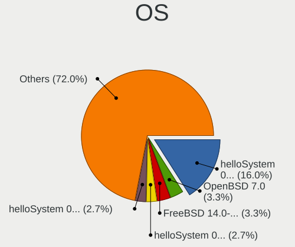

| Name                 | Notebooks | Percent |
|----------------------|-----------|---------|
| helloSystem 0.8.1    | 24        | 16%     |
| OpenBSD 7.0          | 5         | 3.33%   |
| FreeBSD 14.0-CURRENT | 5         | 3.33%   |
| OpenBSD 7.3          | 4         | 2.67%   |
| OpenBSD 7.1          | 4         | 2.67%   |
| helloSystem 0.9.0    | 4         | 2.67%   |
| helloSystem 0.7.0    | 4         | 2.67%   |
| GhostBSD 20.04.02    | 4         | 2.67%   |
| FreeBSD 13.2         | 4         | 2.67%   |
| FreeBSD 12.2         | 4         | 2.67%   |
| helloSystem 0.5.0    | 3         | 2%      |
| FreeBSD 14.1         | 3         | 2%      |
| FreeBSD 12.1         | 3         | 2%      |
| OPNsense 25.4.1      | 2         | 1.33%   |
| OPNsense 25.1        | 2         | 1.33%   |
| OPNsense 22.7.10     | 2         | 1.33%   |
| OpenBSD 6.8          | 2         | 1.33%   |
| helloSystem 0.8.2    | 2         | 1.33%   |
| helloSystem 0.8.0    | 2         | 1.33%   |
| helloSystem 0.6.0    | 2         | 1.33%   |
| FreeBSD 14.2-p3      | 2         | 1.33%   |
| FreeBSD 14.2         | 2         | 1.33%   |
| FreeBSD 13.0-p5      | 2         | 1.33%   |
| FreeBSD 13.0-p4      | 2         | 1.33%   |
| FreeBSD 13.0-p2      | 2         | 1.33%   |
| OPNsense 25.7.10     | 1         | 0.67%   |
| OPNsense 25.7        | 1         | 0.67%   |
| OPNsense 25.4        | 1         | 0.67%   |
| OPNsense 25.1.7      | 1         | 0.67%   |
| OPNsense 25.1.3      | 1         | 0.67%   |
| OPNsense 25.1.2      | 1         | 0.67%   |
| OPNsense 24.7.1      | 1         | 0.67%   |
| OPNsense 24.4.1      | 1         | 0.67%   |
| OPNsense 24.10.2     | 1         | 0.67%   |
| OPNsense 24.10.1     | 1         | 0.67%   |
| OPNsense 24.1.8      | 1         | 0.67%   |
| OPNsense 24.1.6      | 1         | 0.67%   |
| OPNsense 24.1.10     | 1         | 0.67%   |
| OPNsense 23.4        | 1         | 0.67%   |
| OPNsense 23.1.9      | 1         | 0.67%   |

OS Family
---------

OS without a version

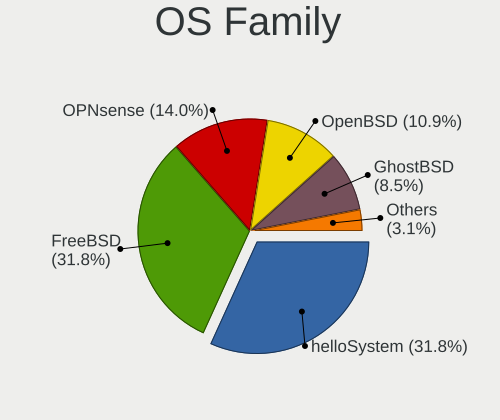

| Name        | Notebooks | Percent |
|-------------|-----------|---------|
| helloSystem | 41        | 31.78%  |
| FreeBSD     | 41        | 31.78%  |
| OPNsense    | 18        | 13.95%  |
| OpenBSD     | 14        | 10.85%  |
| GhostBSD    | 11        | 8.53%   |
| NomadBSD    | 2         | 1.55%   |
| NetBSD      | 1         | 0.78%   |
| DragonFly   | 1         | 0.78%   |

Arch
----

OS architecture (x86_64, i586, etc.)

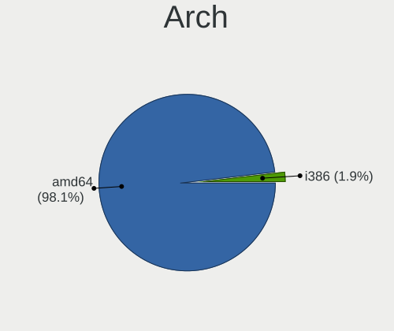

| Name  | Notebooks | Percent |
|-------|-----------|---------|
| amd64 | 126       | 97.67%  |
| i386  | 3         | 2.33%   |

DE
--

Desktop Environment

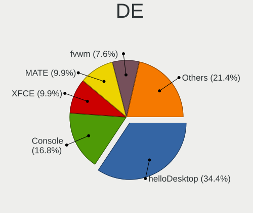

| Name         | Notebooks | Percent |
|--------------|-----------|---------|
| helloDesktop | 45        | 34.35%  |
| Console      | 22        | 16.79%  |
| XFCE         | 13        | 9.92%   |
| MATE         | 13        | 9.92%   |
| fvwm         | 10        | 7.63%   |
| i3           | 7         | 5.34%   |
| TWM          | 6         | 4.58%   |
| KDE5         | 6         | 4.58%   |
| Openbox      | 4         | 3.05%   |
| GNOME        | 2         | 1.53%   |
| LXQt         | 1         | 0.76%   |
| KDE          | 1         | 0.76%   |
| dwm          | 1         | 0.76%   |

Display Server
--------------

X11 or Wayland

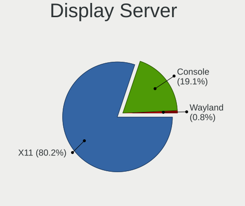

| Name    | Notebooks | Percent |
|---------|-----------|---------|
| X11     | 105       | 80.15%  |
| Console | 25        | 19.08%  |
| Wayland | 1         | 0.76%   |

Display Manager
---------------

SDDM, LightDM, etc.

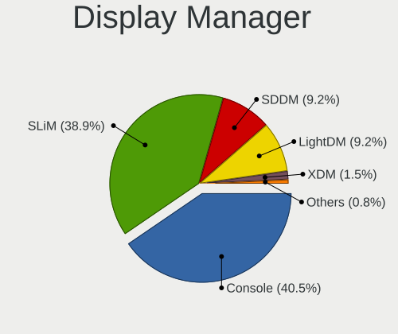

| Name    | Notebooks | Percent |
|---------|-----------|---------|
| Console | 53        | 40.46%  |
| SLiM    | 51        | 38.93%  |
| SDDM    | 12        | 9.16%   |
| LightDM | 12        | 9.16%   |
| XDM     | 2         | 1.53%   |
| Ly      | 1         | 0.76%   |

OS Lang
-------

Language

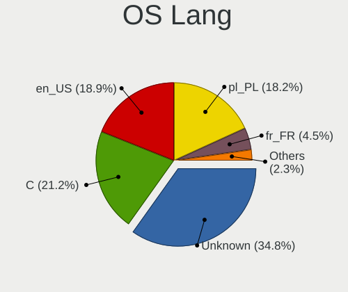

| Lang           | Notebooks | Percent |
|----------------|-----------|---------|
| Unknown        | 46        | 34.85%  |
| C              | 28        | 21.21%  |
| en_US          | 25        | 18.94%  |
| pl_PL          | 24        | 18.18%  |
| fr_FR          | 6         | 4.55%   |
| pl             | 1         | 0.76%   |
| en_IE.US-ASCII | 1         | 0.76%   |
| en             | 1         | 0.76%   |

Boot Mode
---------

EFI or BIOS

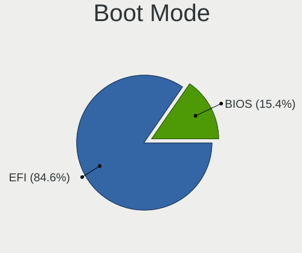

| Mode | Notebooks | Percent |
|------|-----------|---------|
| EFI  | 110       | 84.62%  |
| BIOS | 20        | 15.38%  |

Filesystem
----------

Type of filesystem

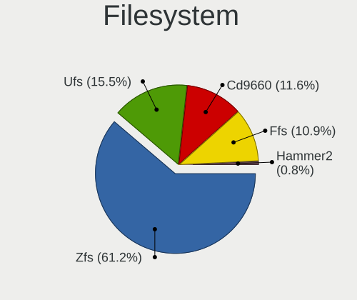

| Type    | Notebooks | Percent |
|---------|-----------|---------|
| Zfs     | 79        | 61.24%  |
| Ufs     | 20        | 15.5%   |
| Cd9660  | 15        | 11.63%  |
| Ffs     | 14        | 10.85%  |
| Hammer2 | 1         | 0.78%   |

Part. scheme
------------

Scheme of partitioning

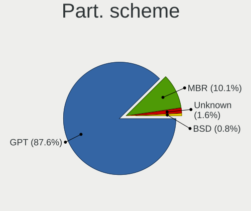

| Type    | Notebooks | Percent |
|---------|-----------|---------|
| GPT     | 113       | 87.6%   |
| MBR     | 13        | 10.08%  |
| Unknown | 2         | 1.55%   |
| BSD     | 1         | 0.78%   |

Board
-----

Vendor
------

Motherboard manufacturer

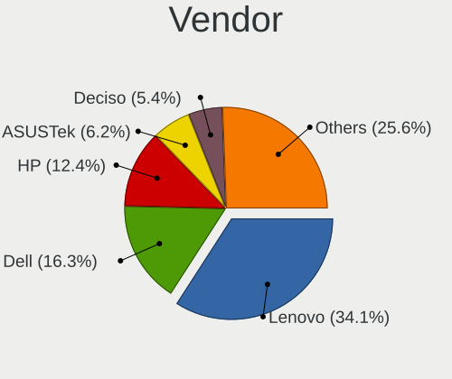

| Name                | Notebooks | Percent |
|---------------------|-----------|---------|
| Lenovo              | 44        | 34.11%  |
| Dell                | 21        | 16.28%  |
| Hewlett-Packard     | 16        | 12.4%   |
| ASUSTek Computer    | 8         | 6.2%    |
| Deciso              | 7         | 5.43%   |
| Unknown             | 6         | 4.65%   |
| Acer                | 5         | 3.88%   |
| Google              | 3         | 2.33%   |
| Fujitsu             | 3         | 2.33%   |
| Sony                | 2         | 1.55%   |
| Lex BayTrail        | 2         | 1.55%   |
| Apple               | 2         | 1.55%   |
| Samsung Electronics | 1         | 0.78%   |
| PC Specialist       | 1         | 0.78%   |
| Panasonic           | 1         | 0.78%   |
| Packard Bell        | 1         | 0.78%   |
| Notebook            | 1         | 0.78%   |
| Medion              | 1         | 0.78%   |
| Intel               | 1         | 0.78%   |
| IGEL Technology     | 1         | 0.78%   |
| IBM                 | 1         | 0.78%   |
| Fujitsu Siemens     | 1         | 0.78%   |

Model
-----

Motherboard model

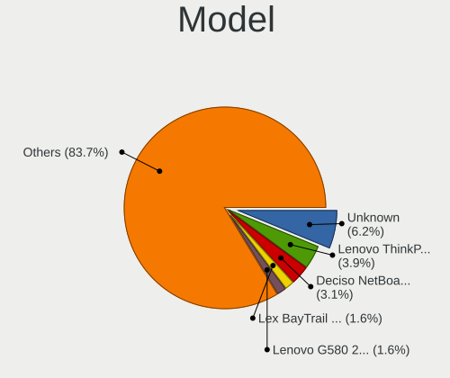

| Name                                       | Notebooks | Percent |
|--------------------------------------------|-----------|---------|
| Unknown                                    | 8         | 6.2%    |
| Lenovo ThinkPad X200 745969G               | 5         | 3.88%   |
| Deciso NetBoard-A20                        | 4         | 3.1%    |
| Lex BayTrail 2I385HW                       | 2         | 1.55%   |
| Lenovo G580 20150                          | 2         | 1.55%   |
| Dell Latitude E6430                        | 2         | 1.55%   |
| Deciso NetBoard-A10_Gen.3                  | 2         | 1.55%   |
| Apple MacBookPro11,4                       | 2         | 1.55%   |
| Sony SVF1521K1EB                           | 1         | 0.78%   |
| Sony SVF1521G6EW                           | 1         | 0.78%   |
| Samsung R530/R730/R540                     | 1         | 0.78%   |
| PC Specialist Recoil II                    | 1         | 0.78%   |
| Panasonic CFMX4-1                          | 1         | 0.78%   |
| Packard Bell EasyNote LJ65                 | 1         | 0.78%   |
| Notebook N85_N87,HJ,HJ1,HK1                | 1         | 0.78%   |
| Medion E15302                              | 1         | 0.78%   |
| Lenovo V15 G2 ALC 82KD                     | 1         | 0.78%   |
| Lenovo ThinkPad X280 20KES2VQ00            | 1         | 0.78%   |
| Lenovo ThinkPad X260 20F5S10W0H            | 1         | 0.78%   |
| Lenovo ThinkPad X230 23255RG               | 1         | 0.78%   |
| Lenovo ThinkPad X230 23254S6               | 1         | 0.78%   |
| Lenovo ThinkPad X220 4291H77               | 1         | 0.78%   |
| Lenovo ThinkPad X220 4286CTO               | 1         | 0.78%   |
| Lenovo ThinkPad X201 3680F9G               | 1         | 0.78%   |
| Lenovo ThinkPad X200s 7470A98              | 1         | 0.78%   |
| Lenovo ThinkPad X200 74591P0               | 1         | 0.78%   |
| Lenovo ThinkPad X200 7458WNZ               | 1         | 0.78%   |
| Lenovo ThinkPad X1 Extreme 2nd 20QV001CPB  | 1         | 0.78%   |
| Lenovo ThinkPad X1 Carbon Gen 9 20XW00FSUS | 1         | 0.78%   |
| Lenovo ThinkPad X1 Carbon Gen 9 20XW006FSP | 1         | 0.78%   |
| Lenovo ThinkPad W520 4284W5L               | 1         | 0.78%   |
| Lenovo ThinkPad T540p 20BFS10W03           | 1         | 0.78%   |
| Lenovo ThinkPad T530 24297XG               | 1         | 0.78%   |
| Lenovo ThinkPad T530 2394AG9               | 1         | 0.78%   |
| Lenovo ThinkPad T500 205663G               | 1         | 0.78%   |
| Lenovo ThinkPad T495 20NJ0010PB            | 1         | 0.78%   |
| Lenovo ThinkPad T480 20L6S5VP4C            | 1         | 0.78%   |
| Lenovo ThinkPad T480 20L6S4GR02            | 1         | 0.78%   |
| Lenovo ThinkPad T470 W10DG 20JNS0JU01      | 1         | 0.78%   |
| Lenovo ThinkPad T440 20B7S1860W            | 1         | 0.78%   |

Model Family
------------

Motherboard model prefix

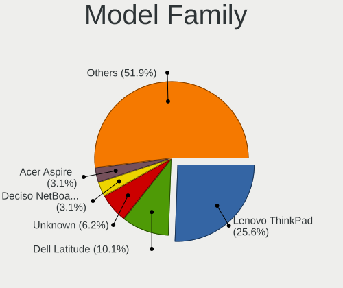

| Name                  | Notebooks | Percent |
|-----------------------|-----------|---------|
| Lenovo ThinkPad       | 33        | 25.58%  |
| Dell Latitude         | 13        | 10.08%  |
| Unknown               | 8         | 6.2%    |
| Deciso NetBoard-A20   | 4         | 3.1%    |
| Acer Aspire           | 4         | 3.1%    |
| Lenovo IdeaPad        | 3         | 2.33%   |
| HP EliteBook          | 3         | 2.33%   |
| Dell Vostro           | 3         | 2.33%   |
| Deciso NetBoard-A10   | 3         | 2.33%   |
| Lex BayTrail 2I385HW  | 2         | 1.55%   |
| Lenovo G580           | 2         | 1.55%   |
| HP Pavilion           | 2         | 1.55%   |
| HP Laptop             | 2         | 1.55%   |
| HP 255                | 2         | 1.55%   |
| Fujitsu CELSIUS       | 2         | 1.55%   |
| Dell XPS              | 2         | 1.55%   |
| Dell Inspiron         | 2         | 1.55%   |
| Apple MacBookPro11    | 2         | 1.55%   |
| Sony SVF1521K1EB      | 1         | 0.78%   |
| Sony SVF1521G6EW      | 1         | 0.78%   |
| Samsung R530          | 1         | 0.78%   |
| PC Specialist Recoil  | 1         | 0.78%   |
| Panasonic CFMX4-1     | 1         | 0.78%   |
| Packard Bell EasyNote | 1         | 0.78%   |
| Notebook N85          | 1         | 0.78%   |
| Medion E15302         | 1         | 0.78%   |
| Lenovo V15            | 1         | 0.78%   |
| Lenovo M30-70         | 1         | 0.78%   |
| Lenovo Legion         | 1         | 0.78%   |
| Lenovo G500s          | 1         | 0.78%   |
| Lenovo G50-30         | 1         | 0.78%   |
| Intel H81U            | 1         | 0.78%   |
| IGEL M350C            | 1         | 0.78%   |
| IBM ThinkPad          | 1         | 0.78%   |
| HP SpectreXT          | 1         | 0.78%   |
| HP ProBook            | 1         | 0.78%   |
| HP OMEN               | 1         | 0.78%   |
| HP Notebook           | 1         | 0.78%   |
| HP ENVY               | 1         | 0.78%   |
| HP 635                | 1         | 0.78%   |

MFG Year
--------

Motherboard manufacture year

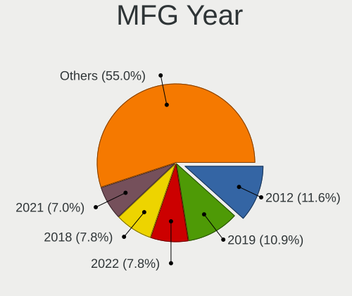

| Year | Notebooks | Percent |
|------|-----------|---------|
| 2012 | 15        | 11.63%  |
| 2019 | 14        | 10.85%  |
| 2022 | 10        | 7.75%   |
| 2018 | 10        | 7.75%   |
| 2021 | 9         | 6.98%   |
| 2020 | 8         | 6.2%    |
| 2013 | 8         | 6.2%    |
| 2011 | 8         | 6.2%    |
| 2009 | 8         | 6.2%    |
| 2017 | 7         | 5.43%   |
| 2016 | 7         | 5.43%   |
| 2010 | 6         | 4.65%   |
| 2014 | 5         | 3.88%   |
| 2015 | 4         | 3.1%    |
| 2024 | 2         | 1.55%   |
| 2023 | 2         | 1.55%   |
| 2008 | 2         | 1.55%   |
| 2006 | 2         | 1.55%   |
| 2025 | 1         | 0.78%   |
| 2005 | 1         | 0.78%   |

Form Factor
-----------

Physical design of the computer

| Name     | Notebooks | Percent |
|----------|-----------|---------|
| Notebook | 129       | 100%    |

Coreboot
--------

Have coreboot on board

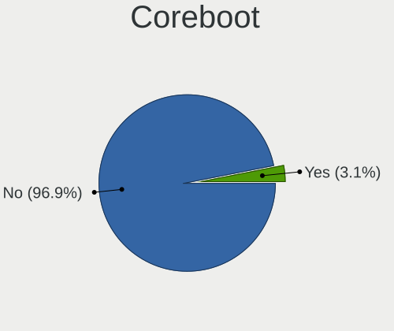

| Used | Notebooks | Percent |
|------|-----------|---------|
| No   | 125       | 96.9%   |
| Yes  | 4         | 3.1%    |

RAM Size
--------

Total RAM memory

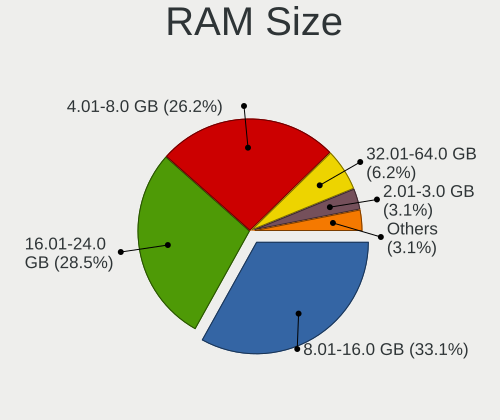

| Size in GB | Notebooks | Percent |
|------------|-----------|---------|
| 8.01-16.0  | 43        | 33.08%  |
| 16.01-24.0 | 37        | 28.46%  |
| 4.01-8.0   | 34        | 26.15%  |
| 32.01-64.0 | 8         | 6.15%   |
| 2.01-3.0   | 4         | 3.08%   |
| 3.01-4.0   | 3         | 2.31%   |
| 0.51-1.0   | 1         | 0.77%   |

RAM Used
--------

Used RAM memory

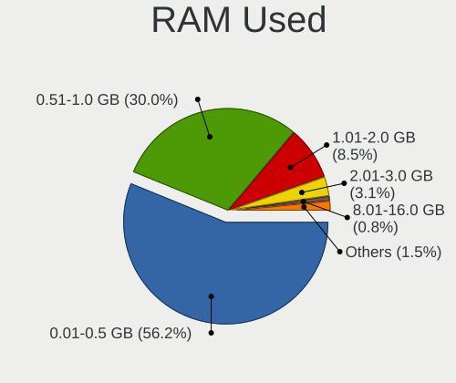

| Used GB   | Notebooks | Percent |
|-----------|-----------|---------|
| 0.01-0.5  | 73        | 56.15%  |
| 0.51-1.0  | 39        | 30%     |
| 1.01-2.0  | 11        | 8.46%   |
| 2.01-3.0  | 4         | 3.08%   |
| 4.01-8.0  | 1         | 0.77%   |
| 8.01-16.0 | 1         | 0.77%   |
| Unknown   | 1         | 0.77%   |

Total Drives
------------

Number of drives on board

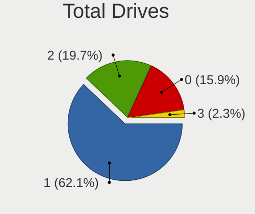

| Drives | Notebooks | Percent |
|--------|-----------|---------|
| 1      | 82        | 62.12%  |
| 2      | 26        | 19.7%   |
| 0      | 21        | 15.91%  |
| 3      | 3         | 2.27%   |

Has CD-ROM
----------

Has CD-ROM on board

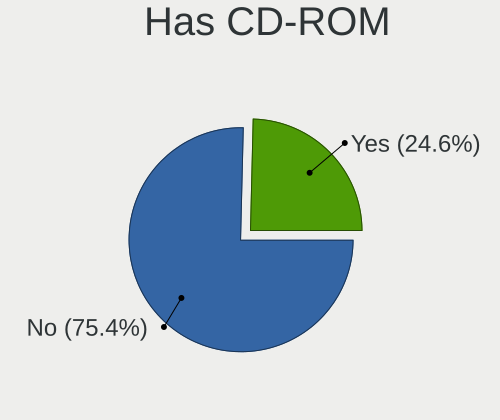

| Presented | Notebooks | Percent |
|-----------|-----------|---------|
| No        | 98        | 75.38%  |
| Yes       | 32        | 24.62%  |

Has Ethernet
------------

Has Ethernet on board

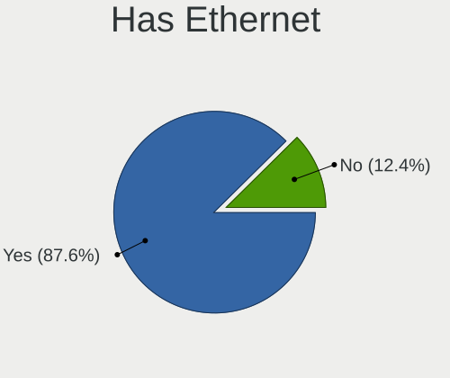

| Presented | Notebooks | Percent |
|-----------|-----------|---------|
| Yes       | 113       | 87.6%   |
| No        | 16        | 12.4%   |

Has WiFi
--------

Has WiFi module

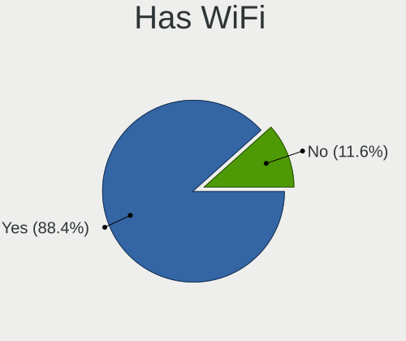

| Presented | Notebooks | Percent |
|-----------|-----------|---------|
| Yes       | 114       | 88.37%  |
| No        | 15        | 11.63%  |

Has Bluetooth
-------------

Has Bluetooth module

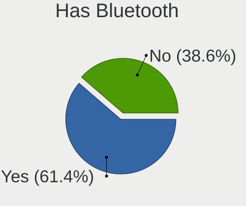

| Presented | Notebooks | Percent |
|-----------|-----------|---------|
| Yes       | 81        | 61.36%  |
| No        | 51        | 38.64%  |

Location
--------

Country
-------

Geographic location (country)

| Country | Notebooks | Percent |
|---------|-----------|---------|
| Poland  | 129       | 100%    |

City
----

Geographic location (city)

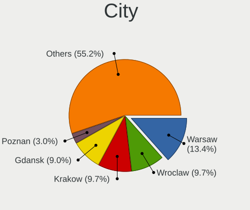

| City                      | Notebooks | Percent |
|---------------------------|-----------|---------|
| Warsaw                    | 18        | 13.43%  |
| Wroclaw                   | 13        | 9.7%    |
| Krakow                    | 13        | 9.7%    |
| Gdansk                    | 12        | 8.96%   |
| Poznan                    | 4         | 2.99%   |
| Katowice                  | 4         | 2.99%   |
| Szczecin                  | 3         | 2.24%   |
| Chrusty                   | 3         | 2.24%   |
| Zgierz                    | 2         | 1.49%   |
| Rybnik                    | 2         | 1.49%   |
| Lublin                    | 2         | 1.49%   |
| Lodz                      | 2         | 1.49%   |
| Jaslo                     | 2         | 1.49%   |
| Jarosław                 | 2         | 1.49%   |
| Grudziądz                | 2         | 1.49%   |
| Gdynia                    | 2         | 1.49%   |
| ЕљwiД™tochЕ‚owice | 1         | 0.75%   |
| Zabrze                    | 1         | 0.75%   |
| Wloszczowa                | 1         | 0.75%   |
| Wloszakowice              | 1         | 0.75%   |
| Witow                     | 1         | 0.75%   |
| Wieliczka                 | 1         | 0.75%   |
| Torun                     | 1         | 0.75%   |
| Świnoujście             | 1         | 0.75%   |
| Swilcza                   | 1         | 0.75%   |
| Starogard Gdański        | 1         | 0.75%   |
| Stargard                  | 1         | 0.75%   |
| Skierniewice              | 1         | 0.75%   |
| Reda                      | 1         | 0.75%   |
| Radom                     | 1         | 0.75%   |
| Pruszcz Gdanski           | 1         | 0.75%   |
| Pobiedziska               | 1         | 0.75%   |
| Piaseczno                 | 1         | 0.75%   |
| Pacierzow                 | 1         | 0.75%   |
| Ostrołęka               | 1         | 0.75%   |
| Opole                     | 1         | 0.75%   |
| Nowy Sącz                | 1         | 0.75%   |
| Niemce                    | 1         | 0.75%   |
| Mosina                    | 1         | 0.75%   |
| Miedziana Gora            | 1         | 0.75%   |

Drives
------

Drive Vendor
------------

Hard drive vendors

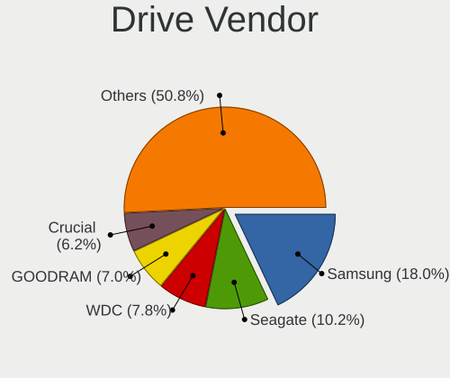

| Vendor              | Notebooks | Drives | Percent |
|---------------------|-----------|--------|---------|
| Samsung Electronics | 23        | 30     | 17.97%  |
| Seagate             | 13        | 14     | 10.16%  |
| WDC                 | 10        | 11     | 7.81%   |
| GOODRAM             | 9         | 9      | 7.03%   |
| Crucial             | 8         | 13     | 6.25%   |
| Kingston            | 7         | 9      | 5.47%   |
| Transcend           | 6         | 7      | 4.69%   |
| SK hynix            | 5         | 5      | 3.91%   |
| A-DATA Technology   | 5         | 5      | 3.91%   |
| Toshiba             | 4         | 5      | 3.13%   |
| Hitachi             | 4         | 4      | 3.13%   |
| SanDisk             | 3         | 3      | 2.34%   |
| NVMe                | 3         | 5      | 2.34%   |
| Micron Technology   | 3         | 4      | 2.34%   |
| Intel               | 3         | 3      | 2.34%   |
| Plextor             | 2         | 2      | 1.56%   |
| KIOXIA              | 2         | 2      | 1.56%   |
| HGST                | 2         | 3      | 1.56%   |
| Apple               | 2         | 2      | 1.56%   |
| Apacer              | 2         | 6      | 1.56%   |
| SPCC                | 1         | 1      | 0.78%   |
| PNY                 | 1         | 1      | 0.78%   |
| Phison              | 1         | 1      | 0.78%   |
| Patriot             | 1         | 1      | 0.78%   |
| LITEONIT            | 1         | 1      | 0.78%   |
| LITEON              | 1         | 1      | 0.78%   |
| Kston               | 1         | 3      | 0.78%   |
| KIOXIA-EXCERIA      | 1         | 1      | 0.78%   |
| Gigabyte Technology | 1         | 1      | 0.78%   |
| China               | 1         | 1      | 0.78%   |
| BIWIN               | 1         | 1      | 0.78%   |
| Advantech           | 1         | 1      | 0.78%   |

Drive Model
-----------

Hard drive models

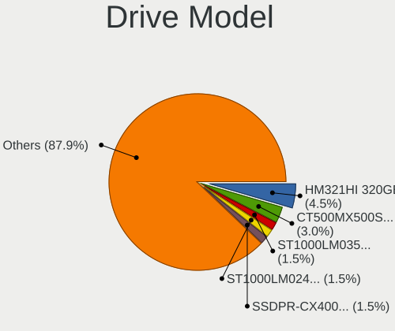

| Model                                | Notebooks | Percent |
|--------------------------------------|-----------|---------|
| Samsung HM321HI 320GB                | 6         | 4.55%   |
| Crucial CT500MX500SSD1 500GB         | 4         | 3.03%   |
| Seagate ST1000LM035-1RK172 1TB       | 2         | 1.52%   |
| Seagate ST1000LM024 HN-M101MBB 1TB   | 2         | 1.52%   |
| GOODRAM SSDPR-CX400-512-G2 512GB     | 2         | 1.52%   |
| Apple SSD SM0256G 256GB              | 2         | 1.52%   |
| WDC WDS250G2B0B-00YS70 250GB         | 1         | 0.76%   |
| WDC WD7500BPKT-22PK4T0 752GB         | 1         | 0.76%   |
| WDC WD5000LPCX-24VHAT0 500GB         | 1         | 0.76%   |
| WDC WD3200BPVT-22ZEST0 320GB         | 1         | 0.76%   |
| WDC WD3200BEKT-75PVMT1 320GB         | 1         | 0.76%   |
| WDC WD3200BEKT-22PVMT0 320GB         | 1         | 0.76%   |
| WDC WD1200BEVS-07RST0 120GB          | 1         | 0.76%   |
| WDC WD1200BEVS-07LAT0 120GB          | 1         | 0.76%   |
| WDC PC SN730 SDBQNTY-256G-1001 256GB | 1         | 0.76%   |
| WDC PC SN530 NVMe 512GB              | 1         | 0.76%   |
| Transcend TS512GMTS952T2 512GB       | 1         | 0.76%   |
| Transcend TS32GMSA370 32GB           | 1         | 0.76%   |
| Transcend TS256GMTE712A 256GB        | 1         | 0.76%   |
| Transcend TS256GMTE652T2 256GB       | 1         | 0.76%   |
| Transcend TS128GMSA370 128GB         | 1         | 0.76%   |
| Transcend TS120GMTS420S 120GB        | 1         | 0.76%   |
| Toshiba MK6461GSYN 640GB             | 1         | 0.76%   |
| Toshiba MK1252GSX 120GB              | 1         | 0.76%   |
| Toshiba KXG6AZNV1T02 1TB             | 1         | 0.76%   |
| Toshiba KBG40ZNS256G NVMe 256GB      | 1         | 0.76%   |
| SPCC Solid State Disk 512GB          | 1         | 0.76%   |
| SK hynix SC210 mSATA 256GB           | 1         | 0.76%   |
| SK hynix SC210 mSATA 128GB           | 1         | 0.76%   |
| SK hynix HFS128G39TNF-N3A0A 128GB    | 1         | 0.76%   |
| SK hynix HFM512GDHTNG-8310A 512GB    | 1         | 0.76%   |
| SK hynix BC511 NVMe 256GB            | 1         | 0.76%   |
| Seagate ST980829A 80GB               | 1         | 0.76%   |
| Seagate ST9500420AS 500GB            | 1         | 0.76%   |
| Seagate ST9500325AS 500GB            | 1         | 0.76%   |
| Seagate ST9320320AS 320GB            | 1         | 0.76%   |
| Seagate ST9250410AS 250GB            | 1         | 0.76%   |
| Seagate ST9160821AS 160GB            | 1         | 0.76%   |
| Seagate ST9160412AS 160GB            | 1         | 0.76%   |
| Seagate ST500LT012-1DG142 500GB      | 1         | 0.76%   |

HDD Vendor
----------

Hard disk drive vendors

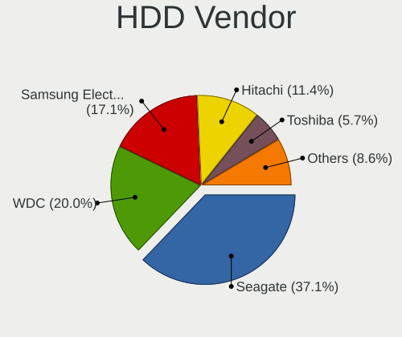

| Vendor              | Notebooks | Drives | Percent |
|---------------------|-----------|--------|---------|
| Seagate             | 13        | 14     | 37.14%  |
| WDC                 | 7         | 8      | 20%     |
| Samsung Electronics | 6         | 6      | 17.14%  |
| Hitachi             | 4         | 4      | 11.43%  |
| Toshiba             | 2         | 3      | 5.71%   |
| HGST                | 2         | 3      | 5.71%   |
| NVMe                | 1         | 1      | 2.86%   |

SSD Vendor
----------

Solid state drive vendors

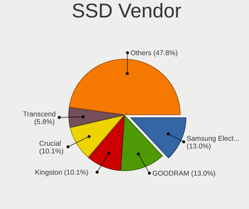

| Vendor              | Notebooks | Drives | Percent |
|---------------------|-----------|--------|---------|
| Samsung Electronics | 9         | 16     | 13.04%  |
| GOODRAM             | 9         | 9      | 13.04%  |
| Kingston            | 7         | 9      | 10.14%  |
| Crucial             | 7         | 12     | 10.14%  |
| Transcend           | 4         | 4      | 5.8%    |
| A-DATA Technology   | 4         | 4      | 5.8%    |
| SK hynix            | 3         | 3      | 4.35%   |
| SanDisk             | 3         | 3      | 4.35%   |
| Micron Technology   | 3         | 4      | 4.35%   |
| Plextor             | 2         | 2      | 2.9%    |
| Intel               | 2         | 2      | 2.9%    |
| Apple               | 2         | 2      | 2.9%    |
| Apacer              | 2         | 6      | 2.9%    |
| WDC                 | 1         | 1      | 1.45%   |
| SPCC                | 1         | 1      | 1.45%   |
| Phison              | 1         | 1      | 1.45%   |
| Patriot             | 1         | 1      | 1.45%   |
| NVMe                | 1         | 1      | 1.45%   |
| LITEONIT            | 1         | 1      | 1.45%   |
| LITEON              | 1         | 1      | 1.45%   |
| Kston               | 1         | 3      | 1.45%   |
| KIOXIA-EXCERIA      | 1         | 1      | 1.45%   |
| Gigabyte Technology | 1         | 1      | 1.45%   |
| China               | 1         | 1      | 1.45%   |
| Advantech           | 1         | 1      | 1.45%   |

Drive Kind
----------

HDD or SSD

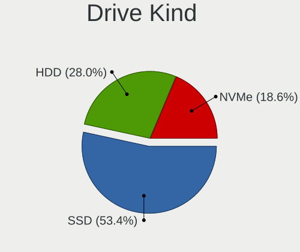

| Kind | Notebooks | Drives | Percent |
|------|-----------|--------|---------|
| SSD  | 63        | 90     | 53.39%  |
| HDD  | 33        | 39     | 27.97%  |
| NVMe | 22        | 27     | 18.64%  |

Drive Connector
---------------

SATA, SAS, NVMe, etc.

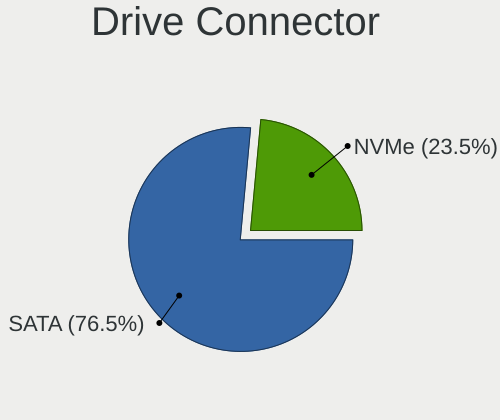

| Type | Notebooks | Drives | Percent |
|------|-----------|--------|---------|
| SATA | 88        | 129    | 80%     |
| NVMe | 22        | 27     | 20%     |

Drive Size
----------

Size of hard drive

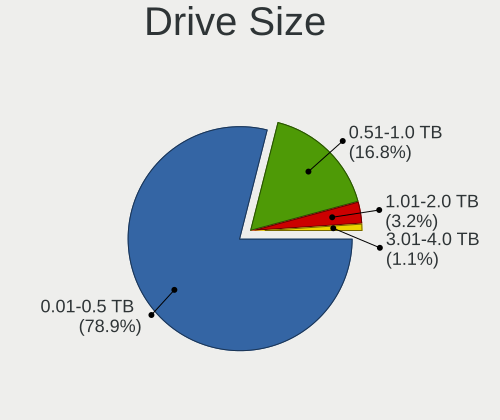

| Size in TB | Notebooks | Drives | Percent |
|------------|-----------|--------|---------|
| 0.01-0.5   | 75        | 102    | 78.95%  |
| 0.51-1.0   | 16        | 21     | 16.84%  |
| 1.01-2.0   | 3         | 4      | 3.16%   |
| 3.01-4.0   | 1         | 2      | 1.05%   |

Space Total
-----------

Amount of disk space available on the file system

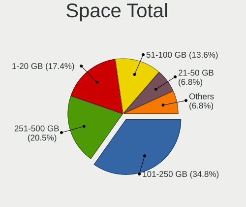

| Size in GB | Notebooks | Percent |
|------------|-----------|---------|
| 101-250    | 46        | 34.85%  |
| 251-500    | 27        | 20.45%  |
| 1-20       | 23        | 17.42%  |
| 51-100     | 18        | 13.64%  |
| 21-50      | 9         | 6.82%   |
| 501-1000   | 8         | 6.06%   |
| Unknown    | 1         | 0.76%   |

Space Used
----------

Amount of used disk space

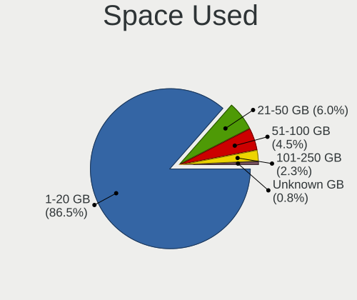

| Used GB | Notebooks | Percent |
|---------|-----------|---------|
| 1-20    | 115       | 86.47%  |
| 21-50   | 8         | 6.02%   |
| 51-100  | 6         | 4.51%   |
| 101-250 | 3         | 2.26%   |
| Unknown | 1         | 0.75%   |

Malfunc. Drives
---------------

Drive models with a malfunction

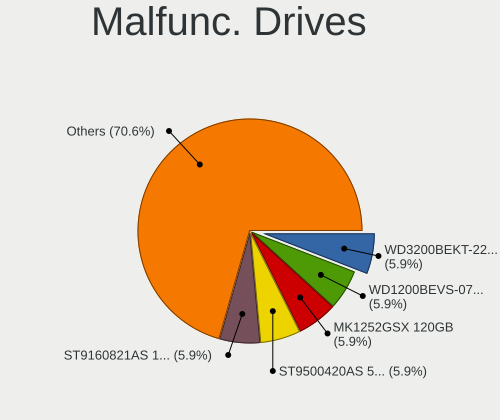

| Model                                           | Notebooks | Drives | Percent |
|-------------------------------------------------|-----------|--------|---------|
| WDC WD3200BEKT-22PVMT0 320GB                    | 1         | 1      | 5.88%   |
| WDC WD1200BEVS-07LAT0 120GB                     | 1         | 1      | 5.88%   |
| Toshiba MK1252GSX 120GB                         | 1         | 1      | 5.88%   |
| SK hynix SC210 mSATA 256GB                      | 1         | 1      | 5.88%   |
| SK hynix SC210 mSATA 128GB                      | 1         | 1      | 5.88%   |
| Seagate ST9500420AS 500GB                       | 1         | 2      | 5.88%   |
| Seagate ST9160821AS 160GB                       | 1         | 1      | 5.88%   |
| Seagate ST9160412AS 160GB                       | 1         | 1      | 5.88%   |
| Seagate ST500LM000-1EJ162 500GB                 | 1         | 1      | 5.88%   |
| Seagate ST1000LM024 HN-M101MBB 1TB              | 1         | 1      | 5.88%   |
| Phison 128GB PS3109-S9                          | 1         | 1      | 5.88%   |
| Micron Technology MTFDDAT128MAM-1J2 128GB       | 1         | 1      | 5.88%   |
| Micron Technology MTFDDAK256TBN-1AR1ZABHA 256GB | 1         | 1      | 5.88%   |
| Kingston SV300S37A240G 240GB                    | 1         | 1      | 5.88%   |
| Intel SSDSC2BW180A4 180GB                       | 1         | 1      | 5.88%   |
| Hitachi HTS543232A7A384 320GB                   | 1         | 1      | 5.88%   |
| Crucial CT500MX500SSD1 500GB                    | 1         | 2      | 5.88%   |

Malfunc. Drive Vendor
---------------------

Vendors of faulty drives

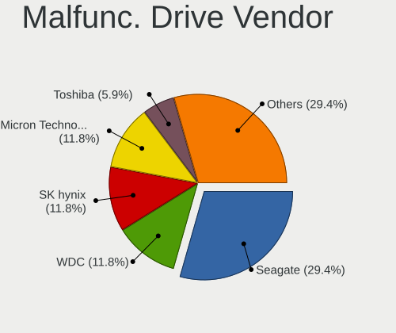

| Vendor            | Notebooks | Drives | Percent |
|-------------------|-----------|--------|---------|
| Seagate           | 5         | 6      | 29.41%  |
| WDC               | 2         | 2      | 11.76%  |
| SK hynix          | 2         | 2      | 11.76%  |
| Micron Technology | 2         | 2      | 11.76%  |
| Toshiba           | 1         | 1      | 5.88%   |
| Phison            | 1         | 1      | 5.88%   |
| Kingston          | 1         | 1      | 5.88%   |
| Intel             | 1         | 1      | 5.88%   |
| Hitachi           | 1         | 1      | 5.88%   |
| Crucial           | 1         | 2      | 5.88%   |

Malfunc. HDD Vendor
-------------------

Vendors of faulty HDD drives

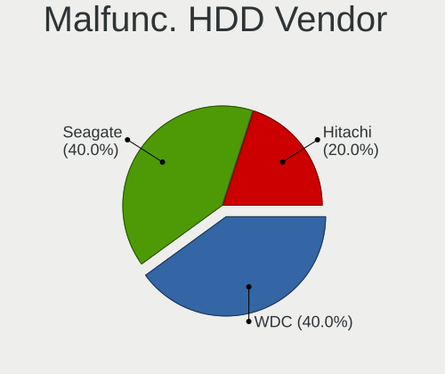

| Vendor  | Notebooks | Drives | Percent |
|---------|-----------|--------|---------|
| Seagate | 5         | 6      | 55.56%  |
| WDC     | 2         | 2      | 22.22%  |
| Toshiba | 1         | 1      | 11.11%  |
| Hitachi | 1         | 1      | 11.11%  |

Malfunc. Drive Kind
-------------------

Kinds of faulty drives

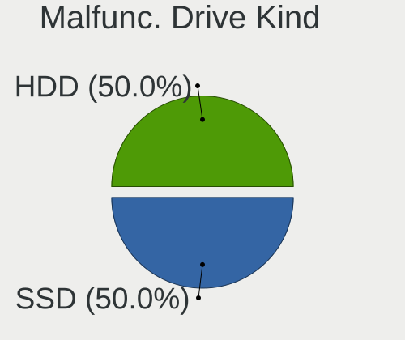

| Kind | Notebooks | Drives | Percent |
|------|-----------|--------|---------|
| SSD  | 8         | 9      | 50%     |
| HDD  | 8         | 10     | 50%     |

Failed Drives
-------------

Failed drive models

Zero info for selected period =(

Failed Drive Vendor
-------------------

Failed drive vendors

Zero info for selected period =(

Drive Status
------------

Number of failed and malfunc. drives

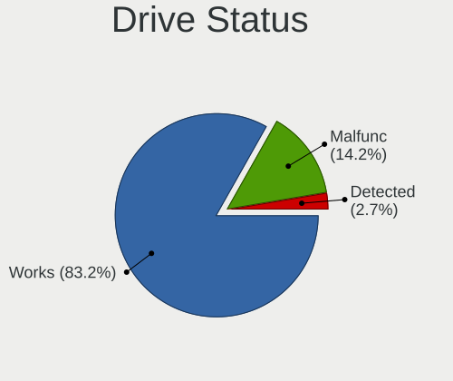

| Status   | Notebooks | Drives | Percent |
|----------|-----------|--------|---------|
| Works    | 94        | 132    | 83.19%  |
| Malfunc  | 16        | 19     | 14.16%  |
| Detected | 3         | 5      | 2.65%   |

Storage controller
------------------

Storage Vendor
--------------

Storage controller vendors

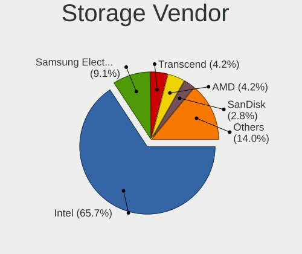

| Vendor                           | Notebooks | Percent |
|----------------------------------|-----------|---------|
| Intel                            | 94        | 65.73%  |
| Samsung Electronics              | 13        | 9.09%   |
| Transcend                        | 6         | 4.2%    |
| AMD                              | 6         | 4.2%    |
| SK hynix                         | 4         | 2.8%    |
| SanDisk                          | 4         | 2.8%    |
| KIOXIA                           | 4         | 2.8%    |
| Phison Electronics               | 3         | 2.1%    |
| Micron/Crucial Technology        | 2         | 1.4%    |
| VIA Technologies                 | 1         | 0.7%    |
| Toshiba                          | 1         | 0.7%    |
| Silicon Motion                   | 1         | 0.7%    |
| Silicon Integrated Systems [SiS] | 1         | 0.7%    |
| Realtek Semiconductor            | 1         | 0.7%    |
| Micron Technology                | 1         | 0.7%    |
| Biwin Storage Technology         | 1         | 0.7%    |

Storage Model
-------------

Storage controller models

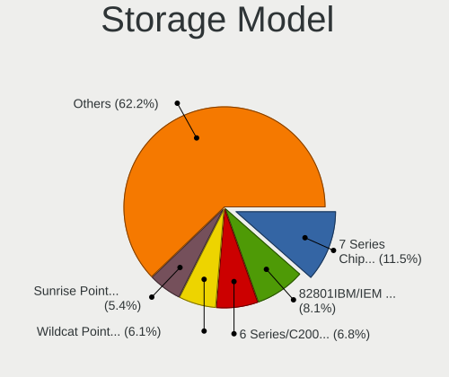

| Model                                                                          | Notebooks | Percent |
|--------------------------------------------------------------------------------|-----------|---------|
| Intel 7 Series Chipset Family 6-port SATA Controller [AHCI mode]               | 17        | 11.49%  |
| Intel 82801IBM/IEM (ICH9M/ICH9M-E) 4 port SATA Controller [AHCI mode]          | 12        | 8.11%   |
| Intel 6 Series/C200 Series Chipset Family 6 port Mobile SATA AHCI Controller   | 10        | 6.76%   |
| Intel Wildcat Point-LP SATA Controller [AHCI Mode]                             | 9         | 6.08%   |
| Intel Sunrise Point-LP SATA Controller [AHCI mode]                             | 8         | 5.41%   |
| Samsung NVMe SSD Controller SM981/PM981/PM983                                  | 6         | 4.05%   |
| Intel 82801 Mobile SATA Controller [RAID mode]                                 | 6         | 4.05%   |
| Intel 8 Series SATA Controller 1 [AHCI mode]                                   | 6         | 4.05%   |
| Transcend NVMe PCIe SSD 220S/240S/MTE710T                                      | 5         | 3.38%   |
| AMD FCH SATA Controller [AHCI mode]                                            | 5         | 3.38%   |
| KIOXIA NVMe SSD Controller BG4 (DRAM-less)                                     | 4         | 2.7%    |
| Samsung NVMe SSD Controller 980 (DRAM-less)                                    | 3         | 2.03%   |
| Intel Comet Lake SATA AHCI Controller                                          | 3         | 2.03%   |
| Intel Atom Processor E3800 Series SATA AHCI Controller                         | 3         | 2.03%   |
| Intel 8 Series/C220 Series Chipset Family 6-port SATA Controller 1 [AHCI mode] | 3         | 2.03%   |
| Samsung S4LN058A01[SSUBX] AHCI SSD Controller (Apple slot)                     | 2         | 1.35%   |
| Samsung NVMe SSD Controller PM9A1/PM9A3/980PRO                                 | 2         | 1.35%   |
| Phison PS5021-E21 PCIe4 NVMe Controller (DRAM-less)                            | 2         | 1.35%   |
| Intel SSD DC P4101/Pro 7600p/760p/E 6100p Series                               | 2         | 1.35%   |
| Intel Cannon Lake Mobile PCH SATA AHCI Controller                              | 2         | 1.35%   |
| Intel 5 Series/3400 Series Chipset 6 port SATA AHCI Controller                 | 2         | 1.35%   |
| Intel 5 Series/3400 Series Chipset 4 port SATA AHCI Controller                 | 2         | 1.35%   |
| VIA VT82C586A/B/VT82C686/A/B/VT823x/A/C PIPC Bus Master IDE                    | 1         | 0.68%   |
| VIA VT8237A Integrated SATA RAID Controller                                    | 1         | 0.68%   |
| Transcend NVMe PCIe SSD 110S/112S/120S/MTE300S/MTE400S/MTE652T2 (DRAM-less)    | 1         | 0.68%   |
| Toshiba XG6 NVMe SSD Controller                                                | 1         | 0.68%   |
| SK hynix Platinum P41/PC801 NVMe Solid State Drive                             | 1         | 0.68%   |
| SK hynix Gold P31/BC711/PC711 NVMe Solid State Drive                           | 1         | 0.68%   |
| SK hynix BC511 NVMe SSD                                                        | 1         | 0.68%   |
| SK hynix BC501 NVMe Solid State Drive                                          | 1         | 0.68%   |
| Silicon Motion SM2262/SM2262EN SSD Controller                                  | 1         | 0.68%   |
| Silicon Integrated Systems [SiS] SATA Controller / IDE mode                    | 1         | 0.68%   |
| Silicon Integrated Systems [SiS] 5513 IDE Controller                           | 1         | 0.68%   |
| SanDisk WD Blue SN500 / PC SN520 x2 M.2 2280 NVMe SSD                          | 1         | 0.68%   |
| SanDisk PC SN520 x2 M.2 2242 NVMe SSD                                          | 1         | 0.68%   |
| SanDisk IX SN530 NVMe SSD / microSD Express Card (DRAM-less)                   | 1         | 0.68%   |
| SanDisk Extreme Pro / WD Black SN750 / PC SN730 / Red SN700 NVMe SSD           | 1         | 0.68%   |
| Realtek RTS5765DL NVMe SSD Controller (DRAM-less)                              | 1         | 0.68%   |
| Phison E12 NVMe Controller                                                     | 1         | 0.68%   |
| Micron/Crucial P5 Plus NVMe PCIe SSD                                           | 1         | 0.68%   |

Storage Kind
------------

Kind of storage controller (IDE, SATA, NVMe, SAS, ...)

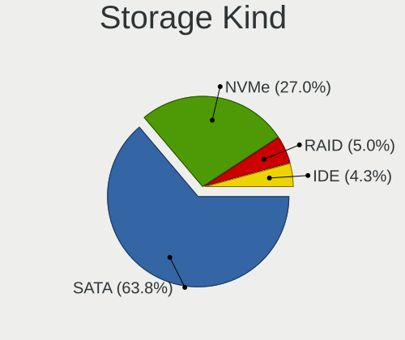

| Kind | Notebooks | Percent |
|------|-----------|---------|
| SATA | 90        | 63.83%  |
| NVMe | 38        | 26.95%  |
| RAID | 7         | 4.96%   |
| IDE  | 6         | 4.26%   |

Processor
---------

CPU Vendor
----------

Processor vendors

| Vendor | Notebooks | Percent |
|--------|-----------|---------|
| Intel  | 109       | 84.5%   |
| AMD    | 20        | 15.5%   |

CPU Model
---------

Processor models

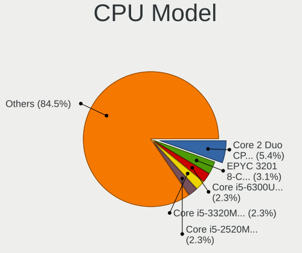

| Model                                       | Notebooks | Percent |
|---------------------------------------------|-----------|---------|
| Intel Core 2 Duo CPU P8600 @ 2.40GHz        | 7         | 5.43%   |
| AMD EPYC 3201 8-Core Processor              | 4         | 3.1%    |
| Intel Core i5-6300U CPU @ 2.40GHz           | 3         | 2.33%   |
| Intel Core i5-3320M CPU @ 2.60GHz           | 3         | 2.33%   |
| Intel Core i5-2520M CPU @ 2.50GHz           | 3         | 2.33%   |
| Intel Core i5-10210U CPU @ 1.60GHz          | 3         | 2.33%   |
| Intel Core i3-5010U CPU @ 2.10GHz           | 3         | 2.33%   |
| AMD Ryzen Embedded V1500B                   | 3         | 2.33%   |
| Intel Core i7-5600U CPU @ 2.60GHz           | 2         | 1.55%   |
| Intel Core i7-4870HQ CPU @ 2.50GHz          | 2         | 1.55%   |
| Intel Core i7-3720QM CPU @ 2.60GHz          | 2         | 1.55%   |
| Intel Core i5-9300H CPU @ 2.40GHz           | 2         | 1.55%   |
| Intel Core i5-7200U CPU @ 2.50GHz           | 2         | 1.55%   |
| Intel Core i5-6200U CPU @ 2.30GHz           | 2         | 1.55%   |
| Intel Core i5-5200U CPU @ 2.20GHz           | 2         | 1.55%   |
| Intel Core i3-4005U CPU @ 1.70GHz           | 2         | 1.55%   |
| Intel Core 2 Duo                            | 2         | 1.55%   |
| Intel Celeron CPU 3855U @ 1.60GHz           | 2         | 1.55%   |
| Intel Atom CPU E3845 @ 1.91GHz              | 2         | 1.55%   |
| Intel 11th Gen Core i7-1165G7 @ 2.80GHz     | 2         | 1.55%   |
| Intel 11th Gen Core i5-1135G7 @ 2.40GHz     | 2         | 1.55%   |
| Intel Pentium Silver N5000 CPU @ 1.10GHz    | 1         | 0.78%   |
| Intel Pentium M processor                   | 1         | 0.78%   |
| Intel Pentium Dual-Core CPU T4500 @ 2.30GHz | 1         | 0.78%   |
| Intel Pentium Dual CPU T3200 @ 2.00GHz      | 1         | 0.78%   |
| Intel Pentium CPU B960 @ 2.20GHz            | 1         | 0.78%   |
| Intel Pentium CPU 2117U @ 1.80GHz           | 1         | 0.78%   |
| Intel Genuine CPU                           | 1         | 0.78%   |
| Intel Core i7-9750HF CPU @ 2.60GHz          | 1         | 0.78%   |
| Intel Core i7-8750H CPU @ 2.20GHz           | 1         | 0.78%   |
| Intel Core i7-8650U CPU @ 1.90GHz           | 1         | 0.78%   |
| Intel Core i7-8550U CPU @ 1.80GHz           | 1         | 0.78%   |
| Intel Core i7-5500U CPU @ 2.40GHz           | 1         | 0.78%   |
| Intel Core i7-4800MQ CPU @ 2.70GHz          | 1         | 0.78%   |
| Intel Core i7-4710HQ CPU @ 2.50GHz          | 1         | 0.78%   |
| Intel Core i7-4600U CPU @ 2.10GHz           | 1         | 0.78%   |
| Intel Core i7-3632QM CPU @ 2.20GHz          | 1         | 0.78%   |
| Intel Core i7-3630QM CPU @ 2.40GHz          | 1         | 0.78%   |
| Intel Core i7-3610QM CPU @ 2.30GHz          | 1         | 0.78%   |
| Intel Core i7-2820QM CPU @ 2.30GHz          | 1         | 0.78%   |

CPU Model Family
----------------

Processor model prefix

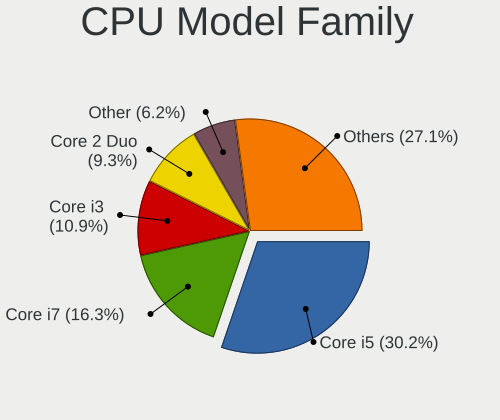

| Model                   | Notebooks | Percent |
|-------------------------|-----------|---------|
| Intel Core i5           | 39        | 30.23%  |
| Intel Core i7           | 21        | 16.28%  |
| Intel Core i3           | 14        | 10.85%  |
| Intel Core 2 Duo        | 12        | 9.3%    |
| Other                   | 8         | 6.2%    |
| Intel Celeron           | 5         | 3.88%   |
| AMD Ryzen Embedded      | 4         | 3.1%    |
| AMD EPYC                | 4         | 3.1%    |
| Intel Atom              | 3         | 2.33%   |
| AMD Ryzen 5             | 3         | 2.33%   |
| Intel Pentium           | 2         | 1.55%   |
| AMD Ryzen 3             | 2         | 1.55%   |
| AMD Athlon              | 2         | 1.55%   |
| Intel Pentium Silver    | 1         | 0.78%   |
| Intel Pentium M         | 1         | 0.78%   |
| Intel Pentium Dual-Core | 1         | 0.78%   |
| Intel Pentium Dual      | 1         | 0.78%   |
| Intel Genuine           | 1         | 0.78%   |
| Intel Celeron M         | 1         | 0.78%   |
| AMD Ryzen 7 PRO         | 1         | 0.78%   |
| AMD Ryzen 7             | 1         | 0.78%   |
| AMD Ryzen 5 PRO         | 1         | 0.78%   |
| AMD E                   | 1         | 0.78%   |

CPU Cores
---------

Number of processor cores

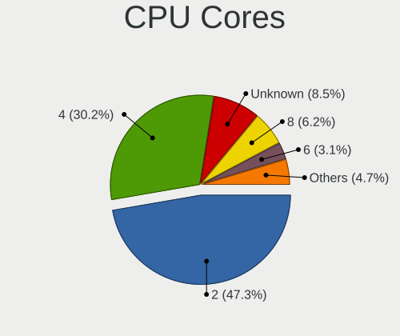

| Number  | Notebooks | Percent |
|---------|-----------|---------|
| 2       | 61        | 47.29%  |
| 4       | 39        | 30.23%  |
| Unknown | 11        | 8.53%   |
| 8       | 8         | 6.2%    |
| 6       | 4         | 3.1%    |
| 1       | 3         | 2.33%   |
| 12      | 2         | 1.55%   |
| 16      | 1         | 0.78%   |

CPU Sockets
-----------

Number of sockets

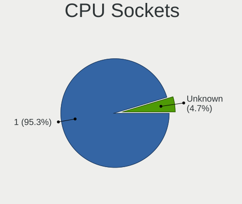

| Number  | Notebooks | Percent |
|---------|-----------|---------|
| 1       | 123       | 95.35%  |
| Unknown | 6         | 4.65%   |

CPU Threads
-----------

Threads per core (Hyper-Threading)

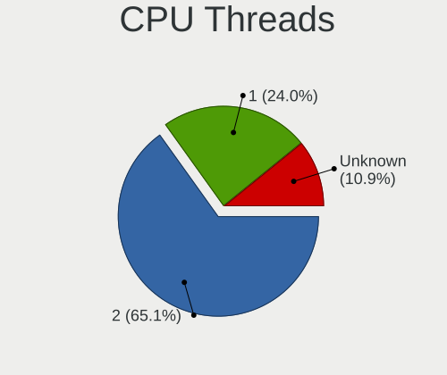

| Number  | Notebooks | Percent |
|---------|-----------|---------|
| 2       | 84        | 65.12%  |
| 1       | 31        | 24.03%  |
| Unknown | 14        | 10.85%  |

CPU Microarch
-------------

Microarchitecture

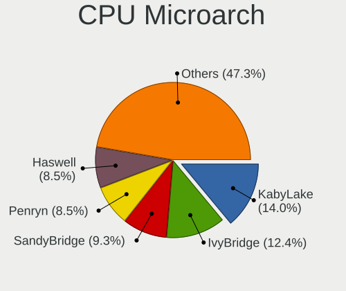

| Name          | Notebooks | Percent |
|---------------|-----------|---------|
| KabyLake      | 18        | 13.95%  |
| IvyBridge     | 16        | 12.4%   |
| SandyBridge   | 12        | 9.3%    |
| Penryn        | 11        | 8.53%   |
| Haswell       | 11        | 8.53%   |
| Broadwell     | 11        | 8.53%   |
| Zen           | 7         | 5.43%   |
| Skylake       | 7         | 5.43%   |
| Zen+          | 6         | 4.65%   |
| Westmere      | 5         | 3.88%   |
| TigerLake     | 4         | 3.1%    |
| Unknown       | 4         | 3.1%    |
| Silvermont    | 3         | 2.33%   |
| P6            | 3         | 2.33%   |
| Core          | 3         | 2.33%   |
| Zen 3         | 2         | 1.55%   |
| Zen 2         | 1         | 0.78%   |
| Goldmont plus | 1         | 0.78%   |
| Excavator     | 1         | 0.78%   |
| CometLake     | 1         | 0.78%   |
| Bonnell       | 1         | 0.78%   |
| Bobcat        | 1         | 0.78%   |

Graphics
--------

GPU Vendor
----------

Vendors of graphics cards

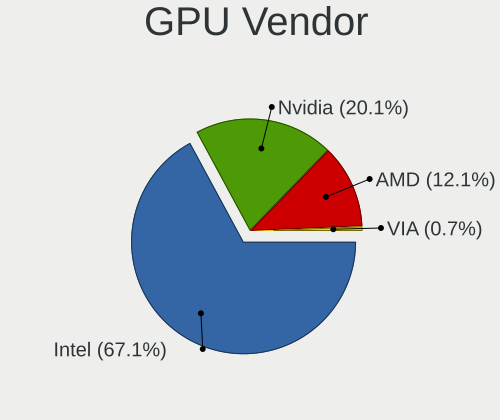

| Vendor           | Notebooks | Percent |
|------------------|-----------|---------|
| Intel            | 100       | 67.11%  |
| Nvidia           | 30        | 20.13%  |
| AMD              | 18        | 12.08%  |
| VIA Technologies | 1         | 0.67%   |

GPU Model
---------

Graphics card models

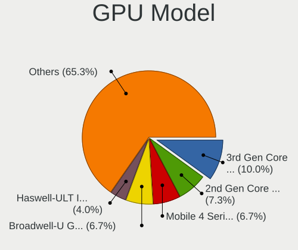

| Model                                                                         | Notebooks | Percent |
|-------------------------------------------------------------------------------|-----------|---------|
| Intel 3rd Gen Core processor Graphics Controller                              | 15        | 10%     |
| Intel 2nd Generation Core Processor Family Integrated Graphics Controller     | 11        | 7.33%   |
| Intel Mobile 4 Series Chipset Integrated Graphics Controller                  | 10        | 6.67%   |
| Intel Broadwell-U GT2 [HD Graphics 5500]                                      | 10        | 6.67%   |
| Intel Haswell-ULT Integrated Graphics Controller                              | 6         | 4%      |
| AMD Picasso/Raven 2 [Radeon Vega Series / Radeon Vega Mobile Series]          | 6         | 4%      |
| Intel Skylake-U GT2 [HD Graphics 520]                                         | 5         | 3.33%   |
| Nvidia GF117M [GeForce 610M/710M/810M/820M / GT 620M/625M/630M/720M]          | 4         | 2.67%   |
| Intel TigerLake-LP GT2 [Iris Xe Graphics]                                     | 4         | 2.67%   |
| Intel Kaby Lake-R GT2 [UHD Graphics 620]                                      | 4         | 2.67%   |
| Intel Core Processor Integrated Graphics Controller                           | 4         | 2.67%   |
| Intel CometLake-U GT2 [UHD Graphics]                                          | 4         | 2.67%   |
| Nvidia TU117M [GeForce GTX 1650 Mobile / Max-Q]                               | 3         | 2%      |
| Intel Kaby Lake-U GT2 [HD Graphics 620]                                       | 3         | 2%      |
| Intel Atom Processor Z36xxx/Z37xxx Series Graphics & Display                  | 3         | 2%      |
| Intel 4th Gen Core Processor Integrated Graphics Controller                   | 3         | 2%      |
| Nvidia GM108M [GeForce 940M]                                                  | 2         | 1.33%   |
| Nvidia GK208M [GeForce GT 740M]                                               | 2         | 1.33%   |
| Nvidia GA107M [GeForce RTX 3050 Mobile]                                       | 2         | 1.33%   |
| Intel WhiskeyLake-U GT2 [UHD Graphics 620]                                    | 2         | 1.33%   |
| Intel Skylake-U GT1 [HD Graphics 510]                                         | 2         | 1.33%   |
| Intel Mobile 915GM/GMS/910GML Express Graphics Controller                     | 2         | 1.33%   |
| Intel Crystal Well Integrated Graphics Controller                             | 2         | 1.33%   |
| Intel CoffeeLake-H GT2 [UHD Graphics 630]                                     | 2         | 1.33%   |
| AMD Sun XT [Radeon HD 8670A/8670M/8690M / R5 M330 / M430 / Radeon 520 Mobile] | 2         | 1.33%   |
| AMD Barcelo                                                                   | 2         | 1.33%   |
| VIA Technologies CN896/VN896/P4M900 [Chrome 9 HC]                             | 1         | 0.67%   |
| Nvidia GT216M [GeForce GT 240M]                                               | 1         | 0.67%   |
| Nvidia GP107M [GeForce GTX 1050 Mobile]                                       | 1         | 0.67%   |
| Nvidia GP106M [GeForce GTX 1060 Mobile]                                       | 1         | 0.67%   |
| Nvidia GM108M [GeForce 840M]                                                  | 1         | 0.67%   |
| Nvidia GM107M [GeForce GTX 860M]                                              | 1         | 0.67%   |
| Nvidia GM107 [GeForce 940MX]                                                  | 1         | 0.67%   |
| Nvidia GK104GLM [Quadro K3000M]                                               | 1         | 0.67%   |
| Nvidia GF119M [GeForce GT 520MX]                                              | 1         | 0.67%   |
| Nvidia GF108M [NVS 5400M]                                                     | 1         | 0.67%   |
| Nvidia GF108M [GeForce GT 635M]                                               | 1         | 0.67%   |
| Nvidia GF108M [GeForce GT 525M]                                               | 1         | 0.67%   |
| Nvidia GF108M [GeForce GT 420M]                                               | 1         | 0.67%   |
| Nvidia GF108GLM [Quadro 1000M]                                                | 1         | 0.67%   |

GPU Combo
---------

Combinations of graphics cards

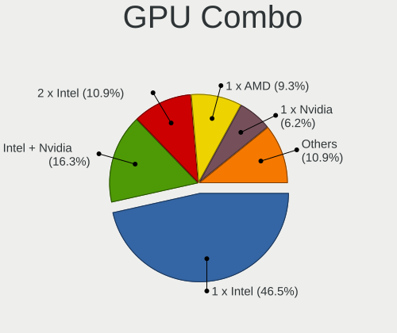

| Name           | Notebooks | Percent |
|----------------|-----------|---------|
| 1 x Intel      | 60        | 46.51%  |
| Intel + Nvidia | 21        | 16.28%  |
| 2 x Intel      | 14        | 10.85%  |
| 1 x AMD        | 12        | 9.3%    |
| 1 x Nvidia     | 8         | 6.2%    |
| Other          | 7         | 5.43%   |
| Intel + AMD    | 5         | 3.88%   |
| 1 x VIA        | 1         | 0.78%   |
| AMD + Nvidia   | 1         | 0.78%   |

GPU Driver
----------

Free vs proprietary

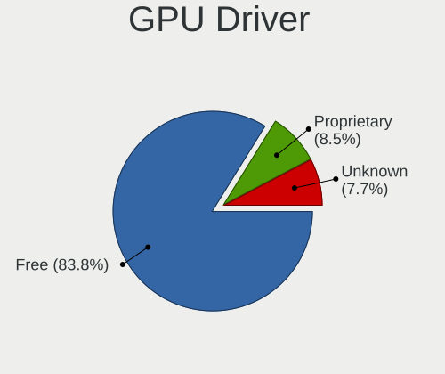

| Driver      | Notebooks | Percent |
|-------------|-----------|---------|
| Free        | 109       | 83.85%  |
| Proprietary | 11        | 8.46%   |
| Unknown     | 10        | 7.69%   |

GPU Memory
----------

Total video memory

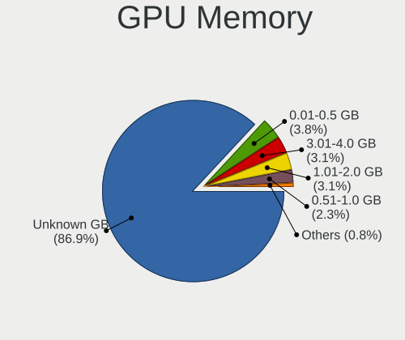

| Size in GB | Notebooks | Percent |
|------------|-----------|---------|
| Unknown    | 113       | 86.92%  |
| 0.01-0.5   | 5         | 3.85%   |
| 3.01-4.0   | 4         | 3.08%   |
| 1.01-2.0   | 4         | 3.08%   |
| 0.51-1.0   | 3         | 2.31%   |
| 5.01-6.0   | 1         | 0.77%   |

Monitor
-------

Monitor Vendor
--------------

Monitor vendors

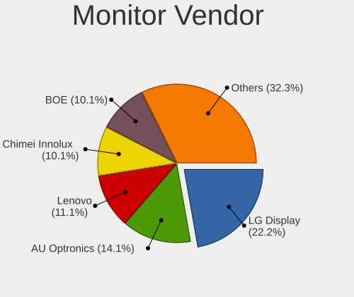

| Vendor                  | Notebooks | Percent |
|-------------------------|-----------|---------|
| LG Display              | 22        | 22.22%  |
| AU Optronics            | 14        | 14.14%  |
| Lenovo                  | 11        | 11.11%  |
| Chimei Innolux          | 10        | 10.1%   |
| BOE                     | 10        | 10.1%   |
| Samsung Electronics     | 9         | 9.09%   |
| Chi Mei Optoelectronics | 4         | 4.04%   |
| InfoVision              | 3         | 3.03%   |
| Apple                   | 2         | 2.02%   |
| AOC                     | 2         | 2.02%   |
| Sharp                   | 1         | 1.01%   |
| Philips                 | 1         | 1.01%   |
| PANDA                   | 1         | 1.01%   |
| Nvidia                  | 1         | 1.01%   |
| KTC                     | 1         | 1.01%   |
| JDI                     | 1         | 1.01%   |
| Iiyama                  | 1         | 1.01%   |
| Dell                    | 1         | 1.01%   |
| CSO                     | 1         | 1.01%   |
| BOE Technology Group    | 1         | 1.01%   |
| BenQ                    | 1         | 1.01%   |
| Acer                    | 1         | 1.01%   |

Monitor Model
-------------

Monitor models

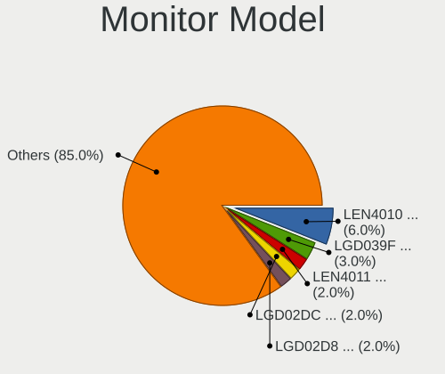

| Model                                                                    | Notebooks | Percent |
|--------------------------------------------------------------------------|-----------|---------|
| Lenovo LCD Monitor LEN4010 1280x800 260x160mm 12.0-inch                  | 6         | 6%      |
| LG Display LCD Monitor LGD039F 1366x768 350x190mm 15.7-inch              | 3         | 3%      |
| LG Display LCD Monitor LGD02DC 1366x768 340x190mm 15.3-inch              | 2         | 2%      |
| LG Display LCD Monitor LGD02D8 1366x768 280x160mm 12.7-inch              | 2         | 2%      |
| Lenovo LCD Monitor LEN4011 1280x800 260x160mm 12.0-inch                  | 2         | 2%      |
| Chi Mei Optoelectronics LCD Monitor CMO15A7 1366x768 350x190mm 15.7-inch | 2         | 2%      |
| AU Optronics LCD Monitor AUO106C 1366x768 280x160mm 12.7-inch            | 2         | 2%      |
| Apple Color LCD APPA02E 2880x1800 330x210mm 15.4-inch                    | 2         | 2%      |
| Sharp LCD Monitor SHP1421 3200x1800 290x170mm 13.2-inch                  | 1         | 1%      |
| Samsung Electronics LS24AG30x SAM7178 1920x1080 530x300mm 24.0-inch      | 1         | 1%      |
| Samsung Electronics LF27T370F SAM711E 1920x1080 600x340mm 27.2-inch      | 1         | 1%      |
| Samsung Electronics LCD Monitor SEC544B 1600x900 340x190mm 15.3-inch     | 1         | 1%      |
| Samsung Electronics LCD Monitor SEC5442 1440x900 300x190mm 14.0-inch     | 1         | 1%      |
| Samsung Electronics LCD Monitor SEC3345 1280x800 330x210mm 15.4-inch     | 1         | 1%      |
| Samsung Electronics LCD Monitor SEC3245 1366x768 340x190mm 15.3-inch     | 1         | 1%      |
| Samsung Electronics LCD Monitor SDC4852 1366x768 340x190mm 15.3-inch     | 1         | 1%      |
| Samsung Electronics LCD Monitor SDC4163 3456x2160 290x180mm 13.4-inch    | 1         | 1%      |
| Samsung Electronics LCD Monitor SDC324A 1366x768 290x170mm 13.2-inch     | 1         | 1%      |
| Philips PHL 275S1 PHL094B 2560x1440 600x340mm 27.2-inch                  | 1         | 1%      |
| PANDA LCD Monitor NCP006E 1920x1080 340x190mm 15.3-inch                  | 1         | 1%      |
| Nvidia Defaul NVD0500 1920x1080 320x180mm 14.5-inch                      | 1         | 1%      |
| LG Display LCD Monitor LGD062E 1920x1080 340x190mm 15.3-inch             | 1         | 1%      |
| LG Display LCD Monitor LGD0533 1920x1080 340x190mm 15.3-inch             | 1         | 1%      |
| LG Display LCD Monitor LGD04E2 1366x768 340x190mm 15.3-inch              | 1         | 1%      |
| LG Display LCD Monitor LGD0408 1920x1080 280x160mm 12.7-inch             | 1         | 1%      |
| LG Display LCD Monitor LGD03D3 1600x900 310x170mm 13.9-inch              | 1         | 1%      |
| LG Display LCD Monitor LGD03CD 1366x768 280x160mm 12.7-inch              | 1         | 1%      |
| LG Display LCD Monitor LGD0368 1366x768 310x170mm 13.9-inch              | 1         | 1%      |
| LG Display LCD Monitor LGD033E 1366x768 310x170mm 13.9-inch              | 1         | 1%      |
| LG Display LCD Monitor LGD033A 1366x768 340x190mm 15.3-inch              | 1         | 1%      |
| LG Display LCD Monitor LGD02F1 1366x768 340x190mm 15.3-inch              | 1         | 1%      |
| LG Display LCD Monitor LGD02EA 1366x768 310x170mm 13.9-inch              | 1         | 1%      |
| LG Display LCD Monitor LGD02AD 1366x768 340x190mm 15.3-inch              | 1         | 1%      |
| LG Display LCD Monitor LGD0283 1920x1080 380x220mm 17.3-inch             | 1         | 1%      |
| LG Display LCD Monitor LGD0250 1366x768 350x190mm 15.7-inch              | 1         | 1%      |
| LG Display LCD Monitor LGD024D 1366x768 290x170mm 13.2-inch              | 1         | 1%      |
| Lenovo LCD Monitor LEN40B2 1920x1080 340x190mm 15.3-inch                 | 1         | 1%      |
| Lenovo LCD Monitor LEN40B1 1600x900 340x190mm 15.3-inch                  | 1         | 1%      |
| Lenovo LCD Monitor LEN4053 1680x1050 330x210mm 15.4-inch                 | 1         | 1%      |
| KTC M-9005L11-D KTC1990 1280x1024 340x270mm 17.1-inch                    | 1         | 1%      |

Monitor Resolution
------------------

Monitor screen resolution

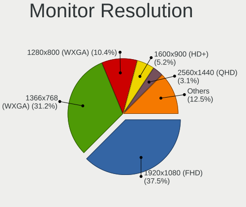

| Resolution         | Notebooks | Percent |
|--------------------|-----------|---------|
| 1920x1080 (FHD)    | 36        | 37.5%   |
| 1366x768 (WXGA)    | 30        | 31.25%  |
| 1280x800 (WXGA)    | 10        | 10.42%  |
| 1600x900 (HD+)     | 5         | 5.21%   |
| 2560x1440 (QHD)    | 3         | 3.13%   |
| 2880x1800          | 2         | 2.08%   |
| 1440x900 (WXGA+)   | 2         | 2.08%   |
| 5760x2160          | 1         | 1.04%   |
| 3840x2400          | 1         | 1.04%   |
| 3456x2160          | 1         | 1.04%   |
| 3200x1800 (QHD+)   | 1         | 1.04%   |
| 1680x1050 (WSXGA+) | 1         | 1.04%   |
| 1280x1024 (SXGA)   | 1         | 1.04%   |
| 1024x600           | 1         | 1.04%   |
| Unknown            | 1         | 1.04%   |

Monitor Diagonal
----------------

Diagonal size in inches

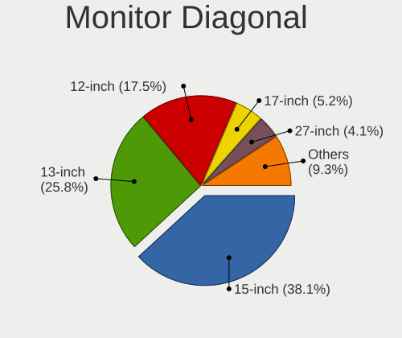

| Inches  | Notebooks | Percent |
|---------|-----------|---------|
| 15      | 37        | 38.14%  |
| 13      | 25        | 25.77%  |
| 12      | 17        | 17.53%  |
| 17      | 5         | 5.15%   |
| 27      | 4         | 4.12%   |
| 14      | 3         | 3.09%   |
| 24      | 2         | 2.06%   |
| Unknown | 2         | 2.06%   |
| 23      | 1         | 1.03%   |
| 10      | 1         | 1.03%   |

Monitor Width
-------------

Physical width

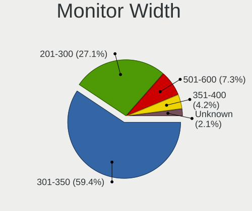

| Width in mm | Notebooks | Percent |
|-------------|-----------|---------|
| 301-350     | 57        | 59.38%  |
| 201-300     | 26        | 27.08%  |
| 501-600     | 7         | 7.29%   |
| 351-400     | 4         | 4.17%   |
| Unknown     | 2         | 2.08%   |

Aspect Ratio
------------

Proportional relationship between the width and the height

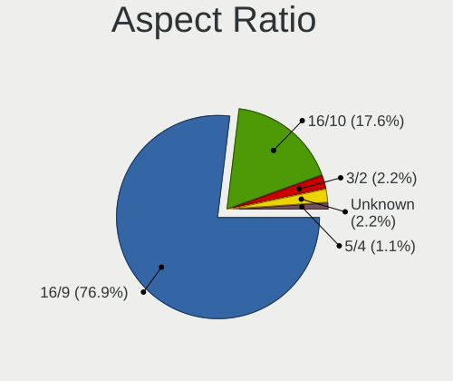

| Ratio   | Notebooks | Percent |
|---------|-----------|---------|
| 16/9    | 70        | 76.92%  |
| 16/10   | 16        | 17.58%  |
| 3/2     | 2         | 2.2%    |
| Unknown | 2         | 2.2%    |
| 5/4     | 1         | 1.1%    |

Monitor Area
------------

Area in inch²

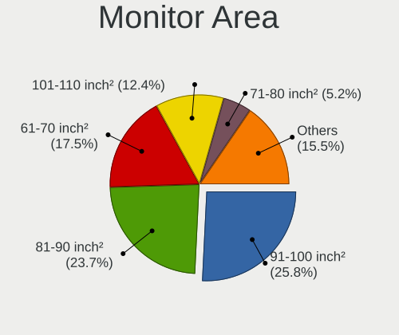

| Area in inch² | Notebooks | Percent |
|----------------|-----------|---------|
| 91-100         | 25        | 25.77%  |
| 81-90          | 23        | 23.71%  |
| 61-70          | 17        | 17.53%  |
| 101-110        | 12        | 12.37%  |
| 71-80          | 5         | 5.15%   |
| 301-350        | 4         | 4.12%   |
| 201-250        | 3         | 3.09%   |
| 131-140        | 2         | 2.06%   |
| 121-130        | 2         | 2.06%   |
| Unknown        | 2         | 2.06%   |
| 41-50          | 1         | 1.03%   |
| 141-150        | 1         | 1.03%   |

Pixel Density
-------------

Pixels per inch

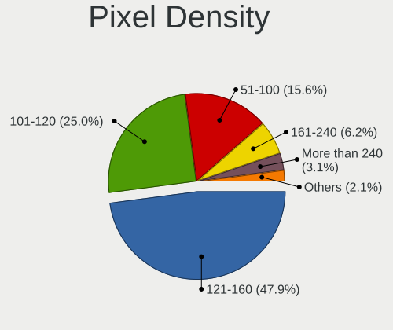

| Density       | Notebooks | Percent |
|---------------|-----------|---------|
| 121-160       | 46        | 47.92%  |
| 101-120       | 24        | 25%     |
| 51-100        | 15        | 15.63%  |
| 161-240       | 6         | 6.25%   |
| More than 240 | 3         | 3.13%   |
| Unknown       | 2         | 2.08%   |

Multiple Monitors
-----------------

Total monitors connected

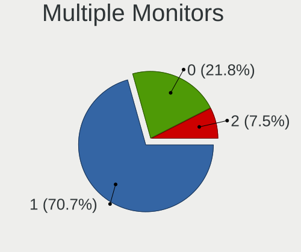

| Total | Notebooks | Percent |
|-------|-----------|---------|
| 1     | 94        | 70.68%  |
| 0     | 29        | 21.8%   |
| 2     | 10        | 7.52%   |

Network
-------

Net Controller Vendor
---------------------

Controller vendors

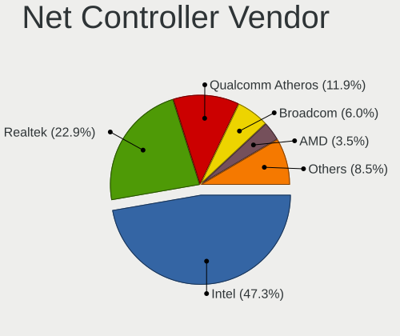

| Vendor                            | Notebooks | Percent |
|-----------------------------------|-----------|---------|
| Intel                             | 95        | 47.26%  |
| Realtek Semiconductor             | 46        | 22.89%  |
| Qualcomm Atheros                  | 24        | 11.94%  |
| Broadcom                          | 12        | 5.97%   |
| AMD                               | 7         | 3.48%   |
| Dell                              | 3         | 1.49%   |
| Qualcomm Atheros Communications   | 2         | 1%      |
| VIA Technologies                  | 1         | 0.5%    |
| Van Ooijen Technische Informatica | 1         | 0.5%    |
| TP-Link                           | 1         | 0.5%    |
| Silicon Integrated Systems [SiS]  | 1         | 0.5%    |
| Sierra Wireless                   | 1         | 0.5%    |
| Samsung Electronics               | 1         | 0.5%    |
| Ralink Technology                 | 1         | 0.5%    |
| OnePlus Technology (Shenzhen)     | 1         | 0.5%    |
| Marvell Technology Group          | 1         | 0.5%    |
| IMC Networks                      | 1         | 0.5%    |
| Ericsson Business Mobile Networks | 1         | 0.5%    |
| Atheros                           | 1         | 0.5%    |

Net Controller Model
--------------------

Controller models

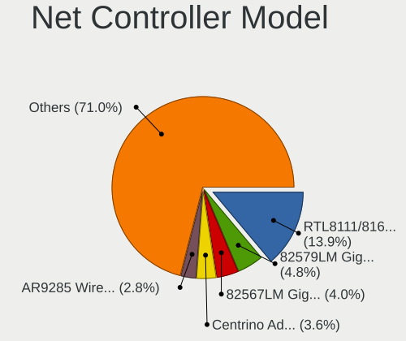

| Model                                                                  | Notebooks | Percent |
|------------------------------------------------------------------------|-----------|---------|
| Realtek RTL8111/8168/8211/8411 PCI Express Gigabit Ethernet Controller | 35        | 13.89%  |
| Intel 82579LM Gigabit Network Connection (Lewisville)                  | 12        | 4.76%   |
| Intel 82567LM Gigabit Network Connection                               | 10        | 3.97%   |
| Intel Centrino Advanced-N 6205 [Taylor Peak]                           | 9         | 3.57%   |
| Qualcomm Atheros AR9285 Wireless Network Adapter (PCI-Express)         | 7         | 2.78%   |
| AMD XGMAC 10GbE Controller                                             | 7         | 2.78%   |
| Intel Wireless 7265                                                    | 6         | 2.38%   |
| Intel Ultimate N WiFi Link 5300                                        | 6         | 2.38%   |
| Realtek RTL810xE PCI Express Fast Ethernet controller                  | 5         | 1.98%   |
| Intel Wireless 8265 / 8275                                             | 5         | 1.98%   |
| Intel I211 Gigabit Network Connection                                  | 5         | 1.98%   |
| Intel Wireless 8260                                                    | 4         | 1.59%   |
| Intel Wireless 7260                                                    | 4         | 1.59%   |
| Intel Wireless 3165                                                    | 4         | 1.59%   |
| Intel Wi-Fi 6 AX201                                                    | 4         | 1.59%   |
| Intel Comet Lake PCH-LP CNVi WiFi                                      | 4         | 1.59%   |
| Qualcomm Atheros QCA9565 / AR9565 Wireless Network Adapter             | 3         | 1.19%   |
| Intel I210 Gigabit Network Connection                                  | 3         | 1.19%   |
| Intel Ethernet Controller I225-V                                       | 3         | 1.19%   |
| Intel Ethernet Connection I219-LM                                      | 3         | 1.19%   |
| Intel Ethernet Connection I218-LM                                      | 3         | 1.19%   |
| Intel Ethernet Connection (4) I219-LM                                  | 3         | 1.19%   |
| Intel Ethernet Connection (3) I218-LM                                  | 3         | 1.19%   |
| Intel Centrino Advanced-N 6200                                         | 3         | 1.19%   |
| Intel Cannon Lake PCH CNVi WiFi                                        | 3         | 1.19%   |
| Intel 82577LM Gigabit Network Connection                               | 3         | 1.19%   |
| Realtek RTL8852BE PCIe 802.11ax Wireless Network Controller            | 2         | 0.79%   |
| Realtek RTL8822CE 802.11ac PCIe Wireless Network Adapter               | 2         | 0.79%   |
| Realtek RTL8821CE 802.11ac PCIe Wireless Network Adapter               | 2         | 0.79%   |
| Realtek RTL8188EUS 802.11n Wireless Network Adapter                    | 2         | 0.79%   |
| Qualcomm Atheros AR9485 Wireless Network Adapter                       | 2         | 0.79%   |
| Qualcomm Atheros AR9462 Wireless Network Adapter                       | 2         | 0.79%   |
| Qualcomm Atheros AR9287 Wireless Network Adapter (PCI-Express)         | 2         | 0.79%   |
| Qualcomm Atheros AR8162 Fast Ethernet                                  | 2         | 0.79%   |
| Intel Wi-Fi 6E(802.11ax) AX210/AX1675* 2x2 [Typhoon Peak]              | 2         | 0.79%   |
| Intel Wi-Fi 6 AX200                                                    | 2         | 0.79%   |
| Intel Wi-Fi 5(802.11ac) Wireless-AC 9x6x [Thunder Peak]                | 2         | 0.79%   |
| Intel PRO/Wireless 5100 AGN [Shiloh] Network Connection                | 2         | 0.79%   |
| Intel Ethernet Controller I226-V                                       | 2         | 0.79%   |
| Intel Ethernet Connection I217-LM                                      | 2         | 0.79%   |

Wireless Vendor
---------------

Wireless vendors

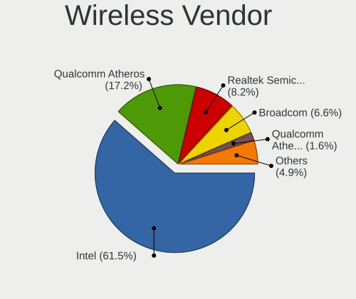

| Vendor                          | Notebooks | Percent |
|---------------------------------|-----------|---------|
| Intel                           | 75        | 61.48%  |
| Qualcomm Atheros                | 21        | 17.21%  |
| Realtek Semiconductor           | 10        | 8.2%    |
| Broadcom                        | 8         | 6.56%   |
| Qualcomm Atheros Communications | 2         | 1.64%   |
| Dell                            | 2         | 1.64%   |
| TP-Link                         | 1         | 0.82%   |
| Ralink Technology               | 1         | 0.82%   |
| IMC Networks                    | 1         | 0.82%   |
| Atheros                         | 1         | 0.82%   |

Wireless Model
--------------

Wireless models

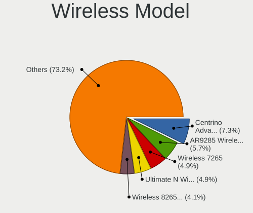

| Model                                                                         | Notebooks | Percent |
|-------------------------------------------------------------------------------|-----------|---------|
| Intel Centrino Advanced-N 6205 [Taylor Peak]                                  | 9         | 7.32%   |
| Qualcomm Atheros AR9285 Wireless Network Adapter (PCI-Express)                | 7         | 5.69%   |
| Intel Wireless 7265                                                           | 6         | 4.88%   |
| Intel Ultimate N WiFi Link 5300                                               | 6         | 4.88%   |
| Intel Wireless 8265 / 8275                                                    | 5         | 4.07%   |
| Intel Wireless 8260                                                           | 4         | 3.25%   |
| Intel Wireless 7260                                                           | 4         | 3.25%   |
| Intel Wireless 3165                                                           | 4         | 3.25%   |
| Intel Wi-Fi 6 AX201                                                           | 4         | 3.25%   |
| Intel Comet Lake PCH-LP CNVi WiFi                                             | 4         | 3.25%   |
| Qualcomm Atheros QCA9565 / AR9565 Wireless Network Adapter                    | 3         | 2.44%   |
| Intel Centrino Advanced-N 6200                                                | 3         | 2.44%   |
| Intel Cannon Lake PCH CNVi WiFi                                               | 3         | 2.44%   |
| Realtek RTL8852BE PCIe 802.11ax Wireless Network Controller                   | 2         | 1.63%   |
| Realtek RTL8822CE 802.11ac PCIe Wireless Network Adapter                      | 2         | 1.63%   |
| Realtek RTL8821CE 802.11ac PCIe Wireless Network Adapter                      | 2         | 1.63%   |
| Realtek RTL8188EUS 802.11n Wireless Network Adapter                           | 2         | 1.63%   |
| Qualcomm Atheros AR9485 Wireless Network Adapter                              | 2         | 1.63%   |
| Qualcomm Atheros AR9462 Wireless Network Adapter                              | 2         | 1.63%   |
| Qualcomm Atheros AR9287 Wireless Network Adapter (PCI-Express)                | 2         | 1.63%   |
| Intel Wi-Fi 6E(802.11ax) AX210/AX1675* 2x2 [Typhoon Peak]                     | 2         | 1.63%   |
| Intel Wi-Fi 6 AX200                                                           | 2         | 1.63%   |
| Intel Wi-Fi 5(802.11ac) Wireless-AC 9x6x [Thunder Peak]                       | 2         | 1.63%   |
| Intel PRO/Wireless 5100 AGN [Shiloh] Network Connection                       | 2         | 1.63%   |
| Intel Centrino Wireless-N 1030 [Rainbow Peak]                                 | 2         | 1.63%   |
| Intel Centrino Advanced-N 6235                                                | 2         | 1.63%   |
| Broadcom BCM43602 802.11ac Wireless LAN SoC                                   | 2         | 1.63%   |
| Broadcom BCM43142 802.11b/g/n                                                 | 2         | 1.63%   |
| Broadcom BCM4313 802.11bgn Wireless Network Adapter                           | 2         | 1.63%   |
| TP-Link AC600 wireless Realtek RTL8811AU [Archer T2U Nano]                    | 1         | 0.81%   |
| Realtek RTL8822BE 802.11a/b/g/n/ac WiFi adapter                               | 1         | 0.81%   |
| Realtek RTL8188CUS 802.11n WLAN Adapter                                       | 1         | 0.81%   |
| Ralink RT5370 Wireless Adapter                                                | 1         | 0.81%   |
| Qualcomm Atheros QCA9377 802.11ac Wireless Network Adapter                    | 1         | 0.81%   |
| Qualcomm Atheros TP-Link TL-WN821N v2 / TL-WN822N v1 802.11n [Atheros AR9170] | 1         | 0.81%   |
| Qualcomm Atheros AR9271 802.11n                                               | 1         | 0.81%   |
| Qualcomm Atheros AR93xx Wireless Network Adapter                              | 1         | 0.81%   |
| Qualcomm Atheros AR928X Wireless Network Adapter (PCI-Express)                | 1         | 0.81%   |
| Qualcomm Atheros AR242x / AR542x Wireless Network Adapter (PCI-Express)       | 1         | 0.81%   |
| Qualcomm Atheros AR2413/AR2414 Wireless Network Adapter [AR5005G(S) 802.11bg] | 1         | 0.81%   |

Ethernet Vendor
---------------

Ethernet vendors

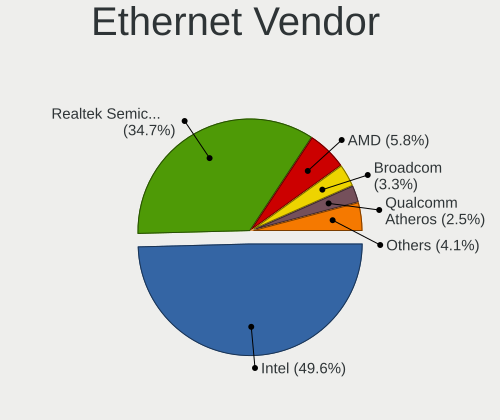

| Vendor                           | Notebooks | Percent |
|----------------------------------|-----------|---------|
| Intel                            | 60        | 49.59%  |
| Realtek Semiconductor            | 42        | 34.71%  |
| AMD                              | 7         | 5.79%   |
| Broadcom                         | 4         | 3.31%   |
| Qualcomm Atheros                 | 3         | 2.48%   |
| VIA Technologies                 | 1         | 0.83%   |
| Silicon Integrated Systems [SiS] | 1         | 0.83%   |
| Samsung Electronics              | 1         | 0.83%   |
| OnePlus Technology (Shenzhen)    | 1         | 0.83%   |
| Marvell Technology Group         | 1         | 0.83%   |

Ethernet Model
--------------

Ethernet models

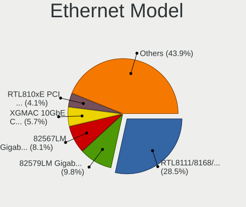

| Model                                                                  | Notebooks | Percent |
|------------------------------------------------------------------------|-----------|---------|
| Realtek RTL8111/8168/8211/8411 PCI Express Gigabit Ethernet Controller | 35        | 28.46%  |
| Intel 82579LM Gigabit Network Connection (Lewisville)                  | 12        | 9.76%   |
| Intel 82567LM Gigabit Network Connection                               | 10        | 8.13%   |
| AMD XGMAC 10GbE Controller                                             | 7         | 5.69%   |
| Realtek RTL810xE PCI Express Fast Ethernet controller                  | 5         | 4.07%   |
| Intel I211 Gigabit Network Connection                                  | 5         | 4.07%   |
| Intel I210 Gigabit Network Connection                                  | 3         | 2.44%   |
| Intel Ethernet Controller I225-V                                       | 3         | 2.44%   |
| Intel Ethernet Connection I219-LM                                      | 3         | 2.44%   |
| Intel Ethernet Connection I218-LM                                      | 3         | 2.44%   |
| Intel Ethernet Connection (4) I219-LM                                  | 3         | 2.44%   |
| Intel Ethernet Connection (3) I218-LM                                  | 3         | 2.44%   |
| Intel 82577LM Gigabit Network Connection                               | 3         | 2.44%   |
| Qualcomm Atheros AR8162 Fast Ethernet                                  | 2         | 1.63%   |
| Intel Ethernet Controller I226-V                                       | 2         | 1.63%   |
| Intel Ethernet Connection I217-LM                                      | 2         | 1.63%   |
| Intel Ethernet Connection (10) I219-V                                  | 2         | 1.63%   |
| VIA VT6102/VT6103 [Rhine-II]                                           | 1         | 0.81%   |
| Silicon Integrated Systems [SiS] 191 Gigabit Ethernet Adapter          | 1         | 0.81%   |
| Samsung Galaxy series, misc. (tethering mode)                          | 1         | 0.81%   |
| Realtek USB 2.5GbE Controller                                          | 1         | 0.81%   |
| Realtek RTL8125 2.5GbE Controller                                      | 1         | 0.81%   |
| Realtek RTL-8100/8101L/8139 PCI Fast Ethernet Adapter                  | 1         | 0.81%   |
| Qualcomm Atheros QCA8172 Fast Ethernet                                 | 1         | 0.81%   |
| OnePlus (Shenzhen) Android Remote NDIS Device                          | 1         | 0.81%   |
| Marvell Group 88E8040 PCI-E Fast Ethernet Controller                   | 1         | 0.81%   |
| Intel Ethernet Connection I219-V                                       | 1         | 0.81%   |
| Intel Ethernet Connection (7) I219-V                                   | 1         | 0.81%   |
| Intel Ethernet Connection (6) I219-LM                                  | 1         | 0.81%   |
| Intel Ethernet Connection (4) I219-V                                   | 1         | 0.81%   |
| Intel Ethernet Connection (10) I219-LM                                 | 1         | 0.81%   |
| Intel 82579V Gigabit Network Connection                                | 1         | 0.81%   |
| Intel 82574L Gigabit Network Connection                                | 1         | 0.81%   |
| Broadcom NetXtreme BCM5751M Gigabit Ethernet PCI Express               | 1         | 0.81%   |
| Broadcom NetLink BCM5784M Gigabit Ethernet PCIe                        | 1         | 0.81%   |
| Broadcom NetLink BCM57785 Gigabit Ethernet PCIe                        | 1         | 0.81%   |
| Broadcom NetLink BCM57780 Gigabit Ethernet PCIe                        | 1         | 0.81%   |

Net Controller Kind
-------------------

Ethernet, WiFi or modem

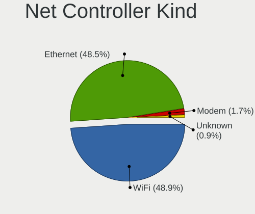

| Kind     | Notebooks | Percent |
|----------|-----------|---------|
| WiFi     | 114       | 48.93%  |
| Ethernet | 113       | 48.5%   |
| Modem    | 4         | 1.72%   |
| Unknown  | 2         | 0.86%   |

Used Controller
---------------

Currently used network controller

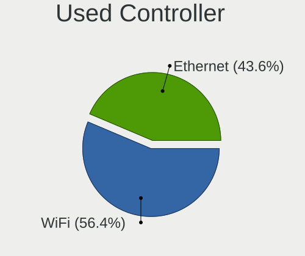

| Kind     | Notebooks | Percent |
|----------|-----------|---------|
| WiFi     | 84        | 56.38%  |
| Ethernet | 65        | 43.62%  |

NICs
----

Total network controllers on board

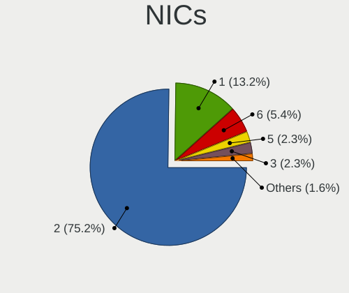

| Total | Notebooks | Percent |
|-------|-----------|---------|
| 2     | 97        | 75.19%  |
| 1     | 17        | 13.18%  |
| 6     | 7         | 5.43%   |
| 5     | 3         | 2.33%   |
| 3     | 3         | 2.33%   |
| 0     | 2         | 1.55%   |

IPv6
----

IPv6 vs IPv4

| Used | Notebooks | Percent |
|------|-----------|---------|
| No   | 128       | 99.22%  |
| Yes  | 1         | 0.78%   |

Bluetooth
---------

Bluetooth Vendor
----------------

Controller vendors

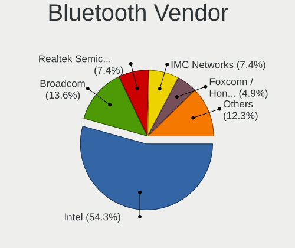

| Vendor                          | Notebooks | Percent |
|---------------------------------|-----------|---------|
| Intel                           | 44        | 54.32%  |
| Broadcom                        | 11        | 13.58%  |
| Realtek Semiconductor           | 6         | 7.41%   |
| IMC Networks                    | 6         | 7.41%   |
| Foxconn / Hon Hai               | 4         | 4.94%   |
| Qualcomm Atheros Communications | 3         | 3.7%    |
| Dell                            | 2         | 2.47%   |
| Apple                           | 2         | 2.47%   |
| Lite-On Technology              | 1         | 1.23%   |
| Hewlett-Packard                 | 1         | 1.23%   |
| ASUSTek Computer                | 1         | 1.23%   |

Bluetooth Model
---------------

Controller models

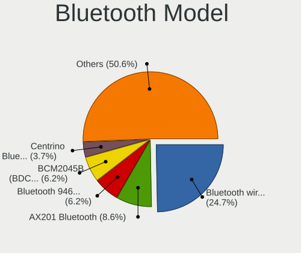

| Model                                                    | Notebooks | Percent |
|----------------------------------------------------------|-----------|---------|
| Intel Bluetooth wireless interface                       | 20        | 24.69%  |
| Intel AX201 Bluetooth                                    | 7         | 8.64%   |
| Intel Bluetooth 9460/9560 Jefferson Peak (JfP)           | 5         | 6.17%   |
| Broadcom BCM2045B (BDC-2.1) [Bluetooth Controller]       | 5         | 6.17%   |
| Intel Centrino Bluetooth Wireless Transceiver            | 3         | 3.7%    |
| Intel Centrino Advanced-N 6230 Bluetooth adapter         | 3         | 3.7%    |
| Broadcom BCM20702 Bluetooth 4.0 [ThinkPad]               | 3         | 3.7%    |
| Realtek Bluetooth Adapter                                | 2         | 2.47%   |
| Intel AX210 Bluetooth                                    | 2         | 2.47%   |
| Intel AX200 Bluetooth                                    | 2         | 2.47%   |
| IMC Networks Atheros AR3012 Bluetooth 4.0 Adapter        | 2         | 2.47%   |
| IMC Networks Asus Integrated Bluetooth module [AR3011]   | 2         | 2.47%   |
| Foxconn / Hon Hai Broadcom BCM20702 Bluetooth            | 2         | 2.47%   |
| Apple Bluetooth Host Controller                          | 2         | 2.47%   |
| Realtek Wireless Bluetooth Adapter                       | 1         | 1.23%   |
| Realtek RTL8822BE Bluetooth 4.2 Adapter                  | 1         | 1.23%   |
| Realtek  Bluetooth 4.2 Adapter                           | 1         | 1.23%   |
| Realtek Bluetooth 4.2 Adapter                            | 1         | 1.23%   |
| Qualcomm Atheros QCA9377 Bluetooth 4.1                   | 1         | 1.23%   |
| Qualcomm Atheros Dell Wireless 1601 Bluetooth Device     | 1         | 1.23%   |
| Qualcomm Atheros AR3012 Bluetooth 4.0                    | 1         | 1.23%   |
| Lite-On Qualcomm Atheros Bluetooth 4.0 + HS              | 1         | 1.23%   |
| Intel Wireless-AC 9260 Bluetooth Adapter                 | 1         | 1.23%   |
| Intel AX211 Bluetooth                                    | 1         | 1.23%   |
| IMC Networks Realtek Bluetooth Adapter                   | 1         | 1.23%   |
| IMC Networks Qualcomm Atheros Bluetooth 4.0 + HS         | 1         | 1.23%   |
| HP Atheros AR9285 Malbec Bluetooth Adapter               | 1         | 1.23%   |
| Foxconn / Hon Hai Broadcom BCM20702 Bluetooth USB Device | 1         | 1.23%   |
| Foxconn / Hon Hai Bluetooth USB Module                   | 1         | 1.23%   |
| Dell DW375 Bluetooth Module                              | 1         | 1.23%   |
| Dell Dell Wireless 380 Bluetooth 4.0 Module              | 1         | 1.23%   |
| Broadcom BCM43142A0 Bluetooth Module                     | 1         | 1.23%   |
| Broadcom BCM43142A0 Bluetooth 4.0                        | 1         | 1.23%   |
| Broadcom BCM2045B (BDC-2.1)                              | 1         | 1.23%   |
| ASUS BT-253 Bluetooth Adapter                            | 1         | 1.23%   |

Sound
-----

Sound Vendor
------------

Sound card vendors

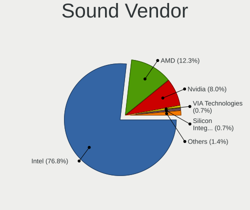

| Vendor                           | Notebooks | Percent |
|----------------------------------|-----------|---------|
| Intel                            | 106       | 76.81%  |
| AMD                              | 17        | 12.32%  |
| Nvidia                           | 11        | 7.97%   |
| VIA Technologies                 | 1         | 0.72%   |
| Silicon Integrated Systems [SiS] | 1         | 0.72%   |
| Realtek Semiconductor            | 1         | 0.72%   |
| Kingston Technology              | 1         | 0.72%   |

Sound Model
-----------

Sound card models

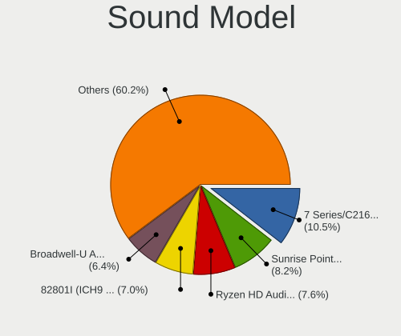

| Model                                                                      | Notebooks | Percent |
|----------------------------------------------------------------------------|-----------|---------|
| Intel 7 Series/C216 Chipset Family High Definition Audio Controller        | 18        | 10.53%  |
| Intel Sunrise Point-LP HD Audio                                            | 14        | 8.19%   |
| AMD Ryzen HD Audio Controller                                              | 13        | 7.6%    |
| Intel 82801I (ICH9 Family) HD Audio Controller                             | 12        | 7.02%   |
| Intel Broadwell-U Audio Controller                                         | 11        | 6.43%   |
| Intel Wildcat Point-LP High Definition Audio Controller                    | 10        | 5.85%   |
| Intel 6 Series/C200 Series Chipset Family High Definition Audio Controller | 10        | 5.85%   |
| Intel Haswell-ULT HD Audio Controller                                      | 6         | 3.51%   |
| Intel 8 Series HD Audio Controller                                         | 6         | 3.51%   |
| AMD Raven/Raven2/Fenghuang HDMI/DP Audio Controller                        | 6         | 3.51%   |
| Intel 8 Series/C220 Series Chipset High Definition Audio Controller        | 5         | 2.92%   |
| Intel 5 Series/3400 Series Chipset High Definition Audio                   | 5         | 2.92%   |
| Nvidia GF108 High Definition Audio Controller                              | 4         | 2.34%   |
| Intel Tiger Lake-LP Smart Sound Technology Audio Controller                | 4         | 2.34%   |
| Intel Comet Lake PCH-LP cAVS                                               | 4         | 2.34%   |
| Intel Cannon Lake PCH cAVS                                                 | 4         | 2.34%   |
| AMD Renoir/Cezanne HDMI/DP Audio Controller                                | 4         | 2.34%   |
| Nvidia TU107 GeForce GTX 1650 High Definition Audio Controller             | 3         | 1.75%   |
| Intel Xeon E3-1200 v3/4th Gen Core Processor HD Audio Controller           | 3         | 1.75%   |
| Intel Atom Processor Z36xxx/Z37xxx Series High Definition Audio Controller | 3         | 1.75%   |
| Nvidia GA107 High Definition Audio Controller                              | 2         | 1.17%   |
| Intel Crystal Well HD Audio Controller                                     | 2         | 1.17%   |
| Intel Cannon Point-LP High Definition Audio Controller                     | 2         | 1.17%   |
| Intel 82801FB/FBM/FR/FW/FRW (ICH6 Family) AC'97 Audio Controller           | 2         | 1.17%   |
| VIA Technologies VX900/VT8xxx High Definition Audio Controller             | 1         | 0.58%   |
| Silicon Integrated Systems [SiS] Azalia Audio Controller                   | 1         | 0.58%   |
| Realtek Semiconductor TX 384kb Hifi Type_C Audio                           | 1         | 0.58%   |
| Nvidia GT216 HDMI Audio Controller                                         | 1         | 0.58%   |
| Nvidia AD107 High Definition Audio Controller                              | 1         | 0.58%   |
| Kingston Technology HyperX 7.1 Audio                                       | 1         | 0.58%   |
| Intel Raptor Lake High Definition Audio Controller                         | 1         | 0.58%   |
| Intel NM10/ICH7 Family High Definition Audio Controller                    | 1         | 0.58%   |
| Intel Comet Lake PCH cAVS                                                  | 1         | 0.58%   |
| Intel CM238 HD Audio Controller                                            | 1         | 0.58%   |
| Intel Celeron/Pentium Silver Processor High Definition Audio               | 1         | 0.58%   |
| Intel 82801H (ICH8 Family) HD Audio Controller                             | 1         | 0.58%   |
| AMD Wrestler HDMI Audio                                                    | 1         | 0.58%   |
| AMD SBx00 Azalia (Intel HDA)                                               | 1         | 0.58%   |
| AMD Radeon High Definition Audio Controller                                | 1         | 0.58%   |
| AMD Kabini HDMI/DP Audio                                                   | 1         | 0.58%   |

Memory
------

Memory Vendor
-------------

Memory module vendors

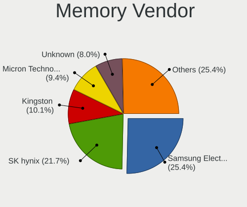

| Vendor              | Notebooks | Percent |
|---------------------|-----------|---------|
| Samsung Electronics | 35        | 25.36%  |
| SK hynix            | 30        | 21.74%  |
| Kingston            | 14        | 10.14%  |
| Micron Technology   | 13        | 9.42%   |
| Unknown             | 11        | 7.97%   |
| Transcend           | 7         | 5.07%   |
| Ramaxel Technology  | 5         | 3.62%   |
| GOODRAM             | 5         | 3.62%   |
| Unknown             | 5         | 3.62%   |
| Nanya Technology    | 3         | 2.17%   |
| Elpida              | 3         | 2.17%   |
| Corsair             | 2         | 1.45%   |
| A-DATA Technology   | 2         | 1.45%   |
| SHARETRONIC         | 1         | 0.72%   |
| G.Skill             | 1         | 0.72%   |
| Crucial             | 1         | 0.72%   |

Memory Model
------------

Memory module models

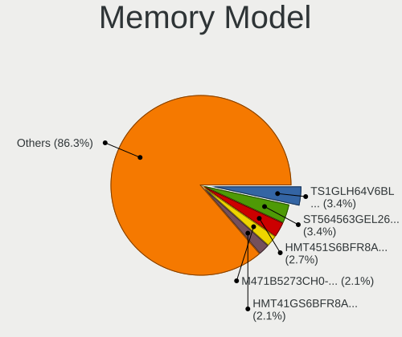

| Model                                                     | Notebooks | Percent |
|-----------------------------------------------------------|-----------|---------|
| Transcend RAM TS1GLH64V6BL 8GB SODIMM DDR4 2667MT/s       | 5         | 3.42%   |
| Unknown                                                   | 5         | 3.42%   |
| SK hynix RAM HMT451S6BFR8A-PB 4GB SODIMM DDR3 1600MT/s    | 4         | 2.74%   |
| SK hynix RAM HMT41GS6BFR8A-PB 8GB SODIMM DDR3 1600MT/s    | 3         | 2.05%   |
| SK hynix RAM HMT325S6BFR8C-H9 2GB SODIMM DDR3 1333MT/s    | 3         | 2.05%   |
| Samsung RAM M471B5273CH0-CH9 4GB SODIMM DDR3 1334MT/s     | 3         | 2.05%   |
| Unknown RAM Module 512MB SODIMM DDR                       | 2         | 1.37%   |
| Unknown RAM Module 4GB SODIMM DDR3 1333MT/s               | 2         | 1.37%   |
| SK hynix RAM Module 8GB SODIMM DDR3 1600MT/s              | 2         | 1.37%   |
| SK hynix RAM HMT41GS6AFR8A-PB 8GB SODIMM DDR3 1600MT/s    | 2         | 1.37%   |
| SK hynix RAM HMT351S6BFR8C-H9 4GB SODIMM DDR3 1334MT/s    | 2         | 1.37%   |
| SK hynix RAM HMAA1GS6CJR6N-XN 8GB SODIMM DDR4 3200MT/s    | 2         | 1.37%   |
| SK hynix RAM HMA81GS6AFR8N-UH 8GB SODIMM DDR4 2400MT/s    | 2         | 1.37%   |
| Samsung RAM M471B5673FH0-CF8 2GB SODIMM DDR3 1067MT/s     | 2         | 1.37%   |
| Samsung RAM M471B5273DH0-CH9 4GB SODIMM DDR3 1334MT/s     | 2         | 1.37%   |
| Samsung RAM M471B5173QH0-YK0 4GB SODIMM DDR3 1600MT/s     | 2         | 1.37%   |
| Samsung RAM M471B5173DB0-YK0 4GB SODIMM DDR3 1600MT/s     | 2         | 1.37%   |
| Samsung RAM M471B1G73BH0-CK0 8GB SODIMM DDR3 1600MT/s     | 2         | 1.37%   |
| Samsung RAM M471A1K43EB1-CWE 8GB SODIMM DDR4 3200MT/s     | 2         | 1.37%   |
| Samsung RAM M471A1G44AB0-CWE 8GB SODIMM DDR4 3200MT/s     | 2         | 1.37%   |
| Ramaxel RAM RMSA3260ME78HAF-2666 8GB SODIMM DDR4 2667MT/s | 2         | 1.37%   |
| Nanya RAM NT2GC64B88B0NS-CG 2GB SODIMM DDR3 1334MT/s      | 2         | 1.37%   |
| Micron RAM 8KTF51264HZ-1G6E1 4GB SODIMM DDR3 1600MT/s     | 2         | 1.37%   |
| Unknown RAM Module 8GB SODIMM DDR4 2400MT/s               | 1         | 0.68%   |
| Unknown RAM Module 8GB SODIMM DDR3 1600MT/s               | 1         | 0.68%   |
| Unknown RAM Module 4GB SODIMM DDR3 1600MT/s               | 1         | 0.68%   |
| Unknown RAM Module 4GB SODIMM DDR3                        | 1         | 0.68%   |
| Unknown RAM Module 4096MB SODIMM DDR3                     | 1         | 0.68%   |
| Unknown RAM Module 2GB SODIMM DDR2 800MT/s                | 1         | 0.68%   |
| Unknown RAM Module 2GB SODIMM DDR                         | 1         | 0.68%   |
| Unknown RAM Module 1GB SODIMM DRAM 533MT/s                | 1         | 0.68%   |
| Transcend RAM TS2GLH64V2B 16GB SODIMM DDR4 1600MT/s       | 1         | 0.68%   |
| Transcend RAM AQD-SD3L4GN16-S G 4GB SODIMM DDR3 1600MT/s  | 1         | 0.68%   |
| SK hynix RAM Module 8GB SODIMM DDR4 2133MT/s              | 1         | 0.68%   |
| SK hynix RAM Module 16GB SODIMM DDR4 2400MT/s             | 1         | 0.68%   |
| SK hynix RAM HMT451S6AFR8A-PB 4GB SODIMM DDR3 1600MT/s    | 1         | 0.68%   |
| SK hynix RAM HMT425S6MFR6A-PB 2GB SODIMM DDR3 1600MT/s    | 1         | 0.68%   |
| SK hynix RAM HMT41GS6DFR8A-PB 8GB SODIMM DDR3 1600MT/s    | 1         | 0.68%   |
| SK hynix RAM HMT351S6EFR8A-PB 4GB SODIMM DDR3 1333MT/s    | 1         | 0.68%   |
| SK hynix RAM HMT112S6TFR8C-H9 1GB SODIMM DDR3 1066MT/s    | 1         | 0.68%   |

Memory Kind
-----------

Memory module kinds

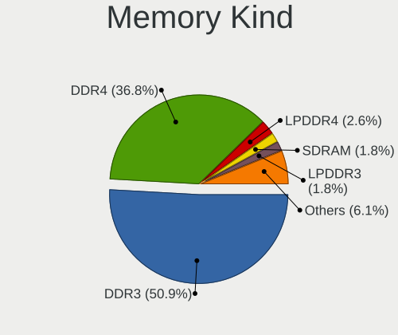

| Kind    | Notebooks | Percent |
|---------|-----------|---------|
| DDR3    | 58        | 50.88%  |
| DDR4    | 42        | 36.84%  |
| LPDDR4  | 3         | 2.63%   |
| SDRAM   | 2         | 1.75%   |
| LPDDR3  | 2         | 1.75%   |
| DDR5    | 2         | 1.75%   |
| DDR     | 2         | 1.75%   |
| DRAM    | 1         | 0.88%   |
| DDR2    | 1         | 0.88%   |
| Unknown | 1         | 0.88%   |

Memory Form Factor
------------------

Physical design of the memory module

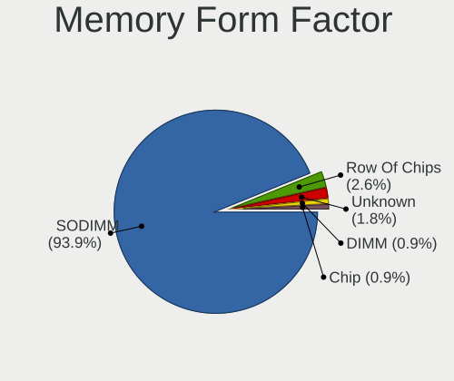

| Name         | Notebooks | Percent |
|--------------|-----------|---------|
| SODIMM       | 107       | 93.86%  |
| Row Of Chips | 3         | 2.63%   |
| Unknown      | 2         | 1.75%   |
| DIMM         | 1         | 0.88%   |
| Chip         | 1         | 0.88%   |

Memory Size
-----------

Memory module size

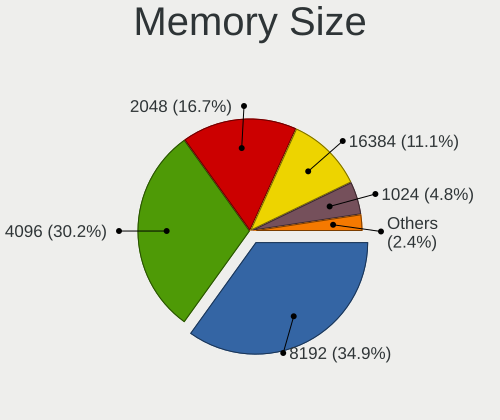

| Size  | Notebooks | Percent |
|-------|-----------|---------|
| 8192  | 44        | 34.92%  |
| 4096  | 38        | 30.16%  |
| 2048  | 21        | 16.67%  |
| 16384 | 14        | 11.11%  |
| 1024  | 6         | 4.76%   |
| 512   | 2         | 1.59%   |
| 32768 | 1         | 0.79%   |

Memory Speed
------------

Memory module speed

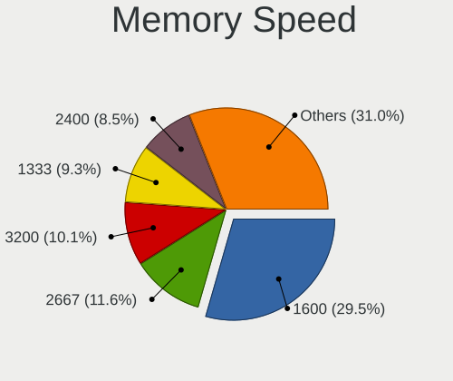

| Speed   | Notebooks | Percent |
|---------|-----------|---------|
| 1600    | 38        | 29.46%  |
| 2667    | 15        | 11.63%  |
| 3200    | 13        | 10.08%  |
| 1333    | 12        | 9.3%    |
| 2400    | 11        | 8.53%   |
| 1334    | 10        | 7.75%   |
| 2133    | 5         | 3.88%   |
| Unknown | 5         | 3.88%   |
| 1067    | 4         | 3.1%    |
| 800     | 4         | 3.1%    |
| 1867    | 3         | 2.33%   |
| 1066    | 3         | 2.33%   |
| 4267    | 2         | 1.55%   |
| 5600    | 1         | 0.78%   |
| 4800    | 1         | 0.78%   |
| 2048    | 1         | 0.78%   |
| 533     | 1         | 0.78%   |

Printers & scanners
-------------------

Printer Vendor
--------------

Printer device vendors

Zero info for selected period =(

Printer Model
-------------

Printer device models

Zero info for selected period =(

Scanner Vendor
--------------

Scanner device vendors

Zero info for selected period =(

Scanner Model
-------------

Scanner device models

Zero info for selected period =(

Camera
------

Camera Vendor
-------------

Camera device vendors

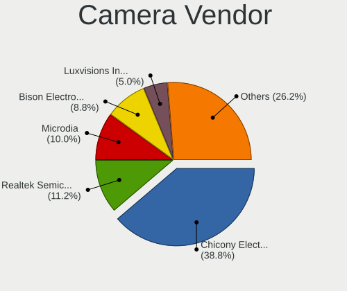

| Vendor                                 | Notebooks | Percent |
|----------------------------------------|-----------|---------|
| Chicony Electronics                    | 31        | 38.75%  |
| Realtek Semiconductor                  | 9         | 11.25%  |
| Microdia                               | 8         | 10%     |
| Bison Electronics                      | 7         | 8.75%   |
| Luxvisions Innotech Limited            | 4         | 5%      |
| Syntek                                 | 3         | 3.75%   |
| IMC Networks                           | 3         | 3.75%   |
| Cheng Uei Precision Industry (Foxlink) | 3         | 3.75%   |
| Suyin                                  | 2         | 2.5%    |
| Ricoh                                  | 2         | 2.5%    |
| Lite-On Technology                     | 2         | 2.5%    |
| Sunplus Innovation Technology          | 1         | 1.25%   |
| Quanta                                 | 1         | 1.25%   |
| Logitech                               | 1         | 1.25%   |
| DigiTech                               | 1         | 1.25%   |
| ALi                                    | 1         | 1.25%   |
| Alcor Micro                            | 1         | 1.25%   |

Camera Model
------------

Camera device models

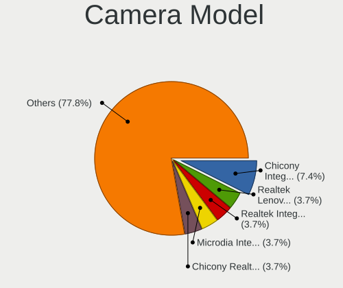

| Model                                                 | Notebooks | Percent |
|-------------------------------------------------------|-----------|---------|
| Chicony Integrated Camera                             | 6         | 7.41%   |
| Realtek Lenovo EasyCamera                             | 3         | 3.7%    |
| Realtek Integrated_Webcam_HD                          | 3         | 3.7%    |
| Microdia Integrated Webcam                            | 3         | 3.7%    |
| Chicony Realtek DMFT RGB                              | 3         | 3.7%    |
| Chicony Integrated Camera [ThinkPad]                  | 3         | 3.7%    |
| Chicony Integrated Camera (1280x720@30)               | 3         | 3.7%    |
| Syntek Integrated Camera                              | 2         | 2.47%   |
| Microdia Integrated_Webcam_HD                         | 2         | 2.47%   |
| Luxvisions Innotech Limited HP TrueVision HD Camera   | 2         | 2.47%   |
| Lite-On Integrated Camera                             | 2         | 2.47%   |
| IMC Networks Integrated Camera                        | 2         | 2.47%   |
| Chicony HP HD Camera                                  | 2         | 2.47%   |
| Bison Lenovo EasyCamera                               | 2         | 2.47%   |
| Bison Integrated Camera                               | 2         | 2.47%   |
| Syntek Lenovo EasyCamera                              | 1         | 1.23%   |
| Suyin Acer/HP Integrated Webcam [CN0314]              | 1         | 1.23%   |
| Suyin Acer Crystal Eye webcam                         | 1         | 1.23%   |
| Sunplus Integrated_Webcam_HD                          | 1         | 1.23%   |
| Ricoh Integrated Webcam                               | 1         | 1.23%   |
| Ricoh HD Webcam                                       | 1         | 1.23%   |
| Realtek USB2.0 HD UVC WebCam                          | 1         | 1.23%   |
| Realtek HD WebCam                                     | 1         | 1.23%   |
| Realtek Front Camera                                  | 1         | 1.23%   |
| Quanta Realtek DMFT RGB                               | 1         | 1.23%   |
| Microdia Laptop_Integrated_Webcam_HD                  | 1         | 1.23%   |
| Microdia Integrated HD Webcam                         | 1         | 1.23%   |
| Microdia Dell Integrated HD Webcam                    | 1         | 1.23%   |
| Luxvisions Innotech Limited Integrated Camera         | 1         | 1.23%   |
| Luxvisions Innotech Limited HP True Vision FHD Camera | 1         | 1.23%   |
| Logitech HD Pro Webcam C920                           | 1         | 1.23%   |
| IMC Networks EasyCamera                               | 1         | 1.23%   |
| DigiTech WebCam SCB-0350M                             | 1         | 1.23%   |
| Chicony USB2.0 VGA UVC WebCam                         | 1         | 1.23%   |
| Chicony USB2.0 HD UVC WebCam                          | 1         | 1.23%   |
| Chicony ThinkPad T490 Webcam                          | 1         | 1.23%   |
| Chicony Realtek DMFT IR                               | 1         | 1.23%   |
| Chicony Lenovo Integrated Camera (0.3MP)              | 1         | 1.23%   |
| Chicony Lenovo EasyCamera                             | 1         | 1.23%   |
| Chicony HP Integrated Webcam                          | 1         | 1.23%   |

Security
--------

Fingerprint Vendor
------------------

Fingerprint sensor vendors

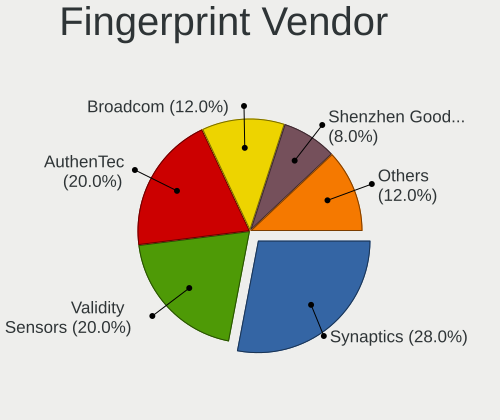

| Vendor                     | Notebooks | Percent |
|----------------------------|-----------|---------|
| Synaptics                  | 7         | 28%     |
| Validity Sensors           | 5         | 20%     |
| AuthenTec                  | 5         | 20%     |
| Broadcom                   | 3         | 12%     |
| Shenzhen Goodix Technology | 2         | 8%      |
| Upek                       | 1         | 4%      |
| STMicroelectronics         | 1         | 4%      |
| Elan Microelectronics      | 1         | 4%      |

Fingerprint Model
-----------------

Fingerprint sensor models

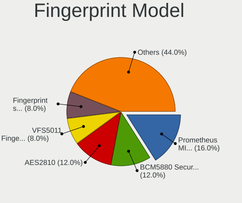

| Model                                                                        | Notebooks | Percent |
|------------------------------------------------------------------------------|-----------|---------|
| Synaptics Prometheus MIS Touch Fingerprint Reader                            | 4         | 16%     |
| Broadcom BCM5880 Secure Applications Processor with fingerprint swipe sensor | 3         | 12%     |
| AuthenTec AES2810                                                            | 3         | 12%     |
| Validity Sensors VFS5011 Fingerprint Reader                                  | 2         | 8%      |
| Validity Sensors Fingerprint scanner                                         | 2         | 8%      |
| Synaptics Metallica MIS Touch Fingerprint Reader                             | 2         | 8%      |
| Shenzhen Goodix Fingerprint Reader                                           | 2         | 8%      |
| AuthenTec AES2660                                                            | 2         | 8%      |
| Validity Sensors VFS495 Fingerprint Reader                                   | 1         | 4%      |
| Upek Biometric Touchchip/Touchstrip Fingerprint Sensor                       | 1         | 4%      |
| Synaptics WBDI                                                               | 1         | 4%      |
| STMicroelectronics Fingerprint Reader                                        | 1         | 4%      |
| Elan Fingerprint Sensor                                                      | 1         | 4%      |

Chipcard Vendor
---------------

Chipcard module vendors

Zero info for selected period =(

Chipcard Model
--------------

Chipcard module models

Zero info for selected period =(

Unsupported
-----------

Unsupported Devices
-------------------

Total unsupported devices on board

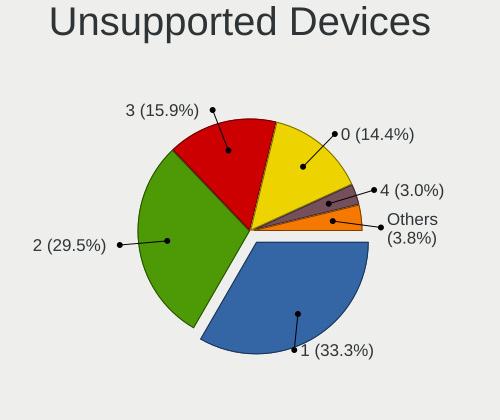

| Total | Notebooks | Percent |
|-------|-----------|---------|
| 1     | 44        | 33.33%  |
| 2     | 39        | 29.55%  |
| 3     | 21        | 15.91%  |
| 0     | 19        | 14.39%  |
| 4     | 4         | 3.03%   |
| 5     | 3         | 2.27%   |
| 6     | 2         | 1.52%   |

Unsupported Device Types
------------------------

Types of unsupported devices

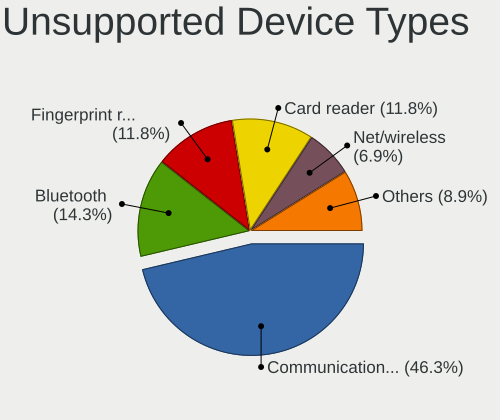

| Type                     | Notebooks | Percent |
|--------------------------|-----------|---------|
| Communication controller | 94        | 46.31%  |
| Bluetooth                | 29        | 14.29%  |
| Fingerprint reader       | 24        | 11.82%  |
| Card reader              | 24        | 11.82%  |
| Net/wireless             | 14        | 6.9%    |
| Graphics card            | 8         | 3.94%   |
| Firewire controller      | 3         | 1.48%   |
| Sound                    | 2         | 0.99%   |
| Network                  | 2         | 0.99%   |
| Modem                    | 2         | 0.99%   |
| Net/ethernet             | 1         | 0.49%   |

