BSD in Poland - Tested Hardware & Statistics (Notebooks)
--------------------------------------------------------

A project to collect tested hardware configurations for BSD in Poland.

Anyone can contribute to this report by the [hw-probe](https://github.com/linuxhw/hw-probe/blob/master/INSTALL.BSD.md) tool:

    hw-probe -all -upload

Please contribute! Especially if your hardware is rare.

Contents
--------

* [ Test Cases ](#test-cases)

* [ System ](#system)
  - [ OS                       ](#os)
  - [ OS Family                ](#os-family)
  - [ Arch                     ](#arch)
  - [ DE                       ](#de)
  - [ Display Server           ](#display-server)
  - [ Display Manager          ](#display-manager)
  - [ OS Lang                  ](#os-lang)
  - [ Boot Mode                ](#boot-mode)
  - [ Filesystem               ](#filesystem)
  - [ Part. scheme             ](#part-scheme)

* [ Board ](#board)
  - [ Vendor                   ](#vendor)
  - [ Model                    ](#model)
  - [ Model Family             ](#model-family)
  - [ MFG Year                 ](#mfg-year)
  - [ Form Factor              ](#form-factor)
  - [ Coreboot                 ](#coreboot)
  - [ RAM Size                 ](#ram-size)
  - [ RAM Used                 ](#ram-used)
  - [ Total Drives             ](#total-drives)
  - [ Has CD-ROM               ](#has-cd-rom)
  - [ Has Ethernet             ](#has-ethernet)
  - [ Has WiFi                 ](#has-wifi)
  - [ Has Bluetooth            ](#has-bluetooth)

* [ Location ](#location)
  - [ Country                  ](#country)
  - [ City                     ](#city)

* [ Drives ](#drives)
  - [ Drive Vendor             ](#drive-vendor)
  - [ Drive Model              ](#drive-model)
  - [ HDD Vendor               ](#hdd-vendor)
  - [ SSD Vendor               ](#ssd-vendor)
  - [ Drive Kind               ](#drive-kind)
  - [ Drive Connector          ](#drive-connector)
  - [ Drive Size               ](#drive-size)
  - [ Space Total              ](#space-total)
  - [ Space Used               ](#space-used)
  - [ Malfunc. Drives          ](#malfunc-drives)
  - [ Malfunc. Drive Vendor    ](#malfunc-drive-vendor)
  - [ Malfunc. HDD Vendor      ](#malfunc-hdd-vendor)
  - [ Malfunc. Drive Kind      ](#malfunc-drive-kind)
  - [ Failed Drives            ](#failed-drives)
  - [ Failed Drive Vendor      ](#failed-drive-vendor)
  - [ Drive Status             ](#drive-status)

* [ Storage controller ](#storage-controller)
  - [ Storage Vendor           ](#storage-vendor)
  - [ Storage Model            ](#storage-model)
  - [ Storage Kind             ](#storage-kind)

* [ Processor ](#processor)
  - [ CPU Vendor               ](#cpu-vendor)
  - [ CPU Model                ](#cpu-model)
  - [ CPU Model Family         ](#cpu-model-family)
  - [ CPU Cores                ](#cpu-cores)
  - [ CPU Sockets              ](#cpu-sockets)
  - [ CPU Threads              ](#cpu-threads)
  - [ CPU Microarch            ](#cpu-microarch)

* [ Graphics ](#graphics)
  - [ GPU Vendor               ](#gpu-vendor)
  - [ GPU Model                ](#gpu-model)
  - [ GPU Combo                ](#gpu-combo)
  - [ GPU Driver               ](#gpu-driver)
  - [ GPU Memory               ](#gpu-memory)

* [ Monitor ](#monitor)
  - [ Monitor Vendor           ](#monitor-vendor)
  - [ Monitor Model            ](#monitor-model)
  - [ Monitor Resolution       ](#monitor-resolution)
  - [ Monitor Diagonal         ](#monitor-diagonal)
  - [ Monitor Width            ](#monitor-width)
  - [ Aspect Ratio             ](#aspect-ratio)
  - [ Monitor Area             ](#monitor-area)
  - [ Pixel Density            ](#pixel-density)
  - [ Multiple Monitors        ](#multiple-monitors)

* [ Network ](#network)
  - [ Net Controller Vendor    ](#net-controller-vendor)
  - [ Net Controller Model     ](#net-controller-model)
  - [ Wireless Vendor          ](#wireless-vendor)
  - [ Wireless Model           ](#wireless-model)
  - [ Ethernet Vendor          ](#ethernet-vendor)
  - [ Ethernet Model           ](#ethernet-model)
  - [ Net Controller Kind      ](#net-controller-kind)
  - [ Used Controller          ](#used-controller)
  - [ NICs                     ](#nics)
  - [ IPv6                     ](#ipv6)

* [ Bluetooth ](#bluetooth)
  - [ Bluetooth Vendor         ](#bluetooth-vendor)
  - [ Bluetooth Model          ](#bluetooth-model)

* [ Sound ](#sound)
  - [ Sound Vendor             ](#sound-vendor)
  - [ Sound Model              ](#sound-model)

* [ Memory ](#memory)
  - [ Memory Vendor            ](#memory-vendor)
  - [ Memory Model             ](#memory-model)
  - [ Memory Kind              ](#memory-kind)
  - [ Memory Form Factor       ](#memory-form-factor)
  - [ Memory Size              ](#memory-size)
  - [ Memory Speed             ](#memory-speed)

* [ Printers & scanners ](#printers--scanners)
  - [ Printer Vendor           ](#printer-vendor)
  - [ Printer Model            ](#printer-model)
  - [ Scanner Vendor           ](#scanner-vendor)
  - [ Scanner Model            ](#scanner-model)

* [ Camera ](#camera)
  - [ Camera Vendor            ](#camera-vendor)
  - [ Camera Model             ](#camera-model)

* [ Security ](#security)
  - [ Fingerprint Vendor       ](#fingerprint-vendor)
  - [ Fingerprint Model        ](#fingerprint-model)
  - [ Chipcard Vendor          ](#chipcard-vendor)
  - [ Chipcard Model           ](#chipcard-model)

* [ Unsupported ](#unsupported)
  - [ Unsupported Devices      ](#unsupported-devices)
  - [ Unsupported Device Types ](#unsupported-device-types)

Test Cases
----------

Total: 77

| Vendor        | Model                       | Probe                                                     | Date         |
|---------------|-----------------------------|-----------------------------------------------------------|--------------|
| Lenovo        | ThinkPad X260 20F5S10W0H    | [bccdd2f331](https://bsd-hardware.info/?probe=bccdd2f331) | Jan 30, 2023 |
| HP            | EliteBook 840 G3            | [92c676e033](https://bsd-hardware.info/?probe=92c676e033) | Jan 26, 2023 |
| HP            | Laptop 15-bs0xx             | [7bd5f0c2e9](https://bsd-hardware.info/?probe=7bd5f0c2e9) | Jan 22, 2023 |
| Intel         | H81U                        | [08d2539153](https://bsd-hardware.info/?probe=08d2539153) | Jan 18, 2023 |
| Intel         | H81U                        | [fe47328dd0](https://bsd-hardware.info/?probe=fe47328dd0) | Jan 17, 2023 |
| Dell          | Latitude E6430              | [45f592a66f](https://bsd-hardware.info/?probe=45f592a66f) | Jan 06, 2023 |
| Dell          | Latitude E6430              | [1c4bec17bb](https://bsd-hardware.info/?probe=1c4bec17bb) | Jan 06, 2023 |
| Google        | Lars                        | [4130b19cfa](https://bsd-hardware.info/?probe=4130b19cfa) | Dec 03, 2022 |
| HP            | SpectreXT Pro 13-b000 PC    | [f45ea42873](https://bsd-hardware.info/?probe=f45ea42873) | Oct 16, 2022 |
| Lenovo        | G50-30 80G0                 | [da4bd87fee](https://bsd-hardware.info/?probe=da4bd87fee) | Sep 17, 2022 |
| Deciso        | NetBoard-A10                | [3547d9da9c](https://bsd-hardware.info/?probe=3547d9da9c) | Sep 01, 2022 |
| Lenovo        | ThinkPad X260 20F5S10W0H    | [2e7d570822](https://bsd-hardware.info/?probe=2e7d570822) | Aug 20, 2022 |
| Lenovo        | ThinkPad X260 20F5S10W0H    | [7afa139f4f](https://bsd-hardware.info/?probe=7afa139f4f) | Aug 20, 2022 |
| Lenovo        | ThinkPad T495 20NJ0010PB    | [078888676a](https://bsd-hardware.info/?probe=078888676a) | Jul 13, 2022 |
| Dell          | Latitude 5410               | [3334ff3727](https://bsd-hardware.info/?probe=3334ff3727) | Jun 06, 2022 |
| Lenovo        | ThinkPad X200 745969G       | [e973d1e806](https://bsd-hardware.info/?probe=e973d1e806) | Mar 18, 2022 |
| Dell          | Inspiron 5502               | [9e440b5500](https://bsd-hardware.info/?probe=9e440b5500) | Mar 13, 2022 |
| Dell          | Vostro 3550                 | [4bc5573cf5](https://bsd-hardware.info/?probe=4bc5573cf5) | Mar 02, 2022 |
| Dell          | Latitude E6430              | [fdde41404d](https://bsd-hardware.info/?probe=fdde41404d) | Feb 24, 2022 |
| Lenovo        | ThinkPad X200 745969G       | [a4341268d0](https://bsd-hardware.info/?probe=a4341268d0) | Feb 23, 2022 |
| Dell          | Vostro 3550                 | [11bed21472](https://bsd-hardware.info/?probe=11bed21472) | Feb 21, 2022 |
| Lenovo        | ThinkPad X200 745969G       | [c024d383e7](https://bsd-hardware.info/?probe=c024d383e7) | Feb 13, 2022 |
| Lenovo        | G580 20150                  | [478714c7c9](https://bsd-hardware.info/?probe=478714c7c9) | Feb 07, 2022 |
| Lenovo        | ThinkPad X200 745969G       | [f107f7c1b1](https://bsd-hardware.info/?probe=f107f7c1b1) | Feb 06, 2022 |
| Lenovo        | G500s 20245                 | [41f9f804ac](https://bsd-hardware.info/?probe=41f9f804ac) | Feb 04, 2022 |
| Dell          | Vostro 3550                 | [0b290f2ac3](https://bsd-hardware.info/?probe=0b290f2ac3) | Feb 02, 2022 |
| Lenovo        | ThinkPad X200 745969G       | [f8476c0ea7](https://bsd-hardware.info/?probe=f8476c0ea7) | Feb 01, 2022 |
| Dell          | Vostro 3550                 | [97ef0862c2](https://bsd-hardware.info/?probe=97ef0862c2) | Feb 01, 2022 |
| Dell          | Latitude E6430              | [e18a4bc564](https://bsd-hardware.info/?probe=e18a4bc564) | Jan 10, 2022 |
| Dell          | Inspiron N5110              | [19be37f181](https://bsd-hardware.info/?probe=19be37f181) | Jan 09, 2022 |
| Acer          | Aspire 5742G                | [b77a4ee97c](https://bsd-hardware.info/?probe=b77a4ee97c) | Dec 30, 2021 |
| Acer          | Aspire 5742G                | [b650885b00](https://bsd-hardware.info/?probe=b650885b00) | Dec 24, 2021 |
| Dell          | Latitude E5470              | [18470afd9d](https://bsd-hardware.info/?probe=18470afd9d) | Dec 19, 2021 |
| Dell          | G15 5510                    | [2da7a07664](https://bsd-hardware.info/?probe=2da7a07664) | Dec 07, 2021 |
| Dell          | G15 5510                    | [8846b3fd69](https://bsd-hardware.info/?probe=8846b3fd69) | Nov 27, 2021 |
| Lenovo        | IdeaPad S130-14IGM 81J2     | [7330a6f958](https://bsd-hardware.info/?probe=7330a6f958) | Nov 20, 2021 |
| Dell          | G15 5510                    | [e9d432bc06](https://bsd-hardware.info/?probe=e9d432bc06) | Nov 12, 2021 |
| Dell          | G15 5510                    | [91750755e4](https://bsd-hardware.info/?probe=91750755e4) | Nov 12, 2021 |
| Acer          | Aspire 5742G                | [0513869be8](https://bsd-hardware.info/?probe=0513869be8) | Nov 09, 2021 |
| Dell          | Latitude E6430              | [46f2ef2432](https://bsd-hardware.info/?probe=46f2ef2432) | Nov 08, 2021 |
| Dell          | Latitude E6430              | [d31f35bb29](https://bsd-hardware.info/?probe=d31f35bb29) | Oct 15, 2021 |
| Lenovo        | ThinkPad T14s Gen 1 20T1... | [fc1eda0998](https://bsd-hardware.info/?probe=fc1eda0998) | Oct 08, 2021 |
| ASUSTek       | X555LB                      | [e3443d9f27](https://bsd-hardware.info/?probe=e3443d9f27) | Oct 02, 2021 |
| IBM           | ThinkPad X41 2525FAG        | [63a34dc807](https://bsd-hardware.info/?probe=63a34dc807) | Sep 14, 2021 |
| Lenovo        | Unknown                     | [e16ce5e864](https://bsd-hardware.info/?probe=e16ce5e864) | Aug 08, 2021 |
| Fujitsu Si... | AMILO PRO V3515             | [77676fbcfc](https://bsd-hardware.info/?probe=77676fbcfc) | Jul 18, 2021 |
| Lenovo        | ThinkPad T470 W10DG 20JN... | [668bf95221](https://bsd-hardware.info/?probe=668bf95221) | Jun 25, 2021 |
| Lenovo        | ThinkPad T440 20B7S1860W    | [8552205176](https://bsd-hardware.info/?probe=8552205176) | Jun 22, 2021 |
| Lenovo        | IdeaPad 520-15IKB 81BF      | [9f82e215c3](https://bsd-hardware.info/?probe=9f82e215c3) | Jun 22, 2021 |
| Dell          | Vostro 3560                 | [ce9d5f9a46](https://bsd-hardware.info/?probe=ce9d5f9a46) | Jun 18, 2021 |
| Acer          | Aspire V3-571G              | [a9fe2f5aad](https://bsd-hardware.info/?probe=a9fe2f5aad) | Jun 16, 2021 |
| Dell          | Latitude 5400               | [1bb6c1f63f](https://bsd-hardware.info/?probe=1bb6c1f63f) | Jun 15, 2021 |
| Dell          | Latitude E6440              | [8fa2c1f5c4](https://bsd-hardware.info/?probe=8fa2c1f5c4) | Jun 13, 2021 |
| Dell          | Latitude E6440              | [77f259babe](https://bsd-hardware.info/?probe=77f259babe) | Jun 12, 2021 |
| Dell          | Latitude E6410              | [211fe874fd](https://bsd-hardware.info/?probe=211fe874fd) | May 22, 2021 |
| Dell          | Latitude E6440              | [3a656ded12](https://bsd-hardware.info/?probe=3a656ded12) | Apr 19, 2021 |
| Dell          | Latitude E6440              | [68f57531cb](https://bsd-hardware.info/?probe=68f57531cb) | Apr 19, 2021 |
| Dell          | Latitude E6440              | [a332efd9d9](https://bsd-hardware.info/?probe=a332efd9d9) | Mar 15, 2021 |
| HP            | ENVY dv7                    | [4637a9eeff](https://bsd-hardware.info/?probe=4637a9eeff) | Feb 14, 2021 |
| Dell          | Latitude E5430 vPro         | [bee421a110](https://bsd-hardware.info/?probe=bee421a110) | Feb 06, 2021 |
| Dell          | Latitude E5430 vPro         | [e8157ac6a3](https://bsd-hardware.info/?probe=e8157ac6a3) | Feb 06, 2021 |
| Notebook      | N85_N87,HJ,HJ1,HK1          | [3d18f3f8a9](https://bsd-hardware.info/?probe=3d18f3f8a9) | Jan 23, 2021 |
| Lenovo        | ThinkPad X200s 7470A98      | [41f36aa8b6](https://bsd-hardware.info/?probe=41f36aa8b6) | Dec 19, 2020 |
| Unknown       | Spring Peak                 | [b61f5c268a](https://bsd-hardware.info/?probe=b61f5c268a) | Dec 15, 2020 |
| PC Special... | Recoil II                   | [343eec31b5](https://bsd-hardware.info/?probe=343eec31b5) | Dec 06, 2020 |
| Panasonic     | CFMX4-1                     | [761d21f21a](https://bsd-hardware.info/?probe=761d21f21a) | Dec 06, 2020 |
| Lenovo        | Legion Y540-15IRH-PG0 81... | [dce3ba8c99](https://bsd-hardware.info/?probe=dce3ba8c99) | Nov 18, 2020 |
| Lenovo        | ThinkPad W520 4284W5L       | [2664153a6e](https://bsd-hardware.info/?probe=2664153a6e) | Oct 29, 2020 |
| Lenovo        | ThinkPad X230 23254S6       | [f4ac5ddaa4](https://bsd-hardware.info/?probe=f4ac5ddaa4) | Oct 25, 2020 |
| HP            | 635                         | [3b21406e87](https://bsd-hardware.info/?probe=3b21406e87) | Oct 23, 2020 |
| Lenovo        | ThinkPad T480 20L6S4GR02    | [6c2d8a57ea](https://bsd-hardware.info/?probe=6c2d8a57ea) | Oct 19, 2020 |
| Lenovo        | ThinkPad W520 4284W5L       | [01d2c090de](https://bsd-hardware.info/?probe=01d2c090de) | Oct 03, 2020 |
| Dell          | Latitude XT2                | [19456100cf](https://bsd-hardware.info/?probe=19456100cf) | Jul 16, 2020 |
| Dell          | Latitude XT2                | [160725773f](https://bsd-hardware.info/?probe=160725773f) | Jul 16, 2020 |
| Sony          | SVF1521K1EB                 | [fe29d4e002](https://bsd-hardware.info/?probe=fe29d4e002) | Jun 29, 2020 |
| Lenovo        | ThinkPad W520 4284W5L       | [9ba8051e48](https://bsd-hardware.info/?probe=9ba8051e48) | Jun 09, 2020 |
| Dell          | Latitude E7240              | [1de87c0000](https://bsd-hardware.info/?probe=1de87c0000) | May 30, 2020 |

System
------

OS
--

Installed operating systems

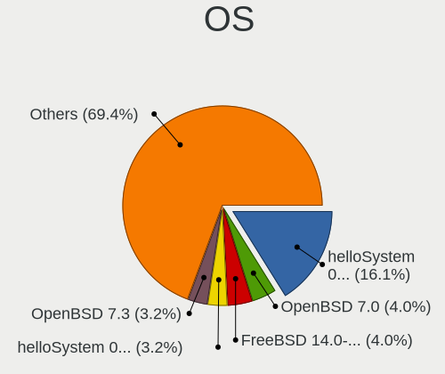

| Name                 | Notebooks | Percent |
|----------------------|-----------|---------|
| OpenBSD 7.0          | 5         | 8.06%   |
| OpenBSD 7.1          | 4         | 6.45%   |
| helloSystem 0.7.0    | 4         | 6.45%   |
| GhostBSD 20.04.02    | 4         | 6.45%   |
| FreeBSD 14.0-CURRENT | 4         | 6.45%   |
| FreeBSD 12.2         | 4         | 6.45%   |
| helloSystem 0.5.0    | 3         | 4.84%   |
| FreeBSD 12.1         | 3         | 4.84%   |
| OPNsense 22.7.10     | 2         | 3.23%   |
| OpenBSD 6.8          | 2         | 3.23%   |
| helloSystem 0.6.0    | 2         | 3.23%   |
| FreeBSD 13.0-p5      | 2         | 3.23%   |
| FreeBSD 13.0-p4      | 2         | 3.23%   |
| FreeBSD 13.0-p2      | 2         | 3.23%   |
| OPNsense 22.7.3      | 1         | 1.61%   |
| OpenBSD 7.2          | 1         | 1.61%   |
| OpenBSD 6.9          | 1         | 1.61%   |
| NomadBSD 5806f915    | 1         | 1.61%   |
| NomadBSD 1.3.1       | 1         | 1.61%   |
| helloSystem 0.8.0    | 1         | 1.61%   |
| helloSystem 0.4.0    | 1         | 1.61%   |
| GhostBSD 22.01.12    | 1         | 1.61%   |
| GhostBSD 21.08.27    | 1         | 1.61%   |
| FreeBSD 13.1-STABLE  | 1         | 1.61%   |
| FreeBSD 13.1-BETA1   | 1         | 1.61%   |
| FreeBSD 13.1         | 1         | 1.61%   |
| FreeBSD 13.0-RC2     | 1         | 1.61%   |
| FreeBSD 13.0-p7      | 1         | 1.61%   |
| FreeBSD 13.0-BETA2   | 1         | 1.61%   |
| FreeBSD 13.0         | 1         | 1.61%   |
| FreeBSD 12.2-p2      | 1         | 1.61%   |
| FreeBSD 12.1-p4      | 1         | 1.61%   |
| FreeBSD 12.1-p10     | 1         | 1.61%   |

OS Family
---------

OS without a version

| Name        | Notebooks | Percent |
|-------------|-----------|---------|
| FreeBSD     | 22        | 40.74%  |
| OpenBSD     | 11        | 20.37%  |
| helloSystem | 10        | 18.52%  |
| GhostBSD    | 6         | 11.11%  |
| OPNsense    | 3         | 5.56%   |
| NomadBSD    | 2         | 3.7%    |

Arch
----

OS architecture (x86_64, i586, etc.)

| Name  | Notebooks | Percent |
|-------|-----------|---------|
| amd64 | 52        | 96.3%   |
| i386  | 2         | 3.7%    |

DE
--

Desktop Environment

| Name         | Notebooks | Percent |
|--------------|-----------|---------|
| helloDesktop | 11        | 20.37%  |
| fvwm         | 10        | 18.52%  |
| MATE         | 8         | 14.81%  |
| XFCE         | 7         | 12.96%  |
| Console      | 6         | 11.11%  |
| Openbox      | 4         | 7.41%   |
| TWM          | 3         | 5.56%   |
| KDE5         | 2         | 3.7%    |
| i3           | 2         | 3.7%    |
| GNOME        | 1         | 1.85%   |

Display Server
--------------

X11 or Wayland

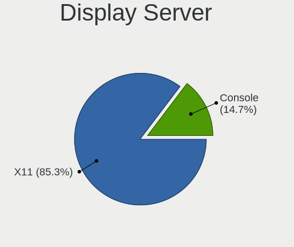

| Name    | Notebooks | Percent |
|---------|-----------|---------|
| X11     | 48        | 87.27%  |
| Console | 7         | 12.73%  |

Display Manager
---------------

SDDM, LightDM, etc.

| Name    | Notebooks | Percent |
|---------|-----------|---------|
| Console | 23        | 42.59%  |
| SLiM    | 20        | 37.04%  |
| LightDM | 6         | 11.11%  |
| SDDM    | 4         | 7.41%   |
| XDM     | 1         | 1.85%   |

OS Lang
-------

Language

| Lang    | Notebooks | Percent |
|---------|-----------|---------|
| Unknown | 17        | 30.91%  |
| en_US   | 14        | 25.45%  |
| C       | 12        | 21.82%  |
| pl_PL   | 10        | 18.18%  |
| fr_FR   | 1         | 1.82%   |
| en      | 1         | 1.82%   |

Boot Mode
---------

EFI or BIOS

| Mode | Notebooks | Percent |
|------|-----------|---------|
| EFI  | 42        | 76.36%  |
| BIOS | 13        | 23.64%  |

Filesystem
----------

Type of filesystem

| Type   | Notebooks | Percent |
|--------|-----------|---------|
| Zfs    | 30        | 55.56%  |
| Ufs    | 11        | 20.37%  |
| Ffs    | 11        | 20.37%  |
| Cd9660 | 2         | 3.7%    |

Part. scheme
------------

Scheme of partitioning

| Type | Notebooks | Percent |
|------|-----------|---------|
| GPT  | 43        | 79.63%  |
| MBR  | 11        | 20.37%  |

Board
-----

Vendor
------

Motherboard manufacturer

| Name             | Notebooks | Percent |
|------------------|-----------|---------|
| Lenovo           | 21        | 38.89%  |
| Dell             | 15        | 27.78%  |
| Hewlett-Packard  | 5         | 9.26%   |
| Acer             | 2         | 3.7%    |
| Sony             | 1         | 1.85%   |
| PC Specialist    | 1         | 1.85%   |
| Panasonic        | 1         | 1.85%   |
| Notebook         | 1         | 1.85%   |
| Intel            | 1         | 1.85%   |
| IBM              | 1         | 1.85%   |
| Google           | 1         | 1.85%   |
| Fujitsu Siemens  | 1         | 1.85%   |
| Deciso           | 1         | 1.85%   |
| ASUSTek Computer | 1         | 1.85%   |
| Unknown          | 1         | 1.85%   |

Model
-----

Motherboard model

| Name                                  | Notebooks | Percent |
|---------------------------------------|-----------|---------|
| Lenovo ThinkPad X200 745969G          | 5         | 9.26%   |
| Dell Latitude E6430                   | 2         | 3.7%    |
| Unknown                               | 2         | 3.7%    |
| Sony SVF1521K1EB                      | 1         | 1.85%   |
| PC Specialist Recoil II               | 1         | 1.85%   |
| Panasonic CFMX4-1                     | 1         | 1.85%   |
| Notebook N85_N87,HJ,HJ1,HK1           | 1         | 1.85%   |
| Lenovo ThinkPad X260 20F5S10W0H       | 1         | 1.85%   |
| Lenovo ThinkPad X230 23254S6          | 1         | 1.85%   |
| Lenovo ThinkPad X200s 7470A98         | 1         | 1.85%   |
| Lenovo ThinkPad W520 4284W5L          | 1         | 1.85%   |
| Lenovo ThinkPad T495 20NJ0010PB       | 1         | 1.85%   |
| Lenovo ThinkPad T480 20L6S4GR02       | 1         | 1.85%   |
| Lenovo ThinkPad T470 W10DG 20JNS0JU01 | 1         | 1.85%   |
| Lenovo ThinkPad T440 20B7S1860W       | 1         | 1.85%   |
| Lenovo ThinkPad T14s Gen 1 20T1S0Q200 | 1         | 1.85%   |
| Lenovo Legion Y540-15IRH-PG0 81SY     | 1         | 1.85%   |
| Lenovo IdeaPad S130-14IGM 81J2        | 1         | 1.85%   |
| Lenovo IdeaPad 520-15IKB 81BF         | 1         | 1.85%   |
| Lenovo G580 20150                     | 1         | 1.85%   |
| Lenovo G500s 20245                    | 1         | 1.85%   |
| Lenovo G50-30 80G0                    | 1         | 1.85%   |
| Intel H81U                            | 1         | 1.85%   |
| IBM ThinkPad X41 2525FAG              | 1         | 1.85%   |
| HP SpectreXT Pro 13-b000 PC           | 1         | 1.85%   |
| HP Laptop 15-bs0xx                    | 1         | 1.85%   |
| HP ENVY dv7                           | 1         | 1.85%   |
| HP EliteBook 840 G3                   | 1         | 1.85%   |
| HP 635                                | 1         | 1.85%   |
| Google Lars                           | 1         | 1.85%   |
| Fujitsu Siemens AMILO PRO V3515       | 1         | 1.85%   |
| Dell Vostro 3560                      | 1         | 1.85%   |
| Dell Vostro 3550                      | 1         | 1.85%   |
| Dell Latitude XT2                     | 1         | 1.85%   |
| Dell Latitude E7240                   | 1         | 1.85%   |
| Dell Latitude E6440                   | 1         | 1.85%   |
| Dell Latitude E6410                   | 1         | 1.85%   |
| Dell Latitude E5470                   | 1         | 1.85%   |
| Dell Latitude E5430 vPro              | 1         | 1.85%   |
| Dell Latitude 5410                    | 1         | 1.85%   |

Model Family
------------

Motherboard model prefix

| Name                  | Notebooks | Percent |
|-----------------------|-----------|---------|
| Lenovo ThinkPad       | 14        | 25.93%  |
| Dell Latitude         | 10        | 18.52%  |
| Lenovo IdeaPad        | 2         | 3.7%    |
| Dell Vostro           | 2         | 3.7%    |
| Dell Inspiron         | 2         | 3.7%    |
| Acer Aspire           | 2         | 3.7%    |
| Unknown               | 2         | 3.7%    |
| Sony SVF1521K1EB      | 1         | 1.85%   |
| PC Specialist Recoil  | 1         | 1.85%   |
| Panasonic CFMX4-1     | 1         | 1.85%   |
| Notebook N85          | 1         | 1.85%   |
| Lenovo Legion         | 1         | 1.85%   |
| Lenovo G580           | 1         | 1.85%   |
| Lenovo G500s          | 1         | 1.85%   |
| Lenovo G50-30         | 1         | 1.85%   |
| Intel H81U            | 1         | 1.85%   |
| IBM ThinkPad          | 1         | 1.85%   |
| HP SpectreXT          | 1         | 1.85%   |
| HP Laptop             | 1         | 1.85%   |
| HP ENVY               | 1         | 1.85%   |
| HP EliteBook          | 1         | 1.85%   |
| HP 635                | 1         | 1.85%   |
| Google Lars           | 1         | 1.85%   |
| Fujitsu Siemens AMILO | 1         | 1.85%   |
| Dell G15              | 1         | 1.85%   |
| Deciso NetBoard-A10   | 1         | 1.85%   |
| ASUS X555LB           | 1         | 1.85%   |

MFG Year
--------

Motherboard manufacture year

| Year | Notebooks | Percent |
|------|-----------|---------|
| 2019 | 9         | 16.67%  |
| 2013 | 7         | 12.96%  |
| 2012 | 7         | 12.96%  |
| 2009 | 5         | 9.26%   |
| 2016 | 4         | 7.41%   |
| 2022 | 3         | 5.56%   |
| 2018 | 3         | 5.56%   |
| 2017 | 3         | 5.56%   |
| 2014 | 3         | 5.56%   |
| 2011 | 3         | 5.56%   |
| 2021 | 2         | 3.7%    |
| 2006 | 2         | 3.7%    |
| 2020 | 1         | 1.85%   |
| 2015 | 1         | 1.85%   |
| 2010 | 1         | 1.85%   |

Form Factor
-----------

Physical design of the computer

| Name     | Notebooks | Percent |
|----------|-----------|---------|
| Notebook | 54        | 100%    |

Coreboot
--------

Have coreboot on board

| Used | Notebooks | Percent |
|------|-----------|---------|
| No   | 52        | 96.3%   |
| Yes  | 2         | 3.7%    |

RAM Size
--------

Total RAM memory

| Size in GB | Notebooks | Percent |
|------------|-----------|---------|
| 4.01-8.0   | 20        | 37.04%  |
| 16.01-24.0 | 14        | 25.93%  |
| 8.01-16.0  | 14        | 25.93%  |
| 32.01-64.0 | 2         | 3.7%    |
| 3.01-4.0   | 2         | 3.7%    |
| 2.01-3.0   | 2         | 3.7%    |

RAM Used
--------

Used RAM memory

| Used GB   | Notebooks | Percent |
|-----------|-----------|---------|
| 0.01-0.5  | 36        | 65.45%  |
| 0.51-1.0  | 16        | 29.09%  |
| 2.01-3.0  | 1         | 1.82%   |
| 1.01-2.0  | 1         | 1.82%   |
| 8.01-16.0 | 1         | 1.82%   |

Total Drives
------------

Number of drives on board

| Drives | Notebooks | Percent |
|--------|-----------|---------|
| 1      | 33        | 58.93%  |
| 2      | 17        | 30.36%  |
| 3      | 3         | 5.36%   |
| 0      | 3         | 5.36%   |

Has CD-ROM
----------

Has CD-ROM on board

| Presented | Notebooks | Percent |
|-----------|-----------|---------|
| No        | 42        | 76.36%  |
| Yes       | 13        | 23.64%  |

Has Ethernet
------------

Has Ethernet on board

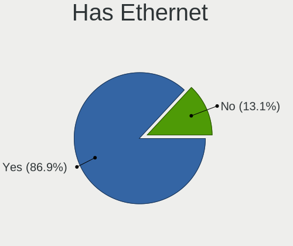

| Presented | Notebooks | Percent |
|-----------|-----------|---------|
| Yes       | 51        | 94.44%  |
| No        | 3         | 5.56%   |

Has WiFi
--------

Has WiFi module

| Presented | Notebooks | Percent |
|-----------|-----------|---------|
| Yes       | 53        | 98.15%  |
| No        | 1         | 1.85%   |

Has Bluetooth
-------------

Has Bluetooth module

| Presented | Notebooks | Percent |
|-----------|-----------|---------|
| Yes       | 34        | 61.82%  |
| No        | 21        | 38.18%  |

Location
--------

Country
-------

Geographic location (country)

| Country | Notebooks | Percent |
|---------|-----------|---------|
| Poland  | 54        | 100%    |

City
----

Geographic location (city)

| City                      | Notebooks | Percent |
|---------------------------|-----------|---------|
| Warsaw                    | 11        | 19.64%  |
| Gdansk                    | 7         | 12.5%   |
| Krakow                    | 5         | 8.93%   |
| Wroclaw                   | 4         | 7.14%   |
| Chrusty                   | 3         | 5.36%   |
| ЕљwiД™tochЕ‚owice | 1         | 1.79%   |
| Zgierz                    | 1         | 1.79%   |
| Wloszczowa                | 1         | 1.79%   |
| Wieliczka                 | 1         | 1.79%   |
| Świnoujście             | 1         | 1.79%   |
| Starogard Gdański        | 1         | 1.79%   |
| Radom                     | 1         | 1.79%   |
| Pruszcz Gdanski           | 1         | 1.79%   |
| Pobiedziska               | 1         | 1.79%   |
| Pacierzow                 | 1         | 1.79%   |
| Ostrołęka               | 1         | 1.79%   |
| Miedziana Gora            | 1         | 1.79%   |
| Lublin                    | 1         | 1.79%   |
| Lodz                      | 1         | 1.79%   |
| Lipie                     | 1         | 1.79%   |
| Ledziny                   | 1         | 1.79%   |
| Krasnik                   | 1         | 1.79%   |
| Klobuck                   | 1         | 1.79%   |
| Kielce                    | 1         | 1.79%   |
| Katowice                  | 1         | 1.79%   |
| Jarosław              | 1         | 1.79%   |
| Grajewo                   | 1         | 1.79%   |
| Gdynia                    | 1         | 1.79%   |
| CzД™stochowa           | 1         | 1.79%   |
| Chełmno               | 1         | 1.79%   |
| Bolszewo                  | 1         | 1.79%   |

Drives
------

Drive Vendor
------------

Hard drive vendors

| Vendor              | Notebooks | Drives | Percent |
|---------------------|-----------|--------|---------|
| Samsung Electronics | 15        | 22     | 23.81%  |
| WDC                 | 7         | 8      | 11.11%  |
| Seagate             | 5         | 6      | 7.94%   |
| Transcend           | 4         | 4      | 6.35%   |
| Crucial             | 4         | 8      | 6.35%   |
| A-DATA Technology   | 4         | 4      | 6.35%   |
| Goodram             | 3         | 3      | 4.76%   |
| SK hynix            | 2         | 2      | 3.17%   |
| SanDisk             | 2         | 2      | 3.17%   |
| NVMe                | 2         | 4      | 3.17%   |
| Kingston            | 2         | 2      | 3.17%   |
| Hitachi             | 2         | 2      | 3.17%   |
| HGST                | 2         | 3      | 3.17%   |
| Toshiba             | 1         | 1      | 1.59%   |
| PNY                 | 1         | 1      | 1.59%   |
| Plextor             | 1         | 1      | 1.59%   |
| Micron Technology   | 1         | 2      | 1.59%   |
| LITEONIT            | 1         | 1      | 1.59%   |
| LITEON              | 1         | 1      | 1.59%   |
| KIOXIA              | 1         | 1      | 1.59%   |
| Gigabyte Technology | 1         | 1      | 1.59%   |
| Apacer              | 1         | 2      | 1.59%   |

Drive Model
-----------

Hard drive models

| Model                             | Notebooks | Percent |
|-----------------------------------|-----------|---------|
| Samsung HM321HI 320GB             | 5         | 7.58%   |
| Seagate ST1000LM035-1RK172 1TB    | 2         | 3.03%   |
| WDC WD7500BPKT-22PK4T0 752GB      | 1         | 1.52%   |
| WDC WD5000LPCX-24VHAT0 500GB      | 1         | 1.52%   |
| WDC WD3200BEKT-75PVMT1 320GB      | 1         | 1.52%   |
| WDC WD3200BEKT-22PVMT0 320GB      | 1         | 1.52%   |
| WDC WD1200BEVS-07RST0 120GB       | 1         | 1.52%   |
| WDC WD1200BEVS-07LAT0 120GB       | 1         | 1.52%   |
| WDC PC SN530 NVMe 512GB           | 1         | 1.52%   |
| Transcend TS32GMSA370 32GB        | 1         | 1.52%   |
| Transcend TS256GMTE652T2 256GB    | 1         | 1.52%   |
| Transcend TS128GMSA370 128GB      | 1         | 1.52%   |
| Transcend TS120GMTS420S 120GB     | 1         | 1.52%   |
| Toshiba KBG40ZNS256G NVMe 256GB   | 1         | 1.52%   |
| SK hynix HFS128G39TNF-N3A0A 128GB | 1         | 1.52%   |
| SK hynix HFM512GDHTNG-8310A 512GB | 1         | 1.52%   |
| Seagate ST9500420AS 500GB         | 1         | 1.52%   |
| Seagate ST9500325AS 500GB         | 1         | 1.52%   |
| Seagate ST9160412AS 160GB         | 1         | 1.52%   |
| SanDisk SDSSDA120G 120GB          | 1         | 1.52%   |
| SanDisk SD9TN8W256G1001 256GB     | 1         | 1.52%   |
| Samsung SSD PM871b M.2 2280 128GB | 1         | 1.52%   |
| Samsung SSD PM830 mSATA 128GB     | 1         | 1.52%   |
| Samsung SSD 980 PRO 1TB           | 1         | 1.52%   |
| Samsung SSD 970 PRO 1TB           | 1         | 1.52%   |
| Samsung SSD 970 EVO 250GB         | 1         | 1.52%   |
| Samsung SSD 860 QVO 4TB           | 1         | 1.52%   |
| Samsung SSD 860 EVO M.2 2TB       | 1         | 1.52%   |
| Samsung SSD 860 EVO 500GB         | 1         | 1.52%   |
| Samsung SSD 850 EVO 250GB         | 1         | 1.52%   |
| Samsung SSD 840 Series 120GB      | 1         | 1.52%   |
| Samsung MZMPC128HBFU-000H1 128GB  | 1         | 1.52%   |
| PNY CS3030 1TB SSD                | 1         | 1.52%   |
| Plextor PH6-CE240 240GB           | 1         | 1.52%   |
| NVMe WDC PC SN520 SDA 512GB       | 1         | 1.52%   |
| NVMe PC SN530 WD 512GB            | 1         | 1.52%   |
| NVMe INTEL SSDPEKKF25 256GB       | 1         | 1.52%   |
| Micron MTFDDAT128MAM-1J2 128GB    | 1         | 1.52%   |
| LITEONIT LMT-128M6M mSATA 128GB   | 1         | 1.52%   |
| LITEON L8H-256V2G-HP 256GB        | 1         | 1.52%   |

HDD Vendor
----------

Hard disk drive vendors

| Vendor              | Notebooks | Drives | Percent |
|---------------------|-----------|--------|---------|
| WDC                 | 6         | 7      | 28.57%  |
| Seagate             | 5         | 6      | 23.81%  |
| Samsung Electronics | 5         | 5      | 23.81%  |
| Hitachi             | 2         | 2      | 9.52%   |
| HGST                | 2         | 3      | 9.52%   |
| NVMe                | 1         | 1      | 4.76%   |

SSD Vendor
----------

Solid state drive vendors

| Vendor              | Notebooks | Drives | Percent |
|---------------------|-----------|--------|---------|
| Samsung Electronics | 7         | 14     | 22.58%  |
| Transcend           | 3         | 3      | 9.68%   |
| Goodram             | 3         | 3      | 9.68%   |
| Crucial             | 3         | 7      | 9.68%   |
| A-DATA Technology   | 3         | 3      | 9.68%   |
| SanDisk             | 2         | 2      | 6.45%   |
| Kingston            | 2         | 2      | 6.45%   |
| SK hynix            | 1         | 1      | 3.23%   |
| Plextor             | 1         | 1      | 3.23%   |
| NVMe                | 1         | 1      | 3.23%   |
| Micron Technology   | 1         | 2      | 3.23%   |
| LITEONIT            | 1         | 1      | 3.23%   |
| LITEON              | 1         | 1      | 3.23%   |
| Gigabyte Technology | 1         | 1      | 3.23%   |
| Apacer              | 1         | 2      | 3.23%   |

Drive Kind
----------

HDD or SSD

| Kind | Notebooks | Drives | Percent |
|------|-----------|--------|---------|
| SSD  | 28        | 44     | 48.28%  |
| HDD  | 20        | 24     | 34.48%  |
| NVMe | 10        | 13     | 17.24%  |

Drive Connector
---------------

SATA, SAS, NVMe, etc.

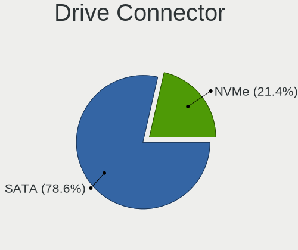

| Type | Notebooks | Drives | Percent |
|------|-----------|--------|---------|
| SATA | 42        | 68     | 80.77%  |
| NVMe | 10        | 13     | 19.23%  |

Drive Size
----------

Size of hard drive

| Size in TB | Notebooks | Drives | Percent |
|------------|-----------|--------|---------|
| 0.01-0.5   | 37        | 54     | 80.43%  |
| 0.51-1.0   | 6         | 10     | 13.04%  |
| 1.01-2.0   | 2         | 2      | 4.35%   |
| 3.01-4.0   | 1         | 2      | 2.17%   |

Space Total
-----------

Amount of disk space available on the file system

| Size in GB | Notebooks | Percent |
|------------|-----------|---------|
| 101-250    | 18        | 32.14%  |
| 251-500    | 11        | 19.64%  |
| 1-20       | 11        | 19.64%  |
| 51-100     | 9         | 16.07%  |
| 501-1000   | 4         | 7.14%   |
| 21-50      | 3         | 5.36%   |

Space Used
----------

Amount of used disk space

| Used GB | Notebooks | Percent |
|---------|-----------|---------|
| 1-20    | 46        | 83.64%  |
| 51-100  | 4         | 7.27%   |
| 21-50   | 3         | 5.45%   |
| 101-250 | 2         | 3.64%   |

Malfunc. Drives
---------------

Drive models with a malfunction

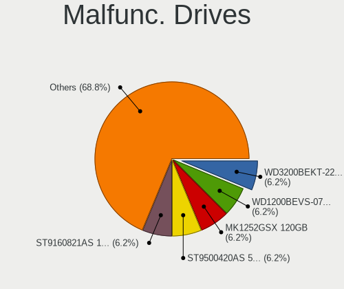

| Model                                     | Notebooks | Drives | Percent |
|-------------------------------------------|-----------|--------|---------|
| WDC WD3200BEKT-22PVMT0 320GB              | 1         | 1      | 16.67%  |
| WDC WD1200BEVS-07LAT0 120GB               | 1         | 1      | 16.67%  |
| Seagate ST9500420AS 500GB                 | 1         | 2      | 16.67%  |
| Seagate ST9160412AS 160GB                 | 1         | 1      | 16.67%  |
| Micron Technology MTFDDAT128MAM-1J2 128GB | 1         | 1      | 16.67%  |
| Hitachi HTS543232A7A384 320GB             | 1         | 1      | 16.67%  |

Malfunc. Drive Vendor
---------------------

Vendors of faulty drives

| Vendor            | Notebooks | Drives | Percent |
|-------------------|-----------|--------|---------|
| WDC               | 2         | 2      | 33.33%  |
| Seagate           | 2         | 3      | 33.33%  |
| Micron Technology | 1         | 1      | 16.67%  |
| Hitachi           | 1         | 1      | 16.67%  |

Malfunc. HDD Vendor
-------------------

Vendors of faulty HDD drives

| Vendor  | Notebooks | Drives | Percent |
|---------|-----------|--------|---------|
| WDC     | 2         | 2      | 40%     |
| Seagate | 2         | 3      | 40%     |
| Hitachi | 1         | 1      | 20%     |

Malfunc. Drive Kind
-------------------

Kinds of faulty drives

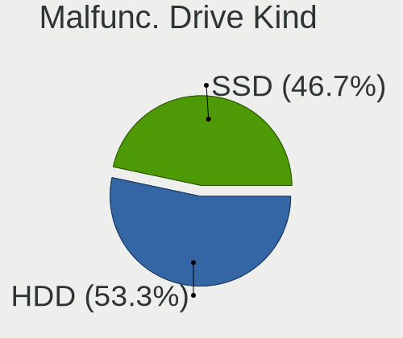

| Kind | Notebooks | Drives | Percent |
|------|-----------|--------|---------|
| HDD  | 5         | 6      | 83.33%  |
| SSD  | 1         | 1      | 16.67%  |

Failed Drives
-------------

Failed drive models

Zero info for selected period =(

Failed Drive Vendor
-------------------

Failed drive vendors

Zero info for selected period =(

Drive Status
------------

Number of failed and malfunc. drives

| Status   | Notebooks | Drives | Percent |
|----------|-----------|--------|---------|
| Works    | 46        | 70     | 85.19%  |
| Malfunc  | 6         | 7      | 11.11%  |
| Detected | 2         | 4      | 3.7%    |

Storage controller
------------------

Storage Vendor
--------------

Storage controller vendors

| Vendor                    | Notebooks | Percent |
|---------------------------|-----------|---------|
| Intel                     | 47        | 77.05%  |
| Samsung Electronics       | 3         | 4.92%   |
| SanDisk                   | 2         | 3.28%   |
| KIOXIA                    | 2         | 3.28%   |
| VIA Technologies          | 1         | 1.64%   |
| Transcend                 | 1         | 1.64%   |
| SK hynix                  | 1         | 1.64%   |
| Silicon Motion            | 1         | 1.64%   |
| Phison Electronics        | 1         | 1.64%   |
| Micron/Crucial Technology | 1         | 1.64%   |
| AMD                       | 1         | 1.64%   |

Storage Model
-------------

Storage controller models

| Model                                                                          | Notebooks | Percent |
|--------------------------------------------------------------------------------|-----------|---------|
| Intel 7 Series Chipset Family 6-port SATA Controller [AHCI mode]               | 10        | 15.63%  |
| Intel 82801IBM/IEM (ICH9M/ICH9M-E) 4 port SATA Controller [AHCI mode]          | 7         | 10.94%  |
| Intel Sunrise Point-LP SATA Controller [AHCI mode]                             | 6         | 9.38%   |
| Intel 6 Series/C200 Series Chipset Family 6 port Mobile SATA AHCI Controller   | 4         | 6.25%   |
| Intel 8 Series SATA Controller 1 [AHCI mode]                                   | 3         | 4.69%   |
| Samsung NVMe SSD Controller SM981/PM981/PM983                                  | 2         | 3.13%   |
| KIOXIA NVMe SSD Controller BG4                                                 | 2         | 3.13%   |
| Intel Wildcat Point-LP SATA Controller [AHCI Mode]                             | 2         | 3.13%   |
| Intel Comet Lake SATA AHCI Controller                                          | 2         | 3.13%   |
| Intel Cannon Lake Mobile PCH SATA AHCI Controller                              | 2         | 3.13%   |
| Intel 82801 Mobile SATA Controller [RAID mode]                                 | 2         | 3.13%   |
| Intel 8 Series/C220 Series Chipset Family 6-port SATA Controller 1 [AHCI mode] | 2         | 3.13%   |
| VIA VT82C586A/B/VT82C686/A/B/VT823x/A/C PIPC Bus Master IDE                    | 1         | 1.56%   |
| VIA VT8237A SATA 2-Port Controller                                             | 1         | 1.56%   |
| SK hynix BC501 NVMe Solid State Drive                                          | 1         | 1.56%   |
| Silicon Motion SM2262/SM2262EN SSD Controller                                  | 1         | 1.56%   |
| SanDisk unknown                                                                | 1         | 1.56%   |
| SanDisk PC SN520 NVMe SSD                                                      | 1         | 1.56%   |
| Samsung NVMe SSD Controller PM9A1/PM9A3/980PRO                                 | 1         | 1.56%   |
| Phison E12 NVMe Controller                                                     | 1         | 1.56%   |
| Micron/Crucial P2 NVMe PCIe SSD                                                | 1         | 1.56%   |
| Intel SSD Pro 7600p/760p/E 6100p Series                                        | 1         | 1.56%   |
| Intel HM170/QM170 Chipset SATA Controller [AHCI Mode]                          | 1         | 1.56%   |
| Intel Celeron/Pentium Silver Processor SATA Controller                         | 1         | 1.56%   |
| Intel Cannon Point-LP SATA Controller [AHCI Mode]                              | 1         | 1.56%   |
| Intel Atom Processor E3800 Series SATA AHCI Controller                         | 1         | 1.56%   |
| Intel 82801FBM (ICH6M) SATA Controller                                         | 1         | 1.56%   |
| Intel 5 Series/3400 Series Chipset 4 port SATA IDE Controller                  | 1         | 1.56%   |
| Intel 5 Series/3400 Series Chipset 4 port SATA AHCI Controller                 | 1         | 1.56%   |
| Intel 5 Series/3400 Series Chipset 2 port SATA IDE Controller                  | 1         | 1.56%   |
| AMD SB7x0/SB8x0/SB9x0 SATA Controller [AHCI mode]                              | 1         | 1.56%   |
| Unknown                                                                        | 1         | 1.56%   |

Storage Kind
------------

Kind of storage controller (IDE, SATA, NVMe, SAS, ...)

| Kind | Notebooks | Percent |
|------|-----------|---------|
| SATA | 44        | 73.33%  |
| NVMe | 11        | 18.33%  |
| IDE  | 3         | 5%      |
| RAID | 2         | 3.33%   |

Processor
---------

CPU Vendor
----------

Processor vendors

| Vendor | Notebooks | Percent |
|--------|-----------|---------|
| Intel  | 51        | 94.44%  |
| AMD    | 3         | 5.56%   |

CPU Model
---------

Processor models

| Model                                    | Notebooks | Percent |
|------------------------------------------|-----------|---------|
| Intel Core 2 Duo CPU P8600 @ 2.40GHz     | 5         | 9.26%   |
| Intel Core i5-6300U CPU @ 2.40GHz        | 3         | 5.56%   |
| Intel Core i5-3320M CPU @ 2.60GHz        | 2         | 3.7%    |
| Intel Core i5-2520M CPU @ 2.50GHz        | 2         | 3.7%    |
| Intel Pentium Silver N5000 CPU @ 1.10GHz | 1         | 1.85%   |
| Intel Pentium M processor                | 1         | 1.85%   |
| Intel Core i7-9750HF CPU @ 2.60GHz       | 1         | 1.85%   |
| Intel Core i7-8750H CPU @ 2.20GHz        | 1         | 1.85%   |
| Intel Core i7-4710HQ CPU @ 2.50GHz       | 1         | 1.85%   |
| Intel Core i7-4600U CPU @ 2.10GHz        | 1         | 1.85%   |
| Intel Core i7-3720QM CPU @ 2.60GHz       | 1         | 1.85%   |
| Intel Core i7-3610QM CPU @ 2.30GHz       | 1         | 1.85%   |
| Intel Core i7-2820QM CPU @ 2.30GHz       | 1         | 1.85%   |
| Intel Core i7-10610U CPU @ 1.80GHz       | 1         | 1.85%   |
| Intel Core i5-8365U CPU @ 1.60GHz        | 1         | 1.85%   |
| Intel Core i5-8250U CPU @ 1.60GHz        | 1         | 1.85%   |
| Intel Core i5-7300U CPU @ 2.60GHz        | 1         | 1.85%   |
| Intel Core i5-7300HQ CPU @ 2.50GHz       | 1         | 1.85%   |
| Intel Core i5-7200U CPU @ 2.50GHz        | 1         | 1.85%   |
| Intel Core i5-6200U CPU @ 2.30GHz        | 1         | 1.85%   |
| Intel Core i5-5300U CPU @ 2.30GHz        | 1         | 1.85%   |
| Intel Core i5-5200U CPU @ 2.20GHz        | 1         | 1.85%   |
| Intel Core i5-4300U CPU @ 1.90GHz        | 1         | 1.85%   |
| Intel Core i5-4300M CPU @ 2.60GHz        | 1         | 1.85%   |
| Intel Core i5-3360M CPU @ 2.80GHz        | 1         | 1.85%   |
| Intel Core i5-3317U CPU @ 1.70GHz        | 1         | 1.85%   |
| Intel Core i5-3230M CPU @ 2.60GHz        | 1         | 1.85%   |
| Intel Core i5-3210M CPU @ 2.50GHz        | 1         | 1.85%   |
| Intel Core i5-2430M CPU @ 2.40GHz        | 1         | 1.85%   |
| Intel Core i5-10210U CPU @ 1.60GHz       | 1         | 1.85%   |
| Intel Core i5-10200H CPU @ 2.40GHz       | 1         | 1.85%   |
| Intel Core i5 CPU M 560 @ 2.67GH         | 1         | 1.85%   |
| Intel Core i3-3227U CPU @ 1.90GHz        | 1         | 1.85%   |
| Intel Core i3-3110M CPU @ 2.40GHz        | 1         | 1.85%   |
| Intel Core i3-2370M CPU @ 2.40GHz        | 1         | 1.85%   |
| Intel Core i3 CPU M 370 @ 2.40GHz        | 1         | 1.85%   |
| Intel Core 2 Duo CPU L9400 @ 1.86GHz     | 1         | 1.85%   |
| Intel Core 2 Duo                         | 1         | 1.85%   |
| Intel Celeron M CPU                      | 1         | 1.85%   |
| Intel Celeron CPU N2840 @ 2.16GHz        | 1         | 1.85%   |

CPU Model Family
----------------

Processor model prefix

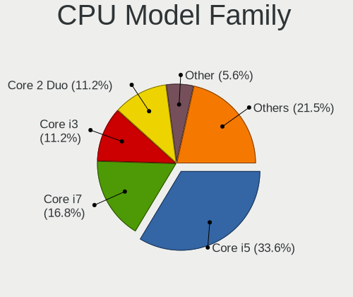

| Model                | Notebooks | Percent |
|----------------------|-----------|---------|
| Intel Core i5        | 25        | 46.3%   |
| Intel Core i7        | 8         | 14.81%  |
| Intel Core 2 Duo     | 7         | 12.96%  |
| Intel Core i3        | 4         | 7.41%   |
| Intel Celeron        | 3         | 5.56%   |
| Other                | 1         | 1.85%   |
| Intel Pentium Silver | 1         | 1.85%   |
| Intel Pentium M      | 1         | 1.85%   |
| Intel Celeron M      | 1         | 1.85%   |
| AMD Ryzen Embedded   | 1         | 1.85%   |
| AMD Ryzen 7 PRO      | 1         | 1.85%   |
| AMD E                | 1         | 1.85%   |

CPU Cores
---------

Number of processor cores

| Number  | Notebooks | Percent |
|---------|-----------|---------|
| 2       | 30        | 55.56%  |
| 4       | 12        | 22.22%  |
| Unknown | 6         | 11.11%  |
| 8       | 2         | 3.7%    |
| 6       | 2         | 3.7%    |
| 1       | 2         | 3.7%    |

CPU Sockets
-----------

Number of sockets

| Number  | Notebooks | Percent |
|---------|-----------|---------|
| 1       | 49        | 90.74%  |
| Unknown | 5         | 9.26%   |

CPU Threads
-----------

Threads per core (Hyper-Threading)

| Number  | Notebooks | Percent |
|---------|-----------|---------|
| 2       | 37        | 68.52%  |
| 1       | 9         | 16.67%  |
| Unknown | 8         | 14.81%  |

CPU Microarch
-------------

Microarchitecture

| Name          | Notebooks | Percent |
|---------------|-----------|---------|
| IvyBridge     | 10        | 18.52%  |
| KabyLake      | 9         | 16.67%  |
| Penryn        | 7         | 12.96%  |
| Skylake       | 5         | 9.26%   |
| SandyBridge   | 5         | 9.26%   |
| Haswell       | 5         | 9.26%   |
| Westmere      | 2         | 3.7%    |
| P6            | 2         | 3.7%    |
| Broadwell     | 2         | 3.7%    |
| Zen+          | 1         | 1.85%   |
| Zen           | 1         | 1.85%   |
| TigerLake     | 1         | 1.85%   |
| Silvermont    | 1         | 1.85%   |
| Goldmont plus | 1         | 1.85%   |
| CometLake     | 1         | 1.85%   |
| Bobcat        | 1         | 1.85%   |

Graphics
--------

GPU Vendor
----------

Vendors of graphics cards

| Vendor           | Notebooks | Percent |
|------------------|-----------|---------|
| Intel            | 48        | 71.64%  |
| Nvidia           | 13        | 19.4%   |
| AMD              | 5         | 7.46%   |
| VIA Technologies | 1         | 1.49%   |

GPU Model
---------

Graphics card models

| Model                                                                                 | Notebooks | Percent |
|---------------------------------------------------------------------------------------|-----------|---------|
| Intel 3rd Gen Core processor Graphics Controller                                      | 10        | 14.93%  |
| Intel Mobile 4 Series Chipset Integrated Graphics Controller                          | 7         | 10.45%  |
| Intel 2nd Generation Core Processor Family Integrated Graphics Controller             | 5         | 7.46%   |
| Intel Skylake GT2 [HD Graphics 520]                                                   | 4         | 5.97%   |
| Intel Haswell-ULT Integrated Graphics Controller                                      | 3         | 4.48%   |
| Nvidia GF117M [GeForce 610M/710M/810M/820M / GT 620M/625M/630M/720M]                  | 2         | 2.99%   |
| Intel HD Graphics 620                                                                 | 2         | 2.99%   |
| Intel HD Graphics 5500                                                                | 2         | 2.99%   |
| Intel CometLake-U GT2 [UHD Graphics]                                                  | 2         | 2.99%   |
| Intel 4th Gen Core Processor Integrated Graphics Controller                           | 2         | 2.99%   |
| VIA Technologies CN896/VN896/P4M900 [Chrome 9 HC]                                     | 1         | 1.49%   |
| Nvidia TU117M [GeForce GTX 1650 Mobile / Max-Q]                                       | 1         | 1.49%   |
| Nvidia GP107M [GeForce GTX 1050 Mobile]                                               | 1         | 1.49%   |
| Nvidia GP106M [GeForce GTX 1060 Mobile]                                               | 1         | 1.49%   |
| Nvidia GM108M [GeForce 940M]                                                          | 1         | 1.49%   |
| Nvidia GM107M [GeForce GTX 860M]                                                      | 1         | 1.49%   |
| Nvidia GK208M [GeForce GT 740M]                                                       | 1         | 1.49%   |
| Nvidia GF108M [GeForce GT 635M]                                                       | 1         | 1.49%   |
| Nvidia GF108M [GeForce GT 525M]                                                       | 1         | 1.49%   |
| Nvidia GF108M [GeForce GT 420M]                                                       | 1         | 1.49%   |
| Nvidia GF108GLM [NVS 5200M]                                                           | 1         | 1.49%   |
| Nvidia GA107M [GeForce RTX 3050 Mobile]                                               | 1         | 1.49%   |
| Intel WhiskeyLake-U GT2 [UHD Graphics 620]                                            | 1         | 1.49%   |
| Intel UHD Graphics 620                                                                | 1         | 1.49%   |
| Intel TigerLake-LP GT2 [Iris Xe Graphics]                                             | 1         | 1.49%   |
| Intel Mobile 915GM/GMS/910GML Express Graphics Controller                             | 1         | 1.49%   |
| Intel HD Graphics 630                                                                 | 1         | 1.49%   |
| Intel HD Graphics 510                                                                 | 1         | 1.49%   |
| Intel GeminiLake [UHD Graphics 605]                                                   | 1         | 1.49%   |
| Intel Core Processor Integrated Graphics Controller                                   | 1         | 1.49%   |
| Intel Comet Lake-H GT1 [UHD Graphics 610]                                             | 1         | 1.49%   |
| Intel CoffeeLake-H GT2 [UHD Graphics 630]                                             | 1         | 1.49%   |
| Intel Atom Processor Z36xxx/Z37xxx Series Graphics & Display                          | 1         | 1.49%   |
| AMD Wrestler [Radeon HD 6310]                                                         | 1         | 1.49%   |
| AMD Whistler [Radeon HD 6630M/6650M/6750M/7670M/7690M]                                | 1         | 1.49%   |
| AMD Topaz XT [Radeon R7 M260/M265 / M340/M360 / M440/M445 / 530/535 / 620/625 Mobile] | 1         | 1.49%   |
| AMD Sun XT [Radeon HD 8670A/8670M/8690M / R5 M330 / M430 / Radeon 520 Mobile]         | 1         | 1.49%   |
| AMD Picasso/Raven 2 [Radeon Vega Series / Radeon Vega Mobile Series]                  | 1         | 1.49%   |

GPU Combo
---------

Combinations of graphics cards

| Name           | Notebooks | Percent |
|----------------|-----------|---------|
| 1 x Intel      | 26        | 48.15%  |
| Intel + Nvidia | 11        | 20.37%  |
| 2 x Intel      | 8         | 14.81%  |
| Intel + AMD    | 3         | 5.56%   |
| 1 x Nvidia     | 2         | 3.7%    |
| 1 x AMD        | 2         | 3.7%    |
| Other          | 1         | 1.85%   |
| 1 x VIA        | 1         | 1.85%   |

GPU Driver
----------

Free vs proprietary

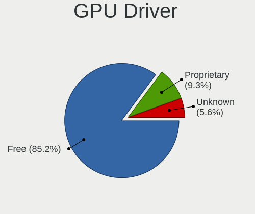

| Driver      | Notebooks | Percent |
|-------------|-----------|---------|
| Free        | 47        | 85.45%  |
| Proprietary | 4         | 7.27%   |
| Unknown     | 4         | 7.27%   |

GPU Memory
----------

Total video memory

| Size in GB | Notebooks | Percent |
|------------|-----------|---------|
| Unknown    | 51        | 92.73%  |
| 5.01-6.0   | 1         | 1.82%   |
| 3.01-4.0   | 1         | 1.82%   |
| 1.01-2.0   | 1         | 1.82%   |
| 0.51-1.0   | 1         | 1.82%   |

Monitor
-------

Monitor Vendor
--------------

Monitor vendors

| Vendor                  | Notebooks | Percent |
|-------------------------|-----------|---------|
| LG Display              | 15        | 30.61%  |
| Lenovo                  | 7         | 14.29%  |
| BOE                     | 7         | 14.29%  |
| Chimei Innolux          | 4         | 8.16%   |
| Samsung Electronics     | 3         | 6.12%   |
| AU Optronics            | 3         | 6.12%   |
| Chi Mei Optoelectronics | 2         | 4.08%   |
| Philips                 | 1         | 2.04%   |
| PANDA                   | 1         | 2.04%   |
| KTC                     | 1         | 2.04%   |
| JDI                     | 1         | 2.04%   |
| InfoVision              | 1         | 2.04%   |
| Iiyama                  | 1         | 2.04%   |
| BenQ                    | 1         | 2.04%   |
| AOC                     | 1         | 2.04%   |

Monitor Model
-------------

Monitor models

| Model                                                                    | Notebooks | Percent |
|--------------------------------------------------------------------------|-----------|---------|
| Lenovo LCD Monitor LEN4010 1280x800 260x160mm 12.0-inch                  | 5         | 10.2%   |
| LG Display LCD Monitor LGD039F 1366x768 350x190mm 15.7-inch              | 2         | 4.08%   |
| Chi Mei Optoelectronics LCD Monitor CMO15A7 1366x768 350x190mm 15.7-inch | 2         | 4.08%   |
| Samsung Electronics LCD Monitor SEC544B 1600x900 310x170mm 13.9-inch     | 1         | 2.04%   |
| Samsung Electronics LCD Monitor SEC5442 1440x900 300x190mm 14.0-inch     | 1         | 2.04%   |
| Samsung Electronics LCD Monitor SDC4852 1366x768 340x190mm 15.3-inch     | 1         | 2.04%   |
| Philips PHL 275S1 PHL094B 2560x1440 600x340mm 27.2-inch                  | 1         | 2.04%   |
| PANDA LCD Monitor NCP006E 1920x1080 340x190mm 15.3-inch                  | 1         | 2.04%   |
| LG Display LCD Monitor LGD0533 1920x1080 340x190mm 15.3-inch             | 1         | 2.04%   |
| LG Display LCD Monitor LGD04E2 1366x768 340x190mm 15.3-inch              | 1         | 2.04%   |
| LG Display LCD Monitor LGD0408 1920x1080 280x160mm 12.7-inch             | 1         | 2.04%   |
| LG Display LCD Monitor LGD03D3 1600x900 310x170mm 13.9-inch              | 1         | 2.04%   |
| LG Display LCD Monitor LGD03CD 1366x768 280x160mm 12.7-inch              | 1         | 2.04%   |
| LG Display LCD Monitor LGD0368 1366x768 310x170mm 13.9-inch              | 1         | 2.04%   |
| LG Display LCD Monitor LGD033E 1366x768 310x170mm 13.9-inch              | 1         | 2.04%   |
| LG Display LCD Monitor LGD02F1 1366x768 340x190mm 15.3-inch              | 1         | 2.04%   |
| LG Display LCD Monitor LGD02DC 1366x768 340x190mm 15.3-inch              | 1         | 2.04%   |
| LG Display LCD Monitor LGD02D8 1366x768 280x160mm 12.7-inch              | 1         | 2.04%   |
| LG Display LCD Monitor LGD02AD 1366x768 340x190mm 15.3-inch              | 1         | 2.04%   |
| LG Display LCD Monitor LGD0283 1920x1080 380x220mm 17.3-inch             | 1         | 2.04%   |
| LG Display LCD Monitor LGD0250 1366x768 350x190mm 15.7-inch              | 1         | 2.04%   |
| Lenovo LCD Monitor LEN40B2 1920x1080 340x190mm 15.3-inch                 | 1         | 2.04%   |
| Lenovo LCD Monitor LEN4011 1280x800 260x160mm 12.0-inch                  | 1         | 2.04%   |
| KTC M-9005L11-D KTC1990 1280x1024 340x270mm 17.1-inch                    | 1         | 2.04%   |
| JDI LAM125M007D JDI1402 1920x1080 280x160mm 12.7-inch                    | 1         | 2.04%   |
| InfoVision LCD Monitor IVO057D 1920x1080 310x170mm 13.9-inch             | 1         | 2.04%   |
| Iiyama PL2474H IVM6146 1920x1080 520x290mm 23.4-inch                     | 1         | 2.04%   |
| Chimei Innolux LCD Monitor CMN15A9 1366x768 340x190mm 15.3-inch          | 1         | 2.04%   |
| Chimei Innolux LCD Monitor CMN14C9 1920x1080 310x170mm 13.9-inch         | 1         | 2.04%   |
| Chimei Innolux LCD Monitor CMN14C0 1920x1080 310x170mm 13.9-inch         | 1         | 2.04%   |
| Chimei Innolux LCD Monitor CMN1482 1600x900 310x170mm 13.9-inch          | 1         | 2.04%   |
| BOE LCD Monitor BOE092A 1920x1080 340x190mm 15.3-inch                    | 1         | 2.04%   |
| BOE LCD Monitor BOE07BB 1920x1080 310x170mm 13.9-inch                    | 1         | 2.04%   |
| BOE LCD Monitor BOE06FB 1920x1080 340x190mm 15.3-inch                    | 1         | 2.04%   |
| BOE LCD Monitor BOE06C6 1920x1080 340x190mm 15.3-inch                    | 1         | 2.04%   |
| BOE LCD Monitor BOE06BB 1920x1080 310x170mm 13.9-inch                    | 1         | 2.04%   |
| BOE LCD Monitor BOE06A4 1366x768 340x190mm 15.3-inch                     | 1         | 2.04%   |
| BOE LCD Monitor BOE0653 1920x1080 310x170mm 13.9-inch                    | 1         | 2.04%   |
| BenQ RL2455 BNQ7F1C 1920x1080 530x300mm 24.0-inch                        | 1         | 2.04%   |
| AU Optronics LCD Monitor AUOA114 1280x800 260x160mm 12.0-inch            | 1         | 2.04%   |

Monitor Resolution
------------------

Monitor screen resolution

| Resolution       | Notebooks | Percent |
|------------------|-----------|---------|
| 1920x1080 (FHD)  | 19        | 39.58%  |
| 1366x768 (WXGA)  | 16        | 33.33%  |
| 1280x800 (WXGA)  | 7         | 14.58%  |
| 1600x900 (HD+)   | 3         | 6.25%   |
| 2560x1440 (QHD)  | 1         | 2.08%   |
| 1440x900 (WXGA+) | 1         | 2.08%   |
| 1280x1024 (SXGA) | 1         | 2.08%   |

Monitor Diagonal
----------------

Diagonal size in inches

| Inches | Notebooks | Percent |
|--------|-----------|---------|
| 15     | 19        | 38.78%  |
| 13     | 12        | 24.49%  |
| 12     | 11        | 22.45%  |
| 27     | 2         | 4.08%   |
| 17     | 2         | 4.08%   |
| 24     | 1         | 2.04%   |
| 23     | 1         | 2.04%   |
| 14     | 1         | 2.04%   |

Monitor Width
-------------

Physical width

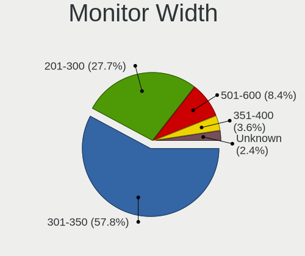

| Width in mm | Notebooks | Percent |
|-------------|-----------|---------|
| 301-350     | 31        | 64.58%  |
| 201-300     | 12        | 25%     |
| 501-600     | 4         | 8.33%   |
| 351-400     | 1         | 2.08%   |

Aspect Ratio
------------

Proportional relationship between the width and the height

| Ratio | Notebooks | Percent |
|-------|-----------|---------|
| 16/9  | 37        | 80.43%  |
| 16/10 | 7         | 15.22%  |
| 5/4   | 1         | 2.17%   |
| 3/2   | 1         | 2.17%   |

Monitor Area
------------

Area in inch²

| Area in inch² | Notebooks | Percent |
|----------------|-----------|---------|
| 91-100         | 14        | 28.57%  |
| 81-90          | 13        | 26.53%  |
| 61-70          | 11        | 22.45%  |
| 101-110        | 5         | 10.2%   |
| 301-350        | 2         | 4.08%   |
| 201-250        | 2         | 4.08%   |
| 141-150        | 1         | 2.04%   |
| 121-130        | 1         | 2.04%   |

Pixel Density
-------------

Pixels per inch

| Density | Notebooks | Percent |
|---------|-----------|---------|
| 121-160 | 27        | 56.25%  |
| 101-120 | 11        | 22.92%  |
| 51-100  | 8         | 16.67%  |
| 161-240 | 2         | 4.17%   |

Multiple Monitors
-----------------

Total monitors connected

| Total | Notebooks | Percent |
|-------|-----------|---------|
| 1     | 42        | 75%     |
| 0     | 10        | 17.86%  |
| 2     | 4         | 7.14%   |

Network
-------

Net Controller Vendor
---------------------

Controller vendors

| Vendor                            | Notebooks | Percent |
|-----------------------------------|-----------|---------|
| Intel                             | 42        | 45.65%  |
| Realtek Semiconductor             | 19        | 20.65%  |
| Qualcomm Atheros                  | 13        | 14.13%  |
| Broadcom                          | 7         | 7.61%   |
| Qualcomm Atheros Communications   | 2         | 2.17%   |
| Dell                              | 2         | 2.17%   |
| VIA Technologies                  | 1         | 1.09%   |
| Van Ooijen Technische Informatica | 1         | 1.09%   |
| Sierra Wireless                   | 1         | 1.09%   |
| Ralink Technology                 | 1         | 1.09%   |
| OnePlus Technology (Shenzhen)     | 1         | 1.09%   |
| Atheros                           | 1         | 1.09%   |
| AMD                               | 1         | 1.09%   |

Net Controller Model
--------------------

Controller models

| Model                                                                         | Notebooks | Percent |
|-------------------------------------------------------------------------------|-----------|---------|
| Realtek RTL8111/8168/8411 PCI Express Gigabit Ethernet Controller             | 17        | 14.91%  |
| Intel 82567LM Gigabit Network Connection                                      | 7         | 6.14%   |
| Intel Ultimate N WiFi Link 5300                                               | 5         | 4.39%   |
| Intel 82579LM Gigabit Network Connection (Lewisville)                         | 5         | 4.39%   |
| Qualcomm Atheros AR9285 Wireless Network Adapter (PCI-Express)                | 4         | 3.51%   |
| Intel Wireless 8260                                                           | 4         | 3.51%   |
| Intel Ethernet Connection I219-LM                                             | 3         | 2.63%   |
| Intel Centrino Advanced-N 6205 [Taylor Peak]                                  | 3         | 2.63%   |
| Realtek RTL810xE PCI Express Fast Ethernet controller                         | 2         | 1.75%   |
| Qualcomm Atheros AR9462 Wireless Network Adapter                              | 2         | 1.75%   |
| Qualcomm Atheros AR9287 Wireless Network Adapter (PCI-Express)                | 2         | 1.75%   |
| Intel Wireless 8265 / 8275                                                    | 2         | 1.75%   |
| Intel Wireless 7265                                                           | 2         | 1.75%   |
| Intel Wireless 7260                                                           | 2         | 1.75%   |
| Intel Ethernet Connection I218-LM                                             | 2         | 1.75%   |
| Intel Comet Lake PCH-LP CNVi WiFi                                             | 2         | 1.75%   |
| Intel Centrino Advanced-N 6235                                                | 2         | 1.75%   |
| Intel Cannon Lake PCH CNVi WiFi                                               | 2         | 1.75%   |
| VIA VT6102/VT6103 [Rhine-II]                                                  | 1         | 0.88%   |
| Van Ooijen Technische Informatica CDC-ACM class devices (modems)              | 1         | 0.88%   |
| Sierra Wireless EM7305 Modem                                                  | 1         | 0.88%   |
| Ralink RT5370 Wireless Adapter                                                | 1         | 0.88%   |
| Qualcomm Atheros QCA9565 / AR9565 Wireless Network Adapter                    | 1         | 0.88%   |
| Qualcomm Atheros QCA9377 802.11ac Wireless Network Adapter                    | 1         | 0.88%   |
| Qualcomm Atheros QCA8172 Fast Ethernet                                        | 1         | 0.88%   |
| Qualcomm Atheros TP-Link TL-WN821N v2 / TL-WN822N v1 802.11n [Atheros AR9170] | 1         | 0.88%   |
| Qualcomm Atheros AR9271 802.11n                                               | 1         | 0.88%   |
| Qualcomm Atheros AR9485 Wireless Network Adapter                              | 1         | 0.88%   |
| Qualcomm Atheros AR8162 Fast Ethernet                                         | 1         | 0.88%   |
| OnePlus (Shenzhen) OnePlus RNDIS Control RNDIS Ethernet Data                  | 1         | 0.88%   |
| Intel Wireless-AC 9260                                                        | 1         | 0.88%   |
| Intel Wireless 3165                                                           | 1         | 0.88%   |
| Intel Wi-Fi 6 AX201                                                           | 1         | 0.88%   |
| Intel PRO/Wireless 2915ABG [Calexico2] Network Connection                     | 1         | 0.88%   |
| Intel I211 Gigabit Network Connection                                         | 1         | 0.88%   |
| Intel Ethernet Connection I219-V                                              | 1         | 0.88%   |
| Intel Ethernet Connection I217-LM                                             | 1         | 0.88%   |
| Intel Ethernet Connection (6) I219-LM                                         | 1         | 0.88%   |
| Intel Ethernet Connection (4) I219-LM                                         | 1         | 0.88%   |
| Intel Ethernet Connection (3) I218-LM                                         | 1         | 0.88%   |

Wireless Vendor
---------------

Wireless vendors

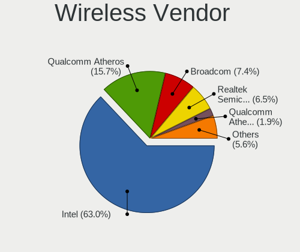

| Vendor                          | Notebooks | Percent |
|---------------------------------|-----------|---------|
| Intel                           | 37        | 63.79%  |
| Qualcomm Atheros                | 11        | 18.97%  |
| Broadcom                        | 4         | 6.9%    |
| Qualcomm Atheros Communications | 2         | 3.45%   |
| Dell                            | 2         | 3.45%   |
| Ralink Technology               | 1         | 1.72%   |
| Atheros                         | 1         | 1.72%   |

Wireless Model
--------------

Wireless models

| Model                                                                         | Notebooks | Percent |
|-------------------------------------------------------------------------------|-----------|---------|
| Intel Ultimate N WiFi Link 5300                                               | 5         | 8.62%   |
| Qualcomm Atheros AR9285 Wireless Network Adapter (PCI-Express)                | 4         | 6.9%    |
| Intel Wireless 8260                                                           | 4         | 6.9%    |
| Intel Centrino Advanced-N 6205 [Taylor Peak]                                  | 3         | 5.17%   |
| Qualcomm Atheros AR9462 Wireless Network Adapter                              | 2         | 3.45%   |
| Qualcomm Atheros AR9287 Wireless Network Adapter (PCI-Express)                | 2         | 3.45%   |
| Intel Wireless 8265 / 8275                                                    | 2         | 3.45%   |
| Intel Wireless 7265                                                           | 2         | 3.45%   |
| Intel Wireless 7260                                                           | 2         | 3.45%   |
| Intel Comet Lake PCH-LP CNVi WiFi                                             | 2         | 3.45%   |
| Intel Centrino Advanced-N 6235                                                | 2         | 3.45%   |
| Intel Cannon Lake PCH CNVi WiFi                                               | 2         | 3.45%   |
| Ralink RT5370 Wireless Adapter                                                | 1         | 1.72%   |
| Qualcomm Atheros QCA9565 / AR9565 Wireless Network Adapter                    | 1         | 1.72%   |
| Qualcomm Atheros QCA9377 802.11ac Wireless Network Adapter                    | 1         | 1.72%   |
| Qualcomm Atheros TP-Link TL-WN821N v2 / TL-WN822N v1 802.11n [Atheros AR9170] | 1         | 1.72%   |
| Qualcomm Atheros AR9271 802.11n                                               | 1         | 1.72%   |
| Qualcomm Atheros AR9485 Wireless Network Adapter                              | 1         | 1.72%   |
| Intel Wireless-AC 9260                                                        | 1         | 1.72%   |
| Intel Wireless 3165                                                           | 1         | 1.72%   |
| Intel Wi-Fi 6 AX201                                                           | 1         | 1.72%   |
| Intel PRO/Wireless 2915ABG [Calexico2] Network Connection                     | 1         | 1.72%   |
| Intel Dual Band Wireless-AC 3165 Plus Bluetooth                               | 1         | 1.72%   |
| Intel Comet Lake PCH CNVi WiFi                                                | 1         | 1.72%   |
| Intel Centrino Wireless-N 2230                                                | 1         | 1.72%   |
| Intel Centrino Wireless-N 135                                                 | 1         | 1.72%   |
| Intel Centrino Wireless-N 1030 [Rainbow Peak]                                 | 1         | 1.72%   |
| Intel Centrino Ultimate-N 6300                                                | 1         | 1.72%   |
| Intel Centrino Advanced-N 6230 [Rainbow Peak]                                 | 1         | 1.72%   |
| Intel Centrino Advanced-N 6200                                                | 1         | 1.72%   |
| Intel Cannon Point-LP CNVi [Wireless-AC]                                      | 1         | 1.72%   |
| Dell Dell Wireless 5560 Single-mode HSPA Mini Card with A-GPS                 | 1         | 1.72%   |
| Dell Dell Wireless 5550 HSPA+ Mini-Card Network Adapter                       | 1         | 1.72%   |
| Broadcom BCM43228 802.11a/b/g/n                                               | 1         | 1.72%   |
| Broadcom BCM43142 802.11b/g/n                                                 | 1         | 1.72%   |
| Broadcom BCM4313 802.11bgn Wireless Network Adapter                           | 1         | 1.72%   |
| Broadcom BCM4312 802.11b/g LP-PHY                                             | 1         | 1.72%   |
| Atheros AR2413/AR2414 Wireless Network Adapter [AR5005G(S) 802.11bg]          | 1         | 1.72%   |

Ethernet Vendor
---------------

Ethernet vendors

| Vendor                        | Notebooks | Percent |
|-------------------------------|-----------|---------|
| Intel                         | 26        | 49.06%  |
| Realtek Semiconductor         | 19        | 35.85%  |
| Broadcom                      | 3         | 5.66%   |
| Qualcomm Atheros              | 2         | 3.77%   |
| VIA Technologies              | 1         | 1.89%   |
| OnePlus Technology (Shenzhen) | 1         | 1.89%   |
| AMD                           | 1         | 1.89%   |

Ethernet Model
--------------

Ethernet models

| Model                                                             | Notebooks | Percent |
|-------------------------------------------------------------------|-----------|---------|
| Realtek RTL8111/8168/8411 PCI Express Gigabit Ethernet Controller | 17        | 32.08%  |
| Intel 82567LM Gigabit Network Connection                          | 7         | 13.21%  |
| Intel 82579LM Gigabit Network Connection (Lewisville)             | 5         | 9.43%   |
| Intel Ethernet Connection I219-LM                                 | 3         | 5.66%   |
| Realtek RTL810xE PCI Express Fast Ethernet controller             | 2         | 3.77%   |
| Intel Ethernet Connection I218-LM                                 | 2         | 3.77%   |
| VIA VT6102/VT6103 [Rhine-II]                                      | 1         | 1.89%   |
| Qualcomm Atheros QCA8172 Fast Ethernet                            | 1         | 1.89%   |
| Qualcomm Atheros AR8162 Fast Ethernet                             | 1         | 1.89%   |
| OnePlus (Shenzhen) OnePlus RNDIS Control RNDIS Ethernet Data      | 1         | 1.89%   |
| Intel I211 Gigabit Network Connection                             | 1         | 1.89%   |
| Intel Ethernet Connection I219-V                                  | 1         | 1.89%   |
| Intel Ethernet Connection I217-LM                                 | 1         | 1.89%   |
| Intel Ethernet Connection (6) I219-LM                             | 1         | 1.89%   |
| Intel Ethernet Connection (4) I219-LM                             | 1         | 1.89%   |
| Intel Ethernet Connection (3) I218-LM                             | 1         | 1.89%   |
| Intel Ethernet Connection (10) I219-V                             | 1         | 1.89%   |
| Intel Ethernet Connection (10) I219-LM                            | 1         | 1.89%   |
| Intel 82577LM Gigabit Network Connection                          | 1         | 1.89%   |
| Broadcom NetXtreme BCM5751M Gigabit Ethernet PCI Express          | 1         | 1.89%   |
| Broadcom NetLink BCM57785 Gigabit Ethernet PCIe                   | 1         | 1.89%   |
| Broadcom NetLink BCM57780 Gigabit Ethernet PCIe                   | 1         | 1.89%   |
| AMD Family 17h Processor 10 Gb Ethernet Controller Port 0         | 1         | 1.89%   |

Net Controller Kind
-------------------

Ethernet, WiFi or modem

| Kind     | Notebooks | Percent |
|----------|-----------|---------|
| WiFi     | 53        | 49.53%  |
| Ethernet | 51        | 47.66%  |
| Modem    | 2         | 1.87%   |
| Unknown  | 1         | 0.93%   |

Used Controller
---------------

Currently used network controller

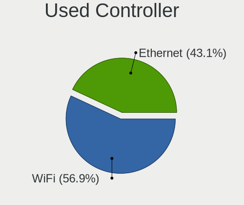

| Kind     | Notebooks | Percent |
|----------|-----------|---------|
| WiFi     | 45        | 56.96%  |
| Ethernet | 34        | 43.04%  |

NICs
----

Total network controllers on board

| Total | Notebooks | Percent |
|-------|-----------|---------|
| 2     | 48        | 88.89%  |
| 1     | 3         | 5.56%   |
| 3     | 2         | 3.7%    |
| 5     | 1         | 1.85%   |

IPv6
----

IPv6 vs IPv4

| Used | Notebooks | Percent |
|------|-----------|---------|
| No   | 54        | 100%    |

Bluetooth
---------

Bluetooth Vendor
----------------

Controller vendors

| Vendor                          | Notebooks | Percent |
|---------------------------------|-----------|---------|
| Intel                           | 21        | 61.76%  |
| Broadcom                        | 4         | 11.76%  |
| IMC Networks                    | 3         | 8.82%   |
| Qualcomm Atheros Communications | 2         | 5.88%   |
| Foxconn / Hon Hai               | 2         | 5.88%   |
| Hewlett-Packard                 | 1         | 2.94%   |
| Dell                            | 1         | 2.94%   |

Bluetooth Model
---------------

Controller models

| Model                                                  | Notebooks | Percent |
|--------------------------------------------------------|-----------|---------|
| Intel Bluetooth wireless interface                     | 8         | 23.53%  |
| Intel AX201 Bluetooth                                  | 4         | 11.76%  |
| Intel Centrino Bluetooth Wireless Transceiver          | 3         | 8.82%   |
| Intel Bluetooth 9460/9560 Jefferson Peak (JfP)         | 3         | 8.82%   |
| Broadcom BCM2045B (BDC-2.1) [Bluetooth Controller]     | 3         | 8.82%   |
| Intel Centrino Advanced-N 6230 Bluetooth adapter       | 2         | 5.88%   |
| Qualcomm Atheros  QCA9377 Bluetooth 4.1                | 1         | 2.94%   |
| Qualcomm Atheros Dell Wireless 1601 Bluetooth Device   | 1         | 2.94%   |
| Intel Wireless-AC 9260 Bluetooth Adapter               | 1         | 2.94%   |
| IMC Networks Qualcomm Atheros Bluetooth 4.0 + HS       | 1         | 2.94%   |
| IMC Networks Atheros AR3012 Bluetooth 4.0 Adapter      | 1         | 2.94%   |
| IMC Networks Asus Integrated Bluetooth module [AR3011] | 1         | 2.94%   |
| HP Atheros AR9285 Malbec Bluetooth Adapter             | 1         | 2.94%   |
| Foxconn / Hon Hai Broadcom BCM20702 Bluetooth          | 1         | 2.94%   |
| Foxconn / Hon Hai Bluetooth USB Module                 | 1         | 2.94%   |
| Dell Dell Wireless 380 Bluetooth 4.0 Module            | 1         | 2.94%   |
| Broadcom BCM43142A0 Bluetooth Module                   | 1         | 2.94%   |

Sound
-----

Sound Vendor
------------

Sound card vendors

| Vendor                | Notebooks | Percent |
|-----------------------|-----------|---------|
| Intel                 | 50        | 83.33%  |
| Nvidia                | 4         | 6.67%   |
| AMD                   | 3         | 5%      |
| VIA Technologies      | 1         | 1.67%   |
| Realtek Semiconductor | 1         | 1.67%   |
| Kingston Technology   | 1         | 1.67%   |

Sound Model
-----------

Sound card models

| Model                                                                      | Notebooks | Percent |
|----------------------------------------------------------------------------|-----------|---------|
| Intel 7 Series/C216 Chipset Family High Definition Audio Controller        | 11        | 15.71%  |
| Intel Sunrise Point-LP HD Audio                                            | 8         | 11.43%  |
| Intel 82801I (ICH9 Family) HD Audio Controller                             | 7         | 10%     |
| Intel 6 Series/C200 Series Chipset Family High Definition Audio Controller | 4         | 5.71%   |
| Intel Haswell-ULT HD Audio Controller                                      | 3         | 4.29%   |
| Intel 8 Series HD Audio Controller                                         | 3         | 4.29%   |
| Nvidia GF108 High Definition Audio Controller                              | 2         | 2.86%   |
| Intel Xeon E3-1200 v3/4th Gen Core Processor HD Audio Controller           | 2         | 2.86%   |
| Intel Wildcat Point-LP High Definition Audio Controller                    | 2         | 2.86%   |
| Intel Comet Lake PCH-LP cAVS                                               | 2         | 2.86%   |
| Intel Cannon Lake PCH cAVS                                                 | 2         | 2.86%   |
| Intel Broadwell-U Audio Controller                                         | 2         | 2.86%   |
| Intel 8 Series/C220 Series Chipset High Definition Audio Controller        | 2         | 2.86%   |
| Intel 5 Series/3400 Series Chipset High Definition Audio                   | 2         | 2.86%   |
| AMD Family 17h/19h HD Audio Controller                                     | 2         | 2.86%   |
| VIA Technologies VX900/VT8xxx High Definition Audio Controller             | 1         | 1.43%   |
| Realtek Semiconductor TX 384kb Hifi Type_C Audio                           | 1         | 1.43%   |
| Nvidia unknown                                                             | 1         | 1.43%   |
| Nvidia TU107 GeForce GTX 1650 High Definition Audio Controller             | 1         | 1.43%   |
| Kingston Technology HyperX 7.1 Audio                                       | 1         | 1.43%   |
| Intel Tiger Lake-LP Smart Sound Technology Audio Controller                | 1         | 1.43%   |
| Intel Comet Lake PCH cAVS                                                  | 1         | 1.43%   |
| Intel CM238 HD Audio Controller                                            | 1         | 1.43%   |
| Intel Celeron/Pentium Silver Processor High Definition Audio               | 1         | 1.43%   |
| Intel Cannon Point-LP High Definition Audio Controller                     | 1         | 1.43%   |
| Intel Atom Processor Z36xxx/Z37xxx Series High Definition Audio Controller | 1         | 1.43%   |
| Intel 82801FB/FBM/FR/FW/FRW (ICH6 Family) AC'97 Audio Controller           | 1         | 1.43%   |
| AMD Wrestler HDMI Audio                                                    | 1         | 1.43%   |
| AMD SBx00 Azalia (Intel HDA)                                               | 1         | 1.43%   |
| AMD Raven/Raven2/Fenghuang HDMI/DP Audio Controller                        | 1         | 1.43%   |
| Unknown                                                                    | 1         | 1.43%   |

Memory
------

Memory Vendor
-------------

Memory module vendors

| Vendor              | Notebooks | Percent |
|---------------------|-----------|---------|
| Samsung Electronics | 14        | 26.42%  |
| SK hynix            | 13        | 24.53%  |
| Kingston            | 6         | 11.32%  |
| Unknown             | 4         | 7.55%   |
| Ramaxel Technology  | 4         | 7.55%   |
| Micron Technology   | 4         | 7.55%   |
| GOODRAM             | 4         | 7.55%   |
| Transcend           | 1         | 1.89%   |
| G.Skill             | 1         | 1.89%   |
| Elpida              | 1         | 1.89%   |
| Corsair             | 1         | 1.89%   |

Memory Model
------------

Memory module models

| Model                                                     | Notebooks | Percent |
|-----------------------------------------------------------|-----------|---------|
| SK hynix RAM HMT325S6BFR8C-H9 2GB SODIMM DDR3 1333MT/s    | 2         | 3.57%   |
| SK hynix RAM HMAA1GS6CJR6N-XN 8GB SODIMM DDR4 3200MT/s    | 2         | 3.57%   |
| Samsung RAM M471B5273DH0-CH9 4GB SODIMM DDR3 1334MT/s     | 2         | 3.57%   |
| Ramaxel RAM RMSA3260ME78HAF-2666 8GB SODIMM DDR4 2667MT/s | 2         | 3.57%   |
| Micron RAM 8KTF51264HZ-1G6E1 4GB SODIMM DDR3 1600MT/s     | 2         | 3.57%   |
| Unknown RAM Module 512MB SODIMM DDR                       | 1         | 1.79%   |
| Unknown RAM Module 4GB SODIMM DDR3 1600MT/s               | 1         | 1.79%   |
| Unknown RAM Module 4096MB SODIMM DDR3                     | 1         | 1.79%   |
| Unknown RAM Module 2GB SODIMM DDR                         | 1         | 1.79%   |
| Unknown RAM Module 1GB SODIMM DRAM 533MT/s                | 1         | 1.79%   |
| Transcend RAM TS1GLH64V6BL 8GB SODIMM DDR4 2667MT/s       | 1         | 1.79%   |
| SK hynix RAM Module 8GB SODIMM DDR4 2133MT/s              | 1         | 1.79%   |
| SK hynix RAM HMT451S6AFR8A-PB 4GB SODIMM DDR3 1600MT/s    | 1         | 1.79%   |
| SK hynix RAM HMT425S6MFR6A-PB 2GB SODIMM DDR3 1600MT/s    | 1         | 1.79%   |
| SK hynix RAM HMT41GS6BFR8A-PB 8GB SODIMM DDR3 1600MT/s    | 1         | 1.79%   |
| SK hynix RAM HMT351S6BFR8C-H9 4GB SODIMM DDR3 1334MT/s    | 1         | 1.79%   |
| SK hynix RAM HMT112S6TFR8C-H9 1GB SODIMM DDR3 1066MT/s    | 1         | 1.79%   |
| SK hynix RAM HMA81GS6DJR8N-XN 8GB SODIMM DDR4 3200MT/s    | 1         | 1.79%   |
| SK hynix RAM HMA81GS6AFR8N-UH 8GB SODIMM DDR4 2400MT/s    | 1         | 1.79%   |
| SK hynix RAM H9CCNNN8JTBLAR-NUD 2GB LPDDR3 1867MT/s       | 1         | 1.79%   |
| Samsung RAM M471B5773DH0-CK0 2GB SODIMM DDR3 1600MT/s     | 1         | 1.79%   |
| Samsung RAM M471B5773DH0-CH9 2GB SODIMM DDR3 1334MT/s     | 1         | 1.79%   |
| Samsung RAM M471B5273CH0-CH9 4GB SODIMM DDR3 1334MT/s     | 1         | 1.79%   |
| Samsung RAM M471B5273CH0-CF8 4GB SODIMM DDR3 1067MT/s     | 1         | 1.79%   |
| Samsung RAM M471B5173QH0-YK0 4GB SODIMM DDR3 1600MT/s     | 1         | 1.79%   |
| Samsung RAM M471B5173DB0-YK0 4096MB SODIMM DDR3 1600MT/s  | 1         | 1.79%   |
| Samsung RAM M471B1G73QH0-YK0 8GB SODIMM DDR3 1867MT/s     | 1         | 1.79%   |
| Samsung RAM M471B1G73BH0-CK0 8GB SODIMM DDR3 1600MT/s     | 1         | 1.79%   |
| Samsung RAM M471A5244CB0-CRC 4GB SODIMM DDR4 2400MT/s     | 1         | 1.79%   |
| Samsung RAM M471A1K43CB1-CRC 8GB SODIMM DDR4 2400MT/s     | 1         | 1.79%   |
| Samsung RAM M471A1G44AB0-CWE 8GB SODIMM DDR4 3200MT/s     | 1         | 1.79%   |
| Samsung RAM M471A1G44AB0-CTD 8GB SODIMM DDR4 2667MT/s     | 1         | 1.79%   |
| Samsung RAM M378B2873CZ0-CF7 1024MB SODIMM DDR3 800MT/s   | 1         | 1.79%   |
| Samsung RAM K4F8E304HB-MGCJ 1GB DIMM LPDDR4 2133MT/s      | 1         | 1.79%   |
| Ramaxel RAM RMT3190ME76F8F1600 2GB SODIMM DDR3 1067MT/s   | 1         | 1.79%   |
| Ramaxel RAM RMT3020EC58E9F1333 4GB SODIMM DDR3 1333MT/s   | 1         | 1.79%   |
| Micron RAM 8ATF1G64HZ-2G6H1 8GB SODIMM DDR4 2667MT/s      | 1         | 1.79%   |
| Micron RAM 16ATF2G64HZ-2G6E1 16GB SODIMM DDR4 2667MT/s    | 1         | 1.79%   |
| Kingston RAM KHX2666C15S4/16G 16GB SODIMM DDR4 2667MT/s   | 1         | 1.79%   |
| Kingston RAM ACR256X64D3S1066C7 2GB SODIMM DDR3 1067MT/s  | 1         | 1.79%   |

Memory Kind
-----------

Memory module kinds

| Kind   | Notebooks | Percent |
|--------|-----------|---------|
| DDR3   | 23        | 53.49%  |
| DDR4   | 16        | 37.21%  |
| LPDDR4 | 1         | 2.33%   |
| LPDDR3 | 1         | 2.33%   |
| DRAM   | 1         | 2.33%   |
| DDR    | 1         | 2.33%   |

Memory Form Factor
------------------

Physical design of the memory module

| Name    | Notebooks | Percent |
|---------|-----------|---------|
| SODIMM  | 41        | 95.35%  |
| DIMM    | 1         | 2.33%   |
| Unknown | 1         | 2.33%   |

Memory Size
-----------

Memory module size

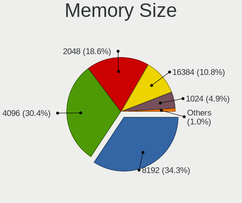

| Size  | Notebooks | Percent |
|-------|-----------|---------|
| 8192  | 15        | 31.91%  |
| 4096  | 14        | 29.79%  |
| 2048  | 9         | 19.15%  |
| 16384 | 4         | 8.51%   |
| 1024  | 4         | 8.51%   |
| 512   | 1         | 2.13%   |

Memory Speed
------------

Memory module speed

| Speed   | Notebooks | Percent |
|---------|-----------|---------|
| 1600    | 11        | 21.57%  |
| 2667    | 6         | 11.76%  |
| 2400    | 5         | 9.8%    |
| 2133    | 5         | 9.8%    |
| 1334    | 5         | 9.8%    |
| 1333    | 5         | 9.8%    |
| 3200    | 4         | 7.84%   |
| 1867    | 2         | 3.92%   |
| 1067    | 2         | 3.92%   |
| 800     | 2         | 3.92%   |
| Unknown | 2         | 3.92%   |
| 1066    | 1         | 1.96%   |
| 533     | 1         | 1.96%   |

Printers & scanners
-------------------

Printer Vendor
--------------

Printer device vendors

Zero info for selected period =(

Printer Model
-------------

Printer device models

Zero info for selected period =(

Scanner Vendor
--------------

Scanner device vendors

Zero info for selected period =(

Scanner Model
-------------

Scanner device models

Zero info for selected period =(

Camera
------

Camera Vendor
-------------

Camera device vendors

| Vendor                                 | Notebooks | Percent |
|----------------------------------------|-----------|---------|
| Chicony Electronics                    | 14        | 38.89%  |
| Microdia                               | 7         | 19.44%  |
| Realtek Semiconductor                  | 4         | 11.11%  |
| Acer                                   | 3         | 8.33%   |
| Ricoh                                  | 2         | 5.56%   |
| Lite-On Technology                     | 2         | 5.56%   |
| Syntek                                 | 1         | 2.78%   |
| Sunplus Innovation Technology          | 1         | 2.78%   |
| Logitech                               | 1         | 2.78%   |
| Cheng Uei Precision Industry (Foxlink) | 1         | 2.78%   |

Camera Model
------------

Camera device models

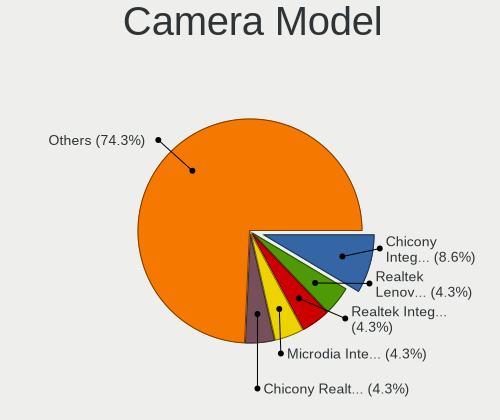

| Model                                                         | Notebooks | Percent |
|---------------------------------------------------------------|-----------|---------|
| Realtek Lenovo EasyCamera                                     | 3         | 8.33%   |
| Microdia Integrated Webcam                                    | 3         | 8.33%   |
| Microdia Integrated_Webcam_HD                                 | 2         | 5.56%   |
| Lite-On Integrated Camera                                     | 2         | 5.56%   |
| Chicony Integrated Camera (1280x720@30)                       | 2         | 5.56%   |
| Chicony Integrated Camera                                     | 2         | 5.56%   |
| Chicony HD WebCam                                             | 2         | 5.56%   |
| Syntek Lenovo EasyCamera                                      | 1         | 2.78%   |
| Sunplus Integrated_Webcam_HD                                  | 1         | 2.78%   |
| Ricoh Integrated Webcam                                       | 1         | 2.78%   |
| Ricoh HD Webcam                                               | 1         | 2.78%   |
| Realtek Integrated_Webcam_HD                                  | 1         | 2.78%   |
| Microdia Laptop_Integrated_Webcam_HD                          | 1         | 2.78%   |
| Microdia Dell Integrated HD Webcam                            | 1         | 2.78%   |
| Logitech HD Pro Webcam C920                                   | 1         | 2.78%   |
| Chicony ThinkPad T490 Webcam                                  | 1         | 2.78%   |
| Chicony Realtek DMFT - RGB                                    | 1         | 2.78%   |
| Chicony Integrated Camera [ThinkPad]                          | 1         | 2.78%   |
| Chicony HP Integrated Webcam                                  | 1         | 2.78%   |
| Chicony HP HD Webcam [Fixed]                                  | 1         | 2.78%   |
| Chicony Front Camera                                          | 1         | 2.78%   |
| Chicony Chicony USB2.0 Camera                                 | 1         | 2.78%   |
| Chicony 1.3M Webcam                                           | 1         | 2.78%   |
| Cheng Uei Precision Industry (Foxlink) USB2.0 UVC 1.3M WebCam | 1         | 2.78%   |
| Acer USB HD Webcam                                            | 1         | 2.78%   |
| Acer Lenovo EasyCamera                                        | 1         | 2.78%   |
| Acer EasyCamera                                               | 1         | 2.78%   |

Security
--------

Fingerprint Vendor
------------------

Fingerprint sensor vendors

| Vendor                     | Notebooks | Percent |
|----------------------------|-----------|---------|
| Validity Sensors           | 3         | 25%     |
| Synaptics                  | 3         | 25%     |
| Broadcom                   | 3         | 25%     |
| STMicroelectronics         | 1         | 8.33%   |
| Shenzhen Goodix Technology | 1         | 8.33%   |
| AuthenTec                  | 1         | 8.33%   |

Fingerprint Model
-----------------

Fingerprint sensor models

| Model                                                                        | Notebooks | Percent |
|------------------------------------------------------------------------------|-----------|---------|
| Broadcom BCM5880 Secure Applications Processor with fingerprint swipe sensor | 3         | 25%     |
| Validity Sensors VFS5011 Fingerprint Reader                                  | 2         | 16.67%  |
| Synaptics Prometheus MIS Touch Fingerprint Reader                            | 2         | 16.67%  |
| Validity Sensors Fingerprint scanner                                         | 1         | 8.33%   |
| Synaptics  WBDI                                                              | 1         | 8.33%   |
| STMicroelectronics Fingerprint Reader                                        | 1         | 8.33%   |
| Shenzhen Goodix Fingerprint Reader                                           | 1         | 8.33%   |
| AuthenTec AES2810                                                            | 1         | 8.33%   |

Chipcard Vendor
---------------

Chipcard module vendors

Zero info for selected period =(

Chipcard Model
--------------

Chipcard module models

Zero info for selected period =(

Unsupported
-----------

Unsupported Devices
-------------------

Total unsupported devices on board

| Total | Notebooks | Percent |
|-------|-----------|---------|
| 2     | 22        | 39.29%  |
| 1     | 17        | 30.36%  |
| 3     | 9         | 16.07%  |
| 0     | 3         | 5.36%   |
| 5     | 2         | 3.57%   |
| 4     | 2         | 3.57%   |
| 6     | 1         | 1.79%   |

Unsupported Device Types
------------------------

Types of unsupported devices

| Type                     | Notebooks | Percent |
|--------------------------|-----------|---------|
| Communication controller | 46        | 45.1%   |
| Bluetooth                | 15        | 14.71%  |
| Fingerprint reader       | 12        | 11.76%  |
| Card reader              | 11        | 10.78%  |
| Net/wireless             | 8         | 7.84%   |
| Graphics card            | 7         | 6.86%   |
| Network                  | 1         | 0.98%   |
| Modem                    | 1         | 0.98%   |
| Firewire controller      | 1         | 0.98%   |

