BSD in Poland - Tested Hardware & Statistics
--------------------------------------------

A project to collect tested hardware configurations for BSD in Poland.

Anyone can contribute to this report by the [hw-probe](https://github.com/linuxhw/hw-probe/blob/master/INSTALL.BSD.md) tool:

    hw-probe -all -upload

Please contribute! Especially if your hardware is rare.

This is a report for all computer types. See also reports for [desktops](/Location/Poland/Desktop/README.md) and [notebooks](/Location/Poland/Notebook/README.md).

Contents
--------

* [ Test Cases ](#test-cases)

* [ System ](#system)
  - [ OS                       ](#os)
  - [ OS Family                ](#os-family)
  - [ Arch                     ](#arch)
  - [ DE                       ](#de)
  - [ Display Server           ](#display-server)
  - [ Display Manager          ](#display-manager)
  - [ OS Lang                  ](#os-lang)
  - [ Boot Mode                ](#boot-mode)
  - [ Filesystem               ](#filesystem)
  - [ Part. scheme             ](#part-scheme)

* [ Board ](#board)
  - [ Vendor                   ](#vendor)
  - [ Model                    ](#model)
  - [ Model Family             ](#model-family)
  - [ MFG Year                 ](#mfg-year)
  - [ Form Factor              ](#form-factor)
  - [ Coreboot                 ](#coreboot)
  - [ RAM Size                 ](#ram-size)
  - [ RAM Used                 ](#ram-used)
  - [ Total Drives             ](#total-drives)
  - [ Has CD-ROM               ](#has-cd-rom)
  - [ Has Ethernet             ](#has-ethernet)
  - [ Has WiFi                 ](#has-wifi)
  - [ Has Bluetooth            ](#has-bluetooth)

* [ Location ](#location)
  - [ Country                  ](#country)
  - [ City                     ](#city)

* [ Drives ](#drives)
  - [ Drive Vendor             ](#drive-vendor)
  - [ Drive Model              ](#drive-model)
  - [ HDD Vendor               ](#hdd-vendor)
  - [ SSD Vendor               ](#ssd-vendor)
  - [ Drive Kind               ](#drive-kind)
  - [ Drive Connector          ](#drive-connector)
  - [ Drive Size               ](#drive-size)
  - [ Space Total              ](#space-total)
  - [ Space Used               ](#space-used)
  - [ Malfunc. Drives          ](#malfunc-drives)
  - [ Malfunc. Drive Vendor    ](#malfunc-drive-vendor)
  - [ Malfunc. HDD Vendor      ](#malfunc-hdd-vendor)
  - [ Malfunc. Drive Kind      ](#malfunc-drive-kind)
  - [ Failed Drives            ](#failed-drives)
  - [ Failed Drive Vendor      ](#failed-drive-vendor)
  - [ Drive Status             ](#drive-status)

* [ Storage controller ](#storage-controller)
  - [ Storage Vendor           ](#storage-vendor)
  - [ Storage Model            ](#storage-model)
  - [ Storage Kind             ](#storage-kind)

* [ Processor ](#processor)
  - [ CPU Vendor               ](#cpu-vendor)
  - [ CPU Model                ](#cpu-model)
  - [ CPU Model Family         ](#cpu-model-family)
  - [ CPU Cores                ](#cpu-cores)
  - [ CPU Sockets              ](#cpu-sockets)
  - [ CPU Threads              ](#cpu-threads)
  - [ CPU Microarch            ](#cpu-microarch)

* [ Graphics ](#graphics)
  - [ GPU Vendor               ](#gpu-vendor)
  - [ GPU Model                ](#gpu-model)
  - [ GPU Combo                ](#gpu-combo)
  - [ GPU Driver               ](#gpu-driver)
  - [ GPU Memory               ](#gpu-memory)

* [ Monitor ](#monitor)
  - [ Monitor Vendor           ](#monitor-vendor)
  - [ Monitor Model            ](#monitor-model)
  - [ Monitor Resolution       ](#monitor-resolution)
  - [ Monitor Diagonal         ](#monitor-diagonal)
  - [ Monitor Width            ](#monitor-width)
  - [ Aspect Ratio             ](#aspect-ratio)
  - [ Monitor Area             ](#monitor-area)
  - [ Pixel Density            ](#pixel-density)
  - [ Multiple Monitors        ](#multiple-monitors)

* [ Network ](#network)
  - [ Net Controller Vendor    ](#net-controller-vendor)
  - [ Net Controller Model     ](#net-controller-model)
  - [ Wireless Vendor          ](#wireless-vendor)
  - [ Wireless Model           ](#wireless-model)
  - [ Ethernet Vendor          ](#ethernet-vendor)
  - [ Ethernet Model           ](#ethernet-model)
  - [ Net Controller Kind      ](#net-controller-kind)
  - [ Used Controller          ](#used-controller)
  - [ NICs                     ](#nics)
  - [ IPv6                     ](#ipv6)

* [ Bluetooth ](#bluetooth)
  - [ Bluetooth Vendor         ](#bluetooth-vendor)
  - [ Bluetooth Model          ](#bluetooth-model)

* [ Sound ](#sound)
  - [ Sound Vendor             ](#sound-vendor)
  - [ Sound Model              ](#sound-model)

* [ Memory ](#memory)
  - [ Memory Vendor            ](#memory-vendor)
  - [ Memory Model             ](#memory-model)
  - [ Memory Kind              ](#memory-kind)
  - [ Memory Form Factor       ](#memory-form-factor)
  - [ Memory Size              ](#memory-size)
  - [ Memory Speed             ](#memory-speed)

* [ Printers & scanners ](#printers--scanners)
  - [ Printer Vendor           ](#printer-vendor)
  - [ Printer Model            ](#printer-model)
  - [ Scanner Vendor           ](#scanner-vendor)
  - [ Scanner Model            ](#scanner-model)

* [ Camera ](#camera)
  - [ Camera Vendor            ](#camera-vendor)
  - [ Camera Model             ](#camera-model)

* [ Security ](#security)
  - [ Fingerprint Vendor       ](#fingerprint-vendor)
  - [ Fingerprint Model        ](#fingerprint-model)
  - [ Chipcard Vendor          ](#chipcard-vendor)
  - [ Chipcard Model           ](#chipcard-model)

* [ Unsupported ](#unsupported)
  - [ Unsupported Devices      ](#unsupported-devices)
  - [ Unsupported Device Types ](#unsupported-device-types)

Test Cases
----------

Total: 863

| Vendor        | Model                       | Form-Factor | Probe                                                     | Date         |
|---------------|-----------------------------|-------------|-----------------------------------------------------------|--------------|
| Lenovo        | 312D SDK0J40697 WIN 3305... | Mini pc     | [623b36fe51](https://bsd-hardware.info/?probe=623b36fe51) | Jan 02, 2026 |
| ASUSTek       | VivoBook_ASUSLaptop X509... | Notebook    | [0f95b521f1](https://bsd-hardware.info/?probe=0f95b521f1) | Jan 02, 2026 |
| Lenovo        | 32E4 NOK                    | Mini pc     | [bbb79b28be](https://bsd-hardware.info/?probe=bbb79b28be) | Dec 30, 2025 |
| Gigabyte      | J4005ND2P-CF                | Desktop     | [fab0b32dc7](https://bsd-hardware.info/?probe=fab0b32dc7) | Dec 28, 2025 |
| Biostar       | J4125NHU                    | Desktop     | [9d72923faf](https://bsd-hardware.info/?probe=9d72923faf) | Dec 28, 2025 |
| Biostar       | J4125NHU                    | Desktop     | [a2e45c2a59](https://bsd-hardware.info/?probe=a2e45c2a59) | Dec 28, 2025 |
| ASRock        | N100M                       | Desktop     | [4f99de8a31](https://bsd-hardware.info/?probe=4f99de8a31) | Dec 28, 2025 |
| Lenovo        | 312D SDK0J40697 WIN 3305... | Mini pc     | [29e982b96e](https://bsd-hardware.info/?probe=29e982b96e) | Dec 25, 2025 |
| Supermicro    | Super Server                | Server      | [ecfc471083](https://bsd-hardware.info/?probe=ecfc471083) | Dec 25, 2025 |
| ASRock        | X570 Pro4                   | Desktop     | [81962180fa](https://bsd-hardware.info/?probe=81962180fa) | Dec 25, 2025 |
| HP            | 255 G8 Notebook PC          | Notebook    | [f0a1e79d8b](https://bsd-hardware.info/?probe=f0a1e79d8b) | Dec 22, 2025 |
| Protectli     | V1410                       | Desktop     | [655f503723](https://bsd-hardware.info/?probe=655f503723) | Dec 21, 2025 |
| Wincor Nix... | M2.0-H110-uATX Motherboa... | Desktop     | [fac59b87e0](https://bsd-hardware.info/?probe=fac59b87e0) | Dec 20, 2025 |
| Fujitsu       | D3313-B1 S26361-D3313-B1    | Desktop     | [0b504098f4](https://bsd-hardware.info/?probe=0b504098f4) | Dec 20, 2025 |
| Unknown       | Unknown                     | Desktop     | [4915ce02c7](https://bsd-hardware.info/?probe=4915ce02c7) | Dec 18, 2025 |
| HP            | Pavilion Laptop 15-eg0xx... | Notebook    | [382db82098](https://bsd-hardware.info/?probe=382db82098) | Dec 18, 2025 |
| Dell          | 0N28XX A02                  | Server      | [5922a99440](https://bsd-hardware.info/?probe=5922a99440) | Dec 16, 2025 |
| Dell          | 03NXH8 A00                  | Mini pc     | [f368f21a9e](https://bsd-hardware.info/?probe=f368f21a9e) | Dec 16, 2025 |
| Deciso        | NetBoard-A30 R1.1           | Server      | [18ed7c2541](https://bsd-hardware.info/?probe=18ed7c2541) | Dec 15, 2025 |
| Deciso        | NetBoard-A30 R1.1           | Server      | [12deb04a1a](https://bsd-hardware.info/?probe=12deb04a1a) | Dec 15, 2025 |
| Dell          | 03NXH8 A00                  | Mini pc     | [e4f62cca1e](https://bsd-hardware.info/?probe=e4f62cca1e) | Dec 13, 2025 |
| HP            | 8103 A01                    | Mini pc     | [05508ca89a](https://bsd-hardware.info/?probe=05508ca89a) | Dec 07, 2025 |
| ASUSTek       | Z10PA-U8 Series             | Desktop     | [7dbdf4a9a9](https://bsd-hardware.info/?probe=7dbdf4a9a9) | Dec 05, 2025 |
| HP            | 829E                        | Mini pc     | [ab922fe7f7](https://bsd-hardware.info/?probe=ab922fe7f7) | Dec 04, 2025 |
| ASUSTek       | UX303LB                     | Notebook    | [837da689bb](https://bsd-hardware.info/?probe=837da689bb) | Nov 30, 2025 |
| Dell          | 060J9C A00                  | Mini pc     | [96cec2cb85](https://bsd-hardware.info/?probe=96cec2cb85) | Nov 28, 2025 |
| Dell          | 0N28XX A02                  | Server      | [b022a096f9](https://bsd-hardware.info/?probe=b022a096f9) | Nov 26, 2025 |
| MSI           | MAG Z790 TOMAHAWK MAX WI... | Desktop     | [dd395c355e](https://bsd-hardware.info/?probe=dd395c355e) | Nov 20, 2025 |
| CWWK          | CW-AD4L-N V1                | Desktop     | [3478ea8bcf](https://bsd-hardware.info/?probe=3478ea8bcf) | Nov 16, 2025 |
| HP            | 21EF 00.~                   | Desktop     | [c4c315d548](https://bsd-hardware.info/?probe=c4c315d548) | Nov 09, 2025 |
| AOpen         | iBTMx-DS R1.10 55DED10A0... | Desktop     | [ef232a7d5d](https://bsd-hardware.info/?probe=ef232a7d5d) | Nov 09, 2025 |
| ASUSTek       | K53SC                       | Notebook    | [924b22d35b](https://bsd-hardware.info/?probe=924b22d35b) | Nov 09, 2025 |
| Intel         | DQ77MK AAG39642-400         | Desktop     | [165ad8ccf7](https://bsd-hardware.info/?probe=165ad8ccf7) | Nov 07, 2025 |
| ASUSTek       | X71SL                       | Notebook    | [c2d43ad651](https://bsd-hardware.info/?probe=c2d43ad651) | Nov 01, 2025 |
| Lenovo        | 3111 SDK0J40697 WIN 3305... | Mini pc     | [bbaee53dee](https://bsd-hardware.info/?probe=bbaee53dee) | Oct 27, 2025 |
| ASUSTek       | PRIME H310M-D R2.0          | Desktop     | [c5849e0963](https://bsd-hardware.info/?probe=c5849e0963) | Oct 27, 2025 |
| Dell          | 0NW6H5 A00                  | Desktop     | [89c0e5056b](https://bsd-hardware.info/?probe=89c0e5056b) | Oct 24, 2025 |
| ASRock        | H510 Pro BTC+               | Desktop     | [cb5da041fa](https://bsd-hardware.info/?probe=cb5da041fa) | Oct 15, 2025 |
| HP            | 8103 A01                    | Mini pc     | [7595ec51b2](https://bsd-hardware.info/?probe=7595ec51b2) | Oct 10, 2025 |
| Unknown       | Unknown                     | Desktop     | [8f325d378f](https://bsd-hardware.info/?probe=8f325d378f) | Oct 04, 2025 |
| Unknown       | Unknown                     | Desktop     | [622add33b1](https://bsd-hardware.info/?probe=622add33b1) | Oct 03, 2025 |
| Unknown       | Unknown                     | Desktop     | [e395e6db6c](https://bsd-hardware.info/?probe=e395e6db6c) | Sep 24, 2025 |
| Intel         | DQ77MK AAG39642-400         | Desktop     | [6176796649](https://bsd-hardware.info/?probe=6176796649) | Sep 22, 2025 |
| AOpen         | iBTMx-DS R1.10 55DED10A0... | Desktop     | [1c812c72b6](https://bsd-hardware.info/?probe=1c812c72b6) | Sep 17, 2025 |
| Unknown       | Unknown                     | Desktop     | [5fb9dc2de7](https://bsd-hardware.info/?probe=5fb9dc2de7) | Sep 16, 2025 |
| HP            | 21EF 00.~                   | Desktop     | [a8856c1eac](https://bsd-hardware.info/?probe=a8856c1eac) | Sep 15, 2025 |
| HP            | 21EF 00.~                   | Desktop     | [8d119797ff](https://bsd-hardware.info/?probe=8d119797ff) | Sep 15, 2025 |
| ASRock        | H510 Pro BTC+               | Desktop     | [afa245f519](https://bsd-hardware.info/?probe=afa245f519) | Sep 14, 2025 |
| Intel         | DQ77MK AAG39642-400         | Desktop     | [f211734892](https://bsd-hardware.info/?probe=f211734892) | Sep 11, 2025 |
| CheckPoint    | PB-10-00                    | Firewall    | [8545e7c2e7](https://bsd-hardware.info/?probe=8545e7c2e7) | Sep 10, 2025 |
| Unknown       | Unknown                     | Desktop     | [61c4dc29dc](https://bsd-hardware.info/?probe=61c4dc29dc) | Sep 08, 2025 |
| Sophos        | XG                          | Firewall    | [a8835cb19b](https://bsd-hardware.info/?probe=a8835cb19b) | Sep 07, 2025 |
| HP            | 21EF 00.~                   | Desktop     | [204e07d34a](https://bsd-hardware.info/?probe=204e07d34a) | Sep 05, 2025 |
| CheckPoint    | PB-10-00                    | Firewall    | [b7f094eb3e](https://bsd-hardware.info/?probe=b7f094eb3e) | Sep 04, 2025 |
| Unknown       | Unknown                     | Desktop     | [bcaeb35922](https://bsd-hardware.info/?probe=bcaeb35922) | Sep 02, 2025 |
| Lenovo        | 3111 SDK0J40697 WIN 3305... | Mini pc     | [37607d96fd](https://bsd-hardware.info/?probe=37607d96fd) | Sep 02, 2025 |
| HP            | 8103 A01                    | Mini pc     | [e4ba5b215e](https://bsd-hardware.info/?probe=e4ba5b215e) | Aug 29, 2025 |
| Unknown       | Unknown                     | Desktop     | [0214893818](https://bsd-hardware.info/?probe=0214893818) | Aug 24, 2025 |
| HP            | 3396                        | Desktop     | [58dea99364](https://bsd-hardware.info/?probe=58dea99364) | Aug 11, 2025 |
| HP            | 17E2                        | Desktop     | [d1187635ea](https://bsd-hardware.info/?probe=d1187635ea) | Aug 09, 2025 |
| Dell          | 03NXH8 A00                  | Mini pc     | [4991678302](https://bsd-hardware.info/?probe=4991678302) | Aug 08, 2025 |
| Unknown       | Unknown                     | Desktop     | [2d7980b5e3](https://bsd-hardware.info/?probe=2d7980b5e3) | Aug 08, 2025 |
| Fujitsu       | CELSIUS H710                | Notebook    | [7a452d60ae](https://bsd-hardware.info/?probe=7a452d60ae) | Aug 06, 2025 |
| Dell          | 0D4MD1 A04                  | Desktop     | [efbd3718aa](https://bsd-hardware.info/?probe=efbd3718aa) | Aug 03, 2025 |
| Lenovo        | 312D SDK0J40697 WIN 3305... | Mini pc     | [686380ccba](https://bsd-hardware.info/?probe=686380ccba) | Jul 30, 2025 |
| Unknown       | Unknown                     | Notebook    | [ce23f3e4b1](https://bsd-hardware.info/?probe=ce23f3e4b1) | Jul 30, 2025 |
| ASRock        | H510 Pro BTC+               | Desktop     | [bb7bbce3d7](https://bsd-hardware.info/?probe=bb7bbce3d7) | Jul 28, 2025 |
| Intel         | Q3XXG4-P V1.0               | Desktop     | [287f0e48e2](https://bsd-hardware.info/?probe=287f0e48e2) | Jul 23, 2025 |
| Deciso        | NetBoard-A10_Gen.3          | Notebook    | [e017b4e3f4](https://bsd-hardware.info/?probe=e017b4e3f4) | Jul 22, 2025 |
| Unknown       | Unknown                     | Desktop     | [fa5ace0c09](https://bsd-hardware.info/?probe=fa5ace0c09) | Jul 09, 2025 |
| ASRock        | N100M                       | Desktop     | [186380feef](https://bsd-hardware.info/?probe=186380feef) | Jul 08, 2025 |
| Intel         | NUC7i5BNB J31144-311        | Mini pc     | [58d9c51595](https://bsd-hardware.info/?probe=58d9c51595) | Jul 02, 2025 |
| Unknown       | Unknown                     | Notebook    | [2acde678f6](https://bsd-hardware.info/?probe=2acde678f6) | Jul 02, 2025 |
| Lenovo        | IdeaPad Gaming 3 15ARH7 ... | Notebook    | [c03744ab07](https://bsd-hardware.info/?probe=c03744ab07) | Jun 28, 2025 |
| Lenovo        | ThinkPad E14 Gen 4 21ECS... | Notebook    | [358f4cfd1b](https://bsd-hardware.info/?probe=358f4cfd1b) | Jun 28, 2025 |
| ASRock        | SBC-210                     | Desktop     | [0ef46acbb3](https://bsd-hardware.info/?probe=0ef46acbb3) | Jun 27, 2025 |
| NU591R        | 1.0                         | Desktop     | [e968aa8e02](https://bsd-hardware.info/?probe=e968aa8e02) | Jun 27, 2025 |
| Lenovo        | IdeaPad Gaming 3 15ARH7 ... | Notebook    | [2946586296](https://bsd-hardware.info/?probe=2946586296) | Jun 23, 2025 |
| Unknown       | Unknown                     | Desktop     | [c72f876ffb](https://bsd-hardware.info/?probe=c72f876ffb) | Jun 23, 2025 |
| Unknown       | Unknown                     | Desktop     | [df26e76470](https://bsd-hardware.info/?probe=df26e76470) | Jun 23, 2025 |
| AOpen         | iBTMx-DS R1.10 55DED10A0... | Desktop     | [344a8c0d7e](https://bsd-hardware.info/?probe=344a8c0d7e) | Jun 22, 2025 |
| Biostar       | J4125NHU                    | Desktop     | [a41747a045](https://bsd-hardware.info/?probe=a41747a045) | Jun 20, 2025 |
| AOpen         | iBTMx-DS R1.10 55DED10A0... | Desktop     | [bc31656cbe](https://bsd-hardware.info/?probe=bc31656cbe) | Jun 15, 2025 |
| Sophos        | XG                          | Firewall    | [1e7fa7ce71](https://bsd-hardware.info/?probe=1e7fa7ce71) | Jun 14, 2025 |
| Deciso        | NetBoard-A20                | Notebook    | [0e8844204d](https://bsd-hardware.info/?probe=0e8844204d) | Jun 14, 2025 |
| Intel         | NUC7i5BNB J31144-311        | Mini pc     | [d0f979ee55](https://bsd-hardware.info/?probe=d0f979ee55) | Jun 14, 2025 |
| Unknown       | Unknown                     | Desktop     | [abe8245d9b](https://bsd-hardware.info/?probe=abe8245d9b) | Jun 13, 2025 |
| Supermicro    | X10SLH-F/X10SLM+-F          | Server      | [723fbe7997](https://bsd-hardware.info/?probe=723fbe7997) | Jun 12, 2025 |
| Lex BayTra... | 2I385HW                     | Notebook    | [a5a6854250](https://bsd-hardware.info/?probe=a5a6854250) | Jun 10, 2025 |
| Lenovo        | 3111 SDK0J40697 WIN 3305... | Mini pc     | [fad51b4d01](https://bsd-hardware.info/?probe=fad51b4d01) | Jun 09, 2025 |
| Dell          | 0TKM9Y A00                  | Mini pc     | [2a17f633b0](https://bsd-hardware.info/?probe=2a17f633b0) | Jun 09, 2025 |
| Lex BayTra... | 2I385HW                     | Notebook    | [5ad32c7bb8](https://bsd-hardware.info/?probe=5ad32c7bb8) | Jun 08, 2025 |
| Protectli     | V1410                       | Desktop     | [34dad34c82](https://bsd-hardware.info/?probe=34dad34c82) | Jun 07, 2025 |
| Unknown       | Unknown                     | Desktop     | [bc4ff40183](https://bsd-hardware.info/?probe=bc4ff40183) | Jun 07, 2025 |
| Techvision    | TVI7309X B0                 | Desktop     | [b55da67328](https://bsd-hardware.info/?probe=b55da67328) | Jun 06, 2025 |
| Google        | Morphius                    | Notebook    | [430a74d111](https://bsd-hardware.info/?probe=430a74d111) | Jun 05, 2025 |
| HP            | 17E2                        | Desktop     | [842abba043](https://bsd-hardware.info/?probe=842abba043) | Jun 05, 2025 |
| Dell          | 0TKM9Y A00                  | Mini pc     | [4d41e8ff5a](https://bsd-hardware.info/?probe=4d41e8ff5a) | Jun 01, 2025 |
| HP            | ProBook 440 G3              | Notebook    | [e98046a043](https://bsd-hardware.info/?probe=e98046a043) | May 31, 2025 |
| Deciso        | NetBoard-A20                | Notebook    | [3897673bfd](https://bsd-hardware.info/?probe=3897673bfd) | May 28, 2025 |
| Fujitsu       | D3313-A1 S26361-D3313-A1    | Desktop     | [0edae5e574](https://bsd-hardware.info/?probe=0edae5e574) | May 24, 2025 |
| Unknown       | Unknown                     | Desktop     | [0ab6c68407](https://bsd-hardware.info/?probe=0ab6c68407) | May 23, 2025 |
| Dell          | 0NGT4D A01                  | Mini pc     | [6cde366c59](https://bsd-hardware.info/?probe=6cde366c59) | May 23, 2025 |
| HP            | 8103 A01                    | Mini pc     | [d969fca9ec](https://bsd-hardware.info/?probe=d969fca9ec) | May 19, 2025 |
| AZW           | EQ                          | Mini pc     | [ad2dbdb561](https://bsd-hardware.info/?probe=ad2dbdb561) | May 14, 2025 |
| ASUSTek       | TUF Gaming Z890-PRO WIFI    | Desktop     | [d20947a825](https://bsd-hardware.info/?probe=d20947a825) | May 11, 2025 |
| Dell          | 0VRCY5 A14                  | Server      | [8c308fffeb](https://bsd-hardware.info/?probe=8c308fffeb) | May 10, 2025 |
| IceWhale T... | ZBB001-BK10032 ZMB          | Desktop     | [e8392f351b](https://bsd-hardware.info/?probe=e8392f351b) | May 10, 2025 |
| xunlong       | Orange Pi 3B v1.1           | Desktop     | [bb61dc152d](https://bsd-hardware.info/?probe=bb61dc152d) | Apr 28, 2025 |
| HP            | 17E2                        | Desktop     | [d746c1123d](https://bsd-hardware.info/?probe=d746c1123d) | Apr 27, 2025 |
| Unknown       | Unknown                     | Desktop     | [f46b47942d](https://bsd-hardware.info/?probe=f46b47942d) | Apr 26, 2025 |
| Unknown       | Unknown                     | Desktop     | [3e6d9297c6](https://bsd-hardware.info/?probe=3e6d9297c6) | Apr 24, 2025 |
| ASRock        | H370M-ITX/ac                | Desktop     | [4a501ca582](https://bsd-hardware.info/?probe=4a501ca582) | Apr 21, 2025 |
| Acer          | Aspire 3610                 | Notebook    | [8ddde8b904](https://bsd-hardware.info/?probe=8ddde8b904) | Apr 20, 2025 |
| ASRock        | SBC-210                     | Desktop     | [eb4aabc226](https://bsd-hardware.info/?probe=eb4aabc226) | Apr 19, 2025 |
| LCO           | A320M-A PRO M2              | Desktop     | [b824b92901](https://bsd-hardware.info/?probe=b824b92901) | Apr 18, 2025 |
| Unknown       | Unknown                     | Desktop     | [a348bf3391](https://bsd-hardware.info/?probe=a348bf3391) | Apr 17, 2025 |
| Unknown       | Unknown                     | Desktop     | [baa3b3c513](https://bsd-hardware.info/?probe=baa3b3c513) | Apr 17, 2025 |
| Unknown       | Unknown                     | Desktop     | [f296143547](https://bsd-hardware.info/?probe=f296143547) | Apr 17, 2025 |
| Supermicro    | X10DRD-iTPA                 | Server      | [08ad4389c2](https://bsd-hardware.info/?probe=08ad4389c2) | Apr 16, 2025 |
| ASUSTek       | Z10PA-U8 Series             | Desktop     | [3bc8e7fcb7](https://bsd-hardware.info/?probe=3bc8e7fcb7) | Apr 12, 2025 |
| Unknown       | Unknown                     | Desktop     | [f91d5ef082](https://bsd-hardware.info/?probe=f91d5ef082) | Apr 11, 2025 |
| Mini PC       | ADLN62L V110                | Mini pc     | [5575a38d25](https://bsd-hardware.info/?probe=5575a38d25) | Apr 10, 2025 |
| Mini PC       | ADLN62L V110                | Mini pc     | [c0d2e18dab](https://bsd-hardware.info/?probe=c0d2e18dab) | Apr 09, 2025 |
| Fujitsu       | D3313-A1 S26361-D3313-A1    | Desktop     | [7f4661c827](https://bsd-hardware.info/?probe=7f4661c827) | Apr 03, 2025 |
| Lenovo        | 312D SDK0J40697 WIN 3305... | Mini pc     | [382d383c39](https://bsd-hardware.info/?probe=382d383c39) | Apr 03, 2025 |
| Deciso        | NetBoard-A10_Gen.3          | Notebook    | [325d4219a8](https://bsd-hardware.info/?probe=325d4219a8) | Apr 03, 2025 |
| Lenovo        | ThinkPad X201 3680F9G       | Notebook    | [5e536e50f7](https://bsd-hardware.info/?probe=5e536e50f7) | Mar 28, 2025 |
| Unknown       | Unknown                     | Desktop     | [f6dbcb860d](https://bsd-hardware.info/?probe=f6dbcb860d) | Mar 28, 2025 |
| ASRock        | H370M-ITX/ac                | Desktop     | [221da30d49](https://bsd-hardware.info/?probe=221da30d49) | Mar 26, 2025 |
| ASRock        | H370M-ITX/ac                | Desktop     | [ed76bc6900](https://bsd-hardware.info/?probe=ed76bc6900) | Mar 26, 2025 |
| HP            | 8056                        | Desktop     | [8a8f5b5d40](https://bsd-hardware.info/?probe=8a8f5b5d40) | Mar 24, 2025 |
| Dell          | 0DY523 A07                  | Server      | [36e0253c0a](https://bsd-hardware.info/?probe=36e0253c0a) | Mar 23, 2025 |
| ASUSTek       | Z10PA-U8 Series             | Desktop     | [29b0f8e87d](https://bsd-hardware.info/?probe=29b0f8e87d) | Mar 18, 2025 |
| Unknown       | Unknown                     | Notebook    | [1f9d88193f](https://bsd-hardware.info/?probe=1f9d88193f) | Mar 13, 2025 |
| Dell          | 086HF8 A07                  | Server      | [941ac94985](https://bsd-hardware.info/?probe=941ac94985) | Mar 11, 2025 |
| Lenovo        | MAHOBAY                     | Desktop     | [4e5453823e](https://bsd-hardware.info/?probe=4e5453823e) | Mar 07, 2025 |
| HP            | 3397                        | Desktop     | [9c899c390f](https://bsd-hardware.info/?probe=9c899c390f) | Mar 07, 2025 |
| Unknown       | Unknown                     | Notebook    | [10149f6791](https://bsd-hardware.info/?probe=10149f6791) | Mar 07, 2025 |
| Unknown       | Unknown                     | Desktop     | [7033a4807c](https://bsd-hardware.info/?probe=7033a4807c) | Mar 06, 2025 |
| MSI           | Z370 PC PRO                 | Desktop     | [15e3e22705](https://bsd-hardware.info/?probe=15e3e22705) | Mar 05, 2025 |
| Lenovo        | ThinkPad T530 2394AG9       | Notebook    | [5c28f10554](https://bsd-hardware.info/?probe=5c28f10554) | Mar 04, 2025 |
| Biostar       | J4125NHU                    | Desktop     | [0af6f04848](https://bsd-hardware.info/?probe=0af6f04848) | Mar 04, 2025 |
| Protectli     | V1410                       | Desktop     | [c07e915c8b](https://bsd-hardware.info/?probe=c07e915c8b) | Mar 02, 2025 |
| Lenovo        | 3135 SDK0J40697 WIN 3305... | Mini pc     | [91b17ab42d](https://bsd-hardware.info/?probe=91b17ab42d) | Mar 01, 2025 |
| ASUSTek       | PRIME H310M-D R2.0          | Desktop     | [bb149e96b4](https://bsd-hardware.info/?probe=bb149e96b4) | Feb 25, 2025 |
| HP            | 213D A01                    | Desktop     | [6df4f0d4fc](https://bsd-hardware.info/?probe=6df4f0d4fc) | Feb 25, 2025 |
| Lenovo        | 3135 SDK0J40697 WIN 3305... | Mini pc     | [8e4b047e0b](https://bsd-hardware.info/?probe=8e4b047e0b) | Feb 22, 2025 |
| Fujitsu       | D3313-A1 S26361-D3313-A1    | Desktop     | [cb0f8f42d8](https://bsd-hardware.info/?probe=cb0f8f42d8) | Feb 22, 2025 |
| HP            | 8056                        | Desktop     | [059c274aa1](https://bsd-hardware.info/?probe=059c274aa1) | Feb 20, 2025 |
| CheckPoint    | QS-22-00                    | Desktop     | [0a111ef681](https://bsd-hardware.info/?probe=0a111ef681) | Feb 19, 2025 |
| Unknown       | Unknown                     | Desktop     | [78ab25d174](https://bsd-hardware.info/?probe=78ab25d174) | Feb 17, 2025 |
| Acer          | AOHAPPY2                    | Notebook    | [b8495fa045](https://bsd-hardware.info/?probe=b8495fa045) | Feb 15, 2025 |
| Protectli     | V1410                       | Desktop     | [11599d3413](https://bsd-hardware.info/?probe=11599d3413) | Feb 15, 2025 |
| Fujitsu       | D3543-A1 S26361-D3543-A1... | Desktop     | [e54e66f244](https://bsd-hardware.info/?probe=e54e66f244) | Feb 14, 2025 |
| Fujitsu       | D3543-A1 S26361-D3543-A1... | Desktop     | [5cbae9683a](https://bsd-hardware.info/?probe=5cbae9683a) | Feb 14, 2025 |
| ASUSTek       | Z10PA-U8 Series             | Desktop     | [1193915796](https://bsd-hardware.info/?probe=1193915796) | Feb 13, 2025 |
| HP            | 8056                        | Desktop     | [9b58f3be10](https://bsd-hardware.info/?probe=9b58f3be10) | Feb 11, 2025 |
| Dell          | 0P3GYK A00                  | Mini pc     | [65490db522](https://bsd-hardware.info/?probe=65490db522) | Feb 10, 2025 |
| Fujitsu       | D3034-B1 S26361-D3034-B1... | Server      | [ab8a53ed1e](https://bsd-hardware.info/?probe=ab8a53ed1e) | Feb 10, 2025 |
| Dell          | 0P3GYK A00                  | Mini pc     | [68d9e72861](https://bsd-hardware.info/?probe=68d9e72861) | Feb 10, 2025 |
| Dell          | 0DVNTK A00                  | Mini pc     | [88084a23ea](https://bsd-hardware.info/?probe=88084a23ea) | Feb 09, 2025 |
| Fujitsu       | D3313-A1 S26361-D3313-A1    | Desktop     | [ae8c4d3839](https://bsd-hardware.info/?probe=ae8c4d3839) | Feb 09, 2025 |
| Lex BayTra... | 2I385HW                     | Notebook    | [cf486795d5](https://bsd-hardware.info/?probe=cf486795d5) | Feb 08, 2025 |
| Unknown       | Unknown                     | Desktop     | [68c71bbfab](https://bsd-hardware.info/?probe=68c71bbfab) | Feb 08, 2025 |
| Lex BayTra... | 2I385HW                     | Notebook    | [59df95aa5d](https://bsd-hardware.info/?probe=59df95aa5d) | Feb 07, 2025 |
| CheckPoint    | QS-22-00                    | Desktop     | [0d46035e49](https://bsd-hardware.info/?probe=0d46035e49) | Feb 05, 2025 |
| CheckPoint    | QS-22-00                    | Desktop     | [aa070df7a0](https://bsd-hardware.info/?probe=aa070df7a0) | Feb 05, 2025 |
| Dell          | 030VXY A02                  | Desktop     | [bb9126087f](https://bsd-hardware.info/?probe=bb9126087f) | Feb 02, 2025 |
| HP            | 17E2                        | Desktop     | [bdb840ee5d](https://bsd-hardware.info/?probe=bdb840ee5d) | Jan 31, 2025 |
| xunlong       | Orange Pi 3B v1.1           | Desktop     | [99d7cd5d62](https://bsd-hardware.info/?probe=99d7cd5d62) | Jan 31, 2025 |
| Protectli     | V1410                       | Desktop     | [60f660f376](https://bsd-hardware.info/?probe=60f660f376) | Jan 26, 2025 |
| Dell          | 030VXY A02                  | Desktop     | [ca832592ce](https://bsd-hardware.info/?probe=ca832592ce) | Jan 25, 2025 |
| Deciso        | NetBoard-A20                | Notebook    | [4a1c139b76](https://bsd-hardware.info/?probe=4a1c139b76) | Jan 24, 2025 |
| Fujitsu       | D3167-A1 S26361-D3167-A1    | Desktop     | [7639c665eb](https://bsd-hardware.info/?probe=7639c665eb) | Jan 23, 2025 |
| Dell          | 08NPPY A00                  | Desktop     | [cd7b468b5b](https://bsd-hardware.info/?probe=cd7b468b5b) | Jan 23, 2025 |
| MSI           | MS-98G6                     | Desktop     | [7149cd797e](https://bsd-hardware.info/?probe=7149cd797e) | Jan 21, 2025 |
| HP            | 213D A01                    | Desktop     | [afd15efbe1](https://bsd-hardware.info/?probe=afd15efbe1) | Jan 19, 2025 |
| ASRock        | H370M-ITX/ac                | Desktop     | [6c0ff0dc1e](https://bsd-hardware.info/?probe=6c0ff0dc1e) | Jan 18, 2025 |
| Unknown       | Unknown                     | Desktop     | [c962b778bb](https://bsd-hardware.info/?probe=c962b778bb) | Jan 12, 2025 |
| Unknown       | Unknown                     | Desktop     | [2cb490448d](https://bsd-hardware.info/?probe=2cb490448d) | Jan 11, 2025 |
| ASRock        | N100M                       | Desktop     | [6f731c0dca](https://bsd-hardware.info/?probe=6f731c0dca) | Jan 11, 2025 |
| MSI           | Z97I AC                     | Desktop     | [bb77264a7a](https://bsd-hardware.info/?probe=bb77264a7a) | Jan 10, 2025 |
| MSI           | Z97I AC                     | Desktop     | [598b5cc048](https://bsd-hardware.info/?probe=598b5cc048) | Jan 09, 2025 |
| Unknown       | Unknown                     | Desktop     | [a4bbd79171](https://bsd-hardware.info/?probe=a4bbd79171) | Jan 08, 2025 |
| Unknown       | QDNV01                      | Desktop     | [ca2dd0099d](https://bsd-hardware.info/?probe=ca2dd0099d) | Jan 05, 2025 |
| HP            | Unknown                     | Notebook    | [babd844cfb](https://bsd-hardware.info/?probe=babd844cfb) | Jan 04, 2025 |
| HP            | Unknown                     | Notebook    | [54cd46759e](https://bsd-hardware.info/?probe=54cd46759e) | Jan 03, 2025 |
| Dell          | 081N4V A04                  | Server      | [029563c5c1](https://bsd-hardware.info/?probe=029563c5c1) | Dec 31, 2024 |
| Dell          | 0JP3NX A00                  | Desktop     | [27d474564d](https://bsd-hardware.info/?probe=27d474564d) | Dec 24, 2024 |
| Lenovo        | [3633AC1] STC               | Server      | [04693e20ee](https://bsd-hardware.info/?probe=04693e20ee) | Dec 23, 2024 |
| MSI           | Z97I AC                     | Desktop     | [b6ff881901](https://bsd-hardware.info/?probe=b6ff881901) | Dec 21, 2024 |
| Supermicro    | X11SSL-F                    | Server      | [d01d1b37b8](https://bsd-hardware.info/?probe=d01d1b37b8) | Dec 17, 2024 |
| PC Engines    | APU2                        | Desktop     | [731738fd98](https://bsd-hardware.info/?probe=731738fd98) | Dec 15, 2024 |
| Lenovo        | ThinkPad X1 Carbon Gen 9... | Notebook    | [1f7a60f418](https://bsd-hardware.info/?probe=1f7a60f418) | Dec 13, 2024 |
| MSI           | Z97I AC                     | Desktop     | [844a11760c](https://bsd-hardware.info/?probe=844a11760c) | Dec 13, 2024 |
| Dell          | 0VRCY5 A14                  | Server      | [ea3362af64](https://bsd-hardware.info/?probe=ea3362af64) | Dec 12, 2024 |
| MSI           | Z97 GAMING 3                | Desktop     | [9cd14a585d](https://bsd-hardware.info/?probe=9cd14a585d) | Dec 04, 2024 |
| HP            | 829A                        | Mini pc     | [a7db169329](https://bsd-hardware.info/?probe=a7db169329) | Dec 04, 2024 |
| OEM           | BayTrail JHS60K             | Desktop     | [0e795e9e06](https://bsd-hardware.info/?probe=0e795e9e06) | Nov 30, 2024 |
| Lenovo        | 0x30F617AA SDK0J40705 WI... | Desktop     | [793b039943](https://bsd-hardware.info/?probe=793b039943) | Nov 29, 2024 |
| Lenovo        | ThinkPad X1 Carbon Gen 9... | Notebook    | [b6aaae01ed](https://bsd-hardware.info/?probe=b6aaae01ed) | Nov 29, 2024 |
| Dell          | 02C2CP A02                  | Server      | [1de5f56857](https://bsd-hardware.info/?probe=1de5f56857) | Nov 27, 2024 |
| Lenovo        | 3111 SDK0J40697 WIN 3305... | Mini pc     | [6379c6aa6d](https://bsd-hardware.info/?probe=6379c6aa6d) | Nov 25, 2024 |
| iEi           | B542 V1.00                  | Desktop     | [fc2b00d368](https://bsd-hardware.info/?probe=fc2b00d368) | Nov 24, 2024 |
| HP            | 255 G7 Notebook PC          | Notebook    | [9422dbf997](https://bsd-hardware.info/?probe=9422dbf997) | Nov 22, 2024 |
| Unknown       | QDNV01                      | Desktop     | [3c7e558c94](https://bsd-hardware.info/?probe=3c7e558c94) | Nov 22, 2024 |
| Acer          | Revo RL80                   | Desktop     | [51e0b0c016](https://bsd-hardware.info/?probe=51e0b0c016) | Nov 22, 2024 |
| ASUSTek       | PRIME H310M-D R2.0          | Desktop     | [e59272c611](https://bsd-hardware.info/?probe=e59272c611) | Nov 18, 2024 |
| ASRock        | N100M                       | Desktop     | [62d2f6b522](https://bsd-hardware.info/?probe=62d2f6b522) | Nov 14, 2024 |
| Fujitsu       | D3313-A1 S26361-D3313-A1    | Desktop     | [8b74f88be7](https://bsd-hardware.info/?probe=8b74f88be7) | Nov 14, 2024 |
| MSI           | B450-A PRO MAX              | Desktop     | [265f542246](https://bsd-hardware.info/?probe=265f542246) | Nov 12, 2024 |
| HP            | OMEN by Transcend Gaming... | Notebook    | [213d36f877](https://bsd-hardware.info/?probe=213d36f877) | Nov 10, 2024 |
| Lenovo        | ThinkPad X280 20KES2VQ00    | Notebook    | [d864971168](https://bsd-hardware.info/?probe=d864971168) | Oct 30, 2024 |
| HP            | 17E2                        | Desktop     | [1125a48b97](https://bsd-hardware.info/?probe=1125a48b97) | Oct 27, 2024 |
| ASUSTek       | P5G41T-M LX3                | Desktop     | [1195b00783](https://bsd-hardware.info/?probe=1195b00783) | Oct 18, 2024 |
| Dell          | 04R2JF A00                  | Mini pc     | [6782d71a2f](https://bsd-hardware.info/?probe=6782d71a2f) | Oct 15, 2024 |
| ASRock        | N100M                       | Desktop     | [2634b14037](https://bsd-hardware.info/?probe=2634b14037) | Oct 13, 2024 |
| Hardkernel    | ODROID-H2                   | Desktop     | [fdbcde66d7](https://bsd-hardware.info/?probe=fdbcde66d7) | Oct 13, 2024 |
| Unknown       | Unknown                     | Desktop     | [9f95f388e0](https://bsd-hardware.info/?probe=9f95f388e0) | Oct 12, 2024 |
| Unknown       | Unknown                     | Desktop     | [d7f091b659](https://bsd-hardware.info/?probe=d7f091b659) | Oct 06, 2024 |
| Lenovo        | MAHOBAY 0B98401 PRO         | Desktop     | [174b97a5f7](https://bsd-hardware.info/?probe=174b97a5f7) | Oct 06, 2024 |
| Intel         | J1900                       | Desktop     | [5193dbe58d](https://bsd-hardware.info/?probe=5193dbe58d) | Oct 02, 2024 |
| Biostar       | B450MHP                     | Desktop     | [af6e8cf307](https://bsd-hardware.info/?probe=af6e8cf307) | Sep 29, 2024 |
| Unknown       | Unknown                     | Desktop     | [2f6692ef1f](https://bsd-hardware.info/?probe=2f6692ef1f) | Sep 29, 2024 |
| HP            | 213D A01                    | Desktop     | [487226104e](https://bsd-hardware.info/?probe=487226104e) | Sep 28, 2024 |
| Supermicro    | X9SCL/X9SCMA                | Desktop     | [063740b539](https://bsd-hardware.info/?probe=063740b539) | Sep 25, 2024 |
| Fujitsu       | D3544-A1 S26361-D3544-A1... | Desktop     | [3082b44977](https://bsd-hardware.info/?probe=3082b44977) | Sep 24, 2024 |
| NU591R        | 1.0                         | Desktop     | [d993b74208](https://bsd-hardware.info/?probe=d993b74208) | Sep 24, 2024 |
| Dell          | Vostro 5490                 | Notebook    | [32de340e28](https://bsd-hardware.info/?probe=32de340e28) | Sep 23, 2024 |
| Dell          | 03NVJ6 A01                  | Desktop     | [ebf63c5ffd](https://bsd-hardware.info/?probe=ebf63c5ffd) | Sep 22, 2024 |
| Dell          | 03NVJ6 A01                  | Desktop     | [f13225748a](https://bsd-hardware.info/?probe=f13225748a) | Sep 18, 2024 |
| Dell          | 02C2CP A02                  | Server      | [98dea9477a](https://bsd-hardware.info/?probe=98dea9477a) | Sep 18, 2024 |
| Shuttle       | FZ270                       | Desktop     | [eff73dcdb7](https://bsd-hardware.info/?probe=eff73dcdb7) | Sep 17, 2024 |
| ASUSTek       | P7P55D                      | Desktop     | [dd70c06a90](https://bsd-hardware.info/?probe=dd70c06a90) | Sep 17, 2024 |
| Dell          | 0N28XX A02                  | Server      | [0df97c4cbd](https://bsd-hardware.info/?probe=0df97c4cbd) | Sep 17, 2024 |
| Unknown       | Unknown                     | Desktop     | [586433be33](https://bsd-hardware.info/?probe=586433be33) | Sep 11, 2024 |
| Dell          | 03NXH8 A00                  | Mini pc     | [fe6cbf7eba](https://bsd-hardware.info/?probe=fe6cbf7eba) | Sep 07, 2024 |
| ASRock        | B360M Pro4                  | Desktop     | [64d222278e](https://bsd-hardware.info/?probe=64d222278e) | Sep 06, 2024 |
| Lenovo        | MAHOBAY 0B98401 PRO         | Desktop     | [2655c01614](https://bsd-hardware.info/?probe=2655c01614) | Sep 05, 2024 |
| Lenovo        | 3130 NOK                    | Mini pc     | [5669374138](https://bsd-hardware.info/?probe=5669374138) | Sep 04, 2024 |
| Unknown       | Unknown                     | Desktop     | [e58c13f756](https://bsd-hardware.info/?probe=e58c13f756) | Sep 02, 2024 |
| Unknown       | Unknown                     | Desktop     | [ebb28a1abb](https://bsd-hardware.info/?probe=ebb28a1abb) | Aug 24, 2024 |
| ASUSTek       | Z10PA-U8 Series             | Desktop     | [4e57035d21](https://bsd-hardware.info/?probe=4e57035d21) | Aug 24, 2024 |
| ASUSTek       | P7P55D                      | Desktop     | [4d303038e8](https://bsd-hardware.info/?probe=4d303038e8) | Aug 21, 2024 |
| Unknown       | Unknown                     | Notebook    | [7dbe7b6eaf](https://bsd-hardware.info/?probe=7dbe7b6eaf) | Aug 19, 2024 |
| ASUSTek       | P7P55D                      | Desktop     | [d457cff496](https://bsd-hardware.info/?probe=d457cff496) | Aug 19, 2024 |
| ASUSTek       | ROG STRIX B550-I GAMING     | Desktop     | [bb5610fbd5](https://bsd-hardware.info/?probe=bb5610fbd5) | Aug 18, 2024 |
| Unknown       | Unknown                     | Desktop     | [dd5c3a1a85](https://bsd-hardware.info/?probe=dd5c3a1a85) | Aug 18, 2024 |
| Lenovo        | ThinkPad X230 23255RG       | Notebook    | [b79ae8b113](https://bsd-hardware.info/?probe=b79ae8b113) | Aug 18, 2024 |
| Lenovo        | [3633AC1] STC               | Server      | [8b5278c28c](https://bsd-hardware.info/?probe=8b5278c28c) | Aug 13, 2024 |
| Techvision    | TVI7309X B0                 | Desktop     | [984f299fae](https://bsd-hardware.info/?probe=984f299fae) | Aug 11, 2024 |
| Lenovo        | 3098 SDK0E50510 PRO or W... | Desktop     | [49322a0f1b](https://bsd-hardware.info/?probe=49322a0f1b) | Aug 10, 2024 |
| Fujitsu       | D3543-A1 S26361-D3543-A1... | Desktop     | [4b81b4bd7f](https://bsd-hardware.info/?probe=4b81b4bd7f) | Aug 08, 2024 |
| Shuttle       | FZ270                       | Desktop     | [a509bdd918](https://bsd-hardware.info/?probe=a509bdd918) | Aug 06, 2024 |
| ASUSTek       | Z10PA-U8 Series             | Desktop     | [6c162eb9de](https://bsd-hardware.info/?probe=6c162eb9de) | Aug 04, 2024 |
| Lenovo        | ThinkPad X260 20F5S10W0H    | Notebook    | [ed6539c0d5](https://bsd-hardware.info/?probe=ed6539c0d5) | Aug 03, 2024 |
| Unknown       | Unknown                     | Notebook    | [207a85a15d](https://bsd-hardware.info/?probe=207a85a15d) | Aug 02, 2024 |
| Fujitsu       | D3313-A1 S26361-D3313-A1    | Desktop     | [65838d86a4](https://bsd-hardware.info/?probe=65838d86a4) | Jul 31, 2024 |
| ASUSTek       | P8P67 LE                    | Desktop     | [38d26ac7ef](https://bsd-hardware.info/?probe=38d26ac7ef) | Jul 30, 2024 |
| Unknown       | Unknown                     | Desktop     | [3f5facaca0](https://bsd-hardware.info/?probe=3f5facaca0) | Jul 28, 2024 |
| Dell          | XPS 13 9343                 | Notebook    | [f7837f7b55](https://bsd-hardware.info/?probe=f7837f7b55) | Jul 28, 2024 |
| Dell          | XPS 13 9343                 | Notebook    | [9053a69af6](https://bsd-hardware.info/?probe=9053a69af6) | Jul 28, 2024 |
| Apple         | MacBookPro11,4              | Notebook    | [6bade1eaf8](https://bsd-hardware.info/?probe=6bade1eaf8) | Jul 26, 2024 |
| Dell          | XPS 13 9343                 | Notebook    | [c979e064f1](https://bsd-hardware.info/?probe=c979e064f1) | Jul 25, 2024 |
| HP            | Pavilion dv7                | Notebook    | [5178909b84](https://bsd-hardware.info/?probe=5178909b84) | Jul 21, 2024 |
| Fujitsu       | D3313-A1 S26361-D3313-A1    | Desktop     | [769af57314](https://bsd-hardware.info/?probe=769af57314) | Jul 19, 2024 |
| Deciso        | NetBoard-A10_Gen.3          | Notebook    | [b9206448e2](https://bsd-hardware.info/?probe=b9206448e2) | Jul 17, 2024 |
| NU591R        | 1.0                         | Desktop     | [15bdc18801](https://bsd-hardware.info/?probe=15bdc18801) | Jul 16, 2024 |
| Lenovo        | 3111 SDK0J40697 WIN 3305... | Mini pc     | [7bd9eefcdb](https://bsd-hardware.info/?probe=7bd9eefcdb) | Jul 16, 2024 |
| Protectli     | V1410                       | Desktop     | [a009041b01](https://bsd-hardware.info/?probe=a009041b01) | Jul 14, 2024 |
| IGEL Techn... | M350C                       | Notebook    | [79957869db](https://bsd-hardware.info/?probe=79957869db) | Jul 12, 2024 |
| Gigabyte      | H170M-D3H                   | Desktop     | [7fc1b74405](https://bsd-hardware.info/?probe=7fc1b74405) | Jul 11, 2024 |
| HP            | ProLiant DL360p Gen8        | Server      | [e892231480](https://bsd-hardware.info/?probe=e892231480) | Jul 08, 2024 |
| Dell          | 03NXH8 A00                  | Mini pc     | [b8379ee0fe](https://bsd-hardware.info/?probe=b8379ee0fe) | Jul 05, 2024 |
| Unknown       | Unknown                     | All in one  | [fc8dd184ac](https://bsd-hardware.info/?probe=fc8dd184ac) | Jun 27, 2024 |
| Lenovo        | M30-70 20446                | Notebook    | [fd24cae390](https://bsd-hardware.info/?probe=fd24cae390) | Jun 26, 2024 |
| Lenovo        | M30-70 20446                | Notebook    | [e9a1a61239](https://bsd-hardware.info/?probe=e9a1a61239) | Jun 26, 2024 |
| Lenovo        | M30-70 20446                | Notebook    | [babc2efc9e](https://bsd-hardware.info/?probe=babc2efc9e) | Jun 26, 2024 |
| Lenovo        | M30-70 20446                | Notebook    | [0251872176](https://bsd-hardware.info/?probe=0251872176) | Jun 26, 2024 |
| MSI           | Z77A-G43                    | Desktop     | [9dbddeec9f](https://bsd-hardware.info/?probe=9dbddeec9f) | Jun 26, 2024 |
| MSI           | Z77A-G43                    | Desktop     | [794812339d](https://bsd-hardware.info/?probe=794812339d) | Jun 26, 2024 |
| Gigabyte      | X670 GAMING X AX V2         | Desktop     | [4ba8f14215](https://bsd-hardware.info/?probe=4ba8f14215) | Jun 23, 2024 |
| Supermicro    | X9SCL/X9SCMA                | Desktop     | [3bae42b16c](https://bsd-hardware.info/?probe=3bae42b16c) | Jun 23, 2024 |
| Supermicro    | X9SCL/X9SCMA                | Desktop     | [43d331e51c](https://bsd-hardware.info/?probe=43d331e51c) | Jun 22, 2024 |
| Unknown       | Unknown                     | Desktop     | [0ccbb8fb68](https://bsd-hardware.info/?probe=0ccbb8fb68) | Jun 21, 2024 |
| Deciso        | NetBoard-A30 R1.0           | Server      | [80e810e04f](https://bsd-hardware.info/?probe=80e810e04f) | Jun 18, 2024 |
| ASUSTek       | Z10PA-U8 Series             | Desktop     | [ed87446558](https://bsd-hardware.info/?probe=ed87446558) | Jun 15, 2024 |
| ASUSTek       | Z10PA-U8 Series             | Desktop     | [386e93d33b](https://bsd-hardware.info/?probe=386e93d33b) | Jun 15, 2024 |
| MSI           | PRO Z690-A WIFI DDR4        | Desktop     | [2ccb52d7b5](https://bsd-hardware.info/?probe=2ccb52d7b5) | Jun 11, 2024 |
| CheckPoint    | QS-22-00                    | Desktop     | [2b53b8d5eb](https://bsd-hardware.info/?probe=2b53b8d5eb) | Jun 11, 2024 |
| CheckPoint    | QS-22-00                    | Desktop     | [b077c2faa1](https://bsd-hardware.info/?probe=b077c2faa1) | Jun 11, 2024 |
| Apple         | MacBookPro11,4              | Notebook    | [3988badee2](https://bsd-hardware.info/?probe=3988badee2) | Jun 11, 2024 |
| ASUSTek       | Maximus IV GENE-Z           | Desktop     | [5b53bd70e9](https://bsd-hardware.info/?probe=5b53bd70e9) | Jun 08, 2024 |
| Deciso        | NetBoard-A10_Gen.3          | Notebook    | [e2a13da073](https://bsd-hardware.info/?probe=e2a13da073) | Jun 06, 2024 |
| CheckPoint    | QS-22-00                    | Desktop     | [8b2b2b405b](https://bsd-hardware.info/?probe=8b2b2b405b) | Jun 06, 2024 |
| Unknown       | Unknown                     | Desktop     | [60afe7652a](https://bsd-hardware.info/?probe=60afe7652a) | Jun 04, 2024 |
| ASRock        | X99 Extreme4                | Desktop     | [af182c3b9b](https://bsd-hardware.info/?probe=af182c3b9b) | Jun 04, 2024 |
| Sony          | SVF1521G6EW                 | Notebook    | [b977d6f1e0](https://bsd-hardware.info/?probe=b977d6f1e0) | Jun 02, 2024 |
| PC Engines    | apu6                        | Desktop     | [1ddfd14973](https://bsd-hardware.info/?probe=1ddfd14973) | Jun 02, 2024 |
| HP            | 18E5                        | Desktop     | [c599ffe53f](https://bsd-hardware.info/?probe=c599ffe53f) | May 31, 2024 |
| Giada         | Apollolake JHS61L           | Desktop     | [d7c4508cf5](https://bsd-hardware.info/?probe=d7c4508cf5) | May 29, 2024 |
| Unknown       | Unknown                     | Desktop     | [aae0ad6a9a](https://bsd-hardware.info/?probe=aae0ad6a9a) | May 28, 2024 |
| Fujitsu       | LIFEBOOK S751               | Notebook    | [4edc2b9cba](https://bsd-hardware.info/?probe=4edc2b9cba) | May 26, 2024 |
| HP            | 213D A01                    | Desktop     | [f2751f087b](https://bsd-hardware.info/?probe=f2751f087b) | May 24, 2024 |
| Unknown       | Unknown                     | Desktop     | [5bf9269ec0](https://bsd-hardware.info/?probe=5bf9269ec0) | May 23, 2024 |
| Unknown       | Unknown                     | Desktop     | [729aeb790d](https://bsd-hardware.info/?probe=729aeb790d) | May 19, 2024 |
| Unknown       | Unknown                     | Desktop     | [b158edf2bd](https://bsd-hardware.info/?probe=b158edf2bd) | May 19, 2024 |
| Unknown       | Unknown                     | Desktop     | [1f563c3df1](https://bsd-hardware.info/?probe=1f563c3df1) | May 19, 2024 |
| HP            | 213D A01                    | Desktop     | [56245654e5](https://bsd-hardware.info/?probe=56245654e5) | May 18, 2024 |
| Dell          | 0MJ137 A00                  | Server      | [99c6c09547](https://bsd-hardware.info/?probe=99c6c09547) | May 16, 2024 |
| Raspberry ... | Raspberry Pi                | Soc         | [0f9e113064](https://bsd-hardware.info/?probe=0f9e113064) | May 14, 2024 |
| Dell          | 03NXH8 A00                  | Mini pc     | [45fc618aff](https://bsd-hardware.info/?probe=45fc618aff) | May 06, 2024 |
| Dell          | 03NXH8 A00                  | Mini pc     | [aa51033b7c](https://bsd-hardware.info/?probe=aa51033b7c) | May 03, 2024 |
| Unknown       | Unknown                     | Desktop     | [e54a161178](https://bsd-hardware.info/?probe=e54a161178) | Apr 28, 2024 |
| Unknown       | Unknown                     | Notebook    | [6016137c6c](https://bsd-hardware.info/?probe=6016137c6c) | Apr 24, 2024 |
| HP            | 8054                        | Desktop     | [7a76b345c0](https://bsd-hardware.info/?probe=7a76b345c0) | Apr 23, 2024 |
| Lenovo        | ThinkPad X1 Extreme 2nd ... | Notebook    | [7ae4c9320c](https://bsd-hardware.info/?probe=7ae4c9320c) | Apr 23, 2024 |
| HP            | 8054                        | Desktop     | [040f48e020](https://bsd-hardware.info/?probe=040f48e020) | Apr 23, 2024 |
| HP            | 3396                        | Desktop     | [f154c34157](https://bsd-hardware.info/?probe=f154c34157) | Apr 19, 2024 |
| ASRock        | X99 Extreme4                | Desktop     | [8d5a19e786](https://bsd-hardware.info/?probe=8d5a19e786) | Apr 13, 2024 |
| ASRock        | X99 Extreme4                | Desktop     | [f2fdbc8d66](https://bsd-hardware.info/?probe=f2fdbc8d66) | Apr 13, 2024 |
| Fujitsu       | D3313-A1 S26361-D3313-A1    | Desktop     | [66aaf90799](https://bsd-hardware.info/?probe=66aaf90799) | Apr 12, 2024 |
| Unknown       | Unknown                     | Desktop     | [55fcf12f06](https://bsd-hardware.info/?probe=55fcf12f06) | Apr 12, 2024 |
| Supermicro    | X10SLL-SF                   | Server      | [f9ae26fa3f](https://bsd-hardware.info/?probe=f9ae26fa3f) | Apr 11, 2024 |
| Gigabyte      | H97M-D3H                    | Desktop     | [8c0a605e99](https://bsd-hardware.info/?probe=8c0a605e99) | Apr 10, 2024 |
| HP            | ProLiant ML310e Gen8        | Desktop     | [040c686c32](https://bsd-hardware.info/?probe=040c686c32) | Apr 07, 2024 |
| Intel         | D2500CC AAG81477-400        | Desktop     | [883217db7f](https://bsd-hardware.info/?probe=883217db7f) | Apr 05, 2024 |
| Unknown       | Unknown                     | Desktop     | [b0994abd3c](https://bsd-hardware.info/?probe=b0994abd3c) | Apr 04, 2024 |
| Unknown       | Unknown                     | Desktop     | [c805058269](https://bsd-hardware.info/?probe=c805058269) | Apr 03, 2024 |
| ASRock        | A520M-ITX/ac                | Desktop     | [1239807f69](https://bsd-hardware.info/?probe=1239807f69) | Mar 30, 2024 |
| ASUSTek       | P5G41T-M LX2/GB             | Desktop     | [be101e8917](https://bsd-hardware.info/?probe=be101e8917) | Mar 29, 2024 |
| MSI           | MS-98G4                     | Desktop     | [22901a90e7](https://bsd-hardware.info/?probe=22901a90e7) | Mar 25, 2024 |
| Lenovo        | 3111 SDK0J40697 WIN 3305... | Mini pc     | [62988feb32](https://bsd-hardware.info/?probe=62988feb32) | Mar 22, 2024 |
| ASUSTek       | SABERTOOTH 990FX R2.0       | Desktop     | [c00f4d37cc](https://bsd-hardware.info/?probe=c00f4d37cc) | Mar 22, 2024 |
| ASUSTek       | X550CA                      | Notebook    | [ff92192d22](https://bsd-hardware.info/?probe=ff92192d22) | Mar 19, 2024 |
| Supermicro    | X9SBAA                      | Server      | [04a61d8ef7](https://bsd-hardware.info/?probe=04a61d8ef7) | Mar 16, 2024 |
| Lenovo        | G580 20150                  | Notebook    | [1a072e681a](https://bsd-hardware.info/?probe=1a072e681a) | Mar 15, 2024 |
| Gigabyte      | B550 GAMING X V2            | Desktop     | [6741cefeb7](https://bsd-hardware.info/?probe=6741cefeb7) | Mar 12, 2024 |
| Dell          | 03NXH8 A00                  | Mini pc     | [c6fab428e2](https://bsd-hardware.info/?probe=c6fab428e2) | Mar 10, 2024 |
| Unknown       | Unknown                     | Desktop     | [a88d3b4a91](https://bsd-hardware.info/?probe=a88d3b4a91) | Mar 09, 2024 |
| Unknown       | QDNV01                      | Desktop     | [2092ae4116](https://bsd-hardware.info/?probe=2092ae4116) | Mar 09, 2024 |
| Unknown       | QDNV01                      | Desktop     | [1d7ee8bcc2](https://bsd-hardware.info/?probe=1d7ee8bcc2) | Mar 09, 2024 |
| Lenovo        | ThinkPad X260 20F5S10W0H    | Notebook    | [ba0295b8ea](https://bsd-hardware.info/?probe=ba0295b8ea) | Mar 05, 2024 |
| Lenovo        | ThinkPad X230 23254S6       | Notebook    | [cae99ac427](https://bsd-hardware.info/?probe=cae99ac427) | Mar 03, 2024 |
| Fujitsu       | D3313-A1 S26361-D3313-A1    | Desktop     | [c050de5841](https://bsd-hardware.info/?probe=c050de5841) | Mar 01, 2024 |
| Intel         | NUC42R                      | Mini pc     | [704813ac54](https://bsd-hardware.info/?probe=704813ac54) | Feb 28, 2024 |
| HP            | 213D A01                    | Desktop     | [c5bdc2713e](https://bsd-hardware.info/?probe=c5bdc2713e) | Feb 27, 2024 |
| Lenovo        | MAHOBAY 0B98401 PRO         | Desktop     | [1f76f6d5f9](https://bsd-hardware.info/?probe=1f76f6d5f9) | Feb 25, 2024 |
| Dell          | 0G261D A00                  | Desktop     | [34a8d8ab2f](https://bsd-hardware.info/?probe=34a8d8ab2f) | Feb 25, 2024 |
| Lenovo        | 3111 SDK0J40697 WIN 3305... | Mini pc     | [14536814b0](https://bsd-hardware.info/?probe=14536814b0) | Feb 25, 2024 |
| Biostar       | J4125NHU                    | Desktop     | [1527f68f80](https://bsd-hardware.info/?probe=1527f68f80) | Feb 19, 2024 |
| ZOTAC         | ZBOX-CI341                  | Mini pc     | [02ee8062bc](https://bsd-hardware.info/?probe=02ee8062bc) | Feb 18, 2024 |
| HP            | 8103 A01                    | Mini pc     | [92bebda2d7](https://bsd-hardware.info/?probe=92bebda2d7) | Feb 12, 2024 |
| HP            | 17E2                        | Desktop     | [946d33d274](https://bsd-hardware.info/?probe=946d33d274) | Feb 09, 2024 |
| Dell          | 03NXH8 A00                  | Mini pc     | [7d16a53b54](https://bsd-hardware.info/?probe=7d16a53b54) | Feb 04, 2024 |
| Unknown       | Unknown                     | Desktop     | [0bf7e7f085](https://bsd-hardware.info/?probe=0bf7e7f085) | Feb 03, 2024 |
| Gigabyte      | Z690 UD DDR4                | Desktop     | [f6f19ac329](https://bsd-hardware.info/?probe=f6f19ac329) | Feb 02, 2024 |
| Dell          | 0NW6H5 A00                  | Desktop     | [043918562c](https://bsd-hardware.info/?probe=043918562c) | Jan 30, 2024 |
| Gigabyte      | Z690 UD DDR4                | Desktop     | [8b93ca6177](https://bsd-hardware.info/?probe=8b93ca6177) | Jan 29, 2024 |
| Gigabyte      | Z690 UD DDR4                | Desktop     | [5d0e727014](https://bsd-hardware.info/?probe=5d0e727014) | Jan 29, 2024 |
| HP            | 17E2                        | Desktop     | [f5d50d721e](https://bsd-hardware.info/?probe=f5d50d721e) | Jan 28, 2024 |
| ASRock        | H310M-ITX/ac                | Desktop     | [55ac417044](https://bsd-hardware.info/?probe=55ac417044) | Jan 28, 2024 |
| HP            | 17E2                        | Desktop     | [970b437e61](https://bsd-hardware.info/?probe=970b437e61) | Jan 21, 2024 |
| ZOTAC         | ZBOX-CI329NANO              | Mini pc     | [01499997cb](https://bsd-hardware.info/?probe=01499997cb) | Jan 21, 2024 |
| HP            | 213D A01                    | Desktop     | [23ae22cd46](https://bsd-hardware.info/?probe=23ae22cd46) | Jan 19, 2024 |
| Unknown       | Unknown                     | Desktop     | [6afcd4a25f](https://bsd-hardware.info/?probe=6afcd4a25f) | Jan 19, 2024 |
| Unknown       | Unknown                     | Desktop     | [36e0f351c2](https://bsd-hardware.info/?probe=36e0f351c2) | Jan 18, 2024 |
| Dell          | 03NXH8 A00                  | Mini pc     | [8634625b34](https://bsd-hardware.info/?probe=8634625b34) | Jan 16, 2024 |
| Fujitsu       | D3313-A1 S26361-D3313-A1    | Desktop     | [53acaf27b3](https://bsd-hardware.info/?probe=53acaf27b3) | Jan 16, 2024 |
| ASUSTek       | TUF B450-PRO GAMING         | Desktop     | [d318950ac5](https://bsd-hardware.info/?probe=d318950ac5) | Jan 15, 2024 |
| Dell          | 0MGK50 A02                  | Desktop     | [311083cbe9](https://bsd-hardware.info/?probe=311083cbe9) | Jan 11, 2024 |
| Dell          | 0MGK50 A02                  | Desktop     | [7c2faad499](https://bsd-hardware.info/?probe=7c2faad499) | Jan 11, 2024 |
| HP            | 18E5                        | Desktop     | [cdea726a3a](https://bsd-hardware.info/?probe=cdea726a3a) | Jan 03, 2024 |
| Intel         | H61M-DS2                    | Desktop     | [bd541b60c8](https://bsd-hardware.info/?probe=bd541b60c8) | Dec 30, 2023 |
| Lenovo        | ThinkPad X220 4291H77       | Notebook    | [2fe3ff7e06](https://bsd-hardware.info/?probe=2fe3ff7e06) | Dec 18, 2023 |
| Unknown       | Unknown                     | Desktop     | [c99ee25103](https://bsd-hardware.info/?probe=c99ee25103) | Dec 17, 2023 |
| ASUSTek       | ROG STRIX B550-I GAMING     | Desktop     | [b600237a69](https://bsd-hardware.info/?probe=b600237a69) | Dec 12, 2023 |
| Unknown       | Unknown                     | Desktop     | [92ae7371ee](https://bsd-hardware.info/?probe=92ae7371ee) | Dec 06, 2023 |
| Unknown       | Unknown                     | Desktop     | [6097033e25](https://bsd-hardware.info/?probe=6097033e25) | Dec 05, 2023 |
| Yanling       | YL-EL4L-0A Ver              | Desktop     | [d0c780fa8b](https://bsd-hardware.info/?probe=d0c780fa8b) | Nov 27, 2023 |
| NU591R        | 1.0                         | Desktop     | [2552269778](https://bsd-hardware.info/?probe=2552269778) | Nov 27, 2023 |
| HP            | Laptop 15s-eq3xxx           | Notebook    | [f2aa7b3ebf](https://bsd-hardware.info/?probe=f2aa7b3ebf) | Nov 25, 2023 |
| Lenovo        | 0x30F617AA SDK0J40705 WI... | Desktop     | [3385be6d7c](https://bsd-hardware.info/?probe=3385be6d7c) | Nov 24, 2023 |
| Unknown       | Unknown                     | Desktop     | [74aaffb0d7](https://bsd-hardware.info/?probe=74aaffb0d7) | Nov 21, 2023 |
| ASUSTek       | P7P55D                      | Desktop     | [9eab94b4f7](https://bsd-hardware.info/?probe=9eab94b4f7) | Nov 18, 2023 |
| Dell          | 03NXH8 A00                  | Mini pc     | [00de0389fb](https://bsd-hardware.info/?probe=00de0389fb) | Nov 18, 2023 |
| HP            | 17E2                        | Mini pc     | [2e93df6830](https://bsd-hardware.info/?probe=2e93df6830) | Nov 17, 2023 |
| Unknown       | Raspberry Pi                | Soc         | [de988c2e66](https://bsd-hardware.info/?probe=de988c2e66) | Nov 14, 2023 |
| ASUSTek       | P7P55D                      | Desktop     | [2487233a5d](https://bsd-hardware.info/?probe=2487233a5d) | Nov 13, 2023 |
| Lenovo        | V15 G2 ALC 82KD             | Notebook    | [05bf5fb9f4](https://bsd-hardware.info/?probe=05bf5fb9f4) | Nov 07, 2023 |
| Dell          | 03NXH8 A00                  | Mini pc     | [1d80294e3e](https://bsd-hardware.info/?probe=1d80294e3e) | Nov 06, 2023 |
| Lenovo        | 30D2 SDK0J40697 WIN 3305... | Desktop     | [a217880b63](https://bsd-hardware.info/?probe=a217880b63) | Nov 05, 2023 |
| HP            | 213D A01                    | Desktop     | [e7de264f61](https://bsd-hardware.info/?probe=e7de264f61) | Nov 05, 2023 |
| Dell          | 03NXH8 A00                  | Mini pc     | [f6a8d5dbad](https://bsd-hardware.info/?probe=f6a8d5dbad) | Nov 03, 2023 |
| Dell          | 03NXH8 A00                  | Mini pc     | [8473035148](https://bsd-hardware.info/?probe=8473035148) | Nov 03, 2023 |
| Lenovo        | 3102 SDK0J40697 WIN 3305... | Desktop     | [e977a38199](https://bsd-hardware.info/?probe=e977a38199) | Nov 02, 2023 |
| Intel         | JSL MRD                     | Desktop     | [328c764941](https://bsd-hardware.info/?probe=328c764941) | Oct 27, 2023 |
| Fujitsu       | D3313-A1 S26361-D3313-A1    | Desktop     | [1157df98bf](https://bsd-hardware.info/?probe=1157df98bf) | Oct 27, 2023 |
| Dell          | 02YYK5 A01                  | Desktop     | [1b42e4a912](https://bsd-hardware.info/?probe=1b42e4a912) | Oct 26, 2023 |
| Unknown       | Unknown                     | Desktop     | [8e245ccb85](https://bsd-hardware.info/?probe=8e245ccb85) | Oct 25, 2023 |
| Shuttle       | FZ270                       | Desktop     | [1aa4ad0971](https://bsd-hardware.info/?probe=1aa4ad0971) | Oct 23, 2023 |
| Dell          | 02YYK5 A01                  | Desktop     | [ab44e043d2](https://bsd-hardware.info/?probe=ab44e043d2) | Oct 23, 2023 |
| HP            | 8103 A01                    | Mini pc     | [d621f08c5a](https://bsd-hardware.info/?probe=d621f08c5a) | Oct 23, 2023 |
| HP            | Laptop 15s-eq3xxx           | Notebook    | [5a7e4222f1](https://bsd-hardware.info/?probe=5a7e4222f1) | Oct 21, 2023 |
| Unknown       | Unknown                     | Desktop     | [cc1a558efe](https://bsd-hardware.info/?probe=cc1a558efe) | Oct 21, 2023 |
| Dell          | 02YYK5 A01                  | Desktop     | [a8727c3ee3](https://bsd-hardware.info/?probe=a8727c3ee3) | Oct 19, 2023 |
| Dell          | 0NW6H5 A00                  | Desktop     | [b2a20ba176](https://bsd-hardware.info/?probe=b2a20ba176) | Oct 10, 2023 |
| Lenovo        | ThinkPad X220 4286CTO       | Notebook    | [b192196423](https://bsd-hardware.info/?probe=b192196423) | Oct 08, 2023 |
| Gigabyte      | P35-DS3R                    | Desktop     | [6f742cd646](https://bsd-hardware.info/?probe=6f742cd646) | Oct 05, 2023 |
| MSI           | MS-98G4                     | Desktop     | [fa88c3c925](https://bsd-hardware.info/?probe=fa88c3c925) | Oct 04, 2023 |
| IGEL Techn... | VX900                       | Desktop     | [eb65624dc3](https://bsd-hardware.info/?probe=eb65624dc3) | Sep 29, 2023 |
| Dell          | 03NXH8 A00                  | Mini pc     | [c560c88351](https://bsd-hardware.info/?probe=c560c88351) | Sep 29, 2023 |
| Dell          | 03NXH8 A00                  | Mini pc     | [cc346350f3](https://bsd-hardware.info/?probe=cc346350f3) | Sep 29, 2023 |
| MSI           | MS-98G4                     | Desktop     | [a8ea23c0df](https://bsd-hardware.info/?probe=a8ea23c0df) | Sep 28, 2023 |
| Dell          | 0NW6H5 A00                  | Desktop     | [b698f41785](https://bsd-hardware.info/?probe=b698f41785) | Sep 28, 2023 |
| Dell          | 05XGC8 A00                  | Desktop     | [a0d9fae143](https://bsd-hardware.info/?probe=a0d9fae143) | Sep 27, 2023 |
| HP            | 3396                        | Desktop     | [a60feb9960](https://bsd-hardware.info/?probe=a60feb9960) | Sep 25, 2023 |
| ASUSTek       | P5G41T-M LX3                | Desktop     | [621470728b](https://bsd-hardware.info/?probe=621470728b) | Sep 19, 2023 |
| ZOTAC         | ZBOX-CI329NANO              | Mini pc     | [49593de0a0](https://bsd-hardware.info/?probe=49593de0a0) | Sep 16, 2023 |
| Dell          | XPS 9320                    | Notebook    | [d80b3d5a54](https://bsd-hardware.info/?probe=d80b3d5a54) | Sep 14, 2023 |
| Dell          | 0D24M8 A03                  | Desktop     | [48441955a6](https://bsd-hardware.info/?probe=48441955a6) | Sep 14, 2023 |
| Lenovo        | 30D2 SDK0J40697 WIN 3305... | Desktop     | [cda96eed7a](https://bsd-hardware.info/?probe=cda96eed7a) | Aug 28, 2023 |
| Gigabyte      | GA-890FXA-UD5               | Desktop     | [85b0bba1ea](https://bsd-hardware.info/?probe=85b0bba1ea) | Aug 27, 2023 |
| Gigabyte      | H510M K                     | Desktop     | [17f15f19f4](https://bsd-hardware.info/?probe=17f15f19f4) | Aug 26, 2023 |
| Lenovo        | ThinkPad X200 7458WNZ       | Notebook    | [3ac1d60240](https://bsd-hardware.info/?probe=3ac1d60240) | Aug 12, 2023 |
| HP            | 18E5                        | Desktop     | [61bde93177](https://bsd-hardware.info/?probe=61bde93177) | Aug 11, 2023 |
| Unknown       | Unknown                     | Desktop     | [7751768206](https://bsd-hardware.info/?probe=7751768206) | Aug 10, 2023 |
| AMI           | PB_1900A                    | Desktop     | [791f6e0cb4](https://bsd-hardware.info/?probe=791f6e0cb4) | Aug 07, 2023 |
| HP            | EliteBook 840 G5            | Notebook    | [6496fe0cfe](https://bsd-hardware.info/?probe=6496fe0cfe) | Aug 03, 2023 |
| ASUSTek       | PRIME A320I-K               | Desktop     | [09f173d4b6](https://bsd-hardware.info/?probe=09f173d4b6) | Jul 30, 2023 |
| ASUSTek       | X555LD                      | Notebook    | [9c0c41b663](https://bsd-hardware.info/?probe=9c0c41b663) | Jul 30, 2023 |
| Dell          | 0WMJ54 A01                  | Desktop     | [e11855c762](https://bsd-hardware.info/?probe=e11855c762) | Jul 24, 2023 |
| Dell          | 05XGC8 A00                  | Desktop     | [3a774e653a](https://bsd-hardware.info/?probe=3a774e653a) | Jul 19, 2023 |
| Lenovo        | ThinkPad X260 20F5S10W0H    | Notebook    | [386a80104d](https://bsd-hardware.info/?probe=386a80104d) | Jul 19, 2023 |
| Dell          | 05XGC8 A00                  | Desktop     | [604ac1ea85](https://bsd-hardware.info/?probe=604ac1ea85) | Jul 19, 2023 |
| Supermicro    | A2SDV-4C-LN10PF             | Desktop     | [8be657ad15](https://bsd-hardware.info/?probe=8be657ad15) | Jul 17, 2023 |
| HP            | 213D A01                    | Desktop     | [ae7b01c282](https://bsd-hardware.info/?probe=ae7b01c282) | Jul 16, 2023 |
| Gigabyte      | B150N Phoenix-WIFI-CF       | Desktop     | [1de68296ba](https://bsd-hardware.info/?probe=1de68296ba) | Jul 15, 2023 |
| Gigabyte      | B150N Phoenix-WIFI-CF       | Desktop     | [5f5c78ed40](https://bsd-hardware.info/?probe=5f5c78ed40) | Jul 15, 2023 |
| HP            | ProLiant DL360 G7           | Server      | [c55c8784e1](https://bsd-hardware.info/?probe=c55c8784e1) | Jul 13, 2023 |
| HP            | ProLiant DL360 G7           | Server      | [df74f4520e](https://bsd-hardware.info/?probe=df74f4520e) | Jul 08, 2023 |
| Dell          | 05XGC8 A00                  | Desktop     | [16fc35ccac](https://bsd-hardware.info/?probe=16fc35ccac) | Jul 06, 2023 |
| Gigabyte      | B360N WIFI-CF               | Desktop     | [e569621be2](https://bsd-hardware.info/?probe=e569621be2) | Jul 03, 2023 |
| Gigabyte      | H270N-WIFI-CF               | Desktop     | [553cd9ecae](https://bsd-hardware.info/?probe=553cd9ecae) | Jul 03, 2023 |
| ASRock        | J3455B-ITX                  | Desktop     | [3c80c960d3](https://bsd-hardware.info/?probe=3c80c960d3) | Jul 03, 2023 |
| ASRock        | J3455B-ITX                  | Desktop     | [051ddf6f8d](https://bsd-hardware.info/?probe=051ddf6f8d) | Jul 03, 2023 |
| Gigabyte      | H270N-WIFI-CF               | Desktop     | [dfdb0bd650](https://bsd-hardware.info/?probe=dfdb0bd650) | Jul 03, 2023 |
| Gigabyte      | B360N WIFI-CF               | Desktop     | [e68bb73773](https://bsd-hardware.info/?probe=e68bb73773) | Jul 03, 2023 |
| Gigabyte      | B360N WIFI-CF               | Desktop     | [3b4a248520](https://bsd-hardware.info/?probe=3b4a248520) | Jul 03, 2023 |
| Gigabyte      | B360N WIFI-CF               | Desktop     | [0a2a221aae](https://bsd-hardware.info/?probe=0a2a221aae) | Jul 03, 2023 |
| Gigabyte      | B360N WIFI-CF               | Desktop     | [7e5ee8de12](https://bsd-hardware.info/?probe=7e5ee8de12) | Jul 03, 2023 |
| Gigabyte      | B360N WIFI-CF               | Desktop     | [3b50a90ebc](https://bsd-hardware.info/?probe=3b50a90ebc) | Jul 03, 2023 |
| Unknown       | Unknown                     | Notebook    | [13c087ef5e](https://bsd-hardware.info/?probe=13c087ef5e) | Jul 03, 2023 |
| Lenovo        | ThinkPad X1 Extreme 2nd ... | Notebook    | [1aff07438c](https://bsd-hardware.info/?probe=1aff07438c) | Jun 28, 2023 |
| Dell          | Latitude E4310              | Notebook    | [9cdd4909fe](https://bsd-hardware.info/?probe=9cdd4909fe) | Jun 24, 2023 |
| HP            | 213D A01                    | Desktop     | [eccc48bb80](https://bsd-hardware.info/?probe=eccc48bb80) | Jun 23, 2023 |
| Unknown       | Unknown                     | Desktop     | [6b4f214b72](https://bsd-hardware.info/?probe=6b4f214b72) | Jun 15, 2023 |
| Unknown       | Unknown                     | Desktop     | [615e7cbf52](https://bsd-hardware.info/?probe=615e7cbf52) | Jun 15, 2023 |
| Unknown       | Unknown                     | Desktop     | [8357f0f72e](https://bsd-hardware.info/?probe=8357f0f72e) | Jun 15, 2023 |
| Intel         | D2500CC AAG81477-401        | Desktop     | [15329a007b](https://bsd-hardware.info/?probe=15329a007b) | Jun 14, 2023 |
| Samsung       | R530/R730/R540              | Notebook    | [b007264caa](https://bsd-hardware.info/?probe=b007264caa) | Jun 11, 2023 |
| Techvision    | TVI7309X B0                 | Desktop     | [3679eb8cd4](https://bsd-hardware.info/?probe=3679eb8cd4) | Jun 11, 2023 |
| Unknown       | Unknown                     | Notebook    | [9afa1aea18](https://bsd-hardware.info/?probe=9afa1aea18) | Jun 10, 2023 |
| Dell          | 05XGC8 A00                  | Desktop     | [f79924e37b](https://bsd-hardware.info/?probe=f79924e37b) | Jun 08, 2023 |
| Lenovo        | ThinkPad T480 20L6S5VP4C    | Notebook    | [b891388109](https://bsd-hardware.info/?probe=b891388109) | Jun 07, 2023 |
| Fujitsu       | D3313-A1 S26361-D3313-A1    | Desktop     | [95ceb1335c](https://bsd-hardware.info/?probe=95ceb1335c) | Jun 04, 2023 |
| Dell          | 0TKM9Y A00                  | Mini pc     | [fdd78a8f45](https://bsd-hardware.info/?probe=fdd78a8f45) | Jun 03, 2023 |
| Dell          | 05XGC8 A00                  | Desktop     | [98ebd3efdb](https://bsd-hardware.info/?probe=98ebd3efdb) | Jun 02, 2023 |
| Deciso        | NetBoard-A20                | Notebook    | [48a63a2328](https://bsd-hardware.info/?probe=48a63a2328) | Jun 02, 2023 |
| Unknown       | Unknown                     | Desktop     | [e057606b14](https://bsd-hardware.info/?probe=e057606b14) | May 29, 2023 |
| NU591R        | 1.0                         | Desktop     | [e4bdd753d1](https://bsd-hardware.info/?probe=e4bdd753d1) | May 28, 2023 |
| Dell          | 05XGC8 A00                  | Desktop     | [b121b2cba9](https://bsd-hardware.info/?probe=b121b2cba9) | May 26, 2023 |
| Unknown       | Unknown                     | Desktop     | [1070ff80a8](https://bsd-hardware.info/?probe=1070ff80a8) | May 26, 2023 |
| Intel         | S1200RP                     | Server      | [f3143ec0e1](https://bsd-hardware.info/?probe=f3143ec0e1) | May 25, 2023 |
| Unknown       | Unknown                     | Notebook    | [3b4be5b07a](https://bsd-hardware.info/?probe=3b4be5b07a) | May 24, 2023 |
| Intel         | S1200RP                     | Server      | [59ee73a435](https://bsd-hardware.info/?probe=59ee73a435) | May 23, 2023 |
| Google        | Sentry                      | Notebook    | [107124dd66](https://bsd-hardware.info/?probe=107124dd66) | May 22, 2023 |
| PC Engines    | apu6                        | Desktop     | [cfebc05e50](https://bsd-hardware.info/?probe=cfebc05e50) | May 21, 2023 |
| PC Engines    | apu6                        | Desktop     | [320d6a85a3](https://bsd-hardware.info/?probe=320d6a85a3) | May 21, 2023 |
| Unknown       | Unknown                     | Notebook    | [2a2b4272f9](https://bsd-hardware.info/?probe=2a2b4272f9) | May 20, 2023 |
| HP            | 213D A01                    | Desktop     | [8e1d1d5670](https://bsd-hardware.info/?probe=8e1d1d5670) | May 20, 2023 |
| Packard Be... | EasyNote LJ65               | Notebook    | [36d3e7aaf7](https://bsd-hardware.info/?probe=36d3e7aaf7) | May 19, 2023 |
| PC Engines    | apu4                        | Desktop     | [1d4c0fad6a](https://bsd-hardware.info/?probe=1d4c0fad6a) | May 16, 2023 |
| PC Engines    | apu4                        | Desktop     | [94bdc05090](https://bsd-hardware.info/?probe=94bdc05090) | May 16, 2023 |
| Lenovo        | ThinkPad T14s Gen 1 20UH... | Notebook    | [526906c806](https://bsd-hardware.info/?probe=526906c806) | May 14, 2023 |
| Lenovo        | ThinkPad T14 Gen 1 20S1S... | Notebook    | [8aede62ca8](https://bsd-hardware.info/?probe=8aede62ca8) | May 14, 2023 |
| Supermicro    | X8SIL                       | Desktop     | [bb30062fc1](https://bsd-hardware.info/?probe=bb30062fc1) | May 14, 2023 |
| Dell          | 05XGC8 A00                  | Desktop     | [dd2b0657d0](https://bsd-hardware.info/?probe=dd2b0657d0) | May 13, 2023 |
| Dell          | 05XGC8 A00                  | Desktop     | [131214e3a7](https://bsd-hardware.info/?probe=131214e3a7) | May 12, 2023 |
| HP            | 213D A01                    | Desktop     | [92c8d4c54e](https://bsd-hardware.info/?probe=92c8d4c54e) | May 12, 2023 |
| Lenovo        | ThinkPad T500 205663G       | Notebook    | [d706da9400](https://bsd-hardware.info/?probe=d706da9400) | May 06, 2023 |
| ASRock        | J4125-ITX                   | Desktop     | [6e34c8b22a](https://bsd-hardware.info/?probe=6e34c8b22a) | May 05, 2023 |
| Gigabyte      | H510M K                     | Desktop     | [e4a5065086](https://bsd-hardware.info/?probe=e4a5065086) | May 03, 2023 |
| HP            | 213D A01                    | Desktop     | [6810604547](https://bsd-hardware.info/?probe=6810604547) | May 03, 2023 |
| HP            | ProLiant DL320e Gen8        | Server      | [03255b960a](https://bsd-hardware.info/?probe=03255b960a) | Apr 30, 2023 |
| HP            | ProLiant DL320e Gen8        | Server      | [b1c41e5e29](https://bsd-hardware.info/?probe=b1c41e5e29) | Apr 29, 2023 |
| Gigabyte      | H510M K                     | Desktop     | [a952664d92](https://bsd-hardware.info/?probe=a952664d92) | Apr 29, 2023 |
| MSI           | H110M PRO-VD                | Desktop     | [ce8453fcce](https://bsd-hardware.info/?probe=ce8453fcce) | Apr 27, 2023 |
| HP            | 18E5                        | Desktop     | [9f82560327](https://bsd-hardware.info/?probe=9f82560327) | Apr 26, 2023 |
| ASUSTek       | ROG STRIX B550-E GAMING     | Desktop     | [838979f891](https://bsd-hardware.info/?probe=838979f891) | Apr 20, 2023 |
| Medion        | E15302                      | Notebook    | [f47f32e1cc](https://bsd-hardware.info/?probe=f47f32e1cc) | Apr 17, 2023 |
| ASUSTek       | Crosshair IV Formula        | Desktop     | [a7830f5244](https://bsd-hardware.info/?probe=a7830f5244) | Apr 17, 2023 |
| Unknown       | Unknown                     | Desktop     | [fb756bb34e](https://bsd-hardware.info/?probe=fb756bb34e) | Apr 16, 2023 |
| Lenovo        | ThinkPad X1 Carbon Gen 9... | Notebook    | [add8280600](https://bsd-hardware.info/?probe=add8280600) | Apr 11, 2023 |
| Techvision    | TVI7309X B0                 | Desktop     | [e1e041b34a](https://bsd-hardware.info/?probe=e1e041b34a) | Apr 07, 2023 |
| Fujitsu       | CELSIUS H920                | Notebook    | [0551eecbcc](https://bsd-hardware.info/?probe=0551eecbcc) | Apr 06, 2023 |
| Dell          | 012KND A00                  | Mini pc     | [55d92330be](https://bsd-hardware.info/?probe=55d92330be) | Apr 04, 2023 |
| Techvision    | TVI7309X B0                 | Desktop     | [ac38e117ac](https://bsd-hardware.info/?probe=ac38e117ac) | Apr 04, 2023 |
| Fujitsu       | D3313-A1 S26361-D3313-A1    | Desktop     | [032a4be314](https://bsd-hardware.info/?probe=032a4be314) | Apr 03, 2023 |
| Techvision    | TVI7309X B0                 | Desktop     | [f4d583f326](https://bsd-hardware.info/?probe=f4d583f326) | Apr 01, 2023 |
| Fujitsu       | CELSIUS H920                | Notebook    | [e6300dc691](https://bsd-hardware.info/?probe=e6300dc691) | Mar 31, 2023 |
| Techvision    | TVI7309X B0                 | Desktop     | [837fdf1a2c](https://bsd-hardware.info/?probe=837fdf1a2c) | Mar 31, 2023 |
| Lenovo        | ThinkPad T540p 20BFS10W0... | Notebook    | [30c5fc2625](https://bsd-hardware.info/?probe=30c5fc2625) | Mar 29, 2023 |
| Dell          | 0T1D10 A01                  | Desktop     | [2f5592023f](https://bsd-hardware.info/?probe=2f5592023f) | Mar 29, 2023 |
| Dell          | 0T1D10 A01                  | Desktop     | [6316b108be](https://bsd-hardware.info/?probe=6316b108be) | Mar 29, 2023 |
| Acer          | Aspire F5-573G              | Notebook    | [a8f794f3fb](https://bsd-hardware.info/?probe=a8f794f3fb) | Mar 24, 2023 |
| HP            | 18E5                        | Desktop     | [1f402a50e7](https://bsd-hardware.info/?probe=1f402a50e7) | Mar 22, 2023 |
| ASUSTek       | X71Vn                       | Notebook    | [6e96ea55ee](https://bsd-hardware.info/?probe=6e96ea55ee) | Mar 22, 2023 |
| Intel         | X99                         | Desktop     | [a74c2b96ff](https://bsd-hardware.info/?probe=a74c2b96ff) | Mar 21, 2023 |
| ASUSTek       | PRIME B350-PLUS             | Desktop     | [8d0e6be5da](https://bsd-hardware.info/?probe=8d0e6be5da) | Mar 20, 2023 |
| ASUSTek       | PRIME B350-PLUS             | Desktop     | [acc1970543](https://bsd-hardware.info/?probe=acc1970543) | Mar 18, 2023 |
| Lenovo        | ThinkPad A275 20KCS07010    | Notebook    | [4d6daf66c1](https://bsd-hardware.info/?probe=4d6daf66c1) | Mar 18, 2023 |
| HP            | EliteBook 850 G2            | Notebook    | [653dbe54a4](https://bsd-hardware.info/?probe=653dbe54a4) | Mar 18, 2023 |
| Fujitsu       | D3313-A1 S26361-D3313-A1    | Desktop     | [b8404f57ba](https://bsd-hardware.info/?probe=b8404f57ba) | Mar 15, 2023 |
| Fujitsu       | D3313-A1 S26361-D3313-A1    | Desktop     | [2d5e8056c0](https://bsd-hardware.info/?probe=2d5e8056c0) | Mar 15, 2023 |
| Dell          | Latitude D630               | Notebook    | [da1fa73418](https://bsd-hardware.info/?probe=da1fa73418) | Mar 14, 2023 |
| Lenovo        | ThinkPad X200 74591P0       | Notebook    | [882cc7fc62](https://bsd-hardware.info/?probe=882cc7fc62) | Mar 13, 2023 |
| MSI           | A320M-A PRO                 | Desktop     | [593f6ff02d](https://bsd-hardware.info/?probe=593f6ff02d) | Mar 12, 2023 |
| Fujitsu       | D3313-A1 S26361-D3313-A1    | Desktop     | [e8204efca6](https://bsd-hardware.info/?probe=e8204efca6) | Mar 12, 2023 |
| Dell          | Latitude E5450              | Notebook    | [4bb2040221](https://bsd-hardware.info/?probe=4bb2040221) | Mar 11, 2023 |
| ASUSTek       | P5G41T-M LX2/GB             | Desktop     | [29ad0e1044](https://bsd-hardware.info/?probe=29ad0e1044) | Mar 11, 2023 |
| Fujitsu       | D3313-A1 S26361-D3313-A1    | Desktop     | [12990e3b0f](https://bsd-hardware.info/?probe=12990e3b0f) | Mar 09, 2023 |
| HP            | 8103 A01                    | Mini pc     | [acb993fd8a](https://bsd-hardware.info/?probe=acb993fd8a) | Mar 06, 2023 |
| AMI           | PB_1900A                    | Desktop     | [79504fcf66](https://bsd-hardware.info/?probe=79504fcf66) | Mar 02, 2023 |
| Unknown       | Unknown                     | Desktop     | [78d56cd69d](https://bsd-hardware.info/?probe=78d56cd69d) | Mar 01, 2023 |
| Intel         | S1200RP                     | Server      | [176c42716f](https://bsd-hardware.info/?probe=176c42716f) | Mar 01, 2023 |
| Techvision    | TVI7309X B0                 | Desktop     | [1758c6207c](https://bsd-hardware.info/?probe=1758c6207c) | Feb 27, 2023 |
| Lenovo        | ThinkPad T530 24297XG       | Notebook    | [97d9b10c8a](https://bsd-hardware.info/?probe=97d9b10c8a) | Feb 24, 2023 |
| Gigabyte      | X670E AORUS MASTER          | Desktop     | [e55635df08](https://bsd-hardware.info/?probe=e55635df08) | Feb 23, 2023 |
| PC Engines    | apu1                        | Desktop     | [41fe7362c4](https://bsd-hardware.info/?probe=41fe7362c4) | Feb 22, 2023 |
| Unknown       | V0.9x                       | Desktop     | [21243cad5f](https://bsd-hardware.info/?probe=21243cad5f) | Feb 21, 2023 |
| ZOTAC         | ZBOX-CI329NANO              | Mini pc     | [9aec93f312](https://bsd-hardware.info/?probe=9aec93f312) | Feb 19, 2023 |
| MSI           | Z97 GUARD-PRO               | Desktop     | [43d56964b9](https://bsd-hardware.info/?probe=43d56964b9) | Feb 12, 2023 |
| Supermicro    | X8STi                       | Desktop     | [4faeca02d3](https://bsd-hardware.info/?probe=4faeca02d3) | Feb 11, 2023 |
| MSI           | Z97 GUARD-PRO               | Desktop     | [9f066752d5](https://bsd-hardware.info/?probe=9f066752d5) | Feb 11, 2023 |
| HP            | 3396                        | Desktop     | [6a20d52898](https://bsd-hardware.info/?probe=6a20d52898) | Feb 08, 2023 |
| MSI           | Z97 GAMING 3                | Desktop     | [bbe7b327fd](https://bsd-hardware.info/?probe=bbe7b327fd) | Feb 06, 2023 |
| HP            | Notebook                    | Notebook    | [8d8e5c294a](https://bsd-hardware.info/?probe=8d8e5c294a) | Feb 06, 2023 |
| Unknown       | Unknown                     | Desktop     | [cb25ee692c](https://bsd-hardware.info/?probe=cb25ee692c) | Feb 05, 2023 |
| ASUSTek       | P5G41T-M LX3                | Desktop     | [ea5b1c178b](https://bsd-hardware.info/?probe=ea5b1c178b) | Feb 01, 2023 |
| Unknown       | Unknown                     | Desktop     | [e76cc93e5d](https://bsd-hardware.info/?probe=e76cc93e5d) | Jan 31, 2023 |
| Lenovo        | ThinkPad X260 20F5S10W0H    | Notebook    | [bccdd2f331](https://bsd-hardware.info/?probe=bccdd2f331) | Jan 30, 2023 |
| Unknown       | Unknown                     | Desktop     | [540696f4e5](https://bsd-hardware.info/?probe=540696f4e5) | Jan 29, 2023 |
| Acidanther... | Mac-AA95B1DDAB278B95 iMa... | All in one  | [3492d9a849](https://bsd-hardware.info/?probe=3492d9a849) | Jan 27, 2023 |
| HP            | EliteBook 840 G3            | Notebook    | [92c676e033](https://bsd-hardware.info/?probe=92c676e033) | Jan 26, 2023 |
| HP            | Laptop 15-bs0xx             | Notebook    | [7bd5f0c2e9](https://bsd-hardware.info/?probe=7bd5f0c2e9) | Jan 22, 2023 |
| Dell          | 0K6VXP A00                  | Mini pc     | [6b331ff558](https://bsd-hardware.info/?probe=6b331ff558) | Jan 20, 2023 |
| Unknown       | Unknown                     | Desktop     | [6aa648ba82](https://bsd-hardware.info/?probe=6aa648ba82) | Jan 19, 2023 |
| Intel         | H81U                        | Notebook    | [08d2539153](https://bsd-hardware.info/?probe=08d2539153) | Jan 18, 2023 |
| Intel         | H81U                        | Notebook    | [fe47328dd0](https://bsd-hardware.info/?probe=fe47328dd0) | Jan 17, 2023 |
| HP            | 1495                        | Desktop     | [4e16deda5a](https://bsd-hardware.info/?probe=4e16deda5a) | Jan 11, 2023 |
| Gigabyte      | H510M K                     | Desktop     | [c30a71f5ae](https://bsd-hardware.info/?probe=c30a71f5ae) | Jan 10, 2023 |
| Dell          | Latitude E6430              | Notebook    | [45f592a66f](https://bsd-hardware.info/?probe=45f592a66f) | Jan 06, 2023 |
| Dell          | Latitude E6430              | Notebook    | [1c4bec17bb](https://bsd-hardware.info/?probe=1c4bec17bb) | Jan 06, 2023 |
| Biostar       | J4125NHU                    | Desktop     | [41114c45b7](https://bsd-hardware.info/?probe=41114c45b7) | Jan 05, 2023 |
| Gigabyte      | J4005ND2P-CF                | Desktop     | [4bcc34fdca](https://bsd-hardware.info/?probe=4bcc34fdca) | Dec 27, 2022 |
| Intel         | D2500HN AAG81480-500        | Desktop     | [dae5627541](https://bsd-hardware.info/?probe=dae5627541) | Dec 27, 2022 |
| Dell          | 060J9C A00                  | Mini pc     | [29b3e0b639](https://bsd-hardware.info/?probe=29b3e0b639) | Dec 22, 2022 |
| Acer          | WG43M                       | Desktop     | [d316352c20](https://bsd-hardware.info/?probe=d316352c20) | Dec 22, 2022 |
| Unknown       | Unknown                     | Desktop     | [0e98358cf3](https://bsd-hardware.info/?probe=0e98358cf3) | Dec 17, 2022 |
| Google        | Lars                        | Notebook    | [4130b19cfa](https://bsd-hardware.info/?probe=4130b19cfa) | Dec 03, 2022 |
| ASRock        | X570 Pro4                   | Desktop     | [b23f59a068](https://bsd-hardware.info/?probe=b23f59a068) | Nov 27, 2022 |
| ASRock        | Q1900B-ITX                  | Desktop     | [c93690c7ca](https://bsd-hardware.info/?probe=c93690c7ca) | Nov 27, 2022 |
| Shuttle       | FZ270                       | Desktop     | [04a7f49322](https://bsd-hardware.info/?probe=04a7f49322) | Nov 27, 2022 |
| Shuttle       | FZ270                       | Desktop     | [10016f39b9](https://bsd-hardware.info/?probe=10016f39b9) | Nov 27, 2022 |
| ASRock        | Q1900B-ITX                  | Desktop     | [675c9fdf94](https://bsd-hardware.info/?probe=675c9fdf94) | Nov 27, 2022 |
| ASRock        | Q1900B-ITX                  | Desktop     | [a337eb9e5f](https://bsd-hardware.info/?probe=a337eb9e5f) | Nov 27, 2022 |
| Shuttle       | FH270                       | Desktop     | [192351ac6f](https://bsd-hardware.info/?probe=192351ac6f) | Nov 27, 2022 |
| Shuttle       | FH270                       | Desktop     | [3b68d89092](https://bsd-hardware.info/?probe=3b68d89092) | Nov 27, 2022 |
| Dell          | 0VRCY5 A14                  | Server      | [5048d00fd8](https://bsd-hardware.info/?probe=5048d00fd8) | Nov 27, 2022 |
| Dell          | 0VRCY5 A14                  | Server      | [60bdb57227](https://bsd-hardware.info/?probe=60bdb57227) | Nov 27, 2022 |
| Dell          | 0VRCY5 A14                  | Server      | [ebdca950cc](https://bsd-hardware.info/?probe=ebdca950cc) | Nov 27, 2022 |
| HP            | 3396                        | Desktop     | [dc94cbde1a](https://bsd-hardware.info/?probe=dc94cbde1a) | Nov 23, 2022 |
| Gigabyte      | H110TN                      | Desktop     | [c121bad3fb](https://bsd-hardware.info/?probe=c121bad3fb) | Nov 17, 2022 |
| Intel         | D2500CC AAG81477-401        | Desktop     | [f27ff1a7c3](https://bsd-hardware.info/?probe=f27ff1a7c3) | Oct 22, 2022 |
| ASUSTek       | SABERTOOTH Z77              | Desktop     | [348bef7dba](https://bsd-hardware.info/?probe=348bef7dba) | Oct 20, 2022 |
| Lenovo        | 3188 SDK0J40697 WIN 3305... | Desktop     | [f84b205626](https://bsd-hardware.info/?probe=f84b205626) | Oct 18, 2022 |
| HP            | SpectreXT Pro 13-b000 PC    | Notebook    | [f45ea42873](https://bsd-hardware.info/?probe=f45ea42873) | Oct 16, 2022 |
| Lenovo        | 3132 SDK0J40697 WIN 3305... | Desktop     | [e08c408ced](https://bsd-hardware.info/?probe=e08c408ced) | Oct 14, 2022 |
| ASRockRack    | EP2C612D16FM                | Desktop     | [30a582fccb](https://bsd-hardware.info/?probe=30a582fccb) | Oct 07, 2022 |
| Seeed Stud... | ODYSSEY-X86J41X5 SD-BS-C... | Desktop     | [f521533d51](https://bsd-hardware.info/?probe=f521533d51) | Oct 06, 2022 |
| Gigabyte      | H510M K                     | Desktop     | [27f932ee37](https://bsd-hardware.info/?probe=27f932ee37) | Oct 02, 2022 |
| Gigabyte      | H510M K                     | Desktop     | [4beab225f6](https://bsd-hardware.info/?probe=4beab225f6) | Sep 28, 2022 |
| Supermicro    | X9SCL/X9SCMA                | Desktop     | [fe44242c3b](https://bsd-hardware.info/?probe=fe44242c3b) | Sep 25, 2022 |
| Gigabyte      | H81M-S1                     | Desktop     | [fe9eecb935](https://bsd-hardware.info/?probe=fe9eecb935) | Sep 18, 2022 |
| Lenovo        | G50-30 80G0                 | Notebook    | [da4bd87fee](https://bsd-hardware.info/?probe=da4bd87fee) | Sep 17, 2022 |
| Intel         | Q3XXG4-P V1.0               | Desktop     | [7aa564bfb2](https://bsd-hardware.info/?probe=7aa564bfb2) | Sep 14, 2022 |
| ASUSTek       | H61M-K                      | Desktop     | [0ee299e989](https://bsd-hardware.info/?probe=0ee299e989) | Sep 14, 2022 |
| Dell          | 0HJK12 A03                  | Server      | [96ad323ca0](https://bsd-hardware.info/?probe=96ad323ca0) | Sep 13, 2022 |
| Dell          | 0H5J4J A01                  | Server      | [acb91f797f](https://bsd-hardware.info/?probe=acb91f797f) | Sep 13, 2022 |
| HP            | 213D A01                    | Desktop     | [6354ddb4a8](https://bsd-hardware.info/?probe=6354ddb4a8) | Sep 12, 2022 |
| Fujitsu       | D3313-A1 S26361-D3313-A1    | Desktop     | [b2dc861f47](https://bsd-hardware.info/?probe=b2dc861f47) | Sep 10, 2022 |
| Deciso        | NetBoard-A10                | Notebook    | [3547d9da9c](https://bsd-hardware.info/?probe=3547d9da9c) | Sep 01, 2022 |
| HP            | 213D A01                    | Desktop     | [c495fb5448](https://bsd-hardware.info/?probe=c495fb5448) | Aug 30, 2022 |
| ZOTAC         | ZBOX-CI329NANO              | Mini pc     | [d721e505cb](https://bsd-hardware.info/?probe=d721e505cb) | Aug 27, 2022 |
| HP            | 213D A01                    | Desktop     | [1b90f312ea](https://bsd-hardware.info/?probe=1b90f312ea) | Aug 26, 2022 |
| HP            | ENVY x360 Convertible 13... | Convertible | [eec9546431](https://bsd-hardware.info/?probe=eec9546431) | Aug 23, 2022 |
| Inventec      | Z CLASS A02                 | Desktop     | [cb3708c9bf](https://bsd-hardware.info/?probe=cb3708c9bf) | Aug 21, 2022 |
| Lenovo        | ThinkPad X260 20F5S10W0H    | Notebook    | [2e7d570822](https://bsd-hardware.info/?probe=2e7d570822) | Aug 20, 2022 |
| Lenovo        | ThinkPad X260 20F5S10W0H    | Notebook    | [7afa139f4f](https://bsd-hardware.info/?probe=7afa139f4f) | Aug 20, 2022 |
| Gigabyte      | IMB4100TN                   | Desktop     | [aa4bae0d12](https://bsd-hardware.info/?probe=aa4bae0d12) | Aug 15, 2022 |
| ASRock        | Z370 Pro4                   | Desktop     | [038c5f8763](https://bsd-hardware.info/?probe=038c5f8763) | Aug 10, 2022 |
| Dell          | 084J0R A00                  | Desktop     | [932058e97a](https://bsd-hardware.info/?probe=932058e97a) | Aug 09, 2022 |
| iEi           | B449 V1.00                  | Desktop     | [7776910eea](https://bsd-hardware.info/?probe=7776910eea) | Aug 05, 2022 |
| ZOTAC         | ZBOX-CI329NANO              | Mini pc     | [c38ad87323](https://bsd-hardware.info/?probe=c38ad87323) | Aug 04, 2022 |
| AMI           | Aptio CRB                   | Mini pc     | [6093566ed2](https://bsd-hardware.info/?probe=6093566ed2) | Aug 04, 2022 |
| AMI           | Aptio CRB                   | Mini pc     | [706d8fc244](https://bsd-hardware.info/?probe=706d8fc244) | Aug 04, 2022 |
| Gigabyte      | J4005ND2P-CF                | Desktop     | [2967d5275e](https://bsd-hardware.info/?probe=2967d5275e) | Jul 29, 2022 |
| HP            | 3397                        | Desktop     | [68eb683936](https://bsd-hardware.info/?probe=68eb683936) | Jul 27, 2022 |
| ASUSTek       | P8B WS                      | Desktop     | [dd7f8123d2](https://bsd-hardware.info/?probe=dd7f8123d2) | Jul 19, 2022 |
| Lenovo        | ThinkPad T495 20NJ0010PB    | Notebook    | [078888676a](https://bsd-hardware.info/?probe=078888676a) | Jul 13, 2022 |
| HP            | 213D A01                    | Desktop     | [0f58ab215e](https://bsd-hardware.info/?probe=0f58ab215e) | Jul 03, 2022 |
| Gigabyte      | GA-970A-UD3                 | Desktop     | [a094c1c53b](https://bsd-hardware.info/?probe=a094c1c53b) | Jun 20, 2022 |
| Unknown       | Unknown                     | Desktop     | [fe9f636040](https://bsd-hardware.info/?probe=fe9f636040) | Jun 13, 2022 |
| Dell          | 0TY019 A01                  | Server      | [1aeb1bf3bf](https://bsd-hardware.info/?probe=1aeb1bf3bf) | Jun 09, 2022 |
| Dell          | Latitude 5410               | Notebook    | [3334ff3727](https://bsd-hardware.info/?probe=3334ff3727) | Jun 06, 2022 |
| Unknown       | Unknown                     | Desktop     | [6acbc93101](https://bsd-hardware.info/?probe=6acbc93101) | May 30, 2022 |
| ASUSTek       | P5G41T-M LX3                | Desktop     | [3f39f21672](https://bsd-hardware.info/?probe=3f39f21672) | May 29, 2022 |
| ZOTAC         | ZBOX-CI329NANO              | Mini pc     | [6a6fda6d6d](https://bsd-hardware.info/?probe=6a6fda6d6d) | May 26, 2022 |
| Intel         | Q3XXG4-P V1.0               | Desktop     | [ce4d7c01e5](https://bsd-hardware.info/?probe=ce4d7c01e5) | May 24, 2022 |
| HP            | 213D A01                    | Desktop     | [562722ac56](https://bsd-hardware.info/?probe=562722ac56) | Apr 30, 2022 |
| Fujitsu       | D3313-B1 S26361-D3313-B1    | Desktop     | [0d46ae5678](https://bsd-hardware.info/?probe=0d46ae5678) | Apr 25, 2022 |
| Apple         | PowerMac10,1                | Desktop     | [e054e605fa](https://bsd-hardware.info/?probe=e054e605fa) | Apr 23, 2022 |
| Unknown       | Unknown                     | Desktop     | [3c5fcc2377](https://bsd-hardware.info/?probe=3c5fcc2377) | Apr 22, 2022 |
| HP            | 213D A01                    | Desktop     | [4dea775e1b](https://bsd-hardware.info/?probe=4dea775e1b) | Apr 12, 2022 |
| Intel         | NUC6CAYB J26842-405         | Mini pc     | [534af14a9f](https://bsd-hardware.info/?probe=534af14a9f) | Apr 11, 2022 |
| ASUSTek       | PRIME H310M-D R2.0          | Desktop     | [da64cbb0d1](https://bsd-hardware.info/?probe=da64cbb0d1) | Apr 07, 2022 |
| Fujitsu       | D3222-A1 S26361-D3222-A1    | Desktop     | [9a260e4d21](https://bsd-hardware.info/?probe=9a260e4d21) | Apr 05, 2022 |
| Lenovo        | 30D9 SDK0J40705 WIN 3425... | Desktop     | [964ceb3616](https://bsd-hardware.info/?probe=964ceb3616) | Apr 03, 2022 |
| Lenovo        | 30D9 SDK0J40705 WIN 3425... | Desktop     | [5038186437](https://bsd-hardware.info/?probe=5038186437) | Apr 02, 2022 |
| Apple         | Mac-F2218EA9                | All in one  | [e0c61311da](https://bsd-hardware.info/?probe=e0c61311da) | Apr 01, 2022 |
| ASUSTek       | P6-P8H61E                   | Desktop     | [11664cd9d7](https://bsd-hardware.info/?probe=11664cd9d7) | Mar 30, 2022 |
| ASUSTek       | P6-P8H61E                   | Desktop     | [540f66f678](https://bsd-hardware.info/?probe=540f66f678) | Mar 29, 2022 |
| Dell          | 0GXM1W A00                  | Desktop     | [717721a634](https://bsd-hardware.info/?probe=717721a634) | Mar 29, 2022 |
| Dell          | 0DNFFW A00                  | All in one  | [30432daccb](https://bsd-hardware.info/?probe=30432daccb) | Mar 23, 2022 |
| Unknown       | Unknown                     | Desktop     | [38c71bac61](https://bsd-hardware.info/?probe=38c71bac61) | Mar 22, 2022 |
| Acer          | Aptio CRB                   | Mini pc     | [f38b7df811](https://bsd-hardware.info/?probe=f38b7df811) | Mar 20, 2022 |
| Lenovo        | ThinkPad X200 745969G       | Notebook    | [e973d1e806](https://bsd-hardware.info/?probe=e973d1e806) | Mar 18, 2022 |
| Unknown       | Unknown                     | Desktop     | [a54ee6f019](https://bsd-hardware.info/?probe=a54ee6f019) | Mar 18, 2022 |
| Fujitsu       | D3313-B1 S26361-D3313-B1    | Desktop     | [55515325c4](https://bsd-hardware.info/?probe=55515325c4) | Mar 15, 2022 |
| Dell          | 0GXM1W A00                  | Desktop     | [a488c9af25](https://bsd-hardware.info/?probe=a488c9af25) | Mar 14, 2022 |
| Dell          | Inspiron 5502               | Notebook    | [9e440b5500](https://bsd-hardware.info/?probe=9e440b5500) | Mar 13, 2022 |
| ASRock        | Q1900B-ITX                  | Desktop     | [b4142103cb](https://bsd-hardware.info/?probe=b4142103cb) | Mar 10, 2022 |
| Dell          | 075CGM A00                  | Mini pc     | [ac38d3156d](https://bsd-hardware.info/?probe=ac38d3156d) | Mar 10, 2022 |
| Inventec      | 0VKXH3 A01                  | Mini pc     | [d018e86ea8](https://bsd-hardware.info/?probe=d018e86ea8) | Mar 10, 2022 |
| Unknown       | LeMaker Banana Pi           | Desktop     | [37e7d1912b](https://bsd-hardware.info/?probe=37e7d1912b) | Mar 05, 2022 |
| Dell          | Vostro 3550                 | Notebook    | [4bc5573cf5](https://bsd-hardware.info/?probe=4bc5573cf5) | Mar 02, 2022 |
| Dell          | 0DNFFW A00                  | All in one  | [2db3ec9574](https://bsd-hardware.info/?probe=2db3ec9574) | Feb 27, 2022 |
| Intel         | D945GSEJT                   | Desktop     | [bf6a38dfcb](https://bsd-hardware.info/?probe=bf6a38dfcb) | Feb 26, 2022 |
| HP            | 213D A01                    | Desktop     | [b9560ec339](https://bsd-hardware.info/?probe=b9560ec339) | Feb 24, 2022 |
| Dell          | Latitude E6430              | Notebook    | [fdde41404d](https://bsd-hardware.info/?probe=fdde41404d) | Feb 24, 2022 |
| Lenovo        | ThinkPad X200 745969G       | Notebook    | [a4341268d0](https://bsd-hardware.info/?probe=a4341268d0) | Feb 23, 2022 |
| ASRock        | ConRoe1333-D667             | Desktop     | [624b4f4de7](https://bsd-hardware.info/?probe=624b4f4de7) | Feb 23, 2022 |
| Shuttle       | FZ270                       | Desktop     | [7e0eb61342](https://bsd-hardware.info/?probe=7e0eb61342) | Feb 22, 2022 |
| Apple         | Mac-F2218EA9                | All in one  | [feb7882341](https://bsd-hardware.info/?probe=feb7882341) | Feb 22, 2022 |
| Dell          | Vostro 3550                 | Notebook    | [11bed21472](https://bsd-hardware.info/?probe=11bed21472) | Feb 21, 2022 |
| MSI           | MS-AEC11                    | All in one  | [7863616b75](https://bsd-hardware.info/?probe=7863616b75) | Feb 20, 2022 |
| Unknown       | Raspberry Pi 4 Model B R... | Desktop     | [04e528ca9f](https://bsd-hardware.info/?probe=04e528ca9f) | Feb 19, 2022 |
| ASUSTek       | TUF GAMING X570-PLUS        | Desktop     | [64999a24c1](https://bsd-hardware.info/?probe=64999a24c1) | Feb 16, 2022 |
| Raspberry ... | Raspberry Pi 400            | Desktop     | [dd56609ceb](https://bsd-hardware.info/?probe=dd56609ceb) | Feb 14, 2022 |
| Lenovo        | ThinkPad X200 745969G       | Notebook    | [c024d383e7](https://bsd-hardware.info/?probe=c024d383e7) | Feb 13, 2022 |
| HP            | 213D A01                    | Desktop     | [0171663489](https://bsd-hardware.info/?probe=0171663489) | Feb 12, 2022 |
| Unknown       | LeMaker Banana Pi           | Desktop     | [77413a3d9d](https://bsd-hardware.info/?probe=77413a3d9d) | Feb 12, 2022 |
| MSI           | B75A-G43                    | Desktop     | [8e445eb2d4](https://bsd-hardware.info/?probe=8e445eb2d4) | Feb 08, 2022 |
| Lenovo        | G580 20150                  | Notebook    | [478714c7c9](https://bsd-hardware.info/?probe=478714c7c9) | Feb 07, 2022 |
| MSI           | H61M-P20                    | Desktop     | [98ec852f90](https://bsd-hardware.info/?probe=98ec852f90) | Feb 06, 2022 |
| Lenovo        | ThinkPad X200 745969G       | Notebook    | [f107f7c1b1](https://bsd-hardware.info/?probe=f107f7c1b1) | Feb 06, 2022 |
| ASUSTek       | P6-P8H61E                   | Desktop     | [e838981914](https://bsd-hardware.info/?probe=e838981914) | Feb 06, 2022 |
| Dell          | 075CGM A00                  | Mini pc     | [5a9e6ea87f](https://bsd-hardware.info/?probe=5a9e6ea87f) | Feb 05, 2022 |
| Lenovo        | G500s 20245                 | Notebook    | [41f9f804ac](https://bsd-hardware.info/?probe=41f9f804ac) | Feb 04, 2022 |
| Dell          | 04YP6J A02                  | Desktop     | [550e7feb7f](https://bsd-hardware.info/?probe=550e7feb7f) | Feb 03, 2022 |
| Dell          | Vostro 3550                 | Notebook    | [0b290f2ac3](https://bsd-hardware.info/?probe=0b290f2ac3) | Feb 02, 2022 |
| Lenovo        | ThinkPad X200 745969G       | Notebook    | [f8476c0ea7](https://bsd-hardware.info/?probe=f8476c0ea7) | Feb 01, 2022 |
| Dell          | Vostro 3550                 | Notebook    | [97ef0862c2](https://bsd-hardware.info/?probe=97ef0862c2) | Feb 01, 2022 |
| Dell          | 0K6VXP A00                  | Mini pc     | [cbb110122a](https://bsd-hardware.info/?probe=cbb110122a) | Jan 29, 2022 |
| Gigabyte      | J4005ND2P-CF                | Desktop     | [2acf9ac926](https://bsd-hardware.info/?probe=2acf9ac926) | Jan 29, 2022 |
| Intel         | D2500HN AAG81480-500        | Desktop     | [3a39fe5ec2](https://bsd-hardware.info/?probe=3a39fe5ec2) | Jan 29, 2022 |
| Gigabyte      | J4005ND2P-CF                | Desktop     | [268906bcbe](https://bsd-hardware.info/?probe=268906bcbe) | Jan 29, 2022 |
| Dell          | 014GRG A03                  | Desktop     | [8e0a22c065](https://bsd-hardware.info/?probe=8e0a22c065) | Jan 28, 2022 |
| Dell          | 014GRG A03                  | Desktop     | [5996ba19b1](https://bsd-hardware.info/?probe=5996ba19b1) | Jan 27, 2022 |
| Dell          | 014GRG A03                  | Desktop     | [223d955a90](https://bsd-hardware.info/?probe=223d955a90) | Jan 26, 2022 |
| Apple         | Mac-DB15BD556843C820 iMa... | All in one  | [2506316700](https://bsd-hardware.info/?probe=2506316700) | Jan 26, 2022 |
| ASRock        | A300M-STX                   | Desktop     | [8edf072b67](https://bsd-hardware.info/?probe=8edf072b67) | Jan 25, 2022 |
| ASRock        | X570 Pro4                   | Desktop     | [d77aae8064](https://bsd-hardware.info/?probe=d77aae8064) | Jan 23, 2022 |
| MSI           | PRO Z690-A WIFI DDR4        | Desktop     | [04abd226f3](https://bsd-hardware.info/?probe=04abd226f3) | Jan 21, 2022 |
| ASUSTek       | ROG STRIX B550-I GAMING     | Desktop     | [9f06290060](https://bsd-hardware.info/?probe=9f06290060) | Jan 17, 2022 |
| ASUSTek       | M5A97 R2.0                  | Desktop     | [9f442754d0](https://bsd-hardware.info/?probe=9f442754d0) | Jan 17, 2022 |
| Dell          | Latitude E6430              | Notebook    | [e18a4bc564](https://bsd-hardware.info/?probe=e18a4bc564) | Jan 10, 2022 |
| Dell          | Inspiron N5110              | Notebook    | [19be37f181](https://bsd-hardware.info/?probe=19be37f181) | Jan 09, 2022 |
| Intel         | SKYBAY                      | Desktop     | [64db889658](https://bsd-hardware.info/?probe=64db889658) | Jan 01, 2022 |
| ASUSTek       | TUF GAMING X570-PLUS        | Desktop     | [a671e3eb04](https://bsd-hardware.info/?probe=a671e3eb04) | Dec 31, 2021 |
| Acer          | Aspire 5742G                | Notebook    | [b77a4ee97c](https://bsd-hardware.info/?probe=b77a4ee97c) | Dec 30, 2021 |
| Dell          | 0VV3F2 A02                  | Server      | [2897e61a2f](https://bsd-hardware.info/?probe=2897e61a2f) | Dec 28, 2021 |
| Acer          | Aspire 5742G                | Notebook    | [b650885b00](https://bsd-hardware.info/?probe=b650885b00) | Dec 24, 2021 |
| MSI           | H81M-P32                    | Desktop     | [bb4e756ca9](https://bsd-hardware.info/?probe=bb4e756ca9) | Dec 20, 2021 |
| Supermicro    | X11SSN-L-VDCA               | Server      | [2efe92bba7](https://bsd-hardware.info/?probe=2efe92bba7) | Dec 20, 2021 |
| Dell          | Latitude E5470              | Notebook    | [18470afd9d](https://bsd-hardware.info/?probe=18470afd9d) | Dec 19, 2021 |
| Gigabyte      | H110TN                      | Desktop     | [8b6f0f839d](https://bsd-hardware.info/?probe=8b6f0f839d) | Dec 18, 2021 |
| Supermicro    | X11SSN-L-VDCA               | Server      | [5f9458870a](https://bsd-hardware.info/?probe=5f9458870a) | Dec 18, 2021 |
| Dell          | 0YY821 A00                  | Desktop     | [5de293a0be](https://bsd-hardware.info/?probe=5de293a0be) | Dec 17, 2021 |
| ASUSTek       | TUF GAMING X570-PLUS        | Desktop     | [32d20b9b8e](https://bsd-hardware.info/?probe=32d20b9b8e) | Dec 14, 2021 |
| ASUSTek       | H110M-K                     | Desktop     | [2921401f70](https://bsd-hardware.info/?probe=2921401f70) | Dec 12, 2021 |
| Dell          | G15 5510                    | Notebook    | [2da7a07664](https://bsd-hardware.info/?probe=2da7a07664) | Dec 07, 2021 |
| Gigabyte      | B550M AORUS ELITE           | Desktop     | [66ed413cab](https://bsd-hardware.info/?probe=66ed413cab) | Dec 05, 2021 |
| ASUSTek       | P7P55D                      | Desktop     | [73373c3c65](https://bsd-hardware.info/?probe=73373c3c65) | Dec 04, 2021 |
| ASUSTek       | P7P55D                      | Desktop     | [540d2ef68c](https://bsd-hardware.info/?probe=540d2ef68c) | Nov 29, 2021 |
| Fujitsu       | D3220-A1 S26361-D3220-A1    | Desktop     | [bc3b65334e](https://bsd-hardware.info/?probe=bc3b65334e) | Nov 29, 2021 |
| Dell          | G15 5510                    | Notebook    | [8846b3fd69](https://bsd-hardware.info/?probe=8846b3fd69) | Nov 27, 2021 |
| Shuttle       | FH270                       | Desktop     | [81643d52fd](https://bsd-hardware.info/?probe=81643d52fd) | Nov 26, 2021 |
| Dell          | 0VRCY5 A14                  | Server      | [5add1e88aa](https://bsd-hardware.info/?probe=5add1e88aa) | Nov 26, 2021 |
| Dell          | 0VRCY5 A14                  | Server      | [23281cbd58](https://bsd-hardware.info/?probe=23281cbd58) | Nov 26, 2021 |
| Dell          | 0VRCY5 A14                  | Server      | [f092d1f57b](https://bsd-hardware.info/?probe=f092d1f57b) | Nov 26, 2021 |
| ASRock        | Q1900B-ITX                  | Desktop     | [7f32937b2c](https://bsd-hardware.info/?probe=7f32937b2c) | Nov 26, 2021 |
| Shuttle       | FZ270                       | Desktop     | [309687b5be](https://bsd-hardware.info/?probe=309687b5be) | Nov 26, 2021 |
| ASRock        | Q1900B-ITX                  | Desktop     | [4df18caa5f](https://bsd-hardware.info/?probe=4df18caa5f) | Nov 26, 2021 |
| HP            | ProLiant DL360p Gen8        | Server      | [74a4364a7f](https://bsd-hardware.info/?probe=74a4364a7f) | Nov 25, 2021 |
| HP            | 213D A01                    | Desktop     | [0059e5b645](https://bsd-hardware.info/?probe=0059e5b645) | Nov 23, 2021 |
| Lenovo        | IdeaPad S130-14IGM 81J2     | Notebook    | [7330a6f958](https://bsd-hardware.info/?probe=7330a6f958) | Nov 20, 2021 |
| Gigabyte      | MX33-BS1-V1                 | Server      | [bccac8e3bb](https://bsd-hardware.info/?probe=bccac8e3bb) | Nov 19, 2021 |
| ASUSTek       | TUF GAMING X570-PLUS        | Desktop     | [12a360ddd1](https://bsd-hardware.info/?probe=12a360ddd1) | Nov 14, 2021 |
| Dell          | G15 5510                    | Notebook    | [e9d432bc06](https://bsd-hardware.info/?probe=e9d432bc06) | Nov 12, 2021 |
| Dell          | G15 5510                    | Notebook    | [91750755e4](https://bsd-hardware.info/?probe=91750755e4) | Nov 12, 2021 |
| Acer          | Aspire 5742G                | Notebook    | [0513869be8](https://bsd-hardware.info/?probe=0513869be8) | Nov 09, 2021 |
| Dell          | Latitude E6430              | Notebook    | [46f2ef2432](https://bsd-hardware.info/?probe=46f2ef2432) | Nov 08, 2021 |
| Unknown       | Unknown                     | Desktop     | [d31ea9f041](https://bsd-hardware.info/?probe=d31ea9f041) | Nov 02, 2021 |
| Dell          | 0JD6X3 A05                  | Server      | [76dc6d941d](https://bsd-hardware.info/?probe=76dc6d941d) | Oct 30, 2021 |
| ASUSTek       | TUF GAMING X570-PLUS        | Desktop     | [9f8010bdbe](https://bsd-hardware.info/?probe=9f8010bdbe) | Oct 25, 2021 |
| HP            | ProLiant DL360 G7           | Server      | [5c6ee51d15](https://bsd-hardware.info/?probe=5c6ee51d15) | Oct 23, 2021 |
| Gigabyte      | B450M S2H                   | Desktop     | [f3bf8edc1e](https://bsd-hardware.info/?probe=f3bf8edc1e) | Oct 22, 2021 |
| HP            | 213D A01                    | Desktop     | [4b4903dfb2](https://bsd-hardware.info/?probe=4b4903dfb2) | Oct 17, 2021 |
| Dell          | Latitude E6430              | Notebook    | [d31f35bb29](https://bsd-hardware.info/?probe=d31f35bb29) | Oct 15, 2021 |
| Gigabyte      | B450M DS3H                  | Desktop     | [445b53ddba](https://bsd-hardware.info/?probe=445b53ddba) | Oct 15, 2021 |
| Unknown       | YL-J3160L4                  | Desktop     | [3d0a63b493](https://bsd-hardware.info/?probe=3d0a63b493) | Oct 12, 2021 |
| Lenovo        | ThinkPad T14s Gen 1 20T1... | Notebook    | [fc1eda0998](https://bsd-hardware.info/?probe=fc1eda0998) | Oct 08, 2021 |
| Gigabyte      | B450M DS3H                  | Desktop     | [50e4e13ee0](https://bsd-hardware.info/?probe=50e4e13ee0) | Oct 07, 2021 |
| MSI           | MS-7B53                     | Desktop     | [c7104d301e](https://bsd-hardware.info/?probe=c7104d301e) | Oct 05, 2021 |
| Unknown       | Raspberry Pi 4 Model B R... | Desktop     | [49173900e7](https://bsd-hardware.info/?probe=49173900e7) | Oct 04, 2021 |
| Unknown       | Raspberry Pi 4 Model B R... | Desktop     | [d05a877535](https://bsd-hardware.info/?probe=d05a877535) | Oct 03, 2021 |
| ASUSTek       | X555LB                      | Notebook    | [e3443d9f27](https://bsd-hardware.info/?probe=e3443d9f27) | Oct 02, 2021 |
| Intel         | SHARKBAY                    | Desktop     | [96448603f5](https://bsd-hardware.info/?probe=96448603f5) | Oct 02, 2021 |
| ZOTAC         | ZBOX-CI341                  | Mini pc     | [e186d750d0](https://bsd-hardware.info/?probe=e186d750d0) | Sep 30, 2021 |
| ASUSTek       | PRIME H310M-D R2.0          | Desktop     | [a302e181a5](https://bsd-hardware.info/?probe=a302e181a5) | Sep 27, 2021 |
| Dell          | 04YP6J A02                  | Desktop     | [9ff547c00b](https://bsd-hardware.info/?probe=9ff547c00b) | Sep 16, 2021 |
| IBM           | ThinkPad X41 2525FAG        | Notebook    | [63a34dc807](https://bsd-hardware.info/?probe=63a34dc807) | Sep 14, 2021 |
| ASUSTek       | Q87T                        | Desktop     | [91e631c240](https://bsd-hardware.info/?probe=91e631c240) | Sep 11, 2021 |
| ZOTAC         | ZBOX-CI323NANO              | Mini pc     | [c7b549e91e](https://bsd-hardware.info/?probe=c7b549e91e) | Sep 02, 2021 |
| ASUSTek       | TUF GAMING X570-PLUS        | Desktop     | [9e13729a12](https://bsd-hardware.info/?probe=9e13729a12) | Sep 02, 2021 |
| Essentiel ... | MS-7848                     | Desktop     | [fa20a0307e](https://bsd-hardware.info/?probe=fa20a0307e) | Sep 01, 2021 |
| Dell          | 086HF8 A07                  | Server      | [810f826ac4](https://bsd-hardware.info/?probe=810f826ac4) | Aug 26, 2021 |
| Intel         | SHARKBAY                    | Desktop     | [38332c6f8d](https://bsd-hardware.info/?probe=38332c6f8d) | Aug 16, 2021 |
| Lenovo        | Unknown                     | Notebook    | [e16ce5e864](https://bsd-hardware.info/?probe=e16ce5e864) | Aug 08, 2021 |
| AOpen         | D1009 A1A4                  | Desktop     | [dc60a8dece](https://bsd-hardware.info/?probe=dc60a8dece) | Aug 03, 2021 |
| Fujitsu Si... | AMILO PRO V3515             | Notebook    | [77676fbcfc](https://bsd-hardware.info/?probe=77676fbcfc) | Jul 18, 2021 |
| Dell          | 012KND A00                  | Mini pc     | [fd9fbe6981](https://bsd-hardware.info/?probe=fd9fbe6981) | Jul 16, 2021 |
| Dell          | 012KND A00                  | Mini pc     | [ccbdcabf0a](https://bsd-hardware.info/?probe=ccbdcabf0a) | Jul 12, 2021 |
| HP            | 1998                        | Desktop     | [fdf0088303](https://bsd-hardware.info/?probe=fdf0088303) | Jul 08, 2021 |
| Supermicro    | X10SDV-TP8F                 | Server      | [51d7177ca5](https://bsd-hardware.info/?probe=51d7177ca5) | Jul 01, 2021 |
| Toshiba       | PORTEGE X20W-D              | Convertible | [1e5dc453f6](https://bsd-hardware.info/?probe=1e5dc453f6) | Jun 25, 2021 |
| Lenovo        | ThinkPad T470 W10DG 20JN... | Notebook    | [668bf95221](https://bsd-hardware.info/?probe=668bf95221) | Jun 25, 2021 |
| Unknown       | Unknown                     | Desktop     | [1fffc03fbf](https://bsd-hardware.info/?probe=1fffc03fbf) | Jun 24, 2021 |
| Lenovo        | ThinkPad T440 20B7S1860W    | Notebook    | [8552205176](https://bsd-hardware.info/?probe=8552205176) | Jun 22, 2021 |
| Lenovo        | IdeaPad 520-15IKB 81BF      | Notebook    | [9f82e215c3](https://bsd-hardware.info/?probe=9f82e215c3) | Jun 22, 2021 |
| Dell          | 0MJ137 A00                  | Server      | [8a115f25d1](https://bsd-hardware.info/?probe=8a115f25d1) | Jun 18, 2021 |
| Dell          | Vostro 3560                 | Notebook    | [ce9d5f9a46](https://bsd-hardware.info/?probe=ce9d5f9a46) | Jun 18, 2021 |
| Dell          | 012KND A00                  | Mini pc     | [4097d7aea8](https://bsd-hardware.info/?probe=4097d7aea8) | Jun 16, 2021 |
| Acer          | Aspire V3-571G              | Notebook    | [a9fe2f5aad](https://bsd-hardware.info/?probe=a9fe2f5aad) | Jun 16, 2021 |
| Lenovo        | Board                       | Desktop     | [c981ffdff7](https://bsd-hardware.info/?probe=c981ffdff7) | Jun 15, 2021 |
| Dell          | Latitude 5400               | Notebook    | [1bb6c1f63f](https://bsd-hardware.info/?probe=1bb6c1f63f) | Jun 15, 2021 |
| ASUSTek       | TUF GAMING X570-PLUS        | Desktop     | [eeb4489d2f](https://bsd-hardware.info/?probe=eeb4489d2f) | Jun 13, 2021 |
| Dell          | Latitude E6440              | Notebook    | [8fa2c1f5c4](https://bsd-hardware.info/?probe=8fa2c1f5c4) | Jun 13, 2021 |
| Dell          | Latitude E6440              | Notebook    | [77f259babe](https://bsd-hardware.info/?probe=77f259babe) | Jun 12, 2021 |
| Gigabyte      | G31M-ES2L                   | Desktop     | [338240a790](https://bsd-hardware.info/?probe=338240a790) | Jun 05, 2021 |
| Gigabyte      | G31M-ES2L                   | Desktop     | [bf23a1ca58](https://bsd-hardware.info/?probe=bf23a1ca58) | Jun 02, 2021 |
| Dell          | 012KND A00                  | Mini pc     | [9f4ebe949f](https://bsd-hardware.info/?probe=9f4ebe949f) | May 31, 2021 |
| MSI           | H81M-P32                    | Desktop     | [1ffaa46853](https://bsd-hardware.info/?probe=1ffaa46853) | May 31, 2021 |
| Dell          | 012KND A00                  | Mini pc     | [b19abd94b7](https://bsd-hardware.info/?probe=b19abd94b7) | May 31, 2021 |
| Dell          | 012KND A00                  | Mini pc     | [732a50af16](https://bsd-hardware.info/?probe=732a50af16) | May 29, 2021 |
| MSI           | H81M-P32                    | Desktop     | [253deda07f](https://bsd-hardware.info/?probe=253deda07f) | May 28, 2021 |
| Lenovo        | Board                       | Desktop     | [1d6f23a5de](https://bsd-hardware.info/?probe=1d6f23a5de) | May 24, 2021 |
| Dell          | Latitude E6410              | Notebook    | [211fe874fd](https://bsd-hardware.info/?probe=211fe874fd) | May 22, 2021 |
| Dell          | 0R230R A00                  | Desktop     | [bd8bf06e7f](https://bsd-hardware.info/?probe=bd8bf06e7f) | May 21, 2021 |
| MSI           | B450M-A PRO MAX             | Desktop     | [6317bd7dbd](https://bsd-hardware.info/?probe=6317bd7dbd) | May 05, 2021 |
| Unknown       | Unknown                     | Desktop     | [1dcb55d9fe](https://bsd-hardware.info/?probe=1dcb55d9fe) | May 05, 2021 |
| Supermicro    | X7DCL                       | Desktop     | [27fc294bca](https://bsd-hardware.info/?probe=27fc294bca) | May 03, 2021 |
| Dell          | Latitude E6440              | Notebook    | [3a656ded12](https://bsd-hardware.info/?probe=3a656ded12) | Apr 19, 2021 |
| Dell          | Latitude E6440              | Notebook    | [68f57531cb](https://bsd-hardware.info/?probe=68f57531cb) | Apr 19, 2021 |
| ShenZhen M... | MW-NANO-APL-4L              | Desktop     | [b848b8e046](https://bsd-hardware.info/?probe=b848b8e046) | Apr 03, 2021 |
| Gigabyte      | J4005ND2P-CF                | Desktop     | [7ce3b2f01e](https://bsd-hardware.info/?probe=7ce3b2f01e) | Mar 27, 2021 |
| Dell          | 086HF8 A07                  | Server      | [0a3a820345](https://bsd-hardware.info/?probe=0a3a820345) | Mar 26, 2021 |
| Supermicro    | X7SLA                       | Desktop     | [043c20b93d](https://bsd-hardware.info/?probe=043c20b93d) | Mar 19, 2021 |
| Dell          | Latitude E6440              | Notebook    | [a332efd9d9](https://bsd-hardware.info/?probe=a332efd9d9) | Mar 15, 2021 |
| Fujitsu       | D3313-A1 S26361-D3313-A1    | Desktop     | [b570778ef7](https://bsd-hardware.info/?probe=b570778ef7) | Mar 14, 2021 |
| Dell          | 0TY019 A01                  | Server      | [6a1cb01323](https://bsd-hardware.info/?probe=6a1cb01323) | Mar 09, 2021 |
| Lenovo        | SHARKBAY SDK0E50512 STD     | Desktop     | [dee034110e](https://bsd-hardware.info/?probe=dee034110e) | Mar 05, 2021 |
| Intel         | Q3XXG4-P V1.0               | Desktop     | [73eec13c5e](https://bsd-hardware.info/?probe=73eec13c5e) | Mar 02, 2021 |
| Unknown       | Unknown                     | Desktop     | [6d7bac1be1](https://bsd-hardware.info/?probe=6d7bac1be1) | Feb 23, 2021 |
| Intel         | Q3XXG4-P V1.0               | Desktop     | [60d084275e](https://bsd-hardware.info/?probe=60d084275e) | Feb 19, 2021 |
| Dell          | 05KX61 A02                  | Server      | [31b6e52cf4](https://bsd-hardware.info/?probe=31b6e52cf4) | Feb 15, 2021 |
| HP            | ENVY dv7                    | Notebook    | [4637a9eeff](https://bsd-hardware.info/?probe=4637a9eeff) | Feb 14, 2021 |
| Gigabyte      | J4005ND2P-CF                | Desktop     | [8d8683565a](https://bsd-hardware.info/?probe=8d8683565a) | Feb 13, 2021 |
| ASRock        | D1800B-ITX                  | Desktop     | [38f8b13f43](https://bsd-hardware.info/?probe=38f8b13f43) | Feb 10, 2021 |
| Unknown       | Unknown                     | Desktop     | [f4b7bb4518](https://bsd-hardware.info/?probe=f4b7bb4518) | Feb 08, 2021 |
| Dell          | 096JG8 A00                  | Desktop     | [b6630c8516](https://bsd-hardware.info/?probe=b6630c8516) | Feb 07, 2021 |
| Dell          | Latitude E5430 vPro         | Notebook    | [bee421a110](https://bsd-hardware.info/?probe=bee421a110) | Feb 06, 2021 |
| Dell          | Latitude E5430 vPro         | Notebook    | [e8157ac6a3](https://bsd-hardware.info/?probe=e8157ac6a3) | Feb 06, 2021 |
| Dell          | 012KND A00                  | Mini pc     | [5f293a8796](https://bsd-hardware.info/?probe=5f293a8796) | Feb 05, 2021 |
| Dell          | 096JG8 A00                  | Desktop     | [e73a728a76](https://bsd-hardware.info/?probe=e73a728a76) | Feb 03, 2021 |
| Dell          | 096JG8 A00                  | Desktop     | [612272e598](https://bsd-hardware.info/?probe=612272e598) | Feb 03, 2021 |
| Notebook      | N85_N87,HJ,HJ1,HK1          | Notebook    | [3d18f3f8a9](https://bsd-hardware.info/?probe=3d18f3f8a9) | Jan 23, 2021 |
| ASUSTek       | PRIME H310M-D R2.0          | Desktop     | [b26cfcd81d](https://bsd-hardware.info/?probe=b26cfcd81d) | Dec 28, 2020 |
| Lenovo        | ThinkPad X200s 7470A98      | Notebook    | [41f36aa8b6](https://bsd-hardware.info/?probe=41f36aa8b6) | Dec 19, 2020 |
| ASUSTek       | E45M1-I DELUXE              | Desktop     | [8e767b517d](https://bsd-hardware.info/?probe=8e767b517d) | Dec 16, 2020 |
| Unknown       | Spring Peak                 | Notebook    | [b61f5c268a](https://bsd-hardware.info/?probe=b61f5c268a) | Dec 15, 2020 |
| PC Special... | Recoil II                   | Notebook    | [343eec31b5](https://bsd-hardware.info/?probe=343eec31b5) | Dec 06, 2020 |
| Panasonic     | CFMX4-1                     | Notebook    | [761d21f21a](https://bsd-hardware.info/?probe=761d21f21a) | Dec 06, 2020 |
| Lenovo        | Legion Y540-15IRH-PG0 81... | Notebook    | [dce3ba8c99](https://bsd-hardware.info/?probe=dce3ba8c99) | Nov 18, 2020 |
| HP            | 213D A01                    | Desktop     | [ca6ab5347e](https://bsd-hardware.info/?probe=ca6ab5347e) | Nov 13, 2020 |
| Shuttle       | FH270                       | Desktop     | [532cda62a8](https://bsd-hardware.info/?probe=532cda62a8) | Oct 29, 2020 |
| Intel         | D53427RKE G87971-406        | Desktop     | [bb6eeb8ef8](https://bsd-hardware.info/?probe=bb6eeb8ef8) | Oct 29, 2020 |
| Dell          | 0VRCY5 A14                  | Server      | [8f4b51dabd](https://bsd-hardware.info/?probe=8f4b51dabd) | Oct 29, 2020 |
| Dell          | 0VRCY5 A14                  | Server      | [bb3d02abc3](https://bsd-hardware.info/?probe=bb3d02abc3) | Oct 29, 2020 |
| Dell          | 0VRCY5 A14                  | Server      | [26d1d76748](https://bsd-hardware.info/?probe=26d1d76748) | Oct 29, 2020 |
| Dell          | 0VRCY5 A14                  | Server      | [fb3b9ecee9](https://bsd-hardware.info/?probe=fb3b9ecee9) | Oct 29, 2020 |
| Dell          | 0VRCY5 A14                  | Server      | [785c53f34c](https://bsd-hardware.info/?probe=785c53f34c) | Oct 29, 2020 |
| Dell          | 0VRCY5 A14                  | Server      | [f5efac2cc7](https://bsd-hardware.info/?probe=f5efac2cc7) | Oct 29, 2020 |
| Dell          | 0VRCY5 A14                  | Server      | [cc8f51b953](https://bsd-hardware.info/?probe=cc8f51b953) | Oct 29, 2020 |
| Dell          | 0VRCY5 A14                  | Server      | [397aee2b27](https://bsd-hardware.info/?probe=397aee2b27) | Oct 29, 2020 |
| Intel         | S2600GZ G11481-352          | Server      | [474b0e44ea](https://bsd-hardware.info/?probe=474b0e44ea) | Oct 29, 2020 |
| Dell          | 0M332H A00                  | Server      | [9c70f76349](https://bsd-hardware.info/?probe=9c70f76349) | Oct 29, 2020 |
| Dell          | 072T6D A01                  | Server      | [4389b1ce81](https://bsd-hardware.info/?probe=4389b1ce81) | Oct 29, 2020 |
| Shuttle       | FH270                       | Desktop     | [e93928c59b](https://bsd-hardware.info/?probe=e93928c59b) | Oct 29, 2020 |
| ASRock        | QC5000M-ITX/PH              | Desktop     | [8d27c35122](https://bsd-hardware.info/?probe=8d27c35122) | Oct 29, 2020 |
| Lenovo        | ThinkPad W520 4284W5L       | Notebook    | [2664153a6e](https://bsd-hardware.info/?probe=2664153a6e) | Oct 29, 2020 |
| Dell          | 06NWYK A01                  | Desktop     | [9d4ea8797b](https://bsd-hardware.info/?probe=9d4ea8797b) | Oct 29, 2020 |
| Dell          | 06NWYK A01                  | Desktop     | [5ae47d058d](https://bsd-hardware.info/?probe=5ae47d058d) | Oct 29, 2020 |
| Lenovo        | ThinkPad X230 23254S6       | Notebook    | [f4ac5ddaa4](https://bsd-hardware.info/?probe=f4ac5ddaa4) | Oct 25, 2020 |
| HP            | 635                         | Notebook    | [3b21406e87](https://bsd-hardware.info/?probe=3b21406e87) | Oct 23, 2020 |
| PC Engines    | apu1                        | Desktop     | [c77b06b3eb](https://bsd-hardware.info/?probe=c77b06b3eb) | Oct 20, 2020 |
| Lenovo        | ThinkPad T480 20L6S4GR02    | Notebook    | [6c2d8a57ea](https://bsd-hardware.info/?probe=6c2d8a57ea) | Oct 19, 2020 |
| Lenovo        | ThinkPad W520 4284W5L       | Notebook    | [01d2c090de](https://bsd-hardware.info/?probe=01d2c090de) | Oct 03, 2020 |
| Wistron       | ProLiant ML110 G5           | Desktop     | [4906f28cfc](https://bsd-hardware.info/?probe=4906f28cfc) | Aug 14, 2020 |
| ASUSTek       | AM1M-A                      | Desktop     | [4dca0d2aa4](https://bsd-hardware.info/?probe=4dca0d2aa4) | Aug 14, 2020 |
| PC Engines    | APU2                        | Desktop     | [82f64585b8](https://bsd-hardware.info/?probe=82f64585b8) | Aug 14, 2020 |
| Fujitsu       | D3003-B1 S26361-D3003-B1    | Desktop     | [8c92fcf25f](https://bsd-hardware.info/?probe=8c92fcf25f) | Aug 14, 2020 |
| Fujitsu       | D3003-B1 S26361-D3003-B1    | Desktop     | [b6a4e39a1b](https://bsd-hardware.info/?probe=b6a4e39a1b) | Aug 14, 2020 |
| Dell          | Latitude XT2                | Notebook    | [19456100cf](https://bsd-hardware.info/?probe=19456100cf) | Jul 16, 2020 |
| Dell          | Latitude XT2                | Notebook    | [160725773f](https://bsd-hardware.info/?probe=160725773f) | Jul 16, 2020 |
| Sony          | SVF1521K1EB                 | Notebook    | [fe29d4e002](https://bsd-hardware.info/?probe=fe29d4e002) | Jun 29, 2020 |
| ASRock        | N3150B-ITX                  | Desktop     | [2b9248155e](https://bsd-hardware.info/?probe=2b9248155e) | Jun 09, 2020 |
| ASUSTek       | N3150I-C                    | Desktop     | [3da71be3c9](https://bsd-hardware.info/?probe=3da71be3c9) | Jun 09, 2020 |
| Lenovo        | ThinkPad W520 4284W5L       | Notebook    | [9ba8051e48](https://bsd-hardware.info/?probe=9ba8051e48) | Jun 09, 2020 |
| Dell          | Latitude E7240              | Notebook    | [1de87c0000](https://bsd-hardware.info/?probe=1de87c0000) | May 30, 2020 |

...

See full list of test cases in the file [Test_Cases.md](</Location/Poland/All/Test_Cases.md>).

System
------

OS
--

Installed operating systems

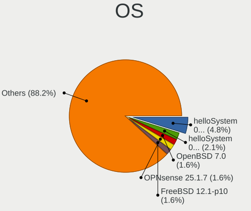

| Name                 | Computers | Percent |
|----------------------|-----------|---------|
| helloSystem 0.8.1    | 35        | 4.79%   |
| helloSystem 0.7.0    | 15        | 2.05%   |
| OPNsense 25.1.7      | 12        | 1.64%   |
| OpenBSD 7.0          | 12        | 1.64%   |
| FreeBSD 12.1-p10     | 12        | 1.64%   |
| OPNsense 24.7.12     | 9         | 1.23%   |
| OPNsense 22.7.10     | 9         | 1.23%   |
| helloSystem 0.9.0    | 9         | 1.23%   |
| FreeBSD 14.0-CURRENT | 9         | 1.23%   |
| FreeBSD 13.1-p8      | 9         | 1.23%   |
| OPNsense 25.1.2      | 8         | 1.1%    |
| OPNsense 24.7.11     | 8         | 1.1%    |
| OPNsense 25.7.3      | 7         | 0.96%   |
| OPNsense 25.7.10     | 7         | 0.96%   |
| OPNsense 25.1.5      | 7         | 0.96%   |
| OPNsense 25.1.1      | 7         | 0.96%   |
| OPNsense 24.7.1      | 7         | 0.96%   |
| OPNsense 24.1.9      | 7         | 0.96%   |
| OPNsense 24.1.7      | 7         | 0.96%   |
| OPNsense 23.7.12     | 7         | 0.96%   |
| OPNsense 23.1.7      | 7         | 0.96%   |
| OPNsense 23.1.11     | 7         | 0.96%   |
| OPNsense 23.1.1      | 7         | 0.96%   |
| FreeBSD 13.2         | 7         | 0.96%   |
| OPNsense 25.1        | 6         | 0.82%   |
| OPNsense 24.7.6      | 6         | 0.82%   |
| OPNsense 24.1.8      | 6         | 0.82%   |
| OPNsense 24.1.4      | 6         | 0.82%   |
| OPNsense 23.7.9      | 6         | 0.82%   |
| OPNsense 23.7.7      | 6         | 0.82%   |
| OPNsense 23.1        | 6         | 0.82%   |
| OpenBSD 7.1          | 6         | 0.82%   |
| helloSystem 0.6.0    | 6         | 0.82%   |
| FreeBSD 14.2         | 6         | 0.82%   |
| FreeBSD 12.2         | 6         | 0.82%   |
| OPNsense 25.7.2      | 5         | 0.68%   |
| OPNsense 24.1.6      | 5         | 0.68%   |
| OPNsense 24.1.5      | 5         | 0.68%   |
| OPNsense 24.1.10     | 5         | 0.68%   |
| OPNsense 23.7.5      | 5         | 0.68%   |

OS Family
---------

OS without a version

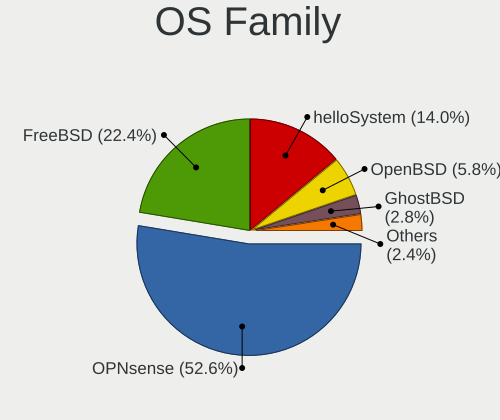

| Name        | Computers | Percent |
|-------------|-----------|---------|
| OPNsense    | 282       | 52.61%  |
| FreeBSD     | 120       | 22.39%  |
| helloSystem | 75        | 13.99%  |
| OpenBSD     | 31        | 5.78%   |
| GhostBSD    | 15        | 2.8%    |
| NetBSD      | 5         | 0.93%   |
| NomadBSD    | 3         | 0.56%   |
| XigmaNAS    | 2         | 0.37%   |
| MyBee       | 1         | 0.19%   |
| DragonFly   | 1         | 0.19%   |
| ClonOS      | 1         | 0.19%   |

Arch
----

OS architecture (x86_64, i586, etc.)

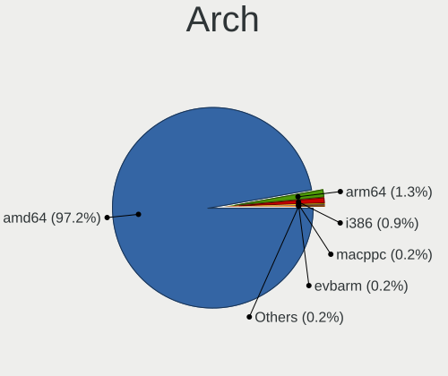

| Name   | Computers | Percent |
|--------|-----------|---------|
| amd64  | 520       | 97.2%   |
| arm64  | 7         | 1.31%   |
| i386   | 5         | 0.93%   |
| macppc | 1         | 0.19%   |
| evbarm | 1         | 0.19%   |
| armv7  | 1         | 0.19%   |

DE
--

Desktop Environment

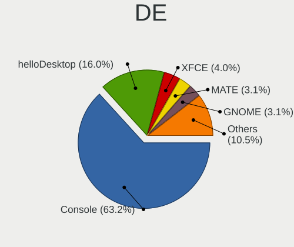

| Name          | Computers | Percent |
|---------------|-----------|---------|
| Console       | 344       | 63.24%  |
| helloDesktop  | 87        | 15.99%  |
| XFCE          | 22        | 4.04%   |
| MATE          | 17        | 3.13%   |
| GNOME         | 17        | 3.13%   |
| fvwm          | 16        | 2.94%   |
| KDE5          | 12        | 2.21%   |
| TWM           | 9         | 1.65%   |
| i3            | 8         | 1.47%   |
| Openbox       | 6         | 1.1%    |
| xinitrc       | 1         | 0.18%   |
| xfwm          | 1         | 0.18%   |
| LXQt          | 1         | 0.18%   |
| KDE           | 1         | 0.18%   |
| Enlightenment | 1         | 0.18%   |
| dwm           | 1         | 0.18%   |

Display Server
--------------

X11 or Wayland

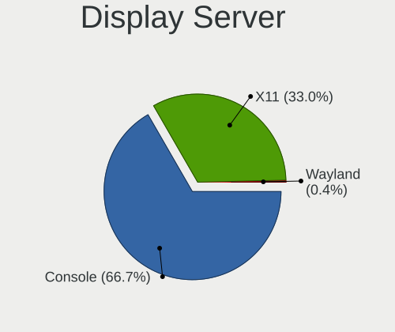

| Name    | Computers | Percent |
|---------|-----------|---------|
| Console | 358       | 66.67%  |
| X11     | 177       | 32.96%  |
| Wayland | 2         | 0.37%   |

Display Manager
---------------

SDDM, LightDM, etc.

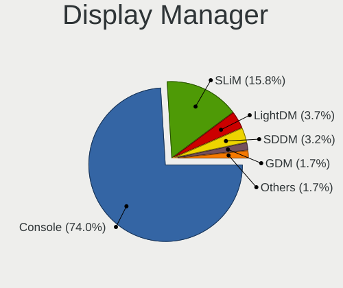

| Name    | Computers | Percent |
|---------|-----------|---------|
| Console | 399       | 74.03%  |
| SLiM    | 85        | 15.77%  |
| LightDM | 20        | 3.71%   |
| SDDM    | 17        | 3.15%   |
| GDM     | 9         | 1.67%   |
| XDM     | 8         | 1.48%   |
| Ly      | 1         | 0.19%   |

OS Lang
-------

Language

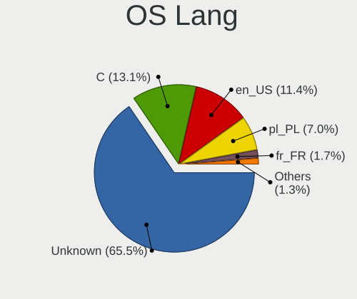

| Lang           | Computers | Percent |
|----------------|-----------|---------|
| Unknown        | 355       | 65.5%   |
| C              | 71        | 13.1%   |
| en_US          | 62        | 11.44%  |
| pl_PL          | 38        | 7.01%   |
| fr_FR          | 9         | 1.66%   |
| pl             | 2         | 0.37%   |
| en_GB          | 2         | 0.37%   |
| pt_PT          | 1         | 0.18%   |
| en_IE.US-ASCII | 1         | 0.18%   |
| en             | 1         | 0.18%   |

Boot Mode
---------

EFI or BIOS

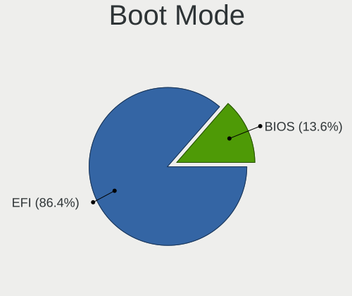

| Mode | Computers | Percent |
|------|-----------|---------|
| EFI  | 464       | 86.41%  |
| BIOS | 73        | 13.59%  |

Filesystem
----------

Type of filesystem

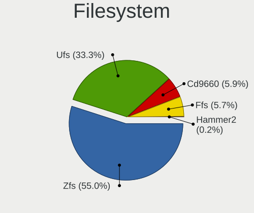

| Type    | Computers | Percent |
|---------|-----------|---------|
| Zfs     | 299       | 54.96%  |
| Ufs     | 181       | 33.27%  |
| Cd9660  | 32        | 5.88%   |
| Ffs     | 31        | 5.7%    |
| Hammer2 | 1         | 0.18%   |

Part. scheme
------------

Scheme of partitioning

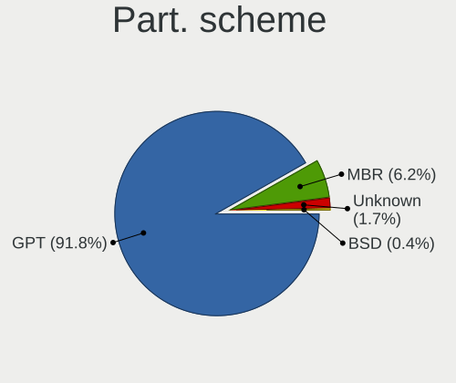

| Type    | Computers | Percent |
|---------|-----------|---------|
| GPT     | 492       | 91.79%  |
| MBR     | 33        | 6.16%   |
| Unknown | 9         | 1.68%   |
| BSD     | 2         | 0.37%   |

Board
-----

Vendor
------

Motherboard manufacturer

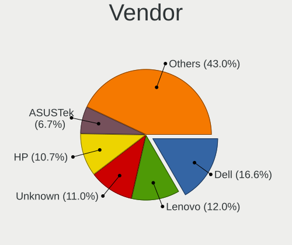

| Name                       | Computers | Percent |
|----------------------------|-----------|---------|
| Dell                       | 89        | 16.64%  |
| Lenovo                     | 64        | 11.96%  |
| Unknown                    | 59        | 11.03%  |
| Hewlett-Packard            | 57        | 10.65%  |
| ASUSTek Computer           | 36        | 6.73%   |
| Gigabyte Technology        | 28        | 5.23%   |
| Intel                      | 24        | 4.49%   |
| ASRock                     | 23        | 4.3%    |
| Fujitsu                    | 22        | 4.11%   |
| MSI                        | 20        | 3.74%   |
| Supermicro                 | 16        | 2.99%   |
| Deciso                     | 10        | 1.87%   |
| Acer                       | 8         | 1.5%    |
| ZOTAC                      | 6         | 1.12%   |
| Techvision                 | 5         | 0.93%   |
| PC Engines                 | 5         | 0.93%   |
| Apple                      | 5         | 0.93%   |
| Shuttle                    | 3         | 0.56%   |
| Protectli                  | 3         | 0.56%   |
| Google                     | 3         | 0.56%   |
| CheckPoint                 | 3         | 0.56%   |
| Sony                       | 2         | 0.37%   |
| Raspberry Pi Foundation    | 2         | 0.37%   |
| Lex BayTrail               | 2         | 0.37%   |
| Inventec                   | 2         | 0.37%   |
| IGEL Technology            | 2         | 0.37%   |
| iEi                        | 2         | 0.37%   |
| Biostar                    | 2         | 0.37%   |
| AOpen                      | 2         | 0.37%   |
| AMI                        | 2         | 0.37%   |
| Yanling                    | 1         | 0.19%   |
| xunlong                    | 1         | 0.19%   |
| Wistron                    | 1         | 0.19%   |
| Wincor Nixdorf             | 1         | 0.19%   |
| Toshiba                    | 1         | 0.19%   |
| Sophos                     | 1         | 0.19%   |
| ShenZhen MinWin Technology | 1         | 0.19%   |
| Seeed Studio               | 1         | 0.19%   |
| Samsung Electronics        | 1         | 0.19%   |
| PC Specialist              | 1         | 0.19%   |

Model
-----

Motherboard model

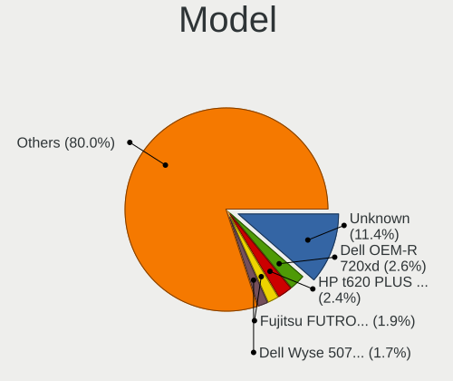

| Name                                | Computers | Percent |
|-------------------------------------|-----------|---------|
| Unknown                             | 61        | 11.4%   |
| Dell OEM-R 720xd                    | 14        | 2.62%   |
| HP t620 PLUS Quad Core TC           | 13        | 2.43%   |
| Fujitsu FUTRO S920                  | 10        | 1.87%   |
| Dell Wyse 5070 Extended Thin Client | 9         | 1.68%   |
| Dell Wyse 5070 Thin Client          | 8         | 1.5%    |
| Techvision TVI7309X                 | 5         | 0.93%   |
| Lenovo ThinkPad X200 745969G        | 5         | 0.93%   |
| HP t730 Thin Client                 | 5         | 0.93%   |
| Gigabyte B360N WIFI                 | 5         | 0.93%   |
| Deciso NetBoard-A20                 | 4         | 0.75%   |
| ZOTAC ZBOX-CI329NANO                | 3         | 0.56%   |
| Supermicro X9SCL/X9SCM              | 3         | 0.56%   |
| Supermicro Super Server             | 3         | 0.56%   |
| Protectli V1410                     | 3         | 0.56%   |
| Intel Q3XXG4-P V1.0                 | 3         | 0.56%   |
| ASUS All Series                     | 3         | 0.56%   |
| ASRock Q1900B-ITX                   | 3         | 0.56%   |
| ASRock H370M-ITX/ac                 | 3         | 0.56%   |
| ZOTAC ZBOX-CI341                    | 2         | 0.37%   |
| PC Engines APU2                     | 2         | 0.37%   |
| MSI MS-7D25                         | 2         | 0.37%   |
| MSI MS-7918                         | 2         | 0.37%   |
| MSI MS-7758                         | 2         | 0.37%   |
| Lex BayTrail 2I385HW                | 2         | 0.37%   |
| Lenovo ThinkCentre M720q 10T8S1ST19 | 2         | 0.37%   |
| Lenovo ThinkCentre M700 10J0S1CK00  | 2         | 0.37%   |
| Lenovo System x3250 M6 -[3633AC1]-  | 2         | 0.37%   |
| Lenovo G580 20150                   | 2         | 0.37%   |
| Intel SHARKBAY                      | 2         | 0.37%   |
| Intel D2500CC AAG81477-401          | 2         | 0.37%   |
| Intel Appliance B4                  | 2         | 0.37%   |
| HP t730 Thin Client TC              | 2         | 0.37%   |
| HP ProLiant DL360p Gen8             | 2         | 0.37%   |
| HP ProLiant DL360 G7                | 2         | 0.37%   |
| HP Compaq Elite 8300 CMT            | 2         | 0.37%   |
| HP 17E2                             | 2         | 0.37%   |
| Gigabyte H270N-WIFI                 | 2         | 0.37%   |
| Gigabyte H110TN                     | 2         | 0.37%   |
| Fujitsu FUTRO S720                  | 2         | 0.37%   |

Model Family
------------

Motherboard model prefix

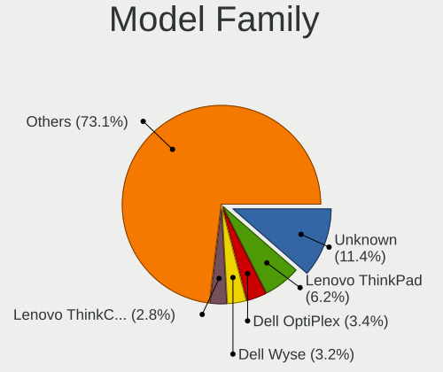

| Name                 | Computers | Percent |
|----------------------|-----------|---------|
| Unknown              | 61        | 11.4%   |
| Lenovo ThinkPad      | 33        | 6.17%   |
| Dell OptiPlex        | 18        | 3.36%   |
| Dell Wyse            | 17        | 3.18%   |
| Lenovo ThinkCentre   | 15        | 2.8%    |
| Fujitsu FUTRO        | 15        | 2.8%    |
| Dell PowerEdge       | 14        | 2.62%   |
| Dell OEM-R           | 14        | 2.62%   |
| HP t620              | 13        | 2.43%   |
| Dell Latitude        | 13        | 2.43%   |
| HP t730              | 7         | 1.31%   |
| HP ProLiant          | 6         | 1.12%   |
| Techvision TVI7309X  | 5         | 0.93%   |
| HP EliteDesk         | 5         | 0.93%   |
| Gigabyte B360N       | 5         | 0.93%   |
| Dell Vostro          | 5         | 0.93%   |
| Acer Aspire          | 5         | 0.93%   |
| HP Compaq            | 4         | 0.75%   |
| Deciso NetBoard-A20  | 4         | 0.75%   |
| ZOTAC ZBOX-CI329NANO | 3         | 0.56%   |
| Supermicro X9SCL     | 3         | 0.56%   |
| Supermicro Super     | 3         | 0.56%   |
| Protectli V1410      | 3         | 0.56%   |
| Lenovo IdeaPad       | 3         | 0.56%   |
| Intel Q3XXG4-P       | 3         | 0.56%   |
| Intel D2500CC        | 3         | 0.56%   |
| HP EliteBook         | 3         | 0.56%   |
| Fujitsu CELSIUS      | 3         | 0.56%   |
| Deciso NetBoard-A10  | 3         | 0.56%   |
| ASUS TUF             | 3         | 0.56%   |
| ASUS PRIME           | 3         | 0.56%   |
| ASUS All             | 3         | 0.56%   |
| ASRock Q1900B-ITX    | 3         | 0.56%   |
| ASRock H370M-ITX     | 3         | 0.56%   |
| ZOTAC ZBOX-CI341     | 2         | 0.37%   |
| RPi Raspberry        | 2         | 0.37%   |
| PC Engines APU2      | 2         | 0.37%   |
| MSI MS-7D25          | 2         | 0.37%   |
| MSI MS-7918          | 2         | 0.37%   |
| MSI MS-7758          | 2         | 0.37%   |

MFG Year
--------

Motherboard manufacture year

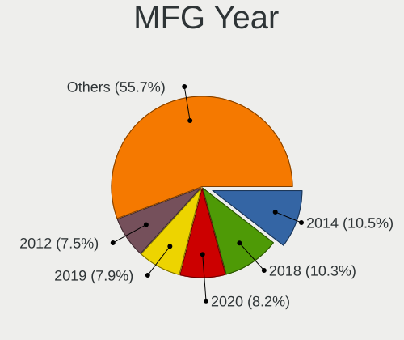

| Year    | Computers | Percent |
|---------|-----------|---------|
| 2014    | 56        | 10.47%  |
| 2018    | 55        | 10.28%  |
| 2020    | 44        | 8.22%   |
| 2019    | 42        | 7.85%   |
| 2012    | 40        | 7.48%   |
| 2023    | 39        | 7.29%   |
| 2021    | 36        | 6.73%   |
| 2013    | 35        | 6.54%   |
| 2022    | 33        | 6.17%   |
| 2016    | 28        | 5.23%   |
| 2011    | 19        | 3.55%   |
| 2015    | 18        | 3.36%   |
| 2017    | 17        | 3.18%   |
| 2009    | 17        | 3.18%   |
| 2024    | 15        | 2.8%    |
| 2010    | 13        | 2.43%   |
| 2025    | 11        | 2.06%   |
| Unknown | 6         | 1.12%   |
| 2008    | 4         | 0.75%   |
| 2007    | 3         | 0.56%   |
| 2006    | 3         | 0.56%   |
| 2005    | 1         | 0.19%   |

Form Factor
-----------

Physical design of the computer

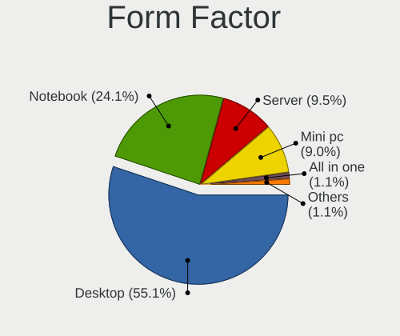

| Name           | Computers | Percent |
|----------------|-----------|---------|
| Desktop        | 295       | 55.14%  |
| Notebook       | 129       | 24.11%  |
| Server         | 51        | 9.53%   |
| Mini pc        | 48        | 8.97%   |
| All in one     | 6         | 1.12%   |
| System on chip | 2         | 0.37%   |
| Firewall       | 2         | 0.37%   |
| Convertible    | 2         | 0.37%   |

Coreboot
--------

Have coreboot on board

| Used | Computers | Percent |
|------|-----------|---------|
| No   | 526       | 98.32%  |
| Yes  | 9         | 1.68%   |

RAM Size
--------

Total RAM memory

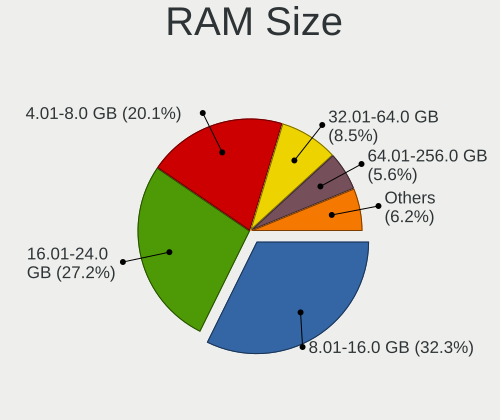

| Size in GB      | Computers | Percent |
|-----------------|-----------|---------|
| 8.01-16.0       | 178       | 32.3%   |
| 16.01-24.0      | 150       | 27.22%  |
| 4.01-8.0        | 111       | 20.15%  |
| 32.01-64.0      | 47        | 8.53%   |
| 64.01-256.0     | 31        | 5.63%   |
| 2.01-3.0        | 11        | 2%      |
| 3.01-4.0        | 7         | 1.27%   |
| 0.51-1.0        | 6         | 1.09%   |
| More than 256.0 | 4         | 0.73%   |
| 24.01-32.0      | 4         | 0.73%   |
| 1.01-2.0        | 1         | 0.18%   |
| 0.01-0.5        | 1         | 0.18%   |

RAM Used
--------

Used RAM memory

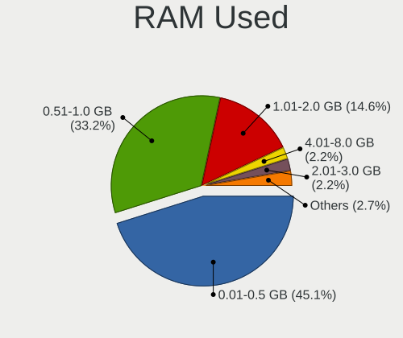

| Used GB     | Computers | Percent |
|-------------|-----------|---------|
| 0.01-0.5    | 250       | 45.13%  |
| 0.51-1.0    | 184       | 33.21%  |
| 1.01-2.0    | 81        | 14.62%  |
| 4.01-8.0    | 12        | 2.17%   |
| 2.01-3.0    | 12        | 2.17%   |
| Unknown     | 5         | 0.9%    |
| 8.01-16.0   | 4         | 0.72%   |
| 3.01-4.0    | 2         | 0.36%   |
| 0           | 2         | 0.36%   |
| 64.01-256.0 | 1         | 0.18%   |
| 16.01-24.0  | 1         | 0.18%   |

Total Drives
------------

Number of drives on board

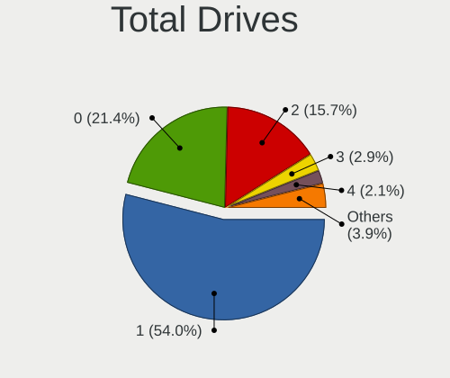

| Drives | Computers | Percent |
|--------|-----------|---------|
| 1      | 303       | 54.01%  |
| 0      | 120       | 21.39%  |
| 2      | 88        | 15.69%  |
| 3      | 16        | 2.85%   |
| 4      | 12        | 2.14%   |
| 5      | 9         | 1.6%    |
| 6      | 6         | 1.07%   |
| 9      | 2         | 0.36%   |
| 8      | 2         | 0.36%   |
| 7      | 2         | 0.36%   |
| 10     | 1         | 0.18%   |

Has CD-ROM
----------

Has CD-ROM on board

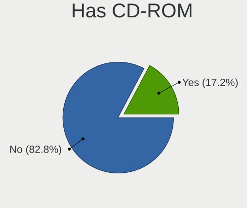

| Presented | Computers | Percent |
|-----------|-----------|---------|
| No        | 447       | 82.78%  |
| Yes       | 93        | 17.22%  |

Has Ethernet
------------

Has Ethernet on board

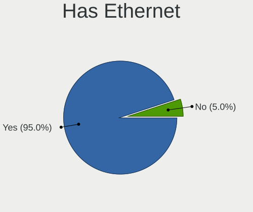

| Presented | Computers | Percent |
|-----------|-----------|---------|
| Yes       | 508       | 94.95%  |
| No        | 27        | 5.05%   |

Has WiFi
--------

Has WiFi module

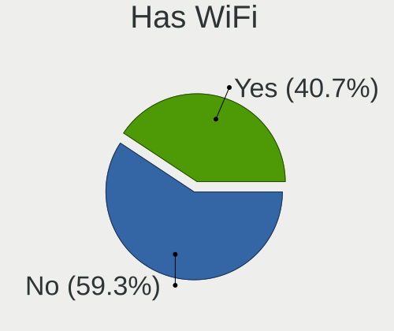

| Presented | Computers | Percent |
|-----------|-----------|---------|
| No        | 322       | 59.3%   |
| Yes       | 221       | 40.7%   |

Has Bluetooth
-------------

Has Bluetooth module

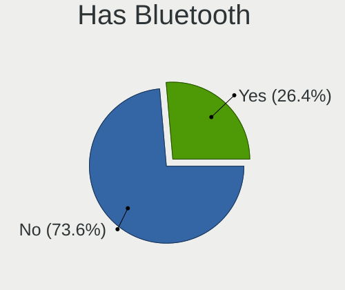

| Presented | Computers | Percent |
|-----------|-----------|---------|
| No        | 399       | 73.62%  |
| Yes       | 143       | 26.38%  |

Location
--------

Country
-------

Geographic location (country)

| Country | Computers | Percent |
|---------|-----------|---------|
| Poland  | 535       | 100%    |

City
----

Geographic location (city)

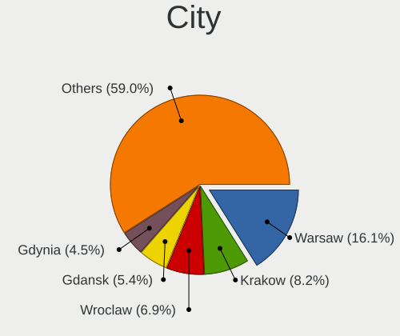

| City              | Computers | Percent |
|-------------------|-----------|---------|
| Warsaw            | 96        | 16.05%  |
| Krakow            | 49        | 8.19%   |
| Wroclaw           | 41        | 6.86%   |
| Gdansk            | 32        | 5.35%   |
| Gdynia            | 27        | 4.52%   |
| Poznan            | 20        | 3.34%   |
| Lodz              | 17        | 2.84%   |
| Lublin            | 11        | 1.84%   |
| Szczecin          | 9         | 1.51%   |
| Katowice          | 9         | 1.51%   |
| Radom             | 8         | 1.34%   |
| Bydgoszcz         | 7         | 1.17%   |
| Gliwice           | 6         | 1%      |
| Piaseczno         | 5         | 0.84%   |
| Kielce            | 5         | 0.84%   |
| Bialystok         | 5         | 0.84%   |
| Zielona Góra     | 4         | 0.67%   |
| Zgierz            | 4         | 0.67%   |
| Rybnik            | 4         | 0.67%   |
| Miedziana Gora    | 4         | 0.67%   |
| Torun             | 3         | 0.5%    |
| Siedlce           | 3         | 0.5%    |
| Puławy           | 3         | 0.5%    |
| Pstragowa         | 3         | 0.5%    |
| Lubin             | 3         | 0.5%    |
| Lezno             | 3         | 0.5%    |
| Legionowo         | 3         | 0.5%    |
| Lancut            | 3         | 0.5%    |
| Jaslo             | 3         | 0.5%    |
| Gmina Świebodzin | 3         | 0.5%    |
| Chrusty           | 3         | 0.5%    |
| Е»ukowo         | 2         | 0.33%   |
| Zdunska Wola      | 2         | 0.33%   |
| Zabrze            | 2         | 0.33%   |
| Włocławek       | 2         | 0.33%   |
| Witow             | 2         | 0.33%   |
| Witkow            | 2         | 0.33%   |
| Walendow          | 2         | 0.33%   |
| Tychy             | 2         | 0.33%   |
| Sulejowek         | 2         | 0.33%   |

Drives
------

Drive Vendor
------------

Hard drive vendors

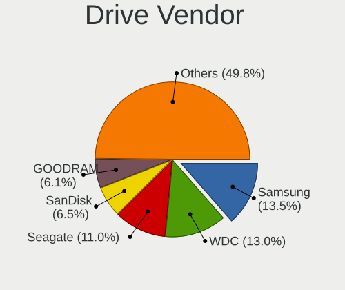

| Vendor              | Computers | Drives | Percent |
|---------------------|-----------|--------|---------|
| Samsung Electronics | 75        | 143    | 13.54%  |
| WDC                 | 72        | 163    | 13%     |
| Seagate             | 61        | 121    | 11.01%  |
| SanDisk             | 36        | 47     | 6.5%    |
| GOODRAM             | 34        | 54     | 6.14%   |
| A-DATA Technology   | 24        | 33     | 4.33%   |
| Kingston            | 21        | 25     | 3.79%   |
| Intel               | 17        | 25     | 3.07%   |
| Toshiba             | 16        | 36     | 2.89%   |
| Crucial             | 16        | 37     | 2.89%   |
| SPCC                | 14        | 25     | 2.53%   |
| Apacer              | 12        | 19     | 2.17%   |
| Transcend           | 11        | 19     | 1.99%   |
| China               | 10        | 17     | 1.81%   |
| SK hynix            | 9         | 10     | 1.62%   |
| Patriot             | 9         | 14     | 1.62%   |
| Hitachi             | 9         | 9      | 1.62%   |
| Innodisk            | 7         | 9      | 1.26%   |
| Hoodisk             | 7         | 14     | 1.26%   |
| PNY                 | 6         | 10     | 1.08%   |
| NVMe                | 6         | 9      | 1.08%   |
| Hewlett-Packard     | 6         | 6      | 1.08%   |
| Plextor             | 5         | 5      | 0.9%    |
| OCZ                 | 5         | 5      | 0.9%    |
| Micron Technology   | 5         | 11     | 0.9%    |
| LITEONIT            | 5         | 11     | 0.9%    |
| Lexar               | 5         | 8      | 0.9%    |
| LITEON              | 4         | 4      | 0.72%   |
| KIOXIA-EXCERIA      | 4         | 4      | 0.72%   |
| Intenso             | 4         | 5      | 0.72%   |
| HGST                | 4         | 6      | 0.72%   |
| Gigabyte Technology | 4         | 5      | 0.72%   |
| Phison              | 3         | 3      | 0.54%   |
| Kston               | 3         | 5      | 0.54%   |
| Corsair             | 3         | 6      | 0.54%   |
| Apple               | 3         | 3      | 0.54%   |
| KIOXIA              | 2         | 2      | 0.36%   |
| Fanxiang            | 2         | 3      | 0.36%   |
| XPG                 | 1         | 1      | 0.18%   |
| WALRAM              | 1         | 3      | 0.18%   |

Drive Model
-----------

Hard drive models

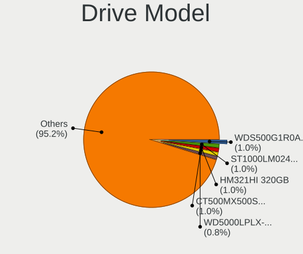

| Model                              | Computers | Percent |
|------------------------------------|-----------|---------|
| WDC WDS500G1R0A-68A4W0 500GB       | 6         | 0.98%   |
| Seagate ST1000LM024 HN-M101MBB 1TB | 6         | 0.98%   |
| Samsung HM321HI 320GB              | 6         | 0.98%   |
| Crucial CT500MX500SSD1 500GB       | 6         | 0.98%   |
| WDC WD5000LPLX-22ZNTT0 500GB       | 5         | 0.82%   |
| WDC WD20EFRX-68EUZN0 1TB           | 5         | 0.82%   |
| SPCC Solid State Disk 256GB        | 5         | 0.82%   |
| Seagate ST1000DM003-1CH162 1TB     | 5         | 0.82%   |
| SanDisk SDSA6MM-016G-1006 16GB     | 5         | 0.82%   |
| Seagate ST1000LM035-1RK172 1TB     | 4         | 0.66%   |
| Samsung SSD 860 EVO 1TB            | 4         | 0.66%   |
| Samsung SSD 850 EVO 250GB          | 4         | 0.66%   |
| Hoodisk SSD 128GB                  | 4         | 0.66%   |
| GOODRAM SSDPR-CX400-512-G2 512GB   | 4         | 0.66%   |
| GOODRAM SSDPR-CX400-256-G2 256GB   | 4         | 0.66%   |
| GOODRAM SSDPR-CX400-128 128GB      | 4         | 0.66%   |
| WDC WD5003ABYZ-011FA0 500GB        | 3         | 0.49%   |
| SPCC Solid State Disk 512GB        | 3         | 0.49%   |
| Seagate ST500LT012-1DG142 500GB    | 3         | 0.49%   |
| Seagate ST500DM002-1BD142 500GB    | 3         | 0.49%   |
| Seagate ST1000NM0033-9ZM173 1TB    | 3         | 0.49%   |
| SanDisk X400 M.2 2280 128GB        | 3         | 0.49%   |
| Samsung SSD 980 1TB                | 3         | 0.49%   |
| Samsung SSD 860 EVO 250GB          | 3         | 0.49%   |
| Patriot Burst 120GB                | 3         | 0.49%   |
| Kingston SUV500MS120G 120GB        | 3         | 0.49%   |
| Kingston SA400S37240G 240GB        | 3         | 0.49%   |
| Intel SSDSC2KB240G8 240GB          | 3         | 0.49%   |
| Innodisk DEMSR- 16GB mSATA 3ME3    | 3         | 0.49%   |
| GOODRAM SSDPR-CX400-256 256GB      | 3         | 0.49%   |
| GOODRAM SSDPR-CL100-120-G3 120GB   | 3         | 0.49%   |
| GOODRAM SSDPR-CL100-120-G2 120GB   | 3         | 0.49%   |
| China SATA SSD 32GB                | 3         | 0.49%   |
| Apacer AS340 240GB                 | 3         | 0.49%   |
| A-DATA SU900 256GB                 | 3         | 0.49%   |
| A-DATA SU800 256GB                 | 3         | 0.49%   |
| WDC WDS500G2B0B-00YS70 500GB       | 2         | 0.33%   |
| WDC WDS240G2G0A-00JH30 240GB       | 2         | 0.33%   |
| WDC WD4003FFBX-68MU3N0 4TB         | 2         | 0.33%   |
| WDC WD2500AAKX-60U6AA0 250GB       | 2         | 0.33%   |

HDD Vendor
----------

Hard disk drive vendors

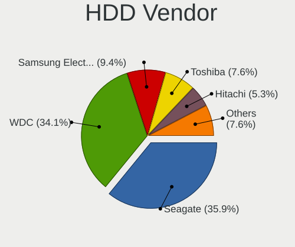

| Vendor                             | Computers | Drives | Percent |
|------------------------------------|-----------|--------|---------|
| Seagate                            | 61        | 121    | 35.88%  |
| WDC                                | 58        | 127    | 34.12%  |
| Samsung Electronics                | 16        | 26     | 9.41%   |
| Toshiba                            | 13        | 33     | 7.65%   |
| Hitachi                            | 9         | 9      | 5.29%   |
| HGST                               | 4         | 6      | 2.35%   |
| NVMe                               | 3         | 4      | 1.76%   |
| Hewlett-Packard                    | 3         | 3      | 1.76%   |
| SSDPR-CX                           | 1         | 1      | 0.59%   |
| Product:              USB DISK 2.0 | 1         | 1      | 0.59%   |
| Apple                              | 1         | 1      | 0.59%   |

SSD Vendor
----------

Solid state drive vendors

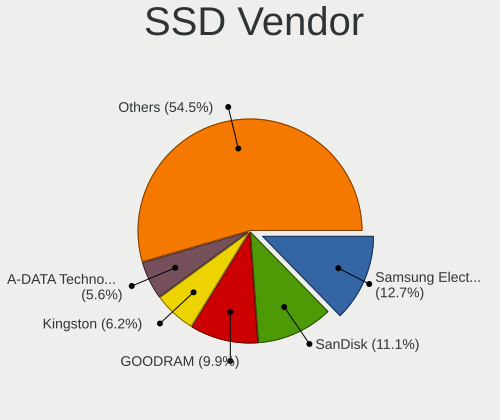

| Vendor              | Computers | Drives | Percent |
|---------------------|-----------|--------|---------|
| Samsung Electronics | 41        | 89     | 12.69%  |
| SanDisk             | 36        | 47     | 11.15%  |
| GOODRAM             | 32        | 50     | 9.91%   |
| Kingston            | 20        | 23     | 6.19%   |
| A-DATA Technology   | 18        | 26     | 5.57%   |
| WDC                 | 15        | 29     | 4.64%   |
| Crucial             | 15        | 36     | 4.64%   |
| SPCC                | 14        | 25     | 4.33%   |
| Intel               | 12        | 18     | 3.72%   |
| Apacer              | 12        | 19     | 3.72%   |
| China               | 10        | 17     | 3.1%    |
| Transcend           | 8         | 15     | 2.48%   |
| Patriot             | 7         | 10     | 2.17%   |
| Innodisk            | 7         | 9      | 2.17%   |
| Hoodisk             | 7         | 14     | 2.17%   |
| SK hynix            | 6         | 7      | 1.86%   |
| Plextor             | 5         | 5      | 1.55%   |
| OCZ                 | 5         | 5      | 1.55%   |
| Micron Technology   | 5         | 11     | 1.55%   |
| LITEONIT            | 5         | 11     | 1.55%   |
| PNY                 | 4         | 7      | 1.24%   |
| Intenso             | 4         | 5      | 1.24%   |
| Gigabyte Technology | 4         | 5      | 1.24%   |
| LITEON              | 3         | 3      | 0.93%   |
| Kston               | 3         | 5      | 0.93%   |
| KIOXIA-EXCERIA      | 3         | 3      | 0.93%   |
| Hewlett-Packard     | 3         | 3      | 0.93%   |
| Corsair             | 3         | 6      | 0.93%   |
| Phison              | 2         | 2      | 0.62%   |
| NVMe                | 2         | 2      | 0.62%   |
| Apple               | 2         | 2      | 0.62%   |
| WALRAM              | 1         | 3      | 0.31%   |
| Toshiba             | 1         | 1      | 0.31%   |
| Team                | 1         | 1      | 0.31%   |
| Silicon Power       | 1         | 1      | 0.31%   |
| Lexar               | 1         | 1      | 0.31%   |
| HP Phison           | 1         | 2      | 0.31%   |
| FORESEE             | 1         | 1      | 0.31%   |
| Dell                | 1         | 1      | 0.31%   |
| Biostar             | 1         | 1      | 0.31%   |

Drive Kind
----------

HDD or SSD

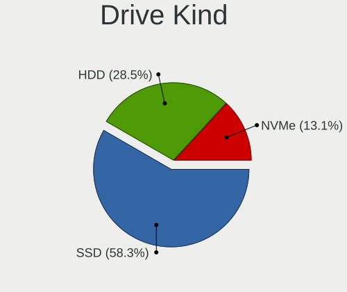

| Kind | Computers | Drives | Percent |
|------|-----------|--------|---------|
| SSD  | 284       | 522    | 58.32%  |
| HDD  | 139       | 332    | 28.54%  |
| NVMe | 64        | 96     | 13.14%  |

Drive Connector
---------------

SATA, SAS, NVMe, etc.

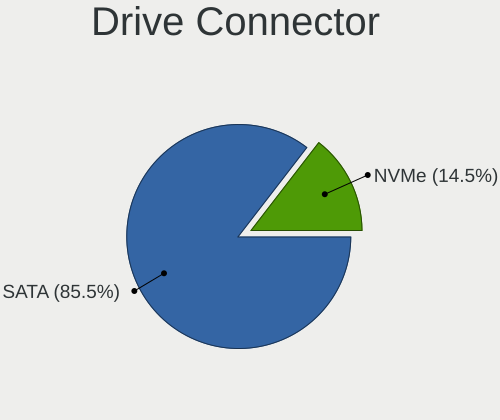

| Type | Computers | Drives | Percent |
|------|-----------|--------|---------|
| SATA | 376       | 854    | 85.45%  |
| NVMe | 64        | 96     | 14.55%  |

Drive Size
----------

Size of hard drive

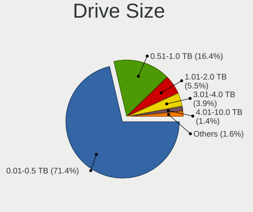

| Size in TB | Computers | Drives | Percent |
|------------|-----------|--------|---------|
| 0.01-0.5   | 314       | 551    | 71.36%  |
| 0.51-1.0   | 72        | 148    | 16.36%  |
| 1.01-2.0   | 24        | 69     | 5.45%   |
| 3.01-4.0   | 17        | 50     | 3.86%   |
| 4.01-10.0  | 6         | 15     | 1.36%   |
| 2.01-3.0   | 5         | 18     | 1.14%   |
| 10.01-20.0 | 2         | 3      | 0.45%   |

Space Total
-----------

Amount of disk space available on the file system

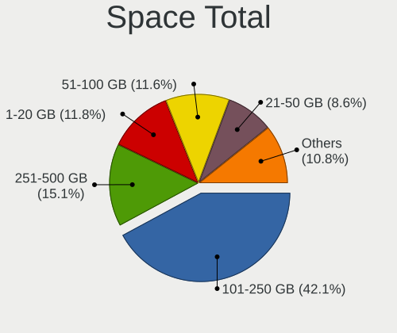

| Size in GB     | Computers | Percent |
|----------------|-----------|---------|
| 101-250        | 235       | 42.11%  |
| 251-500        | 84        | 15.05%  |
| 1-20           | 66        | 11.83%  |
| 51-100         | 65        | 11.65%  |
| 21-50          | 48        | 8.6%    |
| 501-1000       | 43        | 7.71%   |
| More than 3000 | 6         | 1.08%   |
| 1001-2000      | 6         | 1.08%   |
| Unknown        | 3         | 0.54%   |
| 2001-3000      | 2         | 0.36%   |

Space Used
----------

Amount of used disk space

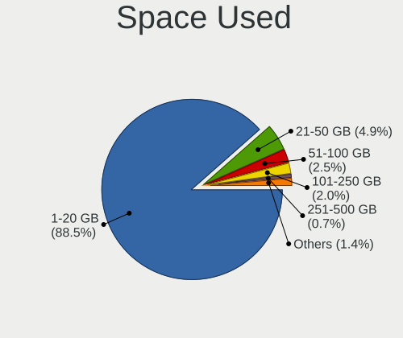

| Used GB        | Computers | Percent |
|----------------|-----------|---------|
| 1-20           | 492       | 88.49%  |
| 21-50          | 27        | 4.86%   |
| 51-100         | 14        | 2.52%   |
| 101-250        | 11        | 1.98%   |
| 251-500        | 4         | 0.72%   |
| Unknown        | 3         | 0.54%   |
| More than 3000 | 2         | 0.36%   |
| 1001-2000      | 2         | 0.36%   |
| 501-1000       | 1         | 0.18%   |

Malfunc. Drives
---------------

Drive models with a malfunction

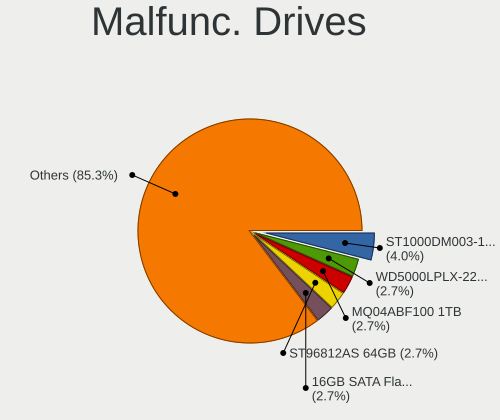

| Model                           | Computers | Drives | Percent |
|---------------------------------|-----------|--------|---------|
| Seagate ST1000DM003-1CH162 1TB  | 3         | 3      | 4%      |
| WDC WD5000LPLX-22ZNTT0 500GB    | 2         | 2      | 2.67%   |
| Toshiba MQ04ABF100 1TB          | 2         | 2      | 2.67%   |
| Seagate ST96812AS 64GB          | 2         | 5      | 2.67%   |
| Apacer 16GB SATA Flash Drive    | 2         | 3      | 2.67%   |
| WDC WD7500BPKT-00PK4T0 752GB    | 1         | 1      | 1.33%   |
| WDC WD40EFRX-68WT0N0 4TB        | 1         | 1      | 1.33%   |
| WDC WD360ADFD-00NLR1 37GB       | 1         | 1      | 1.33%   |
| WDC WD3200BEKT-22PVMT0 320GB    | 1         | 1      | 1.33%   |
| WDC WD3200AAVS-00ZTB0 320GB     | 1         | 1      | 1.33%   |
| WDC WD2500BEKT-60F3T1 250GB     | 1         | 2      | 1.33%   |
| WDC WD2500AAKX-753CA0 250GB     | 1         | 2      | 1.33%   |
| WDC WD2500AAKX-60U6AA0 250GB    | 1         | 2      | 1.33%   |
| WDC WD2500AAKX-083CA1 250GB     | 1         | 2      | 1.33%   |
| WDC WD20NPVX-00EA4T0 2TB        | 1         | 2      | 1.33%   |
| WDC WD20EZRX-00D8PB0 2TB        | 1         | 1      | 1.33%   |
| WDC WD20EURS-63S48Y0 2TB        | 1         | 1      | 1.33%   |
| WDC WD20EFRX-68EUZN0 1TB        | 1         | 2      | 1.33%   |
| WDC WD20EARS-00MVWB0 2TB        | 1         | 1      | 1.33%   |
| WDC WD1600BEVE-00UYT0 160GB     | 1         | 1      | 1.33%   |
| WDC WD1600AAJS-40H3A0 160GB     | 1         | 1      | 1.33%   |
| WDC WD1200BEVS-07LAT0 120GB     | 1         | 1      | 1.33%   |
| WDC WD10TPVT-65HT5T0 1TB        | 1         | 1      | 1.33%   |
| WDC WD10EZEX-75M2NA0 1TB        | 1         | 1      | 1.33%   |
| WDC WD10EZEX-08M2NA0 1TB        | 1         | 1      | 1.33%   |
| WDC WD10EARS-003BB1 1TB         | 1         | 1      | 1.33%   |
| Toshiba THNSNK512GVN8 512GB     | 1         | 1      | 1.33%   |
| Toshiba MK3261GSYN 320GB        | 1         | 1      | 1.33%   |
| Toshiba MK1252GSX 120GB         | 1         | 1      | 1.33%   |
| SPCC Solid State Disk 256GB     | 1         | 1      | 1.33%   |
| SPCC Solid State Disk 240GB     | 1         | 1      | 1.33%   |
| SK hynix SC308 SATA 256GB       | 1         | 1      | 1.33%   |
| SK hynix SC210 mSATA 256GB      | 1         | 1      | 1.33%   |
| SK hynix SC210 mSATA 128GB      | 1         | 1      | 1.33%   |
| Seagate ST9500420AS 500GB       | 1         | 2      | 1.33%   |
| Seagate ST9250410AS 250GB       | 1         | 1      | 1.33%   |
| Seagate ST9160821AS 160GB       | 1         | 1      | 1.33%   |
| Seagate ST9160412AS 160GB       | 1         | 1      | 1.33%   |
| Seagate ST500LM000-1EJ162 500GB | 1         | 1      | 1.33%   |
| Seagate ST500DM002-1BD142 500GB | 1         | 1      | 1.33%   |

Malfunc. Drive Vendor
---------------------

Vendors of faulty drives

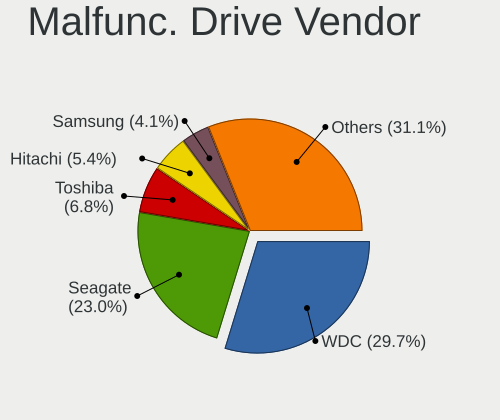

| Vendor              | Computers | Drives | Percent |
|---------------------|-----------|--------|---------|
| WDC                 | 22        | 29     | 29.73%  |
| Seagate             | 17        | 25     | 22.97%  |
| Toshiba             | 5         | 5      | 6.76%   |
| Hitachi             | 4         | 4      | 5.41%   |
| SK hynix            | 3         | 3      | 4.05%   |
| Samsung Electronics | 3         | 3      | 4.05%   |
| Micron Technology   | 3         | 3      | 4.05%   |
| Kingston            | 3         | 4      | 4.05%   |
| SPCC                | 2         | 2      | 2.7%    |
| Crucial             | 2         | 3      | 2.7%    |
| Apacer              | 2         | 3      | 2.7%    |
| SanDisk             | 1         | 5      | 1.35%   |
| Plextor             | 1         | 1      | 1.35%   |
| Phison              | 1         | 1      | 1.35%   |
| LITEONIT            | 1         | 1      | 1.35%   |
| Intel               | 1         | 1      | 1.35%   |
| HP Phison           | 1         | 2      | 1.35%   |
| China               | 1         | 1      | 1.35%   |
| A-DATA Technology   | 1         | 1      | 1.35%   |

Malfunc. HDD Vendor
-------------------

Vendors of faulty HDD drives

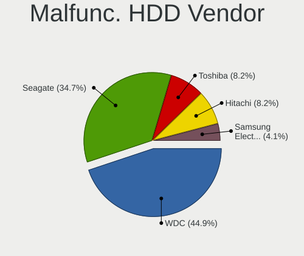

| Vendor              | Computers | Drives | Percent |
|---------------------|-----------|--------|---------|
| WDC                 | 22        | 29     | 44.9%   |
| Seagate             | 17        | 25     | 34.69%  |
| Toshiba             | 4         | 4      | 8.16%   |
| Hitachi             | 4         | 4      | 8.16%   |
| Samsung Electronics | 2         | 2      | 4.08%   |

Malfunc. Drive Kind
-------------------

Kinds of faulty drives

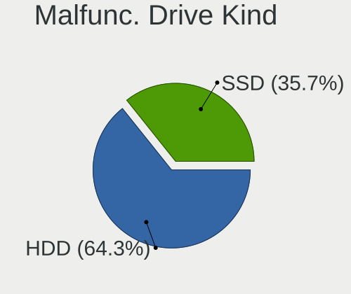

| Kind | Computers | Drives | Percent |
|------|-----------|--------|---------|
| HDD  | 45        | 64     | 64.29%  |
| SSD  | 25        | 33     | 35.71%  |

Failed Drives
-------------

Failed drive models

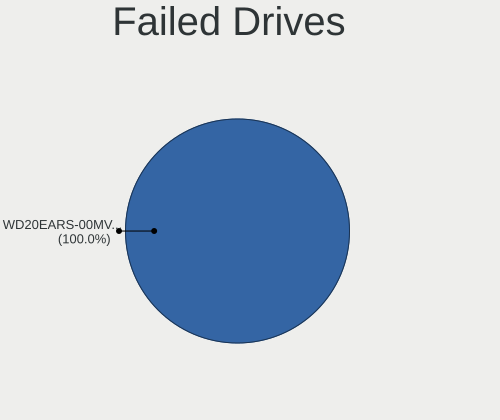

| Model                           | Computers | Drives | Percent |
|---------------------------------|-----------|--------|---------|
| WDC WD20EARS-00MVWB0 2TB        | 1         | 1      | 33.33%  |
| Vaseky V900-120G                | 1         | 1      | 33.33%  |
| SanDisk SD9SN8W-256G-1006 256GB | 1         | 1      | 33.33%  |

Failed Drive Vendor
-------------------

Failed drive vendors

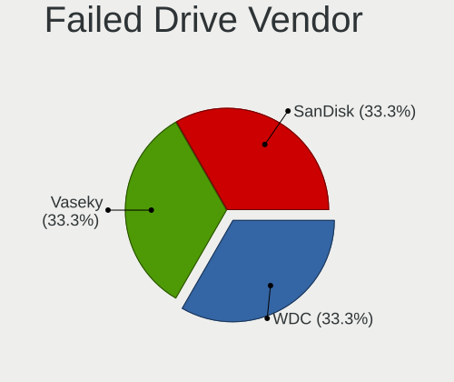

| Vendor  | Computers | Drives | Percent |
|---------|-----------|--------|---------|
| WDC     | 1         | 1      | 33.33%  |
| Vaseky  | 1         | 1      | 33.33%  |
| SanDisk | 1         | 1      | 33.33%  |

Drive Status
------------

Number of failed and malfunc. drives

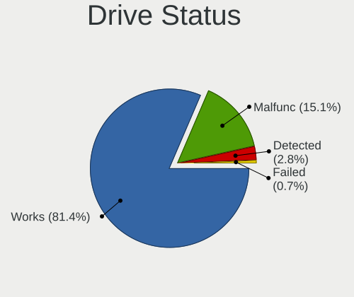

| Status   | Computers | Drives | Percent |
|----------|-----------|--------|---------|
| Works    | 373       | 833    | 81.44%  |
| Malfunc  | 69        | 97     | 15.07%  |
| Detected | 13        | 17     | 2.84%   |
| Failed   | 3         | 3      | 0.66%   |

Storage controller
------------------

Storage Vendor
--------------

Storage controller vendors

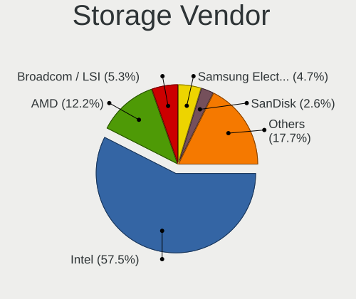

| Vendor                           | Computers | Percent |
|----------------------------------|-----------|---------|
| Intel                            | 377       | 57.47%  |
| AMD                              | 80        | 12.2%   |
| Broadcom / LSI                   | 35        | 5.34%   |
| Samsung Electronics              | 31        | 4.73%   |
| SanDisk                          | 17        | 2.59%   |
| Phison Electronics               | 11        | 1.68%   |
| Transcend                        | 10        | 1.52%   |
| Silicon Motion                   | 9         | 1.37%   |
| ASMedia Technology               | 9         | 1.37%   |
| SK hynix                         | 8         | 1.22%   |
| Shenzhen Longsys Electronics     | 8         | 1.22%   |
| MAXIO Technology (Hangzhou)      | 6         | 0.91%   |
| Marvell Technology Group         | 5         | 0.76%   |
| KIOXIA                           | 5         | 0.76%   |
| Kingston Technology Company      | 5         | 0.76%   |
| JMicron Technology               | 5         | 0.76%   |
| Hewlett-Packard                  | 5         | 0.76%   |
| ADATA Technology                 | 5         | 0.76%   |
| Micron/Crucial Technology        | 3         | 0.46%   |
| VIA Technologies                 | 2         | 0.3%    |
| Solid State Storage Technology   | 2         | 0.3%    |
| Realtek Semiconductor            | 2         | 0.3%    |
| O2 Micro                         | 2         | 0.3%    |
| Nvidia                           | 2         | 0.3%    |
| Micron Technology                | 2         | 0.3%    |
| Lite-On Technology               | 2         | 0.3%    |
| Toshiba                          | 1         | 0.15%   |
| Silicon Integrated Systems [SiS] | 1         | 0.15%   |
| Integrated Technology Express    | 1         | 0.15%   |
| Hosin Global Electronics         | 1         | 0.15%   |
| Chelsio Communications           | 1         | 0.15%   |
| Biwin Storage Technology         | 1         | 0.15%   |
| Apple                            | 1         | 0.15%   |
| Adaptec                          | 1         | 0.15%   |

Storage Model
-------------

Storage controller models

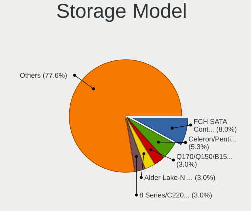

| Model                                                                            | Computers | Percent |
|----------------------------------------------------------------------------------|-----------|---------|
| AMD FCH SATA Controller [AHCI mode]                                              | 58        | 8.02%   |
| Intel Celeron/Pentium Silver Processor SATA Controller                           | 38        | 5.26%   |
| Intel Q170/Q150/B150/H170/H110/Z170/CM236 Chipset SATA Controller [AHCI Mode]    | 22        | 3.04%   |
| Intel Alder Lake-N SATA AHCI Controller                                          | 22        | 3.04%   |
| Intel 8 Series/C220 Series Chipset Family 6-port SATA Controller 1 [AHCI mode]   | 22        | 3.04%   |
| Intel Cannon Lake PCH SATA AHCI Controller                                       | 18        | 2.49%   |
| Intel 7 Series Chipset Family 6-port SATA Controller [AHCI mode]                 | 18        | 2.49%   |
| Broadcom / LSI MegaRAID SAS 2208 [Thunderbolt]                                   | 18        | 2.49%   |
| Intel Atom Processor E3800 Series SATA AHCI Controller                           | 15        | 2.07%   |
| Intel 6 Series/C200 Series Chipset Family 6 port Desktop SATA AHCI Controller    | 15        | 2.07%   |
| Intel Sunrise Point-LP SATA Controller [AHCI mode]                               | 14        | 1.94%   |
| AMD SB7x0/SB8x0/SB9x0 SATA Controller [AHCI mode]                                | 14        | 1.94%   |
| Intel 200 Series PCH SATA controller [AHCI mode]                                 | 13        | 1.8%    |
| Intel 82801IBM/IEM (ICH9M/ICH9M-E) 4 port SATA Controller [AHCI mode]            | 12        | 1.66%   |
| Samsung NVMe SSD Controller SM981/PM981/PM983                                    | 11        | 1.52%   |
| Samsung NVMe SSD Controller 980 (DRAM-less)                                      | 11        | 1.52%   |
| Intel Wildcat Point-LP SATA Controller [AHCI Mode]                               | 11        | 1.52%   |
| Intel Jasper Lake SATA AHCI Controller                                           | 11        | 1.52%   |
| Intel 7 Series/C210 Series Chipset Family 6-port SATA Controller [AHCI mode]     | 11        | 1.52%   |
| Intel 6 Series/C200 Series Chipset Family 6 port Mobile SATA AHCI Controller     | 11        | 1.52%   |
| Intel Celeron N3350/Pentium N4200/Atom E3900 Series SATA AHCI Controller         | 9         | 1.24%   |
| Intel C610/X99 series chipset sSATA Controller [AHCI mode]                       | 8         | 1.11%   |
| Intel C610/X99 series chipset 6-Port SATA Controller [AHCI mode]                 | 8         | 1.11%   |
| Silicon Motion SM2263EN/SM2263XT (DRAM-less) NVMe SSD Controllers                | 7         | 0.97%   |
| Intel SATA Controller [RAID mode]                                                | 7         | 0.97%   |
| Intel 8 Series SATA Controller 1 [AHCI mode]                                     | 7         | 0.97%   |
| AMD FCH IDE Controller                                                           | 7         | 0.97%   |
| AMD 400 Series Chipset SATA Controller                                           | 7         | 0.97%   |
| MAXIO (Hangzhou) NVMe SSD Controller MAP1202 (DRAM-less)                         | 6         | 0.83%   |
| Intel 82801 Mobile SATA Controller [RAID mode]                                   | 6         | 0.83%   |
| ASMedia ASM1061/ASM1062 Serial ATA Controller                                    | 6         | 0.83%   |
| Transcend NVMe PCIe SSD 220S/240S/MTE710T                                        | 5         | 0.69%   |
| SanDisk Ultra 3D / WD PC SN530, IX SN530, Blue SN550 NVMe SSD (DRAM-less)        | 5         | 0.69%   |
| Phison PS5013-E13 PCIe3 NVMe Controller (DRAM-less)                              | 5         | 0.69%   |
| Intel NM10/ICH7 Family SATA Controller [IDE mode]                                | 5         | 0.69%   |
| Intel NM10/ICH7 Family SATA Controller [AHCI mode]                               | 5         | 0.69%   |
| Intel Atom/Celeron/Pentium Processor x5-E8000/J3xxx/N3xxx Series SATA Controller | 5         | 0.69%   |
| Intel Atom Processor C3000 Series SATA Controller 1                              | 5         | 0.69%   |
| Intel 9 Series Chipset Family SATA Controller [AHCI Mode]                        | 5         | 0.69%   |
| Intel 82801G (ICH7 Family) IDE Controller                                        | 5         | 0.69%   |

Storage Kind
------------

Kind of storage controller (IDE, SATA, NVMe, SAS, ...)

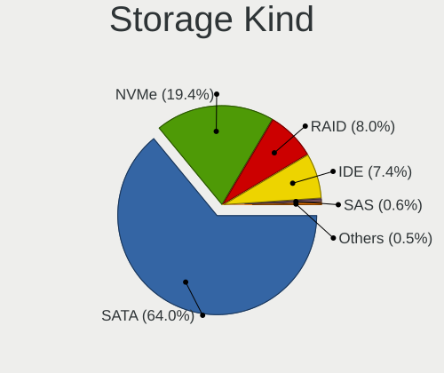

| Kind | Computers | Percent |
|------|-----------|---------|
| SATA | 415       | 64.04%  |
| NVMe | 126       | 19.44%  |
| RAID | 52        | 8.02%   |
| IDE  | 48        | 7.41%   |
| SAS  | 4         | 0.62%   |
| SCSI | 3         | 0.46%   |

Processor
---------

CPU Vendor
----------

Processor vendors

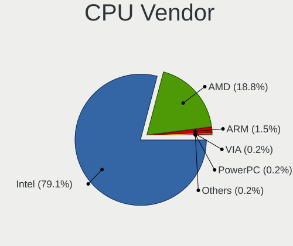

| Vendor  | Computers | Percent |
|---------|-----------|---------|
| Intel   | 424       | 79.1%   |
| AMD     | 101       | 18.84%  |
| ARM     | 8         | 1.49%   |
| VIA     | 1         | 0.19%   |
| PowerPC | 1         | 0.19%   |
| Unknown | 1         | 0.19%   |

CPU Model
---------

Processor models

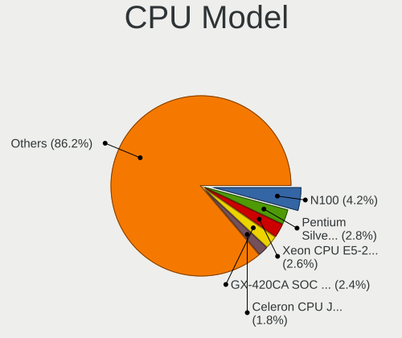

| Model                                    | Computers | Percent |
|------------------------------------------|-----------|---------|
| Intel N100                               | 23        | 4.23%   |
| Intel Pentium Silver J5005 CPU @ 1.50GHz | 15        | 2.76%   |
| Intel Xeon CPU E5-2650 v2 @ 2.60GHz      | 14        | 2.57%   |
| AMD GX-420CA SOC with Radeon HD Graphics | 13        | 2.39%   |
| Intel Celeron CPU J1900 @ 1.99GHz        | 10        | 1.84%   |
| AMD GX-415GA SOC with Radeon HD Graphics | 10        | 1.84%   |
| Intel Celeron J4125 CPU @ 2.00GHz        | 9         | 1.65%   |
| Intel Core i5-6500 CPU @ 3.20GHz         | 8         | 1.47%   |
| Intel Celeron N5105 @ 2.00GHz            | 8         | 1.47%   |
| Intel Core 2 Duo CPU P8600 @ 2.40GHz     | 7         | 1.29%   |
| AMD RX-427BB with AMD Radeon R7 Graphics | 7         | 1.29%   |
| Intel Celeron N4100 CPU @ 1.10GHz        | 6         | 1.1%    |
| Intel Celeron J4105 CPU @ 1.50GHz        | 6         | 1.1%    |
| AMD G-T56N Processor                     | 5         | 0.92%   |
| Intel Xeon CPU E3-1270 V2 @ 3.50GHz      | 4         | 0.74%   |
| Intel N150                               | 4         | 0.74%   |
| Intel Core i5-2520M CPU @ 2.50GHz        | 4         | 0.74%   |
| Intel Core i5-10210U CPU @ 1.60GHz       | 4         | 0.74%   |
| Intel Core i3-8300T CPU @ 3.20GHz        | 4         | 0.74%   |
| Intel Core i3-6100 CPU @ 3.70GHz         | 4         | 0.74%   |
| Intel Core 2 Duo                         | 4         | 0.74%   |
| Intel Celeron CPU J3455 @ 1.50GHz        | 4         | 0.74%   |
| Intel Atom CPU D2500 @ 1.86GHz           | 4         | 0.74%   |
| ARM Cortex-A55 r2p0                      | 4         | 0.74%   |
| AMD GX-412TC SOC                         | 4         | 0.74%   |
| AMD EPYC 3201 8-Core Processor           | 4         | 0.74%   |
| Intel Xeon CPU E3-1220 V2 @ 3.10GHz      | 3         | 0.55%   |
| Intel Core i7-8700 CPU @ 3.20GHz         | 3         | 0.55%   |
| Intel Core i7-3770 CPU @ 3.40GHz         | 3         | 0.55%   |
| Intel Core i5-6300U CPU @ 2.40GHz        | 3         | 0.55%   |
| Intel Core i5-4590 CPU @ 3.30GHz         | 3         | 0.55%   |
| Intel Core i5-4570 CPU @ 3.20GHz         | 3         | 0.55%   |
| Intel Core i5-3470 CPU @ 3.20GHz         | 3         | 0.55%   |
| Intel Core i5-3320M CPU @ 2.60GHz        | 3         | 0.55%   |
| Intel Core i5-2400 CPU @ 3.10GHz         | 3         | 0.55%   |
| Intel Core i3-8100T CPU @ 3.10GHz        | 3         | 0.55%   |
| Intel Core i3-5010U CPU @ 2.10GHz        | 3         | 0.55%   |
| Intel Core i3-4005U CPU @ 1.70GHz        | 3         | 0.55%   |
| Intel Celeron CPU N3150 @ 1.60GHz        | 3         | 0.55%   |
| Intel Atom CPU C3758R @ 2.40GHz          | 3         | 0.55%   |

CPU Model Family
----------------

Processor model prefix

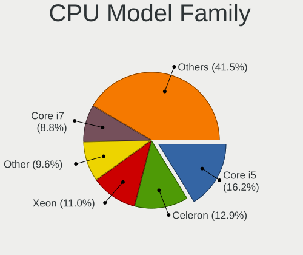

| Model                   | Computers | Percent |
|-------------------------|-----------|---------|
| Intel Core i5           | 88        | 16.18%  |
| Intel Celeron           | 70        | 12.87%  |
| Intel Xeon              | 60        | 11.03%  |
| Other                   | 52        | 9.56%   |
| Intel Core i7           | 48        | 8.82%   |
| Intel Core i3           | 40        | 7.35%   |
| AMD GX                  | 31        | 5.7%    |
| Intel Pentium Silver    | 18        | 3.31%   |
| Intel Atom              | 18        | 3.31%   |
| Intel Pentium           | 16        | 2.94%   |
| Intel Core 2 Duo        | 15        | 2.76%   |
| AMD Ryzen 5             | 11        | 2.02%   |
| ARM Cortex              | 8         | 1.47%   |
| AMD Ryzen 7             | 7         | 1.29%   |
| AMD Ryzen 3             | 7         | 1.29%   |
| AMD G                   | 7         | 1.29%   |
| AMD EPYC                | 7         | 1.29%   |
| AMD Ryzen Embedded      | 4         | 0.74%   |
| Intel Pentium Gold      | 3         | 0.55%   |
| Intel Pentium Dual-Core | 3         | 0.55%   |
| Intel Core 2 Quad       | 3         | 0.55%   |
| AMD Ryzen 9             | 3         | 0.55%   |
| AMD Phenom II X4        | 3         | 0.55%   |
| AMD Athlon              | 3         | 0.55%   |
| Intel Core 2            | 2         | 0.37%   |
| AMD Ryzen 5 PRO         | 2         | 0.37%   |
| AMD Ryzen 3 PRO         | 2         | 0.37%   |
| AMD E                   | 2         | 0.37%   |
| Intel Xeon Gold         | 1         | 0.18%   |
| Intel Pentium M         | 1         | 0.18%   |
| Intel Pentium Dual      | 1         | 0.18%   |
| Intel Genuine           | 1         | 0.18%   |
| Intel Core              | 1         | 0.18%   |
| Intel Celeron M         | 1         | 0.18%   |
| AMD Ryzen 7 PRO         | 1         | 0.18%   |
| AMD Phenom II X6        | 1         | 0.18%   |
| AMD FX                  | 1         | 0.18%   |
| AMD Athlon 64 X2        | 1         | 0.18%   |
| AMD A4                  | 1         | 0.18%   |

CPU Cores
---------

Number of processor cores

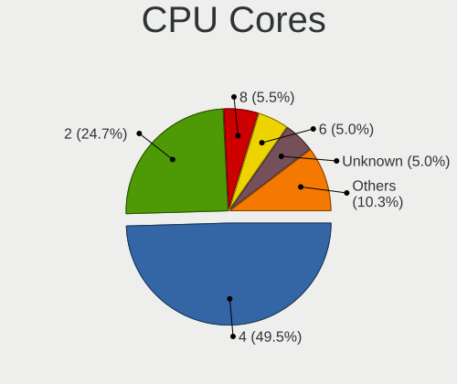

| Number  | Computers | Percent |
|---------|-----------|---------|
| 4       | 269       | 49.54%  |
| 2       | 134       | 24.68%  |
| 8       | 30        | 5.52%   |
| 6       | 27        | 4.97%   |
| Unknown | 27        | 4.97%   |
| 16      | 24        | 4.42%   |
| 12      | 13        | 2.39%   |
| 1       | 7         | 1.29%   |
| 24      | 4         | 0.74%   |
| 20      | 2         | 0.37%   |
| 18      | 2         | 0.37%   |
| 14      | 2         | 0.37%   |
| 32      | 1         | 0.18%   |
| 3       | 1         | 0.18%   |

CPU Sockets
-----------

Number of sockets

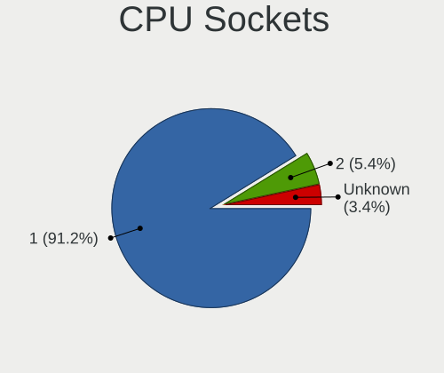

| Number  | Computers | Percent |
|---------|-----------|---------|
| 1       | 488       | 91.21%  |
| 2       | 29        | 5.42%   |
| Unknown | 18        | 3.36%   |

CPU Threads
-----------

Threads per core (Hyper-Threading)

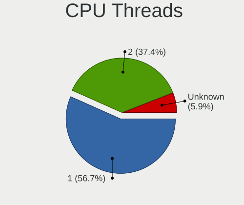

| Number  | Computers | Percent |
|---------|-----------|---------|
| 1       | 306       | 56.67%  |
| 2       | 202       | 37.41%  |
| Unknown | 32        | 5.93%   |

CPU Microarch
-------------

Microarchitecture

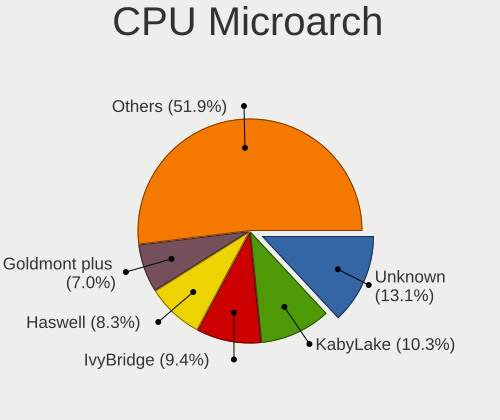

| Name          | Computers | Percent |
|---------------|-----------|---------|
| Unknown       | 71        | 13.08%  |
| KabyLake      | 56        | 10.31%  |
| IvyBridge     | 51        | 9.39%   |
| Haswell       | 45        | 8.29%   |
| Goldmont plus | 38        | 7%      |
| Skylake       | 35        | 6.45%   |
| SandyBridge   | 33        | 6.08%   |
| Jaguar        | 27        | 4.97%   |
| Penryn        | 23        | 4.24%   |
| Silvermont    | 22        | 4.05%   |
| Broadwell     | 17        | 3.13%   |
| Zen           | 16        | 2.95%   |
| Goldmont      | 14        | 2.58%   |
| Zen 3         | 9         | 1.66%   |
| Zen 2         | 9         | 1.66%   |
| Bobcat        | 9         | 1.66%   |
| Zen+          | 8         | 1.47%   |
| Westmere      | 8         | 1.47%   |
| Bonnell       | 8         | 1.47%   |
| Steamroller   | 7         | 1.29%   |
| Puma          | 6         | 1.1%    |
| Nehalem       | 6         | 1.1%    |
| Core          | 6         | 1.1%    |
| TigerLake     | 4         | 0.74%   |
| K10           | 4         | 0.74%   |
| CometLake     | 4         | 0.74%   |
| P6            | 3         | 0.55%   |
| Piledriver    | 1         | 0.18%   |
| NetBurst      | 1         | 0.18%   |
| K8 Hammer     | 1         | 0.18%   |
| Excavator     | 1         | 0.18%   |

Graphics
--------

GPU Vendor
----------

Vendors of graphics cards

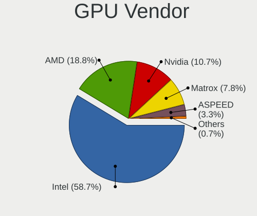

| Vendor                                       | Computers | Percent |
|----------------------------------------------|-----------|---------|
| Intel                                        | 322       | 58.65%  |
| AMD                                          | 103       | 18.76%  |
| Nvidia                                       | 59        | 10.75%  |
| Matrox Electronics Systems                   | 43        | 7.83%   |
| ASPEED Technology                            | 18        | 3.28%   |
| XGI Technology (eXtreme Graphics Innovation) | 2         | 0.36%   |
| VIA Technologies                             | 2         | 0.36%   |

GPU Model
---------

Graphics card models

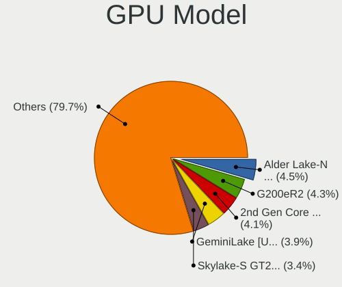

| Model                                                                                    | Computers | Percent |
|------------------------------------------------------------------------------------------|-----------|---------|
| Intel Alder Lake-N [UHD Graphics]                                                        | 25        | 4.48%   |
| Matrox Electronics Systems G200eR2                                                       | 24        | 4.3%    |
| Intel 2nd Generation Core Processor Family Integrated Graphics Controller                | 23        | 4.12%   |
| Intel GeminiLake [UHD Graphics 600]                                                      | 22        | 3.94%   |
| Intel Skylake-S GT2 [HD Graphics 530]                                                    | 19        | 3.41%   |
| Intel Xeon E3-1200 v3/4th Gen Core Processor Integrated Graphics Controller              | 18        | 3.23%   |
| ASPEED Technology ASPEED Graphics Family                                                 | 18        | 3.23%   |
| Intel GeminiLake [UHD Graphics 605]                                                      | 16        | 2.87%   |
| Intel 3rd Gen Core processor Graphics Controller                                         | 16        | 2.87%   |
| Intel CoffeeLake-S GT2 [UHD Graphics 630]                                                | 15        | 2.69%   |
| Intel Atom Processor Z36xxx/Z37xxx Series Graphics & Display                             | 15        | 2.69%   |
| AMD Kabini [Radeon HD 8400E]                                                             | 13        | 2.33%   |
| Intel JasperLake [UHD Graphics]                                                          | 12        | 2.15%   |
| Intel Mobile 4 Series Chipset Integrated Graphics Controller                             | 10        | 1.79%   |
| Intel Broadwell-U GT2 [HD Graphics 5500]                                                 | 10        | 1.79%   |
| AMD Kabini [Radeon HD 8330E]                                                             | 10        | 1.79%   |
| Matrox Electronics Systems MGA G200eW WPCM450                                            | 9         | 1.61%   |
| AMD Ellesmere [Radeon RX 470/480/570/570X/580/580X/590]                                  | 9         | 1.61%   |
| Intel Apollo Lake GT1 [HD Graphics 500]                                                  | 8         | 1.43%   |
| Intel Kaby Lake-S GT2 [HD Graphics 630]                                                  | 7         | 1.25%   |
| Intel Haswell-ULT Integrated Graphics Controller                                         | 7         | 1.25%   |
| AMD Picasso/Raven 2 [Radeon Vega Series / Radeon Vega Mobile Series]                     | 7         | 1.25%   |
| AMD Kaveri [Radeon R7 Graphics]                                                          | 7         | 1.25%   |
| Intel Kaby Lake-U GT2 [HD Graphics 620]                                                  | 6         | 1.08%   |
| Intel Atom/Celeron/Pentium Processor x5-E8000/J3xxx/N3xxx Integrated Graphics Controller | 6         | 1.08%   |
| AMD Wrestler [Radeon HD 6320]                                                            | 6         | 1.08%   |
| Matrox Electronics Systems MGA G200e [Pilot] ServerEngines (SEP1)                        | 5         | 0.9%    |
| Intel Xeon E3-1200 v2/3rd Gen Core processor Graphics Controller                         | 5         | 0.9%    |
| Intel Skylake-U GT2 [HD Graphics 520]                                                    | 5         | 0.9%    |
| Intel CometLake-U GT2 [UHD Graphics]                                                     | 5         | 0.9%    |
| Intel 4 Series Chipset Integrated Graphics Controller                                    | 5         | 0.9%    |
| AMD Renoir [Radeon Vega Series / Radeon Vega Mobile Series]                              | 5         | 0.9%    |
| Nvidia GF117M [GeForce 610M/710M/810M/820M / GT 620M/625M/630M/720M]                     | 4         | 0.72%   |
| Matrox Electronics Systems MGA G200EH                                                    | 4         | 0.72%   |
| Intel WhiskeyLake-U GT2 [UHD Graphics 620]                                               | 4         | 0.72%   |
| Intel TigerLake-LP GT2 [Iris Xe Graphics]                                                | 4         | 0.72%   |
| Intel Kaby Lake-R GT2 [UHD Graphics 620]                                                 | 4         | 0.72%   |
| Intel Core Processor Integrated Graphics Controller                                      | 4         | 0.72%   |
| Intel Atom Processor D2xxx/N2xxx Integrated Graphics Controller                          | 4         | 0.72%   |
| Intel Alder Lake-N [Intel Graphics]                                                      | 4         | 0.72%   |

GPU Combo
---------

Combinations of graphics cards

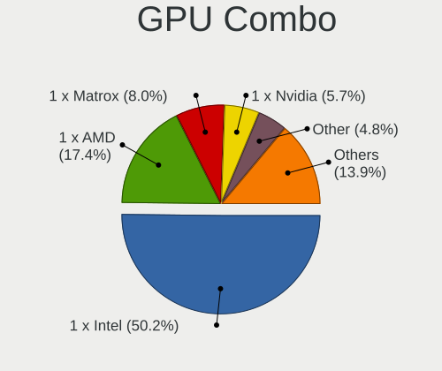

| Name            | Computers | Percent |
|-----------------|-----------|---------|
| 1 x Intel       | 271       | 50.19%  |
| 1 x AMD         | 94        | 17.41%  |
| 1 x Matrox      | 43        | 7.96%   |
| 1 x Nvidia      | 31        | 5.74%   |
| Other           | 26        | 4.81%   |
| Intel + Nvidia  | 25        | 4.63%   |
| 2 x Intel       | 18        | 3.33%   |
| 1 x ASPEED      | 15        | 2.78%   |
| Intel + AMD     | 7         | 1.3%    |
| 1 x XGI         | 2         | 0.37%   |
| 1 x VIA         | 2         | 0.37%   |
| Nvidia + ASPEED | 2         | 0.37%   |
| AMD + Nvidia    | 2         | 0.37%   |
| Intel + ASPEED  | 1         | 0.19%   |
| AMD + ASPEED    | 1         | 0.19%   |

GPU Driver
----------

Free vs proprietary

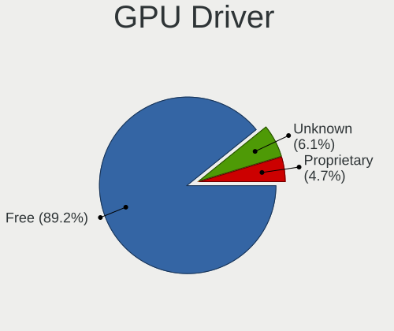

| Driver      | Computers | Percent |
|-------------|-----------|---------|
| Free        | 479       | 89.2%   |
| Unknown     | 33        | 6.15%   |
| Proprietary | 25        | 4.66%   |

GPU Memory
----------

Total video memory

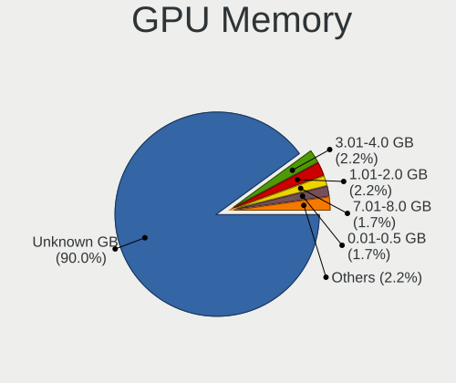

| Size in GB | Computers | Percent |
|------------|-----------|---------|
| Unknown    | 484       | 89.96%  |
| 3.01-4.0   | 12        | 2.23%   |
| 1.01-2.0   | 12        | 2.23%   |
| 7.01-8.0   | 9         | 1.67%   |
| 0.01-0.5   | 9         | 1.67%   |
| 0.51-1.0   | 8         | 1.49%   |
| 5.01-6.0   | 3         | 0.56%   |
| 8.01-16.0  | 1         | 0.19%   |

Monitor
-------

Monitor Vendor
--------------

Monitor vendors

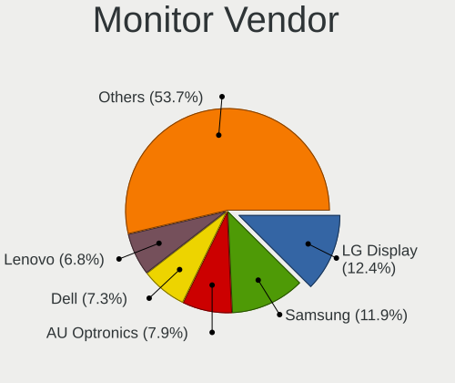

| Vendor                  | Computers | Percent |
|-------------------------|-----------|---------|
| LG Display              | 22        | 12.43%  |
| Samsung Electronics     | 21        | 11.86%  |
| AU Optronics            | 14        | 7.91%   |
| Dell                    | 13        | 7.34%   |
| Lenovo                  | 12        | 6.78%   |
| Iiyama                  | 10        | 5.65%   |
| Chimei Innolux          | 10        | 5.65%   |
| BOE                     | 10        | 5.65%   |
| Goldstar                | 7         | 3.95%   |
| Acer                    | 6         | 3.39%   |
| Philips                 | 5         | 2.82%   |
| NEC Computers           | 5         | 2.82%   |
| Chi Mei Optoelectronics | 4         | 2.26%   |
| Apple                   | 4         | 2.26%   |
| AOC                     | 4         | 2.26%   |
| InfoVision              | 3         | 1.69%   |
| Hewlett-Packard         | 3         | 1.69%   |
| BenQ                    | 3         | 1.69%   |
| Sharp                   | 2         | 1.13%   |
| Idek Iiyama             | 2         | 1.13%   |
| Vestel Elektronik       | 1         | 0.56%   |
| Toshiba                 | 1         | 0.56%   |
| RTK                     | 1         | 0.56%   |
| PANDA                   | 1         | 0.56%   |
| Nvidia                  | 1         | 0.56%   |
| Medion                  | 1         | 0.56%   |
| LG Electronics          | 1         | 0.56%   |
| KTC                     | 1         | 0.56%   |
| JDI                     | 1         | 0.56%   |
| Huion                   | 1         | 0.56%   |
| HPN                     | 1         | 0.56%   |
| Gateway                 | 1         | 0.56%   |
| Fujitsu Siemens         | 1         | 0.56%   |
| Eizo                    | 1         | 0.56%   |
| CSO                     | 1         | 0.56%   |
| BOE Technology Group    | 1         | 0.56%   |
| Unknown                 | 1         | 0.56%   |

Monitor Model
-------------

Monitor models

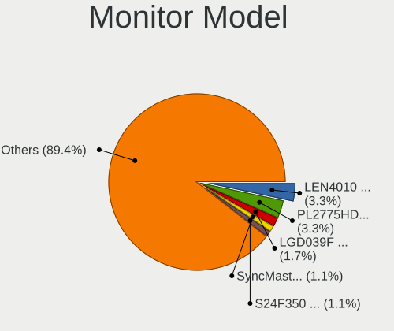

| Model                                                                    | Computers | Percent |
|--------------------------------------------------------------------------|-----------|---------|
| Lenovo LCD Monitor LEN4010 1280x800 260x160mm 12.0-inch                  | 6         | 3.33%   |
| Iiyama PL2775HD IVM6604 1920x1080 600x340mm 27.2-inch                    | 6         | 3.33%   |
| LG Display LCD Monitor LGD039F 1366x768 350x190mm 15.7-inch              | 3         | 1.67%   |
| Samsung Electronics SyncMaster SAM011F 1280x1024 380x300mm 19.1-inch     | 2         | 1.11%   |
| Samsung Electronics S24F350 SAM0D20 1920x1080 520x290mm 23.4-inch        | 2         | 1.11%   |
| LG Display LCD Monitor LGD02DC 1366x768 340x190mm 15.3-inch              | 2         | 1.11%   |
| LG Display LCD Monitor LGD02D8 1366x768 280x160mm 12.7-inch              | 2         | 1.11%   |
| Lenovo LCD Monitor LEN4011 1280x800 260x160mm 12.0-inch                  | 2         | 1.11%   |
| Dell U2515H DELD070 2560x1440 550x310mm 24.9-inch                        | 2         | 1.11%   |
| Dell P2214H DELA099 1920x1080 480x270mm 21.7-inch                        | 2         | 1.11%   |
| Chi Mei Optoelectronics LCD Monitor CMO15A7 1366x768 350x190mm 15.7-inch | 2         | 1.11%   |
| AU Optronics LCD Monitor AUO106C 1366x768 280x160mm 12.7-inch            | 2         | 1.11%   |
| Apple Color LCD APPA02E 2880x1800 330x210mm 15.4-inch                    | 2         | 1.11%   |
| AOC Q27G2WG4 AOC2702 2560x1440 600x340mm 27.2-inch                       | 2         | 1.11%   |
| Vestel Elektronik 32W_LCD_TV VES3700 1920x1080 710x400mm 32.1-inch       | 1         | 0.56%   |
| Toshiba TV TSB0110 1920x1080 1110x620mm 50.1-inch                        | 1         | 0.56%   |
| Sharp LCD Monitor SHP1451 1920x1080 280x160mm 12.7-inch                  | 1         | 0.56%   |
| Sharp LCD Monitor SHP1421 3200x1800 290x170mm 13.2-inch                  | 1         | 0.56%   |
| Samsung Electronics U32J59x SAM0F35 3840x2160 700x390mm 31.5-inch        | 1         | 0.56%   |
| Samsung Electronics T24D391 SAM0B73 1920x1080 520x290mm 23.4-inch        | 1         | 0.56%   |
| Samsung Electronics SyncMaster SAM0523 1920x1080 480x270mm 21.7-inch     | 1         | 0.56%   |
| Samsung Electronics SyncMaster SAM0304 1680x1050 490x320mm 23.0-inch     | 1         | 0.56%   |
| Samsung Electronics LU28R55 SAM1016 3840x2160 630x360mm 28.6-inch        | 1         | 0.56%   |
| Samsung Electronics LS24AG30x SAM7178 1920x1080 530x300mm 24.0-inch      | 1         | 0.56%   |
| Samsung Electronics LF27T370F SAM711E 1920x1080 600x340mm 27.2-inch      | 1         | 0.56%   |
| Samsung Electronics LCD Monitor SEC544B 1600x900 340x190mm 15.3-inch     | 1         | 0.56%   |
| Samsung Electronics LCD Monitor SEC5442 1440x900 300x190mm 14.0-inch     | 1         | 0.56%   |
| Samsung Electronics LCD Monitor SEC3345 1280x800 330x210mm 15.4-inch     | 1         | 0.56%   |
| Samsung Electronics LCD Monitor SEC3245 1366x768 340x190mm 15.3-inch     | 1         | 0.56%   |
| Samsung Electronics LCD Monitor SDC4852 1366x768 340x190mm 15.3-inch     | 1         | 0.56%   |
| Samsung Electronics LCD Monitor SDC4163 3456x2160 290x180mm 13.4-inch    | 1         | 0.56%   |
| Samsung Electronics LCD Monitor SDC324A 1366x768 290x170mm 13.2-inch     | 1         | 0.56%   |
| Samsung Electronics LCD Monitor SAM7103 3840x2160 700x390mm 31.5-inch    | 1         | 0.56%   |
| Samsung Electronics LCD Monitor SAM0509 1920x1080                        | 1         | 0.56%   |
| Samsung Electronics LCD Monitor S24F350 1920x1080                        | 1         | 0.56%   |
| RTK FHD RTK0039 1920x1080 300x190mm 14.0-inch                            | 1         | 0.56%   |
| Philips PHL 275S1 PHL094B 2560x1440 600x340mm 27.2-inch                  | 1         | 0.56%   |
| Philips PHL 243V7 PHLC155 1920x1080 530x300mm 24.0-inch                  | 1         | 0.56%   |
| Philips LCD Monitor PHLC01A 1680x1050 470x300mm 22.0-inch                | 1         | 0.56%   |
| Philips FTV PHL0583 3840x2160 1440x810mm 65.0-inch                       | 1         | 0.56%   |

Monitor Resolution
------------------

Monitor screen resolution

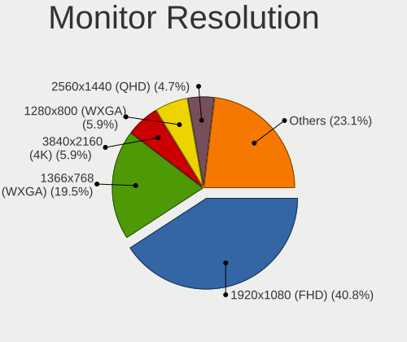

| Resolution         | Computers | Percent |
|--------------------|-----------|---------|
| 1920x1080 (FHD)    | 69        | 40.83%  |
| 1366x768 (WXGA)    | 33        | 19.53%  |
| 3840x2160 (4K)     | 10        | 5.92%   |
| 1280x800 (WXGA)    | 10        | 5.92%   |
| 2560x1440 (QHD)    | 8         | 4.73%   |
| 1680x1050 (WSXGA+) | 5         | 2.96%   |
| 1600x900 (HD+)     | 5         | 2.96%   |
| 1280x1024 (SXGA)   | 5         | 2.96%   |
| 1920x1200 (WUXGA)  | 4         | 2.37%   |
| 1440x900 (WXGA+)   | 3         | 1.78%   |
| Unknown            | 3         | 1.78%   |
| 5760x2160          | 2         | 1.18%   |
| 2880x1800          | 2         | 1.18%   |
| 2560x1080          | 2         | 1.18%   |
| 1920x540           | 2         | 1.18%   |
| 6400x2160          | 1         | 0.59%   |
| 3840x2400          | 1         | 0.59%   |
| 3456x2160          | 1         | 0.59%   |
| 3200x1800 (QHD+)   | 1         | 0.59%   |
| 1024x768 (XGA)     | 1         | 0.59%   |
| 1024x600           | 1         | 0.59%   |

Monitor Diagonal
----------------

Diagonal size in inches

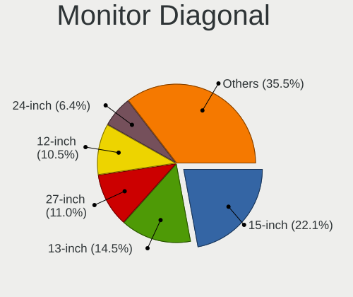

| Inches  | Computers | Percent |
|---------|-----------|---------|
| 15      | 38        | 22.09%  |
| 13      | 25        | 14.53%  |
| 27      | 19        | 11.05%  |
| 12      | 18        | 10.47%  |
| 24      | 11        | 6.4%    |
| 23      | 11        | 6.4%    |
| 21      | 9         | 5.23%   |
| Unknown | 8         | 4.65%   |
| 17      | 6         | 3.49%   |
| 14      | 5         | 2.91%   |
| 19      | 4         | 2.33%   |
| 22      | 3         | 1.74%   |
| 18      | 3         | 1.74%   |
| 42      | 2         | 1.16%   |
| 31      | 2         | 1.16%   |
| 28      | 2         | 1.16%   |
| 65      | 1         | 0.58%   |
| 50      | 1         | 0.58%   |
| 40      | 1         | 0.58%   |
| 34      | 1         | 0.58%   |
| 20      | 1         | 0.58%   |
| 10      | 1         | 0.58%   |

Monitor Width
-------------

Physical width

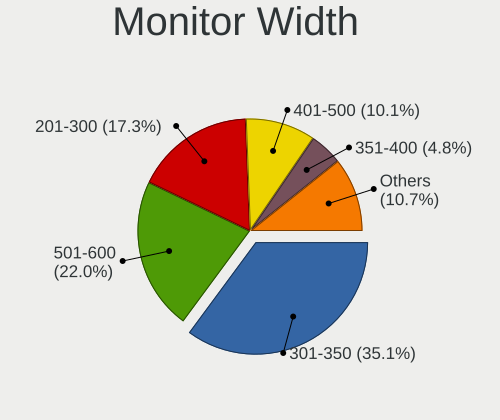

| Width in mm | Computers | Percent |
|-------------|-----------|---------|
| 301-350     | 59        | 35.12%  |
| 501-600     | 37        | 22.02%  |
| 201-300     | 29        | 17.26%  |
| 401-500     | 17        | 10.12%  |
| 351-400     | 8         | 4.76%   |
| Unknown     | 8         | 4.76%   |
| 601-700     | 4         | 2.38%   |
| 1001-1500   | 2         | 1.19%   |
| 901-1000    | 2         | 1.19%   |
| 801-900     | 1         | 0.6%    |
| 701-800     | 1         | 0.6%    |

Aspect Ratio
------------

Proportional relationship between the width and the height

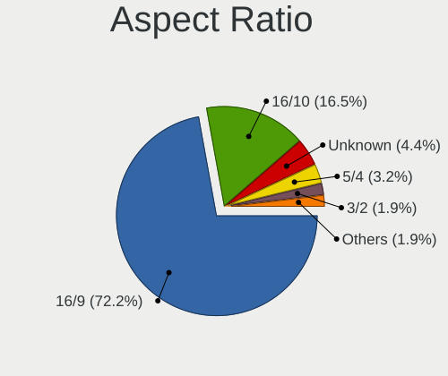

| Ratio   | Computers | Percent |
|---------|-----------|---------|
| 16/9    | 114       | 72.15%  |
| 16/10   | 26        | 16.46%  |
| Unknown | 7         | 4.43%   |
| 5/4     | 5         | 3.16%   |
| 3/2     | 3         | 1.9%    |
| 21/9    | 2         | 1.27%   |
| 4/3     | 1         | 0.63%   |

Monitor Area
------------

Area in inch²

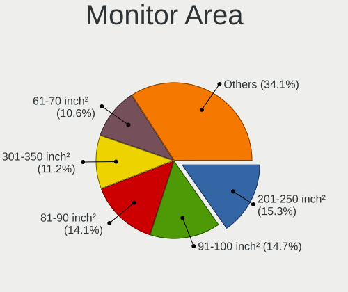

| Area in inch² | Computers | Percent |
|----------------|-----------|---------|
| 201-250        | 26        | 15.29%  |
| 91-100         | 25        | 14.71%  |
| 81-90          | 24        | 14.12%  |
| 301-350        | 19        | 11.18%  |
| 61-70          | 18        | 10.59%  |
| 101-110        | 14        | 8.24%   |
| Unknown        | 8         | 4.71%   |
| 251-300        | 7         | 4.12%   |
| 151-200        | 6         | 3.53%   |
| 71-80          | 5         | 2.94%   |
| 351-500        | 4         | 2.35%   |
| 141-150        | 4         | 2.35%   |
| 501-1000       | 3         | 1.76%   |
| More than 1000 | 2         | 1.18%   |
| 131-140        | 2         | 1.18%   |
| 121-130        | 2         | 1.18%   |
| 41-50          | 1         | 0.59%   |

Pixel Density
-------------

Pixels per inch

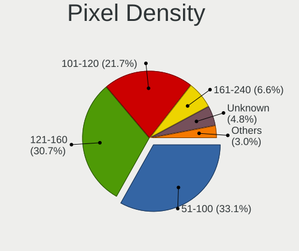

| Density       | Computers | Percent |
|---------------|-----------|---------|
| 51-100        | 55        | 33.13%  |
| 121-160       | 51        | 30.72%  |
| 101-120       | 36        | 21.69%  |
| 161-240       | 11        | 6.63%   |
| Unknown       | 8         | 4.82%   |
| More than 240 | 3         | 1.81%   |
| 1-50          | 2         | 1.2%    |

Multiple Monitors
-----------------

Total monitors connected

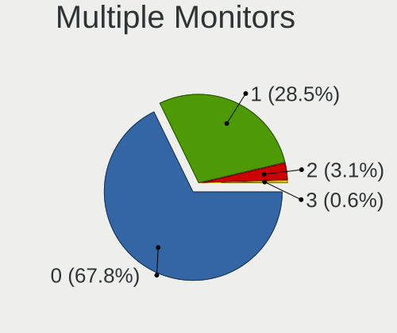

| Total | Computers | Percent |
|-------|-----------|---------|
| 0     | 366       | 67.78%  |
| 1     | 154       | 28.52%  |
| 2     | 17        | 3.15%   |
| 3     | 3         | 0.56%   |

Network
-------

Net Controller Vendor
---------------------

Controller vendors

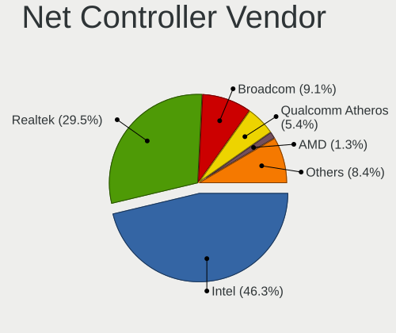

| Vendor                            | Computers | Percent |
|-----------------------------------|-----------|---------|
| Intel                             | 367       | 46.28%  |
| Realtek Semiconductor             | 234       | 29.51%  |
| Broadcom                          | 72        | 9.08%   |
| Qualcomm Atheros                  | 43        | 5.42%   |
| AMD                               | 10        | 1.26%   |
| TP-Link                           | 7         | 0.88%   |
| Qualcomm Atheros Communications   | 6         | 0.76%   |
| Dell                              | 4         | 0.5%    |
| Ralink Technology                 | 3         | 0.38%   |
| Mellanox Technologies             | 3         | 0.38%   |
| Huawei Technologies               | 3         | 0.38%   |
| Emulex                            | 3         | 0.38%   |
| Xiaomi                            | 2         | 0.25%   |
| Seeed Technology                  | 2         | 0.25%   |
| Samsung Electronics               | 2         | 0.25%   |
| Marvell Technology Group          | 2         | 0.25%   |
| IMC Networks                      | 2         | 0.25%   |
| IBM                               | 2         | 0.25%   |
| Chelsio Communications            | 2         | 0.25%   |
| ZyXEL Communications              | 1         | 0.13%   |
| VIA Technologies                  | 1         | 0.13%   |
| Van Ooijen Technische Informatica | 1         | 0.13%   |
| U-Blox                            | 1         | 0.13%   |
| Sundance Technology Inc / IC Plus | 1         | 0.13%   |
| Silicon Integrated Systems [SiS]  | 1         | 0.13%   |
| Sierra Wireless                   | 1         | 0.13%   |
| SEGGER                            | 1         | 0.13%   |
| Ralink                            | 1         | 0.13%   |
| QLogic                            | 1         | 0.13%   |
| OnePlus Technology (Shenzhen)     | 1         | 0.13%   |
| Nvidia                            | 1         | 0.13%   |
| Nuvoton                           | 1         | 0.13%   |
| NetGear                           | 1         | 0.13%   |
| MediaTek                          | 1         | 0.13%   |
| Espressif                         | 1         | 0.13%   |
| Ericsson Business Mobile Networks | 1         | 0.13%   |
| D-Link System                     | 1         | 0.13%   |
| Conexant Systems                  | 1         | 0.13%   |
| Atheros                           | 1         | 0.13%   |
| ASUSTek Computer                  | 1         | 0.13%   |

Net Controller Model
--------------------

Controller models

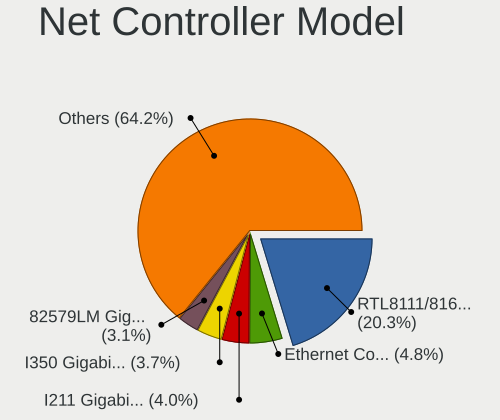

| Model                                                                         | Computers | Percent |
|-------------------------------------------------------------------------------|-----------|---------|
| Realtek RTL8111/8168/8211/8411 PCI Express Gigabit Ethernet Controller        | 199       | 20.31%  |
| Intel Ethernet Controller I226-V                                              | 47        | 4.8%    |
| Intel I211 Gigabit Network Connection                                         | 39        | 3.98%   |
| Intel I350 Gigabit Network Connection                                         | 36        | 3.67%   |
| Intel 82579LM Gigabit Network Connection (Lewisville)                         | 30        | 3.06%   |
| Intel I210 Gigabit Network Connection                                         | 27        | 2.76%   |
| Broadcom NetXtreme BCM5720 Gigabit Ethernet PCIe                              | 26        | 2.65%   |
| Intel Ethernet Controller I225-V                                              | 19        | 1.94%   |
| Intel 82574L Gigabit Network Connection                                       | 16        | 1.63%   |
| Intel Ethernet Connection (7) I219-V                                          | 15        | 1.53%   |
| Intel Centrino Advanced-N 6205 [Taylor Peak]                                  | 14        | 1.43%   |
| Intel 82599ES 10-Gigabit SFI/SFP+ Network Connection                          | 14        | 1.43%   |
| Intel Ethernet Connection I217-LM                                             | 12        | 1.22%   |
| Intel Ethernet Connection (2) I219-V                                          | 12        | 1.22%   |
| Intel 82571EB/82571GB Gigabit Ethernet Controller D0/D1 (copper applications) | 10        | 1.02%   |
| Intel 82567LM Gigabit Network Connection                                      | 10        | 1.02%   |
| AMD XGMAC 10GbE Controller                                                    | 10        | 1.02%   |
| Qualcomm Atheros AR9285 Wireless Network Adapter (PCI-Express)                | 9         | 0.92%   |
| Intel Wireless 8265 / 8275                                                    | 9         | 0.92%   |
| Intel 82580 Gigabit Network Connection                                        | 9         | 0.92%   |
| Intel 82571EB/82571GB Gigabit Ethernet Controller (Copper)                    | 9         | 0.92%   |
| Intel Wireless 8260                                                           | 8         | 0.82%   |
| Intel Cannon Lake PCH CNVi WiFi                                               | 8         | 0.82%   |
| Realtek RTL8188EUS 802.11n Wireless Network Adapter                           | 7         | 0.71%   |
| Realtek RTL810xE PCI Express Fast Ethernet controller                         | 7         | 0.71%   |
| Intel Wireless 7260                                                           | 7         | 0.71%   |
| Intel Gemini Lake PCH CNVi WiFi                                               | 7         | 0.71%   |
| Broadcom NetXtreme BCM5719 Gigabit Ethernet PCIe                              | 7         | 0.71%   |
| Realtek USB 2.5GbE Controller                                                 | 6         | 0.61%   |
| Realtek RTL8125 2.5GbE Controller                                             | 6         | 0.61%   |
| Realtek RTL-8100/8101L/8139 PCI Fast Ethernet Adapter                         | 6         | 0.61%   |
| Qualcomm Atheros QCA9565 / AR9565 Wireless Network Adapter                    | 6         | 0.61%   |
| Qualcomm Atheros AR9287 Wireless Network Adapter (PCI-Express)                | 6         | 0.61%   |
| Intel Wireless 7265                                                           | 6         | 0.61%   |
| Intel Wireless 3165                                                           | 6         | 0.61%   |
| Intel Wi-Fi 6 AX200                                                           | 6         | 0.61%   |
| Intel Ultimate N WiFi Link 5300                                               | 6         | 0.61%   |
| Intel Dual Band Wireless-AC 3168NGW [Stone Peak]                              | 6         | 0.61%   |
| Broadcom BCM43228 802.11a/b/g/n                                               | 6         | 0.61%   |
| Realtek RTL8821CE 802.11ac PCIe Wireless Network Adapter                      | 5         | 0.51%   |

Wireless Vendor
---------------

Wireless vendors

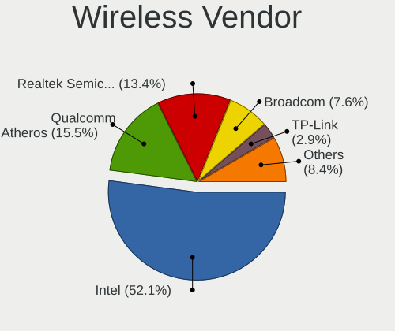

| Vendor                          | Computers | Percent |
|---------------------------------|-----------|---------|
| Intel                           | 124       | 52.1%   |
| Qualcomm Atheros                | 37        | 15.55%  |
| Realtek Semiconductor           | 32        | 13.45%  |
| Broadcom                        | 18        | 7.56%   |
| TP-Link                         | 7         | 2.94%   |
| Qualcomm Atheros Communications | 6         | 2.52%   |
| Ralink Technology               | 3         | 1.26%   |
| IMC Networks                    | 2         | 0.84%   |
| Dell                            | 2         | 0.84%   |
| ZyXEL Communications            | 1         | 0.42%   |
| Ralink                          | 1         | 0.42%   |
| NetGear                         | 1         | 0.42%   |
| MediaTek                        | 1         | 0.42%   |
| D-Link System                   | 1         | 0.42%   |
| Atheros                         | 1         | 0.42%   |
| ASUSTek Computer                | 1         | 0.42%   |

Wireless Model
--------------

Wireless models

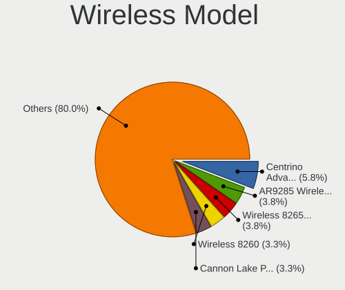

| Model                                                                         | Computers | Percent |
|-------------------------------------------------------------------------------|-----------|---------|
| Intel Centrino Advanced-N 6205 [Taylor Peak]                                  | 14        | 5.83%   |
| Qualcomm Atheros AR9285 Wireless Network Adapter (PCI-Express)                | 9         | 3.75%   |
| Intel Wireless 8265 / 8275                                                    | 9         | 3.75%   |
| Intel Wireless 8260                                                           | 8         | 3.33%   |
| Intel Cannon Lake PCH CNVi WiFi                                               | 8         | 3.33%   |
| Realtek RTL8188EUS 802.11n Wireless Network Adapter                           | 7         | 2.92%   |
| Intel Wireless 7260                                                           | 7         | 2.92%   |
| Intel Gemini Lake PCH CNVi WiFi                                               | 7         | 2.92%   |
| Qualcomm Atheros QCA9565 / AR9565 Wireless Network Adapter                    | 6         | 2.5%    |
| Qualcomm Atheros AR9287 Wireless Network Adapter (PCI-Express)                | 6         | 2.5%    |
| Intel Wireless 7265                                                           | 6         | 2.5%    |
| Intel Wireless 3165                                                           | 6         | 2.5%    |
| Intel Wi-Fi 6 AX200                                                           | 6         | 2.5%    |
| Intel Ultimate N WiFi Link 5300                                               | 6         | 2.5%    |
| Intel Dual Band Wireless-AC 3168NGW [Stone Peak]                              | 6         | 2.5%    |
| Broadcom BCM43228 802.11a/b/g/n                                               | 6         | 2.5%    |
| Realtek RTL8821CE 802.11ac PCIe Wireless Network Adapter                      | 5         | 2.08%   |
| Realtek RTL8822CE 802.11ac PCIe Wireless Network Adapter                      | 4         | 1.67%   |
| Realtek RTL8188CUS 802.11n WLAN Adapter                                       | 4         | 1.67%   |
| Qualcomm Atheros AR9271 802.11n                                               | 4         | 1.67%   |
| Intel Wi-Fi 6E(802.11ax) AX210/AX1675* 2x2 [Typhoon Peak]                     | 4         | 1.67%   |
| Intel Wi-Fi 6 AX201                                                           | 4         | 1.67%   |
| Intel Comet Lake PCH-LP CNVi WiFi                                             | 4         | 1.67%   |
| TP-Link TL-WN722N v2/v3 [Realtek RTL8188EUS]                                  | 3         | 1.25%   |
| TP-Link AC600 wireless Realtek RTL8811AU [Archer T2U Nano]                    | 3         | 1.25%   |
| Realtek RTL8852BE PCIe 802.11ax Wireless Network Controller                   | 3         | 1.25%   |
| Ralink RT5370 Wireless Adapter                                                | 3         | 1.25%   |
| Qualcomm Atheros AR9485 Wireless Network Adapter                              | 3         | 1.25%   |
| Qualcomm Atheros AR9462 Wireless Network Adapter                              | 3         | 1.25%   |
| Intel Centrino Advanced-N 6200                                                | 3         | 1.25%   |
| Broadcom BCM43602 802.11ac Wireless LAN SoC                                   | 3         | 1.25%   |
| Realtek RTL88x2bu [AC1200 Techkey]                                            | 2         | 0.83%   |
| Realtek RTL8188EE Wireless Network Adapter                                    | 2         | 0.83%   |
| Qualcomm Atheros QCA986x/988x 802.11ac Wireless Network Adapter               | 2         | 0.83%   |
| Qualcomm Atheros QCA9377 802.11ac Wireless Network Adapter                    | 2         | 0.83%   |
| Qualcomm Atheros TP-Link TL-WN821N v2 / TL-WN822N v1 802.11n [Atheros AR9170] | 2         | 0.83%   |
| Qualcomm Atheros AR928X Wireless Network Adapter (PCI-Express)                | 2         | 0.83%   |
| Intel Wi-Fi 5(802.11ac) Wireless-AC 9x6x [Thunder Peak]                       | 2         | 0.83%   |
| Intel PRO/Wireless 5100 AGN [Shiloh] Network Connection                       | 2         | 0.83%   |
| Intel Centrino Wireless-N 1030 [Rainbow Peak]                                 | 2         | 0.83%   |

Ethernet Vendor
---------------

Ethernet vendors

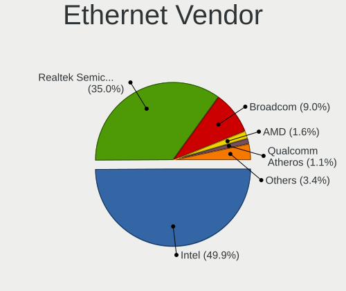

| Vendor                            | Computers | Percent |
|-----------------------------------|-----------|---------|
| Intel                             | 312       | 49.92%  |
| Realtek Semiconductor             | 219       | 35.04%  |
| Broadcom                          | 56        | 8.96%   |
| AMD                               | 10        | 1.6%    |
| Qualcomm Atheros                  | 7         | 1.12%   |
| Xiaomi                            | 2         | 0.32%   |
| Samsung Electronics               | 2         | 0.32%   |
| Marvell Technology Group          | 2         | 0.32%   |
| IBM                               | 2         | 0.32%   |
| Emulex                            | 2         | 0.32%   |
| VIA Technologies                  | 1         | 0.16%   |
| Sundance Technology Inc / IC Plus | 1         | 0.16%   |
| Silicon Integrated Systems [SiS]  | 1         | 0.16%   |
| QLogic                            | 1         | 0.16%   |
| OnePlus Technology (Shenzhen)     | 1         | 0.16%   |
| Nvidia                            | 1         | 0.16%   |
| Huawei Technologies               | 1         | 0.16%   |
| Chelsio Communications            | 1         | 0.16%   |
| Apple                             | 1         | 0.16%   |
| American Megatrends               | 1         | 0.16%   |
| 3Com                              | 1         | 0.16%   |

Ethernet Model
--------------

Ethernet models

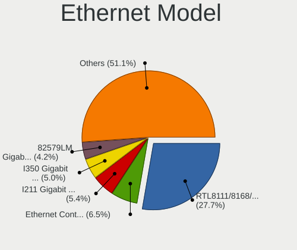

| Model                                                                         | Computers | Percent |
|-------------------------------------------------------------------------------|-----------|---------|
| Realtek RTL8111/8168/8211/8411 PCI Express Gigabit Ethernet Controller        | 199       | 27.72%  |
| Intel Ethernet Controller I226-V                                              | 47        | 6.55%   |
| Intel I211 Gigabit Network Connection                                         | 39        | 5.43%   |
| Intel I350 Gigabit Network Connection                                         | 36        | 5.01%   |
| Intel 82579LM Gigabit Network Connection (Lewisville)                         | 30        | 4.18%   |
| Intel I210 Gigabit Network Connection                                         | 27        | 3.76%   |
| Broadcom NetXtreme BCM5720 Gigabit Ethernet PCIe                              | 26        | 3.62%   |
| Intel Ethernet Controller I225-V                                              | 19        | 2.65%   |
| Intel 82574L Gigabit Network Connection                                       | 16        | 2.23%   |
| Intel Ethernet Connection (7) I219-V                                          | 15        | 2.09%   |
| Intel 82599ES 10-Gigabit SFI/SFP+ Network Connection                          | 14        | 1.95%   |
| Intel Ethernet Connection I217-LM                                             | 12        | 1.67%   |
| Intel Ethernet Connection (2) I219-V                                          | 12        | 1.67%   |
| Intel 82571EB/82571GB Gigabit Ethernet Controller D0/D1 (copper applications) | 10        | 1.39%   |
| Intel 82567LM Gigabit Network Connection                                      | 10        | 1.39%   |
| AMD XGMAC 10GbE Controller                                                    | 10        | 1.39%   |
| Intel 82580 Gigabit Network Connection                                        | 9         | 1.25%   |
| Intel 82571EB/82571GB Gigabit Ethernet Controller (Copper)                    | 9         | 1.25%   |
| Realtek RTL810xE PCI Express Fast Ethernet controller                         | 7         | 0.97%   |
| Broadcom NetXtreme BCM5719 Gigabit Ethernet PCIe                              | 7         | 0.97%   |
| Realtek USB 2.5GbE Controller                                                 | 6         | 0.84%   |
| Realtek RTL8125 2.5GbE Controller                                             | 6         | 0.84%   |
| Realtek RTL-8100/8101L/8139 PCI Fast Ethernet Adapter                         | 6         | 0.84%   |
| Intel 82576 Gigabit Network Connection                                        | 5         | 0.7%    |
| Intel Ethernet Connection X553 10 GbE SFP+                                    | 4         | 0.56%   |
| Intel Ethernet Connection I219-LM                                             | 4         | 0.56%   |
| Intel Ethernet Connection (5) I219-LM                                         | 4         | 0.56%   |
| Intel 82579V Gigabit Network Connection                                       | 4         | 0.56%   |
| Broadcom NetXtreme II BCM5709 Gigabit Ethernet                                | 4         | 0.56%   |
| Broadcom NetLink BCM57781 Gigabit Ethernet PCIe                               | 4         | 0.56%   |
| Realtek RTL8111/8168/8411 PCI Express Gigabit Ethernet Controller             | 3         | 0.42%   |
| Intel Ethernet Controller X710 for 10GbE SFP+                                 | 3         | 0.42%   |
| Intel Ethernet Connection I218-LM                                             | 3         | 0.42%   |
| Intel Ethernet Connection (4) I219-LM                                         | 3         | 0.42%   |
| Intel Ethernet Connection (3) I218-LM                                         | 3         | 0.42%   |
| Intel 82577LM Gigabit Network Connection                                      | 3         | 0.42%   |
| Intel 82576NS Gigabit Network Connection                                      | 3         | 0.42%   |
| Intel 82572EI Gigabit Ethernet Controller (Copper)                            | 3         | 0.42%   |
| Intel 82567LM-3 Gigabit Network Connection                                    | 3         | 0.42%   |
| Samsung Galaxy series, misc. (tethering mode)                                 | 2         | 0.28%   |

Net Controller Kind
-------------------

Ethernet, WiFi or modem

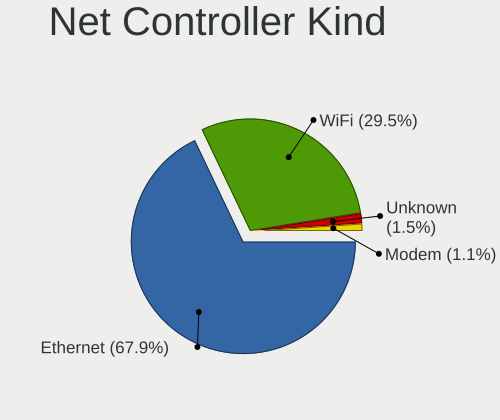

| Kind     | Computers | Percent |
|----------|-----------|---------|
| Ethernet | 508       | 67.91%  |
| WiFi     | 221       | 29.55%  |
| Unknown  | 11        | 1.47%   |
| Modem    | 8         | 1.07%   |

Used Controller
---------------

Currently used network controller

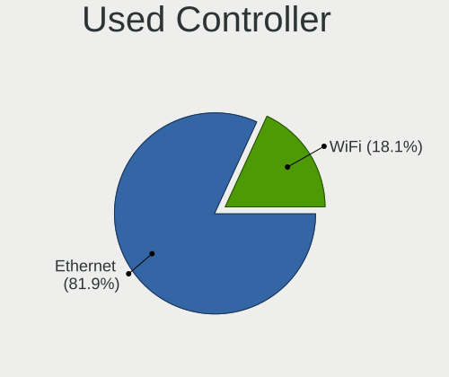

| Kind     | Computers | Percent |
|----------|-----------|---------|
| Ethernet | 447       | 81.87%  |
| WiFi     | 99        | 18.13%  |

NICs
----

Total network controllers on board

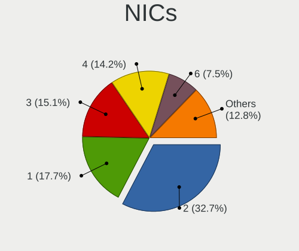

| Total | Computers | Percent |
|-------|-----------|---------|
| 2     | 179       | 32.66%  |
| 1     | 97        | 17.7%   |
| 3     | 83        | 15.15%  |
| 4     | 78        | 14.23%  |
| 6     | 41        | 7.48%   |
| 5     | 41        | 7.48%   |
| 0     | 12        | 2.19%   |
| 8     | 4         | 0.73%   |
| 14    | 3         | 0.55%   |
| 9     | 3         | 0.55%   |
| 12    | 2         | 0.36%   |
| 10    | 2         | 0.36%   |
| 7     | 2         | 0.36%   |
| 17    | 1         | 0.18%   |

IPv6
----

IPv6 vs IPv4

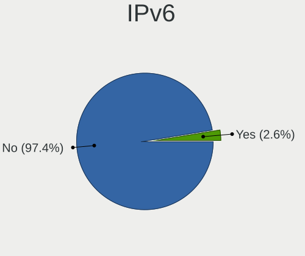

| Used | Computers | Percent |
|------|-----------|---------|
| No   | 524       | 97.4%   |
| Yes  | 14        | 2.6%    |

Bluetooth
---------

Bluetooth Vendor
----------------

Controller vendors

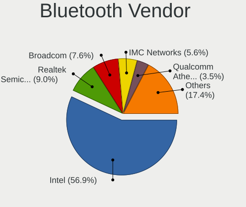

| Vendor                          | Computers | Percent |
|---------------------------------|-----------|---------|
| Intel                           | 82        | 56.94%  |
| Realtek Semiconductor           | 13        | 9.03%   |
| Broadcom                        | 11        | 7.64%   |
| IMC Networks                    | 8         | 5.56%   |
| Qualcomm Atheros Communications | 5         | 3.47%   |
| Cambridge Silicon Radio         | 5         | 3.47%   |
| Foxconn / Hon Hai               | 4         | 2.78%   |
| ASUSTek Computer                | 4         | 2.78%   |
| Apple                           | 4         | 2.78%   |
| Lite-On Technology              | 2         | 1.39%   |
| Dell                            | 2         | 1.39%   |
| TP-Link                         | 1         | 0.69%   |
| Qcom                            | 1         | 0.69%   |
| MediaTek                        | 1         | 0.69%   |
| Hewlett-Packard                 | 1         | 0.69%   |

Bluetooth Model
---------------

Controller models

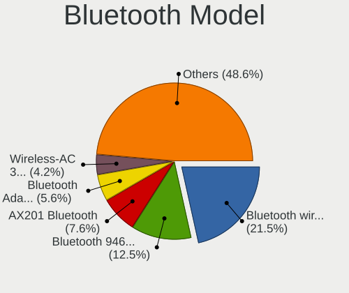

| Model                                                    | Computers | Percent |
|----------------------------------------------------------|-----------|---------|
| Intel Bluetooth wireless interface                       | 31        | 21.53%  |
| Intel Bluetooth 9460/9560 Jefferson Peak (JfP)           | 18        | 12.5%   |
| Intel AX201 Bluetooth                                    | 11        | 7.64%   |
| Realtek Bluetooth Adapter                                | 8         | 5.56%   |
| Intel Wireless-AC 3168 Bluetooth                         | 6         | 4.17%   |
| Cambridge Silicon Radio Bluetooth Dongle (HCI mode)      | 5         | 3.47%   |
| Broadcom BCM2045B (BDC-2.1) [Bluetooth Controller]       | 5         | 3.47%   |
| Intel AX210 Bluetooth                                    | 4         | 2.78%   |
| Intel AX200 Bluetooth                                    | 4         | 2.78%   |
| Intel Centrino Bluetooth Wireless Transceiver            | 3         | 2.08%   |
| Intel Centrino Advanced-N 6230 Bluetooth adapter         | 3         | 2.08%   |
| Broadcom BCM20702 Bluetooth 4.0 [ThinkPad]               | 3         | 2.08%   |
| Apple Bluetooth Host Controller                          | 3         | 2.08%   |
| Realtek Bluetooth 4.2 Adapter                            | 2         | 1.39%   |
| Qualcomm Atheros AR9462 Bluetooth                        | 2         | 1.39%   |
| IMC Networks Qualcomm Atheros Bluetooth 4.0 + HS         | 2         | 1.39%   |
| IMC Networks Atheros AR3012 Bluetooth 4.0 Adapter        | 2         | 1.39%   |
| IMC Networks Asus Integrated Bluetooth module [AR3011]   | 2         | 1.39%   |
| Foxconn / Hon Hai Broadcom BCM20702 Bluetooth            | 2         | 1.39%   |
| ASUS USB-BT500                                           | 2         | 1.39%   |
| TP-Link Bluetooth 5.0 USB Adapter                        | 1         | 0.69%   |
| Realtek Wireless Bluetooth Adapter                       | 1         | 0.69%   |
| Realtek RTL8822BE Bluetooth 4.2 Adapter                  | 1         | 0.69%   |
| Realtek  Bluetooth 4.2 Adapter                           | 1         | 0.69%   |
| Qualcomm Atheros QCA9377 Bluetooth 4.1                   | 1         | 0.69%   |
| Qualcomm Atheros Dell Wireless 1601 Bluetooth Device     | 1         | 0.69%   |
| Qualcomm Atheros AR3012 Bluetooth 4.0                    | 1         | 0.69%   |
| Qcom Broadcom BCM2070 Bluetooth 2.1+EDR USB Device       | 1         | 0.69%   |
| MediaTek RZ608 Bluetooth Adapter                         | 1         | 0.69%   |
| Lite-On Qualcomm Atheros Bluetooth 4.0 + HS              | 1         | 0.69%   |
| Lite-On Bluetooth USB Module                             | 1         | 0.69%   |
| Intel Wireless-AC 9260 Bluetooth Adapter                 | 1         | 0.69%   |
| Intel AX211 Bluetooth                                    | 1         | 0.69%   |
| IMC Networks Realtek Bluetooth Adapter                   | 1         | 0.69%   |
| IMC Networks Realtek Bluetooth 4.0 + High Speed Chip     | 1         | 0.69%   |
| HP Atheros AR9285 Malbec Bluetooth Adapter               | 1         | 0.69%   |
| Foxconn / Hon Hai Broadcom BCM20702 Bluetooth USB Device | 1         | 0.69%   |
| Foxconn / Hon Hai Bluetooth USB Module                   | 1         | 0.69%   |
| Dell DW375 Bluetooth Module                              | 1         | 0.69%   |
| Dell Dell Wireless 380 Bluetooth 4.0 Module              | 1         | 0.69%   |

Sound
-----

Sound Vendor
------------

Sound card vendors

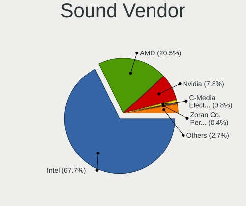

| Vendor                                       | Computers | Percent |
|----------------------------------------------|-----------|---------|
| Intel                                        | 321       | 67.72%  |
| AMD                                          | 97        | 20.46%  |
| Nvidia                                       | 37        | 7.81%   |
| C-Media Electronics                          | 4         | 0.84%   |
| Zoran Co. Personal Media Division (Nogatech) | 2         | 0.42%   |
| VIA Technologies                             | 2         | 0.42%   |
| Logitech                                     | 2         | 0.42%   |
| Creative Labs                                | 2         | 0.42%   |
| Silicon Integrated Systems [SiS]             | 1         | 0.21%   |
| ROCCAT                                       | 1         | 0.21%   |
| Realtek Semiconductor                        | 1         | 0.21%   |
| Nektar                                       | 1         | 0.21%   |
| Kingston Technology                          | 1         | 0.21%   |
| Creative Technology                          | 1         | 0.21%   |
| Cambridge Silicon Radio                      | 1         | 0.21%   |

Sound Model
-----------

Sound card models

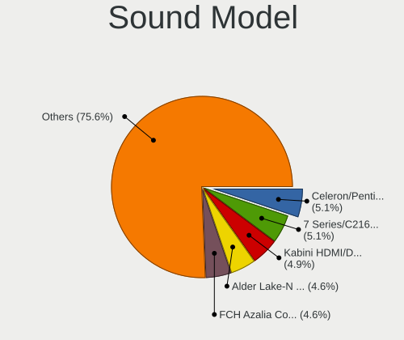

| Model                                                                                             | Computers | Percent |
|---------------------------------------------------------------------------------------------------|-----------|---------|
| Intel Celeron/Pentium Silver Processor High Definition Audio                                      | 30        | 5.11%   |
| Intel 7 Series/C216 Chipset Family High Definition Audio Controller                               | 30        | 5.11%   |
| AMD Kabini HDMI/DP Audio                                                                          | 29        | 4.94%   |
| Intel Alder Lake-N PCH High Definition Audio Controller                                           | 27        | 4.6%    |
| AMD FCH Azalia Controller                                                                         | 27        | 4.6%    |
| AMD Ryzen HD Audio Controller                                                                     | 25        | 4.26%   |
| Intel Xeon E3-1200 v3/4th Gen Core Processor HD Audio Controller                                  | 22        | 3.75%   |
| Intel 6 Series/C200 Series Chipset Family High Definition Audio Controller                        | 21        | 3.58%   |
| Intel Cannon Lake PCH cAVS                                                                        | 20        | 3.41%   |
| Intel Sunrise Point-LP HD Audio                                                                   | 19        | 3.24%   |
| Intel 8 Series/C220 Series Chipset High Definition Audio Controller                               | 19        | 3.24%   |
| Intel 100 Series/C230 Series Chipset Family HD Audio Controller                                   | 17        | 2.9%    |
| Intel 82801I (ICH9 Family) HD Audio Controller                                                    | 13        | 2.21%   |
| Intel 200 Series PCH HD Audio                                                                     | 13        | 2.21%   |
| Intel Wildcat Point-LP High Definition Audio Controller                                           | 12        | 2.04%   |
| Intel Jasper Lake HD Audio                                                                        | 12        | 2.04%   |
| AMD Renoir/Cezanne HDMI/DP Audio Controller                                                       | 12        | 2.04%   |
| Intel Broadwell-U Audio Controller                                                                | 11        | 1.87%   |
| Intel Atom Processor Z36xxx/Z37xxx Series High Definition Audio Controller                        | 11        | 1.87%   |
| AMD SBx00 Azalia (Intel HDA)                                                                      | 11        | 1.87%   |
| Intel NM10/ICH7 Family High Definition Audio Controller                                           | 10        | 1.7%    |
| AMD Raven/Raven2/Fenghuang HDMI/DP Audio Controller                                               | 9         | 1.53%   |
| AMD Ellesmere HDMI Audio [Radeon RX 470/480 / 570/580/590]                                        | 9         | 1.53%   |
| AMD Wrestler HDMI Audio                                                                           | 8         | 1.36%   |
| Intel Haswell-ULT HD Audio Controller                                                             | 7         | 1.19%   |
| Intel 8 Series HD Audio Controller                                                                | 7         | 1.19%   |
| AMD Kaveri HDMI/DP Audio Controller                                                               | 7         | 1.19%   |
| Intel Celeron N3350/Pentium N4200/Atom E3900 Series Audio Cluster                                 | 6         | 1.02%   |
| Intel 5 Series/3400 Series Chipset High Definition Audio                                          | 6         | 1.02%   |
| AMD Starship/Matisse HD Audio Controller                                                          | 6         | 1.02%   |
| AMD Oland/Hainan/Cape Verde/Pitcairn HDMI Audio [Radeon HD 7000 Series]                           | 6         | 1.02%   |
| AMD Family 17h (Models 00h-0fh) HD Audio Controller                                               | 6         | 1.02%   |
| Nvidia GF108 High Definition Audio Controller                                                     | 5         | 0.85%   |
| Intel Comet Lake PCH-LP cAVS                                                                      | 5         | 0.85%   |
| Intel Atom/Celeron/Pentium Processor x5-E8000/J3xxx/N3xxx Series High Definition Audio Controller | 5         | 0.85%   |
| Intel 9 Series Chipset Family HD Audio Controller                                                 | 5         | 0.85%   |
| Intel Tiger Lake-LP Smart Sound Technology Audio Controller                                       | 4         | 0.68%   |
| Intel Cannon Point-LP High Definition Audio Controller                                            | 4         | 0.68%   |
| Nvidia TU107 GeForce GTX 1650 High Definition Audio Controller                                    | 3         | 0.51%   |
| Nvidia GP106 High Definition Audio Controller                                                     | 3         | 0.51%   |

Memory
------

Memory Vendor
-------------

Memory module vendors

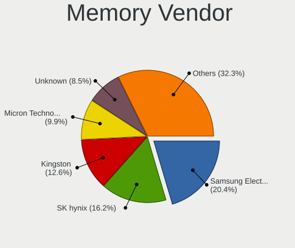

| Vendor              | Computers | Percent |
|---------------------|-----------|---------|
| Samsung Electronics | 115       | 20.43%  |
| SK hynix            | 91        | 16.16%  |
| Kingston            | 71        | 12.61%  |
| Micron Technology   | 56        | 9.95%   |
| Unknown             | 48        | 8.53%   |
| GOODRAM             | 32        | 5.68%   |
| Crucial             | 25        | 4.44%   |
| G.Skill             | 17        | 3.02%   |
| Unknown             | 17        | 3.02%   |
| Ramaxel Technology  | 12        | 2.13%   |
| Transcend           | 10        | 1.78%   |
| Corsair             | 10        | 1.78%   |
| A-DATA Technology   | 7         | 1.24%   |
| Wilk                | 6         | 1.07%   |
| Patriot             | 6         | 1.07%   |
| Toshiba             | 5         | 0.89%   |
| Nanya Technology    | 5         | 0.89%   |
| PUSKILL             | 3         | 0.53%   |
| Elpida              | 3         | 0.53%   |
| Unknown (ABCD)      | 2         | 0.36%   |
| SK_Hynix            | 2         | 0.36%   |
| Lexar Co Limited    | 2         | 0.36%   |
| Kimtigo             | 2         | 0.36%   |
| Hewlett-Packard     | 2         | 0.36%   |
| Apacer              | 2         | 0.36%   |
| Unknown (AB)        | 1         | 0.18%   |
| Unknown (768A)      | 1         | 0.18%   |
| Unknown (07FB)      | 1         | 0.18%   |
| Team                | 1         | 0.18%   |
| Silicon_Power       | 1         | 0.18%   |
| SHARETRONIC         | 1         | 0.18%   |
| Qimonda             | 1         | 0.18%   |
| Innodisk            | 1         | 0.18%   |
| GeIL                | 1         | 0.18%   |
| Cors                | 1         | 0.18%   |
| ATP                 | 1         | 0.18%   |
| A-DA                | 1         | 0.18%   |

Memory Model
------------

Memory module models

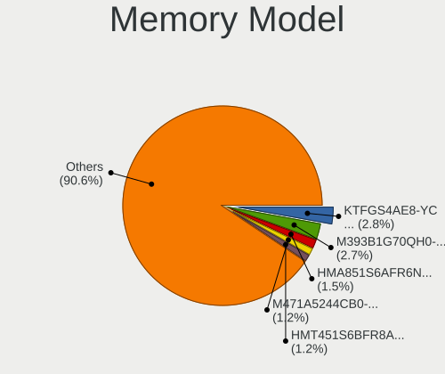

| Model                                                         | Computers | Percent |
|---------------------------------------------------------------|-----------|---------|
| Unknown                                                       | 17        | 2.85%   |
| Samsung RAM M393B1G70QH0-YK0 8GB DIMM DDR3 1600MT/s           | 16        | 2.68%   |
| SK hynix RAM HMA851S6AFR6N-UH 4GB SODIMM DDR4 2400MT/s        | 9         | 1.51%   |
| SK hynix RAM HMT451S6BFR8A-PB 4GB SODIMM DDR3 1600MT/s        | 7         | 1.17%   |
| Samsung RAM M471A5244CB0-CRC 4GB SODIMM DDR4 2400MT/s         | 7         | 1.17%   |
| Unknown RAM Module 8GB DIMM DDR3 1600MT/s                     | 6         | 1.01%   |
| Samsung RAM M471B5173EB0-YK0 4GB SODIMM DDR3 1600MT/s         | 6         | 1.01%   |
| Transcend RAM TS1GLH64V6BL 8GB SODIMM DDR4 2667MT/s           | 5         | 0.84%   |
| Samsung RAM M471B5173QH0-YK0 4GB SODIMM DDR3 1600MT/s         | 5         | 0.84%   |
| Kingston RAM KHX2400C15/8G 8GB DIMM DDR4 2400MT/s             | 5         | 0.84%   |
| Unknown RAM Module 4GB SODIMM DDR3 1333MT/s                   | 4         | 0.67%   |
| Unknown RAM Module 4GB DIMM 1333MT/s                          | 4         | 0.67%   |
| Unknown RAM Module 2GB DIMM DDR3 1066MT/s                     | 4         | 0.67%   |
| Toshiba RAM KKN2NM-MIE 4GB SODIMM DDR4 2666MT/s               | 4         | 0.67%   |
| SK hynix RAM HMT41GS6BFR8A-PB 8GB SODIMM DDR3 1600MT/s        | 4         | 0.67%   |
| SK hynix RAM HMA81GS6AFR8N-UH 8GB SODIMM DDR4 2400MT/s        | 4         | 0.67%   |
| Samsung RAM M471A1K43CB1-CRC 8GB SODIMM DDR4 2667MT/s         | 4         | 0.67%   |
| Micron RAM 8KTF51264HZ-1G6E1 4GB SODIMM DDR3 1600MT/s         | 4         | 0.67%   |
| Unknown RAM Module 8GB SODIMM DDR3 1600MT/s                   | 3         | 0.5%    |
| SK hynix RAM HMT451U6AFR8C-PB 4GB DIMM DDR3 1600MT/s          | 3         | 0.5%    |
| SK hynix RAM HMT451S6AFR8A-PB 4GB SODIMM DDR3 1600MT/s        | 3         | 0.5%    |
| SK hynix RAM HMT351U6CFR8C-PB 4GB DIMM DDR3 1600MT/s          | 3         | 0.5%    |
| SK hynix RAM HMT325S6BFR8C-H9 2GB SODIMM DDR3 1333MT/s        | 3         | 0.5%    |
| SK hynix RAM HMA81GS6CJR8N-VK 8GB SODIMM DDR4 2667MT/s        | 3         | 0.5%    |
| Samsung RAM M471B5674EB0-YK0 2GB SODIMM DDR3 1600MT/s         | 3         | 0.5%    |
| Samsung RAM M471B5273CH0-CH9 4GB SODIMM DDR3 1334MT/s         | 3         | 0.5%    |
| Samsung RAM M471B5173DB0-YK0 4GB SODIMM DDR3 1600MT/s         | 3         | 0.5%    |
| Samsung RAM M471B1G73QH0-YK0 8GB SODIMM DDR3 1867MT/s         | 3         | 0.5%    |
| Samsung RAM M471A1K43DB1-CTD 8GB SODIMM DDR4 2667MT/s         | 3         | 0.5%    |
| Samsung RAM M471A1K43CB1-CTD 8GB SODIMM DDR4 3200MT/s         | 3         | 0.5%    |
| Samsung RAM M471A1G44AB0-CWE 8GB SODIMM DDR4 3200MT/s         | 3         | 0.5%    |
| Samsung RAM M425R1GB4BB0-CQKOL 8GB SODIMM DDR5 4800MT/s       | 3         | 0.5%    |
| Ramaxel RAM RMSA3260ME78HAF-2666 8GB SODIMM DDR4 2667MT/s     | 3         | 0.5%    |
| Micron RAM 8KTF51264HZ-1G6N1 4GB SODIMM DDR3 1600MT/s         | 3         | 0.5%    |
| Micron RAM 53D512M64D4RQ-046 8GB Row Of Chips LPDDR4 4800MT/s | 3         | 0.5%    |
| Micron RAM 16ATF2G64HZ-2G3H1 16GB SODIMM DDR4 2400MT/s        | 3         | 0.5%    |
| GOODRAM RAM IR2400D464L15S/8G 8GB DIMM DDR4 2400MT/s          | 3         | 0.5%    |
| GOODRAM RAM GR1600S364L11/8G 8GB SODIMM DDR3 1600MT/s         | 3         | 0.5%    |
| Crucial RAM CT16G48C40S5.M8A1 16GB SODIMM DDR5 4800MT/s       | 3         | 0.5%    |
| Unknown RAM Module 8GB DIMM DDR3 1333MT/s                     | 2         | 0.34%   |

Memory Kind
-----------

Memory module kinds

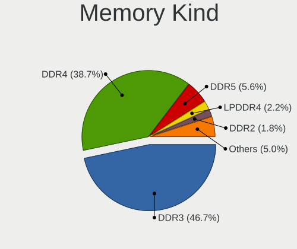

| Kind    | Computers | Percent |
|---------|-----------|---------|
| DDR3    | 233       | 46.69%  |
| DDR4    | 193       | 38.68%  |
| DDR5    | 28        | 5.61%   |
| LPDDR4  | 11        | 2.2%    |
| DDR2    | 9         | 1.8%    |
| Unknown | 8         | 1.6%    |
| SDRAM   | 5         | 1%      |
| DDR     | 4         | 0.8%    |
| LPDDR3  | 3         | 0.6%    |
| DRAM    | 3         | 0.6%    |
| LPDDR5  | 2         | 0.4%    |

Memory Form Factor
------------------

Physical design of the memory module

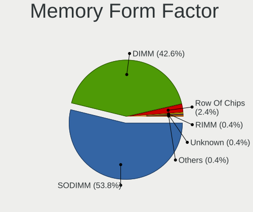

| Name         | Computers | Percent |
|--------------|-----------|---------|
| SODIMM       | 268       | 53.82%  |
| DIMM         | 212       | 42.57%  |
| Row Of Chips | 12        | 2.41%   |
| RIMM         | 2         | 0.4%    |
| Unknown      | 2         | 0.4%    |
| FB-DIMM      | 1         | 0.2%    |
| Chip         | 1         | 0.2%    |

Memory Size
-----------

Memory module size

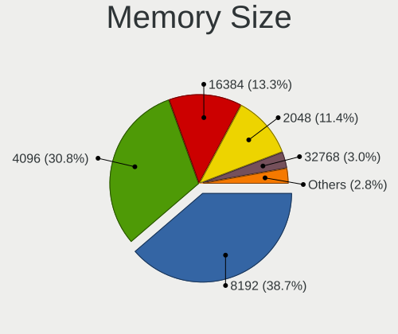

| Size  | Computers | Percent |
|-------|-----------|---------|
| 8192  | 207       | 38.69%  |
| 4096  | 165       | 30.84%  |
| 16384 | 71        | 13.27%  |
| 2048  | 61        | 11.4%   |
| 32768 | 16        | 2.99%   |
| 1024  | 11        | 2.06%   |
| 512   | 3         | 0.56%   |
| 49152 | 1         | 0.19%   |

Memory Speed
------------

Memory module speed

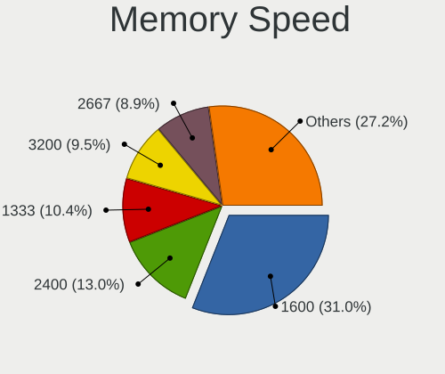

| Speed   | Computers | Percent |
|---------|-----------|---------|
| 1600    | 164       | 31%     |
| 2400    | 69        | 13.04%  |
| 1333    | 55        | 10.4%   |
| 3200    | 50        | 9.45%   |
| 2667    | 47        | 8.88%   |
| 2133    | 24        | 4.54%   |
| 4800    | 22        | 4.16%   |
| 800     | 13        | 2.46%   |
| 2666    | 12        | 2.27%   |
| 1334    | 11        | 2.08%   |
| Unknown | 8         | 1.51%   |
| 5600    | 7         | 1.32%   |
| 1867    | 7         | 1.32%   |
| 1066    | 7         | 1.32%   |
| 667     | 7         | 1.32%   |
| 1067    | 6         | 1.13%   |
| 1866    | 4         | 0.76%   |
| 4267    | 3         | 0.57%   |
| 6400    | 2         | 0.38%   |
| 6000    | 1         | 0.19%   |
| 5200    | 1         | 0.19%   |
| 4000    | 1         | 0.19%   |
| 3733    | 1         | 0.19%   |
| 3600    | 1         | 0.19%   |
| 3333    | 1         | 0.19%   |
| 3000    | 1         | 0.19%   |
| 2933    | 1         | 0.19%   |
| 2048    | 1         | 0.19%   |
| 533     | 1         | 0.19%   |
| 400     | 1         | 0.19%   |

Printers & scanners
-------------------

Printer Vendor
--------------

Printer device vendors

Zero info for selected period =(

Printer Model
-------------

Printer device models

Zero info for selected period =(

Scanner Vendor
--------------

Scanner device vendors

Zero info for selected period =(

Scanner Model
-------------

Scanner device models

Zero info for selected period =(

Camera
------

Camera Vendor
-------------

Camera device vendors

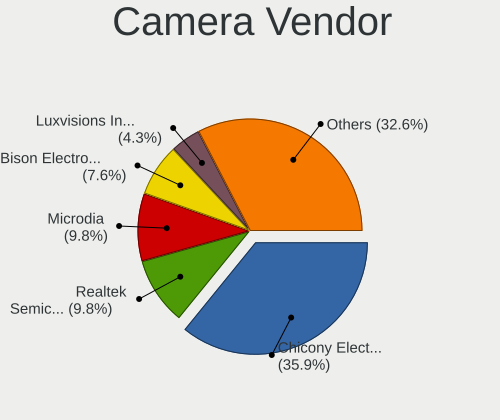

| Vendor                                 | Computers | Percent |
|----------------------------------------|-----------|---------|
| Chicony Electronics                    | 33        | 35.87%  |
| Realtek Semiconductor                  | 9         | 9.78%   |
| Microdia                               | 9         | 9.78%   |
| Bison Electronics                      | 7         | 7.61%   |
| Luxvisions Innotech Limited            | 4         | 4.35%   |
| Logitech                               | 4         | 4.35%   |
| Syntek                                 | 3         | 3.26%   |
| Sunplus Innovation Technology          | 3         | 3.26%   |
| IMC Networks                           | 3         | 3.26%   |
| Cheng Uei Precision Industry (Foxlink) | 3         | 3.26%   |
| Suyin                                  | 2         | 2.17%   |
| Ricoh                                  | 2         | 2.17%   |
| Lite-On Technology                     | 2         | 2.17%   |
| Shenzhen Kingcome Optoelectronic       | 1         | 1.09%   |
| Quanta                                 | 1         | 1.09%   |
| Hewlett-Packard                        | 1         | 1.09%   |
| DigiTech                               | 1         | 1.09%   |
| Asuscom Network                        | 1         | 1.09%   |
| Apple                                  | 1         | 1.09%   |
| ALi                                    | 1         | 1.09%   |
| Alcor Micro                            | 1         | 1.09%   |

Camera Model
------------

Camera device models

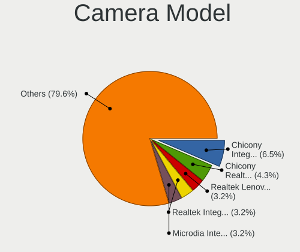

| Model                                                         | Computers | Percent |
|---------------------------------------------------------------|-----------|---------|
| Chicony Integrated Camera                                     | 6         | 6.45%   |
| Chicony Realtek DMFT RGB                                      | 4         | 4.3%    |
| Realtek Lenovo EasyCamera                                     | 3         | 3.23%   |
| Realtek Integrated_Webcam_HD                                  | 3         | 3.23%   |
| Microdia Integrated Webcam                                    | 3         | 3.23%   |
| Logitech HD Pro Webcam C920                                   | 3         | 3.23%   |
| Chicony Integrated Camera [ThinkPad]                          | 3         | 3.23%   |
| Chicony Integrated Camera (1280x720@30)                       | 3         | 3.23%   |
| Syntek Integrated Camera                                      | 2         | 2.15%   |
| Microdia Integrated_Webcam_HD                                 | 2         | 2.15%   |
| Luxvisions Innotech Limited HP TrueVision HD Camera           | 2         | 2.15%   |
| Lite-On Integrated Camera                                     | 2         | 2.15%   |
| IMC Networks Integrated Camera                                | 2         | 2.15%   |
| Chicony HP HD Camera                                          | 2         | 2.15%   |
| Bison Lenovo EasyCamera                                       | 2         | 2.15%   |
| Bison Integrated Camera                                       | 2         | 2.15%   |
| Syntek Lenovo EasyCamera                                      | 1         | 1.08%   |
| Suyin Acer/HP Integrated Webcam [CN0314]                      | 1         | 1.08%   |
| Suyin Acer Crystal Eye webcam                                 | 1         | 1.08%   |
| Sunplus SPCA2281 Web Camera                                   | 1         | 1.08%   |
| Sunplus Integrated_Webcam_HD                                  | 1         | 1.08%   |
| Sunplus Integrated_Webcam_FHD                                 | 1         | 1.08%   |
| Shenzhen Kingcome Optoelectronic NexiGo HelloCam N930W Camera | 1         | 1.08%   |
| Ricoh Integrated Webcam                                       | 1         | 1.08%   |
| Ricoh HD Webcam                                               | 1         | 1.08%   |
| Realtek USB2.0 HD UVC WebCam                                  | 1         | 1.08%   |
| Realtek HD WebCam                                             | 1         | 1.08%   |
| Realtek Front Camera                                          | 1         | 1.08%   |
| Quanta Realtek DMFT RGB                                       | 1         | 1.08%   |
| Microdia USB 2.0 Camera                                       | 1         | 1.08%   |
| Microdia Laptop_Integrated_Webcam_HD                          | 1         | 1.08%   |
| Microdia Integrated HD Webcam                                 | 1         | 1.08%   |
| Microdia Dell Integrated HD Webcam                            | 1         | 1.08%   |
| Luxvisions Innotech Limited Integrated Camera                 | 1         | 1.08%   |
| Luxvisions Innotech Limited HP True Vision FHD Camera         | 1         | 1.08%   |
| Logitech C922 Pro Stream Webcam                               | 1         | 1.08%   |
| IMC Networks EasyCamera                                       | 1         | 1.08%   |
| HP Premium Starter Webcam                                     | 1         | 1.08%   |
| DigiTech WebCam SCB-0350M                                     | 1         | 1.08%   |
| Chicony USB2.0 VGA UVC WebCam                                 | 1         | 1.08%   |

Security
--------

Fingerprint Vendor
------------------

Fingerprint sensor vendors

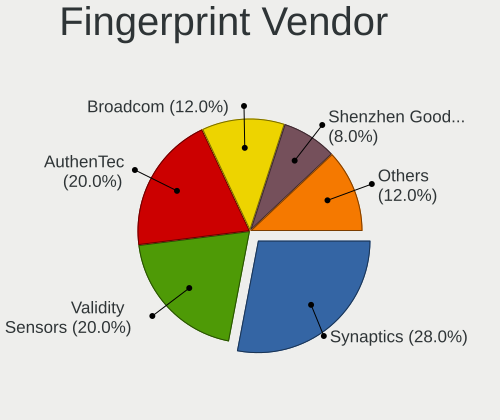

| Vendor                     | Computers | Percent |
|----------------------------|-----------|---------|
| Synaptics                  | 7         | 28%     |
| Validity Sensors           | 5         | 20%     |
| AuthenTec                  | 5         | 20%     |
| Broadcom                   | 3         | 12%     |
| Shenzhen Goodix Technology | 2         | 8%      |
| Upek                       | 1         | 4%      |
| STMicroelectronics         | 1         | 4%      |
| Elan Microelectronics      | 1         | 4%      |

Fingerprint Model
-----------------

Fingerprint sensor models

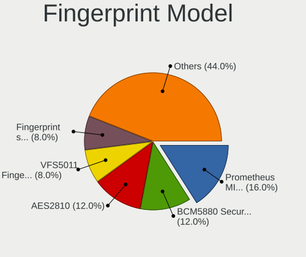

| Model                                                                        | Computers | Percent |
|------------------------------------------------------------------------------|-----------|---------|
| Synaptics Prometheus MIS Touch Fingerprint Reader                            | 4         | 16%     |
| Broadcom BCM5880 Secure Applications Processor with fingerprint swipe sensor | 3         | 12%     |
| AuthenTec AES2810                                                            | 3         | 12%     |
| Validity Sensors VFS5011 Fingerprint Reader                                  | 2         | 8%      |
| Validity Sensors Fingerprint scanner                                         | 2         | 8%      |
| Synaptics Metallica MIS Touch Fingerprint Reader                             | 2         | 8%      |
| Shenzhen Goodix Fingerprint Reader                                           | 2         | 8%      |
| AuthenTec AES2660                                                            | 2         | 8%      |
| Validity Sensors VFS495 Fingerprint Reader                                   | 1         | 4%      |
| Upek Biometric Touchchip/Touchstrip Fingerprint Sensor                       | 1         | 4%      |
| Synaptics WBDI                                                               | 1         | 4%      |
| STMicroelectronics Fingerprint Reader                                        | 1         | 4%      |
| Elan Fingerprint Sensor                                                      | 1         | 4%      |

Chipcard Vendor
---------------

Chipcard module vendors

Zero info for selected period =(

Chipcard Model
--------------

Chipcard module models

Zero info for selected period =(

Unsupported
-----------

Unsupported Devices
-------------------

Total unsupported devices on board

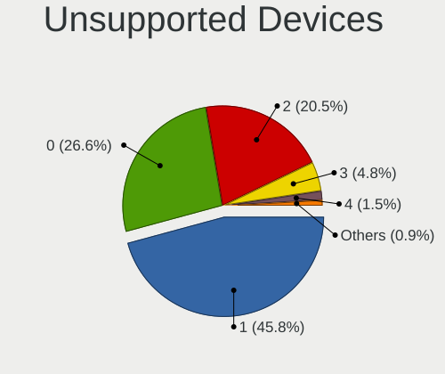

| Total | Computers | Percent |
|-------|-----------|---------|
| 1     | 250       | 45.79%  |
| 0     | 145       | 26.56%  |
| 2     | 112       | 20.51%  |
| 3     | 26        | 4.76%   |
| 4     | 8         | 1.47%   |
| 5     | 3         | 0.55%   |
| 6     | 2         | 0.37%   |

Unsupported Device Types
------------------------

Types of unsupported devices

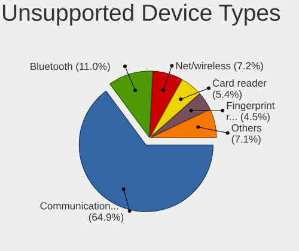

| Type                     | Computers | Percent |
|--------------------------|-----------|---------|
| Communication controller | 349       | 64.87%  |
| Bluetooth                | 59        | 10.97%  |
| Net/wireless             | 39        | 7.25%   |
| Card reader              | 29        | 5.39%   |
| Fingerprint reader       | 24        | 4.46%   |
| Graphics card            | 11        | 2.04%   |
| Firewire controller      | 7         | 1.3%    |
| Sound                    | 6         | 1.12%   |
| Network                  | 5         | 0.93%   |
| Net/ethernet             | 4         | 0.74%   |
| Modem                    | 2         | 0.37%   |
| Storage/raid             | 1         | 0.19%   |
| Storage/nvme             | 1         | 0.19%   |
| Storage                  | 1         | 0.19%   |

