BSD in Poland - Tested Hardware & Statistics
--------------------------------------------

A project to collect tested hardware configurations for BSD in Poland.

Anyone can contribute to this report by the [hw-probe](https://github.com/linuxhw/hw-probe/blob/master/INSTALL.BSD.md) tool:

    hw-probe -all -upload

Please contribute! Especially if your hardware is rare.

This is a report for all computer types. See also reports for [desktops](/Location/Poland/Desktop/README.md) and [notebooks](/Location/Poland/Notebook/README.md).

Contents
--------

* [ Test Cases ](#test-cases)

* [ System ](#system)
  - [ OS                       ](#os)
  - [ OS Family                ](#os-family)
  - [ Arch                     ](#arch)
  - [ DE                       ](#de)
  - [ Display Server           ](#display-server)
  - [ Display Manager          ](#display-manager)
  - [ OS Lang                  ](#os-lang)
  - [ Boot Mode                ](#boot-mode)
  - [ Filesystem               ](#filesystem)
  - [ Part. scheme             ](#part-scheme)

* [ Board ](#board)
  - [ Vendor                   ](#vendor)
  - [ Model                    ](#model)
  - [ Model Family             ](#model-family)
  - [ MFG Year                 ](#mfg-year)
  - [ Form Factor              ](#form-factor)
  - [ Coreboot                 ](#coreboot)
  - [ RAM Size                 ](#ram-size)
  - [ RAM Used                 ](#ram-used)
  - [ Total Drives             ](#total-drives)
  - [ Has CD-ROM               ](#has-cd-rom)
  - [ Has Ethernet             ](#has-ethernet)
  - [ Has WiFi                 ](#has-wifi)
  - [ Has Bluetooth            ](#has-bluetooth)

* [ Location ](#location)
  - [ Country                  ](#country)
  - [ City                     ](#city)

* [ Drives ](#drives)
  - [ Drive Vendor             ](#drive-vendor)
  - [ Drive Model              ](#drive-model)
  - [ HDD Vendor               ](#hdd-vendor)
  - [ SSD Vendor               ](#ssd-vendor)
  - [ Drive Kind               ](#drive-kind)
  - [ Drive Connector          ](#drive-connector)
  - [ Drive Size               ](#drive-size)
  - [ Space Total              ](#space-total)
  - [ Space Used               ](#space-used)
  - [ Malfunc. Drives          ](#malfunc-drives)
  - [ Malfunc. Drive Vendor    ](#malfunc-drive-vendor)
  - [ Malfunc. HDD Vendor      ](#malfunc-hdd-vendor)
  - [ Malfunc. Drive Kind      ](#malfunc-drive-kind)
  - [ Failed Drives            ](#failed-drives)
  - [ Failed Drive Vendor      ](#failed-drive-vendor)
  - [ Drive Status             ](#drive-status)

* [ Storage controller ](#storage-controller)
  - [ Storage Vendor           ](#storage-vendor)
  - [ Storage Model            ](#storage-model)
  - [ Storage Kind             ](#storage-kind)

* [ Processor ](#processor)
  - [ CPU Vendor               ](#cpu-vendor)
  - [ CPU Model                ](#cpu-model)
  - [ CPU Model Family         ](#cpu-model-family)
  - [ CPU Cores                ](#cpu-cores)
  - [ CPU Sockets              ](#cpu-sockets)
  - [ CPU Threads              ](#cpu-threads)
  - [ CPU Microarch            ](#cpu-microarch)

* [ Graphics ](#graphics)
  - [ GPU Vendor               ](#gpu-vendor)
  - [ GPU Model                ](#gpu-model)
  - [ GPU Combo                ](#gpu-combo)
  - [ GPU Driver               ](#gpu-driver)
  - [ GPU Memory               ](#gpu-memory)

* [ Monitor ](#monitor)
  - [ Monitor Vendor           ](#monitor-vendor)
  - [ Monitor Model            ](#monitor-model)
  - [ Monitor Resolution       ](#monitor-resolution)
  - [ Monitor Diagonal         ](#monitor-diagonal)
  - [ Monitor Width            ](#monitor-width)
  - [ Aspect Ratio             ](#aspect-ratio)
  - [ Monitor Area             ](#monitor-area)
  - [ Pixel Density            ](#pixel-density)
  - [ Multiple Monitors        ](#multiple-monitors)

* [ Network ](#network)
  - [ Net Controller Vendor    ](#net-controller-vendor)
  - [ Net Controller Model     ](#net-controller-model)
  - [ Wireless Vendor          ](#wireless-vendor)
  - [ Wireless Model           ](#wireless-model)
  - [ Ethernet Vendor          ](#ethernet-vendor)
  - [ Ethernet Model           ](#ethernet-model)
  - [ Net Controller Kind      ](#net-controller-kind)
  - [ Used Controller          ](#used-controller)
  - [ NICs                     ](#nics)
  - [ IPv6                     ](#ipv6)

* [ Bluetooth ](#bluetooth)
  - [ Bluetooth Vendor         ](#bluetooth-vendor)
  - [ Bluetooth Model          ](#bluetooth-model)

* [ Sound ](#sound)
  - [ Sound Vendor             ](#sound-vendor)
  - [ Sound Model              ](#sound-model)

* [ Memory ](#memory)
  - [ Memory Vendor            ](#memory-vendor)
  - [ Memory Model             ](#memory-model)
  - [ Memory Kind              ](#memory-kind)
  - [ Memory Form Factor       ](#memory-form-factor)
  - [ Memory Size              ](#memory-size)
  - [ Memory Speed             ](#memory-speed)

* [ Printers & scanners ](#printers--scanners)
  - [ Printer Vendor           ](#printer-vendor)
  - [ Printer Model            ](#printer-model)
  - [ Scanner Vendor           ](#scanner-vendor)
  - [ Scanner Model            ](#scanner-model)

* [ Camera ](#camera)
  - [ Camera Vendor            ](#camera-vendor)
  - [ Camera Model             ](#camera-model)

* [ Security ](#security)
  - [ Fingerprint Vendor       ](#fingerprint-vendor)
  - [ Fingerprint Model        ](#fingerprint-model)
  - [ Chipcard Vendor          ](#chipcard-vendor)
  - [ Chipcard Model           ](#chipcard-model)

* [ Unsupported ](#unsupported)
  - [ Unsupported Devices      ](#unsupported-devices)
  - [ Unsupported Device Types ](#unsupported-device-types)

Test Cases
----------

Total: 307

| Vendor        | Model                       | Form-Factor | Probe                                                     | Date         |
|---------------|-----------------------------|-------------|-----------------------------------------------------------|--------------|
| HP            | Laptop 15-bs0xx             | Notebook    | [7bd5f0c2e9](https://bsd-hardware.info/?probe=7bd5f0c2e9) | Jan 22, 2023 |
| Dell          | 0K6VXP A00                  | Mini pc     | [6b331ff558](https://bsd-hardware.info/?probe=6b331ff558) | Jan 20, 2023 |
| Unknown       | Unknown                     | Desktop     | [6aa648ba82](https://bsd-hardware.info/?probe=6aa648ba82) | Jan 19, 2023 |
| Intel         | H81U                        | Notebook    | [08d2539153](https://bsd-hardware.info/?probe=08d2539153) | Jan 18, 2023 |
| Intel         | H81U                        | Notebook    | [fe47328dd0](https://bsd-hardware.info/?probe=fe47328dd0) | Jan 17, 2023 |
| HP            | 1495                        | Desktop     | [4e16deda5a](https://bsd-hardware.info/?probe=4e16deda5a) | Jan 11, 2023 |
| Biostar       | B450NH                      | Desktop     | [c30a71f5ae](https://bsd-hardware.info/?probe=c30a71f5ae) | Jan 10, 2023 |
| Dell          | Latitude E6430              | Notebook    | [45f592a66f](https://bsd-hardware.info/?probe=45f592a66f) | Jan 06, 2023 |
| Dell          | Latitude E6430              | Notebook    | [1c4bec17bb](https://bsd-hardware.info/?probe=1c4bec17bb) | Jan 06, 2023 |
| Biostar       | J4125NHU                    | Desktop     | [41114c45b7](https://bsd-hardware.info/?probe=41114c45b7) | Jan 05, 2023 |
| Gigabyte      | J4005ND2P-CF                | Desktop     | [4bcc34fdca](https://bsd-hardware.info/?probe=4bcc34fdca) | Dec 27, 2022 |
| Intel         | D2500HN AAG81480-500        | Desktop     | [dae5627541](https://bsd-hardware.info/?probe=dae5627541) | Dec 27, 2022 |
| Dell          | 060J9C A00                  | Mini pc     | [29b3e0b639](https://bsd-hardware.info/?probe=29b3e0b639) | Dec 22, 2022 |
| Acer          | WG43M                       | Desktop     | [d316352c20](https://bsd-hardware.info/?probe=d316352c20) | Dec 22, 2022 |
| Unknown       | Unknown                     | Desktop     | [0e98358cf3](https://bsd-hardware.info/?probe=0e98358cf3) | Dec 17, 2022 |
| Google        | Lars                        | Notebook    | [4130b19cfa](https://bsd-hardware.info/?probe=4130b19cfa) | Dec 03, 2022 |
| ASRock        | X570 Pro4                   | Desktop     | [b23f59a068](https://bsd-hardware.info/?probe=b23f59a068) | Nov 27, 2022 |
| ASRock        | Q1900B-ITX                  | Desktop     | [c93690c7ca](https://bsd-hardware.info/?probe=c93690c7ca) | Nov 27, 2022 |
| Shuttle       | FZ270                       | Desktop     | [04a7f49322](https://bsd-hardware.info/?probe=04a7f49322) | Nov 27, 2022 |
| Shuttle       | FZ270                       | Desktop     | [10016f39b9](https://bsd-hardware.info/?probe=10016f39b9) | Nov 27, 2022 |
| ASRock        | Q1900B-ITX                  | Desktop     | [675c9fdf94](https://bsd-hardware.info/?probe=675c9fdf94) | Nov 27, 2022 |
| ASRock        | Q1900B-ITX                  | Desktop     | [a337eb9e5f](https://bsd-hardware.info/?probe=a337eb9e5f) | Nov 27, 2022 |
| Shuttle       | FH270                       | Desktop     | [192351ac6f](https://bsd-hardware.info/?probe=192351ac6f) | Nov 27, 2022 |
| Shuttle       | FH270                       | Desktop     | [3b68d89092](https://bsd-hardware.info/?probe=3b68d89092) | Nov 27, 2022 |
| Dell          | 0VRCY5 A14                  | Server      | [5048d00fd8](https://bsd-hardware.info/?probe=5048d00fd8) | Nov 27, 2022 |
| Dell          | 0VRCY5 A14                  | Server      | [60bdb57227](https://bsd-hardware.info/?probe=60bdb57227) | Nov 27, 2022 |
| Dell          | 0VRCY5 A14                  | Server      | [ebdca950cc](https://bsd-hardware.info/?probe=ebdca950cc) | Nov 27, 2022 |
| HP            | 3396                        | Desktop     | [dc94cbde1a](https://bsd-hardware.info/?probe=dc94cbde1a) | Nov 23, 2022 |
| Gigabyte      | H110TN                      | Desktop     | [c121bad3fb](https://bsd-hardware.info/?probe=c121bad3fb) | Nov 17, 2022 |
| Intel         | D2500CC AAG81477-401        | Desktop     | [f27ff1a7c3](https://bsd-hardware.info/?probe=f27ff1a7c3) | Oct 22, 2022 |
| ASUSTek       | SABERTOOTH Z77              | Desktop     | [348bef7dba](https://bsd-hardware.info/?probe=348bef7dba) | Oct 20, 2022 |
| Lenovo        | 3188 SDK0J40697 WIN 3305... | Desktop     | [f84b205626](https://bsd-hardware.info/?probe=f84b205626) | Oct 18, 2022 |
| HP            | SpectreXT Pro 13-b000 PC    | Notebook    | [f45ea42873](https://bsd-hardware.info/?probe=f45ea42873) | Oct 16, 2022 |
| Lenovo        | 3132 SDK0J40697 WIN 3305... | Desktop     | [e08c408ced](https://bsd-hardware.info/?probe=e08c408ced) | Oct 14, 2022 |
| ASRockRack    | EP2C612D16FM                | Desktop     | [30a582fccb](https://bsd-hardware.info/?probe=30a582fccb) | Oct 07, 2022 |
| Seeed Stud... | ODYSSEY-X86J41X5 SD-BS-C... | Desktop     | [f521533d51](https://bsd-hardware.info/?probe=f521533d51) | Oct 06, 2022 |
| Biostar       | B450NH                      | Desktop     | [27f932ee37](https://bsd-hardware.info/?probe=27f932ee37) | Oct 02, 2022 |
| Biostar       | B450NH                      | Desktop     | [4beab225f6](https://bsd-hardware.info/?probe=4beab225f6) | Sep 28, 2022 |
| Supermicro    | X9SCL/X9SCMA                | Desktop     | [fe44242c3b](https://bsd-hardware.info/?probe=fe44242c3b) | Sep 25, 2022 |
| Gigabyte      | H81M-S1                     | Desktop     | [fe9eecb935](https://bsd-hardware.info/?probe=fe9eecb935) | Sep 18, 2022 |
| Lenovo        | G50-30 80G0                 | Notebook    | [da4bd87fee](https://bsd-hardware.info/?probe=da4bd87fee) | Sep 17, 2022 |
| Intel         | Q3XXG4-P V1.0               | Desktop     | [7aa564bfb2](https://bsd-hardware.info/?probe=7aa564bfb2) | Sep 14, 2022 |
| ASUSTek       | H61M-K                      | Desktop     | [0ee299e989](https://bsd-hardware.info/?probe=0ee299e989) | Sep 14, 2022 |
| Dell          | 0HJK12 A03                  | Server      | [96ad323ca0](https://bsd-hardware.info/?probe=96ad323ca0) | Sep 13, 2022 |
| Dell          | 0H5J4J A01                  | Server      | [acb91f797f](https://bsd-hardware.info/?probe=acb91f797f) | Sep 13, 2022 |
| HP            | 213D A01                    | Desktop     | [6354ddb4a8](https://bsd-hardware.info/?probe=6354ddb4a8) | Sep 12, 2022 |
| Fujitsu       | D3313-A1 S26361-D3313-A1    | Desktop     | [b2dc861f47](https://bsd-hardware.info/?probe=b2dc861f47) | Sep 10, 2022 |
| Deciso        | NetBoard-A10                | Notebook    | [3547d9da9c](https://bsd-hardware.info/?probe=3547d9da9c) | Sep 01, 2022 |
| HP            | 213D A01                    | Desktop     | [c495fb5448](https://bsd-hardware.info/?probe=c495fb5448) | Aug 30, 2022 |
| ZOTAC         | ZBOX-CI329NANO              | Mini pc     | [d721e505cb](https://bsd-hardware.info/?probe=d721e505cb) | Aug 27, 2022 |
| HP            | 213D A01                    | Desktop     | [1b90f312ea](https://bsd-hardware.info/?probe=1b90f312ea) | Aug 26, 2022 |
| HP            | ENVY x360 Convertible 13... | Convertible | [eec9546431](https://bsd-hardware.info/?probe=eec9546431) | Aug 23, 2022 |
| Inventec      | Z CLASS A02                 | Desktop     | [cb3708c9bf](https://bsd-hardware.info/?probe=cb3708c9bf) | Aug 21, 2022 |
| Lenovo        | ThinkPad X260 20F5S10W0H    | Notebook    | [2e7d570822](https://bsd-hardware.info/?probe=2e7d570822) | Aug 20, 2022 |
| Lenovo        | ThinkPad X260 20F5S10W0H    | Notebook    | [7afa139f4f](https://bsd-hardware.info/?probe=7afa139f4f) | Aug 20, 2022 |
| Gigabyte      | IMB4100TN                   | Desktop     | [aa4bae0d12](https://bsd-hardware.info/?probe=aa4bae0d12) | Aug 15, 2022 |
| ASRock        | Z370 Pro4                   | Desktop     | [038c5f8763](https://bsd-hardware.info/?probe=038c5f8763) | Aug 10, 2022 |
| Dell          | 084J0R A00                  | Desktop     | [932058e97a](https://bsd-hardware.info/?probe=932058e97a) | Aug 09, 2022 |
| iEi           | B449 V1.00                  | Desktop     | [7776910eea](https://bsd-hardware.info/?probe=7776910eea) | Aug 05, 2022 |
| ZOTAC         | ZBOX-CI329NANO              | Mini pc     | [c38ad87323](https://bsd-hardware.info/?probe=c38ad87323) | Aug 04, 2022 |
| AMI           | Aptio CRB                   | Mini pc     | [6093566ed2](https://bsd-hardware.info/?probe=6093566ed2) | Aug 04, 2022 |
| AMI           | Aptio CRB                   | Mini pc     | [706d8fc244](https://bsd-hardware.info/?probe=706d8fc244) | Aug 04, 2022 |
| Gigabyte      | J4005ND2P-CF                | Desktop     | [2967d5275e](https://bsd-hardware.info/?probe=2967d5275e) | Jul 29, 2022 |
| HP            | 3397                        | Desktop     | [68eb683936](https://bsd-hardware.info/?probe=68eb683936) | Jul 27, 2022 |
| ASUSTek       | P8B WS                      | Desktop     | [dd7f8123d2](https://bsd-hardware.info/?probe=dd7f8123d2) | Jul 19, 2022 |
| Lenovo        | ThinkPad T495 20NJ0010PB    | Notebook    | [078888676a](https://bsd-hardware.info/?probe=078888676a) | Jul 13, 2022 |
| HP            | 213D A01                    | Desktop     | [0f58ab215e](https://bsd-hardware.info/?probe=0f58ab215e) | Jul 03, 2022 |
| Gigabyte      | GA-970A-UD3                 | Desktop     | [a094c1c53b](https://bsd-hardware.info/?probe=a094c1c53b) | Jun 20, 2022 |
| Unknown       | Unknown                     | Desktop     | [fe9f636040](https://bsd-hardware.info/?probe=fe9f636040) | Jun 13, 2022 |
| Dell          | 0TY019 A01                  | Server      | [1aeb1bf3bf](https://bsd-hardware.info/?probe=1aeb1bf3bf) | Jun 09, 2022 |
| Dell          | Latitude 5410               | Notebook    | [3334ff3727](https://bsd-hardware.info/?probe=3334ff3727) | Jun 06, 2022 |
| Unknown       | Unknown                     | Desktop     | [6acbc93101](https://bsd-hardware.info/?probe=6acbc93101) | May 30, 2022 |
| ASUSTek       | P5G41T-M LX3                | Desktop     | [3f39f21672](https://bsd-hardware.info/?probe=3f39f21672) | May 29, 2022 |
| ZOTAC         | ZBOX-CI329NANO              | Mini pc     | [6a6fda6d6d](https://bsd-hardware.info/?probe=6a6fda6d6d) | May 26, 2022 |
| Intel         | Q3XXG4-P V1.0               | Desktop     | [ce4d7c01e5](https://bsd-hardware.info/?probe=ce4d7c01e5) | May 24, 2022 |
| HP            | 213D A01                    | Desktop     | [562722ac56](https://bsd-hardware.info/?probe=562722ac56) | Apr 30, 2022 |
| Fujitsu       | D3313-B1 S26361-D3313-B1    | Desktop     | [0d46ae5678](https://bsd-hardware.info/?probe=0d46ae5678) | Apr 25, 2022 |
| Apple         | PowerMac10,1                | Desktop     | [e054e605fa](https://bsd-hardware.info/?probe=e054e605fa) | Apr 23, 2022 |
| Unknown       | Unknown                     | Desktop     | [3c5fcc2377](https://bsd-hardware.info/?probe=3c5fcc2377) | Apr 22, 2022 |
| HP            | 213D A01                    | Desktop     | [4dea775e1b](https://bsd-hardware.info/?probe=4dea775e1b) | Apr 12, 2022 |
| Intel         | NUC6CAYB J26842-405         | Mini pc     | [534af14a9f](https://bsd-hardware.info/?probe=534af14a9f) | Apr 11, 2022 |
| ASUSTek       | PRIME H310M-D R2.0          | Desktop     | [da64cbb0d1](https://bsd-hardware.info/?probe=da64cbb0d1) | Apr 07, 2022 |
| Fujitsu       | D3222-A1 S26361-D3222-A1    | Desktop     | [9a260e4d21](https://bsd-hardware.info/?probe=9a260e4d21) | Apr 05, 2022 |
| Lenovo        | 30D9 SDK0J40705 WIN 3425... | Desktop     | [964ceb3616](https://bsd-hardware.info/?probe=964ceb3616) | Apr 03, 2022 |
| Lenovo        | 30D9 SDK0J40705 WIN 3425... | Desktop     | [5038186437](https://bsd-hardware.info/?probe=5038186437) | Apr 02, 2022 |
| Apple         | Mac-F2218EA9                | All in one  | [e0c61311da](https://bsd-hardware.info/?probe=e0c61311da) | Apr 01, 2022 |
| ASUSTek       | P6-P8H61E                   | Desktop     | [11664cd9d7](https://bsd-hardware.info/?probe=11664cd9d7) | Mar 30, 2022 |
| ASUSTek       | P6-P8H61E                   | Desktop     | [540f66f678](https://bsd-hardware.info/?probe=540f66f678) | Mar 29, 2022 |
| Dell          | 0GXM1W A00                  | Desktop     | [717721a634](https://bsd-hardware.info/?probe=717721a634) | Mar 29, 2022 |
| Dell          | 0DNFFW A00                  | All in one  | [30432daccb](https://bsd-hardware.info/?probe=30432daccb) | Mar 23, 2022 |
| Unknown       | Unknown                     | Desktop     | [38c71bac61](https://bsd-hardware.info/?probe=38c71bac61) | Mar 22, 2022 |
| Acer          | Aptio CRB                   | Mini pc     | [f38b7df811](https://bsd-hardware.info/?probe=f38b7df811) | Mar 20, 2022 |
| Lenovo        | ThinkPad X200 745969G       | Notebook    | [e973d1e806](https://bsd-hardware.info/?probe=e973d1e806) | Mar 18, 2022 |
| Unknown       | Unknown                     | Desktop     | [a54ee6f019](https://bsd-hardware.info/?probe=a54ee6f019) | Mar 18, 2022 |
| Fujitsu       | D3313-B1 S26361-D3313-B1    | Desktop     | [55515325c4](https://bsd-hardware.info/?probe=55515325c4) | Mar 15, 2022 |
| Dell          | 0GXM1W A00                  | Desktop     | [a488c9af25](https://bsd-hardware.info/?probe=a488c9af25) | Mar 14, 2022 |
| Dell          | Inspiron 5502               | Notebook    | [9e440b5500](https://bsd-hardware.info/?probe=9e440b5500) | Mar 13, 2022 |
| ASRock        | Q1900B-ITX                  | Desktop     | [b4142103cb](https://bsd-hardware.info/?probe=b4142103cb) | Mar 10, 2022 |
| Dell          | 075CGM A00                  | Mini pc     | [ac38d3156d](https://bsd-hardware.info/?probe=ac38d3156d) | Mar 10, 2022 |
| Inventec      | 0VKXH3 A01                  | Mini pc     | [d018e86ea8](https://bsd-hardware.info/?probe=d018e86ea8) | Mar 10, 2022 |
| Unknown       | LeMaker Banana Pi           | Desktop     | [37e7d1912b](https://bsd-hardware.info/?probe=37e7d1912b) | Mar 05, 2022 |
| Dell          | Vostro 3550                 | Notebook    | [4bc5573cf5](https://bsd-hardware.info/?probe=4bc5573cf5) | Mar 02, 2022 |
| Dell          | 0DNFFW A00                  | All in one  | [2db3ec9574](https://bsd-hardware.info/?probe=2db3ec9574) | Feb 27, 2022 |
| Intel         | D945GSEJT                   | Desktop     | [bf6a38dfcb](https://bsd-hardware.info/?probe=bf6a38dfcb) | Feb 26, 2022 |
| HP            | 213D A01                    | Desktop     | [b9560ec339](https://bsd-hardware.info/?probe=b9560ec339) | Feb 24, 2022 |
| Dell          | Latitude E6430              | Notebook    | [fdde41404d](https://bsd-hardware.info/?probe=fdde41404d) | Feb 24, 2022 |
| Lenovo        | ThinkPad X200 745969G       | Notebook    | [a4341268d0](https://bsd-hardware.info/?probe=a4341268d0) | Feb 23, 2022 |
| ASRock        | ConRoe1333-D667             | Desktop     | [624b4f4de7](https://bsd-hardware.info/?probe=624b4f4de7) | Feb 23, 2022 |
| Shuttle       | FZ270                       | Desktop     | [7e0eb61342](https://bsd-hardware.info/?probe=7e0eb61342) | Feb 22, 2022 |
| Apple         | Mac-F2218EA9                | All in one  | [feb7882341](https://bsd-hardware.info/?probe=feb7882341) | Feb 22, 2022 |
| Dell          | Vostro 3550                 | Notebook    | [11bed21472](https://bsd-hardware.info/?probe=11bed21472) | Feb 21, 2022 |
| MSI           | MS-AEC11                    | All in one  | [7863616b75](https://bsd-hardware.info/?probe=7863616b75) | Feb 20, 2022 |
| Unknown       | Raspberry Pi 4 Model B R... | Desktop     | [04e528ca9f](https://bsd-hardware.info/?probe=04e528ca9f) | Feb 19, 2022 |
| ASUSTek       | TUF GAMING X570-PLUS        | Desktop     | [64999a24c1](https://bsd-hardware.info/?probe=64999a24c1) | Feb 16, 2022 |
| Raspberry ... | Raspberry Pi 400            | Desktop     | [dd56609ceb](https://bsd-hardware.info/?probe=dd56609ceb) | Feb 14, 2022 |
| Lenovo        | ThinkPad X200 745969G       | Notebook    | [c024d383e7](https://bsd-hardware.info/?probe=c024d383e7) | Feb 13, 2022 |
| HP            | 213D A01                    | Desktop     | [0171663489](https://bsd-hardware.info/?probe=0171663489) | Feb 12, 2022 |
| Unknown       | LeMaker Banana Pi           | Desktop     | [77413a3d9d](https://bsd-hardware.info/?probe=77413a3d9d) | Feb 12, 2022 |
| MSI           | B75A-G43                    | Desktop     | [8e445eb2d4](https://bsd-hardware.info/?probe=8e445eb2d4) | Feb 08, 2022 |
| Lenovo        | G580 20150                  | Notebook    | [478714c7c9](https://bsd-hardware.info/?probe=478714c7c9) | Feb 07, 2022 |
| MSI           | H61M-P20                    | Desktop     | [98ec852f90](https://bsd-hardware.info/?probe=98ec852f90) | Feb 06, 2022 |
| Lenovo        | ThinkPad X200 745969G       | Notebook    | [f107f7c1b1](https://bsd-hardware.info/?probe=f107f7c1b1) | Feb 06, 2022 |
| ASUSTek       | P6-P8H61E                   | Desktop     | [e838981914](https://bsd-hardware.info/?probe=e838981914) | Feb 06, 2022 |
| Dell          | 075CGM A00                  | Mini pc     | [5a9e6ea87f](https://bsd-hardware.info/?probe=5a9e6ea87f) | Feb 05, 2022 |
| Lenovo        | G500s 20245                 | Notebook    | [41f9f804ac](https://bsd-hardware.info/?probe=41f9f804ac) | Feb 04, 2022 |
| Dell          | 04YP6J A02                  | Desktop     | [550e7feb7f](https://bsd-hardware.info/?probe=550e7feb7f) | Feb 03, 2022 |
| Dell          | Vostro 3550                 | Notebook    | [0b290f2ac3](https://bsd-hardware.info/?probe=0b290f2ac3) | Feb 02, 2022 |
| Lenovo        | ThinkPad X200 745969G       | Notebook    | [f8476c0ea7](https://bsd-hardware.info/?probe=f8476c0ea7) | Feb 01, 2022 |
| Dell          | Vostro 3550                 | Notebook    | [97ef0862c2](https://bsd-hardware.info/?probe=97ef0862c2) | Feb 01, 2022 |
| Dell          | 0K6VXP A00                  | Mini pc     | [cbb110122a](https://bsd-hardware.info/?probe=cbb110122a) | Jan 29, 2022 |
| Gigabyte      | J4005ND2P-CF                | Desktop     | [2acf9ac926](https://bsd-hardware.info/?probe=2acf9ac926) | Jan 29, 2022 |
| Intel         | D2500HN AAG81480-500        | Desktop     | [3a39fe5ec2](https://bsd-hardware.info/?probe=3a39fe5ec2) | Jan 29, 2022 |
| Gigabyte      | J4005ND2P-CF                | Desktop     | [268906bcbe](https://bsd-hardware.info/?probe=268906bcbe) | Jan 29, 2022 |
| Dell          | 014GRG A03                  | Desktop     | [8e0a22c065](https://bsd-hardware.info/?probe=8e0a22c065) | Jan 28, 2022 |
| Dell          | 014GRG A03                  | Desktop     | [5996ba19b1](https://bsd-hardware.info/?probe=5996ba19b1) | Jan 27, 2022 |
| Dell          | 014GRG A03                  | Desktop     | [223d955a90](https://bsd-hardware.info/?probe=223d955a90) | Jan 26, 2022 |
| Apple         | Mac-DB15BD556843C820 iMa... | All in one  | [2506316700](https://bsd-hardware.info/?probe=2506316700) | Jan 26, 2022 |
| ASRock        | A300M-STX                   | Desktop     | [8edf072b67](https://bsd-hardware.info/?probe=8edf072b67) | Jan 25, 2022 |
| ASRock        | X570 Pro4                   | Desktop     | [d77aae8064](https://bsd-hardware.info/?probe=d77aae8064) | Jan 23, 2022 |
| MSI           | PRO Z690-A WIFI DDR4        | Desktop     | [04abd226f3](https://bsd-hardware.info/?probe=04abd226f3) | Jan 21, 2022 |
| ASRockRack    | X570D4I-2T                  | Desktop     | [9f06290060](https://bsd-hardware.info/?probe=9f06290060) | Jan 17, 2022 |
| ASUSTek       | M5A97 R2.0                  | Desktop     | [9f442754d0](https://bsd-hardware.info/?probe=9f442754d0) | Jan 17, 2022 |
| Dell          | Latitude E6430              | Notebook    | [e18a4bc564](https://bsd-hardware.info/?probe=e18a4bc564) | Jan 10, 2022 |
| Dell          | Inspiron N5110              | Notebook    | [19be37f181](https://bsd-hardware.info/?probe=19be37f181) | Jan 09, 2022 |
| Intel         | SKYBAY                      | Desktop     | [64db889658](https://bsd-hardware.info/?probe=64db889658) | Jan 01, 2022 |
| ASUSTek       | TUF GAMING X570-PLUS        | Desktop     | [a671e3eb04](https://bsd-hardware.info/?probe=a671e3eb04) | Dec 31, 2021 |
| Acer          | Aspire 5742G                | Notebook    | [b77a4ee97c](https://bsd-hardware.info/?probe=b77a4ee97c) | Dec 30, 2021 |
| Dell          | 0VV3F2 A02                  | Server      | [2897e61a2f](https://bsd-hardware.info/?probe=2897e61a2f) | Dec 28, 2021 |
| Acer          | Aspire 5742G                | Notebook    | [b650885b00](https://bsd-hardware.info/?probe=b650885b00) | Dec 24, 2021 |
| MSI           | H81M-P32                    | Desktop     | [bb4e756ca9](https://bsd-hardware.info/?probe=bb4e756ca9) | Dec 20, 2021 |
| Supermicro    | X11SSN-L-VDCA               | Server      | [2efe92bba7](https://bsd-hardware.info/?probe=2efe92bba7) | Dec 20, 2021 |
| Dell          | Latitude E5470              | Notebook    | [18470afd9d](https://bsd-hardware.info/?probe=18470afd9d) | Dec 19, 2021 |
| Gigabyte      | H110TN                      | Desktop     | [8b6f0f839d](https://bsd-hardware.info/?probe=8b6f0f839d) | Dec 18, 2021 |
| Supermicro    | X11SSN-L-VDCA               | Server      | [5f9458870a](https://bsd-hardware.info/?probe=5f9458870a) | Dec 18, 2021 |
| Dell          | 0YY821 A00                  | Desktop     | [5de293a0be](https://bsd-hardware.info/?probe=5de293a0be) | Dec 17, 2021 |
| ASUSTek       | TUF GAMING X570-PLUS        | Desktop     | [32d20b9b8e](https://bsd-hardware.info/?probe=32d20b9b8e) | Dec 14, 2021 |
| ASUSTek       | H110M-K                     | Desktop     | [2921401f70](https://bsd-hardware.info/?probe=2921401f70) | Dec 12, 2021 |
| Dell          | G15 5510                    | Notebook    | [2da7a07664](https://bsd-hardware.info/?probe=2da7a07664) | Dec 07, 2021 |
| Gigabyte      | B550M AORUS ELITE           | Desktop     | [66ed413cab](https://bsd-hardware.info/?probe=66ed413cab) | Dec 05, 2021 |
| ASUSTek       | P7P55D                      | Desktop     | [73373c3c65](https://bsd-hardware.info/?probe=73373c3c65) | Dec 04, 2021 |
| ASUSTek       | P7P55D                      | Desktop     | [540d2ef68c](https://bsd-hardware.info/?probe=540d2ef68c) | Nov 29, 2021 |
| Fujitsu       | D3220-A1 S26361-D3220-A1    | Desktop     | [bc3b65334e](https://bsd-hardware.info/?probe=bc3b65334e) | Nov 29, 2021 |
| Dell          | G15 5510                    | Notebook    | [8846b3fd69](https://bsd-hardware.info/?probe=8846b3fd69) | Nov 27, 2021 |
| Shuttle       | FH270                       | Desktop     | [81643d52fd](https://bsd-hardware.info/?probe=81643d52fd) | Nov 26, 2021 |
| Dell          | 0VRCY5 A14                  | Server      | [5add1e88aa](https://bsd-hardware.info/?probe=5add1e88aa) | Nov 26, 2021 |
| Dell          | 0VRCY5 A14                  | Server      | [23281cbd58](https://bsd-hardware.info/?probe=23281cbd58) | Nov 26, 2021 |
| Dell          | 0VRCY5 A14                  | Server      | [f092d1f57b](https://bsd-hardware.info/?probe=f092d1f57b) | Nov 26, 2021 |
| ASRock        | Q1900B-ITX                  | Desktop     | [7f32937b2c](https://bsd-hardware.info/?probe=7f32937b2c) | Nov 26, 2021 |
| Shuttle       | FZ270                       | Desktop     | [309687b5be](https://bsd-hardware.info/?probe=309687b5be) | Nov 26, 2021 |
| ASRock        | Q1900B-ITX                  | Desktop     | [4df18caa5f](https://bsd-hardware.info/?probe=4df18caa5f) | Nov 26, 2021 |
| HP            | ProLiant DL360p Gen8        | Server      | [74a4364a7f](https://bsd-hardware.info/?probe=74a4364a7f) | Nov 25, 2021 |
| HP            | 213D A01                    | Desktop     | [0059e5b645](https://bsd-hardware.info/?probe=0059e5b645) | Nov 23, 2021 |
| Lenovo        | IdeaPad S130-14IGM 81J2     | Notebook    | [7330a6f958](https://bsd-hardware.info/?probe=7330a6f958) | Nov 20, 2021 |
| Gigabyte      | MX33-BS1-V1                 | Server      | [bccac8e3bb](https://bsd-hardware.info/?probe=bccac8e3bb) | Nov 19, 2021 |
| ASUSTek       | TUF GAMING X570-PLUS        | Desktop     | [12a360ddd1](https://bsd-hardware.info/?probe=12a360ddd1) | Nov 14, 2021 |
| Dell          | G15 5510                    | Notebook    | [e9d432bc06](https://bsd-hardware.info/?probe=e9d432bc06) | Nov 12, 2021 |
| Dell          | G15 5510                    | Notebook    | [91750755e4](https://bsd-hardware.info/?probe=91750755e4) | Nov 12, 2021 |
| Acer          | Aspire 5742G                | Notebook    | [0513869be8](https://bsd-hardware.info/?probe=0513869be8) | Nov 09, 2021 |
| Dell          | Latitude E6430              | Notebook    | [46f2ef2432](https://bsd-hardware.info/?probe=46f2ef2432) | Nov 08, 2021 |
| Unknown       | Unknown                     | Desktop     | [d31ea9f041](https://bsd-hardware.info/?probe=d31ea9f041) | Nov 02, 2021 |
| Dell          | 0JD6X3 A05                  | Server      | [76dc6d941d](https://bsd-hardware.info/?probe=76dc6d941d) | Oct 30, 2021 |
| ASUSTek       | TUF GAMING X570-PLUS        | Desktop     | [9f8010bdbe](https://bsd-hardware.info/?probe=9f8010bdbe) | Oct 25, 2021 |
| HP            | ProLiant DL360 G7           | Server      | [5c6ee51d15](https://bsd-hardware.info/?probe=5c6ee51d15) | Oct 23, 2021 |
| Gigabyte      | B450M S2H                   | Desktop     | [f3bf8edc1e](https://bsd-hardware.info/?probe=f3bf8edc1e) | Oct 22, 2021 |
| HP            | 213D A01                    | Desktop     | [4b4903dfb2](https://bsd-hardware.info/?probe=4b4903dfb2) | Oct 17, 2021 |
| Dell          | Latitude E6430              | Notebook    | [d31f35bb29](https://bsd-hardware.info/?probe=d31f35bb29) | Oct 15, 2021 |
| Gigabyte      | B450M DS3H                  | Desktop     | [445b53ddba](https://bsd-hardware.info/?probe=445b53ddba) | Oct 15, 2021 |
| Unknown       | YL-J3160L4                  | Desktop     | [3d0a63b493](https://bsd-hardware.info/?probe=3d0a63b493) | Oct 12, 2021 |
| Lenovo        | ThinkPad T14s Gen 1 20T1... | Notebook    | [fc1eda0998](https://bsd-hardware.info/?probe=fc1eda0998) | Oct 08, 2021 |
| Gigabyte      | B450M DS3H                  | Desktop     | [50e4e13ee0](https://bsd-hardware.info/?probe=50e4e13ee0) | Oct 07, 2021 |
| MSI           | MS-7B53                     | Desktop     | [c7104d301e](https://bsd-hardware.info/?probe=c7104d301e) | Oct 05, 2021 |
| Unknown       | Raspberry Pi 4 Model B R... | Desktop     | [49173900e7](https://bsd-hardware.info/?probe=49173900e7) | Oct 04, 2021 |
| Unknown       | Raspberry Pi 4 Model B R... | Desktop     | [d05a877535](https://bsd-hardware.info/?probe=d05a877535) | Oct 03, 2021 |
| ASUSTek       | X555LB                      | Notebook    | [e3443d9f27](https://bsd-hardware.info/?probe=e3443d9f27) | Oct 02, 2021 |
| Intel         | SHARKBAY                    | Desktop     | [96448603f5](https://bsd-hardware.info/?probe=96448603f5) | Oct 02, 2021 |
| ZOTAC         | ZBOX-CI341                  | Mini pc     | [e186d750d0](https://bsd-hardware.info/?probe=e186d750d0) | Sep 30, 2021 |
| ASUSTek       | PRIME H310M-D R2.0          | Desktop     | [a302e181a5](https://bsd-hardware.info/?probe=a302e181a5) | Sep 27, 2021 |
| Dell          | 04YP6J A02                  | Desktop     | [9ff547c00b](https://bsd-hardware.info/?probe=9ff547c00b) | Sep 16, 2021 |
| IBM           | ThinkPad X41 2525FAG        | Notebook    | [63a34dc807](https://bsd-hardware.info/?probe=63a34dc807) | Sep 14, 2021 |
| ASUSTek       | Q87T                        | Desktop     | [91e631c240](https://bsd-hardware.info/?probe=91e631c240) | Sep 11, 2021 |
| ZOTAC         | ZBOX-CI323NANO              | Mini pc     | [c7b549e91e](https://bsd-hardware.info/?probe=c7b549e91e) | Sep 02, 2021 |
| ASUSTek       | TUF GAMING X570-PLUS        | Desktop     | [9e13729a12](https://bsd-hardware.info/?probe=9e13729a12) | Sep 02, 2021 |
| Essentiel ... | MS-7848                     | Desktop     | [fa20a0307e](https://bsd-hardware.info/?probe=fa20a0307e) | Sep 01, 2021 |
| Dell          | 086HF8 A07                  | Server      | [810f826ac4](https://bsd-hardware.info/?probe=810f826ac4) | Aug 26, 2021 |
| Intel         | SHARKBAY                    | Desktop     | [38332c6f8d](https://bsd-hardware.info/?probe=38332c6f8d) | Aug 16, 2021 |
| Lenovo        | Unknown                     | Notebook    | [e16ce5e864](https://bsd-hardware.info/?probe=e16ce5e864) | Aug 08, 2021 |
| AOpen         | D1009 A1A4                  | Desktop     | [dc60a8dece](https://bsd-hardware.info/?probe=dc60a8dece) | Aug 03, 2021 |
| Fujitsu Si... | AMILO PRO V3515             | Notebook    | [77676fbcfc](https://bsd-hardware.info/?probe=77676fbcfc) | Jul 18, 2021 |
| Dell          | 012KND A00                  | Mini pc     | [fd9fbe6981](https://bsd-hardware.info/?probe=fd9fbe6981) | Jul 16, 2021 |
| Dell          | 012KND A00                  | Mini pc     | [ccbdcabf0a](https://bsd-hardware.info/?probe=ccbdcabf0a) | Jul 12, 2021 |
| HP            | 1998                        | Desktop     | [fdf0088303](https://bsd-hardware.info/?probe=fdf0088303) | Jul 08, 2021 |
| Supermicro    | X10SDV-TP8F                 | Server      | [51d7177ca5](https://bsd-hardware.info/?probe=51d7177ca5) | Jul 01, 2021 |
| Toshiba       | PORTEGE X20W-D              | Convertible | [1e5dc453f6](https://bsd-hardware.info/?probe=1e5dc453f6) | Jun 25, 2021 |
| Lenovo        | ThinkPad T470 W10DG 20JN... | Notebook    | [668bf95221](https://bsd-hardware.info/?probe=668bf95221) | Jun 25, 2021 |
| Unknown       | Unknown                     | Desktop     | [1fffc03fbf](https://bsd-hardware.info/?probe=1fffc03fbf) | Jun 24, 2021 |
| Lenovo        | ThinkPad T440 20B7S1860W    | Notebook    | [8552205176](https://bsd-hardware.info/?probe=8552205176) | Jun 22, 2021 |
| Lenovo        | IdeaPad 520-15IKB 81BF      | Notebook    | [9f82e215c3](https://bsd-hardware.info/?probe=9f82e215c3) | Jun 22, 2021 |
| Dell          | 0MJ137 A00                  | Server      | [8a115f25d1](https://bsd-hardware.info/?probe=8a115f25d1) | Jun 18, 2021 |
| Dell          | Vostro 3560                 | Notebook    | [ce9d5f9a46](https://bsd-hardware.info/?probe=ce9d5f9a46) | Jun 18, 2021 |
| Dell          | 012KND A00                  | Mini pc     | [4097d7aea8](https://bsd-hardware.info/?probe=4097d7aea8) | Jun 16, 2021 |
| Acer          | Aspire V3-571G              | Notebook    | [a9fe2f5aad](https://bsd-hardware.info/?probe=a9fe2f5aad) | Jun 16, 2021 |
| Lenovo        | Board                       | Desktop     | [c981ffdff7](https://bsd-hardware.info/?probe=c981ffdff7) | Jun 15, 2021 |
| Dell          | Latitude 5400               | Notebook    | [1bb6c1f63f](https://bsd-hardware.info/?probe=1bb6c1f63f) | Jun 15, 2021 |
| ASUSTek       | TUF GAMING X570-PLUS        | Desktop     | [eeb4489d2f](https://bsd-hardware.info/?probe=eeb4489d2f) | Jun 13, 2021 |
| Dell          | Latitude E6440              | Notebook    | [8fa2c1f5c4](https://bsd-hardware.info/?probe=8fa2c1f5c4) | Jun 13, 2021 |
| Dell          | Latitude E6440              | Notebook    | [77f259babe](https://bsd-hardware.info/?probe=77f259babe) | Jun 12, 2021 |
| Gigabyte      | G31M-ES2L                   | Desktop     | [338240a790](https://bsd-hardware.info/?probe=338240a790) | Jun 05, 2021 |
| Gigabyte      | G31M-ES2L                   | Desktop     | [bf23a1ca58](https://bsd-hardware.info/?probe=bf23a1ca58) | Jun 02, 2021 |
| Dell          | 012KND A00                  | Mini pc     | [9f4ebe949f](https://bsd-hardware.info/?probe=9f4ebe949f) | May 31, 2021 |
| MSI           | H81M-P32                    | Desktop     | [1ffaa46853](https://bsd-hardware.info/?probe=1ffaa46853) | May 31, 2021 |
| Dell          | 012KND A00                  | Mini pc     | [b19abd94b7](https://bsd-hardware.info/?probe=b19abd94b7) | May 31, 2021 |
| Dell          | 012KND A00                  | Mini pc     | [732a50af16](https://bsd-hardware.info/?probe=732a50af16) | May 29, 2021 |
| MSI           | H81M-P32                    | Desktop     | [253deda07f](https://bsd-hardware.info/?probe=253deda07f) | May 28, 2021 |
| Lenovo        | Board                       | Desktop     | [1d6f23a5de](https://bsd-hardware.info/?probe=1d6f23a5de) | May 24, 2021 |
| Dell          | Latitude E6410              | Notebook    | [211fe874fd](https://bsd-hardware.info/?probe=211fe874fd) | May 22, 2021 |
| Dell          | 0R230R A00                  | Desktop     | [bd8bf06e7f](https://bsd-hardware.info/?probe=bd8bf06e7f) | May 21, 2021 |
| MSI           | B450M-A PRO MAX             | Desktop     | [6317bd7dbd](https://bsd-hardware.info/?probe=6317bd7dbd) | May 05, 2021 |
| Unknown       | Unknown                     | Desktop     | [1dcb55d9fe](https://bsd-hardware.info/?probe=1dcb55d9fe) | May 05, 2021 |
| Supermicro    | X7DCL                       | Desktop     | [27fc294bca](https://bsd-hardware.info/?probe=27fc294bca) | May 03, 2021 |
| Dell          | Latitude E6440              | Notebook    | [3a656ded12](https://bsd-hardware.info/?probe=3a656ded12) | Apr 19, 2021 |
| Dell          | Latitude E6440              | Notebook    | [68f57531cb](https://bsd-hardware.info/?probe=68f57531cb) | Apr 19, 2021 |
| ShenZhen M... | MW-NANO-APL-4L              | Desktop     | [b848b8e046](https://bsd-hardware.info/?probe=b848b8e046) | Apr 03, 2021 |
| Gigabyte      | J4005ND2P-CF                | Desktop     | [7ce3b2f01e](https://bsd-hardware.info/?probe=7ce3b2f01e) | Mar 27, 2021 |
| Dell          | 086HF8 A07                  | Server      | [0a3a820345](https://bsd-hardware.info/?probe=0a3a820345) | Mar 26, 2021 |
| Supermicro    | X7SLA                       | Desktop     | [043c20b93d](https://bsd-hardware.info/?probe=043c20b93d) | Mar 19, 2021 |
| Dell          | Latitude E6440              | Notebook    | [a332efd9d9](https://bsd-hardware.info/?probe=a332efd9d9) | Mar 15, 2021 |
| Fujitsu       | D3313-A1 S26361-D3313-A1    | Desktop     | [b570778ef7](https://bsd-hardware.info/?probe=b570778ef7) | Mar 14, 2021 |
| Dell          | 0TY019 A01                  | Server      | [6a1cb01323](https://bsd-hardware.info/?probe=6a1cb01323) | Mar 09, 2021 |
| Lenovo        | SHARKBAY SDK0E50512 STD     | Desktop     | [dee034110e](https://bsd-hardware.info/?probe=dee034110e) | Mar 05, 2021 |
| Intel         | Q3XXG4-P V1.0               | Desktop     | [73eec13c5e](https://bsd-hardware.info/?probe=73eec13c5e) | Mar 02, 2021 |
| Unknown       | Unknown                     | Desktop     | [6d7bac1be1](https://bsd-hardware.info/?probe=6d7bac1be1) | Feb 23, 2021 |
| Intel         | Q3XXG4-P V1.0               | Desktop     | [60d084275e](https://bsd-hardware.info/?probe=60d084275e) | Feb 19, 2021 |
| Dell          | 05KX61 A02                  | Server      | [31b6e52cf4](https://bsd-hardware.info/?probe=31b6e52cf4) | Feb 15, 2021 |
| HP            | ENVY dv7                    | Notebook    | [4637a9eeff](https://bsd-hardware.info/?probe=4637a9eeff) | Feb 14, 2021 |
| Gigabyte      | J4005ND2P-CF                | Desktop     | [8d8683565a](https://bsd-hardware.info/?probe=8d8683565a) | Feb 13, 2021 |
| ASRock        | D1800B-ITX                  | Desktop     | [38f8b13f43](https://bsd-hardware.info/?probe=38f8b13f43) | Feb 10, 2021 |
| Unknown       | Unknown                     | Desktop     | [f4b7bb4518](https://bsd-hardware.info/?probe=f4b7bb4518) | Feb 08, 2021 |
| Dell          | 096JG8 A00                  | Desktop     | [b6630c8516](https://bsd-hardware.info/?probe=b6630c8516) | Feb 07, 2021 |
| Dell          | Latitude E5430 vPro         | Notebook    | [bee421a110](https://bsd-hardware.info/?probe=bee421a110) | Feb 06, 2021 |
| Dell          | Latitude E5430 vPro         | Notebook    | [e8157ac6a3](https://bsd-hardware.info/?probe=e8157ac6a3) | Feb 06, 2021 |
| Dell          | 012KND A00                  | Mini pc     | [5f293a8796](https://bsd-hardware.info/?probe=5f293a8796) | Feb 05, 2021 |
| Dell          | 096JG8 A00                  | Desktop     | [e73a728a76](https://bsd-hardware.info/?probe=e73a728a76) | Feb 03, 2021 |
| Dell          | 096JG8 A00                  | Desktop     | [612272e598](https://bsd-hardware.info/?probe=612272e598) | Feb 03, 2021 |
| Notebook      | N85_N87,HJ,HJ1,HK1          | Notebook    | [3d18f3f8a9](https://bsd-hardware.info/?probe=3d18f3f8a9) | Jan 23, 2021 |
| ASUSTek       | PRIME H310M-D R2.0          | Desktop     | [b26cfcd81d](https://bsd-hardware.info/?probe=b26cfcd81d) | Dec 28, 2020 |
| Lenovo        | ThinkPad X200s 7470A98      | Notebook    | [41f36aa8b6](https://bsd-hardware.info/?probe=41f36aa8b6) | Dec 19, 2020 |
| ASUSTek       | E45M1-I DELUXE              | Desktop     | [8e767b517d](https://bsd-hardware.info/?probe=8e767b517d) | Dec 16, 2020 |
| Unknown       | Spring Peak                 | Notebook    | [b61f5c268a](https://bsd-hardware.info/?probe=b61f5c268a) | Dec 15, 2020 |
| PC Special... | Recoil II                   | Notebook    | [343eec31b5](https://bsd-hardware.info/?probe=343eec31b5) | Dec 06, 2020 |
| Panasonic     | CFMX4-1                     | Notebook    | [761d21f21a](https://bsd-hardware.info/?probe=761d21f21a) | Dec 06, 2020 |
| Lenovo        | Legion Y540-15IRH-PG0 81... | Notebook    | [dce3ba8c99](https://bsd-hardware.info/?probe=dce3ba8c99) | Nov 18, 2020 |
| HP            | 213D A01                    | Desktop     | [ca6ab5347e](https://bsd-hardware.info/?probe=ca6ab5347e) | Nov 13, 2020 |
| Shuttle       | FH270                       | Desktop     | [532cda62a8](https://bsd-hardware.info/?probe=532cda62a8) | Oct 29, 2020 |
| Intel         | D53427RKE G87971-406        | Desktop     | [bb6eeb8ef8](https://bsd-hardware.info/?probe=bb6eeb8ef8) | Oct 29, 2020 |
| Dell          | 0VRCY5 A14                  | Server      | [8f4b51dabd](https://bsd-hardware.info/?probe=8f4b51dabd) | Oct 29, 2020 |
| Dell          | 0VRCY5 A14                  | Server      | [bb3d02abc3](https://bsd-hardware.info/?probe=bb3d02abc3) | Oct 29, 2020 |
| Dell          | 0VRCY5 A14                  | Server      | [26d1d76748](https://bsd-hardware.info/?probe=26d1d76748) | Oct 29, 2020 |
| Dell          | 0VRCY5 A14                  | Server      | [fb3b9ecee9](https://bsd-hardware.info/?probe=fb3b9ecee9) | Oct 29, 2020 |
| Dell          | 0VRCY5 A14                  | Server      | [785c53f34c](https://bsd-hardware.info/?probe=785c53f34c) | Oct 29, 2020 |
| Dell          | 0VRCY5 A14                  | Server      | [f5efac2cc7](https://bsd-hardware.info/?probe=f5efac2cc7) | Oct 29, 2020 |
| Dell          | 0VRCY5 A14                  | Server      | [cc8f51b953](https://bsd-hardware.info/?probe=cc8f51b953) | Oct 29, 2020 |
| Dell          | 0VRCY5 A14                  | Server      | [397aee2b27](https://bsd-hardware.info/?probe=397aee2b27) | Oct 29, 2020 |
| Intel         | S2600GZ G11481-352          | Server      | [474b0e44ea](https://bsd-hardware.info/?probe=474b0e44ea) | Oct 29, 2020 |
| Dell          | 0M332H A00                  | Server      | [9c70f76349](https://bsd-hardware.info/?probe=9c70f76349) | Oct 29, 2020 |
| Dell          | 072T6D A01                  | Server      | [4389b1ce81](https://bsd-hardware.info/?probe=4389b1ce81) | Oct 29, 2020 |
| Shuttle       | FH270                       | Desktop     | [e93928c59b](https://bsd-hardware.info/?probe=e93928c59b) | Oct 29, 2020 |
| ASRock        | QC5000M-ITX/PH              | Desktop     | [8d27c35122](https://bsd-hardware.info/?probe=8d27c35122) | Oct 29, 2020 |
| Lenovo        | ThinkPad W520 4284W5L       | Notebook    | [2664153a6e](https://bsd-hardware.info/?probe=2664153a6e) | Oct 29, 2020 |
| Dell          | 06NWYK A01                  | Desktop     | [9d4ea8797b](https://bsd-hardware.info/?probe=9d4ea8797b) | Oct 29, 2020 |
| Dell          | 06NWYK A01                  | Desktop     | [5ae47d058d](https://bsd-hardware.info/?probe=5ae47d058d) | Oct 29, 2020 |
| Lenovo        | ThinkPad X230 23254S6       | Notebook    | [f4ac5ddaa4](https://bsd-hardware.info/?probe=f4ac5ddaa4) | Oct 25, 2020 |
| HP            | 635                         | Notebook    | [3b21406e87](https://bsd-hardware.info/?probe=3b21406e87) | Oct 23, 2020 |
| PC Engines    | apu1                        | Desktop     | [c77b06b3eb](https://bsd-hardware.info/?probe=c77b06b3eb) | Oct 20, 2020 |
| Lenovo        | ThinkPad T480 20L6S4GR02    | Notebook    | [6c2d8a57ea](https://bsd-hardware.info/?probe=6c2d8a57ea) | Oct 19, 2020 |
| Lenovo        | ThinkPad W520 4284W5L       | Notebook    | [01d2c090de](https://bsd-hardware.info/?probe=01d2c090de) | Oct 03, 2020 |
| Wistron       | ProLiant ML110 G5           | Desktop     | [4906f28cfc](https://bsd-hardware.info/?probe=4906f28cfc) | Aug 14, 2020 |
| ASUSTek       | AM1M-A                      | Desktop     | [4dca0d2aa4](https://bsd-hardware.info/?probe=4dca0d2aa4) | Aug 14, 2020 |
| PC Engines    | APU2                        | Desktop     | [82f64585b8](https://bsd-hardware.info/?probe=82f64585b8) | Aug 14, 2020 |
| Fujitsu       | D3003-B1 S26361-D3003-B1    | Desktop     | [8c92fcf25f](https://bsd-hardware.info/?probe=8c92fcf25f) | Aug 14, 2020 |
| Fujitsu       | D3003-B1 S26361-D3003-B1    | Desktop     | [b6a4e39a1b](https://bsd-hardware.info/?probe=b6a4e39a1b) | Aug 14, 2020 |
| Dell          | Latitude XT2                | Notebook    | [19456100cf](https://bsd-hardware.info/?probe=19456100cf) | Jul 16, 2020 |
| Dell          | Latitude XT2                | Notebook    | [160725773f](https://bsd-hardware.info/?probe=160725773f) | Jul 16, 2020 |
| Sony          | SVF1521K1EB                 | Notebook    | [fe29d4e002](https://bsd-hardware.info/?probe=fe29d4e002) | Jun 29, 2020 |
| ASRock        | N3150B-ITX                  | Desktop     | [2b9248155e](https://bsd-hardware.info/?probe=2b9248155e) | Jun 09, 2020 |
| ASUSTek       | N3150I-C                    | Desktop     | [3da71be3c9](https://bsd-hardware.info/?probe=3da71be3c9) | Jun 09, 2020 |
| Lenovo        | ThinkPad W520 4284W5L       | Notebook    | [9ba8051e48](https://bsd-hardware.info/?probe=9ba8051e48) | Jun 09, 2020 |
| Dell          | Latitude E7240              | Notebook    | [1de87c0000](https://bsd-hardware.info/?probe=1de87c0000) | May 30, 2020 |

System
------

OS
--

Installed operating systems

| Name                 | Computers | Percent |
|----------------------|-----------|---------|
| helloSystem 0.7.0    | 14        | 5.36%   |
| OpenBSD 7.0          | 12        | 4.6%    |
| FreeBSD 12.1-p10     | 12        | 4.6%    |
| OPNsense 22.7.10     | 9         | 3.45%   |
| OpenBSD 7.1          | 6         | 2.3%    |
| helloSystem 0.6.0    | 6         | 2.3%    |
| FreeBSD 12.2         | 6         | 2.3%    |
| OPNsense 22.1        | 5         | 1.92%   |
| OPNsense 21.7.3      | 5         | 1.92%   |
| OPNsense 21.1.6      | 5         | 1.92%   |
| helloSystem 0.5.0    | 5         | 1.92%   |
| FreeBSD 14.0-CURRENT | 5         | 1.92%   |
| FreeBSD 13.0-p5      | 5         | 1.92%   |
| OPNsense 22.7.4      | 4         | 1.53%   |
| OPNsense 22.7.2      | 4         | 1.53%   |
| OPNsense 22.7        | 4         | 1.53%   |
| OPNsense 22.1.8      | 4         | 1.53%   |
| OPNsense 22.1.10     | 4         | 1.53%   |
| OPNsense 21.7.7      | 4         | 1.53%   |
| OPNsense 21.1.2      | 4         | 1.53%   |
| OPNsense 21.1.1      | 4         | 1.53%   |
| OPNsense 21.1        | 4         | 1.53%   |
| GhostBSD 20.04.02    | 4         | 1.53%   |
| FreeBSD 13.1-p2      | 4         | 1.53%   |
| FreeBSD 13.0-p4      | 4         | 1.53%   |
| FreeBSD 12.3-p2      | 4         | 1.53%   |
| FreeBSD 12.2-p2      | 4         | 1.53%   |
| FreeBSD 12.2-p10     | 4         | 1.53%   |
| FreeBSD 12.1-p13     | 4         | 1.53%   |
| FreeBSD 12.1         | 4         | 1.53%   |
| OPNsense 22.7.6      | 3         | 1.15%   |
| OPNsense 22.1.5      | 3         | 1.15%   |
| OPNsense 22.1.2      | 3         | 1.15%   |
| OPNsense 22.1.1      | 3         | 1.15%   |
| OPNsense 21.7.4      | 3         | 1.15%   |
| OPNsense 21.7.1      | 3         | 1.15%   |
| OPNsense 21.1.8      | 3         | 1.15%   |
| OPNsense 21.1.7      | 3         | 1.15%   |
| OPNsense 21.1.3      | 3         | 1.15%   |
| OpenBSD 6.8          | 3         | 1.15%   |

OS Family
---------

OS without a version

| Name        | Computers | Percent |
|-------------|-----------|---------|
| OPNsense    | 90        | 42.06%  |
| FreeBSD     | 66        | 30.84%  |
| helloSystem | 26        | 12.15%  |
| OpenBSD     | 21        | 9.81%   |
| GhostBSD    | 6         | 2.8%    |
| XigmaNAS    | 2         | 0.93%   |
| NomadBSD    | 2         | 0.93%   |
| NetBSD      | 1         | 0.47%   |

Arch
----

OS architecture (x86_64, i586, etc.)

| Name   | Computers | Percent |
|--------|-----------|---------|
| amd64  | 207       | 96.73%  |
| i386   | 3         | 1.4%    |
| arm64  | 2         | 0.93%   |
| macppc | 1         | 0.47%   |
| armv7  | 1         | 0.47%   |

DE
--

Desktop Environment

| Name          | Computers | Percent |
|---------------|-----------|---------|
| Console       | 133       | 61.29%  |
| helloDesktop  | 29        | 13.36%  |
| fvwm          | 16        | 7.37%   |
| XFCE          | 9         | 4.15%   |
| MATE          | 8         | 3.69%   |
| GNOME         | 6         | 2.76%   |
| Openbox       | 4         | 1.84%   |
| KDE5          | 4         | 1.84%   |
| TWM           | 3         | 1.38%   |
| i3            | 3         | 1.38%   |
| xfwm          | 1         | 0.46%   |
| Enlightenment | 1         | 0.46%   |

Display Server
--------------

X11 or Wayland

| Name    | Computers | Percent |
|---------|-----------|---------|
| Console | 136       | 63.26%  |
| X11     | 79        | 36.74%  |

Display Manager
---------------

SDDM, LightDM, etc.

| Name    | Computers | Percent |
|---------|-----------|---------|
| Console | 161       | 74.88%  |
| SLiM    | 35        | 16.28%  |
| LightDM | 8         | 3.72%   |
| SDDM    | 6         | 2.79%   |
| GDM     | 4         | 1.86%   |
| XDM     | 1         | 0.47%   |

OS Lang
-------

Language

| Lang    | Computers | Percent |
|---------|-----------|---------|
| Unknown | 138       | 63.59%  |
| en_US   | 40        | 18.43%  |
| C       | 24        | 11.06%  |
| pl_PL   | 12        | 5.53%   |
| fr_FR   | 1         | 0.46%   |
| en_GB   | 1         | 0.46%   |
| en      | 1         | 0.46%   |

Boot Mode
---------

EFI or BIOS

| Mode | Computers | Percent |
|------|-----------|---------|
| EFI  | 166       | 77.21%  |
| BIOS | 49        | 22.79%  |

Filesystem
----------

Type of filesystem

| Type   | Computers | Percent |
|--------|-----------|---------|
| Zfs    | 102       | 47.22%  |
| Ufs    | 86        | 39.81%  |
| Ffs    | 21        | 9.72%   |
| Cd9660 | 7         | 3.24%   |

Part. scheme
------------

Scheme of partitioning

| Type    | Computers | Percent |
|---------|-----------|---------|
| GPT     | 186       | 86.92%  |
| MBR     | 25        | 11.68%  |
| Unknown | 3         | 1.4%    |

Board
-----

Vendor
------

Motherboard manufacturer

| Name                       | Computers | Percent |
|----------------------------|-----------|---------|
| Dell                       | 53        | 24.77%  |
| Lenovo                     | 26        | 12.15%  |
| Hewlett-Packard            | 19        | 8.88%   |
| ASUSTek Computer           | 15        | 7.01%   |
| Intel                      | 12        | 5.61%   |
| Gigabyte Technology        | 11        | 5.14%   |
| Unknown                    | 11        | 5.14%   |
| ASRock                     | 10        | 4.67%   |
| MSI                        | 7         | 3.27%   |
| Fujitsu                    | 6         | 2.8%    |
| Supermicro                 | 5         | 2.34%   |
| ZOTAC                      | 4         | 1.87%   |
| Acer                       | 4         | 1.87%   |
| Shuttle                    | 3         | 1.4%    |
| Apple                      | 3         | 1.4%    |
| PC Engines                 | 2         | 0.93%   |
| Inventec                   | 2         | 0.93%   |
| Biostar                    | 2         | 0.93%   |
| ASRockRack                 | 2         | 0.93%   |
| Wistron                    | 1         | 0.47%   |
| Toshiba                    | 1         | 0.47%   |
| Sony                       | 1         | 0.47%   |
| ShenZhen MinWin Technology | 1         | 0.47%   |
| Seeed Studio               | 1         | 0.47%   |
| Raspberry Pi Foundation    | 1         | 0.47%   |
| PC Specialist              | 1         | 0.47%   |
| Panasonic                  | 1         | 0.47%   |
| Notebook                   | 1         | 0.47%   |
| iEi                        | 1         | 0.47%   |
| IBM                        | 1         | 0.47%   |
| Google                     | 1         | 0.47%   |
| Fujitsu Siemens            | 1         | 0.47%   |
| Essentiel B                | 1         | 0.47%   |
| Deciso                     | 1         | 0.47%   |
| AOpen                      | 1         | 0.47%   |
| AMI                        | 1         | 0.47%   |

Model
-----

Motherboard model

| Name                                | Computers | Percent |
|-------------------------------------|-----------|---------|
| Dell OEM-R 720xd                    | 13        | 6.07%   |
| Unknown                             | 12        | 5.61%   |
| HP t620 PLUS Quad Core TC           | 8         | 3.74%   |
| Lenovo ThinkPad X200 745969G        | 5         | 2.34%   |
| Dell Wyse 5070 Thin Client          | 3         | 1.4%    |
| Dell Wyse 5070 Extended Thin Client | 3         | 1.4%    |
| ASUS All Series                     | 3         | 1.4%    |
| ASRock Q1900B-ITX                   | 3         | 1.4%    |
| ZOTAC ZBOX-CI329NANO                | 2         | 0.93%   |
| Intel SHARKBAY                      | 2         | 0.93%   |
| Intel Q3XXG4-P V1.0                 | 2         | 0.93%   |
| Gigabyte H110TN                     | 2         | 0.93%   |
| Fujitsu FUTRO S920                  | 2         | 0.93%   |
| Dell Latitude E6430                 | 2         | 0.93%   |
| ZOTAC ZBOX-CI341                    | 1         | 0.47%   |
| ZOTAC ZBOX-CI323NANO                | 1         | 0.47%   |
| Wistron ProLiant ML110 G5           | 1         | 0.47%   |
| Toshiba PORTEGE X20W-D              | 1         | 0.47%   |
| Supermicro X9SCL/X9SCM              | 1         | 0.47%   |
| Supermicro X7SLA                    | 1         | 0.47%   |
| Supermicro X7DCL                    | 1         | 0.47%   |
| Supermicro X11SSN-L                 | 1         | 0.47%   |
| Supermicro SYS-5018D-FN8T           | 1         | 0.47%   |
| Sony SVF1521K1EB                    | 1         | 0.47%   |
| Shuttle XH270                       | 1         | 0.47%   |
| Shuttle SZ270R9                     | 1         | 0.47%   |
| Shuttle SZ270                       | 1         | 0.47%   |
| ShenZhen MinWin MW-NANO-APL-4L      | 1         | 0.47%   |
| Seeed Studio ODYSSEY-X86J4125       | 1         | 0.47%   |
| RPi Raspberry Pi 400                | 1         | 0.47%   |
| PC Specialist Recoil II             | 1         | 0.47%   |
| PC Engines APU2                     | 1         | 0.47%   |
| PC Engines apu1                     | 1         | 0.47%   |
| Panasonic CFMX4-1                   | 1         | 0.47%   |
| Notebook N85_N87,HJ,HJ1,HK1         | 1         | 0.47%   |
| MSI MS-7D25                         | 1         | 0.47%   |
| MSI MS-7C52                         | 1         | 0.47%   |
| MSI MS-7B53                         | 1         | 0.47%   |
| MSI MS-7846                         | 1         | 0.47%   |
| MSI MS-7788                         | 1         | 0.47%   |

Model Family
------------

Motherboard model prefix

| Name                           | Computers | Percent |
|--------------------------------|-----------|---------|
| Lenovo ThinkPad                | 14        | 6.54%   |
| Dell OEM-R                     | 13        | 6.07%   |
| Unknown                        | 12        | 5.61%   |
| Dell PowerEdge                 | 10        | 4.67%   |
| Dell Latitude                  | 10        | 4.67%   |
| HP t620                        | 8         | 3.74%   |
| Dell Wyse                      | 6         | 2.8%    |
| Dell OptiPlex                  | 6         | 2.8%    |
| Lenovo ThinkCentre             | 4         | 1.87%   |
| Fujitsu FUTRO                  | 4         | 1.87%   |
| HP Compaq                      | 3         | 1.4%    |
| Dell Vostro                    | 3         | 1.4%    |
| ASUS All                       | 3         | 1.4%    |
| ASRock Q1900B-ITX              | 3         | 1.4%    |
| Acer Aspire                    | 3         | 1.4%    |
| ZOTAC ZBOX-CI329NANO           | 2         | 0.93%   |
| Lenovo IdeaPad                 | 2         | 0.93%   |
| Intel SHARKBAY                 | 2         | 0.93%   |
| Intel Q3XXG4-P                 | 2         | 0.93%   |
| HP ProLiant                    | 2         | 0.93%   |
| HP ENVY                        | 2         | 0.93%   |
| Gigabyte H110TN                | 2         | 0.93%   |
| Gigabyte B450M                 | 2         | 0.93%   |
| Dell Inspiron                  | 2         | 0.93%   |
| ZOTAC ZBOX-CI341               | 1         | 0.47%   |
| ZOTAC ZBOX-CI323NANO           | 1         | 0.47%   |
| Wistron ProLiant               | 1         | 0.47%   |
| Toshiba PORTEGE                | 1         | 0.47%   |
| Supermicro X9SCL               | 1         | 0.47%   |
| Supermicro X7SLA               | 1         | 0.47%   |
| Supermicro X7DCL               | 1         | 0.47%   |
| Supermicro X11SSN-L            | 1         | 0.47%   |
| Supermicro SYS-5018D-FN8T      | 1         | 0.47%   |
| Sony SVF1521K1EB               | 1         | 0.47%   |
| Shuttle XH270                  | 1         | 0.47%   |
| Shuttle SZ270R9                | 1         | 0.47%   |
| Shuttle SZ270                  | 1         | 0.47%   |
| ShenZhen MinWin MW-NANO-APL-4L | 1         | 0.47%   |
| Seeed Studio ODYSSEY-X86J4125  | 1         | 0.47%   |
| RPi Raspberry                  | 1         | 0.47%   |

MFG Year
--------

Motherboard manufacture year

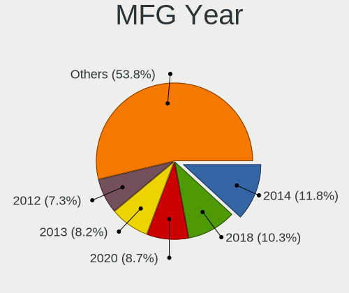

| Year    | Computers | Percent |
|---------|-----------|---------|
| 2014    | 41        | 19.16%  |
| 2019    | 22        | 10.28%  |
| 2018    | 21        | 9.81%   |
| 2012    | 18        | 8.41%   |
| 2020    | 16        | 7.48%   |
| 2021    | 14        | 6.54%   |
| 2016    | 14        | 6.54%   |
| 2013    | 14        | 6.54%   |
| 2009    | 11        | 5.14%   |
| 2011    | 9         | 4.21%   |
| 2022    | 8         | 3.74%   |
| 2017    | 7         | 3.27%   |
| 2015    | 6         | 2.8%    |
| 2010    | 4         | 1.87%   |
| 2006    | 3         | 1.4%    |
| 2008    | 2         | 0.93%   |
| 2007    | 2         | 0.93%   |
| Unknown | 2         | 0.93%   |

Form Factor
-----------

Physical design of the computer

| Name        | Computers | Percent |
|-------------|-----------|---------|
| Desktop     | 112       | 52.34%  |
| Notebook    | 53        | 24.77%  |
| Server      | 29        | 13.55%  |
| Mini pc     | 14        | 6.54%   |
| All in one  | 4         | 1.87%   |
| Convertible | 2         | 0.93%   |

Coreboot
--------

Have coreboot on board

| Used | Computers | Percent |
|------|-----------|---------|
| No   | 210       | 98.13%  |
| Yes  | 4         | 1.87%   |

RAM Size
--------

Total RAM memory

| Size in GB  | Computers | Percent |
|-------------|-----------|---------|
| 4.01-8.0    | 64        | 29.36%  |
| 8.01-16.0   | 60        | 27.52%  |
| 16.01-24.0  | 45        | 20.64%  |
| 64.01-256.0 | 18        | 8.26%   |
| 32.01-64.0  | 12        | 5.5%    |
| 2.01-3.0    | 7         | 3.21%   |
| 3.01-4.0    | 6         | 2.75%   |
| 24.01-32.0  | 3         | 1.38%   |
| 0.51-1.0    | 2         | 0.92%   |
| 1.01-2.0    | 1         | 0.46%   |

RAM Used
--------

Used RAM memory

| Used GB     | Computers | Percent |
|-------------|-----------|---------|
| 0.01-0.5    | 121       | 53.78%  |
| 0.51-1.0    | 54        | 24%     |
| 1.01-2.0    | 30        | 13.33%  |
| 2.01-3.0    | 5         | 2.22%   |
| 4.01-8.0    | 4         | 1.78%   |
| 8.01-16.0   | 4         | 1.78%   |
| 3.01-4.0    | 2         | 0.89%   |
| 0           | 2         | 0.89%   |
| 64.01-256.0 | 1         | 0.44%   |
| 16.01-24.0  | 1         | 0.44%   |
| Unknown     | 1         | 0.44%   |

Total Drives
------------

Number of drives on board

| Drives | Computers | Percent |
|--------|-----------|---------|
| 1      | 120       | 53.81%  |
| 2      | 44        | 19.73%  |
| 0      | 33        | 14.8%   |
| 3      | 11        | 4.93%   |
| 6      | 5         | 2.24%   |
| 4      | 5         | 2.24%   |
| 5      | 3         | 1.35%   |
| 9      | 1         | 0.45%   |
| 8      | 1         | 0.45%   |

Has CD-ROM
----------

Has CD-ROM on board

| Presented | Computers | Percent |
|-----------|-----------|---------|
| No        | 174       | 80.56%  |
| Yes       | 42        | 19.44%  |

Has Ethernet
------------

Has Ethernet on board

| Presented | Computers | Percent |
|-----------|-----------|---------|
| Yes       | 206       | 96.26%  |
| No        | 8         | 3.74%   |

Has WiFi
--------

Has WiFi module

| Presented | Computers | Percent |
|-----------|-----------|---------|
| No        | 124       | 57.14%  |
| Yes       | 93        | 42.86%  |

Has Bluetooth
-------------

Has Bluetooth module

| Presented | Computers | Percent |
|-----------|-----------|---------|
| No        | 164       | 75.58%  |
| Yes       | 53        | 24.42%  |

Location
--------

Country
-------

Geographic location (country)

| Country | Computers | Percent |
|---------|-----------|---------|
| Poland  | 214       | 100%    |

City
----

Geographic location (city)

| City                      | Computers | Percent |
|---------------------------|-----------|---------|
| Warsaw                    | 37        | 15.74%  |
| Gdynia                    | 19        | 8.09%   |
| Krakow                    | 17        | 7.23%   |
| Gdansk                    | 17        | 7.23%   |
| Wroclaw                   | 14        | 5.96%   |
| Poznan                    | 7         | 2.98%   |
| Lodz                      | 5         | 2.13%   |
| Miedziana Gora            | 4         | 1.7%    |
| Lezno                     | 3         | 1.28%   |
| Legionowo                 | 3         | 1.28%   |
| Katowice                  | 3         | 1.28%   |
| Chrusty                   | 3         | 1.28%   |
| ukowo                 | 2         | 0.85%   |
| Zgierz                    | 2         | 0.85%   |
| Walendow                  | 2         | 0.85%   |
| Szczecin                  | 2         | 0.85%   |
| Siedlce                   | 2         | 0.85%   |
| Radom                     | 2         | 0.85%   |
| Lubin                     | 2         | 0.85%   |
| Kielce                    | 2         | 0.85%   |
| Glincz                    | 2         | 0.85%   |
| Czstochowa           | 2         | 0.85%   |
| witochowice | 1         | 0.43%   |
| Zajaczki Pierwsze         | 1         | 0.43%   |
| Zagnansk                  | 1         | 0.43%   |
| Wocawek         | 1         | 0.43%   |
| Wschowa                   | 1         | 0.43%   |
| Wronowy                   | 1         | 0.43%   |
| Wolsztyn                  | 1         | 0.43%   |
| Wloszczowa                | 1         | 0.43%   |
| Wieliczka                 | 1         | 0.43%   |
| Walcz                     | 1         | 0.43%   |
| Tychy                     | 1         | 0.43%   |
| Szczytno                  | 1         | 0.43%   |
| winoujcie             | 1         | 0.43%   |
| Sulejowek                 | 1         | 0.43%   |
| Stopnica                  | 1         | 0.43%   |
| Stary Sacz                | 1         | 0.43%   |
| Starogard Gdaski        | 1         | 0.43%   |
| Spalice                   | 1         | 0.43%   |

Drives
------

Drive Vendor
------------

Hard drive vendors

| Vendor              | Computers | Drives | Percent |
|---------------------|-----------|--------|---------|
| Samsung Electronics | 35        | 70     | 14.46%  |
| WDC                 | 33        | 72     | 13.64%  |
| Seagate             | 27        | 52     | 11.16%  |
| SanDisk             | 16        | 18     | 6.61%   |
| GOODRAM             | 15        | 26     | 6.2%    |
| Toshiba             | 12        | 28     | 4.96%   |
| A-DATA Technology   | 11        | 12     | 4.55%   |
| Kingston            | 7         | 7      | 2.89%   |
| Transcend           | 6         | 11     | 2.48%   |
| Crucial             | 6         | 11     | 2.48%   |
| SPCC                | 5         | 6      | 2.07%   |
| Intel               | 4         | 6      | 1.65%   |
| Innodisk            | 4         | 5      | 1.65%   |
| Hoodisk             | 4         | 6      | 1.65%   |
| Hitachi             | 4         | 4      | 1.65%   |
| Apacer              | 4         | 4      | 1.65%   |
| SK hynix            | 3         | 3      | 1.24%   |
| PNY                 | 3         | 7      | 1.24%   |
| Plextor             | 3         | 3      | 1.24%   |
| Patriot             | 3         | 3      | 1.24%   |
| OCZ                 | 3         | 3      | 1.24%   |
| NVMe                | 3         | 6      | 1.24%   |
| LITEON              | 3         | 3      | 1.24%   |
| HGST                | 3         | 5      | 1.24%   |
| Hewlett-Packard     | 3         | 3      | 1.24%   |
| Gigabyte Technology | 3         | 3      | 1.24%   |
| Corsair             | 3         | 3      | 1.24%   |
| Micron Technology   | 2         | 8      | 0.83%   |
| Kston               | 2         | 2      | 0.83%   |
| Intenso             | 2         | 3      | 0.83%   |
| China               | 2         | 3      | 0.83%   |
| Team                | 1         | 1      | 0.41%   |
| SSSTC               | 1         | 2      | 0.41%   |
| SSDPR-CX            | 1         | 1      | 0.41%   |
| Phison              | 1         | 1      | 0.41%   |
| LITEONIT            | 1         | 1      | 0.41%   |
| KIOXIA              | 1         | 1      | 0.41%   |
| FORESEE             | 1         | 1      | 0.41%   |
| Apple               | 1         | 1      | 0.41%   |

Drive Model
-----------

Hard drive models

| Model                              | Computers | Percent |
|------------------------------------|-----------|---------|
| Samsung HM321HI 320GB              | 5         | 1.88%   |
| Seagate ST1000LM035-1RK172 1TB     | 4         | 1.5%    |
| SPCC Solid State Disk 256GB        | 3         | 1.13%   |
| Samsung SSD 850 EVO 250GB          | 3         | 1.13%   |
| GOODRAM SSDPR-CX400-128 128GB      | 3         | 1.13%   |
| WDC WDS240G2G0A-00JH30 240GB       | 2         | 0.75%   |
| WDC WD20SDZW-11JJ8S0 2TB           | 2         | 0.75%   |
| WDC WD20NMVW-59EDZS7 2TB           | 2         | 0.75%   |
| WDC WD20EFRX-68EUZN0 2TB           | 2         | 0.75%   |
| WDC WD20EARS-00MVWB0 2TB           | 2         | 0.75%   |
| Transcend TS120GMTS420S 120GB      | 2         | 0.75%   |
| Toshiba MQ04ABF100 1TB             | 2         | 0.75%   |
| Seagate ST96812AS 64GB             | 2         | 0.75%   |
| Seagate ST500DM002-1BD142 500GB    | 2         | 0.75%   |
| Seagate ST2000DL003-9VT166 2TB     | 2         | 0.75%   |
| Seagate ST1000LM024 HN-M101MBB 1TB | 2         | 0.75%   |
| Seagate ST1000DM010-2EP102 1TB     | 2         | 0.75%   |
| Seagate ST1000DM003-1CH162 1TB     | 2         | 0.75%   |
| SanDisk SDSA6MM-016G-1006 16GB     | 2         | 0.75%   |
| Samsung SSD 860 EVO 250GB          | 2         | 0.75%   |
| Patriot Burst 120GB                | 2         | 0.75%   |
| Kingston SUV500MS120G 120GB        | 2         | 0.75%   |
| Kingston SA400S37240G 240GB        | 2         | 0.75%   |
| Intenso SSD SATAIII 128GB          | 2         | 0.75%   |
| Innodisk DEMSR- 16GB mSATA 3ME3    | 2         | 0.75%   |
| Hoodisk SSD 128GB                  | 2         | 0.75%   |
| GOODRAM SSDPR-CX400-256 256GB      | 2         | 0.75%   |
| GOODRAM SSDPR-CL100-120-G3 120GB   | 2         | 0.75%   |
| Goodram SSDPR-CL100-120-G2 120GB   | 2         | 0.75%   |
| Crucial CT500MX500SSD1 500GB       | 2         | 0.75%   |
| Corsair CMFSSD-256D1 256GB         | 2         | 0.75%   |
| China SATA SSD 64GB                | 2         | 0.75%   |
| Apacer AS340 240GB                 | 2         | 0.75%   |
| A-DATA SU800 256GB                 | 2         | 0.75%   |
| A-DATA SU800 128GB                 | 2         | 0.75%   |
| WDC WD7500BPKT-22PK4T0 752GB       | 1         | 0.38%   |
| WDC WD5000LPVT-75G33T0 500GB       | 1         | 0.38%   |
| WDC WD5000LPCX-24VHAT0 500GB       | 1         | 0.38%   |
| WDC WD5000BPVT-08HXZT3 500GB       | 1         | 0.38%   |
| WDC WD360ADFD-00NLR5 37GB          | 1         | 0.38%   |

HDD Vendor
----------

Hard disk drive vendors

| Vendor              | Computers | Drives | Percent |
|---------------------|-----------|--------|---------|
| WDC                 | 30        | 58     | 33.71%  |
| Seagate             | 27        | 52     | 30.34%  |
| Toshiba             | 10        | 26     | 11.24%  |
| Samsung Electronics | 10        | 16     | 11.24%  |
| Hitachi             | 4         | 4      | 4.49%   |
| HGST                | 3         | 5      | 3.37%   |
| NVMe                | 2         | 3      | 2.25%   |
| SSDPR-CX            | 1         | 1      | 1.12%   |
| Hewlett-Packard     | 1         | 1      | 1.12%   |
| Apple               | 1         | 1      | 1.12%   |

SSD Vendor
----------

Solid state drive vendors

| Vendor              | Computers | Drives | Percent |
|---------------------|-----------|--------|---------|
| Samsung Electronics | 19        | 45     | 14.5%   |
| SanDisk             | 16        | 18     | 12.21%  |
| GOODRAM             | 14        | 25     | 10.69%  |
| A-DATA Technology   | 8         | 8      | 6.11%   |
| Kingston            | 7         | 7      | 5.34%   |
| Transcend           | 5         | 10     | 3.82%   |
| SPCC                | 5         | 6      | 3.82%   |
| Crucial             | 5         | 10     | 3.82%   |
| Innodisk            | 4         | 5      | 3.05%   |
| Hoodisk             | 4         | 6      | 3.05%   |
| Apacer              | 4         | 4      | 3.05%   |
| Plextor             | 3         | 3      | 2.29%   |
| OCZ                 | 3         | 3      | 2.29%   |
| Intel               | 3         | 5      | 2.29%   |
| Gigabyte Technology | 3         | 3      | 2.29%   |
| Corsair             | 3         | 3      | 2.29%   |
| WDC                 | 2         | 13     | 1.53%   |
| SK hynix            | 2         | 2      | 1.53%   |
| Patriot             | 2         | 2      | 1.53%   |
| Micron Technology   | 2         | 8      | 1.53%   |
| LITEON              | 2         | 2      | 1.53%   |
| Kston               | 2         | 2      | 1.53%   |
| Intenso             | 2         | 3      | 1.53%   |
| Hewlett-Packard     | 2         | 2      | 1.53%   |
| China               | 2         | 3      | 1.53%   |
| Toshiba             | 1         | 1      | 0.76%   |
| Team                | 1         | 1      | 0.76%   |
| PNY                 | 1         | 4      | 0.76%   |
| Phison              | 1         | 1      | 0.76%   |
| NVMe                | 1         | 1      | 0.76%   |
| LITEONIT            | 1         | 1      | 0.76%   |
| FORESEE             | 1         | 1      | 0.76%   |

Drive Kind
----------

HDD or SSD

| Kind | Computers | Drives | Percent |
|------|-----------|--------|---------|
| SSD  | 115       | 208    | 55.29%  |
| HDD  | 70        | 167    | 33.65%  |
| NVMe | 23        | 30     | 11.06%  |

Drive Connector
---------------

SATA, SAS, NVMe, etc.

| Type | Computers | Drives | Percent |
|------|-----------|--------|---------|
| SATA | 162       | 375    | 87.57%  |
| NVMe | 23        | 30     | 12.43%  |

Drive Size
----------

Size of hard drive

| Size in TB | Computers | Drives | Percent |
|------------|-----------|--------|---------|
| 0.01-0.5   | 135       | 238    | 70.68%  |
| 0.51-1.0   | 32        | 67     | 16.75%  |
| 1.01-2.0   | 15        | 39     | 7.85%   |
| 3.01-4.0   | 3         | 8      | 1.57%   |
| 2.01-3.0   | 3         | 13     | 1.57%   |
| 4.01-10.0  | 3         | 10     | 1.57%   |

Space Total
-----------

Amount of disk space available on the file system

| Size in GB     | Computers | Percent |
|----------------|-----------|---------|
| 101-250        | 82        | 36.12%  |
| 51-100         | 36        | 15.86%  |
| 1-20           | 34        | 14.98%  |
| 251-500        | 32        | 14.1%   |
| 21-50          | 22        | 9.69%   |
| 501-1000       | 13        | 5.73%   |
| More than 3000 | 3         | 1.32%   |
| 1001-2000      | 3         | 1.32%   |
| 2001-3000      | 2         | 0.88%   |

Space Used
----------

Amount of used disk space

| Used GB        | Computers | Percent |
|----------------|-----------|---------|
| 1-20           | 198       | 89.59%  |
| 21-50          | 10        | 4.52%   |
| 101-250        | 5         | 2.26%   |
| 51-100         | 5         | 2.26%   |
| 1001-2000      | 2         | 0.9%    |
| More than 3000 | 1         | 0.45%   |

Malfunc. Drives
---------------

Drive models with a malfunction

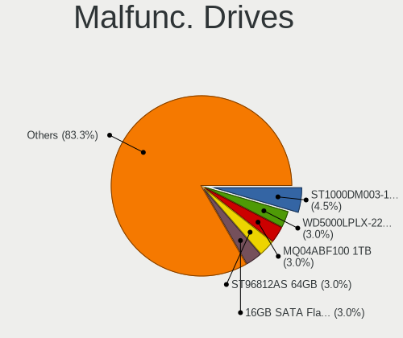

| Model                                     | Computers | Drives | Percent |
|-------------------------------------------|-----------|--------|---------|
| Toshiba MQ04ABF100 1TB                    | 2         | 2      | 6.45%   |
| Seagate ST96812AS 64GB                    | 2         | 5      | 6.45%   |
| WDC WD360ADFD-00NLR1 37GB                 | 1         | 1      | 3.23%   |
| WDC WD3200AAVS-00ZTB0 320GB               | 1         | 1      | 3.23%   |
| WDC WD2500AAKX-753CA0 250GB               | 1         | 1      | 3.23%   |
| WDC WD2500AAKX-083CA1 250GB               | 1         | 2      | 3.23%   |
| WDC WD20EURS-63S48Y0 2TB                  | 1         | 1      | 3.23%   |
| WDC WD20EARS-00MVWB0 2TB                  | 1         | 1      | 3.23%   |
| WDC WD1600BEVE-00UYT0 160GB               | 1         | 1      | 3.23%   |
| WDC WD1600AAJS-40H3A0 160GB               | 1         | 1      | 3.23%   |
| WDC WD1200BEVS-07LAT0 120GB               | 1         | 1      | 3.23%   |
| WDC WD10EARS-003BB1 1TB                   | 1         | 1      | 3.23%   |
| Toshiba THNSNK512GVN8 512GB               | 1         | 1      | 3.23%   |
| Toshiba MK3261GSYN 320GB                  | 1         | 1      | 3.23%   |
| SPCC Solid State Disk 256GB               | 1         | 1      | 3.23%   |
| SK hynix SC308 SATA 256GB                 | 1         | 1      | 3.23%   |
| Seagate ST9500420AS 500GB                 | 1         | 2      | 3.23%   |
| Seagate ST9160412AS 160GB                 | 1         | 1      | 3.23%   |
| Seagate ST500DM002-1BD142 500GB           | 1         | 1      | 3.23%   |
| Seagate ST3250310AS 250GB                 | 1         | 1      | 3.23%   |
| Seagate ST32000542AS 2TB                  | 1         | 1      | 3.23%   |
| Seagate ST2000DL003-9VT166 2TB            | 1         | 1      | 3.23%   |
| Seagate ST1000DM003-1CH162 1TB            | 1         | 1      | 3.23%   |
| Samsung Electronics SSD 870 EVO 1TB       | 1         | 1      | 3.23%   |
| Samsung Electronics HD154UI 1.5TB         | 1         | 1      | 3.23%   |
| Plextor PX-128G7Ne 128GB                  | 1         | 1      | 3.23%   |
| Micron Technology MTFDDAT128MAM-1J2 128GB | 1         | 1      | 3.23%   |
| Hitachi HTS721060G9SA00 64GB              | 1         | 1      | 3.23%   |
| Hitachi HTS543232A7A384 320GB             | 1         | 1      | 3.23%   |

Malfunc. Drive Vendor
---------------------

Vendors of faulty drives

| Vendor              | Computers | Drives | Percent |
|---------------------|-----------|--------|---------|
| WDC                 | 10        | 11     | 32.26%  |
| Seagate             | 9         | 13     | 29.03%  |
| Toshiba             | 4         | 4      | 12.9%   |
| Samsung Electronics | 2         | 2      | 6.45%   |
| Hitachi             | 2         | 2      | 6.45%   |
| SPCC                | 1         | 1      | 3.23%   |
| SK hynix            | 1         | 1      | 3.23%   |
| Plextor             | 1         | 1      | 3.23%   |
| Micron Technology   | 1         | 1      | 3.23%   |

Malfunc. HDD Vendor
-------------------

Vendors of faulty HDD drives

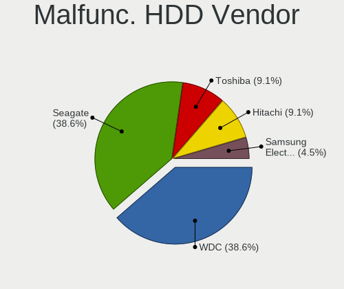

| Vendor              | Computers | Drives | Percent |
|---------------------|-----------|--------|---------|
| WDC                 | 10        | 11     | 40%     |
| Seagate             | 9         | 13     | 36%     |
| Toshiba             | 3         | 3      | 12%     |
| Hitachi             | 2         | 2      | 8%      |
| Samsung Electronics | 1         | 1      | 4%      |

Malfunc. Drive Kind
-------------------

Kinds of faulty drives

| Kind | Computers | Drives | Percent |
|------|-----------|--------|---------|
| HDD  | 24        | 30     | 80%     |
| SSD  | 6         | 6      | 20%     |

Failed Drives
-------------

Failed drive models

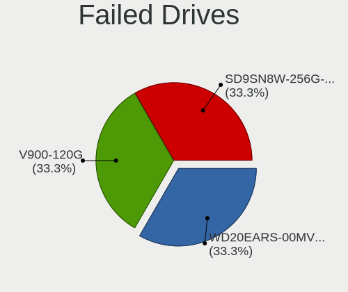

| Model                    | Computers | Drives | Percent |
|--------------------------|-----------|--------|---------|
| WDC WD20EARS-00MVWB0 2TB | 1         | 1      | 100%    |

Failed Drive Vendor
-------------------

Failed drive vendors

| Vendor | Computers | Drives | Percent |
|--------|-----------|--------|---------|
| WDC    | 1         | 1      | 100%    |

Drive Status
------------

Number of failed and malfunc. drives

| Status   | Computers | Drives | Percent |
|----------|-----------|--------|---------|
| Works    | 162       | 356    | 80.6%   |
| Malfunc  | 29        | 36     | 14.43%  |
| Detected | 9         | 12     | 4.48%   |
| Failed   | 1         | 1      | 0.5%    |

Storage controller
------------------

Storage Vendor
--------------

Storage controller vendors

| Vendor                         | Computers | Percent |
|--------------------------------|-----------|---------|
| Intel                          | 152       | 62.81%  |
| AMD                            | 30        | 12.4%   |
| Broadcom / LSI                 | 24        | 9.92%   |
| Samsung Electronics            | 8         | 3.31%   |
| Silicon Motion                 | 3         | 1.24%   |
| SanDisk                        | 3         | 1.24%   |
| Phison Electronics             | 2         | 0.83%   |
| Nvidia                         | 2         | 0.83%   |
| KIOXIA                         | 2         | 0.83%   |
| Hewlett-Packard                | 2         | 0.83%   |
| ASMedia Technology             | 2         | 0.83%   |
| VIA Technologies               | 1         | 0.41%   |
| Transcend                      | 1         | 0.41%   |
| Solid State Storage Technology | 1         | 0.41%   |
| SK hynix                       | 1         | 0.41%   |
| Realtek Semiconductor          | 1         | 0.41%   |
| Micron/Crucial Technology      | 1         | 0.41%   |
| Marvell Technology Group       | 1         | 0.41%   |
| Lite-On Technology             | 1         | 0.41%   |
| JMicron Technology             | 1         | 0.41%   |
| Integrated Technology Express  | 1         | 0.41%   |
| Apple                          | 1         | 0.41%   |
| ADATA Technology               | 1         | 0.41%   |

Storage Model
-------------

Storage controller models

| Model                                                                            | Computers | Percent |
|----------------------------------------------------------------------------------|-----------|---------|
| AMD FCH SATA Controller [AHCI mode]                                              | 21        | 7.95%   |
| Intel Celeron/Pentium Silver Processor SATA Controller                           | 15        | 5.68%   |
| Broadcom / LSI MegaRAID SAS 2208 [Thunderbolt]                                   | 15        | 5.68%   |
| Intel 7 Series Chipset Family 6-port SATA Controller [AHCI mode]                 | 11        | 4.17%   |
| Intel 8 Series/C220 Series Chipset Family 6-port SATA Controller 1 [AHCI mode]   | 10        | 3.79%   |
| Intel Sunrise Point-LP SATA Controller [AHCI mode]                               | 9         | 3.41%   |
| Intel 6 Series/C200 Series Chipset Family 6 port Desktop SATA AHCI Controller    | 9         | 3.41%   |
| Intel Q170/Q150/B150/H170/H110/Z170/CM236 Chipset SATA Controller [AHCI Mode]    | 7         | 2.65%   |
| Intel 82801IBM/IEM (ICH9M/ICH9M-E) 4 port SATA Controller [AHCI mode]            | 7         | 2.65%   |
| AMD SB7x0/SB8x0/SB9x0 SATA Controller [AHCI mode]                                | 7         | 2.65%   |
| Intel Atom Processor E3800 Series SATA AHCI Controller                           | 6         | 2.27%   |
| Intel Celeron N3350/Pentium N4200/Atom E3900 Series SATA AHCI Controller         | 5         | 1.89%   |
| Intel 7 Series/C210 Series Chipset Family 6-port SATA Controller [AHCI mode]     | 5         | 1.89%   |
| Intel 6 Series/C200 Series Chipset Family 6 port Mobile SATA AHCI Controller     | 5         | 1.89%   |
| Unknown                                                                          | 5         | 1.89%   |
| Samsung NVMe SSD Controller 980                                                  | 4         | 1.52%   |
| Intel NM10/ICH7 Family SATA Controller [IDE mode]                                | 4         | 1.52%   |
| Intel 82801G (ICH7 Family) IDE Controller                                        | 4         | 1.52%   |
| Intel 8 Series SATA Controller 1 [AHCI mode]                                     | 4         | 1.52%   |
| Intel 200 Series PCH SATA controller [AHCI mode]                                 | 4         | 1.52%   |
| AMD 400 Series Chipset SATA Controller                                           | 4         | 1.52%   |
| Intel Wildcat Point-LP SATA Controller [AHCI Mode]                               | 3         | 1.14%   |
| Intel SATA Controller [RAID mode]                                                | 3         | 1.14%   |
| Intel Comet Lake SATA AHCI Controller                                            | 3         | 1.14%   |
| Intel Cannon Point-LP SATA Controller [AHCI Mode]                                | 3         | 1.14%   |
| Intel C600/X79 series chipset 6-Port SATA AHCI Controller                        | 3         | 1.14%   |
| Intel Atom/Celeron/Pentium Processor x5-E8000/J3xxx/N3xxx Series SATA Controller | 3         | 1.14%   |
| Intel 82801IR/IO/IH (ICH9R/DO/DH) 4 port SATA Controller [IDE mode]              | 3         | 1.14%   |
| Silicon Motion SM2263EN/SM2263XT SSD Controller                                  | 2         | 0.76%   |
| Samsung NVMe SSD Controller SM981/PM981/PM983                                    | 2         | 0.76%   |
| Samsung NVMe SSD Controller PM9A1/PM9A3/980PRO                                   | 2         | 0.76%   |
| Phison E12 NVMe Controller                                                       | 2         | 0.76%   |
| KIOXIA NVMe SSD Controller BG4                                                   | 2         | 0.76%   |
| Intel NM10/ICH7 Family SATA Controller [AHCI mode]                               | 2         | 0.76%   |
| Intel Cannon Lake PCH SATA AHCI Controller                                       | 2         | 0.76%   |
| Intel Cannon Lake Mobile PCH SATA AHCI Controller                                | 2         | 0.76%   |
| Intel C610/X99 series chipset sSATA Controller [AHCI mode]                       | 2         | 0.76%   |
| Intel C610/X99 series chipset 6-Port SATA Controller [AHCI mode]                 | 2         | 0.76%   |
| Intel 82801I (ICH9 Family) 2 port SATA Controller [IDE mode]                     | 2         | 0.76%   |
| Intel 82801 Mobile SATA Controller [RAID mode]                                   | 2         | 0.76%   |

Storage Kind
------------

Kind of storage controller (IDE, SATA, NVMe, SAS, ...)

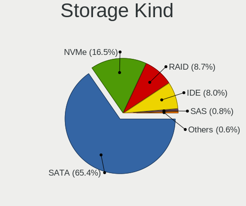

| Kind | Computers | Percent |
|------|-----------|---------|
| SATA | 161       | 66.26%  |
| RAID | 29        | 11.93%  |
| NVMe | 26        | 10.7%   |
| IDE  | 23        | 9.47%   |
| SAS  | 2         | 0.82%   |
| SCSI | 2         | 0.82%   |

Processor
---------

CPU Vendor
----------

Processor vendors

| Vendor  | Computers | Percent |
|---------|-----------|---------|
| Intel   | 175       | 81.78%  |
| AMD     | 35        | 16.36%  |
| ARM     | 3         | 1.4%    |
| PowerPC | 1         | 0.47%   |

CPU Model
---------

Processor models

| Model                                    | Computers | Percent |
|------------------------------------------|-----------|---------|
| Intel Xeon CPU E5-2650 v2 @ 2.60GHz      | 13        | 6.02%   |
| AMD GX-420CA SOC with Radeon HD Graphics | 8         | 3.7%    |
| Intel Core 2 Duo CPU P8600 @ 2.40GHz     | 5         | 2.31%   |
| Intel Pentium Silver J5005 CPU @ 1.50GHz | 4         | 1.85%   |
| Intel Celeron N4100 CPU @ 1.10GHz        | 4         | 1.85%   |
| Intel Celeron CPU J1900 @ 1.99GHz        | 4         | 1.85%   |
| Intel Core i5-6300U CPU @ 2.40GHz        | 3         | 1.39%   |
| Intel Core i5-4570 CPU @ 3.20GHz         | 3         | 1.39%   |
| Intel Core i5-3470 CPU @ 3.20GHz         | 3         | 1.39%   |
| Intel Core i5-2520M CPU @ 2.50GHz        | 3         | 1.39%   |
| Intel Celeron J4105 CPU @ 1.50GHz        | 3         | 1.39%   |
| Intel Celeron CPU N3150 @ 1.60GHz        | 3         | 1.39%   |
| Intel Pentium CPU G860 @ 3.00GHz         | 2         | 0.93%   |
| Intel Core i7-8700 CPU @ 3.20GHz         | 2         | 0.93%   |
| Intel Core i5-8365U CPU @ 1.60GHz        | 2         | 0.93%   |
| Intel Core i5-6400T CPU @ 2.20GHz        | 2         | 0.93%   |
| Intel Core i5-4590 CPU @ 3.30GHz         | 2         | 0.93%   |
| Intel Core i5-3320M CPU @ 2.60GHz        | 2         | 0.93%   |
| Intel Core i5-2400 CPU @ 3.10GHz         | 2         | 0.93%   |
| Intel Core i5-10210U CPU @ 1.60GHz       | 2         | 0.93%   |
| Intel Core i3-6100 CPU @ 3.70GHz         | 2         | 0.93%   |
| Intel Core i3-2100 CPU @ 3.10GHz         | 2         | 0.93%   |
| Intel Core 2 Duo                         | 2         | 0.93%   |
| Intel Celeron J4125 CPU @ 2.00GHz        | 2         | 0.93%   |
| Intel Celeron CPU J3455 @ 1.50GHz        | 2         | 0.93%   |
| Intel Atom CPU D2500 @ 1.86GHz           | 2         | 0.93%   |
| ARM Cortex-A72 r0p3                      | 2         | 0.93%   |
| AMD Ryzen 3 3100 4-Core Processor        | 2         | 0.93%   |
| AMD GX-415GA SOC with Radeon HD Graphics | 2         | 0.93%   |
| PowerPC 7447A (Revision 0x102)           | 1         | 0.46%   |
| Intel Xeon E-2386G CPU @ 3.50GHz         | 1         | 0.46%   |
| Intel Xeon CPU X5660 @ 2.80GHz           | 1         | 0.46%   |
| Intel Xeon CPU X3430 @ 2.40GHz           | 1         | 0.46%   |
| Intel Xeon CPU X3360 @ 2.83GHz           | 1         | 0.46%   |
| Intel Xeon CPU E5520 @ 2.27GHz           | 1         | 0.46%   |
| Intel Xeon CPU E5450 @ 3.00GHz           | 1         | 0.46%   |
| Intel Xeon CPU E5410 @ 2.33GHz           | 1         | 0.46%   |
| Intel Xeon CPU E5-2680 v2 @ 2.80GHz      | 1         | 0.46%   |
| Intel Xeon CPU E5-2680 0 @ 2.70GHz       | 1         | 0.46%   |
| Intel Xeon CPU E5-2650 v3 @ 2.30GHz      | 1         | 0.46%   |

CPU Model Family
----------------

Processor model prefix

| Model                   | Computers | Percent |
|-------------------------|-----------|---------|
| Intel Core i5           | 49        | 22.69%  |
| Intel Xeon              | 33        | 15.28%  |
| Intel Celeron           | 29        | 13.43%  |
| Intel Core i7           | 16        | 7.41%   |
| Intel Core i3           | 14        | 6.48%   |
| AMD GX                  | 13        | 6.02%   |
| Intel Core 2 Duo        | 9         | 4.17%   |
| Intel Pentium           | 8         | 3.7%    |
| Intel Atom              | 6         | 2.78%   |
| Intel Pentium Silver    | 5         | 2.31%   |
| Other                   | 4         | 1.85%   |
| ARM Cortex              | 3         | 1.39%   |
| AMD Ryzen 5             | 3         | 1.39%   |
| AMD Ryzen 3             | 3         | 1.39%   |
| AMD G                   | 3         | 1.39%   |
| Intel Pentium Dual-Core | 2         | 0.93%   |
| AMD Ryzen 7             | 2         | 0.93%   |
| AMD E                   | 2         | 0.93%   |
| Intel Pentium M         | 1         | 0.46%   |
| Intel Core 2            | 1         | 0.46%   |
| Intel Celeron M         | 1         | 0.46%   |
| AMD Ryzen Embedded      | 1         | 0.46%   |
| AMD Ryzen 9             | 1         | 0.46%   |
| AMD Ryzen 7 PRO         | 1         | 0.46%   |
| AMD Ryzen 5 PRO         | 1         | 0.46%   |
| AMD Phenom II X6        | 1         | 0.46%   |
| AMD Phenom II X4        | 1         | 0.46%   |
| AMD Athlon 64 X2        | 1         | 0.46%   |
| AMD Athlon              | 1         | 0.46%   |
| AMD A4                  | 1         | 0.46%   |

CPU Cores
---------

Number of processor cores

| Number  | Computers | Percent |
|---------|-----------|---------|
| 4       | 84        | 39.07%  |
| 2       | 66        | 30.7%   |
| 16      | 15        | 6.98%   |
| Unknown | 15        | 6.98%   |
| 8       | 11        | 5.12%   |
| 6       | 9         | 4.19%   |
| 12      | 7         | 3.26%   |
| 1       | 5         | 2.33%   |
| 20      | 2         | 0.93%   |
| 24      | 1         | 0.47%   |

CPU Sockets
-----------

Number of sockets

| Number  | Computers | Percent |
|---------|-----------|---------|
| 1       | 177       | 82.71%  |
| 2       | 26        | 12.15%  |
| Unknown | 11        | 5.14%   |

CPU Threads
-----------

Threads per core (Hyper-Threading)

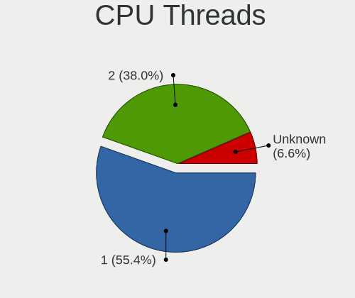

| Number  | Computers | Percent |
|---------|-----------|---------|
| 1       | 106       | 49.3%   |
| 2       | 90        | 41.86%  |
| Unknown | 19        | 8.84%   |

CPU Microarch
-------------

Microarchitecture

| Name          | Computers | Percent |
|---------------|-----------|---------|
| IvyBridge     | 33        | 15.28%  |
| KabyLake      | 21        | 9.72%   |
| Haswell       | 20        | 9.26%   |
| SandyBridge   | 18        | 8.33%   |
| Penryn        | 16        | 7.41%   |
| Goldmont plus | 15        | 6.94%   |
| Jaguar        | 13        | 6.02%   |
| Skylake       | 12        | 5.56%   |
| Silvermont    | 10        | 4.63%   |
| Unknown       | 9         | 4.17%   |
| Zen 2         | 5         | 2.31%   |
| Goldmont      | 5         | 2.31%   |
| Bobcat        | 5         | 2.31%   |
| Westmere      | 4         | 1.85%   |
| Broadwell     | 4         | 1.85%   |
| Bonnell       | 4         | 1.85%   |
| Zen           | 3         | 1.39%   |
| CometLake     | 3         | 1.39%   |
| Zen+          | 2         | 0.93%   |
| Zen 3         | 2         | 0.93%   |
| Puma          | 2         | 0.93%   |
| P6            | 2         | 0.93%   |
| Nehalem       | 2         | 0.93%   |
| K10           | 2         | 0.93%   |
| TigerLake     | 1         | 0.46%   |
| NetBurst      | 1         | 0.46%   |
| K8 Hammer     | 1         | 0.46%   |
| Core          | 1         | 0.46%   |

Graphics
--------

GPU Vendor
----------

Vendors of graphics cards

| Vendor                                       | Computers | Percent |
|----------------------------------------------|-----------|---------|
| Intel                                        | 129       | 56.58%  |
| AMD                                          | 42        | 18.42%  |
| Nvidia                                       | 26        | 11.4%   |
| Matrox Electronics Systems                   | 25        | 10.96%  |
| ASPEED Technology                            | 4         | 1.75%   |
| XGI Technology (eXtreme Graphics Innovation) | 1         | 0.44%   |
| VIA Technologies                             | 1         | 0.44%   |

GPU Model
---------

Graphics card models

| Model                                                                                    | Computers | Percent |
|------------------------------------------------------------------------------------------|-----------|---------|
| Matrox Electronics Systems G200eR2                                                       | 18        | 7.83%   |
| Intel 3rd Gen Core processor Graphics Controller                                         | 11        | 4.78%   |
| Intel 2nd Generation Core Processor Family Integrated Graphics Controller                | 11        | 4.78%   |
| Intel GeminiLake [UHD Graphics 600]                                                      | 10        | 4.35%   |
| AMD Kabini [Radeon HD 8400E]                                                             | 8         | 3.48%   |
| Intel Xeon E3-1200 v3/4th Gen Core Processor Integrated Graphics Controller              | 7         | 3.04%   |
| Intel Mobile 4 Series Chipset Integrated Graphics Controller                             | 7         | 3.04%   |
| Intel HD Graphics 530                                                                    | 6         | 2.61%   |
| Intel Atom Processor Z36xxx/Z37xxx Series Graphics & Display                             | 6         | 2.61%   |
| AMD Ellesmere [Radeon RX 470/480/570/570X/580/580X/590]                                  | 6         | 2.61%   |
| Intel GeminiLake [UHD Graphics 605]                                                      | 5         | 2.17%   |
| Matrox Electronics Systems MGA G200eW WPCM450                                            | 4         | 1.74%   |
| Intel Xeon E3-1200 v2/3rd Gen Core processor Graphics Controller                         | 4         | 1.74%   |
| Intel HD Graphics 620                                                                    | 4         | 1.74%   |
| Intel HD Graphics 500                                                                    | 4         | 1.74%   |
| Intel Haswell-ULT Integrated Graphics Controller                                         | 4         | 1.74%   |
| Intel Atom/Celeron/Pentium Processor x5-E8000/J3xxx/N3xxx Integrated Graphics Controller | 4         | 1.74%   |
| ASPEED Technology ASPEED Graphics Family                                                 | 4         | 1.74%   |
| Intel WhiskeyLake-U GT2 [UHD Graphics 620]                                               | 3         | 1.3%    |
| Intel Skylake GT2 [HD Graphics 520]                                                      | 3         | 1.3%    |
| Intel HD Graphics 630                                                                    | 3         | 1.3%    |
| Intel CometLake-U GT2 [UHD Graphics]                                                     | 3         | 1.3%    |
| Intel 4th Generation Core Processor Family Integrated Graphics Controller                | 3         | 1.3%    |
| Intel 4 Series Chipset Integrated Graphics Controller                                    | 3         | 1.3%    |
| AMD ES1000                                                                               | 3         | 1.3%    |
| Nvidia GP106 [GeForce GTX 1060 3GB]                                                      | 2         | 0.87%   |
| Nvidia GF117M [GeForce 610M/710M/810M/820M / GT 620M/625M/630M/720M]                     | 2         | 0.87%   |
| Matrox Electronics Systems MGA G200e [Pilot] ServerEngines (SEP1)                        | 2         | 0.87%   |
| Intel HD Graphics 610                                                                    | 2         | 0.87%   |
| Intel HD Graphics 5500                                                                   | 2         | 0.87%   |
| Intel HD Graphics 510                                                                    | 2         | 0.87%   |
| Intel CometLake-S GT2 [UHD Graphics 630]                                                 | 2         | 0.87%   |
| Intel Atom Processor D2xxx/N2xxx Integrated Graphics Controller                          | 2         | 0.87%   |
| Intel 82945G/GZ Integrated Graphics Controller                                           | 2         | 0.87%   |
| Intel 4th Gen Core Processor Integrated Graphics Controller                              | 2         | 0.87%   |
| AMD Wrestler [Radeon HD 6320]                                                            | 2         | 0.87%   |
| AMD Renoir                                                                               | 2         | 0.87%   |
| AMD Picasso/Raven 2 [Radeon Vega Series / Radeon Vega Mobile Series]                     | 2         | 0.87%   |
| AMD Kabini [Radeon HD 8330E]                                                             | 2         | 0.87%   |
| AMD Cezanne [Radeon Vega Series / Radeon Vega Mobile Series]                             | 2         | 0.87%   |

GPU Combo
---------

Combinations of graphics cards

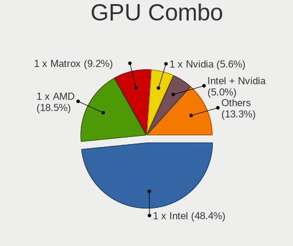

| Name            | Computers | Percent |
|-----------------|-----------|---------|
| 1 x Intel       | 101       | 46.76%  |
| 1 x AMD         | 37        | 17.13%  |
| 1 x Matrox      | 25        | 11.57%  |
| 1 x Nvidia      | 13        | 6.02%   |
| Intel + Nvidia  | 13        | 6.02%   |
| 2 x Intel       | 11        | 5.09%   |
| Other           | 6         | 2.78%   |
| Intel + AMD     | 4         | 1.85%   |
| 1 x ASPEED      | 2         | 0.93%   |
| 1 x XGI         | 1         | 0.46%   |
| 1 x VIA         | 1         | 0.46%   |
| Nvidia + ASPEED | 1         | 0.46%   |
| AMD + ASPEED    | 1         | 0.46%   |

GPU Driver
----------

Free vs proprietary

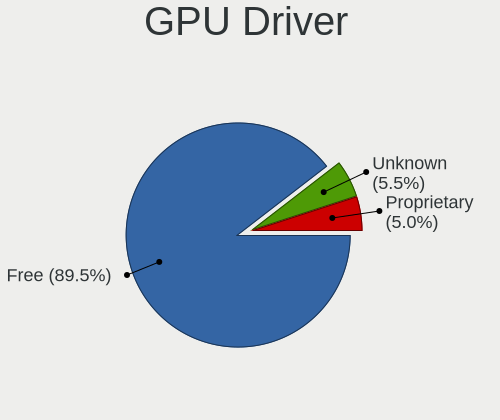

| Driver      | Computers | Percent |
|-------------|-----------|---------|
| Free        | 192       | 89.3%   |
| Proprietary | 12        | 5.58%   |
| Unknown     | 11        | 5.12%   |

GPU Memory
----------

Total video memory

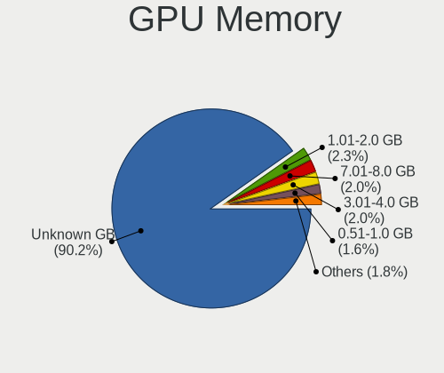

| Size in GB | Computers | Percent |
|------------|-----------|---------|
| Unknown    | 194       | 90.23%  |
| 1.01-2.0   | 6         | 2.79%   |
| 3.01-4.0   | 5         | 2.33%   |
| 7.01-8.0   | 3         | 1.4%    |
| 0.01-0.5   | 3         | 1.4%    |
| 0.51-1.0   | 2         | 0.93%   |
| 5.01-6.0   | 1         | 0.47%   |
| 8.01-16.0  | 1         | 0.47%   |

Monitor
-------

Monitor Vendor
--------------

Monitor vendors

| Vendor                  | Computers | Percent |
|-------------------------|-----------|---------|
| LG Display              | 15        | 18.75%  |
| Lenovo                  | 7         | 8.75%   |
| BOE                     | 7         | 8.75%   |
| Samsung Electronics     | 6         | 7.5%    |
| NEC Computers           | 5         | 6.25%   |
| Dell                    | 4         | 5%      |
| Acer                    | 4         | 5%      |
| Philips                 | 3         | 3.75%   |
| Iiyama                  | 3         | 3.75%   |
| Chimei Innolux          | 3         | 3.75%   |
| AU Optronics            | 3         | 3.75%   |
| Goldstar                | 2         | 2.5%    |
| Chi Mei Optoelectronics | 2         | 2.5%    |
| BenQ                    | 2         | 2.5%    |
| Apple                   | 2         | 2.5%    |
| AOC                     | 2         | 2.5%    |
| Vestel Elektronik       | 1         | 1.25%   |
| Toshiba                 | 1         | 1.25%   |
| Sharp                   | 1         | 1.25%   |
| PANDA                   | 1         | 1.25%   |
| KTC                     | 1         | 1.25%   |
| JDI                     | 1         | 1.25%   |
| InfoVision              | 1         | 1.25%   |
| HPN                     | 1         | 1.25%   |
| Hewlett-Packard         | 1         | 1.25%   |
| Eizo                    | 1         | 1.25%   |

Monitor Model
-------------

Monitor models

| Model                                                                    | Computers | Percent |
|--------------------------------------------------------------------------|-----------|---------|
| Lenovo LCD Monitor LEN4010 1280x800 260x160mm 12.0-inch                  | 5         | 6.25%   |
| LG Display LCD Monitor LGD039F 1366x768 350x190mm 15.7-inch              | 2         | 2.5%    |
| Chi Mei Optoelectronics LCD Monitor CMO15A7 1366x768 350x190mm 15.7-inch | 2         | 2.5%    |
| Vestel Elektronik 32W_LCD_TV VES3700 1920x1080 710x400mm 32.1-inch       | 1         | 1.25%   |
| Toshiba TV TSB0110 1920x1080 1110x620mm 50.1-inch                        | 1         | 1.25%   |
| Sharp LCD Monitor SHP1451 1920x1080 280x160mm 12.7-inch                  | 1         | 1.25%   |
| Samsung Electronics U32J59x SAM0F35 3840x2160 700x390mm 31.5-inch        | 1         | 1.25%   |
| Samsung Electronics SyncMaster SAM0304 1680x1050 490x320mm 23.0-inch     | 1         | 1.25%   |
| Samsung Electronics LCD Monitor SEC544B 1600x900 310x170mm 13.9-inch     | 1         | 1.25%   |
| Samsung Electronics LCD Monitor SEC5442 1440x900 300x190mm 14.0-inch     | 1         | 1.25%   |
| Samsung Electronics LCD Monitor SDC4852 1366x768 340x190mm 15.3-inch     | 1         | 1.25%   |
| Samsung Electronics LCD Monitor SAM7103 3840x2160 700x390mm 31.5-inch    | 1         | 1.25%   |
| Philips PHL 275S1 PHL094B 2560x1440 600x340mm 27.2-inch                  | 1         | 1.25%   |
| Philips PHL 243V7 PHLC155 1920x1080 530x300mm 24.0-inch                  | 1         | 1.25%   |
| Philips LCD Monitor PHLC01A 1680x1050 470x300mm 22.0-inch                | 1         | 1.25%   |
| PANDA LCD Monitor NCP006E 1920x1080 340x190mm 15.3-inch                  | 1         | 1.25%   |
| NEC Computers LCD4020 NEC66EA 1920x540 890x500mm 40.2-inch               | 1         | 1.25%   |
| NEC Computers LCD24WMCX NEC6720 1920x1200 520x320mm 24.0-inch            | 1         | 1.25%   |
| NEC Computers EA294WMi NEC68CF 2560x1080 670x280mm 28.6-inch             | 1         | 1.25%   |
| NEC Computers EA223WM NEC6891 1680x1050 470x300mm 22.0-inch              | 1         | 1.25%   |
| NEC Computers E438 NEC335C 3840x2160 940x530mm 42.5-inch                 | 1         | 1.25%   |
| LG Display LCD Monitor LGD0533 1920x1080 340x190mm 15.3-inch             | 1         | 1.25%   |
| LG Display LCD Monitor LGD04E2 1366x768 340x190mm 15.3-inch              | 1         | 1.25%   |
| LG Display LCD Monitor LGD0408 1920x1080 280x160mm 12.7-inch             | 1         | 1.25%   |
| LG Display LCD Monitor LGD03D3 1600x900 310x170mm 13.9-inch              | 1         | 1.25%   |
| LG Display LCD Monitor LGD03CD 1366x768 280x160mm 12.7-inch              | 1         | 1.25%   |
| LG Display LCD Monitor LGD0368 1366x768 310x170mm 13.9-inch              | 1         | 1.25%   |
| LG Display LCD Monitor LGD033E 1366x768 310x170mm 13.9-inch              | 1         | 1.25%   |
| LG Display LCD Monitor LGD02F1 1366x768 340x190mm 15.3-inch              | 1         | 1.25%   |
| LG Display LCD Monitor LGD02DC 1366x768 340x190mm 15.3-inch              | 1         | 1.25%   |
| LG Display LCD Monitor LGD02D8 1366x768 280x160mm 12.7-inch              | 1         | 1.25%   |
| LG Display LCD Monitor LGD02AD 1366x768 340x190mm 15.3-inch              | 1         | 1.25%   |
| LG Display LCD Monitor LGD0283 1920x1080 380x220mm 17.3-inch             | 1         | 1.25%   |
| LG Display LCD Monitor LGD0250 1366x768 350x190mm 15.7-inch              | 1         | 1.25%   |
| Lenovo LCD Monitor LEN40B2 1920x1080 340x190mm 15.3-inch                 | 1         | 1.25%   |
| Lenovo LCD Monitor LEN4011 1280x800 260x160mm 12.0-inch                  | 1         | 1.25%   |
| KTC M-9005L11-D KTC1990 1280x1024 340x270mm 17.1-inch                    | 1         | 1.25%   |
| JDI LAM125M007D JDI1402 1920x1080 280x160mm 12.7-inch                    | 1         | 1.25%   |
| InfoVision LCD Monitor IVO057D 1920x1080 310x170mm 13.9-inch             | 1         | 1.25%   |
| Iiyama PLE2407HDS IVM560D 1920x1080 520x300mm 23.6-inch                  | 1         | 1.25%   |

Monitor Resolution
------------------

Monitor screen resolution

| Resolution         | Computers | Percent |
|--------------------|-----------|---------|
| 1920x1080 (FHD)    | 31        | 40.79%  |
| 1366x768 (WXGA)    | 19        | 25%     |
| 1280x800 (WXGA)    | 7         | 9.21%   |
| 3840x2160 (4K)     | 4         | 5.26%   |
| 1680x1050 (WSXGA+) | 3         | 3.95%   |
| 1600x900 (HD+)     | 3         | 3.95%   |
| 2560x1440 (QHD)    | 2         | 2.63%   |
| 1920x540           | 2         | 2.63%   |
| 1920x1200 (WUXGA)  | 2         | 2.63%   |
| 2560x1080          | 1         | 1.32%   |
| 1440x900 (WXGA+)   | 1         | 1.32%   |
| 1280x1024 (SXGA)   | 1         | 1.32%   |

Monitor Diagonal
----------------

Diagonal size in inches

| Inches  | Computers | Percent |
|---------|-----------|---------|
| 15      | 19        | 24.36%  |
| 12      | 12        | 15.38%  |
| 13      | 11        | 14.1%   |
| 24      | 6         | 7.69%   |
| 23      | 5         | 6.41%   |
| 21      | 5         | 6.41%   |
| 27      | 4         | 5.13%   |
| 18      | 3         | 3.85%   |
| 42      | 2         | 2.56%   |
| 31      | 2         | 2.56%   |
| 17      | 2         | 2.56%   |
| 50      | 1         | 1.28%   |
| 40      | 1         | 1.28%   |
| 28      | 1         | 1.28%   |
| 22      | 1         | 1.28%   |
| 20      | 1         | 1.28%   |
| 14      | 1         | 1.28%   |
| Unknown | 1         | 1.28%   |

Monitor Width
-------------

Physical width

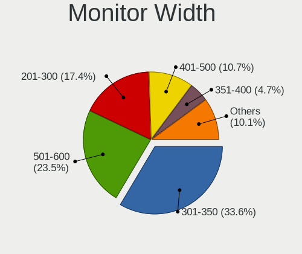

| Width in mm | Computers | Percent |
|-------------|-----------|---------|
| 301-350     | 30        | 38.96%  |
| 501-600     | 14        | 18.18%  |
| 201-300     | 13        | 16.88%  |
| 401-500     | 10        | 12.99%  |
| 601-700     | 3         | 3.9%    |
| 351-400     | 2         | 2.6%    |
| 901-1000    | 2         | 2.6%    |
| 801-900     | 1         | 1.3%    |
| 1001-1500   | 1         | 1.3%    |
| Unknown     | 1         | 1.3%    |

Aspect Ratio
------------

Proportional relationship between the width and the height

| Ratio   | Computers | Percent |
|---------|-----------|---------|
| 16/9    | 56        | 76.71%  |
| 16/10   | 12        | 16.44%  |
| 3/2     | 2         | 2.74%   |
| 5/4     | 1         | 1.37%   |
| 21/9    | 1         | 1.37%   |
| Unknown | 1         | 1.37%   |

Monitor Area
------------

Area in inch

| Area in inch | Computers | Percent |
|----------------|-----------|---------|
| 91-100         | 14        | 18.18%  |
| 201-250        | 13        | 16.88%  |
| 81-90          | 12        | 15.58%  |
| 61-70          | 12        | 15.58%  |
| 101-110        | 5         | 6.49%   |
| 301-350        | 4         | 5.19%   |
| 251-300        | 4         | 5.19%   |
| 141-150        | 3         | 3.9%    |
| 501-1000       | 3         | 3.9%    |
| 351-500        | 2         | 2.6%    |
| 151-200        | 2         | 2.6%    |
| More than 1000 | 1         | 1.3%    |
| 121-130        | 1         | 1.3%    |
| Unknown        | 1         | 1.3%    |

Pixel Density
-------------

Pixels per inch

| Density | Computers | Percent |
|---------|-----------|---------|
| 121-160 | 28        | 37.33%  |
| 51-100  | 23        | 30.67%  |
| 101-120 | 17        | 22.67%  |
| 161-240 | 4         | 5.33%   |
| 1-50    | 2         | 2.67%   |
| Unknown | 1         | 1.33%   |

Multiple Monitors
-----------------

Total monitors connected

| Total | Computers | Percent |
|-------|-----------|---------|
| 0     | 144       | 66.67%  |
| 1     | 64        | 29.63%  |
| 2     | 7         | 3.24%   |
| 3     | 1         | 0.46%   |

Network
-------

Net Controller Vendor
---------------------

Controller vendors

| Vendor                            | Computers | Percent |
|-----------------------------------|-----------|---------|
| Intel                             | 137       | 41.39%  |
| Realtek Semiconductor             | 97        | 29.31%  |
| Broadcom                          | 43        | 12.99%  |
| Qualcomm Atheros                  | 23        | 6.95%   |
| Qualcomm Atheros Communications   | 5         | 1.51%   |
| TP-Link                           | 2         | 0.6%    |
| Emulex                            | 2         | 0.6%    |
| Dell                              | 2         | 0.6%    |
| Xiaomi                            | 1         | 0.3%    |
| VIA Technologies                  | 1         | 0.3%    |
| Van Ooijen Technische Informatica | 1         | 0.3%    |
| U-Blox                            | 1         | 0.3%    |
| Sierra Wireless                   | 1         | 0.3%    |
| Seeed Technology                  | 1         | 0.3%    |
| Ralink Technology                 | 1         | 0.3%    |
| OnePlus Technology (Shenzhen)     | 1         | 0.3%    |
| Nvidia                            | 1         | 0.3%    |
| Nuvoton                           | 1         | 0.3%    |
| NetGear                           | 1         | 0.3%    |
| Mellanox Technologies             | 1         | 0.3%    |
| IMC Networks                      | 1         | 0.3%    |
| Huawei Technologies               | 1         | 0.3%    |
| D-Link System                     | 1         | 0.3%    |
| Atheros                           | 1         | 0.3%    |
| Apple                             | 1         | 0.3%    |
| American Megatrends               | 1         | 0.3%    |
| AMD                               | 1         | 0.3%    |
| 3Com                              | 1         | 0.3%    |

Net Controller Model
--------------------

Controller models

| Model                                                                         | Computers | Percent |
|-------------------------------------------------------------------------------|-----------|---------|
| Realtek RTL8111/8168/8411 PCI Express Gigabit Ethernet Controller             | 88        | 22.68%  |
| Broadcom NetXtreme BCM5720 Gigabit Ethernet PCIe                              | 18        | 4.64%   |
| Intel I211 Gigabit Network Connection                                         | 16        | 4.12%   |
| Intel I350 Gigabit Network Connection                                         | 14        | 3.61%   |
| Intel 82579LM Gigabit Network Connection (Lewisville)                         | 14        | 3.61%   |
| Intel I210 Gigabit Network Connection                                         | 11        | 2.84%   |
| Intel Ethernet Connection I217-LM                                             | 8         | 2.06%   |
| Intel 82567LM Gigabit Network Connection                                      | 7         | 1.8%    |
| Qualcomm Atheros AR9285 Wireless Network Adapter (PCI-Express)                | 6         | 1.55%   |
| Intel 82574L Gigabit Network Connection                                       | 6         | 1.55%   |
| Intel Ultimate N WiFi Link 5300                                               | 5         | 1.29%   |
| Intel Gemini Lake PCH CNVi WiFi                                               | 5         | 1.29%   |
| Intel Centrino Advanced-N 6205 [Taylor Peak]                                  | 5         | 1.29%   |
| Intel 82571EB/82571GB Gigabit Ethernet Controller (Copper)                    | 5         | 1.29%   |
| Broadcom BCM43228 802.11a/b/g/n                                               | 5         | 1.29%   |
| Realtek RTL810xE PCI Express Fast Ethernet controller                         | 4         | 1.03%   |
| Qualcomm Atheros AR9287 Wireless Network Adapter (PCI-Express)                | 4         | 1.03%   |
| Intel Wireless 8260                                                           | 4         | 1.03%   |
| Intel Ethernet Connection I219-LM                                             | 4         | 1.03%   |
| Intel 82599ES 10-Gigabit SFI/SFP+ Network Connection                          | 4         | 1.03%   |
| Intel 82571EB/82571GB Gigabit Ethernet Controller D0/D1 (copper applications) | 4         | 1.03%   |
| Qualcomm Atheros AR9271 802.11n                                               | 3         | 0.77%   |
| Intel Wireless 8265 / 8275                                                    | 3         | 0.77%   |
| Intel Ethernet Connection (2) I219-V                                          | 3         | 0.77%   |
| Intel 82580 Gigabit Network Connection                                        | 3         | 0.77%   |
| Intel 82572EI Gigabit Ethernet Controller (Copper)                            | 3         | 0.77%   |
| Broadcom NetXtreme II BCM5709 Gigabit Ethernet                                | 3         | 0.77%   |
| TP-Link TL-WN722N v2/v3 [Realtek RTL8188EUS]                                  | 2         | 0.52%   |
| Realtek RTL8188EE Wireless Network Adapter                                    | 2         | 0.52%   |
| Realtek RTL8188CUS 802.11n WLAN Adapter                                       | 2         | 0.52%   |
| Realtek RTL-8100/8101L/8139 PCI Fast Ethernet Adapter                         | 2         | 0.52%   |
| Qualcomm Atheros QCA9565 / AR9565 Wireless Network Adapter                    | 2         | 0.52%   |
| Qualcomm Atheros TP-Link TL-WN821N v2 / TL-WN822N v1 802.11n [Atheros AR9170] | 2         | 0.52%   |
| Qualcomm Atheros AR9485 Wireless Network Adapter                              | 2         | 0.52%   |
| Qualcomm Atheros AR9462 Wireless Network Adapter                              | 2         | 0.52%   |
| Intel Wireless 7265                                                           | 2         | 0.52%   |
| Intel Wireless 7260                                                           | 2         | 0.52%   |
| Intel Wireless 3165                                                           | 2         | 0.52%   |
| Intel Ethernet Controller X550                                                | 2         | 0.52%   |
| Intel Ethernet Controller I226-V                                              | 2         | 0.52%   |

Wireless Vendor
---------------

Wireless vendors

| Vendor                          | Computers | Percent |
|---------------------------------|-----------|---------|
| Intel                           | 51        | 50%     |
| Qualcomm Atheros                | 19        | 18.63%  |
| Broadcom                        | 11        | 10.78%  |
| Realtek Semiconductor           | 7         | 6.86%   |
| Qualcomm Atheros Communications | 5         | 4.9%    |
| TP-Link                         | 2         | 1.96%   |
| Dell                            | 2         | 1.96%   |
| Ralink Technology               | 1         | 0.98%   |
| NetGear                         | 1         | 0.98%   |
| IMC Networks                    | 1         | 0.98%   |
| D-Link System                   | 1         | 0.98%   |
| Atheros                         | 1         | 0.98%   |

Wireless Model
--------------

Wireless models

| Model                                                                         | Computers | Percent |
|-------------------------------------------------------------------------------|-----------|---------|
| Qualcomm Atheros AR9285 Wireless Network Adapter (PCI-Express)                | 6         | 5.88%   |
| Intel Ultimate N WiFi Link 5300                                               | 5         | 4.9%    |
| Intel Gemini Lake PCH CNVi WiFi                                               | 5         | 4.9%    |
| Intel Centrino Advanced-N 6205 [Taylor Peak]                                  | 5         | 4.9%    |
| Broadcom BCM43228 802.11a/b/g/n                                               | 5         | 4.9%    |
| Qualcomm Atheros AR9287 Wireless Network Adapter (PCI-Express)                | 4         | 3.92%   |
| Intel Wireless 8260                                                           | 4         | 3.92%   |
| Qualcomm Atheros AR9271 802.11n                                               | 3         | 2.94%   |
| Intel Wireless 8265 / 8275                                                    | 3         | 2.94%   |
| TP-Link TL-WN722N v2/v3 [Realtek RTL8188EUS]                                  | 2         | 1.96%   |
| Realtek RTL8188EE Wireless Network Adapter                                    | 2         | 1.96%   |
| Realtek RTL8188CUS 802.11n WLAN Adapter                                       | 2         | 1.96%   |
| Qualcomm Atheros QCA9565 / AR9565 Wireless Network Adapter                    | 2         | 1.96%   |
| Qualcomm Atheros TP-Link TL-WN821N v2 / TL-WN822N v1 802.11n [Atheros AR9170] | 2         | 1.96%   |
| Qualcomm Atheros AR9485 Wireless Network Adapter                              | 2         | 1.96%   |
| Qualcomm Atheros AR9462 Wireless Network Adapter                              | 2         | 1.96%   |
| Intel Wireless 7265                                                           | 2         | 1.96%   |
| Intel Wireless 7260                                                           | 2         | 1.96%   |
| Intel Wireless 3165                                                           | 2         | 1.96%   |
| Intel Dual Band Wireless-AC 3168NGW [Stone Peak]                              | 2         | 1.96%   |
| Intel Comet Lake PCH-LP CNVi WiFi                                             | 2         | 1.96%   |
| Intel Centrino Advanced-N 6235                                                | 2         | 1.96%   |
| Intel Cannon Lake PCH CNVi WiFi                                               | 2         | 1.96%   |
| Realtek RTL88x2bu [AC1200 Techkey]                                            | 1         | 0.98%   |
| Realtek RTL8822CE 802.11ac PCIe Wireless Network Adapter                      | 1         | 0.98%   |
| Realtek RTL8188EUS 802.11n Wireless Network Adapter                           | 1         | 0.98%   |
| Ralink RT5370 Wireless Adapter                                                | 1         | 0.98%   |
| Qualcomm Atheros QCA986x/988x 802.11ac Wireless Network Adapter               | 1         | 0.98%   |
| Qualcomm Atheros QCA9377 802.11ac Wireless Network Adapter                    | 1         | 0.98%   |
| Qualcomm Atheros AR928X Wireless Network Adapter (PCI-Express)                | 1         | 0.98%   |
| NetGear WN111(v2) RangeMax Next Wireless [Atheros AR9170+AR9101]              | 1         | 0.98%   |
| Intel Wireless-AC 9260                                                        | 1         | 0.98%   |
| Intel Wireless 3160                                                           | 1         | 0.98%   |
| Intel Wi-Fi 6 AX201                                                           | 1         | 0.98%   |
| Intel Tiger Lake PCH CNVi WiFi                                                | 1         | 0.98%   |
| Intel PRO/Wireless 2915ABG [Calexico2] Network Connection                     | 1         | 0.98%   |
| Intel Dual Band Wireless-AC 3165 Plus Bluetooth                               | 1         | 0.98%   |
| Intel Comet Lake PCH CNVi WiFi                                                | 1         | 0.98%   |
| Intel Centrino Wireless-N 2230                                                | 1         | 0.98%   |
| Intel Centrino Wireless-N 135                                                 | 1         | 0.98%   |

Ethernet Vendor
---------------

Ethernet vendors

| Vendor                        | Computers | Percent |
|-------------------------------|-----------|---------|
| Intel                         | 113       | 44.66%  |
| Realtek Semiconductor         | 93        | 36.76%  |
| Broadcom                      | 33        | 13.04%  |
| Qualcomm Atheros              | 4         | 1.58%   |
| Emulex                        | 2         | 0.79%   |
| Xiaomi                        | 1         | 0.4%    |
| VIA Technologies              | 1         | 0.4%    |
| OnePlus Technology (Shenzhen) | 1         | 0.4%    |
| Nvidia                        | 1         | 0.4%    |
| Apple                         | 1         | 0.4%    |
| American Megatrends           | 1         | 0.4%    |
| AMD                           | 1         | 0.4%    |
| 3Com                          | 1         | 0.4%    |

Ethernet Model
--------------

Ethernet models

| Model                                                                         | Computers | Percent |
|-------------------------------------------------------------------------------|-----------|---------|
| Realtek RTL8111/8168/8411 PCI Express Gigabit Ethernet Controller             | 88        | 31.65%  |
| Broadcom NetXtreme BCM5720 Gigabit Ethernet PCIe                              | 18        | 6.47%   |
| Intel I211 Gigabit Network Connection                                         | 16        | 5.76%   |
| Intel I350 Gigabit Network Connection                                         | 14        | 5.04%   |
| Intel 82579LM Gigabit Network Connection (Lewisville)                         | 14        | 5.04%   |
| Intel I210 Gigabit Network Connection                                         | 11        | 3.96%   |
| Intel Ethernet Connection I217-LM                                             | 8         | 2.88%   |
| Intel 82567LM Gigabit Network Connection                                      | 7         | 2.52%   |
| Intel 82574L Gigabit Network Connection                                       | 6         | 2.16%   |
| Intel 82571EB/82571GB Gigabit Ethernet Controller (Copper)                    | 5         | 1.8%    |
| Realtek RTL810xE PCI Express Fast Ethernet controller                         | 4         | 1.44%   |
| Intel Ethernet Connection I219-LM                                             | 4         | 1.44%   |
| Intel 82599ES 10-Gigabit SFI/SFP+ Network Connection                          | 4         | 1.44%   |
| Intel 82571EB/82571GB Gigabit Ethernet Controller D0/D1 (copper applications) | 4         | 1.44%   |
| Intel Ethernet Connection (2) I219-V                                          | 3         | 1.08%   |
| Intel 82580 Gigabit Network Connection                                        | 3         | 1.08%   |
| Intel 82572EI Gigabit Ethernet Controller (Copper)                            | 3         | 1.08%   |
| Broadcom NetXtreme II BCM5709 Gigabit Ethernet                                | 3         | 1.08%   |
| Realtek RTL-8100/8101L/8139 PCI Fast Ethernet Adapter                         | 2         | 0.72%   |
| Intel Ethernet Controller X550                                                | 2         | 0.72%   |
| Intel Ethernet Controller I226-V                                              | 2         | 0.72%   |
| Intel Ethernet Connection I218-LM                                             | 2         | 0.72%   |
| Intel 82576NS Gigabit Network Connection                                      | 2         | 0.72%   |
| Intel 82557/8/9/0/1 Ethernet Pro 100                                          | 2         | 0.72%   |
| Emulex OneConnect 10Gb NIC (be3)                                              | 2         | 0.72%   |
| Broadcom NetXtreme II BCM5716 Gigabit Ethernet                                | 2         | 0.72%   |
| Broadcom NetXtreme BCM5719 Gigabit Ethernet PCIe                              | 2         | 0.72%   |
| Xiaomi Mi/Redmi series (RNDIS)                                                | 1         | 0.36%   |
| VIA VT6102/VT6103 [Rhine-II]                                                  | 1         | 0.36%   |
| Qualcomm Atheros QCA8172 Fast Ethernet                                        | 1         | 0.36%   |
| Qualcomm Atheros AR8162 Fast Ethernet                                         | 1         | 0.36%   |
| Qualcomm Atheros AR8151 v2.0 Gigabit Ethernet                                 | 1         | 0.36%   |
| Qualcomm Atheros AR8131 Gigabit Ethernet                                      | 1         | 0.36%   |
| OnePlus (Shenzhen) OnePlus RNDIS Control RNDIS Ethernet Data                  | 1         | 0.36%   |
| Nvidia MCP79 Ethernet                                                         | 1         | 0.36%   |
| Intel Ethernet Controller X710 for 10GbE SFP+                                 | 1         | 0.36%   |
| Intel Ethernet Controller I225-V                                              | 1         | 0.36%   |
| Intel Ethernet Connection X552 10 GbE SFP+                                    | 1         | 0.36%   |
| Intel Ethernet Connection I217-V                                              | 1         | 0.36%   |
| Intel Ethernet Connection (7) I219-LM                                         | 1         | 0.36%   |

Net Controller Kind
-------------------

Ethernet, WiFi or modem

| Kind     | Computers | Percent |
|----------|-----------|---------|
| Ethernet | 206       | 67.1%   |
| WiFi     | 93        | 30.29%  |
| Modem    | 5         | 1.63%   |
| Unknown  | 3         | 0.98%   |

Used Controller
---------------

Currently used network controller

| Kind     | Computers | Percent |
|----------|-----------|---------|
| Ethernet | 184       | 76.35%  |
| WiFi     | 57        | 23.65%  |

NICs
----

Total network controllers on board

| Total | Computers | Percent |
|-------|-----------|---------|
| 2     | 84        | 38.71%  |
| 1     | 43        | 19.82%  |
| 4     | 30        | 13.82%  |
| 3     | 27        | 12.44%  |
| 6     | 17        | 7.83%   |
| 5     | 11        | 5.07%   |
| 0     | 3         | 1.38%   |
| 14    | 1         | 0.46%   |
| 8     | 1         | 0.46%   |

IPv6
----

IPv6 vs IPv4

| Used | Computers | Percent |
|------|-----------|---------|
| No   | 213       | 98.16%  |
| Yes  | 4         | 1.84%   |

Bluetooth
---------

Bluetooth Vendor
----------------

Controller vendors

| Vendor                          | Computers | Percent |
|---------------------------------|-----------|---------|
| Intel                           | 31        | 58.49%  |
| Broadcom                        | 4         | 7.55%   |
| Qualcomm Atheros Communications | 3         | 5.66%   |
| IMC Networks                    | 3         | 5.66%   |
| Foxconn / Hon Hai               | 2         | 3.77%   |
| Cambridge Silicon Radio         | 2         | 3.77%   |
| ASUSTek Computer                | 2         | 3.77%   |
| Apple                           | 2         | 3.77%   |
| Realtek Semiconductor           | 1         | 1.89%   |
| Qcom                            | 1         | 1.89%   |
| Hewlett-Packard                 | 1         | 1.89%   |
| Dell                            | 1         | 1.89%   |

Bluetooth Model
---------------

Controller models

| Model                                                  | Computers | Percent |
|--------------------------------------------------------|-----------|---------|
| Intel Bluetooth wireless interface                     | 9         | 16.98%  |
| Intel Bluetooth 9460/9560 Jefferson Peak (JfP)         | 8         | 15.09%  |
| Intel AX201 Bluetooth                                  | 6         | 11.32%  |
| Intel Centrino Bluetooth Wireless Transceiver          | 3         | 5.66%   |
| Broadcom BCM2045B (BDC-2.1) [Bluetooth Controller]     | 3         | 5.66%   |
| Intel Wireless-AC 3168 Bluetooth                       | 2         | 3.77%   |
| Intel Centrino Advanced-N 6230 Bluetooth adapter       | 2         | 3.77%   |
| Cambridge Silicon Radio Bluetooth Dongle (HCI mode)    | 2         | 3.77%   |
| Apple Apple Broadcom Built-in Bluetooth                | 2         | 3.77%   |
| Realtek  Bluetooth 4.2 Adapter                         | 1         | 1.89%   |
| Qualcomm Atheros  QCA9377 Bluetooth 4.1                | 1         | 1.89%   |
| Qualcomm Atheros Dell Wireless 1601 Bluetooth Device   | 1         | 1.89%   |
| Qualcomm Atheros AR9462 Bluetooth                      | 1         | 1.89%   |
| Qcom Broadcom BCM2070 Bluetooth 2.1+EDR USB Device     | 1         | 1.89%   |
| Intel Wireless-AC 9260 Bluetooth Adapter               | 1         | 1.89%   |
| IMC Networks Qualcomm Atheros Bluetooth 4.0 + HS       | 1         | 1.89%   |
| IMC Networks Atheros AR3012 Bluetooth 4.0 Adapter      | 1         | 1.89%   |
| IMC Networks Asus Integrated Bluetooth module [AR3011] | 1         | 1.89%   |
| HP Atheros AR9285 Malbec Bluetooth Adapter             | 1         | 1.89%   |
| Foxconn / Hon Hai Broadcom BCM20702 Bluetooth          | 1         | 1.89%   |
| Foxconn / Hon Hai Bluetooth USB Module                 | 1         | 1.89%   |
| Dell Dell Wireless 380 Bluetooth 4.0 Module            | 1         | 1.89%   |
| Broadcom BCM43142A0 Bluetooth Module                   | 1         | 1.89%   |
| ASUS Broadcom BCM20702A0 Bluetooth                     | 1         | 1.89%   |
| ASUS ASUS USB-BT500                                    | 1         | 1.89%   |

Sound
-----

Sound Vendor
------------

Sound card vendors

| Vendor                | Computers | Percent |
|-----------------------|-----------|---------|
| Intel                 | 127       | 68.65%  |
| AMD                   | 35        | 18.92%  |
| Nvidia                | 15        | 8.11%   |
| C-Media Electronics   | 2         | 1.08%   |
| VIA Technologies      | 1         | 0.54%   |
| ROCCAT                | 1         | 0.54%   |
| Realtek Semiconductor | 1         | 0.54%   |
| Kingston Technology   | 1         | 0.54%   |
| Creative Technology   | 1         | 0.54%   |
| Creative Labs         | 1         | 0.54%   |

Sound Model
-----------

Sound card models

| Model                                                                                             | Computers | Percent |
|---------------------------------------------------------------------------------------------------|-----------|---------|
| Intel 7 Series/C216 Chipset Family High Definition Audio Controller                               | 18        | 8.04%   |
| Intel Celeron/Pentium Silver Processor High Definition Audio                                      | 13        | 5.8%    |
| AMD Kabini HDMI/DP Audio                                                                          | 13        | 5.8%    |
| Intel Sunrise Point-LP HD Audio                                                                   | 11        | 4.91%   |
| Intel 8 Series/C220 Series Chipset High Definition Audio Controller                               | 11        | 4.91%   |
| Intel 6 Series/C200 Series Chipset Family High Definition Audio Controller                        | 11        | 4.91%   |
| Intel Xeon E3-1200 v3/4th Gen Core Processor HD Audio Controller                                  | 10        | 4.46%   |
| AMD FCH Azalia Controller                                                                         | 8         | 3.57%   |
| Intel 82801I (ICH9 Family) HD Audio Controller                                                    | 7         | 3.13%   |
| Intel 100 Series/C230 Series Chipset Family HD Audio Controller                                   | 7         | 3.13%   |
| AMD Family 17h/19h HD Audio Controller                                                            | 7         | 3.13%   |
| Intel NM10/ICH7 Family High Definition Audio Controller                                           | 6         | 2.68%   |
| AMD Ellesmere HDMI Audio [Radeon RX 470/480 / 570/580/590]                                        | 6         | 2.68%   |
| AMD SBx00 Azalia (Intel HDA)                                                                      | 5         | 2.23%   |
| Intel Haswell-ULT HD Audio Controller                                                             | 4         | 1.79%   |
| Intel Cannon Lake PCH cAVS                                                                        | 4         | 1.79%   |
| Intel Atom/Celeron/Pentium Processor x5-E8000/J3xxx/N3xxx Series High Definition Audio Controller | 4         | 1.79%   |
| Intel 8 Series HD Audio Controller                                                                | 4         | 1.79%   |
| AMD Wrestler HDMI Audio                                                                           | 4         | 1.79%   |
| AMD Renoir Radeon High Definition Audio Controller                                                | 4         | 1.79%   |
| Nvidia GF108 High Definition Audio Controller                                                     | 3         | 1.34%   |
| Intel Wildcat Point-LP High Definition Audio Controller                                           | 3         | 1.34%   |
| Intel Comet Lake PCH-LP cAVS                                                                      | 3         | 1.34%   |
| Intel Celeron N3350/Pentium N4200/Atom E3900 Series Audio Cluster                                 | 3         | 1.34%   |
| Intel Cannon Point-LP High Definition Audio Controller                                            | 3         | 1.34%   |
| Intel Atom Processor Z36xxx/Z37xxx Series High Definition Audio Controller                        | 3         | 1.34%   |
| Intel 5 Series/3400 Series Chipset High Definition Audio                                          | 3         | 1.34%   |
| AMD Starship/Matisse HD Audio Controller                                                          | 3         | 1.34%   |
| AMD Oland/Hainan/Cape Verde/Pitcairn HDMI Audio [Radeon HD 7000 Series]                           | 3         | 1.34%   |
| Unknown                                                                                           | 3         | 1.34%   |
| Nvidia GP106 High Definition Audio Controller                                                     | 2         | 0.89%   |
| Nvidia GM206 High Definition Audio Controller                                                     | 2         | 0.89%   |
| Intel Broadwell-U Audio Controller                                                                | 2         | 0.89%   |
| Intel 200 Series PCH HD Audio                                                                     | 2         | 0.89%   |
| AMD Raven/Raven2/Fenghuang HDMI/DP Audio Controller                                               | 2         | 0.89%   |
| AMD Family 17h (Models 00h-0fh) HD Audio Controller                                               | 2         | 0.89%   |
| VIA Technologies VX900/VT8xxx High Definition Audio Controller                                    | 1         | 0.45%   |
| ROCCAT USB PnP Sound Device                                                                       | 1         | 0.45%   |
| Realtek Semiconductor TX 384kb Hifi Type_C Audio                                                  | 1         | 0.45%   |
| Nvidia unknown                                                                                    | 1         | 0.45%   |

Memory
------

Memory Vendor
-------------

Memory module vendors

| Vendor              | Computers | Percent |
|---------------------|-----------|---------|
| Samsung Electronics | 58        | 26.48%  |
| SK hynix            | 38        | 17.35%  |
| Kingston            | 28        | 12.79%  |
| Unknown             | 18        | 8.22%   |
| Goodram             | 17        | 7.76%   |
| Micron Technology   | 15        | 6.85%   |
| Crucial             | 10        | 4.57%   |
| Ramaxel Technology  | 5         | 2.28%   |
| G.Skill             | 5         | 2.28%   |
| Corsair             | 4         | 1.83%   |
| Patriot             | 3         | 1.37%   |
| Nanya Technology    | 2         | 0.91%   |
| Unknown             | 2         | 0.91%   |
| Wilk                | 1         | 0.46%   |
| Unknown (ABCD)      | 1         | 0.46%   |
| Unknown (07FB)      | 1         | 0.46%   |
| Transcend           | 1         | 0.46%   |
| Toshiba             | 1         | 0.46%   |
| Qimonda             | 1         | 0.46%   |
| Lexar Co Limited    | 1         | 0.46%   |
| Kimtigo             | 1         | 0.46%   |
| Innodisk            | 1         | 0.46%   |
| Hewlett-Packard     | 1         | 0.46%   |
| GeIL                | 1         | 0.46%   |
| Elpida              | 1         | 0.46%   |
| A-DATA Technology   | 1         | 0.46%   |
| A-DA                | 1         | 0.46%   |

Memory Model
------------

Memory module models

| Model                                                     | Computers | Percent |
|-----------------------------------------------------------|-----------|---------|
| Samsung RAM M393B1G70QH0-YK0 8192MB DIMM DDR3 1600MT/s    | 15        | 6.38%   |
| Samsung RAM M471A5244CB0-CRC 4GB SODIMM DDR4 2400MT/s     | 6         | 2.55%   |
| Micron RAM 8KTF51264HZ-1G6E1 4GB SODIMM DDR3 1600MT/s     | 4         | 1.7%    |
| SK hynix RAM HMT451U6AFR8C-PB 4GB DIMM DDR3 1600MT/s      | 3         | 1.28%   |
| SK hynix RAM HMT351U6CFR8C-PB 4GB DIMM DDR3 1600MT/s      | 3         | 1.28%   |
| Samsung RAM M471B5173QH0-YK0 4GB SODIMM DDR3 1600MT/s     | 3         | 1.28%   |
| Samsung RAM M471B1G73QH0-YK0 8GB SODIMM DDR3 1867MT/s     | 3         | 1.28%   |
| Unknown RAM Module 4GB DIMM 1333MT/s                      | 2         | 0.85%   |
| Unknown RAM Module 2GB DIMM DDR3 1066MT/s                 | 2         | 0.85%   |
| SK hynix RAM HMT451S6AFR8A-PB 4GB SODIMM DDR3 1600MT/s    | 2         | 0.85%   |
| SK hynix RAM HMT325S6BFR8C-H9 2GB SODIMM DDR3 1333MT/s    | 2         | 0.85%   |
| SK hynix RAM HMAA1GS6CJR6N-XN 8GB SODIMM DDR4 3200MT/s    | 2         | 0.85%   |
| SK hynix RAM HMA851S6AFR6N-UH 4GB SODIMM DDR4 2400MT/s    | 2         | 0.85%   |
| SK hynix RAM HMA81GS6AFR8N-UH 8GB SODIMM DDR4 2400MT/s    | 2         | 0.85%   |
| Samsung RAM M471B5674QH0-YK0 2GB SODIMM DDR3 1600MT/s     | 2         | 0.85%   |
| Samsung RAM M471B5273DH0-CH9 4GB SODIMM DDR3 1334MT/s     | 2         | 0.85%   |
| Samsung RAM M471B5173DB0-YK0 4GB SODIMM DDR3 1600MT/s     | 2         | 0.85%   |
| Samsung RAM M471A1K43CB1-CRC 8GB SODIMM DDR4 2400MT/s     | 2         | 0.85%   |
| Ramaxel RAM RMSA3260ME78HAF-2666 8GB SODIMM DDR4 2667MT/s | 2         | 0.85%   |
| Patriot RAM 1600 CL9 Series 8GB DIMM DDR3 1600MT/s        | 2         | 0.85%   |
| Micron RAM 16ATF2G64HZ-2G3H1 16GB SODIMM DDR4 2400MT/s    | 2         | 0.85%   |
| Kingston RAM Module 2GB DIMM DDR3 1333MT/s                | 2         | 0.85%   |
| Kingston RAM 99U5469-045.A00LF 4GB SODIMM DDR3 1600MT/s   | 2         | 0.85%   |
| GOODRAM RAM GR2400D464L17S/8G 8GB DIMM DDR4 2400MT/s      | 2         | 0.85%   |
| Goodram RAM GR1600S364L11/8G 8GB SODIMM DDR3 1600MT/s     | 2         | 0.85%   |
| Crucial RAM CT4G4SFS8266.M8FG 4GB SODIMM DDR4 2667MT/s    | 2         | 0.85%   |
| Crucial RAM CT102464BF160B.C16 8GB SODIMM DDR3 1600MT/s   | 2         | 0.85%   |
| Unknown                                                   | 2         | 0.85%   |
| Wilk RAM GR3200S464L22S/8G 8GB SODIMM DDR4 3200MT/s       | 1         | 0.43%   |
| Unknown RAM Module 8GB DIMM DDR3 1333MT/s                 | 1         | 0.43%   |
| Unknown RAM Module 512MB SODIMM DDR                       | 1         | 0.43%   |
| Unknown RAM Module 4GB SODIMM DDR3 1600MT/s               | 1         | 0.43%   |
| Unknown RAM Module 4GB SODIMM DDR3 1067MT/s               | 1         | 0.43%   |
| Unknown RAM Module 4GB DIMM DDR 1333MT/s                  | 1         | 0.43%   |
| Unknown RAM Module 4096MB SODIMM DDR3                     | 1         | 0.43%   |
| Unknown RAM Module 2GB SODIMM DDR                         | 1         | 0.43%   |
| Unknown RAM Module 2GB DIMM DDR3 1600MT/s                 | 1         | 0.43%   |
| Unknown RAM Module 2GB DIMM 800MT/s                       | 1         | 0.43%   |
| Unknown RAM Module 2048MB DIMM DDR3 667MT/s               | 1         | 0.43%   |
| Unknown RAM Module 2048MB DIMM DDR2 800MT/s               | 1         | 0.43%   |

Memory Kind
-----------

Memory module kinds

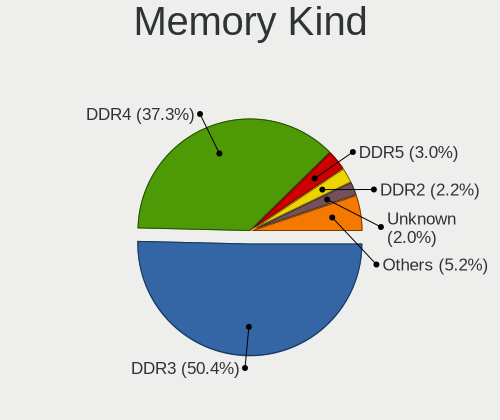

| Kind    | Computers | Percent |
|---------|-----------|---------|
| DDR3    | 111       | 58.12%  |
| DDR4    | 62        | 32.46%  |
| DDR2    | 7         | 3.66%   |
| Unknown | 3         | 1.57%   |
| LPDDR4  | 2         | 1.05%   |
| LPDDR3  | 2         | 1.05%   |
| DDR     | 2         | 1.05%   |
| SDRAM   | 1         | 0.52%   |
| DRAM    | 1         | 0.52%   |

Memory Form Factor
------------------

Physical design of the memory module

| Name         | Computers | Percent |
|--------------|-----------|---------|
| DIMM         | 93        | 48.95%  |
| SODIMM       | 92        | 48.42%  |
| Row Of Chips | 2         | 1.05%   |
| RIMM         | 1         | 0.53%   |
| FB-DIMM      | 1         | 0.53%   |
| Unknown      | 1         | 0.53%   |

Memory Size
-----------

Memory module size

| Size  | Computers | Percent |
|-------|-----------|---------|
| 4096  | 72        | 35.29%  |
| 8192  | 71        | 34.8%   |
| 2048  | 34        | 16.67%  |
| 16384 | 16        | 7.84%   |
| 1024  | 8         | 3.92%   |
| 512   | 2         | 0.98%   |
| 32768 | 1         | 0.49%   |

Memory Speed
------------

Memory module speed

| Speed   | Computers | Percent |
|---------|-----------|---------|
| 1600    | 70        | 33.65%  |
| 1333    | 30        | 14.42%  |
| 2400    | 27        | 12.98%  |
| 2667    | 15        | 7.21%   |
| 3200    | 13        | 6.25%   |
| 2133    | 12        | 5.77%   |
| 1867    | 6         | 2.88%   |
| 1334    | 6         | 2.88%   |
| 800     | 6         | 2.88%   |
| 667     | 6         | 2.88%   |
| 1067    | 4         | 1.92%   |
| 1066    | 3         | 1.44%   |
| Unknown | 3         | 1.44%   |
| 2666    | 2         | 0.96%   |
| 1866    | 2         | 0.96%   |
| 2933    | 1         | 0.48%   |
| 533     | 1         | 0.48%   |
| 400     | 1         | 0.48%   |

Printers & scanners
-------------------

Printer Vendor
--------------

Printer device vendors

Zero info for selected period =(

Printer Model
-------------

Printer device models

Zero info for selected period =(

Scanner Vendor
--------------

Scanner device vendors

Zero info for selected period =(

Scanner Model
-------------

Scanner device models

Zero info for selected period =(

Camera
------

Camera Vendor
-------------

Camera device vendors

| Vendor                                 | Computers | Percent |
|----------------------------------------|-----------|---------|
| Chicony Electronics                    | 16        | 37.21%  |
| Microdia                               | 8         | 18.6%   |
| Realtek Semiconductor                  | 4         | 9.3%    |
| Acer                                   | 3         | 6.98%   |
| Sunplus Innovation Technology          | 2         | 4.65%   |
| Ricoh                                  | 2         | 4.65%   |
| Logitech                               | 2         | 4.65%   |
| Lite-On Technology                     | 2         | 4.65%   |
| Syntek                                 | 1         | 2.33%   |
| Hewlett-Packard                        | 1         | 2.33%   |
| Cheng Uei Precision Industry (Foxlink) | 1         | 2.33%   |
| Apple                                  | 1         | 2.33%   |

Camera Model
------------

Camera device models

| Model                                                         | Computers | Percent |
|---------------------------------------------------------------|-----------|---------|
| Realtek Lenovo EasyCamera                                     | 3         | 6.98%   |
| Microdia Integrated Webcam                                    | 3         | 6.98%   |
| Microdia Integrated_Webcam_HD                                 | 2         | 4.65%   |
| Logitech HD Pro Webcam C920                                   | 2         | 4.65%   |
| Lite-On Integrated Camera                                     | 2         | 4.65%   |
| Chicony Realtek DMFT - RGB                                    | 2         | 4.65%   |
| Chicony Integrated Camera (1280x720@30)                       | 2         | 4.65%   |
| Chicony Integrated Camera                                     | 2         | 4.65%   |
| Chicony HD WebCam                                             | 2         | 4.65%   |
| Syntek Lenovo EasyCamera                                      | 1         | 2.33%   |
| Sunplus Integrated_Webcam_HD                                  | 1         | 2.33%   |
| Sunplus Integrated_Webcam_FHD                                 | 1         | 2.33%   |
| Ricoh Integrated Webcam                                       | 1         | 2.33%   |
| Ricoh HD Webcam                                               | 1         | 2.33%   |
| Realtek Integrated_Webcam_HD                                  | 1         | 2.33%   |
| Microdia USB 2.0 Camera                                       | 1         | 2.33%   |
| Microdia Laptop_Integrated_Webcam_HD                          | 1         | 2.33%   |
| Microdia Dell Integrated HD Webcam                            | 1         | 2.33%   |
| HP Premium Starter Webcam                                     | 1         | 2.33%   |
| Chicony ThinkPad T490 Webcam                                  | 1         | 2.33%   |
| Chicony Integrated Camera [ThinkPad]                          | 1         | 2.33%   |
| Chicony HP Wide Vision HD Camera                              | 1         | 2.33%   |
| Chicony HP Integrated Webcam                                  | 1         | 2.33%   |
| Chicony HP HD Webcam [Fixed]                                  | 1         | 2.33%   |
| Chicony Front Camera                                          | 1         | 2.33%   |
| Chicony Chicony USB2.0 Camera                                 | 1         | 2.33%   |
| Chicony 1.3M Webcam                                           | 1         | 2.33%   |
| Cheng Uei Precision Industry (Foxlink) USB2.0 UVC 1.3M WebCam | 1         | 2.33%   |
| Apple FaceTime HD Camera (Built-in)                           | 1         | 2.33%   |
| Acer USB HD Webcam                                            | 1         | 2.33%   |
| Acer Lenovo EasyCamera                                        | 1         | 2.33%   |
| Acer EasyCamera                                               | 1         | 2.33%   |

Security
--------

Fingerprint Vendor
------------------

Fingerprint sensor vendors

| Vendor                     | Computers | Percent |
|----------------------------|-----------|---------|
| Validity Sensors           | 3         | 25%     |
| Synaptics                  | 3         | 25%     |
| Broadcom                   | 3         | 25%     |
| STMicroelectronics         | 1         | 8.33%   |
| Shenzhen Goodix Technology | 1         | 8.33%   |
| AuthenTec                  | 1         | 8.33%   |

Fingerprint Model
-----------------

Fingerprint sensor models

| Model                                                                        | Computers | Percent |
|------------------------------------------------------------------------------|-----------|---------|
| Broadcom BCM5880 Secure Applications Processor with fingerprint swipe sensor | 3         | 25%     |
| Validity Sensors VFS5011 Fingerprint Reader                                  | 2         | 16.67%  |
| Synaptics Prometheus MIS Touch Fingerprint Reader                            | 2         | 16.67%  |
| Validity Sensors Fingerprint scanner                                         | 1         | 8.33%   |
| Synaptics  WBDI                                                              | 1         | 8.33%   |
| STMicroelectronics Fingerprint Reader                                        | 1         | 8.33%   |
| Shenzhen Goodix Fingerprint Reader                                           | 1         | 8.33%   |
| AuthenTec AES2810                                                            | 1         | 8.33%   |

Chipcard Vendor
---------------

Chipcard module vendors

Zero info for selected period =(

Chipcard Model
--------------

Chipcard module models

Zero info for selected period =(

Unsupported
-----------

Unsupported Devices
-------------------

Total unsupported devices on board

| Total | Computers | Percent |
|-------|-----------|---------|
| 1     | 86        | 39.45%  |
| 0     | 58        | 26.61%  |
| 2     | 54        | 24.77%  |
| 3     | 12        | 5.5%    |
| 4     | 5         | 2.29%   |
| 5     | 2         | 0.92%   |
| 6     | 1         | 0.46%   |

Unsupported Device Types
------------------------

Types of unsupported devices

| Type                     | Computers | Percent |
|--------------------------|-----------|---------|
| Communication controller | 138       | 60%     |
| Bluetooth                | 24        | 10.43%  |
| Net/wireless             | 21        | 9.13%   |
| Fingerprint reader       | 12        | 5.22%   |
| Card reader              | 12        | 5.22%   |
| Graphics card            | 9         | 3.91%   |
| Firewire controller      | 5         | 2.17%   |
| Sound                    | 2         | 0.87%   |
| Network                  | 2         | 0.87%   |
| Net/ethernet             | 2         | 0.87%   |
| Storage/nvme             | 1         | 0.43%   |
| Storage                  | 1         | 0.43%   |
| Modem                    | 1         | 0.43%   |

