BSD in Russia - Tested Hardware & Statistics (Desktops)
-------------------------------------------------------

A project to collect tested hardware configurations for BSD in Russia.

Anyone can contribute to this report by the [hw-probe](https://github.com/linuxhw/hw-probe/blob/master/INSTALL.BSD.md) tool:

    hw-probe -all -upload

Please contribute! Especially if your hardware is rare.

Contents
--------

* [ Test Cases ](#test-cases)

* [ System ](#system)
  - [ OS                       ](#os)
  - [ OS Family                ](#os-family)
  - [ Arch                     ](#arch)
  - [ DE                       ](#de)
  - [ Display Server           ](#display-server)
  - [ Display Manager          ](#display-manager)
  - [ OS Lang                  ](#os-lang)
  - [ Boot Mode                ](#boot-mode)
  - [ Filesystem               ](#filesystem)
  - [ Part. scheme             ](#part-scheme)

* [ Board ](#board)
  - [ Vendor                   ](#vendor)
  - [ Model                    ](#model)
  - [ Model Family             ](#model-family)
  - [ MFG Year                 ](#mfg-year)
  - [ Form Factor              ](#form-factor)
  - [ Coreboot                 ](#coreboot)
  - [ RAM Size                 ](#ram-size)
  - [ RAM Used                 ](#ram-used)
  - [ Total Drives             ](#total-drives)
  - [ Has CD-ROM               ](#has-cd-rom)
  - [ Has Ethernet             ](#has-ethernet)
  - [ Has WiFi                 ](#has-wifi)
  - [ Has Bluetooth            ](#has-bluetooth)

* [ Location ](#location)
  - [ Country                  ](#country)
  - [ City                     ](#city)

* [ Drives ](#drives)
  - [ Drive Vendor             ](#drive-vendor)
  - [ Drive Model              ](#drive-model)
  - [ HDD Vendor               ](#hdd-vendor)
  - [ SSD Vendor               ](#ssd-vendor)
  - [ Drive Kind               ](#drive-kind)
  - [ Drive Connector          ](#drive-connector)
  - [ Drive Size               ](#drive-size)
  - [ Space Total              ](#space-total)
  - [ Space Used               ](#space-used)
  - [ Malfunc. Drives          ](#malfunc-drives)
  - [ Malfunc. Drive Vendor    ](#malfunc-drive-vendor)
  - [ Malfunc. HDD Vendor      ](#malfunc-hdd-vendor)
  - [ Malfunc. Drive Kind      ](#malfunc-drive-kind)
  - [ Failed Drives            ](#failed-drives)
  - [ Failed Drive Vendor      ](#failed-drive-vendor)
  - [ Drive Status             ](#drive-status)

* [ Storage controller ](#storage-controller)
  - [ Storage Vendor           ](#storage-vendor)
  - [ Storage Model            ](#storage-model)
  - [ Storage Kind             ](#storage-kind)

* [ Processor ](#processor)
  - [ CPU Vendor               ](#cpu-vendor)
  - [ CPU Model                ](#cpu-model)
  - [ CPU Model Family         ](#cpu-model-family)
  - [ CPU Cores                ](#cpu-cores)
  - [ CPU Sockets              ](#cpu-sockets)
  - [ CPU Threads              ](#cpu-threads)
  - [ CPU Microarch            ](#cpu-microarch)

* [ Graphics ](#graphics)
  - [ GPU Vendor               ](#gpu-vendor)
  - [ GPU Model                ](#gpu-model)
  - [ GPU Combo                ](#gpu-combo)
  - [ GPU Driver               ](#gpu-driver)
  - [ GPU Memory               ](#gpu-memory)

* [ Monitor ](#monitor)
  - [ Monitor Vendor           ](#monitor-vendor)
  - [ Monitor Model            ](#monitor-model)
  - [ Monitor Resolution       ](#monitor-resolution)
  - [ Monitor Diagonal         ](#monitor-diagonal)
  - [ Monitor Width            ](#monitor-width)
  - [ Aspect Ratio             ](#aspect-ratio)
  - [ Monitor Area             ](#monitor-area)
  - [ Pixel Density            ](#pixel-density)
  - [ Multiple Monitors        ](#multiple-monitors)

* [ Network ](#network)
  - [ Net Controller Vendor    ](#net-controller-vendor)
  - [ Net Controller Model     ](#net-controller-model)
  - [ Wireless Vendor          ](#wireless-vendor)
  - [ Wireless Model           ](#wireless-model)
  - [ Ethernet Vendor          ](#ethernet-vendor)
  - [ Ethernet Model           ](#ethernet-model)
  - [ Net Controller Kind      ](#net-controller-kind)
  - [ Used Controller          ](#used-controller)
  - [ NICs                     ](#nics)
  - [ IPv6                     ](#ipv6)

* [ Bluetooth ](#bluetooth)
  - [ Bluetooth Vendor         ](#bluetooth-vendor)
  - [ Bluetooth Model          ](#bluetooth-model)

* [ Sound ](#sound)
  - [ Sound Vendor             ](#sound-vendor)
  - [ Sound Model              ](#sound-model)

* [ Memory ](#memory)
  - [ Memory Vendor            ](#memory-vendor)
  - [ Memory Model             ](#memory-model)
  - [ Memory Kind              ](#memory-kind)
  - [ Memory Form Factor       ](#memory-form-factor)
  - [ Memory Size              ](#memory-size)
  - [ Memory Speed             ](#memory-speed)

* [ Printers & scanners ](#printers--scanners)
  - [ Printer Vendor           ](#printer-vendor)
  - [ Printer Model            ](#printer-model)
  - [ Scanner Vendor           ](#scanner-vendor)
  - [ Scanner Model            ](#scanner-model)

* [ Camera ](#camera)
  - [ Camera Vendor            ](#camera-vendor)
  - [ Camera Model             ](#camera-model)

* [ Security ](#security)
  - [ Fingerprint Vendor       ](#fingerprint-vendor)
  - [ Fingerprint Model        ](#fingerprint-model)
  - [ Chipcard Vendor          ](#chipcard-vendor)
  - [ Chipcard Model           ](#chipcard-model)

* [ Unsupported ](#unsupported)
  - [ Unsupported Devices      ](#unsupported-devices)
  - [ Unsupported Device Types ](#unsupported-device-types)

Test Cases
----------

Total: 596

| Vendor        | Model                       | Probe                                                     | Date         |
|---------------|-----------------------------|-----------------------------------------------------------|--------------|
| Gigabyte      | B450M H                     | [69b57fab79](https://bsd-hardware.info/?probe=69b57fab79) | Nov 02, 2023 |
| Unknown       | Unknown                     | [1a63df656e](https://bsd-hardware.info/?probe=1a63df656e) | Oct 31, 2023 |
| Intel         | DCP847SKE                   | [3b5b83d95f](https://bsd-hardware.info/?probe=3b5b83d95f) | Oct 30, 2023 |
| Intel         | DCP847SKE                   | [ba44d23972](https://bsd-hardware.info/?probe=ba44d23972) | Oct 29, 2023 |
| Unknown       | Unknown                     | [b688e6b635](https://bsd-hardware.info/?probe=b688e6b635) | Oct 28, 2023 |
| Sun           | SUNW,SPARC-Enterprise-T5... | [50457ff825](https://bsd-hardware.info/?probe=50457ff825) | Oct 27, 2023 |
| Gigabyte      | Z170-D3H-CF                 | [3d6569cef5](https://bsd-hardware.info/?probe=3d6569cef5) | Oct 26, 2023 |
| Gigabyte      | H81M-S2PV                   | [310fcb9763](https://bsd-hardware.info/?probe=310fcb9763) | Oct 26, 2023 |
| Unknown       | Unknown                     | [6b3f2cf24c](https://bsd-hardware.info/?probe=6b3f2cf24c) | Oct 25, 2023 |
| Unknown       | Unknown                     | [db96ffb93a](https://bsd-hardware.info/?probe=db96ffb93a) | Oct 25, 2023 |
| Unknown       | Unknown                     | [06f91445cb](https://bsd-hardware.info/?probe=06f91445cb) | Oct 24, 2023 |
| Gigabyte      | Z170-D3H-CF                 | [193c3e5732](https://bsd-hardware.info/?probe=193c3e5732) | Oct 22, 2023 |
| Unknown       | Unknown                     | [629eefe0c2](https://bsd-hardware.info/?probe=629eefe0c2) | Oct 21, 2023 |
| ASUSTek       | PRIME H470M-PLUS            | [88cdd6135f](https://bsd-hardware.info/?probe=88cdd6135f) | Oct 20, 2023 |
| MSI           | PRO H610M-B DDR4            | [1cc822b8c1](https://bsd-hardware.info/?probe=1cc822b8c1) | Oct 19, 2023 |
| Unknown       | Unknown                     | [0fd1a7196f](https://bsd-hardware.info/?probe=0fd1a7196f) | Oct 13, 2023 |
| Wistron       | ProLiant ML110 G6           | [d5676f7895](https://bsd-hardware.info/?probe=d5676f7895) | Oct 10, 2023 |
| TONK          | TN2800                      | [a47aba3406](https://bsd-hardware.info/?probe=a47aba3406) | Oct 10, 2023 |
| Gigabyte      | B550M DS3H                  | [66a1e081e6](https://bsd-hardware.info/?probe=66a1e081e6) | Oct 07, 2023 |
| Unknown       | Unknown                     | [9d236eb8bb](https://bsd-hardware.info/?probe=9d236eb8bb) | Oct 06, 2023 |
| Unknown       | Unknown                     | [9ad768a37a](https://bsd-hardware.info/?probe=9ad768a37a) | Oct 04, 2023 |
| Techvision    | TVI7309X B0                 | [9748abc90d](https://bsd-hardware.info/?probe=9748abc90d) | Oct 02, 2023 |
| TONK          | TN2800                      | [bce9c62915](https://bsd-hardware.info/?probe=bce9c62915) | Sep 29, 2023 |
| ASRock        | Z690 Phantom Gaming 4/D5    | [6eab8daef7](https://bsd-hardware.info/?probe=6eab8daef7) | Sep 21, 2023 |
| Apple         | MacPro4,1                   | [c368087050](https://bsd-hardware.info/?probe=c368087050) | Sep 20, 2023 |
| Huanan        | X99-F8D PLUS V1.3           | [53d31a28bf](https://bsd-hardware.info/?probe=53d31a28bf) | Sep 14, 2023 |
| Gigabyte      | GA-870A-UD3                 | [095b8aa8fb](https://bsd-hardware.info/?probe=095b8aa8fb) | Sep 11, 2023 |
| Lenovo        | 3140 NOK                    | [945ad170d7](https://bsd-hardware.info/?probe=945ad170d7) | Sep 10, 2023 |
| Lenovo        | 3140 NOK                    | [3f9dcefb8e](https://bsd-hardware.info/?probe=3f9dcefb8e) | Sep 10, 2023 |
| Unknown       | Unknown                     | [29578638c1](https://bsd-hardware.info/?probe=29578638c1) | Sep 08, 2023 |
| Intel         | HM570                       | [3112f263f5](https://bsd-hardware.info/?probe=3112f263f5) | Sep 07, 2023 |
| Intel         | HM570                       | [0e4bfa9794](https://bsd-hardware.info/?probe=0e4bfa9794) | Sep 07, 2023 |
| Gigabyte      | P35C-DS3R                   | [4424751223](https://bsd-hardware.info/?probe=4424751223) | Sep 04, 2023 |
| Shuttle       | DS20U                       | [d034a8e5b8](https://bsd-hardware.info/?probe=d034a8e5b8) | Sep 02, 2023 |
| VIA Techno... | VT8623-8235                 | [3274cd095e](https://bsd-hardware.info/?probe=3274cd095e) | Aug 31, 2023 |
| MSI           | MS-7125                     | [3dfb767d80](https://bsd-hardware.info/?probe=3dfb767d80) | Aug 30, 2023 |
| MSI           | H110M PRO-VD                | [dcbd4ebf8f](https://bsd-hardware.info/?probe=dcbd4ebf8f) | Aug 27, 2023 |
| Techvision    | TVI7309X B0                 | [ebb4e825a3](https://bsd-hardware.info/?probe=ebb4e825a3) | Aug 25, 2023 |
| ASUSTek       | P5M2-R                      | [73135bf26d](https://bsd-hardware.info/?probe=73135bf26d) | Aug 25, 2023 |
| MSI           | MAG B460M BAZOOKA           | [7cf9279c14](https://bsd-hardware.info/?probe=7cf9279c14) | Aug 22, 2023 |
| Gigabyte      | C1037UN-EU                  | [76945fc8cb](https://bsd-hardware.info/?probe=76945fc8cb) | Aug 22, 2023 |
| Unknown       | Unknown                     | [341152089f](https://bsd-hardware.info/?probe=341152089f) | Aug 21, 2023 |
| Unknown       | Unknown                     | [5ab27fdf53](https://bsd-hardware.info/?probe=5ab27fdf53) | Aug 21, 2023 |
| Shuttle       | DS20U                       | [5c511e0613](https://bsd-hardware.info/?probe=5c511e0613) | Aug 20, 2023 |
| Gigabyte      | B550 AORUS ELITE V2         | [7e1d475356](https://bsd-hardware.info/?probe=7e1d475356) | Aug 18, 2023 |
| MSI           | A520M-A PRO                 | [cc946b2a89](https://bsd-hardware.info/?probe=cc946b2a89) | Aug 15, 2023 |
| ASUSTek       | P6X58D PREMIUM              | [946e123320](https://bsd-hardware.info/?probe=946e123320) | Aug 13, 2023 |
| Dell          | 0CNWVK A00                  | [fdb03dc15f](https://bsd-hardware.info/?probe=fdb03dc15f) | Aug 09, 2023 |
| ASUSTek       | M5A78L-M LE/USB3            | [4fc1fbaba1](https://bsd-hardware.info/?probe=4fc1fbaba1) | Aug 09, 2023 |
| MSI           | MS-7623                     | [189fb4d7cc](https://bsd-hardware.info/?probe=189fb4d7cc) | Aug 08, 2023 |
| ASRock        | B550 PG Velocita            | [3ff5fcfbc0](https://bsd-hardware.info/?probe=3ff5fcfbc0) | Aug 02, 2023 |
| MSI           | G41M-P33 Combo              | [d4a26f9214](https://bsd-hardware.info/?probe=d4a26f9214) | Jul 24, 2023 |
| Techvision    | TVI7309X B0                 | [65599626a9](https://bsd-hardware.info/?probe=65599626a9) | Jul 23, 2023 |
| Unknown       | Q-790                       | [49f9861c7f](https://bsd-hardware.info/?probe=49f9861c7f) | Jul 17, 2023 |
| Unknown       | Unknown                     | [4a82a6a375](https://bsd-hardware.info/?probe=4a82a6a375) | Jul 17, 2023 |
| ECS           | H61H2-M17                   | [aa4679bee7](https://bsd-hardware.info/?probe=aa4679bee7) | Jul 14, 2023 |
| Unknown       | Unknown                     | [a322b1ee22](https://bsd-hardware.info/?probe=a322b1ee22) | Jul 13, 2023 |
| Unknown       | Q-790                       | [cc02bb60de](https://bsd-hardware.info/?probe=cc02bb60de) | Jul 13, 2023 |
| Radxa         | rock-pi-n10a                | [a9767501e2](https://bsd-hardware.info/?probe=a9767501e2) | Jul 12, 2023 |
| ASRock        | P67 Pro3 SE                 | [a7284068da](https://bsd-hardware.info/?probe=a7284068da) | Jul 12, 2023 |
| ASRock        | H61M-GS                     | [502952e73f](https://bsd-hardware.info/?probe=502952e73f) | Jul 11, 2023 |
| Foxconn       | 2ABF                        | [26e209d8e1](https://bsd-hardware.info/?probe=26e209d8e1) | Jul 10, 2023 |
| ASRock        | Z690 PG Riptide             | [a9ab5114e1](https://bsd-hardware.info/?probe=a9ab5114e1) | Jul 10, 2023 |
| ASRock        | Z690 PG Riptide             | [813e46e924](https://bsd-hardware.info/?probe=813e46e924) | Jul 10, 2023 |
| Unknown       | Unknown                     | [c930867e8e](https://bsd-hardware.info/?probe=c930867e8e) | Jul 07, 2023 |
| ASRock        | Z690 PG Riptide             | [364cf5800b](https://bsd-hardware.info/?probe=364cf5800b) | Jul 06, 2023 |
| HP            | 339A                        | [f80f7cc14c](https://bsd-hardware.info/?probe=f80f7cc14c) | Jul 05, 2023 |
| ASUSTek       | PRIME H510M-A               | [fd5fa70fb7](https://bsd-hardware.info/?probe=fd5fa70fb7) | Jul 03, 2023 |
| Gigabyte      | B360M D2V                   | [bf5f6fd6dd](https://bsd-hardware.info/?probe=bf5f6fd6dd) | Jun 30, 2023 |
| Unknown       | Unknown                     | [c07f4ffa1e](https://bsd-hardware.info/?probe=c07f4ffa1e) | Jun 29, 2023 |
| ASUSTek       | ROG Maximus X HERO          | [2dfabb3a28](https://bsd-hardware.info/?probe=2dfabb3a28) | Jun 23, 2023 |
| ASUSTek       | ROG Maximus X HERO          | [b63efe1bc2](https://bsd-hardware.info/?probe=b63efe1bc2) | Jun 23, 2023 |
| ASUSTek       | PRIME B350M-A               | [29545a1054](https://bsd-hardware.info/?probe=29545a1054) | Jun 21, 2023 |
| ASUSTek       | P7P55D LE                   | [ea97ade85d](https://bsd-hardware.info/?probe=ea97ade85d) | Jun 17, 2023 |
| Unknown       | Unknown                     | [f41e1f2b83](https://bsd-hardware.info/?probe=f41e1f2b83) | Jun 14, 2023 |
| Gigabyte      | B450M S2H                   | [2008116e96](https://bsd-hardware.info/?probe=2008116e96) | Jun 10, 2023 |
| IceWhale T... | ZimaBoard 832 ZMB           | [15a71633ec](https://bsd-hardware.info/?probe=15a71633ec) | Jun 08, 2023 |
| Gigabyte      | G41MT-S2                    | [355202536f](https://bsd-hardware.info/?probe=355202536f) | Jun 07, 2023 |
| Supermicro    | X10DRi-T                    | [c72eaa89d7](https://bsd-hardware.info/?probe=c72eaa89d7) | May 31, 2023 |
| Unknown       | Unknown                     | [086747eef4](https://bsd-hardware.info/?probe=086747eef4) | May 29, 2023 |
| ASRockRack    | E3C242D4U                   | [ae8287e8fd](https://bsd-hardware.info/?probe=ae8287e8fd) | May 29, 2023 |
| ASUSTek       | PRIME H510M-K               | [53a2d5356d](https://bsd-hardware.info/?probe=53a2d5356d) | May 26, 2023 |
| Gigabyte      | B360M D2V                   | [5960982eb3](https://bsd-hardware.info/?probe=5960982eb3) | May 25, 2023 |
| HP            | 0A60h                       | [98e9deff3d](https://bsd-hardware.info/?probe=98e9deff3d) | May 16, 2023 |
| Gigabyte      | Z490 VISION G               | [976e31bfbc](https://bsd-hardware.info/?probe=976e31bfbc) | May 16, 2023 |
| Gigabyte      | Z490 VISION G               | [8eeec83a4e](https://bsd-hardware.info/?probe=8eeec83a4e) | May 16, 2023 |
| Dell          | 0CNWVK A00                  | [0d1e1a3ca4](https://bsd-hardware.info/?probe=0d1e1a3ca4) | May 16, 2023 |
| Acer          | Revo RN86                   | [2e52c2b9b2](https://bsd-hardware.info/?probe=2e52c2b9b2) | May 13, 2023 |
| Unknown       | Unknown                     | [990b3eb510](https://bsd-hardware.info/?probe=990b3eb510) | May 12, 2023 |
| Gigabyte      | H77N-WIFI                   | [cf2014c973](https://bsd-hardware.info/?probe=cf2014c973) | May 04, 2023 |
| Supermicro    | X10DRi-T                    | [ba54a43cb4](https://bsd-hardware.info/?probe=ba54a43cb4) | May 03, 2023 |
| HP            | 82B4                        | [244817e203](https://bsd-hardware.info/?probe=244817e203) | May 02, 2023 |
| Unknown       | Unknown                     | [d6f92a5ecc](https://bsd-hardware.info/?probe=d6f92a5ecc) | Apr 28, 2023 |
| Unknown       | Unknown                     | [290fabd69d](https://bsd-hardware.info/?probe=290fabd69d) | Apr 26, 2023 |
| Gigabyte      | B360M D2V                   | [d4881f1fb6](https://bsd-hardware.info/?probe=d4881f1fb6) | Apr 25, 2023 |
| Dell          | 0CNWVK A00                  | [6642a4b35d](https://bsd-hardware.info/?probe=6642a4b35d) | Apr 18, 2023 |
| Gigabyte      | B360M D2V                   | [f73cb94828](https://bsd-hardware.info/?probe=f73cb94828) | Apr 17, 2023 |
| Unknown       | Unknown                     | [926ab149ae](https://bsd-hardware.info/?probe=926ab149ae) | Apr 14, 2023 |
| Gigabyte      | Z170-HD3 DDR3-CF            | [882a817f46](https://bsd-hardware.info/?probe=882a817f46) | Apr 13, 2023 |
| Unknown       | Unknown                     | [c960f2dc8b](https://bsd-hardware.info/?probe=c960f2dc8b) | Apr 12, 2023 |
| ASUSTek       | P10S-I Series               | [5084c2b77f](https://bsd-hardware.info/?probe=5084c2b77f) | Apr 11, 2023 |
| PC Engines    | APU2                        | [cdcdfe6e0b](https://bsd-hardware.info/?probe=cdcdfe6e0b) | Apr 10, 2023 |
| Intel         | DG35EC AAE29266-205         | [821368d0f0](https://bsd-hardware.info/?probe=821368d0f0) | Apr 09, 2023 |
| HP            | 2820h                       | [e304f130aa](https://bsd-hardware.info/?probe=e304f130aa) | Apr 09, 2023 |
| HP            | 2820h                       | [ff9500303d](https://bsd-hardware.info/?probe=ff9500303d) | Apr 09, 2023 |
| Unknown       | Unknown                     | [f96c113329](https://bsd-hardware.info/?probe=f96c113329) | Apr 08, 2023 |
| Gigabyte      | B360M D2V                   | [6429eebbaa](https://bsd-hardware.info/?probe=6429eebbaa) | Apr 05, 2023 |
| Intel         | B75                         | [3a7eee851b](https://bsd-hardware.info/?probe=3a7eee851b) | Apr 03, 2023 |
| Unknown       | Unknown                     | [c801b9e5af](https://bsd-hardware.info/?probe=c801b9e5af) | Apr 03, 2023 |
| Unknown       | Unknown                     | [9b2420726f](https://bsd-hardware.info/?probe=9b2420726f) | Apr 03, 2023 |
| Unknown       | Unknown                     | [414cbf5935](https://bsd-hardware.info/?probe=414cbf5935) | Apr 03, 2023 |
| Unknown       | Unknown                     | [6b79c64c73](https://bsd-hardware.info/?probe=6b79c64c73) | Apr 03, 2023 |
| ASRock        | AB350M Pro4-F               | [424f3a2021](https://bsd-hardware.info/?probe=424f3a2021) | Apr 02, 2023 |
| ASRock        | X570S PG Riptide            | [8ccb321056](https://bsd-hardware.info/?probe=8ccb321056) | Apr 01, 2023 |
| Biostar       | TH67B                       | [234c5e0b83](https://bsd-hardware.info/?probe=234c5e0b83) | Mar 31, 2023 |
| ASRock        | X570S PG Riptide            | [0d66edbd38](https://bsd-hardware.info/?probe=0d66edbd38) | Mar 27, 2023 |
| Dell          | 0VD5HY A00                  | [1b54a68123](https://bsd-hardware.info/?probe=1b54a68123) | Mar 26, 2023 |
| MSI           | 870-G45                     | [19cbb6e0f3](https://bsd-hardware.info/?probe=19cbb6e0f3) | Mar 26, 2023 |
| MSI           | PRO H610M-B DDR4            | [ee01b690bc](https://bsd-hardware.info/?probe=ee01b690bc) | Mar 25, 2023 |
| MSI           | 870-G45                     | [14e990c885](https://bsd-hardware.info/?probe=14e990c885) | Mar 25, 2023 |
| ASUSTek       | P5K SE                      | [646eff3292](https://bsd-hardware.info/?probe=646eff3292) | Mar 25, 2023 |
| Stonesoft     | DEV-1301-2-C1-R             | [3bc0fc5d63](https://bsd-hardware.info/?probe=3bc0fc5d63) | Mar 24, 2023 |
| Stonesoft     | DEV-1301-2-C1-R             | [2699b59d1b](https://bsd-hardware.info/?probe=2699b59d1b) | Mar 24, 2023 |
| Unknown       | T360D11                     | [d4d69405c5](https://bsd-hardware.info/?probe=d4d69405c5) | Mar 23, 2023 |
| Gigabyte      | F2A55-DS3                   | [ce8775fbe5](https://bsd-hardware.info/?probe=ce8775fbe5) | Mar 22, 2023 |
| ASUSTek       | M5A97 R2.0                  | [840a902d2b](https://bsd-hardware.info/?probe=840a902d2b) | Mar 22, 2023 |
| ASUSTek       | M5A78L-M LX3                | [3f78d8f1ae](https://bsd-hardware.info/?probe=3f78d8f1ae) | Mar 18, 2023 |
| Intel         | B75                         | [11bcf42a35](https://bsd-hardware.info/?probe=11bcf42a35) | Mar 18, 2023 |
| Unknown       | Unknown                     | [dd8a64237a](https://bsd-hardware.info/?probe=dd8a64237a) | Mar 18, 2023 |
| Intel         | DG35EC AAE29266-205         | [0ab42ce2ee](https://bsd-hardware.info/?probe=0ab42ce2ee) | Mar 16, 2023 |
| Gigabyte      | F2A68HM-HD2                 | [da2b96de55](https://bsd-hardware.info/?probe=da2b96de55) | Mar 16, 2023 |
| Gigabyte      | B450M S2H                   | [dfa4f43317](https://bsd-hardware.info/?probe=dfa4f43317) | Mar 15, 2023 |
| Lenovo        | NO DPK                      | [8a38ed8d33](https://bsd-hardware.info/?probe=8a38ed8d33) | Mar 14, 2023 |
| ASUSTek       | B85M-G                      | [6401dd52d2](https://bsd-hardware.info/?probe=6401dd52d2) | Mar 14, 2023 |
| Gigabyte      | B365M H                     | [7acb7cb65f](https://bsd-hardware.info/?probe=7acb7cb65f) | Mar 13, 2023 |
| Gigabyte      | H110M-S2-CF                 | [6afb777789](https://bsd-hardware.info/?probe=6afb777789) | Mar 13, 2023 |
| Techvision    | TVI7309X B0                 | [f07e092146](https://bsd-hardware.info/?probe=f07e092146) | Mar 11, 2023 |
| MSI           | PRO H610M-B DDR4            | [b08fd92e36](https://bsd-hardware.info/?probe=b08fd92e36) | Mar 10, 2023 |
| MSI           | PRO H610M-B DDR4            | [654bdb4eb2](https://bsd-hardware.info/?probe=654bdb4eb2) | Mar 10, 2023 |
| Gigabyte      | B360M D2V                   | [6ac60b8104](https://bsd-hardware.info/?probe=6ac60b8104) | Mar 10, 2023 |
| Elpitech      | ET101-A1                    | [0172697883](https://bsd-hardware.info/?probe=0172697883) | Mar 10, 2023 |
| Huanan        | X99-QD4 V1.0                | [58090b9dbf](https://bsd-hardware.info/?probe=58090b9dbf) | Mar 09, 2023 |
| ASUSTek       | P8Z77-V PREMIUM             | [a2873d7c87](https://bsd-hardware.info/?probe=a2873d7c87) | Mar 09, 2023 |
| ASUSTek       | P7H55                       | [3c78171104](https://bsd-hardware.info/?probe=3c78171104) | Mar 04, 2023 |
| ASUSTek       | P7H55                       | [5ce8dbf5f3](https://bsd-hardware.info/?probe=5ce8dbf5f3) | Mar 04, 2023 |
| Huanan        | X99-QD4 V1.0                | [8404060d9e](https://bsd-hardware.info/?probe=8404060d9e) | Mar 02, 2023 |
| Unknown       | Unknown                     | [13ac9d6b7e](https://bsd-hardware.info/?probe=13ac9d6b7e) | Mar 01, 2023 |
| MSI           | PRO H610M-B DDR4            | [2072e8fac6](https://bsd-hardware.info/?probe=2072e8fac6) | Feb 28, 2023 |
| MSI           | PRO H610M-B DDR4            | [e85ed3f609](https://bsd-hardware.info/?probe=e85ed3f609) | Feb 27, 2023 |
| Unknown       | Unknown                     | [95c62844de](https://bsd-hardware.info/?probe=95c62844de) | Feb 25, 2023 |
| Seeed Stud... | ODYSSEY-X86J4105 SD-BS-C... | [b2681fdfb4](https://bsd-hardware.info/?probe=b2681fdfb4) | Feb 23, 2023 |
| MSI           | MS-92E3 0A                  | [683ff1f7d0](https://bsd-hardware.info/?probe=683ff1f7d0) | Feb 22, 2023 |
| Intel         | DN2820FYK H24582-203        | [dd0d96422f](https://bsd-hardware.info/?probe=dd0d96422f) | Feb 19, 2023 |
| ASRock        | G41M-GS3                    | [eace523f17](https://bsd-hardware.info/?probe=eace523f17) | Feb 18, 2023 |
| ASUSTek       | STRIX Z270F GAMING          | [6f4b514959](https://bsd-hardware.info/?probe=6f4b514959) | Feb 14, 2023 |
| Huanan        | X99-QD4 V1.0                | [9a0c17560f](https://bsd-hardware.info/?probe=9a0c17560f) | Feb 14, 2023 |
| ASUSTek       | TUF Gaming B450M-PRO S      | [5507e05838](https://bsd-hardware.info/?probe=5507e05838) | Feb 12, 2023 |
| ASRock        | A770DE+                     | [cf1c018ede](https://bsd-hardware.info/?probe=cf1c018ede) | Feb 10, 2023 |
| Gigabyte      | H61M-S2V-B3                 | [33af90dd93](https://bsd-hardware.info/?probe=33af90dd93) | Feb 08, 2023 |
| Intel         | DN2820FYK H24582-203        | [ae05d4c6cd](https://bsd-hardware.info/?probe=ae05d4c6cd) | Feb 06, 2023 |
| Unknown       | Unknown                     | [7fcfb747a7](https://bsd-hardware.info/?probe=7fcfb747a7) | Feb 06, 2023 |
| Techvision    | TVI7309X B0                 | [222da5a477](https://bsd-hardware.info/?probe=222da5a477) | Feb 04, 2023 |
| Techvision    | TVI7309X B0                 | [a58d9501ad](https://bsd-hardware.info/?probe=a58d9501ad) | Jan 31, 2023 |
| MACHINIST     | X99-K9 V2.0                 | [eb8a6cb004](https://bsd-hardware.info/?probe=eb8a6cb004) | Jan 30, 2023 |
| ChangWang     | CW56-58                     | [2d48772c23](https://bsd-hardware.info/?probe=2d48772c23) | Jan 27, 2023 |
| Citrix        | CB-1100                     | [36199a59e2](https://bsd-hardware.info/?probe=36199a59e2) | Jan 26, 2023 |
| Gigabyte      | GA-MA770T-UD3               | [6b63a16799](https://bsd-hardware.info/?probe=6b63a16799) | Jan 26, 2023 |
| ChangWang     | CW56-58                     | [89ec5e42ef](https://bsd-hardware.info/?probe=89ec5e42ef) | Jan 26, 2023 |
| Gigabyte      | B360M D2V                   | [6685066b6e](https://bsd-hardware.info/?probe=6685066b6e) | Jan 26, 2023 |
| ASUSTek       | P5G41T-M LX3                | [a712c2d054](https://bsd-hardware.info/?probe=a712c2d054) | Jan 26, 2023 |
| Gigabyte      | H61M-S2PV                   | [9a307961ed](https://bsd-hardware.info/?probe=9a307961ed) | Jan 26, 2023 |
| ASUSTek       | P5G41T-M LX3                | [7b2fee315d](https://bsd-hardware.info/?probe=7b2fee315d) | Jan 26, 2023 |
| Shuttle       | DS20U                       | [71033e4a64](https://bsd-hardware.info/?probe=71033e4a64) | Jan 26, 2023 |
| Dell          | 0HY9JP A02                  | [ca71c8ab2b](https://bsd-hardware.info/?probe=ca71c8ab2b) | Jan 25, 2023 |
| Dell          | 0CNWVK A00                  | [e59d4ab226](https://bsd-hardware.info/?probe=e59d4ab226) | Jan 25, 2023 |
| ASUSTek       | P7P55D LE                   | [5da1e71837](https://bsd-hardware.info/?probe=5da1e71837) | Jan 25, 2023 |
| ASRock        | Z390 Pro4                   | [b9d64a7496](https://bsd-hardware.info/?probe=b9d64a7496) | Jan 23, 2023 |
| Gigabyte      | X570 AORUS PRO              | [6cf4f6761e](https://bsd-hardware.info/?probe=6cf4f6761e) | Jan 23, 2023 |
| ASUSTek       | J1800I-C                    | [27ea626000](https://bsd-hardware.info/?probe=27ea626000) | Jan 23, 2023 |
| ASUSTek       | J1800I-C                    | [abc17c6fc6](https://bsd-hardware.info/?probe=abc17c6fc6) | Jan 23, 2023 |
| AZW           | U59                         | [1f97b27470](https://bsd-hardware.info/?probe=1f97b27470) | Jan 23, 2023 |
| MSI           | B450M MORTAR MAX            | [840145eb80](https://bsd-hardware.info/?probe=840145eb80) | Jan 23, 2023 |
| Unknown       | Unknown                     | [8956f4503e](https://bsd-hardware.info/?probe=8956f4503e) | Jan 21, 2023 |
| Unknown       | AMD-GX3                     | [a38ff8331a](https://bsd-hardware.info/?probe=a38ff8331a) | Jan 20, 2023 |
| Unknown       | Unknown                     | [3afbfc6cea](https://bsd-hardware.info/?probe=3afbfc6cea) | Jan 20, 2023 |
| Unknown       | YL-SKUL6                    | [ef4abfe322](https://bsd-hardware.info/?probe=ef4abfe322) | Jan 20, 2023 |
| Unknown       | Unknown                     | [e13627df1a](https://bsd-hardware.info/?probe=e13627df1a) | Jan 20, 2023 |
| Unknown       | Unknown                     | [8c44d6309f](https://bsd-hardware.info/?probe=8c44d6309f) | Jan 15, 2023 |
| ASUSTek       | PRIME Z390-P                | [3126dc27f1](https://bsd-hardware.info/?probe=3126dc27f1) | Jan 12, 2023 |
| ASUSTek       | H81M-E                      | [1008903f65](https://bsd-hardware.info/?probe=1008903f65) | Jan 11, 2023 |
| Techvision    | TVI7309X B0                 | [2293d4960d](https://bsd-hardware.info/?probe=2293d4960d) | Jan 11, 2023 |
| Citrix        | CB-1100                     | [860f27ce64](https://bsd-hardware.info/?probe=860f27ce64) | Jan 11, 2023 |
| Techvision    | TVI7309X B0                 | [19f4631b5a](https://bsd-hardware.info/?probe=19f4631b5a) | Jan 05, 2023 |
| MSI           | PRO H610M-B DDR4            | [1deece00b3](https://bsd-hardware.info/?probe=1deece00b3) | Jan 05, 2023 |
| MSI           | PRO H610M-B DDR4            | [cc9d84d5ed](https://bsd-hardware.info/?probe=cc9d84d5ed) | Jan 05, 2023 |
| Unknown       | Unknown                     | [ea01217f17](https://bsd-hardware.info/?probe=ea01217f17) | Jan 02, 2023 |
| Gigabyte      | C1037UN-EU                  | [9c526b27dd](https://bsd-hardware.info/?probe=9c526b27dd) | Jan 02, 2023 |
| Shuttle       | DS20U                       | [a5aa09e49f](https://bsd-hardware.info/?probe=a5aa09e49f) | Jan 01, 2023 |
| ASUSTek       | PRIME B550-PLUS             | [4c3b92bb42](https://bsd-hardware.info/?probe=4c3b92bb42) | Dec 24, 2022 |
| Unknown       | Unknown                     | [d702dfcde2](https://bsd-hardware.info/?probe=d702dfcde2) | Dec 23, 2022 |
| ASUSTek       | PRIME B550-PLUS             | [3e5e7e3e61](https://bsd-hardware.info/?probe=3e5e7e3e61) | Dec 22, 2022 |
| Unknown       | Unknown                     | [7c644cc639](https://bsd-hardware.info/?probe=7c644cc639) | Dec 15, 2022 |
| Unknown       | Unknown                     | [9b5307f44d](https://bsd-hardware.info/?probe=9b5307f44d) | Dec 15, 2022 |
| Huanan        | X99-F8D V2.4                | [3d06b605c5](https://bsd-hardware.info/?probe=3d06b605c5) | Dec 13, 2022 |
| ASUSTek       | P8H77-V LE                  | [10b6c81bce](https://bsd-hardware.info/?probe=10b6c81bce) | Dec 09, 2022 |
| Huanan        | X99-F8D V2.4                | [f6685811a3](https://bsd-hardware.info/?probe=f6685811a3) | Dec 05, 2022 |
| Dell          | 0CNWVK A00                  | [5a022db6bf](https://bsd-hardware.info/?probe=5a022db6bf) | Dec 05, 2022 |
| Intel         | X99                         | [c21a466fc1](https://bsd-hardware.info/?probe=c21a466fc1) | Dec 01, 2022 |
| MSI           | PRO H610M-B DDR4            | [929e4bda1e](https://bsd-hardware.info/?probe=929e4bda1e) | Nov 29, 2022 |
| MSI           | PRO H610M-B DDR4            | [7c9ee800c5](https://bsd-hardware.info/?probe=7c9ee800c5) | Nov 29, 2022 |
| QIYIDA        | X99-H9 V2.0                 | [43163b0170](https://bsd-hardware.info/?probe=43163b0170) | Nov 28, 2022 |
| QIYIDA        | X99-H9 V2.0                 | [d00aa0021e](https://bsd-hardware.info/?probe=d00aa0021e) | Nov 28, 2022 |
| Acer          | Revo RN86                   | [a4dcb7f7a2](https://bsd-hardware.info/?probe=a4dcb7f7a2) | Nov 27, 2022 |
| Unknown       | Unknown                     | [1d3bd58d18](https://bsd-hardware.info/?probe=1d3bd58d18) | Nov 25, 2022 |
| Gigabyte      | H81M-HD3                    | [564cf3d66a](https://bsd-hardware.info/?probe=564cf3d66a) | Nov 22, 2022 |
| Unknown       | Unknown                     | [0760ed34c3](https://bsd-hardware.info/?probe=0760ed34c3) | Nov 21, 2022 |
| Huanan        | X99-F8D V2.4                | [9faf79b3f3](https://bsd-hardware.info/?probe=9faf79b3f3) | Nov 18, 2022 |
| Huanan        | X99-F8D V2.4                | [22ec05d988](https://bsd-hardware.info/?probe=22ec05d988) | Nov 12, 2022 |
| Acer          | RS880M05                    | [455f9b5026](https://bsd-hardware.info/?probe=455f9b5026) | Nov 07, 2022 |
| ASUSTek       | Z170-K                      | [907b8c2402](https://bsd-hardware.info/?probe=907b8c2402) | Nov 05, 2022 |
| Unknown       | Unknown                     | [58c2f4b4f7](https://bsd-hardware.info/?probe=58c2f4b4f7) | Nov 04, 2022 |
| HP            | 339A                        | [370d93ecde](https://bsd-hardware.info/?probe=370d93ecde) | Nov 02, 2022 |
| Gigabyte      | Z68XP-UD3                   | [0f22defdb3](https://bsd-hardware.info/?probe=0f22defdb3) | Oct 30, 2022 |
| Unknown       | Unknown                     | [acf41f7000](https://bsd-hardware.info/?probe=acf41f7000) | Oct 29, 2022 |
| PC Engines    | APU2                        | [d52e3d0ce3](https://bsd-hardware.info/?probe=d52e3d0ce3) | Oct 25, 2022 |
| ASUSTek       | P8Z68-V GEN3                | [d7b32200a5](https://bsd-hardware.info/?probe=d7b32200a5) | Oct 22, 2022 |
| Acer          | Revo RN86                   | [692ea69bab](https://bsd-hardware.info/?probe=692ea69bab) | Oct 21, 2022 |
| PC Engines    | APU2                        | [cf1abf5e46](https://bsd-hardware.info/?probe=cf1abf5e46) | Oct 21, 2022 |
| Unknown       | Unknown                     | [d5586487b4](https://bsd-hardware.info/?probe=d5586487b4) | Oct 21, 2022 |
| ASUSTek       | P10S-I Series               | [ceb58e75b8](https://bsd-hardware.info/?probe=ceb58e75b8) | Oct 20, 2022 |
| Supermicro    | X11SSL-F                    | [24faa4663c](https://bsd-hardware.info/?probe=24faa4663c) | Oct 19, 2022 |
| ASUSTek       | N3050I-C                    | [4a83b0953e](https://bsd-hardware.info/?probe=4a83b0953e) | Oct 18, 2022 |
| Gigabyte      | C1037UN-EU                  | [734ff7f48c](https://bsd-hardware.info/?probe=734ff7f48c) | Oct 02, 2022 |
| ASRock        | X570M Pro4                  | [433857f5f7](https://bsd-hardware.info/?probe=433857f5f7) | Sep 27, 2022 |
| YANYU         | H67SL                       | [5f5819ef11](https://bsd-hardware.info/?probe=5f5819ef11) | Sep 24, 2022 |
| NITRINOnet    | M360RUS56                   | [490b9593e0](https://bsd-hardware.info/?probe=490b9593e0) | Sep 23, 2022 |
| YANYU         | H67SL                       | [37ba00c2f3](https://bsd-hardware.info/?probe=37ba00c2f3) | Sep 15, 2022 |
| Maxtang       | BYT30                       | [90053990c3](https://bsd-hardware.info/?probe=90053990c3) | Sep 10, 2022 |
| MSI           | MPG Z490 GAMING EDGE WIF... | [98dff45d54](https://bsd-hardware.info/?probe=98dff45d54) | Sep 09, 2022 |
| Dell          | 0Y7WYT A00                  | [2870b9e4c7](https://bsd-hardware.info/?probe=2870b9e4c7) | Sep 05, 2022 |
| HP            | 8719                        | [f3132fc160](https://bsd-hardware.info/?probe=f3132fc160) | Sep 05, 2022 |
| Maxtang       | BYT30                       | [f5c34c7662](https://bsd-hardware.info/?probe=f5c34c7662) | Sep 03, 2022 |
| ASRock        | ConRoeXFire-eSATA2          | [caf005ed95](https://bsd-hardware.info/?probe=caf005ed95) | Sep 01, 2022 |
| Intel         | X79 V2.72A                  | [435901d8c9](https://bsd-hardware.info/?probe=435901d8c9) | Aug 29, 2022 |
| Gigabyte      | A320M-H-CF                  | [2549c7cadf](https://bsd-hardware.info/?probe=2549c7cadf) | Aug 27, 2022 |
| ASUSTek       | PRIME B550-PLUS             | [7d4eaaf087](https://bsd-hardware.info/?probe=7d4eaaf087) | Aug 22, 2022 |
| ASUSTek       | PRIME B550-PLUS             | [063addc66e](https://bsd-hardware.info/?probe=063addc66e) | Aug 22, 2022 |
| Fujitsu       | D3041-A1 S26361-D3041-A1    | [5ea9441653](https://bsd-hardware.info/?probe=5ea9441653) | Aug 19, 2022 |
| Gigabyte      | C1037UN-EU                  | [0a867d7017](https://bsd-hardware.info/?probe=0a867d7017) | Aug 18, 2022 |
| Gigabyte      | H61M-DS2                    | [a2fc8d9c67](https://bsd-hardware.info/?probe=a2fc8d9c67) | Aug 18, 2022 |
| Gigabyte      | H61M-DS2                    | [9a7d45e51c](https://bsd-hardware.info/?probe=9a7d45e51c) | Aug 16, 2022 |
| ASUSTek       | PRIME X370-PRO              | [4055810ef2](https://bsd-hardware.info/?probe=4055810ef2) | Aug 14, 2022 |
| ASRock        | H110M-DGS R3.0              | [0c654b6c34](https://bsd-hardware.info/?probe=0c654b6c34) | Aug 11, 2022 |
| Unknown       | Unknown                     | [467bcd3c04](https://bsd-hardware.info/?probe=467bcd3c04) | Aug 07, 2022 |
| Unknown       | Unknown                     | [b3c0b4a4f4](https://bsd-hardware.info/?probe=b3c0b4a4f4) | Aug 04, 2022 |
| Unknown       | Unknown                     | [612282319b](https://bsd-hardware.info/?probe=612282319b) | Aug 04, 2022 |
| Acer          | Revo 70                     | [0c23ffdc5a](https://bsd-hardware.info/?probe=0c23ffdc5a) | Aug 03, 2022 |
| ASRock        | A320M-DVS R4.0              | [77f61a8711](https://bsd-hardware.info/?probe=77f61a8711) | Aug 01, 2022 |
| Gigabyte      | 970A-DS3P FX                | [3c33e546bb](https://bsd-hardware.info/?probe=3c33e546bb) | Jul 31, 2022 |
| HP            | 339A                        | [241e56a349](https://bsd-hardware.info/?probe=241e56a349) | Jul 27, 2022 |
| Gigabyte      | H61M-DS2                    | [3ba3cedec4](https://bsd-hardware.info/?probe=3ba3cedec4) | Jul 21, 2022 |
| Acer          | RS880M05                    | [7bcc14ceba](https://bsd-hardware.info/?probe=7bcc14ceba) | Jul 16, 2022 |
| Gigabyte      | H310M S2 x.x                | [b11ca9c369](https://bsd-hardware.info/?probe=b11ca9c369) | Jul 16, 2022 |
| Acer          | Revo 70                     | [aad484a882](https://bsd-hardware.info/?probe=aad484a882) | Jul 13, 2022 |
| Acer          | Revo 70                     | [c8b51a94bd](https://bsd-hardware.info/?probe=c8b51a94bd) | Jul 13, 2022 |
| Kraftway      | KWH77                       | [c34f44a495](https://bsd-hardware.info/?probe=c34f44a495) | Jul 12, 2022 |
| Gigabyte      | C1037UN-EU                  | [3644f56368](https://bsd-hardware.info/?probe=3644f56368) | Jul 10, 2022 |
| Intel         | DN2820FYK H24582-203        | [8a9a8cdbd0](https://bsd-hardware.info/?probe=8a9a8cdbd0) | Jul 08, 2022 |
| Lenovo        | NO DPK                      | [2c79a92fc4](https://bsd-hardware.info/?probe=2c79a92fc4) | Jul 06, 2022 |
| Techvision    | TVI7309X B0                 | [12279c8a4b](https://bsd-hardware.info/?probe=12279c8a4b) | Jul 06, 2022 |
| Techvision    | TVI7309X B0                 | [19a4b27ae7](https://bsd-hardware.info/?probe=19a4b27ae7) | Jul 05, 2022 |
| Acer          | Aspire XC-895 V:1.0         | [d67aa61a6b](https://bsd-hardware.info/?probe=d67aa61a6b) | Jul 05, 2022 |
| Acer          | Revo RN86                   | [2dc98202aa](https://bsd-hardware.info/?probe=2dc98202aa) | Jul 05, 2022 |
| Gigabyte      | G41MT-S2                    | [0563158740](https://bsd-hardware.info/?probe=0563158740) | Jun 28, 2022 |
| ASRock        | P67 Professional            | [3372d35113](https://bsd-hardware.info/?probe=3372d35113) | Jun 28, 2022 |
| Dell          | 07KY25 A00                  | [9981217b1b](https://bsd-hardware.info/?probe=9981217b1b) | Jun 16, 2022 |
| ASRock        | X570 Phantom Gaming 4       | [067dbf3357](https://bsd-hardware.info/?probe=067dbf3357) | Jun 15, 2022 |
| Pegatron      | 2A94h                       | [17078490f7](https://bsd-hardware.info/?probe=17078490f7) | Jun 11, 2022 |
| Pegatron      | 2A94h                       | [438d4f9b2f](https://bsd-hardware.info/?probe=438d4f9b2f) | Jun 09, 2022 |
| Gigabyte      | F2A75M-D3H                  | [ae3436167b](https://bsd-hardware.info/?probe=ae3436167b) | Jun 05, 2022 |
| Unknown       | Unknown                     | [a56bc64f26](https://bsd-hardware.info/?probe=a56bc64f26) | May 27, 2022 |
| ASUSTek       | P5LD2                       | [64208afa2c](https://bsd-hardware.info/?probe=64208afa2c) | May 25, 2022 |
| khadas        | edge-v                      | [60fb48e34c](https://bsd-hardware.info/?probe=60fb48e34c) | May 23, 2022 |
| khadas        | edge-v                      | [6facaa8032](https://bsd-hardware.info/?probe=6facaa8032) | May 22, 2022 |
| Gigabyte      | H81M-S2PV                   | [1937e77b97](https://bsd-hardware.info/?probe=1937e77b97) | May 22, 2022 |
| ASUSTek       | P8Z77-V LX                  | [e7055d83e2](https://bsd-hardware.info/?probe=e7055d83e2) | May 20, 2022 |
| Supermicro    | X10DRi-T                    | [d6fa145c7c](https://bsd-hardware.info/?probe=d6fa145c7c) | May 16, 2022 |
| HP            | ProLiant MicroServer        | [e569bffe8f](https://bsd-hardware.info/?probe=e569bffe8f) | May 12, 2022 |
| ASUSTek       | PRIME B550-PLUS             | [224614e9ab](https://bsd-hardware.info/?probe=224614e9ab) | May 10, 2022 |
| ASRock        | X570 Phantom Gaming 4       | [76eef59920](https://bsd-hardware.info/?probe=76eef59920) | May 10, 2022 |
| ASUSTek       | P8Z77-V LX                  | [bf3d4941a2](https://bsd-hardware.info/?probe=bf3d4941a2) | May 06, 2022 |
| Gigabyte      | A320M-H-CF                  | [24d308754b](https://bsd-hardware.info/?probe=24d308754b) | May 02, 2022 |
| Unknown       | Unknown                     | [d036c00d6c](https://bsd-hardware.info/?probe=d036c00d6c) | Apr 28, 2022 |
| ASRock        | J3355B-ITX                  | [c0739686fb](https://bsd-hardware.info/?probe=c0739686fb) | Apr 28, 2022 |
| Supermicro    | X10DRi-T                    | [dcd02e012d](https://bsd-hardware.info/?probe=dcd02e012d) | Apr 28, 2022 |
| Gigabyte      | X470 AORUS ULTRA GAMING-... | [1a475f0939](https://bsd-hardware.info/?probe=1a475f0939) | Apr 27, 2022 |
| ASRock        | X570S PG Riptide            | [928d2abb5e](https://bsd-hardware.info/?probe=928d2abb5e) | Apr 26, 2022 |
| Gigabyte      | H310M S2 x.x                | [549053284c](https://bsd-hardware.info/?probe=549053284c) | Apr 25, 2022 |
| PC Engines    | APU2                        | [04a6549c99](https://bsd-hardware.info/?probe=04a6549c99) | Apr 23, 2022 |
| Dell          | 0HD5W2 A00                  | [955922ebe2](https://bsd-hardware.info/?probe=955922ebe2) | Apr 23, 2022 |
| Dell          | 0HD5W2 A00                  | [4d66b2b328](https://bsd-hardware.info/?probe=4d66b2b328) | Apr 23, 2022 |
| Intel         | DH67BL                      | [3c3c9e12da](https://bsd-hardware.info/?probe=3c3c9e12da) | Apr 22, 2022 |
| KOHJINSHA     | SH series                   | [3136a0ca03](https://bsd-hardware.info/?probe=3136a0ca03) | Apr 22, 2022 |
| Lenovo        | ThinkPad X240 20ALA0AHRT    | [062a08c811](https://bsd-hardware.info/?probe=062a08c811) | Apr 22, 2022 |
| Gigabyte      | B450 AORUS M                | [427cf12b45](https://bsd-hardware.info/?probe=427cf12b45) | Apr 22, 2022 |
| Sony          | VPCL22Z1R                   | [f199d57905](https://bsd-hardware.info/?probe=f199d57905) | Apr 22, 2022 |
| ASUSTek       | Z170-K                      | [b16705bbbd](https://bsd-hardware.info/?probe=b16705bbbd) | Apr 22, 2022 |
| ASUSTek       | P10S-I Series               | [aca13dba36](https://bsd-hardware.info/?probe=aca13dba36) | Apr 22, 2022 |
| ASUSTek       | PRIME H310M-K R2.0          | [8e64404e52](https://bsd-hardware.info/?probe=8e64404e52) | Apr 19, 2022 |
| Shuttle       | DS20U                       | [f01372719f](https://bsd-hardware.info/?probe=f01372719f) | Apr 16, 2022 |
| HP            | ProLiant MicroServer        | [fa76da045a](https://bsd-hardware.info/?probe=fa76da045a) | Apr 13, 2022 |
| Gigabyte      | E3000N                      | [7169c296cc](https://bsd-hardware.info/?probe=7169c296cc) | Apr 08, 2022 |
| Supermicro    | X10DRi-T                    | [e17bbe2186](https://bsd-hardware.info/?probe=e17bbe2186) | Apr 05, 2022 |
| Gigabyte      | H310M S2 x.x                | [29a9462f72](https://bsd-hardware.info/?probe=29a9462f72) | Apr 04, 2022 |
| Intel         | DCP847SKE                   | [a79e298be3](https://bsd-hardware.info/?probe=a79e298be3) | Apr 03, 2022 |
| Supermicro    | X10DRi-T                    | [eae4612261](https://bsd-hardware.info/?probe=eae4612261) | Mar 31, 2022 |
| MSI           | B85-G43                     | [f0a919c35f](https://bsd-hardware.info/?probe=f0a919c35f) | Mar 25, 2022 |
| MSI           | B85-G43                     | [7bd545fda8](https://bsd-hardware.info/?probe=7bd545fda8) | Mar 25, 2022 |
| ASUSTek       | P8Z77-V LX                  | [8696405d09](https://bsd-hardware.info/?probe=8696405d09) | Mar 24, 2022 |
| Huanan        | X99-F8D V2.4                | [4ef193841e](https://bsd-hardware.info/?probe=4ef193841e) | Mar 13, 2022 |
| Gigabyte      | G31M-S2C                    | [5a22bb6991](https://bsd-hardware.info/?probe=5a22bb6991) | Mar 12, 2022 |
| MSI           | B350M BAZOOKA               | [bac8d0bdb7](https://bsd-hardware.info/?probe=bac8d0bdb7) | Mar 11, 2022 |
| ASRock        | G41C-VS                     | [a9a1b1a493](https://bsd-hardware.info/?probe=a9a1b1a493) | Mar 03, 2022 |
| Intel         | DN2800MT AAG23738-600       | [8ecf2d023f](https://bsd-hardware.info/?probe=8ecf2d023f) | Mar 02, 2022 |
| Gigabyte      | X58A-UD5                    | [58d57520c1](https://bsd-hardware.info/?probe=58d57520c1) | Feb 20, 2022 |
| Gigabyte      | C1037UN-EU                  | [5b6dd82da8](https://bsd-hardware.info/?probe=5b6dd82da8) | Feb 18, 2022 |
| ASRock        | B460M Pro4                  | [7a2781344f](https://bsd-hardware.info/?probe=7a2781344f) | Feb 17, 2022 |
| MW            | GMLK-2_5G4L                 | [2dd03795ba](https://bsd-hardware.info/?probe=2dd03795ba) | Feb 11, 2022 |
| ASRock        | X370 Gaming X               | [22f8d133d4](https://bsd-hardware.info/?probe=22f8d133d4) | Feb 09, 2022 |
| ASRock        | D1800M                      | [0902154c8e](https://bsd-hardware.info/?probe=0902154c8e) | Feb 08, 2022 |
| Dell          | 0654JC A01                  | [bbcf2bad96](https://bsd-hardware.info/?probe=bbcf2bad96) | Feb 08, 2022 |
| ASUSTek       | P5G41T-M                    | [a7d5b65ba1](https://bsd-hardware.info/?probe=a7d5b65ba1) | Feb 07, 2022 |
| MSI           | MS-7C96                     | [c08331ad58](https://bsd-hardware.info/?probe=c08331ad58) | Feb 06, 2022 |
| Kontron       | KT965/ATXP 61420000         | [b5389bbf43](https://bsd-hardware.info/?probe=b5389bbf43) | Feb 06, 2022 |
| ASRock        | H81M-VG4 R2.0               | [8af8b5270e](https://bsd-hardware.info/?probe=8af8b5270e) | Feb 04, 2022 |
| ASUSTek       | P4P800-VM                   | [2343c503a7](https://bsd-hardware.info/?probe=2343c503a7) | Feb 04, 2022 |
| Fujitsu       | D3161-A1 S26361-D3161-A1    | [58ea01e4e6](https://bsd-hardware.info/?probe=58ea01e4e6) | Jan 29, 2022 |
| Lenovo        | 30C9 NOK                    | [7169d2989c](https://bsd-hardware.info/?probe=7169d2989c) | Jan 29, 2022 |
| Pegatron      | IPPPV-D3G                   | [d5e44ccf6b](https://bsd-hardware.info/?probe=d5e44ccf6b) | Jan 28, 2022 |
| ASUSTek       | P5GC-MX                     | [372749f9d7](https://bsd-hardware.info/?probe=372749f9d7) | Jan 27, 2022 |
| Gigabyte      | X470 AORUS ULTRA GAMING-... | [eb44c8d7e1](https://bsd-hardware.info/?probe=eb44c8d7e1) | Jan 27, 2022 |
| ASUSTek       | P5B SE                      | [f97fba19c1](https://bsd-hardware.info/?probe=f97fba19c1) | Jan 26, 2022 |
| Kontron       | KT965/ATXP 61420000         | [36109b09ca](https://bsd-hardware.info/?probe=36109b09ca) | Jan 26, 2022 |
| Fujitsu       | D3161-A1 S26361-D3161-A1    | [9f0a000ceb](https://bsd-hardware.info/?probe=9f0a000ceb) | Jan 25, 2022 |
| ASUSTek       | P5B SE                      | [e3332e7b94](https://bsd-hardware.info/?probe=e3332e7b94) | Jan 25, 2022 |
| ASRock        | B460M Pro4                  | [107a1e59f5](https://bsd-hardware.info/?probe=107a1e59f5) | Jan 25, 2022 |
| MSI           | G31TM-P21                   | [10ca6492c1](https://bsd-hardware.info/?probe=10ca6492c1) | Jan 25, 2022 |
| MSI           | G31TM-P21                   | [7563c4cf09](https://bsd-hardware.info/?probe=7563c4cf09) | Jan 25, 2022 |
| Kontron       | KT965/ATXP 61420000         | [db757ea2ef](https://bsd-hardware.info/?probe=db757ea2ef) | Jan 25, 2022 |
| Gigabyte      | H310M S2 x.x                | [b0aeac1ef8](https://bsd-hardware.info/?probe=b0aeac1ef8) | Jan 25, 2022 |
| ASUSTek       | P5M2                        | [f2d4eccf4d](https://bsd-hardware.info/?probe=f2d4eccf4d) | Jan 24, 2022 |
| ASUSTek       | P7H55-M                     | [fb73c2f7dc](https://bsd-hardware.info/?probe=fb73c2f7dc) | Jan 23, 2022 |
| ASRock        | J3455-ITX                   | [55d70a3070](https://bsd-hardware.info/?probe=55d70a3070) | Jan 22, 2022 |
| ASRock        | J3455-ITX                   | [bf033b6b9f](https://bsd-hardware.info/?probe=bf033b6b9f) | Jan 22, 2022 |
| Intel         | DCP847SKE                   | [2828ef2a6d](https://bsd-hardware.info/?probe=2828ef2a6d) | Jan 20, 2022 |
| ASUSTek       | PRIME Z590-P                | [0473b57d99](https://bsd-hardware.info/?probe=0473b57d99) | Jan 19, 2022 |
| Intel CNCT... | Unknown                     | [0debf023f1](https://bsd-hardware.info/?probe=0debf023f1) | Jan 18, 2022 |
| Gigabyte      | B365 HD3                    | [62fc48bd99](https://bsd-hardware.info/?probe=62fc48bd99) | Jan 15, 2022 |
| ASUSTek       | ROG STRIX Z390-E GAMING     | [d377e06101](https://bsd-hardware.info/?probe=d377e06101) | Jan 15, 2022 |
| ASUSTek       | TUF B365M-PLUS GAMING       | [384cbe9714](https://bsd-hardware.info/?probe=384cbe9714) | Jan 13, 2022 |
| ASUSTek       | A68HM-PLUS                  | [650628a974](https://bsd-hardware.info/?probe=650628a974) | Jan 10, 2022 |
| friendlyel... | nanopi-m4                   | [bb29e50061](https://bsd-hardware.info/?probe=bb29e50061) | Dec 27, 2021 |
| Unknown       | TI AM335x BeagleBone Bla... | [14d6cfb7a4](https://bsd-hardware.info/?probe=14d6cfb7a4) | Dec 27, 2021 |
| Unknown       | TI AM335x BeagleBone Bla... | [ce75fa56bd](https://bsd-hardware.info/?probe=ce75fa56bd) | Dec 27, 2021 |
| Unknown       | TI AM335x BeagleBone Bla... | [612825abe3](https://bsd-hardware.info/?probe=612825abe3) | Dec 27, 2021 |
| khadas        | edge-v                      | [42c428aac0](https://bsd-hardware.info/?probe=42c428aac0) | Dec 26, 2021 |
| Gigabyte      | 970A-DS3P                   | [0918f0a5b9](https://bsd-hardware.info/?probe=0918f0a5b9) | Dec 25, 2021 |
| ASUSTek       | PRIME B350M-A               | [b0aa3885bb](https://bsd-hardware.info/?probe=b0aa3885bb) | Dec 25, 2021 |
| Acer          | Revo RN86                   | [6d184a1e62](https://bsd-hardware.info/?probe=6d184a1e62) | Dec 23, 2021 |
| Gigabyte      | E3000N                      | [eb0ba1b296](https://bsd-hardware.info/?probe=eb0ba1b296) | Dec 22, 2021 |
| HP            | 1850                        | [aa737033c4](https://bsd-hardware.info/?probe=aa737033c4) | Dec 21, 2021 |
| HP            | 1850                        | [17f42cda78](https://bsd-hardware.info/?probe=17f42cda78) | Dec 21, 2021 |
| ASUSTek       | ROG STRIX X570-E GAMING     | [5cc62c68f9](https://bsd-hardware.info/?probe=5cc62c68f9) | Dec 21, 2021 |
| ASRock        | H110M-DGS                   | [40c4553adb](https://bsd-hardware.info/?probe=40c4553adb) | Dec 21, 2021 |
| Gigabyte      | X470 AORUS ULTRA GAMING-... | [bc55ac50d1](https://bsd-hardware.info/?probe=bc55ac50d1) | Dec 20, 2021 |
| Acer          | Revo RN86                   | [68541bb331](https://bsd-hardware.info/?probe=68541bb331) | Dec 20, 2021 |
| Acer          | Aspire XC-895 V:1.0         | [58440d7663](https://bsd-hardware.info/?probe=58440d7663) | Dec 20, 2021 |
| MSI           | MS-9852 10                  | [4b851eef0a](https://bsd-hardware.info/?probe=4b851eef0a) | Dec 19, 2021 |
| ASUSTek       | P5G41T-M                    | [44bba395e8](https://bsd-hardware.info/?probe=44bba395e8) | Dec 13, 2021 |
| ASUSTek       | P5G41T-M                    | [1fb865c4ae](https://bsd-hardware.info/?probe=1fb865c4ae) | Dec 09, 2021 |
| Gigabyte      | Z68XP-UD3                   | [9fca53da56](https://bsd-hardware.info/?probe=9fca53da56) | Dec 08, 2021 |
| ASUSTek       | P5B                         | [93b542ab79](https://bsd-hardware.info/?probe=93b542ab79) | Dec 06, 2021 |
| Gigabyte      | GA-8S661FXM-775             | [3a64909558](https://bsd-hardware.info/?probe=3a64909558) | Dec 06, 2021 |
| Gigabyte      | MZGLKBP-00                  | [e713e3adee](https://bsd-hardware.info/?probe=e713e3adee) | Dec 05, 2021 |
| Unknown       | Q2XX V1.1                   | [66d6a26e35](https://bsd-hardware.info/?probe=66d6a26e35) | Dec 04, 2021 |
| Unknown       | Unknown                     | [a91c9ec877](https://bsd-hardware.info/?probe=a91c9ec877) | Dec 04, 2021 |
| Gigabyte      | H81M-S2PV                   | [0d4c532744](https://bsd-hardware.info/?probe=0d4c532744) | Nov 29, 2021 |
| Firefly       | roc-rk3399-pc-plus          | [dab56eef53](https://bsd-hardware.info/?probe=dab56eef53) | Nov 07, 2021 |
| Firefly       | roc-rk3399-pc-plus          | [f26b302e43](https://bsd-hardware.info/?probe=f26b302e43) | Nov 07, 2021 |
| Unknown       | Intel X79                   | [044908e7c3](https://bsd-hardware.info/?probe=044908e7c3) | Oct 30, 2021 |
| Gigabyte      | Z77X-UD3H                   | [4c9b877754](https://bsd-hardware.info/?probe=4c9b877754) | Oct 29, 2021 |
| HP            | 0A60h                       | [5c227c5b61](https://bsd-hardware.info/?probe=5c227c5b61) | Oct 27, 2021 |
| Radxa         | rock-pi-4                   | [767ef0f0a6](https://bsd-hardware.info/?probe=767ef0f0a6) | Oct 27, 2021 |
| Radxa         | rock-pi-4                   | [fcd3e65f7e](https://bsd-hardware.info/?probe=fcd3e65f7e) | Oct 26, 2021 |
| Acer          | RS880M05                    | [4718f0cb0c](https://bsd-hardware.info/?probe=4718f0cb0c) | Oct 21, 2021 |
| Radxa         | rock-pi-4                   | [876564310f](https://bsd-hardware.info/?probe=876564310f) | Oct 19, 2021 |
| Unknown       | Unknown                     | [9716564d5e](https://bsd-hardware.info/?probe=9716564d5e) | Oct 19, 2021 |
| Firefly       | roc-rk3399-pc-plus          | [39c78ac754](https://bsd-hardware.info/?probe=39c78ac754) | Oct 19, 2021 |
| ASUSTek       | P5P43TD PRO                 | [2870e26de1](https://bsd-hardware.info/?probe=2870e26de1) | Oct 17, 2021 |
| Firefly       | roc-rk3399-pc-plus          | [5173ffc13b](https://bsd-hardware.info/?probe=5173ffc13b) | Oct 17, 2021 |
| Dell          | 0Y7WYT A00                  | [1de7ed2a67](https://bsd-hardware.info/?probe=1de7ed2a67) | Oct 16, 2021 |
| Lenovo        | SHARKBAY No DPK             | [e762f9146e](https://bsd-hardware.info/?probe=e762f9146e) | Oct 16, 2021 |
| ASUSTek       | P10S-I Series               | [d086bf947a](https://bsd-hardware.info/?probe=d086bf947a) | Oct 15, 2021 |
| ASUSTek       | F2A85-M                     | [b4e3f33e5c](https://bsd-hardware.info/?probe=b4e3f33e5c) | Oct 14, 2021 |
| Lenovo        | SHARKBAY No DPK             | [14dcd924b5](https://bsd-hardware.info/?probe=14dcd924b5) | Oct 13, 2021 |
| Gigabyte      | B450 AORUS M                | [d09f63f257](https://bsd-hardware.info/?probe=d09f63f257) | Oct 07, 2021 |
| Intel         | J1900                       | [9d6c7612d3](https://bsd-hardware.info/?probe=9d6c7612d3) | Oct 05, 2021 |
| MSI           | MPG X570 GAMING PRO CARB... | [bd312d1c88](https://bsd-hardware.info/?probe=bd312d1c88) | Oct 03, 2021 |
| Unknown       | Unknown                     | [b45dad63f6](https://bsd-hardware.info/?probe=b45dad63f6) | Sep 20, 2021 |
| Unknown       | Unknown                     | [ed7c1c1f3b](https://bsd-hardware.info/?probe=ed7c1c1f3b) | Sep 20, 2021 |
| Firefly       | roc-rk3399-pc-plus          | [198c4264f9](https://bsd-hardware.info/?probe=198c4264f9) | Sep 16, 2021 |
| Firefly       | roc-rk3399-pc-plus          | [062602e8db](https://bsd-hardware.info/?probe=062602e8db) | Sep 15, 2021 |
| ASRock        | B450M Pro4-F                | [ae1765efd5](https://bsd-hardware.info/?probe=ae1765efd5) | Sep 10, 2021 |
| Gigabyte      | Z68P-DS3                    | [9a2545337b](https://bsd-hardware.info/?probe=9a2545337b) | Sep 09, 2021 |
| ASUSTek       | P5KPL-CM                    | [01ac3a91d0](https://bsd-hardware.info/?probe=01ac3a91d0) | Sep 01, 2021 |
| ASUSTek       | PRIME Z590-P                | [aeb23122b6](https://bsd-hardware.info/?probe=aeb23122b6) | Aug 31, 2021 |
| Intel         | DG33BU AAD79951-408         | [e8f4f644e3](https://bsd-hardware.info/?probe=e8f4f644e3) | Aug 30, 2021 |
| ASUSTek       | P4P800-VM                   | [f23a539453](https://bsd-hardware.info/?probe=f23a539453) | Aug 30, 2021 |
| Unknown       | Q2XX V1.1                   | [5ca9aa0bf2](https://bsd-hardware.info/?probe=5ca9aa0bf2) | Aug 19, 2021 |
| Gigabyte      | HA65M-D2H-B3                | [fc9b50bb85](https://bsd-hardware.info/?probe=fc9b50bb85) | Aug 16, 2021 |
| Supermicro    | X10DRH-CT                   | [6ccb3c09d6](https://bsd-hardware.info/?probe=6ccb3c09d6) | Aug 12, 2021 |
| Pegatron      | IPPCR-SS                    | [8a7fc2689b](https://bsd-hardware.info/?probe=8a7fc2689b) | Aug 09, 2021 |
| MSI           | H81M-P33                    | [6dcb3aa559](https://bsd-hardware.info/?probe=6dcb3aa559) | Aug 05, 2021 |
| ASRock        | X570 Pro4                   | [011fb96fe0](https://bsd-hardware.info/?probe=011fb96fe0) | Aug 04, 2021 |
| Gigabyte      | PH67A-D3-B3                 | [73dff53f04](https://bsd-hardware.info/?probe=73dff53f04) | Jul 23, 2021 |
| HP            | ProLiant DL360e Gen8        | [30eeb098b0](https://bsd-hardware.info/?probe=30eeb098b0) | Jul 10, 2021 |
| HP            | ProLiant DL320 G5           | [3b4ee33976](https://bsd-hardware.info/?probe=3b4ee33976) | Jul 10, 2021 |
| Foxconn       | AT-7000 Series              | [3802fb98b5](https://bsd-hardware.info/?probe=3802fb98b5) | Jul 10, 2021 |
| MSI           | H81M-E33                    | [c9fda90944](https://bsd-hardware.info/?probe=c9fda90944) | Jul 08, 2021 |
| Pegatron      | IPPCR-SS                    | [86b2e85d24](https://bsd-hardware.info/?probe=86b2e85d24) | Jul 05, 2021 |
| ASUSTek       | M5A97 R2.0                  | [e7a0dfcecf](https://bsd-hardware.info/?probe=e7a0dfcecf) | Jun 28, 2021 |
| Supermicro    | X10DRH-CT                   | [583e9e5a66](https://bsd-hardware.info/?probe=583e9e5a66) | Jun 26, 2021 |
| ECS           | A740GM-M                    | [a9d9106f11](https://bsd-hardware.info/?probe=a9d9106f11) | Jun 24, 2021 |
| Gigabyte      | GA-IMB370TN                 | [449fc82ff8](https://bsd-hardware.info/?probe=449fc82ff8) | Jun 21, 2021 |
| MSI           | H110M PRO-VH PLUS           | [45b842180e](https://bsd-hardware.info/?probe=45b842180e) | Jun 20, 2021 |
| ASUSTek       | H110I-PLUS                  | [0cb30b464d](https://bsd-hardware.info/?probe=0cb30b464d) | Jun 17, 2021 |
| ASUSTek       | M4A78LT-M                   | [0c8d6cd661](https://bsd-hardware.info/?probe=0c8d6cd661) | Jun 14, 2021 |
| Intel         | X79 V2.72A                  | [88173bcf06](https://bsd-hardware.info/?probe=88173bcf06) | Jun 14, 2021 |
| ASUSTek       | P5K SE/EPU                  | [60d9b24b69](https://bsd-hardware.info/?probe=60d9b24b69) | Jun 13, 2021 |
| Gigabyte      | GA-IMB370TN                 | [b486e670fe](https://bsd-hardware.info/?probe=b486e670fe) | Jun 02, 2021 |
| Biostar       | TH67B                       | [1f2321ec41](https://bsd-hardware.info/?probe=1f2321ec41) | Jun 01, 2021 |
| Gigabyte      | H61M-DS2                    | [d9657e7246](https://bsd-hardware.info/?probe=d9657e7246) | Jun 01, 2021 |
| ASUSTek       | PRIME Z590-P                | [8c06f6b716](https://bsd-hardware.info/?probe=8c06f6b716) | Jun 01, 2021 |
| Unknown       | Unknown                     | [d098ba539d](https://bsd-hardware.info/?probe=d098ba539d) | May 27, 2021 |
| ASUSTek       | P7H55-M/USB3                | [87068a97be](https://bsd-hardware.info/?probe=87068a97be) | May 26, 2021 |
| Unknown       | Unknown                     | [f9fa9ae41a](https://bsd-hardware.info/?probe=f9fa9ae41a) | May 24, 2021 |
| Acer          | Revo RN86                   | [ec302a221a](https://bsd-hardware.info/?probe=ec302a221a) | May 15, 2021 |
| Unknown       | Unknown                     | [364a778de1](https://bsd-hardware.info/?probe=364a778de1) | May 14, 2021 |
| ASUSTek       | Z87-PLUS                    | [629d15378d](https://bsd-hardware.info/?probe=629d15378d) | May 10, 2021 |
| ASUSTek       | H81M-K                      | [ae105fb8bc](https://bsd-hardware.info/?probe=ae105fb8bc) | May 09, 2021 |
| ASUSTek       | Maximus II Formula          | [493bb4da66](https://bsd-hardware.info/?probe=493bb4da66) | May 07, 2021 |
| Gigabyte      | X58A-UD5                    | [24502c7f7b](https://bsd-hardware.info/?probe=24502c7f7b) | May 04, 2021 |
| ASUSTek       | P10S-I Series               | [6548ae7d88](https://bsd-hardware.info/?probe=6548ae7d88) | May 01, 2021 |
| ASUSTek       | SABERTOOTH Z97 MARK 2       | [8055ed41df](https://bsd-hardware.info/?probe=8055ed41df) | Apr 25, 2021 |
| Gigabyte      | F2A75M-HD2                  | [18a74377ac](https://bsd-hardware.info/?probe=18a74377ac) | Apr 25, 2021 |
| Unknown       | Q2XX V1.1                   | [5c7ea7fb7d](https://bsd-hardware.info/?probe=5c7ea7fb7d) | Apr 24, 2021 |
| ASUSTek       | SABERTOOTH 990FX R2.0       | [ab8235808d](https://bsd-hardware.info/?probe=ab8235808d) | Apr 23, 2021 |
| Gigabyte      | C1037UN-EU                  | [a379c24586](https://bsd-hardware.info/?probe=a379c24586) | Apr 19, 2021 |
| Gigabyte      | GA-IMB370TN                 | [7c77a33f75](https://bsd-hardware.info/?probe=7c77a33f75) | Apr 18, 2021 |
| Unknown       | Unknown                     | [48090193c1](https://bsd-hardware.info/?probe=48090193c1) | Apr 17, 2021 |
| Unknown       | Unknown                     | [1c4a81b9a5](https://bsd-hardware.info/?probe=1c4a81b9a5) | Apr 17, 2021 |
| Unknown       | Unknown                     | [7b295345e6](https://bsd-hardware.info/?probe=7b295345e6) | Apr 17, 2021 |
| Unknown       | Unknown                     | [0c708350cd](https://bsd-hardware.info/?probe=0c708350cd) | Apr 17, 2021 |
| Gigabyte      | GA-IMB370TN                 | [513027c242](https://bsd-hardware.info/?probe=513027c242) | Apr 13, 2021 |
| Gigabyte      | GA-IMB370TN                 | [8023a25ccb](https://bsd-hardware.info/?probe=8023a25ccb) | Mar 29, 2021 |
| Huanan        | X79 INTEL (INTEL Xeon E5... | [ec9e43382e](https://bsd-hardware.info/?probe=ec9e43382e) | Mar 25, 2021 |
| ASRock        | H71M-DGS                    | [d05d6281d3](https://bsd-hardware.info/?probe=d05d6281d3) | Mar 21, 2021 |
| ASUSTek       | P8H77-I                     | [46d36c6b23](https://bsd-hardware.info/?probe=46d36c6b23) | Mar 21, 2021 |
| Intel         | PB_1900A V2.1               | [a2378c3bee](https://bsd-hardware.info/?probe=a2378c3bee) | Mar 17, 2021 |
| ASUSTek       | AT5NM10T-I                  | [7c26a8b81e](https://bsd-hardware.info/?probe=7c26a8b81e) | Mar 12, 2021 |
| ASRock        | Q1900M                      | [f366c06928](https://bsd-hardware.info/?probe=f366c06928) | Mar 09, 2021 |
| Gigabyte      | EG43M-S2H                   | [f6eaa55ada](https://bsd-hardware.info/?probe=f6eaa55ada) | Mar 06, 2021 |
| ASUSTek       | STRIX B250F GAMING          | [cf965a3a5b](https://bsd-hardware.info/?probe=cf965a3a5b) | Mar 06, 2021 |
| Gigabyte      | 8IG1000MK                   | [49ee1efce0](https://bsd-hardware.info/?probe=49ee1efce0) | Mar 01, 2021 |
| Kontron       | KT965/ATXP 61420000         | [8755a0003d](https://bsd-hardware.info/?probe=8755a0003d) | Mar 01, 2021 |
| Lenovo        | Board                       | [395ef09e6d](https://bsd-hardware.info/?probe=395ef09e6d) | Feb 25, 2021 |
| Lenovo        | Board                       | [96fbaf0644](https://bsd-hardware.info/?probe=96fbaf0644) | Feb 25, 2021 |
| ASRock        | G31M-VS2                    | [6c7150dc1b](https://bsd-hardware.info/?probe=6c7150dc1b) | Feb 24, 2021 |
| Acer          | TPDS05 R3700                | [651f8a2bb4](https://bsd-hardware.info/?probe=651f8a2bb4) | Feb 23, 2021 |
| PC Engines    | APU2                        | [02a107a767](https://bsd-hardware.info/?probe=02a107a767) | Feb 23, 2021 |
| ASRock        | J4205-ITX                   | [c8e0b22858](https://bsd-hardware.info/?probe=c8e0b22858) | Feb 23, 2021 |
| ASUSTek       | P8Z77-V LX                  | [8390039d0b](https://bsd-hardware.info/?probe=8390039d0b) | Feb 22, 2021 |
| ASUSTek       | TUF GAMING X570-PLUS        | [8e52de9bec](https://bsd-hardware.info/?probe=8e52de9bec) | Feb 19, 2021 |
| ASRock        | Z170 Pro4/D3                | [7df0653726](https://bsd-hardware.info/?probe=7df0653726) | Feb 19, 2021 |
| ASUSTek       | H87I-PLUS                   | [8f8f08f763](https://bsd-hardware.info/?probe=8f8f08f763) | Feb 17, 2021 |
| Huanan        | X79 INTEL (INTEL Xeon E5... | [ae42a14150](https://bsd-hardware.info/?probe=ae42a14150) | Feb 16, 2021 |
| Supermicro    | A2SDi-8C-HLN4F              | [24551b886c](https://bsd-hardware.info/?probe=24551b886c) | Feb 16, 2021 |
| ASRock        | B550M Pro4                  | [61a5641019](https://bsd-hardware.info/?probe=61a5641019) | Feb 14, 2021 |
| ASUSTek       | PRIME B450M-A               | [ac6b550ff4](https://bsd-hardware.info/?probe=ac6b550ff4) | Feb 12, 2021 |
| ASUSTek       | P8H77-V                     | [aaaffba650](https://bsd-hardware.info/?probe=aaaffba650) | Feb 11, 2021 |
| ASUSTek       | P5GDC Pro                   | [ca50169bf4](https://bsd-hardware.info/?probe=ca50169bf4) | Feb 11, 2021 |
| Gigabyte      | J3455N-D3H                  | [65e5edcfd7](https://bsd-hardware.info/?probe=65e5edcfd7) | Feb 11, 2021 |
| ASRock        | J3455M                      | [0493901aff](https://bsd-hardware.info/?probe=0493901aff) | Feb 10, 2021 |
| ASRock        | H61M-S                      | [f7b01b5274](https://bsd-hardware.info/?probe=f7b01b5274) | Feb 08, 2021 |
| Gigabyte      | Z68A-D3H-B3                 | [e1c3b89d0d](https://bsd-hardware.info/?probe=e1c3b89d0d) | Feb 06, 2021 |
| Gigabyte      | J3455N-D3H                  | [e2fd3451b6](https://bsd-hardware.info/?probe=e2fd3451b6) | Jan 26, 2021 |
| ASUSTek       | PRIME X370-PRO              | [2a81a1bd1f](https://bsd-hardware.info/?probe=2a81a1bd1f) | Jan 24, 2021 |
| MSI           | MS-7235                     | [6a0d60ad2c](https://bsd-hardware.info/?probe=6a0d60ad2c) | Jan 21, 2021 |
| Dell          | 0Y7WYT A00                  | [4af9b92154](https://bsd-hardware.info/?probe=4af9b92154) | Jan 19, 2021 |
| Gigabyte      | X470 AORUS ULTRA GAMING-... | [ad33eaab8a](https://bsd-hardware.info/?probe=ad33eaab8a) | Jan 19, 2021 |
| Centerm       | C30                         | [862ffd88e6](https://bsd-hardware.info/?probe=862ffd88e6) | Dec 16, 2020 |
| Gigabyte      | Z68P-DS3                    | [a1fe36fd99](https://bsd-hardware.info/?probe=a1fe36fd99) | Dec 16, 2020 |
| ASUSTek       | SABERTOOTH 990FX R2.0       | [fb6286f788](https://bsd-hardware.info/?probe=fb6286f788) | Dec 13, 2020 |
| ASUSTek       | P4P800-VM                   | [4fe4c14195](https://bsd-hardware.info/?probe=4fe4c14195) | Dec 05, 2020 |
| Acer          | Aspire XC-895 V:1.0         | [c5017eff06](https://bsd-hardware.info/?probe=c5017eff06) | Dec 04, 2020 |
| PC Engines    | APU2                        | [90d68eee14](https://bsd-hardware.info/?probe=90d68eee14) | Dec 04, 2020 |
| PC Engines    | APU2                        | [fab3041b1e](https://bsd-hardware.info/?probe=fab3041b1e) | Dec 04, 2020 |
| Gigabyte      | Unknown                     | [8a9ae48d42](https://bsd-hardware.info/?probe=8a9ae48d42) | Dec 01, 2020 |
| ASRock        | N68-GE                      | [ce9159c2fa](https://bsd-hardware.info/?probe=ce9159c2fa) | Nov 30, 2020 |
| Unknown       | Unknown                     | [153be3caa3](https://bsd-hardware.info/?probe=153be3caa3) | Nov 28, 2020 |
| ASRock        | N68-GE                      | [028eabaec2](https://bsd-hardware.info/?probe=028eabaec2) | Nov 28, 2020 |
| ASUSTek       | H97M-E                      | [c3230a9065](https://bsd-hardware.info/?probe=c3230a9065) | Nov 23, 2020 |
| ASUSTek       | P5GDC Pro                   | [8776b186c1](https://bsd-hardware.info/?probe=8776b186c1) | Nov 14, 2020 |
| ASRock        | X570 Steel Legend           | [8a79e3f5e4](https://bsd-hardware.info/?probe=8a79e3f5e4) | Nov 11, 2020 |
| Pegatron      | 1.03                        | [e660e12e3c](https://bsd-hardware.info/?probe=e660e12e3c) | Nov 10, 2020 |
| Gigabyte      | M61SME-S2L                  | [d8809eb5e7](https://bsd-hardware.info/?probe=d8809eb5e7) | Nov 09, 2020 |
| Gigabyte      | M61SME-S2L                  | [e5f658c70a](https://bsd-hardware.info/?probe=e5f658c70a) | Nov 09, 2020 |
| MSI           | Z97S SLI Krait Edition      | [c766aab801](https://bsd-hardware.info/?probe=c766aab801) | Nov 09, 2020 |
| Pegatron      | SKLD4-P1                    | [ea548b4c71](https://bsd-hardware.info/?probe=ea548b4c71) | Nov 08, 2020 |
| ASUSTek       | B75M-A                      | [43ece33e8c](https://bsd-hardware.info/?probe=43ece33e8c) | Oct 31, 2020 |
| ASRock        | J3455-ITX                   | [52fe99a6d6](https://bsd-hardware.info/?probe=52fe99a6d6) | Oct 29, 2020 |
| Gigabyte      | X58A-UD5                    | [6e642641e5](https://bsd-hardware.info/?probe=6e642641e5) | Oct 25, 2020 |
| ASUSTek       | B150M-K                     | [135db0e455](https://bsd-hardware.info/?probe=135db0e455) | Oct 22, 2020 |
| Unknown       | Unknown                     | [223aa9e0a3](https://bsd-hardware.info/?probe=223aa9e0a3) | Oct 22, 2020 |
| ASUSTek       | Z170-A                      | [a1c6966373](https://bsd-hardware.info/?probe=a1c6966373) | Oct 21, 2020 |
| ASUSTek       | Z170-K                      | [19cb3ccc34](https://bsd-hardware.info/?probe=19cb3ccc34) | Oct 20, 2020 |
| Intel         | S3000AH                     | [f5b858601a](https://bsd-hardware.info/?probe=f5b858601a) | Oct 20, 2020 |
| Unknown       | Unknown                     | [bedb4a4b37](https://bsd-hardware.info/?probe=bedb4a4b37) | Oct 20, 2020 |
| ASUSTek       | P10S-I Series               | [1a0e9f0100](https://bsd-hardware.info/?probe=1a0e9f0100) | Oct 19, 2020 |
| IBM           | Board                       | [af2f64a7a8](https://bsd-hardware.info/?probe=af2f64a7a8) | Oct 19, 2020 |
| Foxconn       | AT-7000 Series              | [dc7b96e637](https://bsd-hardware.info/?probe=dc7b96e637) | Oct 19, 2020 |
| Foxconn       | AT-7000 Series              | [0184fcedcf](https://bsd-hardware.info/?probe=0184fcedcf) | Oct 19, 2020 |
| Unknown       | Unknown                     | [e36fc2b2b2](https://bsd-hardware.info/?probe=e36fc2b2b2) | Oct 19, 2020 |
| ASRock        | N68C-S UCC                  | [027fbd78f5](https://bsd-hardware.info/?probe=027fbd78f5) | Oct 19, 2020 |
| MSI           | B450M MORTAR MAX            | [1123cb92ba](https://bsd-hardware.info/?probe=1123cb92ba) | Oct 04, 2020 |
| ASUSTek       | H81M-D PLUS                 | [95b75130f4](https://bsd-hardware.info/?probe=95b75130f4) | Sep 26, 2020 |
| Gigabyte      | C246-WU4-CF                 | [4117a39b03](https://bsd-hardware.info/?probe=4117a39b03) | Sep 23, 2020 |
| Acer          | Revo RN86                   | [d1b1775be3](https://bsd-hardware.info/?probe=d1b1775be3) | Sep 23, 2020 |
| ASUSTek       | H81M-D PLUS                 | [e8ab84404c](https://bsd-hardware.info/?probe=e8ab84404c) | Sep 22, 2020 |
| Acer          | Revo RN86                   | [c6b2c64d14](https://bsd-hardware.info/?probe=c6b2c64d14) | Sep 20, 2020 |
| ASUSTek       | H81M-D PLUS                 | [7be45f1bec](https://bsd-hardware.info/?probe=7be45f1bec) | Sep 19, 2020 |
| ASUSTek       | H81M-D PLUS                 | [e9dd488fe0](https://bsd-hardware.info/?probe=e9dd488fe0) | Sep 13, 2020 |
| ASUSTek       | P5QD TURBO                  | [598e77539b](https://bsd-hardware.info/?probe=598e77539b) | Aug 21, 2020 |
| ASUSTek       | P5QD TURBO                  | [e210609359](https://bsd-hardware.info/?probe=e210609359) | Aug 21, 2020 |
| Gigabyte      | X58A-UD5                    | [63a429ad0e](https://bsd-hardware.info/?probe=63a429ad0e) | Aug 16, 2020 |
| ASUSTek       | P8P67                       | [c61cac017e](https://bsd-hardware.info/?probe=c61cac017e) | Aug 06, 2020 |
| ASUSTek       | K8N-VM                      | [0ddf168986](https://bsd-hardware.info/?probe=0ddf168986) | Aug 06, 2020 |
| ASUSTek       | ROG Maximus XI HERO         | [4f4cb01708](https://bsd-hardware.info/?probe=4f4cb01708) | Aug 05, 2020 |
| MSI           | H61M-P20                    | [fefac5637b](https://bsd-hardware.info/?probe=fefac5637b) | Aug 03, 2020 |
| ASRock        | E350M1                      | [08eec78cdf](https://bsd-hardware.info/?probe=08eec78cdf) | Jul 25, 2020 |
| ASUSTek       | P5Q DELUXE                  | [eb3f0a19ae](https://bsd-hardware.info/?probe=eb3f0a19ae) | Jul 25, 2020 |
| Pegatron      | 2A73                        | [05dea28605](https://bsd-hardware.info/?probe=05dea28605) | Jul 21, 2020 |
| Supermicro    | NSM5200A                    | [49a39eb60f](https://bsd-hardware.info/?probe=49a39eb60f) | Jul 15, 2020 |
| Gigabyte      | GA-790FXTA-UD5              | [667d98ccb2](https://bsd-hardware.info/?probe=667d98ccb2) | Jul 15, 2020 |
| ASRock        | B450 Pro4                   | [836bf04a97](https://bsd-hardware.info/?probe=836bf04a97) | Jul 15, 2020 |
| ASUSTek       | P5KPL-AM                    | [daaa05bbf4](https://bsd-hardware.info/?probe=daaa05bbf4) | Jul 15, 2020 |
| Gigabyte      | Z77-D3H                     | [97c6656398](https://bsd-hardware.info/?probe=97c6656398) | Jul 12, 2020 |
| Gigabyte      | X470 AORUS ULTRA GAMING-... | [08dd1b91a8](https://bsd-hardware.info/?probe=08dd1b91a8) | Jun 30, 2020 |
| Foxconn       | nT-330i                     | [79ab8efb37](https://bsd-hardware.info/?probe=79ab8efb37) | Jun 29, 2020 |
| ASRock        | J3455-ITX                   | [1c8e18b787](https://bsd-hardware.info/?probe=1c8e18b787) | Jun 15, 2020 |
| Unknown       | Unknown                     | [ee9f9df2c1](https://bsd-hardware.info/?probe=ee9f9df2c1) | May 31, 2020 |
| Unknown       | Unknown                     | [6034ab8e6e](https://bsd-hardware.info/?probe=6034ab8e6e) | May 31, 2020 |
| ASRock        | Q1900M                      | [8787d15bc5](https://bsd-hardware.info/?probe=8787d15bc5) | May 31, 2020 |
| ASRock        | Q1900M                      | [79fe3017ef](https://bsd-hardware.info/?probe=79fe3017ef) | May 31, 2020 |
| Gigabyte      | M68MT-S2P                   | [08534174df](https://bsd-hardware.info/?probe=08534174df) | May 27, 2020 |
| Unknown       | TI AM335x BeagleBone Bla... | [8e0f831fd8](https://bsd-hardware.info/?probe=8e0f831fd8) | May 27, 2020 |
| Gigabyte      | M68MT-S2P                   | [03ea0992c4](https://bsd-hardware.info/?probe=03ea0992c4) | May 27, 2020 |
| IBM           | Board                       | [1bcc2b8e0b](https://bsd-hardware.info/?probe=1bcc2b8e0b) | May 27, 2020 |
| Unknown       | TI AM335x BeagleBone Bla... | [74b9526162](https://bsd-hardware.info/?probe=74b9526162) | May 27, 2020 |
| Gigabyte      | B450M GAMING                | [b4c4c676c4](https://bsd-hardware.info/?probe=b4c4c676c4) | May 26, 2020 |
| Unknown       | YL-J3060L2                  | [55be2fab24](https://bsd-hardware.info/?probe=55be2fab24) | May 26, 2020 |
| Gigabyte      | GA-MA78GM-UD2H              | [66bce86f33](https://bsd-hardware.info/?probe=66bce86f33) | May 26, 2020 |
| Acer          | WMCP78M                     | [db1e7a52b9](https://bsd-hardware.info/?probe=db1e7a52b9) | May 25, 2020 |
| Acer          | WMCP78M                     | [d9b08cfc0c](https://bsd-hardware.info/?probe=d9b08cfc0c) | May 25, 2020 |
| ASUSTek       | P5Q SE PLUS                 | [84e9e67aa2](https://bsd-hardware.info/?probe=84e9e67aa2) | May 25, 2020 |
| ASUSTek       | P4P800-VM                   | [8b9481baf2](https://bsd-hardware.info/?probe=8b9481baf2) | May 25, 2020 |
| ASUSTek       | P4P800-VM                   | [33c4579f99](https://bsd-hardware.info/?probe=33c4579f99) | May 25, 2020 |
| MSI           | MS-7255                     | [3984f45545](https://bsd-hardware.info/?probe=3984f45545) | May 25, 2020 |
| Gigabyte      | 945GM-S2                    | [59e3624de7](https://bsd-hardware.info/?probe=59e3624de7) | May 25, 2020 |
| Gigabyte      | F2A75M-HD2                  | [09bfdeafbd](https://bsd-hardware.info/?probe=09bfdeafbd) | May 25, 2020 |
| ASRock        | J4205-ITX                   | [bb67f0e80b](https://bsd-hardware.info/?probe=bb67f0e80b) | May 25, 2020 |
| ASUSTek       | Z87-EXPERT                  | [9f0ad7bbcf](https://bsd-hardware.info/?probe=9f0ad7bbcf) | May 25, 2020 |
| Supermicro    | X11DPH-T                    | [1db4784753](https://bsd-hardware.info/?probe=1db4784753) | May 25, 2020 |
| Supermicro    | X11DPH-T                    | [79aea35f1f](https://bsd-hardware.info/?probe=79aea35f1f) | May 25, 2020 |
| ASUSTek       | P5M2                        | [c1f04b3a84](https://bsd-hardware.info/?probe=c1f04b3a84) | May 25, 2020 |
| ASUSTek       | P6T SE                      | [66bbed8d59](https://bsd-hardware.info/?probe=66bbed8d59) | May 25, 2020 |
| ASUSTek       | P6T SE                      | [6eb355eabd](https://bsd-hardware.info/?probe=6eb355eabd) | May 25, 2020 |
| Gigabyte      | EX58-UD4                    | [e7f015c6da](https://bsd-hardware.info/?probe=e7f015c6da) | May 25, 2020 |
| ASUSTek       | P5Q                         | [97732c8106](https://bsd-hardware.info/?probe=97732c8106) | May 25, 2020 |
| ASUSTek       | P5GD2-Deluxe                | [5b1dc84da5](https://bsd-hardware.info/?probe=5b1dc84da5) | May 25, 2020 |
| Acer          | WMCP78M                     | [55755e9ab9](https://bsd-hardware.info/?probe=55755e9ab9) | May 25, 2020 |
| ASUSTek       | P5K-E                       | [a1b81962ac](https://bsd-hardware.info/?probe=a1b81962ac) | May 25, 2020 |
| ASUSTek       | P5K-E                       | [8f72d18bff](https://bsd-hardware.info/?probe=8f72d18bff) | May 25, 2020 |
| Gigabyte      | Z68P-DS3                    | [c06e03cda0](https://bsd-hardware.info/?probe=c06e03cda0) | May 25, 2020 |
| Intel         | DN2820FYK H24582-203        | [6cb240a9f6](https://bsd-hardware.info/?probe=6cb240a9f6) | May 25, 2020 |
| ASUSTek       | B75M-PLUS                   | [4620a00ccc](https://bsd-hardware.info/?probe=4620a00ccc) | May 25, 2020 |

...

See full list of test cases in the file [Test_Cases.md](</Location/Russia/Desktop/Test_Cases.md>).

System
------

OS
--

Installed operating systems

| Name                 | Desktops | Percent |
|----------------------|----------|---------|
| helloSystem 0.8.1    | 26       | 5.35%   |
| helloSystem 0.7.0    | 26       | 5.35%   |
| OpenBSD 6.8          | 19       | 3.91%   |
| FreeBSD 14.0-CURRENT | 16       | 3.29%   |
| FreeBSD 13.1         | 15       | 3.09%   |
| FreeBSD 13.0         | 15       | 3.09%   |
| FreeBSD 12.1-p5      | 15       | 3.09%   |
| helloSystem 0.8.0    | 14       | 2.88%   |
| OpenBSD 7.3          | 13       | 2.67%   |
| FreeBSD 13.2         | 11       | 2.26%   |
| OpenBSD 7.1          | 10       | 2.06%   |
| helloSystem 0.5.0    | 9        | 1.85%   |
| FreeBSD 13.0-STABLE  | 9        | 1.85%   |
| OpenBSD 7.0          | 8        | 1.65%   |
| OpenBSD 6.7          | 8        | 1.65%   |
| FreeBSD 12.1-STABLE  | 7        | 1.44%   |
| OpenBSD 7.2          | 6        | 1.23%   |
| helloSystem 0.6.0    | 6        | 1.23%   |
| helloSystem 0.4.0    | 6        | 1.23%   |
| FreeBSD 12.2         | 6        | 1.23%   |
| OPNsense 22.7.11     | 5        | 1.03%   |
| helloSystem 0.8.2    | 5        | 1.03%   |
| GhostBSD 20.04.02    | 5        | 1.03%   |
| FreeBSD 12.1-p7      | 5        | 1.03%   |
| OPNsense 23.1        | 4        | 0.82%   |
| OPNsense 22.7.6      | 4        | 0.82%   |
| OPNsense 22.1.6      | 4        | 0.82%   |
| OPNsense 22.1.10     | 4        | 0.82%   |
| OPNsense 21.1.5      | 4        | 0.82%   |
| OpenBSD 6.9          | 4        | 0.82%   |
| FreeBSD 12.2-p3      | 4        | 0.82%   |
| FreeBSD 12.2-p2      | 4        | 0.82%   |
| OPNsense 23.7.1      | 3        | 0.62%   |
| OPNsense 23.1.8      | 3        | 0.62%   |
| OPNsense 23.1.5      | 3        | 0.62%   |
| OPNsense 23.1.3      | 3        | 0.62%   |
| OPNsense 23.1.11     | 3        | 0.62%   |
| OPNsense 22.7        | 3        | 0.62%   |
| OPNsense 22.1        | 3        | 0.62%   |
| OPNsense 21.7.6      | 3        | 0.62%   |

OS Family
---------

OS without a version

| Name        | Desktops | Percent |
|-------------|----------|---------|
| FreeBSD     | 150      | 37.04%  |
| helloSystem | 91       | 22.47%  |
| OPNsense    | 71       | 17.53%  |
| OpenBSD     | 51       | 12.59%  |
| MyBee       | 14       | 3.46%   |
| NetBSD      | 8        | 1.98%   |
| GhostBSD    | 6        | 1.48%   |
| NomadBSD    | 3        | 0.74%   |
| ClonOS      | 3        | 0.74%   |
| Ting        | 2        | 0.49%   |
| XigmaNAS    | 1        | 0.25%   |
| TrueNAS     | 1        | 0.25%   |
| pfSense     | 1        | 0.25%   |
| PC-BSD      | 1        | 0.25%   |
| FuryBSD     | 1        | 0.25%   |
| DragonFly   | 1        | 0.25%   |

Arch
----

OS architecture (x86_64, i586, etc.)

| Name    | Desktops | Percent |
|---------|----------|---------|
| amd64   | 349      | 89.03%  |
| arm64   | 23       | 5.87%   |
| i386    | 13       | 3.32%   |
| arm     | 2        | 0.51%   |
| sparc64 | 1        | 0.26%   |
| powerpc | 1        | 0.26%   |
| macppc  | 1        | 0.26%   |
| evbarm  | 1        | 0.26%   |
| armv7   | 1        | 0.26%   |

DE
--

Desktop Environment

| Name         | Desktops | Percent |
|--------------|----------|---------|
| Console      | 181      | 44.58%  |
| helloDesktop | 115      | 28.33%  |
| XFCE         | 22       | 5.42%   |
| KDE5         | 22       | 5.42%   |
| fvwm         | 19       | 4.68%   |
| MATE         | 14       | 3.45%   |
| Openbox      | 10       | 2.46%   |
| TWM          | 8        | 1.97%   |
| GNOME        | 6        | 1.48%   |
| Fluxbox      | 5        | 1.23%   |
| plasma       | 1        | 0.25%   |
| KWin         | 1        | 0.25%   |
| Budgie       | 1        | 0.25%   |
| akonadi_newm | 1        | 0.25%   |

Display Server
--------------

X11 or Wayland

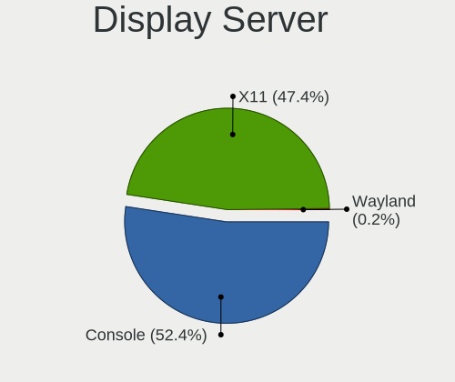

| Name    | Desktops | Percent |
|---------|----------|---------|
| X11     | 202      | 51.14%  |
| Console | 193      | 48.86%  |

Display Manager
---------------

SDDM, LightDM, etc.

| Name    | Desktops | Percent |
|---------|----------|---------|
| Console | 249      | 62.88%  |
| SLiM    | 107      | 27.02%  |
| SDDM    | 20       | 5.05%   |
| LightDM | 12       | 3.03%   |
| XDM     | 4        | 1.01%   |
| GDM     | 4        | 1.01%   |

OS Lang
-------

Language

| Lang           | Desktops | Percent |
|----------------|----------|---------|
| Unknown        | 143      | 34.79%  |
| en_US          | 104      | 25.3%   |
| ru_RU          | 97       | 23.6%   |
| C              | 45       | 10.95%  |
| fr_FR          | 10       | 2.43%   |
| ru             | 6        | 1.46%   |
| ru_RU.KOI8-R   | 3        | 0.73%   |
| fr             | 1        | 0.24%   |
| en_GB          | 1        | 0.24%   |
| cv_RU.US-ASCII | 1        | 0.24%   |

Boot Mode
---------

EFI or BIOS

| Mode | Desktops | Percent |
|------|----------|---------|
| EFI  | 256      | 64.32%  |
| BIOS | 142      | 35.68%  |

Filesystem
----------

Type of filesystem

| Type    | Desktops | Percent |
|---------|----------|---------|
| Zfs     | 171      | 42.64%  |
| Ufs     | 131      | 32.67%  |
| Ffs     | 51       | 12.72%  |
| Cd9660  | 47       | 11.72%  |
| Hammer2 | 1        | 0.25%   |

Part. scheme
------------

Scheme of partitioning

| Type    | Desktops | Percent |
|---------|----------|---------|
| GPT     | 318      | 81.33%  |
| MBR     | 71       | 18.16%  |
| Unknown | 2        | 0.51%   |

Board
-----

Vendor
------

Motherboard manufacturer

| Name                | Desktops | Percent |
|---------------------|----------|---------|
| ASUSTek Computer    | 88       | 22.56%  |
| Gigabyte Technology | 67       | 17.18%  |
| Unknown             | 51       | 13.08%  |
| ASRock              | 42       | 10.77%  |
| MSI                 | 26       | 6.67%   |
| Intel               | 14       | 3.59%   |
| Hewlett-Packard     | 11       | 2.82%   |
| Supermicro          | 8        | 2.05%   |
| Pegatron            | 7        | 1.79%   |
| Lenovo              | 7        | 1.79%   |
| Huanan              | 7        | 1.79%   |
| Dell                | 7        | 1.79%   |
| Acer                | 6        | 1.54%   |
| Techvision          | 5        | 1.28%   |
| PC Engines          | 3        | 0.77%   |
| Foxconn             | 3        | 0.77%   |
| Shuttle             | 2        | 0.51%   |
| Radxa               | 2        | 0.51%   |
| Fujitsu             | 2        | 0.51%   |
| ECS                 | 2        | 0.51%   |
| YANYU               | 1        | 0.26%   |
| Wistron             | 1        | 0.26%   |
| VIA Technologies    | 1        | 0.26%   |
| TONK                | 1        | 0.26%   |
| Sun                 | 1        | 0.26%   |
| Stonesoft           | 1        | 0.26%   |
| Sony                | 1        | 0.26%   |
| Seeed Studio        | 1        | 0.26%   |
| QIYIDA              | 1        | 0.26%   |
| NITRINOnet          | 1        | 0.26%   |
| MW                  | 1        | 0.26%   |
| Maxtang             | 1        | 0.26%   |
| MACHINIST           | 1        | 0.26%   |
| Kraftway            | 1        | 0.26%   |
| Kontron             | 1        | 0.26%   |
| KOHJINSHA           | 1        | 0.26%   |
| khadas              | 1        | 0.26%   |
| Intel CNCTION-IAF   | 1        | 0.26%   |
| IceWhale Technology | 1        | 0.26%   |
| IBM                 | 1        | 0.26%   |

Model
-----

Motherboard model

| Name                                                                  | Desktops | Percent |
|-----------------------------------------------------------------------|----------|---------|
| Unknown                                                               | 52       | 13.33%  |
| ASUS All Series                                                       | 11       | 2.82%   |
| Techvision TVI7309X                                                   | 5        | 1.28%   |
| PC Engines APU2                                                       | 3        | 0.77%   |
| Huanan X99-QD4 V1.0                                                   | 3        | 0.77%   |
| Gigabyte C1037UN-EU                                                   | 3        | 0.77%   |
| Supermicro SYS-6028R-TRT                                              | 2        | 0.51%   |
| Supermicro SSG-6029P-E1CR12L                                          | 2        | 0.51%   |
| Shuttle DS20U                                                         | 2        | 0.51%   |
| Pegatron SAISHIAT2                                                    | 2        | 0.51%   |
| MSI MS-7D46                                                           | 2        | 0.51%   |
| MSI MS-7B89                                                           | 2        | 0.51%   |
| MSI MS-7817                                                           | 2        | 0.51%   |
| Intel X79 V2.72A                                                      | 2        | 0.51%   |
| Huanan X79 INTEL (INTEL Xeon E5/Corei7 DMI2 - C600/C200 Cipset V2.49P | 2        | 0.51%   |
| HP ProLiant MicroServer                                               | 2        | 0.51%   |
| HP Compaq Pro 6300 SFF                                                | 2        | 0.51%   |
| Gigabyte Z68XP-UD3                                                    | 2        | 0.51%   |
| Gigabyte M68MT-S2P                                                    | 2        | 0.51%   |
| Gigabyte H61M-DS2                                                     | 2        | 0.51%   |
| Gigabyte H310M S2 2.0                                                 | 2        | 0.51%   |
| Gigabyte GA-IMB370TN                                                  | 2        | 0.51%   |
| Gigabyte B450 AORUS M                                                 | 2        | 0.51%   |
| Gigabyte A320M-H                                                      | 2        | 0.51%   |
| Dell OptiPlex 7040                                                    | 2        | 0.51%   |
| ASUS PRIME Z590-P                                                     | 2        | 0.51%   |
| ASUS PRIME X370-PRO                                                   | 2        | 0.51%   |
| ASUS PRIME B550-PLUS                                                  | 2        | 0.51%   |
| ASUS P8Z77-V LX                                                       | 2        | 0.51%   |
| ASUS P6T SE                                                           | 2        | 0.51%   |
| ASUS P4P800-VM                                                        | 2        | 0.51%   |
| ASUS M5A97 R2.0                                                       | 2        | 0.51%   |
| ASRock Z690 PG Riptide                                                | 2        | 0.51%   |
| ASRock X570S PG Riptide                                               | 2        | 0.51%   |
| ASRock J4205-ITX                                                      | 2        | 0.51%   |
| YANYU H67SL                                                           | 1        | 0.26%   |
| Wistron ProLiant ML110 G6                                             | 1        | 0.26%   |
| VIA VT8623-8235                                                       | 1        | 0.26%   |
| TONK TN2800                                                           | 1        | 0.26%   |
| Supermicro SYS-5019S-L                                                | 1        | 0.26%   |

Model Family
------------

Motherboard model prefix

| Name                         | Desktops | Percent |
|------------------------------|----------|---------|
| Unknown                      | 52       | 13.33%  |
| ASUS PRIME                   | 13       | 3.33%   |
| ASUS All                     | 11       | 2.82%   |
| Techvision TVI7309X          | 5        | 1.28%   |
| Lenovo ThinkCentre           | 5        | 1.28%   |
| HP Compaq                    | 5        | 1.28%   |
| Dell OptiPlex                | 5        | 1.28%   |
| HP ProLiant                  | 4        | 1.03%   |
| ASUS ROG                     | 4        | 1.03%   |
| PC Engines APU2              | 3        | 0.77%   |
| Huanan X99-QD4               | 3        | 0.77%   |
| Gigabyte C1037UN-EU          | 3        | 0.77%   |
| Gigabyte B450M               | 3        | 0.77%   |
| ASUS TUF                     | 3        | 0.77%   |
| ASUS P8Z77-V                 | 3        | 0.77%   |
| ASUS P5Q                     | 3        | 0.77%   |
| ASRock Z690                  | 3        | 0.77%   |
| ASRock X570                  | 3        | 0.77%   |
| Acer Aspire                  | 3        | 0.77%   |
| Supermicro SYS-6028R-TRT     | 2        | 0.51%   |
| Supermicro SSG-6029P-E1CR12L | 2        | 0.51%   |
| Shuttle DS20U                | 2        | 0.51%   |
| Pegatron SAISHIAT2           | 2        | 0.51%   |
| MSI MS-7D46                  | 2        | 0.51%   |
| MSI MS-7B89                  | 2        | 0.51%   |
| MSI MS-7817                  | 2        | 0.51%   |
| Intel X79                    | 2        | 0.51%   |
| Huanan X99-F8D               | 2        | 0.51%   |
| Huanan X79                   | 2        | 0.51%   |
| HP ProDesk                   | 2        | 0.51%   |
| Gigabyte Z68XP-UD3           | 2        | 0.51%   |
| Gigabyte M68MT-S2P           | 2        | 0.51%   |
| Gigabyte H61M-DS2            | 2        | 0.51%   |
| Gigabyte H310M               | 2        | 0.51%   |
| Gigabyte GA-IMB370TN         | 2        | 0.51%   |
| Gigabyte B450                | 2        | 0.51%   |
| Gigabyte A320M-H             | 2        | 0.51%   |
| Gigabyte 970A-DS3P           | 2        | 0.51%   |
| Fujitsu ESPRIMO              | 2        | 0.51%   |
| ASUS STRIX                   | 2        | 0.51%   |

MFG Year
--------

Motherboard manufacture year

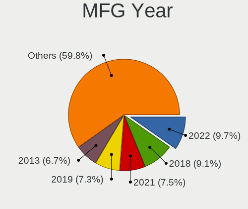

| Year    | Desktops | Percent |
|---------|----------|---------|
| 2018    | 42       | 10.77%  |
| 2019    | 35       | 8.97%   |
| 2022    | 33       | 8.46%   |
| 2021    | 30       | 7.69%   |
| Unknown | 27       | 6.92%   |
| 2013    | 25       | 6.41%   |
| 2011    | 24       | 6.15%   |
| 2010    | 24       | 6.15%   |
| 2020    | 22       | 5.64%   |
| 2012    | 20       | 5.13%   |
| 2009    | 17       | 4.36%   |
| 2014    | 16       | 4.1%    |
| 2017    | 13       | 3.33%   |
| 2008    | 12       | 3.08%   |
| 2007    | 12       | 3.08%   |
| 2016    | 11       | 2.82%   |
| 2015    | 10       | 2.56%   |
| 2006    | 5        | 1.28%   |
| 2005    | 5        | 1.28%   |
| 2023    | 4        | 1.03%   |
| 2004    | 3        | 0.77%   |

Form Factor
-----------

Physical design of the computer

| Name    | Desktops | Percent |
|---------|----------|---------|
| Desktop | 390      | 100%    |

Coreboot
--------

Have coreboot on board

| Used | Desktops | Percent |
|------|----------|---------|
| No   | 387      | 99.23%  |
| Yes  | 3        | 0.77%   |

RAM Size
--------

Total RAM memory

| Size in GB      | Desktops | Percent |
|-----------------|----------|---------|
| 8.01-16.0       | 93       | 23.54%  |
| 4.01-8.0        | 84       | 21.27%  |
| 16.01-24.0      | 82       | 20.76%  |
| 32.01-64.0      | 45       | 11.39%  |
| 2.01-3.0        | 30       | 7.59%   |
| 3.01-4.0        | 19       | 4.81%   |
| 64.01-256.0     | 16       | 4.05%   |
| 0.51-1.0        | 11       | 2.78%   |
| 24.01-32.0      | 7        | 1.77%   |
| 0.01-0.5        | 4        | 1.01%   |
| 1.01-2.0        | 3        | 0.76%   |
| More than 256.0 | 1        | 0.25%   |

RAM Used
--------

Used RAM memory

| Used GB    | Desktops | Percent |
|------------|----------|---------|
| 0.01-0.5   | 202      | 49.88%  |
| 0.51-1.0   | 101      | 24.94%  |
| 1.01-2.0   | 50       | 12.35%  |
| 3.01-4.0   | 10       | 2.47%   |
| 4.01-8.0   | 9        | 2.22%   |
| Unknown    | 8        | 1.98%   |
| 8.01-16.0  | 7        | 1.73%   |
| 2.01-3.0   | 6        | 1.48%   |
| 0          | 6        | 1.48%   |
| 16.01-24.0 | 4        | 0.99%   |
| 24.01-32.0 | 2        | 0.49%   |

Total Drives
------------

Number of drives on board

| Drives | Desktops | Percent |
|--------|----------|---------|
| 1      | 175      | 42.37%  |
| 2      | 90       | 21.79%  |
| 3      | 43       | 10.41%  |
| 0      | 42       | 10.17%  |
| 4      | 32       | 7.75%   |
| 5      | 15       | 3.63%   |
| 6      | 6        | 1.45%   |
| 7      | 4        | 0.97%   |
| 19     | 1        | 0.24%   |
| 14     | 1        | 0.24%   |
| 11     | 1        | 0.24%   |
| 10     | 1        | 0.24%   |
| 9      | 1        | 0.24%   |
| 8      | 1        | 0.24%   |

Has CD-ROM
----------

Has CD-ROM on board

| Presented | Desktops | Percent |
|-----------|----------|---------|
| No        | 334      | 84.34%  |
| Yes       | 62       | 15.66%  |

Has Ethernet
------------

Has Ethernet on board

| Presented | Desktops | Percent |
|-----------|----------|---------|
| Yes       | 370      | 94.87%  |
| No        | 20       | 5.13%   |

Has WiFi
--------

Has WiFi module

| Presented | Desktops | Percent |
|-----------|----------|---------|
| No        | 303      | 77.1%   |
| Yes       | 90       | 22.9%   |

Has Bluetooth
-------------

Has Bluetooth module

| Presented | Desktops | Percent |
|-----------|----------|---------|
| No        | 340      | 86.51%  |
| Yes       | 53       | 13.49%  |

Location
--------

Country
-------

Geographic location (country)

| Country | Desktops | Percent |
|---------|----------|---------|
| Russia  | 390      | 100%    |

City
----

Geographic location (city)

| City              | Desktops | Percent |
|-------------------|----------|---------|
| Moscow            | 109      | 26.91%  |
| St Petersburg     | 50       | 12.35%  |
| Krasnodar         | 21       | 5.19%   |
| Chelyabinsk       | 14       | 3.46%   |
| Yekaterinburg     | 13       | 3.21%   |
| Novosibirsk       | 10       | 2.47%   |
| Vladivostok       | 8        | 1.98%   |
| Ozersk            | 8        | 1.98%   |
| Barnaul           | 7        | 1.73%   |
| Voronezh          | 6        | 1.48%   |
| Surgut            | 6        | 1.48%   |
| Stavropol         | 5        | 1.23%   |
| Saratov           | 5        | 1.23%   |
| Omsk              | 5        | 1.23%   |
| Krasnoyarsk       | 5        | 1.23%   |
| Kamensk-Ural'skiy | 5        | 1.23%   |
| Ufa               | 4        | 0.99%   |
| Podolsk           | 4        | 0.99%   |
| Penza             | 4        | 0.99%   |
| Lipetsk           | 4        | 0.99%   |
| Cherepovets       | 4        | 0.99%   |
| Volgograd         | 3        | 0.74%   |
| Perm              | 3        | 0.74%   |
| Orenburg          | 3        | 0.74%   |
| Nizhniy Novgorod  | 3        | 0.74%   |
| Kirov             | 3        | 0.74%   |
| Khimki            | 3        | 0.74%   |
| Irkutsk           | 3        | 0.74%   |
| Volzhskiy         | 2        | 0.49%   |
| Vladimir          | 2        | 0.49%   |
| Vidnoye           | 2        | 0.49%   |
| Ulyanovsk         | 2        | 0.49%   |
| Tambov            | 2        | 0.49%   |
| Rostov-on-Don     | 2        | 0.49%   |
| Reutov            | 2        | 0.49%   |
| Orsk              | 2        | 0.49%   |
| Obninsk           | 2        | 0.49%   |
| Novokuznetsk      | 2        | 0.49%   |
| Murmansk          | 2        | 0.49%   |
| Makhachkala       | 2        | 0.49%   |

Drives
------

Drive Vendor
------------

Hard drive vendors

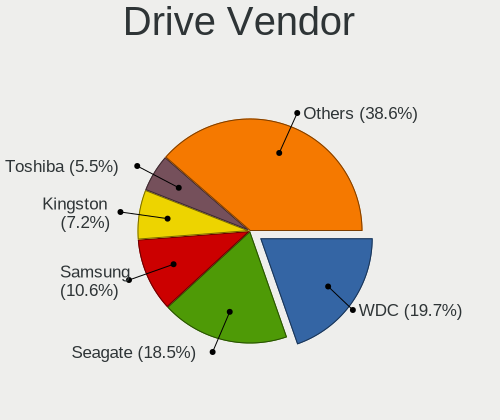

| Vendor              | Desktops | Drives | Percent |
|---------------------|----------|--------|---------|
| WDC                 | 115      | 198    | 19.93%  |
| Seagate             | 107      | 250    | 18.54%  |
| Samsung Electronics | 60       | 88     | 10.4%   |
| Kingston            | 36       | 44     | 6.24%   |
| Toshiba             | 32       | 65     | 5.55%   |
| Hitachi             | 24       | 61     | 4.16%   |
| Intel               | 21       | 34     | 3.64%   |
| Crucial             | 15       | 22     | 2.6%    |
| A-DATA Technology   | 11       | 16     | 1.91%   |
| Apacer              | 9        | 10     | 1.56%   |
| AMD                 | 9        | 10     | 1.56%   |
| SPCC                | 8        | 9      | 1.39%   |
| KingSpec            | 8        | 11     | 1.39%   |
| HGST                | 8        | 21     | 1.39%   |
| Plextor             | 7        | 10     | 1.21%   |
| Patriot             | 7        | 7      | 1.21%   |
| Smartbuy            | 6        | 8      | 1.04%   |
| Silicon Motion      | 6        | 10     | 1.04%   |
| SanDisk             | 6        | 7      | 1.04%   |
| Maxtor              | 6        | 6      | 1.04%   |
| OPENBSD             | 5        | 12     | 0.87%   |
| OCZ                 | 5        | 5      | 0.87%   |
| Micron Technology   | 5        | 9      | 0.87%   |
| Transcend           | 4        | 4      | 0.69%   |
| Kston               | 4        | 4      | 0.69%   |
| Gigabyte Technology | 4        | 4      | 0.69%   |
| Hewlett-Packard     | 3        | 6      | 0.52%   |
| Fujitsu             | 3        | 4      | 0.52%   |
| China               | 3        | 3      | 0.52%   |
| XrayDisk            | 2        | 2      | 0.35%   |
| XPG                 | 2        | 2      | 0.35%   |
| Verbatim            | 2        | 2      | 0.35%   |
| Team                | 2        | 2      | 0.35%   |
| NVMe                | 2        | 7      | 0.35%   |
| Netac               | 2        | 2      | 0.35%   |
| Hoodisk             | 2        | 4      | 0.35%   |
| GOODRAM             | 2        | 2      | 0.35%   |
| FORESEE             | 2        | 2      | 0.35%   |
| XUNZHE              | 1        | 1      | 0.17%   |
| TAMMUZ              | 1        | 1      | 0.17%   |

Drive Model
-----------

Hard drive models

| Model                              | Desktops | Percent |
|------------------------------------|----------|---------|
| Seagate ST1000DM010-2EP102 1TB     | 9        | 1.35%   |
| Toshiba DT01ACA100 1TB             | 7        | 1.05%   |
| WDC WDS240G2G0A-00JH30 240GB       | 6        | 0.9%    |
| WDC WDS120G2G0A-00JH30 120GB       | 5        | 0.75%   |
| WDC WD20EARX-00PASB0 2TB           | 5        | 0.75%   |
| OPENBSD SR RAID 1 2TB              | 5        | 0.75%   |
| Kingston SA400S37240G 240GB        | 5        | 0.75%   |
| AMD R5SL120G 120GB                 | 5        | 0.75%   |
| WDC WD1002FAEX-00Y9A0 1TB          | 4        | 0.6%    |
| Toshiba DT01ACA050 500GB           | 4        | 0.6%    |
| SPCC Solid State Disk 128GB        | 4        | 0.6%    |
| Seagate ST3300657SS 304GB          | 4        | 0.6%    |
| Seagate ST250DM000-1BD141 250GB    | 4        | 0.6%    |
| Samsung SSD 970 EVO Plus 500GB     | 4        | 0.6%    |
| Samsung SSD 970 EVO Plus 250GB     | 4        | 0.6%    |
| Samsung SSD 860 EVO 500GB          | 4        | 0.6%    |
| Kston SSD 128GB                    | 4        | 0.6%    |
| Intel SSDSC2BW480H6 480GB          | 4        | 0.6%    |
| WDC WDS500G1B0A-00H9H0 500GB       | 3        | 0.45%   |
| WDC WD800AAJS-00PSA0 80GB          | 3        | 0.45%   |
| WDC WD6400AARS-00Y5B1 640GB        | 3        | 0.45%   |
| WDC WD5000AZLX-00K2TA0 500GB       | 3        | 0.45%   |
| WDC WD10JFCX-68N6GN0 1TB           | 3        | 0.45%   |
| WDC WD10EZEX-08WN4A0 1TB           | 3        | 0.45%   |
| Silicon Motion NE-256 256GB        | 3        | 0.45%   |
| Seagate ST500DM002-1BD142 500GB    | 3        | 0.45%   |
| Seagate ST4000VN008-2DR166 4TB     | 3        | 0.45%   |
| Seagate ST380815AS 80GB            | 3        | 0.45%   |
| Seagate ST3500413AS 500GB          | 3        | 0.45%   |
| Seagate ST3250318AS 250GB          | 3        | 0.45%   |
| Seagate ST31000524AS 1TB           | 3        | 0.45%   |
| Seagate ST2000DM008-2FR102 2TB     | 3        | 0.45%   |
| Seagate ST2000DM001-1CH164 2TB     | 3        | 0.45%   |
| Seagate ST1000LM024 HN-M101MBB 1TB | 3        | 0.45%   |
| Samsung SSD 870 QVO 1TB            | 3        | 0.45%   |
| Samsung SSD 870 EVO 1TB            | 3        | 0.45%   |
| Samsung SSD 860 EVO 250GB          | 3        | 0.45%   |
| Samsung HD161HJ 160GB              | 3        | 0.45%   |
| Patriot Burst Elite 120GB          | 3        | 0.45%   |
| Maxtor STM3160815AS 160GB          | 3        | 0.45%   |

HDD Vendor
----------

Hard disk drive vendors

| Vendor                             | Desktops | Drives | Percent |
|------------------------------------|----------|--------|---------|
| Seagate                            | 107      | 250    | 35.67%  |
| WDC                                | 98       | 172    | 32.67%  |
| Toshiba                            | 30       | 63     | 10%     |
| Hitachi                            | 24       | 61     | 8%      |
| Samsung Electronics                | 11       | 17     | 3.67%   |
| HGST                               | 8        | 21     | 2.67%   |
| Maxtor                             | 6        | 6      | 2%      |
| OPENBSD                            | 5        | 12     | 1.67%   |
| Fujitsu                            | 3        | 4      | 1%      |
| NVMe                               | 2        | 7      | 0.67%   |
| Hewlett-Packard                    | 2        | 5      | 0.67%   |
| Product:              USB DISK 2.0 | 1        | 1      | 0.33%   |
| MaxDigital                         | 1        | 1      | 0.33%   |
| LSILOGIC                           | 1        | 1      | 0.33%   |
| IBM                                | 1        | 1      | 0.33%   |

SSD Vendor
----------

Solid state drive vendors

| Vendor              | Desktops | Drives | Percent |
|---------------------|----------|--------|---------|
| Samsung Electronics | 33       | 39     | 15%     |
| Kingston            | 26       | 30     | 11.82%  |
| WDC                 | 18       | 20     | 8.18%   |
| Intel               | 15       | 23     | 6.82%   |
| Crucial             | 13       | 19     | 5.91%   |
| KingSpec            | 8        | 11     | 3.64%   |
| A-DATA Technology   | 8        | 11     | 3.64%   |
| SPCC                | 7        | 8      | 3.18%   |
| Plextor             | 7        | 10     | 3.18%   |
| Apacer              | 7        | 8      | 3.18%   |
| AMD                 | 7        | 8      | 3.18%   |
| Smartbuy            | 6        | 8      | 2.73%   |
| SanDisk             | 6        | 7      | 2.73%   |
| Patriot             | 6        | 6      | 2.73%   |
| OCZ                 | 5        | 5      | 2.27%   |
| Micron Technology   | 5        | 9      | 2.27%   |
| Transcend           | 4        | 4      | 1.82%   |
| Kston               | 4        | 4      | 1.82%   |
| China               | 3        | 3      | 1.36%   |
| Verbatim            | 2        | 2      | 0.91%   |
| Toshiba             | 2        | 2      | 0.91%   |
| Team                | 2        | 2      | 0.91%   |
| Netac               | 2        | 2      | 0.91%   |
| Hoodisk             | 2        | 4      | 0.91%   |
| Gigabyte Technology | 2        | 2      | 0.91%   |
| XUNZHE              | 1        | 1      | 0.45%   |
| XrayDisk            | 1        | 1      | 0.45%   |
| XPG                 | 1        | 1      | 0.45%   |
| TAMMUZ              | 1        | 1      | 0.45%   |
| SETHRISE            | 1        | 1      | 0.45%   |
| SATADOM             | 1        | 1      | 0.45%   |
| Qumo                | 1        | 1      | 0.45%   |
| Palit               | 1        | 1      | 0.45%   |
| MSI                 | 1        | 4      | 0.45%   |
| LITEON              | 1        | 1      | 0.45%   |
| KingDian            | 1        | 3      | 0.45%   |
| Kingchuxing         | 1        | 1      | 0.45%   |
| Hewlett-Packard     | 1        | 1      | 0.45%   |
| HEORIADY            | 1        | 1      | 0.45%   |
| GOODRAM             | 1        | 1      | 0.45%   |

Drive Kind
----------

HDD or SSD

| Kind | Desktops | Drives | Percent |
|------|----------|--------|---------|
| HDD  | 225      | 622    | 47.07%  |
| SSD  | 191      | 273    | 39.96%  |
| NVMe | 62       | 97     | 12.97%  |

Drive Connector
---------------

SATA, SAS, NVMe, etc.

| Type | Desktops | Drives | Percent |
|------|----------|--------|---------|
| SATA | 332      | 895    | 84.26%  |
| NVMe | 62       | 97     | 15.74%  |

Drive Size
----------

Size of hard drive

| Size in TB | Desktops | Drives | Percent |
|------------|----------|--------|---------|
| 0.01-0.5   | 278      | 466    | 61.1%   |
| 0.51-1.0   | 96       | 180    | 21.1%   |
| 1.01-2.0   | 38       | 145    | 8.35%   |
| 3.01-4.0   | 18       | 38     | 3.96%   |
| 4.01-10.0  | 13       | 30     | 2.86%   |
| 2.01-3.0   | 10       | 26     | 2.2%    |
| 10.01-20.0 | 2        | 10     | 0.44%   |

Space Total
-----------

Amount of disk space available on the file system

| Size in GB     | Desktops | Percent |
|----------------|----------|---------|
| 101-250        | 114      | 27.4%   |
| 1-20           | 91       | 21.88%  |
| 251-500        | 73       | 17.55%  |
| 51-100         | 44       | 10.58%  |
| 21-50          | 32       | 7.69%   |
| 501-1000       | 30       | 7.21%   |
| More than 3000 | 14       | 3.37%   |
| 1001-2000      | 12       | 2.88%   |
| 2001-3000      | 3        | 0.72%   |
| Unknown        | 3        | 0.72%   |

Space Used
----------

Amount of used disk space

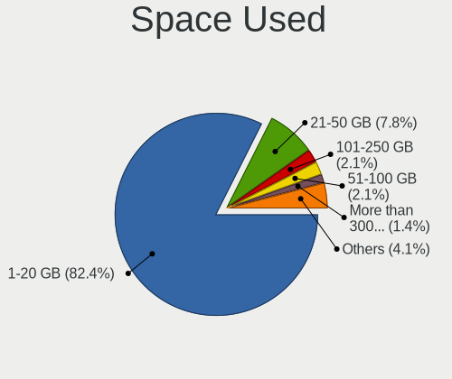

| Used GB        | Desktops | Percent |
|----------------|----------|---------|
| 1-20           | 330      | 81.48%  |
| 21-50          | 32       | 7.9%    |
| 101-250        | 10       | 2.47%   |
| 51-100         | 8        | 1.98%   |
| 501-1000       | 7        | 1.73%   |
| More than 3000 | 6        | 1.48%   |
| 2001-3000      | 4        | 0.99%   |
| 1001-2000      | 3        | 0.74%   |
| Unknown        | 3        | 0.74%   |
| 251-500        | 2        | 0.49%   |

Malfunc. Drives
---------------

Drive models with a malfunction

| Model                               | Desktops | Drives | Percent |
|-------------------------------------|----------|--------|---------|
| Intel SSDSC2BW480H6 480GB           | 4        | 4      | 3.67%   |
| Samsung Electronics SSD 870 EVO 1TB | 3        | 7      | 2.75%   |
| WDC WDS240G2G0A-00JH30 240GB        | 2        | 2      | 1.83%   |
| WDC WD1002FAEX-00Y9A0 1TB           | 2        | 2      | 1.83%   |
| Seagate ST3500413AS 500GB           | 2        | 4      | 1.83%   |
| Seagate ST3320418AS 320GB           | 2        | 2      | 1.83%   |
| Samsung Electronics HD161HJ 160GB   | 2        | 3      | 1.83%   |
| Maxtor STM3320613AS 320GB           | 2        | 2      | 1.83%   |
| Kingston SA400S37120G 120GB         | 2        | 2      | 1.83%   |
| Hitachi HDS721010CLA332 1TB         | 2        | 4      | 1.83%   |
| XPG SX950U 240GB                    | 1        | 1      | 0.92%   |
| WDC WD800AAJS-00TDA0 80GB           | 1        | 1      | 0.92%   |
| WDC WD7501AALS-00E8B0 752GB         | 1        | 1      | 0.92%   |
| WDC WD7500AACS-00ZJB0 752GB         | 1        | 1      | 0.92%   |
| WDC WD60EFRX-68MYMN1 6TB            | 1        | 1      | 0.92%   |
| WDC WD5003AZEX-00MK2A0 500GB        | 1        | 1      | 0.92%   |
| WDC WD5000LPLX-00ZNTT0 500GB        | 1        | 2      | 0.92%   |
| WDC WD5000LPCX-60VHAT0 500GB        | 1        | 1      | 0.92%   |
| WDC WD5000AZRZ-00HTKB0 500GB        | 1        | 1      | 0.92%   |
| WDC WD5000AZLX-00CL5A0 500GB        | 1        | 1      | 0.92%   |
| WDC WD5000AAKX-60U6AA0 500GB        | 1        | 1      | 0.92%   |
| WDC WD5000AAKX-00ERMA0 500GB        | 1        | 1      | 0.92%   |
| WDC WD5000AAKS-00V1A0 500GB         | 1        | 1      | 0.92%   |
| WDC WD40EFRX-68N32N0 4TB            | 1        | 3      | 0.92%   |
| WDC WD3200BPVT-22JJ5T0 320GB        | 1        | 1      | 0.92%   |
| WDC WD3200BEVT-00A0RT0 233GB        | 1        | 1      | 0.92%   |
| WDC WD3200AAKX-001CA0 320GB         | 1        | 1      | 0.92%   |
| WDC WD3200AAKS-00L9A0 320GB         | 1        | 1      | 0.92%   |
| WDC WD20EURX-63T0FY0 2TB            | 1        | 1      | 0.92%   |
| WDC WD20EFRX-68EUZN0 2TB            | 1        | 2      | 0.92%   |
| WDC WD1600YS-01SHB1 164GB           | 1        | 1      | 0.92%   |
| WDC WD1600BEVT-22ZCT0 160GB         | 1        | 1      | 0.92%   |
| WDC WD15EARS-00Z5B1 1.5TB           | 1        | 1      | 0.92%   |
| WDC WD15EADS-00P8B0 1.5TB           | 1        | 1      | 0.92%   |
| WDC WD10EZRZ-00HTKB0 1TB            | 1        | 5      | 0.92%   |
| WDC WD1002FAEX-00Z3A0 1TB           | 1        | 1      | 0.92%   |
| Transcend TS120GSSD220S 120GB       | 1        | 1      | 0.92%   |
| Toshiba MK3259GSXP 320GB            | 1        | 1      | 0.92%   |
| Toshiba MK2002TSKB 2TB              | 1        | 1      | 0.92%   |
| Toshiba HDWD105 500GB               | 1        | 2      | 0.92%   |

Malfunc. Drive Vendor
---------------------

Vendors of faulty drives

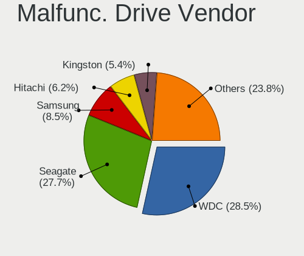

| Vendor              | Desktops | Drives | Percent |
|---------------------|----------|--------|---------|
| Seagate             | 27       | 41     | 25.96%  |
| WDC                 | 26       | 37     | 25%     |
| Samsung Electronics | 10       | 16     | 9.62%   |
| Hitachi             | 8        | 12     | 7.69%   |
| Intel               | 7        | 7      | 6.73%   |
| Kingston            | 6        | 6      | 5.77%   |
| Toshiba             | 4        | 6      | 3.85%   |
| Maxtor              | 4        | 4      | 3.85%   |
| Plextor             | 2        | 2      | 1.92%   |
| XPG                 | 1        | 1      | 0.96%   |
| Transcend           | 1        | 1      | 0.96%   |
| SPCC                | 1        | 1      | 0.96%   |
| HGST                | 1        | 1      | 0.96%   |
| Hewlett-Packard     | 1        | 1      | 0.96%   |
| GLOWAY              | 1        | 2      | 0.96%   |
| GK                  | 1        | 1      | 0.96%   |
| Crucial             | 1        | 1      | 0.96%   |
| AMD                 | 1        | 2      | 0.96%   |
| A-DATA Technology   | 1        | 1      | 0.96%   |

Malfunc. HDD Vendor
-------------------

Vendors of faulty HDD drives

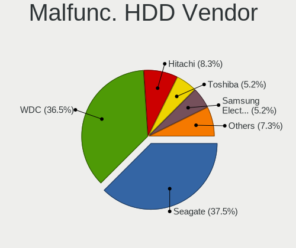

| Vendor              | Desktops | Drives | Percent |
|---------------------|----------|--------|---------|
| Seagate             | 27       | 41     | 36.49%  |
| WDC                 | 24       | 35     | 32.43%  |
| Hitachi             | 8        | 12     | 10.81%  |
| Samsung Electronics | 5        | 7      | 6.76%   |
| Toshiba             | 4        | 6      | 5.41%   |
| Maxtor              | 4        | 4      | 5.41%   |
| HGST                | 1        | 1      | 1.35%   |
| Hewlett-Packard     | 1        | 1      | 1.35%   |

Malfunc. Drive Kind
-------------------

Kinds of faulty drives

| Kind | Desktops | Drives | Percent |
|------|----------|--------|---------|
| HDD  | 72       | 107    | 71.29%  |
| SSD  | 28       | 35     | 27.72%  |
| NVMe | 1        | 1      | 0.99%   |

Failed Drives
-------------

Failed drive models

| Model                                | Desktops | Drives | Percent |
|--------------------------------------|----------|--------|---------|
| WDC WD7501AALS-00J7B0 752GB          | 1        | 1      | 16.67%  |
| WDC WD6400AARS-00Y5B1 640GB          | 1        | 2      | 16.67%  |
| WDC PC SN530 SDBPMPZ-256G-1101 256GB | 1        | 1      | 16.67%  |
| Toshiba MG05ACA800E 8TB              | 1        | 1      | 16.67%  |
| Hitachi HDS721010DLE630 1TB          | 1        | 1      | 16.67%  |
| Crucial M4-CT256M4SSD1 256GB         | 1        | 1      | 16.67%  |

Failed Drive Vendor
-------------------

Failed drive vendors

| Vendor  | Desktops | Drives | Percent |
|---------|----------|--------|---------|
| WDC     | 3        | 4      | 50%     |
| Toshiba | 1        | 1      | 16.67%  |
| Hitachi | 1        | 1      | 16.67%  |
| Crucial | 1        | 1      | 16.67%  |

Drive Status
------------

Number of failed and malfunc. drives

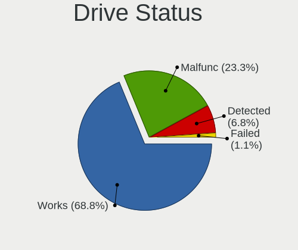

| Status   | Desktops | Drives | Percent |
|----------|----------|--------|---------|
| Works    | 293      | 776    | 68.94%  |
| Malfunc  | 97       | 143    | 22.82%  |
| Detected | 29       | 66     | 6.82%   |
| Failed   | 6        | 7      | 1.41%   |

Storage controller
------------------

Storage Vendor
--------------

Storage controller vendors

| Vendor                           | Desktops | Percent |
|----------------------------------|----------|---------|
| Intel                            | 269      | 53.69%  |
| AMD                              | 75       | 14.97%  |
| Samsung Electronics              | 24       | 4.79%   |
| Silicon Motion                   | 17       | 3.39%   |
| Marvell Technology Group         | 16       | 3.19%   |
| JMicron Technology               | 14       | 2.79%   |
| ASMedia Technology               | 13       | 2.59%   |
| Nvidia                           | 10       | 2%      |
| Kingston Technology Company      | 10       | 2%      |
| Broadcom / LSI                   | 8        | 1.6%    |
| ADATA Technology                 | 6        | 1.2%    |
| Realtek Semiconductor            | 5        | 1%      |
| SanDisk                          | 4        | 0.8%    |
| Phison Electronics               | 4        | 0.8%    |
| Areca Technology                 | 4        | 0.8%    |
| VIA Technologies                 | 3        | 0.6%    |
| Micron/Crucial Technology        | 3        | 0.6%    |
| Toshiba                          | 2        | 0.4%    |
| Silicon Image                    | 2        | 0.4%    |
| Shenzhen Longsys Electronics     | 2        | 0.4%    |
| MAXIO Technology (Hangzhou)      | 2        | 0.4%    |
| Lite-On IT Corp. / Plextor       | 2        | 0.4%    |
| SK hynix                         | 1        | 0.2%    |
| Silicon Integrated Systems [SiS] | 1        | 0.2%    |
| Lite-On Technology               | 1        | 0.2%    |
| KIOXIA                           | 1        | 0.2%    |
| Integrated Technology Express    | 1        | 0.2%    |
| 3ware                            | 1        | 0.2%    |

Storage Model
-------------

Storage controller models

| Model                                                                          | Desktops | Percent |
|--------------------------------------------------------------------------------|----------|---------|
| AMD FCH SATA Controller [AHCI mode]                                            | 37       | 6.19%   |
| Intel 6 Series/C200 Series Chipset Family 6 port Desktop SATA AHCI Controller  | 22       | 3.68%   |
| Intel 7 Series/C210 Series Chipset Family 6-port SATA Controller [AHCI mode]   | 21       | 3.51%   |
| Intel 82801G (ICH7 Family) IDE Controller                                      | 19       | 3.18%   |
| Intel 8 Series/C220 Series Chipset Family 6-port SATA Controller 1 [AHCI mode] | 19       | 3.18%   |
| Intel NM10/ICH7 Family SATA Controller [IDE mode]                              | 18       | 3.01%   |
| Silicon Motion SM2263EN/SM2263XT (DRAM-less) NVMe SSD Controllers              | 17       | 2.84%   |
| Intel Q170/Q150/B150/H170/H110/Z170/CM236 Chipset SATA Controller [AHCI Mode]  | 17       | 2.84%   |
| Samsung NVMe SSD Controller SM981/PM981/PM983                                  | 16       | 2.68%   |
| AMD SB7x0/SB8x0/SB9x0 IDE Controller                                           | 16       | 2.68%   |
| AMD SB7x0/SB8x0/SB9x0 SATA Controller [AHCI mode]                              | 14       | 2.34%   |
| ASMedia ASM1062 Serial ATA Controller                                          | 12       | 2.01%   |
| AMD 400 Series Chipset SATA Controller                                         | 12       | 2.01%   |
| Intel 82801JI (ICH10 Family) SATA AHCI Controller                              | 11       | 1.84%   |
| Intel Cannon Lake PCH SATA AHCI Controller                                     | 10       | 1.67%   |
| Intel Atom Processor E3800 Series SATA AHCI Controller                         | 10       | 1.67%   |
| Intel 200 Series PCH SATA controller [AHCI mode]                               | 10       | 1.67%   |
| Intel NM10/ICH7 Family SATA Controller [AHCI mode]                             | 9        | 1.51%   |
| JMicron JMB363 SATA/IDE Controller                                             | 8        | 1.34%   |
| Intel Comet Lake SATA AHCI Controller                                          | 8        | 1.34%   |
| Intel Celeron N3350/Pentium N4200/Atom E3900 Series SATA AHCI Controller       | 8        | 1.34%   |
| AMD SB7x0/SB8x0/SB9x0 SATA Controller [IDE mode]                               | 8        | 1.34%   |
| AMD 500 Series Chipset SATA Controller                                         | 8        | 1.34%   |
| Intel Jasper Lake SATA AHCI Controller                                         | 7        | 1.17%   |
| Intel C610/X99 series chipset 6-Port SATA Controller [AHCI mode]               | 7        | 1.17%   |
| Intel 7 Series Chipset Family 6-port SATA Controller [AHCI mode]               | 7        | 1.17%   |
| Nvidia MCP61 SATA Controller                                                   | 5        | 0.84%   |
| Intel Sunrise Point-LP SATA Controller [AHCI mode]                             | 5        | 0.84%   |
| Intel Celeron/Pentium Silver Processor SATA Controller                         | 5        | 0.84%   |
| Intel Alder Lake-S PCH SATA Controller [AHCI Mode]                             | 5        | 0.84%   |
| Intel 5 Series/3400 Series Chipset 6 port SATA AHCI Controller                 | 5        | 0.84%   |
| Samsung NVMe SSD Controller PM9A1/PM9A3/980PRO                                 | 4        | 0.67%   |
| Realtek RTS5765DL NVMe SSD Controller (DRAM-less)                              | 4        | 0.67%   |
| Marvell Group 88SE6111/6121 SATA II / PATA Controller                          | 4        | 0.67%   |
| Intel SSD 660P Series                                                          | 4        | 0.67%   |
| Intel 82801JI (ICH10 Family) 4 port SATA IDE Controller #1                     | 4        | 0.67%   |
| Intel 82801JI (ICH10 Family) 2 port SATA IDE Controller #2                     | 4        | 0.67%   |
| Intel 82801IR/IO/IH (ICH9R/DO/DH) 6 port SATA Controller [AHCI mode]           | 4        | 0.67%   |
| Intel 82801HR/HO/HH (ICH8R/DO/DH) 2 port SATA Controller [IDE mode]            | 4        | 0.67%   |
| Intel 82801H (ICH8 Family) 4 port SATA Controller [IDE mode]                   | 4        | 0.67%   |

Storage Kind
------------

Kind of storage controller (IDE, SATA, NVMe, SAS, ...)

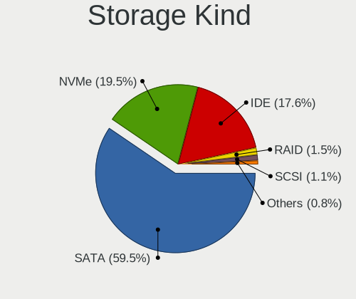

| Kind | Desktops | Percent |
|------|----------|---------|
| SATA | 290      | 60.04%  |
| IDE  | 92       | 19.05%  |
| NVMe | 84       | 17.39%  |
| RAID | 7        | 1.45%   |
| SCSI | 6        | 1.24%   |
| SAS  | 4        | 0.83%   |

Processor
---------

CPU Vendor
----------

Processor vendors

| Vendor  | Desktops | Percent |
|---------|----------|---------|
| Intel   | 277      | 70.48%  |
| AMD     | 84       | 21.37%  |
| ARM     | 24       | 6.11%   |
| Unknown | 6        | 1.53%   |
| VIA     | 1        | 0.25%   |
| PowerPC | 1        | 0.25%   |

CPU Model
---------

Processor models

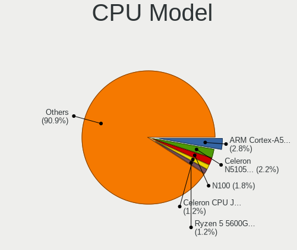

| Model                                   | Desktops | Percent |
|-----------------------------------------|----------|---------|
| ARM Cortex-A55 r2p0                     | 12       | 3.02%   |
| AMD Ryzen 5 3600 6-Core Processor       | 6        | 1.51%   |
|                                         | 6        | 1.51%   |
| Intel Core i7-3770 CPU @ 3.40GHz        | 5        | 1.26%   |
| Intel Core 2 Quad CPU Q6600 @ 2.40GHz   | 5        | 1.26%   |
| Intel Celeron N5105 @ 2.00GHz           | 5        | 1.26%   |
| Intel Celeron CPU J1900 @ 1.99GHz       | 5        | 1.26%   |
| ARM Cortex-A57 r1p3                     | 5        | 1.26%   |
| Intel Core i5-7400 CPU @ 3.00GHz        | 4        | 1.01%   |
| Intel Core i5-3470 CPU @ 3.20GHz        | 4        | 1.01%   |
| Intel Celeron CPU J1800 @ 2.41GHz       | 4        | 1.01%   |
| Intel Celeron CPU 1037U @ 1.80GHz       | 4        | 1.01%   |
| Intel Pentium Gold G5400 CPU @ 3.70GHz  | 3        | 0.75%   |
| Intel Pentium CPU G3220 @ 3.00GHz       | 3        | 0.75%   |
| Intel Core i7-6700 CPU @ 3.40GHz        | 3        | 0.75%   |
| Intel Core i5-10400 CPU @ 2.90GHz       | 3        | 0.75%   |
| Intel Core i3-6100 CPU @ 3.70GHz        | 3        | 0.75%   |
| Intel Core i3-3220 CPU @ 3.30GHz        | 3        | 0.75%   |
| Intel Core 2 Duo CPU E7300 @ 2.66GHz    | 3        | 0.75%   |
| Intel Core 2 Duo CPU E7200 @ 2.53GHz    | 3        | 0.75%   |
| Intel Celeron N5100 @ 1.10GHz           | 3        | 0.75%   |
| Intel Celeron J4125 CPU @ 2.00GHz       | 3        | 0.75%   |
| Intel Celeron CPU J3455 @ 1.50GHz       | 3        | 0.75%   |
| AMD Ryzen 9 3900X 12-Core Processor     | 3        | 0.75%   |
| AMD Ryzen 5 2600 Six-Core Processor     | 3        | 0.75%   |
| AMD GX-412TC SOC                        | 3        | 0.75%   |
| Intel Xeon CPU E5-2670 v3 @ 2.30GHz     | 2        | 0.5%    |
| Intel Xeon CPU E5-2630 v3 @ 2.40GHz     | 2        | 0.5%    |
| Intel Xeon CPU E5-2620 v3 @ 2.40GHz     | 2        | 0.5%    |
| Intel Xeon CPU E31270 @ 3.40GHz         | 2        | 0.5%    |
| Intel Xeon CPU E3-1265L V2 @ 2.50GHz    | 2        | 0.5%    |
| Intel Xeon Bronze 3104 CPU @ 1.70GHz    | 2        | 0.5%    |
| Intel Pentium Gold G5400T CPU @ 3.10GHz | 2        | 0.5%    |
| Intel Pentium CPU J4205 @ 1.50GHz       | 2        | 0.5%    |
| Intel Pentium CPU G850 @ 2.90GHz        | 2        | 0.5%    |
| Intel Pentium 4 CPU                     | 2        | 0.5%    |
| Intel N100                              | 2        | 0.5%    |
| Intel Core i7-7700 CPU @ 3.60GHz        | 2        | 0.5%    |
| Intel Core i7-4770 CPU @ 3.40GHz        | 2        | 0.5%    |
| Intel Core i7-2600K CPU @ 3.40GHz       | 2        | 0.5%    |

CPU Model Family
----------------

Processor model prefix

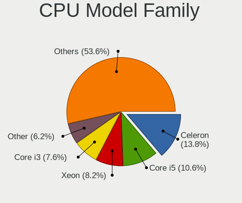

| Model                   | Desktops | Percent |
|-------------------------|----------|---------|
| Intel Celeron           | 51       | 12.98%  |
| Intel Core i5           | 43       | 10.94%  |
| Intel Xeon              | 33       | 8.4%    |
| Intel Core i7           | 28       | 7.12%   |
| Intel Core i3           | 27       | 6.87%   |
| ARM Cortex              | 24       | 6.11%   |
| AMD Ryzen 5             | 18       | 4.58%   |
| Other                   | 17       | 4.33%   |
| Intel Core 2 Duo        | 16       | 4.07%   |
| Intel Core 2 Quad       | 12       | 3.05%   |
| Intel Pentium           | 11       | 2.8%    |
| Intel Atom              | 11       | 2.8%    |
| AMD Ryzen 7             | 10       | 2.54%   |
| Intel Pentium 4         | 7        | 1.78%   |
| AMD FX                  | 7        | 1.78%   |
| Intel Pentium Gold      | 5        | 1.27%   |
| AMD Ryzen 9             | 5        | 1.27%   |
| AMD Phenom II X4        | 5        | 1.27%   |
| Intel Pentium Dual-Core | 4        | 1.02%   |
| AMD Ryzen 3             | 4        | 1.02%   |
| Intel Pentium Dual      | 3        | 0.76%   |
| Intel Pentium D         | 3        | 0.76%   |
| Intel Core 2            | 3        | 0.76%   |
| AMD GX                  | 3        | 0.76%   |
| AMD Athlon 64 X2        | 3        | 0.76%   |
| AMD A4                  | 3        | 0.76%   |
| Intel Xeon Bronze       | 2        | 0.51%   |
| Intel Genuine           | 2        | 0.51%   |
| Intel Core i9           | 2        | 0.51%   |
| Intel Celeron D         | 2        | 0.51%   |
| Intel 686-class         | 2        | 0.51%   |
| AMD Turion II Neo       | 2        | 0.51%   |
| AMD Ryzen 5 PRO         | 2        | 0.51%   |
| AMD Phenom II X6        | 2        | 0.51%   |
| AMD Phenom              | 2        | 0.51%   |
| AMD E                   | 2        | 0.51%   |
| AMD Athlon X4           | 2        | 0.51%   |
| AMD Athlon II X3        | 2        | 0.51%   |
| AMD A10                 | 2        | 0.51%   |
| Intel Pentium Silver    | 1        | 0.25%   |

CPU Cores
---------

Number of processor cores

| Number  | Desktops | Percent |
|---------|----------|---------|
| 4       | 129      | 32.82%  |
| 2       | 92       | 23.41%  |
| Unknown | 62       | 15.78%  |
| 6       | 37       | 9.41%   |
| 12      | 18       | 4.58%   |
| 8       | 18       | 4.58%   |
| 1       | 14       | 3.56%   |
| 16      | 9        | 2.29%   |
| 24      | 5        | 1.27%   |
| 28      | 2        | 0.51%   |
| 14      | 2        | 0.51%   |
| 3       | 2        | 0.51%   |
| 32      | 1        | 0.25%   |
| 20      | 1        | 0.25%   |
| 18      | 1        | 0.25%   |

CPU Sockets
-----------

Number of sockets

| Number  | Desktops | Percent |
|---------|----------|---------|
| 1       | 347      | 88.3%   |
| Unknown | 38       | 9.67%   |
| 2       | 8        | 2.04%   |

CPU Threads
-----------

Threads per core (Hyper-Threading)

| Number  | Desktops | Percent |
|---------|----------|---------|
| 1       | 209      | 53.05%  |
| 2       | 113      | 28.68%  |
| Unknown | 72       | 18.27%  |

CPU Microarch
-------------

Microarchitecture

| Name          | Desktops | Percent |
|---------------|----------|---------|
| Unknown       | 55       | 13.99%  |
| KabyLake      | 37       | 9.41%   |
| IvyBridge     | 31       | 7.89%   |
| SandyBridge   | 27       | 6.87%   |
| Haswell       | 26       | 6.62%   |
| Penryn        | 25       | 6.36%   |
| Zen 2         | 18       | 4.58%   |
| K10           | 16       | 4.07%   |
| Core          | 15       | 3.82%   |
| Skylake       | 14       | 3.56%   |
| Silvermont    | 14       | 3.56%   |
| NetBurst      | 12       | 3.05%   |
| Piledriver    | 10       | 2.54%   |
| Goldmont      | 10       | 2.54%   |
| CometLake     | 10       | 2.54%   |
| Nehalem       | 9        | 2.29%   |
| Bonnell       | 9        | 2.29%   |
| Zen 3         | 8        | 2.04%   |
| Zen           | 8        | 2.04%   |
| Zen+          | 7        | 1.78%   |
| Broadwell     | 6        | 1.53%   |
| K8 Hammer     | 5        | 1.27%   |
| Goldmont plus | 5        | 1.27%   |
| Westmere      | 3        | 0.76%   |
| Puma          | 3        | 0.76%   |
| Bulldozer     | 3        | 0.76%   |
| Bobcat        | 3        | 0.76%   |
| Steamroller   | 1        | 0.25%   |
| P6            | 1        | 0.25%   |
| Jaguar        | 1        | 0.25%   |
| Geode         | 1        | 0.25%   |

Graphics
--------

GPU Vendor
----------

Vendors of graphics cards

| Vendor                                       | Desktops | Percent |
|----------------------------------------------|----------|---------|
| Intel                                        | 166      | 44.99%  |
| Nvidia                                       | 111      | 30.08%  |
| AMD                                          | 77       | 20.87%  |
| ASPEED Technology                            | 9        | 2.44%   |
| Matrox Electronics Systems                   | 3        | 0.81%   |
| VIA Technologies                             | 2        | 0.54%   |
| XGI Technology (eXtreme Graphics Innovation) | 1        | 0.27%   |

GPU Model
---------

Graphics card models

| Model                                                                                    | Desktops | Percent |
|------------------------------------------------------------------------------------------|----------|---------|
| Intel Xeon E3-1200 v2/3rd Gen Core processor Graphics Controller                         | 11       | 2.9%    |
| AMD Ellesmere [Radeon RX 470/480/570/570X/580/580X/590]                                  | 11       | 2.9%    |
| Nvidia GK208B [GeForce GT 710]                                                           | 10       | 2.64%   |
| Intel Xeon E3-1200 v3/4th Gen Core Processor Integrated Graphics Controller              | 10       | 2.64%   |
| Intel Atom Processor Z36xxx/Z37xxx Series Graphics & Display                             | 10       | 2.64%   |
| Intel 2nd Generation Core Processor Family Integrated Graphics Controller                | 9        | 2.37%   |
| ASPEED Technology ASPEED Graphics Family                                                 | 9        | 2.37%   |
| Intel JasperLake [UHD Graphics]                                                          | 8        | 2.11%   |
| Intel IvyBridge GT2 [HD Graphics 4000]                                                   | 7        | 1.85%   |
| Intel HD Graphics 530                                                                    | 7        | 1.85%   |
| Intel CometLake-S GT2 [UHD Graphics 630]                                                 | 7        | 1.85%   |
| Intel CoffeeLake-S GT2 [UHD Graphics 630]                                                | 7        | 1.85%   |
| Intel 4 Series Chipset Integrated Graphics Controller                                    | 7        | 1.85%   |
| Nvidia GP107 [GeForce GTX 1050 Ti]                                                       | 6        | 1.58%   |
| Intel 82G33/G31 Express Integrated Graphics Controller                                   | 6        | 1.58%   |
| Nvidia GP108 [GeForce GT 1030]                                                           | 5        | 1.32%   |
| Nvidia GK107 [GeForce GTX 650]                                                           | 5        | 1.32%   |
| Intel HD Graphics 630                                                                    | 5        | 1.32%   |
| Intel HD Graphics 500                                                                    | 5        | 1.32%   |
| Intel CoffeeLake-S GT1 [UHD Graphics 610]                                                | 5        | 1.32%   |
| Intel 3rd Gen Core processor Graphics Controller                                         | 5        | 1.32%   |
| Nvidia TU117 [GeForce GTX 1650]                                                          | 4        | 1.06%   |
| Nvidia G96C [GeForce 9500 GT]                                                            | 4        | 1.06%   |
| Intel GeminiLake [UHD Graphics 600]                                                      | 4        | 1.06%   |
| Intel Atom/Celeron/Pentium Processor x5-E8000/J3xxx/N3xxx Integrated Graphics Controller | 4        | 1.06%   |
| Intel Atom Processor D4xx/D5xx/N4xx/N5xx Integrated Graphics Controller                  | 4        | 1.06%   |
| Intel Alder Lake-S GT1 [UHD Graphics 730]                                                | 4        | 1.06%   |
| Intel 82865G Integrated Graphics Controller                                              | 4        | 1.06%   |
| AMD Oland PRO [Radeon R7 240/340 / Radeon 520]                                           | 4        | 1.06%   |
| AMD ES1000                                                                               | 4        | 1.06%   |
| Nvidia TU116 [GeForce GTX 1660]                                                          | 3        | 0.79%   |
| Nvidia GT218 [GeForce 210]                                                               | 3        | 0.79%   |
| Nvidia GK107 [GeForce GT 640]                                                            | 3        | 0.79%   |
| Nvidia G98 [GeForce 8400 GS Rev. 2]                                                      | 3        | 0.79%   |
| Intel UHD Graphics 620                                                                   | 3        | 0.79%   |
| Intel Elkhart Lake [UHD Graphics Gen11 16EU]                                             | 3        | 0.79%   |
| Intel Apollo Lake [HD Graphics 505]                                                      | 3        | 0.79%   |
| Intel 4th Generation Core Processor Family Integrated Graphics Controller                | 3        | 0.79%   |
| AMD RV711/M93 [Mobility Radeon HD 4350/4550/530v/540v/545v / FirePro RG220]              | 3        | 0.79%   |
| AMD Cezanne [Radeon Vega Series / Radeon Vega Mobile Series]                             | 3        | 0.79%   |

GPU Combo
---------

Combinations of graphics cards

| Name                     | Desktops | Percent |
|--------------------------|----------|---------|
| 1 x Intel                | 147      | 37.4%   |
| 1 x Nvidia               | 104      | 26.46%  |
| 1 x AMD                  | 64       | 16.28%  |
| Other                    | 36       | 9.16%   |
| 2 x Intel                | 9        | 2.29%   |
| 1 x ASPEED               | 9        | 2.29%   |
| 2 x AMD                  | 7        | 1.78%   |
| Intel + AMD              | 5        | 1.27%   |
| Intel + Nvidia           | 4        | 1.02%   |
| 1 x Matrox               | 3        | 0.76%   |
| 1 x VIA                  | 2        | 0.51%   |
| 1 x XGI                  | 1        | 0.25%   |
| Intel + AMD + 1 x Nvidia | 1        | 0.25%   |
| AMD + Nvidia             | 1        | 0.25%   |

GPU Driver
----------

Free vs proprietary

| Driver      | Desktops | Percent |
|-------------|----------|---------|
| Free        | 283      | 71.83%  |
| Proprietary | 68       | 17.26%  |
| Unknown     | 43       | 10.91%  |

GPU Memory
----------

Total video memory

| Size in GB | Desktops | Percent |
|------------|----------|---------|
| Unknown    | 297      | 75.38%  |
| 0.51-1.0   | 22       | 5.58%   |
| 3.01-4.0   | 21       | 5.33%   |
| 1.01-2.0   | 21       | 5.33%   |
| 0.01-0.5   | 10       | 2.54%   |
| 7.01-8.0   | 9        | 2.28%   |
| 5.01-6.0   | 8        | 2.03%   |
| 8.01-16.0  | 4        | 1.02%   |
| 2.01-3.0   | 2        | 0.51%   |

Monitor
-------

Monitor Vendor
--------------

Monitor vendors

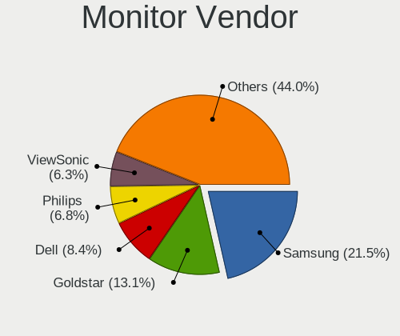

| Vendor               | Desktops | Percent |
|----------------------|----------|---------|
| Samsung Electronics  | 36       | 22.09%  |
| Goldstar             | 22       | 13.5%   |
| Dell                 | 14       | 8.59%   |
| Philips              | 12       | 7.36%   |
| ViewSonic            | 11       | 6.75%   |
| BenQ                 | 10       | 6.13%   |
| Ancor Communications | 10       | 6.13%   |
| Acer                 | 10       | 6.13%   |
| AOC                  | 7        | 4.29%   |
| NEC Computers        | 6        | 3.68%   |
| Sony                 | 4        | 2.45%   |
| LG Electronics       | 4        | 2.45%   |
| Hewlett-Packard      | 4        | 2.45%   |
| RTK                  | 2        | 1.23%   |
| Iiyama               | 2        | 1.23%   |
| Fujitsu Siemens      | 2        | 1.23%   |
| Unknown (CDD)        | 1        | 0.61%   |
| Panasonic            | 1        | 0.61%   |
| Microstep            | 1        | 0.61%   |
| Lenovo               | 1        | 0.61%   |
| InfoVision           | 1        | 0.61%   |
| Daewoo               | 1        | 0.61%   |
| Unknown              | 1        | 0.61%   |

Monitor Model
-------------

Monitor models

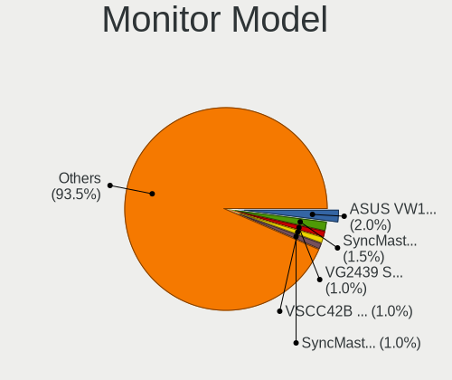

| Model                                                                  | Desktops | Percent |
|------------------------------------------------------------------------|----------|---------|
| Ancor Communications ASUS VW199 ACI19ED 1440x900 410x260mm 19.1-inch   | 4        | 2.33%   |
| Samsung Electronics SyncMaster SAM03CF 1280x1024 340x270mm 17.1-inch   | 3        | 1.74%   |
| ViewSonic LCD Monitor VSCC42B 1920x1080 480x270mm 21.7-inch            | 2        | 1.16%   |
| Samsung Electronics SyncMaster SAM027D 1680x1050 430x270mm 20.0-inch   | 2        | 1.16%   |
| Samsung Electronics SME1920NR SAM06A4 1280x1024 380x300mm 19.1-inch    | 2        | 1.16%   |
| Samsung Electronics SMBX2250 SAM071B 1920x1080 480x270mm 21.7-inch     | 2        | 1.16%   |
| Samsung Electronics S22B300 SAM08AC 1920x1080 480x270mm 21.7-inch      | 2        | 1.16%   |
| Samsung Electronics LCD Monitor SAM0AC6 1920x1080 1110x620mm 50.1-inch | 2        | 1.16%   |
| RTK WCS Display RTK1A1B 1920x1080 344x195mm 15.6-inch                  | 2        | 1.16%   |
| Philips PHL 240V5 PHLC10A 1920x1080 530x300mm 24.0-inch                | 2        | 1.16%   |
| Philips 170S PHL0839 1280x1024 340x270mm 17.1-inch                     | 2        | 1.16%   |
| NEC Computers FE791SB NEC61D7 1600x1200 330x240mm 16.1-inch            | 2        | 1.16%   |
| Goldstar W1934 GSM4B7A 1440x900 410x260mm 19.1-inch                    | 2        | 1.16%   |
| Goldstar LG Ultra HD GSM5B09 3840x2160 600x340mm 27.2-inch             | 2        | 1.16%   |
| Goldstar LG FULL HD GSM5B55 1920x1080 480x270mm 21.7-inch              | 2        | 1.16%   |
| Dell U2412M DELA07A 1920x1200 520x320mm 24.0-inch                      | 2        | 1.16%   |
| ViewSonic VX2458-mhd VSC0437 1920x1080 520x290mm 23.4-inch             | 1        | 0.58%   |
| ViewSonic VP171s-2 VSC4B1B 1280x1024 340x270mm 17.1-inch               | 1        | 0.58%   |
| ViewSonic VG2439 Series VSCD22B 1920x1080 520x290mm 23.4-inch          | 1        | 0.58%   |
| ViewSonic VA703-4SERIES VSC6A1E 1280x1024 340x270mm 17.1-inch          | 1        | 0.58%   |
| ViewSonic VA2710-FHD VSCA736 1920x1080 600x340mm 27.2-inch             | 1        | 0.58%   |
| ViewSonic VA2418-FHD VSCD739 1920x1080 530x300mm 24.0-inch             | 1        | 0.58%   |
| ViewSonic LCD Monitor VX2451 SERIES 1920x1080                          | 1        | 0.58%   |
| ViewSonic LCD Monitor VSC8724 1440x900 410x260mm 19.1-inch             | 1        | 0.58%   |
| ViewSonic LCD Monitor VSC5826 1366x768 410x230mm 18.5-inch             | 1        | 0.58%   |
| ViewSonic LCD Monitor VSC2528 1920x1080 520x290mm 23.4-inch            | 1        | 0.58%   |
| Unknown (CDD) VGA CDD0030 1920x1080 1150x650mm 52.0-inch               | 1        | 0.58%   |
| Sony TV  *00 SNY8204 3840x2160 1220x680mm 55.0-inch                    | 1        | 0.58%   |
| Sony TV  *00 SNY7C04 3840x2160 1080x610mm 48.8-inch                    | 1        | 0.58%   |
| Sony SDM-S75D/F/N SNY3800 1280x1024 340x270mm 17.1-inch                | 1        | 0.58%   |
| Sony SDM-E76D SNYB200 1280x1024 340x270mm 17.1-inch                    | 1        | 0.58%   |
| Samsung Electronics U32H85x SAM0E3C 3840x2160 700x390mm 31.5-inch      | 1        | 0.58%   |
| Samsung Electronics SyncMaster SAM027E 1680x1050 470x300mm 22.0-inch   | 1        | 0.58%   |
| Samsung Electronics SyncMaster SAM026F 1280x1024 380x300mm 19.1-inch   | 1        | 0.58%   |
| Samsung Electronics SyncMaster SAM0226 1440x900 410x260mm 19.1-inch    | 1        | 0.58%   |
| Samsung Electronics SyncMaster SAM021E 1680x1050 430x270mm 20.0-inch   | 1        | 0.58%   |
| Samsung Electronics SyncMaster SAM01BB 1280x1024 380x300mm 19.1-inch   | 1        | 0.58%   |
| Samsung Electronics SyncMaster SAM011F 1280x1024 380x300mm 19.1-inch   | 1        | 0.58%   |
| Samsung Electronics SyncMaster SAM011E 1280x1024 340x270mm 17.1-inch   | 1        | 0.58%   |
| Samsung Electronics SMS23A550H SAM07C9 1920x1080 510x290mm 23.1-inch   | 1        | 0.58%   |

Monitor Resolution
------------------

Monitor screen resolution

| Resolution         | Desktops | Percent |
|--------------------|----------|---------|
| 1920x1080 (FHD)    | 70       | 44.03%  |
| 1280x1024 (SXGA)   | 29       | 18.24%  |
| 3840x2160 (4K)     | 12       | 7.55%   |
| 1440x900 (WXGA+)   | 9        | 5.66%   |
| 1920x1200 (WUXGA)  | 8        | 5.03%   |
| 1680x1050 (WSXGA+) | 8        | 5.03%   |
| 1600x900 (HD+)     | 6        | 3.77%   |
| 2560x1440 (QHD)    | 5        | 3.14%   |
| 1366x768 (WXGA)    | 5        | 3.14%   |
| 1600x1200          | 2        | 1.26%   |
| Unknown            | 2        | 1.26%   |
| 3440x1440          | 1        | 0.63%   |
| 2560x1080          | 1        | 0.63%   |
| 1024x768 (XGA)     | 1        | 0.63%   |

Monitor Diagonal
----------------

Diagonal size in inches

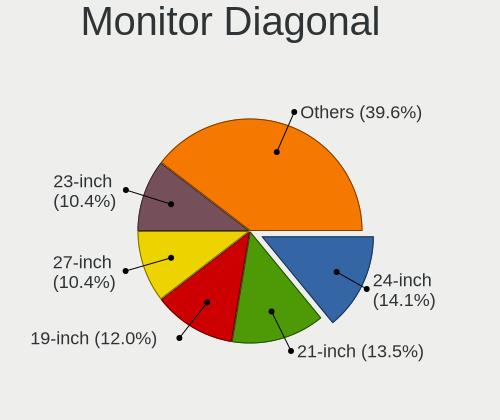

| Inches  | Desktops | Percent |
|---------|----------|---------|
| 24      | 25       | 15.24%  |
| 21      | 23       | 14.02%  |
| 19      | 22       | 13.41%  |
| 17      | 18       | 10.98%  |
| Unknown | 18       | 10.98%  |
| 27      | 16       | 9.76%   |
| 23      | 12       | 7.32%   |
| 18      | 5        | 3.05%   |
| 22      | 4        | 2.44%   |
| 20      | 4        | 2.44%   |
| 31      | 3        | 1.83%   |
| 50      | 2        | 1.22%   |
| 16      | 2        | 1.22%   |
| 15      | 2        | 1.22%   |
| 57      | 1        | 0.61%   |
| 55      | 1        | 0.61%   |
| 52      | 1        | 0.61%   |
| 48      | 1        | 0.61%   |
| 34      | 1        | 0.61%   |
| 26      | 1        | 0.61%   |
| 14      | 1        | 0.61%   |
| 12      | 1        | 0.61%   |

Monitor Width
-------------

Physical width

| Width in mm | Desktops | Percent |
|-------------|----------|---------|
| 501-600     | 53       | 32.72%  |
| 401-500     | 48       | 29.63%  |
| 301-350     | 22       | 13.58%  |
| Unknown     | 18       | 11.11%  |
| 351-400     | 9        | 5.56%   |
| 1001-1500   | 6        | 3.7%    |
| 601-700     | 3        | 1.85%   |
| 201-300     | 2        | 1.23%   |
| 701-800     | 1        | 0.62%   |

Aspect Ratio
------------

Proportional relationship between the width and the height

| Ratio   | Desktops | Percent |
|---------|----------|---------|
| 16/9    | 89       | 55.63%  |
| 5/4     | 26       | 16.25%  |
| 16/10   | 25       | 15.63%  |
| Unknown | 16       | 10%     |
| 4/3     | 3        | 1.88%   |
| 21/9    | 1        | 0.63%   |

Monitor Area
------------

Area in inch

| Area in inch | Desktops | Percent |
|----------------|----------|---------|
| 201-250        | 56       | 33.94%  |
| 151-200        | 28       | 16.97%  |
| 141-150        | 22       | 13.33%  |
| Unknown        | 18       | 10.91%  |
| 301-350        | 17       | 10.3%   |
| 251-300        | 8        | 4.85%   |
| More than 1000 | 6        | 3.64%   |
| 351-500        | 4        | 2.42%   |
| 101-110        | 3        | 1.82%   |
| 121-130        | 2        | 1.21%   |
| 61-70          | 1        | 0.61%   |

Pixel Density
-------------

Pixels per inch

| Density | Desktops | Percent |
|---------|----------|---------|
| 51-100  | 99       | 61.11%  |
| 101-120 | 25       | 15.43%  |
| Unknown | 18       | 11.11%  |
| 121-160 | 10       | 6.17%   |
| 161-240 | 6        | 3.7%    |
| 1-50    | 4        | 2.47%   |

Multiple Monitors
-----------------

Total monitors connected

| Total | Desktops | Percent |
|-------|----------|---------|
| 0     | 232      | 58.15%  |
| 1     | 155      | 38.85%  |
| 2     | 11       | 2.76%   |
| 3     | 1        | 0.25%   |

Network
-------

Net Controller Vendor
---------------------

Controller vendors

| Vendor                            | Desktops | Percent |
|-----------------------------------|----------|---------|
| Realtek Semiconductor             | 231      | 46.48%  |
| Intel                             | 142      | 28.57%  |
| Qualcomm Atheros                  | 44       | 8.85%   |
| Broadcom                          | 15       | 3.02%   |
| Marvell Technology Group          | 8        | 1.61%   |
| D-Link System                     | 8        | 1.61%   |
| VIA Technologies                  | 7        | 1.41%   |
| Huawei Technologies               | 5        | 1.01%   |
| TP-Link                           | 3        | 0.6%    |
| Ralink                            | 3        | 0.6%    |
| IMC Networks                      | 3        | 0.6%    |
| 3Com                              | 3        | 0.6%    |
| ZTE WCDMA Technologies MSM        | 2        | 0.4%    |
| Samsung Electronics               | 2        | 0.4%    |
| Ralink Technology                 | 2        | 0.4%    |
| Qualcomm Atheros Communications   | 2        | 0.4%    |
| Qualcomm                          | 2        | 0.4%    |
| D-Link                            | 2        | 0.4%    |
| Sundance Technology Inc / IC Plus | 1        | 0.2%    |
| Silicon Integrated Systems [SiS]  | 1        | 0.2%    |
| Qcom                              | 1        | 0.2%    |
| OPPO Electronics                  | 1        | 0.2%    |
| Nvidia                            | 1        | 0.2%    |
| MYRICOM                           | 1        | 0.2%    |
| Mercucys                          | 1        | 0.2%    |
| Edimax Technology                 | 1        | 0.2%    |
| Atmel                             | 1        | 0.2%    |
| ASUSTek Computer                  | 1        | 0.2%    |
| Aquantia                          | 1        | 0.2%    |
| Apple                             | 1        | 0.2%    |
| Accton Technology                 | 1        | 0.2%    |

Net Controller Model
--------------------

Controller models

| Model                                                                         | Desktops | Percent |
|-------------------------------------------------------------------------------|----------|---------|
| Realtek RTL8111/8168/8411 PCI Express Gigabit Ethernet Controller             | 189      | 32.87%  |
| Intel 82574L Gigabit Network Connection                                       | 21       | 3.65%   |
| Intel I211 Gigabit Network Connection                                         | 20       | 3.48%   |
| Realtek RTL8125 2.5GbE Controller                                             | 19       | 3.3%    |
| Intel I350 Gigabit Network Connection                                         | 10       | 1.74%   |
| Realtek RTL810xE PCI Express Fast Ethernet controller                         | 9        | 1.57%   |
| Realtek RTL-8100/8101L/8139 PCI Fast Ethernet Adapter                         | 9        | 1.57%   |
| Intel Ethernet Controller I225-V                                              | 9        | 1.57%   |
| Intel I210 Gigabit Network Connection                                         | 7        | 1.22%   |
| Qualcomm Atheros AR9462 Wireless Network Adapter                              | 6        | 1.04%   |
| Intel Ethernet Controller I226-V                                              | 6        | 1.04%   |
| Intel 82579V Gigabit Network Connection                                       | 6        | 1.04%   |
| VIA VT6105/VT6106S [Rhine-III]                                                | 5        | 0.87%   |
| Qualcomm Atheros AR8151 v2.0 Gigabit Ethernet                                 | 5        | 0.87%   |
| Marvell Group 88E8056 PCI-E Gigabit Ethernet Controller                       | 5        | 0.87%   |
| Intel Wi-Fi 6 AX200                                                           | 5        | 0.87%   |
| Intel Ethernet Connection (2) I219-V                                          | 5        | 0.87%   |
| Intel 82583V Gigabit Network Connection                                       | 5        | 0.87%   |
| Intel 82579LM Gigabit Network Connection (Lewisville)                         | 5        | 0.87%   |
| Realtek RTL8188EUS 802.11n Wireless Network Adapter                           | 4        | 0.7%    |
| Realtek RTL8169 PCI Gigabit Ethernet Controller                               | 4        | 0.7%    |
| Realtek Killer E3000 2.5GbE Controller                                        | 4        | 0.7%    |
| Qualcomm Atheros Attansic L1 Gigabit Ethernet                                 | 4        | 0.7%    |
| Qualcomm Atheros AR9285 Wireless Network Adapter (PCI-Express)                | 4        | 0.7%    |
| Qualcomm Atheros AR8131 Gigabit Ethernet                                      | 4        | 0.7%    |
| Qualcomm Atheros AR8121/AR8113/AR8114 Gigabit or Fast Ethernet                | 4        | 0.7%    |
| Intel Ethernet Controller 10-Gigabit X540-AT2                                 | 4        | 0.7%    |
| Intel Ethernet Connection I217-V                                              | 4        | 0.7%    |
| Intel Ethernet Connection (7) I219-V                                          | 4        | 0.7%    |
| Intel 82599ES 10-Gigabit SFI/SFP+ Network Connection                          | 4        | 0.7%    |
| Intel 82576 Gigabit Network Connection                                        | 4        | 0.7%    |
| D-Link System DGE-528T Gigabit Ethernet Adapter                               | 4        | 0.7%    |
| Realtek RTL8192CU 802.11n WLAN Adapter                                        | 3        | 0.52%   |
| Qualcomm Atheros AR93xx Wireless Network Adapter                              | 3        | 0.52%   |
| Marvell Group 88E8053 PCI-E Gigabit Ethernet Controller                       | 3        | 0.52%   |
| Intel Wireless 7265                                                           | 3        | 0.52%   |
| Intel Ethernet Connection (7) I219-LM                                         | 3        | 0.52%   |
| Intel Ethernet Connection (17) I219-V                                         | 3        | 0.52%   |
| Intel 82572EI Gigabit Ethernet Controller (Copper)                            | 3        | 0.52%   |
| Intel 82571EB/82571GB Gigabit Ethernet Controller D0/D1 (copper applications) | 3        | 0.52%   |

Wireless Vendor
---------------

Wireless vendors

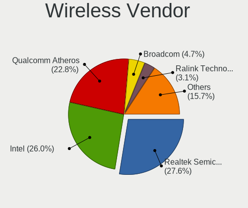

| Vendor                          | Desktops | Percent |
|---------------------------------|----------|---------|
| Intel                           | 28       | 29.17%  |
| Realtek Semiconductor           | 22       | 22.92%  |
| Qualcomm Atheros                | 22       | 22.92%  |
| Broadcom                        | 5        | 5.21%   |
| TP-Link                         | 3        | 3.13%   |
| Ralink                          | 3        | 3.13%   |
| IMC Networks                    | 3        | 3.13%   |
| Ralink Technology               | 2        | 2.08%   |
| Qualcomm Atheros Communications | 2        | 2.08%   |
| D-Link                          | 2        | 2.08%   |
| Qcom                            | 1        | 1.04%   |
| Mercucys                        | 1        | 1.04%   |
| Edimax Technology               | 1        | 1.04%   |
| ASUSTek Computer                | 1        | 1.04%   |

Wireless Model
--------------

Wireless models

| Model                                                                                | Desktops | Percent |
|--------------------------------------------------------------------------------------|----------|---------|
| Qualcomm Atheros AR9462 Wireless Network Adapter                                     | 6        | 6.19%   |
| Intel Wi-Fi 6 AX200                                                                  | 5        | 5.15%   |
| Realtek RTL8188EUS 802.11n Wireless Network Adapter                                  | 4        | 4.12%   |
| Qualcomm Atheros AR9285 Wireless Network Adapter (PCI-Express)                       | 4        | 4.12%   |
| Realtek RTL8192CU 802.11n WLAN Adapter                                               | 3        | 3.09%   |
| Qualcomm Atheros AR93xx Wireless Network Adapter                                     | 3        | 3.09%   |
| Intel Wireless 7265                                                                  | 3        | 3.09%   |
| Realtek RTL8812AE 802.11ac PCIe Wireless Network Adapter                             | 2        | 2.06%   |
| Realtek RTL8723BE PCIe Wireless Network Adapter                                      | 2        | 2.06%   |
| Realtek RTL8192EE PCIe Wireless Network Adapter                                      | 2        | 2.06%   |
| Realtek RTL8188CE 802.11b/g/n WiFi Adapter                                           | 2        | 2.06%   |
| Qualcomm Atheros AR9485 Wireless Network Adapter                                     | 2        | 2.06%   |
| Qualcomm Atheros AR928X Wireless Network Adapter (PCI-Express)                       | 2        | 2.06%   |
| Intel Wireless 8265 / 8275                                                           | 2        | 2.06%   |
| Intel Wi-Fi 6 AX210/AX211/AX411 160MHz                                               | 2        | 2.06%   |
| Intel Dual Band Wireless-AC 3168NGW [Stone Peak]                                     | 2        | 2.06%   |
| Intel CNVi: Wi-Fi                                                                    | 2        | 2.06%   |
| Intel Centrino Wireless-N 2230                                                       | 2        | 2.06%   |
| Intel Cannon Lake PCH CNVi WiFi                                                      | 2        | 2.06%   |
| IMC Networks Realtek RTL8191SU Wireless LAN 802.11n USB 2.0 Network Adapter          | 2        | 2.06%   |
| Broadcom BCM4360 802.11ac Dual Band Wireless Network Adapter                         | 2        | 2.06%   |
| TP-Link Wireless USB Adapter                                                         | 1        | 1.03%   |
| TP-Link Wireless MU-MIMO USB Adapter                                                 | 1        | 1.03%   |
| TP-Link TL-WN722N v2/v3 [Realtek RTL8188EUS]                                         | 1        | 1.03%   |
| Realtek RTL8852BE PCIe 802.11ax Wireless Network Controller                          | 1        | 1.03%   |
| Realtek RTL8822CE 802.11ac PCIe Wireless Network Adapter                             | 1        | 1.03%   |
| Realtek RTL8191SU 802.11n WLAN Adapter                                               | 1        | 1.03%   |
| Realtek RTL8188EE Wireless Network Adapter                                           | 1        | 1.03%   |
| Realtek RTL8188CUS 802.11n WLAN Adapter                                              | 1        | 1.03%   |
| Realtek Bluetooth Adapter                                                            | 1        | 1.03%   |
| Realtek 802.11n WLAN Adapter                                                         | 1        | 1.03%   |
| Ralink RT5370 Wireless Adapter                                                       | 1        | 1.03%   |
| Ralink RT2870/RT3070 Wireless Adapter                                                | 1        | 1.03%   |
| Ralink RT5390 Wireless 802.11n 1T/1R PCIe                                            | 1        | 1.03%   |
| Ralink RT3290 Wireless 802.11n 1T/1R PCIe                                            | 1        | 1.03%   |
| Ralink RT3060 Wireless 802.11n 1T/1R                                                 | 1        | 1.03%   |
| Qualcomm Atheros QCA9565 / AR9565 Wireless Network Adapter                           | 1        | 1.03%   |
| Qualcomm Atheros TP-Link TL-WN821N v3 / TL-WN822N v2 802.11n [Atheros AR7010+AR9287] | 1        | 1.03%   |
| Qualcomm Atheros TP-Link TL-WN322G v3 / TL-WN422G v2 802.11g [Atheros AR9271]        | 1        | 1.03%   |
| Qualcomm Atheros AR9287 Wireless Network Adapter (PCI-Express)                       | 1        | 1.03%   |

Ethernet Vendor
---------------

Ethernet vendors

| Vendor                            | Desktops | Percent |
|-----------------------------------|----------|---------|
| Realtek Semiconductor             | 226      | 52.56%  |
| Intel                             | 129      | 30%     |
| Qualcomm Atheros                  | 23       | 5.35%   |
| Broadcom                          | 10       | 2.33%   |
| Marvell Technology Group          | 8        | 1.86%   |
| D-Link System                     | 8        | 1.86%   |
| VIA Technologies                  | 7        | 1.63%   |
| 3Com                              | 3        | 0.7%    |
| ZTE WCDMA Technologies MSM        | 2        | 0.47%   |
| Samsung Electronics               | 2        | 0.47%   |
| Qualcomm                          | 2        | 0.47%   |
| Huawei Technologies               | 2        | 0.47%   |
| Sundance Technology Inc / IC Plus | 1        | 0.23%   |
| Silicon Integrated Systems [SiS]  | 1        | 0.23%   |
| OPPO Electronics                  | 1        | 0.23%   |
| Nvidia                            | 1        | 0.23%   |
| MYRICOM                           | 1        | 0.23%   |
| Aquantia                          | 1        | 0.23%   |
| Apple                             | 1        | 0.23%   |
| Accton Technology                 | 1        | 0.23%   |

Ethernet Model
--------------

Ethernet models

| Model                                                                         | Desktops | Percent |
|-------------------------------------------------------------------------------|----------|---------|
| Realtek RTL8111/8168/8411 PCI Express Gigabit Ethernet Controller             | 189      | 39.87%  |
| Intel 82574L Gigabit Network Connection                                       | 21       | 4.43%   |
| Intel I211 Gigabit Network Connection                                         | 20       | 4.22%   |
| Realtek RTL8125 2.5GbE Controller                                             | 19       | 4.01%   |
| Intel I350 Gigabit Network Connection                                         | 10       | 2.11%   |
| Realtek RTL810xE PCI Express Fast Ethernet controller                         | 9        | 1.9%    |
| Realtek RTL-8100/8101L/8139 PCI Fast Ethernet Adapter                         | 9        | 1.9%    |
| Intel Ethernet Controller I225-V                                              | 9        | 1.9%    |
| Intel I210 Gigabit Network Connection                                         | 7        | 1.48%   |
| Intel Ethernet Controller I226-V                                              | 6        | 1.27%   |
| Intel 82579V Gigabit Network Connection                                       | 6        | 1.27%   |
| VIA VT6105/VT6106S [Rhine-III]                                                | 5        | 1.05%   |
| Qualcomm Atheros AR8151 v2.0 Gigabit Ethernet                                 | 5        | 1.05%   |
| Marvell Group 88E8056 PCI-E Gigabit Ethernet Controller                       | 5        | 1.05%   |
| Intel Ethernet Connection (2) I219-V                                          | 5        | 1.05%   |
| Intel 82583V Gigabit Network Connection                                       | 5        | 1.05%   |
| Intel 82579LM Gigabit Network Connection (Lewisville)                         | 5        | 1.05%   |
| Realtek RTL8169 PCI Gigabit Ethernet Controller                               | 4        | 0.84%   |
| Realtek Killer E3000 2.5GbE Controller                                        | 4        | 0.84%   |
| Qualcomm Atheros Attansic L1 Gigabit Ethernet                                 | 4        | 0.84%   |
| Qualcomm Atheros AR8131 Gigabit Ethernet                                      | 4        | 0.84%   |
| Qualcomm Atheros AR8121/AR8113/AR8114 Gigabit or Fast Ethernet                | 4        | 0.84%   |
| Intel Ethernet Controller 10-Gigabit X540-AT2                                 | 4        | 0.84%   |
| Intel Ethernet Connection I217-V                                              | 4        | 0.84%   |
| Intel Ethernet Connection (7) I219-V                                          | 4        | 0.84%   |
| Intel 82599ES 10-Gigabit SFI/SFP+ Network Connection                          | 4        | 0.84%   |
| Intel 82576 Gigabit Network Connection                                        | 4        | 0.84%   |
| D-Link System DGE-528T Gigabit Ethernet Adapter                               | 4        | 0.84%   |
| Marvell Group 88E8053 PCI-E Gigabit Ethernet Controller                       | 3        | 0.63%   |
| Intel Ethernet Connection (7) I219-LM                                         | 3        | 0.63%   |
| Intel Ethernet Connection (17) I219-V                                         | 3        | 0.63%   |
| Intel 82572EI Gigabit Ethernet Controller (Copper)                            | 3        | 0.63%   |
| Intel 82571EB/82571GB Gigabit Ethernet Controller D0/D1 (copper applications) | 3        | 0.63%   |
| Intel 82562EZ 10/100 Ethernet Controller                                      | 3        | 0.63%   |
| Intel 82540EM Gigabit Ethernet Controller                                     | 3        | 0.63%   |
| Broadcom NetXtreme BCM5723 Gigabit Ethernet PCIe                              | 3        | 0.63%   |
| ZTE WCDMA MSM Remote NDIS based Internet Sharing Device                       | 2        | 0.42%   |
| VIA VT6102/VT6103 [Rhine-II]                                                  | 2        | 0.42%   |
| Qualcomm Atheros AR8152 v2.0 Fast Ethernet                                    | 2        | 0.42%   |
| Marvell Group 88E8001 Gigabit Ethernet Controller                             | 2        | 0.42%   |

Net Controller Kind
-------------------

Ethernet, WiFi or modem

| Kind     | Desktops | Percent |
|----------|----------|---------|
| Ethernet | 370      | 79.74%  |
| WiFi     | 90       | 19.4%   |
| Unknown  | 3        | 0.65%   |
| Modem    | 1        | 0.22%   |

Used Controller
---------------

Currently used network controller

| Kind     | Desktops | Percent |
|----------|----------|---------|
| Ethernet | 326      | 91.06%  |
| WiFi     | 31       | 8.66%   |
| Unknown  | 1        | 0.28%   |

NICs
----

Total network controllers on board

| Total | Desktops | Percent |
|-------|----------|---------|
| 1     | 183      | 45.86%  |
| 2     | 103      | 25.81%  |
| 3     | 39       | 9.77%   |
| 0     | 33       | 8.27%   |
| 4     | 20       | 5.01%   |
| 6     | 8        | 2.01%   |
| 5     | 5        | 1.25%   |
| 7     | 3        | 0.75%   |
| 9     | 2        | 0.5%    |
| 8     | 2        | 0.5%    |
| 12    | 1        | 0.25%   |

IPv6
----

IPv6 vs IPv4

| Used | Desktops | Percent |
|------|----------|---------|
| No   | 380      | 95.96%  |
| Yes  | 16       | 4.04%   |

Bluetooth
---------

Bluetooth Vendor
----------------

Controller vendors

| Vendor                          | Desktops | Percent |
|---------------------------------|----------|---------|
| Intel                           | 26       | 47.27%  |
| Cambridge Silicon Radio         | 6        | 10.91%  |
| Realtek Semiconductor           | 4        | 7.27%   |
| Qualcomm Atheros Communications | 4        | 7.27%   |
| IMC Networks                    | 4        | 7.27%   |
| ASUSTek Computer                | 3        | 5.45%   |
| Apple                           | 2        | 3.64%   |
| Silicon Wave                    | 1        | 1.82%   |
| Ralink                          | 1        | 1.82%   |
| Lite-On Technology              | 1        | 1.82%   |
| Foxconn / Hon Hai               | 1        | 1.82%   |
| Edimax Technology               | 1        | 1.82%   |
| Broadcom                        | 1        | 1.82%   |

Bluetooth Model
---------------

Controller models

| Model                                                       | Desktops | Percent |
|-------------------------------------------------------------|----------|---------|
| Intel Bluetooth wireless interface                          | 8        | 14.29%  |
| Intel AX200 Bluetooth                                       | 6        | 10.71%  |
| Cambridge Silicon Radio Bluetooth Dongle (HCI mode)         | 6        | 10.71%  |
| Realtek Bluetooth Adapter                                   | 3        | 5.36%   |
| Intel Centrino Bluetooth Wireless Transceiver               | 3        | 5.36%   |
| Intel Bluetooth 9460/9560 Jefferson Peak (JfP)              | 3        | 5.36%   |
| Intel AX201 Bluetooth                                       | 3        | 5.36%   |
| Qualcomm Atheros AR3012 Bluetooth 4.0                       | 2        | 3.57%   |
| Intel Wireless-AC 3168 Bluetooth                            | 2        | 3.57%   |
| Intel AX210 Bluetooth                                       | 2        | 3.57%   |
| IMC Networks Qualcomm Atheros AR9462 Bluetooth 4.0          | 2        | 3.57%   |
| ASUS Broadcom BCM20702A0 Bluetooth                          | 2        | 3.57%   |
| Silicon Wave Bluetooth Wireless Adapter                     | 1        | 1.79%   |
| Realtek Bluetooth 4.0 Adapter                               | 1        | 1.79%   |
| Ralink RT3290 Bluetooth                                     | 1        | 1.79%   |
| Qualcomm Atheros Dell Wireless 1707 Bluetooth 4.0 LE Device | 1        | 1.79%   |
| Qualcomm Atheros AR9462 Bluetooth 3.0 + HS Adapter          | 1        | 1.79%   |
| Lite-On Atheros AR3012 Bluetooth                            | 1        | 1.79%   |
| IMC Networks Realtek Bluetooth Adapter                      | 1        | 1.79%   |
| IMC Networks Realtek Bluetooth 4.0 + High Speed Chip        | 1        | 1.79%   |
| Foxconn / Hon Hai Qualcomm Atheros AR3011 Bluetooth Adapter | 1        | 1.79%   |
| Edimax EW-7611ULB 802.11b/g/n and Bluetooth 4.0 Adapter     | 1        | 1.79%   |
| Broadcom BCM92046DG-CL1ROM Bluetooth 2.1 Adapter            | 1        | 1.79%   |
| ASUS Qualcomm Atheros AR9462 Bluetooth 4.0 + HS Adapter     | 1        | 1.79%   |
| Apple Built-in Bluetooth 2.0+EDR HCI                        | 1        | 1.79%   |
| Apple Bluetooth Host Controller                             | 1        | 1.79%   |

Sound
-----

Sound Vendor
------------

Sound card vendors

| Vendor                                       | Desktops | Percent |
|----------------------------------------------|----------|---------|
| Intel                                        | 226      | 50.67%  |
| Nvidia                                       | 90       | 20.18%  |
| AMD                                          | 86       | 19.28%  |
| C-Media Electronics                          | 6        | 1.35%   |
| VIA Technologies                             | 4        | 0.9%    |
| Realtek Semiconductor                        | 4        | 0.9%    |
| JMTek                                        | 4        | 0.9%    |
| Zoran Co. Personal Media Division (Nogatech) | 3        | 0.67%   |
| Logitech                                     | 3        | 0.67%   |
| Texas Instruments                            | 2        | 0.45%   |
| Creative Technology                          | 2        | 0.45%   |
| Creative Labs                                | 2        | 0.45%   |
| Xilinx                                       | 1        | 0.22%   |
| SteelSeries ApS                              | 1        | 0.22%   |
| Silicon Integrated Systems [SiS]             | 1        | 0.22%   |
| Samsung Electronics                          | 1        | 0.22%   |
| Microsoft                                    | 1        | 0.22%   |
| KTMicro                                      | 1        | 0.22%   |
| HECATE G2 GAMING HEADSET                     | 1        | 0.22%   |
| GN Netcom                                    | 1        | 0.22%   |
| Generalplus Technology                       | 1        | 0.22%   |
| FiiO Electronics Technology                  | 1        | 0.22%   |
| ESS Technology                               | 1        | 0.22%   |
| Edifier Technology                           | 1        | 0.22%   |
| Cambridge Silicon Radio                      | 1        | 0.22%   |
| Unknown                                      | 1        | 0.22%   |

Sound Model
-----------

Sound card models

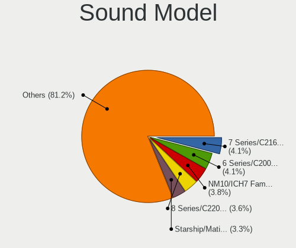

| Model                                                                      | Desktops | Percent |
|----------------------------------------------------------------------------|----------|---------|
| Intel 7 Series/C216 Chipset Family High Definition Audio Controller        | 25       | 5.06%   |
| Intel 6 Series/C200 Series Chipset Family High Definition Audio Controller | 22       | 4.45%   |
| Intel NM10/ICH7 Family High Definition Audio Controller                    | 20       | 4.05%   |
| AMD Starship/Matisse HD Audio Controller                                   | 19       | 3.85%   |
| Intel 8 Series/C220 Series Chipset High Definition Audio Controller        | 18       | 3.64%   |
| AMD SBx00 Azalia (Intel HDA)                                               | 16       | 3.24%   |
| Intel 100 Series/C230 Series Chipset Family HD Audio Controller            | 14       | 2.83%   |
| Nvidia GK208 HDMI/DP Audio Controller                                      | 13       | 2.63%   |
| Intel 82801JI (ICH10 Family) HD Audio Controller                           | 13       | 2.63%   |
| Intel Cannon Lake PCH cAVS                                                 | 12       | 2.43%   |
| AMD Family 17h/19h HD Audio Controller                                     | 12       | 2.43%   |
| AMD Ellesmere HDMI Audio [Radeon RX 470/480 / 570/580/590]                 | 11       | 2.23%   |
| Nvidia GK107 HDMI Audio Controller                                         | 10       | 2.02%   |
| Intel Atom Processor Z36xxx/Z37xxx Series High Definition Audio Controller | 10       | 2.02%   |
| Intel 200 Series PCH HD Audio                                              | 9        | 1.82%   |
| Nvidia GP107GL High Definition Audio Controller                            | 8        | 1.62%   |
| Intel Xeon E3-1200 v3/4th Gen Core Processor HD Audio Controller           | 8        | 1.62%   |
| Intel Jasper Lake HD Audio                                                 | 8        | 1.62%   |
| AMD FCH Azalia Controller                                                  | 8        | 1.62%   |
| AMD Family 17h (Models 00h-0fh) HD Audio Controller                        | 8        | 1.62%   |
| Nvidia TU116 High Definition Audio Controller                              | 7        | 1.42%   |
| AMD Renoir Radeon High Definition Audio Controller                         | 7        | 1.42%   |
| Nvidia High Definition Audio Controller                                    | 6        | 1.21%   |
| Intel 82801I (ICH9 Family) HD Audio Controller                             | 6        | 1.21%   |
| Intel 82801H (ICH8 Family) HD Audio Controller                             | 6        | 1.21%   |
| Nvidia GP108 High Definition Audio Controller                              | 5        | 1.01%   |
| Intel Comet Lake PCH cAVS                                                  | 5        | 1.01%   |
| Intel Celeron N3350/Pentium N4200/Atom E3900 Series Audio Cluster          | 5        | 1.01%   |
| Intel C610/X99 series chipset HD Audio Controller                          | 5        | 1.01%   |
| Intel Alder Lake-S HD Audio Controller                                     | 5        | 1.01%   |
| AMD Oland/Hainan/Cape Verde/Pitcairn HDMI Audio [Radeon HD 7000 Series]    | 5        | 1.01%   |
| AMD Baffin HDMI/DP Audio [Radeon RX 550 640SP / RX 560/560X]               | 5        | 1.01%   |
| Nvidia TU107 GeForce GTX 1650 High Definition Audio Controller             | 4        | 0.81%   |
| Nvidia GF119 HDMI Audio Controller                                         | 4        | 0.81%   |
| Nvidia GF108 High Definition Audio Controller                              | 4        | 0.81%   |
| Nvidia GA106 High Definition Audio Controller                              | 4        | 0.81%   |
| JMTek USB PnP Audio Device                                                 | 4        | 0.81%   |
| Intel Comet Lake PCH-V cAVS                                                | 4        | 0.81%   |
| Intel Celeron/Pentium Silver Processor High Definition Audio               | 4        | 0.81%   |
| Intel 5 Series/3400 Series Chipset High Definition Audio                   | 4        | 0.81%   |

Memory
------

Memory Vendor
-------------

Memory module vendors

| Vendor                                  | Desktops | Percent |
|-----------------------------------------|----------|---------|
| Unknown                                 | 82       | 22.4%   |
| Kingston                                | 75       | 20.49%  |
| Samsung Electronics                     | 36       | 9.84%   |
| Crucial                                 | 25       | 6.83%   |
| SK hynix                                | 20       | 5.46%   |
| Unknown                                 | 16       | 4.37%   |
| Micron Technology                       | 14       | 3.83%   |
| AMD                                     | 12       | 3.28%   |
| Patriot                                 | 11       | 3.01%   |
| Corsair                                 | 10       | 2.73%   |
| G.Skill                                 | 7        | 1.91%   |
| A-DATA Technology                       | 7        | 1.91%   |
| Patriot Memory (PDP Systems)            | 5        | 1.37%   |
| Ramaxel Technology                      | 4        | 1.09%   |
| Nanya Technology                        | 4        | 1.09%   |
| Atermiter                               | 4        | 1.09%   |
| Apacer                                  | 4        | 1.09%   |
| Unknown (ABCD)                          | 3        | 0.82%   |
| Transcend                               | 3        | 0.82%   |
| Goldkey                                 | 3        | 0.82%   |
| Unifosa                                 | 2        | 0.55%   |
| Silicon Power Computer & Communications | 2        | 0.55%   |
| Qumo                                    | 2        | 0.55%   |
| Kllisre                                 | 2        | 0.55%   |
| Kingmax                                 | 2        | 0.55%   |
| Elpida                                  | 2        | 0.55%   |
| Unknown (0x0DD5)                        | 1        | 0.27%   |
| Tigo                                    | 1        | 0.27%   |
| S                                       | 1        | 0.27%   |
| Ramos Technology                        | 1        | 0.27%   |
| Netac                                   | 1        | 0.27%   |
| Innodisk                                | 1        | 0.27%   |
| H                                       | 1        | 0.27%   |
| GOODRAM                                 | 1        | 0.27%   |
| Foxline                                 | 1        | 0.27%   |

Memory Model
------------

Memory module models

| Model                                                                    | Desktops | Percent |
|--------------------------------------------------------------------------|----------|---------|
| Unknown                                                                  | 16       | 3.9%    |
| Unknown RAM Module 2GB DIMM 1333MT/s                                     | 8        | 1.95%   |
| Unknown RAM Module 4GB DIMM 1333MT/s                                     | 5        | 1.22%   |
| Unknown RAM Module 2GB DIMM SDRAM                                        | 5        | 1.22%   |
| Unknown RAM Module 1GB DIMM SDRAM                                        | 5        | 1.22%   |
| Unknown RAM Module 512MB DIMM SDRAM                                      | 4        | 0.98%   |
| Unknown RAM Module 2048MB DIMM DDR2 800MT/s                              | 4        | 0.98%   |
| Unknown RAM Module 2GB DIMM DDR 1333MT/s                                 | 3        | 0.73%   |
| Unknown RAM Module 2GB DIMM 800MT/s                                      | 3        | 0.73%   |
| Unknown (ABCD) RAM 123456789012345678 2GB DIMM LPDDR4 2400MT/s           | 3        | 0.73%   |
| Samsung RAM M378B5273DH0-CH9 4GB DIMM DDR3 1333MT/s                      | 3        | 0.73%   |
| G.Skill RAM F4-4000C18-32GVK 32GB DIMM DDR4 4000MT/s                     | 3        | 0.73%   |
| Crucial RAM CT51264BA160B.C16F 4GB DIMM DDR3 1600MT/s                    | 3        | 0.73%   |
| AMD RAM R748G2400U2S 8GB DIMM DDR4 2400MT/s                              | 3        | 0.73%   |
| A-DATA RAM DDR4 3000 8GB DIMM DDR4 3400MT/s                              | 3        | 0.73%   |
| Unknown RAM Module 8GB DIMM 1333MT/s                                     | 2        | 0.49%   |
| Unknown RAM Module 8192MB DIMM 1066MT/s                                  | 2        | 0.49%   |
| Unknown RAM Module 4GB DIMM DDR3 1600MT/s                                | 2        | 0.49%   |
| Unknown RAM Module 2GB DIMM DDR3 1600MT/s                                | 2        | 0.49%   |
| Unknown RAM Module 2GB DIMM DDR2 800MT/s                                 | 2        | 0.49%   |
| Unknown RAM Module 2GB DIMM DDR2 667MT/s                                 | 2        | 0.49%   |
| Unknown RAM Module 1GB SODIMM DDR2 667MT/s                               | 2        | 0.49%   |
| Unknown RAM Module 1GB DIMM DDR2 400MT/s                                 | 2        | 0.49%   |
| Unknown RAM Module 1GB DIMM 1333MT/s                                     | 2        | 0.49%   |
| Unknown RAM Module 1024MB DIMM SDRAM                                     | 2        | 0.49%   |
| Transcend RAM JM2666HLE-32G 32GB DIMM DDR4 2666MT/s                      | 2        | 0.49%   |
| SK hynix RAM HMT351U6CFR8C-H9 4GB DIMM DDR3 1333MT/s                     | 2        | 0.49%   |
| SK hynix RAM HMT351S6BFR8C-H9 4GB SODIMM DDR3 1333MT/s                   | 2        | 0.49%   |
| Silicon Power & RAM Module 8GB DIMM DDR4 3200MT/s                        | 2        | 0.49%   |
| Samsung RAM M471B5773CHS-CH9 2GB SODIMM DDR3 1333MT/s                    | 2        | 0.49%   |
| Samsung RAM M471B5173QH0-YK0 4GB SODIMM DDR3 1600MT/s                    | 2        | 0.49%   |
| Samsung RAM M393A4K40CB1-CRC 32GB DIMM DDR4 2400MT/s                     | 2        | 0.49%   |
| Samsung RAM M393A2K40BB2-CTD 16GB DIMM DDR4 2667MT/s                     | 2        | 0.49%   |
| Patriot Memory (PDP Systems) RAM PSD416G320081 16GB DIMM DDR4 3200MT/s   | 2        | 0.49%   |
| Patriot Memory (PDP Systems) RAM 3200 C16 Series 16GB DIMM DDR4 2400MT/s | 2        | 0.49%   |
| Kingston RAM KHX3466C19D4/16G 16GB DIMM DDR4 3200MT/s                    | 2        | 0.49%   |
| Kingston RAM KHX3200C16D4/8GX 8GB DIMM DDR4 3200MT/s                     | 2        | 0.49%   |
| Kingston RAM KHX3200C16D4/16GX 16GB DIMM DDR4 3200MT/s                   | 2        | 0.49%   |
| Kingston RAM KHX2400C14S4/16G 16GB SODIMM DDR4 2400MT/s                  | 2        | 0.49%   |
| Kingston RAM KHX2400C11D3/8GX 8GB DIMM DDR3 2400MT/s                     | 2        | 0.49%   |

Memory Kind
-----------

Memory module kinds

| Kind    | Desktops | Percent |
|---------|----------|---------|
| DDR4    | 127      | 39.2%   |
| DDR3    | 110      | 33.95%  |
| Unknown | 31       | 9.57%   |
| DDR2    | 25       | 7.72%   |
| SDRAM   | 18       | 5.56%   |
| DDR     | 9        | 2.78%   |
| LPDDR4  | 3        | 0.93%   |
| DDR5    | 1        | 0.31%   |

Memory Form Factor
------------------

Physical design of the memory module

| Name   | Desktops | Percent |
|--------|----------|---------|
| DIMM   | 276      | 85.45%  |
| SODIMM | 47       | 14.55%  |

Memory Size
-----------

Memory module size

| Size  | Desktops | Percent |
|-------|----------|---------|
| 8192  | 90       | 25.28%  |
| 4096  | 84       | 23.6%   |
| 2048  | 71       | 19.94%  |
| 16384 | 52       | 14.61%  |
| 1024  | 30       | 8.43%   |
| 32768 | 15       | 4.21%   |
| 512   | 12       | 3.37%   |
| 256   | 1        | 0.28%   |
| 8     | 1        | 0.28%   |

Memory Speed
------------

Memory module speed

| Speed   | Desktops | Percent |
|---------|----------|---------|
| 1333    | 56       | 16.52%  |
| 1600    | 53       | 15.63%  |
| 3200    | 43       | 12.68%  |
| 2400    | 43       | 12.68%  |
| 800     | 22       | 6.49%   |
| 2667    | 20       | 5.9%    |
| Unknown | 20       | 5.9%    |
| 667     | 14       | 4.13%   |
| 2133    | 13       | 3.83%   |
| 400     | 8        | 2.36%   |
| 1066    | 7        | 2.06%   |
| 1067    | 5        | 1.47%   |
| 2666    | 4        | 1.18%   |
| 4000    | 3        | 0.88%   |
| 3600    | 3        | 0.88%   |
| 3400    | 3        | 0.88%   |
| 3000    | 3        | 0.88%   |
| 1866    | 3        | 0.88%   |
| 533     | 3        | 0.88%   |
| 2933    | 2        | 0.59%   |
| 4800    | 1        | 0.29%   |
| 3733    | 1        | 0.29%   |
| 2048    | 1        | 0.29%   |
| 1867    | 1        | 0.29%   |
| 1400    | 1        | 0.29%   |
| 1334    | 1        | 0.29%   |
| 1332    | 1        | 0.29%   |
| 933     | 1        | 0.29%   |
| 333     | 1        | 0.29%   |
| 266     | 1        | 0.29%   |
| 133     | 1        | 0.29%   |

Printers & scanners
-------------------

Printer Vendor
--------------

Printer device vendors

| Vendor             | Desktops | Percent |
|--------------------|----------|---------|
| Seiko Epson        | 1        | 25%     |
| Kyocera            | 1        | 25%     |
| Hewlett-Packard    | 1        | 25%     |
| Brother Industries | 1        | 25%     |

Printer Model
-------------

Printer device models

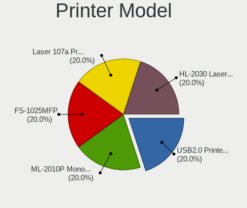

| Model                                 | Desktops | Percent |
|---------------------------------------|----------|---------|
| Seiko Epson USB2.0 Printer (Hi-speed) | 1        | 25%     |
| Kyocera FS-1025MFP                    | 1        | 25%     |
| HP Laser 107a Printer                 | 1        | 25%     |
| Brother HL-2030 Laser Printer         | 1        | 25%     |

Scanner Vendor
--------------

Scanner device vendors

Zero info for selected period =(

Scanner Model
-------------

Scanner device models

Zero info for selected period =(

Camera
------

Camera Vendor
-------------

Camera device vendors

| Vendor                  | Desktops | Percent |
|-------------------------|----------|---------|
| Logitech                | 4        | 22.22%  |
| Microdia                | 3        | 16.67%  |
| Z-Star Microelectronics | 2        | 11.11%  |
| Arkmicro Technologies   | 2        | 11.11%  |
| Ricoh                   | 1        | 5.56%   |
| Realtek Semiconductor   | 1        | 5.56%   |
| Huawei Technologies     | 1        | 5.56%   |
| GEMBIRD                 | 1        | 5.56%   |
| Chicony Electronics     | 1        | 5.56%   |
| Aveo Technology         | 1        | 5.56%   |
| A4Tech                  | 1        | 5.56%   |

Camera Model
------------

Camera device models

| Model                             | Desktops | Percent |
|-----------------------------------|----------|---------|
| Logitech Webcam C270              | 2        | 11.11%  |
| Z-Star Venus USB2.0 Camera        | 1        | 5.56%   |
| Z-Star Integrated Camera          | 1        | 5.56%   |
| Ricoh USB2.0 Camera               | 1        | 5.56%   |
| Realtek USB Video Device          | 1        | 5.56%   |
| Microdia Webcam Vitade AF         | 1        | 5.56%   |
| Microdia USB 2.0 Camera           | 1        | 5.56%   |
| Microdia ASUS USB 2.0 Webcam      | 1        | 5.56%   |
| Logitech Webcam C170              | 1        | 5.56%   |
| Logitech C505 HD Webcam           | 1        | 5.56%   |
| Huawei HiCamera                   | 1        | 5.56%   |
| GEMBIRD USB2.0 PC CAMERA          | 1        | 5.56%   |
| Chicony USB2.0 VGA UVC WebCam     | 1        | 5.56%   |
| Aveo Camera                       | 1        | 5.56%   |
| Arkmicro Webcam Carrefour         | 1        | 5.56%   |
| Arkmicro USB 2.0 PC CAMERA        | 1        | 5.56%   |
| A4Tech A4tech FHD 1080P PC Camera | 1        | 5.56%   |

Security
--------

Fingerprint Vendor
------------------

Fingerprint sensor vendors

| Vendor            | Desktops | Percent |
|-------------------|----------|---------|
| Validity Sensors  | 1        | 50%     |
| FocalTech Systems | 1        | 50%     |

Fingerprint Model
-----------------

Fingerprint sensor models

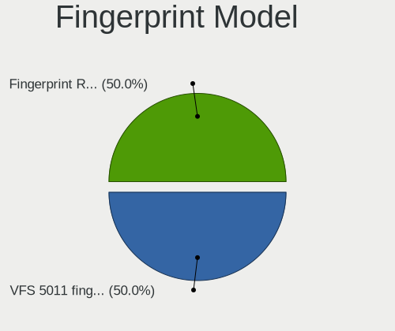

| Model                                        | Desktops | Percent |
|----------------------------------------------|----------|---------|
| Validity Sensors VFS 5011 fingerprint sensor | 1        | 50%     |
| FocalTech Systems Fingerprint Reader         | 1        | 50%     |

Chipcard Vendor
---------------

Chipcard module vendors

Zero info for selected period =(

Chipcard Model
--------------

Chipcard module models

Zero info for selected period =(

Unsupported
-----------

Unsupported Devices
-------------------

Total unsupported devices on board

| Total | Desktops | Percent |
|-------|----------|---------|
| 0     | 180      | 44.78%  |
| 1     | 164      | 40.8%   |
| 2     | 45       | 11.19%  |
| 3     | 10       | 2.49%   |
| 4     | 3        | 0.75%   |

Unsupported Device Types
------------------------

Types of unsupported devices

| Type                     | Desktops | Percent |
|--------------------------|----------|---------|
| Communication controller | 173      | 65.28%  |
| Net/wireless             | 26       | 9.81%   |
| Sound                    | 19       | 7.17%   |
| Bluetooth                | 13       | 4.91%   |
| Firewire controller      | 11       | 4.15%   |
| Net/ethernet             | 7        | 2.64%   |
| Graphics card            | 4        | 1.51%   |
| Card reader              | 4        | 1.51%   |
| Storage/ata              | 3        | 1.13%   |
| Network                  | 3        | 1.13%   |
| Storage                  | 1        | 0.38%   |
| Fingerprint reader       | 1        | 0.38%   |

