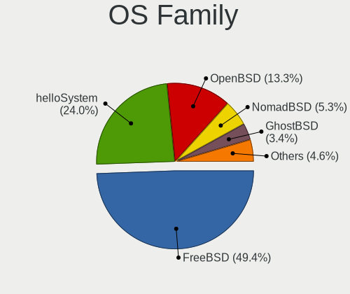
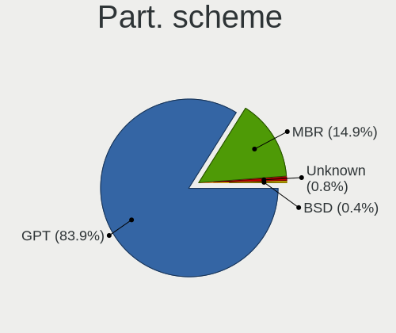
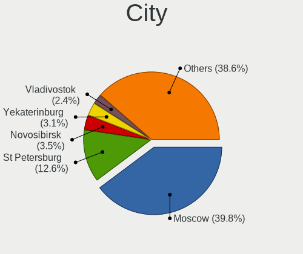
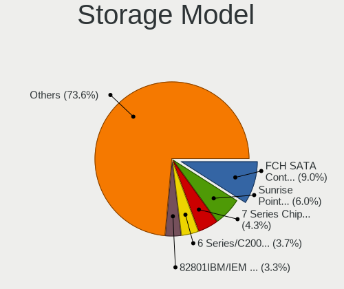
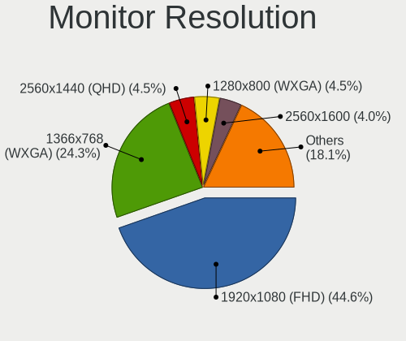
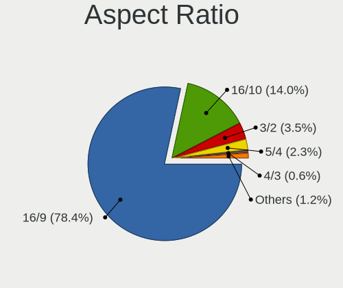
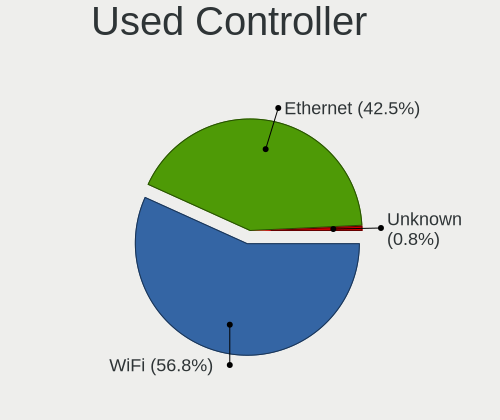

BSD in Russia - Tested Hardware & Statistics (Notebooks)
--------------------------------------------------------

A project to collect tested hardware configurations for BSD in Russia.

Anyone can contribute to this report by the [hw-probe](https://github.com/linuxhw/hw-probe/blob/master/INSTALL.BSD.md) tool:

    hw-probe -all -upload

Please contribute! Especially if your hardware is rare.

Contents
--------

* [ Test Cases ](#test-cases)

* [ System ](#system)
  - [ OS                       ](#os)
  - [ OS Family                ](#os-family)
  - [ Arch                     ](#arch)
  - [ DE                       ](#de)
  - [ Display Server           ](#display-server)
  - [ Display Manager          ](#display-manager)
  - [ OS Lang                  ](#os-lang)
  - [ Boot Mode                ](#boot-mode)
  - [ Filesystem               ](#filesystem)
  - [ Part. scheme             ](#part-scheme)

* [ Board ](#board)
  - [ Vendor                   ](#vendor)
  - [ Model                    ](#model)
  - [ Model Family             ](#model-family)
  - [ MFG Year                 ](#mfg-year)
  - [ Form Factor              ](#form-factor)
  - [ Coreboot                 ](#coreboot)
  - [ RAM Size                 ](#ram-size)
  - [ RAM Used                 ](#ram-used)
  - [ Total Drives             ](#total-drives)
  - [ Has CD-ROM               ](#has-cd-rom)
  - [ Has Ethernet             ](#has-ethernet)
  - [ Has WiFi                 ](#has-wifi)
  - [ Has Bluetooth            ](#has-bluetooth)

* [ Location ](#location)
  - [ Country                  ](#country)
  - [ City                     ](#city)

* [ Drives ](#drives)
  - [ Drive Vendor             ](#drive-vendor)
  - [ Drive Model              ](#drive-model)
  - [ HDD Vendor               ](#hdd-vendor)
  - [ SSD Vendor               ](#ssd-vendor)
  - [ Drive Kind               ](#drive-kind)
  - [ Drive Connector          ](#drive-connector)
  - [ Drive Size               ](#drive-size)
  - [ Space Total              ](#space-total)
  - [ Space Used               ](#space-used)
  - [ Malfunc. Drives          ](#malfunc-drives)
  - [ Malfunc. Drive Vendor    ](#malfunc-drive-vendor)
  - [ Malfunc. HDD Vendor      ](#malfunc-hdd-vendor)
  - [ Malfunc. Drive Kind      ](#malfunc-drive-kind)
  - [ Failed Drives            ](#failed-drives)
  - [ Failed Drive Vendor      ](#failed-drive-vendor)
  - [ Drive Status             ](#drive-status)

* [ Storage controller ](#storage-controller)
  - [ Storage Vendor           ](#storage-vendor)
  - [ Storage Model            ](#storage-model)
  - [ Storage Kind             ](#storage-kind)

* [ Processor ](#processor)
  - [ CPU Vendor               ](#cpu-vendor)
  - [ CPU Model                ](#cpu-model)
  - [ CPU Model Family         ](#cpu-model-family)
  - [ CPU Cores                ](#cpu-cores)
  - [ CPU Sockets              ](#cpu-sockets)
  - [ CPU Threads              ](#cpu-threads)
  - [ CPU Microarch            ](#cpu-microarch)

* [ Graphics ](#graphics)
  - [ GPU Vendor               ](#gpu-vendor)
  - [ GPU Model                ](#gpu-model)
  - [ GPU Combo                ](#gpu-combo)
  - [ GPU Driver               ](#gpu-driver)
  - [ GPU Memory               ](#gpu-memory)

* [ Monitor ](#monitor)
  - [ Monitor Vendor           ](#monitor-vendor)
  - [ Monitor Model            ](#monitor-model)
  - [ Monitor Resolution       ](#monitor-resolution)
  - [ Monitor Diagonal         ](#monitor-diagonal)
  - [ Monitor Width            ](#monitor-width)
  - [ Aspect Ratio             ](#aspect-ratio)
  - [ Monitor Area             ](#monitor-area)
  - [ Pixel Density            ](#pixel-density)
  - [ Multiple Monitors        ](#multiple-monitors)

* [ Network ](#network)
  - [ Net Controller Vendor    ](#net-controller-vendor)
  - [ Net Controller Model     ](#net-controller-model)
  - [ Wireless Vendor          ](#wireless-vendor)
  - [ Wireless Model           ](#wireless-model)
  - [ Ethernet Vendor          ](#ethernet-vendor)
  - [ Ethernet Model           ](#ethernet-model)
  - [ Net Controller Kind      ](#net-controller-kind)
  - [ Used Controller          ](#used-controller)
  - [ NICs                     ](#nics)
  - [ IPv6                     ](#ipv6)

* [ Bluetooth ](#bluetooth)
  - [ Bluetooth Vendor         ](#bluetooth-vendor)
  - [ Bluetooth Model          ](#bluetooth-model)

* [ Sound ](#sound)
  - [ Sound Vendor             ](#sound-vendor)
  - [ Sound Model              ](#sound-model)

* [ Memory ](#memory)
  - [ Memory Vendor            ](#memory-vendor)
  - [ Memory Model             ](#memory-model)
  - [ Memory Kind              ](#memory-kind)
  - [ Memory Form Factor       ](#memory-form-factor)
  - [ Memory Size              ](#memory-size)
  - [ Memory Speed             ](#memory-speed)

* [ Printers & scanners ](#printers--scanners)
  - [ Printer Vendor           ](#printer-vendor)
  - [ Printer Model            ](#printer-model)
  - [ Scanner Vendor           ](#scanner-vendor)
  - [ Scanner Model            ](#scanner-model)

* [ Camera ](#camera)
  - [ Camera Vendor            ](#camera-vendor)
  - [ Camera Model             ](#camera-model)

* [ Security ](#security)
  - [ Fingerprint Vendor       ](#fingerprint-vendor)
  - [ Fingerprint Model        ](#fingerprint-model)
  - [ Chipcard Vendor          ](#chipcard-vendor)
  - [ Chipcard Model           ](#chipcard-model)

* [ Unsupported ](#unsupported)
  - [ Unsupported Devices      ](#unsupported-devices)
  - [ Unsupported Device Types ](#unsupported-device-types)

Test Cases
----------

Total: 306

| Vendor        | Model                       | Probe                                                     | Date         |
|---------------|-----------------------------|-----------------------------------------------------------|--------------|
| ASUSTek       | VivoBook_ASUSLaptop X350... | [a7aada8678](https://bsd-hardware.info/?probe=a7aada8678) | Feb 17, 2024 |
| Deciso        | NetBoard-A20                | [ebbe4a0d21](https://bsd-hardware.info/?probe=ebbe4a0d21) | Feb 17, 2024 |
| ASUSTek       | F8Vr                        | [2f3b6a6089](https://bsd-hardware.info/?probe=2f3b6a6089) | Feb 03, 2024 |
| Intel         | H81U                        | [9b68a7c006](https://bsd-hardware.info/?probe=9b68a7c006) | Jan 25, 2024 |
| Intel         | H81U                        | [c36eaa9c79](https://bsd-hardware.info/?probe=c36eaa9c79) | Jan 24, 2024 |
| Lenovo        | IdeaPad 330-15IKB 81DE      | [20090cb5c6](https://bsd-hardware.info/?probe=20090cb5c6) | Jan 15, 2024 |
| Rembrandt     | ARB928                      | [47621d7796](https://bsd-hardware.info/?probe=47621d7796) | Jan 10, 2024 |
| Rembrandt     | ARB928                      | [c9a9bfd4aa](https://bsd-hardware.info/?probe=c9a9bfd4aa) | Dec 27, 2023 |
| eMachines     | eM350                       | [00d1d0c359](https://bsd-hardware.info/?probe=00d1d0c359) | Dec 23, 2023 |
| Lenovo        | ThinkPad T490s 20NYS4HL1... | [97fb2e025e](https://bsd-hardware.info/?probe=97fb2e025e) | Dec 20, 2023 |
| Dell          | Inspiron 5423               | [9368c19a35](https://bsd-hardware.info/?probe=9368c19a35) | Dec 11, 2023 |
| ASUSTek       | X555LB                      | [0df52370a2](https://bsd-hardware.info/?probe=0df52370a2) | Dec 04, 2023 |
| ASUSTek       | X555LB                      | [e96bb84b37](https://bsd-hardware.info/?probe=e96bb84b37) | Dec 02, 2023 |
| Lenovo        | IdeaPad S145-14AST 81ST     | [a44d6afa76](https://bsd-hardware.info/?probe=a44d6afa76) | Nov 24, 2023 |
| Lenovo        | IdeaPad S145-14AST 81ST     | [b67644f2b3](https://bsd-hardware.info/?probe=b67644f2b3) | Nov 24, 2023 |
| Lenovo        | ThinkPad E14 20RA0016RT     | [83b87dac52](https://bsd-hardware.info/?probe=83b87dac52) | Nov 10, 2023 |
| Acer          | Aspire 5336                 | [ebfed0efbc](https://bsd-hardware.info/?probe=ebfed0efbc) | Oct 18, 2023 |
| Intel         | H81U                        | [9ed05368b5](https://bsd-hardware.info/?probe=9ed05368b5) | Oct 18, 2023 |
| Apple         | MacBookPro9,2               | [c88d8880ea](https://bsd-hardware.info/?probe=c88d8880ea) | Oct 11, 2023 |
| Platform      | ARB938                      | [141d043221](https://bsd-hardware.info/?probe=141d043221) | Oct 02, 2023 |
| Lenovo        | ThinkPad E14 Gen 2 20T60... | [5cd50ed5b5](https://bsd-hardware.info/?probe=5cd50ed5b5) | Sep 24, 2023 |
| Dell          | Latitude E7470              | [11cf3b211c](https://bsd-hardware.info/?probe=11cf3b211c) | Sep 22, 2023 |
| Platform      | ARB938                      | [17b7c850c4](https://bsd-hardware.info/?probe=17b7c850c4) | Sep 14, 2023 |
| Lenovo        | ThinkPad X1 Nano Gen 1 2... | [68efc7ef8d](https://bsd-hardware.info/?probe=68efc7ef8d) | Sep 06, 2023 |
| Lenovo        | ThinkPad X1 Nano Gen 1 2... | [f42dfa2992](https://bsd-hardware.info/?probe=f42dfa2992) | Sep 06, 2023 |
| ASUSTek       | VivoBook_ASUSLaptop M150... | [044910f579](https://bsd-hardware.info/?probe=044910f579) | Sep 01, 2023 |
| MSI           | Sword 17 A11UD              | [4b101af84b](https://bsd-hardware.info/?probe=4b101af84b) | Aug 19, 2023 |
| Lenovo        | ThinkPad T495s 20QKS1812... | [0238ea2cab](https://bsd-hardware.info/?probe=0238ea2cab) | Aug 19, 2023 |
| ASUSTek       | VivoBook_ASUSLaptop M150... | [9beb5f6126](https://bsd-hardware.info/?probe=9beb5f6126) | Aug 17, 2023 |
| Fujitsu Si... | LIFEBOOK P1610              | [bb055a94f0](https://bsd-hardware.info/?probe=bb055a94f0) | Aug 12, 2023 |
| Lenovo        | ThinkPad T410 2522NP6       | [194b8efa98](https://bsd-hardware.info/?probe=194b8efa98) | Jul 25, 2023 |
| ASUSTek       | 900                         | [2e55f5d4cc](https://bsd-hardware.info/?probe=2e55f5d4cc) | Jul 20, 2023 |
| MSI           | Sword 17 A11UD              | [c9852c1ee3](https://bsd-hardware.info/?probe=c9852c1ee3) | Jul 19, 2023 |
| Lenovo        | Legion 5 15IMH05 82AU       | [5fcffa5bd6](https://bsd-hardware.info/?probe=5fcffa5bd6) | Jul 19, 2023 |
| IBM           | ThinkPad T43 1871F1G        | [d6fbc6ebfb](https://bsd-hardware.info/?probe=d6fbc6ebfb) | Jul 18, 2023 |
| ASUSTek       | K42Jr                       | [256168572a](https://bsd-hardware.info/?probe=256168572a) | Jul 18, 2023 |
| HP            | EliteBook 6930p             | [12124d8753](https://bsd-hardware.info/?probe=12124d8753) | Jul 15, 2023 |
| Sony          | VPCX115KX                   | [9dab449a23](https://bsd-hardware.info/?probe=9dab449a23) | Jul 15, 2023 |
| ASUSTek       | VivoBook_ASUSLaptop M150... | [03e83e60ca](https://bsd-hardware.info/?probe=03e83e60ca) | Jul 07, 2023 |
| ASUSTek       | VivoBook_ASUSLaptop M150... | [3096d8532a](https://bsd-hardware.info/?probe=3096d8532a) | Jul 07, 2023 |
| HP            | 250 G6 Notebook PC          | [f7df283c94](https://bsd-hardware.info/?probe=f7df283c94) | Jun 24, 2023 |
| Lenovo        | ThinkBook 14 G4+ ARA 21D... | [27ba75252a](https://bsd-hardware.info/?probe=27ba75252a) | Jun 09, 2023 |
| ASUSTek       | 1015BX                      | [ad05aaf9fe](https://bsd-hardware.info/?probe=ad05aaf9fe) | Jun 07, 2023 |
| HP            | Pavilion Notebook           | [1bb0436fe5](https://bsd-hardware.info/?probe=1bb0436fe5) | May 30, 2023 |
| HP            | Pavilion Notebook           | [41ce3c5d11](https://bsd-hardware.info/?probe=41ce3c5d11) | May 21, 2023 |
| Lenovo        | ThinkPad X201 3323BBG       | [7b529b0888](https://bsd-hardware.info/?probe=7b529b0888) | May 17, 2023 |
| Lenovo        | B570e HuronRiver Platfor... | [256915976d](https://bsd-hardware.info/?probe=256915976d) | May 12, 2023 |
| MSI           | GE62 6QC                    | [7c3fd3c9ca](https://bsd-hardware.info/?probe=7c3fd3c9ca) | May 08, 2023 |
| HP            | Laptop 14-bs0xx             | [98ea66d6e8](https://bsd-hardware.info/?probe=98ea66d6e8) | May 07, 2023 |
| Samsung       | NC110P/NC108P/NC111P        | [ea55a6fecf](https://bsd-hardware.info/?probe=ea55a6fecf) | May 02, 2023 |
| Lenovo        | IdeaPad 3 14ITL05 81X7      | [b8d2c0d81d](https://bsd-hardware.info/?probe=b8d2c0d81d) | Apr 16, 2023 |
| Dell          | Inspiron 3542               | [4dfa2f0148](https://bsd-hardware.info/?probe=4dfa2f0148) | Apr 15, 2023 |
| Lenovo        | IdeaPad Gaming 3 15IHU6 ... | [b189b0988c](https://bsd-hardware.info/?probe=b189b0988c) | Apr 14, 2023 |
| F-Plus Mob... | FLAPTOP r                   | [3d7bf4205b](https://bsd-hardware.info/?probe=3d7bf4205b) | Apr 13, 2023 |
| HMT           | W041-TF-A-45                | [298d106fd1](https://bsd-hardware.info/?probe=298d106fd1) | Apr 13, 2023 |
| ASUSTek       | X200MA                      | [c30e92db89](https://bsd-hardware.info/?probe=c30e92db89) | Apr 06, 2023 |
| Lenovo        | G570 20079                  | [76cc1653c3](https://bsd-hardware.info/?probe=76cc1653c3) | Apr 03, 2023 |
| Apple         | MacBookPro12,1              | [640aad419a](https://bsd-hardware.info/?probe=640aad419a) | Apr 02, 2023 |
| DNS           | W9x0LU                      | [6539659387](https://bsd-hardware.info/?probe=6539659387) | Mar 31, 2023 |
| HMT           | W041-TF-A-45                | [666df5a7e0](https://bsd-hardware.info/?probe=666df5a7e0) | Mar 31, 2023 |
| Intel         | Intel                       | [75e9733afd](https://bsd-hardware.info/?probe=75e9733afd) | Mar 30, 2023 |
| Irbis         | NB78                        | [471efbc788](https://bsd-hardware.info/?probe=471efbc788) | Mar 29, 2023 |
| Lenovo        | IdeaPad 320-15ISK 80XH      | [dddf27cde4](https://bsd-hardware.info/?probe=dddf27cde4) | Mar 28, 2023 |
| Lenovo        | IdeaPad 320-15ISK 80XH      | [c2ba6aca7d](https://bsd-hardware.info/?probe=c2ba6aca7d) | Mar 28, 2023 |
| Samsung       | R468/R418                   | [f620a5c6ec](https://bsd-hardware.info/?probe=f620a5c6ec) | Mar 25, 2023 |
| Dell          | G5 5587                     | [9b7714cbab](https://bsd-hardware.info/?probe=9b7714cbab) | Mar 24, 2023 |
| Dell          | G5 5587                     | [c118e0665f](https://bsd-hardware.info/?probe=c118e0665f) | Mar 24, 2023 |
| HUAWEI        | HVY-WXX9                    | [e1b5d66244](https://bsd-hardware.info/?probe=e1b5d66244) | Mar 20, 2023 |
| ASUSTek       | 1015PX                      | [d6c1199165](https://bsd-hardware.info/?probe=d6c1199165) | Mar 20, 2023 |
| ASUSTek       | K501UQ                      | [b7256fddbb](https://bsd-hardware.info/?probe=b7256fddbb) | Mar 19, 2023 |
| IP3 Techno... | ACN1S                       | [d0761f4192](https://bsd-hardware.info/?probe=d0761f4192) | Mar 18, 2023 |
| Toshiba       | Satellite L40               | [2297dcb7e7](https://bsd-hardware.info/?probe=2297dcb7e7) | Mar 17, 2023 |
| Samsung       | 305E4A/305E5A/305E7A        | [564b1ccce1](https://bsd-hardware.info/?probe=564b1ccce1) | Mar 15, 2023 |
| Samsung       | R468/R418                   | [af44a29d38](https://bsd-hardware.info/?probe=af44a29d38) | Mar 13, 2023 |
| ASUSTek       | ROG Zephyrus G14 GA402RK... | [9c1172aa29](https://bsd-hardware.info/?probe=9c1172aa29) | Mar 12, 2023 |
| Samsung       | 305E4A/305E5A/305E7A        | [5bcd236c4a](https://bsd-hardware.info/?probe=5bcd236c4a) | Mar 12, 2023 |
| Lenovo        | IdeaPad Gaming 3 15IHU6 ... | [ef722fc37b](https://bsd-hardware.info/?probe=ef722fc37b) | Feb 06, 2023 |
| Lenovo        | IdeaPad Gaming 3 15IHU6 ... | [0232c45faa](https://bsd-hardware.info/?probe=0232c45faa) | Feb 04, 2023 |
| Lenovo        | ThinkPad E14 20RA0036RT     | [941da31f26](https://bsd-hardware.info/?probe=941da31f26) | Feb 02, 2023 |
| F-Plus Mob... | FLAPTOP r                   | [c2f84d2103](https://bsd-hardware.info/?probe=c2f84d2103) | Jan 31, 2023 |
| F-Plus Mob... | FLAPTOP r                   | [165d435f30](https://bsd-hardware.info/?probe=165d435f30) | Jan 31, 2023 |
| Lenovo        | ThinkPad T14 Gen 2a 20XK... | [d5f06d91db](https://bsd-hardware.info/?probe=d5f06d91db) | Jan 28, 2023 |
| F-Plus Mob... | FLAPTOP r                   | [448f9265f2](https://bsd-hardware.info/?probe=448f9265f2) | Jan 27, 2023 |
| F-Plus Mob... | FLAPTOP r                   | [512bf8f61d](https://bsd-hardware.info/?probe=512bf8f61d) | Jan 27, 2023 |
| Timi          | TM1607                      | [57113d2886](https://bsd-hardware.info/?probe=57113d2886) | Jan 25, 2023 |
| MSI           | PS63 Modern 8M              | [f740e313e5](https://bsd-hardware.info/?probe=f740e313e5) | Jan 24, 2023 |
| Timi          | TM1607                      | [27db14fdbd](https://bsd-hardware.info/?probe=27db14fdbd) | Jan 24, 2023 |
| ASUSTek       | K50IN                       | [6f7a8f3338](https://bsd-hardware.info/?probe=6f7a8f3338) | Jan 23, 2023 |
| Timi          | TM1607                      | [7636a0ef8f](https://bsd-hardware.info/?probe=7636a0ef8f) | Jan 23, 2023 |
| Timi          | TM1607                      | [1ca46404a1](https://bsd-hardware.info/?probe=1ca46404a1) | Jan 23, 2023 |
| Acer          | Aspire ES1-533              | [d2652b76cf](https://bsd-hardware.info/?probe=d2652b76cf) | Jan 22, 2023 |
| Lenovo        | ThinkPad P50 20EN0041MX     | [c27f1f53f2](https://bsd-hardware.info/?probe=c27f1f53f2) | Jan 22, 2023 |
| Lenovo        | ThinkPad X220 4291LF6       | [25cddb26c3](https://bsd-hardware.info/?probe=25cddb26c3) | Jan 11, 2023 |
| Timi          | Redmi Book Pro 14 2022      | [ce5e882952](https://bsd-hardware.info/?probe=ce5e882952) | Dec 28, 2022 |
| HUAWEI        | CREM-WXX9                   | [ced12f0b41](https://bsd-hardware.info/?probe=ced12f0b41) | Dec 19, 2022 |
| ASUSTek       | K50IN                       | [b8bfdec836](https://bsd-hardware.info/?probe=b8bfdec836) | Dec 15, 2022 |
| Dell          | Latitude 5400               | [639993a130](https://bsd-hardware.info/?probe=639993a130) | Dec 15, 2022 |
| Dell          | Latitude 5400               | [5b9eb16e5e](https://bsd-hardware.info/?probe=5b9eb16e5e) | Dec 15, 2022 |
| HUAWEI        | KLVL-WXXW                   | [55f876d83f](https://bsd-hardware.info/?probe=55f876d83f) | Dec 15, 2022 |
| HP            | ProBook 440 G8 Notebook ... | [babe4bb620](https://bsd-hardware.info/?probe=babe4bb620) | Dec 13, 2022 |
| Sony          | SVP1321V9RB                 | [932facd689](https://bsd-hardware.info/?probe=932facd689) | Nov 25, 2022 |
| Samsung       | Q430/Q530                   | [fb98c8c797](https://bsd-hardware.info/?probe=fb98c8c797) | Oct 29, 2022 |
| Samsung       | Q430/Q530                   | [4965215a13](https://bsd-hardware.info/?probe=4965215a13) | Oct 25, 2022 |
| MSI           | PS63 Modern 8M              | [949e472db5](https://bsd-hardware.info/?probe=949e472db5) | Oct 19, 2022 |
| Acer          | Aspire 5336                 | [127ddc93fb](https://bsd-hardware.info/?probe=127ddc93fb) | Oct 10, 2022 |
| Acer          | Aspire E5-722G              | [7a4eb565fe](https://bsd-hardware.info/?probe=7a4eb565fe) | Oct 10, 2022 |
| Kraftway      | KW10T                       | [db27da2e88](https://bsd-hardware.info/?probe=db27da2e88) | Sep 29, 2022 |
| Dell          | System Vostro 3750          | [166fbacd73](https://bsd-hardware.info/?probe=166fbacd73) | Sep 24, 2022 |
| Dell          | Inspiron 15 3511            | [5abbba28de](https://bsd-hardware.info/?probe=5abbba28de) | Sep 11, 2022 |
| Dell          | Vostro 5415                 | [ef6d4ee660](https://bsd-hardware.info/?probe=ef6d4ee660) | Sep 06, 2022 |
| ASUSTek       | VivoBook_ASUSLaptop X515... | [cffed92600](https://bsd-hardware.info/?probe=cffed92600) | Sep 06, 2022 |
| Lenovo        | ThinkPad T420 4178A72       | [18a105546b](https://bsd-hardware.info/?probe=18a105546b) | Aug 29, 2022 |
| Lenovo        | ThinkPad T420 4178A72       | [1433351032](https://bsd-hardware.info/?probe=1433351032) | Aug 29, 2022 |
| ASUSTek       | VivoBook 15_ASUS Laptop ... | [2c7586b0ed](https://bsd-hardware.info/?probe=2c7586b0ed) | Aug 25, 2022 |
| Lenovo        | Yoga Slim 7 Pro 14ACH5 8... | [fcfa6205d8](https://bsd-hardware.info/?probe=fcfa6205d8) | Aug 23, 2022 |
| Lenovo        | IdeaPad Gaming 3 15ACH6 ... | [6184507a45](https://bsd-hardware.info/?probe=6184507a45) | Aug 21, 2022 |
| ASUSTek       | ZenBook 14 UX410UFR         | [2bf0f0ef08](https://bsd-hardware.info/?probe=2bf0f0ef08) | Aug 19, 2022 |
| Sony          | VGN-UX1XRN                  | [312df080a7](https://bsd-hardware.info/?probe=312df080a7) | Aug 14, 2022 |
| Lenovo        | ThinkPad X1 Carbon 7th 2... | [2da32e59b0](https://bsd-hardware.info/?probe=2da32e59b0) | Aug 14, 2022 |
| Acer          | Aspire 5930                 | [4bd9ec4253](https://bsd-hardware.info/?probe=4bd9ec4253) | Aug 02, 2022 |
| HP            | 250 G6 Notebook PC          | [511d057c70](https://bsd-hardware.info/?probe=511d057c70) | Jul 27, 2022 |
| Lenovo        | IdeaPad 330-15ARR 81D2      | [7b130fb168](https://bsd-hardware.info/?probe=7b130fb168) | Jul 27, 2022 |
| Lenovo        | V580 20147                  | [0615e8260d](https://bsd-hardware.info/?probe=0615e8260d) | Jul 02, 2022 |
| Lenovo        | V580 20147                  | [6f1fd71366](https://bsd-hardware.info/?probe=6f1fd71366) | Jul 02, 2022 |
| Acer          | Aspire A114-33              | [d3659c85e9](https://bsd-hardware.info/?probe=d3659c85e9) | Jun 28, 2022 |
| Samsung       | R530/R730/R540              | [a4cd230718](https://bsd-hardware.info/?probe=a4cd230718) | Jun 27, 2022 |
| Toshiba       | Satellite A300              | [e057898546](https://bsd-hardware.info/?probe=e057898546) | Jun 18, 2022 |
| HP            | Laptop 15s-fq1xxx           | [380218b2c1](https://bsd-hardware.info/?probe=380218b2c1) | Jun 12, 2022 |
| Lenovo        | ThinkPad Yoga 260 20FES1... | [73ab89b8f0](https://bsd-hardware.info/?probe=73ab89b8f0) | Jun 05, 2022 |
| Lenovo        | ThinkPad Yoga 260 20FES1... | [637f87f44e](https://bsd-hardware.info/?probe=637f87f44e) | Jun 05, 2022 |
| Lenovo        | ThinkPad X13 Gen 1 20UF0... | [cf5f498572](https://bsd-hardware.info/?probe=cf5f498572) | May 21, 2022 |
| HP            | ProBook 455 G7              | [c6944afe69](https://bsd-hardware.info/?probe=c6944afe69) | May 19, 2022 |
| Lenovo        | ThinkPad E14 Gen 2 20T60... | [64600e1c24](https://bsd-hardware.info/?probe=64600e1c24) | May 11, 2022 |
| Lenovo        | ThinkPad T495s 20QKS1812... | [89db84f7ec](https://bsd-hardware.info/?probe=89db84f7ec) | May 10, 2022 |
| Lenovo        | IdeaPad 310-15ISK 80SM      | [3ff916acf7](https://bsd-hardware.info/?probe=3ff916acf7) | May 09, 2022 |
| Lenovo        | IdeaPad 310-15ISK 80SM      | [33367fe342](https://bsd-hardware.info/?probe=33367fe342) | May 09, 2022 |
| Acer          | Aspire ES1-132              | [18426698ad](https://bsd-hardware.info/?probe=18426698ad) | May 02, 2022 |
| HP            | Pavilion g6                 | [4b8ee6729a](https://bsd-hardware.info/?probe=4b8ee6729a) | May 02, 2022 |
| Lenovo        | B50-30 20382                | [5701dac149](https://bsd-hardware.info/?probe=5701dac149) | Apr 30, 2022 |
| DEXP          | NAVIS P100                  | [a9c8814bf8](https://bsd-hardware.info/?probe=a9c8814bf8) | Apr 22, 2022 |
| Lenovo        | ThinkPad X121e 3053A52      | [68d0bf2a99](https://bsd-hardware.info/?probe=68d0bf2a99) | Apr 22, 2022 |
| DNS           | W9x0LU                      | [8ac57e3b59](https://bsd-hardware.info/?probe=8ac57e3b59) | Apr 06, 2022 |
| Timi          | TM1612                      | [0389c8d487](https://bsd-hardware.info/?probe=0389c8d487) | Apr 05, 2022 |
| Lenovo        | ThinkPad T490s 20NX000DR... | [c052d7cab0](https://bsd-hardware.info/?probe=c052d7cab0) | Apr 01, 2022 |
| HUAWEI        | CREM-WXX9                   | [e750905413](https://bsd-hardware.info/?probe=e750905413) | Mar 29, 2022 |
| Lenovo        | ThinkBook 14 G2 ARE 20VF    | [00213ecee9](https://bsd-hardware.info/?probe=00213ecee9) | Mar 25, 2022 |
| Acer          | Aspire A114-33              | [57765224eb](https://bsd-hardware.info/?probe=57765224eb) | Mar 18, 2022 |
| Packard Be... | EasyNote TE69HW             | [851eea349f](https://bsd-hardware.info/?probe=851eea349f) | Mar 17, 2022 |
| Acer          | Aspire 4820T                | [1617262a28](https://bsd-hardware.info/?probe=1617262a28) | Mar 16, 2022 |
| Acer          | Aspire A315-23              | [7fb743c654](https://bsd-hardware.info/?probe=7fb743c654) | Mar 15, 2022 |
| Acer          | Aspire A114-33              | [6e7384f4cc](https://bsd-hardware.info/?probe=6e7384f4cc) | Mar 15, 2022 |
| ASUSTek       | M51Sr                       | [936a577d1a](https://bsd-hardware.info/?probe=936a577d1a) | Mar 10, 2022 |
| Acer          | Aspire A114-33              | [62f4e0a060](https://bsd-hardware.info/?probe=62f4e0a060) | Feb 21, 2022 |
| Acer          | Aspire A114-33              | [da786acd84](https://bsd-hardware.info/?probe=da786acd84) | Feb 20, 2022 |
| Lenovo        | E31-80 80MX                 | [098afac660](https://bsd-hardware.info/?probe=098afac660) | Feb 16, 2022 |
| Acer          | Aspire A114-33              | [06887b10fd](https://bsd-hardware.info/?probe=06887b10fd) | Feb 15, 2022 |
| HP            | ProBook 445 G7              | [494195b923](https://bsd-hardware.info/?probe=494195b923) | Feb 08, 2022 |
| Dell          | Venue 11 Pro 7140           | [328f9e8d94](https://bsd-hardware.info/?probe=328f9e8d94) | Feb 04, 2022 |
| HP            | Laptop 15-rb0xx             | [8e9a6cff62](https://bsd-hardware.info/?probe=8e9a6cff62) | Jan 31, 2022 |
| MSI           | GE75 Raider 10SFS           | [48b172bfe8](https://bsd-hardware.info/?probe=48b172bfe8) | Jan 25, 2022 |
| MSI           | GE75 Raider 10SFS           | [306f312c47](https://bsd-hardware.info/?probe=306f312c47) | Jan 25, 2022 |
| HP            | Laptop 15-bw0xx             | [1c8f50f7eb](https://bsd-hardware.info/?probe=1c8f50f7eb) | Jan 24, 2022 |
| Lenovo        | ThinkPad X13 Gen 1 20T20... | [6836fc60f6](https://bsd-hardware.info/?probe=6836fc60f6) | Jan 09, 2022 |
| Lenovo        | ThinkPad X1 Carbon 5th 2... | [7aea2ccaa7](https://bsd-hardware.info/?probe=7aea2ccaa7) | Jan 08, 2022 |
| Lenovo        | IdeaPad 330-15IGM 81D1      | [87c8ee9b4c](https://bsd-hardware.info/?probe=87c8ee9b4c) | Dec 31, 2021 |
| HP            | ProBook 655 G1              | [da312d7c14](https://bsd-hardware.info/?probe=da312d7c14) | Dec 30, 2021 |
| Lenovo        | IdeaPad 330-15ARR 81D2      | [4bb84a33fa](https://bsd-hardware.info/?probe=4bb84a33fa) | Dec 26, 2021 |
| Lenovo        | IdeaPad 330-15ARR 81D2      | [ade9f77281](https://bsd-hardware.info/?probe=ade9f77281) | Nov 25, 2021 |
| Acer          | Aspire 3810T                | [86782a69be](https://bsd-hardware.info/?probe=86782a69be) | Nov 13, 2021 |
| Acer          | Aspire 3810T                | [608e43163d](https://bsd-hardware.info/?probe=608e43163d) | Nov 12, 2021 |
| Lenovo        | S20-30 Touch 20434          | [141a393d54](https://bsd-hardware.info/?probe=141a393d54) | Oct 08, 2021 |
| ASUSTek       | UX21A                       | [fe08d28d4c](https://bsd-hardware.info/?probe=fe08d28d4c) | Oct 05, 2021 |
| IBM           | ThinkPad H 1846AQG          | [5e5c7247ca](https://bsd-hardware.info/?probe=5e5c7247ca) | Oct 01, 2021 |
| ASUSTek       | VX7SX                       | [6ca36a455d](https://bsd-hardware.info/?probe=6ca36a455d) | Sep 09, 2021 |
| Kraftway      | KW10T                       | [4810842d82](https://bsd-hardware.info/?probe=4810842d82) | Sep 06, 2021 |
| Lenovo        | ThinkPad E590 20NB0012RT    | [98072b8db6](https://bsd-hardware.info/?probe=98072b8db6) | Jul 26, 2021 |
| Lenovo        | IdeaPad 100S-14IBR 80R9     | [3fb09d0402](https://bsd-hardware.info/?probe=3fb09d0402) | Jul 24, 2021 |
| Lenovo        | IdeaPad 100S-14IBR 80R9     | [bef816fe74](https://bsd-hardware.info/?probe=bef816fe74) | Jul 24, 2021 |
| Acer          | Aspire A715-75G             | [f613cb0452](https://bsd-hardware.info/?probe=f613cb0452) | Jul 23, 2021 |
| Dell          | Inspiron 5758               | [7542ae751d](https://bsd-hardware.info/?probe=7542ae751d) | Jul 20, 2021 |
| eMachines     | eM350                       | [94579b896e](https://bsd-hardware.info/?probe=94579b896e) | Jul 04, 2021 |
| eMachines     | eM350                       | [52198cfd80](https://bsd-hardware.info/?probe=52198cfd80) | Jun 22, 2021 |
| eMachines     | eM350                       | [60b4338ace](https://bsd-hardware.info/?probe=60b4338ace) | Jun 22, 2021 |
| Lenovo        | IdeaPad 330-15ARR 81D2      | [4ac6c9b3eb](https://bsd-hardware.info/?probe=4ac6c9b3eb) | Jun 08, 2021 |
| Acer          | Aspire ES1-132              | [62c87cf194](https://bsd-hardware.info/?probe=62c87cf194) | Jun 07, 2021 |
| Lenovo        | IdeaPad 330-15ARR 81D2      | [8fc867cfae](https://bsd-hardware.info/?probe=8fc867cfae) | Jun 06, 2021 |
| Lenovo        | ThinkPad T430 23511A6       | [89fb2aa493](https://bsd-hardware.info/?probe=89fb2aa493) | Jun 05, 2021 |
| Acer          | Aspire ES1-132              | [bf605b741b](https://bsd-hardware.info/?probe=bf605b741b) | Jun 04, 2021 |
| Lenovo        | IdeaPad 330-15ARR 81D2      | [84e93d02e1](https://bsd-hardware.info/?probe=84e93d02e1) | Jun 03, 2021 |
| Lenovo        | IdeaPad 330-15ARR 81D2      | [1bb850edca](https://bsd-hardware.info/?probe=1bb850edca) | Jun 03, 2021 |
| Acer          | Extensa 2540                | [e7d6ece4ba](https://bsd-hardware.info/?probe=e7d6ece4ba) | Apr 11, 2021 |
| ASUSTek       | 1225B                       | [3eff93bfb5](https://bsd-hardware.info/?probe=3eff93bfb5) | Mar 31, 2021 |
| Samsung       | N145P/N250P/N260P           | [a38a620353](https://bsd-hardware.info/?probe=a38a620353) | Mar 29, 2021 |
| Lenovo        | ThinkPad P15 Gen 1 20ST0... | [342e914968](https://bsd-hardware.info/?probe=342e914968) | Mar 29, 2021 |
| HP            | ProBook 455 G7              | [dd877e6c6c](https://bsd-hardware.info/?probe=dd877e6c6c) | Mar 27, 2021 |
| Samsung       | N145P/N250P/N260P           | [eff02dafe1](https://bsd-hardware.info/?probe=eff02dafe1) | Mar 18, 2021 |
| Lenovo        | ThinkPad T480s 20L7001HR... | [ebd44c21d9](https://bsd-hardware.info/?probe=ebd44c21d9) | Mar 17, 2021 |
| Samsung       | N150P                       | [68483fab9d](https://bsd-hardware.info/?probe=68483fab9d) | Mar 14, 2021 |
| Apple         | MacBookAir6,2               | [52584aaa97](https://bsd-hardware.info/?probe=52584aaa97) | Mar 14, 2021 |
| Apple         | MacBookAir6,2               | [fb136a79e7](https://bsd-hardware.info/?probe=fb136a79e7) | Mar 13, 2021 |
| Dell          | Latitude 3410               | [80d7bf959a](https://bsd-hardware.info/?probe=80d7bf959a) | Mar 10, 2021 |
| HP            | 255 G3                      | [861bdc647d](https://bsd-hardware.info/?probe=861bdc647d) | Mar 09, 2021 |
| HP            | ProBook 455 G7              | [1fcde7c0e1](https://bsd-hardware.info/?probe=1fcde7c0e1) | Mar 09, 2021 |
| HP            | 255 G3                      | [bd82ed65e9](https://bsd-hardware.info/?probe=bd82ed65e9) | Mar 07, 2021 |
| HP            | Compaq 6820s                | [f63d65b78c](https://bsd-hardware.info/?probe=f63d65b78c) | Feb 26, 2021 |
| Dell          | Studio 1537                 | [a4c1d361eb](https://bsd-hardware.info/?probe=a4c1d361eb) | Feb 23, 2021 |
| Apple         | MacBook5,1                  | [41ea02c8bc](https://bsd-hardware.info/?probe=41ea02c8bc) | Feb 21, 2021 |
| Apple         | MacBook5,1                  | [1a374f79df](https://bsd-hardware.info/?probe=1a374f79df) | Feb 19, 2021 |
| Lenovo        | ThinkPad X13 Gen 1 20UF0... | [ed75b3d15b](https://bsd-hardware.info/?probe=ed75b3d15b) | Feb 18, 2021 |
| Lenovo        | ThinkPad X13 Gen 1 20UF0... | [3df4abb2e9](https://bsd-hardware.info/?probe=3df4abb2e9) | Feb 16, 2021 |
| HP            | EliteBook 8460p             | [ada1119026](https://bsd-hardware.info/?probe=ada1119026) | Feb 14, 2021 |
| Lenovo        | ThinkPad T495s 20QKS1812... | [0e5e228d18](https://bsd-hardware.info/?probe=0e5e228d18) | Feb 13, 2021 |
| Lenovo        | ThinkPad T495s 20QKS1812... | [2d93a6bebc](https://bsd-hardware.info/?probe=2d93a6bebc) | Feb 13, 2021 |
| Sony          | VPCX115KX                   | [fef3d94e6c](https://bsd-hardware.info/?probe=fef3d94e6c) | Feb 12, 2021 |
| Acer          | Extensa 5635Z               | [3b4a7e7fc2](https://bsd-hardware.info/?probe=3b4a7e7fc2) | Feb 10, 2021 |
| Lenovo        | ThinkPad E480 20KN005CRT    | [503378cac9](https://bsd-hardware.info/?probe=503378cac9) | Jan 31, 2021 |
| Sony          | VPCM13M1R                   | [30bb4fc23c](https://bsd-hardware.info/?probe=30bb4fc23c) | Jan 06, 2021 |
| ASUSTek       | X101CH                      | [112792b300](https://bsd-hardware.info/?probe=112792b300) | Jan 02, 2021 |
| ASUSTek       | X101CH                      | [8b571cc947](https://bsd-hardware.info/?probe=8b571cc947) | Jan 02, 2021 |
| Lenovo        | IdeaPad 320-15ISK 80XH      | [0309e4ac24](https://bsd-hardware.info/?probe=0309e4ac24) | Dec 16, 2020 |
| Acer          | Aspire V5-122               | [ce0c079fd5](https://bsd-hardware.info/?probe=ce0c079fd5) | Dec 14, 2020 |
| Panasonic     | CF-19AHNC8FN                | [04a42812bb](https://bsd-hardware.info/?probe=04a42812bb) | Dec 11, 2020 |
| Lenovo        | IdeaPad L340-15API 81LW     | [3a78e7dc1a](https://bsd-hardware.info/?probe=3a78e7dc1a) | Dec 11, 2020 |
| Samsung       | N145P/N250P/N260P           | [b4cb55c681](https://bsd-hardware.info/?probe=b4cb55c681) | Dec 05, 2020 |
| Sony          | SVP1321V9RB                 | [9cddee6a0a](https://bsd-hardware.info/?probe=9cddee6a0a) | Dec 01, 2020 |
| Sony          | VGN-S150(UC)                | [f2f3923ea6](https://bsd-hardware.info/?probe=f2f3923ea6) | Nov 10, 2020 |
| Toshiba       | Satellite M100              | [e6e0a1294c](https://bsd-hardware.info/?probe=e6e0a1294c) | Nov 01, 2020 |
| Sony          | SVP1321V9RB                 | [3f414895be](https://bsd-hardware.info/?probe=3f414895be) | Oct 24, 2020 |
| Acer          | Aspire ES1-132              | [a4e45f3551](https://bsd-hardware.info/?probe=a4e45f3551) | Oct 22, 2020 |
| Dell          | Latitude C400               | [1dcc5e7972](https://bsd-hardware.info/?probe=1dcc5e7972) | Oct 21, 2020 |
| Dell          | Latitude C400               | [8330d23bd7](https://bsd-hardware.info/?probe=8330d23bd7) | Oct 21, 2020 |
| Google        | Chell                       | [4ffe68c199](https://bsd-hardware.info/?probe=4ffe68c199) | Oct 21, 2020 |
| Lenovo        | ThinkPad X230 2325Y36       | [b2e65dd4c5](https://bsd-hardware.info/?probe=b2e65dd4c5) | Oct 20, 2020 |
| Lenovo        | ThinkPad X240 20AL00DKRT    | [623801416c](https://bsd-hardware.info/?probe=623801416c) | Oct 20, 2020 |
| Lenovo        | ThinkPad T495s 20QKS1812... | [a3bc7a0c88](https://bsd-hardware.info/?probe=a3bc7a0c88) | Oct 19, 2020 |
| ASUSTek       | VivoBook_ASUSLaptop X570... | [4f54c8f399](https://bsd-hardware.info/?probe=4f54c8f399) | Oct 19, 2020 |
| HP            | OmniBook PC                 | [0e0656d228](https://bsd-hardware.info/?probe=0e0656d228) | Oct 19, 2020 |
| HP            | OmniBook PC                 | [60e72f1c10](https://bsd-hardware.info/?probe=60e72f1c10) | Oct 19, 2020 |
| Acer          | Aspire A315-42              | [1ac21e1660](https://bsd-hardware.info/?probe=1ac21e1660) | Oct 08, 2020 |
| Lenovo        | ThinkPad X230 2325Y36       | [1f28f1c311](https://bsd-hardware.info/?probe=1f28f1c311) | Aug 30, 2020 |
| Lenovo        | ThinkPad X230 2325Y36       | [11a0bbb73f](https://bsd-hardware.info/?probe=11a0bbb73f) | Aug 30, 2020 |
| Dell          | Inspiron 15-3567            | [4d1897ed1f](https://bsd-hardware.info/?probe=4d1897ed1f) | Aug 29, 2020 |
| Dell          | Inspiron 15 7000 Gaming     | [0e99e72ec9](https://bsd-hardware.info/?probe=0e99e72ec9) | Aug 26, 2020 |
| Dell          | Inspiron 15 7000 Gaming     | [b9477154b9](https://bsd-hardware.info/?probe=b9477154b9) | Aug 26, 2020 |
| Dell          | Inspiron 15 7000 Gaming     | [19d1c3d086](https://bsd-hardware.info/?probe=19d1c3d086) | Aug 20, 2020 |
| ASUSTek       | X71SL                       | [a2ee0c9edb](https://bsd-hardware.info/?probe=a2ee0c9edb) | Aug 15, 2020 |
| Lenovo        | ThinkPad X1 Carbon 4th 2... | [bc97c1c0fa](https://bsd-hardware.info/?probe=bc97c1c0fa) | Aug 13, 2020 |
| Dell          | Inspiron 1501               | [9ee3e7cbc2](https://bsd-hardware.info/?probe=9ee3e7cbc2) | Aug 11, 2020 |
| Dell          | Inspiron 1501               | [807aae7095](https://bsd-hardware.info/?probe=807aae7095) | Aug 11, 2020 |
| Dell          | Inspiron 1525               | [d08ea3542e](https://bsd-hardware.info/?probe=d08ea3542e) | Aug 05, 2020 |
| Dell          | Latitude 7490               | [b1d5e8c619](https://bsd-hardware.info/?probe=b1d5e8c619) | Aug 05, 2020 |
| HP            | ProBook 440 G6              | [0227811abb](https://bsd-hardware.info/?probe=0227811abb) | Aug 05, 2020 |
| Lenovo        | ThinkPad T490s 20NX000DR... | [0919d8936f](https://bsd-hardware.info/?probe=0919d8936f) | Jul 27, 2020 |
| Lenovo        | G570 20079                  | [15e87049a7](https://bsd-hardware.info/?probe=15e87049a7) | Jul 27, 2020 |
| HP            | ProBook 430 G2              | [3a33aa0d8c](https://bsd-hardware.info/?probe=3a33aa0d8c) | Jun 30, 2020 |
| HP            | ProBook 430 G2              | [365ebdaf9c](https://bsd-hardware.info/?probe=365ebdaf9c) | Jun 30, 2020 |
| Lenovo        | G570 20079                  | [220313b249](https://bsd-hardware.info/?probe=220313b249) | Jun 03, 2020 |
| Lenovo        | G570 20079                  | [7042848932](https://bsd-hardware.info/?probe=7042848932) | Jun 03, 2020 |
| Lenovo        | G570 20079                  | [c7f3bf660a](https://bsd-hardware.info/?probe=c7f3bf660a) | Jun 02, 2020 |
| Lenovo        | G570 20079                  | [b84d1b49d8](https://bsd-hardware.info/?probe=b84d1b49d8) | Jun 02, 2020 |
| Lenovo        | G570 20079                  | [0cc3c53651](https://bsd-hardware.info/?probe=0cc3c53651) | Jun 02, 2020 |
| Dell          | Latitude E5400              | [54854343e4](https://bsd-hardware.info/?probe=54854343e4) | Jun 01, 2020 |
| Dell          | Latitude E6420              | [324265fe3f](https://bsd-hardware.info/?probe=324265fe3f) | May 31, 2020 |
| Lenovo        | ThinkPad X1 Carbon 4th 2... | [68840c222b](https://bsd-hardware.info/?probe=68840c222b) | May 28, 2020 |
| Lenovo        | ThinkPad X240 20AMA52RUK    | [c65cdb97de](https://bsd-hardware.info/?probe=c65cdb97de) | May 28, 2020 |
| Acer          | Aspire 4820T                | [239eea83c6](https://bsd-hardware.info/?probe=239eea83c6) | May 26, 2020 |
| ASUSTek       | GL553VE                     | [dc7bb56859](https://bsd-hardware.info/?probe=dc7bb56859) | May 26, 2020 |
| Lenovo        | IdeaPad Z570 HuronRiver ... | [9728d93191](https://bsd-hardware.info/?probe=9728d93191) | May 25, 2020 |
| IBM           | ThinkPad X41 2525FAG        | [1e849f86cf](https://bsd-hardware.info/?probe=1e849f86cf) | May 25, 2020 |
| Lenovo        | IdeaPad 320-15ISK 80XH      | [709a3db7de](https://bsd-hardware.info/?probe=709a3db7de) | May 25, 2020 |
| Lenovo        | G570 20079                  | [0b7b4083bd](https://bsd-hardware.info/?probe=0b7b4083bd) | May 22, 2020 |
| Lenovo        | G570 20079                  | [f7cb1aa38d](https://bsd-hardware.info/?probe=f7cb1aa38d) | May 21, 2020 |
| Dell          | Latitude E6530              | [04cd35a77b](https://bsd-hardware.info/?probe=04cd35a77b) | May 21, 2020 |
| Lenovo        | G570 20079                  | [dc3c3cff26](https://bsd-hardware.info/?probe=dc3c3cff26) | May 21, 2020 |
| Lenovo        | G570 20079                  | [807f3398e3](https://bsd-hardware.info/?probe=807f3398e3) | May 20, 2020 |
| Lenovo        | G570 20079                  | [8212868b9f](https://bsd-hardware.info/?probe=8212868b9f) | May 19, 2020 |
| Lenovo        | G570 20079                  | [ab53dfc003](https://bsd-hardware.info/?probe=ab53dfc003) | May 19, 2020 |
| Lenovo        | G570 20079                  | [d3f180e9ef](https://bsd-hardware.info/?probe=d3f180e9ef) | May 17, 2020 |
| Lenovo        | G570 20079                  | [bdd93164cf](https://bsd-hardware.info/?probe=bdd93164cf) | May 17, 2020 |
| Lenovo        | G570 20079                  | [6a1b7867f0](https://bsd-hardware.info/?probe=6a1b7867f0) | May 16, 2020 |
| Lenovo        | G570 20079                  | [112b83a485](https://bsd-hardware.info/?probe=112b83a485) | May 16, 2020 |
| Lenovo        | G570 20079                  | [3258f01592](https://bsd-hardware.info/?probe=3258f01592) | May 16, 2020 |
| Lenovo        | G570 20079                  | [4a419328b8](https://bsd-hardware.info/?probe=4a419328b8) | May 16, 2020 |
| ASUSTek       | A3L                         | [6b65fcf9c1](https://bsd-hardware.info/?probe=6b65fcf9c1) | May 15, 2020 |
| ASUSTek       | A3L                         | [0d292bca2f](https://bsd-hardware.info/?probe=0d292bca2f) | May 15, 2020 |
| ASUSTek       | X71SL                       | [2fd46cb7c7](https://bsd-hardware.info/?probe=2fd46cb7c7) | May 15, 2020 |
| ASUSTek       | X71SL                       | [8a027d0a73](https://bsd-hardware.info/?probe=8a027d0a73) | May 14, 2020 |
| Dell          | Latitude E6530              | [2c5eec6613](https://bsd-hardware.info/?probe=2c5eec6613) | May 09, 2020 |
| Dell          | Latitude E6530              | [1542f8e5a8](https://bsd-hardware.info/?probe=1542f8e5a8) | May 09, 2020 |
| ASUSTek       | X71SL                       | [adf290251e](https://bsd-hardware.info/?probe=adf290251e) | May 09, 2020 |
| ASUSTek       | X71SL                       | [7b4d0958ec](https://bsd-hardware.info/?probe=7b4d0958ec) | May 09, 2020 |
| Sony          | SVE1713S1RW                 | [9a751ddfd8](https://bsd-hardware.info/?probe=9a751ddfd8) | May 08, 2020 |
| Lenovo        | G570 20079                  | [25fd1154c0](https://bsd-hardware.info/?probe=25fd1154c0) | May 08, 2020 |
| ASUSTek       | X71SL                       | [ab5297a63d](https://bsd-hardware.info/?probe=ab5297a63d) | May 07, 2020 |
| ASUSTek       | X71SL                       | [b8e364a2c0](https://bsd-hardware.info/?probe=b8e364a2c0) | May 07, 2020 |
| ASUSTek       | X71SL                       | [2aac4c3564](https://bsd-hardware.info/?probe=2aac4c3564) | May 07, 2020 |
| Lenovo        | G570 20079                  | [4909d93faf](https://bsd-hardware.info/?probe=4909d93faf) | May 06, 2020 |
| Lenovo        | G570 20079                  | [fb9c475d48](https://bsd-hardware.info/?probe=fb9c475d48) | May 06, 2020 |
| Lenovo        | G570 20079                  | [2efd2c4c7a](https://bsd-hardware.info/?probe=2efd2c4c7a) | May 06, 2020 |
| Lenovo        | G570 20079                  | [f1c2bcae9d](https://bsd-hardware.info/?probe=f1c2bcae9d) | May 06, 2020 |
| ASUSTek       | A3L                         | [0c73038abc](https://bsd-hardware.info/?probe=0c73038abc) | May 06, 2020 |
| ASUSTek       | A3L                         | [ff5b6e3024](https://bsd-hardware.info/?probe=ff5b6e3024) | May 06, 2020 |
| Lenovo        | G570 20079                  | [eff0d8a3db](https://bsd-hardware.info/?probe=eff0d8a3db) | May 06, 2020 |
| ASUSTek       | X71SL                       | [b48cb0f2ce](https://bsd-hardware.info/?probe=b48cb0f2ce) | May 05, 2020 |
| Lenovo        | G570 20079                  | [cd45078232](https://bsd-hardware.info/?probe=cd45078232) | May 05, 2020 |
| Lenovo        | G570 20079                  | [0370bc0522](https://bsd-hardware.info/?probe=0370bc0522) | May 02, 2020 |

System
------

OS
--

Installed operating systems

| Name                 | Notebooks | Percent |
|----------------------|-----------|---------|
| helloSystem 0.8.1    | 20        | 9.17%   |
| helloSystem 0.7.0    | 16        | 7.34%   |
| OpenBSD 6.8          | 10        | 4.59%   |
| helloSystem 0.8.0    | 10        | 4.59%   |
| FreeBSD 13.1         | 10        | 4.59%   |
| OpenBSD 7.3          | 8         | 3.67%   |
| FreeBSD 14.0-CURRENT | 8         | 3.67%   |
| NomadBSD 1.3.2       | 7         | 3.21%   |
| FreeBSD 13.1-p5      | 7         | 3.21%   |
| FreeBSD 13.0         | 6         | 2.75%   |
| OpenBSD 7.1          | 5         | 2.29%   |
| helloSystem 0.8.2    | 5         | 2.29%   |
| FreeBSD 13.2         | 5         | 2.29%   |
| FreeBSD 13.0-CURRENT | 5         | 2.29%   |
| NomadBSD 5806f915    | 4         | 1.83%   |
| helloSystem 0.6.0    | 4         | 1.83%   |
| FreeBSD 12.1-STABLE  | 4         | 1.83%   |
| OpenBSD 6.9          | 3         | 1.38%   |
| GhostBSD 20.04.02    | 3         | 1.38%   |
| FreeBSD 13.2-RC3     | 3         | 1.38%   |
| FreeBSD 13.1-p1      | 3         | 1.38%   |
| FreeBSD 12.2-p4      | 3         | 1.38%   |
| OpenBSD 7.2          | 2         | 0.92%   |
| OpenBSD 6.7          | 2         | 0.92%   |
| NomadBSD 20221130    | 2         | 0.92%   |
| helloSystem 0.9.0    | 2         | 0.92%   |
| FreeBSD 13.0-p3      | 2         | 0.92%   |
| FreeBSD 12.3-STABLE  | 2         | 0.92%   |
| FreeBSD 12.2-STABLE  | 2         | 0.92%   |
| FreeBSD 12.2-p3      | 2         | 0.92%   |
| FreeBSD 12.1-p8      | 2         | 0.92%   |
| FreeBSD 12.1-p7      | 2         | 0.92%   |
| FreeBSD 12.1-p5      | 2         | 0.92%   |
| OS108 9.0            | 1         | 0.46%   |
| OPNsense 24.1        | 1         | 0.46%   |
| OPNsense 23.7.6      | 1         | 0.46%   |
| OPNsense 23.10.2     | 1         | 0.46%   |
| OpenBSD 7.0          | 1         | 0.46%   |
| NomadBSD 1.4         | 1         | 0.46%   |
| NomadBSD 1.3.1       | 1         | 0.46%   |

OS Family
---------

OS without a version

| Name        | Notebooks | Percent |
|-------------|-----------|---------|
| FreeBSD     | 89        | 44.28%  |
| helloSystem | 53        | 26.37%  |
| OpenBSD     | 29        | 14.43%  |
| NomadBSD    | 14        | 6.97%   |
| GhostBSD    | 7         | 3.48%   |
| OPNsense    | 3         | 1.49%   |
| NetBSD      | 3         | 1.49%   |
| OS108       | 1         | 0.5%    |
| LibertyBSD  | 1         | 0.5%    |
| FuguIta     | 1         | 0.5%    |

Arch
----

OS architecture (x86_64, i586, etc.)

| Name  | Notebooks | Percent |
|-------|-----------|---------|
| amd64 | 171       | 90%     |
| i386  | 19        | 10%     |

DE
--

Desktop Environment

| Name          | Notebooks | Percent |
|---------------|-----------|---------|
| helloDesktop  | 67        | 33%     |
| KDE5          | 26        | 12.81%  |
| Console       | 22        | 10.84%  |
| XFCE          | 18        | 8.87%   |
| Openbox       | 14        | 6.9%    |
| fvwm          | 13        | 6.4%    |
| MATE          | 10        | 4.93%   |
| GNOME         | 10        | 4.93%   |
| TWM           | 6         | 2.96%   |
| IceWM         | 3         | 1.48%   |
| i3            | 3         | 1.48%   |
| LXQt          | 2         | 0.99%   |
| LXDE          | 2         | 0.99%   |
| AwesomeWM     | 2         | 0.99%   |
| xinitrc       | 1         | 0.49%   |
| StumpWM       | 1         | 0.49%   |
| Lumina        | 1         | 0.49%   |
| Enlightenment | 1         | 0.49%   |
| DWM           | 1         | 0.49%   |

Display Server
--------------

X11 or Wayland

| Name    | Notebooks | Percent |
|---------|-----------|---------|
| X11     | 167       | 85.2%   |
| Console | 27        | 13.78%  |
| Wayland | 2         | 1.02%   |

Display Manager
---------------

SDDM, LightDM, etc.

| Name    | Notebooks | Percent |
|---------|-----------|---------|
| SLiM    | 79        | 39.9%   |
| Console | 71        | 35.86%  |
| SDDM    | 24        | 12.12%  |
| LightDM | 12        | 6.06%   |
| XDM     | 6         | 3.03%   |
| GDM     | 4         | 2.02%   |
| PCDM    | 1         | 0.51%   |
| Ly      | 1         | 0.51%   |

OS Lang
-------

Language

| Lang    | Notebooks | Percent |
|---------|-----------|---------|
| ru_RU   | 69        | 33.99%  |
| en_US   | 46        | 22.66%  |
| Unknown | 43        | 21.18%  |
| C       | 37        | 18.23%  |
| ru      | 4         | 1.97%   |
| en_GB   | 1         | 0.49%   |
| en_EN   | 1         | 0.49%   |
| en      | 1         | 0.49%   |
| ba_RU   | 1         | 0.49%   |

Boot Mode
---------

EFI or BIOS

| Mode | Notebooks | Percent |
|------|-----------|---------|
| EFI  | 143       | 72.96%  |
| BIOS | 53        | 27.04%  |

Filesystem
----------

Type of filesystem

| Type   | Notebooks | Percent |
|--------|-----------|---------|
| Zfs    | 88        | 44%     |
| Ufs    | 58        | 29%     |
| Ffs    | 31        | 15.5%   |
| Cd9660 | 22        | 11%     |
| Xfs    | 1         | 0.5%    |

Part. scheme
------------

Scheme of partitioning

| Type    | Notebooks | Percent |
|---------|-----------|---------|
| GPT     | 156       | 80.83%  |
| MBR     | 34        | 17.62%  |
| Unknown | 2         | 1.04%   |
| BSD     | 1         | 0.52%   |

Board
-----

Vendor
------

Motherboard manufacturer

| Name                | Notebooks | Percent |
|---------------------|-----------|---------|
| Lenovo              | 54        | 28.42%  |
| ASUSTek Computer    | 24        | 12.63%  |
| Dell                | 22        | 11.58%  |
| Hewlett-Packard     | 18        | 9.47%   |
| Acer                | 15        | 7.89%   |
| Samsung Electronics | 8         | 4.21%   |
| Sony                | 6         | 3.16%   |
| MSI                 | 5         | 2.63%   |
| HUAWEI              | 4         | 2.11%   |
| Apple               | 4         | 2.11%   |
| Toshiba             | 3         | 1.58%   |
| Timi                | 3         | 1.58%   |
| Intel               | 3         | 1.58%   |
| IBM                 | 3         | 1.58%   |
| F-Plus Mobile       | 3         | 1.58%   |
| HMT                 | 2         | 1.05%   |
| Rembrandt           | 1         | 0.53%   |
| Platform            | 1         | 0.53%   |
| Panasonic           | 1         | 0.53%   |
| Packard Bell        | 1         | 0.53%   |
| Kraftway            | 1         | 0.53%   |
| Irbis               | 1         | 0.53%   |
| IP3 Technology      | 1         | 0.53%   |
| Google              | 1         | 0.53%   |
| Fujitsu Siemens     | 1         | 0.53%   |
| eMachines           | 1         | 0.53%   |
| DNS                 | 1         | 0.53%   |
| DEXP                | 1         | 0.53%   |
| Deciso              | 1         | 0.53%   |

Model
-----

Motherboard model

| Name                                | Notebooks | Percent |
|-------------------------------------|-----------|---------|
| F-Plus Mobile FLAPTOP r             | 3         | 1.58%   |
| Samsung N145P/N250P/N260P           | 2         | 1.05%   |
| MSI PS63 Modern 8M                  | 2         | 1.05%   |
| Lenovo IdeaPad 330-15ARR 81D2       | 2         | 1.05%   |
| Lenovo IdeaPad 320-15ISK 80XH       | 2         | 1.05%   |
| Lenovo G570 20079                   | 2         | 1.05%   |
| Intel H81U                          | 2         | 1.05%   |
| HUAWEI CREM-WXX9                    | 2         | 1.05%   |
| HMT W041-TF-A-45                    | 2         | 1.05%   |
| Dell Inspiron 15 7000 Gaming        | 2         | 1.05%   |
| Acer Aspire 4820T                   | 2         | 1.05%   |
| Toshiba Satellite M100              | 1         | 0.53%   |
| Toshiba Satellite L40               | 1         | 0.53%   |
| Toshiba Satellite A300              | 1         | 0.53%   |
| Timi TM1612                         | 1         | 0.53%   |
| Timi TM1607                         | 1         | 0.53%   |
| Timi Redmi Book Pro 14 2022         | 1         | 0.53%   |
| Sony VPCX115KX                      | 1         | 0.53%   |
| Sony VPCM13M1R                      | 1         | 0.53%   |
| Sony VGN-UX1XRN                     | 1         | 0.53%   |
| Sony VGN-S150(UC)                   | 1         | 0.53%   |
| Sony SVP1321V9RB                    | 1         | 0.53%   |
| Sony SVE1713S1RW                    | 1         | 0.53%   |
| Samsung R530/R730/R540              | 1         | 0.53%   |
| Samsung R468/R418                   | 1         | 0.53%   |
| Samsung Q430/Q530                   | 1         | 0.53%   |
| Samsung NC110P/NC108P/NC111P        | 1         | 0.53%   |
| Samsung N150P                       | 1         | 0.53%   |
| Samsung 305E4A/305E5A/305E7A        | 1         | 0.53%   |
| Rembrandt ARB928                    | 1         | 0.53%   |
| Platform ARB938                     | 1         | 0.53%   |
| Panasonic CF-19AHNC8FN              | 1         | 0.53%   |
| Packard Bell EasyNote TE69HW        | 1         | 0.53%   |
| MSI Sword 17 A11UD                  | 1         | 0.53%   |
| MSI GE75 Raider 10SFS               | 1         | 0.53%   |
| MSI GE62 6QC                        | 1         | 0.53%   |
| Lenovo Yoga Slim 7 Pro 14ACH5 82MS  | 1         | 0.53%   |
| Lenovo V580 20147                   | 1         | 0.53%   |
| Lenovo ThinkPad Yoga 260 20FES1K81V | 1         | 0.53%   |
| Lenovo ThinkPad X240 20AMA52RUK     | 1         | 0.53%   |

Model Family
------------

Motherboard model prefix

| Name                   | Notebooks | Percent |
|------------------------|-----------|---------|
| Lenovo ThinkPad        | 29        | 15.26%  |
| Lenovo IdeaPad         | 14        | 7.37%   |
| Acer Aspire            | 13        | 6.84%   |
| Dell Inspiron          | 9         | 4.74%   |
| Dell Latitude          | 8         | 4.21%   |
| HP ProBook             | 6         | 3.16%   |
| ASUS VivoBook          | 5         | 2.63%   |
| HP Laptop              | 4         | 2.11%   |
| Toshiba Satellite      | 3         | 1.58%   |
| IBM ThinkPad           | 3         | 1.58%   |
| F-Plus Mobile FLAPTOP  | 3         | 1.58%   |
| Samsung N145P          | 2         | 1.05%   |
| MSI PS63               | 2         | 1.05%   |
| Lenovo ThinkBook       | 2         | 1.05%   |
| Lenovo G570            | 2         | 1.05%   |
| Intel H81U             | 2         | 1.05%   |
| HUAWEI CREM-WXX9       | 2         | 1.05%   |
| HMT W041-TF-A-45       | 2         | 1.05%   |
| HP Pavilion            | 2         | 1.05%   |
| HP EliteBook           | 2         | 1.05%   |
| Acer Extensa           | 2         | 1.05%   |
| Timi TM1612            | 1         | 0.53%   |
| Timi TM1607            | 1         | 0.53%   |
| Timi Redmi             | 1         | 0.53%   |
| Sony VPCX115KX         | 1         | 0.53%   |
| Sony VPCM13M1R         | 1         | 0.53%   |
| Sony VGN-UX1XRN        | 1         | 0.53%   |
| Sony VGN-S150(UC)      | 1         | 0.53%   |
| Sony SVP1321V9RB       | 1         | 0.53%   |
| Sony SVE1713S1RW       | 1         | 0.53%   |
| Samsung R530           | 1         | 0.53%   |
| Samsung R468           | 1         | 0.53%   |
| Samsung Q430           | 1         | 0.53%   |
| Samsung NC110P         | 1         | 0.53%   |
| Samsung N150P          | 1         | 0.53%   |
| Samsung 305E4A         | 1         | 0.53%   |
| Rembrandt ARB928       | 1         | 0.53%   |
| Platform ARB938        | 1         | 0.53%   |
| Panasonic CF-19AHNC8FN | 1         | 0.53%   |
| Packard Bell EasyNote  | 1         | 0.53%   |

MFG Year
--------

Motherboard manufacture year

| Year | Notebooks | Percent |
|------|-----------|---------|
| 2019 | 22        | 11.58%  |
| 2020 | 21        | 11.05%  |
| 2022 | 19        | 10%     |
| 2011 | 15        | 7.89%   |
| 2012 | 14        | 7.37%   |
| 2021 | 13        | 6.84%   |
| 2018 | 11        | 5.79%   |
| 2010 | 11        | 5.79%   |
| 2017 | 9         | 4.74%   |
| 2016 | 8         | 4.21%   |
| 2015 | 8         | 4.21%   |
| 2008 | 8         | 4.21%   |
| 2014 | 6         | 3.16%   |
| 2009 | 6         | 3.16%   |
| 2013 | 4         | 2.11%   |
| 2006 | 4         | 2.11%   |
| 2023 | 3         | 1.58%   |
| 2007 | 3         | 1.58%   |
| 2005 | 2         | 1.05%   |
| 2004 | 2         | 1.05%   |
| 2003 | 1         | 0.53%   |

Form Factor
-----------

Physical design of the computer

| Name     | Notebooks | Percent |
|----------|-----------|---------|
| Notebook | 190       | 100%    |

Coreboot
--------

Have coreboot on board

| Used | Notebooks | Percent |
|------|-----------|---------|
| No   | 189       | 99.47%  |
| Yes  | 1         | 0.53%   |

RAM Size
--------

Total RAM memory

| Size in GB  | Notebooks | Percent |
|-------------|-----------|---------|
| 8.01-16.0   | 55        | 28.35%  |
| 4.01-8.0    | 47        | 24.23%  |
| 16.01-24.0  | 47        | 24.23%  |
| 2.01-3.0    | 17        | 8.76%   |
| 32.01-64.0  | 7         | 3.61%   |
| 0.51-1.0    | 6         | 3.09%   |
| 1.01-2.0    | 5         | 2.58%   |
| 3.01-4.0    | 3         | 1.55%   |
| 24.01-32.0  | 3         | 1.55%   |
| 0.01-0.5    | 3         | 1.55%   |
| 64.01-256.0 | 1         | 0.52%   |

RAM Used
--------

Used RAM memory

| Used GB    | Notebooks | Percent |
|------------|-----------|---------|
| 0.01-0.5   | 103       | 52.02%  |
| 0.51-1.0   | 50        | 25.25%  |
| 1.01-2.0   | 22        | 11.11%  |
| 2.01-3.0   | 8         | 4.04%   |
| 0          | 5         | 2.53%   |
| Unknown    | 5         | 2.53%   |
| 4.01-8.0   | 3         | 1.52%   |
| 24.01-32.0 | 1         | 0.51%   |
| 8.01-16.0  | 1         | 0.51%   |

Total Drives
------------

Number of drives on board

| Drives | Notebooks | Percent |
|--------|-----------|---------|
| 1      | 139       | 69.85%  |
| 2      | 45        | 22.61%  |
| 0      | 10        | 5.03%   |
| 4      | 3         | 1.51%   |
| 3      | 2         | 1.01%   |

Has CD-ROM
----------

Has CD-ROM on board

| Presented | Notebooks | Percent |
|-----------|-----------|---------|
| No        | 152       | 80%     |
| Yes       | 38        | 20%     |

Has Ethernet
------------

Has Ethernet on board

| Presented | Notebooks | Percent |
|-----------|-----------|---------|
| Yes       | 149       | 78.42%  |
| No        | 41        | 21.58%  |

Has WiFi
--------

Has WiFi module

| Presented | Notebooks | Percent |
|-----------|-----------|---------|
| Yes       | 184       | 96.84%  |
| No        | 6         | 3.16%   |

Has Bluetooth
-------------

Has Bluetooth module

| Presented | Notebooks | Percent |
|-----------|-----------|---------|
| Yes       | 130       | 68.06%  |
| No        | 61        | 31.94%  |

Location
--------

Country
-------

Geographic location (country)

| Country | Notebooks | Percent |
|---------|-----------|---------|
| Russia  | 190       | 100%    |

City
----

Geographic location (city)

| City                     | Notebooks | Percent |
|--------------------------|-----------|---------|
| Moscow                   | 74        | 37.76%  |
| St Petersburg            | 25        | 12.76%  |
| Novosibirsk              | 7         | 3.57%   |
| Vladivostok              | 6         | 3.06%   |
| Yekaterinburg            | 5         | 2.55%   |
| Ulyanovsk                | 4         | 2.04%   |
| Ufa                      | 3         | 1.53%   |
| Tyumen                   | 3         | 1.53%   |
| Tolyatti                 | 3         | 1.53%   |
| Saratov                  | 3         | 1.53%   |
| Perm                     | 3         | 1.53%   |
| Krasnoyarsk              | 3         | 1.53%   |
| Chelyabinsk              | 3         | 1.53%   |
| Tsarskoye Selo           | 2         | 1.02%   |
| Surgut                   | 2         | 1.02%   |
| Krasnodar                | 2         | 1.02%   |
| Kirov                    | 2         | 1.02%   |
| Kaliningrad              | 2         | 1.02%   |
| Irkutsk                  | 2         | 1.02%   |
| Chita                    | 2         | 1.02%   |
| Zhukovskiy               | 1         | 0.51%   |
| Yoshkar-Ola              | 1         | 0.51%   |
| Yegorlykskaya            | 1         | 0.51%   |
| Yaroslavl                | 1         | 0.51%   |
| Vorkuta                  | 1         | 0.51%   |
| Vladimir                 | 1         | 0.51%   |
| Vidnoye                  | 1         | 0.51%   |
| Ust'-Luga                | 1         | 0.51%   |
| Tver                     | 1         | 0.51%   |
| Sochi                    | 1         | 0.51%   |
| Snezhinsk                | 1         | 0.51%   |
| Smolensk                 | 1         | 0.51%   |
| Sevastopol'              | 1         | 0.51%   |
| Samara                   | 1         | 0.51%   |
| Rostov-on-Don            | 1         | 0.51%   |
| Pushkino                 | 1         | 0.51%   |
| Petropavlovsk-Kamchatsky | 1         | 0.51%   |
| Penza                    | 1         | 0.51%   |
| Ozersk                   | 1         | 0.51%   |
| Oryol                    | 1         | 0.51%   |

Drives
------

Drive Vendor
------------

Hard drive vendors

| Vendor              | Notebooks | Drives | Percent |
|---------------------|-----------|--------|---------|
| WDC                 | 39        | 48     | 17.26%  |
| Samsung Electronics | 22        | 28     | 9.73%   |
| Seagate             | 21        | 25     | 9.29%   |
| Toshiba             | 17        | 18     | 7.52%   |
| SanDisk             | 12        | 14     | 5.31%   |
| Hitachi             | 11        | 13     | 4.87%   |
| SK hynix            | 9         | 10     | 3.98%   |
| Kingston            | 9         | 11     | 3.98%   |
| Intel               | 9         | 12     | 3.98%   |
| SPCC                | 6         | 7      | 2.65%   |
| Transcend           | 5         | 5      | 2.21%   |
| Micron Technology   | 5         | 5      | 2.21%   |
| HGST                | 5         | 7      | 2.21%   |
| FORESEE             | 5         | 6      | 2.21%   |
| A-DATA Technology   | 5         | 5      | 2.21%   |
| NVMe                | 4         | 4      | 1.77%   |
| SSSTC               | 3         | 5      | 1.33%   |
| Gigabyte Technology | 3         | 6      | 1.33%   |
| Apple               | 3         | 3      | 1.33%   |
| Apacer              | 3         | 3      | 1.33%   |
| UMIS                | 2         | 2      | 0.88%   |
| KIOXIA              | 2         | 2      | 0.88%   |
| JetFlash            | 2         | 2      | 0.88%   |
| Innostor            | 2         | 2      | 0.88%   |
| AMD                 | 2         | 2      | 0.88%   |
| USB                 | 1         | 1      | 0.44%   |
| Union Memory        | 1         | 1      | 0.44%   |
| UFD 2.0             | 1         | 1      | 0.44%   |
| Smartbuy            | 1         | 1      | 0.44%   |
| Silicon Motion      | 1         | 1      | 0.44%   |
| SETHRISE            | 1         | 1      | 0.44%   |
| Phison              | 1         | 1      | 0.44%   |
| Patriot             | 1         | 1      | 0.44%   |
| OCZ                 | 1         | 2      | 0.44%   |
| Netac               | 1         | 1      | 0.44%   |
| Lenovo              | 1         | 1      | 0.44%   |
| KLLISRE             | 1         | 1      | 0.44%   |
| KIOXIA-EXCERIA      | 1         | 1      | 0.44%   |
| KINGBANK            | 1         | 1      | 0.44%   |
| Intenso             | 1         | 1      | 0.44%   |

Drive Model
-----------

Hard drive models

| Model                                | Notebooks | Percent |
|--------------------------------------|-----------|---------|
| Toshiba MQ01ABF050 500GB             | 4         | 1.69%   |
| Seagate ST1000LM035-1RK172 1TB       | 4         | 1.69%   |
| FORESEE XP1000F001T 1TB              | 4         | 1.69%   |
| WDC WDS240G2G0A-00JH30 240GB         | 3         | 1.27%   |
| SPCC Solid State Disk 128GB          | 3         | 1.27%   |
| Seagate ST500LM012 HN-M500MBB 500GB  | 3         | 1.27%   |
| Kingston SV300S37A120G 120GB         | 3         | 1.27%   |
| HGST HTS721010A9E630 1TB             | 3         | 1.27%   |
| WDC WD5000LPVX-60V0TT0 500GB         | 2         | 0.85%   |
| WDC WD5000LPCX-60VHAT0 500GB         | 2         | 0.85%   |
| WDC WD5000LPCX-24VHAT0 500GB         | 2         | 0.85%   |
| WDC WD2500BEVT-22A23T0 250GB         | 2         | 0.85%   |
| WDC WD10SPZX-08Z10 1TB               | 2         | 0.85%   |
| WDC WD10JPVX-22JC3T0 1TB             | 2         | 0.85%   |
| WDC PC SN730 SDBPNTY-512G            | 2         | 0.85%   |
| WDC PC SN530 SDBPMPZ-256G-1101 256GB | 2         | 0.85%   |
| Toshiba MQ04ABF100 1TB               | 2         | 0.85%   |
| Toshiba MQ01ABD100 1TB               | 2         | 0.85%   |
| SSSTC CL4-8D512 512GB                | 2         | 0.85%   |
| Seagate ST9500325AS 500GB            | 2         | 0.85%   |
| Seagate ST500LT012-1DG142 500GB      | 2         | 0.85%   |
| Seagate ST500LM021-1KJ152 500GB      | 2         | 0.85%   |
| Seagate ST1000LM024 HN-M101MBB 1TB   | 2         | 0.85%   |
| Samsung SSD 860 EVO 250GB            | 2         | 0.85%   |
| Samsung MZNTY128HDHP-00000 128GB     | 2         | 0.85%   |
| Micron 1100 SATA 256GB               | 2         | 0.85%   |
| Kingston SA400S37120G 120GB          | 2         | 0.85%   |
| Intel SSDPEKNU512GZ 512GB            | 2         | 0.85%   |
| Innostor SSD 15GB                    | 2         | 0.85%   |
| Hitachi HDS721616PLA380 160GB        | 2         | 0.85%   |
| Gigabyte GP-AG42TB                   | 2         | 0.85%   |
| A-DATA SX6000LNP 512GB               | 2         | 0.85%   |
| WDC WDS500G2B0A-00SM50 500GB         | 1         | 0.42%   |
| WDC WDS240G1G0B-00RC30 240GB         | 1         | 0.42%   |
| WDC WDS120G2G0A-00JH30 120GB         | 1         | 0.42%   |
| WDC WDS100T3X0C-00SJG0 1TB           | 1         | 0.42%   |
| WDC WD5000LPLX-60ZNTT1 500GB         | 1         | 0.42%   |
| WDC WD5000LPLX-00ZNTT0 500GB         | 1         | 0.42%   |
| WDC WD5000BPVT-24HXZT3 500GB         | 1         | 0.42%   |
| WDC WD3200BPVT-80ZEST0 320GB         | 1         | 0.42%   |

HDD Vendor
----------

Hard disk drive vendors

| Vendor              | Notebooks | Drives | Percent |
|---------------------|-----------|--------|---------|
| WDC                 | 22        | 25     | 26.19%  |
| Seagate             | 21        | 25     | 25%     |
| Toshiba             | 14        | 15     | 16.67%  |
| Hitachi             | 11        | 13     | 13.1%   |
| HGST                | 5         | 7      | 5.95%   |
| NVMe                | 3         | 3      | 3.57%   |
| Samsung Electronics | 2         | 2      | 2.38%   |
| JetFlash            | 2         | 2      | 2.38%   |
| USB                 | 1         | 1      | 1.19%   |
| UFD 2.0             | 1         | 1      | 1.19%   |
| Fujitsu             | 1         | 1      | 1.19%   |
| Apple               | 1         | 1      | 1.19%   |

SSD Vendor
----------

Solid state drive vendors

| Vendor              | Notebooks | Drives | Percent |
|---------------------|-----------|--------|---------|
| Samsung Electronics | 14        | 18     | 16.67%  |
| SanDisk             | 12        | 14     | 14.29%  |
| Kingston            | 7         | 9      | 8.33%   |
| WDC                 | 6         | 7      | 7.14%   |
| SPCC                | 6         | 7      | 7.14%   |
| Intel               | 5         | 7      | 5.95%   |
| Transcend           | 3         | 3      | 3.57%   |
| Micron Technology   | 3         | 3      | 3.57%   |
| Apacer              | 3         | 3      | 3.57%   |
| A-DATA Technology   | 3         | 3      | 3.57%   |
| SK hynix            | 2         | 2      | 2.38%   |
| Innostor            | 2         | 2      | 2.38%   |
| Apple               | 2         | 2      | 2.38%   |
| Union Memory        | 1         | 1      | 1.19%   |
| Smartbuy            | 1         | 1      | 1.19%   |
| SETHRISE            | 1         | 1      | 1.19%   |
| Patriot             | 1         | 1      | 1.19%   |
| OCZ                 | 1         | 2      | 1.19%   |
| NVMe                | 1         | 1      | 1.19%   |
| Netac               | 1         | 1      | 1.19%   |
| KLLISRE             | 1         | 1      | 1.19%   |
| KIOXIA-EXCERIA      | 1         | 1      | 1.19%   |
| Intenso             | 1         | 1      | 1.19%   |
| Hewlett-Packard     | 1         | 1      | 1.19%   |
| Goldenfir           | 1         | 1      | 1.19%   |
| Gigabyte Technology | 1         | 3      | 1.19%   |
| FORESEE             | 1         | 2      | 1.19%   |
| ASUSTek Computer    | 1         | 2      | 1.19%   |
| AMD                 | 1         | 1      | 1.19%   |

Drive Kind
----------

HDD or SSD

| Kind | Notebooks | Drives | Percent |
|------|-----------|--------|---------|
| SSD  | 76        | 101    | 36.36%  |
| HDD  | 75        | 96     | 35.89%  |
| NVMe | 58        | 70     | 27.75%  |

Drive Connector
---------------

SATA, SAS, NVMe, etc.

| Type | Notebooks | Drives | Percent |
|------|-----------|--------|---------|
| SATA | 135       | 197    | 69.95%  |
| NVMe | 58        | 70     | 30.05%  |

Drive Size
----------

Size of hard drive

| Size in TB      | Notebooks | Drives | Percent |
|-----------------|-----------|--------|---------|
| 0.01-0.5        | 110       | 152    | 73.33%  |
| 0.51-1.0        | 35        | 40     | 23.33%  |
| 1.01-2.0        | 4         | 4      | 2.67%   |
| More than 100.0 | 1         | 1      | 0.67%   |

Space Total
-----------

Amount of disk space available on the file system

| Size in GB | Notebooks | Percent |
|------------|-----------|---------|
| 101-250    | 54        | 26.21%  |
| 1-20       | 49        | 23.79%  |
| 251-500    | 46        | 22.33%  |
| 501-1000   | 20        | 9.71%   |
| 21-50      | 15        | 7.28%   |
| 51-100     | 15        | 7.28%   |
| 1001-2000  | 5         | 2.43%   |
| Unknown    | 2         | 0.97%   |

Space Used
----------

Amount of used disk space

| Used GB  | Notebooks | Percent |
|----------|-----------|---------|
| 1-20     | 154       | 78.57%  |
| 21-50    | 17        | 8.67%   |
| 101-250  | 12        | 6.12%   |
| 51-100   | 8         | 4.08%   |
| 251-500  | 2         | 1.02%   |
| Unknown  | 2         | 1.02%   |
| 501-1000 | 1         | 0.51%   |

Malfunc. Drives
---------------

Drive models with a malfunction

| Model                               | Notebooks | Drives | Percent |
|-------------------------------------|-----------|--------|---------|
| Toshiba MQ01ABF050 500GB            | 2         | 2      | 5.41%   |
| Seagate ST500LT012-1DG142 500GB     | 2         | 2      | 5.41%   |
| Micron Technology 1100 SATA 256GB   | 2         | 2      | 5.41%   |
| WDC WDS240G2G0A-00JH30 240GB        | 1         | 1      | 2.7%    |
| WDC WD5000LPLX-60ZNTT1 500GB        | 1         | 1      | 2.7%    |
| WDC WD3200BPVT-80ZEST0 320GB        | 1         | 2      | 2.7%    |
| WDC WD2000JB-00GVC0 200GB           | 1         | 1      | 2.7%    |
| Toshiba MQ01ABD100 1TB              | 1         | 1      | 2.7%    |
| Toshiba MK7575GSX 752GB             | 1         | 1      | 2.7%    |
| Toshiba MK2546GSX 250GB             | 1         | 1      | 2.7%    |
| Toshiba MK1646GSX 160GB             | 1         | 1      | 2.7%    |
| Seagate ST9500325AS 500GB           | 1         | 1      | 2.7%    |
| Seagate ST9320325AS 320GB           | 1         | 1      | 2.7%    |
| Seagate ST9250320AS 250GB           | 1         | 1      | 2.7%    |
| Seagate ST500LM021-1KJ152 500GB     | 1         | 1      | 2.7%    |
| Seagate ST500LM012 HN-M500MBB 500GB | 1         | 1      | 2.7%    |
| Seagate ST1000LM024 HN-M101MBB 1TB  | 1         | 1      | 2.7%    |
| Samsung Electronics HM080HI 80GB    | 1         | 1      | 2.7%    |
| Kingston SV300S37A120G 120GB        | 1         | 1      | 2.7%    |
| Intel SSDSC2KW120H6 120GB           | 1         | 1      | 2.7%    |
| Intel SSDSC2CW060A3 64GB            | 1         | 1      | 2.7%    |
| Intel SSDSC2BW480H6 480GB           | 1         | 1      | 2.7%    |
| Intel SSDSC2BB480G7 480GB           | 1         | 1      | 2.7%    |
| Hitachi HTS725025A9A364 250GB       | 1         | 1      | 2.7%    |
| Hitachi HTS721060G9AT00 64GB        | 1         | 1      | 2.7%    |
| Hitachi HTS547564A9E384 640GB       | 1         | 1      | 2.7%    |
| Hitachi HTS547550A9E384 500GB       | 1         | 1      | 2.7%    |
| Hitachi HTS541616J9SA00 160GB       | 1         | 1      | 2.7%    |
| Hitachi HTS541612J9SA00 120GB       | 1         | 1      | 2.7%    |
| Hitachi HTC426060G9AT00 64GB        | 1         | 1      | 2.7%    |
| Hitachi DK23AA-12 12GB              | 1         | 1      | 2.7%    |
| HGST HTS541075A7E630 752GB          | 1         | 2      | 2.7%    |
| HGST HTE725032A7E630 320GB          | 1         | 1      | 2.7%    |
| Apple SSD SD0128F 121GB             | 1         | 1      | 2.7%    |

Malfunc. Drive Vendor
---------------------

Vendors of faulty drives

| Vendor              | Notebooks | Drives | Percent |
|---------------------|-----------|--------|---------|
| Seagate             | 8         | 8      | 21.62%  |
| Hitachi             | 8         | 8      | 21.62%  |
| Toshiba             | 6         | 6      | 16.22%  |
| WDC                 | 4         | 5      | 10.81%  |
| Intel               | 4         | 4      | 10.81%  |
| Micron Technology   | 2         | 2      | 5.41%   |
| HGST                | 2         | 3      | 5.41%   |
| Samsung Electronics | 1         | 1      | 2.7%    |
| Kingston            | 1         | 1      | 2.7%    |
| Apple               | 1         | 1      | 2.7%    |

Malfunc. HDD Vendor
-------------------

Vendors of faulty HDD drives

| Vendor              | Notebooks | Drives | Percent |
|---------------------|-----------|--------|---------|
| Seagate             | 8         | 8      | 28.57%  |
| Hitachi             | 8         | 8      | 28.57%  |
| Toshiba             | 6         | 6      | 21.43%  |
| WDC                 | 3         | 4      | 10.71%  |
| HGST                | 2         | 3      | 7.14%   |
| Samsung Electronics | 1         | 1      | 3.57%   |

Malfunc. Drive Kind
-------------------

Kinds of faulty drives

| Kind | Notebooks | Drives | Percent |
|------|-----------|--------|---------|
| HDD  | 28        | 30     | 75.68%  |
| SSD  | 9         | 9      | 24.32%  |

Failed Drives
-------------

Failed drive models

| Model                         | Notebooks | Drives | Percent |
|-------------------------------|-----------|--------|---------|
| SanDisk pSSD 16GB             | 1         | 1      | 50%     |
| Hitachi HTS545025B9A300 250GB | 1         | 1      | 50%     |

Failed Drive Vendor
-------------------

Failed drive vendors

| Vendor  | Notebooks | Drives | Percent |
|---------|-----------|--------|---------|
| SanDisk | 1         | 1      | 50%     |
| Hitachi | 1         | 1      | 50%     |

Drive Status
------------

Number of failed and malfunc. drives

| Status   | Notebooks | Drives | Percent |
|----------|-----------|--------|---------|
| Works    | 154       | 217    | 76.62%  |
| Malfunc  | 37        | 39     | 18.41%  |
| Detected | 8         | 9      | 3.98%   |
| Failed   | 2         | 2      | 1%      |

Storage controller
------------------

Storage Vendor
--------------

Storage controller vendors

| Vendor                                  | Notebooks | Percent |
|-----------------------------------------|-----------|---------|
| Intel                                   | 129       | 58.9%   |
| AMD                                     | 25        | 11.42%  |
| SanDisk                                 | 12        | 5.48%   |
| SK hynix                                | 9         | 4.11%   |
| Samsung Electronics                     | 8         | 3.65%   |
| Shenzhen Longsys Electronics            | 4         | 1.83%   |
| Phison Electronics                      | 4         | 1.83%   |
| Solid State Storage Technology          | 3         | 1.37%   |
| Silicon Motion                          | 3         | 1.37%   |
| KIOXIA                                  | 3         | 1.37%   |
| Transcend                               | 2         | 0.91%   |
| Toshiba                                 | 2         | 0.91%   |
| Realtek Semiconductor                   | 2         | 0.91%   |
| Nvidia                                  | 2         | 0.91%   |
| Micron Technology                       | 2         | 0.91%   |
| Kingston Technology Company             | 2         | 0.91%   |
| Union Memory (Shenzhen)                 | 1         | 0.46%   |
| Silicon Integrated Systems [SiS]        | 1         | 0.46%   |
| Shenzhen Unionmemory Information System | 1         | 0.46%   |
| MAXIO Technology (Hangzhou)             | 1         | 0.46%   |
| Marvell Technology Group                | 1         | 0.46%   |
| Lenovo                                  | 1         | 0.46%   |
| JMicron Technology                      | 1         | 0.46%   |

Storage Model
-------------

Storage controller models

| Model                                                                                                              | Notebooks | Percent |
|--------------------------------------------------------------------------------------------------------------------|-----------|---------|
| AMD FCH SATA Controller [AHCI mode]                                                                                | 21        | 9.21%   |
| Intel Sunrise Point-LP SATA Controller [AHCI mode]                                                                 | 15        | 6.58%   |
| Intel 6 Series/C200 Series Chipset Family 6 port Mobile SATA AHCI Controller                                       | 11        | 4.82%   |
| Intel 82801IBM/IEM (ICH9M/ICH9M-E) 4 port SATA Controller [AHCI mode]                                              | 9         | 3.95%   |
| Intel 7 Series Chipset Family 6-port SATA Controller [AHCI mode]                                                   | 8         | 3.51%   |
| SanDisk Extreme Pro / WD Black SN750 / PC SN730 / Red SN700 NVMe SSD                                               | 7         | 3.07%   |
| Intel NM10/ICH7 Family SATA Controller [AHCI mode]                                                                 | 7         | 3.07%   |
| Intel 82801 Mobile SATA Controller [RAID mode]                                                                     | 6         | 2.63%   |
| Intel 8 Series SATA Controller 1 [AHCI mode]                                                                       | 6         | 2.63%   |
| Intel Wildcat Point-LP SATA Controller [AHCI Mode]                                                                 | 5         | 2.19%   |
| Intel 82801HM/HEM (ICH8M/ICH8M-E) SATA Controller [AHCI mode]                                                      | 5         | 2.19%   |
| Intel 82801HM/HEM (ICH8M/ICH8M-E) IDE Controller                                                                   | 5         | 2.19%   |
| Intel 5 Series/3400 Series Chipset 4 port SATA AHCI Controller                                                     | 5         | 2.19%   |
| SK hynix BC501 NVMe Solid State Drive                                                                              | 4         | 1.75%   |
| Shenzhen Longsys FORESEE XP1000 / Lexar Professional CFexpress Type B Gold series, NM620 PCIe NVME SSD (DRAM-less) | 4         | 1.75%   |
| SanDisk PC SN530 NVMe SSD (DRAM-less)                                                                              | 4         | 1.75%   |
| Intel HM170/QM170 Chipset SATA Controller [AHCI Mode]                                                              | 4         | 1.75%   |
| Intel Celeron N3350/Pentium N4200/Atom E3900 Series SATA AHCI Controller                                           | 4         | 1.75%   |
| Intel Cannon Point-LP SATA Controller [AHCI Mode]                                                                  | 4         | 1.75%   |
| Intel Atom Processor E3800 Series SATA AHCI Controller                                                             | 4         | 1.75%   |
| Intel 82801FBM (ICH6M) SATA Controller                                                                             | 4         | 1.75%   |
| Silicon Motion SM2263EN/SM2263XT (DRAM-less) NVMe SSD Controllers                                                  | 3         | 1.32%   |
| Samsung NVMe SSD Controller SM981/PM981/PM983                                                                      | 3         | 1.32%   |
| Intel Volume Management Device NVMe RAID Controller                                                                | 3         | 1.32%   |
| Intel Tiger Lake-LP SATA Controller                                                                                | 3         | 1.32%   |
| Intel Comet Lake SATA AHCI Controller                                                                              | 3         | 1.32%   |
| Intel Atom/Celeron/Pentium Processor x5-E8000/J3xxx/N3xxx Series SATA Controller                                   | 3         | 1.32%   |
| AMD SB7x0/SB8x0/SB9x0 SATA Controller [AHCI mode]                                                                  | 3         | 1.32%   |
| Solid State Storage CL4-8D512 NVMe SSD M.2 (DRAM-less)                                                             | 2         | 0.88%   |
| SK hynix Gold P31/BC711/PC711 NVMe Solid State Drive                                                               | 2         | 0.88%   |
| SK hynix BC511 NVMe SSD                                                                                            | 2         | 0.88%   |
| Realtek RTS5763DL NVMe SSD Controller (DRAM-less)                                                                  | 2         | 0.88%   |
| Phison PS5013-E13 PCIe3 NVMe Controller (DRAM-less)                                                                | 2         | 0.88%   |
| Phison E16 PCIe4 NVMe Controller                                                                                   | 2         | 0.88%   |
| Nvidia MCP79 AHCI Controller                                                                                       | 2         | 0.88%   |
| KIOXIA NVMe SSD Controller BG4 (DRAM-less)                                                                         | 2         | 0.88%   |
| Intel SSD 670p Series [Keystone Harbor]                                                                            | 2         | 0.88%   |
| Intel NM10/ICH7 Family SATA Controller [IDE mode]                                                                  | 2         | 0.88%   |
| Intel 82801G (ICH7 Family) IDE Controller                                                                          | 2         | 0.88%   |
| Intel 82801DBM (ICH4-M) IDE Controller                                                                             | 2         | 0.88%   |

Storage Kind
------------

Kind of storage controller (IDE, SATA, NVMe, SAS, ...)

| Kind | Notebooks | Percent |
|------|-----------|---------|
| SATA | 133       | 59.64%  |
| NVMe | 60        | 26.91%  |
| IDE  | 21        | 9.42%   |
| RAID | 9         | 4.04%   |

Processor
---------

CPU Vendor
----------

Processor vendors

| Vendor | Notebooks | Percent |
|--------|-----------|---------|
| Intel  | 143       | 74.87%  |
| AMD    | 47        | 24.61%  |
| 11th   | 1         | 0.52%   |

CPU Model
---------

Processor models

| Model                                                        | Notebooks | Percent |
|--------------------------------------------------------------|-----------|---------|
| Intel Core i3-6006U CPU @ 2.00GHz                            | 6         | 3.08%   |
| Intel CPU Version                                            | 4         | 2.05%   |
| Intel Core i7-8565U CPU @ 1.80GHz                            | 4         | 2.05%   |
| Intel Core i7-8665U CPU @ 1.90GHz                            | 3         | 1.54%   |
| Intel Core i3 CPU M 350 @ 2.27GHz                            | 3         | 1.54%   |
| Intel C1                                                     | 3         | 1.54%   |
| AMD Ryzen 7 5825U with Radeon Graphics                       | 3         | 1.54%   |
| AMD Ryzen 7 5800H with Radeon Graphics                       | 3         | 1.54%   |
| Intel Pentium M processor 1.60GHz                            | 2         | 1.03%   |
| Intel Pentium M processor                                    | 2         | 1.03%   |
| Intel Pentium CPU N4200 @ 1.10GHz                            | 2         | 1.03%   |
| Intel Genuine CPU                                            | 2         | 1.03%   |
| Intel Core i7-8550U CPU @ 1.80GHz                            | 2         | 1.03%   |
| Intel Core i7-6600U CPU @ 2.60GHz                            | 2         | 1.03%   |
| Intel Core i5-8250U CPU @ 1.60GHz                            | 2         | 1.03%   |
| Intel Core i5-7300HQ CPU @ 2.50GHz                           | 2         | 1.03%   |
| Intel Core i5-3320M CPU @ 2.60GHz                            | 2         | 1.03%   |
| Intel Core i5-2520M CPU @ 2.50GHz                            | 2         | 1.03%   |
| Intel Core i5-2430M CPU @ 2.40GHz                            | 2         | 1.03%   |
| Intel Core i5-10210U CPU @ 1.60GHz                           | 2         | 1.03%   |
| Intel Core 2 Duo CPU P8600 @ 2.40GHz                         | 2         | 1.03%   |
| Intel Core 2 Duo                                             | 2         | 1.03%   |
| Intel Celeron CPU N3350 @ 1.10GHz                            | 2         | 1.03%   |
| Intel Celeron CPU N3060 @ 1.60GHz                            | 2         | 1.03%   |
| Intel Atom CPU N570 @ 1.66GHz                                | 2         | 1.03%   |
| Intel 686-class                                              | 2         | 1.03%   |
| Intel 11th Gen Core i7-11370H @ 3.30GHz                      | 2         | 1.03%   |
| AMD Ryzen 7 7735H with Radeon Graphics                       | 2         | 1.03%   |
| AMD Ryzen 7 6800H with Radeon Graphics                       | 2         | 1.03%   |
| AMD Ryzen 7 5800U with Radeon Graphics                       | 2         | 1.03%   |
| AMD Ryzen 7 4700U with Radeon Graphics                       | 2         | 1.03%   |
| AMD Ryzen 3 4300U with Radeon Graphics                       | 2         | 1.03%   |
| AMD Ryzen 3 3200U with Radeon Vega Mobile Gfx                | 2         | 1.03%   |
| AMD Ryzen 3 2200U with Radeon Vega Mobile Gfx                | 2         | 1.03%   |
| Intel Xeon W-10885M CPU @ 2.40GHz                            | 1         | 0.51%   |
| Intel Xeon CPU E3-1505M v5 @ 2.80GHz                         | 1         | 0.51%   |
| Intel Pentium Silver N6000 @ 1.10GHz                         | 1         | 0.51%   |
| Intel Pentium Silver N5000 CPU @ 1.10GHz                     | 1         | 0.51%   |
| Intel Pentium M processor 1.86GHz ("GenuineIntel" 686-class) | 1         | 0.51%   |
| Intel Pentium Dual-Core CPU T4300 @ 2.10GHz                  | 1         | 0.51%   |

CPU Model Family
----------------

Processor model prefix

| Model                   | Notebooks | Percent |
|-------------------------|-----------|---------|
| Intel Core i5           | 34        | 17.71%  |
| Intel Core i7           | 23        | 11.98%  |
| Intel Core i3           | 16        | 8.33%   |
| AMD Ryzen 7             | 16        | 8.33%   |
| Other                   | 15        | 7.81%   |
| Intel Celeron           | 9         | 4.69%   |
| Intel Core 2 Duo        | 8         | 4.17%   |
| Intel Atom              | 8         | 4.17%   |
| AMD Ryzen 3             | 8         | 4.17%   |
| Intel Pentium           | 6         | 3.13%   |
| AMD Ryzen 5             | 6         | 3.13%   |
| Intel Pentium M         | 5         | 2.6%    |
| Intel Genuine           | 5         | 2.6%    |
| AMD A6                  | 4         | 2.08%   |
| AMD Ryzen 7 PRO         | 3         | 1.56%   |
| AMD E                   | 3         | 1.56%   |
| Intel Xeon              | 2         | 1.04%   |
| Intel Pentium Silver    | 2         | 1.04%   |
| Intel Pentium Dual-Core | 2         | 1.04%   |
| Intel Core m3           | 2         | 1.04%   |
| Intel 686-class         | 2         | 1.04%   |
| Intel Core Solo         | 1         | 0.52%   |
| Intel Core m5           | 1         | 0.52%   |
| Intel Core M            | 1         | 0.52%   |
| Intel Core i9           | 1         | 0.52%   |
| Intel Celeron M         | 1         | 0.52%   |
| Intel Celeron Dual-Core | 1         | 0.52%   |
| AMD Ryzen 9             | 1         | 0.52%   |
| AMD EPYC                | 1         | 0.52%   |
| AMD E2                  | 1         | 0.52%   |
| AMD E1                  | 1         | 0.52%   |
| AMD C-60                | 1         | 0.52%   |
| AMD A8                  | 1         | 0.52%   |
| AMD A10                 | 1         | 0.52%   |

CPU Cores
---------

Number of processor cores

| Number  | Notebooks | Percent |
|---------|-----------|---------|
| 2       | 80        | 41.24%  |
| 4       | 49        | 25.26%  |
| Unknown | 18        | 9.28%   |
| 16      | 16        | 8.25%   |
| 1       | 14        | 7.22%   |
| 8       | 10        | 5.15%   |
| 12      | 4         | 2.06%   |
| 6       | 3         | 1.55%   |

CPU Sockets
-----------

Number of sockets

| Number  | Notebooks | Percent |
|---------|-----------|---------|
| 1       | 184       | 94.36%  |
| Unknown | 11        | 5.64%   |

CPU Threads
-----------

Threads per core (Hyper-Threading)

| Number  | Notebooks | Percent |
|---------|-----------|---------|
| 2       | 93        | 47.94%  |
| 1       | 73        | 37.63%  |
| Unknown | 28        | 14.43%  |

CPU Microarch
-------------

Microarchitecture

| Name          | Notebooks | Percent |
|---------------|-----------|---------|
| KabyLake      | 27        | 14.14%  |
| Skylake       | 14        | 7.33%   |
| SandyBridge   | 12        | 6.28%   |
| Zen 3         | 11        | 5.76%   |
| Penryn        | 11        | 5.76%   |
| P6            | 11        | 5.76%   |
| Bonnell       | 10        | 5.24%   |
| Unknown       | 10        | 5.24%   |
| Zen 2         | 8         | 4.19%   |
| IvyBridge     | 8         | 4.19%   |
| Westmere      | 7         | 3.66%   |
| Silvermont    | 7         | 3.66%   |
| Haswell       | 7         | 3.66%   |
| TigerLake     | 6         | 3.14%   |
| Core          | 6         | 3.14%   |
| Broadwell     | 6         | 3.14%   |
| Zen+          | 5         | 2.62%   |
| Zen           | 4         | 2.09%   |
| Goldmont      | 4         | 2.09%   |
| Excavator     | 3         | 1.57%   |
| CometLake     | 3         | 1.57%   |
| Bobcat        | 3         | 1.57%   |
| Puma          | 2         | 1.05%   |
| Piledriver    | 1         | 0.52%   |
| K8 Hammer     | 1         | 0.52%   |
| K10 Llano     | 1         | 0.52%   |
| Jaguar        | 1         | 0.52%   |
| IceLake       | 1         | 0.52%   |
| Goldmont plus | 1         | 0.52%   |

Graphics
--------

GPU Vendor
----------

Vendors of graphics cards

| Vendor | Notebooks | Percent |
|--------|-----------|---------|
| Intel  | 127       | 56.7%   |
| AMD    | 62        | 27.68%  |
| Nvidia | 34        | 15.18%  |
| ATI    | 1         | 0.45%   |

GPU Model
---------

Graphics card models

| Model                                                                                    | Notebooks | Percent |
|------------------------------------------------------------------------------------------|-----------|---------|
| Intel 2nd Generation Core Processor Family Integrated Graphics Controller                | 11        | 4.74%   |
| Intel WhiskeyLake-U GT2 [UHD Graphics 620]                                               | 8         | 3.45%   |
| AMD Renoir [Radeon RX Vega 6 (Ryzen 4000/5000 Mobile Series)]                            | 8         | 3.45%   |
| AMD Cezanne [Radeon Vega Series / Radeon Vega Mobile Series]                             | 8         | 3.45%   |
| Intel Skylake GT2 [HD Graphics 520]                                                      | 7         | 3.02%   |
| Intel Haswell-ULT Integrated Graphics Controller                                         | 7         | 3.02%   |
| Intel Atom Processor D4xx/D5xx/N4xx/N5xx Integrated Graphics Controller                  | 7         | 3.02%   |
| Intel 3rd Gen Core processor Graphics Controller                                         | 7         | 3.02%   |
| Intel Mobile 4 Series Chipset Integrated Graphics Controller                             | 6         | 2.59%   |
| Intel UHD Graphics 620                                                                   | 5         | 2.16%   |
| Intel Core Processor Integrated Graphics Controller                                      | 5         | 2.16%   |
| AMD Rembrandt [Radeon 680M]                                                              | 5         | 2.16%   |
| AMD Picasso/Raven 2 [Radeon Vega Series / Radeon Vega Mobile Series]                     | 5         | 2.16%   |
| Nvidia GP107M [GeForce GTX 1050 Mobile]                                                  | 4         | 1.72%   |
| Intel TigerLake-LP GT2 [Iris Xe Graphics]                                                | 4         | 1.72%   |
| Intel CometLake-U GT2 [UHD Graphics]                                                     | 4         | 1.72%   |
| Intel Atom Processor Z36xxx/Z37xxx Series Graphics & Display                             | 4         | 1.72%   |
| Intel Mobile GM965/GL960 Integrated Graphics Controller (secondary)                      | 3         | 1.29%   |
| Intel Mobile GM965/GL960 Integrated Graphics Controller (primary)                        | 3         | 1.29%   |
| Intel Mobile 915GM/GMS/910GML Express Graphics Controller                                | 3         | 1.29%   |
| Intel HD Graphics 630                                                                    | 3         | 1.29%   |
| Intel HD Graphics 5500                                                                   | 3         | 1.29%   |
| Intel HD Graphics 520                                                                    | 3         | 1.29%   |
| Intel CoffeeLake-H GT2 [UHD Graphics 630]                                                | 3         | 1.29%   |
| Intel Atom/Celeron/Pentium Processor x5-E8000/J3xxx/N3xxx Integrated Graphics Controller | 3         | 1.29%   |
| AMD Stoney [Radeon R2/R3/R4/R5 Graphics]                                                 | 3         | 1.29%   |
| AMD Raven Ridge [Radeon Vega Series / Radeon Vega Mobile Series]                         | 3         | 1.29%   |
| AMD Barcelo                                                                              | 3         | 1.29%   |
| Nvidia GK208BM [GeForce 920M]                                                            | 2         | 0.86%   |
| Nvidia GA107M [GeForce RTX 3050 Ti Mobile]                                               | 2         | 0.86%   |
| Intel Mobile 945GM/GMS/GME, 943/940GML Express Integrated Graphics Controller            | 2         | 0.86%   |
| Intel Mobile 945GM/GMS, 943/940GML Express Integrated Graphics Controller                | 2         | 0.86%   |
| Intel HD Graphics 620                                                                    | 2         | 0.86%   |
| Intel HD Graphics 515                                                                    | 2         | 0.86%   |
| Intel HD Graphics 500                                                                    | 2         | 0.86%   |
| Intel CometLake-H GT2 [UHD Graphics]                                                     | 2         | 0.86%   |
| Intel Atom Processor D2xxx/N2xxx Integrated Graphics Controller                          | 2         | 0.86%   |
| Intel Apollo Lake [HD Graphics 505]                                                      | 2         | 0.86%   |
| AMD Sun XT [Radeon HD 8670A/8670M/8690M / R5 M330 / M430 / Radeon 520 Mobile]            | 2         | 0.86%   |
| AMD RV620/M82 [Mobility Radeon HD 3450/3470]                                             | 2         | 0.86%   |

GPU Combo
---------

Combinations of graphics cards

| Name           | Notebooks | Percent |
|----------------|-----------|---------|
| 1 x Intel      | 76        | 39.79%  |
| 1 x AMD        | 52        | 27.23%  |
| Intel + Nvidia | 26        | 13.61%  |
| 2 x Intel      | 20        | 10.47%  |
| 1 x Nvidia     | 6         | 3.14%   |
| Intel + AMD    | 5         | 2.62%   |
| 2 x AMD        | 3         | 1.57%   |
| AMD + Nvidia   | 2         | 1.05%   |
| Other          | 1         | 0.52%   |

GPU Driver
----------

Free vs proprietary

| Driver      | Notebooks | Percent |
|-------------|-----------|---------|
| Free        | 171       | 88.14%  |
| Unknown     | 13        | 6.7%    |
| Proprietary | 10        | 5.15%   |

GPU Memory
----------

Total video memory

| Size in GB | Notebooks | Percent |
|------------|-----------|---------|
| Unknown    | 150       | 76.53%  |
| 0.01-0.5   | 30        | 15.31%  |
| 0.51-1.0   | 7         | 3.57%   |
| 1.01-2.0   | 6         | 3.06%   |
| 3.01-4.0   | 2         | 1.02%   |
| 2.01-3.0   | 1         | 0.51%   |

Monitor
-------

Monitor Vendor
--------------

Monitor vendors

| Vendor                  | Notebooks | Percent |
|-------------------------|-----------|---------|
| AU Optronics            | 33        | 24.81%  |
| BOE                     | 21        | 15.79%  |
| Chimei Innolux          | 19        | 14.29%  |
| LG Display              | 17        | 12.78%  |
| Samsung Electronics     | 11        | 8.27%   |
| InfoVision              | 4         | 3.01%   |
| LG Philips              | 3         | 2.26%   |
| Chi Mei Optoelectronics | 3         | 2.26%   |
| Acer                    | 3         | 2.26%   |
| ViewSonic               | 2         | 1.5%    |
| PANDA                   | 2         | 1.5%    |
| Lenovo                  | 2         | 1.5%    |
| HKC                     | 2         | 1.5%    |
| HannStar                | 2         | 1.5%    |
| Apple                   | 2         | 1.5%    |
| Toshiba                 | 1         | 0.75%   |
| Panasonic               | 1         | 0.75%   |
| NEC Computers           | 1         | 0.75%   |
| Goldstar                | 1         | 0.75%   |
| CSO                     | 1         | 0.75%   |
| CPT                     | 1         | 0.75%   |
| Ancor Communications    | 1         | 0.75%   |

Monitor Model
-------------

Monitor models

| Model                                                                    | Notebooks | Percent |
|--------------------------------------------------------------------------|-----------|---------|
| Samsung Electronics LCD Monitor SEC3245 1280x800 330x210mm 15.4-inch     | 2         | 1.49%   |
| Samsung Electronics LCD Monitor SEC3030 1024x600 220x130mm 10.1-inch     | 2         | 1.49%   |
| HKC LCD Monitor HKC3D05 1920x1080 340x190mm 15.3-inch                    | 2         | 1.49%   |
| HannStar LCD Monitor HSD03E9 1024x600 220x130mm 10.1-inch                | 2         | 1.49%   |
| Chimei Innolux LCD Monitor CMN15E8 1920x1080 340x190mm 15.3-inch         | 2         | 1.49%   |
| Chimei Innolux LCD Monitor CMN14D4 1920x1080 310x170mm 13.9-inch         | 2         | 1.49%   |
| Chi Mei Optoelectronics LCD Monitor CMO1457 1366x768 310x170mm 13.9-inch | 2         | 1.49%   |
| BOE LCD Monitor BOE0AC1 2560x1600 340x210mm 15.7-inch                    | 2         | 1.49%   |
| BOE HF BOE0691 1920x1080 280x160mm 12.7-inch                             | 2         | 1.49%   |
| AU Optronics LCD Monitor AUO71EC 1366x768 340x190mm 15.3-inch            | 2         | 1.49%   |
| AU Optronics LCD Monitor AUO315C 1366x768 260x140mm 11.6-inch            | 2         | 1.49%   |
| Acer K272HUL ACR0524 2560x1440 600x340mm 27.2-inch                       | 2         | 1.49%   |
| ViewSonic VG2439 Series VSCD22B 1920x1080 520x290mm 23.4-inch            | 1         | 0.75%   |
| ViewSonic LCD Monitor VSC6F2E 1920x1080 480x270mm 21.7-inch              | 1         | 0.75%   |
| Toshiba TV TSB0108 1360x768 700x390mm 31.5-inch                          | 1         | 0.75%   |
| Samsung Electronics LCD Monitor SEC5643 1280x800 300x190mm 14.0-inch     | 1         | 0.75%   |
| Samsung Electronics LCD Monitor SEC4542 1280x800 300x190mm 14.0-inch     | 1         | 0.75%   |
| Samsung Electronics LCD Monitor SEC3847 1440x900 370x230mm 17.2-inch     | 1         | 0.75%   |
| Samsung Electronics LCD Monitor SEC314C 1920x1080 340x190mm 15.3-inch    | 1         | 0.75%   |
| Samsung Electronics LCD Monitor SDC4C48 1920x1080 340x190mm 15.3-inch    | 1         | 0.75%   |
| Samsung Electronics LCD Monitor SDC415A 3200x1800 290x160mm 13.0-inch    | 1         | 0.75%   |
| Samsung Electronics LCD Monitor SAM0DF7 3840x2160 1020x570mm 46.0-inch   | 1         | 0.75%   |
| PANDA LM133LF1L01 NCP13FB 1920x1080 290x170mm 13.2-inch                  | 1         | 0.75%   |
| PANDA LCD Monitor NCP002B 1920x1080 310x170mm 13.9-inch                  | 1         | 0.75%   |
| Panasonic LCD Monitor MEI96A2 3840x2160 380x210mm 17.1-inch              | 1         | 0.75%   |
| NEC Computers LCD1970NX NEC6662 1280x1024 380x300mm 19.1-inch            | 1         | 0.75%   |
| LG Philips LCD Monitor LPLA101 1440x900 370x230mm 17.2-inch              | 1         | 0.75%   |
| LG Philips LCD Monitor LPL3B01 1280x800 330x210mm 15.4-inch              | 1         | 0.75%   |
| LG Philips LCD Monitor LPL0301 1280x800 330x210mm 15.4-inch              | 1         | 0.75%   |
| LG Display LCD Monitor LGD06FF 1920x1080 340x190mm 15.3-inch             | 1         | 0.75%   |
| LG Display LCD Monitor LGD062E 1920x1080 340x190mm 15.3-inch             | 1         | 0.75%   |
| LG Display LCD Monitor LGD060A 1920x1080 290x170mm 13.2-inch             | 1         | 0.75%   |
| LG Display LCD Monitor LGD05FA 1920x1080 310x170mm 13.9-inch             | 1         | 0.75%   |
| LG Display LCD Monitor LGD05EE 2560x1440 310x170mm 13.9-inch             | 1         | 0.75%   |
| LG Display LCD Monitor LGD053F 1920x1080 340x190mm 15.3-inch             | 1         | 0.75%   |
| LG Display LCD Monitor LGD046F 1920x1080 340x190mm 15.3-inch             | 1         | 0.75%   |
| LG Display LCD Monitor LGD046B 1366x768 340x190mm 15.3-inch              | 1         | 0.75%   |
| LG Display LCD Monitor LGD0465 1366x768 340x190mm 15.3-inch              | 1         | 0.75%   |
| LG Display LCD Monitor LGD0437 1920x1080 280x160mm 12.7-inch             | 1         | 0.75%   |
| LG Display LCD Monitor LGD0430 1366x768 350x190mm 15.7-inch              | 1         | 0.75%   |

Monitor Resolution
------------------

Monitor screen resolution

| Resolution        | Notebooks | Percent |
|-------------------|-----------|---------|
| 1920x1080 (FHD)   | 59        | 44.36%  |
| 1366x768 (WXGA)   | 33        | 24.81%  |
| 1280x800 (WXGA)   | 7         | 5.26%   |
| 2560x1440 (QHD)   | 5         | 3.76%   |
| 1600x900 (HD+)    | 5         | 3.76%   |
| 1024x600          | 5         | 3.76%   |
| 1440x900 (WXGA+)  | 4         | 3.01%   |
| 3840x2160 (4K)    | 3         | 2.26%   |
| 2560x1600         | 2         | 1.5%    |
| 1280x1024 (SXGA)  | 2         | 1.5%    |
| 3200x1800 (QHD+)  | 1         | 0.75%   |
| 2560x1080         | 1         | 0.75%   |
| 2520x1680         | 1         | 0.75%   |
| 2240x1400         | 1         | 0.75%   |
| 2160x1440         | 1         | 0.75%   |
| 2160x1350         | 1         | 0.75%   |
| 1920x540          | 1         | 0.75%   |
| 1920x1200 (WUXGA) | 1         | 0.75%   |

Monitor Diagonal
----------------

Diagonal size in inches

| Inches | Notebooks | Percent |
|--------|-----------|---------|
| 15     | 56        | 42.11%  |
| 13     | 35        | 26.32%  |
| 17     | 10        | 7.52%   |
| 14     | 6         | 4.51%   |
| 10     | 6         | 4.51%   |
| 12     | 5         | 3.76%   |
| 11     | 5         | 3.76%   |
| 27     | 2         | 1.5%    |
| 21     | 2         | 1.5%    |
| 54     | 1         | 0.75%   |
| 34     | 1         | 0.75%   |
| 31     | 1         | 0.75%   |
| 23     | 1         | 0.75%   |
| 19     | 1         | 0.75%   |
| 16     | 1         | 0.75%   |

Monitor Width
-------------

Physical width

| Width in mm | Notebooks | Percent |
|-------------|-----------|---------|
| 301-350     | 85        | 63.91%  |
| 201-300     | 30        | 22.56%  |
| 351-400     | 10        | 7.52%   |
| 501-600     | 3         | 2.26%   |
| 401-500     | 2         | 1.5%    |
| 701-800     | 1         | 0.75%   |
| 601-700     | 1         | 0.75%   |
| 1001-1500   | 1         | 0.75%   |

Aspect Ratio
------------

Proportional relationship between the width and the height

| Ratio | Notebooks | Percent |
|-------|-----------|---------|
| 16/9  | 102       | 80.31%  |
| 16/10 | 19        | 14.96%  |
| 3/2   | 3         | 2.36%   |
| 5/4   | 2         | 1.57%   |
| 21/9  | 1         | 0.79%   |

Monitor Area
------------

Area in inch

| Area in inch | Notebooks | Percent |
|----------------|-----------|---------|
| 91-100         | 46        | 34.59%  |
| 81-90          | 34        | 25.56%  |
| 101-110        | 9         | 6.77%   |
| 71-80          | 7         | 5.26%   |
| 121-130        | 7         | 5.26%   |
| 41-50          | 6         | 4.51%   |
| 51-60          | 5         | 3.76%   |
| 61-70          | 4         | 3.01%   |
| 201-250        | 3         | 2.26%   |
| 131-140        | 3         | 2.26%   |
| 351-500        | 2         | 1.5%    |
| 301-350        | 2         | 1.5%    |
| 111-120        | 2         | 1.5%    |
| More than 1000 | 1         | 0.75%   |
| 151-200        | 1         | 0.75%   |
| 141-150        | 1         | 0.75%   |

Pixel Density
-------------

Pixels per inch

| Density       | Notebooks | Percent |
|---------------|-----------|---------|
| 121-160       | 60        | 45.11%  |
| 101-120       | 37        | 27.82%  |
| 161-240       | 17        | 12.78%  |
| 51-100        | 16        | 12.03%  |
| More than 240 | 3         | 2.26%   |

Multiple Monitors
-----------------

Total monitors connected

| Total | Notebooks | Percent |
|-------|-----------|---------|
| 1     | 148       | 74.37%  |
| 0     | 40        | 20.1%   |
| 2     | 11        | 5.53%   |

Network
-------

Net Controller Vendor
---------------------

Controller vendors

| Vendor                            | Notebooks | Percent |
|-----------------------------------|-----------|---------|
| Intel                             | 103       | 31.5%   |
| Realtek Semiconductor             | 92        | 28.13%  |
| Qualcomm Atheros                  | 55        | 16.82%  |
| Broadcom                          | 20        | 6.12%   |
| Marvell Technology Group          | 11        | 3.36%   |
| TP-Link                           | 8         | 2.45%   |
| Ralink Technology                 | 4         | 1.22%   |
| MediaTek                          | 4         | 1.22%   |
| Xiaomi                            | 3         | 0.92%   |
| Samsung Electronics               | 3         | 0.92%   |
| Ralink                            | 2         | 0.61%   |
| JMicron Technology                | 2         | 0.61%   |
| Huawei Technologies               | 2         | 0.61%   |
| Fibocom                           | 2         | 0.61%   |
| Ericsson Business Mobile Networks | 2         | 0.61%   |
| Arduino SA                        | 2         | 0.61%   |
| Silicon Integrated Systems [SiS]  | 1         | 0.31%   |
| Shenzhen Goodix Technology        | 1         | 0.31%   |
| Realtek                           | 1         | 0.31%   |
| Nvidia                            | 1         | 0.31%   |
| Mercucys                          | 1         | 0.31%   |
| Dell                              | 1         | 0.31%   |
| D-Link                            | 1         | 0.31%   |
| BUFFALO                           | 1         | 0.31%   |
| Attansic                          | 1         | 0.31%   |
| Atheros                           | 1         | 0.31%   |
| AMD                               | 1         | 0.31%   |
| 3Com                              | 1         | 0.31%   |

Net Controller Model
--------------------

Controller models

| Model                                                                   | Notebooks | Percent |
|-------------------------------------------------------------------------|-----------|---------|
| Realtek RTL8111/8168/8211/8411 PCI Express Gigabit Ethernet Controller  | 61        | 15.84%  |
| Qualcomm Atheros AR9285 Wireless Network Adapter (PCI-Express)          | 17        | 4.42%   |
| Realtek RTL810xE PCI Express Fast Ethernet controller                   | 12        | 3.12%   |
| Qualcomm Atheros QCA9565 / AR9565 Wireless Network Adapter              | 10        | 2.6%    |
| Intel Wireless 7265                                                     | 9         | 2.34%   |
| Qualcomm Atheros QCA9377 802.11ac Wireless Network Adapter              | 8         | 2.08%   |
| Intel 82579LM Gigabit Network Connection (Lewisville)                   | 8         | 2.08%   |
| Intel Wireless 8265 / 8275                                              | 7         | 1.82%   |
| Intel Dual Band Wireless-AC 3168NGW [Stone Peak]                        | 7         | 1.82%   |
| Intel Cannon Point-LP CNVi [Wireless-AC]                                | 7         | 1.82%   |
| Marvell Group 88E8040 PCI-E Fast Ethernet Controller                    | 6         | 1.56%   |
| Intel Wi-Fi 6 AX200                                                     | 6         | 1.56%   |
| Realtek RTL8821CE 802.11ac PCIe Wireless Network Adapter                | 5         | 1.3%    |
| Realtek RTL8188EUS 802.11n Wireless Network Adapter                     | 5         | 1.3%    |
| Qualcomm Atheros AR9485 Wireless Network Adapter                        | 5         | 1.3%    |
| Qualcomm Atheros AR8152 v2.0 Fast Ethernet                              | 5         | 1.3%    |
| Intel Wireless 8260                                                     | 5         | 1.3%    |
| Intel Wi-Fi 6 AX201                                                     | 5         | 1.3%    |
| Intel PRO/Wireless 3945ABG [Golan] Network Connection                   | 5         | 1.3%    |
| Realtek RTL8822CE 802.11ac PCIe Wireless Network Adapter                | 4         | 1.04%   |
| Realtek RTL8723BE PCIe Wireless Network Adapter                         | 4         | 1.04%   |
| Intel Wireless 3165                                                     | 4         | 1.04%   |
| Intel Comet Lake PCH-LP CNVi WiFi                                       | 4         | 1.04%   |
| Intel Centrino Advanced-N 6205 [Taylor Peak]                            | 4         | 1.04%   |
| TP-Link AC600 wireless Realtek RTL8811AU [Archer T2U Nano]              | 3         | 0.78%   |
| Realtek RTL8852BE PCIe 802.11ax Wireless Network Controller             | 3         | 0.78%   |
| Realtek RTL8723DE Wireless Network Adapter                              | 3         | 0.78%   |
| Realtek Realtek Bluetooth 4.2 Adapter                                   | 3         | 0.78%   |
| Qualcomm Atheros AR242x / AR542x Wireless Network Adapter (PCI-Express) | 3         | 0.78%   |
| Intel WiFi Link 5100                                                    | 3         | 0.78%   |
| Intel Wi-Fi 6E(802.11ax) AX210/AX1675* 2x2 [Typhoon Peak]               | 3         | 0.78%   |
| Intel PRO/Wireless 2915ABG [Calexico2] Network Connection               | 3         | 0.78%   |
| Intel Ethernet Connection I219-LM                                       | 3         | 0.78%   |
| Intel Comet Lake PCH CNVi WiFi                                          | 3         | 0.78%   |
| Broadcom NetXtreme BCM5751M Gigabit Ethernet PCI Express                | 3         | 0.78%   |
| Broadcom BCM4313 802.11bgn Wireless Network Adapter                     | 3         | 0.78%   |
| Xiaomi Mi/Redmi series (RNDIS)                                          | 2         | 0.52%   |
| TP-Link TL-WN722N v2/v3 [Realtek RTL8188EUS]                            | 2         | 0.52%   |
| Samsung Galaxy series, misc. (tethering mode)                           | 2         | 0.52%   |
| Realtek RTL8188CE 802.11b/g/n WiFi Adapter                              | 2         | 0.52%   |

Wireless Vendor
---------------

Wireless vendors

| Vendor                | Notebooks | Percent |
|-----------------------|-----------|---------|
| Intel                 | 97        | 46.63%  |
| Qualcomm Atheros      | 47        | 22.6%   |
| Realtek Semiconductor | 30        | 14.42%  |
| Broadcom              | 13        | 6.25%   |
| TP-Link               | 8         | 3.85%   |
| Ralink Technology     | 4         | 1.92%   |
| MediaTek              | 3         | 1.44%   |
| Ralink                | 2         | 0.96%   |
| Mercucys              | 1         | 0.48%   |
| D-Link                | 1         | 0.48%   |
| BUFFALO               | 1         | 0.48%   |
| Atheros               | 1         | 0.48%   |

Wireless Model
--------------

Wireless models

| Model                                                                   | Notebooks | Percent |
|-------------------------------------------------------------------------|-----------|---------|
| Qualcomm Atheros AR9285 Wireless Network Adapter (PCI-Express)          | 17        | 7.98%   |
| Qualcomm Atheros QCA9565 / AR9565 Wireless Network Adapter              | 10        | 4.69%   |
| Intel Wireless 7265                                                     | 9         | 4.23%   |
| Qualcomm Atheros QCA9377 802.11ac Wireless Network Adapter              | 8         | 3.76%   |
| Intel Wireless 8265 / 8275                                              | 7         | 3.29%   |
| Intel Dual Band Wireless-AC 3168NGW [Stone Peak]                        | 7         | 3.29%   |
| Intel Cannon Point-LP CNVi [Wireless-AC]                                | 7         | 3.29%   |
| Intel Wi-Fi 6 AX200                                                     | 6         | 2.82%   |
| Realtek RTL8821CE 802.11ac PCIe Wireless Network Adapter                | 5         | 2.35%   |
| Realtek RTL8188EUS 802.11n Wireless Network Adapter                     | 5         | 2.35%   |
| Qualcomm Atheros AR9485 Wireless Network Adapter                        | 5         | 2.35%   |
| Intel Wireless 8260                                                     | 5         | 2.35%   |
| Intel Wi-Fi 6 AX201                                                     | 5         | 2.35%   |
| Intel PRO/Wireless 3945ABG [Golan] Network Connection                   | 5         | 2.35%   |
| Realtek RTL8822CE 802.11ac PCIe Wireless Network Adapter                | 4         | 1.88%   |
| Realtek RTL8723BE PCIe Wireless Network Adapter                         | 4         | 1.88%   |
| Intel Wireless 3165                                                     | 4         | 1.88%   |
| Intel Comet Lake PCH-LP CNVi WiFi                                       | 4         | 1.88%   |
| Intel Centrino Advanced-N 6205 [Taylor Peak]                            | 4         | 1.88%   |
| TP-Link AC600 wireless Realtek RTL8811AU [Archer T2U Nano]              | 3         | 1.41%   |
| Realtek RTL8723DE Wireless Network Adapter                              | 3         | 1.41%   |
| Realtek Realtek Bluetooth 4.2 Adapter                                   | 3         | 1.41%   |
| Qualcomm Atheros AR242x / AR542x Wireless Network Adapter (PCI-Express) | 3         | 1.41%   |
| Intel WiFi Link 5100                                                    | 3         | 1.41%   |
| Intel Wi-Fi 6E(802.11ax) AX210/AX1675* 2x2 [Typhoon Peak]               | 3         | 1.41%   |
| Intel PRO/Wireless 2915ABG [Calexico2] Network Connection               | 3         | 1.41%   |
| Intel Comet Lake PCH CNVi WiFi                                          | 3         | 1.41%   |
| Broadcom BCM4313 802.11bgn Wireless Network Adapter                     | 3         | 1.41%   |
| TP-Link TL-WN722N v2/v3 [Realtek RTL8188EUS]                            | 2         | 0.94%   |
| Realtek RTL8852BE PCIe 802.11ax Wireless Network Controller             | 2         | 0.94%   |
| Realtek RTL8188CE 802.11b/g/n WiFi Adapter                              | 2         | 0.94%   |
| Qualcomm Atheros AR928X Wireless Network Adapter (PCI-Express)          | 2         | 0.94%   |
| Intel Wireless 7260                                                     | 2         | 0.94%   |
| Intel Wi-Fi 5(802.11ac) Wireless-AC 9x6x [Thunder Peak]                 | 2         | 0.94%   |
| Intel Dual Band Wireless-AC 3165 Plus Bluetooth                         | 2         | 0.94%   |
| Intel Cannon Lake PCH CNVi WiFi                                         | 2         | 0.94%   |
| Broadcom BCM43224 802.11a/b/g/n                                         | 2         | 0.94%   |
| TP-Link Wireless USB Adapter                                            | 1         | 0.47%   |
| TP-Link TL-WN823N v2/v3 [Realtek RTL8192EU]                             | 1         | 0.47%   |
| TP-Link Archer T1U 802.11a/n/ac Wireless Adapter [MediaTek MT7610U]     | 1         | 0.47%   |

Ethernet Vendor
---------------

Ethernet vendors

| Vendor                           | Notebooks | Percent |
|----------------------------------|-----------|---------|
| Realtek Semiconductor            | 75        | 47.77%  |
| Intel                            | 30        | 19.11%  |
| Qualcomm Atheros                 | 17        | 10.83%  |
| Marvell Technology Group         | 11        | 7.01%   |
| Broadcom                         | 9         | 5.73%   |
| Xiaomi                           | 3         | 1.91%   |
| Samsung Electronics              | 3         | 1.91%   |
| JMicron Technology               | 2         | 1.27%   |
| Silicon Integrated Systems [SiS] | 1         | 0.64%   |
| Realtek                          | 1         | 0.64%   |
| Nvidia                           | 1         | 0.64%   |
| MediaTek                         | 1         | 0.64%   |
| Attansic                         | 1         | 0.64%   |
| AMD                              | 1         | 0.64%   |
| 3Com                             | 1         | 0.64%   |

Ethernet Model
--------------

Ethernet models

| Model                                                                  | Notebooks | Percent |
|------------------------------------------------------------------------|-----------|---------|
| Realtek RTL8111/8168/8211/8411 PCI Express Gigabit Ethernet Controller | 61        | 38.85%  |
| Realtek RTL810xE PCI Express Fast Ethernet controller                  | 12        | 7.64%   |
| Intel 82579LM Gigabit Network Connection (Lewisville)                  | 8         | 5.1%    |
| Marvell Group 88E8040 PCI-E Fast Ethernet Controller                   | 6         | 3.82%   |
| Qualcomm Atheros AR8152 v2.0 Fast Ethernet                             | 5         | 3.18%   |
| Intel Ethernet Connection I219-LM                                      | 3         | 1.91%   |
| Broadcom NetXtreme BCM5751M Gigabit Ethernet PCI Express               | 3         | 1.91%   |
| Xiaomi Mi/Redmi series (RNDIS)                                         | 2         | 1.27%   |
| Samsung Galaxy series, misc. (tethering mode)                          | 2         | 1.27%   |
| Realtek RTL-8100/8101L/8139 PCI Fast Ethernet Adapter                  | 2         | 1.27%   |
| Qualcomm Atheros Killer E2400 Gigabit Ethernet Controller              | 2         | 1.27%   |
| Qualcomm Atheros AR8151 v1.0 Gigabit Ethernet                          | 2         | 1.27%   |
| Qualcomm Atheros AR8131 Gigabit Ethernet                               | 2         | 1.27%   |
| Intel Ethernet Connection I218-LM                                      | 2         | 1.27%   |
| Intel Ethernet Connection (6) I219-LM                                  | 2         | 1.27%   |
| Intel Ethernet Connection (4) I219-V                                   | 2         | 1.27%   |
| Intel 82577LM Gigabit Network Connection                               | 2         | 1.27%   |
| Xiaomi Mi/Redmi series (RNDIS + ADB)                                   | 1         | 0.64%   |
| Silicon Integrated Systems [SiS] 191 Gigabit Ethernet Adapter          | 1         | 0.64%   |
| Samsung GT-I9070 (network tethering, USB debugging enabled)            | 1         | 0.64%   |
| Realtek RTL-8100/8101L/8139 PCI Fast Ethernet Adapter                  | 1         | 0.64%   |
| Qualcomm Atheros Killer E2500 Gigabit Ethernet Controller              | 1         | 0.64%   |
| Qualcomm Atheros Attansic L2 Fast Ethernet                             | 1         | 0.64%   |
| Qualcomm Atheros Attansic L1 Gigabit Ethernet                          | 1         | 0.64%   |
| Qualcomm Atheros AR8162 Fast Ethernet                                  | 1         | 0.64%   |
| Qualcomm Atheros AR8151 v2.0 Gigabit Ethernet                          | 1         | 0.64%   |
| Qualcomm Atheros AR8132 Fast Ethernet                                  | 1         | 0.64%   |
| Nvidia MCP79 Ethernet                                                  | 1         | 0.64%   |
| MediaTek USB Ethernet-RNDIS                                            | 1         | 0.64%   |
| Marvell Group 88E8071 PCI-E Gigabit Ethernet Controller                | 1         | 0.64%   |
| Marvell Group 88E8057 PCI-E Gigabit Ethernet Controller                | 1         | 0.64%   |
| Marvell Group 88E8055 PCI-E Gigabit Ethernet Controller                | 1         | 0.64%   |
| Marvell Group 88E8040T PCI-E Fast Ethernet Controller                  | 1         | 0.64%   |
| Marvell Group 88E8036 PCI-E Fast Ethernet Controller                   | 1         | 0.64%   |
| JMicron JMC260 PCI Express Fast Ethernet Controller                    | 1         | 0.64%   |
| JMicron JMC250 PCI Express Gigabit Ethernet Controller                 | 1         | 0.64%   |
| Intel PRO/100 VM Network Connection                                    | 1         | 0.64%   |
| Intel Ethernet Controller I225-V                                       | 1         | 0.64%   |
| Intel Ethernet Connection (6) I219-V                                   | 1         | 0.64%   |
| Intel Ethernet Connection (4) I219-LM                                  | 1         | 0.64%   |

Net Controller Kind
-------------------

Ethernet, WiFi or modem

| Kind     | Notebooks | Percent |
|----------|-----------|---------|
| WiFi     | 184       | 52.87%  |
| Ethernet | 149       | 42.82%  |
| Unknown  | 8         | 2.3%    |
| Modem    | 7         | 2.01%   |

Used Controller
---------------

Currently used network controller

| Kind     | Notebooks | Percent |
|----------|-----------|---------|
| WiFi     | 120       | 55.3%   |
| Ethernet | 95        | 43.78%  |
| Unknown  | 2         | 0.92%   |

NICs
----

Total network controllers on board

| Total | Notebooks | Percent |
|-------|-----------|---------|
| 2     | 138       | 72.63%  |
| 1     | 47        | 24.74%  |
| 3     | 3         | 1.58%   |
| 6     | 1         | 0.53%   |
| 0     | 1         | 0.53%   |

IPv6
----

IPv6 vs IPv4

| Used | Notebooks | Percent |
|------|-----------|---------|
| No   | 188       | 97.92%  |
| Yes  | 4         | 2.08%   |

Bluetooth
---------

Bluetooth Vendor
----------------

Controller vendors

| Vendor                          | Notebooks | Percent |
|---------------------------------|-----------|---------|
| Intel                           | 66        | 50%     |
| Qualcomm Atheros Communications | 15        | 11.36%  |
| Realtek Semiconductor           | 10        | 7.58%   |
| IMC Networks                    | 7         | 5.3%    |
| Broadcom                        | 6         | 4.55%   |
| Foxconn / Hon Hai               | 4         | 3.03%   |
| ASUSTek Computer                | 4         | 3.03%   |
| Apple                           | 4         | 3.03%   |
| Skylight Digital                | 3         | 2.27%   |
| Lite-On Technology              | 3         | 2.27%   |
| Alps Electric                   | 3         | 2.27%   |
| Hewlett-Packard                 | 2         | 1.52%   |
| TP-Link                         | 1         | 0.76%   |
| Taiyo Yuden                     | 1         | 0.76%   |
| Ralink                          | 1         | 0.76%   |
| Opticis                         | 1         | 0.76%   |
| Dell                            | 1         | 0.76%   |

Bluetooth Model
---------------

Controller models

| Model                                                       | Notebooks | Percent |
|-------------------------------------------------------------|-----------|---------|
| Intel Bluetooth wireless interface                          | 24        | 18.18%  |
| Intel AX201 Bluetooth                                       | 12        | 9.09%   |
| Intel Bluetooth 9460/9560 Jefferson Peak (JfP)              | 10        | 7.58%   |
| Intel Wireless-AC 3168 Bluetooth                            | 7         | 5.3%    |
| Intel AX200 Bluetooth                                       | 6         | 4.55%   |
| Realtek Bluetooth Adapter                                   | 5         | 3.79%   |
| Qualcomm Atheros QCA9377 Bluetooth 4.1                      | 5         | 3.79%   |
| Qualcomm Atheros Dell Wireless 1707 Bluetooth 4.0 LE Device | 4         | 3.03%   |
| Skylight Digital Realtek Bluetooth Adapter                  | 3         | 2.27%   |
| Intel AX210 Bluetooth                                       | 3         | 2.27%   |
| Realtek RTL8723B Bluetooth                                  | 2         | 1.52%   |
| Realtek Bluetooth 4.0 + High Speed Chip                     | 2         | 1.52%   |
| Lite-On Atheros AR3012 Bluetooth                            | 2         | 1.52%   |
| Intel Centrino Advanced-N 6230 Bluetooth adapter            | 2         | 1.52%   |
| IMC Networks Realtek Bluetooth Adapter                      | 2         | 1.52%   |
| IMC Networks Qualcomm Atheros Bluetooth 4.1                 | 2         | 1.52%   |
| Broadcom BCM20702 Bluetooth 4.0 [ThinkPad]                  | 2         | 1.52%   |
| Broadcom BCM2045B (BDC-2.1)                                 | 2         | 1.52%   |
| ASUS BT-270 Bluetooth Adapter                               | 2         | 1.52%   |
| Apple Broadcom Built-in Bluetooth                           | 2         | 1.52%   |
| Apple Bluetooth Host Controller                             | 2         | 1.52%   |
| TP-Link Bluetooth 5.0 USB Adapter                           | 1         | 0.76%   |
| Taiyo Yuden Bluetooth Device (V2.0+EDR)                     | 1         | 0.76%   |
| Realtek RTL8821A Bluetooth                                  | 1         | 0.76%   |
| Ralink RT3290 Bluetooth                                     | 1         | 0.76%   |
| Qualcomm Atheros QCA9565 Bluetooth 4.0 + HS Adapter         | 1         | 0.76%   |
| Qualcomm Atheros Dell Wireless 1820 Bluetooth 4.1LE         | 1         | 0.76%   |
| Qualcomm Atheros Dell Wireless 1703 Bluetooth               | 1         | 0.76%   |
| Qualcomm Atheros AR9462 Bluetooth                           | 1         | 0.76%   |
| Qualcomm Atheros AR3012 Bluetooth 4.0                       | 1         | 0.76%   |
| Qualcomm Atheros AR3011 Bluetooth (no firmware)             | 1         | 0.76%   |
| Opticis Realtek Bluetooth Adapter                           | 1         | 0.76%   |
| Lite-On Qualcomm Atheros QCA9377 Bluetooth                  | 1         | 0.76%   |
| Intel Wireless-AC 9260 Bluetooth Adapter                    | 1         | 0.76%   |
| Intel Centrino Bluetooth Wireless Transceiver               | 1         | 0.76%   |
| IMC Networks Qualcomm Atheros Bluetooth 4.0 + HS            | 1         | 0.76%   |
| IMC Networks MediaTek Bluetooth Adapter                     | 1         | 0.76%   |
| IMC Networks Bluetooth module                               | 1         | 0.76%   |
| HP Broadcom 2070 Bluetooth Combo                            | 1         | 0.76%   |
| HP Atheros AR9285 Malbec Bluetooth Adapter                  | 1         | 0.76%   |

Sound
-----

Sound Vendor
------------

Sound card vendors

| Vendor                           | Notebooks | Percent |
|----------------------------------|-----------|---------|
| Intel                            | 139       | 67.48%  |
| AMD                              | 51        | 24.76%  |
| Nvidia                           | 8         | 3.88%   |
| Lenovo                           | 3         | 1.46%   |
| Texas Instruments                | 1         | 0.49%   |
| Silicon Integrated Systems [SiS] | 1         | 0.49%   |
| Generalplus Technology           | 1         | 0.49%   |
| ESS Technology                   | 1         | 0.49%   |
| Creative Technology              | 1         | 0.49%   |

Sound Model
-----------

Sound card models

| Model                                                                                             | Notebooks | Percent |
|---------------------------------------------------------------------------------------------------|-----------|---------|
| AMD Family 17h/19h HD Audio Controller                                                            | 33        | 12.55%  |
| Intel Sunrise Point-LP HD Audio                                                                   | 21        | 7.98%   |
| AMD Renoir Radeon High Definition Audio Controller                                                | 21        | 7.98%   |
| Intel NM10/ICH7 Family High Definition Audio Controller                                           | 12        | 4.56%   |
| Intel 6 Series/C200 Series Chipset Family High Definition Audio Controller                        | 11        | 4.18%   |
| Intel 82801I (ICH9 Family) HD Audio Controller                                                    | 9         | 3.42%   |
| Intel 7 Series/C216 Chipset Family High Definition Audio Controller                               | 9         | 3.42%   |
| Intel Cannon Point-LP High Definition Audio Controller                                            | 8         | 3.04%   |
| AMD Raven/Raven2/Fenghuang HDMI/DP Audio Controller                                               | 8         | 3.04%   |
| Intel Haswell-ULT HD Audio Controller                                                             | 7         | 2.66%   |
| Intel 8 Series HD Audio Controller                                                                | 7         | 2.66%   |
| Intel 5 Series/3400 Series Chipset High Definition Audio                                          | 7         | 2.66%   |
| Intel Tiger Lake-LP Smart Sound Technology Audio Controller                                       | 6         | 2.28%   |
| Intel Broadwell-U Audio Controller                                                                | 6         | 2.28%   |
| Intel Wildcat Point-LP High Definition Audio Controller                                           | 5         | 1.9%    |
| Intel 82801H (ICH8 Family) HD Audio Controller                                                    | 5         | 1.9%    |
| AMD Rembrandt Radeon High Definition Audio Controller                                             | 5         | 1.9%    |
| AMD FCH Azalia Controller                                                                         | 5         | 1.9%    |
| Intel Comet Lake PCH-LP cAVS                                                                      | 4         | 1.52%   |
| Intel Celeron N3350/Pentium N4200/Atom E3900 Series Audio Cluster                                 | 4         | 1.52%   |
| Intel Atom Processor Z36xxx/Z37xxx Series High Definition Audio Controller                        | 4         | 1.52%   |
| AMD SBx00 Azalia (Intel HDA)                                                                      | 4         | 1.52%   |
| Lenovo Realtek USB Audio                                                                          | 3         | 1.14%   |
| Intel Comet Lake PCH cAVS                                                                         | 3         | 1.14%   |
| Intel CM238 HD Audio Controller                                                                   | 3         | 1.14%   |
| Intel Cannon Lake PCH cAVS                                                                        | 3         | 1.14%   |
| Intel Atom/Celeron/Pentium Processor x5-E8000/J3xxx/N3xxx Series High Definition Audio Controller | 3         | 1.14%   |
| Intel 82801FB/FBM/FR/FW/FRW (ICH6 Family) AC'97 Audio Controller                                  | 3         | 1.14%   |
| AMD Wrestler HDMI Audio                                                                           | 3         | 1.14%   |
| AMD Kabini HDMI/DP Audio                                                                          | 3         | 1.14%   |
| AMD High Definition Audio Controller                                                              | 3         | 1.14%   |
| AMD Family 15h (Models 60h-6fh) Audio Controller                                                  | 3         | 1.14%   |
| Nvidia TU107 GeForce GTX 1650 High Definition Audio Controller                                    | 2         | 0.76%   |
| Nvidia TU104 HD Audio Controller                                                                  | 2         | 0.76%   |
| Nvidia MCP79 High Definition Audio                                                                | 2         | 0.76%   |
| Intel 82801DB/DBL/DBM (ICH4/ICH4-L/ICH4-M) AC'97 Audio Controller                                 | 2         | 0.76%   |
| Intel 100 Series/C230 Series Chipset Family HD Audio Controller                                   | 2         | 0.76%   |
| AMD RV620 HDMI Audio [Radeon HD 3450/3470/3550/3570]                                              | 2         | 0.76%   |
| Texas Instruments PCM2704 16-bit stereo audio DAC                                                 | 1         | 0.38%   |
| Silicon Integrated Systems [SiS] Azalia Audio Controller                                          | 1         | 0.38%   |

Memory
------

Memory Vendor
-------------

Memory module vendors

| Vendor              | Notebooks | Percent |
|---------------------|-----------|---------|
| Samsung Electronics | 55        | 27.36%  |
| SK hynix            | 34        | 16.92%  |
| Unknown             | 28        | 13.93%  |
| Micron Technology   | 21        | 10.45%  |
| Kingston            | 19        | 9.45%   |
| Unknown             | 13        | 6.47%   |
| Elpida              | 5         | 2.49%   |
| Transcend           | 3         | 1.49%   |
| Ramaxel Technology  | 3         | 1.49%   |
| Crucial             | 3         | 1.49%   |
| A-DATA Technology   | 3         | 1.49%   |
| 48spaces            | 3         | 1.49%   |
| Corsair             | 2         | 1%      |
| Apacer              | 2         | 1%      |
| Unknown (ABCD)      | 1         | 0.5%    |
| Unknown (0x0809)    | 1         | 0.5%    |
| Silicon Power       | 1         | 0.5%    |
| Rayson              | 1         | 0.5%    |
| PUSKILL             | 1         | 0.5%    |
| GeIL                | 1         | 0.5%    |
| AMD                 | 1         | 0.5%    |

Memory Model
------------

Memory module models

| Model                                                                     | Notebooks | Percent |
|---------------------------------------------------------------------------|-----------|---------|
| Unknown                                                                   | 13        | 6.05%   |
| Samsung RAM M471B5173QH0-YK0 4GB SODIMM DDR3 1600MT/s                     | 5         | 2.33%   |
| Unknown RAM Module 2GB SODIMM DDR2 667MT/s                                | 4         | 1.86%   |
| Samsung RAM M471A5244CB0-CRC 4GB SODIMM DDR4 2400MT/s                     | 4         | 1.86%   |
| Unknown RAM Module 512MB SODIMM DDR                                       | 3         | 1.4%    |
| Unknown RAM Module 1GB SODIMM DDR2 667MT/s                                | 3         | 1.4%    |
| SK hynix RAM HMA851S6AFR6N-UH 4GB SODIMM DDR4 2400MT/s                    | 3         | 1.4%    |
| SK hynix RAM HMA81GS6CJR8N-VK 8GB SODIMM DDR4 2667MT/s                    | 3         | 1.4%    |
| SK hynix RAM HMA81GS6AFR8N-UH 8GB SODIMM DDR4 2400MT/s                    | 3         | 1.4%    |
| Samsung RAM M471A5244CB0-CTD 4GB SODIMM DDR4 2667MT/s                     | 3         | 1.4%    |
| Samsung RAM M471A1K43CB1-CRC 8GB SODIMM DDR4 2667MT/s                     | 3         | 1.4%    |
| Micron RAM 4ATF1G64HZ-3G2E1 8GB SODIMM DDR4 3200MT/s                      | 3         | 1.4%    |
| Micron RAM 4ATF1G64HZ-3G2E1 8GB Row Of Chips DDR4 3200MT/s                | 3         | 1.4%    |
| 48spaces RAM 012345678901234567890123456789012345 1GB SODIMM DDR2 800MT/s | 3         | 1.4%    |
| Unknown RAM Module 8GB SODIMM DDR3 1600MT/s                               | 2         | 0.93%   |
| SK hynix RAM HMT351S6CFR8C-PB 4GB SODIMM DDR3 1600MT/s                    | 2         | 0.93%   |
| SK hynix RAM HMT351S6CFR8C-H9 4GB SODIMM 1333MT/s                         | 2         | 0.93%   |
| SK hynix RAM HMAA1GS6CJR6N-XN 8GB SODIMM DDR4 3200MT/s                    | 2         | 0.93%   |
| SK hynix RAM HMA81GS6JJR8N-VK 8GB SODIMM DDR4 2667MT/s                    | 2         | 0.93%   |
| Samsung RAM M471B5273DH0-CK0 4GB SODIMM DDR3 1600MT/s                     | 2         | 0.93%   |
| Samsung RAM M471B5273DH0-CH9 4GB SODIMM DDR3 1334MT/s                     | 2         | 0.93%   |
| Samsung RAM M471B1G73QH0-YK0 8GB SODIMM DDR3 1867MT/s                     | 2         | 0.93%   |
| Samsung RAM M471A5244CB0-CWE 4GB SODIMM DDR4 3200MT/s                     | 2         | 0.93%   |
| Samsung RAM M471A1K43EB1-CWE 8GB SODIMM DDR4 3200MT/s                     | 2         | 0.93%   |
| Samsung RAM M471A1K43DB1-CWE 8GB SODIMM DDR4 3200MT/s                     | 2         | 0.93%   |
| Samsung RAM M471A1K43CB1-CTD 8GB SODIMM DDR4 2667MT/s                     | 2         | 0.93%   |
| Samsung RAM M471A1G44BB0-CWE 8GB SODIMM DDR4 3200MT/s                     | 2         | 0.93%   |
| Samsung RAM M471A1G44AB0-CWE 8GB SODIMM DDR4 3200MT/s                     | 2         | 0.93%   |
| Micron RAM 4ATS1G64HZ-2G6E1 8GB SODIMM DDR4 2667MT/s                      | 2         | 0.93%   |
| Kingston RAM 9905700-011.A00G 8192MB SODIMM DDR4 2400MT/s                 | 2         | 0.93%   |
| Unknown RAM Module 512MB SODIMM DRAM                                      | 1         | 0.47%   |
| Unknown RAM Module 4GB SODIMM DDR3 1600MT/s                               | 1         | 0.47%   |
| Unknown RAM Module 4GB SODIMM DDR3 1067MT/s                               | 1         | 0.47%   |
| Unknown RAM Module 4GB DIMM DDR3 1067MT/s                                 | 1         | 0.47%   |
| Unknown RAM Module 2GB SODIMM DDR3 1600MT/s                               | 1         | 0.47%   |
| Unknown RAM Module 2GB SODIMM DDR3                                        | 1         | 0.47%   |
| Unknown RAM Module 2GB SODIMM 667MT/s                                     | 1         | 0.47%   |
| Unknown RAM Module 2GB DIMM 667MT/s                                       | 1         | 0.47%   |
| Unknown RAM Module 256MB SODIMM DRAM                                      | 1         | 0.47%   |
| Unknown RAM Module 256MB SODIMM DDR 100MT/s                               | 1         | 0.47%   |

Memory Kind
-----------

Memory module kinds

| Kind    | Notebooks | Percent |
|---------|-----------|---------|
| DDR4    | 74        | 42.29%  |
| DDR3    | 50        | 28.57%  |
| DDR2    | 17        | 9.71%   |
| LPDDR3  | 7         | 4%      |
| DDR     | 6         | 3.43%   |
| SDRAM   | 5         | 2.86%   |
| LPDDR5  | 4         | 2.29%   |
| Unknown | 4         | 2.29%   |
| DRAM    | 3         | 1.71%   |
| LPDDR4  | 2         | 1.14%   |
| DDR5    | 2         | 1.14%   |
| RAM     | 1         | 0.57%   |

Memory Form Factor
------------------

Physical design of the memory module

| Name         | Notebooks | Percent |
|--------------|-----------|---------|
| SODIMM       | 157       | 90.23%  |
| Row Of Chips | 12        | 6.9%    |
| DIMM         | 3         | 1.72%   |
| Chip         | 1         | 0.57%   |
| Unknown      | 1         | 0.57%   |

Memory Size
-----------

Memory module size

| Size  | Notebooks | Percent |
|-------|-----------|---------|
| 8192  | 69        | 35.03%  |
| 4096  | 51        | 25.89%  |
| 2048  | 39        | 19.8%   |
| 16384 | 16        | 8.12%   |
| 1024  | 12        | 6.09%   |
| 512   | 4         | 2.03%   |
| 32768 | 2         | 1.02%   |
| 256   | 2         | 1.02%   |
| 2560  | 1         | 0.51%   |
| 128   | 1         | 0.51%   |

Memory Speed
------------

Memory module speed

| Speed   | Notebooks | Percent |
|---------|-----------|---------|
| 3200    | 32        | 17.3%   |
| 1600    | 30        | 16.22%  |
| 2667    | 26        | 14.05%  |
| 2400    | 16        | 8.65%   |
| 1333    | 13        | 7.03%   |
| Unknown | 12        | 6.49%   |
| 667     | 10        | 5.41%   |
| 800     | 9         | 4.86%   |
| 2133    | 7         | 3.78%   |
| 1867    | 7         | 3.78%   |
| 6400    | 4         | 2.16%   |
| 1067    | 4         | 2.16%   |
| 1334    | 3         | 1.62%   |
| 4800    | 2         | 1.08%   |
| 2048    | 2         | 1.08%   |
| 266     | 2         | 1.08%   |
| 4267    | 1         | 0.54%   |
| 2933    | 1         | 0.54%   |
| 1639    | 1         | 0.54%   |
| 975     | 1         | 0.54%   |
| 400     | 1         | 0.54%   |
| 100     | 1         | 0.54%   |

Printers & scanners
-------------------

Printer Vendor
--------------

Printer device vendors

Zero info for selected period =(

Printer Model
-------------

Printer device models

Zero info for selected period =(

Scanner Vendor
--------------

Scanner device vendors

Zero info for selected period =(

Scanner Model
-------------

Scanner device models

Zero info for selected period =(

Camera
------

Camera Vendor
-------------

Camera device vendors

| Vendor                                 | Notebooks | Percent |
|----------------------------------------|-----------|---------|
| Chicony Electronics                    | 35        | 23.65%  |
| IMC Networks                           | 20        | 13.51%  |
| Microdia                               | 15        | 10.14%  |
| Realtek Semiconductor                  | 13        | 8.78%   |
| Bison Electronics                      | 10        | 6.76%   |
| Quanta                                 | 6         | 4.05%   |
| Suyin                                  | 5         | 3.38%   |
| Sunplus Innovation Technology          | 5         | 3.38%   |
| Syntek                                 | 4         | 2.7%    |
| Silicon Motion                         | 4         | 2.7%    |
| Lite-On Technology                     | 4         | 2.7%    |
| ALi                                    | 4         | 2.7%    |
| Luxvisions Innotech Limited            | 3         | 2.03%   |
| Jiangxi Shinetech Optical              | 3         | 2.03%   |
| Cheng Uei Precision Industry (Foxlink) | 3         | 2.03%   |
| Shenzhen Kingcome Optoelectronic       | 2         | 1.35%   |
| Lenovo                                 | 2         | 1.35%   |
| DigiTech                               | 2         | 1.35%   |
| Z-Star Microelectronics                | 1         | 0.68%   |
| Y Media                                | 1         | 0.68%   |
| Supreme Electronics                    | 1         | 0.68%   |
| Ricoh                                  | 1         | 0.68%   |
| Intel                                  | 1         | 0.68%   |
| Genesys Logic                          | 1         | 0.68%   |
| Denron                                 | 1         | 0.68%   |
| Apple                                  | 1         | 0.68%   |

Camera Model
------------

Camera device models

| Model                                         | Notebooks | Percent |
|-----------------------------------------------|-----------|---------|
| Chicony Integrated Camera                     | 12        | 8%      |
| Microdia Integrated_Webcam_HD                 | 7         | 4.67%   |
| IMC Networks Integrated Camera                | 6         | 4%      |
| Silicon Motion WebCam SCX Series              | 4         | 2.67%   |
| IMC Networks EasyCamera                       | 4         | 2.67%   |
| Realtek USB 2.0 PC Camera                     | 3         | 2%      |
| Realtek Acer 640 x 480 laptop camera          | 3         | 2%      |
| Quanta VGA WebCam                             | 3         | 2%      |
| Microdia USB Camera                           | 3         | 2%      |
| Bison Lenovo EasyCamera                       | 3         | 2%      |
| ALi Gateway Webcam                            | 3         | 2%      |
| Syntek EasyCamera                             | 2         | 1.33%   |
| Sunplus Hy HD Camera                          | 2         | 1.33%   |
| Realtek Integrated Webcam                     | 2         | 1.33%   |
| Quanta Realtek PC Camera                      | 2         | 1.33%   |
| Microdia Integrated Webcam                    | 2         | 1.33%   |
| Luxvisions Innotech Limited Integrated Camera | 2         | 1.33%   |
| Lite-On Integrated Camera                     | 2         | 1.33%   |
| Lite-On HP HD Camera                          | 2         | 1.33%   |
| Jiangxi Shinetech Optical HD Camera           | 2         | 1.33%   |
| IMC Networks UVC VGA Webcam                   | 2         | 1.33%   |
| IMC Networks Realtek DMFT RGB                 | 2         | 1.33%   |
| DigiTech WebCam SCB-0350M                     | 2         | 1.33%   |
| Chicony XiaoMi USB 2.0 Webcam                 | 2         | 1.33%   |
| Chicony Lenovo EasyCamera                     | 2         | 1.33%   |
| Chicony EasyCamera                            | 2         | 1.33%   |
| Chicony 2.0M UVC Webcam / CNF7129             | 2         | 1.33%   |
| Bison SunplusIT Integrated Camera             | 2         | 1.33%   |
| Bison Lenovo Integrated Webcam                | 2         | 1.33%   |
| Bison Integrated Camera                       | 2         | 1.33%   |
| Z-Star Webcam                                 | 1         | 0.67%   |
| Y Media USB Camera                            | 1         | 0.67%   |
| Syntek Lenovo EasyCamera                      | 1         | 0.67%   |
| Syntek Integrated Camera                      | 1         | 0.67%   |
| Suyin USB 2.0 UVC 1.3M WebCam                 | 1         | 0.67%   |
| Suyin HP Webcam                               | 1         | 0.67%   |
| Suyin HD WebCam                               | 1         | 0.67%   |
| Suyin HD Video WebCam                         | 1         | 0.67%   |
| Suyin Acer Crystal Eye webcam                 | 1         | 0.67%   |
| Supreme Integrated Camera                     | 1         | 0.67%   |

Security
--------

Fingerprint Vendor
------------------

Fingerprint sensor vendors

| Vendor                     | Notebooks | Percent |
|----------------------------|-----------|---------|
| Synaptics                  | 12        | 27.91%  |
| Validity Sensors           | 10        | 23.26%  |
| AuthenTec                  | 5         | 11.63%  |
| STMicroelectronics         | 4         | 9.3%    |
| FocalTech Systems          | 4         | 9.3%    |
| Upek                       | 3         | 6.98%   |
| Shenzhen Goodix Technology | 3         | 6.98%   |
| Elan Microelectronics      | 1         | 2.33%   |
| Broadcom                   | 1         | 2.33%   |

Fingerprint Model
-----------------

Fingerprint sensor models

| Model                                                                        | Notebooks | Percent |
|------------------------------------------------------------------------------|-----------|---------|
| Synaptics Prometheus MIS Touch Fingerprint Reader                            | 7         | 16.28%  |
| STMicroelectronics Fingerprint Reader                                        | 4         | 9.3%    |
| FocalTech Systems Fingerprint Reader                                         | 4         | 9.3%    |
| Validity Sensors VFS7500 Touch Fingerprint Sensor                            | 3         | 6.98%   |
| Upek Biometric Touchchip/Touchstrip Fingerprint Sensor                       | 3         | 6.98%   |
| Shenzhen Goodix  Fingerprint Device                                          | 3         | 6.98%   |
| AuthenTec AES1600                                                            | 3         | 6.98%   |
| Validity Sensors VFS5011 Fingerprint Reader                                  | 2         | 4.65%   |
| Validity Sensors VFS495 Fingerprint Reader                                   | 2         | 4.65%   |
| Synaptics WBDI Fingerprint Reader USB 086                                    | 2         | 4.65%   |
| Validity Sensors VFS 5011 fingerprint sensor                                 | 1         | 2.33%   |
| Validity Sensors Synaptics WBDI                                              | 1         | 2.33%   |
| Validity Sensors Synaptics VFS7552 Touch Fingerprint Sensor with PurePrint   | 1         | 2.33%   |
| Synaptics Metallica MOH Touch Fingerprint Reader                             | 1         | 2.33%   |
| Synaptics Metallica MIS Touch Fingerprint Reader                             | 1         | 2.33%   |
| Synaptics FS7604 Touch Fingerprint Sensor with PurePrint                     | 1         | 2.33%   |
| Elan Fingerprint Sensor                                                      | 1         | 2.33%   |
| Broadcom BCM5880 Secure Applications Processor with fingerprint swipe sensor | 1         | 2.33%   |
| AuthenTec AES2810                                                            | 1         | 2.33%   |
| AuthenTec AES2501 Fingerprint Sensor                                         | 1         | 2.33%   |

Chipcard Vendor
---------------

Chipcard module vendors

Zero info for selected period =(

Chipcard Model
--------------

Chipcard module models

Zero info for selected period =(

Unsupported
-----------

Unsupported Devices
-------------------

Total unsupported devices on board

| Total | Notebooks | Percent |
|-------|-----------|---------|
| 1     | 78        | 38.24%  |
| 2     | 47        | 23.04%  |
| 0     | 28        | 13.73%  |
| 3     | 26        | 12.75%  |
| 4     | 18        | 8.82%   |
| 5     | 3         | 1.47%   |
| 9     | 1         | 0.49%   |
| 8     | 1         | 0.49%   |
| 7     | 1         | 0.49%   |
| 6     | 1         | 0.49%   |

Unsupported Device Types
------------------------

Types of unsupported devices

| Type                     | Notebooks | Percent |
|--------------------------|-----------|---------|
| Communication controller | 97        | 30.6%   |
| Net/wireless             | 50        | 15.77%  |
| Bluetooth                | 42        | 13.25%  |
| Card reader              | 38        | 11.99%  |
| Fingerprint reader       | 36        | 11.36%  |
| Firewire controller      | 14        | 4.42%   |
| Graphics card            | 11        | 3.47%   |
| Sound                    | 10        | 3.15%   |
| Network                  | 7         | 2.21%   |
| Storage                  | 5         | 1.58%   |
| Modem                    | 4         | 1.26%   |
| Storage/ata              | 3         | 0.95%   |

