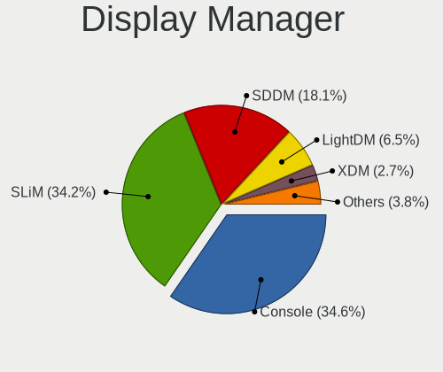
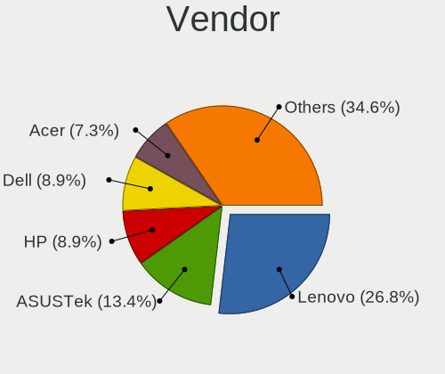
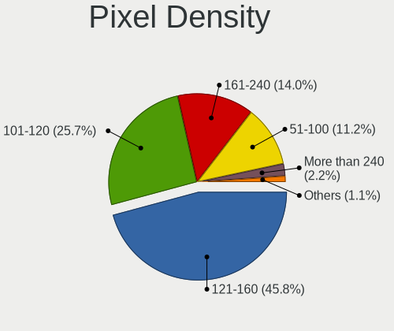
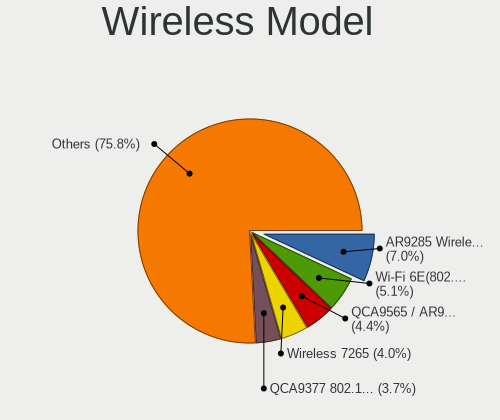
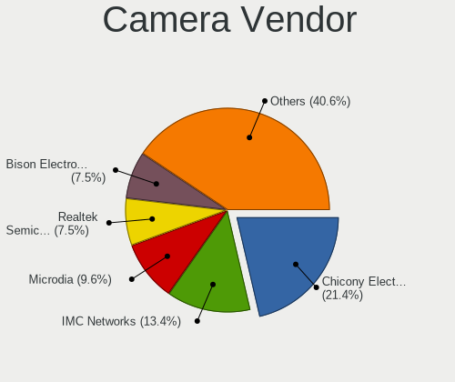

BSD in Russia - Tested Hardware & Statistics (Notebooks)
--------------------------------------------------------

A project to collect tested hardware configurations for BSD in Russia.

Anyone can contribute to this report by the [hw-probe](https://github.com/linuxhw/hw-probe/blob/master/INSTALL.BSD.md) tool:

    hw-probe -all -upload

Please contribute! Especially if your hardware is rare.

Contents
--------

* [ Test Cases ](#test-cases)

* [ System ](#system)
  - [ OS                       ](#os)
  - [ OS Family                ](#os-family)
  - [ Arch                     ](#arch)
  - [ DE                       ](#de)
  - [ Display Server           ](#display-server)
  - [ Display Manager          ](#display-manager)
  - [ OS Lang                  ](#os-lang)
  - [ Boot Mode                ](#boot-mode)
  - [ Filesystem               ](#filesystem)
  - [ Part. scheme             ](#part-scheme)

* [ Board ](#board)
  - [ Vendor                   ](#vendor)
  - [ Model                    ](#model)
  - [ Model Family             ](#model-family)
  - [ MFG Year                 ](#mfg-year)
  - [ Form Factor              ](#form-factor)
  - [ Coreboot                 ](#coreboot)
  - [ RAM Size                 ](#ram-size)
  - [ RAM Used                 ](#ram-used)
  - [ Total Drives             ](#total-drives)
  - [ Has CD-ROM               ](#has-cd-rom)
  - [ Has Ethernet             ](#has-ethernet)
  - [ Has WiFi                 ](#has-wifi)
  - [ Has Bluetooth            ](#has-bluetooth)

* [ Location ](#location)
  - [ Country                  ](#country)
  - [ City                     ](#city)

* [ Drives ](#drives)
  - [ Drive Vendor             ](#drive-vendor)
  - [ Drive Model              ](#drive-model)
  - [ HDD Vendor               ](#hdd-vendor)
  - [ SSD Vendor               ](#ssd-vendor)
  - [ Drive Kind               ](#drive-kind)
  - [ Drive Connector          ](#drive-connector)
  - [ Drive Size               ](#drive-size)
  - [ Space Total              ](#space-total)
  - [ Space Used               ](#space-used)
  - [ Malfunc. Drives          ](#malfunc-drives)
  - [ Malfunc. Drive Vendor    ](#malfunc-drive-vendor)
  - [ Malfunc. HDD Vendor      ](#malfunc-hdd-vendor)
  - [ Malfunc. Drive Kind      ](#malfunc-drive-kind)
  - [ Failed Drives            ](#failed-drives)
  - [ Failed Drive Vendor      ](#failed-drive-vendor)
  - [ Drive Status             ](#drive-status)

* [ Storage controller ](#storage-controller)
  - [ Storage Vendor           ](#storage-vendor)
  - [ Storage Model            ](#storage-model)
  - [ Storage Kind             ](#storage-kind)

* [ Processor ](#processor)
  - [ CPU Vendor               ](#cpu-vendor)
  - [ CPU Model                ](#cpu-model)
  - [ CPU Model Family         ](#cpu-model-family)
  - [ CPU Cores                ](#cpu-cores)
  - [ CPU Sockets              ](#cpu-sockets)
  - [ CPU Threads              ](#cpu-threads)
  - [ CPU Microarch            ](#cpu-microarch)

* [ Graphics ](#graphics)
  - [ GPU Vendor               ](#gpu-vendor)
  - [ GPU Model                ](#gpu-model)
  - [ GPU Combo                ](#gpu-combo)
  - [ GPU Driver               ](#gpu-driver)
  - [ GPU Memory               ](#gpu-memory)

* [ Monitor ](#monitor)
  - [ Monitor Vendor           ](#monitor-vendor)
  - [ Monitor Model            ](#monitor-model)
  - [ Monitor Resolution       ](#monitor-resolution)
  - [ Monitor Diagonal         ](#monitor-diagonal)
  - [ Monitor Width            ](#monitor-width)
  - [ Aspect Ratio             ](#aspect-ratio)
  - [ Monitor Area             ](#monitor-area)
  - [ Pixel Density            ](#pixel-density)
  - [ Multiple Monitors        ](#multiple-monitors)

* [ Network ](#network)
  - [ Net Controller Vendor    ](#net-controller-vendor)
  - [ Net Controller Model     ](#net-controller-model)
  - [ Wireless Vendor          ](#wireless-vendor)
  - [ Wireless Model           ](#wireless-model)
  - [ Ethernet Vendor          ](#ethernet-vendor)
  - [ Ethernet Model           ](#ethernet-model)
  - [ Net Controller Kind      ](#net-controller-kind)
  - [ Used Controller          ](#used-controller)
  - [ NICs                     ](#nics)
  - [ IPv6                     ](#ipv6)

* [ Bluetooth ](#bluetooth)
  - [ Bluetooth Vendor         ](#bluetooth-vendor)
  - [ Bluetooth Model          ](#bluetooth-model)

* [ Sound ](#sound)
  - [ Sound Vendor             ](#sound-vendor)
  - [ Sound Model              ](#sound-model)

* [ Memory ](#memory)
  - [ Memory Vendor            ](#memory-vendor)
  - [ Memory Model             ](#memory-model)
  - [ Memory Kind              ](#memory-kind)
  - [ Memory Form Factor       ](#memory-form-factor)
  - [ Memory Size              ](#memory-size)
  - [ Memory Speed             ](#memory-speed)

* [ Printers & scanners ](#printers--scanners)
  - [ Printer Vendor           ](#printer-vendor)
  - [ Printer Model            ](#printer-model)
  - [ Scanner Vendor           ](#scanner-vendor)
  - [ Scanner Model            ](#scanner-model)

* [ Camera ](#camera)
  - [ Camera Vendor            ](#camera-vendor)
  - [ Camera Model             ](#camera-model)

* [ Security ](#security)
  - [ Fingerprint Vendor       ](#fingerprint-vendor)
  - [ Fingerprint Model        ](#fingerprint-model)
  - [ Chipcard Vendor          ](#chipcard-vendor)
  - [ Chipcard Model           ](#chipcard-model)

* [ Unsupported ](#unsupported)
  - [ Unsupported Devices      ](#unsupported-devices)
  - [ Unsupported Device Types ](#unsupported-device-types)

Test Cases
----------

Total: 169

| Vendor        | Model                       | Probe                                                     | Date         |
|---------------|-----------------------------|-----------------------------------------------------------|--------------|
| Acer          | Aspire ES1-132              | [18426698ad](https://bsd-hardware.info/?probe=18426698ad) | May 02, 2022 |
| HP            | Pavilion g6                 | [4b8ee6729a](https://bsd-hardware.info/?probe=4b8ee6729a) | May 02, 2022 |
| Lenovo        | B50-30 20382                | [5701dac149](https://bsd-hardware.info/?probe=5701dac149) | Apr 30, 2022 |
| DEXP          | NAVIS P100                  | [a9c8814bf8](https://bsd-hardware.info/?probe=a9c8814bf8) | Apr 22, 2022 |
| Lenovo        | ThinkPad X121e 3053A52      | [68d0bf2a99](https://bsd-hardware.info/?probe=68d0bf2a99) | Apr 22, 2022 |
| DNS           | W9x0LU                      | [8ac57e3b59](https://bsd-hardware.info/?probe=8ac57e3b59) | Apr 06, 2022 |
| Timi          | TM1612                      | [0389c8d487](https://bsd-hardware.info/?probe=0389c8d487) | Apr 05, 2022 |
| Lenovo        | ThinkPad T490s 20NX000DR... | [c052d7cab0](https://bsd-hardware.info/?probe=c052d7cab0) | Apr 01, 2022 |
| HUAWEI        | CREM-WXX9                   | [e750905413](https://bsd-hardware.info/?probe=e750905413) | Mar 29, 2022 |
| Lenovo        | ThinkBook 14 G2 ARE 20VF    | [00213ecee9](https://bsd-hardware.info/?probe=00213ecee9) | Mar 25, 2022 |
| Packard Be... | EasyNote TE69HW             | [851eea349f](https://bsd-hardware.info/?probe=851eea349f) | Mar 17, 2022 |
| Acer          | Aspire 4820T                | [1617262a28](https://bsd-hardware.info/?probe=1617262a28) | Mar 16, 2022 |
| Acer          | Aspire A315-23              | [7fb743c654](https://bsd-hardware.info/?probe=7fb743c654) | Mar 15, 2022 |
| ASUSTek       | M51Sr                       | [936a577d1a](https://bsd-hardware.info/?probe=936a577d1a) | Mar 10, 2022 |
| Lenovo        | E31-80 80MX                 | [098afac660](https://bsd-hardware.info/?probe=098afac660) | Feb 16, 2022 |
| HP            | ProBook 445 G7              | [494195b923](https://bsd-hardware.info/?probe=494195b923) | Feb 08, 2022 |
| Dell          | Venue 11 Pro 7140           | [328f9e8d94](https://bsd-hardware.info/?probe=328f9e8d94) | Feb 04, 2022 |
| HP            | Laptop 15-rb0xx             | [8e9a6cff62](https://bsd-hardware.info/?probe=8e9a6cff62) | Jan 31, 2022 |
| MSI           | GE75 Raider 10SFS           | [48b172bfe8](https://bsd-hardware.info/?probe=48b172bfe8) | Jan 25, 2022 |
| MSI           | GE75 Raider 10SFS           | [306f312c47](https://bsd-hardware.info/?probe=306f312c47) | Jan 25, 2022 |
| HP            | Laptop 15-bw0xx             | [1c8f50f7eb](https://bsd-hardware.info/?probe=1c8f50f7eb) | Jan 24, 2022 |
| Lenovo        | ThinkPad X13 Gen 1 20T20... | [6836fc60f6](https://bsd-hardware.info/?probe=6836fc60f6) | Jan 09, 2022 |
| Lenovo        | ThinkPad X1 Carbon 5th 2... | [7aea2ccaa7](https://bsd-hardware.info/?probe=7aea2ccaa7) | Jan 08, 2022 |
| Lenovo        | IdeaPad 330-15IGM 81D1      | [87c8ee9b4c](https://bsd-hardware.info/?probe=87c8ee9b4c) | Dec 31, 2021 |
| HP            | ProBook 655 G1              | [da312d7c14](https://bsd-hardware.info/?probe=da312d7c14) | Dec 30, 2021 |
| Lenovo        | IdeaPad 330-15ARR 81D2      | [4bb84a33fa](https://bsd-hardware.info/?probe=4bb84a33fa) | Dec 26, 2021 |
| Lenovo        | IdeaPad 330-15ARR 81D2      | [ade9f77281](https://bsd-hardware.info/?probe=ade9f77281) | Nov 25, 2021 |
| Acer          | Aspire 3810T                | [86782a69be](https://bsd-hardware.info/?probe=86782a69be) | Nov 13, 2021 |
| Acer          | Aspire 3810T                | [608e43163d](https://bsd-hardware.info/?probe=608e43163d) | Nov 12, 2021 |
| Lenovo        | S20-30 Touch 20434          | [141a393d54](https://bsd-hardware.info/?probe=141a393d54) | Oct 08, 2021 |
| ASUSTek       | UX21A                       | [fe08d28d4c](https://bsd-hardware.info/?probe=fe08d28d4c) | Oct 05, 2021 |
| IBM           | ThinkPad H 1846AQG          | [5e5c7247ca](https://bsd-hardware.info/?probe=5e5c7247ca) | Oct 01, 2021 |
| ASUSTek       | VX7SX                       | [6ca36a455d](https://bsd-hardware.info/?probe=6ca36a455d) | Sep 09, 2021 |
| Kraftway      | KW10T                       | [4810842d82](https://bsd-hardware.info/?probe=4810842d82) | Sep 06, 2021 |
| Lenovo        | ThinkPad E590 20NB0012RT    | [98072b8db6](https://bsd-hardware.info/?probe=98072b8db6) | Jul 26, 2021 |
| Lenovo        | IdeaPad 100S-14IBR 80R9     | [3fb09d0402](https://bsd-hardware.info/?probe=3fb09d0402) | Jul 24, 2021 |
| Lenovo        | IdeaPad 100S-14IBR 80R9     | [bef816fe74](https://bsd-hardware.info/?probe=bef816fe74) | Jul 24, 2021 |
| Acer          | Aspire A715-75G             | [f613cb0452](https://bsd-hardware.info/?probe=f613cb0452) | Jul 23, 2021 |
| Dell          | Inspiron 5758               | [7542ae751d](https://bsd-hardware.info/?probe=7542ae751d) | Jul 20, 2021 |
| eMachines     | eM350                       | [94579b896e](https://bsd-hardware.info/?probe=94579b896e) | Jul 04, 2021 |
| eMachines     | eM350                       | [c268dd82de](https://bsd-hardware.info/?probe=c268dd82de) | Jul 04, 2021 |
| eMachines     | eM350                       | [52198cfd80](https://bsd-hardware.info/?probe=52198cfd80) | Jun 22, 2021 |
| eMachines     | eM350                       | [60b4338ace](https://bsd-hardware.info/?probe=60b4338ace) | Jun 22, 2021 |
| Lenovo        | IdeaPad 330-15ARR 81D2      | [4ac6c9b3eb](https://bsd-hardware.info/?probe=4ac6c9b3eb) | Jun 08, 2021 |
| Acer          | Aspire ES1-132              | [62c87cf194](https://bsd-hardware.info/?probe=62c87cf194) | Jun 07, 2021 |
| Acer          | Aspire ES1-132              | [bf95bf607d](https://bsd-hardware.info/?probe=bf95bf607d) | Jun 06, 2021 |
| Lenovo        | IdeaPad 330-15ARR 81D2      | [8fc867cfae](https://bsd-hardware.info/?probe=8fc867cfae) | Jun 06, 2021 |
| Lenovo        | ThinkPad T430 23511A6       | [89fb2aa493](https://bsd-hardware.info/?probe=89fb2aa493) | Jun 05, 2021 |
| Acer          | Aspire ES1-132              | [bf605b741b](https://bsd-hardware.info/?probe=bf605b741b) | Jun 04, 2021 |
| Lenovo        | IdeaPad 330-15ARR 81D2      | [84e93d02e1](https://bsd-hardware.info/?probe=84e93d02e1) | Jun 03, 2021 |
| Lenovo        | IdeaPad 330-15ARR 81D2      | [1bb850edca](https://bsd-hardware.info/?probe=1bb850edca) | Jun 03, 2021 |
| Acer          | Extensa 2540                | [e7d6ece4ba](https://bsd-hardware.info/?probe=e7d6ece4ba) | Apr 11, 2021 |
| ASUSTek       | 1225B                       | [3eff93bfb5](https://bsd-hardware.info/?probe=3eff93bfb5) | Mar 31, 2021 |
| Samsung       | N145P/N250P/N260P           | [a38a620353](https://bsd-hardware.info/?probe=a38a620353) | Mar 29, 2021 |
| Lenovo        | ThinkPad P15 Gen 1 20ST0... | [342e914968](https://bsd-hardware.info/?probe=342e914968) | Mar 29, 2021 |
| HP            | ProBook 455 G7              | [dd877e6c6c](https://bsd-hardware.info/?probe=dd877e6c6c) | Mar 27, 2021 |
| Samsung       | N145P/N250P/N260P           | [eff02dafe1](https://bsd-hardware.info/?probe=eff02dafe1) | Mar 18, 2021 |
| Lenovo        | ThinkPad T480s 20L7001HR... | [ebd44c21d9](https://bsd-hardware.info/?probe=ebd44c21d9) | Mar 17, 2021 |
| Samsung       | N150P                       | [68483fab9d](https://bsd-hardware.info/?probe=68483fab9d) | Mar 14, 2021 |
| Apple         | MacBookAir6,2               | [52584aaa97](https://bsd-hardware.info/?probe=52584aaa97) | Mar 14, 2021 |
| Apple         | MacBookAir6,2               | [fb136a79e7](https://bsd-hardware.info/?probe=fb136a79e7) | Mar 13, 2021 |
| Dell          | Latitude 3410               | [80d7bf959a](https://bsd-hardware.info/?probe=80d7bf959a) | Mar 10, 2021 |
| HP            | 255 G3                      | [861bdc647d](https://bsd-hardware.info/?probe=861bdc647d) | Mar 09, 2021 |
| HP            | ProBook 455 G7              | [1fcde7c0e1](https://bsd-hardware.info/?probe=1fcde7c0e1) | Mar 09, 2021 |
| HP            | 255 G3                      | [bd82ed65e9](https://bsd-hardware.info/?probe=bd82ed65e9) | Mar 07, 2021 |
| HP            | Compaq 6820s                | [f63d65b78c](https://bsd-hardware.info/?probe=f63d65b78c) | Feb 26, 2021 |
| Dell          | Studio 1537                 | [a4c1d361eb](https://bsd-hardware.info/?probe=a4c1d361eb) | Feb 23, 2021 |
| Apple         | MacBook5,1                  | [41ea02c8bc](https://bsd-hardware.info/?probe=41ea02c8bc) | Feb 21, 2021 |
| Apple         | MacBook5,1                  | [1a374f79df](https://bsd-hardware.info/?probe=1a374f79df) | Feb 19, 2021 |
| Lenovo        | ThinkPad X13 Gen 1 20UF0... | [ed75b3d15b](https://bsd-hardware.info/?probe=ed75b3d15b) | Feb 18, 2021 |
| Lenovo        | ThinkPad X13 Gen 1 20UF0... | [5e4643fe26](https://bsd-hardware.info/?probe=5e4643fe26) | Feb 18, 2021 |
| Lenovo        | ThinkPad X13 Gen 1 20UF0... | [3df4abb2e9](https://bsd-hardware.info/?probe=3df4abb2e9) | Feb 16, 2021 |
| HP            | EliteBook 8460p             | [ada1119026](https://bsd-hardware.info/?probe=ada1119026) | Feb 14, 2021 |
| Lenovo        | ThinkPad T495s 20QKS1812... | [0e5e228d18](https://bsd-hardware.info/?probe=0e5e228d18) | Feb 13, 2021 |
| Lenovo        | ThinkPad T495s 20QKS1812... | [2d93a6bebc](https://bsd-hardware.info/?probe=2d93a6bebc) | Feb 13, 2021 |
| Sony          | VPCX115KX                   | [fef3d94e6c](https://bsd-hardware.info/?probe=fef3d94e6c) | Feb 12, 2021 |
| Acer          | Extensa 5635Z               | [3b4a7e7fc2](https://bsd-hardware.info/?probe=3b4a7e7fc2) | Feb 10, 2021 |
| Lenovo        | ThinkPad E480 20KN005CRT    | [503378cac9](https://bsd-hardware.info/?probe=503378cac9) | Jan 31, 2021 |
| Sony          | VPCM13M1R                   | [30bb4fc23c](https://bsd-hardware.info/?probe=30bb4fc23c) | Jan 06, 2021 |
| ASUSTek       | X101CH                      | [112792b300](https://bsd-hardware.info/?probe=112792b300) | Jan 02, 2021 |
| ASUSTek       | X101CH                      | [8b571cc947](https://bsd-hardware.info/?probe=8b571cc947) | Jan 02, 2021 |
| Lenovo        | IdeaPad 320-15ISK 80XH      | [0309e4ac24](https://bsd-hardware.info/?probe=0309e4ac24) | Dec 16, 2020 |
| Acer          | Aspire V5-122               | [ce0c079fd5](https://bsd-hardware.info/?probe=ce0c079fd5) | Dec 14, 2020 |
| Panasonic     | CF-19AHNC8FN                | [04a42812bb](https://bsd-hardware.info/?probe=04a42812bb) | Dec 11, 2020 |
| Lenovo        | IdeaPad L340-15API 81LW     | [3a78e7dc1a](https://bsd-hardware.info/?probe=3a78e7dc1a) | Dec 11, 2020 |
| Samsung       | N145P/N250P/N260P           | [b4cb55c681](https://bsd-hardware.info/?probe=b4cb55c681) | Dec 05, 2020 |
| Sony          | SVP1321V9RB                 | [9cddee6a0a](https://bsd-hardware.info/?probe=9cddee6a0a) | Dec 01, 2020 |
| Sony          | SVP1321V9RB                 | [d4250ef269](https://bsd-hardware.info/?probe=d4250ef269) | Dec 01, 2020 |
| Sony          | VGN-S150(UC)                | [f2f3923ea6](https://bsd-hardware.info/?probe=f2f3923ea6) | Nov 10, 2020 |
| Toshiba       | Satellite M100              | [e6e0a1294c](https://bsd-hardware.info/?probe=e6e0a1294c) | Nov 01, 2020 |
| Sony          | SVP1321V9RB                 | [3f414895be](https://bsd-hardware.info/?probe=3f414895be) | Oct 24, 2020 |
| Acer          | Aspire ES1-132              | [a4e45f3551](https://bsd-hardware.info/?probe=a4e45f3551) | Oct 22, 2020 |
| Dell          | Latitude C400               | [1dcc5e7972](https://bsd-hardware.info/?probe=1dcc5e7972) | Oct 21, 2020 |
| Dell          | Latitude C400               | [8330d23bd7](https://bsd-hardware.info/?probe=8330d23bd7) | Oct 21, 2020 |
| Google        | Chell                       | [4ffe68c199](https://bsd-hardware.info/?probe=4ffe68c199) | Oct 21, 2020 |
| Lenovo        | ThinkPad X230 2325Y36       | [b2e65dd4c5](https://bsd-hardware.info/?probe=b2e65dd4c5) | Oct 20, 2020 |
| Lenovo        | ThinkPad X240 20AL00DKRT    | [623801416c](https://bsd-hardware.info/?probe=623801416c) | Oct 20, 2020 |
| Lenovo        | ThinkPad T495s 20QKS1812... | [a3bc7a0c88](https://bsd-hardware.info/?probe=a3bc7a0c88) | Oct 19, 2020 |
| ASUSTek       | VivoBook_ASUSLaptop X570... | [4f54c8f399](https://bsd-hardware.info/?probe=4f54c8f399) | Oct 19, 2020 |
| HP            | OmniBook PC                 | [0e0656d228](https://bsd-hardware.info/?probe=0e0656d228) | Oct 19, 2020 |
| HP            | OmniBook PC                 | [60e72f1c10](https://bsd-hardware.info/?probe=60e72f1c10) | Oct 19, 2020 |
| Acer          | Aspire A315-42              | [1ac21e1660](https://bsd-hardware.info/?probe=1ac21e1660) | Oct 08, 2020 |
| Lenovo        | ThinkPad X230 2325Y36       | [1f28f1c311](https://bsd-hardware.info/?probe=1f28f1c311) | Aug 30, 2020 |
| Lenovo        | ThinkPad X230 2325Y36       | [11a0bbb73f](https://bsd-hardware.info/?probe=11a0bbb73f) | Aug 30, 2020 |
| Dell          | Inspiron 15-3567            | [4d1897ed1f](https://bsd-hardware.info/?probe=4d1897ed1f) | Aug 29, 2020 |
| Dell          | Inspiron 15 7000 Gaming     | [0e99e72ec9](https://bsd-hardware.info/?probe=0e99e72ec9) | Aug 26, 2020 |
| Dell          | Inspiron 15 7000 Gaming     | [b9477154b9](https://bsd-hardware.info/?probe=b9477154b9) | Aug 26, 2020 |
| Dell          | Inspiron 15 7000 Gaming     | [19d1c3d086](https://bsd-hardware.info/?probe=19d1c3d086) | Aug 20, 2020 |
| ASUSTek       | X71SL                       | [a2ee0c9edb](https://bsd-hardware.info/?probe=a2ee0c9edb) | Aug 15, 2020 |
| Lenovo        | ThinkPad X1 Carbon 4th 2... | [bc97c1c0fa](https://bsd-hardware.info/?probe=bc97c1c0fa) | Aug 13, 2020 |
| Dell          | Inspiron 1501               | [9ee3e7cbc2](https://bsd-hardware.info/?probe=9ee3e7cbc2) | Aug 11, 2020 |
| Dell          | Inspiron 1501               | [807aae7095](https://bsd-hardware.info/?probe=807aae7095) | Aug 11, 2020 |
| Dell          | Inspiron 1525               | [d08ea3542e](https://bsd-hardware.info/?probe=d08ea3542e) | Aug 05, 2020 |
| Dell          | Latitude 7490               | [b1d5e8c619](https://bsd-hardware.info/?probe=b1d5e8c619) | Aug 05, 2020 |
| HP            | ProBook 440 G6              | [0227811abb](https://bsd-hardware.info/?probe=0227811abb) | Aug 05, 2020 |
| Lenovo        | ThinkPad T490s 20NX000DR... | [0919d8936f](https://bsd-hardware.info/?probe=0919d8936f) | Jul 27, 2020 |
| Lenovo        | G570 20079                  | [15e87049a7](https://bsd-hardware.info/?probe=15e87049a7) | Jul 27, 2020 |
| HP            | ProBook 430 G2              | [3a33aa0d8c](https://bsd-hardware.info/?probe=3a33aa0d8c) | Jun 30, 2020 |
| HP            | ProBook 430 G2              | [365ebdaf9c](https://bsd-hardware.info/?probe=365ebdaf9c) | Jun 30, 2020 |
| Lenovo        | G570 20079                  | [220313b249](https://bsd-hardware.info/?probe=220313b249) | Jun 03, 2020 |
| Lenovo        | G570 20079                  | [7042848932](https://bsd-hardware.info/?probe=7042848932) | Jun 03, 2020 |
| Lenovo        | G570 20079                  | [c7f3bf660a](https://bsd-hardware.info/?probe=c7f3bf660a) | Jun 02, 2020 |
| Lenovo        | G570 20079                  | [b84d1b49d8](https://bsd-hardware.info/?probe=b84d1b49d8) | Jun 02, 2020 |
| Lenovo        | G570 20079                  | [0cc3c53651](https://bsd-hardware.info/?probe=0cc3c53651) | Jun 02, 2020 |
| Dell          | Latitude E5400              | [54854343e4](https://bsd-hardware.info/?probe=54854343e4) | Jun 01, 2020 |
| Dell          | Latitude E6420              | [324265fe3f](https://bsd-hardware.info/?probe=324265fe3f) | May 31, 2020 |
| Lenovo        | ThinkPad X1 Carbon 4th 2... | [68840c222b](https://bsd-hardware.info/?probe=68840c222b) | May 28, 2020 |
| Lenovo        | ThinkPad X240 20AMA52RUK    | [c65cdb97de](https://bsd-hardware.info/?probe=c65cdb97de) | May 28, 2020 |
| Acer          | Aspire 4820T                | [239eea83c6](https://bsd-hardware.info/?probe=239eea83c6) | May 26, 2020 |
| ASUSTek       | GL553VE                     | [dc7bb56859](https://bsd-hardware.info/?probe=dc7bb56859) | May 26, 2020 |
| Lenovo        | IdeaPad Z570 HuronRiver ... | [9728d93191](https://bsd-hardware.info/?probe=9728d93191) | May 25, 2020 |
| IBM           | ThinkPad X41 2525FAG        | [1e849f86cf](https://bsd-hardware.info/?probe=1e849f86cf) | May 25, 2020 |
| Lenovo        | IdeaPad 320-15ISK 80XH      | [709a3db7de](https://bsd-hardware.info/?probe=709a3db7de) | May 25, 2020 |
| Lenovo        | G570 20079                  | [0b7b4083bd](https://bsd-hardware.info/?probe=0b7b4083bd) | May 22, 2020 |
| Lenovo        | G570 20079                  | [f7cb1aa38d](https://bsd-hardware.info/?probe=f7cb1aa38d) | May 21, 2020 |
| Dell          | Latitude E6530              | [04cd35a77b](https://bsd-hardware.info/?probe=04cd35a77b) | May 21, 2020 |
| Lenovo        | G570 20079                  | [dc3c3cff26](https://bsd-hardware.info/?probe=dc3c3cff26) | May 21, 2020 |
| Lenovo        | G570 20079                  | [807f3398e3](https://bsd-hardware.info/?probe=807f3398e3) | May 20, 2020 |
| Lenovo        | G570 20079                  | [8212868b9f](https://bsd-hardware.info/?probe=8212868b9f) | May 19, 2020 |
| Lenovo        | G570 20079                  | [ab53dfc003](https://bsd-hardware.info/?probe=ab53dfc003) | May 19, 2020 |
| Lenovo        | G570 20079                  | [d3f180e9ef](https://bsd-hardware.info/?probe=d3f180e9ef) | May 17, 2020 |
| Lenovo        | G570 20079                  | [bdd93164cf](https://bsd-hardware.info/?probe=bdd93164cf) | May 17, 2020 |
| Lenovo        | G570 20079                  | [6a1b7867f0](https://bsd-hardware.info/?probe=6a1b7867f0) | May 16, 2020 |
| Lenovo        | G570 20079                  | [112b83a485](https://bsd-hardware.info/?probe=112b83a485) | May 16, 2020 |
| Lenovo        | G570 20079                  | [3258f01592](https://bsd-hardware.info/?probe=3258f01592) | May 16, 2020 |
| Lenovo        | G570 20079                  | [4a419328b8](https://bsd-hardware.info/?probe=4a419328b8) | May 16, 2020 |
| ASUSTek       | A3L                         | [6b65fcf9c1](https://bsd-hardware.info/?probe=6b65fcf9c1) | May 15, 2020 |
| ASUSTek       | A3L                         | [0d292bca2f](https://bsd-hardware.info/?probe=0d292bca2f) | May 15, 2020 |
| ASUSTek       | X71SL                       | [2fd46cb7c7](https://bsd-hardware.info/?probe=2fd46cb7c7) | May 15, 2020 |
| ASUSTek       | X71SL                       | [8a027d0a73](https://bsd-hardware.info/?probe=8a027d0a73) | May 14, 2020 |
| Dell          | Latitude E6530              | [2c5eec6613](https://bsd-hardware.info/?probe=2c5eec6613) | May 09, 2020 |
| Dell          | Latitude E6530              | [1542f8e5a8](https://bsd-hardware.info/?probe=1542f8e5a8) | May 09, 2020 |
| ASUSTek       | X71SL                       | [adf290251e](https://bsd-hardware.info/?probe=adf290251e) | May 09, 2020 |
| ASUSTek       | X71SL                       | [7b4d0958ec](https://bsd-hardware.info/?probe=7b4d0958ec) | May 09, 2020 |
| Sony          | SVE1713S1RW                 | [9a751ddfd8](https://bsd-hardware.info/?probe=9a751ddfd8) | May 08, 2020 |
| Lenovo        | G570 20079                  | [25fd1154c0](https://bsd-hardware.info/?probe=25fd1154c0) | May 08, 2020 |
| ASUSTek       | X71SL                       | [ab5297a63d](https://bsd-hardware.info/?probe=ab5297a63d) | May 07, 2020 |
| ASUSTek       | X71SL                       | [b8e364a2c0](https://bsd-hardware.info/?probe=b8e364a2c0) | May 07, 2020 |
| ASUSTek       | X71SL                       | [2aac4c3564](https://bsd-hardware.info/?probe=2aac4c3564) | May 07, 2020 |
| Lenovo        | G570 20079                  | [4909d93faf](https://bsd-hardware.info/?probe=4909d93faf) | May 06, 2020 |
| Lenovo        | G570 20079                  | [fb9c475d48](https://bsd-hardware.info/?probe=fb9c475d48) | May 06, 2020 |
| Lenovo        | G570 20079                  | [2efd2c4c7a](https://bsd-hardware.info/?probe=2efd2c4c7a) | May 06, 2020 |
| Lenovo        | G570 20079                  | [f1c2bcae9d](https://bsd-hardware.info/?probe=f1c2bcae9d) | May 06, 2020 |
| ASUSTek       | A3L                         | [0c73038abc](https://bsd-hardware.info/?probe=0c73038abc) | May 06, 2020 |
| ASUSTek       | A3L                         | [ff5b6e3024](https://bsd-hardware.info/?probe=ff5b6e3024) | May 06, 2020 |
| Lenovo        | G570 20079                  | [eff0d8a3db](https://bsd-hardware.info/?probe=eff0d8a3db) | May 06, 2020 |
| ASUSTek       | X71SL                       | [b48cb0f2ce](https://bsd-hardware.info/?probe=b48cb0f2ce) | May 05, 2020 |
| Lenovo        | G570 20079                  | [cd45078232](https://bsd-hardware.info/?probe=cd45078232) | May 05, 2020 |
| Lenovo        | G570 20079                  | [0370bc0522](https://bsd-hardware.info/?probe=0370bc0522) | May 02, 2020 |

System
------

OS
--

Installed operating systems

| Name                 | Notebooks | Percent |
|----------------------|-----------|---------|
| OpenBSD 6.8          | 10        | 9.43%   |
| helloSystem 0.7.0    | 10        | 9.43%   |
| NomadBSD 1.3.2       | 7         | 6.6%    |
| FreeBSD 13.0         | 6         | 5.66%   |
| FreeBSD 14.0-CURRENT | 5         | 4.72%   |
| FreeBSD 13.0-CURRENT | 5         | 4.72%   |
| helloSystem 0.6.0    | 4         | 3.77%   |
| FreeBSD 12.1-STABLE  | 4         | 3.77%   |
| OpenBSD 6.9          | 3         | 2.83%   |
| NomadBSD 5806f915    | 3         | 2.83%   |
| GhostBSD 20.04.02    | 3         | 2.83%   |
| FreeBSD 12.2-p4      | 3         | 2.83%   |
| OpenBSD 7.1          | 2         | 1.89%   |
| OpenBSD 6.7          | 2         | 1.89%   |
| FreeBSD 13.0-p3      | 2         | 1.89%   |
| FreeBSD 12.2-STABLE  | 2         | 1.89%   |
| FreeBSD 12.2-p3      | 2         | 1.89%   |
| FreeBSD 12.1-p8      | 2         | 1.89%   |
| FreeBSD 12.1-p7      | 2         | 1.89%   |
| FreeBSD 12.1-p5      | 2         | 1.89%   |
| OS108 9.0            | 1         | 0.94%   |
| OpenBSD 7.0          | 1         | 0.94%   |
| NomadBSD 1.4         | 1         | 0.94%   |
| NomadBSD 1.3.1       | 1         | 0.94%   |
| NetBSD 9.1           | 1         | 0.94%   |
| NetBSD 7.2           | 1         | 0.94%   |
| LibertyBSD 6.1       | 1         | 0.94%   |
| helloSystem 0.3.0    | 1         | 0.94%   |
| GhostBSD 21.08.27    | 1         | 0.94%   |
| FreeBSD 8.4          | 1         | 0.94%   |
| FreeBSD 13.1-BETA3   | 1         | 0.94%   |
| FreeBSD 13.0-STABLE  | 1         | 0.94%   |
| FreeBSD 13.0-RC1     | 1         | 0.94%   |
| FreeBSD 13.0-p7      | 1         | 0.94%   |
| FreeBSD 13.0-p4      | 1         | 0.94%   |
| FreeBSD 13.0-p2      | 1         | 0.94%   |
| FreeBSD 13.0-p10     | 1         | 0.94%   |
| FreeBSD 13.0-BETA1   | 1         | 0.94%   |
| FreeBSD 12.3-STABLE  | 1         | 0.94%   |
| FreeBSD 12.2-p6      | 1         | 0.94%   |
| FreeBSD 12.2-p2      | 1         | 0.94%   |
| FreeBSD 12.2         | 1         | 0.94%   |
| FreeBSD 12.1-p6      | 1         | 0.94%   |
| FreeBSD 12.1-p3      | 1         | 0.94%   |
| FreeBSD 12.1         | 1         | 0.94%   |
| FreeBSD 11.4-p8      | 1         | 0.94%   |
| FreeBSD 11.4-p5      | 1         | 0.94%   |

OS Family
---------

OS without a version

| Name        | Notebooks | Percent |
|-------------|-----------|---------|
| FreeBSD     | 49        | 49%     |
| OpenBSD     | 17        | 17%     |
| helloSystem | 15        | 15%     |
| NomadBSD    | 11        | 11%     |
| GhostBSD    | 4         | 4%      |
| NetBSD      | 2         | 2%      |
| OS108       | 1         | 1%      |
| LibertyBSD  | 1         | 1%      |

Arch
----

OS architecture (x86_64, i586, etc.)

| Name  | Notebooks | Percent |
|-------|-----------|---------|
| amd64 | 83        | 87.37%  |
| i386  | 12        | 12.63%  |

DE
--

Desktop Environment

| Name          | Notebooks | Percent |
|---------------|-----------|---------|
| helloDesktop  | 18        | 18%     |
| Console       | 13        | 13%     |
| Openbox       | 12        | 12%     |
| fvwm          | 12        | 12%     |
| XFCE          | 10        | 10%     |
| KDE5          | 9         | 9%      |
| TWM           | 5         | 5%      |
| MATE          | 5         | 5%      |
| GNOME         | 3         | 3%      |
| LXDE          | 2         | 2%      |
| IceWM         | 2         | 2%      |
| i3            | 2         | 2%      |
| AwesomeWM     | 2         | 2%      |
| StumpWM       | 1         | 1%      |
| LXQt          | 1         | 1%      |
| Lumina        | 1         | 1%      |
| Enlightenment | 1         | 1%      |
| dwm           | 1         | 1%      |

Display Server
--------------

X11 or Wayland

| Name    | Notebooks | Percent |
|---------|-----------|---------|
| X11     | 83        | 83.84%  |
| Console | 14        | 14.14%  |
| Wayland | 2         | 2.02%   |

Display Manager
---------------

SDDM, LightDM, etc.

| Name    | Notebooks | Percent |
|---------|-----------|---------|
| Console | 41        | 41.41%  |
| SLiM    | 35        | 35.35%  |
| LightDM | 7         | 7.07%   |
| XDM     | 6         | 6.06%   |
| SDDM    | 6         | 6.06%   |
| GDM     | 2         | 2.02%   |
| PCDM    | 1         | 1.01%   |
| Ly      | 1         | 1.01%   |

OS Lang
-------

Language

| Lang    | Notebooks | Percent |
|---------|-----------|---------|
| ru_RU   | 33        | 33%     |
| en_US   | 26        | 26%     |
| Unknown | 26        | 26%     |
| C       | 13        | 13%     |
| en_GB   | 1         | 1%      |
| en_EN   | 1         | 1%      |

Boot Mode
---------

EFI or BIOS

| Mode | Notebooks | Percent |
|------|-----------|---------|
| EFI  | 61        | 62.24%  |
| BIOS | 37        | 37.76%  |

Filesystem
----------

Type of filesystem

| Type   | Notebooks | Percent |
|--------|-----------|---------|
| Ufs    | 38        | 38.38%  |
| Zfs    | 37        | 37.37%  |
| Ffs    | 18        | 18.18%  |
| Cd9660 | 5         | 5.05%   |
| Xfs    | 1         | 1.01%   |

Part. scheme
------------

Scheme of partitioning

| Type    | Notebooks | Percent |
|---------|-----------|---------|
| GPT     | 69        | 71.13%  |
| MBR     | 25        | 25.77%  |
| Unknown | 2         | 2.06%   |
| BSD     | 1         | 1.03%   |

Board
-----

Vendor
------

Motherboard manufacturer

| Name                | Notebooks | Percent |
|---------------------|-----------|---------|
| Lenovo              | 27        | 28.42%  |
| Dell                | 14        | 14.74%  |
| Hewlett-Packard     | 12        | 12.63%  |
| Acer                | 10        | 10.53%  |
| ASUSTek Computer    | 9         | 9.47%   |
| Sony                | 5         | 5.26%   |
| Samsung Electronics | 3         | 3.16%   |
| IBM                 | 2         | 2.11%   |
| Apple               | 2         | 2.11%   |
| Toshiba             | 1         | 1.05%   |
| Timi                | 1         | 1.05%   |
| Panasonic           | 1         | 1.05%   |
| Packard Bell        | 1         | 1.05%   |
| MSI                 | 1         | 1.05%   |
| Kraftway            | 1         | 1.05%   |
| HUAWEI              | 1         | 1.05%   |
| Google              | 1         | 1.05%   |
| eMachines           | 1         | 1.05%   |
| DNS                 | 1         | 1.05%   |
| DEXP                | 1         | 1.05%   |

Model
-----

Motherboard model

| Name                                     | Notebooks | Percent |
|------------------------------------------|-----------|---------|
| Samsung N145P/N250P/N260P                | 2         | 2.11%   |
| Lenovo IdeaPad 330-15ARR 81D2            | 2         | 2.11%   |
| Dell Inspiron 15 7000 Gaming             | 2         | 2.11%   |
| Acer Aspire 4820T                        | 2         | 2.11%   |
| Toshiba Satellite M100                   | 1         | 1.05%   |
| Timi TM1612                              | 1         | 1.05%   |
| Sony VPCX115KX                           | 1         | 1.05%   |
| Sony VPCM13M1R                           | 1         | 1.05%   |
| Sony VGN-S150(UC)                        | 1         | 1.05%   |
| Sony SVP1321V9RB                         | 1         | 1.05%   |
| Sony SVE1713S1RW                         | 1         | 1.05%   |
| Samsung N150P                            | 1         | 1.05%   |
| Panasonic CF-19AHNC8FN                   | 1         | 1.05%   |
| Packard Bell EasyNote TE69HW             | 1         | 1.05%   |
| MSI GE75 Raider 10SFS                    | 1         | 1.05%   |
| Lenovo ThinkPad X240 20AMA52RUK          | 1         | 1.05%   |
| Lenovo ThinkPad X240 20AL00DKRT          | 1         | 1.05%   |
| Lenovo ThinkPad X230 2325Y36             | 1         | 1.05%   |
| Lenovo ThinkPad X13 Gen 1 20UF000QRT     | 1         | 1.05%   |
| Lenovo ThinkPad X13 Gen 1 20T2003PRT     | 1         | 1.05%   |
| Lenovo ThinkPad X121e 3053A52            | 1         | 1.05%   |
| Lenovo ThinkPad X1 Carbon 5th 20HRS04C00 | 1         | 1.05%   |
| Lenovo ThinkPad X1 Carbon 4th 20FCS1DW00 | 1         | 1.05%   |
| Lenovo ThinkPad T495s 20QKS1812F         | 1         | 1.05%   |
| Lenovo ThinkPad T490s 20NX000DRT         | 1         | 1.05%   |
| Lenovo ThinkPad T480s 20L7001HRT         | 1         | 1.05%   |
| Lenovo ThinkPad T430 23511A6             | 1         | 1.05%   |
| Lenovo ThinkPad P15 Gen 1 20ST005VRT     | 1         | 1.05%   |
| Lenovo ThinkPad E590 20NB0012RT          | 1         | 1.05%   |
| Lenovo ThinkPad E480 20KN005CRT          | 1         | 1.05%   |
| Lenovo ThinkBook 14 G2 ARE 20VF          | 1         | 1.05%   |
| Lenovo S20-30 Touch 20434                | 1         | 1.05%   |
| Lenovo IdeaPad Z570 HuronRiver Platform  | 1         | 1.05%   |
| Lenovo IdeaPad L340-15API 81LW           | 1         | 1.05%   |
| Lenovo IdeaPad 330-15IGM 81D1            | 1         | 1.05%   |
| Lenovo IdeaPad 320-15ISK 80XH            | 1         | 1.05%   |
| Lenovo IdeaPad 100S-14IBR 80R9           | 1         | 1.05%   |
| Lenovo G570 20079                        | 1         | 1.05%   |
| Lenovo E31-80 80MX                       | 1         | 1.05%   |
| Lenovo B50-30 20382                      | 1         | 1.05%   |
| Kraftway KW10T                           | 1         | 1.05%   |
| IBM ThinkPad X41 2525FAG                 | 1         | 1.05%   |
| IBM ThinkPad H 1846AQG                   | 1         | 1.05%   |
| HUAWEI CREM-WXX9                         | 1         | 1.05%   |
| HP ProBook 655 G1                        | 1         | 1.05%   |
| HP ProBook 455 G7                        | 1         | 1.05%   |
| HP ProBook 445 G7                        | 1         | 1.05%   |
| HP ProBook 440 G6                        | 1         | 1.05%   |
| HP ProBook 430 G2                        | 1         | 1.05%   |
| HP Pavilion g6                           | 1         | 1.05%   |
| HP OmniBook PC                           | 1         | 1.05%   |
| HP Laptop 15-rb0xx                       | 1         | 1.05%   |
| HP Laptop 15-bw0xx                       | 1         | 1.05%   |
| HP EliteBook 8460p                       | 1         | 1.05%   |
| HP Compaq 6820s                          | 1         | 1.05%   |
| HP 255 G3                                | 1         | 1.05%   |
| Google Chell                             | 1         | 1.05%   |
| eMachines eM350                          | 1         | 1.05%   |
| DNS W9x0LU                               | 1         | 1.05%   |
| DEXP NAVIS P100                          | 1         | 1.05%   |

Model Family
------------

Motherboard model prefix

| Name                   | Notebooks | Percent |
|------------------------|-----------|---------|
| Lenovo ThinkPad        | 15        | 15.79%  |
| Acer Aspire            | 8         | 8.42%   |
| Lenovo IdeaPad         | 7         | 7.37%   |
| Dell Latitude          | 6         | 6.32%   |
| Dell Inspiron          | 6         | 6.32%   |
| HP ProBook             | 5         | 5.26%   |
| Samsung N145P          | 2         | 2.11%   |
| IBM ThinkPad           | 2         | 2.11%   |
| HP Laptop              | 2         | 2.11%   |
| Acer Extensa           | 2         | 2.11%   |
| Toshiba Satellite      | 1         | 1.05%   |
| Timi TM1612            | 1         | 1.05%   |
| Sony VPCX115KX         | 1         | 1.05%   |
| Sony VPCM13M1R         | 1         | 1.05%   |
| Sony VGN-S150(UC)      | 1         | 1.05%   |
| Sony SVP1321V9RB       | 1         | 1.05%   |
| Sony SVE1713S1RW       | 1         | 1.05%   |
| Samsung N150P          | 1         | 1.05%   |
| Panasonic CF-19AHNC8FN | 1         | 1.05%   |
| Packard Bell EasyNote  | 1         | 1.05%   |
| MSI GE75               | 1         | 1.05%   |
| Lenovo ThinkBook       | 1         | 1.05%   |
| Lenovo S20-30          | 1         | 1.05%   |
| Lenovo G570            | 1         | 1.05%   |
| Lenovo E31-80          | 1         | 1.05%   |
| Lenovo B50-30          | 1         | 1.05%   |
| Kraftway KW10T         | 1         | 1.05%   |
| HUAWEI CREM-WXX9       | 1         | 1.05%   |
| HP Pavilion            | 1         | 1.05%   |
| HP OmniBook            | 1         | 1.05%   |
| HP EliteBook           | 1         | 1.05%   |
| HP Compaq              | 1         | 1.05%   |
| HP 255                 | 1         | 1.05%   |
| Google Chell           | 1         | 1.05%   |
| eMachines eM350        | 1         | 1.05%   |
| DNS W9x0LU             | 1         | 1.05%   |
| DEXP NAVIS             | 1         | 1.05%   |
| Dell Venue             | 1         | 1.05%   |
| Dell Studio            | 1         | 1.05%   |
| ASUS X71SL             | 1         | 1.05%   |
| ASUS X101CH            | 1         | 1.05%   |
| ASUS VX7SX             | 1         | 1.05%   |
| ASUS VivoBook          | 1         | 1.05%   |
| ASUS UX21A             | 1         | 1.05%   |
| ASUS M51Sr             | 1         | 1.05%   |
| ASUS GL553VE           | 1         | 1.05%   |
| ASUS A3L               | 1         | 1.05%   |
| ASUS 1225B             | 1         | 1.05%   |
| Apple MacBookAir6      | 1         | 1.05%   |
| Apple MacBook5         | 1         | 1.05%   |

MFG Year
--------

Motherboard manufacture year

| Year | Notebooks | Percent |
|------|-----------|---------|
| 2019 | 14        | 14.74%  |
| 2020 | 11        | 11.58%  |
| 2011 | 11        | 11.58%  |
| 2018 | 10        | 10.53%  |
| 2012 | 6         | 6.32%   |
| 2015 | 5         | 5.26%   |
| 2009 | 5         | 5.26%   |
| 2017 | 4         | 4.21%   |
| 2014 | 4         | 4.21%   |
| 2013 | 4         | 4.21%   |
| 2008 | 4         | 4.21%   |
| 2021 | 3         | 3.16%   |
| 2016 | 3         | 3.16%   |
| 2010 | 3         | 3.16%   |
| 2006 | 2         | 2.11%   |
| 2005 | 2         | 2.11%   |
| 2004 | 2         | 2.11%   |
| 2007 | 1         | 1.05%   |
| 2003 | 1         | 1.05%   |

Form Factor
-----------

Physical design of the computer

| Name     | Notebooks | Percent |
|----------|-----------|---------|
| Notebook | 95        | 100%    |

Coreboot
--------

Have coreboot on board

| Used | Notebooks | Percent |
|------|-----------|---------|
| No   | 94        | 98.95%  |
| Yes  | 1         | 1.05%   |

RAM Size
--------

Total RAM memory

| Size in GB  | Notebooks | Percent |
|-------------|-----------|---------|
| 4.01-8.0    | 29        | 30.21%  |
| 8.01-16.0   | 27        | 28.13%  |
| 16.01-24.0  | 16        | 16.67%  |
| 2.01-3.0    | 9         | 9.38%   |
| 1.01-2.0    | 4         | 4.17%   |
| 0.51-1.0    | 3         | 3.13%   |
| 0.01-0.5    | 3         | 3.13%   |
| 24.01-32.0  | 2         | 2.08%   |
| 32.01-64.0  | 1         | 1.04%   |
| 3.01-4.0    | 1         | 1.04%   |
| 64.01-256.0 | 1         | 1.04%   |

RAM Used
--------

Used RAM memory

| Used GB   | Notebooks | Percent |
|-----------|-----------|---------|
| 0.01-0.5  | 56        | 56.57%  |
| 0.51-1.0  | 24        | 24.24%  |
| 2.01-3.0  | 5         | 5.05%   |
| 1.01-2.0  | 4         | 4.04%   |
| 0         | 4         | 4.04%   |
| Unknown   | 4         | 4.04%   |
| 4.01-8.0  | 1         | 1.01%   |
| 8.01-16.0 | 1         | 1.01%   |

Total Drives
------------

Number of drives on board

| Drives | Notebooks | Percent |
|--------|-----------|---------|
| 1      | 65        | 66.33%  |
| 2      | 25        | 25.51%  |
| 4      | 3         | 3.06%   |
| 0      | 3         | 3.06%   |
| 3      | 2         | 2.04%   |

Has CD-ROM
----------

Has CD-ROM on board

| Presented | Notebooks | Percent |
|-----------|-----------|---------|
| No        | 78        | 82.11%  |
| Yes       | 17        | 17.89%  |

Has Ethernet
------------

Has Ethernet on board

| Presented | Notebooks | Percent |
|-----------|-----------|---------|
| Yes       | 83        | 87.37%  |
| No        | 12        | 12.63%  |

Has WiFi
--------

Has WiFi module

| Presented | Notebooks | Percent |
|-----------|-----------|---------|
| Yes       | 92        | 96.84%  |
| No        | 3         | 3.16%   |

Has Bluetooth
-------------

Has Bluetooth module

| Presented | Notebooks | Percent |
|-----------|-----------|---------|
| Yes       | 59        | 62.11%  |
| No        | 36        | 37.89%  |

Location
--------

Country
-------

Geographic location (country)

| Country | Notebooks | Percent |
|---------|-----------|---------|
| Russia  | 95        | 100%    |

City
----

Geographic location (city)

| City             | Notebooks | Percent |
|------------------|-----------|---------|
| Moscow           | 32        | 33.68%  |
| St Petersburg    | 11        | 11.58%  |
| Vladivostok      | 5         | 5.26%   |
| Yekaterinburg    | 4         | 4.21%   |
| Ulyanovsk        | 3         | 3.16%   |
| Novosibirsk      | 3         | 3.16%   |
| Krasnoyarsk      | 3         | 3.16%   |
| Tyumen           | 2         | 2.11%   |
| Tolyatti         | 2         | 2.11%   |
| Kirov            | 2         | 2.11%   |
| Zhukovskiy       | 1         | 1.05%   |
| Yoshkar-Ola      | 1         | 1.05%   |
| Yegorlykskaya    | 1         | 1.05%   |
| Yaroslavl        | 1         | 1.05%   |
| Vorkuta          | 1         | 1.05%   |
| Vladimir         | 1         | 1.05%   |
| Ust'-Luga        | 1         | 1.05%   |
| Ufa              | 1         | 1.05%   |
| Tsarskoye Selo   | 1         | 1.05%   |
| Surgut           | 1         | 1.05%   |
| Sevastopol'      | 1         | 1.05%   |
| Rostov-on-Don    | 1         | 1.05%   |
| Pushkino         | 1         | 1.05%   |
| Penza            | 1         | 1.05%   |
| Oryol            | 1         | 1.05%   |
| Obninsk          | 1         | 1.05%   |
| Nizhniy Novgorod | 1         | 1.05%   |
| Michurinsk       | 1         | 1.05%   |
| Kstovo           | 1         | 1.05%   |
| Krasnokamsk      | 1         | 1.05%   |
| Korolyov         | 1         | 1.05%   |
| Khabarovsk       | 1         | 1.05%   |
| Kez              | 1         | 1.05%   |
| Kaliningrad      | 1         | 1.05%   |
| Izhevsk          | 1         | 1.05%   |
| Dolgoprudnyy     | 1         | 1.05%   |
| Chelyabinsk      | 1         | 1.05%   |
| Chebarkul'       | 1         | 1.05%   |

Drives
------

Drive Vendor
------------

Hard drive vendors

| Vendor              | Notebooks | Drives | Percent |
|---------------------|-----------|--------|---------|
| WDC                 | 24        | 28     | 20.51%  |
| Seagate             | 12        | 15     | 10.26%  |
| Samsung Electronics | 11        | 14     | 9.4%    |
| SanDisk             | 9         | 10     | 7.69%   |
| Toshiba             | 8         | 8      | 6.84%   |
| Hitachi             | 8         | 10     | 6.84%   |
| SK Hynix            | 7         | 8      | 5.98%   |
| Intel               | 5         | 7      | 4.27%   |
| HGST                | 5         | 6      | 4.27%   |
| SPCC                | 4         | 5      | 3.42%   |
| Kingston            | 4         | 5      | 3.42%   |
| Micron Technology   | 3         | 3      | 2.56%   |
| Transcend           | 2         | 2      | 1.71%   |
| Innostor            | 2         | 2      | 1.71%   |
| Gigabyte Technology | 2         | 4      | 1.71%   |
| UFD 2.0             | 1         | 1      | 0.85%   |
| OCZ                 | 1         | 2      | 0.85%   |
| NVMe                | 1         | 1      | 0.85%   |
| Netac               | 1         | 1      | 0.85%   |
| KLLISRE             | 1         | 1      | 0.85%   |
| Hewlett-Packard     | 1         | 1      | 0.85%   |
| FORESEE             | 1         | 1      | 0.85%   |
| Apple               | 1         | 1      | 0.85%   |
| Apacer              | 1         | 1      | 0.85%   |
| AMD                 | 1         | 1      | 0.85%   |
| A-DATA Technology   | 1         | 1      | 0.85%   |

Drive Model
-----------

Hard drive models

| Model                                     | Notebooks | Percent |
|-------------------------------------------|-----------|---------|
| Kingston SV300S37A120G 120GB              | 3         | 2.42%   |
| HGST HTS721010A9E630 1TB                  | 3         | 2.42%   |
| WDC WDS240G2G0A-00JH30 240GB              | 2         | 1.61%   |
| WDC WD5000LPVX-60V0TT0 500GB              | 2         | 1.61%   |
| WDC WD2500BEVT-22A23T0 250GB              | 2         | 1.61%   |
| Toshiba MQ01ABF050 500GB                  | 2         | 1.61%   |
| Seagate ST9500325AS 500GB                 | 2         | 1.61%   |
| Seagate ST500LT012-1DG142 500GB           | 2         | 1.61%   |
| Seagate ST500LM021-1KJ152 500GB           | 2         | 1.61%   |
| Seagate ST500LM012 HN-M500MBB 500GB       | 2         | 1.61%   |
| Micron 1100 SATA 256GB                    | 2         | 1.61%   |
| Innostor SSD 15GB                         | 2         | 1.61%   |
| WDC WDS500G2B0A-00SM50 500GB              | 1         | 0.81%   |
| WDC WDS120G2G0A-00JH30 120GB              | 1         | 0.81%   |
| WDC WDS100T3X0C-00SJG0 1TB                | 1         | 0.81%   |
| WDC WD5000LPLX-60ZNTT1 500GB              | 1         | 0.81%   |
| WDC WD5000LPCX-60VHAT0 500GB              | 1         | 0.81%   |
| WDC WD5000LPCX-24VHAT0 500GB              | 1         | 0.81%   |
| WDC WD5000BPVT-24HXZT3 500GB              | 1         | 0.81%   |
| WDC WD3200BPVT-24JJ5T0 320GB              | 1         | 0.81%   |
| WDC WD20EARX-00PASB0 2TB                  | 1         | 0.81%   |
| WDC WD2000JB-00GVC0 200GB                 | 1         | 0.81%   |
| WDC WD1600BEVT-22ZCT0 160GB               | 1         | 0.81%   |
| WDC WD10SPZX-08Z10 1TB                    | 1         | 0.81%   |
| WDC WD10JPVX-22JC3T0 1TB                  | 1         | 0.81%   |
| WDC WD10JPVX-08JC3T5 1TB                  | 1         | 0.81%   |
| WDC PC SN730 SDBQNTY-512G-1001 512GB      | 1         | 0.81%   |
| WDC PC SN730 SDBQNTY-1T00-1001 1TB        | 1         | 0.81%   |
| WDC PC SN730 SDBPNTY-512G                 | 1         | 0.81%   |
| WDC PC SN530 SDBPNPZ-512G-1014 512GB      | 1         | 0.81%   |
| WDC PC SN530 SDBPMPZ-256G-1101 256GB      | 1         | 0.81%   |
| UFD 2.0 Silicon-Power16G 18302PB          | 1         | 0.81%   |
| Transcend TS256GMTS400 256GB              | 1         | 0.81%   |
| Transcend TS240GMTS420S 240GB             | 1         | 0.81%   |
| Toshiba MQ04ABF100 1TB                    | 1         | 0.81%   |
| Toshiba MQ01ABD100 1TB                    | 1         | 0.81%   |
| Toshiba MK7575GSX 752GB                   | 1         | 0.81%   |
| Toshiba MK1637GSX 160GB                   | 1         | 0.81%   |
| Toshiba MK1517GAP 16GB                    | 1         | 0.81%   |
| Toshiba KBG30ZMV512G 512GB                | 1         | 0.81%   |
| SPCC Solid State Disk 64GB                | 1         | 0.81%   |
| SPCC Solid State Disk 240GB               | 1         | 0.81%   |
| SPCC Solid State Disk 128GB               | 1         | 0.81%   |
| SPCC Solid State Disk 120GB               | 1         | 0.81%   |
| SK Hynix SKHynix_HFS512GD9TNG-L5B0B 512GB | 1         | 0.81%   |
| SK Hynix HFS128G32TNF-N3A0A 128GB         | 1         | 0.81%   |
| SK Hynix HFM256GDJTNG-8310A 256GB         | 1         | 0.81%   |
| SK Hynix HFM256GDHTNG-8510B 256GB         | 1         | 0.81%   |
| SK Hynix BC511 NVMe 512GB                 | 1         | 0.81%   |
| SK Hynix BC511 HFM256GDJTNI-82A0A 256GB   | 1         | 0.81%   |
| SK Hynix BC501 HFM256GDJTNG-8310A 256GB   | 1         | 0.81%   |
| Seagate ST9250320AS 250GB                 | 1         | 0.81%   |
| Seagate ST500LM030-2E717D 500GB           | 1         | 0.81%   |
| Seagate ST2000LM003 HN-M201RAD 2TB        | 1         | 0.81%   |
| Seagate ST1000LM049-2GH172 1TB            | 1         | 0.81%   |
| Seagate ST1000LM048-2E7172 1TB            | 1         | 0.81%   |
| Seagate ST1000LM035-1RK172 1TB            | 1         | 0.81%   |
| Seagate ST1000LM024 HN-M101MBB 1TB        | 1         | 0.81%   |
| SanDisk X110 M.2 2260 256GB               | 1         | 0.81%   |
| SanDisk SSD U110 16GB                     | 1         | 0.81%   |

HDD Vendor
----------

Hard disk drive vendors

| Vendor              | Notebooks | Drives | Percent |
|---------------------|-----------|--------|---------|
| WDC                 | 14        | 15     | 28.57%  |
| Seagate             | 12        | 15     | 24.49%  |
| Hitachi             | 8         | 10     | 16.33%  |
| Toshiba             | 7         | 7      | 14.29%  |
| HGST                | 5         | 6      | 10.2%   |
| UFD 2.0             | 1         | 1      | 2.04%   |
| Samsung Electronics | 1         | 1      | 2.04%   |
| NVMe                | 1         | 1      | 2.04%   |

SSD Vendor
----------

Solid state drive vendors

| Vendor              | Notebooks | Drives | Percent |
|---------------------|-----------|--------|---------|
| SanDisk             | 9         | 10     | 18%     |
| Samsung Electronics | 7         | 8      | 14%     |
| WDC                 | 4         | 5      | 8%      |
| SPCC                | 4         | 5      | 8%      |
| Kingston            | 4         | 5      | 8%      |
| Intel               | 4         | 6      | 8%      |
| Micron Technology   | 3         | 3      | 6%      |
| Transcend           | 2         | 2      | 4%      |
| Innostor            | 2         | 2      | 4%      |
| SK Hynix            | 1         | 1      | 2%      |
| OCZ                 | 1         | 2      | 2%      |
| Netac               | 1         | 1      | 2%      |
| KLLISRE             | 1         | 1      | 2%      |
| Hewlett-Packard     | 1         | 1      | 2%      |
| Gigabyte Technology | 1         | 3      | 2%      |
| FORESEE             | 1         | 1      | 2%      |
| Apple               | 1         | 1      | 2%      |
| Apacer              | 1         | 1      | 2%      |
| AMD                 | 1         | 1      | 2%      |
| A-DATA Technology   | 1         | 1      | 2%      |

Drive Kind
----------

HDD or SSD

| Kind | Notebooks | Drives | Percent |
|------|-----------|--------|---------|
| HDD  | 45        | 56     | 42.06%  |
| SSD  | 44        | 60     | 41.12%  |
| NVMe | 18        | 23     | 16.82%  |

Drive Connector
---------------

SATA, SAS, NVMe, etc.

| Type | Notebooks | Drives | Percent |
|------|-----------|--------|---------|
| SATA | 78        | 116    | 81.25%  |
| NVMe | 18        | 23     | 18.75%  |

Drive Size
----------

Size of hard drive

| Size in TB      | Notebooks | Drives | Percent |
|-----------------|-----------|--------|---------|
| 0.01-0.5        | 68        | 95     | 77.27%  |
| 0.51-1.0        | 17        | 18     | 19.32%  |
| 1.01-2.0        | 2         | 2      | 2.27%   |
| More than 100.0 | 1         | 1      | 1.14%   |

Space Total
-----------

Amount of disk space available on the file system

| Size in GB | Notebooks | Percent |
|------------|-----------|---------|
| 101-250    | 27        | 26.21%  |
| 1-20       | 25        | 24.27%  |
| 251-500    | 21        | 20.39%  |
| 21-50      | 9         | 8.74%   |
| 501-1000   | 8         | 7.77%   |
| 51-100     | 8         | 7.77%   |
| 1001-2000  | 3         | 2.91%   |
| Unknown    | 2         | 1.94%   |

Space Used
----------

Amount of used disk space

| Used GB | Notebooks | Percent |
|---------|-----------|---------|
| 1-20    | 68        | 70.1%   |
| 21-50   | 12        | 12.37%  |
| 101-250 | 9         | 9.28%   |
| 51-100  | 4         | 4.12%   |
| 251-500 | 2         | 2.06%   |
| Unknown | 2         | 2.06%   |

Malfunc. Drives
---------------

Drive models with a malfunction

| Model                              | Notebooks | Drives | Percent |
|------------------------------------|-----------|--------|---------|
| Seagate ST500LT012-1DG142 500GB    | 2         | 2      | 7.69%   |
| Micron Technology 1100 SATA 256GB  | 2         | 2      | 7.69%   |
| WDC WD5000LPLX-60ZNTT1 500GB       | 1         | 1      | 3.85%   |
| WDC WD2000JB-00GVC0 200GB          | 1         | 1      | 3.85%   |
| Toshiba MQ01ABF050 500GB           | 1         | 1      | 3.85%   |
| Toshiba MK7575GSX 752GB            | 1         | 1      | 3.85%   |
| Seagate ST9500325AS 500GB          | 1         | 1      | 3.85%   |
| Seagate ST9250320AS 250GB          | 1         | 1      | 3.85%   |
| Seagate ST500LM021-1KJ152 500GB    | 1         | 1      | 3.85%   |
| Seagate ST1000LM024 HN-M101MBB 1TB | 1         | 1      | 3.85%   |
| Samsung Electronics HM080HI 80GB   | 1         | 1      | 3.85%   |
| Kingston SV300S37A120G 120GB       | 1         | 1      | 3.85%   |
| Intel SSDSC2KW120H6 120GB          | 1         | 1      | 3.85%   |
| Intel SSDSC2CW060A3 64GB           | 1         | 1      | 3.85%   |
| Intel SSDSC2BB480G7 480GB          | 1         | 1      | 3.85%   |
| Hitachi HTS725025A9A364 250GB      | 1         | 1      | 3.85%   |
| Hitachi HTS721060G9AT00 64GB       | 1         | 1      | 3.85%   |
| Hitachi HTS547564A9E384 640GB      | 1         | 1      | 3.85%   |
| Hitachi HTS541612J9SA00 120GB      | 1         | 1      | 3.85%   |
| Hitachi HTC426060G9AT00 64GB       | 1         | 1      | 3.85%   |
| Hitachi DK23AA-12 12GB             | 1         | 1      | 3.85%   |
| HGST HTS541075A7E630 752GB         | 1         | 1      | 3.85%   |
| HGST HTE725032A7E630 320GB         | 1         | 1      | 3.85%   |
| Apple SSD SD0128F 121GB            | 1         | 1      | 3.85%   |

Malfunc. Drive Vendor
---------------------

Vendors of faulty drives

| Vendor              | Notebooks | Drives | Percent |
|---------------------|-----------|--------|---------|
| Seagate             | 6         | 6      | 23.08%  |
| Hitachi             | 6         | 6      | 23.08%  |
| Intel               | 3         | 3      | 11.54%  |
| WDC                 | 2         | 2      | 7.69%   |
| Toshiba             | 2         | 2      | 7.69%   |
| Micron Technology   | 2         | 2      | 7.69%   |
| HGST                | 2         | 2      | 7.69%   |
| Samsung Electronics | 1         | 1      | 3.85%   |
| Kingston            | 1         | 1      | 3.85%   |
| Apple               | 1         | 1      | 3.85%   |

Malfunc. HDD Vendor
-------------------

Vendors of faulty HDD drives

| Vendor              | Notebooks | Drives | Percent |
|---------------------|-----------|--------|---------|
| Seagate             | 6         | 6      | 31.58%  |
| Hitachi             | 6         | 6      | 31.58%  |
| WDC                 | 2         | 2      | 10.53%  |
| Toshiba             | 2         | 2      | 10.53%  |
| HGST                | 2         | 2      | 10.53%  |
| Samsung Electronics | 1         | 1      | 5.26%   |

Malfunc. Drive Kind
-------------------

Kinds of faulty drives

| Kind | Notebooks | Drives | Percent |
|------|-----------|--------|---------|
| HDD  | 19        | 19     | 73.08%  |
| SSD  | 7         | 7      | 26.92%  |

Failed Drives
-------------

Failed drive models

| Model                         | Notebooks | Drives | Percent |
|-------------------------------|-----------|--------|---------|
| Hitachi HTS545025B9A300 250GB | 1         | 1      | 100%    |

Failed Drive Vendor
-------------------

Failed drive vendors

| Vendor  | Notebooks | Drives | Percent |
|---------|-----------|--------|---------|
| Hitachi | 1         | 1      | 100%    |

Drive Status
------------

Number of failed and malfunc. drives

| Status   | Notebooks | Drives | Percent |
|----------|-----------|--------|---------|
| Works    | 73        | 109    | 70.87%  |
| Malfunc  | 26        | 26     | 25.24%  |
| Detected | 3         | 3      | 2.91%   |
| Failed   | 1         | 1      | 0.97%   |

Storage controller
------------------

Storage Vendor
--------------

Storage controller vendors

| Vendor                           | Notebooks | Percent |
|----------------------------------|-----------|---------|
| Intel                            | 65        | 61.9%   |
| AMD                              | 18        | 17.14%  |
| SK Hynix                         | 7         | 6.67%   |
| Sandisk                          | 5         | 4.76%   |
| Samsung Electronics              | 4         | 3.81%   |
| Toshiba                          | 1         | 0.95%   |
| Silicon Integrated Systems [SiS] | 1         | 0.95%   |
| Phison Electronics               | 1         | 0.95%   |
| Nvidia                           | 1         | 0.95%   |
| Marvell Technology Group         | 1         | 0.95%   |
| JMicron Technology               | 1         | 0.95%   |

Storage Model
-------------

Storage controller models

| Model                                                                            | Notebooks | Percent |
|----------------------------------------------------------------------------------|-----------|---------|
| AMD FCH SATA Controller [AHCI mode]                                              | 15        | 13.64%  |
| Intel Sunrise Point-LP SATA Controller [AHCI mode]                               | 7         | 6.36%   |
| Intel 7 Series Chipset Family 6-port SATA Controller [AHCI mode]                 | 6         | 5.45%   |
| Intel 6 Series/C200 Series Chipset Family 6 port Mobile SATA AHCI Controller     | 6         | 5.45%   |
| Intel NM10/ICH7 Family SATA Controller [AHCI mode]                               | 5         | 4.55%   |
| Intel 8 Series SATA Controller 1 [AHCI mode]                                     | 5         | 4.55%   |
| SK Hynix BC501 NVMe Solid State Drive                                            | 4         | 3.64%   |
| Sandisk WD Black SN750 / PC SN730 NVMe SSD                                       | 4         | 3.64%   |
| Intel 82801IBM/IEM (ICH9M/ICH9M-E) 4 port SATA Controller [AHCI mode]            | 4         | 3.64%   |
| Intel HM170/QM170 Chipset SATA Controller [AHCI Mode]                            | 3         | 2.73%   |
| Intel Atom Processor E3800 Series SATA AHCI Controller                           | 3         | 2.73%   |
| Intel 82801HM/HEM (ICH8M/ICH8M-E) SATA Controller [AHCI mode]                    | 3         | 2.73%   |
| Intel 82801HM/HEM (ICH8M/ICH8M-E) IDE Controller                                 | 3         | 2.73%   |
| SK Hynix BC511                                                                   | 2         | 1.82%   |
| Samsung NVMe SSD Controller SM981/PM981/PM983                                    | 2         | 1.82%   |
| Intel Wildcat Point-LP SATA Controller [AHCI Mode]                               | 2         | 1.82%   |
| Intel Celeron N3350/Pentium N4200/Atom E3900 Series SATA AHCI Controller         | 2         | 1.82%   |
| Intel Atom/Celeron/Pentium Processor x5-E8000/J3xxx/N3xxx Series SATA Controller | 2         | 1.82%   |
| Intel 82801FBM (ICH6M) SATA Controller                                           | 2         | 1.82%   |
| Intel 82801DBM (ICH4-M) IDE Controller                                           | 2         | 1.82%   |
| Intel 82801CAM IDE U100 Controller                                               | 2         | 1.82%   |
| Intel 5 Series/3400 Series Chipset 4 port SATA AHCI Controller                   | 2         | 1.82%   |
| AMD SB7x0/SB8x0/SB9x0 SATA Controller [AHCI mode]                                | 2         | 1.82%   |
| Toshiba BG3 NVMe SSD Controller                                                  | 1         | 0.91%   |
| SK Hynix hynix unknown                                                           | 1         | 0.91%   |
| Silicon Integrated Systems [SiS] SATA Controller / IDE mode                      | 1         | 0.91%   |
| Silicon Integrated Systems [SiS] 5513 IDE Controller                             | 1         | 0.91%   |
| Samsung NVMe SSD Controller SM961/PM961/SM963                                    | 1         | 0.91%   |
| Samsung NVMe SSD Controller SM951/PM951                                          | 1         | 0.91%   |
| Phison E16 PCIe4 NVMe Controller                                                 | 1         | 0.91%   |
| Nvidia MCP79 AHCI Controller                                                     | 1         | 0.91%   |
| Marvell Group 88SS9183 PCIe SSD Controller                                       | 1         | 0.91%   |
| JMicron JMB360 AHCI Controller                                                   | 1         | 0.91%   |
| Intel US15W/US15X/US15L/UL11L SCH [Poulsbo] IDE Controller                       | 1         | 0.91%   |
| Intel SSD 660P Series                                                            | 1         | 0.91%   |
| Intel NM10/ICH7 Family SATA Controller [IDE mode]                                | 1         | 0.91%   |
| Intel Comet Lake SATA AHCI Controller                                            | 1         | 0.91%   |
| Intel Celeron/Pentium Silver Processor SATA Controller                           | 1         | 0.91%   |
| Intel Cannon Point-LP SATA Controller [AHCI Mode]                                | 1         | 0.91%   |
| Intel 82801GBM/GHM (ICH7-M Family) SATA Controller [IDE mode]                    | 1         | 0.91%   |
| Intel 82801 Mobile SATA Controller [RAID mode]                                   | 1         | 0.91%   |
| Intel 400 Series Chipset Family SATA AHCI Controller                             | 1         | 0.91%   |
| AMD SB600 Non-Raid-5 SATA                                                        | 1         | 0.91%   |
| AMD SB600 IDE                                                                    | 1         | 0.91%   |
| Unknown                                                                          | 1         | 0.91%   |

Storage Kind
------------

Kind of storage controller (IDE, SATA, NVMe, SAS, ...)

| Kind | Notebooks | Percent |
|------|-----------|---------|
| SATA | 73        | 68.87%  |
| NVMe | 18        | 16.98%  |
| IDE  | 14        | 13.21%  |
| RAID | 1         | 0.94%   |

Processor
---------

CPU Vendor
----------

Processor vendors

| Vendor | Notebooks | Percent |
|--------|-----------|---------|
| Intel  | 75        | 78.95%  |
| AMD    | 20        | 21.05%  |

CPU Model
---------

Processor models

| Model                                                               | Notebooks | Percent |
|---------------------------------------------------------------------|-----------|---------|
| Intel Core i3-6006U CPU @ 2.00GHz                                   | 4         | 4.17%   |
| Intel C1                                                            | 3         | 3.13%   |
| Intel Pentium M processor 1.60GHz                                   | 2         | 2.08%   |
| Intel Core i7-8565U CPU @ 1.80GHz                                   | 2         | 2.08%   |
| Intel Core i5-7300HQ CPU @ 2.50GHz                                  | 2         | 2.08%   |
| Intel Core i5-3320M CPU @ 2.60GHz                                   | 2         | 2.08%   |
| Intel Core i5-2520M CPU @ 2.50GHz                                   | 2         | 2.08%   |
| Intel Core i5-2430M CPU @ 2.40GHz                                   | 2         | 2.08%   |
| Intel Core i3 CPU M 350 @ 2.27GHz                                   | 2         | 2.08%   |
| Intel Core 2 Duo                                                    | 2         | 2.08%   |
| AMD Ryzen 3 3200U with Radeon Vega Mobile Gfx                       | 2         | 2.08%   |
| AMD Ryzen 3 2200U with Radeon Vega Mobile Gfx                       | 2         | 2.08%   |
| Intel Xeon W-10885M CPU @ 2.40GHz                                   | 1         | 1.04%   |
| Intel Pentium Silver N5000 CPU @ 1.10GHz                            | 1         | 1.04%   |
| Intel Pentium M processor 1.86GHz ("GenuineIntel" 686-class)        | 1         | 1.04%   |
| Intel Pentium M processor                                           | 1         | 1.04%   |
| Intel Pentium Dual-Core CPU T4300 @ 2.10GHz                         | 1         | 1.04%   |
| Intel Pentium CPU N4200 @ 1.10GHz                                   | 1         | 1.04%   |
| Intel Pentium CPU N3700 @ 1.60GHz                                   | 1         | 1.04%   |
| Intel Pentium CPU N3530 @ 2.16GHz                                   | 1         | 1.04%   |
| Intel Mobile Pentium III CPU - M 1200MHz ("GenuineIntel" 686-class) | 1         | 1.04%   |
| Intel Mobile Pentium III CPU - M 1000MHz ("GenuineIntel" 686-class) | 1         | 1.04%   |
| Intel Genuine CPU U7300 @ 1.30GHz                                   | 1         | 1.04%   |
| Intel Genuine CPU T2                                                | 1         | 1.04%   |
| Intel CPU Version                                                   | 1         | 1.04%   |
| Intel Core m5-6Y57 CPU @ 1.10GHz                                    | 1         | 1.04%   |
| Intel Core m3-6Y30 CPU @ 0.90GHz                                    | 1         | 1.04%   |
| Intel Core M-5Y71 CPU @ 1.20GHz                                     | 1         | 1.04%   |
| Intel Core i9-10980HK CPU @ 2.40GHz                                 | 1         | 1.04%   |
| Intel Core i7-9750H CPU @ 2.60GHz                                   | 1         | 1.04%   |
| Intel Core i7-8550U CPU @ 1.80GHz                                   | 1         | 1.04%   |
| Intel Core i7-7700HQ CPU @ 2.80GHz                                  | 1         | 1.04%   |
| Intel Core i7-6600U CPU @ 2.60GHz                                   | 1         | 1.04%   |
| Intel Core i7-4600U CPU @ 2.10GHz                                   | 1         | 1.04%   |
| Intel Core i7-3630QM CPU @ 2.40GHz                                  | 1         | 1.04%   |
| Intel Core i7-3517U CPU @ 1.90GHz                                   | 1         | 1.04%   |
| Intel Core i7-2670QM CPU @ 2.20GHz                                  | 1         | 1.04%   |
| Intel Core i7-10510U CPU @ 1.80GHz                                  | 1         | 1.04%   |
| Intel Core i5-8350U CPU @ 1.70GHz                                   | 1         | 1.04%   |
| Intel Core i5-8265U CPU @ 1.60GHz                                   | 1         | 1.04%   |
| Intel Core i5-8250U CPU @ 1.60GHz                                   | 1         | 1.04%   |
| Intel Core i5-7200U CPU @ 2.50GHz                                   | 1         | 1.04%   |
| Intel Core i5-4300U CPU @ 1.90GHz                                   | 1         | 1.04%   |
| Intel Core i5-4250U CPU @ 1.30GHz                                   | 1         | 1.04%   |
| Intel Core i5-4200U CPU @ 1.60GHz                                   | 1         | 1.04%   |
| Intel Core i5-3230M CPU @ 2.60GHz                                   | 1         | 1.04%   |
| Intel Core i5-2520M CPU @ 2.50GH                                    | 1         | 1.04%   |
| Intel Core i5-10310U CPU @ 1.70GHz                                  | 1         | 1.04%   |
| Intel Core i3-5005U CPU @ 2.00GHz                                   | 1         | 1.04%   |
| Intel Core i3-4030U CPU @ 1.90GHz                                   | 1         | 1.04%   |
| Intel Core i3-3120M CPU @ 2.50GHz                                   | 1         | 1.04%   |
| Intel Core 2 Duo CPU T8100 @ 2.10GHz                                | 1         | 1.04%   |
| Intel Core 2 Duo CPU T7250 @ 2.00GHz                                | 1         | 1.04%   |
| Intel Core 2 Duo CPU P8600 @ 2.40GHz                                | 1         | 1.04%   |
| Intel Core 2 Duo CPU P7350 @ 2.00GHz                                | 1         | 1.04%   |
| Intel Celeron CPU N3350 @ 1.10GHz                                   | 1         | 1.04%   |
| Intel Celeron CPU N3060 @ 1.60GHz                                   | 1         | 1.04%   |
| Intel Celeron CPU N2840 @ 2.16GHz                                   | 1         | 1.04%   |
| Intel Celeron 2957U @ 1.40GHz                                       | 1         | 1.04%   |
| Intel Atom CPU Z550 @ 2.00GHz                                       | 1         | 1.04%   |

CPU Model Family
----------------

Processor model prefix

| Model                   | Notebooks | Percent |
|-------------------------|-----------|---------|
| Intel Core i5           | 18        | 18.75%  |
| Intel Core i7           | 11        | 11.46%  |
| Intel Core i3           | 9         | 9.38%   |
| Other                   | 6         | 6.25%   |
| Intel Core 2 Duo        | 6         | 6.25%   |
| Intel Atom              | 5         | 5.21%   |
| AMD Ryzen 3             | 5         | 5.21%   |
| Intel Pentium M         | 4         | 4.17%   |
| Intel Celeron           | 4         | 4.17%   |
| Intel Pentium           | 3         | 3.13%   |
| AMD Ryzen 7             | 3         | 3.13%   |
| AMD E                   | 3         | 3.13%   |
| Intel Genuine           | 2         | 2.08%   |
| AMD Ryzen 7 PRO         | 2         | 2.08%   |
| AMD Ryzen 5             | 2         | 2.08%   |
| AMD A6                  | 2         | 2.08%   |
| Intel Xeon              | 1         | 1.04%   |
| Intel Pentium Silver    | 1         | 1.04%   |
| Intel Pentium Dual-Core | 1         | 1.04%   |
| Intel Core m5           | 1         | 1.04%   |
| Intel Core m3           | 1         | 1.04%   |
| Intel Core M            | 1         | 1.04%   |
| Intel Core i9           | 1         | 1.04%   |
| Intel 686-class         | 1         | 1.04%   |
| AMD E2                  | 1         | 1.04%   |
| AMD E1                  | 1         | 1.04%   |
| AMD A10                 | 1         | 1.04%   |

CPU Cores
---------

Number of processor cores

| Number  | Notebooks | Percent |
|---------|-----------|---------|
| 2       | 41        | 42.27%  |
| 4       | 24        | 24.74%  |
| Unknown | 13        | 13.4%   |
| 1       | 9         | 9.28%   |
| 8       | 6         | 6.19%   |
| 16      | 2         | 2.06%   |
| 6       | 2         | 2.06%   |

CPU Sockets
-----------

Number of sockets

| Number  | Notebooks | Percent |
|---------|-----------|---------|
| 1       | 89        | 91.75%  |
| Unknown | 8         | 8.25%   |

CPU Threads
-----------

Threads per core (Hyper-Threading)

| Number  | Notebooks | Percent |
|---------|-----------|---------|
| 2       | 45        | 46.39%  |
| 1       | 34        | 35.05%  |
| Unknown | 18        | 18.56%  |

CPU Microarch
-------------

Microarchitecture

| Name          | Notebooks | Percent |
|---------------|-----------|---------|
| KabyLake      | 13        | 13.54%  |
| Skylake       | 7         | 7.29%   |
| Penryn        | 7         | 7.29%   |
| P6            | 7         | 7.29%   |
| Bonnell       | 7         | 7.29%   |
| SandyBridge   | 6         | 6.25%   |
| IvyBridge     | 6         | 6.25%   |
| Haswell       | 6         | 6.25%   |
| Silvermont    | 5         | 5.21%   |
| Zen+          | 4         | 4.17%   |
| Zen 2         | 4         | 4.17%   |
| Zen           | 3         | 3.13%   |
| Westmere      | 2         | 2.08%   |
| Goldmont      | 2         | 2.08%   |
| Excavator     | 2         | 2.08%   |
| Core          | 2         | 2.08%   |
| CometLake     | 2         | 2.08%   |
| Broadwell     | 2         | 2.08%   |
| Bobcat        | 2         | 2.08%   |
| Zen 3         | 1         | 1.04%   |
| Puma          | 1         | 1.04%   |
| Piledriver    | 1         | 1.04%   |
| K8 Hammer     | 1         | 1.04%   |
| Jaguar        | 1         | 1.04%   |
| Goldmont plus | 1         | 1.04%   |
| Unknown       | 1         | 1.04%   |

Graphics
--------

GPU Vendor
----------

Vendors of graphics cards

| Vendor | Notebooks | Percent |
|--------|-----------|---------|
| Intel  | 64        | 58.72%  |
| AMD    | 32        | 29.36%  |
| Nvidia | 12        | 11.01%  |
| ATI    | 1         | 0.92%   |

GPU Model
---------

Graphics card models

| Model                                                                                    | Notebooks | Percent |
|------------------------------------------------------------------------------------------|-----------|---------|
| Intel Haswell-ULT Integrated Graphics Controller                                         | 6         | 5.45%   |
| Intel Atom Processor D4xx/D5xx/N4xx/N5xx Integrated Graphics Controller                  | 5         | 4.55%   |
| Intel 3rd Gen Core processor Graphics Controller                                         | 5         | 4.55%   |
| Intel 2nd Generation Core Processor Family Integrated Graphics Controller                | 5         | 4.55%   |
| AMD Renoir                                                                               | 4         | 3.64%   |
| AMD Picasso/Raven 2 [Radeon Vega Series / Radeon Vega Mobile Series]                     | 4         | 3.64%   |
| Nvidia GP107M [GeForce GTX 1050 Mobile]                                                  | 3         | 2.73%   |
| Intel WhiskeyLake-U GT2 [UHD Graphics 620]                                               | 3         | 2.73%   |
| Intel UHD Graphics 620                                                                   | 3         | 2.73%   |
| Intel Skylake GT2 [HD Graphics 520]                                                      | 3         | 2.73%   |
| Intel Mobile 4 Series Chipset Integrated Graphics Controller                             | 3         | 2.73%   |
| Intel HD Graphics 630                                                                    | 3         | 2.73%   |
| Intel Atom Processor Z36xxx/Z37xxx Series Graphics & Display                             | 3         | 2.73%   |
| AMD Raven Ridge [Radeon Vega Series / Radeon Vega Mobile Series]                         | 3         | 2.73%   |
| Intel HD Graphics 520                                                                    | 2         | 1.82%   |
| Intel HD Graphics 515                                                                    | 2         | 1.82%   |
| Intel Core Processor Integrated Graphics Controller                                      | 2         | 1.82%   |
| Intel CometLake-U GT2 [UHD Graphics]                                                     | 2         | 1.82%   |
| Intel Atom/Celeron/Pentium Processor x5-E8000/J3xxx/N3xxx Integrated Graphics Controller | 2         | 1.82%   |
| AMD Stoney [Radeon R2/R3/R4/R5 Graphics]                                                 | 2         | 1.82%   |
| Nvidia TU117M                                                                            | 1         | 0.91%   |
| Nvidia TU104M [GeForce RTX 2070 SUPER Mobile / Max-Q]                                    | 1         | 0.91%   |
| Nvidia TU104GLM [Quadro RTX 5000 Mobile / Max-Q]                                         | 1         | 0.91%   |
| Nvidia GP107M [GeForce GTX 1050 Ti Mobile]                                               | 1         | 0.91%   |
| Nvidia GK208BM [GeForce 920M]                                                            | 1         | 0.91%   |
| Nvidia GF116M [GeForce GT 560M]                                                          | 1         | 0.91%   |
| Nvidia GF108GLM [NVS 5200M]                                                              | 1         | 0.91%   |
| Nvidia G98M [GeForce 9300M GS]                                                           | 1         | 0.91%   |
| Nvidia C79 [GeForce 9400M]                                                               | 1         | 0.91%   |
| Intel US15W/US15X SCH [Poulsbo] Graphics Controller                                      | 1         | 0.91%   |
| Intel Mobile GM965/GL960 Integrated Graphics Controller (secondary)                      | 1         | 0.91%   |
| Intel Mobile GM965/GL960 Integrated Graphics Controller (primary)                        | 1         | 0.91%   |
| Intel Mobile 915GM/GMS/910GML Express Graphics Controller                                | 1         | 0.91%   |
| Intel HD Graphics 620                                                                    | 1         | 0.91%   |
| Intel HD Graphics 5500                                                                   | 1         | 0.91%   |
| Intel HD Graphics 5300                                                                   | 1         | 0.91%   |
| Intel HD Graphics 500                                                                    | 1         | 0.91%   |
| Intel GeminiLake [UHD Graphics 605]                                                      | 1         | 0.91%   |
| Intel CometLake-H GT2 [UHD Graphics]                                                     | 1         | 0.91%   |
| Intel Comet Lake-H WS GT2 Integrated UHD Graphics Controller                             | 1         | 0.91%   |
| Intel CoffeeLake-H GT2 [UHD Graphics 630]                                                | 1         | 0.91%   |
| Intel Celeron N3350/Pentium N4200/Atom E3900 Series Integrated Graphics Controller       | 1         | 0.91%   |
| Intel Atom Processor D2xxx/N2xxx Integrated Graphics Controller                          | 1         | 0.91%   |
| Intel 82852/855GM Integrated Graphics Device                                             | 1         | 0.91%   |
| Intel 82830M/MG Integrated Graphics Controller                                           | 1         | 0.91%   |
| ATI Robson CE [Radeon HD 6370M/7370M]                                                    | 1         | 0.91%   |
| AMD Wrestler [Radeon HD 6320]                                                            | 1         | 0.91%   |
| AMD Wrestler [Radeon HD 6310]                                                            | 1         | 0.91%   |
| AMD Thames [Radeon HD 7550M/7570M/7650M]                                                 | 1         | 0.91%   |
| AMD Thames [Radeon HD 7500M/7600M Series]                                                | 1         | 0.91%   |
| AMD Temash [Radeon HD 8250/8280G]                                                        | 1         | 0.91%   |
| AMD RV710/M92 [Mobility Radeon HD 4330/4350/4550]                                        | 1         | 0.91%   |
| AMD RV620/M82 [Mobility Radeon HD 3450/3470]                                             | 1         | 0.91%   |
| AMD RV610/M72-S [Mobility Radeon HD 2400]                                                | 1         | 0.91%   |
| AMD RV516/M62-S [Mobility Radeon X1350]                                                  | 1         | 0.91%   |
| AMD RV515/M54 [Mobility Radeon X1400]                                                    | 1         | 0.91%   |
| AMD RV370/M22 [Mobility Radeon X300]                                                     | 1         | 0.91%   |
| AMD RV280/M9+ [Mobility Radeon 9200 AGP]                                                 | 1         | 0.91%   |
| AMD RV100/M6 [Rage/Radeon Mobility Series]                                               | 1         | 0.91%   |
| AMD RS482M [Mobility Radeon Xpress 200]                                                  | 1         | 0.91%   |

GPU Combo
---------

Combinations of graphics cards

| Name           | Notebooks | Percent |
|----------------|-----------|---------|
| 1 x Intel      | 44        | 45.83%  |
| 1 x AMD        | 28        | 29.17%  |
| 2 x Intel      | 9         | 9.38%   |
| Intel + Nvidia | 8         | 8.33%   |
| 1 x Nvidia     | 3         | 3.13%   |
| Intel + AMD    | 3         | 3.13%   |
| AMD + Nvidia   | 1         | 1.04%   |

GPU Driver
----------

Free vs proprietary

| Driver      | Notebooks | Percent |
|-------------|-----------|---------|
| Free        | 87        | 90.63%  |
| Unknown     | 5         | 5.21%   |
| Proprietary | 4         | 4.17%   |

GPU Memory
----------

Total video memory

| Size in GB | Notebooks | Percent |
|------------|-----------|---------|
| Unknown    | 79        | 79.8%   |
| 0.01-0.5   | 13        | 13.13%  |
| 1.01-2.0   | 4         | 4.04%   |
| 0.51-1.0   | 2         | 2.02%   |
| 2.01-3.0   | 1         | 1.01%   |

Monitor
-------

Monitor Vendor
--------------

Monitor vendors

| Vendor                  | Notebooks | Percent |
|-------------------------|-----------|---------|
| AU Optronics            | 18        | 24%     |
| LG Display              | 12        | 16%     |
| Samsung Electronics     | 9         | 12%     |
| BOE                     | 9         | 12%     |
| Chimei Innolux          | 5         | 6.67%   |
| InfoVision              | 4         | 5.33%   |
| PANDA                   | 2         | 2.67%   |
| LG Philips              | 2         | 2.67%   |
| Lenovo                  | 2         | 2.67%   |
| Chi Mei Optoelectronics | 2         | 2.67%   |
| ViewSonic               | 1         | 1.33%   |
| Toshiba                 | 1         | 1.33%   |
| Panasonic               | 1         | 1.33%   |
| NEC Computers           | 1         | 1.33%   |
| HannStar                | 1         | 1.33%   |
| Goldstar                | 1         | 1.33%   |
| CSO                     | 1         | 1.33%   |
| Apple                   | 1         | 1.33%   |
| Ancor Communications    | 1         | 1.33%   |
| Acer                    | 1         | 1.33%   |

Monitor Model
-------------

Monitor models

| Model                                                                    | Notebooks | Percent |
|--------------------------------------------------------------------------|-----------|---------|
| Samsung Electronics LCD Monitor SEC3030 1024x600 220x130mm 10.1-inch     | 2         | 2.67%   |
| Chi Mei Optoelectronics LCD Monitor CMO1457 1366x768 310x170mm 13.9-inch | 2         | 2.67%   |
| AU Optronics LCD Monitor AUO315C 1366x768 260x140mm 11.6-inch            | 2         | 2.67%   |
| ViewSonic LCD Monitor VSC6F2E 1920x1080 480x270mm 21.7-inch              | 1         | 1.33%   |
| Toshiba TV TSB0108 1360x768 700x390mm 31.5-inch                          | 1         | 1.33%   |
| Samsung Electronics LCD Monitor SEC5643 1280x800 300x190mm 14.0-inch     | 1         | 1.33%   |
| Samsung Electronics LCD Monitor SEC4542 1280x800 300x190mm 14.0-inch     | 1         | 1.33%   |
| Samsung Electronics LCD Monitor SEC3847 1440x900 370x230mm 17.2-inch     | 1         | 1.33%   |
| Samsung Electronics LCD Monitor SEC314C 1920x1080 340x190mm 15.3-inch    | 1         | 1.33%   |
| Samsung Electronics LCD Monitor SDC4C48 1920x1080 340x190mm 15.3-inch    | 1         | 1.33%   |
| Samsung Electronics LCD Monitor SDC415A 3200x1800 290x160mm 13.0-inch    | 1         | 1.33%   |
| Samsung Electronics LCD Monitor SAM0DF7 3840x2160 1020x570mm 46.0-inch   | 1         | 1.33%   |
| PANDA LM133LF1L01 NCP13FB 1920x1080 290x170mm 13.2-inch                  | 1         | 1.33%   |
| PANDA LCD Monitor NCP002B 1920x1080 310x170mm 13.9-inch                  | 1         | 1.33%   |
| Panasonic VVX13F009G00 MEI96A2 1920x1080 290x170mm 13.2-inch             | 1         | 1.33%   |
| NEC Computers LCD1970NX NEC6662 1280x1024 380x300mm 19.1-inch            | 1         | 1.33%   |
| LG Philips LCD Monitor LPLA101 1440x900 370x230mm 17.2-inch              | 1         | 1.33%   |
| LG Philips LCD Monitor LPL0301 1280x800 330x210mm 15.4-inch              | 1         | 1.33%   |
| LG Display LCD Monitor LGD062E 1920x1080 340x190mm 15.3-inch             | 1         | 1.33%   |
| LG Display LCD Monitor LGD060A 1920x1080 290x170mm 13.2-inch             | 1         | 1.33%   |
| LG Display LCD Monitor LGD053F 1920x1080 340x190mm 15.3-inch             | 1         | 1.33%   |
| LG Display LCD Monitor LGD046F 1920x1080 340x190mm 15.3-inch             | 1         | 1.33%   |
| LG Display LCD Monitor LGD046B 1366x768 340x190mm 15.3-inch              | 1         | 1.33%   |
| LG Display LCD Monitor LGD0465 1366x768 340x190mm 15.3-inch              | 1         | 1.33%   |
| LG Display LCD Monitor LGD0437 1920x1080 280x160mm 12.7-inch             | 1         | 1.33%   |
| LG Display LCD Monitor LGD0430 1366x768 350x190mm 15.7-inch              | 1         | 1.33%   |
| LG Display LCD Monitor LGD03ED 1366x768 280x160mm 12.7-inch              | 1         | 1.33%   |
| LG Display LCD Monitor LGD034D 1366x768 340x190mm 15.3-inch              | 1         | 1.33%   |
| LG Display LCD Monitor LGD02DC 1366x768 340x190mm 15.3-inch              | 1         | 1.33%   |
| LG Display LCD Monitor LGD01F7 1366x768 290x160mm 13.0-inch              | 1         | 1.33%   |
| Lenovo LCD Monitor LEN40BA 1920x1080 340x190mm 15.3-inch                 | 1         | 1.33%   |
| Lenovo LCD Monitor LEN40B0 1366x768 340x190mm 15.3-inch                  | 1         | 1.33%   |
| InfoVision M116NWR1 R0  IVO0489 1366x768 260x140mm 11.6-inch             | 1         | 1.33%   |
| InfoVision LCD Monitor IVO8C5F 1920x1080 310x170mm 13.9-inch             | 1         | 1.33%   |
| InfoVision LCD Monitor IVO057D 1920x1080 310x170mm 13.9-inch             | 1         | 1.33%   |
| InfoVision LCD Monitor IVO03F4 1024x600 220x130mm 10.1-inch              | 1         | 1.33%   |
| HannStar LCD Monitor HSD03E9 1024x600 220x130mm 10.1-inch                | 1         | 1.33%   |
| Goldstar LG HDR WFHD GSM7714 2560x1080 800x340mm 34.2-inch               | 1         | 1.33%   |
| CSO LCD Monitor CSO1500 3840x2160 340x190mm 15.3-inch                    | 1         | 1.33%   |
| Chimei Innolux LCD Monitor CMN1731 1600x900 390x220mm 17.6-inch          | 1         | 1.33%   |
| Chimei Innolux LCD Monitor CMN15DB 1366x768 340x190mm 15.3-inch          | 1         | 1.33%   |
| Chimei Innolux LCD Monitor CMN15D5 1920x1080 340x190mm 15.3-inch         | 1         | 1.33%   |
| Chimei Innolux LCD Monitor CMN14D4 1920x1080 310x170mm 13.9-inch         | 1         | 1.33%   |
| Chimei Innolux LCD Monitor CMN1124 1920x1080 260x140mm 11.6-inch         | 1         | 1.33%   |
| BOE LCD Monitor BOE0812 1920x1080 340x190mm 15.3-inch                    | 1         | 1.33%   |
| BOE LCD Monitor BOE07A3 1920x1080 340x190mm 15.3-inch                    | 1         | 1.33%   |
| BOE LCD Monitor BOE0742 1920x1080 310x170mm 13.9-inch                    | 1         | 1.33%   |
| BOE LCD Monitor BOE06EE 1920x1080 310x170mm 13.9-inch                    | 1         | 1.33%   |
| BOE LCD Monitor BOE06BA 1920x1080 340x190mm 15.3-inch                    | 1         | 1.33%   |
| BOE LCD Monitor BOE06A5 1366x768 340x190mm 15.3-inch                     | 1         | 1.33%   |
| BOE LCD Monitor BOE0691 1920x1080 280x160mm 12.7-inch                    | 1         | 1.33%   |
| BOE LCD Monitor BOE0671 1366x768 340x190mm 15.3-inch                     | 1         | 1.33%   |
| BOE LCD Monitor BOE0609 1366x768 260x150mm 11.8-inch                     | 1         | 1.33%   |
| AU Optronics LCD Monitor AUOE997 1920x1080 340x190mm 15.3-inch           | 1         | 1.33%   |
| AU Optronics LCD Monitor AUODF87 1920x1080 340x190mm 15.3-inch           | 1         | 1.33%   |
| AU Optronics LCD Monitor AUO8174 1280x800 330x210mm 15.4-inch            | 1         | 1.33%   |
| AU Optronics LCD Monitor AUO71EC 1366x768 340x190mm 15.3-inch            | 1         | 1.33%   |
| AU Optronics LCD Monitor AUO5A2D 1920x1080 290x170mm 13.2-inch           | 1         | 1.33%   |
| AU Optronics LCD Monitor AUO5344 1280x800 300x190mm 14.0-inch            | 1         | 1.33%   |
| AU Optronics LCD Monitor AUO509D 1920x1080 380x220mm 17.3-inch           | 1         | 1.33%   |

Monitor Resolution
------------------

Monitor screen resolution

| Resolution        | Notebooks | Percent |
|-------------------|-----------|---------|
| 1920x1080 (FHD)   | 30        | 40%     |
| 1366x768 (WXGA)   | 22        | 29.33%  |
| 1280x800 (WXGA)   | 4         | 5.33%   |
| 1024x600          | 4         | 5.33%   |
| 1440x900 (WXGA+)  | 3         | 4%      |
| 3840x2160 (4K)    | 2         | 2.67%   |
| 1600x900 (HD+)    | 2         | 2.67%   |
| 1280x1024 (SXGA)  | 2         | 2.67%   |
| 3200x1800 (QHD+)  | 1         | 1.33%   |
| 2880x1620         | 1         | 1.33%   |
| 2560x1440 (QHD)   | 1         | 1.33%   |
| 2560x1080         | 1         | 1.33%   |
| 1920x540          | 1         | 1.33%   |
| 1920x1200 (WUXGA) | 1         | 1.33%   |

Monitor Diagonal
----------------

Diagonal size in inches

| Inches | Notebooks | Percent |
|--------|-----------|---------|
| 15     | 28        | 37.33%  |
| 13     | 20        | 26.67%  |
| 17     | 5         | 6.67%   |
| 11     | 5         | 6.67%   |
| 10     | 5         | 6.67%   |
| 14     | 3         | 4%      |
| 12     | 3         | 4%      |
| 21     | 2         | 2.67%   |
| 54     | 1         | 1.33%   |
| 34     | 1         | 1.33%   |
| 31     | 1         | 1.33%   |
| 19     | 1         | 1.33%   |

Monitor Width
-------------

Physical width

| Width in mm | Notebooks | Percent |
|-------------|-----------|---------|
| 301-350     | 42        | 56%     |
| 201-300     | 23        | 30.67%  |
| 351-400     | 5         | 6.67%   |
| 401-500     | 2         | 2.67%   |
| 701-800     | 1         | 1.33%   |
| 601-700     | 1         | 1.33%   |
| 1001-1500   | 1         | 1.33%   |

Aspect Ratio
------------

Proportional relationship between the width and the height

| Ratio | Notebooks | Percent |
|-------|-----------|---------|
| 16/9  | 59        | 83.1%   |
| 16/10 | 9         | 12.68%  |
| 5/4   | 2         | 2.82%   |
| 21/9  | 1         | 1.41%   |

Monitor Area
------------

Area in inch

| Area in inch | Notebooks | Percent |
|----------------|-----------|---------|
| 91-100         | 24        | 32%     |
| 81-90          | 17        | 22.67%  |
| 71-80          | 6         | 8%      |
| 51-60          | 5         | 6.67%   |
| 41-50          | 5         | 6.67%   |
| 101-110        | 4         | 5.33%   |
| 61-70          | 3         | 4%      |
| 131-140        | 3         | 4%      |
| 351-500        | 2         | 2.67%   |
| 201-250        | 2         | 2.67%   |
| More than 1000 | 1         | 1.33%   |
| 151-200        | 1         | 1.33%   |
| 141-150        | 1         | 1.33%   |
| 121-130        | 1         | 1.33%   |

Pixel Density
-------------

Pixels per inch

| Density       | Notebooks | Percent |
|---------------|-----------|---------|
| 121-160       | 31        | 41.33%  |
| 101-120       | 23        | 30.67%  |
| 51-100        | 10        | 13.33%  |
| 161-240       | 9         | 12%     |
| More than 240 | 2         | 2.67%   |

Multiple Monitors
-----------------

Total monitors connected

| Total | Notebooks | Percent |
|-------|-----------|---------|
| 1     | 71        | 71%     |
| 0     | 22        | 22%     |
| 2     | 7         | 7%      |

Network
-------

Net Controller Vendor
---------------------

Controller vendors

| Vendor                            | Notebooks | Percent |
|-----------------------------------|-----------|---------|
| Intel                             | 50        | 30.49%  |
| Realtek Semiconductor             | 43        | 26.22%  |
| Qualcomm Atheros                  | 29        | 17.68%  |
| Broadcom                          | 12        | 7.32%   |
| Marvell Technology Group          | 5         | 3.05%   |
| TP-Link                           | 4         | 2.44%   |
| Ralink Technology                 | 3         | 1.83%   |
| Ralink                            | 2         | 1.22%   |
| Fibocom                           | 2         | 1.22%   |
| Ericsson Business Mobile Networks | 2         | 1.22%   |
| Silicon Integrated Systems [SiS]  | 1         | 0.61%   |
| Realtek                           | 1         | 0.61%   |
| Nvidia                            | 1         | 0.61%   |
| Mercucys                          | 1         | 0.61%   |
| JMicron Technology                | 1         | 0.61%   |
| Huawei Technologies               | 1         | 0.61%   |
| Dell                              | 1         | 0.61%   |
| D-Link                            | 1         | 0.61%   |
| BUFFALO                           | 1         | 0.61%   |
| Attansic                          | 1         | 0.61%   |
| Atheros                           | 1         | 0.61%   |
| 3Com                              | 1         | 0.61%   |

Net Controller Model
--------------------

Controller models

| Model                                                                         | Notebooks | Percent |
|-------------------------------------------------------------------------------|-----------|---------|
| Realtek RTL8111/8168/8411 PCI Express Gigabit Ethernet Controller             | 30        | 14.63%  |
| Qualcomm Atheros AR9285 Wireless Network Adapter (PCI-Express)                | 10        | 4.88%   |
| Realtek RTL810xE PCI Express Fast Ethernet controller                         | 8         | 3.9%    |
| Intel 82579LM Gigabit Network Connection (Lewisville)                         | 6         | 2.93%   |
| Qualcomm Atheros QCA9565 / AR9565 Wireless Network Adapter                    | 5         | 2.44%   |
| Intel Wireless 8265 / 8275                                                    | 5         | 2.44%   |
| Realtek RTL8723BE PCIe Wireless Network Adapter                               | 4         | 1.95%   |
| Qualcomm Atheros QCA9377 802.11ac Wireless Network Adapter                    | 4         | 1.95%   |
| Marvell Group 88E8040 PCI-E Fast Ethernet Controller                          | 4         | 1.95%   |
| Intel Wireless 7265                                                           | 4         | 1.95%   |
| Realtek RTL8821CE 802.11ac PCIe Wireless Network Adapter                      | 3         | 1.46%   |
| Realtek RTL8188EUS 802.11n Wireless Network Adapter                           | 3         | 1.46%   |
| Intel Wireless 3165                                                           | 3         | 1.46%   |
| Intel Wi-Fi 6 AX200                                                           | 3         | 1.46%   |
| Intel Dual Band Wireless-AC 3168NGW [Stone Peak]                              | 3         | 1.46%   |
| Intel Centrino Advanced-N 6205 [Taylor Peak]                                  | 3         | 1.46%   |
| TP-Link AC600 wireless Realtek RTL8811AU [Archer T2U Nano]                    | 2         | 0.98%   |
| Realtek RTL8822CE 802.11ac PCIe Wireless Network Adapter                      | 2         | 0.98%   |
| Realtek RTL8723DE Wireless Network Adapter                                    | 2         | 0.98%   |
| Realtek Realtek Bluetooth 4.2 Adapter                                         | 2         | 0.98%   |
| Qualcomm Atheros AR9485 Wireless Network Adapter                              | 2         | 0.98%   |
| Qualcomm Atheros AR8152 v2.0 Fast Ethernet                                    | 2         | 0.98%   |
| Qualcomm Atheros AR8151 v1.0 Gigabit Ethernet                                 | 2         | 0.98%   |
| Qualcomm Atheros AR8131 Gigabit Ethernet                                      | 2         | 0.98%   |
| Intel Wireless-AC 9260                                                        | 2         | 0.98%   |
| Intel Wireless 8260                                                           | 2         | 0.98%   |
| Intel Wireless 7260                                                           | 2         | 0.98%   |
| Intel PRO/Wireless 3945ABG [Golan] Network Connection                         | 2         | 0.98%   |
| Intel PRO/Wireless 2915ABG [Calexico2] Network Connection                     | 2         | 0.98%   |
| Intel Ethernet Connection I218-LM                                             | 2         | 0.98%   |
| Intel Ethernet Connection (4) I219-V                                          | 2         | 0.98%   |
| Intel Dual Band Wireless-AC 3165 Plus Bluetooth                               | 2         | 0.98%   |
| Intel Comet Lake PCH-LP CNVi WiFi                                             | 2         | 0.98%   |
| Intel Comet Lake PCH CNVi WiFi                                                | 2         | 0.98%   |
| Intel Cannon Point-LP CNVi [Wireless-AC]                                      | 2         | 0.98%   |
| Fibocom L830-EB-00 LTE WWAN Modem                                             | 2         | 0.98%   |
| Ericsson Business Mobile Networks F5521 gw Mobile Broadband Serial Port III   | 2         | 0.98%   |
| Broadcom NetXtreme BCM5751M Gigabit Ethernet PCI Express                      | 2         | 0.98%   |
| TP-Link TL-WN823N v2/v3 [Realtek RTL8192EU]                                   | 1         | 0.49%   |
| TP-Link Archer T1U 802.11a/n/ac Wireless Adapter [MediaTek MT7610U]           | 1         | 0.49%   |
| Silicon Integrated Systems [SiS] 191 Gigabit Ethernet Adapter                 | 1         | 0.49%   |
| Realtek RTL8811AU 802.11a/b/g/n/ac WLAN Adapter                               | 1         | 0.49%   |
| Realtek RTL8188CUS 802.11n WLAN Adapter                                       | 1         | 0.49%   |
| Realtek RTL8188CE 802.11b/g/n WiFi Adapter                                    | 1         | 0.49%   |
| Realtek RTL-8100/8101L/8139 PCI Fast Ethernet Adapter                         | 1         | 0.49%   |
| Realtek RTL-8100/8101L/8139 PCI Fast Ethernet Adapter                         | 1         | 0.49%   |
| Ralink RT3572 Wireless Adapter                                                | 1         | 0.49%   |
| Ralink RT2870/RT3070 Wireless Adapter                                         | 1         | 0.49%   |
| Ralink MT7601U Wireless Adapter                                               | 1         | 0.49%   |
| Ralink RT3290 Wireless 802.11n 1T/1R PCIe                                     | 1         | 0.49%   |
| Ralink RT3090 Wireless 802.11n 1T/1R PCIe                                     | 1         | 0.49%   |
| Qualcomm Atheros Killer E2500 Gigabit Ethernet Controller                     | 1         | 0.49%   |
| Qualcomm Atheros Attansic L1 Gigabit Ethernet                                 | 1         | 0.49%   |
| Qualcomm Atheros AR928X Wireless Network Adapter (PCI-Express)                | 1         | 0.49%   |
| Qualcomm Atheros AR8151 v2.0 Gigabit Ethernet                                 | 1         | 0.49%   |
| Qualcomm Atheros AR8132 Fast Ethernet                                         | 1         | 0.49%   |
| Qualcomm Atheros AR242x / AR542x Wireless Network Adapter (PCI-Express)       | 1         | 0.49%   |
| Qualcomm Atheros AR2413/AR2414 Wireless Network Adapter [AR5005G(S) 802.11bg] | 1         | 0.49%   |
| Nvidia MCP79 Ethernet                                                         | 1         | 0.49%   |
| Mercucys MERCUSYS Wireless USB Adapter                                        | 1         | 0.49%   |

Wireless Vendor
---------------

Wireless vendors

| Vendor                | Notebooks | Percent |
|-----------------------|-----------|---------|
| Intel                 | 47        | 43.93%  |
| Qualcomm Atheros      | 24        | 22.43%  |
| Realtek Semiconductor | 16        | 14.95%  |
| Broadcom              | 7         | 6.54%   |
| TP-Link               | 4         | 3.74%   |
| Ralink Technology     | 3         | 2.8%    |
| Ralink                | 2         | 1.87%   |
| Mercucys              | 1         | 0.93%   |
| D-Link                | 1         | 0.93%   |
| BUFFALO               | 1         | 0.93%   |
| Atheros               | 1         | 0.93%   |

Wireless Model
--------------

Wireless models

| Model                                                                         | Notebooks | Percent |
|-------------------------------------------------------------------------------|-----------|---------|
| Qualcomm Atheros AR9285 Wireless Network Adapter (PCI-Express)                | 10        | 9.01%   |
| Qualcomm Atheros QCA9565 / AR9565 Wireless Network Adapter                    | 5         | 4.5%    |
| Intel Wireless 8265 / 8275                                                    | 5         | 4.5%    |
| Realtek RTL8723BE PCIe Wireless Network Adapter                               | 4         | 3.6%    |
| Qualcomm Atheros QCA9377 802.11ac Wireless Network Adapter                    | 4         | 3.6%    |
| Intel Wireless 7265                                                           | 4         | 3.6%    |
| Realtek RTL8821CE 802.11ac PCIe Wireless Network Adapter                      | 3         | 2.7%    |
| Realtek RTL8188EUS 802.11n Wireless Network Adapter                           | 3         | 2.7%    |
| Intel Wireless 3165                                                           | 3         | 2.7%    |
| Intel Wi-Fi 6 AX200                                                           | 3         | 2.7%    |
| Intel Dual Band Wireless-AC 3168NGW [Stone Peak]                              | 3         | 2.7%    |
| Intel Centrino Advanced-N 6205 [Taylor Peak]                                  | 3         | 2.7%    |
| TP-Link AC600 wireless Realtek RTL8811AU [Archer T2U Nano]                    | 2         | 1.8%    |
| Realtek RTL8822CE 802.11ac PCIe Wireless Network Adapter                      | 2         | 1.8%    |
| Realtek RTL8723DE Wireless Network Adapter                                    | 2         | 1.8%    |
| Realtek Realtek Bluetooth 4.2 Adapter                                         | 2         | 1.8%    |
| Qualcomm Atheros AR9485 Wireless Network Adapter                              | 2         | 1.8%    |
| Intel Wireless-AC 9260                                                        | 2         | 1.8%    |
| Intel Wireless 8260                                                           | 2         | 1.8%    |
| Intel Wireless 7260                                                           | 2         | 1.8%    |
| Intel PRO/Wireless 3945ABG [Golan] Network Connection                         | 2         | 1.8%    |
| Intel PRO/Wireless 2915ABG [Calexico2] Network Connection                     | 2         | 1.8%    |
| Intel Dual Band Wireless-AC 3165 Plus Bluetooth                               | 2         | 1.8%    |
| Intel Comet Lake PCH-LP CNVi WiFi                                             | 2         | 1.8%    |
| Intel Comet Lake PCH CNVi WiFi                                                | 2         | 1.8%    |
| Intel Cannon Point-LP CNVi [Wireless-AC]                                      | 2         | 1.8%    |
| TP-Link TL-WN823N v2/v3 [Realtek RTL8192EU]                                   | 1         | 0.9%    |
| TP-Link Archer T1U 802.11a/n/ac Wireless Adapter [MediaTek MT7610U]           | 1         | 0.9%    |
| Realtek RTL8811AU 802.11a/b/g/n/ac WLAN Adapter                               | 1         | 0.9%    |
| Realtek RTL8188CUS 802.11n WLAN Adapter                                       | 1         | 0.9%    |
| Realtek RTL8188CE 802.11b/g/n WiFi Adapter                                    | 1         | 0.9%    |
| Ralink RT3572 Wireless Adapter                                                | 1         | 0.9%    |
| Ralink RT2870/RT3070 Wireless Adapter                                         | 1         | 0.9%    |
| Ralink MT7601U Wireless Adapter                                               | 1         | 0.9%    |
| Ralink RT3290 Wireless 802.11n 1T/1R PCIe                                     | 1         | 0.9%    |
| Ralink RT3090 Wireless 802.11n 1T/1R PCIe                                     | 1         | 0.9%    |
| Qualcomm Atheros AR928X Wireless Network Adapter (PCI-Express)                | 1         | 0.9%    |
| Qualcomm Atheros AR242x / AR542x Wireless Network Adapter (PCI-Express)       | 1         | 0.9%    |
| Qualcomm Atheros AR2413/AR2414 Wireless Network Adapter [AR5005G(S) 802.11bg] | 1         | 0.9%    |
| Mercucys MERCUSYS Wireless USB Adapter                                        | 1         | 0.9%    |
| Intel WiMAX/WiFi Link 5150                                                    | 1         | 0.9%    |
| Intel WiFi Link 5100                                                          | 1         | 0.9%    |
| Intel PRO/Wireless 4965 AG or AGN [Kedron] Network Connection                 | 1         | 0.9%    |
| Intel PRO/Wireless 2200BG [Calexico2] Network Connection                      | 1         | 0.9%    |
| Intel Centrino Wireless-N 6150                                                | 1         | 0.9%    |
| Intel Centrino Wireless-N 2200                                                | 1         | 0.9%    |
| Intel Centrino WiMAX 6150                                                     | 1         | 0.9%    |
| Intel Centrino Ultimate-N 6300                                                | 1         | 0.9%    |
| Intel Centrino Advanced-N 6235                                                | 1         | 0.9%    |
| D-Link DWA-125 Wireless N 150 Adapter(rev.B1) [Ralink RT5370]                 | 1         | 0.9%    |
| BUFFALO WLI-UC-GNM2 Wireless LAN Adapter [Ralink RT3070]                      | 1         | 0.9%    |
| Broadcom BCM4360 802.11ac Wireless Network Adapter                            | 1         | 0.9%    |
| Broadcom BCM43228 802.11a/b/g/n                                               | 1         | 0.9%    |
| Broadcom BCM4322 802.11a/b/g/n Wireless LAN Controller                        | 1         | 0.9%    |
| Broadcom BCM43142 802.11b/g/n                                                 | 1         | 0.9%    |
| Broadcom BCM4313 802.11bgn Wireless Network Adapter                           | 1         | 0.9%    |
| Broadcom BCM4312 802.11b/g LP-PHY                                             | 1         | 0.9%    |
| Broadcom BCM4311 802.11b/g WLAN                                               | 1         | 0.9%    |
| Atheros AR2413/AR2414 Wireless Network Adapter [AR5005G(S) 802.11bg]          | 1         | 0.9%    |

Ethernet Vendor
---------------

Ethernet vendors

| Vendor                           | Notebooks | Percent |
|----------------------------------|-----------|---------|
| Realtek Semiconductor            | 39        | 45.88%  |
| Intel                            | 19        | 22.35%  |
| Qualcomm Atheros                 | 10        | 11.76%  |
| Broadcom                         | 6         | 7.06%   |
| Marvell Technology Group         | 5         | 5.88%   |
| Silicon Integrated Systems [SiS] | 1         | 1.18%   |
| Realtek                          | 1         | 1.18%   |
| Nvidia                           | 1         | 1.18%   |
| JMicron Technology               | 1         | 1.18%   |
| Attansic                         | 1         | 1.18%   |
| 3Com                             | 1         | 1.18%   |

Ethernet Model
--------------

Ethernet models

| Model                                                             | Notebooks | Percent |
|-------------------------------------------------------------------|-----------|---------|
| Realtek RTL8111/8168/8411 PCI Express Gigabit Ethernet Controller | 30        | 35.29%  |
| Realtek RTL810xE PCI Express Fast Ethernet controller             | 8         | 9.41%   |
| Intel 82579LM Gigabit Network Connection (Lewisville)             | 6         | 7.06%   |
| Marvell Group 88E8040 PCI-E Fast Ethernet Controller              | 4         | 4.71%   |
| Qualcomm Atheros AR8152 v2.0 Fast Ethernet                        | 2         | 2.35%   |
| Qualcomm Atheros AR8151 v1.0 Gigabit Ethernet                     | 2         | 2.35%   |
| Qualcomm Atheros AR8131 Gigabit Ethernet                          | 2         | 2.35%   |
| Intel Ethernet Connection I218-LM                                 | 2         | 2.35%   |
| Intel Ethernet Connection (4) I219-V                              | 2         | 2.35%   |
| Broadcom NetXtreme BCM5751M Gigabit Ethernet PCI Express          | 2         | 2.35%   |
| Silicon Integrated Systems [SiS] 191 Gigabit Ethernet Adapter     | 1         | 1.18%   |
| Realtek RTL-8100/8101L/8139 PCI Fast Ethernet Adapter             | 1         | 1.18%   |
| Realtek RTL-8100/8101L/8139 PCI Fast Ethernet Adapter             | 1         | 1.18%   |
| Qualcomm Atheros Killer E2500 Gigabit Ethernet Controller         | 1         | 1.18%   |
| Qualcomm Atheros Attansic L1 Gigabit Ethernet                     | 1         | 1.18%   |
| Qualcomm Atheros AR8151 v2.0 Gigabit Ethernet                     | 1         | 1.18%   |
| Qualcomm Atheros AR8132 Fast Ethernet                             | 1         | 1.18%   |
| Nvidia MCP79 Ethernet                                             | 1         | 1.18%   |
| Marvell Group 88E8057 PCI-E Gigabit Ethernet Controller           | 1         | 1.18%   |
| JMicron JMC260 PCI Express Fast Ethernet Controller               | 1         | 1.18%   |
| Intel PRO/100 VM Network Connection                               | 1         | 1.18%   |
| Intel Ethernet Connection I219-LM                                 | 1         | 1.18%   |
| Intel Ethernet Connection (6) I219-V                              | 1         | 1.18%   |
| Intel Ethernet Connection (4) I219-LM                             | 1         | 1.18%   |
| Intel Ethernet Connection (11) I219-LM                            | 1         | 1.18%   |
| Intel Ethernet Connection (10) I219-V                             | 1         | 1.18%   |
| Intel 82801DB PRO/100 VE (MOB) Ethernet Controller                | 1         | 1.18%   |
| Intel 82801CAM (ICH3) PRO/100 VM (KM) Ethernet Controller         | 1         | 1.18%   |
| Intel 82562GT 10/100 Network Connection                           | 1         | 1.18%   |
| Broadcom NetXtreme BCM57786 Gigabit Ethernet PCIe                 | 1         | 1.18%   |
| Broadcom NetXtreme BCM5761e Gigabit Ethernet PCIe                 | 1         | 1.18%   |
| Broadcom NetLink BCM5784M Gigabit Ethernet PCIe                   | 1         | 1.18%   |
| Broadcom BCM4401-B0 100Base-TX                                    | 1         | 1.18%   |
| Attansic AR8152 v2.0 Fast Ethernet                                | 1         | 1.18%   |
| 3Com 3c905C-TX/TX-M [Tornado]                                     | 1         | 1.18%   |

Net Controller Kind
-------------------

Ethernet, WiFi or modem

| Kind     | Notebooks | Percent |
|----------|-----------|---------|
| WiFi     | 92        | 50%     |
| Ethernet | 83        | 45.11%  |
| Unknown  | 5         | 2.72%   |
| Modem    | 4         | 2.17%   |

Used Controller
---------------

Currently used network controller

| Kind     | Notebooks | Percent |
|----------|-----------|---------|
| Ethernet | 67        | 49.63%  |
| WiFi     | 66        | 48.89%  |
| Unknown  | 2         | 1.48%   |

NICs
----

Total network controllers on board

| Total | Notebooks | Percent |
|-------|-----------|---------|
| 2     | 80        | 84.21%  |
| 1     | 15        | 15.79%  |

IPv6
----

IPv6 vs IPv4

| Used | Notebooks | Percent |
|------|-----------|---------|
| No   | 93        | 97.89%  |
| Yes  | 2         | 2.11%   |

Bluetooth
---------

Bluetooth Vendor
----------------

Controller vendors

| Vendor                          | Notebooks | Percent |
|---------------------------------|-----------|---------|
| Intel                           | 27        | 45.76%  |
| Realtek Semiconductor           | 7         | 11.86%  |
| Qualcomm Atheros Communications | 5         | 8.47%   |
| Lite-On Technology              | 3         | 5.08%   |
| Broadcom                        | 3         | 5.08%   |
| ASUSTek Computer                | 3         | 5.08%   |
| Hewlett-Packard                 | 2         | 3.39%   |
| Apple                           | 2         | 3.39%   |
| Alps Electric                   | 2         | 3.39%   |
| Realtek                         | 1         | 1.69%   |
| Ralink                          | 1         | 1.69%   |
| IMC Networks                    | 1         | 1.69%   |
| Foxconn / Hon Hai               | 1         | 1.69%   |
| Dell                            | 1         | 1.69%   |

Bluetooth Model
---------------

Controller models

| Model                                                       | Notebooks | Percent |
|-------------------------------------------------------------|-----------|---------|
| Intel Bluetooth wireless interface                          | 13        | 22.03%  |
| Intel AX201 Bluetooth                                       | 4         | 6.78%   |
| Realtek  Bluetooth Adapter                                  | 3         | 5.08%   |
| Intel Wireless-AC 3168 Bluetooth                            | 3         | 5.08%   |
| Intel AX200 Bluetooth                                       | 3         | 5.08%   |
| Realtek RTL8723B Bluetooth                                  | 2         | 3.39%   |
| Realtek  Bluetooth 4.0 + High Speed Chip                    | 2         | 3.39%   |
| Qualcomm Atheros  QCA9377 Bluetooth 4.1                     | 2         | 3.39%   |
| Qualcomm Atheros Dell Wireless 1707 Bluetooth 4.0 LE Device | 2         | 3.39%   |
| Lite-On Atheros AR3012 Bluetooth                            | 2         | 3.39%   |
| Intel Bluetooth 9460/9560 Jefferson Peak (JfP)              | 2         | 3.39%   |
| Broadcom BCM20702 Bluetooth 4.0 [ThinkPad]                  | 2         | 3.39%   |
| Realtek Bluetooth Radio                                     | 1         | 1.69%   |
| Ralink RT3290 Bluetooth                                     | 1         | 1.69%   |
| Qualcomm Atheros  QCA9565 Bluetooth 4.0 + HS Adapter        | 1         | 1.69%   |
| Lite-On Qualcomm Atheros QCA9377 Bluetooth                  | 1         | 1.69%   |
| Intel Wireless-AC 9260 Bluetooth Adapter                    | 1         | 1.69%   |
| Intel Centrino Bluetooth Wireless Transceiver               | 1         | 1.69%   |
| IMC Networks Qualcomm Atheros Bluetooth 4.1                 | 1         | 1.69%   |
| HP Broadcom 2070 Bluetooth Combo                            | 1         | 1.69%   |
| HP Atheros AR9285 Malbec Bluetooth Adapter                  | 1         | 1.69%   |
| Foxconn / Hon Hai Qualcomm Atheros AR3012 Bluetooth Adapter | 1         | 1.69%   |
| Dell Wireless 355 Bluetooth                                 | 1         | 1.69%   |
| Broadcom BCM43142A0 Bluetooth Module                        | 1         | 1.69%   |
| ASUS BT-270 Bluetooth Adapter                               | 1         | 1.69%   |
| ASUS BT-253 Bluetooth Adapter                               | 1         | 1.69%   |
| ASUS BT-183 Bluetooth 2.0+EDR adapter                       | 1         | 1.69%   |
| Apple Bluetooth Host Controller                             | 1         | 1.69%   |
| Apple Apple Broadcom Built-in Bluetooth                     | 1         | 1.69%   |
| Alps Electric UGTZ4 Bluetooth                               | 1         | 1.69%   |
| Alps Electric BCM2046 Bluetooth Device                      | 1         | 1.69%   |

Sound
-----

Sound Vendor
------------

Sound card vendors

| Vendor                           | Notebooks | Percent |
|----------------------------------|-----------|---------|
| Intel                            | 72        | 69.23%  |
| AMD                              | 23        | 22.12%  |
| Nvidia                           | 5         | 4.81%   |
| Texas Instruments                | 1         | 0.96%   |
| Silicon Integrated Systems [SiS] | 1         | 0.96%   |
| ESS Technology                   | 1         | 0.96%   |
| Creative Technology              | 1         | 0.96%   |

Sound Model
-----------

Sound card models

| Model                                                                                             | Notebooks | Percent |
|---------------------------------------------------------------------------------------------------|-----------|---------|
| AMD Family 17h/19h HD Audio Controller                                                            | 12        | 9.23%   |
| Intel Sunrise Point-LP HD Audio                                                                   | 11        | 8.46%   |
| Intel NM10/ICH7 Family High Definition Audio Controller                                           | 7         | 5.38%   |
| AMD Raven/Raven2/Fenghuang HDMI/DP Audio Controller                                               | 7         | 5.38%   |
| Intel Haswell-ULT HD Audio Controller                                                             | 6         | 4.62%   |
| Intel 8 Series HD Audio Controller                                                                | 6         | 4.62%   |
| Intel 7 Series/C216 Chipset Family High Definition Audio Controller                               | 6         | 4.62%   |
| Intel 6 Series/C200 Series Chipset Family High Definition Audio Controller                        | 6         | 4.62%   |
| AMD Renoir Radeon High Definition Audio Controller                                                | 5         | 3.85%   |
| Intel 82801I (ICH9 Family) HD Audio Controller                                                    | 4         | 3.08%   |
| Intel CM238 HD Audio Controller                                                                   | 3         | 2.31%   |
| Intel Cannon Point-LP High Definition Audio Controller                                            | 3         | 2.31%   |
| Intel Atom Processor Z36xxx/Z37xxx Series High Definition Audio Controller                        | 3         | 2.31%   |
| Intel 82801H (ICH8 Family) HD Audio Controller                                                    | 3         | 2.31%   |
| AMD SBx00 Azalia (Intel HDA)                                                                      | 3         | 2.31%   |
| AMD FCH Azalia Controller                                                                         | 3         | 2.31%   |
| Nvidia TU104 HD Audio Controller                                                                  | 2         | 1.54%   |
| Intel Comet Lake PCH-LP cAVS                                                                      | 2         | 1.54%   |
| Intel Comet Lake PCH cAVS                                                                         | 2         | 1.54%   |
| Intel Celeron N3350/Pentium N4200/Atom E3900 Series Audio Cluster                                 | 2         | 1.54%   |
| Intel Broadwell-U Audio Controller                                                                | 2         | 1.54%   |
| Intel Atom/Celeron/Pentium Processor x5-E8000/J3xxx/N3xxx Series High Definition Audio Controller | 2         | 1.54%   |
| Intel 82801FB/FBM/FR/FW/FRW (ICH6 Family) AC'97 Audio Controller                                  | 2         | 1.54%   |
| Intel 82801DB/DBL/DBM (ICH4/ICH4-L/ICH4-M) AC'97 Audio Controller                                 | 2         | 1.54%   |
| Intel 5 Series/3400 Series Chipset High Definition Audio                                          | 2         | 1.54%   |
| AMD Wrestler HDMI Audio                                                                           | 2         | 1.54%   |
| AMD Kabini HDMI/DP Audio                                                                          | 2         | 1.54%   |
| AMD High Definition Audio Controller                                                              | 2         | 1.54%   |
| AMD Family 15h (Models 60h-6fh) Audio Controller                                                  | 2         | 1.54%   |
| Texas Instruments PCM2704 16-bit stereo audio DAC                                                 | 1         | 0.77%   |
| Silicon Integrated Systems [SiS] Azalia Audio Controller                                          | 1         | 0.77%   |
| Nvidia TU107 GeForce GTX 1650 High Definition Audio Controller                                    | 1         | 0.77%   |
| Nvidia MCP79 High Definition Audio                                                                | 1         | 0.77%   |
| Nvidia GF116 High Definition Audio Controller                                                     | 1         | 0.77%   |
| Intel Wildcat Point-LP High Definition Audio Controller                                           | 1         | 0.77%   |
| Intel US15W/US15X/US15L/UL11L SCH [Poulsbo] HD Audio Controller                                   | 1         | 0.77%   |
| Intel Celeron/Pentium Silver Processor High Definition Audio                                      | 1         | 0.77%   |
| Intel Cannon Lake PCH cAVS                                                                        | 1         | 0.77%   |
| Intel 82801CA/CAM AC'97 Audio Controller                                                          | 1         | 0.77%   |
| ESS Technology ES1988 Allegro-1                                                                   | 1         | 0.77%   |
| Creative Technology USB Sound Blaster HD                                                          | 1         | 0.77%   |
| AMD Turks HDMI Audio [Radeon HD 6500/6600 / 6700M Series]                                         | 1         | 0.77%   |
| AMD Trinity HDMI Audio Controller                                                                 | 1         | 0.77%   |
| AMD RV710/730 HDMI Audio [Radeon HD 4000 series]                                                  | 1         | 0.77%   |
| AMD RV620 HDMI Audio [Radeon HD 3450/3470/3550/3570]                                              | 1         | 0.77%   |

Memory
------

Memory Vendor
-------------

Memory module vendors

| Vendor              | Notebooks | Percent |
|---------------------|-----------|---------|
| Samsung Electronics | 24        | 23.76%  |
| SK Hynix            | 19        | 18.81%  |
| Unknown             | 16        | 15.84%  |
| Kingston            | 13        | 12.87%  |
| Micron Technology   | 10        | 9.9%    |
| Elpida              | 3         | 2.97%   |
| 48spaces            | 3         | 2.97%   |
| Transcend           | 2         | 1.98%   |
| Crucial             | 2         | 1.98%   |
| Corsair             | 2         | 1.98%   |
| A-DATA Technology   | 2         | 1.98%   |
| Silicon Power       | 1         | 0.99%   |
| Ramaxel Technology  | 1         | 0.99%   |
| Apacer              | 1         | 0.99%   |
| AMD                 | 1         | 0.99%   |
| Unknown             | 1         | 0.99%   |

Memory Model
------------

Memory module models

| Model                                                                     | Notebooks | Percent |
|---------------------------------------------------------------------------|-----------|---------|
| Samsung RAM M471B5173QH0-YK0 4GB SODIMM DDR3 1600MT/s                     | 4         | 3.67%   |
| SK Hynix RAM HMA81GS6AFR8N-UH 8GB SODIMM DDR4 2400MT/s                    | 3         | 2.75%   |
| Samsung RAM M471A5244CB0-CTD 4GB SODIMM DDR4 2667MT/s                     | 3         | 2.75%   |
| Samsung RAM M471A1K43CB1-CRC 8GB SODIMM DDR4 2400MT/s                     | 3         | 2.75%   |
| 48spaces RAM 012345678901234567890123456789012345 2GB SODIMM DDR2 667MT/s | 3         | 2.75%   |
| Unknown RAM Module 512MB SODIMM DDR                                       | 2         | 1.83%   |
| SK Hynix RAM HMT351S6CFR8C-H9 4GB SODIMM DDR3 1333MT/s                    | 2         | 1.83%   |
| Samsung RAM M471A1K43CB1-CTD 8GB SODIMM DDR4 2667MT/s                     | 2         | 1.83%   |
| Micron RAM 4ATS1G64HZ-2G6E1 8GB SODIMM DDR4 2667MT/s                      | 2         | 1.83%   |
| Micron RAM 4ATF1G64HZ-3G2E1 8GB SODIMM DDR4 3200MT/s                      | 2         | 1.83%   |
| Kingston RAM 9905700-011.A00G 8192MB SODIMM DDR4 2400MT/s                 | 2         | 1.83%   |
| Unknown RAM Module 512MB SODIMM DRAM                                      | 1         | 0.92%   |
| Unknown RAM Module 4GB SODIMM DDR3 1600MT/s                               | 1         | 0.92%   |
| Unknown RAM Module 4GB SODIMM DDR3 1067MT/s                               | 1         | 0.92%   |
| Unknown RAM Module 4GB DIMM DDR3 1067MT/s                                 | 1         | 0.92%   |
| Unknown RAM Module 2GB SODIMM DDR2 667MT/s                                | 1         | 0.92%   |
| Unknown RAM Module 256MB SODIMM DRAM                                      | 1         | 0.92%   |
| Unknown RAM Module 256MB SODIMM DDR 100MT/s                               | 1         | 0.92%   |
| Unknown RAM Module 2560MB SODIMM DDR                                      | 1         | 0.92%   |
| Unknown RAM Module 2048MB SODIMM SDRAM                                    | 1         | 0.92%   |
| Unknown RAM Module 2048MB SODIMM DDR3                                     | 1         | 0.92%   |
| Unknown RAM Module 2048MB SODIMM DDR2                                     | 1         | 0.92%   |
| Unknown RAM Module 2048MB SODIMM DDR 800MT/s                              | 1         | 0.92%   |
| Unknown RAM Module 128MB SODIMM DRAM                                      | 1         | 0.92%   |
| Unknown RAM Module 1024MB SODIMM SDRAM 266MT/s                            | 1         | 0.92%   |
| Unknown RAM Module 1024MB SODIMM SDRAM 266(3.8ns)MT/s                     | 1         | 0.92%   |
| Unknown RAM Module 1024MB SODIMM RAM                                      | 1         | 0.92%   |
| Unknown RAM Module 1024MB SODIMM DRAM                                     | 1         | 0.92%   |
| Unknown RAM Module 1024MB SODIMM DDR                                      | 1         | 0.92%   |
| Transcend RAM TS512MSK64V1N 4GB SODIMM 800MT/s                            | 1         | 0.92%   |
| Transcend RAM JM667QSU-2G 2GB SODIMM DDR2 667MT/s                         | 1         | 0.92%   |
| SK Hynix RAM Module 2GB SODIMM DDR3 1600MT/s                              | 1         | 0.92%   |
| SK Hynix RAM Module 1024MB SODIMM DDR3 1067MT/s                           | 1         | 0.92%   |
| SK Hynix RAM HYMP125S64CP8-S6 2GB SODIMM DDR2 975MT/s                     | 1         | 0.92%   |
| SK Hynix RAM HMT425S6AFR6A-PB 2GB SODIMM DDR3 1600MT/s                    | 1         | 0.92%   |
| SK Hynix RAM HMT351S6CFR8C-PB 4GB SODIMM DDR3 1600MT/s                    | 1         | 0.92%   |
| SK Hynix RAM HMT351S6BFR8C-H9 4GB SODIMM DDR3 1333MT/s                    | 1         | 0.92%   |
| SK Hynix RAM HMT325S6BFR8C-H9 2GB SODIMM DDR3 1333MT/s                    | 1         | 0.92%   |
| SK Hynix RAM HMAA51S6AMR6N-UH 8GB SODIMM DDR4 2400MT/s                    | 1         | 0.92%   |
| SK Hynix RAM HMAA1GS6CJR6N-XN 8GB SODIMM DDR4 3200MT/s                    | 1         | 0.92%   |
| SK Hynix RAM HMA851S6AFR6N-UH 4GB SODIMM DDR4 2400MT/s                    | 1         | 0.92%   |
| SK Hynix RAM HMA81GS6JJR8N-VK 8GB SODIMM DDR4 2667MT/s                    | 1         | 0.92%   |
| SK Hynix RAM HMA81GS6CJR8N-VK 8GB SODIMM DDR4 2667MT/s                    | 1         | 0.92%   |
| SK Hynix RAM H9CCNNNBJTMLAR-NUD 4096MB SODIMM LPDDR3 1867MT/s             | 1         | 0.92%   |
| SK Hynix RAM H9CCNNNBJTALAR-NUD 4GB Row Of Chips LPDDR3 1867MT/s          | 1         | 0.92%   |
| SK Hynix RAM 484D543332355336 2GB SODIMM DDR3 1333MT/s                    | 1         | 0.92%   |
| Silicon Power RAM SP004GLSTU160N02 4GB SODIMM DDR3 1600MT/s               | 1         | 0.92%   |
| Samsung RAM Module 2GB SODIMM LPDDR3 1867MT/s                             | 1         | 0.92%   |
| Samsung RAM M474A4G43AB1-CVF 32GB SODIMM DDR4 2933MT/s                    | 1         | 0.92%   |
| Samsung RAM M471B5773CHS-CH9 2GB SODIMM DDR3 1333MT/s                     | 1         | 0.92%   |
| Samsung RAM M471B5674EB0-YK0 2GB SODIMM DDR3 1600MT/s                     | 1         | 0.92%   |
| Samsung RAM M471B5273DH0-CK0 4GB SODIMM DDR3 1600MT/s                     | 1         | 0.92%   |
| Samsung RAM M471B5173CB0-YK0 4GB SODIMM DDR3 1600MT/s                     | 1         | 0.92%   |
| Samsung RAM M471B1G73QH0-YK0 8GB SODIMM DDR3 1600MT/s                     | 1         | 0.92%   |
| Samsung RAM M471A5244CB0-CRC 4GB SODIMM DDR4 2400MT/s                     | 1         | 0.92%   |
| Samsung RAM M471A1K43DB1-CWE 8GB SODIMM DDR4 3200MT/s                     | 1         | 0.92%   |
| Samsung RAM M471A1G44AB0-CWE 8GB SODIMM DDR4 3200MT/s                     | 1         | 0.92%   |
| Samsung RAM M4 70T5663RZ3-CF7 2GB SODIMM DDR2 800MT/s                     | 1         | 0.92%   |
| Samsung RAM M4 70T5663QZ3-CE6 2GB SODIMM DDR2 667MT/s                     | 1         | 0.92%   |
| Samsung RAM M4 70T2864QZ3-CF7 1GB SODIMM DDR2 800MT/s                     | 1         | 0.92%   |

Memory Kind
-----------

Memory module kinds

| Kind    | Notebooks | Percent |
|---------|-----------|---------|
| DDR4    | 30        | 35.29%  |
| DDR3    | 29        | 34.12%  |
| DDR2    | 10        | 11.76%  |
| LPDDR3  | 5         | 5.88%   |
| DDR     | 4         | 4.71%   |
| DRAM    | 3         | 3.53%   |
| SDRAM   | 2         | 2.35%   |
| RAM     | 1         | 1.18%   |
| Unknown | 1         | 1.18%   |

Memory Form Factor
------------------

Physical design of the memory module

| Name         | Notebooks | Percent |
|--------------|-----------|---------|
| SODIMM       | 81        | 95.29%  |
| Row Of Chips | 2         | 2.35%   |
| DIMM         | 1         | 1.18%   |
| Chip         | 1         | 1.18%   |

Memory Size
-----------

Memory module size

| Size  | Notebooks | Percent |
|-------|-----------|---------|
| 8192  | 31        | 31.31%  |
| 4096  | 29        | 29.29%  |
| 2048  | 22        | 22.22%  |
| 1024  | 6         | 6.06%   |
| 16384 | 3         | 3.03%   |
| 512   | 3         | 3.03%   |
| 256   | 2         | 2.02%   |
| 32768 | 1         | 1.01%   |
| 2560  | 1         | 1.01%   |
| 128   | 1         | 1.01%   |

Memory Speed
------------

Memory module speed

| Speed   | Notebooks | Percent |
|---------|-----------|---------|
| 1600    | 17        | 19.54%  |
| 2667    | 12        | 13.79%  |
| 2400    | 9         | 10.34%  |
| 1333    | 9         | 10.34%  |
| Unknown | 9         | 10.34%  |
| 3200    | 8         | 9.2%    |
| 667     | 7         | 8.05%   |
| 1867    | 4         | 4.6%    |
| 800     | 4         | 4.6%    |
| 1067    | 3         | 3.45%   |
| 2933    | 1         | 1.15%   |
| 2133    | 1         | 1.15%   |
| 975     | 1         | 1.15%   |
| 266     | 1         | 1.15%   |
| 100     | 1         | 1.15%   |

Printers & scanners
-------------------

Printer Vendor
--------------

Printer device vendors

Zero info for selected period =(

Printer Model
-------------

Printer device models

Zero info for selected period =(

Scanner Vendor
--------------

Scanner device vendors

Zero info for selected period =(

Scanner Model
-------------

Scanner device models

Zero info for selected period =(

Camera
------

Camera Vendor
-------------

Camera device vendors

| Vendor                                 | Notebooks | Percent |
|----------------------------------------|-----------|---------|
| Chicony Electronics                    | 18        | 25.35%  |
| Realtek Semiconductor                  | 9         | 12.68%  |
| IMC Networks                           | 9         | 12.68%  |
| Acer                                   | 6         | 8.45%   |
| Microdia                               | 5         | 7.04%   |
| Suyin                                  | 4         | 5.63%   |
| Lite-On Technology                     | 4         | 5.63%   |
| Quanta                                 | 3         | 4.23%   |
| ALi                                    | 3         | 4.23%   |
| Syntek                                 | 2         | 2.82%   |
| Silicon Motion                         | 2         | 2.82%   |
| Z-Star Microelectronics                | 1         | 1.41%   |
| Sunplus Innovation Technology          | 1         | 1.41%   |
| ShineTech                              | 1         | 1.41%   |
| Intel                                  | 1         | 1.41%   |
| Denron                                 | 1         | 1.41%   |
| Cheng Uei Precision Industry (Foxlink) | 1         | 1.41%   |

Camera Model
------------

Camera device models

| Model                                               | Notebooks | Percent |
|-----------------------------------------------------|-----------|---------|
| Chicony Integrated Camera                           | 5         | 6.85%   |
| IMC Networks Integrated Camera                      | 3         | 4.11%   |
| Acer Lenovo EasyCamera                              | 3         | 4.11%   |
| Silicon Motion WebCam SCX Series                    | 2         | 2.74%   |
| Realtek Realtek USB2.0 PC Camera                    | 2         | 2.74%   |
| Realtek Integrated Webcam                           | 2         | 2.74%   |
| Realtek Acer 640 x 480 laptop camera                | 2         | 2.74%   |
| Quanta VGA WebCam                                   | 2         | 2.74%   |
| Microdia Integrated_Webcam_HD                       | 2         | 2.74%   |
| Microdia Integrated Webcam                          | 2         | 2.74%   |
| Lite-On Integrated Camera                           | 2         | 2.74%   |
| Lite-On HP HD Camera                                | 2         | 2.74%   |
| IMC Networks EasyCamera                             | 2         | 2.74%   |
| ALi Gateway Webcam                                  | 2         | 2.74%   |
| Z-Star Webcam                                       | 1         | 1.37%   |
| Syntek Lenovo EasyCamera                            | 1         | 1.37%   |
| Syntek EasyCamera                                   | 1         | 1.37%   |
| Suyin USB 2.0 UVC 1.3M WebCam                       | 1         | 1.37%   |
| Suyin HP Webcam                                     | 1         | 1.37%   |
| Suyin HD WebCam                                     | 1         | 1.37%   |
| Suyin Acer Crystal Eye webcam                       | 1         | 1.37%   |
| Sunplus Integrated_Webcam_HD                        | 1         | 1.37%   |
| ShineTech HD Camera                                 | 1         | 1.37%   |
| Realtek USB2.0 HD UVC WebCam                        | 1         | 1.37%   |
| Realtek USB Webcam                                  | 1         | 1.37%   |
| Realtek Integrated_Webcam_FHD                       | 1         | 1.37%   |
| Realtek Integrated_Webcam_8M                        | 1         | 1.37%   |
| Quanta Realtek DMFT - RGB                           | 1         | 1.37%   |
| Microdia Integrated Webcam HD                       | 1         | 1.37%   |
| Intel WiMAX Connection 2400m                        | 1         | 1.37%   |
| IMC Networks UVC VGA Webcam                         | 1         | 1.37%   |
| IMC Networks USB2.0 VGA UVC WebCam                  | 1         | 1.37%   |
| IMC Networks USB2.0 UVC 2M WebCam                   | 1         | 1.37%   |
| IMC Networks SunplusIT Integrated Camera            | 1         | 1.37%   |
| Denron Corp., 2M Front Camera                       | 1         | 1.37%   |
| Chicony XiaoMi USB 2.0 Webcam                       | 1         | 1.37%   |
| Chicony USB2.0 0.3M UVC WebCam                      | 1         | 1.37%   |
| Chicony thinkpad t430s camera                       | 1         | 1.37%   |
| Chicony Lenovo Integrated Camera UVC                | 1         | 1.37%   |
| Chicony Lenovo EasyCamera                           | 1         | 1.37%   |
| Chicony Integrated IR Camera                        | 1         | 1.37%   |
| Chicony Integrated HP HD Webcam                     | 1         | 1.37%   |
| Chicony Integrated Camera [ThinkPad]                | 1         | 1.37%   |
| Chicony HP Webcam                                   | 1         | 1.37%   |
| Chicony HP HD Webcam [Fixed]                        | 1         | 1.37%   |
| Chicony HD WebCam                                   | 1         | 1.37%   |
| Chicony EasyCamera                                  | 1         | 1.37%   |
| Chicony Chicony USB 2.0 Camera                      | 1         | 1.37%   |
| Chicony Asus 720p CMOS webcam                       | 1         | 1.37%   |
| Cheng Uei Precision Industry (Foxlink) HP HD Webcam | 1         | 1.37%   |
| ALi WebCam                                          | 1         | 1.37%   |
| Acer USB2.0 Camera                                  | 1         | 1.37%   |
| Acer SunplusIT Integrated Camera                    | 1         | 1.37%   |
| Acer Lenovo Integrated Webcam                       | 1         | 1.37%   |

Security
--------

Fingerprint Vendor
------------------

Fingerprint sensor vendors

| Vendor                     | Notebooks | Percent |
|----------------------------|-----------|---------|
| Validity Sensors           | 8         | 40%     |
| Synaptics                  | 7         | 35%     |
| STMicroelectronics         | 2         | 10%     |
| Shenzhen Goodix Technology | 1         | 5%      |
| Broadcom                   | 1         | 5%      |
| AuthenTec                  | 1         | 5%      |

Fingerprint Model
-----------------

Fingerprint sensor models

| Model                                                                        | Notebooks | Percent |
|------------------------------------------------------------------------------|-----------|---------|
| Synaptics Prometheus MIS Touch Fingerprint Reader                            | 4         | 20%     |
| Validity Sensors VFS5011 Fingerprint Reader                                  | 2         | 10%     |
| Validity Sensors VFS495 Fingerprint Reader                                   | 2         | 10%     |
| STMicroelectronics Fingerprint Reader                                        | 2         | 10%     |
| Validity Sensors VFS7500 Touch Fingerprint Sensor                            | 1         | 5%      |
| Validity Sensors VFS 5011 fingerprint sensor                                 | 1         | 5%      |
| Validity Sensors Synaptics WBDI                                              | 1         | 5%      |
| Validity Sensors Synaptics VFS7552 Touch Fingerprint Sensor with PurePrint   | 1         | 5%      |
| Synaptics  FS7604 Touch Fingerprint Sensor with PurePrint                    | 1         | 5%      |
| Synaptics Metallica MOH Touch Fingerprint Reader                             | 1         | 5%      |
| Synaptics Metallica MIS Touch Fingerprint Reader                             | 1         | 5%      |
| Shenzhen Goodix  Fingerprint Device                                          | 1         | 5%      |
| Broadcom BCM5880 Secure Applications Processor with fingerprint swipe sensor | 1         | 5%      |
| AuthenTec AES1600                                                            | 1         | 5%      |

Chipcard Vendor
---------------

Chipcard module vendors

Zero info for selected period =(

Chipcard Model
--------------

Chipcard module models

Zero info for selected period =(

Unsupported
-----------

Unsupported Devices
-------------------

Total unsupported devices on board

| Total | Notebooks | Percent |
|-------|-----------|---------|
| 1     | 32        | 31.68%  |
| 2     | 26        | 25.74%  |
| 4     | 14        | 13.86%  |
| 0     | 13        | 12.87%  |
| 3     | 11        | 10.89%  |
| 9     | 1         | 0.99%   |
| 8     | 1         | 0.99%   |
| 7     | 1         | 0.99%   |
| 6     | 1         | 0.99%   |
| 5     | 1         | 0.99%   |

Unsupported Device Types
------------------------

Types of unsupported devices

| Type                     | Notebooks | Percent |
|--------------------------|-----------|---------|
| Communication controller | 49        | 27.84%  |
| Net/wireless             | 32        | 18.18%  |
| Card reader              | 25        | 14.2%   |
| Bluetooth                | 20        | 11.36%  |
| Fingerprint reader       | 17        | 9.66%   |
| Firewire controller      | 10        | 5.68%   |
| Sound                    | 7         | 3.98%   |
| Graphics card            | 6         | 3.41%   |
| Storage                  | 3         | 1.7%    |
| Network                  | 3         | 1.7%    |
| Modem                    | 3         | 1.7%    |
| Storage/ata              | 1         | 0.57%   |

