BSD in Russia - Tested Hardware & Statistics
--------------------------------------------

A project to collect tested hardware configurations for BSD in Russia.

Anyone can contribute to this report by the [hw-probe](https://github.com/linuxhw/hw-probe/blob/master/INSTALL.BSD.md) tool:

    hw-probe -all -upload

Please contribute! Especially if your hardware is rare.

This is a report for all computer types. See also reports for [desktops](/Location/Russia/Desktop/README.md) and [notebooks](/Location/Russia/Notebook/README.md).

Contents
--------

* [ Test Cases ](#test-cases)

* [ System ](#system)
  - [ OS                       ](#os)
  - [ OS Family                ](#os-family)
  - [ Arch                     ](#arch)
  - [ DE                       ](#de)
  - [ Display Server           ](#display-server)
  - [ Display Manager          ](#display-manager)
  - [ OS Lang                  ](#os-lang)
  - [ Boot Mode                ](#boot-mode)
  - [ Filesystem               ](#filesystem)
  - [ Part. scheme             ](#part-scheme)

* [ Board ](#board)
  - [ Vendor                   ](#vendor)
  - [ Model                    ](#model)
  - [ Model Family             ](#model-family)
  - [ MFG Year                 ](#mfg-year)
  - [ Form Factor              ](#form-factor)
  - [ Coreboot                 ](#coreboot)
  - [ RAM Size                 ](#ram-size)
  - [ RAM Used                 ](#ram-used)
  - [ Total Drives             ](#total-drives)
  - [ Has CD-ROM               ](#has-cd-rom)
  - [ Has Ethernet             ](#has-ethernet)
  - [ Has WiFi                 ](#has-wifi)
  - [ Has Bluetooth            ](#has-bluetooth)

* [ Location ](#location)
  - [ Country                  ](#country)
  - [ City                     ](#city)

* [ Drives ](#drives)
  - [ Drive Vendor             ](#drive-vendor)
  - [ Drive Model              ](#drive-model)
  - [ HDD Vendor               ](#hdd-vendor)
  - [ SSD Vendor               ](#ssd-vendor)
  - [ Drive Kind               ](#drive-kind)
  - [ Drive Connector          ](#drive-connector)
  - [ Drive Size               ](#drive-size)
  - [ Space Total              ](#space-total)
  - [ Space Used               ](#space-used)
  - [ Malfunc. Drives          ](#malfunc-drives)
  - [ Malfunc. Drive Vendor    ](#malfunc-drive-vendor)
  - [ Malfunc. HDD Vendor      ](#malfunc-hdd-vendor)
  - [ Malfunc. Drive Kind      ](#malfunc-drive-kind)
  - [ Failed Drives            ](#failed-drives)
  - [ Failed Drive Vendor      ](#failed-drive-vendor)
  - [ Drive Status             ](#drive-status)

* [ Storage controller ](#storage-controller)
  - [ Storage Vendor           ](#storage-vendor)
  - [ Storage Model            ](#storage-model)
  - [ Storage Kind             ](#storage-kind)

* [ Processor ](#processor)
  - [ CPU Vendor               ](#cpu-vendor)
  - [ CPU Model                ](#cpu-model)
  - [ CPU Model Family         ](#cpu-model-family)
  - [ CPU Cores                ](#cpu-cores)
  - [ CPU Sockets              ](#cpu-sockets)
  - [ CPU Threads              ](#cpu-threads)
  - [ CPU Microarch            ](#cpu-microarch)

* [ Graphics ](#graphics)
  - [ GPU Vendor               ](#gpu-vendor)
  - [ GPU Model                ](#gpu-model)
  - [ GPU Combo                ](#gpu-combo)
  - [ GPU Driver               ](#gpu-driver)
  - [ GPU Memory               ](#gpu-memory)

* [ Monitor ](#monitor)
  - [ Monitor Vendor           ](#monitor-vendor)
  - [ Monitor Model            ](#monitor-model)
  - [ Monitor Resolution       ](#monitor-resolution)
  - [ Monitor Diagonal         ](#monitor-diagonal)
  - [ Monitor Width            ](#monitor-width)
  - [ Aspect Ratio             ](#aspect-ratio)
  - [ Monitor Area             ](#monitor-area)
  - [ Pixel Density            ](#pixel-density)
  - [ Multiple Monitors        ](#multiple-monitors)

* [ Network ](#network)
  - [ Net Controller Vendor    ](#net-controller-vendor)
  - [ Net Controller Model     ](#net-controller-model)
  - [ Wireless Vendor          ](#wireless-vendor)
  - [ Wireless Model           ](#wireless-model)
  - [ Ethernet Vendor          ](#ethernet-vendor)
  - [ Ethernet Model           ](#ethernet-model)
  - [ Net Controller Kind      ](#net-controller-kind)
  - [ Used Controller          ](#used-controller)
  - [ NICs                     ](#nics)
  - [ IPv6                     ](#ipv6)

* [ Bluetooth ](#bluetooth)
  - [ Bluetooth Vendor         ](#bluetooth-vendor)
  - [ Bluetooth Model          ](#bluetooth-model)

* [ Sound ](#sound)
  - [ Sound Vendor             ](#sound-vendor)
  - [ Sound Model              ](#sound-model)

* [ Memory ](#memory)
  - [ Memory Vendor            ](#memory-vendor)
  - [ Memory Model             ](#memory-model)
  - [ Memory Kind              ](#memory-kind)
  - [ Memory Form Factor       ](#memory-form-factor)
  - [ Memory Size              ](#memory-size)
  - [ Memory Speed             ](#memory-speed)

* [ Printers & scanners ](#printers--scanners)
  - [ Printer Vendor           ](#printer-vendor)
  - [ Printer Model            ](#printer-model)
  - [ Scanner Vendor           ](#scanner-vendor)
  - [ Scanner Model            ](#scanner-model)

* [ Camera ](#camera)
  - [ Camera Vendor            ](#camera-vendor)
  - [ Camera Model             ](#camera-model)

* [ Security ](#security)
  - [ Fingerprint Vendor       ](#fingerprint-vendor)
  - [ Fingerprint Model        ](#fingerprint-model)
  - [ Chipcard Vendor          ](#chipcard-vendor)
  - [ Chipcard Model           ](#chipcard-model)

* [ Unsupported ](#unsupported)
  - [ Unsupported Devices      ](#unsupported-devices)
  - [ Unsupported Device Types ](#unsupported-device-types)

Test Cases
----------

Total: 574

| Vendor        | Model                       | Form-Factor | Probe                                                     | Date         |
|---------------|-----------------------------|-------------|-----------------------------------------------------------|--------------|
| HP            | ProLiant DL160 G6           | Server      | [a4c075339a](https://bsd-hardware.info/?probe=a4c075339a) | Jun 29, 2022 |
| Gigabyte      | G41MT-S2                    | Desktop     | [0563158740](https://bsd-hardware.info/?probe=0563158740) | Jun 28, 2022 |
| ASRock        | P67 Professional            | Desktop     | [3372d35113](https://bsd-hardware.info/?probe=3372d35113) | Jun 28, 2022 |
| Acer          | Aspire A114-33              | Notebook    | [d3659c85e9](https://bsd-hardware.info/?probe=d3659c85e9) | Jun 28, 2022 |
| Samsung       | R530/R730/R540              | Notebook    | [a4cd230718](https://bsd-hardware.info/?probe=a4cd230718) | Jun 27, 2022 |
| Toshiba       | Satellite A300              | Notebook    | [e057898546](https://bsd-hardware.info/?probe=e057898546) | Jun 18, 2022 |
| Dell          | 07KY25 A00                  | Desktop     | [9981217b1b](https://bsd-hardware.info/?probe=9981217b1b) | Jun 16, 2022 |
| ASRock        | X570 Phantom Gaming 4       | Desktop     | [067dbf3357](https://bsd-hardware.info/?probe=067dbf3357) | Jun 15, 2022 |
| HP            | Laptop 15s-fq1xxx           | Notebook    | [380218b2c1](https://bsd-hardware.info/?probe=380218b2c1) | Jun 12, 2022 |
| Pegatron      | 2A94h                       | Desktop     | [17078490f7](https://bsd-hardware.info/?probe=17078490f7) | Jun 11, 2022 |
| Pegatron      | 2A94h                       | Desktop     | [438d4f9b2f](https://bsd-hardware.info/?probe=438d4f9b2f) | Jun 09, 2022 |
| Gigabyte      | F2A75M-D3H                  | Desktop     | [ae3436167b](https://bsd-hardware.info/?probe=ae3436167b) | Jun 05, 2022 |
| Lenovo        | ThinkPad Yoga 260 20FES1... | Notebook    | [73ab89b8f0](https://bsd-hardware.info/?probe=73ab89b8f0) | Jun 05, 2022 |
| Lenovo        | ThinkPad Yoga 260 20FES1... | Notebook    | [637f87f44e](https://bsd-hardware.info/?probe=637f87f44e) | Jun 05, 2022 |
| Lenovo        | Aptio CRB SDK0E50515 STD    | Mini pc     | [260ae5b2fe](https://bsd-hardware.info/?probe=260ae5b2fe) | Jun 04, 2022 |
| Supermicro    | X9DRW                       | Server      | [bdfce3deff](https://bsd-hardware.info/?probe=bdfce3deff) | May 30, 2022 |
| Unknown       | Unknown                     | Desktop     | [a56bc64f26](https://bsd-hardware.info/?probe=a56bc64f26) | May 27, 2022 |
| ASUSTek       | P5LD2                       | Desktop     | [64208afa2c](https://bsd-hardware.info/?probe=64208afa2c) | May 25, 2022 |
| khadas        | edge-v                      | Desktop     | [60fb48e34c](https://bsd-hardware.info/?probe=60fb48e34c) | May 23, 2022 |
| khadas        | edge-v                      | Desktop     | [6facaa8032](https://bsd-hardware.info/?probe=6facaa8032) | May 22, 2022 |
| Gigabyte      | H81M-S2PV                   | Desktop     | [1937e77b97](https://bsd-hardware.info/?probe=1937e77b97) | May 22, 2022 |
| HP            | ProLiant DL160 G5           | Server      | [e07440e3e0](https://bsd-hardware.info/?probe=e07440e3e0) | May 22, 2022 |
| Supermicro    | X9SRW-F                     | Server      | [89da730497](https://bsd-hardware.info/?probe=89da730497) | May 21, 2022 |
| Lenovo        | ThinkPad X13 Gen 1 20UF0... | Notebook    | [cf5f498572](https://bsd-hardware.info/?probe=cf5f498572) | May 21, 2022 |
| ASUSTek       | P8Z77-V LX                  | Desktop     | [e7055d83e2](https://bsd-hardware.info/?probe=e7055d83e2) | May 20, 2022 |
| HP            | ProBook 455 G7              | Notebook    | [c6944afe69](https://bsd-hardware.info/?probe=c6944afe69) | May 19, 2022 |
| Supermicro    | X10DRi-T                    | Desktop     | [d6fa145c7c](https://bsd-hardware.info/?probe=d6fa145c7c) | May 16, 2022 |
| HP            | ProLiant MicroServer        | Desktop     | [e569bffe8f](https://bsd-hardware.info/?probe=e569bffe8f) | May 12, 2022 |
| Lenovo        | ThinkPad E14 Gen 2 20T60... | Notebook    | [64600e1c24](https://bsd-hardware.info/?probe=64600e1c24) | May 11, 2022 |
| Lenovo        | ThinkPad T495s 20QKS1812... | Notebook    | [89db84f7ec](https://bsd-hardware.info/?probe=89db84f7ec) | May 10, 2022 |
| ASUSTek       | PRIME H470M-PLUS            | Desktop     | [224614e9ab](https://bsd-hardware.info/?probe=224614e9ab) | May 10, 2022 |
| ASRock        | X570 Phantom Gaming 4       | Desktop     | [76eef59920](https://bsd-hardware.info/?probe=76eef59920) | May 10, 2022 |
| Lenovo        | IdeaPad 310-15ISK 80SM      | Notebook    | [3ff916acf7](https://bsd-hardware.info/?probe=3ff916acf7) | May 09, 2022 |
| Lenovo        | IdeaPad 310-15ISK 80SM      | Notebook    | [33367fe342](https://bsd-hardware.info/?probe=33367fe342) | May 09, 2022 |
| ASUSTek       | P8Z77-V LX                  | Desktop     | [bf3d4941a2](https://bsd-hardware.info/?probe=bf3d4941a2) | May 06, 2022 |
| ASUSTek       | P8Z77-V LX                  | Desktop     | [dd3afff7f0](https://bsd-hardware.info/?probe=dd3afff7f0) | May 06, 2022 |
| Acer          | Aspire ES1-132              | Notebook    | [18426698ad](https://bsd-hardware.info/?probe=18426698ad) | May 02, 2022 |
| HP            | Pavilion g6                 | Notebook    | [4b8ee6729a](https://bsd-hardware.info/?probe=4b8ee6729a) | May 02, 2022 |
| Gigabyte      | A320M-H-CF                  | Desktop     | [24d308754b](https://bsd-hardware.info/?probe=24d308754b) | May 02, 2022 |
| Lenovo        | B50-30 20382                | Notebook    | [5701dac149](https://bsd-hardware.info/?probe=5701dac149) | Apr 30, 2022 |
| Unknown       | Unknown                     | Desktop     | [d036c00d6c](https://bsd-hardware.info/?probe=d036c00d6c) | Apr 28, 2022 |
| ASRock        | J3355B-ITX                  | Desktop     | [c0739686fb](https://bsd-hardware.info/?probe=c0739686fb) | Apr 28, 2022 |
| Supermicro    | X10DRi-T                    | Desktop     | [dcd02e012d](https://bsd-hardware.info/?probe=dcd02e012d) | Apr 28, 2022 |
| Gigabyte      | X470 AORUS ULTRA GAMING-... | Desktop     | [1a475f0939](https://bsd-hardware.info/?probe=1a475f0939) | Apr 27, 2022 |
| ASRock        | X570S PG Riptide            | Desktop     | [928d2abb5e](https://bsd-hardware.info/?probe=928d2abb5e) | Apr 26, 2022 |
| Intel         | S3420GP E77063-304          | Server      | [09a475e0bc](https://bsd-hardware.info/?probe=09a475e0bc) | Apr 25, 2022 |
| HP            | ProLiant DL180 G6           | Server      | [3834dccb1f](https://bsd-hardware.info/?probe=3834dccb1f) | Apr 25, 2022 |
| Gigabyte      | H310M S2 x.x                | Desktop     | [549053284c](https://bsd-hardware.info/?probe=549053284c) | Apr 25, 2022 |
| PC Engines    | APU2                        | Desktop     | [04a6549c99](https://bsd-hardware.info/?probe=04a6549c99) | Apr 23, 2022 |
| Dell          | 0HD5W2 A00                  | Desktop     | [955922ebe2](https://bsd-hardware.info/?probe=955922ebe2) | Apr 23, 2022 |
| Dell          | 0HD5W2 A00                  | Desktop     | [4d66b2b328](https://bsd-hardware.info/?probe=4d66b2b328) | Apr 23, 2022 |
| Intel         | DH67BL                      | Desktop     | [3c3c9e12da](https://bsd-hardware.info/?probe=3c3c9e12da) | Apr 22, 2022 |
| KOHJINSHA     | SH series                   | Desktop     | [3136a0ca03](https://bsd-hardware.info/?probe=3136a0ca03) | Apr 22, 2022 |
| Lenovo        | ThinkPad X240 20ALA0AHRT    | Desktop     | [062a08c811](https://bsd-hardware.info/?probe=062a08c811) | Apr 22, 2022 |
| Gigabyte      | B450 AORUS M                | Desktop     | [427cf12b45](https://bsd-hardware.info/?probe=427cf12b45) | Apr 22, 2022 |
| DEXP          | NAVIS P100                  | Notebook    | [a9c8814bf8](https://bsd-hardware.info/?probe=a9c8814bf8) | Apr 22, 2022 |
| Sony          | VPCL22Z1R                   | Desktop     | [f199d57905](https://bsd-hardware.info/?probe=f199d57905) | Apr 22, 2022 |
| Lenovo        | ThinkPad X121e 3053A52      | Notebook    | [68d0bf2a99](https://bsd-hardware.info/?probe=68d0bf2a99) | Apr 22, 2022 |
| Samsung       | DP700A3D-X01RU SEC_SW_RE... | All in one  | [22febd212f](https://bsd-hardware.info/?probe=22febd212f) | Apr 22, 2022 |
| ASUSTek       | Z170-K                      | Desktop     | [b16705bbbd](https://bsd-hardware.info/?probe=b16705bbbd) | Apr 22, 2022 |
| ASUSTek       | P10S-I Series               | Desktop     | [aca13dba36](https://bsd-hardware.info/?probe=aca13dba36) | Apr 22, 2022 |
| ASUSTek       | PRIME H310M-K R2.0          | Desktop     | [8e64404e52](https://bsd-hardware.info/?probe=8e64404e52) | Apr 19, 2022 |
| Shuttle       | DS20U                       | Desktop     | [f01372719f](https://bsd-hardware.info/?probe=f01372719f) | Apr 16, 2022 |
| ASUSTek       | P8Z77-V LX                  | Desktop     | [562a4d0421](https://bsd-hardware.info/?probe=562a4d0421) | Apr 14, 2022 |
| ASUSTek       | P8Z77-V LX                  | Desktop     | [9f70756cb2](https://bsd-hardware.info/?probe=9f70756cb2) | Apr 14, 2022 |
| HP            | ProLiant MicroServer        | Desktop     | [fa76da045a](https://bsd-hardware.info/?probe=fa76da045a) | Apr 13, 2022 |
| Gigabyte      | E3000N                      | Desktop     | [7169c296cc](https://bsd-hardware.info/?probe=7169c296cc) | Apr 08, 2022 |
| DNS           | W9x0LU                      | Notebook    | [8ac57e3b59](https://bsd-hardware.info/?probe=8ac57e3b59) | Apr 06, 2022 |
| Supermicro    | X10DRi-T                    | Desktop     | [e17bbe2186](https://bsd-hardware.info/?probe=e17bbe2186) | Apr 05, 2022 |
| Timi          | TM1612                      | Notebook    | [0389c8d487](https://bsd-hardware.info/?probe=0389c8d487) | Apr 05, 2022 |
| Apple         | Mac-F4238CC8 PVT            | All in one  | [1dd1823662](https://bsd-hardware.info/?probe=1dd1823662) | Apr 04, 2022 |
| Gigabyte      | H310M S2 x.x                | Desktop     | [29a9462f72](https://bsd-hardware.info/?probe=29a9462f72) | Apr 04, 2022 |
| Intel         | DCP847SKE                   | Desktop     | [a79e298be3](https://bsd-hardware.info/?probe=a79e298be3) | Apr 03, 2022 |
| Lenovo        | ThinkPad T490s 20NX000DR... | Notebook    | [c052d7cab0](https://bsd-hardware.info/?probe=c052d7cab0) | Apr 01, 2022 |
| ASUSTek       | P8Z77-V LX                  | Desktop     | [42419abab8](https://bsd-hardware.info/?probe=42419abab8) | Apr 01, 2022 |
| Supermicro    | X10DRi-T                    | Desktop     | [eae4612261](https://bsd-hardware.info/?probe=eae4612261) | Mar 31, 2022 |
| ASUSTek       | P8Z77-V LX                  | Desktop     | [49627775f3](https://bsd-hardware.info/?probe=49627775f3) | Mar 31, 2022 |
| HUAWEI        | CREM-WXX9                   | Notebook    | [e750905413](https://bsd-hardware.info/?probe=e750905413) | Mar 29, 2022 |
| Lenovo        | 312D NOK                    | Mini pc     | [47ef9ef91a](https://bsd-hardware.info/?probe=47ef9ef91a) | Mar 27, 2022 |
| Lenovo        | ThinkBook 14 G2 ARE 20VF    | Notebook    | [00213ecee9](https://bsd-hardware.info/?probe=00213ecee9) | Mar 25, 2022 |
| ASUSTek       | P8Z77-V LX                  | Desktop     | [70d10ce47c](https://bsd-hardware.info/?probe=70d10ce47c) | Mar 25, 2022 |
| MSI           | B85-G43                     | Desktop     | [f0a919c35f](https://bsd-hardware.info/?probe=f0a919c35f) | Mar 25, 2022 |
| ASUSTek       | P8Z77-V LX                  | Desktop     | [99d079bd5a](https://bsd-hardware.info/?probe=99d079bd5a) | Mar 25, 2022 |
| MSI           | B85-G43                     | Desktop     | [7bd545fda8](https://bsd-hardware.info/?probe=7bd545fda8) | Mar 25, 2022 |
| ASUSTek       | P8Z77-V LX                  | Desktop     | [c76aa38baf](https://bsd-hardware.info/?probe=c76aa38baf) | Mar 24, 2022 |
| ASUSTek       | P8Z77-V LX                  | Desktop     | [8696405d09](https://bsd-hardware.info/?probe=8696405d09) | Mar 24, 2022 |
| Lenovo        | 312D NOK                    | Mini pc     | [9b3dac520a](https://bsd-hardware.info/?probe=9b3dac520a) | Mar 24, 2022 |
| Acer          | Aspire A114-33              | Notebook    | [57765224eb](https://bsd-hardware.info/?probe=57765224eb) | Mar 18, 2022 |
| Packard Be... | EasyNote TE69HW             | Notebook    | [851eea349f](https://bsd-hardware.info/?probe=851eea349f) | Mar 17, 2022 |
| Supermicro    | A1SAi 123456789             | Mini pc     | [0f1362e9a9](https://bsd-hardware.info/?probe=0f1362e9a9) | Mar 16, 2022 |
| Acer          | Aspire 4820T                | Notebook    | [1617262a28](https://bsd-hardware.info/?probe=1617262a28) | Mar 16, 2022 |
| Acer          | Aspire A315-23              | Notebook    | [7fb743c654](https://bsd-hardware.info/?probe=7fb743c654) | Mar 15, 2022 |
| Acer          | Aspire A114-33              | Notebook    | [6e7384f4cc](https://bsd-hardware.info/?probe=6e7384f4cc) | Mar 15, 2022 |
| Huanan        | X99-F8D V2.4                | Desktop     | [4ef193841e](https://bsd-hardware.info/?probe=4ef193841e) | Mar 13, 2022 |
| Gigabyte      | G31M-S2C                    | Desktop     | [5a22bb6991](https://bsd-hardware.info/?probe=5a22bb6991) | Mar 12, 2022 |
| MSI           | B350M BAZOOKA               | Desktop     | [bac8d0bdb7](https://bsd-hardware.info/?probe=bac8d0bdb7) | Mar 11, 2022 |
| ASUSTek       | M51Sr                       | Notebook    | [936a577d1a](https://bsd-hardware.info/?probe=936a577d1a) | Mar 10, 2022 |
| ASRock        | G41C-VS                     | Desktop     | [a9a1b1a493](https://bsd-hardware.info/?probe=a9a1b1a493) | Mar 03, 2022 |
| Intel         | DN2800MT AAG23738-600       | Desktop     | [8ecf2d023f](https://bsd-hardware.info/?probe=8ecf2d023f) | Mar 02, 2022 |
| Acer          | Aspire A114-33              | Notebook    | [62f4e0a060](https://bsd-hardware.info/?probe=62f4e0a060) | Feb 21, 2022 |
| Gigabyte      | X58A-UD5                    | Desktop     | [58d57520c1](https://bsd-hardware.info/?probe=58d57520c1) | Feb 20, 2022 |
| Acer          | Aspire A114-33              | Notebook    | [da786acd84](https://bsd-hardware.info/?probe=da786acd84) | Feb 20, 2022 |
| Gigabyte      | C1037UN-EU                  | Desktop     | [5b6dd82da8](https://bsd-hardware.info/?probe=5b6dd82da8) | Feb 18, 2022 |
| ASRock        | B460M Pro4                  | Desktop     | [7a2781344f](https://bsd-hardware.info/?probe=7a2781344f) | Feb 17, 2022 |
| Lenovo        | E31-80 80MX                 | Notebook    | [098afac660](https://bsd-hardware.info/?probe=098afac660) | Feb 16, 2022 |
| Acer          | Aspire A114-33              | Notebook    | [06887b10fd](https://bsd-hardware.info/?probe=06887b10fd) | Feb 15, 2022 |
| Firefly       | ROC-RK3566-PC               | Soc         | [b5c6aa26de](https://bsd-hardware.info/?probe=b5c6aa26de) | Feb 13, 2022 |
| MW            | GMLK-2_5G4L                 | Desktop     | [2dd03795ba](https://bsd-hardware.info/?probe=2dd03795ba) | Feb 11, 2022 |
| ASRock        | X370 Gaming X               | Desktop     | [22f8d133d4](https://bsd-hardware.info/?probe=22f8d133d4) | Feb 09, 2022 |
| ASRock        | D1800M                      | Desktop     | [0902154c8e](https://bsd-hardware.info/?probe=0902154c8e) | Feb 08, 2022 |
| Dell          | 0654JC A01                  | Desktop     | [bbcf2bad96](https://bsd-hardware.info/?probe=bbcf2bad96) | Feb 08, 2022 |
| HP            | ProBook 445 G7              | Notebook    | [494195b923](https://bsd-hardware.info/?probe=494195b923) | Feb 08, 2022 |
| ASUSTek       | P5G41T-M                    | Desktop     | [a7d5b65ba1](https://bsd-hardware.info/?probe=a7d5b65ba1) | Feb 07, 2022 |
| MSI           | MS-7C96                     | Desktop     | [c08331ad58](https://bsd-hardware.info/?probe=c08331ad58) | Feb 06, 2022 |
| Kontron       | KT965/ATXP 61420000         | Desktop     | [b5389bbf43](https://bsd-hardware.info/?probe=b5389bbf43) | Feb 06, 2022 |
| Dell          | Venue 11 Pro 7140           | Notebook    | [328f9e8d94](https://bsd-hardware.info/?probe=328f9e8d94) | Feb 04, 2022 |
| ASRock        | H81M-VG4 R2.0               | Desktop     | [8af8b5270e](https://bsd-hardware.info/?probe=8af8b5270e) | Feb 04, 2022 |
| ASUSTek       | P4P800-VM                   | Desktop     | [2343c503a7](https://bsd-hardware.info/?probe=2343c503a7) | Feb 04, 2022 |
| HP            | Laptop 15-rb0xx             | Notebook    | [8e9a6cff62](https://bsd-hardware.info/?probe=8e9a6cff62) | Jan 31, 2022 |
| Fujitsu       | D3161-A1 S26361-D3161-A1    | Desktop     | [58ea01e4e6](https://bsd-hardware.info/?probe=58ea01e4e6) | Jan 29, 2022 |
| Lenovo        | 30C9 NOK                    | Desktop     | [7169d2989c](https://bsd-hardware.info/?probe=7169d2989c) | Jan 29, 2022 |
| Pegatron      | IPPPV-D3G                   | Desktop     | [d5e44ccf6b](https://bsd-hardware.info/?probe=d5e44ccf6b) | Jan 28, 2022 |
| ASUSTek       | P5GC-MX                     | Desktop     | [372749f9d7](https://bsd-hardware.info/?probe=372749f9d7) | Jan 27, 2022 |
| Gigabyte      | X470 AORUS ULTRA GAMING-... | Desktop     | [eb44c8d7e1](https://bsd-hardware.info/?probe=eb44c8d7e1) | Jan 27, 2022 |
| Firefly       | ROC-RK3566-PC               | Soc         | [aac0cd5332](https://bsd-hardware.info/?probe=aac0cd5332) | Jan 27, 2022 |
| ASUSTek       | P5B SE                      | Desktop     | [f97fba19c1](https://bsd-hardware.info/?probe=f97fba19c1) | Jan 26, 2022 |
| Kontron       | KT965/ATXP 61420000         | Desktop     | [36109b09ca](https://bsd-hardware.info/?probe=36109b09ca) | Jan 26, 2022 |
| MSI           | GE75 Raider 10SFS           | Notebook    | [48b172bfe8](https://bsd-hardware.info/?probe=48b172bfe8) | Jan 25, 2022 |
| Fujitsu       | D3161-A1 S26361-D3161-A1    | Desktop     | [9f0a000ceb](https://bsd-hardware.info/?probe=9f0a000ceb) | Jan 25, 2022 |
| MSI           | GE75 Raider 10SFS           | Notebook    | [306f312c47](https://bsd-hardware.info/?probe=306f312c47) | Jan 25, 2022 |
| ASUSTek       | P5B SE                      | Desktop     | [e3332e7b94](https://bsd-hardware.info/?probe=e3332e7b94) | Jan 25, 2022 |
| ASRock        | B460M Pro4                  | Desktop     | [107a1e59f5](https://bsd-hardware.info/?probe=107a1e59f5) | Jan 25, 2022 |
| MSI           | G31TM-P21                   | Desktop     | [10ca6492c1](https://bsd-hardware.info/?probe=10ca6492c1) | Jan 25, 2022 |
| MSI           | G31TM-P21                   | Desktop     | [7563c4cf09](https://bsd-hardware.info/?probe=7563c4cf09) | Jan 25, 2022 |
| HP            | ProLiant DL180 G6           | Server      | [28f84e935f](https://bsd-hardware.info/?probe=28f84e935f) | Jan 25, 2022 |
| Kontron       | KT965/ATXP 61420000         | Desktop     | [db757ea2ef](https://bsd-hardware.info/?probe=db757ea2ef) | Jan 25, 2022 |
| Gigabyte      | H310M S2 x.x                | Desktop     | [b0aeac1ef8](https://bsd-hardware.info/?probe=b0aeac1ef8) | Jan 25, 2022 |
| Intel         | S3420GP E77063-304          | Server      | [acaa85b561](https://bsd-hardware.info/?probe=acaa85b561) | Jan 25, 2022 |
| HP            | Laptop 15-bw0xx             | Notebook    | [1c8f50f7eb](https://bsd-hardware.info/?probe=1c8f50f7eb) | Jan 24, 2022 |
| Wistron       | ProLiant DL120 G6           | Server      | [379fcf9804](https://bsd-hardware.info/?probe=379fcf9804) | Jan 24, 2022 |
| ASUSTek       | P5M2                        | Desktop     | [f2d4eccf4d](https://bsd-hardware.info/?probe=f2d4eccf4d) | Jan 24, 2022 |
| ASUSTek       | P7H55-M                     | Desktop     | [fb73c2f7dc](https://bsd-hardware.info/?probe=fb73c2f7dc) | Jan 23, 2022 |
| ASRock        | J3455-ITX                   | Desktop     | [55d70a3070](https://bsd-hardware.info/?probe=55d70a3070) | Jan 22, 2022 |
| ASRock        | J3455-ITX                   | Desktop     | [bf033b6b9f](https://bsd-hardware.info/?probe=bf033b6b9f) | Jan 22, 2022 |
| Intel         | DCP847SKE                   | Desktop     | [2828ef2a6d](https://bsd-hardware.info/?probe=2828ef2a6d) | Jan 20, 2022 |
| ASUSTek       | PRIME Z590-P                | Desktop     | [0473b57d99](https://bsd-hardware.info/?probe=0473b57d99) | Jan 19, 2022 |
| Intel CNCT... | Unknown                     | Desktop     | [0debf023f1](https://bsd-hardware.info/?probe=0debf023f1) | Jan 18, 2022 |
| Gigabyte      | B365 HD3                    | Desktop     | [62fc48bd99](https://bsd-hardware.info/?probe=62fc48bd99) | Jan 15, 2022 |
| ASUSTek       | ROG STRIX Z390-E GAMING     | Desktop     | [d377e06101](https://bsd-hardware.info/?probe=d377e06101) | Jan 15, 2022 |
| ASUSTek       | TUF B365M-PLUS GAMING       | Desktop     | [384cbe9714](https://bsd-hardware.info/?probe=384cbe9714) | Jan 13, 2022 |
| ASUSTek       | A68HM-PLUS                  | Desktop     | [650628a974](https://bsd-hardware.info/?probe=650628a974) | Jan 10, 2022 |
| Lenovo        | ThinkPad X13 Gen 1 20T20... | Notebook    | [6836fc60f6](https://bsd-hardware.info/?probe=6836fc60f6) | Jan 09, 2022 |
| Lenovo        | ThinkPad X1 Carbon 5th 2... | Notebook    | [7aea2ccaa7](https://bsd-hardware.info/?probe=7aea2ccaa7) | Jan 08, 2022 |
| Lenovo        | IdeaPad 330-15IGM 81D1      | Notebook    | [87c8ee9b4c](https://bsd-hardware.info/?probe=87c8ee9b4c) | Dec 31, 2021 |
| HP            | ProBook 655 G1              | Notebook    | [da312d7c14](https://bsd-hardware.info/?probe=da312d7c14) | Dec 30, 2021 |
| friendlyel... | nanopi-m4                   | Desktop     | [bb29e50061](https://bsd-hardware.info/?probe=bb29e50061) | Dec 27, 2021 |
| Unknown       | TI AM335x BeagleBone Bla... | Desktop     | [14d6cfb7a4](https://bsd-hardware.info/?probe=14d6cfb7a4) | Dec 27, 2021 |
| Unknown       | TI AM335x BeagleBone Bla... | Desktop     | [ce75fa56bd](https://bsd-hardware.info/?probe=ce75fa56bd) | Dec 27, 2021 |
| Unknown       | TI AM335x BeagleBone Bla... | Desktop     | [612825abe3](https://bsd-hardware.info/?probe=612825abe3) | Dec 27, 2021 |
| Lenovo        | IdeaPad 330-15ARR 81D2      | Notebook    | [4bb84a33fa](https://bsd-hardware.info/?probe=4bb84a33fa) | Dec 26, 2021 |
| khadas        | edge-v                      | Desktop     | [42c428aac0](https://bsd-hardware.info/?probe=42c428aac0) | Dec 26, 2021 |
| Gigabyte      | 970A-DS3P                   | Desktop     | [0918f0a5b9](https://bsd-hardware.info/?probe=0918f0a5b9) | Dec 25, 2021 |
| ASUSTek       | PRIME B350M-A               | Desktop     | [b0aa3885bb](https://bsd-hardware.info/?probe=b0aa3885bb) | Dec 25, 2021 |
| Unknown       | Unknown                     | Desktop     | [6d184a1e62](https://bsd-hardware.info/?probe=6d184a1e62) | Dec 23, 2021 |
| Gigabyte      | E3000N                      | Desktop     | [eb0ba1b296](https://bsd-hardware.info/?probe=eb0ba1b296) | Dec 22, 2021 |
| HP            | 1850                        | Desktop     | [aa737033c4](https://bsd-hardware.info/?probe=aa737033c4) | Dec 21, 2021 |
| HP            | 1850                        | Desktop     | [17f42cda78](https://bsd-hardware.info/?probe=17f42cda78) | Dec 21, 2021 |
| ASUSTek       | ROG STRIX X570-E GAMING     | Desktop     | [5cc62c68f9](https://bsd-hardware.info/?probe=5cc62c68f9) | Dec 21, 2021 |
| ASRock        | H110M-DGS                   | Desktop     | [40c4553adb](https://bsd-hardware.info/?probe=40c4553adb) | Dec 21, 2021 |
| Gigabyte      | X470 AORUS ULTRA GAMING-... | Desktop     | [bc55ac50d1](https://bsd-hardware.info/?probe=bc55ac50d1) | Dec 20, 2021 |
| Unknown       | Unknown                     | Desktop     | [68541bb331](https://bsd-hardware.info/?probe=68541bb331) | Dec 20, 2021 |
| Acer          | Aspire XC-895 V:1.0         | Desktop     | [58440d7663](https://bsd-hardware.info/?probe=58440d7663) | Dec 20, 2021 |
| MSI           | MS-9852 10                  | Desktop     | [4b851eef0a](https://bsd-hardware.info/?probe=4b851eef0a) | Dec 19, 2021 |
| ASUSTek       | P5G41T-M                    | Desktop     | [44bba395e8](https://bsd-hardware.info/?probe=44bba395e8) | Dec 13, 2021 |
| ASUSTek       | P5G41T-M                    | Desktop     | [1fb865c4ae](https://bsd-hardware.info/?probe=1fb865c4ae) | Dec 09, 2021 |
| Gigabyte      | Z68XP-UD3                   | Desktop     | [9fca53da56](https://bsd-hardware.info/?probe=9fca53da56) | Dec 08, 2021 |
| ASUSTek       | P5B                         | Desktop     | [93b542ab79](https://bsd-hardware.info/?probe=93b542ab79) | Dec 06, 2021 |
| Gigabyte      | GA-8S661FXM-775             | Desktop     | [3a64909558](https://bsd-hardware.info/?probe=3a64909558) | Dec 06, 2021 |
| Gigabyte      | MZGLKBP-00                  | Desktop     | [e713e3adee](https://bsd-hardware.info/?probe=e713e3adee) | Dec 05, 2021 |
| Unknown       | Q2XX V1.1                   | Desktop     | [66d6a26e35](https://bsd-hardware.info/?probe=66d6a26e35) | Dec 04, 2021 |
| Unknown       | Unknown                     | Desktop     | [a91c9ec877](https://bsd-hardware.info/?probe=a91c9ec877) | Dec 04, 2021 |
| Gigabyte      | H81M-S2PV                   | Desktop     | [0d4c532744](https://bsd-hardware.info/?probe=0d4c532744) | Nov 29, 2021 |
| Lenovo        | IdeaPad 330-15ARR 81D2      | Notebook    | [ade9f77281](https://bsd-hardware.info/?probe=ade9f77281) | Nov 25, 2021 |
| Acer          | Aspire 3810T                | Notebook    | [86782a69be](https://bsd-hardware.info/?probe=86782a69be) | Nov 13, 2021 |
| Acer          | Aspire 3810T                | Notebook    | [608e43163d](https://bsd-hardware.info/?probe=608e43163d) | Nov 12, 2021 |
| Firefly       | roc-rk3399-pc-plus          | Desktop     | [dab56eef53](https://bsd-hardware.info/?probe=dab56eef53) | Nov 07, 2021 |
| Firefly       | roc-rk3399-pc-plus          | Desktop     | [f26b302e43](https://bsd-hardware.info/?probe=f26b302e43) | Nov 07, 2021 |
| Unknown       | Intel X79                   | Desktop     | [044908e7c3](https://bsd-hardware.info/?probe=044908e7c3) | Oct 30, 2021 |
| Gigabyte      | Z77X-UD3H                   | Desktop     | [4c9b877754](https://bsd-hardware.info/?probe=4c9b877754) | Oct 29, 2021 |
| Edelweiss     | TF307-MB-S-D                | Soc         | [2478821f6e](https://bsd-hardware.info/?probe=2478821f6e) | Oct 28, 2021 |
| HP            | 0A60h                       | Desktop     | [5c227c5b61](https://bsd-hardware.info/?probe=5c227c5b61) | Oct 27, 2021 |
| Radxa         | rock-pi-4                   | Desktop     | [767ef0f0a6](https://bsd-hardware.info/?probe=767ef0f0a6) | Oct 27, 2021 |
| Edelweiss     | TF307-MB-S-D                | Soc         | [b0ef9f0259](https://bsd-hardware.info/?probe=b0ef9f0259) | Oct 27, 2021 |
| Radxa         | rock-pi-4                   | Desktop     | [fcd3e65f7e](https://bsd-hardware.info/?probe=fcd3e65f7e) | Oct 26, 2021 |
| Acer          | RS880M05                    | Desktop     | [4718f0cb0c](https://bsd-hardware.info/?probe=4718f0cb0c) | Oct 21, 2021 |
| Radxa         | rock-pi-4                   | Desktop     | [876564310f](https://bsd-hardware.info/?probe=876564310f) | Oct 19, 2021 |
| Unknown       | Unknown                     | Desktop     | [9716564d5e](https://bsd-hardware.info/?probe=9716564d5e) | Oct 19, 2021 |
| Firefly       | roc-rk3399-pc-plus          | Desktop     | [39c78ac754](https://bsd-hardware.info/?probe=39c78ac754) | Oct 19, 2021 |
| ASUSTek       | P5P43TD PRO                 | Desktop     | [2870e26de1](https://bsd-hardware.info/?probe=2870e26de1) | Oct 17, 2021 |
| Firefly       | roc-rk3399-pc-plus          | Desktop     | [5173ffc13b](https://bsd-hardware.info/?probe=5173ffc13b) | Oct 17, 2021 |
| Dell          | 0Y7WYT A00                  | Desktop     | [1de7ed2a67](https://bsd-hardware.info/?probe=1de7ed2a67) | Oct 16, 2021 |
| Lenovo        | SHARKBAY No DPK             | Desktop     | [e762f9146e](https://bsd-hardware.info/?probe=e762f9146e) | Oct 16, 2021 |
| ASUSTek       | P10S-I Series               | Desktop     | [d086bf947a](https://bsd-hardware.info/?probe=d086bf947a) | Oct 15, 2021 |
| ASUSTek       | F2A85-M                     | Desktop     | [b4e3f33e5c](https://bsd-hardware.info/?probe=b4e3f33e5c) | Oct 14, 2021 |
| Lenovo        | SHARKBAY No DPK             | Desktop     | [14dcd924b5](https://bsd-hardware.info/?probe=14dcd924b5) | Oct 13, 2021 |
| Lenovo        | S20-30 Touch 20434          | Notebook    | [141a393d54](https://bsd-hardware.info/?probe=141a393d54) | Oct 08, 2021 |
| Gigabyte      | B450 AORUS M                | Desktop     | [d09f63f257](https://bsd-hardware.info/?probe=d09f63f257) | Oct 07, 2021 |
| Intel         | J1900                       | Desktop     | [9d6c7612d3](https://bsd-hardware.info/?probe=9d6c7612d3) | Oct 05, 2021 |
| ASUSTek       | UX21A                       | Notebook    | [fe08d28d4c](https://bsd-hardware.info/?probe=fe08d28d4c) | Oct 05, 2021 |
| HP            | 81BA                        | All in one  | [c2204a3dd2](https://bsd-hardware.info/?probe=c2204a3dd2) | Oct 04, 2021 |
| MSI           | MPG X570 GAMING PRO CARB... | Desktop     | [bd312d1c88](https://bsd-hardware.info/?probe=bd312d1c88) | Oct 03, 2021 |
| IBM           | ThinkPad H 1846AQG          | Notebook    | [5e5c7247ca](https://bsd-hardware.info/?probe=5e5c7247ca) | Oct 01, 2021 |
| Unknown       | Unknown                     | Desktop     | [b45dad63f6](https://bsd-hardware.info/?probe=b45dad63f6) | Sep 20, 2021 |
| Unknown       | Unknown                     | Desktop     | [ed7c1c1f3b](https://bsd-hardware.info/?probe=ed7c1c1f3b) | Sep 20, 2021 |
| Firefly       | roc-rk3399-pc-plus          | Desktop     | [198c4264f9](https://bsd-hardware.info/?probe=198c4264f9) | Sep 16, 2021 |
| Firefly       | roc-rk3399-pc-plus          | Desktop     | [d05c3ba858](https://bsd-hardware.info/?probe=d05c3ba858) | Sep 15, 2021 |
| Firefly       | roc-rk3399-pc-plus          | Desktop     | [062602e8db](https://bsd-hardware.info/?probe=062602e8db) | Sep 15, 2021 |
| ASRock        | B450M Pro4-F                | Desktop     | [ae1765efd5](https://bsd-hardware.info/?probe=ae1765efd5) | Sep 10, 2021 |
| Gigabyte      | Z68P-DS3                    | Desktop     | [9a2545337b](https://bsd-hardware.info/?probe=9a2545337b) | Sep 09, 2021 |
| Unknown       | Raspberry Pi                | Soc         | [8b51d2aabb](https://bsd-hardware.info/?probe=8b51d2aabb) | Sep 09, 2021 |
| ASUSTek       | VX7SX                       | Notebook    | [6ca36a455d](https://bsd-hardware.info/?probe=6ca36a455d) | Sep 09, 2021 |
| Kraftway      | KW10T                       | Notebook    | [4810842d82](https://bsd-hardware.info/?probe=4810842d82) | Sep 06, 2021 |
| ASUSTek       | P5KPL-CM                    | Desktop     | [01ac3a91d0](https://bsd-hardware.info/?probe=01ac3a91d0) | Sep 01, 2021 |
| ASUSTek       | PRIME Z590-P                | Desktop     | [aeb23122b6](https://bsd-hardware.info/?probe=aeb23122b6) | Aug 31, 2021 |
| Apple         | Mac-F2268CC8                | All in one  | [28bf815655](https://bsd-hardware.info/?probe=28bf815655) | Aug 30, 2021 |
| Intel         | DG33BU AAD79951-408         | Desktop     | [e8f4f644e3](https://bsd-hardware.info/?probe=e8f4f644e3) | Aug 30, 2021 |
| ASUSTek       | P4P800-VM                   | Desktop     | [f23a539453](https://bsd-hardware.info/?probe=f23a539453) | Aug 30, 2021 |
| Unknown       | Q2XX V1.1                   | Desktop     | [5ca9aa0bf2](https://bsd-hardware.info/?probe=5ca9aa0bf2) | Aug 19, 2021 |
| Gigabyte      | HA65M-D2H-B3                | Desktop     | [fc9b50bb85](https://bsd-hardware.info/?probe=fc9b50bb85) | Aug 16, 2021 |
| Supermicro    | X10DRH-CT                   | Desktop     | [6ccb3c09d6](https://bsd-hardware.info/?probe=6ccb3c09d6) | Aug 12, 2021 |
| Pegatron      | IPPCR-SS                    | Desktop     | [8a7fc2689b](https://bsd-hardware.info/?probe=8a7fc2689b) | Aug 09, 2021 |
| MSI           | H81M-P33                    | Desktop     | [6dcb3aa559](https://bsd-hardware.info/?probe=6dcb3aa559) | Aug 05, 2021 |
| ASRock        | X570 Pro4                   | Desktop     | [011fb96fe0](https://bsd-hardware.info/?probe=011fb96fe0) | Aug 04, 2021 |
| Supermicro    | X8DTU                       | Server      | [2862bf1465](https://bsd-hardware.info/?probe=2862bf1465) | Jul 29, 2021 |
| Lenovo        | ThinkPad E590 20NB0012RT    | Notebook    | [98072b8db6](https://bsd-hardware.info/?probe=98072b8db6) | Jul 26, 2021 |
| Lenovo        | IdeaPad 100S-14IBR 80R9     | Notebook    | [3fb09d0402](https://bsd-hardware.info/?probe=3fb09d0402) | Jul 24, 2021 |
| Lenovo        | IdeaPad 100S-14IBR 80R9     | Notebook    | [bef816fe74](https://bsd-hardware.info/?probe=bef816fe74) | Jul 24, 2021 |
| Gigabyte      | PH67A-D3-B3                 | Desktop     | [73dff53f04](https://bsd-hardware.info/?probe=73dff53f04) | Jul 23, 2021 |
| Acer          | Aspire A715-75G             | Notebook    | [f613cb0452](https://bsd-hardware.info/?probe=f613cb0452) | Jul 23, 2021 |
| Dell          | Inspiron 5758               | Notebook    | [7542ae751d](https://bsd-hardware.info/?probe=7542ae751d) | Jul 20, 2021 |
| HP            | ProLiant DL360e Gen8        | Desktop     | [30eeb098b0](https://bsd-hardware.info/?probe=30eeb098b0) | Jul 10, 2021 |
| HP            | ProLiant DL320 G5           | Desktop     | [3b4ee33976](https://bsd-hardware.info/?probe=3b4ee33976) | Jul 10, 2021 |
| Foxconn       | AT-7000 Series              | Desktop     | [3802fb98b5](https://bsd-hardware.info/?probe=3802fb98b5) | Jul 10, 2021 |
| MSI           | H81M-E33                    | Desktop     | [c9fda90944](https://bsd-hardware.info/?probe=c9fda90944) | Jul 08, 2021 |
| Pegatron      | IPPCR-SS                    | Desktop     | [86b2e85d24](https://bsd-hardware.info/?probe=86b2e85d24) | Jul 05, 2021 |
| eMachines     | eM350                       | Notebook    | [94579b896e](https://bsd-hardware.info/?probe=94579b896e) | Jul 04, 2021 |
| eMachines     | eM350                       | Notebook    | [c268dd82de](https://bsd-hardware.info/?probe=c268dd82de) | Jul 04, 2021 |
| ASUSTek       | M5A97 R2.0                  | Desktop     | [e7a0dfcecf](https://bsd-hardware.info/?probe=e7a0dfcecf) | Jun 28, 2021 |
| Supermicro    | X10DRH-CT                   | Desktop     | [583e9e5a66](https://bsd-hardware.info/?probe=583e9e5a66) | Jun 26, 2021 |
| ECS           | A740GM-M                    | Desktop     | [a9d9106f11](https://bsd-hardware.info/?probe=a9d9106f11) | Jun 24, 2021 |
| eMachines     | eM350                       | Notebook    | [52198cfd80](https://bsd-hardware.info/?probe=52198cfd80) | Jun 22, 2021 |
| eMachines     | eM350                       | Notebook    | [60b4338ace](https://bsd-hardware.info/?probe=60b4338ace) | Jun 22, 2021 |
| Gigabyte      | GA-IMB370TN                 | Desktop     | [449fc82ff8](https://bsd-hardware.info/?probe=449fc82ff8) | Jun 21, 2021 |
| MSI           | H110M PRO-VH PLUS           | Desktop     | [45b842180e](https://bsd-hardware.info/?probe=45b842180e) | Jun 20, 2021 |
| ASUSTek       | H110I-PLUS                  | Desktop     | [0cb30b464d](https://bsd-hardware.info/?probe=0cb30b464d) | Jun 17, 2021 |
| ASUSTek       | M4A78LT-M                   | Desktop     | [0c8d6cd661](https://bsd-hardware.info/?probe=0c8d6cd661) | Jun 14, 2021 |
| Intel         | X79 V2.72A                  | Desktop     | [88173bcf06](https://bsd-hardware.info/?probe=88173bcf06) | Jun 14, 2021 |
| ASUSTek       | P5K SE/EPU                  | Desktop     | [60d9b24b69](https://bsd-hardware.info/?probe=60d9b24b69) | Jun 13, 2021 |
| Lenovo        | IdeaPad 330-15ARR 81D2      | Notebook    | [4ac6c9b3eb](https://bsd-hardware.info/?probe=4ac6c9b3eb) | Jun 08, 2021 |
| Acer          | Aspire ES1-132              | Notebook    | [62c87cf194](https://bsd-hardware.info/?probe=62c87cf194) | Jun 07, 2021 |
| Acer          | Aspire ES1-132              | Notebook    | [bf95bf607d](https://bsd-hardware.info/?probe=bf95bf607d) | Jun 06, 2021 |
| Lenovo        | IdeaPad 330-15ARR 81D2      | Notebook    | [8fc867cfae](https://bsd-hardware.info/?probe=8fc867cfae) | Jun 06, 2021 |
| Lenovo        | ThinkPad T430 23511A6       | Notebook    | [89fb2aa493](https://bsd-hardware.info/?probe=89fb2aa493) | Jun 05, 2021 |
| Acer          | Aspire ES1-132              | Notebook    | [bf605b741b](https://bsd-hardware.info/?probe=bf605b741b) | Jun 04, 2021 |
| Intel         | S2600WTTR G92187-372        | Server      | [289d61b1b2](https://bsd-hardware.info/?probe=289d61b1b2) | Jun 04, 2021 |
| Lenovo        | IdeaPad 330-15ARR 81D2      | Notebook    | [84e93d02e1](https://bsd-hardware.info/?probe=84e93d02e1) | Jun 03, 2021 |
| Lenovo        | IdeaPad 330-15ARR 81D2      | Notebook    | [1bb850edca](https://bsd-hardware.info/?probe=1bb850edca) | Jun 03, 2021 |
| Gigabyte      | GA-IMB370TN                 | Desktop     | [b486e670fe](https://bsd-hardware.info/?probe=b486e670fe) | Jun 02, 2021 |
| Biostar       | TH67B                       | Desktop     | [1f2321ec41](https://bsd-hardware.info/?probe=1f2321ec41) | Jun 01, 2021 |
| ASUSTek       | P5Q-E                       | Desktop     | [d9657e7246](https://bsd-hardware.info/?probe=d9657e7246) | Jun 01, 2021 |
| ASUSTek       | PRIME Z590-P                | Desktop     | [8c06f6b716](https://bsd-hardware.info/?probe=8c06f6b716) | Jun 01, 2021 |
| Apple         | PowerMac10,1                | Desktop     | [d098ba539d](https://bsd-hardware.info/?probe=d098ba539d) | May 27, 2021 |
| ASUSTek       | P7H55-M/USB3                | Desktop     | [87068a97be](https://bsd-hardware.info/?probe=87068a97be) | May 26, 2021 |
| Unknown       | Unknown                     | Desktop     | [f9fa9ae41a](https://bsd-hardware.info/?probe=f9fa9ae41a) | May 24, 2021 |
| Unknown       | Unknown                     | Desktop     | [ec302a221a](https://bsd-hardware.info/?probe=ec302a221a) | May 15, 2021 |
| Unknown       | Unknown                     | Desktop     | [364a778de1](https://bsd-hardware.info/?probe=364a778de1) | May 14, 2021 |
| ASUSTek       | Z87-PLUS                    | Desktop     | [629d15378d](https://bsd-hardware.info/?probe=629d15378d) | May 10, 2021 |
| ASUSTek       | H81M-K                      | Desktop     | [ae105fb8bc](https://bsd-hardware.info/?probe=ae105fb8bc) | May 09, 2021 |
| ASUSTek       | Maximus II Formula          | Desktop     | [493bb4da66](https://bsd-hardware.info/?probe=493bb4da66) | May 07, 2021 |
| Gigabyte      | X58A-UD5                    | Desktop     | [24502c7f7b](https://bsd-hardware.info/?probe=24502c7f7b) | May 04, 2021 |
| Unknown       | Raspberry Pi                | Soc         | [87c4175f48](https://bsd-hardware.info/?probe=87c4175f48) | May 03, 2021 |
| ASUSTek       | P10S-I Series               | Desktop     | [6548ae7d88](https://bsd-hardware.info/?probe=6548ae7d88) | May 01, 2021 |
| ASUSTek       | SABERTOOTH Z97 MARK 2       | Desktop     | [8055ed41df](https://bsd-hardware.info/?probe=8055ed41df) | Apr 25, 2021 |
| Gigabyte      | F2A75M-HD2                  | Desktop     | [18a74377ac](https://bsd-hardware.info/?probe=18a74377ac) | Apr 25, 2021 |
| Unknown       | Q2XX V1.1                   | Desktop     | [5c7ea7fb7d](https://bsd-hardware.info/?probe=5c7ea7fb7d) | Apr 24, 2021 |
| ASUSTek       | SABERTOOTH 990FX R2.0       | Desktop     | [ab8235808d](https://bsd-hardware.info/?probe=ab8235808d) | Apr 23, 2021 |
| HP            | 8430 1000                   | All in one  | [0d21e083f4](https://bsd-hardware.info/?probe=0d21e083f4) | Apr 20, 2021 |
| Gigabyte      | C1037UN-EU                  | Desktop     | [a379c24586](https://bsd-hardware.info/?probe=a379c24586) | Apr 19, 2021 |
| Gigabyte      | GA-IMB370TN                 | Desktop     | [7c77a33f75](https://bsd-hardware.info/?probe=7c77a33f75) | Apr 18, 2021 |
| Gigabyte      | GA-IMB370TN                 | Desktop     | [60053693cb](https://bsd-hardware.info/?probe=60053693cb) | Apr 17, 2021 |
| Unknown       | Unknown                     | Desktop     | [48090193c1](https://bsd-hardware.info/?probe=48090193c1) | Apr 17, 2021 |
| Unknown       | Unknown                     | Desktop     | [1c4a81b9a5](https://bsd-hardware.info/?probe=1c4a81b9a5) | Apr 17, 2021 |
| Unknown       | Unknown                     | Desktop     | [7b295345e6](https://bsd-hardware.info/?probe=7b295345e6) | Apr 17, 2021 |
| Unknown       | Unknown                     | Desktop     | [0c708350cd](https://bsd-hardware.info/?probe=0c708350cd) | Apr 17, 2021 |
| Gigabyte      | GA-IMB370TN                 | Desktop     | [513027c242](https://bsd-hardware.info/?probe=513027c242) | Apr 13, 2021 |
| Acer          | Extensa 2540                | Notebook    | [e7d6ece4ba](https://bsd-hardware.info/?probe=e7d6ece4ba) | Apr 11, 2021 |
| ASUSTek       | 1225B                       | Notebook    | [3eff93bfb5](https://bsd-hardware.info/?probe=3eff93bfb5) | Mar 31, 2021 |
| Gigabyte      | GA-IMB370TN                 | Desktop     | [8023a25ccb](https://bsd-hardware.info/?probe=8023a25ccb) | Mar 29, 2021 |
| Samsung       | N145P/N250P/N260P           | Notebook    | [a38a620353](https://bsd-hardware.info/?probe=a38a620353) | Mar 29, 2021 |
| Lenovo        | ThinkPad P15 Gen 1 20ST0... | Notebook    | [342e914968](https://bsd-hardware.info/?probe=342e914968) | Mar 29, 2021 |
| HP            | ProBook 455 G7              | Notebook    | [dd877e6c6c](https://bsd-hardware.info/?probe=dd877e6c6c) | Mar 27, 2021 |
| Huanan        | X79 INTEL (INTEL Xeon E5... | Desktop     | [ec9e43382e](https://bsd-hardware.info/?probe=ec9e43382e) | Mar 25, 2021 |
| ASRock        | H71M-DGS                    | Desktop     | [d05d6281d3](https://bsd-hardware.info/?probe=d05d6281d3) | Mar 21, 2021 |
| ASUSTek       | P8H77-I                     | Desktop     | [46d36c6b23](https://bsd-hardware.info/?probe=46d36c6b23) | Mar 21, 2021 |
| Samsung       | N145P/N250P/N260P           | Notebook    | [eff02dafe1](https://bsd-hardware.info/?probe=eff02dafe1) | Mar 18, 2021 |
| Intel         | PB_1900A V2.1               | Desktop     | [a2378c3bee](https://bsd-hardware.info/?probe=a2378c3bee) | Mar 17, 2021 |
| Lenovo        | ThinkPad T480s 20L7001HR... | Notebook    | [ebd44c21d9](https://bsd-hardware.info/?probe=ebd44c21d9) | Mar 17, 2021 |
| Samsung       | N150P                       | Notebook    | [68483fab9d](https://bsd-hardware.info/?probe=68483fab9d) | Mar 14, 2021 |
| Apple         | MacBookAir6,2               | Notebook    | [52584aaa97](https://bsd-hardware.info/?probe=52584aaa97) | Mar 14, 2021 |
| Apple         | MacBookAir6,2               | Notebook    | [fb136a79e7](https://bsd-hardware.info/?probe=fb136a79e7) | Mar 13, 2021 |
| ASUSTek       | AT5NM10T-I                  | Desktop     | [7c26a8b81e](https://bsd-hardware.info/?probe=7c26a8b81e) | Mar 12, 2021 |
| Dell          | Latitude 3410               | Notebook    | [80d7bf959a](https://bsd-hardware.info/?probe=80d7bf959a) | Mar 10, 2021 |
| HP            | 255 G3                      | Notebook    | [861bdc647d](https://bsd-hardware.info/?probe=861bdc647d) | Mar 09, 2021 |
| HP            | ProBook 455 G7              | Notebook    | [1fcde7c0e1](https://bsd-hardware.info/?probe=1fcde7c0e1) | Mar 09, 2021 |
| ASRock        | Q1900M                      | Desktop     | [f366c06928](https://bsd-hardware.info/?probe=f366c06928) | Mar 09, 2021 |
| HP            | 255 G3                      | Notebook    | [bd82ed65e9](https://bsd-hardware.info/?probe=bd82ed65e9) | Mar 07, 2021 |
| Gigabyte      | EG43M-S2H                   | Desktop     | [f6eaa55ada](https://bsd-hardware.info/?probe=f6eaa55ada) | Mar 06, 2021 |
| ASUSTek       | STRIX B250F GAMING          | Desktop     | [cf965a3a5b](https://bsd-hardware.info/?probe=cf965a3a5b) | Mar 06, 2021 |
| HP            | ProLiant DL180 G6           | Server      | [4907dd5d8f](https://bsd-hardware.info/?probe=4907dd5d8f) | Mar 03, 2021 |
| Supermicro    | X8DTU                       | Server      | [6dd2d44aa1](https://bsd-hardware.info/?probe=6dd2d44aa1) | Mar 03, 2021 |
| Gigabyte      | 8IG1000MK                   | Desktop     | [49ee1efce0](https://bsd-hardware.info/?probe=49ee1efce0) | Mar 01, 2021 |
| Intel         | S3420GP E77063-304          | Server      | [044617a994](https://bsd-hardware.info/?probe=044617a994) | Mar 01, 2021 |
| Kontron       | KT965/ATXP 61420000         | Desktop     | [8755a0003d](https://bsd-hardware.info/?probe=8755a0003d) | Mar 01, 2021 |
| HP            | Compaq 6820s                | Notebook    | [f63d65b78c](https://bsd-hardware.info/?probe=f63d65b78c) | Feb 26, 2021 |
| Lenovo        | Board                       | Desktop     | [395ef09e6d](https://bsd-hardware.info/?probe=395ef09e6d) | Feb 25, 2021 |
| Lenovo        | Board                       | Desktop     | [e7d30d4253](https://bsd-hardware.info/?probe=e7d30d4253) | Feb 25, 2021 |
| Lenovo        | Board                       | Desktop     | [96fbaf0644](https://bsd-hardware.info/?probe=96fbaf0644) | Feb 25, 2021 |
| ASRock        | G31M-VS2                    | Desktop     | [6c7150dc1b](https://bsd-hardware.info/?probe=6c7150dc1b) | Feb 24, 2021 |
| Acer          | TPDS05 R3700                | Desktop     | [651f8a2bb4](https://bsd-hardware.info/?probe=651f8a2bb4) | Feb 23, 2021 |
| PC Engines    | APU2                        | Desktop     | [02a107a767](https://bsd-hardware.info/?probe=02a107a767) | Feb 23, 2021 |
| ASRock        | J4205-ITX                   | Desktop     | [c8e0b22858](https://bsd-hardware.info/?probe=c8e0b22858) | Feb 23, 2021 |
| Dell          | Studio 1537                 | Notebook    | [a4c1d361eb](https://bsd-hardware.info/?probe=a4c1d361eb) | Feb 23, 2021 |
| Intel         | NUC5PPYB H76558-107         | Mini pc     | [2c106472cb](https://bsd-hardware.info/?probe=2c106472cb) | Feb 22, 2021 |
| ASUSTek       | P8Z77-V LX                  | Desktop     | [8390039d0b](https://bsd-hardware.info/?probe=8390039d0b) | Feb 22, 2021 |
| Apple         | MacBook5,1                  | Notebook    | [41ea02c8bc](https://bsd-hardware.info/?probe=41ea02c8bc) | Feb 21, 2021 |
| Sophos        | SG                          | Firewall    | [b1c99da59c](https://bsd-hardware.info/?probe=b1c99da59c) | Feb 20, 2021 |
| ASUSTek       | TUF GAMING X570-PLUS        | Desktop     | [8e52de9bec](https://bsd-hardware.info/?probe=8e52de9bec) | Feb 19, 2021 |
| Apple         | MacBook5,1                  | Notebook    | [1a374f79df](https://bsd-hardware.info/?probe=1a374f79df) | Feb 19, 2021 |
| ASRock        | Z170 Pro4/D3                | Desktop     | [7df0653726](https://bsd-hardware.info/?probe=7df0653726) | Feb 19, 2021 |
| Lenovo        | ThinkPad X13 Gen 1 20UF0... | Notebook    | [ed75b3d15b](https://bsd-hardware.info/?probe=ed75b3d15b) | Feb 18, 2021 |
| Lenovo        | ThinkPad X13 Gen 1 20UF0... | Notebook    | [5e4643fe26](https://bsd-hardware.info/?probe=5e4643fe26) | Feb 18, 2021 |
| ASUSTek       | H87I-PLUS                   | Desktop     | [8f8f08f763](https://bsd-hardware.info/?probe=8f8f08f763) | Feb 17, 2021 |
| Lenovo        | ThinkPad X13 Gen 1 20UF0... | Notebook    | [3df4abb2e9](https://bsd-hardware.info/?probe=3df4abb2e9) | Feb 16, 2021 |
| Huanan        | X79 INTEL (INTEL Xeon E5... | Desktop     | [ae42a14150](https://bsd-hardware.info/?probe=ae42a14150) | Feb 16, 2021 |
| Supermicro    | A2SDi-8C-HLN4F              | Desktop     | [24551b886c](https://bsd-hardware.info/?probe=24551b886c) | Feb 16, 2021 |
| HP            | EliteBook 8460p             | Notebook    | [ada1119026](https://bsd-hardware.info/?probe=ada1119026) | Feb 14, 2021 |
| ASRock        | B550M Pro4                  | Desktop     | [61a5641019](https://bsd-hardware.info/?probe=61a5641019) | Feb 14, 2021 |
| Lenovo        | ThinkPad T495s 20QKS1812... | Notebook    | [0e5e228d18](https://bsd-hardware.info/?probe=0e5e228d18) | Feb 13, 2021 |
| Lenovo        | ThinkPad T495s 20QKS1812... | Notebook    | [2d93a6bebc](https://bsd-hardware.info/?probe=2d93a6bebc) | Feb 13, 2021 |
| Sony          | VPCX115KX                   | Notebook    | [fef3d94e6c](https://bsd-hardware.info/?probe=fef3d94e6c) | Feb 12, 2021 |
| ASUSTek       | PRIME B450M-A               | Desktop     | [ac6b550ff4](https://bsd-hardware.info/?probe=ac6b550ff4) | Feb 12, 2021 |
| ASUSTek       | P8H77-V                     | Desktop     | [aaaffba650](https://bsd-hardware.info/?probe=aaaffba650) | Feb 11, 2021 |
| ASUSTek       | P5GDC Pro                   | Desktop     | [ca50169bf4](https://bsd-hardware.info/?probe=ca50169bf4) | Feb 11, 2021 |
| Gigabyte      | J3455N-D3H                  | Desktop     | [65e5edcfd7](https://bsd-hardware.info/?probe=65e5edcfd7) | Feb 11, 2021 |
| ASRock        | J3455M                      | Desktop     | [0493901aff](https://bsd-hardware.info/?probe=0493901aff) | Feb 10, 2021 |
| Acer          | Extensa 5635Z               | Notebook    | [3b4a7e7fc2](https://bsd-hardware.info/?probe=3b4a7e7fc2) | Feb 10, 2021 |
| ASRock        | H61M-S                      | Desktop     | [f7b01b5274](https://bsd-hardware.info/?probe=f7b01b5274) | Feb 08, 2021 |
| AMI           | Aptio CRB                   | Mini pc     | [4a36ea2ecd](https://bsd-hardware.info/?probe=4a36ea2ecd) | Feb 07, 2021 |
| Gigabyte      | Z68A-D3H-B3                 | Desktop     | [e1c3b89d0d](https://bsd-hardware.info/?probe=e1c3b89d0d) | Feb 06, 2021 |
| HP            | Spectre x360 Convertible... | Convertible | [b35f7a5610](https://bsd-hardware.info/?probe=b35f7a5610) | Feb 05, 2021 |
| Lenovo        | ThinkPad E480 20KN005CRT    | Notebook    | [503378cac9](https://bsd-hardware.info/?probe=503378cac9) | Jan 31, 2021 |
| Gigabyte      | J3455N-D3H                  | Desktop     | [e2fd3451b6](https://bsd-hardware.info/?probe=e2fd3451b6) | Jan 26, 2021 |
| ASUSTek       | PRIME X370-PRO              | Desktop     | [2a81a1bd1f](https://bsd-hardware.info/?probe=2a81a1bd1f) | Jan 24, 2021 |
| MSI           | MS-7235                     | Desktop     | [6a0d60ad2c](https://bsd-hardware.info/?probe=6a0d60ad2c) | Jan 21, 2021 |
| Dell          | 0Y7WYT A00                  | Desktop     | [4af9b92154](https://bsd-hardware.info/?probe=4af9b92154) | Jan 19, 2021 |
| Gigabyte      | X470 AORUS ULTRA GAMING-... | Desktop     | [ad33eaab8a](https://bsd-hardware.info/?probe=ad33eaab8a) | Jan 19, 2021 |
| Sony          | VPCM13M1R                   | Notebook    | [30bb4fc23c](https://bsd-hardware.info/?probe=30bb4fc23c) | Jan 06, 2021 |
| ASUSTek       | X101CH                      | Notebook    | [112792b300](https://bsd-hardware.info/?probe=112792b300) | Jan 02, 2021 |
| ASUSTek       | X101CH                      | Notebook    | [8b571cc947](https://bsd-hardware.info/?probe=8b571cc947) | Jan 02, 2021 |
| Centerm       | C30                         | Desktop     | [862ffd88e6](https://bsd-hardware.info/?probe=862ffd88e6) | Dec 16, 2020 |
| Lenovo        | IdeaPad 320-15ISK 80XH      | Notebook    | [0309e4ac24](https://bsd-hardware.info/?probe=0309e4ac24) | Dec 16, 2020 |
| Gigabyte      | Z68P-DS3                    | Desktop     | [a1fe36fd99](https://bsd-hardware.info/?probe=a1fe36fd99) | Dec 16, 2020 |
| HP            | ProLiant DL360e Gen8        | Server      | [e22af8ee52](https://bsd-hardware.info/?probe=e22af8ee52) | Dec 16, 2020 |
| HP            | Spectre x360 Convertible... | Convertible | [c8c11a071d](https://bsd-hardware.info/?probe=c8c11a071d) | Dec 14, 2020 |
| Acer          | Aspire V5-122               | Notebook    | [ce0c079fd5](https://bsd-hardware.info/?probe=ce0c079fd5) | Dec 14, 2020 |
| Intel         | S5000PSL                    | Server      | [0546131058](https://bsd-hardware.info/?probe=0546131058) | Dec 14, 2020 |
| ASUSTek       | SABERTOOTH 990FX R2.0       | Desktop     | [fb6286f788](https://bsd-hardware.info/?probe=fb6286f788) | Dec 13, 2020 |
| Panasonic     | CF-19AHNC8FN                | Notebook    | [04a42812bb](https://bsd-hardware.info/?probe=04a42812bb) | Dec 11, 2020 |
| Lenovo        | IdeaPad L340-15API 81LW     | Notebook    | [3a78e7dc1a](https://bsd-hardware.info/?probe=3a78e7dc1a) | Dec 11, 2020 |
| Samsung       | N145P/N250P/N260P           | Notebook    | [b4cb55c681](https://bsd-hardware.info/?probe=b4cb55c681) | Dec 05, 2020 |
| ASUSTek       | P4P800-VM                   | Desktop     | [4fe4c14195](https://bsd-hardware.info/?probe=4fe4c14195) | Dec 05, 2020 |
| Acer          | Aspire XC-895 V:1.0         | Desktop     | [c5017eff06](https://bsd-hardware.info/?probe=c5017eff06) | Dec 04, 2020 |
| PC Engines    | APU2                        | Desktop     | [90d68eee14](https://bsd-hardware.info/?probe=90d68eee14) | Dec 04, 2020 |
| PC Engines    | APU2                        | Desktop     | [fab3041b1e](https://bsd-hardware.info/?probe=fab3041b1e) | Dec 04, 2020 |
| Gigabyte      | Unknown                     | Desktop     | [8a9ae48d42](https://bsd-hardware.info/?probe=8a9ae48d42) | Dec 01, 2020 |
| Sony          | SVP1321V9RB                 | Notebook    | [9cddee6a0a](https://bsd-hardware.info/?probe=9cddee6a0a) | Dec 01, 2020 |
| Sony          | SVP1321V9RB                 | Notebook    | [d4250ef269](https://bsd-hardware.info/?probe=d4250ef269) | Dec 01, 2020 |
| ASRock        | N68-GE                      | Desktop     | [ce9159c2fa](https://bsd-hardware.info/?probe=ce9159c2fa) | Nov 30, 2020 |
| ASRock        | N68-GE                      | Desktop     | [59cef03993](https://bsd-hardware.info/?probe=59cef03993) | Nov 30, 2020 |
| Unknown       | Unknown                     | Desktop     | [153be3caa3](https://bsd-hardware.info/?probe=153be3caa3) | Nov 28, 2020 |
| ASRock        | N68-GE                      | Desktop     | [028eabaec2](https://bsd-hardware.info/?probe=028eabaec2) | Nov 28, 2020 |
| ASUSTek       | H97M-E                      | Desktop     | [c3230a9065](https://bsd-hardware.info/?probe=c3230a9065) | Nov 23, 2020 |
| ASUSTek       | P5GDC Pro                   | Desktop     | [8776b186c1](https://bsd-hardware.info/?probe=8776b186c1) | Nov 14, 2020 |
| ASRock        | X570 Steel Legend           | Desktop     | [8a79e3f5e4](https://bsd-hardware.info/?probe=8a79e3f5e4) | Nov 11, 2020 |
| Sony          | VGN-S150(UC)                | Notebook    | [f2f3923ea6](https://bsd-hardware.info/?probe=f2f3923ea6) | Nov 10, 2020 |
| Pegatron      | 1.03                        | Desktop     | [e660e12e3c](https://bsd-hardware.info/?probe=e660e12e3c) | Nov 10, 2020 |
| Gigabyte      | M61SME-S2L                  | Desktop     | [d8809eb5e7](https://bsd-hardware.info/?probe=d8809eb5e7) | Nov 09, 2020 |
| Gigabyte      | M61SME-S2L                  | Desktop     | [e5f658c70a](https://bsd-hardware.info/?probe=e5f658c70a) | Nov 09, 2020 |
| MSI           | Z97S SLI Krait Edition      | Desktop     | [c766aab801](https://bsd-hardware.info/?probe=c766aab801) | Nov 09, 2020 |
| Pegatron      | SKLD4-P1                    | Desktop     | [ea548b4c71](https://bsd-hardware.info/?probe=ea548b4c71) | Nov 08, 2020 |
| Toshiba       | Satellite M100              | Notebook    | [e6e0a1294c](https://bsd-hardware.info/?probe=e6e0a1294c) | Nov 01, 2020 |
| ASUSTek       | B75M-A                      | Desktop     | [43ece33e8c](https://bsd-hardware.info/?probe=43ece33e8c) | Oct 31, 2020 |
| ASRock        | J3455-ITX                   | Desktop     | [52fe99a6d6](https://bsd-hardware.info/?probe=52fe99a6d6) | Oct 29, 2020 |
| Gigabyte      | X58A-UD5                    | Desktop     | [6e642641e5](https://bsd-hardware.info/?probe=6e642641e5) | Oct 25, 2020 |
| Supermicro    | H8DGU                       | Server      | [58a580dd6b](https://bsd-hardware.info/?probe=58a580dd6b) | Oct 24, 2020 |
| Supermicro    | X10DRW-i                    | Server      | [3c7d64a2cb](https://bsd-hardware.info/?probe=3c7d64a2cb) | Oct 24, 2020 |
| Sony          | SVP1321V9RB                 | Notebook    | [3f414895be](https://bsd-hardware.info/?probe=3f414895be) | Oct 24, 2020 |
| Acer          | Aspire ES1-132              | Notebook    | [a4e45f3551](https://bsd-hardware.info/?probe=a4e45f3551) | Oct 22, 2020 |
| ASUSTek       | B150M-K                     | Desktop     | [135db0e455](https://bsd-hardware.info/?probe=135db0e455) | Oct 22, 2020 |
| Unknown       | Unknown                     | Desktop     | [223aa9e0a3](https://bsd-hardware.info/?probe=223aa9e0a3) | Oct 22, 2020 |
| Dell          | Latitude C400               | Notebook    | [1dcc5e7972](https://bsd-hardware.info/?probe=1dcc5e7972) | Oct 21, 2020 |
| Dell          | Latitude C400               | Notebook    | [8330d23bd7](https://bsd-hardware.info/?probe=8330d23bd7) | Oct 21, 2020 |
| ASUSTek       | Z170-A                      | Desktop     | [a1c6966373](https://bsd-hardware.info/?probe=a1c6966373) | Oct 21, 2020 |
| Google        | Chell                       | Notebook    | [4ffe68c199](https://bsd-hardware.info/?probe=4ffe68c199) | Oct 21, 2020 |
| ASUSTek       | Z170-K                      | Desktop     | [19cb3ccc34](https://bsd-hardware.info/?probe=19cb3ccc34) | Oct 20, 2020 |
| Lenovo        | ThinkPad X230 2325Y36       | Notebook    | [b2e65dd4c5](https://bsd-hardware.info/?probe=b2e65dd4c5) | Oct 20, 2020 |
| Intel         | S3000AH                     | Desktop     | [f5b858601a](https://bsd-hardware.info/?probe=f5b858601a) | Oct 20, 2020 |
| Unknown       | Unknown                     | Desktop     | [bedb4a4b37](https://bsd-hardware.info/?probe=bedb4a4b37) | Oct 20, 2020 |
| Lenovo        | ThinkPad X240 20AL00DKRT    | Notebook    | [623801416c](https://bsd-hardware.info/?probe=623801416c) | Oct 20, 2020 |
| ASUSTek       | P10S-I Series               | Desktop     | [1a0e9f0100](https://bsd-hardware.info/?probe=1a0e9f0100) | Oct 19, 2020 |
| Lenovo        | ThinkPad T495s 20QKS1812... | Notebook    | [a3bc7a0c88](https://bsd-hardware.info/?probe=a3bc7a0c88) | Oct 19, 2020 |
| IBM           | Board                       | Desktop     | [af2f64a7a8](https://bsd-hardware.info/?probe=af2f64a7a8) | Oct 19, 2020 |
| Foxconn       | AT-7000 Series              | Desktop     | [dc7b96e637](https://bsd-hardware.info/?probe=dc7b96e637) | Oct 19, 2020 |
| Foxconn       | AT-7000 Series              | Desktop     | [0184fcedcf](https://bsd-hardware.info/?probe=0184fcedcf) | Oct 19, 2020 |
| Unknown       | Unknown                     | Desktop     | [e36fc2b2b2](https://bsd-hardware.info/?probe=e36fc2b2b2) | Oct 19, 2020 |
| ASUSTek       | VivoBook_ASUSLaptop X570... | Notebook    | [4f54c8f399](https://bsd-hardware.info/?probe=4f54c8f399) | Oct 19, 2020 |
| ASRock        | N68C-S UCC                  | Desktop     | [027fbd78f5](https://bsd-hardware.info/?probe=027fbd78f5) | Oct 19, 2020 |
| HP            | OmniBook PC                 | Notebook    | [0e0656d228](https://bsd-hardware.info/?probe=0e0656d228) | Oct 19, 2020 |
| HP            | OmniBook PC                 | Notebook    | [60e72f1c10](https://bsd-hardware.info/?probe=60e72f1c10) | Oct 19, 2020 |
| Acer          | Aspire A315-42              | Notebook    | [1ac21e1660](https://bsd-hardware.info/?probe=1ac21e1660) | Oct 08, 2020 |
| MSI           | B450M MORTAR MAX            | Desktop     | [1123cb92ba](https://bsd-hardware.info/?probe=1123cb92ba) | Oct 04, 2020 |
| ASUSTek       | H81M-D PLUS                 | Desktop     | [95b75130f4](https://bsd-hardware.info/?probe=95b75130f4) | Sep 26, 2020 |
| Gigabyte      | C246-WU4-CF                 | Desktop     | [4117a39b03](https://bsd-hardware.info/?probe=4117a39b03) | Sep 23, 2020 |
| Unknown       | Unknown                     | Desktop     | [d1b1775be3](https://bsd-hardware.info/?probe=d1b1775be3) | Sep 23, 2020 |
| ASUSTek       | H81M-D PLUS                 | Desktop     | [e8ab84404c](https://bsd-hardware.info/?probe=e8ab84404c) | Sep 22, 2020 |
| Unknown       | Unknown                     | Desktop     | [c6b2c64d14](https://bsd-hardware.info/?probe=c6b2c64d14) | Sep 20, 2020 |
| ASUSTek       | H81M-D PLUS                 | Desktop     | [036d9cfecb](https://bsd-hardware.info/?probe=036d9cfecb) | Sep 19, 2020 |
| ASUSTek       | H81M-D PLUS                 | Desktop     | [7be45f1bec](https://bsd-hardware.info/?probe=7be45f1bec) | Sep 19, 2020 |
| ASUSTek       | H81M-D PLUS                 | Desktop     | [582b037126](https://bsd-hardware.info/?probe=582b037126) | Sep 13, 2020 |
| ASUSTek       | H81M-D PLUS                 | Desktop     | [0567f88943](https://bsd-hardware.info/?probe=0567f88943) | Sep 13, 2020 |
| ASUSTek       | H81M-D PLUS                 | Desktop     | [e9dd488fe0](https://bsd-hardware.info/?probe=e9dd488fe0) | Sep 13, 2020 |
| Lenovo        | ThinkPad X230 2325Y36       | Notebook    | [1f28f1c311](https://bsd-hardware.info/?probe=1f28f1c311) | Aug 30, 2020 |
| Lenovo        | ThinkPad X230 2325Y36       | Notebook    | [11a0bbb73f](https://bsd-hardware.info/?probe=11a0bbb73f) | Aug 30, 2020 |
| Dell          | Inspiron 15-3567            | Notebook    | [4d1897ed1f](https://bsd-hardware.info/?probe=4d1897ed1f) | Aug 29, 2020 |
| Dell          | Inspiron 15 7000 Gaming     | Notebook    | [0e99e72ec9](https://bsd-hardware.info/?probe=0e99e72ec9) | Aug 26, 2020 |
| Dell          | Inspiron 15 7000 Gaming     | Notebook    | [b9477154b9](https://bsd-hardware.info/?probe=b9477154b9) | Aug 26, 2020 |
| ASUSTek       | P5QD TURBO                  | Desktop     | [598e77539b](https://bsd-hardware.info/?probe=598e77539b) | Aug 21, 2020 |
| ASUSTek       | P5QD TURBO                  | Desktop     | [eb8d562618](https://bsd-hardware.info/?probe=eb8d562618) | Aug 21, 2020 |
| ASUSTek       | P5QD TURBO                  | Desktop     | [e210609359](https://bsd-hardware.info/?probe=e210609359) | Aug 21, 2020 |
| Dell          | Inspiron 15 7000 Gaming     | Notebook    | [19d1c3d086](https://bsd-hardware.info/?probe=19d1c3d086) | Aug 20, 2020 |
| Gigabyte      | X58A-UD5                    | Desktop     | [63a429ad0e](https://bsd-hardware.info/?probe=63a429ad0e) | Aug 16, 2020 |
| ASUSTek       | X71SL                       | Notebook    | [a2ee0c9edb](https://bsd-hardware.info/?probe=a2ee0c9edb) | Aug 15, 2020 |
| Lenovo        | ThinkPad X1 Carbon 4th 2... | Notebook    | [bc97c1c0fa](https://bsd-hardware.info/?probe=bc97c1c0fa) | Aug 13, 2020 |
| Dell          | Inspiron 1501               | Notebook    | [9ee3e7cbc2](https://bsd-hardware.info/?probe=9ee3e7cbc2) | Aug 11, 2020 |
| Dell          | Inspiron 1501               | Notebook    | [807aae7095](https://bsd-hardware.info/?probe=807aae7095) | Aug 11, 2020 |
| ASUSTek       | P8P67                       | Desktop     | [c61cac017e](https://bsd-hardware.info/?probe=c61cac017e) | Aug 06, 2020 |
| ASUSTek       | K8N-VM                      | Desktop     | [0ddf168986](https://bsd-hardware.info/?probe=0ddf168986) | Aug 06, 2020 |
| Dell          | Inspiron 1525               | Notebook    | [d08ea3542e](https://bsd-hardware.info/?probe=d08ea3542e) | Aug 05, 2020 |
| ASUSTek       | ROG Maximus XI HERO         | Desktop     | [4f4cb01708](https://bsd-hardware.info/?probe=4f4cb01708) | Aug 05, 2020 |
| Dell          | Latitude 7490               | Notebook    | [b1d5e8c619](https://bsd-hardware.info/?probe=b1d5e8c619) | Aug 05, 2020 |
| HP            | ProBook 440 G6              | Notebook    | [0227811abb](https://bsd-hardware.info/?probe=0227811abb) | Aug 05, 2020 |
| MSI           | H61M-P20                    | Desktop     | [fefac5637b](https://bsd-hardware.info/?probe=fefac5637b) | Aug 03, 2020 |
| Lenovo        | ThinkPad T490s 20NX000DR... | Notebook    | [0919d8936f](https://bsd-hardware.info/?probe=0919d8936f) | Jul 27, 2020 |
| Lenovo        | G570 20079                  | Notebook    | [15e87049a7](https://bsd-hardware.info/?probe=15e87049a7) | Jul 27, 2020 |
| ASRock        | E350M1                      | Desktop     | [08eec78cdf](https://bsd-hardware.info/?probe=08eec78cdf) | Jul 25, 2020 |
| ASUSTek       | P5Q DELUXE                  | Desktop     | [eb3f0a19ae](https://bsd-hardware.info/?probe=eb3f0a19ae) | Jul 25, 2020 |
| Pegatron      | 2A73                        | Desktop     | [05dea28605](https://bsd-hardware.info/?probe=05dea28605) | Jul 21, 2020 |
| Intel         | NUC7JYB J67969-404          | Mini pc     | [d06bcfe514](https://bsd-hardware.info/?probe=d06bcfe514) | Jul 19, 2020 |
| Intel         | NUC7JYB J67969-404          | Mini pc     | [35c4a3608e](https://bsd-hardware.info/?probe=35c4a3608e) | Jul 19, 2020 |
| Supermicro    | X10SRi-FB                   | Server      | [81db3f5be2](https://bsd-hardware.info/?probe=81db3f5be2) | Jul 15, 2020 |
| Supermicro    | NSM5200A                    | Desktop     | [49a39eb60f](https://bsd-hardware.info/?probe=49a39eb60f) | Jul 15, 2020 |
| Gigabyte      | GA-790FXTA-UD5              | Desktop     | [667d98ccb2](https://bsd-hardware.info/?probe=667d98ccb2) | Jul 15, 2020 |
| ASRock        | B450 Pro4                   | Desktop     | [836bf04a97](https://bsd-hardware.info/?probe=836bf04a97) | Jul 15, 2020 |
| ASUSTek       | P5KPL-AM                    | Desktop     | [daaa05bbf4](https://bsd-hardware.info/?probe=daaa05bbf4) | Jul 15, 2020 |
| Gigabyte      | Z77-D3H                     | Desktop     | [97c6656398](https://bsd-hardware.info/?probe=97c6656398) | Jul 12, 2020 |
| HP            | ProBook 430 G2              | Notebook    | [3a33aa0d8c](https://bsd-hardware.info/?probe=3a33aa0d8c) | Jun 30, 2020 |
| HP            | ProBook 430 G2              | Notebook    | [365ebdaf9c](https://bsd-hardware.info/?probe=365ebdaf9c) | Jun 30, 2020 |
| Gigabyte      | X470 AORUS ULTRA GAMING-... | Desktop     | [08dd1b91a8](https://bsd-hardware.info/?probe=08dd1b91a8) | Jun 30, 2020 |
| Foxconn       | nT-330i                     | Desktop     | [79ab8efb37](https://bsd-hardware.info/?probe=79ab8efb37) | Jun 29, 2020 |
| Unknown       | Unknown                     | Desktop     | [9fbca0a216](https://bsd-hardware.info/?probe=9fbca0a216) | Jun 17, 2020 |
| Unknown       | Unknown                     | Desktop     | [a24cfb5df9](https://bsd-hardware.info/?probe=a24cfb5df9) | Jun 16, 2020 |
| ASRock        | J3455-ITX                   | Desktop     | [1c8e18b787](https://bsd-hardware.info/?probe=1c8e18b787) | Jun 15, 2020 |
| Lenovo        | G570 20079                  | Notebook    | [220313b249](https://bsd-hardware.info/?probe=220313b249) | Jun 03, 2020 |
| Lenovo        | G570 20079                  | Notebook    | [7042848932](https://bsd-hardware.info/?probe=7042848932) | Jun 03, 2020 |
| Lenovo        | G570 20079                  | Notebook    | [c7f3bf660a](https://bsd-hardware.info/?probe=c7f3bf660a) | Jun 02, 2020 |
| Lenovo        | G570 20079                  | Notebook    | [b84d1b49d8](https://bsd-hardware.info/?probe=b84d1b49d8) | Jun 02, 2020 |
| Lenovo        | G570 20079                  | Notebook    | [0cc3c53651](https://bsd-hardware.info/?probe=0cc3c53651) | Jun 02, 2020 |
| Supermicro    | X11SAE-M                    | Server      | [f6cf8f7870](https://bsd-hardware.info/?probe=f6cf8f7870) | Jun 02, 2020 |
| Dell          | Latitude E5400              | Notebook    | [54854343e4](https://bsd-hardware.info/?probe=54854343e4) | Jun 01, 2020 |
| Unknown       | Unknown                     | Desktop     | [ee9f9df2c1](https://bsd-hardware.info/?probe=ee9f9df2c1) | May 31, 2020 |
| Unknown       | Unknown                     | Desktop     | [6034ab8e6e](https://bsd-hardware.info/?probe=6034ab8e6e) | May 31, 2020 |
| ASRock        | Q1900M                      | Desktop     | [8787d15bc5](https://bsd-hardware.info/?probe=8787d15bc5) | May 31, 2020 |
| ASRock        | Q1900M                      | Desktop     | [79fe3017ef](https://bsd-hardware.info/?probe=79fe3017ef) | May 31, 2020 |
| Dell          | Latitude E6420              | Notebook    | [324265fe3f](https://bsd-hardware.info/?probe=324265fe3f) | May 31, 2020 |
| Supermicro    | X9DBL-3F/X9DBL-iF           | Server      | [1f4d1e4607](https://bsd-hardware.info/?probe=1f4d1e4607) | May 29, 2020 |
| Lenovo        | ThinkPad X1 Carbon 4th 2... | Notebook    | [68840c222b](https://bsd-hardware.info/?probe=68840c222b) | May 28, 2020 |
| Lenovo        | ThinkPad X240 20AMA52RUK    | Notebook    | [c65cdb97de](https://bsd-hardware.info/?probe=c65cdb97de) | May 28, 2020 |
| Gigabyte      | M68MT-S2P                   | Desktop     | [08534174df](https://bsd-hardware.info/?probe=08534174df) | May 27, 2020 |
| Unknown       | TI AM335x BeagleBone Bla... | Desktop     | [8e0f831fd8](https://bsd-hardware.info/?probe=8e0f831fd8) | May 27, 2020 |
| Gigabyte      | M68MT-S2P                   | Desktop     | [03ea0992c4](https://bsd-hardware.info/?probe=03ea0992c4) | May 27, 2020 |
| IBM           | Board                       | Desktop     | [1bcc2b8e0b](https://bsd-hardware.info/?probe=1bcc2b8e0b) | May 27, 2020 |
| Unknown       | TI AM335x BeagleBone Bla... | Desktop     | [74b9526162](https://bsd-hardware.info/?probe=74b9526162) | May 27, 2020 |
| Acer          | Aspire 4820T                | Notebook    | [239eea83c6](https://bsd-hardware.info/?probe=239eea83c6) | May 26, 2020 |
| Gigabyte      | B450M GAMING                | Desktop     | [b4c4c676c4](https://bsd-hardware.info/?probe=b4c4c676c4) | May 26, 2020 |
| Unknown       | YL-J3060L2                  | Desktop     | [55be2fab24](https://bsd-hardware.info/?probe=55be2fab24) | May 26, 2020 |
| Gigabyte      | GA-MA78GM-UD2H              | Desktop     | [66bce86f33](https://bsd-hardware.info/?probe=66bce86f33) | May 26, 2020 |
| ASUSTek       | GL553VE                     | Notebook    | [dc7bb56859](https://bsd-hardware.info/?probe=dc7bb56859) | May 26, 2020 |
| Lenovo        | IdeaPad Z570 HuronRiver ... | Notebook    | [9728d93191](https://bsd-hardware.info/?probe=9728d93191) | May 25, 2020 |
| Acer          | WMCP78M                     | Desktop     | [db1e7a52b9](https://bsd-hardware.info/?probe=db1e7a52b9) | May 25, 2020 |
| Acer          | WMCP78M                     | Desktop     | [d9b08cfc0c](https://bsd-hardware.info/?probe=d9b08cfc0c) | May 25, 2020 |
| ASUSTek       | P5Q SE PLUS                 | Desktop     | [84e9e67aa2](https://bsd-hardware.info/?probe=84e9e67aa2) | May 25, 2020 |
| IBM           | ThinkPad X41 2525FAG        | Notebook    | [1e849f86cf](https://bsd-hardware.info/?probe=1e849f86cf) | May 25, 2020 |
| ASUSTek       | P4P800-VM                   | Desktop     | [8b9481baf2](https://bsd-hardware.info/?probe=8b9481baf2) | May 25, 2020 |
| ASUSTek       | P4P800-VM                   | Desktop     | [33c4579f99](https://bsd-hardware.info/?probe=33c4579f99) | May 25, 2020 |
| MSI           | MS-7255                     | Desktop     | [3984f45545](https://bsd-hardware.info/?probe=3984f45545) | May 25, 2020 |
| HP            | ProLiant DL365 G5           | Server      | [4ebc960e9c](https://bsd-hardware.info/?probe=4ebc960e9c) | May 25, 2020 |
| Gigabyte      | 945GM-S2                    | Desktop     | [59e3624de7](https://bsd-hardware.info/?probe=59e3624de7) | May 25, 2020 |
| Gigabyte      | F2A75M-HD2                  | Desktop     | [09bfdeafbd](https://bsd-hardware.info/?probe=09bfdeafbd) | May 25, 2020 |
| ASRock        | J4205-ITX                   | Desktop     | [bb67f0e80b](https://bsd-hardware.info/?probe=bb67f0e80b) | May 25, 2020 |
| ASUSTek       | Z87-EXPERT                  | Desktop     | [9f0ad7bbcf](https://bsd-hardware.info/?probe=9f0ad7bbcf) | May 25, 2020 |
| Intel         | S3420GP E51976-406          | Server      | [6b7fba08dd](https://bsd-hardware.info/?probe=6b7fba08dd) | May 25, 2020 |
| Supermicro    | X11DPH-T                    | Desktop     | [1db4784753](https://bsd-hardware.info/?probe=1db4784753) | May 25, 2020 |
| Supermicro    | X11DPH-T                    | Desktop     | [79aea35f1f](https://bsd-hardware.info/?probe=79aea35f1f) | May 25, 2020 |
| ASUSTek       | P5M2                        | Desktop     | [c1f04b3a84](https://bsd-hardware.info/?probe=c1f04b3a84) | May 25, 2020 |
| ASUSTek       | P6T SE                      | Desktop     | [66bbed8d59](https://bsd-hardware.info/?probe=66bbed8d59) | May 25, 2020 |
| ASUSTek       | P6T SE                      | Desktop     | [6eb355eabd](https://bsd-hardware.info/?probe=6eb355eabd) | May 25, 2020 |
| Intel         | S5000PSL                    | Server      | [9a893e2cc9](https://bsd-hardware.info/?probe=9a893e2cc9) | May 25, 2020 |
| Gigabyte      | EX58-UD4                    | Desktop     | [e7f015c6da](https://bsd-hardware.info/?probe=e7f015c6da) | May 25, 2020 |
| ASUSTek       | P5Q                         | Desktop     | [97732c8106](https://bsd-hardware.info/?probe=97732c8106) | May 25, 2020 |
| ASUSTek       | P5GD2-Deluxe                | Desktop     | [5b1dc84da5](https://bsd-hardware.info/?probe=5b1dc84da5) | May 25, 2020 |
| Acer          | WMCP78M                     | Desktop     | [55755e9ab9](https://bsd-hardware.info/?probe=55755e9ab9) | May 25, 2020 |
| ASUSTek       | P5K-E                       | Desktop     | [a1b81962ac](https://bsd-hardware.info/?probe=a1b81962ac) | May 25, 2020 |
| ASUSTek       | P5K-E                       | Desktop     | [8f72d18bff](https://bsd-hardware.info/?probe=8f72d18bff) | May 25, 2020 |
| Lenovo        | IdeaPad 320-15ISK 80XH      | Notebook    | [709a3db7de](https://bsd-hardware.info/?probe=709a3db7de) | May 25, 2020 |
| Gigabyte      | Z68P-DS3                    | Desktop     | [c06e03cda0](https://bsd-hardware.info/?probe=c06e03cda0) | May 25, 2020 |
| Intel         | DN2820FYK H24582-203        | Desktop     | [6cb240a9f6](https://bsd-hardware.info/?probe=6cb240a9f6) | May 25, 2020 |
| Unknown       | Unknown                     | Desktop     | [8ba62bd121](https://bsd-hardware.info/?probe=8ba62bd121) | May 25, 2020 |
| ASUSTek       | B75M-PLUS                   | Desktop     | [4620a00ccc](https://bsd-hardware.info/?probe=4620a00ccc) | May 25, 2020 |
| Lenovo        | G570 20079                  | Notebook    | [0b7b4083bd](https://bsd-hardware.info/?probe=0b7b4083bd) | May 22, 2020 |
| Lenovo        | G570 20079                  | Notebook    | [f7cb1aa38d](https://bsd-hardware.info/?probe=f7cb1aa38d) | May 21, 2020 |
| Dell          | Latitude E6530              | Notebook    | [04cd35a77b](https://bsd-hardware.info/?probe=04cd35a77b) | May 21, 2020 |
| Lenovo        | G570 20079                  | Notebook    | [dc3c3cff26](https://bsd-hardware.info/?probe=dc3c3cff26) | May 21, 2020 |
| Lenovo        | G570 20079                  | Notebook    | [807f3398e3](https://bsd-hardware.info/?probe=807f3398e3) | May 20, 2020 |
| Lenovo        | G570 20079                  | Notebook    | [8212868b9f](https://bsd-hardware.info/?probe=8212868b9f) | May 19, 2020 |
| Lenovo        | G570 20079                  | Notebook    | [ab53dfc003](https://bsd-hardware.info/?probe=ab53dfc003) | May 19, 2020 |
| Lenovo        | G570 20079                  | Notebook    | [d3f180e9ef](https://bsd-hardware.info/?probe=d3f180e9ef) | May 17, 2020 |
| Lenovo        | G570 20079                  | Notebook    | [bdd93164cf](https://bsd-hardware.info/?probe=bdd93164cf) | May 17, 2020 |
| Lenovo        | G570 20079                  | Notebook    | [6a1b7867f0](https://bsd-hardware.info/?probe=6a1b7867f0) | May 16, 2020 |
| Lenovo        | G570 20079                  | Notebook    | [112b83a485](https://bsd-hardware.info/?probe=112b83a485) | May 16, 2020 |
| Lenovo        | G570 20079                  | Notebook    | [3258f01592](https://bsd-hardware.info/?probe=3258f01592) | May 16, 2020 |
| Lenovo        | G570 20079                  | Notebook    | [4a419328b8](https://bsd-hardware.info/?probe=4a419328b8) | May 16, 2020 |
| ASUSTek       | A3L                         | Notebook    | [6b65fcf9c1](https://bsd-hardware.info/?probe=6b65fcf9c1) | May 15, 2020 |
| ASUSTek       | A3L                         | Notebook    | [0d292bca2f](https://bsd-hardware.info/?probe=0d292bca2f) | May 15, 2020 |
| ASUSTek       | X71SL                       | Notebook    | [2fd46cb7c7](https://bsd-hardware.info/?probe=2fd46cb7c7) | May 15, 2020 |
| ASUSTek       | X71SL                       | Notebook    | [8a027d0a73](https://bsd-hardware.info/?probe=8a027d0a73) | May 14, 2020 |
| Dell          | Latitude E6530              | Notebook    | [2c5eec6613](https://bsd-hardware.info/?probe=2c5eec6613) | May 09, 2020 |
| Dell          | Latitude E6530              | Notebook    | [1542f8e5a8](https://bsd-hardware.info/?probe=1542f8e5a8) | May 09, 2020 |
| ASUSTek       | X71SL                       | Notebook    | [adf290251e](https://bsd-hardware.info/?probe=adf290251e) | May 09, 2020 |
| ASUSTek       | X71SL                       | Notebook    | [7b4d0958ec](https://bsd-hardware.info/?probe=7b4d0958ec) | May 09, 2020 |
| Sony          | SVE1713S1RW                 | Notebook    | [9a751ddfd8](https://bsd-hardware.info/?probe=9a751ddfd8) | May 08, 2020 |
| Lenovo        | G570 20079                  | Notebook    | [25fd1154c0](https://bsd-hardware.info/?probe=25fd1154c0) | May 08, 2020 |
| ASUSTek       | X71SL                       | Notebook    | [ab5297a63d](https://bsd-hardware.info/?probe=ab5297a63d) | May 07, 2020 |
| ASUSTek       | X71SL                       | Notebook    | [b8e364a2c0](https://bsd-hardware.info/?probe=b8e364a2c0) | May 07, 2020 |
| ASUSTek       | X71SL                       | Notebook    | [2aac4c3564](https://bsd-hardware.info/?probe=2aac4c3564) | May 07, 2020 |
| Lenovo        | G570 20079                  | Notebook    | [4909d93faf](https://bsd-hardware.info/?probe=4909d93faf) | May 06, 2020 |
| Lenovo        | G570 20079                  | Notebook    | [fb9c475d48](https://bsd-hardware.info/?probe=fb9c475d48) | May 06, 2020 |
| Lenovo        | G570 20079                  | Notebook    | [2efd2c4c7a](https://bsd-hardware.info/?probe=2efd2c4c7a) | May 06, 2020 |
| Lenovo        | G570 20079                  | Notebook    | [f1c2bcae9d](https://bsd-hardware.info/?probe=f1c2bcae9d) | May 06, 2020 |
| ASUSTek       | A3L                         | Notebook    | [0c73038abc](https://bsd-hardware.info/?probe=0c73038abc) | May 06, 2020 |
| ASUSTek       | A3L                         | Notebook    | [ff5b6e3024](https://bsd-hardware.info/?probe=ff5b6e3024) | May 06, 2020 |
| Lenovo        | G570 20079                  | Notebook    | [eff0d8a3db](https://bsd-hardware.info/?probe=eff0d8a3db) | May 06, 2020 |
| ASUSTek       | X71SL                       | Notebook    | [b48cb0f2ce](https://bsd-hardware.info/?probe=b48cb0f2ce) | May 05, 2020 |
| Lenovo        | G570 20079                  | Notebook    | [cd45078232](https://bsd-hardware.info/?probe=cd45078232) | May 05, 2020 |
| Lenovo        | G570 20079                  | Notebook    | [0370bc0522](https://bsd-hardware.info/?probe=0370bc0522) | May 02, 2020 |

System
------

OS
--

Installed operating systems

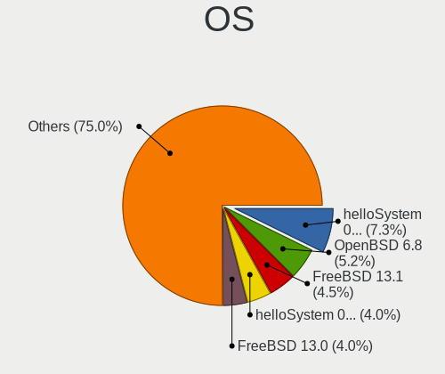

| Name                 | Computers | Percent |
|----------------------|-----------|---------|
| helloSystem 0.7.0    | 31        | 7.21%   |
| OpenBSD 6.8          | 30        | 6.98%   |
| FreeBSD 13.0         | 23        | 5.35%   |
| FreeBSD 12.1-p5      | 20        | 4.65%   |
| OpenBSD 7.1          | 15        | 3.49%   |
| FreeBSD 13.0-STABLE  | 12        | 2.79%   |
| FreeBSD 12.1-STABLE  | 12        | 2.79%   |
| helloSystem 0.6.0    | 11        | 2.56%   |
| OpenBSD 6.7          | 10        | 2.33%   |
| FreeBSD 14.0-CURRENT | 10        | 2.33%   |
| OpenBSD 7.0          | 9         | 2.09%   |
| NomadBSD 1.3.2       | 9         | 2.09%   |
| helloSystem 0.5.0    | 9         | 2.09%   |
| FreeBSD 13.0-CURRENT | 9         | 2.09%   |
| GhostBSD 20.04.02    | 8         | 1.86%   |
| FreeBSD 13.1         | 8         | 1.86%   |
| FreeBSD 12.2-p4      | 8         | 1.86%   |
| FreeBSD 12.1-p7      | 8         | 1.86%   |
| OpenBSD 6.9          | 7         | 1.63%   |
| FreeBSD 12.2         | 7         | 1.63%   |
| helloSystem 0.4.0    | 6         | 1.4%    |
| FreeBSD 12.2-p3      | 6         | 1.4%    |
| FreeBSD 12.2-p2      | 6         | 1.4%    |
| OPNsense 21.1.1      | 5         | 1.16%   |
| NomadBSD 5806f915    | 5         | 1.16%   |
| FreeBSD 12.1-p8      | 5         | 1.16%   |
| OPNsense 22.1.6      | 4         | 0.93%   |
| OPNsense 21.1.5      | 4         | 0.93%   |
| helloSystem 0.8.0    | 4         | 0.93%   |
| FreeBSD 13.0-p4      | 4         | 0.93%   |
| FreeBSD 12.3-p1      | 4         | 0.93%   |
| FreeBSD 12.2-STABLE  | 4         | 0.93%   |
| FreeBSD 12.1-p6      | 4         | 0.93%   |
| OPNsense 22.1        | 3         | 0.7%    |
| OPNsense 21.7.6      | 3         | 0.7%    |
| OPNsense 21.1.7      | 3         | 0.7%    |
| OPNsense 21.1        | 3         | 0.7%    |
| NetBSD 9.1           | 3         | 0.7%    |
| NetBSD 9.0           | 3         | 0.7%    |
| FreeBSD 13.0-p5      | 3         | 0.7%    |
| FreeBSD 13.0-p2      | 3         | 0.7%    |
| FreeBSD 13.0-p11     | 3         | 0.7%    |
| FreeBSD 12.3-STABLE  | 3         | 0.7%    |
| FreeBSD 12.3-p5      | 3         | 0.7%    |
| FreeBSD 12.1         | 3         | 0.7%    |
| OPNsense 22.1.8      | 2         | 0.47%   |
| OPNsense 22.1.7      | 2         | 0.47%   |
| OPNsense 21.7.7      | 2         | 0.47%   |
| OPNsense 21.7.1      | 2         | 0.47%   |
| OPNsense 21.1.3      | 2         | 0.47%   |
| OPNsense 21.1.2      | 2         | 0.47%   |
| NetBSD 9.2           | 2         | 0.47%   |
| FreeBSD 13.0-p7      | 2         | 0.47%   |
| FreeBSD 13.0-p6      | 2         | 0.47%   |
| FreeBSD 13.0-p3      | 2         | 0.47%   |
| FreeBSD 13.0-p10     | 2         | 0.47%   |
| FreeBSD 12.2-p6      | 2         | 0.47%   |
| FreeBSD 12.1-p3      | 2         | 0.47%   |
| FreeBSD 12.1-p10     | 2         | 0.47%   |
| pfSense 2.4.4        | 1         | 0.23%   |

OS Family
---------

OS without a version

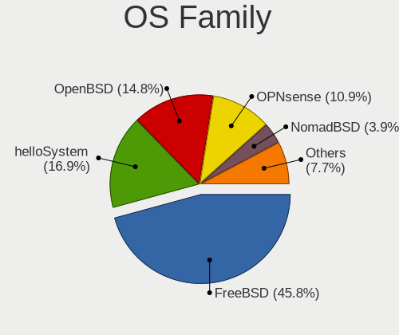

| Name        | Computers | Percent |
|-------------|-----------|---------|
| FreeBSD     | 176       | 46.19%  |
| helloSystem | 63        | 16.54%  |
| OpenBSD     | 59        | 15.49%  |
| OPNsense    | 40        | 10.5%   |
| NomadBSD    | 15        | 3.94%   |
| NetBSD      | 11        | 2.89%   |
| GhostBSD    | 9         | 2.36%   |
| pfSense     | 1         | 0.26%   |
| PC-BSD      | 1         | 0.26%   |
| OS108       | 1         | 0.26%   |
| MyBee       | 1         | 0.26%   |
| LibertyBSD  | 1         | 0.26%   |
| FuryBSD     | 1         | 0.26%   |
| DragonFly   | 1         | 0.26%   |
| ClonOS      | 1         | 0.26%   |

Arch
----

OS architecture (x86_64, i586, etc.)

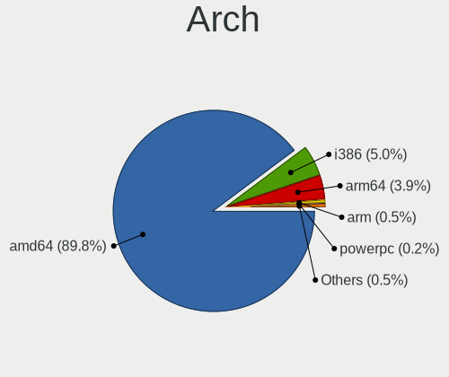

| Name   | Computers | Percent |
|--------|-----------|---------|
| amd64  | 326       | 88.59%  |
| i386   | 24        | 6.52%   |
| arm64  | 13        | 3.53%   |
| arm    | 2         | 0.54%   |
| macppc | 1         | 0.27%   |
| evbarm | 1         | 0.27%   |
| armv7  | 1         | 0.27%   |

DE
--

Desktop Environment

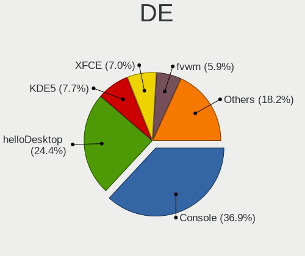

| Name          | Computers | Percent |
|---------------|-----------|---------|
| Console       | 138       | 35.94%  |
| helloDesktop  | 77        | 20.05%  |
| fvwm          | 33        | 8.59%   |
| XFCE          | 27        | 7.03%   |
| Openbox       | 25        | 6.51%   |
| KDE5          | 24        | 6.25%   |
| MATE          | 17        | 4.43%   |
| TWM           | 14        | 3.65%   |
| GNOME         | 8         | 2.08%   |
| Fluxbox       | 5         | 1.3%    |
| LXQt          | 2         | 0.52%   |
| LXDE          | 2         | 0.52%   |
| IceWM         | 2         | 0.52%   |
| i3            | 2         | 0.52%   |
| AwesomeWM     | 2         | 0.52%   |
| StumpWM       | 1         | 0.26%   |
| Lumina        | 1         | 0.26%   |
| KWin          | 1         | 0.26%   |
| Enlightenment | 1         | 0.26%   |
| DWM           | 1         | 0.26%   |
| akonadi_newm  | 1         | 0.26%   |

Display Server
--------------

X11 or Wayland

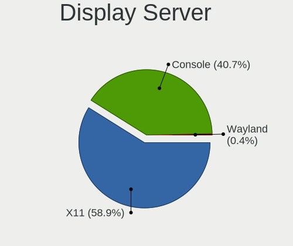

| Name    | Computers | Percent |
|---------|-----------|---------|
| X11     | 225       | 60%     |
| Console | 148       | 39.47%  |
| Wayland | 2         | 0.53%   |

Display Manager
---------------

SDDM, LightDM, etc.

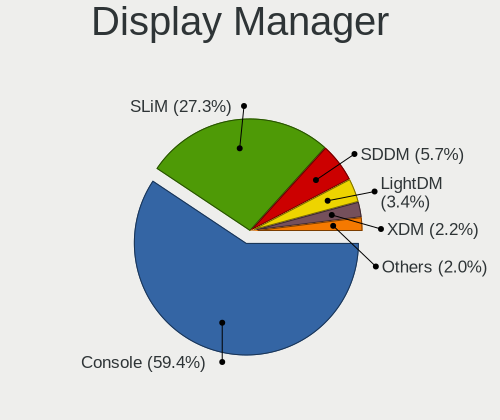

| Name    | Computers | Percent |
|---------|-----------|---------|
| Console | 224       | 59.73%  |
| SLiM    | 102       | 27.2%   |
| SDDM    | 19        | 5.07%   |
| LightDM | 14        | 3.73%   |
| XDM     | 9         | 2.4%    |
| GDM     | 5         | 1.33%   |
| PCDM    | 1         | 0.27%   |
| Ly      | 1         | 0.27%   |

OS Lang
-------

Language

| Lang           | Computers | Percent |
|----------------|-----------|---------|
| Unknown        | 120       | 31.5%   |
| ru_RU          | 116       | 30.45%  |
| en_US          | 88        | 23.1%   |
| C              | 51        | 13.39%  |
| ru_RU.KOI8-R   | 3         | 0.79%   |
| en_GB          | 1         | 0.26%   |
| en_EN          | 1         | 0.26%   |
| cv_RU.US-ASCII | 1         | 0.26%   |

Boot Mode
---------

EFI or BIOS

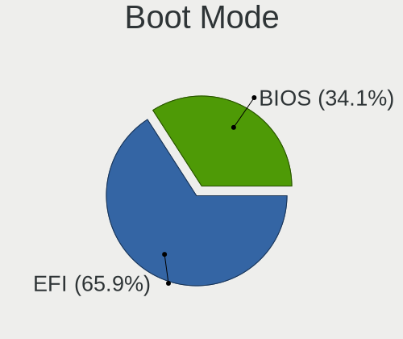

| Mode | Computers | Percent |
|------|-----------|---------|
| EFI  | 219       | 58.4%   |
| BIOS | 156       | 41.6%   |

Filesystem
----------

Type of filesystem

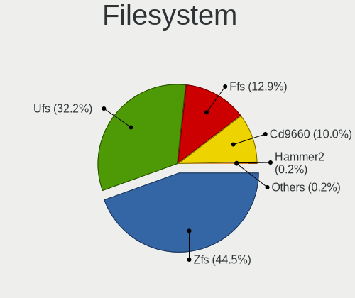

| Type    | Computers | Percent |
|---------|-----------|---------|
| Zfs     | 156       | 41.38%  |
| Ufs     | 134       | 35.54%  |
| Ffs     | 60        | 15.92%  |
| Cd9660  | 25        | 6.63%   |
| Xfs     | 1         | 0.27%   |
| Hammer2 | 1         | 0.27%   |

Part. scheme
------------

Scheme of partitioning

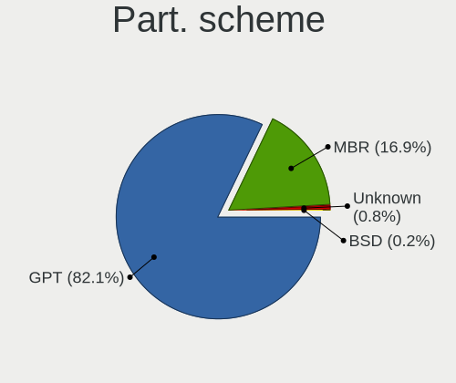

| Type    | Computers | Percent |
|---------|-----------|---------|
| GPT     | 288       | 77.42%  |
| MBR     | 79        | 21.24%  |
| Unknown | 4         | 1.08%   |
| BSD     | 1         | 0.27%   |

Board
-----

Vendor
------

Motherboard manufacturer

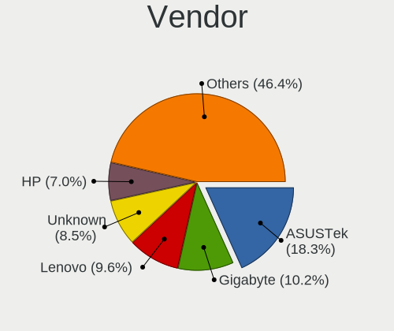

| Name                | Computers | Percent |
|---------------------|-----------|---------|
| ASUSTek Computer    | 73        | 19.84%  |
| Gigabyte Technology | 40        | 10.87%  |
| Lenovo              | 36        | 9.78%   |
| Hewlett-Packard     | 27        | 7.34%   |
| ASRock              | 27        | 7.34%   |
| Unknown             | 22        | 5.98%   |
| Dell                | 18        | 4.89%   |
| Intel               | 16        | 4.35%   |
| Supermicro          | 15        | 4.08%   |
| MSI                 | 15        | 4.08%   |
| Acer                | 15        | 4.08%   |
| Pegatron            | 7         | 1.9%    |
| Sony                | 6         | 1.63%   |
| Samsung Electronics | 5         | 1.36%   |
| Apple               | 5         | 1.36%   |
| PC Engines          | 3         | 0.82%   |
| IBM                 | 3         | 0.82%   |
| Huanan              | 3         | 0.82%   |
| Firefly             | 3         | 0.82%   |
| Toshiba             | 2         | 0.54%   |
| Foxconn             | 2         | 0.54%   |
| Wistron             | 1         | 0.27%   |
| Timi                | 1         | 0.27%   |
| Sophos              | 1         | 0.27%   |
| Shuttle             | 1         | 0.27%   |
| Radxa               | 1         | 0.27%   |
| Panasonic           | 1         | 0.27%   |
| Packard Bell        | 1         | 0.27%   |
| MW                  | 1         | 0.27%   |
| Kraftway            | 1         | 0.27%   |
| Kontron             | 1         | 0.27%   |
| KOHJINSHA           | 1         | 0.27%   |
| khadas              | 1         | 0.27%   |
| Intel CNCTION-IAF   | 1         | 0.27%   |
| HUAWEI              | 1         | 0.27%   |
| Google              | 1         | 0.27%   |
| Fujitsu             | 1         | 0.27%   |
| friendlyelec        | 1         | 0.27%   |
| eMachines           | 1         | 0.27%   |
| Edelweiss           | 1         | 0.27%   |
| ECS                 | 1         | 0.27%   |
| DNS                 | 1         | 0.27%   |
| DEXP                | 1         | 0.27%   |
| Centerm             | 1         | 0.27%   |
| Biostar             | 1         | 0.27%   |
| AMI                 | 1         | 0.27%   |

Model
-----

Motherboard model

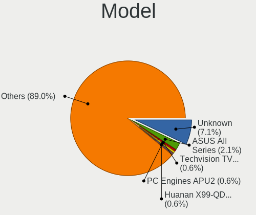

| Name                                                                  | Computers | Percent |
|-----------------------------------------------------------------------|-----------|---------|
| Unknown                                                               | 23        | 6.25%   |
| ASUS All Series                                                       | 7         | 1.9%    |
| PC Engines APU2                                                       | 3         | 0.82%   |
| Supermicro Super Server                                               | 2         | 0.54%   |
| Supermicro SSG-6029P-E1CR12L                                          | 2         | 0.54%   |
| Samsung N145P/N250P/N260P                                             | 2         | 0.54%   |
| Pegatron SAISHIAT2                                                    | 2         | 0.54%   |
| MSI MS-7817                                                           | 2         | 0.54%   |
| Lenovo IdeaPad 330-15ARR 81D2                                         | 2         | 0.54%   |
| Intel S3420GP                                                         | 2         | 0.54%   |
| Huanan X79 INTEL (INTEL Xeon E5/Corei7 DMI2 - C600/C200 Cipset V2.49P | 2         | 0.54%   |
| HP ProLiant MicroServer                                               | 2         | 0.54%   |
| HP ProLiant DL360e Gen8                                               | 2         | 0.54%   |
| Gigabyte M68MT-S2P                                                    | 2         | 0.54%   |
| Gigabyte GA-IMB370TN                                                  | 2         | 0.54%   |
| Gigabyte C1037UN-EU                                                   | 2         | 0.54%   |
| Gigabyte B450 AORUS M                                                 | 2         | 0.54%   |
| Firefly ROC-RK3566-PC                                                 | 2         | 0.54%   |
| Dell OptiPlex 7040                                                    | 2         | 0.54%   |
| Dell Inspiron 15 7000 Gaming                                          | 2         | 0.54%   |
| ASUS PRIME Z590-P                                                     | 2         | 0.54%   |
| ASUS P8Z77-V LX                                                       | 2         | 0.54%   |
| ASUS P6T SE                                                           | 2         | 0.54%   |
| ASUS P4P800-VM                                                        | 2         | 0.54%   |
| ASRock J4205-ITX                                                      | 2         | 0.54%   |
| Acer Aspire 4820T                                                     | 2         | 0.54%   |
| Wistron ProLiant DL120 G6                                             | 1         | 0.27%   |
| Toshiba Satellite M100                                                | 1         | 0.27%   |
| Toshiba Satellite A300                                                | 1         | 0.27%   |
| Timi TM1612                                                           | 1         | 0.27%   |
| Supermicro X9SRW-F                                                    | 1         | 0.27%   |
| Supermicro X9DRW                                                      | 1         | 0.27%   |
| Supermicro X9DBL-3F/X9DBL-iF                                          | 1         | 0.27%   |
| Supermicro X8DTU                                                      | 1         | 0.27%   |
| Supermicro SYS-6028R-TRT                                              | 1         | 0.27%   |
| Supermicro SYS-6018R-WTR                                              | 1         | 0.27%   |
| Supermicro SYS-5019A-FTN4                                             | 1         | 0.27%   |
| Supermicro SYS-5018A-TN4                                              | 1         | 0.27%   |
| Supermicro SSG-6028R-E1CR12T                                          | 1         | 0.27%   |
| Supermicro NSM5200-06-EU                                              | 1         | 0.27%   |
| Supermicro H8DGU                                                      | 1         | 0.27%   |
| Sophos SG                                                             | 1         | 0.27%   |
| Sony VPCX115KX                                                        | 1         | 0.27%   |
| Sony VPCM13M1R                                                        | 1         | 0.27%   |
| Sony VPCL22Z1R                                                        | 1         | 0.27%   |
| Sony VGN-S150(UC)                                                     | 1         | 0.27%   |
| Sony SVP1321V9RB                                                      | 1         | 0.27%   |
| Sony SVE1713S1RW                                                      | 1         | 0.27%   |
| Shuttle DS20U                                                         | 1         | 0.27%   |
| Samsung R530/R730/R540                                                | 1         | 0.27%   |
| Samsung N150P                                                         | 1         | 0.27%   |
| Samsung DP700A3D/DM700A3D/DB701A3D/DP700A7D                           | 1         | 0.27%   |
| Radxa rock-pi-4                                                       | 1         | 0.27%   |
| Pegatron SKLD4-P1                                                     | 1         | 0.27%   |
| Pegatron SAISHIAT                                                     | 1         | 0.27%   |
| Pegatron Pro 3010 Microtower PC                                       | 1         | 0.27%   |
| Pegatron IPPPV-D3G                                                    | 1         | 0.27%   |
| Pegatron Compaq dx2400 Microtower                                     | 1         | 0.27%   |
| Panasonic CF-19AHNC8FN                                                | 1         | 0.27%   |
| Packard Bell EasyNote TE69HW                                          | 1         | 0.27%   |

Model Family
------------

Motherboard model prefix

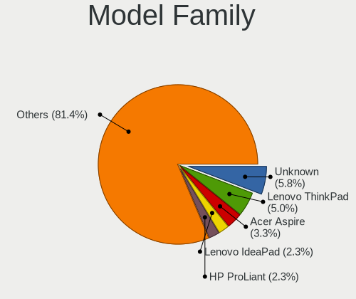

| Name                         | Computers | Percent |
|------------------------------|-----------|---------|
| Unknown                      | 23        | 6.25%   |
| Lenovo ThinkPad              | 18        | 4.89%   |
| Acer Aspire                  | 12        | 3.26%   |
| HP ProLiant                  | 9         | 2.45%   |
| Lenovo IdeaPad               | 8         | 2.17%   |
| Dell Inspiron                | 7         | 1.9%    |
| ASUS PRIME                   | 7         | 1.9%    |
| ASUS All                     | 7         | 1.9%    |
| Dell Latitude                | 6         | 1.63%   |
| Lenovo ThinkCentre           | 5         | 1.36%   |
| HP ProBook                   | 5         | 1.36%   |
| PC Engines APU2              | 3         | 0.82%   |
| HP Laptop                    | 3         | 0.82%   |
| HP Compaq                    | 3         | 0.82%   |
| Dell OptiPlex                | 3         | 0.82%   |
| ASUS ROG                     | 3         | 0.82%   |
| ASUS P5Q                     | 3         | 0.82%   |
| ASRock X570                  | 3         | 0.82%   |
| Toshiba Satellite            | 2         | 0.54%   |
| Supermicro Super             | 2         | 0.54%   |
| Supermicro SSG-6029P-E1CR12L | 2         | 0.54%   |
| Samsung N145P                | 2         | 0.54%   |
| Pegatron SAISHIAT2           | 2         | 0.54%   |
| MSI MS-7817                  | 2         | 0.54%   |
| Intel S3420GP                | 2         | 0.54%   |
| IBM ThinkPad                 | 2         | 0.54%   |
| Huanan X79                   | 2         | 0.54%   |
| Gigabyte M68MT-S2P           | 2         | 0.54%   |
| Gigabyte GA-IMB370TN         | 2         | 0.54%   |
| Gigabyte C1037UN-EU          | 2         | 0.54%   |
| Gigabyte B450                | 2         | 0.54%   |
| Firefly ROC-RK3566-PC        | 2         | 0.54%   |
| ASUS TUF                     | 2         | 0.54%   |
| ASUS P8Z77-V                 | 2         | 0.54%   |
| ASUS P7H55-M                 | 2         | 0.54%   |
| ASUS P6T                     | 2         | 0.54%   |
| ASUS P5B                     | 2         | 0.54%   |
| ASUS P4P800-VM               | 2         | 0.54%   |
| ASRock J4205-ITX             | 2         | 0.54%   |
| Acer Extensa                 | 2         | 0.54%   |
| Wistron ProLiant             | 1         | 0.27%   |
| Timi TM1612                  | 1         | 0.27%   |
| Supermicro X9SRW-F           | 1         | 0.27%   |
| Supermicro X9DRW             | 1         | 0.27%   |
| Supermicro X9DBL-3F          | 1         | 0.27%   |
| Supermicro X8DTU             | 1         | 0.27%   |
| Supermicro SYS-6028R-TRT     | 1         | 0.27%   |
| Supermicro SYS-6018R-WTR     | 1         | 0.27%   |
| Supermicro SYS-5019A-FTN4    | 1         | 0.27%   |
| Supermicro SYS-5018A-TN4     | 1         | 0.27%   |
| Supermicro SSG-6028R-E1CR12T | 1         | 0.27%   |
| Supermicro NSM5200-06-EU     | 1         | 0.27%   |
| Supermicro H8DGU             | 1         | 0.27%   |
| Sophos SG                    | 1         | 0.27%   |
| Sony VPCX115KX               | 1         | 0.27%   |
| Sony VPCM13M1R               | 1         | 0.27%   |
| Sony VPCL22Z1R               | 1         | 0.27%   |
| Sony VGN-S150(UC)            | 1         | 0.27%   |
| Sony SVP1321V9RB             | 1         | 0.27%   |
| Sony SVE1713S1RW             | 1         | 0.27%   |

MFG Year
--------

Motherboard manufacture year

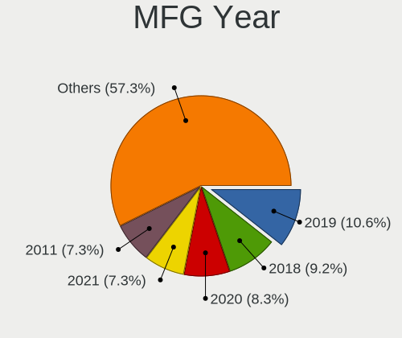

| Year    | Computers | Percent |
|---------|-----------|---------|
| 2019    | 42        | 11.41%  |
| 2018    | 33        | 8.97%   |
| 2020    | 31        | 8.42%   |
| 2011    | 27        | 7.34%   |
| 2013    | 23        | 6.25%   |
| 2014    | 22        | 5.98%   |
| 2021    | 21        | 5.71%   |
| 2010    | 21        | 5.71%   |
| 2009    | 21        | 5.71%   |
| 2012    | 20        | 5.43%   |
| 2017    | 16        | 4.35%   |
| 2016    | 15        | 4.08%   |
| 2008    | 15        | 4.08%   |
| 2015    | 14        | 3.8%    |
| Unknown | 14        | 3.8%    |
| 2007    | 11        | 2.99%   |
| 2005    | 7         | 1.9%    |
| 2006    | 6         | 1.63%   |
| 2022    | 4         | 1.09%   |
| 2004    | 4         | 1.09%   |
| 2003    | 1         | 0.27%   |

Form Factor
-----------

Physical design of the computer

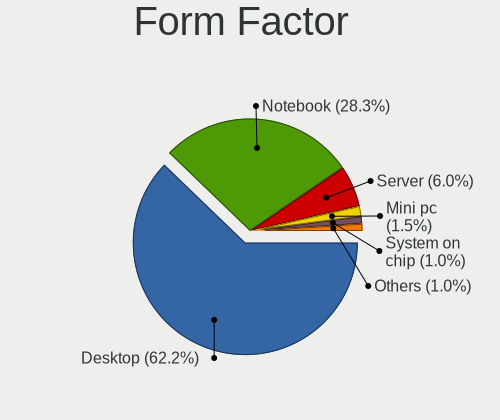

| Name           | Computers | Percent |
|----------------|-----------|---------|
| Desktop        | 229       | 62.23%  |
| Notebook       | 102       | 27.72%  |
| Server         | 19        | 5.16%   |
| Mini pc        | 6         | 1.63%   |
| System on chip | 5         | 1.36%   |
| All in one     | 5         | 1.36%   |
| Firewall       | 1         | 0.27%   |
| Convertible    | 1         | 0.27%   |

Coreboot
--------

Have coreboot on board

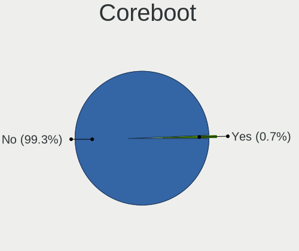

| Used | Computers | Percent |
|------|-----------|---------|
| No   | 364       | 98.91%  |
| Yes  | 4         | 1.09%   |

RAM Size
--------

Total RAM memory

| Size in GB      | Computers | Percent |
|-----------------|-----------|---------|
| 4.01-8.0        | 93        | 25.07%  |
| 8.01-16.0       | 87        | 23.45%  |
| 16.01-24.0      | 67        | 18.06%  |
| 2.01-3.0        | 32        | 8.63%   |
| 32.01-64.0      | 31        | 8.36%   |
| 3.01-4.0        | 15        | 4.04%   |
| 0.51-1.0        | 14        | 3.77%   |
| 64.01-256.0     | 12        | 3.23%   |
| 1.01-2.0        | 8         | 2.16%   |
| 0.01-0.5        | 6         | 1.62%   |
| 24.01-32.0      | 5         | 1.35%   |
| More than 256.0 | 1         | 0.27%   |

RAM Used
--------

Used RAM memory

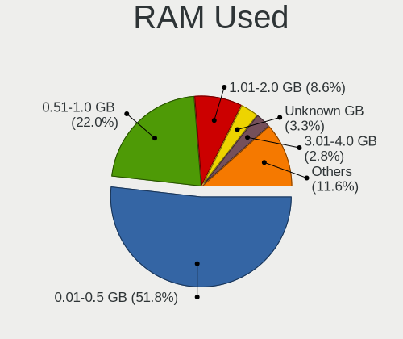

| Used GB    | Computers | Percent |
|------------|-----------|---------|
| 0.01-0.5   | 195       | 51.05%  |
| 0.51-1.0   | 85        | 22.25%  |
| 1.01-2.0   | 33        | 8.64%   |
| Unknown    | 13        | 3.4%    |
| 3.01-4.0   | 11        | 2.88%   |
| 8.01-16.0  | 10        | 2.62%   |
| 0          | 10        | 2.62%   |
| 4.01-8.0   | 8         | 2.09%   |
| 2.01-3.0   | 8         | 2.09%   |
| 24.01-32.0 | 4         | 1.05%   |
| 16.01-24.0 | 4         | 1.05%   |
| 32.01-64.0 | 1         | 0.26%   |

Total Drives
------------

Number of drives on board

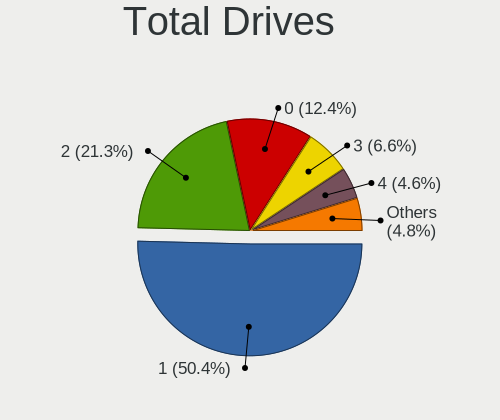

| Drives | Computers | Percent |
|--------|-----------|---------|
| 1      | 185       | 48.3%   |
| 2      | 90        | 23.5%   |
| 3      | 33        | 8.62%   |
| 4      | 27        | 7.05%   |
| 0      | 24        | 6.27%   |
| 5      | 10        | 2.61%   |
| 6      | 7         | 1.83%   |
| 7      | 5         | 1.31%   |
| 9      | 1         | 0.26%   |
| 8      | 1         | 0.26%   |

Has CD-ROM
----------

Has CD-ROM on board

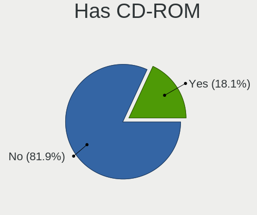

| Presented | Computers | Percent |
|-----------|-----------|---------|
| No        | 302       | 81.18%  |
| Yes       | 70        | 18.82%  |

Has Ethernet
------------

Has Ethernet on board

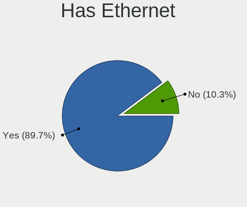

| Presented | Computers | Percent |
|-----------|-----------|---------|
| Yes       | 332       | 90.22%  |
| No        | 36        | 9.78%   |

Has WiFi
--------

Has WiFi module

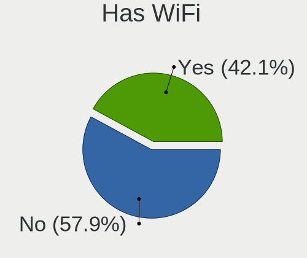

| Presented | Computers | Percent |
|-----------|-----------|---------|
| No        | 211       | 57.34%  |
| Yes       | 157       | 42.66%  |

Has Bluetooth
-------------

Has Bluetooth module

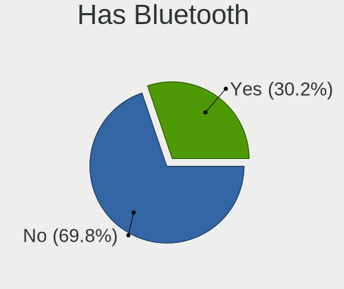

| Presented | Computers | Percent |
|-----------|-----------|---------|
| No        | 271       | 73.64%  |
| Yes       | 97        | 26.36%  |

Location
--------

Country
-------

Geographic location (country)

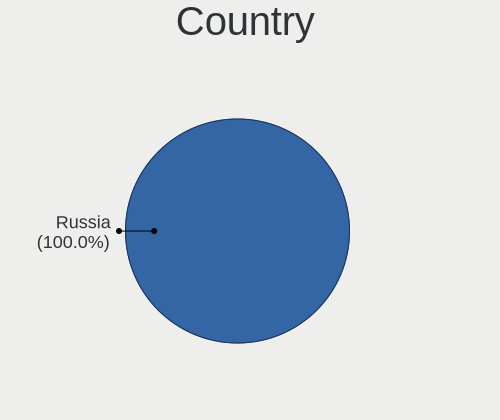

| Country | Computers | Percent |
|---------|-----------|---------|
| Russia  | 368       | 100%    |

City
----

Geographic location (city)

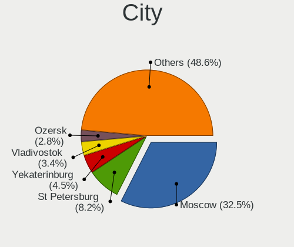

| City                       | Computers | Percent |
|----------------------------|-----------|---------|
| Moscow                     | 120       | 31.66%  |
| St Petersburg              | 35        | 9.23%   |
| Yekaterinburg              | 16        | 4.22%   |
| Vladivostok                | 12        | 3.17%   |
| Novosibirsk                | 12        | 3.17%   |
| Krasnodar                  | 12        | 3.17%   |
| Ozersk                     | 10        | 2.64%   |
| Krasnoyarsk                | 9         | 2.37%   |
| Chelyabinsk                | 8         | 2.11%   |
| Barnaul                    | 7         | 1.85%   |
| Ulyanovsk                  | 5         | 1.32%   |
| Surgut                     | 5         | 1.32%   |
| Ufa                        | 4         | 1.06%   |
| Perm                       | 4         | 1.06%   |
| Omsk                       | 4         | 1.06%   |
| Kamensk-Ural'skiy          | 4         | 1.06%   |
| Armavir                    | 4         | 1.06%   |
| Voronezh                   | 3         | 0.79%   |
| Rostov-on-Don              | 3         | 0.79%   |
| Podolsk                    | 3         | 0.79%   |
| Obninsk                    | 3         | 0.79%   |
| Nizhniy Novgorod           | 3         | 0.79%   |
| Kirov                      | 3         | 0.79%   |
| Khimki                     | 3         | 0.79%   |
| Izhevsk                    | 3         | 0.79%   |
| Irkutsk                    | 3         | 0.79%   |
| Zhukovskiy                 | 2         | 0.53%   |
| Volzhskiy                  | 2         | 0.53%   |
| Volgograd                  | 2         | 0.53%   |
| Vladimir                   | 2         | 0.53%   |
| Tyumen                     | 2         | 0.53%   |
| Tolyatti                   | 2         | 0.53%   |
| Tambov                     | 2         | 0.53%   |
| Saratov                    | 2         | 0.53%   |
| Penza                      | 2         | 0.53%   |
| Orsk                       | 2         | 0.53%   |
| Lipetsk                    | 2         | 0.53%   |
| Dubna                      | 2         | 0.53%   |
| Zarechnyy                  | 1         | 0.26%   |
| Yoshkar-Ola                | 1         | 0.26%   |
| Yegorlykskaya              | 1         | 0.26%   |
| Yegor'yevsk                | 1         | 0.26%   |
| Yaroslavl                  | 1         | 0.26%   |
| Vostochnoe Degunino        | 1         | 0.26%   |
| Voskresensk                | 1         | 0.26%   |
| Vorkuta                    | 1         | 0.26%   |
| Vidnoye                    | 1         | 0.26%   |
| Ust'-Luga                  | 1         | 0.26%   |
| Ust'-Charyshskaya Pristan' | 1         | 0.26%   |
| Ulan-Ude                   | 1         | 0.26%   |
| Tsarskoye Selo             | 1         | 0.26%   |
| Tomsk                      | 1         | 0.26%   |
| Taganrog                   | 1         | 0.26%   |
| Stavropol                  | 1         | 0.26%   |
| Smolenshchina              | 1         | 0.26%   |
| Sevastopol'                | 1         | 0.26%   |
| Sevastopol                 | 1         | 0.26%   |
| Sertolovo                  | 1         | 0.26%   |
| Ryazan                     | 1         | 0.26%   |
| Rubtsovsk                  | 1         | 0.26%   |

Drives
------

Drive Vendor
------------

Hard drive vendors

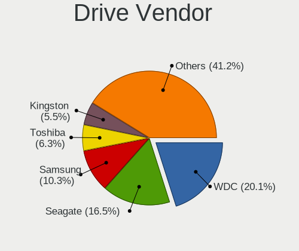

| Vendor                             | Computers | Drives | Percent |
|------------------------------------|-----------|--------|---------|
| WDC                                | 102       | 173    | 20.08%  |
| Seagate                            | 88        | 168    | 17.32%  |
| Samsung Electronics                | 52        | 74     | 10.24%  |
| Toshiba                            | 35        | 55     | 6.89%   |
| Kingston                           | 26        | 29     | 5.12%   |
| Hitachi                            | 25        | 56     | 4.92%   |
| Intel                              | 22        | 36     | 4.33%   |
| SanDisk                            | 14        | 17     | 2.76%   |
| HGST                               | 12        | 24     | 2.36%   |
| Crucial                            | 11        | 13     | 2.17%   |
| A-DATA Technology                  | 10        | 15     | 1.97%   |
| SPCC                               | 7         | 8      | 1.38%   |
| SK hynix                           | 7         | 8      | 1.38%   |
| OCZ                                | 7         | 8      | 1.38%   |
| Hewlett-Packard                    | 7         | 15     | 1.38%   |
| Smartbuy                           | 5         | 5      | 0.98%   |
| Plextor                            | 5         | 8      | 0.98%   |
| Micron Technology                  | 5         | 7      | 0.98%   |
| Transcend                          | 4         | 4      | 0.79%   |
| OPENBSD                            | 4         | 8      | 0.79%   |
| NVMe                               | 4         | 7      | 0.79%   |
| Apacer                             | 4         | 4      | 0.79%   |
| AMD                                | 4         | 5      | 0.79%   |
| Silicon Motion                     | 3         | 3      | 0.59%   |
| Maxtor                             | 3         | 3      | 0.59%   |
| KingSpec                           | 3         | 5      | 0.59%   |
| Innostor                           | 3         | 3      | 0.59%   |
| Gigabyte Technology                | 3         | 6      | 0.59%   |
| XPG                                | 2         | 2      | 0.39%   |
| Verbatim                           | 2         | 2      | 0.39%   |
| Patriot                            | 2         | 2      | 0.39%   |
| Netac                              | 2         | 2      | 0.39%   |
| Kston                              | 2         | 2      | 0.39%   |
| Hoodisk                            | 2         | 4      | 0.39%   |
| Fujitsu                            | 2         | 3      | 0.39%   |
| Adaptec                            | 2         | 12     | 0.39%   |
| XUNZHE                             | 1         | 1      | 0.2%    |
| USB                                | 1         | 1      | 0.2%    |
| UFD 2.0                            | 1         | 1      | 0.2%    |
| Qumo                               | 1         | 1      | 0.2%    |
| Product:              USB DISK 2.0 | 1         | 1      | 0.2%    |
| MaxDigital                         | 1         | 1      | 0.2%    |
| LITEON                             | 1         | 1      | 0.2%    |
| KLLISRE                            | 1         | 1      | 0.2%    |
| KingDian                           | 1         | 3      | 0.2%    |
| IBM                                | 1         | 1      | 0.2%    |
| Goodram                            | 1         | 1      | 0.2%    |
| GK                                 | 1         | 1      | 0.2%    |
| FORESEE                            | 1         | 1      | 0.2%    |
| China                              | 1         | 1      | 0.2%    |
| Areca                              | 1         | 2      | 0.2%    |
| Apple                              | 1         | 1      | 0.2%    |
| AEGO                               | 1         | 1      | 0.2%    |

Drive Model
-----------

Hard drive models

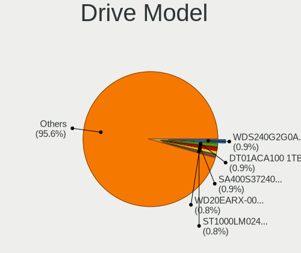

| Model                               | Computers | Percent |
|-------------------------------------|-----------|---------|
| WDC WDS240G2G0A-00JH30 240GB        | 7         | 1.22%   |
| Toshiba DT01ACA100 1TB              | 7         | 1.22%   |
| Samsung SSD 970 EVO Plus 250GB      | 5         | 0.87%   |
| Kingston SA400S37240G 240GB         | 5         | 0.87%   |
| WDC WD20EARX-00PASB0 2TB            | 4         | 0.69%   |
| Seagate ST3300657SS 304GB           | 4         | 0.69%   |
| Seagate ST250DM000-1BD141 250GB     | 4         | 0.69%   |
| Seagate ST1000LM024 HN-M101MBB 1TB  | 4         | 0.69%   |
| Seagate ST1000DM010-2EP102 1TB      | 4         | 0.69%   |
| Samsung SSD 860 EVO 500GB           | 4         | 0.69%   |
| OPENBSD SR RAID 1 752GB             | 4         | 0.69%   |
| Kingston SV300S37A120G 120GB        | 4         | 0.69%   |
| HP RAID 1(1+0) 2TB                  | 4         | 0.69%   |
| A-DATA SU650 120GB                  | 4         | 0.69%   |
| WDC WDS120G2G0A-00JH30 120GB        | 3         | 0.52%   |
| WDC WD6400AARS-00Y5B1 640GB         | 3         | 0.52%   |
| WDC WD1002FAEX-00Y9A0 1TB           | 3         | 0.52%   |
| Toshiba MQ01ABF050 500GB            | 3         | 0.52%   |
| Toshiba DT01ACA050 500GB            | 3         | 0.52%   |
| Seagate ST500LM012 HN-M500MBB 500GB | 3         | 0.52%   |
| Seagate ST4000VN008-2DR166 4TB      | 3         | 0.52%   |
| Seagate ST380815AS 80GB             | 3         | 0.52%   |
| Seagate ST3500413AS 500GB           | 3         | 0.52%   |
| Seagate ST3250318AS 250GB           | 3         | 0.52%   |
| Seagate ST2000DM001-1CH164 2TB      | 3         | 0.52%   |
| Samsung HD161HJ 160GB               | 3         | 0.52%   |
| Kingston SA400S37120G 120GB         | 3         | 0.52%   |
| Innostor SSD 15GB                   | 3         | 0.52%   |
| HGST HTS721010A9E630 1TB            | 3         | 0.52%   |
| A-DATA SU650 240GB                  | 3         | 0.52%   |
| WDC WDS500G1B0A-00H9H0 500GB        | 2         | 0.35%   |
| WDC WDS250G2B0A-00SM50 250GB        | 2         | 0.35%   |
| WDC WD5003AZEX-00K1GA0 500GB        | 2         | 0.35%   |
| WDC WD5000LPVX-60V0TT0 500GB        | 2         | 0.35%   |
| WDC WD5000LPLX-00ZNTT0 500GB        | 2         | 0.35%   |
| WDC WD40EFRX-68N32N0 4TB            | 2         | 0.35%   |
| WDC WD2500BEVT-22A23T0 250GB        | 2         | 0.35%   |
| WDC WD20EZRZ-00Z5HB0 2TB            | 2         | 0.35%   |
| WDC WD2000JS-55MHB0 192GB           | 2         | 0.35%   |
| WDC WD1600BEVT-22ZCT0 160GB         | 2         | 0.35%   |
| WDC WD15EADS-00P8B0 1.5TB           | 2         | 0.35%   |
| WDC WD10EZRX-00A8LB0 1TB            | 2         | 0.35%   |
| WDC WD10EZEX-21M2NA0 1TB            | 2         | 0.35%   |
| WDC WD10EZEX-08WN4A0 1TB            | 2         | 0.35%   |
| WDC WD10EALX-009BA0 1TB             | 2         | 0.35%   |
| WDC WD1003FZEX-00K3CA0 1TB          | 2         | 0.35%   |
| WDC WD1002FAEX-00Z3A0 1TB           | 2         | 0.35%   |
| Verbatim Vi550 S3 SSD 512GB         | 2         | 0.35%   |
| Toshiba MQ01ABD100 1TB              | 2         | 0.35%   |
| Toshiba MG04ACA600E 6TB             | 2         | 0.35%   |
| Toshiba HDWQ140 4TB                 | 2         | 0.35%   |
| Toshiba HDWD130 3TB                 | 2         | 0.35%   |
| Smartbuy SSD 60GB                   | 2         | 0.35%   |
| Silicon Motion NE-256 256GB         | 2         | 0.35%   |
| Seagate ST9500325AS 500GB           | 2         | 0.35%   |
| Seagate ST500LT012-1DG142 500GB     | 2         | 0.35%   |
| Seagate ST500LM021-1KJ152 500GB     | 2         | 0.35%   |
| Seagate ST500DM002-1BD142 500GB     | 2         | 0.35%   |
| Seagate ST380011A 80GB              | 2         | 0.35%   |
| Seagate ST3320418AS 320GB           | 2         | 0.35%   |

HDD Vendor
----------

Hard disk drive vendors

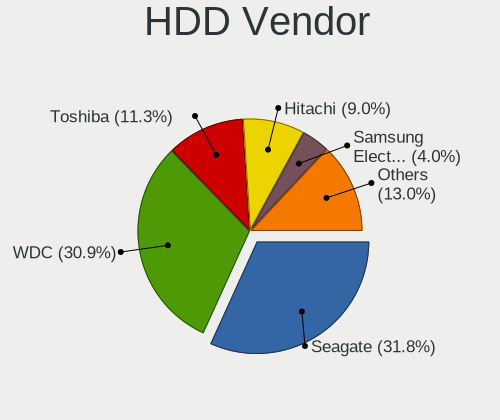

| Vendor                             | Computers | Drives | Percent |
|------------------------------------|-----------|--------|---------|
| Seagate                            | 88        | 168    | 31.88%  |
| WDC                                | 80        | 143    | 28.99%  |
| Toshiba                            | 33        | 53     | 11.96%  |
| Hitachi                            | 25        | 56     | 9.06%   |
| HGST                               | 12        | 24     | 4.35%   |
| Samsung Electronics                | 11        | 18     | 3.99%   |
| Hewlett-Packard                    | 6         | 14     | 2.17%   |
| OPENBSD                            | 4         | 8      | 1.45%   |
| NVMe                               | 4         | 7      | 1.45%   |
| Maxtor                             | 3         | 3      | 1.09%   |
| Fujitsu                            | 2         | 3      | 0.72%   |
| Adaptec                            | 2         | 12     | 0.72%   |
| USB                                | 1         | 1      | 0.36%   |
| UFD 2.0                            | 1         | 1      | 0.36%   |
| Product:              USB DISK 2.0 | 1         | 1      | 0.36%   |
| MaxDigital                         | 1         | 1      | 0.36%   |
| IBM                                | 1         | 1      | 0.36%   |
| Areca                              | 1         | 2      | 0.36%   |

SSD Vendor
----------

Solid state drive vendors

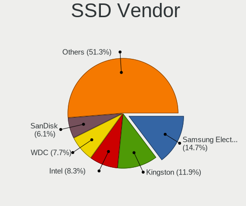

| Vendor              | Computers | Drives | Percent |
|---------------------|-----------|--------|---------|
| Samsung Electronics | 27        | 33     | 14.14%  |
| Kingston            | 23        | 26     | 12.04%  |
| Intel               | 18        | 30     | 9.42%   |
| WDC                 | 16        | 17     | 8.38%   |
| SanDisk             | 14        | 17     | 7.33%   |
| Crucial             | 11        | 13     | 5.76%   |
| A-DATA Technology   | 10        | 14     | 5.24%   |
| OCZ                 | 7         | 8      | 3.66%   |
| SPCC                | 6         | 7      | 3.14%   |
| Smartbuy            | 5         | 5      | 2.62%   |
| Plextor             | 5         | 8      | 2.62%   |
| Micron Technology   | 5         | 7      | 2.62%   |
| Apacer              | 4         | 4      | 2.09%   |
| AMD                 | 4         | 5      | 2.09%   |
| Transcend           | 3         | 3      | 1.57%   |
| KingSpec            | 3         | 5      | 1.57%   |
| Innostor            | 3         | 3      | 1.57%   |
| Verbatim            | 2         | 2      | 1.05%   |
| Patriot             | 2         | 2      | 1.05%   |
| Netac               | 2         | 2      | 1.05%   |
| Kston               | 2         | 2      | 1.05%   |
| Hoodisk             | 2         | 4      | 1.05%   |
| Gigabyte Technology | 2         | 4      | 1.05%   |
| XUNZHE              | 1         | 1      | 0.52%   |
| XPG                 | 1         | 1      | 0.52%   |
| Toshiba             | 1         | 1      | 0.52%   |
| SK hynix            | 1         | 1      | 0.52%   |
| Qumo                | 1         | 1      | 0.52%   |
| LITEON              | 1         | 1      | 0.52%   |
| KLLISRE             | 1         | 1      | 0.52%   |
| KingDian            | 1         | 3      | 0.52%   |
| Hewlett-Packard     | 1         | 1      | 0.52%   |
| Goodram             | 1         | 1      | 0.52%   |
| GK                  | 1         | 1      | 0.52%   |
| FORESEE             | 1         | 1      | 0.52%   |
| China               | 1         | 1      | 0.52%   |
| Apple               | 1         | 1      | 0.52%   |
| AEGO                | 1         | 1      | 0.52%   |

Drive Kind
----------

HDD or SSD

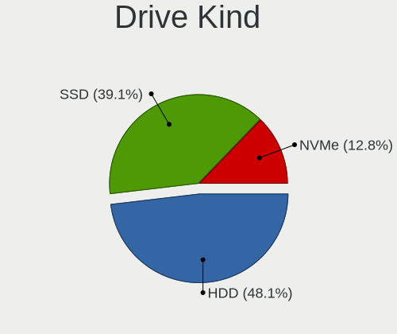

| Kind | Computers | Drives | Percent |
|------|-----------|--------|---------|
| HDD  | 218       | 516    | 50.46%  |
| SSD  | 169       | 238    | 39.12%  |
| NVMe | 45        | 62     | 10.42%  |

Drive Connector
---------------

SATA, SAS, NVMe, etc.

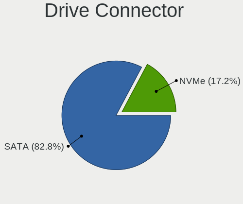

| Type | Computers | Drives | Percent |
|------|-----------|--------|---------|
| SATA | 324       | 754    | 87.8%   |
| NVMe | 45        | 62     | 12.2%   |

Drive Size
----------

Size of hard drive

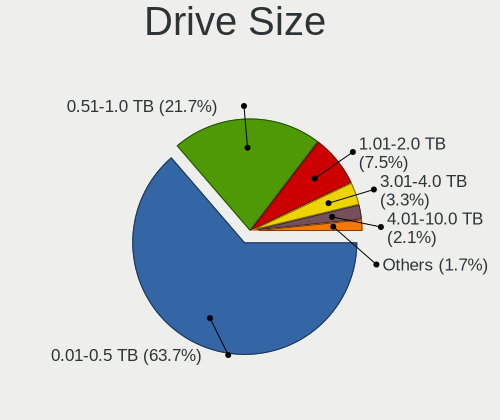

| Size in TB      | Computers | Drives | Percent |
|-----------------|-----------|--------|---------|
| 0.01-0.5        | 270       | 434    | 63.68%  |
| 0.51-1.0        | 92        | 148    | 21.7%   |
| 1.01-2.0        | 32        | 102    | 7.55%   |
| 3.01-4.0        | 14        | 29     | 3.3%    |
| 4.01-10.0       | 9         | 22     | 2.12%   |
| 2.01-3.0        | 6         | 18     | 1.42%   |
| More than 100.0 | 1         | 1      | 0.24%   |

Space Total
-----------

Amount of disk space available on the file system

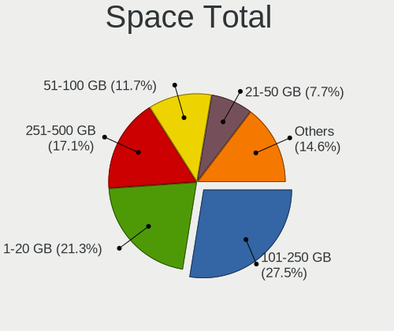

| Size in GB     | Computers | Percent |
|----------------|-----------|---------|
| 101-250        | 108       | 27.84%  |
| 1-20           | 83        | 21.39%  |
| 251-500        | 63        | 16.24%  |
| 51-100         | 47        | 12.11%  |
| 21-50          | 30        | 7.73%   |
| 501-1000       | 26        | 6.7%    |
| 1001-2000      | 15        | 3.87%   |
| More than 3000 | 8         | 2.06%   |
| Unknown        | 6         | 1.55%   |
| 2001-3000      | 2         | 0.52%   |

Space Used
----------

Amount of used disk space

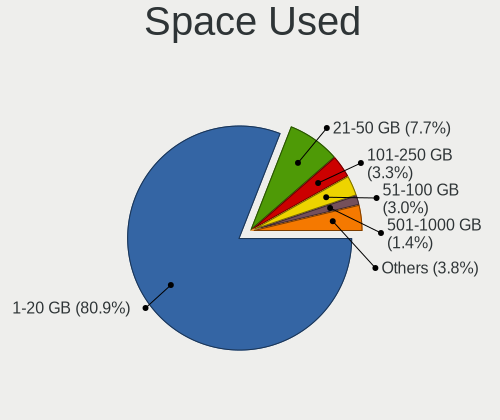

| Used GB        | Computers | Percent |
|----------------|-----------|---------|
| 1-20           | 290       | 76.32%  |
| 21-50          | 38        | 10%     |
| 101-250        | 16        | 4.21%   |
| 51-100         | 13        | 3.42%   |
| 501-1000       | 6         | 1.58%   |
| Unknown        | 6         | 1.58%   |
| More than 3000 | 3         | 0.79%   |
| 2001-3000      | 3         | 0.79%   |
| 1001-2000      | 3         | 0.79%   |
| 251-500        | 2         | 0.53%   |

Malfunc. Drives
---------------

Drive models with a malfunction

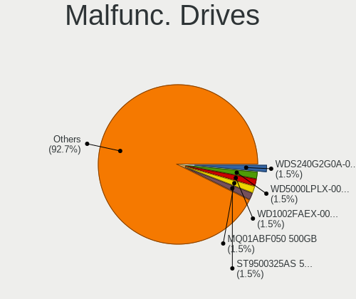

| Model                                        | Computers | Drives | Percent |
|----------------------------------------------|-----------|--------|---------|
| WDC WDS240G2G0A-00JH30 240GB                 | 2         | 2      | 2.08%   |
| WDC WD1002FAEX-00Y9A0 1TB                    | 2         | 2      | 2.08%   |
| Seagate ST500LT012-1DG142 500GB              | 2         | 2      | 2.08%   |
| Seagate ST3500413AS 500GB                    | 2         | 4      | 2.08%   |
| Seagate ST3320418AS 320GB                    | 2         | 2      | 2.08%   |
| Seagate ST1000LM024 HN-M101MBB 1TB           | 2         | 2      | 2.08%   |
| Samsung Electronics SSD 870 EVO 1TB          | 2         | 6      | 2.08%   |
| Samsung Electronics HD501LJ 500GB            | 2         | 4      | 2.08%   |
| Samsung Electronics HD161HJ 160GB            | 2         | 2      | 2.08%   |
| Micron Technology 1100 SATA 256GB            | 2         | 2      | 2.08%   |
| Maxtor STM3320613AS 320GB                    | 2         | 2      | 2.08%   |
| Hitachi HDS721010CLA332 1TB                  | 2         | 4      | 2.08%   |
| XPG SX950U 240GB                             | 1         | 1      | 1.04%   |
| WDC WDS120G2G0A-00JH30 120GB                 | 1         | 1      | 1.04%   |
| WDC WD7501AALS-00E8B0 752GB                  | 1         | 1      | 1.04%   |
| WDC WD60EFRX-68MYMN1 6TB                     | 1         | 1      | 1.04%   |
| WDC WD5003AZEX-00MK2A0 500GB                 | 1         | 1      | 1.04%   |
| WDC WD5000LPLX-60ZNTT1 500GB                 | 1         | 1      | 1.04%   |
| WDC WD5000LPLX-00ZNTT0 500GB                 | 1         | 1      | 1.04%   |
| WDC WD5000AZRZ-00HTKB0 500GB                 | 1         | 1      | 1.04%   |
| WDC WD5000AZLX-00CL5A0 500GB                 | 1         | 1      | 1.04%   |
| WDC WD5000AAKS-00V1A0 500GB                  | 1         | 1      | 1.04%   |
| WDC WD40EFRX-68N32N0 4TB                     | 1         | 3      | 1.04%   |
| WDC WD3200BPVT-22JJ5T0 320GB                 | 1         | 1      | 1.04%   |
| WDC WD3200BEVT-00A0RT0 233GB                 | 1         | 1      | 1.04%   |
| WDC WD20EURX-63T0FY0 2TB                     | 1         | 1      | 1.04%   |
| WDC WD20EFRX-68EUZN0 2TB                     | 1         | 2      | 1.04%   |
| WDC WD2000JB-00GVC0 200GB                    | 1         | 1      | 1.04%   |
| WDC WD1600BEVT-22ZCT0 160GB                  | 1         | 1      | 1.04%   |
| WDC WD15EADS-00P8B0 1.5TB                    | 1         | 1      | 1.04%   |
| WDC WD1002FAEX-00Z3A0 1TB                    | 1         | 1      | 1.04%   |
| Toshiba MQ01ABF050 500GB                     | 1         | 1      | 1.04%   |
| Toshiba MK7575GSX 752GB                      | 1         | 1      | 1.04%   |
| Toshiba MK2546GSX 250GB                      | 1         | 1      | 1.04%   |
| Toshiba HDWD105 500GB                        | 1         | 2      | 1.04%   |
| Toshiba DT01ACA050 500GB                     | 1         | 2      | 1.04%   |
| Seagate ST9500325AS 500GB                    | 1         | 1      | 1.04%   |
| Seagate ST9250320AS 250GB                    | 1         | 1      | 1.04%   |
| Seagate ST9120822AS 120GB                    | 1         | 1      | 1.04%   |
| Seagate ST500LM021-1KJ152 500GB              | 1         | 1      | 1.04%   |
| Seagate ST500LM012 HN-M500MBB 500GB          | 1         | 1      | 1.04%   |
| Seagate ST3750640NS 752GB                    | 1         | 4      | 1.04%   |
| Seagate ST3500514NS 500GB                    | 1         | 1      | 1.04%   |
| Seagate ST3250410AS 250GB                    | 1         | 1      | 1.04%   |
| Seagate ST3250310AS 250GB                    | 1         | 1      | 1.04%   |
| Seagate ST320410A 20GB                       | 1         | 1      | 1.04%   |
| Seagate ST3160812A 160GB                     | 1         | 2      | 1.04%   |
| Seagate ST3120814A 120GB                     | 1         | 1      | 1.04%   |
| Seagate ST3120211AS 120GB                    | 1         | 1      | 1.04%   |
| Seagate ST250DM000-1BD141 250GB              | 1         | 2      | 1.04%   |
| Seagate ST2000NM0011 2TB                     | 1         | 1      | 1.04%   |
| Seagate ST2000DM006-2DM164 2TB               | 1         | 1      | 1.04%   |
| Seagate ST2000DM001-1CH164 2TB               | 1         | 1      | 1.04%   |
| Samsung Electronics SSD 840 PRO Series 256GB | 1         | 1      | 1.04%   |
| Samsung Electronics SP2004C 200GB            | 1         | 1      | 1.04%   |
| Samsung Electronics HM080HI 80GB             | 1         | 1      | 1.04%   |
| Samsung Electronics HD082GJ 80GB             | 1         | 1      | 1.04%   |
| Plextor PX-128M5S 128GB                      | 1         | 1      | 1.04%   |
| Maxtor STM3160815AS 160GB                    | 1         | 1      | 1.04%   |
| Kingston SV300S37A120G 120GB                 | 1         | 1      | 1.04%   |

Malfunc. Drive Vendor
---------------------

Vendors of faulty drives

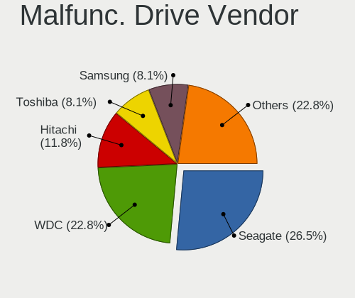

| Vendor              | Computers | Drives | Percent |
|---------------------|-----------|--------|---------|
| Seagate             | 25        | 32     | 26.6%   |
| WDC                 | 20        | 25     | 21.28%  |
| Hitachi             | 11        | 13     | 11.7%   |
| Samsung Electronics | 10        | 16     | 10.64%  |
| Intel               | 6         | 6      | 6.38%   |
| Toshiba             | 5         | 7      | 5.32%   |
| Kingston            | 4         | 4      | 4.26%   |
| Maxtor              | 3         | 3      | 3.19%   |
| Micron Technology   | 2         | 2      | 2.13%   |
| HGST                | 2         | 2      | 2.13%   |
| XPG                 | 1         | 1      | 1.06%   |
| Plextor             | 1         | 1      | 1.06%   |
| GK                  | 1         | 1      | 1.06%   |
| Apple               | 1         | 1      | 1.06%   |
| AMD                 | 1         | 2      | 1.06%   |
| A-DATA Technology   | 1         | 1      | 1.06%   |

Malfunc. HDD Vendor
-------------------

Vendors of faulty HDD drives

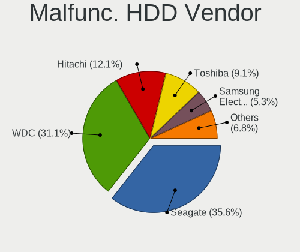

| Vendor              | Computers | Drives | Percent |
|---------------------|-----------|--------|---------|
| Seagate             | 25        | 32     | 35.71%  |
| WDC                 | 17        | 22     | 24.29%  |
| Hitachi             | 11        | 13     | 15.71%  |
| Samsung Electronics | 7         | 9      | 10%     |
| Toshiba             | 5         | 7      | 7.14%   |
| Maxtor              | 3         | 3      | 4.29%   |
| HGST                | 2         | 2      | 2.86%   |

Malfunc. Drive Kind
-------------------

Kinds of faulty drives

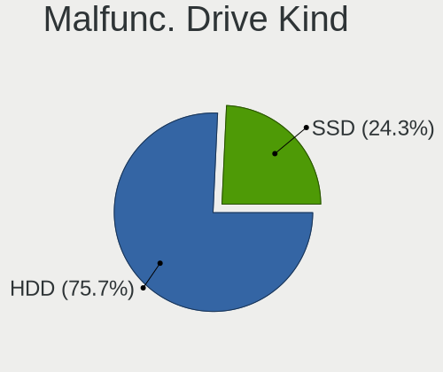

| Kind | Computers | Drives | Percent |
|------|-----------|--------|---------|
| HDD  | 69        | 88     | 75%     |
| SSD  | 23        | 29     | 25%     |

Failed Drives
-------------

Failed drive models

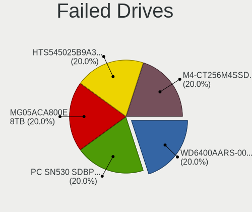

| Model                         | Computers | Drives | Percent |
|-------------------------------|-----------|--------|---------|
| WDC WD6400AARS-00Y5B1 640GB   | 1         | 2      | 33.33%  |
| Hitachi HTS545025B9A300 250GB | 1         | 1      | 33.33%  |
| Crucial M4-CT256M4SSD1 256GB  | 1         | 1      | 33.33%  |

Failed Drive Vendor
-------------------

Failed drive vendors

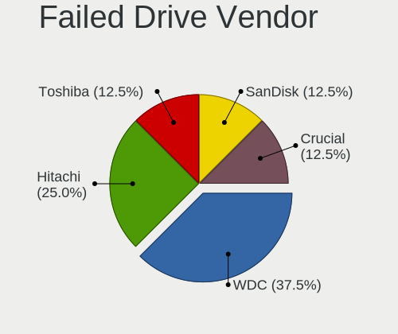

| Vendor  | Computers | Drives | Percent |
|---------|-----------|--------|---------|
| WDC     | 1         | 2      | 33.33%  |
| Hitachi | 1         | 1      | 33.33%  |
| Crucial | 1         | 1      | 33.33%  |

Drive Status
------------

Number of failed and malfunc. drives

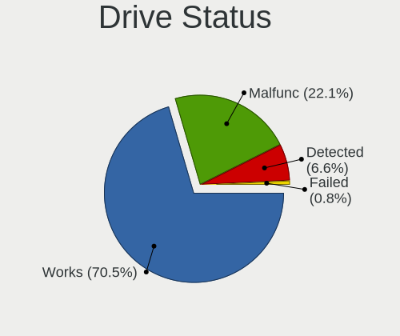

| Status   | Computers | Drives | Percent |
|----------|-----------|--------|---------|
| Works    | 284       | 635    | 70.12%  |
| Malfunc  | 90        | 117    | 22.22%  |
| Detected | 28        | 60     | 6.91%   |
| Failed   | 3         | 4      | 0.74%   |

Storage controller
------------------

Storage Vendor
--------------

Storage controller vendors

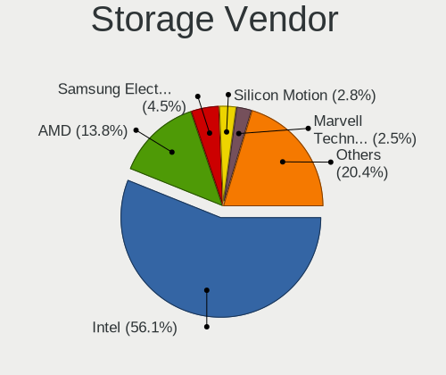

| Vendor                           | Computers | Percent |
|----------------------------------|-----------|---------|
| Intel                            | 257       | 57.37%  |
| AMD                              | 64        | 14.29%  |
| Samsung Electronics              | 20        | 4.46%   |
| Marvell Technology Group         | 13        | 2.9%    |
| Nvidia                           | 11        | 2.46%   |
| JMicron Technology               | 10        | 2.23%   |
| ASMedia Technology               | 10        | 2.23%   |
| SanDisk                          | 9         | 2.01%   |
| Silicon Motion                   | 8         | 1.79%   |
| SK hynix                         | 7         | 1.56%   |
| Broadcom / LSI                   | 6         | 1.34%   |
| Areca Technology                 | 5         | 1.12%   |
| Hewlett-Packard                  | 4         | 0.89%   |
| Toshiba                          | 3         | 0.67%   |
| Kingston Technology Company      | 3         | 0.67%   |
| Silicon Integrated Systems [SiS] | 2         | 0.45%   |
| Silicon Image                    | 2         | 0.45%   |
| Phison Electronics               | 2         | 0.45%   |
| ADATA Technology                 | 2         | 0.45%   |
| Adaptec                          | 2         | 0.45%   |
| VIA Technologies                 | 1         | 0.22%   |
| Realtek Semiconductor            | 1         | 0.22%   |
| Lite-On Technology               | 1         | 0.22%   |
| Lite-On IT Corp. / Plextor       | 1         | 0.22%   |
| Integrated Technology Express    | 1         | 0.22%   |
| Broadcom                         | 1         | 0.22%   |
| 3ware                            | 1         | 0.22%   |
| Unknown                          | 1         | 0.22%   |

Storage Model
-------------

Storage controller models

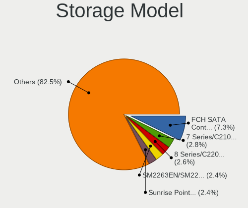

| Model                                                                                   | Computers | Percent |
|-----------------------------------------------------------------------------------------|-----------|---------|
| AMD FCH SATA Controller [AHCI mode]                                                     | 43        | 8.11%   |
| Intel NM10/ICH7 Family SATA Controller [IDE mode]                                       | 14        | 2.64%   |
| Intel Sunrise Point-LP SATA Controller [AHCI mode]                                      | 13        | 2.45%   |
| Intel 82801G (ICH7 Family) IDE Controller                                               | 13        | 2.45%   |
| Intel 7 Series/C210 Series Chipset Family 6-port SATA Controller [AHCI mode]            | 13        | 2.45%   |
| AMD SB7x0/SB8x0/SB9x0 SATA Controller [AHCI mode]                                       | 13        | 2.45%   |
| Intel Q170/Q150/B150/H170/H110/Z170/CM236 Chipset SATA Controller [AHCI Mode]           | 12        | 2.26%   |
| Intel NM10/ICH7 Family SATA Controller [AHCI mode]                                      | 12        | 2.26%   |
| Intel 8 Series/C220 Series Chipset Family 6-port SATA Controller 1 [AHCI mode]          | 12        | 2.26%   |
| Intel 7 Series Chipset Family 6-port SATA Controller [AHCI mode]                        | 12        | 2.26%   |
| Samsung NVMe SSD Controller SM981/PM981/PM983                                           | 11        | 2.08%   |
| Intel 82801JI (ICH10 Family) SATA AHCI Controller                                       | 11        | 2.08%   |
| Intel Atom Processor E3800 Series SATA AHCI Controller                                  | 10        | 1.89%   |
| Intel 6 Series/C200 Series Chipset Family 6 port Desktop SATA AHCI Controller           | 10        | 1.89%   |
| ASMedia ASM1062 Serial ATA Controller                                                   | 10        | 1.89%   |
| Intel Celeron N3350/Pentium N4200/Atom E3900 Series SATA AHCI Controller                | 9         | 1.7%    |
| Silicon Motion SM2263EN/SM2263XT SSD Controller                                         | 8         | 1.51%   |
| AMD SB7x0/SB8x0/SB9x0 IDE Controller                                                    | 8         | 1.51%   |
| AMD 400 Series Chipset SATA Controller                                                  | 8         | 1.51%   |
| Intel Atom/Celeron/Pentium Processor x5-E8000/J3xxx/N3xxx Series SATA Controller        | 7         | 1.32%   |
| Intel 6 Series/C200 Series Chipset Family 6 port Mobile SATA AHCI Controller            | 7         | 1.32%   |
| JMicron JMB363 SATA/IDE Controller                                                      | 6         | 1.13%   |
| Intel C600/X79 series chipset 6-Port SATA AHCI Controller                               | 6         | 1.13%   |
| Intel 8 Series SATA Controller 1 [AHCI mode]                                            | 6         | 1.13%   |
| Samsung NVMe SSD Controller SM961/PM961/SM963                                           | 5         | 0.94%   |
| Nvidia MCP61 SATA Controller                                                            | 5         | 0.94%   |
| Intel Celeron/Pentium Silver Processor SATA Controller                                  | 5         | 0.94%   |
| Intel Cannon Lake PCH SATA AHCI Controller                                              | 5         | 0.94%   |
| Intel C610/X99 series chipset 6-Port SATA Controller [AHCI mode]                        | 5         | 0.94%   |
| Intel 82801JI (ICH10 Family) 4 port SATA IDE Controller #1                              | 5         | 0.94%   |
| Intel 82801JI (ICH10 Family) 2 port SATA IDE Controller #2                              | 5         | 0.94%   |
| Intel 82801HM/HEM (ICH8M/ICH8M-E) SATA Controller [AHCI mode]                           | 5         | 0.94%   |
| Intel 82801HM/HEM (ICH8M/ICH8M-E) IDE Controller                                        | 5         | 0.94%   |
| Intel 200 Series PCH SATA controller [AHCI mode]                                        | 5         | 0.94%   |
| SK hynix BC501 NVMe Solid State Drive                                                   | 4         | 0.75%   |
| SanDisk WD Black SN750 / PC SN730 NVMe SSD                                              | 4         | 0.75%   |
| Intel C610/X99 series chipset sSATA Controller [AHCI mode]                              | 4         | 0.75%   |
| Intel 82801IBM/IEM (ICH9M/ICH9M-E) 4 port SATA Controller [AHCI mode]                   | 4         | 0.75%   |
| Intel 82801HR/HO/HH (ICH8R/DO/DH) 2 port SATA Controller [IDE mode]                     | 4         | 0.75%   |
| Intel 82801H (ICH8 Family) 4 port SATA Controller [IDE mode]                            | 4         | 0.75%   |
| Intel 82801EB (ICH5) SATA Controller                                                    | 4         | 0.75%   |
| Intel 5 Series/3400 Series Chipset 6 port SATA AHCI Controller                          | 4         | 0.75%   |
| Intel 400 Series Chipset Family SATA AHCI Controller                                    | 4         | 0.75%   |
| Areca ARC-1300ix-16 16-Port PCI-Express to SAS Non-RAID Host Adapter                    | 4         | 0.75%   |
| SanDisk WD Blue SN550 NVMe SSD                                                          | 3         | 0.57%   |
| Nvidia MCP61 IDE                                                                        | 3         | 0.57%   |
| Marvell Group 88SE6111/6121 SATA II / PATA Controller                                   | 3         | 0.57%   |
| Intel SSD 660P Series                                                                   | 3         | 0.57%   |
| Intel HM170/QM170 Chipset SATA Controller [AHCI Mode]                                   | 3         | 0.57%   |
| Intel Comet Lake SATA AHCI Controller                                                   | 3         | 0.57%   |
| Intel C602 chipset 4-Port SATA Storage Control Unit                                     | 3         | 0.57%   |
| Intel 9 Series Chipset Family SATA Controller [AHCI Mode]                               | 3         | 0.57%   |
| Intel 82801IR/IO/IH (ICH9R/DO/DH) 6 port SATA Controller [AHCI mode]                    | 3         | 0.57%   |
| Intel 82801GBM/GHM (ICH7-M Family) SATA Controller [IDE mode]                           | 3         | 0.57%   |
| Intel 82801EB/ER (ICH5/ICH5R) IDE Controller                                            | 3         | 0.57%   |
| Intel 6 Series/C200 Series Chipset Family Desktop SATA Controller (IDE mode, ports 4-5) | 3         | 0.57%   |
| Intel 6 Series/C200 Series Chipset Family Desktop SATA Controller (IDE mode, ports 0-3) | 3         | 0.57%   |
| Intel 5 Series/3400 Series Chipset 4 port SATA AHCI Controller                          | 3         | 0.57%   |
| HP Smart Array G6 controllers                                                           | 3         | 0.57%   |
| Unknown                                                                                 | 3         | 0.57%   |

Storage Kind
------------

Kind of storage controller (IDE, SATA, NVMe, SAS, ...)

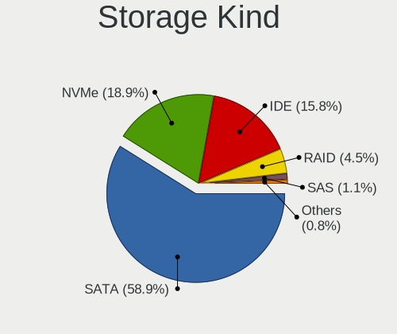

| Kind | Computers | Percent |
|------|-----------|---------|
| SATA | 270       | 60.67%  |
| IDE  | 86        | 19.33%  |
| NVMe | 60        | 13.48%  |
| RAID | 19        | 4.27%   |
| SAS  | 6         | 1.35%   |
| SCSI | 4         | 0.9%    |

Processor
---------

CPU Vendor
----------

Processor vendors

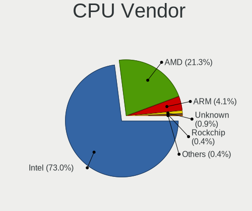

| Vendor             | Computers | Percent |
|--------------------|-----------|---------|
| Intel              | 274       | 74.05%  |
| AMD                | 76        | 20.54%  |
| ARM                | 12        | 3.24%   |
| Unknown            | 4         | 1.08%   |
| Rockchip           | 2         | 0.54%   |
| PowerPC            | 1         | 0.27%   |
| Baikal Electronics | 1         | 0.27%   |

CPU Model
---------

Processor models

| Model                                       | Computers | Percent |
|---------------------------------------------|-----------|---------|
| Intel Core i3-6006U CPU @ 2.00GHz           | 5         | 1.33%   |
| Intel 686-class                             | 5         | 1.33%   |
| AMD Ryzen 5 3600 6-Core Processor           | 5         | 1.33%   |
| Intel Celeron CPU J1800 @ 2.41GHz           | 4         | 1.07%   |
| ARM Cortex-A57 r1p3                         | 4         | 1.07%   |
|                                             | 4         | 1.07%   |
| Intel Core i7-6700 CPU @ 3.40GHz            | 3         | 0.8%    |
| Intel Core i5-8350U CPU @ 1.70GHz           | 3         | 0.8%    |
| Intel Core 2 Quad CPU Q6600 @ 2.40GHz       | 3         | 0.8%    |
| Intel Celeron CPU J3455 @ 1.50GHz           | 3         | 0.8%    |
| Intel Celeron CPU 1037U @ 1.80GHz           | 3         | 0.8%    |
| Intel C1                                    | 3         | 0.8%    |
| ARM Cortex-A72 r0p2                         | 3         | 0.8%    |
| AMD Ryzen 5 2600 Six-Core Processor         | 3         | 0.8%    |
| AMD GX-412TC SOC                            | 3         | 0.8%    |
| Rockchip RK3566 (Cortex-A55)                | 2         | 0.53%   |
| Intel Xeon CPU X3450 @ 2.67GHz              | 2         | 0.53%   |
| Intel Xeon CPU E3-1265L V2 @ 2.50GHz        | 2         | 0.53%   |
| Intel Xeon Bronze 3104 CPU @ 1.70GHz        | 2         | 0.53%   |
| Intel Pentium Silver J5005 CPU @ 1.50GHz    | 2         | 0.53%   |
| Intel Pentium M processor 1.60GHz           | 2         | 0.53%   |
| Intel Pentium Gold G5400T CPU @ 3.10GHz     | 2         | 0.53%   |
| Intel Pentium CPU N4200 @ 1.10GHz           | 2         | 0.53%   |
| Intel Pentium CPU N3700 @ 1.60GHz           | 2         | 0.53%   |
| Intel Pentium CPU J4205 @ 1.50GHz           | 2         | 0.53%   |
| Intel Pentium 4 CPU                         | 2         | 0.53%   |
| Intel CPU Version                           | 2         | 0.53%   |
| Intel Core i7-8565U CPU @ 1.80GHz           | 2         | 0.53%   |
| Intel Core i7-4770 CPU @ 3.40GHz            | 2         | 0.53%   |
| Intel Core i7-3770 CPU @ 3.40GHz            | 2         | 0.53%   |
| Intel Core i7-2670QM CPU @ 2.20GHz          | 2         | 0.53%   |
| Intel Core i7-2600K CPU @ 3.40GHz           | 2         | 0.53%   |
| Intel Core i7 CPU 920 @ 2.67GHz             | 2         | 0.53%   |
| Intel Core i7 CPU                           | 2         | 0.53%   |
| Intel Core i5-7300HQ CPU @ 2.50GHz          | 2         | 0.53%   |
| Intel Core i5-7200U CPU @ 2.50GHz           | 2         | 0.53%   |
| Intel Core i5-3470 CPU @ 3.20GHz            | 2         | 0.53%   |
| Intel Core i5-3320M CPU @ 2.60GHz           | 2         | 0.53%   |
| Intel Core i5-2520M CPU @ 2.50GHz           | 2         | 0.53%   |
| Intel Core i5-2430M CPU @ 2.40GHz           | 2         | 0.53%   |
| Intel Core i5-10400 CPU @ 2.90GHz           | 2         | 0.53%   |
| Intel Core i3-6100 CPU @ 3.70GHz            | 2         | 0.53%   |
| Intel Core i3-4170 CPU @ 3.70GHz            | 2         | 0.53%   |
| Intel Core i3 CPU M 350 @ 2.27GHz           | 2         | 0.53%   |
| Intel Core 2 Quad CPU Q9550 @ 2.83GHz       | 2         | 0.53%   |
| Intel Core 2 Quad CPU                       | 2         | 0.53%   |
| Intel Core 2 Duo CPU E8500 @ 3.16GHz        | 2         | 0.53%   |
| Intel Core 2 Duo CPU E7300 @ 2.66GHz        | 2         | 0.53%   |
| Intel Core 2 Duo CPU E7200 @ 2.53GHz        | 2         | 0.53%   |
| Intel Core 2 Duo                            | 2         | 0.53%   |
| Intel Celeron J4125 CPU @ 2.00GHz           | 2         | 0.53%   |
| Intel Celeron CPU J3060 @ 1.60GHz           | 2         | 0.53%   |
| Intel Celeron CPU J1900 @ 1.99GHz           | 2         | 0.53%   |
| Intel Atom CPU D525 @ 1.80GHz               | 2         | 0.53%   |
| Intel 11th Gen Core i5-11600K @ 3.90GHz     | 2         | 0.53%   |
| ARM Cortex-A7 r0p5 (ECO: 0x00000000)        | 2         | 0.53%   |
| AMD Ryzen 9 3900X 12-Core Processor         | 2         | 0.53%   |
| AMD Ryzen 7 4700U with Radeon Graphics      | 2         | 0.53%   |
| AMD Ryzen 7 3800XT 8-Core Processor         | 2         | 0.53%   |
| AMD Ryzen 5 2400G with Radeon Vega Graphics | 2         | 0.53%   |

CPU Model Family
----------------

Processor model prefix

| Model                   | Computers | Percent |
|-------------------------|-----------|---------|
| Intel Core i5           | 46        | 12.33%  |
| Intel Xeon              | 34        | 9.12%   |
| Intel Celeron           | 33        | 8.85%   |
| Intel Core i7           | 30        | 8.04%   |
| Intel Core i3           | 24        | 6.43%   |
| Other                   | 17        | 4.56%   |
| Intel Core 2 Duo        | 17        | 4.56%   |
| Intel Atom              | 14        | 3.75%   |
| AMD Ryzen 5             | 14        | 3.75%   |
| ARM Cortex              | 12        | 3.22%   |
| Intel Pentium           | 11        | 2.95%   |
| Intel Core 2 Quad       | 10        | 2.68%   |
| AMD Ryzen 7             | 10        | 2.68%   |
| Intel Pentium 4         | 7         | 1.88%   |
| AMD Ryzen 3             | 6         | 1.61%   |
| Intel 686-class         | 5         | 1.34%   |
| Intel Pentium Silver    | 4         | 1.07%   |
| Intel Pentium M         | 4         | 1.07%   |
| Intel Pentium Dual-Core | 4         | 1.07%   |
| Intel Genuine           | 4         | 1.07%   |
| AMD E                   | 4         | 1.07%   |
| Intel Pentium Gold      | 3         | 0.8%    |
| Intel Pentium Dual      | 3         | 0.8%    |
| Intel Pentium D         | 3         | 0.8%    |
| Intel Core i9           | 3         | 0.8%    |
| Intel Core 2            | 3         | 0.8%    |
| AMD GX                  | 3         | 0.8%    |
| AMD FX                  | 3         | 0.8%    |
| AMD Athlon 64 X2        | 3         | 0.8%    |
| AMD A6                  | 3         | 0.8%    |
| AMD A10                 | 3         | 0.8%    |
| Intel Xeon Bronze       | 2         | 0.54%   |
| AMD Turion II Neo       | 2         | 0.54%   |
| AMD Ryzen 9             | 2         | 0.54%   |
| AMD Ryzen 7 PRO         | 2         | 0.54%   |
| AMD Phenom II X6        | 2         | 0.54%   |
| AMD Phenom              | 2         | 0.54%   |
| AMD Opteron             | 2         | 0.54%   |
| AMD E2                  | 2         | 0.54%   |
| AMD Athlon X4           | 2         | 0.54%   |
| AMD Athlon II X3        | 2         | 0.54%   |
| Intel Core m5           | 1         | 0.27%   |
| Intel Core m3           | 1         | 0.27%   |
| Intel Core M            | 1         | 0.27%   |
| Intel Celeron D         | 1         | 0.27%   |
| AMD Sempron             | 1         | 0.27%   |
| AMD Ryzen 3 PRO         | 1         | 0.27%   |
| AMD Phenom II X4        | 1         | 0.27%   |
| AMD Phenom II X2        | 1         | 0.27%   |
| AMD E1                  | 1         | 0.27%   |
| AMD C-70                | 1         | 0.27%   |
| AMD Athlon II X4        | 1         | 0.27%   |
| AMD A4                  | 1         | 0.27%   |
| AMD 686-class           | 1         | 0.27%   |

CPU Cores
---------

Number of processor cores

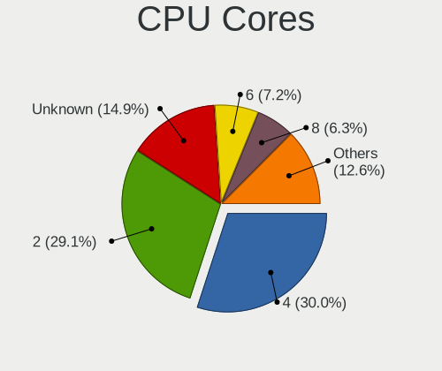

| Number  | Computers | Percent |
|---------|-----------|---------|
| 4       | 109       | 29.22%  |
| 2       | 109       | 29.22%  |
| Unknown | 60        | 16.09%  |
| 6       | 26        | 6.97%   |
| 8       | 23        | 6.17%   |
| 1       | 20        | 5.36%   |
| 12      | 9         | 2.41%   |
| 16      | 8         | 2.14%   |
| 24      | 4         | 1.07%   |
| 28      | 2         | 0.54%   |
| 3       | 2         | 0.54%   |
| 14      | 1         | 0.27%   |

CPU Sockets
-----------

Number of sockets

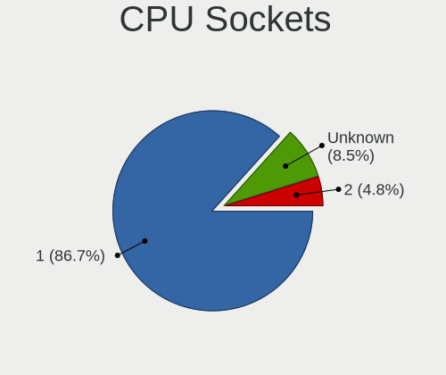

| Number  | Computers | Percent |
|---------|-----------|---------|
| 1       | 323       | 86.13%  |
| Unknown | 35        | 9.33%   |
| 2       | 17        | 4.53%   |

CPU Threads
-----------

Threads per core (Hyper-Threading)

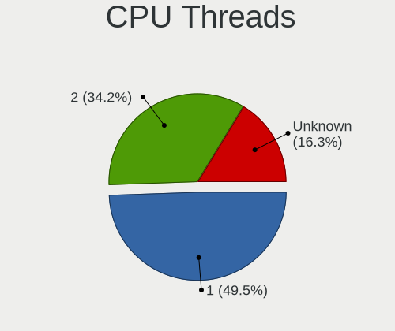

| Number  | Computers | Percent |
|---------|-----------|---------|
| 1       | 176       | 47.18%  |
| 2       | 123       | 32.98%  |
| Unknown | 74        | 19.84%  |

CPU Microarch
-------------

Microarchitecture

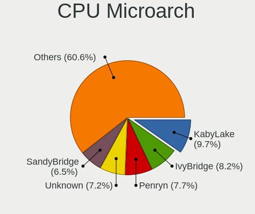

| Name          | Computers | Percent |
|---------------|-----------|---------|
| KabyLake      | 33        | 8.92%   |
| Penryn        | 28        | 7.57%   |
| IvyBridge     | 28        | 7.57%   |
| Unknown       | 27        | 7.3%    |
| Haswell       | 24        | 6.49%   |
| SandyBridge   | 23        | 6.22%   |
| Skylake       | 22        | 5.95%   |
| Silvermont    | 17        | 4.59%   |
| Zen 2         | 16        | 4.32%   |
| Core          | 16        | 4.32%   |
| Bonnell       | 14        | 3.78%   |
| K10           | 13        | 3.51%   |
| NetBurst      | 12        | 3.24%   |
| Goldmont      | 10        | 2.7%    |
| Zen           | 9         | 2.43%   |
| Nehalem       | 9         | 2.43%   |
| Zen+          | 8         | 2.16%   |
| P6            | 8         | 2.16%   |
| Piledriver    | 7         | 1.89%   |
| Broadwell     | 7         | 1.89%   |
| Westmere      | 6         | 1.62%   |
| K8 Hammer     | 5         | 1.35%   |
| Goldmont plus | 5         | 1.35%   |
| CometLake     | 5         | 1.35%   |
| Puma          | 4         | 1.08%   |
| Bobcat        | 4         | 1.08%   |
| Excavator     | 3         | 0.81%   |
| Zen 3         | 2         | 0.54%   |
| Jaguar        | 2         | 0.54%   |
| Steamroller   | 1         | 0.27%   |
| IceLake       | 1         | 0.27%   |
| Bulldozer     | 1         | 0.27%   |

Graphics
--------

GPU Vendor
----------

Vendors of graphics cards

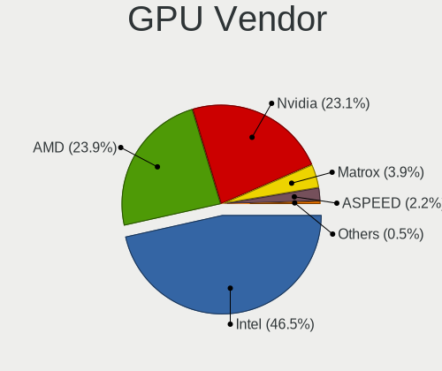

| Vendor                     | Computers | Percent |
|----------------------------|-----------|---------|
| Intel                      | 173       | 46.88%  |
| Nvidia                     | 85        | 23.04%  |
| AMD                        | 85        | 23.04%  |
| Matrox Electronics Systems | 15        | 4.07%   |
| ASPEED Technology          | 9         | 2.44%   |
| VIA Technologies           | 1         | 0.27%   |
| ATI                        | 1         | 0.27%   |

GPU Model
---------

Graphics card models

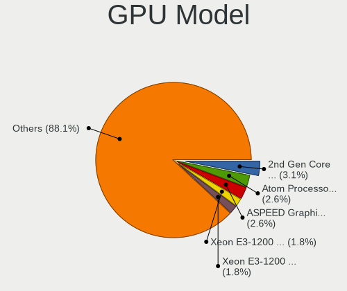

| Model                                                                                    | Computers | Percent |
|------------------------------------------------------------------------------------------|-----------|---------|
| Intel Atom Processor Z36xxx/Z37xxx Series Graphics & Display                             | 10        | 2.63%   |
| Intel 2nd Generation Core Processor Family Integrated Graphics Controller                | 10        | 2.63%   |
| Intel 3rd Gen Core processor Graphics Controller                                         | 9         | 2.37%   |
| ASPEED Technology ASPEED Graphics Family                                                 | 9         | 2.37%   |
| AMD Ellesmere [Radeon RX 470/480/570/570X/580/580X/590]                                  | 8         | 2.11%   |
| Nvidia GK208B [GeForce GT 710]                                                           | 7         | 1.84%   |
| Matrox Electronics Systems MGA G200e [Pilot] ServerEngines (SEP1)                        | 7         | 1.84%   |
| Intel Xeon E3-1200 v3/4th Gen Core Processor Integrated Graphics Controller              | 7         | 1.84%   |
| Intel Haswell-ULT Integrated Graphics Controller                                         | 7         | 1.84%   |
| Intel Atom/Celeron/Pentium Processor x5-E8000/J3xxx/N3xxx Integrated Graphics Controller | 7         | 1.84%   |
| Intel Atom Processor D4xx/D5xx/N4xx/N5xx Integrated Graphics Controller                  | 7         | 1.84%   |
| Intel Skylake GT2 [HD Graphics 520]                                                      | 6         | 1.58%   |
| Intel 82G33/G31 Express Integrated Graphics Controller                                   | 6         | 1.58%   |
| AMD ES1000                                                                               | 6         | 1.58%   |
| Matrox Electronics Systems MGA G200eW WPCM450                                            | 5         | 1.32%   |
| Intel Xeon E3-1200 v2/3rd Gen Core processor Graphics Controller                         | 5         | 1.32%   |
| Intel UHD Graphics 620                                                                   | 5         | 1.32%   |
| Intel HD Graphics 530                                                                    | 5         | 1.32%   |
| Intel HD Graphics 500                                                                    | 5         | 1.32%   |
| Intel CoffeeLake-S GT2 [UHD Graphics 630]                                                | 5         | 1.32%   |
| AMD Renoir                                                                               | 5         | 1.32%   |
| Intel IvyBridge GT2 [HD Graphics 4000]                                                   | 4         | 1.05%   |
| Intel HD Graphics 630                                                                    | 4         | 1.05%   |
| Intel CometLake-S GT2 [UHD Graphics 630]                                                 | 4         | 1.05%   |
| Intel CoffeeLake-S GT1 [UHD Graphics 610]                                                | 4         | 1.05%   |
| Intel Celeron N3350/Pentium N4200/Atom E3900 Series Integrated Graphics Controller       | 4         | 1.05%   |
| Intel 82865G Integrated Graphics Controller                                              | 4         | 1.05%   |
| AMD Stoney [Radeon R2/R3/R4/R5 Graphics]                                                 | 4         | 1.05%   |
| AMD Raven Ridge [Radeon Vega Series / Radeon Vega Mobile Series]                         | 4         | 1.05%   |
| AMD Picasso/Raven 2 [Radeon Vega Series / Radeon Vega Mobile Series]                     | 4         | 1.05%   |
| Nvidia GP108 [GeForce GT 1030]                                                           | 3         | 0.79%   |
| Nvidia GP107M [GeForce GTX 1050 Mobile]                                                  | 3         | 0.79%   |
| Nvidia GK107 [GeForce GTX 650]                                                           | 3         | 0.79%   |
| Nvidia G98 [GeForce 8400 GS Rev. 2]                                                      | 3         | 0.79%   |
| Intel WhiskeyLake-U GT2 [UHD Graphics 620]                                               | 3         | 0.79%   |
| Intel Mobile 4 Series Chipset Integrated Graphics Controller                             | 3         | 0.79%   |
| Intel GeminiLake [UHD Graphics 605]                                                      | 3         | 0.79%   |
| Intel Core Processor Integrated Graphics Controller                                      | 3         | 0.79%   |
| Intel Atom Processor D2xxx/N2xxx Integrated Graphics Controller                          | 3         | 0.79%   |
| Intel 4th Generation Core Processor Family Integrated Graphics Controller                | 3         | 0.79%   |
| AMD RV710/M92 [Mobility Radeon HD 4350/4550]                                             | 3         | 0.79%   |
| AMD Lexa PRO [Radeon 540/540X/550/550X / RX 540X/550/550X]                               | 3         | 0.79%   |
| Nvidia TU116 [GeForce GTX 1660]                                                          | 2         | 0.53%   |
| Nvidia TU116 [GeForce GTX 1660 SUPER]                                                    | 2         | 0.53%   |
| Nvidia NV43 [GeForce 6600]                                                               | 2         | 0.53%   |
| Nvidia GP107 [GeForce GTX 1050 Ti]                                                       | 2         | 0.53%   |
| Nvidia GK208BM [GeForce 920M]                                                            | 2         | 0.53%   |
| Nvidia GK107 [GeForce GT 640]                                                            | 2         | 0.53%   |
| Nvidia GF119 [GeForce GT 520]                                                            | 2         | 0.53%   |
| Nvidia GA102 [GeForce RTX 3080]                                                          | 2         | 0.53%   |
| Nvidia G96C [GeForce 9500 GT]                                                            | 2         | 0.53%   |
| Nvidia G86 [GeForce 8500 GT]                                                             | 2         | 0.53%   |
| Nvidia G73 [GeForce 7600 GS]                                                             | 2         | 0.53%   |
| Matrox Electronics Systems MGA G200EH                                                    | 2         | 0.53%   |
| Intel Mobile GM965/GL960 Integrated Graphics Controller (secondary)                      | 2         | 0.53%   |
| Intel Mobile GM965/GL960 Integrated Graphics Controller (primary)                        | 2         | 0.53%   |
| Intel Mobile 945GM/GMS/GME, 943/940GML Express Integrated Graphics Controller            | 2         | 0.53%   |
| Intel HD Graphics 620                                                                    | 2         | 0.53%   |
| Intel HD Graphics 520                                                                    | 2         | 0.53%   |
| Intel HD Graphics 515                                                                    | 2         | 0.53%   |

GPU Combo
---------

Combinations of graphics cards

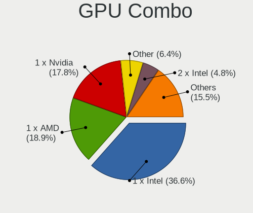

| Name           | Computers | Percent |
|----------------|-----------|---------|
| 1 x Intel      | 139       | 37.47%  |
| 1 x Nvidia     | 72        | 19.41%  |
| 1 x AMD        | 70        | 18.87%  |
| Other          | 22        | 5.93%   |
| 2 x Intel      | 16        | 4.31%   |
| 1 x Matrox     | 15        | 4.04%   |
| Intel + Nvidia | 11        | 2.96%   |
| 1 x ASPEED     | 9         | 2.43%   |
| 2 x AMD        | 7         | 1.89%   |
| Intel + AMD    | 7         | 1.89%   |
| AMD + Nvidia   | 2         | 0.54%   |
| 1 x VIA        | 1         | 0.27%   |

GPU Driver
----------

Free vs proprietary

| Driver      | Computers | Percent |
|-------------|-----------|---------|
| Free        | 291       | 78.23%  |
| Proprietary | 48        | 12.9%   |
| Unknown     | 33        | 8.87%   |

GPU Memory
----------

Total video memory

| Size in GB | Computers | Percent |
|------------|-----------|---------|
| Unknown    | 290       | 77.54%  |
| 0.01-0.5   | 22        | 5.88%   |
| 1.01-2.0   | 21        | 5.61%   |
| 0.51-1.0   | 15        | 4.01%   |
| 3.01-4.0   | 10        | 2.67%   |
| 7.01-8.0   | 6         | 1.6%    |
| 5.01-6.0   | 5         | 1.34%   |
| 8.01-16.0  | 3         | 0.8%    |
| 2.01-3.0   | 2         | 0.53%   |

Monitor
-------

Monitor Vendor
--------------

Monitor vendors

| Vendor                  | Computers | Percent |
|-------------------------|-----------|---------|
| Samsung Electronics     | 34        | 17.35%  |
| AU Optronics            | 19        | 9.69%   |
| Goldstar                | 18        | 9.18%   |
| LG Display              | 13        | 6.63%   |
| Dell                    | 12        | 6.12%   |
| ViewSonic               | 11        | 5.61%   |
| BOE                     | 10        | 5.1%    |
| Ancor Communications    | 10        | 5.1%    |
| Acer                    | 8         | 4.08%   |
| Philips                 | 7         | 3.57%   |
| Chimei Innolux          | 7         | 3.57%   |
| AOC                     | 6         | 3.06%   |
| NEC Computers           | 5         | 2.55%   |
| InfoVision              | 5         | 2.55%   |
| BenQ                    | 4         | 2.04%   |
| Sony                    | 3         | 1.53%   |
| Lenovo                  | 3         | 1.53%   |
| Hewlett-Packard         | 3         | 1.53%   |
| RTK                     | 2         | 1.02%   |
| PANDA                   | 2         | 1.02%   |
| LG Philips              | 2         | 1.02%   |
| Chi Mei Optoelectronics | 2         | 1.02%   |
| Apple                   | 2         | 1.02%   |
| Unknown (CDD)           | 1         | 0.51%   |
| Toshiba                 | 1         | 0.51%   |
| Panasonic               | 1         | 0.51%   |
| Iiyama                  | 1         | 0.51%   |
| HannStar                | 1         | 0.51%   |
| Fujitsu Siemens         | 1         | 0.51%   |
| CSO                     | 1         | 0.51%   |
| CPT                     | 1         | 0.51%   |

Monitor Model
-------------

Monitor models

| Model                                                                    | Computers | Percent |
|--------------------------------------------------------------------------|-----------|---------|
| Ancor Communications ASUS VW199 ACI19ED 1440x900 410x260mm 19.1-inch     | 4         | 1.98%   |
| ViewSonic LCD Monitor VSCD22B 1920x1080 520x290mm 23.4-inch              | 3         | 1.49%   |
| ViewSonic LCD Monitor VSCC42B 1920x1080 480x270mm 21.7-inch              | 2         | 0.99%   |
| Samsung Electronics SyncMaster SAM027D 1680x1050 430x270mm 20.0-inch     | 2         | 0.99%   |
| Samsung Electronics SMBX2250 SAM071B 1920x1080 480x270mm 21.7-inch       | 2         | 0.99%   |
| Samsung Electronics LCD Monitor SEC3030 1024x600 220x130mm 10.1-inch     | 2         | 0.99%   |
| Samsung Electronics LCD Monitor SAM0AC6 1920x1080 1110x620mm 50.1-inch   | 2         | 0.99%   |
| RTK WCS Display RTK1A1B 1920x1080 344x195mm 15.6-inch                    | 2         | 0.99%   |
| NEC Computers FE791SB NEC61D7 1600x1200 330x240mm 16.1-inch              | 2         | 0.99%   |
| Goldstar LG Ultra HD GSM5B09 3840x2160 600x340mm 27.2-inch               | 2         | 0.99%   |
| Goldstar LG FULL HD GSM5B55 1920x1080 480x270mm 21.7-inch                | 2         | 0.99%   |
| Goldstar LCD Monitor GSM5AB6 1920x1080 480x270mm 21.7-inch               | 2         | 0.99%   |
| Chi Mei Optoelectronics LCD Monitor CMO1457 1366x768 310x170mm 13.9-inch | 2         | 0.99%   |
| AU Optronics LCD Monitor AUO315C 1366x768 260x140mm 11.6-inch            | 2         | 0.99%   |
| Acer AL1716 ACRAD46 1280x1024 340x270mm 17.1-inch                        | 2         | 0.99%   |
| ViewSonic VX2458-mhd VSC0437 1920x1080 520x290mm 23.4-inch               | 1         | 0.5%    |
| ViewSonic VP171s-2 VSC4B1B 1280x1024 340x270mm 17.1-inch                 | 1         | 0.5%    |
| ViewSonic LCD Monitor VX2451 SERIES 1920x1080                            | 1         | 0.5%    |
| ViewSonic LCD Monitor VSC8724 1440x900 410x260mm 19.1-inch               | 1         | 0.5%    |
| ViewSonic LCD Monitor VSC6F2E 1920x1080 480x270mm 21.7-inch              | 1         | 0.5%    |
| ViewSonic LCD Monitor VSC5826 1366x768 410x230mm 18.5-inch               | 1         | 0.5%    |
| ViewSonic LCD Monitor VSC2528 1920x1080 520x290mm 23.4-inch              | 1         | 0.5%    |
| Unknown (CDD) VGA CDD0030 1920x1080 1150x650mm 52.0-inch                 | 1         | 0.5%    |
| Toshiba TV TSB0108 1360x768 700x390mm 31.5-inch                          | 1         | 0.5%    |
| Sony TV  *00 SNY8204 3840x2160 1220x680mm 55.0-inch                      | 1         | 0.5%    |
| Sony TV  *00 SNY7C04 3840x2160 1080x610mm 48.8-inch                      | 1         | 0.5%    |
| Sony SDM-S75D/F/N SNY3800 1280x1024 340x270mm 17.1-inch                  | 1         | 0.5%    |
| Samsung Electronics U32H85x SAM0E3C 3840x2160 700x390mm 31.5-inch        | 1         | 0.5%    |
| Samsung Electronics SyncMaster SAM027E 1680x1050 470x300mm 22.0-inch     | 1         | 0.5%    |
| Samsung Electronics SyncMaster SAM026F 1280x1024 380x300mm 19.1-inch     | 1         | 0.5%    |
| Samsung Electronics SyncMaster SAM021E 1680x1050 430x270mm 20.0-inch     | 1         | 0.5%    |
| Samsung Electronics SyncMaster SAM01BB 1280x1024 380x300mm 19.1-inch     | 1         | 0.5%    |
| Samsung Electronics SyncMaster SAM011E 1280x1024 340x270mm 17.1-inch     | 1         | 0.5%    |
| Samsung Electronics SMS23A550H SAM07C9 1920x1080 510x290mm 23.1-inch     | 1         | 0.5%    |
| Samsung Electronics SME1920NR SAM06A4 1280x1024 380x300mm 19.1-inch      | 1         | 0.5%    |
| Samsung Electronics SMB2340 SAM0691 1920x1080 510x290mm 23.1-inch        | 1         | 0.5%    |
| Samsung Electronics S24F350 SAM0D21 1920x1080 520x290mm 23.4-inch        | 1         | 0.5%    |
| Samsung Electronics S24D332 SAM0F5E 1920x1080 530x300mm 24.0-inch        | 1         | 0.5%    |
| Samsung Electronics S23C570 SAM0A56 1920x1080 510x290mm 23.1-inch        | 1         | 0.5%    |
| Samsung Electronics S22B300 SAM08AC 1920x1080 480x270mm 21.7-inch        | 1         | 0.5%    |
| Samsung Electronics S20C200 SAM09B4 1600x900 440x250mm 19.9-inch         | 1         | 0.5%    |
| Samsung Electronics S19D300 SAM0B34 1366x768 410x230mm 18.5-inch         | 1         | 0.5%    |
| Samsung Electronics LCD Monitor SEC5643 1280x800 300x190mm 14.0-inch     | 1         | 0.5%    |
| Samsung Electronics LCD Monitor SEC4542 1280x800 300x190mm 14.0-inch     | 1         | 0.5%    |
| Samsung Electronics LCD Monitor SEC3847 1440x900 370x230mm 17.2-inch     | 1         | 0.5%    |
| Samsung Electronics LCD Monitor SEC3245 1366x768 340x190mm 15.3-inch     | 1         | 0.5%    |
| Samsung Electronics LCD Monitor SEC314C 1920x1080 340x190mm 15.3-inch    | 1         | 0.5%    |
| Samsung Electronics LCD Monitor SDC4C48 1920x1080 340x190mm 15.3-inch    | 1         | 0.5%    |
| Samsung Electronics LCD Monitor SDC415A 3200x1800 290x160mm 13.0-inch    | 1         | 0.5%    |
| Samsung Electronics LCD Monitor SAM0DF7 3840x2160 1020x570mm 46.0-inch   | 1         | 0.5%    |
| Samsung Electronics LCD Monitor SAM03BC 1920x1080                        | 1         | 0.5%    |
| Samsung Electronics LC24RG50 SAM0F91 1920x1080 530x300mm 24.0-inch       | 1         | 0.5%    |
| Samsung Electronics DM700A-D SEM0324 1920x1080 520x290mm 23.4-inch       | 1         | 0.5%    |
| Samsung Electronics C27F390 SAM0D32 1920x1080 600x340mm 27.2-inch        | 1         | 0.5%    |
| Philips PHL 278E9Q PHLC17F 1920x1080 600x340mm 27.2-inch                 | 1         | 0.5%    |
| Philips PHL 243V5 PHLC0D1 1920x1080 520x290mm 23.4-inch                  | 1         | 0.5%    |
| Philips PHL 240V5 PHLC10A 1920x1080 530x300mm 24.0-inch                  | 1         | 0.5%    |
| Philips PHL 193V5 PHLC0CD 1366x768 410x230mm 18.5-inch                   | 1         | 0.5%    |
| Philips LCD Monitor PHLC0B1 1920x1080 480x270mm 21.7-inch                | 1         | 0.5%    |
| Philips LCD Monitor PHL 240V5 1920x1080                                  | 1         | 0.5%    |

Monitor Resolution
------------------

Monitor screen resolution

| Resolution         | Computers | Percent |
|--------------------|-----------|---------|
| 1920x1080 (FHD)    | 90        | 45.92%  |
| 1366x768 (WXGA)    | 29        | 14.8%   |
| 1280x1024 (SXGA)   | 15        | 7.65%   |
| 3840x2160 (4K)     | 11        | 5.61%   |
| 1440x900 (WXGA+)   | 9         | 4.59%   |
| 1920x1200 (WUXGA)  | 8         | 4.08%   |
| 1680x1050 (WSXGA+) | 6         | 3.06%   |
| 1600x900 (HD+)     | 6         | 3.06%   |
| 1280x800 (WXGA)    | 5         | 2.55%   |
| 2560x1440 (QHD)    | 4         | 2.04%   |
| 1024x600           | 4         | 2.04%   |
| 2560x1080          | 2         | 1.02%   |
| 1600x1200          | 2         | 1.02%   |
| 3200x1800 (QHD+)   | 1         | 0.51%   |
| 2880x1620          | 1         | 0.51%   |
| 1920x540           | 1         | 0.51%   |
| 1024x768 (XGA)     | 1         | 0.51%   |
| Unknown            | 1         | 0.51%   |

Monitor Diagonal
----------------

Diagonal size in inches

| Inches  | Computers | Percent |
|---------|-----------|---------|
| 15      | 34        | 17.26%  |
| 13      | 23        | 11.68%  |
| 21      | 21        | 10.66%  |
| 24      | 15        | 7.61%   |
| 23      | 15        | 7.61%   |
| 19      | 15        | 7.61%   |
| 17      | 14        | 7.11%   |
| 27      | 10        | 5.08%   |
| Unknown | 8         | 4.06%   |
| 18      | 5         | 2.54%   |
| 11      | 5         | 2.54%   |
| 10      | 5         | 2.54%   |
| 31      | 4         | 2.03%   |
| 14      | 4         | 2.03%   |
| 12      | 4         | 2.03%   |
| 20      | 3         | 1.52%   |
| 50      | 2         | 1.02%   |
| 22      | 2         | 1.02%   |
| 16      | 2         | 1.02%   |
| 55      | 1         | 0.51%   |
| 54      | 1         | 0.51%   |
| 52      | 1         | 0.51%   |
| 48      | 1         | 0.51%   |
| 34      | 1         | 0.51%   |
| 26      | 1         | 0.51%   |

Monitor Width
-------------

Physical width

| Width in mm | Computers | Percent |
|-------------|-----------|---------|
| 301-350     | 61        | 31.28%  |
| 501-600     | 40        | 20.51%  |
| 401-500     | 39        | 20%     |
| 201-300     | 26        | 13.33%  |
| 351-400     | 10        | 5.13%   |
| Unknown     | 8         | 4.1%    |
| 1001-1500   | 6         | 3.08%   |
| 601-700     | 4         | 2.05%   |
| 701-800     | 1         | 0.51%   |

Aspect Ratio
------------

Proportional relationship between the width and the height

| Ratio   | Computers | Percent |
|---------|-----------|---------|
| 16/9    | 136       | 71.2%   |
| 16/10   | 28        | 14.66%  |
| 5/4     | 15        | 7.85%   |
| Unknown | 7         | 3.66%   |
| 4/3     | 3         | 1.57%   |
| 21/9    | 2         | 1.05%   |

Monitor Area
------------

Area in inch²

| Area in inch² | Computers | Percent |
|----------------|-----------|---------|
| 201-250        | 48        | 24.24%  |
| 91-100         | 27        | 13.64%  |
| 81-90          | 19        | 9.6%    |
| 151-200        | 19        | 9.6%    |
| 141-150        | 14        | 7.07%   |
| 301-350        | 11        | 5.56%   |
| 101-110        | 8         | 4.04%   |
| Unknown        | 8         | 4.04%   |
| 71-80          | 7         | 3.54%   |
| More than 1000 | 6         | 3.03%   |
| 251-300        | 6         | 3.03%   |
| 51-60          | 5         | 2.53%   |
| 351-500        | 5         | 2.53%   |
| 41-50          | 5         | 2.53%   |
| 61-70          | 4         | 2.02%   |
| 131-140        | 3         | 1.52%   |
| 121-130        | 3         | 1.52%   |

Pixel Density
-------------

Pixels per inch

| Density       | Computers | Percent |
|---------------|-----------|---------|
| 51-100        | 79        | 40.51%  |
| 101-120       | 47        | 24.1%   |
| 121-160       | 42        | 21.54%  |
| 161-240       | 14        | 7.18%   |
| Unknown       | 8         | 4.1%    |
| 1-50          | 3         | 1.54%   |
| More than 240 | 2         | 1.03%   |

Multiple Monitors
-----------------

Total monitors connected

| Total | Computers | Percent |
|-------|-----------|---------|
| 1     | 184       | 48.29%  |
| 0     | 179       | 46.98%  |
| 2     | 17        | 4.46%   |
| 3     | 1         | 0.26%   |

Network
-------

Net Controller Vendor
---------------------

Controller vendors

| Vendor                            | Computers | Percent |
|-----------------------------------|-----------|---------|
| Realtek Semiconductor             | 186       | 36.54%  |
| Intel                             | 155       | 30.45%  |
| Qualcomm Atheros                  | 63        | 12.38%  |
| Broadcom                          | 26        | 5.11%   |
| Marvell Technology Group          | 15        | 2.95%   |
| TP-Link                           | 5         | 0.98%   |
| D-Link System                     | 5         | 0.98%   |
| VIA Technologies                  | 4         | 0.79%   |
| Ralink Technology                 | 4         | 0.79%   |
| Ralink                            | 3         | 0.59%   |
| Nvidia                            | 3         | 0.59%   |
| IMC Networks                      | 3         | 0.59%   |
| Huawei Technologies               | 3         | 0.59%   |
| D-Link                            | 3         | 0.59%   |
| 3Com                              | 3         | 0.59%   |
| Silicon Integrated Systems [SiS]  | 2         | 0.39%   |
| Qualcomm                          | 2         | 0.39%   |
| Mercucys                          | 2         | 0.39%   |
| Fibocom                           | 2         | 0.39%   |
| Ericsson Business Mobile Networks | 2         | 0.39%   |
| Sundance Technology Inc / IC Plus | 1         | 0.2%    |
| Realtek                           | 1         | 0.2%    |
| Qualcomm Atheros Communications   | 1         | 0.2%    |
| QLogic                            | 1         | 0.2%    |
| Qcom                              | 1         | 0.2%    |
| MYRICOM                           | 1         | 0.2%    |
| JMicron Technology                | 1         | 0.2%    |
| Edimax Technology                 | 1         | 0.2%    |
| Dell                              | 1         | 0.2%    |
| BUFFALO                           | 1         | 0.2%    |
| Attansic                          | 1         | 0.2%    |
| Atmel                             | 1         | 0.2%    |
| Atheros                           | 1         | 0.2%    |
| ASUSTek Computer                  | 1         | 0.2%    |
| Arduino SA                        | 1         | 0.2%    |
| Aquantia                          | 1         | 0.2%    |
| Apple                             | 1         | 0.2%    |
| Accton Technology                 | 1         | 0.2%    |

Net Controller Model
--------------------

Controller models

| Model                                                             | Computers | Percent |
|-------------------------------------------------------------------|-----------|---------|
| Realtek RTL8111/8168/8411 PCI Express Gigabit Ethernet Controller | 155       | 25.83%  |
| Intel 82574L Gigabit Network Connection                           | 16        | 2.67%   |
| Realtek RTL810xE PCI Express Fast Ethernet controller             | 15        | 2.5%    |
| Qualcomm Atheros AR9285 Wireless Network Adapter (PCI-Express)    | 14        | 2.33%   |
| Intel I211 Gigabit Network Connection                             | 14        | 2.33%   |
| Intel I350 Gigabit Network Connection                             | 10        | 1.67%   |
| Realtek RTL8723BE PCIe Wireless Network Adapter                   | 7         | 1.17%   |
| Realtek RTL-8100/8101L/8139 PCI Fast Ethernet Adapter             | 7         | 1.17%   |
| Qualcomm Atheros QCA9565 / AR9565 Wireless Network Adapter        | 7         | 1.17%   |
| Intel Wi-Fi 6 AX200                                               | 7         | 1.17%   |
| Intel I210 Gigabit Network Connection                             | 7         | 1.17%   |
| Intel 82579LM Gigabit Network Connection (Lewisville)             | 7         | 1.17%   |
| Intel 82576 Gigabit Network Connection                            | 7         | 1.17%   |
| Intel Wireless 8265 / 8275                                        | 6         | 1%      |
| Intel Wireless 7265                                               | 6         | 1%      |
| Realtek RTL8188EUS 802.11n Wireless Network Adapter               | 5         | 0.83%   |
| Qualcomm Atheros QCA9377 802.11ac Wireless Network Adapter        | 5         | 0.83%   |
| Marvell Group 88E8040 PCI-E Fast Ethernet Controller              | 5         | 0.83%   |
| Realtek RTL8821CE 802.11ac PCIe Wireless Network Adapter          | 4         | 0.67%   |
| Realtek RTL8169 PCI Gigabit Ethernet Controller                   | 4         | 0.67%   |
| Qualcomm Atheros Attansic L1 Gigabit Ethernet                     | 4         | 0.67%   |
| Qualcomm Atheros AR9462 Wireless Network Adapter                  | 4         | 0.67%   |
| Qualcomm Atheros AR93xx Wireless Network Adapter                  | 4         | 0.67%   |
| Qualcomm Atheros AR8131 Gigabit Ethernet                          | 4         | 0.67%   |
| Qualcomm Atheros AR8121/AR8113/AR8114 Gigabit or Fast Ethernet    | 4         | 0.67%   |
| Marvell Group 88E8056 PCI-E Gigabit Ethernet Controller           | 4         | 0.67%   |
| Intel Wireless 8260                                               | 4         | 0.67%   |
| Intel Ethernet Connection I217-V                                  | 4         | 0.67%   |
| Intel Ethernet Connection (7) I219-V                              | 4         | 0.67%   |
| Intel Dual Band Wireless-AC 3168NGW [Stone Peak]                  | 4         | 0.67%   |
| Intel 82599ES 10-Gigabit SFI/SFP+ Network Connection              | 4         | 0.67%   |
| VIA VT6105/VT6106S [Rhine-III]                                    | 3         | 0.5%    |
| Realtek RTL8188CE 802.11b/g/n WiFi Adapter                        | 3         | 0.5%    |
| Realtek RTL8125 2.5GbE Controller                                 | 3         | 0.5%    |
| Qualcomm Atheros AR9485 Wireless Network Adapter                  | 3         | 0.5%    |
| Qualcomm Atheros AR928X Wireless Network Adapter (PCI-Express)    | 3         | 0.5%    |
| Qualcomm Atheros AR8152 v2.0 Fast Ethernet                        | 3         | 0.5%    |
| Qualcomm Atheros AR8151 v2.0 Gigabit Ethernet                     | 3         | 0.5%    |
| Qualcomm Atheros AR8151 v1.0 Gigabit Ethernet                     | 3         | 0.5%    |
| Marvell Group 88E8053 PCI-E Gigabit Ethernet Controller           | 3         | 0.5%    |
| Intel Wireless 7260                                               | 3         | 0.5%    |
| Intel Wireless 3165                                               | 3         | 0.5%    |
| Intel PRO/Wireless 3945ABG [Golan] Network Connection             | 3         | 0.5%    |
| Intel Ethernet Controller 10-Gigabit X540-AT2                     | 3         | 0.5%    |
| Intel Ethernet Connection I218-LM                                 | 3         | 0.5%    |
| Intel Ethernet Connection (7) I219-LM                             | 3         | 0.5%    |
| Intel Ethernet Connection (2) I219-V                              | 3         | 0.5%    |
| Intel Ethernet Connection (2) I219-LM                             | 3         | 0.5%    |
| Intel Dual Band Wireless-AC 3165 Plus Bluetooth                   | 3         | 0.5%    |
| Intel Centrino Advanced-N 6205 [Taylor Peak]                      | 3         | 0.5%    |
| Intel 82579V Gigabit Network Connection                           | 3         | 0.5%    |
| Intel 82572EI Gigabit Ethernet Controller (Copper)                | 3         | 0.5%    |
| Intel 82562EZ 10/100 Ethernet Controller                          | 3         | 0.5%    |
| Intel 82540EM Gigabit Ethernet Controller                         | 3         | 0.5%    |
| D-Link System DGE-528T Gigabit Ethernet Adapter                   | 3         | 0.5%    |
| Broadcom NetXtreme BCM5723 Gigabit Ethernet PCIe                  | 3         | 0.5%    |
| TP-Link AC600 wireless Realtek RTL8811AU [Archer T2U Nano]        | 2         | 0.33%   |
| Realtek RTL8822CE 802.11ac PCIe Wireless Network Adapter          | 2         | 0.33%   |
| Realtek RTL8723DE Wireless Network Adapter                        | 2         | 0.33%   |
| Realtek Realtek Bluetooth 4.2 Adapter                             | 2         | 0.33%   |

Wireless Vendor
---------------

Wireless vendors

| Vendor                          | Computers | Percent |
|---------------------------------|-----------|---------|
| Intel                           | 68        | 38.64%  |
| Qualcomm Atheros                | 44        | 25%     |
| Realtek Semiconductor           | 29        | 16.48%  |
| Broadcom                        | 9         | 5.11%   |
| TP-Link                         | 5         | 2.84%   |
| Ralink Technology               | 4         | 2.27%   |
| Ralink                          | 3         | 1.7%    |
| IMC Networks                    | 3         | 1.7%    |
| D-Link                          | 3         | 1.7%    |
| Mercucys                        | 2         | 1.14%   |
| Qualcomm Atheros Communications | 1         | 0.57%   |
| Qcom                            | 1         | 0.57%   |
| Edimax Technology               | 1         | 0.57%   |
| BUFFALO                         | 1         | 0.57%   |
| Atheros                         | 1         | 0.57%   |
| ASUSTek Computer                | 1         | 0.57%   |

Wireless Model
--------------

Wireless models

| Model                                                                                | Computers | Percent |
|--------------------------------------------------------------------------------------|-----------|---------|
| Qualcomm Atheros AR9285 Wireless Network Adapter (PCI-Express)                       | 14        | 7.78%   |
| Realtek RTL8723BE PCIe Wireless Network Adapter                                      | 7         | 3.89%   |
| Qualcomm Atheros QCA9565 / AR9565 Wireless Network Adapter                           | 7         | 3.89%   |
| Intel Wi-Fi 6 AX200                                                                  | 7         | 3.89%   |
| Intel Wireless 8265 / 8275                                                           | 6         | 3.33%   |
| Intel Wireless 7265                                                                  | 6         | 3.33%   |
| Realtek RTL8188EUS 802.11n Wireless Network Adapter                                  | 5         | 2.78%   |
| Qualcomm Atheros QCA9377 802.11ac Wireless Network Adapter                           | 5         | 2.78%   |
| Realtek RTL8821CE 802.11ac PCIe Wireless Network Adapter                             | 4         | 2.22%   |
| Qualcomm Atheros AR9462 Wireless Network Adapter                                     | 4         | 2.22%   |
| Qualcomm Atheros AR93xx Wireless Network Adapter                                     | 4         | 2.22%   |
| Intel Wireless 8260                                                                  | 4         | 2.22%   |
| Intel Dual Band Wireless-AC 3168NGW [Stone Peak]                                     | 4         | 2.22%   |
| Realtek RTL8188CE 802.11b/g/n WiFi Adapter                                           | 3         | 1.67%   |
| Qualcomm Atheros AR9485 Wireless Network Adapter                                     | 3         | 1.67%   |
| Qualcomm Atheros AR928X Wireless Network Adapter (PCI-Express)                       | 3         | 1.67%   |
| Intel Wireless 7260                                                                  | 3         | 1.67%   |
| Intel Wireless 3165                                                                  | 3         | 1.67%   |
| Intel PRO/Wireless 3945ABG [Golan] Network Connection                                | 3         | 1.67%   |
| Intel Dual Band Wireless-AC 3165 Plus Bluetooth                                      | 3         | 1.67%   |
| Intel Centrino Advanced-N 6205 [Taylor Peak]                                         | 3         | 1.67%   |
| TP-Link AC600 wireless Realtek RTL8811AU [Archer T2U Nano]                           | 2         | 1.11%   |
| Realtek RTL8822CE 802.11ac PCIe Wireless Network Adapter                             | 2         | 1.11%   |
| Realtek RTL8723DE Wireless Network Adapter                                           | 2         | 1.11%   |
| Realtek Realtek Bluetooth 4.2 Adapter                                                | 2         | 1.11%   |
| Mercucys MERCUSYS Wireless USB Adapter                                               | 2         | 1.11%   |
| Intel Wireless-AC 9260                                                               | 2         | 1.11%   |
| Intel PRO/Wireless 2915ABG [Calexico2] Network Connection                            | 2         | 1.11%   |
| Intel Comet Lake PCH-LP CNVi WiFi                                                    | 2         | 1.11%   |
| Intel Comet Lake PCH CNVi WiFi                                                       | 2         | 1.11%   |
| Intel Centrino Wireless-N 2200                                                       | 2         | 1.11%   |
| Intel Cannon Point-LP CNVi [Wireless-AC]                                             | 2         | 1.11%   |
| Intel Cannon Lake PCH CNVi WiFi                                                      | 2         | 1.11%   |
| IMC Networks Realtek RTL8191SU Wireless LAN 802.11n USB 2.0 Network Adapter          | 2         | 1.11%   |
| D-Link DWA-125 Wireless N 150 Adapter(rev.B1) [Ralink RT5370]                        | 2         | 1.11%   |
| Broadcom BCM43228 802.11a/b/g/n                                                      | 2         | 1.11%   |
| TP-Link TP-LINK Wireless USB Adapter                                                 | 1         | 0.56%   |
| TP-Link TL-WN823N v2/v3 [Realtek RTL8192EU]                                          | 1         | 0.56%   |
| TP-Link Archer T1U 802.11a/n/ac Wireless Adapter [MediaTek MT7610U]                  | 1         | 0.56%   |
| Realtek RTL8812AE 802.11ac PCIe Wireless Network Adapter                             | 1         | 0.56%   |
| Realtek RTL8811AU 802.11a/b/g/n/ac WLAN Adapter                                      | 1         | 0.56%   |
| Realtek RTL8192EE PCIe Wireless Network Adapter                                      | 1         | 0.56%   |
| Realtek RTL8191SU 802.11n WLAN Adapter                                               | 1         | 0.56%   |
| Realtek RTL8188CUS 802.11n WLAN Adapter                                              | 1         | 0.56%   |
| Realtek Realtek Bluetooth Adapter                                                    | 1         | 0.56%   |
| Realtek 802.11n WLAN Adapter                                                         | 1         | 0.56%   |
| Ralink RT5370 Wireless Adapter                                                       | 1         | 0.56%   |
| Ralink RT3572 Wireless Adapter                                                       | 1         | 0.56%   |
| Ralink RT2870/RT3070 Wireless Adapter                                                | 1         | 0.56%   |
| Ralink MT7601U Wireless Adapter                                                      | 1         | 0.56%   |
| Ralink RT3290 Wireless 802.11n 1T/1R PCIe                                            | 1         | 0.56%   |
| Ralink RT3090 Wireless 802.11n 1T/1R PCIe                                            | 1         | 0.56%   |
| Ralink RT3060 Wireless 802.11n 1T/1R                                                 | 1         | 0.56%   |
| Qualcomm Atheros TP-Link TL-WN821N v3 / TL-WN822N v2 802.11n [Atheros AR7010+AR9287] | 1         | 0.56%   |
| Qualcomm Atheros AR9227 Wireless Network Adapter                                     | 1         | 0.56%   |
| Qualcomm Atheros AR5212/5213/2414 Wireless Network Adapter                           | 1         | 0.56%   |
| Qualcomm Atheros AR242x / AR542x Wireless Network Adapter (PCI-Express)              | 1         | 0.56%   |
| Qualcomm Atheros AR2413/AR2414 Wireless Network Adapter [AR5005G(S) 802.11bg]        | 1         | 0.56%   |
| Qcom RT73 USB Wireless LAN Card                                                      | 1         | 0.56%   |
| Intel Wireless 3160                                                                  | 1         | 0.56%   |

Ethernet Vendor
---------------

Ethernet vendors

| Vendor                            | Computers | Percent |
|-----------------------------------|-----------|---------|
| Realtek Semiconductor             | 179       | 47.61%  |
| Intel                             | 111       | 29.52%  |
| Qualcomm Atheros                  | 25        | 6.65%   |
| Broadcom                          | 18        | 4.79%   |
| Marvell Technology Group          | 15        | 3.99%   |
| D-Link System                     | 5         | 1.33%   |
| VIA Technologies                  | 4         | 1.06%   |
| Nvidia                            | 3         | 0.8%    |
| 3Com                              | 3         | 0.8%    |
| Silicon Integrated Systems [SiS]  | 2         | 0.53%   |
| Qualcomm                          | 2         | 0.53%   |
| Sundance Technology Inc / IC Plus | 1         | 0.27%   |
| Realtek                           | 1         | 0.27%   |
| QLogic                            | 1         | 0.27%   |
| JMicron Technology                | 1         | 0.27%   |
| Huawei Technologies               | 1         | 0.27%   |
| Attansic                          | 1         | 0.27%   |
| Aquantia                          | 1         | 0.27%   |
| Apple                             | 1         | 0.27%   |
| Accton Technology                 | 1         | 0.27%   |

Ethernet Model
--------------

Ethernet models

| Model                                                                         | Computers | Percent |
|-------------------------------------------------------------------------------|-----------|---------|
| Realtek RTL8111/8168/8411 PCI Express Gigabit Ethernet Controller             | 155       | 38.18%  |
| Intel 82574L Gigabit Network Connection                                       | 16        | 3.94%   |
| Realtek RTL810xE PCI Express Fast Ethernet controller                         | 15        | 3.69%   |
| Intel I211 Gigabit Network Connection                                         | 14        | 3.45%   |
| Intel I350 Gigabit Network Connection                                         | 10        | 2.46%   |
| Realtek RTL-8100/8101L/8139 PCI Fast Ethernet Adapter                         | 7         | 1.72%   |
| Intel I210 Gigabit Network Connection                                         | 7         | 1.72%   |
| Intel 82579LM Gigabit Network Connection (Lewisville)                         | 7         | 1.72%   |
| Intel 82576 Gigabit Network Connection                                        | 7         | 1.72%   |
| Marvell Group 88E8040 PCI-E Fast Ethernet Controller                          | 5         | 1.23%   |
| Realtek RTL8169 PCI Gigabit Ethernet Controller                               | 4         | 0.99%   |
| Qualcomm Atheros Attansic L1 Gigabit Ethernet                                 | 4         | 0.99%   |
| Qualcomm Atheros AR8131 Gigabit Ethernet                                      | 4         | 0.99%   |
| Qualcomm Atheros AR8121/AR8113/AR8114 Gigabit or Fast Ethernet                | 4         | 0.99%   |
| Marvell Group 88E8056 PCI-E Gigabit Ethernet Controller                       | 4         | 0.99%   |
| Intel Ethernet Connection I217-V                                              | 4         | 0.99%   |
| Intel Ethernet Connection (7) I219-V                                          | 4         | 0.99%   |
| Intel 82599ES 10-Gigabit SFI/SFP+ Network Connection                          | 4         | 0.99%   |
| VIA VT6105/VT6106S [Rhine-III]                                                | 3         | 0.74%   |
| Realtek RTL8125 2.5GbE Controller                                             | 3         | 0.74%   |
| Qualcomm Atheros AR8152 v2.0 Fast Ethernet                                    | 3         | 0.74%   |
| Qualcomm Atheros AR8151 v2.0 Gigabit Ethernet                                 | 3         | 0.74%   |
| Qualcomm Atheros AR8151 v1.0 Gigabit Ethernet                                 | 3         | 0.74%   |
| Marvell Group 88E8053 PCI-E Gigabit Ethernet Controller                       | 3         | 0.74%   |
| Intel Ethernet Controller 10-Gigabit X540-AT2                                 | 3         | 0.74%   |
| Intel Ethernet Connection I218-LM                                             | 3         | 0.74%   |
| Intel Ethernet Connection (7) I219-LM                                         | 3         | 0.74%   |
| Intel Ethernet Connection (2) I219-V                                          | 3         | 0.74%   |
| Intel Ethernet Connection (2) I219-LM                                         | 3         | 0.74%   |
| Intel 82579V Gigabit Network Connection                                       | 3         | 0.74%   |
| Intel 82572EI Gigabit Ethernet Controller (Copper)                            | 3         | 0.74%   |
| Intel 82562EZ 10/100 Ethernet Controller                                      | 3         | 0.74%   |
| Intel 82540EM Gigabit Ethernet Controller                                     | 3         | 0.74%   |
| D-Link System DGE-528T Gigabit Ethernet Adapter                               | 3         | 0.74%   |
| Broadcom NetXtreme BCM5723 Gigabit Ethernet PCIe                              | 3         | 0.74%   |
| Qualcomm Atheros AR8132 Fast Ethernet                                         | 2         | 0.49%   |
| Qualcomm ALCATEL Composite RNDIS Interface                                    | 2         | 0.49%   |
| Nvidia MCP79 Ethernet                                                         | 2         | 0.49%   |
| Marvell Group 88E8001 Gigabit Ethernet Controller                             | 2         | 0.49%   |
| Intel Ethernet Connection X722 for 10GBASE-T                                  | 2         | 0.49%   |
| Intel Ethernet Connection I219-LM                                             | 2         | 0.49%   |
| Intel Ethernet Connection (4) I219-V                                          | 2         | 0.49%   |
| Intel 82571EB/82571GB Gigabit Ethernet Controller D0/D1 (copper applications) | 2         | 0.49%   |
| Intel 80003ES2LAN Gigabit Ethernet Controller (Copper)                        | 2         | 0.49%   |
| Broadcom NetXtreme BCM5751M Gigabit Ethernet PCI Express                      | 2         | 0.49%   |
| 3Com 3c905C-TX/TX-M [Tornado]                                                 | 2         | 0.49%   |
| VIA VT6102/VT6103 [Rhine-II]                                                  | 1         | 0.25%   |
| Sundance Inc / IC Plus IC Plus IP100A Integrated 10/100 Ethernet MAC + PHY    | 1         | 0.25%   |
| Silicon Integrated Systems [SiS] SiS900 PCI Fast Ethernet                     | 1         | 0.25%   |
| Silicon Integrated Systems [SiS] 191 Gigabit Ethernet Adapter                 | 1         | 0.25%   |
| Realtek RTL-8110SC/8169SC Gigabit Ethernet                                    | 1         | 0.25%   |
| Realtek RTL-8100/8101L/8139 PCI Fast Ethernet Adapter                         | 1         | 0.25%   |
| Qualcomm Atheros Killer E2500 Gigabit Ethernet Controller                     | 1         | 0.25%   |
| Qualcomm Atheros AR8161 Gigabit Ethernet                                      | 1         | 0.25%   |
| QLogic FastLinQ QL41000 Series 10/25/40/50GbE Controller                      | 1         | 0.25%   |
| Nvidia MCP77 Ethernet                                                         | 1         | 0.25%   |
| Marvell Group 88E8058 PCI-E Gigabit Ethernet Controller                       | 1         | 0.25%   |
| Marvell Group 88E8057 PCI-E Gigabit Ethernet Controller                       | 1         | 0.25%   |
| Marvell Group 88E8040T PCI-E Fast Ethernet Controller                         | 1         | 0.25%   |
| JMicron JMC260 PCI Express Fast Ethernet Controller                           | 1         | 0.25%   |

Net Controller Kind
-------------------

Ethernet, WiFi or modem

| Kind     | Computers | Percent |
|----------|-----------|---------|
| Ethernet | 332       | 66%     |
| WiFi     | 157       | 31.21%  |
| Unknown  | 8         | 1.59%   |
| Modem    | 6         | 1.19%   |

Used Controller
---------------

Currently used network controller

| Kind     | Computers | Percent |
|----------|-----------|---------|
| Ethernet | 291       | 72.93%  |
| WiFi     | 105       | 26.32%  |
| Unknown  | 3         | 0.75%   |

NICs
----

Total network controllers on board

| Total | Computers | Percent |
|-------|-----------|---------|
| 2     | 166       | 44.74%  |
| 1     | 131       | 35.31%  |
| 3     | 30        | 8.09%   |
| 0     | 22        | 5.93%   |
| 4     | 17        | 4.58%   |
| 6     | 2         | 0.54%   |
| 8     | 1         | 0.27%   |
| 7     | 1         | 0.27%   |
| 5     | 1         | 0.27%   |

IPv6
----

IPv6 vs IPv4

| Used | Computers | Percent |
|------|-----------|---------|
| No   | 358       | 95.72%  |
| Yes  | 16        | 4.28%   |

Bluetooth
---------

Bluetooth Vendor
----------------

Controller vendors

| Vendor                          | Computers | Percent |
|---------------------------------|-----------|---------|
| Intel                           | 47        | 47.96%  |
| Realtek Semiconductor           | 11        | 11.22%  |
| Qualcomm Atheros Communications | 10        | 10.2%   |
| ASUSTek Computer                | 5         | 5.1%    |
| Broadcom                        | 4         | 4.08%   |
| Lite-On Technology              | 3         | 3.06%   |
| IMC Networks                    | 3         | 3.06%   |
| Apple                           | 3         | 3.06%   |
| Hewlett-Packard                 | 2         | 2.04%   |
| Foxconn / Hon Hai               | 2         | 2.04%   |
| Cambridge Silicon Radio         | 2         | 2.04%   |
| Alps Electric                   | 2         | 2.04%   |
| Realtek                         | 1         | 1.02%   |
| Ralink                          | 1         | 1.02%   |
| Edimax Technology               | 1         | 1.02%   |
| Dell                            | 1         | 1.02%   |

Bluetooth Model
---------------

Controller models

| Model                                                       | Computers | Percent |
|-------------------------------------------------------------|-----------|---------|
| Intel Bluetooth wireless interface                          | 21        | 21.43%  |
| Intel AX200 Bluetooth                                       | 8         | 8.16%   |
| Intel Bluetooth 9460/9560 Jefferson Peak (JfP)              | 6         | 6.12%   |
| Intel AX201 Bluetooth                                       | 5         | 5.1%    |
| Qualcomm Atheros Dell Wireless 1707 Bluetooth 4.0 LE Device | 4         | 4.08%   |
| Intel Wireless-AC 3168 Bluetooth                            | 4         | 4.08%   |
| Realtek RTL8723B Bluetooth                                  | 3         | 3.06%   |
| Realtek  Bluetooth Adapter                                  | 3         | 3.06%   |
| Qualcomm Atheros  QCA9377 Bluetooth 4.1                     | 3         | 3.06%   |
| Realtek  Bluetooth 4.0 Adapter                              | 2         | 2.04%   |
| Realtek  Bluetooth 4.0 + High Speed Chip                    | 2         | 2.04%   |
| Qualcomm Atheros AR3012 Bluetooth 4.0                       | 2         | 2.04%   |
| Lite-On Atheros AR3012 Bluetooth                            | 2         | 2.04%   |
| Intel Centrino Bluetooth Wireless Transceiver               | 2         | 2.04%   |
| Cambridge Silicon Radio Bluetooth Dongle (HCI mode)         | 2         | 2.04%   |
| Broadcom BCM20702 Bluetooth 4.0 [ThinkPad]                  | 2         | 2.04%   |
| Realtek  Bluetooth 4.2 Adapter                              | 1         | 1.02%   |
| Realtek Bluetooth Radio                                     | 1         | 1.02%   |
| Ralink RT3290 Bluetooth                                     | 1         | 1.02%   |
| Qualcomm Atheros  QCA9565 Bluetooth 4.0 + HS Adapter        | 1         | 1.02%   |
| Lite-On Qualcomm Atheros QCA9377 Bluetooth                  | 1         | 1.02%   |
| Intel Wireless-AC 9260 Bluetooth Adapter                    | 1         | 1.02%   |
| IMC Networks Realtek Bluetooth 4.0 + High Speed Chip        | 1         | 1.02%   |
| IMC Networks Qualcomm Atheros Bluetooth 4.1                 | 1         | 1.02%   |
| IMC Networks Qualcomm Atheros AR9462 Bluetooth 4.0          | 1         | 1.02%   |
| HP Broadcom 2070 Bluetooth Combo                            | 1         | 1.02%   |
| HP Atheros AR9285 Malbec Bluetooth Adapter                  | 1         | 1.02%   |
| Foxconn / Hon Hai Qualcomm Atheros AR3012 Bluetooth Adapter | 1         | 1.02%   |
| Foxconn / Hon Hai Qualcomm Atheros AR3011 Bluetooth Adapter | 1         | 1.02%   |
| Edimax EW-7611ULB 802.11b/g/n and Bluetooth 4.0 Adapter     | 1         | 1.02%   |
| Dell Wireless 355 Bluetooth                                 | 1         | 1.02%   |
| Broadcom BCM92046DG-CL1ROM Bluetooth 2.1 Adapter            | 1         | 1.02%   |
| Broadcom BCM43142A0 Bluetooth Module                        | 1         | 1.02%   |
| ASUS Qualcomm Atheros AR9462 Bluetooth 4.0 + HS Adapter     | 1         | 1.02%   |
| ASUS BT-270 Bluetooth Adapter                               | 1         | 1.02%   |
| ASUS BT-253 Bluetooth Adapter                               | 1         | 1.02%   |
| ASUS BT-183 Bluetooth 2.0+EDR adapter                       | 1         | 1.02%   |
| ASUS Broadcom BCM20702A0 Bluetooth                          | 1         | 1.02%   |
| Apple Built-in Bluetooth 2.0+EDR HCI                        | 1         | 1.02%   |
| Apple Bluetooth Host Controller                             | 1         | 1.02%   |
| Apple Apple Broadcom Built-in Bluetooth                     | 1         | 1.02%   |
| Alps Electric UGTZ4 Bluetooth                               | 1         | 1.02%   |
| Alps Electric BCM2046 Bluetooth Device                      | 1         | 1.02%   |

Sound
-----

Sound Vendor
------------

Sound card vendors

| Vendor                           | Computers | Percent |
|----------------------------------|-----------|---------|
| Intel                            | 220       | 57.29%  |
| AMD                              | 74        | 19.27%  |
| Nvidia                           | 62        | 16.15%  |
| C-Media Electronics              | 4         | 1.04%   |
| Realtek Semiconductor            | 3         | 0.78%   |
| Logitech                         | 3         | 0.78%   |
| Texas Instruments                | 2         | 0.52%   |
| Silicon Integrated Systems [SiS] | 2         | 0.52%   |
| ESS Technology                   | 2         | 0.52%   |
| Creative Technology              | 2         | 0.52%   |
| Creative Labs                    | 2         | 0.52%   |
| VIA Technologies                 | 1         | 0.26%   |
| SteelSeries ApS                  | 1         | 0.26%   |
| Samsung Electronics              | 1         | 0.26%   |
| Microsoft                        | 1         | 0.26%   |
| Lenovo                           | 1         | 0.26%   |
| JMTek                            | 1         | 0.26%   |
| GN Netcom                        | 1         | 0.26%   |
| FiiO Electronics Technology      | 1         | 0.26%   |

Sound Model
-----------

Sound card models

| Model                                                                                             | Computers | Percent |
|---------------------------------------------------------------------------------------------------|-----------|---------|
| Intel NM10/ICH7 Family High Definition Audio Controller                                           | 23        | 5.24%   |
| Intel 7 Series/C216 Chipset Family High Definition Audio Controller                               | 23        | 5.24%   |
| Intel Sunrise Point-LP HD Audio                                                                   | 17        | 3.87%   |
| Intel 6 Series/C200 Series Chipset Family High Definition Audio Controller                        | 17        | 3.87%   |
| AMD Family 17h/19h HD Audio Controller                                                            | 16        | 3.64%   |
| Intel 82801JI (ICH10 Family) HD Audio Controller                                                  | 11        | 2.51%   |
| Intel 8 Series/C220 Series Chipset High Definition Audio Controller                               | 11        | 2.51%   |
| Intel 100 Series/C230 Series Chipset Family HD Audio Controller                                   | 11        | 2.51%   |
| AMD Starship/Matisse HD Audio Controller                                                          | 11        | 2.51%   |
| AMD SBx00 Azalia (Intel HDA)                                                                      | 11        | 2.51%   |
| Intel 82801H (ICH8 Family) HD Audio Controller                                                    | 10        | 2.28%   |
| Nvidia GK208 HDMI/DP Audio Controller                                                             | 9         | 2.05%   |
| Intel Atom Processor Z36xxx/Z37xxx Series High Definition Audio Controller                        | 9         | 2.05%   |
| AMD FCH Azalia Controller                                                                         | 9         | 2.05%   |
| Intel Cannon Lake PCH cAVS                                                                        | 8         | 1.82%   |
| Intel 82801I (ICH9 Family) HD Audio Controller                                                    | 8         | 1.82%   |
| AMD Ellesmere HDMI Audio [Radeon RX 470/480 / 570/580/590]                                        | 8         | 1.82%   |
| Intel Xeon E3-1200 v3/4th Gen Core Processor HD Audio Controller                                  | 7         | 1.59%   |
| Intel Haswell-ULT HD Audio Controller                                                             | 7         | 1.59%   |
| Intel 8 Series HD Audio Controller                                                                | 7         | 1.59%   |
| AMD Renoir Radeon High Definition Audio Controller                                                | 7         | 1.59%   |
| AMD Raven/Raven2/Fenghuang HDMI/DP Audio Controller                                               | 7         | 1.59%   |
| Nvidia TU116 High Definition Audio Controller                                                     | 6         | 1.37%   |
| Nvidia GK107 HDMI Audio Controller                                                                | 6         | 1.37%   |
| Intel Celeron N3350/Pentium N4200/Atom E3900 Series Audio Cluster                                 | 6         | 1.37%   |
| Intel Atom/Celeron/Pentium Processor x5-E8000/J3xxx/N3xxx Series High Definition Audio Controller | 6         | 1.37%   |
| AMD Family 17h (Models 00h-0fh) HD Audio Controller                                               | 6         | 1.37%   |
| Intel 5 Series/3400 Series Chipset High Definition Audio                                          | 5         | 1.14%   |
| Intel 200 Series PCH HD Audio                                                                     | 5         | 1.14%   |
| Nvidia High Definition Audio Controller                                                           | 4         | 0.91%   |
| Intel Celeron/Pentium Silver Processor High Definition Audio                                      | 4         | 0.91%   |
| AMD RV710/730 HDMI Audio [Radeon HD 4000 series]                                                  | 4         | 0.91%   |
| AMD High Definition Audio Controller                                                              | 4         | 0.91%   |
| AMD Family 15h (Models 60h-6fh) Audio Controller                                                  | 4         | 0.91%   |
| Nvidia MCP79 High Definition Audio                                                                | 3         | 0.68%   |
| Nvidia MCP61 High Definition Audio                                                                | 3         | 0.68%   |
| Nvidia GP108 High Definition Audio Controller                                                     | 3         | 0.68%   |
| Nvidia GP107GL High Definition Audio Controller                                                   | 3         | 0.68%   |
| Nvidia GF119 HDMI Audio Controller                                                                | 3         | 0.68%   |
| Intel Comet Lake PCH-V cAVS                                                                       | 3         | 0.68%   |
| Intel Comet Lake PCH-LP cAVS                                                                      | 3         | 0.68%   |
| Intel Comet Lake PCH cAVS                                                                         | 3         | 0.68%   |
| Intel CM238 HD Audio Controller                                                                   | 3         | 0.68%   |
| Intel Cannon Point-LP High Definition Audio Controller                                            | 3         | 0.68%   |
| Intel 9 Series Chipset Family HD Audio Controller                                                 | 3         | 0.68%   |
| Intel 82801EB/ER (ICH5/ICH5R) AC'97 Audio Controller                                              | 3         | 0.68%   |
| AMD Wrestler HDMI Audio                                                                           | 3         | 0.68%   |
| AMD Turks HDMI Audio [Radeon HD 6500/6600 / 6700M Series]                                         | 3         | 0.68%   |
| AMD Trinity HDMI Audio Controller                                                                 | 3         | 0.68%   |
| AMD Oland/Hainan/Cape Verde/Pitcairn HDMI Audio [Radeon HD 7000 Series]                           | 3         | 0.68%   |
| AMD Kabini HDMI/DP Audio                                                                          | 3         | 0.68%   |
| AMD Baffin HDMI/DP Audio [Radeon RX 550 640SP / RX 560/560X]                                      | 3         | 0.68%   |
| Texas Instruments PCM2704 16-bit stereo audio DAC                                                 | 2         | 0.46%   |
| Realtek Semiconductor Realtek USB Audio                                                           | 2         | 0.46%   |
| Nvidia TU107 GeForce GTX 1650 High Definition Audio Controller                                    | 2         | 0.46%   |
| Nvidia TU104 HD Audio Controller                                                                  | 2         | 0.46%   |
| Nvidia GP104 High Definition Audio Controller                                                     | 2         | 0.46%   |
| Nvidia GM206 High Definition Audio Controller                                                     | 2         | 0.46%   |
| Nvidia GF108 High Definition Audio Controller                                                     | 2         | 0.46%   |
| Nvidia GA102 High Definition Audio Controller                                                     | 2         | 0.46%   |

Memory
------

Memory Vendor
-------------

Memory module vendors

| Vendor                       | Computers | Percent |
|------------------------------|-----------|---------|
| Unknown                      | 86        | 25.37%  |
| Kingston                     | 66        | 19.47%  |
| Samsung Electronics          | 54        | 15.93%  |
| SK hynix                     | 33        | 9.73%   |
| Micron Technology            | 20        | 5.9%    |
| Crucial                      | 16        | 4.72%   |
| Corsair                      | 8         | 2.36%   |
| A-DATA Technology            | 7         | 2.06%   |
| Patriot                      | 5         | 1.47%   |
| AMD                          | 5         | 1.47%   |
| Transcend                    | 4         | 1.18%   |
| Nanya Technology             | 4         | 1.18%   |
| G.Skill                      | 4         | 1.18%   |
| Elpida                       | 4         | 1.18%   |
| Apacer                       | 3         | 0.88%   |
| 48spaces                     | 3         | 0.88%   |
| Patriot Memory (PDP Systems) | 2         | 0.59%   |
| Unknown (ABCD)               | 1         | 0.29%   |
| Unknown (0x0191)             | 1         | 0.29%   |
| Unifosa                      | 1         | 0.29%   |
| Tigo                         | 1         | 0.29%   |
| Silicon Power                | 1         | 0.29%   |
| S                            | 1         | 0.29%   |
| Ramos Technology             | 1         | 0.29%   |
| Ramaxel Technology           | 1         | 0.29%   |
| Qumo                         | 1         | 0.29%   |
| Kingmax                      | 1         | 0.29%   |
| Hewlett-Packard              | 1         | 0.29%   |
| H                            | 1         | 0.29%   |
| Goodram                      | 1         | 0.29%   |
| Goldkey                      | 1         | 0.29%   |
| Atermiter                    | 1         | 0.29%   |

Memory Model
------------

Memory module models

| Model                                                                     | Computers | Percent |
|---------------------------------------------------------------------------|-----------|---------|
| Unknown                                                                   | 86        | 23.76%  |
| Samsung RAM M471B5173QH0-YK0 4GB SODIMM DDR3 1600MT/s                     | 6         | 1.66%   |
| SK hynix RAM HMA81GS6AFR8N-UH 8GB SODIMM DDR4 2400MT/s                    | 3         | 0.83%   |
| Samsung RAM M471A5244CB0-CTD 4GB SODIMM DDR4 2667MT/s                     | 3         | 0.83%   |
| Samsung RAM M471A1K43CB1-CRC 8GB SODIMM DDR4 2400MT/s                     | 3         | 0.83%   |
| Samsung RAM M378B5273DH0-CH9 4GB DIMM DDR3 1333MT/s                       | 3         | 0.83%   |
| A-DATA RAM DDR4 3000 8GB DIMM DDR4 3400MT/s                               | 3         | 0.83%   |
| 48spaces RAM 012345678901234567890123456789012345 2GB SODIMM DDR2 667MT/s | 3         | 0.83%   |
| SK hynix RAM Module 4GB Chip LPDDR4                                       | 2         | 0.55%   |
| SK hynix RAM HMT351U6CFR8C-H9 4GB DIMM DDR3 1333MT/s                      | 2         | 0.55%   |
| SK hynix RAM HMT351S6CFR8C-H9 4GB SODIMM 1333MT/s                         | 2         | 0.55%   |
| Samsung RAM M471B5773DH0-CH9 2GB SODIMM DDR3 1334MT/s                     | 2         | 0.55%   |
| Samsung RAM M471B5773CHS-CH9 2GB SODIMM DDR3 1333MT/s                     | 2         | 0.55%   |
| Samsung RAM M471A1K43CB1-CTD 8GB SODIMM DDR4 2667MT/s                     | 2         | 0.55%   |
| Samsung RAM M393A2K40BB2-CTD 16GB DIMM DDR4 2667MT/s                      | 2         | 0.55%   |
| Patriot Memory (PDP Systems) RAM 3200 C16 Series 16GB DIMM DDR4 2400MT/s  | 2         | 0.55%   |
| Micron RAM 4ATS1G64HZ-2G6E1 8GB SODIMM DDR4 2667MT/s                      | 2         | 0.55%   |
| Micron RAM 4ATF1G64HZ-3G2E1 8GB SODIMM DDR4 3200MT/s                      | 2         | 0.55%   |
| Kingston RAM KHX3200C16D4/8GX 8GB DIMM DDR4 3200MT/s                      | 2         | 0.55%   |
| Kingston RAM KHX2400C11D3/8GX 8GB DIMM DDR3 2400MT/s                      | 2         | 0.55%   |
| Kingston RAM 99U5595-003.A00LF 2GB DIMM DDR3 1600MT/s                     | 2         | 0.55%   |
| Kingston RAM 99U5471-020.A00LF 4GB DIMM DDR3 1333MT/s                     | 2         | 0.55%   |
| Kingston RAM 9905711-015.A00G 4GB SODIMM DDR4 2400MT/s                    | 2         | 0.55%   |
| Kingston RAM 9905700-011.A00G 8192MB SODIMM DDR4 2400MT/s                 | 2         | 0.55%   |
| Kingston RAM 9905584-029.A00LF 4GB DIMM DDR3 1600MT/s                     | 2         | 0.55%   |
| G.Skill RAM F4-4000C18-32GVK 32GB DIMM DDR4 3200MT/s                      | 2         | 0.55%   |
| Crucial RAM CT8G4SFS824A.C8BD1 8GB SODIMM DDR4 2400MT/s                   | 2         | 0.55%   |
| Crucial RAM CT51264BA160B.C16F 4GB DIMM DDR3 1600MT/s                     | 2         | 0.55%   |
| Crucial RAM CT102464BA160B.C16 8GB DIMM DDR3 1600MT/s                     | 2         | 0.55%   |
| Apacer RAM 78.A2GF7.4000B 2GB SODIMM DDR4 2400MT/s                        | 2         | 0.55%   |
| Unknown (ABCD) RAM 123456789012345678 1536MB DIMM LPDDR3 2400MT/s         | 1         | 0.28%   |
| Unknown (0x0191) RAM DATARAM 64408 8GB DIMM 1333MT/s                      | 1         | 0.28%   |
| Unifosa RAM GU512303EP0202 2GB DIMM DDR3 1333MT/s                         | 1         | 0.28%   |
| Transcend RAM TS512MSK64V1N 4GB SODIMM 800MT/s                            | 1         | 0.28%   |
| Transcend RAM TS128MLQ64V6J 1GB DIMM DDR2 667MT/s                         | 1         | 0.28%   |
| Transcend RAM JM667QSU-2G 2GB SODIMM DDR2 667MT/s                         | 1         | 0.28%   |
| Transcend RAM JM2666HLE-32G 32GB DIMM DDR4 2666MT/s                       | 1         | 0.28%   |
| Tigo RAM Module 1GB DIMM DDR3 667MT/s                                     | 1         | 0.28%   |
| SK hynix RAM Module 2GB SODIMM DDR3 1600MT/s                              | 1         | 0.28%   |
| SK hynix RAM Module 1024MB SODIMM DDR3 1067MT/s                           | 1         | 0.28%   |
| SK hynix RAM HYMP125S64CP8-S6 2GB SODIMM DDR2 975MT/s                     | 1         | 0.28%   |
| SK hynix RAM HYMP112U64CP8-Y5 1GB DIMM DDR2 667MT/s                       | 1         | 0.28%   |
| SK hynix RAM HMT451U6BFR8C-PB 4GB DIMM DDR3 1600MT/s                      | 1         | 0.28%   |
| SK hynix RAM HMT451U6BFR8A-PB 4GB DIMM DDR3 1600MT/s                      | 1         | 0.28%   |
| SK hynix RAM HMT42GR7BMR4C-G7.. 16GB DIMM DDR3 1066MT/s                   | 1         | 0.28%   |
| SK hynix RAM HMT425S6AFR6A-PB 2GB SODIMM DDR3 1600MT/s                    | 1         | 0.28%   |
| SK hynix RAM HMT41GU6MFR8C-PB 8GB DIMM DDR3 1600MT/s                      | 1         | 0.28%   |
| SK hynix RAM HMT351S6CFR8C-PB 4GB SODIMM DDR3 1600MT/s                    | 1         | 0.28%   |
| SK hynix RAM HMT351S6CFR8C-H9 4GB SODIMM DDR3 1333MT/s                    | 1         | 0.28%   |
| SK hynix RAM HMT351S6BFR8C-H9 4GB SODIMM DDR3 1333MT/s                    | 1         | 0.28%   |
| SK hynix RAM HMT325U6BFR8C-H9 2GB DIMM 1066MT/s                           | 1         | 0.28%   |
| SK hynix RAM HMT325S6BFR8C-H9 2GB SODIMM DDR3 1333MT/s                    | 1         | 0.28%   |
| SK hynix RAM HMAA51S6AMR6N-UH 8GB SODIMM DDR4 2400MT/s                    | 1         | 0.28%   |
| SK hynix RAM HMAA1GS6CJR6N-XN 8GB SODIMM DDR4 3200MT/s                    | 1         | 0.28%   |
| SK hynix RAM HMA851S6CJR6N-VK 4GB SODIMM DDR4 2667MT/s                    | 1         | 0.28%   |
| SK hynix RAM HMA851S6AFR6N-UH 4GB SODIMM DDR4 2400MT/s                    | 1         | 0.28%   |
| SK hynix RAM HMA81GU6AFR8N-UH 8GB DIMM DDR4 2400MT/s                      | 1         | 0.28%   |
| SK hynix RAM HMA81GS6MFR8N-UH 8GB SODIMM DDR4 2400MT/s                    | 1         | 0.28%   |
| SK hynix RAM HMA81GS6JJR8N-VK 8GB SODIMM DDR4 2667MT/s                    | 1         | 0.28%   |
| SK hynix RAM HMA81GS6CJR8N-VK 8GB SODIMM DDR4 2667MT/s                    | 1         | 0.28%   |

Memory Kind
-----------

Memory module kinds

| Kind    | Computers | Percent |
|---------|-----------|---------|
| DDR3    | 115       | 37.58%  |
| DDR4    | 96        | 31.37%  |
| DDR2    | 32        | 10.46%  |
| Unknown | 25        | 8.17%   |
| SDRAM   | 15        | 4.9%    |
| DDR     | 11        | 3.59%   |
| LPDDR3  | 5         | 1.63%   |
| LPDDR4  | 3         | 0.98%   |
| DRAM    | 3         | 0.98%   |
| RAM     | 1         | 0.33%   |

Memory Form Factor
------------------

Physical design of the memory module

| Name         | Computers | Percent |
|--------------|-----------|---------|
| DIMM         | 184       | 60.13%  |
| SODIMM       | 116       | 37.91%  |
| Chip         | 3         | 0.98%   |
| Row Of Chips | 2         | 0.65%   |
| FB-DIMM      | 1         | 0.33%   |

Memory Size
-----------

Memory module size

| Size  | Computers | Percent |
|-------|-----------|---------|
| 4096  | 94        | 27.98%  |
| 8192  | 84        | 25%     |
| 2048  | 73        | 21.73%  |
| 16384 | 32        | 9.52%   |
| 1024  | 30        | 8.93%   |
| 512   | 13        | 3.87%   |
| 32768 | 5         | 1.49%   |
| 256   | 3         | 0.89%   |
| 2560  | 1         | 0.3%    |
| 128   | 1         | 0.3%    |

Memory Speed
------------

Memory module speed

| Speed   | Computers | Percent |
|---------|-----------|---------|
| 1600    | 57        | 18.04%  |
| 1333    | 49        | 15.51%  |
| 2400    | 38        | 12.03%  |
| Unknown | 25        | 7.91%   |
| 2667    | 23        | 7.28%   |
| 3200    | 22        | 6.96%   |
| 667     | 21        | 6.65%   |
| 800     | 20        | 6.33%   |
| 2133    | 11        | 3.48%   |
| 1066    | 7         | 2.22%   |
| 400     | 7         | 2.22%   |
| 1867    | 6         | 1.9%    |
| 1067    | 6         | 1.9%    |
| 2666    | 4         | 1.27%   |
| 3400    | 3         | 0.95%   |
| 1866    | 2         | 0.63%   |
| 1334    | 2         | 0.63%   |
| 533     | 2         | 0.63%   |
| 266     | 2         | 0.63%   |
| 3733    | 1         | 0.32%   |
| 2933    | 1         | 0.32%   |
| 2048    | 1         | 0.32%   |
| 1332    | 1         | 0.32%   |
| 975     | 1         | 0.32%   |
| 933     | 1         | 0.32%   |
| 333     | 1         | 0.32%   |
| 133     | 1         | 0.32%   |
| 100     | 1         | 0.32%   |

Printers & scanners
-------------------

Printer Vendor
--------------

Printer device vendors

| Vendor             | Computers | Percent |
|--------------------|-----------|---------|
| Seiko Epson        | 1         | 25%     |
| Kyocera            | 1         | 25%     |
| Hewlett-Packard    | 1         | 25%     |
| Brother Industries | 1         | 25%     |

Printer Model
-------------

Printer device models

| Model                                 | Computers | Percent |
|---------------------------------------|-----------|---------|
| Seiko Epson USB2.0 Printer (Hi-speed) | 1         | 25%     |
| Kyocera FS-1025MFP                    | 1         | 25%     |
| HP HP Laser 107w                      | 1         | 25%     |
| Brother HL-2030 Laser Printer         | 1         | 25%     |

Scanner Vendor
--------------

Scanner device vendors

Zero info for selected period =(

Scanner Model
-------------

Scanner device models

Zero info for selected period =(

Camera
------

Camera Vendor
-------------

Camera device vendors

| Vendor                                 | Computers | Percent |
|----------------------------------------|-----------|---------|
| Chicony Electronics                    | 22        | 24.72%  |
| Realtek Semiconductor                  | 10        | 11.24%  |
| IMC Networks                           | 10        | 11.24%  |
| Acer                                   | 6         | 6.74%   |
| Microdia                               | 5         | 5.62%   |
| Lite-On Technology                     | 5         | 5.62%   |
| Suyin                                  | 4         | 4.49%   |
| Quanta                                 | 4         | 4.49%   |
| Syntek                                 | 3         | 3.37%   |
| Silicon Motion                         | 3         | 3.37%   |
| ALi                                    | 3         | 3.37%   |
| Z-Star Microelectronics                | 2         | 2.25%   |
| Cheng Uei Precision Industry (Foxlink) | 2         | 2.25%   |
| Sunplus Innovation Technology          | 1         | 1.12%   |
| ShineTech                              | 1         | 1.12%   |
| Ricoh                                  | 1         | 1.12%   |
| Intel                                  | 1         | 1.12%   |
| Huawei Technologies                    | 1         | 1.12%   |
| DigiTech                               | 1         | 1.12%   |
| Denron                                 | 1         | 1.12%   |
| Aveo Technology                        | 1         | 1.12%   |
| Arkmicro Technologies                  | 1         | 1.12%   |
| A4Tech                                 | 1         | 1.12%   |

Camera Model
------------

Camera device models

| Model                                    | Computers | Percent |
|------------------------------------------|-----------|---------|
| Chicony Integrated Camera                | 6         | 6.59%   |
| Quanta VGA WebCam                        | 3         | 3.3%    |
| IMC Networks Integrated Camera           | 3         | 3.3%    |
| Acer Lenovo EasyCamera                   | 3         | 3.3%    |
| Syntek EasyCamera                        | 2         | 2.2%    |
| Silicon Motion WebCam SCX Series         | 2         | 2.2%    |
| Realtek Realtek USB2.0 PC Camera         | 2         | 2.2%    |
| Realtek Integrated Webcam                | 2         | 2.2%    |
| Realtek Acer 640 x 480 laptop camera     | 2         | 2.2%    |
| Microdia Integrated_Webcam_HD            | 2         | 2.2%    |
| Microdia Integrated Webcam               | 2         | 2.2%    |
| Lite-On Integrated Camera                | 2         | 2.2%    |
| Lite-On HP HD Camera                     | 2         | 2.2%    |
| IMC Networks EasyCamera                  | 2         | 2.2%    |
| ALi Gateway Webcam                       | 2         | 2.2%    |
| Z-Star Webcam                            | 1         | 1.1%    |
| Z-Star Integrated Camera                 | 1         | 1.1%    |
| Syntek Lenovo EasyCamera                 | 1         | 1.1%    |
| Suyin USB 2.0 UVC 1.3M WebCam            | 1         | 1.1%    |
| Suyin HP Webcam                          | 1         | 1.1%    |
| Suyin HD WebCam                          | 1         | 1.1%    |
| Suyin Acer Crystal Eye webcam            | 1         | 1.1%    |
| Sunplus Integrated_Webcam_HD             | 1         | 1.1%    |
| Silicon Motion WebCam SC-10IRQ12340N     | 1         | 1.1%    |
| ShineTech HD Camera                      | 1         | 1.1%    |
| Ricoh USB2.0 Camera                      | 1         | 1.1%    |
| Realtek USB2.0 HD UVC WebCam             | 1         | 1.1%    |
| Realtek USB Webcam                       | 1         | 1.1%    |
| Realtek USB Video Device                 | 1         | 1.1%    |
| Realtek Integrated_Webcam_FHD            | 1         | 1.1%    |
| Realtek Integrated_Webcam_8M             | 1         | 1.1%    |
| Quanta Realtek DMFT - RGB                | 1         | 1.1%    |
| Microdia Integrated Webcam HD            | 1         | 1.1%    |
| Lite-On HP TrueVision HD Camera          | 1         | 1.1%    |
| Intel WiMAX Connection 2400m             | 1         | 1.1%    |
| IMC Networks UVC VGA Webcam              | 1         | 1.1%    |
| IMC Networks USB2.0 VGA UVC WebCam       | 1         | 1.1%    |
| IMC Networks USB2.0 UVC 2M WebCam        | 1         | 1.1%    |
| IMC Networks SunplusIT Integrated Camera | 1         | 1.1%    |
| IMC Networks HP TrueVision HD Camera     | 1         | 1.1%    |
| Huawei HiCamera                          | 1         | 1.1%    |
| DigiTech WebCam SCB-0350M                | 1         | 1.1%    |
| Denron Corp., 2M Front Camera            | 1         | 1.1%    |
| Chicony XiaoMi USB 2.0 Webcam            | 1         | 1.1%    |
| Chicony USB2.0 VGA UVC WebCam            | 1         | 1.1%    |
| Chicony USB2.0 0.3M UVC WebCam           | 1         | 1.1%    |
| Chicony USB 2.0 Camera                   | 1         | 1.1%    |
| Chicony thinkpad t430s camera            | 1         | 1.1%    |
| Chicony Ltd., Integrated Camera          | 1         | 1.1%    |
| Chicony Lenovo Integrated Camera UVC     | 1         | 1.1%    |
| Chicony Lenovo EasyCamera                | 1         | 1.1%    |
| Chicony Integrated IR Camera             | 1         | 1.1%    |
| Chicony Integrated HP HD Webcam          | 1         | 1.1%    |
| Chicony Integrated Camera [ThinkPad]     | 1         | 1.1%    |
| Chicony HP Webcam                        | 1         | 1.1%    |
| Chicony HP HD Webcam [Fixed]             | 1         | 1.1%    |
| Chicony HD WebCam                        | 1         | 1.1%    |
| Chicony EasyCamera                       | 1         | 1.1%    |
| Chicony Chicony USB 2.0 Camera           | 1         | 1.1%    |
| Chicony Asus 720p CMOS webcam            | 1         | 1.1%    |

Security
--------

Fingerprint Vendor
------------------

Fingerprint sensor vendors

| Vendor                     | Computers | Percent |
|----------------------------|-----------|---------|
| Validity Sensors           | 10        | 45.45%  |
| Synaptics                  | 7         | 31.82%  |
| STMicroelectronics         | 2         | 9.09%   |
| Shenzhen Goodix Technology | 1         | 4.55%   |
| Broadcom                   | 1         | 4.55%   |
| AuthenTec                  | 1         | 4.55%   |

Fingerprint Model
-----------------

Fingerprint sensor models

| Model                                                                        | Computers | Percent |
|------------------------------------------------------------------------------|-----------|---------|
| Synaptics Prometheus MIS Touch Fingerprint Reader                            | 4         | 18.18%  |
| Validity Sensors VFS7500 Touch Fingerprint Sensor                            | 2         | 9.09%   |
| Validity Sensors VFS5011 Fingerprint Reader                                  | 2         | 9.09%   |
| Validity Sensors VFS495 Fingerprint Reader                                   | 2         | 9.09%   |
| Validity Sensors VFS 5011 fingerprint sensor                                 | 2         | 9.09%   |
| STMicroelectronics Fingerprint Reader                                        | 2         | 9.09%   |
| Validity Sensors Synaptics WBDI                                              | 1         | 4.55%   |
| Validity Sensors Synaptics VFS7552 Touch Fingerprint Sensor with PurePrint   | 1         | 4.55%   |
| Synaptics  FS7604 Touch Fingerprint Sensor with PurePrint                    | 1         | 4.55%   |
| Synaptics Metallica MOH Touch Fingerprint Reader                             | 1         | 4.55%   |
| Synaptics Metallica MIS Touch Fingerprint Reader                             | 1         | 4.55%   |
| Shenzhen Goodix  Fingerprint Device                                          | 1         | 4.55%   |
| Broadcom BCM5880 Secure Applications Processor with fingerprint swipe sensor | 1         | 4.55%   |
| AuthenTec AES1600                                                            | 1         | 4.55%   |

Chipcard Vendor
---------------

Chipcard module vendors

Zero info for selected period =(

Chipcard Model
--------------

Chipcard module models

Zero info for selected period =(

Unsupported
-----------

Unsupported Devices
-------------------

Total unsupported devices on board

| Total | Computers | Percent |
|-------|-----------|---------|
| 0     | 150       | 39.06%  |
| 1     | 132       | 34.38%  |
| 2     | 58        | 15.1%   |
| 3     | 20        | 5.21%   |
| 4     | 18        | 4.69%   |
| 7     | 2         | 0.52%   |
| 9     | 1         | 0.26%   |
| 8     | 1         | 0.26%   |
| 6     | 1         | 0.26%   |
| 5     | 1         | 0.26%   |

Unsupported Device Types
------------------------

Types of unsupported devices

| Type                     | Computers | Percent |
|--------------------------|-----------|---------|
| Communication controller | 157       | 44.73%  |
| Net/wireless             | 54        | 15.38%  |
| Card reader              | 29        | 8.26%   |
| Bluetooth                | 29        | 8.26%   |
| Sound                    | 20        | 5.7%    |
| Firewire controller      | 19        | 5.41%   |
| Fingerprint reader       | 17        | 4.84%   |
| Graphics card            | 9         | 2.56%   |
| Storage                  | 5         | 1.42%   |
| Network                  | 5         | 1.42%   |
| Modem                    | 3         | 0.85%   |
| Storage/ata              | 2         | 0.57%   |
| Net/ethernet             | 2         | 0.57%   |

