BSD in Russia - Tested Hardware & Statistics
--------------------------------------------

A project to collect tested hardware configurations for BSD in Russia.

Anyone can contribute to this report by the [hw-probe](https://github.com/linuxhw/hw-probe/blob/master/INSTALL.BSD.md) tool:

    hw-probe -all -upload

Please contribute! Especially if your hardware is rare.

This is a report for all computer types. See also reports for [desktops](/Location/Russia/Desktop/README.md) and [notebooks](/Location/Russia/Notebook/README.md).

Contents
--------

* [ Test Cases ](#test-cases)

* [ System ](#system)
  - [ OS                       ](#os)
  - [ OS Family                ](#os-family)
  - [ Arch                     ](#arch)
  - [ DE                       ](#de)
  - [ Display Server           ](#display-server)
  - [ Display Manager          ](#display-manager)
  - [ OS Lang                  ](#os-lang)
  - [ Boot Mode                ](#boot-mode)
  - [ Filesystem               ](#filesystem)
  - [ Part. scheme             ](#part-scheme)

* [ Board ](#board)
  - [ Vendor                   ](#vendor)
  - [ Model                    ](#model)
  - [ Model Family             ](#model-family)
  - [ MFG Year                 ](#mfg-year)
  - [ Form Factor              ](#form-factor)
  - [ Coreboot                 ](#coreboot)
  - [ RAM Size                 ](#ram-size)
  - [ RAM Used                 ](#ram-used)
  - [ Total Drives             ](#total-drives)
  - [ Has CD-ROM               ](#has-cd-rom)
  - [ Has Ethernet             ](#has-ethernet)
  - [ Has WiFi                 ](#has-wifi)
  - [ Has Bluetooth            ](#has-bluetooth)

* [ Location ](#location)
  - [ Country                  ](#country)
  - [ City                     ](#city)

* [ Drives ](#drives)
  - [ Drive Vendor             ](#drive-vendor)
  - [ Drive Model              ](#drive-model)
  - [ HDD Vendor               ](#hdd-vendor)
  - [ SSD Vendor               ](#ssd-vendor)
  - [ Drive Kind               ](#drive-kind)
  - [ Drive Connector          ](#drive-connector)
  - [ Drive Size               ](#drive-size)
  - [ Space Total              ](#space-total)
  - [ Space Used               ](#space-used)
  - [ Malfunc. Drives          ](#malfunc-drives)
  - [ Malfunc. Drive Vendor    ](#malfunc-drive-vendor)
  - [ Malfunc. HDD Vendor      ](#malfunc-hdd-vendor)
  - [ Malfunc. Drive Kind      ](#malfunc-drive-kind)
  - [ Failed Drives            ](#failed-drives)
  - [ Failed Drive Vendor      ](#failed-drive-vendor)
  - [ Drive Status             ](#drive-status)

* [ Storage controller ](#storage-controller)
  - [ Storage Vendor           ](#storage-vendor)
  - [ Storage Model            ](#storage-model)
  - [ Storage Kind             ](#storage-kind)

* [ Processor ](#processor)
  - [ CPU Vendor               ](#cpu-vendor)
  - [ CPU Model                ](#cpu-model)
  - [ CPU Model Family         ](#cpu-model-family)
  - [ CPU Cores                ](#cpu-cores)
  - [ CPU Sockets              ](#cpu-sockets)
  - [ CPU Threads              ](#cpu-threads)
  - [ CPU Microarch            ](#cpu-microarch)

* [ Graphics ](#graphics)
  - [ GPU Vendor               ](#gpu-vendor)
  - [ GPU Model                ](#gpu-model)
  - [ GPU Combo                ](#gpu-combo)
  - [ GPU Driver               ](#gpu-driver)
  - [ GPU Memory               ](#gpu-memory)

* [ Monitor ](#monitor)
  - [ Monitor Vendor           ](#monitor-vendor)
  - [ Monitor Model            ](#monitor-model)
  - [ Monitor Resolution       ](#monitor-resolution)
  - [ Monitor Diagonal         ](#monitor-diagonal)
  - [ Monitor Width            ](#monitor-width)
  - [ Aspect Ratio             ](#aspect-ratio)
  - [ Monitor Area             ](#monitor-area)
  - [ Pixel Density            ](#pixel-density)
  - [ Multiple Monitors        ](#multiple-monitors)

* [ Network ](#network)
  - [ Net Controller Vendor    ](#net-controller-vendor)
  - [ Net Controller Model     ](#net-controller-model)
  - [ Wireless Vendor          ](#wireless-vendor)
  - [ Wireless Model           ](#wireless-model)
  - [ Ethernet Vendor          ](#ethernet-vendor)
  - [ Ethernet Model           ](#ethernet-model)
  - [ Net Controller Kind      ](#net-controller-kind)
  - [ Used Controller          ](#used-controller)
  - [ NICs                     ](#nics)
  - [ IPv6                     ](#ipv6)

* [ Bluetooth ](#bluetooth)
  - [ Bluetooth Vendor         ](#bluetooth-vendor)
  - [ Bluetooth Model          ](#bluetooth-model)

* [ Sound ](#sound)
  - [ Sound Vendor             ](#sound-vendor)
  - [ Sound Model              ](#sound-model)

* [ Memory ](#memory)
  - [ Memory Vendor            ](#memory-vendor)
  - [ Memory Model             ](#memory-model)
  - [ Memory Kind              ](#memory-kind)
  - [ Memory Form Factor       ](#memory-form-factor)
  - [ Memory Size              ](#memory-size)
  - [ Memory Speed             ](#memory-speed)

* [ Printers & scanners ](#printers--scanners)
  - [ Printer Vendor           ](#printer-vendor)
  - [ Printer Model            ](#printer-model)
  - [ Scanner Vendor           ](#scanner-vendor)
  - [ Scanner Model            ](#scanner-model)

* [ Camera ](#camera)
  - [ Camera Vendor            ](#camera-vendor)
  - [ Camera Model             ](#camera-model)

* [ Security ](#security)
  - [ Fingerprint Vendor       ](#fingerprint-vendor)
  - [ Fingerprint Model        ](#fingerprint-model)
  - [ Chipcard Vendor          ](#chipcard-vendor)
  - [ Chipcard Model           ](#chipcard-model)

* [ Unsupported ](#unsupported)
  - [ Unsupported Devices      ](#unsupported-devices)
  - [ Unsupported Device Types ](#unsupported-device-types)

Test Cases
----------

Total: 1545

| Vendor        | Model                       | Form-Factor | Probe                                                     | Date         |
|---------------|-----------------------------|-------------|-----------------------------------------------------------|--------------|
| Unknown       | Unknown                     | Desktop     | [952050187f](https://bsd-hardware.info/?probe=952050187f) | Jan 03, 2026 |
| Unknown       | adnbsc01                    | Desktop     | [5a5f9e1b9b](https://bsd-hardware.info/?probe=5a5f9e1b9b) | Jan 03, 2026 |
| Acer          | Veriton S4630G V:1.0        | Desktop     | [72fac2cb73](https://bsd-hardware.info/?probe=72fac2cb73) | Dec 26, 2025 |
| Intel         | D2700DC AAG32420-602        | Desktop     | [bfe77052ce](https://bsd-hardware.info/?probe=bfe77052ce) | Dec 24, 2025 |
| Intel         | D2700DC AAG32420-602        | Desktop     | [4eddac7476](https://bsd-hardware.info/?probe=4eddac7476) | Dec 24, 2025 |
| ASUSTek       | PRIME B450M-K               | Desktop     | [e1151277ab](https://bsd-hardware.info/?probe=e1151277ab) | Dec 24, 2025 |
| HP            | 09F8h                       | Desktop     | [44c36202bc](https://bsd-hardware.info/?probe=44c36202bc) | Dec 24, 2025 |
| HP            | 0A60h                       | Desktop     | [373be94207](https://bsd-hardware.info/?probe=373be94207) | Dec 24, 2025 |
| HP            | Compaq 6820s                | Notebook    | [8575fe9e57](https://bsd-hardware.info/?probe=8575fe9e57) | Dec 23, 2025 |
| ASUSTek       | VivoBook 15_ASUS Laptop ... | Notebook    | [0fd5fecea1](https://bsd-hardware.info/?probe=0fd5fecea1) | Dec 17, 2025 |
| Supermicro    | A1SRi 123456789             | Mini pc     | [dc725f4911](https://bsd-hardware.info/?probe=dc725f4911) | Dec 13, 2025 |
| HP            | ProLiant DL320e Gen8 v2     | Server      | [d5c26344d7](https://bsd-hardware.info/?probe=d5c26344d7) | Dec 12, 2025 |
| Unknown       | Unknown                     | Firewall    | [b49b714578](https://bsd-hardware.info/?probe=b49b714578) | Dec 11, 2025 |
| Sony          | SVE1512H1RW                 | Notebook    | [7f1d30e0b1](https://bsd-hardware.info/?probe=7f1d30e0b1) | Dec 09, 2025 |
| Apple         | PowerBook6,5                | Notebook    | [d33a61a0da](https://bsd-hardware.info/?probe=d33a61a0da) | Dec 06, 2025 |
| HP            | 213D A01                    | Desktop     | [ada015998e](https://bsd-hardware.info/?probe=ada015998e) | Dec 05, 2025 |
| Gigabyte      | N3150ND3V                   | Desktop     | [c10e606197](https://bsd-hardware.info/?probe=c10e606197) | Dec 05, 2025 |
| Lenovo        | ThinkPad X230 2325I63       | Notebook    | [4641051623](https://bsd-hardware.info/?probe=4641051623) | Dec 04, 2025 |
| Apple         | PowerBook6,5                | Notebook    | [b533e32d61](https://bsd-hardware.info/?probe=b533e32d61) | Dec 04, 2025 |
| Unknown       | Unknown                     | Desktop     | [887bf6ecc2](https://bsd-hardware.info/?probe=887bf6ecc2) | Dec 03, 2025 |
| Cisco         | ASA5512 A0                  | Desktop     | [93d2251f1d](https://bsd-hardware.info/?probe=93d2251f1d) | Nov 29, 2025 |
| ASUSTek       | NUC14MNB2 60AS00H0-MB7A0... | Mini pc     | [22e4681b13](https://bsd-hardware.info/?probe=22e4681b13) | Nov 26, 2025 |
| Dell          | 0T0MHW A02                  | Desktop     | [24397f66db](https://bsd-hardware.info/?probe=24397f66db) | Nov 24, 2025 |
| HP            | 18E7                        | Desktop     | [6746ef5670](https://bsd-hardware.info/?probe=6746ef5670) | Nov 22, 2025 |
| Sony          | SVS1311E3RW                 | Notebook    | [e174d47027](https://bsd-hardware.info/?probe=e174d47027) | Nov 22, 2025 |
| Intel         | ITX-M2F VER:1.2A            | Desktop     | [f1e3b498c1](https://bsd-hardware.info/?probe=f1e3b498c1) | Nov 21, 2025 |
| ASUSTek       | PRIME A320M-K               | Desktop     | [b60e51fce5](https://bsd-hardware.info/?probe=b60e51fce5) | Nov 13, 2025 |
| Intel         | D2500HN                     | Desktop     | [348da412f3](https://bsd-hardware.info/?probe=348da412f3) | Nov 09, 2025 |
| Dell          | 0PJPW3 A03                  | Server      | [5b0b890e2a](https://bsd-hardware.info/?probe=5b0b890e2a) | Nov 07, 2025 |
| HC Technol... | HCAR6000-MI2                | Desktop     | [807e2584c3](https://bsd-hardware.info/?probe=807e2584c3) | Nov 02, 2025 |
| Unknown       | adnbsc01                    | Desktop     | [0bba42b086](https://bsd-hardware.info/?probe=0bba42b086) | Nov 01, 2025 |
| Lenovo        | ThinkPad X230 Tablet 343... | Notebook    | [89f294bb72](https://bsd-hardware.info/?probe=89f294bb72) | Nov 01, 2025 |
| Unknown       | adnbsc01                    | Desktop     | [e3e1e5fcdd](https://bsd-hardware.info/?probe=e3e1e5fcdd) | Nov 01, 2025 |
| Lenovo        | Unknown                     | Notebook    | [96d1f6a4ad](https://bsd-hardware.info/?probe=96d1f6a4ad) | Oct 31, 2025 |
| Unknown       | Unknown                     | Desktop     | [dbed6bfcc3](https://bsd-hardware.info/?probe=dbed6bfcc3) | Oct 31, 2025 |
| Gigabyte      | H97N-WIFI                   | Desktop     | [23d44acd60](https://bsd-hardware.info/?probe=23d44acd60) | Oct 30, 2025 |
| HC Technol... | HCAR6000-MI2                | Desktop     | [29ff987fac](https://bsd-hardware.info/?probe=29ff987fac) | Oct 29, 2025 |
| Gigabyte      | N3150ND3V                   | Desktop     | [9553a05e99](https://bsd-hardware.info/?probe=9553a05e99) | Oct 29, 2025 |
| Dell          | 0PJPW3 A03                  | Server      | [976455d724](https://bsd-hardware.info/?probe=976455d724) | Oct 27, 2025 |
| AZW           | U59                         | Desktop     | [f6115c6be8](https://bsd-hardware.info/?probe=f6115c6be8) | Oct 25, 2025 |
| Unknown       | Unknown                     | Desktop     | [82766d323c](https://bsd-hardware.info/?probe=82766d323c) | Oct 22, 2025 |
| ASUSTek       | P10S-I Series               | Desktop     | [1eda43e21e](https://bsd-hardware.info/?probe=1eda43e21e) | Oct 21, 2025 |
| Apple         | MacBookAir4,1               | Notebook    | [682e6afdb7](https://bsd-hardware.info/?probe=682e6afdb7) | Oct 21, 2025 |
| Lenovo        | 30C9 NOK                    | Desktop     | [3ee4df96ef](https://bsd-hardware.info/?probe=3ee4df96ef) | Oct 15, 2025 |
| Unknown       | QCML02                      | Desktop     | [38c28e9e35](https://bsd-hardware.info/?probe=38c28e9e35) | Oct 14, 2025 |
| HP            | 83E9                        | Desktop     | [46f390df07](https://bsd-hardware.info/?probe=46f390df07) | Oct 12, 2025 |
| Unknown       | Unknown                     | Soc         | [43a6054ee9](https://bsd-hardware.info/?probe=43a6054ee9) | Oct 10, 2025 |
| Maibenben     | Perfectum Series            | Notebook    | [e978b41d08](https://bsd-hardware.info/?probe=e978b41d08) | Oct 08, 2025 |
| Maibenben     | Perfectum Series            | Notebook    | [6bc4e3e498](https://bsd-hardware.info/?probe=6bc4e3e498) | Oct 07, 2025 |
| ASUSTek       | PRIME H470M-PLUS            | Desktop     | [06f490cc2f](https://bsd-hardware.info/?probe=06f490cc2f) | Oct 06, 2025 |
| HP            | ProLiant DL360 G7           | Server      | [4eba91a4ff](https://bsd-hardware.info/?probe=4eba91a4ff) | Oct 06, 2025 |
| ASRock        | Z690 PG Riptide             | Desktop     | [60b589dee7](https://bsd-hardware.info/?probe=60b589dee7) | Oct 06, 2025 |
| MSI           | PRO H610M-B DDR4            | Desktop     | [a958e981ab](https://bsd-hardware.info/?probe=a958e981ab) | Oct 03, 2025 |
| ASUSTek       | PRIME B550-PLUS             | Desktop     | [d7ab9216d9](https://bsd-hardware.info/?probe=d7ab9216d9) | Oct 03, 2025 |
| OpenYard      | RMB-MR92 01000100           | Server      | [c94d880c47](https://bsd-hardware.info/?probe=c94d880c47) | Oct 03, 2025 |
| ASRock        | H310CM-DVS                  | Desktop     | [0042b71ab4](https://bsd-hardware.info/?probe=0042b71ab4) | Oct 02, 2025 |
| Acer          | Nitro AN515-43              | Notebook    | [4ca8bb5762](https://bsd-hardware.info/?probe=4ca8bb5762) | Sep 25, 2025 |
| ASRock        | B450M-HDV R4.0              | Desktop     | [6bda782c8e](https://bsd-hardware.info/?probe=6bda782c8e) | Sep 25, 2025 |
| Dell          | 0PJPW3 A03                  | Server      | [9c069ea5c6](https://bsd-hardware.info/?probe=9c069ea5c6) | Sep 24, 2025 |
| Lenovo        | IdeaPad 120S-11IAP 81A4     | Notebook    | [1409bf720e](https://bsd-hardware.info/?probe=1409bf720e) | Sep 23, 2025 |
| ASUSTek       | PRIME X470-PRO              | Desktop     | [9dce4e7c2b](https://bsd-hardware.info/?probe=9dce4e7c2b) | Sep 21, 2025 |
| Unknown       | Q-790                       | Desktop     | [7309713179](https://bsd-hardware.info/?probe=7309713179) | Sep 18, 2025 |
| Unknown       | Unknown                     | Desktop     | [8bb0abaf8b](https://bsd-hardware.info/?probe=8bb0abaf8b) | Sep 15, 2025 |
| Acer          | Aspire E5-575G              | Notebook    | [f0511fe814](https://bsd-hardware.info/?probe=f0511fe814) | Sep 14, 2025 |
| YADRO         | X2 Motherboard 451A9726L... | Server      | [0604ff6af3](https://bsd-hardware.info/?probe=0604ff6af3) | Sep 14, 2025 |
| ASUSTek       | PRIME X470-PRO              | Desktop     | [62913ae3dd](https://bsd-hardware.info/?probe=62913ae3dd) | Sep 14, 2025 |
| Lenovo        | Lenovo                      | Notebook    | [e1cbef87c6](https://bsd-hardware.info/?probe=e1cbef87c6) | Sep 12, 2025 |
| Unknown       | Unknown                     | Desktop     | [4537509e33](https://bsd-hardware.info/?probe=4537509e33) | Sep 11, 2025 |
| HP            | ProLiant ML310e Gen8        | Desktop     | [6d8fe9c42a](https://bsd-hardware.info/?probe=6d8fe9c42a) | Sep 11, 2025 |
| ASUSTek       | N61Ja                       | Notebook    | [5a3b8be549](https://bsd-hardware.info/?probe=5a3b8be549) | Sep 10, 2025 |
| CWWK          | CW-AD4L-N V1                | Desktop     | [676c531492](https://bsd-hardware.info/?probe=676c531492) | Sep 10, 2025 |
| Acer          | Aspire 5750ZG               | Notebook    | [1106ab4b9d](https://bsd-hardware.info/?probe=1106ab4b9d) | Sep 10, 2025 |
| Unknown       | KPADLN1                     | Desktop     | [6cea3129ec](https://bsd-hardware.info/?probe=6cea3129ec) | Sep 10, 2025 |
| CWWK          | CW-AD4L-N V1                | Desktop     | [8ed5b250d2](https://bsd-hardware.info/?probe=8ed5b250d2) | Sep 09, 2025 |
| Unknown       | Q-790                       | Desktop     | [7175b1fea4](https://bsd-hardware.info/?probe=7175b1fea4) | Sep 09, 2025 |
| Gigabyte      | Z790 GAMING X AX            | Desktop     | [852dacdd82](https://bsd-hardware.info/?probe=852dacdd82) | Sep 08, 2025 |
| HUAWEI        | NBD-WXX9                    | Notebook    | [85032e0dc1](https://bsd-hardware.info/?probe=85032e0dc1) | Sep 08, 2025 |
| ASUSTek       | P10S-M WS Series            | Server      | [f3c59c8894](https://bsd-hardware.info/?probe=f3c59c8894) | Sep 08, 2025 |
| Lenovo        | ThinkPad T14 Gen 1 20UES... | Notebook    | [f4673b7ded](https://bsd-hardware.info/?probe=f4673b7ded) | Sep 05, 2025 |
| Intel         | NUC8BEB J72692-303          | Mini pc     | [f874cec4a1](https://bsd-hardware.info/?probe=f874cec4a1) | Sep 05, 2025 |
| MSI           | H61M-P20                    | Desktop     | [9b958d5198](https://bsd-hardware.info/?probe=9b958d5198) | Sep 03, 2025 |
| Machinist     | X99-D8 MAX V2.0             | Desktop     | [1f0971c15c](https://bsd-hardware.info/?probe=1f0971c15c) | Sep 02, 2025 |
| ASUSTek       | K52F                        | Notebook    | [a195186b8f](https://bsd-hardware.info/?probe=a195186b8f) | Aug 31, 2025 |
| HASEE Comp... | N960Kx                      | Notebook    | [be67a81c28](https://bsd-hardware.info/?probe=be67a81c28) | Aug 29, 2025 |
| Lenovo        | ThinkPad X230 2325I63       | Notebook    | [c6fa50de14](https://bsd-hardware.info/?probe=c6fa50de14) | Aug 29, 2025 |
| AMI           | Aptio CRB                   | Mini pc     | [cdbe3418f7](https://bsd-hardware.info/?probe=cdbe3418f7) | Aug 29, 2025 |
| Lenovo        | ThinkPad X230 2325I63       | Notebook    | [8e461fbad1](https://bsd-hardware.info/?probe=8e461fbad1) | Aug 28, 2025 |
| Acer          | Swift SF314-44              | Notebook    | [41da499caa](https://bsd-hardware.info/?probe=41da499caa) | Aug 27, 2025 |
| Intel         | BKHD-ALD-N100-9 VER1.0      | Desktop     | [586c6590f0](https://bsd-hardware.info/?probe=586c6590f0) | Aug 27, 2025 |
| Shuttle       | DS77U                       | Notebook    | [5437c88851](https://bsd-hardware.info/?probe=5437c88851) | Aug 26, 2025 |
| Gigabyte      | E3800N                      | Desktop     | [4ecaa7cf73](https://bsd-hardware.info/?probe=4ecaa7cf73) | Aug 25, 2025 |
| Unknown       | Unknown                     | Desktop     | [7e9ca24ac4](https://bsd-hardware.info/?probe=7e9ca24ac4) | Aug 25, 2025 |
| Lenovo        | ThinkBook 14 G7 IML 21MR    | Notebook    | [d769d43558](https://bsd-hardware.info/?probe=d769d43558) | Aug 25, 2025 |
| Shenzhen D... | MP80                        | Mini pc     | [4ca41baada](https://bsd-hardware.info/?probe=4ca41baada) | Aug 23, 2025 |
| HP            | Laptop 15-gw0xxx            | Notebook    | [d60426f7a9](https://bsd-hardware.info/?probe=d60426f7a9) | Aug 21, 2025 |
| ASUSTek       | F1A55-M LX R2.0             | Desktop     | [f55e0aa234](https://bsd-hardware.info/?probe=f55e0aa234) | Aug 17, 2025 |
| ASUSTek       | VivoBook_ASUSLaptop K360... | Notebook    | [5da703587a](https://bsd-hardware.info/?probe=5da703587a) | Aug 15, 2025 |
| Unknown       | HSX-TGLNP                   | Desktop     | [443bbd67e4](https://bsd-hardware.info/?probe=443bbd67e4) | Aug 15, 2025 |
| Unknown       | Unknown                     | Desktop     | [d9e5de6036](https://bsd-hardware.info/?probe=d9e5de6036) | Aug 13, 2025 |
| Machinist     | X99-D8 MAX V2.0             | Desktop     | [fc8c13fb8d](https://bsd-hardware.info/?probe=fc8c13fb8d) | Aug 10, 2025 |
| Gigabyte      | A520M H                     | Desktop     | [c451abe541](https://bsd-hardware.info/?probe=c451abe541) | Aug 05, 2025 |
| ASUSTek       | AM1M-A                      | Desktop     | [e8858b88d7](https://bsd-hardware.info/?probe=e8858b88d7) | Aug 05, 2025 |
| CWWK          | CW-AD4L-N V1                | Desktop     | [269542f7c6](https://bsd-hardware.info/?probe=269542f7c6) | Jul 29, 2025 |
| ASRock        | G31M-S                      | Desktop     | [12fcbed6de](https://bsd-hardware.info/?probe=12fcbed6de) | Jul 28, 2025 |
| Dell          | 01W23F A05                  | Server      | [57ed768211](https://bsd-hardware.info/?probe=57ed768211) | Jul 28, 2025 |
| SZQFTX        | MI2-SC                      | Desktop     | [936c9e11f0](https://bsd-hardware.info/?probe=936c9e11f0) | Jul 27, 2025 |
| Unknown       | Q-790                       | Desktop     | [743d3b3371](https://bsd-hardware.info/?probe=743d3b3371) | Jul 21, 2025 |
| Lenovo        | ThinkPad X1 Carbon 7th 2... | Notebook    | [f0fa38a3f7](https://bsd-hardware.info/?probe=f0fa38a3f7) | Jul 20, 2025 |
| MSI           | MS-1034                     | Notebook    | [41656bc5ba](https://bsd-hardware.info/?probe=41656bc5ba) | Jul 14, 2025 |
| Intel         | SHARKBAY 1                  | Desktop     | [71539c4b77](https://bsd-hardware.info/?probe=71539c4b77) | Jul 14, 2025 |
| HUAWEI        | NBD-WXX9                    | Notebook    | [ae3523514a](https://bsd-hardware.info/?probe=ae3523514a) | Jul 12, 2025 |
| HUAWEI        | NBD-WXX9                    | Notebook    | [63a715355a](https://bsd-hardware.info/?probe=63a715355a) | Jul 12, 2025 |
| Gigabyte      | C246N-WU2-CF                | Desktop     | [a4b56545b9](https://bsd-hardware.info/?probe=a4b56545b9) | Jul 06, 2025 |
| Techvision    | TVI7309X B0                 | Desktop     | [0aa5b3313f](https://bsd-hardware.info/?probe=0aa5b3313f) | Jul 05, 2025 |
| ZOTAC         | ZBOX-CI331NANO              | Mini pc     | [7e5c98c1ac](https://bsd-hardware.info/?probe=7e5c98c1ac) | Jul 05, 2025 |
| Gigabyte      | H97N-WIFI                   | Desktop     | [e8a2b289ba](https://bsd-hardware.info/?probe=e8a2b289ba) | Jul 01, 2025 |
| HP            | ProBook 630 G8 Notebook ... | Notebook    | [1aee77a27d](https://bsd-hardware.info/?probe=1aee77a27d) | Jun 27, 2025 |
| ASUSTek       | VivoBook_ASUSLaptop X160... | Notebook    | [9e4e99a77d](https://bsd-hardware.info/?probe=9e4e99a77d) | Jun 26, 2025 |
| ASUSTek       | ROG STRIX B560-A GAMING ... | Desktop     | [e5ad13c788](https://bsd-hardware.info/?probe=e5ad13c788) | Jun 26, 2025 |
| Unknown       | Unknown                     | Desktop     | [fa168d3811](https://bsd-hardware.info/?probe=fa168d3811) | Jun 23, 2025 |
| ASUSTek       | TUF Gaming B450-PLUS II     | Desktop     | [d294b6b6e8](https://bsd-hardware.info/?probe=d294b6b6e8) | Jun 22, 2025 |
| MSI           | B360-A PRO                  | Desktop     | [254e1d0afb](https://bsd-hardware.info/?probe=254e1d0afb) | Jun 18, 2025 |
| Maibenben     | MaiBook M                   | Notebook    | [4345a02b15](https://bsd-hardware.info/?probe=4345a02b15) | Jun 14, 2025 |
| Firebat_Co... | T8_Plus                     | Desktop     | [23cd73affe](https://bsd-hardware.info/?probe=23cd73affe) | Jun 13, 2025 |
| Firebat_Co... | T8_Plus                     | Desktop     | [2d4be95832](https://bsd-hardware.info/?probe=2d4be95832) | Jun 13, 2025 |
| Echips Imp... | Echips Arctic [F141UL]      | Notebook    | [7aefa55346](https://bsd-hardware.info/?probe=7aefa55346) | Jun 13, 2025 |
| Unknown       | Unknown                     | Desktop     | [dfd9807198](https://bsd-hardware.info/?probe=dfd9807198) | Jun 12, 2025 |
| Gigabyte      | U2442                       | Notebook    | [673e7e2279](https://bsd-hardware.info/?probe=673e7e2279) | Jun 11, 2025 |
| Supermicro    | X10DRL-i                    | Server      | [f458378bc4](https://bsd-hardware.info/?probe=f458378bc4) | Jun 10, 2025 |
| Supermicro    | A1SRi 123456789             | Desktop     | [4289bb20e1](https://bsd-hardware.info/?probe=4289bb20e1) | Jun 06, 2025 |
| Dell          | 096JG8 A01                  | Desktop     | [8575a5c583](https://bsd-hardware.info/?probe=8575a5c583) | Jun 05, 2025 |
| Gigabyte      | A320M-H-CF                  | Desktop     | [f4b5695c73](https://bsd-hardware.info/?probe=f4b5695c73) | Jun 02, 2025 |
| Gigabyte      | B460M AORUS PRO             | Desktop     | [6896906052](https://bsd-hardware.info/?probe=6896906052) | Jun 02, 2025 |
| Unknown       | Unknown                     | Desktop     | [4a128cd441](https://bsd-hardware.info/?probe=4a128cd441) | May 28, 2025 |
| ASUSTek       | NUC14MNB2 60AS00H0-MB7A0... | Mini pc     | [ca8445af50](https://bsd-hardware.info/?probe=ca8445af50) | May 28, 2025 |
| Wistron       | M95ILA                      | Server      | [9d3c601437](https://bsd-hardware.info/?probe=9d3c601437) | May 27, 2025 |
| ASUSTek       | NUC14MNB2 60AS00H0-MB7A0... | Mini pc     | [e55290d902](https://bsd-hardware.info/?probe=e55290d902) | May 24, 2025 |
| Huanan        | X99-F8 GAMING V5.0          | Desktop     | [abf077ad07](https://bsd-hardware.info/?probe=abf077ad07) | May 23, 2025 |
| Huanan        | X99-F8 GAMING V5.0          | Desktop     | [85f62b727c](https://bsd-hardware.info/?probe=85f62b727c) | May 23, 2025 |
| AZW           | EQ                          | Desktop     | [b7dceedcf8](https://bsd-hardware.info/?probe=b7dceedcf8) | May 22, 2025 |
| Unknown       | adnbsc01                    | Desktop     | [5a0775feac](https://bsd-hardware.info/?probe=5a0775feac) | May 20, 2025 |
| Wistron       | M95ILA                      | Server      | [c4179bbfe9](https://bsd-hardware.info/?probe=c4179bbfe9) | May 19, 2025 |
| Lenovo        | ThinkPad T14 Gen 2a 20XK... | Notebook    | [10a1f2d4df](https://bsd-hardware.info/?probe=10a1f2d4df) | May 19, 2025 |
| ASUSTek       | VivoBook 15_ASUS Laptop ... | Notebook    | [3e651b3d8f](https://bsd-hardware.info/?probe=3e651b3d8f) | May 17, 2025 |
| AMI           | Aptio CRB                   | Mini pc     | [fddfb622c8](https://bsd-hardware.info/?probe=fddfb622c8) | May 13, 2025 |
| Gigabyte      | C1037UN-EU                  | Desktop     | [3fe5c567ac](https://bsd-hardware.info/?probe=3fe5c567ac) | May 08, 2025 |
| Gigabyte      | C1037UN-EU                  | Desktop     | [0bb8757522](https://bsd-hardware.info/?probe=0bb8757522) | May 04, 2025 |
| MSI           | H81M-P33                    | Desktop     | [f7da68ace2](https://bsd-hardware.info/?probe=f7da68ace2) | May 02, 2025 |
| MSI           | MS-B0A91                    | Desktop     | [62ddf978c7](https://bsd-hardware.info/?probe=62ddf978c7) | May 02, 2025 |
| MSI           | Bravo 15 A4DDR              | Notebook    | [50950418b7](https://bsd-hardware.info/?probe=50950418b7) | May 02, 2025 |
| MSI           | Bravo 15 A4DDR              | Notebook    | [6ca720edba](https://bsd-hardware.info/?probe=6ca720edba) | May 02, 2025 |
| OpenYard      | RMB-MR92 01000100           | Server      | [752245d6a4](https://bsd-hardware.info/?probe=752245d6a4) | Apr 29, 2025 |
| MSI           | Bravo 15 A4DDR              | Notebook    | [ec1b01599f](https://bsd-hardware.info/?probe=ec1b01599f) | Apr 29, 2025 |
| ASUSTek       | Z170-K                      | Desktop     | [b09b5d3ee9](https://bsd-hardware.info/?probe=b09b5d3ee9) | Apr 28, 2025 |
| ASUSTek       | P10S-I Series               | Desktop     | [9faf7ee625](https://bsd-hardware.info/?probe=9faf7ee625) | Apr 28, 2025 |
| Techvision    | TVI7309X B0                 | Desktop     | [607ddf49a1](https://bsd-hardware.info/?probe=607ddf49a1) | Apr 28, 2025 |
| ASUSTek       | VivoBook_ASUSLaptop X350... | Notebook    | [5b0fb2c488](https://bsd-hardware.info/?probe=5b0fb2c488) | Apr 27, 2025 |
| Techvision    | TVI7309X B0                 | Desktop     | [411207feb3](https://bsd-hardware.info/?probe=411207feb3) | Apr 27, 2025 |
| ASUSTek       | P8H61-M LX2                 | Desktop     | [8db0f9e066](https://bsd-hardware.info/?probe=8db0f9e066) | Apr 25, 2025 |
| AZW           | U59                         | Desktop     | [40a35c4f07](https://bsd-hardware.info/?probe=40a35c4f07) | Apr 25, 2025 |
| iRU           | 310TLCN                     | Mini pc     | [af58ac2c90](https://bsd-hardware.info/?probe=af58ac2c90) | Apr 21, 2025 |
| ASUSTek       | H81M-K                      | Desktop     | [c130730cb1](https://bsd-hardware.info/?probe=c130730cb1) | Apr 20, 2025 |
| Acer          | Aspire 5750ZG               | Notebook    | [ed11df05f9](https://bsd-hardware.info/?probe=ed11df05f9) | Apr 18, 2025 |
| Intel         | QHSW02                      | Desktop     | [87c18229ff](https://bsd-hardware.info/?probe=87c18229ff) | Apr 15, 2025 |
| ECS           | H67H2-M3                    | Desktop     | [f22281ce0a](https://bsd-hardware.info/?probe=f22281ce0a) | Apr 11, 2025 |
| Win Elemen... | M9                          | Desktop     | [1c31d220b1](https://bsd-hardware.info/?probe=1c31d220b1) | Apr 10, 2025 |
| Intel         | NUC7JYB J67969-404          | Mini pc     | [62a67cbeb2](https://bsd-hardware.info/?probe=62a67cbeb2) | Apr 10, 2025 |
| Acer          | TravelMate B118-M           | Notebook    | [2959c86683](https://bsd-hardware.info/?probe=2959c86683) | Apr 10, 2025 |
| Unknown       | KPADLN1                     | Desktop     | [7db7aea1da](https://bsd-hardware.info/?probe=7db7aea1da) | Apr 07, 2025 |
| ASUSTek       | PRIME H310M-F R2.0          | Desktop     | [b78405e4b1](https://bsd-hardware.info/?probe=b78405e4b1) | Apr 06, 2025 |
| Deciso        | NetBoard-A20                | Notebook    | [7f7138c22f](https://bsd-hardware.info/?probe=7f7138c22f) | Apr 05, 2025 |
| HP            | Laptop 15-dw1xxx            | Notebook    | [a68b79252f](https://bsd-hardware.info/?probe=a68b79252f) | Mar 31, 2025 |
| ASUSTek       | A68HM-K                     | Desktop     | [5c664ad15b](https://bsd-hardware.info/?probe=5c664ad15b) | Mar 30, 2025 |
| MSI           | Modern 14 C12MO             | Notebook    | [46f8267f24](https://bsd-hardware.info/?probe=46f8267f24) | Mar 29, 2025 |
| ASUSTek       | ZenBook UX325EA_UX325EA     | Notebook    | [9ba8fcca76](https://bsd-hardware.info/?probe=9ba8fcca76) | Mar 27, 2025 |
| Win Elemen... | M9                          | Desktop     | [171d171bb3](https://bsd-hardware.info/?probe=171d171bb3) | Mar 25, 2025 |
| Unknown       | adnbsc01                    | Desktop     | [559b2c1a52](https://bsd-hardware.info/?probe=559b2c1a52) | Mar 24, 2025 |
| Irbis         | IMFPC129                    | Desktop     | [3c71f19816](https://bsd-hardware.info/?probe=3c71f19816) | Mar 23, 2025 |
| Unknown       | Unknown                     | Desktop     | [2575e1af19](https://bsd-hardware.info/?probe=2575e1af19) | Mar 20, 2025 |
| ASUSTek       | PRIME B650M-A WIFI II       | Desktop     | [f27bb225f5](https://bsd-hardware.info/?probe=f27bb225f5) | Mar 18, 2025 |
| Lenovo        | Bantry CRB NOK              | Desktop     | [8a4dd5a1d3](https://bsd-hardware.info/?probe=8a4dd5a1d3) | Mar 16, 2025 |
| MSI           | SC-S115                     | Firewall    | [951288bdb1](https://bsd-hardware.info/?probe=951288bdb1) | Mar 14, 2025 |
| MSI           | SC-S115                     | Firewall    | [6e867f0555](https://bsd-hardware.info/?probe=6e867f0555) | Mar 13, 2025 |
| Intel         | JSL MRD                     | Desktop     | [01bfec15a5](https://bsd-hardware.info/?probe=01bfec15a5) | Mar 13, 2025 |
| Acer          | Swift SF316-51              | Notebook    | [5089137bb4](https://bsd-hardware.info/?probe=5089137bb4) | Mar 12, 2025 |
| ASRock        | FM2A58M-DG3+                | Desktop     | [f6a7a38e3e](https://bsd-hardware.info/?probe=f6a7a38e3e) | Mar 11, 2025 |
| Lenovo        | ThinkPad X260 20F5S0R20X    | Notebook    | [9ad7e4b282](https://bsd-hardware.info/?probe=9ad7e4b282) | Mar 09, 2025 |
| Supermicro    | A1SRi 123456789             | Desktop     | [37d75d770d](https://bsd-hardware.info/?probe=37d75d770d) | Mar 08, 2025 |
| Apple         | Mac-031AEE4D24BFF0B1 Mac... | Mini pc     | [7bffb87741](https://bsd-hardware.info/?probe=7bffb87741) | Mar 06, 2025 |
| ASUSTek       | M5A78L-M LX3                | Desktop     | [c1624f4def](https://bsd-hardware.info/?probe=c1624f4def) | Mar 06, 2025 |
| Lenovo        | ThinkBook 14 G7 IML 21MR    | Notebook    | [2ae86c9109](https://bsd-hardware.info/?probe=2ae86c9109) | Mar 04, 2025 |
| Unknown       | adnbsc01                    | Desktop     | [68920e1969](https://bsd-hardware.info/?probe=68920e1969) | Mar 03, 2025 |
| ASRock        | H610M-HVS                   | Desktop     | [7adf5fd742](https://bsd-hardware.info/?probe=7adf5fd742) | Feb 28, 2025 |
| Supermicro    | X7SPA-HF                    | Desktop     | [6805fb5673](https://bsd-hardware.info/?probe=6805fb5673) | Feb 25, 2025 |
| Intel         | NUC32R                      | Mini pc     | [f0c94fb5ef](https://bsd-hardware.info/?probe=f0c94fb5ef) | Feb 24, 2025 |
| HONOR         | BRN-HXX                     | Notebook    | [b560f90081](https://bsd-hardware.info/?probe=b560f90081) | Feb 19, 2025 |
| AZW           | U59                         | Desktop     | [53d057b181](https://bsd-hardware.info/?probe=53d057b181) | Feb 18, 2025 |
| MSI           | MS-7623                     | Desktop     | [eebc601f92](https://bsd-hardware.info/?probe=eebc601f92) | Feb 16, 2025 |
| YZ            | 1170-12-2C-V11C             | Desktop     | [39fa4456b5](https://bsd-hardware.info/?probe=39fa4456b5) | Feb 16, 2025 |
| Gigabyte      | B550 AORUS PRO AX           | Desktop     | [bc10f393bd](https://bsd-hardware.info/?probe=bc10f393bd) | Feb 16, 2025 |
| Lenovo        | Bantry CRB NOK              | Desktop     | [efde8f3eb0](https://bsd-hardware.info/?probe=efde8f3eb0) | Feb 12, 2025 |
| Biostar       | H610MHP                     | Desktop     | [2858dee74a](https://bsd-hardware.info/?probe=2858dee74a) | Feb 10, 2025 |
| RDW           | MB-B450M V.1                | Desktop     | [4c21fc3ee1](https://bsd-hardware.info/?probe=4c21fc3ee1) | Feb 10, 2025 |
| ZOTAC         | H67ITX-C-E                  | Desktop     | [03f7293660](https://bsd-hardware.info/?probe=03f7293660) | Feb 09, 2025 |
| Supermicro    | X8DTU                       | Server      | [63d6789192](https://bsd-hardware.info/?probe=63d6789192) | Feb 09, 2025 |
| Supermicro    | X8DTU                       | Server      | [c29fa228ad](https://bsd-hardware.info/?probe=c29fa228ad) | Feb 09, 2025 |
| ASUSTek       | VivoBook_ASUSLaptop X350... | Notebook    | [9175934c9d](https://bsd-hardware.info/?probe=9175934c9d) | Feb 09, 2025 |
| Unknown       | Unknown                     | Desktop     | [30efc025ee](https://bsd-hardware.info/?probe=30efc025ee) | Feb 06, 2025 |
| ASUSTek       | P5G41T-M LE                 | Desktop     | [fbd98be515](https://bsd-hardware.info/?probe=fbd98be515) | Feb 06, 2025 |
| ASUSTek       | P8H61                       | Desktop     | [db07401928](https://bsd-hardware.info/?probe=db07401928) | Feb 05, 2025 |
| Gigabyte      | H310M S2V x.x               | Desktop     | [ffe47e6545](https://bsd-hardware.info/?probe=ffe47e6545) | Feb 05, 2025 |
| HP            | 843C                        | Desktop     | [8887c77717](https://bsd-hardware.info/?probe=8887c77717) | Feb 05, 2025 |
| RDW Comput... | Kama-10                     | Desktop     | [dec4e9b163](https://bsd-hardware.info/?probe=dec4e9b163) | Feb 04, 2025 |
| Fujitsu       | D3173-A1 S26361-D3173-A1    | Mini pc     | [1a1683ecd4](https://bsd-hardware.info/?probe=1a1683ecd4) | Feb 03, 2025 |
| ASUSTek       | P9D-C Series                | Server      | [1ae907588e](https://bsd-hardware.info/?probe=1ae907588e) | Feb 01, 2025 |
| HP            | Compaq Presario CQ61        | Notebook    | [9900941be5](https://bsd-hardware.info/?probe=9900941be5) | Feb 01, 2025 |
| Sony          | VPCEH2M1R                   | Notebook    | [3f00ab2ad4](https://bsd-hardware.info/?probe=3f00ab2ad4) | Jan 27, 2025 |
| Lenovo        | Bantry CRB NOK              | Desktop     | [7d16893e16](https://bsd-hardware.info/?probe=7d16893e16) | Jan 26, 2025 |
| Supermicro    | X11SSH-LN4F                 | Server      | [46f4c7aa50](https://bsd-hardware.info/?probe=46f4c7aa50) | Jan 26, 2025 |
| Unknown       | Unknown                     | Notebook    | [9d715b1030](https://bsd-hardware.info/?probe=9d715b1030) | Jan 24, 2025 |
| Intel         | ADL-4L                      | Desktop     | [4dc7daf86b](https://bsd-hardware.info/?probe=4dc7daf86b) | Jan 23, 2025 |
| ASRock        | H510M-HVS R2.0              | Desktop     | [1a8de7ff11](https://bsd-hardware.info/?probe=1a8de7ff11) | Jan 22, 2025 |
| ASUSTek       | H170M-PLUS                  | Desktop     | [cd7ecfc00e](https://bsd-hardware.info/?probe=cd7ecfc00e) | Jan 22, 2025 |
| ASRock        | H510M-HVS R2.0              | Desktop     | [bc49c4d512](https://bsd-hardware.info/?probe=bc49c4d512) | Jan 21, 2025 |
| MSI           | PRO H610M-B DDR4            | Desktop     | [b967512f0a](https://bsd-hardware.info/?probe=b967512f0a) | Jan 18, 2025 |
| MSI           | PRO H610M-B DDR4            | Desktop     | [155ce60e10](https://bsd-hardware.info/?probe=155ce60e10) | Jan 17, 2025 |
| Raspberry ... | Raspberry Pi                | Soc         | [2c60f56349](https://bsd-hardware.info/?probe=2c60f56349) | Jan 17, 2025 |
| Raspberry ... | Raspberry Pi                | Soc         | [9680071340](https://bsd-hardware.info/?probe=9680071340) | Jan 17, 2025 |
| Raspberry ... | Raspberry Pi                | Soc         | [e930d53a08](https://bsd-hardware.info/?probe=e930d53a08) | Jan 17, 2025 |
| Raspberry ... | Raspberry Pi                | Soc         | [2dda854b24](https://bsd-hardware.info/?probe=2dda854b24) | Jan 17, 2025 |
| Unknown       | Unknown                     | Desktop     | [95f15b1445](https://bsd-hardware.info/?probe=95f15b1445) | Jan 14, 2025 |
| Acer          | Aspire XC-885 V:1.1         | Desktop     | [1006bd9465](https://bsd-hardware.info/?probe=1006bd9465) | Jan 14, 2025 |
| Unknown       | QDNV01                      | Desktop     | [14fe699540](https://bsd-hardware.info/?probe=14fe699540) | Jan 13, 2025 |
| Gigabyte      | A320M-H-CF                  | Desktop     | [e6b2d88f4a](https://bsd-hardware.info/?probe=e6b2d88f4a) | Jan 12, 2025 |
| Gigabyte      | H81M-S2PV                   | Desktop     | [a04fce55d8](https://bsd-hardware.info/?probe=a04fce55d8) | Jan 10, 2025 |
| HUAWEI        | NBD-WXX9                    | Notebook    | [434a020e3e](https://bsd-hardware.info/?probe=434a020e3e) | Jan 09, 2025 |
| ASRock        | X370M-HDV                   | Desktop     | [71268f3de5](https://bsd-hardware.info/?probe=71268f3de5) | Jan 09, 2025 |
| Gigabyte      | G5 KF                       | Notebook    | [ceb54c33e7](https://bsd-hardware.info/?probe=ceb54c33e7) | Jan 08, 2025 |
| Shenzhen s... | miniPC                      | Desktop     | [2f1c2d7656](https://bsd-hardware.info/?probe=2f1c2d7656) | Jan 07, 2025 |
| Shenzhen s... | miniPC                      | Desktop     | [4469b0f5bb](https://bsd-hardware.info/?probe=4469b0f5bb) | Jan 07, 2025 |
| ASUSTek       | PRIME B550-PLUS             | Desktop     | [1df8618482](https://bsd-hardware.info/?probe=1df8618482) | Jan 07, 2025 |
| ASUSTek       | PRIME B550-PLUS             | Desktop     | [ae63b0d957](https://bsd-hardware.info/?probe=ae63b0d957) | Jan 07, 2025 |
| ASUSTek       | PRIME B550-PLUS             | Desktop     | [6a1b59c063](https://bsd-hardware.info/?probe=6a1b59c063) | Jan 06, 2025 |
| Infinix       | YL51A5                      | Notebook    | [de145e7ce4](https://bsd-hardware.info/?probe=de145e7ce4) | Jan 05, 2025 |
| ASUSTek       | B85M-E                      | Desktop     | [aef38fc437](https://bsd-hardware.info/?probe=aef38fc437) | Jan 05, 2025 |
| ASUSTek       | K53BY                       | Notebook    | [4b6604e875](https://bsd-hardware.info/?probe=4b6604e875) | Jan 03, 2025 |
| ASUSTek       | K53BY                       | Notebook    | [dac2953ae0](https://bsd-hardware.info/?probe=dac2953ae0) | Jan 03, 2025 |
| ASUSTek       | K53BY                       | Notebook    | [7e68090b10](https://bsd-hardware.info/?probe=7e68090b10) | Dec 31, 2024 |
| Shenzhen s... | miniPC                      | Desktop     | [974d78e0bf](https://bsd-hardware.info/?probe=974d78e0bf) | Dec 31, 2024 |
| Intel         | D2500HN                     | Desktop     | [a316391d86](https://bsd-hardware.info/?probe=a316391d86) | Dec 27, 2024 |
| Intel         | HURONRIVER                  | Desktop     | [dda4ccd2af](https://bsd-hardware.info/?probe=dda4ccd2af) | Dec 26, 2024 |
| AZW           | U59                         | Desktop     | [17a9a9d767](https://bsd-hardware.info/?probe=17a9a9d767) | Dec 25, 2024 |
| Unknown       | Unknown                     | Notebook    | [4c4387237d](https://bsd-hardware.info/?probe=4c4387237d) | Dec 23, 2024 |
| Techvision    | TVI7309X B0                 | Desktop     | [c16b1e23d4](https://bsd-hardware.info/?probe=c16b1e23d4) | Dec 21, 2024 |
| MSI           | GF615M-P33 V2               | Desktop     | [79f42224b7](https://bsd-hardware.info/?probe=79f42224b7) | Dec 17, 2024 |
| Gigabyte      | G41M-Combo                  | Desktop     | [d2d73e5ab9](https://bsd-hardware.info/?probe=d2d73e5ab9) | Dec 16, 2024 |
| Techvision    | TVI7309X B0                 | Desktop     | [e9ef186dcc](https://bsd-hardware.info/?probe=e9ef186dcc) | Dec 16, 2024 |
| Supermicro    | X10DRL-i                    | Server      | [6722a0cdd6](https://bsd-hardware.info/?probe=6722a0cdd6) | Dec 16, 2024 |
| ASUSTek       | 900                         | Notebook    | [a4c9546642](https://bsd-hardware.info/?probe=a4c9546642) | Dec 15, 2024 |
| IBM           | ThinkPad T43 1871F1G        | Notebook    | [1fc4bc2661](https://bsd-hardware.info/?probe=1fc4bc2661) | Dec 12, 2024 |
| Lenovo        | ThinkPad X60s 1704R8G       | Notebook    | [cad87ee9a5](https://bsd-hardware.info/?probe=cad87ee9a5) | Dec 12, 2024 |
| Gigabyte      | Z690 AORUS ULTRA            | Desktop     | [3ec2b38bad](https://bsd-hardware.info/?probe=3ec2b38bad) | Dec 07, 2024 |
| Unknown       | Unknown                     | Desktop     | [3ad310c1ca](https://bsd-hardware.info/?probe=3ad310c1ca) | Dec 06, 2024 |
| ASUSTek       | PRIME B550-PLUS             | Desktop     | [d024fa4f7a](https://bsd-hardware.info/?probe=d024fa4f7a) | Dec 06, 2024 |
| ASUSTek       | PRIME B550-PLUS             | Desktop     | [ca1c97cf99](https://bsd-hardware.info/?probe=ca1c97cf99) | Dec 05, 2024 |
| Gigabyte      | H81M-S2PV                   | Desktop     | [63de24e596](https://bsd-hardware.info/?probe=63de24e596) | Dec 05, 2024 |
| ASUSTek       | PRIME H510M-R               | Desktop     | [772e88509f](https://bsd-hardware.info/?probe=772e88509f) | Dec 04, 2024 |
| ASUSTek       | P9D-C Series                | Server      | [fe5531ec9b](https://bsd-hardware.info/?probe=fe5531ec9b) | Dec 03, 2024 |
| Sony          | VGN-FZ11MR                  | Notebook    | [0d1d0647c3](https://bsd-hardware.info/?probe=0d1d0647c3) | Dec 01, 2024 |
| Unknown       | QGLK03                      | Desktop     | [80b9c73d39](https://bsd-hardware.info/?probe=80b9c73d39) | Dec 01, 2024 |
| HP            | ENVY 15                     | Notebook    | [c83ef9f375](https://bsd-hardware.info/?probe=c83ef9f375) | Nov 30, 2024 |
| Sony          | VGN-FZ11MR                  | Notebook    | [9d737dbace](https://bsd-hardware.info/?probe=9d737dbace) | Nov 28, 2024 |
| Unknown       | Unknown                     | Desktop     | [81d5169045](https://bsd-hardware.info/?probe=81d5169045) | Nov 27, 2024 |
| AMI           | Aptio CRB                   | Mini pc     | [37485fe00d](https://bsd-hardware.info/?probe=37485fe00d) | Nov 27, 2024 |
| ETegro Tec... | ETRS130G3 31S98MB0020       | Server      | [1578aa6cfd](https://bsd-hardware.info/?probe=1578aa6cfd) | Nov 26, 2024 |
| Gigabyte      | C1037UN-EU                  | Desktop     | [5efd7ff2d7](https://bsd-hardware.info/?probe=5efd7ff2d7) | Nov 26, 2024 |
| ETegro Tec... | ETRS130G3 31S98MB0020       | Server      | [153808018a](https://bsd-hardware.info/?probe=153808018a) | Nov 23, 2024 |
| ASRock        | G41C-GS                     | Desktop     | [6330b64304](https://bsd-hardware.info/?probe=6330b64304) | Nov 23, 2024 |
| ASUSTek       | PRIME N100I-D D4            | Desktop     | [e634c55da0](https://bsd-hardware.info/?probe=e634c55da0) | Nov 22, 2024 |
| MSI           | PRO H610M-B DDR4            | Desktop     | [ed161aa339](https://bsd-hardware.info/?probe=ed161aa339) | Nov 21, 2024 |
| Unknown       | Unknown                     | Desktop     | [9cb678b64b](https://bsd-hardware.info/?probe=9cb678b64b) | Nov 19, 2024 |
| Supermicro    | X10DRL-i                    | Server      | [a2873f05e0](https://bsd-hardware.info/?probe=a2873f05e0) | Nov 19, 2024 |
| ASUSTek       | P9D-C Series                | Server      | [b8e7d1f3a2](https://bsd-hardware.info/?probe=b8e7d1f3a2) | Nov 18, 2024 |
| Gigabyte      | H61M-DS2                    | Desktop     | [b475794daf](https://bsd-hardware.info/?probe=b475794daf) | Nov 16, 2024 |
| Standard      | Unknown                     | Notebook    | [a56385a000](https://bsd-hardware.info/?probe=a56385a000) | Nov 14, 2024 |
| Notebook      | V3xxENx                     | Notebook    | [bb5a62f653](https://bsd-hardware.info/?probe=bb5a62f653) | Nov 14, 2024 |
| ICL           | S1411 G2R                   | Notebook    | [988f54b681](https://bsd-hardware.info/?probe=988f54b681) | Nov 11, 2024 |
| ASUSTek       | PRIME B550-PLUS             | Desktop     | [b62c2f6af1](https://bsd-hardware.info/?probe=b62c2f6af1) | Nov 09, 2024 |
| Gigabyte      | B560M DS3H V2               | Desktop     | [0c6f84aca8](https://bsd-hardware.info/?probe=0c6f84aca8) | Nov 09, 2024 |
| Unknown       | Unknown                     | Notebook    | [5bd09820d9](https://bsd-hardware.info/?probe=5bd09820d9) | Nov 07, 2024 |
| RDW Comput... | Kama-10                     | Desktop     | [0886b2b851](https://bsd-hardware.info/?probe=0886b2b851) | Nov 07, 2024 |
| Unknown       | 0XN8Y6 A11                  | Server      | [db77a6d18f](https://bsd-hardware.info/?probe=db77a6d18f) | Nov 07, 2024 |
| ASUSTek       | PRIME B550-PLUS             | Desktop     | [3450ab98b4](https://bsd-hardware.info/?probe=3450ab98b4) | Nov 07, 2024 |
| Unknown       | Unknown                     | Desktop     | [85bc2300d4](https://bsd-hardware.info/?probe=85bc2300d4) | Nov 04, 2024 |
| ETegro Tec... | ETRS130G3 31S98MB0020       | Server      | [5c6660587e](https://bsd-hardware.info/?probe=5c6660587e) | Nov 03, 2024 |
| Unknown       | Q-790                       | Desktop     | [d7a5da3c3d](https://bsd-hardware.info/?probe=d7a5da3c3d) | Nov 02, 2024 |
| Lenovo        | ThinkPad X1 Yoga Gen 5 2... | Convertible | [2b103a6d58](https://bsd-hardware.info/?probe=2b103a6d58) | Oct 30, 2024 |
| Supermicro    | X10DRL-i                    | Server      | [a40571edd8](https://bsd-hardware.info/?probe=a40571edd8) | Oct 28, 2024 |
| Gigabyte      | B450M S2H V2                | Desktop     | [1dd8ec6cbc](https://bsd-hardware.info/?probe=1dd8ec6cbc) | Oct 27, 2024 |
| HP            | Laptop 15s-eq2xxx           | Notebook    | [cd3af9a100](https://bsd-hardware.info/?probe=cd3af9a100) | Oct 25, 2024 |
| Gigabyte      | B560M DS3H V2               | Desktop     | [12a26b4ff0](https://bsd-hardware.info/?probe=12a26b4ff0) | Oct 24, 2024 |
| Lenovo        | Bantry CRB NOK              | Desktop     | [aa498bf596](https://bsd-hardware.info/?probe=aa498bf596) | Oct 21, 2024 |
| Lenovo        | Bantry CRB NOK              | Desktop     | [33d4eb027a](https://bsd-hardware.info/?probe=33d4eb027a) | Oct 20, 2024 |
| Radxa         | rock-pi-e_rk3328            | Desktop     | [0447de6ec9](https://bsd-hardware.info/?probe=0447de6ec9) | Oct 19, 2024 |
| Norsi-Tran... | PALADIN-X E00000-001        | Server      | [953c0c9970](https://bsd-hardware.info/?probe=953c0c9970) | Oct 19, 2024 |
| Unknown       | Unknown                     | Server      | [2c36066718](https://bsd-hardware.info/?probe=2c36066718) | Oct 18, 2024 |
| AZW           | U59                         | Desktop     | [576db5afb7](https://bsd-hardware.info/?probe=576db5afb7) | Oct 17, 2024 |
| Unknown       | Unknown                     | Desktop     | [ede814bb31](https://bsd-hardware.info/?probe=ede814bb31) | Oct 12, 2024 |
| ASUSTek       | VivoBook 15_ASUS Laptop ... | Notebook    | [5d35565dad](https://bsd-hardware.info/?probe=5d35565dad) | Oct 02, 2024 |
| Unknown       | adnbsc01                    | Desktop     | [3a0fab72d7](https://bsd-hardware.info/?probe=3a0fab72d7) | Sep 29, 2024 |
| Supermicro    | X7DA8                       | Desktop     | [92ebb2a336](https://bsd-hardware.info/?probe=92ebb2a336) | Sep 26, 2024 |
| MSI           | PS63 Modern 8M              | Notebook    | [fc39fcb987](https://bsd-hardware.info/?probe=fc39fcb987) | Sep 26, 2024 |
| Soyo          | SY-B250 BTC                 | Desktop     | [9c3afc54b3](https://bsd-hardware.info/?probe=9c3afc54b3) | Sep 23, 2024 |
| AMI           | Aptio CRB                   | Mini pc     | [3f969fb81d](https://bsd-hardware.info/?probe=3f969fb81d) | Sep 20, 2024 |
| Norsi-Tran... | PALADIN-X E00000-001        | Server      | [4668875d08](https://bsd-hardware.info/?probe=4668875d08) | Sep 19, 2024 |
| Unknown       | Unknown                     | Desktop     | [170341d296](https://bsd-hardware.info/?probe=170341d296) | Sep 19, 2024 |
| Unknown       | adnbsc01                    | Desktop     | [4f5340fc2c](https://bsd-hardware.info/?probe=4f5340fc2c) | Sep 18, 2024 |
| ASRock        | B550 Taichi                 | Desktop     | [4d8657f05e](https://bsd-hardware.info/?probe=4d8657f05e) | Sep 17, 2024 |
| Unknown       | Unknown                     | Firewall    | [778f87a897](https://bsd-hardware.info/?probe=778f87a897) | Sep 17, 2024 |
| ASUSTek       | PRIME H470M-PLUS            | Desktop     | [573ff12450](https://bsd-hardware.info/?probe=573ff12450) | Sep 13, 2024 |
| ASUSTek       | PRIME H470M-PLUS            | Desktop     | [3619cdfbec](https://bsd-hardware.info/?probe=3619cdfbec) | Sep 13, 2024 |
| ASUSTek       | X540SC                      | Notebook    | [6eb57b9354](https://bsd-hardware.info/?probe=6eb57b9354) | Sep 13, 2024 |
| Unknown       | Unknown                     | Desktop     | [92a6c31579](https://bsd-hardware.info/?probe=92a6c31579) | Sep 12, 2024 |
| Intel         | QHSW02                      | Desktop     | [365c9dcc32](https://bsd-hardware.info/?probe=365c9dcc32) | Sep 05, 2024 |
| Techvision    | TVI7309X B0                 | Desktop     | [0461c31cfa](https://bsd-hardware.info/?probe=0461c31cfa) | Sep 02, 2024 |
| Unknown       | QCML02                      | Desktop     | [d6029b3176](https://bsd-hardware.info/?probe=d6029b3176) | Sep 01, 2024 |
| Gigabyte      | N3150ND3V                   | Desktop     | [e215a00f4a](https://bsd-hardware.info/?probe=e215a00f4a) | Aug 30, 2024 |
| Unknown       | QCML02                      | Desktop     | [63f02a15c8](https://bsd-hardware.info/?probe=63f02a15c8) | Aug 29, 2024 |
| Supermicro    | X10SLV-Q                    | Server      | [2db619d94f](https://bsd-hardware.info/?probe=2db619d94f) | Aug 29, 2024 |
| Lenovo        | Bantry CRB NOK              | Desktop     | [544a0f63e8](https://bsd-hardware.info/?probe=544a0f63e8) | Aug 27, 2024 |
| Lenovo        | Bantry CRB NOK              | Desktop     | [c2da5cc30e](https://bsd-hardware.info/?probe=c2da5cc30e) | Aug 27, 2024 |
| HP            | Laptop 15s-eq2xxx           | Notebook    | [0253c7a9c5](https://bsd-hardware.info/?probe=0253c7a9c5) | Aug 25, 2024 |
| ASRock        | 970 Pro3 R2.0               | Desktop     | [2d6cb49646](https://bsd-hardware.info/?probe=2d6cb49646) | Aug 23, 2024 |
| Gigabyte      | B550M DS3H                  | Desktop     | [9b53982342](https://bsd-hardware.info/?probe=9b53982342) | Aug 22, 2024 |
| ASRock        | A320M-ITX                   | Desktop     | [73f83a9526](https://bsd-hardware.info/?probe=73f83a9526) | Aug 22, 2024 |
| Gigabyte      | B550M DS3H                  | Desktop     | [04c96f56e7](https://bsd-hardware.info/?probe=04c96f56e7) | Aug 22, 2024 |
| Gigabyte      | Z77N-WIFI                   | Desktop     | [ce8cad61be](https://bsd-hardware.info/?probe=ce8cad61be) | Aug 21, 2024 |
| Aquarius      | AQH610T SKU 00              | Desktop     | [62fbfbc201](https://bsd-hardware.info/?probe=62fbfbc201) | Aug 20, 2024 |
| Aquarius      | AQH610T SKU 00              | Desktop     | [0b32fb7cf5](https://bsd-hardware.info/?probe=0b32fb7cf5) | Aug 20, 2024 |
| Unknown       | Q-790                       | Desktop     | [91c1bb5ffd](https://bsd-hardware.info/?probe=91c1bb5ffd) | Aug 19, 2024 |
| ETegro Tec... | ETRS230G3                   | Desktop     | [123f8a464a](https://bsd-hardware.info/?probe=123f8a464a) | Aug 18, 2024 |
| AMI           | Aptio CRB                   | Mini pc     | [3c17ef99a1](https://bsd-hardware.info/?probe=3c17ef99a1) | Aug 18, 2024 |
| Lenovo        | ThinkPad T580 20LAS5DA00    | Notebook    | [501ea0cf32](https://bsd-hardware.info/?probe=501ea0cf32) | Aug 17, 2024 |
| ASUSTek       | P5G41T-M LX3                | Desktop     | [157b4f49fa](https://bsd-hardware.info/?probe=157b4f49fa) | Aug 15, 2024 |
| Lenovo        | ThinkPad T580 20LAS5DA00    | Notebook    | [eb06fa3657](https://bsd-hardware.info/?probe=eb06fa3657) | Aug 14, 2024 |
| Unknown       | Unknown                     | Desktop     | [02869ec50d](https://bsd-hardware.info/?probe=02869ec50d) | Aug 11, 2024 |
| Lenovo        | ThinkPad T580 20LAS5DA00    | Notebook    | [fb7569f1d6](https://bsd-hardware.info/?probe=fb7569f1d6) | Aug 10, 2024 |
| Unknown       | Q-790                       | Desktop     | [1ca0f16887](https://bsd-hardware.info/?probe=1ca0f16887) | Aug 07, 2024 |
| ZOTAC         | ZBOX-CI320NANO series Re... | Mini pc     | [863dcec81f](https://bsd-hardware.info/?probe=863dcec81f) | Aug 05, 2024 |
| Samsung       | 300E4C/300E5C/300E7C        | Notebook    | [2bad6a4269](https://bsd-hardware.info/?probe=2bad6a4269) | Jul 26, 2024 |
| Toshiba       | QOSMIO F60                  | Notebook    | [fadd162caa](https://bsd-hardware.info/?probe=fadd162caa) | Jul 25, 2024 |
| Aquarius      | NE356                       | Notebook    | [9692d33611](https://bsd-hardware.info/?probe=9692d33611) | Jul 24, 2024 |
| Lenovo        | V580c 20160                 | Notebook    | [1dd14bc1d9](https://bsd-hardware.info/?probe=1dd14bc1d9) | Jul 24, 2024 |
| HP            | ProLiant DL380p Gen8        | Server      | [48ebdabd65](https://bsd-hardware.info/?probe=48ebdabd65) | Jul 23, 2024 |
| Dell          | 0KCKR5 A03                  | Server      | [bcc1fa9162](https://bsd-hardware.info/?probe=bcc1fa9162) | Jul 23, 2024 |
| Dell          | 0KCKR5 A03                  | Server      | [2126a35745](https://bsd-hardware.info/?probe=2126a35745) | Jul 23, 2024 |
| HP            | Laptop 15-bs0xx             | Notebook    | [1b5a45541a](https://bsd-hardware.info/?probe=1b5a45541a) | Jul 19, 2024 |
| Samsung       | 300E4C/300E5C/300E7C        | Notebook    | [c043693b87](https://bsd-hardware.info/?probe=c043693b87) | Jul 17, 2024 |
| Lenovo        | ThinkPad X230 Tablet 343... | Notebook    | [a41f95a475](https://bsd-hardware.info/?probe=a41f95a475) | Jul 14, 2024 |
| Siragon       | MPC-7000                    | Server      | [49bbe48257](https://bsd-hardware.info/?probe=49bbe48257) | Jul 10, 2024 |
| Gigabyte      | MR92-FS1-00 01000100        | Server      | [cf14312f92](https://bsd-hardware.info/?probe=cf14312f92) | Jul 08, 2024 |
| ASUSTek       | H110M-K                     | Desktop     | [b5c3543fa5](https://bsd-hardware.info/?probe=b5c3543fa5) | Jul 03, 2024 |
| Gigabyte      | B450M DS3H-CF               | Desktop     | [df8915643d](https://bsd-hardware.info/?probe=df8915643d) | Jul 02, 2024 |
| Supermicro    | X12STL-F                    | Server      | [641531d954](https://bsd-hardware.info/?probe=641531d954) | Jul 01, 2024 |
| ASUSTek       | ROG STRIX B650E-E GAMING... | Desktop     | [d28277fb98](https://bsd-hardware.info/?probe=d28277fb98) | Jun 30, 2024 |
| F-Plus Mob... | FLAPTOP r                   | Notebook    | [a82831432b](https://bsd-hardware.info/?probe=a82831432b) | Jun 25, 2024 |
| Lenovo        | ThinkPad X230 Tablet 343... | Notebook    | [0a40ae675f](https://bsd-hardware.info/?probe=0a40ae675f) | Jun 24, 2024 |
| Supermicro    | X8DT3                       | Server      | [8a7f3dca7d](https://bsd-hardware.info/?probe=8a7f3dca7d) | Jun 20, 2024 |
| ASUSTek       | VivoBook_ASUSLaptop X512... | Notebook    | [0d82249e6b](https://bsd-hardware.info/?probe=0d82249e6b) | Jun 18, 2024 |
| Maibenben     | MaiBook M                   | Notebook    | [e6ab2b3bf7](https://bsd-hardware.info/?probe=e6ab2b3bf7) | Jun 18, 2024 |
| KVADRA        | DS20                        | Server      | [cd82e3d75d](https://bsd-hardware.info/?probe=cd82e3d75d) | Jun 18, 2024 |
| ASUSTek       | VivoBook_ASUSLaptop X512... | Notebook    | [fb23c3c64b](https://bsd-hardware.info/?probe=fb23c3c64b) | Jun 18, 2024 |
| Techvision    | TVI7309X B0                 | Desktop     | [ae3dc4ca3a](https://bsd-hardware.info/?probe=ae3dc4ca3a) | Jun 18, 2024 |
| Supermicro    | X8DT3                       | Server      | [0327738d3c](https://bsd-hardware.info/?probe=0327738d3c) | Jun 18, 2024 |
| Unknown       | Unknown                     | Desktop     | [dd5f673761](https://bsd-hardware.info/?probe=dd5f673761) | Jun 17, 2024 |
| Gigabyte      | Z370P D3-CF                 | Desktop     | [68dcdfd73f](https://bsd-hardware.info/?probe=68dcdfd73f) | Jun 10, 2024 |
| Aquarius      | NE355                       | Notebook    | [3dce660a88](https://bsd-hardware.info/?probe=3dce660a88) | Jun 07, 2024 |
| Aquarius      | NE355                       | Notebook    | [61ecb77716](https://bsd-hardware.info/?probe=61ecb77716) | Jun 06, 2024 |
| Maibenben     | MaiBook M                   | Notebook    | [6be90cf12e](https://bsd-hardware.info/?probe=6be90cf12e) | Jun 05, 2024 |
| Unknown       | Unknown                     | Desktop     | [ba2d4e0728](https://bsd-hardware.info/?probe=ba2d4e0728) | Jun 04, 2024 |
| ETegro Tec... | ETRS130G3 31S98MB0020       | Server      | [610bbf9f92](https://bsd-hardware.info/?probe=610bbf9f92) | Jun 02, 2024 |
| ETegro Tec... | ETRS130G3 31S98MB0020       | Server      | [a32b23062b](https://bsd-hardware.info/?probe=a32b23062b) | Jun 02, 2024 |
| Dell          | 045M96 A03                  | Server      | [22b1cd7f3a](https://bsd-hardware.info/?probe=22b1cd7f3a) | Jun 01, 2024 |
| Lenovo        | G550 20023                  | Notebook    | [cb5ba2b818](https://bsd-hardware.info/?probe=cb5ba2b818) | Jun 01, 2024 |
| ASUSTek       | PRIME Z270-P                | Desktop     | [e9d5c616a0](https://bsd-hardware.info/?probe=e9d5c616a0) | May 31, 2024 |
| ICL           | S1523 G1R                   | Notebook    | [3217562505](https://bsd-hardware.info/?probe=3217562505) | May 28, 2024 |
| Samsung       | 300E4C/300E5C/300E7C        | Notebook    | [1a92f5398f](https://bsd-hardware.info/?probe=1a92f5398f) | May 26, 2024 |
| Supermicro    | X9DRD-7LN4F                 | Server      | [463509656c](https://bsd-hardware.info/?probe=463509656c) | May 26, 2024 |
| Unknown       | Unknown                     | Desktop     | [a4498a9e10](https://bsd-hardware.info/?probe=a4498a9e10) | May 24, 2024 |
| ASUSTek       | M2NPV-VM                    | Desktop     | [750fc5deea](https://bsd-hardware.info/?probe=750fc5deea) | May 24, 2024 |
| Samsung       | R530/R730/R540              | Notebook    | [255bd5e2ff](https://bsd-hardware.info/?probe=255bd5e2ff) | May 23, 2024 |
| ASRock        | B550 Taichi                 | Desktop     | [524c9eda2c](https://bsd-hardware.info/?probe=524c9eda2c) | May 23, 2024 |
| ASRock        | B550 Taichi                 | Desktop     | [bf60c50ac6](https://bsd-hardware.info/?probe=bf60c50ac6) | May 23, 2024 |
| Unknown       | Unknown                     | Notebook    | [7e05c3ee4b](https://bsd-hardware.info/?probe=7e05c3ee4b) | May 21, 2024 |
| ASRock        | B550 Phantom Gaming 4       | Desktop     | [e9e0fec5c7](https://bsd-hardware.info/?probe=e9e0fec5c7) | May 21, 2024 |
| Foxconn       | 2ABF                        | Desktop     | [2ff8167020](https://bsd-hardware.info/?probe=2ff8167020) | May 20, 2024 |
| ASUSTek       | PRIME B250M-K               | Desktop     | [91bfac051b](https://bsd-hardware.info/?probe=91bfac051b) | May 20, 2024 |
| Soyo          | SY-B250 BTC                 | Desktop     | [4f299d9df8](https://bsd-hardware.info/?probe=4f299d9df8) | May 19, 2024 |
| ASUSTek       | P5QL PRO                    | Desktop     | [544633763b](https://bsd-hardware.info/?probe=544633763b) | May 18, 2024 |
| MSI           | GE62 6QC                    | Notebook    | [d8fe2ac91a](https://bsd-hardware.info/?probe=d8fe2ac91a) | May 18, 2024 |
| Irbis         | NB131                       | Convertible | [826411a401](https://bsd-hardware.info/?probe=826411a401) | May 18, 2024 |
| Acer          | TravelMate B118-M           | Notebook    | [c8e5ce4e55](https://bsd-hardware.info/?probe=c8e5ce4e55) | May 14, 2024 |
| Unknown       | Unknown                     | Desktop     | [0fc50d9849](https://bsd-hardware.info/?probe=0fc50d9849) | May 14, 2024 |
| Acer          | TravelMate B118-M           | Notebook    | [66fbf7ab6c](https://bsd-hardware.info/?probe=66fbf7ab6c) | May 12, 2024 |
| ASUSTek       | H110M-C                     | Desktop     | [fbfee7e505](https://bsd-hardware.info/?probe=fbfee7e505) | May 09, 2024 |
| Lenovo        | ThinkPad T480 20L6SDG900    | Notebook    | [5d8a5c86b1](https://bsd-hardware.info/?probe=5d8a5c86b1) | May 09, 2024 |
| ASUSTek       | TUF B360-PLUS GAMING        | Desktop     | [c809f82bd6](https://bsd-hardware.info/?probe=c809f82bd6) | May 09, 2024 |
| Lenovo        | ThinkPad T480 20L6SDG900    | Notebook    | [f8b7f38969](https://bsd-hardware.info/?probe=f8b7f38969) | May 09, 2024 |
| Acer          | TravelMate B118-M           | Notebook    | [68d9d26fe5](https://bsd-hardware.info/?probe=68d9d26fe5) | May 09, 2024 |
| Acer          | TravelMate B118-M           | Notebook    | [216637ad84](https://bsd-hardware.info/?probe=216637ad84) | May 08, 2024 |
| Unknown       | QDNV01                      | Desktop     | [8926d1c8f1](https://bsd-hardware.info/?probe=8926d1c8f1) | May 07, 2024 |
| Unknown       | Unknown                     | Desktop     | [6fad0f3ec7](https://bsd-hardware.info/?probe=6fad0f3ec7) | May 07, 2024 |
| AZW           | U59                         | Desktop     | [d900403d1a](https://bsd-hardware.info/?probe=d900403d1a) | May 06, 2024 |
| Apple         | MacBook4,1                  | Notebook    | [5916d9274d](https://bsd-hardware.info/?probe=5916d9274d) | May 05, 2024 |
| Gigabyte      | P67A-D3-B3                  | Desktop     | [2e71ecd984](https://bsd-hardware.info/?probe=2e71ecd984) | May 03, 2024 |
| MSI           | GE75 Raider 10SFS           | Notebook    | [227924f274](https://bsd-hardware.info/?probe=227924f274) | May 03, 2024 |
| Gigabyte      | Z370P D3-CF                 | Desktop     | [591ac5deba](https://bsd-hardware.info/?probe=591ac5deba) | May 03, 2024 |
| MSI           | GE75 Raider 10SFS           | Notebook    | [cda74e2f91](https://bsd-hardware.info/?probe=cda74e2f91) | May 02, 2024 |
| Dell          | 0CNWVK A00                  | Desktop     | [3c90466a0a](https://bsd-hardware.info/?probe=3c90466a0a) | May 02, 2024 |
| Gigabyte      | H61M-S2PV                   | Desktop     | [dec458ffdf](https://bsd-hardware.info/?probe=dec458ffdf) | May 02, 2024 |
| ASRock        | H610M-H2/M.2 D5             | Desktop     | [6ab73f5217](https://bsd-hardware.info/?probe=6ab73f5217) | Apr 28, 2024 |
| Unknown       | Q-790                       | Desktop     | [0c25ef8e72](https://bsd-hardware.info/?probe=0c25ef8e72) | Apr 25, 2024 |
| ASUSTek       | ProArt X670E-CREATOR WIF... | Desktop     | [ac75273460](https://bsd-hardware.info/?probe=ac75273460) | Apr 25, 2024 |
| AZW           | U59                         | Desktop     | [dcd692e9fc](https://bsd-hardware.info/?probe=dcd692e9fc) | Apr 25, 2024 |
| Apple         | MacBookPro10,1              | Notebook    | [ae0802fcda](https://bsd-hardware.info/?probe=ae0802fcda) | Apr 25, 2024 |
| ASUSTek       | M5A97 LE R2.0               | Desktop     | [0b322f0da8](https://bsd-hardware.info/?probe=0b322f0da8) | Apr 24, 2024 |
| ASUSTek       | P8H61-M LX                  | Desktop     | [eaee094e07](https://bsd-hardware.info/?probe=eaee094e07) | Apr 23, 2024 |
| ASUSTek       | PRIME H310M-R R2.0          | Desktop     | [ebaca4d176](https://bsd-hardware.info/?probe=ebaca4d176) | Apr 23, 2024 |
| Lenovo        | ThinkBook 16 G5+ APH 21K... | Notebook    | [428f8cd2c7](https://bsd-hardware.info/?probe=428f8cd2c7) | Apr 22, 2024 |
| ETegro Tec... | ETRS130G3 31S98MB0020       | Server      | [0da73700f2](https://bsd-hardware.info/?probe=0da73700f2) | Apr 22, 2024 |
| Lenovo        | 3135 SDK0J40697 WIN 3305... | Mini pc     | [0384fe830f](https://bsd-hardware.info/?probe=0384fe830f) | Apr 21, 2024 |
| F-Plus Mob... | FLAPTOP r                   | Notebook    | [150e135ba6](https://bsd-hardware.info/?probe=150e135ba6) | Apr 18, 2024 |
| ASUSTek       | VivoBook_ASUSLaptop X740... | Notebook    | [20d7b596db](https://bsd-hardware.info/?probe=20d7b596db) | Apr 17, 2024 |
| Unknown       | Unknown                     | Desktop     | [08cdf907e4](https://bsd-hardware.info/?probe=08cdf907e4) | Apr 15, 2024 |
| ASRock        | H610M-H2/M.2 D5             | Desktop     | [0c2877ba10](https://bsd-hardware.info/?probe=0c2877ba10) | Apr 15, 2024 |
| Lenovo        | ThinkServer RS140           | Desktop     | [40aba08780](https://bsd-hardware.info/?probe=40aba08780) | Apr 14, 2024 |
| Lenovo        | ThinkPad E550 20DF005VRT    | Notebook    | [5c50bf1b60](https://bsd-hardware.info/?probe=5c50bf1b60) | Apr 14, 2024 |
| Intel         | AB2L .A001                  | Mini pc     | [e77338215b](https://bsd-hardware.info/?probe=e77338215b) | Apr 13, 2024 |
| MAXSUN        | MS-Challenger B450M         | Desktop     | [e3d38c06bf](https://bsd-hardware.info/?probe=e3d38c06bf) | Apr 13, 2024 |
| Unknown       | Unknown                     | Desktop     | [34d08de74d](https://bsd-hardware.info/?probe=34d08de74d) | Apr 13, 2024 |
| HUAWEI        | MRGFG-XX                    | Notebook    | [94b19fd1c0](https://bsd-hardware.info/?probe=94b19fd1c0) | Apr 13, 2024 |
| Lenovo        | ThinkBook 16 G6+ IMH 21L... | Notebook    | [7ae1277ce9](https://bsd-hardware.info/?probe=7ae1277ce9) | Apr 12, 2024 |
| MSI           | A520M-A PRO                 | Desktop     | [ad2494f0c0](https://bsd-hardware.info/?probe=ad2494f0c0) | Apr 11, 2024 |
| Lenovo        | ThinkServer RS140           | Desktop     | [77864ffe0d](https://bsd-hardware.info/?probe=77864ffe0d) | Apr 10, 2024 |
| MSI           | A520M-A PRO                 | Desktop     | [3fb8a577ad](https://bsd-hardware.info/?probe=3fb8a577ad) | Apr 10, 2024 |
| Unknown       | Unknown                     | Desktop     | [8756afef80](https://bsd-hardware.info/?probe=8756afef80) | Apr 10, 2024 |
| Gigabyte      | B360M D2V                   | Desktop     | [766a437527](https://bsd-hardware.info/?probe=766a437527) | Apr 07, 2024 |
| MSI           | PRO H610M-B DDR4            | Desktop     | [ddfaad8bed](https://bsd-hardware.info/?probe=ddfaad8bed) | Apr 07, 2024 |
| Gigabyte      | IMB1900N                    | Desktop     | [ed465b2fa0](https://bsd-hardware.info/?probe=ed465b2fa0) | Apr 06, 2024 |
| Unknown       | Unknown                     | Firewall    | [9e725f6816](https://bsd-hardware.info/?probe=9e725f6816) | Apr 04, 2024 |
| F-Plus Mob... | FLAPTOP r                   | Notebook    | [21768f1b7a](https://bsd-hardware.info/?probe=21768f1b7a) | Apr 04, 2024 |
| Unknown       | AHP958                      | Notebook    | [69cf299159](https://bsd-hardware.info/?probe=69cf299159) | Apr 04, 2024 |
| Samsung       | 100NZC                      | Notebook    | [2b36397928](https://bsd-hardware.info/?probe=2b36397928) | Apr 03, 2024 |
| Shuttle       | DS77U                       | Notebook    | [1d7eca66fe](https://bsd-hardware.info/?probe=1d7eca66fe) | Mar 31, 2024 |
| Win Elemen... | M9                          | Desktop     | [3bcc4b4df3](https://bsd-hardware.info/?probe=3bcc4b4df3) | Mar 31, 2024 |
| ETegro Tec... | ETRS130G3 31S98MB0020       | Server      | [04a50c55a9](https://bsd-hardware.info/?probe=04a50c55a9) | Mar 30, 2024 |
| Unknown       | Unknown                     | Desktop     | [b1c47bed17](https://bsd-hardware.info/?probe=b1c47bed17) | Mar 27, 2024 |
| Unknown       | Unknown                     | Desktop     | [3e703f3ae6](https://bsd-hardware.info/?probe=3e703f3ae6) | Mar 27, 2024 |
| MSI           | MS-N014                     | Notebook    | [372cc157f0](https://bsd-hardware.info/?probe=372cc157f0) | Mar 24, 2024 |
| Gigabyte      | H81M-S2V                    | Desktop     | [f04f1f2154](https://bsd-hardware.info/?probe=f04f1f2154) | Mar 20, 2024 |
| Unknown       | Unknown                     | Desktop     | [9acbce6ef2](https://bsd-hardware.info/?probe=9acbce6ef2) | Mar 19, 2024 |
| Unknown       | Unknown                     | Desktop     | [2776bdbd27](https://bsd-hardware.info/?probe=2776bdbd27) | Mar 16, 2024 |
| Maibenben     | MaiBook M                   | Notebook    | [48e337257c](https://bsd-hardware.info/?probe=48e337257c) | Mar 14, 2024 |
| Acer          | Nitro AN16-41               | Notebook    | [6ffc9c7b00](https://bsd-hardware.info/?probe=6ffc9c7b00) | Mar 11, 2024 |
| Lenovo        | Legion 5 Pro 16ARH7H 82R... | Notebook    | [6b569c8620](https://bsd-hardware.info/?probe=6b569c8620) | Mar 11, 2024 |
| ASUSTek       | ROG Zephyrus G14 GA401QM... | Notebook    | [93771fbea1](https://bsd-hardware.info/?probe=93771fbea1) | Mar 11, 2024 |
| ASUSTek       | ASUS TUF Gaming A15 FA50... | Notebook    | [322c6ac646](https://bsd-hardware.info/?probe=322c6ac646) | Mar 11, 2024 |
| MSI           | Bravo 15 C7VFKP             | Notebook    | [4efb48cb1c](https://bsd-hardware.info/?probe=4efb48cb1c) | Mar 11, 2024 |
| Win Elemen... | M9                          | Desktop     | [820c6cbe0c](https://bsd-hardware.info/?probe=820c6cbe0c) | Mar 10, 2024 |
| Lenovo        | ThinkPad T14 Gen 2a 20XK... | Notebook    | [7158ba18d1](https://bsd-hardware.info/?probe=7158ba18d1) | Mar 07, 2024 |
| HUAWEI        | CREFG-XX                    | Notebook    | [b16b7180ee](https://bsd-hardware.info/?probe=b16b7180ee) | Mar 05, 2024 |
| Lenovo        | ThinkBook 15 G4 IAP 21DJ    | Notebook    | [a716cc542a](https://bsd-hardware.info/?probe=a716cc542a) | Mar 04, 2024 |
| Maibenben     | MaiBook X series            | Notebook    | [2a58491971](https://bsd-hardware.info/?probe=2a58491971) | Mar 03, 2024 |
| Acer          | Aspire A715-75G             | Notebook    | [415aa43c5c](https://bsd-hardware.info/?probe=415aa43c5c) | Mar 02, 2024 |
| ASUSTek       | X550EA                      | Notebook    | [42b10a3b6a](https://bsd-hardware.info/?probe=42b10a3b6a) | Mar 01, 2024 |
| Gigabyte      | P35-DS3                     | Desktop     | [d877d925e1](https://bsd-hardware.info/?probe=d877d925e1) | Feb 28, 2024 |
| TONK          | TN1900-C92                  | Desktop     | [395add95d4](https://bsd-hardware.info/?probe=395add95d4) | Feb 28, 2024 |
| Gigabyte      | P35-DS3                     | Desktop     | [dd8beb7c03](https://bsd-hardware.info/?probe=dd8beb7c03) | Feb 27, 2024 |
| ASUSTek       | M4A89TD PRO USB3            | Desktop     | [c0561cccdd](https://bsd-hardware.info/?probe=c0561cccdd) | Feb 26, 2024 |
| Supermicro    | X10DRH-iT                   | Server      | [8aa7f1166e](https://bsd-hardware.info/?probe=8aa7f1166e) | Feb 26, 2024 |
| Lenovo        | ThinkBook 15 G4 IAP 21DJ    | Notebook    | [4d63500465](https://bsd-hardware.info/?probe=4d63500465) | Feb 26, 2024 |
| IP3 Techno... | ARN39E                      | Notebook    | [e6405ae506](https://bsd-hardware.info/?probe=e6405ae506) | Feb 26, 2024 |
| AMI           | Aptio CRB                   | Mini pc     | [941321009a](https://bsd-hardware.info/?probe=941321009a) | Feb 25, 2024 |
| ASUSTek       | X550EA                      | Notebook    | [a49aa7d3d8](https://bsd-hardware.info/?probe=a49aa7d3d8) | Feb 24, 2024 |
| Intel         | S1200BTL E98681-352         | Server      | [6ada2310f0](https://bsd-hardware.info/?probe=6ada2310f0) | Feb 24, 2024 |
| Gigabyte      | B85-HD3                     | Desktop     | [49b226f804](https://bsd-hardware.info/?probe=49b226f804) | Feb 23, 2024 |
| Unknown       | Unknown                     | Desktop     | [865bcfe2b7](https://bsd-hardware.info/?probe=865bcfe2b7) | Feb 22, 2024 |
| Gigabyte      | Z97X-UD3H-CF                | Desktop     | [054056b5fa](https://bsd-hardware.info/?probe=054056b5fa) | Feb 21, 2024 |
| HP            | Laptop 15-bs0xx             | Notebook    | [d64816723d](https://bsd-hardware.info/?probe=d64816723d) | Feb 20, 2024 |
| PC Engines    | APU2                        | Desktop     | [66d6af8951](https://bsd-hardware.info/?probe=66d6af8951) | Feb 20, 2024 |
| Lenovo        | IdeaPad S145-15AST 81N3     | Notebook    | [3cd6bbf6be](https://bsd-hardware.info/?probe=3cd6bbf6be) | Feb 19, 2024 |
| Gigabyte      | Z97X-UD3H-CF                | Desktop     | [d84e00c746](https://bsd-hardware.info/?probe=d84e00c746) | Feb 19, 2024 |
| ASUSTek       | VivoBook_ASUSLaptop X350... | Notebook    | [a7aada8678](https://bsd-hardware.info/?probe=a7aada8678) | Feb 17, 2024 |
| Deciso        | NetBoard-A20                | Notebook    | [ebbe4a0d21](https://bsd-hardware.info/?probe=ebbe4a0d21) | Feb 17, 2024 |
| IBM           | 94Y7614                     | Server      | [d2178f7e1a](https://bsd-hardware.info/?probe=d2178f7e1a) | Feb 13, 2024 |
| Techvision    | TVI7309X B0                 | Desktop     | [d4bdab4711](https://bsd-hardware.info/?probe=d4bdab4711) | Feb 10, 2024 |
| Dell          | 045M96 A03                  | Server      | [5d1b482427](https://bsd-hardware.info/?probe=5d1b482427) | Feb 10, 2024 |
| HP            | ProLiant DL180 G6           | Server      | [bf8b98f373](https://bsd-hardware.info/?probe=bf8b98f373) | Feb 08, 2024 |
| Gigabyte      | X299 AORUS Gaming-CF        | Desktop     | [47e91ddd92](https://bsd-hardware.info/?probe=47e91ddd92) | Feb 08, 2024 |
| Intel         | NUC7JYB J67969-404          | Mini pc     | [d5a88cb5c0](https://bsd-hardware.info/?probe=d5a88cb5c0) | Feb 05, 2024 |
| Unknown       | Unknown                     | Desktop     | [05745ae76a](https://bsd-hardware.info/?probe=05745ae76a) | Feb 04, 2024 |
| ASUSTek       | F8Vr                        | Notebook    | [2f3b6a6089](https://bsd-hardware.info/?probe=2f3b6a6089) | Feb 03, 2024 |
| ETegro Tec... | ETRS130G3 31S98MB0020       | Server      | [fcd2bfeb09](https://bsd-hardware.info/?probe=fcd2bfeb09) | Feb 03, 2024 |
| Foxconn       | 2ABF                        | Desktop     | [d145d7a650](https://bsd-hardware.info/?probe=d145d7a650) | Feb 01, 2024 |
| ASUSTek       | P5E3 PRO                    | Desktop     | [354299e930](https://bsd-hardware.info/?probe=354299e930) | Feb 01, 2024 |
| Unknown       | Unknown                     | Desktop     | [80f34deedc](https://bsd-hardware.info/?probe=80f34deedc) | Jan 29, 2024 |
| Unknown       | Unknown                     | Desktop     | [18168c211d](https://bsd-hardware.info/?probe=18168c211d) | Jan 29, 2024 |
| Unknown       | Unknown                     | Desktop     | [754c764123](https://bsd-hardware.info/?probe=754c764123) | Jan 29, 2024 |
| ASRock        | H310CM-HDV/M.2              | Desktop     | [4f45811a17](https://bsd-hardware.info/?probe=4f45811a17) | Jan 27, 2024 |
| Unknown       | Q-790                       | Desktop     | [ec71672aed](https://bsd-hardware.info/?probe=ec71672aed) | Jan 25, 2024 |
| Gigabyte      | GA-970A-D3                  | Desktop     | [6aeb253575](https://bsd-hardware.info/?probe=6aeb253575) | Jan 25, 2024 |
| Intel         | H81U                        | Notebook    | [9b68a7c006](https://bsd-hardware.info/?probe=9b68a7c006) | Jan 25, 2024 |
| Unknown       | Q-790                       | Desktop     | [b94e9febe7](https://bsd-hardware.info/?probe=b94e9febe7) | Jan 24, 2024 |
| Intel         | H81U                        | Notebook    | [c36eaa9c79](https://bsd-hardware.info/?probe=c36eaa9c79) | Jan 24, 2024 |
| HP            | ProLiant DL180 G6           | Server      | [8682cccdcb](https://bsd-hardware.info/?probe=8682cccdcb) | Jan 24, 2024 |
| AMI           | PEISIA E3845 VER1.0         | Desktop     | [2448066e32](https://bsd-hardware.info/?probe=2448066e32) | Jan 23, 2024 |
| Dell          | 045M96 A03                  | Server      | [c61c3c0b1b](https://bsd-hardware.info/?probe=c61c3c0b1b) | Jan 23, 2024 |
| Gigabyte      | GA-970A-D3                  | Desktop     | [838906ef1b](https://bsd-hardware.info/?probe=838906ef1b) | Jan 21, 2024 |
| Lenovo        | IdeaPad 330-15IKB 81DE      | Notebook    | [20090cb5c6](https://bsd-hardware.info/?probe=20090cb5c6) | Jan 15, 2024 |
| ASUSTek       | ROG STRIX Z370-G GAMING     | Desktop     | [e2053919c4](https://bsd-hardware.info/?probe=e2053919c4) | Jan 15, 2024 |
| Intel         | D410PT AAE76528-404         | Desktop     | [87da69a1ef](https://bsd-hardware.info/?probe=87da69a1ef) | Jan 10, 2024 |
| Rembrandt     | ARB928                      | Notebook    | [47621d7796](https://bsd-hardware.info/?probe=47621d7796) | Jan 10, 2024 |
| HP            | 3641h                       | Desktop     | [90626880cf](https://bsd-hardware.info/?probe=90626880cf) | Jan 09, 2024 |
| ASUSTek       | P8B-E Series                | Server      | [32d763e38e](https://bsd-hardware.info/?probe=32d763e38e) | Jan 08, 2024 |
| Win Elemen... | M9                          | Desktop     | [5deb235717](https://bsd-hardware.info/?probe=5deb235717) | Jan 05, 2024 |
| Intel         | NUC7JYB J67969-404          | Mini pc     | [5d4fc3e285](https://bsd-hardware.info/?probe=5d4fc3e285) | Jan 05, 2024 |
| Huanan        | X99-F8 V2.0                 | Desktop     | [04c19f755d](https://bsd-hardware.info/?probe=04c19f755d) | Jan 03, 2024 |
| Unknown       | Unknown                     | Desktop     | [d4bedea996](https://bsd-hardware.info/?probe=d4bedea996) | Dec 30, 2023 |
| Win Elemen... | M9                          | Desktop     | [19daaf5eee](https://bsd-hardware.info/?probe=19daaf5eee) | Dec 30, 2023 |
| Intel         | NUC7JYB J67969-404          | Mini pc     | [c1c8f32b44](https://bsd-hardware.info/?probe=c1c8f32b44) | Dec 30, 2023 |
| Supermicro    | X10DRi-T                    | Desktop     | [0001356297](https://bsd-hardware.info/?probe=0001356297) | Dec 27, 2023 |
| Rembrandt     | ARB928                      | Notebook    | [c9a9bfd4aa](https://bsd-hardware.info/?probe=c9a9bfd4aa) | Dec 27, 2023 |
| Techvision    | TVI7309X B0                 | Desktop     | [1f28c229cb](https://bsd-hardware.info/?probe=1f28c229cb) | Dec 27, 2023 |
| Techvision    | TVI7309X B0                 | Desktop     | [d4f5a9c35a](https://bsd-hardware.info/?probe=d4f5a9c35a) | Dec 27, 2023 |
| eMachines     | eM350                       | Notebook    | [00d1d0c359](https://bsd-hardware.info/?probe=00d1d0c359) | Dec 23, 2023 |
| Orange Pi     | 5P                          | Soc         | [aa6c177cb0](https://bsd-hardware.info/?probe=aa6c177cb0) | Dec 22, 2023 |
| Unknown       | Unknown                     | Desktop     | [84a9704b97](https://bsd-hardware.info/?probe=84a9704b97) | Dec 21, 2023 |
| Lenovo        | ThinkPad T490s 20NYS4HL1... | Notebook    | [97fb2e025e](https://bsd-hardware.info/?probe=97fb2e025e) | Dec 20, 2023 |
| ASUSTek       | P5B-VM                      | Desktop     | [00e7a346b2](https://bsd-hardware.info/?probe=00e7a346b2) | Dec 19, 2023 |
| Gigabyte      | H61M-S2PV                   | Desktop     | [88d2ae1175](https://bsd-hardware.info/?probe=88d2ae1175) | Dec 14, 2023 |
| Supermicro    | X7SBi                       | Desktop     | [a0124f00ba](https://bsd-hardware.info/?probe=a0124f00ba) | Dec 13, 2023 |
| Unknown       | Unknown                     | Desktop     | [123088175c](https://bsd-hardware.info/?probe=123088175c) | Dec 11, 2023 |
| Dell          | Inspiron 5423               | Notebook    | [9368c19a35](https://bsd-hardware.info/?probe=9368c19a35) | Dec 11, 2023 |
| Fujitsu       | D3313-A1 S26361-D3313-A1    | Desktop     | [1034c9883a](https://bsd-hardware.info/?probe=1034c9883a) | Dec 06, 2023 |
| ASUSTek       | X555LB                      | Notebook    | [0df52370a2](https://bsd-hardware.info/?probe=0df52370a2) | Dec 04, 2023 |
| ASUSTek       | H81M-C                      | Desktop     | [177ffa702e](https://bsd-hardware.info/?probe=177ffa702e) | Dec 03, 2023 |
| ASUSTek       | X555LB                      | Notebook    | [e96bb84b37](https://bsd-hardware.info/?probe=e96bb84b37) | Dec 02, 2023 |
| Lenovo        | 3129 SDK0J40679 WIN 3273... | Desktop     | [da81c9605d](https://bsd-hardware.info/?probe=da81c9605d) | Dec 01, 2023 |
| Intel         | Geminilake                  | Desktop     | [0b0a4f8d68](https://bsd-hardware.info/?probe=0b0a4f8d68) | Nov 30, 2023 |
| MSI           | B350 PC MATE                | Desktop     | [87351f500b](https://bsd-hardware.info/?probe=87351f500b) | Nov 26, 2023 |
| MSI           | PRO H610M-B DDR4            | Desktop     | [c6ff092502](https://bsd-hardware.info/?probe=c6ff092502) | Nov 26, 2023 |
| Unknown       | Unknown                     | Desktop     | [ce88332d94](https://bsd-hardware.info/?probe=ce88332d94) | Nov 25, 2023 |
| Lenovo        | IdeaPad S145-14AST 81ST     | Notebook    | [a44d6afa76](https://bsd-hardware.info/?probe=a44d6afa76) | Nov 24, 2023 |
| Lenovo        | IdeaPad S145-14AST 81ST     | Notebook    | [b67644f2b3](https://bsd-hardware.info/?probe=b67644f2b3) | Nov 24, 2023 |
| Dell          | 045M96 A03                  | Server      | [fdc6ee7b57](https://bsd-hardware.info/?probe=fdc6ee7b57) | Nov 22, 2023 |
| Gigabyte      | Z68X-UD5-B3                 | Desktop     | [f8fcca51ca](https://bsd-hardware.info/?probe=f8fcca51ca) | Nov 19, 2023 |
| Supermicro    | H8DGU                       | Server      | [aa3a09d113](https://bsd-hardware.info/?probe=aa3a09d113) | Nov 15, 2023 |
| Supermicro    | H8DGU                       | Server      | [5ca736990f](https://bsd-hardware.info/?probe=5ca736990f) | Nov 15, 2023 |
| Intel         | NUC7JYB J67969-404          | Mini pc     | [3e93db0df7](https://bsd-hardware.info/?probe=3e93db0df7) | Nov 15, 2023 |
| Unknown       | Unknown                     | Desktop     | [626ff9ba56](https://bsd-hardware.info/?probe=626ff9ba56) | Nov 13, 2023 |
| Lenovo        | ThinkPad E14 20RA0016RT     | Notebook    | [83b87dac52](https://bsd-hardware.info/?probe=83b87dac52) | Nov 10, 2023 |
| Win Elemen... | M9                          | Desktop     | [c535fae89f](https://bsd-hardware.info/?probe=c535fae89f) | Nov 10, 2023 |
| Intel         | NUC7JYB J67969-404          | Mini pc     | [81e93afe2e](https://bsd-hardware.info/?probe=81e93afe2e) | Nov 10, 2023 |
| Techvision    | TVI7309X B0                 | Desktop     | [227e21dfdf](https://bsd-hardware.info/?probe=227e21dfdf) | Nov 09, 2023 |
| Techvision    | TVI7309X B0                 | Desktop     | [3dafd6bd42](https://bsd-hardware.info/?probe=3dafd6bd42) | Nov 07, 2023 |
| Techvision    | TVI7309X B0                 | Desktop     | [40dffa3e21](https://bsd-hardware.info/?probe=40dffa3e21) | Nov 06, 2023 |
| Gigabyte      | B450M H                     | Desktop     | [69b57fab79](https://bsd-hardware.info/?probe=69b57fab79) | Nov 02, 2023 |
| Unknown       | Unknown                     | Desktop     | [1a63df656e](https://bsd-hardware.info/?probe=1a63df656e) | Oct 31, 2023 |
| Intel         | DCP847SKE                   | Desktop     | [3b5b83d95f](https://bsd-hardware.info/?probe=3b5b83d95f) | Oct 30, 2023 |
| Intel         | DCP847SKE                   | Desktop     | [ba44d23972](https://bsd-hardware.info/?probe=ba44d23972) | Oct 29, 2023 |
| Unknown       | Unknown                     | Desktop     | [b688e6b635](https://bsd-hardware.info/?probe=b688e6b635) | Oct 28, 2023 |
| Sun           | SUNW,SPARC-Enterprise-T5... | Desktop     | [50457ff825](https://bsd-hardware.info/?probe=50457ff825) | Oct 27, 2023 |
| Gigabyte      | Z170-D3H-CF                 | Desktop     | [3d6569cef5](https://bsd-hardware.info/?probe=3d6569cef5) | Oct 26, 2023 |
| Gigabyte      | H81M-S2PV                   | Desktop     | [310fcb9763](https://bsd-hardware.info/?probe=310fcb9763) | Oct 26, 2023 |
| Unknown       | Unknown                     | Desktop     | [6b3f2cf24c](https://bsd-hardware.info/?probe=6b3f2cf24c) | Oct 25, 2023 |
| Unknown       | Unknown                     | Desktop     | [db96ffb93a](https://bsd-hardware.info/?probe=db96ffb93a) | Oct 25, 2023 |
| Unknown       | Unknown                     | Desktop     | [06f91445cb](https://bsd-hardware.info/?probe=06f91445cb) | Oct 24, 2023 |
| Gigabyte      | Z170-D3H-CF                 | Desktop     | [193c3e5732](https://bsd-hardware.info/?probe=193c3e5732) | Oct 22, 2023 |
| Intel         | NUC7JYB J67969-404          | Mini pc     | [7148ec01b2](https://bsd-hardware.info/?probe=7148ec01b2) | Oct 21, 2023 |
| Win Elemen... | M9                          | Desktop     | [629eefe0c2](https://bsd-hardware.info/?probe=629eefe0c2) | Oct 21, 2023 |
| ASUSTek       | PRIME H470M-PLUS            | Desktop     | [88cdd6135f](https://bsd-hardware.info/?probe=88cdd6135f) | Oct 20, 2023 |
| Intel         | S5520UR E22554-752          | Server      | [8e20922890](https://bsd-hardware.info/?probe=8e20922890) | Oct 20, 2023 |
| MSI           | PRO H610M-B DDR4            | Desktop     | [1cc822b8c1](https://bsd-hardware.info/?probe=1cc822b8c1) | Oct 19, 2023 |
| Acer          | Aspire 5336                 | Notebook    | [ebfed0efbc](https://bsd-hardware.info/?probe=ebfed0efbc) | Oct 18, 2023 |
| Intel         | H81U                        | Notebook    | [9ed05368b5](https://bsd-hardware.info/?probe=9ed05368b5) | Oct 18, 2023 |
| Unknown       | Unknown                     | Desktop     | [0fd1a7196f](https://bsd-hardware.info/?probe=0fd1a7196f) | Oct 13, 2023 |
| Apple         | MacBookPro9,2               | Notebook    | [c88d8880ea](https://bsd-hardware.info/?probe=c88d8880ea) | Oct 11, 2023 |
| Wistron       | ProLiant ML110 G6           | Desktop     | [d5676f7895](https://bsd-hardware.info/?probe=d5676f7895) | Oct 10, 2023 |
| TONK          | TN2800                      | Desktop     | [a47aba3406](https://bsd-hardware.info/?probe=a47aba3406) | Oct 10, 2023 |
| Gigabyte      | B550M DS3H                  | Desktop     | [66a1e081e6](https://bsd-hardware.info/?probe=66a1e081e6) | Oct 07, 2023 |
| Unknown       | Unknown                     | Desktop     | [9d236eb8bb](https://bsd-hardware.info/?probe=9d236eb8bb) | Oct 06, 2023 |
| Raspberry ... | Raspberry Pi                | Soc         | [3f63740c0e](https://bsd-hardware.info/?probe=3f63740c0e) | Oct 05, 2023 |
| Win Elemen... | M9                          | Desktop     | [9ad768a37a](https://bsd-hardware.info/?probe=9ad768a37a) | Oct 04, 2023 |
| Techvision    | TVI7309X B0                 | Desktop     | [9748abc90d](https://bsd-hardware.info/?probe=9748abc90d) | Oct 02, 2023 |
| Platform      | ARB938                      | Notebook    | [141d043221](https://bsd-hardware.info/?probe=141d043221) | Oct 02, 2023 |
| TONK          | TN2800                      | Desktop     | [bce9c62915](https://bsd-hardware.info/?probe=bce9c62915) | Sep 29, 2023 |
| Intel         | S5520UR E22554-752          | Server      | [ab0b5c4d36](https://bsd-hardware.info/?probe=ab0b5c4d36) | Sep 27, 2023 |
| ASUSTek       | P9D-MV Series               | Server      | [0a035e25a9](https://bsd-hardware.info/?probe=0a035e25a9) | Sep 26, 2023 |
| Intel         | S5520UR E22554-753          | Server      | [4094543b6f](https://bsd-hardware.info/?probe=4094543b6f) | Sep 25, 2023 |
| ASUSTek       | P9D-MV Series               | Server      | [bccf02e740](https://bsd-hardware.info/?probe=bccf02e740) | Sep 25, 2023 |
| Lenovo        | ThinkPad E14 Gen 2 20T60... | Notebook    | [5cd50ed5b5](https://bsd-hardware.info/?probe=5cd50ed5b5) | Sep 24, 2023 |
| Dell          | Latitude E7470              | Notebook    | [11cf3b211c](https://bsd-hardware.info/?probe=11cf3b211c) | Sep 22, 2023 |
| ASRock        | Z690 Phantom Gaming 4/D5    | Desktop     | [6eab8daef7](https://bsd-hardware.info/?probe=6eab8daef7) | Sep 21, 2023 |
| Apple         | MacPro4,1                   | Desktop     | [c368087050](https://bsd-hardware.info/?probe=c368087050) | Sep 20, 2023 |
| Huanan        | X99-F8D PLUS V1.3           | Desktop     | [53d31a28bf](https://bsd-hardware.info/?probe=53d31a28bf) | Sep 14, 2023 |
| Platform      | ARB938                      | Notebook    | [17b7c850c4](https://bsd-hardware.info/?probe=17b7c850c4) | Sep 14, 2023 |
| Gigabyte      | GA-870A-UD3                 | Desktop     | [095b8aa8fb](https://bsd-hardware.info/?probe=095b8aa8fb) | Sep 11, 2023 |
| Lenovo        | 3140 NOK                    | Desktop     | [945ad170d7](https://bsd-hardware.info/?probe=945ad170d7) | Sep 10, 2023 |
| Lenovo        | 3140 NOK                    | Desktop     | [3f9dcefb8e](https://bsd-hardware.info/?probe=3f9dcefb8e) | Sep 10, 2023 |
| Intel         | NUC7JYB J67969-404          | Mini pc     | [6be22d7887](https://bsd-hardware.info/?probe=6be22d7887) | Sep 09, 2023 |
| Win Elemen... | M9                          | Desktop     | [29578638c1](https://bsd-hardware.info/?probe=29578638c1) | Sep 08, 2023 |
| Intel         | HM570                       | Desktop     | [3112f263f5](https://bsd-hardware.info/?probe=3112f263f5) | Sep 07, 2023 |
| Intel         | HM570                       | Desktop     | [0e4bfa9794](https://bsd-hardware.info/?probe=0e4bfa9794) | Sep 07, 2023 |
| Lenovo        | ThinkPad X1 Nano Gen 1 2... | Notebook    | [68efc7ef8d](https://bsd-hardware.info/?probe=68efc7ef8d) | Sep 06, 2023 |
| Lenovo        | ThinkPad X1 Nano Gen 1 2... | Notebook    | [f42dfa2992](https://bsd-hardware.info/?probe=f42dfa2992) | Sep 06, 2023 |
| Gigabyte      | P35C-DS3R                   | Desktop     | [4424751223](https://bsd-hardware.info/?probe=4424751223) | Sep 04, 2023 |
| Shuttle       | DS20U                       | Desktop     | [d034a8e5b8](https://bsd-hardware.info/?probe=d034a8e5b8) | Sep 02, 2023 |
| ASUSTek       | VivoBook_ASUSLaptop M150... | Notebook    | [044910f579](https://bsd-hardware.info/?probe=044910f579) | Sep 01, 2023 |
| VIA Techno... | VT8623-8235                 | Desktop     | [3274cd095e](https://bsd-hardware.info/?probe=3274cd095e) | Aug 31, 2023 |
| MSI           | MS-7125                     | Desktop     | [3dfb767d80](https://bsd-hardware.info/?probe=3dfb767d80) | Aug 30, 2023 |
| MSI           | H110M PRO-VD                | Desktop     | [dcbd4ebf8f](https://bsd-hardware.info/?probe=dcbd4ebf8f) | Aug 27, 2023 |
| Techvision    | TVI7309X B0                 | Desktop     | [ebb4e825a3](https://bsd-hardware.info/?probe=ebb4e825a3) | Aug 25, 2023 |
| ASUSTek       | P5M2-R                      | Desktop     | [73135bf26d](https://bsd-hardware.info/?probe=73135bf26d) | Aug 25, 2023 |
| Dell          | 068CDY A01                  | Server      | [c3e69db640](https://bsd-hardware.info/?probe=c3e69db640) | Aug 22, 2023 |
| MSI           | MAG B460M BAZOOKA           | Desktop     | [7cf9279c14](https://bsd-hardware.info/?probe=7cf9279c14) | Aug 22, 2023 |
| Gigabyte      | C1037UN-EU                  | Desktop     | [76945fc8cb](https://bsd-hardware.info/?probe=76945fc8cb) | Aug 22, 2023 |
| Unknown       | Unknown                     | Desktop     | [341152089f](https://bsd-hardware.info/?probe=341152089f) | Aug 21, 2023 |
| Unknown       | Unknown                     | Desktop     | [5ab27fdf53](https://bsd-hardware.info/?probe=5ab27fdf53) | Aug 21, 2023 |
| Shuttle       | DS20U                       | Desktop     | [5c511e0613](https://bsd-hardware.info/?probe=5c511e0613) | Aug 20, 2023 |
| MSI           | Sword 17 A11UD              | Notebook    | [4b101af84b](https://bsd-hardware.info/?probe=4b101af84b) | Aug 19, 2023 |
| Lenovo        | ThinkPad T495s 20QKS1812... | Notebook    | [0238ea2cab](https://bsd-hardware.info/?probe=0238ea2cab) | Aug 19, 2023 |
| Gigabyte      | B550 AORUS ELITE V2         | Desktop     | [7e1d475356](https://bsd-hardware.info/?probe=7e1d475356) | Aug 18, 2023 |
| ASUSTek       | VivoBook_ASUSLaptop M150... | Notebook    | [9beb5f6126](https://bsd-hardware.info/?probe=9beb5f6126) | Aug 17, 2023 |
| Intel         | NUC7JYB J67969-404          | Mini pc     | [7aa7ba9ea9](https://bsd-hardware.info/?probe=7aa7ba9ea9) | Aug 17, 2023 |
| MSI           | A520M-A PRO                 | Desktop     | [cc946b2a89](https://bsd-hardware.info/?probe=cc946b2a89) | Aug 15, 2023 |
| ASUSTek       | P6X58D PREMIUM              | Desktop     | [946e123320](https://bsd-hardware.info/?probe=946e123320) | Aug 13, 2023 |
| Fujitsu Si... | LIFEBOOK P1610              | Notebook    | [bb055a94f0](https://bsd-hardware.info/?probe=bb055a94f0) | Aug 12, 2023 |
| HP            | ProLiant DL360 Gen9         | Server      | [63c10b6ae5](https://bsd-hardware.info/?probe=63c10b6ae5) | Aug 11, 2023 |
| Dell          | 0CNWVK A00                  | Desktop     | [fdb03dc15f](https://bsd-hardware.info/?probe=fdb03dc15f) | Aug 09, 2023 |
| ASUSTek       | M5A78L-M LE/USB3            | Desktop     | [4fc1fbaba1](https://bsd-hardware.info/?probe=4fc1fbaba1) | Aug 09, 2023 |
| Intel         | NUC5PPYB H76558-102         | Mini pc     | [ab14c7b62e](https://bsd-hardware.info/?probe=ab14c7b62e) | Aug 09, 2023 |
| MSI           | MS-7623                     | Desktop     | [189fb4d7cc](https://bsd-hardware.info/?probe=189fb4d7cc) | Aug 08, 2023 |
| Intel         | NUC5PPYB H76558-102         | Mini pc     | [5cab750b7b](https://bsd-hardware.info/?probe=5cab750b7b) | Aug 03, 2023 |
| ASRock        | B550 PG Velocita            | Desktop     | [3ff5fcfbc0](https://bsd-hardware.info/?probe=3ff5fcfbc0) | Aug 02, 2023 |
| Intel         | NUC5PPYB H76558-102         | Mini pc     | [d29e99dd04](https://bsd-hardware.info/?probe=d29e99dd04) | Aug 01, 2023 |
| Lenovo        | ThinkPad T410 2522NP6       | Notebook    | [194b8efa98](https://bsd-hardware.info/?probe=194b8efa98) | Jul 25, 2023 |
| MSI           | G41M-P33 Combo              | Desktop     | [d4a26f9214](https://bsd-hardware.info/?probe=d4a26f9214) | Jul 24, 2023 |
| Intel         | S3210SH FRU Ver             | Server      | [b4112bd797](https://bsd-hardware.info/?probe=b4112bd797) | Jul 24, 2023 |
| Techvision    | TVI7309X B0                 | Desktop     | [65599626a9](https://bsd-hardware.info/?probe=65599626a9) | Jul 23, 2023 |
| Chuwi         | LarkBox X                   | Mini pc     | [f77e9a46c3](https://bsd-hardware.info/?probe=f77e9a46c3) | Jul 22, 2023 |
| AMI           | Aptio CRB                   | Mini pc     | [7d7e180d2e](https://bsd-hardware.info/?probe=7d7e180d2e) | Jul 21, 2023 |
| ASUSTek       | 900                         | Notebook    | [2e55f5d4cc](https://bsd-hardware.info/?probe=2e55f5d4cc) | Jul 20, 2023 |
| MSI           | Sword 17 A11UD              | Notebook    | [c9852c1ee3](https://bsd-hardware.info/?probe=c9852c1ee3) | Jul 19, 2023 |
| Lenovo        | Legion 5 15IMH05 82AU       | Notebook    | [5fcffa5bd6](https://bsd-hardware.info/?probe=5fcffa5bd6) | Jul 19, 2023 |
| IBM           | ThinkPad T43 1871F1G        | Notebook    | [d6fbc6ebfb](https://bsd-hardware.info/?probe=d6fbc6ebfb) | Jul 18, 2023 |
| ASUSTek       | K42Jr                       | Notebook    | [256168572a](https://bsd-hardware.info/?probe=256168572a) | Jul 18, 2023 |
| Unknown       | Q-790                       | Desktop     | [49f9861c7f](https://bsd-hardware.info/?probe=49f9861c7f) | Jul 17, 2023 |
| Unknown       | Unknown                     | Desktop     | [4a82a6a375](https://bsd-hardware.info/?probe=4a82a6a375) | Jul 17, 2023 |
| HP            | EliteBook 6930p             | Notebook    | [12124d8753](https://bsd-hardware.info/?probe=12124d8753) | Jul 15, 2023 |
| Sony          | VPCX115KX                   | Notebook    | [9dab449a23](https://bsd-hardware.info/?probe=9dab449a23) | Jul 15, 2023 |
| ECS           | H61H2-M17                   | Desktop     | [aa4679bee7](https://bsd-hardware.info/?probe=aa4679bee7) | Jul 14, 2023 |
| Unknown       | Unknown                     | Desktop     | [a322b1ee22](https://bsd-hardware.info/?probe=a322b1ee22) | Jul 13, 2023 |
| Unknown       | Q-790                       | Desktop     | [cc02bb60de](https://bsd-hardware.info/?probe=cc02bb60de) | Jul 13, 2023 |
| Radxa         | rock-pi-n10a                | Desktop     | [a9767501e2](https://bsd-hardware.info/?probe=a9767501e2) | Jul 12, 2023 |
| ASRock        | P67 Pro3 SE                 | Desktop     | [a7284068da](https://bsd-hardware.info/?probe=a7284068da) | Jul 12, 2023 |
| ASRock        | H61M-GS                     | Desktop     | [502952e73f](https://bsd-hardware.info/?probe=502952e73f) | Jul 11, 2023 |
| Foxconn       | 2ABF                        | Desktop     | [26e209d8e1](https://bsd-hardware.info/?probe=26e209d8e1) | Jul 10, 2023 |
| ASRock        | Z690 PG Riptide             | Desktop     | [a9ab5114e1](https://bsd-hardware.info/?probe=a9ab5114e1) | Jul 10, 2023 |
| ASRock        | Z690 PG Riptide             | Desktop     | [813e46e924](https://bsd-hardware.info/?probe=813e46e924) | Jul 10, 2023 |
| ASUSTek       | VivoBook_ASUSLaptop M150... | Notebook    | [03e83e60ca](https://bsd-hardware.info/?probe=03e83e60ca) | Jul 07, 2023 |
| ASUSTek       | VivoBook_ASUSLaptop M150... | Notebook    | [3096d8532a](https://bsd-hardware.info/?probe=3096d8532a) | Jul 07, 2023 |
| Unknown       | Unknown                     | Desktop     | [c930867e8e](https://bsd-hardware.info/?probe=c930867e8e) | Jul 07, 2023 |
| ASRock        | Z690 PG Riptide             | Desktop     | [364cf5800b](https://bsd-hardware.info/?probe=364cf5800b) | Jul 06, 2023 |
| Dell          | 045M96 A03                  | Server      | [f80f7cc14c](https://bsd-hardware.info/?probe=f80f7cc14c) | Jul 05, 2023 |
| ASUSTek       | PRIME H510M-A               | Desktop     | [fd5fa70fb7](https://bsd-hardware.info/?probe=fd5fa70fb7) | Jul 03, 2023 |
| Gigabyte      | B360M D2V                   | Desktop     | [bf5f6fd6dd](https://bsd-hardware.info/?probe=bf5f6fd6dd) | Jun 30, 2023 |
| Unknown       | Unknown                     | Desktop     | [c07f4ffa1e](https://bsd-hardware.info/?probe=c07f4ffa1e) | Jun 29, 2023 |
| HP            | 250 G6 Notebook PC          | Notebook    | [f7df283c94](https://bsd-hardware.info/?probe=f7df283c94) | Jun 24, 2023 |
| ASUSTek       | ROG Maximus X HERO          | Desktop     | [2dfabb3a28](https://bsd-hardware.info/?probe=2dfabb3a28) | Jun 23, 2023 |
| ASUSTek       | ROG Maximus X HERO          | Desktop     | [b63efe1bc2](https://bsd-hardware.info/?probe=b63efe1bc2) | Jun 23, 2023 |
| Insyde        | Purley                      | Server      | [c6ffd34b07](https://bsd-hardware.info/?probe=c6ffd34b07) | Jun 21, 2023 |
| ASUSTek       | PRIME B350M-A               | Desktop     | [29545a1054](https://bsd-hardware.info/?probe=29545a1054) | Jun 21, 2023 |
| ASUSTek       | P7P55D LE                   | Desktop     | [ea97ade85d](https://bsd-hardware.info/?probe=ea97ade85d) | Jun 17, 2023 |
| Fujitsu       | D3034-A1 S26361-D3034-A1... | Server      | [a14227cbb3](https://bsd-hardware.info/?probe=a14227cbb3) | Jun 15, 2023 |
| Unknown       | Unknown                     | Desktop     | [f41e1f2b83](https://bsd-hardware.info/?probe=f41e1f2b83) | Jun 14, 2023 |
| Gigabyte      | B450M S2H                   | Desktop     | [2008116e96](https://bsd-hardware.info/?probe=2008116e96) | Jun 10, 2023 |
| Lenovo        | ThinkBook 14 G4+ ARA 21D... | Notebook    | [27ba75252a](https://bsd-hardware.info/?probe=27ba75252a) | Jun 09, 2023 |
| IceWhale T... | ZimaBoard 832 ZMB           | Desktop     | [15a71633ec](https://bsd-hardware.info/?probe=15a71633ec) | Jun 08, 2023 |
| ASUSTek       | 1015BX                      | Notebook    | [ad05aaf9fe](https://bsd-hardware.info/?probe=ad05aaf9fe) | Jun 07, 2023 |
| Gigabyte      | G41MT-S2                    | Desktop     | [355202536f](https://bsd-hardware.info/?probe=355202536f) | Jun 07, 2023 |
| Supermicro    | X10DRi-T                    | Desktop     | [c72eaa89d7](https://bsd-hardware.info/?probe=c72eaa89d7) | May 31, 2023 |
| HP            | Pavilion Notebook           | Notebook    | [1bb0436fe5](https://bsd-hardware.info/?probe=1bb0436fe5) | May 30, 2023 |
| Unknown       | Unknown                     | Desktop     | [086747eef4](https://bsd-hardware.info/?probe=086747eef4) | May 29, 2023 |
| ASRockRack    | E3C242D4U                   | Desktop     | [ae8287e8fd](https://bsd-hardware.info/?probe=ae8287e8fd) | May 29, 2023 |
| ASUSTek       | PRIME H510M-K               | Desktop     | [53a2d5356d](https://bsd-hardware.info/?probe=53a2d5356d) | May 26, 2023 |
| Gigabyte      | B360M D2V                   | Desktop     | [5960982eb3](https://bsd-hardware.info/?probe=5960982eb3) | May 25, 2023 |
| HP            | Pavilion Notebook           | Notebook    | [41ce3c5d11](https://bsd-hardware.info/?probe=41ce3c5d11) | May 21, 2023 |
| ASUSTek       | WS-C621E-SAGE Series        | Server      | [47d985333c](https://bsd-hardware.info/?probe=47d985333c) | May 19, 2023 |
| Intel         | NUC5PPYB H76558-102         | Mini pc     | [52a0191a95](https://bsd-hardware.info/?probe=52a0191a95) | May 18, 2023 |
| Lenovo        | ThinkPad X201 3323BBG       | Notebook    | [7b529b0888](https://bsd-hardware.info/?probe=7b529b0888) | May 17, 2023 |
| HP            | 0A60h                       | Desktop     | [98e9deff3d](https://bsd-hardware.info/?probe=98e9deff3d) | May 16, 2023 |
| Gigabyte      | Z490 VISION G               | Desktop     | [976e31bfbc](https://bsd-hardware.info/?probe=976e31bfbc) | May 16, 2023 |
| Gigabyte      | Z490 VISION G               | Desktop     | [8eeec83a4e](https://bsd-hardware.info/?probe=8eeec83a4e) | May 16, 2023 |
| Dell          | 0CNWVK A00                  | Desktop     | [0d1e1a3ca4](https://bsd-hardware.info/?probe=0d1e1a3ca4) | May 16, 2023 |
| Acer          | Revo RN86                   | Desktop     | [2e52c2b9b2](https://bsd-hardware.info/?probe=2e52c2b9b2) | May 13, 2023 |
| Unknown       | Unknown                     | Desktop     | [990b3eb510](https://bsd-hardware.info/?probe=990b3eb510) | May 12, 2023 |
| Lenovo        | B570e HuronRiver Platfor... | Notebook    | [256915976d](https://bsd-hardware.info/?probe=256915976d) | May 12, 2023 |
| MSI           | GE62 6QC                    | Notebook    | [7c3fd3c9ca](https://bsd-hardware.info/?probe=7c3fd3c9ca) | May 08, 2023 |
| HP            | Laptop 14-bs0xx             | Notebook    | [98ea66d6e8](https://bsd-hardware.info/?probe=98ea66d6e8) | May 07, 2023 |
| Gigabyte      | H77N-WIFI                   | Desktop     | [cf2014c973](https://bsd-hardware.info/?probe=cf2014c973) | May 04, 2023 |
| ASUSTek       | WS-C621E-SAGE Series        | Server      | [a80b700f3a](https://bsd-hardware.info/?probe=a80b700f3a) | May 04, 2023 |
| Supermicro    | X10DRi-T                    | Desktop     | [ba54a43cb4](https://bsd-hardware.info/?probe=ba54a43cb4) | May 03, 2023 |
| HP            | 82B4                        | Desktop     | [244817e203](https://bsd-hardware.info/?probe=244817e203) | May 02, 2023 |
| Samsung       | NC110P/NC108P/NC111P        | Notebook    | [ea55a6fecf](https://bsd-hardware.info/?probe=ea55a6fecf) | May 02, 2023 |
| Fujitsu       | D3034-A1 S26361-D3034-A1... | Server      | [f94bed3cc6](https://bsd-hardware.info/?probe=f94bed3cc6) | May 02, 2023 |
| Intel         | NUC5PPYB H76558-102         | Mini pc     | [9972265a41](https://bsd-hardware.info/?probe=9972265a41) | May 02, 2023 |
| Unknown       | Unknown                     | Desktop     | [d6f92a5ecc](https://bsd-hardware.info/?probe=d6f92a5ecc) | Apr 28, 2023 |
| Unknown       | Unknown                     | Desktop     | [290fabd69d](https://bsd-hardware.info/?probe=290fabd69d) | Apr 26, 2023 |
| Gigabyte      | B360M D2V                   | Desktop     | [d4881f1fb6](https://bsd-hardware.info/?probe=d4881f1fb6) | Apr 25, 2023 |
| Dell          | 0CNWVK A00                  | Desktop     | [6642a4b35d](https://bsd-hardware.info/?probe=6642a4b35d) | Apr 18, 2023 |
| Gigabyte      | B360M D2V                   | Desktop     | [f73cb94828](https://bsd-hardware.info/?probe=f73cb94828) | Apr 17, 2023 |
| Lenovo        | IdeaPad 3 14ITL05 81X7      | Notebook    | [b8d2c0d81d](https://bsd-hardware.info/?probe=b8d2c0d81d) | Apr 16, 2023 |
| Dell          | Inspiron 3542               | Notebook    | [4dfa2f0148](https://bsd-hardware.info/?probe=4dfa2f0148) | Apr 15, 2023 |
| Win Elemen... | M9                          | Desktop     | [926ab149ae](https://bsd-hardware.info/?probe=926ab149ae) | Apr 14, 2023 |
| HP            | ProLiant DL180 G6           | Server      | [4ccb132836](https://bsd-hardware.info/?probe=4ccb132836) | Apr 14, 2023 |
| Lenovo        | IdeaPad Gaming 3 15IHU6 ... | Notebook    | [b189b0988c](https://bsd-hardware.info/?probe=b189b0988c) | Apr 14, 2023 |
| Gigabyte      | Z170-HD3 DDR3-CF            | Desktop     | [882a817f46](https://bsd-hardware.info/?probe=882a817f46) | Apr 13, 2023 |
| F-Plus Mob... | FLAPTOP r                   | Notebook    | [3d7bf4205b](https://bsd-hardware.info/?probe=3d7bf4205b) | Apr 13, 2023 |
| HMT           | W041-TF-A-45                | Notebook    | [298d106fd1](https://bsd-hardware.info/?probe=298d106fd1) | Apr 13, 2023 |
| Unknown       | Unknown                     | Desktop     | [c960f2dc8b](https://bsd-hardware.info/?probe=c960f2dc8b) | Apr 12, 2023 |
| ASUSTek       | P10S-I Series               | Desktop     | [5084c2b77f](https://bsd-hardware.info/?probe=5084c2b77f) | Apr 11, 2023 |
| PC Engines    | APU2                        | Desktop     | [cdcdfe6e0b](https://bsd-hardware.info/?probe=cdcdfe6e0b) | Apr 10, 2023 |
| Intel         | DG35EC AAE29266-205         | Desktop     | [821368d0f0](https://bsd-hardware.info/?probe=821368d0f0) | Apr 09, 2023 |
| HP            | 2820h                       | Desktop     | [e304f130aa](https://bsd-hardware.info/?probe=e304f130aa) | Apr 09, 2023 |
| HP            | 2820h                       | Desktop     | [ff9500303d](https://bsd-hardware.info/?probe=ff9500303d) | Apr 09, 2023 |
| Unknown       | Unknown                     | Desktop     | [f96c113329](https://bsd-hardware.info/?probe=f96c113329) | Apr 08, 2023 |
| ETegro Tec... | ETRS130G3 31S98MB0020       | Server      | [0b5cb610e0](https://bsd-hardware.info/?probe=0b5cb610e0) | Apr 07, 2023 |
| ASUSTek       | X200MA                      | Notebook    | [c30e92db89](https://bsd-hardware.info/?probe=c30e92db89) | Apr 06, 2023 |
| Gigabyte      | B360M D2V                   | Desktop     | [6429eebbaa](https://bsd-hardware.info/?probe=6429eebbaa) | Apr 05, 2023 |
| Lenovo        | G570 20079                  | Notebook    | [76cc1653c3](https://bsd-hardware.info/?probe=76cc1653c3) | Apr 03, 2023 |
| Intel         | B75                         | Desktop     | [3a7eee851b](https://bsd-hardware.info/?probe=3a7eee851b) | Apr 03, 2023 |
| Unknown       | Unknown                     | Desktop     | [c801b9e5af](https://bsd-hardware.info/?probe=c801b9e5af) | Apr 03, 2023 |
| Unknown       | Unknown                     | Desktop     | [9b2420726f](https://bsd-hardware.info/?probe=9b2420726f) | Apr 03, 2023 |
| Unknown       | Unknown                     | Desktop     | [414cbf5935](https://bsd-hardware.info/?probe=414cbf5935) | Apr 03, 2023 |
| Unknown       | Unknown                     | Desktop     | [6b79c64c73](https://bsd-hardware.info/?probe=6b79c64c73) | Apr 03, 2023 |
| Apple         | MacBookPro12,1              | Notebook    | [640aad419a](https://bsd-hardware.info/?probe=640aad419a) | Apr 02, 2023 |
| ASRock        | AB350M Pro4-F               | Desktop     | [424f3a2021](https://bsd-hardware.info/?probe=424f3a2021) | Apr 02, 2023 |
| ASRock        | X570S PG Riptide            | Desktop     | [8ccb321056](https://bsd-hardware.info/?probe=8ccb321056) | Apr 01, 2023 |
| Biostar       | TH67B                       | Desktop     | [234c5e0b83](https://bsd-hardware.info/?probe=234c5e0b83) | Mar 31, 2023 |
| DNS           | W9x0LU                      | Notebook    | [6539659387](https://bsd-hardware.info/?probe=6539659387) | Mar 31, 2023 |
| HMT           | W041-TF-A-45                | Notebook    | [666df5a7e0](https://bsd-hardware.info/?probe=666df5a7e0) | Mar 31, 2023 |
| Intel         | Intel                       | Notebook    | [75e9733afd](https://bsd-hardware.info/?probe=75e9733afd) | Mar 30, 2023 |
| Irbis         | NB78                        | Notebook    | [471efbc788](https://bsd-hardware.info/?probe=471efbc788) | Mar 29, 2023 |
| ETegro Tec... | ETRS130G3 31S98MB0020       | Server      | [94addf97d5](https://bsd-hardware.info/?probe=94addf97d5) | Mar 28, 2023 |
| Lenovo        | IdeaPad 320-15ISK 80XH      | Notebook    | [dddf27cde4](https://bsd-hardware.info/?probe=dddf27cde4) | Mar 28, 2023 |
| Lenovo        | IdeaPad 320-15ISK 80XH      | Notebook    | [c2ba6aca7d](https://bsd-hardware.info/?probe=c2ba6aca7d) | Mar 28, 2023 |
| ASRock        | X570S PG Riptide            | Desktop     | [0d66edbd38](https://bsd-hardware.info/?probe=0d66edbd38) | Mar 27, 2023 |
| Dell          | 0VD5HY A00                  | Desktop     | [1b54a68123](https://bsd-hardware.info/?probe=1b54a68123) | Mar 26, 2023 |
| MSI           | 870-G45                     | Desktop     | [19cbb6e0f3](https://bsd-hardware.info/?probe=19cbb6e0f3) | Mar 26, 2023 |
| Samsung       | R468/R418                   | Notebook    | [f620a5c6ec](https://bsd-hardware.info/?probe=f620a5c6ec) | Mar 25, 2023 |
| MSI           | PRO H610M-B DDR4            | Desktop     | [ee01b690bc](https://bsd-hardware.info/?probe=ee01b690bc) | Mar 25, 2023 |
| MSI           | 870-G45                     | Desktop     | [14e990c885](https://bsd-hardware.info/?probe=14e990c885) | Mar 25, 2023 |
| ASUSTek       | P5K SE                      | Desktop     | [646eff3292](https://bsd-hardware.info/?probe=646eff3292) | Mar 25, 2023 |
| Stonesoft     | DEV-1301-2-C1-R             | Desktop     | [3bc0fc5d63](https://bsd-hardware.info/?probe=3bc0fc5d63) | Mar 24, 2023 |
| Stonesoft     | DEV-1301-2-C1-R             | Desktop     | [2699b59d1b](https://bsd-hardware.info/?probe=2699b59d1b) | Mar 24, 2023 |
| Dell          | G5 5587                     | Notebook    | [9b7714cbab](https://bsd-hardware.info/?probe=9b7714cbab) | Mar 24, 2023 |
| Dell          | G5 5587                     | Notebook    | [c118e0665f](https://bsd-hardware.info/?probe=c118e0665f) | Mar 24, 2023 |
| Unknown       | T360D11                     | Desktop     | [d4d69405c5](https://bsd-hardware.info/?probe=d4d69405c5) | Mar 23, 2023 |
| Gigabyte      | F2A55-DS3                   | Desktop     | [ce8775fbe5](https://bsd-hardware.info/?probe=ce8775fbe5) | Mar 22, 2023 |
| ASUSTek       | M5A97 R2.0                  | Desktop     | [840a902d2b](https://bsd-hardware.info/?probe=840a902d2b) | Mar 22, 2023 |
| HUAWEI        | HVY-WXX9                    | Notebook    | [e1b5d66244](https://bsd-hardware.info/?probe=e1b5d66244) | Mar 20, 2023 |
| ASUSTek       | 1015PX                      | Notebook    | [d6c1199165](https://bsd-hardware.info/?probe=d6c1199165) | Mar 20, 2023 |
| ASUSTek       | K501UQ                      | Notebook    | [b7256fddbb](https://bsd-hardware.info/?probe=b7256fddbb) | Mar 19, 2023 |
| ASUSTek       | M5A78L-M LX3                | Desktop     | [3f78d8f1ae](https://bsd-hardware.info/?probe=3f78d8f1ae) | Mar 18, 2023 |
| Intel         | B75                         | Desktop     | [11bcf42a35](https://bsd-hardware.info/?probe=11bcf42a35) | Mar 18, 2023 |
| IP3 Techno... | ACN1S                       | Notebook    | [d0761f4192](https://bsd-hardware.info/?probe=d0761f4192) | Mar 18, 2023 |
| Unknown       | Unknown                     | Desktop     | [dd8a64237a](https://bsd-hardware.info/?probe=dd8a64237a) | Mar 18, 2023 |
| Toshiba       | Satellite L40               | Notebook    | [2297dcb7e7](https://bsd-hardware.info/?probe=2297dcb7e7) | Mar 17, 2023 |
| Intel         | DG35EC AAE29266-205         | Desktop     | [0ab42ce2ee](https://bsd-hardware.info/?probe=0ab42ce2ee) | Mar 16, 2023 |
| Gigabyte      | F2A68HM-HD2                 | Desktop     | [da2b96de55](https://bsd-hardware.info/?probe=da2b96de55) | Mar 16, 2023 |
| Gigabyte      | B450M S2H                   | Desktop     | [dfa4f43317](https://bsd-hardware.info/?probe=dfa4f43317) | Mar 15, 2023 |
| Samsung       | 305E4A/305E5A/305E7A        | Notebook    | [564b1ccce1](https://bsd-hardware.info/?probe=564b1ccce1) | Mar 15, 2023 |
| Lenovo        | NO DPK                      | Desktop     | [8a38ed8d33](https://bsd-hardware.info/?probe=8a38ed8d33) | Mar 14, 2023 |
| ASUSTek       | B85M-G                      | Desktop     | [6401dd52d2](https://bsd-hardware.info/?probe=6401dd52d2) | Mar 14, 2023 |
| Samsung       | R468/R418                   | Notebook    | [af44a29d38](https://bsd-hardware.info/?probe=af44a29d38) | Mar 13, 2023 |
| Gigabyte      | B365M H                     | Desktop     | [7acb7cb65f](https://bsd-hardware.info/?probe=7acb7cb65f) | Mar 13, 2023 |
| Gigabyte      | H110M-S2-CF                 | Desktop     | [6afb777789](https://bsd-hardware.info/?probe=6afb777789) | Mar 13, 2023 |
| ASUSTek       | ROG Zephyrus G14 GA402RK... | Notebook    | [9c1172aa29](https://bsd-hardware.info/?probe=9c1172aa29) | Mar 12, 2023 |
| Samsung       | 305E4A/305E5A/305E7A        | Notebook    | [5bcd236c4a](https://bsd-hardware.info/?probe=5bcd236c4a) | Mar 12, 2023 |
| Techvision    | TVI7309X B0                 | Desktop     | [f07e092146](https://bsd-hardware.info/?probe=f07e092146) | Mar 11, 2023 |
| MSI           | PRO H610M-B DDR4            | Desktop     | [b08fd92e36](https://bsd-hardware.info/?probe=b08fd92e36) | Mar 10, 2023 |
| MSI           | PRO H610M-B DDR4            | Desktop     | [654bdb4eb2](https://bsd-hardware.info/?probe=654bdb4eb2) | Mar 10, 2023 |
| Gigabyte      | B360M D2V                   | Desktop     | [6ac60b8104](https://bsd-hardware.info/?probe=6ac60b8104) | Mar 10, 2023 |
| Elpitech      | ET101-A1                    | Desktop     | [0172697883](https://bsd-hardware.info/?probe=0172697883) | Mar 10, 2023 |
| Huanan        | X99-QD4 V1.0                | Desktop     | [58090b9dbf](https://bsd-hardware.info/?probe=58090b9dbf) | Mar 09, 2023 |
| ASUSTek       | P8Z77-V PREMIUM             | Desktop     | [a2873d7c87](https://bsd-hardware.info/?probe=a2873d7c87) | Mar 09, 2023 |
| ASUSTek       | P7H55                       | Desktop     | [3c78171104](https://bsd-hardware.info/?probe=3c78171104) | Mar 04, 2023 |
| ASUSTek       | P7H55                       | Desktop     | [5ce8dbf5f3](https://bsd-hardware.info/?probe=5ce8dbf5f3) | Mar 04, 2023 |
| Huanan        | X99-QD4 V1.0                | Desktop     | [8404060d9e](https://bsd-hardware.info/?probe=8404060d9e) | Mar 02, 2023 |
| Unknown       | Unknown                     | Desktop     | [13ac9d6b7e](https://bsd-hardware.info/?probe=13ac9d6b7e) | Mar 01, 2023 |
| MSI           | PRO H610M-B DDR4            | Desktop     | [2072e8fac6](https://bsd-hardware.info/?probe=2072e8fac6) | Feb 28, 2023 |
| MSI           | PRO H610M-B DDR4            | Desktop     | [e85ed3f609](https://bsd-hardware.info/?probe=e85ed3f609) | Feb 27, 2023 |
| Unknown       | Unknown                     | Desktop     | [95c62844de](https://bsd-hardware.info/?probe=95c62844de) | Feb 25, 2023 |
| Seeed Stud... | ODYSSEY-X86J4105 SD-BS-C... | Desktop     | [b2681fdfb4](https://bsd-hardware.info/?probe=b2681fdfb4) | Feb 23, 2023 |
| MSI           | MS-92E3 0A                  | Desktop     | [683ff1f7d0](https://bsd-hardware.info/?probe=683ff1f7d0) | Feb 22, 2023 |
| Intel         | NUC7JYB J67969-404          | Mini pc     | [c30dd3fbca](https://bsd-hardware.info/?probe=c30dd3fbca) | Feb 19, 2023 |
| Intel         | NUC5PPYB H76558-102         | Mini pc     | [a27331804b](https://bsd-hardware.info/?probe=a27331804b) | Feb 19, 2023 |
| Intel         | DN2820FYK H24582-203        | Desktop     | [dd0d96422f](https://bsd-hardware.info/?probe=dd0d96422f) | Feb 19, 2023 |
| ASRock        | G41M-GS3                    | Desktop     | [eace523f17](https://bsd-hardware.info/?probe=eace523f17) | Feb 18, 2023 |
| ASUSTek       | STRIX Z270F GAMING          | Desktop     | [6f4b514959](https://bsd-hardware.info/?probe=6f4b514959) | Feb 14, 2023 |
| Huanan        | X99-QD4 V1.0                | Desktop     | [9a0c17560f](https://bsd-hardware.info/?probe=9a0c17560f) | Feb 14, 2023 |
| ASUSTek       | TUF Gaming B450M-PRO S      | Desktop     | [5507e05838](https://bsd-hardware.info/?probe=5507e05838) | Feb 12, 2023 |
| ASRock        | A770DE+                     | Desktop     | [cf1c018ede](https://bsd-hardware.info/?probe=cf1c018ede) | Feb 10, 2023 |
| Gigabyte      | H61M-S2V-B3                 | Desktop     | [33af90dd93](https://bsd-hardware.info/?probe=33af90dd93) | Feb 08, 2023 |
| Lenovo        | IdeaPad Gaming 3 15IHU6 ... | Notebook    | [ef722fc37b](https://bsd-hardware.info/?probe=ef722fc37b) | Feb 06, 2023 |
| Intel         | NUC7JYB J67969-404          | Mini pc     | [5921937764](https://bsd-hardware.info/?probe=5921937764) | Feb 06, 2023 |
| Intel         | NUC5PPYB H76558-102         | Mini pc     | [5f6f4145d4](https://bsd-hardware.info/?probe=5f6f4145d4) | Feb 06, 2023 |
| Intel         | DN2820FYK H24582-203        | Desktop     | [ae05d4c6cd](https://bsd-hardware.info/?probe=ae05d4c6cd) | Feb 06, 2023 |
| Unknown       | Unknown                     | Desktop     | [7fcfb747a7](https://bsd-hardware.info/?probe=7fcfb747a7) | Feb 06, 2023 |
| Techvision    | TVI7309X B0                 | Desktop     | [222da5a477](https://bsd-hardware.info/?probe=222da5a477) | Feb 04, 2023 |
| Lenovo        | IdeaPad Gaming 3 15IHU6 ... | Notebook    | [0232c45faa](https://bsd-hardware.info/?probe=0232c45faa) | Feb 04, 2023 |
| Lenovo        | ThinkPad E14 20RA0036RT     | Notebook    | [941da31f26](https://bsd-hardware.info/?probe=941da31f26) | Feb 02, 2023 |
| Techvision    | TVI7309X B0                 | Desktop     | [a58d9501ad](https://bsd-hardware.info/?probe=a58d9501ad) | Jan 31, 2023 |
| F-Plus Mob... | FLAPTOP r                   | Notebook    | [c2f84d2103](https://bsd-hardware.info/?probe=c2f84d2103) | Jan 31, 2023 |
| F-Plus Mob... | FLAPTOP r                   | Notebook    | [165d435f30](https://bsd-hardware.info/?probe=165d435f30) | Jan 31, 2023 |
| MACHINIST     | X99-K9 V2.0                 | Desktop     | [eb8a6cb004](https://bsd-hardware.info/?probe=eb8a6cb004) | Jan 30, 2023 |
| Lenovo        | ThinkPad T14 Gen 2a 20XK... | Notebook    | [d5f06d91db](https://bsd-hardware.info/?probe=d5f06d91db) | Jan 28, 2023 |
| ASUSTek       | WS-C621E-SAGE Series        | Server      | [d32c9457b9](https://bsd-hardware.info/?probe=d32c9457b9) | Jan 28, 2023 |
| ChangWang     | CW56-58                     | Desktop     | [2d48772c23](https://bsd-hardware.info/?probe=2d48772c23) | Jan 27, 2023 |
| F-Plus Mob... | FLAPTOP r                   | Notebook    | [448f9265f2](https://bsd-hardware.info/?probe=448f9265f2) | Jan 27, 2023 |
| F-Plus Mob... | FLAPTOP r                   | Notebook    | [512bf8f61d](https://bsd-hardware.info/?probe=512bf8f61d) | Jan 27, 2023 |
| Citrix        | CB-1100                     | Desktop     | [36199a59e2](https://bsd-hardware.info/?probe=36199a59e2) | Jan 26, 2023 |
| Gigabyte      | GA-MA770T-UD3               | Desktop     | [6b63a16799](https://bsd-hardware.info/?probe=6b63a16799) | Jan 26, 2023 |
| ChangWang     | CW56-58                     | Desktop     | [89ec5e42ef](https://bsd-hardware.info/?probe=89ec5e42ef) | Jan 26, 2023 |
| Gigabyte      | B360M D2V                   | Desktop     | [6685066b6e](https://bsd-hardware.info/?probe=6685066b6e) | Jan 26, 2023 |
| ASUSTek       | P5G41T-M LX3                | Desktop     | [a712c2d054](https://bsd-hardware.info/?probe=a712c2d054) | Jan 26, 2023 |
| Gigabyte      | H61M-S2PV                   | Desktop     | [9a307961ed](https://bsd-hardware.info/?probe=9a307961ed) | Jan 26, 2023 |
| ASUSTek       | P5G41T-M LX3                | Desktop     | [7b2fee315d](https://bsd-hardware.info/?probe=7b2fee315d) | Jan 26, 2023 |
| Shuttle       | DS20U                       | Desktop     | [71033e4a64](https://bsd-hardware.info/?probe=71033e4a64) | Jan 26, 2023 |
| Dell          | 0HY9JP A02                  | Desktop     | [ca71c8ab2b](https://bsd-hardware.info/?probe=ca71c8ab2b) | Jan 25, 2023 |
| Dell          | 0CNWVK A00                  | Desktop     | [e59d4ab226](https://bsd-hardware.info/?probe=e59d4ab226) | Jan 25, 2023 |
| ASUSTek       | P7P55D LE                   | Desktop     | [5da1e71837](https://bsd-hardware.info/?probe=5da1e71837) | Jan 25, 2023 |
| Timi          | TM1607                      | Notebook    | [57113d2886](https://bsd-hardware.info/?probe=57113d2886) | Jan 25, 2023 |
| ASUSTek       | WS-C621E-SAGE Series        | Server      | [ab59ccf04c](https://bsd-hardware.info/?probe=ab59ccf04c) | Jan 24, 2023 |
| MSI           | PS63 Modern 8M              | Notebook    | [f740e313e5](https://bsd-hardware.info/?probe=f740e313e5) | Jan 24, 2023 |
| Timi          | TM1607                      | Notebook    | [27db14fdbd](https://bsd-hardware.info/?probe=27db14fdbd) | Jan 24, 2023 |
| ASUSTek       | K50IN                       | Notebook    | [6f7a8f3338](https://bsd-hardware.info/?probe=6f7a8f3338) | Jan 23, 2023 |
| ASRock        | Z390 Pro4                   | Desktop     | [b9d64a7496](https://bsd-hardware.info/?probe=b9d64a7496) | Jan 23, 2023 |
| Gigabyte      | X570 AORUS PRO              | Desktop     | [6cf4f6761e](https://bsd-hardware.info/?probe=6cf4f6761e) | Jan 23, 2023 |
| ASUSTek       | J1800I-C                    | Desktop     | [27ea626000](https://bsd-hardware.info/?probe=27ea626000) | Jan 23, 2023 |
| ASUSTek       | J1800I-C                    | Desktop     | [abc17c6fc6](https://bsd-hardware.info/?probe=abc17c6fc6) | Jan 23, 2023 |
| AZW           | U59                         | Desktop     | [1f97b27470](https://bsd-hardware.info/?probe=1f97b27470) | Jan 23, 2023 |
| MSI           | B450M MORTAR MAX            | Desktop     | [840145eb80](https://bsd-hardware.info/?probe=840145eb80) | Jan 23, 2023 |
| Timi          | TM1607                      | Notebook    | [7636a0ef8f](https://bsd-hardware.info/?probe=7636a0ef8f) | Jan 23, 2023 |
| Timi          | TM1607                      | Notebook    | [1ca46404a1](https://bsd-hardware.info/?probe=1ca46404a1) | Jan 23, 2023 |
| Acer          | Aspire ES1-533              | Notebook    | [d2652b76cf](https://bsd-hardware.info/?probe=d2652b76cf) | Jan 22, 2023 |
| Lenovo        | ThinkPad P50 20EN0041MX     | Notebook    | [c27f1f53f2](https://bsd-hardware.info/?probe=c27f1f53f2) | Jan 22, 2023 |
| Unknown       | Unknown                     | Desktop     | [8956f4503e](https://bsd-hardware.info/?probe=8956f4503e) | Jan 21, 2023 |
| Unknown       | AMD-GX3                     | Desktop     | [a38ff8331a](https://bsd-hardware.info/?probe=a38ff8331a) | Jan 20, 2023 |
| Unknown       | Unknown                     | Desktop     | [3afbfc6cea](https://bsd-hardware.info/?probe=3afbfc6cea) | Jan 20, 2023 |
| Unknown       | YL-SKUL6                    | Desktop     | [ef4abfe322](https://bsd-hardware.info/?probe=ef4abfe322) | Jan 20, 2023 |
| Unknown       | Unknown                     | Desktop     | [e13627df1a](https://bsd-hardware.info/?probe=e13627df1a) | Jan 20, 2023 |
| Unknown       | Unknown                     | Desktop     | [8c44d6309f](https://bsd-hardware.info/?probe=8c44d6309f) | Jan 15, 2023 |
| ASUSTek       | PRIME Z390-P                | Desktop     | [3126dc27f1](https://bsd-hardware.info/?probe=3126dc27f1) | Jan 12, 2023 |
| Lenovo        | ThinkPad X220 4291LF6       | Notebook    | [25cddb26c3](https://bsd-hardware.info/?probe=25cddb26c3) | Jan 11, 2023 |
| ASUSTek       | H81M-E                      | Desktop     | [1008903f65](https://bsd-hardware.info/?probe=1008903f65) | Jan 11, 2023 |
| Techvision    | TVI7309X B0                 | Desktop     | [2293d4960d](https://bsd-hardware.info/?probe=2293d4960d) | Jan 11, 2023 |
| Citrix        | CB-1100                     | Desktop     | [860f27ce64](https://bsd-hardware.info/?probe=860f27ce64) | Jan 11, 2023 |
| HP            | ProLiant DL160 Gen9         | Server      | [3a9ec9299c](https://bsd-hardware.info/?probe=3a9ec9299c) | Jan 09, 2023 |
| Techvision    | TVI7309X B0                 | Desktop     | [19f4631b5a](https://bsd-hardware.info/?probe=19f4631b5a) | Jan 05, 2023 |
| MSI           | PRO H610M-B DDR4            | Desktop     | [1deece00b3](https://bsd-hardware.info/?probe=1deece00b3) | Jan 05, 2023 |
| MSI           | PRO H610M-B DDR4            | Desktop     | [cc9d84d5ed](https://bsd-hardware.info/?probe=cc9d84d5ed) | Jan 05, 2023 |
| Unknown       | Unknown                     | Desktop     | [ea01217f17](https://bsd-hardware.info/?probe=ea01217f17) | Jan 02, 2023 |
| Gigabyte      | C1037UN-EU                  | Desktop     | [9c526b27dd](https://bsd-hardware.info/?probe=9c526b27dd) | Jan 02, 2023 |
| Shuttle       | DS20U                       | Desktop     | [a5aa09e49f](https://bsd-hardware.info/?probe=a5aa09e49f) | Jan 01, 2023 |
| Timi          | Redmi Book Pro 14 2022      | Notebook    | [ce5e882952](https://bsd-hardware.info/?probe=ce5e882952) | Dec 28, 2022 |
| Unknown       | Unknown                     | Desktop     | [4c3b92bb42](https://bsd-hardware.info/?probe=4c3b92bb42) | Dec 24, 2022 |
| Dell          | 0H28RR A04                  | Server      | [8e22402d9e](https://bsd-hardware.info/?probe=8e22402d9e) | Dec 24, 2022 |
| Unknown       | Unknown                     | Desktop     | [d702dfcde2](https://bsd-hardware.info/?probe=d702dfcde2) | Dec 23, 2022 |
| Unknown       | Unknown                     | Desktop     | [3e5e7e3e61](https://bsd-hardware.info/?probe=3e5e7e3e61) | Dec 22, 2022 |
| HUAWEI        | CREM-WXX9                   | Notebook    | [ced12f0b41](https://bsd-hardware.info/?probe=ced12f0b41) | Dec 19, 2022 |
| Supermicro    | X10SLH-N6-ST031             | Server      | [53a90a6c63](https://bsd-hardware.info/?probe=53a90a6c63) | Dec 18, 2022 |
| ASUSTek       | K50IN                       | Notebook    | [b8bfdec836](https://bsd-hardware.info/?probe=b8bfdec836) | Dec 15, 2022 |
| Dell          | Latitude 5400               | Notebook    | [639993a130](https://bsd-hardware.info/?probe=639993a130) | Dec 15, 2022 |
| Dell          | Latitude 5400               | Notebook    | [5b9eb16e5e](https://bsd-hardware.info/?probe=5b9eb16e5e) | Dec 15, 2022 |
| HUAWEI        | KLVL-WXXW                   | Notebook    | [55f876d83f](https://bsd-hardware.info/?probe=55f876d83f) | Dec 15, 2022 |
| Unknown       | Unknown                     | Desktop     | [7c644cc639](https://bsd-hardware.info/?probe=7c644cc639) | Dec 15, 2022 |
| Unknown       | Unknown                     | Desktop     | [9b5307f44d](https://bsd-hardware.info/?probe=9b5307f44d) | Dec 15, 2022 |
| HP            | ProBook 440 G8 Notebook ... | Notebook    | [babe4bb620](https://bsd-hardware.info/?probe=babe4bb620) | Dec 13, 2022 |
| Huanan        | X99-F8D V2.4                | Desktop     | [3d06b605c5](https://bsd-hardware.info/?probe=3d06b605c5) | Dec 13, 2022 |
| ASUSTek       | P8H77-V LE                  | Desktop     | [10b6c81bce](https://bsd-hardware.info/?probe=10b6c81bce) | Dec 09, 2022 |
| Huanan        | X99-F8D V2.4                | Desktop     | [f6685811a3](https://bsd-hardware.info/?probe=f6685811a3) | Dec 05, 2022 |
| Dell          | 0CNWVK A00                  | Desktop     | [5a022db6bf](https://bsd-hardware.info/?probe=5a022db6bf) | Dec 05, 2022 |
| Intel         | X99                         | Desktop     | [c21a466fc1](https://bsd-hardware.info/?probe=c21a466fc1) | Dec 01, 2022 |
| MSI           | PRO H610M-B DDR4            | Desktop     | [929e4bda1e](https://bsd-hardware.info/?probe=929e4bda1e) | Nov 29, 2022 |
| MSI           | PRO H610M-B DDR4            | Desktop     | [7c9ee800c5](https://bsd-hardware.info/?probe=7c9ee800c5) | Nov 29, 2022 |
| QIYIDA        | X99-H9 V2.0                 | Desktop     | [43163b0170](https://bsd-hardware.info/?probe=43163b0170) | Nov 28, 2022 |
| QIYIDA        | X99-H9 V2.0                 | Desktop     | [d00aa0021e](https://bsd-hardware.info/?probe=d00aa0021e) | Nov 28, 2022 |
| Acer          | Revo RN86                   | Desktop     | [a4dcb7f7a2](https://bsd-hardware.info/?probe=a4dcb7f7a2) | Nov 27, 2022 |
| Unknown       | Unknown                     | Desktop     | [1d3bd58d18](https://bsd-hardware.info/?probe=1d3bd58d18) | Nov 25, 2022 |
| Sony          | SVP1321V9RB                 | Notebook    | [932facd689](https://bsd-hardware.info/?probe=932facd689) | Nov 25, 2022 |
| Gigabyte      | H81M-HD3                    | Desktop     | [564cf3d66a](https://bsd-hardware.info/?probe=564cf3d66a) | Nov 22, 2022 |
| Unknown       | Unknown                     | Desktop     | [0760ed34c3](https://bsd-hardware.info/?probe=0760ed34c3) | Nov 21, 2022 |
| Huanan        | X99-F8D V2.4                | Desktop     | [9faf79b3f3](https://bsd-hardware.info/?probe=9faf79b3f3) | Nov 18, 2022 |
| Huanan        | X99-F8D V2.4                | Desktop     | [22ec05d988](https://bsd-hardware.info/?probe=22ec05d988) | Nov 12, 2022 |
| ZOTAC         | ZBOX-QCM7T3000/EN072080S... | Mini pc     | [62ab446b5d](https://bsd-hardware.info/?probe=62ab446b5d) | Nov 09, 2022 |
| Acer          | RS880M05                    | Desktop     | [455f9b5026](https://bsd-hardware.info/?probe=455f9b5026) | Nov 07, 2022 |
| ASUSTek       | Z170-K                      | Desktop     | [907b8c2402](https://bsd-hardware.info/?probe=907b8c2402) | Nov 05, 2022 |
| Unknown       | Unknown                     | Desktop     | [58c2f4b4f7](https://bsd-hardware.info/?probe=58c2f4b4f7) | Nov 04, 2022 |
| Dell          | 045M96 A03                  | Server      | [370d93ecde](https://bsd-hardware.info/?probe=370d93ecde) | Nov 02, 2022 |
| HP            | ProLiant DL180 G6           | Server      | [289d2f383b](https://bsd-hardware.info/?probe=289d2f383b) | Nov 02, 2022 |
| Gigabyte      | Z68XP-UD3                   | Desktop     | [0f22defdb3](https://bsd-hardware.info/?probe=0f22defdb3) | Oct 30, 2022 |
| Unknown       | Unknown                     | Desktop     | [acf41f7000](https://bsd-hardware.info/?probe=acf41f7000) | Oct 29, 2022 |
| Samsung       | Q430/Q530                   | Notebook    | [fb98c8c797](https://bsd-hardware.info/?probe=fb98c8c797) | Oct 29, 2022 |
| PC Engines    | APU2                        | Desktop     | [d52e3d0ce3](https://bsd-hardware.info/?probe=d52e3d0ce3) | Oct 25, 2022 |
| Samsung       | Q430/Q530                   | Notebook    | [4965215a13](https://bsd-hardware.info/?probe=4965215a13) | Oct 25, 2022 |
| ASUSTek       | P8Z68-V GEN3                | Desktop     | [d7b32200a5](https://bsd-hardware.info/?probe=d7b32200a5) | Oct 22, 2022 |
| Acer          | Revo RN86                   | Desktop     | [692ea69bab](https://bsd-hardware.info/?probe=692ea69bab) | Oct 21, 2022 |
| PC Engines    | APU2                        | Desktop     | [cf1abf5e46](https://bsd-hardware.info/?probe=cf1abf5e46) | Oct 21, 2022 |
| Unknown       | Unknown                     | Desktop     | [d5586487b4](https://bsd-hardware.info/?probe=d5586487b4) | Oct 21, 2022 |
| ASUSTek       | P10S-I Series               | Desktop     | [ceb58e75b8](https://bsd-hardware.info/?probe=ceb58e75b8) | Oct 20, 2022 |
| MSI           | PS63 Modern 8M              | Notebook    | [949e472db5](https://bsd-hardware.info/?probe=949e472db5) | Oct 19, 2022 |
| Supermicro    | X11SSL-F                    | Desktop     | [24faa4663c](https://bsd-hardware.info/?probe=24faa4663c) | Oct 19, 2022 |
| ASUSTek       | N3050I-C                    | Desktop     | [4a83b0953e](https://bsd-hardware.info/?probe=4a83b0953e) | Oct 18, 2022 |
| HP            | ProLiant DL360e Gen8        | Server      | [0da59dff8f](https://bsd-hardware.info/?probe=0da59dff8f) | Oct 12, 2022 |
| Acer          | Aspire 5336                 | Notebook    | [127ddc93fb](https://bsd-hardware.info/?probe=127ddc93fb) | Oct 10, 2022 |
| Acer          | Aspire E5-722G              | Notebook    | [7a4eb565fe](https://bsd-hardware.info/?probe=7a4eb565fe) | Oct 10, 2022 |
| Gigabyte      | C1037UN-EU                  | Desktop     | [734ff7f48c](https://bsd-hardware.info/?probe=734ff7f48c) | Oct 02, 2022 |
| Kraftway      | KW10T                       | Notebook    | [db27da2e88](https://bsd-hardware.info/?probe=db27da2e88) | Sep 29, 2022 |
| ASRock        | X570M Pro4                  | Desktop     | [433857f5f7](https://bsd-hardware.info/?probe=433857f5f7) | Sep 27, 2022 |
| Dell          | System Vostro 3750          | Notebook    | [166fbacd73](https://bsd-hardware.info/?probe=166fbacd73) | Sep 24, 2022 |
| YANYU         | H67SL                       | Desktop     | [5f5819ef11](https://bsd-hardware.info/?probe=5f5819ef11) | Sep 24, 2022 |
| NITRINOnet    | M360RUS56                   | Desktop     | [490b9593e0](https://bsd-hardware.info/?probe=490b9593e0) | Sep 23, 2022 |
| YANYU         | H67SL                       | Desktop     | [37ba00c2f3](https://bsd-hardware.info/?probe=37ba00c2f3) | Sep 15, 2022 |
| Dell          | Inspiron 15 3511            | Notebook    | [5abbba28de](https://bsd-hardware.info/?probe=5abbba28de) | Sep 11, 2022 |
| Maxtang       | BYT30                       | Desktop     | [90053990c3](https://bsd-hardware.info/?probe=90053990c3) | Sep 10, 2022 |
| MSI           | MPG Z490 GAMING EDGE WIF... | Desktop     | [98dff45d54](https://bsd-hardware.info/?probe=98dff45d54) | Sep 09, 2022 |
| Dell          | Vostro 5415                 | Notebook    | [ef6d4ee660](https://bsd-hardware.info/?probe=ef6d4ee660) | Sep 06, 2022 |
| ASUSTek       | VivoBook_ASUSLaptop X515... | Notebook    | [cffed92600](https://bsd-hardware.info/?probe=cffed92600) | Sep 06, 2022 |
| Dell          | 0Y7WYT A00                  | Desktop     | [2870b9e4c7](https://bsd-hardware.info/?probe=2870b9e4c7) | Sep 05, 2022 |
| HP            | 8719                        | Desktop     | [f3132fc160](https://bsd-hardware.info/?probe=f3132fc160) | Sep 05, 2022 |
| Maxtang       | BYT30                       | Desktop     | [f5c34c7662](https://bsd-hardware.info/?probe=f5c34c7662) | Sep 03, 2022 |
| ASRock        | ConRoeXFire-eSATA2          | Desktop     | [caf005ed95](https://bsd-hardware.info/?probe=caf005ed95) | Sep 01, 2022 |
| Lenovo        | ThinkPad T420 4178A72       | Notebook    | [18a105546b](https://bsd-hardware.info/?probe=18a105546b) | Aug 29, 2022 |
| Lenovo        | ThinkPad T420 4178A72       | Notebook    | [1433351032](https://bsd-hardware.info/?probe=1433351032) | Aug 29, 2022 |
| Intel         | X79 V2.72A                  | Desktop     | [435901d8c9](https://bsd-hardware.info/?probe=435901d8c9) | Aug 29, 2022 |
| Gigabyte      | A320M-H-CF                  | Desktop     | [2549c7cadf](https://bsd-hardware.info/?probe=2549c7cadf) | Aug 27, 2022 |
| ASUSTek       | VivoBook 15_ASUS Laptop ... | Notebook    | [2c7586b0ed](https://bsd-hardware.info/?probe=2c7586b0ed) | Aug 25, 2022 |
| Lenovo        | Yoga Slim 7 Pro 14ACH5 8... | Notebook    | [fcfa6205d8](https://bsd-hardware.info/?probe=fcfa6205d8) | Aug 23, 2022 |
| ASUSTek       | PRIME B550-PLUS             | Desktop     | [7d4eaaf087](https://bsd-hardware.info/?probe=7d4eaaf087) | Aug 22, 2022 |
| ASUSTek       | PRIME B550-PLUS             | Desktop     | [063addc66e](https://bsd-hardware.info/?probe=063addc66e) | Aug 22, 2022 |
| Lenovo        | IdeaPad Gaming 3 15ACH6 ... | Notebook    | [6184507a45](https://bsd-hardware.info/?probe=6184507a45) | Aug 21, 2022 |
| Fujitsu       | D3041-A1 S26361-D3041-A1    | Desktop     | [5ea9441653](https://bsd-hardware.info/?probe=5ea9441653) | Aug 19, 2022 |
| ASUSTek       | ZenBook 14 UX410UFR         | Notebook    | [2bf0f0ef08](https://bsd-hardware.info/?probe=2bf0f0ef08) | Aug 19, 2022 |
| Gigabyte      | C1037UN-EU                  | Desktop     | [0a867d7017](https://bsd-hardware.info/?probe=0a867d7017) | Aug 18, 2022 |
| Gigabyte      | H61M-DS2                    | Desktop     | [a2fc8d9c67](https://bsd-hardware.info/?probe=a2fc8d9c67) | Aug 18, 2022 |
| Intel         | S2600WTTR G92187-372        | Server      | [ce1988c8ff](https://bsd-hardware.info/?probe=ce1988c8ff) | Aug 18, 2022 |
| Gigabyte      | H61M-DS2                    | Desktop     | [9a7d45e51c](https://bsd-hardware.info/?probe=9a7d45e51c) | Aug 16, 2022 |
| Sony          | VGN-UX1XRN                  | Notebook    | [312df080a7](https://bsd-hardware.info/?probe=312df080a7) | Aug 14, 2022 |
| ASUSTek       | PRIME X370-PRO              | Desktop     | [4055810ef2](https://bsd-hardware.info/?probe=4055810ef2) | Aug 14, 2022 |
| Lenovo        | ThinkPad X1 Carbon 7th 2... | Notebook    | [2da32e59b0](https://bsd-hardware.info/?probe=2da32e59b0) | Aug 14, 2022 |
| ASRock        | H110M-DGS R3.0              | Desktop     | [0c654b6c34](https://bsd-hardware.info/?probe=0c654b6c34) | Aug 11, 2022 |
| Unknown       | Unknown                     | Desktop     | [467bcd3c04](https://bsd-hardware.info/?probe=467bcd3c04) | Aug 07, 2022 |
| Intel         | NUC5PPYB H76558-102         | Mini pc     | [9124f0eb45](https://bsd-hardware.info/?probe=9124f0eb45) | Aug 05, 2022 |
| Unknown       | Unknown                     | Desktop     | [b3c0b4a4f4](https://bsd-hardware.info/?probe=b3c0b4a4f4) | Aug 04, 2022 |
| Unknown       | Unknown                     | Desktop     | [612282319b](https://bsd-hardware.info/?probe=612282319b) | Aug 04, 2022 |
| Acer          | Revo 70                     | Desktop     | [0c23ffdc5a](https://bsd-hardware.info/?probe=0c23ffdc5a) | Aug 03, 2022 |
| Acer          | Aspire 5930                 | Notebook    | [4bd9ec4253](https://bsd-hardware.info/?probe=4bd9ec4253) | Aug 02, 2022 |
| ASRock        | A320M-DVS R4.0              | Desktop     | [77f61a8711](https://bsd-hardware.info/?probe=77f61a8711) | Aug 01, 2022 |
| Gigabyte      | 970A-DS3P FX                | Desktop     | [3c33e546bb](https://bsd-hardware.info/?probe=3c33e546bb) | Jul 31, 2022 |
| Intel         | NUC5PPYB H76558-102         | Mini pc     | [d9a4a9745d](https://bsd-hardware.info/?probe=d9a4a9745d) | Jul 28, 2022 |
| HP            | 339A                        | Desktop     | [241e56a349](https://bsd-hardware.info/?probe=241e56a349) | Jul 27, 2022 |
| HP            | 250 G6 Notebook PC          | Notebook    | [511d057c70](https://bsd-hardware.info/?probe=511d057c70) | Jul 27, 2022 |
| Lenovo        | IdeaPad 330-15ARR 81D2      | Notebook    | [7b130fb168](https://bsd-hardware.info/?probe=7b130fb168) | Jul 27, 2022 |
| Gigabyte      | H61M-DS2                    | Desktop     | [3ba3cedec4](https://bsd-hardware.info/?probe=3ba3cedec4) | Jul 21, 2022 |
| Acer          | RS880M05                    | Desktop     | [7bcc14ceba](https://bsd-hardware.info/?probe=7bcc14ceba) | Jul 16, 2022 |
| Gigabyte      | H310M S2 x.x                | Desktop     | [b11ca9c369](https://bsd-hardware.info/?probe=b11ca9c369) | Jul 16, 2022 |
| Supermicro    | H8DGU                       | Server      | [172bfe70b5](https://bsd-hardware.info/?probe=172bfe70b5) | Jul 14, 2022 |
| Acer          | Revo 70                     | Desktop     | [aad484a882](https://bsd-hardware.info/?probe=aad484a882) | Jul 13, 2022 |
| Acer          | Revo 70                     | Desktop     | [c8b51a94bd](https://bsd-hardware.info/?probe=c8b51a94bd) | Jul 13, 2022 |
| Kraftway      | KWH77                       | Desktop     | [c34f44a495](https://bsd-hardware.info/?probe=c34f44a495) | Jul 12, 2022 |
| Gigabyte      | C1037UN-EU                  | Desktop     | [3644f56368](https://bsd-hardware.info/?probe=3644f56368) | Jul 10, 2022 |
| Intel         | DN2820FYK H24582-203        | Desktop     | [8a9a8cdbd0](https://bsd-hardware.info/?probe=8a9a8cdbd0) | Jul 08, 2022 |
| Intel         | NUC5PPYB H76558-102         | Mini pc     | [2d521e085b](https://bsd-hardware.info/?probe=2d521e085b) | Jul 08, 2022 |
| Lenovo        | NO DPK                      | Desktop     | [2c79a92fc4](https://bsd-hardware.info/?probe=2c79a92fc4) | Jul 06, 2022 |
| Techvision    | TVI7309X B0                 | Desktop     | [12279c8a4b](https://bsd-hardware.info/?probe=12279c8a4b) | Jul 06, 2022 |
| Techvision    | TVI7309X B0                 | Desktop     | [19a4b27ae7](https://bsd-hardware.info/?probe=19a4b27ae7) | Jul 05, 2022 |
| Acer          | Aspire XC-895 V:1.0         | Desktop     | [d67aa61a6b](https://bsd-hardware.info/?probe=d67aa61a6b) | Jul 05, 2022 |
| Acer          | Revo RN86                   | Desktop     | [2dc98202aa](https://bsd-hardware.info/?probe=2dc98202aa) | Jul 05, 2022 |
| Lenovo        | V580 20147                  | Notebook    | [0615e8260d](https://bsd-hardware.info/?probe=0615e8260d) | Jul 02, 2022 |
| Lenovo        | V580 20147                  | Notebook    | [6f1fd71366](https://bsd-hardware.info/?probe=6f1fd71366) | Jul 02, 2022 |
| HP            | ProLiant DL160 G6           | Server      | [a4c075339a](https://bsd-hardware.info/?probe=a4c075339a) | Jun 29, 2022 |
| Gigabyte      | G41MT-S2                    | Desktop     | [0563158740](https://bsd-hardware.info/?probe=0563158740) | Jun 28, 2022 |
| ASRock        | P67 Professional            | Desktop     | [3372d35113](https://bsd-hardware.info/?probe=3372d35113) | Jun 28, 2022 |
| Acer          | Aspire A114-33              | Notebook    | [d3659c85e9](https://bsd-hardware.info/?probe=d3659c85e9) | Jun 28, 2022 |
| Samsung       | R530/R730/R540              | Notebook    | [a4cd230718](https://bsd-hardware.info/?probe=a4cd230718) | Jun 27, 2022 |
| Toshiba       | Satellite A300              | Notebook    | [e057898546](https://bsd-hardware.info/?probe=e057898546) | Jun 18, 2022 |
| Dell          | 07KY25 A00                  | Desktop     | [9981217b1b](https://bsd-hardware.info/?probe=9981217b1b) | Jun 16, 2022 |
| ASRock        | X570 Phantom Gaming 4       | Desktop     | [067dbf3357](https://bsd-hardware.info/?probe=067dbf3357) | Jun 15, 2022 |
| HP            | Laptop 15s-fq1xxx           | Notebook    | [380218b2c1](https://bsd-hardware.info/?probe=380218b2c1) | Jun 12, 2022 |
| Pegatron      | 2A94h                       | Desktop     | [17078490f7](https://bsd-hardware.info/?probe=17078490f7) | Jun 11, 2022 |

...

See full list of test cases in the file [Test_Cases.md](</Location/Russia/All/Test_Cases.md>).

System
------

OS
--

Installed operating systems

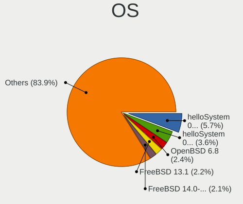

| Name                 | Computers | Percent |
|----------------------|-----------|---------|
| helloSystem 0.8.1    | 71        | 5.74%   |
| helloSystem 0.7.0    | 45        | 3.64%   |
| OpenBSD 6.8          | 30        | 2.43%   |
| FreeBSD 13.1         | 27        | 2.18%   |
| FreeBSD 14.0-CURRENT | 26        | 2.1%    |
| helloSystem 0.8.0    | 24        | 1.94%   |
| FreeBSD 13.0         | 24        | 1.94%   |
| FreeBSD 13.2         | 23        | 1.86%   |
| OpenBSD 7.3          | 22        | 1.78%   |
| FreeBSD 14.2         | 22        | 1.78%   |
| helloSystem 0.9.0    | 21        | 1.7%    |
| FreeBSD 12.1-p5      | 20        | 1.62%   |
| OpenBSD 7.1          | 17        | 1.38%   |
| FreeBSD 14.0         | 12        | 0.97%   |
| FreeBSD 13.0-STABLE  | 12        | 0.97%   |
| FreeBSD 12.1-STABLE  | 12        | 0.97%   |
| helloSystem 0.6.0    | 11        | 0.89%   |
| OpenBSD 6.7          | 10        | 0.81%   |
| helloSystem 0.8.2    | 10        | 0.81%   |
| OpenBSD 7.2          | 9         | 0.73%   |
| OpenBSD 7.0          | 9         | 0.73%   |
| NomadBSD 1.3.2       | 9         | 0.73%   |
| helloSystem 0.5.0    | 9         | 0.73%   |
| FreeBSD 13.1-p5      | 9         | 0.73%   |
| FreeBSD 13.0-CURRENT | 9         | 0.73%   |
| OpenBSD 7.7          | 8         | 0.65%   |
| GhostBSD 20.04.02    | 8         | 0.65%   |
| FreeBSD 15.0-CURRENT | 8         | 0.65%   |
| FreeBSD 14.1         | 8         | 0.65%   |
| FreeBSD 12.2-p4      | 8         | 0.65%   |
| FreeBSD 12.1-p7      | 8         | 0.65%   |
| ClonOS 24.12         | 8         | 0.65%   |
| OPNsense 25.1.7      | 7         | 0.57%   |
| OPNsense 24.7.11     | 7         | 0.57%   |
| OPNsense 23.7.12     | 7         | 0.57%   |
| OpenBSD 7.8          | 7         | 0.57%   |
| OpenBSD 7.6          | 7         | 0.57%   |
| OpenBSD 6.9          | 7         | 0.57%   |
| FreeBSD 12.2         | 7         | 0.57%   |
| OPNsense 25.7.2      | 6         | 0.49%   |

OS Family
---------

OS without a version

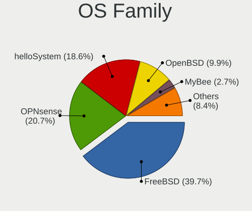

| Name        | Computers | Percent |
|-------------|-----------|---------|
| FreeBSD     | 407       | 39.71%  |
| OPNsense    | 212       | 20.68%  |
| helloSystem | 191       | 18.63%  |
| OpenBSD     | 101       | 9.85%   |
| MyBee       | 28        | 2.73%   |
| NomadBSD    | 21        | 2.05%   |
| NetBSD      | 21        | 2.05%   |
| GhostBSD    | 19        | 1.85%   |
| ClonOS      | 11        | 1.07%   |
| Ting        | 3         | 0.29%   |
| pfSense     | 2         | 0.2%    |
| XigmaNAS    | 1         | 0.1%    |
| TrueNAS     | 1         | 0.1%    |
| PC-BSD      | 1         | 0.1%    |
| OS108       | 1         | 0.1%    |
| OpenWrt     | 1         | 0.1%    |
| LibertyBSD  | 1         | 0.1%    |
| FuryBSD     | 1         | 0.1%    |
| FuguIta     | 1         | 0.1%    |
| DragonFly   | 1         | 0.1%    |

Arch
----

OS architecture (x86_64, i586, etc.)

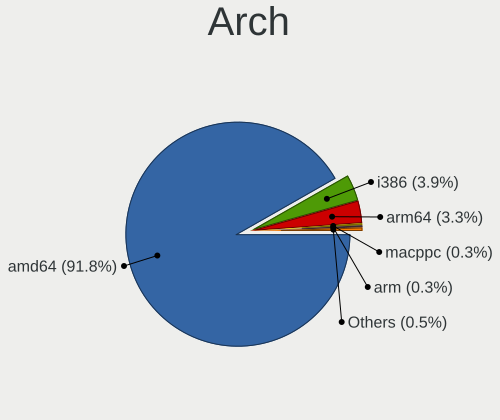

| Name    | Computers | Percent |
|---------|-----------|---------|
| amd64   | 902       | 91.76%  |
| i386    | 38        | 3.87%   |
| arm64   | 32        | 3.26%   |
| macppc  | 3         | 0.31%   |
| arm     | 3         | 0.31%   |
| sparc64 | 1         | 0.1%    |
| powerpc | 1         | 0.1%    |
| mips    | 1         | 0.1%    |
| evbarm  | 1         | 0.1%    |
| armv7   | 1         | 0.1%    |

DE
--

Desktop Environment

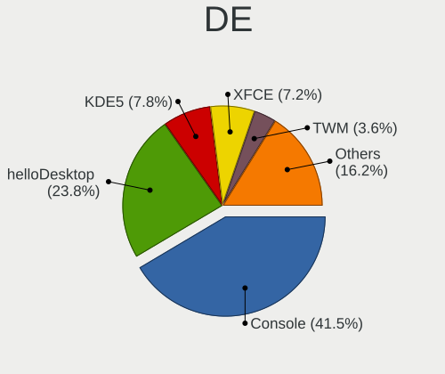

| Name          | Computers | Percent |
|---------------|-----------|---------|
| Console       | 426       | 41.48%  |
| helloDesktop  | 244       | 23.76%  |
| KDE5          | 80        | 7.79%   |
| XFCE          | 74        | 7.21%   |
| TWM           | 37        | 3.6%    |
| fvwm          | 33        | 3.21%   |
| MATE          | 30        | 2.92%   |
| Openbox       | 29        | 2.82%   |
| GNOME         | 26        | 2.53%   |
| Fluxbox       | 10        | 0.97%   |
| IceWM         | 5         | 0.49%   |
| i3            | 4         | 0.39%   |
| AwesomeWM     | 4         | 0.39%   |
| LXQt          | 3         | 0.29%   |
| KDE4          | 3         | 0.29%   |
| KDE           | 3         | 0.29%   |
| LXDE          | 2         | 0.19%   |
| Lumina        | 2         | 0.19%   |
| KDE6          | 2         | 0.19%   |
| DWM           | 2         | 0.19%   |
| xinitrc       | 1         | 0.1%    |
| X-Cinnamon    | 1         | 0.1%    |
| StumpWM       | 1         | 0.1%    |
| plasma        | 1         | 0.1%    |
| KWin          | 1         | 0.1%    |
| Enlightenment | 1         | 0.1%    |
| Budgie        | 1         | 0.1%    |
| akonadi_newm  | 1         | 0.1%    |

Display Server
--------------

X11 or Wayland

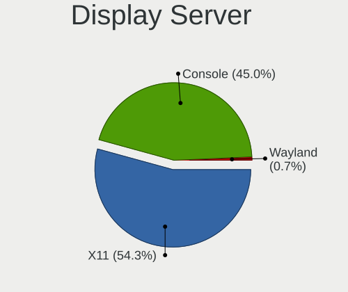

| Name    | Computers | Percent |
|---------|-----------|---------|
| X11     | 541       | 54.26%  |
| Console | 449       | 45.04%  |
| Wayland | 7         | 0.7%    |

Display Manager
---------------

SDDM, LightDM, etc.

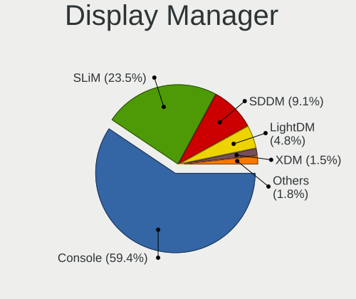

| Name    | Computers | Percent |
|---------|-----------|---------|
| Console | 600       | 59.41%  |
| SLiM    | 237       | 23.47%  |
| SDDM    | 92        | 9.11%   |
| LightDM | 48        | 4.75%   |
| XDM     | 15        | 1.49%   |
| GDM     | 14        | 1.39%   |
| Ly      | 3         | 0.3%    |
| PCDM    | 1         | 0.1%    |

OS Lang
-------

Language

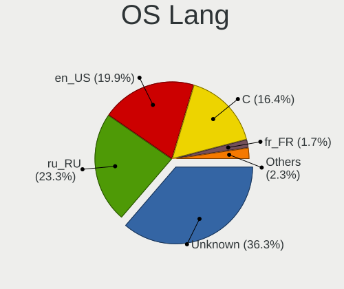

| Lang           | Computers | Percent |
|----------------|-----------|---------|
| Unknown        | 375       | 36.3%   |
| ru_RU          | 241       | 23.33%  |
| en_US          | 206       | 19.94%  |
| C              | 169       | 16.36%  |
| fr_FR          | 18        | 1.74%   |
| ru             | 11        | 1.06%   |
| ru_RU.KOI8-R   | 4         | 0.39%   |
| en_GB          | 4         | 0.39%   |
| fr             | 1         | 0.1%    |
| en_EN          | 1         | 0.1%    |
| en             | 1         | 0.1%    |
| cv_RU.US-ASCII | 1         | 0.1%    |
| ba_RU          | 1         | 0.1%    |

Boot Mode
---------

EFI or BIOS

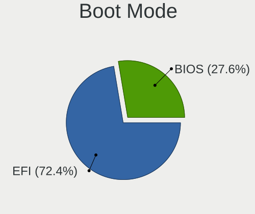

| Mode | Computers | Percent |
|------|-----------|---------|
| EFI  | 728       | 72.37%  |
| BIOS | 278       | 27.63%  |

Filesystem
----------

Type of filesystem

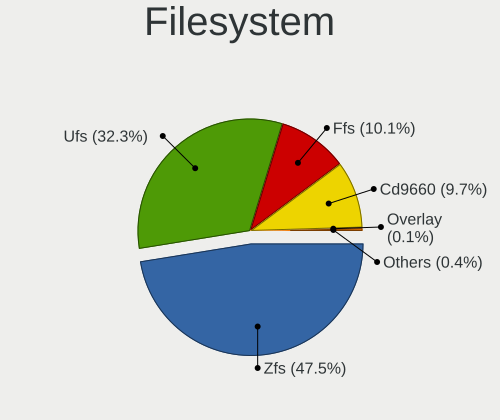

| Type    | Computers | Percent |
|---------|-----------|---------|
| Zfs     | 484       | 47.45%  |
| Ufs     | 329       | 32.25%  |
| Ffs     | 103       | 10.1%   |
| Cd9660  | 99        | 9.71%   |
| Xfs     | 1         | 0.1%    |
| Overlay | 1         | 0.1%    |
| Nullfs  | 1         | 0.1%    |
| Msdosfs | 1         | 0.1%    |
| Hammer2 | 1         | 0.1%    |

Part. scheme
------------

Scheme of partitioning

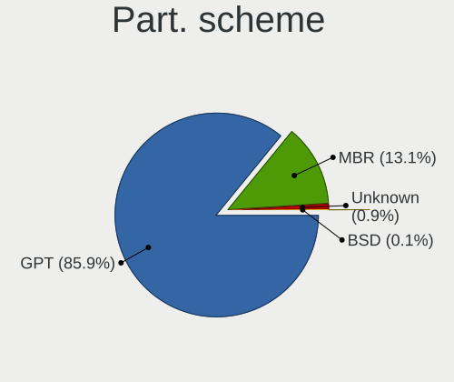

| Type    | Computers | Percent |
|---------|-----------|---------|
| GPT     | 848       | 85.92%  |
| MBR     | 129       | 13.07%  |
| Unknown | 9         | 0.91%   |
| BSD     | 1         | 0.1%    |

Board
-----

Vendor
------

Motherboard manufacturer

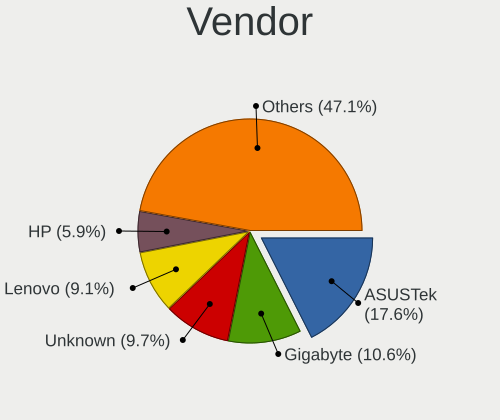

| Name                | Computers | Percent |
|---------------------|-----------|---------|
| ASUSTek Computer    | 172       | 17.55%  |
| Gigabyte Technology | 104       | 10.61%  |
| Unknown             | 95        | 9.69%   |
| Lenovo              | 89        | 9.08%   |
| Hewlett-Packard     | 58        | 5.92%   |
| ASRock              | 56        | 5.71%   |
| MSI                 | 44        | 4.49%   |
| Intel               | 44        | 4.49%   |
| Dell                | 37        | 3.78%   |
| Supermicro          | 34        | 3.47%   |
| Acer                | 31        | 3.16%   |
| Samsung Electronics | 12        | 1.22%   |
| Apple               | 12        | 1.22%   |
| Sony                | 11        | 1.12%   |
| Techvision          | 9         | 0.92%   |
| Huanan              | 9         | 0.92%   |
| HUAWEI              | 8         | 0.82%   |
| Pegatron            | 7         | 0.71%   |
| AMI                 | 6         | 0.61%   |
| IBM                 | 5         | 0.51%   |
| Fujitsu             | 5         | 0.51%   |
| F-Plus Mobile       | 5         | 0.51%   |
| ZOTAC               | 4         | 0.41%   |
| Toshiba             | 4         | 0.41%   |
| PC Engines          | 4         | 0.41%   |
| ETegro Technologies | 4         | 0.41%   |
| Wistron             | 3         | 0.31%   |
| Timi                | 3         | 0.31%   |
| Shuttle             | 3         | 0.31%   |
| Radxa               | 3         | 0.31%   |
| Maibenben           | 3         | 0.31%   |
| Irbis               | 3         | 0.31%   |
| Foxconn             | 3         | 0.31%   |
| Firefly             | 3         | 0.31%   |
| ECS                 | 3         | 0.31%   |
| AZW                 | 3         | 0.31%   |
| Aquarius            | 3         | 0.31%   |
| TONK                | 2         | 0.2%    |
| RDW Computers       | 2         | 0.2%    |
| OpenYard            | 2         | 0.2%    |

Model
-----

Motherboard model

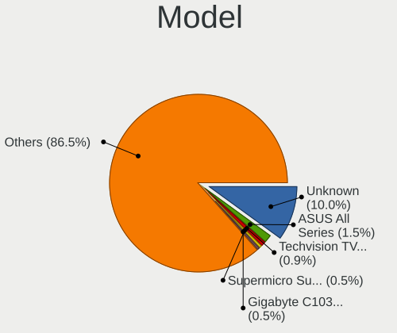

| Name                                 | Computers | Percent |
|--------------------------------------|-----------|---------|
| Unknown                              | 98        | 10%     |
| ASUS All Series                      | 15        | 1.53%   |
| Techvision TVI7309X                  | 9         | 0.92%   |
| Supermicro Super Server              | 5         | 0.51%   |
| Gigabyte C1037UN-EU                  | 5         | 0.51%   |
| F-Plus Mobile FLAPTOP r              | 5         | 0.51%   |
| AMI Aptio CRB                        | 5         | 0.51%   |
| PC Engines APU2                      | 4         | 0.41%   |
| ASUS VivoBook 15_ASUS Laptop X540UBR | 4         | 0.41%   |
| Supermicro H8DGU                     | 3         | 0.31%   |
| MSI MS-7D46                          | 3         | 0.31%   |
| MSI MS-7817                          | 3         | 0.31%   |
| Intel S5520UR                        | 3         | 0.31%   |
| Huanan X99-QD4 V1.0                  | 3         | 0.31%   |
| HP ProLiant DL360e Gen8              | 3         | 0.31%   |
| Gigabyte H61M-S2PV                   | 3         | 0.31%   |
| Gigabyte H61M-DS2                    | 3         | 0.31%   |
| Gigabyte A320M-H                     | 3         | 0.31%   |
| ETegro Hyperion RS130 G3             | 3         | 0.31%   |
| Dell OptiPlex 7040                   | 3         | 0.31%   |
| Supermicro X8DTU                     | 2         | 0.2%    |
| Supermicro SYS-6028R-TRT             | 2         | 0.2%    |
| Supermicro SYS-5018A-FTN4            | 2         | 0.2%    |
| Supermicro SSG-6029P-E1CR12L         | 2         | 0.2%    |
| Shuttle DS20U                        | 2         | 0.2%    |
| Samsung R530/R730/R540               | 2         | 0.2%    |
| Samsung N145P/N250P/N260P            | 2         | 0.2%    |
| RDW Computers Kama-10                | 2         | 0.2%    |
| Pegatron SAISHIAT2                   | 2         | 0.2%    |
| OpenYard RS101I-35R                  | 2         | 0.2%    |
| MSI PS63 Modern 8M                   | 2         | 0.2%    |
| MSI MS-7C96                          | 2         | 0.2%    |
| MSI MS-7B89                          | 2         | 0.2%    |
| MSI MS-7788                          | 2         | 0.2%    |
| Lenovo ThinkBook 14 G7 IML 21MR      | 2         | 0.2%    |
| Lenovo IdeaPad 330-15ARR 81D2        | 2         | 0.2%    |
| Lenovo IdeaPad 320-15ISK 80XH        | 2         | 0.2%    |
| Lenovo G570 20079                    | 2         | 0.2%    |
| Intel X79 V2.72A                     | 2         | 0.2%    |
| Intel S3420GP                        | 2         | 0.2%    |

Model Family
------------

Motherboard model prefix

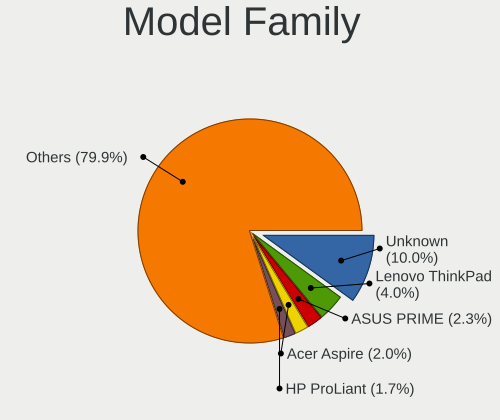

| Name                  | Computers | Percent |
|-----------------------|-----------|---------|
| Unknown               | 98        | 10%     |
| Lenovo ThinkPad       | 39        | 3.98%   |
| ASUS PRIME            | 23        | 2.35%   |
| Acer Aspire           | 20        | 2.04%   |
| HP ProLiant           | 17        | 1.73%   |
| Lenovo IdeaPad        | 16        | 1.63%   |
| ASUS All              | 15        | 1.53%   |
| ASUS VivoBook         | 13        | 1.33%   |
| Dell Inspiron         | 10        | 1.02%   |
| Techvision TVI7309X   | 9         | 0.92%   |
| Lenovo ThinkCentre    | 9         | 0.92%   |
| HP Laptop             | 9         | 0.92%   |
| ASUS ROG              | 9         | 0.92%   |
| Dell Latitude         | 8         | 0.82%   |
| Lenovo ThinkBook      | 7         | 0.71%   |
| HP ProBook            | 7         | 0.71%   |
| Dell PowerEdge        | 7         | 0.71%   |
| Dell OptiPlex         | 7         | 0.71%   |
| HP Compaq             | 6         | 0.61%   |
| Supermicro Super      | 5         | 0.51%   |
| Gigabyte C1037UN-EU   | 5         | 0.51%   |
| Gigabyte B450M        | 5         | 0.51%   |
| F-Plus Mobile FLAPTOP | 5         | 0.51%   |
| ASUS TUF              | 5         | 0.51%   |
| AMI Aptio             | 5         | 0.51%   |
| PC Engines APU2       | 4         | 0.41%   |
| ETegro Hyperion       | 4         | 0.41%   |
| ASUS P5G41T-M         | 4         | 0.41%   |
| Wistron ProLiant      | 3         | 0.31%   |
| Toshiba Satellite     | 3         | 0.31%   |
| Supermicro H8DGU      | 3         | 0.31%   |
| MSI MS-7D46           | 3         | 0.31%   |
| MSI MS-7817           | 3         | 0.31%   |
| Intel S5520UR         | 3         | 0.31%   |
| IBM ThinkPad          | 3         | 0.31%   |
| Huanan X99-QD4        | 3         | 0.31%   |
| HP ProDesk            | 3         | 0.31%   |
| Gigabyte H61M-S2PV    | 3         | 0.31%   |
| Gigabyte H61M-DS2     | 3         | 0.31%   |
| Gigabyte H310M        | 3         | 0.31%   |

MFG Year
--------

Motherboard manufacture year

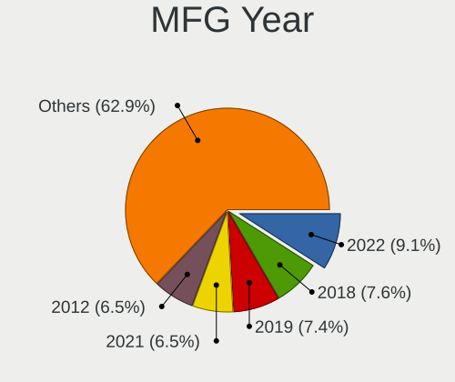

| Year    | Computers | Percent |
|---------|-----------|---------|
| 2022    | 89        | 9.08%   |
| 2018    | 74        | 7.55%   |
| 2019    | 73        | 7.45%   |
| 2021    | 64        | 6.53%   |
| 2012    | 64        | 6.53%   |
| 2020    | 63        | 6.43%   |
| 2023    | 58        | 5.92%   |
| 2010    | 56        | 5.71%   |
| 2011    | 53        | 5.41%   |
| 2013    | 51        | 5.2%    |
| 2024    | 43        | 4.39%   |
| 2017    | 40        | 4.08%   |
| 2009    | 38        | 3.88%   |
| 2016    | 37        | 3.78%   |
| 2014    | 37        | 3.78%   |
| Unknown | 35        | 3.57%   |
| 2015    | 30        | 3.06%   |
| 2008    | 29        | 2.96%   |
| 2007    | 21        | 2.14%   |
| 2006    | 10        | 1.02%   |
| 2005    | 7         | 0.71%   |
| 2004    | 5         | 0.51%   |
| 2025    | 2         | 0.2%    |
| 2003    | 1         | 0.1%    |

Form Factor
-----------

Physical design of the computer

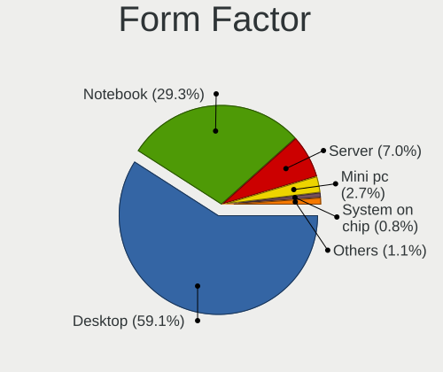

| Name           | Computers | Percent |
|----------------|-----------|---------|
| Desktop        | 579       | 59.08%  |
| Notebook       | 287       | 29.29%  |
| Server         | 69        | 7.04%   |
| Mini pc        | 26        | 2.65%   |
| System on chip | 8         | 0.82%   |
| All in one     | 5         | 0.51%   |
| Firewall       | 3         | 0.31%   |
| Convertible    | 3         | 0.31%   |

Coreboot
--------

Have coreboot on board

| Used | Computers | Percent |
|------|-----------|---------|
| No   | 975       | 99.49%  |
| Yes  | 5         | 0.51%   |

RAM Size
--------

Total RAM memory

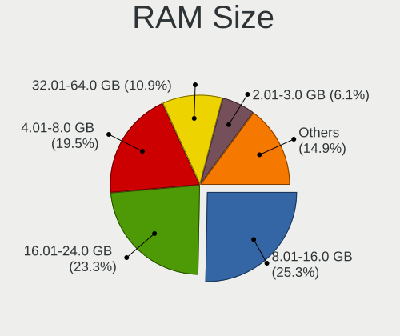

| Size in GB      | Computers | Percent |
|-----------------|-----------|---------|
| 8.01-16.0       | 255       | 25.3%   |
| 16.01-24.0      | 235       | 23.31%  |
| 4.01-8.0        | 197       | 19.54%  |
| 32.01-64.0      | 110       | 10.91%  |
| 2.01-3.0        | 61        | 6.05%   |
| 64.01-256.0     | 46        | 4.56%   |
| 3.01-4.0        | 30        | 2.98%   |
| 0.51-1.0        | 21        | 2.08%   |
| 24.01-32.0      | 17        | 1.69%   |
| More than 256.0 | 15        | 1.49%   |
| 1.01-2.0        | 11        | 1.09%   |
| 0.01-0.5        | 10        | 0.99%   |

RAM Used
--------

Used RAM memory

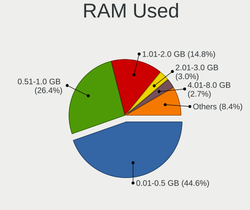

| Used GB     | Computers | Percent |
|-------------|-----------|---------|
| 0.01-0.5    | 458       | 44.64%  |
| 0.51-1.0    | 271       | 26.41%  |
| 1.01-2.0    | 152       | 14.81%  |
| 2.01-3.0    | 31        | 3.02%   |
| 4.01-8.0    | 28        | 2.73%   |
| Unknown     | 23        | 2.24%   |
| 8.01-16.0   | 17        | 1.66%   |
| 3.01-4.0    | 15        | 1.46%   |
| 0           | 15        | 1.46%   |
| 16.01-24.0  | 7         | 0.68%   |
| 24.01-32.0  | 6         | 0.58%   |
| 32.01-64.0  | 2         | 0.19%   |
| 64.01-256.0 | 1         | 0.1%    |

Total Drives
------------

Number of drives on board

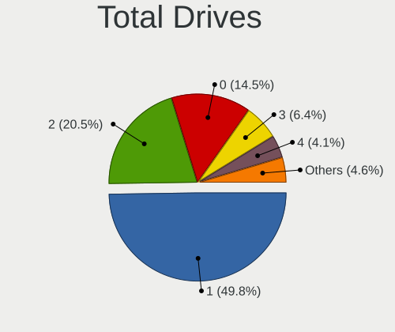

| Drives | Computers | Percent |
|--------|-----------|---------|
| 1      | 517       | 49.76%  |
| 2      | 213       | 20.5%   |
| 0      | 151       | 14.53%  |
| 3      | 67        | 6.45%   |
| 4      | 43        | 4.14%   |
| 5      | 22        | 2.12%   |
| 6      | 10        | 0.96%   |
| 7      | 5         | 0.48%   |
| 26     | 2         | 0.19%   |
| 11     | 2         | 0.19%   |
| 10     | 2         | 0.19%   |
| 9      | 2         | 0.19%   |
| 19     | 1         | 0.1%    |
| 14     | 1         | 0.1%    |
| 8      | 1         | 0.1%    |

Has CD-ROM
----------

Has CD-ROM on board

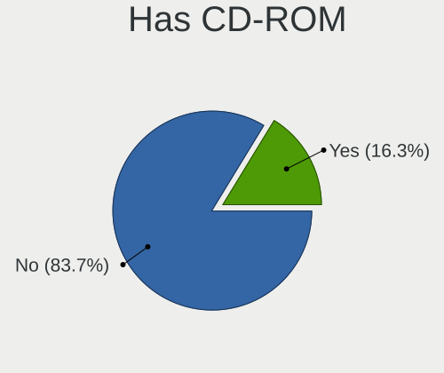

| Presented | Computers | Percent |
|-----------|-----------|---------|
| No        | 828       | 83.72%  |
| Yes       | 161       | 16.28%  |

Has Ethernet
------------

Has Ethernet on board

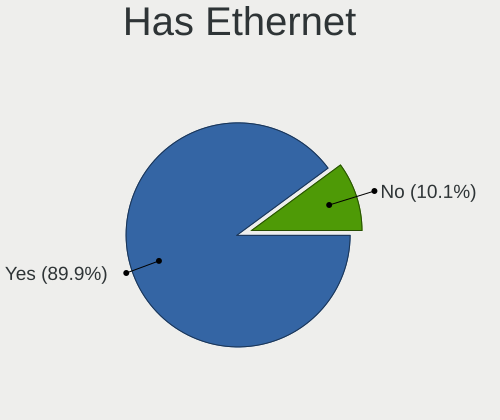

| Presented | Computers | Percent |
|-----------|-----------|---------|
| Yes       | 881       | 89.9%   |
| No        | 99        | 10.1%   |

Has WiFi
--------

Has WiFi module

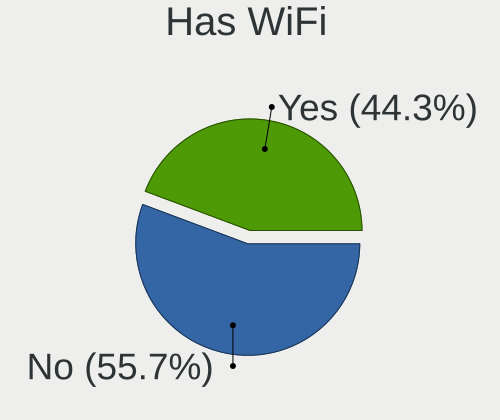

| Presented | Computers | Percent |
|-----------|-----------|---------|
| No        | 552       | 55.7%   |
| Yes       | 439       | 44.3%   |

Has Bluetooth
-------------

Has Bluetooth module

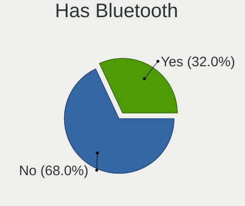

| Presented | Computers | Percent |
|-----------|-----------|---------|
| No        | 674       | 68.01%  |
| Yes       | 317       | 31.99%  |

Location
--------

Country
-------

Geographic location (country)

| Country | Computers | Percent |
|---------|-----------|---------|
| Russia  | 980       | 100%    |

City
----

Geographic location (city)

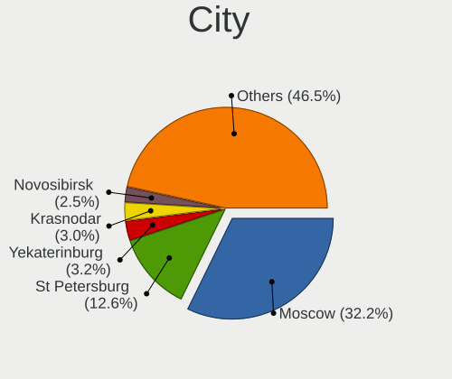

| City                     | Computers | Percent |
|--------------------------|-----------|---------|
| Moscow                   | 327       | 32.25%  |
| St Petersburg            | 128       | 12.62%  |
| Yekaterinburg            | 32        | 3.16%   |
| Krasnodar                | 30        | 2.96%   |
| Novosibirsk              | 25        | 2.47%   |
| Chelyabinsk              | 19        | 1.87%   |
| Vladivostok              | 18        | 1.78%   |
| Ozersk                   | 15        | 1.48%   |
| Perm                     | 14        | 1.38%   |
| Krasnoyarsk              | 14        | 1.38%   |
| Voronezh                 | 13        | 1.28%   |
| Ufa                      | 11        | 1.08%   |
| Rostov-on-Don            | 11        | 1.08%   |
| Barnaul                  | 11        | 1.08%   |
| Surgut                   | 9         | 0.89%   |
| Stavropol                | 9         | 0.89%   |
| Saratov                  | 9         | 0.89%   |
| Ulyanovsk                | 8         | 0.79%   |
| Omsk                     | 8         | 0.79%   |
| Kirov                    | 8         | 0.79%   |
| Khabarovsk               | 7         | 0.69%   |
| Kamensk-Ural'skiy        | 7         | 0.69%   |
| Irkutsk                  | 7         | 0.69%   |
| Volgograd                | 6         | 0.59%   |
| Podolsk                  | 6         | 0.59%   |
| Penza                    | 6         | 0.59%   |
| Smolensk                 | 5         | 0.49%   |
| Nizhniy Novgorod         | 5         | 0.49%   |
| Cherepovets              | 5         | 0.49%   |
| Balashikha               | 5         | 0.49%   |
| Zhukovskiy               | 4         | 0.39%   |
| Tyumen                   | 4         | 0.39%   |
| Tosno                    | 4         | 0.39%   |
| Tolyatti                 | 4         | 0.39%   |
| Samara                   | 4         | 0.39%   |
| Petropavlovsk-Kamchatsky | 4         | 0.39%   |
| Orenburg                 | 4         | 0.39%   |
| Lipetsk                  | 4         | 0.39%   |
| Ivanovo                  | 4         | 0.39%   |
| Armavir                  | 4         | 0.39%   |

Drives
------

Drive Vendor
------------

Hard drive vendors

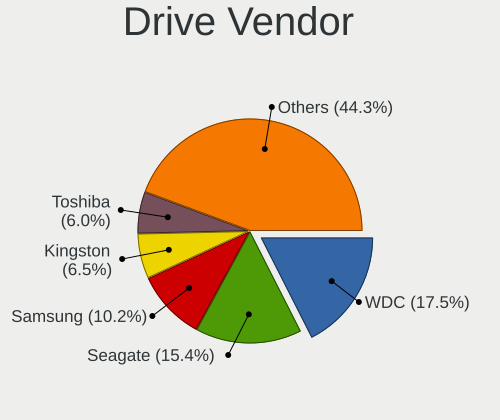

| Vendor              | Computers | Drives | Percent |
|---------------------|-----------|--------|---------|
| WDC                 | 215       | 359    | 17.52%  |
| Seagate             | 189       | 403    | 15.4%   |
| Samsung Electronics | 125       | 219    | 10.19%  |
| Kingston            | 80        | 109    | 6.52%   |
| Toshiba             | 74        | 129    | 6.03%   |
| Intel               | 50        | 97     | 4.07%   |
| Hitachi             | 41        | 87     | 3.34%   |
| A-DATA Technology   | 27        | 33     | 2.2%    |
| SanDisk             | 25        | 35     | 2.04%   |
| HGST                | 22        | 47     | 1.79%   |
| Apacer              | 22        | 34     | 1.79%   |
| SPCC                | 20        | 23     | 1.63%   |
| Crucial             | 20        | 27     | 1.63%   |
| Netac               | 15        | 23     | 1.22%   |
| Transcend           | 14        | 14     | 1.14%   |
| Micron Technology   | 14        | 19     | 1.14%   |
| Hewlett-Packard     | 14        | 30     | 1.14%   |
| AMD                 | 14        | 15     | 1.14%   |
| SK hynix            | 12        | 15     | 0.98%   |
| China               | 12        | 16     | 0.98%   |
| Smartbuy            | 11        | 14     | 0.9%    |
| KingSpec            | 11        | 14     | 0.9%    |
| Silicon Motion      | 10        | 15     | 0.81%   |
| Patriot             | 10        | 10     | 0.81%   |
| NVMe                | 10        | 15     | 0.81%   |
| Gigabyte Technology | 10        | 13     | 0.81%   |
| FORESEE             | 10        | 11     | 0.81%   |
| Plextor             | 9         | 17     | 0.73%   |
| OCZ                 | 9         | 13     | 0.73%   |
| Maxtor              | 9         | 10     | 0.73%   |
| Fujitsu             | 6         | 8      | 0.49%   |
| OPENBSD             | 5         | 15     | 0.41%   |
| Apple               | 5         | 5      | 0.41%   |
| Team                | 4         | 4      | 0.33%   |
| SSSTC               | 4         | 6      | 0.33%   |
| Kston               | 4         | 4      | 0.33%   |
| KIOXIA              | 4         | 4      | 0.33%   |
| JetFlash            | 4         | 4      | 0.33%   |
| Hoodisk             | 4         | 6      | 0.33%   |
| UMIS                | 3         | 3      | 0.24%   |

Drive Model
-----------

Hard drive models

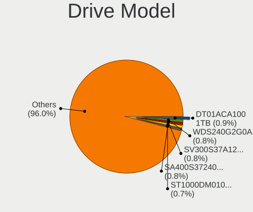

| Model                              | Computers | Percent |
|------------------------------------|-----------|---------|
| Toshiba DT01ACA100 1TB             | 12        | 0.88%   |
| WDC WDS240G2G0A-00JH30 240GB       | 11        | 0.8%    |
| Kingston SV300S37A120G 120GB       | 11        | 0.8%    |
| Kingston SA400S37240G 240GB        | 11        | 0.8%    |
| Seagate ST1000DM010-2EP102 1TB     | 10        | 0.73%   |
| WDC WDS120G2G0A-00JH30 120GB       | 9         | 0.66%   |
| Seagate ST1000LM024 HN-M101MBB 1TB | 9         | 0.66%   |
| SPCC Solid State Disk 128GB        | 8         | 0.58%   |
| Seagate ST1000LM035-1RK172 1TB     | 8         | 0.58%   |
| Samsung SSD 860 EVO 250GB          | 8         | 0.58%   |
| Apacer AS350 128GB                 | 8         | 0.58%   |
| Toshiba MQ01ABF050 500GB           | 7         | 0.51%   |
| Samsung SSD 970 EVO Plus 500GB     | 7         | 0.51%   |
| Samsung SSD 860 EVO 500GB          | 7         | 0.51%   |
| Kingston SA400S37120G 120GB        | 7         | 0.51%   |
| HP RAID 1(1+0) 119GB               | 7         | 0.51%   |
| WDC WD20EARX-00PASB0 2TB           | 6         | 0.44%   |
| Toshiba HDWD110 1TB                | 6         | 0.44%   |
| Seagate ST500DM002-1BD142 500GB    | 6         | 0.44%   |
| Samsung SSD 870 EVO 500GB          | 6         | 0.44%   |
| Netac SSD 128GB                    | 6         | 0.44%   |
| AMD R5SL120G 120GB                 | 6         | 0.44%   |
| A-DATA SU650 120GB                 | 6         | 0.44%   |
| Toshiba DT01ACA050 500GB           | 5         | 0.37%   |
| Seagate ST500LT012-1DG142 500GB    | 5         | 0.37%   |
| Seagate ST380815AS 80GB            | 5         | 0.37%   |
| Seagate ST250DM000-1BD141 250GB    | 5         | 0.37%   |
| Seagate ST2000DM006-2DM164 2TB     | 5         | 0.37%   |
| Samsung SSD 970 EVO Plus 250GB     | 5         | 0.37%   |
| Samsung SSD 870 EVO 1TB            | 5         | 0.37%   |
| OPENBSD SR RAID 1 2TB              | 5         | 0.37%   |
| Intel SSDSC2BW480H6 480GB          | 5         | 0.37%   |
| Crucial CT240BX500SSD1 240GB       | 5         | 0.37%   |
| WDC WD5000LPLX-00ZNTT0 500GB       | 4         | 0.29%   |
| WDC WD5000LPCX-60VHAT0 500GB       | 4         | 0.29%   |
| WDC WD5000AAKS-00V1A0 500GB        | 4         | 0.29%   |
| WDC WD10JPVX-22JC3T0 1TB           | 4         | 0.29%   |
| WDC WD1002FAEX-00Y9A0 1TB          | 4         | 0.29%   |
| Toshiba MQ01ABD100 1TB             | 4         | 0.29%   |
| Smartbuy SSD 64GB                  | 4         | 0.29%   |

HDD Vendor
----------

Hard disk drive vendors

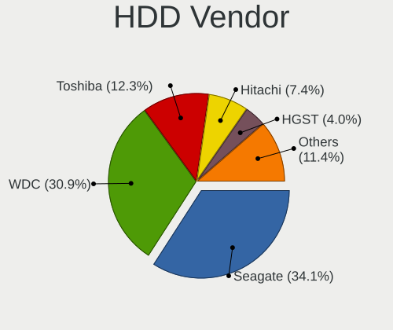

| Vendor                             | Computers | Drives | Percent |
|------------------------------------|-----------|--------|---------|
| Seagate                            | 189       | 403    | 34.12%  |
| WDC                                | 171       | 295    | 30.87%  |
| Toshiba                            | 68        | 123    | 12.27%  |
| Hitachi                            | 41        | 87     | 7.4%    |
| HGST                               | 22        | 47     | 3.97%   |
| Samsung Electronics                | 16        | 28     | 2.89%   |
| Maxtor                             | 9         | 10     | 1.62%   |
| NVMe                               | 8         | 13     | 1.44%   |
| Fujitsu                            | 6         | 8      | 1.08%   |
| OPENBSD                            | 5         | 15     | 0.9%    |
| JetFlash                           | 4         | 4      | 0.72%   |
| Hewlett-Packard                    | 3         | 9      | 0.54%   |
| Product:              USB DISK 2.0 | 2         | 2      | 0.36%   |
| Apple                              | 2         | 2      | 0.36%   |
| Adaptec                            | 2         | 12     | 0.36%   |
| USB                                | 1         | 1      | 0.18%   |
| UFD 2.0                            | 1         | 1      | 0.18%   |
| MaxDigital                         | 1         | 1      | 0.18%   |
| LSILOGIC                           | 1         | 1      | 0.18%   |
| IBM                                | 1         | 1      | 0.18%   |
| Areca                              | 1         | 2      | 0.18%   |

SSD Vendor
----------

Solid state drive vendors

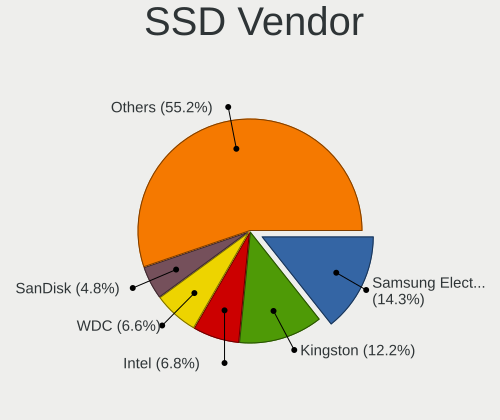

| Vendor              | Computers | Drives | Percent |
|---------------------|-----------|--------|---------|
| Samsung Electronics | 74        | 133    | 14.34%  |
| Kingston            | 63        | 86     | 12.21%  |
| Intel               | 35        | 73     | 6.78%   |
| WDC                 | 34        | 41     | 6.59%   |
| SanDisk             | 25        | 35     | 4.84%   |
| Apacer              | 21        | 30     | 4.07%   |
| A-DATA Technology   | 20        | 24     | 3.88%   |
| SPCC                | 19        | 22     | 3.68%   |
| Crucial             | 18        | 24     | 3.49%   |
| Netac               | 13        | 21     | 2.52%   |
| Transcend           | 12        | 12     | 2.33%   |
| China               | 12        | 16     | 2.33%   |
| Smartbuy            | 11        | 14     | 2.13%   |
| KingSpec            | 11        | 14     | 2.13%   |
| Hewlett-Packard     | 11        | 21     | 2.13%   |
| AMD                 | 11        | 12     | 2.13%   |
| Micron Technology   | 10        | 15     | 1.94%   |
| Plextor             | 9         | 17     | 1.74%   |
| Patriot             | 9         | 9      | 1.74%   |
| OCZ                 | 9         | 13     | 1.74%   |
| Gigabyte Technology | 5         | 7      | 0.97%   |
| Team                | 4         | 4      | 0.78%   |
| Kston               | 4         | 4      | 0.78%   |
| Toshiba             | 3         | 3      | 0.58%   |
| SK hynix            | 3         | 3      | 0.58%   |
| Qumo                | 3         | 3      | 0.58%   |
| Innostor            | 3         | 3      | 0.58%   |
| Hoodisk             | 3         | 5      | 0.58%   |
| FORESEE             | 3         | 4      | 0.58%   |
| Apple               | 3         | 3      | 0.58%   |
| Verbatim            | 2         | 2      | 0.39%   |
| SETHRISE            | 2         | 2      | 0.39%   |
| Palit               | 2         | 2      | 0.39%   |
| NVMe                | 2         | 2      | 0.39%   |
| GOODRAM             | 2         | 2      | 0.39%   |
| Foxline             | 2         | 3      | 0.39%   |
| ExeGate             | 2         | 2      | 0.39%   |
| DEXP                | 2         | 2      | 0.39%   |
| Corsair             | 2         | 2      | 0.39%   |
| Azerty              | 2         | 2      | 0.39%   |

Drive Kind
----------

HDD or SSD

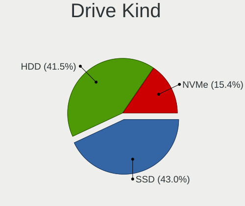

| Kind | Computers | Drives | Percent |
|------|-----------|--------|---------|
| SSD  | 455       | 741    | 43.05%  |
| HDD  | 439       | 1065   | 41.53%  |
| NVMe | 163       | 226    | 15.42%  |

Drive Connector
---------------

SATA, SAS, NVMe, etc.

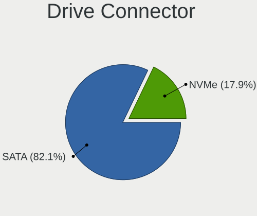

| Type | Computers | Drives | Percent |
|------|-----------|--------|---------|
| SATA | 750       | 1806   | 82.15%  |
| NVMe | 163       | 226    | 17.85%  |

Drive Size
----------

Size of hard drive

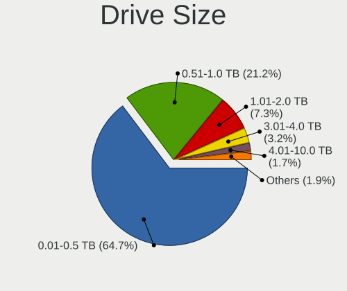

| Size in TB      | Computers | Drives | Percent |
|-----------------|-----------|--------|---------|
| 0.01-0.5        | 611       | 1022   | 64.72%  |
| 0.51-1.0        | 200       | 353    | 21.19%  |
| 1.01-2.0        | 69        | 211    | 7.31%   |
| 3.01-4.0        | 30        | 96     | 3.18%   |
| 4.01-10.0       | 16        | 39     | 1.69%   |
| 2.01-3.0        | 11        | 27     | 1.17%   |
| 10.01-20.0      | 6         | 57     | 0.64%   |
| More than 100.0 | 1         | 1      | 0.11%   |

Space Total
-----------

Amount of disk space available on the file system

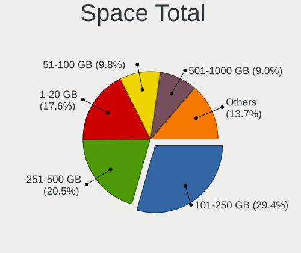

| Size in GB     | Computers | Percent |
|----------------|-----------|---------|
| 101-250        | 310       | 29.41%  |
| 251-500        | 216       | 20.49%  |
| 1-20           | 186       | 17.65%  |
| 51-100         | 103       | 9.77%   |
| 501-1000       | 95        | 9.01%   |
| 21-50          | 75        | 7.12%   |
| 1001-2000      | 33        | 3.13%   |
| More than 3000 | 22        | 2.09%   |
| Unknown        | 8         | 0.76%   |
| 2001-3000      | 5         | 0.47%   |
| 0              | 1         | 0.09%   |

Space Used
----------

Amount of used disk space

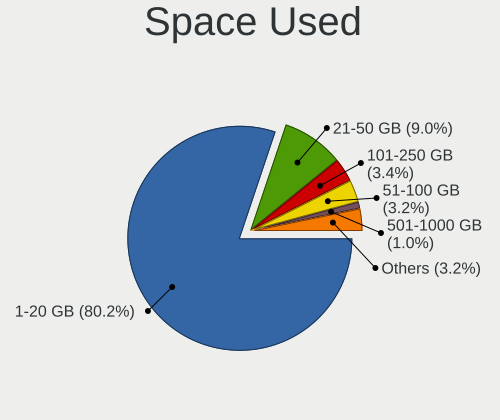

| Used GB        | Computers | Percent |
|----------------|-----------|---------|
| 1-20           | 820       | 80.16%  |
| 21-50          | 92        | 8.99%   |
| 101-250        | 35        | 3.42%   |
| 51-100         | 33        | 3.23%   |
| 501-1000       | 10        | 0.98%   |
| More than 3000 | 8         | 0.78%   |
| 251-500        | 8         | 0.78%   |
| Unknown        | 8         | 0.78%   |
| 2001-3000      | 4         | 0.39%   |
| 1001-2000      | 4         | 0.39%   |
| 0              | 1         | 0.1%    |

Malfunc. Drives
---------------

Drive models with a malfunction

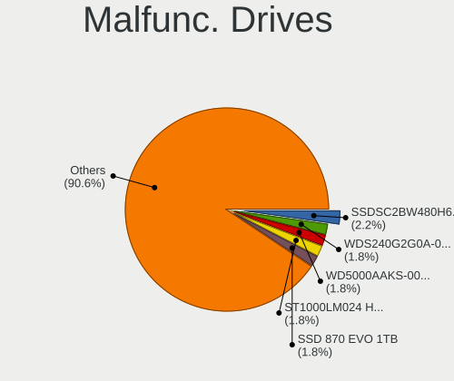

| Model                               | Computers | Drives | Percent |
|-------------------------------------|-----------|--------|---------|
| Intel SSDSC2BW480H6 480GB           | 5         | 5      | 2.23%   |
| WDC WDS240G2G0A-00JH30 240GB        | 4         | 4      | 1.79%   |
| WDC WD5000AAKS-00V1A0 500GB         | 4         | 4      | 1.79%   |
| Seagate ST1000LM024 HN-M101MBB 1TB  | 4         | 4      | 1.79%   |
| Samsung Electronics SSD 870 EVO 1TB | 4         | 10     | 1.79%   |
| Seagate ST500LT012-1DG142 500GB     | 3         | 4      | 1.34%   |
| Maxtor STM3320613AS 320GB           | 3         | 3      | 1.34%   |
| Kingston SV300S37A120G 120GB        | 3         | 3      | 1.34%   |
| Kingston SA400S37120G 120GB         | 3         | 3      | 1.34%   |
| WDC WDS120G2G0A-00JH30 120GB        | 2         | 2      | 0.89%   |
| WDC WD5003AZEX-00MK2A0 500GB        | 2         | 2      | 0.89%   |
| WDC WD5000LPLX-00ZNTT0 500GB        | 2         | 3      | 0.89%   |
| WDC WD5000AAKX-00ERMA0 500GB        | 2         | 2      | 0.89%   |
| WDC WD3200AAKX-001CA0 320GB         | 2         | 2      | 0.89%   |
| WDC WD20EFRX-68EUZN0 1TB            | 2         | 3      | 0.89%   |
| WDC WD15EARS-00Z5B1 1.5TB           | 2         | 2      | 0.89%   |
| WDC WD1002FAEX-00Y9A0 1TB           | 2         | 2      | 0.89%   |
| Toshiba MQ01ABF050 500GB            | 2         | 2      | 0.89%   |
| Toshiba MQ01ABD100 1TB              | 2         | 2      | 0.89%   |
| Toshiba MK3259GSXP 320GB            | 2         | 2      | 0.89%   |
| Seagate ST9500325AS 500GB           | 2         | 2      | 0.89%   |
| Seagate ST500LT012-9WS142 500GB     | 2         | 2      | 0.89%   |
| Seagate ST380811AS 80GB             | 2         | 2      | 0.89%   |
| Seagate ST3500413AS 500GB           | 2         | 4      | 0.89%   |
| Seagate ST3320418AS 320GB           | 2         | 2      | 0.89%   |
| Seagate ST3250410AS 250GB           | 2         | 2      | 0.89%   |
| Seagate ST250DM000-1BD141 250GB     | 2         | 4      | 0.89%   |
| Seagate ST2000DM001-9YN164 2TB      | 2         | 2      | 0.89%   |
| Seagate ST2000DM001-1ER164 2TB      | 2         | 2      | 0.89%   |
| Samsung Electronics HD501LJ 500GB   | 2         | 4      | 0.89%   |
| Samsung Electronics HD161HJ 160GB   | 2         | 3      | 0.89%   |
| Micron Technology 1100 SATA 256GB   | 2         | 2      | 0.89%   |
| Hitachi HTS547550A9E384 500GB       | 2         | 2      | 0.89%   |
| Hitachi HDS721010CLA332 1TB         | 2         | 4      | 0.89%   |
| XPG SX950U 240GB                    | 1         | 1      | 0.45%   |
| WDC WD800AAJS-00TDA0 80GB           | 1         | 1      | 0.45%   |
| WDC WD7501AALS-00E8B0 752GB         | 1         | 1      | 0.45%   |
| WDC WD7500AACS-00ZJB0 752GB         | 1         | 1      | 0.45%   |
| WDC WD60EFRX-68MYMN1 6TB            | 1         | 1      | 0.45%   |
| WDC WD5000LPLX-60ZNTT1 500GB        | 1         | 1      | 0.45%   |

Malfunc. Drive Vendor
---------------------

Vendors of faulty drives

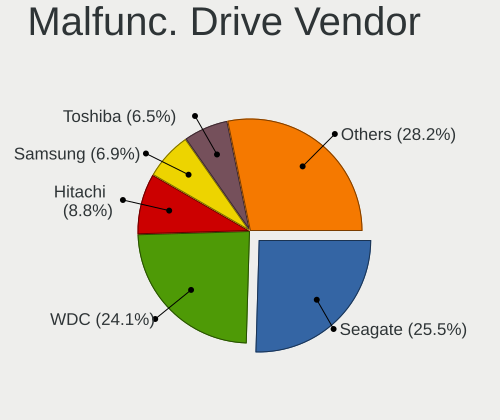

| Vendor              | Computers | Drives | Percent |
|---------------------|-----------|--------|---------|
| Seagate             | 55        | 75     | 25.46%  |
| WDC                 | 52        | 68     | 24.07%  |
| Hitachi             | 19        | 26     | 8.8%    |
| Samsung Electronics | 15        | 24     | 6.94%   |
| Toshiba             | 14        | 16     | 6.48%   |
| Intel               | 12        | 12     | 5.56%   |
| Kingston            | 11        | 11     | 5.09%   |
| Maxtor              | 6         | 7      | 2.78%   |
| HGST                | 5         | 7      | 2.31%   |
| SPCC                | 3         | 3      | 1.39%   |
| Micron Technology   | 3         | 4      | 1.39%   |
| China               | 3         | 3      | 1.39%   |
| Plextor             | 2         | 2      | 0.93%   |
| Crucial             | 2         | 2      | 0.93%   |
| Apple               | 2         | 2      | 0.93%   |
| XPG                 | 1         | 1      | 0.46%   |
| Transcend           | 1         | 1      | 0.46%   |
| Smartbuy            | 1         | 1      | 0.46%   |
| SK hynix            | 1         | 1      | 0.46%   |
| SanDisk             | 1         | 1      | 0.46%   |
| Netac               | 1         | 1      | 0.46%   |
| Hewlett-Packard     | 1         | 1      | 0.46%   |
| GLOWAY              | 1         | 2      | 0.46%   |
| GK                  | 1         | 1      | 0.46%   |
| ExeGate             | 1         | 1      | 0.46%   |
| AMD                 | 1         | 2      | 0.46%   |
| A-DATA Technology   | 1         | 1      | 0.46%   |

Malfunc. HDD Vendor
-------------------

Vendors of faulty HDD drives

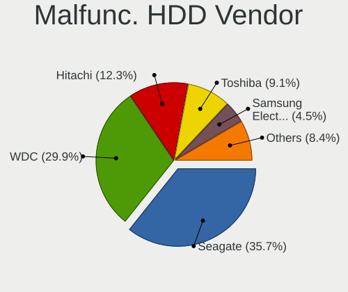

| Vendor              | Computers | Drives | Percent |
|---------------------|-----------|--------|---------|
| Seagate             | 55        | 75     | 35.71%  |
| WDC                 | 46        | 62     | 29.87%  |
| Hitachi             | 19        | 26     | 12.34%  |
| Toshiba             | 14        | 16     | 9.09%   |
| Samsung Electronics | 7         | 10     | 4.55%   |
| Maxtor              | 6         | 7      | 3.9%    |
| HGST                | 5         | 7      | 3.25%   |
| Hewlett-Packard     | 1         | 1      | 0.65%   |
| Apple               | 1         | 1      | 0.65%   |

Malfunc. Drive Kind
-------------------

Kinds of faulty drives

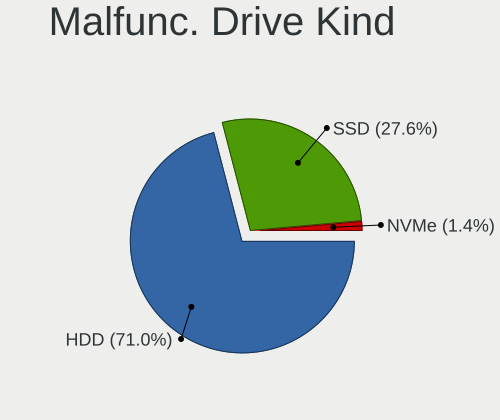

| Kind | Computers | Drives | Percent |
|------|-----------|--------|---------|
| HDD  | 149       | 205    | 70.95%  |
| SSD  | 58        | 68     | 27.62%  |
| NVMe | 3         | 3      | 1.43%   |

Failed Drives
-------------

Failed drive models

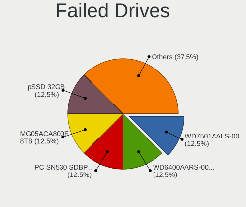

| Model                                | Computers | Drives | Percent |
|--------------------------------------|-----------|--------|---------|
| WDC WD7501AALS-00J7B0 752GB          | 1         | 1      | 12.5%   |
| WDC WD6400AARS-00Y5B1 640GB          | 1         | 2      | 12.5%   |
| WDC PC SN530 SDBPMPZ-256G-1101 256GB | 1         | 1      | 12.5%   |
| Toshiba MG05ACA800E 8TB              | 1         | 1      | 12.5%   |
| SanDisk pSSD 32GB                    | 1         | 1      | 12.5%   |
| Hitachi HTS545025B9A300 250GB        | 1         | 1      | 12.5%   |
| Hitachi HDS721010DLE630 1TB          | 1         | 1      | 12.5%   |
| Crucial M4-CT256M4SSD1 256GB         | 1         | 1      | 12.5%   |

Failed Drive Vendor
-------------------

Failed drive vendors

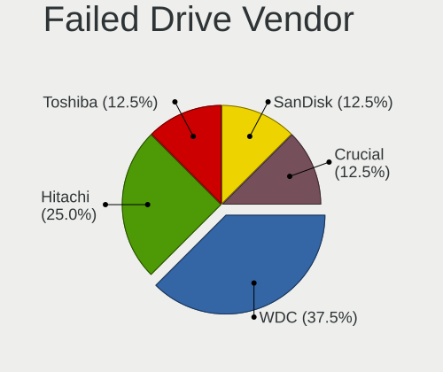

| Vendor  | Computers | Drives | Percent |
|---------|-----------|--------|---------|
| WDC     | 3         | 4      | 37.5%   |
| Hitachi | 2         | 2      | 25%     |
| Toshiba | 1         | 1      | 12.5%   |
| SanDisk | 1         | 1      | 12.5%   |
| Crucial | 1         | 1      | 12.5%   |

Drive Status
------------

Number of failed and malfunc. drives

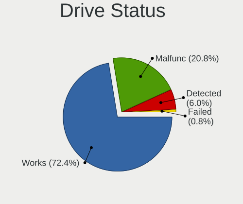

| Status   | Computers | Drives | Percent |
|----------|-----------|--------|---------|
| Works    | 712       | 1626   | 72.43%  |
| Malfunc  | 204       | 276    | 20.75%  |
| Detected | 59        | 121    | 6%      |
| Failed   | 8         | 9      | 0.81%   |

Storage controller
------------------

Storage Vendor
--------------

Storage controller vendors

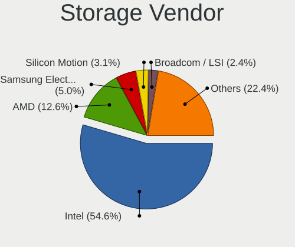

| Vendor                                  | Computers | Percent |
|-----------------------------------------|-----------|---------|
| Intel                                   | 670       | 54.56%  |
| AMD                                     | 155       | 12.62%  |
| Samsung Electronics                     | 61        | 4.97%   |
| Silicon Motion                          | 38        | 3.09%   |
| Broadcom / LSI                          | 29        | 2.36%   |
| SanDisk                                 | 27        | 2.2%    |
| Marvell Technology Group                | 21        | 1.71%   |
| Kingston Technology Company             | 20        | 1.63%   |
| Phison Electronics                      | 19        | 1.55%   |
| JMicron Technology                      | 19        | 1.55%   |
| Nvidia                                  | 16        | 1.3%    |
| ASMedia Technology                      | 16        | 1.3%    |
| SK hynix                                | 15        | 1.22%   |
| Shenzhen Longsys Electronics            | 12        | 0.98%   |
| ADATA Technology                        | 12        | 0.98%   |
| Realtek Semiconductor                   | 10        | 0.81%   |
| MAXIO Technology (Hangzhou)             | 10        | 0.81%   |
| Hewlett-Packard                         | 9         | 0.73%   |
| Toshiba                                 | 6         | 0.49%   |
| KIOXIA                                  | 6         | 0.49%   |
| Solid State Storage Technology          | 5         | 0.41%   |
| Micron Technology                       | 5         | 0.41%   |
| Areca Technology                        | 5         | 0.41%   |
| Shenzhen Unionmemory Information System | 4         | 0.33%   |
| VIA Technologies                        | 3         | 0.24%   |
| Netac Technology                        | 3         | 0.24%   |
| Micron/Crucial Technology               | 3         | 0.24%   |
| Adaptec                                 | 3         | 0.24%   |
| Unknown                                 | 3         | 0.24%   |
| Yangtze Memory Technologies             | 2         | 0.16%   |
| Transcend                               | 2         | 0.16%   |
| Solidigm                                | 2         | 0.16%   |
| Silicon Integrated Systems [SiS]        | 2         | 0.16%   |
| Silicon Image                           | 2         | 0.16%   |
| Lite-On IT Corp. / Plextor              | 2         | 0.16%   |
| Lenovo                                  | 2         | 0.16%   |
| Integrated Technology Express           | 2         | 0.16%   |
| Union Memory (Shenzhen)                 | 1         | 0.08%   |
| Promise Technology                      | 1         | 0.08%   |
| Lite-On Technology                      | 1         | 0.08%   |

Storage Model
-------------

Storage controller models

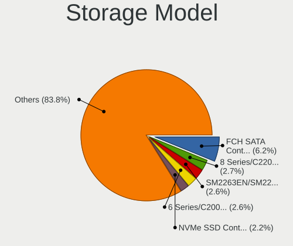

| Model                                                                                                              | Computers | Percent |
|--------------------------------------------------------------------------------------------------------------------|-----------|---------|
| AMD FCH SATA Controller [AHCI mode]                                                                                | 87        | 6.17%   |
| Intel 8 Series/C220 Series Chipset Family 6-port SATA Controller 1 [AHCI mode]                                     | 38        | 2.69%   |
| Silicon Motion SM2263EN/SM2263XT (DRAM-less) NVMe SSD Controllers                                                  | 36        | 2.55%   |
| Intel 6 Series/C200 Series Chipset Family 6 port Desktop SATA AHCI Controller                                      | 36        | 2.55%   |
| Samsung NVMe SSD Controller SM981/PM981/PM983                                                                      | 31        | 2.2%    |
| Intel Sunrise Point-LP SATA Controller [AHCI mode]                                                                 | 29        | 2.06%   |
| Intel NM10/ICH7 Family SATA Controller [IDE mode]                                                                  | 28        | 1.98%   |
| Intel 82801G (ICH7 Family) IDE Controller                                                                          | 28        | 1.98%   |
| Intel 7 Series Chipset Family 6-port SATA Controller [AHCI mode]                                                   | 27        | 1.91%   |
| Intel Q170/Q150/B150/H170/H110/Z170/CM236 Chipset SATA Controller [AHCI Mode]                                      | 26        | 1.84%   |
| Intel Atom Processor E3800 Series SATA AHCI Controller                                                             | 25        | 1.77%   |
| Intel 7 Series/C210 Series Chipset Family 6-port SATA Controller [AHCI mode]                                       | 23        | 1.63%   |
| AMD SB7x0/SB8x0/SB9x0 SATA Controller [AHCI mode]                                                                  | 23        | 1.63%   |
| Intel Alder Lake-N SATA AHCI Controller                                                                            | 22        | 1.56%   |
| Intel 82801JI (ICH10 Family) SATA AHCI Controller                                                                  | 22        | 1.56%   |
| AMD SB7x0/SB8x0/SB9x0 IDE Controller                                                                               | 21        | 1.49%   |
| Intel NM10/ICH7 Family SATA Controller [AHCI mode]                                                                 | 20        | 1.42%   |
| Intel Cannon Lake PCH SATA AHCI Controller                                                                         | 20        | 1.42%   |
| Intel 200 Series PCH SATA controller [AHCI mode]                                                                   | 20        | 1.42%   |
| AMD 400 Series Chipset SATA Controller                                                                             | 20        | 1.42%   |
| Intel Jasper Lake SATA AHCI Controller                                                                             | 17        | 1.2%    |
| AMD 500 Series Chipset SATA Controller                                                                             | 17        | 1.2%    |
| Intel 6 Series/C200 Series Chipset Family 6 port Mobile SATA AHCI Controller                                       | 16        | 1.13%   |
| Intel Celeron N3350/Pentium N4200/Atom E3900 Series SATA AHCI Controller                                           | 15        | 1.06%   |
| Intel Comet Lake SATA AHCI Controller                                                                              | 14        | 0.99%   |
| ASMedia ASM1061/ASM1062 Serial ATA Controller                                                                      | 14        | 0.99%   |
| Intel C610/X99 series chipset 6-Port SATA Controller [AHCI mode]                                                   | 13        | 0.92%   |
| Samsung NVMe SSD Controller 980 (DRAM-less)                                                                        | 12        | 0.85%   |
| Intel Celeron/Pentium Silver Processor SATA Controller                                                             | 12        | 0.85%   |
| Intel Alder Lake-S PCH SATA Controller [AHCI Mode]                                                                 | 12        | 0.85%   |
| Shenzhen Longsys FORESEE XP1000 / Lexar Professional CFexpress Type B Gold series, NM620 PCIe NVME SSD (DRAM-less) | 11        | 0.78%   |
| Phison PS5013-E13 PCIe3 NVMe Controller (DRAM-less)                                                                | 11        | 0.78%   |
| Intel Atom/Celeron/Pentium Processor x5-E8000/J3xxx/N3xxx Series SATA Controller                                   | 11        | 0.78%   |
| Intel 82801IBM/IEM (ICH9M/ICH9M-E) 4 port SATA Controller [AHCI mode]                                              | 11        | 0.78%   |
| AMD SB7x0/SB8x0/SB9x0 SATA Controller [IDE mode]                                                                   | 11        | 0.78%   |
| Samsung NVMe SSD Controller PM9A1/PM9A3/980PRO                                                                     | 10        | 0.71%   |
| MAXIO (Hangzhou) NVMe SSD Controller MAP1202 (DRAM-less)                                                           | 10        | 0.71%   |
| JMicron JMB363 SATA/IDE Controller                                                                                 | 10        | 0.71%   |
| Intel SSD 660P Series                                                                                              | 10        | 0.71%   |
| Intel C620 Series Chipset Family SATA Controller [AHCI mode]                                                       | 10        | 0.71%   |

Storage Kind
------------

Kind of storage controller (IDE, SATA, NVMe, SAS, ...)

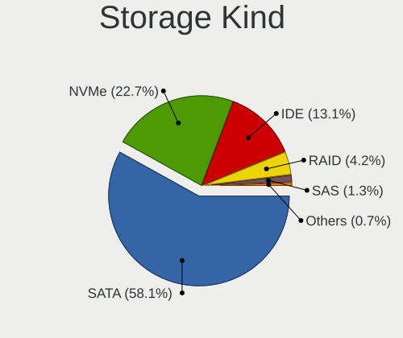

| Kind | Computers | Percent |
|------|-----------|---------|
| SATA | 705       | 58.07%  |
| NVMe | 275       | 22.65%  |
| IDE  | 159       | 13.1%   |
| RAID | 51        | 4.2%    |
| SAS  | 16        | 1.32%   |
| SCSI | 8         | 0.66%   |

Processor
---------

CPU Vendor
----------

Processor vendors

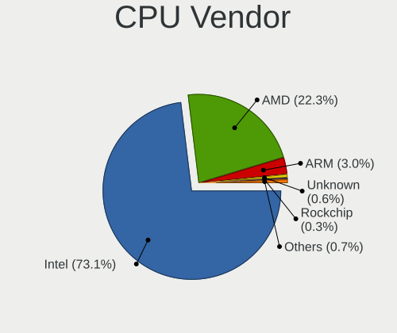

| Vendor             | Computers | Percent |
|--------------------|-----------|---------|
| Intel              | 719       | 73.07%  |
| AMD                | 219       | 22.26%  |
| ARM                | 30        | 3.05%   |
| Unknown            | 6         | 0.61%   |
| Rockchip           | 3         | 0.3%    |
| PowerPC            | 2         | 0.2%    |
| VIA                | 1         | 0.1%    |
| MIPS               | 1         | 0.1%    |
| Baikal Electronics | 1         | 0.1%    |
| 7447A              | 1         | 0.1%    |
| 11th               | 1         | 0.1%    |

CPU Model
---------

Processor models

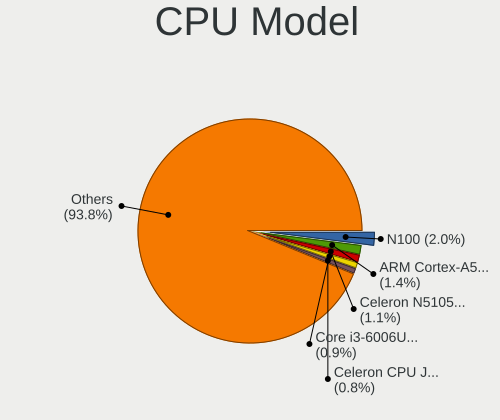

| Model                                   | Computers | Percent |
|-----------------------------------------|-----------|---------|
| Intel N100                              | 20        | 2%      |
| ARM Cortex-A55 r2p0                     | 14        | 1.4%    |
| Intel Celeron N5105 @ 2.00GHz           | 11        | 1.1%    |
| Intel Core i3-6006U CPU @ 2.00GHz       | 9         | 0.9%    |
| Intel Celeron CPU J1800 @ 2.41GHz       | 8         | 0.8%    |
| Intel Celeron CPU J1900 @ 1.99GHz       | 7         | 0.7%    |
| Intel Celeron CPU 1037U @ 1.80GHz       | 7         | 0.7%    |
| AMD Ryzen 5 3600 6-Core Processor       | 7         | 0.7%    |
| Intel Celeron J4125 CPU @ 2.00GHz       | 6         | 0.6%    |
| AMD Ryzen 7 5825U with Radeon Graphics  | 6         | 0.6%    |
| AMD Ryzen 5 5600G with Radeon Graphics  | 6         | 0.6%    |
|                                         | 6         | 0.6%    |
| Intel Pentium Gold G5400 CPU @ 3.70GHz  | 5         | 0.5%    |
| Intel Core i7-3770 CPU @ 3.40GHz        | 5         | 0.5%    |
| Intel Core 2 Quad CPU Q6600 @ 2.40GHz   | 5         | 0.5%    |
| Intel Celeron N5100 @ 1.10GHz           | 5         | 0.5%    |
| Intel Celeron CPU N3350 @ 1.10GHz       | 5         | 0.5%    |
| Intel 686-class                         | 5         | 0.5%    |
| Intel 11th Gen Core i5-1135G7 @ 2.40GHz | 5         | 0.5%    |
| ARM Cortex-A57 r1p3                     | 5         | 0.5%    |
| ARM Cortex-A53 r0p4                     | 5         | 0.5%    |
| Intel Xeon CPU E5645 @ 2.40GHz          | 4         | 0.4%    |
| Intel Xeon CPU E5606 @ 2.13GHz          | 4         | 0.4%    |
| Intel Pentium CPU N3700 @ 1.60GHz       | 4         | 0.4%    |
| Intel CPU Version                       | 4         | 0.4%    |
| Intel Core i7-8565U CPU @ 1.80GHz       | 4         | 0.4%    |
| Intel Core i5-8350U CPU @ 1.70GHz       | 4         | 0.4%    |
| Intel Core i5-7400 CPU @ 3.00GHz        | 4         | 0.4%    |
| Intel Core i5-7200U CPU @ 2.50GHz       | 4         | 0.4%    |
| Intel Core i5-3470 CPU @ 3.20GHz        | 4         | 0.4%    |
| Intel Core i5-10400 CPU @ 2.90GHz       | 4         | 0.4%    |
| Intel Core i3-8100 CPU @ 3.60GHz        | 4         | 0.4%    |
| Intel Core i3-6100 CPU @ 3.70GHz        | 4         | 0.4%    |
| Intel Core i3-4130 CPU @ 3.40GHz        | 4         | 0.4%    |
| Intel Core i3-2100 CPU @ 3.10GHz        | 4         | 0.4%    |
| Intel 12th Gen Core i3-12100            | 4         | 0.4%    |
| AMD GX-412TC SOC                        | 4         | 0.4%    |
| Intel Xeon CPU X3450 @ 2.67GHz          | 3         | 0.3%    |
| Intel Xeon CPU E5-2620 v4 @ 2.10GHz     | 3         | 0.3%    |
| Intel Xeon CPU E3-1265L V2 @ 2.50GHz    | 3         | 0.3%    |

CPU Model Family
----------------

Processor model prefix

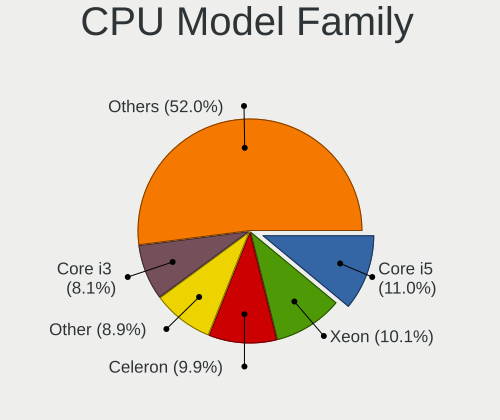

| Model                   | Computers | Percent |
|-------------------------|-----------|---------|
| Intel Core i5           | 109       | 11.01%  |
| Intel Xeon              | 100       | 10.1%   |
| Intel Celeron           | 98        | 9.9%    |
| Other                   | 88        | 8.89%   |
| Intel Core i3           | 80        | 8.08%   |
| Intel Core i7           | 63        | 6.36%   |
| AMD Ryzen 5             | 47        | 4.75%   |
| AMD Ryzen 7             | 46        | 4.65%   |
| Intel Atom              | 38        | 3.84%   |
| Intel Pentium           | 32        | 3.23%   |
| Intel Core 2 Duo        | 32        | 3.23%   |
| ARM Cortex              | 30        | 3.03%   |
| AMD Ryzen 3             | 17        | 1.72%   |
| Intel Core 2 Quad       | 14        | 1.41%   |
| AMD Ryzen 9             | 13        | 1.31%   |
| Intel Genuine           | 11        | 1.11%   |
| AMD FX                  | 10        | 1.01%   |
| Intel Pentium Dual-Core | 9         | 0.91%   |
| Intel Pentium Gold      | 8         | 0.81%   |
| AMD E                   | 8         | 0.81%   |
| Intel Pentium 4         | 7         | 0.71%   |
| AMD A6                  | 7         | 0.71%   |
| Intel Xeon Gold         | 6         | 0.61%   |
| AMD Phenom II X4        | 6         | 0.61%   |
| AMD GX                  | 6         | 0.61%   |
| Intel Pentium Silver    | 5         | 0.51%   |
| Intel Pentium M         | 5         | 0.51%   |
| Intel 686-class         | 5         | 0.51%   |
| AMD Ryzen 7 PRO         | 5         | 0.51%   |
| AMD Ryzen 5 PRO         | 5         | 0.51%   |
| AMD A10                 | 5         | 0.51%   |
| Intel Pentium D         | 4         | 0.4%    |
| Intel Core i9           | 4         | 0.4%    |
| AMD Athlon 64 X2        | 4         | 0.4%    |
| Intel Xeon Silver       | 3         | 0.3%    |
| Intel Pentium Dual      | 3         | 0.3%    |
| Intel Core 2            | 3         | 0.3%    |
| Intel Core              | 3         | 0.3%    |
| AMD Sempron             | 3         | 0.3%    |
| AMD Phenom II X6        | 3         | 0.3%    |

CPU Cores
---------

Number of processor cores

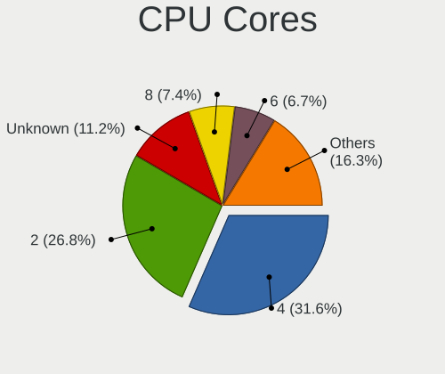

| Number  | Computers | Percent |
|---------|-----------|---------|
| 4       | 314       | 31.56%  |
| 2       | 267       | 26.83%  |
| Unknown | 111       | 11.16%  |
| 8       | 74        | 7.44%   |
| 6       | 67        | 6.73%   |
| 16      | 49        | 4.92%   |
| 12      | 44        | 4.42%   |
| 1       | 31        | 3.12%   |
| 24      | 9         | 0.9%    |
| 32      | 4         | 0.4%    |
| 28      | 4         | 0.4%    |
| 10      | 4         | 0.4%    |
| 48      | 3         | 0.3%    |
| 14      | 3         | 0.3%    |
| 36      | 2         | 0.2%    |
| 20      | 2         | 0.2%    |
| 18      | 2         | 0.2%    |
| 3       | 2         | 0.2%    |
| 40      | 1         | 0.1%    |
| 22      | 1         | 0.1%    |
| 7       | 1         | 0.1%    |

CPU Sockets
-----------

Number of sockets

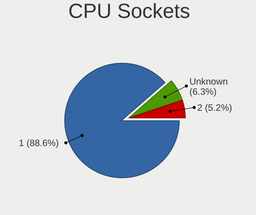

| Number  | Computers | Percent |
|---------|-----------|---------|
| 1       | 876       | 88.57%  |
| Unknown | 62        | 6.27%   |
| 2       | 51        | 5.16%   |

CPU Threads
-----------

Threads per core (Hyper-Threading)

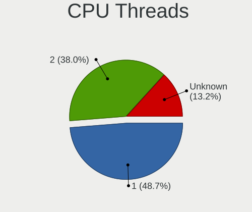

| Number  | Computers | Percent |
|---------|-----------|---------|
| 1       | 486       | 48.75%  |
| 2       | 379       | 38.01%  |
| Unknown | 132       | 13.24%  |

CPU Microarch
-------------

Microarchitecture

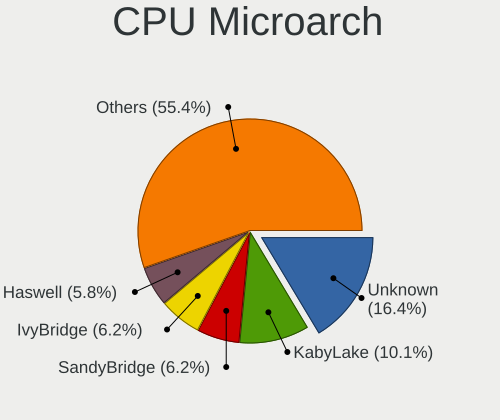

| Name          | Computers | Percent |
|---------------|-----------|---------|
| Unknown       | 162       | 16.4%   |
| KabyLake      | 100       | 10.12%  |
| SandyBridge   | 61        | 6.17%   |
| IvyBridge     | 61        | 6.17%   |
| Haswell       | 57        | 5.77%   |
| Penryn        | 51        | 5.16%   |
| Skylake       | 45        | 4.55%   |
| Silvermont    | 44        | 4.45%   |
| Zen 3         | 40        | 4.05%   |
| Zen 2         | 34        | 3.44%   |
| Core          | 29        | 2.94%   |
| Bonnell       | 28        | 2.83%   |
| Westmere      | 26        | 2.63%   |
| K10           | 23        | 2.33%   |
| Broadwell     | 22        | 2.23%   |
| Zen+          | 20        | 2.02%   |
| Goldmont      | 20        | 2.02%   |
| CometLake     | 20        | 2.02%   |
| Nehalem       | 16        | 1.62%   |
| Zen           | 15        | 1.52%   |
| TigerLake     | 15        | 1.52%   |
| Piledriver    | 14        | 1.42%   |
| P6            | 14        | 1.42%   |
| NetBurst      | 14        | 1.42%   |
| Goldmont plus | 12        | 1.21%   |
| K8 Hammer     | 8         | 0.81%   |
| Jaguar        | 7         | 0.71%   |
| Bobcat        | 7         | 0.71%   |
| Puma          | 6         | 0.61%   |
| Excavator     | 5         | 0.51%   |
| Steamroller   | 4         | 0.4%    |
| Bulldozer     | 4         | 0.4%    |
| K10 Llano     | 2         | 0.2%    |
| IceLake       | 1         | 0.1%    |
| Geode         | 1         | 0.1%    |

Graphics
--------

GPU Vendor
----------

Vendors of graphics cards

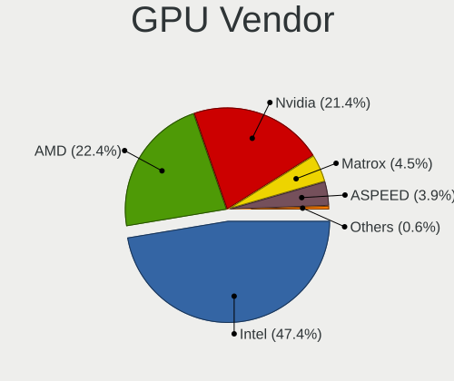

| Vendor                                       | Computers | Percent |
|----------------------------------------------|-----------|---------|
| Intel                                        | 479       | 47.38%  |
| AMD                                          | 226       | 22.35%  |
| Nvidia                                       | 216       | 21.36%  |
| Matrox Electronics Systems                   | 45        | 4.45%   |
| ASPEED Technology                            | 39        | 3.86%   |
| VIA Technologies                             | 2         | 0.2%    |
| XGI Technology (eXtreme Graphics Innovation) | 1         | 0.1%    |
| RDC Semiconductor                            | 1         | 0.1%    |
| Cirrus Logic                                 | 1         | 0.1%    |
| ATI                                          | 1         | 0.1%    |

GPU Model
---------

Graphics card models

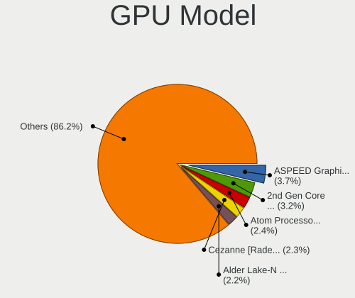

| Model                                                                                    | Computers | Percent |
|------------------------------------------------------------------------------------------|-----------|---------|
| ASPEED Technology ASPEED Graphics Family                                                 | 39        | 3.74%   |
| Intel 2nd Generation Core Processor Family Integrated Graphics Controller                | 33        | 3.16%   |
| Intel Atom Processor Z36xxx/Z37xxx Series Graphics & Display                             | 25        | 2.4%    |
| AMD Cezanne [Radeon Vega Series / Radeon Vega Mobile Series]                             | 24        | 2.3%    |
| Intel Alder Lake-N [UHD Graphics]                                                        | 23        | 2.21%   |
| Intel 3rd Gen Core processor Graphics Controller                                         | 21        | 2.01%   |
| Intel JasperLake [UHD Graphics]                                                          | 18        | 1.73%   |
| Intel Xeon E3-1200 v3/4th Gen Core Processor Integrated Graphics Controller              | 17        | 1.63%   |
| Matrox Electronics Systems MGA G200e [Pilot] ServerEngines (SEP1)                        | 16        | 1.53%   |
| Intel CoffeeLake-S GT2 [UHD Graphics 630]                                                | 15        | 1.44%   |
| AMD Renoir [Radeon Vega Series / Radeon Vega Mobile Series]                              | 15        | 1.44%   |
| AMD Ellesmere [Radeon RX 470/480/570/570X/580/580X/590]                                  | 14        | 1.34%   |
| Nvidia GK208B [GeForce GT 710]                                                           | 13        | 1.25%   |
| Intel Atom/Celeron/Pentium Processor x5-E8000/J3xxx/N3xxx Integrated Graphics Controller | 13        | 1.25%   |
| Intel Atom Processor D4xx/D5xx/N4xx/N5xx Integrated Graphics Controller                  | 13        | 1.25%   |
| Matrox Electronics Systems MGA G200eW WPCM450                                            | 12        | 1.15%   |
| Intel Skylake-U GT2 [HD Graphics 520]                                                    | 12        | 1.15%   |
| AMD Picasso/Raven 2 [Radeon Vega Series / Radeon Vega Mobile Series]                     | 12        | 1.15%   |
| Intel Xeon E3-1200 v2/3rd Gen Core processor Graphics Controller                         | 11        | 1.05%   |
| Intel TigerLake-LP GT2 [Iris Xe Graphics]                                                | 11        | 1.05%   |
| AMD Rembrandt [Radeon 680M]                                                              | 11        | 1.05%   |
| Nvidia GP107 [GeForce GTX 1050 Ti]                                                       | 10        | 0.96%   |
| Intel Skylake-S GT2 [HD Graphics 530]                                                    | 10        | 0.96%   |
| Intel Kaby Lake-R GT2 [UHD Graphics 620]                                                 | 10        | 0.96%   |
| Intel Apollo Lake GT1 [HD Graphics 500]                                                  | 10        | 0.96%   |
| Intel Mobile 4 Series Chipset Integrated Graphics Controller                             | 9         | 0.86%   |
| Intel Haswell-ULT Integrated Graphics Controller                                         | 9         | 0.86%   |
| Intel CometLake-S GT2 [UHD Graphics 630]                                                 | 9         | 0.86%   |
| Intel 4 Series Chipset Integrated Graphics Controller                                    | 9         | 0.86%   |
| AMD Barcelo                                                                              | 9         | 0.86%   |
| Matrox Electronics Systems MGA G200EH                                                    | 8         | 0.77%   |
| Intel WhiskeyLake-U GT2 [UHD Graphics 620]                                               | 8         | 0.77%   |
| Intel GeminiLake [UHD Graphics 600]                                                      | 8         | 0.77%   |
| Intel CoffeeLake-S GT1 [UHD Graphics 610]                                                | 8         | 0.77%   |
| Intel Atom Processor D2xxx/N2xxx Integrated Graphics Controller                          | 8         | 0.77%   |
| Intel Alder Lake-S GT1 [UHD Graphics 730]                                                | 8         | 0.77%   |
| AMD ES1000                                                                               | 8         | 0.77%   |
| Nvidia GP108 [GeForce GT 1030]                                                           | 7         | 0.67%   |
| Nvidia GK208B [GeForce GT 730]                                                           | 7         | 0.67%   |
| Intel Mobile 945GM/GMS/GME, 943/940GML Express Integrated Graphics Controller            | 7         | 0.67%   |

GPU Combo
---------

Combinations of graphics cards

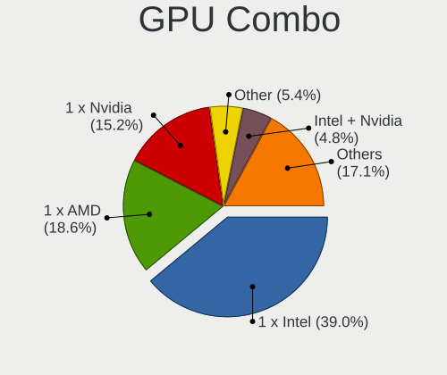

| Name                     | Computers | Percent |
|--------------------------|-----------|---------|
| 1 x Intel                | 385       | 38.97%  |
| 1 x AMD                  | 184       | 18.62%  |
| 1 x Nvidia               | 150       | 15.18%  |
| Other                    | 53        | 5.36%   |
| Intel + Nvidia           | 47        | 4.76%   |
| 1 x Matrox               | 44        | 4.45%   |
| 1 x ASPEED               | 38        | 3.85%   |
| 2 x Intel                | 37        | 3.74%   |
| 2 x AMD                  | 17        | 1.72%   |
| AMD + Nvidia             | 15        | 1.52%   |
| Intel + AMD              | 10        | 1.01%   |
| 1 x VIA                  | 2         | 0.2%    |
| 1 x XGI                  | 1         | 0.1%    |
| 1 x RDC Semiconductor    | 1         | 0.1%    |
| Nvidia + Matrox          | 1         | 0.1%    |
| Nvidia + ASPEED          | 1         | 0.1%    |
| Intel + AMD + 1 x Nvidia | 1         | 0.1%    |
| 1 x Cirrus Logic         | 1         | 0.1%    |

GPU Driver
----------

Free vs proprietary

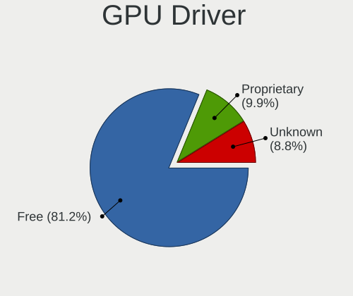

| Driver      | Computers | Percent |
|-------------|-----------|---------|
| Free        | 808       | 81.21%  |
| Proprietary | 99        | 9.95%   |
| Unknown     | 88        | 8.84%   |

GPU Memory
----------

Total video memory

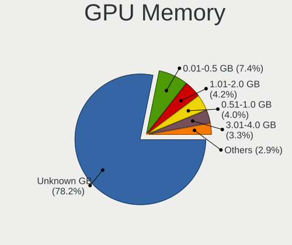

| Size in GB | Computers | Percent |
|------------|-----------|---------|
| Unknown    | 781       | 78.18%  |
| 0.01-0.5   | 74        | 7.41%   |
| 1.01-2.0   | 42        | 4.2%    |
| 0.51-1.0   | 40        | 4%      |
| 3.01-4.0   | 33        | 3.3%    |
| 7.01-8.0   | 12        | 1.2%    |
| 5.01-6.0   | 8         | 0.8%    |
| 8.01-16.0  | 5         | 0.5%    |
| 2.01-3.0   | 3         | 0.3%    |
| 16.01-24.0 | 1         | 0.1%    |

Monitor
-------

Monitor Vendor
--------------

Monitor vendors

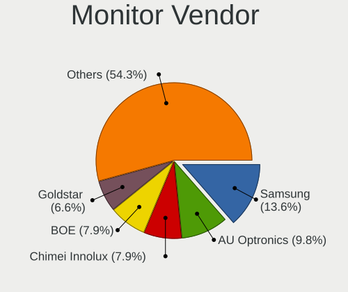

| Vendor                  | Computers | Percent |
|-------------------------|-----------|---------|
| Samsung Electronics     | 62        | 13.57%  |
| AU Optronics            | 45        | 9.85%   |
| Chimei Innolux          | 36        | 7.88%   |
| BOE                     | 36        | 7.88%   |
| Goldstar                | 30        | 6.56%   |
| LG Display              | 25        | 5.47%   |
| Dell                    | 22        | 4.81%   |
| Acer                    | 20        | 4.38%   |
| ViewSonic               | 19        | 4.16%   |
| Philips                 | 17        | 3.72%   |
| BenQ                    | 14        | 3.06%   |
| Ancor Communications    | 13        | 2.84%   |
| AOC                     | 11        | 2.41%   |
| NEC Computers           | 10        | 2.19%   |
| Hewlett-Packard         | 9         | 1.97%   |
| Apple                   | 7         | 1.53%   |
| InfoVision              | 6         | 1.31%   |
| Sony                    | 5         | 1.09%   |
| Chi Mei Optoelectronics | 5         | 1.09%   |
| Mi                      | 4         | 0.88%   |
| LG Philips              | 4         | 0.88%   |
| LG Electronics          | 4         | 0.88%   |
| Lenovo                  | 4         | 0.88%   |
| HKC                     | 4         | 0.88%   |
| RTK                     | 3         | 0.66%   |
| CSO                     | 3         | 0.66%   |
| ASUSTek Computer        | 3         | 0.66%   |
| TMX                     | 2         | 0.44%   |
| SKG                     | 2         | 0.44%   |
| PANDA                   | 2         | 0.44%   |
| Panasonic               | 2         | 0.44%   |
| IPS                     | 2         | 0.44%   |
| Iiyama                  | 2         | 0.44%   |
| HannStar                | 2         | 0.44%   |
| Fujitsu Siemens         | 2         | 0.44%   |
| VIE                     | 1         | 0.22%   |
| Unknown (CDD)           | 1         | 0.22%   |
| Toshiba                 | 1         | 0.22%   |
| STN                     | 1         | 0.22%   |
| Sharp                   | 1         | 0.22%   |

Monitor Model
-------------

Monitor models

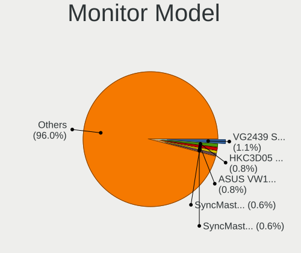

| Model                                                                    | Computers | Percent |
|--------------------------------------------------------------------------|-----------|---------|
| ViewSonic VG2439 Series VSCD22B 1920x1080 520x290mm 23.4-inch            | 5         | 1.06%   |
| HKC LCD Monitor HKC3D05 1920x1080 340x190mm 15.3-inch                    | 4         | 0.85%   |
| Ancor Communications ASUS VW199 ACI19ED 1440x900 410x260mm 19.1-inch     | 4         | 0.85%   |
| Samsung Electronics SyncMaster SAM03CF 1280x1024 340x270mm 17.1-inch     | 3         | 0.64%   |
| Samsung Electronics SyncMaster SAM026F 1280x1024 380x300mm 19.1-inch     | 3         | 0.64%   |
| Samsung Electronics LCD Monitor SEC3245 1366x768 340x190mm 15.3-inch     | 3         | 0.64%   |
| Philips 170S PHL0839 1280x1024 340x270mm 17.1-inch                       | 3         | 0.64%   |
| Goldstar 22MP55 GSM5A26 1920x1080 480x270mm 21.7-inch                    | 3         | 0.64%   |
| Dell U2412M DELA07A 1920x1200 520x320mm 24.0-inch                        | 3         | 0.64%   |
| Chimei Innolux LCD Monitor CMN15D5 1920x1080 340x190mm 15.3-inch         | 3         | 0.64%   |
| ViewSonic VG2239 Series VSCC42B 1920x1080 480x270mm 21.7-inch            | 2         | 0.42%   |
| SKG AF24H1 SKG2428 1920x1080 530x300mm 24.0-inch                         | 2         | 0.42%   |
| Samsung Electronics SyncMaster SAM027D 1680x1050 430x270mm 20.0-inch     | 2         | 0.42%   |
| Samsung Electronics SME1920NR SAM06A4 1280x1024 380x300mm 19.1-inch      | 2         | 0.42%   |
| Samsung Electronics SMBX2250 SAM071B 1920x1080 480x270mm 21.7-inch       | 2         | 0.42%   |
| Samsung Electronics S22B300 SAM08AC 1920x1080 480x270mm 21.7-inch        | 2         | 0.42%   |
| Samsung Electronics LCD Monitor SEC3030 1024x600 220x130mm 10.1-inch     | 2         | 0.42%   |
| Samsung Electronics LCD Monitor SAM0AC6 1920x1080 1110x620mm 50.1-inch   | 2         | 0.42%   |
| RTK WCS Display RTK1A1B 1920x1080 344x195mm 15.6-inch                    | 2         | 0.42%   |
| Philips PHL 240V5 PHLC10A 1920x1080 530x300mm 24.0-inch                  | 2         | 0.42%   |
| Philips PHL 223V5 PHLC0CF 1920x1080 480x270mm 21.7-inch                  | 2         | 0.42%   |
| Philips LCD Monitor PHL BDM3470UP 3440x1440                              | 2         | 0.42%   |
| NEC Computers LCD1970NXp NEC668E 1280x1024 380x300mm 19.1-inch           | 2         | 0.42%   |
| NEC Computers FE791SB NEC61D7 1600x1200 330x240mm 16.1-inch              | 2         | 0.42%   |
| LG Display LCD Monitor LGD062E 1920x1080 340x190mm 15.3-inch             | 2         | 0.42%   |
| IPS HDMI IPS2380 1920x1080 520x290mm 23.4-inch                           | 2         | 0.42%   |
| HannStar LCD Monitor HSD03E9 1024x600 220x130mm 10.1-inch                | 2         | 0.42%   |
| Goldstar W1934 GSM4B7A 1440x900 410x260mm 19.1-inch                      | 2         | 0.42%   |
| Goldstar LG Ultra HD GSM5B09 3840x2160 600x340mm 27.2-inch               | 2         | 0.42%   |
| Goldstar LG IPS FULLHD GSM5AB6 1920x1080 480x270mm 21.7-inch             | 2         | 0.42%   |
| Goldstar LG FULL HD GSM5B55 1920x1080 480x270mm 21.7-inch                | 2         | 0.42%   |
| Dell U2412M DELA07B 1920x1200 520x320mm 24.0-inch                        | 2         | 0.42%   |
| Chimei Innolux LCD Monitor CMN15F5 1920x1080 340x190mm 15.3-inch         | 2         | 0.42%   |
| Chimei Innolux LCD Monitor CMN15E8 1920x1080 340x190mm 15.3-inch         | 2         | 0.42%   |
| Chimei Innolux LCD Monitor CMN15DB 1366x768 340x190mm 15.3-inch          | 2         | 0.42%   |
| Chimei Innolux LCD Monitor CMN1521 1920x1080 340x190mm 15.3-inch         | 2         | 0.42%   |
| Chimei Innolux LCD Monitor CMN14D4 1920x1080 310x170mm 13.9-inch         | 2         | 0.42%   |
| Chi Mei Optoelectronics LCD Monitor CMO1457 1366x768 310x170mm 13.9-inch | 2         | 0.42%   |
| BOE LCD Monitor BOE0AC1 2560x1600 340x210mm 15.7-inch                    | 2         | 0.42%   |
| BOE LCD Monitor BOE0877 1920x1080 310x170mm 13.9-inch                    | 2         | 0.42%   |

Monitor Resolution
------------------

Monitor screen resolution

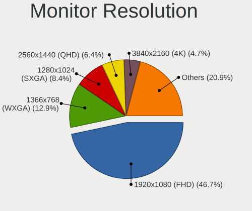

| Resolution         | Computers | Percent |
|--------------------|-----------|---------|
| 1920x1080 (FHD)    | 210       | 46.67%  |
| 1366x768 (WXGA)    | 58        | 12.89%  |
| 1280x1024 (SXGA)   | 38        | 8.44%   |
| 2560x1440 (QHD)    | 29        | 6.44%   |
| 3840x2160 (4K)     | 21        | 4.67%   |
| 1600x900 (HD+)     | 14        | 3.11%   |
| 1440x900 (WXGA+)   | 14        | 3.11%   |
| 1920x1200 (WUXGA)  | 12        | 2.67%   |
| 1680x1050 (WSXGA+) | 11        | 2.44%   |
| 1280x800 (WXGA)    | 10        | 2.22%   |
| 2560x1600          | 7         | 1.56%   |
| 1024x600           | 5         | 1.11%   |
| Unknown            | 3         | 0.67%   |
| 3440x1440          | 2         | 0.44%   |
| 2880x1800          | 2         | 0.44%   |
| 2560x1080          | 2         | 0.44%   |
| 1600x1200          | 2         | 0.44%   |
| 1024x768 (XGA)     | 2         | 0.44%   |
| 3200x1800 (QHD+)   | 1         | 0.22%   |
| 2944x1080          | 1         | 0.22%   |
| 2520x1680          | 1         | 0.22%   |
| 2240x1400          | 1         | 0.22%   |
| 2160x1440          | 1         | 0.22%   |
| 2160x1350          | 1         | 0.22%   |
| 1920x540           | 1         | 0.22%   |
| 1360x768           | 1         | 0.22%   |

Monitor Diagonal
----------------

Diagonal size in inches

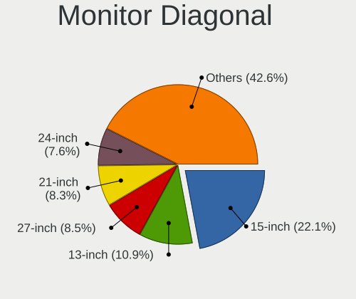

| Inches  | Computers | Percent |
|---------|-----------|---------|
| 15      | 101       | 22.05%  |
| 13      | 50        | 10.92%  |
| 27      | 39        | 8.52%   |
| 21      | 38        | 8.3%    |
| 24      | 35        | 7.64%   |
| 17      | 31        | 6.77%   |
| 19      | 30        | 6.55%   |
| 23      | 28        | 6.11%   |
| Unknown | 25        | 5.46%   |
| 14      | 11        | 2.4%    |
| 12      | 9         | 1.97%   |
| 11      | 9         | 1.97%   |
| 31      | 7         | 1.53%   |
| 18      | 7         | 1.53%   |
| 16      | 7         | 1.53%   |
| 22      | 6         | 1.31%   |
| 10      | 6         | 1.31%   |
| 20      | 5         | 1.09%   |
| 52      | 2         | 0.44%   |
| 50      | 2         | 0.44%   |
| 34      | 2         | 0.44%   |
| 57      | 1         | 0.22%   |
| 55      | 1         | 0.22%   |
| 54      | 1         | 0.22%   |
| 48      | 1         | 0.22%   |
| 46      | 1         | 0.22%   |
| 40      | 1         | 0.22%   |
| 32      | 1         | 0.22%   |
| 26      | 1         | 0.22%   |

Monitor Width
-------------

Physical width

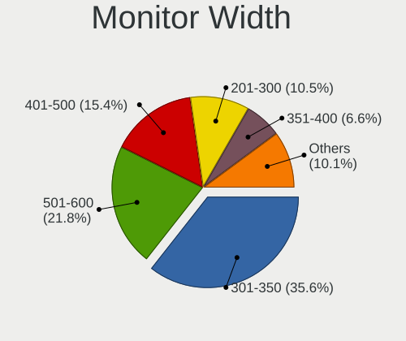

| Width in mm | Computers | Percent |
|-------------|-----------|---------|
| 301-350     | 162       | 35.6%   |
| 501-600     | 99        | 21.76%  |
| 401-500     | 70        | 15.38%  |
| 201-300     | 48        | 10.55%  |
| 351-400     | 30        | 6.59%   |
| Unknown     | 25        | 5.49%   |
| 1001-1500   | 9         | 1.98%   |
| 601-700     | 8         | 1.76%   |
| 701-800     | 3         | 0.66%   |
| 801-900     | 1         | 0.22%   |

Aspect Ratio
------------

Proportional relationship between the width and the height

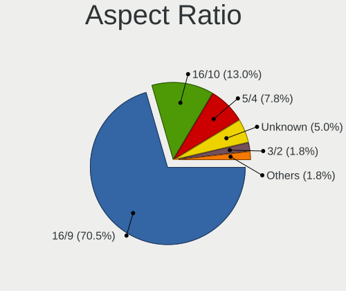

| Ratio   | Computers | Percent |
|---------|-----------|---------|
| 16/9    | 309       | 70.55%  |
| 16/10   | 57        | 13.01%  |
| 5/4     | 34        | 7.76%   |
| Unknown | 22        | 5.02%   |
| 3/2     | 8         | 1.83%   |
| 4/3     | 5         | 1.14%   |
| 21/9    | 2         | 0.46%   |
| 6/5     | 1         | 0.23%   |

Monitor Area
------------

Area in inch²

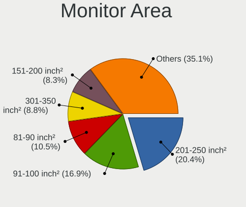

| Area in inch² | Computers | Percent |
|----------------|-----------|---------|
| 201-250        | 93        | 20.39%  |
| 91-100         | 77        | 16.89%  |
| 81-90          | 48        | 10.53%  |
| 301-350        | 40        | 8.77%   |
| 151-200        | 38        | 8.33%   |
| 141-150        | 26        | 5.7%    |
| Unknown        | 25        | 5.48%   |
| 101-110        | 20        | 4.39%   |
| 71-80          | 11        | 2.41%   |
| 121-130        | 11        | 2.41%   |
| 111-120        | 11        | 2.41%   |
| 351-500        | 10        | 2.19%   |
| 251-300        | 10        | 2.19%   |
| 61-70          | 9         | 1.97%   |
| More than 1000 | 8         | 1.75%   |
| 51-60          | 8         | 1.75%   |
| 41-50          | 6         | 1.32%   |
| 131-140        | 3         | 0.66%   |
| 501-1000       | 2         | 0.44%   |

Pixel Density
-------------

Pixels per inch

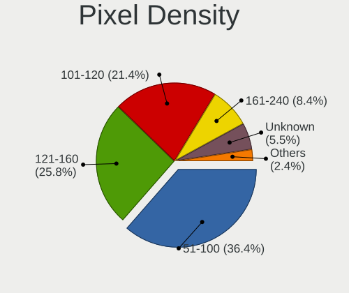

| Density       | Computers | Percent |
|---------------|-----------|---------|
| 51-100        | 165       | 36.42%  |
| 121-160       | 117       | 25.83%  |
| 101-120       | 97        | 21.41%  |
| 161-240       | 38        | 8.39%   |
| Unknown       | 25        | 5.52%   |
| 1-50          | 7         | 1.55%   |
| More than 240 | 4         | 0.88%   |

Multiple Monitors
-----------------

Total monitors connected

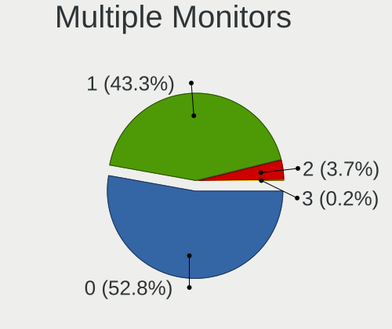

| Total | Computers | Percent |
|-------|-----------|---------|
| 0     | 532       | 52.83%  |
| 1     | 436       | 43.3%   |
| 2     | 37        | 3.67%   |
| 3     | 2         | 0.2%    |

Network
-------

Net Controller Vendor
---------------------

Controller vendors

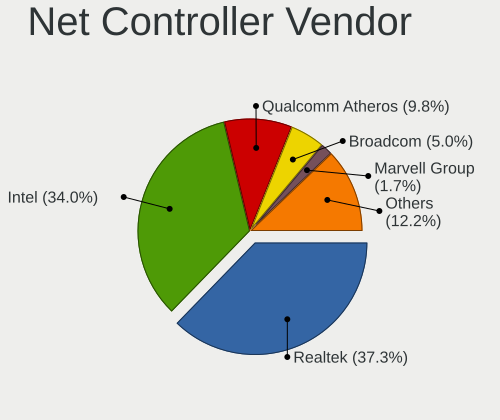

| Vendor                            | Computers | Percent |
|-----------------------------------|-----------|---------|
| Realtek Semiconductor             | 518       | 37.27%  |
| Intel                             | 473       | 34.03%  |
| Qualcomm Atheros                  | 136       | 9.78%   |
| Broadcom                          | 70        | 5.04%   |
| Marvell Technology Group          | 24        | 1.73%   |
| D-Link System                     | 14        | 1.01%   |
| MediaTek                          | 13        | 0.94%   |
| TP-Link                           | 12        | 0.86%   |
| Huawei Technologies               | 10        | 0.72%   |
| Ralink Technology                 | 9         | 0.65%   |
| Mellanox Technologies             | 9         | 0.65%   |
| VIA Technologies                  | 8         | 0.58%   |
| Samsung Electronics               | 8         | 0.58%   |
| Ralink                            | 6         | 0.43%   |
| Xiaomi                            | 5         | 0.36%   |
| 3Com                              | 5         | 0.36%   |
| ZTE WCDMA Technologies MSM        | 3         | 0.22%   |
| OPPO Electronics                  | 3         | 0.22%   |
| Nvidia                            | 3         | 0.22%   |
| JMicron Technology                | 3         | 0.22%   |
| IMC Networks                      | 3         | 0.22%   |
| D-Link                            | 3         | 0.22%   |
| Aquantia                          | 3         | 0.22%   |
| STMicroelectronics                | 2         | 0.14%   |
| Silicon Integrated Systems [SiS]  | 2         | 0.14%   |
| Qualcomm Atheros Communications   | 2         | 0.14%   |
| Qualcomm                          | 2         | 0.14%   |
| QLogic                            | 2         | 0.14%   |
| QinHeng Electronics               | 2         | 0.14%   |
| Mercucys                          | 2         | 0.14%   |
| Fibocom                           | 2         | 0.14%   |
| Ericsson Business Mobile Networks | 2         | 0.14%   |
| Atmel                             | 2         | 0.14%   |
| ASUSTek Computer                  | 2         | 0.14%   |
| Arduino SA                        | 2         | 0.14%   |
| Apple                             | 2         | 0.14%   |
| American Megatrends               | 2         | 0.14%   |
| ZyXEL Communications              | 1         | 0.07%   |
| Tehuti Networks                   | 1         | 0.07%   |
| Sundance Technology Inc / IC Plus | 1         | 0.07%   |

Net Controller Model
--------------------

Controller models

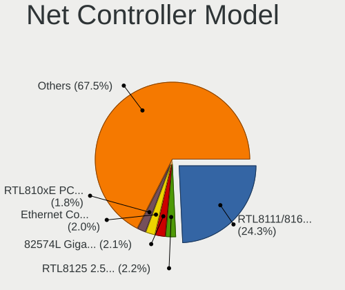

| Model                                                                         | Computers | Percent |
|-------------------------------------------------------------------------------|-----------|---------|
| Realtek RTL8111/8168/8211/8411 PCI Express Gigabit Ethernet Controller        | 395       | 24.26%  |
| Realtek RTL8125 2.5GbE Controller                                             | 36        | 2.21%   |
| Intel 82574L Gigabit Network Connection                                       | 35        | 2.15%   |
| Intel Ethernet Controller I226-V                                              | 33        | 2.03%   |
| Realtek RTL810xE PCI Express Fast Ethernet controller                         | 30        | 1.84%   |
| Intel I211 Gigabit Network Connection                                         | 30        | 1.84%   |
| Qualcomm Atheros AR9285 Wireless Network Adapter (PCI-Express)                | 27        | 1.66%   |
| Intel I350 Gigabit Network Connection                                         | 27        | 1.66%   |
| Intel Ethernet Controller I225-V                                              | 25        | 1.54%   |
| Intel Wi-Fi 6E(802.11ax) AX210/AX1675* 2x2 [Typhoon Peak]                     | 22        | 1.35%   |
| Intel I210 Gigabit Network Connection                                         | 22        | 1.35%   |
| Intel Wi-Fi 6 AX200                                                           | 19        | 1.17%   |
| Intel 82576 Gigabit Network Connection                                        | 19        | 1.17%   |
| Intel 82579LM Gigabit Network Connection (Lewisville)                         | 18        | 1.11%   |
| Intel Wireless 7265                                                           | 17        | 1.04%   |
| Realtek RTL-8100/8101L/8139 PCI Fast Ethernet Adapter                         | 16        | 0.98%   |
| Realtek RTL8821CE 802.11ac PCIe Wireless Network Adapter                      | 15        | 0.92%   |
| Qualcomm Atheros AR9485 Wireless Network Adapter                              | 14        | 0.86%   |
| Qualcomm Atheros QCA9565 / AR9565 Wireless Network Adapter                    | 13        | 0.8%    |
| Qualcomm Atheros QCA9377 802.11ac Wireless Network Adapter                    | 13        | 0.8%    |
| Intel Wireless 8265 / 8275                                                    | 13        | 0.8%    |
| Realtek RTL8188EUS 802.11n Wireless Network Adapter                           | 12        | 0.74%   |
| Intel Dual Band Wireless-AC 3168NGW [Stone Peak]                              | 11        | 0.68%   |
| Intel 82571EB/82571GB Gigabit Ethernet Controller D0/D1 (copper applications) | 11        | 0.68%   |
| Realtek RTL8852BE PCIe 802.11ax Wireless Network Controller                   | 10        | 0.61%   |
| Intel Wi-Fi 6 AX201                                                           | 10        | 0.61%   |
| Intel 82599ES 10-Gigabit SFI/SFP+ Network Connection                          | 10        | 0.61%   |
| Qualcomm Atheros AR9462 Wireless Network Adapter                              | 9         | 0.55%   |
| Qualcomm Atheros AR8151 v2.0 Gigabit Ethernet                                 | 9         | 0.55%   |
| Intel Wireless 8260                                                           | 9         | 0.55%   |
| Intel Ethernet Controller 10-Gigabit X540-AT2                                 | 9         | 0.55%   |
| Intel Ethernet Connection (2) I219-V                                          | 9         | 0.55%   |
| Broadcom NetXtreme BCM5720 Gigabit Ethernet PCIe                              | 9         | 0.55%   |
| Realtek RTL8723BE PCIe Wireless Network Adapter                               | 8         | 0.49%   |
| Realtek RTL8111/8168/8411 PCI Express Gigabit Ethernet Controller             | 8         | 0.49%   |
| Qualcomm Atheros AR8131 Gigabit Ethernet                                      | 8         | 0.49%   |
| Intel Wireless 7260                                                           | 8         | 0.49%   |
| Intel PRO/Wireless 3945ABG [Golan] Network Connection                         | 8         | 0.49%   |
| Intel Cannon Point-LP CNVi [Wireless-AC]                                      | 8         | 0.49%   |
| Intel 82583V Gigabit Network Connection                                       | 8         | 0.49%   |

Wireless Vendor
---------------

Wireless vendors

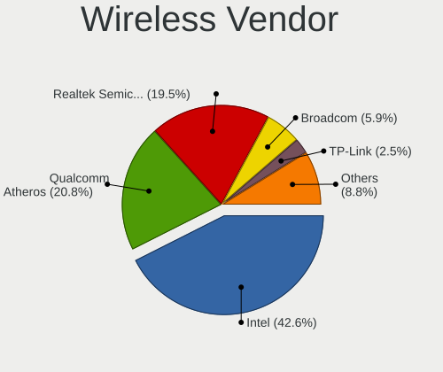

| Vendor                          | Computers | Percent |
|---------------------------------|-----------|---------|
| Intel                           | 203       | 42.56%  |
| Qualcomm Atheros                | 99        | 20.75%  |
| Realtek Semiconductor           | 93        | 19.5%   |
| Broadcom                        | 28        | 5.87%   |
| TP-Link                         | 12        | 2.52%   |
| Ralink Technology               | 9         | 1.89%   |
| MediaTek                        | 9         | 1.89%   |
| Ralink                          | 6         | 1.26%   |
| IMC Networks                    | 3         | 0.63%   |
| D-Link                          | 3         | 0.63%   |
| Qualcomm Atheros Communications | 2         | 0.42%   |
| Mercucys                        | 2         | 0.42%   |
| ASUSTek Computer                | 2         | 0.42%   |
| Qualcomm Technologies           | 1         | 0.21%   |
| Qcom                            | 1         | 0.21%   |
| Micro Star International        | 1         | 0.21%   |
| Edimax Technology               | 1         | 0.21%   |
| BUFFALO                         | 1         | 0.21%   |
| Atheros                         | 1         | 0.21%   |

Wireless Model
--------------

Wireless models

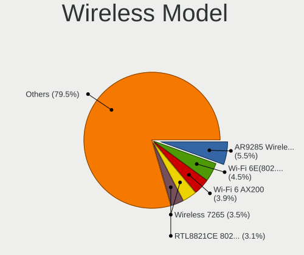

| Model                                                                   | Computers | Percent |
|-------------------------------------------------------------------------|-----------|---------|
| Qualcomm Atheros AR9285 Wireless Network Adapter (PCI-Express)          | 27        | 5.53%   |
| Intel Wi-Fi 6E(802.11ax) AX210/AX1675* 2x2 [Typhoon Peak]               | 22        | 4.51%   |
| Intel Wi-Fi 6 AX200                                                     | 19        | 3.89%   |
| Intel Wireless 7265                                                     | 17        | 3.48%   |
| Realtek RTL8821CE 802.11ac PCIe Wireless Network Adapter                | 15        | 3.07%   |
| Qualcomm Atheros AR9485 Wireless Network Adapter                        | 14        | 2.87%   |
| Qualcomm Atheros QCA9565 / AR9565 Wireless Network Adapter              | 13        | 2.66%   |
| Qualcomm Atheros QCA9377 802.11ac Wireless Network Adapter              | 13        | 2.66%   |
| Intel Wireless 8265 / 8275                                              | 13        | 2.66%   |
| Realtek RTL8188EUS 802.11n Wireless Network Adapter                     | 12        | 2.46%   |
| Intel Dual Band Wireless-AC 3168NGW [Stone Peak]                        | 11        | 2.25%   |
| Intel Wi-Fi 6 AX201                                                     | 10        | 2.05%   |
| Realtek RTL8852BE PCIe 802.11ax Wireless Network Controller             | 9         | 1.84%   |
| Qualcomm Atheros AR9462 Wireless Network Adapter                        | 9         | 1.84%   |
| Intel Wireless 8260                                                     | 9         | 1.84%   |
| Realtek RTL8723BE PCIe Wireless Network Adapter                         | 8         | 1.64%   |
| Intel Wireless 7260                                                     | 8         | 1.64%   |
| Intel PRO/Wireless 3945ABG [Golan] Network Connection                   | 8         | 1.64%   |
| Intel Cannon Point-LP CNVi [Wireless-AC]                                | 8         | 1.64%   |
| Realtek RTL8822CE 802.11ac PCIe Wireless Network Adapter                | 7         | 1.43%   |
| Qualcomm Atheros AR93xx Wireless Network Adapter                        | 7         | 1.43%   |
| Intel Alder Lake-N PCH CNVi WiFi                                        | 6         | 1.23%   |
| Realtek RTL8192CU 802.11n WLAN Adapter                                  | 5         | 1.02%   |
| Realtek RTL8188CE 802.11b/g/n WiFi Adapter                              | 5         | 1.02%   |
| Qualcomm Atheros AR928X Wireless Network Adapter (PCI-Express)          | 5         | 1.02%   |
| Intel Comet Lake PCH-LP CNVi WiFi                                       | 5         | 1.02%   |
| Intel Alder Lake-P PCH CNVi WiFi                                        | 5         | 1.02%   |
| Broadcom BCM4313 802.11bgn Wireless Network Adapter                     | 5         | 1.02%   |
| TP-Link AC600 wireless Realtek RTL8811AU [Archer T2U Nano]              | 4         | 0.82%   |
| Realtek RTL8723DE Wireless Network Adapter                              | 4         | 0.82%   |
| Realtek RTL8192EE PCIe Wireless Network Adapter                         | 4         | 0.82%   |
| Realtek Realtek Bluetooth 4.2 Adapter                                   | 4         | 0.82%   |
| Realtek Bluetooth Adapter                                               | 4         | 0.82%   |
| Realtek 8811CU Wireless LAN 802.11ac USB NIC                            | 4         | 0.82%   |
| Ralink MT7601U Wireless Adapter                                         | 4         | 0.82%   |
| Qualcomm Atheros AR242x / AR542x Wireless Network Adapter (PCI-Express) | 4         | 0.82%   |
| MediaTek MT7921K (RZ608) Wi-Fi 6E 80MHz                                 | 4         | 0.82%   |
| Intel Wireless 3165                                                     | 4         | 0.82%   |
| Intel Dual Band Wireless-AC 3165 Plus Bluetooth                         | 4         | 0.82%   |
| Intel Comet Lake PCH CNVi WiFi                                          | 4         | 0.82%   |

Ethernet Vendor
---------------

Ethernet vendors

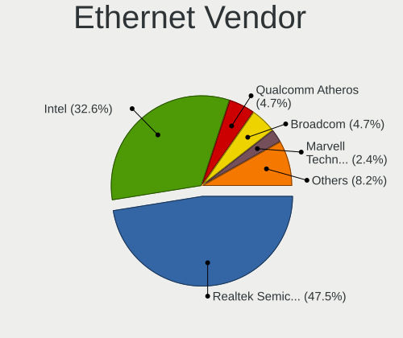

| Vendor                            | Computers | Percent |
|-----------------------------------|-----------|---------|
| Realtek Semiconductor             | 476       | 47.46%  |
| Intel                             | 327       | 32.6%   |
| Qualcomm Atheros                  | 47        | 4.69%   |
| Broadcom                          | 47        | 4.69%   |
| Marvell Technology Group          | 24        | 2.39%   |
| D-Link System                     | 14        | 1.4%    |
| VIA Technologies                  | 8         | 0.8%    |
| Samsung Electronics               | 8         | 0.8%    |
| Xiaomi                            | 5         | 0.5%    |
| 3Com                              | 5         | 0.5%    |
| MediaTek                          | 4         | 0.4%    |
| ZTE WCDMA Technologies MSM        | 3         | 0.3%    |
| OPPO Electronics                  | 3         | 0.3%    |
| Nvidia                            | 3         | 0.3%    |
| JMicron Technology                | 3         | 0.3%    |
| Aquantia                          | 3         | 0.3%    |
| Silicon Integrated Systems [SiS]  | 2         | 0.2%    |
| Qualcomm                          | 2         | 0.2%    |
| QLogic                            | 2         | 0.2%    |
| Huawei Technologies               | 2         | 0.2%    |
| Apple                             | 2         | 0.2%    |
| American Megatrends               | 2         | 0.2%    |
| Tehuti Networks                   | 1         | 0.1%    |
| Sundance Technology Inc / IC Plus | 1         | 0.1%    |
| sipeed                            | 1         | 0.1%    |
| Realtek                           | 1         | 0.1%    |
| MYRICOM                           | 1         | 0.1%    |
| Microchip Technology              | 1         | 0.1%    |
| Insyde Software                   | 1         | 0.1%    |
| IBM                               | 1         | 0.1%    |
| Attansic                          | 1         | 0.1%    |
| AMD                               | 1         | 0.1%    |
| Accton Technology                 | 1         | 0.1%    |

Ethernet Model
--------------

Ethernet models

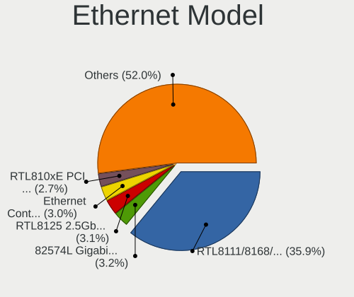

| Model                                                                         | Computers | Percent |
|-------------------------------------------------------------------------------|-----------|---------|
| Realtek RTL8111/8168/8211/8411 PCI Express Gigabit Ethernet Controller        | 395       | 35.94%  |
| Intel 82574L Gigabit Network Connection                                       | 35        | 3.18%   |
| Realtek RTL8125 2.5GbE Controller                                             | 34        | 3.09%   |
| Intel Ethernet Controller I226-V                                              | 33        | 3%      |
| Realtek RTL810xE PCI Express Fast Ethernet controller                         | 30        | 2.73%   |
| Intel I211 Gigabit Network Connection                                         | 30        | 2.73%   |
| Intel I350 Gigabit Network Connection                                         | 27        | 2.46%   |
| Intel Ethernet Controller I225-V                                              | 25        | 2.27%   |
| Intel I210 Gigabit Network Connection                                         | 22        | 2%      |
| Intel 82576 Gigabit Network Connection                                        | 19        | 1.73%   |
| Intel 82579LM Gigabit Network Connection (Lewisville)                         | 18        | 1.64%   |
| Realtek RTL-8100/8101L/8139 PCI Fast Ethernet Adapter                         | 16        | 1.46%   |
| Intel 82571EB/82571GB Gigabit Ethernet Controller D0/D1 (copper applications) | 11        | 1%      |
| Intel 82599ES 10-Gigabit SFI/SFP+ Network Connection                          | 10        | 0.91%   |
| Qualcomm Atheros AR8151 v2.0 Gigabit Ethernet                                 | 9         | 0.82%   |
| Intel Ethernet Controller 10-Gigabit X540-AT2                                 | 9         | 0.82%   |
| Intel Ethernet Connection (2) I219-V                                          | 9         | 0.82%   |
| Broadcom NetXtreme BCM5720 Gigabit Ethernet PCIe                              | 9         | 0.82%   |
| Realtek RTL8111/8168/8411 PCI Express Gigabit Ethernet Controller             | 8         | 0.73%   |
| Qualcomm Atheros AR8131 Gigabit Ethernet                                      | 8         | 0.73%   |
| Intel 82583V Gigabit Network Connection                                       | 8         | 0.73%   |
| D-Link System DGE-528T Gigabit Ethernet Adapter                               | 8         | 0.73%   |
| Qualcomm Atheros AR8152 v2.0 Fast Ethernet                                    | 7         | 0.64%   |
| Marvell Group 88E8040 PCI-E Fast Ethernet Controller                          | 7         | 0.64%   |
| Intel Ethernet Connection I217-V                                              | 7         | 0.64%   |
| Intel Ethernet Connection (7) I219-V                                          | 7         | 0.64%   |
| Intel 82579V Gigabit Network Connection                                       | 7         | 0.64%   |
| VIA VT6105/VT6106S [Rhine-III]                                                | 6         | 0.55%   |
| Marvell Group 88E8056 PCI-E Gigabit Ethernet Controller                       | 6         | 0.55%   |
| Intel Ethernet Connection I354                                                | 6         | 0.55%   |
| Intel Ethernet Connection (17) I219-V                                         | 6         | 0.55%   |
| Samsung Galaxy series, misc. (tethering mode)                                 | 5         | 0.45%   |
| Realtek RTL8169 PCI Gigabit Ethernet Controller                               | 5         | 0.45%   |
| Qualcomm Atheros Attansic L1 Gigabit Ethernet                                 | 5         | 0.45%   |
| Qualcomm Atheros AR8121/AR8113/AR8114 Gigabit or Fast Ethernet                | 5         | 0.45%   |
| Intel Ethernet Connection I219-LM                                             | 5         | 0.45%   |
| Intel Ethernet Connection (7) I219-LM                                         | 5         | 0.45%   |
| Intel Ethernet Connection (2) I219-LM                                         | 5         | 0.45%   |
| Intel 82575EB Gigabit Network Connection                                      | 5         | 0.45%   |
| Realtek USB 2.5GbE Controller                                                 | 4         | 0.36%   |

Net Controller Kind
-------------------

Ethernet, WiFi or modem

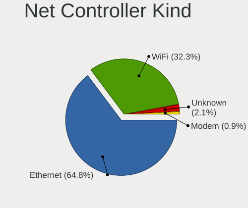

| Kind     | Computers | Percent |
|----------|-----------|---------|
| Ethernet | 881       | 64.78%  |
| WiFi     | 439       | 32.28%  |
| Unknown  | 28        | 2.06%   |
| Modem    | 12        | 0.88%   |

Used Controller
---------------

Currently used network controller

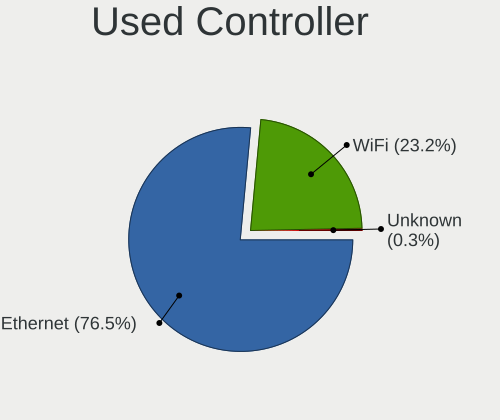

| Kind     | Computers | Percent |
|----------|-----------|---------|
| Ethernet | 712       | 76.48%  |
| WiFi     | 216       | 23.2%   |
| Unknown  | 3         | 0.32%   |

NICs
----

Total network controllers on board

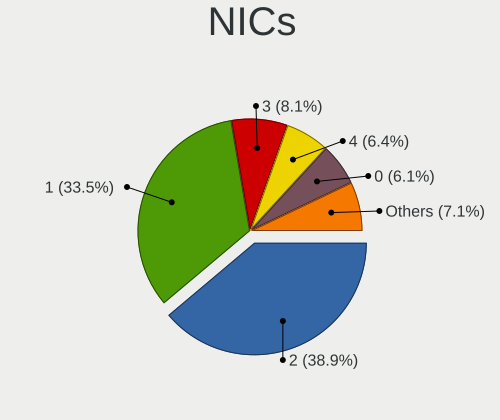

| Total | Computers | Percent |
|-------|-----------|---------|
| 2     | 389       | 38.86%  |
| 1     | 335       | 33.47%  |
| 3     | 81        | 8.09%   |
| 4     | 64        | 6.39%   |
| 0     | 61        | 6.09%   |
| 6     | 32        | 3.2%    |
| 5     | 19        | 1.9%    |
| 9     | 8         | 0.8%    |
| 7     | 6         | 0.6%    |
| 8     | 5         | 0.5%    |
| 12    | 1         | 0.1%    |

IPv6
----

IPv6 vs IPv4

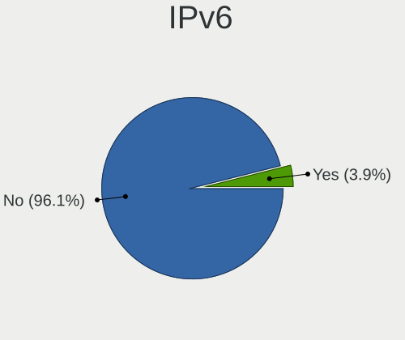

| Used | Computers | Percent |
|------|-----------|---------|
| No   | 953       | 96.07%  |
| Yes  | 39        | 3.93%   |

Bluetooth
---------

Bluetooth Vendor
----------------

Controller vendors

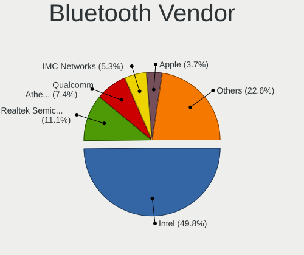

| Vendor                          | Computers | Percent |
|---------------------------------|-----------|---------|
| Intel                           | 161       | 49.85%  |
| Realtek Semiconductor           | 36        | 11.15%  |
| Qualcomm Atheros Communications | 24        | 7.43%   |
| IMC Networks                    | 17        | 5.26%   |
| Apple                           | 12        | 3.72%   |
| Foxconn / Hon Hai               | 11        | 3.41%   |
| Cambridge Silicon Radio         | 11        | 3.41%   |
| Broadcom                        | 11        | 3.41%   |
| Lite-On Technology              | 8         | 2.48%   |
| ASUSTek Computer                | 8         | 2.48%   |
| MediaTek                        | 4         | 1.24%   |
| Alps Electric                   | 4         | 1.24%   |
| Skylight Digital                | 3         | 0.93%   |
| TP-Link                         | 2         | 0.62%   |
| Ralink                          | 2         | 0.62%   |
| Hewlett-Packard                 | 2         | 0.62%   |
| Taiyo Yuden                     | 1         | 0.31%   |
| Silicon Wave                    | 1         | 0.31%   |
| Shenzhen Goodix Technology      | 1         | 0.31%   |
| Opticis                         | 1         | 0.31%   |
| Integrated System Solution      | 1         | 0.31%   |
| Edimax Technology               | 1         | 0.31%   |
| Dell                            | 1         | 0.31%   |

Bluetooth Model
---------------

Controller models

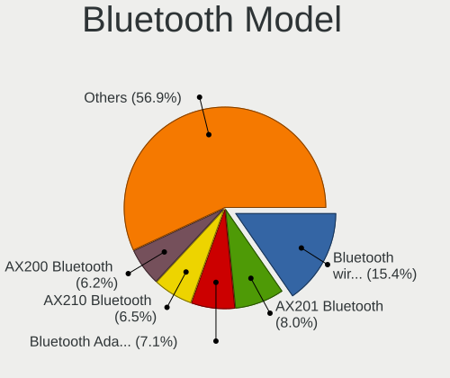

| Model                                                       | Computers | Percent |
|-------------------------------------------------------------|-----------|---------|
| Intel Bluetooth wireless interface                          | 50        | 15.38%  |
| Intel AX201 Bluetooth                                       | 26        | 8%      |
| Realtek Bluetooth Adapter                                   | 23        | 7.08%   |
| Intel AX210 Bluetooth                                       | 21        | 6.46%   |
| Intel AX200 Bluetooth                                       | 20        | 6.15%   |
| Intel Bluetooth 9460/9560 Jefferson Peak (JfP)              | 17        | 5.23%   |
| Intel Wireless-AC 3168 Bluetooth                            | 11        | 3.38%   |
| Cambridge Silicon Radio Bluetooth Dongle (HCI mode)         | 11        | 3.38%   |
| Intel AX211 Bluetooth                                       | 10        | 3.08%   |
| Qualcomm Atheros AR3012 Bluetooth 4.0                       | 7         | 2.15%   |
| IMC Networks Qualcomm Atheros Bluetooth 4.1                 | 6         | 1.85%   |
| Qualcomm Atheros QCA9377 Bluetooth 4.1                      | 5         | 1.54%   |
| Qualcomm Atheros Dell Wireless 1707 Bluetooth 4.0 LE Device | 5         | 1.54%   |
| Intel Centrino Bluetooth Wireless Transceiver               | 5         | 1.54%   |
| Apple Bluetooth Host Controller                             | 5         | 1.54%   |
| Realtek RTL8723B Bluetooth                                  | 4         | 1.23%   |
| MediaTek RZ608 Bluetooth Adapter                            | 4         | 1.23%   |
| Lite-On Atheros AR3012 Bluetooth                            | 4         | 1.23%   |
| Broadcom BCM20702 Bluetooth 4.0 [ThinkPad]                  | 4         | 1.23%   |
| Skylight Digital Realtek Bluetooth Adapter                  | 3         | 0.92%   |
| IMC Networks Realtek Bluetooth Adapter                      | 3         | 0.92%   |
| IMC Networks Qualcomm Atheros AR9462 Bluetooth 4.0          | 3         | 0.92%   |
| Apple Built-in Bluetooth 2.0+EDR HCI                        | 3         | 0.92%   |
| Apple Broadcom Built-in Bluetooth                           | 3         | 0.92%   |
| TP-Link Bluetooth 5.0 USB Adapter                           | 2         | 0.62%   |
| Realtek  Bluetooth 4.2 Adapter                              | 2         | 0.62%   |
| Realtek Bluetooth 4.0 Adapter                               | 2         | 0.62%   |
| Realtek Bluetooth 4.0 + High Speed Chip                     | 2         | 0.62%   |
| Ralink RT3290 Bluetooth                                     | 2         | 0.62%   |
| Qualcomm Atheros AR9462 Bluetooth                           | 2         | 0.62%   |
| Lite-On Qualcomm Atheros QCA9377 Bluetooth                  | 2         | 0.62%   |
| Intel Centrino Advanced-N 6230 Bluetooth adapter            | 2         | 0.62%   |
| IMC Networks Qualcomm Atheros Bluetooth 4.0 + HS            | 2         | 0.62%   |
| Foxconn / Hon Hai Qualcomm Atheros AR3012 Bluetooth Adapter | 2         | 0.62%   |
| Foxconn / Hon Hai Qualcomm Atheros AR3011 Bluetooth Adapter | 2         | 0.62%   |
| Foxconn / Hon Hai MediaTek Bluetooth Adapter                | 2         | 0.62%   |
| Broadcom Bluetooth 4.0                                      | 2         | 0.62%   |
| Broadcom BCM2045B (BDC-2.1)                                 | 2         | 0.62%   |
| ASUS BT-270 Bluetooth Adapter                               | 2         | 0.62%   |
| ASUS Broadcom BCM20702A0 Bluetooth                          | 2         | 0.62%   |

Sound
-----

Sound Vendor
------------

Sound card vendors

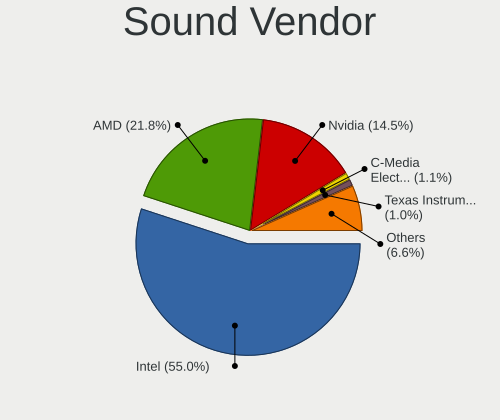

| Vendor                                       | Computers | Percent |
|----------------------------------------------|-----------|---------|
| Intel                                        | 573       | 55.04%  |
| AMD                                          | 227       | 21.81%  |
| Nvidia                                       | 151       | 14.51%  |
| C-Media Electronics                          | 11        | 1.06%   |
| Texas Instruments                            | 10        | 0.96%   |
| Zoran Co. Personal Media Division (Nogatech) | 7         | 0.67%   |
| JMTek                                        | 7         | 0.67%   |
| Realtek Semiconductor                        | 5         | 0.48%   |
| VIA Technologies                             | 4         | 0.38%   |
| Logitech                                     | 4         | 0.38%   |
| Creative Technology                          | 4         | 0.38%   |
| Lenovo                                       | 3         | 0.29%   |
| Generalplus Technology                       | 3         | 0.29%   |
| ESS Technology                               | 3         | 0.29%   |
| Creative Labs                                | 3         | 0.29%   |
| Silicon Integrated Systems [SiS]             | 2         | 0.19%   |
| Samsung Electronics                          | 2         | 0.19%   |
| KTMicro                                      | 2         | 0.19%   |
| Focusrite-Novation                           | 2         | 0.19%   |
| Xilinx                                       | 1         | 0.1%    |
| Superlux digit                               | 1         | 0.1%    |
| SteelSeries ApS                              | 1         | 0.1%    |
| Sony                                         | 1         | 0.1%    |
| RME                                          | 1         | 0.1%    |
| Nordic Semiconductor ASA                     | 1         | 0.1%    |
| Microsoft                                    | 1         | 0.1%    |
| M-Audio                                      | 1         | 0.1%    |
| Huawei Technologies                          | 1         | 0.1%    |
| HECATE G2 GAMING HEADSET                     | 1         | 0.1%    |
| GN Netcom                                    | 1         | 0.1%    |
| FiiO Electronics Technology                  | 1         | 0.1%    |
| Ensoniq                                      | 1         | 0.1%    |
| Edifier Technology                           | 1         | 0.1%    |
| Cambridge Silicon Radio                      | 1         | 0.1%    |
| BEHRINGER International                      | 1         | 0.1%    |
| Arturia                                      | 1         | 0.1%    |
| Unknown                                      | 1         | 0.1%    |

Sound Model
-----------

Sound card models

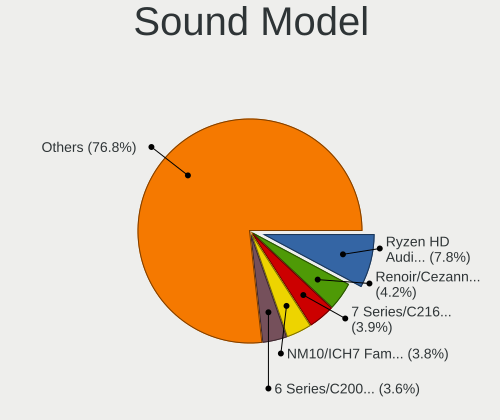

| Model                                                                                             | Computers | Percent |
|---------------------------------------------------------------------------------------------------|-----------|---------|
| AMD Ryzen HD Audio Controller                                                                     | 96        | 7.83%   |
| AMD Renoir/Cezanne HDMI/DP Audio Controller                                                       | 51        | 4.16%   |
| Intel 7 Series/C216 Chipset Family High Definition Audio Controller                               | 48        | 3.92%   |
| Intel NM10/ICH7 Family High Definition Audio Controller                                           | 46        | 3.75%   |
| Intel 6 Series/C200 Series Chipset Family High Definition Audio Controller                        | 44        | 3.59%   |
| Intel Sunrise Point-LP HD Audio                                                                   | 36        | 2.94%   |
| Intel 8 Series/C220 Series Chipset High Definition Audio Controller                               | 29        | 2.37%   |
| Intel Alder Lake-N PCH High Definition Audio Controller                                           | 25        | 2.04%   |
| AMD SBx00 Azalia (Intel HDA)                                                                      | 25        | 2.04%   |
| Intel Cannon Lake PCH cAVS                                                                        | 24        | 1.96%   |
| Intel Atom Processor Z36xxx/Z37xxx Series High Definition Audio Controller                        | 24        | 1.96%   |
| AMD Starship/Matisse HD Audio Controller                                                          | 24        | 1.96%   |
| AMD Radeon High Definition Audio Controller                                                       | 24        | 1.96%   |
| AMD FCH Azalia Controller                                                                         | 22        | 1.79%   |
| Nvidia GK208 HDMI/DP Audio Controller                                                             | 21        | 1.71%   |
| Intel 82801I (ICH9 Family) HD Audio Controller                                                    | 21        | 1.71%   |
| Intel 100 Series/C230 Series Chipset Family HD Audio Controller                                   | 21        | 1.71%   |
| Intel 200 Series PCH HD Audio                                                                     | 19        | 1.55%   |
| Intel Xeon E3-1200 v3/4th Gen Core Processor HD Audio Controller                                  | 18        | 1.47%   |
| AMD Raven/Raven2/Fenghuang HDMI/DP Audio Controller                                               | 18        | 1.47%   |
| Intel Jasper Lake HD Audio                                                                        | 17        | 1.39%   |
| Intel Tiger Lake-LP Smart Sound Technology Audio Controller                                       | 15        | 1.22%   |
| Intel 82801H (ICH8 Family) HD Audio Controller                                                    | 15        | 1.22%   |
| Intel 5 Series/3400 Series Chipset High Definition Audio                                          | 15        | 1.22%   |
| Intel 82801JI (ICH10 Family) HD Audio Controller                                                  | 14        | 1.14%   |
| AMD Ellesmere HDMI Audio [Radeon RX 470/480 / 570/580/590]                                        | 14        | 1.14%   |
| Nvidia GP107GL High Definition Audio Controller                                                   | 12        | 0.98%   |
| Nvidia GK107 HDMI Audio Controller                                                                | 12        | 0.98%   |
| Intel Celeron N3350/Pentium N4200/Atom E3900 Series Audio Cluster                                 | 12        | 0.98%   |
| Intel Atom/Celeron/Pentium Processor x5-E8000/J3xxx/N3xxx Series High Definition Audio Controller | 12        | 0.98%   |
| AMD Family 17h (Models 00h-0fh) HD Audio Controller                                               | 12        | 0.98%   |
| Nvidia High Definition Audio Controller                                                           | 11        | 0.9%    |
| Intel Comet Lake PCH-LP cAVS                                                                      | 11        | 0.9%    |
| Intel Celeron/Pentium Silver Processor High Definition Audio                                      | 11        | 0.9%    |
| Intel Alder Lake-S HD Audio Controller                                                            | 10        | 0.82%   |
| Intel Haswell-ULT HD Audio Controller                                                             | 9         | 0.73%   |
| Intel Comet Lake PCH cAVS                                                                         | 9         | 0.73%   |
| Intel Cannon Point-LP High Definition Audio Controller                                            | 9         | 0.73%   |
| Intel C610/X99 series chipset HD Audio Controller                                                 | 9         | 0.73%   |
| Intel 8 Series HD Audio Controller                                                                | 9         | 0.73%   |

Memory
------

Memory Vendor
-------------

Memory module vendors

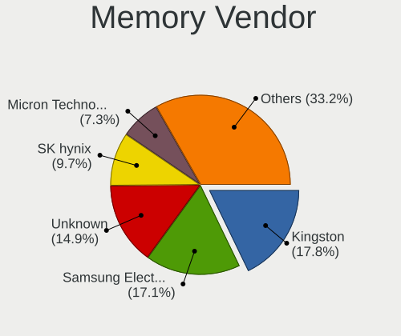

| Vendor                                  | Computers | Percent |
|-----------------------------------------|-----------|---------|
| Kingston                                | 179       | 17.85%  |
| Samsung Electronics                     | 172       | 17.15%  |
| Unknown                                 | 149       | 14.86%  |
| SK hynix                                | 97        | 9.67%   |
| Micron Technology                       | 73        | 7.28%   |
| Unknown                                 | 55        | 5.48%   |
| Crucial                                 | 48        | 4.79%   |
| Patriot                                 | 22        | 2.19%   |
| AMD                                     | 22        | 2.19%   |
| A-DATA Technology                       | 20        | 1.99%   |
| Corsair                                 | 13        | 1.3%    |
| Transcend                               | 10        | 1%      |
| Ramaxel Technology                      | 10        | 1%      |
| G.Skill                                 | 10        | 1%      |
| Apacer                                  | 9         | 0.9%    |
| Elpida                                  | 8         | 0.8%    |
| Unknown (ABCD)                          | 7         | 0.7%    |
| Patriot Memory (PDP Systems)            | 7         | 0.7%    |
| Nanya Technology                        | 7         | 0.7%    |
| Atermiter                               | 7         | 0.7%    |
| Hewlett-Packard                         | 6         | 0.6%    |
| Netac                                   | 5         | 0.5%    |
| Kllisre                                 | 5         | 0.5%    |
| Toshiba                                 | 4         | 0.4%    |
| Goldkey                                 | 4         | 0.4%    |
| Unifosa                                 | 3         | 0.3%    |
| Silicon Power                           | 3         | 0.3%    |
| Qumo                                    | 3         | 0.3%    |
| NOT SUPPORT                             | 3         | 0.3%    |
| Kingmax                                 | 3         | 0.3%    |
| Foxline                                 | 3         | 0.3%    |
| 48spaces                                | 3         | 0.3%    |
| Xi'an UnilC Semiconductors              | 2         | 0.2%    |
| Silicon Power Computer & Communications | 2         | 0.2%    |
| GOODRAM                                 | 2         | 0.2%    |
| ChangXin Memory                         | 2         | 0.2%    |
| Wodposit                                | 1         | 0.1%    |
| Unknown (0x0EB9)                        | 1         | 0.1%    |
| Unknown (0x0DD5)                        | 1         | 0.1%    |
| Unknown (0x0809)                        | 1         | 0.1%    |

Memory Model
------------

Memory module models

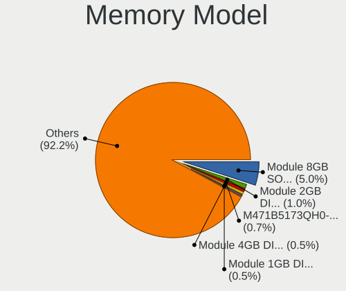

| Model                                                        | Computers | Percent |
|--------------------------------------------------------------|-----------|---------|
| Unknown                                                      | 55        | 5.02%   |
| Unknown RAM Module 2GB DIMM 1333MT/s                         | 11        | 1%      |
| Samsung RAM M471B5173QH0-YK0 4GB SODIMM DDR3 1600MT/s        | 8         | 0.73%   |
| Unknown RAM Module 4GB DIMM 1333MT/s                         | 6         | 0.55%   |
| Unknown RAM Module 1GB DIMM SDRAM                            | 6         | 0.55%   |
| Unknown RAM Module 2GB DIMM SDRAM                            | 5         | 0.46%   |
| Unknown RAM Module 1GB SODIMM DDR2 667MT/s                   | 5         | 0.46%   |
| Unknown (ABCD) RAM 123456789012345678 8GB DIMM DDR4 2400MT/s | 5         | 0.46%   |
| Samsung RAM M471A5244CB0-CRC 4GB SODIMM DDR4 2400MT/s        | 5         | 0.46%   |
| Samsung RAM M471A1G44BB0-CWE 8GB SODIMM DDR4 3200MT/s        | 5         | 0.46%   |
| Samsung RAM M425R1GB4BB0-CQKOL 8GB SODIMM DDR5 4800MT/s      | 5         | 0.46%   |
| Unknown RAM Module 8GB DIMM DDR3 1600MT/s                    | 4         | 0.36%   |
| Unknown RAM Module 512MB DIMM SDRAM                          | 4         | 0.36%   |
| Unknown RAM Module 2GB SODIMM DDR2 667MT/s                   | 4         | 0.36%   |
| Unknown RAM Module 2GB DIMM 800MT/s                          | 4         | 0.36%   |
| Unknown RAM Module 2048MB DIMM DDR2 800MT/s                  | 4         | 0.36%   |
| SK hynix RAM HMA851S6AFR6N-UH 4GB SODIMM DDR4 2400MT/s       | 4         | 0.36%   |
| SK hynix RAM HMA81GS6JJR8N-VK 8GB SODIMM DDR4 2667MT/s       | 4         | 0.36%   |
| Samsung RAM M471A5244CB0-CTD 4GB SODIMM DDR4 3200MT/s        | 4         | 0.36%   |
| Samsung RAM M471A1K43EB1-CWE 8GB SODIMM DDR4 3200MT/s        | 4         | 0.36%   |
| Samsung RAM M471A1K43DB1-CWE 8GB SODIMM DDR4 3200MT/s        | 4         | 0.36%   |
| Samsung RAM M425R2GA3BB0-CQKOL 16GB SODIMM DDR5 4800MT/s     | 4         | 0.36%   |
| Kingston RAM 99U5584-005.A00LF 4GB DIMM DDR3 1600MT/s        | 4         | 0.36%   |
| Kingston RAM 9965745-026.A00G 16GB DIMM DDR4 3200MT/s        | 4         | 0.36%   |
| Unknown RAM Module 8GB DIMM 1333MT/s                         | 3         | 0.27%   |
| Unknown RAM Module 512MB SODIMM DDR                          | 3         | 0.27%   |
| Unknown RAM Module 4GB SODIMM DDR3                           | 3         | 0.27%   |
| Unknown RAM Module 4GB DIMM DDR3 1600MT/s                    | 3         | 0.27%   |
| Unknown RAM Module 2GB DIMM DDR2 800MT/s                     | 3         | 0.27%   |
| Unknown RAM Module 2GB DIMM DDR 1333MT/s                     | 3         | 0.27%   |
| Unknown RAM Module 1GB DIMM DDR2 667MT/s                     | 3         | 0.27%   |
| SK hynix RAM HMT351S6CFR8C-PB 4GB SODIMM DDR3 1600MT/s       | 3         | 0.27%   |
| SK hynix RAM HMT351S6BFR8C-H9 4GB SODIMM DDR3 1333MT/s       | 3         | 0.27%   |
| SK hynix RAM HMA81GS6CJR8N-VK 8GB SODIMM DDR4 2667MT/s       | 3         | 0.27%   |
| SK hynix RAM HMA81GS6AFR8N-UH 8GB SODIMM DDR4 2400MT/s       | 3         | 0.27%   |
| Samsung RAM M471B5773CHS-CH9 2GB SODIMM DDR3 1333MT/s        | 3         | 0.27%   |
| Samsung RAM M471B5273DH0-CK0 8GB SODIMM DDR3 1600MT/s        | 3         | 0.27%   |
| Samsung RAM M471B5173DB0-YK0 4GB SODIMM DDR3 1600MT/s        | 3         | 0.27%   |
| Samsung RAM M471A5244CB0-CWE 4GB SODIMM DDR4 3200MT/s        | 3         | 0.27%   |
| Samsung RAM M471A1K43CB1-CTD 8GB SODIMM DDR4 3200MT/s        | 3         | 0.27%   |

Memory Kind
-----------

Memory module kinds

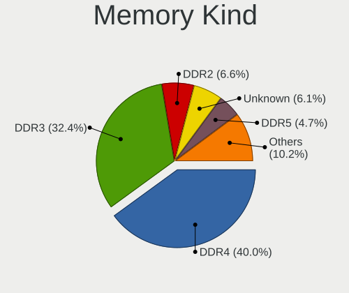

| Kind    | Computers | Percent |
|---------|-----------|---------|
| DDR4    | 349       | 39.98%  |
| DDR3    | 283       | 32.42%  |
| DDR2    | 58        | 6.64%   |
| Unknown | 53        | 6.07%   |
| DDR5    | 41        | 4.7%    |
| SDRAM   | 28        | 3.21%   |
| LPDDR4  | 18        | 2.06%   |
| DDR     | 16        | 1.83%   |
| LPDDR5  | 15        | 1.72%   |
| LPDDR3  | 8         | 0.92%   |
| DRAM    | 3         | 0.34%   |
| RAM     | 1         | 0.11%   |

Memory Form Factor
------------------

Physical design of the memory module

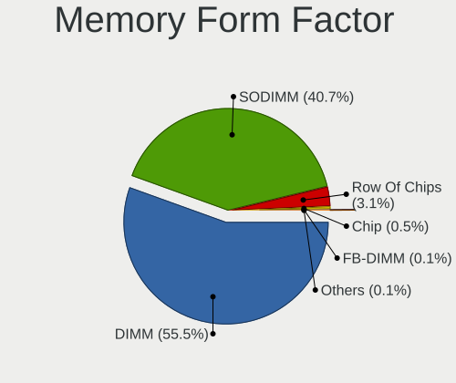

| Name         | Computers | Percent |
|--------------|-----------|---------|
| DIMM         | 484       | 55.5%   |
| SODIMM       | 355       | 40.71%  |
| Row Of Chips | 27        | 3.1%    |
| Chip         | 4         | 0.46%   |
| FB-DIMM      | 1         | 0.11%   |
| Unknown      | 1         | 0.11%   |

Memory Size
-----------

Memory module size

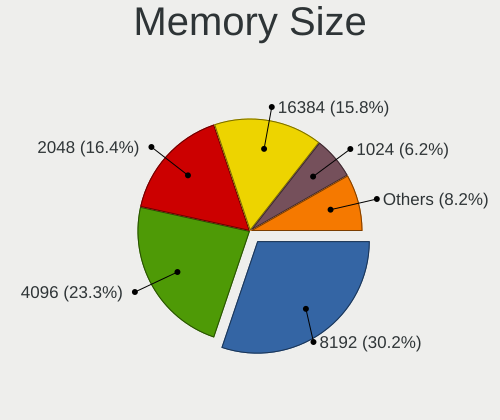

| Size   | Computers | Percent |
|--------|-----------|---------|
| 8192   | 293       | 30.18%  |
| 4096   | 226       | 23.27%  |
| 2048   | 159       | 16.37%  |
| 16384  | 153       | 15.76%  |
| 1024   | 60        | 6.18%   |
| 32768  | 49        | 5.05%   |
| 512    | 17        | 1.75%   |
| 65536  | 4         | 0.41%   |
| 256    | 3         | 0.31%   |
| 3072   | 2         | 0.21%   |
| 131072 | 1         | 0.1%    |
| 49152  | 1         | 0.1%    |
| 2560   | 1         | 0.1%    |
| 128    | 1         | 0.1%    |
| 8      | 1         | 0.1%    |

Memory Speed
------------

Memory module speed

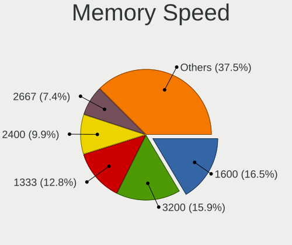

| Speed   | Computers | Percent |
|---------|-----------|---------|
| 1600    | 153       | 16.45%  |
| 3200    | 148       | 15.91%  |
| 1333    | 119       | 12.8%   |
| 2400    | 92        | 9.89%   |
| 2667    | 69        | 7.42%   |
| Unknown | 45        | 4.84%   |
| 800     | 43        | 4.62%   |
| 2133    | 39        | 4.19%   |
| 667     | 35        | 3.76%   |
| 4800    | 25        | 2.69%   |
| 1066    | 16        | 1.72%   |
| 5600    | 15        | 1.61%   |
| 6400    | 14        | 1.51%   |
| 1067    | 14        | 1.51%   |
| 2666    | 13        | 1.4%    |
| 1867    | 11        | 1.18%   |
| 400     | 10        | 1.08%   |
| 1866    | 8         | 0.86%   |
| 1334    | 7         | 0.75%   |
| 3000    | 5         | 0.54%   |
| 2933    | 5         | 0.54%   |
| 533     | 5         | 0.54%   |
| 3733    | 4         | 0.43%   |
| 3600    | 4         | 0.43%   |
| 4267    | 3         | 0.32%   |
| 4000    | 3         | 0.32%   |
| 3400    | 3         | 0.32%   |
| 2048    | 3         | 0.32%   |
| 266     | 3         | 0.32%   |
| 5200    | 2         | 0.22%   |
| 1400    | 2         | 0.22%   |
| 1332    | 2         | 0.22%   |
| 975     | 2         | 0.22%   |
| 7500    | 1         | 0.11%   |
| 4266    | 1         | 0.11%   |
| 3066    | 1         | 0.11%   |
| 1639    | 1         | 0.11%   |
| 933     | 1         | 0.11%   |
| 333     | 1         | 0.11%   |
| 133     | 1         | 0.11%   |

Printers & scanners
-------------------

Printer Vendor
--------------

Printer device vendors

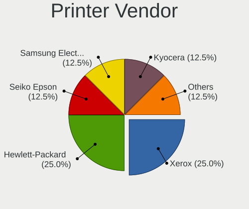

| Vendor              | Computers | Percent |
|---------------------|-----------|---------|
| Xerox               | 2         | 25%     |
| Hewlett-Packard     | 2         | 25%     |
| Seiko Epson         | 1         | 12.5%   |
| Samsung Electronics | 1         | 12.5%   |
| Kyocera             | 1         | 12.5%   |
| Brother Industries  | 1         | 12.5%   |

Printer Model
-------------

Printer device models

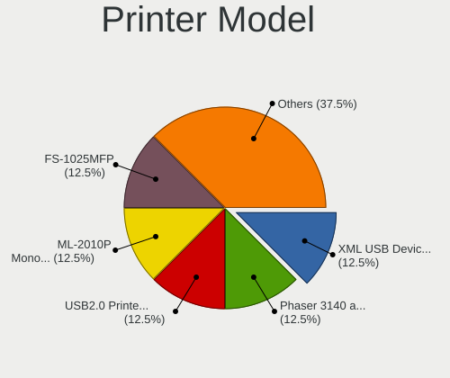

| Model                                                                                            | Computers | Percent |
|--------------------------------------------------------------------------------------------------|-----------|---------|
| Xerox XML USB Device Interface                                                                   | 1         | 12.5%   |
| Xerox Phaser 3140 and 3155                                                                       | 1         | 12.5%   |
| Seiko Epson USB2.0 Printer (Hi-speed)                                                            | 1         | 12.5%   |
| Samsung ML-2010P Mono Laser Printer                                                              | 1         | 12.5%   |
| Kyocera FS-1025MFP                                                                               | 1         | 12.5%   |
| HP Laser 107a Printer                                                                            | 1         | 12.5%   |
| HP HP LaserJet MFP M232-M237 Printer HP LEDM IPP Printer HP LEDM IPP Printer HP LEDM IPP Printer | 1         | 12.5%   |
| Brother HL-2030 Laser Printer                                                                    | 1         | 12.5%   |

Scanner Vendor
--------------

Scanner device vendors

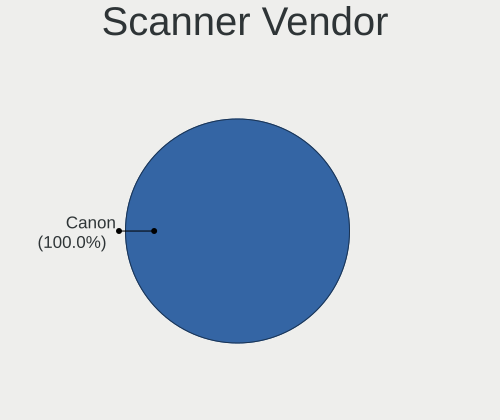

| Vendor      | Computers | Percent |
|-------------|-----------|---------|
| Seiko Epson | 1         | 50%     |
| Canon       | 1         | 50%     |

Scanner Model
-------------

Scanner device models

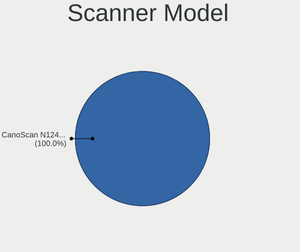

| Model                           | Computers | Percent |
|---------------------------------|-----------|---------|
| Seiko Epson ES-H7200 [GT-20000] | 1         | 50%     |
| Canon CanoScan N1240U/LiDE 30   | 1         | 50%     |

Camera
------

Camera Vendor
-------------

Camera device vendors

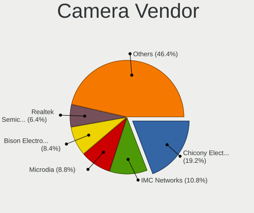

| Vendor                                 | Computers | Percent |
|----------------------------------------|-----------|---------|
| Chicony Electronics                    | 48        | 19.2%   |
| IMC Networks                           | 27        | 10.8%   |
| Microdia                               | 22        | 8.8%    |
| Bison Electronics                      | 21        | 8.4%    |
| Realtek Semiconductor                  | 16        | 6.4%    |
| Quanta                                 | 14        | 5.6%    |
| Sunplus Innovation Technology          | 13        | 5.2%    |
| Silicon Motion                         | 8         | 3.2%    |
| Luxvisions Innotech Limited            | 7         | 2.8%    |
| Logitech                               | 6         | 2.4%    |
| Jiangxi Shinetech Optical              | 6         | 2.4%    |
| Cheng Uei Precision Industry (Foxlink) | 6         | 2.4%    |
| Syntek                                 | 5         | 2%      |
| Suyin                                  | 5         | 2%      |
| Lite-On Technology                     | 5         | 2%      |
| Z-Star Microelectronics                | 4         | 1.6%    |
| Shenzhen Kingcome Optoelectronic       | 4         | 1.6%    |
| ALi                                    | 4         | 1.6%    |
| DigiTech                               | 3         | 1.2%    |
| Apple                                  | 3         | 1.2%    |
| Supreme Electronics                    | 2         | 0.8%    |
| Ricoh                                  | 2         | 0.8%    |
| Lenovo                                 | 2         | 0.8%    |
| DX-240124-XH                           | 2         | 0.8%    |
| Denron                                 | 2         | 0.8%    |
| Arkmicro Technologies                  | 2         | 0.8%    |
| Y Media                                | 1         | 0.4%    |
| Unknown (3730304233343731345430)       | 1         | 0.4%    |
| Pixart Imaging                         | 1         | 0.4%    |
| Intel                                  | 1         | 0.4%    |
| Huawei Technologies                    | 1         | 0.4%    |
| Genesys Logic                          | 1         | 0.4%    |
| GEMBIRD                                | 1         | 0.4%    |
| Foxconn / Hon Hai                      | 1         | 0.4%    |
| Aveo Technology                        | 1         | 0.4%    |
| Alcor Micro                            | 1         | 0.4%    |
| A4Tech                                 | 1         | 0.4%    |

Camera Model
------------

Camera device models

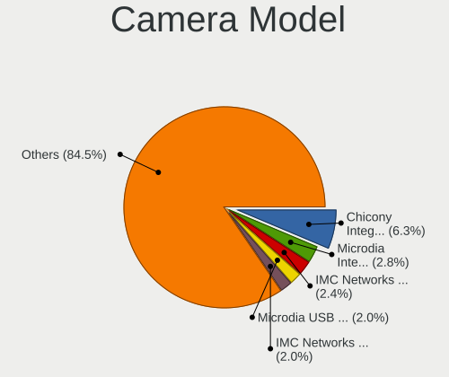

| Model                                                  | Computers | Percent |
|--------------------------------------------------------|-----------|---------|
| Chicony Integrated Camera                              | 16        | 6.35%   |
| Microdia Integrated_Webcam_HD                          | 7         | 2.78%   |
| IMC Networks Integrated Camera                         | 6         | 2.38%   |
| Microdia USB Camera                                    | 5         | 1.98%   |
| IMC Networks EasyCamera                                | 5         | 1.98%   |
| Silicon Motion WebCam SCX Series                       | 4         | 1.59%   |
| Luxvisions Innotech Limited Integrated Camera          | 4         | 1.59%   |
| Chicony USB2.0 VGA UVC WebCam                          | 4         | 1.59%   |
| Bison Integrated Camera                                | 4         | 1.59%   |
| Realtek USB 2.0 PC Camera                              | 3         | 1.19%   |
| Realtek Acer 640 x 480 laptop camera                   | 3         | 1.19%   |
| Quanta VGA WebCam                                      | 3         | 1.19%   |
| Quanta Realtek PC Camera                               | 3         | 1.19%   |
| Logitech Webcam C270                                   | 3         | 1.19%   |
| Jiangxi Shinetech Optical HD Camera                    | 3         | 1.19%   |
| IMC Networks Realtek PC Camera                         | 3         | 1.19%   |
| DigiTech WebCam SCB-0350M                              | 3         | 1.19%   |
| Bison SunplusIT Integrated Camera                      | 3         | 1.19%   |
| Bison Lenovo EasyCamera                                | 3         | 1.19%   |
| ALi Gateway Webcam                                     | 3         | 1.19%   |
| Syntek Integrated Camera                               | 2         | 0.79%   |
| Syntek EasyCamera                                      | 2         | 0.79%   |
| Sunplus SPCA2281 Web Camera                            | 2         | 0.79%   |
| Sunplus Integrated_Webcam_HD                           | 2         | 0.79%   |
| Sunplus Hy HD Camera                                   | 2         | 0.79%   |
| Sunplus HD WebCam                                      | 2         | 0.79%   |
| Sunplus 2-USB 2.0 Camera                               | 2         | 0.79%   |
| Shenzhen Kingcome Optoelectronic XiaoMi USB 2.0 Webcam | 2         | 0.79%   |
| Realtek USB2.0 VGA UVC WebCam                          | 2         | 0.79%   |
| Realtek Integrated Webcam                              | 2         | 0.79%   |
| Quanta ov9734_techfront_camera                         | 2         | 0.79%   |
| Quanta HP TrueVision HD Camera                         | 2         | 0.79%   |
| Microdia Webcam Vitade AF                              | 2         | 0.79%   |
| Microdia Integrated Webcam                             | 2         | 0.79%   |
| Lite-On Integrated Camera                              | 2         | 0.79%   |
| Lite-On HP HD Camera                                   | 2         | 0.79%   |
| Jiangxi Shinetech Optical Realtek PC Camera            | 2         | 0.79%   |
| IMC Networks XHC Camera                                | 2         | 0.79%   |
| IMC Networks UVC VGA Webcam                            | 2         | 0.79%   |
| IMC Networks Realtek DMFT RGB                          | 2         | 0.79%   |

Security
--------

Fingerprint Vendor
------------------

Fingerprint sensor vendors

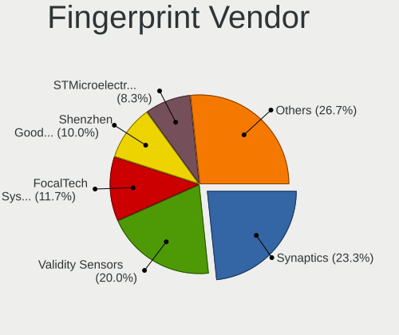

| Vendor                     | Computers | Percent |
|----------------------------|-----------|---------|
| Synaptics                  | 14        | 23.33%  |
| Validity Sensors           | 12        | 20%     |
| FocalTech Systems          | 7         | 11.67%  |
| Shenzhen Goodix Technology | 6         | 10%     |
| STMicroelectronics         | 5         | 8.33%   |
| AuthenTec                  | 5         | 8.33%   |
| Upek                       | 4         | 6.67%   |
| Elan Microelectronics      | 4         | 6.67%   |
| LighTuning Technology      | 1         | 1.67%   |
| Fingerprint Cards          | 1         | 1.67%   |
| Broadcom                   | 1         | 1.67%   |

Fingerprint Model
-----------------

Fingerprint sensor models

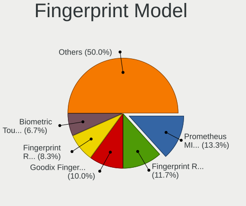

| Model                                                                        | Computers | Percent |
|------------------------------------------------------------------------------|-----------|---------|
| Synaptics Prometheus MIS Touch Fingerprint Reader                            | 8         | 13.33%  |
| FocalTech Systems Fingerprint Reader                                         | 7         | 11.67%  |
| Shenzhen Goodix  Fingerprint Device                                          | 6         | 10%     |
| STMicroelectronics Fingerprint Reader                                        | 5         | 8.33%   |
| Upek Biometric Touchchip/Touchstrip Fingerprint Sensor                       | 4         | 6.67%   |
| Validity Sensors VFS7500 Touch Fingerprint Sensor                            | 3         | 5%      |
| Elan WBF Fingerprint Sensor                                                  | 3         | 5%      |
| AuthenTec AES1600                                                            | 3         | 5%      |
| Validity Sensors VFS5011 Fingerprint Reader                                  | 2         | 3.33%   |
| Validity Sensors VFS495 Fingerprint Reader                                   | 2         | 3.33%   |
| Validity Sensors VFS 5011 fingerprint sensor                                 | 2         | 3.33%   |
| Synaptics WBDI Fingerprint Reader USB 086                                    | 2         | 3.33%   |
| Synaptics FS7604 Touch Fingerprint Sensor with PurePrint                     | 2         | 3.33%   |
| Validity Sensors Synaptics WBDI                                              | 1         | 1.67%   |
| Validity Sensors Synaptics VFS7552 Touch Fingerprint Sensor with PurePrint   | 1         | 1.67%   |
| Validity Sensors Swipe Fingerprint Sensor                                    | 1         | 1.67%   |
| Synaptics Metallica MOH Touch Fingerprint Reader                             | 1         | 1.67%   |
| Synaptics Metallica MIS Touch Fingerprint Reader                             | 1         | 1.67%   |
| LighTuning EgisTec Touch Fingerprint Sensor                                  | 1         | 1.67%   |
| Fingerprint Cards FPC Fingerprint Reader                                     | 1         | 1.67%   |
| Elan Fingerprint Sensor                                                      | 1         | 1.67%   |
| Broadcom BCM5880 Secure Applications Processor with fingerprint swipe sensor | 1         | 1.67%   |
| AuthenTec AES2810                                                            | 1         | 1.67%   |
| AuthenTec AES2501 Fingerprint Sensor                                         | 1         | 1.67%   |

Chipcard Vendor
---------------

Chipcard module vendors

Zero info for selected period =(

Chipcard Model
--------------

Chipcard module models

Zero info for selected period =(

Unsupported
-----------

Unsupported Devices
-------------------

Total unsupported devices on board

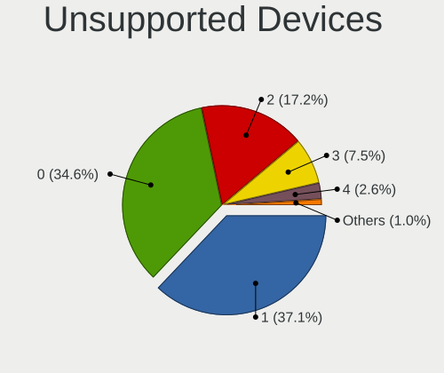

| Total | Computers | Percent |
|-------|-----------|---------|
| 1     | 380       | 37.07%  |
| 0     | 355       | 34.63%  |
| 2     | 176       | 17.17%  |
| 3     | 77        | 7.51%   |
| 4     | 27        | 2.63%   |
| 5     | 5         | 0.49%   |
| 7     | 2         | 0.2%    |
| 9     | 1         | 0.1%    |
| 8     | 1         | 0.1%    |
| 6     | 1         | 0.1%    |

Unsupported Device Types
------------------------

Types of unsupported devices

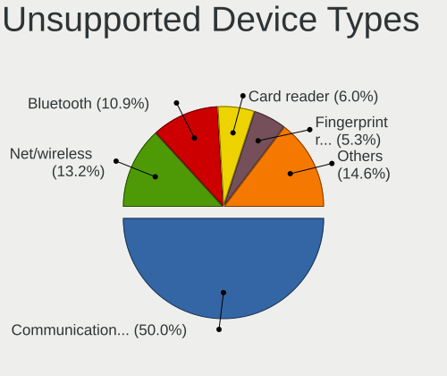

| Type                     | Computers | Percent |
|--------------------------|-----------|---------|
| Communication controller | 478       | 50%     |
| Net/wireless             | 126       | 13.18%  |
| Bluetooth                | 104       | 10.88%  |
| Card reader              | 57        | 5.96%   |
| Fingerprint reader       | 51        | 5.33%   |
| Sound                    | 34        | 3.56%   |
| Firewire controller      | 32        | 3.35%   |
| Graphics card            | 22        | 2.3%    |
| Net/ethernet             | 20        | 2.09%   |
| Network                  | 15        | 1.57%   |
| Storage                  | 7         | 0.73%   |
| Storage/ata              | 6         | 0.63%   |
| Modem                    | 4         | 0.42%   |

