BSD in Russia - Tested Hardware & Statistics
--------------------------------------------

A project to collect tested hardware configurations for BSD in Russia.

Anyone can contribute to this report by the [hw-probe](https://github.com/linuxhw/hw-probe/blob/master/INSTALL.BSD.md) tool:

    hw-probe -all -upload

Please contribute! Especially if your hardware is rare.

This is a report for all computer types. See also reports for [desktops](/Location/Russia/Desktop/README.md) and [notebooks](/Location/Russia/Notebook/README.md).

Contents
--------

* [ Test Cases ](#test-cases)

* [ System ](#system)
  - [ OS                       ](#os)
  - [ OS Family                ](#os-family)
  - [ Arch                     ](#arch)
  - [ DE                       ](#de)
  - [ Display Server           ](#display-server)
  - [ Display Manager          ](#display-manager)
  - [ OS Lang                  ](#os-lang)
  - [ Boot Mode                ](#boot-mode)
  - [ Filesystem               ](#filesystem)
  - [ Part. scheme             ](#part-scheme)

* [ Board ](#board)
  - [ Vendor                   ](#vendor)
  - [ Model                    ](#model)
  - [ Model Family             ](#model-family)
  - [ MFG Year                 ](#mfg-year)
  - [ Form Factor              ](#form-factor)
  - [ Coreboot                 ](#coreboot)
  - [ RAM Size                 ](#ram-size)
  - [ RAM Used                 ](#ram-used)
  - [ Total Drives             ](#total-drives)
  - [ Has CD-ROM               ](#has-cd-rom)
  - [ Has Ethernet             ](#has-ethernet)
  - [ Has WiFi                 ](#has-wifi)
  - [ Has Bluetooth            ](#has-bluetooth)

* [ Location ](#location)
  - [ Country                  ](#country)
  - [ City                     ](#city)

* [ Drives ](#drives)
  - [ Drive Vendor             ](#drive-vendor)
  - [ Drive Model              ](#drive-model)
  - [ HDD Vendor               ](#hdd-vendor)
  - [ SSD Vendor               ](#ssd-vendor)
  - [ Drive Kind               ](#drive-kind)
  - [ Drive Connector          ](#drive-connector)
  - [ Drive Size               ](#drive-size)
  - [ Space Total              ](#space-total)
  - [ Space Used               ](#space-used)
  - [ Malfunc. Drives          ](#malfunc-drives)
  - [ Malfunc. Drive Vendor    ](#malfunc-drive-vendor)
  - [ Malfunc. HDD Vendor      ](#malfunc-hdd-vendor)
  - [ Malfunc. Drive Kind      ](#malfunc-drive-kind)
  - [ Failed Drives            ](#failed-drives)
  - [ Failed Drive Vendor      ](#failed-drive-vendor)
  - [ Drive Status             ](#drive-status)

* [ Storage controller ](#storage-controller)
  - [ Storage Vendor           ](#storage-vendor)
  - [ Storage Model            ](#storage-model)
  - [ Storage Kind             ](#storage-kind)

* [ Processor ](#processor)
  - [ CPU Vendor               ](#cpu-vendor)
  - [ CPU Model                ](#cpu-model)
  - [ CPU Model Family         ](#cpu-model-family)
  - [ CPU Cores                ](#cpu-cores)
  - [ CPU Sockets              ](#cpu-sockets)
  - [ CPU Threads              ](#cpu-threads)
  - [ CPU Microarch            ](#cpu-microarch)

* [ Graphics ](#graphics)
  - [ GPU Vendor               ](#gpu-vendor)
  - [ GPU Model                ](#gpu-model)
  - [ GPU Combo                ](#gpu-combo)
  - [ GPU Driver               ](#gpu-driver)
  - [ GPU Memory               ](#gpu-memory)

* [ Monitor ](#monitor)
  - [ Monitor Vendor           ](#monitor-vendor)
  - [ Monitor Model            ](#monitor-model)
  - [ Monitor Resolution       ](#monitor-resolution)
  - [ Monitor Diagonal         ](#monitor-diagonal)
  - [ Monitor Width            ](#monitor-width)
  - [ Aspect Ratio             ](#aspect-ratio)
  - [ Monitor Area             ](#monitor-area)
  - [ Pixel Density            ](#pixel-density)
  - [ Multiple Monitors        ](#multiple-monitors)

* [ Network ](#network)
  - [ Net Controller Vendor    ](#net-controller-vendor)
  - [ Net Controller Model     ](#net-controller-model)
  - [ Wireless Vendor          ](#wireless-vendor)
  - [ Wireless Model           ](#wireless-model)
  - [ Ethernet Vendor          ](#ethernet-vendor)
  - [ Ethernet Model           ](#ethernet-model)
  - [ Net Controller Kind      ](#net-controller-kind)
  - [ Used Controller          ](#used-controller)
  - [ NICs                     ](#nics)
  - [ IPv6                     ](#ipv6)

* [ Bluetooth ](#bluetooth)
  - [ Bluetooth Vendor         ](#bluetooth-vendor)
  - [ Bluetooth Model          ](#bluetooth-model)

* [ Sound ](#sound)
  - [ Sound Vendor             ](#sound-vendor)
  - [ Sound Model              ](#sound-model)

* [ Memory ](#memory)
  - [ Memory Vendor            ](#memory-vendor)
  - [ Memory Model             ](#memory-model)
  - [ Memory Kind              ](#memory-kind)
  - [ Memory Form Factor       ](#memory-form-factor)
  - [ Memory Size              ](#memory-size)
  - [ Memory Speed             ](#memory-speed)

* [ Printers & scanners ](#printers--scanners)
  - [ Printer Vendor           ](#printer-vendor)
  - [ Printer Model            ](#printer-model)
  - [ Scanner Vendor           ](#scanner-vendor)
  - [ Scanner Model            ](#scanner-model)

* [ Camera ](#camera)
  - [ Camera Vendor            ](#camera-vendor)
  - [ Camera Model             ](#camera-model)

* [ Security ](#security)
  - [ Fingerprint Vendor       ](#fingerprint-vendor)
  - [ Fingerprint Model        ](#fingerprint-model)
  - [ Chipcard Vendor          ](#chipcard-vendor)
  - [ Chipcard Model           ](#chipcard-model)

* [ Unsupported ](#unsupported)
  - [ Unsupported Devices      ](#unsupported-devices)
  - [ Unsupported Device Types ](#unsupported-device-types)

Test Cases
----------

Total: 1303

| Vendor        | Model                       | Form-Factor | Probe                                                     | Date         |
|---------------|-----------------------------|-------------|-----------------------------------------------------------|--------------|
| ASUSTek       | PRIME B550-PLUS             | Desktop     | [6a1b59c063](https://bsd-hardware.info/?probe=6a1b59c063) | Jan 06, 2025 |
| Infinix       | YL51A5                      | Notebook    | [de145e7ce4](https://bsd-hardware.info/?probe=de145e7ce4) | Jan 05, 2025 |
| ASUSTek       | B85M-E                      | Desktop     | [aef38fc437](https://bsd-hardware.info/?probe=aef38fc437) | Jan 05, 2025 |
| ASUSTek       | K53BY                       | Notebook    | [4b6604e875](https://bsd-hardware.info/?probe=4b6604e875) | Jan 03, 2025 |
| ASUSTek       | K53BY                       | Notebook    | [dac2953ae0](https://bsd-hardware.info/?probe=dac2953ae0) | Jan 03, 2025 |
| ASUSTek       | K53BY                       | Notebook    | [7e68090b10](https://bsd-hardware.info/?probe=7e68090b10) | Dec 31, 2024 |
| Shenzhen s... | miniPC                      | Desktop     | [974d78e0bf](https://bsd-hardware.info/?probe=974d78e0bf) | Dec 31, 2024 |
| Intel         | D2500HN                     | Desktop     | [a316391d86](https://bsd-hardware.info/?probe=a316391d86) | Dec 27, 2024 |
| Intel         | HURONRIVER                  | Desktop     | [dda4ccd2af](https://bsd-hardware.info/?probe=dda4ccd2af) | Dec 26, 2024 |
| AZW           | U59                         | Desktop     | [17a9a9d767](https://bsd-hardware.info/?probe=17a9a9d767) | Dec 25, 2024 |
| Unknown       | Unknown                     | Notebook    | [4c4387237d](https://bsd-hardware.info/?probe=4c4387237d) | Dec 23, 2024 |
| Techvision    | TVI7309X B0                 | Desktop     | [c16b1e23d4](https://bsd-hardware.info/?probe=c16b1e23d4) | Dec 21, 2024 |
| MSI           | GF615M-P33 V2               | Desktop     | [79f42224b7](https://bsd-hardware.info/?probe=79f42224b7) | Dec 17, 2024 |
| Gigabyte      | G41M-Combo                  | Desktop     | [d2d73e5ab9](https://bsd-hardware.info/?probe=d2d73e5ab9) | Dec 16, 2024 |
| Techvision    | TVI7309X B0                 | Desktop     | [e9ef186dcc](https://bsd-hardware.info/?probe=e9ef186dcc) | Dec 16, 2024 |
| Supermicro    | X10DRL-i                    | Server      | [6722a0cdd6](https://bsd-hardware.info/?probe=6722a0cdd6) | Dec 16, 2024 |
| ASUSTek       | 900                         | Notebook    | [a4c9546642](https://bsd-hardware.info/?probe=a4c9546642) | Dec 15, 2024 |
| IBM           | ThinkPad T43 1871F1G        | Notebook    | [1fc4bc2661](https://bsd-hardware.info/?probe=1fc4bc2661) | Dec 12, 2024 |
| Lenovo        | ThinkPad X60s 1704R8G       | Notebook    | [cad87ee9a5](https://bsd-hardware.info/?probe=cad87ee9a5) | Dec 12, 2024 |
| Gigabyte      | Z690 AORUS ULTRA            | Desktop     | [3ec2b38bad](https://bsd-hardware.info/?probe=3ec2b38bad) | Dec 07, 2024 |
| Unknown       | Unknown                     | Desktop     | [3ad310c1ca](https://bsd-hardware.info/?probe=3ad310c1ca) | Dec 06, 2024 |
| ASUSTek       | PRIME B550-PLUS             | Desktop     | [d024fa4f7a](https://bsd-hardware.info/?probe=d024fa4f7a) | Dec 06, 2024 |
| ASUSTek       | PRIME B550-PLUS             | Desktop     | [ca1c97cf99](https://bsd-hardware.info/?probe=ca1c97cf99) | Dec 05, 2024 |
| Gigabyte      | H81M-S2PV                   | Desktop     | [63de24e596](https://bsd-hardware.info/?probe=63de24e596) | Dec 05, 2024 |
| ASUSTek       | PRIME H510M-R               | Desktop     | [772e88509f](https://bsd-hardware.info/?probe=772e88509f) | Dec 04, 2024 |
| ASUSTek       | P9D-C Series                | Server      | [fe5531ec9b](https://bsd-hardware.info/?probe=fe5531ec9b) | Dec 03, 2024 |
| Sony          | VGN-FZ11MR                  | Notebook    | [0d1d0647c3](https://bsd-hardware.info/?probe=0d1d0647c3) | Dec 01, 2024 |
| Unknown       | QGLK03                      | Desktop     | [80b9c73d39](https://bsd-hardware.info/?probe=80b9c73d39) | Dec 01, 2024 |
| HP            | ENVY 15                     | Notebook    | [c83ef9f375](https://bsd-hardware.info/?probe=c83ef9f375) | Nov 30, 2024 |
| Sony          | VGN-FZ11MR                  | Notebook    | [9d737dbace](https://bsd-hardware.info/?probe=9d737dbace) | Nov 28, 2024 |
| Unknown       | Unknown                     | Desktop     | [81d5169045](https://bsd-hardware.info/?probe=81d5169045) | Nov 27, 2024 |
| AMI           | Aptio CRB                   | Mini pc     | [37485fe00d](https://bsd-hardware.info/?probe=37485fe00d) | Nov 27, 2024 |
| ETegro Tec... | ETRS130G3 31S98MB0020       | Server      | [1578aa6cfd](https://bsd-hardware.info/?probe=1578aa6cfd) | Nov 26, 2024 |
| Gigabyte      | C1037UN-EU                  | Desktop     | [5efd7ff2d7](https://bsd-hardware.info/?probe=5efd7ff2d7) | Nov 26, 2024 |
| ETegro Tec... | ETRS130G3 31S98MB0020       | Server      | [153808018a](https://bsd-hardware.info/?probe=153808018a) | Nov 23, 2024 |
| ASRock        | G41C-GS                     | Desktop     | [6330b64304](https://bsd-hardware.info/?probe=6330b64304) | Nov 23, 2024 |
| ASUSTek       | PRIME N100I-D D4            | Desktop     | [e634c55da0](https://bsd-hardware.info/?probe=e634c55da0) | Nov 22, 2024 |
| MSI           | PRO H610M-B DDR4            | Desktop     | [ed161aa339](https://bsd-hardware.info/?probe=ed161aa339) | Nov 21, 2024 |
| Unknown       | Unknown                     | Desktop     | [9cb678b64b](https://bsd-hardware.info/?probe=9cb678b64b) | Nov 19, 2024 |
| Supermicro    | X10DRL-i                    | Server      | [a2873f05e0](https://bsd-hardware.info/?probe=a2873f05e0) | Nov 19, 2024 |
| ASUSTek       | P9D-C Series                | Server      | [b8e7d1f3a2](https://bsd-hardware.info/?probe=b8e7d1f3a2) | Nov 18, 2024 |
| Gigabyte      | H61M-DS2                    | Desktop     | [b475794daf](https://bsd-hardware.info/?probe=b475794daf) | Nov 16, 2024 |
| Standard      | Unknown                     | Notebook    | [a56385a000](https://bsd-hardware.info/?probe=a56385a000) | Nov 14, 2024 |
| Notebook      | V3xxENx                     | Notebook    | [bb5a62f653](https://bsd-hardware.info/?probe=bb5a62f653) | Nov 14, 2024 |
| ICL           | S1411 G2R                   | Notebook    | [988f54b681](https://bsd-hardware.info/?probe=988f54b681) | Nov 11, 2024 |
| ASUSTek       | PRIME B550-PLUS             | Desktop     | [b62c2f6af1](https://bsd-hardware.info/?probe=b62c2f6af1) | Nov 09, 2024 |
| Gigabyte      | B560M DS3H V2               | Desktop     | [0c6f84aca8](https://bsd-hardware.info/?probe=0c6f84aca8) | Nov 09, 2024 |
| Unknown       | Unknown                     | Notebook    | [5bd09820d9](https://bsd-hardware.info/?probe=5bd09820d9) | Nov 07, 2024 |
| RDW Comput... | Kama-10                     | Desktop     | [0886b2b851](https://bsd-hardware.info/?probe=0886b2b851) | Nov 07, 2024 |
| Unknown       | 0XN8Y6 A11                  | Server      | [db77a6d18f](https://bsd-hardware.info/?probe=db77a6d18f) | Nov 07, 2024 |
| ASUSTek       | PRIME B550-PLUS             | Desktop     | [3450ab98b4](https://bsd-hardware.info/?probe=3450ab98b4) | Nov 07, 2024 |
| Unknown       | Unknown                     | Desktop     | [85bc2300d4](https://bsd-hardware.info/?probe=85bc2300d4) | Nov 04, 2024 |
| ETegro Tec... | ETRS130G3 31S98MB0020       | Server      | [5c6660587e](https://bsd-hardware.info/?probe=5c6660587e) | Nov 03, 2024 |
| Unknown       | Q-790                       | Desktop     | [d7a5da3c3d](https://bsd-hardware.info/?probe=d7a5da3c3d) | Nov 02, 2024 |
| Lenovo        | ThinkPad X1 Yoga Gen 5 2... | Convertible | [2b103a6d58](https://bsd-hardware.info/?probe=2b103a6d58) | Oct 30, 2024 |
| Supermicro    | X10DRL-i                    | Server      | [a40571edd8](https://bsd-hardware.info/?probe=a40571edd8) | Oct 28, 2024 |
| Gigabyte      | B450M S2H V2                | Desktop     | [1dd8ec6cbc](https://bsd-hardware.info/?probe=1dd8ec6cbc) | Oct 27, 2024 |
| HP            | Laptop 15s-eq2xxx           | Notebook    | [cd3af9a100](https://bsd-hardware.info/?probe=cd3af9a100) | Oct 25, 2024 |
| Gigabyte      | B560M DS3H V2               | Desktop     | [12a26b4ff0](https://bsd-hardware.info/?probe=12a26b4ff0) | Oct 24, 2024 |
| Lenovo        | Bantry CRB NOK              | Desktop     | [aa498bf596](https://bsd-hardware.info/?probe=aa498bf596) | Oct 21, 2024 |
| Lenovo        | Bantry CRB NOK              | Desktop     | [33d4eb027a](https://bsd-hardware.info/?probe=33d4eb027a) | Oct 20, 2024 |
| Radxa         | rock-pi-e_rk3328            | Desktop     | [0447de6ec9](https://bsd-hardware.info/?probe=0447de6ec9) | Oct 19, 2024 |
| Norsi-Tran... | PALADIN-X E00000-001        | Server      | [953c0c9970](https://bsd-hardware.info/?probe=953c0c9970) | Oct 19, 2024 |
| Unknown       | Unknown                     | Server      | [2c36066718](https://bsd-hardware.info/?probe=2c36066718) | Oct 18, 2024 |
| AZW           | U59                         | Desktop     | [576db5afb7](https://bsd-hardware.info/?probe=576db5afb7) | Oct 17, 2024 |
| Unknown       | Unknown                     | Desktop     | [ede814bb31](https://bsd-hardware.info/?probe=ede814bb31) | Oct 12, 2024 |
| ASUSTek       | VivoBook 15_ASUS Laptop ... | Notebook    | [5d35565dad](https://bsd-hardware.info/?probe=5d35565dad) | Oct 02, 2024 |
| Unknown       | adnbsc01                    | Desktop     | [3a0fab72d7](https://bsd-hardware.info/?probe=3a0fab72d7) | Sep 29, 2024 |
| Supermicro    | X7DA8                       | Desktop     | [92ebb2a336](https://bsd-hardware.info/?probe=92ebb2a336) | Sep 26, 2024 |
| MSI           | PS63 Modern 8M              | Notebook    | [fc39fcb987](https://bsd-hardware.info/?probe=fc39fcb987) | Sep 26, 2024 |
| Soyo          | SY-B250 BTC                 | Desktop     | [9c3afc54b3](https://bsd-hardware.info/?probe=9c3afc54b3) | Sep 23, 2024 |
| AMI           | Aptio CRB                   | Mini pc     | [3f969fb81d](https://bsd-hardware.info/?probe=3f969fb81d) | Sep 20, 2024 |
| Norsi-Tran... | PALADIN-X E00000-001        | Server      | [4668875d08](https://bsd-hardware.info/?probe=4668875d08) | Sep 19, 2024 |
| Unknown       | Unknown                     | Desktop     | [170341d296](https://bsd-hardware.info/?probe=170341d296) | Sep 19, 2024 |
| Unknown       | adnbsc01                    | Desktop     | [4f5340fc2c](https://bsd-hardware.info/?probe=4f5340fc2c) | Sep 18, 2024 |
| ASRock        | B550 Taichi                 | Desktop     | [4d8657f05e](https://bsd-hardware.info/?probe=4d8657f05e) | Sep 17, 2024 |
| Unknown       | Unknown                     | Firewall    | [778f87a897](https://bsd-hardware.info/?probe=778f87a897) | Sep 17, 2024 |
| ASUSTek       | PRIME H470M-PLUS            | Desktop     | [573ff12450](https://bsd-hardware.info/?probe=573ff12450) | Sep 13, 2024 |
| ASUSTek       | PRIME H470M-PLUS            | Desktop     | [3619cdfbec](https://bsd-hardware.info/?probe=3619cdfbec) | Sep 13, 2024 |
| ASUSTek       | X540SC                      | Notebook    | [6eb57b9354](https://bsd-hardware.info/?probe=6eb57b9354) | Sep 13, 2024 |
| Unknown       | Unknown                     | Desktop     | [92a6c31579](https://bsd-hardware.info/?probe=92a6c31579) | Sep 12, 2024 |
| Intel         | QHSW02                      | Desktop     | [365c9dcc32](https://bsd-hardware.info/?probe=365c9dcc32) | Sep 05, 2024 |
| Techvision    | TVI7309X B0                 | Desktop     | [0461c31cfa](https://bsd-hardware.info/?probe=0461c31cfa) | Sep 02, 2024 |
| Unknown       | QCML02                      | Desktop     | [d6029b3176](https://bsd-hardware.info/?probe=d6029b3176) | Sep 01, 2024 |
| Gigabyte      | N3150ND3V                   | Desktop     | [e215a00f4a](https://bsd-hardware.info/?probe=e215a00f4a) | Aug 30, 2024 |
| Unknown       | QCML02                      | Desktop     | [63f02a15c8](https://bsd-hardware.info/?probe=63f02a15c8) | Aug 29, 2024 |
| Supermicro    | X10SLV-Q                    | Server      | [2db619d94f](https://bsd-hardware.info/?probe=2db619d94f) | Aug 29, 2024 |
| Lenovo        | Bantry CRB NOK              | Desktop     | [544a0f63e8](https://bsd-hardware.info/?probe=544a0f63e8) | Aug 27, 2024 |
| Lenovo        | Bantry CRB NOK              | Desktop     | [c2da5cc30e](https://bsd-hardware.info/?probe=c2da5cc30e) | Aug 27, 2024 |
| HP            | Laptop 15s-eq2xxx           | Notebook    | [0253c7a9c5](https://bsd-hardware.info/?probe=0253c7a9c5) | Aug 25, 2024 |
| ASRock        | 970 Pro3 R2.0               | Desktop     | [2d6cb49646](https://bsd-hardware.info/?probe=2d6cb49646) | Aug 23, 2024 |
| Gigabyte      | B550M DS3H                  | Desktop     | [9b53982342](https://bsd-hardware.info/?probe=9b53982342) | Aug 22, 2024 |
| ASRock        | A320M-ITX                   | Desktop     | [73f83a9526](https://bsd-hardware.info/?probe=73f83a9526) | Aug 22, 2024 |
| Gigabyte      | B550M DS3H                  | Desktop     | [04c96f56e7](https://bsd-hardware.info/?probe=04c96f56e7) | Aug 22, 2024 |
| Gigabyte      | Z77N-WIFI                   | Desktop     | [ce8cad61be](https://bsd-hardware.info/?probe=ce8cad61be) | Aug 21, 2024 |
| Aquarius      | AQH610T SKU 00              | Desktop     | [62fbfbc201](https://bsd-hardware.info/?probe=62fbfbc201) | Aug 20, 2024 |
| Aquarius      | AQH610T SKU 00              | Desktop     | [0b32fb7cf5](https://bsd-hardware.info/?probe=0b32fb7cf5) | Aug 20, 2024 |
| Unknown       | Q-790                       | Desktop     | [91c1bb5ffd](https://bsd-hardware.info/?probe=91c1bb5ffd) | Aug 19, 2024 |
| ETegro Tec... | ETRS230G3                   | Desktop     | [123f8a464a](https://bsd-hardware.info/?probe=123f8a464a) | Aug 18, 2024 |
| AMI           | Aptio CRB                   | Mini pc     | [3c17ef99a1](https://bsd-hardware.info/?probe=3c17ef99a1) | Aug 18, 2024 |
| Lenovo        | ThinkPad T580 20LAS5DA00    | Notebook    | [501ea0cf32](https://bsd-hardware.info/?probe=501ea0cf32) | Aug 17, 2024 |
| ASUSTek       | P5G41T-M LX3                | Desktop     | [157b4f49fa](https://bsd-hardware.info/?probe=157b4f49fa) | Aug 15, 2024 |
| Lenovo        | ThinkPad T580 20LAS5DA00    | Notebook    | [eb06fa3657](https://bsd-hardware.info/?probe=eb06fa3657) | Aug 14, 2024 |
| Unknown       | Unknown                     | Desktop     | [02869ec50d](https://bsd-hardware.info/?probe=02869ec50d) | Aug 11, 2024 |
| Lenovo        | ThinkPad T580 20LAS5DA00    | Notebook    | [fb7569f1d6](https://bsd-hardware.info/?probe=fb7569f1d6) | Aug 10, 2024 |
| Unknown       | Q-790                       | Desktop     | [1ca0f16887](https://bsd-hardware.info/?probe=1ca0f16887) | Aug 07, 2024 |
| ZOTAC         | ZBOX-CI320NANO series Re... | Mini pc     | [863dcec81f](https://bsd-hardware.info/?probe=863dcec81f) | Aug 05, 2024 |
| Samsung       | 300E4C/300E5C/300E7C        | Notebook    | [2bad6a4269](https://bsd-hardware.info/?probe=2bad6a4269) | Jul 26, 2024 |
| Toshiba       | QOSMIO F60                  | Notebook    | [fadd162caa](https://bsd-hardware.info/?probe=fadd162caa) | Jul 25, 2024 |
| Aquarius      | NE356                       | Notebook    | [9692d33611](https://bsd-hardware.info/?probe=9692d33611) | Jul 24, 2024 |
| Lenovo        | V580c 20160                 | Notebook    | [1dd14bc1d9](https://bsd-hardware.info/?probe=1dd14bc1d9) | Jul 24, 2024 |
| HP            | ProLiant DL380p Gen8        | Server      | [48ebdabd65](https://bsd-hardware.info/?probe=48ebdabd65) | Jul 23, 2024 |
| Dell          | 0KCKR5 A03                  | Server      | [bcc1fa9162](https://bsd-hardware.info/?probe=bcc1fa9162) | Jul 23, 2024 |
| Dell          | 0KCKR5 A03                  | Server      | [2126a35745](https://bsd-hardware.info/?probe=2126a35745) | Jul 23, 2024 |
| HP            | Laptop 15-bs0xx             | Notebook    | [1b5a45541a](https://bsd-hardware.info/?probe=1b5a45541a) | Jul 19, 2024 |
| Samsung       | 300E4C/300E5C/300E7C        | Notebook    | [c043693b87](https://bsd-hardware.info/?probe=c043693b87) | Jul 17, 2024 |
| Lenovo        | ThinkPad X230 Tablet 343... | Notebook    | [a41f95a475](https://bsd-hardware.info/?probe=a41f95a475) | Jul 14, 2024 |
| Siragon       | MPC-7000                    | Server      | [49bbe48257](https://bsd-hardware.info/?probe=49bbe48257) | Jul 10, 2024 |
| Gigabyte      | MR92-FS1-00 01000100        | Server      | [cf14312f92](https://bsd-hardware.info/?probe=cf14312f92) | Jul 08, 2024 |
| ASUSTek       | H110M-K                     | Desktop     | [b5c3543fa5](https://bsd-hardware.info/?probe=b5c3543fa5) | Jul 03, 2024 |
| Gigabyte      | B450M DS3H-CF               | Desktop     | [df8915643d](https://bsd-hardware.info/?probe=df8915643d) | Jul 02, 2024 |
| Supermicro    | X12STL-F                    | Server      | [641531d954](https://bsd-hardware.info/?probe=641531d954) | Jul 01, 2024 |
| ASUSTek       | ROG STRIX B650E-E GAMING... | Desktop     | [d28277fb98](https://bsd-hardware.info/?probe=d28277fb98) | Jun 30, 2024 |
| F-Plus Mob... | FLAPTOP r                   | Notebook    | [a82831432b](https://bsd-hardware.info/?probe=a82831432b) | Jun 25, 2024 |
| Lenovo        | ThinkPad X230 Tablet 343... | Notebook    | [0a40ae675f](https://bsd-hardware.info/?probe=0a40ae675f) | Jun 24, 2024 |
| Supermicro    | X8DT3                       | Server      | [8a7f3dca7d](https://bsd-hardware.info/?probe=8a7f3dca7d) | Jun 20, 2024 |
| ASUSTek       | VivoBook_ASUSLaptop X512... | Notebook    | [0d82249e6b](https://bsd-hardware.info/?probe=0d82249e6b) | Jun 18, 2024 |
| Maibenben     | MaiBook M                   | Notebook    | [e6ab2b3bf7](https://bsd-hardware.info/?probe=e6ab2b3bf7) | Jun 18, 2024 |
| KVADRA        | DS20                        | Server      | [cd82e3d75d](https://bsd-hardware.info/?probe=cd82e3d75d) | Jun 18, 2024 |
| ASUSTek       | VivoBook_ASUSLaptop X512... | Notebook    | [fb23c3c64b](https://bsd-hardware.info/?probe=fb23c3c64b) | Jun 18, 2024 |
| Techvision    | TVI7309X B0                 | Desktop     | [ae3dc4ca3a](https://bsd-hardware.info/?probe=ae3dc4ca3a) | Jun 18, 2024 |
| Supermicro    | X8DT3                       | Server      | [0327738d3c](https://bsd-hardware.info/?probe=0327738d3c) | Jun 18, 2024 |
| Unknown       | Unknown                     | Desktop     | [dd5f673761](https://bsd-hardware.info/?probe=dd5f673761) | Jun 17, 2024 |
| Gigabyte      | Z370P D3-CF                 | Desktop     | [68dcdfd73f](https://bsd-hardware.info/?probe=68dcdfd73f) | Jun 10, 2024 |
| Aquarius      | NE355                       | Notebook    | [3dce660a88](https://bsd-hardware.info/?probe=3dce660a88) | Jun 07, 2024 |
| Aquarius      | NE355                       | Notebook    | [61ecb77716](https://bsd-hardware.info/?probe=61ecb77716) | Jun 06, 2024 |
| Maibenben     | MaiBook M                   | Notebook    | [6be90cf12e](https://bsd-hardware.info/?probe=6be90cf12e) | Jun 05, 2024 |
| Unknown       | Unknown                     | Desktop     | [ba2d4e0728](https://bsd-hardware.info/?probe=ba2d4e0728) | Jun 04, 2024 |
| ETegro Tec... | ETRS130G3 31S98MB0020       | Server      | [610bbf9f92](https://bsd-hardware.info/?probe=610bbf9f92) | Jun 02, 2024 |
| ETegro Tec... | ETRS130G3 31S98MB0020       | Server      | [a32b23062b](https://bsd-hardware.info/?probe=a32b23062b) | Jun 02, 2024 |
| Dell          | 045M96 A03                  | Server      | [22b1cd7f3a](https://bsd-hardware.info/?probe=22b1cd7f3a) | Jun 01, 2024 |
| Lenovo        | G550 20023                  | Notebook    | [cb5ba2b818](https://bsd-hardware.info/?probe=cb5ba2b818) | Jun 01, 2024 |
| ASUSTek       | PRIME Z270-P                | Desktop     | [e9d5c616a0](https://bsd-hardware.info/?probe=e9d5c616a0) | May 31, 2024 |
| ICL           | S1523 G1R                   | Notebook    | [3217562505](https://bsd-hardware.info/?probe=3217562505) | May 28, 2024 |
| Samsung       | 300E4C/300E5C/300E7C        | Notebook    | [1a92f5398f](https://bsd-hardware.info/?probe=1a92f5398f) | May 26, 2024 |
| Supermicro    | X9DRD-7LN4F                 | Server      | [463509656c](https://bsd-hardware.info/?probe=463509656c) | May 26, 2024 |
| Unknown       | Unknown                     | Desktop     | [a4498a9e10](https://bsd-hardware.info/?probe=a4498a9e10) | May 24, 2024 |
| ASUSTek       | M2NPV-VM                    | Desktop     | [750fc5deea](https://bsd-hardware.info/?probe=750fc5deea) | May 24, 2024 |
| Samsung       | R530/R730/R540              | Notebook    | [255bd5e2ff](https://bsd-hardware.info/?probe=255bd5e2ff) | May 23, 2024 |
| ASRock        | B550 Taichi                 | Desktop     | [524c9eda2c](https://bsd-hardware.info/?probe=524c9eda2c) | May 23, 2024 |
| ASRock        | B550 Taichi                 | Desktop     | [bf60c50ac6](https://bsd-hardware.info/?probe=bf60c50ac6) | May 23, 2024 |
| Unknown       | Unknown                     | Notebook    | [7e05c3ee4b](https://bsd-hardware.info/?probe=7e05c3ee4b) | May 21, 2024 |
| ASRock        | B550 Phantom Gaming 4       | Desktop     | [e9e0fec5c7](https://bsd-hardware.info/?probe=e9e0fec5c7) | May 21, 2024 |
| Foxconn       | 2ABF                        | Desktop     | [2ff8167020](https://bsd-hardware.info/?probe=2ff8167020) | May 20, 2024 |
| ASUSTek       | PRIME B250M-K               | Desktop     | [91bfac051b](https://bsd-hardware.info/?probe=91bfac051b) | May 20, 2024 |
| Soyo          | SY-B250 BTC                 | Desktop     | [4f299d9df8](https://bsd-hardware.info/?probe=4f299d9df8) | May 19, 2024 |
| ASUSTek       | P5QL PRO                    | Desktop     | [544633763b](https://bsd-hardware.info/?probe=544633763b) | May 18, 2024 |
| MSI           | GE62 6QC                    | Notebook    | [d8fe2ac91a](https://bsd-hardware.info/?probe=d8fe2ac91a) | May 18, 2024 |
| Irbis         | NB131                       | Convertible | [826411a401](https://bsd-hardware.info/?probe=826411a401) | May 18, 2024 |
| Acer          | TravelMate B118-M           | Notebook    | [c8e5ce4e55](https://bsd-hardware.info/?probe=c8e5ce4e55) | May 14, 2024 |
| Unknown       | Unknown                     | Desktop     | [0fc50d9849](https://bsd-hardware.info/?probe=0fc50d9849) | May 14, 2024 |
| Acer          | TravelMate B118-M           | Notebook    | [66fbf7ab6c](https://bsd-hardware.info/?probe=66fbf7ab6c) | May 12, 2024 |
| ASUSTek       | H110M-C                     | Desktop     | [fbfee7e505](https://bsd-hardware.info/?probe=fbfee7e505) | May 09, 2024 |
| Lenovo        | ThinkPad T480 20L6SDG900    | Notebook    | [5d8a5c86b1](https://bsd-hardware.info/?probe=5d8a5c86b1) | May 09, 2024 |
| ASUSTek       | TUF B360-PLUS GAMING        | Desktop     | [c809f82bd6](https://bsd-hardware.info/?probe=c809f82bd6) | May 09, 2024 |
| Lenovo        | ThinkPad T480 20L6SDG900    | Notebook    | [f8b7f38969](https://bsd-hardware.info/?probe=f8b7f38969) | May 09, 2024 |
| Acer          | TravelMate B118-M           | Notebook    | [68d9d26fe5](https://bsd-hardware.info/?probe=68d9d26fe5) | May 09, 2024 |
| Acer          | TravelMate B118-M           | Notebook    | [216637ad84](https://bsd-hardware.info/?probe=216637ad84) | May 08, 2024 |
| Unknown       | QDNV01                      | Desktop     | [8926d1c8f1](https://bsd-hardware.info/?probe=8926d1c8f1) | May 07, 2024 |
| Unknown       | Unknown                     | Desktop     | [6fad0f3ec7](https://bsd-hardware.info/?probe=6fad0f3ec7) | May 07, 2024 |
| AZW           | U59                         | Desktop     | [d900403d1a](https://bsd-hardware.info/?probe=d900403d1a) | May 06, 2024 |
| Apple         | MacBook4,1                  | Notebook    | [5916d9274d](https://bsd-hardware.info/?probe=5916d9274d) | May 05, 2024 |
| Gigabyte      | P67A-D3-B3                  | Desktop     | [2e71ecd984](https://bsd-hardware.info/?probe=2e71ecd984) | May 03, 2024 |
| MSI           | GE75 Raider 10SFS           | Notebook    | [227924f274](https://bsd-hardware.info/?probe=227924f274) | May 03, 2024 |
| Gigabyte      | Z370P D3-CF                 | Desktop     | [591ac5deba](https://bsd-hardware.info/?probe=591ac5deba) | May 03, 2024 |
| MSI           | GE75 Raider 10SFS           | Notebook    | [cda74e2f91](https://bsd-hardware.info/?probe=cda74e2f91) | May 02, 2024 |
| Dell          | 0CNWVK A00                  | Desktop     | [3c90466a0a](https://bsd-hardware.info/?probe=3c90466a0a) | May 02, 2024 |
| Gigabyte      | H61M-S2PV                   | Desktop     | [dec458ffdf](https://bsd-hardware.info/?probe=dec458ffdf) | May 02, 2024 |
| ASRock        | H610M-H2/M.2 D5             | Desktop     | [6ab73f5217](https://bsd-hardware.info/?probe=6ab73f5217) | Apr 28, 2024 |
| Unknown       | Q-790                       | Desktop     | [0c25ef8e72](https://bsd-hardware.info/?probe=0c25ef8e72) | Apr 25, 2024 |
| ASUSTek       | ProArt X670E-CREATOR WIF... | Desktop     | [ac75273460](https://bsd-hardware.info/?probe=ac75273460) | Apr 25, 2024 |
| AZW           | U59                         | Desktop     | [dcd692e9fc](https://bsd-hardware.info/?probe=dcd692e9fc) | Apr 25, 2024 |
| Apple         | MacBookPro10,1              | Notebook    | [ae0802fcda](https://bsd-hardware.info/?probe=ae0802fcda) | Apr 25, 2024 |
| ASUSTek       | M5A97 LE R2.0               | Desktop     | [0b322f0da8](https://bsd-hardware.info/?probe=0b322f0da8) | Apr 24, 2024 |
| ASUSTek       | P8H61-M LX                  | Desktop     | [eaee094e07](https://bsd-hardware.info/?probe=eaee094e07) | Apr 23, 2024 |
| ASUSTek       | PRIME H310M-R R2.0          | Desktop     | [ebaca4d176](https://bsd-hardware.info/?probe=ebaca4d176) | Apr 23, 2024 |
| Lenovo        | ThinkBook 16 G5+ APH 21K... | Notebook    | [428f8cd2c7](https://bsd-hardware.info/?probe=428f8cd2c7) | Apr 22, 2024 |
| ETegro Tec... | ETRS130G3 31S98MB0020       | Server      | [0da73700f2](https://bsd-hardware.info/?probe=0da73700f2) | Apr 22, 2024 |
| Lenovo        | 3135 SDK0J40697 WIN 3305... | Mini pc     | [0384fe830f](https://bsd-hardware.info/?probe=0384fe830f) | Apr 21, 2024 |
| F-Plus Mob... | FLAPTOP r                   | Notebook    | [150e135ba6](https://bsd-hardware.info/?probe=150e135ba6) | Apr 18, 2024 |
| ASUSTek       | VivoBook_ASUSLaptop X740... | Notebook    | [20d7b596db](https://bsd-hardware.info/?probe=20d7b596db) | Apr 17, 2024 |
| Unknown       | Unknown                     | Desktop     | [08cdf907e4](https://bsd-hardware.info/?probe=08cdf907e4) | Apr 15, 2024 |
| ASRock        | H610M-H2/M.2 D5             | Desktop     | [0c2877ba10](https://bsd-hardware.info/?probe=0c2877ba10) | Apr 15, 2024 |
| Lenovo        | ThinkServer RS140           | Desktop     | [40aba08780](https://bsd-hardware.info/?probe=40aba08780) | Apr 14, 2024 |
| Lenovo        | ThinkPad E550 20DF005VRT    | Notebook    | [5c50bf1b60](https://bsd-hardware.info/?probe=5c50bf1b60) | Apr 14, 2024 |
| Intel         | AB2L .A001                  | Mini pc     | [e77338215b](https://bsd-hardware.info/?probe=e77338215b) | Apr 13, 2024 |
| MAXSUN        | MS-Challenger B450M         | Desktop     | [e3d38c06bf](https://bsd-hardware.info/?probe=e3d38c06bf) | Apr 13, 2024 |
| Unknown       | Unknown                     | Desktop     | [34d08de74d](https://bsd-hardware.info/?probe=34d08de74d) | Apr 13, 2024 |
| HUAWEI        | MRGFG-XX                    | Notebook    | [94b19fd1c0](https://bsd-hardware.info/?probe=94b19fd1c0) | Apr 13, 2024 |
| Lenovo        | ThinkBook 16 G6+ IMH 21L... | Notebook    | [7ae1277ce9](https://bsd-hardware.info/?probe=7ae1277ce9) | Apr 12, 2024 |
| MSI           | A520M-A PRO                 | Desktop     | [ad2494f0c0](https://bsd-hardware.info/?probe=ad2494f0c0) | Apr 11, 2024 |
| Lenovo        | ThinkServer RS140           | Desktop     | [77864ffe0d](https://bsd-hardware.info/?probe=77864ffe0d) | Apr 10, 2024 |
| MSI           | A520M-A PRO                 | Desktop     | [3fb8a577ad](https://bsd-hardware.info/?probe=3fb8a577ad) | Apr 10, 2024 |
| Unknown       | Unknown                     | Desktop     | [8756afef80](https://bsd-hardware.info/?probe=8756afef80) | Apr 10, 2024 |
| Gigabyte      | B360M D2V                   | Desktop     | [766a437527](https://bsd-hardware.info/?probe=766a437527) | Apr 07, 2024 |
| MSI           | PRO H610M-B DDR4            | Desktop     | [ddfaad8bed](https://bsd-hardware.info/?probe=ddfaad8bed) | Apr 07, 2024 |
| Gigabyte      | IMB1900N                    | Desktop     | [ed465b2fa0](https://bsd-hardware.info/?probe=ed465b2fa0) | Apr 06, 2024 |
| Unknown       | Unknown                     | Firewall    | [9e725f6816](https://bsd-hardware.info/?probe=9e725f6816) | Apr 04, 2024 |
| F-Plus Mob... | FLAPTOP r                   | Notebook    | [21768f1b7a](https://bsd-hardware.info/?probe=21768f1b7a) | Apr 04, 2024 |
| Unknown       | AHP958                      | Notebook    | [69cf299159](https://bsd-hardware.info/?probe=69cf299159) | Apr 04, 2024 |
| Samsung       | 100NZC                      | Notebook    | [2b36397928](https://bsd-hardware.info/?probe=2b36397928) | Apr 03, 2024 |
| Shuttle       | DS77U                       | Notebook    | [1d7eca66fe](https://bsd-hardware.info/?probe=1d7eca66fe) | Mar 31, 2024 |
| Unknown       | Unknown                     | Desktop     | [3bcc4b4df3](https://bsd-hardware.info/?probe=3bcc4b4df3) | Mar 31, 2024 |
| ETegro Tec... | ETRS130G3 31S98MB0020       | Server      | [04a50c55a9](https://bsd-hardware.info/?probe=04a50c55a9) | Mar 30, 2024 |
| Unknown       | Unknown                     | Desktop     | [b1c47bed17](https://bsd-hardware.info/?probe=b1c47bed17) | Mar 27, 2024 |
| Unknown       | Unknown                     | Desktop     | [3e703f3ae6](https://bsd-hardware.info/?probe=3e703f3ae6) | Mar 27, 2024 |
| MSI           | MS-N014                     | Notebook    | [372cc157f0](https://bsd-hardware.info/?probe=372cc157f0) | Mar 24, 2024 |
| Gigabyte      | H81M-S2V                    | Desktop     | [f04f1f2154](https://bsd-hardware.info/?probe=f04f1f2154) | Mar 20, 2024 |
| Unknown       | Unknown                     | Desktop     | [9acbce6ef2](https://bsd-hardware.info/?probe=9acbce6ef2) | Mar 19, 2024 |
| Unknown       | Unknown                     | Desktop     | [2776bdbd27](https://bsd-hardware.info/?probe=2776bdbd27) | Mar 16, 2024 |
| Maibenben     | MaiBook M                   | Notebook    | [48e337257c](https://bsd-hardware.info/?probe=48e337257c) | Mar 14, 2024 |
| Acer          | Nitro AN16-41               | Notebook    | [6ffc9c7b00](https://bsd-hardware.info/?probe=6ffc9c7b00) | Mar 11, 2024 |
| Lenovo        | Legion 5 Pro 16ARH7H 82R... | Notebook    | [6b569c8620](https://bsd-hardware.info/?probe=6b569c8620) | Mar 11, 2024 |
| ASUSTek       | ROG Zephyrus G14 GA401QM... | Notebook    | [93771fbea1](https://bsd-hardware.info/?probe=93771fbea1) | Mar 11, 2024 |
| ASUSTek       | ASUS TUF Gaming A15 FA50... | Notebook    | [322c6ac646](https://bsd-hardware.info/?probe=322c6ac646) | Mar 11, 2024 |
| MSI           | Bravo 15 C7VFKP             | Notebook    | [4efb48cb1c](https://bsd-hardware.info/?probe=4efb48cb1c) | Mar 11, 2024 |
| Unknown       | Unknown                     | Desktop     | [820c6cbe0c](https://bsd-hardware.info/?probe=820c6cbe0c) | Mar 10, 2024 |
| Lenovo        | ThinkPad T14 Gen 2a 20XK... | Notebook    | [7158ba18d1](https://bsd-hardware.info/?probe=7158ba18d1) | Mar 07, 2024 |
| HUAWEI        | CREFG-XX                    | Notebook    | [b16b7180ee](https://bsd-hardware.info/?probe=b16b7180ee) | Mar 05, 2024 |
| Lenovo        | ThinkBook 15 G4 IAP 21DJ    | Notebook    | [a716cc542a](https://bsd-hardware.info/?probe=a716cc542a) | Mar 04, 2024 |
| Maibenben     | MaiBook X series            | Notebook    | [2a58491971](https://bsd-hardware.info/?probe=2a58491971) | Mar 03, 2024 |
| Acer          | Aspire A715-75G             | Notebook    | [415aa43c5c](https://bsd-hardware.info/?probe=415aa43c5c) | Mar 02, 2024 |
| ASUSTek       | X550EA                      | Notebook    | [42b10a3b6a](https://bsd-hardware.info/?probe=42b10a3b6a) | Mar 01, 2024 |
| Gigabyte      | P35-DS3                     | Desktop     | [d877d925e1](https://bsd-hardware.info/?probe=d877d925e1) | Feb 28, 2024 |
| TONK          | TN1900-C92                  | Desktop     | [395add95d4](https://bsd-hardware.info/?probe=395add95d4) | Feb 28, 2024 |
| Gigabyte      | P35-DS3                     | Desktop     | [dd8beb7c03](https://bsd-hardware.info/?probe=dd8beb7c03) | Feb 27, 2024 |
| ASUSTek       | M4A89TD PRO USB3            | Desktop     | [c0561cccdd](https://bsd-hardware.info/?probe=c0561cccdd) | Feb 26, 2024 |
| Supermicro    | X10DRH-iT                   | Server      | [8aa7f1166e](https://bsd-hardware.info/?probe=8aa7f1166e) | Feb 26, 2024 |
| Lenovo        | ThinkBook 15 G4 IAP 21DJ    | Notebook    | [4d63500465](https://bsd-hardware.info/?probe=4d63500465) | Feb 26, 2024 |
| IP3 Techno... | ARN39E                      | Notebook    | [e6405ae506](https://bsd-hardware.info/?probe=e6405ae506) | Feb 26, 2024 |
| AMI           | Aptio CRB                   | Mini pc     | [941321009a](https://bsd-hardware.info/?probe=941321009a) | Feb 25, 2024 |
| ASUSTek       | X550EA                      | Notebook    | [a49aa7d3d8](https://bsd-hardware.info/?probe=a49aa7d3d8) | Feb 24, 2024 |
| Intel         | S1200BTL E98681-352         | Server      | [6ada2310f0](https://bsd-hardware.info/?probe=6ada2310f0) | Feb 24, 2024 |
| Gigabyte      | B85-HD3                     | Desktop     | [49b226f804](https://bsd-hardware.info/?probe=49b226f804) | Feb 23, 2024 |
| Unknown       | Unknown                     | Desktop     | [865bcfe2b7](https://bsd-hardware.info/?probe=865bcfe2b7) | Feb 22, 2024 |
| Gigabyte      | Z97X-UD3H-CF                | Desktop     | [054056b5fa](https://bsd-hardware.info/?probe=054056b5fa) | Feb 21, 2024 |
| HP            | Laptop 15-bs0xx             | Notebook    | [d64816723d](https://bsd-hardware.info/?probe=d64816723d) | Feb 20, 2024 |
| PC Engines    | APU2                        | Desktop     | [66d6af8951](https://bsd-hardware.info/?probe=66d6af8951) | Feb 20, 2024 |
| Lenovo        | IdeaPad S145-15AST 81N3     | Notebook    | [3cd6bbf6be](https://bsd-hardware.info/?probe=3cd6bbf6be) | Feb 19, 2024 |
| Gigabyte      | Z97X-UD3H-CF                | Desktop     | [d84e00c746](https://bsd-hardware.info/?probe=d84e00c746) | Feb 19, 2024 |
| ASUSTek       | VivoBook_ASUSLaptop X350... | Notebook    | [a7aada8678](https://bsd-hardware.info/?probe=a7aada8678) | Feb 17, 2024 |
| Deciso        | NetBoard-A20                | Notebook    | [ebbe4a0d21](https://bsd-hardware.info/?probe=ebbe4a0d21) | Feb 17, 2024 |
| IBM           | 94Y7614                     | Server      | [d2178f7e1a](https://bsd-hardware.info/?probe=d2178f7e1a) | Feb 13, 2024 |
| Techvision    | TVI7309X B0                 | Desktop     | [d4bdab4711](https://bsd-hardware.info/?probe=d4bdab4711) | Feb 10, 2024 |
| Dell          | 045M96 A03                  | Server      | [5d1b482427](https://bsd-hardware.info/?probe=5d1b482427) | Feb 10, 2024 |
| HP            | ProLiant DL180 G6           | Server      | [bf8b98f373](https://bsd-hardware.info/?probe=bf8b98f373) | Feb 08, 2024 |
| Gigabyte      | X299 AORUS Gaming-CF        | Desktop     | [47e91ddd92](https://bsd-hardware.info/?probe=47e91ddd92) | Feb 08, 2024 |
| Intel         | NUC7JYB J67969-404          | Mini pc     | [d5a88cb5c0](https://bsd-hardware.info/?probe=d5a88cb5c0) | Feb 05, 2024 |
| Unknown       | Unknown                     | Desktop     | [05745ae76a](https://bsd-hardware.info/?probe=05745ae76a) | Feb 04, 2024 |
| ASUSTek       | F8Vr                        | Notebook    | [2f3b6a6089](https://bsd-hardware.info/?probe=2f3b6a6089) | Feb 03, 2024 |
| ETegro Tec... | ETRS130G3 31S98MB0020       | Server      | [fcd2bfeb09](https://bsd-hardware.info/?probe=fcd2bfeb09) | Feb 03, 2024 |
| Foxconn       | 2ABF                        | Desktop     | [d145d7a650](https://bsd-hardware.info/?probe=d145d7a650) | Feb 01, 2024 |
| ASUSTek       | P5E3 PRO                    | Desktop     | [354299e930](https://bsd-hardware.info/?probe=354299e930) | Feb 01, 2024 |
| Unknown       | Unknown                     | Desktop     | [80f34deedc](https://bsd-hardware.info/?probe=80f34deedc) | Jan 29, 2024 |
| Unknown       | Unknown                     | Desktop     | [18168c211d](https://bsd-hardware.info/?probe=18168c211d) | Jan 29, 2024 |
| Unknown       | Unknown                     | Desktop     | [754c764123](https://bsd-hardware.info/?probe=754c764123) | Jan 29, 2024 |
| ASRock        | H310CM-HDV/M.2              | Desktop     | [4f45811a17](https://bsd-hardware.info/?probe=4f45811a17) | Jan 27, 2024 |
| Unknown       | Q-790                       | Desktop     | [ec71672aed](https://bsd-hardware.info/?probe=ec71672aed) | Jan 25, 2024 |
| Gigabyte      | GA-970A-D3                  | Desktop     | [6aeb253575](https://bsd-hardware.info/?probe=6aeb253575) | Jan 25, 2024 |
| Intel         | H81U                        | Notebook    | [9b68a7c006](https://bsd-hardware.info/?probe=9b68a7c006) | Jan 25, 2024 |
| Unknown       | Q-790                       | Desktop     | [b94e9febe7](https://bsd-hardware.info/?probe=b94e9febe7) | Jan 24, 2024 |
| Intel         | H81U                        | Notebook    | [c36eaa9c79](https://bsd-hardware.info/?probe=c36eaa9c79) | Jan 24, 2024 |
| HP            | ProLiant DL180 G6           | Server      | [8682cccdcb](https://bsd-hardware.info/?probe=8682cccdcb) | Jan 24, 2024 |
| AMI           | PEISIA E3845 VER1.0         | Desktop     | [2448066e32](https://bsd-hardware.info/?probe=2448066e32) | Jan 23, 2024 |
| Dell          | 045M96 A03                  | Server      | [c61c3c0b1b](https://bsd-hardware.info/?probe=c61c3c0b1b) | Jan 23, 2024 |
| Gigabyte      | GA-970A-D3                  | Desktop     | [838906ef1b](https://bsd-hardware.info/?probe=838906ef1b) | Jan 21, 2024 |
| Lenovo        | IdeaPad 330-15IKB 81DE      | Notebook    | [20090cb5c6](https://bsd-hardware.info/?probe=20090cb5c6) | Jan 15, 2024 |
| ASUSTek       | ROG STRIX Z370-G GAMING     | Desktop     | [e2053919c4](https://bsd-hardware.info/?probe=e2053919c4) | Jan 15, 2024 |
| Intel         | D410PT AAE76528-404         | Desktop     | [87da69a1ef](https://bsd-hardware.info/?probe=87da69a1ef) | Jan 10, 2024 |
| Rembrandt     | ARB928                      | Notebook    | [47621d7796](https://bsd-hardware.info/?probe=47621d7796) | Jan 10, 2024 |
| HP            | 3641h                       | Desktop     | [90626880cf](https://bsd-hardware.info/?probe=90626880cf) | Jan 09, 2024 |
| ASUSTek       | P8B-E Series                | Server      | [32d763e38e](https://bsd-hardware.info/?probe=32d763e38e) | Jan 08, 2024 |
| Unknown       | Unknown                     | Desktop     | [5deb235717](https://bsd-hardware.info/?probe=5deb235717) | Jan 05, 2024 |
| Intel         | NUC7JYB J67969-404          | Mini pc     | [5d4fc3e285](https://bsd-hardware.info/?probe=5d4fc3e285) | Jan 05, 2024 |
| Huanan        | X99-F8 V2.0                 | Desktop     | [04c19f755d](https://bsd-hardware.info/?probe=04c19f755d) | Jan 03, 2024 |
| Unknown       | Unknown                     | Desktop     | [d4bedea996](https://bsd-hardware.info/?probe=d4bedea996) | Dec 30, 2023 |
| Unknown       | Unknown                     | Desktop     | [19daaf5eee](https://bsd-hardware.info/?probe=19daaf5eee) | Dec 30, 2023 |
| Intel         | NUC7JYB J67969-404          | Mini pc     | [c1c8f32b44](https://bsd-hardware.info/?probe=c1c8f32b44) | Dec 30, 2023 |
| Supermicro    | X10DRi-T                    | Desktop     | [0001356297](https://bsd-hardware.info/?probe=0001356297) | Dec 27, 2023 |
| Rembrandt     | ARB928                      | Notebook    | [c9a9bfd4aa](https://bsd-hardware.info/?probe=c9a9bfd4aa) | Dec 27, 2023 |
| Techvision    | TVI7309X B0                 | Desktop     | [1f28c229cb](https://bsd-hardware.info/?probe=1f28c229cb) | Dec 27, 2023 |
| Techvision    | TVI7309X B0                 | Desktop     | [d4f5a9c35a](https://bsd-hardware.info/?probe=d4f5a9c35a) | Dec 27, 2023 |
| eMachines     | eM350                       | Notebook    | [00d1d0c359](https://bsd-hardware.info/?probe=00d1d0c359) | Dec 23, 2023 |
| Orange Pi     | 5P                          | Soc         | [aa6c177cb0](https://bsd-hardware.info/?probe=aa6c177cb0) | Dec 22, 2023 |
| Unknown       | Unknown                     | Desktop     | [84a9704b97](https://bsd-hardware.info/?probe=84a9704b97) | Dec 21, 2023 |
| Lenovo        | ThinkPad T490s 20NYS4HL1... | Notebook    | [97fb2e025e](https://bsd-hardware.info/?probe=97fb2e025e) | Dec 20, 2023 |
| ASUSTek       | P5B-VM                      | Desktop     | [00e7a346b2](https://bsd-hardware.info/?probe=00e7a346b2) | Dec 19, 2023 |
| Gigabyte      | H61M-S2PV                   | Desktop     | [88d2ae1175](https://bsd-hardware.info/?probe=88d2ae1175) | Dec 14, 2023 |
| Supermicro    | X7SBi                       | Desktop     | [a0124f00ba](https://bsd-hardware.info/?probe=a0124f00ba) | Dec 13, 2023 |
| Unknown       | Unknown                     | Desktop     | [123088175c](https://bsd-hardware.info/?probe=123088175c) | Dec 11, 2023 |
| Dell          | Inspiron 5423               | Notebook    | [9368c19a35](https://bsd-hardware.info/?probe=9368c19a35) | Dec 11, 2023 |
| Fujitsu       | D3313-A1 S26361-D3313-A1    | Desktop     | [1034c9883a](https://bsd-hardware.info/?probe=1034c9883a) | Dec 06, 2023 |
| ASUSTek       | X555LB                      | Notebook    | [0df52370a2](https://bsd-hardware.info/?probe=0df52370a2) | Dec 04, 2023 |
| ASUSTek       | H81M-C                      | Desktop     | [177ffa702e](https://bsd-hardware.info/?probe=177ffa702e) | Dec 03, 2023 |
| ASUSTek       | X555LB                      | Notebook    | [e96bb84b37](https://bsd-hardware.info/?probe=e96bb84b37) | Dec 02, 2023 |
| Lenovo        | 3129 SDK0J40679 WIN 3273... | Desktop     | [da81c9605d](https://bsd-hardware.info/?probe=da81c9605d) | Dec 01, 2023 |
| Intel         | Geminilake                  | Desktop     | [0b0a4f8d68](https://bsd-hardware.info/?probe=0b0a4f8d68) | Nov 30, 2023 |
| MSI           | B350 PC MATE                | Desktop     | [87351f500b](https://bsd-hardware.info/?probe=87351f500b) | Nov 26, 2023 |
| MSI           | PRO H610M-B DDR4            | Desktop     | [c6ff092502](https://bsd-hardware.info/?probe=c6ff092502) | Nov 26, 2023 |
| Unknown       | Unknown                     | Desktop     | [ce88332d94](https://bsd-hardware.info/?probe=ce88332d94) | Nov 25, 2023 |
| Lenovo        | IdeaPad S145-14AST 81ST     | Notebook    | [a44d6afa76](https://bsd-hardware.info/?probe=a44d6afa76) | Nov 24, 2023 |
| Lenovo        | IdeaPad S145-14AST 81ST     | Notebook    | [b67644f2b3](https://bsd-hardware.info/?probe=b67644f2b3) | Nov 24, 2023 |
| Dell          | 045M96 A03                  | Server      | [fdc6ee7b57](https://bsd-hardware.info/?probe=fdc6ee7b57) | Nov 22, 2023 |
| Gigabyte      | Z68X-UD5-B3                 | Desktop     | [f8fcca51ca](https://bsd-hardware.info/?probe=f8fcca51ca) | Nov 19, 2023 |
| Supermicro    | H8DGU                       | Server      | [aa3a09d113](https://bsd-hardware.info/?probe=aa3a09d113) | Nov 15, 2023 |
| Supermicro    | H8DGU                       | Server      | [5ca736990f](https://bsd-hardware.info/?probe=5ca736990f) | Nov 15, 2023 |
| Intel         | NUC7JYB J67969-404          | Mini pc     | [3e93db0df7](https://bsd-hardware.info/?probe=3e93db0df7) | Nov 15, 2023 |
| Unknown       | Unknown                     | Desktop     | [626ff9ba56](https://bsd-hardware.info/?probe=626ff9ba56) | Nov 13, 2023 |
| Lenovo        | ThinkPad E14 20RA0016RT     | Notebook    | [83b87dac52](https://bsd-hardware.info/?probe=83b87dac52) | Nov 10, 2023 |
| Unknown       | Unknown                     | Desktop     | [c535fae89f](https://bsd-hardware.info/?probe=c535fae89f) | Nov 10, 2023 |
| Intel         | NUC7JYB J67969-404          | Mini pc     | [81e93afe2e](https://bsd-hardware.info/?probe=81e93afe2e) | Nov 10, 2023 |
| Techvision    | TVI7309X B0                 | Desktop     | [227e21dfdf](https://bsd-hardware.info/?probe=227e21dfdf) | Nov 09, 2023 |
| Techvision    | TVI7309X B0                 | Desktop     | [3dafd6bd42](https://bsd-hardware.info/?probe=3dafd6bd42) | Nov 07, 2023 |
| Techvision    | TVI7309X B0                 | Desktop     | [40dffa3e21](https://bsd-hardware.info/?probe=40dffa3e21) | Nov 06, 2023 |
| Gigabyte      | B450M H                     | Desktop     | [69b57fab79](https://bsd-hardware.info/?probe=69b57fab79) | Nov 02, 2023 |
| Unknown       | Unknown                     | Desktop     | [1a63df656e](https://bsd-hardware.info/?probe=1a63df656e) | Oct 31, 2023 |
| Intel         | DCP847SKE                   | Desktop     | [3b5b83d95f](https://bsd-hardware.info/?probe=3b5b83d95f) | Oct 30, 2023 |
| Intel         | DCP847SKE                   | Desktop     | [ba44d23972](https://bsd-hardware.info/?probe=ba44d23972) | Oct 29, 2023 |
| Unknown       | Unknown                     | Desktop     | [b688e6b635](https://bsd-hardware.info/?probe=b688e6b635) | Oct 28, 2023 |
| Sun           | SUNW,SPARC-Enterprise-T5... | Desktop     | [50457ff825](https://bsd-hardware.info/?probe=50457ff825) | Oct 27, 2023 |
| Gigabyte      | Z170-D3H-CF                 | Desktop     | [3d6569cef5](https://bsd-hardware.info/?probe=3d6569cef5) | Oct 26, 2023 |
| Gigabyte      | H81M-S2PV                   | Desktop     | [310fcb9763](https://bsd-hardware.info/?probe=310fcb9763) | Oct 26, 2023 |
| Unknown       | Unknown                     | Desktop     | [6b3f2cf24c](https://bsd-hardware.info/?probe=6b3f2cf24c) | Oct 25, 2023 |
| Unknown       | Unknown                     | Desktop     | [db96ffb93a](https://bsd-hardware.info/?probe=db96ffb93a) | Oct 25, 2023 |
| Unknown       | Unknown                     | Desktop     | [06f91445cb](https://bsd-hardware.info/?probe=06f91445cb) | Oct 24, 2023 |
| Gigabyte      | Z170-D3H-CF                 | Desktop     | [193c3e5732](https://bsd-hardware.info/?probe=193c3e5732) | Oct 22, 2023 |
| Intel         | NUC7JYB J67969-404          | Mini pc     | [7148ec01b2](https://bsd-hardware.info/?probe=7148ec01b2) | Oct 21, 2023 |
| Unknown       | Unknown                     | Desktop     | [629eefe0c2](https://bsd-hardware.info/?probe=629eefe0c2) | Oct 21, 2023 |
| ASUSTek       | PRIME H470M-PLUS            | Desktop     | [88cdd6135f](https://bsd-hardware.info/?probe=88cdd6135f) | Oct 20, 2023 |
| Intel         | S5520UR E22554-752          | Server      | [8e20922890](https://bsd-hardware.info/?probe=8e20922890) | Oct 20, 2023 |
| MSI           | PRO H610M-B DDR4            | Desktop     | [1cc822b8c1](https://bsd-hardware.info/?probe=1cc822b8c1) | Oct 19, 2023 |
| Acer          | Aspire 5336                 | Notebook    | [ebfed0efbc](https://bsd-hardware.info/?probe=ebfed0efbc) | Oct 18, 2023 |
| Intel         | H81U                        | Notebook    | [9ed05368b5](https://bsd-hardware.info/?probe=9ed05368b5) | Oct 18, 2023 |
| Unknown       | Unknown                     | Desktop     | [0fd1a7196f](https://bsd-hardware.info/?probe=0fd1a7196f) | Oct 13, 2023 |
| Apple         | MacBookPro9,2               | Notebook    | [c88d8880ea](https://bsd-hardware.info/?probe=c88d8880ea) | Oct 11, 2023 |
| Wistron       | ProLiant ML110 G6           | Desktop     | [d5676f7895](https://bsd-hardware.info/?probe=d5676f7895) | Oct 10, 2023 |
| TONK          | TN2800                      | Desktop     | [a47aba3406](https://bsd-hardware.info/?probe=a47aba3406) | Oct 10, 2023 |
| Gigabyte      | B550M DS3H                  | Desktop     | [66a1e081e6](https://bsd-hardware.info/?probe=66a1e081e6) | Oct 07, 2023 |
| Unknown       | Unknown                     | Desktop     | [9d236eb8bb](https://bsd-hardware.info/?probe=9d236eb8bb) | Oct 06, 2023 |
| Raspberry ... | Raspberry Pi                | Soc         | [3f63740c0e](https://bsd-hardware.info/?probe=3f63740c0e) | Oct 05, 2023 |
| Unknown       | Unknown                     | Desktop     | [9ad768a37a](https://bsd-hardware.info/?probe=9ad768a37a) | Oct 04, 2023 |
| Techvision    | TVI7309X B0                 | Desktop     | [9748abc90d](https://bsd-hardware.info/?probe=9748abc90d) | Oct 02, 2023 |
| Platform      | ARB938                      | Notebook    | [141d043221](https://bsd-hardware.info/?probe=141d043221) | Oct 02, 2023 |
| TONK          | TN2800                      | Desktop     | [bce9c62915](https://bsd-hardware.info/?probe=bce9c62915) | Sep 29, 2023 |
| Intel         | S5520UR E22554-752          | Server      | [ab0b5c4d36](https://bsd-hardware.info/?probe=ab0b5c4d36) | Sep 27, 2023 |
| ASUSTek       | P9D-MV Series               | Server      | [0a035e25a9](https://bsd-hardware.info/?probe=0a035e25a9) | Sep 26, 2023 |
| Intel         | S5520UR E22554-753          | Server      | [4094543b6f](https://bsd-hardware.info/?probe=4094543b6f) | Sep 25, 2023 |
| ASUSTek       | P9D-MV Series               | Server      | [bccf02e740](https://bsd-hardware.info/?probe=bccf02e740) | Sep 25, 2023 |
| Lenovo        | ThinkPad E14 Gen 2 20T60... | Notebook    | [5cd50ed5b5](https://bsd-hardware.info/?probe=5cd50ed5b5) | Sep 24, 2023 |
| Dell          | Latitude E7470              | Notebook    | [11cf3b211c](https://bsd-hardware.info/?probe=11cf3b211c) | Sep 22, 2023 |
| ASRock        | Z690 Phantom Gaming 4/D5    | Desktop     | [6eab8daef7](https://bsd-hardware.info/?probe=6eab8daef7) | Sep 21, 2023 |
| Apple         | MacPro4,1                   | Desktop     | [c368087050](https://bsd-hardware.info/?probe=c368087050) | Sep 20, 2023 |
| Huanan        | X99-F8D PLUS V1.3           | Desktop     | [53d31a28bf](https://bsd-hardware.info/?probe=53d31a28bf) | Sep 14, 2023 |
| Platform      | ARB938                      | Notebook    | [17b7c850c4](https://bsd-hardware.info/?probe=17b7c850c4) | Sep 14, 2023 |
| Gigabyte      | GA-870A-UD3                 | Desktop     | [095b8aa8fb](https://bsd-hardware.info/?probe=095b8aa8fb) | Sep 11, 2023 |
| Lenovo        | 3140 NOK                    | Desktop     | [945ad170d7](https://bsd-hardware.info/?probe=945ad170d7) | Sep 10, 2023 |
| Lenovo        | 3140 NOK                    | Desktop     | [3f9dcefb8e](https://bsd-hardware.info/?probe=3f9dcefb8e) | Sep 10, 2023 |
| Intel         | NUC7JYB J67969-404          | Mini pc     | [6be22d7887](https://bsd-hardware.info/?probe=6be22d7887) | Sep 09, 2023 |
| Unknown       | Unknown                     | Desktop     | [29578638c1](https://bsd-hardware.info/?probe=29578638c1) | Sep 08, 2023 |
| Intel         | HM570                       | Desktop     | [3112f263f5](https://bsd-hardware.info/?probe=3112f263f5) | Sep 07, 2023 |
| Intel         | HM570                       | Desktop     | [0e4bfa9794](https://bsd-hardware.info/?probe=0e4bfa9794) | Sep 07, 2023 |
| Lenovo        | ThinkPad X1 Nano Gen 1 2... | Notebook    | [68efc7ef8d](https://bsd-hardware.info/?probe=68efc7ef8d) | Sep 06, 2023 |
| Lenovo        | ThinkPad X1 Nano Gen 1 2... | Notebook    | [f42dfa2992](https://bsd-hardware.info/?probe=f42dfa2992) | Sep 06, 2023 |
| Gigabyte      | P35C-DS3R                   | Desktop     | [4424751223](https://bsd-hardware.info/?probe=4424751223) | Sep 04, 2023 |
| Shuttle       | DS20U                       | Desktop     | [d034a8e5b8](https://bsd-hardware.info/?probe=d034a8e5b8) | Sep 02, 2023 |
| ASUSTek       | VivoBook_ASUSLaptop M150... | Notebook    | [044910f579](https://bsd-hardware.info/?probe=044910f579) | Sep 01, 2023 |
| VIA Techno... | VT8623-8235                 | Desktop     | [3274cd095e](https://bsd-hardware.info/?probe=3274cd095e) | Aug 31, 2023 |
| MSI           | MS-7125                     | Desktop     | [3dfb767d80](https://bsd-hardware.info/?probe=3dfb767d80) | Aug 30, 2023 |
| MSI           | H110M PRO-VD                | Desktop     | [dcbd4ebf8f](https://bsd-hardware.info/?probe=dcbd4ebf8f) | Aug 27, 2023 |
| Techvision    | TVI7309X B0                 | Desktop     | [ebb4e825a3](https://bsd-hardware.info/?probe=ebb4e825a3) | Aug 25, 2023 |
| ASUSTek       | P5M2-R                      | Desktop     | [73135bf26d](https://bsd-hardware.info/?probe=73135bf26d) | Aug 25, 2023 |
| Dell          | 068CDY A01                  | Server      | [c3e69db640](https://bsd-hardware.info/?probe=c3e69db640) | Aug 22, 2023 |
| MSI           | MAG B460M BAZOOKA           | Desktop     | [7cf9279c14](https://bsd-hardware.info/?probe=7cf9279c14) | Aug 22, 2023 |
| Gigabyte      | C1037UN-EU                  | Desktop     | [76945fc8cb](https://bsd-hardware.info/?probe=76945fc8cb) | Aug 22, 2023 |
| Unknown       | Unknown                     | Desktop     | [341152089f](https://bsd-hardware.info/?probe=341152089f) | Aug 21, 2023 |
| Unknown       | Unknown                     | Desktop     | [5ab27fdf53](https://bsd-hardware.info/?probe=5ab27fdf53) | Aug 21, 2023 |
| Shuttle       | DS20U                       | Desktop     | [5c511e0613](https://bsd-hardware.info/?probe=5c511e0613) | Aug 20, 2023 |
| MSI           | Sword 17 A11UD              | Notebook    | [4b101af84b](https://bsd-hardware.info/?probe=4b101af84b) | Aug 19, 2023 |
| Lenovo        | ThinkPad T495s 20QKS1812... | Notebook    | [0238ea2cab](https://bsd-hardware.info/?probe=0238ea2cab) | Aug 19, 2023 |
| Gigabyte      | B550 AORUS ELITE V2         | Desktop     | [7e1d475356](https://bsd-hardware.info/?probe=7e1d475356) | Aug 18, 2023 |
| ASUSTek       | VivoBook_ASUSLaptop M150... | Notebook    | [9beb5f6126](https://bsd-hardware.info/?probe=9beb5f6126) | Aug 17, 2023 |
| Intel         | NUC7JYB J67969-404          | Mini pc     | [7aa7ba9ea9](https://bsd-hardware.info/?probe=7aa7ba9ea9) | Aug 17, 2023 |
| MSI           | A520M-A PRO                 | Desktop     | [cc946b2a89](https://bsd-hardware.info/?probe=cc946b2a89) | Aug 15, 2023 |
| ASUSTek       | P6X58D PREMIUM              | Desktop     | [946e123320](https://bsd-hardware.info/?probe=946e123320) | Aug 13, 2023 |
| Fujitsu Si... | LIFEBOOK P1610              | Notebook    | [bb055a94f0](https://bsd-hardware.info/?probe=bb055a94f0) | Aug 12, 2023 |
| HP            | ProLiant DL360 Gen9         | Server      | [63c10b6ae5](https://bsd-hardware.info/?probe=63c10b6ae5) | Aug 11, 2023 |
| Dell          | 0CNWVK A00                  | Desktop     | [fdb03dc15f](https://bsd-hardware.info/?probe=fdb03dc15f) | Aug 09, 2023 |
| ASUSTek       | M5A78L-M LE/USB3            | Desktop     | [4fc1fbaba1](https://bsd-hardware.info/?probe=4fc1fbaba1) | Aug 09, 2023 |
| Intel         | NUC5PPYB H76558-102         | Mini pc     | [ab14c7b62e](https://bsd-hardware.info/?probe=ab14c7b62e) | Aug 09, 2023 |
| MSI           | MS-7623                     | Desktop     | [189fb4d7cc](https://bsd-hardware.info/?probe=189fb4d7cc) | Aug 08, 2023 |
| Intel         | NUC5PPYB H76558-102         | Mini pc     | [5cab750b7b](https://bsd-hardware.info/?probe=5cab750b7b) | Aug 03, 2023 |
| ASRock        | B550 PG Velocita            | Desktop     | [3ff5fcfbc0](https://bsd-hardware.info/?probe=3ff5fcfbc0) | Aug 02, 2023 |
| Intel         | NUC5PPYB H76558-102         | Mini pc     | [d29e99dd04](https://bsd-hardware.info/?probe=d29e99dd04) | Aug 01, 2023 |
| Lenovo        | ThinkPad T410 2522NP6       | Notebook    | [194b8efa98](https://bsd-hardware.info/?probe=194b8efa98) | Jul 25, 2023 |
| MSI           | G41M-P33 Combo              | Desktop     | [d4a26f9214](https://bsd-hardware.info/?probe=d4a26f9214) | Jul 24, 2023 |
| Intel         | S3210SH FRU Ver             | Server      | [b4112bd797](https://bsd-hardware.info/?probe=b4112bd797) | Jul 24, 2023 |
| Techvision    | TVI7309X B0                 | Desktop     | [65599626a9](https://bsd-hardware.info/?probe=65599626a9) | Jul 23, 2023 |
| Chuwi         | LarkBox X                   | Mini pc     | [f77e9a46c3](https://bsd-hardware.info/?probe=f77e9a46c3) | Jul 22, 2023 |
| AMI           | Aptio CRB                   | Mini pc     | [7d7e180d2e](https://bsd-hardware.info/?probe=7d7e180d2e) | Jul 21, 2023 |
| ASUSTek       | 900                         | Notebook    | [2e55f5d4cc](https://bsd-hardware.info/?probe=2e55f5d4cc) | Jul 20, 2023 |
| MSI           | Sword 17 A11UD              | Notebook    | [c9852c1ee3](https://bsd-hardware.info/?probe=c9852c1ee3) | Jul 19, 2023 |
| Lenovo        | Legion 5 15IMH05 82AU       | Notebook    | [5fcffa5bd6](https://bsd-hardware.info/?probe=5fcffa5bd6) | Jul 19, 2023 |
| IBM           | ThinkPad T43 1871F1G        | Notebook    | [d6fbc6ebfb](https://bsd-hardware.info/?probe=d6fbc6ebfb) | Jul 18, 2023 |
| ASUSTek       | K42Jr                       | Notebook    | [256168572a](https://bsd-hardware.info/?probe=256168572a) | Jul 18, 2023 |
| Unknown       | Q-790                       | Desktop     | [49f9861c7f](https://bsd-hardware.info/?probe=49f9861c7f) | Jul 17, 2023 |
| Unknown       | Unknown                     | Desktop     | [4a82a6a375](https://bsd-hardware.info/?probe=4a82a6a375) | Jul 17, 2023 |
| HP            | EliteBook 6930p             | Notebook    | [12124d8753](https://bsd-hardware.info/?probe=12124d8753) | Jul 15, 2023 |
| Sony          | VPCX115KX                   | Notebook    | [9dab449a23](https://bsd-hardware.info/?probe=9dab449a23) | Jul 15, 2023 |
| ECS           | H61H2-M17                   | Desktop     | [aa4679bee7](https://bsd-hardware.info/?probe=aa4679bee7) | Jul 14, 2023 |
| Unknown       | Unknown                     | Desktop     | [a322b1ee22](https://bsd-hardware.info/?probe=a322b1ee22) | Jul 13, 2023 |
| Unknown       | Q-790                       | Desktop     | [cc02bb60de](https://bsd-hardware.info/?probe=cc02bb60de) | Jul 13, 2023 |
| Radxa         | rock-pi-n10a                | Desktop     | [a9767501e2](https://bsd-hardware.info/?probe=a9767501e2) | Jul 12, 2023 |
| ASRock        | P67 Pro3 SE                 | Desktop     | [a7284068da](https://bsd-hardware.info/?probe=a7284068da) | Jul 12, 2023 |
| ASRock        | H61M-GS                     | Desktop     | [502952e73f](https://bsd-hardware.info/?probe=502952e73f) | Jul 11, 2023 |
| Foxconn       | 2ABF                        | Desktop     | [26e209d8e1](https://bsd-hardware.info/?probe=26e209d8e1) | Jul 10, 2023 |
| ASRock        | Z690 PG Riptide             | Desktop     | [a9ab5114e1](https://bsd-hardware.info/?probe=a9ab5114e1) | Jul 10, 2023 |
| ASRock        | Z690 PG Riptide             | Desktop     | [813e46e924](https://bsd-hardware.info/?probe=813e46e924) | Jul 10, 2023 |
| ASUSTek       | VivoBook_ASUSLaptop M150... | Notebook    | [03e83e60ca](https://bsd-hardware.info/?probe=03e83e60ca) | Jul 07, 2023 |
| ASUSTek       | VivoBook_ASUSLaptop M150... | Notebook    | [3096d8532a](https://bsd-hardware.info/?probe=3096d8532a) | Jul 07, 2023 |
| Unknown       | Unknown                     | Desktop     | [c930867e8e](https://bsd-hardware.info/?probe=c930867e8e) | Jul 07, 2023 |
| ASRock        | Z690 PG Riptide             | Desktop     | [364cf5800b](https://bsd-hardware.info/?probe=364cf5800b) | Jul 06, 2023 |
| Dell          | 045M96 A03                  | Server      | [f80f7cc14c](https://bsd-hardware.info/?probe=f80f7cc14c) | Jul 05, 2023 |
| ASUSTek       | PRIME H510M-A               | Desktop     | [fd5fa70fb7](https://bsd-hardware.info/?probe=fd5fa70fb7) | Jul 03, 2023 |
| Gigabyte      | B360M D2V                   | Desktop     | [bf5f6fd6dd](https://bsd-hardware.info/?probe=bf5f6fd6dd) | Jun 30, 2023 |
| Unknown       | Unknown                     | Desktop     | [c07f4ffa1e](https://bsd-hardware.info/?probe=c07f4ffa1e) | Jun 29, 2023 |
| HP            | 250 G6 Notebook PC          | Notebook    | [f7df283c94](https://bsd-hardware.info/?probe=f7df283c94) | Jun 24, 2023 |
| ASUSTek       | ROG Maximus X HERO          | Desktop     | [2dfabb3a28](https://bsd-hardware.info/?probe=2dfabb3a28) | Jun 23, 2023 |
| ASUSTek       | ROG Maximus X HERO          | Desktop     | [b63efe1bc2](https://bsd-hardware.info/?probe=b63efe1bc2) | Jun 23, 2023 |
| Insyde        | Purley                      | Server      | [c6ffd34b07](https://bsd-hardware.info/?probe=c6ffd34b07) | Jun 21, 2023 |
| ASUSTek       | PRIME B350M-A               | Desktop     | [29545a1054](https://bsd-hardware.info/?probe=29545a1054) | Jun 21, 2023 |
| ASUSTek       | P7P55D LE                   | Desktop     | [ea97ade85d](https://bsd-hardware.info/?probe=ea97ade85d) | Jun 17, 2023 |
| Fujitsu       | D3034-A1 S26361-D3034-A1... | Server      | [a14227cbb3](https://bsd-hardware.info/?probe=a14227cbb3) | Jun 15, 2023 |
| Unknown       | Unknown                     | Desktop     | [f41e1f2b83](https://bsd-hardware.info/?probe=f41e1f2b83) | Jun 14, 2023 |
| Gigabyte      | B450M S2H                   | Desktop     | [2008116e96](https://bsd-hardware.info/?probe=2008116e96) | Jun 10, 2023 |
| Lenovo        | ThinkBook 14 G4+ ARA 21D... | Notebook    | [27ba75252a](https://bsd-hardware.info/?probe=27ba75252a) | Jun 09, 2023 |
| IceWhale T... | ZimaBoard 832 ZMB           | Desktop     | [15a71633ec](https://bsd-hardware.info/?probe=15a71633ec) | Jun 08, 2023 |
| ASUSTek       | 1015BX                      | Notebook    | [ad05aaf9fe](https://bsd-hardware.info/?probe=ad05aaf9fe) | Jun 07, 2023 |
| Gigabyte      | G41MT-S2                    | Desktop     | [355202536f](https://bsd-hardware.info/?probe=355202536f) | Jun 07, 2023 |
| Supermicro    | X10DRi-T                    | Desktop     | [c72eaa89d7](https://bsd-hardware.info/?probe=c72eaa89d7) | May 31, 2023 |
| HP            | Pavilion Notebook           | Notebook    | [1bb0436fe5](https://bsd-hardware.info/?probe=1bb0436fe5) | May 30, 2023 |
| Unknown       | Unknown                     | Desktop     | [086747eef4](https://bsd-hardware.info/?probe=086747eef4) | May 29, 2023 |
| ASRockRack    | E3C242D4U                   | Desktop     | [ae8287e8fd](https://bsd-hardware.info/?probe=ae8287e8fd) | May 29, 2023 |
| ASUSTek       | PRIME H510M-K               | Desktop     | [53a2d5356d](https://bsd-hardware.info/?probe=53a2d5356d) | May 26, 2023 |
| Gigabyte      | B360M D2V                   | Desktop     | [5960982eb3](https://bsd-hardware.info/?probe=5960982eb3) | May 25, 2023 |
| HP            | Pavilion Notebook           | Notebook    | [41ce3c5d11](https://bsd-hardware.info/?probe=41ce3c5d11) | May 21, 2023 |
| ASUSTek       | WS-C621E-SAGE Series        | Server      | [47d985333c](https://bsd-hardware.info/?probe=47d985333c) | May 19, 2023 |
| Intel         | NUC5PPYB H76558-102         | Mini pc     | [52a0191a95](https://bsd-hardware.info/?probe=52a0191a95) | May 18, 2023 |
| Lenovo        | ThinkPad X201 3323BBG       | Notebook    | [7b529b0888](https://bsd-hardware.info/?probe=7b529b0888) | May 17, 2023 |
| HP            | 0A60h                       | Desktop     | [98e9deff3d](https://bsd-hardware.info/?probe=98e9deff3d) | May 16, 2023 |
| Gigabyte      | Z490 VISION G               | Desktop     | [976e31bfbc](https://bsd-hardware.info/?probe=976e31bfbc) | May 16, 2023 |
| Gigabyte      | Z490 VISION G               | Desktop     | [8eeec83a4e](https://bsd-hardware.info/?probe=8eeec83a4e) | May 16, 2023 |
| Dell          | 0CNWVK A00                  | Desktop     | [0d1e1a3ca4](https://bsd-hardware.info/?probe=0d1e1a3ca4) | May 16, 2023 |
| Acer          | Revo RN86                   | Desktop     | [2e52c2b9b2](https://bsd-hardware.info/?probe=2e52c2b9b2) | May 13, 2023 |
| Unknown       | Unknown                     | Desktop     | [990b3eb510](https://bsd-hardware.info/?probe=990b3eb510) | May 12, 2023 |
| Lenovo        | B570e HuronRiver Platfor... | Notebook    | [256915976d](https://bsd-hardware.info/?probe=256915976d) | May 12, 2023 |
| MSI           | GE62 6QC                    | Notebook    | [7c3fd3c9ca](https://bsd-hardware.info/?probe=7c3fd3c9ca) | May 08, 2023 |
| HP            | Laptop 14-bs0xx             | Notebook    | [98ea66d6e8](https://bsd-hardware.info/?probe=98ea66d6e8) | May 07, 2023 |
| Gigabyte      | H77N-WIFI                   | Desktop     | [cf2014c973](https://bsd-hardware.info/?probe=cf2014c973) | May 04, 2023 |
| ASUSTek       | WS-C621E-SAGE Series        | Server      | [a80b700f3a](https://bsd-hardware.info/?probe=a80b700f3a) | May 04, 2023 |
| Supermicro    | X10DRi-T                    | Desktop     | [ba54a43cb4](https://bsd-hardware.info/?probe=ba54a43cb4) | May 03, 2023 |
| HP            | 82B4                        | Desktop     | [244817e203](https://bsd-hardware.info/?probe=244817e203) | May 02, 2023 |
| Samsung       | NC110P/NC108P/NC111P        | Notebook    | [ea55a6fecf](https://bsd-hardware.info/?probe=ea55a6fecf) | May 02, 2023 |
| Fujitsu       | D3034-A1 S26361-D3034-A1... | Server      | [f94bed3cc6](https://bsd-hardware.info/?probe=f94bed3cc6) | May 02, 2023 |
| Intel         | NUC5PPYB H76558-102         | Mini pc     | [9972265a41](https://bsd-hardware.info/?probe=9972265a41) | May 02, 2023 |
| Unknown       | Unknown                     | Desktop     | [d6f92a5ecc](https://bsd-hardware.info/?probe=d6f92a5ecc) | Apr 28, 2023 |
| Unknown       | Unknown                     | Desktop     | [290fabd69d](https://bsd-hardware.info/?probe=290fabd69d) | Apr 26, 2023 |
| Gigabyte      | B360M D2V                   | Desktop     | [d4881f1fb6](https://bsd-hardware.info/?probe=d4881f1fb6) | Apr 25, 2023 |
| Dell          | 0CNWVK A00                  | Desktop     | [6642a4b35d](https://bsd-hardware.info/?probe=6642a4b35d) | Apr 18, 2023 |
| Gigabyte      | B360M D2V                   | Desktop     | [f73cb94828](https://bsd-hardware.info/?probe=f73cb94828) | Apr 17, 2023 |
| Lenovo        | IdeaPad 3 14ITL05 81X7      | Notebook    | [b8d2c0d81d](https://bsd-hardware.info/?probe=b8d2c0d81d) | Apr 16, 2023 |
| Dell          | Inspiron 3542               | Notebook    | [4dfa2f0148](https://bsd-hardware.info/?probe=4dfa2f0148) | Apr 15, 2023 |
| Unknown       | Unknown                     | Desktop     | [926ab149ae](https://bsd-hardware.info/?probe=926ab149ae) | Apr 14, 2023 |
| HP            | ProLiant DL180 G6           | Server      | [4ccb132836](https://bsd-hardware.info/?probe=4ccb132836) | Apr 14, 2023 |
| Lenovo        | IdeaPad Gaming 3 15IHU6 ... | Notebook    | [b189b0988c](https://bsd-hardware.info/?probe=b189b0988c) | Apr 14, 2023 |
| Gigabyte      | Z170-HD3 DDR3-CF            | Desktop     | [882a817f46](https://bsd-hardware.info/?probe=882a817f46) | Apr 13, 2023 |
| F-Plus Mob... | FLAPTOP r                   | Notebook    | [3d7bf4205b](https://bsd-hardware.info/?probe=3d7bf4205b) | Apr 13, 2023 |
| HMT           | W041-TF-A-45                | Notebook    | [298d106fd1](https://bsd-hardware.info/?probe=298d106fd1) | Apr 13, 2023 |
| Unknown       | Unknown                     | Desktop     | [c960f2dc8b](https://bsd-hardware.info/?probe=c960f2dc8b) | Apr 12, 2023 |
| ASUSTek       | P10S-I Series               | Desktop     | [5084c2b77f](https://bsd-hardware.info/?probe=5084c2b77f) | Apr 11, 2023 |
| PC Engines    | APU2                        | Desktop     | [cdcdfe6e0b](https://bsd-hardware.info/?probe=cdcdfe6e0b) | Apr 10, 2023 |
| Intel         | DG35EC AAE29266-205         | Desktop     | [821368d0f0](https://bsd-hardware.info/?probe=821368d0f0) | Apr 09, 2023 |
| HP            | 2820h                       | Desktop     | [e304f130aa](https://bsd-hardware.info/?probe=e304f130aa) | Apr 09, 2023 |
| HP            | 2820h                       | Desktop     | [ff9500303d](https://bsd-hardware.info/?probe=ff9500303d) | Apr 09, 2023 |
| Unknown       | Unknown                     | Desktop     | [f96c113329](https://bsd-hardware.info/?probe=f96c113329) | Apr 08, 2023 |
| ETegro Tec... | ETRS130G3 31S98MB0020       | Server      | [0b5cb610e0](https://bsd-hardware.info/?probe=0b5cb610e0) | Apr 07, 2023 |
| ASUSTek       | X200MA                      | Notebook    | [c30e92db89](https://bsd-hardware.info/?probe=c30e92db89) | Apr 06, 2023 |
| Gigabyte      | B360M D2V                   | Desktop     | [6429eebbaa](https://bsd-hardware.info/?probe=6429eebbaa) | Apr 05, 2023 |
| Lenovo        | G570 20079                  | Notebook    | [76cc1653c3](https://bsd-hardware.info/?probe=76cc1653c3) | Apr 03, 2023 |
| Intel         | B75                         | Desktop     | [3a7eee851b](https://bsd-hardware.info/?probe=3a7eee851b) | Apr 03, 2023 |
| Unknown       | Unknown                     | Desktop     | [c801b9e5af](https://bsd-hardware.info/?probe=c801b9e5af) | Apr 03, 2023 |
| Unknown       | Unknown                     | Desktop     | [9b2420726f](https://bsd-hardware.info/?probe=9b2420726f) | Apr 03, 2023 |
| Unknown       | Unknown                     | Desktop     | [414cbf5935](https://bsd-hardware.info/?probe=414cbf5935) | Apr 03, 2023 |
| Unknown       | Unknown                     | Desktop     | [6b79c64c73](https://bsd-hardware.info/?probe=6b79c64c73) | Apr 03, 2023 |
| Apple         | MacBookPro12,1              | Notebook    | [640aad419a](https://bsd-hardware.info/?probe=640aad419a) | Apr 02, 2023 |
| ASRock        | AB350M Pro4-F               | Desktop     | [424f3a2021](https://bsd-hardware.info/?probe=424f3a2021) | Apr 02, 2023 |
| ASRock        | X570S PG Riptide            | Desktop     | [8ccb321056](https://bsd-hardware.info/?probe=8ccb321056) | Apr 01, 2023 |
| Biostar       | TH67B                       | Desktop     | [234c5e0b83](https://bsd-hardware.info/?probe=234c5e0b83) | Mar 31, 2023 |
| DNS           | W9x0LU                      | Notebook    | [6539659387](https://bsd-hardware.info/?probe=6539659387) | Mar 31, 2023 |
| HMT           | W041-TF-A-45                | Notebook    | [666df5a7e0](https://bsd-hardware.info/?probe=666df5a7e0) | Mar 31, 2023 |
| Intel         | Intel                       | Notebook    | [75e9733afd](https://bsd-hardware.info/?probe=75e9733afd) | Mar 30, 2023 |
| Irbis         | NB78                        | Notebook    | [471efbc788](https://bsd-hardware.info/?probe=471efbc788) | Mar 29, 2023 |
| ETegro Tec... | ETRS130G3 31S98MB0020       | Server      | [94addf97d5](https://bsd-hardware.info/?probe=94addf97d5) | Mar 28, 2023 |
| Lenovo        | IdeaPad 320-15ISK 80XH      | Notebook    | [dddf27cde4](https://bsd-hardware.info/?probe=dddf27cde4) | Mar 28, 2023 |
| Lenovo        | IdeaPad 320-15ISK 80XH      | Notebook    | [c2ba6aca7d](https://bsd-hardware.info/?probe=c2ba6aca7d) | Mar 28, 2023 |
| ASRock        | X570S PG Riptide            | Desktop     | [0d66edbd38](https://bsd-hardware.info/?probe=0d66edbd38) | Mar 27, 2023 |
| Dell          | 0VD5HY A00                  | Desktop     | [1b54a68123](https://bsd-hardware.info/?probe=1b54a68123) | Mar 26, 2023 |
| MSI           | 870-G45                     | Desktop     | [19cbb6e0f3](https://bsd-hardware.info/?probe=19cbb6e0f3) | Mar 26, 2023 |
| Samsung       | R468/R418                   | Notebook    | [f620a5c6ec](https://bsd-hardware.info/?probe=f620a5c6ec) | Mar 25, 2023 |
| MSI           | PRO H610M-B DDR4            | Desktop     | [ee01b690bc](https://bsd-hardware.info/?probe=ee01b690bc) | Mar 25, 2023 |
| MSI           | 870-G45                     | Desktop     | [14e990c885](https://bsd-hardware.info/?probe=14e990c885) | Mar 25, 2023 |
| ASUSTek       | P5K SE                      | Desktop     | [646eff3292](https://bsd-hardware.info/?probe=646eff3292) | Mar 25, 2023 |
| Stonesoft     | DEV-1301-2-C1-R             | Desktop     | [3bc0fc5d63](https://bsd-hardware.info/?probe=3bc0fc5d63) | Mar 24, 2023 |
| Stonesoft     | DEV-1301-2-C1-R             | Desktop     | [2699b59d1b](https://bsd-hardware.info/?probe=2699b59d1b) | Mar 24, 2023 |
| Dell          | G5 5587                     | Notebook    | [9b7714cbab](https://bsd-hardware.info/?probe=9b7714cbab) | Mar 24, 2023 |
| Dell          | G5 5587                     | Notebook    | [c118e0665f](https://bsd-hardware.info/?probe=c118e0665f) | Mar 24, 2023 |
| Unknown       | T360D11                     | Desktop     | [d4d69405c5](https://bsd-hardware.info/?probe=d4d69405c5) | Mar 23, 2023 |
| Gigabyte      | F2A55-DS3                   | Desktop     | [ce8775fbe5](https://bsd-hardware.info/?probe=ce8775fbe5) | Mar 22, 2023 |
| ASUSTek       | M5A97 R2.0                  | Desktop     | [840a902d2b](https://bsd-hardware.info/?probe=840a902d2b) | Mar 22, 2023 |
| HUAWEI        | HVY-WXX9                    | Notebook    | [e1b5d66244](https://bsd-hardware.info/?probe=e1b5d66244) | Mar 20, 2023 |
| ASUSTek       | 1015PX                      | Notebook    | [d6c1199165](https://bsd-hardware.info/?probe=d6c1199165) | Mar 20, 2023 |
| ASUSTek       | K501UQ                      | Notebook    | [b7256fddbb](https://bsd-hardware.info/?probe=b7256fddbb) | Mar 19, 2023 |
| ASUSTek       | M5A78L-M LX3                | Desktop     | [3f78d8f1ae](https://bsd-hardware.info/?probe=3f78d8f1ae) | Mar 18, 2023 |
| Intel         | B75                         | Desktop     | [11bcf42a35](https://bsd-hardware.info/?probe=11bcf42a35) | Mar 18, 2023 |
| IP3 Techno... | ACN1S                       | Notebook    | [d0761f4192](https://bsd-hardware.info/?probe=d0761f4192) | Mar 18, 2023 |
| Unknown       | Unknown                     | Desktop     | [dd8a64237a](https://bsd-hardware.info/?probe=dd8a64237a) | Mar 18, 2023 |
| Toshiba       | Satellite L40               | Notebook    | [2297dcb7e7](https://bsd-hardware.info/?probe=2297dcb7e7) | Mar 17, 2023 |
| Intel         | DG35EC AAE29266-205         | Desktop     | [0ab42ce2ee](https://bsd-hardware.info/?probe=0ab42ce2ee) | Mar 16, 2023 |
| Gigabyte      | F2A68HM-HD2                 | Desktop     | [da2b96de55](https://bsd-hardware.info/?probe=da2b96de55) | Mar 16, 2023 |
| Gigabyte      | B450M S2H                   | Desktop     | [dfa4f43317](https://bsd-hardware.info/?probe=dfa4f43317) | Mar 15, 2023 |
| Samsung       | 305E4A/305E5A/305E7A        | Notebook    | [564b1ccce1](https://bsd-hardware.info/?probe=564b1ccce1) | Mar 15, 2023 |
| Lenovo        | NO DPK                      | Desktop     | [8a38ed8d33](https://bsd-hardware.info/?probe=8a38ed8d33) | Mar 14, 2023 |
| ASUSTek       | B85M-G                      | Desktop     | [6401dd52d2](https://bsd-hardware.info/?probe=6401dd52d2) | Mar 14, 2023 |
| Samsung       | R468/R418                   | Notebook    | [af44a29d38](https://bsd-hardware.info/?probe=af44a29d38) | Mar 13, 2023 |
| Gigabyte      | B365M H                     | Desktop     | [7acb7cb65f](https://bsd-hardware.info/?probe=7acb7cb65f) | Mar 13, 2023 |
| Gigabyte      | H110M-S2-CF                 | Desktop     | [6afb777789](https://bsd-hardware.info/?probe=6afb777789) | Mar 13, 2023 |
| ASUSTek       | ROG Zephyrus G14 GA402RK... | Notebook    | [9c1172aa29](https://bsd-hardware.info/?probe=9c1172aa29) | Mar 12, 2023 |
| Samsung       | 305E4A/305E5A/305E7A        | Notebook    | [5bcd236c4a](https://bsd-hardware.info/?probe=5bcd236c4a) | Mar 12, 2023 |
| Techvision    | TVI7309X B0                 | Desktop     | [f07e092146](https://bsd-hardware.info/?probe=f07e092146) | Mar 11, 2023 |
| MSI           | PRO H610M-B DDR4            | Desktop     | [b08fd92e36](https://bsd-hardware.info/?probe=b08fd92e36) | Mar 10, 2023 |
| MSI           | PRO H610M-B DDR4            | Desktop     | [654bdb4eb2](https://bsd-hardware.info/?probe=654bdb4eb2) | Mar 10, 2023 |
| Gigabyte      | B360M D2V                   | Desktop     | [6ac60b8104](https://bsd-hardware.info/?probe=6ac60b8104) | Mar 10, 2023 |
| Elpitech      | ET101-A1                    | Desktop     | [0172697883](https://bsd-hardware.info/?probe=0172697883) | Mar 10, 2023 |
| Huanan        | X99-QD4 V1.0                | Desktop     | [58090b9dbf](https://bsd-hardware.info/?probe=58090b9dbf) | Mar 09, 2023 |
| ASUSTek       | P8Z77-V PREMIUM             | Desktop     | [a2873d7c87](https://bsd-hardware.info/?probe=a2873d7c87) | Mar 09, 2023 |
| ASUSTek       | P7H55                       | Desktop     | [3c78171104](https://bsd-hardware.info/?probe=3c78171104) | Mar 04, 2023 |
| ASUSTek       | P7H55                       | Desktop     | [5ce8dbf5f3](https://bsd-hardware.info/?probe=5ce8dbf5f3) | Mar 04, 2023 |
| Huanan        | X99-QD4 V1.0                | Desktop     | [8404060d9e](https://bsd-hardware.info/?probe=8404060d9e) | Mar 02, 2023 |
| Unknown       | Unknown                     | Desktop     | [13ac9d6b7e](https://bsd-hardware.info/?probe=13ac9d6b7e) | Mar 01, 2023 |
| MSI           | PRO H610M-B DDR4            | Desktop     | [2072e8fac6](https://bsd-hardware.info/?probe=2072e8fac6) | Feb 28, 2023 |
| MSI           | PRO H610M-B DDR4            | Desktop     | [e85ed3f609](https://bsd-hardware.info/?probe=e85ed3f609) | Feb 27, 2023 |
| Unknown       | Unknown                     | Desktop     | [95c62844de](https://bsd-hardware.info/?probe=95c62844de) | Feb 25, 2023 |
| Seeed Stud... | ODYSSEY-X86J4105 SD-BS-C... | Desktop     | [b2681fdfb4](https://bsd-hardware.info/?probe=b2681fdfb4) | Feb 23, 2023 |
| MSI           | MS-92E3 0A                  | Desktop     | [683ff1f7d0](https://bsd-hardware.info/?probe=683ff1f7d0) | Feb 22, 2023 |
| Intel         | NUC7JYB J67969-404          | Mini pc     | [c30dd3fbca](https://bsd-hardware.info/?probe=c30dd3fbca) | Feb 19, 2023 |
| Intel         | NUC5PPYB H76558-102         | Mini pc     | [a27331804b](https://bsd-hardware.info/?probe=a27331804b) | Feb 19, 2023 |
| Intel         | DN2820FYK H24582-203        | Desktop     | [dd0d96422f](https://bsd-hardware.info/?probe=dd0d96422f) | Feb 19, 2023 |
| ASRock        | G41M-GS3                    | Desktop     | [eace523f17](https://bsd-hardware.info/?probe=eace523f17) | Feb 18, 2023 |
| ASUSTek       | STRIX Z270F GAMING          | Desktop     | [6f4b514959](https://bsd-hardware.info/?probe=6f4b514959) | Feb 14, 2023 |
| Huanan        | X99-QD4 V1.0                | Desktop     | [9a0c17560f](https://bsd-hardware.info/?probe=9a0c17560f) | Feb 14, 2023 |
| ASUSTek       | TUF Gaming B450M-PRO S      | Desktop     | [5507e05838](https://bsd-hardware.info/?probe=5507e05838) | Feb 12, 2023 |
| ASRock        | A770DE+                     | Desktop     | [cf1c018ede](https://bsd-hardware.info/?probe=cf1c018ede) | Feb 10, 2023 |
| Gigabyte      | H61M-S2V-B3                 | Desktop     | [33af90dd93](https://bsd-hardware.info/?probe=33af90dd93) | Feb 08, 2023 |
| Lenovo        | IdeaPad Gaming 3 15IHU6 ... | Notebook    | [ef722fc37b](https://bsd-hardware.info/?probe=ef722fc37b) | Feb 06, 2023 |
| Intel         | NUC7JYB J67969-404          | Mini pc     | [5921937764](https://bsd-hardware.info/?probe=5921937764) | Feb 06, 2023 |
| Intel         | NUC5PPYB H76558-102         | Mini pc     | [5f6f4145d4](https://bsd-hardware.info/?probe=5f6f4145d4) | Feb 06, 2023 |
| Intel         | DN2820FYK H24582-203        | Desktop     | [ae05d4c6cd](https://bsd-hardware.info/?probe=ae05d4c6cd) | Feb 06, 2023 |
| Unknown       | Unknown                     | Desktop     | [7fcfb747a7](https://bsd-hardware.info/?probe=7fcfb747a7) | Feb 06, 2023 |
| Techvision    | TVI7309X B0                 | Desktop     | [222da5a477](https://bsd-hardware.info/?probe=222da5a477) | Feb 04, 2023 |
| Lenovo        | IdeaPad Gaming 3 15IHU6 ... | Notebook    | [0232c45faa](https://bsd-hardware.info/?probe=0232c45faa) | Feb 04, 2023 |
| Lenovo        | ThinkPad E14 20RA0036RT     | Notebook    | [941da31f26](https://bsd-hardware.info/?probe=941da31f26) | Feb 02, 2023 |
| Techvision    | TVI7309X B0                 | Desktop     | [a58d9501ad](https://bsd-hardware.info/?probe=a58d9501ad) | Jan 31, 2023 |
| F-Plus Mob... | FLAPTOP r                   | Notebook    | [c2f84d2103](https://bsd-hardware.info/?probe=c2f84d2103) | Jan 31, 2023 |
| F-Plus Mob... | FLAPTOP r                   | Notebook    | [165d435f30](https://bsd-hardware.info/?probe=165d435f30) | Jan 31, 2023 |
| MACHINIST     | X99-K9 V2.0                 | Desktop     | [eb8a6cb004](https://bsd-hardware.info/?probe=eb8a6cb004) | Jan 30, 2023 |
| Lenovo        | ThinkPad T14 Gen 2a 20XK... | Notebook    | [d5f06d91db](https://bsd-hardware.info/?probe=d5f06d91db) | Jan 28, 2023 |
| ASUSTek       | WS-C621E-SAGE Series        | Server      | [d32c9457b9](https://bsd-hardware.info/?probe=d32c9457b9) | Jan 28, 2023 |
| ChangWang     | CW56-58                     | Desktop     | [2d48772c23](https://bsd-hardware.info/?probe=2d48772c23) | Jan 27, 2023 |
| F-Plus Mob... | FLAPTOP r                   | Notebook    | [448f9265f2](https://bsd-hardware.info/?probe=448f9265f2) | Jan 27, 2023 |
| F-Plus Mob... | FLAPTOP r                   | Notebook    | [512bf8f61d](https://bsd-hardware.info/?probe=512bf8f61d) | Jan 27, 2023 |
| Citrix        | CB-1100                     | Desktop     | [36199a59e2](https://bsd-hardware.info/?probe=36199a59e2) | Jan 26, 2023 |
| Gigabyte      | GA-MA770T-UD3               | Desktop     | [6b63a16799](https://bsd-hardware.info/?probe=6b63a16799) | Jan 26, 2023 |
| ChangWang     | CW56-58                     | Desktop     | [89ec5e42ef](https://bsd-hardware.info/?probe=89ec5e42ef) | Jan 26, 2023 |
| Gigabyte      | B360M D2V                   | Desktop     | [6685066b6e](https://bsd-hardware.info/?probe=6685066b6e) | Jan 26, 2023 |
| ASUSTek       | P5G41T-M LX3                | Desktop     | [a712c2d054](https://bsd-hardware.info/?probe=a712c2d054) | Jan 26, 2023 |
| Gigabyte      | H61M-S2PV                   | Desktop     | [9a307961ed](https://bsd-hardware.info/?probe=9a307961ed) | Jan 26, 2023 |
| ASUSTek       | P5G41T-M LX3                | Desktop     | [7b2fee315d](https://bsd-hardware.info/?probe=7b2fee315d) | Jan 26, 2023 |
| Shuttle       | DS20U                       | Desktop     | [71033e4a64](https://bsd-hardware.info/?probe=71033e4a64) | Jan 26, 2023 |
| Dell          | 0HY9JP A02                  | Desktop     | [ca71c8ab2b](https://bsd-hardware.info/?probe=ca71c8ab2b) | Jan 25, 2023 |
| Dell          | 0CNWVK A00                  | Desktop     | [e59d4ab226](https://bsd-hardware.info/?probe=e59d4ab226) | Jan 25, 2023 |
| ASUSTek       | P7P55D LE                   | Desktop     | [5da1e71837](https://bsd-hardware.info/?probe=5da1e71837) | Jan 25, 2023 |
| Timi          | TM1607                      | Notebook    | [57113d2886](https://bsd-hardware.info/?probe=57113d2886) | Jan 25, 2023 |
| ASUSTek       | WS-C621E-SAGE Series        | Server      | [ab59ccf04c](https://bsd-hardware.info/?probe=ab59ccf04c) | Jan 24, 2023 |
| MSI           | PS63 Modern 8M              | Notebook    | [f740e313e5](https://bsd-hardware.info/?probe=f740e313e5) | Jan 24, 2023 |
| Timi          | TM1607                      | Notebook    | [27db14fdbd](https://bsd-hardware.info/?probe=27db14fdbd) | Jan 24, 2023 |
| ASUSTek       | K50IN                       | Notebook    | [6f7a8f3338](https://bsd-hardware.info/?probe=6f7a8f3338) | Jan 23, 2023 |
| ASRock        | Z390 Pro4                   | Desktop     | [b9d64a7496](https://bsd-hardware.info/?probe=b9d64a7496) | Jan 23, 2023 |
| Gigabyte      | X570 AORUS PRO              | Desktop     | [6cf4f6761e](https://bsd-hardware.info/?probe=6cf4f6761e) | Jan 23, 2023 |
| ASUSTek       | J1800I-C                    | Desktop     | [27ea626000](https://bsd-hardware.info/?probe=27ea626000) | Jan 23, 2023 |
| ASUSTek       | J1800I-C                    | Desktop     | [abc17c6fc6](https://bsd-hardware.info/?probe=abc17c6fc6) | Jan 23, 2023 |
| AZW           | U59                         | Desktop     | [1f97b27470](https://bsd-hardware.info/?probe=1f97b27470) | Jan 23, 2023 |
| MSI           | B450M MORTAR MAX            | Desktop     | [840145eb80](https://bsd-hardware.info/?probe=840145eb80) | Jan 23, 2023 |
| Timi          | TM1607                      | Notebook    | [7636a0ef8f](https://bsd-hardware.info/?probe=7636a0ef8f) | Jan 23, 2023 |
| Timi          | TM1607                      | Notebook    | [1ca46404a1](https://bsd-hardware.info/?probe=1ca46404a1) | Jan 23, 2023 |
| Acer          | Aspire ES1-533              | Notebook    | [d2652b76cf](https://bsd-hardware.info/?probe=d2652b76cf) | Jan 22, 2023 |
| Lenovo        | ThinkPad P50 20EN0041MX     | Notebook    | [c27f1f53f2](https://bsd-hardware.info/?probe=c27f1f53f2) | Jan 22, 2023 |
| Unknown       | Unknown                     | Desktop     | [8956f4503e](https://bsd-hardware.info/?probe=8956f4503e) | Jan 21, 2023 |
| Unknown       | AMD-GX3                     | Desktop     | [a38ff8331a](https://bsd-hardware.info/?probe=a38ff8331a) | Jan 20, 2023 |
| Unknown       | Unknown                     | Desktop     | [3afbfc6cea](https://bsd-hardware.info/?probe=3afbfc6cea) | Jan 20, 2023 |
| Unknown       | YL-SKUL6                    | Desktop     | [ef4abfe322](https://bsd-hardware.info/?probe=ef4abfe322) | Jan 20, 2023 |
| Unknown       | Unknown                     | Desktop     | [e13627df1a](https://bsd-hardware.info/?probe=e13627df1a) | Jan 20, 2023 |
| Unknown       | Unknown                     | Desktop     | [8c44d6309f](https://bsd-hardware.info/?probe=8c44d6309f) | Jan 15, 2023 |
| ASUSTek       | PRIME Z390-P                | Desktop     | [3126dc27f1](https://bsd-hardware.info/?probe=3126dc27f1) | Jan 12, 2023 |
| Lenovo        | ThinkPad X220 4291LF6       | Notebook    | [25cddb26c3](https://bsd-hardware.info/?probe=25cddb26c3) | Jan 11, 2023 |
| ASUSTek       | H81M-E                      | Desktop     | [1008903f65](https://bsd-hardware.info/?probe=1008903f65) | Jan 11, 2023 |
| Techvision    | TVI7309X B0                 | Desktop     | [2293d4960d](https://bsd-hardware.info/?probe=2293d4960d) | Jan 11, 2023 |
| Citrix        | CB-1100                     | Desktop     | [860f27ce64](https://bsd-hardware.info/?probe=860f27ce64) | Jan 11, 2023 |
| HP            | ProLiant DL160 Gen9         | Server      | [3a9ec9299c](https://bsd-hardware.info/?probe=3a9ec9299c) | Jan 09, 2023 |
| Techvision    | TVI7309X B0                 | Desktop     | [19f4631b5a](https://bsd-hardware.info/?probe=19f4631b5a) | Jan 05, 2023 |
| MSI           | PRO H610M-B DDR4            | Desktop     | [1deece00b3](https://bsd-hardware.info/?probe=1deece00b3) | Jan 05, 2023 |
| MSI           | PRO H610M-B DDR4            | Desktop     | [cc9d84d5ed](https://bsd-hardware.info/?probe=cc9d84d5ed) | Jan 05, 2023 |
| Unknown       | Unknown                     | Desktop     | [ea01217f17](https://bsd-hardware.info/?probe=ea01217f17) | Jan 02, 2023 |
| Gigabyte      | C1037UN-EU                  | Desktop     | [9c526b27dd](https://bsd-hardware.info/?probe=9c526b27dd) | Jan 02, 2023 |
| Shuttle       | DS20U                       | Desktop     | [a5aa09e49f](https://bsd-hardware.info/?probe=a5aa09e49f) | Jan 01, 2023 |
| Timi          | Redmi Book Pro 14 2022      | Notebook    | [ce5e882952](https://bsd-hardware.info/?probe=ce5e882952) | Dec 28, 2022 |
| Unknown       | Unknown                     | Desktop     | [4c3b92bb42](https://bsd-hardware.info/?probe=4c3b92bb42) | Dec 24, 2022 |
| Dell          | 0H28RR A04                  | Server      | [8e22402d9e](https://bsd-hardware.info/?probe=8e22402d9e) | Dec 24, 2022 |
| Unknown       | Unknown                     | Desktop     | [d702dfcde2](https://bsd-hardware.info/?probe=d702dfcde2) | Dec 23, 2022 |
| Unknown       | Unknown                     | Desktop     | [3e5e7e3e61](https://bsd-hardware.info/?probe=3e5e7e3e61) | Dec 22, 2022 |
| HUAWEI        | CREM-WXX9                   | Notebook    | [ced12f0b41](https://bsd-hardware.info/?probe=ced12f0b41) | Dec 19, 2022 |
| Supermicro    | X10SLH-N6-ST031             | Server      | [53a90a6c63](https://bsd-hardware.info/?probe=53a90a6c63) | Dec 18, 2022 |
| ASUSTek       | K50IN                       | Notebook    | [b8bfdec836](https://bsd-hardware.info/?probe=b8bfdec836) | Dec 15, 2022 |
| Dell          | Latitude 5400               | Notebook    | [639993a130](https://bsd-hardware.info/?probe=639993a130) | Dec 15, 2022 |
| Dell          | Latitude 5400               | Notebook    | [5b9eb16e5e](https://bsd-hardware.info/?probe=5b9eb16e5e) | Dec 15, 2022 |
| HUAWEI        | KLVL-WXXW                   | Notebook    | [55f876d83f](https://bsd-hardware.info/?probe=55f876d83f) | Dec 15, 2022 |
| Unknown       | Unknown                     | Desktop     | [7c644cc639](https://bsd-hardware.info/?probe=7c644cc639) | Dec 15, 2022 |
| Unknown       | Unknown                     | Desktop     | [9b5307f44d](https://bsd-hardware.info/?probe=9b5307f44d) | Dec 15, 2022 |
| HP            | ProBook 440 G8 Notebook ... | Notebook    | [babe4bb620](https://bsd-hardware.info/?probe=babe4bb620) | Dec 13, 2022 |
| Huanan        | X99-F8D V2.4                | Desktop     | [3d06b605c5](https://bsd-hardware.info/?probe=3d06b605c5) | Dec 13, 2022 |
| ASUSTek       | P8H77-V LE                  | Desktop     | [10b6c81bce](https://bsd-hardware.info/?probe=10b6c81bce) | Dec 09, 2022 |
| Huanan        | X99-F8D V2.4                | Desktop     | [f6685811a3](https://bsd-hardware.info/?probe=f6685811a3) | Dec 05, 2022 |
| Dell          | 0CNWVK A00                  | Desktop     | [5a022db6bf](https://bsd-hardware.info/?probe=5a022db6bf) | Dec 05, 2022 |
| Intel         | X99                         | Desktop     | [c21a466fc1](https://bsd-hardware.info/?probe=c21a466fc1) | Dec 01, 2022 |
| MSI           | PRO H610M-B DDR4            | Desktop     | [929e4bda1e](https://bsd-hardware.info/?probe=929e4bda1e) | Nov 29, 2022 |
| MSI           | PRO H610M-B DDR4            | Desktop     | [7c9ee800c5](https://bsd-hardware.info/?probe=7c9ee800c5) | Nov 29, 2022 |
| QIYIDA        | X99-H9 V2.0                 | Desktop     | [43163b0170](https://bsd-hardware.info/?probe=43163b0170) | Nov 28, 2022 |
| QIYIDA        | X99-H9 V2.0                 | Desktop     | [d00aa0021e](https://bsd-hardware.info/?probe=d00aa0021e) | Nov 28, 2022 |
| Acer          | Revo RN86                   | Desktop     | [a4dcb7f7a2](https://bsd-hardware.info/?probe=a4dcb7f7a2) | Nov 27, 2022 |
| Unknown       | Unknown                     | Desktop     | [1d3bd58d18](https://bsd-hardware.info/?probe=1d3bd58d18) | Nov 25, 2022 |
| Sony          | SVP1321V9RB                 | Notebook    | [932facd689](https://bsd-hardware.info/?probe=932facd689) | Nov 25, 2022 |
| Gigabyte      | H81M-HD3                    | Desktop     | [564cf3d66a](https://bsd-hardware.info/?probe=564cf3d66a) | Nov 22, 2022 |
| Unknown       | Unknown                     | Desktop     | [0760ed34c3](https://bsd-hardware.info/?probe=0760ed34c3) | Nov 21, 2022 |
| Huanan        | X99-F8D V2.4                | Desktop     | [9faf79b3f3](https://bsd-hardware.info/?probe=9faf79b3f3) | Nov 18, 2022 |
| Huanan        | X99-F8D V2.4                | Desktop     | [22ec05d988](https://bsd-hardware.info/?probe=22ec05d988) | Nov 12, 2022 |
| ZOTAC         | ZBOX-QCM7T3000/EN072080S... | Mini pc     | [62ab446b5d](https://bsd-hardware.info/?probe=62ab446b5d) | Nov 09, 2022 |
| Acer          | RS880M05                    | Desktop     | [455f9b5026](https://bsd-hardware.info/?probe=455f9b5026) | Nov 07, 2022 |
| ASUSTek       | Z170-K                      | Desktop     | [907b8c2402](https://bsd-hardware.info/?probe=907b8c2402) | Nov 05, 2022 |
| Unknown       | Unknown                     | Desktop     | [58c2f4b4f7](https://bsd-hardware.info/?probe=58c2f4b4f7) | Nov 04, 2022 |
| Dell          | 045M96 A03                  | Server      | [370d93ecde](https://bsd-hardware.info/?probe=370d93ecde) | Nov 02, 2022 |
| HP            | ProLiant DL180 G6           | Server      | [289d2f383b](https://bsd-hardware.info/?probe=289d2f383b) | Nov 02, 2022 |
| Gigabyte      | Z68XP-UD3                   | Desktop     | [0f22defdb3](https://bsd-hardware.info/?probe=0f22defdb3) | Oct 30, 2022 |
| Unknown       | Unknown                     | Desktop     | [acf41f7000](https://bsd-hardware.info/?probe=acf41f7000) | Oct 29, 2022 |
| Samsung       | Q430/Q530                   | Notebook    | [fb98c8c797](https://bsd-hardware.info/?probe=fb98c8c797) | Oct 29, 2022 |
| PC Engines    | APU2                        | Desktop     | [d52e3d0ce3](https://bsd-hardware.info/?probe=d52e3d0ce3) | Oct 25, 2022 |
| Samsung       | Q430/Q530                   | Notebook    | [4965215a13](https://bsd-hardware.info/?probe=4965215a13) | Oct 25, 2022 |
| ASUSTek       | P8Z68-V GEN3                | Desktop     | [d7b32200a5](https://bsd-hardware.info/?probe=d7b32200a5) | Oct 22, 2022 |
| Acer          | Revo RN86                   | Desktop     | [692ea69bab](https://bsd-hardware.info/?probe=692ea69bab) | Oct 21, 2022 |
| PC Engines    | APU2                        | Desktop     | [cf1abf5e46](https://bsd-hardware.info/?probe=cf1abf5e46) | Oct 21, 2022 |
| Unknown       | Unknown                     | Desktop     | [d5586487b4](https://bsd-hardware.info/?probe=d5586487b4) | Oct 21, 2022 |
| ASUSTek       | P10S-I Series               | Desktop     | [ceb58e75b8](https://bsd-hardware.info/?probe=ceb58e75b8) | Oct 20, 2022 |
| MSI           | PS63 Modern 8M              | Notebook    | [949e472db5](https://bsd-hardware.info/?probe=949e472db5) | Oct 19, 2022 |
| Supermicro    | X11SSL-F                    | Desktop     | [24faa4663c](https://bsd-hardware.info/?probe=24faa4663c) | Oct 19, 2022 |
| ASUSTek       | N3050I-C                    | Desktop     | [4a83b0953e](https://bsd-hardware.info/?probe=4a83b0953e) | Oct 18, 2022 |
| HP            | ProLiant DL360e Gen8        | Server      | [0da59dff8f](https://bsd-hardware.info/?probe=0da59dff8f) | Oct 12, 2022 |
| Acer          | Aspire 5336                 | Notebook    | [127ddc93fb](https://bsd-hardware.info/?probe=127ddc93fb) | Oct 10, 2022 |
| Acer          | Aspire E5-722G              | Notebook    | [7a4eb565fe](https://bsd-hardware.info/?probe=7a4eb565fe) | Oct 10, 2022 |
| Gigabyte      | C1037UN-EU                  | Desktop     | [734ff7f48c](https://bsd-hardware.info/?probe=734ff7f48c) | Oct 02, 2022 |
| Kraftway      | KW10T                       | Notebook    | [db27da2e88](https://bsd-hardware.info/?probe=db27da2e88) | Sep 29, 2022 |
| ASRock        | X570M Pro4                  | Desktop     | [433857f5f7](https://bsd-hardware.info/?probe=433857f5f7) | Sep 27, 2022 |
| Dell          | System Vostro 3750          | Notebook    | [166fbacd73](https://bsd-hardware.info/?probe=166fbacd73) | Sep 24, 2022 |
| YANYU         | H67SL                       | Desktop     | [5f5819ef11](https://bsd-hardware.info/?probe=5f5819ef11) | Sep 24, 2022 |
| NITRINOnet    | M360RUS56                   | Desktop     | [490b9593e0](https://bsd-hardware.info/?probe=490b9593e0) | Sep 23, 2022 |
| YANYU         | H67SL                       | Desktop     | [37ba00c2f3](https://bsd-hardware.info/?probe=37ba00c2f3) | Sep 15, 2022 |
| Dell          | Inspiron 15 3511            | Notebook    | [5abbba28de](https://bsd-hardware.info/?probe=5abbba28de) | Sep 11, 2022 |
| Maxtang       | BYT30                       | Desktop     | [90053990c3](https://bsd-hardware.info/?probe=90053990c3) | Sep 10, 2022 |
| MSI           | MPG Z490 GAMING EDGE WIF... | Desktop     | [98dff45d54](https://bsd-hardware.info/?probe=98dff45d54) | Sep 09, 2022 |
| Dell          | Vostro 5415                 | Notebook    | [ef6d4ee660](https://bsd-hardware.info/?probe=ef6d4ee660) | Sep 06, 2022 |
| ASUSTek       | VivoBook_ASUSLaptop X515... | Notebook    | [cffed92600](https://bsd-hardware.info/?probe=cffed92600) | Sep 06, 2022 |
| Dell          | 0Y7WYT A00                  | Desktop     | [2870b9e4c7](https://bsd-hardware.info/?probe=2870b9e4c7) | Sep 05, 2022 |
| HP            | 8719                        | Desktop     | [f3132fc160](https://bsd-hardware.info/?probe=f3132fc160) | Sep 05, 2022 |
| Maxtang       | BYT30                       | Desktop     | [f5c34c7662](https://bsd-hardware.info/?probe=f5c34c7662) | Sep 03, 2022 |
| ASRock        | ConRoeXFire-eSATA2          | Desktop     | [caf005ed95](https://bsd-hardware.info/?probe=caf005ed95) | Sep 01, 2022 |
| Lenovo        | ThinkPad T420 4178A72       | Notebook    | [18a105546b](https://bsd-hardware.info/?probe=18a105546b) | Aug 29, 2022 |
| Lenovo        | ThinkPad T420 4178A72       | Notebook    | [1433351032](https://bsd-hardware.info/?probe=1433351032) | Aug 29, 2022 |
| Intel         | X79 V2.72A                  | Desktop     | [435901d8c9](https://bsd-hardware.info/?probe=435901d8c9) | Aug 29, 2022 |
| Gigabyte      | A320M-H-CF                  | Desktop     | [2549c7cadf](https://bsd-hardware.info/?probe=2549c7cadf) | Aug 27, 2022 |
| ASUSTek       | VivoBook 15_ASUS Laptop ... | Notebook    | [2c7586b0ed](https://bsd-hardware.info/?probe=2c7586b0ed) | Aug 25, 2022 |
| Lenovo        | Yoga Slim 7 Pro 14ACH5 8... | Notebook    | [fcfa6205d8](https://bsd-hardware.info/?probe=fcfa6205d8) | Aug 23, 2022 |
| ASUSTek       | PRIME B550-PLUS             | Desktop     | [7d4eaaf087](https://bsd-hardware.info/?probe=7d4eaaf087) | Aug 22, 2022 |
| ASUSTek       | PRIME B550-PLUS             | Desktop     | [063addc66e](https://bsd-hardware.info/?probe=063addc66e) | Aug 22, 2022 |
| Lenovo        | IdeaPad Gaming 3 15ACH6 ... | Notebook    | [6184507a45](https://bsd-hardware.info/?probe=6184507a45) | Aug 21, 2022 |
| Fujitsu       | D3041-A1 S26361-D3041-A1    | Desktop     | [5ea9441653](https://bsd-hardware.info/?probe=5ea9441653) | Aug 19, 2022 |
| ASUSTek       | ZenBook 14 UX410UFR         | Notebook    | [2bf0f0ef08](https://bsd-hardware.info/?probe=2bf0f0ef08) | Aug 19, 2022 |
| Gigabyte      | C1037UN-EU                  | Desktop     | [0a867d7017](https://bsd-hardware.info/?probe=0a867d7017) | Aug 18, 2022 |
| Gigabyte      | H61M-DS2                    | Desktop     | [a2fc8d9c67](https://bsd-hardware.info/?probe=a2fc8d9c67) | Aug 18, 2022 |
| Intel         | S2600WTTR G92187-372        | Server      | [ce1988c8ff](https://bsd-hardware.info/?probe=ce1988c8ff) | Aug 18, 2022 |
| Gigabyte      | H61M-DS2                    | Desktop     | [9a7d45e51c](https://bsd-hardware.info/?probe=9a7d45e51c) | Aug 16, 2022 |
| Sony          | VGN-UX1XRN                  | Notebook    | [312df080a7](https://bsd-hardware.info/?probe=312df080a7) | Aug 14, 2022 |
| ASUSTek       | PRIME X370-PRO              | Desktop     | [4055810ef2](https://bsd-hardware.info/?probe=4055810ef2) | Aug 14, 2022 |
| Lenovo        | ThinkPad X1 Carbon 7th 2... | Notebook    | [2da32e59b0](https://bsd-hardware.info/?probe=2da32e59b0) | Aug 14, 2022 |
| ASRock        | H110M-DGS R3.0              | Desktop     | [0c654b6c34](https://bsd-hardware.info/?probe=0c654b6c34) | Aug 11, 2022 |
| Unknown       | Unknown                     | Desktop     | [467bcd3c04](https://bsd-hardware.info/?probe=467bcd3c04) | Aug 07, 2022 |
| Intel         | NUC5PPYB H76558-102         | Mini pc     | [9124f0eb45](https://bsd-hardware.info/?probe=9124f0eb45) | Aug 05, 2022 |
| Unknown       | Unknown                     | Desktop     | [b3c0b4a4f4](https://bsd-hardware.info/?probe=b3c0b4a4f4) | Aug 04, 2022 |
| Unknown       | Unknown                     | Desktop     | [612282319b](https://bsd-hardware.info/?probe=612282319b) | Aug 04, 2022 |
| Acer          | Revo 70                     | Desktop     | [0c23ffdc5a](https://bsd-hardware.info/?probe=0c23ffdc5a) | Aug 03, 2022 |
| Acer          | Aspire 5930                 | Notebook    | [4bd9ec4253](https://bsd-hardware.info/?probe=4bd9ec4253) | Aug 02, 2022 |
| ASRock        | A320M-DVS R4.0              | Desktop     | [77f61a8711](https://bsd-hardware.info/?probe=77f61a8711) | Aug 01, 2022 |
| Gigabyte      | 970A-DS3P FX                | Desktop     | [3c33e546bb](https://bsd-hardware.info/?probe=3c33e546bb) | Jul 31, 2022 |
| Intel         | NUC5PPYB H76558-102         | Mini pc     | [d9a4a9745d](https://bsd-hardware.info/?probe=d9a4a9745d) | Jul 28, 2022 |
| HP            | 339A                        | Desktop     | [241e56a349](https://bsd-hardware.info/?probe=241e56a349) | Jul 27, 2022 |
| HP            | 250 G6 Notebook PC          | Notebook    | [511d057c70](https://bsd-hardware.info/?probe=511d057c70) | Jul 27, 2022 |
| Lenovo        | IdeaPad 330-15ARR 81D2      | Notebook    | [7b130fb168](https://bsd-hardware.info/?probe=7b130fb168) | Jul 27, 2022 |
| Gigabyte      | H61M-DS2                    | Desktop     | [3ba3cedec4](https://bsd-hardware.info/?probe=3ba3cedec4) | Jul 21, 2022 |
| Acer          | RS880M05                    | Desktop     | [7bcc14ceba](https://bsd-hardware.info/?probe=7bcc14ceba) | Jul 16, 2022 |
| Gigabyte      | H310M S2 x.x                | Desktop     | [b11ca9c369](https://bsd-hardware.info/?probe=b11ca9c369) | Jul 16, 2022 |
| Supermicro    | H8DGU                       | Server      | [172bfe70b5](https://bsd-hardware.info/?probe=172bfe70b5) | Jul 14, 2022 |
| Acer          | Revo 70                     | Desktop     | [aad484a882](https://bsd-hardware.info/?probe=aad484a882) | Jul 13, 2022 |
| Acer          | Revo 70                     | Desktop     | [c8b51a94bd](https://bsd-hardware.info/?probe=c8b51a94bd) | Jul 13, 2022 |
| Kraftway      | KWH77                       | Desktop     | [c34f44a495](https://bsd-hardware.info/?probe=c34f44a495) | Jul 12, 2022 |
| Gigabyte      | C1037UN-EU                  | Desktop     | [3644f56368](https://bsd-hardware.info/?probe=3644f56368) | Jul 10, 2022 |
| Intel         | DN2820FYK H24582-203        | Desktop     | [8a9a8cdbd0](https://bsd-hardware.info/?probe=8a9a8cdbd0) | Jul 08, 2022 |
| Intel         | NUC5PPYB H76558-102         | Mini pc     | [2d521e085b](https://bsd-hardware.info/?probe=2d521e085b) | Jul 08, 2022 |
| Lenovo        | NO DPK                      | Desktop     | [2c79a92fc4](https://bsd-hardware.info/?probe=2c79a92fc4) | Jul 06, 2022 |
| Techvision    | TVI7309X B0                 | Desktop     | [12279c8a4b](https://bsd-hardware.info/?probe=12279c8a4b) | Jul 06, 2022 |
| Techvision    | TVI7309X B0                 | Desktop     | [19a4b27ae7](https://bsd-hardware.info/?probe=19a4b27ae7) | Jul 05, 2022 |
| Acer          | Aspire XC-895 V:1.0         | Desktop     | [d67aa61a6b](https://bsd-hardware.info/?probe=d67aa61a6b) | Jul 05, 2022 |
| Acer          | Revo RN86                   | Desktop     | [2dc98202aa](https://bsd-hardware.info/?probe=2dc98202aa) | Jul 05, 2022 |
| Lenovo        | V580 20147                  | Notebook    | [0615e8260d](https://bsd-hardware.info/?probe=0615e8260d) | Jul 02, 2022 |
| Lenovo        | V580 20147                  | Notebook    | [6f1fd71366](https://bsd-hardware.info/?probe=6f1fd71366) | Jul 02, 2022 |
| HP            | ProLiant DL160 G6           | Server      | [a4c075339a](https://bsd-hardware.info/?probe=a4c075339a) | Jun 29, 2022 |
| Gigabyte      | G41MT-S2                    | Desktop     | [0563158740](https://bsd-hardware.info/?probe=0563158740) | Jun 28, 2022 |
| ASRock        | P67 Professional            | Desktop     | [3372d35113](https://bsd-hardware.info/?probe=3372d35113) | Jun 28, 2022 |
| Acer          | Aspire A114-33              | Notebook    | [d3659c85e9](https://bsd-hardware.info/?probe=d3659c85e9) | Jun 28, 2022 |
| Samsung       | R530/R730/R540              | Notebook    | [a4cd230718](https://bsd-hardware.info/?probe=a4cd230718) | Jun 27, 2022 |
| Toshiba       | Satellite A300              | Notebook    | [e057898546](https://bsd-hardware.info/?probe=e057898546) | Jun 18, 2022 |
| Dell          | 07KY25 A00                  | Desktop     | [9981217b1b](https://bsd-hardware.info/?probe=9981217b1b) | Jun 16, 2022 |
| ASRock        | X570 Phantom Gaming 4       | Desktop     | [067dbf3357](https://bsd-hardware.info/?probe=067dbf3357) | Jun 15, 2022 |
| HP            | Laptop 15s-fq1xxx           | Notebook    | [380218b2c1](https://bsd-hardware.info/?probe=380218b2c1) | Jun 12, 2022 |
| Pegatron      | 2A94h                       | Desktop     | [17078490f7](https://bsd-hardware.info/?probe=17078490f7) | Jun 11, 2022 |
| Pegatron      | 2A94h                       | Desktop     | [438d4f9b2f](https://bsd-hardware.info/?probe=438d4f9b2f) | Jun 09, 2022 |
| Gigabyte      | F2A75M-D3H                  | Desktop     | [ae3436167b](https://bsd-hardware.info/?probe=ae3436167b) | Jun 05, 2022 |
| Lenovo        | ThinkPad Yoga 260 20FES1... | Notebook    | [73ab89b8f0](https://bsd-hardware.info/?probe=73ab89b8f0) | Jun 05, 2022 |
| Lenovo        | ThinkPad Yoga 260 20FES1... | Notebook    | [637f87f44e](https://bsd-hardware.info/?probe=637f87f44e) | Jun 05, 2022 |
| Lenovo        | Aptio CRB SDK0E50515 STD    | Mini pc     | [260ae5b2fe](https://bsd-hardware.info/?probe=260ae5b2fe) | Jun 04, 2022 |
| Supermicro    | X9DRW                       | Server      | [bdfce3deff](https://bsd-hardware.info/?probe=bdfce3deff) | May 30, 2022 |
| Unknown       | Unknown                     | Desktop     | [a56bc64f26](https://bsd-hardware.info/?probe=a56bc64f26) | May 27, 2022 |
| ASUSTek       | P5LD2                       | Desktop     | [64208afa2c](https://bsd-hardware.info/?probe=64208afa2c) | May 25, 2022 |
| khadas        | edge-v                      | Desktop     | [60fb48e34c](https://bsd-hardware.info/?probe=60fb48e34c) | May 23, 2022 |
| khadas        | edge-v                      | Desktop     | [6facaa8032](https://bsd-hardware.info/?probe=6facaa8032) | May 22, 2022 |
| Gigabyte      | H81M-S2PV                   | Desktop     | [1937e77b97](https://bsd-hardware.info/?probe=1937e77b97) | May 22, 2022 |
| HP            | ProLiant DL160 G5           | Server      | [e07440e3e0](https://bsd-hardware.info/?probe=e07440e3e0) | May 22, 2022 |
| Supermicro    | X9SRW-F                     | Server      | [89da730497](https://bsd-hardware.info/?probe=89da730497) | May 21, 2022 |
| Lenovo        | ThinkPad X13 Gen 1 20UF0... | Notebook    | [cf5f498572](https://bsd-hardware.info/?probe=cf5f498572) | May 21, 2022 |
| ASUSTek       | P8Z77-V LX                  | Desktop     | [e7055d83e2](https://bsd-hardware.info/?probe=e7055d83e2) | May 20, 2022 |
| HP            | ProBook 455 G7              | Notebook    | [c6944afe69](https://bsd-hardware.info/?probe=c6944afe69) | May 19, 2022 |
| Supermicro    | X10DRi-T                    | Desktop     | [d6fa145c7c](https://bsd-hardware.info/?probe=d6fa145c7c) | May 16, 2022 |
| HP            | ProLiant MicroServer        | Desktop     | [e569bffe8f](https://bsd-hardware.info/?probe=e569bffe8f) | May 12, 2022 |
| Lenovo        | ThinkPad E14 Gen 2 20T60... | Notebook    | [64600e1c24](https://bsd-hardware.info/?probe=64600e1c24) | May 11, 2022 |
| Lenovo        | ThinkPad T495s 20QKS1812... | Notebook    | [89db84f7ec](https://bsd-hardware.info/?probe=89db84f7ec) | May 10, 2022 |
| Unknown       | Unknown                     | Desktop     | [224614e9ab](https://bsd-hardware.info/?probe=224614e9ab) | May 10, 2022 |
| ASRock        | X570 Phantom Gaming 4       | Desktop     | [76eef59920](https://bsd-hardware.info/?probe=76eef59920) | May 10, 2022 |
| Lenovo        | IdeaPad 310-15ISK 80SM      | Notebook    | [3ff916acf7](https://bsd-hardware.info/?probe=3ff916acf7) | May 09, 2022 |
| Lenovo        | IdeaPad 310-15ISK 80SM      | Notebook    | [33367fe342](https://bsd-hardware.info/?probe=33367fe342) | May 09, 2022 |
| ASUSTek       | P8Z77-V LX                  | Desktop     | [bf3d4941a2](https://bsd-hardware.info/?probe=bf3d4941a2) | May 06, 2022 |
| Acer          | Aspire ES1-132              | Notebook    | [18426698ad](https://bsd-hardware.info/?probe=18426698ad) | May 02, 2022 |
| HP            | Pavilion g6                 | Notebook    | [4b8ee6729a](https://bsd-hardware.info/?probe=4b8ee6729a) | May 02, 2022 |
| Gigabyte      | A320M-H-CF                  | Desktop     | [24d308754b](https://bsd-hardware.info/?probe=24d308754b) | May 02, 2022 |
| Lenovo        | B50-30 20382                | Notebook    | [5701dac149](https://bsd-hardware.info/?probe=5701dac149) | Apr 30, 2022 |
| Unknown       | Unknown                     | Desktop     | [d036c00d6c](https://bsd-hardware.info/?probe=d036c00d6c) | Apr 28, 2022 |
| ASRock        | J3355B-ITX                  | Desktop     | [c0739686fb](https://bsd-hardware.info/?probe=c0739686fb) | Apr 28, 2022 |
| Supermicro    | X10DRi-T                    | Desktop     | [dcd02e012d](https://bsd-hardware.info/?probe=dcd02e012d) | Apr 28, 2022 |
| Gigabyte      | X470 AORUS ULTRA GAMING-... | Desktop     | [1a475f0939](https://bsd-hardware.info/?probe=1a475f0939) | Apr 27, 2022 |
| ASRock        | X570S PG Riptide            | Desktop     | [928d2abb5e](https://bsd-hardware.info/?probe=928d2abb5e) | Apr 26, 2022 |
| Intel         | S3420GP E77063-304          | Server      | [09a475e0bc](https://bsd-hardware.info/?probe=09a475e0bc) | Apr 25, 2022 |
| HP            | ProLiant DL180 G6           | Server      | [3834dccb1f](https://bsd-hardware.info/?probe=3834dccb1f) | Apr 25, 2022 |
| Gigabyte      | H310M S2 x.x                | Desktop     | [549053284c](https://bsd-hardware.info/?probe=549053284c) | Apr 25, 2022 |
| PC Engines    | APU2                        | Desktop     | [04a6549c99](https://bsd-hardware.info/?probe=04a6549c99) | Apr 23, 2022 |
| Dell          | 0HD5W2 A00                  | Desktop     | [955922ebe2](https://bsd-hardware.info/?probe=955922ebe2) | Apr 23, 2022 |
| Dell          | 0HD5W2 A00                  | Desktop     | [4d66b2b328](https://bsd-hardware.info/?probe=4d66b2b328) | Apr 23, 2022 |
| Intel         | DH67BL                      | Desktop     | [3c3c9e12da](https://bsd-hardware.info/?probe=3c3c9e12da) | Apr 22, 2022 |
| KOHJINSHA     | SH series                   | Desktop     | [3136a0ca03](https://bsd-hardware.info/?probe=3136a0ca03) | Apr 22, 2022 |
| Lenovo        | ThinkPad X240 20ALA0AHRT    | Desktop     | [062a08c811](https://bsd-hardware.info/?probe=062a08c811) | Apr 22, 2022 |
| Gigabyte      | B450 AORUS M                | Desktop     | [427cf12b45](https://bsd-hardware.info/?probe=427cf12b45) | Apr 22, 2022 |
| DEXP          | NAVIS P100                  | Notebook    | [a9c8814bf8](https://bsd-hardware.info/?probe=a9c8814bf8) | Apr 22, 2022 |
| Sony          | VPCL22Z1R                   | Desktop     | [f199d57905](https://bsd-hardware.info/?probe=f199d57905) | Apr 22, 2022 |
| Lenovo        | ThinkPad X121e 3053A52      | Notebook    | [68d0bf2a99](https://bsd-hardware.info/?probe=68d0bf2a99) | Apr 22, 2022 |
| Samsung       | DP700A3D-X01RU SEC_SW_RE... | All in one  | [22febd212f](https://bsd-hardware.info/?probe=22febd212f) | Apr 22, 2022 |
| ASUSTek       | Z170-K                      | Desktop     | [b16705bbbd](https://bsd-hardware.info/?probe=b16705bbbd) | Apr 22, 2022 |
| ASUSTek       | P10S-I Series               | Desktop     | [aca13dba36](https://bsd-hardware.info/?probe=aca13dba36) | Apr 22, 2022 |
| ASUSTek       | PRIME H310M-K R2.0          | Desktop     | [8e64404e52](https://bsd-hardware.info/?probe=8e64404e52) | Apr 19, 2022 |
| Shuttle       | DS20U                       | Desktop     | [f01372719f](https://bsd-hardware.info/?probe=f01372719f) | Apr 16, 2022 |
| HP            | ProLiant MicroServer        | Desktop     | [fa76da045a](https://bsd-hardware.info/?probe=fa76da045a) | Apr 13, 2022 |
| Gigabyte      | E3000N                      | Desktop     | [7169c296cc](https://bsd-hardware.info/?probe=7169c296cc) | Apr 08, 2022 |
| DNS           | W9x0LU                      | Notebook    | [8ac57e3b59](https://bsd-hardware.info/?probe=8ac57e3b59) | Apr 06, 2022 |
| Supermicro    | X10DRi-T                    | Desktop     | [e17bbe2186](https://bsd-hardware.info/?probe=e17bbe2186) | Apr 05, 2022 |
| Timi          | TM1612                      | Notebook    | [0389c8d487](https://bsd-hardware.info/?probe=0389c8d487) | Apr 05, 2022 |
| Apple         | Mac-F4238CC8 PVT            | All in one  | [1dd1823662](https://bsd-hardware.info/?probe=1dd1823662) | Apr 04, 2022 |
| Gigabyte      | H310M S2 x.x                | Desktop     | [29a9462f72](https://bsd-hardware.info/?probe=29a9462f72) | Apr 04, 2022 |
| Intel         | DCP847SKE                   | Desktop     | [a79e298be3](https://bsd-hardware.info/?probe=a79e298be3) | Apr 03, 2022 |
| Lenovo        | ThinkPad T490s 20NX000DR... | Notebook    | [c052d7cab0](https://bsd-hardware.info/?probe=c052d7cab0) | Apr 01, 2022 |
| Supermicro    | X10DRi-T                    | Desktop     | [eae4612261](https://bsd-hardware.info/?probe=eae4612261) | Mar 31, 2022 |
| HUAWEI        | CREM-WXX9                   | Notebook    | [e750905413](https://bsd-hardware.info/?probe=e750905413) | Mar 29, 2022 |
| Lenovo        | 312D NOK                    | Mini pc     | [47ef9ef91a](https://bsd-hardware.info/?probe=47ef9ef91a) | Mar 27, 2022 |
| Lenovo        | ThinkBook 14 G2 ARE 20VF    | Notebook    | [00213ecee9](https://bsd-hardware.info/?probe=00213ecee9) | Mar 25, 2022 |
| MSI           | B85-G43                     | Desktop     | [f0a919c35f](https://bsd-hardware.info/?probe=f0a919c35f) | Mar 25, 2022 |
| MSI           | B85-G43                     | Desktop     | [7bd545fda8](https://bsd-hardware.info/?probe=7bd545fda8) | Mar 25, 2022 |
| ASUSTek       | P8Z77-V LX                  | Desktop     | [8696405d09](https://bsd-hardware.info/?probe=8696405d09) | Mar 24, 2022 |
| Lenovo        | 312D NOK                    | Mini pc     | [9b3dac520a](https://bsd-hardware.info/?probe=9b3dac520a) | Mar 24, 2022 |
| Acer          | Aspire A114-33              | Notebook    | [57765224eb](https://bsd-hardware.info/?probe=57765224eb) | Mar 18, 2022 |
| Packard Be... | EasyNote TE69HW             | Notebook    | [851eea349f](https://bsd-hardware.info/?probe=851eea349f) | Mar 17, 2022 |
| Supermicro    | A1SAi 123456789             | Mini pc     | [0f1362e9a9](https://bsd-hardware.info/?probe=0f1362e9a9) | Mar 16, 2022 |
| Acer          | Aspire 4820T                | Notebook    | [1617262a28](https://bsd-hardware.info/?probe=1617262a28) | Mar 16, 2022 |
| Acer          | Aspire A315-23              | Notebook    | [7fb743c654](https://bsd-hardware.info/?probe=7fb743c654) | Mar 15, 2022 |
| Acer          | Aspire A114-33              | Notebook    | [6e7384f4cc](https://bsd-hardware.info/?probe=6e7384f4cc) | Mar 15, 2022 |
| Huanan        | X99-F8D V2.4                | Desktop     | [4ef193841e](https://bsd-hardware.info/?probe=4ef193841e) | Mar 13, 2022 |
| Gigabyte      | G31M-S2C                    | Desktop     | [5a22bb6991](https://bsd-hardware.info/?probe=5a22bb6991) | Mar 12, 2022 |
| MSI           | B350M BAZOOKA               | Desktop     | [bac8d0bdb7](https://bsd-hardware.info/?probe=bac8d0bdb7) | Mar 11, 2022 |
| ASUSTek       | M51Sr                       | Notebook    | [936a577d1a](https://bsd-hardware.info/?probe=936a577d1a) | Mar 10, 2022 |
| ASRock        | G41C-VS                     | Desktop     | [a9a1b1a493](https://bsd-hardware.info/?probe=a9a1b1a493) | Mar 03, 2022 |
| Intel         | DN2800MT AAG23738-600       | Desktop     | [8ecf2d023f](https://bsd-hardware.info/?probe=8ecf2d023f) | Mar 02, 2022 |
| Acer          | Aspire A114-33              | Notebook    | [62f4e0a060](https://bsd-hardware.info/?probe=62f4e0a060) | Feb 21, 2022 |
| Gigabyte      | X58A-UD5                    | Desktop     | [58d57520c1](https://bsd-hardware.info/?probe=58d57520c1) | Feb 20, 2022 |
| Acer          | Aspire A114-33              | Notebook    | [da786acd84](https://bsd-hardware.info/?probe=da786acd84) | Feb 20, 2022 |
| Gigabyte      | C1037UN-EU                  | Desktop     | [5b6dd82da8](https://bsd-hardware.info/?probe=5b6dd82da8) | Feb 18, 2022 |
| ASRock        | B460M Pro4                  | Desktop     | [7a2781344f](https://bsd-hardware.info/?probe=7a2781344f) | Feb 17, 2022 |
| Lenovo        | E31-80 80MX                 | Notebook    | [098afac660](https://bsd-hardware.info/?probe=098afac660) | Feb 16, 2022 |
| Acer          | Aspire A114-33              | Notebook    | [06887b10fd](https://bsd-hardware.info/?probe=06887b10fd) | Feb 15, 2022 |
| Firefly       | ROC-RK3566-PC               | Soc         | [b5c6aa26de](https://bsd-hardware.info/?probe=b5c6aa26de) | Feb 13, 2022 |
| MW            | GMLK-2_5G4L                 | Desktop     | [2dd03795ba](https://bsd-hardware.info/?probe=2dd03795ba) | Feb 11, 2022 |
| ASRock        | X370 Gaming X               | Desktop     | [22f8d133d4](https://bsd-hardware.info/?probe=22f8d133d4) | Feb 09, 2022 |
| ASRock        | D1800M                      | Desktop     | [0902154c8e](https://bsd-hardware.info/?probe=0902154c8e) | Feb 08, 2022 |
| Dell          | 0654JC A01                  | Desktop     | [bbcf2bad96](https://bsd-hardware.info/?probe=bbcf2bad96) | Feb 08, 2022 |
| HP            | ProBook 445 G7              | Notebook    | [494195b923](https://bsd-hardware.info/?probe=494195b923) | Feb 08, 2022 |
| ASUSTek       | P5G41T-M                    | Desktop     | [a7d5b65ba1](https://bsd-hardware.info/?probe=a7d5b65ba1) | Feb 07, 2022 |
| MSI           | MS-7C96                     | Desktop     | [c08331ad58](https://bsd-hardware.info/?probe=c08331ad58) | Feb 06, 2022 |
| Kontron       | KT965/ATXP 61420000         | Desktop     | [b5389bbf43](https://bsd-hardware.info/?probe=b5389bbf43) | Feb 06, 2022 |
| Dell          | Venue 11 Pro 7140           | Notebook    | [328f9e8d94](https://bsd-hardware.info/?probe=328f9e8d94) | Feb 04, 2022 |
| ASRock        | H81M-VG4 R2.0               | Desktop     | [8af8b5270e](https://bsd-hardware.info/?probe=8af8b5270e) | Feb 04, 2022 |
| ASUSTek       | P4P800-VM                   | Desktop     | [2343c503a7](https://bsd-hardware.info/?probe=2343c503a7) | Feb 04, 2022 |
| HP            | Laptop 15-rb0xx             | Notebook    | [8e9a6cff62](https://bsd-hardware.info/?probe=8e9a6cff62) | Jan 31, 2022 |
| Fujitsu       | D3161-A1 S26361-D3161-A1    | Desktop     | [58ea01e4e6](https://bsd-hardware.info/?probe=58ea01e4e6) | Jan 29, 2022 |
| Lenovo        | 30C9 NOK                    | Desktop     | [7169d2989c](https://bsd-hardware.info/?probe=7169d2989c) | Jan 29, 2022 |
| Pegatron      | IPPPV-D3G                   | Desktop     | [d5e44ccf6b](https://bsd-hardware.info/?probe=d5e44ccf6b) | Jan 28, 2022 |
| ASUSTek       | P5GC-MX                     | Desktop     | [372749f9d7](https://bsd-hardware.info/?probe=372749f9d7) | Jan 27, 2022 |
| Gigabyte      | X470 AORUS ULTRA GAMING-... | Desktop     | [eb44c8d7e1](https://bsd-hardware.info/?probe=eb44c8d7e1) | Jan 27, 2022 |
| Firefly       | ROC-RK3566-PC               | Soc         | [aac0cd5332](https://bsd-hardware.info/?probe=aac0cd5332) | Jan 27, 2022 |
| ASUSTek       | P5B SE                      | Desktop     | [f97fba19c1](https://bsd-hardware.info/?probe=f97fba19c1) | Jan 26, 2022 |
| Kontron       | KT965/ATXP 61420000         | Desktop     | [36109b09ca](https://bsd-hardware.info/?probe=36109b09ca) | Jan 26, 2022 |
| MSI           | GE75 Raider 10SFS           | Notebook    | [48b172bfe8](https://bsd-hardware.info/?probe=48b172bfe8) | Jan 25, 2022 |
| Fujitsu       | D3161-A1 S26361-D3161-A1    | Desktop     | [9f0a000ceb](https://bsd-hardware.info/?probe=9f0a000ceb) | Jan 25, 2022 |
| MSI           | GE75 Raider 10SFS           | Notebook    | [306f312c47](https://bsd-hardware.info/?probe=306f312c47) | Jan 25, 2022 |
| ASUSTek       | P5B SE                      | Desktop     | [e3332e7b94](https://bsd-hardware.info/?probe=e3332e7b94) | Jan 25, 2022 |
| ASRock        | B460M Pro4                  | Desktop     | [107a1e59f5](https://bsd-hardware.info/?probe=107a1e59f5) | Jan 25, 2022 |
| MSI           | G31TM-P21                   | Desktop     | [10ca6492c1](https://bsd-hardware.info/?probe=10ca6492c1) | Jan 25, 2022 |
| MSI           | G31TM-P21                   | Desktop     | [7563c4cf09](https://bsd-hardware.info/?probe=7563c4cf09) | Jan 25, 2022 |
| HP            | ProLiant DL180 G6           | Server      | [28f84e935f](https://bsd-hardware.info/?probe=28f84e935f) | Jan 25, 2022 |
| Kontron       | KT965/ATXP 61420000         | Desktop     | [db757ea2ef](https://bsd-hardware.info/?probe=db757ea2ef) | Jan 25, 2022 |
| Gigabyte      | H310M S2 x.x                | Desktop     | [b0aeac1ef8](https://bsd-hardware.info/?probe=b0aeac1ef8) | Jan 25, 2022 |
| Intel         | S3420GP E77063-304          | Server      | [acaa85b561](https://bsd-hardware.info/?probe=acaa85b561) | Jan 25, 2022 |
| HP            | Laptop 15-bw0xx             | Notebook    | [1c8f50f7eb](https://bsd-hardware.info/?probe=1c8f50f7eb) | Jan 24, 2022 |
| Wistron       | ProLiant DL120 G6           | Server      | [379fcf9804](https://bsd-hardware.info/?probe=379fcf9804) | Jan 24, 2022 |
| ASUSTek       | P5M2                        | Desktop     | [f2d4eccf4d](https://bsd-hardware.info/?probe=f2d4eccf4d) | Jan 24, 2022 |
| ASUSTek       | P7H55-M                     | Desktop     | [fb73c2f7dc](https://bsd-hardware.info/?probe=fb73c2f7dc) | Jan 23, 2022 |
| ASRock        | J3455-ITX                   | Desktop     | [55d70a3070](https://bsd-hardware.info/?probe=55d70a3070) | Jan 22, 2022 |
| ASRock        | J3455-ITX                   | Desktop     | [bf033b6b9f](https://bsd-hardware.info/?probe=bf033b6b9f) | Jan 22, 2022 |
| Intel         | DCP847SKE                   | Desktop     | [2828ef2a6d](https://bsd-hardware.info/?probe=2828ef2a6d) | Jan 20, 2022 |
| ASUSTek       | PRIME Z590-P                | Desktop     | [0473b57d99](https://bsd-hardware.info/?probe=0473b57d99) | Jan 19, 2022 |
| Intel CNCT... | Unknown                     | Desktop     | [0debf023f1](https://bsd-hardware.info/?probe=0debf023f1) | Jan 18, 2022 |
| Gigabyte      | B365 HD3                    | Desktop     | [62fc48bd99](https://bsd-hardware.info/?probe=62fc48bd99) | Jan 15, 2022 |
| ASUSTek       | ROG STRIX Z390-E GAMING     | Desktop     | [d377e06101](https://bsd-hardware.info/?probe=d377e06101) | Jan 15, 2022 |
| ASUSTek       | TUF B365M-PLUS GAMING       | Desktop     | [384cbe9714](https://bsd-hardware.info/?probe=384cbe9714) | Jan 13, 2022 |
| ASUSTek       | A68HM-PLUS                  | Desktop     | [650628a974](https://bsd-hardware.info/?probe=650628a974) | Jan 10, 2022 |
| Lenovo        | ThinkPad X13 Gen 1 20T20... | Notebook    | [6836fc60f6](https://bsd-hardware.info/?probe=6836fc60f6) | Jan 09, 2022 |
| Lenovo        | ThinkPad X1 Carbon 5th 2... | Notebook    | [7aea2ccaa7](https://bsd-hardware.info/?probe=7aea2ccaa7) | Jan 08, 2022 |
| Lenovo        | IdeaPad 330-15IGM 81D1      | Notebook    | [87c8ee9b4c](https://bsd-hardware.info/?probe=87c8ee9b4c) | Dec 31, 2021 |
| HP            | ProBook 655 G1              | Notebook    | [da312d7c14](https://bsd-hardware.info/?probe=da312d7c14) | Dec 30, 2021 |
| friendlyel... | nanopi-m4                   | Desktop     | [bb29e50061](https://bsd-hardware.info/?probe=bb29e50061) | Dec 27, 2021 |
| Unknown       | TI AM335x BeagleBone Bla... | Desktop     | [14d6cfb7a4](https://bsd-hardware.info/?probe=14d6cfb7a4) | Dec 27, 2021 |
| Unknown       | TI AM335x BeagleBone Bla... | Desktop     | [ce75fa56bd](https://bsd-hardware.info/?probe=ce75fa56bd) | Dec 27, 2021 |
| Unknown       | TI AM335x BeagleBone Bla... | Desktop     | [612825abe3](https://bsd-hardware.info/?probe=612825abe3) | Dec 27, 2021 |
| Lenovo        | IdeaPad 330-15ARR 81D2      | Notebook    | [4bb84a33fa](https://bsd-hardware.info/?probe=4bb84a33fa) | Dec 26, 2021 |
| khadas        | edge-v                      | Desktop     | [42c428aac0](https://bsd-hardware.info/?probe=42c428aac0) | Dec 26, 2021 |
| Gigabyte      | 970A-DS3P                   | Desktop     | [0918f0a5b9](https://bsd-hardware.info/?probe=0918f0a5b9) | Dec 25, 2021 |
| ASUSTek       | PRIME B350M-A               | Desktop     | [b0aa3885bb](https://bsd-hardware.info/?probe=b0aa3885bb) | Dec 25, 2021 |
| Acer          | Revo RN86                   | Desktop     | [6d184a1e62](https://bsd-hardware.info/?probe=6d184a1e62) | Dec 23, 2021 |
| Gigabyte      | E3000N                      | Desktop     | [eb0ba1b296](https://bsd-hardware.info/?probe=eb0ba1b296) | Dec 22, 2021 |
| HP            | 1850                        | Desktop     | [aa737033c4](https://bsd-hardware.info/?probe=aa737033c4) | Dec 21, 2021 |
| HP            | 1850                        | Desktop     | [17f42cda78](https://bsd-hardware.info/?probe=17f42cda78) | Dec 21, 2021 |
| ASUSTek       | ROG STRIX X570-E GAMING     | Desktop     | [5cc62c68f9](https://bsd-hardware.info/?probe=5cc62c68f9) | Dec 21, 2021 |
| ASRock        | H110M-DGS                   | Desktop     | [40c4553adb](https://bsd-hardware.info/?probe=40c4553adb) | Dec 21, 2021 |
| Gigabyte      | X470 AORUS ULTRA GAMING-... | Desktop     | [bc55ac50d1](https://bsd-hardware.info/?probe=bc55ac50d1) | Dec 20, 2021 |
| Acer          | Revo RN86                   | Desktop     | [68541bb331](https://bsd-hardware.info/?probe=68541bb331) | Dec 20, 2021 |
| Acer          | Aspire XC-895 V:1.0         | Desktop     | [58440d7663](https://bsd-hardware.info/?probe=58440d7663) | Dec 20, 2021 |
| MSI           | MS-9852 10                  | Desktop     | [4b851eef0a](https://bsd-hardware.info/?probe=4b851eef0a) | Dec 19, 2021 |
| ASUSTek       | P5G41T-M                    | Desktop     | [44bba395e8](https://bsd-hardware.info/?probe=44bba395e8) | Dec 13, 2021 |
| ASUSTek       | P5G41T-M                    | Desktop     | [1fb865c4ae](https://bsd-hardware.info/?probe=1fb865c4ae) | Dec 09, 2021 |
| Gigabyte      | Z68XP-UD3                   | Desktop     | [9fca53da56](https://bsd-hardware.info/?probe=9fca53da56) | Dec 08, 2021 |
| ASUSTek       | P5B                         | Desktop     | [93b542ab79](https://bsd-hardware.info/?probe=93b542ab79) | Dec 06, 2021 |
| Gigabyte      | GA-8S661FXM-775             | Desktop     | [3a64909558](https://bsd-hardware.info/?probe=3a64909558) | Dec 06, 2021 |
| Gigabyte      | MZGLKBP-00                  | Desktop     | [e713e3adee](https://bsd-hardware.info/?probe=e713e3adee) | Dec 05, 2021 |
| Unknown       | Q2XX V1.1                   | Desktop     | [66d6a26e35](https://bsd-hardware.info/?probe=66d6a26e35) | Dec 04, 2021 |
| Unknown       | Unknown                     | Desktop     | [a91c9ec877](https://bsd-hardware.info/?probe=a91c9ec877) | Dec 04, 2021 |
| Gigabyte      | H81M-S2PV                   | Desktop     | [0d4c532744](https://bsd-hardware.info/?probe=0d4c532744) | Nov 29, 2021 |
| Lenovo        | IdeaPad 330-15ARR 81D2      | Notebook    | [ade9f77281](https://bsd-hardware.info/?probe=ade9f77281) | Nov 25, 2021 |
| Acer          | Aspire 3810T                | Notebook    | [86782a69be](https://bsd-hardware.info/?probe=86782a69be) | Nov 13, 2021 |
| Acer          | Aspire 3810T                | Notebook    | [608e43163d](https://bsd-hardware.info/?probe=608e43163d) | Nov 12, 2021 |
| Firefly       | roc-rk3399-pc-plus          | Desktop     | [dab56eef53](https://bsd-hardware.info/?probe=dab56eef53) | Nov 07, 2021 |
| Firefly       | roc-rk3399-pc-plus          | Desktop     | [f26b302e43](https://bsd-hardware.info/?probe=f26b302e43) | Nov 07, 2021 |
| Unknown       | Intel X79                   | Desktop     | [044908e7c3](https://bsd-hardware.info/?probe=044908e7c3) | Oct 30, 2021 |
| Gigabyte      | Z77X-UD3H                   | Desktop     | [4c9b877754](https://bsd-hardware.info/?probe=4c9b877754) | Oct 29, 2021 |
| Edelweiss     | TF307-MB-S-D                | Soc         | [2478821f6e](https://bsd-hardware.info/?probe=2478821f6e) | Oct 28, 2021 |
| HP            | 0A60h                       | Desktop     | [5c227c5b61](https://bsd-hardware.info/?probe=5c227c5b61) | Oct 27, 2021 |
| Radxa         | rock-pi-4                   | Desktop     | [767ef0f0a6](https://bsd-hardware.info/?probe=767ef0f0a6) | Oct 27, 2021 |
| Edelweiss     | TF307-MB-S-D                | Soc         | [b0ef9f0259](https://bsd-hardware.info/?probe=b0ef9f0259) | Oct 27, 2021 |
| Radxa         | rock-pi-4                   | Desktop     | [fcd3e65f7e](https://bsd-hardware.info/?probe=fcd3e65f7e) | Oct 26, 2021 |
| Acer          | RS880M05                    | Desktop     | [4718f0cb0c](https://bsd-hardware.info/?probe=4718f0cb0c) | Oct 21, 2021 |
| Radxa         | rock-pi-4                   | Desktop     | [876564310f](https://bsd-hardware.info/?probe=876564310f) | Oct 19, 2021 |
| Unknown       | Unknown                     | Desktop     | [9716564d5e](https://bsd-hardware.info/?probe=9716564d5e) | Oct 19, 2021 |
| Firefly       | roc-rk3399-pc-plus          | Desktop     | [39c78ac754](https://bsd-hardware.info/?probe=39c78ac754) | Oct 19, 2021 |
| ASUSTek       | P5P43TD PRO                 | Desktop     | [2870e26de1](https://bsd-hardware.info/?probe=2870e26de1) | Oct 17, 2021 |
| Firefly       | roc-rk3399-pc-plus          | Desktop     | [5173ffc13b](https://bsd-hardware.info/?probe=5173ffc13b) | Oct 17, 2021 |
| Dell          | 0Y7WYT A00                  | Desktop     | [1de7ed2a67](https://bsd-hardware.info/?probe=1de7ed2a67) | Oct 16, 2021 |
| Lenovo        | SHARKBAY No DPK             | Desktop     | [e762f9146e](https://bsd-hardware.info/?probe=e762f9146e) | Oct 16, 2021 |
| ASUSTek       | P10S-I Series               | Desktop     | [d086bf947a](https://bsd-hardware.info/?probe=d086bf947a) | Oct 15, 2021 |
| ASUSTek       | F2A85-M                     | Desktop     | [b4e3f33e5c](https://bsd-hardware.info/?probe=b4e3f33e5c) | Oct 14, 2021 |
| Lenovo        | SHARKBAY No DPK             | Desktop     | [14dcd924b5](https://bsd-hardware.info/?probe=14dcd924b5) | Oct 13, 2021 |
| Lenovo        | S20-30 Touch 20434          | Notebook    | [141a393d54](https://bsd-hardware.info/?probe=141a393d54) | Oct 08, 2021 |
| Gigabyte      | B450 AORUS M                | Desktop     | [d09f63f257](https://bsd-hardware.info/?probe=d09f63f257) | Oct 07, 2021 |
| Intel         | J1900                       | Desktop     | [9d6c7612d3](https://bsd-hardware.info/?probe=9d6c7612d3) | Oct 05, 2021 |
| ASUSTek       | UX21A                       | Notebook    | [fe08d28d4c](https://bsd-hardware.info/?probe=fe08d28d4c) | Oct 05, 2021 |
| HP            | 81BA                        | All in one  | [c2204a3dd2](https://bsd-hardware.info/?probe=c2204a3dd2) | Oct 04, 2021 |
| MSI           | MPG X570 GAMING PRO CARB... | Desktop     | [bd312d1c88](https://bsd-hardware.info/?probe=bd312d1c88) | Oct 03, 2021 |
| IBM           | ThinkPad H 1846AQG          | Notebook    | [5e5c7247ca](https://bsd-hardware.info/?probe=5e5c7247ca) | Oct 01, 2021 |
| Unknown       | Unknown                     | Desktop     | [b45dad63f6](https://bsd-hardware.info/?probe=b45dad63f6) | Sep 20, 2021 |
| Unknown       | Unknown                     | Desktop     | [ed7c1c1f3b](https://bsd-hardware.info/?probe=ed7c1c1f3b) | Sep 20, 2021 |
| Firefly       | roc-rk3399-pc-plus          | Desktop     | [198c4264f9](https://bsd-hardware.info/?probe=198c4264f9) | Sep 16, 2021 |
| Firefly       | roc-rk3399-pc-plus          | Desktop     | [062602e8db](https://bsd-hardware.info/?probe=062602e8db) | Sep 15, 2021 |
| ASRock        | B450M Pro4-F                | Desktop     | [ae1765efd5](https://bsd-hardware.info/?probe=ae1765efd5) | Sep 10, 2021 |
| Gigabyte      | Z68P-DS3                    | Desktop     | [9a2545337b](https://bsd-hardware.info/?probe=9a2545337b) | Sep 09, 2021 |
| Unknown       | Raspberry Pi                | Soc         | [8b51d2aabb](https://bsd-hardware.info/?probe=8b51d2aabb) | Sep 09, 2021 |
| ASUSTek       | VX7SX                       | Notebook    | [6ca36a455d](https://bsd-hardware.info/?probe=6ca36a455d) | Sep 09, 2021 |
| Kraftway      | KW10T                       | Notebook    | [4810842d82](https://bsd-hardware.info/?probe=4810842d82) | Sep 06, 2021 |
| ASUSTek       | P5KPL-CM                    | Desktop     | [01ac3a91d0](https://bsd-hardware.info/?probe=01ac3a91d0) | Sep 01, 2021 |
| ASUSTek       | PRIME Z590-P                | Desktop     | [aeb23122b6](https://bsd-hardware.info/?probe=aeb23122b6) | Aug 31, 2021 |
| Apple         | Mac-F2268CC8                | All in one  | [28bf815655](https://bsd-hardware.info/?probe=28bf815655) | Aug 30, 2021 |
| Intel         | DG33BU AAD79951-408         | Desktop     | [e8f4f644e3](https://bsd-hardware.info/?probe=e8f4f644e3) | Aug 30, 2021 |
| ASUSTek       | P4P800-VM                   | Desktop     | [f23a539453](https://bsd-hardware.info/?probe=f23a539453) | Aug 30, 2021 |
| Unknown       | Q2XX V1.1                   | Desktop     | [5ca9aa0bf2](https://bsd-hardware.info/?probe=5ca9aa0bf2) | Aug 19, 2021 |
| Gigabyte      | HA65M-D2H-B3                | Desktop     | [fc9b50bb85](https://bsd-hardware.info/?probe=fc9b50bb85) | Aug 16, 2021 |
| Supermicro    | X10DRH-CT                   | Desktop     | [6ccb3c09d6](https://bsd-hardware.info/?probe=6ccb3c09d6) | Aug 12, 2021 |
| Pegatron      | IPPCR-SS                    | Desktop     | [8a7fc2689b](https://bsd-hardware.info/?probe=8a7fc2689b) | Aug 09, 2021 |
| MSI           | H81M-P33                    | Desktop     | [6dcb3aa559](https://bsd-hardware.info/?probe=6dcb3aa559) | Aug 05, 2021 |
| ASRock        | X570 Pro4                   | Desktop     | [011fb96fe0](https://bsd-hardware.info/?probe=011fb96fe0) | Aug 04, 2021 |
| Supermicro    | X8DTU                       | Server      | [2862bf1465](https://bsd-hardware.info/?probe=2862bf1465) | Jul 29, 2021 |
| Lenovo        | ThinkPad E590 20NB0012RT    | Notebook    | [98072b8db6](https://bsd-hardware.info/?probe=98072b8db6) | Jul 26, 2021 |
| Lenovo        | IdeaPad 100S-14IBR 80R9     | Notebook    | [3fb09d0402](https://bsd-hardware.info/?probe=3fb09d0402) | Jul 24, 2021 |
| Lenovo        | IdeaPad 100S-14IBR 80R9     | Notebook    | [bef816fe74](https://bsd-hardware.info/?probe=bef816fe74) | Jul 24, 2021 |
| Gigabyte      | PH67A-D3-B3                 | Desktop     | [73dff53f04](https://bsd-hardware.info/?probe=73dff53f04) | Jul 23, 2021 |
| Acer          | Aspire A715-75G             | Notebook    | [f613cb0452](https://bsd-hardware.info/?probe=f613cb0452) | Jul 23, 2021 |
| Dell          | Inspiron 5758               | Notebook    | [7542ae751d](https://bsd-hardware.info/?probe=7542ae751d) | Jul 20, 2021 |
| HP            | ProLiant DL360e Gen8        | Desktop     | [30eeb098b0](https://bsd-hardware.info/?probe=30eeb098b0) | Jul 10, 2021 |
| HP            | ProLiant DL320 G5           | Desktop     | [3b4ee33976](https://bsd-hardware.info/?probe=3b4ee33976) | Jul 10, 2021 |
| Foxconn       | AT-7000 Series              | Desktop     | [3802fb98b5](https://bsd-hardware.info/?probe=3802fb98b5) | Jul 10, 2021 |
| MSI           | H81M-E33                    | Desktop     | [c9fda90944](https://bsd-hardware.info/?probe=c9fda90944) | Jul 08, 2021 |
| Pegatron      | IPPCR-SS                    | Desktop     | [86b2e85d24](https://bsd-hardware.info/?probe=86b2e85d24) | Jul 05, 2021 |
| eMachines     | eM350                       | Notebook    | [94579b896e](https://bsd-hardware.info/?probe=94579b896e) | Jul 04, 2021 |
| ASUSTek       | M5A97 R2.0                  | Desktop     | [e7a0dfcecf](https://bsd-hardware.info/?probe=e7a0dfcecf) | Jun 28, 2021 |
| Supermicro    | X10DRH-CT                   | Desktop     | [583e9e5a66](https://bsd-hardware.info/?probe=583e9e5a66) | Jun 26, 2021 |
| ECS           | A740GM-M                    | Desktop     | [a9d9106f11](https://bsd-hardware.info/?probe=a9d9106f11) | Jun 24, 2021 |
| eMachines     | eM350                       | Notebook    | [52198cfd80](https://bsd-hardware.info/?probe=52198cfd80) | Jun 22, 2021 |
| eMachines     | eM350                       | Notebook    | [60b4338ace](https://bsd-hardware.info/?probe=60b4338ace) | Jun 22, 2021 |
| Gigabyte      | GA-IMB370TN                 | Desktop     | [449fc82ff8](https://bsd-hardware.info/?probe=449fc82ff8) | Jun 21, 2021 |
| MSI           | H110M PRO-VH PLUS           | Desktop     | [45b842180e](https://bsd-hardware.info/?probe=45b842180e) | Jun 20, 2021 |
| ASUSTek       | H110I-PLUS                  | Desktop     | [0cb30b464d](https://bsd-hardware.info/?probe=0cb30b464d) | Jun 17, 2021 |
| ASUSTek       | M4A78LT-M                   | Desktop     | [0c8d6cd661](https://bsd-hardware.info/?probe=0c8d6cd661) | Jun 14, 2021 |
| Intel         | X79 V2.72A                  | Desktop     | [88173bcf06](https://bsd-hardware.info/?probe=88173bcf06) | Jun 14, 2021 |
| ASUSTek       | P5K SE/EPU                  | Desktop     | [60d9b24b69](https://bsd-hardware.info/?probe=60d9b24b69) | Jun 13, 2021 |
| Lenovo        | IdeaPad 330-15ARR 81D2      | Notebook    | [4ac6c9b3eb](https://bsd-hardware.info/?probe=4ac6c9b3eb) | Jun 08, 2021 |
| Acer          | Aspire ES1-132              | Notebook    | [62c87cf194](https://bsd-hardware.info/?probe=62c87cf194) | Jun 07, 2021 |
| Lenovo        | IdeaPad 330-15ARR 81D2      | Notebook    | [8fc867cfae](https://bsd-hardware.info/?probe=8fc867cfae) | Jun 06, 2021 |
| Lenovo        | ThinkPad T430 23511A6       | Notebook    | [89fb2aa493](https://bsd-hardware.info/?probe=89fb2aa493) | Jun 05, 2021 |

...

See full list of test cases in the file [Test_Cases.md](</Location/Russia/All/Test_Cases.md>).

System
------

OS
--

Installed operating systems

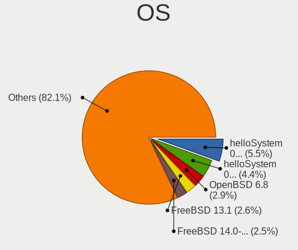

| Name                 | Computers | Percent |
|----------------------|-----------|---------|
| helloSystem 0.8.1    | 57        | 5.53%   |
| helloSystem 0.7.0    | 45        | 4.36%   |
| OpenBSD 6.8          | 30        | 2.91%   |
| FreeBSD 13.1         | 27        | 2.62%   |
| FreeBSD 14.0-CURRENT | 26        | 2.52%   |
| helloSystem 0.8.0    | 24        | 2.33%   |
| FreeBSD 13.0         | 24        | 2.33%   |
| FreeBSD 13.2         | 23        | 2.23%   |
| OpenBSD 7.3          | 22        | 2.13%   |
| FreeBSD 12.1-p5      | 20        | 1.94%   |
| OpenBSD 7.1          | 17        | 1.65%   |
| helloSystem 0.9.0    | 17        | 1.65%   |
| FreeBSD 14.0         | 12        | 1.16%   |
| FreeBSD 13.0-STABLE  | 12        | 1.16%   |
| FreeBSD 12.1-STABLE  | 12        | 1.16%   |
| helloSystem 0.6.0    | 11        | 1.07%   |
| OpenBSD 6.7          | 10        | 0.97%   |
| helloSystem 0.8.2    | 10        | 0.97%   |
| OpenBSD 7.2          | 9         | 0.87%   |
| OpenBSD 7.0          | 9         | 0.87%   |
| NomadBSD 1.3.2       | 9         | 0.87%   |
| helloSystem 0.5.0    | 9         | 0.87%   |
| FreeBSD 13.1-p5      | 9         | 0.87%   |
| FreeBSD 13.0-CURRENT | 9         | 0.87%   |
| GhostBSD 20.04.02    | 8         | 0.78%   |
| FreeBSD 12.2-p4      | 8         | 0.78%   |
| FreeBSD 12.1-p7      | 8         | 0.78%   |
| OpenBSD 6.9          | 7         | 0.68%   |
| FreeBSD 14.1         | 7         | 0.68%   |
| FreeBSD 12.2         | 7         | 0.68%   |
| OPNsense 24.1.7      | 6         | 0.58%   |
| OPNsense 24.1.6      | 6         | 0.58%   |
| OPNsense 23.7.12     | 6         | 0.58%   |
| OpenBSD 7.4          | 6         | 0.58%   |
| NomadBSD 5806f915    | 6         | 0.58%   |
| MyBee 13.2           | 6         | 0.58%   |
| helloSystem 0.4.0    | 6         | 0.58%   |
| FreeBSD 14.0-BETA5   | 6         | 0.58%   |
| FreeBSD 13.1-p2      | 6         | 0.58%   |
| FreeBSD 12.2-p3      | 6         | 0.58%   |

OS Family
---------

OS without a version

| Name        | Computers | Percent |
|-------------|-----------|---------|
| FreeBSD     | 353       | 40.39%  |
| helloSystem | 173       | 19.79%  |
| OPNsense    | 162       | 18.54%  |
| OpenBSD     | 91        | 10.41%  |
| MyBee       | 27        | 3.09%   |
| NomadBSD    | 19        | 2.17%   |
| NetBSD      | 17        | 1.95%   |
| GhostBSD    | 15        | 1.72%   |
| ClonOS      | 4         | 0.46%   |
| Ting        | 3         | 0.34%   |
| pfSense     | 2         | 0.23%   |
| XigmaNAS    | 1         | 0.11%   |
| TrueNAS     | 1         | 0.11%   |
| PC-BSD      | 1         | 0.11%   |
| OS108       | 1         | 0.11%   |
| LibertyBSD  | 1         | 0.11%   |
| FuryBSD     | 1         | 0.11%   |
| FuguIta     | 1         | 0.11%   |
| DragonFly   | 1         | 0.11%   |

Arch
----

OS architecture (x86_64, i586, etc.)

| Name    | Computers | Percent |
|---------|-----------|---------|
| amd64   | 757       | 90.88%  |
| i386    | 35        | 4.2%    |
| arm64   | 32        | 3.84%   |
| arm     | 3         | 0.36%   |
| macppc  | 2         | 0.24%   |
| sparc64 | 1         | 0.12%   |
| powerpc | 1         | 0.12%   |
| evbarm  | 1         | 0.12%   |
| armv7   | 1         | 0.12%   |

DE
--

Desktop Environment

| Name          | Computers | Percent |
|---------------|-----------|---------|
| Console       | 355       | 40.66%  |
| helloDesktop  | 217       | 24.86%  |
| KDE5          | 76        | 8.71%   |
| XFCE          | 58        | 6.64%   |
| fvwm          | 33        | 3.78%   |
| Openbox       | 28        | 3.21%   |
| MATE          | 25        | 2.86%   |
| TWM           | 24        | 2.75%   |
| GNOME         | 22        | 2.52%   |
| Fluxbox       | 6         | 0.69%   |
| IceWM         | 5         | 0.57%   |
| AwesomeWM     | 4         | 0.46%   |
| i3            | 3         | 0.34%   |
| LXQt          | 2         | 0.23%   |
| LXDE          | 2         | 0.23%   |
| Lumina        | 2         | 0.23%   |
| DWM           | 2         | 0.23%   |
| xinitrc       | 1         | 0.11%   |
| X-Cinnamon    | 1         | 0.11%   |
| StumpWM       | 1         | 0.11%   |
| plasma        | 1         | 0.11%   |
| KWin          | 1         | 0.11%   |
| KDE6          | 1         | 0.11%   |
| Enlightenment | 1         | 0.11%   |
| Budgie        | 1         | 0.11%   |
| akonadi_newm  | 1         | 0.11%   |

Display Server
--------------

X11 or Wayland

| Name    | Computers | Percent |
|---------|-----------|---------|
| X11     | 468       | 55.45%  |
| Console | 370       | 43.84%  |
| Wayland | 6         | 0.71%   |

Display Manager
---------------

SDDM, LightDM, etc.

| Name    | Computers | Percent |
|---------|-----------|---------|
| Console | 501       | 58.53%  |
| SLiM    | 216       | 25.23%  |
| SDDM    | 76        | 8.88%   |
| LightDM | 37        | 4.32%   |
| XDM     | 12        | 1.4%    |
| GDM     | 11        | 1.29%   |
| Ly      | 2         | 0.23%   |
| PCDM    | 1         | 0.12%   |

OS Lang
-------

Language

| Lang           | Computers | Percent |
|----------------|-----------|---------|
| Unknown        | 305       | 34.78%  |
| ru_RU          | 213       | 24.29%  |
| en_US          | 187       | 21.32%  |
| C              | 135       | 15.39%  |
| fr_FR          | 14        | 1.6%    |
| ru             | 11        | 1.25%   |
| ru_RU.KOI8-R   | 4         | 0.46%   |
| en_GB          | 3         | 0.34%   |
| fr             | 1         | 0.11%   |
| en_EN          | 1         | 0.11%   |
| en             | 1         | 0.11%   |
| cv_RU.US-ASCII | 1         | 0.11%   |
| ba_RU          | 1         | 0.11%   |

Boot Mode
---------

EFI or BIOS

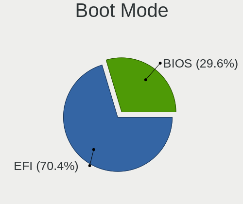

| Mode | Computers | Percent |
|------|-----------|---------|
| EFI  | 601       | 70.37%  |
| BIOS | 253       | 29.63%  |

Filesystem
----------

Type of filesystem

| Type    | Computers | Percent |
|---------|-----------|---------|
| Zfs     | 399       | 46.07%  |
| Ufs     | 281       | 32.45%  |
| Ffs     | 93        | 10.74%  |
| Cd9660  | 90        | 10.39%  |
| Xfs     | 1         | 0.12%   |
| Nullfs  | 1         | 0.12%   |
| Hammer2 | 1         | 0.12%   |

Part. scheme
------------

Scheme of partitioning

| Type    | Computers | Percent |
|---------|-----------|---------|
| GPT     | 709       | 84.61%  |
| MBR     | 121       | 14.44%  |
| Unknown | 7         | 0.84%   |
| BSD     | 1         | 0.12%   |

Board
-----

Vendor
------

Motherboard manufacturer

| Name                | Computers | Percent |
|---------------------|-----------|---------|
| ASUSTek Computer    | 145       | 17.45%  |
| Gigabyte Technology | 92        | 11.07%  |
| Unknown             | 83        | 9.99%   |
| Lenovo              | 80        | 9.63%   |
| ASRock              | 49        | 5.9%    |
| Hewlett-Packard     | 46        | 5.54%   |
| MSI                 | 37        | 4.45%   |
| Intel               | 36        | 4.33%   |
| Dell                | 33        | 3.97%   |
| Supermicro          | 28        | 3.37%   |
| Acer                | 24        | 2.89%   |
| Samsung Electronics | 12        | 1.44%   |
| Techvision          | 9         | 1.08%   |
| Apple               | 9         | 1.08%   |
| Sony                | 8         | 0.96%   |
| Huanan              | 8         | 0.96%   |
| Pegatron            | 7         | 0.84%   |
| HUAWEI              | 6         | 0.72%   |
| IBM                 | 5         | 0.6%    |
| F-Plus Mobile       | 5         | 0.6%    |
| AMI                 | 5         | 0.6%    |
| Toshiba             | 4         | 0.48%   |
| PC Engines          | 4         | 0.48%   |
| Fujitsu             | 4         | 0.48%   |
| ETegro Technologies | 4         | 0.48%   |
| Timi                | 3         | 0.36%   |
| Shuttle             | 3         | 0.36%   |
| Radxa               | 3         | 0.36%   |
| Foxconn             | 3         | 0.36%   |
| Firefly             | 3         | 0.36%   |
| Aquarius            | 3         | 0.36%   |
| ZOTAC               | 2         | 0.24%   |
| Wistron             | 2         | 0.24%   |
| TONK                | 2         | 0.24%   |
| Maibenben           | 2         | 0.24%   |
| Kraftway            | 2         | 0.24%   |
| Irbis               | 2         | 0.24%   |
| IP3 Technology      | 2         | 0.24%   |
| ICL                 | 2         | 0.24%   |
| HMT                 | 2         | 0.24%   |

Model
-----

Motherboard model

| Name                                                                  | Computers | Percent |
|-----------------------------------------------------------------------|-----------|---------|
| Unknown                                                               | 85        | 10.23%  |
| ASUS All Series                                                       | 13        | 1.56%   |
| Techvision TVI7309X                                                   | 9         | 1.08%   |
| F-Plus Mobile FLAPTOP r                                               | 5         | 0.6%    |
| Supermicro Super Server                                               | 4         | 0.48%   |
| PC Engines APU2                                                       | 4         | 0.48%   |
| Gigabyte C1037UN-EU                                                   | 4         | 0.48%   |
| AMI Aptio CRB                                                         | 4         | 0.48%   |
| Supermicro H8DGU                                                      | 3         | 0.36%   |
| MSI MS-7D46                                                           | 3         | 0.36%   |
| Intel S5520UR                                                         | 3         | 0.36%   |
| Huanan X99-QD4 V1.0                                                   | 3         | 0.36%   |
| HP ProLiant DL360e Gen8                                               | 3         | 0.36%   |
| Gigabyte H61M-S2PV                                                    | 3         | 0.36%   |
| Gigabyte H61M-DS2                                                     | 3         | 0.36%   |
| ETegro Hyperion RS130 G3                                              | 3         | 0.36%   |
| Supermicro SYS-6028R-TRT                                              | 2         | 0.24%   |
| Supermicro SSG-6029P-E1CR12L                                          | 2         | 0.24%   |
| Shuttle DS20U                                                         | 2         | 0.24%   |
| Samsung R530/R730/R540                                                | 2         | 0.24%   |
| Samsung N145P/N250P/N260P                                             | 2         | 0.24%   |
| Pegatron SAISHIAT2                                                    | 2         | 0.24%   |
| MSI PS63 Modern 8M                                                    | 2         | 0.24%   |
| MSI MS-7C96                                                           | 2         | 0.24%   |
| MSI MS-7B89                                                           | 2         | 0.24%   |
| MSI MS-7817                                                           | 2         | 0.24%   |
| Lenovo IdeaPad 330-15ARR 81D2                                         | 2         | 0.24%   |
| Lenovo IdeaPad 320-15ISK 80XH                                         | 2         | 0.24%   |
| Lenovo G570 20079                                                     | 2         | 0.24%   |
| Intel X79 V2.72A                                                      | 2         | 0.24%   |
| Intel S3420GP                                                         | 2         | 0.24%   |
| Intel H81U                                                            | 2         | 0.24%   |
| HUAWEI CREM-WXX9                                                      | 2         | 0.24%   |
| Huanan X79 INTEL (INTEL Xeon E5/Corei7 DMI2 - C600/C200 Cipset V2.49P | 2         | 0.24%   |
| HMT W041-TF-A-45                                                      | 2         | 0.24%   |
| HP ProLiant MicroServer                                               | 2         | 0.24%   |
| HP ProLiant DL180 G6                                                  | 2         | 0.24%   |
| HP Laptop 15-bs0xx                                                    | 2         | 0.24%   |
| Gigabyte Z68XP-UD3                                                    | 2         | 0.24%   |
| Gigabyte Z370P D3                                                     | 2         | 0.24%   |

Model Family
------------

Motherboard model prefix

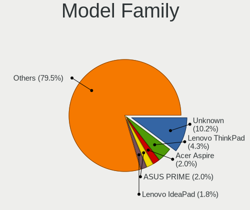

| Name                  | Computers | Percent |
|-----------------------|-----------|---------|
| Unknown               | 85        | 10.23%  |
| Lenovo ThinkPad       | 36        | 4.33%   |
| ASUS PRIME            | 17        | 2.05%   |
| Acer Aspire           | 17        | 2.05%   |
| Lenovo IdeaPad        | 15        | 1.81%   |
| HP ProLiant           | 14        | 1.68%   |
| ASUS All              | 13        | 1.56%   |
| Dell Inspiron         | 10        | 1.2%    |
| Techvision TVI7309X   | 9         | 1.08%   |
| ASUS VivoBook         | 9         | 1.08%   |
| Lenovo ThinkCentre    | 8         | 0.96%   |
| Dell Latitude         | 8         | 0.96%   |
| ASUS ROG              | 8         | 0.96%   |
| HP Laptop             | 7         | 0.84%   |
| HP ProBook            | 6         | 0.72%   |
| Lenovo ThinkBook      | 5         | 0.6%    |
| HP Compaq             | 5         | 0.6%    |
| Gigabyte B450M        | 5         | 0.6%    |
| F-Plus Mobile FLAPTOP | 5         | 0.6%    |
| Dell PowerEdge        | 5         | 0.6%    |
| Dell OptiPlex         | 5         | 0.6%    |
| Supermicro Super      | 4         | 0.48%   |
| PC Engines APU2       | 4         | 0.48%   |
| Gigabyte C1037UN-EU   | 4         | 0.48%   |
| ETegro Hyperion       | 4         | 0.48%   |
| ASUS TUF              | 4         | 0.48%   |
| AMI Aptio             | 4         | 0.48%   |
| Toshiba Satellite     | 3         | 0.36%   |
| Supermicro H8DGU      | 3         | 0.36%   |
| MSI MS-7D46           | 3         | 0.36%   |
| Intel S5520UR         | 3         | 0.36%   |
| IBM ThinkPad          | 3         | 0.36%   |
| Huanan X99-QD4        | 3         | 0.36%   |
| Gigabyte H61M-S2PV    | 3         | 0.36%   |
| Gigabyte H61M-DS2     | 3         | 0.36%   |
| ASUS P8Z77-V          | 3         | 0.36%   |
| ASUS P5Q              | 3         | 0.36%   |
| ASUS P5G41T-M         | 3         | 0.36%   |
| ASUS M5A97            | 3         | 0.36%   |
| ASRock Z690           | 3         | 0.36%   |

MFG Year
--------

Motherboard manufacture year

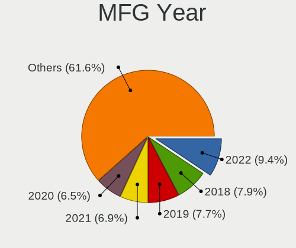

| Year    | Computers | Percent |
|---------|-----------|---------|
| 2022    | 78        | 9.39%   |
| 2018    | 66        | 7.94%   |
| 2019    | 64        | 7.7%    |
| 2021    | 57        | 6.86%   |
| 2020    | 54        | 6.5%    |
| 2012    | 52        | 6.26%   |
| 2010    | 52        | 6.26%   |
| 2011    | 48        | 5.78%   |
| 2023    | 43        | 5.17%   |
| 2013    | 42        | 5.05%   |
| 2017    | 37        | 4.45%   |
| 2014    | 33        | 3.97%   |
| 2009    | 33        | 3.97%   |
| Unknown | 33        | 3.97%   |
| 2016    | 30        | 3.61%   |
| 2008    | 26        | 3.13%   |
| 2015    | 25        | 3.01%   |
| 2007    | 19        | 2.29%   |
| 2024    | 16        | 1.93%   |
| 2006    | 10        | 1.2%    |
| 2005    | 7         | 0.84%   |
| 2004    | 5         | 0.6%    |
| 2003    | 1         | 0.12%   |

Form Factor
-----------

Physical design of the computer

| Name           | Computers | Percent |
|----------------|-----------|---------|
| Desktop        | 495       | 59.57%  |
| Notebook       | 246       | 29.6%   |
| Server         | 58        | 6.98%   |
| Mini pc        | 15        | 1.81%   |
| System on chip | 7         | 0.84%   |
| All in one     | 5         | 0.6%    |
| Convertible    | 3         | 0.36%   |
| Firewall       | 2         | 0.24%   |

Coreboot
--------

Have coreboot on board

| Used | Computers | Percent |
|------|-----------|---------|
| No   | 826       | 99.4%   |
| Yes  | 5         | 0.6%    |

RAM Size
--------

Total RAM memory

| Size in GB      | Computers | Percent |
|-----------------|-----------|---------|
| 8.01-16.0       | 214       | 25.18%  |
| 16.01-24.0      | 193       | 22.71%  |
| 4.01-8.0        | 172       | 20.24%  |
| 32.01-64.0      | 86        | 10.12%  |
| 2.01-3.0        | 55        | 6.47%   |
| 64.01-256.0     | 38        | 4.47%   |
| 3.01-4.0        | 29        | 3.41%   |
| 0.51-1.0        | 21        | 2.47%   |
| 24.01-32.0      | 12        | 1.41%   |
| More than 256.0 | 11        | 1.29%   |
| 1.01-2.0        | 11        | 1.29%   |
| 0.01-0.5        | 8         | 0.94%   |

RAM Used
--------

Used RAM memory

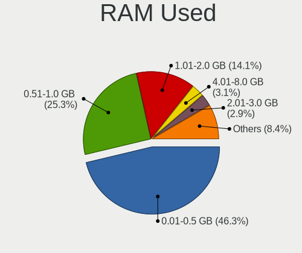

| Used GB     | Computers | Percent |
|-------------|-----------|---------|
| 0.01-0.5    | 403       | 46.27%  |
| 0.51-1.0    | 220       | 25.26%  |
| 1.01-2.0    | 123       | 14.12%  |
| 4.01-8.0    | 27        | 3.1%    |
| 2.01-3.0    | 25        | 2.87%   |
| Unknown     | 19        | 2.18%   |
| 8.01-16.0   | 15        | 1.72%   |
| 0           | 14        | 1.61%   |
| 3.01-4.0    | 12        | 1.38%   |
| 24.01-32.0  | 6         | 0.69%   |
| 16.01-24.0  | 5         | 0.57%   |
| 32.01-64.0  | 1         | 0.11%   |
| 64.01-256.0 | 1         | 0.11%   |

Total Drives
------------

Number of drives on board

| Drives | Computers | Percent |
|--------|-----------|---------|
| 1      | 443       | 50.4%   |
| 2      | 187       | 21.27%  |
| 0      | 109       | 12.4%   |
| 3      | 58        | 6.6%    |
| 4      | 40        | 4.55%   |
| 5      | 21        | 2.39%   |
| 6      | 8         | 0.91%   |
| 7      | 5         | 0.57%   |
| 10     | 2         | 0.23%   |
| 9      | 2         | 0.23%   |
| 19     | 1         | 0.11%   |
| 14     | 1         | 0.11%   |
| 11     | 1         | 0.11%   |
| 8      | 1         | 0.11%   |

Has CD-ROM
----------

Has CD-ROM on board

| Presented | Computers | Percent |
|-----------|-----------|---------|
| No        | 698       | 83.19%  |
| Yes       | 141       | 16.81%  |

Has Ethernet
------------

Has Ethernet on board

| Presented | Computers | Percent |
|-----------|-----------|---------|
| Yes       | 746       | 89.77%  |
| No        | 85        | 10.23%  |

Has WiFi
--------

Has WiFi module

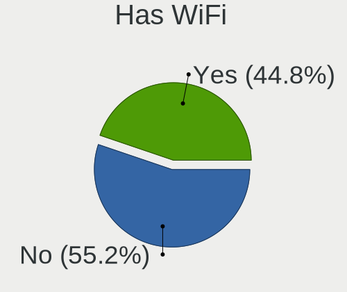

| Presented | Computers | Percent |
|-----------|-----------|---------|
| No        | 462       | 55.2%   |
| Yes       | 375       | 44.8%   |

Has Bluetooth
-------------

Has Bluetooth module

| Presented | Computers | Percent |
|-----------|-----------|---------|
| No        | 579       | 69.18%  |
| Yes       | 258       | 30.82%  |

Location
--------

Country
-------

Geographic location (country)

| Country | Computers | Percent |
|---------|-----------|---------|
| Russia  | 831       | 100%    |

City
----

Geographic location (city)

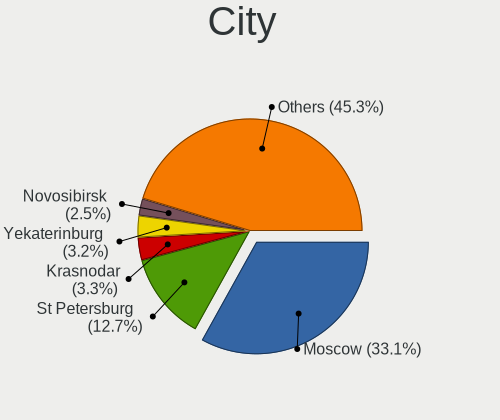

| City              | Computers | Percent |
|-------------------|-----------|---------|
| Moscow            | 283       | 33.06%  |
| St Petersburg     | 109       | 12.73%  |
| Krasnodar         | 28        | 3.27%   |
| Yekaterinburg     | 27        | 3.15%   |
| Novosibirsk       | 21        | 2.45%   |
| Chelyabinsk       | 18        | 2.1%    |
| Vladivostok       | 15        | 1.75%   |
| Ozersk            | 14        | 1.64%   |
| Krasnoyarsk       | 12        | 1.4%    |
| Voronezh          | 11        | 1.29%   |
| Perm              | 11        | 1.29%   |
| Ufa               | 9         | 1.05%   |
| Saratov           | 9         | 1.05%   |
| Barnaul           | 9         | 1.05%   |
| Surgut            | 8         | 0.93%   |
| Omsk              | 8         | 0.93%   |
| Kirov             | 8         | 0.93%   |
| Stavropol         | 7         | 0.82%   |
| Kamensk-Ural'skiy | 7         | 0.82%   |
| Ulyanovsk         | 6         | 0.7%    |
| Rostov-on-Don     | 6         | 0.7%    |
| Volgograd         | 5         | 0.58%   |
| Podolsk           | 5         | 0.58%   |
| Penza             | 5         | 0.58%   |
| Nizhniy Novgorod  | 5         | 0.58%   |
| Khabarovsk        | 5         | 0.58%   |
| Irkutsk           | 5         | 0.58%   |
| Cherepovets       | 5         | 0.58%   |
| Smolensk          | 4         | 0.47%   |
| Orenburg          | 4         | 0.47%   |
| Lipetsk           | 4         | 0.47%   |
| Armavir           | 4         | 0.47%   |
| Zhukovskiy        | 3         | 0.35%   |
| Vladimir          | 3         | 0.35%   |
| Vidnoye           | 3         | 0.35%   |
| Tyumen            | 3         | 0.35%   |
| Tolyatti          | 3         | 0.35%   |
| Tambov            | 3         | 0.35%   |
| Samara            | 3         | 0.35%   |
| Ramenskoye        | 3         | 0.35%   |

Drives
------

Drive Vendor
------------

Hard drive vendors

| Vendor              | Computers | Drives | Percent |
|---------------------|-----------|--------|---------|
| WDC                 | 199       | 337    | 18.72%  |
| Seagate             | 166       | 343    | 15.62%  |
| Samsung Electronics | 113       | 170    | 10.63%  |
| Kingston            | 67        | 88     | 6.3%    |
| Toshiba             | 62        | 111    | 5.83%   |
| Intel               | 45        | 88     | 4.23%   |
| Hitachi             | 36        | 79     | 3.39%   |
| A-DATA Technology   | 24        | 30     | 2.26%   |
| SanDisk             | 22        | 31     | 2.07%   |
| HGST                | 19        | 37     | 1.79%   |
| SPCC                | 18        | 20     | 1.69%   |
| Apacer              | 17        | 22     | 1.6%    |
| Crucial             | 16        | 23     | 1.51%   |
| Micron Technology   | 13        | 18     | 1.22%   |
| Hewlett-Packard     | 13        | 27     | 1.22%   |
| SK hynix            | 12        | 15     | 1.13%   |
| Netac               | 11        | 15     | 1.03%   |
| AMD                 | 11        | 12     | 1.03%   |
| Transcend           | 10        | 10     | 0.94%   |
| Silicon Motion      | 10        | 15     | 0.94%   |
| NVMe                | 10        | 15     | 0.94%   |
| Smartbuy            | 9         | 12     | 0.85%   |
| Plextor             | 9         | 15     | 0.85%   |
| OCZ                 | 9         | 13     | 0.85%   |
| KingSpec            | 9         | 12     | 0.85%   |
| Gigabyte Technology | 9         | 12     | 0.85%   |
| FORESEE             | 9         | 10     | 0.85%   |
| Patriot             | 8         | 8      | 0.75%   |
| Maxtor              | 7         | 7      | 0.66%   |
| OPENBSD             | 5         | 12     | 0.47%   |
| China               | 5         | 5      | 0.47%   |
| Team                | 4         | 4      | 0.38%   |
| SSSTC               | 4         | 6      | 0.38%   |
| Kston               | 4         | 4      | 0.38%   |
| JetFlash            | 4         | 4      | 0.38%   |
| Hoodisk             | 4         | 6      | 0.38%   |
| Fujitsu             | 4         | 6      | 0.38%   |
| UMIS                | 3         | 3      | 0.28%   |
| KIOXIA              | 3         | 3      | 0.28%   |
| Innostor            | 3         | 3      | 0.28%   |

Drive Model
-----------

Hard drive models

| Model                              | Computers | Percent |
|------------------------------------|-----------|---------|
| WDC WDS240G2G0A-00JH30 240GB       | 10        | 0.84%   |
| Kingston SA400S37240G 240GB        | 10        | 0.84%   |
| WDC WDS120G2G0A-00JH30 120GB       | 9         | 0.76%   |
| Toshiba DT01ACA100 1TB             | 9         | 0.76%   |
| Seagate ST1000DM010-2EP102 1TB     | 9         | 0.76%   |
| Kingston SV300S37A120G 120GB       | 8         | 0.67%   |
| SPCC Solid State Disk 128GB        | 7         | 0.59%   |
| Seagate ST1000LM035-1RK172 1TB     | 7         | 0.59%   |
| Seagate ST1000LM024 HN-M101MBB 1TB | 7         | 0.59%   |
| Samsung SSD 860 EVO 250GB          | 7         | 0.59%   |
| HP RAID 1(1+0) 240GB               | 7         | 0.59%   |
| WDC WD20EARX-00PASB0 2TB           | 6         | 0.5%    |
| Toshiba MQ01ABF050 500GB           | 6         | 0.5%    |
| Samsung SSD 860 EVO 500GB          | 6         | 0.5%    |
| Kingston SA400S37120G 120GB        | 6         | 0.5%    |
| AMD R5SL120G 120GB                 | 6         | 0.5%    |
| A-DATA SU650 120GB                 | 6         | 0.5%    |
| Toshiba HDWD110 1TB                | 5         | 0.42%   |
| Seagate ST500LT012-1DG142 500GB    | 5         | 0.42%   |
| Seagate ST500DM002-1BD142 500GB    | 5         | 0.42%   |
| Seagate ST250DM000-1BD141 250GB    | 5         | 0.42%   |
| Samsung SSD 970 EVO Plus 500GB     | 5         | 0.42%   |
| Samsung SSD 970 EVO Plus 250GB     | 5         | 0.42%   |
| Samsung SSD 870 EVO 500GB          | 5         | 0.42%   |
| OPENBSD SR RAID 1 128GB            | 5         | 0.42%   |
| Intel SSDSC2BW480H6 480GB          | 5         | 0.42%   |
| Apacer AS350 128GB                 | 5         | 0.42%   |
| WDC WD5000LPLX-00ZNTT0 500GB       | 4         | 0.34%   |
| WDC WD5000LPCX-60VHAT0 500GB       | 4         | 0.34%   |
| WDC WD5000AAKS-00V1A0 500GB        | 4         | 0.34%   |
| WDC WD10JPVX-22JC3T0 1TB           | 4         | 0.34%   |
| WDC WD1002FAEX-00Y9A0 1TB          | 4         | 0.34%   |
| Toshiba DT01ACA050 500GB           | 4         | 0.34%   |
| Seagate ST4000VN008-2DR166 4TB     | 4         | 0.34%   |
| Seagate ST3300657SS 304GB          | 4         | 0.34%   |
| Seagate ST1000LM049-2GH172 1TB     | 4         | 0.34%   |
| Samsung SSD 980 1TB                | 4         | 0.34%   |
| Samsung SSD 870 EVO 1TB            | 4         | 0.34%   |
| OCZ VERTEX3 64GB                   | 4         | 0.34%   |
| Netac SSD 256GB                    | 4         | 0.34%   |

HDD Vendor
----------

Hard disk drive vendors

| Vendor                             | Computers | Drives | Percent |
|------------------------------------|-----------|--------|---------|
| Seagate                            | 166       | 343    | 33.67%  |
| WDC                                | 158       | 278    | 32.05%  |
| Toshiba                            | 57        | 106    | 11.56%  |
| Hitachi                            | 36        | 79     | 7.3%    |
| HGST                               | 19        | 37     | 3.85%   |
| Samsung Electronics                | 16        | 26     | 3.25%   |
| NVMe                               | 8         | 13     | 1.62%   |
| Maxtor                             | 7         | 7      | 1.42%   |
| OPENBSD                            | 5         | 12     | 1.01%   |
| JetFlash                           | 4         | 4      | 0.81%   |
| Fujitsu                            | 4         | 6      | 0.81%   |
| Hewlett-Packard                    | 3         | 9      | 0.61%   |
| Adaptec                            | 2         | 12     | 0.41%   |
| USB                                | 1         | 1      | 0.2%    |
| UFD 2.0                            | 1         | 1      | 0.2%    |
| Product:              USB DISK 2.0 | 1         | 1      | 0.2%    |
| MaxDigital                         | 1         | 1      | 0.2%    |
| LSILOGIC                           | 1         | 1      | 0.2%    |
| IBM                                | 1         | 1      | 0.2%    |
| Areca                              | 1         | 2      | 0.2%    |
| Apple                              | 1         | 1      | 0.2%    |

SSD Vendor
----------

Solid state drive vendors

| Vendor              | Computers | Drives | Percent |
|---------------------|-----------|--------|---------|
| Samsung Electronics | 64        | 90     | 15.24%  |
| Kingston            | 52        | 68     | 12.38%  |
| WDC                 | 31        | 37     | 7.38%   |
| Intel               | 31        | 65     | 7.38%   |
| SanDisk             | 22        | 31     | 5.24%   |
| SPCC                | 17        | 19     | 4.05%   |
| A-DATA Technology   | 17        | 21     | 4.05%   |
| Apacer              | 15        | 18     | 3.57%   |
| Crucial             | 14        | 20     | 3.33%   |
| Hewlett-Packard     | 10        | 18     | 2.38%   |
| Smartbuy            | 9         | 12     | 2.14%   |
| Plextor             | 9         | 15     | 2.14%   |
| OCZ                 | 9         | 13     | 2.14%   |
| Netac               | 9         | 13     | 2.14%   |
| Micron Technology   | 9         | 14     | 2.14%   |
| KingSpec            | 9         | 12     | 2.14%   |
| Transcend           | 8         | 8      | 1.9%    |
| AMD                 | 8         | 9      | 1.9%    |
| Patriot             | 7         | 7      | 1.67%   |
| China               | 5         | 5      | 1.19%   |
| Team                | 4         | 4      | 0.95%   |
| Kston               | 4         | 4      | 0.95%   |
| Gigabyte Technology | 4         | 6      | 0.95%   |
| SK hynix            | 3         | 3      | 0.71%   |
| Innostor            | 3         | 3      | 0.71%   |
| Hoodisk             | 3         | 5      | 0.71%   |
| Verbatim            | 2         | 2      | 0.48%   |
| Toshiba             | 2         | 2      | 0.48%   |
| SETHRISE            | 2         | 2      | 0.48%   |
| NVMe                | 2         | 2      | 0.48%   |
| FORESEE             | 2         | 3      | 0.48%   |
| Apple               | 2         | 2      | 0.48%   |
| XUNZHE              | 1         | 1      | 0.24%   |
| XrayDisk            | 1         | 1      | 0.24%   |
| XPG                 | 1         | 1      | 0.24%   |
| walram              | 1         | 1      | 0.24%   |
| Union Memory        | 1         | 1      | 0.24%   |
| TAMMUZ              | 1         | 1      | 0.24%   |
| SATADOM             | 1         | 1      | 0.24%   |
| Qumo                | 1         | 1      | 0.24%   |

Drive Kind
----------

HDD or SSD

| Kind | Computers | Drives | Percent |
|------|-----------|--------|---------|
| HDD  | 391       | 941    | 42.55%  |
| SSD  | 375       | 578    | 40.81%  |
| NVMe | 153       | 213    | 16.65%  |

Drive Connector
---------------

SATA, SAS, NVMe, etc.

| Type | Computers | Drives | Percent |
|------|-----------|--------|---------|
| SATA | 640       | 1519   | 80.71%  |
| NVMe | 153       | 213    | 19.29%  |

Drive Size
----------

Size of hard drive

| Size in TB      | Computers | Drives | Percent |
|-----------------|-----------|--------|---------|
| 0.01-0.5        | 525       | 888    | 64.73%  |
| 0.51-1.0        | 172       | 295    | 21.21%  |
| 1.01-2.0        | 60        | 178    | 7.4%    |
| 3.01-4.0        | 26        | 68     | 3.21%   |
| 4.01-10.0       | 14        | 34     | 1.73%   |
| 2.01-3.0        | 10        | 26     | 1.23%   |
| 10.01-20.0      | 3         | 29     | 0.37%   |
| More than 100.0 | 1         | 1      | 0.12%   |

Space Total
-----------

Amount of disk space available on the file system

| Size in GB     | Computers | Percent |
|----------------|-----------|---------|
| 101-250        | 252       | 28.25%  |
| 251-500        | 177       | 19.84%  |
| 1-20           | 171       | 19.17%  |
| 51-100         | 84        | 9.42%   |
| 501-1000       | 80        | 8.97%   |
| 21-50          | 66        | 7.4%    |
| 1001-2000      | 29        | 3.25%   |
| More than 3000 | 21        | 2.35%   |
| Unknown        | 7         | 0.78%   |
| 2001-3000      | 5         | 0.56%   |

Space Used
----------

Amount of used disk space

| Used GB        | Computers | Percent |
|----------------|-----------|---------|
| 1-20           | 693       | 80.21%  |
| 21-50          | 76        | 8.8%    |
| 51-100         | 29        | 3.36%   |
| 101-250        | 26        | 3.01%   |
| 501-1000       | 9         | 1.04%   |
| More than 3000 | 8         | 0.93%   |
| 251-500        | 8         | 0.93%   |
| Unknown        | 7         | 0.81%   |
| 2001-3000      | 4         | 0.46%   |
| 1001-2000      | 4         | 0.46%   |

Malfunc. Drives
---------------

Drive models with a malfunction

| Model                               | Computers | Drives | Percent |
|-------------------------------------|-----------|--------|---------|
| Intel SSDSC2BW480H6 480GB           | 5         | 5      | 2.66%   |
| WDC WD5000AAKS-00V1A0 500GB         | 4         | 4      | 2.13%   |
| Samsung Electronics SSD 870 EVO 1TB | 4         | 9      | 2.13%   |
| WDC WDS240G2G0A-00JH30 240GB        | 3         | 3      | 1.6%    |
| Seagate ST500LT012-1DG142 500GB     | 3         | 4      | 1.6%    |
| Seagate ST1000LM024 HN-M101MBB 1TB  | 3         | 3      | 1.6%    |
| WDC WDS120G2G0A-00JH30 120GB        | 2         | 2      | 1.06%   |
| WDC WD5003AZEX-00MK2A0 500GB        | 2         | 2      | 1.06%   |
| WDC WD5000LPLX-00ZNTT0 500GB        | 2         | 3      | 1.06%   |
| WDC WD5000AAKX-00ERMA0 500GB        | 2         | 2      | 1.06%   |
| WDC WD3200AAKX-001CA0 320GB         | 2         | 2      | 1.06%   |
| WDC WD15EARS-00Z5B1 1.5TB           | 2         | 2      | 1.06%   |
| WDC WD1002FAEX-00Y9A0 1TB           | 2         | 2      | 1.06%   |
| Toshiba MQ01ABF050 500GB            | 2         | 2      | 1.06%   |
| Toshiba MK3259GSXP 320GB            | 2         | 2      | 1.06%   |
| Seagate ST9500325AS 500GB           | 2         | 2      | 1.06%   |
| Seagate ST500LT012-9WS142 500GB     | 2         | 2      | 1.06%   |
| Seagate ST3500413AS 500GB           | 2         | 4      | 1.06%   |
| Seagate ST3320418AS 320GB           | 2         | 2      | 1.06%   |
| Seagate ST3250410AS 250GB           | 2         | 2      | 1.06%   |
| Seagate ST250DM000-1BD141 250GB     | 2         | 4      | 1.06%   |
| Seagate ST2000DM001-9YN164 2TB      | 2         | 2      | 1.06%   |
| Samsung Electronics HD501LJ 500GB   | 2         | 4      | 1.06%   |
| Samsung Electronics HD161HJ 160GB   | 2         | 3      | 1.06%   |
| Micron Technology 1100 SATA 256GB   | 2         | 2      | 1.06%   |
| Maxtor STM3320613AS 320GB           | 2         | 2      | 1.06%   |
| Kingston SV300S37A120G 120GB        | 2         | 2      | 1.06%   |
| Kingston SA400S37120G 120GB         | 2         | 2      | 1.06%   |
| Hitachi HTS547550A9E384 500GB       | 2         | 2      | 1.06%   |
| Hitachi HDS721010CLA332 1TB         | 2         | 4      | 1.06%   |
| XPG SX950U 240GB                    | 1         | 1      | 0.53%   |
| WDC WD800AAJS-00TDA0 80GB           | 1         | 1      | 0.53%   |
| WDC WD7501AALS-00E8B0 752GB         | 1         | 1      | 0.53%   |
| WDC WD7500AACS-00ZJB0 752GB         | 1         | 1      | 0.53%   |
| WDC WD60EFRX-68MYMN1 6TB            | 1         | 1      | 0.53%   |
| WDC WD5000LPLX-60ZNTT1 500GB        | 1         | 1      | 0.53%   |
| WDC WD5000LPCX-60VHAT0 500GB        | 1         | 1      | 0.53%   |
| WDC WD5000AZRZ-00HTKB0 500GB        | 1         | 1      | 0.53%   |
| WDC WD5000AZLX-00CL5A0 500GB        | 1         | 1      | 0.53%   |
| WDC WD5000AAKX-60U6AA0 500GB        | 1         | 1      | 0.53%   |

Malfunc. Drive Vendor
---------------------

Vendors of faulty drives

| Vendor              | Computers | Drives | Percent |
|---------------------|-----------|--------|---------|
| Seagate             | 47        | 65     | 26.11%  |
| WDC                 | 46        | 61     | 25.56%  |
| Hitachi             | 16        | 22     | 8.89%   |
| Samsung Electronics | 15        | 23     | 8.33%   |
| Toshiba             | 12        | 14     | 6.67%   |
| Intel               | 11        | 11     | 6.11%   |
| Kingston            | 8         | 8      | 4.44%   |
| Maxtor              | 4         | 4      | 2.22%   |
| HGST                | 4         | 5      | 2.22%   |
| Micron Technology   | 3         | 4      | 1.67%   |
| SPCC                | 2         | 2      | 1.11%   |
| Plextor             | 2         | 2      | 1.11%   |
| XPG                 | 1         | 1      | 0.56%   |
| Transcend           | 1         | 1      | 0.56%   |
| SK hynix            | 1         | 1      | 0.56%   |
| Hewlett-Packard     | 1         | 1      | 0.56%   |
| GLOWAY              | 1         | 2      | 0.56%   |
| GK                  | 1         | 1      | 0.56%   |
| Crucial             | 1         | 1      | 0.56%   |
| Apple               | 1         | 1      | 0.56%   |
| AMD                 | 1         | 2      | 0.56%   |
| A-DATA Technology   | 1         | 1      | 0.56%   |

Malfunc. HDD Vendor
-------------------

Vendors of faulty HDD drives

| Vendor              | Computers | Drives | Percent |
|---------------------|-----------|--------|---------|
| Seagate             | 47        | 65     | 35.61%  |
| WDC                 | 41        | 56     | 31.06%  |
| Hitachi             | 16        | 22     | 12.12%  |
| Toshiba             | 12        | 14     | 9.09%   |
| Samsung Electronics | 7         | 10     | 5.3%    |
| Maxtor              | 4         | 4      | 3.03%   |
| HGST                | 4         | 5      | 3.03%   |
| Hewlett-Packard     | 1         | 1      | 0.76%   |

Malfunc. Drive Kind
-------------------

Kinds of faulty drives

| Kind | Computers | Drives | Percent |
|------|-----------|--------|---------|
| HDD  | 130       | 177    | 73.45%  |
| SSD  | 44        | 53     | 24.86%  |
| NVMe | 3         | 3      | 1.69%   |

Failed Drives
-------------

Failed drive models

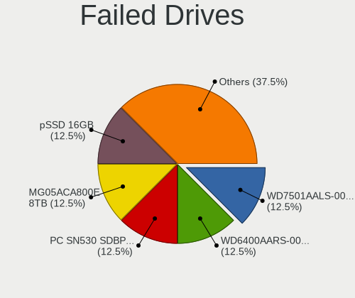

| Model                                | Computers | Drives | Percent |
|--------------------------------------|-----------|--------|---------|
| WDC WD7501AALS-00J7B0 752GB          | 1         | 1      | 12.5%   |
| WDC WD6400AARS-00Y5B1 640GB          | 1         | 2      | 12.5%   |
| WDC PC SN530 SDBPMPZ-256G-1101 256GB | 1         | 1      | 12.5%   |
| Toshiba MG05ACA800E 8TB              | 1         | 1      | 12.5%   |
| SanDisk pSSD 16GB                    | 1         | 1      | 12.5%   |
| Hitachi HTS545025B9A300 250GB        | 1         | 1      | 12.5%   |
| Hitachi HDS721010DLE630 1TB          | 1         | 1      | 12.5%   |
| Crucial M4-CT256M4SSD1 256GB         | 1         | 1      | 12.5%   |

Failed Drive Vendor
-------------------

Failed drive vendors

| Vendor  | Computers | Drives | Percent |
|---------|-----------|--------|---------|
| WDC     | 3         | 4      | 37.5%   |
| Hitachi | 2         | 2      | 25%     |
| Toshiba | 1         | 1      | 12.5%   |
| SanDisk | 1         | 1      | 12.5%   |
| Crucial | 1         | 1      | 12.5%   |

Drive Status
------------

Number of failed and malfunc. drives

| Status   | Computers | Drives | Percent |
|----------|-----------|--------|---------|
| Works    | 615       | 1377   | 72.27%  |
| Malfunc  | 173       | 233    | 20.33%  |
| Detected | 55        | 113    | 6.46%   |
| Failed   | 8         | 9      | 0.94%   |

Storage controller
------------------

Storage Vendor
--------------

Storage controller vendors

| Vendor                                  | Computers | Percent |
|-----------------------------------------|-----------|---------|
| Intel                                   | 567       | 54.57%  |
| AMD                                     | 130       | 12.51%  |
| Samsung Electronics                     | 47        | 4.52%   |
| Silicon Motion                          | 32        | 3.08%   |
| SanDisk                                 | 24        | 2.31%   |
| Broadcom / LSI                          | 22        | 2.12%   |
| Marvell Technology Group                | 20        | 1.92%   |
| JMicron Technology                      | 18        | 1.73%   |
| Nvidia                                  | 16        | 1.54%   |
| Kingston Technology Company             | 16        | 1.54%   |
| ASMedia Technology                      | 16        | 1.54%   |
| Phison Electronics                      | 14        | 1.35%   |
| SK hynix                                | 12        | 1.15%   |
| Shenzhen Longsys Electronics            | 12        | 1.15%   |
| ADATA Technology                        | 11        | 1.06%   |
| Hewlett-Packard                         | 9         | 0.87%   |
| Realtek Semiconductor                   | 8         | 0.77%   |
| MAXIO Technology (Hangzhou)             | 6         | 0.58%   |
| KIOXIA                                  | 5         | 0.48%   |
| Areca Technology                        | 5         | 0.48%   |
| Toshiba                                 | 4         | 0.38%   |
| Solid State Storage Technology          | 4         | 0.38%   |
| Shenzhen Unionmemory Information System | 4         | 0.38%   |
| Micron Technology                       | 4         | 0.38%   |
| VIA Technologies                        | 3         | 0.29%   |
| Netac Technology                        | 3         | 0.29%   |
| Micron/Crucial Technology               | 3         | 0.29%   |
| Adaptec                                 | 3         | 0.29%   |
| Yangtze Memory Technologies             | 2         | 0.19%   |
| Transcend                               | 2         | 0.19%   |
| Silicon Integrated Systems [SiS]        | 2         | 0.19%   |
| Silicon Image                           | 2         | 0.19%   |
| Lite-On IT Corp. / Plextor              | 2         | 0.19%   |
| Lenovo                                  | 2         | 0.19%   |
| Integrated Technology Express           | 2         | 0.19%   |
| Unknown                                 | 2         | 0.19%   |
| Union Memory (Shenzhen)                 | 1         | 0.1%    |
| Lite-On Technology                      | 1         | 0.1%    |
| Hosin Global Electronics                | 1         | 0.1%    |
| Broadcom                                | 1         | 0.1%    |

Storage Model
-------------

Storage controller models

| Model                                                                                                              | Computers | Percent |
|--------------------------------------------------------------------------------------------------------------------|-----------|---------|
| AMD FCH SATA Controller [AHCI mode]                                                                                | 70        | 5.85%   |
| Silicon Motion SM2263EN/SM2263XT (DRAM-less) NVMe SSD Controllers                                                  | 32        | 2.68%   |
| Intel 8 Series/C220 Series Chipset Family 6-port SATA Controller 1 [AHCI mode]                                     | 31        | 2.59%   |
| Intel 6 Series/C200 Series Chipset Family 6 port Desktop SATA AHCI Controller                                      | 29        | 2.42%   |
| Samsung NVMe SSD Controller SM981/PM981/PM983                                                                      | 26        | 2.17%   |
| Intel Sunrise Point-LP SATA Controller [AHCI mode]                                                                 | 25        | 2.09%   |
| Intel NM10/ICH7 Family SATA Controller [IDE mode]                                                                  | 25        | 2.09%   |
| Intel 82801G (ICH7 Family) IDE Controller                                                                          | 24        | 2.01%   |
| Intel Atom Processor E3800 Series SATA AHCI Controller                                                             | 23        | 1.92%   |
| Intel 7 Series/C210 Series Chipset Family 6-port SATA Controller [AHCI mode]                                       | 23        | 1.92%   |
| Intel Q170/Q150/B150/H170/H110/Z170/CM236 Chipset SATA Controller [AHCI Mode]                                      | 22        | 1.84%   |
| AMD SB7x0/SB8x0/SB9x0 SATA Controller [AHCI mode]                                                                  | 22        | 1.84%   |
| Intel 82801JI (ICH10 Family) SATA AHCI Controller                                                                  | 21        | 1.76%   |
| Intel 7 Series Chipset Family 6-port SATA Controller [AHCI mode]                                                   | 21        | 1.76%   |
| AMD SB7x0/SB8x0/SB9x0 IDE Controller                                                                               | 20        | 1.67%   |
| Intel NM10/ICH7 Family SATA Controller [AHCI mode]                                                                 | 18        | 1.51%   |
| Intel 200 Series PCH SATA controller [AHCI mode]                                                                   | 17        | 1.42%   |
| Intel Jasper Lake SATA AHCI Controller                                                                             | 15        | 1.25%   |
| AMD 400 Series Chipset SATA Controller                                                                             | 15        | 1.25%   |
| Intel Celeron N3350/Pentium N4200/Atom E3900 Series SATA AHCI Controller                                           | 14        | 1.17%   |
| Intel Cannon Lake PCH SATA AHCI Controller                                                                         | 14        | 1.17%   |
| ASMedia ASM1061/ASM1062 Serial ATA Controller                                                                      | 14        | 1.17%   |
| Intel 6 Series/C200 Series Chipset Family 6 port Mobile SATA AHCI Controller                                       | 13        | 1.09%   |
| AMD 500 Series Chipset SATA Controller                                                                             | 13        | 1.09%   |
| Intel Comet Lake SATA AHCI Controller                                                                              | 12        | 1%      |
| Intel C610/X99 series chipset 6-Port SATA Controller [AHCI mode]                                                   | 12        | 1%      |
| Shenzhen Longsys FORESEE XP1000 / Lexar Professional CFexpress Type B Gold series, NM620 PCIe NVME SSD (DRAM-less) | 11        | 0.92%   |
| Intel Celeron/Pentium Silver Processor SATA Controller                                                             | 11        | 0.92%   |
| Intel Atom/Celeron/Pentium Processor x5-E8000/J3xxx/N3xxx Series SATA Controller                                   | 11        | 0.92%   |
| AMD SB7x0/SB8x0/SB9x0 SATA Controller [IDE mode]                                                                   | 11        | 0.92%   |
| JMicron JMB363 SATA/IDE Controller                                                                                 | 10        | 0.84%   |
| Intel SSD 660P Series                                                                                              | 10        | 0.84%   |
| Intel Alder Lake-S PCH SATA Controller [AHCI Mode]                                                                 | 10        | 0.84%   |
| Intel Alder Lake-N SATA AHCI Controller                                                                            | 10        | 0.84%   |
| Intel 82801IBM/IEM (ICH9M/ICH9M-E) 4 port SATA Controller [AHCI mode]                                              | 10        | 0.84%   |
| Intel 82801HM/HEM (ICH8M/ICH8M-E) IDE Controller                                                                   | 10        | 0.84%   |
| Samsung NVMe SSD Controller 980 (DRAM-less)                                                                        | 9         | 0.75%   |
| Phison PS5013-E13 PCIe3 NVMe Controller (DRAM-less)                                                                | 9         | 0.75%   |
| Intel C600/X79 series chipset 6-Port SATA AHCI Controller                                                          | 9         | 0.75%   |
| Intel 5 Series/3400 Series Chipset 6 port SATA AHCI Controller                                                     | 9         | 0.75%   |

Storage Kind
------------

Kind of storage controller (IDE, SATA, NVMe, SAS, ...)

| Kind | Computers | Percent |
|------|-----------|---------|
| SATA | 592       | 57.64%  |
| NVMe | 226       | 22.01%  |
| IDE  | 147       | 14.31%  |
| RAID | 43        | 4.19%   |
| SAS  | 12        | 1.17%   |
| SCSI | 7         | 0.68%   |

Processor
---------

CPU Vendor
----------

Processor vendors

| Vendor             | Computers | Percent |
|--------------------|-----------|---------|
| Intel              | 604       | 72.34%  |
| AMD                | 187       | 22.4%   |
| ARM                | 30        | 3.59%   |
| Unknown            | 6         | 0.72%   |
| Rockchip           | 3         | 0.36%   |
| VIA                | 1         | 0.12%   |
| PowerPC            | 1         | 0.12%   |
| Baikal Electronics | 1         | 0.12%   |
| 7447A              | 1         | 0.12%   |
| 11th               | 1         | 0.12%   |

CPU Model
---------

Processor models

| Model                                    | Computers | Percent |
|------------------------------------------|-----------|---------|
| ARM Cortex-A55 r2p0                      | 14        | 1.65%   |
| Intel Celeron N5105 @ 2.00GHz            | 11        | 1.3%    |
| Intel N100                               | 10        | 1.18%   |
| Intel Core i3-6006U CPU @ 2.00GHz        | 7         | 0.82%   |
| Intel Celeron CPU J1900 @ 1.99GHz        | 7         | 0.82%   |
| Intel Celeron CPU J1800 @ 2.41GHz        | 7         | 0.82%   |
| Intel Celeron CPU 1037U @ 1.80GHz        | 6         | 0.71%   |
| AMD Ryzen 7 5825U with Radeon Graphics   | 6         | 0.71%   |
| AMD Ryzen 5 5600G with Radeon Graphics   | 6         | 0.71%   |
| AMD Ryzen 5 3600 6-Core Processor        | 6         | 0.71%   |
|                                          | 6         | 0.71%   |
| Intel Core i7-3770 CPU @ 3.40GHz         | 5         | 0.59%   |
| Intel Core 2 Quad CPU Q6600 @ 2.40GHz    | 5         | 0.59%   |
| Intel Celeron J4125 CPU @ 2.00GHz        | 5         | 0.59%   |
| Intel 686-class                          | 5         | 0.59%   |
| ARM Cortex-A57 r1p3                      | 5         | 0.59%   |
| ARM Cortex-A53 r0p4                      | 5         | 0.59%   |
| Intel Xeon CPU E5606 @ 2.13GHz           | 4         | 0.47%   |
| Intel Pentium CPU N3700 @ 1.60GHz        | 4         | 0.47%   |
| Intel CPU Version                        | 4         | 0.47%   |
| Intel Core i7-8565U CPU @ 1.80GHz        | 4         | 0.47%   |
| Intel Core i5-8350U CPU @ 1.70GHz        | 4         | 0.47%   |
| Intel Core i5-7400 CPU @ 3.00GHz         | 4         | 0.47%   |
| Intel Core i5-3470 CPU @ 3.20GHz         | 4         | 0.47%   |
| Intel Core i5-10400 CPU @ 2.90GHz        | 4         | 0.47%   |
| Intel Celeron N5100 @ 1.10GHz            | 4         | 0.47%   |
| Intel Celeron CPU N3350 @ 1.10GHz        | 4         | 0.47%   |
| AMD GX-412TC SOC                         | 4         | 0.47%   |
| Intel Xeon CPU X3450 @ 2.67GHz           | 3         | 0.35%   |
| Intel Xeon CPU E5645 @ 2.40GHz           | 3         | 0.35%   |
| Intel Xeon CPU E5-2620 v4 @ 2.10GHz      | 3         | 0.35%   |
| Intel Xeon CPU E3-1265L V2 @ 2.50GHz     | 3         | 0.35%   |
| Intel Xeon CPU E3-1220 v3 @ 3.10GHz      | 3         | 0.35%   |
| Intel Pentium Silver J5005 CPU @ 1.50GHz | 3         | 0.35%   |
| Intel Pentium Gold G5400 CPU @ 3.70GHz   | 3         | 0.35%   |
| Intel Pentium CPU N4200 @ 1.10GHz        | 3         | 0.35%   |
| Intel Pentium CPU G3220 @ 3.00GHz        | 3         | 0.35%   |
| Intel Genuine CPU                        | 3         | 0.35%   |
| Intel Core i7-8665U CPU @ 1.90GHz        | 3         | 0.35%   |
| Intel Core i7-8550U CPU @ 1.80GHz        | 3         | 0.35%   |

CPU Model Family
----------------

Processor model prefix

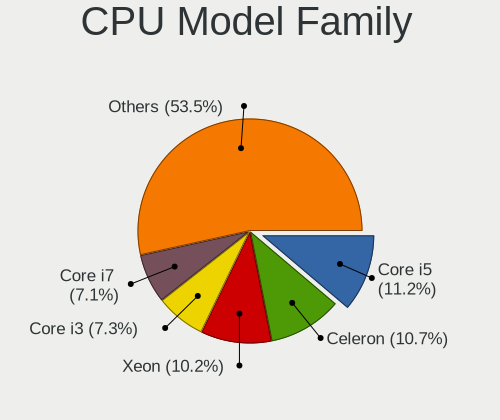

| Model                   | Computers | Percent |
|-------------------------|-----------|---------|
| Intel Core i5           | 94        | 11.19%  |
| Intel Celeron           | 90        | 10.71%  |
| Intel Xeon              | 86        | 10.24%  |
| Intel Core i3           | 61        | 7.26%   |
| Intel Core i7           | 60        | 7.14%   |
| Other                   | 58        | 6.9%    |
| AMD Ryzen 7             | 39        | 4.64%   |
| AMD Ryzen 5             | 39        | 4.64%   |
| Intel Core 2 Duo        | 31        | 3.69%   |
| ARM Cortex              | 30        | 3.57%   |
| Intel Pentium           | 28        | 3.33%   |
| Intel Atom              | 28        | 3.33%   |
| AMD Ryzen 3             | 14        | 1.67%   |
| Intel Core 2 Quad       | 13        | 1.55%   |
| AMD Ryzen 9             | 12        | 1.43%   |
| Intel Genuine           | 9         | 1.07%   |
| AMD FX                  | 9         | 1.07%   |
| Intel Pentium Dual-Core | 7         | 0.83%   |
| Intel Pentium 4         | 7         | 0.83%   |
| AMD E                   | 7         | 0.83%   |
| AMD Phenom II X4        | 6         | 0.71%   |
| AMD A6                  | 6         | 0.71%   |
| Intel Xeon Gold         | 5         | 0.6%    |
| Intel Pentium Silver    | 5         | 0.6%    |
| Intel Pentium M         | 5         | 0.6%    |
| Intel Pentium Gold      | 5         | 0.6%    |
| Intel 686-class         | 5         | 0.6%    |
| AMD GX                  | 5         | 0.6%    |
| Intel Core i9           | 4         | 0.48%   |
| AMD Ryzen 7 PRO         | 4         | 0.48%   |
| AMD Athlon 64 X2        | 4         | 0.48%   |
| AMD A10                 | 4         | 0.48%   |
| Intel Pentium Dual      | 3         | 0.36%   |
| Intel Pentium D         | 3         | 0.36%   |
| Intel Core 2            | 3         | 0.36%   |
| AMD Phenom II X6        | 3         | 0.36%   |
| AMD Opteron             | 3         | 0.36%   |
| AMD Athlon II X3        | 3         | 0.36%   |
| AMD A4                  | 3         | 0.36%   |
| Intel Xeon Bronze       | 2         | 0.24%   |

CPU Cores
---------

Number of processor cores

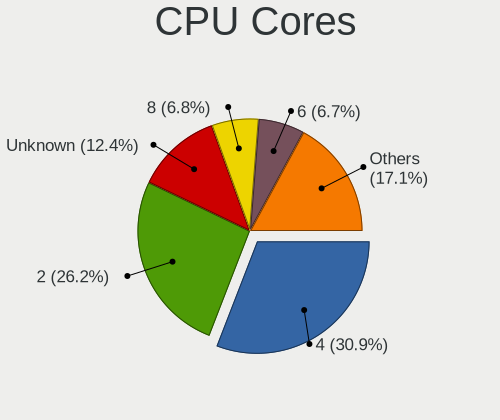

| Number  | Computers | Percent |
|---------|-----------|---------|
| 4       | 260       | 30.88%  |
| 2       | 221       | 26.25%  |
| Unknown | 104       | 12.35%  |
| 8       | 57        | 6.77%   |
| 6       | 56        | 6.65%   |
| 16      | 43        | 5.11%   |
| 12      | 39        | 4.63%   |
| 1       | 30        | 3.56%   |
| 24      | 8         | 0.95%   |
| 10      | 4         | 0.48%   |
| 32      | 3         | 0.36%   |
| 28      | 3         | 0.36%   |
| 14      | 3         | 0.36%   |
| 48      | 2         | 0.24%   |
| 36      | 2         | 0.24%   |
| 20      | 2         | 0.24%   |
| 3       | 2         | 0.24%   |
| 40      | 1         | 0.12%   |
| 22      | 1         | 0.12%   |
| 18      | 1         | 0.12%   |

CPU Sockets
-----------

Number of sockets

| Number  | Computers | Percent |
|---------|-----------|---------|
| 1       | 737       | 87.74%  |
| Unknown | 60        | 7.14%   |
| 2       | 43        | 5.12%   |

CPU Threads
-----------

Threads per core (Hyper-Threading)

| Number  | Computers | Percent |
|---------|-----------|---------|
| 1       | 421       | 49.94%  |
| 2       | 298       | 35.35%  |
| Unknown | 124       | 14.71%  |

CPU Microarch
-------------

Microarchitecture

| Name          | Computers | Percent |
|---------------|-----------|---------|
| Unknown       | 125       | 14.92%  |
| KabyLake      | 85        | 10.14%  |
| IvyBridge     | 54        | 6.44%   |
| SandyBridge   | 51        | 6.09%   |
| Haswell       | 49        | 5.85%   |
| Penryn        | 46        | 5.49%   |
| Skylake       | 38        | 4.53%   |
| Silvermont    | 38        | 4.53%   |
| Zen 3         | 34        | 4.06%   |
| Zen 2         | 28        | 3.34%   |
| Core          | 28        | 3.34%   |
| Bonnell       | 24        | 2.86%   |
| K10           | 23        | 2.74%   |
| Westmere      | 21        | 2.51%   |
| Broadwell     | 20        | 2.39%   |
| Goldmont      | 17        | 2.03%   |
| CometLake     | 17        | 2.03%   |
| Nehalem       | 16        | 1.91%   |
| Zen+          | 15        | 1.79%   |
| Zen           | 13        | 1.55%   |
| P6            | 13        | 1.55%   |
| NetBurst      | 13        | 1.55%   |
| Piledriver    | 12        | 1.43%   |
| Goldmont plus | 11        | 1.31%   |
| TigerLake     | 8         | 0.95%   |
| K8 Hammer     | 8         | 0.95%   |
| Bobcat        | 7         | 0.84%   |
| Puma          | 6         | 0.72%   |
| Excavator     | 5         | 0.6%    |
| Jaguar        | 4         | 0.48%   |
| Bulldozer     | 4         | 0.48%   |
| Steamroller   | 2         | 0.24%   |
| K10 Llano     | 1         | 0.12%   |
| IceLake       | 1         | 0.12%   |
| Geode         | 1         | 0.12%   |

Graphics
--------

GPU Vendor
----------

Vendors of graphics cards

| Vendor                                       | Computers | Percent |
|----------------------------------------------|-----------|---------|
| Intel                                        | 398       | 46.66%  |
| AMD                                          | 194       | 22.74%  |
| Nvidia                                       | 188       | 22.04%  |
| Matrox Electronics Systems                   | 38        | 4.45%   |
| ASPEED Technology                            | 29        | 3.4%    |
| VIA Technologies                             | 2         | 0.23%   |
| XGI Technology (eXtreme Graphics Innovation) | 1         | 0.12%   |
| RDC Semiconductor                            | 1         | 0.12%   |
| Cirrus Logic                                 | 1         | 0.12%   |
| ATI                                          | 1         | 0.12%   |

GPU Model
---------

Graphics card models

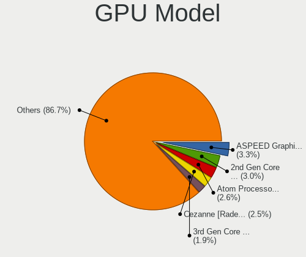

| Model                                                                                    | Computers | Percent |
|------------------------------------------------------------------------------------------|-----------|---------|
| ASPEED Technology ASPEED Graphics Family                                                 | 29        | 3.29%   |
| Intel 2nd Generation Core Processor Family Integrated Graphics Controller                | 26        | 2.95%   |
| Intel Atom Processor Z36xxx/Z37xxx Series Graphics & Display                             | 23        | 2.61%   |
| AMD Cezanne [Radeon Vega Series / Radeon Vega Mobile Series]                             | 22        | 2.5%    |
| Intel 3rd Gen Core processor Graphics Controller                                         | 17        | 1.93%   |
| Intel JasperLake [UHD Graphics]                                                          | 16        | 1.82%   |
| Matrox Electronics Systems MGA G200e [Pilot] ServerEngines (SEP1)                        | 15        | 1.7%    |
| Intel Xeon E3-1200 v3/4th Gen Core Processor Integrated Graphics Controller              | 14        | 1.59%   |
| AMD Ellesmere [Radeon RX 470/480/570/570X/580/580X/590]                                  | 14        | 1.59%   |
| Intel Atom/Celeron/Pentium Processor x5-E8000/J3xxx/N3xxx Integrated Graphics Controller | 13        | 1.48%   |
| Intel Atom Processor D4xx/D5xx/N4xx/N5xx Integrated Graphics Controller                  | 13        | 1.48%   |
| Nvidia GK208B [GeForce GT 710]                                                           | 11        | 1.25%   |
| Intel Xeon E3-1200 v2/3rd Gen Core processor Graphics Controller                         | 11        | 1.25%   |
| Intel CoffeeLake-S GT2 [UHD Graphics 630]                                                | 11        | 1.25%   |
| Intel Alder Lake-N [UHD Graphics]                                                        | 11        | 1.25%   |
| AMD Renoir [Radeon Vega Series / Radeon Vega Mobile Series]                              | 11        | 1.25%   |
| Matrox Electronics Systems MGA G200eW WPCM450                                            | 10        | 1.14%   |
| Intel UHD Graphics 620                                                                   | 10        | 1.14%   |
| AMD Rembrandt [Radeon 680M]                                                              | 10        | 1.14%   |
| Intel Skylake GT2 [HD Graphics 520]                                                      | 9         | 1.02%   |
| Intel HD Graphics 530                                                                    | 9         | 1.02%   |
| Intel HD Graphics 500                                                                    | 9         | 1.02%   |
| Intel Haswell-ULT Integrated Graphics Controller                                         | 9         | 1.02%   |
| Intel 4 Series Chipset Integrated Graphics Controller                                    | 9         | 1.02%   |
| AMD Picasso/Raven 2 [Radeon Vega Series / Radeon Vega Mobile Series]                     | 9         | 1.02%   |
| Nvidia GP107 [GeForce GTX 1050 Ti]                                                       | 8         | 0.91%   |
| Intel WhiskeyLake-U GT2 [UHD Graphics 620]                                               | 8         | 0.91%   |
| Intel HD Graphics 630                                                                    | 8         | 0.91%   |
| Intel CometLake-S GT2 [UHD Graphics 630]                                                 | 8         | 0.91%   |
| AMD ES1000                                                                               | 8         | 0.91%   |
| Intel Mobile 4 Series Chipset Integrated Graphics Controller                             | 7         | 0.79%   |
| Intel IvyBridge GT2 [HD Graphics 4000]                                                   | 7         | 0.79%   |
| Intel GeminiLake [UHD Graphics 600]                                                      | 7         | 0.79%   |
| Intel Alder Lake-S GT1 [UHD Graphics 730]                                                | 7         | 0.79%   |
| AMD Barcelo                                                                              | 7         | 0.79%   |
| Matrox Electronics Systems MGA G200EH                                                    | 6         | 0.68%   |
| Intel TigerLake-LP GT2 [Iris Xe Graphics]                                                | 6         | 0.68%   |
| Intel HD Graphics 620                                                                    | 6         | 0.68%   |
| Intel Core Processor Integrated Graphics Controller                                      | 6         | 0.68%   |
| Intel CometLake-U GT2 [UHD Graphics]                                                     | 6         | 0.68%   |

GPU Combo
---------

Combinations of graphics cards

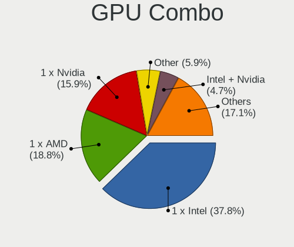

| Name                     | Computers | Percent |
|--------------------------|-----------|---------|
| 1 x Intel                | 316       | 37.75%  |
| 1 x AMD                  | 157       | 18.76%  |
| 1 x Nvidia               | 133       | 15.89%  |
| Other                    | 49        | 5.85%   |
| Intel + Nvidia           | 39        | 4.66%   |
| 1 x Matrox               | 37        | 4.42%   |
| 2 x Intel                | 33        | 3.94%   |
| 1 x ASPEED               | 28        | 3.35%   |
| 2 x AMD                  | 15        | 1.79%   |
| AMD + Nvidia             | 12        | 1.43%   |
| Intel + AMD              | 10        | 1.19%   |
| 1 x VIA                  | 2         | 0.24%   |
| 1 x XGI                  | 1         | 0.12%   |
| 1 x RDC Semiconductor    | 1         | 0.12%   |
| Nvidia + Matrox          | 1         | 0.12%   |
| Nvidia + ASPEED          | 1         | 0.12%   |
| Intel + AMD + 1 x Nvidia | 1         | 0.12%   |
| 1 x Cirrus Logic         | 1         | 0.12%   |

GPU Driver
----------

Free vs proprietary

| Driver      | Computers | Percent |
|-------------|-----------|---------|
| Free        | 676       | 80%     |
| Proprietary | 93        | 11.01%  |
| Unknown     | 76        | 8.99%   |

GPU Memory
----------

Total video memory

| Size in GB | Computers | Percent |
|------------|-----------|---------|
| Unknown    | 655       | 77.33%  |
| 0.01-0.5   | 66        | 7.79%   |
| 1.01-2.0   | 37        | 4.37%   |
| 0.51-1.0   | 33        | 3.9%    |
| 3.01-4.0   | 29        | 3.42%   |
| 7.01-8.0   | 12        | 1.42%   |
| 5.01-6.0   | 8         | 0.94%   |
| 8.01-16.0  | 4         | 0.47%   |
| 2.01-3.0   | 3         | 0.35%   |

Monitor
-------

Monitor Vendor
--------------

Monitor vendors

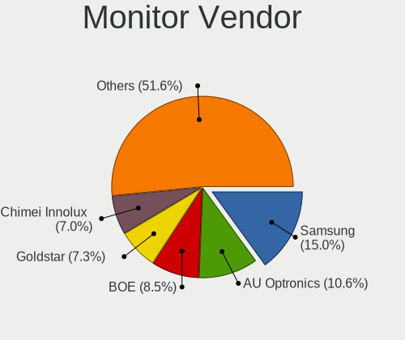

| Vendor                  | Computers | Percent |
|-------------------------|-----------|---------|
| Samsung Electronics     | 58        | 15.03%  |
| AU Optronics            | 41        | 10.62%  |
| BOE                     | 33        | 8.55%   |
| Goldstar                | 28        | 7.25%   |
| Chimei Innolux          | 27        | 6.99%   |
| LG Display              | 20        | 5.18%   |
| Dell                    | 18        | 4.66%   |
| ViewSonic               | 16        | 4.15%   |
| Acer                    | 16        | 4.15%   |
| Philips                 | 14        | 3.63%   |
| BenQ                    | 13        | 3.37%   |
| Ancor Communications    | 12        | 3.11%   |
| AOC                     | 11        | 2.85%   |
| NEC Computers           | 8         | 2.07%   |
| Hewlett-Packard         | 7         | 1.81%   |
| InfoVision              | 5         | 1.3%    |
| Apple                   | 5         | 1.3%    |
| Sony                    | 4         | 1.04%   |
| LG Electronics          | 4         | 1.04%   |
| HKC                     | 4         | 1.04%   |
| RTK                     | 3         | 0.78%   |
| LG Philips              | 3         | 0.78%   |
| Lenovo                  | 3         | 0.78%   |
| CSO                     | 3         | 0.78%   |
| Chi Mei Optoelectronics | 3         | 0.78%   |
| TMX                     | 2         | 0.52%   |
| PANDA                   | 2         | 0.52%   |
| Panasonic               | 2         | 0.52%   |
| Iiyama                  | 2         | 0.52%   |
| HannStar                | 2         | 0.52%   |
| Fujitsu Siemens         | 2         | 0.52%   |
| Unknown (CDD)           | 1         | 0.26%   |
| Toshiba                 | 1         | 0.26%   |
| Sharp                   | 1         | 0.26%   |
| RGT                     | 1         | 0.26%   |
| OOO                     | 1         | 0.26%   |
| NCS                     | 1         | 0.26%   |
| Microstep               | 1         | 0.26%   |
| Mi                      | 1         | 0.26%   |
| MDT                     | 1         | 0.26%   |

Monitor Model
-------------

Monitor models

| Model                                                                    | Computers | Percent |
|--------------------------------------------------------------------------|-----------|---------|
| ViewSonic VG2439 Series VSCD22B 1920x1080 520x290mm 23.4-inch            | 5         | 1.26%   |
| HKC LCD Monitor HKC3D05 1920x1080 340x190mm 15.3-inch                    | 4         | 1.01%   |
| Ancor Communications ASUS VW199 ACI19ED 1440x900 410x260mm 19.1-inch     | 4         | 1.01%   |
| Samsung Electronics SyncMaster SAM03CF 1280x1024 340x270mm 17.1-inch     | 3         | 0.76%   |
| Samsung Electronics SyncMaster SAM026F 1280x1024 380x300mm 19.1-inch     | 3         | 0.76%   |
| Samsung Electronics LCD Monitor SEC3245 1366x768 340x190mm 15.3-inch     | 3         | 0.76%   |
| Philips 170S PHL0839 1280x1024 340x270mm 17.1-inch                       | 3         | 0.76%   |
| Goldstar 22MP55 GSM5A26 1920x1080 480x270mm 21.7-inch                    | 3         | 0.76%   |
| ViewSonic LCD Monitor VSCC42B 1920x1080 480x270mm 21.7-inch              | 2         | 0.5%    |
| Samsung Electronics SyncMaster SAM027D 1680x1050 430x270mm 20.0-inch     | 2         | 0.5%    |
| Samsung Electronics SME1920NR SAM06A4 1280x1024 380x300mm 19.1-inch      | 2         | 0.5%    |
| Samsung Electronics SMBX2250 SAM071B 1920x1080 480x270mm 21.7-inch       | 2         | 0.5%    |
| Samsung Electronics S22B300 SAM08AC 1920x1080 480x270mm 21.7-inch        | 2         | 0.5%    |
| Samsung Electronics LCD Monitor SEC3030 1024x600 220x130mm 10.1-inch     | 2         | 0.5%    |
| Samsung Electronics LCD Monitor SAM0AC6 1920x1080 1110x620mm 50.1-inch   | 2         | 0.5%    |
| RTK WCS Display RTK1A1B 1920x1080 344x195mm 15.6-inch                    | 2         | 0.5%    |
| Philips PHL 240V5 PHLC10A 1920x1080 530x300mm 24.0-inch                  | 2         | 0.5%    |
| NEC Computers FE791SB NEC61D7 1600x1200 330x240mm 16.1-inch              | 2         | 0.5%    |
| HannStar LCD Monitor HSD03E9 1024x600 220x130mm 10.1-inch                | 2         | 0.5%    |
| Goldstar W1934 GSM4B7A 1440x900 410x260mm 19.1-inch                      | 2         | 0.5%    |
| Goldstar LG Ultra HD GSM5B09 3840x2160 600x340mm 27.2-inch               | 2         | 0.5%    |
| Goldstar LG IPS FULLHD GSM5AB6 1920x1080 480x270mm 21.7-inch             | 2         | 0.5%    |
| Goldstar LG FULL HD GSM5B55 1920x1080 480x270mm 21.7-inch                | 2         | 0.5%    |
| Dell U2412M DELA07A 1920x1200 520x320mm 24.0-inch                        | 2         | 0.5%    |
| Chimei Innolux LCD Monitor CMN15F5 1920x1080 340x190mm 15.3-inch         | 2         | 0.5%    |
| Chimei Innolux LCD Monitor CMN15E8 1920x1080 340x190mm 15.3-inch         | 2         | 0.5%    |
| Chimei Innolux LCD Monitor CMN15DB 1366x768 340x190mm 15.3-inch          | 2         | 0.5%    |
| Chimei Innolux LCD Monitor CMN1521 1920x1080 340x190mm 15.3-inch         | 2         | 0.5%    |
| Chimei Innolux LCD Monitor CMN14D4 1920x1080 310x170mm 13.9-inch         | 2         | 0.5%    |
| Chi Mei Optoelectronics LCD Monitor CMO1457 1366x768 310x170mm 13.9-inch | 2         | 0.5%    |
| BOE LCD Monitor BOE0AC1 2560x1600 340x210mm 15.7-inch                    | 2         | 0.5%    |
| BOE LCD Monitor BOE0747 1920x1080 350x200mm 15.9-inch                    | 2         | 0.5%    |
| BOE LCD Monitor BOE0700 1920x1080 340x190mm 15.3-inch                    | 2         | 0.5%    |
| BOE HF BOE0691 1920x1080 280x160mm 12.7-inch                             | 2         | 0.5%    |
| AU Optronics LCD Monitor AUO71EC 1366x768 340x190mm 15.3-inch            | 2         | 0.5%    |
| AU Optronics LCD Monitor AUO38ED 1920x1080 340x190mm 15.3-inch           | 2         | 0.5%    |
| AU Optronics LCD Monitor AUO315C 1366x768 260x140mm 11.6-inch            | 2         | 0.5%    |
| AU Optronics LCD Monitor AUO21EC 1366x768 340x190mm 15.3-inch            | 2         | 0.5%    |
| AOC Q27P1B AOC2701 2560x1440 600x340mm 27.2-inch                         | 2         | 0.5%    |
| AOC 2270W AOC2270 1920x1080 480x270mm 21.7-inch                          | 2         | 0.5%    |

Monitor Resolution
------------------

Monitor screen resolution

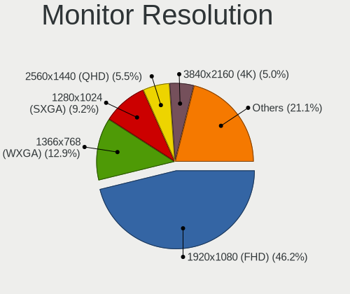

| Resolution         | Computers | Percent |
|--------------------|-----------|---------|
| 1920x1080 (FHD)    | 175       | 46.17%  |
| 1366x768 (WXGA)    | 49        | 12.93%  |
| 1280x1024 (SXGA)   | 35        | 9.23%   |
| 2560x1440 (QHD)    | 21        | 5.54%   |
| 3840x2160 (4K)     | 19        | 5.01%   |
| 1440x900 (WXGA+)   | 13        | 3.43%   |
| 1600x900 (HD+)     | 12        | 3.17%   |
| 1920x1200 (WUXGA)  | 9         | 2.37%   |
| 1680x1050 (WSXGA+) | 9         | 2.37%   |
| 1280x800 (WXGA)    | 8         | 2.11%   |
| 2560x1600          | 7         | 1.85%   |
| 1024x600           | 5         | 1.32%   |
| 2880x1800          | 2         | 0.53%   |
| 2560x1080          | 2         | 0.53%   |
| 1600x1200          | 2         | 0.53%   |
| Unknown            | 2         | 0.53%   |
| 3440x1440          | 1         | 0.26%   |
| 3200x1800 (QHD+)   | 1         | 0.26%   |
| 2520x1680          | 1         | 0.26%   |
| 2240x1400          | 1         | 0.26%   |
| 2160x1440          | 1         | 0.26%   |
| 2160x1350          | 1         | 0.26%   |
| 1920x540           | 1         | 0.26%   |
| 1360x768           | 1         | 0.26%   |
| 1024x768 (XGA)     | 1         | 0.26%   |

Monitor Diagonal
----------------

Diagonal size in inches

| Inches  | Computers | Percent |
|---------|-----------|---------|
| 15      | 90        | 23.26%  |
| 13      | 41        | 10.59%  |
| 21      | 32        | 8.27%   |
| 17      | 29        | 7.49%   |
| 24      | 28        | 7.24%   |
| 27      | 26        | 6.72%   |
| 19      | 26        | 6.72%   |
| 23      | 24        | 6.2%    |
| Unknown | 22        | 5.68%   |
| 14      | 9         | 2.33%   |
| 18      | 7         | 1.81%   |
| 12      | 7         | 1.81%   |
| 11      | 6         | 1.55%   |
| 10      | 6         | 1.55%   |
| 31      | 5         | 1.29%   |
| 22      | 5         | 1.29%   |
| 20      | 5         | 1.29%   |
| 16      | 5         | 1.29%   |
| 52      | 2         | 0.52%   |
| 50      | 2         | 0.52%   |
| 34      | 2         | 0.52%   |
| 57      | 1         | 0.26%   |
| 55      | 1         | 0.26%   |
| 54      | 1         | 0.26%   |
| 48      | 1         | 0.26%   |
| 46      | 1         | 0.26%   |
| 40      | 1         | 0.26%   |
| 32      | 1         | 0.26%   |
| 26      | 1         | 0.26%   |

Monitor Width
-------------

Physical width

| Width in mm | Computers | Percent |
|-------------|-----------|---------|
| 301-350     | 145       | 37.66%  |
| 501-600     | 77        | 20%     |
| 401-500     | 61        | 15.84%  |
| 201-300     | 38        | 9.87%   |
| 351-400     | 23        | 5.97%   |
| Unknown     | 22        | 5.71%   |
| 1001-1500   | 9         | 2.34%   |
| 601-700     | 6         | 1.56%   |
| 701-800     | 3         | 0.78%   |
| 801-900     | 1         | 0.26%   |

Aspect Ratio
------------

Proportional relationship between the width and the height

| Ratio   | Computers | Percent |
|---------|-----------|---------|
| 16/9    | 257       | 69.09%  |
| 16/10   | 51        | 13.71%  |
| 5/4     | 31        | 8.33%   |
| Unknown | 20        | 5.38%   |
| 3/2     | 6         | 1.61%   |
| 4/3     | 4         | 1.08%   |
| 21/9    | 2         | 0.54%   |
| 6/5     | 1         | 0.27%   |

Monitor Area
------------

Area in inch

| Area in inch | Computers | Percent |
|----------------|-----------|---------|
| 201-250        | 77        | 20%     |
| 91-100         | 70        | 18.18%  |
| 81-90          | 40        | 10.39%  |
| 151-200        | 33        | 8.57%   |
| 301-350        | 27        | 7.01%   |
| 141-150        | 26        | 6.75%   |
| Unknown        | 22        | 5.71%   |
| 101-110        | 17        | 4.42%   |
| 251-300        | 9         | 2.34%   |
| 121-130        | 9         | 2.34%   |
| More than 1000 | 8         | 2.08%   |
| 71-80          | 8         | 2.08%   |
| 351-500        | 8         | 2.08%   |
| 111-120        | 8         | 2.08%   |
| 61-70          | 6         | 1.56%   |
| 51-60          | 6         | 1.56%   |
| 41-50          | 6         | 1.56%   |
| 131-140        | 3         | 0.78%   |
| 501-1000       | 2         | 0.52%   |

Pixel Density
-------------

Pixels per inch

| Density       | Computers | Percent |
|---------------|-----------|---------|
| 51-100        | 142       | 36.88%  |
| 121-160       | 96        | 24.94%  |
| 101-120       | 82        | 21.3%   |
| 161-240       | 33        | 8.57%   |
| Unknown       | 22        | 5.71%   |
| 1-50          | 6         | 1.56%   |
| More than 240 | 4         | 1.04%   |

Multiple Monitors
-----------------

Total monitors connected

| Total | Computers | Percent |
|-------|-----------|---------|
| 0     | 443       | 52%     |
| 1     | 380       | 44.6%   |
| 2     | 28        | 3.29%   |
| 3     | 1         | 0.12%   |

Network
-------

Net Controller Vendor
---------------------

Controller vendors

| Vendor                            | Computers | Percent |
|-----------------------------------|-----------|---------|
| Realtek Semiconductor             | 442       | 37.46%  |
| Intel                             | 393       | 33.31%  |
| Qualcomm Atheros                  | 122       | 10.34%  |
| Broadcom                          | 55        | 4.66%   |
| Marvell Technology Group          | 24        | 2.03%   |
| D-Link System                     | 12        | 1.02%   |
| TP-Link                           | 11        | 0.93%   |
| MediaTek                          | 9         | 0.76%   |
| Huawei Technologies               | 9         | 0.76%   |
| VIA Technologies                  | 8         | 0.68%   |
| Samsung Electronics               | 8         | 0.68%   |
| Ralink Technology                 | 8         | 0.68%   |
| Ralink                            | 6         | 0.51%   |
| Mellanox Technologies             | 5         | 0.42%   |
| 3Com                              | 5         | 0.42%   |
| Xiaomi                            | 4         | 0.34%   |
| Nvidia                            | 3         | 0.25%   |
| IMC Networks                      | 3         | 0.25%   |
| D-Link                            | 3         | 0.25%   |
| Aquantia                          | 3         | 0.25%   |
| ZTE WCDMA Technologies MSM        | 2         | 0.17%   |
| Silicon Integrated Systems [SiS]  | 2         | 0.17%   |
| Qualcomm Atheros Communications   | 2         | 0.17%   |
| Qualcomm                          | 2         | 0.17%   |
| QLogic                            | 2         | 0.17%   |
| QinHeng Electronics               | 2         | 0.17%   |
| OPPO Electronics                  | 2         | 0.17%   |
| Mercucys                          | 2         | 0.17%   |
| JMicron Technology                | 2         | 0.17%   |
| Fibocom                           | 2         | 0.17%   |
| Ericsson Business Mobile Networks | 2         | 0.17%   |
| Atmel                             | 2         | 0.17%   |
| ASUSTek Computer                  | 2         | 0.17%   |
| Arduino SA                        | 2         | 0.17%   |
| ZyXEL Communications              | 1         | 0.08%   |
| Tehuti Networks                   | 1         | 0.08%   |
| Sundance Technology Inc / IC Plus | 1         | 0.08%   |
| STMicroelectronics                | 1         | 0.08%   |
| Shenzhen Goodix Technology        | 1         | 0.08%   |
| Realtek                           | 1         | 0.08%   |

Net Controller Model
--------------------

Controller models

| Model                                                                         | Computers | Percent |
|-------------------------------------------------------------------------------|-----------|---------|
| Realtek RTL8111/8168/8211/8411 PCI Express Gigabit Ethernet Controller        | 336       | 24.19%  |
| Intel 82574L Gigabit Network Connection                                       | 31        | 2.23%   |
| Realtek RTL8125 2.5GbE Controller                                             | 28        | 2.02%   |
| Intel I211 Gigabit Network Connection                                         | 28        | 2.02%   |
| Realtek RTL810xE PCI Express Fast Ethernet controller                         | 26        | 1.87%   |
| Qualcomm Atheros AR9285 Wireless Network Adapter (PCI-Express)                | 24        | 1.73%   |
| Intel I350 Gigabit Network Connection                                         | 21        | 1.51%   |
| Intel Ethernet Controller I226-V                                              | 21        | 1.51%   |
| Intel Ethernet Controller I225-V                                              | 21        | 1.51%   |
| Intel I210 Gigabit Network Connection                                         | 19        | 1.37%   |
| Intel Wi-Fi 6E(802.11ax) AX210/AX1675* 2x2 [Typhoon Peak]                     | 18        | 1.3%    |
| Intel 82579LM Gigabit Network Connection (Lewisville)                         | 17        | 1.22%   |
| Intel 82576 Gigabit Network Connection                                        | 17        | 1.22%   |
| Realtek RTL-8100/8101L/8139 PCI Fast Ethernet Adapter                         | 16        | 1.15%   |
| Intel Wireless 7265                                                           | 16        | 1.15%   |
| Intel Wi-Fi 6 AX200                                                           | 15        | 1.08%   |
| Qualcomm Atheros QCA9565 / AR9565 Wireless Network Adapter                    | 13        | 0.94%   |
| Intel Wireless 8265 / 8275                                                    | 13        | 0.94%   |
| Qualcomm Atheros AR9485 Wireless Network Adapter                              | 12        | 0.86%   |
| Realtek RTL8188EUS 802.11n Wireless Network Adapter                           | 11        | 0.79%   |
| Intel Dual Band Wireless-AC 3168NGW [Stone Peak]                              | 11        | 0.79%   |
| Realtek RTL8821CE 802.11ac PCIe Wireless Network Adapter                      | 10        | 0.72%   |
| Qualcomm Atheros QCA9377 802.11ac Wireless Network Adapter                    | 10        | 0.72%   |
| Intel 82571EB/82571GB Gigabit Ethernet Controller D0/D1 (copper applications) | 10        | 0.72%   |
| Qualcomm Atheros AR9462 Wireless Network Adapter                              | 9         | 0.65%   |
| Qualcomm Atheros AR8151 v2.0 Gigabit Ethernet                                 | 9         | 0.65%   |
| Intel Ethernet Controller 10-Gigabit X540-AT2                                 | 9         | 0.65%   |
| Realtek RTL8852BE PCIe 802.11ax Wireless Network Controller                   | 8         | 0.58%   |
| Realtek RTL8723BE PCIe Wireless Network Adapter                               | 8         | 0.58%   |
| Intel Ethernet Connection (2) I219-V                                          | 8         | 0.58%   |
| Qualcomm Atheros AR8152 v2.0 Fast Ethernet                                    | 7         | 0.5%    |
| Marvell Group 88E8040 PCI-E Fast Ethernet Controller                          | 7         | 0.5%    |
| Intel PRO/Wireless 3945ABG [Golan] Network Connection                         | 7         | 0.5%    |
| Intel Cannon Point-LP CNVi [Wireless-AC]                                      | 7         | 0.5%    |
| Intel 82599ES 10-Gigabit SFI/SFP+ Network Connection                          | 7         | 0.5%    |
| VIA VT6105/VT6106S [Rhine-III]                                                | 6         | 0.43%   |
| Realtek RTL8822CE 802.11ac PCIe Wireless Network Adapter                      | 6         | 0.43%   |
| Realtek RTL8111/8168/8411 PCI Express Gigabit Ethernet Controller             | 6         | 0.43%   |
| Qualcomm Atheros AR93xx Wireless Network Adapter                              | 6         | 0.43%   |
| Qualcomm Atheros AR8131 Gigabit Ethernet                                      | 6         | 0.43%   |

Wireless Vendor
---------------

Wireless vendors

| Vendor                          | Computers | Percent |
|---------------------------------|-----------|---------|
| Intel                           | 169       | 41.22%  |
| Qualcomm Atheros                | 88        | 21.46%  |
| Realtek Semiconductor           | 81        | 19.76%  |
| Broadcom                        | 23        | 5.61%   |
| TP-Link                         | 11        | 2.68%   |
| Ralink Technology               | 8         | 1.95%   |
| MediaTek                        | 8         | 1.95%   |
| Ralink                          | 6         | 1.46%   |
| IMC Networks                    | 3         | 0.73%   |
| D-Link                          | 3         | 0.73%   |
| Qualcomm Atheros Communications | 2         | 0.49%   |
| Mercucys                        | 2         | 0.49%   |
| ASUSTek Computer                | 2         | 0.49%   |
| Qcom                            | 1         | 0.24%   |
| Edimax Technology               | 1         | 0.24%   |
| BUFFALO                         | 1         | 0.24%   |
| Atheros                         | 1         | 0.24%   |

Wireless Model
--------------

Wireless models

| Model                                                          | Computers | Percent |
|----------------------------------------------------------------|-----------|---------|
| Qualcomm Atheros AR9285 Wireless Network Adapter (PCI-Express) | 24        | 5.7%    |
| Intel Wi-Fi 6E(802.11ax) AX210/AX1675* 2x2 [Typhoon Peak]      | 18        | 4.28%   |
| Intel Wireless 7265                                            | 16        | 3.8%    |
| Intel Wi-Fi 6 AX200                                            | 15        | 3.56%   |
| Qualcomm Atheros QCA9565 / AR9565 Wireless Network Adapter     | 13        | 3.09%   |
| Intel Wireless 8265 / 8275                                     | 13        | 3.09%   |
| Qualcomm Atheros AR9485 Wireless Network Adapter               | 12        | 2.85%   |
| Realtek RTL8188EUS 802.11n Wireless Network Adapter            | 11        | 2.61%   |
| Intel Dual Band Wireless-AC 3168NGW [Stone Peak]               | 11        | 2.61%   |
| Realtek RTL8821CE 802.11ac PCIe Wireless Network Adapter       | 10        | 2.38%   |
| Qualcomm Atheros QCA9377 802.11ac Wireless Network Adapter     | 10        | 2.38%   |
| Qualcomm Atheros AR9462 Wireless Network Adapter               | 9         | 2.14%   |
| Realtek RTL8723BE PCIe Wireless Network Adapter                | 8         | 1.9%    |
| Realtek RTL8852BE PCIe 802.11ax Wireless Network Controller    | 7         | 1.66%   |
| Intel PRO/Wireless 3945ABG [Golan] Network Connection          | 7         | 1.66%   |
| Intel Cannon Point-LP CNVi [Wireless-AC]                       | 7         | 1.66%   |
| Realtek RTL8822CE 802.11ac PCIe Wireless Network Adapter       | 6         | 1.43%   |
| Qualcomm Atheros AR93xx Wireless Network Adapter               | 6         | 1.43%   |
| Intel Wireless 8260                                            | 6         | 1.43%   |
| Intel Wireless 7260                                            | 6         | 1.43%   |
| Realtek RTL8192CU 802.11n WLAN Adapter                         | 5         | 1.19%   |
| Qualcomm Atheros AR928X Wireless Network Adapter (PCI-Express) | 5         | 1.19%   |
| Intel Wi-Fi 6 AX201                                            | 5         | 1.19%   |
| Intel Comet Lake PCH-LP CNVi WiFi                              | 5         | 1.19%   |
| Realtek RTL8723DE Wireless Network Adapter                     | 4         | 0.95%   |
| Realtek RTL8188CE 802.11b/g/n WiFi Adapter                     | 4         | 0.95%   |
| Realtek Realtek Bluetooth 4.2 Adapter                          | 4         | 0.95%   |
| Realtek Bluetooth Adapter                                      | 4         | 0.95%   |
| MediaTek MT7921K (RZ608) Wi-Fi 6E 80MHz                        | 4         | 0.95%   |
| Intel Wireless 3165                                            | 4         | 0.95%   |
| Intel Comet Lake PCH CNVi WiFi                                 | 4         | 0.95%   |
| Intel Centrino Advanced-N 6205 [Taylor Peak]                   | 4         | 0.95%   |
| Intel Cannon Lake PCH CNVi WiFi                                | 4         | 0.95%   |
| Broadcom BCM4360 802.11ac Dual Band Wireless Network Adapter   | 4         | 0.95%   |
| Broadcom BCM4313 802.11bgn Wireless Network Adapter            | 4         | 0.95%   |
| TP-Link TL-WN722N v2/v3 [Realtek RTL8188EUS]                   | 3         | 0.71%   |
| TP-Link AC600 wireless Realtek RTL8811AU [Archer T2U Nano]     | 3         | 0.71%   |
| Realtek RTL8812AE 802.11ac PCIe Wireless Network Adapter       | 3         | 0.71%   |
| Realtek RTL8811AU 802.11a/b/g/n/ac WLAN Adapter                | 3         | 0.71%   |
| Realtek RTL8192EU 802.11b/g/n WLAN Adapter                     | 3         | 0.71%   |

Ethernet Vendor
---------------

Ethernet vendors

| Vendor                            | Computers | Percent |
|-----------------------------------|-----------|---------|
| Realtek Semiconductor             | 406       | 47.65%  |
| Intel                             | 274       | 32.16%  |
| Qualcomm Atheros                  | 44        | 5.16%   |
| Broadcom                          | 35        | 4.11%   |
| Marvell Technology Group          | 24        | 2.82%   |
| D-Link System                     | 12        | 1.41%   |
| VIA Technologies                  | 8         | 0.94%   |
| Samsung Electronics               | 8         | 0.94%   |
| 3Com                              | 5         | 0.59%   |
| Xiaomi                            | 4         | 0.47%   |
| Nvidia                            | 3         | 0.35%   |
| Aquantia                          | 3         | 0.35%   |
| ZTE WCDMA Technologies MSM        | 2         | 0.23%   |
| Silicon Integrated Systems [SiS]  | 2         | 0.23%   |
| Qualcomm                          | 2         | 0.23%   |
| QLogic                            | 2         | 0.23%   |
| OPPO Electronics                  | 2         | 0.23%   |
| JMicron Technology                | 2         | 0.23%   |
| Huawei Technologies               | 2         | 0.23%   |
| Tehuti Networks                   | 1         | 0.12%   |
| Sundance Technology Inc / IC Plus | 1         | 0.12%   |
| Realtek                           | 1         | 0.12%   |
| MYRICOM                           | 1         | 0.12%   |
| MediaTek                          | 1         | 0.12%   |
| Insyde Software                   | 1         | 0.12%   |
| IBM                               | 1         | 0.12%   |
| Attansic                          | 1         | 0.12%   |
| Apple                             | 1         | 0.12%   |
| American Megatrends               | 1         | 0.12%   |
| AMD                               | 1         | 0.12%   |
| Accton Technology                 | 1         | 0.12%   |

Ethernet Model
--------------

Ethernet models

| Model                                                                         | Computers | Percent |
|-------------------------------------------------------------------------------|-----------|---------|
| Realtek RTL8111/8168/8211/8411 PCI Express Gigabit Ethernet Controller        | 336       | 35.94%  |
| Intel 82574L Gigabit Network Connection                                       | 31        | 3.32%   |
| Intel I211 Gigabit Network Connection                                         | 28        | 2.99%   |
| Realtek RTL8125 2.5GbE Controller                                             | 27        | 2.89%   |
| Realtek RTL810xE PCI Express Fast Ethernet controller                         | 26        | 2.78%   |
| Intel I350 Gigabit Network Connection                                         | 21        | 2.25%   |
| Intel Ethernet Controller I226-V                                              | 21        | 2.25%   |
| Intel Ethernet Controller I225-V                                              | 21        | 2.25%   |
| Intel I210 Gigabit Network Connection                                         | 19        | 2.03%   |
| Intel 82579LM Gigabit Network Connection (Lewisville)                         | 17        | 1.82%   |
| Intel 82576 Gigabit Network Connection                                        | 17        | 1.82%   |
| Realtek RTL-8100/8101L/8139 PCI Fast Ethernet Adapter                         | 16        | 1.71%   |
| Intel 82571EB/82571GB Gigabit Ethernet Controller D0/D1 (copper applications) | 10        | 1.07%   |
| Qualcomm Atheros AR8151 v2.0 Gigabit Ethernet                                 | 9         | 0.96%   |
| Intel Ethernet Controller 10-Gigabit X540-AT2                                 | 9         | 0.96%   |
| Intel Ethernet Connection (2) I219-V                                          | 8         | 0.86%   |
| Qualcomm Atheros AR8152 v2.0 Fast Ethernet                                    | 7         | 0.75%   |
| Marvell Group 88E8040 PCI-E Fast Ethernet Controller                          | 7         | 0.75%   |
| Intel 82599ES 10-Gigabit SFI/SFP+ Network Connection                          | 7         | 0.75%   |
| VIA VT6105/VT6106S [Rhine-III]                                                | 6         | 0.64%   |
| Realtek RTL8111/8168/8411 PCI Express Gigabit Ethernet Controller             | 6         | 0.64%   |
| Qualcomm Atheros AR8131 Gigabit Ethernet                                      | 6         | 0.64%   |
| Marvell Group 88E8056 PCI-E Gigabit Ethernet Controller                       | 6         | 0.64%   |
| Intel Ethernet Connection I217-V                                              | 6         | 0.64%   |
| Intel Ethernet Connection (7) I219-V                                          | 6         | 0.64%   |
| Intel Ethernet Connection (17) I219-V                                         | 6         | 0.64%   |
| Intel 82583V Gigabit Network Connection                                       | 6         | 0.64%   |
| Intel 82579V Gigabit Network Connection                                       | 6         | 0.64%   |
| D-Link System DGE-528T Gigabit Ethernet Adapter                               | 6         | 0.64%   |
| Samsung Galaxy series, misc. (tethering mode)                                 | 5         | 0.53%   |
| Qualcomm Atheros Attansic L1 Gigabit Ethernet                                 | 5         | 0.53%   |
| Qualcomm Atheros AR8121/AR8113/AR8114 Gigabit or Fast Ethernet                | 5         | 0.53%   |
| Intel 82575EB Gigabit Network Connection                                      | 5         | 0.53%   |
| Broadcom NetXtreme BCM5720 Gigabit Ethernet PCIe                              | 5         | 0.53%   |
| Realtek RTL8169 PCI Gigabit Ethernet Controller                               | 4         | 0.43%   |
| Realtek Killer E3000 2.5GbE Controller                                        | 4         | 0.43%   |
| Intel Ethernet Connection I219-LM                                             | 4         | 0.43%   |
| Intel Ethernet Connection (7) I219-LM                                         | 4         | 0.43%   |
| Intel Ethernet Connection (2) I219-LM                                         | 4         | 0.43%   |
| Intel 82572EI Gigabit Ethernet Controller (Copper)                            | 4         | 0.43%   |

Net Controller Kind
-------------------

Ethernet, WiFi or modem

| Kind     | Computers | Percent |
|----------|-----------|---------|
| Ethernet | 746       | 64.7%   |
| WiFi     | 375       | 32.52%  |
| Unknown  | 21        | 1.82%   |
| Modem    | 11        | 0.95%   |

Used Controller
---------------

Currently used network controller

| Kind     | Computers | Percent |
|----------|-----------|---------|
| Ethernet | 602       | 75.91%  |
| WiFi     | 188       | 23.71%  |
| Unknown  | 3         | 0.38%   |

NICs
----

Total network controllers on board

| Total | Computers | Percent |
|-------|-----------|---------|
| 2     | 334       | 39.43%  |
| 1     | 286       | 33.77%  |
| 3     | 68        | 8.03%   |
| 0     | 58        | 6.85%   |
| 4     | 51        | 6.02%   |
| 6     | 25        | 2.95%   |
| 5     | 11        | 1.3%    |
| 9     | 5         | 0.59%   |
| 7     | 5         | 0.59%   |
| 8     | 3         | 0.35%   |
| 12    | 1         | 0.12%   |

IPv6
----

IPv6 vs IPv4

| Used | Computers | Percent |
|------|-----------|---------|
| No   | 809       | 96.08%  |
| Yes  | 33        | 3.92%   |

Bluetooth
---------

Bluetooth Vendor
----------------

Controller vendors

| Vendor                          | Computers | Percent |
|---------------------------------|-----------|---------|
| Intel                           | 129       | 48.86%  |
| Realtek Semiconductor           | 28        | 10.61%  |
| Qualcomm Atheros Communications | 23        | 8.71%   |
| IMC Networks                    | 15        | 5.68%   |
| Apple                           | 10        | 3.79%   |
| Cambridge Silicon Radio         | 9         | 3.41%   |
| Broadcom                        | 9         | 3.41%   |
| Foxconn / Hon Hai               | 7         | 2.65%   |
| ASUSTek Computer                | 7         | 2.65%   |
| Lite-On Technology              | 5         | 1.89%   |
| MediaTek                        | 4         | 1.52%   |
| Alps Electric                   | 4         | 1.52%   |
| Skylight Digital                | 3         | 1.14%   |
| Ralink                          | 2         | 0.76%   |
| Hewlett-Packard                 | 2         | 0.76%   |
| TP-Link                         | 1         | 0.38%   |
| Taiyo Yuden                     | 1         | 0.38%   |
| Silicon Wave                    | 1         | 0.38%   |
| Shenzhen Goodix Technology      | 1         | 0.38%   |
| Opticis                         | 1         | 0.38%   |
| Edimax Technology               | 1         | 0.38%   |
| Dell                            | 1         | 0.38%   |

Bluetooth Model
---------------

Controller models

| Model                                                       | Computers | Percent |
|-------------------------------------------------------------|-----------|---------|
| Intel Bluetooth wireless interface                          | 43        | 16.17%  |
| Intel AX201 Bluetooth                                       | 19        | 7.14%   |
| Realtek Bluetooth Adapter                                   | 17        | 6.39%   |
| Intel AX210 Bluetooth                                       | 17        | 6.39%   |
| Intel AX200 Bluetooth                                       | 16        | 6.02%   |
| Intel Bluetooth 9460/9560 Jefferson Peak (JfP)              | 14        | 5.26%   |
| Intel Wireless-AC 3168 Bluetooth                            | 11        | 4.14%   |
| Cambridge Silicon Radio Bluetooth Dongle (HCI mode)         | 9         | 3.38%   |
| Qualcomm Atheros AR3012 Bluetooth 4.0                       | 6         | 2.26%   |
| Qualcomm Atheros QCA9377 Bluetooth 4.1                      | 5         | 1.88%   |
| Qualcomm Atheros Dell Wireless 1707 Bluetooth 4.0 LE Device | 5         | 1.88%   |
| Apple Bluetooth Host Controller                             | 5         | 1.88%   |
| Realtek RTL8723B Bluetooth                                  | 4         | 1.5%    |
| MediaTek RZ608 Bluetooth Adapter                            | 4         | 1.5%    |
| Lite-On Atheros AR3012 Bluetooth                            | 4         | 1.5%    |
| Intel Centrino Bluetooth Wireless Transceiver               | 4         | 1.5%    |
| Intel AX211 Bluetooth                                       | 4         | 1.5%    |
| IMC Networks Qualcomm Atheros Bluetooth 4.1                 | 4         | 1.5%    |
| Skylight Digital Realtek Bluetooth Adapter                  | 3         | 1.13%   |
| IMC Networks Realtek Bluetooth Adapter                      | 3         | 1.13%   |
| IMC Networks Qualcomm Atheros AR9462 Bluetooth 4.0          | 3         | 1.13%   |
| Broadcom BCM20702 Bluetooth 4.0 [ThinkPad]                  | 3         | 1.13%   |
| Realtek Bluetooth 4.0 Adapter                               | 2         | 0.75%   |
| Realtek Bluetooth 4.0 + High Speed Chip                     | 2         | 0.75%   |
| Ralink RT3290 Bluetooth                                     | 2         | 0.75%   |
| Qualcomm Atheros AR9462 Bluetooth                           | 2         | 0.75%   |
| Intel Centrino Advanced-N 6230 Bluetooth adapter            | 2         | 0.75%   |
| IMC Networks Qualcomm Atheros Bluetooth 4.0 + HS            | 2         | 0.75%   |
| Broadcom Bluetooth 4.0                                      | 2         | 0.75%   |
| Broadcom BCM2045B (BDC-2.1)                                 | 2         | 0.75%   |
| ASUS BT-270 Bluetooth Adapter                               | 2         | 0.75%   |
| ASUS Broadcom BCM20702A0 Bluetooth                          | 2         | 0.75%   |
| Apple Built-in Bluetooth 2.0+EDR HCI                        | 2         | 0.75%   |
| Apple Broadcom Built-in Bluetooth                           | 2         | 0.75%   |
| Alps Electric Bluetooth Controller (ALPS/UGPZ6)             | 2         | 0.75%   |
| TP-Link Bluetooth 5.0 USB Adapter                           | 1         | 0.38%   |
| Taiyo Yuden Bluetooth Device (V2.0+EDR)                     | 1         | 0.38%   |
| Silicon Wave Bluetooth Wireless Adapter                     | 1         | 0.38%   |
| Shenzhen Goodix retrieving string failed                    | 1         | 0.38%   |
| Realtek Wireless Bluetooth Adapter                          | 1         | 0.38%   |

Sound
-----

Sound Vendor
------------

Sound card vendors

| Vendor                                       | Computers | Percent |
|----------------------------------------------|-----------|---------|
| Intel                                        | 485       | 55.37%  |
| AMD                                          | 189       | 21.58%  |
| Nvidia                                       | 130       | 14.84%  |
| C-Media Electronics                          | 8         | 0.91%   |
| Texas Instruments                            | 6         | 0.68%   |
| Realtek Semiconductor                        | 5         | 0.57%   |
| Zoran Co. Personal Media Division (Nogatech) | 4         | 0.46%   |
| VIA Technologies                             | 4         | 0.46%   |
| JMTek                                        | 4         | 0.46%   |
| Creative Technology                          | 4         | 0.46%   |
| Logitech                                     | 3         | 0.34%   |
| Lenovo                                       | 3         | 0.34%   |
| Creative Labs                                | 3         | 0.34%   |
| Silicon Integrated Systems [SiS]             | 2         | 0.23%   |
| Samsung Electronics                          | 2         | 0.23%   |
| KTMicro                                      | 2         | 0.23%   |
| Generalplus Technology                       | 2         | 0.23%   |
| Focusrite-Novation                           | 2         | 0.23%   |
| ESS Technology                               | 2         | 0.23%   |
| Xilinx                                       | 1         | 0.11%   |
| Superlux digit                               | 1         | 0.11%   |
| SteelSeries ApS                              | 1         | 0.11%   |
| Sony                                         | 1         | 0.11%   |
| RME                                          | 1         | 0.11%   |
| Nordic Semiconductor ASA                     | 1         | 0.11%   |
| Microsoft                                    | 1         | 0.11%   |
| M-Audio                                      | 1         | 0.11%   |
| Huawei Technologies                          | 1         | 0.11%   |
| HECATE G2 GAMING HEADSET                     | 1         | 0.11%   |
| GN Netcom                                    | 1         | 0.11%   |
| FiiO Electronics Technology                  | 1         | 0.11%   |
| Ensoniq                                      | 1         | 0.11%   |
| Edifier Technology                           | 1         | 0.11%   |
| Cambridge Silicon Radio                      | 1         | 0.11%   |
| Unknown                                      | 1         | 0.11%   |

Sound Model
-----------

Sound card models

| Model                                                                                             | Computers | Percent |
|---------------------------------------------------------------------------------------------------|-----------|---------|
| AMD Family 17h/19h/1ah HD Audio Controller                                                        | 78        | 7.54%   |
| AMD Renoir Radeon High Definition Audio Controller                                                | 43        | 4.16%   |
| Intel 7 Series/C216 Chipset Family High Definition Audio Controller                               | 42        | 4.06%   |
| Intel NM10/ICH7 Family High Definition Audio Controller                                           | 39        | 3.77%   |
| Intel 6 Series/C200 Series Chipset Family High Definition Audio Controller                        | 37        | 3.58%   |
| Intel Sunrise Point-LP HD Audio                                                                   | 32        | 3.09%   |
| Intel 8 Series/C220 Series Chipset High Definition Audio Controller                               | 25        | 2.42%   |
| AMD SBx00 Azalia (Intel HDA)                                                                      | 24        | 2.32%   |
| Intel Atom Processor Z36xxx/Z37xxx Series High Definition Audio Controller                        | 22        | 2.13%   |
| AMD Starship/Matisse HD Audio Controller                                                          | 21        | 2.03%   |
| AMD Rembrandt Radeon High Definition Audio Controller                                             | 20        | 1.93%   |
| Intel Cannon Lake PCH cAVS                                                                        | 19        | 1.84%   |
| Intel 82801I (ICH9 Family) HD Audio Controller                                                    | 19        | 1.84%   |
| Intel 100 Series/C230 Series Chipset Family HD Audio Controller                                   | 18        | 1.74%   |
| Nvidia GK208 HDMI/DP Audio Controller                                                             | 17        | 1.64%   |
| Intel 200 Series PCH HD Audio                                                                     | 17        | 1.64%   |
| Intel Jasper Lake HD Audio                                                                        | 16        | 1.55%   |
| AMD FCH Azalia Controller                                                                         | 16        | 1.55%   |
| Intel 82801H (ICH8 Family) HD Audio Controller                                                    | 15        | 1.45%   |
| Intel Xeon E3-1200 v3/4th Gen Core Processor HD Audio Controller                                  | 14        | 1.35%   |
| AMD Raven/Raven2/Fenghuang HDMI/DP Audio Controller                                               | 14        | 1.35%   |
| AMD Ellesmere HDMI Audio [Radeon RX 470/480 / 570/580/590]                                        | 14        | 1.35%   |
| Intel 82801JI (ICH10 Family) HD Audio Controller                                                  | 13        | 1.26%   |
| Intel 5 Series/3400 Series Chipset High Definition Audio                                          | 13        | 1.26%   |
| Intel Atom/Celeron/Pentium Processor x5-E8000/J3xxx/N3xxx Series High Definition Audio Controller | 12        | 1.16%   |
| Nvidia GK107 HDMI Audio Controller                                                                | 11        | 1.06%   |
| Intel Celeron N3350/Pentium N4200/Atom E3900 Series Audio Cluster                                 | 11        | 1.06%   |
| Intel Alder Lake-N PCH High Definition Audio Controller                                           | 11        | 1.06%   |
| Nvidia High Definition Audio Controller                                                           | 10        | 0.97%   |
| Nvidia GP107GL High Definition Audio Controller                                                   | 10        | 0.97%   |
| Intel Celeron/Pentium Silver Processor High Definition Audio                                      | 10        | 0.97%   |
| Intel Haswell-ULT HD Audio Controller                                                             | 9         | 0.87%   |
| Intel Comet Lake PCH-LP cAVS                                                                      | 9         | 0.87%   |
| Intel Comet Lake PCH cAVS                                                                         | 9         | 0.87%   |
| Intel Alder Lake-S HD Audio Controller                                                            | 9         | 0.87%   |
| Intel 8 Series HD Audio Controller                                                                | 9         | 0.87%   |
| AMD Family 17h (Models 00h-0fh) HD Audio Controller                                               | 9         | 0.87%   |
| Intel Tiger Lake-LP Smart Sound Technology Audio Controller                                       | 8         | 0.77%   |
| Intel Cannon Point-LP High Definition Audio Controller                                            | 8         | 0.77%   |
| Nvidia TU116 High Definition Audio Controller                                                     | 7         | 0.68%   |

Memory
------

Memory Vendor
-------------

Memory module vendors

| Vendor                                  | Computers | Percent |
|-----------------------------------------|-----------|---------|
| Kingston                                | 142       | 17.03%  |
| Samsung Electronics                     | 139       | 16.67%  |
| Unknown                                 | 131       | 15.71%  |
| SK hynix                                | 84        | 10.07%  |
| Micron Technology                       | 64        | 7.67%   |
| Unknown                                 | 46        | 5.52%   |
| Crucial                                 | 42        | 5.04%   |
| Patriot                                 | 18        | 2.16%   |
| AMD                                     | 18        | 2.16%   |
| A-DATA Technology                       | 16        | 1.92%   |
| Corsair                                 | 12        | 1.44%   |
| Transcend                               | 9         | 1.08%   |
| Ramaxel Technology                      | 8         | 0.96%   |
| G.Skill                                 | 8         | 0.96%   |
| Unknown (ABCD)                          | 7         | 0.84%   |
| Patriot Memory (PDP Systems)            | 7         | 0.84%   |
| Elpida                                  | 7         | 0.84%   |
| Atermiter                               | 7         | 0.84%   |
| Apacer                                  | 7         | 0.84%   |
| Nanya Technology                        | 6         | 0.72%   |
| Netac                                   | 4         | 0.48%   |
| Kllisre                                 | 4         | 0.48%   |
| Hewlett-Packard                         | 4         | 0.48%   |
| Goldkey                                 | 4         | 0.48%   |
| Silicon Power                           | 3         | 0.36%   |
| Qumo                                    | 3         | 0.36%   |
| NOT SUPPORT                             | 3         | 0.36%   |
| 48spaces                                | 3         | 0.36%   |
| Unifosa                                 | 2         | 0.24%   |
| Silicon Power Computer & Communications | 2         | 0.24%   |
| Kingmax                                 | 2         | 0.24%   |
| GOODRAM                                 | 2         | 0.24%   |
| Wodposit                                | 1         | 0.12%   |
| Unknown (0x0DD5)                        | 1         | 0.12%   |
| Unknown (0x0809)                        | 1         | 0.12%   |
| Unknown (0x0191)                        | 1         | 0.12%   |
| Toshiba                                 | 1         | 0.12%   |
| Tigo                                    | 1         | 0.12%   |
| Teikon                                  | 1         | 0.12%   |
| Team                                    | 1         | 0.12%   |

Memory Model
------------

Memory module models

| Model                                                          | Computers | Percent |
|----------------------------------------------------------------|-----------|---------|
| Unknown                                                        | 46        | 5.02%   |
| Unknown RAM Module 2GB DIMM 1333MT/s                           | 11        | 1.2%    |
| Samsung RAM M471B5173QH0-YK0 4GB SODIMM DDR3 1600MT/s          | 8         | 0.87%   |
| Unknown RAM Module 4GB DIMM 1333MT/s                           | 6         | 0.65%   |
| Unknown RAM Module 2GB DIMM SDRAM                              | 5         | 0.55%   |
| Unknown RAM Module 1GB SODIMM DDR2 667MT/s                     | 5         | 0.55%   |
| Unknown RAM Module 1GB DIMM SDRAM                              | 5         | 0.55%   |
| Unknown (ABCD) RAM 123456789012345678 2GB DIMM LPDDR4 2133MT/s | 5         | 0.55%   |
| Samsung RAM M471A5244CB0-CRC 4GB SODIMM DDR4 2400MT/s          | 5         | 0.55%   |
| Unknown RAM Module 512MB DIMM SDRAM                            | 4         | 0.44%   |
| Unknown RAM Module 2GB SODIMM DDR2 667MT/s                     | 4         | 0.44%   |
| Unknown RAM Module 2GB DIMM 800MT/s                            | 4         | 0.44%   |
| Unknown RAM Module 2048MB DIMM DDR2 800MT/s                    | 4         | 0.44%   |
| SK hynix RAM HMA851S6AFR6N-UH 4GB SODIMM DDR4 2400MT/s         | 4         | 0.44%   |
| Samsung RAM M471A5244CB0-CTD 4GB SODIMM DDR4 2667MT/s          | 4         | 0.44%   |
| Samsung RAM M425R1GB4BB0-CQKOL 8GB SODIMM DDR5 4800MT/s        | 4         | 0.44%   |
| Unknown RAM Module 8GB DIMM 1333MT/s                           | 3         | 0.33%   |
| Unknown RAM Module 512MB SODIMM DDR                            | 3         | 0.33%   |
| Unknown RAM Module 4GB DIMM DDR3 1600MT/s                      | 3         | 0.33%   |
| Unknown RAM Module 2GB DIMM DDR 1333MT/s                       | 3         | 0.33%   |
| SK hynix RAM HMT351S6BFR8C-H9 4GB SODIMM DDR3 1333MT/s         | 3         | 0.33%   |
| SK hynix RAM HMA81GS6JJR8N-VK 8GB SODIMM DDR4 2667MT/s         | 3         | 0.33%   |
| SK hynix RAM HMA81GS6CJR8N-VK 8GB SODIMM DDR4 2667MT/s         | 3         | 0.33%   |
| SK hynix RAM HMA81GS6AFR8N-UH 8GB SODIMM DDR4 2400MT/s         | 3         | 0.33%   |
| Samsung RAM M471B5773CHS-CH9 2GB SODIMM DDR3 1333MT/s          | 3         | 0.33%   |
| Samsung RAM M471B5273DH0-CK0 8GB SODIMM DDR3 1600MT/s          | 3         | 0.33%   |
| Samsung RAM M471B5173DB0-YK0 4GB SODIMM DDR3 1600MT/s          | 3         | 0.33%   |
| Samsung RAM M471A1K43CB1-CTD 8GB SODIMM DDR4 2667MT/s          | 3         | 0.33%   |
| Samsung RAM M471A1K43CB1-CRC 8GB SODIMM DDR4 2667MT/s          | 3         | 0.33%   |
| Samsung RAM M471A1G44BB0-CWE 8GB SODIMM DDR4 3200MT/s          | 3         | 0.33%   |
| Samsung RAM M425R2GA3BB0-CQKOL 16GB SODIMM DDR5 4800MT/s       | 3         | 0.33%   |
| Samsung RAM M378B5273DH0-CH9 4GB DIMM DDR3 1333MT/s            | 3         | 0.33%   |
| Micron RAM 4ATF1G64HZ-3G2E1 8GB SODIMM DDR4 3200MT/s           | 3         | 0.33%   |
| Micron RAM 4ATF1G64HZ-3G2E1 8GB Row Of Chips DDR4 3200MT/s     | 3         | 0.33%   |
| Kingston RAM Module 2GB DIMM DDR2 800MT/s                      | 3         | 0.33%   |
| Kingston RAM KHX3200C16D4/8GX 8GB DIMM DDR4 3200MT/s           | 3         | 0.33%   |
| Kingston RAM KF3200C20S4/32GX 32GB SODIMM DDR4 3200MT/s        | 3         | 0.33%   |
| Kingston RAM 9965745-026.A00G 16GB DIMM DDR4 3200MT/s          | 3         | 0.33%   |
| Kingston RAM 9905711-015.A00G 4GB SODIMM DDR4 2400MT/s         | 3         | 0.33%   |
| G.Skill RAM F4-4000C18-32GVK 32GB DIMM DDR4 4000MT/s           | 3         | 0.33%   |

Memory Kind
-----------

Memory module kinds

| Kind    | Computers | Percent |
|---------|-----------|---------|
| DDR4    | 288       | 39.24%  |
| DDR3    | 238       | 32.43%  |
| DDR2    | 54        | 7.36%   |
| Unknown | 51        | 6.95%   |
| SDRAM   | 26        | 3.54%   |
| DDR5    | 26        | 3.54%   |
| DDR     | 16        | 2.18%   |
| LPDDR4  | 12        | 1.63%   |
| LPDDR5  | 11        | 1.5%    |
| LPDDR3  | 8         | 1.09%   |
| DRAM    | 3         | 0.41%   |
| RAM     | 1         | 0.14%   |

Memory Form Factor
------------------

Physical design of the memory module

| Name         | Computers | Percent |
|--------------|-----------|---------|
| DIMM         | 411       | 56.07%  |
| SODIMM       | 297       | 40.52%  |
| Row Of Chips | 19        | 2.59%   |
| Chip         | 4         | 0.55%   |
| FB-DIMM      | 1         | 0.14%   |
| Unknown      | 1         | 0.14%   |

Memory Size
-----------

Memory module size

| Size  | Computers | Percent |
|-------|-----------|---------|
| 8192  | 240       | 29.59%  |
| 4096  | 196       | 24.17%  |
| 2048  | 140       | 17.26%  |
| 16384 | 118       | 14.55%  |
| 1024  | 51        | 6.29%   |
| 32768 | 37        | 4.56%   |
| 512   | 17        | 2.1%    |
| 65536 | 4         | 0.49%   |
| 256   | 3         | 0.37%   |
| 49152 | 1         | 0.12%   |
| 3072  | 1         | 0.12%   |
| 2560  | 1         | 0.12%   |
| 128   | 1         | 0.12%   |
| 8     | 1         | 0.12%   |

Memory Speed
------------

Memory module speed

| Speed   | Computers | Percent |
|---------|-----------|---------|
| 1600    | 132       | 17.03%  |
| 3200    | 109       | 14.06%  |
| 1333    | 98        | 12.65%  |
| 2400    | 83        | 10.71%  |
| 2667    | 68        | 8.77%   |
| 800     | 40        | 5.16%   |
| Unknown | 39        | 5.03%   |
| 2133    | 32        | 4.13%   |
| 667     | 32        | 4.13%   |
| 4800    | 17        | 2.19%   |
| 1066    | 13        | 1.68%   |
| 1067    | 12        | 1.55%   |
| 6400    | 10        | 1.29%   |
| 1867    | 10        | 1.29%   |
| 400     | 10        | 1.29%   |
| 5600    | 9         | 1.16%   |
| 2666    | 8         | 1.03%   |
| 1866    | 6         | 0.77%   |
| 1334    | 6         | 0.77%   |
| 533     | 5         | 0.65%   |
| 2933    | 4         | 0.52%   |
| 4000    | 3         | 0.39%   |
| 3600    | 3         | 0.39%   |
| 3400    | 3         | 0.39%   |
| 3000    | 3         | 0.39%   |
| 2048    | 3         | 0.39%   |
| 266     | 3         | 0.39%   |
| 1400    | 2         | 0.26%   |
| 1332    | 2         | 0.26%   |
| 7500    | 1         | 0.13%   |
| 5200    | 1         | 0.13%   |
| 4267    | 1         | 0.13%   |
| 3733    | 1         | 0.13%   |
| 1639    | 1         | 0.13%   |
| 975     | 1         | 0.13%   |
| 933     | 1         | 0.13%   |
| 333     | 1         | 0.13%   |
| 133     | 1         | 0.13%   |
| 100     | 1         | 0.13%   |

Printers & scanners
-------------------

Printer Vendor
--------------

Printer device vendors

| Vendor              | Computers | Percent |
|---------------------|-----------|---------|
| Seiko Epson         | 1         | 20%     |
| Samsung Electronics | 1         | 20%     |
| Kyocera             | 1         | 20%     |
| Hewlett-Packard     | 1         | 20%     |
| Brother Industries  | 1         | 20%     |

Printer Model
-------------

Printer device models

| Model                                 | Computers | Percent |
|---------------------------------------|-----------|---------|
| Seiko Epson USB2.0 Printer (Hi-speed) | 1         | 20%     |
| Samsung ML-2010P Mono Laser Printer   | 1         | 20%     |
| Kyocera FS-1025MFP                    | 1         | 20%     |
| HP Laser 107a Printer                 | 1         | 20%     |
| Brother HL-2030 Laser Printer         | 1         | 20%     |

Scanner Vendor
--------------

Scanner device vendors

| Vendor      | Computers | Percent |
|-------------|-----------|---------|
| Seiko Epson | 1         | 50%     |
| Canon       | 1         | 50%     |

Scanner Model
-------------

Scanner device models

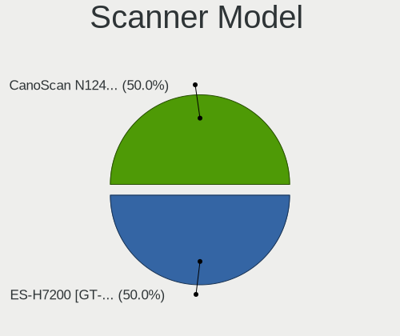

| Model                           | Computers | Percent |
|---------------------------------|-----------|---------|
| Seiko Epson ES-H7200 [GT-20000] | 1         | 50%     |
| Canon CanoScan N1240U/LiDE 30   | 1         | 50%     |

Camera
------

Camera Vendor
-------------

Camera device vendors

| Vendor                                 | Computers | Percent |
|----------------------------------------|-----------|---------|
| Chicony Electronics                    | 42        | 19.63%  |
| IMC Networks                           | 25        | 11.68%  |
| Microdia                               | 21        | 9.81%   |
| Realtek Semiconductor                  | 15        | 7.01%   |
| Bison Electronics                      | 14        | 6.54%   |
| Quanta                                 | 9         | 4.21%   |
| Sunplus Innovation Technology          | 8         | 3.74%   |
| Silicon Motion                         | 8         | 3.74%   |
| Cheng Uei Precision Industry (Foxlink) | 6         | 2.8%    |
| Syntek                                 | 5         | 2.34%   |
| Suyin                                  | 5         | 2.34%   |
| Luxvisions Innotech Limited            | 5         | 2.34%   |
| Logitech                               | 5         | 2.34%   |
| Lite-On Technology                     | 5         | 2.34%   |
| Z-Star Microelectronics                | 4         | 1.87%   |
| Jiangxi Shinetech Optical              | 4         | 1.87%   |
| ALi                                    | 4         | 1.87%   |
| Shenzhen Kingcome Optoelectronic       | 3         | 1.4%    |
| DigiTech                               | 3         | 1.4%    |
| Ricoh                                  | 2         | 0.93%   |
| Lenovo                                 | 2         | 0.93%   |
| DX-240124-XH                           | 2         | 0.93%   |
| Denron                                 | 2         | 0.93%   |
| Arkmicro Technologies                  | 2         | 0.93%   |
| Apple                                  | 2         | 0.93%   |
| Y Media                                | 1         | 0.47%   |
| Unknown (3730304233343731345430)       | 1         | 0.47%   |
| Supreme Electronics                    | 1         | 0.47%   |
| Pixart Imaging                         | 1         | 0.47%   |
| Intel                                  | 1         | 0.47%   |
| Huawei Technologies                    | 1         | 0.47%   |
| Genesys Logic                          | 1         | 0.47%   |
| GEMBIRD                                | 1         | 0.47%   |
| Aveo Technology                        | 1         | 0.47%   |
| Alcor Micro                            | 1         | 0.47%   |
| A4Tech                                 | 1         | 0.47%   |

Camera Model
------------

Camera device models

| Model                                         | Computers | Percent |
|-----------------------------------------------|-----------|---------|
| Chicony Integrated Camera                     | 15        | 6.94%   |
| Microdia Integrated_Webcam_HD                 | 7         | 3.24%   |
| IMC Networks Integrated Camera                | 6         | 2.78%   |
| Microdia USB Camera                           | 5         | 2.31%   |
| IMC Networks EasyCamera                       | 5         | 2.31%   |
| Silicon Motion WebCam SCX Series              | 4         | 1.85%   |
| Bison Integrated Camera                       | 4         | 1.85%   |
| Realtek USB 2.0 PC Camera                     | 3         | 1.39%   |
| Realtek Acer 640 x 480 laptop camera          | 3         | 1.39%   |
| Quanta VGA WebCam                             | 3         | 1.39%   |
| Luxvisions Innotech Limited Integrated Camera | 3         | 1.39%   |
| Logitech Webcam C270                          | 3         | 1.39%   |
| IMC Networks Realtek PC Camera                | 3         | 1.39%   |
| DigiTech WebCam SCB-0350M                     | 3         | 1.39%   |
| Bison SunplusIT Integrated Camera             | 3         | 1.39%   |
| Bison Lenovo EasyCamera                       | 3         | 1.39%   |
| ALi Gateway Webcam                            | 3         | 1.39%   |
| Syntek Integrated Camera                      | 2         | 0.93%   |
| Syntek EasyCamera                             | 2         | 0.93%   |
| Sunplus Integrated_Webcam_HD                  | 2         | 0.93%   |
| Sunplus Hy HD Camera                          | 2         | 0.93%   |
| Realtek USB2.0 VGA UVC WebCam                 | 2         | 0.93%   |
| Realtek Integrated Webcam                     | 2         | 0.93%   |
| Quanta Realtek PC Camera                      | 2         | 0.93%   |
| Microdia Webcam Vitade AF                     | 2         | 0.93%   |
| Microdia Integrated Webcam                    | 2         | 0.93%   |
| Lite-On Integrated Camera                     | 2         | 0.93%   |
| Lite-On HP HD Camera                          | 2         | 0.93%   |
| Jiangxi Shinetech Optical HD Camera           | 2         | 0.93%   |
| IMC Networks XHC Camera                       | 2         | 0.93%   |
| IMC Networks UVC VGA Webcam                   | 2         | 0.93%   |
| IMC Networks Realtek DMFT RGB                 | 2         | 0.93%   |
| DX-240124-XH USB Camera                       | 2         | 0.93%   |
| Denron 2M Front Camera                        | 2         | 0.93%   |
| Chicony XiaoMi USB 2.0 Webcam                 | 2         | 0.93%   |
| Chicony USB2.0 VGA UVC WebCam                 | 2         | 0.93%   |
| Chicony USB2.0 HD UVC WebCam                  | 2         | 0.93%   |
| Chicony USB 2.0 Camera                        | 2         | 0.93%   |
| Chicony Lenovo EasyCamera                     | 2         | 0.93%   |
| Chicony EasyCamera                            | 2         | 0.93%   |

Security
--------

Fingerprint Vendor
------------------

Fingerprint sensor vendors

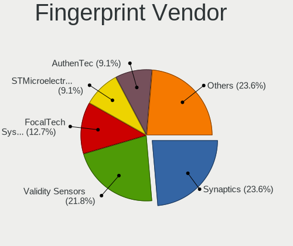

| Vendor                     | Computers | Percent |
|----------------------------|-----------|---------|
| Synaptics                  | 13        | 23.64%  |
| Validity Sensors           | 12        | 21.82%  |
| FocalTech Systems          | 7         | 12.73%  |
| STMicroelectronics         | 5         | 9.09%   |
| AuthenTec                  | 5         | 9.09%   |
| Upek                       | 4         | 7.27%   |
| Elan Microelectronics      | 4         | 7.27%   |
| Shenzhen Goodix Technology | 3         | 5.45%   |
| Fingerprint Cards          | 1         | 1.82%   |
| Broadcom                   | 1         | 1.82%   |

Fingerprint Model
-----------------

Fingerprint sensor models

| Model                                                                        | Computers | Percent |
|------------------------------------------------------------------------------|-----------|---------|
| Synaptics Prometheus MIS Touch Fingerprint Reader                            | 8         | 14.55%  |
| FocalTech Systems Fingerprint Reader                                         | 7         | 12.73%  |
| STMicroelectronics Fingerprint Reader                                        | 5         | 9.09%   |
| Upek Biometric Touchchip/Touchstrip Fingerprint Sensor                       | 4         | 7.27%   |
| Validity Sensors VFS7500 Touch Fingerprint Sensor                            | 3         | 5.45%   |
| Shenzhen Goodix  Fingerprint Device                                          | 3         | 5.45%   |
| Elan WBF Fingerprint Sensor                                                  | 3         | 5.45%   |
| AuthenTec AES1600                                                            | 3         | 5.45%   |
| Validity Sensors VFS5011 Fingerprint Reader                                  | 2         | 3.64%   |
| Validity Sensors VFS495 Fingerprint Reader                                   | 2         | 3.64%   |
| Validity Sensors VFS 5011 fingerprint sensor                                 | 2         | 3.64%   |
| Synaptics WBDI Fingerprint Reader USB 086                                    | 2         | 3.64%   |
| Validity Sensors Synaptics WBDI                                              | 1         | 1.82%   |
| Validity Sensors Synaptics VFS7552 Touch Fingerprint Sensor with PurePrint   | 1         | 1.82%   |
| Validity Sensors Swipe Fingerprint Sensor                                    | 1         | 1.82%   |
| Synaptics Metallica MOH Touch Fingerprint Reader                             | 1         | 1.82%   |
| Synaptics Metallica MIS Touch Fingerprint Reader                             | 1         | 1.82%   |
| Synaptics FS7604 Touch Fingerprint Sensor with PurePrint                     | 1         | 1.82%   |
| Fingerprint Cards FPC Fingerprint Reader                                     | 1         | 1.82%   |
| Elan Fingerprint Sensor                                                      | 1         | 1.82%   |
| Broadcom BCM5880 Secure Applications Processor with fingerprint swipe sensor | 1         | 1.82%   |
| AuthenTec AES2810                                                            | 1         | 1.82%   |
| AuthenTec AES2501 Fingerprint Sensor                                         | 1         | 1.82%   |

Chipcard Vendor
---------------

Chipcard module vendors

Zero info for selected period =(

Chipcard Model
--------------

Chipcard module models

Zero info for selected period =(

Unsupported
-----------

Unsupported Devices
-------------------

Total unsupported devices on board

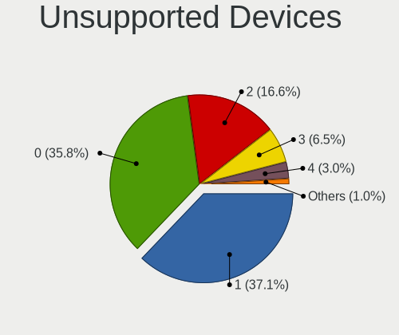

| Total | Computers | Percent |
|-------|-----------|---------|
| 1     | 322       | 37.14%  |
| 0     | 310       | 35.76%  |
| 2     | 144       | 16.61%  |
| 3     | 56        | 6.46%   |
| 4     | 26        | 3%      |
| 5     | 4         | 0.46%   |
| 7     | 2         | 0.23%   |
| 9     | 1         | 0.12%   |
| 8     | 1         | 0.12%   |
| 6     | 1         | 0.12%   |

Unsupported Device Types
------------------------

Types of unsupported devices

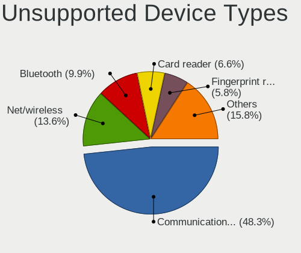

| Type                     | Computers | Percent |
|--------------------------|-----------|---------|
| Communication controller | 385       | 48.31%  |
| Net/wireless             | 108       | 13.55%  |
| Bluetooth                | 79        | 9.91%   |
| Card reader              | 53        | 6.65%   |
| Fingerprint reader       | 46        | 5.77%   |
| Sound                    | 30        | 3.76%   |
| Firewire controller      | 30        | 3.76%   |
| Net/ethernet             | 18        | 2.26%   |
| Graphics card            | 18        | 2.26%   |
| Network                  | 13        | 1.63%   |
| Storage                  | 7         | 0.88%   |
| Storage/ata              | 6         | 0.75%   |
| Modem                    | 4         | 0.5%    |

