BSD in Spain - Tested Hardware & Statistics (Desktops)
------------------------------------------------------

A project to collect tested hardware configurations for BSD in Spain.

Anyone can contribute to this report by the [hw-probe](https://github.com/linuxhw/hw-probe/blob/master/INSTALL.BSD.md) tool:

    hw-probe -all -upload

Please contribute! Especially if your hardware is rare.

Contents
--------

* [ Test Cases ](#test-cases)

* [ System ](#system)
  - [ OS                       ](#os)
  - [ OS Family                ](#os-family)
  - [ Arch                     ](#arch)
  - [ DE                       ](#de)
  - [ Display Server           ](#display-server)
  - [ Display Manager          ](#display-manager)
  - [ OS Lang                  ](#os-lang)
  - [ Boot Mode                ](#boot-mode)
  - [ Filesystem               ](#filesystem)
  - [ Part. scheme             ](#part-scheme)

* [ Board ](#board)
  - [ Vendor                   ](#vendor)
  - [ Model                    ](#model)
  - [ Model Family             ](#model-family)
  - [ MFG Year                 ](#mfg-year)
  - [ Form Factor              ](#form-factor)
  - [ Coreboot                 ](#coreboot)
  - [ RAM Size                 ](#ram-size)
  - [ RAM Used                 ](#ram-used)
  - [ Total Drives             ](#total-drives)
  - [ Has CD-ROM               ](#has-cd-rom)
  - [ Has Ethernet             ](#has-ethernet)
  - [ Has WiFi                 ](#has-wifi)
  - [ Has Bluetooth            ](#has-bluetooth)

* [ Location ](#location)
  - [ Country                  ](#country)
  - [ City                     ](#city)

* [ Drives ](#drives)
  - [ Drive Vendor             ](#drive-vendor)
  - [ Drive Model              ](#drive-model)
  - [ HDD Vendor               ](#hdd-vendor)
  - [ SSD Vendor               ](#ssd-vendor)
  - [ Drive Kind               ](#drive-kind)
  - [ Drive Connector          ](#drive-connector)
  - [ Drive Size               ](#drive-size)
  - [ Space Total              ](#space-total)
  - [ Space Used               ](#space-used)
  - [ Malfunc. Drives          ](#malfunc-drives)
  - [ Malfunc. Drive Vendor    ](#malfunc-drive-vendor)
  - [ Malfunc. HDD Vendor      ](#malfunc-hdd-vendor)
  - [ Malfunc. Drive Kind      ](#malfunc-drive-kind)
  - [ Failed Drives            ](#failed-drives)
  - [ Failed Drive Vendor      ](#failed-drive-vendor)
  - [ Drive Status             ](#drive-status)

* [ Storage controller ](#storage-controller)
  - [ Storage Vendor           ](#storage-vendor)
  - [ Storage Model            ](#storage-model)
  - [ Storage Kind             ](#storage-kind)

* [ Processor ](#processor)
  - [ CPU Vendor               ](#cpu-vendor)
  - [ CPU Model                ](#cpu-model)
  - [ CPU Model Family         ](#cpu-model-family)
  - [ CPU Cores                ](#cpu-cores)
  - [ CPU Sockets              ](#cpu-sockets)
  - [ CPU Threads              ](#cpu-threads)
  - [ CPU Microarch            ](#cpu-microarch)

* [ Graphics ](#graphics)
  - [ GPU Vendor               ](#gpu-vendor)
  - [ GPU Model                ](#gpu-model)
  - [ GPU Combo                ](#gpu-combo)
  - [ GPU Driver               ](#gpu-driver)
  - [ GPU Memory               ](#gpu-memory)

* [ Monitor ](#monitor)
  - [ Monitor Vendor           ](#monitor-vendor)
  - [ Monitor Model            ](#monitor-model)
  - [ Monitor Resolution       ](#monitor-resolution)
  - [ Monitor Diagonal         ](#monitor-diagonal)
  - [ Monitor Width            ](#monitor-width)
  - [ Aspect Ratio             ](#aspect-ratio)
  - [ Monitor Area             ](#monitor-area)
  - [ Pixel Density            ](#pixel-density)
  - [ Multiple Monitors        ](#multiple-monitors)

* [ Network ](#network)
  - [ Net Controller Vendor    ](#net-controller-vendor)
  - [ Net Controller Model     ](#net-controller-model)
  - [ Wireless Vendor          ](#wireless-vendor)
  - [ Wireless Model           ](#wireless-model)
  - [ Ethernet Vendor          ](#ethernet-vendor)
  - [ Ethernet Model           ](#ethernet-model)
  - [ Net Controller Kind      ](#net-controller-kind)
  - [ Used Controller          ](#used-controller)
  - [ NICs                     ](#nics)
  - [ IPv6                     ](#ipv6)

* [ Bluetooth ](#bluetooth)
  - [ Bluetooth Vendor         ](#bluetooth-vendor)
  - [ Bluetooth Model          ](#bluetooth-model)

* [ Sound ](#sound)
  - [ Sound Vendor             ](#sound-vendor)
  - [ Sound Model              ](#sound-model)

* [ Memory ](#memory)
  - [ Memory Vendor            ](#memory-vendor)
  - [ Memory Model             ](#memory-model)
  - [ Memory Kind              ](#memory-kind)
  - [ Memory Form Factor       ](#memory-form-factor)
  - [ Memory Size              ](#memory-size)
  - [ Memory Speed             ](#memory-speed)

* [ Printers & scanners ](#printers--scanners)
  - [ Printer Vendor           ](#printer-vendor)
  - [ Printer Model            ](#printer-model)
  - [ Scanner Vendor           ](#scanner-vendor)
  - [ Scanner Model            ](#scanner-model)

* [ Camera ](#camera)
  - [ Camera Vendor            ](#camera-vendor)
  - [ Camera Model             ](#camera-model)

* [ Security ](#security)
  - [ Fingerprint Vendor       ](#fingerprint-vendor)
  - [ Fingerprint Model        ](#fingerprint-model)
  - [ Chipcard Vendor          ](#chipcard-vendor)
  - [ Chipcard Model           ](#chipcard-model)

* [ Unsupported ](#unsupported)
  - [ Unsupported Devices      ](#unsupported-devices)
  - [ Unsupported Device Types ](#unsupported-device-types)

Test Cases
----------

Total: 171

| Vendor        | Model                       | Probe                                                     | Date         |
|---------------|-----------------------------|-----------------------------------------------------------|--------------|
| Intel         | SKYBAY                      | [9d49471591](https://bsd-hardware.info/?probe=9d49471591) | Aug 29, 2023 |
| YANYU         | R250                        | [69dbe1a014](https://bsd-hardware.info/?probe=69dbe1a014) | Aug 24, 2023 |
| YANYU         | R250                        | [95a37ee143](https://bsd-hardware.info/?probe=95a37ee143) | Aug 06, 2023 |
| Techvision    | TVI7309X B0                 | [6bd995374a](https://bsd-hardware.info/?probe=6bd995374a) | Jul 30, 2023 |
| Gigabyte      | A320M-H-CF                  | [d1a2b99edc](https://bsd-hardware.info/?probe=d1a2b99edc) | Jul 28, 2023 |
| Techvision    | TVI7309X B0                 | [38255b17fe](https://bsd-hardware.info/?probe=38255b17fe) | Jul 19, 2023 |
| Unknown       | Unknown                     | [b44e00cdf3](https://bsd-hardware.info/?probe=b44e00cdf3) | Jun 25, 2023 |
| ASUSTek       | P5K PRO                     | [f0b283fdaf](https://bsd-hardware.info/?probe=f0b283fdaf) | Jun 19, 2023 |
| ASUSTek       | PRIME B460M-A               | [4c8047dca3](https://bsd-hardware.info/?probe=4c8047dca3) | May 19, 2023 |
| Lenovo        | 0B98401 PRO                 | [c61a0b39fa](https://bsd-hardware.info/?probe=c61a0b39fa) | May 09, 2023 |
| Unknown       | Unknown                     | [678ab85729](https://bsd-hardware.info/?probe=678ab85729) | May 08, 2023 |
| Unknown       | Unknown                     | [d574fd446b](https://bsd-hardware.info/?probe=d574fd446b) | May 08, 2023 |
| GVC           | DR 738                      | [21b338db1b](https://bsd-hardware.info/?probe=21b338db1b) | Apr 30, 2023 |
| Gigabyte      | H81M-S2PH                   | [b7ec959c9f](https://bsd-hardware.info/?probe=b7ec959c9f) | Apr 13, 2023 |
| Techvision    | TVI7309X B0                 | [64b66f1fed](https://bsd-hardware.info/?probe=64b66f1fed) | Apr 11, 2023 |
| Techvision    | TVI7309X B0                 | [9ee2a1ee72](https://bsd-hardware.info/?probe=9ee2a1ee72) | Apr 11, 2023 |
| ASUSTek       | PRIME B250M-A               | [0747d0a699](https://bsd-hardware.info/?probe=0747d0a699) | Apr 11, 2023 |
| Techvision    | TVI7309X B0                 | [e3efaa8d57](https://bsd-hardware.info/?probe=e3efaa8d57) | Apr 09, 2023 |
| Fujitsu       | D3061-A1 S26361-D3061-A1    | [ca6badc637](https://bsd-hardware.info/?probe=ca6badc637) | Mar 30, 2023 |
| GVC           | DR 738                      | [88455ed9e7](https://bsd-hardware.info/?probe=88455ed9e7) | Mar 18, 2023 |
| ASUSTek       | PRIME B660M-A D4            | [eb6b70b310](https://bsd-hardware.info/?probe=eb6b70b310) | Mar 16, 2023 |
| HP            | 3398                        | [b14de43688](https://bsd-hardware.info/?probe=b14de43688) | Mar 15, 2023 |
| MSI           | MAG B550 TOMAHAWK           | [cb6b586564](https://bsd-hardware.info/?probe=cb6b586564) | Mar 14, 2023 |
| Fujitsu Si... | D2804-A1 S26361-D2804-A1    | [34c4bab715](https://bsd-hardware.info/?probe=34c4bab715) | Mar 14, 2023 |
| Lenovo        | 3102 SDK0J40697 WIN 3305... | [b337baf50e](https://bsd-hardware.info/?probe=b337baf50e) | Mar 13, 2023 |
| MSI           | H310M PRO-VDH PLUS          | [0eeb0661dd](https://bsd-hardware.info/?probe=0eeb0661dd) | Mar 12, 2023 |
| MSI           | B450-A PRO                  | [b2d29a5bbc](https://bsd-hardware.info/?probe=b2d29a5bbc) | Mar 12, 2023 |
| HP            | 8768 A                      | [5ab1dadbab](https://bsd-hardware.info/?probe=5ab1dadbab) | Mar 12, 2023 |
| Fujitsu       | D3224-A1 S26361-D3224-A1    | [c34d5e6357](https://bsd-hardware.info/?probe=c34d5e6357) | Feb 17, 2023 |
| YANYU         | R250                        | [24ebc43209](https://bsd-hardware.info/?probe=24ebc43209) | Feb 12, 2023 |
| Gigabyte      | H510M S2H V2                | [85628154a2](https://bsd-hardware.info/?probe=85628154a2) | Feb 05, 2023 |
| ASUSTek       | PRIME B450M-A               | [7c56590eaa](https://bsd-hardware.info/?probe=7c56590eaa) | Feb 03, 2023 |
| HP            | 1496                        | [fae90baa23](https://bsd-hardware.info/?probe=fae90baa23) | Jan 31, 2023 |
| ASUSTek       | PRIME B460M-A               | [a6b109939f](https://bsd-hardware.info/?probe=a6b109939f) | Jan 28, 2023 |
| YANYU         | R250                        | [866e67f059](https://bsd-hardware.info/?probe=866e67f059) | Jan 27, 2023 |
| MW            | GMLK-2_5G4L                 | [142b3ad8d6](https://bsd-hardware.info/?probe=142b3ad8d6) | Jan 20, 2023 |
| Dell          | 0WMJ54 A01                  | [8580d62bf3](https://bsd-hardware.info/?probe=8580d62bf3) | Jan 19, 2023 |
| Lenovo        | H30-05 90BJ0085SP           | [1424b3641c](https://bsd-hardware.info/?probe=1424b3641c) | Jan 18, 2023 |
| Lenovo        | H30-05 90BJ0085SP           | [d491694079](https://bsd-hardware.info/?probe=d491694079) | Jan 18, 2023 |
| HP            | 213D A01                    | [1d30039961](https://bsd-hardware.info/?probe=1d30039961) | Jan 11, 2023 |
| Intel         | SKYBAY                      | [21ed0daf1c](https://bsd-hardware.info/?probe=21ed0daf1c) | Jan 08, 2023 |
| YANYU         | R250                        | [7ea489eae6](https://bsd-hardware.info/?probe=7ea489eae6) | Jan 06, 2023 |
| YANYU         | R250                        | [bb364271b2](https://bsd-hardware.info/?probe=bb364271b2) | Dec 05, 2022 |
| YANYU         | R250                        | [0be0925e5b](https://bsd-hardware.info/?probe=0be0925e5b) | Nov 27, 2022 |
| HP            | 3048h                       | [3f43816a5d](https://bsd-hardware.info/?probe=3f43816a5d) | Nov 25, 2022 |
| Lenovo        | ThinkStation S30 0569A93    | [dd545fb588](https://bsd-hardware.info/?probe=dd545fb588) | Nov 25, 2022 |
| MSI           | A320M-A PRO                 | [fc71b97d90](https://bsd-hardware.info/?probe=fc71b97d90) | Nov 24, 2022 |
| ASUSTek       | PRIME A320M-K               | [9701222998](https://bsd-hardware.info/?probe=9701222998) | Nov 23, 2022 |
| HP            | 1998                        | [9239fe7437](https://bsd-hardware.info/?probe=9239fe7437) | Nov 15, 2022 |
| ASUSTek       | Rampage V EDITION 10        | [443891740b](https://bsd-hardware.info/?probe=443891740b) | Nov 13, 2022 |
| Fujitsu       | D3313-A1 S26361-D3313-A1    | [e5b3cb0bcd](https://bsd-hardware.info/?probe=e5b3cb0bcd) | Nov 12, 2022 |
| ASUSTek       | Rampage V EDITION 10        | [5dcd51844e](https://bsd-hardware.info/?probe=5dcd51844e) | Nov 09, 2022 |
| YANYU         | R250                        | [f39d55e42d](https://bsd-hardware.info/?probe=f39d55e42d) | Oct 28, 2022 |
| Fujitsu       | D3313-A1 S26361-D3313-A1    | [079830f938](https://bsd-hardware.info/?probe=079830f938) | Oct 24, 2022 |
| Fujitsu       | D3313-A1 S26361-D3313-A1    | [2fa4641b0e](https://bsd-hardware.info/?probe=2fa4641b0e) | Oct 24, 2022 |
| YANYU         | H67SL                       | [373902d38b](https://bsd-hardware.info/?probe=373902d38b) | Oct 07, 2022 |
| Dell          | 0TDG4V A00                  | [cc92be7e52](https://bsd-hardware.info/?probe=cc92be7e52) | Sep 25, 2022 |
| ASUSTek       | All Series                  | [ab3b339cf0](https://bsd-hardware.info/?probe=ab3b339cf0) | Sep 24, 2022 |
| Gigabyte      | Z370P D3-CF                 | [10f0cfa344](https://bsd-hardware.info/?probe=10f0cfa344) | Sep 15, 2022 |
| HP            | 213D A01                    | [54288c6759](https://bsd-hardware.info/?probe=54288c6759) | Sep 11, 2022 |
| ASUSTek       | TUF B450M-PRO GAMING        | [7c9c1db9d7](https://bsd-hardware.info/?probe=7c9c1db9d7) | Sep 10, 2022 |
| Dell          | 00V62H A01                  | [e7dc9cc5ee](https://bsd-hardware.info/?probe=e7dc9cc5ee) | Aug 28, 2022 |
| YANYU         | R250                        | [c4f1ec0d5b](https://bsd-hardware.info/?probe=c4f1ec0d5b) | Aug 27, 2022 |
| YANYU         | H67SL                       | [57afa0c5d1](https://bsd-hardware.info/?probe=57afa0c5d1) | Aug 25, 2022 |
| ASUSTek       | PRIME B460M-A               | [21fed03fa2](https://bsd-hardware.info/?probe=21fed03fa2) | Aug 24, 2022 |
| ASUSTek       | PRIME B460M-A               | [48210e4d2a](https://bsd-hardware.info/?probe=48210e4d2a) | Aug 24, 2022 |
| Lenovo        | ThinkCentre M91p 4512A47    | [3556794570](https://bsd-hardware.info/?probe=3556794570) | Aug 23, 2022 |
| YANYU         | R250                        | [bd7edcafbe](https://bsd-hardware.info/?probe=bd7edcafbe) | Aug 22, 2022 |
| MW            | GMLK-2_5G4L                 | [2325f41325](https://bsd-hardware.info/?probe=2325f41325) | Aug 20, 2022 |
| HP            | 213D A01                    | [4b231023a1](https://bsd-hardware.info/?probe=4b231023a1) | Aug 16, 2022 |
| YANYU         | R250                        | [4552b74317](https://bsd-hardware.info/?probe=4552b74317) | Aug 12, 2022 |
| Unknown       | Unknown                     | [c0daba1c48](https://bsd-hardware.info/?probe=c0daba1c48) | Aug 09, 2022 |
| YANYU         | R250                        | [ffad8eb019](https://bsd-hardware.info/?probe=ffad8eb019) | Aug 07, 2022 |
| MW            | GMLK-2_5G4L                 | [b2858de568](https://bsd-hardware.info/?probe=b2858de568) | Aug 06, 2022 |
| GVC           | DR 738                      | [ea08102a81](https://bsd-hardware.info/?probe=ea08102a81) | Aug 06, 2022 |
| ASUSTek       | P5QL-ASUS-SE                | [50a0d392e7](https://bsd-hardware.info/?probe=50a0d392e7) | Aug 06, 2022 |
| ASUSTek       | P5QL-ASUS-SE                | [f2836f4a6c](https://bsd-hardware.info/?probe=f2836f4a6c) | Aug 01, 2022 |
| Wistron       | ProLiant ML110 G6           | [091fe7ca40](https://bsd-hardware.info/?probe=091fe7ca40) | Jul 28, 2022 |
| HP            | ProLiant ML310e Gen8 v2     | [6cdc79a36f](https://bsd-hardware.info/?probe=6cdc79a36f) | Jul 22, 2022 |
| ASUSTek       | Maximus VIII HERO           | [051f604f9a](https://bsd-hardware.info/?probe=051f604f9a) | Jul 21, 2022 |
| Gigabyte      | F2A88XM-D3H                 | [a96e41f99e](https://bsd-hardware.info/?probe=a96e41f99e) | Jul 20, 2022 |
| PC Engines    | APU2                        | [c84cb618c0](https://bsd-hardware.info/?probe=c84cb618c0) | Jul 17, 2022 |
| ASUSTek       | Z87M-PLUS                   | [5e51d228ec](https://bsd-hardware.info/?probe=5e51d228ec) | Jun 21, 2022 |
| Intel         | SKYBAY                      | [e9dafa8427](https://bsd-hardware.info/?probe=e9dafa8427) | Jun 10, 2022 |
| Intel         | SKYBAY                      | [7a88f52138](https://bsd-hardware.info/?probe=7a88f52138) | Jun 01, 2022 |
| GVC           | DR 738                      | [938866fb80](https://bsd-hardware.info/?probe=938866fb80) | May 21, 2022 |
| OEM           | NU93 Series                 | [e558435c70](https://bsd-hardware.info/?probe=e558435c70) | Apr 12, 2022 |
| OEM           | NU93 Series                 | [505cbbac5d](https://bsd-hardware.info/?probe=505cbbac5d) | Apr 12, 2022 |
| ASUSTek       | CP6230                      | [a407409700](https://bsd-hardware.info/?probe=a407409700) | Apr 11, 2022 |
| HP            | 1998                        | [06f0a28858](https://bsd-hardware.info/?probe=06f0a28858) | Apr 10, 2022 |
| HP            | 213D A01                    | [b8b1c05451](https://bsd-hardware.info/?probe=b8b1c05451) | Mar 25, 2022 |
| Unknown       | Unknown                     | [f25a608944](https://bsd-hardware.info/?probe=f25a608944) | Mar 19, 2022 |
| HP            | 213D A01                    | [88eb5a2df5](https://bsd-hardware.info/?probe=88eb5a2df5) | Mar 18, 2022 |
| ASUSTek       | P5K PRO                     | [fbde5657e8](https://bsd-hardware.info/?probe=fbde5657e8) | Mar 11, 2022 |
| HP            | 8054                        | [86b6b8373c](https://bsd-hardware.info/?probe=86b6b8373c) | Mar 08, 2022 |
| HP            | 8054                        | [00078554d2](https://bsd-hardware.info/?probe=00078554d2) | Mar 08, 2022 |
| Unknown       | YL-SKUL6-7 Series           | [6f969a5cf2](https://bsd-hardware.info/?probe=6f969a5cf2) | Feb 27, 2022 |
| ASRock        | TRX40 Taichi                | [a2df68e1d1](https://bsd-hardware.info/?probe=a2df68e1d1) | Feb 26, 2022 |
| Medion        | H61H2-LM3                   | [beb12f2884](https://bsd-hardware.info/?probe=beb12f2884) | Feb 23, 2022 |
| HP            | 1998                        | [485d417a2e](https://bsd-hardware.info/?probe=485d417a2e) | Feb 23, 2022 |
| HP            | 213D A01                    | [1506ef3d9c](https://bsd-hardware.info/?probe=1506ef3d9c) | Feb 17, 2022 |
| Lenovo        | SHARKBAY SDK0E50510 WIN     | [eddeb5c246](https://bsd-hardware.info/?probe=eddeb5c246) | Feb 13, 2022 |
| Pegatron      | 2AD5                        | [84219d3418](https://bsd-hardware.info/?probe=84219d3418) | Feb 10, 2022 |
| Pegatron      | 2AD5                        | [2fe214dc2b](https://bsd-hardware.info/?probe=2fe214dc2b) | Feb 01, 2022 |
| Intel         | MAHOBAY                     | [020a9098cd](https://bsd-hardware.info/?probe=020a9098cd) | Feb 01, 2022 |
| Unknown       | YL-1900L4-V2                | [fccaf1b541](https://bsd-hardware.info/?probe=fccaf1b541) | Jan 31, 2022 |
| ECS           | APLD-MINI                   | [e64118d206](https://bsd-hardware.info/?probe=e64118d206) | Jan 30, 2022 |
| HP            | 213D A01                    | [8419869d89](https://bsd-hardware.info/?probe=8419869d89) | Jan 29, 2022 |
| ASUSTek       | P7H55-M LX                  | [72630c073d](https://bsd-hardware.info/?probe=72630c073d) | Jan 27, 2022 |
| HP            | 1998                        | [b59dbcdc9c](https://bsd-hardware.info/?probe=b59dbcdc9c) | Jan 23, 2022 |
| MSI           | A320M-A PRO MAX             | [34805f5f83](https://bsd-hardware.info/?probe=34805f5f83) | Jan 17, 2022 |
| Unknown       | YL-1900L4-V2                | [ec13024551](https://bsd-hardware.info/?probe=ec13024551) | Jan 12, 2022 |
| ASRock        | N3700-ITX                   | [fb058e0b37](https://bsd-hardware.info/?probe=fb058e0b37) | Jan 03, 2022 |
| ASRock        | N3700-ITX                   | [dda4b4e02b](https://bsd-hardware.info/?probe=dda4b4e02b) | Dec 29, 2021 |
| AMI           | PEISIA E3845 VER1.0         | [d19f149583](https://bsd-hardware.info/?probe=d19f149583) | Dec 26, 2021 |
| OEM           | AR-B5800                    | [90f43e277a](https://bsd-hardware.info/?probe=90f43e277a) | Dec 20, 2021 |
| Unknown       | Unknown                     | [bb3183702b](https://bsd-hardware.info/?probe=bb3183702b) | Dec 17, 2021 |
| ShenZhen M... | 3865U-6L                    | [09d0d26857](https://bsd-hardware.info/?probe=09d0d26857) | Dec 13, 2021 |
| Gigabyte      | B450 I AORUS PRO WIFI-CF    | [6a1100cfdb](https://bsd-hardware.info/?probe=6a1100cfdb) | Dec 11, 2021 |
| OEM           | AR-B5800                    | [ec11b97e0e](https://bsd-hardware.info/?probe=ec11b97e0e) | Dec 08, 2021 |
| Gigabyte      | B450 I AORUS PRO WIFI-CF    | [4cd5e5166a](https://bsd-hardware.info/?probe=4cd5e5166a) | Nov 27, 2021 |
| ASUSTek       | Rampage Formula             | [09f67a9982](https://bsd-hardware.info/?probe=09f67a9982) | Nov 09, 2021 |
| ASUSTek       | Rampage Formula             | [183f1a8d62](https://bsd-hardware.info/?probe=183f1a8d62) | Nov 08, 2021 |
| ECS           | APLD-MINI                   | [402d7bc95c](https://bsd-hardware.info/?probe=402d7bc95c) | Nov 07, 2021 |
| ASUSTek       | TUF B450M-PRO GAMING        | [9959c0900a](https://bsd-hardware.info/?probe=9959c0900a) | Oct 23, 2021 |
| ASUSTek       | D940MX                      | [4e798f3ef0](https://bsd-hardware.info/?probe=4e798f3ef0) | Oct 10, 2021 |
| ASRock        | J5005-ITX                   | [a7f333eedb](https://bsd-hardware.info/?probe=a7f333eedb) | Oct 10, 2021 |
| Medion        | H61H2-LM3                   | [67ed0f639c](https://bsd-hardware.info/?probe=67ed0f639c) | Oct 10, 2021 |
| ASRock        | J5005-ITX                   | [6589a62805](https://bsd-hardware.info/?probe=6589a62805) | Oct 08, 2021 |
| Medion        | H61H2-LM3                   | [7a42009a08](https://bsd-hardware.info/?probe=7a42009a08) | Sep 02, 2021 |
| Medion        | H61H2-LM3                   | [eb81abe401](https://bsd-hardware.info/?probe=eb81abe401) | Sep 02, 2021 |
| Intel         | CARLOW                      | [035b6b4b42](https://bsd-hardware.info/?probe=035b6b4b42) | Sep 02, 2021 |
| ShenZhen M... | 3865U-6L                    | [ebf562c2d6](https://bsd-hardware.info/?probe=ebf562c2d6) | Sep 01, 2021 |
| Unknown       | Unknown                     | [5c37b14dd5](https://bsd-hardware.info/?probe=5c37b14dd5) | Aug 27, 2021 |
| Gigabyte      | GA-7VT600                   | [83b86f3e8c](https://bsd-hardware.info/?probe=83b86f3e8c) | Aug 23, 2021 |
| Lenovo        | 0B98401 PRO                 | [e2f0f95779](https://bsd-hardware.info/?probe=e2f0f95779) | Jul 18, 2021 |
| Lenovo        | 0B98401 PRO                 | [7727ec2d09](https://bsd-hardware.info/?probe=7727ec2d09) | Jul 07, 2021 |
| Gigabyte      | 965P-DS4                    | [c4d4537787](https://bsd-hardware.info/?probe=c4d4537787) | Jul 02, 2021 |
| ASUSTek       | Rampage Formula             | [477a2a84f4](https://bsd-hardware.info/?probe=477a2a84f4) | Jun 24, 2021 |
| GVC           | DR 738                      | [3e8940224f](https://bsd-hardware.info/?probe=3e8940224f) | Jun 13, 2021 |
| GVC           | DR 738                      | [9ff0fb7df4](https://bsd-hardware.info/?probe=9ff0fb7df4) | May 01, 2021 |
| GVC           | DR 738                      | [2acd0848c8](https://bsd-hardware.info/?probe=2acd0848c8) | May 01, 2021 |
| Lenovo        | 0B98401 PRO                 | [0d584c2a00](https://bsd-hardware.info/?probe=0d584c2a00) | Apr 26, 2021 |
| ASUSTek       | Maximus VIII HERO           | [7f9cdc62a2](https://bsd-hardware.info/?probe=7f9cdc62a2) | Apr 14, 2021 |
| Unknown       | Unknown                     | [f49d7529c0](https://bsd-hardware.info/?probe=f49d7529c0) | Apr 11, 2021 |
| Unknown       | Unknown                     | [08da04fdf6](https://bsd-hardware.info/?probe=08da04fdf6) | Apr 09, 2021 |
| Medion        | H61H2-LM3                   | [6483c8390f](https://bsd-hardware.info/?probe=6483c8390f) | Mar 31, 2021 |
| ASUSTek       | M5A99X EVO R2.0             | [a03927cc2e](https://bsd-hardware.info/?probe=a03927cc2e) | Mar 06, 2021 |
| Medion        | H61H2-LM3                   | [01df19257a](https://bsd-hardware.info/?probe=01df19257a) | Mar 05, 2021 |
| ASUSTek       | Rampage Formula             | [3d2377b221](https://bsd-hardware.info/?probe=3d2377b221) | Mar 03, 2021 |
| Fujitsu       | D3221-A1 S26361-D3221-A1    | [ac108deea2](https://bsd-hardware.info/?probe=ac108deea2) | Feb 28, 2021 |
| Acer          | Aspire XC-115               | [95f63df64d](https://bsd-hardware.info/?probe=95f63df64d) | Feb 21, 2021 |
| YANYU         | H67SL                       | [d8d30a13fa](https://bsd-hardware.info/?probe=d8d30a13fa) | Feb 14, 2021 |
| HP            | 2B17                        | [572bf634a8](https://bsd-hardware.info/?probe=572bf634a8) | Feb 12, 2021 |
| HP            | 8055                        | [8ecc5bbb55](https://bsd-hardware.info/?probe=8ecc5bbb55) | Feb 12, 2021 |
| ASUSTek       | M5A78L-M/USB3               | [a49ff2b77a](https://bsd-hardware.info/?probe=a49ff2b77a) | Feb 11, 2021 |
| Medion        | H81H3-EM2 H81EM2W08.308     | [9958f514c9](https://bsd-hardware.info/?probe=9958f514c9) | Feb 10, 2021 |
| ASRock        | H270M Pro4                  | [37af53e334](https://bsd-hardware.info/?probe=37af53e334) | Feb 10, 2021 |
| Acer          | Aspire X1700                | [06dc1753ef](https://bsd-hardware.info/?probe=06dc1753ef) | Feb 10, 2021 |
| Acer          | Aspire X1700                | [6886acf351](https://bsd-hardware.info/?probe=6886acf351) | Feb 10, 2021 |
| HP            | ProLiant MicroServer Gen... | [415023d5a1](https://bsd-hardware.info/?probe=415023d5a1) | Jan 10, 2021 |
| ASUSTek       | M5A78L-M PLUS/USB3          | [8227b36f77](https://bsd-hardware.info/?probe=8227b36f77) | Oct 31, 2020 |
| eMachines     | EL1200                      | [ae59908738](https://bsd-hardware.info/?probe=ae59908738) | Oct 30, 2020 |
| Acer          | Veriton M6610G              | [7dd00aa8b1](https://bsd-hardware.info/?probe=7dd00aa8b1) | Oct 30, 2020 |
| eMachines     | EL1200                      | [5bc54351be](https://bsd-hardware.info/?probe=5bc54351be) | Oct 30, 2020 |
| ECS           | BSWI-D2                     | [c5b07f5c31](https://bsd-hardware.info/?probe=c5b07f5c31) | Oct 30, 2020 |
| Lenovo        | SHARKBAY WIN                | [53feb1fec6](https://bsd-hardware.info/?probe=53feb1fec6) | Oct 19, 2020 |
| Acer          | Aspire XC-605               | [d8688fe23f](https://bsd-hardware.info/?probe=d8688fe23f) | Aug 24, 2020 |
| ASUSTek       | TUF B450-PLUS GAMING        | [1dbb703a8b](https://bsd-hardware.info/?probe=1dbb703a8b) | Aug 23, 2020 |
| Gigabyte      | B450M DS3H-CF               | [c7c50d64cf](https://bsd-hardware.info/?probe=c7c50d64cf) | May 29, 2020 |
| ASUSTek       | PRIME A320M-K               | [a49cf5c20b](https://bsd-hardware.info/?probe=a49cf5c20b) | May 28, 2020 |

System
------

OS
--

Installed operating systems

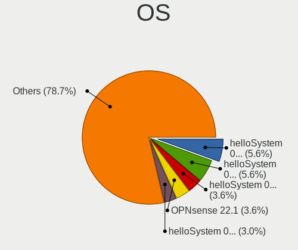

| Name              | Desktops | Percent |
|-------------------|----------|---------|
| helloSystem 0.7.0 | 11       | 8.15%   |
| helloSystem 0.8.1 | 10       | 7.41%   |
| OPNsense 22.1     | 7        | 5.19%   |
| helloSystem 0.4.0 | 7        | 5.19%   |
| helloSystem 0.8.0 | 6        | 4.44%   |
| FreeBSD 13.1      | 5        | 3.7%    |
| OPNsense 21.7.7   | 4        | 2.96%   |
| OpenBSD 6.8       | 4        | 2.96%   |
| OPNsense 22.7.10  | 3        | 2.22%   |
| OPNsense 21.7.1   | 3        | 2.22%   |
| helloSystem 0.6.0 | 3        | 2.22%   |
| OPNsense 23.7.2   | 2        | 1.48%   |
| OPNsense 23.1.7   | 2        | 1.48%   |
| OPNsense 23.1     | 2        | 1.48%   |
| OPNsense 22.7.9   | 2        | 1.48%   |
| OPNsense 22.7.6   | 2        | 1.48%   |
| OPNsense 22.7.4   | 2        | 1.48%   |
| OPNsense 22.7.2   | 2        | 1.48%   |
| OPNsense 22.7.11  | 2        | 1.48%   |
| OPNsense 22.7.1   | 2        | 1.48%   |
| OPNsense 22.1.5   | 2        | 1.48%   |
| OPNsense 22.1.3   | 2        | 1.48%   |
| OPNsense 22.1.1   | 2        | 1.48%   |
| OPNsense 21.7.3   | 2        | 1.48%   |
| OPNsense 21.1.7   | 2        | 1.48%   |
| OpenBSD 7.2       | 2        | 1.48%   |
| OpenBSD 7.1       | 2        | 1.48%   |
| helloSystem 0.5.0 | 2        | 1.48%   |
| FreeBSD 13.2      | 2        | 1.48%   |
| FreeBSD 13.0      | 2        | 1.48%   |
| FreeBSD 12.1-p8   | 2        | 1.48%   |
| TrueNAS 12.2-p2   | 1        | 0.74%   |
| OPNsense 23.1.5   | 1        | 0.74%   |
| OPNsense 23.1.11  | 1        | 0.74%   |
| OPNsense 23.1.10  | 1        | 0.74%   |
| OPNsense 22.7.8   | 1        | 0.74%   |
| OPNsense 22.7.7   | 1        | 0.74%   |
| OPNsense 22.7     | 1        | 0.74%   |
| OPNsense 22.1.8   | 1        | 0.74%   |
| OPNsense 22.1.10  | 1        | 0.74%   |

OS Family
---------

OS without a version

| Name        | Desktops | Percent |
|-------------|----------|---------|
| OPNsense    | 40       | 39.6%   |
| helloSystem | 36       | 35.64%  |
| FreeBSD     | 12       | 11.88%  |
| OpenBSD     | 8        | 7.92%   |
| NetBSD      | 2        | 1.98%   |
| TrueNAS     | 1        | 0.99%   |
| GhostBSD    | 1        | 0.99%   |
| DragonFly   | 1        | 0.99%   |

Arch
----

OS architecture (x86_64, i586, etc.)

| Name  | Desktops | Percent |
|-------|----------|---------|
| amd64 | 98       | 97.03%  |
| i386  | 2        | 1.98%   |
| arm64 | 1        | 0.99%   |

DE
--

Desktop Environment

| Name         | Desktops | Percent |
|--------------|----------|---------|
| Console      | 48       | 47.52%  |
| helloDesktop | 39       | 38.61%  |
| fvwm         | 4        | 3.96%   |
| MATE         | 3        | 2.97%   |
| XFCE         | 2        | 1.98%   |
| GNOME        | 2        | 1.98%   |
| KDE5         | 1        | 0.99%   |
| i3           | 1        | 0.99%   |
| Fluxbox      | 1        | 0.99%   |

Display Server
--------------

X11 or Wayland

| Name    | Desktops | Percent |
|---------|----------|---------|
| X11     | 54       | 53.47%  |
| Console | 47       | 46.53%  |

Display Manager
---------------

SDDM, LightDM, etc.

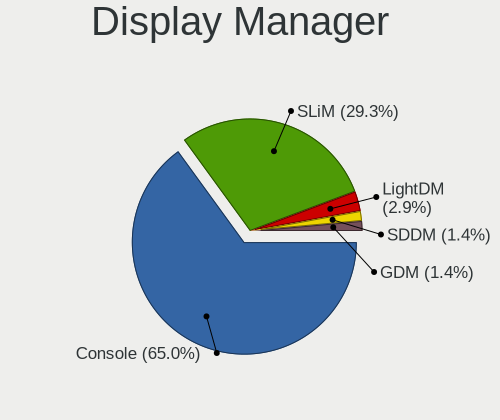

| Name    | Desktops | Percent |
|---------|----------|---------|
| Console | 58       | 56.86%  |
| SLiM    | 39       | 38.24%  |
| LightDM | 3        | 2.94%   |
| SDDM    | 1        | 0.98%   |
| GDM     | 1        | 0.98%   |

OS Lang
-------

Language

| Lang             | Desktops | Percent |
|------------------|----------|---------|
| Unknown          | 55       | 53.4%   |
| en_US            | 22       | 21.36%  |
| es_ES            | 12       | 11.65%  |
| C                | 8        | 7.77%   |
| fr_FR            | 3        | 2.91%   |
| fr               | 1        | 0.97%   |
| es_ES.ISO8859-15 | 1        | 0.97%   |
| es               | 1        | 0.97%   |

Boot Mode
---------

EFI or BIOS

| Mode | Desktops | Percent |
|------|----------|---------|
| EFI  | 83       | 81.37%  |
| BIOS | 19       | 18.63%  |

Filesystem
----------

Type of filesystem

| Type    | Desktops | Percent |
|---------|----------|---------|
| Zfs     | 47       | 43.93%  |
| Ufs     | 32       | 29.91%  |
| Cd9660  | 18       | 16.82%  |
| Ffs     | 8        | 7.48%   |
| Hammer2 | 1        | 0.93%   |
| Unknown | 1        | 0.93%   |

Part. scheme
------------

Scheme of partitioning

| Type    | Desktops | Percent |
|---------|----------|---------|
| GPT     | 88       | 86.27%  |
| MBR     | 11       | 10.78%  |
| Unknown | 3        | 2.94%   |

Board
-----

Vendor
------

Motherboard manufacturer

| Name                       | Desktops | Percent |
|----------------------------|----------|---------|
| ASUSTek Computer           | 21       | 20.79%  |
| Hewlett-Packard            | 13       | 12.87%  |
| Gigabyte Technology        | 9        | 8.91%   |
| Lenovo                     | 7        | 6.93%   |
| Unknown                    | 6        | 5.94%   |
| MSI                        | 5        | 4.95%   |
| ASRock                     | 5        | 4.95%   |
| YANYU                      | 4        | 3.96%   |
| Fujitsu                    | 4        | 3.96%   |
| Acer                       | 4        | 3.96%   |
| Intel                      | 3        | 2.97%   |
| Dell                       | 3        | 2.97%   |
| Techvision                 | 2        | 1.98%   |
| OEM                        | 2        | 1.98%   |
| Medion                     | 2        | 1.98%   |
| ECS                        | 2        | 1.98%   |
| Wistron                    | 1        | 0.99%   |
| ShenZhen MinWin Technology | 1        | 0.99%   |
| Pegatron                   | 1        | 0.99%   |
| PC Engines                 | 1        | 0.99%   |
| MW                         | 1        | 0.99%   |
| GVC                        | 1        | 0.99%   |
| Fujitsu Siemens            | 1        | 0.99%   |
| eMachines                  | 1        | 0.99%   |
| AMI                        | 1        | 0.99%   |

Model
-----

Motherboard model

| Name                                | Desktops | Percent |
|-------------------------------------|----------|---------|
| Unknown                             | 6        | 5.94%   |
| ASUS All Series                     | 3        | 2.97%   |
| YANYU R250                          | 2        | 1.98%   |
| YANYU H67SL                         | 2        | 1.98%   |
| Techvision TVI7309X                 | 2        | 1.98%   |
| HP t620 PLUS Quad Core TC           | 2        | 1.98%   |
| HP EliteDesk 700 G1 SFF             | 2        | 1.98%   |
| ASUS PRIME A320M-K                  | 2        | 1.98%   |
| ASRock N3700-ITX                    | 2        | 1.98%   |
| Wistron ProLiant ML110 G6           | 1        | 0.99%   |
| ShenZhen MinWin 3865U-6L            | 1        | 0.99%   |
| Pegatron Elite 7500 Series MT       | 1        | 0.99%   |
| PC Engines APU2                     | 1        | 0.99%   |
| OEM NU93 Series                     | 1        | 0.99%   |
| OEM AR-B5800                        | 1        | 0.99%   |
| MW GMLK-2_5G4L                      | 1        | 0.99%   |
| MSI MS-7C91                         | 1        | 0.99%   |
| MSI MS-7C52                         | 1        | 0.99%   |
| MSI MS-7C51                         | 1        | 0.99%   |
| MSI MS-7C09                         | 1        | 0.99%   |
| MSI MS-7B86                         | 1        | 0.99%   |
| Medion H81H3-EM2                    | 1        | 0.99%   |
| Medion H61H2-LM3                    | 1        | 0.99%   |
| Lenovo ThinkStation S30 0569A93     | 1        | 0.99%   |
| Lenovo ThinkCentre M93p 10AAS1MD00  | 1        | 0.99%   |
| Lenovo ThinkCentre M93p 10AAA0WGUK  | 1        | 0.99%   |
| Lenovo ThinkCentre M91p 4512A47     | 1        | 0.99%   |
| Lenovo ThinkCentre M710s 10M8S0FW00 | 1        | 0.99%   |
| Lenovo ThinkCentre E73 10AU003FUK   | 1        | 0.99%   |
| Lenovo H30-05 90BJ0085SP            | 1        | 0.99%   |
| Intel SKYBAY                        | 1        | 0.99%   |
| Intel MAHOBAY                       | 1        | 0.99%   |
| Intel CARLOW                        | 1        | 0.99%   |
| HP Slim Desktop S01-pF1xxx          | 1        | 0.99%   |
| HP ProLiant ML310e Gen8 v2          | 1        | 0.99%   |
| HP ProLiant MicroServer Gen8        | 1        | 0.99%   |
| HP EliteDesk 800 G2 SFF             | 1        | 0.99%   |
| HP EliteDesk 800 G2 DM 35W          | 1        | 0.99%   |
| HP Compaq Elite 8300 USDT           | 1        | 0.99%   |
| HP Compaq 8200 Elite USDT PC        | 1        | 0.99%   |

Model Family
------------

Motherboard model prefix

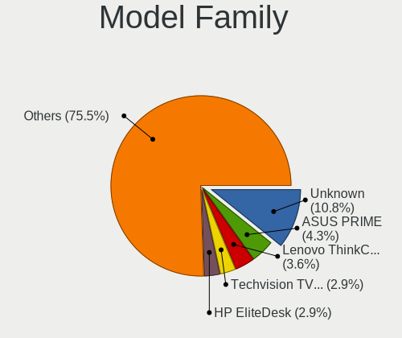

| Name                     | Desktops | Percent |
|--------------------------|----------|---------|
| ASUS PRIME               | 6        | 5.94%   |
| Unknown                  | 6        | 5.94%   |
| Lenovo ThinkCentre       | 5        | 4.95%   |
| HP EliteDesk             | 4        | 3.96%   |
| HP Compaq                | 3        | 2.97%   |
| Fujitsu ESPRIMO          | 3        | 2.97%   |
| ASUS All                 | 3        | 2.97%   |
| Acer Aspire              | 3        | 2.97%   |
| YANYU R250               | 2        | 1.98%   |
| YANYU H67SL              | 2        | 1.98%   |
| Techvision TVI7309X      | 2        | 1.98%   |
| HP t620                  | 2        | 1.98%   |
| HP ProLiant              | 2        | 1.98%   |
| Dell OptiPlex            | 2        | 1.98%   |
| ASUS TUF                 | 2        | 1.98%   |
| ASUS M5A78L-M            | 2        | 1.98%   |
| ASRock N3700-ITX         | 2        | 1.98%   |
| Wistron ProLiant         | 1        | 0.99%   |
| ShenZhen MinWin 3865U-6L | 1        | 0.99%   |
| Pegatron Elite           | 1        | 0.99%   |
| PC Engines APU2          | 1        | 0.99%   |
| OEM NU93                 | 1        | 0.99%   |
| OEM AR-B5800             | 1        | 0.99%   |
| MW GMLK-2                | 1        | 0.99%   |
| MSI MS-7C91              | 1        | 0.99%   |
| MSI MS-7C52              | 1        | 0.99%   |
| MSI MS-7C51              | 1        | 0.99%   |
| MSI MS-7C09              | 1        | 0.99%   |
| MSI MS-7B86              | 1        | 0.99%   |
| Medion H81H3-EM2         | 1        | 0.99%   |
| Medion H61H2-LM3         | 1        | 0.99%   |
| Lenovo ThinkStation      | 1        | 0.99%   |
| Lenovo H30-05            | 1        | 0.99%   |
| Intel SKYBAY             | 1        | 0.99%   |
| Intel MAHOBAY            | 1        | 0.99%   |
| Intel CARLOW             | 1        | 0.99%   |
| HP Slim                  | 1        | 0.99%   |
| HP 500-311ns             | 1        | 0.99%   |
| GVC EQUIUM               | 1        | 0.99%   |
| Gigabyte Z370P           | 1        | 0.99%   |

MFG Year
--------

Motherboard manufacture year

| Year    | Desktops | Percent |
|---------|----------|---------|
| 2014    | 16       | 15.84%  |
| 2018    | 11       | 10.89%  |
| 2019    | 10       | 9.9%    |
| 2020    | 9        | 8.91%   |
| 2013    | 7        | 6.93%   |
| 2021    | 6        | 5.94%   |
| 2017    | 6        | 5.94%   |
| 2016    | 6        | 5.94%   |
| 2022    | 5        | 4.95%   |
| 2015    | 5        | 4.95%   |
| 2011    | 5        | 4.95%   |
| 2012    | 3        | 2.97%   |
| 2010    | 3        | 2.97%   |
| 2008    | 3        | 2.97%   |
| 2009    | 2        | 1.98%   |
| Unknown | 2        | 1.98%   |
| 2006    | 1        | 0.99%   |
| 2003    | 1        | 0.99%   |

Form Factor
-----------

Physical design of the computer

| Name    | Desktops | Percent |
|---------|----------|---------|
| Desktop | 101      | 100%    |

Coreboot
--------

Have coreboot on board

| Used | Desktops | Percent |
|------|----------|---------|
| No   | 100      | 99.01%  |
| Yes  | 1        | 0.99%   |

RAM Size
--------

Total RAM memory

| Size in GB  | Desktops | Percent |
|-------------|----------|---------|
| 8.01-16.0   | 41       | 39.42%  |
| 16.01-24.0  | 19       | 18.27%  |
| 4.01-8.0    | 18       | 17.31%  |
| 32.01-64.0  | 12       | 11.54%  |
| 3.01-4.0    | 4        | 3.85%   |
| 64.01-256.0 | 4        | 3.85%   |
| 1.01-2.0    | 3        | 2.88%   |
| 2.01-3.0    | 1        | 0.96%   |
| 0.51-1.0    | 1        | 0.96%   |
| 0.01-0.5    | 1        | 0.96%   |

RAM Used
--------

Used RAM memory

| Used GB    | Desktops | Percent |
|------------|----------|---------|
| 0.01-0.5   | 49       | 46.23%  |
| 0.51-1.0   | 33       | 31.13%  |
| 1.01-2.0   | 12       | 11.32%  |
| 3.01-4.0   | 4        | 3.77%   |
| 0          | 3        | 2.83%   |
| Unknown    | 2        | 1.89%   |
| 4.01-8.0   | 1        | 0.94%   |
| 24.01-32.0 | 1        | 0.94%   |
| 2.01-3.0   | 1        | 0.94%   |

Total Drives
------------

Number of drives on board

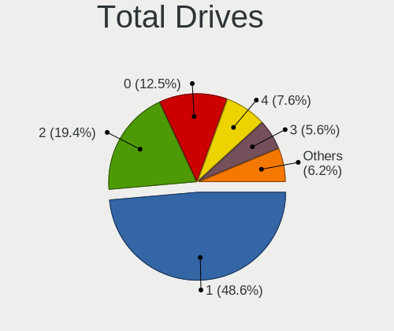

| Drives | Desktops | Percent |
|--------|----------|---------|
| 1      | 50       | 47.17%  |
| 2      | 21       | 19.81%  |
| 4      | 9        | 8.49%   |
| 0      | 9        | 8.49%   |
| 3      | 8        | 7.55%   |
| 5      | 6        | 5.66%   |
| 6      | 2        | 1.89%   |
| 7      | 1        | 0.94%   |

Has CD-ROM
----------

Has CD-ROM on board

| Presented | Desktops | Percent |
|-----------|----------|---------|
| No        | 77       | 76.24%  |
| Yes       | 24       | 23.76%  |

Has Ethernet
------------

Has Ethernet on board

| Presented | Desktops | Percent |
|-----------|----------|---------|
| Yes       | 99       | 98.02%  |
| No        | 2        | 1.98%   |

Has WiFi
--------

Has WiFi module

| Presented | Desktops | Percent |
|-----------|----------|---------|
| No        | 81       | 80.2%   |
| Yes       | 20       | 19.8%   |

Has Bluetooth
-------------

Has Bluetooth module

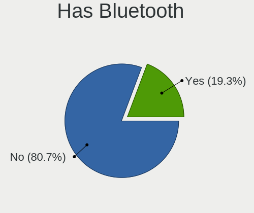

| Presented | Desktops | Percent |
|-----------|----------|---------|
| No        | 86       | 84.31%  |
| Yes       | 16       | 15.69%  |

Location
--------

Country
-------

Geographic location (country)

| Country | Desktops | Percent |
|---------|----------|---------|
| Spain   | 101      | 100%    |

City
----

Geographic location (city)

| City                          | Desktops | Percent |
|-------------------------------|----------|---------|
| Madrid                        | 22       | 18.33%  |
| Valencia                      | 6        | 5%      |
| Málaga                       | 3        | 2.5%    |
| Ibiza Town                    | 3        | 2.5%    |
| Barcelona                     | 3        | 2.5%    |
| Seville                       | 2        | 1.67%   |
| San Sebastián de los Reyes | 2        | 1.67%   |
| Palma                         | 2        | 1.67%   |
| Oviedo                        | 2        | 1.67%   |
| Ourense                       | 2        | 1.67%   |
| Castilleja de la Cuesta       | 2        | 1.67%   |
| Bilbao                        | 2        | 1.67%   |
| Barakaldo                     | 2        | 1.67%   |
| Zaragoza                      | 1        | 0.83%   |
| VГ©lez-MГЎlaga            | 1        | 0.83%   |
| Vitoria-Gasteiz               | 1        | 0.83%   |
| Villena                       | 1        | 0.83%   |
| Villanueva de la Canada       | 1        | 0.83%   |
| Vigo                          | 1        | 0.83%   |
| Valladolid                    | 1        | 0.83%   |
| Valderrobres                  | 1        | 0.83%   |
| Tres Cantos                   | 1        | 0.83%   |
| Trebujena                     | 1        | 0.83%   |
| Torre del Mar                 | 1        | 0.83%   |
| Toledo                        | 1        | 0.83%   |
| Sedavi                        | 1        | 0.83%   |
| Santurtzi                     | 1        | 0.83%   |
| Santiago de Compostela        | 1        | 0.83%   |
| Sant Cugat del Vallès        | 1        | 0.83%   |
| Sant Cugat del Vallès      | 1        | 0.83%   |
| San Jose de la Rinconada      | 1        | 0.83%   |
| San Fernando                  | 1        | 0.83%   |
| Sabadell                      | 1        | 0.83%   |
| Roses                         | 1        | 0.83%   |
| Roquetas de Mar               | 1        | 0.83%   |
| Rivas-Vaciamadrid             | 1        | 0.83%   |
| Portugalete                   | 1        | 0.83%   |
| Port de Sagunt                | 1        | 0.83%   |
| Pontevedra                    | 1        | 0.83%   |
| Paterna                       | 1        | 0.83%   |

Drives
------

Drive Vendor
------------

Hard drive vendors

| Vendor              | Desktops | Drives | Percent |
|---------------------|----------|--------|---------|
| WDC                 | 30       | 48     | 19.61%  |
| Seagate             | 27       | 48     | 17.65%  |
| Kingston            | 21       | 41     | 13.73%  |
| Samsung Electronics | 18       | 27     | 11.76%  |
| Crucial             | 8        | 11     | 5.23%   |
| Toshiba             | 6        | 8      | 3.92%   |
| Hitachi             | 5        | 5      | 3.27%   |
| Transcend           | 4        | 5      | 2.61%   |
| China               | 4        | 8      | 2.61%   |
| SanDisk             | 3        | 3      | 1.96%   |
| LITEON              | 3        | 3      | 1.96%   |
| FORESEE             | 3        | 3      | 1.96%   |
| Corsair             | 3        | 3      | 1.96%   |
| TCSUNBOW            | 1        | 3      | 0.65%   |
| Silicon Motion      | 1        | 1      | 0.65%   |
| ShiJi               | 1        | 1      | 0.65%   |
| Phison              | 1        | 1      | 0.65%   |
| OCZ                 | 1        | 1      | 0.65%   |
| Nfortec             | 1        | 1      | 0.65%   |
| Micron Technology   | 1        | 1      | 0.65%   |
| LITEONIT            | 1        | 1      | 0.65%   |
| Lexar               | 1        | 1      | 0.65%   |
| KIOXIA-EXCERIA      | 1        | 1      | 0.65%   |
| Intenso             | 1        | 5      | 0.65%   |
| Intel               | 1        | 3      | 0.65%   |
| Innodisk            | 1        | 1      | 0.65%   |
| Fanxiang            | 1        | 1      | 0.65%   |
| EMTEC               | 1        | 1      | 0.65%   |
| BR                  | 1        | 3      | 0.65%   |
| BAITITON            | 1        | 1      | 0.65%   |
| Apacer              | 1        | 1      | 0.65%   |

Drive Model
-----------

Hard drive models

| Model                           | Desktops | Percent |
|---------------------------------|----------|---------|
| Kingston SA400S37240G 240GB     | 6        | 3.33%   |
| Seagate ST500DM002-1BD142 500GB | 4        | 2.22%   |
| Seagate ST1000DM010-2EP102 1TB  | 4        | 2.22%   |
| Kingston SA400S37120G 120GB     | 3        | 1.67%   |
| Crucial CT240BX500SSD1 240GB    | 3        | 1.67%   |
| WDC WDS500G2B0A-00SM50 500GB    | 2        | 1.11%   |
| WDC WDS500G1B0A-00H9H0 500GB    | 2        | 1.11%   |
| WDC WDS250G1B0A-00H9H0 250GB    | 2        | 1.11%   |
| WDC WD20EARX-00PASB0 2TB        | 2        | 1.11%   |
| Toshiba TR200 240GB             | 2        | 1.11%   |
| Seagate ST3500418AS 500GB       | 2        | 1.11%   |
| Seagate ST1000DM003-9YN162 1TB  | 2        | 1.11%   |
| Seagate ST1000DM003-1ER162 1TB  | 2        | 1.11%   |
| Samsung SSD 860 EVO 500GB       | 2        | 1.11%   |
| Samsung SSD 850 EVO 500GB       | 2        | 1.11%   |
| Samsung HD103SI 1TB             | 2        | 1.11%   |
| LITEON CV8-8E128-HP 128GB       | 2        | 1.11%   |
| Kingston SV300S37A120G 120GB    | 2        | 1.11%   |
| Kingston SUV500MS120G 120GB     | 2        | 1.11%   |
| Kingston SUV400S37240G 240GB    | 2        | 1.11%   |
| Kingston SA400S37480G 480GB     | 2        | 1.11%   |
| FORESEE S326M256G 256GB         | 2        | 1.11%   |
| Crucial CT500MX500SSD1 500GB    | 2        | 1.11%   |
| Crucial CT250MX500SSD1 250GB    | 2        | 1.11%   |
| WDC WDS500G3XHC-00SJG0 500GB    | 1        | 0.56%   |
| WDC WDS500G2B0B-00YS70 500GB    | 1        | 0.56%   |
| WDC WDS240G2G0A-00JH30 240GB    | 1        | 0.56%   |
| WDC WDS240G1G0A-00SS50 240GB    | 1        | 0.56%   |
| WDC WD80EZAZ-11TDBA0 8TB        | 1        | 0.56%   |
| WDC WD800JD-75MSA3 80GB         | 1        | 0.56%   |
| WDC WD6400AAKS-22A7B0 640GB     | 1        | 0.56%   |
| WDC WD60EZRX-00MVLB1 6TB        | 1        | 0.56%   |
| WDC WD60EFRX-68L0BN1 6TB        | 1        | 0.56%   |
| WDC WD5000LPLX-66ZNTT0 500GB    | 1        | 0.56%   |
| WDC WD5000LPLX-08ZNTT0 500GB    | 1        | 0.56%   |
| WDC WD5000AAKX-22ERMA0 500GB    | 1        | 0.56%   |
| WDC WD5000AAKX-00ERMA0 500GB    | 1        | 0.56%   |
| WDC WD3200AAJS-56B4A0 320GB     | 1        | 0.56%   |
| WDC WD30EZRX-00D8PB0 3TB        | 1        | 0.56%   |
| WDC WD2503ABYX-01WERA1 256GB    | 1        | 0.56%   |

HDD Vendor
----------

Hard disk drive vendors

| Vendor              | Desktops | Drives | Percent |
|---------------------|----------|--------|---------|
| Seagate             | 26       | 44     | 42.62%  |
| WDC                 | 21       | 34     | 34.43%  |
| Samsung Electronics | 6        | 9      | 9.84%   |
| Hitachi             | 5        | 5      | 8.2%    |
| Toshiba             | 3        | 4      | 4.92%   |

SSD Vendor
----------

Solid state drive vendors

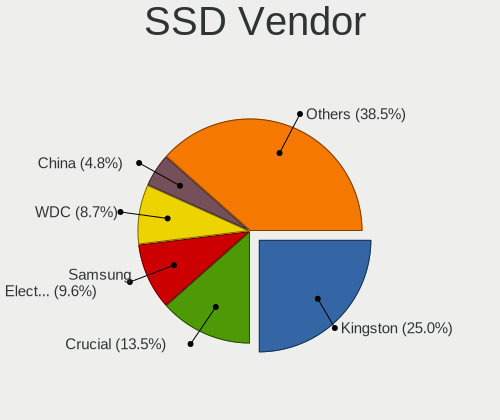

| Vendor              | Desktops | Drives | Percent |
|---------------------|----------|--------|---------|
| Kingston            | 20       | 40     | 25.64%  |
| Samsung Electronics | 9        | 12     | 11.54%  |
| WDC                 | 8        | 13     | 10.26%  |
| Crucial             | 8        | 11     | 10.26%  |
| Transcend           | 4        | 5      | 5.13%   |
| Toshiba             | 4        | 4      | 5.13%   |
| China               | 4        | 8      | 5.13%   |
| SanDisk             | 3        | 3      | 3.85%   |
| LITEON              | 3        | 3      | 3.85%   |
| FORESEE             | 3        | 3      | 3.85%   |
| TCSUNBOW            | 1        | 3      | 1.28%   |
| ShiJi               | 1        | 1      | 1.28%   |
| Seagate             | 1        | 1      | 1.28%   |
| OCZ                 | 1        | 1      | 1.28%   |
| LITEONIT            | 1        | 1      | 1.28%   |
| Intenso             | 1        | 5      | 1.28%   |
| Intel               | 1        | 3      | 1.28%   |
| Innodisk            | 1        | 1      | 1.28%   |
| EMTEC               | 1        | 1      | 1.28%   |
| BR                  | 1        | 3      | 1.28%   |
| BAITITON            | 1        | 1      | 1.28%   |
| Apacer              | 1        | 1      | 1.28%   |

Drive Kind
----------

HDD or SSD

| Kind | Desktops | Drives | Percent |
|------|----------|--------|---------|
| SSD  | 66       | 124    | 52.8%   |
| HDD  | 44       | 96     | 35.2%   |
| NVMe | 15       | 21     | 12%     |

Drive Connector
---------------

SATA, SAS, NVMe, etc.

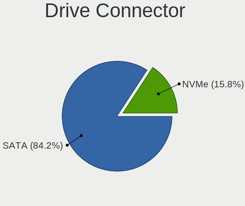

| Type | Desktops | Drives | Percent |
|------|----------|--------|---------|
| SATA | 89       | 220    | 85.58%  |
| NVMe | 15       | 21     | 14.42%  |

Drive Size
----------

Size of hard drive

| Size in TB | Desktops | Drives | Percent |
|------------|----------|--------|---------|
| 0.01-0.5   | 79       | 163    | 69.3%   |
| 0.51-1.0   | 23       | 39     | 20.18%  |
| 1.01-2.0   | 7        | 11     | 6.14%   |
| 4.01-10.0  | 3        | 5      | 2.63%   |
| 3.01-4.0   | 1        | 1      | 0.88%   |
| 2.01-3.0   | 1        | 1      | 0.88%   |

Space Total
-----------

Amount of disk space available on the file system

| Size in GB | Desktops | Percent |
|------------|----------|---------|
| 1-20       | 35       | 33.33%  |
| 101-250    | 28       | 26.67%  |
| 251-500    | 11       | 10.48%  |
| 21-50      | 11       | 10.48%  |
| 51-100     | 10       | 9.52%   |
| 501-1000   | 8        | 7.62%   |
| 2001-3000  | 1        | 0.95%   |
| Unknown    | 1        | 0.95%   |

Space Used
----------

Amount of used disk space

| Used GB | Desktops | Percent |
|---------|----------|---------|
| 1-20    | 92       | 87.62%  |
| 21-50   | 8        | 7.62%   |
| 251-500 | 2        | 1.9%    |
| 51-100  | 2        | 1.9%    |
| Unknown | 1        | 0.95%   |

Malfunc. Drives
---------------

Drive models with a malfunction

| Model                             | Desktops | Drives | Percent |
|-----------------------------------|----------|--------|---------|
| Seagate ST500DM002-1BD142 500GB   | 2        | 2      | 6.67%   |
| LITEON CV8-8E128-HP 128GB         | 2        | 2      | 6.67%   |
| WDC WDS240G2G0A-00JH30 240GB      | 1        | 2      | 3.33%   |
| WDC WD6400AAKS-22A7B0 640GB       | 1        | 1      | 3.33%   |
| WDC WD5000AAKX-22ERMA0 500GB      | 1        | 1      | 3.33%   |
| WDC WD1600AAJS-00WAA0 160GB       | 1        | 1      | 3.33%   |
| WDC WD10EZEX-21M2NA0 1TB          | 1        | 1      | 3.33%   |
| Toshiba MQ01UBD100 1TB            | 1        | 2      | 3.33%   |
| Seagate ST500LT012-9WS142 500GB   | 1        | 1      | 3.33%   |
| Seagate ST500LT012-1DG142 500GB   | 1        | 1      | 3.33%   |
| Seagate ST3500418AS 500GB         | 1        | 1      | 3.33%   |
| Seagate ST3500413AS 500GB         | 1        | 3      | 3.33%   |
| Seagate ST3160215AS 160GB         | 1        | 1      | 3.33%   |
| Seagate ST31000528AS 1TB          | 1        | 2      | 3.33%   |
| Seagate ST31000333AS 1TB          | 1        | 1      | 3.33%   |
| Seagate ST1000DM010-2EP102 1TB    | 1        | 1      | 3.33%   |
| Seagate ST1000DM003-9YN162 1TB    | 1        | 1      | 3.33%   |
| Seagate ST1000DM003-1ER162 1TB    | 1        | 1      | 3.33%   |
| Samsung Electronics HM320JI 320GB | 1        | 1      | 3.33%   |
| Samsung Electronics HD252HJ 250GB | 1        | 1      | 3.33%   |
| Samsung Electronics HD103UJ 1TB   | 1        | 1      | 3.33%   |
| Samsung Electronics HD103SI 1TB   | 1        | 1      | 3.33%   |
| Kingston SV300S37A120G 120GB      | 1        | 1      | 3.33%   |
| Hitachi HTS725050A9A364 500GB     | 1        | 1      | 3.33%   |
| Hitachi HTS725050A7E630 500GB     | 1        | 1      | 3.33%   |
| Hitachi HTS545050A7E380 500GB     | 1        | 1      | 3.33%   |
| Hitachi HDT721010SLA360 1TB       | 1        | 1      | 3.33%   |
| Hitachi HDP725016GLA380 160GB     | 1        | 1      | 3.33%   |

Malfunc. Drive Vendor
---------------------

Vendors of faulty drives

| Vendor              | Desktops | Drives | Percent |
|---------------------|----------|--------|---------|
| Seagate             | 9        | 15     | 34.62%  |
| WDC                 | 5        | 6      | 19.23%  |
| Hitachi             | 5        | 5      | 19.23%  |
| Samsung Electronics | 3        | 4      | 11.54%  |
| LITEON              | 2        | 2      | 7.69%   |
| Toshiba             | 1        | 2      | 3.85%   |
| Kingston            | 1        | 1      | 3.85%   |

Malfunc. HDD Vendor
-------------------

Vendors of faulty HDD drives

| Vendor              | Desktops | Drives | Percent |
|---------------------|----------|--------|---------|
| Seagate             | 9        | 15     | 40.91%  |
| Hitachi             | 5        | 5      | 22.73%  |
| WDC                 | 4        | 4      | 18.18%  |
| Samsung Electronics | 3        | 4      | 13.64%  |
| Toshiba             | 1        | 2      | 4.55%   |

Malfunc. Drive Kind
-------------------

Kinds of faulty drives

| Kind | Desktops | Drives | Percent |
|------|----------|--------|---------|
| HDD  | 19       | 30     | 82.61%  |
| SSD  | 4        | 5      | 17.39%  |

Failed Drives
-------------

Failed drive models

| Model              | Desktops | Drives | Percent |
|--------------------|----------|--------|---------|
| SanDisk pSSD 256GB | 1        | 1      | 100%    |

Failed Drive Vendor
-------------------

Failed drive vendors

| Vendor  | Desktops | Drives | Percent |
|---------|----------|--------|---------|
| SanDisk | 1        | 1      | 100%    |

Drive Status
------------

Number of failed and malfunc. drives

| Status   | Desktops | Drives | Percent |
|----------|----------|--------|---------|
| Works    | 81       | 203    | 76.42%  |
| Malfunc  | 23       | 35     | 21.7%   |
| Detected | 1        | 2      | 0.94%   |
| Failed   | 1        | 1      | 0.94%   |

Storage controller
------------------

Storage Vendor
--------------

Storage controller vendors

| Vendor                       | Desktops | Percent |
|------------------------------|----------|---------|
| Intel                        | 73       | 57.03%  |
| AMD                          | 24       | 18.75%  |
| ASMedia Technology           | 8        | 6.25%   |
| Samsung Electronics          | 4        | 3.13%   |
| Phison Electronics           | 3        | 2.34%   |
| Silicon Motion               | 2        | 1.56%   |
| Shenzhen Longsys Electronics | 2        | 1.56%   |
| SanDisk                      | 2        | 1.56%   |
| Nvidia                       | 2        | 1.56%   |
| VIA Technologies             | 1        | 0.78%   |
| Seagate Technology           | 1        | 0.78%   |
| Micron/Crucial Technology    | 1        | 0.78%   |
| Micron Technology            | 1        | 0.78%   |
| Marvell Technology Group     | 1        | 0.78%   |
| KIOXIA                       | 1        | 0.78%   |
| Kingston Technology Company  | 1        | 0.78%   |
| JMicron Technology           | 1        | 0.78%   |

Storage Model
-------------

Storage controller models

| Model                                                                                   | Desktops | Percent |
|-----------------------------------------------------------------------------------------|----------|---------|
| AMD FCH SATA Controller [AHCI mode]                                                     | 17       | 10.97%  |
| Intel 8 Series/C220 Series Chipset Family 6-port SATA Controller 1 [AHCI mode]          | 15       | 9.68%   |
| ASMedia ASM1062 Serial ATA Controller                                                   | 7        | 4.52%   |
| Intel 6 Series/C200 Series Chipset Family 6 port Desktop SATA AHCI Controller           | 6        | 3.87%   |
| Intel 200 Series PCH SATA controller [AHCI mode]                                        | 6        | 3.87%   |
| AMD 400 Series Chipset SATA Controller                                                  | 6        | 3.87%   |
| AMD FCH SATA Controller D                                                               | 5        | 3.23%   |
| Intel Sunrise Point-LP SATA Controller [AHCI mode]                                      | 4        | 2.58%   |
| Intel SATA Controller [RAID mode]                                                       | 4        | 2.58%   |
| Intel Celeron/Pentium Silver Processor SATA Controller                                  | 4        | 2.58%   |
| Samsung NVMe SSD Controller SM981/PM981/PM983                                           | 3        | 1.94%   |
| Intel Q170/Q150/B150/H170/H110/Z170/CM236 Chipset SATA Controller [AHCI Mode]           | 3        | 1.94%   |
| Intel Atom/Celeron/Pentium Processor x5-E8000/J3xxx/N3xxx Series SATA Controller        | 3        | 1.94%   |
| Intel Atom Processor E3800 Series SATA AHCI Controller                                  | 3        | 1.94%   |
| Silicon Motion SM2263EN/SM2263XT (DRAM-less) NVMe SSD Controllers                       | 2        | 1.29%   |
| Phison E16 PCIe4 NVMe Controller                                                        | 2        | 1.29%   |
| Intel Jasper Lake SATA AHCI Controller                                                  | 2        | 1.29%   |
| Intel 82801IR/IO/IH (ICH9R/DO/DH) 6 port SATA Controller [AHCI mode]                    | 2        | 1.29%   |
| Intel 7 Series/C210 Series Chipset Family 6-port SATA Controller [AHCI mode]            | 2        | 1.29%   |
| Intel 7 Series/C210 Series Chipset Family 4-port SATA Controller [IDE mode]             | 2        | 1.29%   |
| Intel 7 Series/C210 Series Chipset Family 2-port SATA Controller [IDE mode]             | 2        | 1.29%   |
| Intel 6 Series/C200 Series Chipset Family Desktop SATA Controller (IDE mode, ports 4-5) | 2        | 1.29%   |
| Intel 6 Series/C200 Series Chipset Family Desktop SATA Controller (IDE mode, ports 0-3) | 2        | 1.29%   |
| Intel 5 Series/3400 Series Chipset 6 port SATA AHCI Controller                          | 2        | 1.29%   |
| AMD SB7x0/SB8x0/SB9x0 SATA Controller [AHCI mode]                                       | 2        | 1.29%   |
| AMD SB7x0/SB8x0/SB9x0 IDE Controller                                                    | 2        | 1.29%   |
| VIA VT82C586A/B/VT82C686/A/B/VT823x/A/C PIPC Bus Master IDE                             | 1        | 0.65%   |
| Shenzhen Longsys SM2263EN/SM2263XT-based OEM SSD                                        | 1        | 0.65%   |
| Shenzhen Longsys Lexar NM620 NVME SSD (DRAM-less)                                       | 1        | 0.65%   |
| Seagate FireCuda 520 SSD                                                                | 1        | 0.65%   |
| Sandisk WD Black SN770 / PC SN740 256GB / PC SN560 (DRAM-less) NVMe SSD                 | 1        | 0.65%   |
| SanDisk WD Black 2018/SN750 / PC SN720 NVMe SSD                                         | 1        | 0.65%   |
| Samsung NVMe SSD Controller PM9A1/PM9A3/980PRO                                          | 1        | 0.65%   |
| Phison E12 NVMe Controller                                                              | 1        | 0.65%   |
| Nvidia MCP73 IDE Controller                                                             | 1        | 0.65%   |
| Nvidia MCP61 SATA Controller                                                            | 1        | 0.65%   |
| Nvidia MCP61 IDE                                                                        | 1        | 0.65%   |
| Nvidia GeForce 7100/nForce 630i SATA                                                    | 1        | 0.65%   |
| Micron/Crucial P1 NVMe PCIe SSD[Frampton2]                                              | 1        | 0.65%   |
| Micron 2200S NVMe SSD [Cassandra]                                                       | 1        | 0.65%   |

Storage Kind
------------

Kind of storage controller (IDE, SATA, NVMe, SAS, ...)

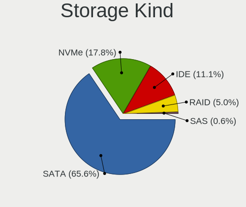

| Kind | Desktops | Percent |
|------|----------|---------|
| SATA | 84       | 67.2%   |
| IDE  | 18       | 14.4%   |
| NVMe | 16       | 12.8%   |
| RAID | 6        | 4.8%    |
| SAS  | 1        | 0.8%    |

Processor
---------

CPU Vendor
----------

Processor vendors

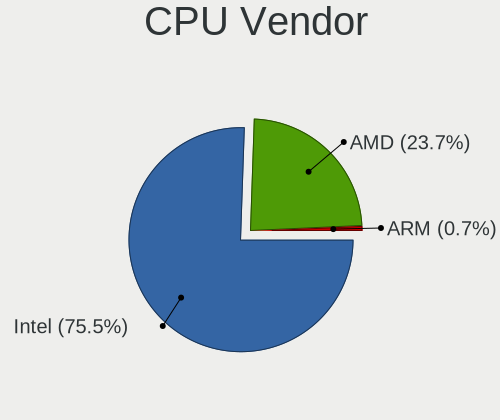

| Vendor | Desktops | Percent |
|--------|----------|---------|
| Intel  | 74       | 73.27%  |
| AMD    | 26       | 25.74%  |
| ARM    | 1        | 0.99%   |

CPU Model
---------

Processor models

| Model                                    | Desktops | Percent |
|------------------------------------------|----------|---------|
| Intel Core i5-4590 CPU @ 3.30GHz         | 3        | 2.97%   |
| Intel Core i5-2400 CPU @ 3.10GHz         | 3        | 2.97%   |
| Intel Celeron J4125 CPU @ 2.00GHz        | 3        | 2.97%   |
| Intel Xeon CPU E3-1220 v3 @ 3.10GHz      | 2        | 1.98%   |
| Intel Pentium CPU N3700 @ 1.60GHz        | 2        | 1.98%   |
| Intel Core i5-9500 CPU @ 3.00GHz         | 2        | 1.98%   |
| Intel Core i5-7400 CPU @ 3.00GHz         | 2        | 1.98%   |
| Intel Core i5-6500 CPU @ 3.20GHz         | 2        | 1.98%   |
| Intel Core i5-4570T CPU @ 2.90GHz        | 2        | 1.98%   |
| Intel Core i5-4570 CPU @ 3.20GHz         | 2        | 1.98%   |
| Intel Core i5-2400S CPU @ 2.50GHz        | 2        | 1.98%   |
| Intel Core i3-4160 CPU @ 3.60GHz         | 2        | 1.98%   |
| Intel Core i3-3240 CPU @ 3.40GHz         | 2        | 1.98%   |
| Intel Core i3-2120 CPU @ 3.30GHz         | 2        | 1.98%   |
| Intel Core i3-10100 CPU @ 3.60GHz        | 2        | 1.98%   |
| Intel Celeron N5105 @ 2.00GHz            | 2        | 1.98%   |
| AMD Ryzen 5 2600 Six-Core Processor      | 2        | 1.98%   |
| AMD Ryzen 3 1200 Quad-Core Processor     | 2        | 1.98%   |
| AMD GX-420CA SOC with Radeon HD Graphics | 2        | 1.98%   |
| Intel Xeon CPU X3430 @ 2.40GHz           | 1        | 0.99%   |
| Intel Xeon CPU E5-2690 0 @ 2.90GHz       | 1        | 0.99%   |
| Intel Xeon CPU E3-1225 V2 @ 3.20GHz      | 1        | 0.99%   |
| Intel Pentium Silver J5005 CPU @ 1.50GHz | 1        | 0.99%   |
| Intel Pentium II                         | 1        | 0.99%   |
| Intel Pentium Gold G5400 CPU @ 3.70GHz   | 1        | 0.99%   |
| Intel Pentium Dual-Core CPU E5300        | 1        | 0.99%   |
| Intel Genuine CPU 0000 @ 2.40GHz         | 1        | 0.99%   |
| Intel Core i7-9700K CPU @ 3.60GHz        | 1        | 0.99%   |
| Intel Core i7-7500U CPU @ 2.70GHz        | 1        | 0.99%   |
| Intel Core i7-6900K CPU @ 3.20GHz        | 1        | 0.99%   |
| Intel Core i7-6700K CPU @ 4.00GHz        | 1        | 0.99%   |
| Intel Core i7-6500U CPU @ 2.50GHz        | 1        | 0.99%   |
| Intel Core i7-4790 CPU @ 3.60GHz         | 1        | 0.99%   |
| Intel Core i5-7200U CPU @ 2.50GHz        | 1        | 0.99%   |
| Intel Core i5-4460 CPU @ 3.20GHz         | 1        | 0.99%   |
| Intel Core i5-3475S CPU @ 2.90GHz        | 1        | 0.99%   |
| Intel Core i5-3470 CPU @ 3.20GHz         | 1        | 0.99%   |
| Intel Core i5-10400F CPU @ 2.90GHz       | 1        | 0.99%   |
| Intel Core i3-7167U CPU @ 2.80GHz        | 1        | 0.99%   |
| Intel Core i3-6100T CPU @ 3.20GHz        | 1        | 0.99%   |

CPU Model Family
----------------

Processor model prefix

| Model                   | Desktops | Percent |
|-------------------------|----------|---------|
| Intel Core i5           | 23       | 22.77%  |
| Intel Core i3           | 13       | 12.87%  |
| Intel Celeron           | 11       | 10.89%  |
| Intel Core i7           | 6        | 5.94%   |
| Intel Xeon              | 5        | 4.95%   |
| Intel Core 2 Duo        | 4        | 3.96%   |
| AMD Ryzen 5             | 4        | 3.96%   |
| AMD Ryzen 3             | 4        | 3.96%   |
| AMD GX                  | 4        | 3.96%   |
| Intel Pentium           | 3        | 2.97%   |
| Intel Core 2 Quad       | 3        | 2.97%   |
| AMD Ryzen 7             | 3        | 2.97%   |
| AMD FX                  | 3        | 2.97%   |
| AMD Athlon              | 2        | 1.98%   |
| Other                   | 1        | 0.99%   |
| Intel Pentium Silver    | 1        | 0.99%   |
| Intel Pentium Gold      | 1        | 0.99%   |
| Intel Pentium Dual-Core | 1        | 0.99%   |
| Intel Genuine           | 1        | 0.99%   |
| Intel Atom              | 1        | 0.99%   |
| ARM Cortex              | 1        | 0.99%   |
| AMD Ryzen Threadripper  | 1        | 0.99%   |
| AMD E2                  | 1        | 0.99%   |
| AMD E1                  | 1        | 0.99%   |
| AMD Athlon XP           | 1        | 0.99%   |
| AMD A8                  | 1        | 0.99%   |
| AMD A4                  | 1        | 0.99%   |

CPU Cores
---------

Number of processor cores

| Number  | Desktops | Percent |
|---------|----------|---------|
| 4       | 50       | 49.5%   |
| 2       | 24       | 23.76%  |
| 8       | 7        | 6.93%   |
| 6       | 5        | 4.95%   |
| 12      | 4        | 3.96%   |
| Unknown | 4        | 3.96%   |
| 16      | 3        | 2.97%   |
| 1       | 3        | 2.97%   |
| 64      | 1        | 0.99%   |

CPU Sockets
-----------

Number of sockets

| Number  | Desktops | Percent |
|---------|----------|---------|
| 1       | 100      | 99.01%  |
| Unknown | 1        | 0.99%   |

CPU Threads
-----------

Threads per core (Hyper-Threading)

| Number  | Desktops | Percent |
|---------|----------|---------|
| 1       | 70       | 69.31%  |
| 2       | 26       | 25.74%  |
| Unknown | 5        | 4.95%   |

CPU Microarch
-------------

Microarchitecture

| Name          | Desktops | Percent |
|---------------|----------|---------|
| Haswell       | 16       | 15.84%  |
| KabyLake      | 10       | 9.9%    |
| SandyBridge   | 8        | 7.92%   |
| Zen+          | 7        | 6.93%   |
| Silvermont    | 6        | 5.94%   |
| IvyBridge     | 6        | 5.94%   |
| Skylake       | 5        | 4.95%   |
| Piledriver    | 5        | 4.95%   |
| Penryn        | 5        | 4.95%   |
| Goldmont plus | 4        | 3.96%   |
| Unknown       | 4        | 3.96%   |
| Zen 2         | 3        | 2.97%   |
| Puma          | 3        | 2.97%   |
| Jaguar        | 3        | 2.97%   |
| Core          | 3        | 2.97%   |
| CometLake     | 3        | 2.97%   |
| Zen 3         | 2        | 1.98%   |
| Zen           | 1        | 0.99%   |
| Westmere      | 1        | 0.99%   |
| P6            | 1        | 0.99%   |
| Nehalem       | 1        | 0.99%   |
| K8 Hammer     | 1        | 0.99%   |
| K6            | 1        | 0.99%   |
| Goldmont      | 1        | 0.99%   |
| Broadwell     | 1        | 0.99%   |

Graphics
--------

GPU Vendor
----------

Vendors of graphics cards

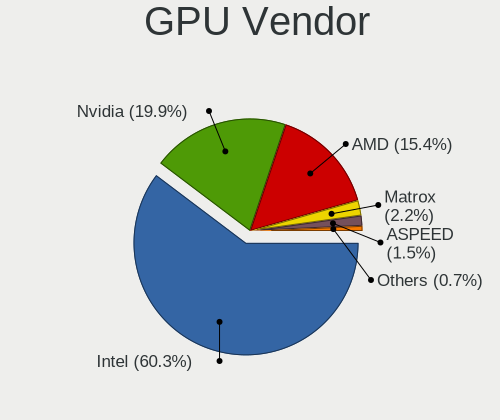

| Vendor                               | Desktops | Percent |
|--------------------------------------|----------|---------|
| Intel                                | 54       | 54%     |
| Nvidia                               | 25       | 25%     |
| AMD                                  | 17       | 17%     |
| Matrox Electronics Systems           | 3        | 3%      |
| NVidia / SGS Thomson (Joint Venture) | 1        | 1%      |

GPU Model
---------

Graphics card models

| Model                                                                                    | Desktops | Percent |
|------------------------------------------------------------------------------------------|----------|---------|
| Intel Xeon E3-1200 v3/4th Gen Core Processor Integrated Graphics Controller              | 7        | 6.93%   |
| Intel 2nd Generation Core Processor Family Integrated Graphics Controller                | 6        | 5.94%   |
| Nvidia GK208B [GeForce GT 710]                                                           | 5        | 4.95%   |
| Intel 4th Generation Core Processor Family Integrated Graphics Controller                | 5        | 4.95%   |
| Intel Xeon E3-1200 v2/3rd Gen Core processor Graphics Controller                         | 4        | 3.96%   |
| Nvidia TU116 [GeForce GTX 1660 SUPER]                                                    | 3        | 2.97%   |
| Intel HD Graphics 530                                                                    | 3        | 2.97%   |
| Intel GeminiLake [UHD Graphics 600]                                                      | 3        | 2.97%   |
| Intel CoffeeLake-S GT2 [UHD Graphics 630]                                                | 3        | 2.97%   |
| Intel Atom/Celeron/Pentium Processor x5-E8000/J3xxx/N3xxx Integrated Graphics Controller | 3        | 2.97%   |
| Intel Atom Processor Z36xxx/Z37xxx Series Graphics & Display                             | 3        | 2.97%   |
| Nvidia TU117 [GeForce GTX 1650]                                                          | 2        | 1.98%   |
| Nvidia GT218 [GeForce 210]                                                               | 2        | 1.98%   |
| Matrox Electronics Systems MGA G200EH                                                    | 2        | 1.98%   |
| Intel JasperLake [UHD Graphics]                                                          | 2        | 1.98%   |
| Intel HD Graphics 620                                                                    | 2        | 1.98%   |
| Intel CometLake-S GT2 [UHD Graphics 630]                                                 | 2        | 1.98%   |
| Intel 4 Series Chipset Integrated Graphics Controller                                    | 2        | 1.98%   |
| AMD Picasso/Raven 2 [Radeon Vega Series / Radeon Vega Mobile Series]                     | 2        | 1.98%   |
| AMD Mullins [Radeon R2 Graphics]                                                         | 2        | 1.98%   |
| AMD Kabini [Radeon HD 8400E]                                                             | 2        | 1.98%   |
| Nvidia TU104GL [Quadro RTX 4000]                                                         | 1        | 0.99%   |
| Nvidia GT218 [NVS 300]                                                                   | 1        | 0.99%   |
| Nvidia GP107 [GeForce GTX 1050 Ti]                                                       | 1        | 0.99%   |
| Nvidia GP106 [GeForce GTX 1060 6GB]                                                      | 1        | 0.99%   |
| Nvidia GP106 [GeForce GTX 1060 3GB]                                                      | 1        | 0.99%   |
| Nvidia GK208B [GeForce GT 720]                                                           | 1        | 0.99%   |
| Nvidia GK107 [GeForce GTX 650]                                                           | 1        | 0.99%   |
| Nvidia GK106 [GeForce GTX 660]                                                           | 1        | 0.99%   |
| Nvidia GK104 [GeForce GTX 760]                                                           | 1        | 0.99%   |
| Nvidia GF100GL [Quadro 5000]                                                             | 1        | 0.99%   |
| Nvidia GA102 [GeForce RTX 3080]                                                          | 1        | 0.99%   |
| Nvidia G98 [GeForce 8400 GS Rev. 2]                                                      | 1        | 0.99%   |
| Nvidia C61 [GeForce 6150SE nForce 430]                                                   | 1        | 0.99%   |
| NVidia / SGS Thomson (Joint Venture) Riva128                                             | 1        | 0.99%   |
| Matrox Electronics Systems MGA G200e [Pilot] ServerEngines (SEP1)                        | 1        | 0.99%   |
| Intel Skylake GT2 [HD Graphics 520]                                                      | 1        | 0.99%   |
| Intel IvyBridge GT2 [HD Graphics 4000]                                                   | 1        | 0.99%   |
| Intel Iris Plus Graphics 650                                                             | 1        | 0.99%   |
| Intel HD Graphics 630                                                                    | 1        | 0.99%   |

GPU Combo
---------

Combinations of graphics cards

| Name                                     | Desktops | Percent |
|------------------------------------------|----------|---------|
| 1 x Intel                                | 50       | 49.02%  |
| 1 x Nvidia                               | 24       | 23.53%  |
| 1 x AMD                                  | 15       | 14.71%  |
| Other                                    | 4        | 3.92%   |
| 1 x Matrox                               | 3        | 2.94%   |
| 2 x Intel                                | 2        | 1.96%   |
| 2 x AMD                                  | 1        | 0.98%   |
| 1 x NVidia / SGS Thomson (Joint Venture) | 1        | 0.98%   |
| Intel + Nvidia                           | 1        | 0.98%   |
| Intel + AMD                              | 1        | 0.98%   |

GPU Driver
----------

Free vs proprietary

| Driver      | Desktops | Percent |
|-------------|----------|---------|
| Free        | 77       | 75.49%  |
| Proprietary | 18       | 17.65%  |
| Unknown     | 7        | 6.86%   |

GPU Memory
----------

Total video memory

| Size in GB | Desktops | Percent |
|------------|----------|---------|
| Unknown    | 81       | 79.41%  |
| 1.01-2.0   | 7        | 6.86%   |
| 5.01-6.0   | 4        | 3.92%   |
| 3.01-4.0   | 4        | 3.92%   |
| 2.01-3.0   | 2        | 1.96%   |
| 0.51-1.0   | 2        | 1.96%   |
| 7.01-8.0   | 1        | 0.98%   |
| 0.01-0.5   | 1        | 0.98%   |

Monitor
-------

Monitor Vendor
--------------

Monitor vendors

| Vendor               | Desktops | Percent |
|----------------------|----------|---------|
| BenQ                 | 8        | 22.22%  |
| Goldstar             | 5        | 13.89%  |
| Dell                 | 4        | 11.11%  |
| Acer                 | 3        | 8.33%   |
| Philips              | 2        | 5.56%   |
| Lenovo               | 2        | 5.56%   |
| AOC                  | 2        | 5.56%   |
| Vestel Elektronik    | 1        | 2.78%   |
| Samsung Electronics  | 1        | 2.78%   |
| MSI                  | 1        | 2.78%   |
| Microstep            | 1        | 2.78%   |
| Medion               | 1        | 2.78%   |
| Lenovo Group Limited | 1        | 2.78%   |
| Impression           | 1        | 2.78%   |
| Hewlett-Packard      | 1        | 2.78%   |
| CHD                  | 1        | 2.78%   |
| Ancor Communications | 1        | 2.78%   |

Monitor Model
-------------

Monitor models

| Model                                                                 | Desktops | Percent |
|-----------------------------------------------------------------------|----------|---------|
| BenQ GW2765 BNQ78D6 2560x1440 600x340mm 27.2-inch                     | 2        | 5.56%   |
| Vestel Elektronik 32W_LCD_TV VES3700 1920x1080 710x400mm 32.1-inch    | 1        | 2.78%   |
| Samsung Electronics S27H85x SAM0E0F 2560x1440 600x340mm 27.2-inch     | 1        | 2.78%   |
| Philips PHL 243V5 PHLC0D1 1920x1080 520x290mm 23.4-inch               | 1        | 2.78%   |
| Philips 190S PHL083F 1280x1024 380x300mm 19.1-inch                    | 1        | 2.78%   |
| MSI MP242 MSI30A1 1920x1080 530x300mm 24.0-inch                       | 1        | 2.78%   |
| Microstep LCD Monitor MSI MAG241C 1920x1080                           | 1        | 2.78%   |
| Medion MD21281 MED3947 1366x768 410x230mm 18.5-inch                   | 1        | 2.78%   |
| Lenovo LEN T24i-10 LEN61CE 1920x1080 530x300mm 24.0-inch              | 1        | 2.78%   |
| Lenovo Group Limited LCD Monitor C24-25 1920x1080                     | 1        | 2.78%   |
| Lenovo C24-25 LEN66B0 1920x1080 530x300mm 24.0-inch                   | 1        | 2.78%   |
| Impression R19W11 IMP1911 1440x900 410x260mm 19.1-inch                | 1        | 2.78%   |
| Hewlett-Packard x23LED HWP2912 1920x1080 510x290mm 23.1-inch          | 1        | 2.78%   |
| Goldstar W2242 GSM4B6F 1680x1050 490x320mm 23.0-inch                  | 1        | 2.78%   |
| Goldstar MP59G GSM5B35 1920x1080 600x340mm 27.2-inch                  | 1        | 2.78%   |
| Goldstar LG HDR 4K GSM7707 3840x2160 600x340mm 27.2-inch              | 1        | 2.78%   |
| Goldstar LG FULL HD GSM5ABB 1920x1080 480x270mm 21.7-inch             | 1        | 2.78%   |
| Goldstar L1715S GSM436F 1280x1024 340x270mm 17.1-inch                 | 1        | 2.78%   |
| Dell U3415W DELA0A6 3440x1440 800x330mm 34.1-inch                     | 1        | 2.78%   |
| Dell P1914S DELF04B 1280x1024 380x300mm 19.1-inch                     | 1        | 2.78%   |
| Dell LCD Monitor U2414H 1920x1080                                     | 1        | 2.78%   |
| Dell LCD Monitor SP2309W 2048x1152                                    | 1        | 2.78%   |
| CHD M27 CHD0270 1920x1080 530x290mm 23.8-inch                         | 1        | 2.78%   |
| BenQ LCD Monitor GW2270 1920x1080                                     | 1        | 2.78%   |
| BenQ GL940 BNQ7883 1366x768 410x230mm 18.5-inch                       | 1        | 2.78%   |
| BenQ GL2480 BNQ78ED 1920x1080 530x300mm 24.0-inch                     | 1        | 2.78%   |
| BenQ GL2450H BNQ78A7 1920x1080 530x300mm 24.0-inch                    | 1        | 2.78%   |
| BenQ GL2240 BNQ7887 1920x1080 480x270mm 21.7-inch                     | 1        | 2.78%   |
| BenQ EW2440L BNQ7938 1920x1080 530x300mm 24.0-inch                    | 1        | 2.78%   |
| AOC 2481W AOC2481 1920x1080 530x300mm 24.0-inch                       | 1        | 2.78%   |
| AOC 2050W AOC2050 1600x900 430x240mm 19.4-inch                        | 1        | 2.78%   |
| Ancor Communications ASUS VS228 ACI22FD 1920x1080 480x270mm 21.7-inch | 1        | 2.78%   |
| Acer V193W ACR001A 1440x900 410x260mm 19.1-inch                       | 1        | 2.78%   |
| Acer KA240Y ACR0970 1920x1080 530x300mm 24.0-inch                     | 1        | 2.78%   |
| Acer AT1945 ACR1945 1440x900 400x250mm 18.6-inch                      | 1        | 2.78%   |

Monitor Resolution
------------------

Monitor screen resolution

| Resolution         | Desktops | Percent |
|--------------------|----------|---------|
| 1920x1080 (FHD)    | 18       | 51.43%  |
| 2560x1440 (QHD)    | 3        | 8.57%   |
| 1440x900 (WXGA+)   | 3        | 8.57%   |
| 1280x1024 (SXGA)   | 3        | 8.57%   |
| 1366x768 (WXGA)    | 2        | 5.71%   |
| 3840x2160 (4K)     | 1        | 2.86%   |
| 3440x1440          | 1        | 2.86%   |
| 2048x1152          | 1        | 2.86%   |
| 1920x540           | 1        | 2.86%   |
| 1680x1050 (WSXGA+) | 1        | 2.86%   |
| 1600x900 (HD+)     | 1        | 2.86%   |

Monitor Diagonal
----------------

Diagonal size in inches

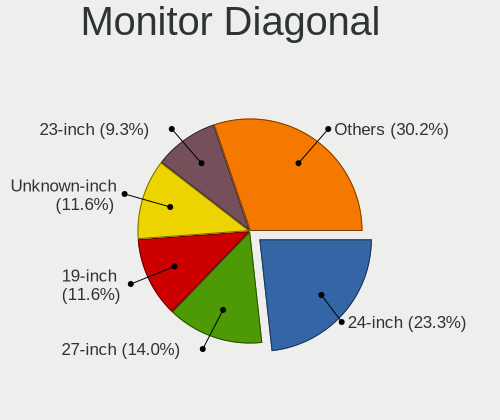

| Inches  | Desktops | Percent |
|---------|----------|---------|
| 24      | 8        | 22.22%  |
| 27      | 5        | 13.89%  |
| 19      | 5        | 13.89%  |
| Unknown | 5        | 13.89%  |
| 23      | 4        | 11.11%  |
| 21      | 3        | 8.33%   |
| 18      | 3        | 8.33%   |
| 42      | 1        | 2.78%   |
| 34      | 1        | 2.78%   |
| 17      | 1        | 2.78%   |

Monitor Width
-------------

Physical width

| Width in mm | Desktops | Percent |
|-------------|----------|---------|
| 501-600     | 16       | 45.71%  |
| 401-500     | 8        | 22.86%  |
| Unknown     | 5        | 14.29%  |
| 351-400     | 3        | 8.57%   |
| 701-800     | 1        | 2.86%   |
| 301-350     | 1        | 2.86%   |
| 901-1000    | 1        | 2.86%   |

Aspect Ratio
------------

Proportional relationship between the width and the height

| Ratio   | Desktops | Percent |
|---------|----------|---------|
| 16/9    | 22       | 62.86%  |
| Unknown | 5        | 14.29%  |
| 5/4     | 3        | 8.57%   |
| 16/10   | 3        | 8.57%   |
| 3/2     | 1        | 2.86%   |
| 21/9    | 1        | 2.86%   |

Monitor Area
------------

Area in inch²

| Area in inch² | Desktops | Percent |
|----------------|----------|---------|
| 201-250        | 14       | 41.18%  |
| 301-350        | 5        | 14.71%  |
| 151-200        | 5        | 14.71%  |
| Unknown        | 5        | 14.71%  |
| 141-150        | 3        | 8.82%   |
| 351-500        | 1        | 2.94%   |
| 501-1000       | 1        | 2.94%   |

Pixel Density
-------------

Pixels per inch

| Density | Desktops | Percent |
|---------|----------|---------|
| 51-100  | 20       | 60.61%  |
| 101-120 | 7        | 21.21%  |
| Unknown | 5        | 15.15%  |
| 161-240 | 1        | 3.03%   |

Multiple Monitors
-----------------

Total monitors connected

| Total | Desktops | Percent |
|-------|----------|---------|
| 0     | 57       | 56.44%  |
| 1     | 42       | 41.58%  |
| 2     | 2        | 1.98%   |

Network
-------

Net Controller Vendor
---------------------

Controller vendors

| Vendor                          | Desktops | Percent |
|---------------------------------|----------|---------|
| Intel                           | 54       | 42.19%  |
| Realtek Semiconductor           | 52       | 40.63%  |
| Broadcom                        | 7        | 5.47%   |
| Qualcomm Atheros                | 5        | 3.91%   |
| Marvell Technology Group        | 3        | 2.34%   |
| TP-Link                         | 2        | 1.56%   |
| Samsung Electronics             | 1        | 0.78%   |
| Ralink Technology               | 1        | 0.78%   |
| Qualcomm Atheros Communications | 1        | 0.78%   |
| Nvidia                          | 1        | 0.78%   |
| D-Link System                   | 1        | 0.78%   |

Net Controller Model
--------------------

Controller models

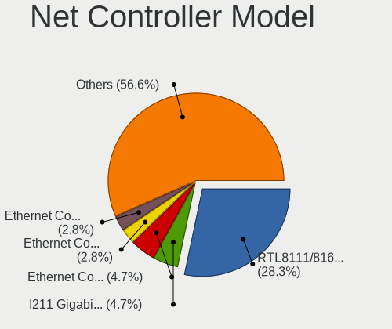

| Model                                                             | Desktops | Percent |
|-------------------------------------------------------------------|----------|---------|
| Realtek RTL8111/8168/8411 PCI Express Gigabit Ethernet Controller | 45       | 31.25%  |
| Intel I211 Gigabit Network Connection                             | 8        | 5.56%   |
| Intel Ethernet Connection I217-LM                                 | 6        | 4.17%   |
| Intel 82583V Gigabit Network Connection                           | 6        | 4.17%   |
| Intel 82579LM Gigabit Network Connection (Lewisville)             | 5        | 3.47%   |
| Intel 82574L Gigabit Network Connection                           | 4        | 2.78%   |
| Intel I350 Gigabit Network Connection                             | 3        | 2.08%   |
| Intel I210 Gigabit Network Connection                             | 3        | 2.08%   |
| Intel 82599ES 10-Gigabit SFI/SFP+ Network Connection              | 3        | 2.08%   |
| Intel 82580 Gigabit Network Connection                            | 3        | 2.08%   |
| Realtek RTL8192CU 802.11n WLAN Adapter                            | 2        | 1.39%   |
| Realtek RTL8125 2.5GbE Controller                                 | 2        | 1.39%   |
| Marvell Group 88E8056 PCI-E Gigabit Ethernet Controller           | 2        | 1.39%   |
| Intel Wi-Fi 6 AX200                                               | 2        | 1.39%   |
| Intel Ethernet Controller I226-V                                  | 2        | 1.39%   |
| Intel Ethernet Controller I225-V                                  | 2        | 1.39%   |
| Intel Ethernet Connection (2) I219-V                              | 2        | 1.39%   |
| Intel Ethernet Connection (2) I219-LM                             | 2        | 1.39%   |
| Intel 82576 Gigabit Network Connection                            | 2        | 1.39%   |
| Intel 82575GB Gigabit Network Connection                          | 2        | 1.39%   |
| Broadcom NetXtreme BCM5720 Gigabit Ethernet PCIe                  | 2        | 1.39%   |
| Broadcom BCM43228 802.11a/b/g/n                                   | 2        | 1.39%   |
| TP-Link TL-WN821N v5/v6 [RTL8192EU]                               | 1        | 0.69%   |
| TP-Link AC600 wireless Realtek RTL8811AU [Archer T2U Nano]        | 1        | 0.69%   |
| Samsung Galaxy series, misc. (tethering mode)                     | 1        | 0.69%   |
| Realtek RTL8821CE 802.11ac PCIe Wireless Network Adapter          | 1        | 0.69%   |
| Realtek RTL8723BE PCIe Wireless Network Adapter                   | 1        | 0.69%   |
| Realtek RTL8188EUS 802.11n Wireless Network Adapter               | 1        | 0.69%   |
| Realtek RTL8169 PCI Gigabit Ethernet Controller                   | 1        | 0.69%   |
| Realtek RTL810xE PCI Express Fast Ethernet controller             | 1        | 0.69%   |
| Realtek RTL-8100/8101L/8139 PCI Fast Ethernet Adapter             | 1        | 0.69%   |
| Ralink RT3072 Wireless Adapter                                    | 1        | 0.69%   |
| Qualcomm Atheros QCA9565 / AR9565 Wireless Network Adapter        | 1        | 0.69%   |
| Qualcomm Atheros AR9170 802.11n                                   | 1        | 0.69%   |
| Qualcomm Atheros AR9485 Wireless Network Adapter                  | 1        | 0.69%   |
| Qualcomm Atheros AR9287 Wireless Network Adapter (PCI-Express)    | 1        | 0.69%   |
| Qualcomm Atheros AR9227 Wireless Network Adapter                  | 1        | 0.69%   |
| Qualcomm Atheros AR8161 Gigabit Ethernet                          | 1        | 0.69%   |
| Nvidia MCP73 Ethernet                                             | 1        | 0.69%   |
| Marvell Group 88E8053 PCI-E Gigabit Ethernet Controller           | 1        | 0.69%   |

Wireless Vendor
---------------

Wireless vendors

| Vendor                          | Desktops | Percent |
|---------------------------------|----------|---------|
| Realtek Semiconductor           | 5        | 22.73%  |
| Qualcomm Atheros                | 4        | 18.18%  |
| Intel                           | 4        | 18.18%  |
| Broadcom                        | 4        | 18.18%  |
| TP-Link                         | 2        | 9.09%   |
| Ralink Technology               | 1        | 4.55%   |
| Qualcomm Atheros Communications | 1        | 4.55%   |
| D-Link System                   | 1        | 4.55%   |

Wireless Model
--------------

Wireless models

| Model                                                                      | Desktops | Percent |
|----------------------------------------------------------------------------|----------|---------|
| Realtek RTL8192CU 802.11n WLAN Adapter                                     | 2        | 9.09%   |
| Intel Wi-Fi 6 AX200                                                        | 2        | 9.09%   |
| Broadcom BCM43228 802.11a/b/g/n                                            | 2        | 9.09%   |
| TP-Link TL-WN821N v5/v6 [RTL8192EU]                                        | 1        | 4.55%   |
| TP-Link AC600 wireless Realtek RTL8811AU [Archer T2U Nano]                 | 1        | 4.55%   |
| Realtek RTL8821CE 802.11ac PCIe Wireless Network Adapter                   | 1        | 4.55%   |
| Realtek RTL8723BE PCIe Wireless Network Adapter                            | 1        | 4.55%   |
| Realtek RTL8188EUS 802.11n Wireless Network Adapter                        | 1        | 4.55%   |
| Ralink RT3072 Wireless Adapter                                             | 1        | 4.55%   |
| Qualcomm Atheros QCA9565 / AR9565 Wireless Network Adapter                 | 1        | 4.55%   |
| Qualcomm Atheros AR9170 802.11n                                            | 1        | 4.55%   |
| Qualcomm Atheros AR9485 Wireless Network Adapter                           | 1        | 4.55%   |
| Qualcomm Atheros AR9287 Wireless Network Adapter (PCI-Express)             | 1        | 4.55%   |
| Qualcomm Atheros AR9227 Wireless Network Adapter                           | 1        | 4.55%   |
| Intel Wireless-AC 9260                                                     | 1        | 4.55%   |
| Intel Wireless 3165                                                        | 1        | 4.55%   |
| D-Link System AirPlus G DWL-G122 Wireless Adapter(rev.C1) [Ralink RT2571W] | 1        | 4.55%   |
| Broadcom BCM4360 802.11ac Wireless Network Adapter                         | 1        | 4.55%   |
| Broadcom 802.11ac Wireless Network Adapter                                 | 1        | 4.55%   |

Ethernet Vendor
---------------

Ethernet vendors

| Vendor                   | Desktops | Percent |
|--------------------------|----------|---------|
| Intel                    | 53       | 47.75%  |
| Realtek Semiconductor    | 49       | 44.14%  |
| Marvell Technology Group | 3        | 2.7%    |
| Broadcom                 | 3        | 2.7%    |
| Samsung Electronics      | 1        | 0.9%    |
| Qualcomm Atheros         | 1        | 0.9%    |
| Nvidia                   | 1        | 0.9%    |

Ethernet Model
--------------

Ethernet models

| Model                                                             | Desktops | Percent |
|-------------------------------------------------------------------|----------|---------|
| Realtek RTL8111/8168/8411 PCI Express Gigabit Ethernet Controller | 45       | 37.5%   |
| Intel I211 Gigabit Network Connection                             | 8        | 6.67%   |
| Intel Ethernet Connection I217-LM                                 | 6        | 5%      |
| Intel 82583V Gigabit Network Connection                           | 6        | 5%      |
| Intel 82579LM Gigabit Network Connection (Lewisville)             | 5        | 4.17%   |
| Intel 82574L Gigabit Network Connection                           | 4        | 3.33%   |
| Intel I350 Gigabit Network Connection                             | 3        | 2.5%    |
| Intel I210 Gigabit Network Connection                             | 3        | 2.5%    |
| Intel 82599ES 10-Gigabit SFI/SFP+ Network Connection              | 3        | 2.5%    |
| Intel 82580 Gigabit Network Connection                            | 3        | 2.5%    |
| Marvell Group 88E8056 PCI-E Gigabit Ethernet Controller           | 2        | 1.67%   |
| Intel Ethernet Controller I226-V                                  | 2        | 1.67%   |
| Intel Ethernet Controller I225-V                                  | 2        | 1.67%   |
| Intel Ethernet Connection (2) I219-V                              | 2        | 1.67%   |
| Intel Ethernet Connection (2) I219-LM                             | 2        | 1.67%   |
| Intel 82576 Gigabit Network Connection                            | 2        | 1.67%   |
| Intel 82575GB Gigabit Network Connection                          | 2        | 1.67%   |
| Broadcom NetXtreme BCM5720 Gigabit Ethernet PCIe                  | 2        | 1.67%   |
| Samsung Galaxy series, misc. (tethering mode)                     | 1        | 0.83%   |
| Realtek RTL8169 PCI Gigabit Ethernet Controller                   | 1        | 0.83%   |
| Realtek RTL8125 2.5GbE Controller                                 | 1        | 0.83%   |
| Realtek RTL810xE PCI Express Fast Ethernet controller             | 1        | 0.83%   |
| Realtek RTL-8100/8101L/8139 PCI Fast Ethernet Adapter             | 1        | 0.83%   |
| Qualcomm Atheros AR8161 Gigabit Ethernet                          | 1        | 0.83%   |
| Nvidia MCP73 Ethernet                                             | 1        | 0.83%   |
| Marvell Group 88E8053 PCI-E Gigabit Ethernet Controller           | 1        | 0.83%   |
| Intel Ethernet Connection I217-V                                  | 1        | 0.83%   |
| Intel Ethernet Connection (7) I219-V                              | 1        | 0.83%   |
| Intel Ethernet Connection (2) I218-V                              | 1        | 0.83%   |
| Intel Ethernet Connection (17) I219-V                             | 1        | 0.83%   |
| Intel 82579V Gigabit Network Connection                           | 1        | 0.83%   |
| Intel 82572EI Gigabit Ethernet Controller (Copper)                | 1        | 0.83%   |
| Intel 82567LM-3 Gigabit Network Connection                        | 1        | 0.83%   |
| Intel 82567LF-3 Gigabit Network Connection                        | 1        | 0.83%   |
| Intel 82541PI Gigabit Ethernet Controller                         | 1        | 0.83%   |
| Broadcom NetXtreme BCM5723 Gigabit Ethernet PCIe                  | 1        | 0.83%   |

Net Controller Kind
-------------------

Ethernet, WiFi or modem

| Kind     | Desktops | Percent |
|----------|----------|---------|
| Ethernet | 99       | 81.82%  |
| WiFi     | 20       | 16.53%  |
| Unknown  | 2        | 1.65%   |

Used Controller
---------------

Currently used network controller

| Kind     | Desktops | Percent |
|----------|----------|---------|
| Ethernet | 94       | 94.95%  |
| WiFi     | 5        | 5.05%   |

NICs
----

Total network controllers on board

| Total | Desktops | Percent |
|-------|----------|---------|
| 1     | 50       | 49.5%   |
| 2     | 16       | 15.84%  |
| 5     | 9        | 8.91%   |
| 4     | 8        | 7.92%   |
| 6     | 6        | 5.94%   |
| 8     | 5        | 4.95%   |
| 3     | 5        | 4.95%   |
| 15    | 1        | 0.99%   |
| 0     | 1        | 0.99%   |

IPv6
----

IPv6 vs IPv4

| Used | Desktops | Percent |
|------|----------|---------|
| No   | 100      | 98.04%  |
| Yes  | 2        | 1.96%   |

Bluetooth
---------

Bluetooth Vendor
----------------

Controller vendors

| Vendor                          | Desktops | Percent |
|---------------------------------|----------|---------|
| Cambridge Silicon Radio         | 7        | 41.18%  |
| Intel                           | 4        | 23.53%  |
| Realtek Semiconductor           | 2        | 11.76%  |
| Qualcomm Atheros Communications | 1        | 5.88%   |
| IMC Networks                    | 1        | 5.88%   |
| Broadcom                        | 1        | 5.88%   |
| ASUSTek Computer                | 1        | 5.88%   |

Bluetooth Model
---------------

Controller models

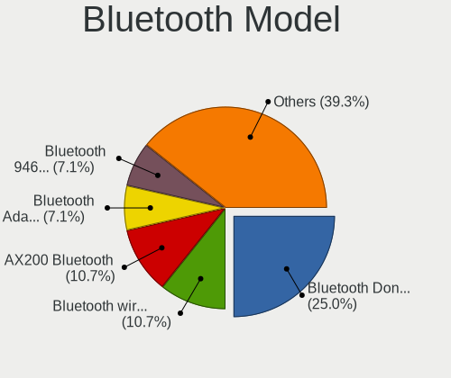

| Model                                                 | Desktops | Percent |
|-------------------------------------------------------|----------|---------|
| Cambridge Silicon Radio Bluetooth Dongle (HCI mode)   | 7        | 41.18%  |
| Intel AX200 Bluetooth                                 | 2        | 11.76%  |
| Realtek  Bluetooth 4.2 Adapter                        | 1        | 5.88%   |
| Realtek Bluetooth Adapter                             | 1        | 5.88%   |
| Qualcomm Atheros AR3012 Bluetooth 4.0                 | 1        | 5.88%   |
| Intel Wireless-AC 9260 Bluetooth Adapter              | 1        | 5.88%   |
| Intel Bluetooth wireless interface                    | 1        | 5.88%   |
| IMC Networks Realtek Bluetooth 4.0 + High Speed Chip  | 1        | 5.88%   |
| Broadcom 4371 Bluetooth 4.1 Adapter                   | 1        | 5.88%   |
| ASUS Broadcom BCM20702 Single-Chip Bluetooth 4.0 + LE | 1        | 5.88%   |

Sound
-----

Sound Vendor
------------

Sound card vendors

| Vendor                  | Desktops | Percent |
|-------------------------|----------|---------|
| Intel                   | 59       | 47.97%  |
| AMD                     | 28       | 22.76%  |
| Nvidia                  | 25       | 20.33%  |
| Cambridge Silicon Radio | 2        | 1.63%   |
| VIA Technologies        | 1        | 0.81%   |
| Logitech                | 1        | 0.81%   |
| Lenovo                  | 1        | 0.81%   |
| Hewlett-Packard         | 1        | 0.81%   |
| GEMBIRD                 | 1        | 0.81%   |
| Ensoniq                 | 1        | 0.81%   |
| Dell                    | 1        | 0.81%   |
| C-Media Electronics     | 1        | 0.81%   |
| BEHRINGER International | 1        | 0.81%   |

Sound Model
-----------

Sound card models

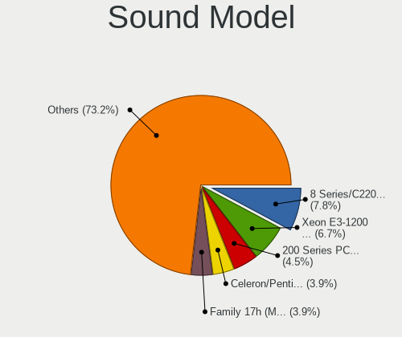

| Model                                                                      | Desktops | Percent |
|----------------------------------------------------------------------------|----------|---------|
| Intel 8 Series/C220 Series Chipset High Definition Audio Controller        | 13       | 9.09%   |
| Intel Xeon E3-1200 v3/4th Gen Core Processor HD Audio Controller           | 11       | 7.69%   |
| Intel 200 Series PCH HD Audio                                              | 7        | 4.9%    |
| AMD FCH Azalia Controller                                                  | 7        | 4.9%    |
| Nvidia GK208 HDMI/DP Audio Controller                                      | 6        | 4.2%    |
| Intel 6 Series/C200 Series Chipset Family High Definition Audio Controller | 6        | 4.2%    |
| AMD Family 17h (Models 00h-0fh) HD Audio Controller                        | 6        | 4.2%    |
| AMD Kabini HDMI/DP Audio                                                   | 5        | 3.5%    |
| Intel Celeron/Pentium Silver Processor High Definition Audio               | 4        | 2.8%    |
| Intel 7 Series/C216 Chipset Family High Definition Audio Controller        | 4        | 2.8%    |
| AMD Starship/Matisse HD Audio Controller                                   | 4        | 2.8%    |
| Nvidia TU116 High Definition Audio Controller                              | 3        | 2.1%    |
| Nvidia High Definition Audio Controller                                    | 3        | 2.1%    |
| Intel 100 Series/C230 Series Chipset Family HD Audio Controller            | 3        | 2.1%    |
| AMD SBx00 Azalia (Intel HDA)                                               | 3        | 2.1%    |
| Nvidia TU107 GeForce GTX 1650 High Definition Audio Controller             | 2        | 1.4%    |
| Nvidia GP106 High Definition Audio Controller                              | 2        | 1.4%    |
| Intel Sunrise Point-LP HD Audio                                            | 2        | 1.4%    |
| Intel Jasper Lake HD Audio                                                 | 2        | 1.4%    |
| Intel Comet Lake PCH-V cAVS                                                | 2        | 1.4%    |
| Intel Atom Processor Z36xxx/Z37xxx Series High Definition Audio Controller | 2        | 1.4%    |
| Intel 82801JD/DO (ICH10 Family) HD Audio Controller                        | 2        | 1.4%    |
| Cambridge Silicon Radio B10                                                | 2        | 1.4%    |
| AMD Raven/Raven2/Fenghuang HDMI/DP Audio Controller                        | 2        | 1.4%    |
| AMD Oland/Hainan/Cape Verde/Pitcairn HDMI Audio [Radeon HD 7000 Series]    | 2        | 1.4%    |
| AMD Family 17h/19h HD Audio Controller                                     | 2        | 1.4%    |
| VIA Technologies VT8233/A/8235/8237 AC97 Audio Controller                  | 1        | 0.7%    |
| Nvidia TU104 HD Audio Controller                                           | 1        | 0.7%    |
| Nvidia MCP73 High Definition Audio                                         | 1        | 0.7%    |
| Nvidia MCP61 High Definition Audio                                         | 1        | 0.7%    |
| Nvidia GP107GL High Definition Audio Controller                            | 1        | 0.7%    |
| Nvidia GK107 HDMI Audio Controller                                         | 1        | 0.7%    |
| Nvidia GK106 HDMI Audio Controller                                         | 1        | 0.7%    |
| Nvidia GK104 HDMI Audio Controller                                         | 1        | 0.7%    |
| Nvidia GF100 High Definition Audio Controller                              | 1        | 0.7%    |
| Nvidia GA102 High Definition Audio Controller                              | 1        | 0.7%    |
| Logitech Logitech USB Microphone                                           | 1        | 0.7%    |
| Lenovo Lenovo USB Soundbar                                                 | 1        | 0.7%    |
| Intel Smart Sound Technology (SST) Audio Controller                        | 1        | 0.7%    |
| Intel Celeron N3350/Pentium N4200/Atom E3900 Series Audio Cluster          | 1        | 0.7%    |

Memory
------

Memory Vendor
-------------

Memory module vendors

| Vendor              | Desktops | Percent |
|---------------------|----------|---------|
| Kingston            | 28       | 23.73%  |
| Crucial             | 17       | 14.41%  |
| Unknown             | 11       | 9.32%   |
| Samsung Electronics | 11       | 9.32%   |
| Micron Technology   | 10       | 8.47%   |
| SK hynix            | 8        | 6.78%   |
| Corsair             | 6        | 5.08%   |
| Ramaxel Technology  | 4        | 3.39%   |
| Nanya Technology    | 3        | 2.54%   |
| G.Skill             | 3        | 2.54%   |
| Unknown             | 3        | 2.54%   |
| Unknown (0B45)      | 2        | 1.69%   |
| Hewlett-Packard     | 2        | 1.69%   |
| Apacer              | 2        | 1.69%   |
| Wodposit            | 1        | 0.85%   |
| Transcend           | 1        | 0.85%   |
| Toshiba             | 1        | 0.85%   |
| Kimtigo             | 1        | 0.85%   |
| GOODRAM             | 1        | 0.85%   |
| Goldenmars          | 1        | 0.85%   |
| Essencore           | 1        | 0.85%   |
| ASint Technology    | 1        | 0.85%   |

Memory Model
------------

Memory module models

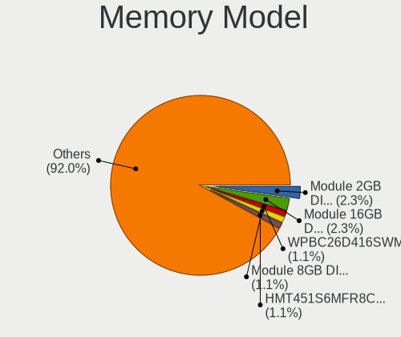

| Model                                                          | Desktops | Percent |
|----------------------------------------------------------------|----------|---------|
| Unknown RAM Module 2GB DIMM DDR2 800MT/s                       | 3        | 2.27%   |
| Unknown                                                        | 3        | 2.27%   |
| Unknown (0B45) RAM WPBC26D416SWM-16G 16GB SODIMM DDR4 2667MT/s | 2        | 1.52%   |
| SK hynix RAM HMT451S6MFR8C-PB 4GB DIMM DDR3 1600MT/s           | 2        | 1.52%   |
| Micron RAM 18KSF51272AZ-1G4M1 4GB DIMM DDR3 1333MT/s           | 2        | 1.52%   |
| Kingston RAM KVR13LS9/4 4GB SODIMM DDR3 1333MT/s               | 2        | 1.52%   |
| Kingston RAM 99U5584-005.A00LF 4GB DIMM DDR3 1600MT/s          | 2        | 1.52%   |
| Kingston RAM 99U5469-045.A00LF 4GB SODIMM DDR3 1600MT/s        | 2        | 1.52%   |
| Kingston RAM 99U5469-045.A00LF 4GB DIMM DDR3 1600MT/s          | 2        | 1.52%   |
| Crucial RAM CT16G4SFRA266.M8FB 16GB SODIMM DDR4 2667MT/s       | 2        | 1.52%   |
| Wodposit RAM WPBC26D416SWM-16G 16GB SODIMM DDR4 2667MT/s       | 1        | 0.76%   |
| Unknown RAM Module 8GB DIMM DDR3 1866MT/s                      | 1        | 0.76%   |
| Unknown RAM Module 8192MB DIMM 1600MT/s                        | 1        | 0.76%   |
| Unknown RAM Module 512MB DIMM 400MT/s                          | 1        | 0.76%   |
| Unknown RAM Module 4GB SODIMM DDR3 1600MT/s                    | 1        | 0.76%   |
| Unknown RAM Module 4GB DIMM DDR3 1600MT/s                      | 1        | 0.76%   |
| Unknown RAM Module 4096MB DIMM DDR3 1600MT/s                   | 1        | 0.76%   |
| Unknown RAM Module 4096MB DIMM 1600MT/s                        | 1        | 0.76%   |
| Unknown RAM Module 2GB DIMM DDR 1066MT/s                       | 1        | 0.76%   |
| Unknown RAM Module 256MB DIMM 333MT/s                          | 1        | 0.76%   |
| Unknown RAM Module 1GB DIMM DDR2 800MT/s                       | 1        | 0.76%   |
| Unknown RAM Module 1GB DIMM 667MT/s                            | 1        | 0.76%   |
| Unknown RAM Module 1GB DIMM 400MT/s                            | 1        | 0.76%   |
| Transcend RAM TS1GLK72V6H 8GB DIMM DDR3 1600MT/s               | 1        | 0.76%   |
| Toshiba RAM 9905711-015.A00G 4GB SODIMM DDR4 2400MT/s          | 1        | 0.76%   |
| SK hynix RAM Module 4GB SODIMM DDR3 1333MT/s                   | 1        | 0.76%   |
| SK hynix RAM Module 4096MB DIMM DDR3 1600MT/s                  | 1        | 0.76%   |
| SK hynix RAM HMT451U6BFR8A-PB 4GB DIMM DDR3 1600MT/s           | 1        | 0.76%   |
| SK hynix RAM HMT451U6BFR8A-PB 4GB DIMM DDR3 1333MT/s           | 1        | 0.76%   |
| SK hynix RAM HMT41GR7AFR8A 8GB DIMM DDR3 1600MT/s              | 1        | 0.76%   |
| SK hynix RAM HMT351S6EFR8A-PB 4GB DIMM DDR3 1600MT/s           | 1        | 0.76%   |
| Samsung RAM Module 8GB DIMM DDR4 2667MT/s                      | 1        | 0.76%   |
| Samsung RAM Module 4GB SODIMM DDR3 1333MT/s                    | 1        | 0.76%   |
| Samsung RAM M471B5173QH0-YK0 4GB SODIMM DDR3 1600MT/s          | 1        | 0.76%   |
| Samsung RAM M471A1K43BB1-CRC 8GB SODIMM DDR4 2400MT/s          | 1        | 0.76%   |
| Samsung RAM M471A1G44AB0-CWE 8GB SODIMM DDR4 3200MT/s          | 1        | 0.76%   |
| Samsung RAM M391B5673FH0-CH9 2GB DIMM DDR3 1333MT/s            | 1        | 0.76%   |
| Samsung RAM M391B5673EH1-CH9 2GB DIMM DDR3 1333MT/s            | 1        | 0.76%   |
| Samsung RAM M391B1G73QH0-CMA 8GB DIMM DDR3 1600MT/s            | 1        | 0.76%   |
| Samsung RAM M378B5773DH0-CH9 2GB DIMM DDR3 1333MT/s            | 1        | 0.76%   |

Memory Kind
-----------

Memory module kinds

| Kind    | Desktops | Percent |
|---------|----------|---------|
| DDR3    | 46       | 49.46%  |
| DDR4    | 36       | 38.71%  |
| DDR2    | 6        | 6.45%   |
| Unknown | 3        | 3.23%   |
| SDRAM   | 1        | 1.08%   |
| DDR     | 1        | 1.08%   |

Memory Form Factor
------------------

Physical design of the memory module

| Name   | Desktops | Percent |
|--------|----------|---------|
| DIMM   | 69       | 75%     |
| SODIMM | 23       | 25%     |

Memory Size
-----------

Memory module size

| Size  | Desktops | Percent |
|-------|----------|---------|
| 4096  | 39       | 36.79%  |
| 8192  | 36       | 33.96%  |
| 16384 | 14       | 13.21%  |
| 2048  | 12       | 11.32%  |
| 1024  | 3        | 2.83%   |
| 512   | 1        | 0.94%   |
| 256   | 1        | 0.94%   |

Memory Speed
------------

Memory module speed

| Speed | Desktops | Percent |
|-------|----------|---------|
| 1600  | 35       | 34.31%  |
| 1333  | 13       | 12.75%  |
| 2400  | 12       | 11.76%  |
| 3200  | 9        | 8.82%   |
| 2667  | 8        | 7.84%   |
| 2133  | 6        | 5.88%   |
| 800   | 5        | 4.9%    |
| 2666  | 4        | 3.92%   |
| 1866  | 3        | 2.94%   |
| 3600  | 1        | 0.98%   |
| 1332  | 1        | 0.98%   |
| 1066  | 1        | 0.98%   |
| 1033  | 1        | 0.98%   |
| 667   | 1        | 0.98%   |
| 400   | 1        | 0.98%   |
| 333   | 1        | 0.98%   |

Printers & scanners
-------------------

Printer Vendor
--------------

Printer device vendors

| Vendor          | Desktops | Percent |
|-----------------|----------|---------|
| Hewlett-Packard | 1        | 100%    |

Printer Model
-------------

Printer device models

| Model                                                                                                             | Desktops | Percent |
|-------------------------------------------------------------------------------------------------------------------|----------|---------|
| HP HP LaserJet MFP E52645 LaserJet 0 LaserJet 0 LaserJet 1 LaserJet 1 LaserJet 2 LaserJet 2 LaserJet 3 LaserJet 3 | 1        | 100%    |

Scanner Vendor
--------------

Scanner device vendors

Zero info for selected period =(

Scanner Model
-------------

Scanner device models

Zero info for selected period =(

Camera
------

Camera Vendor
-------------

Camera device vendors

| Vendor                  | Desktops | Percent |
|-------------------------|----------|---------|
| Logitech                | 2        | 33.33%  |
| Z-Star Microelectronics | 1        | 16.67%  |
| OmniVision Technologies | 1        | 16.67%  |
| HD WEBCAM               | 1        | 16.67%  |
| Alcor Micro             | 1        | 16.67%  |

Camera Model
------------

Camera device models

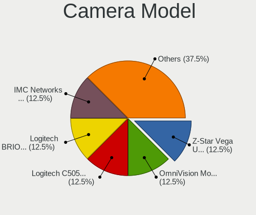

| Model                         | Desktops | Percent |
|-------------------------------|----------|---------|
| Z-Star Vega USB 2.0 Camera    | 1        | 16.67%  |
| OmniVision Monitor Webcam     | 1        | 16.67%  |
| Logitech C505 HD Webcam       | 1        | 16.67%  |
| Logitech BRIO Ultra HD Webcam | 1        | 16.67%  |
| HD WEBCAM HD WEBCAM           | 1        | 16.67%  |
| Alcor Micro PC Camera         | 1        | 16.67%  |

Security
--------

Fingerprint Vendor
------------------

Fingerprint sensor vendors

Zero info for selected period =(

Fingerprint Model
-----------------

Fingerprint sensor models

Zero info for selected period =(

Chipcard Vendor
---------------

Chipcard module vendors

Zero info for selected period =(

Chipcard Model
--------------

Chipcard module models

Zero info for selected period =(

Unsupported
-----------

Unsupported Devices
-------------------

Total unsupported devices on board

| Total | Desktops | Percent |
|-------|----------|---------|
| 1     | 56       | 54.37%  |
| 0     | 34       | 33.01%  |
| 2     | 11       | 10.68%  |
| 6     | 1        | 0.97%   |
| 3     | 1        | 0.97%   |

Unsupported Device Types
------------------------

Types of unsupported devices

| Type                     | Desktops | Percent |
|--------------------------|----------|---------|
| Communication controller | 56       | 67.47%  |
| Net/wireless             | 13       | 15.66%  |
| Sound                    | 3        | 3.61%   |
| Network                  | 3        | 3.61%   |
| Bluetooth                | 3        | 3.61%   |
| Storage/ata              | 1        | 1.2%    |
| Net/ethernet             | 1        | 1.2%    |
| Graphics card            | 1        | 1.2%    |
| Firewire controller      | 1        | 1.2%    |
| Card reader              | 1        | 1.2%    |

