BSD in Spain - Tested Hardware & Statistics (Notebooks)
-------------------------------------------------------

A project to collect tested hardware configurations for BSD in Spain.

Anyone can contribute to this report by the [hw-probe](https://github.com/linuxhw/hw-probe/blob/master/INSTALL.BSD.md) tool:

    hw-probe -all -upload

Please contribute! Especially if your hardware is rare.

Contents
--------

* [ Test Cases ](#test-cases)

* [ System ](#system)
  - [ OS                       ](#os)
  - [ OS Family                ](#os-family)
  - [ Arch                     ](#arch)
  - [ DE                       ](#de)
  - [ Display Server           ](#display-server)
  - [ Display Manager          ](#display-manager)
  - [ OS Lang                  ](#os-lang)
  - [ Boot Mode                ](#boot-mode)
  - [ Filesystem               ](#filesystem)
  - [ Part. scheme             ](#part-scheme)

* [ Board ](#board)
  - [ Vendor                   ](#vendor)
  - [ Model                    ](#model)
  - [ Model Family             ](#model-family)
  - [ MFG Year                 ](#mfg-year)
  - [ Form Factor              ](#form-factor)
  - [ Coreboot                 ](#coreboot)
  - [ RAM Size                 ](#ram-size)
  - [ RAM Used                 ](#ram-used)
  - [ Total Drives             ](#total-drives)
  - [ Has CD-ROM               ](#has-cd-rom)
  - [ Has Ethernet             ](#has-ethernet)
  - [ Has WiFi                 ](#has-wifi)
  - [ Has Bluetooth            ](#has-bluetooth)

* [ Location ](#location)
  - [ Country                  ](#country)
  - [ City                     ](#city)

* [ Drives ](#drives)
  - [ Drive Vendor             ](#drive-vendor)
  - [ Drive Model              ](#drive-model)
  - [ HDD Vendor               ](#hdd-vendor)
  - [ SSD Vendor               ](#ssd-vendor)
  - [ Drive Kind               ](#drive-kind)
  - [ Drive Connector          ](#drive-connector)
  - [ Drive Size               ](#drive-size)
  - [ Space Total              ](#space-total)
  - [ Space Used               ](#space-used)
  - [ Malfunc. Drives          ](#malfunc-drives)
  - [ Malfunc. Drive Vendor    ](#malfunc-drive-vendor)
  - [ Malfunc. HDD Vendor      ](#malfunc-hdd-vendor)
  - [ Malfunc. Drive Kind      ](#malfunc-drive-kind)
  - [ Failed Drives            ](#failed-drives)
  - [ Failed Drive Vendor      ](#failed-drive-vendor)
  - [ Drive Status             ](#drive-status)

* [ Storage controller ](#storage-controller)
  - [ Storage Vendor           ](#storage-vendor)
  - [ Storage Model            ](#storage-model)
  - [ Storage Kind             ](#storage-kind)

* [ Processor ](#processor)
  - [ CPU Vendor               ](#cpu-vendor)
  - [ CPU Model                ](#cpu-model)
  - [ CPU Model Family         ](#cpu-model-family)
  - [ CPU Cores                ](#cpu-cores)
  - [ CPU Sockets              ](#cpu-sockets)
  - [ CPU Threads              ](#cpu-threads)
  - [ CPU Microarch            ](#cpu-microarch)

* [ Graphics ](#graphics)
  - [ GPU Vendor               ](#gpu-vendor)
  - [ GPU Model                ](#gpu-model)
  - [ GPU Combo                ](#gpu-combo)
  - [ GPU Driver               ](#gpu-driver)
  - [ GPU Memory               ](#gpu-memory)

* [ Monitor ](#monitor)
  - [ Monitor Vendor           ](#monitor-vendor)
  - [ Monitor Model            ](#monitor-model)
  - [ Monitor Resolution       ](#monitor-resolution)
  - [ Monitor Diagonal         ](#monitor-diagonal)
  - [ Monitor Width            ](#monitor-width)
  - [ Aspect Ratio             ](#aspect-ratio)
  - [ Monitor Area             ](#monitor-area)
  - [ Pixel Density            ](#pixel-density)
  - [ Multiple Monitors        ](#multiple-monitors)

* [ Network ](#network)
  - [ Net Controller Vendor    ](#net-controller-vendor)
  - [ Net Controller Model     ](#net-controller-model)
  - [ Wireless Vendor          ](#wireless-vendor)
  - [ Wireless Model           ](#wireless-model)
  - [ Ethernet Vendor          ](#ethernet-vendor)
  - [ Ethernet Model           ](#ethernet-model)
  - [ Net Controller Kind      ](#net-controller-kind)
  - [ Used Controller          ](#used-controller)
  - [ NICs                     ](#nics)
  - [ IPv6                     ](#ipv6)

* [ Bluetooth ](#bluetooth)
  - [ Bluetooth Vendor         ](#bluetooth-vendor)
  - [ Bluetooth Model          ](#bluetooth-model)

* [ Sound ](#sound)
  - [ Sound Vendor             ](#sound-vendor)
  - [ Sound Model              ](#sound-model)

* [ Memory ](#memory)
  - [ Memory Vendor            ](#memory-vendor)
  - [ Memory Model             ](#memory-model)
  - [ Memory Kind              ](#memory-kind)
  - [ Memory Form Factor       ](#memory-form-factor)
  - [ Memory Size              ](#memory-size)
  - [ Memory Speed             ](#memory-speed)

* [ Printers & scanners ](#printers--scanners)
  - [ Printer Vendor           ](#printer-vendor)
  - [ Printer Model            ](#printer-model)
  - [ Scanner Vendor           ](#scanner-vendor)
  - [ Scanner Model            ](#scanner-model)

* [ Camera ](#camera)
  - [ Camera Vendor            ](#camera-vendor)
  - [ Camera Model             ](#camera-model)

* [ Security ](#security)
  - [ Fingerprint Vendor       ](#fingerprint-vendor)
  - [ Fingerprint Model        ](#fingerprint-model)
  - [ Chipcard Vendor          ](#chipcard-vendor)
  - [ Chipcard Model           ](#chipcard-model)

* [ Unsupported ](#unsupported)
  - [ Unsupported Devices      ](#unsupported-devices)
  - [ Unsupported Device Types ](#unsupported-device-types)

Test Cases
----------

Total: 166

| Vendor        | Model                       | Probe                                                     | Date         |
|---------------|-----------------------------|-----------------------------------------------------------|--------------|
| Dell          | Inspiron 3521               | [c884d6e443](https://bsd-hardware.info/?probe=c884d6e443) | Dec 25, 2025 |
| Lenovo        | IdeaPad Slim 5 16IRL8 82... | [ffcb3248bd](https://bsd-hardware.info/?probe=ffcb3248bd) | Dec 14, 2025 |
| Toshiba       | Satellite A110              | [2ecccdf063](https://bsd-hardware.info/?probe=2ecccdf063) | Dec 08, 2025 |
| HP            | ProBook 450 G5              | [ed1fd5f7a2](https://bsd-hardware.info/?probe=ed1fd5f7a2) | Nov 22, 2025 |
| Toshiba       | Satellite A110              | [bec0a965e4](https://bsd-hardware.info/?probe=bec0a965e4) | Oct 06, 2025 |
| Toshiba       | Satellite A110              | [d6dad804a7](https://bsd-hardware.info/?probe=d6dad804a7) | Oct 06, 2025 |
| Dell          | Latitude E6400              | [45c2c1f321](https://bsd-hardware.info/?probe=45c2c1f321) | Sep 30, 2025 |
| Toshiba       | Satellite A110              | [f770f0b8d0](https://bsd-hardware.info/?probe=f770f0b8d0) | Aug 31, 2025 |
| HP            | Pavilion 15                 | [752aebbc02](https://bsd-hardware.info/?probe=752aebbc02) | Jul 06, 2025 |
| MSI           | Modern 15 F13MG             | [1e4f28f01d](https://bsd-hardware.info/?probe=1e4f28f01d) | May 28, 2025 |
| Unknown       | Unknown                     | [c9382cf84d](https://bsd-hardware.info/?probe=c9382cf84d) | May 25, 2025 |
| Lenovo        | Slim 7 ProX 14ARH7 82V2     | [e72d5f45d2](https://bsd-hardware.info/?probe=e72d5f45d2) | Feb 24, 2025 |
| Lenovo        | ThinkPad X230 Tablet 343... | [4c711cf418](https://bsd-hardware.info/?probe=4c711cf418) | Feb 06, 2025 |
| Acer          | TravelMate B117-M           | [dba8ee6ee0](https://bsd-hardware.info/?probe=dba8ee6ee0) | Jan 29, 2025 |
| Dell          | Latitude 7390               | [12d707eac2](https://bsd-hardware.info/?probe=12d707eac2) | Dec 31, 2024 |
| Dell          | Precision 5510              | [ebf00fc632](https://bsd-hardware.info/?probe=ebf00fc632) | Dec 24, 2024 |
| Lenovo        | ThinkPad P14s Gen 1 20Y1... | [6eebafd5ad](https://bsd-hardware.info/?probe=6eebafd5ad) | Dec 24, 2024 |
| Framework     | Laptop 16 (AMD Ryzen 704... | [9f9235fcd6](https://bsd-hardware.info/?probe=9f9235fcd6) | Dec 10, 2024 |
| Dell          | Precision 5510              | [928a571c76](https://bsd-hardware.info/?probe=928a571c76) | Dec 03, 2024 |
| Lenovo        | ThinkPad E14 Gen 3 20Y7C... | [7a03bbeb04](https://bsd-hardware.info/?probe=7a03bbeb04) | Nov 25, 2024 |
| Lenovo        | ThinkPad E14 Gen 3 20Y7C... | [36ab98d9df](https://bsd-hardware.info/?probe=36ab98d9df) | Nov 25, 2024 |
| Acer          | Nitro AN515-46              | [d66960aa84](https://bsd-hardware.info/?probe=d66960aa84) | Nov 24, 2024 |
| HP            | Mini 210-1000               | [2e6b2f7727](https://bsd-hardware.info/?probe=2e6b2f7727) | Nov 08, 2024 |
| HP            | Unknown                     | [254f5a847c](https://bsd-hardware.info/?probe=254f5a847c) | Oct 17, 2024 |
| Acer          | Aspire V5-531               | [31a71a6cb4](https://bsd-hardware.info/?probe=31a71a6cb4) | Oct 15, 2024 |
| Medion        | S15449                      | [b7a0fc4f21](https://bsd-hardware.info/?probe=b7a0fc4f21) | Oct 06, 2024 |
| Framework     | Laptop (13th Gen Intel C... | [a103b74d47](https://bsd-hardware.info/?probe=a103b74d47) | Sep 30, 2024 |
| Framework     | Laptop (13th Gen Intel C... | [538ac0af8c](https://bsd-hardware.info/?probe=538ac0af8c) | Sep 30, 2024 |
| Framework     | Laptop (13th Gen Intel C... | [dcfdda02ff](https://bsd-hardware.info/?probe=dcfdda02ff) | Sep 30, 2024 |
| Dell          | G3 3579                     | [1725db4da9](https://bsd-hardware.info/?probe=1725db4da9) | Sep 27, 2024 |
| Lenovo        | IdeaPad 100-15IBY 80MJ      | [9ea21fa783](https://bsd-hardware.info/?probe=9ea21fa783) | Sep 26, 2024 |
| MSI           | Prestige 15 A10SC           | [6cdde2a1ab](https://bsd-hardware.info/?probe=6cdde2a1ab) | Sep 25, 2024 |
| ASUSTek       | F3E                         | [cbed34c50d](https://bsd-hardware.info/?probe=cbed34c50d) | Sep 17, 2024 |
| Framework     | Laptop (13th Gen Intel C... | [8f49a75dc6](https://bsd-hardware.info/?probe=8f49a75dc6) | Sep 07, 2024 |
| ASUSTek       | VivoBook_ASUSLaptop X512... | [424a038d10](https://bsd-hardware.info/?probe=424a038d10) | Aug 16, 2024 |
| ASUSTek       | VivoBook_ASUSLaptop X512... | [ffdc8ec717](https://bsd-hardware.info/?probe=ffdc8ec717) | Aug 15, 2024 |
| HP            | Pavilion g6                 | [19ddfa696d](https://bsd-hardware.info/?probe=19ddfa696d) | Jul 20, 2024 |
| Lenovo        | ThinkPad X1 Carbon 6th 2... | [2d169fbf2d](https://bsd-hardware.info/?probe=2d169fbf2d) | Jul 18, 2024 |
| Lenovo        | ThinkPad X1 Carbon 6th 2... | [898dbbc136](https://bsd-hardware.info/?probe=898dbbc136) | Jul 18, 2024 |
| HP            | Compaq Presario CQ71        | [88a0868c03](https://bsd-hardware.info/?probe=88a0868c03) | Jul 18, 2024 |
| HP            | Compaq Presario CQ71        | [45d3874955](https://bsd-hardware.info/?probe=45d3874955) | Jul 13, 2024 |
| HP            | Laptop 14-cf1xxx            | [a0118881e6](https://bsd-hardware.info/?probe=a0118881e6) | Jun 20, 2024 |
| HP            | Laptop 14-cf1xxx            | [70254105eb](https://bsd-hardware.info/?probe=70254105eb) | Jun 19, 2024 |
| Lenovo        | ThinkPad T530 2429GL9       | [acc2537d8d](https://bsd-hardware.info/?probe=acc2537d8d) | Jun 08, 2024 |
| HP            | Compaq Presario CQ71        | [ddf13477d5](https://bsd-hardware.info/?probe=ddf13477d5) | May 24, 2024 |
| HP            | Compaq Presario CQ71        | [7646daa3c0](https://bsd-hardware.info/?probe=7646daa3c0) | May 19, 2024 |
| Alienware     | m16 R1                      | [4f607db6c3](https://bsd-hardware.info/?probe=4f607db6c3) | May 18, 2024 |
| Sony          | VPCSB3Q9E                   | [103114e640](https://bsd-hardware.info/?probe=103114e640) | May 14, 2024 |
| Sony          | VPCSB3Q9E                   | [081979c837](https://bsd-hardware.info/?probe=081979c837) | May 13, 2024 |
| ASUSTek       | VivoBook_ASUSLaptop X512... | [a818576415](https://bsd-hardware.info/?probe=a818576415) | Apr 13, 2024 |
| ASUSTek       | VivoBook_ASUSLaptop X512... | [d8288ba73a](https://bsd-hardware.info/?probe=d8288ba73a) | Apr 09, 2024 |
| ASUSTek       | VivoBook_ASUSLaptop X512... | [a26013b913](https://bsd-hardware.info/?probe=a26013b913) | Apr 05, 2024 |
| Lenovo        | ThinkPad E15 Gen 4 21EDC... | [0ae72ec0ff](https://bsd-hardware.info/?probe=0ae72ec0ff) | Mar 31, 2024 |
| ASUSTek       | ASUS TUF Gaming F15 FX50... | [25a92fc367](https://bsd-hardware.info/?probe=25a92fc367) | Mar 22, 2024 |
| Dell          | XPS 13 9305                 | [7cc4588e07](https://bsd-hardware.info/?probe=7cc4588e07) | Mar 07, 2024 |
| Acer          | TravelMate B115-M           | [d7a78aa2cf](https://bsd-hardware.info/?probe=d7a78aa2cf) | Jan 22, 2024 |
| Lenovo        | ThinkPad L450 20DSS1S402    | [40b8a056f7](https://bsd-hardware.info/?probe=40b8a056f7) | Jan 07, 2024 |
| Lenovo        | ThinkPad E495 20NE000BSP    | [9ed586661c](https://bsd-hardware.info/?probe=9ed586661c) | Jan 03, 2024 |
| AMI           | Intel                       | [df557e3915](https://bsd-hardware.info/?probe=df557e3915) | Dec 25, 2023 |
| Dell          | Precision 5510              | [4bad5ad995](https://bsd-hardware.info/?probe=4bad5ad995) | Dec 23, 2023 |
| HP            | Stream Notebook PC 11       | [1eb8cc9d76](https://bsd-hardware.info/?probe=1eb8cc9d76) | Dec 17, 2023 |
| Lenovo        | ThinkPad X1 Carbon 7th 2... | [7a5e6024cd](https://bsd-hardware.info/?probe=7a5e6024cd) | Dec 15, 2023 |
| Toshiba       | Portable PC                 | [bee6ea8f18](https://bsd-hardware.info/?probe=bee6ea8f18) | Dec 15, 2023 |
| Dell          | Precision 5510              | [3a7b2ae214](https://bsd-hardware.info/?probe=3a7b2ae214) | Nov 28, 2023 |
| Lenovo        | IdeaPad 3 15ADA05 81W1      | [b08dc9fc91](https://bsd-hardware.info/?probe=b08dc9fc91) | Oct 16, 2023 |
| Acer          | Aspire ES1-571              | [f3036a27e5](https://bsd-hardware.info/?probe=f3036a27e5) | Oct 13, 2023 |
| HP            | OMEN Laptop 15-en1xxx       | [0f92b89ffb](https://bsd-hardware.info/?probe=0f92b89ffb) | Sep 09, 2023 |
| HP            | Pavilion dv3500             | [0c3f84b285](https://bsd-hardware.info/?probe=0c3f84b285) | Aug 29, 2023 |
| Acer          | Aspire A515-56              | [301a7c7b63](https://bsd-hardware.info/?probe=301a7c7b63) | Aug 19, 2023 |
| Lenovo        | ThinkPad T470s 20HGS3AX0... | [785b9af1f4](https://bsd-hardware.info/?probe=785b9af1f4) | Jul 13, 2023 |
| HP            | Laptop 15-bs1xx             | [dc0d876d7b](https://bsd-hardware.info/?probe=dc0d876d7b) | Jun 24, 2023 |
| Lenovo        | ThinkPad T440p 20AWS1CH0... | [b532f1ce9c](https://bsd-hardware.info/?probe=b532f1ce9c) | Jun 13, 2023 |
| Lenovo        | ThinkPad E15 Gen 4 21EDC... | [9f18b1b304](https://bsd-hardware.info/?probe=9f18b1b304) | Jun 06, 2023 |
| Lenovo        | ThinkPad E15 Gen 4 21EDC... | [85c18dbbb5](https://bsd-hardware.info/?probe=85c18dbbb5) | Jun 06, 2023 |
| Lenovo        | ThinkPad E495 20NE000BSP    | [0e02b323ee](https://bsd-hardware.info/?probe=0e02b323ee) | Jun 01, 2023 |
| Lenovo        | ThinkPad L450 20DSS1S402    | [f899593f61](https://bsd-hardware.info/?probe=f899593f61) | May 01, 2023 |
| ReachingTe... | DreamQuest Pro 2022         | [afd28a7425](https://bsd-hardware.info/?probe=afd28a7425) | Apr 30, 2023 |
| Lenovo        | ThinkPad X270 20HMS06Q1D    | [2df7c991f0](https://bsd-hardware.info/?probe=2df7c991f0) | Apr 23, 2023 |
| ReachingTe... | DreamQuest Pro 2022         | [c4b2619dda](https://bsd-hardware.info/?probe=c4b2619dda) | Apr 20, 2023 |
| Dell          | Precision 5510              | [7028fde527](https://bsd-hardware.info/?probe=7028fde527) | Apr 20, 2023 |
| Chuwi         | Unknown                     | [5e687fcc83](https://bsd-hardware.info/?probe=5e687fcc83) | Apr 01, 2023 |
| Dell          | Inspiron 5547               | [4f4f6e06d7](https://bsd-hardware.info/?probe=4f4f6e06d7) | Mar 29, 2023 |
| Unknown       | Unknown                     | [2a50573c9f](https://bsd-hardware.info/?probe=2a50573c9f) | Mar 29, 2023 |
| Lenovo        | ThinkPad L450 20DSS1S402    | [b4893ae18f](https://bsd-hardware.info/?probe=b4893ae18f) | Mar 14, 2023 |
| ASUSTek       | 1201N                       | [5dc595eb79](https://bsd-hardware.info/?probe=5dc595eb79) | Mar 05, 2023 |
| ASUSTek       | 1201N                       | [daa787f637](https://bsd-hardware.info/?probe=daa787f637) | Mar 05, 2023 |
| HP            | EliteBook 2730p             | [3c404c9d20](https://bsd-hardware.info/?probe=3c404c9d20) | Mar 05, 2023 |
| Sony          | SVE1511C5E                  | [0e972db389](https://bsd-hardware.info/?probe=0e972db389) | Mar 02, 2023 |
| Sony          | SVE1511C5E                  | [6aa87871c2](https://bsd-hardware.info/?probe=6aa87871c2) | Mar 01, 2023 |
| Lenovo        | ThinkPad L450 20DSS1S402    | [06e5309c55](https://bsd-hardware.info/?probe=06e5309c55) | Feb 20, 2023 |
| Acer          | Aspire A315-58              | [81827ccbca](https://bsd-hardware.info/?probe=81827ccbca) | Feb 10, 2023 |
| ASUSTek       | 1201N                       | [3f44d6ed3f](https://bsd-hardware.info/?probe=3f44d6ed3f) | Feb 08, 2023 |
| Razer         | Blade Stealth               | [c0b9641604](https://bsd-hardware.info/?probe=c0b9641604) | Jan 29, 2023 |
| Packard Be... | DOT S                       | [09a2057767](https://bsd-hardware.info/?probe=09a2057767) | Jan 28, 2023 |
| Razer         | Blade Stealth               | [14760d0c64](https://bsd-hardware.info/?probe=14760d0c64) | Jan 28, 2023 |
| TUXEDO        | Aura 15 Gen1                | [e6ad419f5e](https://bsd-hardware.info/?probe=e6ad419f5e) | Jan 20, 2023 |
| Unknown       | Unknown                     | [cbdab56490](https://bsd-hardware.info/?probe=cbdab56490) | Jan 18, 2023 |
| Unknown       | Unknown                     | [4ccf28379a](https://bsd-hardware.info/?probe=4ccf28379a) | Jan 17, 2023 |
| Lenovo        | ThinkPad E15 Gen 4 21EDC... | [dcdf55f06e](https://bsd-hardware.info/?probe=dcdf55f06e) | Jan 17, 2023 |
| HP            | Pavilion dv6                | [9d87e4009a](https://bsd-hardware.info/?probe=9d87e4009a) | Jan 16, 2023 |
| HP            | Pavilion dv6                | [e42082b1c1](https://bsd-hardware.info/?probe=e42082b1c1) | Jan 15, 2023 |
| Razer         | Blade Stealth               | [2464314a65](https://bsd-hardware.info/?probe=2464314a65) | Jan 11, 2023 |
| Lenovo        | G50-80 80E5                 | [549b75038e](https://bsd-hardware.info/?probe=549b75038e) | Jan 08, 2023 |
| Lenovo        | G50-80 80E5                 | [5e81493c8d](https://bsd-hardware.info/?probe=5e81493c8d) | Jan 08, 2023 |
| SLIMBOOK      | ESSENTIAL-15-11             | [3f758732d3](https://bsd-hardware.info/?probe=3f758732d3) | Jan 05, 2023 |
| SLIMBOOK      | PROX-AMD5                   | [aa6c483d4f](https://bsd-hardware.info/?probe=aa6c483d4f) | Jan 03, 2023 |
| Alienware     | m15 R4                      | [1438237430](https://bsd-hardware.info/?probe=1438237430) | Jan 02, 2023 |
| Lenovo        | IdeaPad 330-15IKB 81DE      | [956499202e](https://bsd-hardware.info/?probe=956499202e) | Dec 30, 2022 |
| Lenovo        | IdeaPad 330-15IKB 81DE      | [883dbf15e4](https://bsd-hardware.info/?probe=883dbf15e4) | Dec 25, 2022 |
| Alienware     | m15 R4                      | [deaef8f0ef](https://bsd-hardware.info/?probe=deaef8f0ef) | Dec 24, 2022 |
| HP            | ProBook 430 G7              | [0e2278affa](https://bsd-hardware.info/?probe=0e2278affa) | Dec 14, 2022 |
| HP            | Pavilion dv4                | [ee94a86a43](https://bsd-hardware.info/?probe=ee94a86a43) | Dec 12, 2022 |
| Apple         | MacBook5,1                  | [3541df7dd2](https://bsd-hardware.info/?probe=3541df7dd2) | Nov 27, 2022 |
| Acer          | Aspire 5738                 | [067e8e4d58](https://bsd-hardware.info/?probe=067e8e4d58) | Nov 26, 2022 |
| ASUSTek       | K55VD                       | [6fa29c4e4d](https://bsd-hardware.info/?probe=6fa29c4e4d) | Nov 24, 2022 |
| HP            | Pavilion Gaming Laptop 1... | [3c11fc31b2](https://bsd-hardware.info/?probe=3c11fc31b2) | Nov 24, 2022 |
| Lenovo        | ThinkPad T61 765912G        | [50c3c93790](https://bsd-hardware.info/?probe=50c3c93790) | Oct 17, 2022 |
| HP            | Compaq 6735s                | [f61208cfea](https://bsd-hardware.info/?probe=f61208cfea) | Oct 05, 2022 |
| HP            | Compaq 6735s                | [718126149c](https://bsd-hardware.info/?probe=718126149c) | Oct 05, 2022 |
| HP            | ProBook 4540s               | [df94757940](https://bsd-hardware.info/?probe=df94757940) | Oct 02, 2022 |
| Toshiba       | Satellite A300              | [ac185c104b](https://bsd-hardware.info/?probe=ac185c104b) | Aug 31, 2022 |
| Dell          | Latitude 7390               | [bc5eb8e237](https://bsd-hardware.info/?probe=bc5eb8e237) | Aug 29, 2022 |
| ASUSTek       | TUF Gaming FX505DT_FX505... | [f8c10bf25a](https://bsd-hardware.info/?probe=f8c10bf25a) | Aug 15, 2022 |
| Alienware     | m15 R4                      | [769c5c43f3](https://bsd-hardware.info/?probe=769c5c43f3) | Aug 13, 2022 |
| Lenovo        | ThinkPad L450 20DSS1S402    | [b779706b7a](https://bsd-hardware.info/?probe=b779706b7a) | Jul 21, 2022 |
| Dell          | Studio XPS 1340             | [642da98e96](https://bsd-hardware.info/?probe=642da98e96) | Jul 21, 2022 |
| HP            | OMEN by Laptop              | [25e43be096](https://bsd-hardware.info/?probe=25e43be096) | Jul 17, 2022 |
| Dell          | Latitude 7390               | [2b888ed291](https://bsd-hardware.info/?probe=2b888ed291) | Jun 12, 2022 |
| HP            | ProBook 4340s               | [6cc978f98f](https://bsd-hardware.info/?probe=6cc978f98f) | May 09, 2022 |
| ASUSTek       | X556UJ                      | [ca63749774](https://bsd-hardware.info/?probe=ca63749774) | Apr 19, 2022 |
| Lenovo        | ThinkPad X200 745969G       | [086a58a68f](https://bsd-hardware.info/?probe=086a58a68f) | Mar 24, 2022 |
| Lenovo        | ThinkPad L440 20ASS0FP00    | [0fbc782835](https://bsd-hardware.info/?probe=0fbc782835) | Mar 14, 2022 |
| Apple         | MacBook4,1                  | [e0cf5200de](https://bsd-hardware.info/?probe=e0cf5200de) | Feb 22, 2022 |
| Apple         | MacBook5,2                  | [29756c2371](https://bsd-hardware.info/?probe=29756c2371) | Feb 13, 2022 |
| TWINHEAD      | U12CT                       | [32247012ca](https://bsd-hardware.info/?probe=32247012ca) | Feb 06, 2022 |
| Lenovo        | ThinkPad L450 20DSS1S402    | [3c27c8bf31](https://bsd-hardware.info/?probe=3c27c8bf31) | Jan 09, 2022 |
| Lenovo        | ThinkPad L450 20DSS1S402    | [bf95cdeb53](https://bsd-hardware.info/?probe=bf95cdeb53) | Jan 04, 2022 |
| Lenovo        | ThinkPad T440p 20AW007QM... | [9efeb9ee24](https://bsd-hardware.info/?probe=9efeb9ee24) | Dec 16, 2021 |
| Unknown       | Unknown                     | [48d1f61478](https://bsd-hardware.info/?probe=48d1f61478) | Dec 10, 2021 |
| Unknown       | Unknown                     | [46b91a9c0c](https://bsd-hardware.info/?probe=46b91a9c0c) | Dec 10, 2021 |
| ASUSTek       | 1215B                       | [6dbcac684f](https://bsd-hardware.info/?probe=6dbcac684f) | Dec 04, 2021 |
| Alienware     | m15 R4                      | [a724a7d7c7](https://bsd-hardware.info/?probe=a724a7d7c7) | Nov 29, 2021 |
| AZW           | BT3 PRO                     | [3454b5492b](https://bsd-hardware.info/?probe=3454b5492b) | Nov 15, 2021 |
| AZW           | BT3 PRO                     | [5d4b48a3a3](https://bsd-hardware.info/?probe=5d4b48a3a3) | Nov 15, 2021 |
| Lenovo        | ThinkPad L440 20ASS0FP00    | [d92e6e3c21](https://bsd-hardware.info/?probe=d92e6e3c21) | Oct 11, 2021 |
| ASUSTek       | U33Jc                       | [07f11b6604](https://bsd-hardware.info/?probe=07f11b6604) | Oct 10, 2021 |
| HP            | Pavilion Gaming Laptop 1... | [b8408cb369](https://bsd-hardware.info/?probe=b8408cb369) | Sep 06, 2021 |
| Dell          | Latitude E6530              | [8dbff835d2](https://bsd-hardware.info/?probe=8dbff835d2) | Sep 02, 2021 |
| HP            | OMEN by HP Laptop 17-cb1... | [b00c8e76e8](https://bsd-hardware.info/?probe=b00c8e76e8) | Aug 23, 2021 |
| HP            | 250 G4                      | [24e8c3de59](https://bsd-hardware.info/?probe=24e8c3de59) | Aug 13, 2021 |
| HP            | 250 G4                      | [43a7b112ba](https://bsd-hardware.info/?probe=43a7b112ba) | Aug 11, 2021 |
| ASUSTek       | K55VD                       | [6896c37580](https://bsd-hardware.info/?probe=6896c37580) | Aug 06, 2021 |
| HP            | Pavilion Gaming Laptop 1... | [443817737d](https://bsd-hardware.info/?probe=443817737d) | Jun 24, 2021 |
| HP            | OMEN by Laptop              | [abc94e9198](https://bsd-hardware.info/?probe=abc94e9198) | Jun 13, 2021 |
| Dell          | Latitude 7390               | [2ad87768af](https://bsd-hardware.info/?probe=2ad87768af) | Mar 25, 2021 |
| Lenovo        | ThinkPad L590 20Q7000YSP    | [038fbabfe8](https://bsd-hardware.info/?probe=038fbabfe8) | Mar 24, 2021 |
| MSI           | GE75 Raider 10SGS           | [fea3cdb5d1](https://bsd-hardware.info/?probe=fea3cdb5d1) | Mar 24, 2021 |
| Samsung       | 530U3C/530U4C/532U3C        | [10c79ea427](https://bsd-hardware.info/?probe=10c79ea427) | Mar 22, 2021 |
| HP            | Laptop 15-db0xxx            | [b1ee3da46f](https://bsd-hardware.info/?probe=b1ee3da46f) | Mar 06, 2021 |
| Dell          | Latitude 7390               | [3fe6eff89a](https://bsd-hardware.info/?probe=3fe6eff89a) | Feb 17, 2021 |
| HP            | OMEN by Laptop              | [bb8beb97be](https://bsd-hardware.info/?probe=bb8beb97be) | Feb 17, 2021 |
| Apple         | MacBook5,2                  | [f1bc2178a9](https://bsd-hardware.info/?probe=f1bc2178a9) | Feb 12, 2021 |
| Lenovo        | Yoga 2 13 20344             | [c51c202b8d](https://bsd-hardware.info/?probe=c51c202b8d) | Dec 25, 2020 |
| Apple         | MacBook6,1                  | [64b1b1910c](https://bsd-hardware.info/?probe=64b1b1910c) | Nov 01, 2020 |
| Acer          | Extensa 2540                | [26670a4ae9](https://bsd-hardware.info/?probe=26670a4ae9) | Oct 30, 2020 |
| Lenovo        | G50-80 80E5                 | [e06605a92b](https://bsd-hardware.info/?probe=e06605a92b) | Oct 19, 2020 |

System
------

OS
--

Installed operating systems

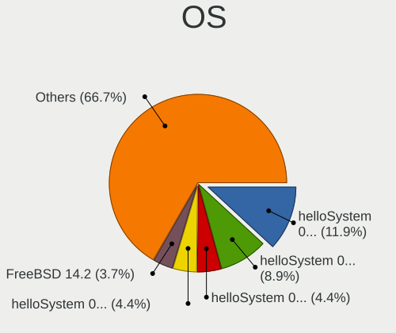

| Name                   | Notebooks | Percent |
|------------------------|-----------|---------|
| helloSystem 0.7.0      | 16        | 11.85%  |
| helloSystem 0.8.1      | 12        | 8.89%   |
| helloSystem 0.9.0      | 6         | 4.44%   |
| helloSystem 0.8.0      | 6         | 4.44%   |
| FreeBSD 14.2           | 5         | 3.7%    |
| helloSystem 0.5.0      | 4         | 2.96%   |
| FreeBSD 14.0           | 4         | 2.96%   |
| FreeBSD 13.1           | 4         | 2.96%   |
| OpenBSD 7.2            | 3         | 2.22%   |
| NomadBSD 20240711      | 3         | 2.22%   |
| helloSystem 0.6.0      | 3         | 2.22%   |
| GhostBSD 20.04.02      | 3         | 2.22%   |
| FreeBSD 14.1-p5        | 3         | 2.22%   |
| FreeBSD 13.2           | 3         | 2.22%   |
| OpenBSD 7.1            | 2         | 1.48%   |
| OpenBSD 6.8            | 2         | 1.48%   |
| helloSystem 0.8.2      | 2         | 1.48%   |
| helloSystem 0.4.0      | 2         | 1.48%   |
| GhostBSD 24.07.3       | 2         | 1.48%   |
| GhostBSD 24.01.1       | 2         | 1.48%   |
| FuguIta 7.2            | 2         | 1.48%   |
| FreeBSD 14.1-p6        | 2         | 1.48%   |
| FreeBSD 14.1-p4        | 2         | 1.48%   |
| FreeBSD 14.0-p3        | 2         | 1.48%   |
| OPNsense 25.1.7        | 1         | 0.74%   |
| OPNsense 23.1.6        | 1         | 0.74%   |
| OPNsense 22.7.10       | 1         | 0.74%   |
| OPNsense 21.7.6        | 1         | 0.74%   |
| OPNsense 21.7.5        | 1         | 0.74%   |
| OpenBSD 7.6            | 1         | 0.74%   |
| OpenBSD 7.4            | 1         | 0.74%   |
| OpenBSD 7.3            | 1         | 0.74%   |
| OpenBSD 6.9            | 1         | 0.74%   |
| NomadBSD 5806f915      | 1         | 0.74%   |
| NomadBSD 20231121      | 1         | 0.74%   |
| NomadBSD 20221130      | 1         | 0.74%   |
| NetBSD 10.0            | 1         | 0.74%   |
| GhostBSD 25.02-R14.3p2 | 1         | 0.74%   |
| GhostBSD 25.01-R14.2p1 | 1         | 0.74%   |
| GhostBSD 24.10.1       | 1         | 0.74%   |

OS Family
---------

OS without a version

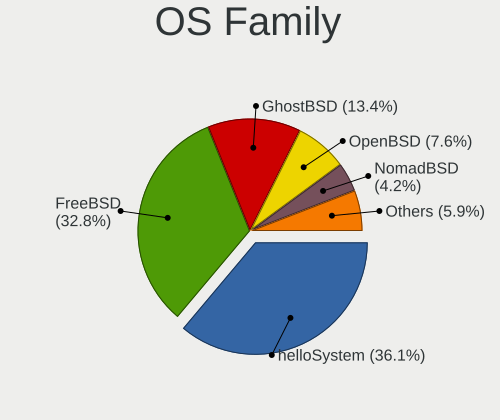

| Name        | Notebooks | Percent |
|-------------|-----------|---------|
| helloSystem | 43        | 36.13%  |
| FreeBSD     | 39        | 32.77%  |
| GhostBSD    | 16        | 13.45%  |
| OpenBSD     | 9         | 7.56%   |
| NomadBSD    | 5         | 4.2%    |
| OPNsense    | 4         | 3.36%   |
| FuguIta     | 2         | 1.68%   |
| NetBSD      | 1         | 0.84%   |

Arch
----

OS architecture (x86_64, i586, etc.)

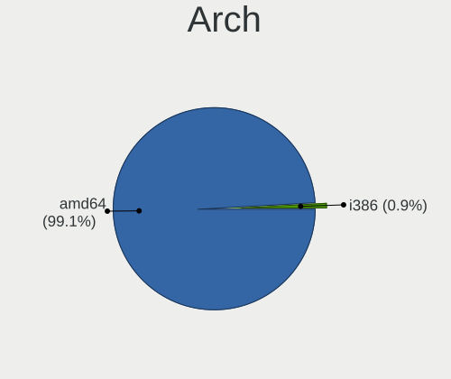

| Name  | Notebooks | Percent |
|-------|-----------|---------|
| amd64 | 112       | 99.12%  |
| i386  | 1         | 0.88%   |

DE
--

Desktop Environment

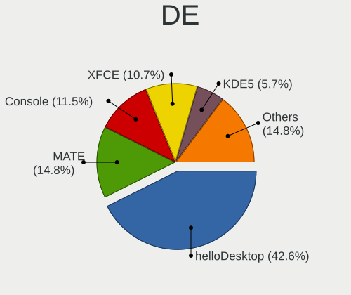

| Name         | Notebooks | Percent |
|--------------|-----------|---------|
| helloDesktop | 52        | 42.62%  |
| MATE         | 18        | 14.75%  |
| Console      | 14        | 11.48%  |
| XFCE         | 13        | 10.66%  |
| KDE5         | 7         | 5.74%   |
| TWM          | 5         | 4.1%    |
| Openbox      | 3         | 2.46%   |
| i3           | 3         | 2.46%   |
| fvwm         | 3         | 2.46%   |
| KDE          | 2         | 1.64%   |
| GNOME        | 2         | 1.64%   |

Display Server
--------------

X11 or Wayland

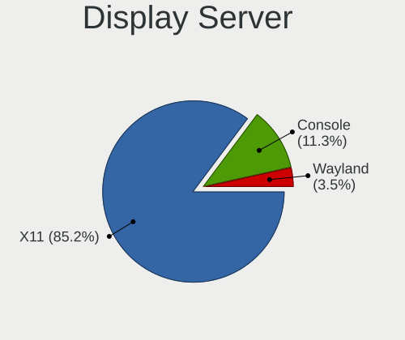

| Name    | Notebooks | Percent |
|---------|-----------|---------|
| X11     | 98        | 85.22%  |
| Console | 13        | 11.3%   |
| Wayland | 4         | 3.48%   |

Display Manager
---------------

SDDM, LightDM, etc.

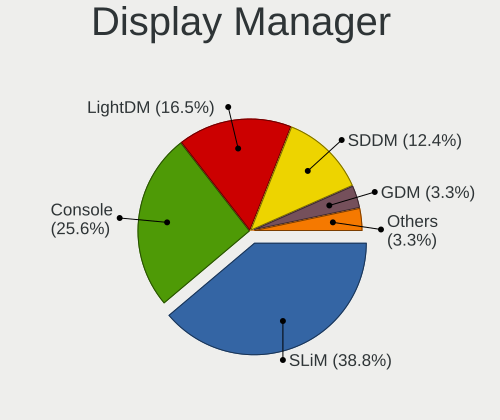

| Name    | Notebooks | Percent |
|---------|-----------|---------|
| SLiM    | 47        | 38.84%  |
| Console | 31        | 25.62%  |
| LightDM | 20        | 16.53%  |
| SDDM    | 15        | 12.4%   |
| GDM     | 4         | 3.31%   |
| XDM     | 2         | 1.65%   |
| Ly      | 2         | 1.65%   |

OS Lang
-------

Language

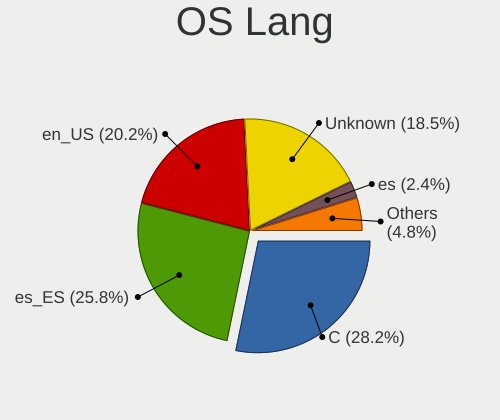

| Lang    | Notebooks | Percent |
|---------|-----------|---------|
| C       | 35        | 28.23%  |
| es_ES   | 32        | 25.81%  |
| en_US   | 25        | 20.16%  |
| Unknown | 23        | 18.55%  |
| es      | 3         | 2.42%   |
| ru_RU   | 2         | 1.61%   |
| fr_FR   | 2         | 1.61%   |
| zh_CN   | 1         | 0.81%   |
| de_DE   | 1         | 0.81%   |

Boot Mode
---------

EFI or BIOS

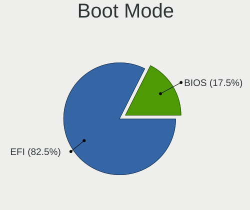

| Mode | Notebooks | Percent |
|------|-----------|---------|
| EFI  | 94        | 82.46%  |
| BIOS | 20        | 17.54%  |

Filesystem
----------

Type of filesystem

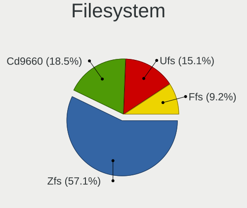

| Type   | Notebooks | Percent |
|--------|-----------|---------|
| Zfs    | 68        | 57.14%  |
| Cd9660 | 22        | 18.49%  |
| Ufs    | 18        | 15.13%  |
| Ffs    | 11        | 9.24%   |

Part. scheme
------------

Scheme of partitioning

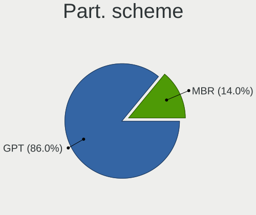

| Type | Notebooks | Percent |
|------|-----------|---------|
| GPT  | 98        | 85.96%  |
| MBR  | 16        | 14.04%  |

Board
-----

Vendor
------

Motherboard manufacturer

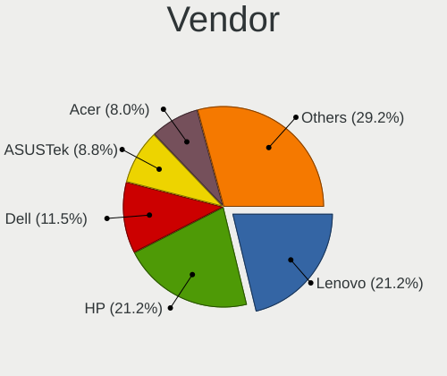

| Name                | Notebooks | Percent |
|---------------------|-----------|---------|
| Lenovo              | 24        | 21.24%  |
| Hewlett-Packard     | 24        | 21.24%  |
| Dell                | 13        | 11.5%   |
| ASUSTek Computer    | 10        | 8.85%   |
| Acer                | 9         | 7.96%   |
| Framework           | 4         | 3.54%   |
| Apple               | 4         | 3.54%   |
| Toshiba             | 3         | 2.65%   |
| MSI                 | 3         | 2.65%   |
| Unknown             | 3         | 2.65%   |
| Sony                | 2         | 1.77%   |
| SLIMBOOK            | 2         | 1.77%   |
| Alienware           | 2         | 1.77%   |
| TWINHEAD            | 1         | 0.88%   |
| TUXEDO              | 1         | 0.88%   |
| Samsung Electronics | 1         | 0.88%   |
| ReachingTech        | 1         | 0.88%   |
| Razer               | 1         | 0.88%   |
| Packard Bell        | 1         | 0.88%   |
| Medion              | 1         | 0.88%   |
| Chuwi               | 1         | 0.88%   |
| AZW                 | 1         | 0.88%   |
| AMI                 | 1         | 0.88%   |

Model
-----

Motherboard model

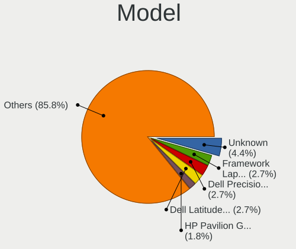

| Name                                     | Notebooks | Percent |
|------------------------------------------|-----------|---------|
| Unknown                                  | 5         | 4.42%   |
| Framework Laptop (13th Gen Intel Core)   | 3         | 2.65%   |
| Dell Precision 5510                      | 3         | 2.65%   |
| Dell Latitude 7390                       | 3         | 2.65%   |
| HP Pavilion Gaming Laptop 15-ec1xxx      | 2         | 1.77%   |
| ASUS K55VD                               | 2         | 1.77%   |
| TWINHEAD U12CT                           | 1         | 0.88%   |
| TUXEDO Aura 15 Gen1                      | 1         | 0.88%   |
| Toshiba Satellite A300                   | 1         | 0.88%   |
| Toshiba Satellite A110                   | 1         | 0.88%   |
| Toshiba Portable PC                      | 1         | 0.88%   |
| Sony VPCSB3Q9E                           | 1         | 0.88%   |
| Sony SVE1511C5E                          | 1         | 0.88%   |
| SLIMBOOK PROX-AMD5                       | 1         | 0.88%   |
| SLIMBOOK ESSENTIAL-15-11                 | 1         | 0.88%   |
| Samsung 530U3C/530U4C/532U3C             | 1         | 0.88%   |
| ReachingTech DreamQuest Pro 2022         | 1         | 0.88%   |
| Razer Blade Stealth                      | 1         | 0.88%   |
| Packard Bell DOT S                       | 1         | 0.88%   |
| MSI Prestige 15 A10SC                    | 1         | 0.88%   |
| MSI Modern 15 F13MG                      | 1         | 0.88%   |
| MSI GE75 Raider 10SGS                    | 1         | 0.88%   |
| Medion S15449                            | 1         | 0.88%   |
| Lenovo Yoga 2 13 20344                   | 1         | 0.88%   |
| Lenovo ThinkPad X270 20HMS06Q1D          | 1         | 0.88%   |
| Lenovo ThinkPad X230 Tablet 34382BG      | 1         | 0.88%   |
| Lenovo ThinkPad X200 745969G             | 1         | 0.88%   |
| Lenovo ThinkPad X1 Carbon 7th 20QES53R00 | 1         | 0.88%   |
| Lenovo ThinkPad X1 Carbon 6th 20KH007BUK | 1         | 0.88%   |
| Lenovo ThinkPad T61 765912G              | 1         | 0.88%   |
| Lenovo ThinkPad T530 2429GL9             | 1         | 0.88%   |
| Lenovo ThinkPad T470s 20HGS3AX02         | 1         | 0.88%   |
| Lenovo ThinkPad T440p 20AWS1CH00         | 1         | 0.88%   |
| Lenovo ThinkPad T440p 20AW007QMS         | 1         | 0.88%   |
| Lenovo ThinkPad P14s Gen 1 20Y1CTO1WW    | 1         | 0.88%   |
| Lenovo ThinkPad L590 20Q7000YSP          | 1         | 0.88%   |
| Lenovo ThinkPad L450 20DSS1S402          | 1         | 0.88%   |
| Lenovo ThinkPad L440 20ASS0FP00          | 1         | 0.88%   |
| Lenovo ThinkPad E495 20NE000BSP          | 1         | 0.88%   |
| Lenovo ThinkPad E15 Gen 4 21EDCTO1WW     | 1         | 0.88%   |

Model Family
------------

Motherboard model prefix

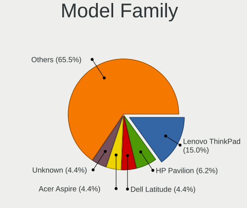

| Name                     | Notebooks | Percent |
|--------------------------|-----------|---------|
| Lenovo ThinkPad          | 17        | 15.04%  |
| HP Pavilion              | 7         | 6.19%   |
| Dell Latitude            | 5         | 4.42%   |
| Acer Aspire              | 5         | 4.42%   |
| Unknown                  | 5         | 4.42%   |
| Lenovo IdeaPad           | 4         | 3.54%   |
| HP ProBook               | 4         | 3.54%   |
| Framework Laptop         | 4         | 3.54%   |
| HP OMEN                  | 3         | 2.65%   |
| HP Laptop                | 3         | 2.65%   |
| Dell Precision           | 3         | 2.65%   |
| Toshiba Satellite        | 2         | 1.77%   |
| HP Compaq                | 2         | 1.77%   |
| Dell Inspiron            | 2         | 1.77%   |
| ASUS K55VD               | 2         | 1.77%   |
| Apple MacBook5           | 2         | 1.77%   |
| Acer TravelMate          | 2         | 1.77%   |
| TWINHEAD U12CT           | 1         | 0.88%   |
| TUXEDO Aura              | 1         | 0.88%   |
| Toshiba Portable         | 1         | 0.88%   |
| Sony VPCSB3Q9E           | 1         | 0.88%   |
| Sony SVE1511C5E          | 1         | 0.88%   |
| SLIMBOOK PROX-AMD5       | 1         | 0.88%   |
| SLIMBOOK ESSENTIAL-15-11 | 1         | 0.88%   |
| Samsung 530U3C           | 1         | 0.88%   |
| ReachingTech DreamQuest  | 1         | 0.88%   |
| Razer Blade              | 1         | 0.88%   |
| Packard Bell DOT         | 1         | 0.88%   |
| MSI Prestige             | 1         | 0.88%   |
| MSI Modern               | 1         | 0.88%   |
| MSI GE75                 | 1         | 0.88%   |
| Medion S15449            | 1         | 0.88%   |
| Lenovo Yoga              | 1         | 0.88%   |
| Lenovo Slim              | 1         | 0.88%   |
| Lenovo G50-80            | 1         | 0.88%   |
| HP Stream                | 1         | 0.88%   |
| HP Mini                  | 1         | 0.88%   |
| HP EliteBook             | 1         | 0.88%   |
| HP 250                   | 1         | 0.88%   |
| Dell XPS                 | 1         | 0.88%   |

MFG Year
--------

Motherboard manufacture year

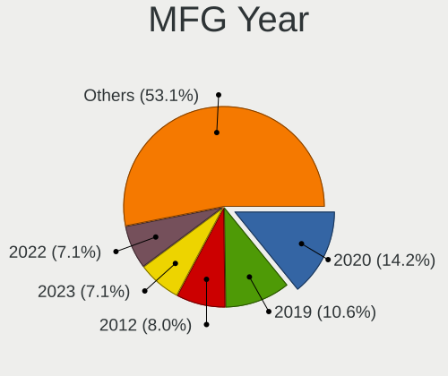

| Year | Notebooks | Percent |
|------|-----------|---------|
| 2020 | 16        | 14.16%  |
| 2019 | 12        | 10.62%  |
| 2012 | 9         | 7.96%   |
| 2023 | 8         | 7.08%   |
| 2022 | 8         | 7.08%   |
| 2011 | 7         | 6.19%   |
| 2009 | 7         | 6.19%   |
| 2018 | 6         | 5.31%   |
| 2008 | 6         | 5.31%   |
| 2016 | 5         | 4.42%   |
| 2014 | 5         | 4.42%   |
| 2021 | 4         | 3.54%   |
| 2013 | 4         | 3.54%   |
| 2010 | 4         | 3.54%   |
| 2017 | 3         | 2.65%   |
| 2025 | 2         | 1.77%   |
| 2024 | 2         | 1.77%   |
| 2015 | 2         | 1.77%   |
| 2007 | 2         | 1.77%   |
| 2006 | 1         | 0.88%   |

Form Factor
-----------

Physical design of the computer

| Name     | Notebooks | Percent |
|----------|-----------|---------|
| Notebook | 113       | 100%    |

Coreboot
--------

Have coreboot on board

| Used | Notebooks | Percent |
|------|-----------|---------|
| No   | 112       | 99.12%  |
| Yes  | 1         | 0.88%   |

RAM Size
--------

Total RAM memory

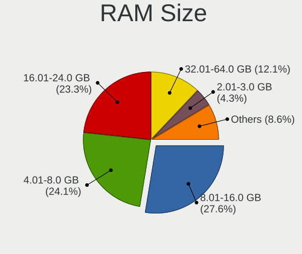

| Size in GB  | Notebooks | Percent |
|-------------|-----------|---------|
| 8.01-16.0   | 32        | 27.59%  |
| 4.01-8.0    | 28        | 24.14%  |
| 16.01-24.0  | 27        | 23.28%  |
| 32.01-64.0  | 14        | 12.07%  |
| 2.01-3.0    | 5         | 4.31%   |
| 24.01-32.0  | 4         | 3.45%   |
| 64.01-256.0 | 4         | 3.45%   |
| 3.01-4.0    | 2         | 1.72%   |

RAM Used
--------

Used RAM memory

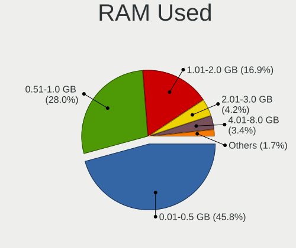

| Used GB  | Notebooks | Percent |
|----------|-----------|---------|
| 0.01-0.5 | 54        | 45.76%  |
| 0.51-1.0 | 33        | 27.97%  |
| 1.01-2.0 | 20        | 16.95%  |
| 2.01-3.0 | 5         | 4.24%   |
| 4.01-8.0 | 4         | 3.39%   |
| 3.01-4.0 | 1         | 0.85%   |
| Unknown  | 1         | 0.85%   |

Total Drives
------------

Number of drives on board

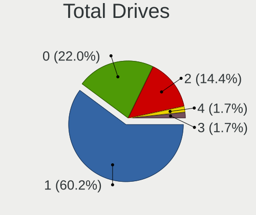

| Drives | Notebooks | Percent |
|--------|-----------|---------|
| 1      | 71        | 60.17%  |
| 0      | 26        | 22.03%  |
| 2      | 17        | 14.41%  |
| 4      | 2         | 1.69%   |
| 3      | 2         | 1.69%   |

Has CD-ROM
----------

Has CD-ROM on board

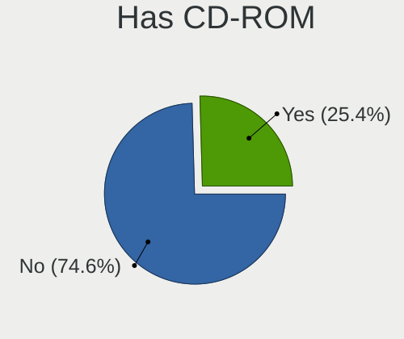

| Presented | Notebooks | Percent |
|-----------|-----------|---------|
| No        | 85        | 74.56%  |
| Yes       | 29        | 25.44%  |

Has Ethernet
------------

Has Ethernet on board

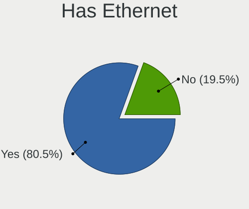

| Presented | Notebooks | Percent |
|-----------|-----------|---------|
| Yes       | 91        | 80.53%  |
| No        | 22        | 19.47%  |

Has WiFi
--------

Has WiFi module

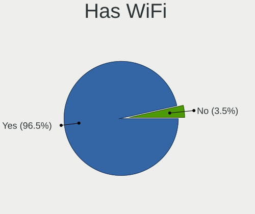

| Presented | Notebooks | Percent |
|-----------|-----------|---------|
| Yes       | 109       | 96.46%  |
| No        | 4         | 3.54%   |

Has Bluetooth
-------------

Has Bluetooth module

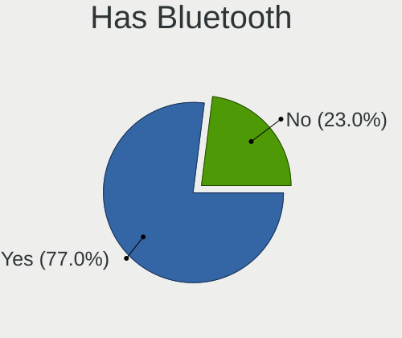

| Presented | Notebooks | Percent |
|-----------|-----------|---------|
| Yes       | 87        | 76.99%  |
| No        | 26        | 23.01%  |

Location
--------

Country
-------

Geographic location (country)

| Country | Notebooks | Percent |
|---------|-----------|---------|
| Spain   | 113       | 100%    |

City
----

Geographic location (city)

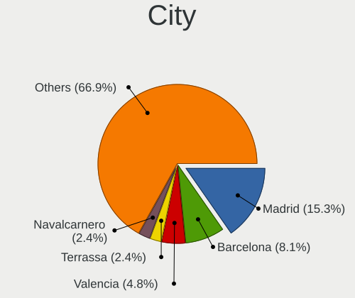

| City                          | Notebooks | Percent |
|-------------------------------|-----------|---------|
| Madrid                        | 19        | 15.32%  |
| Barcelona                     | 10        | 8.06%   |
| Valencia                      | 6         | 4.84%   |
| Terrassa                      | 3         | 2.42%   |
| Navalcarnero                  | 3         | 2.42%   |
| Los Realejos                  | 3         | 2.42%   |
| Zaragoza                      | 2         | 1.61%   |
| Tarragona                     | 2         | 1.61%   |
| Seville                       | 2         | 1.61%   |
| Santa Cruz de Tenerife        | 2         | 1.61%   |
| Santa Coloma de Farners       | 2         | 1.61%   |
| Redondela                     | 2         | 1.61%   |
| Paterna                       | 2         | 1.61%   |
| Girona                        | 2         | 1.61%   |
| GibraleГіn                  | 2         | 1.61%   |
| Getafe                        | 2         | 1.61%   |
| Alcobendas                    | 2         | 1.61%   |
| Zarautz                       | 1         | 0.81%   |
| Vitoria-Gasteiz               | 1         | 0.81%   |
| Villapresente                 | 1         | 0.81%   |
| Vigo                          | 1         | 0.81%   |
| Valladolid                    | 1         | 0.81%   |
| Urnieta                       | 1         | 0.81%   |
| Tudela de Duero               | 1         | 0.81%   |
| Torrent                       | 1         | 0.81%   |
| Tomares                       | 1         | 0.81%   |
| Tarrega                       | 1         | 0.81%   |
| Sedavi                        | 1         | 0.81%   |
| Sanlucar la Mayor             | 1         | 0.81%   |
| San Vicent del Raspeig        | 1         | 0.81%   |
| San Sebastián de los Reyes | 1         | 0.81%   |
| San Juan de Aznalfarache      | 1         | 0.81%   |
| San Cristóbal de La Laguna   | 1         | 0.81%   |
| Rubí                         | 1         | 0.81%   |
| Ronda                         | 1         | 0.81%   |
| Rianxo                        | 1         | 0.81%   |
| Plasencia                     | 1         | 0.81%   |
| Padul                         | 1         | 0.81%   |
| Ourense                       | 1         | 0.81%   |
| Orihuela Costa                | 1         | 0.81%   |

Drives
------

Drive Vendor
------------

Hard drive vendors

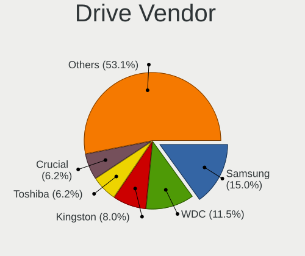

| Vendor                                 | Notebooks | Drives | Percent |
|----------------------------------------|-----------|--------|---------|
| Samsung Electronics                    | 17        | 33     | 15.04%  |
| WDC                                    | 13        | 16     | 11.5%   |
| Kingston                               | 9         | 10     | 7.96%   |
| Toshiba                                | 7         | 9      | 6.19%   |
| Crucial                                | 7         | 7      | 6.19%   |
| NVMe                                   | 6         | 9      | 5.31%   |
| Hitachi                                | 6         | 8      | 5.31%   |
| Seagate                                | 5         | 5      | 4.42%   |
| SanDisk                                | 5         | 5      | 4.42%   |
| HGST                                   | 4         | 4      | 3.54%   |
| Intel                                  | 3         | 3      | 2.65%   |
| Fujitsu                                | 3         | 3      | 2.65%   |
| XrayDisk                               | 2         | 2      | 1.77%   |
| Product:              USB Flash Memory | 2         | 2      | 1.77%   |
| OCZ                                    | 2         | 2      | 1.77%   |
| Micron Technology                      | 2         | 2      | 1.77%   |
| KingSpec                               | 2         | 2      | 1.77%   |
| China                                  | 2         | 2      | 1.77%   |
| Union Memory                           | 1         | 1      | 0.88%   |
| Transcend                              | 1         | 1      | 0.88%   |
| TCSUNBOW                               | 1         | 1      | 0.88%   |
| SPCC                                   | 1         | 1      | 0.88%   |
| SK hynix                               | 1         | 1      | 0.88%   |
| PNY                                    | 1         | 1      | 0.88%   |
| Phison                                 | 1         | 1      | 0.88%   |
| Patriot                                | 1         | 1      | 0.88%   |
| Netac                                  | 1         | 1      | 0.88%   |
| LITEONIT                               | 1         | 1      | 0.88%   |
| Kston                                  | 1         | 2      | 0.88%   |
| KIOXIA                                 | 1         | 1      | 0.88%   |
| Intenso                                | 1         | 1      | 0.88%   |
| Gigabyte Technology                    | 1         | 1      | 0.88%   |
| FORESEE                                | 1         | 1      | 0.88%   |
| Apple                                  | 1         | 1      | 0.88%   |

Drive Model
-----------

Hard drive models

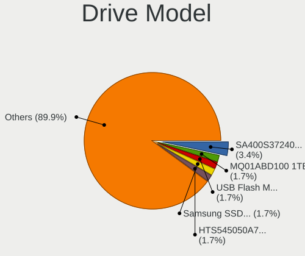

| Model                                                        | Notebooks | Percent |
|--------------------------------------------------------------|-----------|---------|
| Kingston SA400S37240G 240GB                                  | 4         | 3.36%   |
| Toshiba MQ01ABD100 1TB                                       | 2         | 1.68%   |
| Product:              USB Flash Memory USB Flash Memory 16GB | 2         | 1.68%   |
| NVMe Samsung SSD 980 1TB                                     | 2         | 1.68%   |
| HGST HTS545050A7E380 500GB                                   | 2         | 1.68%   |
| Crucial CT480BX500SSD1 480GB                                 | 2         | 1.68%   |
| XrayDisk SSD 256GB                                           | 1         | 0.84%   |
| XrayDisk SSD 240GB                                           | 1         | 0.84%   |
| WDC WDS240G2G0B-00EPW0 240GB                                 | 1         | 0.84%   |
| WDC WDS100T2B0C-00PXH0 1TB                                   | 1         | 0.84%   |
| WDC WD5000LPVX-22V0TT0 500GB                                 | 1         | 0.84%   |
| WDC WD5000LPCX-21VHAT0 500GB                                 | 1         | 0.84%   |
| WDC WD2500BEVT-35A23T0 250GB                                 | 1         | 0.84%   |
| WDC WD2500BEVS-22UST0 250GB                                  | 1         | 0.84%   |
| WDC WD1200BEVS-22UST0 120GB                                  | 1         | 0.84%   |
| WDC WD1200BEVS-07LAT0 120GB                                  | 1         | 0.84%   |
| WDC WD10JPCX-24UE4T0 1TB                                     | 1         | 0.84%   |
| WDC WD10EZEX-60WN4A0 1TB                                     | 1         | 0.84%   |
| WDC PC SN730 SDBPNTY-1T00-1032 1TB                           | 1         | 0.84%   |
| WDC PC SN720 SDAPNTW-1T00-1006 1TB                           | 1         | 0.84%   |
| WDC PC SN530 SDBPMPZ-256G-1101 256GB                         | 1         | 0.84%   |
| WDC PC SN520 SDAPNUW-256G-1006 256GB                         | 1         | 0.84%   |
| Union Memory UMIS LENSE40256GMSP34MESTB3A 256GB              | 1         | 0.84%   |
| Transcend TS120GMTS420S 120GB                                | 1         | 0.84%   |
| Toshiba MQ01ACF032 320GB                                     | 1         | 0.84%   |
| Toshiba MK5065GSXF 500GB                                     | 1         | 0.84%   |
| Toshiba MK1229GSG 120GB                                      | 1         | 0.84%   |
| Toshiba MK1059GSM 1TB                                        | 1         | 0.84%   |
| Toshiba KXG60ZNV512G NVMe 512GB                              | 1         | 0.84%   |
| TCSUNBOW X3 480GB                                            | 1         | 0.84%   |
| SPCC Solid State Disk 512GB                                  | 1         | 0.84%   |
| SK hynix HFM512GDHTNG-8710B 512GB                            | 1         | 0.84%   |
| Seagate ST9500325AS 500GB                                    | 1         | 0.84%   |
| Seagate ST9160821AS 160GB                                    | 1         | 0.84%   |
| Seagate ST500LM021-1KJ152 500GB                              | 1         | 0.84%   |
| Seagate ST1000LM035-1RK172 1TB                               | 1         | 0.84%   |
| Seagate ST1000LM024 HN-M101MBB 1TB                           | 1         | 0.84%   |
| SanDisk SSD PLUS 240GB                                       | 1         | 0.84%   |
| SanDisk SSD i100 24GB                                        | 1         | 0.84%   |
| SanDisk SDSSDP128G 128GB                                     | 1         | 0.84%   |

HDD Vendor
----------

Hard disk drive vendors

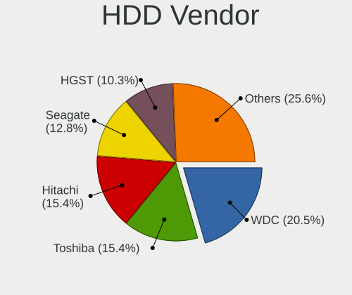

| Vendor                                 | Notebooks | Drives | Percent |
|----------------------------------------|-----------|--------|---------|
| WDC                                    | 8         | 10     | 20.51%  |
| Toshiba                                | 6         | 7      | 15.38%  |
| Hitachi                                | 6         | 8      | 15.38%  |
| Seagate                                | 5         | 5      | 12.82%  |
| HGST                                   | 4         | 4      | 10.26%  |
| NVMe                                   | 3         | 5      | 7.69%   |
| Fujitsu                                | 3         | 3      | 7.69%   |
| Samsung Electronics                    | 2         | 2      | 5.13%   |
| Product:              USB Flash Memory | 2         | 2      | 5.13%   |

SSD Vendor
----------

Solid state drive vendors

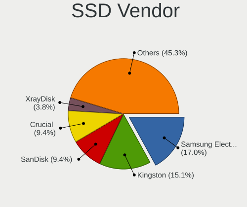

| Vendor              | Notebooks | Drives | Percent |
|---------------------|-----------|--------|---------|
| Samsung Electronics | 9         | 16     | 16.98%  |
| Kingston            | 8         | 9      | 15.09%  |
| SanDisk             | 5         | 5      | 9.43%   |
| Crucial             | 5         | 5      | 9.43%   |
| XrayDisk            | 2         | 2      | 3.77%   |
| OCZ                 | 2         | 2      | 3.77%   |
| NVMe                | 2         | 2      | 3.77%   |
| KingSpec            | 2         | 2      | 3.77%   |
| Intel               | 2         | 2      | 3.77%   |
| China               | 2         | 2      | 3.77%   |
| WDC                 | 1         | 1      | 1.89%   |
| Transcend           | 1         | 1      | 1.89%   |
| TCSUNBOW            | 1         | 1      | 1.89%   |
| SPCC                | 1         | 1      | 1.89%   |
| PNY                 | 1         | 1      | 1.89%   |
| Phison              | 1         | 1      | 1.89%   |
| Patriot             | 1         | 1      | 1.89%   |
| Netac               | 1         | 1      | 1.89%   |
| Micron Technology   | 1         | 1      | 1.89%   |
| LITEONIT            | 1         | 1      | 1.89%   |
| Kston               | 1         | 2      | 1.89%   |
| Gigabyte Technology | 1         | 1      | 1.89%   |
| FORESEE             | 1         | 1      | 1.89%   |
| Apple               | 1         | 1      | 1.89%   |

Drive Kind
----------

HDD or SSD

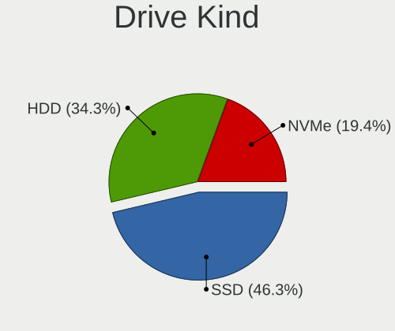

| Kind | Notebooks | Drives | Percent |
|------|-----------|--------|---------|
| SSD  | 50        | 62     | 46.3%   |
| HDD  | 37        | 46     | 34.26%  |
| NVMe | 21        | 33     | 19.44%  |

Drive Connector
---------------

SATA, SAS, NVMe, etc.

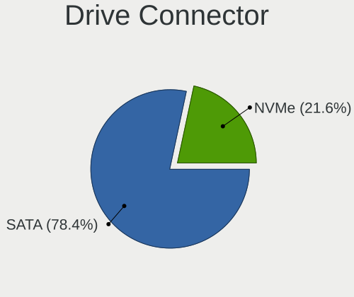

| Type | Notebooks | Drives | Percent |
|------|-----------|--------|---------|
| SATA | 76        | 108    | 78.35%  |
| NVMe | 21        | 33     | 21.65%  |

Drive Size
----------

Size of hard drive

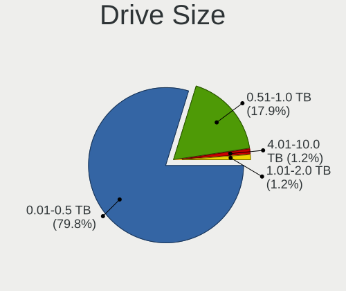

| Size in TB | Notebooks | Drives | Percent |
|------------|-----------|--------|---------|
| 0.01-0.5   | 67        | 85     | 79.76%  |
| 0.51-1.0   | 15        | 19     | 17.86%  |
| 1.01-2.0   | 1         | 3      | 1.19%   |
| 4.01-10.0  | 1         | 1      | 1.19%   |

Space Total
-----------

Amount of disk space available on the file system

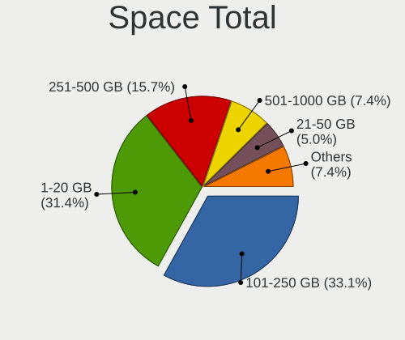

| Size in GB | Notebooks | Percent |
|------------|-----------|---------|
| 101-250    | 40        | 33.06%  |
| 1-20       | 38        | 31.4%   |
| 251-500    | 19        | 15.7%   |
| 501-1000   | 9         | 7.44%   |
| 21-50      | 6         | 4.96%   |
| 1001-2000  | 4         | 3.31%   |
| 51-100     | 4         | 3.31%   |
| 2001-3000  | 1         | 0.83%   |

Space Used
----------

Amount of used disk space

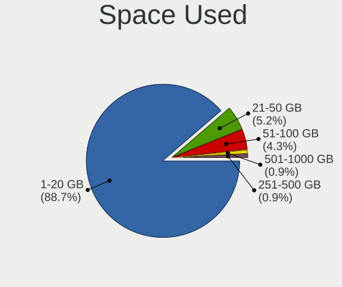

| Used GB  | Notebooks | Percent |
|----------|-----------|---------|
| 1-20     | 102       | 88.7%   |
| 21-50    | 6         | 5.22%   |
| 51-100   | 5         | 4.35%   |
| 251-500  | 1         | 0.87%   |
| 501-1000 | 1         | 0.87%   |

Malfunc. Drives
---------------

Drive models with a malfunction

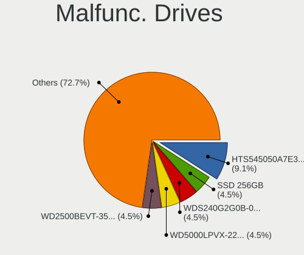

| Model                                           | Notebooks | Drives | Percent |
|-------------------------------------------------|-----------|--------|---------|
| HGST HTS545050A7E380 500GB                      | 2         | 2      | 9.09%   |
| XrayDisk SSD 256GB                              | 1         | 1      | 4.55%   |
| WDC WDS240G2G0B-00EPW0 240GB                    | 1         | 1      | 4.55%   |
| WDC WD5000LPVX-22V0TT0 500GB                    | 1         | 1      | 4.55%   |
| WDC WD2500BEVT-35A23T0 250GB                    | 1         | 1      | 4.55%   |
| Toshiba MQ01ACF032 320GB                        | 1         | 1      | 4.55%   |
| Toshiba MK1229GSG 120GB                         | 1         | 1      | 4.55%   |
| Toshiba MK1059GSM 1TB                           | 1         | 1      | 4.55%   |
| Seagate ST500LM021-1KJ152 500GB                 | 1         | 1      | 4.55%   |
| Seagate ST1000LM024 HN-M101MBB 1TB              | 1         | 1      | 4.55%   |
| Samsung Electronics HM160HI 160GB               | 1         | 1      | 4.55%   |
| OCZ AGILITY3 120GB                              | 1         | 1      | 4.55%   |
| Micron Technology MTFDDAV256TDL-1AW1ZABHA 256GB | 1         | 1      | 4.55%   |
| Kingston SA400S37240G 240GB                     | 1         | 1      | 4.55%   |
| Hitachi HTS723225A7A364 250GB                   | 1         | 3      | 4.55%   |
| Hitachi HTS545050A7E380 500GB                   | 1         | 1      | 4.55%   |
| Hitachi HTS543232L9SA00 320GB                   | 1         | 1      | 4.55%   |
| Hitachi HTS542525K9A300 250GB                   | 1         | 1      | 4.55%   |
| Hitachi HTS542516K9SA00 160GB                   | 1         | 1      | 4.55%   |
| Fujitsu MHZ2250BH G2 250GB                      | 1         | 1      | 4.55%   |
| Fujitsu MHZ2160BH G2 160GB                      | 1         | 1      | 4.55%   |

Malfunc. Drive Vendor
---------------------

Vendors of faulty drives

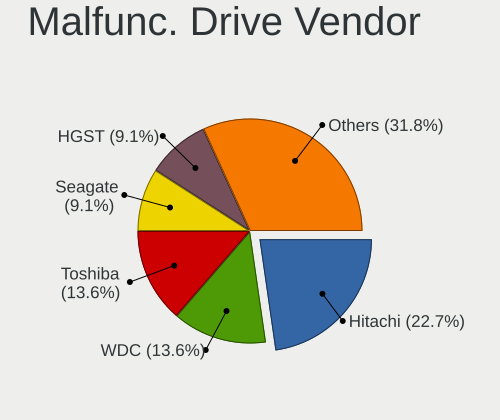

| Vendor              | Notebooks | Drives | Percent |
|---------------------|-----------|--------|---------|
| Hitachi             | 5         | 7      | 22.73%  |
| WDC                 | 3         | 3      | 13.64%  |
| Toshiba             | 3         | 3      | 13.64%  |
| Seagate             | 2         | 2      | 9.09%   |
| HGST                | 2         | 2      | 9.09%   |
| Fujitsu             | 2         | 2      | 9.09%   |
| XrayDisk            | 1         | 1      | 4.55%   |
| Samsung Electronics | 1         | 1      | 4.55%   |
| OCZ                 | 1         | 1      | 4.55%   |
| Micron Technology   | 1         | 1      | 4.55%   |
| Kingston            | 1         | 1      | 4.55%   |

Malfunc. HDD Vendor
-------------------

Vendors of faulty HDD drives

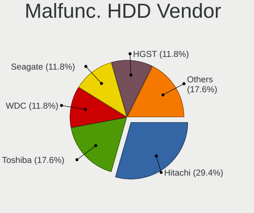

| Vendor              | Notebooks | Drives | Percent |
|---------------------|-----------|--------|---------|
| Hitachi             | 5         | 7      | 29.41%  |
| Toshiba             | 3         | 3      | 17.65%  |
| WDC                 | 2         | 2      | 11.76%  |
| Seagate             | 2         | 2      | 11.76%  |
| HGST                | 2         | 2      | 11.76%  |
| Fujitsu             | 2         | 2      | 11.76%  |
| Samsung Electronics | 1         | 1      | 5.88%   |

Malfunc. Drive Kind
-------------------

Kinds of faulty drives

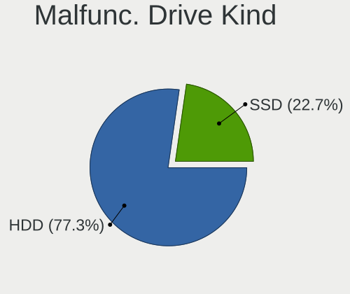

| Kind | Notebooks | Drives | Percent |
|------|-----------|--------|---------|
| HDD  | 17        | 19     | 77.27%  |
| SSD  | 5         | 5      | 22.73%  |

Failed Drives
-------------

Failed drive models

Zero info for selected period =(

Failed Drive Vendor
-------------------

Failed drive vendors

Zero info for selected period =(

Drive Status
------------

Number of failed and malfunc. drives

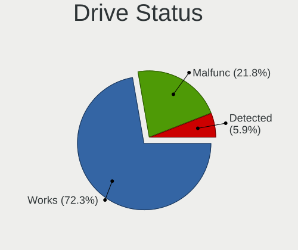

| Status   | Notebooks | Drives | Percent |
|----------|-----------|--------|---------|
| Works    | 73        | 106    | 72.28%  |
| Malfunc  | 22        | 24     | 21.78%  |
| Detected | 6         | 11     | 5.94%   |

Storage controller
------------------

Storage Vendor
--------------

Storage controller vendors

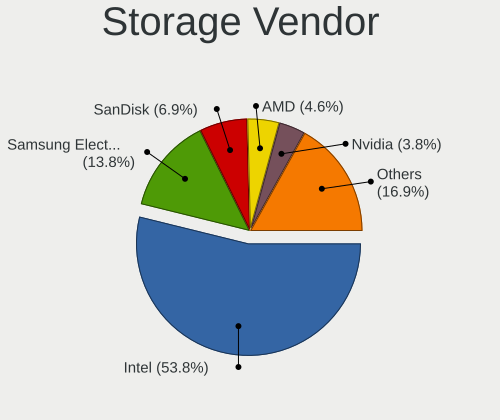

| Vendor                       | Notebooks | Percent |
|------------------------------|-----------|---------|
| Intel                        | 70        | 53.85%  |
| Samsung Electronics          | 18        | 13.85%  |
| SanDisk                      | 9         | 6.92%   |
| AMD                          | 6         | 4.62%   |
| Nvidia                       | 5         | 3.85%   |
| Micron/Crucial Technology    | 5         | 3.85%   |
| Kingston Technology Company  | 4         | 3.08%   |
| SK hynix                     | 3         | 2.31%   |
| Toshiba                      | 2         | 1.54%   |
| Micron Technology            | 2         | 1.54%   |
| KIOXIA                       | 2         | 1.54%   |
| Union Memory (Shenzhen)      | 1         | 0.77%   |
| Silicon Motion               | 1         | 0.77%   |
| Shenzhen Longsys Electronics | 1         | 0.77%   |
| Phison Electronics           | 1         | 0.77%   |

Storage Model
-------------

Storage controller models

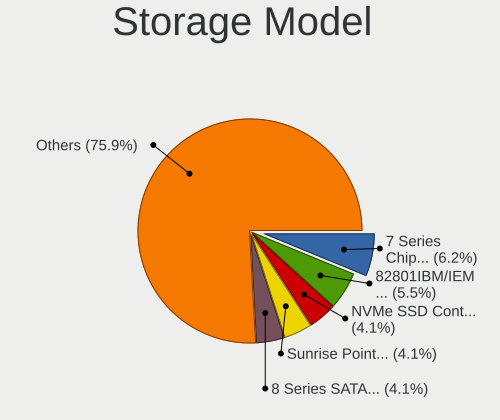

| Model                                                                            | Notebooks | Percent |
|----------------------------------------------------------------------------------|-----------|---------|
| Intel 7 Series Chipset Family 6-port SATA Controller [AHCI mode]                 | 9         | 6.21%   |
| Intel 82801IBM/IEM (ICH9M/ICH9M-E) 4 port SATA Controller [AHCI mode]            | 8         | 5.52%   |
| Samsung NVMe SSD Controller 980 (DRAM-less)                                      | 6         | 4.14%   |
| Intel Sunrise Point-LP SATA Controller [AHCI mode]                               | 6         | 4.14%   |
| Intel 8 Series SATA Controller 1 [AHCI mode]                                     | 6         | 4.14%   |
| Samsung NVMe SSD Controller SM981/PM981/PM983                                    | 5         | 3.45%   |
| Intel 82801HM/HEM (ICH8M/ICH8M-E) SATA Controller [AHCI mode]                    | 5         | 3.45%   |
| Intel 82801HM/HEM (ICH8M/ICH8M-E) IDE Controller                                 | 5         | 3.45%   |
| Nvidia MCP79 AHCI Controller                                                     | 4         | 2.76%   |
| Intel Tiger Lake-LP SATA Controller                                              | 4         | 2.76%   |
| Intel 82801 Mobile SATA Controller [RAID mode]                                   | 4         | 2.76%   |
| AMD FCH SATA Controller [AHCI mode]                                              | 4         | 2.76%   |
| Micron/Crucial P2 [Nick P2] / P3 / P3 Plus NVMe PCIe SSD (DRAM-less)             | 3         | 2.07%   |
| Intel 8 Series/C220 Series Chipset Family 6-port SATA Controller 1 [AHCI mode]   | 3         | 2.07%   |
| Intel 5 Series/3400 Series Chipset 4 port SATA AHCI Controller                   | 3         | 2.07%   |
| SK hynix BC501 NVMe Solid State Drive                                            | 2         | 1.38%   |
| SanDisk Ultra 3D / WD PC SN530, IX SN530, Blue SN550 NVMe SSD (DRAM-less)        | 2         | 1.38%   |
| Samsung NVMe SSD Controller SM961/PM961/SM963                                    | 2         | 1.38%   |
| Samsung NVMe SSD Controller PM9A1/PM9A3/980PRO                                   | 2         | 1.38%   |
| KIOXIA NVMe SSD Controller BG4 (DRAM-less)                                       | 2         | 1.38%   |
| Kingston Company NV2 NVMe SSD [SM2267XT] (DRAM-less)                             | 2         | 1.38%   |
| Intel Wildcat Point-LP SATA Controller [AHCI Mode]                               | 2         | 1.38%   |
| Intel Volume Management Device NVMe RAID Controller                              | 2         | 1.38%   |
| Intel Q170/Q150/B150/H170/H110/Z170/CM236 Chipset SATA Controller [AHCI Mode]    | 2         | 1.38%   |
| Intel NM10/ICH7 Family SATA Controller [AHCI mode]                               | 2         | 1.38%   |
| Intel Jasper Lake SATA AHCI Controller                                           | 2         | 1.38%   |
| Intel Atom/Celeron/Pentium Processor x5-E8000/J3xxx/N3xxx Series SATA Controller | 2         | 1.38%   |
| Intel Atom Processor E3800 Series SATA AHCI Controller                           | 2         | 1.38%   |
| Intel 7 Series Chipset Family 4-port SATA Controller [IDE mode]                  | 2         | 1.38%   |
| Intel 7 Series Chipset Family 2-port SATA Controller [IDE mode]                  | 2         | 1.38%   |
| Intel 6 Series/C200 Series Chipset Family 6 port Mobile SATA AHCI Controller     | 2         | 1.38%   |
| AMD SB7x0/SB8x0/SB9x0 SATA Controller [AHCI mode]                                | 2         | 1.38%   |
| Union Memory (Shenzhen) AH631 PCIe 3.0 NVMe SSD 256GB                            | 1         | 0.69%   |
| Toshiba XG6 NVMe SSD Controller                                                  | 1         | 0.69%   |
| Toshiba BG3 x2 NVMe SSD Controller (DRAM-less)                                   | 1         | 0.69%   |
| SK hynix PC611 NVMe Solid State Drive                                            | 1         | 0.69%   |
| Silicon Motion SM2263EN/SM2263XT (DRAM-less) NVMe SSD Controllers                | 1         | 0.69%   |
| Shenzhen Longsys Lexar NM790 / Patriot Viper VP4300 Lite NVMe SSD (DRAM-less)    | 1         | 0.69%   |
| Sandisk WD SN560/SN740/SN770/SN5000 NVMe SSD                                     | 1         | 0.69%   |
| SanDisk WD PC SN810 / Black SN850 NVMe SSD                                       | 1         | 0.69%   |

Storage Kind
------------

Kind of storage controller (IDE, SATA, NVMe, SAS, ...)

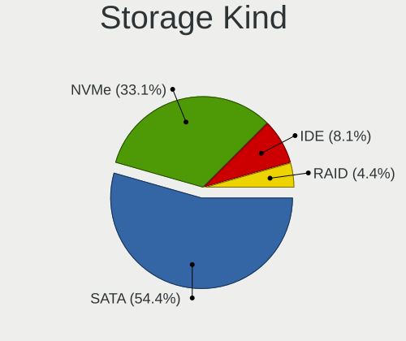

| Kind | Notebooks | Percent |
|------|-----------|---------|
| SATA | 74        | 54.41%  |
| NVMe | 45        | 33.09%  |
| IDE  | 11        | 8.09%   |
| RAID | 6         | 4.41%   |

Processor
---------

CPU Vendor
----------

Processor vendors

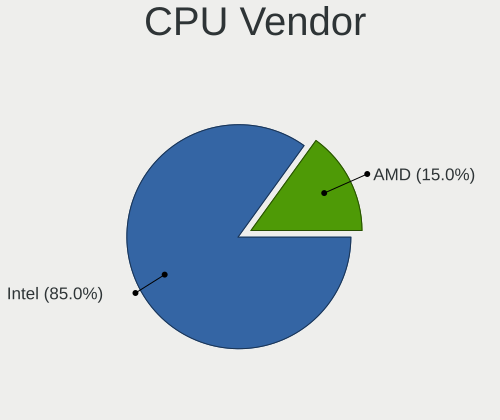

| Vendor | Notebooks | Percent |
|--------|-----------|---------|
| Intel  | 96        | 84.96%  |
| AMD    | 17        | 15.04%  |

CPU Model
---------

Processor models

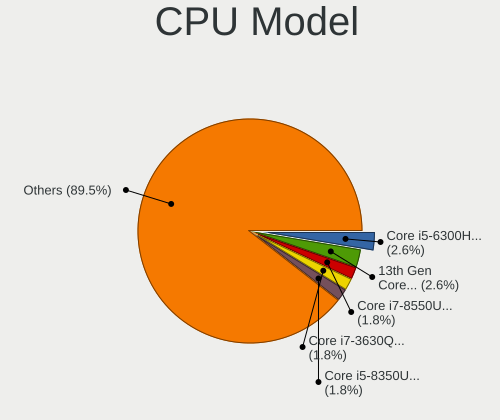

| Model                                       | Notebooks | Percent |
|---------------------------------------------|-----------|---------|
| Intel Core i5-6300HQ CPU @ 2.30GHz          | 3         | 2.63%   |
| Intel 13th Gen Core i7-1360P                | 3         | 2.63%   |
| Intel Core i7-8550U CPU @ 1.80GHz           | 2         | 1.75%   |
| Intel Core i7-3630QM CPU @ 2.40GHz          | 2         | 1.75%   |
| Intel Core i5-8350U CPU @ 1.70GHz           | 2         | 1.75%   |
| Intel Core i5-8265U CPU @ 1.60GHz           | 2         | 1.75%   |
| Intel Core i5-8250U CPU @ 1.60GHz           | 2         | 1.75%   |
| Intel Core i5-7300U CPU @ 2.60GHz           | 2         | 1.75%   |
| Intel Core i5-4200U CPU @ 1.60GHz           | 2         | 1.75%   |
| Intel Core i5-3320M CPU @ 2.60GHz           | 2         | 1.75%   |
| Intel Core i5-2430M CPU @ 2.40GHz           | 2         | 1.75%   |
| Intel Core 2 Duo CPU P7350 @ 2.00GHz        | 2         | 1.75%   |
| Intel Celeron CPU N2840 @ 2.16GHz           | 2         | 1.75%   |
| Intel 11th Gen Core i7-1165G7 @ 2.80GHz     | 2         | 1.75%   |
| Intel 11th Gen Core i5-1135G7 @ 2.40GHz     | 2         | 1.75%   |
| AMD Ryzen 7 5700U with Radeon Graphics      | 2         | 1.75%   |
| AMD Ryzen 5 4600H with Radeon Graphics      | 2         | 1.75%   |
| Intel Pentium Dual-Core CPU T4300 @ 2.10GHz | 1         | 0.88%   |
| Intel Pentium Dual CPU T3400 @ 2.16GHz      | 1         | 0.88%   |
| Intel Pentium CPU B970 @ 2.30GHz            | 1         | 0.88%   |
| Intel Pentium CPU 967 @ 1.30GHz             | 1         | 0.88%   |
| Intel Other                                 | 1         | 0.88%   |
| Intel Genuine CPU T2                        | 1         | 0.88%   |
| Intel CPU Version                           | 1         | 0.88%   |
| Intel Core i9-10980HK CPU @ 2.40GHz         | 1         | 0.88%   |
| Intel Core i7-8565U CPU @ 1.80GHz           | 1         | 0.88%   |
| Intel Core i7-7600U CPU @ 2.80GHz           | 1         | 0.88%   |
| Intel Core i7-7500U CPU @ 2.70GHz           | 1         | 0.88%   |
| Intel Core i7-6820HQ CPU @ 2.70GHz          | 1         | 0.88%   |
| Intel Core i7-6500U CPU @ 2.50GHz           | 1         | 0.88%   |
| Intel Core i7-5500U CPU @ 2.40GHz           | 1         | 0.88%   |
| Intel Core i7-4712MQ CPU @ 2.30GHz          | 1         | 0.88%   |
| Intel Core i7-4700MQ CPU @ 2.40GHz          | 1         | 0.88%   |
| Intel Core i7-4510U CPU @ 2.00GHz           | 1         | 0.88%   |
| Intel Core i7-3610QM CPU @ 2.30GHz          | 1         | 0.88%   |
| Intel Core i7-10875H CPU @ 2.30GHz          | 1         | 0.88%   |
| Intel Core i7-10750H CPU @ 2.60GHz          | 1         | 0.88%   |
| Intel Core i7-10710U CPU @ 1.10GHz          | 1         | 0.88%   |
| Intel Core i7-10510U CPU @ 1.80GHz          | 1         | 0.88%   |
| Intel Core i5-8365U CPU @ 1.60GHz           | 1         | 0.88%   |

CPU Model Family
----------------

Processor model prefix

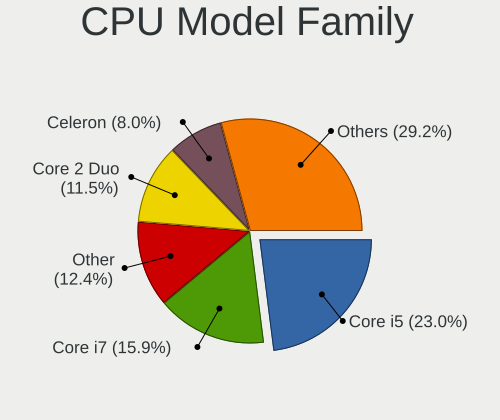

| Model                   | Notebooks | Percent |
|-------------------------|-----------|---------|
| Intel Core i5           | 26        | 23.01%  |
| Intel Core i7           | 18        | 15.93%  |
| Other                   | 14        | 12.39%  |
| Intel Core 2 Duo        | 13        | 11.5%   |
| Intel Celeron           | 9         | 7.96%   |
| AMD Ryzen 7             | 8         | 7.08%   |
| Intel Core i3           | 6         | 5.31%   |
| Intel Atom              | 4         | 3.54%   |
| AMD Ryzen 5             | 3         | 2.65%   |
| Intel Pentium           | 2         | 1.77%   |
| Intel Pentium Dual-Core | 1         | 0.88%   |
| Intel Pentium Dual      | 1         | 0.88%   |
| Intel Genuine           | 1         | 0.88%   |
| Intel Core i9           | 1         | 0.88%   |
| AMD Sempron             | 1         | 0.88%   |
| AMD Ryzen 9             | 1         | 0.88%   |
| AMD Ryzen 7 PRO         | 1         | 0.88%   |
| AMD E                   | 1         | 0.88%   |
| AMD Athlon              | 1         | 0.88%   |
| AMD A4                  | 1         | 0.88%   |

CPU Cores
---------

Number of processor cores

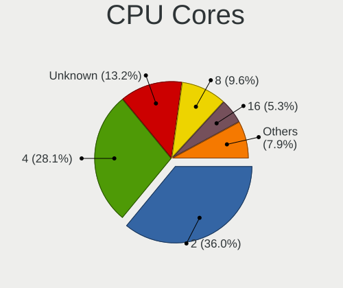

| Number  | Notebooks | Percent |
|---------|-----------|---------|
| 2       | 41        | 35.96%  |
| 4       | 32        | 28.07%  |
| Unknown | 15        | 13.16%  |
| 8       | 11        | 9.65%   |
| 16      | 6         | 5.26%   |
| 6       | 5         | 4.39%   |
| 12      | 2         | 1.75%   |
| 1       | 2         | 1.75%   |

CPU Sockets
-----------

Number of sockets

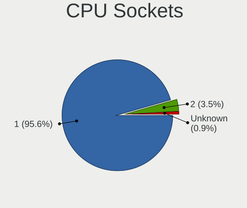

| Number  | Notebooks | Percent |
|---------|-----------|---------|
| 1       | 108       | 95.58%  |
| 2       | 4         | 3.54%   |
| Unknown | 1         | 0.88%   |

CPU Threads
-----------

Threads per core (Hyper-Threading)

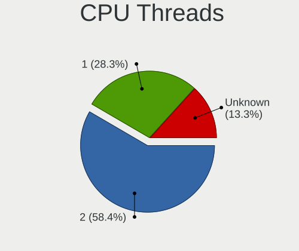

| Number  | Notebooks | Percent |
|---------|-----------|---------|
| 2       | 66        | 58.41%  |
| 1       | 32        | 28.32%  |
| Unknown | 15        | 13.27%  |

CPU Microarch
-------------

Microarchitecture

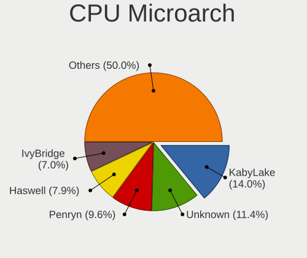

| Name            | Notebooks | Percent |
|-----------------|-----------|---------|
| KabyLake        | 16        | 14.04%  |
| Unknown         | 13        | 11.4%   |
| Penryn          | 11        | 9.65%   |
| Haswell         | 9         | 7.89%   |
| IvyBridge       | 8         | 7.02%   |
| Skylake         | 6         | 5.26%   |
| Silvermont      | 6         | 5.26%   |
| Core            | 6         | 5.26%   |
| TigerLake       | 5         | 4.39%   |
| SandyBridge     | 5         | 4.39%   |
| Zen 2           | 4         | 3.51%   |
| CometLake       | 4         | 3.51%   |
| Zen+            | 3         | 2.63%   |
| Zen 3           | 3         | 2.63%   |
| Westmere        | 3         | 2.63%   |
| Broadwell       | 3         | 2.63%   |
| Bonnell         | 3         | 2.63%   |
| P6              | 1         | 0.88%   |
| K8 & K10 hybrid | 1         | 0.88%   |
| IceLake         | 1         | 0.88%   |
| Goldmont plus   | 1         | 0.88%   |
| Excavator       | 1         | 0.88%   |
| Bobcat          | 1         | 0.88%   |

Graphics
--------

GPU Vendor
----------

Vendors of graphics cards

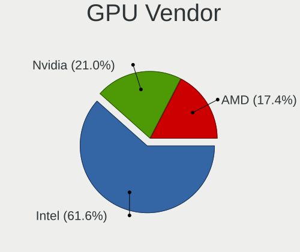

| Vendor | Notebooks | Percent |
|--------|-----------|---------|
| Intel  | 85        | 61.59%  |
| Nvidia | 29        | 21.01%  |
| AMD    | 24        | 17.39%  |

GPU Model
---------

Graphics card models

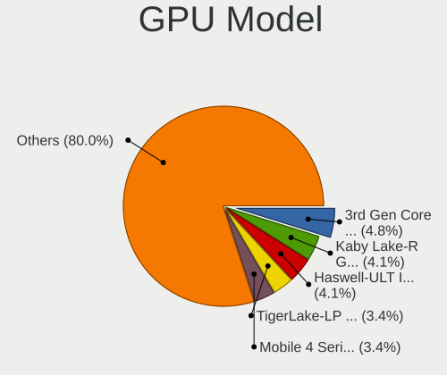

| Model                                                                                    | Notebooks | Percent |
|------------------------------------------------------------------------------------------|-----------|---------|
| Intel 3rd Gen Core processor Graphics Controller                                         | 7         | 4.83%   |
| Intel Kaby Lake-R GT2 [UHD Graphics 620]                                                 | 6         | 4.14%   |
| Intel Haswell-ULT Integrated Graphics Controller                                         | 6         | 4.14%   |
| Intel TigerLake-LP GT2 [Iris Xe Graphics]                                                | 5         | 3.45%   |
| Intel Mobile 4 Series Chipset Integrated Graphics Controller                             | 5         | 3.45%   |
| Intel 2nd Generation Core Processor Family Integrated Graphics Controller                | 5         | 3.45%   |
| Intel WhiskeyLake-U GT2 [UHD Graphics 620]                                               | 4         | 2.76%   |
| Intel Skylake-H GT2 [HD Graphics 530]                                                    | 4         | 2.76%   |
| Intel Raptor Lake-P [Iris Xe Graphics]                                                   | 4         | 2.76%   |
| Intel Mobile GM965/GL960 Integrated Graphics Controller (secondary)                      | 4         | 2.76%   |
| Intel Mobile GM965/GL960 Integrated Graphics Controller (primary)                        | 4         | 2.76%   |
| Intel Kaby Lake-U GT2 [HD Graphics 620]                                                  | 4         | 2.76%   |
| AMD Renoir [Radeon Vega Series / Radeon Vega Mobile Series]                              | 4         | 2.76%   |
| Nvidia TU117M [GeForce GTX 1650 Mobile / Max-Q]                                          | 3         | 2.07%   |
| Nvidia GM107GLM [Quadro M1000M]                                                          | 3         | 2.07%   |
| Intel Atom/Celeron/Pentium Processor x5-E8000/J3xxx/N3xxx Integrated Graphics Controller | 3         | 2.07%   |
| Intel Atom Processor Z36xxx/Z37xxx Series Graphics & Display                             | 3         | 2.07%   |
| Intel 4th Gen Core Processor Integrated Graphics Controller                              | 3         | 2.07%   |
| AMD Picasso/Raven 2 [Radeon Vega Series / Radeon Vega Mobile Series]                     | 3         | 2.07%   |
| Nvidia GF119M [GeForce 610M]                                                             | 2         | 1.38%   |
| Nvidia GA106M [GeForce RTX 3060 Mobile / Max-Q]                                          | 2         | 1.38%   |
| Nvidia C79 [GeForce 9400M]                                                               | 2         | 1.38%   |
| Nvidia C79 [GeForce 9400M G]                                                             | 2         | 1.38%   |
| Intel Skylake-U GT2 [HD Graphics 520]                                                    | 2         | 1.38%   |
| Intel JasperLake [UHD Graphics]                                                          | 2         | 1.38%   |
| Intel Core Processor Integrated Graphics Controller                                      | 2         | 1.38%   |
| Intel CometLake-H GT2 [UHD Graphics]                                                     | 2         | 1.38%   |
| Intel Broadwell-U GT2 [HD Graphics 5500]                                                 | 2         | 1.38%   |
| AMD Seymour [Radeon HD 6400M/7400M Series]                                               | 2         | 1.38%   |
| AMD Rembrandt [Radeon 680M]                                                              | 2         | 1.38%   |
| AMD Lucienne                                                                             | 2         | 1.38%   |
| AMD Barcelo                                                                              | 2         | 1.38%   |
| Nvidia TU104M [GeForce RTX 2080 SUPER Mobile / Max-Q]                                    | 1         | 0.69%   |
| Nvidia TU104BM [GeForce RTX 2070 SUPER Mobile / Max-Q]                                   | 1         | 0.69%   |
| Nvidia GT218M [GeForce 310M]                                                             | 1         | 0.69%   |
| Nvidia GP107M [GeForce GTX 1050 Mobile]                                                  | 1         | 0.69%   |
| Nvidia GP107M [GeForce GTX 1050 3 GB Max-Q]                                              | 1         | 0.69%   |
| Nvidia GM107M [GeForce GTX 950M]                                                         | 1         | 0.69%   |
| Nvidia GK208BM [GeForce 920M]                                                            | 1         | 0.69%   |
| Nvidia GF108M [NVS 5400M]                                                                | 1         | 0.69%   |

GPU Combo
---------

Combinations of graphics cards

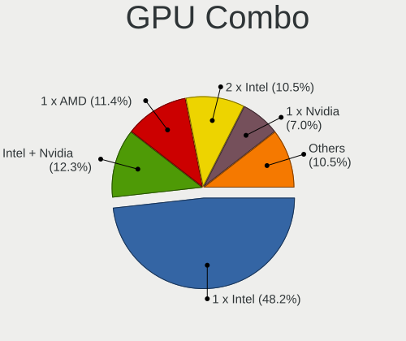

| Name           | Notebooks | Percent |
|----------------|-----------|---------|
| 1 x Intel      | 55        | 48.25%  |
| Intel + Nvidia | 14        | 12.28%  |
| 1 x AMD        | 13        | 11.4%   |
| 2 x Intel      | 12        | 10.53%  |
| 1 x Nvidia     | 8         | 7.02%   |
| AMD + Nvidia   | 6         | 5.26%   |
| Intel + AMD    | 5         | 4.39%   |
| 2 x Nvidia     | 1         | 0.88%   |

GPU Driver
----------

Free vs proprietary

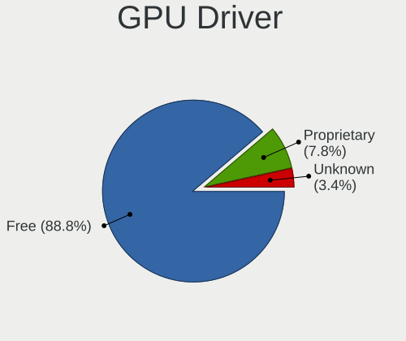

| Driver      | Notebooks | Percent |
|-------------|-----------|---------|
| Free        | 103       | 88.79%  |
| Proprietary | 9         | 7.76%   |
| Unknown     | 4         | 3.45%   |

GPU Memory
----------

Total video memory

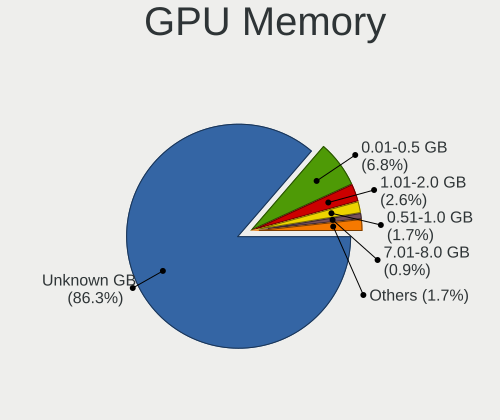

| Size in GB | Notebooks | Percent |
|------------|-----------|---------|
| Unknown    | 101       | 86.32%  |
| 0.01-0.5   | 8         | 6.84%   |
| 1.01-2.0   | 3         | 2.56%   |
| 0.51-1.0   | 2         | 1.71%   |
| 7.01-8.0   | 1         | 0.85%   |
| 5.01-6.0   | 1         | 0.85%   |
| 2.01-3.0   | 1         | 0.85%   |

Monitor
-------

Monitor Vendor
--------------

Monitor vendors

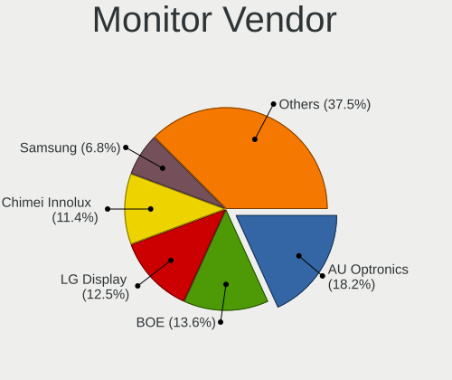

| Vendor                  | Notebooks | Percent |
|-------------------------|-----------|---------|
| AU Optronics            | 16        | 18.18%  |
| BOE                     | 12        | 13.64%  |
| LG Display              | 11        | 12.5%   |
| Chimei Innolux          | 10        | 11.36%  |
| Samsung Electronics     | 6         | 6.82%   |
| Sharp                   | 4         | 4.55%   |
| Chi Mei Optoelectronics | 4         | 4.55%   |
| Apple                   | 4         | 4.55%   |
| Lenovo                  | 3         | 3.41%   |
| BenQ                    | 3         | 3.41%   |
| PANDA                   | 2         | 2.27%   |
| LG Philips              | 2         | 2.27%   |
| Hewlett-Packard         | 2         | 2.27%   |
| AOC                     | 2         | 2.27%   |
| Mi                      | 1         | 1.14%   |
| LGD                     | 1         | 1.14%   |
| Lenovo Group Limited    | 1         | 1.14%   |
| HKC                     | 1         | 1.14%   |
| Goldstar                | 1         | 1.14%   |
| Fujitsu Siemens         | 1         | 1.14%   |
| Acer                    | 1         | 1.14%   |

Monitor Model
-------------

Monitor models

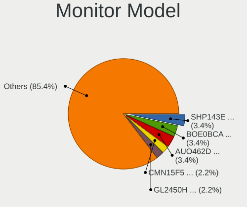

| Model                                                                 | Notebooks | Percent |
|-----------------------------------------------------------------------|-----------|---------|
| Sharp LCD Monitor SHP143E 3840x2160 350x190mm 15.7-inch               | 3         | 3.37%   |
| BOE LCD Monitor BOE0BCA 2256x1504 280x190mm 13.3-inch                 | 3         | 3.37%   |
| AU Optronics LCD Monitor AUO462D 1920x1080 290x170mm 13.2-inch        | 3         | 3.37%   |
| Chimei Innolux LCD Monitor CMN15F5 1920x1080 340x190mm 15.3-inch      | 2         | 2.25%   |
| BenQ GL2450H BNQ78A7 1920x1080 530x300mm 24.0-inch                    | 2         | 2.25%   |
| AU Optronics LCD Monitor AUO45EC 1366x768 340x190mm 15.3-inch         | 2         | 2.25%   |
| AOC 2050W AOC2050 1600x900 430x240mm 19.4-inch                        | 2         | 2.25%   |
| Sharp LCD Monitor SHP144D 3840x2160 280x160mm 12.7-inch               | 1         | 1.12%   |
| Samsung Electronics LCD Monitor SEC4251 1366x768 340x190mm 15.3-inch  | 1         | 1.12%   |
| Samsung Electronics LCD Monitor SEC3633 1280x800 330x210mm 15.4-inch  | 1         | 1.12%   |
| Samsung Electronics LCD Monitor SEC3152 1024x600 220x130mm 10.1-inch  | 1         | 1.12%   |
| Samsung Electronics LCD Monitor SDC4C51 1366x768 340x190mm 15.3-inch  | 1         | 1.12%   |
| Samsung Electronics LCD Monitor SDC4852 1366x768 340x190mm 15.3-inch  | 1         | 1.12%   |
| Samsung Electronics LCD Monitor SAM0902 1920x1080 700x390mm 31.5-inch | 1         | 1.12%   |
| PANDA LCD Monitor NCP004D 1920x1080 340x190mm 15.3-inch               | 1         | 1.12%   |
| PANDA LCD Monitor NCP002D 1920x1080 340x190mm 15.3-inch               | 1         | 1.12%   |
| Mi 27 NFGL XMIB004 1920x1080 600x330mm 27.0-inch                      | 1         | 1.12%   |
| LGD LCD Monitor 5760x1080                                             | 1         | 1.12%   |
| LG Philips LCD Monitor LPLDB00 1280x800 330x210mm 15.4-inch           | 1         | 1.12%   |
| LG Philips LCD Monitor LPL0120 1280x800 330x210mm 15.4-inch           | 1         | 1.12%   |
| LG Display LCD Monitor LGD0773 1920x1200 340x220mm 15.9-inch          | 1         | 1.12%   |
| LG Display LCD Monitor LGD070B 1920x1080 310x170mm 13.9-inch          | 1         | 1.12%   |
| LG Display LCD Monitor LGD066E 1920x1080 340x190mm 15.3-inch          | 1         | 1.12%   |
| LG Display LCD Monitor LGD05E5 1920x1080 340x190mm 15.3-inch          | 1         | 1.12%   |
| LG Display LCD Monitor LGD05D5 1920x1080 340x190mm 15.3-inch          | 1         | 1.12%   |
| LG Display LCD Monitor LGD0532 1920x1080 340x190mm 15.3-inch          | 1         | 1.12%   |
| LG Display LCD Monitor LGD04E2 1366x768 340x190mm 15.3-inch           | 1         | 1.12%   |
| LG Display LCD Monitor LGD042D 1920x1080 290x170mm 13.2-inch          | 1         | 1.12%   |
| LG Display LCD Monitor LGD032C 1920x1080 340x190mm 15.3-inch          | 1         | 1.12%   |
| LG Display LCD Monitor LGD0226 1600x900 380x210mm 17.1-inch           | 1         | 1.12%   |
| LG Display LCD Monitor LGD01F5 1280x800 300x190mm 14.0-inch           | 1         | 1.12%   |
| Lenovo LCD Monitor LEN4031 1280x800 300x190mm 14.0-inch               | 1         | 1.12%   |
| Lenovo LCD Monitor LEN4011 1280x800 260x160mm 12.0-inch               | 1         | 1.12%   |
| Lenovo LCD Monitor LEN4010 1280x800 260x160mm 12.0-inch               | 1         | 1.12%   |
| Lenovo Group Limited LCD Monitor 1920x1080                            | 1         | 1.12%   |
| HKC S01 HKC2113 1920x1080 480x260mm 21.5-inch                         | 1         | 1.12%   |
| Hewlett-Packard 24xw HWP3256 1920x1080 530x300mm 24.0-inch            | 1         | 1.12%   |
| Hewlett-Packard 22er HWP331B 1920x1080 500x300mm 23.0-inch            | 1         | 1.12%   |
| Goldstar LG FHD GSM5C66 1920x1080 530x300mm 24.0-inch                 | 1         | 1.12%   |
| Fujitsu Siemens E19-5 FUS07CD 1280x1024 380x300mm 19.1-inch           | 1         | 1.12%   |

Monitor Resolution
------------------

Monitor screen resolution

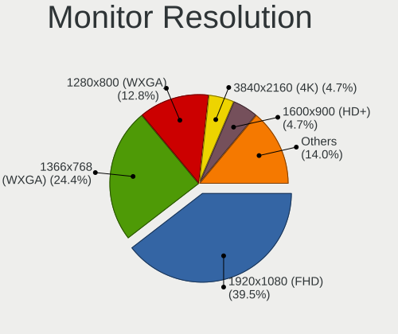

| Resolution        | Notebooks | Percent |
|-------------------|-----------|---------|
| 1920x1080 (FHD)   | 34        | 39.53%  |
| 1366x768 (WXGA)   | 21        | 24.42%  |
| 1280x800 (WXGA)   | 11        | 12.79%  |
| 3840x2160 (4K)    | 4         | 4.65%   |
| 1600x900 (HD+)    | 4         | 4.65%   |
| 2256x1504         | 3         | 3.49%   |
| 1920x1200 (WUXGA) | 2         | 2.33%   |
| 1024x600          | 2         | 2.33%   |
| 5760x1080         | 1         | 1.16%   |
| 2560x1440 (QHD)   | 1         | 1.16%   |
| 1440x900 (WXGA+)  | 1         | 1.16%   |
| 1280x1024 (SXGA)  | 1         | 1.16%   |
| Unknown           | 1         | 1.16%   |

Monitor Diagonal
----------------

Diagonal size in inches

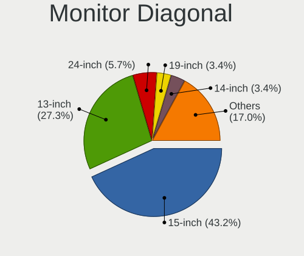

| Inches  | Notebooks | Percent |
|---------|-----------|---------|
| 15      | 38        | 43.18%  |
| 13      | 24        | 27.27%  |
| 24      | 5         | 5.68%   |
| 19      | 3         | 3.41%   |
| 14      | 3         | 3.41%   |
| 12      | 3         | 3.41%   |
| 27      | 2         | 2.27%   |
| 11      | 2         | 2.27%   |
| Unknown | 2         | 2.27%   |
| 40      | 1         | 1.14%   |
| 23      | 1         | 1.14%   |
| 21      | 1         | 1.14%   |
| 17      | 1         | 1.14%   |
| 10      | 1         | 1.14%   |
| 9       | 1         | 1.14%   |

Monitor Width
-------------

Physical width

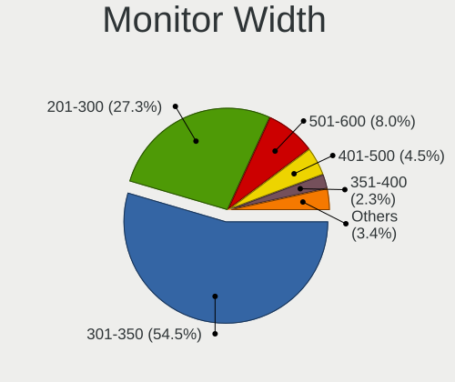

| Width in mm | Notebooks | Percent |
|-------------|-----------|---------|
| 301-350     | 48        | 54.55%  |
| 201-300     | 24        | 27.27%  |
| 501-600     | 7         | 7.95%   |
| 401-500     | 4         | 4.55%   |
| 351-400     | 2         | 2.27%   |
| Unknown     | 2         | 2.27%   |
| 801-900     | 1         | 1.14%   |

Aspect Ratio
------------

Proportional relationship between the width and the height

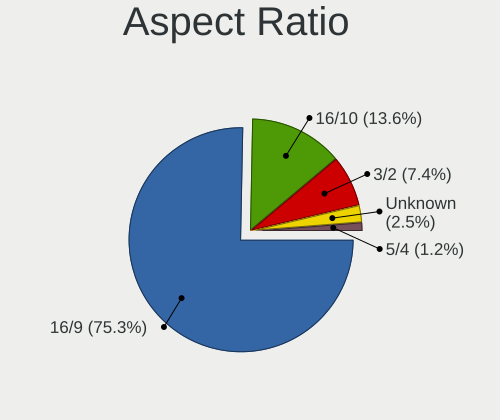

| Ratio   | Notebooks | Percent |
|---------|-----------|---------|
| 16/9    | 61        | 75.31%  |
| 16/10   | 11        | 13.58%  |
| 3/2     | 6         | 7.41%   |
| Unknown | 2         | 2.47%   |
| 5/4     | 1         | 1.23%   |

Monitor Area
------------

Area in inch²

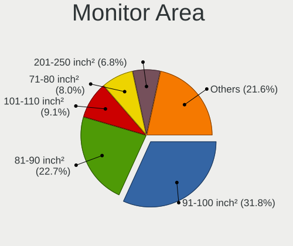

| Area in inch² | Notebooks | Percent |
|----------------|-----------|---------|
| 91-100         | 28        | 31.82%  |
| 81-90          | 20        | 22.73%  |
| 101-110        | 8         | 9.09%   |
| 71-80          | 7         | 7.95%   |
| 201-250        | 6         | 6.82%   |
| 151-200        | 4         | 4.55%   |
| 61-70          | 3         | 3.41%   |
| 51-60          | 2         | 2.27%   |
| 41-50          | 2         | 2.27%   |
| 301-350        | 2         | 2.27%   |
| 111-120        | 2         | 2.27%   |
| Unknown        | 2         | 2.27%   |
| 121-130        | 1         | 1.14%   |
| 501-1000       | 1         | 1.14%   |

Pixel Density
-------------

Pixels per inch

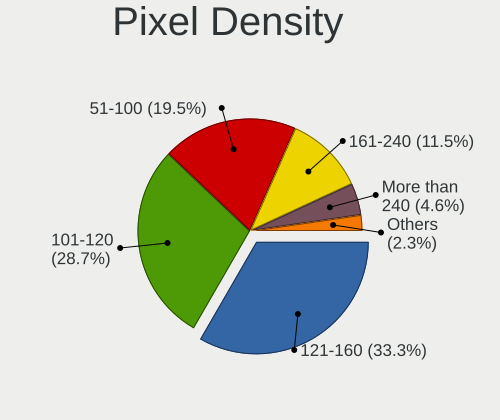

| Density       | Notebooks | Percent |
|---------------|-----------|---------|
| 121-160       | 29        | 33.33%  |
| 101-120       | 25        | 28.74%  |
| 51-100        | 17        | 19.54%  |
| 161-240       | 10        | 11.49%  |
| More than 240 | 4         | 4.6%    |
| Unknown       | 2         | 2.3%    |

Multiple Monitors
-----------------

Total monitors connected

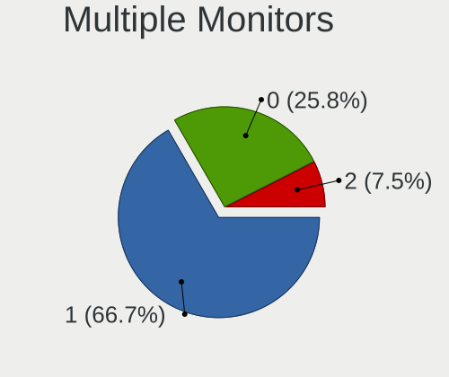

| Total | Notebooks | Percent |
|-------|-----------|---------|
| 1     | 80        | 66.67%  |
| 0     | 31        | 25.83%  |
| 2     | 9         | 7.5%    |

Network
-------

Net Controller Vendor
---------------------

Controller vendors

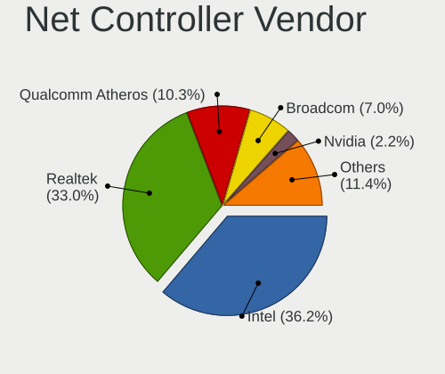

| Vendor                            | Notebooks | Percent |
|-----------------------------------|-----------|---------|
| Intel                             | 67        | 36.22%  |
| Realtek Semiconductor             | 61        | 32.97%  |
| Qualcomm Atheros                  | 19        | 10.27%  |
| Broadcom                          | 13        | 7.03%   |
| Nvidia                            | 4         | 2.16%   |
| MediaTek                          | 4         | 2.16%   |
| TP-Link                           | 2         | 1.08%   |
| Sierra Wireless                   | 2         | 1.08%   |
| Ralink Technology                 | 2         | 1.08%   |
| Ralink                            | 2         | 1.08%   |
| Marvell Technology Group          | 2         | 1.08%   |
| Ericsson Business Mobile Networks | 2         | 1.08%   |
| D-Link System                     | 2         | 1.08%   |
| Xiaomi                            | 1         | 0.54%   |
| IMC Networks                      | 1         | 0.54%   |
| Huawei Technologies               | 1         | 0.54%   |

Net Controller Model
--------------------

Controller models

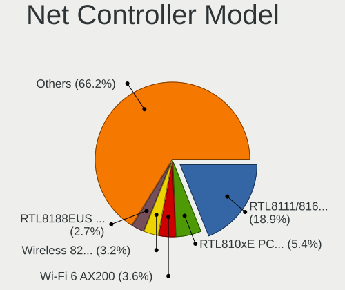

| Model                                                                      | Notebooks | Percent |
|----------------------------------------------------------------------------|-----------|---------|
| Realtek RTL8111/8168/8211/8411 PCI Express Gigabit Ethernet Controller     | 42        | 18.92%  |
| Realtek RTL810xE PCI Express Fast Ethernet controller                      | 12        | 5.41%   |
| Intel Wi-Fi 6 AX200                                                        | 8         | 3.6%    |
| Intel Wireless 8265 / 8275                                                 | 7         | 3.15%   |
| Realtek RTL8188EUS 802.11n Wireless Network Adapter                        | 6         | 2.7%    |
| Intel Wireless 7265                                                        | 6         | 2.7%    |
| Intel Ethernet Connection (4) I219-LM                                      | 5         | 2.25%   |
| Nvidia MCP79 Ethernet                                                      | 4         | 1.8%    |
| Intel Wireless 7260                                                        | 4         | 1.8%    |
| Intel Wi-Fi 6E(802.11ax) AX210/AX1675* 2x2 [Typhoon Peak]                  | 4         | 1.8%    |
| Intel Wi-Fi 6 AX201                                                        | 4         | 1.8%    |
| Intel PRO/Wireless 3945ABG [Golan] Network Connection                      | 4         | 1.8%    |
| Realtek RTL8822CE 802.11ac PCIe Wireless Network Adapter                   | 3         | 1.35%   |
| Realtek RTL8821CE 802.11ac PCIe Wireless Network Adapter                   | 3         | 1.35%   |
| Qualcomm Atheros AR9485 Wireless Network Adapter                           | 3         | 1.35%   |
| Qualcomm Atheros AR9462 Wireless Network Adapter                           | 3         | 1.35%   |
| Qualcomm Atheros AR928X Wireless Network Adapter (PCI-Express)             | 3         | 1.35%   |
| Qualcomm Atheros AR9285 Wireless Network Adapter (PCI-Express)             | 3         | 1.35%   |
| MediaTek MT7921 802.11ax PCIe Wireless Network Adapter [Filogic 330]       | 3         | 1.35%   |
| Intel Ethernet Connection I217-LM                                          | 3         | 1.35%   |
| Intel 82567LM Gigabit Network Connection                                   | 3         | 1.35%   |
| Broadcom BCM4322 802.11a/b/g/n Wireless LAN Controller                     | 3         | 1.35%   |
| Broadcom BCM4313 802.11bgn Wireless Network Adapter                        | 3         | 1.35%   |
| Sierra Wireless EM7345 4G LTE                                              | 2         | 0.9%    |
| Realtek RTL8822BE 802.11a/b/g/n/ac WiFi adapter                            | 2         | 0.9%    |
| Realtek RTL8723BE PCIe Wireless Network Adapter                            | 2         | 0.9%    |
| Ralink RT3290 Wireless 802.11n 1T/1R PCIe                                  | 2         | 0.9%    |
| Intel Wireless 8260                                                        | 2         | 0.9%    |
| Intel Wireless 3160                                                        | 2         | 0.9%    |
| Intel WiFi Link 5100                                                       | 2         | 0.9%    |
| Intel Comet Lake PCH-LP CNVi WiFi                                          | 2         | 0.9%    |
| Intel Comet Lake PCH CNVi WiFi                                             | 2         | 0.9%    |
| Intel Centrino Ultimate-N 6300                                             | 2         | 0.9%    |
| Intel Centrino Advanced-N 6235                                             | 2         | 0.9%    |
| Intel 82579LM Gigabit Network Connection (Lewisville)                      | 2         | 0.9%    |
| D-Link System AirPlus G DWL-G122 Wireless Adapter(rev.C1) [Ralink RT2571W] | 2         | 0.9%    |
| Xiaomi Mi/Redmi series (RNDIS)                                             | 1         | 0.45%   |
| TP-Link TL-WN722N v2/v3 [Realtek RTL8188EUS]                               | 1         | 0.45%   |
| TP-Link AC600 wireless Realtek RTL8811AU [Archer T2U Nano]                 | 1         | 0.45%   |
| Realtek RTL8852BE PCIe 802.11ax Wireless Network Controller                | 1         | 0.45%   |

Wireless Vendor
---------------

Wireless vendors

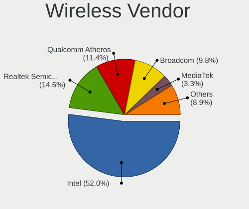

| Vendor                | Notebooks | Percent |
|-----------------------|-----------|---------|
| Intel                 | 64        | 52.03%  |
| Realtek Semiconductor | 18        | 14.63%  |
| Qualcomm Atheros      | 14        | 11.38%  |
| Broadcom              | 12        | 9.76%   |
| MediaTek              | 4         | 3.25%   |
| TP-Link               | 2         | 1.63%   |
| Sierra Wireless       | 2         | 1.63%   |
| Ralink Technology     | 2         | 1.63%   |
| Ralink                | 2         | 1.63%   |
| D-Link System         | 2         | 1.63%   |
| IMC Networks          | 1         | 0.81%   |

Wireless Model
--------------

Wireless models

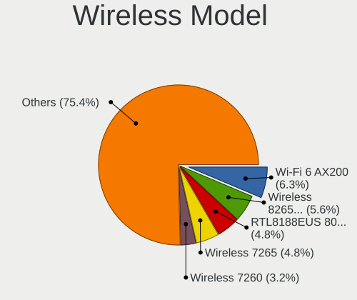

| Model                                                                      | Notebooks | Percent |
|----------------------------------------------------------------------------|-----------|---------|
| Intel Wi-Fi 6 AX200                                                        | 8         | 6.35%   |
| Intel Wireless 8265 / 8275                                                 | 7         | 5.56%   |
| Realtek RTL8188EUS 802.11n Wireless Network Adapter                        | 6         | 4.76%   |
| Intel Wireless 7265                                                        | 6         | 4.76%   |
| Intel Wireless 7260                                                        | 4         | 3.17%   |
| Intel Wi-Fi 6E(802.11ax) AX210/AX1675* 2x2 [Typhoon Peak]                  | 4         | 3.17%   |
| Intel Wi-Fi 6 AX201                                                        | 4         | 3.17%   |
| Intel PRO/Wireless 3945ABG [Golan] Network Connection                      | 4         | 3.17%   |
| Realtek RTL8822CE 802.11ac PCIe Wireless Network Adapter                   | 3         | 2.38%   |
| Realtek RTL8821CE 802.11ac PCIe Wireless Network Adapter                   | 3         | 2.38%   |
| Qualcomm Atheros AR9485 Wireless Network Adapter                           | 3         | 2.38%   |
| Qualcomm Atheros AR9462 Wireless Network Adapter                           | 3         | 2.38%   |
| Qualcomm Atheros AR928X Wireless Network Adapter (PCI-Express)             | 3         | 2.38%   |
| Qualcomm Atheros AR9285 Wireless Network Adapter (PCI-Express)             | 3         | 2.38%   |
| MediaTek MT7921 802.11ax PCIe Wireless Network Adapter [Filogic 330]       | 3         | 2.38%   |
| Broadcom BCM4322 802.11a/b/g/n Wireless LAN Controller                     | 3         | 2.38%   |
| Broadcom BCM4313 802.11bgn Wireless Network Adapter                        | 3         | 2.38%   |
| Sierra Wireless EM7345 4G LTE                                              | 2         | 1.59%   |
| Realtek RTL8822BE 802.11a/b/g/n/ac WiFi adapter                            | 2         | 1.59%   |
| Realtek RTL8723BE PCIe Wireless Network Adapter                            | 2         | 1.59%   |
| Ralink RT3290 Wireless 802.11n 1T/1R PCIe                                  | 2         | 1.59%   |
| Intel Wireless 8260                                                        | 2         | 1.59%   |
| Intel Wireless 3160                                                        | 2         | 1.59%   |
| Intel WiFi Link 5100                                                       | 2         | 1.59%   |
| Intel Comet Lake PCH-LP CNVi WiFi                                          | 2         | 1.59%   |
| Intel Comet Lake PCH CNVi WiFi                                             | 2         | 1.59%   |
| Intel Centrino Ultimate-N 6300                                             | 2         | 1.59%   |
| Intel Centrino Advanced-N 6235                                             | 2         | 1.59%   |
| D-Link System AirPlus G DWL-G122 Wireless Adapter(rev.C1) [Ralink RT2571W] | 2         | 1.59%   |
| TP-Link TL-WN722N v2/v3 [Realtek RTL8188EUS]                               | 1         | 0.79%   |
| TP-Link AC600 wireless Realtek RTL8811AU [Archer T2U Nano]                 | 1         | 0.79%   |
| Realtek RTL8852BE PCIe 802.11ax Wireless Network Controller                | 1         | 0.79%   |
| Realtek RTL8723DE Wireless Network Adapter                                 | 1         | 0.79%   |
| Realtek RTL8191SEvB Wireless LAN Controller                                | 1         | 0.79%   |
| Realtek RTL8188EE Wireless Network Adapter                                 | 1         | 0.79%   |
| Realtek Realtek Bluetooth 4.2 Adapter                                      | 1         | 0.79%   |
| Ralink RT5370 Wireless Adapter                                             | 1         | 0.79%   |
| Ralink MT7601U Wireless Adapter                                            | 1         | 0.79%   |
| Qualcomm Atheros QCA9565 / AR9565 Wireless Network Adapter                 | 1         | 0.79%   |
| Qualcomm Atheros QCA9377 802.11ac Wireless Network Adapter                 | 1         | 0.79%   |

Ethernet Vendor
---------------

Ethernet vendors

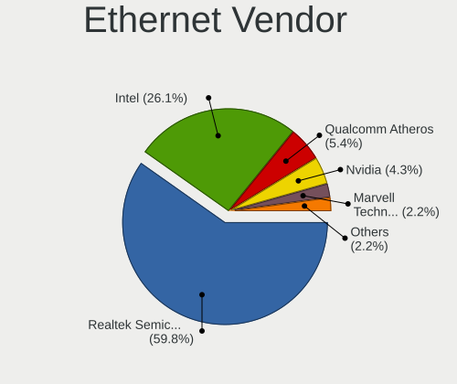

| Vendor                   | Notebooks | Percent |
|--------------------------|-----------|---------|
| Realtek Semiconductor    | 55        | 59.78%  |
| Intel                    | 24        | 26.09%  |
| Qualcomm Atheros         | 5         | 5.43%   |
| Nvidia                   | 4         | 4.35%   |
| Marvell Technology Group | 2         | 2.17%   |
| Xiaomi                   | 1         | 1.09%   |
| Broadcom                 | 1         | 1.09%   |

Ethernet Model
--------------

Ethernet models

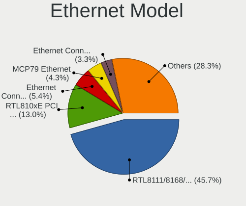

| Model                                                                  | Notebooks | Percent |
|------------------------------------------------------------------------|-----------|---------|
| Realtek RTL8111/8168/8211/8411 PCI Express Gigabit Ethernet Controller | 42        | 45.65%  |
| Realtek RTL810xE PCI Express Fast Ethernet controller                  | 12        | 13.04%  |
| Intel Ethernet Connection (4) I219-LM                                  | 5         | 5.43%   |
| Nvidia MCP79 Ethernet                                                  | 4         | 4.35%   |
| Intel Ethernet Connection I217-LM                                      | 3         | 3.26%   |
| Intel 82567LM Gigabit Network Connection                               | 3         | 3.26%   |
| Intel 82579LM Gigabit Network Connection (Lewisville)                  | 2         | 2.17%   |
| Xiaomi Mi/Redmi series (RNDIS)                                         | 1         | 1.09%   |
| Realtek Killer E2600 GbE Controller                                    | 1         | 1.09%   |
| Qualcomm Atheros Killer E2500 Gigabit Ethernet Controller              | 1         | 1.09%   |
| Qualcomm Atheros Attansic L1 Gigabit Ethernet                          | 1         | 1.09%   |
| Qualcomm Atheros AR8152 v2.0 Fast Ethernet                             | 1         | 1.09%   |
| Qualcomm Atheros AR8132 Fast Ethernet                                  | 1         | 1.09%   |
| Qualcomm Atheros AR8131 Gigabit Ethernet                               | 1         | 1.09%   |
| Marvell Group 88E8058 PCI-E Gigabit Ethernet Controller                | 1         | 1.09%   |
| Marvell Group 88E8042 PCI-E Fast Ethernet Controller                   | 1         | 1.09%   |
| Intel Killer E3100X 2.5 Gigabit Ethernet Controller                    | 1         | 1.09%   |
| Intel I211 Gigabit Network Connection                                  | 1         | 1.09%   |
| Intel I210 Gigabit Network Connection                                  | 1         | 1.09%   |
| Intel Ethernet Connection (6) I219-V                                   | 1         | 1.09%   |
| Intel Ethernet Connection (6) I219-LM                                  | 1         | 1.09%   |
| Intel Ethernet Connection (4) I219-V                                   | 1         | 1.09%   |
| Intel Ethernet Connection (3) I218-V                                   | 1         | 1.09%   |
| Intel Ethernet Connection (13) I219-V                                  | 1         | 1.09%   |
| Intel 82566MM Gigabit Network Connection                               | 1         | 1.09%   |
| Intel 82566MC Gigabit Network Connection                               | 1         | 1.09%   |
| Intel 82562GT 10/100 Network Connection                                | 1         | 1.09%   |
| Broadcom NetLink BCM5784M Gigabit Ethernet PCIe                        | 1         | 1.09%   |

Net Controller Kind
-------------------

Ethernet, WiFi or modem

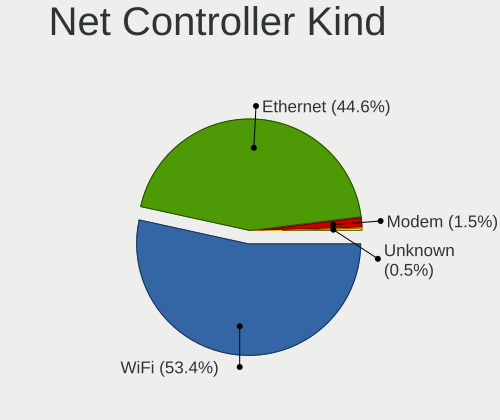

| Kind     | Notebooks | Percent |
|----------|-----------|---------|
| WiFi     | 109       | 53.43%  |
| Ethernet | 91        | 44.61%  |
| Modem    | 3         | 1.47%   |
| Unknown  | 1         | 0.49%   |

Used Controller
---------------

Currently used network controller

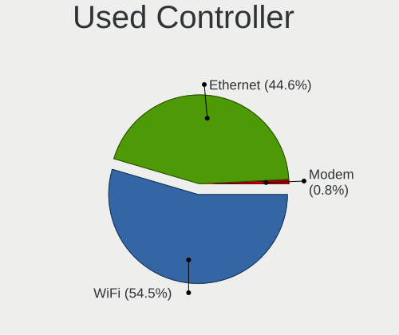

| Kind     | Notebooks | Percent |
|----------|-----------|---------|
| WiFi     | 66        | 54.55%  |
| Ethernet | 54        | 44.63%  |
| Modem    | 1         | 0.83%   |

NICs
----

Total network controllers on board

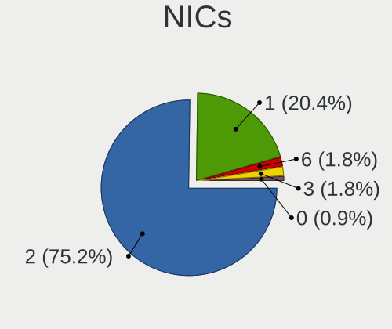

| Total | Notebooks | Percent |
|-------|-----------|---------|
| 2     | 85        | 75.22%  |
| 1     | 23        | 20.35%  |
| 6     | 2         | 1.77%   |
| 3     | 2         | 1.77%   |
| 0     | 1         | 0.88%   |

IPv6
----

IPv6 vs IPv4

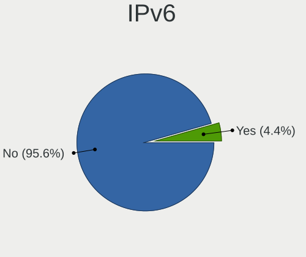

| Used | Notebooks | Percent |
|------|-----------|---------|
| No   | 108       | 95.58%  |
| Yes  | 5         | 4.42%   |

Bluetooth
---------

Bluetooth Vendor
----------------

Controller vendors

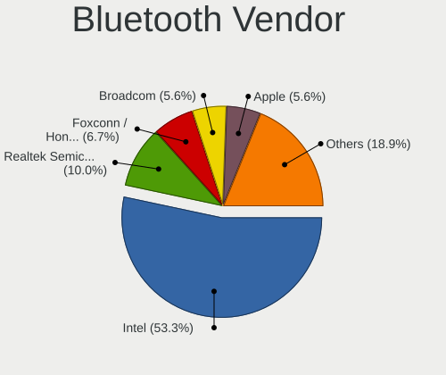

| Vendor                          | Notebooks | Percent |
|---------------------------------|-----------|---------|
| Intel                           | 48        | 53.33%  |
| Realtek Semiconductor           | 9         | 10%     |
| Foxconn / Hon Hai               | 6         | 6.67%   |
| Broadcom                        | 5         | 5.56%   |
| Apple                           | 5         | 5.56%   |
| Hewlett-Packard                 | 4         | 4.44%   |
| Qualcomm Atheros Communications | 3         | 3.33%   |
| IMC Networks                    | 3         | 3.33%   |
| Ralink                          | 2         | 2.22%   |
| Cambridge Silicon Radio         | 2         | 2.22%   |
| Lite-On Technology              | 1         | 1.11%   |
| Chicony Electronics             | 1         | 1.11%   |
| ASUSTek Computer                | 1         | 1.11%   |

Bluetooth Model
---------------

Controller models

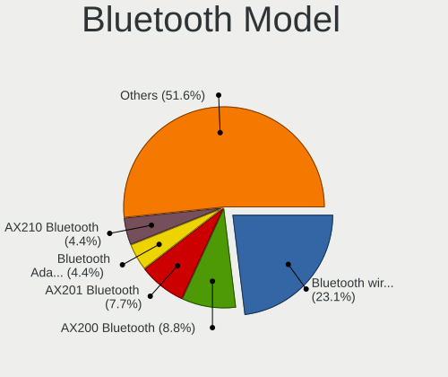

| Model                                                       | Notebooks | Percent |
|-------------------------------------------------------------|-----------|---------|
| Intel Bluetooth wireless interface                          | 21        | 23.08%  |
| Intel AX200 Bluetooth                                       | 8         | 8.79%   |
| Intel AX201 Bluetooth                                       | 7         | 7.69%   |
| Realtek Bluetooth Adapter                                   | 4         | 4.4%    |
| Intel AX210 Bluetooth                                       | 4         | 4.4%    |
| HP Bluetooth 2.0 Interface [Broadcom BCM2045]               | 4         | 4.4%    |
| Intel Bluetooth 9460/9560 Jefferson Peak (JfP)              | 3         | 3.3%    |
| Realtek Bluetooth 4.2 Adapter                               | 2         | 2.2%    |
| Ralink RT3290 Bluetooth                                     | 2         | 2.2%    |
| Intel Centrino Bluetooth Wireless Transceiver               | 2         | 2.2%    |
| Intel AX211 Bluetooth                                       | 2         | 2.2%    |
| Foxconn / Hon Hai MediaTek Bluetooth Adapter                | 2         | 2.2%    |
| Foxconn / Hon Hai Bluetooth USB Module                      | 2         | 2.2%    |
| Cambridge Silicon Radio Bluetooth Dongle (HCI mode)         | 2         | 2.2%    |
| Broadcom BCM20702 Bluetooth 4.0 [ThinkPad]                  | 2         | 2.2%    |
| Apple Built-in iSight (no firmware loaded)                  | 2         | 2.2%    |
| Apple Bluetooth Host Controller                             | 2         | 2.2%    |
| Realtek RTL8822BE Bluetooth 4.2 Adapter                     | 1         | 1.1%    |
| Realtek  Bluetooth 4.2 Adapter                              | 1         | 1.1%    |
| Realtek Bluetooth 4.0 Adapter                               | 1         | 1.1%    |
| Qualcomm Atheros QCA9377 Bluetooth 4.1                      | 1         | 1.1%    |
| Qualcomm Atheros AR9462 Bluetooth                           | 1         | 1.1%    |
| Qualcomm Atheros AR3012 Bluetooth 4.0                       | 1         | 1.1%    |
| Lite-On Bluetooth USB Module                                | 1         | 1.1%    |
| Intel Wireless-AC 3168 Bluetooth                            | 1         | 1.1%    |
| IMC Networks Realtek Bluetooth Adapter                      | 1         | 1.1%    |
| IMC Networks MediaTek Bluetooth Adapter                     | 1         | 1.1%    |
| IMC Networks Bluetooth module                               | 1         | 1.1%    |
| Foxconn / Hon Hai RZ616 Bluetooth Adapter                   | 1         | 1.1%    |
| Foxconn / Hon Hai Qualcomm Atheros AR3012 Bluetooth Adapter | 1         | 1.1%    |
| Chicony Bluetooth (RTL8723BE)                               | 1         | 1.1%    |
| Broadcom BCM43142A0 Bluetooth 4.0                           | 1         | 1.1%    |
| Broadcom BCM2045B (BDC-2.1) [Bluetooth Controller]          | 1         | 1.1%    |
| Broadcom BCM2045B (BDC-2) [Bluetooth Controller]            | 1         | 1.1%    |
| ASUS BT-270 Bluetooth Adapter                               | 1         | 1.1%    |
| Apple Built-in Bluetooth 2.0+EDR HCI                        | 1         | 1.1%    |
| Apple Broadcom Built-in Bluetooth                           | 1         | 1.1%    |

Sound
-----

Sound Vendor
------------

Sound card vendors

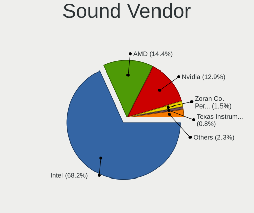

| Vendor                                       | Notebooks | Percent |
|----------------------------------------------|-----------|---------|
| Intel                                        | 90        | 68.18%  |
| AMD                                          | 19        | 14.39%  |
| Nvidia                                       | 17        | 12.88%  |
| Zoran Co. Personal Media Division (Nogatech) | 2         | 1.52%   |
| Texas Instruments                            | 1         | 0.76%   |
| Realtek Semiconductor                        | 1         | 0.76%   |
| Generalplus Technology                       | 1         | 0.76%   |
| C-Media Electronics                          | 1         | 0.76%   |

Sound Model
-----------

Sound card models

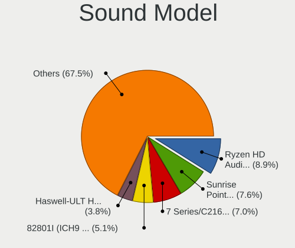

| Model                                                                                             | Notebooks | Percent |
|---------------------------------------------------------------------------------------------------|-----------|---------|
| AMD Ryzen HD Audio Controller                                                                     | 14        | 8.92%   |
| Intel Sunrise Point-LP HD Audio                                                                   | 12        | 7.64%   |
| Intel 7 Series/C216 Chipset Family High Definition Audio Controller                               | 11        | 7.01%   |
| Intel 82801I (ICH9 Family) HD Audio Controller                                                    | 8         | 5.1%    |
| Intel Haswell-ULT HD Audio Controller                                                             | 6         | 3.82%   |
| Intel 8 Series HD Audio Controller                                                                | 6         | 3.82%   |
| AMD Renoir/Cezanne HDMI/DP Audio Controller                                                       | 6         | 3.82%   |
| Nvidia MCP79 High Definition Audio                                                                | 5         | 3.18%   |
| Intel Tiger Lake-LP Smart Sound Technology Audio Controller                                       | 5         | 3.18%   |
| Intel Raptor Lake-P/U/H cAVS                                                                      | 5         | 3.18%   |
| Intel 82801H (ICH8 Family) HD Audio Controller                                                    | 5         | 3.18%   |
| Intel Cannon Point-LP High Definition Audio Controller                                            | 4         | 2.55%   |
| Intel 100 Series/C230 Series Chipset Family HD Audio Controller                                   | 4         | 2.55%   |
| Intel Xeon E3-1200 v3/4th Gen Core Processor HD Audio Controller                                  | 3         | 1.91%   |
| Intel Wildcat Point-LP High Definition Audio Controller                                           | 3         | 1.91%   |
| Intel NM10/ICH7 Family High Definition Audio Controller                                           | 3         | 1.91%   |
| Intel Comet Lake PCH cAVS                                                                         | 3         | 1.91%   |
| Intel Broadwell-U Audio Controller                                                                | 3         | 1.91%   |
| Intel Atom Processor Z36xxx/Z37xxx Series High Definition Audio Controller                        | 3         | 1.91%   |
| Intel 8 Series/C220 Series Chipset High Definition Audio Controller                               | 3         | 1.91%   |
| Intel 5 Series/3400 Series Chipset High Definition Audio                                          | 3         | 1.91%   |
| Zoran Co. Personal Media Division (Nogatech) USB Audio and HID                                    | 2         | 1.27%   |
| Nvidia TU107 GeForce GTX 1650 High Definition Audio Controller                                    | 2         | 1.27%   |
| Nvidia TU104 HD Audio Controller                                                                  | 2         | 1.27%   |
| Nvidia GA106 High Definition Audio Controller                                                     | 2         | 1.27%   |
| Intel Jasper Lake HD Audio                                                                        | 2         | 1.27%   |
| Intel Comet Lake PCH-LP cAVS                                                                      | 2         | 1.27%   |
| Intel Atom/Celeron/Pentium Processor x5-E8000/J3xxx/N3xxx Series High Definition Audio Controller | 2         | 1.27%   |
| Intel 6 Series/C200 Series Chipset Family High Definition Audio Controller                        | 2         | 1.27%   |
| AMD SBx00 Azalia (Intel HDA)                                                                      | 2         | 1.27%   |
| AMD Raven/Raven2/Fenghuang HDMI/DP Audio Controller                                               | 2         | 1.27%   |
| AMD Radeon High Definition Audio Controller                                                       | 2         | 1.27%   |
| Texas Instruments PCM2902 Audio Codec                                                             | 1         | 0.64%   |
| Realtek Semiconductor USB Audio                                                                   | 1         | 0.64%   |
| Nvidia High Definition Audio Controller                                                           | 1         | 0.64%   |
| Nvidia GP107GL High Definition Audio Controller                                                   | 1         | 0.64%   |
| Nvidia GF108 High Definition Audio Controller                                                     | 1         | 0.64%   |
| Nvidia GA107 High Definition Audio Controller                                                     | 1         | 0.64%   |
| Nvidia GA104 High Definition Audio Controller                                                     | 1         | 0.64%   |
| Nvidia AD104 High Definition Audio Controller                                                     | 1         | 0.64%   |

Memory
------

Memory Vendor
-------------

Memory module vendors

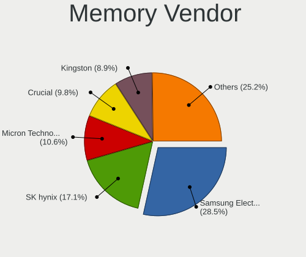

| Vendor              | Notebooks | Percent |
|---------------------|-----------|---------|
| Samsung Electronics | 35        | 28.46%  |
| SK hynix            | 21        | 17.07%  |
| Micron Technology   | 13        | 10.57%  |
| Crucial             | 12        | 9.76%   |
| Kingston            | 11        | 8.94%   |
| Unknown             | 6         | 4.88%   |
| Ramaxel Technology  | 6         | 4.88%   |
| Unknown             | 4         | 3.25%   |
| Nanya Technology    | 3         | 2.44%   |
| Elpida              | 3         | 2.44%   |
| A-DATA Technology   | 2         | 1.63%   |
| Unknown (ABCD)      | 1         | 0.81%   |
| Unknown (0x0080)    | 1         | 0.81%   |
| Transcend           | 1         | 0.81%   |
| Qimonda             | 1         | 0.81%   |
| G.Skill             | 1         | 0.81%   |
| Corsair             | 1         | 0.81%   |
| ASint Technology    | 1         | 0.81%   |

Memory Model
------------

Memory module models

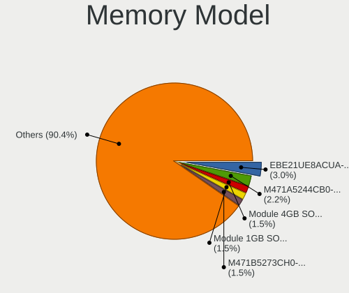

| Model                                                                     | Notebooks | Percent |
|---------------------------------------------------------------------------|-----------|---------|
| Unknown                                                                   | 4         | 2.96%   |
| Samsung RAM M471A5244CB0-CTD 4GB SODIMM DDR4 3200MT/s                     | 3         | 2.22%   |
| Unknown RAM Module 4GB SODIMM DDR3                                        | 2         | 1.48%   |
| Unknown RAM Module 1GB SODIMM DDR2 667MT/s                                | 2         | 1.48%   |
| SK hynix RAM HMT451S6BFR8A-PB 4GB SODIMM DDR3 1600MT/s                    | 2         | 1.48%   |
| SK hynix RAM HMT41GS6BFR8A-PB 8GB SODIMM DDR3 1600MT/s                    | 2         | 1.48%   |
| SK hynix RAM HMA81GS6AFR8N-UH 8GB SODIMM DDR4 2400MT/s                    | 2         | 1.48%   |
| Samsung RAM M471B5273CH0-CH9 4GB SODIMM DDR3 1334MT/s                     | 2         | 1.48%   |
| Samsung RAM M471B1G73QH0-YK0 8GB SODIMM DDR3 1867MT/s                     | 2         | 1.48%   |
| Samsung RAM M471A2G43AB2-CWE 16GB SODIMM DDR4 3200MT/s                    | 2         | 1.48%   |
| Samsung RAM M471A1K43EB1-CWE 8GB SODIMM DDR4 3200MT/s                     | 2         | 1.48%   |
| Samsung RAM M471A1G44BB0-CWE 8GB SODIMM DDR4 3200MT/s                     | 2         | 1.48%   |
| Samsung RAM M4 70T5663EH3-CF7 2GB SODIMM DDR2 975MT/s                     | 2         | 1.48%   |
| Micron RAM 4ATF1G64HZ-3G2E1 8GB SODIMM DDR4 3200MT/s                      | 2         | 1.48%   |
| Kingston RAM ACR16D3LS1KFG/4G 4GB SODIMM DDR3 1600MT/s                    | 2         | 1.48%   |
| Kingston RAM 9905712-035.A00G 16GB SODIMM DDR4 2667MT/s                   | 2         | 1.48%   |
| Crucial RAM CT32G4SFD832A.M16FF 32GB SODIMM DDR4 3200MT/s                 | 2         | 1.48%   |
| Crucial RAM CT32G4SFD832A.C16FF 32GB SODIMM DDR4 3200MT/s                 | 2         | 1.48%   |
| Crucial RAM CT102464BF160B.M16 8GB SODIMM DDR3 1600MT/s                   | 2         | 1.48%   |
| Unknown RAM Module 8GB SODIMM DDR3 1600MT/s                               | 1         | 0.74%   |
| Unknown RAM Module 2GB SODIMM DDR3                                        | 1         | 0.74%   |
| Unknown RAM Module 2GB SODIMM DDR                                         | 1         | 0.74%   |
| Unknown (ABCD) RAM 123456789012345678 1GB SODIMM LPDDR4 2400MT/s          | 1         | 0.74%   |
| Unknown (0x0080) RAM Module 16GB SODIMM DDR4 2667MT/s                     | 1         | 0.74%   |
| Transcend RAM JM1600KSN-4G 4GB SODIMM DDR3 1600MT/s                       | 1         | 0.74%   |
| SK hynix RAM Module 8GB Row Of Chips LPDDR4 3733MT/s                      | 1         | 0.74%   |
| SK hynix RAM Module 8GB Row Of Chips LPDDR3 2133MT/s                      | 1         | 0.74%   |
| SK hynix RAM Module 4GB SODIMM DDR3 1066MT/s                              | 1         | 0.74%   |
| SK hynix RAM Module 2GB SODIMM DDR3 1600MT/s                              | 1         | 0.74%   |
| SK hynix RAM HYMP125S64CP8-Y5 2GB SODIMM DDR 667MT/s                      | 1         | 0.74%   |
| SK hynix RAM HMT425S6AFR6A-PB 2GB SODIMM DDR3 1600MT/s                    | 1         | 0.74%   |
| SK hynix RAM HMT351S6CFR8C-PB 4GB SODIMM DDR3 1600MT/s                    | 1         | 0.74%   |
| SK hynix RAM HMCG78MEBSA095N 16GB SODIMM DDR5 4800MT/s                    | 1         | 0.74%   |
| SK hynix RAM HMAB2GS6AMR6N-XN 16GB Row Of Chips DDR4 3200MT/s             | 1         | 0.74%   |
| SK hynix RAM HMA851S6DJR6N-XN 4GB SODIMM DDR4 3200MT/s                    | 1         | 0.74%   |
| SK hynix RAM HMA82GS6AFR8N-UH 16GB SODIMM DDR4 2400MT/s                   | 1         | 0.74%   |
| SK hynix RAM HMA81GS6JJR8N-VK 8GB SODIMM DDR4 2667MT/s                    | 1         | 0.74%   |
| SK hynix RAM HMA81GS6CJR8N-VK 8GB SODIMM DDR4 2667MT/s                    | 1         | 0.74%   |
| SK hynix RAM H9JCNNNFA5MLYR-N6E 8GB Row Of Chips LPDDR5 6400MT/s          | 1         | 0.74%   |
| SK hynix RAM 161616161616161616161616161616161616 2GB SODIMM DDR2 800MT/s | 1         | 0.74%   |

Memory Kind
-----------

Memory module kinds

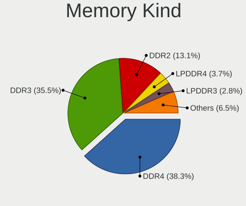

| Kind    | Notebooks | Percent |
|---------|-----------|---------|
| DDR4    | 41        | 38.32%  |
| DDR3    | 38        | 35.51%  |
| DDR2    | 14        | 13.08%  |
| LPDDR4  | 4         | 3.74%   |
| LPDDR3  | 3         | 2.8%    |
| LPDDR5  | 2         | 1.87%   |
| DDR5    | 2         | 1.87%   |
| SDRAM   | 1         | 0.93%   |
| DDR     | 1         | 0.93%   |
| Unknown | 1         | 0.93%   |

Memory Form Factor
------------------

Physical design of the memory module

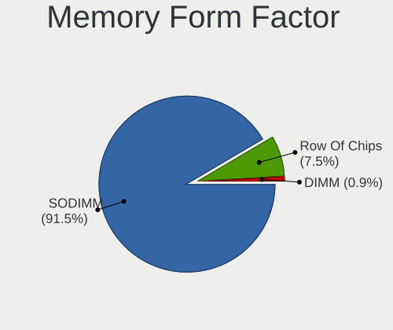

| Name         | Notebooks | Percent |
|--------------|-----------|---------|
| SODIMM       | 97        | 91.51%  |
| Row Of Chips | 8         | 7.55%   |
| DIMM         | 1         | 0.94%   |

Memory Size
-----------

Memory module size

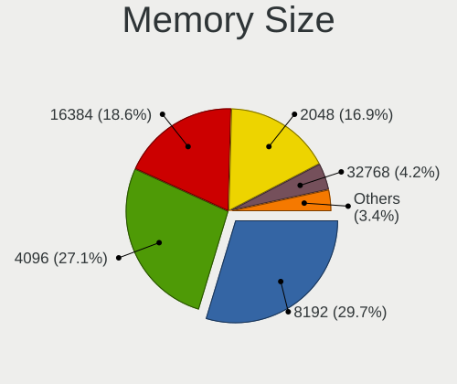

| Size  | Notebooks | Percent |
|-------|-----------|---------|
| 8192  | 35        | 29.66%  |
| 4096  | 32        | 27.12%  |
| 16384 | 22        | 18.64%  |
| 2048  | 20        | 16.95%  |
| 32768 | 5         | 4.24%   |
| 1024  | 4         | 3.39%   |

Memory Speed
------------

Memory module speed

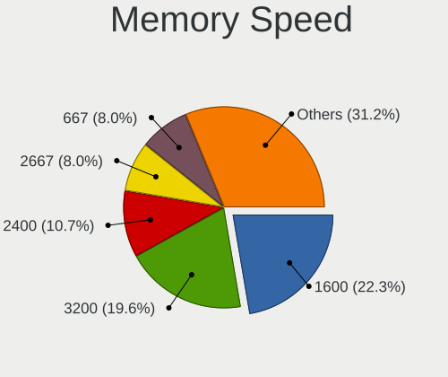

| Speed   | Notebooks | Percent |
|---------|-----------|---------|
| 1600    | 25        | 22.32%  |
| 3200    | 22        | 19.64%  |
| 2400    | 12        | 10.71%  |
| 2667    | 9         | 8.04%   |
| 667     | 9         | 8.04%   |
| 1334    | 5         | 4.46%   |
| 1067    | 4         | 3.57%   |
| 2133    | 3         | 2.68%   |
| 1867    | 3         | 2.68%   |
| 800     | 3         | 2.68%   |
| Unknown | 3         | 2.68%   |
| 1333    | 2         | 1.79%   |
| 1066    | 2         | 1.79%   |
| 975     | 2         | 1.79%   |
| 7467    | 1         | 0.89%   |
| 6400    | 1         | 0.89%   |
| 5600    | 1         | 0.89%   |
| 4800    | 1         | 0.89%   |
| 4267    | 1         | 0.89%   |
| 4266    | 1         | 0.89%   |
| 3733    | 1         | 0.89%   |
| 2048    | 1         | 0.89%   |

Printers & scanners
-------------------

Printer Vendor
--------------

Printer device vendors

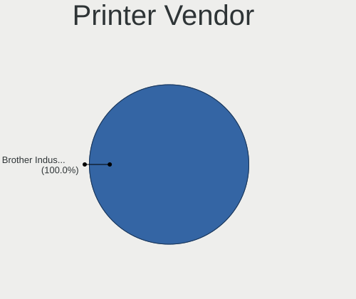

| Vendor             | Notebooks | Percent |
|--------------------|-----------|---------|
| Brother Industries | 1         | 100%    |

Printer Model
-------------

Printer device models

| Model                    | Notebooks | Percent |
|--------------------------|-----------|---------|
| Brother HL-L2340D series | 1         | 100%    |

Scanner Vendor
--------------

Scanner device vendors

Zero info for selected period =(

Scanner Model
-------------

Scanner device models

Zero info for selected period =(

Camera
------

Camera Vendor
-------------

Camera device vendors

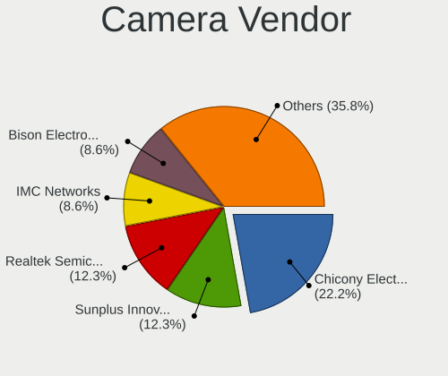

| Vendor                                 | Notebooks | Percent |
|----------------------------------------|-----------|---------|
| Chicony Electronics                    | 18        | 22.22%  |
| Sunplus Innovation Technology          | 10        | 12.35%  |
| Realtek Semiconductor                  | 10        | 12.35%  |
| IMC Networks                           | 7         | 8.64%   |
| Bison Electronics                      | 7         | 8.64%   |
| Suyin                                  | 6         | 7.41%   |
| Quanta                                 | 5         | 6.17%   |
| Microdia                               | 5         | 6.17%   |
| Syntek                                 | 2         | 2.47%   |
| Luxvisions Innotech Limited            | 2         | 2.47%   |
| Cheng Uei Precision Industry (Foxlink) | 2         | 2.47%   |
| USB Camera                             | 1         | 1.23%   |
| Supreme Electronics                    | 1         | 1.23%   |
| Silicon Motion                         | 1         | 1.23%   |
| Ricoh                                  | 1         | 1.23%   |
| Lite-On Technology                     | 1         | 1.23%   |
| Importek                               | 1         | 1.23%   |
| Alcor Micro                            | 1         | 1.23%   |

Camera Model
------------

Camera device models

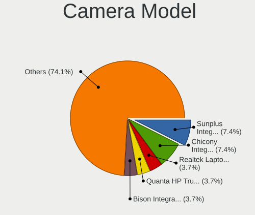

| Model                                                | Notebooks | Percent |
|------------------------------------------------------|-----------|---------|
| Sunplus Integrated_Webcam_HD                         | 6         | 7.41%   |
| Chicony Integrated Camera                            | 6         | 7.41%   |
| Realtek Laptop Camera                                | 3         | 3.7%    |
| Quanta HP TrueVision HD Camera                       | 3         | 3.7%    |
| Bison Integrated Camera                              | 3         | 3.7%    |
| Realtek USB Camera                                   | 2         | 2.47%   |
| IMC Networks Realtek PC Camera                       | 2         | 2.47%   |
| IMC Networks Integrated Camera                       | 2         | 2.47%   |
| Chicony HD Webcam                                    | 2         | 2.47%   |
| USB Camera USB Camera                                | 1         | 1.23%   |
| Syntek Lenovo EasyCamera                             | 1         | 1.23%   |
| Syntek EasyCamera                                    | 1         | 1.23%   |
| Suyin Laptop_Integrated_Webcam_HD                    | 1         | 1.23%   |
| Suyin Integrated_Webcam_HD                           | 1         | 1.23%   |
| Suyin HP Webcam-50                                   | 1         | 1.23%   |
| Suyin HP Webcam-101                                  | 1         | 1.23%   |
| Suyin HP webcam [dv6-1190en]                         | 1         | 1.23%   |
| Suyin Acer/HP Integrated Webcam [CN0314]             | 1         | 1.23%   |
| Supreme Realtek PC Camera                            | 1         | 1.23%   |
| Sunplus Integrated Camera                            | 1         | 1.23%   |
| Sunplus HP HD Webcam [Fixed]                         | 1         | 1.23%   |
| Sunplus HD WebCam                                    | 1         | 1.23%   |
| Sunplus Asus Webcam                                  | 1         | 1.23%   |
| Silicon Motion Realtek USB 2.0 PC Camera             | 1         | 1.23%   |
| Ricoh Integrated Webcam                              | 1         | 1.23%   |
| Realtek LG Camera                                    | 1         | 1.23%   |
| Realtek Integrated_Webcam_HD                         | 1         | 1.23%   |
| Realtek Integrated_Webcam_FHD                        | 1         | 1.23%   |
| Realtek HD WebCam                                    | 1         | 1.23%   |
| Realtek Acer 640 x 480 laptop camera                 | 1         | 1.23%   |
| Quanta Realtek DMFT RGB                              | 1         | 1.23%   |
| Quanta HP Universal Camera                           | 1         | 1.23%   |
| Microdia USB 2.0 Camera                              | 1         | 1.23%   |
| Microdia Sonix USB 2.0 Camera                        | 1         | 1.23%   |
| Microdia Integrated_Webcam_HD                        | 1         | 1.23%   |
| Microdia Integrated Webcam                           | 1         | 1.23%   |
| Microdia HP Webcam                                   | 1         | 1.23%   |
| Luxvisions Innotech Limited Integrated Camera        | 1         | 1.23%   |
| Luxvisions Innotech Limited HP Wide Vision HD Camera | 1         | 1.23%   |
| Lite-On Integrated Camera                            | 1         | 1.23%   |

Security
--------

Fingerprint Vendor
------------------

Fingerprint sensor vendors

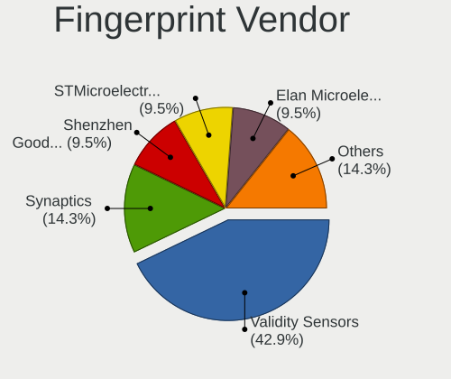

| Vendor                     | Notebooks | Percent |
|----------------------------|-----------|---------|
| Validity Sensors           | 9         | 42.86%  |
| Synaptics                  | 3         | 14.29%  |
| STMicroelectronics         | 2         | 9.52%   |
| Shenzhen Goodix Technology | 2         | 9.52%   |
| Elan Microelectronics      | 2         | 9.52%   |
| Upek                       | 1         | 4.76%   |
| Fingerprint Cards          | 1         | 4.76%   |
| AuthenTec                  | 1         | 4.76%   |

Fingerprint Model
-----------------

Fingerprint sensor models

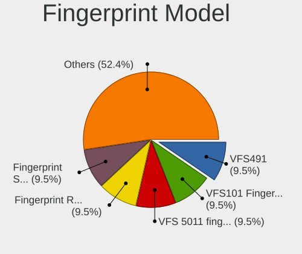

| Model                                                    | Notebooks | Percent |
|----------------------------------------------------------|-----------|---------|
| Validity Sensors VFS491                                  | 2         | 9.52%   |
| Validity Sensors VFS101 Fingerprint Reader               | 2         | 9.52%   |
| Validity Sensors VFS 5011 fingerprint sensor             | 2         | 9.52%   |
| STMicroelectronics Fingerprint Reader                    | 2         | 9.52%   |
| Elan Fingerprint Sensor                                  | 2         | 9.52%   |
| Validity Sensors VFS495 Fingerprint Reader               | 1         | 4.76%   |
| Validity Sensors Synaptics WBDI                          | 1         | 4.76%   |
| Validity Sensors Fingerprint scanner                     | 1         | 4.76%   |
| Upek TCS5B Fingerprint sensor                            | 1         | 4.76%   |
| Synaptics WBDI Fingerprint Reader USB 086                | 1         | 4.76%   |
| Synaptics Metallica MIS Touch Fingerprint Reader         | 1         | 4.76%   |
| Synaptics FS7604 Touch Fingerprint Sensor with PurePrint | 1         | 4.76%   |
| Shenzhen Goodix  Fingerprint Device                      | 1         | 4.76%   |
| Shenzhen Goodix Fingerprint Reader                       | 1         | 4.76%   |
| Fingerprint Cards FPC Fingerprint Reader                 | 1         | 4.76%   |
| AuthenTec AES1660 Fingerprint Sensor                     | 1         | 4.76%   |

Chipcard Vendor
---------------

Chipcard module vendors

Zero info for selected period =(

Chipcard Model
--------------

Chipcard module models

Zero info for selected period =(

Unsupported
-----------

Unsupported Devices
-------------------

Total unsupported devices on board

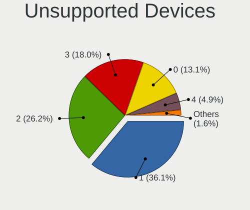

| Total | Notebooks | Percent |
|-------|-----------|---------|
| 1     | 44        | 36.07%  |
| 2     | 32        | 26.23%  |
| 3     | 22        | 18.03%  |
| 0     | 16        | 13.11%  |
| 4     | 6         | 4.92%   |
| 5     | 2         | 1.64%   |

Unsupported Device Types
------------------------

Types of unsupported devices

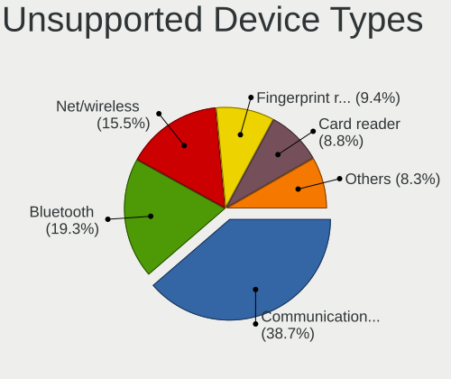

| Type                     | Notebooks | Percent |
|--------------------------|-----------|---------|
| Communication controller | 70        | 38.67%  |
| Bluetooth                | 35        | 19.34%  |
| Net/wireless             | 28        | 15.47%  |
| Fingerprint reader       | 17        | 9.39%   |
| Card reader              | 16        | 8.84%   |
| Firewire controller      | 6         | 3.31%   |
| Graphics card            | 4         | 2.21%   |
| Network                  | 3         | 1.66%   |
| Storage                  | 1         | 0.55%   |
| Sound                    | 1         | 0.55%   |

