BSD in Spain - Tested Hardware & Statistics
-------------------------------------------

A project to collect tested hardware configurations for BSD in Spain.

Anyone can contribute to this report by the [hw-probe](https://github.com/linuxhw/hw-probe/blob/master/INSTALL.BSD.md) tool:

    hw-probe -all -upload

Please contribute! Especially if your hardware is rare.

This is a report for all computer types. See also reports for [desktops](/Location/Spain/Desktop/README.md) and [notebooks](/Location/Spain/Notebook/README.md).

Contents
--------

* [ Test Cases ](#test-cases)

* [ System ](#system)
  - [ OS                       ](#os)
  - [ OS Family                ](#os-family)
  - [ Arch                     ](#arch)
  - [ DE                       ](#de)
  - [ Display Server           ](#display-server)
  - [ Display Manager          ](#display-manager)
  - [ OS Lang                  ](#os-lang)
  - [ Boot Mode                ](#boot-mode)
  - [ Filesystem               ](#filesystem)
  - [ Part. scheme             ](#part-scheme)

* [ Board ](#board)
  - [ Vendor                   ](#vendor)
  - [ Model                    ](#model)
  - [ Model Family             ](#model-family)
  - [ MFG Year                 ](#mfg-year)
  - [ Form Factor              ](#form-factor)
  - [ Coreboot                 ](#coreboot)
  - [ RAM Size                 ](#ram-size)
  - [ RAM Used                 ](#ram-used)
  - [ Total Drives             ](#total-drives)
  - [ Has CD-ROM               ](#has-cd-rom)
  - [ Has Ethernet             ](#has-ethernet)
  - [ Has WiFi                 ](#has-wifi)
  - [ Has Bluetooth            ](#has-bluetooth)

* [ Location ](#location)
  - [ Country                  ](#country)
  - [ City                     ](#city)

* [ Drives ](#drives)
  - [ Drive Vendor             ](#drive-vendor)
  - [ Drive Model              ](#drive-model)
  - [ HDD Vendor               ](#hdd-vendor)
  - [ SSD Vendor               ](#ssd-vendor)
  - [ Drive Kind               ](#drive-kind)
  - [ Drive Connector          ](#drive-connector)
  - [ Drive Size               ](#drive-size)
  - [ Space Total              ](#space-total)
  - [ Space Used               ](#space-used)
  - [ Malfunc. Drives          ](#malfunc-drives)
  - [ Malfunc. Drive Vendor    ](#malfunc-drive-vendor)
  - [ Malfunc. HDD Vendor      ](#malfunc-hdd-vendor)
  - [ Malfunc. Drive Kind      ](#malfunc-drive-kind)
  - [ Failed Drives            ](#failed-drives)
  - [ Failed Drive Vendor      ](#failed-drive-vendor)
  - [ Drive Status             ](#drive-status)

* [ Storage controller ](#storage-controller)
  - [ Storage Vendor           ](#storage-vendor)
  - [ Storage Model            ](#storage-model)
  - [ Storage Kind             ](#storage-kind)

* [ Processor ](#processor)
  - [ CPU Vendor               ](#cpu-vendor)
  - [ CPU Model                ](#cpu-model)
  - [ CPU Model Family         ](#cpu-model-family)
  - [ CPU Cores                ](#cpu-cores)
  - [ CPU Sockets              ](#cpu-sockets)
  - [ CPU Threads              ](#cpu-threads)
  - [ CPU Microarch            ](#cpu-microarch)

* [ Graphics ](#graphics)
  - [ GPU Vendor               ](#gpu-vendor)
  - [ GPU Model                ](#gpu-model)
  - [ GPU Combo                ](#gpu-combo)
  - [ GPU Driver               ](#gpu-driver)
  - [ GPU Memory               ](#gpu-memory)

* [ Monitor ](#monitor)
  - [ Monitor Vendor           ](#monitor-vendor)
  - [ Monitor Model            ](#monitor-model)
  - [ Monitor Resolution       ](#monitor-resolution)
  - [ Monitor Diagonal         ](#monitor-diagonal)
  - [ Monitor Width            ](#monitor-width)
  - [ Aspect Ratio             ](#aspect-ratio)
  - [ Monitor Area             ](#monitor-area)
  - [ Pixel Density            ](#pixel-density)
  - [ Multiple Monitors        ](#multiple-monitors)

* [ Network ](#network)
  - [ Net Controller Vendor    ](#net-controller-vendor)
  - [ Net Controller Model     ](#net-controller-model)
  - [ Wireless Vendor          ](#wireless-vendor)
  - [ Wireless Model           ](#wireless-model)
  - [ Ethernet Vendor          ](#ethernet-vendor)
  - [ Ethernet Model           ](#ethernet-model)
  - [ Net Controller Kind      ](#net-controller-kind)
  - [ Used Controller          ](#used-controller)
  - [ NICs                     ](#nics)
  - [ IPv6                     ](#ipv6)

* [ Bluetooth ](#bluetooth)
  - [ Bluetooth Vendor         ](#bluetooth-vendor)
  - [ Bluetooth Model          ](#bluetooth-model)

* [ Sound ](#sound)
  - [ Sound Vendor             ](#sound-vendor)
  - [ Sound Model              ](#sound-model)

* [ Memory ](#memory)
  - [ Memory Vendor            ](#memory-vendor)
  - [ Memory Model             ](#memory-model)
  - [ Memory Kind              ](#memory-kind)
  - [ Memory Form Factor       ](#memory-form-factor)
  - [ Memory Size              ](#memory-size)
  - [ Memory Speed             ](#memory-speed)

* [ Printers & scanners ](#printers--scanners)
  - [ Printer Vendor           ](#printer-vendor)
  - [ Printer Model            ](#printer-model)
  - [ Scanner Vendor           ](#scanner-vendor)
  - [ Scanner Model            ](#scanner-model)

* [ Camera ](#camera)
  - [ Camera Vendor            ](#camera-vendor)
  - [ Camera Model             ](#camera-model)

* [ Security ](#security)
  - [ Fingerprint Vendor       ](#fingerprint-vendor)
  - [ Fingerprint Model        ](#fingerprint-model)
  - [ Chipcard Vendor          ](#chipcard-vendor)
  - [ Chipcard Model           ](#chipcard-model)

* [ Unsupported ](#unsupported)
  - [ Unsupported Devices      ](#unsupported-devices)
  - [ Unsupported Device Types ](#unsupported-device-types)

Test Cases
----------

Total: 470

| Vendor        | Model                       | Form-Factor | Probe                                                     | Date         |
|---------------|-----------------------------|-------------|-----------------------------------------------------------|--------------|
| Fujitsu       | D3313-A1 S26361-D3313-A1    | Desktop     | [89ce4b4a9f](https://bsd-hardware.info/?probe=89ce4b4a9f) | Jan 06, 2025 |
| MSI           | MS-B1711                    | Desktop     | [98df812bc4](https://bsd-hardware.info/?probe=98df812bc4) | Jan 03, 2025 |
| MSI           | MS-B1711                    | Desktop     | [c58187f624](https://bsd-hardware.info/?probe=c58187f624) | Jan 03, 2025 |
| Dell          | Latitude 7390               | Notebook    | [12d707eac2](https://bsd-hardware.info/?probe=12d707eac2) | Dec 31, 2024 |
| Intel         | CM8I7CB8N K53740-202        | Mini pc     | [5eb4da6e62](https://bsd-hardware.info/?probe=5eb4da6e62) | Dec 30, 2024 |
| Dell          | Precision 5510              | Notebook    | [ebf00fc632](https://bsd-hardware.info/?probe=ebf00fc632) | Dec 24, 2024 |
| Lenovo        | ThinkPad P14s Gen 1 20Y1... | Notebook    | [6eebafd5ad](https://bsd-hardware.info/?probe=6eebafd5ad) | Dec 24, 2024 |
| AAEON         | UP-APL01 V0.4               | Desktop     | [32312b45f8](https://bsd-hardware.info/?probe=32312b45f8) | Dec 21, 2024 |
| HPE           | ProLiant MicroServer Gen... | Server      | [a79ab43d5b](https://bsd-hardware.info/?probe=a79ab43d5b) | Dec 18, 2024 |
| HPE           | ProLiant MicroServer Gen... | Server      | [eba843b9d2](https://bsd-hardware.info/?probe=eba843b9d2) | Dec 18, 2024 |
| Intel         | J1900                       | Desktop     | [1eabaeb91b](https://bsd-hardware.info/?probe=1eabaeb91b) | Dec 16, 2024 |
| Dell          | 0WR7PY A01                  | Desktop     | [cac8fa73da](https://bsd-hardware.info/?probe=cac8fa73da) | Dec 15, 2024 |
| Framework     | Laptop 16 (AMD Ryzen 704... | Notebook    | [9f9235fcd6](https://bsd-hardware.info/?probe=9f9235fcd6) | Dec 10, 2024 |
| Unknown       | Unknown                     | Desktop     | [23b03d29a7](https://bsd-hardware.info/?probe=23b03d29a7) | Dec 06, 2024 |
| Raspberry ... | Raspberry Pi                | Soc         | [5f8f2f10e2](https://bsd-hardware.info/?probe=5f8f2f10e2) | Dec 06, 2024 |
| Unknown       | Unknown                     | Desktop     | [5077b94887](https://bsd-hardware.info/?probe=5077b94887) | Dec 06, 2024 |
| Dell          | Precision 5510              | Notebook    | [928a571c76](https://bsd-hardware.info/?probe=928a571c76) | Dec 03, 2024 |
| HP            | ProLiant DL380 G6           | Server      | [8ac50a3d1f](https://bsd-hardware.info/?probe=8ac50a3d1f) | Dec 02, 2024 |
| Unknown       | Unknown                     | Desktop     | [d5087399ae](https://bsd-hardware.info/?probe=d5087399ae) | Dec 02, 2024 |
| Intel         | CM8I7CB8N K53740-202        | Mini pc     | [d29fa868ad](https://bsd-hardware.info/?probe=d29fa868ad) | Nov 30, 2024 |
| Lenovo        | ThinkPad E14 Gen 3 20Y7C... | Notebook    | [7a03bbeb04](https://bsd-hardware.info/?probe=7a03bbeb04) | Nov 25, 2024 |
| Unknown       | QDNV01                      | Desktop     | [b61894118e](https://bsd-hardware.info/?probe=b61894118e) | Nov 25, 2024 |
| Lenovo        | ThinkPad E14 Gen 3 20Y7C... | Notebook    | [36ab98d9df](https://bsd-hardware.info/?probe=36ab98d9df) | Nov 25, 2024 |
| Acer          | Nitro AN515-46              | Notebook    | [d66960aa84](https://bsd-hardware.info/?probe=d66960aa84) | Nov 24, 2024 |
| AMI           | Aptio CRB                   | Mini pc     | [88032dcf96](https://bsd-hardware.info/?probe=88032dcf96) | Nov 21, 2024 |
| Unknown       | QDNV01                      | Desktop     | [e70e28cd40](https://bsd-hardware.info/?probe=e70e28cd40) | Nov 21, 2024 |
| Fujitsu       | D3313-A1 S26361-D3313-A1    | Desktop     | [4fd991795f](https://bsd-hardware.info/?probe=4fd991795f) | Nov 20, 2024 |
| HP            | 8103 A01                    | Mini pc     | [63c5852e76](https://bsd-hardware.info/?probe=63c5852e76) | Nov 10, 2024 |
| Lenovo        | 3111 SDK0J40697 WIN 3305... | Mini pc     | [35add40d90](https://bsd-hardware.info/?probe=35add40d90) | Nov 10, 2024 |
| HP            | Mini 210-1000               | Notebook    | [2e6b2f7727](https://bsd-hardware.info/?probe=2e6b2f7727) | Nov 08, 2024 |
| Unknown       | Unknown                     | Desktop     | [401a8352cd](https://bsd-hardware.info/?probe=401a8352cd) | Nov 05, 2024 |
| HP            | 8597                        | Desktop     | [a20615c5a0](https://bsd-hardware.info/?probe=a20615c5a0) | Oct 29, 2024 |
| Techvision    | TVI7309X B0                 | Desktop     | [76c5dea6bb](https://bsd-hardware.info/?probe=76c5dea6bb) | Oct 27, 2024 |
| Fujitsu       | D3313-A1 S26361-D3313-A1    | Desktop     | [6c77bc229e](https://bsd-hardware.info/?probe=6c77bc229e) | Oct 24, 2024 |
| Unknown       | Unknown                     | Desktop     | [7d49a8dfcd](https://bsd-hardware.info/?probe=7d49a8dfcd) | Oct 20, 2024 |
| HP            | ProLiant BL460c G7          | Server      | [efbbeb4731](https://bsd-hardware.info/?probe=efbbeb4731) | Oct 18, 2024 |
| HP            | Unknown                     | Notebook    | [254f5a847c](https://bsd-hardware.info/?probe=254f5a847c) | Oct 17, 2024 |
| Intel         | SKYBAY                      | Desktop     | [9847be081f](https://bsd-hardware.info/?probe=9847be081f) | Oct 16, 2024 |
| Acer          | Aspire V5-531               | Notebook    | [31a71a6cb4](https://bsd-hardware.info/?probe=31a71a6cb4) | Oct 15, 2024 |
| Shenzhen M... | F7BFD                       | Desktop     | [def723c09a](https://bsd-hardware.info/?probe=def723c09a) | Oct 15, 2024 |
| HP            | Compaq Presario CQ50        | Desktop     | [462666f013](https://bsd-hardware.info/?probe=462666f013) | Oct 13, 2024 |
| ECS           | APLD-MINI                   | Desktop     | [47d8c66ac9](https://bsd-hardware.info/?probe=47d8c66ac9) | Oct 07, 2024 |
| Medion        | S15449                      | Notebook    | [b7a0fc4f21](https://bsd-hardware.info/?probe=b7a0fc4f21) | Oct 06, 2024 |
| PC Engines    | APU                         | Desktop     | [58bd860024](https://bsd-hardware.info/?probe=58bd860024) | Oct 05, 2024 |
| Framework     | Laptop (13th Gen Intel C... | Notebook    | [a103b74d47](https://bsd-hardware.info/?probe=a103b74d47) | Sep 30, 2024 |
| Framework     | Laptop (13th Gen Intel C... | Notebook    | [538ac0af8c](https://bsd-hardware.info/?probe=538ac0af8c) | Sep 30, 2024 |
| Framework     | Laptop (13th Gen Intel C... | Notebook    | [dcfdda02ff](https://bsd-hardware.info/?probe=dcfdda02ff) | Sep 30, 2024 |
| Intel         | DB75EN AAG39650-400         | Desktop     | [800f9bb0b7](https://bsd-hardware.info/?probe=800f9bb0b7) | Sep 29, 2024 |
| Dell          | G3 3579                     | Notebook    | [1725db4da9](https://bsd-hardware.info/?probe=1725db4da9) | Sep 27, 2024 |
| Lenovo        | IdeaPad 100-15IBY 80MJ      | Notebook    | [9ea21fa783](https://bsd-hardware.info/?probe=9ea21fa783) | Sep 26, 2024 |
| MSI           | Prestige 15 A10SC           | Notebook    | [6cdde2a1ab](https://bsd-hardware.info/?probe=6cdde2a1ab) | Sep 25, 2024 |
| Lenovo        | 3136 SDK0J40697 WIN 3305... | Mini pc     | [d24d0ef32b](https://bsd-hardware.info/?probe=d24d0ef32b) | Sep 24, 2024 |
| ASUSTek       | F3E                         | Notebook    | [cbed34c50d](https://bsd-hardware.info/?probe=cbed34c50d) | Sep 17, 2024 |
| Lenovo        | 3136 SDK0J40697 WIN 3305... | Mini pc     | [41818d9f0a](https://bsd-hardware.info/?probe=41818d9f0a) | Sep 15, 2024 |
| Framework     | Laptop (13th Gen Intel C... | Notebook    | [8f49a75dc6](https://bsd-hardware.info/?probe=8f49a75dc6) | Sep 07, 2024 |
| Techvision    | TVI7309X B0                 | Desktop     | [42acfbe729](https://bsd-hardware.info/?probe=42acfbe729) | Sep 07, 2024 |
| Intel         | NUC7JYB M37329-500          | Mini pc     | [0c5980da40](https://bsd-hardware.info/?probe=0c5980da40) | Aug 23, 2024 |
| AMI           | Aptio CRB                   | Mini pc     | [260fa51e5f](https://bsd-hardware.info/?probe=260fa51e5f) | Aug 22, 2024 |
| Sophos        | XG                          | Firewall    | [c16d9b16bf](https://bsd-hardware.info/?probe=c16d9b16bf) | Aug 16, 2024 |
| ASUSTek       | VivoBook_ASUSLaptop X512... | Notebook    | [424a038d10](https://bsd-hardware.info/?probe=424a038d10) | Aug 16, 2024 |
| ASUSTek       | VivoBook_ASUSLaptop X512... | Notebook    | [ffdc8ec717](https://bsd-hardware.info/?probe=ffdc8ec717) | Aug 15, 2024 |
| Sophos        | XG                          | Firewall    | [5469029429](https://bsd-hardware.info/?probe=5469029429) | Jul 25, 2024 |
| Dell EMC      | EDGE680-CPU A00             | Desktop     | [4934b78db6](https://bsd-hardware.info/?probe=4934b78db6) | Jul 24, 2024 |
| Unknown       | Unknown                     | Desktop     | [2e77b6eb96](https://bsd-hardware.info/?probe=2e77b6eb96) | Jul 21, 2024 |
| Unknown       | Unknown                     | Desktop     | [0a7faa3d8b](https://bsd-hardware.info/?probe=0a7faa3d8b) | Jul 21, 2024 |
| Apple         | Mac-F65AE981FFA204ED Mac... | Mini pc     | [f2ae8a59aa](https://bsd-hardware.info/?probe=f2ae8a59aa) | Jul 21, 2024 |
| HP            | Pavilion g6                 | Notebook    | [19ddfa696d](https://bsd-hardware.info/?probe=19ddfa696d) | Jul 20, 2024 |
| Lenovo        | ThinkPad X1 Carbon 6th 2... | Notebook    | [2d169fbf2d](https://bsd-hardware.info/?probe=2d169fbf2d) | Jul 18, 2024 |
| Lenovo        | ThinkPad X1 Carbon 6th 2... | Notebook    | [898dbbc136](https://bsd-hardware.info/?probe=898dbbc136) | Jul 18, 2024 |
| HP            | Compaq Presario CQ71        | Notebook    | [88a0868c03](https://bsd-hardware.info/?probe=88a0868c03) | Jul 18, 2024 |
| HP            | Compaq Presario CQ71        | Notebook    | [45d3874955](https://bsd-hardware.info/?probe=45d3874955) | Jul 13, 2024 |
| Raspberry ... | Raspberry Pi                | Soc         | [7928a68cca](https://bsd-hardware.info/?probe=7928a68cca) | Jul 11, 2024 |
| OEM           | NU93 Series                 | Desktop     | [8eaae8a84d](https://bsd-hardware.info/?probe=8eaae8a84d) | Jun 24, 2024 |
| HP            | Laptop 14-cf1xxx            | Notebook    | [a0118881e6](https://bsd-hardware.info/?probe=a0118881e6) | Jun 20, 2024 |
| HP            | Laptop 14-cf1xxx            | Notebook    | [70254105eb](https://bsd-hardware.info/?probe=70254105eb) | Jun 19, 2024 |
| Gigabyte      | B550 GAMING X V2            | Desktop     | [65d6791029](https://bsd-hardware.info/?probe=65d6791029) | Jun 19, 2024 |
| Lenovo        | 312D SDK0J40700 WIN 3258... | Mini pc     | [270522ff15](https://bsd-hardware.info/?probe=270522ff15) | Jun 13, 2024 |
| Raspberry ... | Raspberry Pi 4 Model B      | Soc         | [5c5138d19f](https://bsd-hardware.info/?probe=5c5138d19f) | Jun 08, 2024 |
| Lenovo        | ThinkPad T530 2429GL9       | Notebook    | [acc2537d8d](https://bsd-hardware.info/?probe=acc2537d8d) | Jun 08, 2024 |
| Raspberry ... | Raspberry Pi 4 Model B      | Soc         | [ab9b2e3147](https://bsd-hardware.info/?probe=ab9b2e3147) | Jun 07, 2024 |
| Raspberry ... | Raspberry Pi                | Soc         | [9b896d73b3](https://bsd-hardware.info/?probe=9b896d73b3) | Jun 07, 2024 |
| Intel         | NUC8BEB J72688-306          | Mini pc     | [80440d6327](https://bsd-hardware.info/?probe=80440d6327) | Jun 06, 2024 |
| Protectli     | FW4B Ver                    | Desktop     | [b11c396037](https://bsd-hardware.info/?probe=b11c396037) | Jun 04, 2024 |
| Unknown       | Unknown                     | Desktop     | [06a1266a2e](https://bsd-hardware.info/?probe=06a1266a2e) | May 30, 2024 |
| HP            | Compaq Presario CQ71        | Notebook    | [ddf13477d5](https://bsd-hardware.info/?probe=ddf13477d5) | May 24, 2024 |
| HP            | Compaq Presario CQ71        | Notebook    | [7646daa3c0](https://bsd-hardware.info/?probe=7646daa3c0) | May 19, 2024 |
| Alienware     | m16 R1                      | Notebook    | [4f607db6c3](https://bsd-hardware.info/?probe=4f607db6c3) | May 18, 2024 |
| Sony          | VPCSB3Q9E                   | Notebook    | [103114e640](https://bsd-hardware.info/?probe=103114e640) | May 14, 2024 |
| Sony          | VPCSB3Q9E                   | Notebook    | [081979c837](https://bsd-hardware.info/?probe=081979c837) | May 13, 2024 |
| Unknown       | Unknown                     | Desktop     | [30cc9d07af](https://bsd-hardware.info/?probe=30cc9d07af) | May 07, 2024 |
| MSI           | MS-7097                     | Desktop     | [df5c7407fd](https://bsd-hardware.info/?probe=df5c7407fd) | May 06, 2024 |
| Seeed Stud... | ODYSSEY-X86J4105 SD-BS-C... | Desktop     | [6da31bada9](https://bsd-hardware.info/?probe=6da31bada9) | Apr 27, 2024 |
| Unknown       | Unknown                     | Desktop     | [2caa0fe8f7](https://bsd-hardware.info/?probe=2caa0fe8f7) | Apr 26, 2024 |
| Unknown       | Unknown                     | Desktop     | [1d373fbfcd](https://bsd-hardware.info/?probe=1d373fbfcd) | Apr 26, 2024 |
| AZW           | EQ                          | Desktop     | [9225d89862](https://bsd-hardware.info/?probe=9225d89862) | Apr 23, 2024 |
| Unknown       | Unknown                     | Desktop     | [242348310b](https://bsd-hardware.info/?probe=242348310b) | Apr 22, 2024 |
| Intel         | DN2820FYK H24582-201        | Desktop     | [1bc36f8af1](https://bsd-hardware.info/?probe=1bc36f8af1) | Apr 17, 2024 |
| Unknown       | Unknown                     | Desktop     | [d231a9531b](https://bsd-hardware.info/?probe=d231a9531b) | Apr 17, 2024 |
| ASUSTek       | VivoBook_ASUSLaptop X512... | Notebook    | [a818576415](https://bsd-hardware.info/?probe=a818576415) | Apr 13, 2024 |
| ASUSTek       | VivoBook_ASUSLaptop X512... | Notebook    | [d8288ba73a](https://bsd-hardware.info/?probe=d8288ba73a) | Apr 09, 2024 |
| AMI           | Aptio CRB                   | Mini pc     | [9057a0522b](https://bsd-hardware.info/?probe=9057a0522b) | Apr 08, 2024 |
| Gigabyte      | G431-MM0-OT                 | Desktop     | [16c58f7ccb](https://bsd-hardware.info/?probe=16c58f7ccb) | Apr 07, 2024 |
| ASUSTek       | VivoBook_ASUSLaptop X512... | Notebook    | [a26013b913](https://bsd-hardware.info/?probe=a26013b913) | Apr 05, 2024 |
| Gigabyte      | B85M-D3H                    | Desktop     | [3f85beaa54](https://bsd-hardware.info/?probe=3f85beaa54) | Apr 05, 2024 |
| ASRock        | Z790M-ITX WiFi              | Desktop     | [b2bbe7eb8d](https://bsd-hardware.info/?probe=b2bbe7eb8d) | Apr 04, 2024 |
| Lenovo        | ThinkPad E15 Gen 4 21EDC... | Notebook    | [0ae72ec0ff](https://bsd-hardware.info/?probe=0ae72ec0ff) | Mar 31, 2024 |
| Unknown       | Unknown                     | Desktop     | [0687b8c8e1](https://bsd-hardware.info/?probe=0687b8c8e1) | Mar 29, 2024 |
| Protectli     | FW4B Ver                    | Desktop     | [0d486d6705](https://bsd-hardware.info/?probe=0d486d6705) | Mar 26, 2024 |
| Protectli     | FW4B Ver                    | Desktop     | [bad44928d7](https://bsd-hardware.info/?probe=bad44928d7) | Mar 25, 2024 |
| Fujitsu       | D3313-A1 S26361-D3313-A1    | Desktop     | [313ab74587](https://bsd-hardware.info/?probe=313ab74587) | Mar 22, 2024 |
| ASUSTek       | ASUS TUF Gaming F15 FX50... | Notebook    | [25a92fc367](https://bsd-hardware.info/?probe=25a92fc367) | Mar 22, 2024 |
| Fujitsu       | D3313-A1 S26361-D3313-A1    | Desktop     | [3a0ef703ef](https://bsd-hardware.info/?probe=3a0ef703ef) | Mar 10, 2024 |
| Fujitsu       | D3313-A1 S26361-D3313-A1    | Desktop     | [88b774a83d](https://bsd-hardware.info/?probe=88b774a83d) | Mar 10, 2024 |
| Fujitsu       | D3313-A1 S26361-D3313-A1    | Desktop     | [9b40b121ec](https://bsd-hardware.info/?probe=9b40b121ec) | Mar 10, 2024 |
| Dell          | XPS 13 9305                 | Notebook    | [7cc4588e07](https://bsd-hardware.info/?probe=7cc4588e07) | Mar 07, 2024 |
| Unknown       | Unknown                     | Desktop     | [e35907b66f](https://bsd-hardware.info/?probe=e35907b66f) | Mar 04, 2024 |
| Gigabyte      | H270M-DS3H-CF               | Desktop     | [05b6d7a915](https://bsd-hardware.info/?probe=05b6d7a915) | Feb 29, 2024 |
| ASRock        | H81M-VG4 R2.0               | Desktop     | [0275a7e6b3](https://bsd-hardware.info/?probe=0275a7e6b3) | Feb 26, 2024 |
| Unknown       | Unknown                     | Desktop     | [d3ed7d1552](https://bsd-hardware.info/?probe=d3ed7d1552) | Feb 24, 2024 |
| HPE           | ProLiant MicroServer Gen... | Server      | [0896863043](https://bsd-hardware.info/?probe=0896863043) | Feb 18, 2024 |
| Intel         | CM8I7CB8N K53740-202        | Mini pc     | [4e34435ef4](https://bsd-hardware.info/?probe=4e34435ef4) | Feb 17, 2024 |
| AMI           | Aptio CRB                   | Mini pc     | [e9d1b23169](https://bsd-hardware.info/?probe=e9d1b23169) | Feb 16, 2024 |
| ECS           | APLD-MINI                   | Desktop     | [d0d3c5d2c3](https://bsd-hardware.info/?probe=d0d3c5d2c3) | Feb 16, 2024 |
| Unknown       | ITX-M41V                    | Desktop     | [957fb292ad](https://bsd-hardware.info/?probe=957fb292ad) | Feb 06, 2024 |
| Techvision    | TVI7309X B0                 | Desktop     | [fa94c9a549](https://bsd-hardware.info/?probe=fa94c9a549) | Feb 04, 2024 |
| Unknown       | ITX-M41V                    | Desktop     | [3ab7929f1b](https://bsd-hardware.info/?probe=3ab7929f1b) | Feb 02, 2024 |
| YANYU         | R250                        | Desktop     | [93dceedd1f](https://bsd-hardware.info/?probe=93dceedd1f) | Feb 01, 2024 |
| YANYU         | R250                        | Desktop     | [76a55db1e1](https://bsd-hardware.info/?probe=76a55db1e1) | Jan 31, 2024 |
| YANYU         | R250                        | Desktop     | [f6e4c67d9a](https://bsd-hardware.info/?probe=f6e4c67d9a) | Jan 26, 2024 |
| HP            | Pavilion x360 2-in-1 Lap... | Convertible | [f0db40d2f4](https://bsd-hardware.info/?probe=f0db40d2f4) | Jan 24, 2024 |
| Acer          | TravelMate B115-M           | Notebook    | [d7a78aa2cf](https://bsd-hardware.info/?probe=d7a78aa2cf) | Jan 22, 2024 |
| Unknown       | Unknown                     | Desktop     | [2f9d003e12](https://bsd-hardware.info/?probe=2f9d003e12) | Jan 21, 2024 |
| ASRock        | H81M-VG4 R2.0               | Desktop     | [ec9b6a27b9](https://bsd-hardware.info/?probe=ec9b6a27b9) | Jan 18, 2024 |
| ASRock        | H81M-VG4 R2.0               | Desktop     | [bece75e284](https://bsd-hardware.info/?probe=bece75e284) | Jan 14, 2024 |
| HP            | Pavilion x360 2-in-1 Lap... | Convertible | [b56a8b041a](https://bsd-hardware.info/?probe=b56a8b041a) | Jan 14, 2024 |
| Lenovo        | ThinkPad L450 20DSS1S402    | Notebook    | [40b8a056f7](https://bsd-hardware.info/?probe=40b8a056f7) | Jan 07, 2024 |
| Lenovo        | ThinkPad E495 20NE000BSP    | Notebook    | [9ed586661c](https://bsd-hardware.info/?probe=9ed586661c) | Jan 03, 2024 |
| Techvision    | TVI7309X B0                 | Desktop     | [766493f0dd](https://bsd-hardware.info/?probe=766493f0dd) | Jan 03, 2024 |
| AMI           | Intel                       | Notebook    | [df557e3915](https://bsd-hardware.info/?probe=df557e3915) | Dec 25, 2023 |
| Dell          | Precision 5510              | Notebook    | [4bad5ad995](https://bsd-hardware.info/?probe=4bad5ad995) | Dec 23, 2023 |
| Raspberry ... | Raspberry Pi                | Soc         | [4ccf9a2566](https://bsd-hardware.info/?probe=4ccf9a2566) | Dec 21, 2023 |
| HP            | Stream Notebook PC 11       | Notebook    | [1eb8cc9d76](https://bsd-hardware.info/?probe=1eb8cc9d76) | Dec 17, 2023 |
| Lenovo        | ThinkPad X1 Carbon 7th 2... | Notebook    | [7a5e6024cd](https://bsd-hardware.info/?probe=7a5e6024cd) | Dec 15, 2023 |
| Toshiba       | Portable PC                 | Notebook    | [bee6ea8f18](https://bsd-hardware.info/?probe=bee6ea8f18) | Dec 15, 2023 |
| Raspberry ... | Raspberry Pi                | Soc         | [357a808604](https://bsd-hardware.info/?probe=357a808604) | Dec 12, 2023 |
| Raspberry ... | Raspberry Pi                | Soc         | [9a842bf3c8](https://bsd-hardware.info/?probe=9a842bf3c8) | Dec 12, 2023 |
| Unknown       | Unknown                     | Desktop     | [ef2a5b9804](https://bsd-hardware.info/?probe=ef2a5b9804) | Dec 01, 2023 |
| Unknown       | Unknown                     | Desktop     | [d5da0ab59d](https://bsd-hardware.info/?probe=d5da0ab59d) | Dec 01, 2023 |
| Dell          | Precision 5510              | Notebook    | [3a7b2ae214](https://bsd-hardware.info/?probe=3a7b2ae214) | Nov 28, 2023 |
| Intel         | CM8I7CB8N K53740-202        | Mini pc     | [481571734a](https://bsd-hardware.info/?probe=481571734a) | Nov 25, 2023 |
| YANYU         | R250                        | Desktop     | [74ee81493f](https://bsd-hardware.info/?probe=74ee81493f) | Nov 20, 2023 |
| MSI           | Z170-A PRO                  | Desktop     | [ab9a7eb894](https://bsd-hardware.info/?probe=ab9a7eb894) | Nov 08, 2023 |
| Dell          | 08NPPY A00                  | Desktop     | [42b9e61011](https://bsd-hardware.info/?probe=42b9e61011) | Nov 08, 2023 |
| Gigabyte      | MZBSWAP-00                  | Desktop     | [a01a7d9576](https://bsd-hardware.info/?probe=a01a7d9576) | Nov 06, 2023 |
| Unknown       | Unknown                     | Desktop     | [790368b718](https://bsd-hardware.info/?probe=790368b718) | Nov 03, 2023 |
| Gigabyte      | MZBSWAP-00                  | Desktop     | [d52347dd3d](https://bsd-hardware.info/?probe=d52347dd3d) | Nov 02, 2023 |
| ASUSTek       | MINIPC PN53-G               | Desktop     | [57d8823b4b](https://bsd-hardware.info/?probe=57d8823b4b) | Oct 28, 2023 |
| ASUSTek       | M3A78-CM                    | Desktop     | [a40b6fde47](https://bsd-hardware.info/?probe=a40b6fde47) | Oct 22, 2023 |
| Lenovo        | IdeaPad 3 15ADA05 81W1      | Notebook    | [b08dc9fc91](https://bsd-hardware.info/?probe=b08dc9fc91) | Oct 16, 2023 |
| Acer          | Aspire ES1-571              | Notebook    | [f3036a27e5](https://bsd-hardware.info/?probe=f3036a27e5) | Oct 13, 2023 |
| ECS           | APLD-MINI                   | Desktop     | [d063eeb7d5](https://bsd-hardware.info/?probe=d063eeb7d5) | Oct 08, 2023 |
| Unknown       | Unknown                     | Desktop     | [1aa25f04a8](https://bsd-hardware.info/?probe=1aa25f04a8) | Oct 07, 2023 |
| HP            | OMEN Laptop 15-en1xxx       | Notebook    | [0f92b89ffb](https://bsd-hardware.info/?probe=0f92b89ffb) | Sep 09, 2023 |
| Raspberry ... | Raspberry Pi                | Soc         | [ecfa93eb95](https://bsd-hardware.info/?probe=ecfa93eb95) | Sep 02, 2023 |
| HP            | Pavilion dv3500             | Notebook    | [0c3f84b285](https://bsd-hardware.info/?probe=0c3f84b285) | Aug 29, 2023 |
| Intel         | SKYBAY                      | Desktop     | [9d49471591](https://bsd-hardware.info/?probe=9d49471591) | Aug 29, 2023 |
| YANYU         | R250                        | Desktop     | [69dbe1a014](https://bsd-hardware.info/?probe=69dbe1a014) | Aug 24, 2023 |
| Acer          | Aspire A515-56              | Notebook    | [301a7c7b63](https://bsd-hardware.info/?probe=301a7c7b63) | Aug 19, 2023 |
| YANYU         | R250                        | Desktop     | [95a37ee143](https://bsd-hardware.info/?probe=95a37ee143) | Aug 06, 2023 |
| Techvision    | TVI7309X B0                 | Desktop     | [6bd995374a](https://bsd-hardware.info/?probe=6bd995374a) | Jul 30, 2023 |
| Gigabyte      | A320M-H-CF                  | Desktop     | [d1a2b99edc](https://bsd-hardware.info/?probe=d1a2b99edc) | Jul 28, 2023 |
| Techvision    | TVI7309X B0                 | Desktop     | [38255b17fe](https://bsd-hardware.info/?probe=38255b17fe) | Jul 19, 2023 |
| AMI           | Aptio CRB                   | Mini pc     | [61f0b06d5f](https://bsd-hardware.info/?probe=61f0b06d5f) | Jul 16, 2023 |
| Lenovo        | ThinkPad T470s 20HGS3AX0... | Notebook    | [785b9af1f4](https://bsd-hardware.info/?probe=785b9af1f4) | Jul 13, 2023 |
| Unknown       | Unknown                     | Desktop     | [b44e00cdf3](https://bsd-hardware.info/?probe=b44e00cdf3) | Jun 25, 2023 |
| HP            | Laptop 15-bs1xx             | Notebook    | [dc0d876d7b](https://bsd-hardware.info/?probe=dc0d876d7b) | Jun 24, 2023 |
| ASUSTek       | P5K PRO                     | Desktop     | [f0b283fdaf](https://bsd-hardware.info/?probe=f0b283fdaf) | Jun 19, 2023 |
| Lenovo        | ThinkPad T440p 20AWS1CH0... | Notebook    | [b532f1ce9c](https://bsd-hardware.info/?probe=b532f1ce9c) | Jun 13, 2023 |
| AMI           | Aptio CRB                   | Mini pc     | [55a858846e](https://bsd-hardware.info/?probe=55a858846e) | Jun 11, 2023 |
| AMI           | Aptio CRB                   | Mini pc     | [83e8a9252f](https://bsd-hardware.info/?probe=83e8a9252f) | Jun 09, 2023 |
| Lenovo        | ThinkPad E15 Gen 4 21EDC... | Notebook    | [9f18b1b304](https://bsd-hardware.info/?probe=9f18b1b304) | Jun 06, 2023 |
| Lenovo        | ThinkPad E15 Gen 4 21EDC... | Notebook    | [85c18dbbb5](https://bsd-hardware.info/?probe=85c18dbbb5) | Jun 06, 2023 |
| Lenovo        | ThinkPad E495 20NE000BSP    | Notebook    | [0e02b323ee](https://bsd-hardware.info/?probe=0e02b323ee) | Jun 01, 2023 |
| ASUSTek       | PRIME B460M-A               | Desktop     | [4c8047dca3](https://bsd-hardware.info/?probe=4c8047dca3) | May 19, 2023 |
| Lenovo        | 0B98401 PRO                 | Desktop     | [c61a0b39fa](https://bsd-hardware.info/?probe=c61a0b39fa) | May 09, 2023 |
| Unknown       | Unknown                     | Desktop     | [678ab85729](https://bsd-hardware.info/?probe=678ab85729) | May 08, 2023 |
| Unknown       | Unknown                     | Desktop     | [d574fd446b](https://bsd-hardware.info/?probe=d574fd446b) | May 08, 2023 |
| Lenovo        | ThinkPad L450 20DSS1S402    | Notebook    | [f899593f61](https://bsd-hardware.info/?probe=f899593f61) | May 01, 2023 |
| ReachingTe... | DreamQuest Pro 2022         | Notebook    | [afd28a7425](https://bsd-hardware.info/?probe=afd28a7425) | Apr 30, 2023 |
| Unknown       | Unknown                     | Desktop     | [21b338db1b](https://bsd-hardware.info/?probe=21b338db1b) | Apr 30, 2023 |
| Lenovo        | ThinkPad X270 20HMS06Q1D    | Notebook    | [2df7c991f0](https://bsd-hardware.info/?probe=2df7c991f0) | Apr 23, 2023 |
| ReachingTe... | DreamQuest Pro 2022         | Notebook    | [c4b2619dda](https://bsd-hardware.info/?probe=c4b2619dda) | Apr 20, 2023 |
| Dell          | Precision 5510              | Notebook    | [7028fde527](https://bsd-hardware.info/?probe=7028fde527) | Apr 20, 2023 |
| Gigabyte      | H81M-S2PH                   | Desktop     | [b7ec959c9f](https://bsd-hardware.info/?probe=b7ec959c9f) | Apr 13, 2023 |
| Techvision    | TVI7309X B0                 | Desktop     | [64b66f1fed](https://bsd-hardware.info/?probe=64b66f1fed) | Apr 11, 2023 |
| Techvision    | TVI7309X B0                 | Desktop     | [9ee2a1ee72](https://bsd-hardware.info/?probe=9ee2a1ee72) | Apr 11, 2023 |
| ASUSTek       | PRIME B250M-A               | Desktop     | [0747d0a699](https://bsd-hardware.info/?probe=0747d0a699) | Apr 11, 2023 |
| Techvision    | TVI7309X B0                 | Desktop     | [e3efaa8d57](https://bsd-hardware.info/?probe=e3efaa8d57) | Apr 09, 2023 |
| Chuwi         | Unknown                     | Notebook    | [5e687fcc83](https://bsd-hardware.info/?probe=5e687fcc83) | Apr 01, 2023 |
| Fujitsu       | D3061-A1 S26361-D3061-A1    | Desktop     | [ca6badc637](https://bsd-hardware.info/?probe=ca6badc637) | Mar 30, 2023 |
| Dell          | Inspiron 5547               | Notebook    | [4f4f6e06d7](https://bsd-hardware.info/?probe=4f4f6e06d7) | Mar 29, 2023 |
| Unknown       | Unknown                     | Notebook    | [2a50573c9f](https://bsd-hardware.info/?probe=2a50573c9f) | Mar 29, 2023 |
| Unknown       | Unknown                     | Desktop     | [88455ed9e7](https://bsd-hardware.info/?probe=88455ed9e7) | Mar 18, 2023 |
| ASUSTek       | PRIME B660M-A D4            | Desktop     | [eb6b70b310](https://bsd-hardware.info/?probe=eb6b70b310) | Mar 16, 2023 |
| HP            | 3398                        | Desktop     | [b14de43688](https://bsd-hardware.info/?probe=b14de43688) | Mar 15, 2023 |
| MSI           | MAG B550 TOMAHAWK           | Desktop     | [cb6b586564](https://bsd-hardware.info/?probe=cb6b586564) | Mar 14, 2023 |
| Fujitsu Si... | D2804-A1 S26361-D2804-A1    | Desktop     | [34c4bab715](https://bsd-hardware.info/?probe=34c4bab715) | Mar 14, 2023 |
| Lenovo        | ThinkPad L450 20DSS1S402    | Notebook    | [b4893ae18f](https://bsd-hardware.info/?probe=b4893ae18f) | Mar 14, 2023 |
| Lenovo        | 3102 SDK0J40697 WIN 3305... | Desktop     | [b337baf50e](https://bsd-hardware.info/?probe=b337baf50e) | Mar 13, 2023 |
| MSI           | H310M PRO-VDH PLUS          | Desktop     | [0eeb0661dd](https://bsd-hardware.info/?probe=0eeb0661dd) | Mar 12, 2023 |
| MSI           | B450-A PRO                  | Desktop     | [b2d29a5bbc](https://bsd-hardware.info/?probe=b2d29a5bbc) | Mar 12, 2023 |
| HP            | 8768 A                      | Desktop     | [5ab1dadbab](https://bsd-hardware.info/?probe=5ab1dadbab) | Mar 12, 2023 |
| AMI           | Aptio CRB                   | Mini pc     | [57f357784c](https://bsd-hardware.info/?probe=57f357784c) | Mar 09, 2023 |
| AMI           | Aptio CRB                   | Mini pc     | [b6c9cc9c20](https://bsd-hardware.info/?probe=b6c9cc9c20) | Mar 08, 2023 |
| ASUSTek       | 1201N                       | Notebook    | [5dc595eb79](https://bsd-hardware.info/?probe=5dc595eb79) | Mar 05, 2023 |
| ASUSTek       | 1201N                       | Notebook    | [daa787f637](https://bsd-hardware.info/?probe=daa787f637) | Mar 05, 2023 |
| HP            | EliteBook 2730p             | Notebook    | [3c404c9d20](https://bsd-hardware.info/?probe=3c404c9d20) | Mar 05, 2023 |
| Sony          | SVE1511C5E                  | Notebook    | [0e972db389](https://bsd-hardware.info/?probe=0e972db389) | Mar 02, 2023 |
| Sony          | SVE1511C5E                  | Notebook    | [6aa87871c2](https://bsd-hardware.info/?probe=6aa87871c2) | Mar 01, 2023 |
| Lenovo        | ThinkPad L450 20DSS1S402    | Notebook    | [06e5309c55](https://bsd-hardware.info/?probe=06e5309c55) | Feb 20, 2023 |
| Fujitsu       | D3224-A1 S26361-D3224-A1    | Desktop     | [c34d5e6357](https://bsd-hardware.info/?probe=c34d5e6357) | Feb 17, 2023 |
| Fujitsu       | D3229-A1 S26361-D3229-A1... | Server      | [d05d07ca61](https://bsd-hardware.info/?probe=d05d07ca61) | Feb 16, 2023 |
| YANYU         | R250                        | Desktop     | [24ebc43209](https://bsd-hardware.info/?probe=24ebc43209) | Feb 12, 2023 |
| HP            | Pavilion x360 2-in-1 Lap... | Convertible | [6cd6b15a60](https://bsd-hardware.info/?probe=6cd6b15a60) | Feb 12, 2023 |
| Fujitsu       | D3229-A1 S26361-D3229-A1... | Server      | [83f12ac6c1](https://bsd-hardware.info/?probe=83f12ac6c1) | Feb 12, 2023 |
| Acer          | Aspire A315-58              | Notebook    | [81827ccbca](https://bsd-hardware.info/?probe=81827ccbca) | Feb 10, 2023 |
| ASUSTek       | 1201N                       | Notebook    | [3f44d6ed3f](https://bsd-hardware.info/?probe=3f44d6ed3f) | Feb 08, 2023 |
| Gigabyte      | H510M S2H V2                | Desktop     | [85628154a2](https://bsd-hardware.info/?probe=85628154a2) | Feb 05, 2023 |
| ASUSTek       | PRIME B450M-A               | Desktop     | [7c56590eaa](https://bsd-hardware.info/?probe=7c56590eaa) | Feb 03, 2023 |
| HP            | 1496                        | Desktop     | [fae90baa23](https://bsd-hardware.info/?probe=fae90baa23) | Jan 31, 2023 |
| Razer         | Blade Stealth               | Notebook    | [c0b9641604](https://bsd-hardware.info/?probe=c0b9641604) | Jan 29, 2023 |
| Packard Be... | DOT S                       | Notebook    | [09a2057767](https://bsd-hardware.info/?probe=09a2057767) | Jan 28, 2023 |
| Razer         | Blade Stealth               | Notebook    | [14760d0c64](https://bsd-hardware.info/?probe=14760d0c64) | Jan 28, 2023 |
| ASUSTek       | PRIME B460M-A               | Desktop     | [a6b109939f](https://bsd-hardware.info/?probe=a6b109939f) | Jan 28, 2023 |
| YANYU         | R250                        | Desktop     | [866e67f059](https://bsd-hardware.info/?probe=866e67f059) | Jan 27, 2023 |
| TUXEDO        | Aura 15 Gen1                | Notebook    | [e6ad419f5e](https://bsd-hardware.info/?probe=e6ad419f5e) | Jan 20, 2023 |
| MW            | GMLK-2_5G4L                 | Desktop     | [142b3ad8d6](https://bsd-hardware.info/?probe=142b3ad8d6) | Jan 20, 2023 |
| Dell          | 0WMJ54 A01                  | Desktop     | [8580d62bf3](https://bsd-hardware.info/?probe=8580d62bf3) | Jan 19, 2023 |
| Lenovo        | H30-05 90BJ0085SP           | Desktop     | [1424b3641c](https://bsd-hardware.info/?probe=1424b3641c) | Jan 18, 2023 |
| Lenovo        | H30-05 90BJ0085SP           | Desktop     | [d491694079](https://bsd-hardware.info/?probe=d491694079) | Jan 18, 2023 |
| Unknown       | Unknown                     | Notebook    | [cbdab56490](https://bsd-hardware.info/?probe=cbdab56490) | Jan 18, 2023 |
| Unknown       | Unknown                     | Notebook    | [4ccf28379a](https://bsd-hardware.info/?probe=4ccf28379a) | Jan 17, 2023 |
| Lenovo        | ThinkPad E15 Gen 4 21EDC... | Notebook    | [dcdf55f06e](https://bsd-hardware.info/?probe=dcdf55f06e) | Jan 17, 2023 |
| HP            | Pavilion dv6                | Notebook    | [9d87e4009a](https://bsd-hardware.info/?probe=9d87e4009a) | Jan 16, 2023 |
| HP            | Pavilion dv6                | Notebook    | [e42082b1c1](https://bsd-hardware.info/?probe=e42082b1c1) | Jan 15, 2023 |
| Dell          | 0NX642 A11                  | Server      | [f98068785d](https://bsd-hardware.info/?probe=f98068785d) | Jan 12, 2023 |
| Lenovo        | 3136 SDK0J40697 WIN 3305... | Mini pc     | [1d30039961](https://bsd-hardware.info/?probe=1d30039961) | Jan 11, 2023 |
| Razer         | Blade Stealth               | Notebook    | [2464314a65](https://bsd-hardware.info/?probe=2464314a65) | Jan 11, 2023 |
| Lenovo        | G50-80 80E5                 | Notebook    | [549b75038e](https://bsd-hardware.info/?probe=549b75038e) | Jan 08, 2023 |
| Lenovo        | G50-80 80E5                 | Notebook    | [5e81493c8d](https://bsd-hardware.info/?probe=5e81493c8d) | Jan 08, 2023 |
| Intel         | SKYBAY                      | Desktop     | [21ed0daf1c](https://bsd-hardware.info/?probe=21ed0daf1c) | Jan 08, 2023 |
| YANYU         | R250                        | Desktop     | [7ea489eae6](https://bsd-hardware.info/?probe=7ea489eae6) | Jan 06, 2023 |
| SLIMBOOK      | ESSENTIAL-15-11             | Notebook    | [3f758732d3](https://bsd-hardware.info/?probe=3f758732d3) | Jan 05, 2023 |
| SLIMBOOK      | PROX-AMD5                   | Notebook    | [aa6c483d4f](https://bsd-hardware.info/?probe=aa6c483d4f) | Jan 03, 2023 |
| Alienware     | m15 R4                      | Notebook    | [1438237430](https://bsd-hardware.info/?probe=1438237430) | Jan 02, 2023 |
| Lenovo        | IdeaPad 330-15IKB 81DE      | Notebook    | [956499202e](https://bsd-hardware.info/?probe=956499202e) | Dec 30, 2022 |
| Apple         | Mac-27ADBB7B4CEE8E61 iMa... | All in one  | [07dc4a3178](https://bsd-hardware.info/?probe=07dc4a3178) | Dec 27, 2022 |
| Lenovo        | IdeaPad 330-15IKB 81DE      | Notebook    | [883dbf15e4](https://bsd-hardware.info/?probe=883dbf15e4) | Dec 25, 2022 |
| Alienware     | m15 R4                      | Notebook    | [deaef8f0ef](https://bsd-hardware.info/?probe=deaef8f0ef) | Dec 24, 2022 |
| HP            | ProBook 430 G7              | Notebook    | [0e2278affa](https://bsd-hardware.info/?probe=0e2278affa) | Dec 14, 2022 |
| HP            | Pavilion dv4                | Notebook    | [ee94a86a43](https://bsd-hardware.info/?probe=ee94a86a43) | Dec 12, 2022 |
| YANYU         | R250                        | Desktop     | [bb364271b2](https://bsd-hardware.info/?probe=bb364271b2) | Dec 05, 2022 |
| Intel         | NUC11ATBC4 M53051-400       | Mini pc     | [6fe2ba74b7](https://bsd-hardware.info/?probe=6fe2ba74b7) | Dec 01, 2022 |
| Unknown       | A04                         | Server      | [07f21afacc](https://bsd-hardware.info/?probe=07f21afacc) | Nov 29, 2022 |
| Apple         | MacBook5,1                  | Notebook    | [3541df7dd2](https://bsd-hardware.info/?probe=3541df7dd2) | Nov 27, 2022 |
| YANYU         | R250                        | Desktop     | [0be0925e5b](https://bsd-hardware.info/?probe=0be0925e5b) | Nov 27, 2022 |
| Acer          | Aspire 5738                 | Notebook    | [067e8e4d58](https://bsd-hardware.info/?probe=067e8e4d58) | Nov 26, 2022 |
| HP            | 3048h                       | Desktop     | [3f43816a5d](https://bsd-hardware.info/?probe=3f43816a5d) | Nov 25, 2022 |
| Lenovo        | ThinkStation S30 0569A93    | Desktop     | [dd545fb588](https://bsd-hardware.info/?probe=dd545fb588) | Nov 25, 2022 |
| ASUSTek       | K55VD                       | Notebook    | [6fa29c4e4d](https://bsd-hardware.info/?probe=6fa29c4e4d) | Nov 24, 2022 |
| HP            | Pavilion Gaming Laptop 1... | Notebook    | [3c11fc31b2](https://bsd-hardware.info/?probe=3c11fc31b2) | Nov 24, 2022 |
| MSI           | A320M-A PRO                 | Desktop     | [fc71b97d90](https://bsd-hardware.info/?probe=fc71b97d90) | Nov 24, 2022 |
| ASUSTek       | PRIME A320M-K               | Desktop     | [9701222998](https://bsd-hardware.info/?probe=9701222998) | Nov 23, 2022 |
| HP            | 1998                        | Desktop     | [9239fe7437](https://bsd-hardware.info/?probe=9239fe7437) | Nov 15, 2022 |
| ASUSTek       | Rampage V EDITION 10        | Desktop     | [443891740b](https://bsd-hardware.info/?probe=443891740b) | Nov 13, 2022 |
| Fujitsu       | D3313-A1 S26361-D3313-A1    | Desktop     | [e5b3cb0bcd](https://bsd-hardware.info/?probe=e5b3cb0bcd) | Nov 12, 2022 |
| ASUSTek       | Rampage V EDITION 10        | Desktop     | [5dcd51844e](https://bsd-hardware.info/?probe=5dcd51844e) | Nov 09, 2022 |
| YANYU         | R250                        | Desktop     | [f39d55e42d](https://bsd-hardware.info/?probe=f39d55e42d) | Oct 28, 2022 |
| Fujitsu       | D3313-A1 S26361-D3313-A1    | Desktop     | [079830f938](https://bsd-hardware.info/?probe=079830f938) | Oct 24, 2022 |
| Fujitsu       | D3313-A1 S26361-D3313-A1    | Desktop     | [2fa4641b0e](https://bsd-hardware.info/?probe=2fa4641b0e) | Oct 24, 2022 |
| Lenovo        | ThinkPad T61 765912G        | Notebook    | [50c3c93790](https://bsd-hardware.info/?probe=50c3c93790) | Oct 17, 2022 |
| AMI           | Aptio CRB                   | Mini pc     | [baf0edf73a](https://bsd-hardware.info/?probe=baf0edf73a) | Oct 16, 2022 |
| YANYU         | H67SL                       | Desktop     | [373902d38b](https://bsd-hardware.info/?probe=373902d38b) | Oct 07, 2022 |
| AMI           | Aptio CRB                   | Mini pc     | [34d05fe49c](https://bsd-hardware.info/?probe=34d05fe49c) | Oct 07, 2022 |
| HP            | Compaq 6735s                | Notebook    | [f61208cfea](https://bsd-hardware.info/?probe=f61208cfea) | Oct 05, 2022 |
| HP            | Compaq 6735s                | Notebook    | [718126149c](https://bsd-hardware.info/?probe=718126149c) | Oct 05, 2022 |
| HP            | ProBook 4540s               | Notebook    | [df94757940](https://bsd-hardware.info/?probe=df94757940) | Oct 02, 2022 |
| Dell          | 0TDG4V A00                  | Desktop     | [cc92be7e52](https://bsd-hardware.info/?probe=cc92be7e52) | Sep 25, 2022 |
| ASUSTek       | All Series                  | Desktop     | [ab3b339cf0](https://bsd-hardware.info/?probe=ab3b339cf0) | Sep 24, 2022 |
| Gigabyte      | Z370P D3-CF                 | Desktop     | [10f0cfa344](https://bsd-hardware.info/?probe=10f0cfa344) | Sep 15, 2022 |
| HP            | 213D A01                    | Desktop     | [54288c6759](https://bsd-hardware.info/?probe=54288c6759) | Sep 11, 2022 |
| ASUSTek       | TUF B450M-PRO GAMING        | Desktop     | [7c9c1db9d7](https://bsd-hardware.info/?probe=7c9c1db9d7) | Sep 10, 2022 |
| Toshiba       | Satellite A300              | Notebook    | [ac185c104b](https://bsd-hardware.info/?probe=ac185c104b) | Aug 31, 2022 |
| Dell          | Latitude 7390               | Notebook    | [bc5eb8e237](https://bsd-hardware.info/?probe=bc5eb8e237) | Aug 29, 2022 |
| Dell          | 00V62H A01                  | Desktop     | [e7dc9cc5ee](https://bsd-hardware.info/?probe=e7dc9cc5ee) | Aug 28, 2022 |
| YANYU         | R250                        | Desktop     | [c4f1ec0d5b](https://bsd-hardware.info/?probe=c4f1ec0d5b) | Aug 27, 2022 |
| YANYU         | H67SL                       | Desktop     | [57afa0c5d1](https://bsd-hardware.info/?probe=57afa0c5d1) | Aug 25, 2022 |
| ASUSTek       | PRIME B460M-A               | Desktop     | [21fed03fa2](https://bsd-hardware.info/?probe=21fed03fa2) | Aug 24, 2022 |
| ASUSTek       | PRIME B460M-A               | Desktop     | [48210e4d2a](https://bsd-hardware.info/?probe=48210e4d2a) | Aug 24, 2022 |
| Lenovo        | ThinkCentre M91p 4512A47    | Desktop     | [3556794570](https://bsd-hardware.info/?probe=3556794570) | Aug 23, 2022 |
| YANYU         | R250                        | Desktop     | [bd7edcafbe](https://bsd-hardware.info/?probe=bd7edcafbe) | Aug 22, 2022 |
| MW            | GMLK-2_5G4L                 | Desktop     | [2325f41325](https://bsd-hardware.info/?probe=2325f41325) | Aug 20, 2022 |
| HP            | 213D A01                    | Desktop     | [4b231023a1](https://bsd-hardware.info/?probe=4b231023a1) | Aug 16, 2022 |
| ASUSTek       | TUF Gaming FX505DT_FX505... | Notebook    | [f8c10bf25a](https://bsd-hardware.info/?probe=f8c10bf25a) | Aug 15, 2022 |
| Alienware     | m15 R4                      | Notebook    | [769c5c43f3](https://bsd-hardware.info/?probe=769c5c43f3) | Aug 13, 2022 |
| YANYU         | R250                        | Desktop     | [4552b74317](https://bsd-hardware.info/?probe=4552b74317) | Aug 12, 2022 |
| Unknown       | Unknown                     | Desktop     | [c0daba1c48](https://bsd-hardware.info/?probe=c0daba1c48) | Aug 09, 2022 |
| YANYU         | R250                        | Desktop     | [ffad8eb019](https://bsd-hardware.info/?probe=ffad8eb019) | Aug 07, 2022 |
| MW            | GMLK-2_5G4L                 | Desktop     | [b2858de568](https://bsd-hardware.info/?probe=b2858de568) | Aug 06, 2022 |
| Unknown       | Unknown                     | Desktop     | [ea08102a81](https://bsd-hardware.info/?probe=ea08102a81) | Aug 06, 2022 |
| ASUSTek       | P5QL-ASUS-SE                | Desktop     | [50a0d392e7](https://bsd-hardware.info/?probe=50a0d392e7) | Aug 06, 2022 |
| ASUSTek       | P5QL-ASUS-SE                | Desktop     | [f2836f4a6c](https://bsd-hardware.info/?probe=f2836f4a6c) | Aug 01, 2022 |
| Wistron       | ProLiant ML110 G6           | Desktop     | [091fe7ca40](https://bsd-hardware.info/?probe=091fe7ca40) | Jul 28, 2022 |
| HP            | ProLiant ML310e Gen8 v2     | Desktop     | [6cdc79a36f](https://bsd-hardware.info/?probe=6cdc79a36f) | Jul 22, 2022 |
| Lenovo        | ThinkPad L450 20DSS1S402    | Notebook    | [b779706b7a](https://bsd-hardware.info/?probe=b779706b7a) | Jul 21, 2022 |
| ASUSTek       | Maximus VIII HERO           | Desktop     | [051f604f9a](https://bsd-hardware.info/?probe=051f604f9a) | Jul 21, 2022 |
| Dell          | Studio XPS 1340             | Notebook    | [642da98e96](https://bsd-hardware.info/?probe=642da98e96) | Jul 21, 2022 |
| Gigabyte      | F2A88XM-D3H                 | Desktop     | [a96e41f99e](https://bsd-hardware.info/?probe=a96e41f99e) | Jul 20, 2022 |
| HP            | OMEN by Laptop              | Notebook    | [25e43be096](https://bsd-hardware.info/?probe=25e43be096) | Jul 17, 2022 |
| PC Engines    | APU2                        | Desktop     | [c84cb618c0](https://bsd-hardware.info/?probe=c84cb618c0) | Jul 17, 2022 |
| ASUSTek       | Z87M-PLUS                   | Desktop     | [5e51d228ec](https://bsd-hardware.info/?probe=5e51d228ec) | Jun 21, 2022 |
| Dell          | Latitude 7390               | Notebook    | [2b888ed291](https://bsd-hardware.info/?probe=2b888ed291) | Jun 12, 2022 |
| Intel         | SKYBAY                      | Desktop     | [e9dafa8427](https://bsd-hardware.info/?probe=e9dafa8427) | Jun 10, 2022 |
| Intel         | SKYBAY                      | Desktop     | [7a88f52138](https://bsd-hardware.info/?probe=7a88f52138) | Jun 01, 2022 |
| Unknown       | Unknown                     | Desktop     | [938866fb80](https://bsd-hardware.info/?probe=938866fb80) | May 21, 2022 |
| HP            | ProBook 4340s               | Notebook    | [6cc978f98f](https://bsd-hardware.info/?probe=6cc978f98f) | May 09, 2022 |
| AMI           | Aptio CRB                   | Mini pc     | [7dde4d8c3e](https://bsd-hardware.info/?probe=7dde4d8c3e) | Apr 23, 2022 |
| AMI           | Aptio CRB                   | Mini pc     | [0c01c184d4](https://bsd-hardware.info/?probe=0c01c184d4) | Apr 23, 2022 |
| ASUSTek       | X556UJ                      | Notebook    | [ca63749774](https://bsd-hardware.info/?probe=ca63749774) | Apr 19, 2022 |
| OEM           | NU93 Series                 | Desktop     | [e558435c70](https://bsd-hardware.info/?probe=e558435c70) | Apr 12, 2022 |
| OEM           | NU93 Series                 | Desktop     | [505cbbac5d](https://bsd-hardware.info/?probe=505cbbac5d) | Apr 12, 2022 |
| ASUSTek       | CP6230                      | Desktop     | [a407409700](https://bsd-hardware.info/?probe=a407409700) | Apr 11, 2022 |
| HP            | 1998                        | Desktop     | [06f0a28858](https://bsd-hardware.info/?probe=06f0a28858) | Apr 10, 2022 |
| HP            | 213D A01                    | Desktop     | [b8b1c05451](https://bsd-hardware.info/?probe=b8b1c05451) | Mar 25, 2022 |
| Lenovo        | ThinkPad X200 745969G       | Notebook    | [086a58a68f](https://bsd-hardware.info/?probe=086a58a68f) | Mar 24, 2022 |
| Unknown       | Unknown                     | Desktop     | [f25a608944](https://bsd-hardware.info/?probe=f25a608944) | Mar 19, 2022 |
| HP            | 213D A01                    | Desktop     | [88eb5a2df5](https://bsd-hardware.info/?probe=88eb5a2df5) | Mar 18, 2022 |
| Lenovo        | ThinkPad L440 20ASS0FP00    | Notebook    | [0fbc782835](https://bsd-hardware.info/?probe=0fbc782835) | Mar 14, 2022 |
| AMI           | Aptio CRB                   | Mini pc     | [25f6419f30](https://bsd-hardware.info/?probe=25f6419f30) | Mar 12, 2022 |
| ASUSTek       | P5K PRO                     | Desktop     | [fbde5657e8](https://bsd-hardware.info/?probe=fbde5657e8) | Mar 11, 2022 |
| HP            | 8054                        | Desktop     | [86b6b8373c](https://bsd-hardware.info/?probe=86b6b8373c) | Mar 08, 2022 |
| HP            | 8054                        | Desktop     | [00078554d2](https://bsd-hardware.info/?probe=00078554d2) | Mar 08, 2022 |
| Unknown       | YL-SKUL6-7 Series           | Desktop     | [6f969a5cf2](https://bsd-hardware.info/?probe=6f969a5cf2) | Feb 27, 2022 |
| ASRock        | TRX40 Taichi                | Desktop     | [a2df68e1d1](https://bsd-hardware.info/?probe=a2df68e1d1) | Feb 26, 2022 |
| Medion        | H61H2-LM3                   | Desktop     | [beb12f2884](https://bsd-hardware.info/?probe=beb12f2884) | Feb 23, 2022 |
| HP            | 1998                        | Desktop     | [485d417a2e](https://bsd-hardware.info/?probe=485d417a2e) | Feb 23, 2022 |
| Apple         | MacBook4,1                  | Notebook    | [e0cf5200de](https://bsd-hardware.info/?probe=e0cf5200de) | Feb 22, 2022 |
| HP            | 213D A01                    | Desktop     | [1506ef3d9c](https://bsd-hardware.info/?probe=1506ef3d9c) | Feb 17, 2022 |
| Lenovo        | SHARKBAY SDK0E50510 WIN     | Desktop     | [eddeb5c246](https://bsd-hardware.info/?probe=eddeb5c246) | Feb 13, 2022 |
| Apple         | MacBook5,2                  | Notebook    | [29756c2371](https://bsd-hardware.info/?probe=29756c2371) | Feb 13, 2022 |
| Pegatron      | 2AD5                        | Desktop     | [84219d3418](https://bsd-hardware.info/?probe=84219d3418) | Feb 10, 2022 |
| TWINHEAD      | U12CT                       | Notebook    | [32247012ca](https://bsd-hardware.info/?probe=32247012ca) | Feb 06, 2022 |
| Pegatron      | 2AD5                        | Desktop     | [2fe214dc2b](https://bsd-hardware.info/?probe=2fe214dc2b) | Feb 01, 2022 |
| Intel         | MAHOBAY                     | Desktop     | [020a9098cd](https://bsd-hardware.info/?probe=020a9098cd) | Feb 01, 2022 |
| Unknown       | YL-1900L4-V2                | Desktop     | [fccaf1b541](https://bsd-hardware.info/?probe=fccaf1b541) | Jan 31, 2022 |
| ECS           | APLD-MINI                   | Desktop     | [e64118d206](https://bsd-hardware.info/?probe=e64118d206) | Jan 30, 2022 |
| HP            | 213D A01                    | Desktop     | [8419869d89](https://bsd-hardware.info/?probe=8419869d89) | Jan 29, 2022 |
| ASUSTek       | P7H55-M LX                  | Desktop     | [72630c073d](https://bsd-hardware.info/?probe=72630c073d) | Jan 27, 2022 |
| HP            | 1998                        | Desktop     | [b59dbcdc9c](https://bsd-hardware.info/?probe=b59dbcdc9c) | Jan 23, 2022 |
| MSI           | A320M-A PRO MAX             | Desktop     | [34805f5f83](https://bsd-hardware.info/?probe=34805f5f83) | Jan 17, 2022 |
| Unknown       | YL-1900L4-V2                | Desktop     | [ec13024551](https://bsd-hardware.info/?probe=ec13024551) | Jan 12, 2022 |
| Lenovo        | ThinkPad L450 20DSS1S402    | Notebook    | [3c27c8bf31](https://bsd-hardware.info/?probe=3c27c8bf31) | Jan 09, 2022 |
| Lenovo        | ThinkPad L450 20DSS1S402    | Notebook    | [bf95cdeb53](https://bsd-hardware.info/?probe=bf95cdeb53) | Jan 04, 2022 |
| ASRock        | N3700-ITX                   | Desktop     | [fb058e0b37](https://bsd-hardware.info/?probe=fb058e0b37) | Jan 03, 2022 |
| ASRock        | N3700-ITX                   | Desktop     | [dda4b4e02b](https://bsd-hardware.info/?probe=dda4b4e02b) | Dec 29, 2021 |
| AMI           | PEISIA E3845 VER1.0         | Desktop     | [d19f149583](https://bsd-hardware.info/?probe=d19f149583) | Dec 26, 2021 |
| OEM           | AR-B5800                    | Desktop     | [90f43e277a](https://bsd-hardware.info/?probe=90f43e277a) | Dec 20, 2021 |
| Unknown       | Unknown                     | Desktop     | [bb3183702b](https://bsd-hardware.info/?probe=bb3183702b) | Dec 17, 2021 |
| Lenovo        | ThinkPad T440p 20AW007QM... | Notebook    | [9efeb9ee24](https://bsd-hardware.info/?probe=9efeb9ee24) | Dec 16, 2021 |
| ShenZhen M... | 3865U-6L                    | Desktop     | [09d0d26857](https://bsd-hardware.info/?probe=09d0d26857) | Dec 13, 2021 |
| Gigabyte      | B450 I AORUS PRO WIFI-CF    | Desktop     | [6a1100cfdb](https://bsd-hardware.info/?probe=6a1100cfdb) | Dec 11, 2021 |
| Unknown       | Unknown                     | Notebook    | [48d1f61478](https://bsd-hardware.info/?probe=48d1f61478) | Dec 10, 2021 |
| Unknown       | Unknown                     | Notebook    | [46b91a9c0c](https://bsd-hardware.info/?probe=46b91a9c0c) | Dec 10, 2021 |
| OEM           | AR-B5800                    | Desktop     | [ec11b97e0e](https://bsd-hardware.info/?probe=ec11b97e0e) | Dec 08, 2021 |
| ASUSTek       | 1215B                       | Notebook    | [6dbcac684f](https://bsd-hardware.info/?probe=6dbcac684f) | Dec 04, 2021 |
| Alienware     | m15 R4                      | Notebook    | [a724a7d7c7](https://bsd-hardware.info/?probe=a724a7d7c7) | Nov 29, 2021 |
| AMI           | Aptio CRB                   | Mini pc     | [1e7eb2056b](https://bsd-hardware.info/?probe=1e7eb2056b) | Nov 29, 2021 |
| Gigabyte      | B450 I AORUS PRO WIFI-CF    | Desktop     | [4cd5e5166a](https://bsd-hardware.info/?probe=4cd5e5166a) | Nov 27, 2021 |
| AZW           | BT3 PRO                     | Notebook    | [3454b5492b](https://bsd-hardware.info/?probe=3454b5492b) | Nov 15, 2021 |
| AZW           | BT3 PRO                     | Notebook    | [5d4b48a3a3](https://bsd-hardware.info/?probe=5d4b48a3a3) | Nov 15, 2021 |
| ASUSTek       | Rampage Formula             | Desktop     | [09f67a9982](https://bsd-hardware.info/?probe=09f67a9982) | Nov 09, 2021 |
| ASUSTek       | Rampage Formula             | Desktop     | [183f1a8d62](https://bsd-hardware.info/?probe=183f1a8d62) | Nov 08, 2021 |
| ECS           | APLD-MINI                   | Desktop     | [402d7bc95c](https://bsd-hardware.info/?probe=402d7bc95c) | Nov 07, 2021 |
| ASUSTek       | TUF B450M-PRO GAMING        | Desktop     | [9959c0900a](https://bsd-hardware.info/?probe=9959c0900a) | Oct 23, 2021 |
| Lenovo        | ThinkPad L440 20ASS0FP00    | Notebook    | [d92e6e3c21](https://bsd-hardware.info/?probe=d92e6e3c21) | Oct 11, 2021 |
| ASUSTek       | D940MX                      | Desktop     | [4e798f3ef0](https://bsd-hardware.info/?probe=4e798f3ef0) | Oct 10, 2021 |
| ASUSTek       | U33Jc                       | Notebook    | [07f11b6604](https://bsd-hardware.info/?probe=07f11b6604) | Oct 10, 2021 |
| ASRock        | J5005-ITX                   | Desktop     | [a7f333eedb](https://bsd-hardware.info/?probe=a7f333eedb) | Oct 10, 2021 |
| Medion        | H61H2-LM3                   | Desktop     | [67ed0f639c](https://bsd-hardware.info/?probe=67ed0f639c) | Oct 10, 2021 |
| ASRock        | J5005-ITX                   | Desktop     | [6589a62805](https://bsd-hardware.info/?probe=6589a62805) | Oct 08, 2021 |
| BESSTAR Te... | VB9                         | Mini pc     | [e2b78b7ada](https://bsd-hardware.info/?probe=e2b78b7ada) | Sep 19, 2021 |
| HP            | Pavilion Gaming Laptop 1... | Notebook    | [b8408cb369](https://bsd-hardware.info/?probe=b8408cb369) | Sep 06, 2021 |
| BESSTAR Te... | VB9                         | Mini pc     | [e30341b103](https://bsd-hardware.info/?probe=e30341b103) | Sep 06, 2021 |
| Medion        | H61H2-LM3                   | Desktop     | [7a42009a08](https://bsd-hardware.info/?probe=7a42009a08) | Sep 02, 2021 |
| Medion        | H61H2-LM3                   | Desktop     | [eb81abe401](https://bsd-hardware.info/?probe=eb81abe401) | Sep 02, 2021 |
| Dell          | Latitude E6530              | Notebook    | [8dbff835d2](https://bsd-hardware.info/?probe=8dbff835d2) | Sep 02, 2021 |
| Intel         | CARLOW                      | Desktop     | [035b6b4b42](https://bsd-hardware.info/?probe=035b6b4b42) | Sep 02, 2021 |
| ShenZhen M... | 3865U-6L                    | Desktop     | [ebf562c2d6](https://bsd-hardware.info/?probe=ebf562c2d6) | Sep 01, 2021 |
| Unknown       | Unknown                     | Desktop     | [5c37b14dd5](https://bsd-hardware.info/?probe=5c37b14dd5) | Aug 27, 2021 |
| HP            | OMEN by HP Laptop 17-cb1... | Notebook    | [b00c8e76e8](https://bsd-hardware.info/?probe=b00c8e76e8) | Aug 23, 2021 |
| Gigabyte      | GA-7VT600                   | Desktop     | [83b86f3e8c](https://bsd-hardware.info/?probe=83b86f3e8c) | Aug 23, 2021 |
| HP            | 250 G4                      | Notebook    | [24e8c3de59](https://bsd-hardware.info/?probe=24e8c3de59) | Aug 13, 2021 |
| HP            | 250 G4                      | Notebook    | [43a7b112ba](https://bsd-hardware.info/?probe=43a7b112ba) | Aug 11, 2021 |
| ASUSTek       | K55VD                       | Notebook    | [6896c37580](https://bsd-hardware.info/?probe=6896c37580) | Aug 06, 2021 |
| AMI           | Aptio CRB                   | Mini pc     | [e77c4adf8a](https://bsd-hardware.info/?probe=e77c4adf8a) | Jul 28, 2021 |
| Lenovo        | 0B98401 PRO                 | Desktop     | [e2f0f95779](https://bsd-hardware.info/?probe=e2f0f95779) | Jul 18, 2021 |
| Lenovo        | 0B98401 PRO                 | Desktop     | [7727ec2d09](https://bsd-hardware.info/?probe=7727ec2d09) | Jul 07, 2021 |
| Gigabyte      | 965P-DS4                    | Desktop     | [c4d4537787](https://bsd-hardware.info/?probe=c4d4537787) | Jul 02, 2021 |
| HP            | Pavilion Gaming Laptop 1... | Notebook    | [443817737d](https://bsd-hardware.info/?probe=443817737d) | Jun 24, 2021 |
| ASUSTek       | Rampage Formula             | Desktop     | [477a2a84f4](https://bsd-hardware.info/?probe=477a2a84f4) | Jun 24, 2021 |
| AMI           | Aptio CRB                   | Mini pc     | [584a4afd69](https://bsd-hardware.info/?probe=584a4afd69) | Jun 14, 2021 |
| HP            | OMEN by Laptop              | Notebook    | [abc94e9198](https://bsd-hardware.info/?probe=abc94e9198) | Jun 13, 2021 |
| Unknown       | Unknown                     | Desktop     | [3e8940224f](https://bsd-hardware.info/?probe=3e8940224f) | Jun 13, 2021 |
| AMI           | Aptio CRB                   | Mini pc     | [99ce3d3fc6](https://bsd-hardware.info/?probe=99ce3d3fc6) | May 29, 2021 |
| Unknown       | Unknown                     | Desktop     | [9ff0fb7df4](https://bsd-hardware.info/?probe=9ff0fb7df4) | May 01, 2021 |
| Unknown       | Unknown                     | Desktop     | [2acd0848c8](https://bsd-hardware.info/?probe=2acd0848c8) | May 01, 2021 |
| Lenovo        | 0B98401 PRO                 | Desktop     | [0d584c2a00](https://bsd-hardware.info/?probe=0d584c2a00) | Apr 26, 2021 |
| ASUSTek       | Maximus VIII HERO           | Desktop     | [7f9cdc62a2](https://bsd-hardware.info/?probe=7f9cdc62a2) | Apr 14, 2021 |
| Unknown       | Unknown                     | Desktop     | [f49d7529c0](https://bsd-hardware.info/?probe=f49d7529c0) | Apr 11, 2021 |
| Unknown       | Unknown                     | Desktop     | [08da04fdf6](https://bsd-hardware.info/?probe=08da04fdf6) | Apr 09, 2021 |
| AMI           | Aptio CRB                   | Mini pc     | [367b6e05d3](https://bsd-hardware.info/?probe=367b6e05d3) | Apr 07, 2021 |
| Medion        | H61H2-LM3                   | Desktop     | [6483c8390f](https://bsd-hardware.info/?probe=6483c8390f) | Mar 31, 2021 |
| Apple         | Mac-F65AE981FFA204ED Mac... | Mini pc     | [ac585b4e0d](https://bsd-hardware.info/?probe=ac585b4e0d) | Mar 30, 2021 |
| Dell          | Latitude 7390               | Notebook    | [2ad87768af](https://bsd-hardware.info/?probe=2ad87768af) | Mar 25, 2021 |
| Lenovo        | ThinkPad L590 20Q7000YSP    | Notebook    | [038fbabfe8](https://bsd-hardware.info/?probe=038fbabfe8) | Mar 24, 2021 |
| MSI           | GE75 Raider 10SGS           | Notebook    | [fea3cdb5d1](https://bsd-hardware.info/?probe=fea3cdb5d1) | Mar 24, 2021 |
| AMI           | Aptio CRB                   | Mini pc     | [a05b7c3785](https://bsd-hardware.info/?probe=a05b7c3785) | Mar 23, 2021 |
| AMI           | Aptio CRB                   | Mini pc     | [9c5685e8fa](https://bsd-hardware.info/?probe=9c5685e8fa) | Mar 22, 2021 |
| Samsung       | 530U3C/530U4C/532U3C        | Notebook    | [10c79ea427](https://bsd-hardware.info/?probe=10c79ea427) | Mar 22, 2021 |
| AMI           | Aptio CRB                   | Mini pc     | [c15d8c77ef](https://bsd-hardware.info/?probe=c15d8c77ef) | Mar 11, 2021 |
| HP            | Laptop 15-db0xxx            | Notebook    | [b1ee3da46f](https://bsd-hardware.info/?probe=b1ee3da46f) | Mar 06, 2021 |
| ASUSTek       | M5A99X EVO R2.0             | Desktop     | [a03927cc2e](https://bsd-hardware.info/?probe=a03927cc2e) | Mar 06, 2021 |
| Medion        | H61H2-LM3                   | Desktop     | [01df19257a](https://bsd-hardware.info/?probe=01df19257a) | Mar 05, 2021 |
| ASUSTek       | Rampage Formula             | Desktop     | [3d2377b221](https://bsd-hardware.info/?probe=3d2377b221) | Mar 03, 2021 |
| Fujitsu       | D3221-A1 S26361-D3221-A1    | Desktop     | [ac108deea2](https://bsd-hardware.info/?probe=ac108deea2) | Feb 28, 2021 |
| Acer          | Aspire XC-115               | Desktop     | [95f63df64d](https://bsd-hardware.info/?probe=95f63df64d) | Feb 21, 2021 |
| Samsung       | Galaxy Book 12              | Tablet      | [91c76db748](https://bsd-hardware.info/?probe=91c76db748) | Feb 18, 2021 |
| Samsung       | Galaxy Book 12              | Tablet      | [5f73061749](https://bsd-hardware.info/?probe=5f73061749) | Feb 18, 2021 |
| Dell          | Latitude 7390               | Notebook    | [3fe6eff89a](https://bsd-hardware.info/?probe=3fe6eff89a) | Feb 17, 2021 |
| HP            | OMEN by Laptop              | Notebook    | [bb8beb97be](https://bsd-hardware.info/?probe=bb8beb97be) | Feb 17, 2021 |
| YANYU         | H67SL                       | Desktop     | [d8d30a13fa](https://bsd-hardware.info/?probe=d8d30a13fa) | Feb 14, 2021 |
| HP            | 2B17                        | Desktop     | [572bf634a8](https://bsd-hardware.info/?probe=572bf634a8) | Feb 12, 2021 |
| HP            | 8055                        | Desktop     | [8ecc5bbb55](https://bsd-hardware.info/?probe=8ecc5bbb55) | Feb 12, 2021 |
| Apple         | MacBook5,2                  | Notebook    | [f1bc2178a9](https://bsd-hardware.info/?probe=f1bc2178a9) | Feb 12, 2021 |
| ASUSTek       | M5A78L-M/USB3               | Desktop     | [a49ff2b77a](https://bsd-hardware.info/?probe=a49ff2b77a) | Feb 11, 2021 |
| Medion        | H81H3-EM2 H81EM2W08.308     | Desktop     | [9958f514c9](https://bsd-hardware.info/?probe=9958f514c9) | Feb 10, 2021 |
| ASRock        | H270M Pro4                  | Desktop     | [37af53e334](https://bsd-hardware.info/?probe=37af53e334) | Feb 10, 2021 |
| Acer          | Aspire X1700                | Desktop     | [06dc1753ef](https://bsd-hardware.info/?probe=06dc1753ef) | Feb 10, 2021 |
| Acer          | Aspire X1700                | Desktop     | [6886acf351](https://bsd-hardware.info/?probe=6886acf351) | Feb 10, 2021 |
| ZOTAC         | ZBOXNANO-AQ01               | Mini pc     | [78d3ae05f0](https://bsd-hardware.info/?probe=78d3ae05f0) | Jan 30, 2021 |
| AMI           | Aptio CRB                   | Mini pc     | [69fdf82488](https://bsd-hardware.info/?probe=69fdf82488) | Jan 30, 2021 |
| AMI           | Aptio CRB                   | Mini pc     | [340bcdffc6](https://bsd-hardware.info/?probe=340bcdffc6) | Jan 30, 2021 |
| Dell          | 09T7VV A05                  | Server      | [c1638adfa6](https://bsd-hardware.info/?probe=c1638adfa6) | Jan 27, 2021 |
| ZOTAC         | ZBOXNANO-AQ01               | Mini pc     | [dc3307a2e1](https://bsd-hardware.info/?probe=dc3307a2e1) | Jan 20, 2021 |
| HP            | ProLiant MicroServer Gen... | Desktop     | [415023d5a1](https://bsd-hardware.info/?probe=415023d5a1) | Jan 10, 2021 |
| Lenovo        | Yoga 2 13 20344             | Notebook    | [c51c202b8d](https://bsd-hardware.info/?probe=c51c202b8d) | Dec 25, 2020 |
| Intel         | NUC5i5RYB H40999-506        | Mini pc     | [8a7b8618bf](https://bsd-hardware.info/?probe=8a7b8618bf) | Dec 07, 2020 |
| Apple         | MacBook6,1                  | Notebook    | [64b1b1910c](https://bsd-hardware.info/?probe=64b1b1910c) | Nov 01, 2020 |
| ASUSTek       | M5A78L-M PLUS/USB3          | Desktop     | [8227b36f77](https://bsd-hardware.info/?probe=8227b36f77) | Oct 31, 2020 |
| eMachines     | EL1200                      | Desktop     | [ae59908738](https://bsd-hardware.info/?probe=ae59908738) | Oct 30, 2020 |
| Acer          | Veriton M6610G              | Desktop     | [7dd00aa8b1](https://bsd-hardware.info/?probe=7dd00aa8b1) | Oct 30, 2020 |
| eMachines     | EL1200                      | Desktop     | [5bc54351be](https://bsd-hardware.info/?probe=5bc54351be) | Oct 30, 2020 |
| ECS           | BSWI-D2                     | Desktop     | [c5b07f5c31](https://bsd-hardware.info/?probe=c5b07f5c31) | Oct 30, 2020 |
| Acer          | Extensa 2540                | Notebook    | [26670a4ae9](https://bsd-hardware.info/?probe=26670a4ae9) | Oct 30, 2020 |
| Lenovo        | SHARKBAY WIN                | Desktop     | [53feb1fec6](https://bsd-hardware.info/?probe=53feb1fec6) | Oct 19, 2020 |
| Lenovo        | G50-80 80E5                 | Notebook    | [e06605a92b](https://bsd-hardware.info/?probe=e06605a92b) | Oct 19, 2020 |
| Acer          | Aspire XC-605               | Desktop     | [d8688fe23f](https://bsd-hardware.info/?probe=d8688fe23f) | Aug 24, 2020 |
| ASUSTek       | TUF B450-PLUS GAMING        | Desktop     | [1dbb703a8b](https://bsd-hardware.info/?probe=1dbb703a8b) | Aug 23, 2020 |
| Gigabyte      | B450M DS3H-CF               | Desktop     | [c7c50d64cf](https://bsd-hardware.info/?probe=c7c50d64cf) | May 29, 2020 |
| ASUSTek       | PRIME A320M-K               | Desktop     | [a49cf5c20b](https://bsd-hardware.info/?probe=a49cf5c20b) | May 28, 2020 |

System
------

OS
--

Installed operating systems

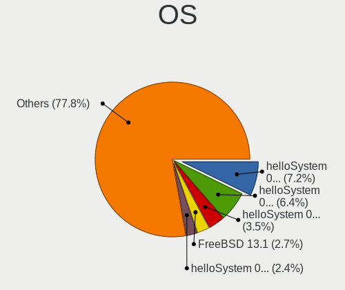

| Name              | Computers | Percent |
|-------------------|-----------|---------|
| helloSystem 0.7.0 | 27        | 7.22%   |
| helloSystem 0.8.1 | 24        | 6.42%   |
| helloSystem 0.8.0 | 13        | 3.48%   |
| FreeBSD 13.1      | 10        | 2.67%   |
| helloSystem 0.4.0 | 9         | 2.41%   |
| helloSystem 0.5.0 | 8         | 2.14%   |
| OPNsense 22.1     | 7         | 1.87%   |
| helloSystem 0.9.0 | 7         | 1.87%   |
| OpenBSD 6.8       | 6         | 1.6%    |
| helloSystem 0.6.0 | 6         | 1.6%    |
| FreeBSD 14.0      | 6         | 1.6%    |
| OPNsense 22.7.10  | 5         | 1.34%   |
| OpenBSD 7.2       | 5         | 1.34%   |
| FreeBSD 14.1-p5   | 5         | 1.34%   |
| FreeBSD 13.2      | 5         | 1.34%   |
| OPNsense 24.7.7   | 4         | 1.07%   |
| OPNsense 24.1.6   | 4         | 1.07%   |
| OPNsense 24.1.1   | 4         | 1.07%   |
| OPNsense 23.7.7   | 4         | 1.07%   |
| OPNsense 23.7.12  | 4         | 1.07%   |
| OPNsense 21.7.7   | 4         | 1.07%   |
| OpenBSD 7.1       | 4         | 1.07%   |
| NetBSD 10.0       | 4         | 1.07%   |
| GhostBSD 20.04.02 | 4         | 1.07%   |
| FreeBSD 14.2      | 4         | 1.07%   |
| OPNsense 24.7.9   | 3         | 0.8%    |
| OPNsense 24.7.8   | 3         | 0.8%    |
| OPNsense 24.7.10  | 3         | 0.8%    |
| OPNsense 24.1.8   | 3         | 0.8%    |
| OPNsense 24.1.4   | 3         | 0.8%    |
| OPNsense 24.1.2   | 3         | 0.8%    |
| OPNsense 24.1     | 3         | 0.8%    |
| OPNsense 23.1     | 3         | 0.8%    |
| OPNsense 22.7.6   | 3         | 0.8%    |
| OPNsense 22.7.11  | 3         | 0.8%    |
| OPNsense 21.7.5   | 3         | 0.8%    |
| OPNsense 21.7.1   | 3         | 0.8%    |
| NomadBSD 20240711 | 3         | 0.8%    |
| helloSystem 0.8.2 | 3         | 0.8%    |
| FreeBSD 14.1-p6   | 3         | 0.8%    |

OS Family
---------

OS without a version

| Name        | Computers | Percent |
|-------------|-----------|---------|
| OPNsense    | 98        | 33.45%  |
| helloSystem | 84        | 28.67%  |
| FreeBSD     | 59        | 20.14%  |
| OpenBSD     | 20        | 6.83%   |
| GhostBSD    | 15        | 5.12%   |
| NetBSD      | 8         | 2.73%   |
| NomadBSD    | 5         | 1.71%   |
| FuguIta     | 2         | 0.68%   |
| TrueNAS     | 1         | 0.34%   |
| DragonFly   | 1         | 0.34%   |

Arch
----

OS architecture (x86_64, i586, etc.)

| Name   | Computers | Percent |
|--------|-----------|---------|
| amd64  | 276       | 96.5%   |
| arm64  | 5         | 1.75%   |
| evbarm | 3         | 1.05%   |
| i386   | 2         | 0.7%    |

DE
--

Desktop Environment

| Name         | Computers | Percent |
|--------------|-----------|---------|
| Console      | 123       | 41.69%  |
| helloDesktop | 99        | 33.56%  |
| MATE         | 20        | 6.78%   |
| XFCE         | 16        | 5.42%   |
| KDE5         | 9         | 3.05%   |
| TWM          | 7         | 2.37%   |
| fvwm         | 7         | 2.37%   |
| GNOME        | 5         | 1.69%   |
| Openbox      | 3         | 1.02%   |
| i3           | 3         | 1.02%   |
| LXQt         | 1         | 0.34%   |
| KDE          | 1         | 0.34%   |
| Fluxbox      | 1         | 0.34%   |

Display Server
--------------

X11 or Wayland

| Name    | Computers | Percent |
|---------|-----------|---------|
| X11     | 163       | 56.79%  |
| Console | 121       | 42.16%  |
| Wayland | 3         | 1.05%   |

Display Manager
---------------

SDDM, LightDM, etc.

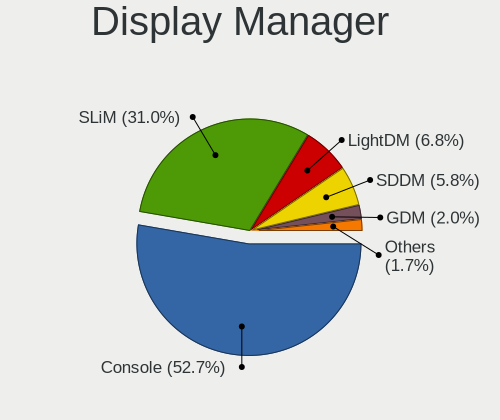

| Name    | Computers | Percent |
|---------|-----------|---------|
| Console | 155       | 52.72%  |
| SLiM    | 91        | 30.95%  |
| LightDM | 20        | 6.8%    |
| SDDM    | 17        | 5.78%   |
| GDM     | 6         | 2.04%   |
| XDM     | 3         | 1.02%   |
| Ly      | 2         | 0.68%   |

OS Lang
-------

Language

| Lang             | Computers | Percent |
|------------------|-----------|---------|
| Unknown          | 138       | 45.7%   |
| C                | 53        | 17.55%  |
| en_US            | 50        | 16.56%  |
| es_ES            | 44        | 14.57%  |
| fr_FR            | 6         | 1.99%   |
| es               | 5         | 1.66%   |
| ru_RU            | 2         | 0.66%   |
| zh_CN            | 1         | 0.33%   |
| fr               | 1         | 0.33%   |
| es_ES.ISO8859-15 | 1         | 0.33%   |
| de_DE            | 1         | 0.33%   |

Boot Mode
---------

EFI or BIOS

| Mode | Computers | Percent |
|------|-----------|---------|
| EFI  | 241       | 83.68%  |
| BIOS | 47        | 16.32%  |

Filesystem
----------

Type of filesystem

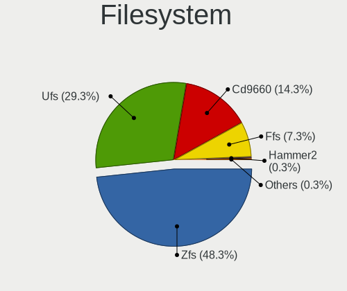

| Type    | Computers | Percent |
|---------|-----------|---------|
| Zfs     | 145       | 48.33%  |
| Ufs     | 88        | 29.33%  |
| Cd9660  | 43        | 14.33%  |
| Ffs     | 22        | 7.33%   |
| Hammer2 | 1         | 0.33%   |
| Unknown | 1         | 0.33%   |

Part. scheme
------------

Scheme of partitioning

| Type    | Computers | Percent |
|---------|-----------|---------|
| GPT     | 252       | 87.8%   |
| MBR     | 30        | 10.45%  |
| Unknown | 5         | 1.74%   |

Board
-----

Vendor
------

Motherboard manufacturer

| Name                                 | Computers | Percent |
|--------------------------------------|-----------|---------|
| Hewlett-Packard                      | 40        | 13.99%  |
| ASUSTek Computer                     | 33        | 11.54%  |
| Lenovo                               | 31        | 10.84%  |
| Dell                                 | 18        | 6.29%   |
| Unknown                              | 18        | 6.29%   |
| Gigabyte Technology                  | 14        | 4.9%    |
| AMI                                  | 14        | 4.9%    |
| Acer                                 | 12        | 4.2%    |
| Intel                                | 11        | 3.85%   |
| MSI                                  | 10        | 3.5%    |
| ASRock                               | 8         | 2.8%    |
| Raspberry Pi Foundation              | 7         | 2.45%   |
| Fujitsu                              | 7         | 2.45%   |
| Apple                                | 7         | 2.45%   |
| YANYU                                | 4         | 1.4%    |
| Techvision                           | 4         | 1.4%    |
| Framework                            | 4         | 1.4%    |
| Medion                               | 3         | 1.05%   |
| Toshiba                              | 2         | 0.7%    |
| Sophos                               | 2         | 0.7%    |
| Sony                                 | 2         | 0.7%    |
| SLIMBOOK                             | 2         | 0.7%    |
| Samsung Electronics                  | 2         | 0.7%    |
| PC Engines                           | 2         | 0.7%    |
| OEM                                  | 2         | 0.7%    |
| HPE                                  | 2         | 0.7%    |
| ECS                                  | 2         | 0.7%    |
| AZW                                  | 2         | 0.7%    |
| Alienware                            | 2         | 0.7%    |
| ZOTAC                                | 1         | 0.35%   |
| Wistron                              | 1         | 0.35%   |
| TWINHEAD                             | 1         | 0.35%   |
| TUXEDO                               | 1         | 0.35%   |
| ShenZhen MinWin Technology           | 1         | 0.35%   |
| Shenzhen Meigao Electronic Equipment | 1         | 0.35%   |
| Seeed Studio                         | 1         | 0.35%   |
| ReachingTech                         | 1         | 0.35%   |
| Razer                                | 1         | 0.35%   |
| Protectli                            | 1         | 0.35%   |
| Pegatron                             | 1         | 0.35%   |

Model
-----

Motherboard model

| Name                                              | Computers | Percent |
|---------------------------------------------------|-----------|---------|
| Unknown                                           | 20        | 6.99%   |
| AMI Aptio CRB                                     | 11        | 3.85%   |
| RPi Raspberry Pi                                  | 6         | 2.1%    |
| Techvision TVI7309X                               | 4         | 1.4%    |
| Fujitsu FUTRO S920                                | 3         | 1.05%   |
| Framework Laptop (13th Gen Intel Core)            | 3         | 1.05%   |
| Dell Precision 5510                               | 3         | 1.05%   |
| Dell Latitude 7390                                | 3         | 1.05%   |
| ASUS All Series                                   | 3         | 1.05%   |
| YANYU R250                                        | 2         | 0.7%    |
| YANYU H67SL                                       | 2         | 0.7%    |
| Sophos XG                                         | 2         | 0.7%    |
| HPE ProLiant MicroServer Gen10                    | 2         | 0.7%    |
| HP Pavilion Gaming Laptop 15-ec1xxx               | 2         | 0.7%    |
| HP EliteDesk 700 G1 SFF                           | 2         | 0.7%    |
| ASUS PRIME A320M-K                                | 2         | 0.7%    |
| ASUS K55VD                                        | 2         | 0.7%    |
| ASRock N3700-ITX                                  | 2         | 0.7%    |
| ASRock H81M-VG4 R2.0                              | 2         | 0.7%    |
| Apple Macmini6,2                                  | 2         | 0.7%    |
| ZOTAC ZBOXNANO-AQ01                               | 1         | 0.35%   |
| Wistron ProLiant ML110 G6                         | 1         | 0.35%   |
| TWINHEAD U12CT                                    | 1         | 0.35%   |
| TUXEDO Aura 15 Gen1                               | 1         | 0.35%   |
| Toshiba Satellite A300                            | 1         | 0.35%   |
| Toshiba Portable PC                               | 1         | 0.35%   |
| Sony VPCSB3Q9E                                    | 1         | 0.35%   |
| Sony SVE1511C5E                                   | 1         | 0.35%   |
| SLIMBOOK PROX-AMD5                                | 1         | 0.35%   |
| SLIMBOOK ESSENTIAL-15-11                          | 1         | 0.35%   |
| ShenZhen MinWin 3865U-6L                          | 1         | 0.35%   |
| Shenzhen Meigao Electronic Equipment Venus series | 1         | 0.35%   |
| Seeed Studio ODYSSEY-X86J4105                     | 1         | 0.35%   |
| Samsung Galaxy Book 12                            | 1         | 0.35%   |
| Samsung 530U3C/530U4C/532U3C                      | 1         | 0.35%   |
| ReachingTech DreamQuest Pro 2022                  | 1         | 0.35%   |
| Razer Blade Stealth                               | 1         | 0.35%   |
| RPi Raspberry Pi 4 Model B                        | 1         | 0.35%   |
| Protectli FW4B                                    | 1         | 0.35%   |
| Pegatron Elite 7500 Series MT                     | 1         | 0.35%   |

Model Family
------------

Motherboard model prefix

| Name                | Computers | Percent |
|---------------------|-----------|---------|
| Unknown             | 20        | 6.99%   |
| Lenovo ThinkPad     | 16        | 5.59%   |
| AMI Aptio           | 11        | 3.85%   |
| Lenovo ThinkCentre  | 8         | 2.8%    |
| Acer Aspire         | 8         | 2.8%    |
| RPi Raspberry       | 7         | 2.45%   |
| HP Pavilion         | 7         | 2.45%   |
| HP Compaq           | 6         | 2.1%    |
| ASUS PRIME          | 6         | 2.1%    |
| Techvision TVI7309X | 4         | 1.4%    |
| HP ProLiant         | 4         | 1.4%    |
| HP EliteDesk        | 4         | 1.4%    |
| Framework Laptop    | 4         | 1.4%    |
| Dell Precision      | 4         | 1.4%    |
| Dell OptiPlex       | 4         | 1.4%    |
| Dell Latitude       | 4         | 1.4%    |
| Lenovo IdeaPad      | 3         | 1.05%   |
| HP ProBook          | 3         | 1.05%   |
| HP OMEN             | 3         | 1.05%   |
| HP Laptop           | 3         | 1.05%   |
| Fujitsu FUTRO       | 3         | 1.05%   |
| Fujitsu ESPRIMO     | 3         | 1.05%   |
| ASUS TUF            | 3         | 1.05%   |
| ASUS All            | 3         | 1.05%   |
| YANYU R250          | 2         | 0.7%    |
| YANYU H67SL         | 2         | 0.7%    |
| Sophos XG           | 2         | 0.7%    |
| HPE ProLiant        | 2         | 0.7%    |
| Dell PowerEdge      | 2         | 0.7%    |
| ASUS M5A78L-M       | 2         | 0.7%    |
| ASUS K55VD          | 2         | 0.7%    |
| ASRock N3700-ITX    | 2         | 0.7%    |
| ASRock H81M-VG4     | 2         | 0.7%    |
| Apple Macmini6      | 2         | 0.7%    |
| Apple MacBook5      | 2         | 0.7%    |
| ZOTAC ZBOXNANO-AQ01 | 1         | 0.35%   |
| Wistron ProLiant    | 1         | 0.35%   |
| TWINHEAD U12CT      | 1         | 0.35%   |
| TUXEDO Aura         | 1         | 0.35%   |
| Toshiba Satellite   | 1         | 0.35%   |

MFG Year
--------

Motherboard manufacture year

| Year    | Computers | Percent |
|---------|-----------|---------|
| 2020    | 28        | 9.79%   |
| 2019    | 27        | 9.44%   |
| 2014    | 27        | 9.44%   |
| 2018    | 24        | 8.39%   |
| 2022    | 19        | 6.64%   |
| 2017    | 19        | 6.64%   |
| 2023    | 16        | 5.59%   |
| 2016    | 16        | 5.59%   |
| 2011    | 14        | 4.9%    |
| 2015    | 13        | 4.55%   |
| 2012    | 13        | 4.55%   |
| 2021    | 11        | 3.85%   |
| 2013    | 11        | 3.85%   |
| 2010    | 10        | 3.5%    |
| 2008    | 10        | 3.5%    |
| 2009    | 9         | 3.15%   |
| Unknown | 8         | 2.8%    |
| 2024    | 6         | 2.1%    |
| 2007    | 2         | 0.7%    |
| 2006    | 1         | 0.35%   |
| 2005    | 1         | 0.35%   |
| 2003    | 1         | 0.35%   |

Form Factor
-----------

Physical design of the computer

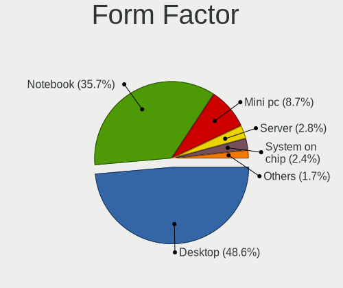

| Name           | Computers | Percent |
|----------------|-----------|---------|
| Desktop        | 139       | 48.6%   |
| Notebook       | 102       | 35.66%  |
| Mini pc        | 25        | 8.74%   |
| Server         | 8         | 2.8%    |
| System on chip | 7         | 2.45%   |
| Firewall       | 2         | 0.7%    |
| Tablet         | 1         | 0.35%   |
| Convertible    | 1         | 0.35%   |
| All in one     | 1         | 0.35%   |

Coreboot
--------

Have coreboot on board

| Used | Computers | Percent |
|------|-----------|---------|
| No   | 284       | 99.3%   |
| Yes  | 2         | 0.7%    |

RAM Size
--------

Total RAM memory

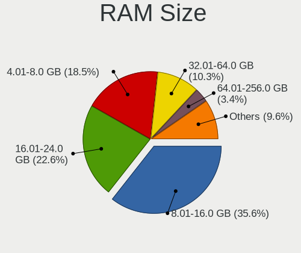

| Size in GB  | Computers | Percent |
|-------------|-----------|---------|
| 8.01-16.0   | 104       | 35.62%  |
| 16.01-24.0  | 66        | 22.6%   |
| 4.01-8.0    | 54        | 18.49%  |
| 32.01-64.0  | 30        | 10.27%  |
| 2.01-3.0    | 10        | 3.42%   |
| 64.01-256.0 | 10        | 3.42%   |
| 3.01-4.0    | 7         | 2.4%    |
| 24.01-32.0  | 3         | 1.03%   |
| 1.01-2.0    | 3         | 1.03%   |
| 0.01-0.5    | 3         | 1.03%   |
| 0.51-1.0    | 2         | 0.68%   |

RAM Used
--------

Used RAM memory

| Used GB    | Computers | Percent |
|------------|-----------|---------|
| 0.01-0.5   | 136       | 45.79%  |
| 0.51-1.0   | 94        | 31.65%  |
| 1.01-2.0   | 36        | 12.12%  |
| Unknown    | 8         | 2.69%   |
| 2.01-3.0   | 7         | 2.36%   |
| 3.01-4.0   | 6         | 2.02%   |
| 4.01-8.0   | 5         | 1.68%   |
| 0          | 4         | 1.35%   |
| 24.01-32.0 | 1         | 0.34%   |

Total Drives
------------

Number of drives on board

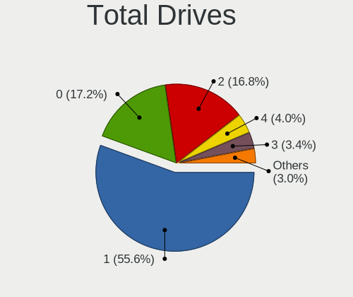

| Drives | Computers | Percent |
|--------|-----------|---------|
| 1      | 165       | 55.56%  |
| 0      | 51        | 17.17%  |
| 2      | 50        | 16.84%  |
| 4      | 12        | 4.04%   |
| 3      | 10        | 3.37%   |
| 5      | 6         | 2.02%   |
| 6      | 2         | 0.67%   |
| 7      | 1         | 0.34%   |

Has CD-ROM
----------

Has CD-ROM on board

| Presented | Computers | Percent |
|-----------|-----------|---------|
| No        | 228       | 79.44%  |
| Yes       | 59        | 20.56%  |

Has Ethernet
------------

Has Ethernet on board

| Presented | Computers | Percent |
|-----------|-----------|---------|
| Yes       | 255       | 89.16%  |
| No        | 31        | 10.84%  |

Has WiFi
--------

Has WiFi module

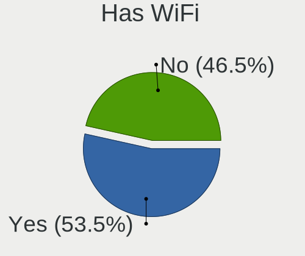

| Presented | Computers | Percent |
|-----------|-----------|---------|
| Yes       | 154       | 53.47%  |
| No        | 134       | 46.53%  |

Has Bluetooth
-------------

Has Bluetooth module

| Presented | Computers | Percent |
|-----------|-----------|---------|
| No        | 170       | 59.03%  |
| Yes       | 118       | 40.97%  |

Location
--------

Country
-------

Geographic location (country)

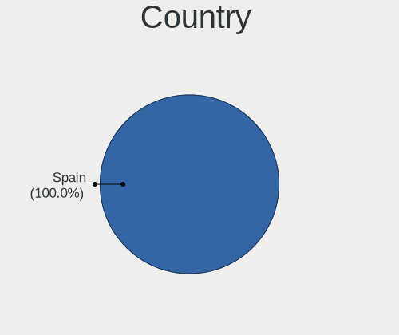

| Country | Computers | Percent |
|---------|-----------|---------|
| Spain   | 286       | 100%    |

City
----

Geographic location (city)

| City                          | Computers | Percent |
|-------------------------------|-----------|---------|
| Madrid                        | 68        | 20.73%  |
| Barcelona                     | 20        | 6.1%    |
| Valencia                      | 15        | 4.57%   |
| Zaragoza                      | 7         | 2.13%   |
| Vigo                          | 5         | 1.52%   |
| Seville                       | 5         | 1.52%   |
| Paterna                       | 4         | 1.22%   |
| Palma                         | 4         | 1.22%   |
| Ourense                       | 4         | 1.22%   |
| Mlaga                       | 4         | 1.22%   |
| Ibiza Town                    | 4         | 1.22%   |
| Terrassa                      | 3         | 0.91%   |
| Santiago de Compostela        | 3         | 0.91%   |
| Santa Cruz de Tenerife        | 3         | 0.91%   |
| San Sebastin de los Reyes | 3         | 0.91%   |
| Navalcarnero                  | 3         | 0.91%   |
| Los Realejos                  | 3         | 0.91%   |
| Elche                         | 3         | 0.91%   |
| Bilbao                        | 3         | 0.91%   |
| Alcobendas                    | 3         | 0.91%   |
| A Corua                     | 3         | 0.91%   |
| Vitoria-Gasteiz               | 2         | 0.61%   |
| Viladecans                    | 2         | 0.61%   |
| Valladolid                    | 2         | 0.61%   |
| Torrejon del Rey              | 2         | 0.61%   |
| Tarragona                     | 2         | 0.61%   |
| Sedavi                        | 2         | 0.61%   |
| San Cristbal de La Laguna   | 2         | 0.61%   |
| Redondela                     | 2         | 0.61%   |
| Port de Sagunt                | 2         | 0.61%   |
| Oviedo                        | 2         | 0.61%   |
| Logroo                    | 2         | 0.61%   |
| Girona                        | 2         | 0.61%   |
| Gibralen                  | 2         | 0.61%   |
| Getafe                        | 2         | 0.61%   |
| Coria del Ro              | 2         | 0.61%   |
| Castilleja de la Cuesta       | 2         | 0.61%   |
| Barakaldo                     | 2         | 0.61%   |
| Almera                      | 2         | 0.61%   |
| Alcoy                         | 2         | 0.61%   |

Drives
------

Drive Vendor
------------

Hard drive vendors

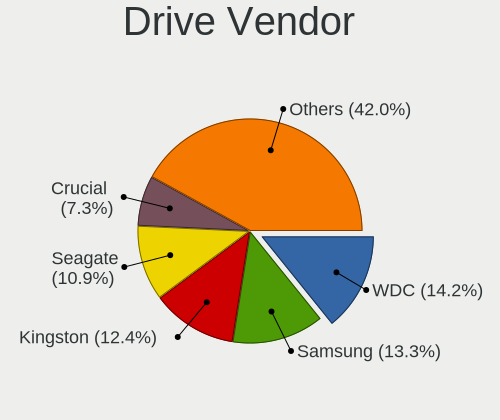

| Vendor                                 | Computers | Drives | Percent |
|----------------------------------------|-----------|--------|---------|
| WDC                                    | 47        | 68     | 14.2%   |
| Samsung Electronics                    | 44        | 70     | 13.29%  |
| Kingston                               | 41        | 78     | 12.39%  |
| Seagate                                | 36        | 61     | 10.88%  |
| Crucial                                | 24        | 28     | 7.25%   |
| Toshiba                                | 14        | 18     | 4.23%   |
| Hitachi                                | 10        | 10     | 3.02%   |
| SanDisk                                | 8         | 9      | 2.42%   |
| NVMe                                   | 7         | 10     | 2.11%   |
| China                                  | 7         | 15     | 2.11%   |
| Transcend                              | 5         | 10     | 1.51%   |
| Intel                                  | 4         | 6      | 1.21%   |
| HGST                                   | 4         | 4      | 1.21%   |
| FORESEE                                | 4         | 4      | 1.21%   |
| TCSUNBOW                               | 3         | 5      | 0.91%   |
| SK hynix                               | 3         | 3      | 0.91%   |
| Phison                                 | 3         | 3      | 0.91%   |
| OCZ                                    | 3         | 3      | 0.91%   |
| Micron Technology                      | 3         | 3      | 0.91%   |
| LITEONIT                               | 3         | 3      | 0.91%   |
| LITEON                                 | 3         | 3      | 0.91%   |
| Intenso                                | 3         | 7      | 0.91%   |
| Fujitsu                                | 3         | 3      | 0.91%   |
| Corsair                                | 3         | 3      | 0.91%   |
| Apacer                                 | 3         | 3      | 0.91%   |
| A-DATA Technology                      | 3         | 3      | 0.91%   |
| ViperTeq                               | 2         | 2      | 0.6%    |
| Silicon Motion                         | 2         | 2      | 0.6%    |
| ShiJi                                  | 2         | 3      | 0.6%    |
| Product:              USB Flash Memory | 2         | 2      | 0.6%    |
| MARVELL                                | 2         | 2      | 0.6%    |
| Kston                                  | 2         | 4      | 0.6%    |
| KIOXIA                                 | 2         | 2      | 0.6%    |
| Innodisk                               | 2         | 4      | 0.6%    |
| Hoodisk                                | 2         | 2      | 0.6%    |
| Hewlett-Packard                        | 2         | 3      | 0.6%    |
| Gigabyte Technology                    | 2         | 3      | 0.6%    |
| Apple                                  | 2         | 2      | 0.6%    |
| XrayDisk                               | 1         | 1      | 0.3%    |
| Union Memory                           | 1         | 1      | 0.3%    |

Drive Model
-----------

Hard drive models

| Model                                                        | Computers | Percent |
|--------------------------------------------------------------|-----------|---------|
| Kingston SA400S37240G 240GB                                  | 12        | 3.26%   |
| Kingston SA400S37480G 480GB                                  | 6         | 1.63%   |
| Seagate ST500DM002-1BD142 500GB                              | 5         | 1.36%   |
| Crucial CT500MX500SSD1 500GB                                 | 5         | 1.36%   |
| Seagate ST1000DM010-2EP102 1TB                               | 4         | 1.09%   |
| Kingston SV300S37A120G 120GB                                 | 4         | 1.09%   |
| Kingston SUV500MS120G 120GB                                  | 4         | 1.09%   |
| Samsung SSD 860 EVO 500GB                                    | 3         | 0.82%   |
| Samsung SSD 850 EVO 500GB                                    | 3         | 0.82%   |
| Samsung SSD 850 EVO 250GB                                    | 3         | 0.82%   |
| Kingston SUV400S37240G 240GB                                 | 3         | 0.82%   |
| Kingston SKC600MS256G 256GB                                  | 3         | 0.82%   |
| Kingston SA400S37120G 120GB                                  | 3         | 0.82%   |
| Crucial CT240BX500SSD1 240GB                                 | 3         | 0.82%   |
| WDC WDS500G2B0A-00SM50 500GB                                 | 2         | 0.54%   |
| WDC WDS500G1B0A-00H9H0 500GB                                 | 2         | 0.54%   |
| WDC WDS250G1B0A-00H9H0 250GB                                 | 2         | 0.54%   |
| WDC WDS120G2G0B-00EPW0 120GB                                 | 2         | 0.54%   |
| WDC WD2500BEVS-22UST0 250GB                                  | 2         | 0.54%   |
| WDC WD20EARX-00PASB0 2TB                                     | 2         | 0.54%   |
| WDC WD10EZEX-60WN4A0 1TB                                     | 2         | 0.54%   |
| ViperTeq VT-SSDUP500-120 120GB                               | 2         | 0.54%   |
| Transcend TS120GMTS420S 120GB                                | 2         | 0.54%   |
| Toshiba TR200 240GB                                          | 2         | 0.54%   |
| Toshiba MQ01ABD100 1TB                                       | 2         | 0.54%   |
| Seagate ST9500325AS 500GB                                    | 2         | 0.54%   |
| Seagate ST500LM021-1KJ152 500GB                              | 2         | 0.54%   |
| Seagate ST3500418AS 500GB                                    | 2         | 0.54%   |
| Seagate ST1000LM024 HN-M101MBB 1TB                           | 2         | 0.54%   |
| Seagate ST1000DM003-9YN162 1TB                               | 2         | 0.54%   |
| Seagate ST1000DM003-1ER162 1TB                               | 2         | 0.54%   |
| Samsung MZVLW512HMJP-000L7 512GB                             | 2         | 0.54%   |
| Samsung HD103SI 1TB                                          | 2         | 0.54%   |
| Product:              USB Flash Memory USB Flash Memory 16GB | 2         | 0.54%   |
| NVMe Samsung SSD 980 1TB                                     | 2         | 0.54%   |
| MARVELL Raid VD 8TB                                          | 2         | 0.54%   |
| LITEON CV8-8E128-HP 128GB                                    | 2         | 0.54%   |
| Kingston SV300S37A240G 240GB                                 | 2         | 0.54%   |
| Innodisk DEMSR- 08GB mSATA 3ME A                             | 2         | 0.54%   |
| Hitachi HTS545050A7E380 500GB                                | 2         | 0.54%   |

HDD Vendor
----------

Hard disk drive vendors

| Vendor                                 | Computers | Drives | Percent |
|----------------------------------------|-----------|--------|---------|
| Seagate                                | 35        | 57     | 31.53%  |
| WDC                                    | 32        | 47     | 28.83%  |
| Toshiba                                | 10        | 12     | 9.01%   |
| Hitachi                                | 10        | 10     | 9.01%   |
| Samsung Electronics                    | 8         | 11     | 7.21%   |
| HGST                                   | 4         | 4      | 3.6%    |
| NVMe                                   | 3         | 5      | 2.7%    |
| Fujitsu                                | 3         | 3      | 2.7%    |
| Product:              USB Flash Memory | 2         | 2      | 1.8%    |
| MARVELL                                | 2         | 2      | 1.8%    |
| Hewlett-Packard                        | 1         | 2      | 0.9%    |
| Apple                                  | 1         | 1      | 0.9%    |

SSD Vendor
----------

Solid state drive vendors

| Vendor              | Computers | Drives | Percent |
|---------------------|-----------|--------|---------|
| Kingston            | 39        | 76     | 22.41%  |
| Samsung Electronics | 24        | 34     | 13.79%  |
| Crucial             | 19        | 22     | 10.92%  |
| WDC                 | 10        | 15     | 5.75%   |
| SanDisk             | 8         | 9      | 4.6%    |
| China               | 7         | 15     | 4.02%   |
| Transcend           | 5         | 10     | 2.87%   |
| Toshiba             | 4         | 4      | 2.3%    |
| FORESEE             | 4         | 4      | 2.3%    |
| TCSUNBOW            | 3         | 5      | 1.72%   |
| OCZ                 | 3         | 3      | 1.72%   |
| NVMe                | 3         | 3      | 1.72%   |
| LITEONIT            | 3         | 3      | 1.72%   |
| LITEON              | 3         | 3      | 1.72%   |
| Intel               | 3         | 5      | 1.72%   |
| Apacer              | 3         | 3      | 1.72%   |
| A-DATA Technology   | 3         | 3      | 1.72%   |
| ViperTeq            | 2         | 2      | 1.15%   |
| ShiJi               | 2         | 3      | 1.15%   |
| Kston               | 2         | 4      | 1.15%   |
| Intenso             | 2         | 6      | 1.15%   |
| Innodisk            | 2         | 4      | 1.15%   |
| Hoodisk             | 2         | 2      | 1.15%   |
| XrayDisk            | 1         | 1      | 0.57%   |
| SPCC                | 1         | 1      | 0.57%   |
| SK hynix            | 1         | 1      | 0.57%   |
| Seagate             | 1         | 1      | 0.57%   |
| PNY                 | 1         | 1      | 0.57%   |
| Phison              | 1         | 1      | 0.57%   |
| Patriot             | 1         | 1      | 0.57%   |
| Netac               | 1         | 1      | 0.57%   |
| Micron Technology   | 1         | 1      | 0.57%   |
| MicroFrom           | 1         | 1      | 0.57%   |
| Maximus             | 1         | 1      | 0.57%   |
| KingSpec            | 1         | 1      | 0.57%   |
| Hewlett-Packard     | 1         | 1      | 0.57%   |
| Gigabyte Technology | 1         | 1      | 0.57%   |
| EMTEC               | 1         | 1      | 0.57%   |
| BR                  | 1         | 4      | 0.57%   |
| BAITITON            | 1         | 1      | 0.57%   |

Drive Kind
----------

HDD or SSD

| Kind | Computers | Drives | Percent |
|------|-----------|--------|---------|
| SSD  | 156       | 259    | 53.06%  |
| HDD  | 91        | 156    | 30.95%  |
| NVMe | 47        | 70     | 15.99%  |

Drive Connector
---------------

SATA, SAS, NVMe, etc.

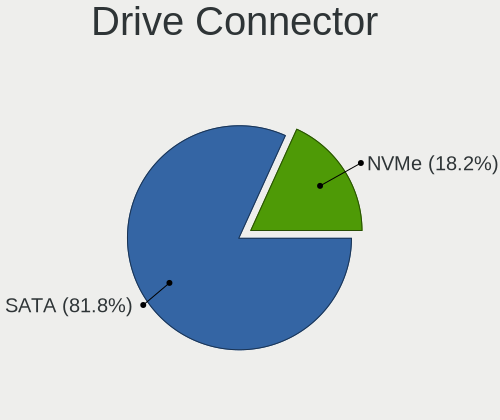

| Type | Computers | Drives | Percent |
|------|-----------|--------|---------|
| SATA | 211       | 415    | 81.78%  |
| NVMe | 47        | 70     | 18.22%  |

Drive Size
----------

Size of hard drive

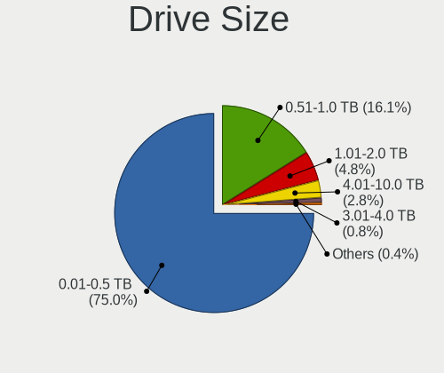

| Size in TB | Computers | Drives | Percent |
|------------|-----------|--------|---------|
| 0.01-0.5   | 186       | 322    | 75%     |
| 0.51-1.0   | 40        | 61     | 16.13%  |
| 1.01-2.0   | 12        | 20     | 4.84%   |
| 4.01-10.0  | 7         | 9      | 2.82%   |
| 3.01-4.0   | 2         | 2      | 0.81%   |
| 2.01-3.0   | 1         | 1      | 0.4%    |

Space Total
-----------

Amount of disk space available on the file system

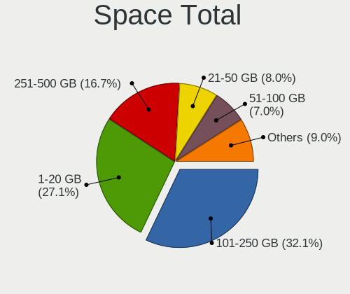

| Size in GB     | Computers | Percent |
|----------------|-----------|---------|
| 101-250        | 96        | 32.11%  |
| 1-20           | 81        | 27.09%  |
| 251-500        | 50        | 16.72%  |
| 21-50          | 24        | 8.03%   |
| 51-100         | 21        | 7.02%   |
| 501-1000       | 18        | 6.02%   |
| 1001-2000      | 5         | 1.67%   |
| 2001-3000      | 2         | 0.67%   |
| More than 3000 | 1         | 0.33%   |
| Unknown        | 1         | 0.33%   |

Space Used
----------

Amount of used disk space

| Used GB  | Computers | Percent |
|----------|-----------|---------|
| 1-20     | 263       | 89.76%  |
| 21-50    | 17        | 5.8%    |
| 51-100   | 8         | 2.73%   |
| 251-500  | 3         | 1.02%   |
| 501-1000 | 1         | 0.34%   |
| Unknown  | 1         | 0.34%   |

Malfunc. Drives
---------------

Drive models with a malfunction

| Model                                           | Computers | Drives | Percent |
|-------------------------------------------------|-----------|--------|---------|
| Seagate ST500DM002-1BD142 500GB                 | 2         | 2      | 3.45%   |
| LITEON CV8-8E128-HP 128GB                       | 2         | 2      | 3.45%   |
| Kingston SV300S37A120G 120GB                    | 2         | 2      | 3.45%   |
| Hitachi HTS545050A7E380 500GB                   | 2         | 2      | 3.45%   |
| WDC WDS240G2G0A-00JH30 240GB                    | 1         | 2      | 1.72%   |
| WDC WD6400AAKS-22A7B0 640GB                     | 1         | 1      | 1.72%   |
| WDC WD5000LPVX-22V0TT0 500GB                    | 1         | 1      | 1.72%   |
| WDC WD5000AAKX-22ERMA0 500GB                    | 1         | 1      | 1.72%   |
| WDC WD2500BEVT-35A23T0 250GB                    | 1         | 1      | 1.72%   |
| WDC WD1600AAJS-00WAA0 160GB                     | 1         | 1      | 1.72%   |
| WDC WD10EZEX-21M2NA0 1TB                        | 1         | 1      | 1.72%   |
| Toshiba MQ01UBD100 1TB                          | 1         | 2      | 1.72%   |
| Toshiba MQ01ACF032 320GB                        | 1         | 1      | 1.72%   |
| Toshiba MK1229GSG 120GB                         | 1         | 1      | 1.72%   |
| Toshiba MK1059GSM 1TB                           | 1         | 1      | 1.72%   |
| SK hynix HFS064G3AMNB-2200A 64GB                | 1         | 1      | 1.72%   |
| Seagate ST6000DM003-2CY186 6TB                  | 1         | 1      | 1.72%   |
| Seagate ST500LT012-9WS142 500GB                 | 1         | 1      | 1.72%   |
| Seagate ST500LT012-1DG142 500GB                 | 1         | 1      | 1.72%   |
| Seagate ST500LM021-1KJ152 500GB                 | 1         | 1      | 1.72%   |
| Seagate ST3500418AS 500GB                       | 1         | 1      | 1.72%   |
| Seagate ST3500413AS 500GB                       | 1         | 3      | 1.72%   |
| Seagate ST340016A 40GB                          | 1         | 1      | 1.72%   |
| Seagate ST3160215AS 160GB                       | 1         | 1      | 1.72%   |
| Seagate ST31000528AS 1TB                        | 1         | 2      | 1.72%   |
| Seagate ST31000333AS 1TB                        | 1         | 1      | 1.72%   |
| Seagate ST1000LM024 HN-M101MBB 1TB              | 1         | 1      | 1.72%   |
| Seagate ST1000DM010-2EP102 1TB                  | 1         | 1      | 1.72%   |
| Seagate ST1000DM003-9YN162 1TB                  | 1         | 1      | 1.72%   |
| Seagate ST1000DM003-1ER162 1TB                  | 1         | 1      | 1.72%   |
| Samsung Electronics HM320JI 320GB               | 1         | 1      | 1.72%   |
| Samsung Electronics HM160HI 160GB               | 1         | 1      | 1.72%   |
| Samsung Electronics HD252HJ 250GB               | 1         | 1      | 1.72%   |
| Samsung Electronics HD103UJ 1TB                 | 1         | 1      | 1.72%   |
| Samsung Electronics HD103SI 1TB                 | 1         | 1      | 1.72%   |
| OCZ AGILITY3 120GB                              | 1         | 1      | 1.72%   |
| Micron Technology MTFDDAV256TDL-1AW1ZABHA 256GB | 1         | 1      | 1.72%   |
| Maximus SSD 128GB                               | 1         | 1      | 1.72%   |
| Kingston SUV400S37240G 240GB                    | 1         | 3      | 1.72%   |
| Kingston SHFS37A120G 120GB                      | 1         | 1      | 1.72%   |

Malfunc. Drive Vendor
---------------------

Vendors of faulty drives

| Vendor              | Computers | Drives | Percent |
|---------------------|-----------|--------|---------|
| Seagate             | 13        | 19     | 24.07%  |
| Hitachi             | 9         | 9      | 16.67%  |
| WDC                 | 7         | 8      | 12.96%  |
| Kingston            | 5         | 9      | 9.26%   |
| Toshiba             | 4         | 5      | 7.41%   |
| Samsung Electronics | 4         | 5      | 7.41%   |
| LITEON              | 2         | 2      | 3.7%    |
| Fujitsu             | 2         | 2      | 3.7%    |
| SK hynix            | 1         | 1      | 1.85%   |
| OCZ                 | 1         | 1      | 1.85%   |
| Micron Technology   | 1         | 1      | 1.85%   |
| Maximus             | 1         | 1      | 1.85%   |
| HGST                | 1         | 1      | 1.85%   |
| Gigabyte Technology | 1         | 2      | 1.85%   |
| China               | 1         | 1      | 1.85%   |
| Apple               | 1         | 1      | 1.85%   |

Malfunc. HDD Vendor
-------------------

Vendors of faulty HDD drives

| Vendor              | Computers | Drives | Percent |
|---------------------|-----------|--------|---------|
| Seagate             | 13        | 19     | 32.5%   |
| Hitachi             | 9         | 9      | 22.5%   |
| WDC                 | 6         | 6      | 15%     |
| Toshiba             | 4         | 5      | 10%     |
| Samsung Electronics | 4         | 5      | 10%     |
| Fujitsu             | 2         | 2      | 5%      |
| HGST                | 1         | 1      | 2.5%    |
| Apple               | 1         | 1      | 2.5%    |

Malfunc. Drive Kind
-------------------

Kinds of faulty drives

| Kind | Computers | Drives | Percent |
|------|-----------|--------|---------|
| HDD  | 37        | 48     | 72.55%  |
| SSD  | 13        | 18     | 25.49%  |
| NVMe | 1         | 2      | 1.96%   |

Failed Drives
-------------

Failed drive models

| Model             | Computers | Drives | Percent |
|-------------------|-----------|--------|---------|
| SanDisk pSSD 16GB | 1         | 1      | 100%    |

Failed Drive Vendor
-------------------

Failed drive vendors

| Vendor  | Computers | Drives | Percent |
|---------|-----------|--------|---------|
| SanDisk | 1         | 1      | 100%    |

Drive Status
------------

Number of failed and malfunc. drives

| Status   | Computers | Drives | Percent |
|----------|-----------|--------|---------|
| Works    | 202       | 394    | 75.37%  |
| Malfunc  | 51        | 68     | 19.03%  |
| Detected | 14        | 22     | 5.22%   |
| Failed   | 1         | 1      | 0.37%   |

Storage controller
------------------

Storage Vendor
--------------

Storage controller vendors

| Vendor                       | Computers | Percent |
|------------------------------|-----------|---------|
| Intel                        | 199       | 56.7%   |
| AMD                          | 41        | 11.68%  |
| Samsung Electronics          | 26        | 7.41%   |
| SanDisk                      | 11        | 3.13%   |
| Micron/Crucial Technology    | 10        | 2.85%   |
| ASMedia Technology           | 9         | 2.56%   |
| Nvidia                       | 7         | 1.99%   |
| Phison Electronics           | 6         | 1.71%   |
| Kingston Technology Company  | 6         | 1.71%   |
| SK hynix                     | 4         | 1.14%   |
| Silicon Motion               | 4         | 1.14%   |
| Shenzhen Longsys Electronics | 4         | 1.14%   |
| KIOXIA                       | 4         | 1.14%   |
| Toshiba                      | 3         | 0.85%   |
| Micron Technology            | 3         | 0.85%   |
| Marvell Technology Group     | 3         | 0.85%   |
| MAXIO Technology (Hangzhou)  | 2         | 0.57%   |
| Hewlett-Packard              | 2         | 0.57%   |
| VIA Technologies             | 1         | 0.28%   |
| Union Memory (Shenzhen)      | 1         | 0.28%   |
| Seagate Technology           | 1         | 0.28%   |
| Realtek Semiconductor        | 1         | 0.28%   |
| JMicron Technology           | 1         | 0.28%   |
| Hosin Global Electronics     | 1         | 0.28%   |
| Broadcom / LSI               | 1         | 0.28%   |

Storage Model
-------------

Storage controller models

| Model                                                                            | Computers | Percent |
|----------------------------------------------------------------------------------|-----------|---------|
| AMD FCH SATA Controller [AHCI mode]                                              | 29        | 7.3%    |
| Intel 8 Series/C220 Series Chipset Family 6-port SATA Controller 1 [AHCI mode]   | 24        | 6.05%   |
| Intel Atom Processor E3800 Series SATA AHCI Controller                           | 16        | 4.03%   |
| Intel Sunrise Point-LP SATA Controller [AHCI mode]                               | 11        | 2.77%   |
| Intel 7 Series Chipset Family 6-port SATA Controller [AHCI mode]                 | 10        | 2.52%   |
| Samsung NVMe SSD Controller SM981/PM981/PM983                                    | 9         | 2.27%   |
| Intel Celeron/Pentium Silver Processor SATA Controller                           | 9         | 2.27%   |
| Intel Atom/Celeron/Pentium Processor x5-E8000/J3xxx/N3xxx Series SATA Controller | 9         | 2.27%   |
| Intel 82801IBM/IEM (ICH9M/ICH9M-E) 4 port SATA Controller [AHCI mode]            | 8         | 2.02%   |
| Intel 200 Series PCH SATA controller [AHCI mode]                                 | 8         | 2.02%   |
| ASMedia ASM1061/ASM1062 Serial ATA Controller                                    | 8         | 2.02%   |
| Intel Q170/Q150/B150/H170/H110/Z170/CM236 Chipset SATA Controller [AHCI Mode]    | 7         | 1.76%   |
| Intel Jasper Lake SATA AHCI Controller                                           | 7         | 1.76%   |
| Intel 6 Series/C200 Series Chipset Family 6 port Desktop SATA AHCI Controller    | 7         | 1.76%   |
| Samsung NVMe SSD Controller 980 (DRAM-less)                                      | 6         | 1.51%   |
| Intel Alder Lake-N SATA AHCI Controller                                          | 6         | 1.51%   |
| AMD 400 Series Chipset SATA Controller                                           | 6         | 1.51%   |
| Intel SATA Controller [RAID mode]                                                | 5         | 1.26%   |
| Intel 82801HM/HEM (ICH8M/ICH8M-E) SATA Controller [AHCI mode]                    | 5         | 1.26%   |
| Intel 82801HM/HEM (ICH8M/ICH8M-E) IDE Controller                                 | 5         | 1.26%   |
| Intel 82801 Mobile SATA Controller [RAID mode]                                   | 5         | 1.26%   |
| AMD SB7x0/SB8x0/SB9x0 SATA Controller [AHCI mode]                                | 5         | 1.26%   |
| AMD A320 Chipset SATA Controller [AHCI mode]                                     | 5         | 1.26%   |
| Silicon Motion SM2263EN/SM2263XT (DRAM-less) NVMe SSD Controllers                | 4         | 1.01%   |
| Samsung NVMe SSD Controller SM961/PM961/SM963                                    | 4         | 1.01%   |
| Samsung NVMe SSD Controller PM9A1/PM9A3/980PRO                                   | 4         | 1.01%   |
| Nvidia MCP79 AHCI Controller                                                     | 4         | 1.01%   |
| Micron/Crucial P2 [Nick P2] / P3 / P3 Plus NVMe PCIe SSD (DRAM-less)             | 4         | 1.01%   |
| Intel Wildcat Point-LP SATA Controller [AHCI Mode]                               | 4         | 1.01%   |
| Intel Tiger Lake-LP SATA Controller                                              | 4         | 1.01%   |
| Intel 8 Series SATA Controller 1 [AHCI mode]                                     | 4         | 1.01%   |
| Intel 7 Series/C210 Series Chipset Family 6-port SATA Controller [AHCI mode]     | 4         | 1.01%   |
| Micron/Crucial P1 NVMe PCIe SSD[Frampton]                                        | 3         | 0.76%   |
| Intel Volume Management Device NVMe RAID Controller                              | 3         | 0.76%   |
| Intel Cannon Point-LP SATA Controller [AHCI Mode]                                | 3         | 0.76%   |
| Intel Cannon Lake PCH SATA AHCI Controller                                       | 3         | 0.76%   |
| Intel Atom Processor C3000 Series SATA Controller 0                              | 3         | 0.76%   |
| Intel 5 Series/3400 Series Chipset 4 port SATA AHCI Controller                   | 3         | 0.76%   |
| AMD SB7x0/SB8x0/SB9x0 IDE Controller                                             | 3         | 0.76%   |
| Toshiba BG3 x2 NVMe SSD Controller (DRAM-less)                                   | 2         | 0.5%    |

Storage Kind
------------

Kind of storage controller (IDE, SATA, NVMe, SAS, ...)

| Kind | Computers | Percent |
|------|-----------|---------|
| SATA | 221       | 62.61%  |
| NVMe | 81        | 22.95%  |
| IDE  | 32        | 9.07%   |
| RAID | 18        | 5.1%    |
| SAS  | 1         | 0.28%   |

Processor
---------

CPU Vendor
----------

Processor vendors

| Vendor   | Computers | Percent |
|----------|-----------|---------|
| Intel    | 224       | 78.32%  |
| AMD      | 54        | 18.88%  |
| ARM      | 5         | 1.75%   |
| Unknown  | 2         | 0.7%    |
| Broadcom | 1         | 0.35%   |

CPU Model
---------

Processor models

| Model                                    | Computers | Percent |
|------------------------------------------|-----------|---------|
| Intel Celeron CPU J1900 @ 1.99GHz        | 9         | 3.11%   |
| Intel N100                               | 6         | 2.08%   |
| Intel Celeron N5105 @ 2.00GHz            | 6         | 2.08%   |
| Intel Xeon CPU E3-1220 v3 @ 3.10GHz      | 4         | 1.38%   |
| Intel Core i3-4160 CPU @ 3.60GHz         | 4         | 1.38%   |
| Intel Celeron J4125 CPU @ 2.00GHz        | 4         | 1.38%   |
| Intel Core i5-9500 CPU @ 3.00GHz         | 3         | 1.04%   |
| Intel Core i5-8250U CPU @ 1.60GHz        | 3         | 1.04%   |
| Intel Core i5-6300HQ CPU @ 2.30GHz       | 3         | 1.04%   |
| Intel Core i5-4590 CPU @ 3.30GHz         | 3         | 1.04%   |
| Intel Core i5-4570 CPU @ 3.20GHz         | 3         | 1.04%   |
| Intel Core i5-2400 CPU @ 3.10GHz         | 3         | 1.04%   |
| Intel Core i3-3240 CPU @ 3.40GHz         | 3         | 1.04%   |
| Intel 13th Gen Core i7-1360P             | 3         | 1.04%   |
| ARM Cortex-A72 r0p3                      | 3         | 1.04%   |
| AMD GX-415GA SOC with Radeon HD Graphics | 3         | 1.04%   |
| Intel Pentium Silver J5005 CPU @ 1.50GHz | 2         | 0.69%   |
| Intel Pentium CPU N3700 @ 1.60GHz        | 2         | 0.69%   |
| Intel Core i7-8565U CPU @ 1.80GHz        | 2         | 0.69%   |
| Intel Core i7-7500U CPU @ 2.70GHz        | 2         | 0.69%   |
| Intel Core i7-6500U CPU @ 2.50GHz        | 2         | 0.69%   |
| Intel Core i7-3630QM CPU @ 2.40GHz       | 2         | 0.69%   |
| Intel Core i7-3615QM CPU @ 2.30GHz       | 2         | 0.69%   |
| Intel Core i5-8350U CPU @ 1.70GHz        | 2         | 0.69%   |
| Intel Core i5-8265U CPU @ 1.60GHz        | 2         | 0.69%   |
| Intel Core i5-7400 CPU @ 3.00GHz         | 2         | 0.69%   |
| Intel Core i5-7300U CPU @ 2.60GHz        | 2         | 0.69%   |
| Intel Core i5-7200U CPU @ 2.50GHz        | 2         | 0.69%   |
| Intel Core i5-6500 CPU @ 3.20GHz         | 2         | 0.69%   |
| Intel Core i5-4570T CPU @ 2.90GHz        | 2         | 0.69%   |
| Intel Core i5-4460 CPU @ 3.20GHz         | 2         | 0.69%   |
| Intel Core i5-2430M CPU @ 2.40GHz        | 2         | 0.69%   |
| Intel Core i5-2400S CPU @ 2.50GHz        | 2         | 0.69%   |
| Intel Core i5-1035G1 CPU @ 1.00GHz       | 2         | 0.69%   |
| Intel Core i3-2120 CPU @ 3.30GHz         | 2         | 0.69%   |
| Intel Core i3-10100 CPU @ 3.60GHz        | 2         | 0.69%   |
| Intel Core 2 Duo CPU P7350 @ 2.00GHz     | 2         | 0.69%   |
| Intel Celeron CPU N3050 @ 1.60GHz        | 2         | 0.69%   |
| Intel Celeron CPU N2930 @ 1.83GHz        | 2         | 0.69%   |
| Intel Celeron CPU N2840 @ 2.16GHz        | 2         | 0.69%   |

CPU Model Family
----------------

Processor model prefix

| Model                   | Computers | Percent |
|-------------------------|-----------|---------|
| Intel Core i5           | 55        | 19.1%   |
| Intel Celeron           | 39        | 13.54%  |
| Intel Core i7           | 30        | 10.42%  |
| Intel Core i3           | 25        | 8.68%   |
| Other                   | 24        | 8.33%   |
| Intel Core 2 Duo        | 17        | 5.9%    |
| AMD Ryzen 7             | 13        | 4.51%   |
| Intel Xeon              | 10        | 3.47%   |
| Intel Atom              | 10        | 3.47%   |
| AMD Ryzen 5             | 7         | 2.43%   |
| Intel Pentium           | 6         | 2.08%   |
| AMD GX                  | 6         | 2.08%   |
| ARM Cortex              | 5         | 1.74%   |
| AMD Ryzen 3             | 4         | 1.39%   |
| Intel Pentium Silver    | 3         | 1.04%   |
| Intel Core 2 Quad       | 3         | 1.04%   |
| AMD FX                  | 3         | 1.04%   |
| AMD Athlon              | 3         | 1.04%   |
| AMD A4                  | 3         | 1.04%   |
| Intel Pentium Dual-Core | 2         | 0.69%   |
| AMD Opteron             | 2         | 0.69%   |
| Intel Pentium III       | 1         | 0.35%   |
| Intel Pentium Gold      | 1         | 0.35%   |
| Intel Pentium Dual      | 1         | 0.35%   |
| Intel Pentium 4         | 1         | 0.35%   |
| Intel Genuine           | 1         | 0.35%   |
| Intel Core i9           | 1         | 0.35%   |
| AMD Sempron             | 1         | 0.35%   |
| AMD Ryzen Threadripper  | 1         | 0.35%   |
| AMD Ryzen 9             | 1         | 0.35%   |
| AMD Ryzen 7 PRO         | 1         | 0.35%   |
| AMD Phenom              | 1         | 0.35%   |
| AMD G                   | 1         | 0.35%   |
| AMD EPYC                | 1         | 0.35%   |
| AMD E2                  | 1         | 0.35%   |
| AMD E1                  | 1         | 0.35%   |
| AMD E                   | 1         | 0.35%   |
| AMD Athlon XP           | 1         | 0.35%   |
| AMD A8                  | 1         | 0.35%   |

CPU Cores
---------

Number of processor cores

| Number  | Computers | Percent |
|---------|-----------|---------|
| 4       | 128       | 44.6%   |
| 2       | 75        | 26.13%  |
| Unknown | 27        | 9.41%   |
| 8       | 21        | 7.32%   |
| 16      | 12        | 4.18%   |
| 6       | 10        | 3.48%   |
| 12      | 6         | 2.09%   |
| 1       | 6         | 2.09%   |
| 64      | 1         | 0.35%   |
| 14      | 1         | 0.35%   |

CPU Sockets
-----------

Number of sockets

| Number  | Computers | Percent |
|---------|-----------|---------|
| 1       | 269       | 93.73%  |
| Unknown | 11        | 3.83%   |
| 2       | 7         | 2.44%   |

CPU Threads
-----------

Threads per core (Hyper-Threading)

| Number  | Computers | Percent |
|---------|-----------|---------|
| 1       | 154       | 53.85%  |
| 2       | 104       | 36.36%  |
| Unknown | 28        | 9.79%   |

CPU Microarch
-------------

Microarchitecture

| Name            | Computers | Percent |
|-----------------|-----------|---------|
| KabyLake        | 34        | 11.81%  |
| Unknown         | 34        | 11.81%  |
| Haswell         | 29        | 10.07%  |
| Silvermont      | 27        | 9.38%   |
| Penryn          | 17        | 5.9%    |
| IvyBridge       | 16        | 5.56%   |
| SandyBridge     | 14        | 4.86%   |
| Skylake         | 13        | 4.51%   |
| Zen+            | 10        | 3.47%   |
| Goldmont plus   | 9         | 3.13%   |
| Core            | 9         | 3.13%   |
| Zen 2           | 7         | 2.43%   |
| CometLake       | 7         | 2.43%   |
| Zen 3           | 6         | 2.08%   |
| Jaguar          | 6         | 2.08%   |
| Broadwell       | 6         | 2.08%   |
| Westmere        | 5         | 1.74%   |
| TigerLake       | 5         | 1.74%   |
| Piledriver      | 5         | 1.74%   |
| Goldmont        | 5         | 1.74%   |
| Puma            | 3         | 1.04%   |
| Excavator       | 3         | 1.04%   |
| Bonnell         | 3         | 1.04%   |
| Zen             | 2         | 0.69%   |
| P6              | 2         | 0.69%   |
| Nehalem         | 2         | 0.69%   |
| Bobcat          | 2         | 0.69%   |
| Steamroller     | 1         | 0.35%   |
| NetBurst        | 1         | 0.35%   |
| K8 Hammer       | 1         | 0.35%   |
| K8 & K10 hybrid | 1         | 0.35%   |
| K6              | 1         | 0.35%   |
| K10             | 1         | 0.35%   |
| IceLake         | 1         | 0.35%   |

Graphics
--------

GPU Vendor
----------

Vendors of graphics cards

| Vendor                               | Computers | Percent |
|--------------------------------------|-----------|---------|
| Intel                                | 182       | 60.47%  |
| Nvidia                               | 57        | 18.94%  |
| AMD                                  | 51        | 16.94%  |
| Matrox Electronics Systems           | 7         | 2.33%   |
| ASPEED Technology                    | 3         | 1%      |
| NVidia / SGS Thomson (Joint Venture) | 1         | 0.33%   |

GPU Model
---------

Graphics card models

| Model                                                                                    | Computers | Percent |
|------------------------------------------------------------------------------------------|-----------|---------|
| Intel Atom Processor Z36xxx/Z37xxx Series Graphics & Display                             | 16        | 5.18%   |
| Intel 2nd Generation Core Processor Family Integrated Graphics Controller                | 11        | 3.56%   |
| Intel Atom/Celeron/Pentium Processor x5-E8000/J3xxx/N3xxx Integrated Graphics Controller | 10        | 3.24%   |
| Intel Xeon E3-1200 v3/4th Gen Core Processor Integrated Graphics Controller              | 8         | 2.59%   |
| Intel HD Graphics 530                                                                    | 8         | 2.59%   |
| Intel JasperLake [UHD Graphics]                                                          | 7         | 2.27%   |
| Intel HD Graphics 620                                                                    | 7         | 2.27%   |
| Intel 4th Generation Core Processor Family Integrated Graphics Controller                | 7         | 2.27%   |
| Intel 3rd Gen Core processor Graphics Controller                                         | 7         | 2.27%   |
| Intel Xeon E3-1200 v2/3rd Gen Core processor Graphics Controller                         | 6         | 1.94%   |
| Intel UHD Graphics 620                                                                   | 6         | 1.94%   |
| Intel GeminiLake [UHD Graphics 600]                                                      | 6         | 1.94%   |
| Intel CoffeeLake-S GT2 [UHD Graphics 630]                                                | 6         | 1.94%   |
| Intel Alder Lake-N [UHD Graphics]                                                        | 6         | 1.94%   |
| Nvidia GK208B [GeForce GT 710]                                                           | 5         | 1.62%   |
| Intel WhiskeyLake-U GT2 [UHD Graphics 620]                                               | 5         | 1.62%   |
| Intel TigerLake-LP GT2 [Iris Xe Graphics]                                                | 5         | 1.62%   |
| Intel Mobile 4 Series Chipset Integrated Graphics Controller                             | 5         | 1.62%   |
| AMD Picasso/Raven 2 [Radeon Vega Series / Radeon Vega Mobile Series]                     | 5         | 1.62%   |
| Intel Mobile GM965/GL960 Integrated Graphics Controller (secondary)                      | 4         | 1.29%   |
| Intel Mobile GM965/GL960 Integrated Graphics Controller (primary)                        | 4         | 1.29%   |
| Intel HD Graphics 630                                                                    | 4         | 1.29%   |
| Intel Haswell-ULT Integrated Graphics Controller                                         | 4         | 1.29%   |
| AMD Renoir [Radeon Vega Series / Radeon Vega Mobile Series]                              | 4         | 1.29%   |
| Nvidia TU117M [GeForce GTX 1650 Mobile / Max-Q]                                          | 3         | 0.97%   |
| Nvidia TU116 [GeForce GTX 1660 SUPER]                                                    | 3         | 0.97%   |
| Nvidia GT218 [GeForce 210]                                                               | 3         | 0.97%   |
| Nvidia GM107GLM [Quadro M1000M]                                                          | 3         | 0.97%   |
| Matrox Electronics Systems MGA G200EH                                                    | 3         | 0.97%   |
| Intel Skylake GT2 [HD Graphics 520]                                                      | 3         | 0.97%   |
| Intel Raptor Lake-P [Iris Xe Graphics]                                                   | 3         | 0.97%   |
| Intel HD Graphics 5500                                                                   | 3         | 0.97%   |
| Intel GeminiLake [UHD Graphics 605]                                                      | 3         | 0.97%   |
| Intel Core Processor Integrated Graphics Controller                                      | 3         | 0.97%   |
| Intel 4th Gen Core Processor Integrated Graphics Controller                              | 3         | 0.97%   |
| ASPEED Technology ASPEED Graphics Family                                                 | 3         | 0.97%   |
| AMD Rembrandt [Radeon 680M]                                                              | 3         | 0.97%   |
| AMD Kabini [Radeon HD 8330E]                                                             | 3         | 0.97%   |
| Nvidia TU117 [GeForce GTX 1650]                                                          | 2         | 0.65%   |
| Nvidia GF119M [GeForce 610M]                                                             | 2         | 0.65%   |

GPU Combo
---------

Combinations of graphics cards

| Name                                     | Computers | Percent |
|------------------------------------------|-----------|---------|
| 1 x Intel                                | 148       | 51.39%  |
| 1 x AMD                                  | 39        | 13.54%  |
| 1 x Nvidia                               | 35        | 12.15%  |
| Intel + Nvidia                           | 15        | 5.21%   |
| Other                                    | 14        | 4.86%   |
| 2 x Intel                                | 13        | 4.51%   |
| 1 x Matrox                               | 6         | 2.08%   |
| Intel + AMD                              | 6         | 2.08%   |
| AMD + Nvidia                             | 5         | 1.74%   |
| 1 x ASPEED                               | 3         | 1.04%   |
| 2 x Nvidia                               | 1         | 0.35%   |
| 2 x AMD                                  | 1         | 0.35%   |
| 1 x NVidia / SGS Thomson (Joint Venture) | 1         | 0.35%   |
| Nvidia + Matrox                          | 1         | 0.35%   |

GPU Driver
----------

Free vs proprietary

| Driver      | Computers | Percent |
|-------------|-----------|---------|
| Free        | 239       | 82.13%  |
| Proprietary | 28        | 9.62%   |
| Unknown     | 24        | 8.25%   |

GPU Memory
----------

Total video memory

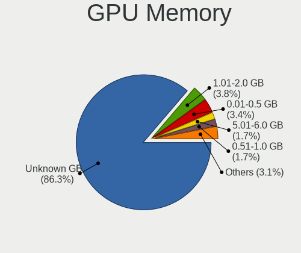

| Size in GB | Computers | Percent |
|------------|-----------|---------|
| Unknown    | 251       | 86.25%  |
| 1.01-2.0   | 11        | 3.78%   |
| 0.01-0.5   | 10        | 3.44%   |
| 5.01-6.0   | 5         | 1.72%   |
| 0.51-1.0   | 5         | 1.72%   |
| 3.01-4.0   | 4         | 1.37%   |
| 2.01-3.0   | 3         | 1.03%   |
| 7.01-8.0   | 2         | 0.69%   |

Monitor
-------

Monitor Vendor
--------------

Monitor vendors

| Vendor                  | Computers | Percent |
|-------------------------|-----------|---------|
| AU Optronics            | 14        | 11.02%  |
| BenQ                    | 13        | 10.24%  |
| BOE                     | 11        | 8.66%   |
| LG Display              | 9         | 7.09%   |
| Chimei Innolux          | 9         | 7.09%   |
| Samsung Electronics     | 7         | 5.51%   |
| Dell                    | 7         | 5.51%   |
| Goldstar                | 6         | 4.72%   |
| Lenovo                  | 5         | 3.94%   |
| Apple                   | 5         | 3.94%   |
| Sharp                   | 4         | 3.15%   |
| Chi Mei Optoelectronics | 4         | 3.15%   |
| Acer                    | 4         | 3.15%   |
| Philips                 | 3         | 2.36%   |
| LG Philips              | 3         | 2.36%   |
| Hewlett-Packard         | 3         | 2.36%   |
| AOC                     | 3         | 2.36%   |
| Plain Tree Systems      | 2         | 1.57%   |
| PANDA                   | 2         | 1.57%   |
| Lenovo Group Limited    | 2         | 1.57%   |
| Vestel Elektronik       | 1         | 0.79%   |
| MSI                     | 1         | 0.79%   |
| Microstep               | 1         | 0.79%   |
| Mi                      | 1         | 0.79%   |
| Medion                  | 1         | 0.79%   |
| LGD                     | 1         | 0.79%   |
| Impression              | 1         | 0.79%   |
| Fujitsu Siemens         | 1         | 0.79%   |
| CHD                     | 1         | 0.79%   |
| ASUSTek Computer        | 1         | 0.79%   |
| Ancor Communications    | 1         | 0.79%   |

Monitor Model
-------------

Monitor models

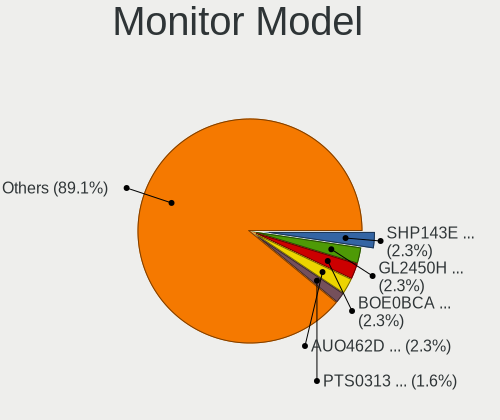

| Model                                                                 | Computers | Percent |
|-----------------------------------------------------------------------|-----------|---------|
| Sharp LCD Monitor SHP143E 3840x2160 350x190mm 15.7-inch               | 3         | 2.34%   |
| BOE LCD Monitor BOE0BCA 2256x1504 280x190mm 13.3-inch                 | 3         | 2.34%   |
| BenQ GL2450H BNQ78A7 1920x1080 530x300mm 24.0-inch                    | 3         | 2.34%   |
| AU Optronics LCD Monitor AUO462D 1920x1080 290x170mm 13.2-inch        | 3         | 2.34%   |
| Plain Tree Systems LCD Monitor PTS0313 1600x1200 320x240mm 15.7-inch  | 2         | 1.56%   |
| Chimei Innolux LCD Monitor CMN15F5 1920x1080 340x190mm 15.3-inch      | 2         | 1.56%   |
| BenQ GW2765 BNQ78D6 2560x1440 600x340mm 27.2-inch                     | 2         | 1.56%   |
| AOC 2050W AOC2050 1600x900 430x240mm 19.4-inch                        | 2         | 1.56%   |
| Vestel Elektronik 32W_LCD_TV VES3700 1920x1080 710x400mm 32.1-inch    | 1         | 0.78%   |
| Sharp LCD Monitor SHP144D 3840x2160 280x160mm 12.7-inch               | 1         | 0.78%   |
| Samsung Electronics T22C300 SAM0AB3 1920x1080 480x270mm 21.7-inch     | 1         | 0.78%   |
| Samsung Electronics S27H85x SAM0E0F 2560x1440 600x340mm 27.2-inch     | 1         | 0.78%   |
| Samsung Electronics LCD Monitor SEC4251 1366x768 340x190mm 15.3-inch  | 1         | 0.78%   |
| Samsung Electronics LCD Monitor SEC3152 1024x600 220x130mm 10.1-inch  | 1         | 0.78%   |
| Samsung Electronics LCD Monitor SDC4C51 1366x768 340x190mm 15.3-inch  | 1         | 0.78%   |
| Samsung Electronics LCD Monitor SDC4852 1366x768 340x190mm 15.3-inch  | 1         | 0.78%   |
| Samsung Electronics LCD Monitor SAM0902 1920x1080 700x390mm 31.5-inch | 1         | 0.78%   |
| Philips PHL 346B1C PHL093E 3440x1440 800x330mm 34.1-inch              | 1         | 0.78%   |
| Philips PHL 243V5 PHLC0D1 1920x1080 520x290mm 23.4-inch               | 1         | 0.78%   |
| Philips 190S PHL083F 1280x1024 380x300mm 19.1-inch                    | 1         | 0.78%   |
| PANDA LCD Monitor NCP004D 1920x1080 340x190mm 15.3-inch               | 1         | 0.78%   |
| PANDA LCD Monitor NCP002D 1920x1080 340x190mm 15.3-inch               | 1         | 0.78%   |
| MSI MP242 MSI30A1 1920x1080 530x300mm 24.0-inch                       | 1         | 0.78%   |
| Microstep LCD Monitor MSI MAG241C 1920x1080                           | 1         | 0.78%   |
| Mi 27 NFGL XMIB004 1920x1080 600x330mm 27.0-inch                      | 1         | 0.78%   |
| Medion MD21281 MED3947 1366x768 410x230mm 18.5-inch                   | 1         | 0.78%   |
| LGD LCD Monitor 5760x1080                                             | 1         | 0.78%   |
| LG Philips LP154WX4-TLCB LPL3101 1280x800 330x210mm 15.4-inch         | 1         | 0.78%   |
| LG Philips LCD Monitor LPLDB00 1280x800 330x210mm 15.4-inch           | 1         | 0.78%   |
| LG Philips LCD Monitor LPL0120 1280x800 330x210mm 15.4-inch           | 1         | 0.78%   |
| LG Display LCD Monitor LGD0773 1920x1200 340x220mm 15.9-inch          | 1         | 0.78%   |
| LG Display LCD Monitor LGD070B 1920x1080 310x170mm 13.9-inch          | 1         | 0.78%   |
| LG Display LCD Monitor LGD066E 1920x1080 340x190mm 15.3-inch          | 1         | 0.78%   |
| LG Display LCD Monitor LGD05E5 1920x1080 340x190mm 15.3-inch          | 1         | 0.78%   |
| LG Display LCD Monitor LGD0532 1920x1080 340x190mm 15.3-inch          | 1         | 0.78%   |
| LG Display LCD Monitor LGD04E2 1366x768 340x190mm 15.3-inch           | 1         | 0.78%   |
| LG Display LCD Monitor LGD042D 1920x1080 290x170mm 13.2-inch          | 1         | 0.78%   |
| LG Display LCD Monitor LGD032C 1920x1080 340x190mm 15.3-inch          | 1         | 0.78%   |
| LG Display LCD Monitor LGD0226 1600x900 380x210mm 17.1-inch           | 1         | 0.78%   |
| Lenovo LEN T24i-10 LEN61CE 1920x1080 530x300mm 24.0-inch              | 1         | 0.78%   |

Monitor Resolution
------------------

Monitor screen resolution

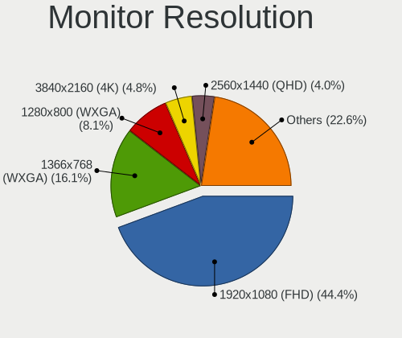

| Resolution         | Computers | Percent |
|--------------------|-----------|---------|
| 1920x1080 (FHD)    | 55        | 44.35%  |
| 1366x768 (WXGA)    | 20        | 16.13%  |
| 1280x800 (WXGA)    | 10        | 8.06%   |
| 3840x2160 (4K)     | 6         | 4.84%   |
| 2560x1440 (QHD)    | 5         | 4.03%   |
| 1600x900 (HD+)     | 4         | 3.23%   |
| 1440x900 (WXGA+)   | 4         | 3.23%   |
| 1280x1024 (SXGA)   | 4         | 3.23%   |
| 2256x1504          | 3         | 2.42%   |
| 3440x1440          | 2         | 1.61%   |
| 1600x1200          | 2         | 1.61%   |
| 1024x600           | 2         | 1.61%   |
| 5760x1080          | 1         | 0.81%   |
| 3840x1080          | 1         | 0.81%   |
| 2048x1152          | 1         | 0.81%   |
| 1920x540           | 1         | 0.81%   |
| 1920x1200 (WUXGA)  | 1         | 0.81%   |
| 1680x1050 (WSXGA+) | 1         | 0.81%   |
| Unknown            | 1         | 0.81%   |

Monitor Diagonal
----------------

Diagonal size in inches

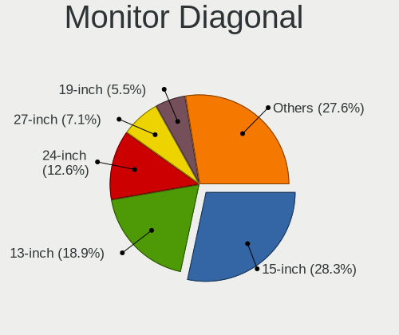

| Inches  | Computers | Percent |
|---------|-----------|---------|
| 15      | 36        | 28.35%  |
| 13      | 24        | 18.9%   |
| 24      | 16        | 12.6%   |
| 27      | 9         | 7.09%   |
| 19      | 7         | 5.51%   |
| Unknown | 7         | 5.51%   |
| 23      | 5         | 3.94%   |
| 21      | 5         | 3.94%   |
| 18      | 3         | 2.36%   |
| 12      | 3         | 2.36%   |
| 34      | 2         | 1.57%   |
| 17      | 2         | 1.57%   |
| 14      | 2         | 1.57%   |
| 48      | 1         | 0.79%   |
| 42      | 1         | 0.79%   |
| 40      | 1         | 0.79%   |
| 11      | 1         | 0.79%   |
| 10      | 1         | 0.79%   |
| 9       | 1         | 0.79%   |

Monitor Width
-------------

Physical width

| Width in mm | Computers | Percent |
|-------------|-----------|---------|
| 301-350     | 47        | 37.3%   |
| 501-600     | 28        | 22.22%  |
| 201-300     | 22        | 17.46%  |
| 401-500     | 12        | 9.52%   |
| Unknown     | 7         | 5.56%   |
| 351-400     | 5         | 3.97%   |
| 701-800     | 2         | 1.59%   |
| 801-900     | 1         | 0.79%   |
| 1001-1500   | 1         | 0.79%   |
| 901-1000    | 1         | 0.79%   |

Aspect Ratio
------------

Proportional relationship between the width and the height

| Ratio   | Computers | Percent |
|---------|-----------|---------|
| 16/9    | 85        | 70.83%  |
| 16/10   | 13        | 10.83%  |
| Unknown | 7         | 5.83%   |
| 3/2     | 6         | 5%      |
| 5/4     | 4         | 3.33%   |
| 4/3     | 2         | 1.67%   |
| 21/9    | 2         | 1.67%   |
| 32/9    | 1         | 0.83%   |

Monitor Area
------------

Area in inch

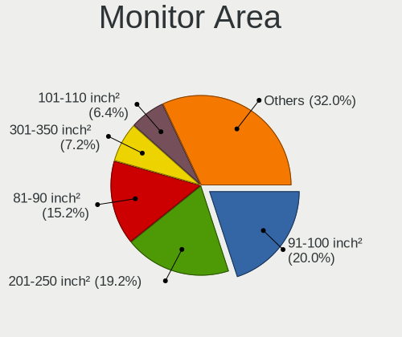

| Area in inch | Computers | Percent |
|----------------|-----------|---------|
| 91-100         | 25        | 20%     |
| 201-250        | 24        | 19.2%   |
| 81-90          | 19        | 15.2%   |
| 301-350        | 9         | 7.2%    |
| 101-110        | 8         | 6.4%    |
| 71-80          | 7         | 5.6%    |
| 151-200        | 7         | 5.6%    |
| Unknown        | 7         | 5.6%    |
| 61-70          | 3         | 2.4%    |
| 141-150        | 3         | 2.4%    |
| 111-120        | 3         | 2.4%    |
| 501-1000       | 3         | 2.4%    |
| 351-500        | 2         | 1.6%    |
| 41-50          | 2         | 1.6%    |
| 51-60          | 1         | 0.8%    |
| 251-300        | 1         | 0.8%    |
| 121-130        | 1         | 0.8%    |

Pixel Density
-------------

Pixels per inch

| Density       | Computers | Percent |
|---------------|-----------|---------|
| 51-100        | 40        | 32.26%  |
| 101-120       | 33        | 26.61%  |
| 121-160       | 28        | 22.58%  |
| 161-240       | 12        | 9.68%   |
| Unknown       | 7         | 5.65%   |
| More than 240 | 4         | 3.23%   |

Multiple Monitors
-----------------

Total monitors connected

| Total | Computers | Percent |
|-------|-----------|---------|
| 0     | 154       | 52.56%  |
| 1     | 130       | 44.37%  |
| 2     | 9         | 3.07%   |

Network
-------

Net Controller Vendor
---------------------

Controller vendors

| Vendor                            | Computers | Percent |
|-----------------------------------|-----------|---------|
| Intel                             | 165       | 39.76%  |
| Realtek Semiconductor             | 141       | 33.98%  |
| Broadcom                          | 31        | 7.47%   |
| Qualcomm Atheros                  | 28        | 6.75%   |
| TP-Link                           | 7         | 1.69%   |
| MediaTek                          | 6         | 1.45%   |
| Nvidia                            | 5         | 1.2%    |
| Marvell Technology Group          | 5         | 1.2%    |
| D-Link System                     | 4         | 0.96%   |
| Ralink Technology                 | 3         | 0.72%   |
| Xiaomi                            | 2         | 0.48%   |
| Sierra Wireless                   | 2         | 0.48%   |
| Ralink                            | 2         | 0.48%   |
| IMC Networks                      | 2         | 0.48%   |
| Ericsson Business Mobile Networks | 2         | 0.48%   |
| Edimax Technology                 | 2         | 0.48%   |
| Samsung Electronics               | 1         | 0.24%   |
| Qualcomm Atheros Communications   | 1         | 0.24%   |
| NetXen Incorporated               | 1         | 0.24%   |
| Huawei Technologies               | 1         | 0.24%   |
| Google                            | 1         | 0.24%   |
| Emulex                            | 1         | 0.24%   |
| Belkin Components                 | 1         | 0.24%   |
| American Megatrends               | 1         | 0.24%   |

Net Controller Model
--------------------

Controller models

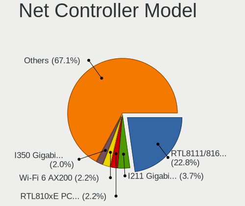

| Model                                                                      | Computers | Percent |
|----------------------------------------------------------------------------|-----------|---------|
| Realtek RTL8111/8168/8211/8411 PCI Express Gigabit Ethernet Controller     | 112       | 22.76%  |
| Intel I211 Gigabit Network Connection                                      | 18        | 3.66%   |
| Realtek RTL810xE PCI Express Fast Ethernet controller                      | 11        | 2.24%   |
| Intel Wi-Fi 6 AX200                                                        | 11        | 2.24%   |
| Intel I350 Gigabit Network Connection                                      | 10        | 2.03%   |
| Intel Ethernet Controller I226-V                                           | 10        | 2.03%   |
| Intel Ethernet Connection I217-LM                                          | 9         | 1.83%   |
| Realtek RTL8188EUS 802.11n Wireless Network Adapter                        | 8         | 1.63%   |
| Intel 82583V Gigabit Network Connection                                    | 8         | 1.63%   |
| Intel 82579LM Gigabit Network Connection (Lewisville)                      | 7         | 1.42%   |
| Intel Wireless 8265 / 8275                                                 | 6         | 1.22%   |
| Intel Wireless 7265                                                        | 6         | 1.22%   |
| Intel Wireless 7260                                                        | 6         | 1.22%   |
| Intel I210 Gigabit Network Connection                                      | 6         | 1.22%   |
| Intel Ethernet Controller I225-V                                           | 6         | 1.22%   |
| Intel Ethernet Connection (4) I219-LM                                      | 5         | 1.02%   |
| Broadcom NetXtreme BCM5720 Gigabit Ethernet PCIe                           | 5         | 1.02%   |
| Realtek RTL8822CE 802.11ac PCIe Wireless Network Adapter                   | 4         | 0.81%   |
| Realtek RTL8821CE 802.11ac PCIe Wireless Network Adapter                   | 4         | 0.81%   |
| Realtek RTL8125 2.5GbE Controller                                          | 4         | 0.81%   |
| Qualcomm Atheros AR9485 Wireless Network Adapter                           | 4         | 0.81%   |
| Qualcomm Atheros AR9285 Wireless Network Adapter (PCI-Express)             | 4         | 0.81%   |
| Nvidia MCP79 Ethernet                                                      | 4         | 0.81%   |
| MediaTek MT7921 802.11ax PCI Express Wireless Network Adapter              | 4         | 0.81%   |
| Intel Wireless 3165                                                        | 4         | 0.81%   |
| Intel Wireless 3160                                                        | 4         | 0.81%   |
| Intel Wi-Fi 6E(802.11ax) AX210/AX1675* 2x2 [Typhoon Peak]                  | 4         | 0.81%   |
| Intel Wi-Fi 6 AX201                                                        | 4         | 0.81%   |
| Intel 82580 Gigabit Network Connection                                     | 4         | 0.81%   |
| Intel 82574L Gigabit Network Connection                                    | 4         | 0.81%   |
| Realtek RTL8723BE PCIe Wireless Network Adapter                            | 3         | 0.61%   |
| Realtek RTL8111/8168/8411 PCI Express Gigabit Ethernet Controller          | 3         | 0.61%   |
| Qualcomm Atheros AR928X Wireless Network Adapter (PCI-Express)             | 3         | 0.61%   |
| Qualcomm Atheros AR9227 Wireless Network Adapter                           | 3         | 0.61%   |
| Intel PRO/Wireless 3945ABG [Golan] Network Connection                      | 3         | 0.61%   |
| Intel Ethernet Connection (2) I219-V                                       | 3         | 0.61%   |
| Intel Cannon Point-LP CNVi [Wireless-AC]                                   | 3         | 0.61%   |
| Intel 82599ES 10-Gigabit SFI/SFP+ Network Connection                       | 3         | 0.61%   |
| D-Link System AirPlus G DWL-G122 Wireless Adapter(rev.C1) [Ralink RT2571W] | 3         | 0.61%   |
| Broadcom NetXtreme BCM57766 Gigabit Ethernet PCIe                          | 3         | 0.61%   |

Wireless Vendor
---------------

Wireless vendors

| Vendor                          | Computers | Percent |
|---------------------------------|-----------|---------|
| Intel                           | 81        | 46.29%  |
| Realtek Semiconductor           | 24        | 13.71%  |
| Qualcomm Atheros                | 22        | 12.57%  |
| Broadcom                        | 19        | 10.86%  |
| TP-Link                         | 7         | 4%      |
| MediaTek                        | 6         | 3.43%   |
| Ralink Technology               | 3         | 1.71%   |
| D-Link System                   | 3         | 1.71%   |
| Sierra Wireless                 | 2         | 1.14%   |
| Ralink                          | 2         | 1.14%   |
| IMC Networks                    | 2         | 1.14%   |
| Edimax Technology               | 2         | 1.14%   |
| Qualcomm Atheros Communications | 1         | 0.57%   |
| Belkin Components               | 1         | 0.57%   |

Wireless Model
--------------

Wireless models

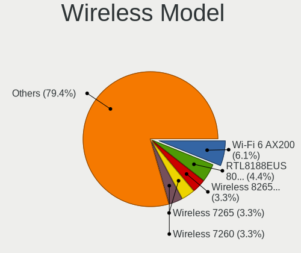

| Model                                                                      | Computers | Percent |
|----------------------------------------------------------------------------|-----------|---------|
| Intel Wi-Fi 6 AX200                                                        | 11        | 6.11%   |
| Realtek RTL8188EUS 802.11n Wireless Network Adapter                        | 8         | 4.44%   |
| Intel Wireless 8265 / 8275                                                 | 6         | 3.33%   |
| Intel Wireless 7265                                                        | 6         | 3.33%   |
| Intel Wireless 7260                                                        | 6         | 3.33%   |
| Realtek RTL8822CE 802.11ac PCIe Wireless Network Adapter                   | 4         | 2.22%   |
| Realtek RTL8821CE 802.11ac PCIe Wireless Network Adapter                   | 4         | 2.22%   |
| Qualcomm Atheros AR9485 Wireless Network Adapter                           | 4         | 2.22%   |
| Qualcomm Atheros AR9285 Wireless Network Adapter (PCI-Express)             | 4         | 2.22%   |
| MediaTek MT7921 802.11ax PCI Express Wireless Network Adapter              | 4         | 2.22%   |
| Intel Wireless 3165                                                        | 4         | 2.22%   |
| Intel Wireless 3160                                                        | 4         | 2.22%   |
| Intel Wi-Fi 6E(802.11ax) AX210/AX1675* 2x2 [Typhoon Peak]                  | 4         | 2.22%   |
| Intel Wi-Fi 6 AX201                                                        | 4         | 2.22%   |
| Realtek RTL8723BE PCIe Wireless Network Adapter                            | 3         | 1.67%   |
| Qualcomm Atheros AR928X Wireless Network Adapter (PCI-Express)             | 3         | 1.67%   |
| Qualcomm Atheros AR9227 Wireless Network Adapter                           | 3         | 1.67%   |
| Intel PRO/Wireless 3945ABG [Golan] Network Connection                      | 3         | 1.67%   |
| Intel Cannon Point-LP CNVi [Wireless-AC]                                   | 3         | 1.67%   |
| D-Link System AirPlus G DWL-G122 Wireless Adapter(rev.C1) [Ralink RT2571W] | 3         | 1.67%   |
| Broadcom BCM4360 802.11ac Dual Band Wireless Network Adapter               | 3         | 1.67%   |
| Broadcom BCM4322 802.11a/b/g/n Wireless LAN Controller                     | 3         | 1.67%   |
| Broadcom BCM4313 802.11bgn Wireless Network Adapter                        | 3         | 1.67%   |
| TP-Link TL-WN823N v2/v3 [Realtek RTL8192EU]                                | 2         | 1.11%   |
| TP-Link TL-WN722N v2/v3 [Realtek RTL8188EUS]                               | 2         | 1.11%   |
| TP-Link AC600 wireless Realtek RTL8811AU [Archer T2U Nano]                 | 2         | 1.11%   |
| Sierra Wireless EM7345 4G LTE                                              | 2         | 1.11%   |
| Realtek RTL8822BE 802.11a/b/g/n/ac WiFi adapter                            | 2         | 1.11%   |
| Realtek RTL8192CU 802.11n WLAN Adapter                                     | 2         | 1.11%   |
| Ralink RT3290 Wireless 802.11n 1T/1R PCIe                                  | 2         | 1.11%   |
| Qualcomm Atheros QCA6174 802.11ac Wireless Network Adapter                 | 2         | 1.11%   |
| Qualcomm Atheros AR9462 Wireless Network Adapter                           | 2         | 1.11%   |
| MediaTek MT7922 802.11ax PCI Express Wireless Network Adapter              | 2         | 1.11%   |
| Intel Wireless 8260                                                        | 2         | 1.11%   |
| Intel WiFi Link 5100                                                       | 2         | 1.11%   |
| Intel Wi-Fi 5(802.11ac) Wireless-AC 9x6x [Thunder Peak]                    | 2         | 1.11%   |
| Intel Raptor Lake-S PCH CNVi WiFi                                          | 2         | 1.11%   |
| Intel Ice Lake-LP PCH CNVi WiFi                                            | 2         | 1.11%   |
| Intel Gemini Lake PCH CNVi WiFi                                            | 2         | 1.11%   |
| Intel Comet Lake PCH-LP CNVi WiFi                                          | 2         | 1.11%   |

Ethernet Vendor
---------------

Ethernet vendors

| Vendor                   | Computers | Percent |
|--------------------------|-----------|---------|
| Realtek Semiconductor    | 131       | 46.62%  |
| Intel                    | 113       | 40.21%  |
| Broadcom                 | 15        | 5.34%   |
| Qualcomm Atheros         | 6         | 2.14%   |
| Nvidia                   | 5         | 1.78%   |
| Marvell Technology Group | 5         | 1.78%   |
| Xiaomi                   | 2         | 0.71%   |
| Samsung Electronics      | 1         | 0.36%   |
| Emulex                   | 1         | 0.36%   |
| D-Link System            | 1         | 0.36%   |
| American Megatrends      | 1         | 0.36%   |

Ethernet Model
--------------

Ethernet models

| Model                                                                  | Computers | Percent |
|------------------------------------------------------------------------|-----------|---------|
| Realtek RTL8111/8168/8211/8411 PCI Express Gigabit Ethernet Controller | 112       | 36.72%  |
| Intel I211 Gigabit Network Connection                                  | 18        | 5.9%    |
| Realtek RTL810xE PCI Express Fast Ethernet controller                  | 11        | 3.61%   |
| Intel I350 Gigabit Network Connection                                  | 10        | 3.28%   |
| Intel Ethernet Controller I226-V                                       | 10        | 3.28%   |
| Intel Ethernet Connection I217-LM                                      | 9         | 2.95%   |
| Intel 82583V Gigabit Network Connection                                | 8         | 2.62%   |
| Intel 82579LM Gigabit Network Connection (Lewisville)                  | 7         | 2.3%    |
| Intel I210 Gigabit Network Connection                                  | 6         | 1.97%   |
| Intel Ethernet Controller I225-V                                       | 6         | 1.97%   |
| Intel Ethernet Connection (4) I219-LM                                  | 5         | 1.64%   |
| Broadcom NetXtreme BCM5720 Gigabit Ethernet PCIe                       | 5         | 1.64%   |
| Realtek RTL8125 2.5GbE Controller                                      | 4         | 1.31%   |
| Nvidia MCP79 Ethernet                                                  | 4         | 1.31%   |
| Intel 82580 Gigabit Network Connection                                 | 4         | 1.31%   |
| Intel 82574L Gigabit Network Connection                                | 4         | 1.31%   |
| Realtek RTL8111/8168/8411 PCI Express Gigabit Ethernet Controller      | 3         | 0.98%   |
| Intel Ethernet Connection (2) I219-V                                   | 3         | 0.98%   |
| Intel 82599ES 10-Gigabit SFI/SFP+ Network Connection                   | 3         | 0.98%   |
| Broadcom NetXtreme BCM57766 Gigabit Ethernet PCIe                      | 3         | 0.98%   |
| Xiaomi Mi/Redmi series (RNDIS)                                         | 2         | 0.66%   |
| Realtek RTL-8100/8101L/8139 PCI Fast Ethernet Adapter                  | 2         | 0.66%   |
| Marvell Group 88E8056 PCI-E Gigabit Ethernet Controller                | 2         | 0.66%   |
| Intel I210 Gigabit Fiber Network Connection                            | 2         | 0.66%   |
| Intel Ethernet Connection X553 1GbE                                    | 2         | 0.66%   |
| Intel Ethernet Connection X553 10 GbE SFP+                             | 2         | 0.66%   |
| Intel Ethernet Connection (7) I219-V                                   | 2         | 0.66%   |
| Intel Ethernet Connection (7) I219-LM                                  | 2         | 0.66%   |
| Intel Ethernet Connection (6) I219-V                                   | 2         | 0.66%   |
| Intel Ethernet Connection (6) I219-LM                                  | 2         | 0.66%   |
| Intel Ethernet Connection (3) I218-V                                   | 2         | 0.66%   |
| Intel Ethernet Connection (2) I219-LM                                  | 2         | 0.66%   |
| Intel 82579V Gigabit Network Connection                                | 2         | 0.66%   |
| Intel 82576 Gigabit Network Connection                                 | 2         | 0.66%   |
| Intel 82575GB Gigabit Network Connection                               | 2         | 0.66%   |
| Intel 82567LM Gigabit Network Connection                               | 2         | 0.66%   |
| Broadcom NetXtreme II BCM57810 10 Gigabit Ethernet                     | 2         | 0.66%   |
| Samsung Galaxy series, misc. (tethering mode)                          | 1         | 0.33%   |
| Realtek RTL8169 PCI Gigabit Ethernet Controller                        | 1         | 0.33%   |
| Realtek Killer E2600 GbE Controller                                    | 1         | 0.33%   |

Net Controller Kind
-------------------

Ethernet, WiFi or modem

| Kind     | Computers | Percent |
|----------|-----------|---------|
| Ethernet | 255       | 61.3%   |
| WiFi     | 154       | 37.02%  |
| Unknown  | 4         | 0.96%   |
| Modem    | 3         | 0.72%   |

Used Controller
---------------

Currently used network controller

| Kind     | Computers | Percent |
|----------|-----------|---------|
| Ethernet | 214       | 75.09%  |
| WiFi     | 70        | 24.56%  |
| Modem    | 1         | 0.35%   |

NICs
----

Total network controllers on board

| Total | Computers | Percent |
|-------|-----------|---------|
| 2     | 119       | 41.46%  |
| 1     | 75        | 26.13%  |
| 3     | 26        | 9.06%   |
| 4     | 25        | 8.71%   |
| 5     | 14        | 4.88%   |
| 0     | 9         | 3.14%   |
| 6     | 8         | 2.79%   |
| 8     | 5         | 1.74%   |
| 9     | 3         | 1.05%   |
| 16    | 1         | 0.35%   |
| 15    | 1         | 0.35%   |
| 10    | 1         | 0.35%   |

IPv6
----

IPv6 vs IPv4

| Used | Computers | Percent |
|------|-----------|---------|
| No   | 282       | 98.26%  |
| Yes  | 5         | 1.74%   |

Bluetooth
---------

Bluetooth Vendor
----------------

Controller vendors

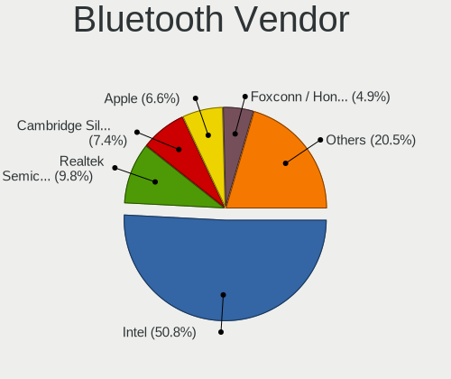

| Vendor                          | Computers | Percent |
|---------------------------------|-----------|---------|
| Intel                           | 62        | 50.82%  |
| Realtek Semiconductor           | 12        | 9.84%   |
| Cambridge Silicon Radio         | 9         | 7.38%   |
| Apple                           | 8         | 6.56%   |
| Foxconn / Hon Hai               | 6         | 4.92%   |
| Qualcomm Atheros Communications | 5         | 4.1%    |
| Broadcom                        | 5         | 4.1%    |
| IMC Networks                    | 4         | 3.28%   |
| Hewlett-Packard                 | 4         | 3.28%   |
| Ralink                          | 2         | 1.64%   |
| ASUSTek Computer                | 2         | 1.64%   |
| MediaTek                        | 1         | 0.82%   |
| Lite-On Technology              | 1         | 0.82%   |
| Chicony Electronics             | 1         | 0.82%   |

Bluetooth Model
---------------

Controller models

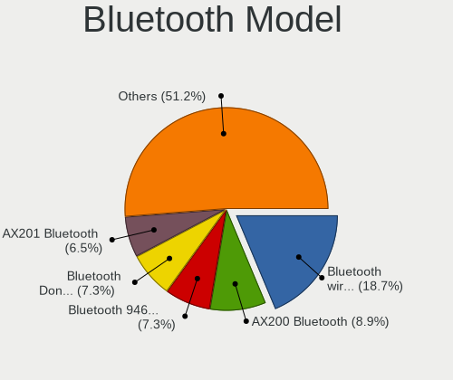

| Model                                                       | Computers | Percent |
|-------------------------------------------------------------|-----------|---------|
| Intel Bluetooth wireless interface                          | 23        | 18.7%   |
| Intel AX200 Bluetooth                                       | 11        | 8.94%   |
| Intel Bluetooth 9460/9560 Jefferson Peak (JfP)              | 9         | 7.32%   |
| Cambridge Silicon Radio Bluetooth Dongle (HCI mode)         | 9         | 7.32%   |
| Intel AX201 Bluetooth                                       | 8         | 6.5%    |
| Realtek Bluetooth Adapter                                   | 5         | 4.07%   |
| Intel AX210 Bluetooth                                       | 4         | 3.25%   |
| HP Bluetooth 2.0 Interface [Broadcom BCM2045]               | 4         | 3.25%   |
| Realtek Bluetooth 4.2 Adapter                               | 3         | 2.44%   |
| Intel Centrino Bluetooth Wireless Transceiver               | 3         | 2.44%   |
| Apple Broadcom Built-in Bluetooth                           | 3         | 2.44%   |
| Apple Bluetooth Host Controller                             | 3         | 2.44%   |
| Realtek  Bluetooth 4.2 Adapter                              | 2         | 1.63%   |
| Ralink RT3290 Bluetooth                                     | 2         | 1.63%   |
| Qualcomm Atheros QCA61x4 Bluetooth 4.0                      | 2         | 1.63%   |
| Qualcomm Atheros AR3012 Bluetooth 4.0                       | 2         | 1.63%   |
| Intel AX211 Bluetooth                                       | 2         | 1.63%   |
| Foxconn / Hon Hai RZ616 Bluetooth Adapter                   | 2         | 1.63%   |
| Foxconn / Hon Hai MediaTek Bluetooth Adapter                | 2         | 1.63%   |
| Apple Built-in iSight (no firmware loaded)                  | 2         | 1.63%   |
| Realtek RTL8822BE Bluetooth 4.2 Adapter                     | 1         | 0.81%   |
| Realtek Bluetooth 4.0 Adapter                               | 1         | 0.81%   |
| Qualcomm Atheros QCA9377 Bluetooth 4.1                      | 1         | 0.81%   |
| MediaTek Bluetooth Adapter                                  | 1         | 0.81%   |
| Lite-On Bluetooth USB Module                                | 1         | 0.81%   |
| Intel Wireless-AC 9260 Bluetooth Adapter                    | 1         | 0.81%   |
| Intel Wireless-AC 3168 Bluetooth                            | 1         | 0.81%   |
| IMC Networks Realtek Bluetooth Adapter                      | 1         | 0.81%   |
| IMC Networks Realtek Bluetooth 4.0 + High Speed Chip        | 1         | 0.81%   |
| IMC Networks MediaTek Bluetooth Adapter                     | 1         | 0.81%   |
| IMC Networks Bluetooth module                               | 1         | 0.81%   |
| Foxconn / Hon Hai Qualcomm Atheros AR3012 Bluetooth Adapter | 1         | 0.81%   |
| Foxconn / Hon Hai Bluetooth USB Module                      | 1         | 0.81%   |
| Chicony Bluetooth (RTL8723BE)                               | 1         | 0.81%   |
| Broadcom BCM43142A0 Bluetooth 4.0                           | 1         | 0.81%   |
| Broadcom BCM20702 Bluetooth 4.0 [ThinkPad]                  | 1         | 0.81%   |
| Broadcom BCM2045B (BDC-2.1) [Bluetooth Controller]          | 1         | 0.81%   |
| Broadcom BCM2045B (BDC-2) [Bluetooth Controller]            | 1         | 0.81%   |
| Broadcom 4371 Bluetooth 4.1 Adapter                         | 1         | 0.81%   |
| ASUS BT-270 Bluetooth Adapter                               | 1         | 0.81%   |

Sound
-----

Sound Vendor
------------

Sound card vendors

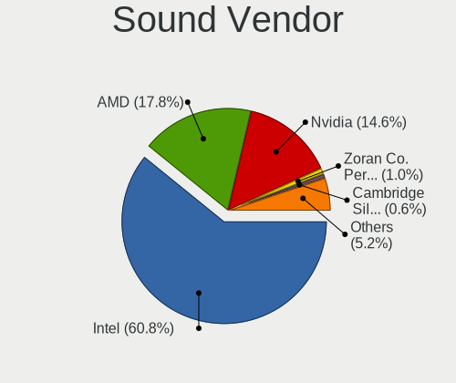

| Vendor                                       | Computers | Percent |
|----------------------------------------------|-----------|---------|
| Intel                                        | 188       | 60.84%  |
| AMD                                          | 55        | 17.8%   |
| Nvidia                                       | 45        | 14.56%  |
| Zoran Co. Personal Media Division (Nogatech) | 3         | 0.97%   |
| Cambridge Silicon Radio                      | 2         | 0.65%   |
| C-Media Electronics                          | 2         | 0.65%   |
| VIA Technologies                             | 1         | 0.32%   |
| Texas Instruments                            | 1         | 0.32%   |
| Realtek Semiconductor                        | 1         | 0.32%   |
| M-Audio                                      | 1         | 0.32%   |
| Logitech                                     | 1         | 0.32%   |
| Lenovo                                       | 1         | 0.32%   |
| Hewlett-Packard                              | 1         | 0.32%   |
| Generalplus Technology                       | 1         | 0.32%   |
| GEMBIRD                                      | 1         | 0.32%   |
| ESS Technology                               | 1         | 0.32%   |
| Ensoniq                                      | 1         | 0.32%   |
| Dell                                         | 1         | 0.32%   |
| Corsair                                      | 1         | 0.32%   |
| BEHRINGER International                      | 1         | 0.32%   |

Sound Model
-----------

Sound card models

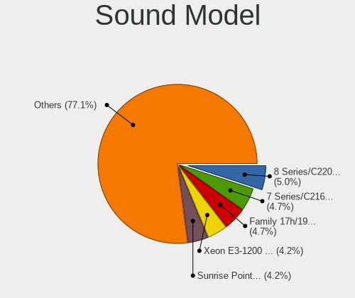

| Model                                                                                             | Computers | Percent |
|---------------------------------------------------------------------------------------------------|-----------|---------|
| Intel 8 Series/C220 Series Chipset High Definition Audio Controller                               | 18        | 5.03%   |
| Intel 7 Series/C216 Chipset Family High Definition Audio Controller                               | 17        | 4.75%   |
| AMD Family 17h/19h/1ah HD Audio Controller                                                        | 17        | 4.75%   |
| Intel Xeon E3-1200 v3/4th Gen Core Processor HD Audio Controller                                  | 15        | 4.19%   |
| Intel Sunrise Point-LP HD Audio                                                                   | 15        | 4.19%   |
| Intel Atom Processor Z36xxx/Z37xxx Series High Definition Audio Controller                        | 14        | 3.91%   |
| Intel Celeron/Pentium Silver Processor High Definition Audio                                      | 9         | 2.51%   |
| Intel 82801I (ICH9 Family) HD Audio Controller                                                    | 9         | 2.51%   |
| Intel 200 Series PCH HD Audio                                                                     | 9         | 2.51%   |
| Intel 6 Series/C200 Series Chipset Family High Definition Audio Controller                        | 8         | 2.23%   |
| Intel 100 Series/C230 Series Chipset Family HD Audio Controller                                   | 8         | 2.23%   |
| AMD Kabini HDMI/DP Audio                                                                          | 8         | 2.23%   |
| AMD FCH Azalia Controller                                                                         | 8         | 2.23%   |
| Intel Jasper Lake HD Audio                                                                        | 7         | 1.96%   |
| Intel Atom/Celeron/Pentium Processor x5-E8000/J3xxx/N3xxx Series High Definition Audio Controller | 7         | 1.96%   |
| AMD Renoir Radeon High Definition Audio Controller                                                | 7         | 1.96%   |
| AMD Family 17h (Models 00h-0fh) HD Audio Controller                                               | 7         | 1.96%   |
| Nvidia GK208 HDMI/DP Audio Controller                                                             | 6         | 1.68%   |
| Intel Cannon Point-LP High Definition Audio Controller                                            | 6         | 1.68%   |
| Intel 82801H (ICH8 Family) HD Audio Controller                                                    | 6         | 1.68%   |
| AMD SBx00 Azalia (Intel HDA)                                                                      | 6         | 1.68%   |
| Nvidia MCP79 High Definition Audio                                                                | 5         | 1.4%    |
| Nvidia High Definition Audio Controller                                                           | 5         | 1.4%    |
| Intel Wildcat Point-LP High Definition Audio Controller                                           | 5         | 1.4%    |
| Intel Tiger Lake-LP Smart Sound Technology Audio Controller                                       | 5         | 1.4%    |
| Intel Cannon Lake PCH cAVS                                                                        | 5         | 1.4%    |
| Intel Broadwell-U Audio Controller                                                                | 5         | 1.4%    |
| Intel Alder Lake-N PCH High Definition Audio Controller                                           | 5         | 1.4%    |
| AMD Starship/Matisse HD Audio Controller                                                          | 5         | 1.4%    |
| Nvidia TU107 GeForce GTX 1650 High Definition Audio Controller                                    | 4         | 1.12%   |
| Intel Haswell-ULT HD Audio Controller                                                             | 4         | 1.12%   |
| Intel 8 Series HD Audio Controller                                                                | 4         | 1.12%   |
| Intel 5 Series/3400 Series Chipset High Definition Audio                                          | 4         | 1.12%   |
| AMD Raven/Raven2/Fenghuang HDMI/DP Audio Controller                                               | 4         | 1.12%   |
| Zoran Co. Personal Media Division (Nogatech) USB Audio and HID                                    | 3         | 0.84%   |
| Nvidia TU116 High Definition Audio Controller                                                     | 3         | 0.84%   |
| Nvidia TU104 HD Audio Controller                                                                  | 3         | 0.84%   |
| Intel Raptor Lake-P/U/H cAVS                                                                      | 3         | 0.84%   |
| Intel Comet Lake PCH cAVS                                                                         | 3         | 0.84%   |
| AMD Rembrandt Radeon High Definition Audio Controller                                             | 3         | 0.84%   |

Memory
------

Memory Vendor
-------------

Memory module vendors

| Vendor              | Computers | Percent |
|---------------------|-----------|---------|
| Samsung Electronics | 59        | 18.79%  |
| Kingston            | 49        | 15.61%  |
| Crucial             | 43        | 13.69%  |
| SK hynix            | 37        | 11.78%  |
| Micron Technology   | 29        | 9.24%   |
| Unknown             | 27        | 8.6%    |
| Ramaxel Technology  | 10        | 3.18%   |
| Unknown             | 9         | 2.87%   |
| Corsair             | 8         | 2.55%   |
| Nanya Technology    | 6         | 1.91%   |
| G.Skill             | 5         | 1.59%   |
| Elpida              | 5         | 1.59%   |
| A-DATA Technology   | 5         | 1.59%   |
| Apacer              | 3         | 0.96%   |
| Unknown (ABCD)      | 2         | 0.64%   |
| Unknown (0B45)      | 2         | 0.64%   |
| Transcend           | 2         | 0.64%   |
| Hewlett-Packard     | 2         | 0.64%   |
| Goldenmars          | 2         | 0.64%   |
| ASint Technology    | 2         | 0.64%   |
| Wodposit            | 1         | 0.32%   |
| Unknown (0x0080)    | 1         | 0.32%   |
| Toshiba             | 1         | 0.32%   |
| Qimonda             | 1         | 0.32%   |
| Kimtigo             | 1         | 0.32%   |
| GOODRAM             | 1         | 0.32%   |
| Essencore           | 1         | 0.32%   |

Memory Model
------------

Memory module models

| Model                                                          | Computers | Percent |
|----------------------------------------------------------------|-----------|---------|
| Unknown                                                        | 9         | 2.58%   |
| Unknown RAM Module 2GB DIMM DDR2 800MT/s                       | 4         | 1.15%   |
| SK hynix RAM HMT451S6BFR8A-PB 4GB SODIMM DDR3 1600MT/s         | 4         | 1.15%   |
| Unknown RAM Module 8GB DIMM DDR3 1600MT/s                      | 3         | 0.86%   |
| Samsung RAM M471A5244CB0-CTD 4GB SODIMM DDR4 2667MT/s          | 3         | 0.86%   |
| Unknown RAM Module 4GB SODIMM DDR3                             | 2         | 0.57%   |
| Unknown RAM Module 4GB DIMM DDR3 1333MT/s                      | 2         | 0.57%   |
| Unknown RAM Module 1GB SODIMM DDR2 667MT/s                     | 2         | 0.57%   |
| Unknown (0B45) RAM WPBC26D416SWM-16G 16GB SODIMM DDR4 2667MT/s | 2         | 0.57%   |
| SK hynix RAM HMT451S6MFR8C-PB 4GB DIMM DDR3 1600MT/s           | 2         | 0.57%   |
| SK hynix RAM HMT41GS6BFR8A-PB 8GB SODIMM DDR3 1600MT/s         | 2         | 0.57%   |
| SK hynix RAM HMA81GS6CJR8N-VK 8GB SODIMM DDR4 2667MT/s         | 2         | 0.57%   |
| SK hynix RAM HMA81GS6AFR8N-UH 8GB SODIMM DDR4 2400MT/s         | 2         | 0.57%   |
| Samsung RAM Module 8GB DIMM DDR4 2667MT/s                      | 2         | 0.57%   |
| Samsung RAM M471B5273CH0-CH9 4GB SODIMM DDR3 1334MT/s          | 2         | 0.57%   |
| Samsung RAM M471B5173EB0-YK0 4GB SODIMM DDR3 1600MT/s          | 2         | 0.57%   |
| Samsung RAM M471A2K43CB1-CTD 16GB SODIMM DDR4 2667MT/s         | 2         | 0.57%   |
| Samsung RAM M471A2G43AB2-CWE 16GB SODIMM DDR4 3200MT/s         | 2         | 0.57%   |
| Samsung RAM M471A1K43EB1-CWE 8GB SODIMM DDR4 3200MT/s          | 2         | 0.57%   |
| Samsung RAM M471A1K43CB1-CTD 8GB SODIMM DDR4 2667MT/s          | 2         | 0.57%   |
| Samsung RAM M471A1G44BB0-CWE 8GB SODIMM DDR4 3200MT/s          | 2         | 0.57%   |
| Samsung RAM M4 70T5663EH3-CF7 2GB SODIMM DDR2 975MT/s          | 2         | 0.57%   |
| Micron RAM MTA8ATF1G64HZ-3G2J1 8GB SODIMM DDR4 3200MT/s        | 2         | 0.57%   |
| Micron RAM 4ATF1G64HZ-3G2E1 8GB SODIMM DDR4 3200MT/s           | 2         | 0.57%   |
| Micron RAM 18KSF51272AZ-1G4M1 4GB DIMM DDR3 1333MT/s           | 2         | 0.57%   |
| Kingston RAM KVR13LS9/4 4GB SODIMM DDR3 1333MT/s               | 2         | 0.57%   |
| Kingston RAM KHX1600C10D3/8G 8GB DIMM DDR3 1600MT/s            | 2         | 0.57%   |
| Kingston RAM ACR16D3LS1KFG/4G 4GB SODIMM DDR3 1600MT/s         | 2         | 0.57%   |
| Kingston RAM 99U5584-005.A00LF 4GB DIMM DDR3 1600MT/s          | 2         | 0.57%   |
| Kingston RAM 99U5474-016.A00LF 4GB DIMM DDR3 1333MT/s          | 2         | 0.57%   |
| Kingston RAM 99U5471-056.A00LF 8GB DIMM DDR3 1600MT/s          | 2         | 0.57%   |
| Kingston RAM 99U5469-045.A00LF 4GB SODIMM DDR3 1600MT/s        | 2         | 0.57%   |
| Kingston RAM 99U5469-045.A00LF 4GB DIMM DDR3 1600MT/s          | 2         | 0.57%   |
| Kingston RAM 9905712-035.A00G 16GB SODIMM DDR4 2667MT/s        | 2         | 0.57%   |
| Crucial RAM CT32G4SFD832A.M16FF 32GB SODIMM DDR4 3200MT/s      | 2         | 0.57%   |
| Crucial RAM CT32G4SFD832A.C16FF 32GB SODIMM DDR4 3200MT/s      | 2         | 0.57%   |
| Crucial RAM CT16G4SFRA266.M8FB 16GB SODIMM DDR4 2667MT/s       | 2         | 0.57%   |
| Crucial RAM CT16G4SFD824A.C16FDD 16GB SODIMM DDR4 3200MT/s     | 2         | 0.57%   |
| Crucial RAM CT16G48C40S5.M8A1 16GB SODIMM DDR5 4800MT/s        | 2         | 0.57%   |
| Crucial RAM CT102464BF160B.M16 8GB SODIMM DDR3 1600MT/s        | 2         | 0.57%   |

Memory Kind
-----------

Memory module kinds

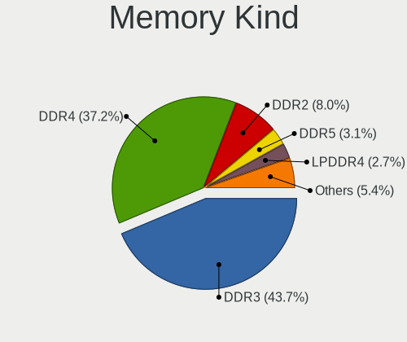

| Kind    | Computers | Percent |
|---------|-----------|---------|
| DDR3    | 114       | 43.68%  |
| DDR4    | 97        | 37.16%  |
| DDR2    | 21        | 8.05%   |
| DDR5    | 8         | 3.07%   |
| LPDDR4  | 7         | 2.68%   |
| LPDDR3  | 5         | 1.92%   |
| Unknown | 4         | 1.53%   |
| SDRAM   | 3         | 1.15%   |
| LPDDR5  | 1         | 0.38%   |
| DDR     | 1         | 0.38%   |

Memory Form Factor
------------------

Physical design of the memory module

| Name         | Computers | Percent |
|--------------|-----------|---------|
| SODIMM       | 136       | 52.31%  |
| DIMM         | 111       | 42.69%  |
| Row Of Chips | 10        | 3.85%   |
| Chip         | 2         | 0.77%   |
| FB-DIMM      | 1         | 0.38%   |

Memory Size
-----------

Memory module size

| Size  | Computers | Percent |
|-------|-----------|---------|
| 8192  | 96        | 33.1%   |
| 4096  | 91        | 31.38%  |
| 16384 | 50        | 17.24%  |
| 2048  | 37        | 12.76%  |
| 1024  | 8         | 2.76%   |
| 32768 | 6         | 2.07%   |
| 512   | 1         | 0.34%   |
| 256   | 1         | 0.34%   |

Memory Speed
------------

Memory module speed

| Speed   | Computers | Percent |
|---------|-----------|---------|
| 1600    | 85        | 30.25%  |
| 3200    | 36        | 12.81%  |
| 2400    | 32        | 11.39%  |
| 2667    | 26        | 9.25%   |
| 1333    | 23        | 8.19%   |
| 2133    | 11        | 3.91%   |
| 667     | 11        | 3.91%   |
| 800     | 8         | 2.85%   |
| 4800    | 6         | 2.14%   |
| 1334    | 5         | 1.78%   |
| 1067    | 5         | 1.78%   |
| Unknown | 5         | 1.78%   |
| 1866    | 4         | 1.42%   |
| 2666    | 3         | 1.07%   |
| 1867    | 3         | 1.07%   |
| 1066    | 3         | 1.07%   |
| 6400    | 2         | 0.71%   |
| 3600    | 2         | 0.71%   |
| 975     | 2         | 0.71%   |
| 5600    | 1         | 0.36%   |
| 4267    | 1         | 0.36%   |
| 4266    | 1         | 0.36%   |
| 3733    | 1         | 0.36%   |
| 2048    | 1         | 0.36%   |
| 1332    | 1         | 0.36%   |
| 1033    | 1         | 0.36%   |
| 400     | 1         | 0.36%   |
| 333     | 1         | 0.36%   |

Printers & scanners
-------------------

Printer Vendor
--------------

Printer device vendors

| Vendor             | Computers | Percent |
|--------------------|-----------|---------|
| Hewlett-Packard    | 1         | 50%     |
| Brother Industries | 1         | 50%     |

Printer Model
-------------

Printer device models

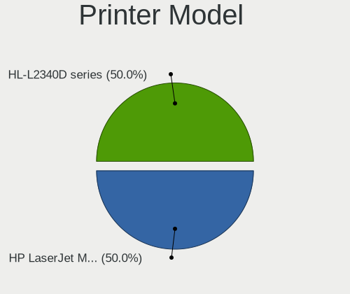

| Model                                                                                                             | Computers | Percent |
|-------------------------------------------------------------------------------------------------------------------|-----------|---------|
| HP HP LaserJet MFP E52645 LaserJet 0 LaserJet 0 LaserJet 1 LaserJet 1 LaserJet 2 LaserJet 2 LaserJet 3 LaserJet 3 | 1         | 50%     |
| Brother HL-L2340D series                                                                                          | 1         | 50%     |

Scanner Vendor
--------------

Scanner device vendors

Zero info for selected period =(

Scanner Model
-------------

Scanner device models

Zero info for selected period =(

Camera
------

Camera Vendor
-------------

Camera device vendors

| Vendor                                 | Computers | Percent |
|----------------------------------------|-----------|---------|
| Chicony Electronics                    | 17        | 20%     |
| Sunplus Innovation Technology          | 10        | 11.76%  |
| Realtek Semiconductor                  | 9         | 10.59%  |
| IMC Networks                           | 8         | 9.41%   |
| Bison Electronics                      | 6         | 7.06%   |
| Suyin                                  | 5         | 5.88%   |
| Quanta                                 | 5         | 5.88%   |
| Microdia                               | 5         | 5.88%   |
| Alcor Micro                            | 3         | 3.53%   |
| Syntek                                 | 2         | 2.35%   |
| Logitech                               | 2         | 2.35%   |
| Cheng Uei Precision Industry (Foxlink) | 2         | 2.35%   |
| Z-Star Microelectronics                | 1         | 1.18%   |
| USB Camera                             | 1         | 1.18%   |
| Supreme Electronics                    | 1         | 1.18%   |
| Silicon Motion                         | 1         | 1.18%   |
| Ricoh                                  | 1         | 1.18%   |
| OmniVision Technologies                | 1         | 1.18%   |
| Luxvisions Innotech Limited            | 1         | 1.18%   |
| Lite-On Technology                     | 1         | 1.18%   |
| Importek                               | 1         | 1.18%   |
| HD WEBCAM                              | 1         | 1.18%   |
| Apple                                  | 1         | 1.18%   |

Camera Model
------------

Camera device models

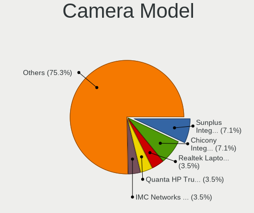

| Model                                                | Computers | Percent |
|------------------------------------------------------|-----------|---------|
| Sunplus Integrated_Webcam_HD                         | 6         | 7.06%   |
| Chicony Integrated Camera                            | 6         | 7.06%   |
| Realtek Laptop Camera                                | 3         | 3.53%   |
| Quanta HP TrueVision HD Camera                       | 3         | 3.53%   |
| IMC Networks Realtek PC Camera                       | 3         | 3.53%   |
| Realtek USB Camera                                   | 2         | 2.35%   |
| IMC Networks Integrated Camera                       | 2         | 2.35%   |
| Chicony Webcam                                       | 2         | 2.35%   |
| Bison Integrated Camera                              | 2         | 2.35%   |
| Z-Star Vega USB 2.0 Camera                           | 1         | 1.18%   |
| USB Camera USB Camera                                | 1         | 1.18%   |
| Syntek Lenovo EasyCamera                             | 1         | 1.18%   |
| Syntek EasyCamera                                    | 1         | 1.18%   |
| Suyin Integrated_Webcam_HD                           | 1         | 1.18%   |
| Suyin HP Webcam-50                                   | 1         | 1.18%   |
| Suyin HP Webcam-101                                  | 1         | 1.18%   |
| Suyin HP webcam [dv6-1190en]                         | 1         | 1.18%   |
| Suyin Acer/HP Integrated Webcam [CN0314]             | 1         | 1.18%   |
| Supreme Realtek PC Camera                            | 1         | 1.18%   |
| Sunplus Integrated Camera                            | 1         | 1.18%   |
| Sunplus HP HD Webcam [Fixed]                         | 1         | 1.18%   |
| Sunplus HD WebCam                                    | 1         | 1.18%   |
| Sunplus Asus Webcam                                  | 1         | 1.18%   |
| Silicon Motion Realtek USB 2.0 PC Camera             | 1         | 1.18%   |
| Ricoh Integrated Webcam                              | 1         | 1.18%   |
| Realtek LG Camera                                    | 1         | 1.18%   |
| Realtek Integrated_Webcam_HD                         | 1         | 1.18%   |
| Realtek Integrated_Webcam_FHD                        | 1         | 1.18%   |
| Realtek Acer 640 x 480 laptop camera                 | 1         | 1.18%   |
| Quanta Realtek DMFT RGB                              | 1         | 1.18%   |
| Quanta HP True Vision 5MP Camera                     | 1         | 1.18%   |
| OmniVision Monitor Webcam                            | 1         | 1.18%   |
| Microdia USB 2.0 Camera                              | 1         | 1.18%   |
| Microdia Sonix USB 2.0 Camera                        | 1         | 1.18%   |
| Microdia Integrated_Webcam_HD                        | 1         | 1.18%   |
| Microdia Integrated Webcam                           | 1         | 1.18%   |
| Microdia HP Webcam                                   | 1         | 1.18%   |
| Luxvisions Innotech Limited HP Wide Vision HD Camera | 1         | 1.18%   |
| Logitech C505 HD Webcam                              | 1         | 1.18%   |
| Logitech BRIO Ultra HD Webcam                        | 1         | 1.18%   |

Security
--------

Fingerprint Vendor
------------------

Fingerprint sensor vendors

| Vendor                     | Computers | Percent |
|----------------------------|-----------|---------|
| Validity Sensors           | 8         | 40%     |
| Synaptics                  | 3         | 15%     |
| STMicroelectronics         | 2         | 10%     |
| Shenzhen Goodix Technology | 2         | 10%     |
| Elan Microelectronics      | 2         | 10%     |
| Upek                       | 1         | 5%      |
| Fingerprint Cards          | 1         | 5%      |
| AuthenTec                  | 1         | 5%      |

Fingerprint Model
-----------------

Fingerprint sensor models

| Model                                                    | Computers | Percent |
|----------------------------------------------------------|-----------|---------|
| Validity Sensors VFS491                                  | 2         | 10%     |
| Validity Sensors VFS101 Fingerprint Reader               | 2         | 10%     |
| Validity Sensors VFS 5011 fingerprint sensor             | 2         | 10%     |
| STMicroelectronics Fingerprint Reader                    | 2         | 10%     |
| Elan Fingerprint Sensor                                  | 2         | 10%     |
| Validity Sensors Synaptics WBDI                          | 1         | 5%      |
| Validity Sensors Fingerprint scanner                     | 1         | 5%      |
| Upek TCS5B Fingerprint sensor                            | 1         | 5%      |
| Synaptics WBDI Fingerprint Reader USB 086                | 1         | 5%      |
| Synaptics Metallica MIS Touch Fingerprint Reader         | 1         | 5%      |
| Synaptics FS7604 Touch Fingerprint Sensor with PurePrint | 1         | 5%      |
| Shenzhen Goodix  Fingerprint Device                      | 1         | 5%      |
| Shenzhen Goodix Fingerprint Reader                       | 1         | 5%      |
| Fingerprint Cards FPC Fingerprint Reader                 | 1         | 5%      |
| AuthenTec AES1660 Fingerprint Sensor                     | 1         | 5%      |

Chipcard Vendor
---------------

Chipcard module vendors

Zero info for selected period =(

Chipcard Model
--------------

Chipcard module models

Zero info for selected period =(

Unsupported
-----------

Unsupported Devices
-------------------

Total unsupported devices on board

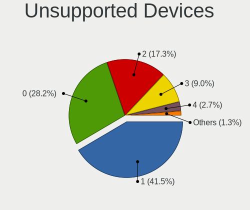

| Total | Computers | Percent |
|-------|-----------|---------|
| 1     | 125       | 41.53%  |
| 0     | 85        | 28.24%  |
| 2     | 52        | 17.28%  |
| 3     | 27        | 8.97%   |
| 4     | 8         | 2.66%   |
| 5     | 3         | 1%      |
| 6     | 1         | 0.33%   |

Unsupported Device Types
------------------------

Types of unsupported devices

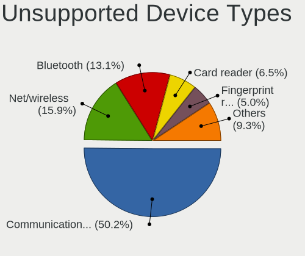

| Type                     | Computers | Percent |
|--------------------------|-----------|---------|
| Communication controller | 161       | 50.16%  |
| Net/wireless             | 51        | 15.89%  |
| Bluetooth                | 42        | 13.08%  |
| Card reader              | 21        | 6.54%   |
| Fingerprint reader       | 16        | 4.98%   |
| Network                  | 7         | 2.18%   |
| Graphics card            | 7         | 2.18%   |
| Sound                    | 6         | 1.87%   |
| Firewire controller      | 6         | 1.87%   |
| Storage/ata              | 1         | 0.31%   |
| Storage                  | 1         | 0.31%   |
| Net/ethernet             | 1         | 0.31%   |
| Dvb card                 | 1         | 0.31%   |

