BSD in Sweden - Tested Hardware & Statistics (Desktops)
-------------------------------------------------------

A project to collect tested hardware configurations for BSD in Sweden.

Anyone can contribute to this report by the [hw-probe](https://github.com/linuxhw/hw-probe/blob/master/INSTALL.BSD.md) tool:

    hw-probe -all -upload

Please contribute! Especially if your hardware is rare.

Contents
--------

* [ Test Cases ](#test-cases)

* [ System ](#system)
  - [ OS                       ](#os)
  - [ OS Family                ](#os-family)
  - [ Arch                     ](#arch)
  - [ DE                       ](#de)
  - [ Display Server           ](#display-server)
  - [ Display Manager          ](#display-manager)
  - [ OS Lang                  ](#os-lang)
  - [ Boot Mode                ](#boot-mode)
  - [ Filesystem               ](#filesystem)
  - [ Part. scheme             ](#part-scheme)

* [ Board ](#board)
  - [ Vendor                   ](#vendor)
  - [ Model                    ](#model)
  - [ Model Family             ](#model-family)
  - [ MFG Year                 ](#mfg-year)
  - [ Form Factor              ](#form-factor)
  - [ Coreboot                 ](#coreboot)
  - [ RAM Size                 ](#ram-size)
  - [ RAM Used                 ](#ram-used)
  - [ Total Drives             ](#total-drives)
  - [ Has CD-ROM               ](#has-cd-rom)
  - [ Has Ethernet             ](#has-ethernet)
  - [ Has WiFi                 ](#has-wifi)
  - [ Has Bluetooth            ](#has-bluetooth)

* [ Location ](#location)
  - [ Country                  ](#country)
  - [ City                     ](#city)

* [ Drives ](#drives)
  - [ Drive Vendor             ](#drive-vendor)
  - [ Drive Model              ](#drive-model)
  - [ HDD Vendor               ](#hdd-vendor)
  - [ SSD Vendor               ](#ssd-vendor)
  - [ Drive Kind               ](#drive-kind)
  - [ Drive Connector          ](#drive-connector)
  - [ Drive Size               ](#drive-size)
  - [ Space Total              ](#space-total)
  - [ Space Used               ](#space-used)
  - [ Malfunc. Drives          ](#malfunc-drives)
  - [ Malfunc. Drive Vendor    ](#malfunc-drive-vendor)
  - [ Malfunc. HDD Vendor      ](#malfunc-hdd-vendor)
  - [ Malfunc. Drive Kind      ](#malfunc-drive-kind)
  - [ Failed Drives            ](#failed-drives)
  - [ Failed Drive Vendor      ](#failed-drive-vendor)
  - [ Drive Status             ](#drive-status)

* [ Storage controller ](#storage-controller)
  - [ Storage Vendor           ](#storage-vendor)
  - [ Storage Model            ](#storage-model)
  - [ Storage Kind             ](#storage-kind)

* [ Processor ](#processor)
  - [ CPU Vendor               ](#cpu-vendor)
  - [ CPU Model                ](#cpu-model)
  - [ CPU Model Family         ](#cpu-model-family)
  - [ CPU Cores                ](#cpu-cores)
  - [ CPU Sockets              ](#cpu-sockets)
  - [ CPU Threads              ](#cpu-threads)
  - [ CPU Microarch            ](#cpu-microarch)

* [ Graphics ](#graphics)
  - [ GPU Vendor               ](#gpu-vendor)
  - [ GPU Model                ](#gpu-model)
  - [ GPU Combo                ](#gpu-combo)
  - [ GPU Driver               ](#gpu-driver)
  - [ GPU Memory               ](#gpu-memory)

* [ Monitor ](#monitor)
  - [ Monitor Vendor           ](#monitor-vendor)
  - [ Monitor Model            ](#monitor-model)
  - [ Monitor Resolution       ](#monitor-resolution)
  - [ Monitor Diagonal         ](#monitor-diagonal)
  - [ Monitor Width            ](#monitor-width)
  - [ Aspect Ratio             ](#aspect-ratio)
  - [ Monitor Area             ](#monitor-area)
  - [ Pixel Density            ](#pixel-density)
  - [ Multiple Monitors        ](#multiple-monitors)

* [ Network ](#network)
  - [ Net Controller Vendor    ](#net-controller-vendor)
  - [ Net Controller Model     ](#net-controller-model)
  - [ Wireless Vendor          ](#wireless-vendor)
  - [ Wireless Model           ](#wireless-model)
  - [ Ethernet Vendor          ](#ethernet-vendor)
  - [ Ethernet Model           ](#ethernet-model)
  - [ Net Controller Kind      ](#net-controller-kind)
  - [ Used Controller          ](#used-controller)
  - [ NICs                     ](#nics)
  - [ IPv6                     ](#ipv6)

* [ Bluetooth ](#bluetooth)
  - [ Bluetooth Vendor         ](#bluetooth-vendor)
  - [ Bluetooth Model          ](#bluetooth-model)

* [ Sound ](#sound)
  - [ Sound Vendor             ](#sound-vendor)
  - [ Sound Model              ](#sound-model)

* [ Memory ](#memory)
  - [ Memory Vendor            ](#memory-vendor)
  - [ Memory Model             ](#memory-model)
  - [ Memory Kind              ](#memory-kind)
  - [ Memory Form Factor       ](#memory-form-factor)
  - [ Memory Size              ](#memory-size)
  - [ Memory Speed             ](#memory-speed)

* [ Printers & scanners ](#printers--scanners)
  - [ Printer Vendor           ](#printer-vendor)
  - [ Printer Model            ](#printer-model)
  - [ Scanner Vendor           ](#scanner-vendor)
  - [ Scanner Model            ](#scanner-model)

* [ Camera ](#camera)
  - [ Camera Vendor            ](#camera-vendor)
  - [ Camera Model             ](#camera-model)

* [ Security ](#security)
  - [ Fingerprint Vendor       ](#fingerprint-vendor)
  - [ Fingerprint Model        ](#fingerprint-model)
  - [ Chipcard Vendor          ](#chipcard-vendor)
  - [ Chipcard Model           ](#chipcard-model)

* [ Unsupported ](#unsupported)
  - [ Unsupported Devices      ](#unsupported-devices)
  - [ Unsupported Device Types ](#unsupported-device-types)

Test Cases
----------

Total: 272

| Vendor        | Model                       | Probe                                                     | Date         |
|---------------|-----------------------------|-----------------------------------------------------------|--------------|
| Dell          | 0T7D40 A01                  | [cc8dddd1e8](https://bsd-hardware.info/?probe=cc8dddd1e8) | Dec 30, 2024 |
| Techvision    | TVI7309X B0                 | [a86118e267](https://bsd-hardware.info/?probe=a86118e267) | Dec 29, 2024 |
| Unknown       | Unknown                     | [7a016a0770](https://bsd-hardware.info/?probe=7a016a0770) | Dec 26, 2024 |
| Unknown       | Unknown                     | [6d669bbdc7](https://bsd-hardware.info/?probe=6d669bbdc7) | Dec 26, 2024 |
| Unknown       | Unknown                     | [91490047ad](https://bsd-hardware.info/?probe=91490047ad) | Dec 11, 2024 |
| HPE           | ProLiant MicroServer Gen... | [ffa899367f](https://bsd-hardware.info/?probe=ffa899367f) | Dec 07, 2024 |
| DFI           | CM100-C                     | [d2f2f98f5f](https://bsd-hardware.info/?probe=d2f2f98f5f) | Nov 26, 2024 |
| Unknown       | Unknown                     | [3ce3c94861](https://bsd-hardware.info/?probe=3ce3c94861) | Nov 20, 2024 |
| Unknown       | Unknown                     | [e7a6f01e0a](https://bsd-hardware.info/?probe=e7a6f01e0a) | Nov 15, 2024 |
| ASRock        | HM55-MXM                    | [751f5a40dd](https://bsd-hardware.info/?probe=751f5a40dd) | Nov 04, 2024 |
| Foxconn       | 2A8Ch                       | [db61fa0dde](https://bsd-hardware.info/?probe=db61fa0dde) | Nov 03, 2024 |
| ASRock        | HM55-MXM                    | [3617855f3c](https://bsd-hardware.info/?probe=3617855f3c) | Nov 02, 2024 |
| ASRock        | N100DC-ITX                  | [335da196c6](https://bsd-hardware.info/?probe=335da196c6) | Oct 22, 2024 |
| PC Engines    | APU2                        | [67b80dbc20](https://bsd-hardware.info/?probe=67b80dbc20) | Oct 16, 2024 |
| PC Engines    | apu6                        | [39efe65835](https://bsd-hardware.info/?probe=39efe65835) | Oct 09, 2024 |
| Foxconn       | 2A8Ch                       | [992ea95706](https://bsd-hardware.info/?probe=992ea95706) | Oct 05, 2024 |
| Unknown       | Unknown                     | [ff58138e84](https://bsd-hardware.info/?probe=ff58138e84) | Sep 30, 2024 |
| HP            | 8299                        | [53703392f7](https://bsd-hardware.info/?probe=53703392f7) | Sep 25, 2024 |
| SJRC          | ADLN-6L                     | [6b77a00921](https://bsd-hardware.info/?probe=6b77a00921) | Sep 25, 2024 |
| HPE           | ProLiant MicroServer Gen... | [6e1f9c1ef7](https://bsd-hardware.info/?probe=6e1f9c1ef7) | Sep 24, 2024 |
| Deciso        | Netboard A10                | [2c483f6c90](https://bsd-hardware.info/?probe=2c483f6c90) | Sep 18, 2024 |
| ASUSTek       | ROG STRIX X570-F GAMING     | [df5b4013a0](https://bsd-hardware.info/?probe=df5b4013a0) | Sep 14, 2024 |
| HP            | 843F                        | [be82edc9e1](https://bsd-hardware.info/?probe=be82edc9e1) | Sep 13, 2024 |
| DFI           | CM100-C                     | [573139db12](https://bsd-hardware.info/?probe=573139db12) | Sep 05, 2024 |
| ASUSTek       | K30AD_M31AD_M51AD_M32AD     | [fd35e26721](https://bsd-hardware.info/?probe=fd35e26721) | Sep 03, 2024 |
| AOpen         | iBTMx-DS R1.02 55DED10A0... | [7bd9cb15cb](https://bsd-hardware.info/?probe=7bd9cb15cb) | Aug 27, 2024 |
| HP            | 1905                        | [bfaf045fe8](https://bsd-hardware.info/?probe=bfaf045fe8) | Aug 24, 2024 |
| Techvision    | TVI7309X B0                 | [08ce1c802c](https://bsd-hardware.info/?probe=08ce1c802c) | Aug 23, 2024 |
| Unknown       | Unknown                     | [0397a77da4](https://bsd-hardware.info/?probe=0397a77da4) | Aug 20, 2024 |
| Unknown       | Unknown                     | [459662009f](https://bsd-hardware.info/?probe=459662009f) | Aug 10, 2024 |
| Unknown       | Unknown                     | [d4306294cf](https://bsd-hardware.info/?probe=d4306294cf) | Aug 09, 2024 |
| PC Engines    | apu4                        | [c62d6bba29](https://bsd-hardware.info/?probe=c62d6bba29) | Aug 06, 2024 |
| ASUSTek       | K30AD_M31AD_M51AD_M32AD     | [c6286b111c](https://bsd-hardware.info/?probe=c6286b111c) | Aug 03, 2024 |
| Unknown       | YL-J3160L4                  | [23c7b5ad65](https://bsd-hardware.info/?probe=23c7b5ad65) | Jul 30, 2024 |
| HP            | 1998                        | [ec3bfb7289](https://bsd-hardware.info/?probe=ec3bfb7289) | Jul 23, 2024 |
| Techvision    | TVI7309X B0                 | [6200ae3d06](https://bsd-hardware.info/?probe=6200ae3d06) | Jul 16, 2024 |
| Unknown       | Unknown                     | [8ab9214814](https://bsd-hardware.info/?probe=8ab9214814) | Jul 06, 2024 |
| Fujitsu       | D2990-A1 S26361-D2990-A1    | [421fb0cc2d](https://bsd-hardware.info/?probe=421fb0cc2d) | Jul 06, 2024 |
| HP            | 8054                        | [66af7c4914](https://bsd-hardware.info/?probe=66af7c4914) | Jul 05, 2024 |
| Unknown       | Unknown                     | [bccbed71b3](https://bsd-hardware.info/?probe=bccbed71b3) | Jun 29, 2024 |
| Unknown       | QGLK03                      | [2939c6dab9](https://bsd-hardware.info/?probe=2939c6dab9) | Jun 25, 2024 |
| Unknown       | adnasc01                    | [45ae64035d](https://bsd-hardware.info/?probe=45ae64035d) | Jun 24, 2024 |
| HP            | 1825                        | [fe7845074f](https://bsd-hardware.info/?probe=fe7845074f) | Jun 22, 2024 |
| Techvision    | TVI7309X B0                 | [9c253fda64](https://bsd-hardware.info/?probe=9c253fda64) | Jun 14, 2024 |
| Techvision    | TVI7309X B0                 | [646553245d](https://bsd-hardware.info/?probe=646553245d) | Jun 06, 2024 |
| Unknown       | adnasc01                    | [bc945d888c](https://bsd-hardware.info/?probe=bc945d888c) | Jun 02, 2024 |
| ASRock        | B550 Phantom Gaming-ITX/... | [8bf7d62ab8](https://bsd-hardware.info/?probe=8bf7d62ab8) | May 26, 2024 |
| CWWK          | CW-AD4L-N V1                | [44fa081bcc](https://bsd-hardware.info/?probe=44fa081bcc) | May 24, 2024 |
| Unknown       | QDNV01                      | [e5025263ce](https://bsd-hardware.info/?probe=e5025263ce) | May 23, 2024 |
| AZW           | GK55                        | [e459aff450](https://bsd-hardware.info/?probe=e459aff450) | May 23, 2024 |
| ASUSTek       | G11CD                       | [e4d4f0e1b2](https://bsd-hardware.info/?probe=e4d4f0e1b2) | May 06, 2024 |
| Dell          | 0KYJ8C A00                  | [7a7c8ece3a](https://bsd-hardware.info/?probe=7a7c8ece3a) | Apr 27, 2024 |
| Dell          | 0KYJ8C A00                  | [d35fe4f9ef](https://bsd-hardware.info/?probe=d35fe4f9ef) | Apr 27, 2024 |
| Unknown       | Unknown                     | [3f86c9c69d](https://bsd-hardware.info/?probe=3f86c9c69d) | Apr 19, 2024 |
| Unknown       | Unknown                     | [d5529f00e1](https://bsd-hardware.info/?probe=d5529f00e1) | Apr 18, 2024 |
| HP            | 8299                        | [7b4780009e](https://bsd-hardware.info/?probe=7b4780009e) | Apr 16, 2024 |
| PC Engines    | apu4                        | [5ceaa26e0d](https://bsd-hardware.info/?probe=5ceaa26e0d) | Apr 13, 2024 |
| Unknown       | Unknown                     | [d9b9726d99](https://bsd-hardware.info/?probe=d9b9726d99) | Apr 10, 2024 |
| HPE           | ProLiant MicroServer Gen... | [b3d1f4d1bf](https://bsd-hardware.info/?probe=b3d1f4d1bf) | Apr 02, 2024 |
| Dell          | 0YXT71 A02                  | [e5aceb0ceb](https://bsd-hardware.info/?probe=e5aceb0ceb) | Apr 01, 2024 |
| Dell          | 0YXT71 A02                  | [a8cd5867cb](https://bsd-hardware.info/?probe=a8cd5867cb) | Apr 01, 2024 |
| Unknown       | Unknown                     | [147401844b](https://bsd-hardware.info/?probe=147401844b) | Mar 29, 2024 |
| Dell          | 0KYJ8C A00                  | [eb72b3e4b7](https://bsd-hardware.info/?probe=eb72b3e4b7) | Mar 27, 2024 |
| Apple         | Mac-F60DEB81FF30ACF6 Mac... | [14a9ddb552](https://bsd-hardware.info/?probe=14a9ddb552) | Mar 25, 2024 |
| Unknown       | Unknown                     | [c95a414132](https://bsd-hardware.info/?probe=c95a414132) | Mar 19, 2024 |
| Unknown       | Unknown                     | [dc2553c7cb](https://bsd-hardware.info/?probe=dc2553c7cb) | Mar 07, 2024 |
| ASRock        | B650 PG Lightning           | [54d6c96d25](https://bsd-hardware.info/?probe=54d6c96d25) | Feb 22, 2024 |
| Unknown       | Unknown                     | [b58cf5585d](https://bsd-hardware.info/?probe=b58cf5585d) | Feb 22, 2024 |
| HP            | 1998                        | [ef11b12f13](https://bsd-hardware.info/?probe=ef11b12f13) | Feb 18, 2024 |
| HP            | 1998                        | [6895f365c7](https://bsd-hardware.info/?probe=6895f365c7) | Feb 14, 2024 |
| Unknown       | Unknown                     | [9c184fe6fa](https://bsd-hardware.info/?probe=9c184fe6fa) | Feb 14, 2024 |
| Dell          | 07WP95 A02                  | [aad51ede2a](https://bsd-hardware.info/?probe=aad51ede2a) | Feb 12, 2024 |
| HP            | 1998                        | [58de92b13d](https://bsd-hardware.info/?probe=58de92b13d) | Feb 11, 2024 |
| Fujitsu       | D3430-U1 S26361-D3430-U1    | [9778043e6f](https://bsd-hardware.info/?probe=9778043e6f) | Feb 08, 2024 |
| PC Engines    | apu4                        | [d0205e7f2b](https://bsd-hardware.info/?probe=d0205e7f2b) | Feb 05, 2024 |
| ASUSTek       | H110I-PLUS                  | [511747dd03](https://bsd-hardware.info/?probe=511747dd03) | Feb 02, 2024 |
| HP            | 8054                        | [4404de3242](https://bsd-hardware.info/?probe=4404de3242) | Jan 31, 2024 |
| Dell          | 0WR7PY A02                  | [f0eb82f1f3](https://bsd-hardware.info/?probe=f0eb82f1f3) | Jan 31, 2024 |
| CWWK          | CW-AD4L-N V1                | [294a66e260](https://bsd-hardware.info/?probe=294a66e260) | Jan 29, 2024 |
| HP            | 8054                        | [5878ff14cf](https://bsd-hardware.info/?probe=5878ff14cf) | Jan 29, 2024 |
| Unknown       | Unknown                     | [9d002ec65c](https://bsd-hardware.info/?probe=9d002ec65c) | Jan 25, 2024 |
| Dell          | 07WP95 A02                  | [76cdddf230](https://bsd-hardware.info/?probe=76cdddf230) | Jan 21, 2024 |
| Unknown       | Unknown                     | [a56d0b3643](https://bsd-hardware.info/?probe=a56d0b3643) | Jan 20, 2024 |
| CWWK          | CW-AD4L-N V1                | [2e9333aba4](https://bsd-hardware.info/?probe=2e9333aba4) | Jan 11, 2024 |
| Unknown       | Unknown                     | [1032d282eb](https://bsd-hardware.info/?probe=1032d282eb) | Jan 03, 2024 |
| PC Engines    | APU2                        | [c0fcb231db](https://bsd-hardware.info/?probe=c0fcb231db) | Dec 30, 2023 |
| Intel         | CRESCENTBAY                 | [412c714b49](https://bsd-hardware.info/?probe=412c714b49) | Dec 27, 2023 |
| PC Engines    | APU3                        | [6c92d4965a](https://bsd-hardware.info/?probe=6c92d4965a) | Dec 16, 2023 |
| Lenovo        | ThinkServer RS140           | [a380879f2f](https://bsd-hardware.info/?probe=a380879f2f) | Dec 11, 2023 |
| Unknown       | YL-J3160L4                  | [cf07751804](https://bsd-hardware.info/?probe=cf07751804) | Dec 09, 2023 |
| PC Engines    | APU2                        | [dbd4df3e5e](https://bsd-hardware.info/?probe=dbd4df3e5e) | Dec 03, 2023 |
| Gigabyte      | P55A-UD3                    | [ec3037a710](https://bsd-hardware.info/?probe=ec3037a710) | Nov 30, 2023 |
| Gigabyte      | P55A-UD3                    | [eec65ee6ce](https://bsd-hardware.info/?probe=eec65ee6ce) | Nov 28, 2023 |
| Unknown       | Unknown                     | [8b2a1299bf](https://bsd-hardware.info/?probe=8b2a1299bf) | Nov 27, 2023 |
| Unknown       | Unknown                     | [b8b5586ead](https://bsd-hardware.info/?probe=b8b5586ead) | Nov 24, 2023 |
| Dell          | 0HD5W2 A01                  | [7d58ae8d97](https://bsd-hardware.info/?probe=7d58ae8d97) | Nov 14, 2023 |
| HP            | 8054                        | [dd3ce5a68d](https://bsd-hardware.info/?probe=dd3ce5a68d) | Nov 12, 2023 |
| HPE           | ProLiant MicroServer Gen... | [8bb2f091fd](https://bsd-hardware.info/?probe=8bb2f091fd) | Nov 09, 2023 |
| Techvision    | TVI7309X B0                 | [c44b69b11e](https://bsd-hardware.info/?probe=c44b69b11e) | Nov 07, 2023 |
| CWWK          | CW-ADLN-6L                  | [59372d06e0](https://bsd-hardware.info/?probe=59372d06e0) | Nov 02, 2023 |
| Techvision    | TVI7309X B0                 | [8004cade7b](https://bsd-hardware.info/?probe=8004cade7b) | Nov 01, 2023 |
| Unknown       | Unknown                     | [119cb746c8](https://bsd-hardware.info/?probe=119cb746c8) | Oct 25, 2023 |
| Apple         | Mac-F60DEB81FF30ACF6 Mac... | [b09bb5811b](https://bsd-hardware.info/?probe=b09bb5811b) | Oct 19, 2023 |
| Apple         | Mac-F60DEB81FF30ACF6 Mac... | [e96fbf80a4](https://bsd-hardware.info/?probe=e96fbf80a4) | Oct 19, 2023 |
| Gigabyte      | H510M H                     | [3cf75f0ae6](https://bsd-hardware.info/?probe=3cf75f0ae6) | Oct 19, 2023 |
| Intel         | DN2820FYK H24582-201        | [99260d8bdf](https://bsd-hardware.info/?probe=99260d8bdf) | Oct 07, 2023 |
| Intel         | D54250WYK H13922-303        | [1bca98240a](https://bsd-hardware.info/?probe=1bca98240a) | Oct 04, 2023 |
| ASUSTek       | Pro WS W680-ACE IPMI        | [6a98aea3f9](https://bsd-hardware.info/?probe=6a98aea3f9) | Oct 03, 2023 |
| Techvision    | TVI7309X B0                 | [906fd7e198](https://bsd-hardware.info/?probe=906fd7e198) | Sep 30, 2023 |
| Intel         | DN2820FYK H24582-201        | [ea832a672d](https://bsd-hardware.info/?probe=ea832a672d) | Sep 30, 2023 |
| HP            | 8299                        | [fee80cc3e3](https://bsd-hardware.info/?probe=fee80cc3e3) | Sep 23, 2023 |
| PC Engines    | apu6                        | [1a45dd59a4](https://bsd-hardware.info/?probe=1a45dd59a4) | Sep 21, 2023 |
| HP            | 8299                        | [2f1bdffe66](https://bsd-hardware.info/?probe=2f1bdffe66) | Sep 20, 2023 |
| CWWK          | CW-AD4L-N V1                | [cdeddbf4be](https://bsd-hardware.info/?probe=cdeddbf4be) | Sep 17, 2023 |
| Unknown       | Unknown                     | [b95f409ccf](https://bsd-hardware.info/?probe=b95f409ccf) | Sep 05, 2023 |
| Lenovo        | 30C7 SDK0J40700 WIN 3258... | [9e92903663](https://bsd-hardware.info/?probe=9e92903663) | Aug 18, 2023 |
| Intel         | Q3XXG4-P V1.0               | [0836b029bc](https://bsd-hardware.info/?probe=0836b029bc) | Aug 17, 2023 |
| PC Engines    | APU2                        | [d8f32b19ff](https://bsd-hardware.info/?probe=d8f32b19ff) | Aug 14, 2023 |
| HP            | 8299                        | [74c24bcb16](https://bsd-hardware.info/?probe=74c24bcb16) | Jul 18, 2023 |
| MSI           | B450 GAMING PRO CARBON A... | [ce0f05e871](https://bsd-hardware.info/?probe=ce0f05e871) | Jul 18, 2023 |
| MSI           | B350I PRO AC                | [3c4d3b94d0](https://bsd-hardware.info/?probe=3c4d3b94d0) | Jul 14, 2023 |
| MSI           | B350I PRO AC                | [ab56e76e70](https://bsd-hardware.info/?probe=ab56e76e70) | Jul 14, 2023 |
| PC Engines    | APU2                        | [80d79341a8](https://bsd-hardware.info/?probe=80d79341a8) | Jul 05, 2023 |
| ASUSTek       | P5Q DELUXE                  | [0cf9bf6a63](https://bsd-hardware.info/?probe=0cf9bf6a63) | Jul 04, 2023 |
| Unknown       | Unknown                     | [5080e84698](https://bsd-hardware.info/?probe=5080e84698) | Jun 28, 2023 |
| Unknown       | Unknown                     | [c660f668dc](https://bsd-hardware.info/?probe=c660f668dc) | Jun 25, 2023 |
| Unknown       | Unknown                     | [b67ce69ea4](https://bsd-hardware.info/?probe=b67ce69ea4) | Jun 23, 2023 |
| Unknown       | Unknown                     | [6e8085380f](https://bsd-hardware.info/?probe=6e8085380f) | Jun 23, 2023 |
| Unknown       | Unknown                     | [eb49ebcc0c](https://bsd-hardware.info/?probe=eb49ebcc0c) | Jun 22, 2023 |
| Unknown       | Unknown                     | [193c7d152b](https://bsd-hardware.info/?probe=193c7d152b) | Jun 11, 2023 |
| PC Engines    | APU2                        | [f644f33061](https://bsd-hardware.info/?probe=f644f33061) | Jun 07, 2023 |
| Unknown       | Unknown                     | [e80a97aec3](https://bsd-hardware.info/?probe=e80a97aec3) | May 27, 2023 |
| ASUSTek       | ROG STRIX B550-F GAMING     | [a0bff43f5c](https://bsd-hardware.info/?probe=a0bff43f5c) | May 23, 2023 |
| Lenovo        | ThinkCentre M81 1730A1G     | [8f59660eca](https://bsd-hardware.info/?probe=8f59660eca) | May 17, 2023 |
| Techvision    | TVI7309X B0                 | [a75ff519b0](https://bsd-hardware.info/?probe=a75ff519b0) | May 15, 2023 |
| CWWK          | MINIPC-G12                  | [4806dc7d9a](https://bsd-hardware.info/?probe=4806dc7d9a) | Apr 29, 2023 |
| AZW           | GK55                        | [31a99b9d2a](https://bsd-hardware.info/?probe=31a99b9d2a) | Apr 25, 2023 |
| Techvision    | TVI7309X B0                 | [a4bc168937](https://bsd-hardware.info/?probe=a4bc168937) | Apr 22, 2023 |
| AZW           | GK55                        | [cc5a32800f](https://bsd-hardware.info/?probe=cc5a32800f) | Apr 14, 2023 |
| HP            | 1998                        | [bc67c37f5f](https://bsd-hardware.info/?probe=bc67c37f5f) | Apr 04, 2023 |
| ASUSTek       | TUF B360M-PLUS GAMING       | [ebbd75883c](https://bsd-hardware.info/?probe=ebbd75883c) | Mar 17, 2023 |
| DFI           | CM100-C                     | [c34832095b](https://bsd-hardware.info/?probe=c34832095b) | Mar 15, 2023 |
| Techvision    | TVI7309X B0                 | [23f9004191](https://bsd-hardware.info/?probe=23f9004191) | Mar 13, 2023 |
| AMI           | MNHO-048                    | [ebd90b78c1](https://bsd-hardware.info/?probe=ebd90b78c1) | Mar 12, 2023 |
| AMI           | MNHO-048                    | [52cdeb023e](https://bsd-hardware.info/?probe=52cdeb023e) | Mar 12, 2023 |
| PC Engines    | APU3                        | [c8008161b0](https://bsd-hardware.info/?probe=c8008161b0) | Mar 09, 2023 |
| Unknown       | Unknown                     | [e4b77410c6](https://bsd-hardware.info/?probe=e4b77410c6) | Mar 08, 2023 |
| Dell          | 0WMJ54 A01                  | [31ed952f9c](https://bsd-hardware.info/?probe=31ed952f9c) | Mar 06, 2023 |
| Dell          | 0WMJ54 A01                  | [732a635016](https://bsd-hardware.info/?probe=732a635016) | Mar 06, 2023 |
| Unknown       | Unknown                     | [44ac3b2832](https://bsd-hardware.info/?probe=44ac3b2832) | Feb 13, 2023 |
| HP            | 82A1                        | [2d7d9105f7](https://bsd-hardware.info/?probe=2d7d9105f7) | Jan 13, 2023 |
| Gigabyte      | G31M-ES2C                   | [8353660219](https://bsd-hardware.info/?probe=8353660219) | Jan 08, 2023 |
| ASRock        | E3C226D2I                   | [5dfcf8051d](https://bsd-hardware.info/?probe=5dfcf8051d) | Jan 06, 2023 |
| Lenovo        | 30D9 SDK0J40700 WIN 3258... | [ac867149f2](https://bsd-hardware.info/?probe=ac867149f2) | Dec 31, 2022 |
| Unknown       | Unknown                     | [b4d44b0018](https://bsd-hardware.info/?probe=b4d44b0018) | Dec 26, 2022 |
| ACMA          | X8SIE                       | [01898b2ffb](https://bsd-hardware.info/?probe=01898b2ffb) | Dec 21, 2022 |
| PC Engines    | APU3                        | [5597cca988](https://bsd-hardware.info/?probe=5597cca988) | Dec 17, 2022 |
| ACMA          | X8SIE                       | [361e4ccc04](https://bsd-hardware.info/?probe=361e4ccc04) | Dec 05, 2022 |
| ACMA          | X8SIE                       | [532b81e55f](https://bsd-hardware.info/?probe=532b81e55f) | Nov 29, 2022 |
| ACMA          | X8SIE                       | [d0112d027b](https://bsd-hardware.info/?probe=d0112d027b) | Nov 28, 2022 |
| Intel         | D54250WYK H13922-303        | [e850e0ae9c](https://bsd-hardware.info/?probe=e850e0ae9c) | Nov 28, 2022 |
| Intel         | CRESCENTBAY                 | [bd1f1fa769](https://bsd-hardware.info/?probe=bd1f1fa769) | Nov 26, 2022 |
| Gigabyte      | G31M-ES2C                   | [2959091a59](https://bsd-hardware.info/?probe=2959091a59) | Nov 25, 2022 |
| Lenovo        | ThinkServer RS140           | [0dd05e08aa](https://bsd-hardware.info/?probe=0dd05e08aa) | Nov 12, 2022 |
| Lenovo        | ThinkServer RS140           | [b2b1509adf](https://bsd-hardware.info/?probe=b2b1509adf) | Nov 11, 2022 |
| MSI           | Z370I GAMING PRO CARBON ... | [dd9f7679b5](https://bsd-hardware.info/?probe=dd9f7679b5) | Nov 09, 2022 |
| Cisco         | ASA5515 A0                  | [7f848d7c57](https://bsd-hardware.info/?probe=7f848d7c57) | Oct 22, 2022 |
| ASUSTek       | P5L-VM 1394                 | [d7c3749eba](https://bsd-hardware.info/?probe=d7c3749eba) | Oct 13, 2022 |
| HP            | 843F                        | [f187229469](https://bsd-hardware.info/?probe=f187229469) | Oct 09, 2022 |
| AOpen         | iBTMx-DS R1.04 55DED10A0... | [a480263c28](https://bsd-hardware.info/?probe=a480263c28) | Aug 26, 2022 |
| Unknown       | Unknown                     | [e5efeb3781](https://bsd-hardware.info/?probe=e5efeb3781) | Aug 24, 2022 |
| Unknown       | Unknown                     | [9d1eb045e5](https://bsd-hardware.info/?probe=9d1eb045e5) | Aug 20, 2022 |
| ASRock        | X399 Taichi                 | [efd9ee1d33](https://bsd-hardware.info/?probe=efd9ee1d33) | Aug 10, 2022 |
| ASUSTek       | CM6731_CM6431_CM6331        | [6e40b41bc3](https://bsd-hardware.info/?probe=6e40b41bc3) | Aug 04, 2022 |
| Gigabyte      | Z87M-D3H                    | [59ae6fc283](https://bsd-hardware.info/?probe=59ae6fc283) | Jul 26, 2022 |
| Supermicro    | X11SSV-M4                   | [444d9ed75e](https://bsd-hardware.info/?probe=444d9ed75e) | Jul 04, 2022 |
| Fujitsu       | D3313-G1 S26361-D3313-G1    | [ea22a644f6](https://bsd-hardware.info/?probe=ea22a644f6) | Jul 04, 2022 |
| PC Engines    | APU                         | [f41e59d78b](https://bsd-hardware.info/?probe=f41e59d78b) | Jun 11, 2022 |
| MSI           | MS-7369                     | [c2c6bd80e8](https://bsd-hardware.info/?probe=c2c6bd80e8) | May 13, 2022 |
| Intel         | CRESCENTBAY                 | [0d11258d3a](https://bsd-hardware.info/?probe=0d11258d3a) | Apr 22, 2022 |
| HP            | 843F                        | [b3d4d3c2db](https://bsd-hardware.info/?probe=b3d4d3c2db) | Apr 16, 2022 |
| Shuttle       | SH570                       | [08e2af8890](https://bsd-hardware.info/?probe=08e2af8890) | Apr 16, 2022 |
| Unknown       | Unknown                     | [2e4a7843ab](https://bsd-hardware.info/?probe=2e4a7843ab) | Apr 14, 2022 |
| HPE           | ProLiant MicroServer Gen... | [04e77555a2](https://bsd-hardware.info/?probe=04e77555a2) | Mar 24, 2022 |
| Fujitsu Si... | D2811-A1 S26361-D2811-A1    | [23055a27d9](https://bsd-hardware.info/?probe=23055a27d9) | Mar 23, 2022 |
| AOpen         | iBTMx-DS R1.04 55DED10A0... | [8faec8e7ed](https://bsd-hardware.info/?probe=8faec8e7ed) | Mar 10, 2022 |
| HPE           | ProLiant MicroServer Gen... | [a2c59d02ee](https://bsd-hardware.info/?probe=a2c59d02ee) | Mar 08, 2022 |
| HPE           | ProLiant MicroServer Gen... | [099edf57ae](https://bsd-hardware.info/?probe=099edf57ae) | Mar 08, 2022 |
| Gigabyte      | AB350M-Gaming 3-CF          | [1daab68f1f](https://bsd-hardware.info/?probe=1daab68f1f) | Mar 04, 2022 |
| HPE           | ProLiant MicroServer Gen... | [8016115ff1](https://bsd-hardware.info/?probe=8016115ff1) | Feb 24, 2022 |
| ASUSTek       | ROG STRIX X570-F GAMING     | [807a29112e](https://bsd-hardware.info/?probe=807a29112e) | Feb 19, 2022 |
| Gigabyte      | G31M-ES2C                   | [5f27a360e4](https://bsd-hardware.info/?probe=5f27a360e4) | Feb 10, 2022 |
| Gigabyte      | Z68X-UD7-B3                 | [37cc045649](https://bsd-hardware.info/?probe=37cc045649) | Jan 28, 2022 |
| MSI           | MS-7C56                     | [962ac1c7b0](https://bsd-hardware.info/?probe=962ac1c7b0) | Jan 20, 2022 |
| Gigabyte      | Z68X-UD7-B3                 | [082da3ef7f](https://bsd-hardware.info/?probe=082da3ef7f) | Jan 19, 2022 |
| ASUSTek       | P8H77-I                     | [e15d67e8db](https://bsd-hardware.info/?probe=e15d67e8db) | Jan 08, 2022 |
| ASRock        | E3C226D2I                   | [a31265ae13](https://bsd-hardware.info/?probe=a31265ae13) | Jan 07, 2022 |
| ASUSTek       | P8H77-I                     | [27960088a3](https://bsd-hardware.info/?probe=27960088a3) | Jan 05, 2022 |
| Fujitsu       | D3221-A1 S26361-D3221-A1    | [1684618e22](https://bsd-hardware.info/?probe=1684618e22) | Jan 01, 2022 |
| Lenovo        | ThinkServer RS140           | [e28b542e9e](https://bsd-hardware.info/?probe=e28b542e9e) | Dec 23, 2021 |
| Intel         | DH61AG AAG81491-600         | [fd9659a9fe](https://bsd-hardware.info/?probe=fd9659a9fe) | Dec 15, 2021 |
| ASUSTek       | Rampage Formula             | [34633c2ca8](https://bsd-hardware.info/?probe=34633c2ca8) | Dec 02, 2021 |
| MSI           | MS-7C56                     | [d4e3f14ad4](https://bsd-hardware.info/?probe=d4e3f14ad4) | Nov 23, 2021 |
| AMI           | PEISIA E3845 VER1.0         | [a6b7ceeada](https://bsd-hardware.info/?probe=a6b7ceeada) | Oct 20, 2021 |
| ShenZhen M... | MW-NANO-APL-4L              | [4fdd90135a](https://bsd-hardware.info/?probe=4fdd90135a) | Oct 20, 2021 |
| Lenovo        | Win8 Pro DPK TPG            | [f57ea5540f](https://bsd-hardware.info/?probe=f57ea5540f) | Oct 13, 2021 |
| Gigabyte      | Z87M-D3H                    | [8cb8c4dbf4](https://bsd-hardware.info/?probe=8cb8c4dbf4) | Oct 01, 2021 |
| ASUSTek       | ROG STRIX X570-F GAMING     | [1ef37663db](https://bsd-hardware.info/?probe=1ef37663db) | Sep 01, 2021 |
| Lenovo        | 3098 0B98401 PRO            | [4737978dbf](https://bsd-hardware.info/?probe=4737978dbf) | Aug 18, 2021 |
| HPE           | ProLiant MicroServer Gen... | [04d9692802](https://bsd-hardware.info/?probe=04d9692802) | Aug 09, 2021 |
| HPE           | ProLiant MicroServer Gen... | [24df2da075](https://bsd-hardware.info/?probe=24df2da075) | Aug 08, 2021 |
| PC Engines    | apu4                        | [815567b75c](https://bsd-hardware.info/?probe=815567b75c) | Aug 02, 2021 |
| PC Engines    | apu4                        | [77fa195d5e](https://bsd-hardware.info/?probe=77fa195d5e) | Aug 02, 2021 |
| ASUSTek       | P8H77-I                     | [52e8a39fb1](https://bsd-hardware.info/?probe=52e8a39fb1) | Jul 19, 2021 |
| Protectli     | FW4B Ver                    | [452a8558c0](https://bsd-hardware.info/?probe=452a8558c0) | Jul 09, 2021 |
| Dell          | 05XGC8 A01                  | [b9841b1272](https://bsd-hardware.info/?probe=b9841b1272) | Jul 08, 2021 |
| Unknown       | Unknown                     | [935263c5a0](https://bsd-hardware.info/?probe=935263c5a0) | Jul 03, 2021 |
| HP            | 82A1                        | [dba57fb77f](https://bsd-hardware.info/?probe=dba57fb77f) | Jun 30, 2021 |
| HPE           | ProLiant MicroServer Gen... | [18e34c37cd](https://bsd-hardware.info/?probe=18e34c37cd) | Jun 28, 2021 |
| HPE           | ProLiant MicroServer Gen... | [3d717eec8f](https://bsd-hardware.info/?probe=3d717eec8f) | Jun 25, 2021 |
| Dell          | 0P03DX A03                  | [b2f0c90d79](https://bsd-hardware.info/?probe=b2f0c90d79) | Jun 24, 2021 |
| ASUSTek       | P5Q DELUXE                  | [5091db2ace](https://bsd-hardware.info/?probe=5091db2ace) | Jun 16, 2021 |
| MSI           | Z97 GAMING 3                | [c6d7626b29](https://bsd-hardware.info/?probe=c6d7626b29) | Jun 12, 2021 |
| ASRock        | X99 WS                      | [201a7417a5](https://bsd-hardware.info/?probe=201a7417a5) | Jun 11, 2021 |
| PC Engines    | APU2                        | [2070f50252](https://bsd-hardware.info/?probe=2070f50252) | May 26, 2021 |
| ASUSTek       | Z87-DELUXE/DUAL             | [69a811cae5](https://bsd-hardware.info/?probe=69a811cae5) | May 25, 2021 |
| ASUSTek       | SABERTOOTH Z87              | [586a4db247](https://bsd-hardware.info/?probe=586a4db247) | May 20, 2021 |
| ASUSTek       | SABERTOOTH Z87              | [eb0c02a451](https://bsd-hardware.info/?probe=eb0c02a451) | May 19, 2021 |
| Gigabyte      | B550I AORUS PRO AX          | [62b9ea2794](https://bsd-hardware.info/?probe=62b9ea2794) | May 14, 2021 |
| ASRock        | X99 WS                      | [eb20367455](https://bsd-hardware.info/?probe=eb20367455) | May 05, 2021 |
| ASUSTek       | All Series                  | [ef6afe88d7](https://bsd-hardware.info/?probe=ef6afe88d7) | Apr 17, 2021 |
| Unknown       | YL-J3160L4                  | [ad564817c9](https://bsd-hardware.info/?probe=ad564817c9) | Apr 11, 2021 |
| Unknown       | YL-J3160L4                  | [0712c3048c](https://bsd-hardware.info/?probe=0712c3048c) | Apr 11, 2021 |
| Shuttle       | FH170                       | [d36fccf7b7](https://bsd-hardware.info/?probe=d36fccf7b7) | Apr 01, 2021 |
| MSI           | IONA                        | [5f857882ff](https://bsd-hardware.info/?probe=5f857882ff) | Mar 25, 2021 |
| Unknown       | Unknown                     | [93ef7a4b6e](https://bsd-hardware.info/?probe=93ef7a4b6e) | Mar 22, 2021 |
| ASUSTek       | All Series                  | [c5bc64e4e9](https://bsd-hardware.info/?probe=c5bc64e4e9) | Mar 22, 2021 |
| ASUSTek       | All Series                  | [700ff7d378](https://bsd-hardware.info/?probe=700ff7d378) | Mar 22, 2021 |
| HP            | 8054                        | [1db522699a](https://bsd-hardware.info/?probe=1db522699a) | Mar 21, 2021 |
| Lenovo        | MAHOBAY NO DPK              | [ddc66bc2fb](https://bsd-hardware.info/?probe=ddc66bc2fb) | Mar 20, 2021 |
| Gigabyte      | 970A-DS3P                   | [a5833ca2c9](https://bsd-hardware.info/?probe=a5833ca2c9) | Mar 18, 2021 |
| HP            | 8053                        | [b7ebdfe456](https://bsd-hardware.info/?probe=b7ebdfe456) | Mar 17, 2021 |
| ASUSTek       | P8H67-M                     | [e95d6c6972](https://bsd-hardware.info/?probe=e95d6c6972) | Mar 17, 2021 |
| ADI           | MinnowBoard Turbot          | [ebd85cee04](https://bsd-hardware.info/?probe=ebd85cee04) | Mar 14, 2021 |
| Intel         | Q3XXG4-P V1.0               | [93c9f14bf0](https://bsd-hardware.info/?probe=93c9f14bf0) | Mar 12, 2021 |
| Dell          | 0XCR8D A02                  | [af5d6a85ef](https://bsd-hardware.info/?probe=af5d6a85ef) | Mar 09, 2021 |
| Dell          | 00V62H A00                  | [a9f921e29b](https://bsd-hardware.info/?probe=a9f921e29b) | Mar 03, 2021 |
| Intel         | DQ67SW AAG12527-306         | [a4fb7ae326](https://bsd-hardware.info/?probe=a4fb7ae326) | Mar 02, 2021 |
| Unknown       | Unknown                     | [b00dc0301a](https://bsd-hardware.info/?probe=b00dc0301a) | Feb 27, 2021 |
| Lenovo        | 3098 0B98401 PRO            | [da62664934](https://bsd-hardware.info/?probe=da62664934) | Feb 23, 2021 |
| Lenovo        | 3098 0B98401 PRO            | [5ca10a4860](https://bsd-hardware.info/?probe=5ca10a4860) | Feb 14, 2021 |
| Lenovo        | 3098 0B98401 PRO            | [263a74d1ce](https://bsd-hardware.info/?probe=263a74d1ce) | Feb 12, 2021 |
| Lenovo        | 3098 0B98401 PRO            | [508b3afc1c](https://bsd-hardware.info/?probe=508b3afc1c) | Feb 09, 2021 |
| Lenovo        | 3098 0B98401 PRO            | [8b9f162f70](https://bsd-hardware.info/?probe=8b9f162f70) | Feb 09, 2021 |
| Deciso        | Netboard A10 V2.1           | [dfb0240726](https://bsd-hardware.info/?probe=dfb0240726) | Feb 05, 2021 |
| PC Engines    | APU2                        | [8983ab6689](https://bsd-hardware.info/?probe=8983ab6689) | Feb 03, 2021 |
| HP            | 1905                        | [72ab5653d3](https://bsd-hardware.info/?probe=72ab5653d3) | Feb 03, 2021 |
| ADI           | MinnowBoard Turbot          | [137ff14192](https://bsd-hardware.info/?probe=137ff14192) | Jan 29, 2021 |
| Unknown       | Unknown                     | [920259bf95](https://bsd-hardware.info/?probe=920259bf95) | Jan 28, 2021 |
| ASUSTek       | All Series                  | [7ebe6eee38](https://bsd-hardware.info/?probe=7ebe6eee38) | Jan 25, 2021 |
| ADI           | MinnowBoard Turbot          | [e2fbc5f326](https://bsd-hardware.info/?probe=e2fbc5f326) | Jan 21, 2021 |
| ADI           | MinnowBoard Turbot          | [0b8e4d0630](https://bsd-hardware.info/?probe=0b8e4d0630) | Jan 21, 2021 |
| Dell          | 00V62H A00                  | [bd3877826c](https://bsd-hardware.info/?probe=bd3877826c) | Jan 20, 2021 |
| PC Engines    | APU2                        | [ecf35d22c4](https://bsd-hardware.info/?probe=ecf35d22c4) | Jan 12, 2021 |
| PC Engines    | APU2                        | [2e6256a0ab](https://bsd-hardware.info/?probe=2e6256a0ab) | Nov 23, 2020 |
| PC Engines    | APU2                        | [65de6946d3](https://bsd-hardware.info/?probe=65de6946d3) | Nov 23, 2020 |
| PC Engines    | APU2                        | [b4f5d7d344](https://bsd-hardware.info/?probe=b4f5d7d344) | Nov 16, 2020 |
| HP            | ProLiant ML30 Gen9          | [ecaec68cdb](https://bsd-hardware.info/?probe=ecaec68cdb) | Oct 27, 2020 |
| Wistron       | ProLiant ML110 G6           | [0d2e0f44c1](https://bsd-hardware.info/?probe=0d2e0f44c1) | Aug 06, 2020 |
| ASUSTek       | M32CD_A_F_K20CD_K31CD       | [6245f1e175](https://bsd-hardware.info/?probe=6245f1e175) | Aug 06, 2020 |
| Unknown       | Unknown                     | [4e3b87cc6c](https://bsd-hardware.info/?probe=4e3b87cc6c) | Jun 01, 2020 |
| Gigabyte      | Z170X-UD5 TH-CF             | [2fc2952380](https://bsd-hardware.info/?probe=2fc2952380) | May 25, 2020 |

System
------

OS
--

Installed operating systems

| Name             | Desktops | Percent |
|------------------|----------|---------|
| OPNsense 21.1    | 8        | 3.62%   |
| OPNsense 24.1.9  | 6        | 2.71%   |
| OPNsense 24.1.10 | 6        | 2.71%   |
| OPNsense 23.7.9  | 6        | 2.71%   |
| OPNsense 24.1.4  | 5        | 2.26%   |
| OPNsense 23.1.11 | 5        | 2.26%   |
| OPNsense 21.1.3  | 5        | 2.26%   |
| OPNsense 21.1.2  | 5        | 2.26%   |
| OPNsense 24.1.1  | 4        | 1.81%   |
| OPNsense 24.1    | 4        | 1.81%   |
| OPNsense 23.7.7  | 4        | 1.81%   |
| OPNsense 23.7.12 | 4        | 1.81%   |
| OPNsense 23.7.10 | 4        | 1.81%   |
| OPNsense 22.7.8  | 4        | 1.81%   |
| OPNsense 22.7.10 | 4        | 1.81%   |
| OPNsense 21.7.7  | 4        | 1.81%   |
| OPNsense 24.7.5  | 3        | 1.36%   |
| OPNsense 24.7.4  | 3        | 1.36%   |
| OPNsense 24.7.1  | 3        | 1.36%   |
| OPNsense 24.1.7  | 3        | 1.36%   |
| OPNsense 24.1.5  | 3        | 1.36%   |
| OPNsense 23.7.6  | 3        | 1.36%   |
| OPNsense 23.7.5  | 3        | 1.36%   |
| OPNsense 23.7.4  | 3        | 1.36%   |
| OPNsense 23.1.6  | 3        | 1.36%   |
| OPNsense 23.1.3  | 3        | 1.36%   |
| OPNsense 23.1.10 | 3        | 1.36%   |
| OPNsense 22.7.2  | 3        | 1.36%   |
| OPNsense 21.7.3  | 3        | 1.36%   |
| OPNsense 21.1.8  | 3        | 1.36%   |
| OPNsense 21.1.5  | 3        | 1.36%   |
| OpenBSD 6.8      | 3        | 1.36%   |
| OPNsense 24.7.7  | 2        | 0.9%    |
| OPNsense 24.7.3  | 2        | 0.9%    |
| OPNsense 24.7.11 | 2        | 0.9%    |
| OPNsense 24.7.10 | 2        | 0.9%    |
| OPNsense 24.7    | 2        | 0.9%    |
| OPNsense 24.1.6  | 2        | 0.9%    |
| OPNsense 23.7.8  | 2        | 0.9%    |
| OPNsense 23.1.7  | 2        | 0.9%    |

OS Family
---------

OS without a version

| Name        | Desktops | Percent |
|-------------|----------|---------|
| OPNsense    | 134      | 80.72%  |
| FreeBSD     | 19       | 11.45%  |
| OpenBSD     | 6        | 3.61%   |
| helloSystem | 4        | 2.41%   |
| pfSense     | 1        | 0.6%    |
| GhostBSD    | 1        | 0.6%    |
| FuryBSD     | 1        | 0.6%    |

Arch
----

OS architecture (x86_64, i586, etc.)

| Name   | Desktops | Percent |
|--------|----------|---------|
| amd64  | 165      | 99.4%   |
| octeon | 1        | 0.6%    |

DE
--

Desktop Environment

| Name         | Desktops | Percent |
|--------------|----------|---------|
| Console      | 142      | 85.03%  |
| KDE5         | 10       | 5.99%   |
| helloDesktop | 5        | 2.99%   |
| fvwm         | 3        | 1.8%    |
| MATE         | 2        | 1.2%    |
| xfwm         | 1        | 0.6%    |
| XFCE         | 1        | 0.6%    |
| TWM          | 1        | 0.6%    |
| GNOME        | 1        | 0.6%    |
| AwesomeWM    | 1        | 0.6%    |

Display Server
--------------

X11 or Wayland

| Name    | Desktops | Percent |
|---------|----------|---------|
| Console | 143      | 86.14%  |
| X11     | 23       | 13.86%  |

Display Manager
---------------

SDDM, LightDM, etc.

| Name    | Desktops | Percent |
|---------|----------|---------|
| Console | 147      | 86.98%  |
| SDDM    | 11       | 6.51%   |
| SLiM    | 4        | 2.37%   |
| LightDM | 3        | 1.78%   |
| XDM     | 2        | 1.18%   |
| GDM     | 2        | 1.18%   |

OS Lang
-------

Language

| Lang           | Desktops | Percent |
|----------------|----------|---------|
| Unknown        | 142      | 83.53%  |
| C              | 13       | 7.65%   |
| en_US          | 10       | 5.88%   |
| sv_SE          | 3        | 1.76%   |
| sv_SE.US-ASCII | 1        | 0.59%   |
| en_CA          | 1        | 0.59%   |

Boot Mode
---------

EFI or BIOS

| Mode | Desktops | Percent |
|------|----------|---------|
| EFI  | 147      | 87.5%   |
| BIOS | 21       | 12.5%   |

Filesystem
----------

Type of filesystem

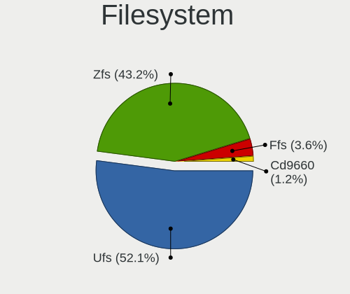

| Type   | Desktops | Percent |
|--------|----------|---------|
| Ufs    | 88       | 52.07%  |
| Zfs    | 73       | 43.2%   |
| Ffs    | 6        | 3.55%   |
| Cd9660 | 2        | 1.18%   |

Part. scheme
------------

Scheme of partitioning

| Type    | Desktops | Percent |
|---------|----------|---------|
| GPT     | 155      | 92.26%  |
| MBR     | 10       | 5.95%   |
| Unknown | 3        | 1.79%   |

Board
-----

Vendor
------

Motherboard manufacturer

| Name                       | Desktops | Percent |
|----------------------------|----------|---------|
| Unknown                    | 32       | 19.28%  |
| ASUSTek Computer           | 17       | 10.24%  |
| PC Engines                 | 16       | 9.64%   |
| Hewlett-Packard            | 15       | 9.04%   |
| Dell                       | 12       | 7.23%   |
| Intel                      | 10       | 6.02%   |
| Gigabyte Technology        | 9        | 5.42%   |
| MSI                        | 7        | 4.22%   |
| Lenovo                     | 7        | 4.22%   |
| ASRock                     | 7        | 4.22%   |
| Techvision                 | 4        | 2.41%   |
| Fujitsu                    | 4        | 2.41%   |
| CWWK                       | 4        | 2.41%   |
| Shuttle                    | 2        | 1.2%    |
| Deciso                     | 2        | 1.2%    |
| AOpen                      | 2        | 1.2%    |
| AMI                        | 2        | 1.2%    |
| Wistron                    | 1        | 0.6%    |
| Supermicro                 | 1        | 0.6%    |
| SJRC                       | 1        | 0.6%    |
| ShenZhen MinWin Technology | 1        | 0.6%    |
| Protectli                  | 1        | 0.6%    |
| HPE                        | 1        | 0.6%    |
| Fujitsu Siemens            | 1        | 0.6%    |
| Foxconn                    | 1        | 0.6%    |
| DFI                        | 1        | 0.6%    |
| Cisco                      | 1        | 0.6%    |
| AZW                        | 1        | 0.6%    |
| Apple                      | 1        | 0.6%    |
| ADI                        | 1        | 0.6%    |
| ACMA                       | 1        | 0.6%    |

Model
-----

Motherboard model

| Name                                   | Desktops | Percent |
|----------------------------------------|----------|---------|
| Unknown                                | 32       | 19.28%  |
| PC Engines APU2                        | 7        | 4.22%   |
| Techvision TVI7309X                    | 4        | 2.41%   |
| PC Engines apu4                        | 4        | 2.41%   |
| HP EliteDesk 800 G2 SFF                | 4        | 2.41%   |
| Intel CRESCENTBAY                      | 3        | 1.81%   |
| HP EliteDesk 800 G1 SFF                | 3        | 1.81%   |
| ASUS All Series                        | 3        | 1.81%   |
| PC Engines apu6                        | 2        | 1.2%    |
| PC Engines APU3                        | 2        | 1.2%    |
| Intel Q3XXG4-P V1.0                    | 2        | 1.2%    |
| Intel D54250WYK H13922-303             | 2        | 1.2%    |
| HP EliteDesk 800 G3 SFF                | 2        | 1.2%    |
| Dell OptiPlex 9020                     | 2        | 1.2%    |
| Dell OptiPlex 7060                     | 2        | 1.2%    |
| Dell OptiPlex 7010                     | 2        | 1.2%    |
| CWWK CW-AD4L-N V1                      | 2        | 1.2%    |
| AOpen DE3250                           | 2        | 1.2%    |
| Wistron ProLiant ML110 G6              | 1        | 0.6%    |
| Supermicro SYS-1019S-MP                | 1        | 0.6%    |
| SJRC ADLN-6L                           | 1        | 0.6%    |
| Shuttle SH570                          | 1        | 0.6%    |
| Shuttle DH170                          | 1        | 0.6%    |
| ShenZhen MinWin MW-NANO-APL-4L         | 1        | 0.6%    |
| Protectli FW4B                         | 1        | 0.6%    |
| PC Engines APU                         | 1        | 0.6%    |
| MSI WC776AA-UUW HPE-110sc              | 1        | 0.6%    |
| MSI MS-7C56                            | 1        | 0.6%    |
| MSI MS-7B85                            | 1        | 0.6%    |
| MSI MS-7B43                            | 1        | 0.6%    |
| MSI MS-7A40                            | 1        | 0.6%    |
| MSI MS-7918                            | 1        | 0.6%    |
| MSI MS-7369                            | 1        | 0.6%    |
| Lenovo ThinkCentre M92p 2988B1G        | 1        | 0.6%    |
| Lenovo ThinkCentre M81 1730A1G         | 1        | 0.6%    |
| Lenovo ThinkCentre M700 10GRCTO1WW     | 1        | 0.6%    |
| Lenovo ThinkCentre Edge72 3493AZG      | 1        | 0.6%    |
| Lenovo ThinkCentre E73 10AS002QMX      | 1        | 0.6%    |
| Lenovo IdeaCentre 300-20ISH 90DA00HEMT | 1        | 0.6%    |
| Lenovo 70F3S00K00 ThinkServer RS140    | 1        | 0.6%    |

Model Family
------------

Motherboard model prefix

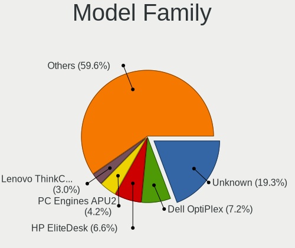

| Name                           | Desktops | Percent |
|--------------------------------|----------|---------|
| Unknown                        | 32       | 19.28%  |
| Dell OptiPlex                  | 12       | 7.23%   |
| HP EliteDesk                   | 11       | 6.63%   |
| PC Engines APU2                | 7        | 4.22%   |
| Lenovo ThinkCentre             | 5        | 3.01%   |
| Techvision TVI7309X            | 4        | 2.41%   |
| PC Engines apu4                | 4        | 2.41%   |
| Intel CRESCENTBAY              | 3        | 1.81%   |
| Fujitsu ESPRIMO                | 3        | 1.81%   |
| ASUS All                       | 3        | 1.81%   |
| PC Engines apu6                | 2        | 1.2%    |
| PC Engines APU3                | 2        | 1.2%    |
| Intel Q3XXG4-P                 | 2        | 1.2%    |
| Intel D54250WYK                | 2        | 1.2%    |
| Deciso Netboard                | 2        | 1.2%    |
| CWWK CW-AD4L-N                 | 2        | 1.2%    |
| ASUS ROG                       | 2        | 1.2%    |
| AOpen DE3250                   | 2        | 1.2%    |
| Wistron ProLiant               | 1        | 0.6%    |
| Supermicro SYS-1019S-MP        | 1        | 0.6%    |
| SJRC ADLN-6L                   | 1        | 0.6%    |
| Shuttle SH570                  | 1        | 0.6%    |
| Shuttle DH170                  | 1        | 0.6%    |
| ShenZhen MinWin MW-NANO-APL-4L | 1        | 0.6%    |
| Protectli FW4B                 | 1        | 0.6%    |
| PC Engines APU                 | 1        | 0.6%    |
| MSI WC776AA-UUW                | 1        | 0.6%    |
| MSI MS-7C56                    | 1        | 0.6%    |
| MSI MS-7B85                    | 1        | 0.6%    |
| MSI MS-7B43                    | 1        | 0.6%    |
| MSI MS-7A40                    | 1        | 0.6%    |
| MSI MS-7918                    | 1        | 0.6%    |
| MSI MS-7369                    | 1        | 0.6%    |
| Lenovo IdeaCentre              | 1        | 0.6%    |
| Lenovo 70F3S00K00              | 1        | 0.6%    |
| Intel DQ67SW                   | 1        | 0.6%    |
| Intel DN2820FYK                | 1        | 0.6%    |
| Intel DH61AG                   | 1        | 0.6%    |
| HPE ProLiant                   | 1        | 0.6%    |
| HP Z230                        | 1        | 0.6%    |

MFG Year
--------

Motherboard manufacture year

| Year    | Desktops | Percent |
|---------|----------|---------|
| 2023    | 22       | 13.25%  |
| 2014    | 22       | 13.25%  |
| 2016    | 20       | 12.05%  |
| 2022    | 16       | 9.64%   |
| 2017    | 14       | 8.43%   |
| 2021    | 10       | 6.02%   |
| 2020    | 10       | 6.02%   |
| 2018    | 10       | 6.02%   |
| 2019    | 9        | 5.42%   |
| 2013    | 7        | 4.22%   |
| 2010    | 6        | 3.61%   |
| 2012    | 5        | 3.01%   |
| 2009    | 4        | 2.41%   |
| 2015    | 3        | 1.81%   |
| 2011    | 3        | 1.81%   |
| 2024    | 2        | 1.2%    |
| 2008    | 1        | 0.6%    |
| 2006    | 1        | 0.6%    |
| Unknown | 1        | 0.6%    |

Form Factor
-----------

Physical design of the computer

| Name    | Desktops | Percent |
|---------|----------|---------|
| Desktop | 166      | 100%    |

Coreboot
--------

Have coreboot on board

| Used | Desktops | Percent |
|------|----------|---------|
| No   | 148      | 89.16%  |
| Yes  | 18       | 10.84%  |

RAM Size
--------

Total RAM memory

| Size in GB  | Desktops | Percent |
|-------------|----------|---------|
| 8.01-16.0   | 64       | 37.87%  |
| 16.01-24.0  | 39       | 23.08%  |
| 4.01-8.0    | 33       | 19.53%  |
| 32.01-64.0  | 19       | 11.24%  |
| 2.01-3.0    | 5        | 2.96%   |
| 64.01-256.0 | 5        | 2.96%   |
| 24.01-32.0  | 3        | 1.78%   |
| 1.01-2.0    | 1        | 0.59%   |

RAM Used
--------

Used RAM memory

| Used GB    | Desktops | Percent |
|------------|----------|---------|
| 0.01-0.5   | 81       | 47.09%  |
| 0.51-1.0   | 63       | 36.63%  |
| 1.01-2.0   | 17       | 9.88%   |
| 4.01-8.0   | 4        | 2.33%   |
| 2.01-3.0   | 3        | 1.74%   |
| 3.01-4.0   | 2        | 1.16%   |
| 32.01-64.0 | 1        | 0.58%   |
| 24.01-32.0 | 1        | 0.58%   |

Total Drives
------------

Number of drives on board

| Drives | Desktops | Percent |
|--------|----------|---------|
| 1      | 113      | 65.32%  |
| 0      | 20       | 11.56%  |
| 2      | 17       | 9.83%   |
| 3      | 11       | 6.36%   |
| 6      | 4        | 2.31%   |
| 4      | 4        | 2.31%   |
| 12     | 1        | 0.58%   |
| 10     | 1        | 0.58%   |
| 9      | 1        | 0.58%   |
| 8      | 1        | 0.58%   |

Has CD-ROM
----------

Has CD-ROM on board

| Presented | Desktops | Percent |
|-----------|----------|---------|
| No        | 145      | 86.31%  |
| Yes       | 23       | 13.69%  |

Has Ethernet
------------

Has Ethernet on board

| Presented | Desktops | Percent |
|-----------|----------|---------|
| Yes       | 165      | 99.4%   |
| No        | 1        | 0.6%    |

Has WiFi
--------

Has WiFi module

| Presented | Desktops | Percent |
|-----------|----------|---------|
| No        | 141      | 84.43%  |
| Yes       | 26       | 15.57%  |

Has Bluetooth
-------------

Has Bluetooth module

| Presented | Desktops | Percent |
|-----------|----------|---------|
| No        | 146      | 87.43%  |
| Yes       | 21       | 12.57%  |

Location
--------

Country
-------

Geographic location (country)

| Country | Desktops | Percent |
|---------|----------|---------|
| Sweden  | 166      | 100%    |

City
----

Geographic location (city)

| City                  | Desktops | Percent |
|-----------------------|----------|---------|
| Stockholm             | 40       | 20.73%  |
| Malmo                 | 9        | 4.66%   |
| Vsters            | 7        | 3.63%   |
| Gothenburg            | 6        | 3.11%   |
| Bromma                | 6        | 3.11%   |
| Ume                 | 4        | 2.07%   |
| Gvle                | 4        | 2.07%   |
| Taby                  | 3        | 1.55%   |
| Sollentuna            | 3        | 1.55%   |
| Skvde               | 3        | 1.55%   |
| Pite                | 3        | 1.55%   |
| Lund                  | 3        | 1.55%   |
| Linkping            | 3        | 1.55%   |
| Vsters        | 2        | 1.04%   |
| Vaxjo                 | 2        | 1.04%   |
| Uppsala               | 2        | 1.04%   |
| Upplands Vasby        | 2        | 1.04%   |
| Ume               | 2        | 1.04%   |
| Tumba                 | 2        | 1.04%   |
| Sundsvall             | 2        | 1.04%   |
| Straengnaes           | 2        | 1.04%   |
| Solleftea             | 2        | 1.04%   |
| Nynaeshamn            | 2        | 1.04%   |
| Linkping          | 2        | 1.04%   |
| Landskrona            | 2        | 1.04%   |
| Karlskrona            | 2        | 1.04%   |
| Jnkping       | 2        | 1.04%   |
| Holmsund              | 2        | 1.04%   |
| Helsingborg           | 2        | 1.04%   |
| Halmstad              | 2        | 1.04%   |
| Fraensta              | 2        | 1.04%   |
| Enskede-Arsta-Vantoer | 2        | 1.04%   |
| Bandhagen             | 2        | 1.04%   |
| hus              | 1        | 0.52%   |
| lvngen       | 1        | 0.52%   |
| Ystad                 | 1        | 0.52%   |
| Vena                  | 1        | 0.52%   |
| Vallingby             | 1        | 0.52%   |
| Vallentuna            | 1        | 0.52%   |
| Ume               | 1        | 0.52%   |

Drives
------

Drive Vendor
------------

Hard drive vendors

| Vendor              | Desktops | Drives | Percent |
|---------------------|----------|--------|---------|
| Samsung Electronics | 34       | 54     | 17%     |
| Kingston            | 24       | 36     | 12%     |
| WDC                 | 22       | 35     | 11%     |
| Seagate             | 19       | 46     | 9.5%    |
| Intel               | 16       | 21     | 8%      |
| Hoodisk             | 15       | 25     | 7.5%    |
| Crucial             | 8        | 17     | 4%      |
| Toshiba             | 7        | 16     | 3.5%    |
| SanDisk             | 7        | 10     | 3.5%    |
| Phison              | 5        | 5      | 2.5%    |
| China               | 5        | 5      | 2.5%    |
| LITEON              | 4        | 10     | 2%      |
| Transcend           | 3        | 3      | 1.5%    |
| NVMe                | 3        | 4      | 1.5%    |
| Apacer              | 3        | 3      | 1.5%    |
| OCZ                 | 2        | 4      | 1%      |
| Innodisk            | 2        | 3      | 1%      |
| Hitachi             | 2        | 2      | 1%      |
| Fanxiang            | 2        | 4      | 1%      |
| Corsair             | 2        | 2      | 1%      |
| Apple               | 2        | 3      | 1%      |
| XrayDisk            | 1        | 1      | 0.5%    |
| Supermicro          | 1        | 1      | 0.5%    |
| SK hynix            | 1        | 1      | 0.5%    |
| Silicon Motion      | 1        | 1      | 0.5%    |
| PNY                 | 1        | 1      | 0.5%    |
| LITEONIT            | 1        | 1      | 0.5%    |
| KingSpec            | 1        | 1      | 0.5%    |
| Kimtigo             | 1        | 1      | 0.5%    |
| FORESEE             | 1        | 1      | 0.5%    |
| Fordisk             | 1        | 1      | 0.5%    |
| faspeed             | 1        | 1      | 0.5%    |
| CWdisk              | 1        | 2      | 0.5%    |
| A-DATA Technology   | 1        | 1      | 0.5%    |

Drive Model
-----------

Hard drive models

| Model                            | Desktops | Percent |
|----------------------------------|----------|---------|
| Hoodisk SSD 16GB                 | 5        | 2.24%   |
| Hoodisk SSD 64GB                 | 4        | 1.79%   |
| Hoodisk SSD 128GB                | 4        | 1.79%   |
| China SATA SSD 16GB              | 4        | 1.79%   |
| Samsung SSD 860 QVO 1TB          | 3        | 1.35%   |
| Phison YSO128GTLCW-E3C-2 128GB   | 3        | 1.35%   |
| Kingston SKC600512G 512GB        | 3        | 1.35%   |
| Kingston SA400S37240G 240GB      | 3        | 1.35%   |
| Intel SSDSC2BW240A4 240GB        | 3        | 1.35%   |
| Intel SSDSC2BF180A4H 180GB       | 3        | 1.35%   |
| WDC WD5000AZLX-60K2TA0 500GB     | 2        | 0.9%    |
| WDC WD20PURZ-85GU6Y0 2TB         | 2        | 0.9%    |
| Toshiba HDWR11A 10TB             | 2        | 0.9%    |
| Toshiba HDWQ140 4TB              | 2        | 0.9%    |
| Toshiba DT01ACA100 1TB           | 2        | 0.9%    |
| Seagate ST4000DM004-2CV104 4TB   | 2        | 0.9%    |
| Seagate ST2000DM008-2FR102 2TB   | 2        | 0.9%    |
| Seagate ST1000DM010-2EP102 1TB   | 2        | 0.9%    |
| Samsung SSD 970 EVO Plus 500GB   | 2        | 0.9%    |
| Samsung SSD 970 EVO 500GB        | 2        | 0.9%    |
| Samsung SSD 850 EVO 1TB          | 2        | 0.9%    |
| Samsung MZ7TY128HDHP-000L1 128GB | 2        | 0.9%    |
| Samsung HD501LJ 500GB            | 2        | 0.9%    |
| Phison SATA SSD 16GB             | 2        | 0.9%    |
| OCZ AGILITY3 120GB               | 2        | 0.9%    |
| Kingston SV300S37A240G 240GB     | 2        | 0.9%    |
| Kingston SKC600MS256G 256GB      | 2        | 0.9%    |
| Kingston SA2000M8250G 250GB      | 2        | 0.9%    |
| Intel SSDSC2CT060A3 64GB         | 2        | 0.9%    |
| Crucial CT256MX100SSD1 256GB     | 2        | 0.9%    |
| Apacer 64GB SATA Flash Drive     | 2        | 0.9%    |
| XrayDisk SSD 64GB                | 1        | 0.45%   |
| WDC WDS500G3X0C-00SJG0 500GB     | 1        | 0.45%   |
| WDC WDS480G2G0A-00JH30 480GB     | 1        | 0.45%   |
| WDC WDS250G2B0C-00PXH0 250GB     | 1        | 0.45%   |
| WDC WDS250G2B0A-00SM50 250GB     | 1        | 0.45%   |
| WDC WDS240G2G0A-00JH30 240GB     | 1        | 0.45%   |
| WDC WDS120G1G0A-00SS50 120GB     | 1        | 0.45%   |
| WDC WD82PURZ-85TEUY0 8TB         | 1        | 0.45%   |
| WDC WD80EZAZ-11TDBA0 8TB         | 1        | 0.45%   |

HDD Vendor
----------

Hard disk drive vendors

| Vendor              | Desktops | Drives | Percent |
|---------------------|----------|--------|---------|
| Seagate             | 17       | 42     | 34.69%  |
| WDC                 | 16       | 27     | 32.65%  |
| Toshiba             | 7        | 16     | 14.29%  |
| Samsung Electronics | 5        | 9      | 10.2%   |
| Hitachi             | 2        | 2      | 4.08%   |
| NVMe                | 1        | 2      | 2.04%   |
| Apple               | 1        | 1      | 2.04%   |

SSD Vendor
----------

Solid state drive vendors

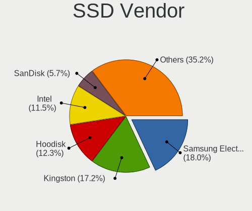

| Vendor              | Desktops | Drives | Percent |
|---------------------|----------|--------|---------|
| Samsung Electronics | 22       | 32     | 18.03%  |
| Kingston            | 21       | 32     | 17.21%  |
| Hoodisk             | 15       | 25     | 12.3%   |
| Intel               | 14       | 19     | 11.48%  |
| SanDisk             | 7        | 10     | 5.74%   |
| Crucial             | 6        | 15     | 4.92%   |
| China               | 5        | 5      | 4.1%    |
| WDC                 | 4        | 6      | 3.28%   |
| LITEON              | 4        | 10     | 3.28%   |
| Transcend           | 3        | 3      | 2.46%   |
| Apacer              | 3        | 3      | 2.46%   |
| Phison              | 2        | 2      | 1.64%   |
| OCZ                 | 2        | 4      | 1.64%   |
| NVMe                | 2        | 2      | 1.64%   |
| Innodisk            | 2        | 3      | 1.64%   |
| XrayDisk            | 1        | 1      | 0.82%   |
| Supermicro          | 1        | 1      | 0.82%   |
| SK hynix            | 1        | 1      | 0.82%   |
| Seagate             | 1        | 1      | 0.82%   |
| PNY                 | 1        | 1      | 0.82%   |
| LITEONIT            | 1        | 1      | 0.82%   |
| KingSpec            | 1        | 1      | 0.82%   |
| Fordisk             | 1        | 1      | 0.82%   |
| Corsair             | 1        | 1      | 0.82%   |
| Apple               | 1        | 2      | 0.82%   |

Drive Kind
----------

HDD or SSD

| Kind | Desktops | Drives | Percent |
|------|----------|--------|---------|
| SSD  | 105      | 182    | 60.69%  |
| HDD  | 36       | 99     | 20.81%  |
| NVMe | 32       | 41     | 18.5%   |

Drive Connector
---------------

SATA, SAS, NVMe, etc.

| Type | Desktops | Drives | Percent |
|------|----------|--------|---------|
| SATA | 125      | 281    | 79.62%  |
| NVMe | 32       | 41     | 20.38%  |

Drive Size
----------

Size of hard drive

| Size in TB | Desktops | Drives | Percent |
|------------|----------|--------|---------|
| 0.01-0.5   | 112      | 189    | 70%     |
| 0.51-1.0   | 23       | 37     | 14.38%  |
| 1.01-2.0   | 11       | 20     | 6.88%   |
| 3.01-4.0   | 9        | 20     | 5.63%   |
| 4.01-10.0  | 5        | 15     | 3.13%   |

Space Total
-----------

Amount of disk space available on the file system

| Size in GB     | Desktops | Percent |
|----------------|----------|---------|
| 101-250        | 77       | 44.77%  |
| 251-500        | 27       | 15.7%   |
| 1-20           | 21       | 12.21%  |
| 21-50          | 18       | 10.47%  |
| 51-100         | 13       | 7.56%   |
| 501-1000       | 9        | 5.23%   |
| 1001-2000      | 5        | 2.91%   |
| More than 3000 | 2        | 1.16%   |

Space Used
----------

Amount of used disk space

| Used GB        | Desktops | Percent |
|----------------|----------|---------|
| 1-20           | 150      | 86.71%  |
| 21-50          | 14       | 8.09%   |
| 101-250        | 3        | 1.73%   |
| 251-500        | 2        | 1.16%   |
| 51-100         | 2        | 1.16%   |
| More than 3000 | 1        | 0.58%   |
| 1001-2000      | 1        | 0.58%   |

Malfunc. Drives
---------------

Drive models with a malfunction

| Model                                 | Desktops | Drives | Percent |
|---------------------------------------|----------|--------|---------|
| Seagate ST1000DM010-2EP102 1TB        | 2        | 5      | 7.69%   |
| WDC WD6400AARS-00Y5B1 640GB           | 1        | 1      | 3.85%   |
| WDC WD40EFRX-68N32N0 4TB              | 1        | 2      | 3.85%   |
| WDC WD2500AAJS-60B4A0 250GB           | 1        | 2      | 3.85%   |
| WDC WD20EFRX-68EUZN0 2TB              | 1        | 2      | 3.85%   |
| WDC WD20EARX-00ZUDB0 2TB              | 1        | 1      | 3.85%   |
| WDC WD2002FYPS-02W3B0 2TB             | 1        | 1      | 3.85%   |
| WDC WD15EARS-00Z5B1 1.5TB             | 1        | 1      | 3.85%   |
| WDC WD15EARS-00MVWB0 1.5TB            | 1        | 1      | 3.85%   |
| SK hynix HFS128G32MND-2200A 128GB     | 1        | 1      | 3.85%   |
| Seagate ST9320423AS 320GB             | 1        | 1      | 3.85%   |
| Seagate ST9320421AS 320GB             | 1        | 1      | 3.85%   |
| Seagate ST8000AS0002-1NA17Z 8TB       | 1        | 1      | 3.85%   |
| Seagate ST2000DM008-2FR102 2TB        | 1        | 1      | 3.85%   |
| Seagate ST100FN0021 100GB             | 1        | 1      | 3.85%   |
| Seagate ST1000DM003-1ER162 1TB        | 1        | 1      | 3.85%   |
| Samsung Electronics SSD 970 EVO 500GB | 1        | 1      | 3.85%   |
| Samsung Electronics HM250JI 250GB     | 1        | 3      | 3.85%   |
| Samsung Electronics HD321KJ 320GB     | 1        | 1      | 3.85%   |
| OCZ AGILITY3 120GB                    | 1        | 2      | 3.85%   |
| Kingston SV300S37A120G 120GB          | 1        | 1      | 3.85%   |
| Intel SSDSC2CT120A3 120GB             | 1        | 1      | 3.85%   |
| Intel SSDSC2CT060A3 64GB              | 1        | 2      | 3.85%   |
| Intel SSDSC2BF180A4H 180GB            | 1        | 1      | 3.85%   |
| Intel SSDSC2BA400G4 400GB             | 1        | 1      | 3.85%   |

Malfunc. Drive Vendor
---------------------

Vendors of faulty drives

| Vendor              | Desktops | Drives | Percent |
|---------------------|----------|--------|---------|
| Seagate             | 6        | 11     | 28.57%  |
| WDC                 | 5        | 11     | 23.81%  |
| Intel               | 4        | 5      | 19.05%  |
| Samsung Electronics | 3        | 5      | 14.29%  |
| SK hynix            | 1        | 1      | 4.76%   |
| OCZ                 | 1        | 2      | 4.76%   |
| Kingston            | 1        | 1      | 4.76%   |

Malfunc. HDD Vendor
-------------------

Vendors of faulty HDD drives

| Vendor              | Desktops | Drives | Percent |
|---------------------|----------|--------|---------|
| WDC                 | 5        | 11     | 41.67%  |
| Seagate             | 5        | 10     | 41.67%  |
| Samsung Electronics | 2        | 4      | 16.67%  |

Malfunc. Drive Kind
-------------------

Kinds of faulty drives

| Kind | Desktops | Drives | Percent |
|------|----------|--------|---------|
| HDD  | 10       | 25     | 52.63%  |
| SSD  | 8        | 10     | 42.11%  |
| NVMe | 1        | 1      | 5.26%   |

Failed Drives
-------------

Failed drive models

Zero info for selected period =(

Failed Drive Vendor
-------------------

Failed drive vendors

Zero info for selected period =(

Drive Status
------------

Number of failed and malfunc. drives

| Status   | Desktops | Drives | Percent |
|----------|----------|--------|---------|
| Works    | 139      | 276    | 84.24%  |
| Malfunc  | 19       | 36     | 11.52%  |
| Detected | 7        | 10     | 4.24%   |

Storage controller
------------------

Storage Vendor
--------------

Storage controller vendors

| Vendor                        | Desktops | Percent |
|-------------------------------|----------|---------|
| Intel                         | 124      | 57.94%  |
| AMD                           | 34       | 15.89%  |
| Samsung Electronics           | 16       | 7.48%   |
| Silicon Motion                | 7        | 3.27%   |
| Kingston Technology Company   | 5        | 2.34%   |
| Phison Electronics            | 4        | 1.87%   |
| ASMedia Technology            | 4        | 1.87%   |
| Marvell Technology Group      | 3        | 1.4%    |
| Broadcom / LSI                | 3        | 1.4%    |
| Seagate Technology            | 2        | 0.93%   |
| SanDisk                       | 2        | 0.93%   |
| Micron/Crucial Technology     | 2        | 0.93%   |
| VIA Technologies              | 1        | 0.47%   |
| Shenzhen Longsys Electronics  | 1        | 0.47%   |
| Nvidia                        | 1        | 0.47%   |
| Micron Technology             | 1        | 0.47%   |
| Integrated Technology Express | 1        | 0.47%   |
| ADATA Technology              | 1        | 0.47%   |
| Adaptec                       | 1        | 0.47%   |
| 3ware                         | 1        | 0.47%   |

Storage Model
-------------

Storage controller models

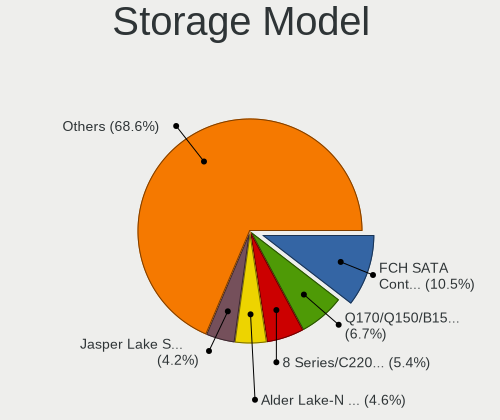

| Model                                                                                   | Desktops | Percent |
|-----------------------------------------------------------------------------------------|----------|---------|
| AMD FCH SATA Controller [AHCI mode]                                                     | 25       | 10.46%  |
| Intel Q170/Q150/B150/H170/H110/Z170/CM236 Chipset SATA Controller [AHCI Mode]           | 16       | 6.69%   |
| Intel 8 Series/C220 Series Chipset Family 6-port SATA Controller 1 [AHCI mode]          | 13       | 5.44%   |
| Intel Alder Lake-N SATA AHCI Controller                                                 | 11       | 4.6%    |
| Intel Jasper Lake SATA AHCI Controller                                                  | 10       | 4.18%   |
| Silicon Motion SM2263EN/SM2263XT (DRAM-less) NVMe SSD Controllers                       | 7        | 2.93%   |
| Samsung NVMe SSD Controller SM981/PM981/PM983                                           | 7        | 2.93%   |
| Intel SATA Controller [RAID mode]                                                       | 7        | 2.93%   |
| Intel Cannon Lake PCH SATA AHCI Controller                                              | 6        | 2.51%   |
| Intel 6 Series/C200 Series Chipset Family 6 port Desktop SATA AHCI Controller           | 6        | 2.51%   |
| Samsung NVMe SSD Controller 980 (DRAM-less)                                             | 5        | 2.09%   |
| Intel Celeron/Pentium Silver Processor SATA Controller                                  | 5        | 2.09%   |
| Intel Atom Processor E3800 Series SATA AHCI Controller                                  | 5        | 2.09%   |
| Intel 8 Series SATA Controller 1 [AHCI mode]                                            | 5        | 2.09%   |
| Intel NM10/ICH7 Family SATA Controller [IDE mode]                                       | 4        | 1.67%   |
| Intel 200 Series PCH SATA controller [AHCI mode]                                        | 4        | 1.67%   |
| AMD 500 Series Chipset SATA Controller                                                  | 4        | 1.67%   |
| Phison PS5013-E13 PCIe3 NVMe Controller (DRAM-less)                                     | 3        | 1.26%   |
| Kingston Company A2000 NVMe SSD [SM2263EN]                                              | 3        | 1.26%   |
| Intel Sunrise Point-LP SATA Controller [AHCI mode]                                      | 3        | 1.26%   |
| Intel Atom/Celeron/Pentium Processor x5-E8000/J3xxx/N3xxx Series SATA Controller        | 3        | 1.26%   |
| Intel 82801G (ICH7 Family) IDE Controller                                               | 3        | 1.26%   |
| Intel 7 Series/C210 Series Chipset Family 6-port SATA Controller [AHCI mode]            | 3        | 1.26%   |
| Intel 5 Series/3400 Series Chipset 6 port SATA AHCI Controller                          | 3        | 1.26%   |
| Broadcom / LSI SAS2008 PCI-Express Fusion-MPT SAS-2 [Falcon]                            | 3        | 1.26%   |
| ASMedia ASM1061/ASM1062 Serial ATA Controller                                           | 3        | 1.26%   |
| AMD 300 Series Chipset SATA Controller                                                  | 3        | 1.26%   |
| Samsung NVMe SSD Controller SM961/PM961/SM963                                           | 2        | 0.84%   |
| Micron/Crucial P2 [Nick P2] / P3 / P3 Plus NVMe PCIe SSD (DRAM-less)                    | 2        | 0.84%   |
| Intel Wildcat Point-LP SATA Controller [AHCI Mode]                                      | 2        | 0.84%   |
| Intel Tiger Lake-LP SATA Controller                                                     | 2        | 0.84%   |
| Intel SSD DC P4101/Pro 7600p/760p/E 6100p Series                                        | 2        | 0.84%   |
| Intel 9 Series Chipset Family SATA Controller [AHCI Mode]                               | 2        | 0.84%   |
| Intel 6 Series/C200 Series Chipset Family Desktop SATA Controller (IDE mode, ports 4-5) | 2        | 0.84%   |
| Intel 6 Series/C200 Series Chipset Family Desktop SATA Controller (IDE mode, ports 0-3) | 2        | 0.84%   |
| Intel 500 Series Chipset Family SATA AHCI Controller                                    | 2        | 0.84%   |
| AMD SB7x0/SB8x0/SB9x0 SATA Controller [AHCI mode]                                       | 2        | 0.84%   |
| AMD FCH IDE Controller                                                                  | 2        | 0.84%   |
| VIA VT6415 PATA IDE Host Controller                                                     | 1        | 0.42%   |
| Shenzhen Longsys FORESEE P900 BGA NVMe SSD (DRAM-less)                                  | 1        | 0.42%   |

Storage Kind
------------

Kind of storage controller (IDE, SATA, NVMe, SAS, ...)

| Kind | Desktops | Percent |
|------|----------|---------|
| SATA | 144      | 66.67%  |
| NVMe | 42       | 19.44%  |
| IDE  | 17       | 7.87%   |
| RAID | 10       | 4.63%   |
| SAS  | 3        | 1.39%   |

Processor
---------

CPU Vendor
----------

Processor vendors

| Vendor  | Desktops | Percent |
|---------|----------|---------|
| Intel   | 132      | 78.57%  |
| AMD     | 35       | 20.83%  |
| Unknown | 1        | 0.6%    |

CPU Model
---------

Processor models

| Model                                  | Desktops | Percent |
|----------------------------------------|----------|---------|
| Intel N100                             | 16       | 9.47%   |
| AMD GX-412TC SOC                       | 15       | 8.88%   |
| Intel Core i5-6500 CPU @ 3.20GHz       | 8        | 4.73%   |
| Intel Celeron N5105 @ 2.00GHz          | 8        | 4.73%   |
| Intel Celeron J4125 CPU @ 2.00GHz      | 4        | 2.37%   |
| Intel Core i7-4770K CPU @ 3.50GHz      | 3        | 1.78%   |
| Intel Core i5-6400 CPU @ 2.70GHz       | 3        | 1.78%   |
| Intel Core i5-4590 CPU @ 3.30GHz       | 3        | 1.78%   |
| Intel Core i3-6100 CPU @ 3.70GHz       | 3        | 1.78%   |
| Intel Core i3-4130 CPU @ 3.40GHz       | 3        | 1.78%   |
| Intel Celeron CPU J3160 @ 1.60GHz      | 3        | 1.78%   |
| Intel Atom CPU E3845 @ 1.91GHz         | 3        | 1.78%   |
| Intel Xeon CPU E3-1225 v3 @ 3.20GHz    | 2        | 1.18%   |
| Intel Core i7-7500U CPU @ 2.70GHz      | 2        | 1.18%   |
| Intel Core i5-8500T CPU @ 2.10GHz      | 2        | 1.18%   |
| Intel Core i5-4250U CPU @ 1.30GHz      | 2        | 1.18%   |
| Intel Core i5-3470 CPU @ 3.20GHz       | 2        | 1.18%   |
| Intel Celeron CPU N2930 @ 1.83GHz      | 2        | 1.18%   |
| AMD Ryzen 9 3900X 12-Core Processor    | 2        | 1.18%   |
| AMD Ryzen 7 5700G with Radeon Graphics | 2        | 1.18%   |
| AMD Ryzen 7 1700 Eight-Core Processor  | 2        | 1.18%   |
| AMD GX-416RA SOC                       | 2        | 1.18%   |
| Intel Xeon E-2224 CPU @ 3.40GHz        | 1        | 0.59%   |
| Intel Xeon CPU X3470 @ 2.93GHz         | 1        | 0.59%   |
| Intel Xeon CPU X3440 @ 2.53GHz         | 1        | 0.59%   |
| Intel Xeon CPU E5450 @ 3.00GHz         | 1        | 0.59%   |
| Intel Xeon CPU E5-1680 v2 @ 3.00GHz    | 1        | 0.59%   |
| Intel Xeon CPU E3-1515M v5 @ 2.80GHz   | 1        | 0.59%   |
| Intel Xeon CPU E3-1230L v3 @ 1.80GHz   | 1        | 0.59%   |
| Intel Xeon CPU E3-1220 v5 @ 3.00GHz    | 1        | 0.59%   |
| Intel Pentium Silver N6005 @ 2.00GHz   | 1        | 0.59%   |
| Intel Pentium Dual-Core CPU E5700      | 1        | 0.59%   |
| Intel Pentium CPU G840 @ 2.80GHz       | 1        | 0.59%   |
| Intel Pentium CPU G6950 @ 2.80GHz      | 1        | 0.59%   |
| Intel Pentium CPU G4560 @ 3.50GHz      | 1        | 0.59%   |
| Intel Pentium CPU G4400 @ 3.30GHz      | 1        | 0.59%   |
| Intel Core i7-8700K CPU @ 3.70GHz      | 1        | 0.59%   |
| Intel Core i7-7700 CPU @ 3.60GHz       | 1        | 0.59%   |
| Intel Core i7-6850K CPU @ 3.60GHz      | 1        | 0.59%   |
| Intel Core i7-6700K CPU @ 4.00GHz      | 1        | 0.59%   |

CPU Model Family
----------------

Processor model prefix

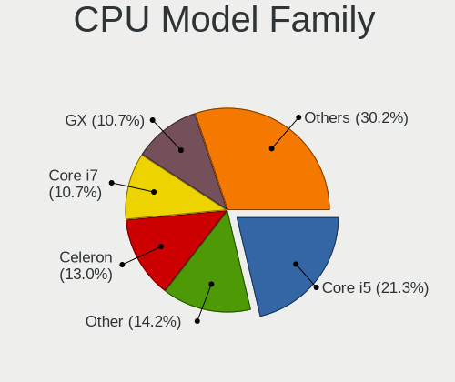

| Model                   | Desktops | Percent |
|-------------------------|----------|---------|
| Intel Core i5           | 36       | 21.3%   |
| Other                   | 24       | 14.2%   |
| Intel Celeron           | 22       | 13.02%  |
| Intel Core i7           | 18       | 10.65%  |
| AMD GX                  | 18       | 10.65%  |
| Intel Core i3           | 12       | 7.1%    |
| Intel Xeon              | 10       | 5.92%   |
| AMD Ryzen 7             | 5        | 2.96%   |
| Intel Pentium           | 4        | 2.37%   |
| Intel Atom              | 4        | 2.37%   |
| AMD Ryzen 9             | 3        | 1.78%   |
| Intel Core 2 Quad       | 2        | 1.18%   |
| Intel Pentium Silver    | 1        | 0.59%   |
| Intel Pentium Dual-Core | 1        | 0.59%   |
| Intel Core 2 Duo        | 1        | 0.59%   |
| Intel Core 2            | 1        | 0.59%   |
| AMD Ryzen Threadripper  | 1        | 0.59%   |
| AMD Ryzen 7 PRO         | 1        | 0.59%   |
| AMD Ryzen 5             | 1        | 0.59%   |
| AMD G                   | 1        | 0.59%   |
| AMD FX                  | 1        | 0.59%   |
| AMD Athlon 64 X2        | 1        | 0.59%   |
| AMD Athlon              | 1        | 0.59%   |

CPU Cores
---------

Number of processor cores

| Number  | Desktops | Percent |
|---------|----------|---------|
| 4       | 112      | 66.27%  |
| 2       | 30       | 17.75%  |
| 6       | 7        | 4.14%   |
| 24      | 5        | 2.96%   |
| 16      | 5        | 2.96%   |
| Unknown | 5        | 2.96%   |
| 8       | 4        | 2.37%   |
| 12      | 1        | 0.59%   |

CPU Sockets
-----------

Number of sockets

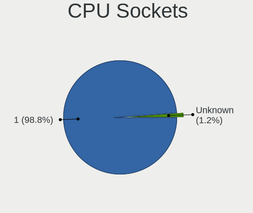

| Number  | Desktops | Percent |
|---------|----------|---------|
| 1       | 164      | 98.8%   |
| Unknown | 2        | 1.2%    |

CPU Threads
-----------

Threads per core (Hyper-Threading)

| Number  | Desktops | Percent |
|---------|----------|---------|
| 1       | 122      | 72.19%  |
| 2       | 42       | 24.85%  |
| Unknown | 5        | 2.96%   |

CPU Microarch
-------------

Microarchitecture

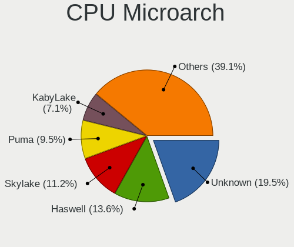

| Name          | Desktops | Percent |
|---------------|----------|---------|
| Unknown       | 33       | 19.53%  |
| Haswell       | 23       | 13.61%  |
| Skylake       | 19       | 11.24%  |
| Puma          | 16       | 9.47%   |
| KabyLake      | 12       | 7.1%    |
| Silvermont    | 9        | 5.33%   |
| IvyBridge     | 9        | 5.33%   |
| SandyBridge   | 5        | 2.96%   |
| Penryn        | 5        | 2.96%   |
| Goldmont plus | 5        | 2.96%   |
| Zen           | 4        | 2.37%   |
| Nehalem       | 4        | 2.37%   |
| Zen 2         | 3        | 1.78%   |
| Jaguar        | 3        | 1.78%   |
| Broadwell     | 3        | 1.78%   |
| Zen 3         | 2        | 1.18%   |
| Westmere      | 2        | 1.18%   |
| TigerLake     | 2        | 1.18%   |
| Piledriver    | 2        | 1.18%   |
| Goldmont      | 2        | 1.18%   |
| Core          | 2        | 1.18%   |
| Steamroller   | 1        | 0.59%   |
| K8 Hammer     | 1        | 0.59%   |
| CometLake     | 1        | 0.59%   |
| Bobcat        | 1        | 0.59%   |

Graphics
--------

GPU Vendor
----------

Vendors of graphics cards

| Vendor                     | Desktops | Percent |
|----------------------------|----------|---------|
| Intel                      | 107      | 70.86%  |
| Nvidia                     | 21       | 13.91%  |
| AMD                        | 15       | 9.93%   |
| Matrox Electronics Systems | 4        | 2.65%   |
| ASPEED Technology          | 4        | 2.65%   |

GPU Model
---------

Graphics card models

| Model                                                                                    | Desktops | Percent |
|------------------------------------------------------------------------------------------|----------|---------|
| Intel Alder Lake-N [UHD Graphics]                                                        | 17       | 11.18%  |
| Intel HD Graphics 530                                                                    | 12       | 7.89%   |
| Intel Xeon E3-1200 v3/4th Gen Core Processor Integrated Graphics Controller              | 10       | 6.58%   |
| Intel JasperLake [UHD Graphics]                                                          | 10       | 6.58%   |
| Intel Xeon E3-1200 v2/3rd Gen Core processor Graphics Controller                         | 6        | 3.95%   |
| Intel Atom Processor Z36xxx/Z37xxx Series Graphics & Display                             | 6        | 3.95%   |
| Intel Haswell-ULT Integrated Graphics Controller                                         | 5        | 3.29%   |
| Intel GeminiLake [UHD Graphics 600]                                                      | 5        | 3.29%   |
| Nvidia GK208B [GeForce GT 710]                                                           | 4        | 2.63%   |
| Intel CoffeeLake-S GT2 [UHD Graphics 630]                                                | 4        | 2.63%   |
| ASPEED Technology ASPEED Graphics Family                                                 | 4        | 2.63%   |
| Intel Atom/Celeron/Pentium Processor x5-E8000/J3xxx/N3xxx Integrated Graphics Controller | 3        | 1.97%   |
| Intel 4th Generation Core Processor Family Integrated Graphics Controller                | 3        | 1.97%   |
| Intel 4 Series Chipset Integrated Graphics Controller                                    | 3        | 1.97%   |
| Intel 2nd Generation Core Processor Family Integrated Graphics Controller                | 3        | 1.97%   |
| Nvidia GT215 [GeForce GT 240]                                                            | 2        | 1.32%   |
| Nvidia GP107 [GeForce GTX 1050 Ti]                                                       | 2        | 1.32%   |
| Nvidia GP106 [GeForce GTX 1060 6GB]                                                      | 2        | 1.32%   |
| Intel Xeon E3-1200 v3 Processor Integrated Graphics Controller                           | 2        | 1.32%   |
| Intel TigerLake-LP GT2 [Iris Xe Graphics]                                                | 2        | 1.32%   |
| Intel IvyBridge GT2 [HD Graphics 4000]                                                   | 2        | 1.32%   |
| Intel HD Graphics 630                                                                    | 2        | 1.32%   |
| Intel HD Graphics 620                                                                    | 2        | 1.32%   |
| AMD Ellesmere [Radeon RX 470/480/570/570X/580/580X/590]                                  | 2        | 1.32%   |
| AMD Cezanne [Radeon Vega Series / Radeon Vega Mobile Series]                             | 2        | 1.32%   |
| Nvidia TU116 [GeForce GTX 1660 SUPER]                                                    | 1        | 0.66%   |
| Nvidia GT218 [NVS 300]                                                                   | 1        | 0.66%   |
| Nvidia GT218 [GeForce 210]                                                               | 1        | 0.66%   |
| Nvidia GP104 [GeForce GTX 1070]                                                          | 1        | 0.66%   |
| Nvidia GP102 [GeForce GTX 1080 Ti]                                                       | 1        | 0.66%   |
| Nvidia GM206 [GeForce GTX 960]                                                           | 1        | 0.66%   |
| Nvidia GK208B [GeForce GT 730]                                                           | 1        | 0.66%   |
| Nvidia GF119 [GeForce GT 610]                                                            | 1        | 0.66%   |
| Nvidia GF108M [GeForce GT 425M]                                                          | 1        | 0.66%   |
| Nvidia GA106 [GeForce RTX 3060]                                                          | 1        | 0.66%   |
| Nvidia AD106 [GeForce RTX 4060 Ti]                                                       | 1        | 0.66%   |
| Matrox Electronics Systems MGA G200eW WPCM450                                            | 1        | 0.66%   |
| Matrox Electronics Systems MGA G200eH3                                                   | 1        | 0.66%   |
| Matrox Electronics Systems MGA G200EH                                                    | 1        | 0.66%   |
| Matrox Electronics Systems MGA G200e [Pilot] ServerEngines (SEP1)                        | 1        | 0.66%   |

GPU Combo
---------

Combinations of graphics cards

| Name            | Desktops | Percent |
|-----------------|----------|---------|
| 1 x Intel       | 106      | 62.72%  |
| Other           | 20       | 11.83%  |
| 1 x Nvidia      | 19       | 11.24%  |
| 1 x AMD         | 13       | 7.69%   |
| 1 x Matrox      | 4        | 2.37%   |
| 1 x ASPEED      | 3        | 1.78%   |
| 2 x AMD         | 1        | 0.59%   |
| Nvidia + ASPEED | 1        | 0.59%   |
| Intel + AMD     | 1        | 0.59%   |
| AMD + Nvidia    | 1        | 0.59%   |

GPU Driver
----------

Free vs proprietary

| Driver      | Desktops | Percent |
|-------------|----------|---------|
| Free        | 132      | 79.04%  |
| Unknown     | 22       | 13.17%  |
| Proprietary | 13       | 7.78%   |

GPU Memory
----------

Total video memory

| Size in GB | Desktops | Percent |
|------------|----------|---------|
| Unknown    | 150      | 90.36%  |
| 1.01-2.0   | 4        | 2.41%   |
| 5.01-6.0   | 3        | 1.81%   |
| 0.51-1.0   | 3        | 1.81%   |
| 7.01-8.0   | 2        | 1.2%    |
| 3.01-4.0   | 2        | 1.2%    |
| 8.01-16.0  | 2        | 1.2%    |

Monitor
-------

Monitor Vendor
--------------

Monitor vendors

| Vendor               | Desktops | Percent |
|----------------------|----------|---------|
| Samsung Electronics  | 7        | 23.33%  |
| Hewlett-Packard      | 5        | 16.67%  |
| Philips              | 4        | 13.33%  |
| LG Electronics       | 2        | 6.67%   |
| Iiyama               | 2        | 6.67%   |
| Dell                 | 2        | 6.67%   |
| AOC                  | 2        | 6.67%   |
| Ancor Communications | 2        | 6.67%   |
| VMO                  | 1        | 3.33%   |
| Lenovo               | 1        | 3.33%   |
| Goldstar             | 1        | 3.33%   |
| Acer                 | 1        | 3.33%   |

Monitor Model
-------------

Monitor models

| Model                                                                | Desktops | Percent |
|----------------------------------------------------------------------|----------|---------|
| Samsung Electronics S24D390 SAM0B65 1920x1080 520x290mm 23.4-inch    | 2        | 5.71%   |
| Philips PHL 276E8V PHLC18F 3840x2160 600x340mm 27.2-inch             | 2        | 5.71%   |
| Iiyama PL2779QQ IVM6641 3840x2160 600x330mm 27.0-inch                | 2        | 5.71%   |
| Dell UP2715K DEL40B6 848x480 600x340mm 27.2-inch                     | 2        | 5.71%   |
| AOC 2350 AOC2350 1920x1080 510x290mm 23.1-inch                       | 2        | 5.71%   |
| VMO LCD QHD 1 VMO1091 2560x1440 600x340mm 27.2-inch                  | 1        | 2.86%   |
| Samsung Electronics SyncMaster SAM050B 1920x1080 480x270mm 21.7-inch | 1        | 2.86%   |
| Samsung Electronics S24E650 SAM0CC1 1920x1200 520x320mm 24.0-inch    | 1        | 2.86%   |
| Samsung Electronics LCD Monitor SyncMaster                           | 1        | 2.86%   |
| Samsung Electronics LCD Monitor SE790C 3440x1440                     | 1        | 2.86%   |
| Samsung Electronics LCD Monitor S23E650 3840x1080                    | 1        | 2.86%   |
| Samsung Electronics C24F390 SAM0D2C 1920x1080 520x290mm 23.4-inch    | 1        | 2.86%   |
| Philips PHL BDM3270 PHL08E7 2560x1440 710x400mm 32.1-inch            | 1        | 2.86%   |
| Philips PHL 326M6V PHLC193 3840x2160 700x390mm 31.5-inch             | 1        | 2.86%   |
| Philips PHL 221B6Q PHL08DF 1920x1080 480x270mm 21.7-inch             | 1        | 2.86%   |
| LG Electronics LCD Monitor LX20D 1600x1200                           | 1        | 2.86%   |
| LG Electronics LCD Monitor LG HDR WQHD+ 3840x1600                    | 1        | 2.86%   |
| Lenovo L22e-40 LEN67AF 1920x1080 480x260mm 21.5-inch                 | 1        | 2.86%   |
| Iiyama PL2888UH IVM7104 3840x2160 620x340mm 27.8-inch                | 1        | 2.86%   |
| Hewlett-Packard Z27n G2 HPN348A 2560x1440 600x340mm 27.2-inch        | 1        | 2.86%   |
| Hewlett-Packard w2216 HWP280C 1680x1050 470x290mm 21.7-inch          | 1        | 2.86%   |
| Hewlett-Packard LCD Monitor Z24n 1920x1200                           | 1        | 2.86%   |
| Hewlett-Packard LCD Monitor E241i 1920x1200                          | 1        | 2.86%   |
| Hewlett-Packard L2335 HWP2615 1920x1200 500x310mm 23.2-inch          | 1        | 2.86%   |
| Hewlett-Packard E243i HPN3463 1920x1200 520x320mm 24.0-inch          | 1        | 2.86%   |
| Goldstar 22EN33 GSM597C 1920x1080 480x270mm 21.7-inch                | 1        | 2.86%   |
| Dell UP2715K DEL40B8 3840x2160 600x340mm 27.2-inch                   | 1        | 2.86%   |
| Ancor Communications VC279 ACI27C4 1920x1080 600x340mm 27.2-inch     | 1        | 2.86%   |
| Ancor Communications LCD Monitor VX238                               | 1        | 2.86%   |
| Acer LCD Monitor KG251Q 3840x1080                                    | 1        | 2.86%   |

Monitor Resolution
------------------

Monitor screen resolution

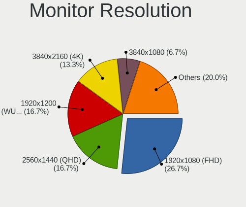

| Resolution         | Desktops | Percent |
|--------------------|----------|---------|
| 1920x1080 (FHD)    | 8        | 26.67%  |
| 2560x1440 (QHD)    | 5        | 16.67%  |
| 1920x1200 (WUXGA)  | 5        | 16.67%  |
| 3840x2160 (4K)     | 4        | 13.33%  |
| 3840x1080          | 2        | 6.67%   |
| Unknown            | 2        | 6.67%   |
| 3840x1600          | 1        | 3.33%   |
| 3440x1440          | 1        | 3.33%   |
| 1680x1050 (WSXGA+) | 1        | 3.33%   |
| 1600x1200          | 1        | 3.33%   |

Monitor Diagonal
----------------

Diagonal size in inches

| Inches  | Desktops | Percent |
|---------|----------|---------|
| Unknown | 7        | 26.92%  |
| 27      | 6        | 23.08%  |
| 21      | 5        | 19.23%  |
| 23      | 4        | 15.38%  |
| 24      | 2        | 7.69%   |
| 32      | 1        | 3.85%   |
| 31      | 1        | 3.85%   |

Monitor Width
-------------

Physical width

| Width in mm | Desktops | Percent |
|-------------|----------|---------|
| 501-600     | 11       | 42.31%  |
| Unknown     | 7        | 26.92%  |
| 401-500     | 5        | 19.23%  |
| 601-700     | 2        | 7.69%   |
| 701-800     | 1        | 3.85%   |

Aspect Ratio
------------

Proportional relationship between the width and the height

| Ratio   | Desktops | Percent |
|---------|----------|---------|
| 16/9    | 13       | 56.52%  |
| Unknown | 7        | 30.43%  |
| 16/10   | 3        | 13.04%  |

Monitor Area
------------

Area in inch

| Area in inch | Desktops | Percent |
|----------------|----------|---------|
| 201-250        | 7        | 28%     |
| Unknown        | 7        | 28%     |
| 301-350        | 6        | 24%     |
| 351-500        | 2        | 8%      |
| 251-300        | 2        | 8%      |
| 151-200        | 1        | 4%      |

Pixel Density
-------------

Pixels per inch

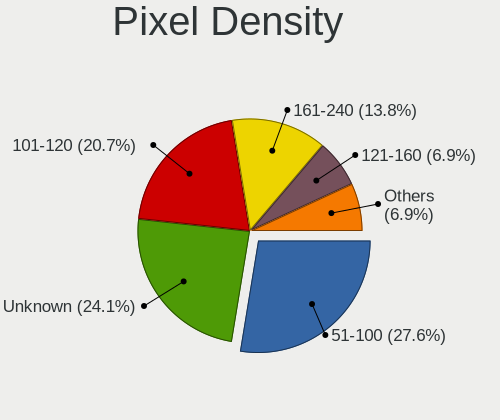

| Density | Desktops | Percent |
|---------|----------|---------|
| 51-100  | 8        | 27.59%  |
| Unknown | 7        | 24.14%  |
| 101-120 | 6        | 20.69%  |
| 161-240 | 4        | 13.79%  |
| 1-50    | 2        | 6.9%    |
| 121-160 | 2        | 6.9%    |

Multiple Monitors
-----------------

Total monitors connected

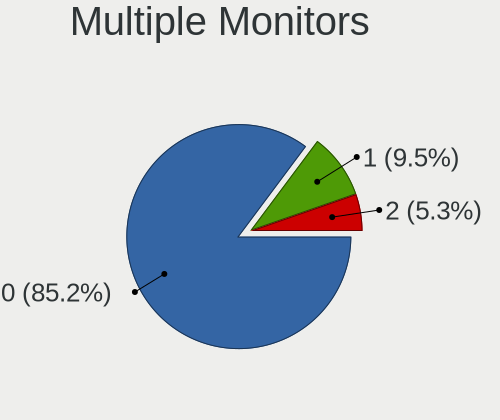

| Total | Desktops | Percent |
|-------|----------|---------|
| 0     | 144      | 85.21%  |
| 1     | 16       | 9.47%   |
| 2     | 9        | 5.33%   |

Network
-------

Net Controller Vendor
---------------------

Controller vendors

| Vendor                   | Desktops | Percent |
|--------------------------|----------|---------|
| Intel                    | 137      | 63.72%  |
| Realtek Semiconductor    | 51       | 23.72%  |
| Broadcom                 | 8        | 3.72%   |
| Qualcomm Atheros         | 5        | 2.33%   |
| TP-Link                  | 2        | 0.93%   |
| Mellanox Technologies    | 2        | 0.93%   |
| Samsung Electronics      | 1        | 0.47%   |
| Ralink Technology        | 1        | 0.47%   |
| OPPO Electronics         | 1        | 0.47%   |
| MediaTek                 | 1        | 0.47%   |
| Marvell Technology Group | 1        | 0.47%   |
| Google                   | 1        | 0.47%   |
| D-Link System            | 1        | 0.47%   |
| Apple                    | 1        | 0.47%   |
| American Megatrends      | 1        | 0.47%   |
| 3Com                     | 1        | 0.47%   |

Net Controller Model
--------------------

Controller models

| Model                                                                         | Desktops | Percent |
|-------------------------------------------------------------------------------|----------|---------|
| Realtek RTL8111/8168/8211/8411 PCI Express Gigabit Ethernet Controller        | 42       | 15.61%  |
| Intel Ethernet Controller I226-V                                              | 30       | 11.15%  |
| Intel I211 Gigabit Network Connection                                         | 24       | 8.92%   |
| Intel I210 Gigabit Network Connection                                         | 17       | 6.32%   |
| Intel 82574L Gigabit Network Connection                                       | 13       | 4.83%   |
| Intel I350 Gigabit Network Connection                                         | 9        | 3.35%   |
| Intel Ethernet Connection I217-LM                                             | 9        | 3.35%   |
| Intel Ethernet Connection (2) I219-LM                                         | 8        | 2.97%   |
| Intel Ethernet Controller I225-V                                              | 7        | 2.6%    |
| Intel 82571EB/82571GB Gigabit Ethernet Controller D0/D1 (copper applications) | 7        | 2.6%    |
| Intel 82580 Gigabit Network Connection                                        | 6        | 2.23%   |
| Intel 82579LM Gigabit Network Connection (Lewisville)                         | 5        | 1.86%   |
| Intel Ethernet Connection I217-V                                              | 4        | 1.49%   |
| Intel 82576 Gigabit Network Connection                                        | 4        | 1.49%   |
| Realtek RTL8821AE 802.11ac PCIe Wireless Network Adapter                      | 3        | 1.12%   |
| Realtek RTL8125 2.5GbE Controller                                             | 3        | 1.12%   |
| Realtek RTL8111/8168/8411 PCI Express Gigabit Ethernet Controller             | 3        | 1.12%   |
| Intel Wireless 7260                                                           | 3        | 1.12%   |
| Intel Ethernet Connection (2) I219-V                                          | 3        | 1.12%   |
| Intel 82599ES 10-Gigabit SFI/SFP+ Network Connection                          | 3        | 1.12%   |
| Realtek RTL-8100/8101L/8139 PCI Fast Ethernet Adapter                         | 2        | 0.74%   |
| Mellanox MT26448 [ConnectX EN 10GigE, PCIe 2.0 5GT/s]                         | 2        | 0.74%   |
| Intel Wi-Fi 6 AX200                                                           | 2        | 0.74%   |
| Intel I210 Gigabit Fiber Network Connection                                   | 2        | 0.74%   |
| Intel Ethernet Connection I218-V                                              | 2        | 0.74%   |
| Intel Ethernet Connection (7) I219-LM                                         | 2        | 0.74%   |
| Intel 82576NS Gigabit Network Connection                                      | 2        | 0.74%   |
| Broadcom BCM4360 802.11ac Dual Band Wireless Network Adapter                  | 2        | 0.74%   |
| TP-Link TL-WN722N v2/v3 [Realtek RTL8188EUS]                                  | 1        | 0.37%   |
| TP-Link Archer T3U [Realtek RTL8812BU]                                        | 1        | 0.37%   |
| Samsung Galaxy series, misc. (tethering mode)                                 | 1        | 0.37%   |
| Realtek USB 2.5GbE Controller                                                 | 1        | 0.37%   |
| Realtek RTL8821CE 802.11ac PCIe Wireless Network Adapter                      | 1        | 0.37%   |
| Realtek RTL8812AE 802.11ac PCIe Wireless Network Adapter                      | 1        | 0.37%   |
| Realtek RTL8188CUS 802.11n WLAN Adapter                                       | 1        | 0.37%   |
| Realtek RTL8169 PCI Gigabit Ethernet Controller                               | 1        | 0.37%   |
| Realtek RTL810xE PCI Express Fast Ethernet controller                         | 1        | 0.37%   |
| Ralink RT2870/RT3070 Wireless Adapter                                         | 1        | 0.37%   |
| Qualcomm Atheros QCA986x/988x 802.11ac Wireless Network Adapter               | 1        | 0.37%   |
| Qualcomm Atheros Killer E220x Gigabit Ethernet Controller                     | 1        | 0.37%   |

Wireless Vendor
---------------

Wireless vendors

| Vendor                | Desktops | Percent |
|-----------------------|----------|---------|
| Intel                 | 11       | 42.31%  |
| Realtek Semiconductor | 6        | 23.08%  |
| Qualcomm Atheros      | 3        | 11.54%  |
| Broadcom              | 3        | 11.54%  |
| TP-Link               | 2        | 7.69%   |
| Ralink Technology     | 1        | 3.85%   |

Wireless Model
--------------

Wireless models

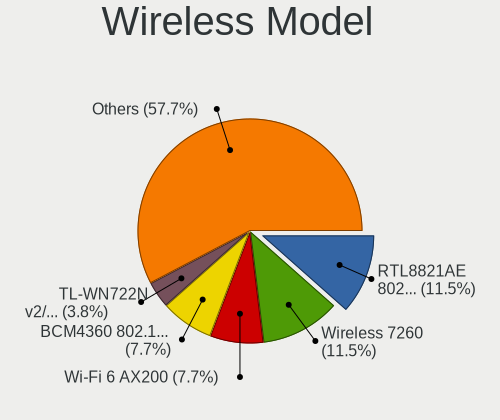

| Model                                                           | Desktops | Percent |
|-----------------------------------------------------------------|----------|---------|
| Realtek RTL8821AE 802.11ac PCIe Wireless Network Adapter        | 3        | 11.54%  |
| Intel Wireless 7260                                             | 3        | 11.54%  |
| Intel Wi-Fi 6 AX200                                             | 2        | 7.69%   |
| Broadcom BCM4360 802.11ac Dual Band Wireless Network Adapter    | 2        | 7.69%   |
| TP-Link TL-WN722N v2/v3 [Realtek RTL8188EUS]                    | 1        | 3.85%   |
| TP-Link Archer T3U [Realtek RTL8812BU]                          | 1        | 3.85%   |
| Realtek RTL8821CE 802.11ac PCIe Wireless Network Adapter        | 1        | 3.85%   |
| Realtek RTL8812AE 802.11ac PCIe Wireless Network Adapter        | 1        | 3.85%   |
| Realtek RTL8188CUS 802.11n WLAN Adapter                         | 1        | 3.85%   |
| Ralink RT2870/RT3070 Wireless Adapter                           | 1        | 3.85%   |
| Qualcomm Atheros QCA986x/988x 802.11ac Wireless Network Adapter | 1        | 3.85%   |
| Qualcomm Atheros AR928X Wireless Network Adapter (PCI-Express)  | 1        | 3.85%   |
| Qualcomm Atheros AR9285 Wireless Network Adapter (PCI-Express)  | 1        | 3.85%   |
| Intel Wireless 8265 / 8275                                      | 1        | 3.85%   |
| Intel Wireless 3165                                             | 1        | 3.85%   |
| Intel Wi-Fi 5(802.11ac) Wireless-AC 9x6x [Thunder Peak]         | 1        | 3.85%   |
| Intel Dual Band Wireless-AC 3168NGW [Stone Peak]                | 1        | 3.85%   |
| Intel Dual Band Wireless-AC 3165 Plus Bluetooth                 | 1        | 3.85%   |
| Intel Cannon Lake PCH CNVi WiFi                                 | 1        | 3.85%   |
| Broadcom BCM43228 802.11a/b/g/n                                 | 1        | 3.85%   |

Ethernet Vendor
---------------

Ethernet vendors

| Vendor                   | Desktops | Percent |
|--------------------------|----------|---------|
| Intel                    | 134      | 67.34%  |
| Realtek Semiconductor    | 49       | 24.62%  |
| Broadcom                 | 6        | 3.02%   |
| Qualcomm Atheros         | 2        | 1.01%   |
| Samsung Electronics      | 1        | 0.5%    |
| OPPO Electronics         | 1        | 0.5%    |
| MediaTek                 | 1        | 0.5%    |
| Marvell Technology Group | 1        | 0.5%    |
| D-Link System            | 1        | 0.5%    |
| Apple                    | 1        | 0.5%    |
| American Megatrends      | 1        | 0.5%    |
| 3Com                     | 1        | 0.5%    |

Ethernet Model
--------------

Ethernet models

| Model                                                                         | Desktops | Percent |
|-------------------------------------------------------------------------------|----------|---------|
| Realtek RTL8111/8168/8211/8411 PCI Express Gigabit Ethernet Controller        | 42       | 17.5%   |
| Intel Ethernet Controller I226-V                                              | 30       | 12.5%   |
| Intel I211 Gigabit Network Connection                                         | 24       | 10%     |
| Intel I210 Gigabit Network Connection                                         | 17       | 7.08%   |
| Intel 82574L Gigabit Network Connection                                       | 13       | 5.42%   |
| Intel I350 Gigabit Network Connection                                         | 9        | 3.75%   |
| Intel Ethernet Connection I217-LM                                             | 9        | 3.75%   |
| Intel Ethernet Connection (2) I219-LM                                         | 8        | 3.33%   |
| Intel Ethernet Controller I225-V                                              | 7        | 2.92%   |
| Intel 82571EB/82571GB Gigabit Ethernet Controller D0/D1 (copper applications) | 7        | 2.92%   |
| Intel 82580 Gigabit Network Connection                                        | 6        | 2.5%    |
| Intel 82579LM Gigabit Network Connection (Lewisville)                         | 5        | 2.08%   |
| Intel Ethernet Connection I217-V                                              | 4        | 1.67%   |
| Intel 82576 Gigabit Network Connection                                        | 4        | 1.67%   |
| Realtek RTL8125 2.5GbE Controller                                             | 3        | 1.25%   |
| Realtek RTL8111/8168/8411 PCI Express Gigabit Ethernet Controller             | 3        | 1.25%   |
| Intel Ethernet Connection (2) I219-V                                          | 3        | 1.25%   |
| Intel 82599ES 10-Gigabit SFI/SFP+ Network Connection                          | 3        | 1.25%   |
| Realtek RTL-8100/8101L/8139 PCI Fast Ethernet Adapter                         | 2        | 0.83%   |
| Intel I210 Gigabit Fiber Network Connection                                   | 2        | 0.83%   |
| Intel Ethernet Connection I218-V                                              | 2        | 0.83%   |
| Intel Ethernet Connection (7) I219-LM                                         | 2        | 0.83%   |
| Intel 82576NS Gigabit Network Connection                                      | 2        | 0.83%   |
| Samsung Galaxy series, misc. (tethering mode)                                 | 1        | 0.42%   |
| Realtek USB 2.5GbE Controller                                                 | 1        | 0.42%   |
| Realtek RTL8169 PCI Gigabit Ethernet Controller                               | 1        | 0.42%   |
| Realtek RTL810xE PCI Express Fast Ethernet controller                         | 1        | 0.42%   |
| Qualcomm Atheros Killer E220x Gigabit Ethernet Controller                     | 1        | 0.42%   |
| Qualcomm Atheros Attansic L1 Gigabit Ethernet                                 | 1        | 0.42%   |
| OPPO KALAMA-MTP_CID:0437_SN:B2767D06 RNDIS Control RNDIS Ethernet Data        | 1        | 0.42%   |
| MediaTek USB Ethernet-RNDIS                                                   | 1        | 0.42%   |
| Marvell Group 88E8056 PCI-E Gigabit Ethernet Controller                       | 1        | 0.42%   |
| Intel NM10/ICH7 Family LAN Controller                                         | 1        | 0.42%   |
| Intel Ethernet Controller X710 for 10GBASE-T                                  | 1        | 0.42%   |
| Intel Ethernet Controller X550                                                | 1        | 0.42%   |
| Intel Ethernet Controller I226-LM                                             | 1        | 0.42%   |
| Intel Ethernet Controller 10-Gigabit X540-AT2                                 | 1        | 0.42%   |
| Intel Ethernet Connection X553 10 GbE SFP+                                    | 1        | 0.42%   |
| Intel Ethernet Connection (7) I219-V                                          | 1        | 0.42%   |
| Intel Ethernet Connection (5) I219-LM                                         | 1        | 0.42%   |

Net Controller Kind
-------------------

Ethernet, WiFi or modem

| Kind     | Desktops | Percent |
|----------|----------|---------|
| Ethernet | 165      | 85.49%  |
| WiFi     | 25       | 12.95%  |
| Unknown  | 3        | 1.55%   |

Used Controller
---------------

Currently used network controller

| Kind     | Desktops | Percent |
|----------|----------|---------|
| Ethernet | 162      | 100%    |

NICs
----

Total network controllers on board

| Total | Desktops | Percent |
|-------|----------|---------|
| 4     | 46       | 26.74%  |
| 2     | 43       | 25%     |
| 3     | 29       | 16.86%  |
| 6     | 15       | 8.72%   |
| 5     | 15       | 8.72%   |
| 1     | 15       | 8.72%   |
| 7     | 4        | 2.33%   |
| 9     | 2        | 1.16%   |
| 13    | 1        | 0.58%   |
| 8     | 1        | 0.58%   |
| 0     | 1        | 0.58%   |

IPv6
----

IPv6 vs IPv4

| Used | Desktops | Percent |
|------|----------|---------|
| No   | 152      | 88.89%  |
| Yes  | 19       | 11.11%  |

Bluetooth
---------

Bluetooth Vendor
----------------

Controller vendors

| Vendor                  | Desktops | Percent |
|-------------------------|----------|---------|
| Intel                   | 9        | 42.86%  |
| Cambridge Silicon Radio | 4        | 19.05%  |
| IMC Networks            | 2        | 9.52%   |
| Apple                   | 2        | 9.52%   |
| Realtek Semiconductor   | 1        | 4.76%   |
| Realtek                 | 1        | 4.76%   |
| MediaTek                | 1        | 4.76%   |
| Dell                    | 1        | 4.76%   |

Bluetooth Model
---------------

Controller models

| Model                                                | Desktops | Percent |
|------------------------------------------------------|----------|---------|
| Intel Bluetooth wireless interface                   | 4        | 19.05%  |
| Cambridge Silicon Radio Bluetooth Dongle (HCI mode)  | 4        | 19.05%  |
| Intel Wireless-AC 3168 Bluetooth                     | 2        | 9.52%   |
| IMC Networks Realtek Bluetooth 4.0 + High Speed Chip | 2        | 9.52%   |
| Apple Bluetooth Host Controller                      | 2        | 9.52%   |
| Realtek  Bluetooth 4.2 Adapter                       | 1        | 4.76%   |
| Realtek  Bluetooth 4.0 Adapter                       | 1        | 4.76%   |
| MediaTek Bluetooth Adapter                           | 1        | 4.76%   |
| Intel Wireless-AC 9260 Bluetooth Adapter             | 1        | 4.76%   |
| Intel Bluetooth 9460/9560 Jefferson Peak (JfP)       | 1        | 4.76%   |
| Intel AX200 Bluetooth                                | 1        | 4.76%   |
| Dell Wireless 355C Bluetooth 2.0 + EDR module        | 1        | 4.76%   |

Sound
-----

Sound Vendor
------------

Sound card vendors

| Vendor                   | Desktops | Percent |
|--------------------------|----------|---------|
| Intel                    | 107      | 67.72%  |
| Nvidia                   | 21       | 13.29%  |
| AMD                      | 21       | 13.29%  |
| Realtek Semiconductor    | 2        | 1.27%   |
| Philips (or NXP)         | 1        | 0.63%   |
| Nordic Semiconductor ASA | 1        | 0.63%   |
| Hewlett-Packard          | 1        | 0.63%   |
| GN Netcom                | 1        | 0.63%   |
| Generalplus Technology   | 1        | 0.63%   |
| Focusrite-Novation       | 1        | 0.63%   |
| BEHRINGER International  | 1        | 0.63%   |

Sound Model
-----------

Sound card models

| Model                                                                                             | Desktops | Percent |
|---------------------------------------------------------------------------------------------------|----------|---------|
| Intel 100 Series/C230 Series Chipset Family HD Audio Controller                                   | 17       | 9.09%   |
| Intel Alder Lake-N PCH High Definition Audio Controller                                           | 16       | 8.56%   |
| Intel Xeon E3-1200 v3/4th Gen Core Processor HD Audio Controller                                  | 14       | 7.49%   |
| Intel 8 Series/C220 Series Chipset High Definition Audio Controller                               | 13       | 6.95%   |
| Intel Jasper Lake HD Audio                                                                        | 10       | 5.35%   |
| Intel 6 Series/C200 Series Chipset Family High Definition Audio Controller                        | 6        | 3.21%   |
| Nvidia GK208 HDMI/DP Audio Controller                                                             | 5        | 2.67%   |
| Intel Haswell-ULT HD Audio Controller                                                             | 5        | 2.67%   |
| Intel Cannon Lake PCH cAVS                                                                        | 5        | 2.67%   |
| Intel 8 Series HD Audio Controller                                                                | 5        | 2.67%   |
| Nvidia High Definition Audio Controller                                                           | 4        | 2.14%   |
| Intel Celeron/Pentium Silver Processor High Definition Audio                                      | 4        | 2.14%   |
| Intel Atom Processor Z36xxx/Z37xxx Series High Definition Audio Controller                        | 4        | 2.14%   |
| AMD Family 17h/19h/1ah HD Audio Controller                                                        | 4        | 2.14%   |
| Intel Sunrise Point-LP HD Audio                                                                   | 3        | 1.6%    |
| Intel Atom/Celeron/Pentium Processor x5-E8000/J3xxx/N3xxx Series High Definition Audio Controller | 3        | 1.6%    |
| Intel 7 Series/C216 Chipset Family High Definition Audio Controller                               | 3        | 1.6%    |
| AMD Starship/Matisse HD Audio Controller                                                          | 3        | 1.6%    |
| AMD Renoir Radeon High Definition Audio Controller                                                | 3        | 1.6%    |
| AMD FCH Azalia Controller                                                                         | 3        | 1.6%    |
| AMD Family 17h (Models 00h-0fh) HD Audio Controller                                               | 3        | 1.6%    |
| Nvidia GP107GL High Definition Audio Controller                                                   | 2        | 1.07%   |
| Nvidia GP106 High Definition Audio Controller                                                     | 2        | 1.07%   |
| Intel Wildcat Point-LP High Definition Audio Controller                                           | 2        | 1.07%   |
| Intel Tiger Lake-LP Smart Sound Technology Audio Controller                                       | 2        | 1.07%   |
| Intel NM10/ICH7 Family High Definition Audio Controller                                           | 2        | 1.07%   |
| Intel Broadwell-U Audio Controller                                                                | 2        | 1.07%   |
| Intel 200 Series PCH HD Audio                                                                     | 2        | 1.07%   |
| AMD Kabini HDMI/DP Audio                                                                          | 2        | 1.07%   |
| AMD Ellesmere HDMI Audio [Radeon RX 470/480 / 570/580/590]                                        | 2        | 1.07%   |
| Realtek Semiconductor USB Audio                                                                   | 1        | 0.53%   |
| Realtek Semiconductor Maono AU-PM401 Maono AU-PM401 Microphone Headphone                          | 1        | 0.53%   |
| Philips (or NXP) Philips SHG7980                                                                  | 1        | 0.53%   |
| Nvidia TU116 High Definition Audio Controller                                                     | 1        | 0.53%   |
| Nvidia MCP65 High Definition Audio                                                                | 1        | 0.53%   |
| Nvidia GP104 High Definition Audio Controller                                                     | 1        | 0.53%   |
| Nvidia GP102 HDMI Audio Controller                                                                | 1        | 0.53%   |
| Nvidia GM206 High Definition Audio Controller                                                     | 1        | 0.53%   |
| Nvidia GF119 HDMI Audio Controller                                                                | 1        | 0.53%   |
| Nvidia GF108 High Definition Audio Controller                                                     | 1        | 0.53%   |

Memory
------

Memory Vendor
-------------

Memory module vendors

| Vendor              | Desktops | Percent |
|---------------------|----------|---------|
| Samsung Electronics | 28       | 16.47%  |
| Unknown             | 26       | 15.29%  |
| Corsair             | 25       | 14.71%  |
| Kingston            | 22       | 12.94%  |
| Micron Technology   | 16       | 9.41%   |
| SK hynix            | 15       | 8.82%   |
| Crucial             | 15       | 8.82%   |
| G.Skill             | 5        | 2.94%   |
| Kimtigo             | 4        | 2.35%   |
| Ramaxel Technology  | 3        | 1.76%   |
| Unknown             | 2        | 1.18%   |
| Vasekey             | 1        | 0.59%   |
| Transcend           | 1        | 0.59%   |
| Smart Modular       | 1        | 0.59%   |
| Mushkin             | 1        | 0.59%   |
| HPE                 | 1        | 0.59%   |
| Hewlett-Packard     | 1        | 0.59%   |
| Elpida              | 1        | 0.59%   |
| ASint Technology    | 1        | 0.59%   |
| Apacer              | 1        | 0.59%   |

Memory Model
------------

Memory module models

| Model                                                   | Desktops | Percent |
|---------------------------------------------------------|----------|---------|
| Unknown RAM Module 4GB SODIMM DDR3 1333MT/s             | 13       | 7.07%   |
| Samsung RAM M425R1GB4BB0-CQKOL 8GB SODIMM DDR5 4800MT/s | 4        | 2.17%   |
| Kimtigo RAM KT8GS3EDF 8GB SODIMM DDR3 1600MT/s          | 4        | 2.17%   |
| Corsair RAM CML8GX3M2A1600C9 4GB DIMM DDR3 1600MT/s     | 4        | 2.17%   |
| Samsung RAM M378B5673EH1-CH9 2GB DIMM DDR3 1333MT/s     | 3        | 1.63%   |
| Samsung RAM M378B5173DB0-CK0 4GB DIMM DDR3 1600MT/s     | 3        | 1.63%   |
| Micron RAM Module 4GB DIMM DDR4 2133MT/s                | 3        | 1.63%   |
| Crucial RAM CT16G48C40S5.M8A1 16GB SODIMM DDR5 4800MT/s | 3        | 1.63%   |
| Corsair RAM CMK16GX4M2B3200C16 8GB DIMM DDR4 3200MT/s   | 3        | 1.63%   |
| Unknown RAM Module 4GB SODIMM DDR3 667MT/s              | 2        | 1.09%   |
| Unknown RAM Module 2GB DIMM SDRAM                       | 2        | 1.09%   |
| SK hynix RAM HMT41GU6MFR8C-PB 8GB DIMM DDR3 1600MT/s    | 2        | 1.09%   |
| SK hynix RAM HMCG78AEBSA092N 16GB SODIMM DDR5 4800MT/s  | 2        | 1.09%   |
| Samsung RAM Module 4GB DIMM DDR4 2133MT/s               | 2        | 1.09%   |
| Samsung RAM M471A2K43CB1-CTD 16GB SODIMM DDR4 2667MT/s  | 2        | 1.09%   |
| Samsung RAM M471A1K43CB1-CWE 8GB SODIMM DDR4 3200MT/s   | 2        | 1.09%   |
| Micron RAM 8ATF1G64HZ-2G6D1 8GB SODIMM DDR4 2667MT/s    | 2        | 1.09%   |
| Corsair RAM CMSO8GX3M1C1600C11 8GB DIMM DDR3 1600MT/s   | 2        | 1.09%   |
| Unknown                                                 | 2        | 1.09%   |
| Vasekey RAM 4ATF51264HZ-2G6E1 4GB SODIMM DDR4 2667MT/s  | 1        | 0.54%   |
| Unknown RAM Module 8GB SODIMM DDR4 2133MT/s             | 1        | 0.54%   |
| Unknown RAM Module 8GB DIMM 1333MT/s                    | 1        | 0.54%   |
| Unknown RAM Module 4GB DIMM 1333MT/s                    | 1        | 0.54%   |
| Unknown RAM Module 4096MB DIMM DDR3 1332MT/s            | 1        | 0.54%   |
| Unknown RAM Module 2GB DIMM DDR2 800MT/s                | 1        | 0.54%   |
| Unknown RAM Module 2GB DIMM 800MT/s                     | 1        | 0.54%   |
| Unknown RAM Module 2GB DIMM 1333MT/s                    | 1        | 0.54%   |
| Unknown RAM Module 2048MB DIMM DDR3 1332MT/s            | 1        | 0.54%   |
| Unknown RAM Module 1GB DIMM SDRAM                       | 1        | 0.54%   |
| Unknown RAM Module 1GB DIMM DDR2 800MT/s                | 1        | 0.54%   |
| Unknown RAM Module 1GB DIMM DDR2 333MT/s                | 1        | 0.54%   |
| Unknown RAM Module 16GB DIMM DDR4 2133MT/s              | 1        | 0.54%   |
| Unknown RAM Module 1024MB DIMM DDR3 1332MT/s            | 1        | 0.54%   |
| Transcend RAM TS512MSK64W6H 4GB DIMM DDR3 1600MT/s      | 1        | 0.54%   |
| Smart Modular RAM Module 4GB DIMM DDR3 1333MT/s         | 1        | 0.54%   |
| SK hynix RAM Module 8GB DIMM DDR4 2400MT/s              | 1        | 0.54%   |
| SK hynix RAM Module 4GB DIMM DDR4 2133MT/s              | 1        | 0.54%   |
| SK hynix RAM Module 16GB DIMM DDR3 1866MT/s             | 1        | 0.54%   |
| SK hynix RAM HMT451U7AFR8C-PB 4GB DIMM DDR3 1600MT/s    | 1        | 0.54%   |
| SK hynix RAM HMT451U6BFR8A-PB 4GB DIMM DDR3 1600MT/s    | 1        | 0.54%   |

Memory Kind
-----------

Memory module kinds

| Kind    | Desktops | Percent |
|---------|----------|---------|
| DDR3    | 71       | 44.94%  |
| DDR4    | 60       | 37.97%  |
| DDR5    | 17       | 10.76%  |
| DDR2    | 4        | 2.53%   |
| SDRAM   | 3        | 1.9%    |
| Unknown | 3        | 1.9%    |

Memory Form Factor
------------------

Physical design of the memory module

| Name   | Desktops | Percent |
|--------|----------|---------|
| DIMM   | 92       | 58.23%  |
| SODIMM | 66       | 41.77%  |

Memory Size
-----------

Memory module size

| Size  | Desktops | Percent |
|-------|----------|---------|
| 8192  | 68       | 40.24%  |
| 4096  | 55       | 32.54%  |
| 16384 | 23       | 13.61%  |
| 2048  | 12       | 7.1%    |
| 1024  | 6        | 3.55%   |
| 32768 | 5        | 2.96%   |

Memory Speed
------------

Memory module speed

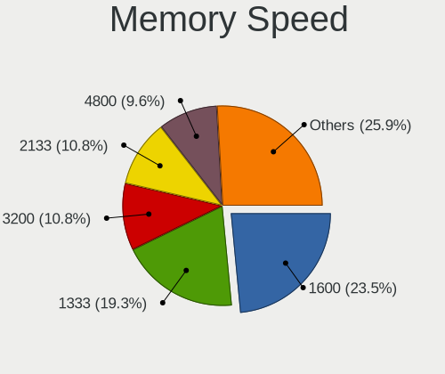

| Speed   | Desktops | Percent |
|---------|----------|---------|
| 1600    | 39       | 23.49%  |
| 1333    | 32       | 19.28%  |
| 3200    | 18       | 10.84%  |
| 2133    | 18       | 10.84%  |
| 4800    | 16       | 9.64%   |
| 2400    | 11       | 6.63%   |
| 2667    | 9        | 5.42%   |
| 800     | 4        | 2.41%   |
| 667     | 4        | 2.41%   |
| 2666    | 3        | 1.81%   |
| Unknown | 3        | 1.81%   |
| 1867    | 2        | 1.2%    |
| 5600    | 1        | 0.6%    |
| 4400    | 1        | 0.6%    |
| 3600    | 1        | 0.6%    |
| 2933    | 1        | 0.6%    |
| 1866    | 1        | 0.6%    |
| 1332    | 1        | 0.6%    |
| 333     | 1        | 0.6%    |

Printers & scanners
-------------------

Printer Vendor
--------------

Printer device vendors

Zero info for selected period =(

Printer Model
-------------

Printer device models

Zero info for selected period =(

Scanner Vendor
--------------

Scanner device vendors

Zero info for selected period =(

Scanner Model
-------------

Scanner device models

Zero info for selected period =(

Camera
------

Camera Vendor
-------------

Camera device vendors

Zero info for selected period =(

Camera Model
------------

Camera device models

Zero info for selected period =(

Security
--------

Fingerprint Vendor
------------------

Fingerprint sensor vendors

Zero info for selected period =(

Fingerprint Model
-----------------

Fingerprint sensor models

Zero info for selected period =(

Chipcard Vendor
---------------

Chipcard module vendors

Zero info for selected period =(

Chipcard Model
--------------

Chipcard module models

Zero info for selected period =(

Unsupported
-----------

Unsupported Devices
-------------------

Total unsupported devices on board

| Total | Desktops | Percent |
|-------|----------|---------|
| 1     | 96       | 56.8%   |
| 0     | 48       | 28.4%   |
| 2     | 21       | 12.43%  |
| 3     | 2        | 1.18%   |
| 5     | 1        | 0.59%   |
| 4     | 1        | 0.59%   |

Unsupported Device Types
------------------------

Types of unsupported devices

| Type                     | Desktops | Percent |
|--------------------------|----------|---------|
| Communication controller | 110      | 80.29%  |
| Net/wireless             | 10       | 7.3%    |
| Bluetooth                | 7        | 5.11%   |
| Sound                    | 3        | 2.19%   |
| Net/ethernet             | 2        | 1.46%   |
| Card reader              | 2        | 1.46%   |
| Storage/ata              | 1        | 0.73%   |
| Graphics card            | 1        | 0.73%   |
| Firewire controller      | 1        | 0.73%   |

