BSD in Sweden - Tested Hardware & Statistics (Desktops)
-------------------------------------------------------

A project to collect tested hardware configurations for BSD in Sweden.

Anyone can contribute to this report by the [hw-probe](https://github.com/linuxhw/hw-probe/blob/master/INSTALL.BSD.md) tool:

    hw-probe -all -upload

Please contribute! Especially if your hardware is rare.

Contents
--------

* [ Test Cases ](#test-cases)

* [ System ](#system)
  - [ OS                       ](#os)
  - [ OS Family                ](#os-family)
  - [ Arch                     ](#arch)
  - [ DE                       ](#de)
  - [ Display Server           ](#display-server)
  - [ Display Manager          ](#display-manager)
  - [ OS Lang                  ](#os-lang)
  - [ Boot Mode                ](#boot-mode)
  - [ Filesystem               ](#filesystem)
  - [ Part. scheme             ](#part-scheme)

* [ Board ](#board)
  - [ Vendor                   ](#vendor)
  - [ Model                    ](#model)
  - [ Model Family             ](#model-family)
  - [ MFG Year                 ](#mfg-year)
  - [ Form Factor              ](#form-factor)
  - [ Coreboot                 ](#coreboot)
  - [ RAM Size                 ](#ram-size)
  - [ RAM Used                 ](#ram-used)
  - [ Total Drives             ](#total-drives)
  - [ Has CD-ROM               ](#has-cd-rom)
  - [ Has Ethernet             ](#has-ethernet)
  - [ Has WiFi                 ](#has-wifi)
  - [ Has Bluetooth            ](#has-bluetooth)

* [ Location ](#location)
  - [ Country                  ](#country)
  - [ City                     ](#city)

* [ Drives ](#drives)
  - [ Drive Vendor             ](#drive-vendor)
  - [ Drive Model              ](#drive-model)
  - [ HDD Vendor               ](#hdd-vendor)
  - [ SSD Vendor               ](#ssd-vendor)
  - [ Drive Kind               ](#drive-kind)
  - [ Drive Connector          ](#drive-connector)
  - [ Drive Size               ](#drive-size)
  - [ Space Total              ](#space-total)
  - [ Space Used               ](#space-used)
  - [ Malfunc. Drives          ](#malfunc-drives)
  - [ Malfunc. Drive Vendor    ](#malfunc-drive-vendor)
  - [ Malfunc. HDD Vendor      ](#malfunc-hdd-vendor)
  - [ Malfunc. Drive Kind      ](#malfunc-drive-kind)
  - [ Failed Drives            ](#failed-drives)
  - [ Failed Drive Vendor      ](#failed-drive-vendor)
  - [ Drive Status             ](#drive-status)

* [ Storage controller ](#storage-controller)
  - [ Storage Vendor           ](#storage-vendor)
  - [ Storage Model            ](#storage-model)
  - [ Storage Kind             ](#storage-kind)

* [ Processor ](#processor)
  - [ CPU Vendor               ](#cpu-vendor)
  - [ CPU Model                ](#cpu-model)
  - [ CPU Model Family         ](#cpu-model-family)
  - [ CPU Cores                ](#cpu-cores)
  - [ CPU Sockets              ](#cpu-sockets)
  - [ CPU Threads              ](#cpu-threads)
  - [ CPU Microarch            ](#cpu-microarch)

* [ Graphics ](#graphics)
  - [ GPU Vendor               ](#gpu-vendor)
  - [ GPU Model                ](#gpu-model)
  - [ GPU Combo                ](#gpu-combo)
  - [ GPU Driver               ](#gpu-driver)
  - [ GPU Memory               ](#gpu-memory)

* [ Monitor ](#monitor)
  - [ Monitor Vendor           ](#monitor-vendor)
  - [ Monitor Model            ](#monitor-model)
  - [ Monitor Resolution       ](#monitor-resolution)
  - [ Monitor Diagonal         ](#monitor-diagonal)
  - [ Monitor Width            ](#monitor-width)
  - [ Aspect Ratio             ](#aspect-ratio)
  - [ Monitor Area             ](#monitor-area)
  - [ Pixel Density            ](#pixel-density)
  - [ Multiple Monitors        ](#multiple-monitors)

* [ Network ](#network)
  - [ Net Controller Vendor    ](#net-controller-vendor)
  - [ Net Controller Model     ](#net-controller-model)
  - [ Wireless Vendor          ](#wireless-vendor)
  - [ Wireless Model           ](#wireless-model)
  - [ Ethernet Vendor          ](#ethernet-vendor)
  - [ Ethernet Model           ](#ethernet-model)
  - [ Net Controller Kind      ](#net-controller-kind)
  - [ Used Controller          ](#used-controller)
  - [ NICs                     ](#nics)
  - [ IPv6                     ](#ipv6)

* [ Bluetooth ](#bluetooth)
  - [ Bluetooth Vendor         ](#bluetooth-vendor)
  - [ Bluetooth Model          ](#bluetooth-model)

* [ Sound ](#sound)
  - [ Sound Vendor             ](#sound-vendor)
  - [ Sound Model              ](#sound-model)

* [ Memory ](#memory)
  - [ Memory Vendor            ](#memory-vendor)
  - [ Memory Model             ](#memory-model)
  - [ Memory Kind              ](#memory-kind)
  - [ Memory Form Factor       ](#memory-form-factor)
  - [ Memory Size              ](#memory-size)
  - [ Memory Speed             ](#memory-speed)

* [ Printers & scanners ](#printers--scanners)
  - [ Printer Vendor           ](#printer-vendor)
  - [ Printer Model            ](#printer-model)
  - [ Scanner Vendor           ](#scanner-vendor)
  - [ Scanner Model            ](#scanner-model)

* [ Camera ](#camera)
  - [ Camera Vendor            ](#camera-vendor)
  - [ Camera Model             ](#camera-model)

* [ Security ](#security)
  - [ Fingerprint Vendor       ](#fingerprint-vendor)
  - [ Fingerprint Model        ](#fingerprint-model)
  - [ Chipcard Vendor          ](#chipcard-vendor)
  - [ Chipcard Model           ](#chipcard-model)

* [ Unsupported ](#unsupported)
  - [ Unsupported Devices      ](#unsupported-devices)
  - [ Unsupported Device Types ](#unsupported-device-types)

Test Cases
----------

Total: 152

| Vendor        | Model                       | Probe                                                     | Date         |
|---------------|-----------------------------|-----------------------------------------------------------|--------------|
| HP            | 8299                        | [74c24bcb16](https://bsd-hardware.info/?probe=74c24bcb16) | Jul 18, 2023 |
| MSI           | B450 GAMING PRO CARBON A... | [ce0f05e871](https://bsd-hardware.info/?probe=ce0f05e871) | Jul 18, 2023 |
| MSI           | B350I PRO AC                | [3c4d3b94d0](https://bsd-hardware.info/?probe=3c4d3b94d0) | Jul 14, 2023 |
| MSI           | B350I PRO AC                | [ab56e76e70](https://bsd-hardware.info/?probe=ab56e76e70) | Jul 14, 2023 |
| PC Engines    | APU2                        | [80d79341a8](https://bsd-hardware.info/?probe=80d79341a8) | Jul 05, 2023 |
| ASUSTek       | P5Q DELUXE                  | [0cf9bf6a63](https://bsd-hardware.info/?probe=0cf9bf6a63) | Jul 04, 2023 |
| Unknown       | Unknown                     | [5080e84698](https://bsd-hardware.info/?probe=5080e84698) | Jun 28, 2023 |
| Unknown       | Unknown                     | [c660f668dc](https://bsd-hardware.info/?probe=c660f668dc) | Jun 25, 2023 |
| Unknown       | Unknown                     | [b67ce69ea4](https://bsd-hardware.info/?probe=b67ce69ea4) | Jun 23, 2023 |
| Unknown       | Unknown                     | [6e8085380f](https://bsd-hardware.info/?probe=6e8085380f) | Jun 23, 2023 |
| Unknown       | Unknown                     | [eb49ebcc0c](https://bsd-hardware.info/?probe=eb49ebcc0c) | Jun 22, 2023 |
| Unknown       | Unknown                     | [193c7d152b](https://bsd-hardware.info/?probe=193c7d152b) | Jun 11, 2023 |
| PC Engines    | APU2                        | [f644f33061](https://bsd-hardware.info/?probe=f644f33061) | Jun 07, 2023 |
| Unknown       | Unknown                     | [e80a97aec3](https://bsd-hardware.info/?probe=e80a97aec3) | May 27, 2023 |
| ASUSTek       | ROG STRIX B550-F GAMING     | [a0bff43f5c](https://bsd-hardware.info/?probe=a0bff43f5c) | May 23, 2023 |
| Lenovo        | ThinkCentre M81 1730A1G     | [8f59660eca](https://bsd-hardware.info/?probe=8f59660eca) | May 17, 2023 |
| Techvision    | TVI7309X B0                 | [a75ff519b0](https://bsd-hardware.info/?probe=a75ff519b0) | May 15, 2023 |
| CWWK          | MINIPC-G12                  | [4806dc7d9a](https://bsd-hardware.info/?probe=4806dc7d9a) | Apr 29, 2023 |
| AZW           | GK55                        | [31a99b9d2a](https://bsd-hardware.info/?probe=31a99b9d2a) | Apr 25, 2023 |
| Techvision    | TVI7309X B0                 | [a4bc168937](https://bsd-hardware.info/?probe=a4bc168937) | Apr 22, 2023 |
| AZW           | GK55                        | [cc5a32800f](https://bsd-hardware.info/?probe=cc5a32800f) | Apr 14, 2023 |
| HP            | 1998                        | [bc67c37f5f](https://bsd-hardware.info/?probe=bc67c37f5f) | Apr 04, 2023 |
| ASUSTek       | TUF B360M-PLUS GAMING       | [ebbd75883c](https://bsd-hardware.info/?probe=ebbd75883c) | Mar 17, 2023 |
| DFI           | CM100-C                     | [c34832095b](https://bsd-hardware.info/?probe=c34832095b) | Mar 15, 2023 |
| Techvision    | TVI7309X B0                 | [23f9004191](https://bsd-hardware.info/?probe=23f9004191) | Mar 13, 2023 |
| AMI           | MNHO-048                    | [ebd90b78c1](https://bsd-hardware.info/?probe=ebd90b78c1) | Mar 12, 2023 |
| AMI           | MNHO-048                    | [52cdeb023e](https://bsd-hardware.info/?probe=52cdeb023e) | Mar 12, 2023 |
| PC Engines    | APU3                        | [c8008161b0](https://bsd-hardware.info/?probe=c8008161b0) | Mar 09, 2023 |
| Unknown       | Unknown                     | [e4b77410c6](https://bsd-hardware.info/?probe=e4b77410c6) | Mar 08, 2023 |
| Dell          | 0WMJ54 A01                  | [31ed952f9c](https://bsd-hardware.info/?probe=31ed952f9c) | Mar 06, 2023 |
| Dell          | 0WMJ54 A01                  | [732a635016](https://bsd-hardware.info/?probe=732a635016) | Mar 06, 2023 |
| Unknown       | Unknown                     | [44ac3b2832](https://bsd-hardware.info/?probe=44ac3b2832) | Feb 13, 2023 |
| HP            | 82A1                        | [2d7d9105f7](https://bsd-hardware.info/?probe=2d7d9105f7) | Jan 13, 2023 |
| Gigabyte      | G31M-ES2C                   | [8353660219](https://bsd-hardware.info/?probe=8353660219) | Jan 08, 2023 |
| ASRock        | E3C226D2I                   | [5dfcf8051d](https://bsd-hardware.info/?probe=5dfcf8051d) | Jan 06, 2023 |
| Lenovo        | 30D9 SDK0J40700 WIN 3258... | [ac867149f2](https://bsd-hardware.info/?probe=ac867149f2) | Dec 31, 2022 |
| Unknown       | Unknown                     | [b4d44b0018](https://bsd-hardware.info/?probe=b4d44b0018) | Dec 26, 2022 |
| ACMA          | X8SIE                       | [01898b2ffb](https://bsd-hardware.info/?probe=01898b2ffb) | Dec 21, 2022 |
| PC Engines    | APU3                        | [5597cca988](https://bsd-hardware.info/?probe=5597cca988) | Dec 17, 2022 |
| ACMA          | X8SIE                       | [361e4ccc04](https://bsd-hardware.info/?probe=361e4ccc04) | Dec 05, 2022 |
| ACMA          | X8SIE                       | [532b81e55f](https://bsd-hardware.info/?probe=532b81e55f) | Nov 29, 2022 |
| ACMA          | X8SIE                       | [d0112d027b](https://bsd-hardware.info/?probe=d0112d027b) | Nov 28, 2022 |
| Intel         | D54250WYK H13922-303        | [e850e0ae9c](https://bsd-hardware.info/?probe=e850e0ae9c) | Nov 28, 2022 |
| Intel         | CRESCENTBAY                 | [bd1f1fa769](https://bsd-hardware.info/?probe=bd1f1fa769) | Nov 26, 2022 |
| Gigabyte      | G31M-ES2C                   | [2959091a59](https://bsd-hardware.info/?probe=2959091a59) | Nov 25, 2022 |
| Lenovo        | ThinkServer RS140           | [0dd05e08aa](https://bsd-hardware.info/?probe=0dd05e08aa) | Nov 12, 2022 |
| Lenovo        | ThinkServer RS140           | [b2b1509adf](https://bsd-hardware.info/?probe=b2b1509adf) | Nov 11, 2022 |
| MSI           | Z370I GAMING PRO CARBON ... | [dd9f7679b5](https://bsd-hardware.info/?probe=dd9f7679b5) | Nov 09, 2022 |
| Cisco         | ASA5515 A0                  | [7f848d7c57](https://bsd-hardware.info/?probe=7f848d7c57) | Oct 22, 2022 |
| ASUSTek       | P5L-VM 1394                 | [d7c3749eba](https://bsd-hardware.info/?probe=d7c3749eba) | Oct 13, 2022 |
| AOpen         | iBTMx-DS R1.04 55DED10A0... | [a480263c28](https://bsd-hardware.info/?probe=a480263c28) | Aug 26, 2022 |
| Unknown       | Unknown                     | [e5efeb3781](https://bsd-hardware.info/?probe=e5efeb3781) | Aug 24, 2022 |
| Unknown       | Unknown                     | [9d1eb045e5](https://bsd-hardware.info/?probe=9d1eb045e5) | Aug 20, 2022 |
| ASRock        | X399 Taichi                 | [efd9ee1d33](https://bsd-hardware.info/?probe=efd9ee1d33) | Aug 10, 2022 |
| ASUSTek       | CM6731_CM6431_CM6331        | [6e40b41bc3](https://bsd-hardware.info/?probe=6e40b41bc3) | Aug 04, 2022 |
| Gigabyte      | Z87M-D3H                    | [59ae6fc283](https://bsd-hardware.info/?probe=59ae6fc283) | Jul 26, 2022 |
| Supermicro    | X11SSV-M4                   | [444d9ed75e](https://bsd-hardware.info/?probe=444d9ed75e) | Jul 04, 2022 |
| Fujitsu       | D3313-G1 S26361-D3313-G1    | [ea22a644f6](https://bsd-hardware.info/?probe=ea22a644f6) | Jul 04, 2022 |
| PC Engines    | APU                         | [f41e59d78b](https://bsd-hardware.info/?probe=f41e59d78b) | Jun 11, 2022 |
| MSI           | MS-7369                     | [c2c6bd80e8](https://bsd-hardware.info/?probe=c2c6bd80e8) | May 13, 2022 |
| Intel         | CRESCENTBAY                 | [0d11258d3a](https://bsd-hardware.info/?probe=0d11258d3a) | Apr 22, 2022 |
| Shuttle       | SH570                       | [08e2af8890](https://bsd-hardware.info/?probe=08e2af8890) | Apr 16, 2022 |
| Unknown       | Unknown                     | [2e4a7843ab](https://bsd-hardware.info/?probe=2e4a7843ab) | Apr 14, 2022 |
| HPE           | ProLiant MicroServer Gen... | [04e77555a2](https://bsd-hardware.info/?probe=04e77555a2) | Mar 24, 2022 |
| Fujitsu Si... | D2811-A1 S26361-D2811-A1    | [23055a27d9](https://bsd-hardware.info/?probe=23055a27d9) | Mar 23, 2022 |
| AOpen         | iBTMx-DS R1.04 55DED10A0... | [8faec8e7ed](https://bsd-hardware.info/?probe=8faec8e7ed) | Mar 10, 2022 |
| HPE           | ProLiant MicroServer Gen... | [a2c59d02ee](https://bsd-hardware.info/?probe=a2c59d02ee) | Mar 08, 2022 |
| HPE           | ProLiant MicroServer Gen... | [099edf57ae](https://bsd-hardware.info/?probe=099edf57ae) | Mar 08, 2022 |
| Gigabyte      | AB350M-Gaming 3-CF          | [1daab68f1f](https://bsd-hardware.info/?probe=1daab68f1f) | Mar 04, 2022 |
| HPE           | ProLiant MicroServer Gen... | [8016115ff1](https://bsd-hardware.info/?probe=8016115ff1) | Feb 24, 2022 |
| ASUSTek       | ROG STRIX X570-F GAMING     | [807a29112e](https://bsd-hardware.info/?probe=807a29112e) | Feb 19, 2022 |
| Gigabyte      | G31M-ES2C                   | [5f27a360e4](https://bsd-hardware.info/?probe=5f27a360e4) | Feb 10, 2022 |
| Gigabyte      | Z68X-UD7-B3                 | [37cc045649](https://bsd-hardware.info/?probe=37cc045649) | Jan 28, 2022 |
| MSI           | MS-7C56                     | [962ac1c7b0](https://bsd-hardware.info/?probe=962ac1c7b0) | Jan 20, 2022 |
| Gigabyte      | Z68X-UD7-B3                 | [082da3ef7f](https://bsd-hardware.info/?probe=082da3ef7f) | Jan 19, 2022 |
| ASUSTek       | P8H77-I                     | [e15d67e8db](https://bsd-hardware.info/?probe=e15d67e8db) | Jan 08, 2022 |
| ASRock        | E3C226D2I                   | [a31265ae13](https://bsd-hardware.info/?probe=a31265ae13) | Jan 07, 2022 |
| ASUSTek       | P8H77-I                     | [27960088a3](https://bsd-hardware.info/?probe=27960088a3) | Jan 05, 2022 |
| Fujitsu       | D3221-A1 S26361-D3221-A1    | [1684618e22](https://bsd-hardware.info/?probe=1684618e22) | Jan 01, 2022 |
| Lenovo        | ThinkServer RS140           | [e28b542e9e](https://bsd-hardware.info/?probe=e28b542e9e) | Dec 23, 2021 |
| Intel         | DH61AG AAG81491-600         | [fd9659a9fe](https://bsd-hardware.info/?probe=fd9659a9fe) | Dec 15, 2021 |
| ASUSTek       | Rampage Formula             | [34633c2ca8](https://bsd-hardware.info/?probe=34633c2ca8) | Dec 02, 2021 |
| MSI           | MS-7C56                     | [d4e3f14ad4](https://bsd-hardware.info/?probe=d4e3f14ad4) | Nov 23, 2021 |
| AMI           | PEISIA E3845 VER1.0         | [a6b7ceeada](https://bsd-hardware.info/?probe=a6b7ceeada) | Oct 20, 2021 |
| ShenZhen M... | MW-NANO-APL-4L              | [4fdd90135a](https://bsd-hardware.info/?probe=4fdd90135a) | Oct 20, 2021 |
| Lenovo        | Win8 Pro DPK TPG            | [f57ea5540f](https://bsd-hardware.info/?probe=f57ea5540f) | Oct 13, 2021 |
| Gigabyte      | Z87M-D3H                    | [8cb8c4dbf4](https://bsd-hardware.info/?probe=8cb8c4dbf4) | Oct 01, 2021 |
| ASUSTek       | ROG STRIX X570-F GAMING     | [1ef37663db](https://bsd-hardware.info/?probe=1ef37663db) | Sep 01, 2021 |
| Lenovo        | 3098 0B98401 PRO            | [4737978dbf](https://bsd-hardware.info/?probe=4737978dbf) | Aug 18, 2021 |
| HPE           | ProLiant MicroServer Gen... | [04d9692802](https://bsd-hardware.info/?probe=04d9692802) | Aug 09, 2021 |
| HPE           | ProLiant MicroServer Gen... | [24df2da075](https://bsd-hardware.info/?probe=24df2da075) | Aug 08, 2021 |
| PC Engines    | apu4                        | [815567b75c](https://bsd-hardware.info/?probe=815567b75c) | Aug 02, 2021 |
| PC Engines    | apu4                        | [77fa195d5e](https://bsd-hardware.info/?probe=77fa195d5e) | Aug 02, 2021 |
| ASUSTek       | P8H77-I                     | [52e8a39fb1](https://bsd-hardware.info/?probe=52e8a39fb1) | Jul 19, 2021 |
| Protectli     | FW4B Ver                    | [452a8558c0](https://bsd-hardware.info/?probe=452a8558c0) | Jul 09, 2021 |
| Dell          | 05XGC8 A01                  | [b9841b1272](https://bsd-hardware.info/?probe=b9841b1272) | Jul 08, 2021 |
| Unknown       | Unknown                     | [935263c5a0](https://bsd-hardware.info/?probe=935263c5a0) | Jul 03, 2021 |
| HP            | 82A1                        | [dba57fb77f](https://bsd-hardware.info/?probe=dba57fb77f) | Jun 30, 2021 |
| HPE           | ProLiant MicroServer Gen... | [18e34c37cd](https://bsd-hardware.info/?probe=18e34c37cd) | Jun 28, 2021 |
| HPE           | ProLiant MicroServer Gen... | [3d717eec8f](https://bsd-hardware.info/?probe=3d717eec8f) | Jun 25, 2021 |
| Dell          | 0P03DX A03                  | [b2f0c90d79](https://bsd-hardware.info/?probe=b2f0c90d79) | Jun 24, 2021 |
| ASUSTek       | P5Q DELUXE                  | [5091db2ace](https://bsd-hardware.info/?probe=5091db2ace) | Jun 16, 2021 |
| MSI           | Z97 GAMING 3                | [c6d7626b29](https://bsd-hardware.info/?probe=c6d7626b29) | Jun 12, 2021 |
| ASRock        | X99 WS                      | [201a7417a5](https://bsd-hardware.info/?probe=201a7417a5) | Jun 11, 2021 |
| PC Engines    | APU2                        | [2070f50252](https://bsd-hardware.info/?probe=2070f50252) | May 26, 2021 |
| ASUSTek       | Z87-DELUXE/DUAL             | [69a811cae5](https://bsd-hardware.info/?probe=69a811cae5) | May 25, 2021 |
| ASUSTek       | SABERTOOTH Z87              | [586a4db247](https://bsd-hardware.info/?probe=586a4db247) | May 20, 2021 |
| ASUSTek       | SABERTOOTH Z87              | [eb0c02a451](https://bsd-hardware.info/?probe=eb0c02a451) | May 19, 2021 |
| Gigabyte      | B550I AORUS PRO AX          | [62b9ea2794](https://bsd-hardware.info/?probe=62b9ea2794) | May 14, 2021 |
| ASRock        | X99 WS                      | [eb20367455](https://bsd-hardware.info/?probe=eb20367455) | May 05, 2021 |
| ASUSTek       | All Series                  | [ef6afe88d7](https://bsd-hardware.info/?probe=ef6afe88d7) | Apr 17, 2021 |
| Unknown       | YL-J3160L4                  | [ad564817c9](https://bsd-hardware.info/?probe=ad564817c9) | Apr 11, 2021 |
| Unknown       | YL-J3160L4                  | [0712c3048c](https://bsd-hardware.info/?probe=0712c3048c) | Apr 11, 2021 |
| Shuttle       | FH170                       | [d36fccf7b7](https://bsd-hardware.info/?probe=d36fccf7b7) | Apr 01, 2021 |
| MSI           | IONA                        | [5f857882ff](https://bsd-hardware.info/?probe=5f857882ff) | Mar 25, 2021 |
| Unknown       | Unknown                     | [93ef7a4b6e](https://bsd-hardware.info/?probe=93ef7a4b6e) | Mar 22, 2021 |
| ASUSTek       | All Series                  | [c5bc64e4e9](https://bsd-hardware.info/?probe=c5bc64e4e9) | Mar 22, 2021 |
| ASUSTek       | All Series                  | [700ff7d378](https://bsd-hardware.info/?probe=700ff7d378) | Mar 22, 2021 |
| HP            | 8054                        | [1db522699a](https://bsd-hardware.info/?probe=1db522699a) | Mar 21, 2021 |
| Lenovo        | MAHOBAY NO DPK              | [ddc66bc2fb](https://bsd-hardware.info/?probe=ddc66bc2fb) | Mar 20, 2021 |
| Gigabyte      | 970A-DS3P                   | [a5833ca2c9](https://bsd-hardware.info/?probe=a5833ca2c9) | Mar 18, 2021 |
| HP            | 8053                        | [b7ebdfe456](https://bsd-hardware.info/?probe=b7ebdfe456) | Mar 17, 2021 |
| ASUSTek       | P8H67-M                     | [e95d6c6972](https://bsd-hardware.info/?probe=e95d6c6972) | Mar 17, 2021 |
| ADI           | MinnowBoard Turbot          | [ebd85cee04](https://bsd-hardware.info/?probe=ebd85cee04) | Mar 14, 2021 |
| Intel         | Q3XXG4-P V1.0               | [93c9f14bf0](https://bsd-hardware.info/?probe=93c9f14bf0) | Mar 12, 2021 |
| Dell          | 0XCR8D A02                  | [af5d6a85ef](https://bsd-hardware.info/?probe=af5d6a85ef) | Mar 09, 2021 |
| Dell          | 00V62H A00                  | [a9f921e29b](https://bsd-hardware.info/?probe=a9f921e29b) | Mar 03, 2021 |
| Intel         | DQ67SW AAG12527-306         | [a4fb7ae326](https://bsd-hardware.info/?probe=a4fb7ae326) | Mar 02, 2021 |
| Unknown       | Unknown                     | [b00dc0301a](https://bsd-hardware.info/?probe=b00dc0301a) | Feb 27, 2021 |
| Lenovo        | 3098 0B98401 PRO            | [da62664934](https://bsd-hardware.info/?probe=da62664934) | Feb 23, 2021 |
| Lenovo        | 3098 0B98401 PRO            | [5ca10a4860](https://bsd-hardware.info/?probe=5ca10a4860) | Feb 14, 2021 |
| Lenovo        | 3098 0B98401 PRO            | [263a74d1ce](https://bsd-hardware.info/?probe=263a74d1ce) | Feb 12, 2021 |
| Lenovo        | 3098 0B98401 PRO            | [508b3afc1c](https://bsd-hardware.info/?probe=508b3afc1c) | Feb 09, 2021 |
| Lenovo        | 3098 0B98401 PRO            | [8b9f162f70](https://bsd-hardware.info/?probe=8b9f162f70) | Feb 09, 2021 |
| Deciso        | Netboard A10 V2.1           | [dfb0240726](https://bsd-hardware.info/?probe=dfb0240726) | Feb 05, 2021 |
| PC Engines    | APU2                        | [8983ab6689](https://bsd-hardware.info/?probe=8983ab6689) | Feb 03, 2021 |
| HP            | 1905                        | [72ab5653d3](https://bsd-hardware.info/?probe=72ab5653d3) | Feb 03, 2021 |
| ADI           | MinnowBoard Turbot          | [137ff14192](https://bsd-hardware.info/?probe=137ff14192) | Jan 29, 2021 |
| Unknown       | Unknown                     | [920259bf95](https://bsd-hardware.info/?probe=920259bf95) | Jan 28, 2021 |
| ASUSTek       | All Series                  | [7ebe6eee38](https://bsd-hardware.info/?probe=7ebe6eee38) | Jan 25, 2021 |
| ADI           | MinnowBoard Turbot          | [e2fbc5f326](https://bsd-hardware.info/?probe=e2fbc5f326) | Jan 21, 2021 |
| ADI           | MinnowBoard Turbot          | [0b8e4d0630](https://bsd-hardware.info/?probe=0b8e4d0630) | Jan 21, 2021 |
| Dell          | 00V62H A00                  | [bd3877826c](https://bsd-hardware.info/?probe=bd3877826c) | Jan 20, 2021 |
| PC Engines    | APU2                        | [ecf35d22c4](https://bsd-hardware.info/?probe=ecf35d22c4) | Jan 12, 2021 |
| PC Engines    | APU2                        | [2e6256a0ab](https://bsd-hardware.info/?probe=2e6256a0ab) | Nov 23, 2020 |
| PC Engines    | APU2                        | [65de6946d3](https://bsd-hardware.info/?probe=65de6946d3) | Nov 23, 2020 |
| PC Engines    | APU2                        | [b4f5d7d344](https://bsd-hardware.info/?probe=b4f5d7d344) | Nov 16, 2020 |
| HP            | ProLiant ML30 Gen9          | [ecaec68cdb](https://bsd-hardware.info/?probe=ecaec68cdb) | Oct 27, 2020 |
| Wistron       | ProLiant ML110 G6           | [0d2e0f44c1](https://bsd-hardware.info/?probe=0d2e0f44c1) | Aug 06, 2020 |
| ASUSTek       | M32CD_A_F_K20CD_K31CD       | [6245f1e175](https://bsd-hardware.info/?probe=6245f1e175) | Aug 06, 2020 |
| Unknown       | Unknown                     | [4e3b87cc6c](https://bsd-hardware.info/?probe=4e3b87cc6c) | Jun 01, 2020 |
| Gigabyte      | Z170X-UD5 TH-CF             | [2fc2952380](https://bsd-hardware.info/?probe=2fc2952380) | May 25, 2020 |

System
------

OS
--

Installed operating systems

| Name              | Desktops | Percent |
|-------------------|----------|---------|
| OPNsense 21.1     | 8        | 6.61%   |
| OPNsense 21.1.3   | 5        | 4.13%   |
| OPNsense 21.1.2   | 5        | 4.13%   |
| OPNsense 23.1.11  | 4        | 3.31%   |
| OPNsense 22.7.8   | 4        | 3.31%   |
| OPNsense 22.7.10  | 4        | 3.31%   |
| OPNsense 21.7.7   | 4        | 3.31%   |
| OPNsense 23.1.6   | 3        | 2.48%   |
| OPNsense 23.1.3   | 3        | 2.48%   |
| OPNsense 23.1.10  | 3        | 2.48%   |
| OPNsense 22.7.2   | 3        | 2.48%   |
| OPNsense 21.7.3   | 3        | 2.48%   |
| OPNsense 21.1.8   | 3        | 2.48%   |
| OPNsense 21.1.5   | 3        | 2.48%   |
| OpenBSD 6.8       | 3        | 2.48%   |
| OPNsense 23.1.7   | 2        | 1.65%   |
| OPNsense 23.1.2   | 2        | 1.65%   |
| OPNsense 22.7.9   | 2        | 1.65%   |
| OPNsense 22.7.6   | 2        | 1.65%   |
| OPNsense 22.1.9   | 2        | 1.65%   |
| OPNsense 22.1.3   | 2        | 1.65%   |
| OPNsense 21.7.6   | 2        | 1.65%   |
| OPNsense 21.7.1   | 2        | 1.65%   |
| OPNsense 21.7     | 2        | 1.65%   |
| OPNsense 21.1.7   | 2        | 1.65%   |
| OPNsense 20.7.8   | 2        | 1.65%   |
| helloSystem 0.8.1 | 2        | 1.65%   |
| FreeBSD 13.0-p7   | 2        | 1.65%   |
| FreeBSD 12.2-p4   | 2        | 1.65%   |
| pfSense 2.5.0     | 1        | 0.83%   |
| OPNsense 23.1.9   | 1        | 0.83%   |
| OPNsense 23.1.8   | 1        | 0.83%   |
| OPNsense 23.1.5   | 1        | 0.83%   |
| OPNsense 23.1.1   | 1        | 0.83%   |
| OPNsense 23.1     | 1        | 0.83%   |
| OPNsense 22.7.7   | 1        | 0.83%   |
| OPNsense 22.7     | 1        | 0.83%   |
| OPNsense 22.1.8   | 1        | 0.83%   |
| OPNsense 22.1.6   | 1        | 0.83%   |
| OPNsense 22.1.5   | 1        | 0.83%   |

OS Family
---------

OS without a version

| Name        | Desktops | Percent |
|-------------|----------|---------|
| OPNsense    | 71       | 72.45%  |
| FreeBSD     | 15       | 15.31%  |
| OpenBSD     | 5        | 5.1%    |
| helloSystem | 4        | 4.08%   |
| pfSense     | 1        | 1.02%   |
| GhostBSD    | 1        | 1.02%   |
| FuryBSD     | 1        | 1.02%   |

Arch
----

OS architecture (x86_64, i586, etc.)

| Name   | Desktops | Percent |
|--------|----------|---------|
| amd64  | 97       | 98.98%  |
| octeon | 1        | 1.02%   |

DE
--

Desktop Environment

| Name         | Desktops | Percent |
|--------------|----------|---------|
| Console      | 77       | 77.78%  |
| KDE5         | 9        | 9.09%   |
| helloDesktop | 4        | 4.04%   |
| fvwm         | 3        | 3.03%   |
| MATE         | 2        | 2.02%   |
| xfwm         | 1        | 1.01%   |
| XFCE         | 1        | 1.01%   |
| TWM          | 1        | 1.01%   |
| AwesomeWM    | 1        | 1.01%   |

Display Server
--------------

X11 or Wayland

| Name    | Desktops | Percent |
|---------|----------|---------|
| Console | 77       | 78.57%  |
| X11     | 21       | 21.43%  |

Display Manager
---------------

SDDM, LightDM, etc.

| Name    | Desktops | Percent |
|---------|----------|---------|
| Console | 81       | 80.2%   |
| SDDM    | 10       | 9.9%    |
| SLiM    | 4        | 3.96%   |
| LightDM | 3        | 2.97%   |
| GDM     | 2        | 1.98%   |
| XDM     | 1        | 0.99%   |

OS Lang
-------

Language

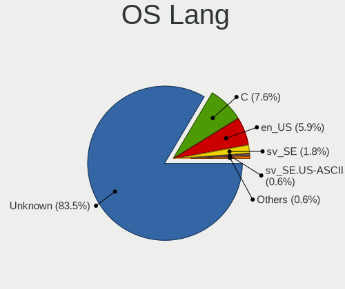

| Lang           | Desktops | Percent |
|----------------|----------|---------|
| Unknown        | 79       | 79%     |
| en_US          | 9        | 9%      |
| C              | 7        | 7%      |
| sv_SE          | 3        | 3%      |
| sv_SE.US-ASCII | 1        | 1%      |
| en_CA          | 1        | 1%      |

Boot Mode
---------

EFI or BIOS

| Mode | Desktops | Percent |
|------|----------|---------|
| EFI  | 84       | 84.85%  |
| BIOS | 15       | 15.15%  |

Filesystem
----------

Type of filesystem

| Type   | Desktops | Percent |
|--------|----------|---------|
| Ufs    | 58       | 58.59%  |
| Zfs    | 34       | 34.34%  |
| Ffs    | 5        | 5.05%   |
| Cd9660 | 2        | 2.02%   |

Part. scheme
------------

Scheme of partitioning

| Type | Desktops | Percent |
|------|----------|---------|
| GPT  | 90       | 90.91%  |
| MBR  | 9        | 9.09%   |

Board
-----

Vendor
------

Motherboard manufacturer

| Name                       | Desktops | Percent |
|----------------------------|----------|---------|
| ASUSTek Computer           | 13       | 13.27%  |
| Unknown                    | 13       | 13.27%  |
| PC Engines                 | 9        | 9.18%   |
| MSI                        | 7        | 7.14%   |
| Hewlett-Packard            | 7        | 7.14%   |
| Gigabyte Technology        | 7        | 7.14%   |
| Lenovo                     | 6        | 6.12%   |
| Intel                      | 6        | 6.12%   |
| Dell                       | 5        | 5.1%    |
| ASRock                     | 3        | 3.06%   |
| Techvision                 | 2        | 2.04%   |
| Shuttle                    | 2        | 2.04%   |
| Fujitsu                    | 2        | 2.04%   |
| AMI                        | 2        | 2.04%   |
| Wistron                    | 1        | 1.02%   |
| Supermicro                 | 1        | 1.02%   |
| ShenZhen MinWin Technology | 1        | 1.02%   |
| Protectli                  | 1        | 1.02%   |
| HPE                        | 1        | 1.02%   |
| Fujitsu Siemens            | 1        | 1.02%   |
| DFI                        | 1        | 1.02%   |
| Deciso                     | 1        | 1.02%   |
| CWWK                       | 1        | 1.02%   |
| Cisco                      | 1        | 1.02%   |
| AZW                        | 1        | 1.02%   |
| AOpen                      | 1        | 1.02%   |
| ADI                        | 1        | 1.02%   |
| ACMA                       | 1        | 1.02%   |

Model
-----

Motherboard model

| Name                                | Desktops | Percent |
|-------------------------------------|----------|---------|
| Unknown                             | 13       | 13.27%  |
| PC Engines APU2                     | 5        | 5.1%    |
| ASUS All Series                     | 3        | 3.06%   |
| Techvision TVI7309X                 | 2        | 2.04%   |
| PC Engines apu4                     | 2        | 2.04%   |
| Intel CRESCENTBAY                   | 2        | 2.04%   |
| Dell OptiPlex 9020                  | 2        | 2.04%   |
| Wistron ProLiant ML110 G6           | 1        | 1.02%   |
| Supermicro SYS-1019S-MP             | 1        | 1.02%   |
| Shuttle SH570                       | 1        | 1.02%   |
| Shuttle DH170                       | 1        | 1.02%   |
| ShenZhen MinWin MW-NANO-APL-4L      | 1        | 1.02%   |
| Protectli FW4B                      | 1        | 1.02%   |
| PC Engines APU3                     | 1        | 1.02%   |
| PC Engines APU                      | 1        | 1.02%   |
| MSI WC776AA-UUW HPE-110sc           | 1        | 1.02%   |
| MSI MS-7C56                         | 1        | 1.02%   |
| MSI MS-7B85                         | 1        | 1.02%   |
| MSI MS-7B43                         | 1        | 1.02%   |
| MSI MS-7A40                         | 1        | 1.02%   |
| MSI MS-7918                         | 1        | 1.02%   |
| MSI MS-7369                         | 1        | 1.02%   |
| Lenovo ThinkCentre M92p 2988B1G     | 1        | 1.02%   |
| Lenovo ThinkCentre M81 1730A1G      | 1        | 1.02%   |
| Lenovo ThinkCentre M700 10GRCTO1WW  | 1        | 1.02%   |
| Lenovo ThinkCentre Edge72 3493AZG   | 1        | 1.02%   |
| Lenovo ThinkCentre E73 10AS002QMX   | 1        | 1.02%   |
| Lenovo 70F3S00K00 ThinkServer RS140 | 1        | 1.02%   |
| Intel Q3XXG4-P V1.0                 | 1        | 1.02%   |
| Intel DQ67SW AAG12527-306           | 1        | 1.02%   |
| Intel DH61AG AAG81491-600           | 1        | 1.02%   |
| Intel D54250WYK H13922-303          | 1        | 1.02%   |
| HPE ProLiant MicroServer Gen10 Plus | 1        | 1.02%   |
| HP Z230 Tower Workstation           | 1        | 1.02%   |
| HP ProLiant ML30 Gen9               | 1        | 1.02%   |
| HP ProDesk 400 G4 MT                | 1        | 1.02%   |
| HP EliteDesk 800 G3 SFF             | 1        | 1.02%   |
| HP EliteDesk 800 G2 TWR             | 1        | 1.02%   |
| HP EliteDesk 800 G2 SFF             | 1        | 1.02%   |
| HP EliteDesk 800 G1 SFF             | 1        | 1.02%   |

Model Family
------------

Motherboard model prefix

| Name                           | Desktops | Percent |
|--------------------------------|----------|---------|
| Unknown                        | 13       | 13.27%  |
| PC Engines APU2                | 5        | 5.1%    |
| Lenovo ThinkCentre             | 5        | 5.1%    |
| Dell OptiPlex                  | 5        | 5.1%    |
| HP EliteDesk                   | 4        | 4.08%   |
| ASUS All                       | 3        | 3.06%   |
| Techvision TVI7309X            | 2        | 2.04%   |
| PC Engines apu4                | 2        | 2.04%   |
| Intel CRESCENTBAY              | 2        | 2.04%   |
| ASUS ROG                       | 2        | 2.04%   |
| Wistron ProLiant               | 1        | 1.02%   |
| Supermicro SYS-1019S-MP        | 1        | 1.02%   |
| Shuttle SH570                  | 1        | 1.02%   |
| Shuttle DH170                  | 1        | 1.02%   |
| ShenZhen MinWin MW-NANO-APL-4L | 1        | 1.02%   |
| Protectli FW4B                 | 1        | 1.02%   |
| PC Engines APU3                | 1        | 1.02%   |
| PC Engines APU                 | 1        | 1.02%   |
| MSI WC776AA-UUW                | 1        | 1.02%   |
| MSI MS-7C56                    | 1        | 1.02%   |
| MSI MS-7B85                    | 1        | 1.02%   |
| MSI MS-7B43                    | 1        | 1.02%   |
| MSI MS-7A40                    | 1        | 1.02%   |
| MSI MS-7918                    | 1        | 1.02%   |
| MSI MS-7369                    | 1        | 1.02%   |
| Lenovo 70F3S00K00              | 1        | 1.02%   |
| Intel Q3XXG4-P                 | 1        | 1.02%   |
| Intel DQ67SW                   | 1        | 1.02%   |
| Intel DH61AG                   | 1        | 1.02%   |
| Intel D54250WYK                | 1        | 1.02%   |
| HPE ProLiant                   | 1        | 1.02%   |
| HP Z230                        | 1        | 1.02%   |
| HP ProLiant                    | 1        | 1.02%   |
| HP ProDesk                     | 1        | 1.02%   |
| Gigabyte Z87M-D3H              | 1        | 1.02%   |
| Gigabyte Z68X-UD7-B3           | 1        | 1.02%   |
| Gigabyte Z170X-UD5             | 1        | 1.02%   |
| Gigabyte G31M-ES2C             | 1        | 1.02%   |
| Gigabyte B550I                 | 1        | 1.02%   |
| Gigabyte AB350M-Gaming         | 1        | 1.02%   |

MFG Year
--------

Motherboard manufacture year

| Year    | Desktops | Percent |
|---------|----------|---------|
| 2017    | 13       | 13.27%  |
| 2016    | 11       | 11.22%  |
| 2014    | 11       | 11.22%  |
| 2022    | 10       | 10.2%   |
| 2018    | 9        | 9.18%   |
| 2021    | 7        | 7.14%   |
| 2020    | 7        | 7.14%   |
| 2019    | 6        | 6.12%   |
| 2010    | 6        | 6.12%   |
| 2013    | 5        | 5.1%    |
| 2012    | 5        | 5.1%    |
| 2009    | 3        | 3.06%   |
| 2023    | 1        | 1.02%   |
| 2015    | 1        | 1.02%   |
| 2011    | 1        | 1.02%   |
| 2006    | 1        | 1.02%   |
| Unknown | 1        | 1.02%   |

Form Factor
-----------

Physical design of the computer

| Name    | Desktops | Percent |
|---------|----------|---------|
| Desktop | 98       | 100%    |

Coreboot
--------

Have coreboot on board

| Used | Desktops | Percent |
|------|----------|---------|
| No   | 88       | 89.8%   |
| Yes  | 10       | 10.2%   |

RAM Size
--------

Total RAM memory

| Size in GB  | Desktops | Percent |
|-------------|----------|---------|
| 8.01-16.0   | 30       | 29.7%   |
| 16.01-24.0  | 24       | 23.76%  |
| 4.01-8.0    | 23       | 22.77%  |
| 32.01-64.0  | 13       | 12.87%  |
| 2.01-3.0    | 4        | 3.96%   |
| 24.01-32.0  | 3        | 2.97%   |
| 64.01-256.0 | 3        | 2.97%   |
| 1.01-2.0    | 1        | 0.99%   |

RAM Used
--------

Used RAM memory

| Used GB    | Desktops | Percent |
|------------|----------|---------|
| 0.01-0.5   | 46       | 45.1%   |
| 0.51-1.0   | 37       | 36.27%  |
| 1.01-2.0   | 10       | 9.8%    |
| 4.01-8.0   | 4        | 3.92%   |
| 3.01-4.0   | 2        | 1.96%   |
| 32.01-64.0 | 1        | 0.98%   |
| 24.01-32.0 | 1        | 0.98%   |
| 2.01-3.0   | 1        | 0.98%   |

Total Drives
------------

Number of drives on board

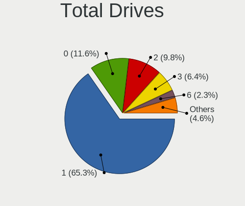

| Drives | Desktops | Percent |
|--------|----------|---------|
| 1      | 66       | 64.71%  |
| 2      | 12       | 11.76%  |
| 3      | 9        | 8.82%   |
| 0      | 6        | 5.88%   |
| 6      | 3        | 2.94%   |
| 4      | 3        | 2.94%   |
| 12     | 1        | 0.98%   |
| 10     | 1        | 0.98%   |
| 9      | 1        | 0.98%   |

Has CD-ROM
----------

Has CD-ROM on board

| Presented | Desktops | Percent |
|-----------|----------|---------|
| No        | 83       | 83.84%  |
| Yes       | 16       | 16.16%  |

Has Ethernet
------------

Has Ethernet on board

| Presented | Desktops | Percent |
|-----------|----------|---------|
| Yes       | 97       | 98.98%  |
| No        | 1        | 1.02%   |

Has WiFi
--------

Has WiFi module

| Presented | Desktops | Percent |
|-----------|----------|---------|
| No        | 84       | 84.85%  |
| Yes       | 15       | 15.15%  |

Has Bluetooth
-------------

Has Bluetooth module

| Presented | Desktops | Percent |
|-----------|----------|---------|
| No        | 85       | 86.73%  |
| Yes       | 13       | 13.27%  |

Location
--------

Country
-------

Geographic location (country)

| Country | Desktops | Percent |
|---------|----------|---------|
| Sweden  | 98       | 100%    |

City
----

Geographic location (city)

| City                  | Desktops | Percent |
|-----------------------|----------|---------|
| Stockholm             | 18       | 15.93%  |
| Malmo                 | 8        | 7.08%   |
| Bromma                | 6        | 5.31%   |
| Taby                  | 3        | 2.65%   |
| Piteå                | 3        | 2.65%   |
| Lund                  | 3        | 2.65%   |
| Gothenburg            | 3        | 2.65%   |
| Västerås        | 2        | 1.77%   |
| Västerås            | 2        | 1.77%   |
| UmeГҐ               | 2        | 1.77%   |
| Tumba                 | 2        | 1.77%   |
| Sollentuna            | 2        | 1.77%   |
| Solleftea             | 2        | 1.77%   |
| Skövde               | 2        | 1.77%   |
| Linköping          | 2        | 1.77%   |
| Linköping            | 2        | 1.77%   |
| Landskrona            | 2        | 1.77%   |
| Karlskrona            | 2        | 1.77%   |
| Jönköping       | 2        | 1.77%   |
| Helsingborg           | 2        | 1.77%   |
| Enskede-Arsta-Vantoer | 2        | 1.77%   |
| Bandhagen             | 2        | 1.77%   |
| Г…hus              | 1        | 0.88%   |
| Älvängen       | 1        | 0.88%   |
| Vaxjo                 | 1        | 0.88%   |
| Upplands Vasby        | 1        | 0.88%   |
| Umeå               | 1        | 0.88%   |
| Umeå                 | 1        | 0.88%   |
| Ulricehamn            | 1        | 0.88%   |
| Tyreso Strand         | 1        | 0.88%   |
| Trelleborg            | 1        | 0.88%   |
| Trangsund             | 1        | 0.88%   |
| Torsby                | 1        | 0.88%   |
| Södertälje      | 1        | 0.88%   |
| Sundsvall             | 1        | 0.88%   |
| Sundbyberg            | 1        | 0.88%   |
| Stroemstad            | 1        | 0.88%   |
| Skogas                | 1        | 0.88%   |
| Skövde             | 1        | 0.88%   |
| Skaellinge            | 1        | 0.88%   |

Drives
------

Drive Vendor
------------

Hard drive vendors

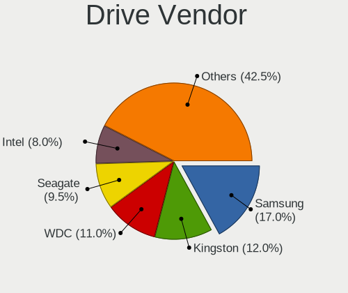

| Vendor              | Desktops | Drives | Percent |
|---------------------|----------|--------|---------|
| Samsung Electronics | 27       | 39     | 20.45%  |
| WDC                 | 15       | 24     | 11.36%  |
| Seagate             | 15       | 31     | 11.36%  |
| Kingston            | 13       | 17     | 9.85%   |
| Intel               | 12       | 17     | 9.09%   |
| Hoodisk             | 11       | 17     | 8.33%   |
| Crucial             | 6        | 14     | 4.55%   |
| Toshiba             | 5        | 13     | 3.79%   |
| Phison              | 3        | 3      | 2.27%   |
| SanDisk             | 2        | 3      | 1.52%   |
| NVMe                | 2        | 3      | 1.52%   |
| LITEON              | 2        | 3      | 1.52%   |
| Innodisk            | 2        | 3      | 1.52%   |
| Hitachi             | 2        | 2      | 1.52%   |
| Apacer              | 2        | 2      | 1.52%   |
| XrayDisk            | 1        | 1      | 0.76%   |
| Transcend           | 1        | 1      | 0.76%   |
| Supermicro          | 1        | 1      | 0.76%   |
| SK hynix            | 1        | 1      | 0.76%   |
| PNY                 | 1        | 1      | 0.76%   |
| OCZ                 | 1        | 2      | 0.76%   |
| LITEONIT            | 1        | 1      | 0.76%   |
| KingSpec            | 1        | 1      | 0.76%   |
| Fordisk             | 1        | 1      | 0.76%   |
| Fanxiang            | 1        | 1      | 0.76%   |
| Corsair             | 1        | 1      | 0.76%   |
| Apple               | 1        | 1      | 0.76%   |
| A-DATA Technology   | 1        | 1      | 0.76%   |

Drive Model
-----------

Hard drive models

| Model                          | Desktops | Percent |
|--------------------------------|----------|---------|
| Samsung SSD 860 QVO 1TB        | 3        | 2.04%   |
| Kingston SA400S37240G 240GB    | 3        | 2.04%   |
| Intel SSDSC2BW240A4 240GB      | 3        | 2.04%   |
| Hoodisk SSD 64GB               | 3        | 2.04%   |
| Hoodisk SSD 16GB               | 3        | 2.04%   |
| Hoodisk SSD 128GB              | 3        | 2.04%   |
| WDC WD5000AZLX-60K2TA0 500GB   | 2        | 1.36%   |
| Toshiba HDWQ140 4TB            | 2        | 1.36%   |
| Seagate ST2000DM008-2FR102 2TB | 2        | 1.36%   |
| Seagate ST1000DM010-2EP102 1TB | 2        | 1.36%   |
| Samsung SSD 970 EVO Plus 500GB | 2        | 1.36%   |
| Samsung SSD 970 EVO 500GB      | 2        | 1.36%   |
| Samsung HD501LJ 500GB          | 2        | 1.36%   |
| Phison SATA SSD 16GB           | 2        | 1.36%   |
| Kingston SV300S37A240G 240GB   | 2        | 1.36%   |
| Kingston SKC600MS256G 256GB    | 2        | 1.36%   |
| Crucial CT256MX100SSD1 256GB   | 2        | 1.36%   |
| Apacer 64GB SATA Flash Drive   | 2        | 1.36%   |
| XrayDisk SSD 64GB              | 1        | 0.68%   |
| WDC WDS500G3X0C-00SJG0 500GB   | 1        | 0.68%   |
| WDC WDS250G2B0C-00PXH0 250GB   | 1        | 0.68%   |
| WDC WDS250G2B0A-00SM50 250GB   | 1        | 0.68%   |
| WDC WDS240G2G0A-00JH30 240GB   | 1        | 0.68%   |
| WDC WDS120G1G0A-00SS50 120GB   | 1        | 0.68%   |
| WDC WD82PURZ-85TEUY0 8TB       | 1        | 0.68%   |
| WDC WD6400AARS-00Y5B1 640GB    | 1        | 0.68%   |
| WDC WD5000AAKS-07V0A0 500GB    | 1        | 0.68%   |
| WDC WD5000AACS-00ZUB0 500GB    | 1        | 0.68%   |
| WDC WD40EZRZ-22GXCB0 4TB       | 1        | 0.68%   |
| WDC WD40EFRX-68N32N0 4TB       | 1        | 0.68%   |
| WDC WD2500AAJS-60B4A0 250GB    | 1        | 0.68%   |
| WDC WD20EFRX-68EUZN0 2TB       | 1        | 0.68%   |
| WDC WD20EARX-00ZUDB0 2TB       | 1        | 0.68%   |
| WDC WD2002FYPS-02W3B0 2TB      | 1        | 0.68%   |
| WDC WD10JPVX-22JC3T0 1TB       | 1        | 0.68%   |
| Transcend TS256GMSA452T 256GB  | 1        | 0.68%   |
| Toshiba HDWR11A 10TB           | 1        | 0.68%   |
| Toshiba HDWN180 8TB            | 1        | 0.68%   |
| Toshiba HDWG480 8TB            | 1        | 0.68%   |
| Toshiba HDWG180 8TB            | 1        | 0.68%   |

HDD Vendor
----------

Hard disk drive vendors

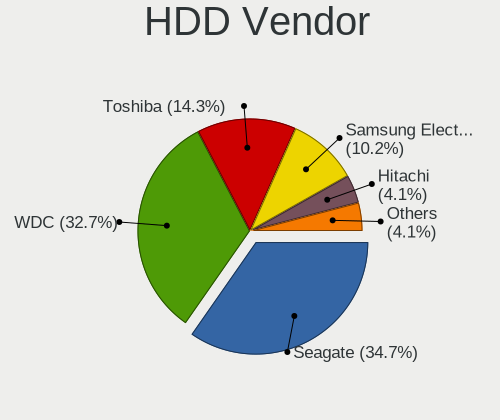

| Vendor              | Desktops | Drives | Percent |
|---------------------|----------|--------|---------|
| Seagate             | 14       | 29     | 36.84%  |
| WDC                 | 10       | 17     | 26.32%  |
| Toshiba             | 5        | 13     | 13.16%  |
| Samsung Electronics | 5        | 7      | 13.16%  |
| Hitachi             | 2        | 2      | 5.26%   |
| NVMe                | 1        | 2      | 2.63%   |
| Apple               | 1        | 1      | 2.63%   |

SSD Vendor
----------

Solid state drive vendors

| Vendor              | Desktops | Drives | Percent |
|---------------------|----------|--------|---------|
| Samsung Electronics | 17       | 23     | 20.73%  |
| Kingston            | 13       | 17     | 15.85%  |
| Hoodisk             | 11       | 17     | 13.41%  |
| Intel               | 10       | 15     | 12.2%   |
| Crucial             | 6        | 14     | 7.32%   |
| WDC                 | 3        | 5      | 3.66%   |
| SanDisk             | 2        | 3      | 2.44%   |
| Phison              | 2        | 2      | 2.44%   |
| LITEON              | 2        | 3      | 2.44%   |
| Innodisk            | 2        | 3      | 2.44%   |
| Apacer              | 2        | 2      | 2.44%   |
| XrayDisk            | 1        | 1      | 1.22%   |
| Transcend           | 1        | 1      | 1.22%   |
| Supermicro          | 1        | 1      | 1.22%   |
| SK hynix            | 1        | 1      | 1.22%   |
| Seagate             | 1        | 1      | 1.22%   |
| PNY                 | 1        | 1      | 1.22%   |
| OCZ                 | 1        | 2      | 1.22%   |
| NVMe                | 1        | 1      | 1.22%   |
| LITEONIT            | 1        | 1      | 1.22%   |
| KingSpec            | 1        | 1      | 1.22%   |
| Fordisk             | 1        | 1      | 1.22%   |
| Corsair             | 1        | 1      | 1.22%   |

Drive Kind
----------

HDD or SSD

| Kind | Desktops | Drives | Percent |
|------|----------|--------|---------|
| SSD  | 69       | 117    | 62.73%  |
| HDD  | 26       | 71     | 23.64%  |
| NVMe | 15       | 17     | 13.64%  |

Drive Connector
---------------

SATA, SAS, NVMe, etc.

| Type | Desktops | Drives | Percent |
|------|----------|--------|---------|
| SATA | 84       | 188    | 84.85%  |
| NVMe | 15       | 17     | 15.15%  |

Drive Size
----------

Size of hard drive

| Size in TB | Desktops | Drives | Percent |
|------------|----------|--------|---------|
| 0.01-0.5   | 75       | 125    | 68.81%  |
| 0.51-1.0   | 16       | 23     | 14.68%  |
| 3.01-4.0   | 8        | 18     | 7.34%   |
| 1.01-2.0   | 7        | 12     | 6.42%   |
| 4.01-10.0  | 3        | 10     | 2.75%   |

Space Total
-----------

Amount of disk space available on the file system

| Size in GB     | Desktops | Percent |
|----------------|----------|---------|
| 101-250        | 46       | 45.54%  |
| 251-500        | 14       | 13.86%  |
| 1-20           | 12       | 11.88%  |
| 21-50          | 10       | 9.9%    |
| 51-100         | 9        | 8.91%   |
| 1001-2000      | 4        | 3.96%   |
| 501-1000       | 4        | 3.96%   |
| More than 3000 | 2        | 1.98%   |

Space Used
----------

Amount of used disk space

| Used GB        | Desktops | Percent |
|----------------|----------|---------|
| 1-20           | 84       | 84%     |
| 21-50          | 11       | 11%     |
| 251-500        | 2        | 2%      |
| More than 3000 | 1        | 1%      |
| 101-250        | 1        | 1%      |
| 1001-2000      | 1        | 1%      |

Malfunc. Drives
---------------

Drive models with a malfunction

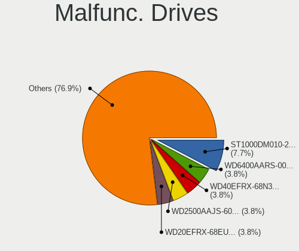

| Model                                 | Desktops | Drives | Percent |
|---------------------------------------|----------|--------|---------|
| WDC WD6400AARS-00Y5B1 640GB           | 1        | 1      | 5.56%   |
| WDC WD40EFRX-68N32N0 4TB              | 1        | 2      | 5.56%   |
| WDC WD2500AAJS-60B4A0 250GB           | 1        | 2      | 5.56%   |
| WDC WD20EFRX-68EUZN0 2TB              | 1        | 2      | 5.56%   |
| WDC WD20EARX-00ZUDB0 2TB              | 1        | 1      | 5.56%   |
| WDC WD2002FYPS-02W3B0 2TB             | 1        | 1      | 5.56%   |
| SK hynix HFS128G32MND-2200A 128GB     | 1        | 1      | 5.56%   |
| Seagate ST2000DM008-2FR102 2TB        | 1        | 1      | 5.56%   |
| Seagate ST100FN0021 100GB             | 1        | 1      | 5.56%   |
| Seagate ST1000DM010-2EP102 1TB        | 1        | 1      | 5.56%   |
| Seagate ST1000DM003-1ER162 1TB        | 1        | 1      | 5.56%   |
| Samsung Electronics SSD 970 EVO 500GB | 1        | 1      | 5.56%   |
| Samsung Electronics HM250JI 250GB     | 1        | 1      | 5.56%   |
| Samsung Electronics HD321KJ 320GB     | 1        | 1      | 5.56%   |
| Kingston SV300S37A120G 120GB          | 1        | 1      | 5.56%   |
| Intel SSDSC2CT120A3 120GB             | 1        | 1      | 5.56%   |
| Intel SSDSC2CT060A3 64GB              | 1        | 2      | 5.56%   |
| Intel SSDSC2BA400G4 400GB             | 1        | 1      | 5.56%   |

Malfunc. Drive Vendor
---------------------

Vendors of faulty drives

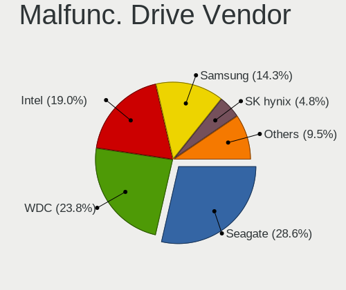

| Vendor              | Desktops | Drives | Percent |
|---------------------|----------|--------|---------|
| WDC                 | 4        | 9      | 26.67%  |
| Seagate             | 3        | 4      | 20%     |
| Samsung Electronics | 3        | 3      | 20%     |
| Intel               | 3        | 4      | 20%     |
| SK hynix            | 1        | 1      | 6.67%   |
| Kingston            | 1        | 1      | 6.67%   |

Malfunc. HDD Vendor
-------------------

Vendors of faulty HDD drives

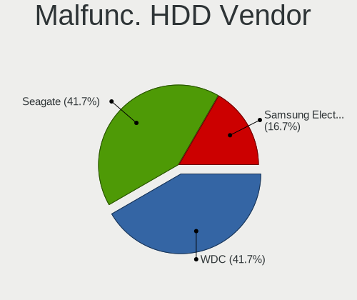

| Vendor              | Desktops | Drives | Percent |
|---------------------|----------|--------|---------|
| WDC                 | 4        | 9      | 50%     |
| Seagate             | 2        | 3      | 25%     |
| Samsung Electronics | 2        | 2      | 25%     |

Malfunc. Drive Kind
-------------------

Kinds of faulty drives

| Kind | Desktops | Drives | Percent |
|------|----------|--------|---------|
| HDD  | 7        | 14     | 50%     |
| SSD  | 6        | 7      | 42.86%  |
| NVMe | 1        | 1      | 7.14%   |

Failed Drives
-------------

Failed drive models

Zero info for selected period =(

Failed Drive Vendor
-------------------

Failed drive vendors

Zero info for selected period =(

Drive Status
------------

Number of failed and malfunc. drives

| Status   | Desktops | Drives | Percent |
|----------|----------|--------|---------|
| Works    | 86       | 174    | 81.13%  |
| Malfunc  | 14       | 22     | 13.21%  |
| Detected | 6        | 9      | 5.66%   |

Storage controller
------------------

Storage Vendor
--------------

Storage controller vendors

| Vendor                   | Desktops | Percent |
|--------------------------|----------|---------|
| Intel                    | 73       | 58.87%  |
| AMD                      | 23       | 18.55%  |
| Samsung Electronics      | 10       | 8.06%   |
| Broadcom / LSI           | 3        | 2.42%   |
| ASMedia Technology       | 3        | 2.42%   |
| SanDisk                  | 2        | 1.61%   |
| Marvell Technology Group | 2        | 1.61%   |
| VIA Technologies         | 1        | 0.81%   |
| Silicon Motion           | 1        | 0.81%   |
| Seagate Technology       | 1        | 0.81%   |
| Phison Electronics       | 1        | 0.81%   |
| Nvidia                   | 1        | 0.81%   |
| ADATA Technology         | 1        | 0.81%   |
| Adaptec                  | 1        | 0.81%   |
| 3ware                    | 1        | 0.81%   |

Storage Model
-------------

Storage controller models

| Model                                                                                   | Desktops | Percent |
|-----------------------------------------------------------------------------------------|----------|---------|
| AMD FCH SATA Controller [AHCI mode]                                                     | 16       | 11.11%  |
| Intel Q170/Q150/B150/H170/H110/Z170/CM236 Chipset SATA Controller [AHCI Mode]           | 9        | 6.25%   |
| Intel 8 Series/C220 Series Chipset Family 6-port SATA Controller 1 [AHCI mode]          | 9        | 6.25%   |
| Intel Jasper Lake SATA AHCI Controller                                                  | 7        | 4.86%   |
| Samsung NVMe SSD Controller SM981/PM981/PM983                                           | 6        | 4.17%   |
| Intel 6 Series/C200 Series Chipset Family 6 port Desktop SATA AHCI Controller           | 5        | 3.47%   |
| Intel SATA Controller [RAID mode]                                                       | 4        | 2.78%   |
| Intel Sunrise Point-LP SATA Controller [AHCI mode]                                      | 3        | 2.08%   |
| Intel NM10/ICH7 Family SATA Controller [IDE mode]                                       | 3        | 2.08%   |
| Intel Atom Processor E3800 Series SATA AHCI Controller                                  | 3        | 2.08%   |
| Intel 5 Series/3400 Series Chipset 6 port SATA AHCI Controller                          | 3        | 2.08%   |
| Intel 200 Series PCH SATA controller [AHCI mode]                                        | 3        | 2.08%   |
| Broadcom / LSI SAS2008 PCI-Express Fusion-MPT SAS-2 [Falcon]                            | 3        | 2.08%   |
| ASMedia ASM1062 Serial ATA Controller                                                   | 3        | 2.08%   |
| AMD 500 Series Chipset SATA Controller                                                  | 3        | 2.08%   |
| AMD 300 Series Chipset SATA Controller                                                  | 3        | 2.08%   |
| Samsung NVMe SSD Controller 980                                                         | 2        | 1.39%   |
| Intel Wildcat Point-LP SATA Controller [AHCI Mode]                                      | 2        | 1.39%   |
| Intel Celeron/Pentium Silver Processor SATA Controller                                  | 2        | 1.39%   |
| Intel Cannon Lake PCH SATA AHCI Controller                                              | 2        | 1.39%   |
| Intel Atom/Celeron/Pentium Processor x5-E8000/J3xxx/N3xxx Series SATA Controller        | 2        | 1.39%   |
| Intel 9 Series Chipset Family SATA Controller [AHCI Mode]                               | 2        | 1.39%   |
| Intel 82801G (ICH7 Family) IDE Controller                                               | 2        | 1.39%   |
| Intel 8 Series SATA Controller 1 [AHCI mode]                                            | 2        | 1.39%   |
| Intel 6 Series/C200 Series Chipset Family Desktop SATA Controller (IDE mode, ports 4-5) | 2        | 1.39%   |
| Intel 6 Series/C200 Series Chipset Family Desktop SATA Controller (IDE mode, ports 0-3) | 2        | 1.39%   |
| AMD SB7x0/SB8x0/SB9x0 SATA Controller [AHCI mode]                                       | 2        | 1.39%   |
| VIA VT6415 PATA IDE Host Controller                                                     | 1        | 0.69%   |
| Silicon Motion SM2263EN/SM2263XT (DRAM-less) NVMe SSD Controllers                       | 1        | 0.69%   |
| Seagate FireCuda 520 SSD                                                                | 1        | 0.69%   |
| SanDisk WD Blue SN550 NVMe SSD                                                          | 1        | 0.69%   |
| SanDisk WD Black SN750 / PC SN730 NVMe SSD                                              | 1        | 0.69%   |
| Samsung NVMe SSD Controller SM961/PM961/SM963                                           | 1        | 0.69%   |
| Samsung NVMe SSD Controller SM951/PM951                                                 | 1        | 0.69%   |
| Phison PS5013 E13 NVMe Controller                                                       | 1        | 0.69%   |
| Nvidia MCP65 SATA Controller                                                            | 1        | 0.69%   |
| Nvidia MCP65 IDE                                                                        | 1        | 0.69%   |
| Marvell Group 88SE9128 PCIe SATA 6 Gb/s RAID controller with HyperDuo                   | 1        | 0.69%   |
| Marvell Group 88SE6111/6121 SATA II / PATA Controller                                   | 1        | 0.69%   |
| Intel Tiger Lake-LP SATA Controller                                                     | 1        | 0.69%   |

Storage Kind
------------

Kind of storage controller (IDE, SATA, NVMe, SAS, ...)

| Kind | Desktops | Percent |
|------|----------|---------|
| SATA | 85       | 68%     |
| NVMe | 17       | 13.6%   |
| IDE  | 14       | 11.2%   |
| RAID | 6        | 4.8%    |
| SAS  | 3        | 2.4%    |

Processor
---------

CPU Vendor
----------

Processor vendors

| Vendor  | Desktops | Percent |
|---------|----------|---------|
| Intel   | 74       | 74.75%  |
| AMD     | 24       | 24.24%  |
| Unknown | 1        | 1.01%   |

CPU Model
---------

Processor models

| Model                                 | Desktops | Percent |
|---------------------------------------|----------|---------|
| AMD GX-412TC SOC                      | 8        | 8%      |
| Intel Celeron N5105 @ 2.00GHz         | 5        | 5%      |
| Intel Core i7-4770K CPU @ 3.50GHz     | 3        | 3%      |
| Intel Core i5-6500 CPU @ 3.20GHz      | 3        | 3%      |
| Intel Core i5-4590 CPU @ 3.30GHz      | 3        | 3%      |
| Intel Atom CPU E3845 @ 1.91GHz        | 3        | 3%      |
| Intel Xeon CPU E3-1225 v3 @ 3.20GHz   | 2        | 2%      |
| Intel Core i7-7500U CPU @ 2.70GHz     | 2        | 2%      |
| Intel Core i3-6100 CPU @ 3.70GHz      | 2        | 2%      |
| Intel Celeron J4125 CPU @ 2.00GHz     | 2        | 2%      |
| Intel Celeron CPU J3160 @ 1.60GHz     | 2        | 2%      |
| AMD Ryzen 9 3900X 12-Core Processor   | 2        | 2%      |
| AMD Ryzen 7 1700 Eight-Core Processor | 2        | 2%      |
| Intel Xeon E-2224 CPU @ 3.40GHz       | 1        | 1%      |
| Intel Xeon CPU X3470 @ 2.93GHz        | 1        | 1%      |
| Intel Xeon CPU X3440 @ 2.53GHz        | 1        | 1%      |
| Intel Xeon CPU E5450 @ 3.00GHz        | 1        | 1%      |
| Intel Xeon CPU E3-1515M v5 @ 2.80GHz  | 1        | 1%      |
| Intel Xeon CPU E3-1230L v3 @ 1.80GHz  | 1        | 1%      |
| Intel Xeon CPU E3-1220 v5 @ 3.00GHz   | 1        | 1%      |
| Intel Pentium Silver N6005 @ 2.00GHz  | 1        | 1%      |
| Intel Pentium Dual-Core CPU E5700     | 1        | 1%      |
| Intel Pentium CPU G6950 @ 2.80GHz     | 1        | 1%      |
| Intel Pentium CPU G4400 @ 3.30GHz     | 1        | 1%      |
| Intel Core i7-8700K CPU @ 3.70GHz     | 1        | 1%      |
| Intel Core i7-6850K CPU @ 3.60GHz     | 1        | 1%      |
| Intel Core i7-6700K CPU @ 4.00GHz     | 1        | 1%      |
| Intel Core i7-6500U CPU @ 2.50GHz     | 1        | 1%      |
| Intel Core i7-5550U CPU @ 2.00GHz     | 1        | 1%      |
| Intel Core i7-4790K CPU @ 4.00GHz     | 1        | 1%      |
| Intel Core i7-4600U CPU @ 2.10GHz     | 1        | 1%      |
| Intel Core i7-3770S CPU @ 3.10GHz     | 1        | 1%      |
| Intel Core i7-2600 CPU @ 3.40GHz      | 1        | 1%      |
| Intel Core i5-9400F CPU @ 2.90GHz     | 1        | 1%      |
| Intel Core i5-7500 CPU @ 3.40GHz      | 1        | 1%      |
| Intel Core i5-6400 CPU @ 2.70GHz      | 1        | 1%      |
| Intel Core i5-5200U CPU @ 2.20GHz     | 1        | 1%      |
| Intel Core i5-4690K CPU @ 3.50GHz     | 1        | 1%      |
| Intel Core i5-4670K CPU @ 3.40GHz     | 1        | 1%      |
| Intel Core i5-4570 CPU @ 3.20GHz      | 1        | 1%      |

CPU Model Family
----------------

Processor model prefix

| Model                   | Desktops | Percent |
|-------------------------|----------|---------|
| Intel Core i5           | 22       | 22%     |
| Intel Core i7           | 14       | 14%     |
| Intel Celeron           | 12       | 12%     |
| AMD GX                  | 10       | 10%     |
| Intel Xeon              | 9        | 9%      |
| Other                   | 5        | 5%      |
| Intel Core i3           | 4        | 4%      |
| AMD Ryzen 7             | 4        | 4%      |
| Intel Atom              | 3        | 3%      |
| Intel Pentium           | 2        | 2%      |
| Intel Core 2 Quad       | 2        | 2%      |
| AMD Ryzen 9             | 2        | 2%      |
| Intel Pentium Silver    | 1        | 1%      |
| Intel Pentium Dual-Core | 1        | 1%      |
| Intel Core 2 Duo        | 1        | 1%      |
| Intel Core 2            | 1        | 1%      |
| AMD Ryzen Threadripper  | 1        | 1%      |
| AMD Ryzen 7 PRO         | 1        | 1%      |
| AMD Ryzen 5             | 1        | 1%      |
| AMD G                   | 1        | 1%      |
| AMD FX                  | 1        | 1%      |
| AMD Athlon 64 X2        | 1        | 1%      |
| AMD Athlon              | 1        | 1%      |

CPU Cores
---------

Number of processor cores

| Number  | Desktops | Percent |
|---------|----------|---------|
| 4       | 65       | 65%     |
| 2       | 18       | 18%     |
| Unknown | 5        | 5%      |
| 16      | 4        | 4%      |
| 6       | 4        | 4%      |
| 24      | 3        | 3%      |
| 8       | 1        | 1%      |

CPU Sockets
-----------

Number of sockets

| Number  | Desktops | Percent |
|---------|----------|---------|
| 1       | 96       | 97.96%  |
| Unknown | 2        | 2.04%   |

CPU Threads
-----------

Threads per core (Hyper-Threading)

| Number  | Desktops | Percent |
|---------|----------|---------|
| 1       | 68       | 68%     |
| 2       | 27       | 27%     |
| Unknown | 5        | 5%      |

CPU Microarch
-------------

Microarchitecture

| Name          | Desktops | Percent |
|---------------|----------|---------|
| Haswell       | 16       | 16%     |
| Skylake       | 11       | 11%     |
| Unknown       | 11       | 11%     |
| Puma          | 9        | 9%      |
| Silvermont    | 6        | 6%      |
| KabyLake      | 6        | 6%      |
| IvyBridge     | 6        | 6%      |
| Zen           | 4        | 4%      |
| SandyBridge   | 4        | 4%      |
| Penryn        | 4        | 4%      |
| Zen 2         | 3        | 3%      |
| Nehalem       | 3        | 3%      |
| Broadwell     | 3        | 3%      |
| Piledriver    | 2        | 2%      |
| Jaguar        | 2        | 2%      |
| Goldmont plus | 2        | 2%      |
| Core          | 2        | 2%      |
| Zen 3         | 1        | 1%      |
| Westmere      | 1        | 1%      |
| TigerLake     | 1        | 1%      |
| K8 Hammer     | 1        | 1%      |
| Goldmont      | 1        | 1%      |
| Bobcat        | 1        | 1%      |

Graphics
--------

GPU Vendor
----------

Vendors of graphics cards

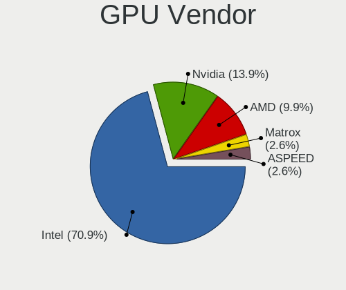

| Vendor                     | Desktops | Percent |
|----------------------------|----------|---------|
| Intel                      | 55       | 62.5%   |
| Nvidia                     | 16       | 18.18%  |
| AMD                        | 11       | 12.5%   |
| Matrox Electronics Systems | 4        | 4.55%   |
| ASPEED Technology          | 2        | 2.27%   |

GPU Model
---------

Graphics card models

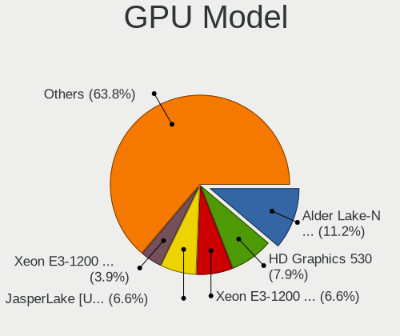

| Model                                                                                    | Desktops | Percent |
|------------------------------------------------------------------------------------------|----------|---------|
| Intel Xeon E3-1200 v3/4th Gen Core Processor Integrated Graphics Controller              | 8        | 8.99%   |
| Intel JasperLake [UHD Graphics]                                                          | 7        | 7.87%   |
| Intel HD Graphics 530                                                                    | 5        | 5.62%   |
| Nvidia GK208B [GeForce GT 710]                                                           | 4        | 4.49%   |
| Intel Xeon E3-1200 v2/3rd Gen Core processor Graphics Controller                         | 4        | 4.49%   |
| Intel Atom Processor Z36xxx/Z37xxx Series Graphics & Display                             | 4        | 4.49%   |
| Nvidia GT215 [GeForce GT 240]                                                            | 2        | 2.25%   |
| Nvidia GP107 [GeForce GTX 1050 Ti]                                                       | 2        | 2.25%   |
| Intel Xeon E3-1200 v3 Processor Integrated Graphics Controller                           | 2        | 2.25%   |
| Intel IvyBridge GT2 [HD Graphics 4000]                                                   | 2        | 2.25%   |
| Intel HD Graphics 620                                                                    | 2        | 2.25%   |
| Intel Haswell-ULT Integrated Graphics Controller                                         | 2        | 2.25%   |
| Intel GeminiLake [UHD Graphics 600]                                                      | 2        | 2.25%   |
| Intel Atom/Celeron/Pentium Processor x5-E8000/J3xxx/N3xxx Integrated Graphics Controller | 2        | 2.25%   |
| Intel 4 Series Chipset Integrated Graphics Controller                                    | 2        | 2.25%   |
| Intel 2nd Generation Core Processor Family Integrated Graphics Controller                | 2        | 2.25%   |
| ASPEED Technology ASPEED Graphics Family                                                 | 2        | 2.25%   |
| AMD Ellesmere [Radeon RX 470/480/570/570X/580/580X/590]                                  | 2        | 2.25%   |
| Nvidia TU116 [GeForce GTX 1660 SUPER]                                                    | 1        | 1.12%   |
| Nvidia GT218 [GeForce 210]                                                               | 1        | 1.12%   |
| Nvidia GP106 [GeForce GTX 1060 6GB]                                                      | 1        | 1.12%   |
| Nvidia GP104 [GeForce GTX 1070]                                                          | 1        | 1.12%   |
| Nvidia GM206 [GeForce GTX 960]                                                           | 1        | 1.12%   |
| Nvidia GK208B [GeForce GT 730]                                                           | 1        | 1.12%   |
| Nvidia GF119 [GeForce GT 610]                                                            | 1        | 1.12%   |
| Nvidia GA106 [GeForce RTX 3060]                                                          | 1        | 1.12%   |
| Matrox Electronics Systems MGA G200eW WPCM450                                            | 1        | 1.12%   |
| Matrox Electronics Systems MGA G200eH3                                                   | 1        | 1.12%   |
| Matrox Electronics Systems MGA G200EH                                                    | 1        | 1.12%   |
| Matrox Electronics Systems MGA G200e [Pilot] ServerEngines (SEP1)                        | 1        | 1.12%   |
| Intel TigerLake-LP GT2 [Iris Xe Graphics]                                                | 1        | 1.12%   |
| Intel Skylake GT2 [HD Graphics 520]                                                      | 1        | 1.12%   |
| Intel Iris Pro Graphics P580                                                             | 1        | 1.12%   |
| Intel HD Graphics 630                                                                    | 1        | 1.12%   |
| Intel HD Graphics 6000                                                                   | 1        | 1.12%   |
| Intel HD Graphics 5500                                                                   | 1        | 1.12%   |
| Intel HD Graphics 510                                                                    | 1        | 1.12%   |
| Intel HD Graphics 500                                                                    | 1        | 1.12%   |
| Intel Alder Lake-UP3 GT1 [UHD Graphics]                                                  | 1        | 1.12%   |
| Intel 82G33/G31 Express Integrated Graphics Controller                                   | 1        | 1.12%   |

GPU Combo
---------

Combinations of graphics cards

| Name        | Desktops | Percent |
|-------------|----------|---------|
| 1 x Intel   | 54       | 54%     |
| 1 x Nvidia  | 16       | 16%     |
| Other       | 12       | 12%     |
| 1 x AMD     | 11       | 11%     |
| 1 x Matrox  | 4        | 4%      |
| 1 x ASPEED  | 2        | 2%      |
| Intel + AMD | 1        | 1%      |

GPU Driver
----------

Free vs proprietary

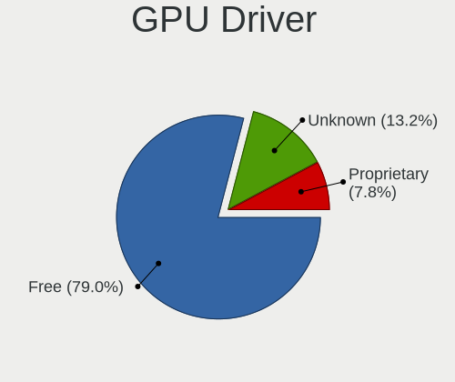

| Driver      | Desktops | Percent |
|-------------|----------|---------|
| Free        | 74       | 74.75%  |
| Unknown     | 14       | 14.14%  |
| Proprietary | 11       | 11.11%  |

GPU Memory
----------

Total video memory

| Size in GB | Desktops | Percent |
|------------|----------|---------|
| Unknown    | 84       | 85.71%  |
| 1.01-2.0   | 4        | 4.08%   |
| 5.01-6.0   | 3        | 3.06%   |
| 0.51-1.0   | 3        | 3.06%   |
| 3.01-4.0   | 2        | 2.04%   |
| 7.01-8.0   | 1        | 1.02%   |
| 8.01-16.0  | 1        | 1.02%   |

Monitor
-------

Monitor Vendor
--------------

Monitor vendors

| Vendor               | Desktops | Percent |
|----------------------|----------|---------|
| Samsung Electronics  | 7        | 26.92%  |
| Hewlett-Packard      | 5        | 19.23%  |
| Philips              | 4        | 15.38%  |
| Iiyama               | 2        | 7.69%   |
| Dell                 | 2        | 7.69%   |
| AOC                  | 2        | 7.69%   |
| LG Electronics       | 1        | 3.85%   |
| Goldstar             | 1        | 3.85%   |
| Ancor Communications | 1        | 3.85%   |
| Acer                 | 1        | 3.85%   |

Monitor Model
-------------

Monitor models

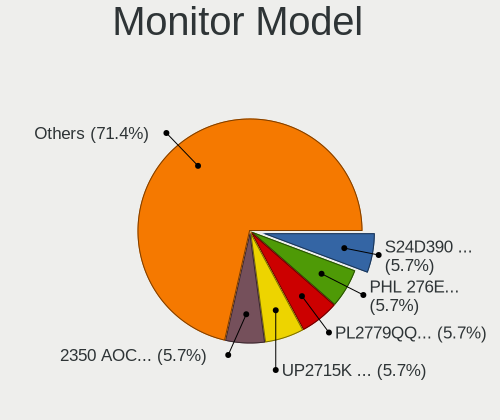

| Model                                                                | Desktops | Percent |
|----------------------------------------------------------------------|----------|---------|
| Samsung Electronics S24D390 SAM0B65 1920x1080 520x290mm 23.4-inch    | 2        | 6.67%   |
| Philips PHL 276E8V PHLC18F 3840x2160 600x340mm 27.2-inch             | 2        | 6.67%   |
| Iiyama PL2779QQ IVM6641 3840x2160 600x330mm 27.0-inch                | 2        | 6.67%   |
| Dell UP2715K DEL40B6 848x480 600x340mm 27.2-inch                     | 2        | 6.67%   |
| AOC 2350 AOC2350 1920x1080 510x290mm 23.1-inch                       | 2        | 6.67%   |
| Samsung Electronics SyncMaster SAM050B 1920x1080 480x270mm 21.7-inch | 1        | 3.33%   |
| Samsung Electronics S24E650 SAM0CC1 1920x1200 520x320mm 24.0-inch    | 1        | 3.33%   |
| Samsung Electronics LCD Monitor SyncMaster                           | 1        | 3.33%   |
| Samsung Electronics LCD Monitor SE790C 3440x1440                     | 1        | 3.33%   |
| Samsung Electronics LCD Monitor S23E650 3840x1080                    | 1        | 3.33%   |
| Samsung Electronics C24F390 SAM0D2C 1920x1080 520x290mm 23.4-inch    | 1        | 3.33%   |
| Philips PHL BDM3270 PHL08E7 2560x1440 710x400mm 32.1-inch            | 1        | 3.33%   |
| Philips PHL 221B6Q PHL08DF 1920x1080 480x270mm 21.7-inch             | 1        | 3.33%   |
| LG Electronics LCD Monitor LX20D 1600x1200                           | 1        | 3.33%   |
| Iiyama PL2888UH IVM7104 3840x2160 620x340mm 27.8-inch                | 1        | 3.33%   |
| Hewlett-Packard Z27n G2 HPN348A 2560x1440 600x340mm 27.2-inch        | 1        | 3.33%   |
| Hewlett-Packard w2216 HWP280C 1680x1050 470x290mm 21.7-inch          | 1        | 3.33%   |
| Hewlett-Packard LCD Monitor Z24n 1920x1200                           | 1        | 3.33%   |
| Hewlett-Packard LCD Monitor E241i 1920x1200                          | 1        | 3.33%   |
| Hewlett-Packard L2335 HWP2615 1920x1200 500x310mm 23.2-inch          | 1        | 3.33%   |
| Hewlett-Packard E243i HPN3463 1920x1200 520x320mm 24.0-inch          | 1        | 3.33%   |
| Goldstar 22EN33 GSM597C 1920x1080 480x270mm 21.7-inch                | 1        | 3.33%   |
| Dell UP2715K DEL40B8 3840x2160 600x340mm 27.2-inch                   | 1        | 3.33%   |
| Ancor Communications LCD Monitor VX238                               | 1        | 3.33%   |
| Acer LCD Monitor KG251Q 3840x1080                                    | 1        | 3.33%   |

Monitor Resolution
------------------

Monitor screen resolution

| Resolution         | Desktops | Percent |
|--------------------|----------|---------|
| 1920x1080 (FHD)    | 6        | 23.08%  |
| 1920x1200 (WUXGA)  | 5        | 19.23%  |
| 3840x2160 (4K)     | 4        | 15.38%  |
| 2560x1440 (QHD)    | 4        | 15.38%  |
| 3840x1080          | 2        | 7.69%   |
| Unknown            | 2        | 7.69%   |
| 3440x1440          | 1        | 3.85%   |
| 1680x1050 (WSXGA+) | 1        | 3.85%   |
| 1600x1200          | 1        | 3.85%   |

Monitor Diagonal
----------------

Diagonal size in inches

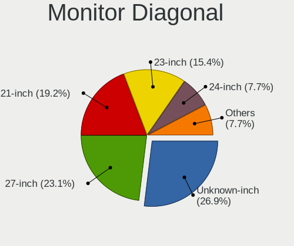

| Inches  | Desktops | Percent |
|---------|----------|---------|
| Unknown | 6        | 27.27%  |
| 27      | 5        | 22.73%  |
| 23      | 4        | 18.18%  |
| 21      | 4        | 18.18%  |
| 24      | 2        | 9.09%   |
| 32      | 1        | 4.55%   |

Monitor Width
-------------

Physical width

| Width in mm | Desktops | Percent |
|-------------|----------|---------|
| 501-600     | 10       | 45.45%  |
| Unknown     | 6        | 27.27%  |
| 401-500     | 4        | 18.18%  |
| 701-800     | 1        | 4.55%   |
| 601-700     | 1        | 4.55%   |

Aspect Ratio
------------

Proportional relationship between the width and the height

| Ratio   | Desktops | Percent |
|---------|----------|---------|
| 16/9    | 12       | 57.14%  |
| Unknown | 6        | 28.57%  |
| 16/10   | 3        | 14.29%  |

Monitor Area
------------

Area in inch²

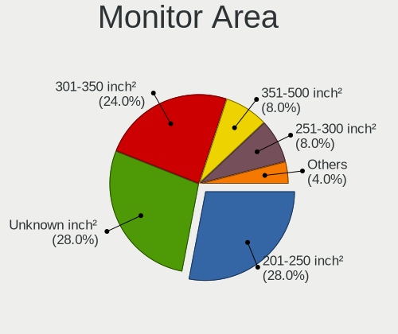

| Area in inch² | Desktops | Percent |
|----------------|----------|---------|
| 201-250        | 7        | 33.33%  |
| Unknown        | 6        | 28.57%  |
| 301-350        | 5        | 23.81%  |
| 251-300        | 2        | 9.52%   |
| 351-500        | 1        | 4.76%   |

Pixel Density
-------------

Pixels per inch

| Density | Desktops | Percent |
|---------|----------|---------|
| 51-100  | 7        | 29.17%  |
| Unknown | 6        | 25%     |
| 161-240 | 4        | 16.67%  |
| 101-120 | 4        | 16.67%  |
| 1-50    | 2        | 8.33%   |
| 121-160 | 1        | 4.17%   |

Multiple Monitors
-----------------

Total monitors connected

| Total | Desktops | Percent |
|-------|----------|---------|
| 0     | 78       | 78%     |
| 1     | 15       | 15%     |
| 2     | 7        | 7%      |

Network
-------

Net Controller Vendor
---------------------

Controller vendors

| Vendor                   | Desktops | Percent |
|--------------------------|----------|---------|
| Intel                    | 80       | 62.99%  |
| Realtek Semiconductor    | 30       | 23.62%  |
| Broadcom                 | 6        | 4.72%   |
| Qualcomm Atheros         | 3        | 2.36%   |
| TP-Link                  | 2        | 1.57%   |
| Ralink Technology        | 1        | 0.79%   |
| Mellanox Technologies    | 1        | 0.79%   |
| MediaTek                 | 1        | 0.79%   |
| Marvell Technology Group | 1        | 0.79%   |
| D-Link System            | 1        | 0.79%   |
| Apple                    | 1        | 0.79%   |

Net Controller Model
--------------------

Controller models

| Model                                                                         | Desktops | Percent |
|-------------------------------------------------------------------------------|----------|---------|
| Realtek RTL8111/8168/8411 PCI Express Gigabit Ethernet Controller             | 26       | 16.56%  |
| Intel I210 Gigabit Network Connection                                         | 16       | 10.19%  |
| Intel I211 Gigabit Network Connection                                         | 15       | 9.55%   |
| Intel 82574L Gigabit Network Connection                                       | 10       | 6.37%   |
| Intel Ethernet Controller I226-V                                              | 8        | 5.1%    |
| Intel I350 Gigabit Network Connection                                         | 6        | 3.82%   |
| Intel Ethernet Connection I217-LM                                             | 6        | 3.82%   |
| Intel 82571EB/82571GB Gigabit Ethernet Controller D0/D1 (copper applications) | 5        | 3.18%   |
| Intel Ethernet Connection (2) I219-LM                                         | 4        | 2.55%   |
| Intel 82580 Gigabit Network Connection                                        | 4        | 2.55%   |
| Intel Ethernet Controller I225-V                                              | 3        | 1.91%   |
| Intel Ethernet Connection I217-V                                              | 3        | 1.91%   |
| Intel 82579LM Gigabit Network Connection (Lewisville)                         | 3        | 1.91%   |
| Intel 82576 Gigabit Network Connection                                        | 3        | 1.91%   |
| Realtek RTL-8100/8101L/8139 PCI Fast Ethernet Adapter                         | 2        | 1.27%   |
| Intel Ethernet Connection (2) I219-V                                          | 2        | 1.27%   |
| Intel 82599ES 10-Gigabit SFI/SFP+ Network Connection                          | 2        | 1.27%   |
| Intel 82576NS Gigabit Network Connection                                      | 2        | 1.27%   |
| TP-Link TL-WN722N v2/v3 [Realtek RTL8188EUS]                                  | 1        | 0.64%   |
| TP-Link Archer T3U [Realtek RTL8812BU]                                        | 1        | 0.64%   |
| Realtek RTL8821AE 802.11ac PCIe Wireless Network Adapter                      | 1        | 0.64%   |
| Realtek RTL8812AE 802.11ac PCIe Wireless Network Adapter                      | 1        | 0.64%   |
| Realtek RTL8188CUS 802.11n WLAN Adapter                                       | 1        | 0.64%   |
| Realtek RTL8169 PCI Gigabit Ethernet Controller                               | 1        | 0.64%   |
| Realtek RTL8125 2.5GbE Controller                                             | 1        | 0.64%   |
| Ralink RT2870/RT3070 Wireless Adapter                                         | 1        | 0.64%   |
| Qualcomm Atheros QCA986x/988x 802.11ac Wireless Network Adapter               | 1        | 0.64%   |
| Qualcomm Atheros Killer E220x Gigabit Ethernet Controller                     | 1        | 0.64%   |
| Qualcomm Atheros Attansic L1 Gigabit Ethernet                                 | 1        | 0.64%   |
| Mellanox MT26448 [ConnectX EN 10GigE, PCIe 2.0 5GT/s]                         | 1        | 0.64%   |
| MediaTek USB Ethernet-RNDIS                                                   | 1        | 0.64%   |
| Marvell Group 88E8056 PCI-E Gigabit Ethernet Controller                       | 1        | 0.64%   |
| Intel Wireless-AC 9260                                                        | 1        | 0.64%   |
| Intel Wireless 8265 / 8275                                                    | 1        | 0.64%   |
| Intel Wireless 7260                                                           | 1        | 0.64%   |
| Intel Wireless 3165                                                           | 1        | 0.64%   |
| Intel Wi-Fi 6 AX200                                                           | 1        | 0.64%   |
| Intel NM10/ICH7 Family LAN Controller                                         | 1        | 0.64%   |
| Intel Ethernet Controller 10-Gigabit X540-AT2                                 | 1        | 0.64%   |
| Intel Ethernet Connection I218-V                                              | 1        | 0.64%   |

Wireless Vendor
---------------

Wireless vendors

| Vendor                | Desktops | Percent |
|-----------------------|----------|---------|
| Intel                 | 7        | 46.67%  |
| Realtek Semiconductor | 3        | 20%     |
| TP-Link               | 2        | 13.33%  |
| Ralink Technology     | 1        | 6.67%   |
| Qualcomm Atheros      | 1        | 6.67%   |
| Broadcom              | 1        | 6.67%   |

Wireless Model
--------------

Wireless models

| Model                                                           | Desktops | Percent |
|-----------------------------------------------------------------|----------|---------|
| TP-Link TL-WN722N v2/v3 [Realtek RTL8188EUS]                    | 1        | 6.67%   |
| TP-Link Archer T3U [Realtek RTL8812BU]                          | 1        | 6.67%   |
| Realtek RTL8821AE 802.11ac PCIe Wireless Network Adapter        | 1        | 6.67%   |
| Realtek RTL8812AE 802.11ac PCIe Wireless Network Adapter        | 1        | 6.67%   |
| Realtek RTL8188CUS 802.11n WLAN Adapter                         | 1        | 6.67%   |
| Ralink RT2870/RT3070 Wireless Adapter                           | 1        | 6.67%   |
| Qualcomm Atheros QCA986x/988x 802.11ac Wireless Network Adapter | 1        | 6.67%   |
| Intel Wireless-AC 9260                                          | 1        | 6.67%   |
| Intel Wireless 8265 / 8275                                      | 1        | 6.67%   |
| Intel Wireless 7260                                             | 1        | 6.67%   |
| Intel Wireless 3165                                             | 1        | 6.67%   |
| Intel Wi-Fi 6 AX200                                             | 1        | 6.67%   |
| Intel Dual Band Wireless-AC 3168NGW [Stone Peak]                | 1        | 6.67%   |
| Intel Dual Band Wireless-AC 3165 Plus Bluetooth                 | 1        | 6.67%   |
| Broadcom BCM4360 802.11ac Wireless Network Adapter              | 1        | 6.67%   |

Ethernet Vendor
---------------

Ethernet vendors

| Vendor                   | Desktops | Percent |
|--------------------------|----------|---------|
| Intel                    | 77       | 65.81%  |
| Realtek Semiconductor    | 29       | 24.79%  |
| Broadcom                 | 5        | 4.27%   |
| Qualcomm Atheros         | 2        | 1.71%   |
| MediaTek                 | 1        | 0.85%   |
| Marvell Technology Group | 1        | 0.85%   |
| D-Link System            | 1        | 0.85%   |
| Apple                    | 1        | 0.85%   |

Ethernet Model
--------------

Ethernet models

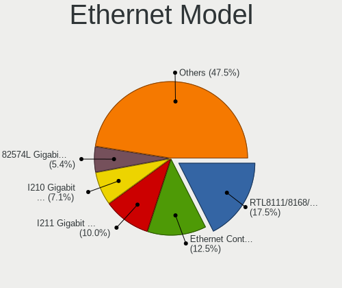

| Model                                                                         | Desktops | Percent |
|-------------------------------------------------------------------------------|----------|---------|
| Realtek RTL8111/8168/8411 PCI Express Gigabit Ethernet Controller             | 26       | 18.44%  |
| Intel I210 Gigabit Network Connection                                         | 16       | 11.35%  |
| Intel I211 Gigabit Network Connection                                         | 15       | 10.64%  |
| Intel 82574L Gigabit Network Connection                                       | 10       | 7.09%   |
| Intel Ethernet Controller I226-V                                              | 8        | 5.67%   |
| Intel I350 Gigabit Network Connection                                         | 6        | 4.26%   |
| Intel Ethernet Connection I217-LM                                             | 6        | 4.26%   |
| Intel 82571EB/82571GB Gigabit Ethernet Controller D0/D1 (copper applications) | 5        | 3.55%   |
| Intel Ethernet Connection (2) I219-LM                                         | 4        | 2.84%   |
| Intel 82580 Gigabit Network Connection                                        | 4        | 2.84%   |
| Intel Ethernet Controller I225-V                                              | 3        | 2.13%   |
| Intel Ethernet Connection I217-V                                              | 3        | 2.13%   |
| Intel 82579LM Gigabit Network Connection (Lewisville)                         | 3        | 2.13%   |
| Intel 82576 Gigabit Network Connection                                        | 3        | 2.13%   |
| Realtek RTL-8100/8101L/8139 PCI Fast Ethernet Adapter                         | 2        | 1.42%   |
| Intel Ethernet Connection (2) I219-V                                          | 2        | 1.42%   |
| Intel 82599ES 10-Gigabit SFI/SFP+ Network Connection                          | 2        | 1.42%   |
| Intel 82576NS Gigabit Network Connection                                      | 2        | 1.42%   |
| Realtek RTL8169 PCI Gigabit Ethernet Controller                               | 1        | 0.71%   |
| Realtek RTL8125 2.5GbE Controller                                             | 1        | 0.71%   |
| Qualcomm Atheros Killer E220x Gigabit Ethernet Controller                     | 1        | 0.71%   |
| Qualcomm Atheros Attansic L1 Gigabit Ethernet                                 | 1        | 0.71%   |
| MediaTek USB Ethernet-RNDIS                                                   | 1        | 0.71%   |
| Marvell Group 88E8056 PCI-E Gigabit Ethernet Controller                       | 1        | 0.71%   |
| Intel NM10/ICH7 Family LAN Controller                                         | 1        | 0.71%   |
| Intel Ethernet Controller 10-Gigabit X540-AT2                                 | 1        | 0.71%   |
| Intel Ethernet Connection I218-V                                              | 1        | 0.71%   |
| Intel Ethernet Connection (7) I219-V                                          | 1        | 0.71%   |
| Intel Ethernet Connection (2) I218-V                                          | 1        | 0.71%   |
| Intel Ethernet Connection (14) I219-LM                                        | 1        | 0.71%   |
| Intel 82579V Gigabit Network Connection                                       | 1        | 0.71%   |
| Intel 82567LF-3 Gigabit Network Connection                                    | 1        | 0.71%   |
| D-Link System DGE-528T Gigabit Ethernet Adapter                               | 1        | 0.71%   |
| Broadcom NetXtreme II BCM5709 Gigabit Ethernet                                | 1        | 0.71%   |
| Broadcom NetXtreme BCM5762 Gigabit Ethernet PCIe                              | 1        | 0.71%   |
| Broadcom NetXtreme BCM5723 Gigabit Ethernet PCIe                              | 1        | 0.71%   |
| Broadcom NetXtreme BCM5720 Gigabit Ethernet PCIe                              | 1        | 0.71%   |
| Broadcom NetXtreme BCM5701 Gigabit Ethernet                                   | 1        | 0.71%   |
| Apple Ethernet Adapter [A1277]                                                | 1        | 0.71%   |

Net Controller Kind
-------------------

Ethernet, WiFi or modem

| Kind     | Desktops | Percent |
|----------|----------|---------|
| Ethernet | 97       | 85.84%  |
| WiFi     | 15       | 13.27%  |
| Unknown  | 1        | 0.88%   |

Used Controller
---------------

Currently used network controller

| Kind     | Desktops | Percent |
|----------|----------|---------|
| Ethernet | 96       | 100%    |

NICs
----

Total network controllers on board

| Total | Desktops | Percent |
|-------|----------|---------|
| 2     | 29       | 28.43%  |
| 4     | 19       | 18.63%  |
| 3     | 19       | 18.63%  |
| 1     | 12       | 11.76%  |
| 6     | 9        | 8.82%   |
| 5     | 7        | 6.86%   |
| 7     | 3        | 2.94%   |
| 13    | 1        | 0.98%   |
| 9     | 1        | 0.98%   |
| 8     | 1        | 0.98%   |
| 0     | 1        | 0.98%   |

IPv6
----

IPv6 vs IPv4

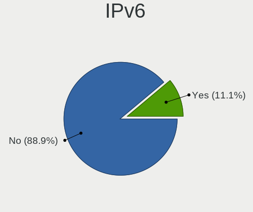

| Used | Desktops | Percent |
|------|----------|---------|
| No   | 93       | 92.08%  |
| Yes  | 8        | 7.92%   |

Bluetooth
---------

Bluetooth Vendor
----------------

Controller vendors

| Vendor                  | Desktops | Percent |
|-------------------------|----------|---------|
| Intel                   | 6        | 46.15%  |
| Cambridge Silicon Radio | 4        | 30.77%  |
| IMC Networks            | 1        | 7.69%   |
| Dell                    | 1        | 7.69%   |
| Apple                   | 1        | 7.69%   |

Bluetooth Model
---------------

Controller models

| Model                                                | Desktops | Percent |
|------------------------------------------------------|----------|---------|
| Cambridge Silicon Radio Bluetooth Dongle (HCI mode)  | 4        | 30.77%  |
| Intel Bluetooth wireless interface                   | 3        | 23.08%  |
| Intel Wireless-AC 3168 Bluetooth                     | 2        | 15.38%  |
| Intel Wireless-AC 9260 Bluetooth Adapter             | 1        | 7.69%   |
| IMC Networks Realtek Bluetooth 4.0 + High Speed Chip | 1        | 7.69%   |
| Dell Wireless 355C Bluetooth 2.0 + EDR module        | 1        | 7.69%   |
| Apple Bluetooth Host Controller                      | 1        | 7.69%   |

Sound
-----

Sound Vendor
------------

Sound card vendors

| Vendor                   | Desktops | Percent |
|--------------------------|----------|---------|
| Intel                    | 52       | 57.78%  |
| Nvidia                   | 16       | 17.78%  |
| AMD                      | 16       | 17.78%  |
| Realtek Semiconductor    | 1        | 1.11%   |
| Philips (or NXP)         | 1        | 1.11%   |
| Nordic Semiconductor ASA | 1        | 1.11%   |
| Hewlett-Packard          | 1        | 1.11%   |
| GN Netcom                | 1        | 1.11%   |
| BEHRINGER International  | 1        | 1.11%   |

Sound Model
-----------

Sound card models

| Model                                                                                             | Desktops | Percent |
|---------------------------------------------------------------------------------------------------|----------|---------|
| Intel Xeon E3-1200 v3/4th Gen Core Processor HD Audio Controller                                  | 10       | 9.17%   |
| Intel 8 Series/C220 Series Chipset High Definition Audio Controller                               | 9        | 8.26%   |
| Intel 100 Series/C230 Series Chipset Family HD Audio Controller                                   | 8        | 7.34%   |
| Intel Jasper Lake HD Audio                                                                        | 7        | 6.42%   |
| Nvidia GK208 HDMI/DP Audio Controller                                                             | 5        | 4.59%   |
| Intel 6 Series/C200 Series Chipset Family High Definition Audio Controller                        | 5        | 4.59%   |
| Nvidia High Definition Audio Controller                                                           | 3        | 2.75%   |
| Intel Sunrise Point-LP HD Audio                                                                   | 3        | 2.75%   |
| AMD Starship/Matisse HD Audio Controller                                                          | 3        | 2.75%   |
| AMD Family 17h (Models 00h-0fh) HD Audio Controller                                               | 3        | 2.75%   |
| Nvidia GP107GL High Definition Audio Controller                                                   | 2        | 1.83%   |
| Intel Wildcat Point-LP High Definition Audio Controller                                           | 2        | 1.83%   |
| Intel Haswell-ULT HD Audio Controller                                                             | 2        | 1.83%   |
| Intel Broadwell-U Audio Controller                                                                | 2        | 1.83%   |
| Intel Atom/Celeron/Pentium Processor x5-E8000/J3xxx/N3xxx Series High Definition Audio Controller | 2        | 1.83%   |
| Intel Atom Processor Z36xxx/Z37xxx Series High Definition Audio Controller                        | 2        | 1.83%   |
| Intel 8 Series HD Audio Controller                                                                | 2        | 1.83%   |
| AMD Renoir Radeon High Definition Audio Controller                                                | 2        | 1.83%   |
| AMD Kabini HDMI/DP Audio                                                                          | 2        | 1.83%   |
| AMD Family 17h/19h HD Audio Controller                                                            | 2        | 1.83%   |
| AMD Ellesmere HDMI Audio [Radeon RX 470/480 / 570/580/590]                                        | 2        | 1.83%   |
| Realtek Semiconductor Microphone(Attila) Microphone(Attila) Microphone(Attila)                    | 1        | 0.92%   |
| Philips (or NXP) Philips SHG7980                                                                  | 1        | 0.92%   |
| Nvidia TU116 High Definition Audio Controller                                                     | 1        | 0.92%   |
| Nvidia MCP65 High Definition Audio                                                                | 1        | 0.92%   |
| Nvidia GP106 High Definition Audio Controller                                                     | 1        | 0.92%   |
| Nvidia GP104 High Definition Audio Controller                                                     | 1        | 0.92%   |
| Nvidia GM206 High Definition Audio Controller                                                     | 1        | 0.92%   |
| Nvidia GF119 HDMI Audio Controller                                                                | 1        | 0.92%   |
| Nvidia GA106 High Definition Audio Controller                                                     | 1        | 0.92%   |
| Nordic Semiconductor ASA USB Composite Device Mic Device                                          | 1        | 0.92%   |
| Intel Tiger Lake-LP Smart Sound Technology Audio Controller                                       | 1        | 0.92%   |
| Intel Tiger Lake-H HD Audio Controller                                                            | 1        | 0.92%   |
| Intel NM10/ICH7 Family High Definition Audio Controller                                           | 1        | 0.92%   |
| Intel Celeron/Pentium Silver Processor High Definition Audio                                      | 1        | 0.92%   |
| Intel Celeron N3350/Pentium N4200/Atom E3900 Series Audio Cluster                                 | 1        | 0.92%   |
| Intel Cannon Lake PCH cAVS                                                                        | 1        | 0.92%   |
| Intel Alder Lake PCH-P High Definition Audio Controller                                           | 1        | 0.92%   |
| Intel 9 Series Chipset Family HD Audio Controller                                                 | 1        | 0.92%   |
| Intel 82801JD/DO (ICH10 Family) HD Audio Controller                                               | 1        | 0.92%   |

Memory
------

Memory Vendor
-------------

Memory module vendors

| Vendor              | Desktops | Percent |
|---------------------|----------|---------|
| Corsair             | 18       | 18.18%  |
| Unknown             | 16       | 16.16%  |
| Samsung Electronics | 14       | 14.14%  |
| Kingston            | 10       | 10.1%   |
| Micron Technology   | 9        | 9.09%   |
| SK hynix            | 7        | 7.07%   |
| Crucial             | 7        | 7.07%   |
| G.Skill             | 5        | 5.05%   |
| Ramaxel Technology  | 2        | 2.02%   |
| Kimtigo             | 2        | 2.02%   |
| Unknown             | 2        | 2.02%   |
| Smart Modular       | 1        | 1.01%   |
| Mushkin             | 1        | 1.01%   |
| HPE                 | 1        | 1.01%   |
| Hewlett-Packard     | 1        | 1.01%   |
| Elpida              | 1        | 1.01%   |
| ASint Technology    | 1        | 1.01%   |
| Apacer              | 1        | 1.01%   |

Memory Model
------------

Memory module models

| Model                                                  | Desktops | Percent |
|--------------------------------------------------------|----------|---------|
| Unknown RAM Module 4GB SODIMM DDR3 1333MT/s            | 7        | 6.54%   |
| Corsair RAM CML8GX3M2A1600C9 4GB DIMM DDR3 1600MT/s    | 4        | 3.74%   |
| SK hynix RAM HMT41GU6MFR8C-PB 8GB DIMM DDR3 1600MT/s   | 2        | 1.87%   |
| Samsung RAM Module 4GB DIMM DDR4 2133MT/s              | 2        | 1.87%   |
| Samsung RAM M471A2K43CB1-CTD 16GB SODIMM DDR4 2667MT/s | 2        | 1.87%   |
| Kimtigo RAM KT8GS3EDF 8GB SODIMM DDR3 1600MT/s         | 2        | 1.87%   |
| Corsair RAM CMK16GX4M2B3200C16 8GB DIMM DDR4 3200MT/s  | 2        | 1.87%   |
| Unknown                                                | 2        | 1.87%   |
| Unknown RAM Module 8GB DIMM 1333MT/s                   | 1        | 0.93%   |
| Unknown RAM Module 4GB SODIMM DDR3 667MT/s             | 1        | 0.93%   |
| Unknown RAM Module 4096MB DIMM DDR3 1332MT/s           | 1        | 0.93%   |
| Unknown RAM Module 2GB DIMM SDRAM                      | 1        | 0.93%   |
| Unknown RAM Module 2GB DIMM DDR2 800MT/s               | 1        | 0.93%   |
| Unknown RAM Module 2GB DIMM 800MT/s                    | 1        | 0.93%   |
| Unknown RAM Module 2048MB DIMM DDR3 1332MT/s           | 1        | 0.93%   |
| Unknown RAM Module 1GB DIMM SDRAM                      | 1        | 0.93%   |
| Unknown RAM Module 1GB DIMM DDR2 800MT/s               | 1        | 0.93%   |
| Unknown RAM Module 1GB DIMM DDR2 333MT/s               | 1        | 0.93%   |
| Unknown RAM Module 16GB DIMM DDR4 2133MT/s             | 1        | 0.93%   |
| Unknown RAM Module 1024MB DIMM DDR3 1332MT/s           | 1        | 0.93%   |
| Smart Modular RAM Module 4GB DIMM DDR3 1333MT/s        | 1        | 0.93%   |
| SK hynix RAM HMT451U7AFR8C-PB 4GB DIMM DDR3 1600MT/s   | 1        | 0.93%   |
| SK hynix RAM HMT41GU7AFR8A-PB 8GB DIMM DDR3 1600MT/s   | 1        | 0.93%   |
| SK hynix RAM HMT41GU6AFR8A-PB 8GB DIMM DDR3 1600MT/s   | 1        | 0.93%   |
| SK hynix RAM HMA451U6AFR8N-TF 4GB DIMM DDR4 2133MT/s   | 1        | 0.93%   |
| SK hynix RAM HMA451S6AFR8N-TF 4GB SODIMM DDR4 2133MT/s | 1        | 0.93%   |
| Samsung RAM Module 8GB DIMM DDR4 2133MT/s              | 1        | 0.93%   |
| Samsung RAM M471B5173QH0-YK0 4GB DIMM DDR3 1600MT/s    | 1        | 0.93%   |
| Samsung RAM M471B5173EB0-YK0 4GB SODIMM DDR3 1600MT/s  | 1        | 0.93%   |
| Samsung RAM M471B5173BH0-YK0 4GB DIMM DDR3 1600MT/s    | 1        | 0.93%   |
| Samsung RAM M471A1K43DB1-CWE 8GB SODIMM DDR4 3200MT/s  | 1        | 0.93%   |
| Samsung RAM M471A1K43DB1-CTD 8GB SODIMM DDR4 2667MT/s  | 1        | 0.93%   |
| Samsung RAM M393B5273CH0-YH9 4GB DIMM DDR3 1333MT/s    | 1        | 0.93%   |
| Samsung RAM M378B5173DB0-CK0 4GB DIMM DDR3 1600MT/s    | 1        | 0.93%   |
| Samsung RAM M378B1G73EB0-YK0 8GB DIMM DDR3 1600MT/s    | 1        | 0.93%   |
| Samsung RAM M378B1G73DB0-CK0 8GB DIMM DDR3 1600MT/s    | 1        | 0.93%   |
| Samsung RAM M378B1G73BH0-CK0 8GB DIMM DDR3 1600MT/s    | 1        | 0.93%   |
| Ramaxel RAM RMUA5090KB78HAF2133 8GB DIMM DDR4 2133MT/s | 1        | 0.93%   |
| Ramaxel RAM RMR1810EC58E8F1333 2GB DIMM DDR3 1333MT/s  | 1        | 0.93%   |
| Mushkin RAM MRA4S320GJJM8G 8GB SODIMM DDR4 3200MT/s    | 1        | 0.93%   |

Memory Kind
-----------

Memory module kinds

| Kind    | Desktops | Percent |
|---------|----------|---------|
| DDR3    | 48       | 52.75%  |
| DDR4    | 35       | 38.46%  |
| DDR2    | 4        | 4.4%    |
| SDRAM   | 2        | 2.2%    |
| Unknown | 2        | 2.2%    |

Memory Form Factor
------------------

Physical design of the memory module

| Name   | Desktops | Percent |
|--------|----------|---------|
| DIMM   | 61       | 67.03%  |
| SODIMM | 30       | 32.97%  |

Memory Size
-----------

Memory module size

| Size  | Desktops | Percent |
|-------|----------|---------|
| 8192  | 40       | 40.4%   |
| 4096  | 33       | 33.33%  |
| 16384 | 12       | 12.12%  |
| 2048  | 7        | 7.07%   |
| 1024  | 6        | 6.06%   |
| 32768 | 1        | 1.01%   |

Memory Speed
------------

Memory module speed

| Speed   | Desktops | Percent |
|---------|----------|---------|
| 1600    | 26       | 27.37%  |
| 1333    | 21       | 22.11%  |
| 2133    | 12       | 12.63%  |
| 3200    | 11       | 11.58%  |
| 2667    | 7        | 7.37%   |
| 800     | 4        | 4.21%   |
| 2400    | 3        | 3.16%   |
| 667     | 3        | 3.16%   |
| 2666    | 2        | 2.11%   |
| Unknown | 2        | 2.11%   |
| 4400    | 1        | 1.05%   |
| 1867    | 1        | 1.05%   |
| 1332    | 1        | 1.05%   |
| 333     | 1        | 1.05%   |

Printers & scanners
-------------------

Printer Vendor
--------------

Printer device vendors

Zero info for selected period =(

Printer Model
-------------

Printer device models

Zero info for selected period =(

Scanner Vendor
--------------

Scanner device vendors

Zero info for selected period =(

Scanner Model
-------------

Scanner device models

Zero info for selected period =(

Camera
------

Camera Vendor
-------------

Camera device vendors

Zero info for selected period =(

Camera Model
------------

Camera device models

Zero info for selected period =(

Security
--------

Fingerprint Vendor
------------------

Fingerprint sensor vendors

Zero info for selected period =(

Fingerprint Model
-----------------

Fingerprint sensor models

Zero info for selected period =(

Chipcard Vendor
---------------

Chipcard module vendors

Zero info for selected period =(

Chipcard Model
--------------

Chipcard module models

Zero info for selected period =(

Unsupported
-----------

Unsupported Devices
-------------------

Total unsupported devices on board

| Total | Desktops | Percent |
|-------|----------|---------|
| 1     | 55       | 55.56%  |
| 0     | 32       | 32.32%  |
| 2     | 10       | 10.1%   |
| 5     | 1        | 1.01%   |
| 3     | 1        | 1.01%   |

Unsupported Device Types
------------------------

Types of unsupported devices

| Type                     | Desktops | Percent |
|--------------------------|----------|---------|
| Communication controller | 59       | 78.67%  |
| Net/wireless             | 6        | 8%      |
| Bluetooth                | 4        | 5.33%   |
| Sound                    | 2        | 2.67%   |
| Storage/ata              | 1        | 1.33%   |
| Net/ethernet             | 1        | 1.33%   |
| Graphics card            | 1        | 1.33%   |
| Firewire controller      | 1        | 1.33%   |

