BSD in Sweden - Tested Hardware & Statistics (Notebooks)
--------------------------------------------------------

A project to collect tested hardware configurations for BSD in Sweden.

Anyone can contribute to this report by the [hw-probe](https://github.com/linuxhw/hw-probe/blob/master/INSTALL.BSD.md) tool:

    hw-probe -all -upload

Please contribute! Especially if your hardware is rare.

Contents
--------

* [ Test Cases ](#test-cases)

* [ System ](#system)
  - [ OS                       ](#os)
  - [ OS Family                ](#os-family)
  - [ Arch                     ](#arch)
  - [ DE                       ](#de)
  - [ Display Server           ](#display-server)
  - [ Display Manager          ](#display-manager)
  - [ OS Lang                  ](#os-lang)
  - [ Boot Mode                ](#boot-mode)
  - [ Filesystem               ](#filesystem)
  - [ Part. scheme             ](#part-scheme)

* [ Board ](#board)
  - [ Vendor                   ](#vendor)
  - [ Model                    ](#model)
  - [ Model Family             ](#model-family)
  - [ MFG Year                 ](#mfg-year)
  - [ Form Factor              ](#form-factor)
  - [ Coreboot                 ](#coreboot)
  - [ RAM Size                 ](#ram-size)
  - [ RAM Used                 ](#ram-used)
  - [ Total Drives             ](#total-drives)
  - [ Has CD-ROM               ](#has-cd-rom)
  - [ Has Ethernet             ](#has-ethernet)
  - [ Has WiFi                 ](#has-wifi)
  - [ Has Bluetooth            ](#has-bluetooth)

* [ Location ](#location)
  - [ Country                  ](#country)
  - [ City                     ](#city)

* [ Drives ](#drives)
  - [ Drive Vendor             ](#drive-vendor)
  - [ Drive Model              ](#drive-model)
  - [ HDD Vendor               ](#hdd-vendor)
  - [ SSD Vendor               ](#ssd-vendor)
  - [ Drive Kind               ](#drive-kind)
  - [ Drive Connector          ](#drive-connector)
  - [ Drive Size               ](#drive-size)
  - [ Space Total              ](#space-total)
  - [ Space Used               ](#space-used)
  - [ Malfunc. Drives          ](#malfunc-drives)
  - [ Malfunc. Drive Vendor    ](#malfunc-drive-vendor)
  - [ Malfunc. HDD Vendor      ](#malfunc-hdd-vendor)
  - [ Malfunc. Drive Kind      ](#malfunc-drive-kind)
  - [ Failed Drives            ](#failed-drives)
  - [ Failed Drive Vendor      ](#failed-drive-vendor)
  - [ Drive Status             ](#drive-status)

* [ Storage controller ](#storage-controller)
  - [ Storage Vendor           ](#storage-vendor)
  - [ Storage Model            ](#storage-model)
  - [ Storage Kind             ](#storage-kind)

* [ Processor ](#processor)
  - [ CPU Vendor               ](#cpu-vendor)
  - [ CPU Model                ](#cpu-model)
  - [ CPU Model Family         ](#cpu-model-family)
  - [ CPU Cores                ](#cpu-cores)
  - [ CPU Sockets              ](#cpu-sockets)
  - [ CPU Threads              ](#cpu-threads)
  - [ CPU Microarch            ](#cpu-microarch)

* [ Graphics ](#graphics)
  - [ GPU Vendor               ](#gpu-vendor)
  - [ GPU Model                ](#gpu-model)
  - [ GPU Combo                ](#gpu-combo)
  - [ GPU Driver               ](#gpu-driver)
  - [ GPU Memory               ](#gpu-memory)

* [ Monitor ](#monitor)
  - [ Monitor Vendor           ](#monitor-vendor)
  - [ Monitor Model            ](#monitor-model)
  - [ Monitor Resolution       ](#monitor-resolution)
  - [ Monitor Diagonal         ](#monitor-diagonal)
  - [ Monitor Width            ](#monitor-width)
  - [ Aspect Ratio             ](#aspect-ratio)
  - [ Monitor Area             ](#monitor-area)
  - [ Pixel Density            ](#pixel-density)
  - [ Multiple Monitors        ](#multiple-monitors)

* [ Network ](#network)
  - [ Net Controller Vendor    ](#net-controller-vendor)
  - [ Net Controller Model     ](#net-controller-model)
  - [ Wireless Vendor          ](#wireless-vendor)
  - [ Wireless Model           ](#wireless-model)
  - [ Ethernet Vendor          ](#ethernet-vendor)
  - [ Ethernet Model           ](#ethernet-model)
  - [ Net Controller Kind      ](#net-controller-kind)
  - [ Used Controller          ](#used-controller)
  - [ NICs                     ](#nics)
  - [ IPv6                     ](#ipv6)

* [ Bluetooth ](#bluetooth)
  - [ Bluetooth Vendor         ](#bluetooth-vendor)
  - [ Bluetooth Model          ](#bluetooth-model)

* [ Sound ](#sound)
  - [ Sound Vendor             ](#sound-vendor)
  - [ Sound Model              ](#sound-model)

* [ Memory ](#memory)
  - [ Memory Vendor            ](#memory-vendor)
  - [ Memory Model             ](#memory-model)
  - [ Memory Kind              ](#memory-kind)
  - [ Memory Form Factor       ](#memory-form-factor)
  - [ Memory Size              ](#memory-size)
  - [ Memory Speed             ](#memory-speed)

* [ Printers & scanners ](#printers--scanners)
  - [ Printer Vendor           ](#printer-vendor)
  - [ Printer Model            ](#printer-model)
  - [ Scanner Vendor           ](#scanner-vendor)
  - [ Scanner Model            ](#scanner-model)

* [ Camera ](#camera)
  - [ Camera Vendor            ](#camera-vendor)
  - [ Camera Model             ](#camera-model)

* [ Security ](#security)
  - [ Fingerprint Vendor       ](#fingerprint-vendor)
  - [ Fingerprint Model        ](#fingerprint-model)
  - [ Chipcard Vendor          ](#chipcard-vendor)
  - [ Chipcard Model           ](#chipcard-model)

* [ Unsupported ](#unsupported)
  - [ Unsupported Devices      ](#unsupported-devices)
  - [ Unsupported Device Types ](#unsupported-device-types)

Test Cases
----------

Total: 32

| Vendor  | Model                       | Probe                                                     | Date         |
|---------|-----------------------------|-----------------------------------------------------------|--------------|
| Toshiba | TECRA Z40-C-12Z             | [149e5c3de3](https://bsd-hardware.info/?probe=149e5c3de3) | Nov 28, 2022 |
| HP      | Unknown                     | [7bd69ee984](https://bsd-hardware.info/?probe=7bd69ee984) | Aug 29, 2022 |
| HP      | ProBook 4730s               | [e70725dd32](https://bsd-hardware.info/?probe=e70725dd32) | Jul 23, 2022 |
| ASUSTek | UX305UA                     | [3fb1786193](https://bsd-hardware.info/?probe=3fb1786193) | Apr 04, 2022 |
| Lenovo  | ThinkPad T460s 20FAS4KH0... | [dbb0e378d5](https://bsd-hardware.info/?probe=dbb0e378d5) | Mar 17, 2022 |
| Lenovo  | V130-15IGM 81HL             | [e0e7b21668](https://bsd-hardware.info/?probe=e0e7b21668) | Jan 09, 2022 |
| Lenovo  | ThinkPad T420 4236MBG       | [0391bf9ea4](https://bsd-hardware.info/?probe=0391bf9ea4) | Nov 14, 2021 |
| ASUSTek | K52Jc                       | [92b975763f](https://bsd-hardware.info/?probe=92b975763f) | Nov 08, 2021 |
| ASUSTek | K52Jc                       | [fc919c73e3](https://bsd-hardware.info/?probe=fc919c73e3) | Nov 07, 2021 |
| Google  | Grunt                       | [aa07a1dd40](https://bsd-hardware.info/?probe=aa07a1dd40) | Nov 05, 2021 |
| Google  | Grunt                       | [c87e033731](https://bsd-hardware.info/?probe=c87e033731) | Nov 01, 2021 |
| Google  | Grunt                       | [e6d4421a4d](https://bsd-hardware.info/?probe=e6d4421a4d) | Oct 16, 2021 |
| Google  | Grunt                       | [ee9b2d7ad3](https://bsd-hardware.info/?probe=ee9b2d7ad3) | Oct 15, 2021 |
| Google  | Grunt                       | [e76c73d9a3](https://bsd-hardware.info/?probe=e76c73d9a3) | Oct 11, 2021 |
| Acer    | Aspire A315-56              | [03ca802f4b](https://bsd-hardware.info/?probe=03ca802f4b) | Oct 02, 2021 |
| Dell    | Latitude E5530 non-vPro     | [bd4b0f0700](https://bsd-hardware.info/?probe=bd4b0f0700) | Aug 17, 2021 |
| Lenovo  | ThinkPad X250 20CLS4JH00    | [89a74889ae](https://bsd-hardware.info/?probe=89a74889ae) | Aug 02, 2021 |
| Lenovo  | ThinkPad T400 2767WSB       | [36ce1d1e00](https://bsd-hardware.info/?probe=36ce1d1e00) | Jul 24, 2021 |
| Lenovo  | ThinkPad T420 4236MBG       | [5b43300a93](https://bsd-hardware.info/?probe=5b43300a93) | Jul 13, 2021 |
| Sony    | SVP1322M1EBI                | [23316d0f2b](https://bsd-hardware.info/?probe=23316d0f2b) | May 29, 2021 |
| Dell    | Latitude 5500               | [2538b038ed](https://bsd-hardware.info/?probe=2538b038ed) | May 08, 2021 |
| Lenovo  | ThinkPad X395 20NL001SMX    | [cd016e96ee](https://bsd-hardware.info/?probe=cd016e96ee) | Mar 17, 2021 |
| Dell    | Latitude E7240              | [e42e579971](https://bsd-hardware.info/?probe=e42e579971) | Feb 22, 2021 |
| HP      | EliteBook 8440p             | [7968c7d2dd](https://bsd-hardware.info/?probe=7968c7d2dd) | Feb 16, 2021 |
| Lenovo  | Legion Y530-15ICH 81FV      | [f8bdec0105](https://bsd-hardware.info/?probe=f8bdec0105) | Feb 14, 2021 |
| ASUSTek | S551LN                      | [42792115e3](https://bsd-hardware.info/?probe=42792115e3) | Feb 11, 2021 |
| Toshiba | Satellite L450              | [eb44256bfe](https://bsd-hardware.info/?probe=eb44256bfe) | Feb 11, 2021 |
| Lenovo  | ThinkPad X201 3680FAG       | [1ba69078df](https://bsd-hardware.info/?probe=1ba69078df) | Dec 06, 2020 |
| HP      | Laptop 15-dw0xxx            | [547b36ea62](https://bsd-hardware.info/?probe=547b36ea62) | Aug 19, 2020 |
| Lenovo  | ThinkPad W520 4284GN2       | [acb3ad955f](https://bsd-hardware.info/?probe=acb3ad955f) | Aug 06, 2020 |
| Lenovo  | ThinkPad L560 20F10032MS    | [bf2b792b64](https://bsd-hardware.info/?probe=bf2b792b64) | Aug 06, 2020 |
| Lenovo  | ThinkPad L560 20F10032MS    | [0aa6a9a921](https://bsd-hardware.info/?probe=0aa6a9a921) | Aug 06, 2020 |

System
------

OS
--

Installed operating systems

| Name                 | Notebooks | Percent |
|----------------------|-----------|---------|
| helloSystem 0.5.0    | 4         | 15.38%  |
| OpenBSD 7.0          | 3         | 11.54%  |
| OpenBSD 6.9          | 2         | 7.69%   |
| helloSystem 0.7.0    | 2         | 7.69%   |
| helloSystem 0.4.0    | 2         | 7.69%   |
| FreeBSD 12.1-p8      | 2         | 7.69%   |
| OPNsense 21.1        | 1         | 3.85%   |
| OpenBSD 6.8          | 1         | 3.85%   |
| OpenBSD 6.7          | 1         | 3.85%   |
| helloSystem 0.8.0    | 1         | 3.85%   |
| GhostBSD 22.08.27    | 1         | 3.85%   |
| GhostBSD 21.08.27    | 1         | 3.85%   |
| GhostBSD 20.04.02    | 1         | 3.85%   |
| FreeBSD 14.0-CURRENT | 1         | 3.85%   |
| FreeBSD 13.0-p7      | 1         | 3.85%   |
| FreeBSD 13.0-p10     | 1         | 3.85%   |
| FreeBSD 13.0         | 1         | 3.85%   |

OS Family
---------

OS without a version

| Name        | Notebooks | Percent |
|-------------|-----------|---------|
| helloSystem | 9         | 36%     |
| OpenBSD     | 6         | 24%     |
| FreeBSD     | 6         | 24%     |
| GhostBSD    | 3         | 12%     |
| OPNsense    | 1         | 4%      |

Arch
----

OS architecture (x86_64, i586, etc.)

| Name  | Notebooks | Percent |
|-------|-----------|---------|
| amd64 | 25        | 100%    |

DE
--

Desktop Environment

| Name         | Notebooks | Percent |
|--------------|-----------|---------|
| helloDesktop | 9         | 34.62%  |
| fvwm         | 6         | 23.08%  |
| MATE         | 3         | 11.54%  |
| Console      | 3         | 11.54%  |
| KDE5         | 2         | 7.69%   |
| i3           | 2         | 7.69%   |
| Mutter       | 1         | 3.85%   |

Display Server
--------------

X11 or Wayland

| Name    | Notebooks | Percent |
|---------|-----------|---------|
| X11     | 21        | 84%     |
| Console | 4         | 16%     |

Display Manager
---------------

SDDM, LightDM, etc.

| Name    | Notebooks | Percent |
|---------|-----------|---------|
| SLiM    | 10        | 40%     |
| Console | 9         | 36%     |
| LightDM | 4         | 16%     |
| XDM     | 1         | 4%      |
| GDM     | 1         | 4%      |

OS Lang
-------

Language

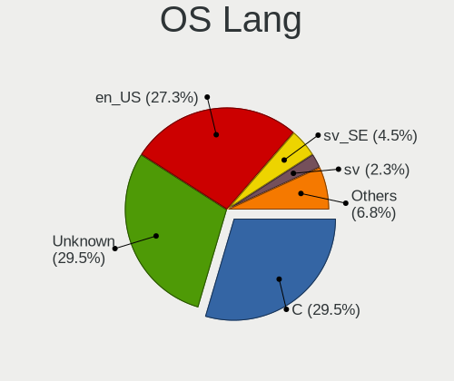

| Lang    | Notebooks | Percent |
|---------|-----------|---------|
| en_US   | 12        | 48%     |
| Unknown | 7         | 28%     |
| C       | 5         | 20%     |
| sv_SE   | 1         | 4%      |

Boot Mode
---------

EFI or BIOS

| Mode | Notebooks | Percent |
|------|-----------|---------|
| EFI  | 20        | 76.92%  |
| BIOS | 6         | 23.08%  |

Filesystem
----------

Type of filesystem

| Type   | Notebooks | Percent |
|--------|-----------|---------|
| Zfs    | 17        | 68%     |
| Ffs    | 6         | 24%     |
| Ufs    | 1         | 4%      |
| Cd9660 | 1         | 4%      |

Part. scheme
------------

Scheme of partitioning

| Type | Notebooks | Percent |
|------|-----------|---------|
| GPT  | 22        | 81.48%  |
| MBR  | 5         | 18.52%  |

Board
-----

Vendor
------

Motherboard manufacturer

| Name             | Notebooks | Percent |
|------------------|-----------|---------|
| Lenovo           | 10        | 40%     |
| Hewlett-Packard  | 4         | 16%     |
| Dell             | 3         | 12%     |
| ASUSTek Computer | 3         | 12%     |
| Toshiba          | 2         | 8%      |
| Sony             | 1         | 4%      |
| Google           | 1         | 4%      |
| Acer             | 1         | 4%      |

Model
-----

Motherboard model

| Name                             | Notebooks | Percent |
|----------------------------------|-----------|---------|
| Toshiba TECRA Z40-C-12Z          | 1         | 4%      |
| Toshiba Satellite L450           | 1         | 4%      |
| Sony SVP1322M1EBI                | 1         | 4%      |
| Lenovo V130-15IGM 81HL           | 1         | 4%      |
| Lenovo ThinkPad X395 20NL001SMX  | 1         | 4%      |
| Lenovo ThinkPad X250 20CLS4JH00  | 1         | 4%      |
| Lenovo ThinkPad X201 3680FAG     | 1         | 4%      |
| Lenovo ThinkPad W520 4284GN2     | 1         | 4%      |
| Lenovo ThinkPad T460s 20FAS4KH02 | 1         | 4%      |
| Lenovo ThinkPad T420 4236MBG     | 1         | 4%      |
| Lenovo ThinkPad T400 2767WSB     | 1         | 4%      |
| Lenovo ThinkPad L560 20F10032MS  | 1         | 4%      |
| Lenovo Legion Y530-15ICH 81FV    | 1         | 4%      |
| HP ProBook 4730s                 | 1         | 4%      |
| HP Laptop 15-dw0xxx              | 1         | 4%      |
| HP EliteBook 8440p               | 1         | 4%      |
| Google Grunt                     | 1         | 4%      |
| Dell Latitude E7240              | 1         | 4%      |
| Dell Latitude E5530 non-vPro     | 1         | 4%      |
| Dell Latitude 5500               | 1         | 4%      |
| ASUS UX305UA                     | 1         | 4%      |
| ASUS S551LN                      | 1         | 4%      |
| ASUS K52Jc                       | 1         | 4%      |
| Acer Aspire A315-56              | 1         | 4%      |
| Unknown                          | 1         | 4%      |

Model Family
------------

Motherboard model prefix

| Name              | Notebooks | Percent |
|-------------------|-----------|---------|
| Lenovo ThinkPad   | 8         | 32%     |
| Dell Latitude     | 3         | 12%     |
| Toshiba TECRA     | 1         | 4%      |
| Toshiba Satellite | 1         | 4%      |
| Sony SVP1322M1EBI | 1         | 4%      |
| Lenovo V130-15IGM | 1         | 4%      |
| Lenovo Legion     | 1         | 4%      |
| HP ProBook        | 1         | 4%      |
| HP Laptop         | 1         | 4%      |
| HP EliteBook      | 1         | 4%      |
| Google Grunt      | 1         | 4%      |
| ASUS UX305UA      | 1         | 4%      |
| ASUS S551LN       | 1         | 4%      |
| ASUS K52Jc        | 1         | 4%      |
| Acer Aspire       | 1         | 4%      |
| Unknown           | 1         | 4%      |

MFG Year
--------

Motherboard manufacture year

| Year | Notebooks | Percent |
|------|-----------|---------|
| 2020 | 4         | 16%     |
| 2019 | 3         | 12%     |
| 2015 | 3         | 12%     |
| 2009 | 3         | 12%     |
| 2021 | 2         | 8%      |
| 2018 | 2         | 8%      |
| 2016 | 2         | 8%      |
| 2014 | 2         | 8%      |
| 2010 | 2         | 8%      |
| 2012 | 1         | 4%      |
| 2011 | 1         | 4%      |

Form Factor
-----------

Physical design of the computer

| Name     | Notebooks | Percent |
|----------|-----------|---------|
| Notebook | 25        | 100%    |

Coreboot
--------

Have coreboot on board

| Used | Notebooks | Percent |
|------|-----------|---------|
| No   | 23        | 92%     |
| Yes  | 2         | 8%      |

RAM Size
--------

Total RAM memory

| Size in GB | Notebooks | Percent |
|------------|-----------|---------|
| 8.01-16.0  | 11        | 44%     |
| 4.01-8.0   | 8         | 32%     |
| 16.01-24.0 | 3         | 12%     |
| 32.01-64.0 | 1         | 4%      |
| 3.01-4.0   | 1         | 4%      |
| 24.01-32.0 | 1         | 4%      |

RAM Used
--------

Used RAM memory

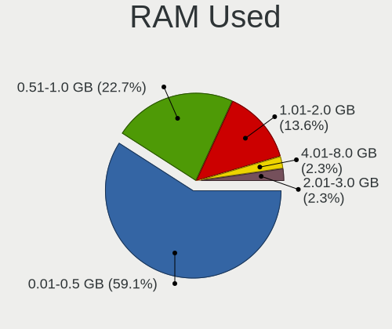

| Used GB  | Notebooks | Percent |
|----------|-----------|---------|
| 0.01-0.5 | 18        | 72%     |
| 0.51-1.0 | 5         | 20%     |
| 2.01-3.0 | 1         | 4%      |
| 1.01-2.0 | 1         | 4%      |

Total Drives
------------

Number of drives on board

| Drives | Notebooks | Percent |
|--------|-----------|---------|
| 1      | 21        | 84%     |
| 2      | 3         | 12%     |
| 3      | 1         | 4%      |

Has CD-ROM
----------

Has CD-ROM on board

| Presented | Notebooks | Percent |
|-----------|-----------|---------|
| No        | 15        | 60%     |
| Yes       | 10        | 40%     |

Has Ethernet
------------

Has Ethernet on board

| Presented | Notebooks | Percent |
|-----------|-----------|---------|
| Yes       | 21        | 84%     |
| No        | 4         | 16%     |

Has WiFi
--------

Has WiFi module

| Presented | Notebooks | Percent |
|-----------|-----------|---------|
| Yes       | 24        | 96%     |
| No        | 1         | 4%      |

Has Bluetooth
-------------

Has Bluetooth module

| Presented | Notebooks | Percent |
|-----------|-----------|---------|
| Yes       | 15        | 57.69%  |
| No        | 11        | 42.31%  |

Location
--------

Country
-------

Geographic location (country)

| Country | Notebooks | Percent |
|---------|-----------|---------|
| Sweden  | 25        | 100%    |

City
----

Geographic location (city)

| City           | Notebooks | Percent |
|----------------|-----------|---------|
| Västerås | 2         | 7.41%   |
| Stockholm      | 2         | 7.41%   |
| Malmo          | 2         | 7.41%   |
| Henan          | 2         | 7.41%   |
| Trosa          | 1         | 3.7%    |
| Staffanstorp   | 1         | 3.7%    |
| Solna          | 1         | 3.7%    |
| Sollentuna     | 1         | 3.7%    |
| Skellefteå  | 1         | 3.7%    |
| OEvertornea    | 1         | 3.7%    |
| OEverlida      | 1         | 3.7%    |
| Luleå       | 1         | 3.7%    |
| Lidkoeping     | 1         | 3.7%    |
| Kungsbacka     | 1         | 3.7%    |
| Klagshamn      | 1         | 3.7%    |
| Hoeviksnaes    | 1         | 3.7%    |
| Hoerby         | 1         | 3.7%    |
| Gävle       | 1         | 3.7%    |
| Falkenberg     | 1         | 3.7%    |
| Eskilstuna     | 1         | 3.7%    |
| Enebyberg      | 1         | 3.7%    |
| Borensberg     | 1         | 3.7%    |
| Bastad         | 1         | 3.7%    |

Drives
------

Drive Vendor
------------

Hard drive vendors

| Vendor              | Notebooks | Drives | Percent |
|---------------------|-----------|--------|---------|
| Seagate             | 5         | 5      | 18.52%  |
| Samsung Electronics | 5         | 6      | 18.52%  |
| WDC                 | 4         | 4      | 14.81%  |
| SanDisk             | 2         | 2      | 7.41%   |
| Micron Technology   | 2         | 2      | 7.41%   |
| Kingston            | 2         | 2      | 7.41%   |
| Intel               | 2         | 2      | 7.41%   |
| Toshiba             | 1         | 1      | 3.7%    |
| SK hynix            | 1         | 1      | 3.7%    |
| NVMe                | 1         | 1      | 3.7%    |
| Hitachi             | 1         | 1      | 3.7%    |
| A-DATA Technology   | 1         | 1      | 3.7%    |

Drive Model
-----------

Hard drive models

| Model                                | Notebooks | Percent |
|--------------------------------------|-----------|---------|
| Kingston SA400S37120G 120GB          | 2         | 7.41%   |
| WDC WD6400BPVT-60HXZT1 640GB         | 1         | 3.7%    |
| WDC WD3200BEKT-08PVMT1 320GB         | 1         | 3.7%    |
| WDC PC SN730 SDBQNTY-256G-1001 256GB | 1         | 3.7%    |
| WDC PC SN520 NVMe 256GB              | 1         | 3.7%    |
| Toshiba KSG60ZMV256G 256GB           | 1         | 3.7%    |
| SK hynix HFS128G32TNF-N3A0A 128GB    | 1         | 3.7%    |
| Seagate ST9640320AS 640GB            | 1         | 3.7%    |
| Seagate ST9500420AS 500GB            | 1         | 3.7%    |
| Seagate ST9320423AS 320GB            | 1         | 3.7%    |
| Seagate ST750LM022 HN-M750MBB 752GB  | 1         | 3.7%    |
| Seagate ST1000LM049-2GH172 1TB       | 1         | 3.7%    |
| SanDisk SDSSDHP256G 256GB            | 1         | 3.7%    |
| SanDisk SD8TN8U256G1001 256GB        | 1         | 3.7%    |
| Samsung SSD PM851 mSATA 256GB        | 1         | 3.7%    |
| Samsung SSD 860 PRO 256GB            | 1         | 3.7%    |
| Samsung SSD 860 EVO 250GB            | 1         | 3.7%    |
| Samsung MZNTE128HMGR-000SO 128GB     | 1         | 3.7%    |
| Samsung Flash Drive FIT 32GB         | 1         | 3.7%    |
| NVMe INTEL SSDPEKNW51 512GB          | 1         | 3.7%    |
| Micron M600_MTFDDAV256MBF 256GB      | 1         | 3.7%    |
| Micron C400-MTFDDAK256MAM 256GB      | 1         | 3.7%    |
| Intel SSDSA2M080G2GC 80GB            | 1         | 3.7%    |
| Intel SSDPEKNW512G8 512GB            | 1         | 3.7%    |
| Hitachi HTS725025A9A364 250GB        | 1         | 3.7%    |
| A-DATA SX6000NP 128GB                | 1         | 3.7%    |

HDD Vendor
----------

Hard disk drive vendors

| Vendor              | Notebooks | Drives | Percent |
|---------------------|-----------|--------|---------|
| Seagate             | 5         | 5      | 55.56%  |
| WDC                 | 2         | 2      | 22.22%  |
| Samsung Electronics | 1         | 2      | 11.11%  |
| Hitachi             | 1         | 1      | 11.11%  |

SSD Vendor
----------

Solid state drive vendors

| Vendor              | Notebooks | Drives | Percent |
|---------------------|-----------|--------|---------|
| Samsung Electronics | 4         | 4      | 28.57%  |
| SanDisk             | 2         | 2      | 14.29%  |
| Micron Technology   | 2         | 2      | 14.29%  |
| Kingston            | 2         | 2      | 14.29%  |
| Toshiba             | 1         | 1      | 7.14%   |
| SK hynix            | 1         | 1      | 7.14%   |
| NVMe                | 1         | 1      | 7.14%   |
| Intel               | 1         | 1      | 7.14%   |

Drive Kind
----------

HDD or SSD

| Kind | Notebooks | Drives | Percent |
|------|-----------|--------|---------|
| SSD  | 14        | 14     | 51.85%  |
| HDD  | 9         | 10     | 33.33%  |
| NVMe | 4         | 4      | 14.81%  |

Drive Connector
---------------

SATA, SAS, NVMe, etc.

| Type | Notebooks | Drives | Percent |
|------|-----------|--------|---------|
| SATA | 22        | 24     | 84.62%  |
| NVMe | 4         | 4      | 15.38%  |

Drive Size
----------

Size of hard drive

| Size in TB | Notebooks | Drives | Percent |
|------------|-----------|--------|---------|
| 0.01-0.5   | 17        | 19     | 77.27%  |
| 0.51-1.0   | 5         | 5      | 22.73%  |

Space Total
-----------

Amount of disk space available on the file system

| Size in GB | Notebooks | Percent |
|------------|-----------|---------|
| 101-250    | 10        | 38.46%  |
| 1-20       | 5         | 19.23%  |
| 251-500    | 4         | 15.38%  |
| 501-1000   | 3         | 11.54%  |
| 51-100     | 3         | 11.54%  |
| 21-50      | 1         | 3.85%   |

Space Used
----------

Amount of used disk space

| Used GB | Notebooks | Percent |
|---------|-----------|---------|
| 1-20    | 23        | 92%     |
| 21-50   | 2         | 8%      |

Malfunc. Drives
---------------

Drive models with a malfunction

| Model                                        | Notebooks | Drives | Percent |
|----------------------------------------------|-----------|--------|---------|
| Seagate ST9640320AS 640GB                    | 1         | 1      | 12.5%   |
| Seagate ST9500420AS 500GB                    | 1         | 1      | 12.5%   |
| Seagate ST9320423AS 320GB                    | 1         | 1      | 12.5%   |
| Seagate ST750LM022 HN-M750MBB 752GB          | 1         | 1      | 12.5%   |
| Seagate ST1000LM049-2GH172 1TB               | 1         | 1      | 12.5%   |
| Samsung Electronics MZNTE128HMGR-000SO 128GB | 1         | 1      | 12.5%   |
| Intel SSDSA2M080G2GC 80GB                    | 1         | 1      | 12.5%   |
| Hitachi HTS725025A9A364 250GB                | 1         | 1      | 12.5%   |

Malfunc. Drive Vendor
---------------------

Vendors of faulty drives

| Vendor              | Notebooks | Drives | Percent |
|---------------------|-----------|--------|---------|
| Seagate             | 5         | 5      | 62.5%   |
| Samsung Electronics | 1         | 1      | 12.5%   |
| Intel               | 1         | 1      | 12.5%   |
| Hitachi             | 1         | 1      | 12.5%   |

Malfunc. HDD Vendor
-------------------

Vendors of faulty HDD drives

| Vendor  | Notebooks | Drives | Percent |
|---------|-----------|--------|---------|
| Seagate | 5         | 5      | 83.33%  |
| Hitachi | 1         | 1      | 16.67%  |

Malfunc. Drive Kind
-------------------

Kinds of faulty drives

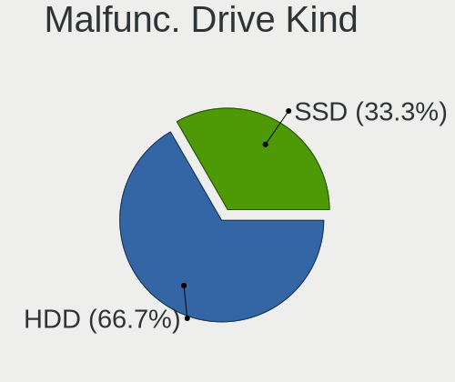

| Kind | Notebooks | Drives | Percent |
|------|-----------|--------|---------|
| HDD  | 6         | 6      | 75%     |
| SSD  | 2         | 2      | 25%     |

Failed Drives
-------------

Failed drive models

Zero info for selected period =(

Failed Drive Vendor
-------------------

Failed drive vendors

Zero info for selected period =(

Drive Status
------------

Number of failed and malfunc. drives

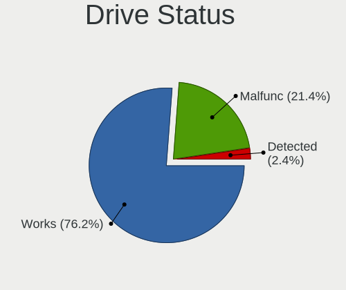

| Status   | Notebooks | Drives | Percent |
|----------|-----------|--------|---------|
| Works    | 18        | 19     | 66.67%  |
| Malfunc  | 8         | 8      | 29.63%  |
| Detected | 1         | 1      | 3.7%    |

Storage controller
------------------

Storage Vendor
--------------

Storage controller vendors

| Vendor                | Notebooks | Percent |
|-----------------------|-----------|---------|
| Intel                 | 23        | 88.46%  |
| SanDisk               | 2         | 7.69%   |
| Realtek Semiconductor | 1         | 3.85%   |

Storage Model
-------------

Storage controller models

| Model                                                                        | Notebooks | Percent |
|------------------------------------------------------------------------------|-----------|---------|
| Intel Sunrise Point-LP SATA Controller [AHCI mode]                           | 4         | 12.9%   |
| Intel 6 Series/C200 Series Chipset Family 6 port Mobile SATA AHCI Controller | 3         | 9.68%   |
| Intel SSD 660P Series                                                        | 2         | 6.45%   |
| Intel 82801IBM/IEM (ICH9M/ICH9M-E) 4 port SATA Controller [AHCI mode]        | 2         | 6.45%   |
| Intel 82801 Mobile SATA Controller [RAID mode]                               | 2         | 6.45%   |
| Intel 8 Series SATA Controller 1 [AHCI mode]                                 | 2         | 6.45%   |
| SanDisk WD Black SN750 / PC SN730 NVMe SSD                                   | 1         | 3.23%   |
| SanDisk PC SN520 NVMe SSD                                                    | 1         | 3.23%   |
| Intel Wildcat Point-LP SATA Controller [AHCI Mode]                           | 1         | 3.23%   |
| Intel Ice Lake-LP SATA Controller [AHCI mode]                                | 1         | 3.23%   |
| Intel Celeron/Pentium Silver Processor SATA Controller                       | 1         | 3.23%   |
| Intel Cannon Point-LP SATA Controller [AHCI Mode]                            | 1         | 3.23%   |
| Intel Cannon Lake Mobile PCH SATA AHCI Controller                            | 1         | 3.23%   |
| Intel 82801HM/HEM (ICH8M/ICH8M-E) SATA Controller [AHCI mode]                | 1         | 3.23%   |
| Intel 82801HM/HEM (ICH8M/ICH8M-E) IDE Controller                             | 1         | 3.23%   |
| Intel 7 Series Chipset Family 6-port SATA Controller [AHCI mode]             | 1         | 3.23%   |
| Intel 6 Series/C200 Series Chipset Family IDE-r Controller                   | 1         | 3.23%   |
| Intel 5 Series/3400 Series Chipset 6 port SATA AHCI Controller               | 1         | 3.23%   |
| Intel 5 Series/3400 Series Chipset 4 port SATA IDE Controller                | 1         | 3.23%   |
| Intel 5 Series/3400 Series Chipset 4 port SATA AHCI Controller               | 1         | 3.23%   |
| Intel 5 Series/3400 Series Chipset 2 port SATA IDE Controller                | 1         | 3.23%   |
| Unknown                                                                      | 1         | 3.23%   |

Storage Kind
------------

Kind of storage controller (IDE, SATA, NVMe, SAS, ...)

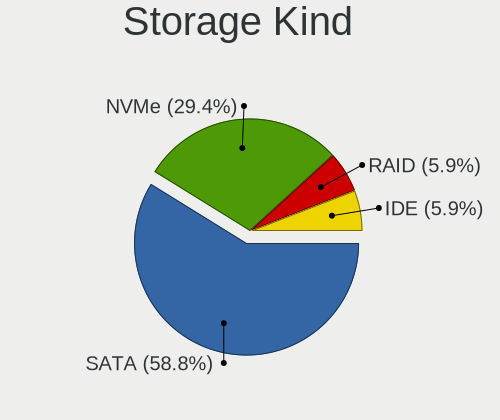

| Kind | Notebooks | Percent |
|------|-----------|---------|
| SATA | 20        | 66.67%  |
| NVMe | 5         | 16.67%  |
| IDE  | 3         | 10%     |
| RAID | 2         | 6.67%   |

Processor
---------

CPU Vendor
----------

Processor vendors

| Vendor | Notebooks | Percent |
|--------|-----------|---------|
| Intel  | 23        | 92%     |
| AMD    | 2         | 8%      |

CPU Model
---------

Processor models

| Model                                           | Notebooks | Percent |
|-------------------------------------------------|-----------|---------|
| Intel Core i5-6200U CPU @ 2.30GHz               | 2         | 8%      |
| Intel Core i5-4200U CPU @ 1.60GHz               | 2         | 8%      |
| Intel Core i5 CPU M 540 @ 2.53GHz               | 2         | 8%      |
| Intel CPU Version                               | 1         | 4%      |
| Intel Core i7-8750H CPU @ 2.20GHz               | 1         | 4%      |
| Intel Core i7-6600U CPU @ 2.60GHz               | 1         | 4%      |
| Intel Core i7-2760QM CPU @ 2.40GHz              | 1         | 4%      |
| Intel Core i5-8365U CPU @ 1.60GHz               | 1         | 4%      |
| Intel Core i5-8265U CPU @ 1.60GHz               | 1         | 4%      |
| Intel Core i5-6300U CPU @ 2.40GHz               | 1         | 4%      |
| Intel Core i5-5200U CPU @ 2.20GHz               | 1         | 4%      |
| Intel Core i5-4210U CPU @ 1.70GHz               | 1         | 4%      |
| Intel Core i5-3340M CPU @ 2.70GHz               | 1         | 4%      |
| Intel Core i5-2540M CPU @ 2.60GHz               | 1         | 4%      |
| Intel Core i5-2410M CPU @ 2.30GHz               | 1         | 4%      |
| Intel Core i5-1035G1 CPU @ 1.00GHz              | 1         | 4%      |
| Intel Core i3 CPU M 350 @ 2.27GH                | 1         | 4%      |
| Intel Core 2 Duo CPU T7100 @ 1.80GHz            | 1         | 4%      |
| Intel Core 2 Duo CPU P9700 @ 2.80GHz            | 1         | 4%      |
| Intel Celeron N4000 CPU @ 1.10GHz               | 1         | 4%      |
| AMD Ryzen 5 PRO 3500U w/ Radeon Vega Mobile Gfx | 1         | 4%      |
| AMD A4-9120C RADEON R4, 5 COMPUTE CORES 2C+3G   | 1         | 4%      |

CPU Model Family
----------------

Processor model prefix

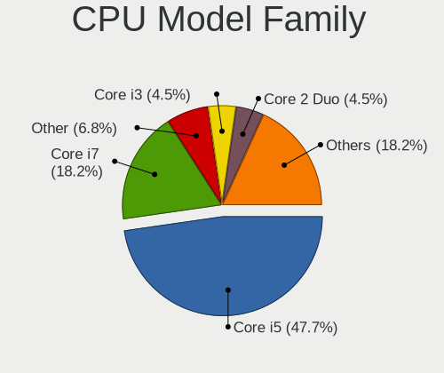

| Model            | Notebooks | Percent |
|------------------|-----------|---------|
| Intel Core i5    | 15        | 60%     |
| Intel Core i7    | 3         | 12%     |
| Intel Core 2 Duo | 2         | 8%      |
| Other            | 1         | 4%      |
| Intel Core i3    | 1         | 4%      |
| Intel Celeron    | 1         | 4%      |
| AMD Ryzen 5 PRO  | 1         | 4%      |
| AMD A4           | 1         | 4%      |

CPU Cores
---------

Number of processor cores

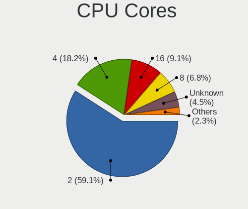

| Number  | Notebooks | Percent |
|---------|-----------|---------|
| 2       | 17        | 68%     |
| 4       | 4         | 16%     |
| Unknown | 2         | 8%      |
| 8       | 1         | 4%      |
| 6       | 1         | 4%      |

CPU Sockets
-----------

Number of sockets

| Number  | Notebooks | Percent |
|---------|-----------|---------|
| 1       | 24        | 96%     |
| Unknown | 1         | 4%      |

CPU Threads
-----------

Threads per core (Hyper-Threading)

| Number  | Notebooks | Percent |
|---------|-----------|---------|
| 2       | 19        | 76%     |
| 1       | 4         | 16%     |
| Unknown | 2         | 8%      |

CPU Microarch
-------------

Microarchitecture

| Name          | Notebooks | Percent |
|---------------|-----------|---------|
| Skylake       | 4         | 16%     |
| Westmere      | 3         | 12%     |
| SandyBridge   | 3         | 12%     |
| KabyLake      | 3         | 12%     |
| Haswell       | 3         | 12%     |
| Penryn        | 2         | 8%      |
| Zen+          | 1         | 4%      |
| IvyBridge     | 1         | 4%      |
| IceLake       | 1         | 4%      |
| Goldmont plus | 1         | 4%      |
| Excavator     | 1         | 4%      |
| Core          | 1         | 4%      |
| Broadwell     | 1         | 4%      |

Graphics
--------

GPU Vendor
----------

Vendors of graphics cards

| Vendor | Notebooks | Percent |
|--------|-----------|---------|
| Intel  | 22        | 78.57%  |
| Nvidia | 3         | 10.71%  |
| AMD    | 3         | 10.71%  |

GPU Model
---------

Graphics card models

| Model                                                                     | Notebooks | Percent |
|---------------------------------------------------------------------------|-----------|---------|
| Intel Skylake GT2 [HD Graphics 520]                                       | 4         | 13.79%  |
| Intel Haswell-ULT Integrated Graphics Controller                          | 3         | 10.34%  |
| Intel Core Processor Integrated Graphics Controller                       | 3         | 10.34%  |
| Intel WhiskeyLake-U GT2 [UHD Graphics 620]                                | 2         | 6.9%    |
| Intel Mobile 4 Series Chipset Integrated Graphics Controller              | 2         | 6.9%    |
| Intel 2nd Generation Core Processor Family Integrated Graphics Controller | 2         | 6.9%    |
| Nvidia GP107M [GeForce GTX 1050 Ti Mobile]                                | 1         | 3.45%   |
| Nvidia GM108M [GeForce 840M]                                              | 1         | 3.45%   |
| Nvidia GF106GLM [Quadro 2000M]                                            | 1         | 3.45%   |
| Intel Mobile GM965/GL960 Integrated Graphics Controller (secondary)       | 1         | 3.45%   |
| Intel Mobile GM965/GL960 Integrated Graphics Controller (primary)         | 1         | 3.45%   |
| Intel Iris Plus Graphics G1 (Ice Lake)                                    | 1         | 3.45%   |
| Intel HD Graphics 5500                                                    | 1         | 3.45%   |
| Intel GeminiLake [UHD Graphics 600]                                       | 1         | 3.45%   |
| Intel CoffeeLake-H GT2 [UHD Graphics 630]                                 | 1         | 3.45%   |
| Intel 3rd Gen Core processor Graphics Controller                          | 1         | 3.45%   |
| AMD Stoney [Radeon R2/R3/R4/R5 Graphics]                                  | 1         | 3.45%   |
| AMD Seymour [Radeon HD 6400M/7400M Series]                                | 1         | 3.45%   |
| AMD Picasso/Raven 2 [Radeon Vega Series / Radeon Vega Mobile Series]      | 1         | 3.45%   |

GPU Combo
---------

Combinations of graphics cards

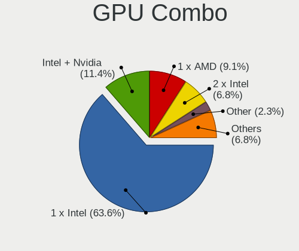

| Name           | Notebooks | Percent |
|----------------|-----------|---------|
| 1 x Intel      | 16        | 64%     |
| 2 x Intel      | 3         | 12%     |
| Intel + Nvidia | 2         | 8%      |
| 1 x AMD        | 2         | 8%      |
| 1 x Nvidia     | 1         | 4%      |
| Intel + AMD    | 1         | 4%      |

GPU Driver
----------

Free vs proprietary

| Driver      | Notebooks | Percent |
|-------------|-----------|---------|
| Free        | 22        | 88%     |
| Unknown     | 2         | 8%      |
| Proprietary | 1         | 4%      |

GPU Memory
----------

Total video memory

| Size in GB | Notebooks | Percent |
|------------|-----------|---------|
| Unknown    | 23        | 92%     |
| 1.01-2.0   | 2         | 8%      |

Monitor
-------

Monitor Vendor
--------------

Monitor vendors

| Vendor                  | Notebooks | Percent |
|-------------------------|-----------|---------|
| LG Display              | 6         | 26.09%  |
| Chimei Innolux          | 6         | 26.09%  |
| Samsung Electronics     | 1         | 4.35%   |
| Panasonic               | 1         | 4.35%   |
| Lenovo Group Limited    | 1         | 4.35%   |
| Lenovo                  | 1         | 4.35%   |
| InfoVision              | 1         | 4.35%   |
| Hewlett-Packard         | 1         | 4.35%   |
| Gigabyte Technology     | 1         | 4.35%   |
| Dell                    | 1         | 4.35%   |
| Chi Mei Optoelectronics | 1         | 4.35%   |
| AU Optronics            | 1         | 4.35%   |
| Ancor Communications    | 1         | 4.35%   |

Monitor Model
-------------

Monitor models

| Model                                                                    | Notebooks | Percent |
|--------------------------------------------------------------------------|-----------|---------|
| Samsung Electronics LCD Monitor SEC4542 1280x800 300x190mm 14.0-inch     | 1         | 4.35%   |
| Panasonic VVX13F009G00 MEI96A2 1920x1080 290x170mm 13.2-inch             | 1         | 4.35%   |
| LG Display LCD Monitor LGD05E5 1920x1080 340x190mm 15.3-inch             | 1         | 4.35%   |
| LG Display LCD Monitor LGD0569 1920x1080 310x170mm 13.9-inch             | 1         | 4.35%   |
| LG Display LCD Monitor LGD04A7 1920x1080 340x190mm 15.3-inch             | 1         | 4.35%   |
| LG Display LCD Monitor LGD02E2 1600x900 310x170mm 13.9-inch              | 1         | 4.35%   |
| LG Display LCD Monitor LGD027B 1600x900 380x210mm 17.1-inch              | 1         | 4.35%   |
| LG Display LCD Monitor LGD0213 1600x900 310x170mm 13.9-inch              | 1         | 4.35%   |
| Lenovo LCD Monitor LEN4036 1440x900 300x190mm 14.0-inch                  | 1         | 4.35%   |
| Lenovo Group Limited LCD Monitor 1920x1080                               | 1         | 4.35%   |
| InfoVision LCD Monitor IVO04E3 1366x768 280x160mm 12.7-inch              | 1         | 4.35%   |
| Hewlett-Packard E242 HWP326E 1920x1200 520x320mm 24.0-inch               | 1         | 4.35%   |
| Gigabyte Technology M28U GBT2800 3840x2160 630x360mm 28.6-inch           | 1         | 4.35%   |
| Dell U2718Q DELA0EC 3840x2160 610x350mm 27.7-inch                        | 1         | 4.35%   |
| Chimei Innolux LCD Monitor CMN15F5 1920x1080 340x190mm 15.3-inch         | 1         | 4.35%   |
| Chimei Innolux LCD Monitor CMN15DB 1366x768 340x190mm 15.3-inch          | 1         | 4.35%   |
| Chimei Innolux LCD Monitor CMN15B1 1920x1080 340x190mm 15.3-inch         | 1         | 4.35%   |
| Chimei Innolux LCD Monitor CMN1509 1920x1080 340x190mm 15.3-inch         | 1         | 4.35%   |
| Chimei Innolux LCD Monitor CMN13A2 1920x1080 290x170mm 13.2-inch         | 1         | 4.35%   |
| Chimei Innolux LCD Monitor CMN1132 1366x768 260x140mm 11.6-inch          | 1         | 4.35%   |
| Chi Mei Optoelectronics LCD Monitor CMO1593 1366x768 340x190mm 15.3-inch | 1         | 4.35%   |
| AU Optronics LCD Monitor AUO47EC 1366x768 340x190mm 15.3-inch            | 1         | 4.35%   |
| Ancor Communications VG248 ACI24A5 1920x1080 530x300mm 24.0-inch         | 1         | 4.35%   |

Monitor Resolution
------------------

Monitor screen resolution

| Resolution        | Notebooks | Percent |
|-------------------|-----------|---------|
| 1920x1080 (FHD)   | 9         | 39.13%  |
| 1366x768 (WXGA)   | 6         | 26.09%  |
| 1600x900 (HD+)    | 3         | 13.04%  |
| 3840x2160 (4K)    | 2         | 8.7%    |
| 2880x1620         | 1         | 4.35%   |
| 1920x1200 (WUXGA) | 1         | 4.35%   |
| 1440x900 (WXGA+)  | 1         | 4.35%   |

Monitor Diagonal
----------------

Diagonal size in inches

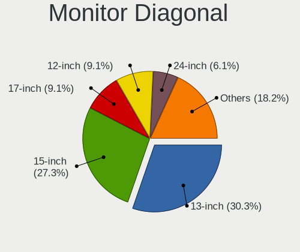

| Inches  | Notebooks | Percent |
|---------|-----------|---------|
| 15      | 9         | 39.13%  |
| 13      | 4         | 17.39%  |
| 24      | 2         | 8.7%    |
| 14      | 2         | 8.7%    |
| 28      | 1         | 4.35%   |
| 27      | 1         | 4.35%   |
| 17      | 1         | 4.35%   |
| 12      | 1         | 4.35%   |
| 11      | 1         | 4.35%   |
| Unknown | 1         | 4.35%   |

Monitor Width
-------------

Physical width

| Width in mm | Notebooks | Percent |
|-------------|-----------|---------|
| 301-350     | 12        | 52.17%  |
| 201-300     | 5         | 21.74%  |
| 601-700     | 2         | 8.7%    |
| 501-600     | 2         | 8.7%    |
| 351-400     | 1         | 4.35%   |
| Unknown     | 1         | 4.35%   |

Aspect Ratio
------------

Proportional relationship between the width and the height

| Ratio   | Notebooks | Percent |
|---------|-----------|---------|
| 16/9    | 16        | 80%     |
| 16/10   | 3         | 15%     |
| Unknown | 1         | 5%      |

Monitor Area
------------

Area in inch²

| Area in inch² | Notebooks | Percent |
|----------------|-----------|---------|
| 91-100         | 9         | 39.13%  |
| 81-90          | 5         | 21.74%  |
| 71-80          | 1         | 4.35%   |
| 61-70          | 1         | 4.35%   |
| 51-60          | 1         | 4.35%   |
| 351-500        | 1         | 4.35%   |
| 301-350        | 1         | 4.35%   |
| 251-300        | 1         | 4.35%   |
| 201-250        | 1         | 4.35%   |
| 121-130        | 1         | 4.35%   |
| Unknown        | 1         | 4.35%   |

Pixel Density
-------------

Pixels per inch

| Density | Notebooks | Percent |
|---------|-----------|---------|
| 121-160 | 12        | 54.55%  |
| 101-120 | 5         | 22.73%  |
| 161-240 | 2         | 9.09%   |
| 51-100  | 2         | 9.09%   |
| Unknown | 1         | 4.55%   |

Multiple Monitors
-----------------

Total monitors connected

| Total | Notebooks | Percent |
|-------|-----------|---------|
| 1     | 20        | 76.92%  |
| 0     | 4         | 15.38%  |
| 3     | 1         | 3.85%   |
| 2     | 1         | 3.85%   |

Network
-------

Net Controller Vendor
---------------------

Controller vendors

| Vendor                | Notebooks | Percent |
|-----------------------|-----------|---------|
| Intel                 | 19        | 54.29%  |
| Realtek Semiconductor | 8         | 22.86%  |
| Qualcomm Atheros      | 4         | 11.43%  |
| Sierra Wireless       | 1         | 2.86%   |
| Ralink Technology     | 1         | 2.86%   |
| JMicron Technology    | 1         | 2.86%   |
| Edimax Technology     | 1         | 2.86%   |

Net Controller Model
--------------------

Controller models

| Model                                                             | Notebooks | Percent |
|-------------------------------------------------------------------|-----------|---------|
| Realtek RTL8111/8168/8411 PCI Express Gigabit Ethernet Controller | 7         | 14.29%  |
| Intel Wireless 8260                                               | 3         | 6.12%   |
| Intel Wireless 7260                                               | 3         | 6.12%   |
| Realtek RTL8188EUS 802.11n Wireless Network Adapter               | 2         | 4.08%   |
| Qualcomm Atheros AR9285 Wireless Network Adapter (PCI-Express)    | 2         | 4.08%   |
| Intel Wireless 7265                                               | 2         | 4.08%   |
| Intel Ethernet Connection I219-LM                                 | 2         | 4.08%   |
| Intel Dual Band Wireless-AC 3165 Plus Bluetooth                   | 2         | 4.08%   |
| Intel Centrino Advanced-N 6205 [Taylor Peak]                      | 2         | 4.08%   |
| Intel Centrino Advanced-N 6200                                    | 2         | 4.08%   |
| Intel 82579LM Gigabit Network Connection (Lewisville)             | 2         | 4.08%   |
| Intel 82577LM Gigabit Network Connection                          | 2         | 4.08%   |
| Sierra Wireless Sierra Wireless EM7345 4G LTE                     | 1         | 2.04%   |
| Realtek RTL8821CE 802.11ac PCIe Wireless Network Adapter          | 1         | 2.04%   |
| Realtek RTL8192CU 802.11n WLAN Adapter                            | 1         | 2.04%   |
| Realtek RTL810xE PCI Express Fast Ethernet controller             | 1         | 2.04%   |
| Ralink RT5370 Wireless Adapter                                    | 1         | 2.04%   |
| Qualcomm Atheros QCA9377 802.11ac Wireless Network Adapter        | 1         | 2.04%   |
| Qualcomm Atheros AR9485 Wireless Network Adapter                  | 1         | 2.04%   |
| JMicron JMC250 PCI Express Gigabit Ethernet Controller            | 1         | 2.04%   |
| Intel Wireless-AC 9260                                            | 1         | 2.04%   |
| Intel WiFi Link 5100                                              | 1         | 2.04%   |
| Intel Ethernet Connection I219-V                                  | 1         | 2.04%   |
| Intel Ethernet Connection I218-LM                                 | 1         | 2.04%   |
| Intel Ethernet Connection (6) I219-LM                             | 1         | 2.04%   |
| Intel Ethernet Connection (3) I218-LM                             | 1         | 2.04%   |
| Intel Cannon Point-LP CNVi [Wireless-AC]                          | 1         | 2.04%   |
| Intel 82567LM Gigabit Network Connection                          | 1         | 2.04%   |
| Intel 82566MM Gigabit Network Connection                          | 1         | 2.04%   |
| Edimax EW-7811Un 802.11n Wireless Adapter [Realtek RTL8188CUS]    | 1         | 2.04%   |

Wireless Vendor
---------------

Wireless vendors

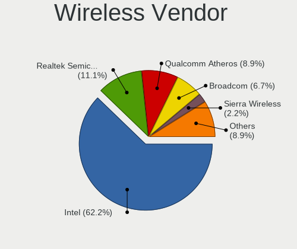

| Vendor                | Notebooks | Percent |
|-----------------------|-----------|---------|
| Intel                 | 17        | 62.96%  |
| Qualcomm Atheros      | 4         | 14.81%  |
| Realtek Semiconductor | 3         | 11.11%  |
| Sierra Wireless       | 1         | 3.7%    |
| Ralink Technology     | 1         | 3.7%    |
| Edimax Technology     | 1         | 3.7%    |

Wireless Model
--------------

Wireless models

| Model                                                          | Notebooks | Percent |
|----------------------------------------------------------------|-----------|---------|
| Intel Wireless 8260                                            | 3         | 10.71%  |
| Intel Wireless 7260                                            | 3         | 10.71%  |
| Realtek RTL8188EUS 802.11n Wireless Network Adapter            | 2         | 7.14%   |
| Qualcomm Atheros AR9285 Wireless Network Adapter (PCI-Express) | 2         | 7.14%   |
| Intel Wireless 7265                                            | 2         | 7.14%   |
| Intel Dual Band Wireless-AC 3165 Plus Bluetooth                | 2         | 7.14%   |
| Intel Centrino Advanced-N 6205 [Taylor Peak]                   | 2         | 7.14%   |
| Intel Centrino Advanced-N 6200                                 | 2         | 7.14%   |
| Sierra Wireless Sierra Wireless EM7345 4G LTE                  | 1         | 3.57%   |
| Realtek RTL8821CE 802.11ac PCIe Wireless Network Adapter       | 1         | 3.57%   |
| Realtek RTL8192CU 802.11n WLAN Adapter                         | 1         | 3.57%   |
| Ralink RT5370 Wireless Adapter                                 | 1         | 3.57%   |
| Qualcomm Atheros QCA9377 802.11ac Wireless Network Adapter     | 1         | 3.57%   |
| Qualcomm Atheros AR9485 Wireless Network Adapter               | 1         | 3.57%   |
| Intel Wireless-AC 9260                                         | 1         | 3.57%   |
| Intel WiFi Link 5100                                           | 1         | 3.57%   |
| Intel Cannon Point-LP CNVi [Wireless-AC]                       | 1         | 3.57%   |
| Edimax EW-7811Un 802.11n Wireless Adapter [Realtek RTL8188CUS] | 1         | 3.57%   |

Ethernet Vendor
---------------

Ethernet vendors

| Vendor                | Notebooks | Percent |
|-----------------------|-----------|---------|
| Intel                 | 12        | 57.14%  |
| Realtek Semiconductor | 8         | 38.1%   |
| JMicron Technology    | 1         | 4.76%   |

Ethernet Model
--------------

Ethernet models

| Model                                                             | Notebooks | Percent |
|-------------------------------------------------------------------|-----------|---------|
| Realtek RTL8111/8168/8411 PCI Express Gigabit Ethernet Controller | 7         | 33.33%  |
| Intel Ethernet Connection I219-LM                                 | 2         | 9.52%   |
| Intel 82579LM Gigabit Network Connection (Lewisville)             | 2         | 9.52%   |
| Intel 82577LM Gigabit Network Connection                          | 2         | 9.52%   |
| Realtek RTL810xE PCI Express Fast Ethernet controller             | 1         | 4.76%   |
| JMicron JMC250 PCI Express Gigabit Ethernet Controller            | 1         | 4.76%   |
| Intel Ethernet Connection I219-V                                  | 1         | 4.76%   |
| Intel Ethernet Connection I218-LM                                 | 1         | 4.76%   |
| Intel Ethernet Connection (6) I219-LM                             | 1         | 4.76%   |
| Intel Ethernet Connection (3) I218-LM                             | 1         | 4.76%   |
| Intel 82567LM Gigabit Network Connection                          | 1         | 4.76%   |
| Intel 82566MM Gigabit Network Connection                          | 1         | 4.76%   |

Net Controller Kind
-------------------

Ethernet, WiFi or modem

| Kind     | Notebooks | Percent |
|----------|-----------|---------|
| WiFi     | 24        | 53.33%  |
| Ethernet | 21        | 46.67%  |

Used Controller
---------------

Currently used network controller

| Kind     | Notebooks | Percent |
|----------|-----------|---------|
| WiFi     | 21        | 61.76%  |
| Ethernet | 13        | 38.24%  |

NICs
----

Total network controllers on board

| Total | Notebooks | Percent |
|-------|-----------|---------|
| 2     | 18        | 72%     |
| 1     | 7         | 28%     |

IPv6
----

IPv6 vs IPv4

| Used | Notebooks | Percent |
|------|-----------|---------|
| No   | 25        | 100%    |

Bluetooth
---------

Bluetooth Vendor
----------------

Controller vendors

| Vendor             | Notebooks | Percent |
|--------------------|-----------|---------|
| Intel              | 8         | 53.33%  |
| Hewlett-Packard    | 2         | 13.33%  |
| Broadcom           | 2         | 13.33%  |
| Lite-On Technology | 1         | 6.67%   |
| IMC Networks       | 1         | 6.67%   |
| Dell               | 1         | 6.67%   |

Bluetooth Model
---------------

Controller models

| Model                                                   | Notebooks | Percent |
|---------------------------------------------------------|-----------|---------|
| Intel Bluetooth wireless interface                      | 6         | 40%     |
| Broadcom BCM2045B (BDC-2.1)                             | 2         | 13.33%  |
| Lite-On Qualcomm Atheros QCA9377 Bluetooth              | 1         | 6.67%   |
| Intel Wireless-AC 9260 Bluetooth Adapter                | 1         | 6.67%   |
| Intel Bluetooth 9460/9560 Jefferson Peak (JfP)          | 1         | 6.67%   |
| IMC Networks Qualcomm Atheros AR3012 Bluetooth 4.0 + HS | 1         | 6.67%   |
| HP Broadcom 2070 Bluetooth Combo                        | 1         | 6.67%   |
| HP Atheros AR9285 Malbec Bluetooth Adapter              | 1         | 6.67%   |
| Dell Dell Wireless 380 Bluetooth 4.0 Module             | 1         | 6.67%   |

Sound
-----

Sound Vendor
------------

Sound card vendors

| Vendor | Notebooks | Percent |
|--------|-----------|---------|
| Intel  | 23        | 85.19%  |
| AMD    | 2         | 7.41%   |
| Nvidia | 1         | 3.7%    |
| Lenovo | 1         | 3.7%    |

Sound Model
-----------

Sound card models

| Model                                                                      | Notebooks | Percent |
|----------------------------------------------------------------------------|-----------|---------|
| Intel Sunrise Point-LP HD Audio                                            | 4         | 12.5%   |
| Intel Haswell-ULT HD Audio Controller                                      | 3         | 9.38%   |
| Intel 8 Series HD Audio Controller                                         | 3         | 9.38%   |
| Intel 6 Series/C200 Series Chipset Family High Definition Audio Controller | 3         | 9.38%   |
| Intel 5 Series/3400 Series Chipset High Definition Audio                   | 3         | 9.38%   |
| Intel Cannon Point-LP High Definition Audio Controller                     | 2         | 6.25%   |
| Intel 82801I (ICH9 Family) HD Audio Controller                             | 2         | 6.25%   |
| Nvidia GF106 High Definition Audio Controller                              | 1         | 3.13%   |
| Lenovo Realtek USB Audio                                                   | 1         | 3.13%   |
| Intel Wildcat Point-LP High Definition Audio Controller                    | 1         | 3.13%   |
| Intel Ice Lake-LP Smart Sound Technology Audio Controller                  | 1         | 3.13%   |
| Intel Celeron/Pentium Silver Processor High Definition Audio               | 1         | 3.13%   |
| Intel Cannon Lake PCH cAVS                                                 | 1         | 3.13%   |
| Intel Broadwell-U Audio Controller                                         | 1         | 3.13%   |
| Intel 82801H (ICH8 Family) HD Audio Controller                             | 1         | 3.13%   |
| Intel 7 Series/C216 Chipset Family High Definition Audio Controller        | 1         | 3.13%   |
| AMD Raven/Raven2/Fenghuang HDMI/DP Audio Controller                        | 1         | 3.13%   |
| AMD High Definition Audio Controller                                       | 1         | 3.13%   |
| AMD Family 17h/19h HD Audio Controller                                     | 1         | 3.13%   |

Memory
------

Memory Vendor
-------------

Memory module vendors

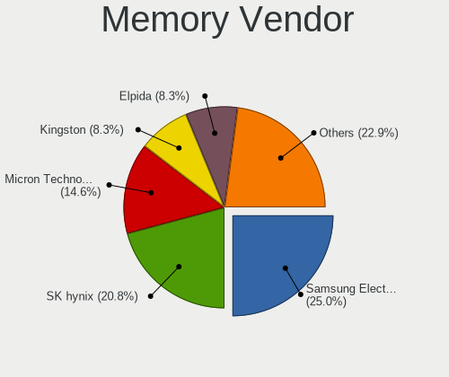

| Vendor              | Notebooks | Percent |
|---------------------|-----------|---------|
| Samsung Electronics | 7         | 26.92%  |
| SK hynix            | 6         | 23.08%  |
| Micron Technology   | 4         | 15.38%  |
| Kingston            | 3         | 11.54%  |
| Elpida              | 2         | 7.69%   |
| Unknown             | 1         | 3.85%   |
| Toshiba             | 1         | 3.85%   |
| Corsair             | 1         | 3.85%   |
| Unknown             | 1         | 3.85%   |

Memory Model
------------

Memory module models

| Model                                                     | Notebooks | Percent |
|-----------------------------------------------------------|-----------|---------|
| SK hynix RAM HMT41GS6BFR8A-PB 8GB SODIMM DDR3 1600MT/s    | 2         | 7.14%   |
| Unknown RAM Module 2GB SODIMM DDR3                        | 1         | 3.57%   |
| Toshiba RAM 8HTF12864HDY-800G1 2048MB SODIMM 800MT/s      | 1         | 3.57%   |
| Toshiba RAM 64T128020EDL2.5C2 2048MB SODIMM 800MT/s       | 1         | 3.57%   |
| SK hynix RAM HMT451S6AFR8A-PB 4GB SODIMM DDR3 1600MT/s    | 1         | 3.57%   |
| SK hynix RAM HMT351S6CFR8C-PB 4GB SODIMM DDR3 1600MT/s    | 1         | 3.57%   |
| SK hynix RAM HMT125S6BFR8C-H9 2048MB SODIMM DDR3 1333MT/s | 1         | 3.57%   |
| SK hynix RAM HMA82GS6JJR8N-VK 16GB SODIMM DDR4 2667MT/s   | 1         | 3.57%   |
| Samsung RAM M471B5673FH0-CH9 2GB SODIMM DDR3 1334MT/s     | 1         | 3.57%   |
| Samsung RAM M471B1G73EB0-YK0 8GB SODIMM DDR3 1600MT/s     | 1         | 3.57%   |
| Samsung RAM M471B1G73DB0-YK0 8GB SODIMM DDR3 1600MT/s     | 1         | 3.57%   |
| Samsung RAM M471A5244CB0-CWE 4GB SODIMM DDR4 3200MT/s     | 1         | 3.57%   |
| Samsung RAM M471A5244CB0-CTD 4GB SODIMM DDR4 2667MT/s     | 1         | 3.57%   |
| Samsung RAM M471A5143EB0-CPB 4GB SODIMM DDR4 2133MT/s     | 1         | 3.57%   |
| Samsung RAM M471A2K43CB1-CTD 16GB SODIMM DDR4 2667MT/s    | 1         | 3.57%   |
| Samsung RAM M471A1K43CB1-CTD 8GB SODIMM DDR4 2667MT/s     | 1         | 3.57%   |
| Micron RAM Module 4096MB SODIMM DDR3 1600MT/s             | 1         | 3.57%   |
| Micron RAM 4ATS1G64HZ-2G6E1 8GB SODIMM DDR4 2667MT/s      | 1         | 3.57%   |
| Micron RAM 16KTF51264HZ-1G4M1 4GB SODIMM DDR3 1333MT/s    | 1         | 3.57%   |
| Micron RAM 16HTF25664HY-800J1 2GB SODIMM DDR2 800MT/s     | 1         | 3.57%   |
| Kingston RAM Module 4GB SODIMM DDR4 2667MT/s              | 1         | 3.57%   |
| Kingston RAM ASU1333D3S9DR8/2G 2GB SODIMM DDR3 1333MT/s   | 1         | 3.57%   |
| Kingston RAM 9905428-417.A00LF 8GB SODIMM DDR3 1600MT/s   | 1         | 3.57%   |
| Elpida RAM Module 4GB SODIMM LPDDR3 1600MT/s              | 1         | 3.57%   |
| Elpida RAM EBJ41UF8BCS0-DJ-F 4GB SODIMM DDR3 1333MT/s     | 1         | 3.57%   |
| Corsair RAM CMSO8GX3M1A1333C9 8GB SODIMM DDR3 1333MT/s    | 1         | 3.57%   |
| Unknown                                                   | 1         | 3.57%   |

Memory Kind
-----------

Memory module kinds

| Kind    | Notebooks | Percent |
|---------|-----------|---------|
| DDR3    | 11        | 55%     |
| DDR4    | 6         | 30%     |
| LPDDR3  | 1         | 5%      |
| DDR2    | 1         | 5%      |
| Unknown | 1         | 5%      |

Memory Form Factor
------------------

Physical design of the memory module

| Name   | Notebooks | Percent |
|--------|-----------|---------|
| SODIMM | 20        | 95.24%  |
| Chip   | 1         | 4.76%   |

Memory Size
-----------

Memory module size

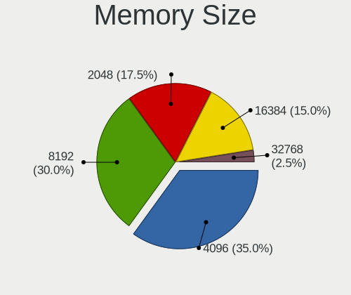

| Size  | Notebooks | Percent |
|-------|-----------|---------|
| 4096  | 8         | 36.36%  |
| 8192  | 7         | 31.82%  |
| 2048  | 5         | 22.73%  |
| 16384 | 2         | 9.09%   |

Memory Speed
------------

Memory module speed

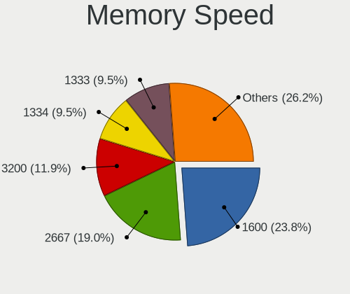

| Speed   | Notebooks | Percent |
|---------|-----------|---------|
| 1600    | 7         | 33.33%  |
| 2667    | 4         | 19.05%  |
| 1333    | 4         | 19.05%  |
| 800     | 2         | 9.52%   |
| 3200    | 1         | 4.76%   |
| 2133    | 1         | 4.76%   |
| 1334    | 1         | 4.76%   |
| Unknown | 1         | 4.76%   |

Printers & scanners
-------------------

Printer Vendor
--------------

Printer device vendors

Zero info for selected period =(

Printer Model
-------------

Printer device models

Zero info for selected period =(

Scanner Vendor
--------------

Scanner device vendors

Zero info for selected period =(

Scanner Model
-------------

Scanner device models

Zero info for selected period =(

Camera
------

Camera Vendor
-------------

Camera device vendors

| Vendor                | Notebooks | Percent |
|-----------------------|-----------|---------|
| Chicony Electronics   | 8         | 40%     |
| Acer                  | 3         | 15%     |
| Realtek Semiconductor | 2         | 10%     |
| IMC Networks          | 2         | 10%     |
| Suyin                 | 1         | 5%      |
| Quanta                | 1         | 5%      |
| Microdia              | 1         | 5%      |
| Logitech              | 1         | 5%      |
| Lenovo                | 1         | 5%      |

Camera Model
------------

Camera device models

| Model                                    | Notebooks | Percent |
|------------------------------------------|-----------|---------|
| Suyin Asus Integrated Webcam             | 1         | 5%      |
| Realtek Integrated_Webcam_HD             | 1         | 5%      |
| Realtek Front Camera                     | 1         | 5%      |
| Quanta VGA WebCam                        | 1         | 5%      |
| Microdia Integrated Webcam               | 1         | 5%      |
| Logitech Webcam C270                     | 1         | 5%      |
| Lenovo Integrated Webcam                 | 1         | 5%      |
| IMC Networks HP TrueVision HD Camera     | 1         | 5%      |
| IMC Networks EasyCamera                  | 1         | 5%      |
| Chicony USB2.0 HD UVC WebCam             | 1         | 5%      |
| Chicony USB 2.0 VGA UVC WebCam           | 1         | 5%      |
| Chicony TOSHIBA Web Camera - FHD         | 1         | 5%      |
| Chicony ThinkPad T490 Webcam             | 1         | 5%      |
| Chicony Lenovo Integrated Camera (0.3MP) | 1         | 5%      |
| Chicony Integrated HP HD Webcam          | 1         | 5%      |
| Chicony Integrated Camera                | 1         | 5%      |
| Chicony Camera                           | 1         | 5%      |
| Acer ThinkPad P50 Integrated Camera      | 1         | 5%      |
| Acer Integrated Camera                   | 1         | 5%      |
| Acer EasyCamera                          | 1         | 5%      |

Security
--------

Fingerprint Vendor
------------------

Fingerprint sensor vendors

| Vendor           | Notebooks | Percent |
|------------------|-----------|---------|
| Validity Sensors | 3         | 33.33%  |
| Upek             | 2         | 22.22%  |
| AuthenTec        | 2         | 22.22%  |
| Synaptics        | 1         | 11.11%  |
| Broadcom         | 1         | 11.11%  |

Fingerprint Model
-----------------

Fingerprint sensor models

| Model                                                                        | Notebooks | Percent |
|------------------------------------------------------------------------------|-----------|---------|
| Upek Biometric Touchchip/Touchstrip Fingerprint Sensor                       | 2         | 22.22%  |
| Validity Sensors VFS471 Fingerprint Reader                                   | 1         | 11.11%  |
| Validity Sensors VFS451 Fingerprint Reader                                   | 1         | 11.11%  |
| Validity Sensors VFS Fingerprint sensor                                      | 1         | 11.11%  |
| Synaptics Prometheus MIS Touch Fingerprint Reader                            | 1         | 11.11%  |
| Broadcom BCM5880 Secure Applications Processor with fingerprint swipe sensor | 1         | 11.11%  |
| AuthenTec AES2810                                                            | 1         | 11.11%  |
| AuthenTec AES2501 Fingerprint Sensor                                         | 1         | 11.11%  |

Chipcard Vendor
---------------

Chipcard module vendors

Zero info for selected period =(

Chipcard Model
--------------

Chipcard module models

Zero info for selected period =(

Unsupported
-----------

Unsupported Devices
-------------------

Total unsupported devices on board

| Total | Notebooks | Percent |
|-------|-----------|---------|
| 2     | 13        | 50%     |
| 1     | 6         | 23.08%  |
| 3     | 3         | 11.54%  |
| 0     | 2         | 7.69%   |
| 5     | 1         | 3.85%   |
| 4     | 1         | 3.85%   |

Unsupported Device Types
------------------------

Types of unsupported devices

| Type                     | Notebooks | Percent |
|--------------------------|-----------|---------|
| Communication controller | 21        | 46.67%  |
| Fingerprint reader       | 7         | 15.56%  |
| Card reader              | 6         | 13.33%  |
| Firewire controller      | 3         | 6.67%   |
| Net/wireless             | 2         | 4.44%   |
| Graphics card            | 2         | 4.44%   |
| Storage/ata              | 1         | 2.22%   |
| Sound                    | 1         | 2.22%   |
| Network                  | 1         | 2.22%   |
| Bluetooth                | 1         | 2.22%   |

