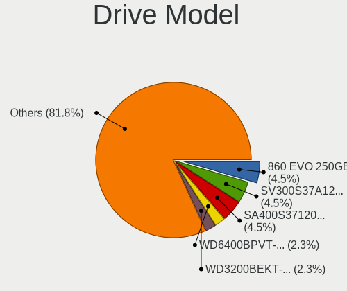
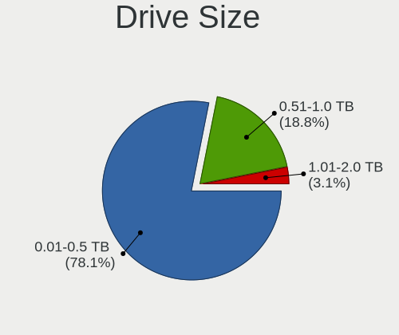
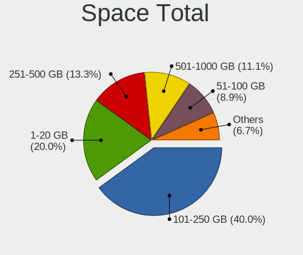
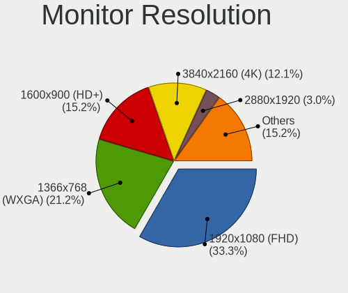
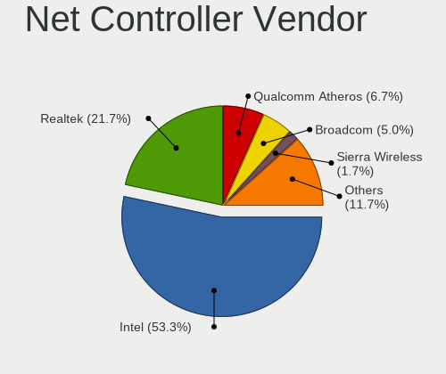
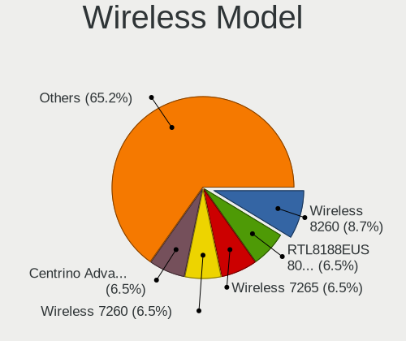
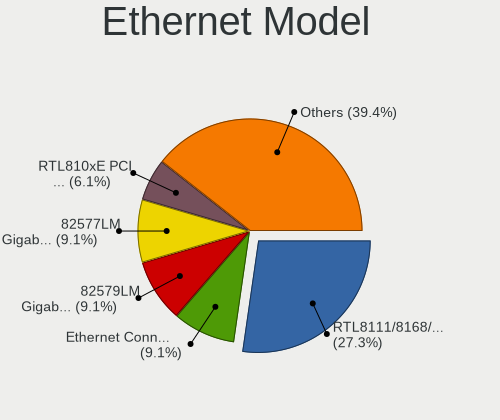

BSD in Sweden - Tested Hardware & Statistics (Notebooks)
--------------------------------------------------------

A project to collect tested hardware configurations for BSD in Sweden.

Anyone can contribute to this report by the [hw-probe](https://github.com/linuxhw/hw-probe/blob/master/INSTALL.BSD.md) tool:

    hw-probe -all -upload

Please contribute! Especially if your hardware is rare.

Contents
--------

* [ Test Cases ](#test-cases)

* [ System ](#system)
  - [ OS                       ](#os)
  - [ OS Family                ](#os-family)
  - [ Arch                     ](#arch)
  - [ DE                       ](#de)
  - [ Display Server           ](#display-server)
  - [ Display Manager          ](#display-manager)
  - [ OS Lang                  ](#os-lang)
  - [ Boot Mode                ](#boot-mode)
  - [ Filesystem               ](#filesystem)
  - [ Part. scheme             ](#part-scheme)

* [ Board ](#board)
  - [ Vendor                   ](#vendor)
  - [ Model                    ](#model)
  - [ Model Family             ](#model-family)
  - [ MFG Year                 ](#mfg-year)
  - [ Form Factor              ](#form-factor)
  - [ Coreboot                 ](#coreboot)
  - [ RAM Size                 ](#ram-size)
  - [ RAM Used                 ](#ram-used)
  - [ Total Drives             ](#total-drives)
  - [ Has CD-ROM               ](#has-cd-rom)
  - [ Has Ethernet             ](#has-ethernet)
  - [ Has WiFi                 ](#has-wifi)
  - [ Has Bluetooth            ](#has-bluetooth)

* [ Location ](#location)
  - [ Country                  ](#country)
  - [ City                     ](#city)

* [ Drives ](#drives)
  - [ Drive Vendor             ](#drive-vendor)
  - [ Drive Model              ](#drive-model)
  - [ HDD Vendor               ](#hdd-vendor)
  - [ SSD Vendor               ](#ssd-vendor)
  - [ Drive Kind               ](#drive-kind)
  - [ Drive Connector          ](#drive-connector)
  - [ Drive Size               ](#drive-size)
  - [ Space Total              ](#space-total)
  - [ Space Used               ](#space-used)
  - [ Malfunc. Drives          ](#malfunc-drives)
  - [ Malfunc. Drive Vendor    ](#malfunc-drive-vendor)
  - [ Malfunc. HDD Vendor      ](#malfunc-hdd-vendor)
  - [ Malfunc. Drive Kind      ](#malfunc-drive-kind)
  - [ Failed Drives            ](#failed-drives)
  - [ Failed Drive Vendor      ](#failed-drive-vendor)
  - [ Drive Status             ](#drive-status)

* [ Storage controller ](#storage-controller)
  - [ Storage Vendor           ](#storage-vendor)
  - [ Storage Model            ](#storage-model)
  - [ Storage Kind             ](#storage-kind)

* [ Processor ](#processor)
  - [ CPU Vendor               ](#cpu-vendor)
  - [ CPU Model                ](#cpu-model)
  - [ CPU Model Family         ](#cpu-model-family)
  - [ CPU Cores                ](#cpu-cores)
  - [ CPU Sockets              ](#cpu-sockets)
  - [ CPU Threads              ](#cpu-threads)
  - [ CPU Microarch            ](#cpu-microarch)

* [ Graphics ](#graphics)
  - [ GPU Vendor               ](#gpu-vendor)
  - [ GPU Model                ](#gpu-model)
  - [ GPU Combo                ](#gpu-combo)
  - [ GPU Driver               ](#gpu-driver)
  - [ GPU Memory               ](#gpu-memory)

* [ Monitor ](#monitor)
  - [ Monitor Vendor           ](#monitor-vendor)
  - [ Monitor Model            ](#monitor-model)
  - [ Monitor Resolution       ](#monitor-resolution)
  - [ Monitor Diagonal         ](#monitor-diagonal)
  - [ Monitor Width            ](#monitor-width)
  - [ Aspect Ratio             ](#aspect-ratio)
  - [ Monitor Area             ](#monitor-area)
  - [ Pixel Density            ](#pixel-density)
  - [ Multiple Monitors        ](#multiple-monitors)

* [ Network ](#network)
  - [ Net Controller Vendor    ](#net-controller-vendor)
  - [ Net Controller Model     ](#net-controller-model)
  - [ Wireless Vendor          ](#wireless-vendor)
  - [ Wireless Model           ](#wireless-model)
  - [ Ethernet Vendor          ](#ethernet-vendor)
  - [ Ethernet Model           ](#ethernet-model)
  - [ Net Controller Kind      ](#net-controller-kind)
  - [ Used Controller          ](#used-controller)
  - [ NICs                     ](#nics)
  - [ IPv6                     ](#ipv6)

* [ Bluetooth ](#bluetooth)
  - [ Bluetooth Vendor         ](#bluetooth-vendor)
  - [ Bluetooth Model          ](#bluetooth-model)

* [ Sound ](#sound)
  - [ Sound Vendor             ](#sound-vendor)
  - [ Sound Model              ](#sound-model)

* [ Memory ](#memory)
  - [ Memory Vendor            ](#memory-vendor)
  - [ Memory Model             ](#memory-model)
  - [ Memory Kind              ](#memory-kind)
  - [ Memory Form Factor       ](#memory-form-factor)
  - [ Memory Size              ](#memory-size)
  - [ Memory Speed             ](#memory-speed)

* [ Printers & scanners ](#printers--scanners)
  - [ Printer Vendor           ](#printer-vendor)
  - [ Printer Model            ](#printer-model)
  - [ Scanner Vendor           ](#scanner-vendor)
  - [ Scanner Model            ](#scanner-model)

* [ Camera ](#camera)
  - [ Camera Vendor            ](#camera-vendor)
  - [ Camera Model             ](#camera-model)

* [ Security ](#security)
  - [ Fingerprint Vendor       ](#fingerprint-vendor)
  - [ Fingerprint Model        ](#fingerprint-model)
  - [ Chipcard Vendor          ](#chipcard-vendor)
  - [ Chipcard Model           ](#chipcard-model)

* [ Unsupported ](#unsupported)
  - [ Unsupported Devices      ](#unsupported-devices)
  - [ Unsupported Device Types ](#unsupported-device-types)

Test Cases
----------

Total: 45

| Vendor    | Model                       | Probe                                                     | Date         |
|-----------|-----------------------------|-----------------------------------------------------------|--------------|
| Lenovo    | ThinkPad T480 20L6SDA400    | [4934e88205](https://bsd-hardware.info/?probe=4934e88205) | Feb 07, 2024 |
| Razer     | Blade 14 (2022) - RZ09-0... | [a2d3483ef9](https://bsd-hardware.info/?probe=a2d3483ef9) | Jan 30, 2024 |
| Star Labs | StarBook                    | [1e903acb93](https://bsd-hardware.info/?probe=1e903acb93) | Jan 16, 2024 |
| Apple     | MacBookPro6,2               | [85e94bd511](https://bsd-hardware.info/?probe=85e94bd511) | Oct 06, 2023 |
| Dell      | XPS 13 7390                 | [6bb6186f22](https://bsd-hardware.info/?probe=6bb6186f22) | Sep 19, 2023 |
| Lenovo    | ThinkPad T470s W10DG 20J... | [692df89c1f](https://bsd-hardware.info/?probe=692df89c1f) | Apr 26, 2023 |
| Lenovo    | IdeaPad 3 14IML05 81WA      | [d04d402809](https://bsd-hardware.info/?probe=d04d402809) | Feb 21, 2023 |
| Apple     | MacBookAir6,1               | [96fa5325d1](https://bsd-hardware.info/?probe=96fa5325d1) | Feb 11, 2023 |
| HP        | Pavilion Laptop 14-bf0xx    | [a98d28355d](https://bsd-hardware.info/?probe=a98d28355d) | Feb 05, 2023 |
| Star Labs | StarBook                    | [d222f381b0](https://bsd-hardware.info/?probe=d222f381b0) | Jan 23, 2023 |
| Star Labs | StarBook                    | [045d4bb6e8](https://bsd-hardware.info/?probe=045d4bb6e8) | Jan 23, 2023 |
| Deciso    | NetBoard-A10                | [21c60a4db8](https://bsd-hardware.info/?probe=21c60a4db8) | Jan 04, 2023 |
| Lenovo    | IdeaPad L340-17IWL 81M0     | [22c4a06468](https://bsd-hardware.info/?probe=22c4a06468) | Dec 31, 2022 |
| Toshiba   | TECRA Z40-C-12Z             | [149e5c3de3](https://bsd-hardware.info/?probe=149e5c3de3) | Nov 28, 2022 |
| HP        | Unknown                     | [7bd69ee984](https://bsd-hardware.info/?probe=7bd69ee984) | Aug 29, 2022 |
| HP        | ProBook 4730s               | [e70725dd32](https://bsd-hardware.info/?probe=e70725dd32) | Jul 23, 2022 |
| ASUSTek   | UX305UA                     | [3fb1786193](https://bsd-hardware.info/?probe=3fb1786193) | Apr 04, 2022 |
| Lenovo    | ThinkPad T460s 20FAS4KH0... | [dbb0e378d5](https://bsd-hardware.info/?probe=dbb0e378d5) | Mar 17, 2022 |
| Lenovo    | V130-15IGM 81HL             | [e0e7b21668](https://bsd-hardware.info/?probe=e0e7b21668) | Jan 09, 2022 |
| Lenovo    | ThinkPad T420 4236MBG       | [0391bf9ea4](https://bsd-hardware.info/?probe=0391bf9ea4) | Nov 14, 2021 |
| ASUSTek   | K52Jc                       | [92b975763f](https://bsd-hardware.info/?probe=92b975763f) | Nov 08, 2021 |
| ASUSTek   | K52Jc                       | [fc919c73e3](https://bsd-hardware.info/?probe=fc919c73e3) | Nov 07, 2021 |
| Google    | Grunt                       | [aa07a1dd40](https://bsd-hardware.info/?probe=aa07a1dd40) | Nov 05, 2021 |
| Google    | Grunt                       | [c87e033731](https://bsd-hardware.info/?probe=c87e033731) | Nov 01, 2021 |
| Google    | Grunt                       | [e6d4421a4d](https://bsd-hardware.info/?probe=e6d4421a4d) | Oct 16, 2021 |
| Google    | Grunt                       | [ee9b2d7ad3](https://bsd-hardware.info/?probe=ee9b2d7ad3) | Oct 15, 2021 |
| Google    | Grunt                       | [e76c73d9a3](https://bsd-hardware.info/?probe=e76c73d9a3) | Oct 11, 2021 |
| Acer      | Aspire A315-56              | [03ca802f4b](https://bsd-hardware.info/?probe=03ca802f4b) | Oct 02, 2021 |
| Dell      | Latitude E5530 non-vPro     | [bd4b0f0700](https://bsd-hardware.info/?probe=bd4b0f0700) | Aug 17, 2021 |
| Lenovo    | ThinkPad X250 20CLS4JH00    | [89a74889ae](https://bsd-hardware.info/?probe=89a74889ae) | Aug 02, 2021 |
| Lenovo    | ThinkPad T400 2767WSB       | [36ce1d1e00](https://bsd-hardware.info/?probe=36ce1d1e00) | Jul 24, 2021 |
| Lenovo    | ThinkPad T420 4236MBG       | [5b43300a93](https://bsd-hardware.info/?probe=5b43300a93) | Jul 13, 2021 |
| Sony      | SVP1322M1EBI                | [23316d0f2b](https://bsd-hardware.info/?probe=23316d0f2b) | May 29, 2021 |
| Dell      | Latitude 5500               | [2538b038ed](https://bsd-hardware.info/?probe=2538b038ed) | May 08, 2021 |
| Lenovo    | ThinkPad X395 20NL001SMX    | [cd016e96ee](https://bsd-hardware.info/?probe=cd016e96ee) | Mar 17, 2021 |
| Dell      | Latitude E7240              | [e42e579971](https://bsd-hardware.info/?probe=e42e579971) | Feb 22, 2021 |
| HP        | EliteBook 8440p             | [7968c7d2dd](https://bsd-hardware.info/?probe=7968c7d2dd) | Feb 16, 2021 |
| Lenovo    | Legion Y530-15ICH 81FV      | [f8bdec0105](https://bsd-hardware.info/?probe=f8bdec0105) | Feb 14, 2021 |
| ASUSTek   | S551LN                      | [42792115e3](https://bsd-hardware.info/?probe=42792115e3) | Feb 11, 2021 |
| Toshiba   | Satellite L450              | [eb44256bfe](https://bsd-hardware.info/?probe=eb44256bfe) | Feb 11, 2021 |
| Lenovo    | ThinkPad X201 3680FAG       | [1ba69078df](https://bsd-hardware.info/?probe=1ba69078df) | Dec 06, 2020 |
| HP        | Laptop 15-dw0xxx            | [547b36ea62](https://bsd-hardware.info/?probe=547b36ea62) | Aug 19, 2020 |
| Lenovo    | ThinkPad W520 4284GN2       | [acb3ad955f](https://bsd-hardware.info/?probe=acb3ad955f) | Aug 06, 2020 |
| Lenovo    | ThinkPad L560 20F10032MS    | [bf2b792b64](https://bsd-hardware.info/?probe=bf2b792b64) | Aug 06, 2020 |
| Lenovo    | ThinkPad L560 20F10032MS    | [0aa6a9a921](https://bsd-hardware.info/?probe=0aa6a9a921) | Aug 06, 2020 |

System
------

OS
--

Installed operating systems

| Name                 | Notebooks | Percent |
|----------------------|-----------|---------|
| helloSystem 0.5.0    | 4         | 10.53%  |
| OpenBSD 7.0          | 3         | 7.89%   |
| helloSystem 0.8.0    | 3         | 7.89%   |
| OpenBSD 6.9          | 2         | 5.26%   |
| helloSystem 0.7.0    | 2         | 5.26%   |
| helloSystem 0.4.0    | 2         | 5.26%   |
| FreeBSD 13.1-p5      | 2         | 5.26%   |
| FreeBSD 12.1-p8      | 2         | 5.26%   |
| OPNsense 22.10       | 1         | 2.63%   |
| OPNsense 21.1        | 1         | 2.63%   |
| OpenBSD 7.2          | 1         | 2.63%   |
| OpenBSD 6.8          | 1         | 2.63%   |
| OpenBSD 6.7          | 1         | 2.63%   |
| NomadBSD 20221130    | 1         | 2.63%   |
| helloSystem 0.9.0    | 1         | 2.63%   |
| helloSystem 0.8.1    | 1         | 2.63%   |
| GhostBSD 22.08.27    | 1         | 2.63%   |
| GhostBSD 21.08.27    | 1         | 2.63%   |
| GhostBSD 20.04.02    | 1         | 2.63%   |
| FreeBSD 14.0-p2      | 1         | 2.63%   |
| FreeBSD 14.0-CURRENT | 1         | 2.63%   |
| FreeBSD 13.2-p4      | 1         | 2.63%   |
| FreeBSD 13.1-p7      | 1         | 2.63%   |
| FreeBSD 13.0-p7      | 1         | 2.63%   |
| FreeBSD 13.0-p10     | 1         | 2.63%   |
| FreeBSD 13.0         | 1         | 2.63%   |

OS Family
---------

OS without a version

| Name        | Notebooks | Percent |
|-------------|-----------|---------|
| helloSystem | 13        | 35.14%  |
| FreeBSD     | 11        | 29.73%  |
| OpenBSD     | 7         | 18.92%  |
| GhostBSD    | 3         | 8.11%   |
| OPNsense    | 2         | 5.41%   |
| NomadBSD    | 1         | 2.7%    |

Arch
----

OS architecture (x86_64, i586, etc.)

| Name  | Notebooks | Percent |
|-------|-----------|---------|
| amd64 | 37        | 100%    |

DE
--

Desktop Environment

| Name         | Notebooks | Percent |
|--------------|-----------|---------|
| helloDesktop | 14        | 36.84%  |
| fvwm         | 6         | 15.79%  |
| Console      | 5         | 13.16%  |
| MATE         | 3         | 7.89%   |
| KDE5         | 2         | 5.26%   |
| i3           | 2         | 5.26%   |
| GNOME        | 2         | 5.26%   |
| XFCE         | 1         | 2.63%   |
| Openbox      | 1         | 2.63%   |
| Mutter       | 1         | 2.63%   |
| LXQt         | 1         | 2.63%   |

Display Server
--------------

X11 or Wayland

| Name    | Notebooks | Percent |
|---------|-----------|---------|
| X11     | 31        | 83.78%  |
| Console | 6         | 16.22%  |

Display Manager
---------------

SDDM, LightDM, etc.

| Name    | Notebooks | Percent |
|---------|-----------|---------|
| SLiM    | 14        | 37.84%  |
| Console | 13        | 35.14%  |
| LightDM | 5         | 13.51%  |
| SDDM    | 2         | 5.41%   |
| GDM     | 2         | 5.41%   |
| XDM     | 1         | 2.7%    |

OS Lang
-------

Language

| Lang    | Notebooks | Percent |
|---------|-----------|---------|
| en_US   | 12        | 32.43%  |
| Unknown | 11        | 29.73%  |
| C       | 8         | 21.62%  |
| sv_SE   | 2         | 5.41%   |
| sv      | 1         | 2.7%    |
| en_GB   | 1         | 2.7%    |
| en_BE   | 1         | 2.7%    |
| en      | 1         | 2.7%    |

Boot Mode
---------

EFI or BIOS

| Mode | Notebooks | Percent |
|------|-----------|---------|
| EFI  | 31        | 81.58%  |
| BIOS | 7         | 18.42%  |

Filesystem
----------

Type of filesystem

| Type   | Notebooks | Percent |
|--------|-----------|---------|
| Zfs    | 21        | 56.76%  |
| Ffs    | 7         | 18.92%  |
| Cd9660 | 5         | 13.51%  |
| Ufs    | 4         | 10.81%  |

Part. scheme
------------

Scheme of partitioning

| Type | Notebooks | Percent |
|------|-----------|---------|
| GPT  | 34        | 87.18%  |
| MBR  | 5         | 12.82%  |

Board
-----

Vendor
------

Motherboard manufacturer

| Name             | Notebooks | Percent |
|------------------|-----------|---------|
| Lenovo           | 14        | 37.84%  |
| Hewlett-Packard  | 5         | 13.51%  |
| Dell             | 4         | 10.81%  |
| ASUSTek Computer | 3         | 8.11%   |
| Toshiba          | 2         | 5.41%   |
| Star Labs        | 2         | 5.41%   |
| Apple            | 2         | 5.41%   |
| Sony             | 1         | 2.7%    |
| Razer            | 1         | 2.7%    |
| Google           | 1         | 2.7%    |
| Deciso           | 1         | 2.7%    |
| Acer             | 1         | 2.7%    |

Model
-----

Motherboard model

| Name                                   | Notebooks | Percent |
|----------------------------------------|-----------|---------|
| Star Labs StarBook                     | 2         | 5.41%   |
| Toshiba TECRA Z40-C-12Z                | 1         | 2.7%    |
| Toshiba Satellite L450                 | 1         | 2.7%    |
| Sony SVP1322M1EBI                      | 1         | 2.7%    |
| Razer Blade 14 (2022) - RZ09-0427      | 1         | 2.7%    |
| Lenovo V130-15IGM 81HL                 | 1         | 2.7%    |
| Lenovo ThinkPad X395 20NL001SMX        | 1         | 2.7%    |
| Lenovo ThinkPad X250 20CLS4JH00        | 1         | 2.7%    |
| Lenovo ThinkPad X201 3680FAG           | 1         | 2.7%    |
| Lenovo ThinkPad W520 4284GN2           | 1         | 2.7%    |
| Lenovo ThinkPad T480 20L6SDA400        | 1         | 2.7%    |
| Lenovo ThinkPad T470s W10DG 20JTS0W800 | 1         | 2.7%    |
| Lenovo ThinkPad T460s 20FAS4KH02       | 1         | 2.7%    |
| Lenovo ThinkPad T420 4236MBG           | 1         | 2.7%    |
| Lenovo ThinkPad T400 2767WSB           | 1         | 2.7%    |
| Lenovo ThinkPad L560 20F10032MS        | 1         | 2.7%    |
| Lenovo Legion Y530-15ICH 81FV          | 1         | 2.7%    |
| Lenovo IdeaPad L340-17IWL 81M0         | 1         | 2.7%    |
| Lenovo IdeaPad 3 14IML05 81WA          | 1         | 2.7%    |
| HP ProBook 4730s                       | 1         | 2.7%    |
| HP Pavilion Laptop 14-bf0xx            | 1         | 2.7%    |
| HP Laptop 15-dw0xxx                    | 1         | 2.7%    |
| HP EliteBook 8440p                     | 1         | 2.7%    |
| Google Grunt                           | 1         | 2.7%    |
| Dell XPS 13 7390                       | 1         | 2.7%    |
| Dell Latitude E7240                    | 1         | 2.7%    |
| Dell Latitude E5530 non-vPro           | 1         | 2.7%    |
| Dell Latitude 5500                     | 1         | 2.7%    |
| Deciso NetBoard-A10                    | 1         | 2.7%    |
| ASUS UX305UA                           | 1         | 2.7%    |
| ASUS S551LN                            | 1         | 2.7%    |
| ASUS K52Jc                             | 1         | 2.7%    |
| Apple MacBookPro6,2                    | 1         | 2.7%    |
| Apple MacBookAir6,1                    | 1         | 2.7%    |
| Acer Aspire A315-56                    | 1         | 2.7%    |
| Unknown                                | 1         | 2.7%    |

Model Family
------------

Motherboard model prefix

| Name                | Notebooks | Percent |
|---------------------|-----------|---------|
| Lenovo ThinkPad     | 10        | 27.03%  |
| Dell Latitude       | 3         | 8.11%   |
| Star Labs StarBook  | 2         | 5.41%   |
| Lenovo IdeaPad      | 2         | 5.41%   |
| Toshiba TECRA       | 1         | 2.7%    |
| Toshiba Satellite   | 1         | 2.7%    |
| Sony SVP1322M1EBI   | 1         | 2.7%    |
| Razer Blade         | 1         | 2.7%    |
| Lenovo V130-15IGM   | 1         | 2.7%    |
| Lenovo Legion       | 1         | 2.7%    |
| HP ProBook          | 1         | 2.7%    |
| HP Pavilion         | 1         | 2.7%    |
| HP Laptop           | 1         | 2.7%    |
| HP EliteBook        | 1         | 2.7%    |
| Google Grunt        | 1         | 2.7%    |
| Dell XPS            | 1         | 2.7%    |
| Deciso NetBoard-A10 | 1         | 2.7%    |
| ASUS UX305UA        | 1         | 2.7%    |
| ASUS S551LN         | 1         | 2.7%    |
| ASUS K52Jc          | 1         | 2.7%    |
| Apple MacBookPro6   | 1         | 2.7%    |
| Apple MacBookAir6   | 1         | 2.7%    |
| Acer Aspire         | 1         | 2.7%    |
| Unknown             | 1         | 2.7%    |

MFG Year
--------

Motherboard manufacture year

| Year | Notebooks | Percent |
|------|-----------|---------|
| 2020 | 5         | 13.51%  |
| 2023 | 3         | 8.11%   |
| 2022 | 3         | 8.11%   |
| 2021 | 3         | 8.11%   |
| 2019 | 3         | 8.11%   |
| 2018 | 3         | 8.11%   |
| 2017 | 3         | 8.11%   |
| 2014 | 3         | 8.11%   |
| 2009 | 3         | 8.11%   |
| 2016 | 2         | 5.41%   |
| 2015 | 2         | 5.41%   |
| 2010 | 2         | 5.41%   |
| 2012 | 1         | 2.7%    |
| 2011 | 1         | 2.7%    |

Form Factor
-----------

Physical design of the computer

| Name     | Notebooks | Percent |
|----------|-----------|---------|
| Notebook | 37        | 100%    |

Coreboot
--------

Have coreboot on board

| Used | Notebooks | Percent |
|------|-----------|---------|
| No   | 33        | 89.19%  |
| Yes  | 4         | 10.81%  |

RAM Size
--------

Total RAM memory

| Size in GB | Notebooks | Percent |
|------------|-----------|---------|
| 8.01-16.0  | 14        | 37.84%  |
| 4.01-8.0   | 11        | 29.73%  |
| 16.01-24.0 | 6         | 16.22%  |
| 32.01-64.0 | 4         | 10.81%  |
| 3.01-4.0   | 1         | 2.7%    |
| 24.01-32.0 | 1         | 2.7%    |

RAM Used
--------

Used RAM memory

| Used GB  | Notebooks | Percent |
|----------|-----------|---------|
| 0.01-0.5 | 23        | 62.16%  |
| 0.51-1.0 | 8         | 21.62%  |
| 1.01-2.0 | 5         | 13.51%  |
| 2.01-3.0 | 1         | 2.7%    |

Total Drives
------------

Number of drives on board

| Drives | Notebooks | Percent |
|--------|-----------|---------|
| 1      | 29        | 78.38%  |
| 2      | 5         | 13.51%  |
| 0      | 2         | 5.41%   |
| 3      | 1         | 2.7%    |

Has CD-ROM
----------

Has CD-ROM on board

| Presented | Notebooks | Percent |
|-----------|-----------|---------|
| No        | 27        | 72.97%  |
| Yes       | 10        | 27.03%  |

Has Ethernet
------------

Has Ethernet on board

| Presented | Notebooks | Percent |
|-----------|-----------|---------|
| Yes       | 27        | 72.97%  |
| No        | 10        | 27.03%  |

Has WiFi
--------

Has WiFi module

| Presented | Notebooks | Percent |
|-----------|-----------|---------|
| Yes       | 34        | 91.89%  |
| No        | 3         | 8.11%   |

Has Bluetooth
-------------

Has Bluetooth module

| Presented | Notebooks | Percent |
|-----------|-----------|---------|
| Yes       | 24        | 63.16%  |
| No        | 14        | 36.84%  |

Location
--------

Country
-------

Geographic location (country)

| Country | Notebooks | Percent |
|---------|-----------|---------|
| Sweden  | 37        | 100%    |

City
----

Geographic location (city)

| City           | Notebooks | Percent |
|----------------|-----------|---------|
| Stockholm      | 5         | 12.82%  |
| Malmo          | 4         | 10.26%  |
| Henan          | 3         | 7.69%   |
| Västerås | 2         | 5.13%   |
| Varekil        | 1         | 2.56%   |
| Vallingby      | 1         | 2.56%   |
| Trosa          | 1         | 2.56%   |
| Staffanstorp   | 1         | 2.56%   |
| Solna          | 1         | 2.56%   |
| Sollentuna     | 1         | 2.56%   |
| Sollebrunn     | 1         | 2.56%   |
| Södertälje   | 1         | 2.56%   |
| Skellefteå  | 1         | 2.56%   |
| OEvertornea    | 1         | 2.56%   |
| OEverlida      | 1         | 2.56%   |
| Luleå       | 1         | 2.56%   |
| Lidkoeping     | 1         | 2.56%   |
| Kungsbacka     | 1         | 2.56%   |
| Klagshamn      | 1         | 2.56%   |
| Hoeviksnaes    | 1         | 2.56%   |
| Hoerby         | 1         | 2.56%   |
| Gävle       | 1         | 2.56%   |
| Gothenburg     | 1         | 2.56%   |
| Falkenberg     | 1         | 2.56%   |
| Faergelanda    | 1         | 2.56%   |
| Eskilstuna     | 1         | 2.56%   |
| Enebyberg      | 1         | 2.56%   |
| Borensberg     | 1         | 2.56%   |
| Bastad         | 1         | 2.56%   |

Drives
------

Drive Vendor
------------

Hard drive vendors

| Vendor              | Notebooks | Drives | Percent |
|---------------------|-----------|--------|---------|
| Samsung Electronics | 9         | 10     | 23.68%  |
| Seagate             | 5         | 5      | 13.16%  |
| WDC                 | 4         | 4      | 10.53%  |
| Kingston            | 4         | 4      | 10.53%  |
| SanDisk             | 3         | 3      | 7.89%   |
| Micron Technology   | 2         | 2      | 5.26%   |
| Intel               | 2         | 2      | 5.26%   |
| Transcend           | 1         | 1      | 2.63%   |
| Toshiba             | 1         | 1      | 2.63%   |
| Star Drive          | 1         | 1      | 2.63%   |
| SK hynix            | 1         | 1      | 2.63%   |
| NVMe                | 1         | 1      | 2.63%   |
| Hitachi             | 1         | 1      | 2.63%   |
| Crucial             | 1         | 1      | 2.63%   |
| Apple               | 1         | 1      | 2.63%   |
| A-DATA Technology   | 1         | 1      | 2.63%   |

Drive Model
-----------

Hard drive models

| Model                                | Notebooks | Percent |
|--------------------------------------|-----------|---------|
| Kingston SA400S37120G 120GB          | 2         | 5.26%   |
| WDC WD6400BPVT-60HXZT1 640GB         | 1         | 2.63%   |
| WDC WD3200BEKT-08PVMT1 320GB         | 1         | 2.63%   |
| WDC PC SN730 SDBQNTY-256G-1001 256GB | 1         | 2.63%   |
| WDC PC SN520 NVMe 256GB              | 1         | 2.63%   |
| Transcend TS256GMTE652T2 256GB       | 1         | 2.63%   |
| Toshiba KSG60ZMV256G 256GB           | 1         | 2.63%   |
| Star Drive PCIe SSD 960GB            | 1         | 2.63%   |
| SK hynix HFS128G32TNF-N3A0A 128GB    | 1         | 2.63%   |
| Seagate ST9640320AS 640GB            | 1         | 2.63%   |
| Seagate ST9500420AS 500GB            | 1         | 2.63%   |
| Seagate ST9320423AS 320GB            | 1         | 2.63%   |
| Seagate ST750LM022 HN-M750MBB 752GB  | 1         | 2.63%   |
| Seagate ST1000LM049-2GH172 1TB       | 1         | 2.63%   |
| SanDisk SDSSDHP256G 256GB            | 1         | 2.63%   |
| SanDisk SD8TN8U256G1001 256GB        | 1         | 2.63%   |
| SanDisk SD8SN8U-256G-1006 256GB      | 1         | 2.63%   |
| Samsung SSD PM851 mSATA 256GB        | 1         | 2.63%   |
| Samsung SSD 860 PRO 256GB            | 1         | 2.63%   |
| Samsung SSD 860 EVO 250GB            | 1         | 2.63%   |
| Samsung PM981a NVMe 512GB            | 1         | 2.63%   |
| Samsung PM981 NVMe 256GB             | 1         | 2.63%   |
| Samsung MZVLW256HEHP-000L7 256GB     | 1         | 2.63%   |
| Samsung MZNTE128HMGR-000SO 128GB     | 1         | 2.63%   |
| Samsung MZNLN128HAHQ-000L2 128GB     | 1         | 2.63%   |
| Samsung Flash Drive FIT 32GB         | 1         | 2.63%   |
| NVMe INTEL SSDPEKNW51 512GB          | 1         | 2.63%   |
| Micron M600_MTFDDAV256MBF 256GB      | 1         | 2.63%   |
| Micron C400-MTFDDAK256MAM 256GB      | 1         | 2.63%   |
| Kingston SV300S37A120G 120GB         | 1         | 2.63%   |
| Kingston SNV2S500G 500GB             | 1         | 2.63%   |
| Intel SSDSA2M080G2GC 80GB            | 1         | 2.63%   |
| Intel SSDPEKNW512G8 512GB            | 1         | 2.63%   |
| Hitachi HTS725025A9A364 250GB        | 1         | 2.63%   |
| Crucial CT1000MX500SSD1 1TB          | 1         | 2.63%   |
| Apple SSD SD0128F 121GB              | 1         | 2.63%   |
| A-DATA SX6000NP 128GB                | 1         | 2.63%   |

HDD Vendor
----------

Hard disk drive vendors

| Vendor              | Notebooks | Drives | Percent |
|---------------------|-----------|--------|---------|
| Seagate             | 5         | 5      | 55.56%  |
| WDC                 | 2         | 2      | 22.22%  |
| Samsung Electronics | 1         | 2      | 11.11%  |
| Hitachi             | 1         | 1      | 11.11%  |

SSD Vendor
----------

Solid state drive vendors

| Vendor              | Notebooks | Drives | Percent |
|---------------------|-----------|--------|---------|
| Samsung Electronics | 5         | 5      | 26.32%  |
| SanDisk             | 3         | 3      | 15.79%  |
| Kingston            | 3         | 3      | 15.79%  |
| Micron Technology   | 2         | 2      | 10.53%  |
| Toshiba             | 1         | 1      | 5.26%   |
| SK hynix            | 1         | 1      | 5.26%   |
| NVMe                | 1         | 1      | 5.26%   |
| Intel               | 1         | 1      | 5.26%   |
| Crucial             | 1         | 1      | 5.26%   |
| Apple               | 1         | 1      | 5.26%   |

Drive Kind
----------

HDD or SSD

| Kind | Notebooks | Drives | Percent |
|------|-----------|--------|---------|
| SSD  | 18        | 19     | 48.65%  |
| NVMe | 10        | 10     | 27.03%  |
| HDD  | 9         | 10     | 24.32%  |

Drive Connector
---------------

SATA, SAS, NVMe, etc.

| Type | Notebooks | Drives | Percent |
|------|-----------|--------|---------|
| SATA | 26        | 29     | 72.22%  |
| NVMe | 10        | 10     | 27.78%  |

Drive Size
----------

Size of hard drive

| Size in TB | Notebooks | Drives | Percent |
|------------|-----------|--------|---------|
| 0.01-0.5   | 21        | 23     | 77.78%  |
| 0.51-1.0   | 6         | 6      | 22.22%  |

Space Total
-----------

Amount of disk space available on the file system

| Size in GB | Notebooks | Percent |
|------------|-----------|---------|
| 101-250    | 16        | 42.11%  |
| 1-20       | 9         | 23.68%  |
| 251-500    | 4         | 10.53%  |
| 501-1000   | 4         | 10.53%  |
| 51-100     | 3         | 7.89%   |
| 21-50      | 2         | 5.26%   |

Space Used
----------

Amount of used disk space

| Used GB | Notebooks | Percent |
|---------|-----------|---------|
| 1-20    | 33        | 89.19%  |
| 21-50   | 3         | 8.11%   |
| 51-100  | 1         | 2.7%    |

Malfunc. Drives
---------------

Drive models with a malfunction

| Model                                        | Notebooks | Drives | Percent |
|----------------------------------------------|-----------|--------|---------|
| Seagate ST9640320AS 640GB                    | 1         | 1      | 11.11%  |
| Seagate ST9500420AS 500GB                    | 1         | 1      | 11.11%  |
| Seagate ST9320423AS 320GB                    | 1         | 1      | 11.11%  |
| Seagate ST750LM022 HN-M750MBB 752GB          | 1         | 1      | 11.11%  |
| Seagate ST1000LM049-2GH172 1TB               | 1         | 1      | 11.11%  |
| Samsung Electronics MZNTE128HMGR-000SO 128GB | 1         | 1      | 11.11%  |
| Kingston SV300S37A120G 120GB                 | 1         | 1      | 11.11%  |
| Intel SSDSA2M080G2GC 80GB                    | 1         | 1      | 11.11%  |
| Hitachi HTS725025A9A364 250GB                | 1         | 1      | 11.11%  |

Malfunc. Drive Vendor
---------------------

Vendors of faulty drives

| Vendor              | Notebooks | Drives | Percent |
|---------------------|-----------|--------|---------|
| Seagate             | 5         | 5      | 55.56%  |
| Samsung Electronics | 1         | 1      | 11.11%  |
| Kingston            | 1         | 1      | 11.11%  |
| Intel               | 1         | 1      | 11.11%  |
| Hitachi             | 1         | 1      | 11.11%  |

Malfunc. HDD Vendor
-------------------

Vendors of faulty HDD drives

| Vendor  | Notebooks | Drives | Percent |
|---------|-----------|--------|---------|
| Seagate | 5         | 5      | 83.33%  |
| Hitachi | 1         | 1      | 16.67%  |

Malfunc. Drive Kind
-------------------

Kinds of faulty drives

| Kind | Notebooks | Drives | Percent |
|------|-----------|--------|---------|
| HDD  | 6         | 6      | 66.67%  |
| SSD  | 3         | 3      | 33.33%  |

Failed Drives
-------------

Failed drive models

Zero info for selected period =(

Failed Drive Vendor
-------------------

Failed drive vendors

Zero info for selected period =(

Drive Status
------------

Number of failed and malfunc. drives

| Status   | Notebooks | Drives | Percent |
|----------|-----------|--------|---------|
| Works    | 27        | 29     | 72.97%  |
| Malfunc  | 9         | 9      | 24.32%  |
| Detected | 1         | 1      | 2.7%    |

Storage controller
------------------

Storage Vendor
--------------

Storage controller vendors

| Vendor                      | Notebooks | Percent |
|-----------------------------|-----------|---------|
| Intel                       | 27        | 69.23%  |
| Samsung Electronics         | 3         | 7.69%   |
| Phison Electronics          | 3         | 7.69%   |
| SanDisk                     | 2         | 5.13%   |
| Transcend                   | 1         | 2.56%   |
| Realtek Semiconductor       | 1         | 2.56%   |
| Marvell Technology Group    | 1         | 2.56%   |
| Kingston Technology Company | 1         | 2.56%   |

Storage Model
-------------

Storage controller models

| Model                                                                        | Notebooks | Percent |
|------------------------------------------------------------------------------|-----------|---------|
| Intel Sunrise Point-LP SATA Controller [AHCI mode]                           | 5         | 11.36%  |
| Intel 6 Series/C200 Series Chipset Family 6 port Mobile SATA AHCI Controller | 3         | 6.82%   |
| Samsung NVMe SSD Controller SM981/PM981/PM983                                | 2         | 4.55%   |
| Phison E18 PCIe4 NVMe Controller                                             | 2         | 4.55%   |
| Intel SSD 660P Series                                                        | 2         | 4.55%   |
| Intel Cannon Point-LP SATA Controller [AHCI Mode]                            | 2         | 4.55%   |
| Intel 82801IBM/IEM (ICH9M/ICH9M-E) 4 port SATA Controller [AHCI mode]        | 2         | 4.55%   |
| Intel 82801 Mobile SATA Controller [RAID mode]                               | 2         | 4.55%   |
| Intel 8 Series SATA Controller 1 [AHCI mode]                                 | 2         | 4.55%   |
| Intel 5 Series/3400 Series Chipset 4 port SATA AHCI Controller               | 2         | 4.55%   |
| Transcend NVMe PCIe SSD 110S/112S/120S/MTE300S/MTE400S/MTE652T2 (DRAM-less)  | 1         | 2.27%   |
| SanDisk PC SN520 x2 M.2 2230 NVMe SSD                                        | 1         | 2.27%   |
| SanDisk Extreme Pro / WD Black SN750 / PC SN730 / Red SN700 NVMe SSD         | 1         | 2.27%   |
| Samsung NVMe SSD Controller SM961/PM961/SM963                                | 1         | 2.27%   |
| Realtek RTS5763DL x2 NVMe SSD Controller                                     | 1         | 2.27%   |
| Phison E12 NVMe Controller                                                   | 1         | 2.27%   |
| Marvell Group 88SS9183 PCIe SSD Controller                                   | 1         | 2.27%   |
| Kingston Company NV2 NVMe SSD SM2267XT (DRAM-less)                           | 1         | 2.27%   |
| Intel Wildcat Point-LP SATA Controller [AHCI Mode]                           | 1         | 2.27%   |
| Intel Ice Lake-LP SATA Controller [AHCI mode]                                | 1         | 2.27%   |
| Intel Comet Lake SATA AHCI Controller                                        | 1         | 2.27%   |
| Intel Celeron/Pentium Silver Processor SATA Controller                       | 1         | 2.27%   |
| Intel Cannon Lake Mobile PCH SATA AHCI Controller                            | 1         | 2.27%   |
| Intel 82801HM/HEM (ICH8M/ICH8M-E) SATA Controller [AHCI mode]                | 1         | 2.27%   |
| Intel 82801HM/HEM (ICH8M/ICH8M-E) IDE Controller                             | 1         | 2.27%   |
| Intel 7 Series Chipset Family 6-port SATA Controller [AHCI mode]             | 1         | 2.27%   |
| Intel 6 Series/C200 Series Chipset Family IDE-r Controller                   | 1         | 2.27%   |
| Intel 5 Series/3400 Series Chipset 6 port SATA AHCI Controller               | 1         | 2.27%   |
| Intel 5 Series/3400 Series Chipset 4 port SATA IDE Controller                | 1         | 2.27%   |
| Intel 5 Series/3400 Series Chipset 2 port SATA IDE Controller                | 1         | 2.27%   |

Storage Kind
------------

Kind of storage controller (IDE, SATA, NVMe, SAS, ...)

| Kind | Notebooks | Percent |
|------|-----------|---------|
| SATA | 25        | 58.14%  |
| NVMe | 13        | 30.23%  |
| IDE  | 3         | 6.98%   |
| RAID | 2         | 4.65%   |

Processor
---------

CPU Vendor
----------

Processor vendors

| Vendor | Notebooks | Percent |
|--------|-----------|---------|
| Intel  | 33        | 89.19%  |
| AMD    | 4         | 10.81%  |

CPU Model
---------

Processor models

| Model                                           | Notebooks | Percent |
|-------------------------------------------------|-----------|---------|
| Intel Core i5-8265U CPU @ 1.60GHz               | 2         | 5.41%   |
| Intel Core i5-6300U CPU @ 2.40GHz               | 2         | 5.41%   |
| Intel Core i5-6200U CPU @ 2.30GHz               | 2         | 5.41%   |
| Intel Core i5-4200U CPU @ 1.60GHz               | 2         | 5.41%   |
| Intel Core i5 CPU M 540 @ 2.53GHz               | 2         | 5.41%   |
| Intel 12th Gen Core i7-1260P                    | 2         | 5.41%   |
| Intel Pentium CPU 6405U @ 2.40GHz               | 1         | 2.7%    |
| Intel CPU Version                               | 1         | 2.7%    |
| Intel Core i7-8750H CPU @ 2.20GHz               | 1         | 2.7%    |
| Intel Core i7-8550U CPU @ 1.80GHz               | 1         | 2.7%    |
| Intel Core i7-6600U CPU @ 2.60GHz               | 1         | 2.7%    |
| Intel Core i7-2760QM CPU @ 2.40GHz              | 1         | 2.7%    |
| Intel Core i7-10510U CPU @ 1.80GHz              | 1         | 2.7%    |
| Intel Core i7 CPU M 620 @ 2.67GHz               | 1         | 2.7%    |
| Intel Core i5-8365U CPU @ 1.60GHz               | 1         | 2.7%    |
| Intel Core i5-5200U CPU @ 2.20GHz               | 1         | 2.7%    |
| Intel Core i5-4260U CPU @ 1.40GHz               | 1         | 2.7%    |
| Intel Core i5-4210U CPU @ 1.70GHz               | 1         | 2.7%    |
| Intel Core i5-3340M CPU @ 2.70GHz               | 1         | 2.7%    |
| Intel Core i5-2540M CPU @ 2.60GHz               | 1         | 2.7%    |
| Intel Core i5-2410M CPU @ 2.30GHz               | 1         | 2.7%    |
| Intel Core i5-1035G1 CPU @ 1.00GHz              | 1         | 2.7%    |
| Intel Core i3-7100U CPU @ 2.40GHz               | 1         | 2.7%    |
| Intel Core i3 CPU M 350 @ 2.27GH                | 1         | 2.7%    |
| Intel Core 2 Duo CPU T7100 @ 1.80GHz            | 1         | 2.7%    |
| Intel Core 2 Duo CPU P9700 @ 2.80GHz            | 1         | 2.7%    |
| Intel Celeron N4000 CPU @ 1.10GHz               | 1         | 2.7%    |
| AMD Ryzen Embedded V1500B                       | 1         | 2.7%    |
| AMD Ryzen 9 6900HX with Radeon Graphics         | 1         | 2.7%    |
| AMD Ryzen 5 PRO 3500U w/ Radeon Vega Mobile Gfx | 1         | 2.7%    |
| AMD A4-9120C RADEON R4, 5 COMPUTE CORES 2C+3G   | 1         | 2.7%    |

CPU Model Family
----------------

Processor model prefix

| Model              | Notebooks | Percent |
|--------------------|-----------|---------|
| Intel Core i5      | 18        | 48.65%  |
| Intel Core i7      | 6         | 16.22%  |
| Other              | 3         | 8.11%   |
| Intel Core i3      | 2         | 5.41%   |
| Intel Core 2 Duo   | 2         | 5.41%   |
| Intel Pentium      | 1         | 2.7%    |
| Intel Celeron      | 1         | 2.7%    |
| AMD Ryzen Embedded | 1         | 2.7%    |
| AMD Ryzen 9        | 1         | 2.7%    |
| AMD Ryzen 5 PRO    | 1         | 2.7%    |
| AMD A4             | 1         | 2.7%    |

CPU Cores
---------

Number of processor cores

| Number  | Notebooks | Percent |
|---------|-----------|---------|
| 2       | 22        | 59.46%  |
| 4       | 7         | 18.92%  |
| 16      | 3         | 8.11%   |
| 8       | 2         | 5.41%   |
| Unknown | 2         | 5.41%   |
| 6       | 1         | 2.7%    |

CPU Sockets
-----------

Number of sockets

| Number  | Notebooks | Percent |
|---------|-----------|---------|
| 1       | 36        | 97.3%   |
| Unknown | 1         | 2.7%    |

CPU Threads
-----------

Threads per core (Hyper-Threading)

| Number  | Notebooks | Percent |
|---------|-----------|---------|
| 2       | 27        | 72.97%  |
| 1       | 8         | 21.62%  |
| Unknown | 2         | 5.41%   |

CPU Microarch
-------------

Microarchitecture

| Name          | Notebooks | Percent |
|---------------|-----------|---------|
| KabyLake      | 8         | 21.62%  |
| Skylake       | 5         | 13.51%  |
| Westmere      | 4         | 10.81%  |
| Haswell       | 4         | 10.81%  |
| SandyBridge   | 3         | 8.11%   |
| Unknown       | 3         | 8.11%   |
| Penryn        | 2         | 5.41%   |
| Zen+          | 1         | 2.7%    |
| Zen           | 1         | 2.7%    |
| IvyBridge     | 1         | 2.7%    |
| IceLake       | 1         | 2.7%    |
| Goldmont plus | 1         | 2.7%    |
| Excavator     | 1         | 2.7%    |
| Core          | 1         | 2.7%    |
| Broadwell     | 1         | 2.7%    |

Graphics
--------

GPU Vendor
----------

Vendors of graphics cards

| Vendor | Notebooks | Percent |
|--------|-----------|---------|
| Intel  | 32        | 76.19%  |
| Nvidia | 6         | 14.29%  |
| AMD    | 4         | 9.52%   |

GPU Model
---------

Graphics card models

| Model                                                                     | Notebooks | Percent |
|---------------------------------------------------------------------------|-----------|---------|
| Intel Skylake GT2 [HD Graphics 520]                                       | 5         | 11.63%  |
| Intel Haswell-ULT Integrated Graphics Controller                          | 4         | 9.3%    |
| Intel Core Processor Integrated Graphics Controller                       | 4         | 9.3%    |
| Intel WhiskeyLake-U GT2 [UHD Graphics 620]                                | 3         | 6.98%   |
| Intel Mobile 4 Series Chipset Integrated Graphics Controller              | 2         | 4.65%   |
| Intel Alder Lake-P GT2 [Iris Xe Graphics]                                 | 2         | 4.65%   |
| Intel 2nd Generation Core Processor Family Integrated Graphics Controller | 2         | 4.65%   |
| Nvidia GT216M [GeForce GT 330M]                                           | 1         | 2.33%   |
| Nvidia GP108M [GeForce MX230]                                             | 1         | 2.33%   |
| Nvidia GP107M [GeForce GTX 1050 Ti Mobile]                                | 1         | 2.33%   |
| Nvidia GM108M [GeForce 840M]                                              | 1         | 2.33%   |
| Nvidia GF106GLM [Quadro 2000M]                                            | 1         | 2.33%   |
| Nvidia GA104 [Geforce RTX 3070 Ti Laptop GPU]                             | 1         | 2.33%   |
| Intel UHD Graphics 620                                                    | 1         | 2.33%   |
| Intel Mobile GM965/GL960 Integrated Graphics Controller (secondary)       | 1         | 2.33%   |
| Intel Mobile GM965/GL960 Integrated Graphics Controller (primary)         | 1         | 2.33%   |
| Intel Iris Plus Graphics G1 (Ice Lake)                                    | 1         | 2.33%   |
| Intel HD Graphics 620                                                     | 1         | 2.33%   |
| Intel HD Graphics 5500                                                    | 1         | 2.33%   |
| Intel GeminiLake [UHD Graphics 600]                                       | 1         | 2.33%   |
| Intel CometLake-U GT2 [UHD Graphics]                                      | 1         | 2.33%   |
| Intel Comet Lake-U GT2 [UHD Graphics 620]                                 | 1         | 2.33%   |
| Intel CoffeeLake-H GT2 [UHD Graphics 630]                                 | 1         | 2.33%   |
| Intel 3rd Gen Core processor Graphics Controller                          | 1         | 2.33%   |
| AMD Stoney [Radeon R2/R3/R4/R5 Graphics]                                  | 1         | 2.33%   |
| AMD Seymour [Radeon HD 6400M/7400M Series]                                | 1         | 2.33%   |
| AMD Rembrandt [Radeon 680M]                                               | 1         | 2.33%   |
| AMD Picasso/Raven 2 [Radeon Vega Series / Radeon Vega Mobile Series]      | 1         | 2.33%   |

GPU Combo
---------

Combinations of graphics cards

| Name           | Notebooks | Percent |
|----------------|-----------|---------|
| 1 x Intel      | 24        | 64.86%  |
| Intel + Nvidia | 4         | 10.81%  |
| 2 x Intel      | 3         | 8.11%   |
| 1 x AMD        | 2         | 5.41%   |
| Other          | 1         | 2.7%    |
| 1 x Nvidia     | 1         | 2.7%    |
| Intel + AMD    | 1         | 2.7%    |
| AMD + Nvidia   | 1         | 2.7%    |

GPU Driver
----------

Free vs proprietary

| Driver      | Notebooks | Percent |
|-------------|-----------|---------|
| Free        | 33        | 89.19%  |
| Unknown     | 3         | 8.11%   |
| Proprietary | 1         | 2.7%    |

GPU Memory
----------

Total video memory

| Size in GB | Notebooks | Percent |
|------------|-----------|---------|
| Unknown    | 34        | 91.89%  |
| 1.01-2.0   | 2         | 5.41%   |
| 0.01-0.5   | 1         | 2.7%    |

Monitor
-------

Monitor Vendor
--------------

Monitor vendors

| Vendor                  | Notebooks | Percent |
|-------------------------|-----------|---------|
| Chimei Innolux          | 7         | 25.93%  |
| LG Display              | 6         | 22.22%  |
| AU Optronics            | 3         | 11.11%  |
| TMX                     | 1         | 3.7%    |
| Samsung Electronics     | 1         | 3.7%    |
| Panasonic               | 1         | 3.7%    |
| Lenovo Group Limited    | 1         | 3.7%    |
| Lenovo                  | 1         | 3.7%    |
| InfoVision              | 1         | 3.7%    |
| Hewlett-Packard         | 1         | 3.7%    |
| Gigabyte Technology     | 1         | 3.7%    |
| Dell                    | 1         | 3.7%    |
| Chi Mei Optoelectronics | 1         | 3.7%    |
| Ancor Communications    | 1         | 3.7%    |

Monitor Model
-------------

Monitor models

| Model                                                                    | Notebooks | Percent |
|--------------------------------------------------------------------------|-----------|---------|
| TMX TL140BDXP02-0 TMX1400 2560x1440 310x170mm 13.9-inch                  | 1         | 3.7%    |
| Samsung Electronics LCD Monitor SEC4542 1280x800 300x190mm 14.0-inch     | 1         | 3.7%    |
| Panasonic LCD Monitor MEI96A2 3840x2160 380x210mm 17.1-inch              | 1         | 3.7%    |
| LG Display LCD Monitor LGD05E5 1920x1080 340x190mm 15.3-inch             | 1         | 3.7%    |
| LG Display LCD Monitor LGD0569 1920x1080 310x170mm 13.9-inch             | 1         | 3.7%    |
| LG Display LCD Monitor LGD04A7 1920x1080 340x190mm 15.3-inch             | 1         | 3.7%    |
| LG Display LCD Monitor LGD02E2 1600x900 310x170mm 13.9-inch              | 1         | 3.7%    |
| LG Display LCD Monitor LGD027B 1600x900 380x210mm 17.1-inch              | 1         | 3.7%    |
| LG Display LCD Monitor LGD0213 1600x900 310x170mm 13.9-inch              | 1         | 3.7%    |
| Lenovo LCD Monitor LEN4036 1440x900 300x190mm 14.0-inch                  | 1         | 3.7%    |
| Lenovo Group Limited LCD Monitor 1920x1080                               | 1         | 3.7%    |
| InfoVision LCD Monitor IVO04E3 1366x768 280x160mm 12.7-inch              | 1         | 3.7%    |
| Hewlett-Packard E242 HWP326E 1920x1200 520x320mm 24.0-inch               | 1         | 3.7%    |
| Gigabyte Technology M28U GBT2800 3840x2160 630x360mm 28.6-inch           | 1         | 3.7%    |
| Dell U2718Q DELA0EC 3840x2160 610x350mm 27.7-inch                        | 1         | 3.7%    |
| Chimei Innolux LCD Monitor CMN15F5 1920x1080 340x190mm 15.3-inch         | 1         | 3.7%    |
| Chimei Innolux LCD Monitor CMN15DB 1366x768 340x190mm 15.3-inch          | 1         | 3.7%    |
| Chimei Innolux LCD Monitor CMN15B1 1920x1080 340x190mm 15.3-inch         | 1         | 3.7%    |
| Chimei Innolux LCD Monitor CMN1509 1920x1080 340x190mm 15.3-inch         | 1         | 3.7%    |
| Chimei Innolux LCD Monitor CMN14C9 1920x1080 310x170mm 13.9-inch         | 1         | 3.7%    |
| Chimei Innolux LCD Monitor CMN13A2 1920x1080 290x170mm 13.2-inch         | 1         | 3.7%    |
| Chimei Innolux LCD Monitor CMN1132 1366x768 260x140mm 11.6-inch          | 1         | 3.7%    |
| Chi Mei Optoelectronics LCD Monitor CMO1593 1366x768 340x190mm 15.3-inch | 1         | 3.7%    |
| AU Optronics LCD Monitor AUO47EC 1366x768 340x190mm 15.3-inch            | 1         | 3.7%    |
| AU Optronics LCD Monitor AUO282B 3840x2160 290x170mm 13.2-inch           | 1         | 3.7%    |
| AU Optronics LCD Monitor AUO219E 1600x900 380x210mm 17.1-inch            | 1         | 3.7%    |
| Ancor Communications VG248 ACI24A5 1920x1080 530x300mm 24.0-inch         | 1         | 3.7%    |

Monitor Resolution
------------------

Monitor screen resolution

| Resolution        | Notebooks | Percent |
|-------------------|-----------|---------|
| 1920x1080 (FHD)   | 10        | 37.04%  |
| 1366x768 (WXGA)   | 6         | 22.22%  |
| 3840x2160 (4K)    | 4         | 14.81%  |
| 1600x900 (HD+)    | 4         | 14.81%  |
| 2560x1440 (QHD)   | 1         | 3.7%    |
| 1920x1200 (WUXGA) | 1         | 3.7%    |
| 1440x900 (WXGA+)  | 1         | 3.7%    |

Monitor Diagonal
----------------

Diagonal size in inches

| Inches  | Notebooks | Percent |
|---------|-----------|---------|
| 15      | 8         | 29.63%  |
| 13      | 7         | 25.93%  |
| 17      | 3         | 11.11%  |
| 24      | 2         | 7.41%   |
| 14      | 2         | 7.41%   |
| 28      | 1         | 3.7%    |
| 27      | 1         | 3.7%    |
| 12      | 1         | 3.7%    |
| 11      | 1         | 3.7%    |
| Unknown | 1         | 3.7%    |

Monitor Width
-------------

Physical width

| Width in mm | Notebooks | Percent |
|-------------|-----------|---------|
| 301-350     | 13        | 48.15%  |
| 201-300     | 6         | 22.22%  |
| 351-400     | 3         | 11.11%  |
| 601-700     | 2         | 7.41%   |
| 501-600     | 2         | 7.41%   |
| Unknown     | 1         | 3.7%    |

Aspect Ratio
------------

Proportional relationship between the width and the height

| Ratio   | Notebooks | Percent |
|---------|-----------|---------|
| 16/9    | 20        | 83.33%  |
| 16/10   | 3         | 12.5%   |
| Unknown | 1         | 4.17%   |

Monitor Area
------------

Area in inch²

| Area in inch² | Notebooks | Percent |
|----------------|-----------|---------|
| 91-100         | 8         | 29.63%  |
| 81-90          | 7         | 25.93%  |
| 121-130        | 3         | 11.11%  |
| 71-80          | 2         | 7.41%   |
| 61-70          | 1         | 3.7%    |
| 51-60          | 1         | 3.7%    |
| 351-500        | 1         | 3.7%    |
| 301-350        | 1         | 3.7%    |
| 251-300        | 1         | 3.7%    |
| 201-250        | 1         | 3.7%    |
| Unknown        | 1         | 3.7%    |

Pixel Density
-------------

Pixels per inch

| Density       | Notebooks | Percent |
|---------------|-----------|---------|
| 121-160       | 13        | 50%     |
| 101-120       | 6         | 23.08%  |
| More than 240 | 2         | 7.69%   |
| 161-240       | 2         | 7.69%   |
| 51-100        | 2         | 7.69%   |
| Unknown       | 1         | 3.85%   |

Multiple Monitors
-----------------

Total monitors connected

| Total | Notebooks | Percent |
|-------|-----------|---------|
| 1     | 27        | 71.05%  |
| 0     | 9         | 23.68%  |
| 3     | 1         | 2.63%   |
| 2     | 1         | 2.63%   |

Network
-------

Net Controller Vendor
---------------------

Controller vendors

| Vendor                | Notebooks | Percent |
|-----------------------|-----------|---------|
| Intel                 | 28        | 54.9%   |
| Realtek Semiconductor | 11        | 21.57%  |
| Qualcomm Atheros      | 4         | 7.84%   |
| Broadcom              | 2         | 3.92%   |
| Sierra Wireless       | 1         | 1.96%   |
| Ralink Technology     | 1         | 1.96%   |
| JMicron Technology    | 1         | 1.96%   |
| Google                | 1         | 1.96%   |
| Edimax Technology     | 1         | 1.96%   |
| AMD                   | 1         | 1.96%   |

Net Controller Model
--------------------

Controller models

| Model                                                                            | Notebooks | Percent |
|----------------------------------------------------------------------------------|-----------|---------|
| Realtek RTL8111/8168/8211/8411 PCI Express Gigabit Ethernet Controller           | 9         | 13.24%  |
| Intel Wireless 8260                                                              | 4         | 5.88%   |
| Realtek RTL8188EUS 802.11n Wireless Network Adapter                              | 3         | 4.41%   |
| Intel Wireless 7260                                                              | 3         | 4.41%   |
| Intel Ethernet Connection I219-LM                                                | 3         | 4.41%   |
| Realtek RTL8821CE 802.11ac PCIe Wireless Network Adapter                         | 2         | 2.94%   |
| Qualcomm Atheros AR9285 Wireless Network Adapter (PCI-Express)                   | 2         | 2.94%   |
| Intel Wireless 7265                                                              | 2         | 2.94%   |
| Intel Wi-Fi 6E(802.11ax) AX210/AX1675* 2x2 [Typhoon Peak]                        | 2         | 2.94%   |
| Intel Wi-Fi 6 AX200                                                              | 2         | 2.94%   |
| Intel Dual Band Wireless-AC 3165 Plus Bluetooth                                  | 2         | 2.94%   |
| Intel Centrino Advanced-N 6205 [Taylor Peak]                                     | 2         | 2.94%   |
| Intel Centrino Advanced-N 6200                                                   | 2         | 2.94%   |
| Intel 82579LM Gigabit Network Connection (Lewisville)                            | 2         | 2.94%   |
| Intel 82577LM Gigabit Network Connection                                         | 2         | 2.94%   |
| Sierra Wireless EM7345 4G LTE                                                    | 1         | 1.47%   |
| Realtek RTL8192CU 802.11n WLAN Adapter                                           | 1         | 1.47%   |
| Realtek RTL810xE PCI Express Fast Ethernet controller                            | 1         | 1.47%   |
| Ralink RT5370 Wireless Adapter                                                   | 1         | 1.47%   |
| Qualcomm Atheros QCA9377 802.11ac Wireless Network Adapter                       | 1         | 1.47%   |
| Qualcomm Atheros AR9485 Wireless Network Adapter                                 | 1         | 1.47%   |
| JMicron JMC250 PCI Express Gigabit Ethernet Controller                           | 1         | 1.47%   |
| Intel WiFi Link 5100                                                             | 1         | 1.47%   |
| Intel Wi-Fi 5(802.11ac) Wireless-AC 9x6x [Thunder Peak]                          | 1         | 1.47%   |
| Intel I211 Gigabit Network Connection                                            | 1         | 1.47%   |
| Intel Ethernet Connection I219-V                                                 | 1         | 1.47%   |
| Intel Ethernet Connection I218-LM                                                | 1         | 1.47%   |
| Intel Ethernet Connection (6) I219-LM                                            | 1         | 1.47%   |
| Intel Ethernet Connection (4) I219-V                                             | 1         | 1.47%   |
| Intel Ethernet Connection (3) I218-LM                                            | 1         | 1.47%   |
| Intel Dual Band Wireless-AC 3168NGW [Stone Peak]                                 | 1         | 1.47%   |
| Intel Comet Lake PCH-LP CNVi WiFi                                                | 1         | 1.47%   |
| Intel Cannon Point-LP CNVi [Wireless-AC]                                         | 1         | 1.47%   |
| Intel 82567LM Gigabit Network Connection                                         | 1         | 1.47%   |
| Intel 82566MM Gigabit Network Connection                                         | 1         | 1.47%   |
| Google Pixel 7 CDC Network Control Model (NCM) CDC Network Data CDC Network Data | 1         | 1.47%   |
| Edimax EW-7811Un 802.11n Wireless Adapter [Realtek RTL8188CUS]                   | 1         | 1.47%   |
| Broadcom NetXtreme BCM5764M Gigabit Ethernet PCIe                                | 1         | 1.47%   |
| Broadcom BCM4360 802.11ac Dual Band Wireless Network Adapter                     | 1         | 1.47%   |
| Broadcom BCM43224 802.11a/b/g/n                                                  | 1         | 1.47%   |

Wireless Vendor
---------------

Wireless vendors

| Vendor                | Notebooks | Percent |
|-----------------------|-----------|---------|
| Intel                 | 24        | 63.16%  |
| Realtek Semiconductor | 5         | 13.16%  |
| Qualcomm Atheros      | 4         | 10.53%  |
| Broadcom              | 2         | 5.26%   |
| Sierra Wireless       | 1         | 2.63%   |
| Ralink Technology     | 1         | 2.63%   |
| Edimax Technology     | 1         | 2.63%   |

Wireless Model
--------------

Wireless models

| Model                                                          | Notebooks | Percent |
|----------------------------------------------------------------|-----------|---------|
| Intel Wireless 8260                                            | 4         | 10.26%  |
| Realtek RTL8188EUS 802.11n Wireless Network Adapter            | 3         | 7.69%   |
| Intel Wireless 7260                                            | 3         | 7.69%   |
| Realtek RTL8821CE 802.11ac PCIe Wireless Network Adapter       | 2         | 5.13%   |
| Qualcomm Atheros AR9285 Wireless Network Adapter (PCI-Express) | 2         | 5.13%   |
| Intel Wireless 7265                                            | 2         | 5.13%   |
| Intel Wi-Fi 6E(802.11ax) AX210/AX1675* 2x2 [Typhoon Peak]      | 2         | 5.13%   |
| Intel Wi-Fi 6 AX200                                            | 2         | 5.13%   |
| Intel Dual Band Wireless-AC 3165 Plus Bluetooth                | 2         | 5.13%   |
| Intel Centrino Advanced-N 6205 [Taylor Peak]                   | 2         | 5.13%   |
| Intel Centrino Advanced-N 6200                                 | 2         | 5.13%   |
| Sierra Wireless EM7345 4G LTE                                  | 1         | 2.56%   |
| Realtek RTL8192CU 802.11n WLAN Adapter                         | 1         | 2.56%   |
| Ralink RT5370 Wireless Adapter                                 | 1         | 2.56%   |
| Qualcomm Atheros QCA9377 802.11ac Wireless Network Adapter     | 1         | 2.56%   |
| Qualcomm Atheros AR9485 Wireless Network Adapter               | 1         | 2.56%   |
| Intel WiFi Link 5100                                           | 1         | 2.56%   |
| Intel Wi-Fi 5(802.11ac) Wireless-AC 9x6x [Thunder Peak]        | 1         | 2.56%   |
| Intel Dual Band Wireless-AC 3168NGW [Stone Peak]               | 1         | 2.56%   |
| Intel Comet Lake PCH-LP CNVi WiFi                              | 1         | 2.56%   |
| Intel Cannon Point-LP CNVi [Wireless-AC]                       | 1         | 2.56%   |
| Edimax EW-7811Un 802.11n Wireless Adapter [Realtek RTL8188CUS] | 1         | 2.56%   |
| Broadcom BCM4360 802.11ac Dual Band Wireless Network Adapter   | 1         | 2.56%   |
| Broadcom BCM43224 802.11a/b/g/n                                | 1         | 2.56%   |

Ethernet Vendor
---------------

Ethernet vendors

| Vendor                | Notebooks | Percent |
|-----------------------|-----------|---------|
| Intel                 | 15        | 53.57%  |
| Realtek Semiconductor | 10        | 35.71%  |
| JMicron Technology    | 1         | 3.57%   |
| Broadcom              | 1         | 3.57%   |
| AMD                   | 1         | 3.57%   |

Ethernet Model
--------------

Ethernet models

| Model                                                                  | Notebooks | Percent |
|------------------------------------------------------------------------|-----------|---------|
| Realtek RTL8111/8168/8211/8411 PCI Express Gigabit Ethernet Controller | 9         | 32.14%  |
| Intel Ethernet Connection I219-LM                                      | 3         | 10.71%  |
| Intel 82579LM Gigabit Network Connection (Lewisville)                  | 2         | 7.14%   |
| Intel 82577LM Gigabit Network Connection                               | 2         | 7.14%   |
| Realtek RTL810xE PCI Express Fast Ethernet controller                  | 1         | 3.57%   |
| JMicron JMC250 PCI Express Gigabit Ethernet Controller                 | 1         | 3.57%   |
| Intel I211 Gigabit Network Connection                                  | 1         | 3.57%   |
| Intel Ethernet Connection I219-V                                       | 1         | 3.57%   |
| Intel Ethernet Connection I218-LM                                      | 1         | 3.57%   |
| Intel Ethernet Connection (6) I219-LM                                  | 1         | 3.57%   |
| Intel Ethernet Connection (4) I219-V                                   | 1         | 3.57%   |
| Intel Ethernet Connection (3) I218-LM                                  | 1         | 3.57%   |
| Intel 82567LM Gigabit Network Connection                               | 1         | 3.57%   |
| Intel 82566MM Gigabit Network Connection                               | 1         | 3.57%   |
| Broadcom NetXtreme BCM5764M Gigabit Ethernet PCIe                      | 1         | 3.57%   |
| AMD XGMAC 10GbE Controller                                             | 1         | 3.57%   |

Net Controller Kind
-------------------

Ethernet, WiFi or modem

| Kind     | Notebooks | Percent |
|----------|-----------|---------|
| WiFi     | 34        | 54.84%  |
| Ethernet | 27        | 43.55%  |
| Unknown  | 1         | 1.61%   |

Used Controller
---------------

Currently used network controller

| Kind     | Notebooks | Percent |
|----------|-----------|---------|
| WiFi     | 26        | 60.47%  |
| Ethernet | 17        | 39.53%  |

NICs
----

Total network controllers on board

| Total | Notebooks | Percent |
|-------|-----------|---------|
| 2     | 22        | 59.46%  |
| 1     | 14        | 37.84%  |
| 5     | 1         | 2.7%    |

IPv6
----

IPv6 vs IPv4

| Used | Notebooks | Percent |
|------|-----------|---------|
| No   | 37        | 100%    |

Bluetooth
---------

Bluetooth Vendor
----------------

Controller vendors

| Vendor                | Notebooks | Percent |
|-----------------------|-----------|---------|
| Intel                 | 14        | 58.33%  |
| Hewlett-Packard       | 2         | 8.33%   |
| Broadcom              | 2         | 8.33%   |
| Apple                 | 2         | 8.33%   |
| Realtek Semiconductor | 1         | 4.17%   |
| Lite-On Technology    | 1         | 4.17%   |
| IMC Networks          | 1         | 4.17%   |
| Dell                  | 1         | 4.17%   |

Bluetooth Model
---------------

Controller models

| Model                                                   | Notebooks | Percent |
|---------------------------------------------------------|-----------|---------|
| Intel Bluetooth wireless interface                      | 6         | 25%     |
| Intel Bluetooth 9460/9560 Jefferson Peak (JfP)          | 2         | 8.33%   |
| Intel AX210 Bluetooth                                   | 2         | 8.33%   |
| Intel AX200 Bluetooth                                   | 2         | 8.33%   |
| Broadcom BCM2045B (BDC-2.1)                             | 2         | 8.33%   |
| Realtek Bluetooth Adapter                               | 1         | 4.17%   |
| Lite-On Qualcomm Atheros QCA9377 Bluetooth              | 1         | 4.17%   |
| Intel Wireless-AC 9260 Bluetooth Adapter                | 1         | 4.17%   |
| Intel Wireless-AC 3168 Bluetooth                        | 1         | 4.17%   |
| IMC Networks Qualcomm Atheros AR3012 Bluetooth 4.0 + HS | 1         | 4.17%   |
| HP Broadcom 2070 Bluetooth Combo                        | 1         | 4.17%   |
| HP Atheros AR9285 Malbec Bluetooth Adapter              | 1         | 4.17%   |
| Dell Dell Wireless 380 Bluetooth 4.0 Module             | 1         | 4.17%   |
| Apple Broadcom Built-in Bluetooth                       | 1         | 4.17%   |
| Apple Bluetooth Host Controller                         | 1         | 4.17%   |

Sound
-----

Sound Vendor
------------

Sound card vendors

| Vendor                | Notebooks | Percent |
|-----------------------|-----------|---------|
| Intel                 | 33        | 78.57%  |
| AMD                   | 4         | 9.52%   |
| Nvidia                | 3         | 7.14%   |
| Realtek Semiconductor | 1         | 2.38%   |
| Lenovo                | 1         | 2.38%   |

Sound Model
-----------

Sound card models

| Model                                                                      | Notebooks | Percent |
|----------------------------------------------------------------------------|-----------|---------|
| Intel Sunrise Point-LP HD Audio                                            | 7         | 14.29%  |
| Intel Haswell-ULT HD Audio Controller                                      | 4         | 8.16%   |
| Intel 8 Series HD Audio Controller                                         | 4         | 8.16%   |
| Intel 5 Series/3400 Series Chipset High Definition Audio                   | 4         | 8.16%   |
| Intel Cannon Point-LP High Definition Audio Controller                     | 3         | 6.12%   |
| Intel 6 Series/C200 Series Chipset Family High Definition Audio Controller | 3         | 6.12%   |
| AMD Family 17h/19h HD Audio Controller                                     | 3         | 6.12%   |
| Intel Comet Lake PCH-LP cAVS                                               | 2         | 4.08%   |
| Intel Alder Lake PCH-P High Definition Audio Controller                    | 2         | 4.08%   |
| Intel 82801I (ICH9 Family) HD Audio Controller                             | 2         | 4.08%   |
| Realtek Semiconductor USB Audio                                            | 1         | 2.04%   |
| Nvidia GT216 HDMI Audio Controller                                         | 1         | 2.04%   |
| Nvidia GF106 High Definition Audio Controller                              | 1         | 2.04%   |
| Nvidia GA104 High Definition Audio Controller                              | 1         | 2.04%   |
| Lenovo Realtek USB Audio                                                   | 1         | 2.04%   |
| Intel Wildcat Point-LP High Definition Audio Controller                    | 1         | 2.04%   |
| Intel Ice Lake-LP Smart Sound Technology Audio Controller                  | 1         | 2.04%   |
| Intel Celeron/Pentium Silver Processor High Definition Audio               | 1         | 2.04%   |
| Intel Cannon Lake PCH cAVS                                                 | 1         | 2.04%   |
| Intel Broadwell-U Audio Controller                                         | 1         | 2.04%   |
| Intel 82801H (ICH8 Family) HD Audio Controller                             | 1         | 2.04%   |
| Intel 7 Series/C216 Chipset Family High Definition Audio Controller        | 1         | 2.04%   |
| AMD Rembrandt Radeon High Definition Audio Controller                      | 1         | 2.04%   |
| AMD Raven/Raven2/Fenghuang HDMI/DP Audio Controller                        | 1         | 2.04%   |
| AMD High Definition Audio Controller                                       | 1         | 2.04%   |

Memory
------

Memory Vendor
-------------

Memory module vendors

| Vendor              | Notebooks | Percent |
|---------------------|-----------|---------|
| Samsung Electronics | 11        | 28.95%  |
| SK hynix            | 8         | 21.05%  |
| Micron Technology   | 4         | 10.53%  |
| Kingston            | 4         | 10.53%  |
| Transcend           | 2         | 5.26%   |
| GSkill              | 2         | 5.26%   |
| Elpida              | 2         | 5.26%   |
| Unknown             | 1         | 2.63%   |
| Toshiba             | 1         | 2.63%   |
| Crucial             | 1         | 2.63%   |
| Corsair             | 1         | 2.63%   |
| Unknown             | 1         | 2.63%   |

Memory Model
------------

Memory module models

| Model                                                         | Notebooks | Percent |
|---------------------------------------------------------------|-----------|---------|
| SK hynix RAM HMT41GS6BFR8A-PB 8GB SODIMM DDR3 1600MT/s        | 2         | 4.76%   |
| Samsung RAM M471A5244CB0-CWE 4GB SODIMM DDR4 3200MT/s         | 2         | 4.76%   |
| GSkill RAM F4-3200C22-16GRS 16GB SODIMM DDR4 3200MT/s         | 2         | 4.76%   |
| Unknown RAM Module 2GB SODIMM DDR3                            | 1         | 2.38%   |
| Transcend RAM TS1GLH64V6BL 8GB SODIMM DDR4 2667MT/s           | 1         | 2.38%   |
| Transcend RAM Module 2GB SODIMM DDR3 1067MT/s                 | 1         | 2.38%   |
| Toshiba RAM 8HTF12864HDY-800G1 2048MB SODIMM 800MT/s          | 1         | 2.38%   |
| Toshiba RAM 64T128020EDL2.5C2 2048MB SODIMM 800MT/s           | 1         | 2.38%   |
| SK hynix RAM Module 2GB SODIMM DDR3 1067MT/s                  | 1         | 2.38%   |
| SK hynix RAM HMT451S6AFR8A-PB 4GB SODIMM DDR3 1600MT/s        | 1         | 2.38%   |
| SK hynix RAM HMT351S6CFR8C-PB 4GB SODIMM DDR3 1600MT/s        | 1         | 2.38%   |
| SK hynix RAM HMT125S6BFR8C-H9 2048MB SODIMM DDR3 1333MT/s     | 1         | 2.38%   |
| SK hynix RAM HMA851S6AFR6N-UH 4GB SODIMM DDR4 2400MT/s        | 1         | 2.38%   |
| SK hynix RAM HMA82GS6JJR8N-VK 16GB SODIMM DDR4 2667MT/s       | 1         | 2.38%   |
| Samsung RAM M471B5673FH0-CH9 2GB SODIMM DDR3 1334MT/s         | 1         | 2.38%   |
| Samsung RAM M471B1G73EB0-YK0 8GB SODIMM DDR3 1600MT/s         | 1         | 2.38%   |
| Samsung RAM M471B1G73DB0-YK0 8GB SODIMM DDR3 1600MT/s         | 1         | 2.38%   |
| Samsung RAM M471A5244CB0-CTD 4GB SODIMM DDR4 2667MT/s         | 1         | 2.38%   |
| Samsung RAM M471A5244CB0-CTD 4GB Row Of Chips DDR4 2667MT/s   | 1         | 2.38%   |
| Samsung RAM M471A5244CB0-CRC 4GB SODIMM DDR4 2400MT/s         | 1         | 2.38%   |
| Samsung RAM M471A5143EB0-CPB 4GB SODIMM DDR4 2133MT/s         | 1         | 2.38%   |
| Samsung RAM M471A2K43CB1-CTD 16GB SODIMM DDR4 2667MT/s        | 1         | 2.38%   |
| Samsung RAM M471A1K43CB1-CTD 8GB SODIMM DDR4 2667MT/s         | 1         | 2.38%   |
| Samsung RAM M425R1GB4BB0-CQKOD 8GB Row Of Chips DDR5 4800MT/s | 1         | 2.38%   |
| Samsung RAM K4EBE304EC-EGCG 8GB Row Of Chips LPDDR3 2133MT/s  | 1         | 2.38%   |
| Micron RAM Module 4096MB SODIMM DDR3 1600MT/s                 | 1         | 2.38%   |
| Micron RAM 4ATS1G64HZ-2G6E1 8GB SODIMM DDR4 2667MT/s          | 1         | 2.38%   |
| Micron RAM 16KTF51264HZ-1G4M1 4GB SODIMM DDR3 1333MT/s        | 1         | 2.38%   |
| Micron RAM 16HTF25664HY-800J1 2GB SODIMM DDR2 800MT/s         | 1         | 2.38%   |
| Kingston RAM Module 4GB SODIMM DDR4 2667MT/s                  | 1         | 2.38%   |
| Kingston RAM KHX2666C15S4/16G 16GB SODIMM DDR4 2667MT/s       | 1         | 2.38%   |
| Kingston RAM KCRXJ6-MIE 16GB SODIMM DDR4 2667MT/s             | 1         | 2.38%   |
| Kingston RAM ASU1333D3S9DR8/2G 2GB SODIMM DDR3 1333MT/s       | 1         | 2.38%   |
| Kingston RAM 9905428-417.A00LF 8GB SODIMM DDR3 1600MT/s       | 1         | 2.38%   |
| Elpida RAM Module 4GB SODIMM LPDDR3 1600MT/s                  | 1         | 2.38%   |
| Elpida RAM EBJ41UF8BCS0-DJ-F 4GB SODIMM DDR3 1334MT/s         | 1         | 2.38%   |
| Crucial RAM CT16G4SFD8266.C16FD1 16GB SODIMM DDR4 2666MT/s    | 1         | 2.38%   |
| Corsair RAM CMSO8GX3M1A1333C9 8GB SODIMM DDR3 1333MT/s        | 1         | 2.38%   |
| Unknown                                                       | 1         | 2.38%   |

Memory Kind
-----------

Memory module kinds

| Kind    | Notebooks | Percent |
|---------|-----------|---------|
| DDR4    | 14        | 45.16%  |
| DDR3    | 12        | 38.71%  |
| LPDDR3  | 2         | 6.45%   |
| DDR5    | 1         | 3.23%   |
| DDR2    | 1         | 3.23%   |
| Unknown | 1         | 3.23%   |

Memory Form Factor
------------------

Physical design of the memory module

| Name         | Notebooks | Percent |
|--------------|-----------|---------|
| SODIMM       | 29        | 87.88%  |
| Row Of Chips | 3         | 9.09%   |
| Chip         | 1         | 3.03%   |

Memory Size
-----------

Memory module size

| Size  | Notebooks | Percent |
|-------|-----------|---------|
| 4096  | 11        | 33.33%  |
| 8192  | 10        | 30.3%   |
| 16384 | 6         | 18.18%  |
| 2048  | 6         | 18.18%  |

Memory Speed
------------

Memory module speed

| Speed   | Notebooks | Percent |
|---------|-----------|---------|
| 2667    | 7         | 21.21%  |
| 1600    | 7         | 21.21%  |
| 3200    | 4         | 12.12%  |
| 1333    | 3         | 9.09%   |
| 2400    | 2         | 6.06%   |
| 2133    | 2         | 6.06%   |
| 1334    | 2         | 6.06%   |
| 800     | 2         | 6.06%   |
| 4800    | 1         | 3.03%   |
| 2666    | 1         | 3.03%   |
| 1067    | 1         | 3.03%   |
| Unknown | 1         | 3.03%   |

Printers & scanners
-------------------

Printer Vendor
--------------

Printer device vendors

Zero info for selected period =(

Printer Model
-------------

Printer device models

Zero info for selected period =(

Scanner Vendor
--------------

Scanner device vendors

Zero info for selected period =(

Scanner Model
-------------

Scanner device models

Zero info for selected period =(

Camera
------

Camera Vendor
-------------

Camera device vendors

| Vendor                | Notebooks | Percent |
|-----------------------|-----------|---------|
| Chicony Electronics   | 9         | 32.14%  |
| Bison Electronics     | 5         | 17.86%  |
| Microdia              | 4         | 14.29%  |
| IMC Networks          | 3         | 10.71%  |
| Realtek Semiconductor | 2         | 7.14%   |
| Syntek                | 1         | 3.57%   |
| Suyin                 | 1         | 3.57%   |
| Quanta                | 1         | 3.57%   |
| Logitech              | 1         | 3.57%   |
| Lenovo                | 1         | 3.57%   |

Camera Model
------------

Camera device models

| Model                                    | Notebooks | Percent |
|------------------------------------------|-----------|---------|
| Bison Integrated Camera                  | 4         | 14.29%  |
| Microdia REDRAGON  Live Camera           | 2         | 7.14%   |
| Microdia Integrated Webcam               | 2         | 7.14%   |
| Syntek EasyCamera                        | 1         | 3.57%   |
| Suyin Asus Integrated Webcam             | 1         | 3.57%   |
| Realtek Integrated_Webcam_HD             | 1         | 3.57%   |
| Realtek Front Camera                     | 1         | 3.57%   |
| Quanta VGA WebCam                        | 1         | 3.57%   |
| Logitech Webcam C270                     | 1         | 3.57%   |
| Lenovo Integrated Webcam                 | 1         | 3.57%   |
| IMC Networks Integrated RGB Camera       | 1         | 3.57%   |
| IMC Networks HP TrueVision HD Camera     | 1         | 3.57%   |
| IMC Networks EasyCamera                  | 1         | 3.57%   |
| Chicony USB2.0 HD UVC WebCam             | 1         | 3.57%   |
| Chicony USB 2.0 VGA UVC WebCam           | 1         | 3.57%   |
| Chicony TOSHIBA Web Camera - FHD         | 1         | 3.57%   |
| Chicony ThinkPad T490 Webcam             | 1         | 3.57%   |
| Chicony Realtek DMFT RGB                 | 1         | 3.57%   |
| Chicony Lenovo Integrated Camera (0.3MP) | 1         | 3.57%   |
| Chicony Integrated HP HD Webcam          | 1         | 3.57%   |
| Chicony Integrated Camera                | 1         | 3.57%   |
| Chicony Camera                           | 1         | 3.57%   |
| Bison ThinkPad P50 Integrated Camera     | 1         | 3.57%   |

Security
--------

Fingerprint Vendor
------------------

Fingerprint sensor vendors

| Vendor                     | Notebooks | Percent |
|----------------------------|-----------|---------|
| Validity Sensors           | 3         | 30%     |
| Upek                       | 2         | 20%     |
| AuthenTec                  | 2         | 20%     |
| Synaptics                  | 1         | 10%     |
| Shenzhen Goodix Technology | 1         | 10%     |
| Broadcom                   | 1         | 10%     |

Fingerprint Model
-----------------

Fingerprint sensor models

| Model                                                                        | Notebooks | Percent |
|------------------------------------------------------------------------------|-----------|---------|
| Upek Biometric Touchchip/Touchstrip Fingerprint Sensor                       | 2         | 20%     |
| Validity Sensors VFS471 Fingerprint Reader                                   | 1         | 10%     |
| Validity Sensors VFS451 Fingerprint Reader                                   | 1         | 10%     |
| Validity Sensors VFS Fingerprint sensor                                      | 1         | 10%     |
| Synaptics Prometheus MIS Touch Fingerprint Reader                            | 1         | 10%     |
| Shenzhen Goodix Fingerprint Reader                                           | 1         | 10%     |
| Broadcom BCM5880 Secure Applications Processor with fingerprint swipe sensor | 1         | 10%     |
| AuthenTec AES2810                                                            | 1         | 10%     |
| AuthenTec AES2501 Fingerprint Sensor                                         | 1         | 10%     |

Chipcard Vendor
---------------

Chipcard module vendors

Zero info for selected period =(

Chipcard Model
--------------

Chipcard module models

Zero info for selected period =(

Unsupported
-----------

Unsupported Devices
-------------------

Total unsupported devices on board

| Total | Notebooks | Percent |
|-------|-----------|---------|
| 2     | 18        | 47.37%  |
| 1     | 10        | 26.32%  |
| 3     | 5         | 13.16%  |
| 0     | 3         | 7.89%   |
| 5     | 1         | 2.63%   |
| 4     | 1         | 2.63%   |

Unsupported Device Types
------------------------

Types of unsupported devices

| Type                     | Notebooks | Percent |
|--------------------------|-----------|---------|
| Communication controller | 30        | 48.39%  |
| Fingerprint reader       | 7         | 11.29%  |
| Card reader              | 7         | 11.29%  |
| Bluetooth                | 5         | 8.06%   |
| Net/wireless             | 4         | 6.45%   |
| Firewire controller      | 4         | 6.45%   |
| Graphics card            | 2         | 3.23%   |
| Storage/ata              | 1         | 1.61%   |
| Sound                    | 1         | 1.61%   |
| Network                  | 1         | 1.61%   |

