BSD in Sweden - Tested Hardware & Statistics
--------------------------------------------

A project to collect tested hardware configurations for BSD in Sweden.

Anyone can contribute to this report by the [hw-probe](https://github.com/linuxhw/hw-probe/blob/master/INSTALL.BSD.md) tool:

    hw-probe -all -upload

Please contribute! Especially if your hardware is rare.

This is a report for all computer types. See also reports for [desktops](/Location/Sweden/Desktop/README.md) and [notebooks](/Location/Sweden/Notebook/README.md).

Contents
--------

* [ Test Cases ](#test-cases)

* [ System ](#system)
  - [ OS                       ](#os)
  - [ OS Family                ](#os-family)
  - [ Arch                     ](#arch)
  - [ DE                       ](#de)
  - [ Display Server           ](#display-server)
  - [ Display Manager          ](#display-manager)
  - [ OS Lang                  ](#os-lang)
  - [ Boot Mode                ](#boot-mode)
  - [ Filesystem               ](#filesystem)
  - [ Part. scheme             ](#part-scheme)

* [ Board ](#board)
  - [ Vendor                   ](#vendor)
  - [ Model                    ](#model)
  - [ Model Family             ](#model-family)
  - [ MFG Year                 ](#mfg-year)
  - [ Form Factor              ](#form-factor)
  - [ Coreboot                 ](#coreboot)
  - [ RAM Size                 ](#ram-size)
  - [ RAM Used                 ](#ram-used)
  - [ Total Drives             ](#total-drives)
  - [ Has CD-ROM               ](#has-cd-rom)
  - [ Has Ethernet             ](#has-ethernet)
  - [ Has WiFi                 ](#has-wifi)
  - [ Has Bluetooth            ](#has-bluetooth)

* [ Location ](#location)
  - [ Country                  ](#country)
  - [ City                     ](#city)

* [ Drives ](#drives)
  - [ Drive Vendor             ](#drive-vendor)
  - [ Drive Model              ](#drive-model)
  - [ HDD Vendor               ](#hdd-vendor)
  - [ SSD Vendor               ](#ssd-vendor)
  - [ Drive Kind               ](#drive-kind)
  - [ Drive Connector          ](#drive-connector)
  - [ Drive Size               ](#drive-size)
  - [ Space Total              ](#space-total)
  - [ Space Used               ](#space-used)
  - [ Malfunc. Drives          ](#malfunc-drives)
  - [ Malfunc. Drive Vendor    ](#malfunc-drive-vendor)
  - [ Malfunc. HDD Vendor      ](#malfunc-hdd-vendor)
  - [ Malfunc. Drive Kind      ](#malfunc-drive-kind)
  - [ Failed Drives            ](#failed-drives)
  - [ Failed Drive Vendor      ](#failed-drive-vendor)
  - [ Drive Status             ](#drive-status)

* [ Storage controller ](#storage-controller)
  - [ Storage Vendor           ](#storage-vendor)
  - [ Storage Model            ](#storage-model)
  - [ Storage Kind             ](#storage-kind)

* [ Processor ](#processor)
  - [ CPU Vendor               ](#cpu-vendor)
  - [ CPU Model                ](#cpu-model)
  - [ CPU Model Family         ](#cpu-model-family)
  - [ CPU Cores                ](#cpu-cores)
  - [ CPU Sockets              ](#cpu-sockets)
  - [ CPU Threads              ](#cpu-threads)
  - [ CPU Microarch            ](#cpu-microarch)

* [ Graphics ](#graphics)
  - [ GPU Vendor               ](#gpu-vendor)
  - [ GPU Model                ](#gpu-model)
  - [ GPU Combo                ](#gpu-combo)
  - [ GPU Driver               ](#gpu-driver)
  - [ GPU Memory               ](#gpu-memory)

* [ Monitor ](#monitor)
  - [ Monitor Vendor           ](#monitor-vendor)
  - [ Monitor Model            ](#monitor-model)
  - [ Monitor Resolution       ](#monitor-resolution)
  - [ Monitor Diagonal         ](#monitor-diagonal)
  - [ Monitor Width            ](#monitor-width)
  - [ Aspect Ratio             ](#aspect-ratio)
  - [ Monitor Area             ](#monitor-area)
  - [ Pixel Density            ](#pixel-density)
  - [ Multiple Monitors        ](#multiple-monitors)

* [ Network ](#network)
  - [ Net Controller Vendor    ](#net-controller-vendor)
  - [ Net Controller Model     ](#net-controller-model)
  - [ Wireless Vendor          ](#wireless-vendor)
  - [ Wireless Model           ](#wireless-model)
  - [ Ethernet Vendor          ](#ethernet-vendor)
  - [ Ethernet Model           ](#ethernet-model)
  - [ Net Controller Kind      ](#net-controller-kind)
  - [ Used Controller          ](#used-controller)
  - [ NICs                     ](#nics)
  - [ IPv6                     ](#ipv6)

* [ Bluetooth ](#bluetooth)
  - [ Bluetooth Vendor         ](#bluetooth-vendor)
  - [ Bluetooth Model          ](#bluetooth-model)

* [ Sound ](#sound)
  - [ Sound Vendor             ](#sound-vendor)
  - [ Sound Model              ](#sound-model)

* [ Memory ](#memory)
  - [ Memory Vendor            ](#memory-vendor)
  - [ Memory Model             ](#memory-model)
  - [ Memory Kind              ](#memory-kind)
  - [ Memory Form Factor       ](#memory-form-factor)
  - [ Memory Size              ](#memory-size)
  - [ Memory Speed             ](#memory-speed)

* [ Printers & scanners ](#printers--scanners)
  - [ Printer Vendor           ](#printer-vendor)
  - [ Printer Model            ](#printer-model)
  - [ Scanner Vendor           ](#scanner-vendor)
  - [ Scanner Model            ](#scanner-model)

* [ Camera ](#camera)
  - [ Camera Vendor            ](#camera-vendor)
  - [ Camera Model             ](#camera-model)

* [ Security ](#security)
  - [ Fingerprint Vendor       ](#fingerprint-vendor)
  - [ Fingerprint Model        ](#fingerprint-model)
  - [ Chipcard Vendor          ](#chipcard-vendor)
  - [ Chipcard Model           ](#chipcard-model)

* [ Unsupported ](#unsupported)
  - [ Unsupported Devices      ](#unsupported-devices)
  - [ Unsupported Device Types ](#unsupported-device-types)

Test Cases
----------

Total: 516

| Vendor        | Model                       | Form-Factor | Probe                                                     | Date         |
|---------------|-----------------------------|-------------|-----------------------------------------------------------|--------------|
| HP            | 8054                        | Desktop     | [497c86ee18](https://bsd-hardware.info/?probe=497c86ee18) | Dec 27, 2025 |
| Dell          | 0HD5W2 A01                  | Desktop     | [6e6476252e](https://bsd-hardware.info/?probe=6e6476252e) | Dec 24, 2025 |
| Intel         | JSL MRD                     | Desktop     | [7700f1d23d](https://bsd-hardware.info/?probe=7700f1d23d) | Dec 19, 2025 |
| Intel         | JSL MRD                     | Desktop     | [a66a562551](https://bsd-hardware.info/?probe=a66a562551) | Dec 19, 2025 |
| Unknown       | Unknown                     | Desktop     | [3ee68f4513](https://bsd-hardware.info/?probe=3ee68f4513) | Dec 14, 2025 |
| Fujitsu       | D3034-A1 S26361-D3034-A1... | Server      | [8fc4715acd](https://bsd-hardware.info/?probe=8fc4715acd) | Dec 06, 2025 |
| AZW           | SER V3.0                    | Mini pc     | [aea1ab8a9c](https://bsd-hardware.info/?probe=aea1ab8a9c) | Dec 06, 2025 |
| Unknown       | Unknown                     | Desktop     | [eb1495b7d8](https://bsd-hardware.info/?probe=eb1495b7d8) | Dec 01, 2025 |
| HP            | 1998                        | Desktop     | [5fb4fcf5c2](https://bsd-hardware.info/?probe=5fb4fcf5c2) | Nov 29, 2025 |
| Deciso        | NetBoard-A30 R1.1           | Server      | [cdd36ecefc](https://bsd-hardware.info/?probe=cdd36ecefc) | Nov 14, 2025 |
| HP            | 8299                        | Desktop     | [088481293e](https://bsd-hardware.info/?probe=088481293e) | Nov 05, 2025 |
| ASUSTek       | P8Z68-V PRO GEN3            | Desktop     | [9170cf5a13](https://bsd-hardware.info/?probe=9170cf5a13) | Nov 04, 2025 |
| ASUSTek       | P8Z68-V PRO GEN3            | Desktop     | [6464da927f](https://bsd-hardware.info/?probe=6464da927f) | Nov 03, 2025 |
| ASRock        | TRX50 WS                    | Desktop     | [2c60e8337f](https://bsd-hardware.info/?probe=2c60e8337f) | Nov 03, 2025 |
| CncTion       | N5105-4L-I225 B0            | Desktop     | [eb715eee5a](https://bsd-hardware.info/?probe=eb715eee5a) | Nov 02, 2025 |
| Dell          | 02N3WF A03                  | Desktop     | [0d6e17696c](https://bsd-hardware.info/?probe=0d6e17696c) | Oct 29, 2025 |
| HPE           | ProLiant MicroServer Gen... | Desktop     | [50228ba8e5](https://bsd-hardware.info/?probe=50228ba8e5) | Oct 25, 2025 |
| ASUSTek       | P5Q DELUXE                  | Desktop     | [6307b04292](https://bsd-hardware.info/?probe=6307b04292) | Oct 25, 2025 |
| Lenovo        | ThinkPad W510 431924G       | Notebook    | [688ad4ad19](https://bsd-hardware.info/?probe=688ad4ad19) | Oct 23, 2025 |
| HP            | 82A1                        | Desktop     | [0dea3cc130](https://bsd-hardware.info/?probe=0dea3cc130) | Oct 23, 2025 |
| Unknown       | Unknown                     | Desktop     | [da331c6174](https://bsd-hardware.info/?probe=da331c6174) | Oct 21, 2025 |
| MSI           | PRO X870-P WIFI             | Desktop     | [ccc858ed53](https://bsd-hardware.info/?probe=ccc858ed53) | Oct 17, 2025 |
| Dell          | 0HD5W2 A01                  | Desktop     | [cff05b986f](https://bsd-hardware.info/?probe=cff05b986f) | Oct 13, 2025 |
| Unknown       | Unknown                     | Desktop     | [16f18ce7fd](https://bsd-hardware.info/?probe=16f18ce7fd) | Oct 09, 2025 |
| Unknown       | adnasc01                    | Desktop     | [9e668f89e7](https://bsd-hardware.info/?probe=9e668f89e7) | Oct 02, 2025 |
| AMI           | Aptio CRB                   | Mini pc     | [0a3076c38a](https://bsd-hardware.info/?probe=0a3076c38a) | Sep 30, 2025 |
| TianBei       | N1 PRO                      | Desktop     | [c0f1eea723](https://bsd-hardware.info/?probe=c0f1eea723) | Sep 27, 2025 |
| Unknown       | Unknown                     | Desktop     | [7bacd992e0](https://bsd-hardware.info/?probe=7bacd992e0) | Sep 18, 2025 |
| ASRock        | N100DC-ITX                  | Desktop     | [9d282b8bc1](https://bsd-hardware.info/?probe=9d282b8bc1) | Sep 13, 2025 |
| ASRock        | J3060B-ITX                  | Desktop     | [9fcd495bda](https://bsd-hardware.info/?probe=9fcd495bda) | Sep 12, 2025 |
| AZW           | GK55                        | Desktop     | [d7027aa54c](https://bsd-hardware.info/?probe=d7027aa54c) | Sep 09, 2025 |
| Dell          | 02N3WF A03                  | Desktop     | [4d932e324c](https://bsd-hardware.info/?probe=4d932e324c) | Sep 09, 2025 |
| Unknown       | Unknown                     | Desktop     | [4b4d1265b2](https://bsd-hardware.info/?probe=4b4d1265b2) | Sep 07, 2025 |
| Lenovo        | ThinkPad T440s 20AQ007SM... | Notebook    | [52687cfcbb](https://bsd-hardware.info/?probe=52687cfcbb) | Sep 06, 2025 |
| SLIMBOOK      | ZERO-N100-4RJ               | Desktop     | [c3f6f5b86a](https://bsd-hardware.info/?probe=c3f6f5b86a) | Sep 02, 2025 |
| ASUSTek       | ROG STRIX B365-G GAMING     | Desktop     | [16ed2ca4c4](https://bsd-hardware.info/?probe=16ed2ca4c4) | Aug 27, 2025 |
| ASUSTek       | Pro Q670M-C                 | Desktop     | [27e9bf0e7e](https://bsd-hardware.info/?probe=27e9bf0e7e) | Aug 26, 2025 |
| AAEON         | EMB-QM67 V1.0               | Desktop     | [6a3370ea8e](https://bsd-hardware.info/?probe=6a3370ea8e) | Aug 25, 2025 |
| AAEON         | EMB-QM67 V1.0               | Desktop     | [105d7c1dea](https://bsd-hardware.info/?probe=105d7c1dea) | Aug 25, 2025 |
| Lenovo        | 30D2 SDK0J40705 WIN 3425... | Desktop     | [addfb6c011](https://bsd-hardware.info/?probe=addfb6c011) | Aug 21, 2025 |
| ASRock        | N100DC-ITX                  | Desktop     | [c4986c1d42](https://bsd-hardware.info/?probe=c4986c1d42) | Aug 19, 2025 |
| AMI           | Aptio CRB                   | Mini pc     | [5c1949dc7f](https://bsd-hardware.info/?probe=5c1949dc7f) | Aug 19, 2025 |
| ASUSTek       | K30AD_M31AD_M51AD_M32AD     | Desktop     | [7fff01eee6](https://bsd-hardware.info/?probe=7fff01eee6) | Aug 13, 2025 |
| PC Engines    | apu4                        | Desktop     | [eab47188d6](https://bsd-hardware.info/?probe=eab47188d6) | Aug 09, 2025 |
| ASRock        | P67 Extreme4                | Desktop     | [204ee2c3eb](https://bsd-hardware.info/?probe=204ee2c3eb) | Aug 08, 2025 |
| ASRock        | P67 Extreme4                | Desktop     | [667d05e8d0](https://bsd-hardware.info/?probe=667d05e8d0) | Aug 08, 2025 |
| IBM           | 656367G                     | Desktop     | [e2e3fdfeb4](https://bsd-hardware.info/?probe=e2e3fdfeb4) | Aug 07, 2025 |
| Unknown       | Unknown                     | Desktop     | [80aa712ddb](https://bsd-hardware.info/?probe=80aa712ddb) | Aug 03, 2025 |
| HP            | 8299                        | Desktop     | [c9321da6b7](https://bsd-hardware.info/?probe=c9321da6b7) | Jul 29, 2025 |
| Unknown       | Unknown                     | Desktop     | [56c70e729f](https://bsd-hardware.info/?probe=56c70e729f) | Jul 24, 2025 |
| Shuttle       | FH61V                       | Desktop     | [13a0be4a9b](https://bsd-hardware.info/?probe=13a0be4a9b) | Jul 15, 2025 |
| Unknown       | Unknown                     | Desktop     | [d7df7e034e](https://bsd-hardware.info/?probe=d7df7e034e) | Jul 15, 2025 |
| Unknown       | QDNV01                      | Desktop     | [58868e2492](https://bsd-hardware.info/?probe=58868e2492) | Jul 08, 2025 |
| ASRock        | N100DC-ITX                  | Desktop     | [78f31dd202](https://bsd-hardware.info/?probe=78f31dd202) | Jul 07, 2025 |
| Unknown       | Unknown                     | Desktop     | [db0590d197](https://bsd-hardware.info/?probe=db0590d197) | Jun 30, 2025 |
| Lenovo        | ThinkPad X260 20F5S6BN00    | Notebook    | [84c5ccc6dd](https://bsd-hardware.info/?probe=84c5ccc6dd) | Jun 29, 2025 |
| Unknown       | Unknown                     | Desktop     | [b48bdd871c](https://bsd-hardware.info/?probe=b48bdd871c) | Jun 27, 2025 |
| Unknown       | Unknown                     | Desktop     | [3fbed28218](https://bsd-hardware.info/?probe=3fbed28218) | Jun 13, 2025 |
| ASUSTek       | K30AD_M31AD_M51AD_M32AD     | Desktop     | [fd537da871](https://bsd-hardware.info/?probe=fd537da871) | May 30, 2025 |
| Lenovo        | ThinkPad T470s 20HGS0W10... | Notebook    | [c343ca991e](https://bsd-hardware.info/?probe=c343ca991e) | May 30, 2025 |
| Unknown       | Unknown                     | Notebook    | [a217858f6e](https://bsd-hardware.info/?probe=a217858f6e) | May 23, 2025 |
| Unknown       | Unknown                     | Desktop     | [d723cd524e](https://bsd-hardware.info/?probe=d723cd524e) | May 21, 2025 |
| AMI           | Aptio CRB                   | Mini pc     | [7d285bd07c](https://bsd-hardware.info/?probe=7d285bd07c) | May 18, 2025 |
| Dell          | 0KYJ8C A00                  | Desktop     | [8cd46330b6](https://bsd-hardware.info/?probe=8cd46330b6) | May 18, 2025 |
| Techvision    | TVI7309X B0                 | Desktop     | [d66cbf4851](https://bsd-hardware.info/?probe=d66cbf4851) | May 17, 2025 |
| Unknown       | QGLK03                      | Desktop     | [6b55e84a47](https://bsd-hardware.info/?probe=6b55e84a47) | May 14, 2025 |
| Intel         | D54250WYK H13922-303        | Desktop     | [629740f6cd](https://bsd-hardware.info/?probe=629740f6cd) | May 04, 2025 |
| ASUSTek       | Pro Q670M-C                 | Desktop     | [370b7b070f](https://bsd-hardware.info/?probe=370b7b070f) | Apr 28, 2025 |
| Dell          | 0KYJ8C A00                  | Desktop     | [83e35b7d9e](https://bsd-hardware.info/?probe=83e35b7d9e) | Apr 26, 2025 |
| Intel         | Q3XXG4-P V1.0               | Desktop     | [f38f6b8c79](https://bsd-hardware.info/?probe=f38f6b8c79) | Apr 26, 2025 |
| Unknown       | Unknown                     | Desktop     | [55abca4ea8](https://bsd-hardware.info/?probe=55abca4ea8) | Apr 25, 2025 |
| Lenovo        | ThinkServer RS140           | Desktop     | [5b279090de](https://bsd-hardware.info/?probe=5b279090de) | Apr 25, 2025 |
| Unknown       | Unknown                     | Desktop     | [5149030d95](https://bsd-hardware.info/?probe=5149030d95) | Apr 23, 2025 |
| ASUSTek       | PRIME Z490M-PLUS            | Desktop     | [25d8b39f97](https://bsd-hardware.info/?probe=25d8b39f97) | Apr 20, 2025 |
| Unknown       | YL-J3160L4                  | Desktop     | [bf832c9678](https://bsd-hardware.info/?probe=bf832c9678) | Apr 20, 2025 |
| AZW           | GK55                        | Desktop     | [ea684cb344](https://bsd-hardware.info/?probe=ea684cb344) | Apr 15, 2025 |
| Intel         | NUC5CPYB H61145-413         | Mini pc     | [d167f0068a](https://bsd-hardware.info/?probe=d167f0068a) | Apr 14, 2025 |
| PC Engines    | apu4                        | Desktop     | [4d2730fe24](https://bsd-hardware.info/?probe=4d2730fe24) | Apr 14, 2025 |
| Lenovo        | ThinkServer RS140           | Desktop     | [65531ec208](https://bsd-hardware.info/?probe=65531ec208) | Apr 14, 2025 |
| Intel         | NUC5CPYB H61145-413         | Mini pc     | [cfc79da705](https://bsd-hardware.info/?probe=cfc79da705) | Apr 10, 2025 |
| Techvision    | TVI7309X B0                 | Desktop     | [38fd5628b0](https://bsd-hardware.info/?probe=38fd5628b0) | Apr 01, 2025 |
| Unknown       | Unknown                     | Desktop     | [ed3f4be2b5](https://bsd-hardware.info/?probe=ed3f4be2b5) | Apr 01, 2025 |
| Dell          | 07WP95 A02                  | Desktop     | [c0bd2177c4](https://bsd-hardware.info/?probe=c0bd2177c4) | Mar 29, 2025 |
| HP            | 8266                        | Desktop     | [17d77f4a56](https://bsd-hardware.info/?probe=17d77f4a56) | Mar 28, 2025 |
| Dell          | 07WP95 A02                  | Desktop     | [bc42ab841c](https://bsd-hardware.info/?probe=bc42ab841c) | Mar 26, 2025 |
| ASUSTek       | K30AD_M31AD_M51AD_M32AD     | Desktop     | [16a574ba9a](https://bsd-hardware.info/?probe=16a574ba9a) | Mar 26, 2025 |
| CncTion       | N5105-4L-I225 B0            | Desktop     | [f806749433](https://bsd-hardware.info/?probe=f806749433) | Mar 24, 2025 |
| ASUSTek       | Pro WS W790-ACE             | Desktop     | [5fbc70c816](https://bsd-hardware.info/?probe=5fbc70c816) | Mar 22, 2025 |
| ASUSTek       | K30AD_M31AD_M51AD_M32AD     | Desktop     | [d115e8c6bf](https://bsd-hardware.info/?probe=d115e8c6bf) | Mar 21, 2025 |
| Lenovo        | 3136 SDK0J40697 WIN 3305... | Mini pc     | [fce50a8143](https://bsd-hardware.info/?probe=fce50a8143) | Mar 21, 2025 |
| Fujitsu       | D3236-S1 S26361-D3236-S1    | Desktop     | [9bdcd11b75](https://bsd-hardware.info/?probe=9bdcd11b75) | Mar 16, 2025 |
| Unknown       | Unknown                     | Desktop     | [3f5f8079cd](https://bsd-hardware.info/?probe=3f5f8079cd) | Mar 13, 2025 |
| Apple         | MacBookPro7,1               | Notebook    | [8f97a3434e](https://bsd-hardware.info/?probe=8f97a3434e) | Mar 11, 2025 |
| Apple         | MacBookPro7,1               | Notebook    | [cb36bb789a](https://bsd-hardware.info/?probe=cb36bb789a) | Mar 11, 2025 |
| Techvision    | TVI7309X B0                 | Desktop     | [cff68ff25b](https://bsd-hardware.info/?probe=cff68ff25b) | Mar 11, 2025 |
| ASRock        | N100DC-ITX                  | Desktop     | [fa3cbf030d](https://bsd-hardware.info/?probe=fa3cbf030d) | Mar 11, 2025 |
| Intel         | DENLOW_WS                   | Desktop     | [14e7924db2](https://bsd-hardware.info/?probe=14e7924db2) | Mar 10, 2025 |
| Supermicro    | X10SBA-L                    | Server      | [342e37fd4e](https://bsd-hardware.info/?probe=342e37fd4e) | Mar 06, 2025 |
| Unknown       | Unknown                     | Desktop     | [6263f4bc37](https://bsd-hardware.info/?probe=6263f4bc37) | Mar 06, 2025 |
| Fujitsu       | CELSIUS H7510               | Notebook    | [8dbaa0bbaa](https://bsd-hardware.info/?probe=8dbaa0bbaa) | Mar 02, 2025 |
| Dell          | 0MK701 A02                  | Server      | [eeb6cf8736](https://bsd-hardware.info/?probe=eeb6cf8736) | Mar 01, 2025 |
| Dell          | 08NPPY A00                  | Desktop     | [9c853d53fe](https://bsd-hardware.info/?probe=9c853d53fe) | Feb 25, 2025 |
| Techvision    | TVI7309X B0                 | Desktop     | [b9b9adb5e9](https://bsd-hardware.info/?probe=b9b9adb5e9) | Feb 24, 2025 |
| Intel         | D54250WYK H13922-303        | Desktop     | [a712c5abaa](https://bsd-hardware.info/?probe=a712c5abaa) | Feb 23, 2025 |
| Unknown       | YL-J3160L4                  | Desktop     | [fbadc843fc](https://bsd-hardware.info/?probe=fbadc843fc) | Feb 20, 2025 |
| Legend QDI    | PLATINIX-8                  | Desktop     | [68a34cafa8](https://bsd-hardware.info/?probe=68a34cafa8) | Feb 18, 2025 |
| Lenovo        | IdeaPad 3 14ALC6 82KT       | Notebook    | [fdf531586e](https://bsd-hardware.info/?probe=fdf531586e) | Feb 17, 2025 |
| Lenovo        | ThinkServer RS140           | Desktop     | [b6c67fe2b2](https://bsd-hardware.info/?probe=b6c67fe2b2) | Feb 10, 2025 |
| HP            | 8266                        | Desktop     | [6d74b9412b](https://bsd-hardware.info/?probe=6d74b9412b) | Feb 08, 2025 |
| Dell          | 0KYJ8C A00                  | Desktop     | [2cf4045f18](https://bsd-hardware.info/?probe=2cf4045f18) | Feb 04, 2025 |
| Shuttle       | XG41 V10                    | Desktop     | [38d3d732b5](https://bsd-hardware.info/?probe=38d3d732b5) | Feb 01, 2025 |
| Deciso        | Netboard A10                | Desktop     | [5e9e37081a](https://bsd-hardware.info/?probe=5e9e37081a) | Feb 01, 2025 |
| Dell          | 0KYJ8C A00                  | Desktop     | [dac5b4925d](https://bsd-hardware.info/?probe=dac5b4925d) | Feb 01, 2025 |
| Supermicro    | X10SDV-TLN4F                | Server      | [522a37ddbc](https://bsd-hardware.info/?probe=522a37ddbc) | Jan 31, 2025 |
| HP            | 1998                        | Desktop     | [ae113d0c07](https://bsd-hardware.info/?probe=ae113d0c07) | Jan 30, 2025 |
| ASUSTek       | PRIME B350-PLUS             | Desktop     | [e47e1cfe8a](https://bsd-hardware.info/?probe=e47e1cfe8a) | Jan 30, 2025 |
| Unknown       | Unknown                     | Desktop     | [69c3bf24a8](https://bsd-hardware.info/?probe=69c3bf24a8) | Jan 27, 2025 |
| Intel         | D54250WYK H13922-303        | Desktop     | [8935eead22](https://bsd-hardware.info/?probe=8935eead22) | Jan 27, 2025 |
| IceWhale T... | ZimaBoard 832 ZMB           | Desktop     | [4a75e82e0d](https://bsd-hardware.info/?probe=4a75e82e0d) | Jan 24, 2025 |
| Fujitsu       | LIFEBOOK E549               | Notebook    | [2afbf7fe2f](https://bsd-hardware.info/?probe=2afbf7fe2f) | Jan 23, 2025 |
| Dell          | Latitude 5480               | Notebook    | [e52c59a599](https://bsd-hardware.info/?probe=e52c59a599) | Jan 21, 2025 |
| Intel         | NUC8i7HVB J68196-602        | Mini pc     | [2c9cda6c15](https://bsd-hardware.info/?probe=2c9cda6c15) | Jan 19, 2025 |
| Unknown       | YL-J3160L4                  | Desktop     | [3f4d23847d](https://bsd-hardware.info/?probe=3f4d23847d) | Jan 18, 2025 |
| Unknown       | Unknown                     | Desktop     | [ceddcecec2](https://bsd-hardware.info/?probe=ceddcecec2) | Jan 16, 2025 |
| Unknown       | YL-J3160L4                  | Desktop     | [62d517cddc](https://bsd-hardware.info/?probe=62d517cddc) | Jan 14, 2025 |
| ASUSTek       | P5Q DELUXE                  | Desktop     | [539944687a](https://bsd-hardware.info/?probe=539944687a) | Jan 11, 2025 |
| Pegatron      | 2AB6                        | Desktop     | [55874996d6](https://bsd-hardware.info/?probe=55874996d6) | Jan 09, 2025 |
| Pegatron      | 2AB6                        | Desktop     | [1df24f353e](https://bsd-hardware.info/?probe=1df24f353e) | Jan 09, 2025 |
| Lenovo        | 312D SDK0J40697 WIN 3305... | Mini pc     | [cd4b960a62](https://bsd-hardware.info/?probe=cd4b960a62) | Jan 08, 2025 |
| MSI           | Z270-A PRO                  | Desktop     | [16134ae81a](https://bsd-hardware.info/?probe=16134ae81a) | Jan 07, 2025 |
| Supermicro    | X10SLH-N6-ST031             | Server      | [f7579f2fad](https://bsd-hardware.info/?probe=f7579f2fad) | Jan 05, 2025 |
| Dell          | 0T7D40 A01                  | Desktop     | [cc8dddd1e8](https://bsd-hardware.info/?probe=cc8dddd1e8) | Dec 30, 2024 |
| Techvision    | TVI7309X B0                 | Desktop     | [a86118e267](https://bsd-hardware.info/?probe=a86118e267) | Dec 29, 2024 |
| Unknown       | Unknown                     | Desktop     | [7a016a0770](https://bsd-hardware.info/?probe=7a016a0770) | Dec 26, 2024 |
| Unknown       | Unknown                     | Desktop     | [6d669bbdc7](https://bsd-hardware.info/?probe=6d669bbdc7) | Dec 26, 2024 |
| Lenovo        | ThinkPad X201 3626HMG       | Notebook    | [9fe06419eb](https://bsd-hardware.info/?probe=9fe06419eb) | Dec 21, 2024 |
| Lenovo        | ThinkPad X201 3626HMG       | Notebook    | [86efb87e9e](https://bsd-hardware.info/?probe=86efb87e9e) | Dec 21, 2024 |
| Supermicro    | A1SAM-2550F                 | Server      | [d71dbbb668](https://bsd-hardware.info/?probe=d71dbbb668) | Dec 13, 2024 |
| Unknown       | Unknown                     | Desktop     | [91490047ad](https://bsd-hardware.info/?probe=91490047ad) | Dec 11, 2024 |
| HPE           | ProLiant MicroServer Gen... | Desktop     | [ffa899367f](https://bsd-hardware.info/?probe=ffa899367f) | Dec 07, 2024 |
| DFI           | CM100-C                     | Desktop     | [d2f2f98f5f](https://bsd-hardware.info/?probe=d2f2f98f5f) | Nov 26, 2024 |
| HP            | Pavilion g6                 | Notebook    | [25f47fd8d4](https://bsd-hardware.info/?probe=25f47fd8d4) | Nov 24, 2024 |
| Unknown       | Unknown                     | Desktop     | [3ce3c94861](https://bsd-hardware.info/?probe=3ce3c94861) | Nov 20, 2024 |
| Unknown       | Unknown                     | Desktop     | [e7a6f01e0a](https://bsd-hardware.info/?probe=e7a6f01e0a) | Nov 15, 2024 |
| Lenovo        | 312D SDK0J40697 WIN 3305... | Mini pc     | [bb6a765e9c](https://bsd-hardware.info/?probe=bb6a765e9c) | Nov 05, 2024 |
| ASRock        | HM55-MXM                    | Desktop     | [751f5a40dd](https://bsd-hardware.info/?probe=751f5a40dd) | Nov 04, 2024 |
| Foxconn       | 2A8Ch                       | Desktop     | [db61fa0dde](https://bsd-hardware.info/?probe=db61fa0dde) | Nov 03, 2024 |
| ASRock        | HM55-MXM                    | Desktop     | [3617855f3c](https://bsd-hardware.info/?probe=3617855f3c) | Nov 02, 2024 |
| ASRock        | N100DC-ITX                  | Desktop     | [335da196c6](https://bsd-hardware.info/?probe=335da196c6) | Oct 22, 2024 |
| PC Engines    | APU2                        | Desktop     | [67b80dbc20](https://bsd-hardware.info/?probe=67b80dbc20) | Oct 16, 2024 |
| PC Engines    | apu6                        | Desktop     | [39efe65835](https://bsd-hardware.info/?probe=39efe65835) | Oct 09, 2024 |
| Foxconn       | 2A8Ch                       | Desktop     | [992ea95706](https://bsd-hardware.info/?probe=992ea95706) | Oct 05, 2024 |
| Unknown       | Unknown                     | Desktop     | [ff58138e84](https://bsd-hardware.info/?probe=ff58138e84) | Sep 30, 2024 |
| HP            | 8299                        | Desktop     | [53703392f7](https://bsd-hardware.info/?probe=53703392f7) | Sep 25, 2024 |
| SJRC          | ADLN-6L                     | Desktop     | [6b77a00921](https://bsd-hardware.info/?probe=6b77a00921) | Sep 25, 2024 |
| HPE           | ProLiant MicroServer Gen... | Desktop     | [6e1f9c1ef7](https://bsd-hardware.info/?probe=6e1f9c1ef7) | Sep 24, 2024 |
| Deciso        | Netboard A10                | Desktop     | [2c483f6c90](https://bsd-hardware.info/?probe=2c483f6c90) | Sep 18, 2024 |
| ASUSTek       | ROG STRIX X570-F GAMING     | Desktop     | [df5b4013a0](https://bsd-hardware.info/?probe=df5b4013a0) | Sep 14, 2024 |
| HP            | 843F                        | Desktop     | [be82edc9e1](https://bsd-hardware.info/?probe=be82edc9e1) | Sep 13, 2024 |
| Framework     | Laptop 13 (AMD Ryzen 704... | Notebook    | [854819dc14](https://bsd-hardware.info/?probe=854819dc14) | Sep 10, 2024 |
| DFI           | CM100-C                     | Desktop     | [573139db12](https://bsd-hardware.info/?probe=573139db12) | Sep 05, 2024 |
| ASUSTek       | K30AD_M31AD_M51AD_M32AD     | Desktop     | [fd35e26721](https://bsd-hardware.info/?probe=fd35e26721) | Sep 03, 2024 |
| AOpen         | iBTMx-DS R1.02 55DED10A0... | Desktop     | [7bd9cb15cb](https://bsd-hardware.info/?probe=7bd9cb15cb) | Aug 27, 2024 |
| HP            | 1905                        | Desktop     | [bfaf045fe8](https://bsd-hardware.info/?probe=bfaf045fe8) | Aug 24, 2024 |
| Techvision    | TVI7309X B0                 | Desktop     | [08ce1c802c](https://bsd-hardware.info/?probe=08ce1c802c) | Aug 23, 2024 |
| Intel         | NUC6i7KYB H90766-405        | Mini pc     | [998352a9cb](https://bsd-hardware.info/?probe=998352a9cb) | Aug 21, 2024 |
| Unknown       | Unknown                     | Desktop     | [0397a77da4](https://bsd-hardware.info/?probe=0397a77da4) | Aug 20, 2024 |
| Apple         | Mac-8ED6AF5B48C039E1 Mac... | Mini pc     | [42dffebb26](https://bsd-hardware.info/?probe=42dffebb26) | Aug 15, 2024 |
| Apple         | Mac-35C5E08120C7EEAF Mac... | Mini pc     | [4a3ab3251c](https://bsd-hardware.info/?probe=4a3ab3251c) | Aug 12, 2024 |
| Unknown       | Unknown                     | Desktop     | [459662009f](https://bsd-hardware.info/?probe=459662009f) | Aug 10, 2024 |
| Unknown       | Unknown                     | Desktop     | [d4306294cf](https://bsd-hardware.info/?probe=d4306294cf) | Aug 09, 2024 |
| PC Engines    | apu4                        | Desktop     | [c62d6bba29](https://bsd-hardware.info/?probe=c62d6bba29) | Aug 06, 2024 |
| Supermicro    | X10SLH-N6-ST031             | Server      | [cc64d12174](https://bsd-hardware.info/?probe=cc64d12174) | Aug 04, 2024 |
| ASUSTek       | K30AD_M31AD_M51AD_M32AD     | Desktop     | [c6286b111c](https://bsd-hardware.info/?probe=c6286b111c) | Aug 03, 2024 |
| Unknown       | YL-J3160L4                  | Desktop     | [23c7b5ad65](https://bsd-hardware.info/?probe=23c7b5ad65) | Jul 30, 2024 |
| HP            | 1998                        | Desktop     | [ec3bfb7289](https://bsd-hardware.info/?probe=ec3bfb7289) | Jul 23, 2024 |
| Techvision    | TVI7309X B0                 | Desktop     | [6200ae3d06](https://bsd-hardware.info/?probe=6200ae3d06) | Jul 16, 2024 |
| Unknown       | Unknown                     | Desktop     | [8ab9214814](https://bsd-hardware.info/?probe=8ab9214814) | Jul 06, 2024 |
| Fujitsu       | D2990-A1 S26361-D2990-A1    | Desktop     | [421fb0cc2d](https://bsd-hardware.info/?probe=421fb0cc2d) | Jul 06, 2024 |
| HP            | 8054                        | Desktop     | [66af7c4914](https://bsd-hardware.info/?probe=66af7c4914) | Jul 05, 2024 |
| Unknown       | Unknown                     | Desktop     | [bccbed71b3](https://bsd-hardware.info/?probe=bccbed71b3) | Jun 29, 2024 |
| Unknown       | QGLK03                      | Desktop     | [2939c6dab9](https://bsd-hardware.info/?probe=2939c6dab9) | Jun 25, 2024 |
| Unknown       | adnasc01                    | Desktop     | [45ae64035d](https://bsd-hardware.info/?probe=45ae64035d) | Jun 24, 2024 |
| HP            | 1825                        | Desktop     | [fe7845074f](https://bsd-hardware.info/?probe=fe7845074f) | Jun 22, 2024 |
| Dell          | 0F0XJ6 A08                  | Server      | [2bdc0a6d00](https://bsd-hardware.info/?probe=2bdc0a6d00) | Jun 19, 2024 |
| Techvision    | TVI7309X B0                 | Desktop     | [9c253fda64](https://bsd-hardware.info/?probe=9c253fda64) | Jun 14, 2024 |
| Lenovo        | IdeaPad 5 14ALC05 82LM      | Notebook    | [b8dc419264](https://bsd-hardware.info/?probe=b8dc419264) | Jun 08, 2024 |
| Techvision    | TVI7309X B0                 | Desktop     | [646553245d](https://bsd-hardware.info/?probe=646553245d) | Jun 06, 2024 |
| Unknown       | adnasc01                    | Desktop     | [bc945d888c](https://bsd-hardware.info/?probe=bc945d888c) | Jun 02, 2024 |
| ASRock        | B550 Phantom Gaming-ITX/... | Desktop     | [8bf7d62ab8](https://bsd-hardware.info/?probe=8bf7d62ab8) | May 26, 2024 |
| CWWK          | CW-AD4L-N V1                | Desktop     | [44fa081bcc](https://bsd-hardware.info/?probe=44fa081bcc) | May 24, 2024 |
| Unknown       | QDNV01                      | Desktop     | [e5025263ce](https://bsd-hardware.info/?probe=e5025263ce) | May 23, 2024 |
| AZW           | GK55                        | Desktop     | [e459aff450](https://bsd-hardware.info/?probe=e459aff450) | May 23, 2024 |
| Apple         | MacBookPro11,1              | Notebook    | [9ee71f878e](https://bsd-hardware.info/?probe=9ee71f878e) | May 23, 2024 |
| Apple         | MacBookPro11,1              | Notebook    | [1a6b006807](https://bsd-hardware.info/?probe=1a6b006807) | May 23, 2024 |
| ASUSTek       | G11CD                       | Desktop     | [e4d4f0e1b2](https://bsd-hardware.info/?probe=e4d4f0e1b2) | May 06, 2024 |
| Dell          | 0KYJ8C A00                  | Desktop     | [7a7c8ece3a](https://bsd-hardware.info/?probe=7a7c8ece3a) | Apr 27, 2024 |
| Dell          | 0KYJ8C A00                  | Desktop     | [d35fe4f9ef](https://bsd-hardware.info/?probe=d35fe4f9ef) | Apr 27, 2024 |
| Lenovo        | ThinkPad T530 23942U1       | Notebook    | [a3b075c680](https://bsd-hardware.info/?probe=a3b075c680) | Apr 21, 2024 |
| Unknown       | Unknown                     | Desktop     | [3f86c9c69d](https://bsd-hardware.info/?probe=3f86c9c69d) | Apr 19, 2024 |
| Unknown       | Unknown                     | Desktop     | [d5529f00e1](https://bsd-hardware.info/?probe=d5529f00e1) | Apr 18, 2024 |
| HP            | 8299                        | Desktop     | [7b4780009e](https://bsd-hardware.info/?probe=7b4780009e) | Apr 16, 2024 |
| PC Engines    | apu4                        | Desktop     | [5ceaa26e0d](https://bsd-hardware.info/?probe=5ceaa26e0d) | Apr 13, 2024 |
| Unknown       | Unknown                     | Desktop     | [d9b9726d99](https://bsd-hardware.info/?probe=d9b9726d99) | Apr 10, 2024 |
| Supermicro    | A1SRi                       | Mini pc     | [dd90dd1cc2](https://bsd-hardware.info/?probe=dd90dd1cc2) | Apr 02, 2024 |
| HPE           | ProLiant MicroServer Gen... | Desktop     | [b3d1f4d1bf](https://bsd-hardware.info/?probe=b3d1f4d1bf) | Apr 02, 2024 |
| Dell          | 0YXT71 A02                  | Desktop     | [e5aceb0ceb](https://bsd-hardware.info/?probe=e5aceb0ceb) | Apr 01, 2024 |
| Dell          | 0YXT71 A02                  | Desktop     | [a8cd5867cb](https://bsd-hardware.info/?probe=a8cd5867cb) | Apr 01, 2024 |
| Fujitsu       | D3034-A1 S26361-D3034-A1... | Server      | [4151984b3a](https://bsd-hardware.info/?probe=4151984b3a) | Mar 29, 2024 |
| Unknown       | Unknown                     | Desktop     | [147401844b](https://bsd-hardware.info/?probe=147401844b) | Mar 29, 2024 |
| Dell          | 0KYJ8C A00                  | Desktop     | [eb72b3e4b7](https://bsd-hardware.info/?probe=eb72b3e4b7) | Mar 27, 2024 |
| Apple         | Mac-F60DEB81FF30ACF6 Mac... | Desktop     | [14a9ddb552](https://bsd-hardware.info/?probe=14a9ddb552) | Mar 25, 2024 |
| Unknown       | Unknown                     | Desktop     | [c95a414132](https://bsd-hardware.info/?probe=c95a414132) | Mar 19, 2024 |
| Unknown       | Unknown                     | Desktop     | [dc2553c7cb](https://bsd-hardware.info/?probe=dc2553c7cb) | Mar 07, 2024 |
| Supermicro    | A1SRi 123456789             | Mini pc     | [def2b4e964](https://bsd-hardware.info/?probe=def2b4e964) | Mar 05, 2024 |
| Dell          | Latitude E7250              | Notebook    | [ffc8dcf395](https://bsd-hardware.info/?probe=ffc8dcf395) | Feb 22, 2024 |
| ASRock        | B650 PG Lightning           | Desktop     | [54d6c96d25](https://bsd-hardware.info/?probe=54d6c96d25) | Feb 22, 2024 |
| Unknown       | Unknown                     | Desktop     | [b58cf5585d](https://bsd-hardware.info/?probe=b58cf5585d) | Feb 22, 2024 |
| HP            | 1998                        | Desktop     | [ef11b12f13](https://bsd-hardware.info/?probe=ef11b12f13) | Feb 18, 2024 |
| HP            | 1998                        | Desktop     | [6895f365c7](https://bsd-hardware.info/?probe=6895f365c7) | Feb 14, 2024 |
| Unknown       | Unknown                     | Desktop     | [9c184fe6fa](https://bsd-hardware.info/?probe=9c184fe6fa) | Feb 14, 2024 |
| Dell          | 07WP95 A02                  | Desktop     | [aad51ede2a](https://bsd-hardware.info/?probe=aad51ede2a) | Feb 12, 2024 |
| HP            | 1998                        | Desktop     | [58de92b13d](https://bsd-hardware.info/?probe=58de92b13d) | Feb 11, 2024 |
| AMI           | Aptio CRB                   | Mini pc     | [1ea9b4724a](https://bsd-hardware.info/?probe=1ea9b4724a) | Feb 09, 2024 |
| Fujitsu       | D3430-U1 S26361-D3430-U1    | Desktop     | [9778043e6f](https://bsd-hardware.info/?probe=9778043e6f) | Feb 08, 2024 |
| Lenovo        | ThinkPad T480 20L6SDA400    | Notebook    | [4934e88205](https://bsd-hardware.info/?probe=4934e88205) | Feb 07, 2024 |
| PC Engines    | apu4                        | Desktop     | [d0205e7f2b](https://bsd-hardware.info/?probe=d0205e7f2b) | Feb 05, 2024 |
| ASUSTek       | H110I-PLUS                  | Desktop     | [511747dd03](https://bsd-hardware.info/?probe=511747dd03) | Feb 02, 2024 |
| AMI           | Aptio CRB                   | Mini pc     | [43d0551feb](https://bsd-hardware.info/?probe=43d0551feb) | Feb 01, 2024 |
| HP            | 8054                        | Desktop     | [4404de3242](https://bsd-hardware.info/?probe=4404de3242) | Jan 31, 2024 |
| Dell          | 0WR7PY A02                  | Desktop     | [f0eb82f1f3](https://bsd-hardware.info/?probe=f0eb82f1f3) | Jan 31, 2024 |
| Razer         | Blade 14 (2022) - RZ09-0... | Notebook    | [a2d3483ef9](https://bsd-hardware.info/?probe=a2d3483ef9) | Jan 30, 2024 |
| CWWK          | CW-AD4L-N V1                | Desktop     | [294a66e260](https://bsd-hardware.info/?probe=294a66e260) | Jan 29, 2024 |
| HP            | 8054                        | Desktop     | [5878ff14cf](https://bsd-hardware.info/?probe=5878ff14cf) | Jan 29, 2024 |
| Unknown       | Unknown                     | Desktop     | [9d002ec65c](https://bsd-hardware.info/?probe=9d002ec65c) | Jan 25, 2024 |
| Dell          | 07WP95 A02                  | Desktop     | [76cdddf230](https://bsd-hardware.info/?probe=76cdddf230) | Jan 21, 2024 |
| Unknown       | Unknown                     | Desktop     | [a56d0b3643](https://bsd-hardware.info/?probe=a56d0b3643) | Jan 20, 2024 |
| Star Labs     | StarBook                    | Notebook    | [1e903acb93](https://bsd-hardware.info/?probe=1e903acb93) | Jan 16, 2024 |
| CWWK          | CW-AD4L-N V1                | Desktop     | [2e9333aba4](https://bsd-hardware.info/?probe=2e9333aba4) | Jan 11, 2024 |
| Supermicro    | X10SLH-N6-ST031             | Server      | [68531d8f73](https://bsd-hardware.info/?probe=68531d8f73) | Jan 03, 2024 |
| Unknown       | Unknown                     | Desktop     | [1032d282eb](https://bsd-hardware.info/?probe=1032d282eb) | Jan 03, 2024 |
| HP            | 8103 A01                    | Mini pc     | [d066ee0847](https://bsd-hardware.info/?probe=d066ee0847) | Jan 02, 2024 |
| Fujitsu       | D3034-A1 S26361-D3034-A1... | Server      | [806449eded](https://bsd-hardware.info/?probe=806449eded) | Jan 01, 2024 |
| PC Engines    | APU2                        | Desktop     | [c0fcb231db](https://bsd-hardware.info/?probe=c0fcb231db) | Dec 30, 2023 |
| Intel         | CRESCENTBAY                 | Desktop     | [412c714b49](https://bsd-hardware.info/?probe=412c714b49) | Dec 27, 2023 |
| PC Engines    | APU3                        | Desktop     | [6c92d4965a](https://bsd-hardware.info/?probe=6c92d4965a) | Dec 16, 2023 |
| Lenovo        | ThinkServer RS140           | Desktop     | [a380879f2f](https://bsd-hardware.info/?probe=a380879f2f) | Dec 11, 2023 |
| Unknown       | YL-J3160L4                  | Desktop     | [cf07751804](https://bsd-hardware.info/?probe=cf07751804) | Dec 09, 2023 |
| PC Engines    | APU2                        | Desktop     | [dbd4df3e5e](https://bsd-hardware.info/?probe=dbd4df3e5e) | Dec 03, 2023 |
| Gigabyte      | P55A-UD3                    | Desktop     | [ec3037a710](https://bsd-hardware.info/?probe=ec3037a710) | Nov 30, 2023 |
| Gigabyte      | P55A-UD3                    | Desktop     | [eec65ee6ce](https://bsd-hardware.info/?probe=eec65ee6ce) | Nov 28, 2023 |
| Unknown       | Unknown                     | Desktop     | [8b2a1299bf](https://bsd-hardware.info/?probe=8b2a1299bf) | Nov 27, 2023 |
| Unknown       | Unknown                     | Desktop     | [b8b5586ead](https://bsd-hardware.info/?probe=b8b5586ead) | Nov 24, 2023 |
| Dell          | 0HD5W2 A01                  | Desktop     | [7d58ae8d97](https://bsd-hardware.info/?probe=7d58ae8d97) | Nov 14, 2023 |
| HP            | 8054                        | Desktop     | [dd3ce5a68d](https://bsd-hardware.info/?probe=dd3ce5a68d) | Nov 12, 2023 |
| HPE           | ProLiant MicroServer Gen... | Desktop     | [8bb2f091fd](https://bsd-hardware.info/?probe=8bb2f091fd) | Nov 09, 2023 |
| Techvision    | TVI7309X B0                 | Desktop     | [c44b69b11e](https://bsd-hardware.info/?probe=c44b69b11e) | Nov 07, 2023 |
| CWWK          | CW-ADLN-6L                  | Desktop     | [59372d06e0](https://bsd-hardware.info/?probe=59372d06e0) | Nov 02, 2023 |
| Techvision    | TVI7309X B0                 | Desktop     | [8004cade7b](https://bsd-hardware.info/?probe=8004cade7b) | Nov 01, 2023 |
| Unknown       | Unknown                     | Desktop     | [119cb746c8](https://bsd-hardware.info/?probe=119cb746c8) | Oct 25, 2023 |
| Apple         | Mac-F60DEB81FF30ACF6 Mac... | Desktop     | [b09bb5811b](https://bsd-hardware.info/?probe=b09bb5811b) | Oct 19, 2023 |
| Apple         | Mac-F60DEB81FF30ACF6 Mac... | Desktop     | [e96fbf80a4](https://bsd-hardware.info/?probe=e96fbf80a4) | Oct 19, 2023 |
| Gigabyte      | H510M H                     | Desktop     | [3cf75f0ae6](https://bsd-hardware.info/?probe=3cf75f0ae6) | Oct 19, 2023 |
| Intel         | DN2820FYK H24582-201        | Desktop     | [99260d8bdf](https://bsd-hardware.info/?probe=99260d8bdf) | Oct 07, 2023 |
| Apple         | MacBookPro6,2               | Notebook    | [85e94bd511](https://bsd-hardware.info/?probe=85e94bd511) | Oct 06, 2023 |
| Intel         | D54250WYK H13922-303        | Desktop     | [1bca98240a](https://bsd-hardware.info/?probe=1bca98240a) | Oct 04, 2023 |
| ASUSTek       | Pro WS W680-ACE IPMI        | Desktop     | [6a98aea3f9](https://bsd-hardware.info/?probe=6a98aea3f9) | Oct 03, 2023 |
| Techvision    | TVI7309X B0                 | Desktop     | [906fd7e198](https://bsd-hardware.info/?probe=906fd7e198) | Sep 30, 2023 |
| Intel         | DN2820FYK H24582-201        | Desktop     | [ea832a672d](https://bsd-hardware.info/?probe=ea832a672d) | Sep 30, 2023 |
| HP            | 8299                        | Desktop     | [fee80cc3e3](https://bsd-hardware.info/?probe=fee80cc3e3) | Sep 23, 2023 |
| PC Engines    | apu6                        | Desktop     | [1a45dd59a4](https://bsd-hardware.info/?probe=1a45dd59a4) | Sep 21, 2023 |
| HP            | 8299                        | Desktop     | [2f1bdffe66](https://bsd-hardware.info/?probe=2f1bdffe66) | Sep 20, 2023 |
| Dell          | XPS 13 7390                 | Notebook    | [6bb6186f22](https://bsd-hardware.info/?probe=6bb6186f22) | Sep 19, 2023 |
| CWWK          | CW-AD4L-N V1                | Desktop     | [cdeddbf4be](https://bsd-hardware.info/?probe=cdeddbf4be) | Sep 17, 2023 |
| Unknown       | Unknown                     | Desktop     | [b95f409ccf](https://bsd-hardware.info/?probe=b95f409ccf) | Sep 05, 2023 |
| AMI           | Aptio CRB                   | Mini pc     | [44afefb7c1](https://bsd-hardware.info/?probe=44afefb7c1) | Aug 28, 2023 |
| Lenovo        | 30C7 SDK0J40700 WIN 3258... | Desktop     | [9e92903663](https://bsd-hardware.info/?probe=9e92903663) | Aug 18, 2023 |
| Intel         | Q3XXG4-P V1.0               | Desktop     | [0836b029bc](https://bsd-hardware.info/?probe=0836b029bc) | Aug 17, 2023 |
| PC Engines    | APU2                        | Desktop     | [d8f32b19ff](https://bsd-hardware.info/?probe=d8f32b19ff) | Aug 14, 2023 |
| HP            | ProLiant DL380 G7           | Server      | [5b327a0a32](https://bsd-hardware.info/?probe=5b327a0a32) | Aug 10, 2023 |
| HP            | ProLiant DL380 G7           | Server      | [5ae4888d17](https://bsd-hardware.info/?probe=5ae4888d17) | Aug 04, 2023 |
| HP            | 8299                        | Desktop     | [74c24bcb16](https://bsd-hardware.info/?probe=74c24bcb16) | Jul 18, 2023 |
| MSI           | B450 GAMING PRO CARBON A... | Desktop     | [ce0f05e871](https://bsd-hardware.info/?probe=ce0f05e871) | Jul 18, 2023 |
| MSI           | B350I PRO AC                | Desktop     | [3c4d3b94d0](https://bsd-hardware.info/?probe=3c4d3b94d0) | Jul 14, 2023 |
| MSI           | B350I PRO AC                | Desktop     | [ab56e76e70](https://bsd-hardware.info/?probe=ab56e76e70) | Jul 14, 2023 |
| PC Engines    | APU2                        | Desktop     | [80d79341a8](https://bsd-hardware.info/?probe=80d79341a8) | Jul 05, 2023 |
| Supermicro    | X10DRW-EA                   | Server      | [72a198dc53](https://bsd-hardware.info/?probe=72a198dc53) | Jul 04, 2023 |
| ASUSTek       | P5Q DELUXE                  | Desktop     | [0cf9bf6a63](https://bsd-hardware.info/?probe=0cf9bf6a63) | Jul 04, 2023 |
| Unknown       | Unknown                     | Desktop     | [5080e84698](https://bsd-hardware.info/?probe=5080e84698) | Jun 28, 2023 |
| Unknown       | Unknown                     | Desktop     | [c660f668dc](https://bsd-hardware.info/?probe=c660f668dc) | Jun 25, 2023 |
| Unknown       | Unknown                     | Desktop     | [b67ce69ea4](https://bsd-hardware.info/?probe=b67ce69ea4) | Jun 23, 2023 |
| Unknown       | Unknown                     | Desktop     | [6e8085380f](https://bsd-hardware.info/?probe=6e8085380f) | Jun 23, 2023 |
| Unknown       | Unknown                     | Desktop     | [eb49ebcc0c](https://bsd-hardware.info/?probe=eb49ebcc0c) | Jun 22, 2023 |
| Unknown       | Unknown                     | Desktop     | [193c7d152b](https://bsd-hardware.info/?probe=193c7d152b) | Jun 11, 2023 |
| PC Engines    | APU2                        | Desktop     | [f644f33061](https://bsd-hardware.info/?probe=f644f33061) | Jun 07, 2023 |
| Unknown       | Unknown                     | Desktop     | [e80a97aec3](https://bsd-hardware.info/?probe=e80a97aec3) | May 27, 2023 |
| ASUSTek       | ROG STRIX B550-F GAMING     | Desktop     | [a0bff43f5c](https://bsd-hardware.info/?probe=a0bff43f5c) | May 23, 2023 |
| Lenovo        | ThinkCentre M81 1730A1G     | Desktop     | [8f59660eca](https://bsd-hardware.info/?probe=8f59660eca) | May 17, 2023 |
| Techvision    | TVI7309X B0                 | Desktop     | [a75ff519b0](https://bsd-hardware.info/?probe=a75ff519b0) | May 15, 2023 |
| CWWK          | MINIPC-G12                  | Desktop     | [4806dc7d9a](https://bsd-hardware.info/?probe=4806dc7d9a) | Apr 29, 2023 |
| Lenovo        | ThinkPad T470s W10DG 20J... | Notebook    | [692df89c1f](https://bsd-hardware.info/?probe=692df89c1f) | Apr 26, 2023 |
| AZW           | GK55                        | Desktop     | [31a99b9d2a](https://bsd-hardware.info/?probe=31a99b9d2a) | Apr 25, 2023 |
| Techvision    | TVI7309X B0                 | Desktop     | [a4bc168937](https://bsd-hardware.info/?probe=a4bc168937) | Apr 22, 2023 |
| AZW           | GK55                        | Desktop     | [cc5a32800f](https://bsd-hardware.info/?probe=cc5a32800f) | Apr 14, 2023 |
| HP            | 1998                        | Desktop     | [bc67c37f5f](https://bsd-hardware.info/?probe=bc67c37f5f) | Apr 04, 2023 |
| ASUSTek       | TUF B360M-PLUS GAMING       | Desktop     | [ebbd75883c](https://bsd-hardware.info/?probe=ebbd75883c) | Mar 17, 2023 |
| DFI           | CM100-C                     | Desktop     | [c34832095b](https://bsd-hardware.info/?probe=c34832095b) | Mar 15, 2023 |
| Techvision    | TVI7309X B0                 | Desktop     | [23f9004191](https://bsd-hardware.info/?probe=23f9004191) | Mar 13, 2023 |
| AMI           | MNHO-048                    | Desktop     | [ebd90b78c1](https://bsd-hardware.info/?probe=ebd90b78c1) | Mar 12, 2023 |
| AMI           | MNHO-048                    | Desktop     | [52cdeb023e](https://bsd-hardware.info/?probe=52cdeb023e) | Mar 12, 2023 |
| PC Engines    | APU3                        | Desktop     | [c8008161b0](https://bsd-hardware.info/?probe=c8008161b0) | Mar 09, 2023 |
| Unknown       | Unknown                     | Desktop     | [e4b77410c6](https://bsd-hardware.info/?probe=e4b77410c6) | Mar 08, 2023 |
| Dell          | 0WMJ54 A01                  | Desktop     | [31ed952f9c](https://bsd-hardware.info/?probe=31ed952f9c) | Mar 06, 2023 |
| Dell          | 0WMJ54 A01                  | Desktop     | [732a635016](https://bsd-hardware.info/?probe=732a635016) | Mar 06, 2023 |
| Supermicro    | X11SSH-LN4F                 | Server      | [7ab6080dfe](https://bsd-hardware.info/?probe=7ab6080dfe) | Feb 24, 2023 |
| Lenovo        | IdeaPad 3 14IML05 81WA      | Notebook    | [d04d402809](https://bsd-hardware.info/?probe=d04d402809) | Feb 21, 2023 |
| Unknown       | Unknown                     | Desktop     | [44ac3b2832](https://bsd-hardware.info/?probe=44ac3b2832) | Feb 13, 2023 |
| Apple         | MacBookAir6,1               | Notebook    | [96fa5325d1](https://bsd-hardware.info/?probe=96fa5325d1) | Feb 11, 2023 |
| AMI           | Aptio CRB                   | Mini pc     | [d49da87ce9](https://bsd-hardware.info/?probe=d49da87ce9) | Feb 07, 2023 |
| HP            | Pavilion Laptop 14-bf0xx    | Notebook    | [a98d28355d](https://bsd-hardware.info/?probe=a98d28355d) | Feb 05, 2023 |
| Star Labs     | StarBook                    | Notebook    | [d222f381b0](https://bsd-hardware.info/?probe=d222f381b0) | Jan 23, 2023 |
| Star Labs     | StarBook                    | Notebook    | [045d4bb6e8](https://bsd-hardware.info/?probe=045d4bb6e8) | Jan 23, 2023 |
| ASUSTek       | EB1035                      | All in one  | [7e39e23232](https://bsd-hardware.info/?probe=7e39e23232) | Jan 21, 2023 |
| ZOTAC         | ZBOX-CI329NANO              | Mini pc     | [c2100f1789](https://bsd-hardware.info/?probe=c2100f1789) | Jan 14, 2023 |
| AMI           | Aptio CRB                   | Mini pc     | [3d2101dc79](https://bsd-hardware.info/?probe=3d2101dc79) | Jan 14, 2023 |
| HP            | 82A1                        | Desktop     | [2d7d9105f7](https://bsd-hardware.info/?probe=2d7d9105f7) | Jan 13, 2023 |
| Supermicro    | X10SLL-F                    | Server      | [b53cd12326](https://bsd-hardware.info/?probe=b53cd12326) | Jan 12, 2023 |
| Gigabyte      | G31M-ES2C                   | Desktop     | [8353660219](https://bsd-hardware.info/?probe=8353660219) | Jan 08, 2023 |
| ASRock        | E3C226D2I                   | Desktop     | [5dfcf8051d](https://bsd-hardware.info/?probe=5dfcf8051d) | Jan 06, 2023 |
| Deciso        | NetBoard-A10                | Notebook    | [21c60a4db8](https://bsd-hardware.info/?probe=21c60a4db8) | Jan 04, 2023 |
| Supermicro    | X10SLL-F                    | Server      | [7a86ed2309](https://bsd-hardware.info/?probe=7a86ed2309) | Jan 01, 2023 |
| Lenovo        | IdeaPad L340-17IWL 81M0     | Notebook    | [22c4a06468](https://bsd-hardware.info/?probe=22c4a06468) | Dec 31, 2022 |
| Lenovo        | 30D9 SDK0J40700 WIN 3258... | Desktop     | [ac867149f2](https://bsd-hardware.info/?probe=ac867149f2) | Dec 31, 2022 |
| CompuLab      | SBC-fit-PC4                 | Mini pc     | [c781bd46dc](https://bsd-hardware.info/?probe=c781bd46dc) | Dec 30, 2022 |
| Unknown       | Unknown                     | Desktop     | [b4d44b0018](https://bsd-hardware.info/?probe=b4d44b0018) | Dec 26, 2022 |
| ACMA          | X8SIE                       | Desktop     | [01898b2ffb](https://bsd-hardware.info/?probe=01898b2ffb) | Dec 21, 2022 |
| PC Engines    | APU3                        | Desktop     | [5597cca988](https://bsd-hardware.info/?probe=5597cca988) | Dec 17, 2022 |
| Supermicro    | X10SLL-F                    | Server      | [7d80c62813](https://bsd-hardware.info/?probe=7d80c62813) | Dec 09, 2022 |
| Supermicro    | X10SLL-F                    | Server      | [b2720b8b88](https://bsd-hardware.info/?probe=b2720b8b88) | Dec 08, 2022 |
| ACMA          | X8SIE                       | Desktop     | [361e4ccc04](https://bsd-hardware.info/?probe=361e4ccc04) | Dec 05, 2022 |
| ACMA          | X8SIE                       | Desktop     | [532b81e55f](https://bsd-hardware.info/?probe=532b81e55f) | Nov 29, 2022 |
| ACMA          | X8SIE                       | Desktop     | [d0112d027b](https://bsd-hardware.info/?probe=d0112d027b) | Nov 28, 2022 |
| Intel         | D54250WYK H13922-303        | Desktop     | [e850e0ae9c](https://bsd-hardware.info/?probe=e850e0ae9c) | Nov 28, 2022 |
| Toshiba       | TECRA Z40-C-12Z             | Notebook    | [149e5c3de3](https://bsd-hardware.info/?probe=149e5c3de3) | Nov 28, 2022 |
| Intel         | CRESCENTBAY                 | Desktop     | [bd1f1fa769](https://bsd-hardware.info/?probe=bd1f1fa769) | Nov 26, 2022 |
| Gigabyte      | G31M-ES2C                   | Desktop     | [2959091a59](https://bsd-hardware.info/?probe=2959091a59) | Nov 25, 2022 |
| Lenovo        | ThinkServer RS140           | Desktop     | [0dd05e08aa](https://bsd-hardware.info/?probe=0dd05e08aa) | Nov 12, 2022 |
| Lenovo        | ThinkServer RS140           | Desktop     | [b2b1509adf](https://bsd-hardware.info/?probe=b2b1509adf) | Nov 11, 2022 |
| MSI           | Z370I GAMING PRO CARBON ... | Desktop     | [dd9f7679b5](https://bsd-hardware.info/?probe=dd9f7679b5) | Nov 09, 2022 |
| AMI           | Aptio CRB                   | Mini pc     | [970443066b](https://bsd-hardware.info/?probe=970443066b) | Nov 07, 2022 |
| Cisco         | ASA5515 A0                  | Desktop     | [7f848d7c57](https://bsd-hardware.info/?probe=7f848d7c57) | Oct 22, 2022 |
| ASUSTek       | P5L-VM 1394                 | Desktop     | [d7c3749eba](https://bsd-hardware.info/?probe=d7c3749eba) | Oct 13, 2022 |
| HP            | 843F                        | Desktop     | [f187229469](https://bsd-hardware.info/?probe=f187229469) | Oct 09, 2022 |
| Dell          | 05KX61 A04                  | Server      | [f1232f79c4](https://bsd-hardware.info/?probe=f1232f79c4) | Sep 25, 2022 |
| HP            | Unknown                     | Notebook    | [7bd69ee984](https://bsd-hardware.info/?probe=7bd69ee984) | Aug 29, 2022 |
| AOpen         | iBTMx-DS R1.04 55DED10A0... | Desktop     | [a480263c28](https://bsd-hardware.info/?probe=a480263c28) | Aug 26, 2022 |
| Unknown       | Unknown                     | Desktop     | [e5efeb3781](https://bsd-hardware.info/?probe=e5efeb3781) | Aug 24, 2022 |
| Unknown       | Unknown                     | Desktop     | [9d1eb045e5](https://bsd-hardware.info/?probe=9d1eb045e5) | Aug 20, 2022 |
| ASRock        | X399 Taichi                 | Desktop     | [efd9ee1d33](https://bsd-hardware.info/?probe=efd9ee1d33) | Aug 10, 2022 |
| ASUSTek       | CM6731_CM6431_CM6331        | Desktop     | [6e40b41bc3](https://bsd-hardware.info/?probe=6e40b41bc3) | Aug 04, 2022 |
| Gigabyte      | Z87M-D3H                    | Desktop     | [59ae6fc283](https://bsd-hardware.info/?probe=59ae6fc283) | Jul 26, 2022 |
| HP            | ProBook 4730s               | Notebook    | [e70725dd32](https://bsd-hardware.info/?probe=e70725dd32) | Jul 23, 2022 |
| Supermicro    | X11SSV-M4                   | Desktop     | [444d9ed75e](https://bsd-hardware.info/?probe=444d9ed75e) | Jul 04, 2022 |
| Fujitsu       | D3313-G1 S26361-D3313-G1    | Desktop     | [ea22a644f6](https://bsd-hardware.info/?probe=ea22a644f6) | Jul 04, 2022 |
| AMI           | Aptio CRB                   | Mini pc     | [dfd321896a](https://bsd-hardware.info/?probe=dfd321896a) | Jun 14, 2022 |
| PC Engines    | APU                         | Desktop     | [f41e59d78b](https://bsd-hardware.info/?probe=f41e59d78b) | Jun 11, 2022 |
| Supermicro    | X11SSH-LN4F                 | Server      | [d3ba57cf29](https://bsd-hardware.info/?probe=d3ba57cf29) | Jun 01, 2022 |
| MSI           | MS-7369                     | Desktop     | [c2c6bd80e8](https://bsd-hardware.info/?probe=c2c6bd80e8) | May 13, 2022 |
| Dell          | 05Y15N A06                  | Server      | [047ecc3a64](https://bsd-hardware.info/?probe=047ecc3a64) | May 13, 2022 |
| Intel         | CRESCENTBAY                 | Desktop     | [0d11258d3a](https://bsd-hardware.info/?probe=0d11258d3a) | Apr 22, 2022 |
| HP            | 843F                        | Desktop     | [b3d4d3c2db](https://bsd-hardware.info/?probe=b3d4d3c2db) | Apr 16, 2022 |
| Shuttle       | SH570                       | Desktop     | [08e2af8890](https://bsd-hardware.info/?probe=08e2af8890) | Apr 16, 2022 |
| Unknown       | Unknown                     | Desktop     | [2e4a7843ab](https://bsd-hardware.info/?probe=2e4a7843ab) | Apr 14, 2022 |
| ASUSTek       | UX305UA                     | Notebook    | [3fb1786193](https://bsd-hardware.info/?probe=3fb1786193) | Apr 04, 2022 |
| Dell          | 0GFKVD A00                  | Server      | [2b14dd2a23](https://bsd-hardware.info/?probe=2b14dd2a23) | Mar 29, 2022 |
| HPE           | ProLiant MicroServer Gen... | Desktop     | [04e77555a2](https://bsd-hardware.info/?probe=04e77555a2) | Mar 24, 2022 |
| Fujitsu Si... | D2811-A1 S26361-D2811-A1    | Desktop     | [23055a27d9](https://bsd-hardware.info/?probe=23055a27d9) | Mar 23, 2022 |
| Lenovo        | ThinkPad T460s 20FAS4KH0... | Notebook    | [dbb0e378d5](https://bsd-hardware.info/?probe=dbb0e378d5) | Mar 17, 2022 |
| AOpen         | iBTMx-DS R1.04 55DED10A0... | Desktop     | [8faec8e7ed](https://bsd-hardware.info/?probe=8faec8e7ed) | Mar 10, 2022 |
| HPE           | ProLiant MicroServer Gen... | Desktop     | [a2c59d02ee](https://bsd-hardware.info/?probe=a2c59d02ee) | Mar 08, 2022 |
| HPE           | ProLiant MicroServer Gen... | Desktop     | [099edf57ae](https://bsd-hardware.info/?probe=099edf57ae) | Mar 08, 2022 |
| Gigabyte      | AB350M-Gaming 3-CF          | Desktop     | [1daab68f1f](https://bsd-hardware.info/?probe=1daab68f1f) | Mar 04, 2022 |
| HPE           | ProLiant MicroServer Gen... | Desktop     | [8016115ff1](https://bsd-hardware.info/?probe=8016115ff1) | Feb 24, 2022 |
| AMI           | Aptio CRB                   | Mini pc     | [5d39002367](https://bsd-hardware.info/?probe=5d39002367) | Feb 21, 2022 |
| ASUSTek       | ROG STRIX X570-F GAMING     | Desktop     | [807a29112e](https://bsd-hardware.info/?probe=807a29112e) | Feb 19, 2022 |
| Gigabyte      | G31M-ES2C                   | Desktop     | [5f27a360e4](https://bsd-hardware.info/?probe=5f27a360e4) | Feb 10, 2022 |
| Gigabyte      | Z68X-UD7-B3                 | Desktop     | [37cc045649](https://bsd-hardware.info/?probe=37cc045649) | Jan 28, 2022 |
| MSI           | MS-7C56                     | Desktop     | [962ac1c7b0](https://bsd-hardware.info/?probe=962ac1c7b0) | Jan 20, 2022 |
| Gigabyte      | Z68X-UD7-B3                 | Desktop     | [082da3ef7f](https://bsd-hardware.info/?probe=082da3ef7f) | Jan 19, 2022 |
| Microsoft     | Surface Pro 7               | Tablet      | [26ccd8e3c5](https://bsd-hardware.info/?probe=26ccd8e3c5) | Jan 16, 2022 |
| Lenovo        | V130-15IGM 81HL             | Notebook    | [e0e7b21668](https://bsd-hardware.info/?probe=e0e7b21668) | Jan 09, 2022 |
| ASUSTek       | P8H77-I                     | Desktop     | [e15d67e8db](https://bsd-hardware.info/?probe=e15d67e8db) | Jan 08, 2022 |
| ASRock        | E3C226D2I                   | Desktop     | [a31265ae13](https://bsd-hardware.info/?probe=a31265ae13) | Jan 07, 2022 |
| ASUSTek       | P8H77-I                     | Desktop     | [27960088a3](https://bsd-hardware.info/?probe=27960088a3) | Jan 05, 2022 |
| Fujitsu       | D3221-A1 S26361-D3221-A1    | Desktop     | [1684618e22](https://bsd-hardware.info/?probe=1684618e22) | Jan 01, 2022 |
| HP            | ProLiant DL360 G5           | Server      | [8eaea61913](https://bsd-hardware.info/?probe=8eaea61913) | Dec 29, 2021 |
| Lenovo        | ThinkServer RS140           | Desktop     | [e28b542e9e](https://bsd-hardware.info/?probe=e28b542e9e) | Dec 23, 2021 |
| HP            | ProLiant DL360p Gen8        | Server      | [fda420b944](https://bsd-hardware.info/?probe=fda420b944) | Dec 20, 2021 |
| HPE           | ProLiant DL380 Gen10        | Server      | [d1e6144816](https://bsd-hardware.info/?probe=d1e6144816) | Dec 20, 2021 |
| Intel         | DH61AG AAG81491-600         | Desktop     | [fd9659a9fe](https://bsd-hardware.info/?probe=fd9659a9fe) | Dec 15, 2021 |
| ASUSTek       | Rampage Formula             | Desktop     | [34633c2ca8](https://bsd-hardware.info/?probe=34633c2ca8) | Dec 02, 2021 |
| MSI           | MS-7C56                     | Desktop     | [d4e3f14ad4](https://bsd-hardware.info/?probe=d4e3f14ad4) | Nov 23, 2021 |
| Lenovo        | ThinkPad T420 4236MBG       | Notebook    | [0391bf9ea4](https://bsd-hardware.info/?probe=0391bf9ea4) | Nov 14, 2021 |
| Dell          | 0N28XX A02                  | Server      | [b640c5a644](https://bsd-hardware.info/?probe=b640c5a644) | Nov 10, 2021 |
| ASUSTek       | K52Jc                       | Notebook    | [92b975763f](https://bsd-hardware.info/?probe=92b975763f) | Nov 08, 2021 |
| ASUSTek       | K52Jc                       | Notebook    | [fc919c73e3](https://bsd-hardware.info/?probe=fc919c73e3) | Nov 07, 2021 |
| Google        | Grunt                       | Notebook    | [aa07a1dd40](https://bsd-hardware.info/?probe=aa07a1dd40) | Nov 05, 2021 |
| Google        | Grunt                       | Notebook    | [c87e033731](https://bsd-hardware.info/?probe=c87e033731) | Nov 01, 2021 |
| AMI           | PEISIA E3845 VER1.0         | Desktop     | [a6b7ceeada](https://bsd-hardware.info/?probe=a6b7ceeada) | Oct 20, 2021 |
| ShenZhen M... | MW-NANO-APL-4L              | Desktop     | [4fdd90135a](https://bsd-hardware.info/?probe=4fdd90135a) | Oct 20, 2021 |
| Google        | Grunt                       | Notebook    | [e6d4421a4d](https://bsd-hardware.info/?probe=e6d4421a4d) | Oct 16, 2021 |
| Google        | Grunt                       | Notebook    | [ee9b2d7ad3](https://bsd-hardware.info/?probe=ee9b2d7ad3) | Oct 15, 2021 |
| Lenovo        | Win8 Pro DPK TPG            | Desktop     | [f57ea5540f](https://bsd-hardware.info/?probe=f57ea5540f) | Oct 13, 2021 |
| Google        | Grunt                       | Notebook    | [e76c73d9a3](https://bsd-hardware.info/?probe=e76c73d9a3) | Oct 11, 2021 |
| Acer          | Aspire A315-56              | Notebook    | [03ca802f4b](https://bsd-hardware.info/?probe=03ca802f4b) | Oct 02, 2021 |
| Gigabyte      | Z87M-D3H                    | Desktop     | [8cb8c4dbf4](https://bsd-hardware.info/?probe=8cb8c4dbf4) | Oct 01, 2021 |
| ASUSTek       | ROG STRIX X570-F GAMING     | Desktop     | [1ef37663db](https://bsd-hardware.info/?probe=1ef37663db) | Sep 01, 2021 |
| Dell          | 0M877N A01                  | Server      | [1585126252](https://bsd-hardware.info/?probe=1585126252) | Aug 18, 2021 |
| Lenovo        | 3098 0B98401 PRO            | Desktop     | [4737978dbf](https://bsd-hardware.info/?probe=4737978dbf) | Aug 18, 2021 |
| Dell          | Latitude E5530 non-vPro     | Notebook    | [bd4b0f0700](https://bsd-hardware.info/?probe=bd4b0f0700) | Aug 17, 2021 |
| HPE           | ProLiant MicroServer Gen... | Desktop     | [04d9692802](https://bsd-hardware.info/?probe=04d9692802) | Aug 09, 2021 |
| HPE           | ProLiant MicroServer Gen... | Desktop     | [24df2da075](https://bsd-hardware.info/?probe=24df2da075) | Aug 08, 2021 |
| PC Engines    | apu4                        | Desktop     | [815567b75c](https://bsd-hardware.info/?probe=815567b75c) | Aug 02, 2021 |
| PC Engines    | apu4                        | Desktop     | [77fa195d5e](https://bsd-hardware.info/?probe=77fa195d5e) | Aug 02, 2021 |
| Lenovo        | ThinkPad X250 20CLS4JH00    | Notebook    | [89a74889ae](https://bsd-hardware.info/?probe=89a74889ae) | Aug 02, 2021 |
| AMI           | Aptio CRB                   | Mini pc     | [c577b93feb](https://bsd-hardware.info/?probe=c577b93feb) | Jul 24, 2021 |
| Lenovo        | ThinkPad T400 2767WSB       | Notebook    | [36ce1d1e00](https://bsd-hardware.info/?probe=36ce1d1e00) | Jul 24, 2021 |
| ASUSTek       | P8H77-I                     | Desktop     | [52e8a39fb1](https://bsd-hardware.info/?probe=52e8a39fb1) | Jul 19, 2021 |
| Lenovo        | ThinkPad T420 4236MBG       | Notebook    | [5b43300a93](https://bsd-hardware.info/?probe=5b43300a93) | Jul 13, 2021 |
| Protectli     | FW4B Ver                    | Desktop     | [452a8558c0](https://bsd-hardware.info/?probe=452a8558c0) | Jul 09, 2021 |
| Dell          | 05XGC8 A01                  | Desktop     | [b9841b1272](https://bsd-hardware.info/?probe=b9841b1272) | Jul 08, 2021 |
| Unknown       | Unknown                     | Desktop     | [935263c5a0](https://bsd-hardware.info/?probe=935263c5a0) | Jul 03, 2021 |
| HP            | 82A1                        | Desktop     | [dba57fb77f](https://bsd-hardware.info/?probe=dba57fb77f) | Jun 30, 2021 |
| HPE           | ProLiant MicroServer Gen... | Desktop     | [18e34c37cd](https://bsd-hardware.info/?probe=18e34c37cd) | Jun 28, 2021 |
| HPE           | ProLiant MicroServer Gen... | Desktop     | [3d717eec8f](https://bsd-hardware.info/?probe=3d717eec8f) | Jun 25, 2021 |
| Dell          | 0P03DX A03                  | Desktop     | [b2f0c90d79](https://bsd-hardware.info/?probe=b2f0c90d79) | Jun 24, 2021 |
| Microsoft     | Surface Pro 7               | Tablet      | [1b8d66e5f0](https://bsd-hardware.info/?probe=1b8d66e5f0) | Jun 22, 2021 |
| ASUSTek       | P5Q DELUXE                  | Desktop     | [5091db2ace](https://bsd-hardware.info/?probe=5091db2ace) | Jun 16, 2021 |
| MSI           | Z97 GAMING 3                | Desktop     | [c6d7626b29](https://bsd-hardware.info/?probe=c6d7626b29) | Jun 12, 2021 |
| ASRock        | X99 WS                      | Desktop     | [201a7417a5](https://bsd-hardware.info/?probe=201a7417a5) | Jun 11, 2021 |
| Dell          | 0NR282 A00                  | Server      | [f3854ba6e8](https://bsd-hardware.info/?probe=f3854ba6e8) | Jun 07, 2021 |
| Sony          | SVP1322M1EBI                | Notebook    | [23316d0f2b](https://bsd-hardware.info/?probe=23316d0f2b) | May 29, 2021 |
| PC Engines    | APU2                        | Desktop     | [2070f50252](https://bsd-hardware.info/?probe=2070f50252) | May 26, 2021 |
| ASUSTek       | Z87-DELUXE/DUAL             | Desktop     | [69a811cae5](https://bsd-hardware.info/?probe=69a811cae5) | May 25, 2021 |
| ASUSTek       | SABERTOOTH Z87              | Desktop     | [586a4db247](https://bsd-hardware.info/?probe=586a4db247) | May 20, 2021 |
| ASUSTek       | SABERTOOTH Z87              | Desktop     | [eb0c02a451](https://bsd-hardware.info/?probe=eb0c02a451) | May 19, 2021 |
| Gigabyte      | B550I AORUS PRO AX          | Desktop     | [62b9ea2794](https://bsd-hardware.info/?probe=62b9ea2794) | May 14, 2021 |
| Dell          | Latitude 5500               | Notebook    | [2538b038ed](https://bsd-hardware.info/?probe=2538b038ed) | May 08, 2021 |
| ASRock        | X99 WS                      | Desktop     | [eb20367455](https://bsd-hardware.info/?probe=eb20367455) | May 05, 2021 |
| Dell          | 0NR282 A00                  | Server      | [09082703f8](https://bsd-hardware.info/?probe=09082703f8) | Apr 29, 2021 |
| Dell          | 03X6X0 A01                  | Server      | [9f13074b78](https://bsd-hardware.info/?probe=9f13074b78) | Apr 24, 2021 |
| ASUSTek       | All Series                  | Desktop     | [ef6afe88d7](https://bsd-hardware.info/?probe=ef6afe88d7) | Apr 17, 2021 |
| Unknown       | YL-J3160L4                  | Desktop     | [ad564817c9](https://bsd-hardware.info/?probe=ad564817c9) | Apr 11, 2021 |
| Unknown       | YL-J3160L4                  | Desktop     | [0712c3048c](https://bsd-hardware.info/?probe=0712c3048c) | Apr 11, 2021 |
| Dell          | 09T7VV A05                  | Server      | [668c05619b](https://bsd-hardware.info/?probe=668c05619b) | Apr 09, 2021 |
| Dell          | 09T7VV A05                  | Server      | [917ab2c4e6](https://bsd-hardware.info/?probe=917ab2c4e6) | Apr 06, 2021 |
| Shuttle       | FH170                       | Desktop     | [d36fccf7b7](https://bsd-hardware.info/?probe=d36fccf7b7) | Apr 01, 2021 |
| Dell          | 0F0XJ6 A02                  | Server      | [052c1899c8](https://bsd-hardware.info/?probe=052c1899c8) | Mar 29, 2021 |
| Dell          | 0F0XJ6 A02                  | Server      | [806c6f796e](https://bsd-hardware.info/?probe=806c6f796e) | Mar 29, 2021 |
| MSI           | IONA                        | Desktop     | [5f857882ff](https://bsd-hardware.info/?probe=5f857882ff) | Mar 25, 2021 |
| Unknown       | Unknown                     | Desktop     | [93ef7a4b6e](https://bsd-hardware.info/?probe=93ef7a4b6e) | Mar 22, 2021 |
| ASUSTek       | All Series                  | Desktop     | [c5bc64e4e9](https://bsd-hardware.info/?probe=c5bc64e4e9) | Mar 22, 2021 |
| ASUSTek       | All Series                  | Desktop     | [700ff7d378](https://bsd-hardware.info/?probe=700ff7d378) | Mar 22, 2021 |
| HP            | 8054                        | Desktop     | [1db522699a](https://bsd-hardware.info/?probe=1db522699a) | Mar 21, 2021 |
| Lenovo        | MAHOBAY NO DPK              | Desktop     | [ddc66bc2fb](https://bsd-hardware.info/?probe=ddc66bc2fb) | Mar 20, 2021 |
| Gigabyte      | 970A-DS3P                   | Desktop     | [a5833ca2c9](https://bsd-hardware.info/?probe=a5833ca2c9) | Mar 18, 2021 |
| HP            | 8053                        | Desktop     | [b7ebdfe456](https://bsd-hardware.info/?probe=b7ebdfe456) | Mar 17, 2021 |
| ASUSTek       | P8H67-M                     | Desktop     | [e95d6c6972](https://bsd-hardware.info/?probe=e95d6c6972) | Mar 17, 2021 |
| Lenovo        | ThinkPad X395 20NL001SMX    | Notebook    | [cd016e96ee](https://bsd-hardware.info/?probe=cd016e96ee) | Mar 17, 2021 |
| ADI           | MinnowBoard Turbot          | Desktop     | [ebd85cee04](https://bsd-hardware.info/?probe=ebd85cee04) | Mar 14, 2021 |
| Intel         | Q3XXG4-P V1.0               | Desktop     | [93c9f14bf0](https://bsd-hardware.info/?probe=93c9f14bf0) | Mar 12, 2021 |
| Dell          | 0XCR8D A02                  | Desktop     | [af5d6a85ef](https://bsd-hardware.info/?probe=af5d6a85ef) | Mar 09, 2021 |
| Dell          | 00V62H A00                  | Desktop     | [a9f921e29b](https://bsd-hardware.info/?probe=a9f921e29b) | Mar 03, 2021 |
| Intel         | DQ67SW AAG12527-306         | Desktop     | [a4fb7ae326](https://bsd-hardware.info/?probe=a4fb7ae326) | Mar 02, 2021 |
| Unknown       | Unknown                     | Desktop     | [b00dc0301a](https://bsd-hardware.info/?probe=b00dc0301a) | Feb 27, 2021 |
| Lenovo        | 3098 0B98401 PRO            | Desktop     | [da62664934](https://bsd-hardware.info/?probe=da62664934) | Feb 23, 2021 |
| Dell          | Latitude E7240              | Notebook    | [e42e579971](https://bsd-hardware.info/?probe=e42e579971) | Feb 22, 2021 |
| HP            | EliteBook 8440p             | Notebook    | [7968c7d2dd](https://bsd-hardware.info/?probe=7968c7d2dd) | Feb 16, 2021 |
| Lenovo        | Legion Y530-15ICH 81FV      | Notebook    | [f8bdec0105](https://bsd-hardware.info/?probe=f8bdec0105) | Feb 14, 2021 |
| Lenovo        | 3098 0B98401 PRO            | Desktop     | [5ca10a4860](https://bsd-hardware.info/?probe=5ca10a4860) | Feb 14, 2021 |
| Lenovo        | 3098 0B98401 PRO            | Desktop     | [263a74d1ce](https://bsd-hardware.info/?probe=263a74d1ce) | Feb 12, 2021 |
| ASUSTek       | S551LN                      | Notebook    | [42792115e3](https://bsd-hardware.info/?probe=42792115e3) | Feb 11, 2021 |
| Toshiba       | Satellite L450              | Notebook    | [eb44256bfe](https://bsd-hardware.info/?probe=eb44256bfe) | Feb 11, 2021 |
| Lenovo        | 3098 0B98401 PRO            | Desktop     | [508b3afc1c](https://bsd-hardware.info/?probe=508b3afc1c) | Feb 09, 2021 |
| Lenovo        | 3098 0B98401 PRO            | Desktop     | [8b9f162f70](https://bsd-hardware.info/?probe=8b9f162f70) | Feb 09, 2021 |
| Deciso        | Netboard A10 V2.1           | Desktop     | [dfb0240726](https://bsd-hardware.info/?probe=dfb0240726) | Feb 05, 2021 |
| PC Engines    | APU2                        | Desktop     | [8983ab6689](https://bsd-hardware.info/?probe=8983ab6689) | Feb 03, 2021 |
| HP            | 1905                        | Desktop     | [72ab5653d3](https://bsd-hardware.info/?probe=72ab5653d3) | Feb 03, 2021 |
| Microsoft     | Surface Go 2                | Tablet      | [69c8123ec6](https://bsd-hardware.info/?probe=69c8123ec6) | Feb 01, 2021 |
| HP            | 8103 A01                    | Mini pc     | [da8a373d43](https://bsd-hardware.info/?probe=da8a373d43) | Jan 30, 2021 |
| ADI           | MinnowBoard Turbot          | Desktop     | [137ff14192](https://bsd-hardware.info/?probe=137ff14192) | Jan 29, 2021 |
| Unknown       | Unknown                     | Desktop     | [920259bf95](https://bsd-hardware.info/?probe=920259bf95) | Jan 28, 2021 |
| HP            | 8103 A01                    | Mini pc     | [55c7d22c4d](https://bsd-hardware.info/?probe=55c7d22c4d) | Jan 28, 2021 |
| HP            | ProLiant DL380 Gen9         | Server      | [c2bb148e8a](https://bsd-hardware.info/?probe=c2bb148e8a) | Jan 28, 2021 |
| Dell          | 06G98X A02                  | Server      | [b062e0f4e4](https://bsd-hardware.info/?probe=b062e0f4e4) | Jan 28, 2021 |
| Dell          | 0WCJNT A06                  | Server      | [4710d6000d](https://bsd-hardware.info/?probe=4710d6000d) | Jan 28, 2021 |
| ASUSTek       | All Series                  | Desktop     | [7ebe6eee38](https://bsd-hardware.info/?probe=7ebe6eee38) | Jan 25, 2021 |
| ADI           | MinnowBoard Turbot          | Desktop     | [e2fbc5f326](https://bsd-hardware.info/?probe=e2fbc5f326) | Jan 21, 2021 |
| ADI           | MinnowBoard Turbot          | Desktop     | [0b8e4d0630](https://bsd-hardware.info/?probe=0b8e4d0630) | Jan 21, 2021 |
| Dell          | 00V62H A00                  | Desktop     | [bd3877826c](https://bsd-hardware.info/?probe=bd3877826c) | Jan 20, 2021 |
| AMI           | Aptio CRB                   | Mini pc     | [3a9d5d1a1d](https://bsd-hardware.info/?probe=3a9d5d1a1d) | Jan 20, 2021 |
| PC Engines    | APU2                        | Desktop     | [ecf35d22c4](https://bsd-hardware.info/?probe=ecf35d22c4) | Jan 12, 2021 |
| Lenovo        | ThinkPad X201 3680FAG       | Notebook    | [1ba69078df](https://bsd-hardware.info/?probe=1ba69078df) | Dec 06, 2020 |
| PC Engines    | APU2                        | Desktop     | [2e6256a0ab](https://bsd-hardware.info/?probe=2e6256a0ab) | Nov 23, 2020 |
| PC Engines    | APU2                        | Desktop     | [65de6946d3](https://bsd-hardware.info/?probe=65de6946d3) | Nov 23, 2020 |
| PC Engines    | APU2                        | Desktop     | [b4f5d7d344](https://bsd-hardware.info/?probe=b4f5d7d344) | Nov 16, 2020 |
| HP            | ProLiant ML30 Gen9          | Desktop     | [ecaec68cdb](https://bsd-hardware.info/?probe=ecaec68cdb) | Oct 27, 2020 |
| Intel         | NUC5CPYB                    | Mini pc     | [1ec5c12f0b](https://bsd-hardware.info/?probe=1ec5c12f0b) | Oct 27, 2020 |
| HP            | Laptop 15-dw0xxx            | Notebook    | [547b36ea62](https://bsd-hardware.info/?probe=547b36ea62) | Aug 19, 2020 |
| Lenovo        | ThinkPad W520 4284GN2       | Notebook    | [acb3ad955f](https://bsd-hardware.info/?probe=acb3ad955f) | Aug 06, 2020 |
| Lenovo        | ThinkPad L560 20F10032MS    | Notebook    | [bf2b792b64](https://bsd-hardware.info/?probe=bf2b792b64) | Aug 06, 2020 |
| Wistron       | ProLiant ML110 G6           | Desktop     | [0d2e0f44c1](https://bsd-hardware.info/?probe=0d2e0f44c1) | Aug 06, 2020 |
| Lenovo        | ThinkPad L560 20F10032MS    | Notebook    | [0aa6a9a921](https://bsd-hardware.info/?probe=0aa6a9a921) | Aug 06, 2020 |
| ASUSTek       | M32CD_A_F_K20CD_K31CD       | Desktop     | [6245f1e175](https://bsd-hardware.info/?probe=6245f1e175) | Aug 06, 2020 |
| Unknown       | Unknown                     | Desktop     | [4e3b87cc6c](https://bsd-hardware.info/?probe=4e3b87cc6c) | Jun 01, 2020 |
| Gigabyte      | Z170X-UD5 TH-CF             | Desktop     | [2fc2952380](https://bsd-hardware.info/?probe=2fc2952380) | May 25, 2020 |

...

See full list of test cases in the file [Test_Cases.md](</Location/Sweden/All/Test_Cases.md>).

System
------

OS
--

Installed operating systems

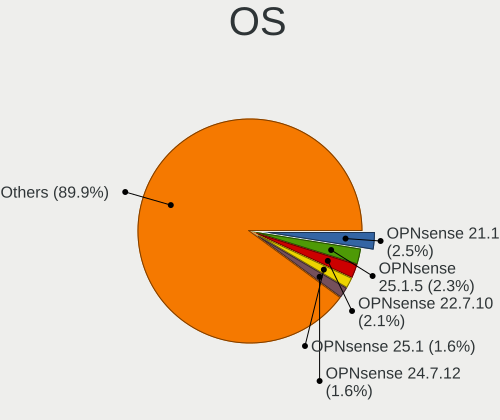

| Name              | Computers | Percent |
|-------------------|-----------|---------|
| OPNsense 21.1     | 11        | 2.52%   |
| OPNsense 25.1.5   | 10        | 2.29%   |
| OPNsense 22.7.10  | 9         | 2.06%   |
| OPNsense 25.1     | 7         | 1.6%    |
| OPNsense 24.7.12  | 7         | 1.6%    |
| OPNsense 24.1.9   | 7         | 1.6%    |
| OPNsense 25.7.3   | 6         | 1.37%   |
| OPNsense 25.7.2   | 6         | 1.37%   |
| OPNsense 25.1.6   | 6         | 1.37%   |
| OPNsense 25.1.3   | 6         | 1.37%   |
| OPNsense 24.7.11  | 6         | 1.37%   |
| OPNsense 24.1.4   | 6         | 1.37%   |
| OPNsense 24.1.10  | 6         | 1.37%   |
| OPNsense 23.7.9   | 6         | 1.37%   |
| OPNsense 23.7.10  | 6         | 1.37%   |
| OPNsense 23.1.11  | 6         | 1.37%   |
| OPNsense 21.7.7   | 6         | 1.37%   |
| OPNsense 21.1.3   | 6         | 1.37%   |
| OpenBSD 6.8       | 6         | 1.37%   |
| FreeBSD 14.2      | 6         | 1.37%   |
| OPNsense 25.7.6   | 5         | 1.14%   |
| OPNsense 25.7.1   | 5         | 1.14%   |
| OPNsense 24.1.1   | 5         | 1.14%   |
| OPNsense 24.1     | 5         | 1.14%   |
| OPNsense 21.1.5   | 5         | 1.14%   |
| OPNsense 21.1.2   | 5         | 1.14%   |
| OpenBSD 7.0       | 5         | 1.14%   |
| helloSystem 0.5.0 | 5         | 1.14%   |
| OPNsense 25.1.2   | 4         | 0.92%   |
| OPNsense 25.1.1   | 4         | 0.92%   |
| OPNsense 24.7.5   | 4         | 0.92%   |
| OPNsense 24.7.1   | 4         | 0.92%   |
| OPNsense 23.7.7   | 4         | 0.92%   |
| OPNsense 23.7.12  | 4         | 0.92%   |
| OPNsense 22.7.8   | 4         | 0.92%   |
| OPNsense 21.1.8   | 4         | 0.92%   |
| helloSystem 0.9.0 | 4         | 0.92%   |
| OPNsense 25.7.5   | 3         | 0.69%   |
| OPNsense 25.1.9   | 3         | 0.69%   |
| OPNsense 25.1.4   | 3         | 0.69%   |

OS Family
---------

OS without a version

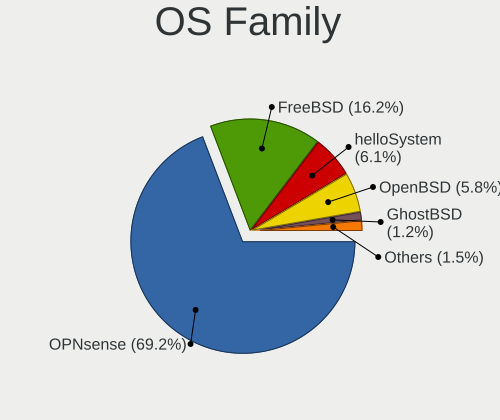

| Name        | Computers | Percent |
|-------------|-----------|---------|
| OPNsense    | 227       | 69.21%  |
| FreeBSD     | 53        | 16.16%  |
| helloSystem | 20        | 6.1%    |
| OpenBSD     | 19        | 5.79%   |
| GhostBSD    | 4         | 1.22%   |
| pfSense     | 1         | 0.3%    |
| NomadBSD    | 1         | 0.3%    |
| NetBSD      | 1         | 0.3%    |
| FuryBSD     | 1         | 0.3%    |
| ClonOS      | 1         | 0.3%    |

Arch
----

OS architecture (x86_64, i586, etc.)

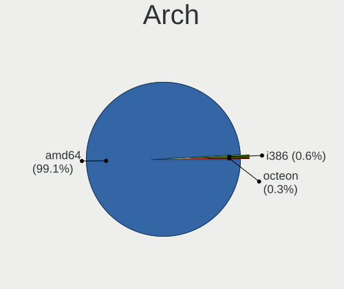

| Name   | Computers | Percent |
|--------|-----------|---------|
| amd64  | 325       | 99.09%  |
| i386   | 2         | 0.61%   |
| octeon | 1         | 0.3%    |

DE
--

Desktop Environment

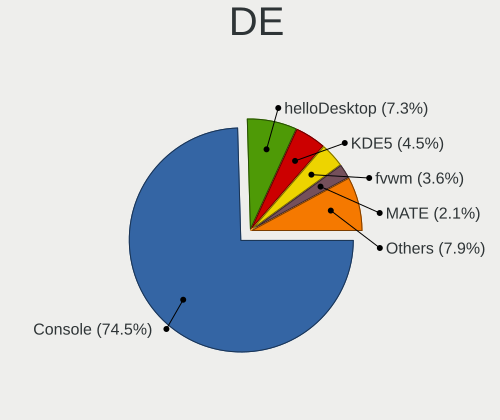

| Name         | Computers | Percent |
|--------------|-----------|---------|
| Console      | 246       | 74.55%  |
| helloDesktop | 24        | 7.27%   |
| KDE5         | 15        | 4.55%   |
| fvwm         | 12        | 3.64%   |
| MATE         | 7         | 2.12%   |
| XFCE         | 5         | 1.52%   |
| TWM          | 5         | 1.52%   |
| GNOME        | 5         | 1.52%   |
| i3           | 3         | 0.91%   |
| LXQt         | 2         | 0.61%   |
| xfwm         | 1         | 0.3%    |
| Openbox      | 1         | 0.3%    |
| Mutter       | 1         | 0.3%    |
| KDE6         | 1         | 0.3%    |
| Blackbox     | 1         | 0.3%    |
| AwesomeWM    | 1         | 0.3%    |

Display Server
--------------

X11 or Wayland

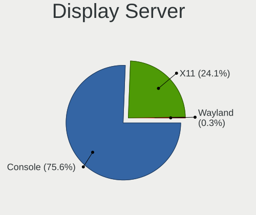

| Name    | Computers | Percent |
|---------|-----------|---------|
| Console | 248       | 75.61%  |
| X11     | 79        | 24.09%  |
| Wayland | 1         | 0.3%    |

Display Manager
---------------

SDDM, LightDM, etc.

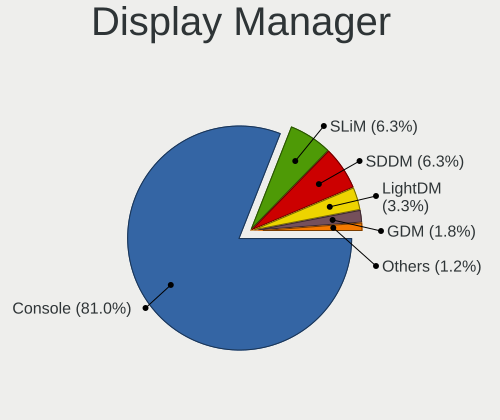

| Name    | Computers | Percent |
|---------|-----------|---------|
| Console | 268       | 80.97%  |
| SLiM    | 21        | 6.34%   |
| SDDM    | 21        | 6.34%   |
| LightDM | 11        | 3.32%   |
| GDM     | 6         | 1.81%   |
| XDM     | 4         | 1.21%   |

OS Lang
-------

Language

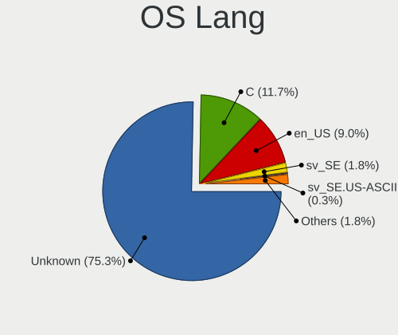

| Lang           | Computers | Percent |
|----------------|-----------|---------|
| Unknown        | 250       | 75.3%   |
| C              | 39        | 11.75%  |
| en_US          | 30        | 9.04%   |
| sv_SE          | 6         | 1.81%   |
| sv_SE.US-ASCII | 1         | 0.3%    |
| sv             | 1         | 0.3%    |
| en_GB          | 1         | 0.3%    |
| en_CA          | 1         | 0.3%    |
| en_BE          | 1         | 0.3%    |
| en             | 1         | 0.3%    |
| de_DE          | 1         | 0.3%    |

Boot Mode
---------

EFI or BIOS

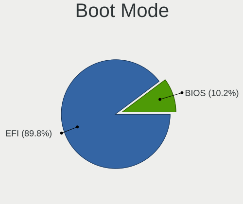

| Mode | Computers | Percent |
|------|-----------|---------|
| EFI  | 298       | 89.76%  |
| BIOS | 34        | 10.24%  |

Filesystem
----------

Type of filesystem

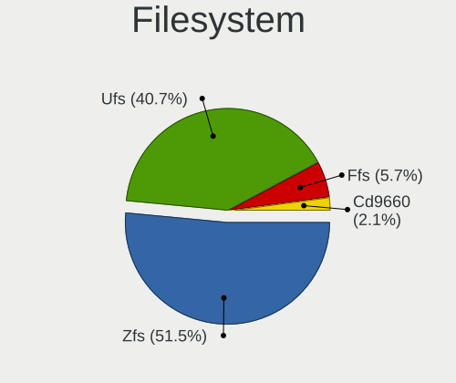

| Type   | Computers | Percent |
|--------|-----------|---------|
| Zfs    | 172       | 51.5%   |
| Ufs    | 136       | 40.72%  |
| Ffs    | 19        | 5.69%   |
| Cd9660 | 7         | 2.1%    |

Part. scheme
------------

Scheme of partitioning

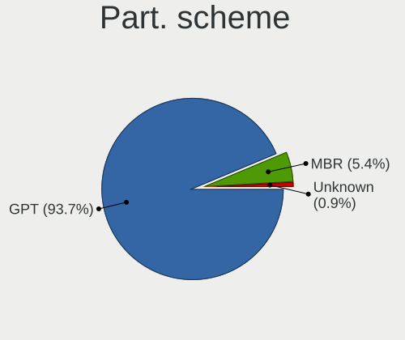

| Type    | Computers | Percent |
|---------|-----------|---------|
| GPT     | 312       | 93.69%  |
| MBR     | 18        | 5.41%   |
| Unknown | 3         | 0.9%    |

Board
-----

Vendor
------

Motherboard manufacturer

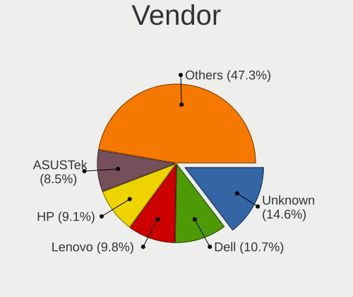

| Name                       | Computers | Percent |
|----------------------------|-----------|---------|
| Unknown                    | 48        | 14.63%  |
| Dell                       | 35        | 10.67%  |
| Lenovo                     | 32        | 9.76%   |
| Hewlett-Packard            | 30        | 9.15%   |
| ASUSTek Computer           | 28        | 8.54%   |
| Intel                      | 18        | 5.49%   |
| PC Engines                 | 17        | 5.18%   |
| Supermicro                 | 12        | 3.66%   |
| ASRock                     | 11        | 3.35%   |
| AMI                        | 10        | 3.05%   |
| MSI                        | 9         | 2.74%   |
| Gigabyte Technology        | 9         | 2.74%   |
| Fujitsu                    | 8         | 2.44%   |
| Apple                      | 7         | 2.13%   |
| Techvision                 | 4         | 1.22%   |
| Shuttle                    | 4         | 1.22%   |
| Deciso                     | 4         | 1.22%   |
| CWWK                       | 4         | 1.22%   |
| Microsoft                  | 3         | 0.91%   |
| Toshiba                    | 2         | 0.61%   |
| Star Labs                  | 2         | 0.61%   |
| HPE                        | 2         | 0.61%   |
| AZW                        | 2         | 0.61%   |
| AOpen                      | 2         | 0.61%   |
| ZOTAC                      | 1         | 0.3%    |
| Wistron                    | 1         | 0.3%    |
| TianBei                    | 1         | 0.3%    |
| Sony                       | 1         | 0.3%    |
| SLIMBOOK                   | 1         | 0.3%    |
| SJRC                       | 1         | 0.3%    |
| ShenZhen MinWin Technology | 1         | 0.3%    |
| Razer                      | 1         | 0.3%    |
| Protectli                  | 1         | 0.3%    |
| Pegatron                   | 1         | 0.3%    |
| Legend QDI                 | 1         | 0.3%    |
| IceWhale Technology        | 1         | 0.3%    |
| IBM                        | 1         | 0.3%    |
| Google                     | 1         | 0.3%    |
| Fujitsu Siemens            | 1         | 0.3%    |
| Framework                  | 1         | 0.3%    |

Model
-----

Motherboard model

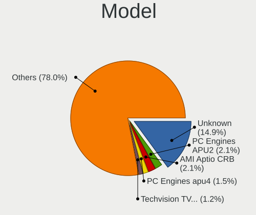

| Name                       | Computers | Percent |
|----------------------------|-----------|---------|
| Unknown                    | 49        | 14.94%  |
| PC Engines APU2            | 7         | 2.13%   |
| AMI Aptio CRB              | 7         | 2.13%   |
| PC Engines apu4            | 5         | 1.52%   |
| Techvision TVI7309X        | 4         | 1.22%   |
| Supermicro Super Server    | 4         | 1.22%   |
| HP EliteDesk 800 G2 SFF    | 4         | 1.22%   |
| HP EliteDesk 800 G1 SFF    | 4         | 1.22%   |
| Intel Q3XXG4-P V1.0        | 3         | 0.91%   |
| Intel D54250WYK H13922-303 | 3         | 0.91%   |
| Intel CRESCENTBAY          | 3         | 0.91%   |
| HP t730 Thin Client        | 3         | 0.91%   |
| Dell OptiPlex 3070         | 3         | 0.91%   |
| ASUS All Series            | 3         | 0.91%   |
| Supermicro X10SLL-F        | 2         | 0.61%   |
| Supermicro A1SAi           | 2         | 0.61%   |
| Star Labs StarBook         | 2         | 0.61%   |
| PC Engines apu6            | 2         | 0.61%   |
| PC Engines APU3            | 2         | 0.61%   |
| Microsoft Surface Pro 7    | 2         | 0.61%   |
| HP EliteDesk 800 G3 SFF    | 2         | 0.61%   |
| Dell PowerEdge R610        | 2         | 0.61%   |
| Dell PowerEdge R210 II     | 2         | 0.61%   |
| Dell PowerEdge R210        | 2         | 0.61%   |
| Dell OptiPlex 9020         | 2         | 0.61%   |
| Dell OptiPlex 7060         | 2         | 0.61%   |
| Dell OptiPlex 7040         | 2         | 0.61%   |
| Dell OptiPlex 7010         | 2         | 0.61%   |
| CWWK CW-AD4L-N V1          | 2         | 0.61%   |
| ASUS P5Q DELUXE            | 2         | 0.61%   |
| ASRock N100DC-ITX          | 2         | 0.61%   |
| AOpen DE3250               | 2         | 0.61%   |
| ZOTAC ZBOX-CI329NANO       | 1         | 0.3%    |
| Wistron ProLiant ML110 G6  | 1         | 0.3%    |
| Toshiba TECRA Z40-C-12Z    | 1         | 0.3%    |
| Toshiba Satellite L450     | 1         | 0.3%    |
| TianBei N1 PRO             | 1         | 0.3%    |
| Supermicro X10SLH-N6-ST031 | 1         | 0.3%    |
| Supermicro X10SBA-L        | 1         | 0.3%    |
| Supermicro SYS-1019S-MP    | 1         | 0.3%    |

Model Family
------------

Motherboard model prefix

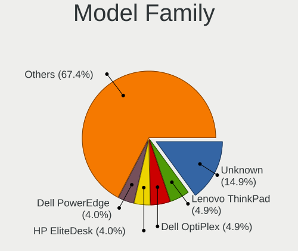

| Name                 | Computers | Percent |
|----------------------|-----------|---------|
| Unknown              | 49        | 14.94%  |
| Lenovo ThinkPad      | 16        | 4.88%   |
| Dell OptiPlex        | 16        | 4.88%   |
| HP EliteDesk         | 13        | 3.96%   |
| Dell PowerEdge       | 13        | 3.96%   |
| Lenovo ThinkCentre   | 8         | 2.44%   |
| PC Engines APU2      | 7         | 2.13%   |
| AMI Aptio            | 7         | 2.13%   |
| PC Engines apu4      | 5         | 1.52%   |
| HP ProLiant          | 5         | 1.52%   |
| Dell Latitude        | 5         | 1.52%   |
| Techvision TVI7309X  | 4         | 1.22%   |
| Supermicro Super     | 4         | 1.22%   |
| Lenovo IdeaPad       | 4         | 1.22%   |
| Microsoft Surface    | 3         | 0.91%   |
| Intel Q3XXG4-P       | 3         | 0.91%   |
| Intel D54250WYK      | 3         | 0.91%   |
| Intel CRESCENTBAY    | 3         | 0.91%   |
| HP t730              | 3         | 0.91%   |
| Fujitsu ESPRIMO      | 3         | 0.91%   |
| ASUS ROG             | 3         | 0.91%   |
| ASUS Pro             | 3         | 0.91%   |
| ASUS All             | 3         | 0.91%   |
| Supermicro X10SLL-F  | 2         | 0.61%   |
| Supermicro A1SAi     | 2         | 0.61%   |
| Star Labs StarBook   | 2         | 0.61%   |
| PC Engines apu6      | 2         | 0.61%   |
| PC Engines APU3      | 2         | 0.61%   |
| Intel NUC5CPYB       | 2         | 0.61%   |
| HPE ProLiant         | 2         | 0.61%   |
| HP Pavilion          | 2         | 0.61%   |
| Deciso Netboard      | 2         | 0.61%   |
| CWWK CW-AD4L-N       | 2         | 0.61%   |
| ASUS PRIME           | 2         | 0.61%   |
| ASUS P5Q             | 2         | 0.61%   |
| ASRock N100DC-ITX    | 2         | 0.61%   |
| AOpen DE3250         | 2         | 0.61%   |
| ZOTAC ZBOX-CI329NANO | 1         | 0.3%    |
| Wistron ProLiant     | 1         | 0.3%    |
| Toshiba TECRA        | 1         | 0.3%    |

MFG Year
--------

Motherboard manufacture year

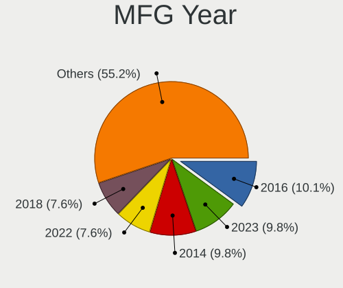

| Year    | Computers | Percent |
|---------|-----------|---------|
| 2016    | 33        | 10.06%  |
| 2023    | 32        | 9.76%   |
| 2014    | 32        | 9.76%   |
| 2022    | 25        | 7.62%   |
| 2018    | 25        | 7.62%   |
| 2020    | 23        | 7.01%   |
| 2017    | 22        | 6.71%   |
| 2019    | 19        | 5.79%   |
| 2021    | 18        | 5.49%   |
| 2024    | 17        | 5.18%   |
| 2015    | 15        | 4.57%   |
| 2010    | 13        | 3.96%   |
| 2012    | 12        | 3.66%   |
| 2011    | 12        | 3.66%   |
| 2013    | 11        | 3.35%   |
| 2009    | 8         | 2.44%   |
| 2025    | 5         | 1.52%   |
| 2008    | 1         | 0.3%    |
| 2007    | 1         | 0.3%    |
| 2006    | 1         | 0.3%    |
| 2002    | 1         | 0.3%    |
| 2000    | 1         | 0.3%    |
| Unknown | 1         | 0.3%    |

Form Factor
-----------

Physical design of the computer

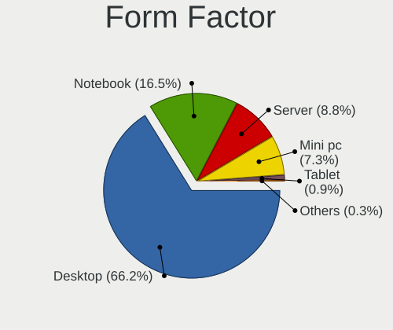

| Name       | Computers | Percent |
|------------|-----------|---------|
| Desktop    | 217       | 66.16%  |
| Notebook   | 54        | 16.46%  |
| Server     | 29        | 8.84%   |
| Mini pc    | 24        | 7.32%   |
| Tablet     | 3         | 0.91%   |
| All in one | 1         | 0.3%    |

Coreboot
--------

Have coreboot on board

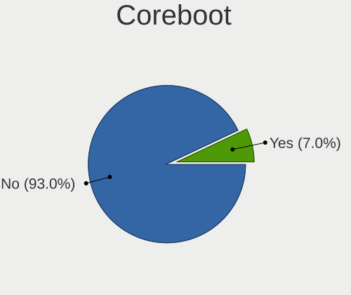

| Used | Computers | Percent |
|------|-----------|---------|
| No   | 305       | 92.99%  |
| Yes  | 23        | 7.01%   |

RAM Size
--------

Total RAM memory

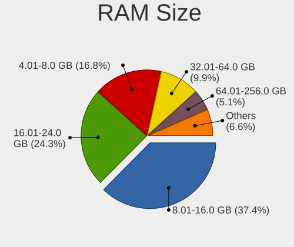

| Size in GB      | Computers | Percent |
|-----------------|-----------|---------|
| 8.01-16.0       | 125       | 37.43%  |
| 16.01-24.0      | 81        | 24.25%  |
| 4.01-8.0        | 56        | 16.77%  |
| 32.01-64.0      | 33        | 9.88%   |
| 64.01-256.0     | 17        | 5.09%   |
| 24.01-32.0      | 8         | 2.4%    |
| 2.01-3.0        | 7         | 2.1%    |
| More than 256.0 | 3         | 0.9%    |
| 3.01-4.0        | 2         | 0.6%    |
| 1.01-2.0        | 1         | 0.3%    |
| 0.01-0.5        | 1         | 0.3%    |

RAM Used
--------

Used RAM memory

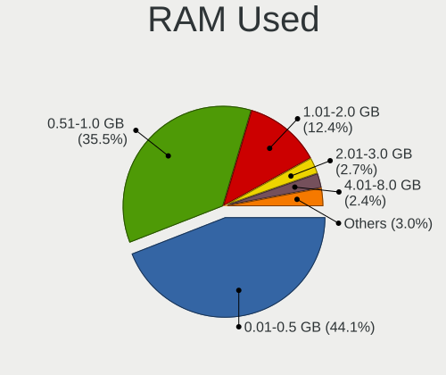

| Used GB     | Computers | Percent |
|-------------|-----------|---------|
| 0.01-0.5    | 149       | 44.08%  |
| 0.51-1.0    | 120       | 35.5%   |
| 1.01-2.0    | 42        | 12.43%  |
| 2.01-3.0    | 9         | 2.66%   |
| 4.01-8.0    | 8         | 2.37%   |
| 3.01-4.0    | 3         | 0.89%   |
| 24.01-32.0  | 2         | 0.59%   |
| 64.01-256.0 | 2         | 0.59%   |
| 32.01-64.0  | 1         | 0.3%    |
| 0           | 1         | 0.3%    |
| Unknown     | 1         | 0.3%    |

Total Drives
------------

Number of drives on board

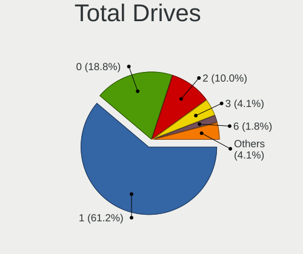

| Drives | Computers | Percent |
|--------|-----------|---------|
| 1      | 208       | 61.18%  |
| 0      | 64        | 18.82%  |
| 2      | 34        | 10%     |
| 3      | 14        | 4.12%   |
| 6      | 6         | 1.76%   |
| 4      | 4         | 1.18%   |
| 11     | 2         | 0.59%   |
| 8      | 2         | 0.59%   |
| 5      | 2         | 0.59%   |
| 18     | 1         | 0.29%   |
| 12     | 1         | 0.29%   |
| 10     | 1         | 0.29%   |
| 9      | 1         | 0.29%   |

Has CD-ROM
----------

Has CD-ROM on board

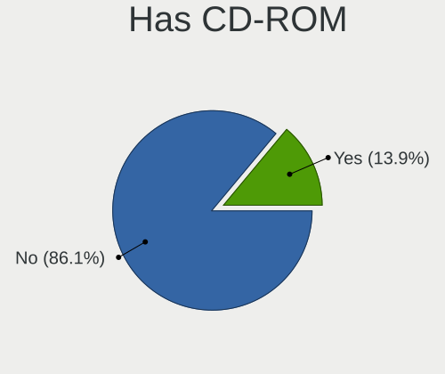

| Presented | Computers | Percent |
|-----------|-----------|---------|
| No        | 284       | 86.06%  |
| Yes       | 46        | 13.94%  |

Has Ethernet
------------

Has Ethernet on board

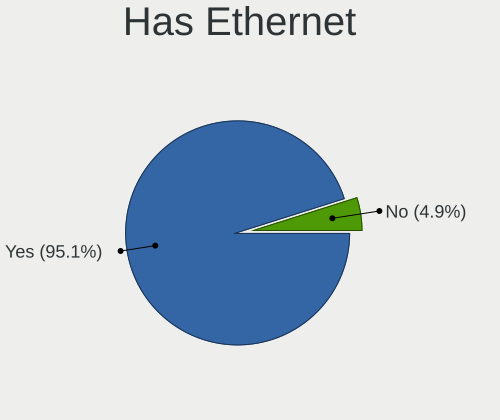

| Presented | Computers | Percent |
|-----------|-----------|---------|
| Yes       | 312       | 95.12%  |
| No        | 16        | 4.88%   |

Has WiFi
--------

Has WiFi module

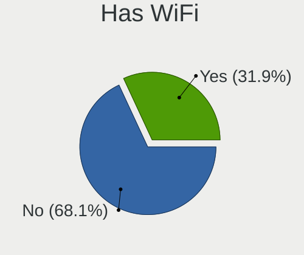

| Presented | Computers | Percent |
|-----------|-----------|---------|
| No        | 224       | 68.09%  |
| Yes       | 105       | 31.91%  |

Has Bluetooth
-------------

Has Bluetooth module

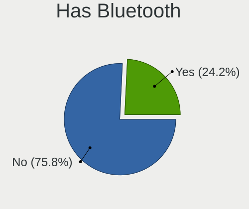

| Presented | Computers | Percent |
|-----------|-----------|---------|
| No        | 250       | 75.76%  |
| Yes       | 80        | 24.24%  |

Location
--------

Country
-------

Geographic location (country)

| Country | Computers | Percent |
|---------|-----------|---------|
| Sweden  | 328       | 100%    |

City
----

Geographic location (city)

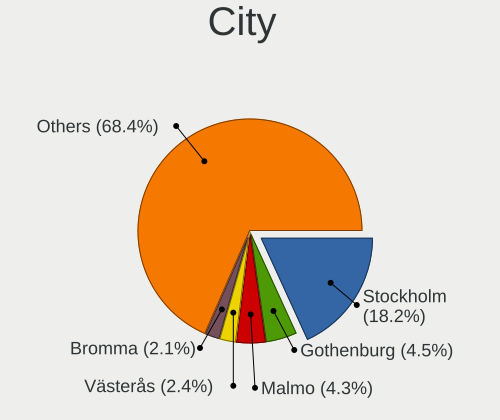

| City            | Computers | Percent |
|-----------------|-----------|---------|
| Stockholm       | 68        | 18.18%  |
| Gothenburg      | 17        | 4.55%   |
| Malmo           | 16        | 4.28%   |
| Västerås      | 9         | 2.41%   |
| Bromma          | 8         | 2.14%   |
| Sollentuna      | 6         | 1.6%    |
| Sundbyberg      | 5         | 1.34%   |
| Linköping    | 5         | 1.34%   |
| Linköping      | 5         | 1.34%   |
| Västerås  | 4         | 1.07%   |
| Uppsala         | 4         | 1.07%   |
| UmeГҐ         | 4         | 1.07%   |
| Umeå           | 4         | 1.07%   |
| Solna           | 4         | 1.07%   |
| Skellefteå     | 4         | 1.07%   |
| Piteå          | 4         | 1.07%   |
| Östersund      | 4         | 1.07%   |
| Moelndal        | 4         | 1.07%   |
| Lund            | 4         | 1.07%   |
| Karlskrona      | 4         | 1.07%   |
| Henan           | 4         | 1.07%   |
| Gävle          | 4         | 1.07%   |
| Vaxjo           | 3         | 0.8%    |
| Upplands Vasby  | 3         | 0.8%    |
| Taby            | 3         | 0.8%    |
| Skövde         | 3         | 0.8%    |
| Örebro         | 3         | 0.8%    |
| Norrköping     | 3         | 0.8%    |
| Jönköping | 3         | 0.8%    |
| Jönköping     | 3         | 0.8%    |
| Holmsund        | 3         | 0.8%    |
| Helsingborg     | 3         | 0.8%    |
| Falkenberg      | 3         | 0.8%    |
| Bandhagen       | 3         | 0.8%    |
| Alta            | 3         | 0.8%    |
| Ystad           | 2         | 0.53%   |
| Vallingby       | 2         | 0.53%   |
| Ulricehamn      | 2         | 0.53%   |
| Tyreso Strand   | 2         | 0.53%   |
| Tumba           | 2         | 0.53%   |

Drives
------

Drive Vendor
------------

Hard drive vendors

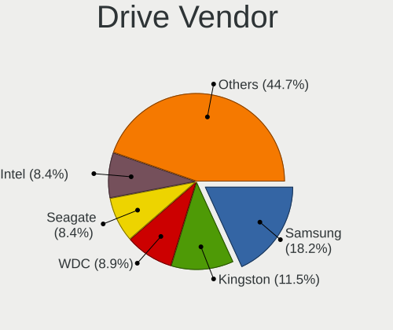

| Vendor              | Computers | Drives | Percent |
|---------------------|-----------|--------|---------|
| Samsung Electronics | 63        | 92     | 18.16%  |
| Kingston            | 40        | 58     | 11.53%  |
| WDC                 | 31        | 51     | 8.93%   |
| Seagate             | 29        | 70     | 8.36%   |
| Intel               | 29        | 48     | 8.36%   |
| Hoodisk             | 17        | 27     | 4.9%    |
| SanDisk             | 16        | 20     | 4.61%   |
| Toshiba             | 13        | 25     | 3.75%   |
| Crucial             | 11        | 22     | 3.17%   |
| China               | 9         | 14     | 2.59%   |
| NVMe                | 6         | 7      | 1.73%   |
| Micron Technology   | 6         | 11     | 1.73%   |
| Transcend           | 5         | 6      | 1.44%   |
| PNY                 | 5         | 7      | 1.44%   |
| Phison              | 5         | 5      | 1.44%   |
| LITEON              | 5         | 15     | 1.44%   |
| Hitachi             | 5         | 6      | 1.44%   |
| Apple               | 5         | 6      | 1.44%   |
| OCZ                 | 4         | 8      | 1.15%   |
| Hewlett-Packard     | 4         | 8      | 1.15%   |
| HGST                | 3         | 6      | 0.86%   |
| Corsair             | 3         | 3      | 0.86%   |
| Apacer              | 3         | 3      | 0.86%   |
| SK hynix            | 2         | 2      | 0.58%   |
| Innodisk            | 2         | 3      | 0.58%   |
| HPE                 | 2         | 14     | 0.58%   |
| Fanxiang            | 2         | 4      | 0.58%   |
| A-DATA Technology   | 2         | 2      | 0.58%   |
| YANSEN              | 1         | 1      | 0.29%   |
| XrayDisk            | 1         | 1      | 0.29%   |
| TCSUNBOW            | 1         | 1      | 0.29%   |
| Supermicro          | 1         | 1      | 0.29%   |
| Star Drive          | 1         | 1      | 0.29%   |
| Silicon Motion      | 1         | 1      | 0.29%   |
| OWC                 | 1         | 1      | 0.29%   |
| MARVELL             | 1         | 2      | 0.29%   |
| Mach Xtreme         | 1         | 1      | 0.29%   |
| LITEONIT            | 1         | 1      | 0.29%   |
| KingSpec            | 1         | 1      | 0.29%   |
| Kimtigo             | 1         | 1      | 0.29%   |

Drive Model
-----------

Hard drive models

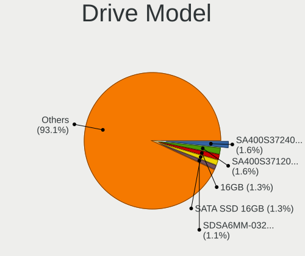

| Model                                | Computers | Percent |
|--------------------------------------|-----------|---------|
| Kingston SA400S37240G 240GB          | 6         | 1.6%    |
| Kingston SA400S37120G 120GB          | 6         | 1.6%    |
| Hoodisk SSD 16GB                     | 5         | 1.33%   |
| China SATA SSD 16GB                  | 5         | 1.33%   |
| SanDisk SDSA6MM-032G-1006 32GB       | 4         | 1.06%   |
| Samsung SSD 840 EVO 120GB            | 4         | 1.06%   |
| Kingston SV300S37A120G 120GB         | 4         | 1.06%   |
| Intel SSDSC2BW240A4 240GB            | 4         | 1.06%   |
| Intel SSDSC2BF180A4H 180GB           | 4         | 1.06%   |
| Hoodisk SSD 64GB                     | 4         | 1.06%   |
| Hoodisk SSD 128GB                    | 4         | 1.06%   |
| Samsung SSD PM830 2.5-inch 7mm 128GB | 3         | 0.8%    |
| Samsung SSD 870 EVO 2TB              | 3         | 0.8%    |
| Samsung SSD 870 EVO 250GB            | 3         | 0.8%    |
| Samsung SSD 860 QVO 1TB              | 3         | 0.8%    |
| Samsung SSD 860 EVO 250GB            | 3         | 0.8%    |
| Phison YSO128GTLCW-E3C-2 128GB       | 3         | 0.8%    |
| Kingston SKC600512G 512GB            | 3         | 0.8%    |
| Hoodisk SSD 32GB                     | 3         | 0.8%    |
| WDC WD5000AZLX-60K2TA0 500GB         | 2         | 0.53%   |
| WDC WD20PURZ-85GU6Y0 2TB             | 2         | 0.53%   |
| Toshiba HDWR51GUZSVB 16TB            | 2         | 0.53%   |
| Toshiba HDWR11A 10TB                 | 2         | 0.53%   |
| Toshiba HDWQ140 4TB                  | 2         | 0.53%   |
| Toshiba DT01ACA100 1TB               | 2         | 0.53%   |
| Seagate ST9320423AS 320GB            | 2         | 0.53%   |
| Seagate ST4000DM004-2CV104 4TB       | 2         | 0.53%   |
| Seagate ST2000DM008-2FR102 2TB       | 2         | 0.53%   |
| Seagate ST1000DM010-2EP102 1TB       | 2         | 0.53%   |
| Seagate ST1000DM003-1ER162 1TB       | 2         | 0.53%   |
| SanDisk SSD PLUS 120GB               | 2         | 0.53%   |
| SanDisk SDSSDHP256G 256GB            | 2         | 0.53%   |
| Samsung SSD 970 EVO Plus 500GB       | 2         | 0.53%   |
| Samsung SSD 970 EVO 500GB            | 2         | 0.53%   |
| Samsung SSD 850 EVO 250GB            | 2         | 0.53%   |
| Samsung SSD 850 EVO 1TB              | 2         | 0.53%   |
| Samsung MZ7TY128HDHP-000L1 128GB     | 2         | 0.53%   |
| Samsung HD501LJ 500GB                | 2         | 0.53%   |
| PNY 250GB SATA SSD                   | 2         | 0.53%   |
| Phison SATA SSD 16GB                 | 2         | 0.53%   |

HDD Vendor
----------

Hard disk drive vendors

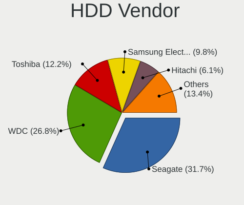

| Vendor              | Computers | Drives | Percent |
|---------------------|-----------|--------|---------|
| Seagate             | 26        | 65     | 31.71%  |
| WDC                 | 22        | 38     | 26.83%  |
| Toshiba             | 10        | 21     | 12.2%   |
| Samsung Electronics | 8         | 14     | 9.76%   |
| Hitachi             | 5         | 6      | 6.1%    |
| NVMe                | 3         | 4      | 3.66%   |
| HGST                | 3         | 6      | 3.66%   |
| Hewlett-Packard     | 2         | 6      | 2.44%   |
| Apple               | 2         | 2      | 2.44%   |
| HPE                 | 1         | 8      | 1.22%   |

SSD Vendor
----------

Solid state drive vendors

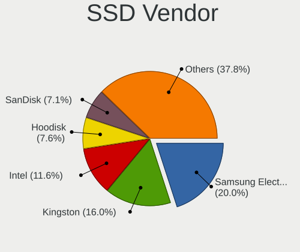

| Vendor              | Computers | Drives | Percent |
|---------------------|-----------|--------|---------|
| Samsung Electronics | 45        | 62     | 20%     |
| Kingston            | 36        | 53     | 16%     |
| Intel               | 26        | 44     | 11.56%  |
| Hoodisk             | 17        | 27     | 7.56%   |
| SanDisk             | 16        | 20     | 7.11%   |
| Crucial             | 9         | 20     | 4%      |
| China               | 9         | 14     | 4%      |
| Micron Technology   | 6         | 11     | 2.67%   |
| WDC                 | 5         | 9      | 2.22%   |
| PNY                 | 5         | 7      | 2.22%   |
| LITEON              | 5         | 15     | 2.22%   |
| OCZ                 | 4         | 8      | 1.78%   |
| Transcend           | 3         | 4      | 1.33%   |
| Toshiba             | 3         | 4      | 1.33%   |
| NVMe                | 3         | 3      | 1.33%   |
| Apple               | 3         | 4      | 1.33%   |
| Apacer              | 3         | 3      | 1.33%   |
| SK hynix            | 2         | 2      | 0.89%   |
| Seagate             | 2         | 2      | 0.89%   |
| Phison              | 2         | 2      | 0.89%   |
| Innodisk            | 2         | 3      | 0.89%   |
| Hewlett-Packard     | 2         | 2      | 0.89%   |
| Corsair             | 2         | 2      | 0.89%   |
| YANSEN              | 1         | 1      | 0.44%   |
| XrayDisk            | 1         | 1      | 0.44%   |
| TCSUNBOW            | 1         | 1      | 0.44%   |
| Supermicro          | 1         | 1      | 0.44%   |
| OWC                 | 1         | 1      | 0.44%   |
| MARVELL             | 1         | 2      | 0.44%   |
| Mach Xtreme         | 1         | 1      | 0.44%   |
| LITEONIT            | 1         | 1      | 0.44%   |
| KingSpec            | 1         | 1      | 0.44%   |
| HPE                 | 1         | 6      | 0.44%   |
| Fordisk             | 1         | 1      | 0.44%   |
| Dogfish             | 1         | 1      | 0.44%   |
| Dell                | 1         | 2      | 0.44%   |
| ATP                 | 1         | 1      | 0.44%   |
| ASint Technology    | 1         | 1      | 0.44%   |

Drive Kind
----------

HDD or SSD

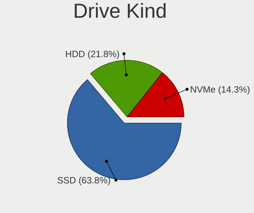

| Kind | Computers | Drives | Percent |
|------|-----------|--------|---------|
| SSD  | 196       | 343    | 63.84%  |
| HDD  | 67        | 170    | 21.82%  |
| NVMe | 44        | 53     | 14.33%  |

Drive Connector
---------------

SATA, SAS, NVMe, etc.

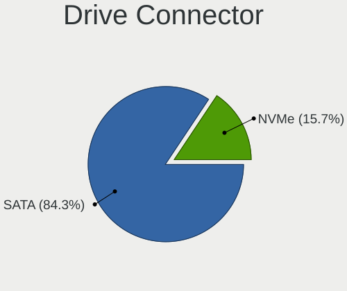

| Type | Computers | Drives | Percent |
|------|-----------|--------|---------|
| SATA | 237       | 513    | 84.34%  |
| NVMe | 44        | 53     | 15.66%  |

Drive Size
----------

Size of hard drive

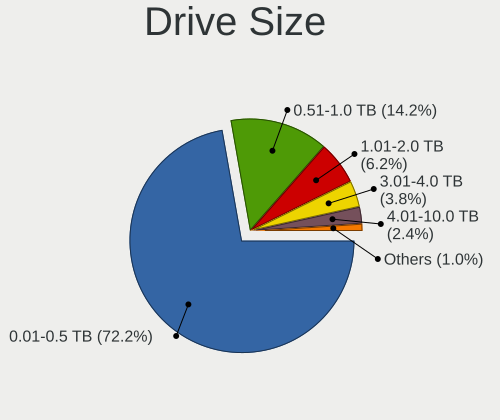

| Size in TB | Computers | Drives | Percent |
|------------|-----------|--------|---------|
| 0.01-0.5   | 208       | 348    | 72.22%  |
| 0.51-1.0   | 41        | 66     | 14.24%  |
| 1.01-2.0   | 18        | 38     | 6.25%   |
| 3.01-4.0   | 11        | 32     | 3.82%   |
| 4.01-10.0  | 7         | 24     | 2.43%   |
| 10.01-20.0 | 2         | 4      | 0.69%   |
| 2.01-3.0   | 1         | 1      | 0.35%   |

Space Total
-----------

Amount of disk space available on the file system

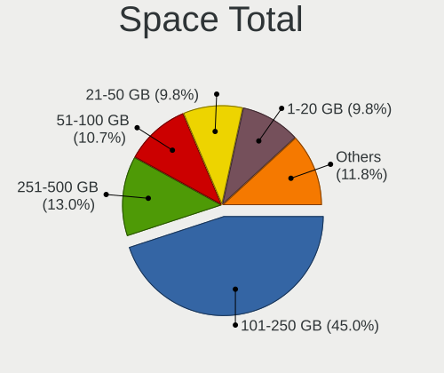

| Size in GB     | Computers | Percent |
|----------------|-----------|---------|
| 101-250        | 152       | 44.97%  |
| 251-500        | 44        | 13.02%  |
| 51-100         | 36        | 10.65%  |
| 21-50          | 33        | 9.76%   |
| 1-20           | 33        | 9.76%   |
| 501-1000       | 28        | 8.28%   |
| 1001-2000      | 8         | 2.37%   |
| More than 3000 | 4         | 1.18%   |

Space Used
----------

Amount of used disk space

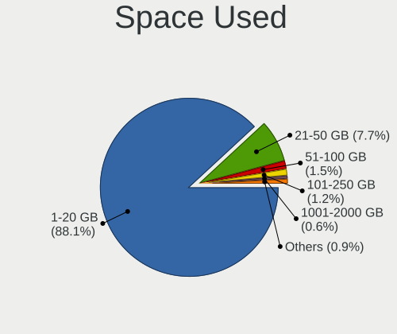

| Used GB        | Computers | Percent |
|----------------|-----------|---------|
| 1-20           | 297       | 88.13%  |
| 21-50          | 26        | 7.72%   |
| 51-100         | 5         | 1.48%   |
| 101-250        | 4         | 1.19%   |
| 251-500        | 2         | 0.59%   |
| 1001-2000      | 2         | 0.59%   |
| More than 3000 | 1         | 0.3%    |

Malfunc. Drives
---------------

Drive models with a malfunction

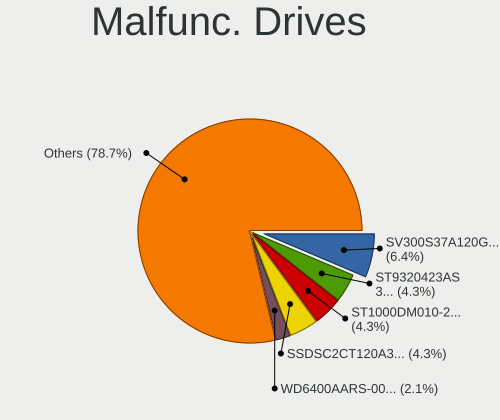

| Model                                        | Computers | Drives | Percent |
|----------------------------------------------|-----------|--------|---------|
| Kingston SV300S37A120G 120GB                 | 3         | 3      | 6.38%   |
| Seagate ST9320423AS 320GB                    | 2         | 2      | 4.26%   |
| Seagate ST1000DM010-2EP102 1TB               | 2         | 6      | 4.26%   |
| Intel SSDSC2CT120A3 120GB                    | 2         | 2      | 4.26%   |
| WDC WD6400AARS-00Y5B1 640GB                  | 1         | 1      | 2.13%   |
| WDC WD40EFRX-68N32N0 4TB                     | 1         | 2      | 2.13%   |
| WDC WD2500AAJS-60B4A0 250GB                  | 1         | 2      | 2.13%   |
| WDC WD20EFRX-68EUZN0 1TB                     | 1         | 2      | 2.13%   |
| WDC WD20EARX-00ZUDB0 2TB                     | 1         | 1      | 2.13%   |
| WDC WD2002FYPS-02W3B0 2TB                    | 1         | 1      | 2.13%   |
| WDC WD15EARS-00Z5B1 1.5TB                    | 1         | 1      | 2.13%   |
| WDC WD15EARS-00MVWB0 1.5TB                   | 1         | 1      | 2.13%   |
| WDC WD10EAVS-00D7B0 1TB                      | 1         | 1      | 2.13%   |
| Toshiba KSG60ZMV256G M.2 2280 256GB          | 1         | 1      | 2.13%   |
| SK hynix HFS128G32MND-2200A 128GB            | 1         | 1      | 2.13%   |
| Seagate ST9640320AS 640GB                    | 1         | 1      | 2.13%   |
| Seagate ST9500420AS 500GB                    | 1         | 1      | 2.13%   |
| Seagate ST9320421AS 320GB                    | 1         | 1      | 2.13%   |
| Seagate ST8000AS0002-1NA17Z 8TB              | 1         | 1      | 2.13%   |
| Seagate ST750LM022 HN-M750MBB 752GB          | 1         | 1      | 2.13%   |
| Seagate ST3000DM001-1ER166 3TB               | 1         | 1      | 2.13%   |
| Seagate ST2000DM008-2FR102 2TB               | 1         | 1      | 2.13%   |
| Seagate ST100FN0021 100GB                    | 1         | 1      | 2.13%   |
| Seagate ST1000LM049-2GH172 1TB               | 1         | 1      | 2.13%   |
| Seagate ST1000DM003-1ER162 1TB               | 1         | 1      | 2.13%   |
| Samsung Electronics SSD 970 EVO 500GB        | 1         | 1      | 2.13%   |
| Samsung Electronics SSD 850 PRO 256GB        | 1         | 1      | 2.13%   |
| Samsung Electronics MZNTE128HMGR-000SO 128GB | 1         | 1      | 2.13%   |
| Samsung Electronics MZ7TE256HMHP-000L7 256GB | 1         | 1      | 2.13%   |
| Samsung Electronics HM250JI 250GB            | 1         | 3      | 2.13%   |
| Samsung Electronics HD321KJ 320GB            | 1         | 1      | 2.13%   |
| OCZ AGILITY3 120GB                           | 1         | 2      | 2.13%   |
| Kingston SMS200S3120G 120GB                  | 1         | 1      | 2.13%   |
| Kingston SA400S37240G 240GB                  | 1         | 1      | 2.13%   |
| Intel SSDSC2KF128G8 SATA 128GB               | 1         | 1      | 2.13%   |
| Intel SSDSC2CT060A3 64GB                     | 1         | 2      | 2.13%   |
| Intel SSDSC2BF180A4H 180GB                   | 1         | 1      | 2.13%   |
| Intel SSDSC2BA400G4 400GB                    | 1         | 1      | 2.13%   |
| Intel SSDSA2M160G2GC 160GB                   | 1         | 2      | 2.13%   |
| Intel SSDSA2M080G2GC 80GB                    | 1         | 1      | 2.13%   |

Malfunc. Drive Vendor
---------------------

Vendors of faulty drives

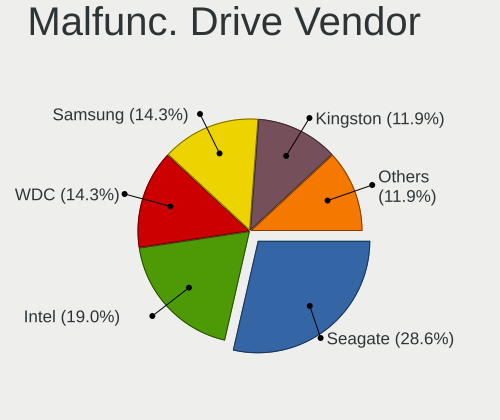

| Vendor              | Computers | Drives | Percent |
|---------------------|-----------|--------|---------|
| Seagate             | 12        | 18     | 28.57%  |
| Intel               | 8         | 10     | 19.05%  |
| WDC                 | 6         | 12     | 14.29%  |
| Samsung Electronics | 6         | 8      | 14.29%  |
| Kingston            | 5         | 5      | 11.9%   |
| Hitachi             | 2         | 3      | 4.76%   |
| Toshiba             | 1         | 1      | 2.38%   |
| SK hynix            | 1         | 1      | 2.38%   |
| OCZ                 | 1         | 2      | 2.38%   |

Malfunc. HDD Vendor
-------------------

Vendors of faulty HDD drives

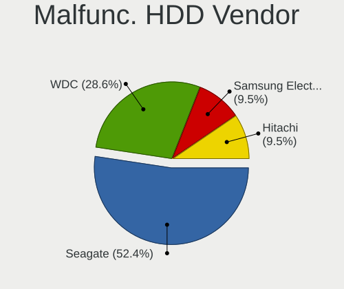

| Vendor              | Computers | Drives | Percent |
|---------------------|-----------|--------|---------|
| Seagate             | 11        | 17     | 52.38%  |
| WDC                 | 6         | 12     | 28.57%  |
| Samsung Electronics | 2         | 4      | 9.52%   |
| Hitachi             | 2         | 3      | 9.52%   |

Malfunc. Drive Kind
-------------------

Kinds of faulty drives

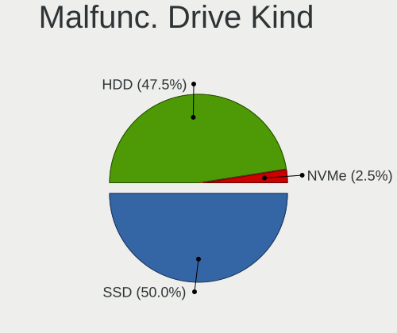

| Kind | Computers | Drives | Percent |
|------|-----------|--------|---------|
| SSD  | 20        | 23     | 50%     |
| HDD  | 19        | 36     | 47.5%   |
| NVMe | 1         | 1      | 2.5%    |

Failed Drives
-------------

Failed drive models

Zero info for selected period =(

Failed Drive Vendor
-------------------

Failed drive vendors

Zero info for selected period =(

Drive Status
------------

Number of failed and malfunc. drives

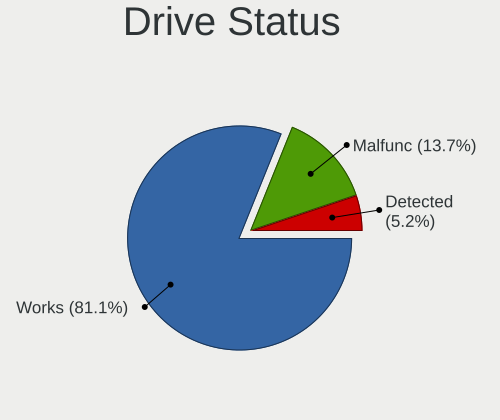

| Status   | Computers | Drives | Percent |
|----------|-----------|--------|---------|
| Works    | 236       | 483    | 81.1%   |
| Malfunc  | 40        | 60     | 13.75%  |
| Detected | 15        | 23     | 5.15%   |

Storage controller
------------------

Storage Vendor
--------------

Storage controller vendors

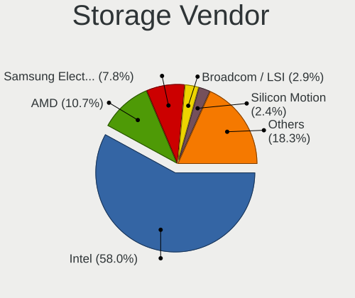

| Vendor                         | Computers | Percent |
|--------------------------------|-----------|---------|
| Intel                          | 244       | 57.96%  |
| AMD                            | 45        | 10.69%  |
| Samsung Electronics            | 33        | 7.84%   |
| Broadcom / LSI                 | 12        | 2.85%   |
| Silicon Motion                 | 10        | 2.38%   |
| Phison Electronics             | 10        | 2.38%   |
| Kingston Technology Company    | 10        | 2.38%   |
| Marvell Technology Group       | 9         | 2.14%   |
| Sandisk                        | 7         | 1.66%   |
| ASMedia Technology             | 6         | 1.43%   |
| Shenzhen Longsys Electronics   | 4         | 0.95%   |
| Hewlett-Packard                | 4         | 0.95%   |
| VIA Technologies               | 2         | 0.48%   |
| Transcend                      | 2         | 0.48%   |
| Seagate Technology             | 2         | 0.48%   |
| Realtek Semiconductor          | 2         | 0.48%   |
| Nvidia                         | 2         | 0.48%   |
| Micron/Crucial Technology      | 2         | 0.48%   |
| KIOXIA                         | 2         | 0.48%   |
| Adaptec                        | 2         | 0.48%   |
| Yangtze Memory Technologies    | 1         | 0.24%   |
| Toshiba                        | 1         | 0.24%   |
| Solid State Storage Technology | 1         | 0.24%   |
| Micron Technology              | 1         | 0.24%   |
| MAXIO Technology (Hangzhou)    | 1         | 0.24%   |
| JMicron Technology             | 1         | 0.24%   |
| Integrated Technology Express  | 1         | 0.24%   |
| INNOGRIT                       | 1         | 0.24%   |
| Dell                           | 1         | 0.24%   |
| ADATA Technology               | 1         | 0.24%   |
| 3ware                          | 1         | 0.24%   |

Storage Model
-------------

Storage controller models

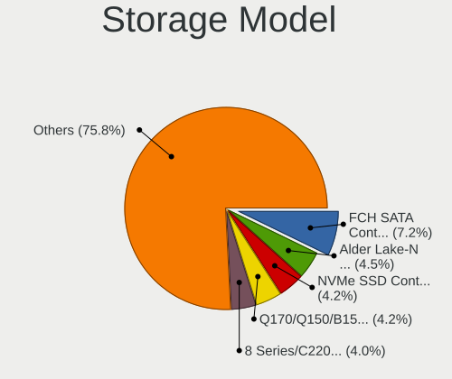

| Model                                                                            | Computers | Percent |
|----------------------------------------------------------------------------------|-----------|---------|
| AMD FCH SATA Controller [AHCI mode]                                              | 34        | 7.22%   |
| Intel Alder Lake-N SATA AHCI Controller                                          | 21        | 4.46%   |
| Samsung NVMe SSD Controller SM981/PM981/PM983                                    | 20        | 4.25%   |
| Intel Q170/Q150/B150/H170/H110/Z170/CM236 Chipset SATA Controller [AHCI Mode]    | 20        | 4.25%   |
| Intel 8 Series/C220 Series Chipset Family 6-port SATA Controller 1 [AHCI mode]   | 19        | 4.03%   |
| Intel Jasper Lake SATA AHCI Controller                                           | 13        | 2.76%   |
| Intel Atom Processor E3800 Series SATA AHCI Controller                           | 13        | 2.76%   |
| Intel SATA Controller [RAID mode]                                                | 12        | 2.55%   |
| Intel 6 Series/C200 Series Chipset Family 6 port Desktop SATA AHCI Controller    | 12        | 2.55%   |
| Silicon Motion SM2263EN/SM2263XT (DRAM-less) NVMe SSD Controllers                | 10        | 2.12%   |
| Intel Sunrise Point-LP SATA Controller [AHCI mode]                               | 10        | 2.12%   |
| Intel 8 Series SATA Controller 1 [AHCI mode]                                     | 10        | 2.12%   |
| Intel 5 Series/3400 Series Chipset 6 port SATA AHCI Controller                   | 8         | 1.7%    |
| Intel Celeron/Pentium Silver Processor SATA Controller                           | 7         | 1.49%   |
| Intel Cannon Lake PCH SATA AHCI Controller                                       | 7         | 1.49%   |
| Intel 200 Series PCH SATA controller [AHCI mode]                                 | 7         | 1.49%   |
| Intel Atom/Celeron/Pentium Processor x5-E8000/J3xxx/N3xxx Series SATA Controller | 6         | 1.27%   |
| Samsung NVMe SSD Controller 980 (DRAM-less)                                      | 5         | 1.06%   |
| Kingston Company A2000 NVMe SSD [SM2263EN]                                       | 5         | 1.06%   |
| Intel NM10/ICH7 Family SATA Controller [IDE mode]                                | 5         | 1.06%   |
| AMD FCH IDE Controller                                                           | 5         | 1.06%   |
| Phison PS5013-E13 PCIe3 NVMe Controller (DRAM-less)                              | 4         | 0.85%   |
| Intel Wildcat Point-LP SATA Controller [AHCI Mode]                               | 4         | 0.85%   |
| Intel C610/X99 series chipset sSATA Controller [AHCI mode]                       | 4         | 0.85%   |
| Intel C610/X99 series chipset 6-Port SATA Controller [AHCI mode]                 | 4         | 0.85%   |
| Intel Alder Lake-P SATA AHCI Controller                                          | 4         | 0.85%   |
| Intel 82801G (ICH7 Family) IDE Controller                                        | 4         | 0.85%   |
| Intel 7 Series Chipset Family 6-port SATA Controller [AHCI mode]                 | 4         | 0.85%   |
| Intel 6 Series/C200 Series Chipset Family 6 port Mobile SATA AHCI Controller     | 4         | 0.85%   |
| AMD 500 Series Chipset SATA Controller                                           | 4         | 0.85%   |
| AMD 300 Series Chipset SATA Controller                                           | 4         | 0.85%   |
| Samsung NVMe SSD Controller SM961/PM961/SM963                                    | 3         | 0.64%   |
| Kingston Company FURY Renegade NVMe SSD [E18] (Heatsink)                         | 3         | 0.64%   |
| Intel Comet Lake SATA AHCI Controller                                            | 3         | 0.64%   |
| Intel Cannon Point-LP SATA Controller [AHCI Mode]                                | 3         | 0.64%   |
| Intel Atom processor C2000 AHCI SATA3 Controller                                 | 3         | 0.64%   |
| Intel Atom processor C2000 AHCI SATA2 Controller                                 | 3         | 0.64%   |
| Intel 82801 Mobile SATA Controller [RAID mode]                                   | 3         | 0.64%   |
| Intel 7 Series/C210 Series Chipset Family 6-port SATA Controller [AHCI mode]     | 3         | 0.64%   |
| Intel 5 Series/3400 Series Chipset 4 port SATA AHCI Controller                   | 3         | 0.64%   |

Storage Kind
------------

Kind of storage controller (IDE, SATA, NVMe, SAS, ...)

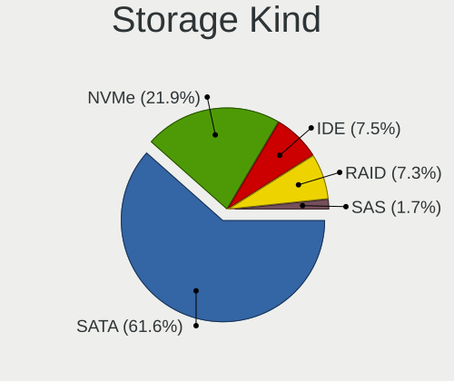

| Kind | Computers | Percent |
|------|-----------|---------|
| SATA | 261       | 61.56%  |
| NVMe | 93        | 21.93%  |
| IDE  | 32        | 7.55%   |
| RAID | 31        | 7.31%   |
| SAS  | 7         | 1.65%   |

Processor
---------

CPU Vendor
----------

Processor vendors

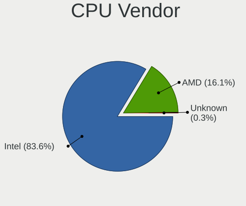

| Vendor  | Computers | Percent |
|---------|-----------|---------|
| Intel   | 276       | 83.64%  |
| AMD     | 53        | 16.06%  |
| Unknown | 1         | 0.3%    |

CPU Model
---------

Processor models

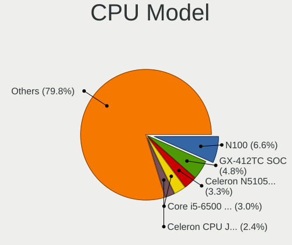

| Model                                    | Computers | Percent |
|------------------------------------------|-----------|---------|
| Intel N100                               | 22        | 6.65%   |
| AMD GX-412TC SOC                         | 16        | 4.83%   |
| Intel Celeron N5105 @ 2.00GHz            | 11        | 3.32%   |
| Intel Core i5-6500 CPU @ 3.20GHz         | 10        | 3.02%   |
| Intel Celeron CPU J1900 @ 1.99GHz        | 8         | 2.42%   |
| Intel N150                               | 6         | 1.81%   |
| Intel Core i5-4590 CPU @ 3.30GHz         | 4         | 1.21%   |
| Intel Celeron J4125 CPU @ 2.00GHz        | 4         | 1.21%   |
| AMD RX-427BB with AMD Radeon R7 Graphics | 4         | 1.21%   |
| Intel Core i7-4770K CPU @ 3.50GHz        | 3         | 0.91%   |
| Intel Core i5-8500T CPU @ 2.10GHz        | 3         | 0.91%   |
| Intel Core i5-8265U CPU @ 1.60GHz        | 3         | 0.91%   |
| Intel Core i5-6400 CPU @ 2.70GHz         | 3         | 0.91%   |
| Intel Core i5-6300U CPU @ 2.40GHz        | 3         | 0.91%   |
| Intel Core i5-4250U CPU @ 1.30GHz        | 3         | 0.91%   |
| Intel Core i3-N305                       | 3         | 0.91%   |
| Intel Core i3-6100 CPU @ 3.70GHz         | 3         | 0.91%   |
| Intel Core i3-4130 CPU @ 3.40GHz         | 3         | 0.91%   |
| Intel Celeron CPU J3160 @ 1.60GHz        | 3         | 0.91%   |
| Intel Atom CPU E3845 @ 1.91GHz           | 3         | 0.91%   |
| Intel Xeon CPU E5-2620 v4 @ 2.10GHz      | 2         | 0.6%    |
| Intel Xeon CPU E3-1225 v3 @ 3.20GHz      | 2         | 0.6%    |
| Intel Pentium Gold 8505                  | 2         | 0.6%    |
| Intel Core i7-7700 CPU @ 3.60GHz         | 2         | 0.6%    |
| Intel Core i7-7500U CPU @ 2.70GHz        | 2         | 0.6%    |
| Intel Core i7-4600U CPU @ 2.10GHz        | 2         | 0.6%    |
| Intel Core i7-2600 CPU @ 3.40GHz         | 2         | 0.6%    |
| Intel Core i5-9500 CPU @ 3.00GHz         | 2         | 0.6%    |
| Intel Core i5-6200U CPU @ 2.30GHz        | 2         | 0.6%    |
| Intel Core i5-5200U CPU @ 2.20GHz        | 2         | 0.6%    |
| Intel Core i5-4200U CPU @ 1.60GHz        | 2         | 0.6%    |
| Intel Core i5-3470 CPU @ 3.20GHz         | 2         | 0.6%    |
| Intel Core i5-1035G4 CPU @ 1.10GHz       | 2         | 0.6%    |
| Intel Core i5 CPU M 540 @ 2.53GHz        | 2         | 0.6%    |
| Intel Core 2 Quad CPU Q8400 @ 2.66GHz    | 2         | 0.6%    |
| Intel Celeron N4000 CPU @ 1.10GHz        | 2         | 0.6%    |
| Intel Celeron CPU N2930 @ 1.83GHz        | 2         | 0.6%    |
| Intel 12th Gen Core i7-1260P             | 2         | 0.6%    |
| AMD Ryzen 9 3900X 12-Core Processor      | 2         | 0.6%    |
| AMD Ryzen 7 5700G with Radeon Graphics   | 2         | 0.6%    |

CPU Model Family
----------------

Processor model prefix

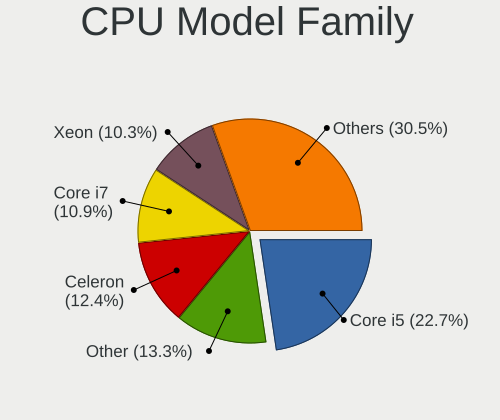

| Model                   | Computers | Percent |
|-------------------------|-----------|---------|
| Intel Core i5           | 75        | 22.66%  |
| Other                   | 44        | 13.29%  |
| Intel Celeron           | 41        | 12.39%  |
| Intel Core i7           | 36        | 10.88%  |
| Intel Xeon              | 34        | 10.27%  |
| Intel Core i3           | 20        | 6.04%   |
| AMD GX                  | 20        | 6.04%   |
| Intel Atom              | 8         | 2.42%   |
| AMD Ryzen 7             | 7         | 2.11%   |
| Intel Pentium           | 5         | 1.51%   |
| AMD Ryzen 9             | 5         | 1.51%   |
| Intel Core 2 Quad       | 4         | 1.21%   |
| Intel Core 2 Duo        | 4         | 1.21%   |
| AMD Ryzen 5             | 4         | 1.21%   |
| Intel Xeon Silver       | 3         | 0.91%   |
| Intel Pentium Gold      | 2         | 0.6%    |
| AMD Ryzen Threadripper  | 2         | 0.6%    |
| Intel Pentium Silver    | 1         | 0.3%    |
| Intel Pentium III       | 1         | 0.3%    |
| Intel Pentium Dual-Core | 1         | 0.3%    |
| Intel Pentium 4         | 1         | 0.3%    |
| Intel Core m3           | 1         | 0.3%    |
| Intel Core i9           | 1         | 0.3%    |
| Intel Core 2            | 1         | 0.3%    |
| AMD Ryzen Embedded      | 1         | 0.3%    |
| AMD Ryzen 7 PRO         | 1         | 0.3%    |
| AMD Ryzen 5 PRO         | 1         | 0.3%    |
| AMD PRO A10             | 1         | 0.3%    |
| AMD G                   | 1         | 0.3%    |
| AMD FX                  | 1         | 0.3%    |
| AMD EPYC                | 1         | 0.3%    |
| AMD Athlon 64 X2        | 1         | 0.3%    |
| AMD Athlon              | 1         | 0.3%    |
| AMD A4                  | 1         | 0.3%    |

CPU Cores
---------

Number of processor cores

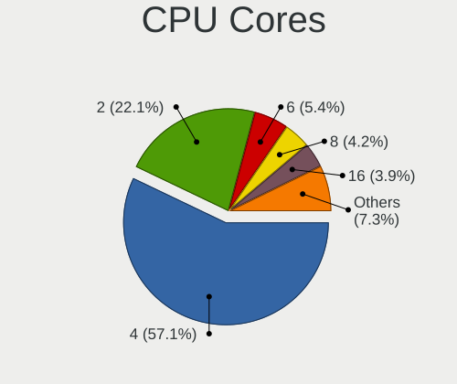

| Number  | Computers | Percent |
|---------|-----------|---------|
| 4       | 189       | 57.1%   |
| 2       | 73        | 22.05%  |
| 6       | 18        | 5.44%   |
| 8       | 14        | 4.23%   |
| 16      | 13        | 3.93%   |
| Unknown | 8         | 2.42%   |
| 24      | 7         | 2.11%   |
| 12      | 3         | 0.91%   |
| 10      | 2         | 0.6%    |
| 1       | 2         | 0.6%    |
| 26      | 1         | 0.3%    |
| 3       | 1         | 0.3%    |

CPU Sockets
-----------

Number of sockets

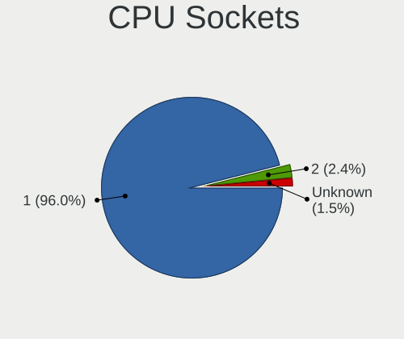

| Number  | Computers | Percent |
|---------|-----------|---------|
| 1       | 315       | 96.04%  |
| 2       | 8         | 2.44%   |
| Unknown | 5         | 1.52%   |

CPU Threads
-----------

Threads per core (Hyper-Threading)

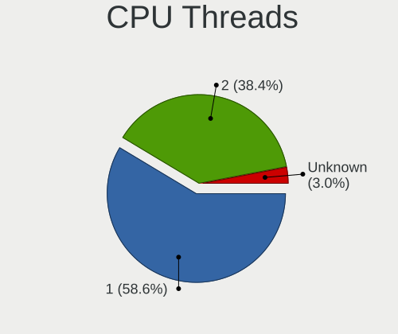

| Number  | Computers | Percent |
|---------|-----------|---------|
| 1       | 194       | 58.61%  |
| 2       | 127       | 38.37%  |
| Unknown | 10        | 3.02%   |

CPU Microarch
-------------

Microarchitecture

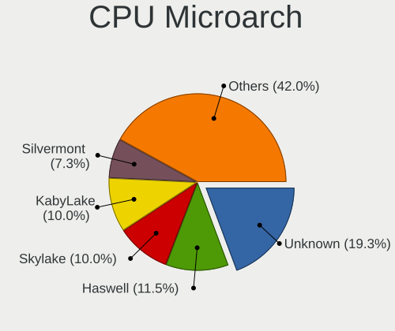

| Name          | Computers | Percent |
|---------------|-----------|---------|
| Unknown       | 64        | 19.34%  |
| Haswell       | 38        | 11.48%  |
| Skylake       | 33        | 9.97%   |
| KabyLake      | 33        | 9.97%   |
| Silvermont    | 24        | 7.25%   |
| SandyBridge   | 21        | 6.34%   |
| Puma          | 17        | 5.14%   |
| IvyBridge     | 12        | 3.63%   |
| Penryn        | 11        | 3.32%   |
| Westmere      | 10        | 3.02%   |
| Broadwell     | 10        | 3.02%   |
| Zen           | 7         | 2.11%   |
| Nehalem       | 7         | 2.11%   |
| Goldmont plus | 7         | 2.11%   |
| Steamroller   | 4         | 1.21%   |
| Jaguar        | 4         | 1.21%   |
| Core          | 4         | 1.21%   |
| Zen 2         | 3         | 0.91%   |
| IceLake       | 3         | 0.91%   |
| Goldmont      | 3         | 0.91%   |
| CometLake     | 3         | 0.91%   |
| Zen 3         | 2         | 0.6%    |
| TigerLake     | 2         | 0.6%    |
| Piledriver    | 2         | 0.6%    |
| Excavator     | 2         | 0.6%    |
| Zen+          | 1         | 0.3%    |
| P6            | 1         | 0.3%    |
| NetBurst      | 1         | 0.3%    |
| K8 Hammer     | 1         | 0.3%    |
| Bobcat        | 1         | 0.3%    |

Graphics
--------

GPU Vendor
----------

Vendors of graphics cards

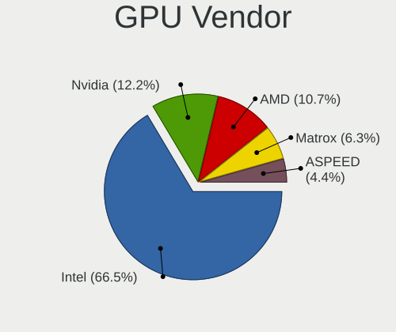

| Vendor                     | Computers | Percent |
|----------------------------|-----------|---------|
| Intel                      | 212       | 66.46%  |
| Nvidia                     | 39        | 12.23%  |
| AMD                        | 34        | 10.66%  |
| Matrox Electronics Systems | 20        | 6.27%   |
| ASPEED Technology          | 14        | 4.39%   |

GPU Model
---------

Graphics card models

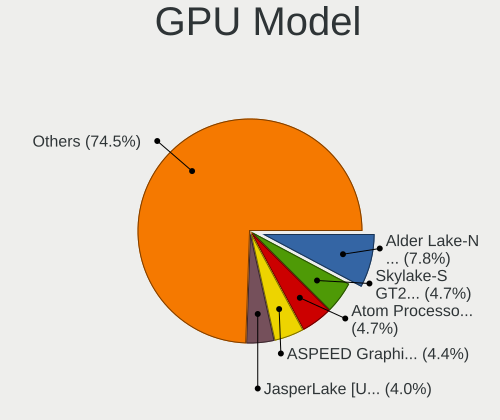

| Model                                                                                    | Computers | Percent |
|------------------------------------------------------------------------------------------|-----------|---------|
| Intel Alder Lake-N [UHD Graphics]                                                        | 25        | 7.79%   |
| Intel Skylake-S GT2 [HD Graphics 530]                                                    | 15        | 4.67%   |
| Intel Atom Processor Z36xxx/Z37xxx Series Graphics & Display                             | 15        | 4.67%   |
| ASPEED Technology ASPEED Graphics Family                                                 | 14        | 4.36%   |
| Intel JasperLake [UHD Graphics]                                                          | 13        | 4.05%   |
| Intel Haswell-ULT Integrated Graphics Controller                                         | 13        | 4.05%   |
| Intel Xeon E3-1200 v3/4th Gen Core Processor Integrated Graphics Controller              | 12        | 3.74%   |
| Intel 2nd Generation Core Processor Family Integrated Graphics Controller                | 11        | 3.43%   |
| Intel CoffeeLake-S GT2 [UHD Graphics 630]                                                | 8         | 2.49%   |
| Matrox Electronics Systems MGA G200eW WPCM450                                            | 7         | 2.18%   |
| Intel Skylake-U GT2 [HD Graphics 520]                                                    | 7         | 2.18%   |
| Intel GeminiLake [UHD Graphics 600]                                                      | 7         | 2.18%   |
| Intel Xeon E3-1200 v2/3rd Gen Core processor Graphics Controller                         | 6         | 1.87%   |
| Intel Atom/Celeron/Pentium Processor x5-E8000/J3xxx/N3xxx Integrated Graphics Controller | 6         | 1.87%   |
| Intel Alder Lake-N [Intel Graphics]                                                      | 6         | 1.87%   |
| Nvidia GK208B [GeForce GT 710]                                                           | 5         | 1.56%   |
| Intel Kaby Lake-U GT2 [HD Graphics 620]                                                  | 5         | 1.56%   |
| Intel Core Processor Integrated Graphics Controller                                      | 5         | 1.56%   |
| Matrox Electronics Systems G200eR2                                                       | 4         | 1.25%   |
| Intel WhiskeyLake-U GT2 [UHD Graphics 620]                                               | 4         | 1.25%   |
| Intel Kaby Lake-S GT2 [HD Graphics 630]                                                  | 4         | 1.25%   |
| Intel Broadwell-U GT2 [HD Graphics 5500]                                                 | 4         | 1.25%   |
| Intel 4 Series Chipset Integrated Graphics Controller                                    | 4         | 1.25%   |
| AMD Kaveri [Radeon R7 Graphics]                                                          | 4         | 1.25%   |
| Matrox Electronics Systems MGA G200EH                                                    | 3         | 0.93%   |
| Intel Xeon E3-1200 v3 Processor Integrated Graphics Controller                           | 3         | 0.93%   |
| Intel IvyBridge GT2 [HD Graphics 4000]                                                   | 3         | 0.93%   |
| Intel Alder Lake-UP3 GT1 [UHD Graphics]                                                  | 3         | 0.93%   |
| Intel 4th Generation Core Processor Family Integrated Graphics Controller                | 3         | 0.93%   |
| AMD Lucienne                                                                             | 3         | 0.93%   |
| AMD ES1000                                                                               | 3         | 0.93%   |
| Nvidia GT215 [GeForce GT 240]                                                            | 2         | 0.62%   |
| Nvidia GP107 [GeForce GTX 1050 Ti]                                                       | 2         | 0.62%   |
| Nvidia GP106 [GeForce GTX 1060 6GB]                                                      | 2         | 0.62%   |
| Nvidia AD104GL [RTX 4000 Ada Generation]                                                 | 2         | 0.62%   |
| Matrox Electronics Systems MGA G200eH3                                                   | 2         | 0.62%   |
| Matrox Electronics Systems MGA G200e [Pilot] ServerEngines (SEP1)                        | 2         | 0.62%   |
| Matrox Electronics Systems Integrated Matrox G200eW3 Graphics Controller                 | 2         | 0.62%   |
| Intel TigerLake-LP GT2 [Iris Xe Graphics]                                                | 2         | 0.62%   |
| Intel Mobile 4 Series Chipset Integrated Graphics Controller                             | 2         | 0.62%   |

GPU Combo
---------

Combinations of graphics cards

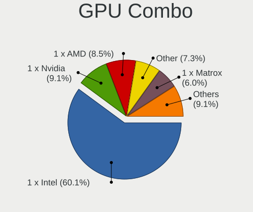

| Name            | Computers | Percent |
|-----------------|-----------|---------|
| 1 x Intel       | 199       | 60.12%  |
| 1 x Nvidia      | 30        | 9.06%   |
| 1 x AMD         | 28        | 8.46%   |
| Other           | 24        | 7.25%   |
| 1 x Matrox      | 20        | 6.04%   |
| 1 x ASPEED      | 12        | 3.63%   |
| Intel + Nvidia  | 5         | 1.51%   |
| 2 x Intel       | 4         | 1.21%   |
| Intel + AMD     | 3         | 0.91%   |
| AMD + Nvidia    | 3         | 0.91%   |
| 2 x AMD         | 1         | 0.3%    |
| Nvidia + ASPEED | 1         | 0.3%    |
| Intel + ASPEED  | 1         | 0.3%    |

GPU Driver
----------

Free vs proprietary

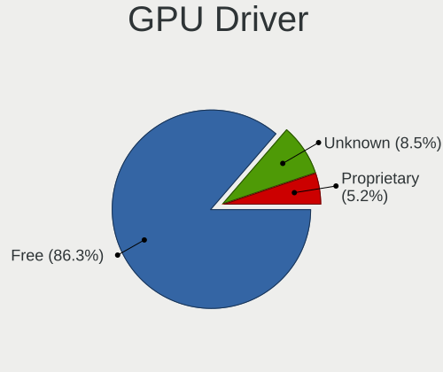

| Driver      | Computers | Percent |
|-------------|-----------|---------|
| Free        | 284       | 86.32%  |
| Unknown     | 28        | 8.51%   |
| Proprietary | 17        | 5.17%   |

GPU Memory
----------

Total video memory

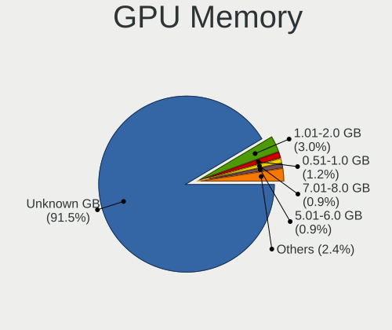

| Size in GB | Computers | Percent |
|------------|-----------|---------|
| Unknown    | 300       | 91.46%  |
| 1.01-2.0   | 10        | 3.05%   |
| 0.51-1.0   | 4         | 1.22%   |
| 7.01-8.0   | 3         | 0.91%   |
| 5.01-6.0   | 3         | 0.91%   |
| 3.01-4.0   | 3         | 0.91%   |
| 8.01-16.0  | 2         | 0.61%   |
| 0.01-0.5   | 2         | 0.61%   |
| 16.01-24.0 | 1         | 0.3%    |

Monitor
-------

Monitor Vendor
--------------

Monitor vendors

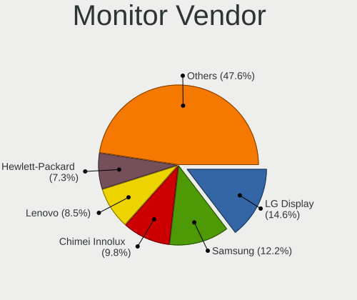

| Vendor                  | Computers | Percent |
|-------------------------|-----------|---------|
| LG Display              | 12        | 14.63%  |
| Samsung Electronics     | 10        | 12.2%   |
| Chimei Innolux          | 8         | 9.76%   |
| Lenovo                  | 7         | 8.54%   |
| Hewlett-Packard         | 6         | 7.32%   |
| Dell                    | 5         | 6.1%    |
| AU Optronics            | 5         | 6.1%    |
| Philips                 | 4         | 4.88%   |
| LG Electronics          | 3         | 3.66%   |
| Ancor Communications    | 3         | 3.66%   |
| Iiyama                  | 2         | 2.44%   |
| Goldstar                | 2         | 2.44%   |
| BOE                     | 2         | 2.44%   |
| AOC                     | 2         | 2.44%   |
| VMO                     | 1         | 1.22%   |
| TMX                     | 1         | 1.22%   |
| Panasonic               | 1         | 1.22%   |
| MSI                     | 1         | 1.22%   |
| Lenovo Group Limited    | 1         | 1.22%   |
| InfoVision              | 1         | 1.22%   |
| IBM                     | 1         | 1.22%   |
| Gigabyte Technology     | 1         | 1.22%   |
| Chi Mei Optoelectronics | 1         | 1.22%   |
| Apple                   | 1         | 1.22%   |
| Acer                    | 1         | 1.22%   |

Monitor Model
-------------

Monitor models

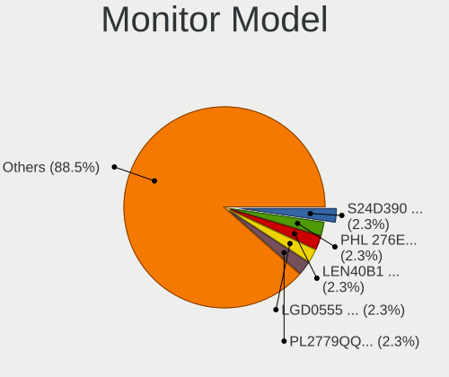

| Model                                                                | Computers | Percent |
|----------------------------------------------------------------------|-----------|---------|
| Samsung Electronics S24D390 SAM0B65 1920x1080 520x290mm 23.4-inch    | 2         | 2.3%    |
| Philips PHL 276E8V PHLC18F 3840x2160 600x340mm 27.2-inch             | 2         | 2.3%    |
| LG Display LCD Monitor LGD0555 2736x1824 260x170mm 12.2-inch         | 2         | 2.3%    |
| Lenovo LCD Monitor LEN40B1 1600x900 340x190mm 15.3-inch              | 2         | 2.3%    |
| Iiyama PL2779QQ IVM6641 3840x2160 600x330mm 27.0-inch                | 2         | 2.3%    |
| Dell UP2715K DEL40B6 848x480 600x340mm 27.2-inch                     | 2         | 2.3%    |
| AOC 2350 AOC2350 1920x1080 510x290mm 23.1-inch                       | 2         | 2.3%    |
| VMO LCD QHD 1 VMO1091 2560x1440 600x340mm 27.2-inch                  | 1         | 1.15%   |
| TMX TL140BDXP01-0 TMX1400 2560x1440 310x170mm 13.9-inch              | 1         | 1.15%   |
| Samsung Electronics SyncMaster SAM050B 1920x1080 480x270mm 21.7-inch | 1         | 1.15%   |
| Samsung Electronics SyncMaster SAM022B 1280x1024 340x270mm 17.1-inch | 1         | 1.15%   |
| Samsung Electronics S27R35x SAM1053 1920x1080 600x340mm 27.2-inch    | 1         | 1.15%   |
| Samsung Electronics S24E650 SAM0CC1 1920x1200 520x320mm 24.0-inch    | 1         | 1.15%   |
| Samsung Electronics LCD Monitor SyncMaster                           | 1         | 1.15%   |
| Samsung Electronics LCD Monitor SEC4542 1366x768 300x170mm 13.6-inch | 1         | 1.15%   |
| Samsung Electronics LCD Monitor SE790C 3440x1440                     | 1         | 1.15%   |
| Samsung Electronics LCD Monitor S23E650 3840x1080                    | 1         | 1.15%   |
| Samsung Electronics C24F390 SAM0D2C 1920x1080 520x290mm 23.4-inch    | 1         | 1.15%   |
| Philips PHL BDM3270 PHL08E7 2560x1440 710x400mm 32.1-inch            | 1         | 1.15%   |
| Philips PHL 326M6V PHLC193 3840x2160 700x390mm 31.5-inch             | 1         | 1.15%   |
| Philips PHL 221B6Q PHL08DF 1920x1080 480x270mm 21.7-inch             | 1         | 1.15%   |
| Panasonic LCD Monitor MEI96A2 2880x1620 340x190mm 15.3-inch          | 1         | 1.15%   |
| MSI MAG341CQ MSI1462 3440x1440 800x330mm 34.1-inch                   | 1         | 1.15%   |
| LG Electronics LCD Monitor LX20D 1600x1200                           | 1         | 1.15%   |
| LG Electronics LCD Monitor LG HDR WQHD+ 3840x1600                    | 1         | 1.15%   |
| LG Electronics LCD Monitor LG HDR WQHD+ 1920x1080                    | 1         | 1.15%   |
| LG Display LCD Monitor LGD070B 1920x1080 310x170mm 13.9-inch         | 1         | 1.15%   |
| LG Display LCD Monitor LGD05E5 1920x1080 340x190mm 15.3-inch         | 1         | 1.15%   |
| LG Display LCD Monitor LGD05B6 1920x1080 310x170mm 13.9-inch         | 1         | 1.15%   |
| LG Display LCD Monitor LGD0569 1920x1080 310x170mm 13.9-inch         | 1         | 1.15%   |
| LG Display LCD Monitor LGD04A7 1920x1080 340x190mm 15.3-inch         | 1         | 1.15%   |
| LG Display LCD Monitor LGD046F 1920x1080 340x190mm 15.3-inch         | 1         | 1.15%   |
| LG Display LCD Monitor LGD040A 1920x1080 310x170mm 13.9-inch         | 1         | 1.15%   |
| LG Display LCD Monitor LGD02E2 1600x900 310x170mm 13.9-inch          | 1         | 1.15%   |
| LG Display LCD Monitor LGD027B 1600x900 380x210mm 17.1-inch          | 1         | 1.15%   |
| LG Display LCD Monitor LGD0213 1600x900 310x170mm 13.9-inch          | 1         | 1.15%   |
| Lenovo LCD Monitor LEN4036 1440x900 300x190mm 14.0-inch              | 1         | 1.15%   |
| Lenovo LCD Monitor LEN4011 1280x800 260x160mm 12.0-inch              | 1         | 1.15%   |
| Lenovo L22e-40 LEN67AF 1920x1080 480x260mm 21.5-inch                 | 1         | 1.15%   |
| Lenovo Group Limited LCD Monitor 1920x1080                           | 1         | 1.15%   |

Monitor Resolution
------------------

Monitor screen resolution

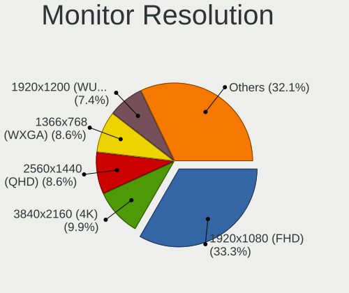

| Resolution         | Computers | Percent |
|--------------------|-----------|---------|
| 1920x1080 (FHD)    | 27        | 33.33%  |
| 3840x2160 (4K)     | 8         | 9.88%   |
| 2560x1440 (QHD)    | 7         | 8.64%   |
| 1366x768 (WXGA)    | 7         | 8.64%   |
| 1920x1200 (WUXGA)  | 6         | 7.41%   |
| 1600x900 (HD+)     | 6         | 7.41%   |
| 3440x1440          | 3         | 3.7%    |
| 3840x1600          | 2         | 2.47%   |
| 3840x1080          | 2         | 2.47%   |
| 2736x1824          | 2         | 2.47%   |
| 1280x1024 (SXGA)   | 2         | 2.47%   |
| Unknown            | 2         | 2.47%   |
| 2880x1920          | 1         | 1.23%   |
| 2560x1600          | 1         | 1.23%   |
| 1920x1280          | 1         | 1.23%   |
| 1680x1050 (WSXGA+) | 1         | 1.23%   |
| 1600x1200          | 1         | 1.23%   |
| 1440x900 (WXGA+)   | 1         | 1.23%   |
| 1280x800 (WXGA)    | 1         | 1.23%   |

Monitor Diagonal
----------------

Diagonal size in inches

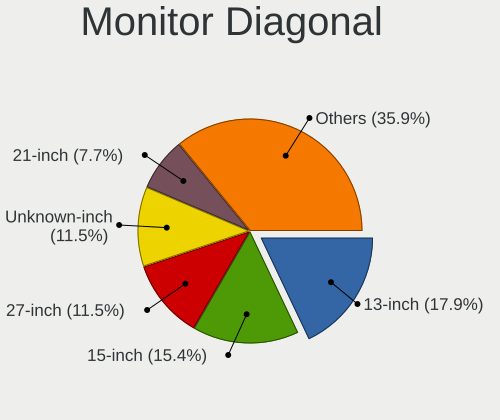

| Inches  | Computers | Percent |
|---------|-----------|---------|
| 13      | 14        | 17.95%  |
| 15      | 12        | 15.38%  |
| 27      | 9         | 11.54%  |
| Unknown | 9         | 11.54%  |
| 21      | 6         | 7.69%   |
| 24      | 5         | 6.41%   |
| 12      | 5         | 6.41%   |
| 23      | 4         | 5.13%   |
| 17      | 4         | 5.13%   |
| 34      | 2         | 2.56%   |
| 14      | 2         | 2.56%   |
| 37      | 1         | 1.28%   |
| 32      | 1         | 1.28%   |
| 31      | 1         | 1.28%   |
| 28      | 1         | 1.28%   |
| 11      | 1         | 1.28%   |
| 10      | 1         | 1.28%   |

Monitor Width
-------------

Physical width

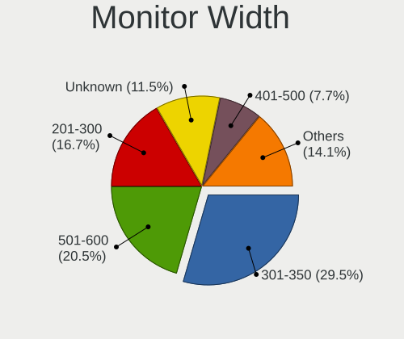

| Width in mm | Computers | Percent |
|-------------|-----------|---------|
| 301-350     | 23        | 29.49%  |
| 501-600     | 16        | 20.51%  |
| 201-300     | 13        | 16.67%  |
| Unknown     | 9         | 11.54%  |
| 401-500     | 6         | 7.69%   |
| 601-700     | 4         | 5.13%   |
| 701-800     | 3         | 3.85%   |
| 351-400     | 3         | 3.85%   |
| 801-900     | 1         | 1.28%   |

Aspect Ratio
------------

Proportional relationship between the width and the height

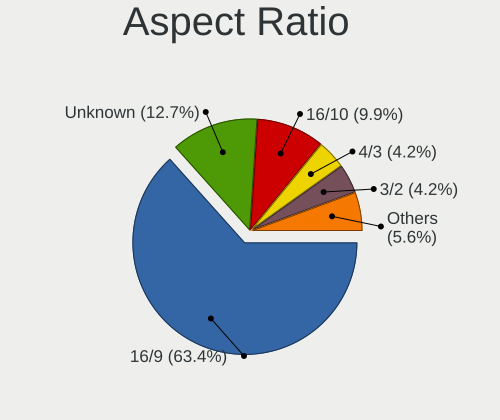

| Ratio   | Computers | Percent |
|---------|-----------|---------|
| 16/9    | 45        | 63.38%  |
| Unknown | 9         | 12.68%  |
| 16/10   | 7         | 9.86%   |
| 4/3     | 3         | 4.23%   |
| 3/2     | 3         | 4.23%   |
| 21/9    | 3         | 4.23%   |
| 5/4     | 1         | 1.41%   |

Monitor Area
------------

Area in inch²

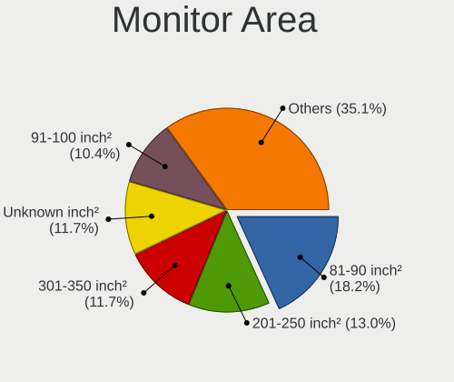

| Area in inch² | Computers | Percent |
|----------------|-----------|---------|
| 81-90          | 14        | 18.18%  |
| 201-250        | 10        | 12.99%  |
| 301-350        | 9         | 11.69%  |
| Unknown        | 9         | 11.69%  |
| 91-100         | 8         | 10.39%  |
| 351-500        | 5         | 6.49%   |
| 71-80          | 4         | 5.19%   |
| 61-70          | 3         | 3.9%    |
| 251-300        | 3         | 3.9%    |
| 121-130        | 3         | 3.9%    |
| 101-110        | 3         | 3.9%    |
| 51-60          | 2         | 2.6%    |
| 151-200        | 1         | 1.3%    |
| 141-150        | 1         | 1.3%    |
| 111-120        | 1         | 1.3%    |
| 501-1000       | 1         | 1.3%    |

Pixel Density
-------------

Pixels per inch

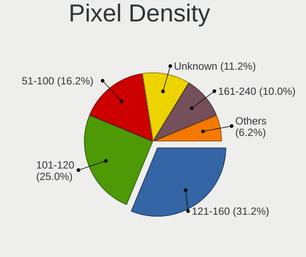

| Density       | Computers | Percent |
|---------------|-----------|---------|
| 121-160       | 25        | 31.25%  |
| 101-120       | 20        | 25%     |
| 51-100        | 13        | 16.25%  |
| Unknown       | 9         | 11.25%  |
| 161-240       | 8         | 10%     |
| More than 240 | 3         | 3.75%   |
| 1-50          | 2         | 2.5%    |

Multiple Monitors
-----------------

Total monitors connected

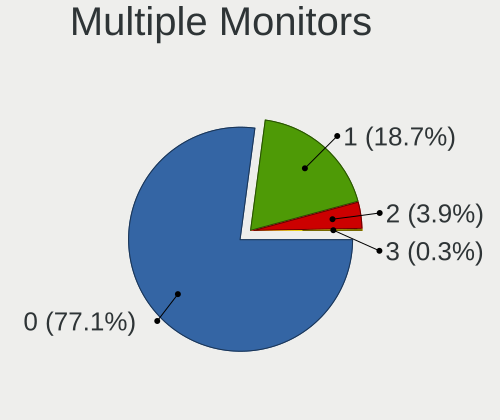

| Total | Computers | Percent |
|-------|-----------|---------|
| 0     | 256       | 77.11%  |
| 1     | 62        | 18.67%  |
| 2     | 13        | 3.92%   |
| 3     | 1         | 0.3%    |

Network
-------

Net Controller Vendor
---------------------

Controller vendors

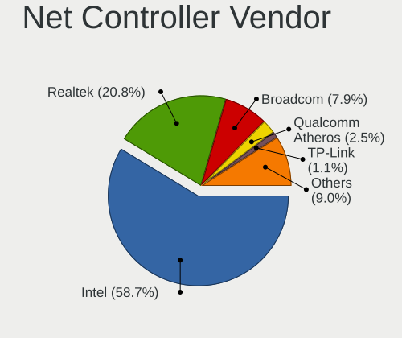

| Vendor                   | Computers | Percent |
|--------------------------|-----------|---------|
| Intel                    | 260       | 58.69%  |
| Realtek Semiconductor    | 92        | 20.77%  |
| Broadcom                 | 35        | 7.9%    |
| Qualcomm Atheros         | 11        | 2.48%   |
| TP-Link                  | 5         | 1.13%   |
| Sierra Wireless          | 4         | 0.9%    |
| MediaTek                 | 4         | 0.9%    |
| Google                   | 3         | 0.68%   |
| Ralink Technology        | 2         | 0.45%   |
| Mellanox Technologies    | 2         | 0.45%   |
| Marvell Technology Group | 2         | 0.45%   |
| Aquantia                 | 2         | 0.45%   |
| AMD                      | 2         | 0.45%   |
| VIA Technologies         | 1         | 0.23%   |
| Senao                    | 1         | 0.23%   |
| Samsung Electronics      | 1         | 0.23%   |
| Qualcomm Technologies    | 1         | 0.23%   |
| OPPO Electronics         | 1         | 0.23%   |
| NetXen Incorporated      | 1         | 0.23%   |
| MYRICOM                  | 1         | 0.23%   |
| Microsoft                | 1         | 0.23%   |
| JMicron Technology       | 1         | 0.23%   |
| IMC Networks             | 1         | 0.23%   |
| Hewlett-Packard          | 1         | 0.23%   |
| Edimax Technology        | 1         | 0.23%   |
| Dell                     | 1         | 0.23%   |
| D-Link System            | 1         | 0.23%   |
| D-Link                   | 1         | 0.23%   |
| Chelsio Communications   | 1         | 0.23%   |
| Apple                    | 1         | 0.23%   |
| American Megatrends      | 1         | 0.23%   |
| 3Com                     | 1         | 0.23%   |

Net Controller Model
--------------------

Controller models

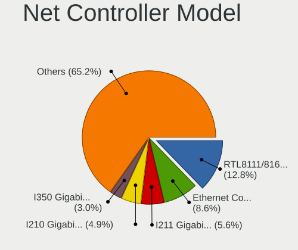

| Model                                                                         | Computers | Percent |
|-------------------------------------------------------------------------------|-----------|---------|
| Realtek RTL8111/8168/8211/8411 PCI Express Gigabit Ethernet Controller        | 73        | 12.76%  |
| Intel Ethernet Controller I226-V                                              | 49        | 8.57%   |
| Intel I211 Gigabit Network Connection                                         | 32        | 5.59%   |
| Intel I210 Gigabit Network Connection                                         | 28        | 4.9%    |
| Intel I350 Gigabit Network Connection                                         | 17        | 2.97%   |
| Intel 82574L Gigabit Network Connection                                       | 15        | 2.62%   |
| Intel Ethernet Connection I217-LM                                             | 13        | 2.27%   |
| Intel 82571EB/82571GB Gigabit Ethernet Controller D0/D1 (copper applications) | 12        | 2.1%    |
| Intel Ethernet Connection (2) I219-LM                                         | 11        | 1.92%   |
| Intel Wireless 7260                                                           | 10        | 1.75%   |
| Intel Ethernet Controller I225-V                                              | 10        | 1.75%   |
| Intel 82599ES 10-Gigabit SFI/SFP+ Network Connection                          | 10        | 1.75%   |
| Intel 82579LM Gigabit Network Connection (Lewisville)                         | 10        | 1.75%   |
| Intel 82580 Gigabit Network Connection                                        | 9         | 1.57%   |
| Realtek RTL8125 2.5GbE Controller                                             | 6         | 1.05%   |
| Intel Wireless 8260                                                           | 6         | 1.05%   |
| Intel Wi-Fi 6 AX200                                                           | 6         | 1.05%   |
| Broadcom NetXtreme BCM5720 Gigabit Ethernet PCIe                              | 6         | 1.05%   |
| Realtek RTL8821CE 802.11ac PCIe Wireless Network Adapter                      | 5         | 0.87%   |
| Intel Wireless 8265 / 8275                                                    | 5         | 0.87%   |
| Intel Ethernet Connection (2) I219-V                                          | 5         | 0.87%   |
| Broadcom BCM4360 802.11ac Dual Band Wireless Network Adapter                  | 5         | 0.87%   |
| Realtek RTL8111/8168/8411 PCI Express Gigabit Ethernet Controller             | 4         | 0.7%    |
| Intel Wireless 3165                                                           | 4         | 0.7%    |
| Intel Ethernet Controller X710 for 10GbE SFP+                                 | 4         | 0.7%    |
| Intel Ethernet Controller 10-Gigabit X540-AT2                                 | 4         | 0.7%    |
| Intel Ethernet Connection I219-LM                                             | 4         | 0.7%    |
| Intel Ethernet Connection I217-V                                              | 4         | 0.7%    |
| Intel 82577LM Gigabit Network Connection                                      | 4         | 0.7%    |
| Intel 82576 Gigabit Network Connection                                        | 4         | 0.7%    |
| Broadcom NetXtreme II BCM5716 Gigabit Ethernet                                | 4         | 0.7%    |
| Broadcom NetXtreme II BCM5709 Gigabit Ethernet                                | 4         | 0.7%    |
| Realtek USB 2.5GbE Controller                                                 | 3         | 0.52%   |
| Realtek RTL8821AE 802.11ac PCIe Wireless Network Adapter                      | 3         | 0.52%   |
| Realtek RTL8188EUS 802.11n Wireless Network Adapter                           | 3         | 0.52%   |
| Realtek RTL810xE PCI Express Fast Ethernet controller                         | 3         | 0.52%   |
| Realtek RTL-8100/8101L/8139 PCI Fast Ethernet Adapter                         | 3         | 0.52%   |
| Qualcomm Atheros AR9285 Wireless Network Adapter (PCI-Express)                | 3         | 0.52%   |
| Intel Wireless 7265                                                           | 3         | 0.52%   |
| Intel Ethernet Controller X710 for 10GBASE-T                                  | 3         | 0.52%   |

Wireless Vendor
---------------

Wireless vendors

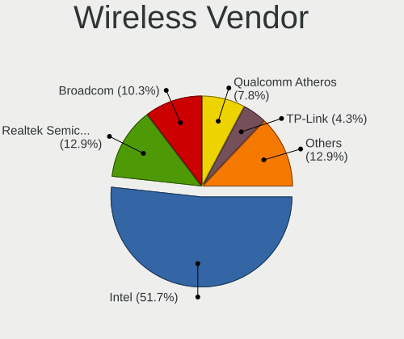

| Vendor                | Computers | Percent |
|-----------------------|-----------|---------|
| Intel                 | 60        | 51.72%  |
| Realtek Semiconductor | 15        | 12.93%  |
| Broadcom              | 12        | 10.34%  |
| Qualcomm Atheros      | 9         | 7.76%   |
| TP-Link               | 5         | 4.31%   |
| Sierra Wireless       | 4         | 3.45%   |
| MediaTek              | 3         | 2.59%   |
| Ralink Technology     | 2         | 1.72%   |
| Senao                 | 1         | 0.86%   |
| Qualcomm Technologies | 1         | 0.86%   |
| IMC Networks          | 1         | 0.86%   |
| Edimax Technology     | 1         | 0.86%   |
| Dell                  | 1         | 0.86%   |
| D-Link                | 1         | 0.86%   |

Wireless Model
--------------

Wireless models

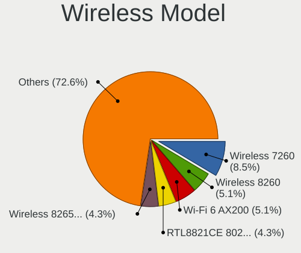

| Model                                                            | Computers | Percent |
|------------------------------------------------------------------|-----------|---------|
| Intel Wireless 7260                                              | 10        | 8.55%   |
| Intel Wireless 8260                                              | 6         | 5.13%   |
| Intel Wi-Fi 6 AX200                                              | 6         | 5.13%   |
| Realtek RTL8821CE 802.11ac PCIe Wireless Network Adapter         | 5         | 4.27%   |
| Intel Wireless 8265 / 8275                                       | 5         | 4.27%   |
| Broadcom BCM4360 802.11ac Dual Band Wireless Network Adapter     | 5         | 4.27%   |
| Intel Wireless 3165                                              | 4         | 3.42%   |
| Realtek RTL8821AE 802.11ac PCIe Wireless Network Adapter         | 3         | 2.56%   |
| Realtek RTL8188EUS 802.11n Wireless Network Adapter              | 3         | 2.56%   |
| Qualcomm Atheros AR9285 Wireless Network Adapter (PCI-Express)   | 3         | 2.56%   |
| Intel Wireless 7265                                              | 3         | 2.56%   |
| Intel Dual Band Wireless-AC 3165 Plus Bluetooth                  | 3         | 2.56%   |
| Intel Centrino Advanced-N 6205 [Taylor Peak]                     | 3         | 2.56%   |
| Intel Centrino Advanced-N 6200                                   | 3         | 2.56%   |
| Broadcom BCM43228 802.11a/b/g/n                                  | 3         | 2.56%   |
| Sierra Wireless EM7345 4G LTE                                    | 2         | 1.71%   |
| Qualcomm Atheros AR9485 Wireless Network Adapter                 | 2         | 1.71%   |
| Intel Wi-Fi 6E(802.11ax) AX210/AX1675* 2x2 [Typhoon Peak]        | 2         | 1.71%   |
| Intel Wi-Fi 5(802.11ac) Wireless-AC 9x6x [Thunder Peak]          | 2         | 1.71%   |
| Intel Ice Lake-LP PCH CNVi WiFi                                  | 2         | 1.71%   |
| Intel Dual Band Wireless-AC 3168NGW [Stone Peak]                 | 2         | 1.71%   |
| Intel Cannon Point-LP CNVi [Wireless-AC]                         | 2         | 1.71%   |
| TP-Link Wireless MU-MIMO USB Adapter                             | 1         | 0.85%   |
| TP-Link TL-WN822N Version 4 RTL8192EU                            | 1         | 0.85%   |
| TP-Link TL-WN722N v2/v3 [Realtek RTL8188EUS]                     | 1         | 0.85%   |
| TP-Link Archer T3U [Realtek RTL8812BU]                           | 1         | 0.85%   |
| TP-Link Archer T2U PLUS [RTL8821AU]                              | 1         | 0.85%   |
| Sierra Wireless EM7565 USB Device                                | 1         | 0.85%   |
| Sierra Wireless EM7455                                           | 1         | 0.85%   |
| Senao EUB9801 802.11abgn Wireless Adapter [Ralink RT3572]        | 1         | 0.85%   |
| Realtek RTL8852AE 802.11ax PCIe Wireless Network Adapter         | 1         | 0.85%   |
| Realtek RTL8812AU 802.11a/b/g/n/ac 2T2R DB WLAN Adapter          | 1         | 0.85%   |
| Realtek RTL8812AE 802.11ac PCIe Wireless Network Adapter         | 1         | 0.85%   |
| Realtek RTL8192CU 802.11n WLAN Adapter                           | 1         | 0.85%   |
| Realtek RTL8188CUS 802.11n WLAN Adapter                          | 1         | 0.85%   |
| Ralink RT5370 Wireless Adapter                                   | 1         | 0.85%   |
| Ralink RT2870/RT3070 Wireless Adapter                            | 1         | 0.85%   |
| Qualcomm WCN785x Wi-Fi 7(802.11be) 320MHz 2x2 [FastConnect 7800] | 1         | 0.85%   |
| Qualcomm Atheros QCA986x/988x 802.11ac Wireless Network Adapter  | 1         | 0.85%   |
| Qualcomm Atheros QCA9377 802.11ac Wireless Network Adapter       | 1         | 0.85%   |

Ethernet Vendor
---------------

Ethernet vendors

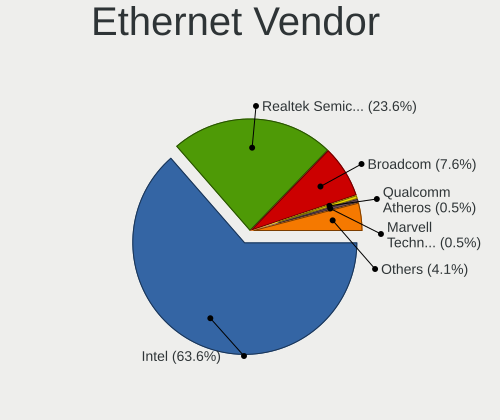

| Vendor                   | Computers | Percent |
|--------------------------|-----------|---------|
| Intel                    | 234       | 63.59%  |
| Realtek Semiconductor    | 87        | 23.64%  |
| Broadcom                 | 28        | 7.61%   |
| Qualcomm Atheros         | 2         | 0.54%   |
| Marvell Technology Group | 2         | 0.54%   |
| Aquantia                 | 2         | 0.54%   |
| AMD                      | 2         | 0.54%   |
| VIA Technologies         | 1         | 0.27%   |
| Samsung Electronics      | 1         | 0.27%   |
| OPPO Electronics         | 1         | 0.27%   |
| MYRICOM                  | 1         | 0.27%   |
| Microsoft                | 1         | 0.27%   |
| MediaTek                 | 1         | 0.27%   |
| JMicron Technology       | 1         | 0.27%   |
| D-Link System            | 1         | 0.27%   |
| Apple                    | 1         | 0.27%   |
| American Megatrends      | 1         | 0.27%   |
| 3Com                     | 1         | 0.27%   |

Ethernet Model
--------------

Ethernet models

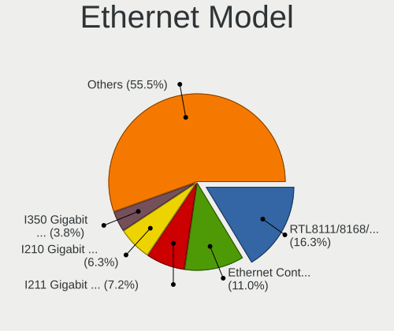

| Model                                                                         | Computers | Percent |
|-------------------------------------------------------------------------------|-----------|---------|
| Realtek RTL8111/8168/8211/8411 PCI Express Gigabit Ethernet Controller        | 73        | 16.33%  |
| Intel Ethernet Controller I226-V                                              | 49        | 10.96%  |
| Intel I211 Gigabit Network Connection                                         | 32        | 7.16%   |
| Intel I210 Gigabit Network Connection                                         | 28        | 6.26%   |
| Intel I350 Gigabit Network Connection                                         | 17        | 3.8%    |
| Intel 82574L Gigabit Network Connection                                       | 15        | 3.36%   |
| Intel Ethernet Connection I217-LM                                             | 13        | 2.91%   |
| Intel 82571EB/82571GB Gigabit Ethernet Controller D0/D1 (copper applications) | 12        | 2.68%   |
| Intel Ethernet Connection (2) I219-LM                                         | 11        | 2.46%   |
| Intel Ethernet Controller I225-V                                              | 10        | 2.24%   |
| Intel 82599ES 10-Gigabit SFI/SFP+ Network Connection                          | 10        | 2.24%   |
| Intel 82579LM Gigabit Network Connection (Lewisville)                         | 10        | 2.24%   |
| Intel 82580 Gigabit Network Connection                                        | 9         | 2.01%   |
| Realtek RTL8125 2.5GbE Controller                                             | 6         | 1.34%   |
| Broadcom NetXtreme BCM5720 Gigabit Ethernet PCIe                              | 6         | 1.34%   |
| Intel Ethernet Connection (2) I219-V                                          | 5         | 1.12%   |
| Realtek RTL8111/8168/8411 PCI Express Gigabit Ethernet Controller             | 4         | 0.89%   |
| Intel Ethernet Controller X710 for 10GbE SFP+                                 | 4         | 0.89%   |
| Intel Ethernet Controller 10-Gigabit X540-AT2                                 | 4         | 0.89%   |
| Intel Ethernet Connection I219-LM                                             | 4         | 0.89%   |
| Intel Ethernet Connection I217-V                                              | 4         | 0.89%   |
| Intel 82577LM Gigabit Network Connection                                      | 4         | 0.89%   |
| Intel 82576 Gigabit Network Connection                                        | 4         | 0.89%   |
| Broadcom NetXtreme II BCM5716 Gigabit Ethernet                                | 4         | 0.89%   |
| Broadcom NetXtreme II BCM5709 Gigabit Ethernet                                | 4         | 0.89%   |
| Realtek USB 2.5GbE Controller                                                 | 3         | 0.67%   |
| Realtek RTL810xE PCI Express Fast Ethernet controller                         | 3         | 0.67%   |
| Realtek RTL-8100/8101L/8139 PCI Fast Ethernet Adapter                         | 3         | 0.67%   |
| Intel Ethernet Controller X710 for 10GBASE-T                                  | 3         | 0.67%   |
| Intel Ethernet Controller X550                                                | 3         | 0.67%   |
| Intel Ethernet Connection I354                                                | 3         | 0.67%   |
| Intel Ethernet Connection I218-V                                              | 3         | 0.67%   |
| Intel Ethernet Connection (7) I219-LM                                         | 3         | 0.67%   |
| Intel 82575EB Gigabit Network Connection                                      | 3         | 0.67%   |
| Broadcom NetXtreme BCM5719 Gigabit Ethernet PCIe                              | 3         | 0.67%   |
| Marvell Group 88E8056 PCI-E Gigabit Ethernet Controller                       | 2         | 0.45%   |
| Intel I210 Gigabit Fiber Network Connection                                   | 2         | 0.45%   |
| Intel Ethernet Controller I226-LM                                             | 2         | 0.45%   |
| Intel Ethernet Connection I218-LM                                             | 2         | 0.45%   |
| Intel Ethernet Connection (7) I219-V                                          | 2         | 0.45%   |

Net Controller Kind
-------------------

Ethernet, WiFi or modem

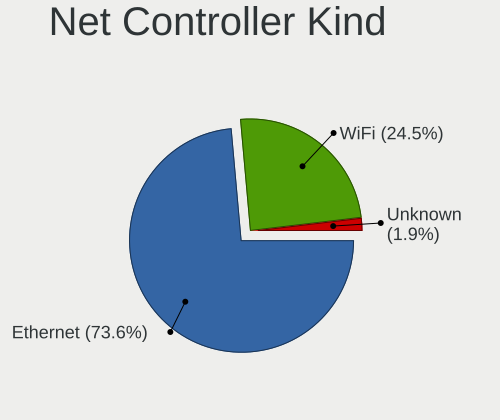

| Kind     | Computers | Percent |
|----------|-----------|---------|
| Ethernet | 312       | 73.58%  |
| WiFi     | 104       | 24.53%  |
| Unknown  | 8         | 1.89%   |

Used Controller
---------------

Currently used network controller

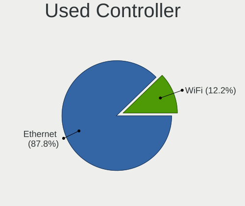

| Kind     | Computers | Percent |
|----------|-----------|---------|
| Ethernet | 287       | 87.77%  |
| WiFi     | 40        | 12.23%  |

NICs
----

Total network controllers on board

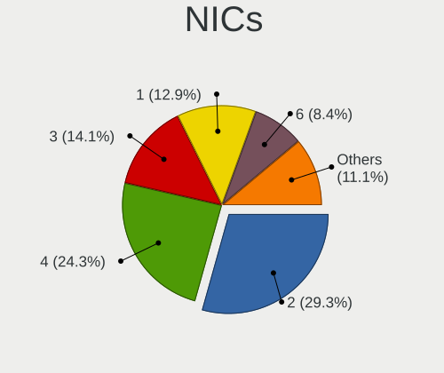

| Total | Computers | Percent |
|-------|-----------|---------|
| 2     | 98        | 29.34%  |
| 4     | 81        | 24.25%  |
| 3     | 47        | 14.07%  |
| 1     | 43        | 12.87%  |
| 6     | 28        | 8.38%   |
| 5     | 21        | 6.29%   |
| 7     | 5         | 1.5%    |
| 8     | 4         | 1.2%    |
| 9     | 3         | 0.9%    |
| 13    | 1         | 0.3%    |
| 12    | 1         | 0.3%    |
| 10    | 1         | 0.3%    |
| 0     | 1         | 0.3%    |

IPv6
----

IPv6 vs IPv4

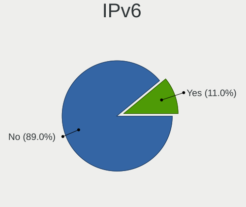

| Used | Computers | Percent |
|------|-----------|---------|
| No   | 300       | 89.02%  |
| Yes  | 37        | 10.98%  |

Bluetooth
---------

Bluetooth Vendor
----------------

Controller vendors

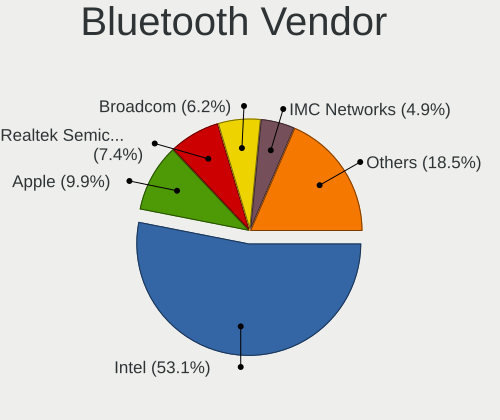

| Vendor                          | Computers | Percent |
|---------------------------------|-----------|---------|
| Intel                           | 43        | 53.09%  |
| Apple                           | 8         | 9.88%   |
| Realtek Semiconductor           | 6         | 7.41%   |
| Broadcom                        | 5         | 6.17%   |
| IMC Networks                    | 4         | 4.94%   |
| Cambridge Silicon Radio         | 4         | 4.94%   |
| MediaTek                        | 3         | 3.7%    |
| Hewlett-Packard                 | 2         | 2.47%   |
| Dell                            | 2         | 2.47%   |
| Realtek                         | 1         | 1.23%   |
| Qualcomm Atheros Communications | 1         | 1.23%   |
| Lite-On Technology              | 1         | 1.23%   |
| Foxconn / Hon Hai               | 1         | 1.23%   |

Bluetooth Model
---------------

Controller models

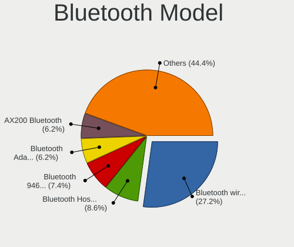

| Model                                                   | Computers | Percent |
|---------------------------------------------------------|-----------|---------|
| Intel Bluetooth wireless interface                      | 22        | 27.16%  |
| Apple Bluetooth Host Controller                         | 7         | 8.64%   |
| Intel Bluetooth 9460/9560 Jefferson Peak (JfP)          | 6         | 7.41%   |
| Realtek Bluetooth Adapter                               | 5         | 6.17%   |
| Intel AX200 Bluetooth                                   | 5         | 6.17%   |
| Cambridge Silicon Radio Bluetooth Dongle (HCI mode)     | 4         | 4.94%   |
| Broadcom BCM2045B (BDC-2.1)                             | 4         | 4.94%   |
| Intel Wireless-AC 3168 Bluetooth                        | 3         | 3.7%    |
| Intel AX201 Bluetooth                                   | 3         | 3.7%    |
| MediaTek Wireless_Device                                | 2         | 2.47%   |
| Intel Wireless-AC 9260 Bluetooth Adapter                | 2         | 2.47%   |
| Intel AX210 Bluetooth                                   | 2         | 2.47%   |
| IMC Networks Realtek Bluetooth 4.0 + High Speed Chip    | 2         | 2.47%   |
| Realtek  Bluetooth 4.2 Adapter                          | 1         | 1.23%   |
| Realtek  Bluetooth 4.0 Adapter                          | 1         | 1.23%   |
| Qualcomm Atheros AR3011 Bluetooth (no firmware)         | 1         | 1.23%   |
| MediaTek Bluetooth Adapter                              | 1         | 1.23%   |
| Lite-On Qualcomm Atheros QCA9377 Bluetooth              | 1         | 1.23%   |
| IMC Networks Wireless_Device                            | 1         | 1.23%   |
| IMC Networks Qualcomm Atheros AR3012 Bluetooth 4.0 + HS | 1         | 1.23%   |
| HP Broadcom 2070 Bluetooth Combo                        | 1         | 1.23%   |
| HP Atheros AR9285 Malbec Bluetooth Adapter              | 1         | 1.23%   |
| Dell Wireless 355C Bluetooth 2.0 + EDR module           | 1         | 1.23%   |
| Dell Dell Wireless 380 Bluetooth 4.0 Module             | 1         | 1.23%   |
| Broadcom Bluetooth 4.0 Adapter                          | 1         | 1.23%   |
| Apple Broadcom Built-in Bluetooth                       | 1         | 1.23%   |
| Unknown                                                 | 1         | 1.23%   |

Sound
-----

Sound Vendor
------------

Sound card vendors

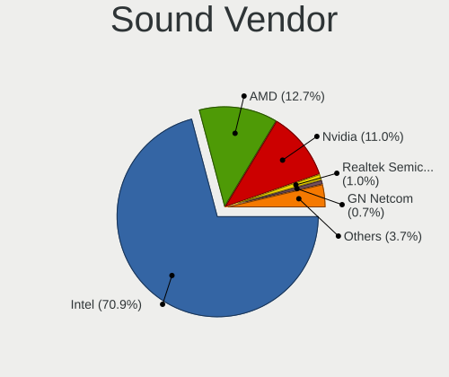

| Vendor                                       | Computers | Percent |
|----------------------------------------------|-----------|---------|
| Intel                                        | 212       | 70.9%   |
| AMD                                          | 38        | 12.71%  |
| Nvidia                                       | 33        | 11.04%  |
| Realtek Semiconductor                        | 3         | 1%      |
| GN Netcom                                    | 2         | 0.67%   |
| Zoran Co. Personal Media Division (Nogatech) | 1         | 0.33%   |
| Philips (or NXP)                             | 1         | 0.33%   |
| Nordic Semiconductor ASA                     | 1         | 0.33%   |
| Lenovo                                       | 1         | 0.33%   |
| Hewlett-Packard                              | 1         | 0.33%   |
| Generalplus Technology                       | 1         | 0.33%   |
| Focusrite-Novation                           | 1         | 0.33%   |
| ESS Technology                               | 1         | 0.33%   |
| Cambridge Silicon Radio                      | 1         | 0.33%   |
| C-Media Electronics                          | 1         | 0.33%   |
| BEHRINGER International                      | 1         | 0.33%   |

Sound Model
-----------

Sound card models

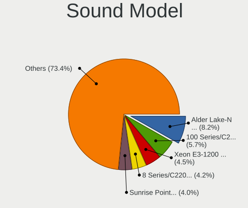

| Model                                                                                             | Computers | Percent |
|---------------------------------------------------------------------------------------------------|-----------|---------|
| Intel Alder Lake-N PCH High Definition Audio Controller                                           | 29        | 8.22%   |
| Intel 100 Series/C230 Series Chipset Family HD Audio Controller                                   | 20        | 5.67%   |
| Intel Xeon E3-1200 v3/4th Gen Core Processor HD Audio Controller                                  | 16        | 4.53%   |
| Intel 8 Series/C220 Series Chipset High Definition Audio Controller                               | 15        | 4.25%   |
| Intel Sunrise Point-LP HD Audio                                                                   | 14        | 3.97%   |
| Intel 6 Series/C200 Series Chipset Family High Definition Audio Controller                        | 14        | 3.97%   |
| Intel Jasper Lake HD Audio                                                                        | 13        | 3.68%   |
| Intel Haswell-ULT HD Audio Controller                                                             | 13        | 3.68%   |
| AMD Ryzen HD Audio Controller                                                                     | 13        | 3.68%   |
| Intel Atom Processor Z36xxx/Z37xxx Series High Definition Audio Controller                        | 12        | 3.4%    |
| Intel 8 Series HD Audio Controller                                                                | 12        | 3.4%    |
| Intel Cannon Lake PCH cAVS                                                                        | 10        | 2.83%   |
| Intel 7 Series/C216 Chipset Family High Definition Audio Controller                               | 7         | 1.98%   |
| Intel 5 Series/3400 Series Chipset High Definition Audio                                          | 7         | 1.98%   |
| Nvidia GK208 HDMI/DP Audio Controller                                                             | 6         | 1.7%    |
| Intel Celeron/Pentium Silver Processor High Definition Audio                                      | 6         | 1.7%    |
| Intel Alder Lake PCH-P High Definition Audio Controller                                           | 6         | 1.7%    |
| AMD Renoir/Cezanne HDMI/DP Audio Controller                                                       | 6         | 1.7%    |
| AMD FCH Azalia Controller                                                                         | 6         | 1.7%    |
| Intel Wildcat Point-LP High Definition Audio Controller                                           | 5         | 1.42%   |
| Intel Broadwell-U Audio Controller                                                                | 5         | 1.42%   |
| Nvidia High Definition Audio Controller                                                           | 4         | 1.13%   |
| Intel Cannon Point-LP High Definition Audio Controller                                            | 4         | 1.13%   |
| Intel Atom/Celeron/Pentium Processor x5-E8000/J3xxx/N3xxx Series High Definition Audio Controller | 4         | 1.13%   |
| Intel 200 Series PCH HD Audio                                                                     | 4         | 1.13%   |
| AMD Radeon High Definition Audio Controller                                                       | 4         | 1.13%   |
| AMD Kaveri HDMI/DP Audio Controller                                                               | 4         | 1.13%   |
| AMD Kabini HDMI/DP Audio                                                                          | 4         | 1.13%   |
| Intel NM10/ICH7 Family High Definition Audio Controller                                           | 3         | 0.85%   |
| Intel Ice Lake-LP Smart Sound Technology Audio Controller                                         | 3         | 0.85%   |
| Intel Comet Lake PCH-LP cAVS                                                                      | 3         | 0.85%   |
| AMD Starship/Matisse HD Audio Controller                                                          | 3         | 0.85%   |
| AMD Raven/Raven2/Fenghuang HDMI/DP Audio Controller                                               | 3         | 0.85%   |
| AMD Family 17h (Models 00h-0fh) HD Audio Controller                                               | 3         | 0.85%   |
| Realtek Semiconductor USB Audio                                                                   | 2         | 0.57%   |
| Nvidia GT216 HDMI Audio Controller                                                                | 2         | 0.57%   |
| Nvidia GP107GL High Definition Audio Controller                                                   | 2         | 0.57%   |
| Nvidia GP106 High Definition Audio Controller                                                     | 2         | 0.57%   |
| Nvidia GP104 High Definition Audio Controller                                                     | 2         | 0.57%   |
| Nvidia AD104 High Definition Audio Controller                                                     | 2         | 0.57%   |

Memory
------

Memory Vendor
-------------

Memory module vendors

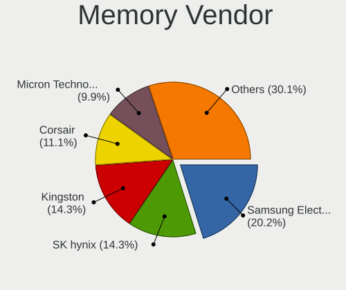

| Vendor              | Computers | Percent |
|---------------------|-----------|---------|
| Samsung Electronics | 69        | 20.18%  |
| SK hynix            | 49        | 14.33%  |
| Kingston            | 49        | 14.33%  |
| Corsair             | 38        | 11.11%  |
| Micron Technology   | 34        | 9.94%   |
| Unknown             | 33        | 9.65%   |
| Crucial             | 21        | 6.14%   |
| G.Skill             | 6         | 1.75%   |
| Elpida              | 6         | 1.75%   |
| Ramaxel Technology  | 5         | 1.46%   |
| Kimtigo             | 5         | 1.46%   |
| Unknown             | 5         | 1.46%   |
| Transcend           | 4         | 1.17%   |
| Toshiba             | 3         | 0.88%   |
| Hewlett-Packard     | 3         | 0.88%   |
| HPE                 | 2         | 0.58%   |
| GSkill              | 2         | 0.58%   |
| Vasekey             | 1         | 0.29%   |
| Unknown (ABCD)      | 1         | 0.29%   |
| tigo                | 1         | 0.29%   |
| Smart Modular       | 1         | 0.29%   |
| Mushkin             | 1         | 0.29%   |
| ASint Technology    | 1         | 0.29%   |
| Apacer              | 1         | 0.29%   |
| A-DATA Technology   | 1         | 0.29%   |

Memory Model
------------

Memory module models

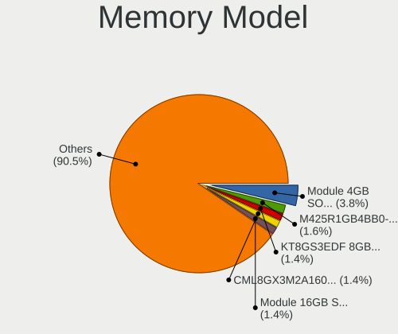

| Model                                                   | Computers | Percent |
|---------------------------------------------------------|-----------|---------|
| Unknown RAM Module 4GB SODIMM DDR3 1333MT/s             | 14        | 3.81%   |
| Samsung RAM M425R1GB4BB0-CQKOL 8GB SODIMM DDR5 4800MT/s | 6         | 1.63%   |
| Kimtigo RAM KT8GS3EDF 8GB SODIMM DDR3 1600MT/s          | 5         | 1.36%   |
| Corsair RAM CML8GX3M2A1600C9 4GB DIMM DDR3 1600MT/s     | 5         | 1.36%   |
| Unknown                                                 | 5         | 1.36%   |
| Corsair RAM CMK16GX4M2B3200C16 8GB DIMM DDR4 3200MT/s   | 4         | 1.09%   |
| SK hynix RAM HMA81GS6AFR8N-UH 8GB SODIMM DDR4 2400MT/s  | 3         | 0.82%   |
| Samsung RAM M471B1G73EB0-YK0 8GB SODIMM DDR3 1600MT/s   | 3         | 0.82%   |
| Samsung RAM M471A5244CB0-CWE 4GB SODIMM DDR4 3200MT/s   | 3         | 0.82%   |
| Samsung RAM M471A2K43CB1-CTD 16GB SODIMM DDR4 2667MT/s  | 3         | 0.82%   |
| Samsung RAM M378B5673EH1-CH9 2GB DIMM DDR3 1333MT/s     | 3         | 0.82%   |
| Samsung RAM M378B5173DB0-CK0 4GB DIMM DDR3 1600MT/s     | 3         | 0.82%   |
| Micron RAM Module 4GB DIMM DDR4 2133MT/s                | 3         | 0.82%   |
| Crucial RAM CT16G48C40S5.M8A1 16GB SODIMM DDR5 4800MT/s | 3         | 0.82%   |
| Unknown RAM Module 4GB SODIMM DDR3 667MT/s              | 2         | 0.54%   |
| Unknown RAM Module 2GB DIMM SDRAM                       | 2         | 0.54%   |
| Unknown RAM Module 2GB DIMM DDR2 800MT/s                | 2         | 0.54%   |
| SK hynix RAM Module 2GB SODIMM DDR3 1067MT/s            | 2         | 0.54%   |
| SK hynix RAM HMT451S6BFR8A-PB 4GB SODIMM DDR3 1600MT/s  | 2         | 0.54%   |
| SK hynix RAM HMT41GU6MFR8C-PB 8GB DIMM DDR3 1600MT/s    | 2         | 0.54%   |
| SK hynix RAM HMT41GS6BFR8A-PB 8GB SODIMM DDR3 1600MT/s  | 2         | 0.54%   |
| SK hynix RAM HMT351S6CFR8C-PB 4GB SODIMM DDR3 1600MT/s  | 2         | 0.54%   |
| SK hynix RAM HMCG78AEBSA092N 16GB SODIMM DDR5 4800MT/s  | 2         | 0.54%   |
| Samsung RAM Module 4GB DIMM DDR4 2133MT/s               | 2         | 0.54%   |
| Samsung RAM M471B5673FH0-CH9 2GB SODIMM DDR3 1334MT/s   | 2         | 0.54%   |
| Samsung RAM M471B5173EB0-YK0 4GB SODIMM DDR3 1600MT/s   | 2         | 0.54%   |
| Samsung RAM M471B1G73QH0-YK0 8GB SODIMM DDR3 1867MT/s   | 2         | 0.54%   |
| Samsung RAM M471B1G73DB0-YK0 8GB SODIMM DDR3 1600MT/s   | 2         | 0.54%   |
| Samsung RAM M471A1K43CB1-CWE 8GB SODIMM DDR4 3200MT/s   | 2         | 0.54%   |
| Samsung RAM M471A1K43CB1-CTD 8GB SODIMM DDR4 3200MT/s   | 2         | 0.54%   |
| Samsung RAM M425R1GB4BB0-CWMOD 8GB SODIMM DDR5 5600MT/s | 2         | 0.54%   |
| Samsung RAM M378A1K43BB2-CRC 8GB DIMM DDR4 2400MT/s     | 2         | 0.54%   |
| Micron RAM MTC4C10163S1SC48BA1 8GB SODIMM DDR5 4800MT/s | 2         | 0.54%   |
| Micron RAM CT16G56C46S5.C8D 16GB SODIMM DDR5 5600MT/s   | 2         | 0.54%   |
| Micron RAM 8ATF1G64HZ-2G6D1 8GB SODIMM DDR4 2667MT/s    | 2         | 0.54%   |
| Micron RAM 16KTF51264HZ-1G4M1 4GB SODIMM DDR3 1333MT/s  | 2         | 0.54%   |
| Kingston RAM 99U5428-063.A00LF 8GB SODIMM DDR4 2400MT/s | 2         | 0.54%   |
| Kingston RAM 9965525-116.A00LF 8GB DIMM DDR3 1600MT/s   | 2         | 0.54%   |
| GSkill RAM F4-3200C22-16GRS 16GB SODIMM DDR4 3200MT/s   | 2         | 0.54%   |
| Elpida RAM EBJ41UF8BCS0-DJ-F 4GB SODIMM DDR3            | 2         | 0.54%   |

Memory Kind
-----------

Memory module kinds

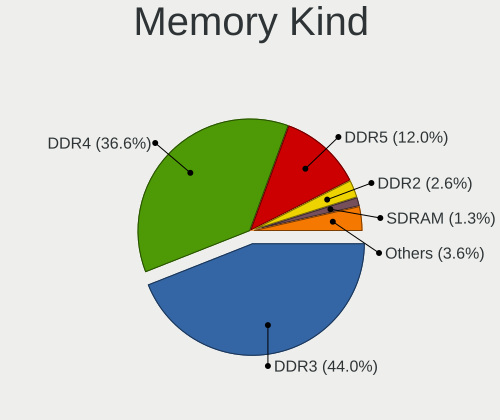

| Kind    | Computers | Percent |
|---------|-----------|---------|
| DDR3    | 136       | 44.01%  |
| DDR4    | 113       | 36.57%  |
| DDR5    | 37        | 11.97%  |
| DDR2    | 8         | 2.59%   |
| SDRAM   | 4         | 1.29%   |
| Unknown | 4         | 1.29%   |
| LPDDR5  | 2         | 0.65%   |
| LPDDR4  | 2         | 0.65%   |
| LPDDR3  | 2         | 0.65%   |
| DRAM    | 1         | 0.32%   |

Memory Form Factor
------------------

Physical design of the memory module

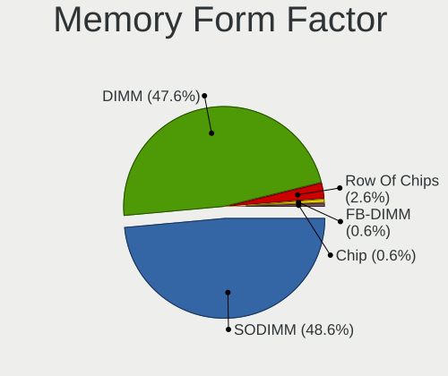

| Name         | Computers | Percent |
|--------------|-----------|---------|
| SODIMM       | 151       | 48.55%  |
| DIMM         | 148       | 47.59%  |
| Row Of Chips | 8         | 2.57%   |
| FB-DIMM      | 2         | 0.64%   |
| Chip         | 2         | 0.64%   |

Memory Size
-----------

Memory module size

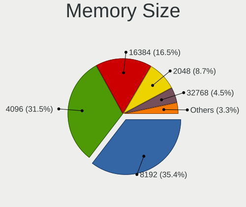

| Size  | Computers | Percent |
|-------|-----------|---------|
| 8192  | 118       | 35.44%  |
| 4096  | 105       | 31.53%  |
| 16384 | 55        | 16.52%  |
| 2048  | 29        | 8.71%   |
| 32768 | 15        | 4.5%    |
| 1024  | 8         | 2.4%    |
| 3072  | 2         | 0.6%    |
| 6144  | 1         | 0.3%    |

Memory Speed
------------

Memory module speed

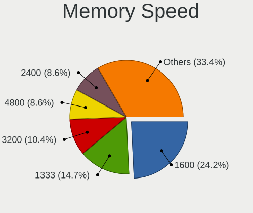

| Speed   | Computers | Percent |
|---------|-----------|---------|
| 1600    | 79        | 24.23%  |
| 1333    | 48        | 14.72%  |
| 3200    | 34        | 10.43%  |
| 4800    | 28        | 8.59%   |
| 2400    | 28        | 8.59%   |
| 2133    | 25        | 7.67%   |
| 2667    | 23        | 7.06%   |
| 5600    | 10        | 3.07%   |
| 800     | 7         | 2.15%   |
| 1334    | 6         | 1.84%   |
| 667     | 6         | 1.84%   |
| Unknown | 6         | 1.84%   |
| 2666    | 5         | 1.53%   |
| 1067    | 4         | 1.23%   |
| 2933    | 3         | 0.92%   |
| 1867    | 3         | 0.92%   |
| 1866    | 2         | 0.61%   |
| 6400    | 1         | 0.31%   |
| 4400    | 1         | 0.31%   |
| 3733    | 1         | 0.31%   |
| 3600    | 1         | 0.31%   |
| 3000    | 1         | 0.31%   |
| 1400    | 1         | 0.31%   |
| 1332    | 1         | 0.31%   |
| 1066    | 1         | 0.31%   |
| 333     | 1         | 0.31%   |

Printers & scanners
-------------------

Printer Vendor
--------------

Printer device vendors

Zero info for selected period =(

Printer Model
-------------

Printer device models

Zero info for selected period =(

Scanner Vendor
--------------

Scanner device vendors

Zero info for selected period =(

Scanner Model
-------------

Scanner device models

Zero info for selected period =(

Camera
------

Camera Vendor
-------------

Camera device vendors

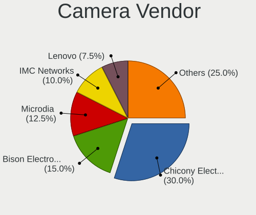

| Vendor                        | Computers | Percent |
|-------------------------------|-----------|---------|
| Chicony Electronics           | 12        | 30%     |
| Bison Electronics             | 6         | 15%     |
| Microdia                      | 5         | 12.5%   |
| IMC Networks                  | 4         | 10%     |
| Lenovo                        | 3         | 7.5%    |
| Syntek                        | 2         | 5%      |
| Realtek Semiconductor         | 2         | 5%      |
| Trust                         | 1         | 2.5%    |
| Suyin                         | 1         | 2.5%    |
| Sunplus Innovation Technology | 1         | 2.5%    |
| Quanta                        | 1         | 2.5%    |
| Logitech                      | 1         | 2.5%    |
| Framework                     | 1         | 2.5%    |

Camera Model
------------

Camera device models

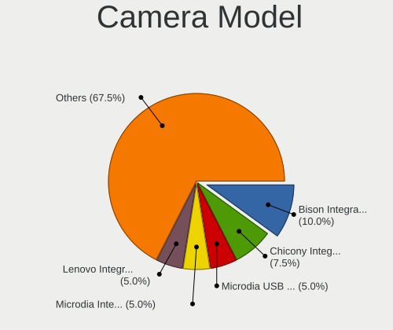

| Model                                    | Computers | Percent |
|------------------------------------------|-----------|---------|
| Bison Integrated Camera                  | 4         | 10%     |
| Chicony Integrated Camera                | 3         | 7.5%    |
| Microdia USB  Live camera                | 2         | 5%      |
| Microdia Integrated Webcam               | 2         | 5%      |
| Lenovo Integrated Webcam                 | 2         | 5%      |
| Bison ThinkPad P50 Integrated Camera     | 2         | 5%      |
| Trust Trust USB Camera                   | 1         | 2.5%    |
| Syntek Integrated Camera                 | 1         | 2.5%    |
| Syntek EasyCamera                        | 1         | 2.5%    |
| Suyin Asus Integrated Webcam             | 1         | 2.5%    |
| Sunplus Laptop Integrated Webcam HD      | 1         | 2.5%    |
| Realtek Integrated_Webcam_HD             | 1         | 2.5%    |
| Realtek Front Camera                     | 1         | 2.5%    |
| Quanta VGA WebCam                        | 1         | 2.5%    |
| Microdia Integrated_Webcam_HD            | 1         | 2.5%    |
| Logitech Webcam C270                     | 1         | 2.5%    |
| Lenovo Integrated Webcam [R5U877]        | 1         | 2.5%    |
| IMC Networks Integrated RGB Camera       | 1         | 2.5%    |
| IMC Networks Integrated Camera           | 1         | 2.5%    |
| IMC Networks HP TrueVision HD Camera     | 1         | 2.5%    |
| IMC Networks EasyCamera                  | 1         | 2.5%    |
| Framework Laptop Webcam Module (2nd Gen) | 1         | 2.5%    |
| Chicony USB2.0 HD UVC WebCam             | 1         | 2.5%    |
| Chicony USB 2.0 VGA UVC WebCam           | 1         | 2.5%    |
| Chicony TOSHIBA Web Camera - FHD         | 1         | 2.5%    |
| Chicony ThinkPad T490 Webcam             | 1         | 2.5%    |
| Chicony Realtek DMFT RGB                 | 1         | 2.5%    |
| Chicony Lenovo Integrated Camera (0.3MP) | 1         | 2.5%    |
| Chicony Integrated HP HD Webcam          | 1         | 2.5%    |
| Chicony FJ Camera                        | 1         | 2.5%    |
| Chicony Camera                           | 1         | 2.5%    |

Security
--------

Fingerprint Vendor
------------------

Fingerprint sensor vendors

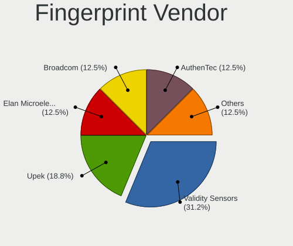

| Vendor                     | Computers | Percent |
|----------------------------|-----------|---------|
| Validity Sensors           | 5         | 31.25%  |
| Upek                       | 3         | 18.75%  |
| Elan Microelectronics      | 2         | 12.5%   |
| Broadcom                   | 2         | 12.5%   |
| AuthenTec                  | 2         | 12.5%   |
| Synaptics                  | 1         | 6.25%   |
| Shenzhen Goodix Technology | 1         | 6.25%   |

Fingerprint Model
-----------------

Fingerprint sensor models

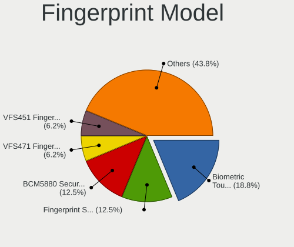

| Model                                                                        | Computers | Percent |
|------------------------------------------------------------------------------|-----------|---------|
| Upek Biometric Touchchip/Touchstrip Fingerprint Sensor                       | 3         | 18.75%  |
| Elan Fingerprint Sensor                                                      | 2         | 12.5%   |
| Broadcom BCM5880 Secure Applications Processor with fingerprint swipe sensor | 2         | 12.5%   |
| Validity Sensors VFS471 Fingerprint Reader                                   | 1         | 6.25%   |
| Validity Sensors VFS451 Fingerprint Reader                                   | 1         | 6.25%   |
| Validity Sensors VFS Fingerprint sensor                                      | 1         | 6.25%   |
| Validity Sensors VFS 5011 fingerprint sensor                                 | 1         | 6.25%   |
| Validity Sensors Synaptics WBDI                                              | 1         | 6.25%   |
| Synaptics Prometheus MIS Touch Fingerprint Reader                            | 1         | 6.25%   |
| Shenzhen Goodix Fingerprint Reader                                           | 1         | 6.25%   |
| AuthenTec AES2810                                                            | 1         | 6.25%   |
| AuthenTec AES2501 Fingerprint Sensor                                         | 1         | 6.25%   |

Chipcard Vendor
---------------

Chipcard module vendors

Zero info for selected period =(

Chipcard Model
--------------

Chipcard module models

Zero info for selected period =(

Unsupported
-----------

Unsupported Devices
-------------------

Total unsupported devices on board

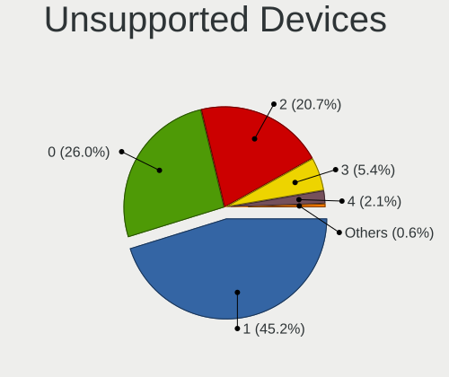

| Total | Computers | Percent |
|-------|-----------|---------|
| 1     | 151       | 45.21%  |
| 0     | 87        | 26.05%  |
| 2     | 69        | 20.66%  |
| 3     | 18        | 5.39%   |
| 4     | 7         | 2.1%    |
| 5     | 2         | 0.6%    |

Unsupported Device Types
------------------------

Types of unsupported devices

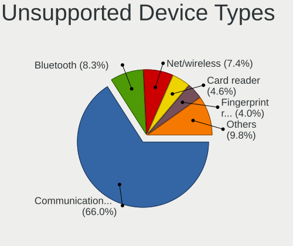

| Type                     | Computers | Percent |
|--------------------------|-----------|---------|
| Communication controller | 215       | 65.95%  |
| Bluetooth                | 27        | 8.28%   |
| Net/wireless             | 24        | 7.36%   |
| Card reader              | 15        | 4.6%    |
| Fingerprint reader       | 13        | 3.99%   |
| Firewire controller      | 12        | 3.68%   |
| Network                  | 6         | 1.84%   |
| Net/ethernet             | 5         | 1.53%   |
| Sound                    | 4         | 1.23%   |
| Graphics card            | 3         | 0.92%   |
| Storage/ata              | 2         | 0.61%   |

