BSD in Sweden - Tested Hardware & Statistics
--------------------------------------------

A project to collect tested hardware configurations for BSD in Sweden.

Anyone can contribute to this report by the [hw-probe](https://github.com/linuxhw/hw-probe/blob/master/INSTALL.BSD.md) tool:

    hw-probe -all -upload

Please contribute! Especially if your hardware is rare.

This is a report for all computer types. See also reports for [desktops](/Location/Sweden/Desktop/README.md) and [notebooks](/Location/Sweden/Notebook/README.md).

Contents
--------

* [ Test Cases ](#test-cases)

* [ System ](#system)
  - [ OS                       ](#os)
  - [ OS Family                ](#os-family)
  - [ Arch                     ](#arch)
  - [ DE                       ](#de)
  - [ Display Server           ](#display-server)
  - [ Display Manager          ](#display-manager)
  - [ OS Lang                  ](#os-lang)
  - [ Boot Mode                ](#boot-mode)
  - [ Filesystem               ](#filesystem)
  - [ Part. scheme             ](#part-scheme)

* [ Board ](#board)
  - [ Vendor                   ](#vendor)
  - [ Model                    ](#model)
  - [ Model Family             ](#model-family)
  - [ MFG Year                 ](#mfg-year)
  - [ Form Factor              ](#form-factor)
  - [ Coreboot                 ](#coreboot)
  - [ RAM Size                 ](#ram-size)
  - [ RAM Used                 ](#ram-used)
  - [ Total Drives             ](#total-drives)
  - [ Has CD-ROM               ](#has-cd-rom)
  - [ Has Ethernet             ](#has-ethernet)
  - [ Has WiFi                 ](#has-wifi)
  - [ Has Bluetooth            ](#has-bluetooth)

* [ Location ](#location)
  - [ Country                  ](#country)
  - [ City                     ](#city)

* [ Drives ](#drives)
  - [ Drive Vendor             ](#drive-vendor)
  - [ Drive Model              ](#drive-model)
  - [ HDD Vendor               ](#hdd-vendor)
  - [ SSD Vendor               ](#ssd-vendor)
  - [ Drive Kind               ](#drive-kind)
  - [ Drive Connector          ](#drive-connector)
  - [ Drive Size               ](#drive-size)
  - [ Space Total              ](#space-total)
  - [ Space Used               ](#space-used)
  - [ Malfunc. Drives          ](#malfunc-drives)
  - [ Malfunc. Drive Vendor    ](#malfunc-drive-vendor)
  - [ Malfunc. HDD Vendor      ](#malfunc-hdd-vendor)
  - [ Malfunc. Drive Kind      ](#malfunc-drive-kind)
  - [ Failed Drives            ](#failed-drives)
  - [ Failed Drive Vendor      ](#failed-drive-vendor)
  - [ Drive Status             ](#drive-status)

* [ Storage controller ](#storage-controller)
  - [ Storage Vendor           ](#storage-vendor)
  - [ Storage Model            ](#storage-model)
  - [ Storage Kind             ](#storage-kind)

* [ Processor ](#processor)
  - [ CPU Vendor               ](#cpu-vendor)
  - [ CPU Model                ](#cpu-model)
  - [ CPU Model Family         ](#cpu-model-family)
  - [ CPU Cores                ](#cpu-cores)
  - [ CPU Sockets              ](#cpu-sockets)
  - [ CPU Threads              ](#cpu-threads)
  - [ CPU Microarch            ](#cpu-microarch)

* [ Graphics ](#graphics)
  - [ GPU Vendor               ](#gpu-vendor)
  - [ GPU Model                ](#gpu-model)
  - [ GPU Combo                ](#gpu-combo)
  - [ GPU Driver               ](#gpu-driver)
  - [ GPU Memory               ](#gpu-memory)

* [ Monitor ](#monitor)
  - [ Monitor Vendor           ](#monitor-vendor)
  - [ Monitor Model            ](#monitor-model)
  - [ Monitor Resolution       ](#monitor-resolution)
  - [ Monitor Diagonal         ](#monitor-diagonal)
  - [ Monitor Width            ](#monitor-width)
  - [ Aspect Ratio             ](#aspect-ratio)
  - [ Monitor Area             ](#monitor-area)
  - [ Pixel Density            ](#pixel-density)
  - [ Multiple Monitors        ](#multiple-monitors)

* [ Network ](#network)
  - [ Net Controller Vendor    ](#net-controller-vendor)
  - [ Net Controller Model     ](#net-controller-model)
  - [ Wireless Vendor          ](#wireless-vendor)
  - [ Wireless Model           ](#wireless-model)
  - [ Ethernet Vendor          ](#ethernet-vendor)
  - [ Ethernet Model           ](#ethernet-model)
  - [ Net Controller Kind      ](#net-controller-kind)
  - [ Used Controller          ](#used-controller)
  - [ NICs                     ](#nics)
  - [ IPv6                     ](#ipv6)

* [ Bluetooth ](#bluetooth)
  - [ Bluetooth Vendor         ](#bluetooth-vendor)
  - [ Bluetooth Model          ](#bluetooth-model)

* [ Sound ](#sound)
  - [ Sound Vendor             ](#sound-vendor)
  - [ Sound Model              ](#sound-model)

* [ Memory ](#memory)
  - [ Memory Vendor            ](#memory-vendor)
  - [ Memory Model             ](#memory-model)
  - [ Memory Kind              ](#memory-kind)
  - [ Memory Form Factor       ](#memory-form-factor)
  - [ Memory Size              ](#memory-size)
  - [ Memory Speed             ](#memory-speed)

* [ Printers & scanners ](#printers--scanners)
  - [ Printer Vendor           ](#printer-vendor)
  - [ Printer Model            ](#printer-model)
  - [ Scanner Vendor           ](#scanner-vendor)
  - [ Scanner Model            ](#scanner-model)

* [ Camera ](#camera)
  - [ Camera Vendor            ](#camera-vendor)
  - [ Camera Model             ](#camera-model)

* [ Security ](#security)
  - [ Fingerprint Vendor       ](#fingerprint-vendor)
  - [ Fingerprint Model        ](#fingerprint-model)
  - [ Chipcard Vendor          ](#chipcard-vendor)
  - [ Chipcard Model           ](#chipcard-model)

* [ Unsupported ](#unsupported)
  - [ Unsupported Devices      ](#unsupported-devices)
  - [ Unsupported Device Types ](#unsupported-device-types)

Test Cases
----------

Total: 152

| Vendor        | Model                       | Form-Factor | Probe                                                     | Date         |
|---------------|-----------------------------|-------------|-----------------------------------------------------------|--------------|
| Supermicro    | X11SSH-LN4F                 | Server      | [d3ba57cf29](https://bsd-hardware.info/?probe=d3ba57cf29) | Jun 01, 2022 |
| MSI           | MS-7369                     | Desktop     | [c2c6bd80e8](https://bsd-hardware.info/?probe=c2c6bd80e8) | May 13, 2022 |
| Dell          | 05Y15N A06                  | Server      | [047ecc3a64](https://bsd-hardware.info/?probe=047ecc3a64) | May 13, 2022 |
| Intel         | CRESCENTBAY                 | Desktop     | [0d11258d3a](https://bsd-hardware.info/?probe=0d11258d3a) | Apr 22, 2022 |
| HP            | 8103 A01                    | Mini pc     | [b3d4d3c2db](https://bsd-hardware.info/?probe=b3d4d3c2db) | Apr 16, 2022 |
| Shuttle       | SH570                       | Desktop     | [08e2af8890](https://bsd-hardware.info/?probe=08e2af8890) | Apr 16, 2022 |
| Unknown       | Unknown                     | Desktop     | [2e4a7843ab](https://bsd-hardware.info/?probe=2e4a7843ab) | Apr 14, 2022 |
| ASUSTek       | UX305UA                     | Notebook    | [3fb1786193](https://bsd-hardware.info/?probe=3fb1786193) | Apr 04, 2022 |
| Dell          | 0GFKVD A00                  | Server      | [2b14dd2a23](https://bsd-hardware.info/?probe=2b14dd2a23) | Mar 29, 2022 |
| HPE           | ProLiant MicroServer Gen... | Desktop     | [04e77555a2](https://bsd-hardware.info/?probe=04e77555a2) | Mar 24, 2022 |
| Fujitsu Si... | D2811-A1 S26361-D2811-A1    | Desktop     | [23055a27d9](https://bsd-hardware.info/?probe=23055a27d9) | Mar 23, 2022 |
| Lenovo        | ThinkPad T460s 20FAS4KH0... | Notebook    | [dbb0e378d5](https://bsd-hardware.info/?probe=dbb0e378d5) | Mar 17, 2022 |
| AOPEN         | iBTMx-DS R1.04 55DED10A0... | Desktop     | [8faec8e7ed](https://bsd-hardware.info/?probe=8faec8e7ed) | Mar 10, 2022 |
| HPE           | ProLiant MicroServer Gen... | Desktop     | [a2c59d02ee](https://bsd-hardware.info/?probe=a2c59d02ee) | Mar 08, 2022 |
| HPE           | ProLiant MicroServer Gen... | Desktop     | [099edf57ae](https://bsd-hardware.info/?probe=099edf57ae) | Mar 08, 2022 |
| Gigabyte      | AB350M-Gaming 3-CF          | Desktop     | [1daab68f1f](https://bsd-hardware.info/?probe=1daab68f1f) | Mar 04, 2022 |
| HPE           | ProLiant MicroServer Gen... | Desktop     | [8016115ff1](https://bsd-hardware.info/?probe=8016115ff1) | Feb 24, 2022 |
| AMI           | Aptio CRB                   | Mini pc     | [5d39002367](https://bsd-hardware.info/?probe=5d39002367) | Feb 21, 2022 |
| ASUSTek       | ROG STRIX X570-F GAMING     | Desktop     | [807a29112e](https://bsd-hardware.info/?probe=807a29112e) | Feb 19, 2022 |
| ASUSTek       | AM1I-A                      | Desktop     | [5f27a360e4](https://bsd-hardware.info/?probe=5f27a360e4) | Feb 10, 2022 |
| Gigabyte      | Z68X-UD7-B3                 | Desktop     | [37cc045649](https://bsd-hardware.info/?probe=37cc045649) | Jan 28, 2022 |
| MSI           | MS-7C56                     | Desktop     | [962ac1c7b0](https://bsd-hardware.info/?probe=962ac1c7b0) | Jan 20, 2022 |
| Gigabyte      | Z68X-UD7-B3                 | Desktop     | [082da3ef7f](https://bsd-hardware.info/?probe=082da3ef7f) | Jan 19, 2022 |
| Microsoft     | Surface Pro 7               | Tablet      | [26ccd8e3c5](https://bsd-hardware.info/?probe=26ccd8e3c5) | Jan 16, 2022 |
| Lenovo        | V130-15IGM 81HL             | Notebook    | [e0e7b21668](https://bsd-hardware.info/?probe=e0e7b21668) | Jan 09, 2022 |
| ASUSTek       | P8H77-I                     | Desktop     | [e15d67e8db](https://bsd-hardware.info/?probe=e15d67e8db) | Jan 08, 2022 |
| ASRock        | E3C226D2I                   | Desktop     | [a31265ae13](https://bsd-hardware.info/?probe=a31265ae13) | Jan 07, 2022 |
| ASUSTek       | P8H77-I                     | Desktop     | [27960088a3](https://bsd-hardware.info/?probe=27960088a3) | Jan 05, 2022 |
| Fujitsu       | D3221-A1 S26361-D3221-A1    | Desktop     | [1684618e22](https://bsd-hardware.info/?probe=1684618e22) | Jan 01, 2022 |
| HP            | ProLiant DL360 G5           | Server      | [8eaea61913](https://bsd-hardware.info/?probe=8eaea61913) | Dec 29, 2021 |
| Dell          | 0T10XW A01                  | Desktop     | [e28b542e9e](https://bsd-hardware.info/?probe=e28b542e9e) | Dec 23, 2021 |
| HP            | ProLiant DL360p Gen8        | Server      | [fda420b944](https://bsd-hardware.info/?probe=fda420b944) | Dec 20, 2021 |
| HPE           | ProLiant DL380 Gen10        | Server      | [d1e6144816](https://bsd-hardware.info/?probe=d1e6144816) | Dec 20, 2021 |
| Intel         | DH61AG AAG81491-600         | Desktop     | [fd9659a9fe](https://bsd-hardware.info/?probe=fd9659a9fe) | Dec 15, 2021 |
| ASUSTek       | Rampage Formula             | Desktop     | [34633c2ca8](https://bsd-hardware.info/?probe=34633c2ca8) | Dec 02, 2021 |
| MSI           | MS-7C56                     | Desktop     | [d4e3f14ad4](https://bsd-hardware.info/?probe=d4e3f14ad4) | Nov 23, 2021 |
| Lenovo        | ThinkPad T420 4236MBG       | Notebook    | [0391bf9ea4](https://bsd-hardware.info/?probe=0391bf9ea4) | Nov 14, 2021 |
| Dell          | 0N28XX A02                  | Server      | [b640c5a644](https://bsd-hardware.info/?probe=b640c5a644) | Nov 10, 2021 |
| ASUSTek       | K52Jc                       | Notebook    | [92b975763f](https://bsd-hardware.info/?probe=92b975763f) | Nov 08, 2021 |
| ASUSTek       | K52Jc                       | Notebook    | [fc919c73e3](https://bsd-hardware.info/?probe=fc919c73e3) | Nov 07, 2021 |
| Google        | Grunt                       | Notebook    | [aa07a1dd40](https://bsd-hardware.info/?probe=aa07a1dd40) | Nov 05, 2021 |
| Google        | Grunt                       | Notebook    | [c87e033731](https://bsd-hardware.info/?probe=c87e033731) | Nov 01, 2021 |
| Google        | Grunt                       | Notebook    | [259f96d9c8](https://bsd-hardware.info/?probe=259f96d9c8) | Oct 22, 2021 |
| AMI           | PEISIA E3845 VER1.0         | Desktop     | [a6b7ceeada](https://bsd-hardware.info/?probe=a6b7ceeada) | Oct 20, 2021 |
| ShenZhen M... | MW-NANO-APL-4L              | Desktop     | [4fdd90135a](https://bsd-hardware.info/?probe=4fdd90135a) | Oct 20, 2021 |
| Google        | Grunt                       | Notebook    | [e6d4421a4d](https://bsd-hardware.info/?probe=e6d4421a4d) | Oct 16, 2021 |
| Google        | Grunt                       | Notebook    | [ee9b2d7ad3](https://bsd-hardware.info/?probe=ee9b2d7ad3) | Oct 15, 2021 |
| Lenovo        | Win8 Pro DPK TPG            | Desktop     | [f57ea5540f](https://bsd-hardware.info/?probe=f57ea5540f) | Oct 13, 2021 |
| Google        | Grunt                       | Notebook    | [e76c73d9a3](https://bsd-hardware.info/?probe=e76c73d9a3) | Oct 11, 2021 |
| Acer          | Aspire A315-56              | Notebook    | [03ca802f4b](https://bsd-hardware.info/?probe=03ca802f4b) | Oct 02, 2021 |
| Gigabyte      | Z87M-D3H                    | Desktop     | [8cb8c4dbf4](https://bsd-hardware.info/?probe=8cb8c4dbf4) | Oct 01, 2021 |
| ASUSTek       | ROG STRIX X570-F GAMING     | Desktop     | [1ef37663db](https://bsd-hardware.info/?probe=1ef37663db) | Sep 01, 2021 |
| Dell          | 0M877N A01                  | Server      | [1585126252](https://bsd-hardware.info/?probe=1585126252) | Aug 18, 2021 |
| Lenovo        | 3098 0B98401 PRO            | Desktop     | [4737978dbf](https://bsd-hardware.info/?probe=4737978dbf) | Aug 18, 2021 |
| Dell          | Latitude E5530 non-vPro     | Notebook    | [bd4b0f0700](https://bsd-hardware.info/?probe=bd4b0f0700) | Aug 17, 2021 |
| HPE           | ProLiant MicroServer Gen... | Desktop     | [04d9692802](https://bsd-hardware.info/?probe=04d9692802) | Aug 09, 2021 |
| HPE           | ProLiant MicroServer Gen... | Desktop     | [24df2da075](https://bsd-hardware.info/?probe=24df2da075) | Aug 08, 2021 |
| PC Engines    | apu4                        | Desktop     | [815567b75c](https://bsd-hardware.info/?probe=815567b75c) | Aug 02, 2021 |
| PC Engines    | apu4                        | Desktop     | [77fa195d5e](https://bsd-hardware.info/?probe=77fa195d5e) | Aug 02, 2021 |
| Lenovo        | ThinkPad X250 20CLS4JH00    | Notebook    | [89a74889ae](https://bsd-hardware.info/?probe=89a74889ae) | Aug 02, 2021 |
| AMI           | Aptio CRB                   | Mini pc     | [c577b93feb](https://bsd-hardware.info/?probe=c577b93feb) | Jul 24, 2021 |
| Lenovo        | ThinkPad T400 2767WSB       | Notebook    | [36ce1d1e00](https://bsd-hardware.info/?probe=36ce1d1e00) | Jul 24, 2021 |
| ASUSTek       | P8H77-I                     | Desktop     | [52e8a39fb1](https://bsd-hardware.info/?probe=52e8a39fb1) | Jul 19, 2021 |
| Lenovo        | ThinkPad T420 4236MBG       | Notebook    | [5b43300a93](https://bsd-hardware.info/?probe=5b43300a93) | Jul 13, 2021 |
| Protectli     | FW4B Ver                    | Desktop     | [452a8558c0](https://bsd-hardware.info/?probe=452a8558c0) | Jul 09, 2021 |
| Dell          | 05XGC8 A01                  | Desktop     | [b9841b1272](https://bsd-hardware.info/?probe=b9841b1272) | Jul 08, 2021 |
| Unknown       | Unknown                     | Desktop     | [935263c5a0](https://bsd-hardware.info/?probe=935263c5a0) | Jul 03, 2021 |
| HP            | 82A1                        | Desktop     | [dba57fb77f](https://bsd-hardware.info/?probe=dba57fb77f) | Jun 30, 2021 |
| HPE           | ProLiant MicroServer Gen... | Desktop     | [18e34c37cd](https://bsd-hardware.info/?probe=18e34c37cd) | Jun 28, 2021 |
| HPE           | ProLiant MicroServer Gen... | Desktop     | [3d717eec8f](https://bsd-hardware.info/?probe=3d717eec8f) | Jun 25, 2021 |
| Dell          | 0P03DX A03                  | Desktop     | [b2f0c90d79](https://bsd-hardware.info/?probe=b2f0c90d79) | Jun 24, 2021 |
| Microsoft     | Surface Pro 7               | Tablet      | [1b8d66e5f0](https://bsd-hardware.info/?probe=1b8d66e5f0) | Jun 22, 2021 |
| ASUSTek       | P5Q DELUXE                  | Desktop     | [5091db2ace](https://bsd-hardware.info/?probe=5091db2ace) | Jun 16, 2021 |
| MSI           | Z97 GAMING 3                | Desktop     | [c6d7626b29](https://bsd-hardware.info/?probe=c6d7626b29) | Jun 12, 2021 |
| ASRock        | X99 WS                      | Desktop     | [201a7417a5](https://bsd-hardware.info/?probe=201a7417a5) | Jun 11, 2021 |
| Dell          | 0NR282 A00                  | Server      | [f3854ba6e8](https://bsd-hardware.info/?probe=f3854ba6e8) | Jun 07, 2021 |
| Sony          | SVP1322M1EBI                | Notebook    | [23316d0f2b](https://bsd-hardware.info/?probe=23316d0f2b) | May 29, 2021 |
| PC Engines    | apu2                        | Desktop     | [2070f50252](https://bsd-hardware.info/?probe=2070f50252) | May 26, 2021 |
| ASUSTek       | Z87-DELUXE/DUAL             | Desktop     | [69a811cae5](https://bsd-hardware.info/?probe=69a811cae5) | May 25, 2021 |
| ASUSTek       | SABERTOOTH Z87              | Desktop     | [586a4db247](https://bsd-hardware.info/?probe=586a4db247) | May 20, 2021 |
| ASUSTek       | SABERTOOTH Z87              | Desktop     | [eb0c02a451](https://bsd-hardware.info/?probe=eb0c02a451) | May 19, 2021 |
| Gigabyte      | B550I AORUS PRO AX          | Desktop     | [62b9ea2794](https://bsd-hardware.info/?probe=62b9ea2794) | May 14, 2021 |
| Dell          | Latitude 5500               | Notebook    | [2538b038ed](https://bsd-hardware.info/?probe=2538b038ed) | May 08, 2021 |
| ASRock        | X99 WS                      | Desktop     | [eb20367455](https://bsd-hardware.info/?probe=eb20367455) | May 05, 2021 |
| Dell          | 0NR282 A00                  | Server      | [09082703f8](https://bsd-hardware.info/?probe=09082703f8) | Apr 29, 2021 |
| Dell          | 03X6X0 A01                  | Server      | [9f13074b78](https://bsd-hardware.info/?probe=9f13074b78) | Apr 24, 2021 |
| ASUSTek       | All Series                  | Desktop     | [ef6afe88d7](https://bsd-hardware.info/?probe=ef6afe88d7) | Apr 17, 2021 |
| Unknown       | YL-J3160L4                  | Desktop     | [ad564817c9](https://bsd-hardware.info/?probe=ad564817c9) | Apr 11, 2021 |
| Unknown       | YL-J3160L4                  | Desktop     | [0712c3048c](https://bsd-hardware.info/?probe=0712c3048c) | Apr 11, 2021 |
| Dell          | 09T7VV A05                  | Server      | [668c05619b](https://bsd-hardware.info/?probe=668c05619b) | Apr 09, 2021 |
| Dell          | 09T7VV A05                  | Server      | [917ab2c4e6](https://bsd-hardware.info/?probe=917ab2c4e6) | Apr 06, 2021 |
| Shuttle       | FH170                       | Desktop     | [d36fccf7b7](https://bsd-hardware.info/?probe=d36fccf7b7) | Apr 01, 2021 |
| Dell          | 0F0XJ6 A02                  | Server      | [052c1899c8](https://bsd-hardware.info/?probe=052c1899c8) | Mar 29, 2021 |
| Dell          | 0F0XJ6 A02                  | Server      | [806c6f796e](https://bsd-hardware.info/?probe=806c6f796e) | Mar 29, 2021 |
| MSI           | IONA                        | Desktop     | [5f857882ff](https://bsd-hardware.info/?probe=5f857882ff) | Mar 25, 2021 |
| Unknown       | Unknown                     | Desktop     | [93ef7a4b6e](https://bsd-hardware.info/?probe=93ef7a4b6e) | Mar 22, 2021 |
| ASUSTek       | All Series                  | Desktop     | [c5bc64e4e9](https://bsd-hardware.info/?probe=c5bc64e4e9) | Mar 22, 2021 |
| ASUSTek       | All Series                  | Desktop     | [700ff7d378](https://bsd-hardware.info/?probe=700ff7d378) | Mar 22, 2021 |
| HP            | 8054                        | Desktop     | [1db522699a](https://bsd-hardware.info/?probe=1db522699a) | Mar 21, 2021 |
| Lenovo        | MAHOBAY NO DPK              | Desktop     | [ddc66bc2fb](https://bsd-hardware.info/?probe=ddc66bc2fb) | Mar 20, 2021 |
| Gigabyte      | 970A-DS3P                   | Desktop     | [a5833ca2c9](https://bsd-hardware.info/?probe=a5833ca2c9) | Mar 18, 2021 |
| HP            | 8053                        | Desktop     | [b7ebdfe456](https://bsd-hardware.info/?probe=b7ebdfe456) | Mar 17, 2021 |
| ASUSTek       | P8H67-M                     | Desktop     | [e95d6c6972](https://bsd-hardware.info/?probe=e95d6c6972) | Mar 17, 2021 |
| Lenovo        | ThinkPad X395 20NL001SMX    | Notebook    | [cd016e96ee](https://bsd-hardware.info/?probe=cd016e96ee) | Mar 17, 2021 |
| ADI           | MinnowBoard Turbot          | Desktop     | [ebd85cee04](https://bsd-hardware.info/?probe=ebd85cee04) | Mar 14, 2021 |
| Intel         | Q3XXG4-P V1.0               | Desktop     | [93c9f14bf0](https://bsd-hardware.info/?probe=93c9f14bf0) | Mar 12, 2021 |
| Dell          | 0XCR8D A02                  | Desktop     | [af5d6a85ef](https://bsd-hardware.info/?probe=af5d6a85ef) | Mar 09, 2021 |
| Dell          | 00V62H A00                  | Desktop     | [a9f921e29b](https://bsd-hardware.info/?probe=a9f921e29b) | Mar 03, 2021 |
| Intel         | DQ67SW AAG12527-306         | Desktop     | [a4fb7ae326](https://bsd-hardware.info/?probe=a4fb7ae326) | Mar 02, 2021 |
| Unknown       | Unknown                     | Desktop     | [b00dc0301a](https://bsd-hardware.info/?probe=b00dc0301a) | Feb 27, 2021 |
| Lenovo        | 3098 0B98401 PRO            | Desktop     | [da62664934](https://bsd-hardware.info/?probe=da62664934) | Feb 23, 2021 |
| Dell          | Latitude E7240              | Notebook    | [e42e579971](https://bsd-hardware.info/?probe=e42e579971) | Feb 22, 2021 |
| HP            | EliteBook 8440p             | Notebook    | [7968c7d2dd](https://bsd-hardware.info/?probe=7968c7d2dd) | Feb 16, 2021 |
| Lenovo        | Legion Y530-15ICH 81FV      | Notebook    | [f8bdec0105](https://bsd-hardware.info/?probe=f8bdec0105) | Feb 14, 2021 |
| Lenovo        | 3098 0B98401 PRO            | Desktop     | [5ca10a4860](https://bsd-hardware.info/?probe=5ca10a4860) | Feb 14, 2021 |
| Lenovo        | 3098 0B98401 PRO            | Desktop     | [263a74d1ce](https://bsd-hardware.info/?probe=263a74d1ce) | Feb 12, 2021 |
| ASUSTek       | S551LN                      | Notebook    | [42792115e3](https://bsd-hardware.info/?probe=42792115e3) | Feb 11, 2021 |
| Toshiba       | Satellite L450              | Notebook    | [eb44256bfe](https://bsd-hardware.info/?probe=eb44256bfe) | Feb 11, 2021 |
| Lenovo        | 3098 0B98401 PRO            | Desktop     | [508b3afc1c](https://bsd-hardware.info/?probe=508b3afc1c) | Feb 09, 2021 |
| Lenovo        | 3098 0B98401 PRO            | Desktop     | [8b9f162f70](https://bsd-hardware.info/?probe=8b9f162f70) | Feb 09, 2021 |
| Deciso        | Netboard A10 V2.1           | Desktop     | [dfb0240726](https://bsd-hardware.info/?probe=dfb0240726) | Feb 05, 2021 |
| PC Engines    | apu2                        | Desktop     | [8983ab6689](https://bsd-hardware.info/?probe=8983ab6689) | Feb 03, 2021 |
| HP            | 1905                        | Desktop     | [72ab5653d3](https://bsd-hardware.info/?probe=72ab5653d3) | Feb 03, 2021 |
| Microsoft     | Surface Go 2                | Tablet      | [69c8123ec6](https://bsd-hardware.info/?probe=69c8123ec6) | Feb 01, 2021 |
| HP            | 8103 A01                    | Mini pc     | [da8a373d43](https://bsd-hardware.info/?probe=da8a373d43) | Jan 30, 2021 |
| ADI           | MinnowBoard Turbot          | Desktop     | [137ff14192](https://bsd-hardware.info/?probe=137ff14192) | Jan 29, 2021 |
| Unknown       | Unknown                     | Desktop     | [920259bf95](https://bsd-hardware.info/?probe=920259bf95) | Jan 28, 2021 |
| HP            | 8103 A01                    | Mini pc     | [55c7d22c4d](https://bsd-hardware.info/?probe=55c7d22c4d) | Jan 28, 2021 |
| HP            | ProLiant DL380 Gen9         | Server      | [c2bb148e8a](https://bsd-hardware.info/?probe=c2bb148e8a) | Jan 28, 2021 |
| Dell          | 06G98X A02                  | Server      | [b062e0f4e4](https://bsd-hardware.info/?probe=b062e0f4e4) | Jan 28, 2021 |
| Dell          | 0WCJNT A06                  | Server      | [4710d6000d](https://bsd-hardware.info/?probe=4710d6000d) | Jan 28, 2021 |
| ASUSTek       | All Series                  | Desktop     | [7ebe6eee38](https://bsd-hardware.info/?probe=7ebe6eee38) | Jan 25, 2021 |
| ADI           | MinnowBoard Turbot          | Desktop     | [e2fbc5f326](https://bsd-hardware.info/?probe=e2fbc5f326) | Jan 21, 2021 |
| ADI           | MinnowBoard Turbot          | Desktop     | [0b8e4d0630](https://bsd-hardware.info/?probe=0b8e4d0630) | Jan 21, 2021 |
| Dell          | 00V62H A00                  | Desktop     | [bd3877826c](https://bsd-hardware.info/?probe=bd3877826c) | Jan 20, 2021 |
| AMI           | Aptio CRB                   | Mini pc     | [3a9d5d1a1d](https://bsd-hardware.info/?probe=3a9d5d1a1d) | Jan 20, 2021 |
| PC Engines    | apu2                        | Desktop     | [ecf35d22c4](https://bsd-hardware.info/?probe=ecf35d22c4) | Jan 12, 2021 |
| Lenovo        | ThinkPad X201 3680FAG       | Notebook    | [1ba69078df](https://bsd-hardware.info/?probe=1ba69078df) | Dec 06, 2020 |
| PC Engines    | apu2                        | Desktop     | [2e6256a0ab](https://bsd-hardware.info/?probe=2e6256a0ab) | Nov 23, 2020 |
| PC Engines    | apu2                        | Desktop     | [0d6c7132ff](https://bsd-hardware.info/?probe=0d6c7132ff) | Nov 23, 2020 |
| PC Engines    | apu2                        | Desktop     | [65de6946d3](https://bsd-hardware.info/?probe=65de6946d3) | Nov 23, 2020 |
| PC Engines    | APU2                        | Desktop     | [b4f5d7d344](https://bsd-hardware.info/?probe=b4f5d7d344) | Nov 16, 2020 |
| HP            | ProLiant ML30 Gen9          | Desktop     | [ecaec68cdb](https://bsd-hardware.info/?probe=ecaec68cdb) | Oct 27, 2020 |
| Intel         | NUC5CPYB                    | Mini pc     | [1ec5c12f0b](https://bsd-hardware.info/?probe=1ec5c12f0b) | Oct 27, 2020 |
| HP            | Laptop 15-dw0xxx            | Notebook    | [547b36ea62](https://bsd-hardware.info/?probe=547b36ea62) | Aug 19, 2020 |
| Lenovo        | ThinkPad W520 4284GN2       | Notebook    | [acb3ad955f](https://bsd-hardware.info/?probe=acb3ad955f) | Aug 06, 2020 |
| Lenovo        | ThinkPad L560 20F10032MS    | Notebook    | [bf2b792b64](https://bsd-hardware.info/?probe=bf2b792b64) | Aug 06, 2020 |
| Wistron       | ProLiant ML110 G6           | Desktop     | [0d2e0f44c1](https://bsd-hardware.info/?probe=0d2e0f44c1) | Aug 06, 2020 |
| Lenovo        | ThinkPad L560 20F10032MS    | Notebook    | [0aa6a9a921](https://bsd-hardware.info/?probe=0aa6a9a921) | Aug 06, 2020 |
| ASUSTek       | M32CD_A_F_K20CD_K31CD       | Desktop     | [6245f1e175](https://bsd-hardware.info/?probe=6245f1e175) | Aug 06, 2020 |
| Unknown       | Unknown                     | Desktop     | [4e3b87cc6c](https://bsd-hardware.info/?probe=4e3b87cc6c) | Jun 01, 2020 |
| Gigabyte      | Z170X-UD5 TH-CF             | Desktop     | [2fc2952380](https://bsd-hardware.info/?probe=2fc2952380) | May 25, 2020 |

System
------

OS
--

Installed operating systems

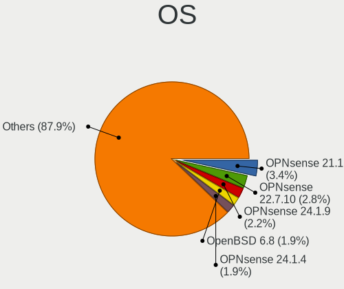

| Name                 | Computers | Percent |
|----------------------|-----------|---------|
| OPNsense 21.1        | 11        | 9.09%   |
| OPNsense 21.7.7      | 6         | 4.96%   |
| OPNsense 21.1.3      | 6         | 4.96%   |
| OpenBSD 6.8          | 6         | 4.96%   |
| OPNsense 21.1.5      | 5         | 4.13%   |
| OPNsense 21.1.2      | 5         | 4.13%   |
| OpenBSD 7.0          | 5         | 4.13%   |
| helloSystem 0.5.0    | 5         | 4.13%   |
| OPNsense 21.1.8      | 4         | 3.31%   |
| OPNsense 21.7.3      | 3         | 2.48%   |
| OPNsense 21.7.1      | 3         | 2.48%   |
| OPNsense 20.7.8      | 3         | 2.48%   |
| OpenBSD 6.9          | 3         | 2.48%   |
| FreeBSD 13.0-p7      | 3         | 2.48%   |
| FreeBSD 12.1-p8      | 3         | 2.48%   |
| OPNsense 22.1.6      | 2         | 1.65%   |
| OPNsense 22.1.3      | 2         | 1.65%   |
| OPNsense 22.1.1      | 2         | 1.65%   |
| OPNsense 21.7.6      | 2         | 1.65%   |
| OPNsense 21.7        | 2         | 1.65%   |
| OPNsense 21.1.7      | 2         | 1.65%   |
| OPNsense 21.1.6      | 2         | 1.65%   |
| OpenBSD 6.7          | 2         | 1.65%   |
| helloSystem 0.4.0    | 2         | 1.65%   |
| FreeBSD 14.0-CURRENT | 2         | 1.65%   |
| FreeBSD 12.2-p4      | 2         | 1.65%   |
| FreeBSD 12.2-p2      | 2         | 1.65%   |
| pfSense 2.5.0        | 1         | 0.83%   |
| OPNsense 22.1.8      | 1         | 0.83%   |
| OPNsense 22.1.7      | 1         | 0.83%   |
| OPNsense 22.1.5      | 1         | 0.83%   |
| OPNsense 22.1.4      | 1         | 0.83%   |
| OPNsense 22.1.2      | 1         | 0.83%   |
| OPNsense 22.1        | 1         | 0.83%   |
| OPNsense 21.7.4      | 1         | 0.83%   |
| OPNsense 21.1.4      | 1         | 0.83%   |
| OPNsense 21.1.1      | 1         | 0.83%   |
| helloSystem 0.7.0    | 1         | 0.83%   |
| GhostBSD 21.08.27    | 1         | 0.83%   |
| GhostBSD 20.04.02    | 1         | 0.83%   |
| GhostBSD 19.12       | 1         | 0.83%   |
| FuryBSD 12.2-p3      | 1         | 0.83%   |
| FreeBSD 13.1-RC2     | 1         | 0.83%   |
| FreeBSD 13.0-STABLE  | 1         | 0.83%   |
| FreeBSD 13.0-p5      | 1         | 0.83%   |
| FreeBSD 13.0-p4      | 1         | 0.83%   |
| FreeBSD 13.0-p2      | 1         | 0.83%   |
| FreeBSD 13.0-p10     | 1         | 0.83%   |
| FreeBSD 13.0         | 1         | 0.83%   |
| FreeBSD 12.3-p5      | 1         | 0.83%   |
| FreeBSD 12.1-p7      | 1         | 0.83%   |
| FreeBSD 12.1-p10     | 1         | 0.83%   |
| FreeBSD 11.4-p6      | 1         | 0.83%   |

OS Family
---------

OS without a version

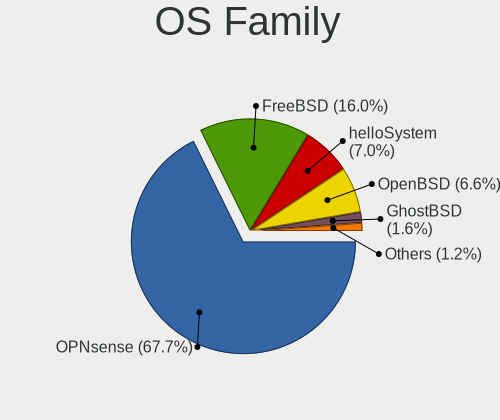

| Name        | Computers | Percent |
|-------------|-----------|---------|
| OPNsense    | 59        | 54.13%  |
| FreeBSD     | 22        | 20.18%  |
| OpenBSD     | 15        | 13.76%  |
| helloSystem | 8         | 7.34%   |
| GhostBSD    | 3         | 2.75%   |
| pfSense     | 1         | 0.92%   |
| FuryBSD     | 1         | 0.92%   |

Arch
----

OS architecture (x86_64, i586, etc.)

| Name   | Computers | Percent |
|--------|-----------|---------|
| amd64  | 108       | 99.08%  |
| octeon | 1         | 0.92%   |

DE
--

Desktop Environment

| Name         | Computers | Percent |
|--------------|-----------|---------|
| Console      | 72        | 64.86%  |
| fvwm         | 12        | 10.81%  |
| KDE5         | 9         | 8.11%   |
| helloDesktop | 8         | 7.21%   |
| MATE         | 3         | 2.7%    |
| i3           | 2         | 1.8%    |
| xfwm         | 1         | 0.9%    |
| XFCE         | 1         | 0.9%    |
| TWM          | 1         | 0.9%    |
| Mutter       | 1         | 0.9%    |
| AwesomeWM    | 1         | 0.9%    |

Display Server
--------------

X11 or Wayland

| Name    | Computers | Percent |
|---------|-----------|---------|
| Console | 73        | 66.97%  |
| X11     | 36        | 33.03%  |

Display Manager
---------------

SDDM, LightDM, etc.

| Name    | Computers | Percent |
|---------|-----------|---------|
| Console | 84        | 75%     |
| SLiM    | 9         | 8.04%   |
| SDDM    | 8         | 7.14%   |
| LightDM | 5         | 4.46%   |
| GDM     | 4         | 3.57%   |
| XDM     | 2         | 1.79%   |

OS Lang
-------

Language

| Lang           | Computers | Percent |
|----------------|-----------|---------|
| Unknown        | 74        | 66.67%  |
| en_US          | 20        | 18.02%  |
| C              | 12        | 10.81%  |
| sv_SE          | 3         | 2.7%    |
| sv_SE.US-ASCII | 1         | 0.9%    |
| en_CA          | 1         | 0.9%    |

Boot Mode
---------

EFI or BIOS

| Mode | Computers | Percent |
|------|-----------|---------|
| EFI  | 90        | 81.08%  |
| BIOS | 21        | 18.92%  |

Filesystem
----------

Type of filesystem

| Type | Computers | Percent |
|------|-----------|---------|
| Ufs  | 58        | 53.21%  |
| Zfs  | 36        | 33.03%  |
| Ffs  | 15        | 13.76%  |

Part. scheme
------------

Scheme of partitioning

| Type | Computers | Percent |
|------|-----------|---------|
| GPT  | 97        | 86.61%  |
| MBR  | 15        | 13.39%  |

Board
-----

Vendor
------

Motherboard manufacturer

| Name                       | Computers | Percent |
|----------------------------|-----------|---------|
| Dell                       | 18        | 16.51%  |
| Lenovo                     | 13        | 11.93%  |
| Hewlett-Packard            | 13        | 11.93%  |
| ASUSTek Computer           | 13        | 11.93%  |
| PC Engines                 | 6         | 5.5%    |
| Gigabyte Technology        | 6         | 5.5%    |
| Unknown                    | 6         | 5.5%    |
| Intel                      | 5         | 4.59%   |
| MSI                        | 4         | 3.67%   |
| Microsoft                  | 3         | 2.75%   |
| AMI                        | 3         | 2.75%   |
| Shuttle                    | 2         | 1.83%   |
| HPE                        | 2         | 1.83%   |
| ASRock                     | 2         | 1.83%   |
| Wistron                    | 1         | 0.92%   |
| Toshiba                    | 1         | 0.92%   |
| Supermicro                 | 1         | 0.92%   |
| Sony                       | 1         | 0.92%   |
| ShenZhen MinWin Technology | 1         | 0.92%   |
| Protectli                  | 1         | 0.92%   |
| Google                     | 1         | 0.92%   |
| Fujitsu Siemens            | 1         | 0.92%   |
| Fujitsu                    | 1         | 0.92%   |
| Deciso                     | 1         | 0.92%   |
| AOPEN                      | 1         | 0.92%   |
| ADI                        | 1         | 0.92%   |
| Acer                       | 1         | 0.92%   |

Model
-----

Motherboard model

| Name                                | Computers | Percent |
|-------------------------------------|-----------|---------|
| Unknown                             | 6         | 5.5%    |
| PC Engines apu2                     | 4         | 3.67%   |
| ASUS All Series                     | 4         | 3.67%   |
| HP t730 Thin Client                 | 3         | 2.75%   |
| PC Engines apu4                     | 2         | 1.83%   |
| Microsoft Surface Pro 7             | 2         | 1.83%   |
| Dell PowerEdge R210 II              | 2         | 1.83%   |
| Dell OptiPlex 9020                  | 2         | 1.83%   |
| AMI Aptio CRB                       | 2         | 1.83%   |
| Wistron ProLiant ML110 G6           | 1         | 0.92%   |
| Toshiba Satellite L450              | 1         | 0.92%   |
| Supermicro Super Server             | 1         | 0.92%   |
| Sony SVP1322M1EBI                   | 1         | 0.92%   |
| Shuttle SH570                       | 1         | 0.92%   |
| Shuttle DH170                       | 1         | 0.92%   |
| ShenZhen MinWin MW-NANO-APL-4L      | 1         | 0.92%   |
| Protectli FW4B                      | 1         | 0.92%   |
| MSI WC776AA-UUW HPE-110sc           | 1         | 0.92%   |
| MSI MS-7C56                         | 1         | 0.92%   |
| MSI MS-7918                         | 1         | 0.92%   |
| MSI MS-7369                         | 1         | 0.92%   |
| Microsoft Surface Go 2              | 1         | 0.92%   |
| Lenovo V130-15IGM 81HL              | 1         | 0.92%   |
| Lenovo ThinkPad X395 20NL001SMX     | 1         | 0.92%   |
| Lenovo ThinkPad X250 20CLS4JH00     | 1         | 0.92%   |
| Lenovo ThinkPad X201 3680FAG        | 1         | 0.92%   |
| Lenovo ThinkPad W520 4284GN2        | 1         | 0.92%   |
| Lenovo ThinkPad T460s 20FAS4KH02    | 1         | 0.92%   |
| Lenovo ThinkPad T420 4236MBG        | 1         | 0.92%   |
| Lenovo ThinkPad T400 2767WSB        | 1         | 0.92%   |
| Lenovo ThinkPad L560 20F10032MS     | 1         | 0.92%   |
| Lenovo ThinkCentre M92p 2988B1G     | 1         | 0.92%   |
| Lenovo ThinkCentre Edge72 3493AZG   | 1         | 0.92%   |
| Lenovo ThinkCentre E73 10AS002QMX   | 1         | 0.92%   |
| Lenovo Legion Y530-15ICH 81FV       | 1         | 0.92%   |
| Intel Q3XXG4-P V1.0                 | 1         | 0.92%   |
| Intel NUC5CPYB                      | 1         | 0.92%   |
| Intel DQ67SW AAG12527-306           | 1         | 0.92%   |
| Intel DH61AG AAG81491-600           | 1         | 0.92%   |
| Intel CRESCENTBAY                   | 1         | 0.92%   |
| HPE ProLiant MicroServer Gen10 Plus | 1         | 0.92%   |
| HPE ProLiant DL380 Gen10            | 1         | 0.92%   |
| HP Z230 Tower Workstation           | 1         | 0.92%   |
| HP ProLiant ML30 Gen9               | 1         | 0.92%   |
| HP ProLiant DL380 Gen9              | 1         | 0.92%   |
| HP ProLiant DL360p Gen8             | 1         | 0.92%   |
| HP ProLiant DL360 G5                | 1         | 0.92%   |
| HP ProDesk 400 G4 MT                | 1         | 0.92%   |
| HP Laptop 15-dw0xxx                 | 1         | 0.92%   |
| HP EliteDesk 800 G2 TWR             | 1         | 0.92%   |
| HP EliteDesk 800 G2 SFF             | 1         | 0.92%   |
| HP EliteBook 8440p                  | 1         | 0.92%   |
| Google Grunt                        | 1         | 0.92%   |
| Gigabyte Z87M-D3H                   | 1         | 0.92%   |
| Gigabyte Z68X-UD7-B3                | 1         | 0.92%   |
| Gigabyte Z170X-UD5 TH               | 1         | 0.92%   |
| Gigabyte B550I AORUS PRO AX         | 1         | 0.92%   |
| Gigabyte AB350M-Gaming 3            | 1         | 0.92%   |
| Gigabyte 970A-DS3P                  | 1         | 0.92%   |
| Fujitsu Siemens ESPRIMO P5730       | 1         | 0.92%   |

Model Family
------------

Motherboard model prefix

| Name                           | Computers | Percent |
|--------------------------------|-----------|---------|
| Dell PowerEdge                 | 10        | 9.17%   |
| Lenovo ThinkPad                | 8         | 7.34%   |
| Unknown                        | 6         | 5.5%    |
| Dell OptiPlex                  | 5         | 4.59%   |
| PC Engines apu2                | 4         | 3.67%   |
| HP ProLiant                    | 4         | 3.67%   |
| ASUS All                       | 4         | 3.67%   |
| Microsoft Surface              | 3         | 2.75%   |
| Lenovo ThinkCentre             | 3         | 2.75%   |
| HP t730                        | 3         | 2.75%   |
| Dell Latitude                  | 3         | 2.75%   |
| PC Engines apu4                | 2         | 1.83%   |
| HPE ProLiant                   | 2         | 1.83%   |
| HP EliteDesk                   | 2         | 1.83%   |
| AMI Aptio                      | 2         | 1.83%   |
| Wistron ProLiant               | 1         | 0.92%   |
| Toshiba Satellite              | 1         | 0.92%   |
| Supermicro Super               | 1         | 0.92%   |
| Sony SVP1322M1EBI              | 1         | 0.92%   |
| Shuttle SH570                  | 1         | 0.92%   |
| Shuttle DH170                  | 1         | 0.92%   |
| ShenZhen MinWin MW-NANO-APL-4L | 1         | 0.92%   |
| Protectli FW4B                 | 1         | 0.92%   |
| MSI WC776AA-UUW                | 1         | 0.92%   |
| MSI MS-7C56                    | 1         | 0.92%   |
| MSI MS-7918                    | 1         | 0.92%   |
| MSI MS-7369                    | 1         | 0.92%   |
| Lenovo V130-15IGM              | 1         | 0.92%   |
| Lenovo Legion                  | 1         | 0.92%   |
| Intel Q3XXG4-P                 | 1         | 0.92%   |
| Intel NUC5CPYB                 | 1         | 0.92%   |
| Intel DQ67SW                   | 1         | 0.92%   |
| Intel DH61AG                   | 1         | 0.92%   |
| Intel CRESCENTBAY              | 1         | 0.92%   |
| HP Z230                        | 1         | 0.92%   |
| HP ProDesk                     | 1         | 0.92%   |
| HP Laptop                      | 1         | 0.92%   |
| HP EliteBook                   | 1         | 0.92%   |
| Google Grunt                   | 1         | 0.92%   |
| Gigabyte Z87M-D3H              | 1         | 0.92%   |
| Gigabyte Z68X-UD7-B3           | 1         | 0.92%   |
| Gigabyte Z170X-UD5             | 1         | 0.92%   |
| Gigabyte B550I                 | 1         | 0.92%   |
| Gigabyte AB350M-Gaming         | 1         | 0.92%   |
| Gigabyte 970A-DS3P             | 1         | 0.92%   |
| Fujitsu Siemens ESPRIMO        | 1         | 0.92%   |
| Fujitsu ESPRIMO                | 1         | 0.92%   |
| Deciso Netboard                | 1         | 0.92%   |
| ASUS UX305UA                   | 1         | 0.92%   |
| ASUS S551LN                    | 1         | 0.92%   |
| ASUS ROG                       | 1         | 0.92%   |
| ASUS Rampage                   | 1         | 0.92%   |
| ASUS P8H77-I                   | 1         | 0.92%   |
| ASUS P8H67-M                   | 1         | 0.92%   |
| ASUS P5Q                       | 1         | 0.92%   |
| ASUS M32CD                     | 1         | 0.92%   |
| ASUS K52Jc                     | 1         | 0.92%   |
| ASRock X99                     | 1         | 0.92%   |
| ASRock E3C226D2I               | 1         | 0.92%   |
| AOPEN DE3250                   | 1         | 0.92%   |

MFG Year
--------

Motherboard manufacture year

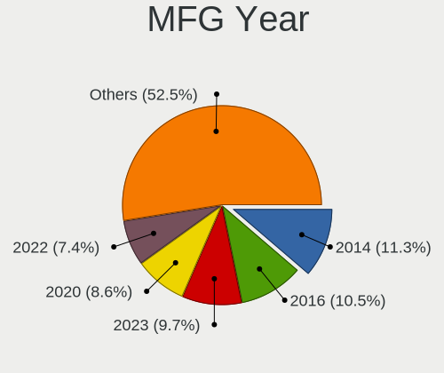

| Year    | Computers | Percent |
|---------|-----------|---------|
| 2020    | 15        | 13.76%  |
| 2018    | 13        | 11.93%  |
| 2016    | 12        | 11.01%  |
| 2021    | 10        | 9.17%   |
| 2014    | 10        | 9.17%   |
| 2010    | 9         | 8.26%   |
| 2017    | 8         | 7.34%   |
| 2015    | 8         | 7.34%   |
| 2019    | 6         | 5.5%    |
| 2012    | 5         | 4.59%   |
| 2009    | 5         | 4.59%   |
| 2013    | 4         | 3.67%   |
| 2011    | 2         | 1.83%   |
| 2007    | 1         | 0.92%   |
| Unknown | 1         | 0.92%   |

Form Factor
-----------

Physical design of the computer

| Name     | Computers | Percent |
|----------|-----------|---------|
| Desktop  | 63        | 57.8%   |
| Notebook | 22        | 20.18%  |
| Server   | 15        | 13.76%  |
| Mini pc  | 6         | 5.5%    |
| Tablet   | 3         | 2.75%   |

Coreboot
--------

Have coreboot on board

| Used | Computers | Percent |
|------|-----------|---------|
| No   | 100       | 91.74%  |
| Yes  | 9         | 8.26%   |

RAM Size
--------

Total RAM memory

| Size in GB      | Computers | Percent |
|-----------------|-----------|---------|
| 8.01-16.0       | 36        | 32.43%  |
| 4.01-8.0        | 28        | 25.23%  |
| 16.01-24.0      | 19        | 17.12%  |
| 32.01-64.0      | 12        | 10.81%  |
| 64.01-256.0     | 5         | 4.5%    |
| More than 256.0 | 3         | 2.7%    |
| 24.01-32.0      | 3         | 2.7%    |
| 3.01-4.0        | 2         | 1.8%    |
| 2.01-3.0        | 2         | 1.8%    |
| 1.01-2.0        | 1         | 0.9%    |

RAM Used
--------

Used RAM memory

| Used GB     | Computers | Percent |
|-------------|-----------|---------|
| 0.01-0.5    | 56        | 50.45%  |
| 0.51-1.0    | 30        | 27.03%  |
| 1.01-2.0    | 13        | 11.71%  |
| 4.01-8.0    | 4         | 3.6%    |
| 2.01-3.0    | 3         | 2.7%    |
| 24.01-32.0  | 2         | 1.8%    |
| 64.01-256.0 | 2         | 1.8%    |
| 3.01-4.0    | 1         | 0.9%    |

Total Drives
------------

Number of drives on board

| Drives | Computers | Percent |
|--------|-----------|---------|
| 1      | 75        | 66.37%  |
| 2      | 11        | 9.73%   |
| 0      | 8         | 7.08%   |
| 3      | 6         | 5.31%   |
| 4      | 3         | 2.65%   |
| 11     | 2         | 1.77%   |
| 6      | 2         | 1.77%   |
| 18     | 1         | 0.88%   |
| 12     | 1         | 0.88%   |
| 10     | 1         | 0.88%   |
| 9      | 1         | 0.88%   |
| 8      | 1         | 0.88%   |
| 5      | 1         | 0.88%   |

Has CD-ROM
----------

Has CD-ROM on board

| Presented | Computers | Percent |
|-----------|-----------|---------|
| No        | 85        | 77.27%  |
| Yes       | 25        | 22.73%  |

Has Ethernet
------------

Has Ethernet on board

| Presented | Computers | Percent |
|-----------|-----------|---------|
| Yes       | 102       | 93.58%  |
| No        | 7         | 6.42%   |

Has WiFi
--------

Has WiFi module

| Presented | Computers | Percent |
|-----------|-----------|---------|
| No        | 76        | 69.09%  |
| Yes       | 34        | 30.91%  |

Has Bluetooth
-------------

Has Bluetooth module

| Presented | Computers | Percent |
|-----------|-----------|---------|
| No        | 84        | 76.36%  |
| Yes       | 26        | 23.64%  |

Location
--------

Country
-------

Geographic location (country)

| Country | Computers | Percent |
|---------|-----------|---------|
| Sweden  | 109       | 100%    |

City
----

Geographic location (city)

| City             | Computers | Percent |
|------------------|-----------|---------|
| Stockholm        | 13        | 10.83%  |
| Malmo            | 11        | 9.17%   |
| Linköping     | 5         | 4.17%   |
| Västerås   | 4         | 3.33%   |
| UmeГҐ          | 4         | 3.33%   |
| Bromma           | 4         | 3.33%   |
| Taby             | 3         | 2.5%    |
| Sollentuna       | 3         | 2.5%    |
| Jönköping  | 3         | 2.5%    |
| Gothenburg       | 3         | 2.5%    |
| Umeå            | 2         | 1.67%   |
| Tyreso Strand    | 2         | 1.67%   |
| Tumba            | 2         | 1.67%   |
| Solleftea        | 2         | 1.67%   |
| Lund             | 2         | 1.67%   |
| Kungsbacka       | 2         | 1.67%   |
| Henan            | 2         | 1.67%   |
| Helsingborg      | 2         | 1.67%   |
| Bandhagen        | 2         | 1.67%   |
| Г…hus         | 1         | 0.83%   |
| Älvängen  | 1         | 0.83%   |
| Uppsala          | 1         | 0.83%   |
| Upplands Vasby   | 1         | 0.83%   |
| Umeå          | 1         | 0.83%   |
| Trosa            | 1         | 0.83%   |
| Trelleborg       | 1         | 0.83%   |
| Trangsund        | 1         | 0.83%   |
| Torsby           | 1         | 0.83%   |
| Södertälje | 1         | 0.83%   |
| Sundsvall        | 1         | 0.83%   |
| Sundbyberg       | 1         | 0.83%   |
| Stroemstad       | 1         | 0.83%   |
| Staffanstorp     | 1         | 0.83%   |
| Solna            | 1         | 0.83%   |
| Soeraker         | 1         | 0.83%   |
| Skövde        | 1         | 0.83%   |
| Skellefteå    | 1         | 0.83%   |
| Skövde        | 1         | 0.83%   |
| Skaellinge       | 1         | 0.83%   |
| Saltsjoe-Boo     | 1         | 0.83%   |
| OEverlida        | 1         | 0.83%   |
| Nyköping      | 1         | 0.83%   |
| Norrköping    | 1         | 0.83%   |
| Norrköping      | 1         | 0.83%   |
| Norberg          | 1         | 0.83%   |
| Morgongava       | 1         | 0.83%   |
| Matfors          | 1         | 0.83%   |
| Luleå         | 1         | 0.83%   |
| Lidkoeping       | 1         | 0.83%   |
| Landskrona       | 1         | 0.83%   |
| Kristianstad     | 1         | 0.83%   |
| Klagshamn        | 1         | 0.83%   |
| Kista            | 1         | 0.83%   |
| Karlskrona       | 1         | 0.83%   |
| Karlshamn        | 1         | 0.83%   |
| Joenaker         | 1         | 0.83%   |
| Hudiksvall       | 1         | 0.83%   |
| Hoeviksnaes      | 1         | 0.83%   |
| Hoerby           | 1         | 0.83%   |
| Halmstad         | 1         | 0.83%   |

Drives
------

Drive Vendor
------------

Hard drive vendors

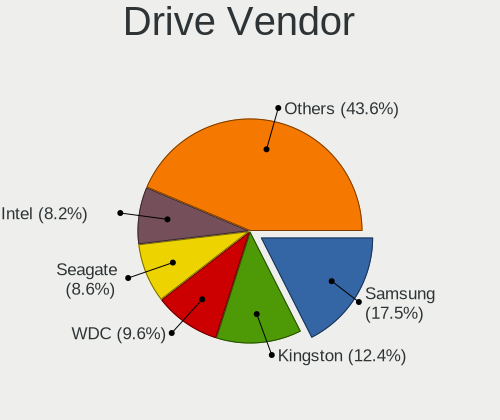

| Vendor              | Computers | Drives | Percent |
|---------------------|-----------|--------|---------|
| Samsung Electronics | 25        | 35     | 18.38%  |
| Seagate             | 17        | 41     | 12.5%   |
| WDC                 | 13        | 16     | 9.56%   |
| Kingston            | 11        | 13     | 8.09%   |
| Intel               | 11        | 25     | 8.09%   |
| Hoodisk             | 9         | 11     | 6.62%   |
| SanDisk             | 7         | 8      | 5.15%   |
| Toshiba             | 6         | 15     | 4.41%   |
| NVMe                | 5         | 6      | 3.68%   |
| Crucial             | 4         | 12     | 2.94%   |
| Micron Technology   | 3         | 6      | 2.21%   |
| Hitachi             | 3         | 3      | 2.21%   |
| Hewlett-Packard     | 3         | 7      | 2.21%   |
| Transcend           | 2         | 2      | 1.47%   |
| SK Hynix            | 2         | 2      | 1.47%   |
| Phison              | 2         | 2      | 1.47%   |
| HPE                 | 2         | 14     | 1.47%   |
| Apacer              | 2         | 2      | 1.47%   |
| XrayDisk            | 1         | 1      | 0.74%   |
| OCZ                 | 1         | 2      | 0.74%   |
| LITEONIT            | 1         | 1      | 0.74%   |
| LITEON              | 1         | 1      | 0.74%   |
| InnoDisk            | 1         | 1      | 0.74%   |
| HGST                | 1         | 4      | 0.74%   |
| Fordisk             | 1         | 1      | 0.74%   |
| Dell                | 1         | 2      | 0.74%   |
| A-DATA Technology   | 1         | 1      | 0.74%   |

Drive Model
-----------

Hard drive models

| Model                                       | Computers | Percent |
|---------------------------------------------|-----------|---------|
| SanDisk SDSA6MM-032G-1006 32GB              | 3         | 2%      |
| Kingston SA400S37120G 120GB                 | 3         | 2%      |
| Hoodisk SSD 128GB                           | 3         | 2%      |
| WDC WD5000AZLX-60K2TA0 500GB                | 2         | 1.33%   |
| Toshiba HDWQ140 4TB                         | 2         | 1.33%   |
| Samsung SSD 860 QVO 1TB                     | 2         | 1.33%   |
| Samsung SSD 860 EVO 250GB                   | 2         | 1.33%   |
| Samsung HD501LJ 500GB                       | 2         | 1.33%   |
| Phison SATA SSD 16GB                        | 2         | 1.33%   |
| NVMe KBG40ZPZ256G TOS 256GB                 | 2         | 1.33%   |
| Kingston SV300S37A240G 240GB                | 2         | 1.33%   |
| Intel SSDSC2BW240A4 240GB                   | 2         | 1.33%   |
| Hoodisk SSD 64GB                            | 2         | 1.33%   |
| Hoodisk SSD 16GB                            | 2         | 1.33%   |
| HP RAID 1(1+0) 146GB                        | 2         | 1.33%   |
| Crucial CT256MX100SSD1 256GB                | 2         | 1.33%   |
| Apacer 64GB SATA Flash Drive                | 2         | 1.33%   |
| XrayDisk SSD 64GB                           | 1         | 0.67%   |
| WDC WDS250G2B0C-00PXH0 250GB                | 1         | 0.67%   |
| WDC WDS250G2B0A-00SM50 250GB                | 1         | 0.67%   |
| WDC WDS120G1G0A-00SS50 120GB                | 1         | 0.67%   |
| WDC WD82PURZ-85TEUY0 8TB                    | 1         | 0.67%   |
| WDC WD5000AAKS-07V0A0 500GB                 | 1         | 0.67%   |
| WDC WD3200BEKT-08PVMT1 320GB                | 1         | 0.67%   |
| WDC WD2500AAJS-60B4A0 250GB                 | 1         | 0.67%   |
| WDC WD20EARX-00ZUDB0 2TB                    | 1         | 0.67%   |
| WDC WD2002FYPS-02W3B0 2TB                   | 1         | 0.67%   |
| WDC WD10JPVX-22JC3T0 1TB                    | 1         | 0.67%   |
| WDC PC SN730 SDBQNTY-256G-1001 256GB        | 1         | 0.67%   |
| WDC PC SN520 NVMe 256GB                     | 1         | 0.67%   |
| Transcend TS256GMSA452T 256GB               | 1         | 0.67%   |
| Transcend TS128GMTE110S 128GB               | 1         | 0.67%   |
| Toshiba KPM5XVUG960G 960GB                  | 1         | 0.67%   |
| Toshiba KPM5XMUG400G 400GB                  | 1         | 0.67%   |
| Toshiba HDWR11A 10TB                        | 1         | 0.67%   |
| Toshiba HDWN180 8TB                         | 1         | 0.67%   |
| Toshiba HDWG480 8TB                         | 1         | 0.67%   |
| Toshiba HDWG180 8TB                         | 1         | 0.67%   |
| Toshiba DT01ACA100 1TB                      | 1         | 0.67%   |
| SK Hynix HFS128G32TNF-N3A0A 128GB           | 1         | 0.67%   |
| SK Hynix HFS128G32MND-2200A 128GB           | 1         | 0.67%   |
| Seagate ST9640320AS 640GB                   | 1         | 0.67%   |
| Seagate ST9500420AS 500GB                   | 1         | 0.67%   |
| Seagate ST9500325AS 500GB                   | 1         | 0.67%   |
| Seagate ST9320423AS 320GB                   | 1         | 0.67%   |
| Seagate ST8000VX0022-2EJ112 8TB             | 1         | 0.67%   |
| Seagate ST750LM022 HN-M750MBB 752GB         | 1         | 0.67%   |
| Seagate ST4000NE0025-2EW107 4TB             | 1         | 0.67%   |
| Seagate ST4000DM005-2DP166 4TB              | 1         | 0.67%   |
| Seagate ST4000DM000-2AE166 4TB              | 1         | 0.67%   |
| Seagate ST4000DM000-1F2168 4TB              | 1         | 0.67%   |
| Seagate ST2000NC001-1DY164 2TB              | 1         | 0.67%   |
| Seagate ST2000DM008-2FR102 2TB              | 1         | 0.67%   |
| Seagate ST1800MM0159 1.8TB                  | 1         | 0.67%   |
| Seagate ST100FN0021 100GB                   | 1         | 0.67%   |
| Seagate ST1000LM049-2GH172 1TB              | 1         | 0.67%   |
| Seagate ST1000LM014-1EJ164-SSHD 1TB         | 1         | 0.67%   |
| Seagate ST1000DM010-2EP102 1TB              | 1         | 0.67%   |
| Seagate ST1000DM003-1ER162 1TB              | 1         | 0.67%   |
| Seagate FireCuda 520 SSD ZP500GM30002 500GB | 1         | 0.67%   |

HDD Vendor
----------

Hard disk drive vendors

| Vendor              | Computers | Drives | Percent |
|---------------------|-----------|--------|---------|
| Seagate             | 16        | 39     | 35.56%  |
| WDC                 | 8         | 10     | 17.78%  |
| Toshiba             | 5         | 13     | 11.11%  |
| Samsung Electronics | 5         | 8      | 11.11%  |
| NVMe                | 3         | 4      | 6.67%   |
| Hitachi             | 3         | 3      | 6.67%   |
| Hewlett-Packard     | 3         | 7      | 6.67%   |
| HPE                 | 1         | 8      | 2.22%   |
| HGST                | 1         | 4      | 2.22%   |

SSD Vendor
----------

Solid state drive vendors

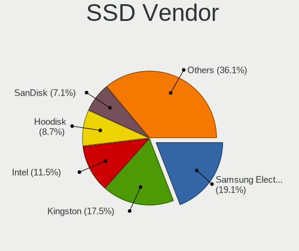

| Vendor              | Computers | Drives | Percent |
|---------------------|-----------|--------|---------|
| Samsung Electronics | 19        | 25     | 22.62%  |
| Kingston            | 11        | 13     | 13.1%   |
| Intel               | 10        | 23     | 11.9%   |
| Hoodisk             | 9         | 11     | 10.71%  |
| SanDisk             | 7         | 8      | 8.33%   |
| Crucial             | 4         | 12     | 4.76%   |
| Micron Technology   | 3         | 6      | 3.57%   |
| WDC                 | 2         | 3      | 2.38%   |
| SK Hynix            | 2         | 2      | 2.38%   |
| Phison              | 2         | 2      | 2.38%   |
| NVMe                | 2         | 2      | 2.38%   |
| Apacer              | 2         | 2      | 2.38%   |
| XrayDisk            | 1         | 1      | 1.19%   |
| Transcend           | 1         | 1      | 1.19%   |
| Toshiba             | 1         | 2      | 1.19%   |
| Seagate             | 1         | 1      | 1.19%   |
| OCZ                 | 1         | 2      | 1.19%   |
| LITEONIT            | 1         | 1      | 1.19%   |
| LITEON              | 1         | 1      | 1.19%   |
| InnoDisk            | 1         | 1      | 1.19%   |
| HPE                 | 1         | 6      | 1.19%   |
| Fordisk             | 1         | 1      | 1.19%   |
| Dell                | 1         | 2      | 1.19%   |

Drive Kind
----------

HDD or SSD

| Kind | Computers | Drives | Percent |
|------|-----------|--------|---------|
| SSD  | 73        | 128    | 61.86%  |
| HDD  | 35        | 96     | 29.66%  |
| NVMe | 10        | 10     | 8.47%   |

Drive Connector
---------------

SATA, SAS, NVMe, etc.

| Type | Computers | Drives | Percent |
|------|-----------|--------|---------|
| SATA | 96        | 224    | 90.57%  |
| NVMe | 10        | 10     | 9.43%   |

Drive Size
----------

Size of hard drive

| Size in TB | Computers | Drives | Percent |
|------------|-----------|--------|---------|
| 0.01-0.5   | 83        | 132    | 69.17%  |
| 0.51-1.0   | 19        | 32     | 15.83%  |
| 3.01-4.0   | 7         | 22     | 5.83%   |
| 1.01-2.0   | 6         | 19     | 5%      |
| 4.01-10.0  | 5         | 19     | 4.17%   |

Space Total
-----------

Amount of disk space available on the file system

| Size in GB     | Computers | Percent |
|----------------|-----------|---------|
| 101-250        | 51        | 46.36%  |
| 51-100         | 17        | 15.45%  |
| 21-50          | 12        | 10.91%  |
| 1-20           | 12        | 10.91%  |
| 251-500        | 10        | 9.09%   |
| 501-1000       | 4         | 3.64%   |
| 1001-2000      | 3         | 2.73%   |
| More than 3000 | 1         | 0.91%   |

Space Used
----------

Amount of used disk space

| Used GB | Computers | Percent |
|---------|-----------|---------|
| 1-20    | 94        | 83.93%  |
| 21-50   | 15        | 13.39%  |
| 251-500 | 2         | 1.79%   |
| 101-250 | 1         | 0.89%   |

Malfunc. Drives
---------------

Drive models with a malfunction

| Model                                        | Computers | Drives | Percent |
|----------------------------------------------|-----------|--------|---------|
| WDC WD2500AAJS-60B4A0 250GB                  | 1         | 2      | 5.88%   |
| WDC WD20EARX-00ZUDB0 2TB                     | 1         | 1      | 5.88%   |
| WDC WD2002FYPS-02W3B0 2TB                    | 1         | 1      | 5.88%   |
| SK Hynix HFS128G32MND-2200A 128GB            | 1         | 1      | 5.88%   |
| Seagate ST9640320AS 640GB                    | 1         | 1      | 5.88%   |
| Seagate ST9500420AS 500GB                    | 1         | 1      | 5.88%   |
| Seagate ST9320423AS 320GB                    | 1         | 1      | 5.88%   |
| Seagate ST750LM022 HN-M750MBB 752GB          | 1         | 1      | 5.88%   |
| Seagate ST100FN0021 100GB                    | 1         | 1      | 5.88%   |
| Seagate ST1000LM049-2GH172 1TB               | 1         | 1      | 5.88%   |
| Seagate ST1000DM003-1ER162 1TB               | 1         | 1      | 5.88%   |
| Samsung Electronics MZNTE128HMGR-000SO 128GB | 1         | 1      | 5.88%   |
| Samsung Electronics HD321KJ 320GB            | 1         | 1      | 5.88%   |
| Kingston SV300S37A120G 120GB                 | 1         | 1      | 5.88%   |
| Intel SSDSC2CT120A3 120GB                    | 1         | 1      | 5.88%   |
| Intel SSDSA2M080G2GC 80GB                    | 1         | 1      | 5.88%   |
| Hitachi HTS725025A9A364 250GB                | 1         | 1      | 5.88%   |

Malfunc. Drive Vendor
---------------------

Vendors of faulty drives

| Vendor              | Computers | Drives | Percent |
|---------------------|-----------|--------|---------|
| Seagate             | 7         | 7      | 41.18%  |
| WDC                 | 3         | 4      | 17.65%  |
| Samsung Electronics | 2         | 2      | 11.76%  |
| Intel               | 2         | 2      | 11.76%  |
| SK Hynix            | 1         | 1      | 5.88%   |
| Kingston            | 1         | 1      | 5.88%   |
| Hitachi             | 1         | 1      | 5.88%   |

Malfunc. HDD Vendor
-------------------

Vendors of faulty HDD drives

| Vendor              | Computers | Drives | Percent |
|---------------------|-----------|--------|---------|
| Seagate             | 6         | 6      | 54.55%  |
| WDC                 | 3         | 4      | 27.27%  |
| Samsung Electronics | 1         | 1      | 9.09%   |
| Hitachi             | 1         | 1      | 9.09%   |

Malfunc. Drive Kind
-------------------

Kinds of faulty drives

| Kind | Computers | Drives | Percent |
|------|-----------|--------|---------|
| HDD  | 10        | 12     | 62.5%   |
| SSD  | 6         | 6      | 37.5%   |

Failed Drives
-------------

Failed drive models

Zero info for selected period =(

Failed Drive Vendor
-------------------

Failed drive vendors

Zero info for selected period =(

Drive Status
------------

Number of failed and malfunc. drives

| Status   | Computers | Drives | Percent |
|----------|-----------|--------|---------|
| Works    | 83        | 197    | 74.77%  |
| Malfunc  | 16        | 18     | 14.41%  |
| Detected | 12        | 19     | 10.81%  |

Storage controller
------------------

Storage Vendor
--------------

Storage controller vendors

| Vendor                   | Computers | Percent |
|--------------------------|-----------|---------|
| Intel                    | 80        | 62.02%  |
| AMD                      | 17        | 13.18%  |
| Broadcom / LSI           | 7         | 5.43%   |
| Samsung Electronics      | 4         | 3.1%    |
| Marvell Technology Group | 4         | 3.1%    |
| Sandisk                  | 3         | 2.33%   |
| Hewlett-Packard          | 3         | 2.33%   |
| KIOXIA                   | 2         | 1.55%   |
| ASMedia Technology       | 2         | 1.55%   |
| VIA Technologies         | 1         | 0.78%   |
| Silicon Motion           | 1         | 0.78%   |
| Seagate Technology       | 1         | 0.78%   |
| Realtek Semiconductor    | 1         | 0.78%   |
| Nvidia                   | 1         | 0.78%   |
| Dell                     | 1         | 0.78%   |
| Adaptec                  | 1         | 0.78%   |

Storage Model
-------------

Storage controller models

| Model                                                                            | Computers | Percent |
|----------------------------------------------------------------------------------|-----------|---------|
| AMD FCH SATA Controller [AHCI mode]                                              | 13        | 8.5%    |
| Intel Q170/Q150/B150/H170/H110/Z170/CM236 Chipset SATA Controller [AHCI Mode]    | 8         | 5.23%   |
| Intel 8 Series/C220 Series Chipset Family 6-port SATA Controller 1 [AHCI mode]   | 8         | 5.23%   |
| Intel Sunrise Point-LP SATA Controller [AHCI mode]                               | 6         | 3.92%   |
| Intel 6 Series/C200 Series Chipset Family 6 port Desktop SATA AHCI Controller    | 5         | 3.27%   |
| Intel 5 Series/3400 Series Chipset 6 port SATA AHCI Controller                   | 4         | 2.61%   |
| Intel SATA Controller [RAID mode]                                                | 3         | 1.96%   |
| Intel C610/X99 series chipset sSATA Controller [AHCI mode]                       | 3         | 1.96%   |
| Intel C610/X99 series chipset 6-Port SATA Controller [AHCI mode]                 | 3         | 1.96%   |
| Intel Atom/Celeron/Pentium Processor x5-E8000/J3xxx/N3xxx Series SATA Controller | 3         | 1.96%   |
| Intel Atom Processor E3800 Series SATA AHCI Controller                           | 3         | 1.96%   |
| Intel 8 Series SATA Controller 1 [AHCI mode]                                     | 3         | 1.96%   |
| Broadcom / LSI SAS2008 PCI-Express Fusion-MPT SAS-2 [Falcon]                     | 3         | 1.96%   |
| AMD FCH IDE Controller                                                           | 3         | 1.96%   |
| KIOXIA unknown                                                                   | 2         | 1.31%   |
| Intel Wildcat Point-LP SATA Controller [AHCI Mode]                               | 2         | 1.31%   |
| Intel SSD 660P Series                                                            | 2         | 1.31%   |
| Intel C620 Series Chipset Family SSATA Controller [AHCI mode]                    | 2         | 1.31%   |
| Intel C620 Series Chipset Family SATA Controller [AHCI mode]                     | 2         | 1.31%   |
| Intel 9 Series Chipset Family SATA Controller [AHCI Mode]                        | 2         | 1.31%   |
| Intel 82801IBM/IEM (ICH9M/ICH9M-E) 4 port SATA Controller [AHCI mode]            | 2         | 1.31%   |
| Intel 82801 Mobile SATA Controller [RAID mode]                                   | 2         | 1.31%   |
| Intel 631xESB/632xESB IDE Controller                                             | 2         | 1.31%   |
| Intel 6 Series/C200 Series Chipset Family IDE-r Controller                       | 2         | 1.31%   |
| Intel 6 Series/C200 Series Chipset Family 6 port Mobile SATA AHCI Controller     | 2         | 1.31%   |
| Broadcom / LSI SAS3008 PCI-Express Fusion-MPT SAS-3                              | 2         | 1.31%   |
| ASMedia ASM1062 Serial ATA Controller                                            | 2         | 1.31%   |
| AMD 500 Series Chipset SATA Controller                                           | 2         | 1.31%   |
| AMD 300 Series Chipset SATA Controller                                           | 2         | 1.31%   |
| VIA VT6415 PATA IDE Host Controller                                              | 1         | 0.65%   |
| Silicon Motion SM2263EN/SM2263XT SSD Controller                                  | 1         | 0.65%   |
| Seagate FireCuda 520 SSD                                                         | 1         | 0.65%   |
| Sandisk WD Blue SN550 NVMe SSD                                                   | 1         | 0.65%   |
| Sandisk WD Black SN750 / PC SN730 NVMe SSD                                       | 1         | 0.65%   |
| Sandisk PC SN520 NVMe SSD                                                        | 1         | 0.65%   |
| Samsung NVMe SSD Controller SM981/PM981/PM983                                    | 1         | 0.65%   |
| Samsung NVMe SSD Controller SM961/PM961/SM963                                    | 1         | 0.65%   |
| Samsung NVMe SSD Controller SM951/PM951                                          | 1         | 0.65%   |
| Samsung NVMe SSD Controller 980                                                  | 1         | 0.65%   |
| Nvidia MCP65 SATA Controller                                                     | 1         | 0.65%   |
| Nvidia MCP65 IDE                                                                 | 1         | 0.65%   |
| Marvell Group 88SE9230 PCIe 2.0 x2 4-port SATA 6 Gb/s RAID Controller            | 1         | 0.65%   |
| Marvell Group 88SE9215 PCIe 2.0 x1 4-port SATA 6 Gb/s Controller                 | 1         | 0.65%   |
| Marvell Group 88SE9128 PCIe SATA 6 Gb/s RAID controller with HyperDuo            | 1         | 0.65%   |
| Marvell Group 88SE6111/6121 SATA II / PATA Controller                            | 1         | 0.65%   |
| Intel PCIe Data Center SSD                                                       | 1         | 0.65%   |
| Intel NM10/ICH7 Family SATA Controller [IDE mode]                                | 1         | 0.65%   |
| Intel Ice Lake-LP SATA Controller [AHCI mode]                                    | 1         | 0.65%   |
| Intel Celeron/Pentium Silver Processor SATA Controller                           | 1         | 0.65%   |
| Intel Celeron N3350/Pentium N4200/Atom E3900 Series SATA AHCI Controller         | 1         | 0.65%   |
| Intel Cannon Point-LP SATA Controller [AHCI Mode]                                | 1         | 0.65%   |
| Intel Cannon Lake PCH SATA AHCI Controller                                       | 1         | 0.65%   |
| Intel Cannon Lake Mobile PCH SATA AHCI Controller                                | 1         | 0.65%   |
| Intel C600/X79 series chipset 4-Port SATA IDE Controller                         | 1         | 0.65%   |
| Intel 82801JI (ICH10 Family) SATA AHCI Controller                                | 1         | 0.65%   |
| Intel 82801JD/DO (ICH10 Family) 4-port SATA IDE Controller                       | 1         | 0.65%   |
| Intel 82801JD/DO (ICH10 Family) 2-port SATA IDE Controller                       | 1         | 0.65%   |
| Intel 82801IR/IO/IH (ICH9R/DO/DH) 6 port SATA Controller [AHCI mode]             | 1         | 0.65%   |
| Intel 82801G (ICH7 Family) IDE Controller                                        | 1         | 0.65%   |
| Intel 7 Series/C210 Series Chipset Family 6-port SATA Controller [AHCI mode]     | 1         | 0.65%   |

Storage Kind
------------

Kind of storage controller (IDE, SATA, NVMe, SAS, ...)

| Kind | Computers | Percent |
|------|-----------|---------|
| SATA | 85        | 62.96%  |
| IDE  | 17        | 12.59%  |
| NVMe | 15        | 11.11%  |
| RAID | 11        | 8.15%   |
| SAS  | 7         | 5.19%   |

Processor
---------

CPU Vendor
----------

Processor vendors

| Vendor  | Computers | Percent |
|---------|-----------|---------|
| Intel   | 88        | 80.73%  |
| AMD     | 20        | 18.35%  |
| Unknown | 1         | 0.92%   |

CPU Model
---------

Processor models

| Model                                    | Computers | Percent |
|------------------------------------------|-----------|---------|
| AMD GX-412TC SOC                         | 6         | 5.5%    |
| Intel Core i7-4770K CPU @ 3.50GHz        | 3         | 2.75%   |
| Intel Core i5-6500 CPU @ 3.20GHz         | 3         | 2.75%   |
| AMD RX-427BB with AMD Radeon R7 Graphics | 3         | 2.75%   |
| Intel Core i7-7500U CPU @ 2.70GHz        | 2         | 1.83%   |
| Intel Core i5-4200U CPU @ 1.60GHz        | 2         | 1.83%   |
| Intel Core i5-1035G4 CPU @ 1.10GHz       | 2         | 1.83%   |
| Intel Core i5 CPU M 540 @ 2.53GHz        | 2         | 1.83%   |
| Intel Celeron CPU J3160 @ 1.60GHz        | 2         | 1.83%   |
| Intel Celeron CPU J1900 @ 1.99GHz        | 2         | 1.83%   |
| Intel Atom CPU E3845 @ 1.91GHz           | 2         | 1.83%   |
| AMD Ryzen 9 3900X 12-Core Processor      | 2         | 1.83%   |
| AMD Ryzen 7 1700 Eight-Core Processor    | 2         | 1.83%   |
| Intel Xeon Silver 4116 CPU @ 2.10GHz     | 1         | 0.92%   |
| Intel Xeon Silver 4114 CPU @ 2.20GHz     | 1         | 0.92%   |
| Intel Xeon Silver 4110 CPU @ 2.10GHz     | 1         | 0.92%   |
| Intel Xeon E-2224 CPU @ 3.40GHz          | 1         | 0.92%   |
| Intel Xeon CPU X5680 @ 3.33GHz           | 1         | 0.92%   |
| Intel Xeon CPU X3430 @ 2.40GHz           | 1         | 0.92%   |
| Intel Xeon CPU E5450 @ 3.00GHz           | 1         | 0.92%   |
| Intel Xeon CPU E5-2630 0 @ 2.30GHz       | 1         | 0.92%   |
| Intel Xeon CPU E5-2623 v4 @ 2.60GHz      | 1         | 0.92%   |
| Intel Xeon CPU E5-2620 v4 @ 2.10GHz      | 1         | 0.92%   |
| Intel Xeon CPU E5-2620 0 @ 2.00GHz       | 1         | 0.92%   |
| Intel Xeon CPU E31240 @ 3.30GHz          | 1         | 0.92%   |
| Intel Xeon CPU E31220 @ 3.10GHz          | 1         | 0.92%   |
| Intel Xeon CPU E3-1230L v3 @ 1.80GHz     | 1         | 0.92%   |
| Intel Xeon CPU E3-1230 v5 @ 3.40GHz      | 1         | 0.92%   |
| Intel Xeon CPU E3-1225 v3 @ 3.20GHz      | 1         | 0.92%   |
| Intel Xeon CPU E3-1220 v5 @ 3.00GHz      | 1         | 0.92%   |
| Intel Xeon CPU E3-1220 v3 @ 3.10GHz      | 1         | 0.92%   |
| Intel Xeon CPU 5140 @ 2.33GHz            | 1         | 0.92%   |
| Intel Xeon                               | 1         | 0.92%   |
| Intel Pentium Dual-Core CPU E5700        | 1         | 0.92%   |
| Intel Pentium CPU G6950 @ 2.80GHz        | 1         | 0.92%   |
| Intel Pentium CPU G4400 @ 3.30GHz        | 1         | 0.92%   |
| Intel CPU Version                        | 1         | 0.92%   |
| Intel Core m3-8100Y CPU @ 1.10GHz        | 1         | 0.92%   |
| Intel Core i7-8750H CPU @ 2.20GHz        | 1         | 0.92%   |
| Intel Core i7-6850K CPU @ 3.60GHz        | 1         | 0.92%   |
| Intel Core i7-6700K CPU @ 4.00GHz        | 1         | 0.92%   |
| Intel Core i7-6600U CPU @ 2.60GHz        | 1         | 0.92%   |
| Intel Core i7-6500U CPU @ 2.50GHz        | 1         | 0.92%   |
| Intel Core i7-5550U CPU @ 2.00GHz        | 1         | 0.92%   |
| Intel Core i7-4790K CPU @ 4.00GHz        | 1         | 0.92%   |
| Intel Core i7-4600U CPU @ 2.10GHz        | 1         | 0.92%   |
| Intel Core i7-3770S CPU @ 3.10GHz        | 1         | 0.92%   |
| Intel Core i7-2760QM CPU @ 2.40GHz       | 1         | 0.92%   |
| Intel Core i7-2600 CPU @ 3.40GHz         | 1         | 0.92%   |
| Intel Core i5-8365U CPU @ 1.60GHz        | 1         | 0.92%   |
| Intel Core i5-8265U CPU @ 1.60GHz        | 1         | 0.92%   |
| Intel Core i5-6400 CPU @ 2.70GHz         | 1         | 0.92%   |
| Intel Core i5-6300U CPU @ 2.40GHz        | 1         | 0.92%   |
| Intel Core i5-6200U CPU @ 2.30GHz        | 1         | 0.92%   |
| Intel Core i5-5200U CPU @ 2.20GHz        | 1         | 0.92%   |
| Intel Core i5-4690K CPU @ 3.50GHz        | 1         | 0.92%   |
| Intel Core i5-4670K CPU @ 3.40GHz        | 1         | 0.92%   |
| Intel Core i5-4590 CPU @ 3.30GHz         | 1         | 0.92%   |
| Intel Core i5-4570 CPU @ 3.20GHz         | 1         | 0.92%   |
| Intel Core i5-4210U CPU @ 1.70GHz        | 1         | 0.92%   |

CPU Model Family
----------------

Processor model prefix

| Model                   | Computers | Percent |
|-------------------------|-----------|---------|
| Intel Core i5           | 29        | 26.61%  |
| Intel Xeon              | 17        | 15.6%   |
| Intel Core i7           | 16        | 14.68%  |
| Intel Celeron           | 8         | 7.34%   |
| AMD GX                  | 7         | 6.42%   |
| Other                   | 6         | 5.5%    |
| Intel Core i3           | 4         | 3.67%   |
| Intel Xeon Silver       | 3         | 2.75%   |
| AMD Ryzen 7             | 3         | 2.75%   |
| Intel Pentium           | 2         | 1.83%   |
| Intel Core 2 Duo        | 2         | 1.83%   |
| Intel Atom              | 2         | 1.83%   |
| AMD Ryzen 9             | 2         | 1.83%   |
| Intel Pentium Dual-Core | 1         | 0.92%   |
| Intel Core m3           | 1         | 0.92%   |
| Intel Core 2 Quad       | 1         | 0.92%   |
| AMD Ryzen 5 PRO         | 1         | 0.92%   |
| AMD FX                  | 1         | 0.92%   |
| AMD Athlon 64 X2        | 1         | 0.92%   |
| AMD Athlon              | 1         | 0.92%   |
| AMD A4                  | 1         | 0.92%   |

CPU Cores
---------

Number of processor cores

| Number  | Computers | Percent |
|---------|-----------|---------|
| 4       | 58        | 53.21%  |
| 2       | 29        | 26.61%  |
| 8       | 5         | 4.59%   |
| 6       | 5         | 4.59%   |
| Unknown | 4         | 3.67%   |
| 24      | 3         | 2.75%   |
| 16      | 3         | 2.75%   |
| 12      | 1         | 0.92%   |
| 10      | 1         | 0.92%   |

CPU Sockets
-----------

Number of sockets

| Number  | Computers | Percent |
|---------|-----------|---------|
| 1       | 100       | 91.74%  |
| 2       | 6         | 5.5%    |
| Unknown | 3         | 2.75%   |

CPU Threads
-----------

Threads per core (Hyper-Threading)

| Number  | Computers | Percent |
|---------|-----------|---------|
| 1       | 57        | 52.29%  |
| 2       | 48        | 44.04%  |
| Unknown | 4         | 3.67%   |

CPU Microarch
-------------

Microarchitecture

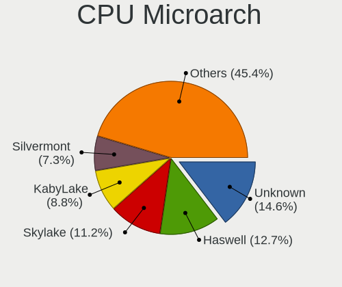

| Name          | Computers | Percent |
|---------------|-----------|---------|
| Skylake       | 16        | 14.68%  |
| Haswell       | 16        | 14.68%  |
| SandyBridge   | 9         | 8.26%   |
| Silvermont    | 8         | 7.34%   |
| KabyLake      | 7         | 6.42%   |
| Puma          | 6         | 5.5%    |
| Penryn        | 6         | 5.5%    |
| IvyBridge     | 6         | 5.5%    |
| Westmere      | 5         | 4.59%   |
| Broadwell     | 5         | 4.59%   |
| Steamroller   | 3         | 2.75%   |
| IceLake       | 3         | 2.75%   |
| Unknown       | 3         | 2.75%   |
| Zen 2         | 2         | 1.83%   |
| Zen           | 2         | 1.83%   |
| Nehalem       | 2         | 1.83%   |
| Jaguar        | 2         | 1.83%   |
| Core          | 2         | 1.83%   |
| Zen+          | 1         | 0.92%   |
| Piledriver    | 1         | 0.92%   |
| K8 Hammer     | 1         | 0.92%   |
| Goldmont plus | 1         | 0.92%   |
| Goldmont      | 1         | 0.92%   |
| Excavator     | 1         | 0.92%   |

Graphics
--------

GPU Vendor
----------

Vendors of graphics cards

| Vendor                     | Computers | Percent |
|----------------------------|-----------|---------|
| Intel                      | 57        | 55.34%  |
| Nvidia                     | 17        | 16.5%   |
| Matrox Electronics Systems | 15        | 14.56%  |
| AMD                        | 12        | 11.65%  |
| ASPEED Technology          | 2         | 1.94%   |

GPU Model
---------

Graphics card models

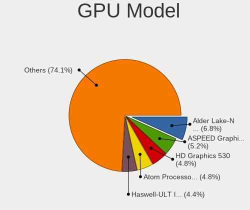

| Model                                                                                    | Computers | Percent |
|------------------------------------------------------------------------------------------|-----------|---------|
| Intel Xeon E3-1200 v3/4th Gen Core Processor Integrated Graphics Controller              | 6         | 5.83%   |
| Intel Atom Processor Z36xxx/Z37xxx Series Graphics & Display                             | 5         | 4.85%   |
| Nvidia GK208B [GeForce GT 710]                                                           | 4         | 3.88%   |
| Matrox Electronics Systems MGA G200eW WPCM450                                            | 4         | 3.88%   |
| Intel Skylake GT2 [HD Graphics 520]                                                      | 4         | 3.88%   |
| Intel HD Graphics 530                                                                    | 4         | 3.88%   |
| Intel Haswell-ULT Integrated Graphics Controller                                         | 4         | 3.88%   |
| Matrox Electronics Systems MGA G200EH                                                    | 3         | 2.91%   |
| Matrox Electronics Systems G200eR2                                                       | 3         | 2.91%   |
| Intel Xeon E3-1200 v2/3rd Gen Core processor Graphics Controller                         | 3         | 2.91%   |
| Intel Core Processor Integrated Graphics Controller                                      | 3         | 2.91%   |
| Intel Atom/Celeron/Pentium Processor x5-E8000/J3xxx/N3xxx Integrated Graphics Controller | 3         | 2.91%   |
| AMD Kaveri [Radeon R7 Graphics]                                                          | 3         | 2.91%   |
| Nvidia GT215 [GeForce GT 240]                                                            | 2         | 1.94%   |
| Nvidia GP107 [GeForce GTX 1050 Ti]                                                       | 2         | 1.94%   |
| Matrox Electronics Systems MGA G200eH3                                                   | 2         | 1.94%   |
| Matrox Electronics Systems Integrated Matrox G200eW3 Graphics Controller                 | 2         | 1.94%   |
| Intel WhiskeyLake-U GT2 [UHD Graphics 620]                                               | 2         | 1.94%   |
| Intel Mobile 4 Series Chipset Integrated Graphics Controller                             | 2         | 1.94%   |
| Intel IvyBridge GT2 [HD Graphics 4000]                                                   | 2         | 1.94%   |
| Intel Iris Plus Graphics G4 (Ice Lake)                                                   | 2         | 1.94%   |
| Intel HD Graphics 620                                                                    | 2         | 1.94%   |
| Intel 4 Series Chipset Integrated Graphics Controller                                    | 2         | 1.94%   |
| Intel 2nd Generation Core Processor Family Integrated Graphics Controller                | 2         | 1.94%   |
| ASPEED Technology ASPEED Graphics Family                                                 | 2         | 1.94%   |
| AMD ES1000                                                                               | 2         | 1.94%   |
| AMD Ellesmere [Radeon RX 470/480/570/570X/580/580X/590]                                  | 2         | 1.94%   |
| Nvidia GT218 [GeForce 210]                                                               | 1         | 0.97%   |
| Nvidia GP107M [GeForce GTX 1050 Ti Mobile]                                               | 1         | 0.97%   |
| Nvidia GP104 [GeForce GTX 1070]                                                          | 1         | 0.97%   |
| Nvidia GM206 [GeForce GTX 960]                                                           | 1         | 0.97%   |
| Nvidia GM108M [GeForce 840M]                                                             | 1         | 0.97%   |
| Nvidia GK208B [GeForce GT 730]                                                           | 1         | 0.97%   |
| Nvidia GF119 [GeForce GT 610]                                                            | 1         | 0.97%   |
| Nvidia GF106GLM [Quadro 2000M]                                                           | 1         | 0.97%   |
| Nvidia GA106 [GeForce RTX 3060]                                                          | 1         | 0.97%   |
| Matrox Electronics Systems MGA G200e [Pilot] ServerEngines (SEP1)                        | 1         | 0.97%   |
| Intel Xeon E3-1200 v3 Processor Integrated Graphics Controller                           | 1         | 0.97%   |
| Intel UHD Graphics 615                                                                   | 1         | 0.97%   |
| Intel Iris Plus Graphics G1 (Ice Lake)                                                   | 1         | 0.97%   |
| Intel HD Graphics 6000                                                                   | 1         | 0.97%   |
| Intel HD Graphics 5500                                                                   | 1         | 0.97%   |
| Intel HD Graphics 510                                                                    | 1         | 0.97%   |
| Intel HD Graphics 500                                                                    | 1         | 0.97%   |
| Intel GeminiLake [UHD Graphics 600]                                                      | 1         | 0.97%   |
| Intel CoffeeLake-H GT2 [UHD Graphics 630]                                                | 1         | 0.97%   |
| Intel 4th Generation Core Processor Family Integrated Graphics Controller                | 1         | 0.97%   |
| Intel 3rd Gen Core processor Graphics Controller                                         | 1         | 0.97%   |
| AMD Stoney [Radeon R2/R3/R4/R5 Graphics]                                                 | 1         | 0.97%   |
| AMD Picasso/Raven 2 [Radeon Vega Series / Radeon Vega Mobile Series]                     | 1         | 0.97%   |
| AMD Navi 22 [Radeon RX 6700/6700 XT/6750 XT / 6800M]                                     | 1         | 0.97%   |
| AMD Navi 10 [Radeon RX 5600 OEM/5600 XT / 5700/5700 XT]                                  | 1         | 0.97%   |
| AMD Kabini [Radeon HD 8400 / R3 Series]                                                  | 1         | 0.97%   |

GPU Combo
---------

Combinations of graphics cards

| Name           | Computers | Percent |
|----------------|-----------|---------|
| 1 x Intel      | 52        | 47.27%  |
| 1 x Nvidia     | 15        | 13.64%  |
| 1 x Matrox     | 15        | 13.64%  |
| 1 x AMD        | 12        | 10.91%  |
| Other          | 9         | 8.18%   |
| 2 x Intel      | 2         | 1.82%   |
| Intel + Nvidia | 2         | 1.82%   |
| 1 x ASPEED     | 2         | 1.82%   |
| Intel + AMD    | 1         | 0.91%   |

GPU Driver
----------

Free vs proprietary

| Driver      | Computers | Percent |
|-------------|-----------|---------|
| Free        | 87        | 79.09%  |
| Unknown     | 13        | 11.82%  |
| Proprietary | 10        | 9.09%   |

GPU Memory
----------

Total video memory

| Size in GB | Computers | Percent |
|------------|-----------|---------|
| Unknown    | 97        | 88.99%  |
| 1.01-2.0   | 4         | 3.67%   |
| 0.51-1.0   | 3         | 2.75%   |
| 3.01-4.0   | 2         | 1.83%   |
| 7.01-8.0   | 1         | 0.92%   |
| 5.01-6.0   | 1         | 0.92%   |
| 8.01-16.0  | 1         | 0.92%   |

Monitor
-------

Monitor Vendor
--------------

Monitor vendors

| Vendor                  | Computers | Percent |
|-------------------------|-----------|---------|
| Samsung Electronics     | 6         | 13.95%  |
| LG Display              | 6         | 13.95%  |
| Hewlett-Packard         | 6         | 13.95%  |
| Chimei Innolux          | 6         | 13.95%  |
| Dell                    | 4         | 9.3%    |
| Iiyama                  | 2         | 4.65%   |
| AOC                     | 2         | 4.65%   |
| Philips                 | 1         | 2.33%   |
| Panasonic               | 1         | 2.33%   |
| LG Electronics          | 1         | 2.33%   |
| Lenovo Group Limited    | 1         | 2.33%   |
| Lenovo                  | 1         | 2.33%   |
| InfoVision              | 1         | 2.33%   |
| Gigabyte Technology     | 1         | 2.33%   |
| Chi Mei Optoelectronics | 1         | 2.33%   |
| BOE                     | 1         | 2.33%   |
| AU Optronics            | 1         | 2.33%   |
| Ancor Communications    | 1         | 2.33%   |

Monitor Model
-------------

Monitor models

| Model                                                                    | Computers | Percent |
|--------------------------------------------------------------------------|-----------|---------|
| Samsung Electronics S24D390 SAM0B65 1920x1080 520x290mm 23.4-inch        | 2         | 4.26%   |
| LG Display LCD Monitor LGD0555 2736x1824 260x170mm 12.2-inch             | 2         | 4.26%   |
| Iiyama PL2779QQ IVM6641 3840x2160 600x330mm 27.0-inch                    | 2         | 4.26%   |
| Dell UP2715K DEL40B6 848x480 600x340mm 27.2-inch                         | 2         | 4.26%   |
| AOC 2350 AOC2350 1920x1080 510x290mm 23.1-inch                           | 2         | 4.26%   |
| Samsung Electronics S24E650 SAM0CC1 1920x1200 520x320mm 24.0-inch        | 1         | 2.13%   |
| Samsung Electronics LCD Monitor SyncMaster                               | 1         | 2.13%   |
| Samsung Electronics LCD Monitor SE790C 3440x1440                         | 1         | 2.13%   |
| Samsung Electronics LCD Monitor S23E650 3840x1080                        | 1         | 2.13%   |
| Samsung Electronics C24F390 SAM0D2C 1920x1080 520x290mm 23.4-inch        | 1         | 2.13%   |
| Philips PHL 276E8V PHLC18F 3840x2160 600x340mm 27.2-inch                 | 1         | 2.13%   |
| Panasonic VVX13F009G00 MEI96A2 1920x1080 290x170mm 13.2-inch             | 1         | 2.13%   |
| LG Electronics LCD Monitor LX20D 1600x1200                               | 1         | 2.13%   |
| LG Display LCD Monitor LGD05E5 1920x1080 340x190mm 15.3-inch             | 1         | 2.13%   |
| LG Display LCD Monitor LGD04A7 1920x1080 340x190mm 15.3-inch             | 1         | 2.13%   |
| LG Display LCD Monitor LGD02E2 1600x900 310x170mm 13.9-inch              | 1         | 2.13%   |
| LG Display LCD Monitor LGD0213 1600x900 310x170mm 13.9-inch              | 1         | 2.13%   |
| Lenovo LCD Monitor LEN4036 1440x900 300x190mm 14.0-inch                  | 1         | 2.13%   |
| Lenovo Group Limited LCD Monitor 1920x1080                               | 1         | 2.13%   |
| InfoVision LCD Monitor IVO04E3 1366x768 280x160mm 12.7-inch              | 1         | 2.13%   |
| Iiyama PL2888UH IVM7104 3840x2160 620x340mm 27.8-inch                    | 1         | 2.13%   |
| Hewlett-Packard Z27n G2 HPN348A 2560x1440 600x340mm 27.2-inch            | 1         | 2.13%   |
| Hewlett-Packard w2216 HWP280C 1680x1050 470x290mm 21.7-inch              | 1         | 2.13%   |
| Hewlett-Packard LCD Monitor Z24n 1920x1200                               | 1         | 2.13%   |
| Hewlett-Packard LCD Monitor E241i 1920x1200                              | 1         | 2.13%   |
| Hewlett-Packard L2335 HWP2615 1920x1200 500x310mm 23.2-inch              | 1         | 2.13%   |
| Hewlett-Packard E243i HPN3463 1920x1200 520x320mm 24.0-inch              | 1         | 2.13%   |
| Hewlett-Packard E242 HWP326E 1920x1200 520x320mm 24.0-inch               | 1         | 2.13%   |
| Gigabyte Technology M28U GBT2800 3840x2160 630x360mm 28.6-inch           | 1         | 2.13%   |
| Dell UP2715K DEL40B8 3840x2160 600x340mm 27.2-inch                       | 1         | 2.13%   |
| Dell U3415W DELA0AA 3440x1440 800x330mm 34.1-inch                        | 1         | 2.13%   |
| Dell U2718Q DELA0EC 3840x2160 610x350mm 27.7-inch                        | 1         | 2.13%   |
| Chimei Innolux LCD Monitor CMN15F5 1920x1080 340x190mm 15.3-inch         | 1         | 2.13%   |
| Chimei Innolux LCD Monitor CMN15DB 1366x768 340x190mm 15.3-inch          | 1         | 2.13%   |
| Chimei Innolux LCD Monitor CMN15B1 1920x1080 340x190mm 15.3-inch         | 1         | 2.13%   |
| Chimei Innolux LCD Monitor CMN1509 1920x1080 340x190mm 15.3-inch         | 1         | 2.13%   |
| Chimei Innolux LCD Monitor CMN13A2 1920x1080 290x170mm 13.2-inch         | 1         | 2.13%   |
| Chimei Innolux LCD Monitor CMN1132 1366x768 260x140mm 11.6-inch          | 1         | 2.13%   |
| Chi Mei Optoelectronics LCD Monitor CMO1593 1366x768 340x190mm 15.3-inch | 1         | 2.13%   |
| BOE LCD Monitor BOE088B 1920x1280 220x150mm 10.5-inch                    | 1         | 2.13%   |
| AU Optronics LCD Monitor AUO47EC 1366x768 340x190mm 15.3-inch            | 1         | 2.13%   |
| Ancor Communications VG248 ACI24A5 1920x1080 530x300mm 24.0-inch         | 1         | 2.13%   |

Monitor Resolution
------------------

Monitor screen resolution

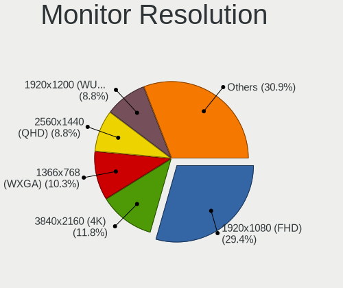

| Resolution         | Computers | Percent |
|--------------------|-----------|---------|
| 1920x1080 (FHD)    | 11        | 25.58%  |
| 1920x1200 (WUXGA)  | 6         | 13.95%  |
| 3840x2160 (4K)     | 5         | 11.63%  |
| 1366x768 (WXGA)    | 5         | 11.63%  |
| 2560x1440 (QHD)    | 3         | 6.98%   |
| 3440x1440          | 2         | 4.65%   |
| 2736x1824          | 2         | 4.65%   |
| 1600x900 (HD+)     | 2         | 4.65%   |
| 3840x1080          | 1         | 2.33%   |
| 2880x1620          | 1         | 2.33%   |
| 1920x1280          | 1         | 2.33%   |
| 1680x1050 (WSXGA+) | 1         | 2.33%   |
| 1600x1200          | 1         | 2.33%   |
| 1440x900 (WXGA+)   | 1         | 2.33%   |
| Unknown            | 1         | 2.33%   |

Monitor Diagonal
----------------

Diagonal size in inches

| Inches  | Computers | Percent |
|---------|-----------|---------|
| 15      | 9         | 22.5%   |
| Unknown | 6         | 15%     |
| 27      | 5         | 12.5%   |
| 24      | 4         | 10%     |
| 23      | 4         | 10%     |
| 13      | 3         | 7.5%    |
| 12      | 3         | 7.5%    |
| 34      | 1         | 2.5%    |
| 28      | 1         | 2.5%    |
| 21      | 1         | 2.5%    |
| 14      | 1         | 2.5%    |
| 11      | 1         | 2.5%    |
| 10      | 1         | 2.5%    |

Monitor Width
-------------

Physical width

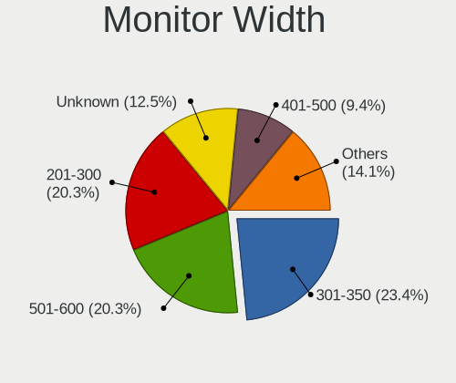

| Width in mm | Computers | Percent |
|-------------|-----------|---------|
| 501-600     | 11        | 27.5%   |
| 301-350     | 11        | 27.5%   |
| 201-300     | 7         | 17.5%   |
| Unknown     | 6         | 15%     |
| 601-700     | 3         | 7.5%    |
| 701-800     | 1         | 2.5%    |
| 401-500     | 1         | 2.5%    |

Aspect Ratio
------------

Proportional relationship between the width and the height

| Ratio   | Computers | Percent |
|---------|-----------|---------|
| 16/9    | 21        | 58.33%  |
| Unknown | 6         | 16.67%  |
| 16/10   | 5         | 13.89%  |
| 3/2     | 3         | 8.33%   |
| 21/9    | 1         | 2.78%   |

Monitor Area
------------

Area in inch²

| Area in inch² | Computers | Percent |
|----------------|-----------|---------|
| 91-100         | 9         | 23.08%  |
| Unknown        | 6         | 15.38%  |
| 301-350        | 5         | 12.82%  |
| 201-250        | 5         | 12.82%  |
| 81-90          | 3         | 7.69%   |
| 61-70          | 3         | 7.69%   |
| 251-300        | 3         | 7.69%   |
| 51-60          | 2         | 5.13%   |
| 351-500        | 2         | 5.13%   |
| 71-80          | 1         | 2.56%   |

Pixel Density
-------------

Pixels per inch

| Density       | Computers | Percent |
|---------------|-----------|---------|
| 121-160       | 12        | 29.27%  |
| 51-100        | 8         | 19.51%  |
| 161-240       | 6         | 14.63%  |
| Unknown       | 6         | 14.63%  |
| 101-120       | 5         | 12.2%   |
| More than 240 | 2         | 4.88%   |
| 1-50          | 2         | 4.88%   |

Multiple Monitors
-----------------

Total monitors connected

| Total | Computers | Percent |
|-------|-----------|---------|
| 0     | 73        | 65.77%  |
| 1     | 29        | 26.13%  |
| 2     | 8         | 7.21%   |
| 3     | 1         | 0.9%    |

Network
-------

Net Controller Vendor
---------------------

Controller vendors

| Vendor                   | Computers | Percent |
|--------------------------|-----------|---------|
| Intel                    | 83        | 54.61%  |
| Realtek Semiconductor    | 32        | 21.05%  |
| Broadcom                 | 20        | 13.16%  |
| Qualcomm Atheros         | 4         | 2.63%   |
| TP-Link                  | 2         | 1.32%   |
| Sierra Wireless          | 1         | 0.66%   |
| Ralink Technology        | 1         | 0.66%   |
| NetXen Incorporated      | 1         | 0.66%   |
| Microsoft                | 1         | 0.66%   |
| Mellanox Technologies    | 1         | 0.66%   |
| MediaTek                 | 1         | 0.66%   |
| Marvell Technology Group | 1         | 0.66%   |
| JMicron Technology       | 1         | 0.66%   |
| Hewlett-Packard          | 1         | 0.66%   |
| Edimax Technology        | 1         | 0.66%   |
| Chelsio Communications   | 1         | 0.66%   |

Net Controller Model
--------------------

Controller models

| Model                                                                         | Computers | Percent |
|-------------------------------------------------------------------------------|-----------|---------|
| Realtek RTL8111/8168/8411 PCI Express Gigabit Ethernet Controller             | 29        | 15.76%  |
| Intel I210 Gigabit Network Connection                                         | 15        | 8.15%   |
| Intel I211 Gigabit Network Connection                                         | 11        | 5.98%   |
| Intel I350 Gigabit Network Connection                                         | 7         | 3.8%    |
| Intel 82580 Gigabit Network Connection                                        | 6         | 3.26%   |
| Intel 82571EB/82571GB Gigabit Ethernet Controller D0/D1 (copper applications) | 6         | 3.26%   |
| Intel 82574L Gigabit Network Connection                                       | 5         | 2.72%   |
| Broadcom NetXtreme BCM5720 Gigabit Ethernet PCIe                              | 5         | 2.72%   |
| Intel Ethernet Controller X710 for 10GbE SFP+                                 | 4         | 2.17%   |
| Intel Ethernet Connection I217-LM                                             | 4         | 2.17%   |
| Intel 82579LM Gigabit Network Connection (Lewisville)                         | 4         | 2.17%   |
| Intel Wireless 7260                                                           | 3         | 1.63%   |
| Intel Ethernet Connection I217-V                                              | 3         | 1.63%   |
| Intel Ethernet Connection (2) I219-LM                                         | 3         | 1.63%   |
| Broadcom NetXtreme II BCM5716 Gigabit Ethernet                                | 3         | 1.63%   |
| Broadcom NetXtreme BCM5719 Gigabit Ethernet PCIe                              | 3         | 1.63%   |
| Broadcom BCM43228 802.11a/b/g/n                                               | 3         | 1.63%   |
| Realtek RTL8188EUS 802.11n Wireless Network Adapter                           | 2         | 1.09%   |
| Intel Wireless 8260                                                           | 2         | 1.09%   |
| Intel Wireless 7265                                                           | 2         | 1.09%   |
| Intel Wi-Fi 6 AX200                                                           | 2         | 1.09%   |
| Intel Ice Lake-LP PCH CNVi WiFi                                               | 2         | 1.09%   |
| Intel Ethernet Connection I219-LM                                             | 2         | 1.09%   |
| Intel Dual Band Wireless-AC 3165 Plus Bluetooth                               | 2         | 1.09%   |
| Intel Centrino Advanced-N 6205 [Taylor Peak]                                  | 2         | 1.09%   |
| Intel Centrino Advanced-N 6200                                                | 2         | 1.09%   |
| Intel 82577LM Gigabit Network Connection                                      | 2         | 1.09%   |
| Intel 82576NS Gigabit Network Connection                                      | 2         | 1.09%   |
| Broadcom NetXtreme II BCM5708 Gigabit Ethernet                                | 2         | 1.09%   |
| TP-Link TL-WN722N v2/v3 [Realtek RTL8188EUS]                                  | 1         | 0.54%   |
| TP-Link Archer T3U [Realtek RTL8812BU]                                        | 1         | 0.54%   |
| Sierra Wireless Sierra Wireless EM7345 4G LTE                                 | 1         | 0.54%   |
| Realtek RTL8821CE 802.11ac PCIe Wireless Network Adapter                      | 1         | 0.54%   |
| Realtek RTL8821AE 802.11ac PCIe Wireless Network Adapter                      | 1         | 0.54%   |
| Realtek RTL8192CU 802.11n WLAN Adapter                                        | 1         | 0.54%   |
| Realtek RTL8169 PCI Gigabit Ethernet Controller                               | 1         | 0.54%   |
| Realtek RTL8125 2.5GbE Controller                                             | 1         | 0.54%   |
| Realtek RTL810xE PCI Express Fast Ethernet controller                         | 1         | 0.54%   |
| Realtek RTL-8100/8101L/8139 PCI Fast Ethernet Adapter                         | 1         | 0.54%   |
| Ralink RT2870/RT3070 Wireless Adapter                                         | 1         | 0.54%   |
| Qualcomm Atheros QCA9377 802.11ac Wireless Network Adapter                    | 1         | 0.54%   |
| Qualcomm Atheros Killer E220x Gigabit Ethernet Controller                     | 1         | 0.54%   |
| Qualcomm Atheros AR9485 Wireless Network Adapter                              | 1         | 0.54%   |
| Qualcomm Atheros AR9285 Wireless Network Adapter (PCI-Express)                | 1         | 0.54%   |
| NetXen Incorporated NX3031 Multifunction 1/10-Gigabit Server Adapter          | 1         | 0.54%   |
| Microsoft RTL8153B GigE [Surface Ethernet Adapter]                            | 1         | 0.54%   |
| Mellanox MT26448 [ConnectX EN 10GigE, PCIe 2.0 5GT/s]                         | 1         | 0.54%   |
| MediaTek USB Ethernet-RNDIS                                                   | 1         | 0.54%   |
| Marvell Group 88E8056 PCI-E Gigabit Ethernet Controller                       | 1         | 0.54%   |
| JMicron JMC250 PCI Express Gigabit Ethernet Controller                        | 1         | 0.54%   |
| Intel Wireless-AC 9260                                                        | 1         | 0.54%   |
| Intel Wireless 3165                                                           | 1         | 0.54%   |
| Intel WiFi Link 5100                                                          | 1         | 0.54%   |
| Intel NM10/ICH7 Family LAN Controller                                         | 1         | 0.54%   |
| Intel Ethernet Connection I218-LM                                             | 1         | 0.54%   |
| Intel Ethernet Connection (6) I219-LM                                         | 1         | 0.54%   |
| Intel Ethernet Connection (3) I218-LM                                         | 1         | 0.54%   |
| Intel Ethernet Connection (2) I219-V                                          | 1         | 0.54%   |
| Intel Ethernet Connection (2) I218-V                                          | 1         | 0.54%   |
| Intel Ethernet Connection (14) I219-LM                                        | 1         | 0.54%   |

Wireless Vendor
---------------

Wireless vendors

| Vendor                | Computers | Percent |
|-----------------------|-----------|---------|
| Intel                 | 21        | 56.76%  |
| Realtek Semiconductor | 4         | 10.81%  |
| Broadcom              | 4         | 10.81%  |
| Qualcomm Atheros      | 3         | 8.11%   |
| TP-Link               | 2         | 5.41%   |
| Sierra Wireless       | 1         | 2.7%    |
| Ralink Technology     | 1         | 2.7%    |
| Edimax Technology     | 1         | 2.7%    |

Wireless Model
--------------

Wireless models

| Model                                                          | Computers | Percent |
|----------------------------------------------------------------|-----------|---------|
| Intel Wireless 7260                                            | 3         | 7.89%   |
| Broadcom BCM43228 802.11a/b/g/n                                | 3         | 7.89%   |
| Realtek RTL8188EUS 802.11n Wireless Network Adapter            | 2         | 5.26%   |
| Intel Wireless 8260                                            | 2         | 5.26%   |
| Intel Wireless 7265                                            | 2         | 5.26%   |
| Intel Wi-Fi 6 AX200                                            | 2         | 5.26%   |
| Intel Ice Lake-LP PCH CNVi WiFi                                | 2         | 5.26%   |
| Intel Dual Band Wireless-AC 3165 Plus Bluetooth                | 2         | 5.26%   |
| Intel Centrino Advanced-N 6205 [Taylor Peak]                   | 2         | 5.26%   |
| Intel Centrino Advanced-N 6200                                 | 2         | 5.26%   |
| TP-Link TL-WN722N v2/v3 [Realtek RTL8188EUS]                   | 1         | 2.63%   |
| TP-Link Archer T3U [Realtek RTL8812BU]                         | 1         | 2.63%   |
| Sierra Wireless Sierra Wireless EM7345 4G LTE                  | 1         | 2.63%   |
| Realtek RTL8821CE 802.11ac PCIe Wireless Network Adapter       | 1         | 2.63%   |
| Realtek RTL8821AE 802.11ac PCIe Wireless Network Adapter       | 1         | 2.63%   |
| Realtek RTL8192CU 802.11n WLAN Adapter                         | 1         | 2.63%   |
| Ralink RT2870/RT3070 Wireless Adapter                          | 1         | 2.63%   |
| Qualcomm Atheros QCA9377 802.11ac Wireless Network Adapter     | 1         | 2.63%   |
| Qualcomm Atheros AR9485 Wireless Network Adapter               | 1         | 2.63%   |
| Qualcomm Atheros AR9285 Wireless Network Adapter (PCI-Express) | 1         | 2.63%   |
| Intel Wireless-AC 9260                                         | 1         | 2.63%   |
| Intel Wireless 3165                                            | 1         | 2.63%   |
| Intel WiFi Link 5100                                           | 1         | 2.63%   |
| Intel Cannon Point-LP CNVi [Wireless-AC]                       | 1         | 2.63%   |
| Edimax EW-7811Un 802.11n Wireless Adapter [Realtek RTL8188CUS] | 1         | 2.63%   |
| Broadcom BCM4360 802.11ac Wireless Network Adapter             | 1         | 2.63%   |

Ethernet Vendor
---------------

Ethernet vendors

| Vendor                   | Computers | Percent |
|--------------------------|-----------|---------|
| Intel                    | 71        | 57.72%  |
| Realtek Semiconductor    | 32        | 26.02%  |
| Broadcom                 | 16        | 13.01%  |
| Qualcomm Atheros         | 1         | 0.81%   |
| Microsoft                | 1         | 0.81%   |
| Marvell Technology Group | 1         | 0.81%   |
| JMicron Technology       | 1         | 0.81%   |

Ethernet Model
--------------

Ethernet models

| Model                                                                         | Computers | Percent |
|-------------------------------------------------------------------------------|-----------|---------|
| Realtek RTL8111/8168/8411 PCI Express Gigabit Ethernet Controller             | 29        | 20.57%  |
| Intel I210 Gigabit Network Connection                                         | 15        | 10.64%  |
| Intel I211 Gigabit Network Connection                                         | 11        | 7.8%    |
| Intel I350 Gigabit Network Connection                                         | 7         | 4.96%   |
| Intel 82580 Gigabit Network Connection                                        | 6         | 4.26%   |
| Intel 82571EB/82571GB Gigabit Ethernet Controller D0/D1 (copper applications) | 6         | 4.26%   |
| Intel 82574L Gigabit Network Connection                                       | 5         | 3.55%   |
| Broadcom NetXtreme BCM5720 Gigabit Ethernet PCIe                              | 5         | 3.55%   |
| Intel Ethernet Controller X710 for 10GbE SFP+                                 | 4         | 2.84%   |
| Intel Ethernet Connection I217-LM                                             | 4         | 2.84%   |
| Intel 82579LM Gigabit Network Connection (Lewisville)                         | 4         | 2.84%   |
| Intel Ethernet Connection I217-V                                              | 3         | 2.13%   |
| Intel Ethernet Connection (2) I219-LM                                         | 3         | 2.13%   |
| Broadcom NetXtreme II BCM5716 Gigabit Ethernet                                | 3         | 2.13%   |
| Broadcom NetXtreme BCM5719 Gigabit Ethernet PCIe                              | 3         | 2.13%   |
| Intel Ethernet Connection I219-LM                                             | 2         | 1.42%   |
| Intel 82577LM Gigabit Network Connection                                      | 2         | 1.42%   |
| Intel 82576NS Gigabit Network Connection                                      | 2         | 1.42%   |
| Broadcom NetXtreme II BCM5708 Gigabit Ethernet                                | 2         | 1.42%   |
| Realtek RTL8169 PCI Gigabit Ethernet Controller                               | 1         | 0.71%   |
| Realtek RTL8125 2.5GbE Controller                                             | 1         | 0.71%   |
| Realtek RTL810xE PCI Express Fast Ethernet controller                         | 1         | 0.71%   |
| Realtek RTL-8100/8101L/8139 PCI Fast Ethernet Adapter                         | 1         | 0.71%   |
| Qualcomm Atheros Killer E220x Gigabit Ethernet Controller                     | 1         | 0.71%   |
| Microsoft RTL8153B GigE [Surface Ethernet Adapter]                            | 1         | 0.71%   |
| Marvell Group 88E8056 PCI-E Gigabit Ethernet Controller                       | 1         | 0.71%   |
| JMicron JMC250 PCI Express Gigabit Ethernet Controller                        | 1         | 0.71%   |
| Intel NM10/ICH7 Family LAN Controller                                         | 1         | 0.71%   |
| Intel Ethernet Connection I218-LM                                             | 1         | 0.71%   |
| Intel Ethernet Connection (6) I219-LM                                         | 1         | 0.71%   |
| Intel Ethernet Connection (3) I218-LM                                         | 1         | 0.71%   |
| Intel Ethernet Connection (2) I219-V                                          | 1         | 0.71%   |
| Intel Ethernet Connection (2) I218-V                                          | 1         | 0.71%   |
| Intel Ethernet Connection (14) I219-LM                                        | 1         | 0.71%   |
| Intel Ethernet 10G 2P X520 Adapter                                            | 1         | 0.71%   |
| Intel 82599ES 10-Gigabit SFI/SFP+ Network Connection                          | 1         | 0.71%   |
| Intel 82583V Gigabit Network Connection                                       | 1         | 0.71%   |
| Intel 82579V Gigabit Network Connection                                       | 1         | 0.71%   |
| Intel 82567LM Gigabit Network Connection                                      | 1         | 0.71%   |
| Intel 82567LF-3 Gigabit Network Connection                                    | 1         | 0.71%   |
| Broadcom NetXtreme II BCM5709 Gigabit Ethernet                                | 1         | 0.71%   |
| Broadcom NetXtreme BCM5762 Gigabit Ethernet PCIe                              | 1         | 0.71%   |
| Broadcom NetXtreme BCM5723 Gigabit Ethernet PCIe                              | 1         | 0.71%   |
| Broadcom NetXtreme BCM5721 Gigabit Ethernet PCI Express                       | 1         | 0.71%   |

Net Controller Kind
-------------------

Ethernet, WiFi or modem

| Kind     | Computers | Percent |
|----------|-----------|---------|
| Ethernet | 102       | 72.34%  |
| WiFi     | 34        | 24.11%  |
| Unknown  | 4         | 2.84%   |
| Modem    | 1         | 0.71%   |

Used Controller
---------------

Currently used network controller

| Kind     | Computers | Percent |
|----------|-----------|---------|
| Ethernet | 96        | 81.36%  |
| WiFi     | 22        | 18.64%  |

NICs
----

Total network controllers on board

| Total | Computers | Percent |
|-------|-----------|---------|
| 2     | 39        | 35.14%  |
| 1     | 19        | 17.12%  |
| 4     | 15        | 13.51%  |
| 3     | 14        | 12.61%  |
| 6     | 12        | 10.81%  |
| 5     | 5         | 4.5%    |
| 8     | 3         | 2.7%    |
| 7     | 2         | 1.8%    |
| 9     | 1         | 0.9%    |
| 0     | 1         | 0.9%    |

IPv6
----

IPv6 vs IPv4

| Used | Computers | Percent |
|------|-----------|---------|
| No   | 104       | 94.55%  |
| Yes  | 6         | 5.45%   |

Bluetooth
---------

Bluetooth Vendor
----------------

Controller vendors

| Vendor                  | Computers | Percent |
|-------------------------|-----------|---------|
| Intel                   | 12        | 46.15%  |
| Cambridge Silicon Radio | 4         | 15.38%  |
| Broadcom                | 3         | 11.54%  |
| IMC Networks            | 2         | 7.69%   |
| Dell                    | 2         | 7.69%   |
| Lite-On Technology      | 1         | 3.85%   |
| Hewlett-Packard         | 1         | 3.85%   |
| Apple                   | 1         | 3.85%   |

Bluetooth Model
---------------

Controller models

| Model                                                   | Computers | Percent |
|---------------------------------------------------------|-----------|---------|
| Intel Bluetooth wireless interface                      | 7         | 26.92%  |
| Cambridge Silicon Radio Bluetooth Dongle (HCI mode)     | 4         | 15.38%  |
| Intel AX201 Bluetooth                                   | 2         | 7.69%   |
| Broadcom BCM2045B (BDC-2.1)                             | 2         | 7.69%   |
| Lite-On Qualcomm Atheros QCA9377 Bluetooth              | 1         | 3.85%   |
| Intel Wireless-AC 9260 Bluetooth Adapter                | 1         | 3.85%   |
| Intel Bluetooth 9460/9560 Jefferson Peak (JfP)          | 1         | 3.85%   |
| Intel AX200 Bluetooth                                   | 1         | 3.85%   |
| IMC Networks Realtek Bluetooth 4.0 + High Speed Chip    | 1         | 3.85%   |
| IMC Networks Qualcomm Atheros AR3012 Bluetooth 4.0 + HS | 1         | 3.85%   |
| HP Broadcom 2070 Bluetooth Combo                        | 1         | 3.85%   |
| Dell Dell Wireless 380 Bluetooth 4.0 Module             | 1         | 3.85%   |
| Dell Dell Wireless 355C Bluetooth 2.0 + EDR module      | 1         | 3.85%   |
| Broadcom Broadcom Bluetooth 4.0 Adapter                 | 1         | 3.85%   |
| Apple Apple Broadcom Built-in Bluetooth                 | 1         | 3.85%   |

Sound
-----

Sound Vendor
------------

Sound card vendors

| Vendor           | Computers | Percent |
|------------------|-----------|---------|
| Intel            | 57        | 63.33%  |
| Nvidia           | 15        | 16.67%  |
| AMD              | 15        | 16.67%  |
| Philips (or NXP) | 1         | 1.11%   |
| Lenovo           | 1         | 1.11%   |
| GN Netcom        | 1         | 1.11%   |

Sound Model
-----------

Sound card models

| Model                                                                                             | Computers | Percent |
|---------------------------------------------------------------------------------------------------|-----------|---------|
| Intel Xeon E3-1200 v3/4th Gen Core Processor HD Audio Controller                                  | 8         | 7.27%   |
| Intel Sunrise Point-LP HD Audio                                                                   | 7         | 6.36%   |
| Intel 8 Series/C220 Series Chipset High Definition Audio Controller                               | 7         | 6.36%   |
| Intel 100 Series/C230 Series Chipset Family HD Audio Controller                                   | 6         | 5.45%   |
| Nvidia GK208 HDMI/DP Audio Controller                                                             | 5         | 4.55%   |
| Intel 6 Series/C200 Series Chipset Family High Definition Audio Controller                        | 5         | 4.55%   |
| Intel Haswell-ULT HD Audio Controller                                                             | 4         | 3.64%   |
| Intel Atom Processor Z36xxx/Z37xxx Series High Definition Audio Controller                        | 4         | 3.64%   |
| Intel 8 Series HD Audio Controller                                                                | 4         | 3.64%   |
| AMD FCH Azalia Controller                                                                         | 4         | 3.64%   |
| Nvidia High Definition Audio Controller                                                           | 3         | 2.73%   |
| Intel Ice Lake-LP Smart Sound Technology Audio Controller                                         | 3         | 2.73%   |
| Intel 5 Series/3400 Series Chipset High Definition Audio                                          | 3         | 2.73%   |
| AMD Starship/Matisse HD Audio Controller                                                          | 3         | 2.73%   |
| AMD Kaveri HDMI/DP Audio Controller                                                               | 3         | 2.73%   |
| Nvidia GP107GL High Definition Audio Controller                                                   | 2         | 1.82%   |
| Intel Wildcat Point-LP High Definition Audio Controller                                           | 2         | 1.82%   |
| Intel Cannon Point-LP High Definition Audio Controller                                            | 2         | 1.82%   |
| Intel Broadwell-U Audio Controller                                                                | 2         | 1.82%   |
| Intel Atom/Celeron/Pentium Processor x5-E8000/J3xxx/N3xxx Series High Definition Audio Controller | 2         | 1.82%   |
| Intel 82801I (ICH9 Family) HD Audio Controller                                                    | 2         | 1.82%   |
| Intel 7 Series/C216 Chipset Family High Definition Audio Controller                               | 2         | 1.82%   |
| AMD Family 17h (Models 00h-0fh) HD Audio Controller                                               | 2         | 1.82%   |
| AMD Ellesmere HDMI Audio [Radeon RX 470/480 / 570/580/590]                                        | 2         | 1.82%   |
| Philips (or NXP) Philips SHG7980                                                                  | 1         | 0.91%   |
| Nvidia MCP65 High Definition Audio                                                                | 1         | 0.91%   |
| Nvidia GP104 High Definition Audio Controller                                                     | 1         | 0.91%   |
| Nvidia GM206 High Definition Audio Controller                                                     | 1         | 0.91%   |
| Nvidia GF119 HDMI Audio Controller                                                                | 1         | 0.91%   |
| Nvidia GF106 High Definition Audio Controller                                                     | 1         | 0.91%   |
| Lenovo Realtek USB Audio                                                                          | 1         | 0.91%   |
| Intel Tiger Lake-H HD Audio Controller                                                            | 1         | 0.91%   |
| Intel Celeron/Pentium Silver Processor High Definition Audio                                      | 1         | 0.91%   |
| Intel Celeron N3350/Pentium N4200/Atom E3900 Series Audio Cluster                                 | 1         | 0.91%   |
| Intel Cannon Lake PCH cAVS                                                                        | 1         | 0.91%   |
| Intel 9 Series Chipset Family HD Audio Controller                                                 | 1         | 0.91%   |
| Intel 82801JD/DO (ICH10 Family) HD Audio Controller                                               | 1         | 0.91%   |
| Intel 200 Series PCH HD Audio                                                                     | 1         | 0.91%   |
| GN Netcom Jabra SPEAK 410 USB                                                                     | 1         | 0.91%   |
| AMD SBx00 Azalia (Intel HDA)                                                                      | 1         | 0.91%   |
| AMD Raven/Raven2/Fenghuang HDMI/DP Audio Controller                                               | 1         | 0.91%   |
| AMD Navi 21/23 HDMI/DP Audio Controller                                                           | 1         | 0.91%   |
| AMD Navi 10 HDMI Audio                                                                            | 1         | 0.91%   |
| AMD Kabini HDMI/DP Audio                                                                          | 1         | 0.91%   |
| AMD High Definition Audio Controller                                                              | 1         | 0.91%   |
| AMD Family 17h/19h HD Audio Controller                                                            | 1         | 0.91%   |
| Unknown                                                                                           | 1         | 0.91%   |

Memory
------

Memory Vendor
-------------

Memory module vendors

| Vendor              | Computers | Percent |
|---------------------|-----------|---------|
| Samsung Electronics | 20        | 18.69%  |
| SK Hynix            | 17        | 15.89%  |
| Corsair             | 16        | 14.95%  |
| Unknown             | 13        | 12.15%  |
| Micron Technology   | 11        | 10.28%  |
| Kingston            | 11        | 10.28%  |
| Crucial             | 4         | 3.74%   |
| Hewlett-Packard     | 3         | 2.8%    |
| Unknown             | 3         | 2.8%    |
| HPE                 | 2         | 1.87%   |
| G.Skill             | 2         | 1.87%   |
| Elpida              | 2         | 1.87%   |
| Toshiba             | 1         | 0.93%   |
| Kimtigo             | 1         | 0.93%   |
| Apacer              | 1         | 0.93%   |

Memory Model
------------

Memory module models

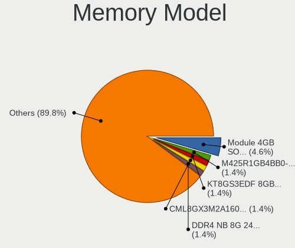

| Model                                                       | Computers | Percent |
|-------------------------------------------------------------|-----------|---------|
| Unknown RAM Module 4GB SODIMM DDR3 1333MT/s                 | 5         | 4.27%   |
| Corsair RAM CML8GX3M2A1600C9 4GB DIMM DDR3 1600MT/s         | 4         | 3.42%   |
| Samsung RAM M471A2K43CB1-CTD 16GB SODIMM DDR4 2667MT/s      | 3         | 2.56%   |
| Unknown                                                     | 3         | 2.56%   |
| SK Hynix RAM HMT451S6BFR8A-PB 4GB SODIMM DDR3 1600MT/s      | 2         | 1.71%   |
| SK Hynix RAM HMT41GU6MFR8C-PB 8GB DIMM DDR3 1600MT/s        | 2         | 1.71%   |
| SK Hynix RAM HMT41GS6BFR8A-PB 8GB SODIMM DDR3 1600MT/s      | 2         | 1.71%   |
| Samsung RAM Module 4GB DIMM DDR4 2133MT/s                   | 2         | 1.71%   |
| Samsung RAM M471B1G73DB0-YK0 8GB SODIMM DDR3 1600MT/s       | 2         | 1.71%   |
| Unknown RAM Module 8GB DIMM 1333MT/s                        | 1         | 0.85%   |
| Unknown RAM Module 4GB SODIMM DDR3 667MT/s                  | 1         | 0.85%   |
| Unknown RAM Module 4096MB DIMM DDR3 1332MT/s                | 1         | 0.85%   |
| Unknown RAM Module 2GB SODIMM DDR3                          | 1         | 0.85%   |
| Unknown RAM Module 2GB DIMM SDRAM                           | 1         | 0.85%   |
| Unknown RAM Module 2GB DIMM DDR2 800MT/s                    | 1         | 0.85%   |
| Unknown RAM Module 2048MB DIMM DDR3 1332MT/s                | 1         | 0.85%   |
| Unknown RAM Module 1GB DIMM DDR2 800MT/s                    | 1         | 0.85%   |
| Unknown RAM Module 1GB DIMM DDR2 333MT/s                    | 1         | 0.85%   |
| Unknown RAM Module 16GB DIMM DDR4 2133MT/s                  | 1         | 0.85%   |
| Unknown RAM Module 1024MB DIMM DDR3 1332MT/s                | 1         | 0.85%   |
| Toshiba RAM 8HTF12864HDY-800G1 2048MB SODIMM 800MT/s        | 1         | 0.85%   |
| Toshiba RAM 64T128020EDL2.5C2 2048MB SODIMM 800MT/s         | 1         | 0.85%   |
| SK Hynix RAM HYMP151F72CP4N3-Y5 4096MB FB-DIMM DDR2 667MT/s | 1         | 0.85%   |
| SK Hynix RAM HMT451U7AFR8C-PB 4GB DIMM DDR3 1600MT/s        | 1         | 0.85%   |
| SK Hynix RAM HMT451S6AFR8A-PB 4GB SODIMM DDR3 1600MT/s      | 1         | 0.85%   |
| SK Hynix RAM HMT351U7EFR8C-RD 4GB DIMM DDR3                 | 1         | 0.85%   |
| SK Hynix RAM HMT351U7CFR8A-H9 4GB DIMM DDR3 1333MT/s        | 1         | 0.85%   |
| SK Hynix RAM HMT351S6CFR8C-PB 4GB SODIMM DDR3 1600MT/s      | 1         | 0.85%   |
| SK Hynix RAM HMT125U7BFR8C-H9 2GB DIMM DDR3 1333MT/s        | 1         | 0.85%   |
| SK Hynix RAM HMT125S6BFR8C-H9 2048MB SODIMM DDR3 1333MT/s   | 1         | 0.85%   |
| SK Hynix RAM HMA84GR7AFR4N-VK 32GB DIMM DDR4 2666MT/s       | 1         | 0.85%   |
| SK Hynix RAM HMA82GS6JJR8N-VK 16GB SODIMM DDR4 2667MT/s     | 1         | 0.85%   |
| SK Hynix RAM HMA451U6AFR8N-TF 4GB DIMM DDR4 2133MT/s        | 1         | 0.85%   |
| Samsung RAM Module 8GB DIMM DDR4 2133MT/s                   | 1         | 0.85%   |
| Samsung RAM M471B5673FH0-CH9 2GB SODIMM DDR3 1333MT/s       | 1         | 0.85%   |
| Samsung RAM M471B5173QH0-YK0 4GB DIMM DDR3 1600MT/s         | 1         | 0.85%   |
| Samsung RAM M471B5173BH0-YK0 4GB DIMM DDR3 1600MT/s         | 1         | 0.85%   |
| Samsung RAM M471B1G73EB0-YK0 8GB SODIMM DDR3 1600MT/s       | 1         | 0.85%   |
| Samsung RAM M471A5244CB0-CWE 4GB SODIMM DDR4 3200MT/s       | 1         | 0.85%   |
| Samsung RAM M471A5244CB0-CTD 4GB SODIMM DDR4 2667MT/s       | 1         | 0.85%   |
| Samsung RAM M471A5143EB0-CPB 4GB SODIMM DDR4 2133MT/s       | 1         | 0.85%   |
| Samsung RAM M471A1K43DB1-CTD 8GB SODIMM DDR4 2667MT/s       | 1         | 0.85%   |
| Samsung RAM M471A1K43CB1-CTD 8GB SODIMM DDR4 2667MT/s       | 1         | 0.85%   |
| Samsung RAM M395T2953CZ4-CE65 1GB FB-DIMM DDR2 667MT/s      | 1         | 0.85%   |
| Samsung RAM M393B2G70BH0-YK0 16GB DIMM DDR3 1600MT/s        | 1         | 0.85%   |
| Samsung RAM M391B5773CH0-YH9 2GB DIMM DDR3 1333MT/s         | 1         | 0.85%   |
| Samsung RAM M378B5173DB0-CK0 4GB DIMM DDR3 1600MT/s         | 1         | 0.85%   |
| Samsung RAM M378B1G73EB0-YK0 8GB DIMM DDR3 1600MT/s         | 1         | 0.85%   |
| Samsung RAM M378B1G73DB0-CK0 8GB DIMM DDR3 1600MT/s         | 1         | 0.85%   |
| Micron RAM Module 4096MB SODIMM DDR3 1600MT/s               | 1         | 0.85%   |
| Micron RAM Module 2GB DIMM DDR3 1333MT/s                    | 1         | 0.85%   |
| Micron RAM M378B5273BH1-CK0 8GB SODIMM DDR3 1600MT/s        | 1         | 0.85%   |
| Micron RAM 4ATS1G64HZ-2G6E1 8GB SODIMM DDR4 2667MT/s        | 1         | 0.85%   |
| Micron RAM 36JSZF51272PZ1G4F1 4GB DIMM DDR3 1333MT/s        | 1         | 0.85%   |
| Micron RAM 36ASF4G72PZ-2G3B1 32GB DIMM DDR4 2400MT/s        | 1         | 0.85%   |
| Micron RAM 18ASF2G72PDZ-2G6E1 16GB DIMM DDR4 2667MT/s       | 1         | 0.85%   |
| Micron RAM 16KTF51264HZ-1G4M1 4GB SODIMM DDR3 1333MT/s      | 1         | 0.85%   |
| Micron RAM 16KTF1G64HZ-1G9P1 8GB DIMM DDR3 1867MT/s         | 1         | 0.85%   |
| Micron RAM 16JTF51264AZ-1G6M1 4GB DIMM DDR3                 | 1         | 0.85%   |
| Micron RAM 16ATF2G64AZ-2G6J1 16GB DIMM DDR4 2667MT/s        | 1         | 0.85%   |

Memory Kind
-----------

Memory module kinds

| Kind    | Computers | Percent |
|---------|-----------|---------|
| DDR3    | 56        | 59.57%  |
| DDR4    | 27        | 28.72%  |
| DDR2    | 6         | 6.38%   |
| Unknown | 2         | 2.13%   |
| SDRAM   | 1         | 1.06%   |
| LPDDR3  | 1         | 1.06%   |
| DRAM    | 1         | 1.06%   |

Memory Form Factor
------------------

Physical design of the memory module

| Name    | Computers | Percent |
|---------|-----------|---------|
| DIMM    | 59        | 62.11%  |
| SODIMM  | 33        | 34.74%  |
| FB-DIMM | 2         | 2.11%   |
| Chip    | 1         | 1.05%   |

Memory Size
-----------

Memory module size

| Size  | Computers | Percent |
|-------|-----------|---------|
| 4096  | 40        | 39.22%  |
| 8192  | 27        | 26.47%  |
| 16384 | 15        | 14.71%  |
| 2048  | 12        | 11.76%  |
| 1024  | 6         | 5.88%   |
| 32768 | 2         | 1.96%   |

Memory Speed
------------

Memory module speed

| Speed   | Computers | Percent |
|---------|-----------|---------|
| 1600    | 30        | 31.25%  |
| 1333    | 24        | 25%     |
| 2667    | 9         | 9.38%   |
| 2133    | 9         | 9.38%   |
| 2666    | 4         | 4.17%   |
| 2400    | 4         | 4.17%   |
| 800     | 4         | 4.17%   |
| 667     | 4         | 4.17%   |
| Unknown | 3         | 3.13%   |
| 3200    | 2         | 2.08%   |
| 1867    | 1         | 1.04%   |
| 1332    | 1         | 1.04%   |
| 333     | 1         | 1.04%   |

Printers & scanners
-------------------

Printer Vendor
--------------

Printer device vendors

Zero info for selected period =(

Printer Model
-------------

Printer device models

Zero info for selected period =(

Scanner Vendor
--------------

Scanner device vendors

Zero info for selected period =(

Scanner Model
-------------

Scanner device models

Zero info for selected period =(

Camera
------

Camera Vendor
-------------

Camera device vendors

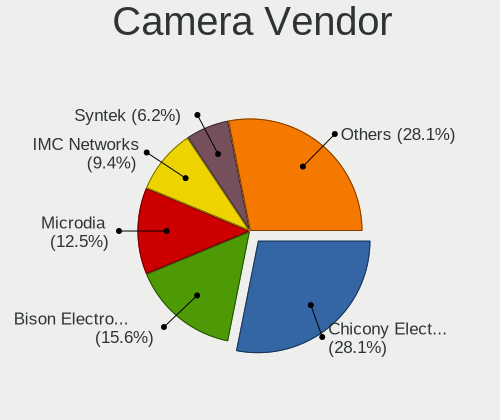

| Vendor                | Computers | Percent |
|-----------------------|-----------|---------|
| Chicony Electronics   | 6         | 33.33%  |
| Acer                  | 3         | 16.67%  |
| Realtek Semiconductor | 2         | 11.11%  |
| IMC Networks          | 2         | 11.11%  |
| Suyin                 | 1         | 5.56%   |
| Quanta                | 1         | 5.56%   |
| Microdia              | 1         | 5.56%   |
| Logitech              | 1         | 5.56%   |
| Lenovo                | 1         | 5.56%   |

Camera Model
------------

Camera device models

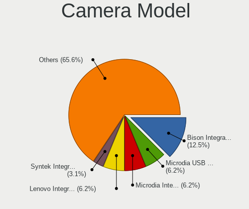

| Model                                    | Computers | Percent |
|------------------------------------------|-----------|---------|
| Suyin Asus Integrated Webcam             | 1         | 5.56%   |
| Realtek Integrated_Webcam_HD             | 1         | 5.56%   |
| Realtek Front Camera                     | 1         | 5.56%   |
| Quanta VGA WebCam                        | 1         | 5.56%   |
| Microdia Integrated Webcam               | 1         | 5.56%   |
| Logitech Webcam C270                     | 1         | 5.56%   |
| Lenovo Integrated Webcam                 | 1         | 5.56%   |
| IMC Networks HP TrueVision HD Camera     | 1         | 5.56%   |
| IMC Networks EasyCamera                  | 1         | 5.56%   |
| Chicony USB2.0 HD UVC WebCam             | 1         | 5.56%   |
| Chicony USB 2.0 VGA UVC WebCam           | 1         | 5.56%   |
| Chicony ThinkPad T490 Webcam             | 1         | 5.56%   |
| Chicony Lenovo Integrated Camera (0.3MP) | 1         | 5.56%   |
| Chicony Integrated Camera                | 1         | 5.56%   |
| Chicony Camera                           | 1         | 5.56%   |
| Acer ThinkPad P50 Integrated Camera      | 1         | 5.56%   |
| Acer Integrated Camera                   | 1         | 5.56%   |
| Acer EasyCamera                          | 1         | 5.56%   |

Security
--------

Fingerprint Vendor
------------------

Fingerprint sensor vendors

| Vendor           | Computers | Percent |
|------------------|-----------|---------|
| Upek             | 2         | 33.33%  |
| Validity Sensors | 1         | 16.67%  |
| Synaptics        | 1         | 16.67%  |
| Broadcom         | 1         | 16.67%  |
| AuthenTec        | 1         | 16.67%  |

Fingerprint Model
-----------------

Fingerprint sensor models

| Model                                                                        | Computers | Percent |
|------------------------------------------------------------------------------|-----------|---------|
| Upek Biometric Touchchip/Touchstrip Fingerprint Sensor                       | 2         | 33.33%  |
| Validity Sensors VFS451 Fingerprint Reader                                   | 1         | 16.67%  |
| Synaptics Prometheus MIS Touch Fingerprint Reader                            | 1         | 16.67%  |
| Broadcom BCM5880 Secure Applications Processor with fingerprint swipe sensor | 1         | 16.67%  |
| AuthenTec AES2810                                                            | 1         | 16.67%  |

Chipcard Vendor
---------------

Chipcard module vendors

Zero info for selected period =(

Chipcard Model
--------------

Chipcard module models

Zero info for selected period =(

Unsupported
-----------

Unsupported Devices
-------------------

Total unsupported devices on board

| Total | Computers | Percent |
|-------|-----------|---------|
| 1     | 44        | 39.64%  |
| 0     | 36        | 32.43%  |
| 2     | 21        | 18.92%  |
| 3     | 5         | 4.5%    |
| 4     | 3         | 2.7%    |
| 5     | 2         | 1.8%    |

Unsupported Device Types
------------------------

Types of unsupported devices

| Type                     | Computers | Percent |
|--------------------------|-----------|---------|
| Communication controller | 66        | 68.04%  |
| Net/wireless             | 9         | 9.28%   |
| Card reader              | 6         | 6.19%   |
| Fingerprint reader       | 4         | 4.12%   |
| Graphics card            | 3         | 3.09%   |
| Firewire controller      | 3         | 3.09%   |
| Storage/ata              | 2         | 2.06%   |
| Network                  | 2         | 2.06%   |
| Sound                    | 1         | 1.03%   |
| Net/ethernet             | 1         | 1.03%   |

