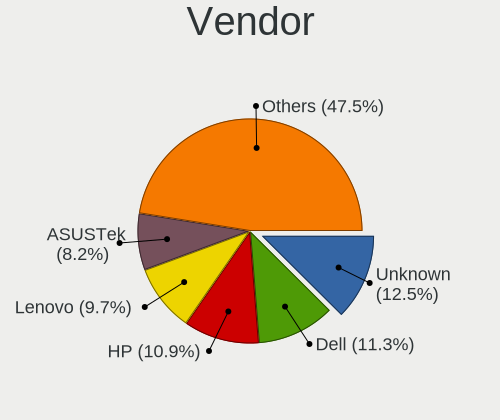
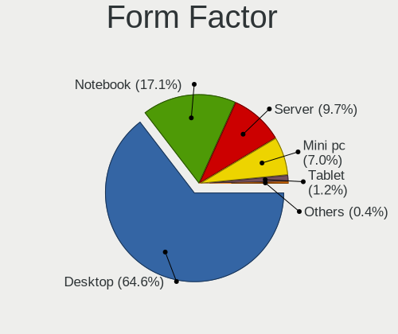
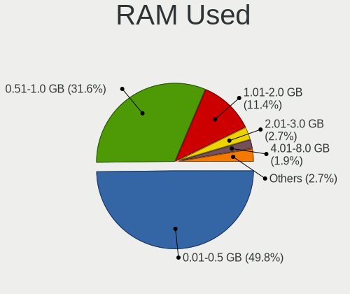
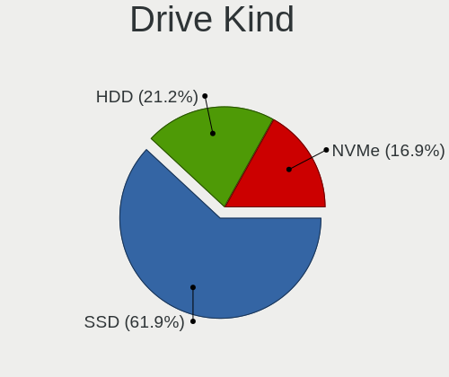
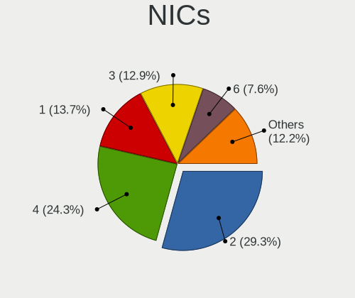
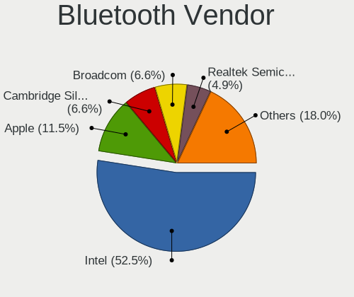

BSD in Sweden - Tested Hardware & Statistics
--------------------------------------------

A project to collect tested hardware configurations for BSD in Sweden.

Anyone can contribute to this report by the [hw-probe](https://github.com/linuxhw/hw-probe/blob/master/INSTALL.BSD.md) tool:

    hw-probe -all -upload

Please contribute! Especially if your hardware is rare.

This is a report for all computer types. See also reports for [desktops](/Location/Sweden/Desktop/README.md) and [notebooks](/Location/Sweden/Notebook/README.md).

Contents
--------

* [ Test Cases ](#test-cases)

* [ System ](#system)
  - [ OS                       ](#os)
  - [ OS Family                ](#os-family)
  - [ Arch                     ](#arch)
  - [ DE                       ](#de)
  - [ Display Server           ](#display-server)
  - [ Display Manager          ](#display-manager)
  - [ OS Lang                  ](#os-lang)
  - [ Boot Mode                ](#boot-mode)
  - [ Filesystem               ](#filesystem)
  - [ Part. scheme             ](#part-scheme)

* [ Board ](#board)
  - [ Vendor                   ](#vendor)
  - [ Model                    ](#model)
  - [ Model Family             ](#model-family)
  - [ MFG Year                 ](#mfg-year)
  - [ Form Factor              ](#form-factor)
  - [ Coreboot                 ](#coreboot)
  - [ RAM Size                 ](#ram-size)
  - [ RAM Used                 ](#ram-used)
  - [ Total Drives             ](#total-drives)
  - [ Has CD-ROM               ](#has-cd-rom)
  - [ Has Ethernet             ](#has-ethernet)
  - [ Has WiFi                 ](#has-wifi)
  - [ Has Bluetooth            ](#has-bluetooth)

* [ Location ](#location)
  - [ Country                  ](#country)
  - [ City                     ](#city)

* [ Drives ](#drives)
  - [ Drive Vendor             ](#drive-vendor)
  - [ Drive Model              ](#drive-model)
  - [ HDD Vendor               ](#hdd-vendor)
  - [ SSD Vendor               ](#ssd-vendor)
  - [ Drive Kind               ](#drive-kind)
  - [ Drive Connector          ](#drive-connector)
  - [ Drive Size               ](#drive-size)
  - [ Space Total              ](#space-total)
  - [ Space Used               ](#space-used)
  - [ Malfunc. Drives          ](#malfunc-drives)
  - [ Malfunc. Drive Vendor    ](#malfunc-drive-vendor)
  - [ Malfunc. HDD Vendor      ](#malfunc-hdd-vendor)
  - [ Malfunc. Drive Kind      ](#malfunc-drive-kind)
  - [ Failed Drives            ](#failed-drives)
  - [ Failed Drive Vendor      ](#failed-drive-vendor)
  - [ Drive Status             ](#drive-status)

* [ Storage controller ](#storage-controller)
  - [ Storage Vendor           ](#storage-vendor)
  - [ Storage Model            ](#storage-model)
  - [ Storage Kind             ](#storage-kind)

* [ Processor ](#processor)
  - [ CPU Vendor               ](#cpu-vendor)
  - [ CPU Model                ](#cpu-model)
  - [ CPU Model Family         ](#cpu-model-family)
  - [ CPU Cores                ](#cpu-cores)
  - [ CPU Sockets              ](#cpu-sockets)
  - [ CPU Threads              ](#cpu-threads)
  - [ CPU Microarch            ](#cpu-microarch)

* [ Graphics ](#graphics)
  - [ GPU Vendor               ](#gpu-vendor)
  - [ GPU Model                ](#gpu-model)
  - [ GPU Combo                ](#gpu-combo)
  - [ GPU Driver               ](#gpu-driver)
  - [ GPU Memory               ](#gpu-memory)

* [ Monitor ](#monitor)
  - [ Monitor Vendor           ](#monitor-vendor)
  - [ Monitor Model            ](#monitor-model)
  - [ Monitor Resolution       ](#monitor-resolution)
  - [ Monitor Diagonal         ](#monitor-diagonal)
  - [ Monitor Width            ](#monitor-width)
  - [ Aspect Ratio             ](#aspect-ratio)
  - [ Monitor Area             ](#monitor-area)
  - [ Pixel Density            ](#pixel-density)
  - [ Multiple Monitors        ](#multiple-monitors)

* [ Network ](#network)
  - [ Net Controller Vendor    ](#net-controller-vendor)
  - [ Net Controller Model     ](#net-controller-model)
  - [ Wireless Vendor          ](#wireless-vendor)
  - [ Wireless Model           ](#wireless-model)
  - [ Ethernet Vendor          ](#ethernet-vendor)
  - [ Ethernet Model           ](#ethernet-model)
  - [ Net Controller Kind      ](#net-controller-kind)
  - [ Used Controller          ](#used-controller)
  - [ NICs                     ](#nics)
  - [ IPv6                     ](#ipv6)

* [ Bluetooth ](#bluetooth)
  - [ Bluetooth Vendor         ](#bluetooth-vendor)
  - [ Bluetooth Model          ](#bluetooth-model)

* [ Sound ](#sound)
  - [ Sound Vendor             ](#sound-vendor)
  - [ Sound Model              ](#sound-model)

* [ Memory ](#memory)
  - [ Memory Vendor            ](#memory-vendor)
  - [ Memory Model             ](#memory-model)
  - [ Memory Kind              ](#memory-kind)
  - [ Memory Form Factor       ](#memory-form-factor)
  - [ Memory Size              ](#memory-size)
  - [ Memory Speed             ](#memory-speed)

* [ Printers & scanners ](#printers--scanners)
  - [ Printer Vendor           ](#printer-vendor)
  - [ Printer Model            ](#printer-model)
  - [ Scanner Vendor           ](#scanner-vendor)
  - [ Scanner Model            ](#scanner-model)

* [ Camera ](#camera)
  - [ Camera Vendor            ](#camera-vendor)
  - [ Camera Model             ](#camera-model)

* [ Security ](#security)
  - [ Fingerprint Vendor       ](#fingerprint-vendor)
  - [ Fingerprint Model        ](#fingerprint-model)
  - [ Chipcard Vendor          ](#chipcard-vendor)
  - [ Chipcard Model           ](#chipcard-model)

* [ Unsupported ](#unsupported)
  - [ Unsupported Devices      ](#unsupported-devices)
  - [ Unsupported Device Types ](#unsupported-device-types)

Test Cases
----------

Total: 196

| Vendor        | Model                       | Form-Factor | Probe                                                     | Date         |
|---------------|-----------------------------|-------------|-----------------------------------------------------------|--------------|
| Star Labs     | StarBook                    | Notebook    | [d222f381b0](https://bsd-hardware.info/?probe=d222f381b0) | Jan 23, 2023 |
| Star Labs     | StarBook                    | Notebook    | [045d4bb6e8](https://bsd-hardware.info/?probe=045d4bb6e8) | Jan 23, 2023 |
| ASUSTek       | EB1035                      | All in one  | [7e39e23232](https://bsd-hardware.info/?probe=7e39e23232) | Jan 21, 2023 |
| ZOTAC         | ZBOX-CI329NANO              | Mini pc     | [c2100f1789](https://bsd-hardware.info/?probe=c2100f1789) | Jan 14, 2023 |
| AMI           | Aptio CRB                   | Mini pc     | [3d2101dc79](https://bsd-hardware.info/?probe=3d2101dc79) | Jan 14, 2023 |
| HP            | 82A1                        | Desktop     | [2d7d9105f7](https://bsd-hardware.info/?probe=2d7d9105f7) | Jan 13, 2023 |
| Supermicro    | X10SLL-F                    | Server      | [b53cd12326](https://bsd-hardware.info/?probe=b53cd12326) | Jan 12, 2023 |
| Gigabyte      | G31M-ES2C                   | Desktop     | [8353660219](https://bsd-hardware.info/?probe=8353660219) | Jan 08, 2023 |
| ASRock        | E3C226D2I                   | Desktop     | [5dfcf8051d](https://bsd-hardware.info/?probe=5dfcf8051d) | Jan 06, 2023 |
| Deciso        | NetBoard-A10                | Notebook    | [21c60a4db8](https://bsd-hardware.info/?probe=21c60a4db8) | Jan 04, 2023 |
| Supermicro    | X10SLL-F                    | Server      | [7a86ed2309](https://bsd-hardware.info/?probe=7a86ed2309) | Jan 01, 2023 |
| Lenovo        | IdeaPad L340-17IWL 81M0     | Notebook    | [22c4a06468](https://bsd-hardware.info/?probe=22c4a06468) | Dec 31, 2022 |
| Lenovo        | 30D9 SDK0J40700 WIN 3258... | Desktop     | [ac867149f2](https://bsd-hardware.info/?probe=ac867149f2) | Dec 31, 2022 |
| CompuLab      | SBC-fit-PC4                 | Mini pc     | [c781bd46dc](https://bsd-hardware.info/?probe=c781bd46dc) | Dec 30, 2022 |
| Unknown       | Unknown                     | Desktop     | [b4d44b0018](https://bsd-hardware.info/?probe=b4d44b0018) | Dec 26, 2022 |
| ACMA          | X8SIE                       | Desktop     | [01898b2ffb](https://bsd-hardware.info/?probe=01898b2ffb) | Dec 21, 2022 |
| PC Engines    | APU3                        | Desktop     | [5597cca988](https://bsd-hardware.info/?probe=5597cca988) | Dec 17, 2022 |
| Supermicro    | X10SLL-F                    | Server      | [7d80c62813](https://bsd-hardware.info/?probe=7d80c62813) | Dec 09, 2022 |
| Supermicro    | X10SLL-F                    | Server      | [b2720b8b88](https://bsd-hardware.info/?probe=b2720b8b88) | Dec 08, 2022 |
| ACMA          | X8SIE                       | Desktop     | [361e4ccc04](https://bsd-hardware.info/?probe=361e4ccc04) | Dec 05, 2022 |
| ACMA          | X8SIE                       | Desktop     | [532b81e55f](https://bsd-hardware.info/?probe=532b81e55f) | Nov 29, 2022 |
| ACMA          | X8SIE                       | Desktop     | [d0112d027b](https://bsd-hardware.info/?probe=d0112d027b) | Nov 28, 2022 |
| Intel         | D54250WYK H13922-303        | Desktop     | [e850e0ae9c](https://bsd-hardware.info/?probe=e850e0ae9c) | Nov 28, 2022 |
| Toshiba       | TECRA Z40-C-12Z             | Notebook    | [149e5c3de3](https://bsd-hardware.info/?probe=149e5c3de3) | Nov 28, 2022 |
| Intel         | CRESCENTBAY                 | Desktop     | [bd1f1fa769](https://bsd-hardware.info/?probe=bd1f1fa769) | Nov 26, 2022 |
| Gigabyte      | G31M-ES2C                   | Desktop     | [2959091a59](https://bsd-hardware.info/?probe=2959091a59) | Nov 25, 2022 |
| Lenovo        | ThinkServer RS140           | Desktop     | [0dd05e08aa](https://bsd-hardware.info/?probe=0dd05e08aa) | Nov 12, 2022 |
| Lenovo        | ThinkServer RS140           | Desktop     | [b2b1509adf](https://bsd-hardware.info/?probe=b2b1509adf) | Nov 11, 2022 |
| MSI           | Z370I GAMING PRO CARBON ... | Desktop     | [dd9f7679b5](https://bsd-hardware.info/?probe=dd9f7679b5) | Nov 09, 2022 |
| AMI           | Aptio CRB                   | Mini pc     | [970443066b](https://bsd-hardware.info/?probe=970443066b) | Nov 07, 2022 |
| Cisco         | ASA5515 A0                  | Desktop     | [7f848d7c57](https://bsd-hardware.info/?probe=7f848d7c57) | Oct 22, 2022 |
| ASUSTek       | P5L-VM 1394                 | Desktop     | [d7c3749eba](https://bsd-hardware.info/?probe=d7c3749eba) | Oct 13, 2022 |
| HP            | 8103 A01                    | Mini pc     | [f187229469](https://bsd-hardware.info/?probe=f187229469) | Oct 09, 2022 |
| Dell          | 05KX61 A04                  | Server      | [f1232f79c4](https://bsd-hardware.info/?probe=f1232f79c4) | Sep 25, 2022 |
| HP            | Unknown                     | Notebook    | [7bd69ee984](https://bsd-hardware.info/?probe=7bd69ee984) | Aug 29, 2022 |
| AOpen         | iBTMx-DS R1.04 55DED10A0... | Desktop     | [a480263c28](https://bsd-hardware.info/?probe=a480263c28) | Aug 26, 2022 |
| Unknown       | Unknown                     | Desktop     | [e5efeb3781](https://bsd-hardware.info/?probe=e5efeb3781) | Aug 24, 2022 |
| Unknown       | Unknown                     | Desktop     | [9d1eb045e5](https://bsd-hardware.info/?probe=9d1eb045e5) | Aug 20, 2022 |
| ASRock        | X399 Taichi                 | Desktop     | [efd9ee1d33](https://bsd-hardware.info/?probe=efd9ee1d33) | Aug 10, 2022 |
| ASUSTek       | CM6731_CM6431_CM6331        | Desktop     | [6e40b41bc3](https://bsd-hardware.info/?probe=6e40b41bc3) | Aug 04, 2022 |
| Gigabyte      | Z87M-D3H                    | Desktop     | [59ae6fc283](https://bsd-hardware.info/?probe=59ae6fc283) | Jul 26, 2022 |
| HP            | ProBook 4730s               | Notebook    | [e70725dd32](https://bsd-hardware.info/?probe=e70725dd32) | Jul 23, 2022 |
| Supermicro    | X11SSV-M4                   | Desktop     | [444d9ed75e](https://bsd-hardware.info/?probe=444d9ed75e) | Jul 04, 2022 |
| Fujitsu       | D3313-G1 S26361-D3313-G1    | Desktop     | [ea22a644f6](https://bsd-hardware.info/?probe=ea22a644f6) | Jul 04, 2022 |
| AMI           | Aptio CRB                   | Mini pc     | [dfd321896a](https://bsd-hardware.info/?probe=dfd321896a) | Jun 14, 2022 |
| PC Engines    | APU                         | Desktop     | [f41e59d78b](https://bsd-hardware.info/?probe=f41e59d78b) | Jun 11, 2022 |
| Supermicro    | X11SSH-LN4F                 | Server      | [d3ba57cf29](https://bsd-hardware.info/?probe=d3ba57cf29) | Jun 01, 2022 |
| MSI           | MS-7369                     | Desktop     | [c2c6bd80e8](https://bsd-hardware.info/?probe=c2c6bd80e8) | May 13, 2022 |
| Dell          | 05Y15N A06                  | Server      | [047ecc3a64](https://bsd-hardware.info/?probe=047ecc3a64) | May 13, 2022 |
| Intel         | CRESCENTBAY                 | Desktop     | [0d11258d3a](https://bsd-hardware.info/?probe=0d11258d3a) | Apr 22, 2022 |
| HP            | 8103 A01                    | Mini pc     | [b3d4d3c2db](https://bsd-hardware.info/?probe=b3d4d3c2db) | Apr 16, 2022 |
| Shuttle       | SH570                       | Desktop     | [08e2af8890](https://bsd-hardware.info/?probe=08e2af8890) | Apr 16, 2022 |
| Unknown       | Unknown                     | Desktop     | [2e4a7843ab](https://bsd-hardware.info/?probe=2e4a7843ab) | Apr 14, 2022 |
| ASUSTek       | UX305UA                     | Notebook    | [3fb1786193](https://bsd-hardware.info/?probe=3fb1786193) | Apr 04, 2022 |
| Dell          | 0GFKVD A00                  | Server      | [2b14dd2a23](https://bsd-hardware.info/?probe=2b14dd2a23) | Mar 29, 2022 |
| HPE           | ProLiant MicroServer Gen... | Desktop     | [04e77555a2](https://bsd-hardware.info/?probe=04e77555a2) | Mar 24, 2022 |
| Fujitsu Si... | D2811-A1 S26361-D2811-A1    | Desktop     | [23055a27d9](https://bsd-hardware.info/?probe=23055a27d9) | Mar 23, 2022 |
| Lenovo        | ThinkPad T460s 20FAS4KH0... | Notebook    | [dbb0e378d5](https://bsd-hardware.info/?probe=dbb0e378d5) | Mar 17, 2022 |
| AOpen         | iBTMx-DS R1.04 55DED10A0... | Desktop     | [8faec8e7ed](https://bsd-hardware.info/?probe=8faec8e7ed) | Mar 10, 2022 |
| HPE           | ProLiant MicroServer Gen... | Desktop     | [a2c59d02ee](https://bsd-hardware.info/?probe=a2c59d02ee) | Mar 08, 2022 |
| HPE           | ProLiant MicroServer Gen... | Desktop     | [099edf57ae](https://bsd-hardware.info/?probe=099edf57ae) | Mar 08, 2022 |
| Gigabyte      | AB350M-Gaming 3-CF          | Desktop     | [1daab68f1f](https://bsd-hardware.info/?probe=1daab68f1f) | Mar 04, 2022 |
| HPE           | ProLiant MicroServer Gen... | Desktop     | [8016115ff1](https://bsd-hardware.info/?probe=8016115ff1) | Feb 24, 2022 |
| AMI           | Aptio CRB                   | Mini pc     | [5d39002367](https://bsd-hardware.info/?probe=5d39002367) | Feb 21, 2022 |
| ASUSTek       | ROG STRIX X570-F GAMING     | Desktop     | [807a29112e](https://bsd-hardware.info/?probe=807a29112e) | Feb 19, 2022 |
| Gigabyte      | G31M-ES2C                   | Desktop     | [5f27a360e4](https://bsd-hardware.info/?probe=5f27a360e4) | Feb 10, 2022 |
| Gigabyte      | Z68X-UD7-B3                 | Desktop     | [37cc045649](https://bsd-hardware.info/?probe=37cc045649) | Jan 28, 2022 |
| MSI           | MS-7C56                     | Desktop     | [962ac1c7b0](https://bsd-hardware.info/?probe=962ac1c7b0) | Jan 20, 2022 |
| Gigabyte      | Z68X-UD7-B3                 | Desktop     | [082da3ef7f](https://bsd-hardware.info/?probe=082da3ef7f) | Jan 19, 2022 |
| Microsoft     | Surface Pro 7               | Tablet      | [26ccd8e3c5](https://bsd-hardware.info/?probe=26ccd8e3c5) | Jan 16, 2022 |
| Lenovo        | V130-15IGM 81HL             | Notebook    | [e0e7b21668](https://bsd-hardware.info/?probe=e0e7b21668) | Jan 09, 2022 |
| ASUSTek       | P8H77-I                     | Desktop     | [e15d67e8db](https://bsd-hardware.info/?probe=e15d67e8db) | Jan 08, 2022 |
| ASRock        | E3C226D2I                   | Desktop     | [a31265ae13](https://bsd-hardware.info/?probe=a31265ae13) | Jan 07, 2022 |
| ASUSTek       | P8H77-I                     | Desktop     | [27960088a3](https://bsd-hardware.info/?probe=27960088a3) | Jan 05, 2022 |
| Fujitsu       | D3221-A1 S26361-D3221-A1    | Desktop     | [1684618e22](https://bsd-hardware.info/?probe=1684618e22) | Jan 01, 2022 |
| HP            | ProLiant DL360 G5           | Server      | [8eaea61913](https://bsd-hardware.info/?probe=8eaea61913) | Dec 29, 2021 |
| Lenovo        | ThinkServer RS140           | Desktop     | [e28b542e9e](https://bsd-hardware.info/?probe=e28b542e9e) | Dec 23, 2021 |
| HP            | ProLiant DL360p Gen8        | Server      | [fda420b944](https://bsd-hardware.info/?probe=fda420b944) | Dec 20, 2021 |
| HPE           | ProLiant DL380 Gen10        | Server      | [d1e6144816](https://bsd-hardware.info/?probe=d1e6144816) | Dec 20, 2021 |
| Intel         | DH61AG AAG81491-600         | Desktop     | [fd9659a9fe](https://bsd-hardware.info/?probe=fd9659a9fe) | Dec 15, 2021 |
| ASUSTek       | Rampage Formula             | Desktop     | [34633c2ca8](https://bsd-hardware.info/?probe=34633c2ca8) | Dec 02, 2021 |
| MSI           | MS-7C56                     | Desktop     | [d4e3f14ad4](https://bsd-hardware.info/?probe=d4e3f14ad4) | Nov 23, 2021 |
| Lenovo        | ThinkPad T420 4236MBG       | Notebook    | [0391bf9ea4](https://bsd-hardware.info/?probe=0391bf9ea4) | Nov 14, 2021 |
| Dell          | 0N28XX A02                  | Server      | [b640c5a644](https://bsd-hardware.info/?probe=b640c5a644) | Nov 10, 2021 |
| ASUSTek       | K52Jc                       | Notebook    | [92b975763f](https://bsd-hardware.info/?probe=92b975763f) | Nov 08, 2021 |
| ASUSTek       | K52Jc                       | Notebook    | [fc919c73e3](https://bsd-hardware.info/?probe=fc919c73e3) | Nov 07, 2021 |
| Google        | Grunt                       | Notebook    | [aa07a1dd40](https://bsd-hardware.info/?probe=aa07a1dd40) | Nov 05, 2021 |
| Google        | Grunt                       | Notebook    | [c87e033731](https://bsd-hardware.info/?probe=c87e033731) | Nov 01, 2021 |
| AMI           | PEISIA E3845 VER1.0         | Desktop     | [a6b7ceeada](https://bsd-hardware.info/?probe=a6b7ceeada) | Oct 20, 2021 |
| ShenZhen M... | MW-NANO-APL-4L              | Desktop     | [4fdd90135a](https://bsd-hardware.info/?probe=4fdd90135a) | Oct 20, 2021 |
| Google        | Grunt                       | Notebook    | [e6d4421a4d](https://bsd-hardware.info/?probe=e6d4421a4d) | Oct 16, 2021 |
| Google        | Grunt                       | Notebook    | [ee9b2d7ad3](https://bsd-hardware.info/?probe=ee9b2d7ad3) | Oct 15, 2021 |
| Lenovo        | Win8 Pro DPK TPG            | Desktop     | [f57ea5540f](https://bsd-hardware.info/?probe=f57ea5540f) | Oct 13, 2021 |
| Google        | Grunt                       | Notebook    | [e76c73d9a3](https://bsd-hardware.info/?probe=e76c73d9a3) | Oct 11, 2021 |
| Acer          | Aspire A315-56              | Notebook    | [03ca802f4b](https://bsd-hardware.info/?probe=03ca802f4b) | Oct 02, 2021 |
| Gigabyte      | Z87M-D3H                    | Desktop     | [8cb8c4dbf4](https://bsd-hardware.info/?probe=8cb8c4dbf4) | Oct 01, 2021 |
| ASUSTek       | ROG STRIX X570-F GAMING     | Desktop     | [1ef37663db](https://bsd-hardware.info/?probe=1ef37663db) | Sep 01, 2021 |
| Dell          | 0M877N A01                  | Server      | [1585126252](https://bsd-hardware.info/?probe=1585126252) | Aug 18, 2021 |
| Lenovo        | 3098 0B98401 PRO            | Desktop     | [4737978dbf](https://bsd-hardware.info/?probe=4737978dbf) | Aug 18, 2021 |
| Dell          | Latitude E5530 non-vPro     | Notebook    | [bd4b0f0700](https://bsd-hardware.info/?probe=bd4b0f0700) | Aug 17, 2021 |
| HPE           | ProLiant MicroServer Gen... | Desktop     | [04d9692802](https://bsd-hardware.info/?probe=04d9692802) | Aug 09, 2021 |
| HPE           | ProLiant MicroServer Gen... | Desktop     | [24df2da075](https://bsd-hardware.info/?probe=24df2da075) | Aug 08, 2021 |
| PC Engines    | apu4                        | Desktop     | [815567b75c](https://bsd-hardware.info/?probe=815567b75c) | Aug 02, 2021 |
| PC Engines    | apu4                        | Desktop     | [77fa195d5e](https://bsd-hardware.info/?probe=77fa195d5e) | Aug 02, 2021 |
| Lenovo        | ThinkPad X250 20CLS4JH00    | Notebook    | [89a74889ae](https://bsd-hardware.info/?probe=89a74889ae) | Aug 02, 2021 |
| AMI           | Aptio CRB                   | Mini pc     | [c577b93feb](https://bsd-hardware.info/?probe=c577b93feb) | Jul 24, 2021 |
| Lenovo        | ThinkPad T400 2767WSB       | Notebook    | [36ce1d1e00](https://bsd-hardware.info/?probe=36ce1d1e00) | Jul 24, 2021 |
| ASUSTek       | P8H77-I                     | Desktop     | [52e8a39fb1](https://bsd-hardware.info/?probe=52e8a39fb1) | Jul 19, 2021 |
| Lenovo        | ThinkPad T420 4236MBG       | Notebook    | [5b43300a93](https://bsd-hardware.info/?probe=5b43300a93) | Jul 13, 2021 |
| Protectli     | FW4B Ver                    | Desktop     | [452a8558c0](https://bsd-hardware.info/?probe=452a8558c0) | Jul 09, 2021 |
| Dell          | 05XGC8 A01                  | Desktop     | [b9841b1272](https://bsd-hardware.info/?probe=b9841b1272) | Jul 08, 2021 |
| Unknown       | Unknown                     | Desktop     | [935263c5a0](https://bsd-hardware.info/?probe=935263c5a0) | Jul 03, 2021 |
| HP            | 82A1                        | Desktop     | [dba57fb77f](https://bsd-hardware.info/?probe=dba57fb77f) | Jun 30, 2021 |
| HPE           | ProLiant MicroServer Gen... | Desktop     | [18e34c37cd](https://bsd-hardware.info/?probe=18e34c37cd) | Jun 28, 2021 |
| HPE           | ProLiant MicroServer Gen... | Desktop     | [3d717eec8f](https://bsd-hardware.info/?probe=3d717eec8f) | Jun 25, 2021 |
| Dell          | 0P03DX A03                  | Desktop     | [b2f0c90d79](https://bsd-hardware.info/?probe=b2f0c90d79) | Jun 24, 2021 |
| Microsoft     | Surface Pro 7               | Tablet      | [1b8d66e5f0](https://bsd-hardware.info/?probe=1b8d66e5f0) | Jun 22, 2021 |
| ASUSTek       | P5Q DELUXE                  | Desktop     | [5091db2ace](https://bsd-hardware.info/?probe=5091db2ace) | Jun 16, 2021 |
| MSI           | Z97 GAMING 3                | Desktop     | [c6d7626b29](https://bsd-hardware.info/?probe=c6d7626b29) | Jun 12, 2021 |
| ASRock        | X99 WS                      | Desktop     | [201a7417a5](https://bsd-hardware.info/?probe=201a7417a5) | Jun 11, 2021 |
| Dell          | 0NR282 A00                  | Server      | [f3854ba6e8](https://bsd-hardware.info/?probe=f3854ba6e8) | Jun 07, 2021 |
| Sony          | SVP1322M1EBI                | Notebook    | [23316d0f2b](https://bsd-hardware.info/?probe=23316d0f2b) | May 29, 2021 |
| PC Engines    | APU2                        | Desktop     | [2070f50252](https://bsd-hardware.info/?probe=2070f50252) | May 26, 2021 |
| ASUSTek       | Z87-DELUXE/DUAL             | Desktop     | [69a811cae5](https://bsd-hardware.info/?probe=69a811cae5) | May 25, 2021 |
| ASUSTek       | SABERTOOTH Z87              | Desktop     | [586a4db247](https://bsd-hardware.info/?probe=586a4db247) | May 20, 2021 |
| ASUSTek       | SABERTOOTH Z87              | Desktop     | [eb0c02a451](https://bsd-hardware.info/?probe=eb0c02a451) | May 19, 2021 |
| Gigabyte      | B550I AORUS PRO AX          | Desktop     | [62b9ea2794](https://bsd-hardware.info/?probe=62b9ea2794) | May 14, 2021 |
| Dell          | Latitude 5500               | Notebook    | [2538b038ed](https://bsd-hardware.info/?probe=2538b038ed) | May 08, 2021 |
| ASRock        | X99 WS                      | Desktop     | [eb20367455](https://bsd-hardware.info/?probe=eb20367455) | May 05, 2021 |
| Dell          | 0NR282 A00                  | Server      | [09082703f8](https://bsd-hardware.info/?probe=09082703f8) | Apr 29, 2021 |
| Dell          | 03X6X0 A01                  | Server      | [9f13074b78](https://bsd-hardware.info/?probe=9f13074b78) | Apr 24, 2021 |
| ASUSTek       | All Series                  | Desktop     | [ef6afe88d7](https://bsd-hardware.info/?probe=ef6afe88d7) | Apr 17, 2021 |
| Unknown       | YL-J3160L4                  | Desktop     | [ad564817c9](https://bsd-hardware.info/?probe=ad564817c9) | Apr 11, 2021 |
| Unknown       | YL-J3160L4                  | Desktop     | [0712c3048c](https://bsd-hardware.info/?probe=0712c3048c) | Apr 11, 2021 |
| Dell          | 09T7VV A05                  | Server      | [668c05619b](https://bsd-hardware.info/?probe=668c05619b) | Apr 09, 2021 |
| Dell          | 09T7VV A05                  | Server      | [917ab2c4e6](https://bsd-hardware.info/?probe=917ab2c4e6) | Apr 06, 2021 |
| Shuttle       | FH170                       | Desktop     | [d36fccf7b7](https://bsd-hardware.info/?probe=d36fccf7b7) | Apr 01, 2021 |
| Dell          | 0F0XJ6 A02                  | Server      | [052c1899c8](https://bsd-hardware.info/?probe=052c1899c8) | Mar 29, 2021 |
| Dell          | 0F0XJ6 A02                  | Server      | [806c6f796e](https://bsd-hardware.info/?probe=806c6f796e) | Mar 29, 2021 |
| MSI           | IONA                        | Desktop     | [5f857882ff](https://bsd-hardware.info/?probe=5f857882ff) | Mar 25, 2021 |
| Unknown       | Unknown                     | Desktop     | [93ef7a4b6e](https://bsd-hardware.info/?probe=93ef7a4b6e) | Mar 22, 2021 |
| ASUSTek       | All Series                  | Desktop     | [c5bc64e4e9](https://bsd-hardware.info/?probe=c5bc64e4e9) | Mar 22, 2021 |
| ASUSTek       | All Series                  | Desktop     | [700ff7d378](https://bsd-hardware.info/?probe=700ff7d378) | Mar 22, 2021 |
| HP            | 8054                        | Desktop     | [1db522699a](https://bsd-hardware.info/?probe=1db522699a) | Mar 21, 2021 |
| Lenovo        | MAHOBAY NO DPK              | Desktop     | [ddc66bc2fb](https://bsd-hardware.info/?probe=ddc66bc2fb) | Mar 20, 2021 |
| Gigabyte      | 970A-DS3P                   | Desktop     | [a5833ca2c9](https://bsd-hardware.info/?probe=a5833ca2c9) | Mar 18, 2021 |
| HP            | 8053                        | Desktop     | [b7ebdfe456](https://bsd-hardware.info/?probe=b7ebdfe456) | Mar 17, 2021 |
| ASUSTek       | P8H67-M                     | Desktop     | [e95d6c6972](https://bsd-hardware.info/?probe=e95d6c6972) | Mar 17, 2021 |
| Lenovo        | ThinkPad X395 20NL001SMX    | Notebook    | [cd016e96ee](https://bsd-hardware.info/?probe=cd016e96ee) | Mar 17, 2021 |
| ADI           | MinnowBoard Turbot          | Desktop     | [ebd85cee04](https://bsd-hardware.info/?probe=ebd85cee04) | Mar 14, 2021 |
| Intel         | Q3XXG4-P V1.0               | Desktop     | [93c9f14bf0](https://bsd-hardware.info/?probe=93c9f14bf0) | Mar 12, 2021 |
| Dell          | 0XCR8D A02                  | Desktop     | [af5d6a85ef](https://bsd-hardware.info/?probe=af5d6a85ef) | Mar 09, 2021 |
| Dell          | 00V62H A00                  | Desktop     | [a9f921e29b](https://bsd-hardware.info/?probe=a9f921e29b) | Mar 03, 2021 |
| Intel         | DQ67SW AAG12527-306         | Desktop     | [a4fb7ae326](https://bsd-hardware.info/?probe=a4fb7ae326) | Mar 02, 2021 |
| Unknown       | Unknown                     | Desktop     | [b00dc0301a](https://bsd-hardware.info/?probe=b00dc0301a) | Feb 27, 2021 |
| Lenovo        | 3098 0B98401 PRO            | Desktop     | [da62664934](https://bsd-hardware.info/?probe=da62664934) | Feb 23, 2021 |
| Dell          | Latitude E7240              | Notebook    | [e42e579971](https://bsd-hardware.info/?probe=e42e579971) | Feb 22, 2021 |
| HP            | EliteBook 8440p             | Notebook    | [7968c7d2dd](https://bsd-hardware.info/?probe=7968c7d2dd) | Feb 16, 2021 |
| Lenovo        | Legion Y530-15ICH 81FV      | Notebook    | [f8bdec0105](https://bsd-hardware.info/?probe=f8bdec0105) | Feb 14, 2021 |
| Lenovo        | 3098 0B98401 PRO            | Desktop     | [5ca10a4860](https://bsd-hardware.info/?probe=5ca10a4860) | Feb 14, 2021 |
| Lenovo        | 3098 0B98401 PRO            | Desktop     | [263a74d1ce](https://bsd-hardware.info/?probe=263a74d1ce) | Feb 12, 2021 |
| ASUSTek       | S551LN                      | Notebook    | [42792115e3](https://bsd-hardware.info/?probe=42792115e3) | Feb 11, 2021 |
| Toshiba       | Satellite L450              | Notebook    | [eb44256bfe](https://bsd-hardware.info/?probe=eb44256bfe) | Feb 11, 2021 |
| Lenovo        | 3098 0B98401 PRO            | Desktop     | [508b3afc1c](https://bsd-hardware.info/?probe=508b3afc1c) | Feb 09, 2021 |
| Lenovo        | 3098 0B98401 PRO            | Desktop     | [8b9f162f70](https://bsd-hardware.info/?probe=8b9f162f70) | Feb 09, 2021 |
| Deciso        | Netboard A10 V2.1           | Desktop     | [dfb0240726](https://bsd-hardware.info/?probe=dfb0240726) | Feb 05, 2021 |
| PC Engines    | APU2                        | Desktop     | [8983ab6689](https://bsd-hardware.info/?probe=8983ab6689) | Feb 03, 2021 |
| HP            | 1905                        | Desktop     | [72ab5653d3](https://bsd-hardware.info/?probe=72ab5653d3) | Feb 03, 2021 |
| Microsoft     | Surface Go 2                | Tablet      | [69c8123ec6](https://bsd-hardware.info/?probe=69c8123ec6) | Feb 01, 2021 |
| HP            | 8103 A01                    | Mini pc     | [da8a373d43](https://bsd-hardware.info/?probe=da8a373d43) | Jan 30, 2021 |
| ADI           | MinnowBoard Turbot          | Desktop     | [137ff14192](https://bsd-hardware.info/?probe=137ff14192) | Jan 29, 2021 |
| Unknown       | Unknown                     | Desktop     | [920259bf95](https://bsd-hardware.info/?probe=920259bf95) | Jan 28, 2021 |
| HP            | 8103 A01                    | Mini pc     | [55c7d22c4d](https://bsd-hardware.info/?probe=55c7d22c4d) | Jan 28, 2021 |
| HP            | ProLiant DL380 Gen9         | Server      | [c2bb148e8a](https://bsd-hardware.info/?probe=c2bb148e8a) | Jan 28, 2021 |
| Dell          | 06G98X A02                  | Server      | [b062e0f4e4](https://bsd-hardware.info/?probe=b062e0f4e4) | Jan 28, 2021 |
| Dell          | 0WCJNT A06                  | Server      | [4710d6000d](https://bsd-hardware.info/?probe=4710d6000d) | Jan 28, 2021 |
| ASUSTek       | All Series                  | Desktop     | [7ebe6eee38](https://bsd-hardware.info/?probe=7ebe6eee38) | Jan 25, 2021 |
| ADI           | MinnowBoard Turbot          | Desktop     | [e2fbc5f326](https://bsd-hardware.info/?probe=e2fbc5f326) | Jan 21, 2021 |
| ADI           | MinnowBoard Turbot          | Desktop     | [0b8e4d0630](https://bsd-hardware.info/?probe=0b8e4d0630) | Jan 21, 2021 |
| Dell          | 00V62H A00                  | Desktop     | [bd3877826c](https://bsd-hardware.info/?probe=bd3877826c) | Jan 20, 2021 |
| AMI           | Aptio CRB                   | Mini pc     | [3a9d5d1a1d](https://bsd-hardware.info/?probe=3a9d5d1a1d) | Jan 20, 2021 |
| PC Engines    | APU2                        | Desktop     | [ecf35d22c4](https://bsd-hardware.info/?probe=ecf35d22c4) | Jan 12, 2021 |
| Lenovo        | ThinkPad X201 3680FAG       | Notebook    | [1ba69078df](https://bsd-hardware.info/?probe=1ba69078df) | Dec 06, 2020 |
| PC Engines    | APU2                        | Desktop     | [2e6256a0ab](https://bsd-hardware.info/?probe=2e6256a0ab) | Nov 23, 2020 |
| PC Engines    | APU2                        | Desktop     | [65de6946d3](https://bsd-hardware.info/?probe=65de6946d3) | Nov 23, 2020 |
| PC Engines    | APU2                        | Desktop     | [b4f5d7d344](https://bsd-hardware.info/?probe=b4f5d7d344) | Nov 16, 2020 |
| HP            | ProLiant ML30 Gen9          | Desktop     | [ecaec68cdb](https://bsd-hardware.info/?probe=ecaec68cdb) | Oct 27, 2020 |
| Intel         | NUC5CPYB                    | Mini pc     | [1ec5c12f0b](https://bsd-hardware.info/?probe=1ec5c12f0b) | Oct 27, 2020 |
| HP            | Laptop 15-dw0xxx            | Notebook    | [547b36ea62](https://bsd-hardware.info/?probe=547b36ea62) | Aug 19, 2020 |
| Lenovo        | ThinkPad W520 4284GN2       | Notebook    | [acb3ad955f](https://bsd-hardware.info/?probe=acb3ad955f) | Aug 06, 2020 |
| Lenovo        | ThinkPad L560 20F10032MS    | Notebook    | [bf2b792b64](https://bsd-hardware.info/?probe=bf2b792b64) | Aug 06, 2020 |
| Wistron       | ProLiant ML110 G6           | Desktop     | [0d2e0f44c1](https://bsd-hardware.info/?probe=0d2e0f44c1) | Aug 06, 2020 |
| Lenovo        | ThinkPad L560 20F10032MS    | Notebook    | [0aa6a9a921](https://bsd-hardware.info/?probe=0aa6a9a921) | Aug 06, 2020 |
| ASUSTek       | M32CD_A_F_K20CD_K31CD       | Desktop     | [6245f1e175](https://bsd-hardware.info/?probe=6245f1e175) | Aug 06, 2020 |
| Unknown       | Unknown                     | Desktop     | [4e3b87cc6c](https://bsd-hardware.info/?probe=4e3b87cc6c) | Jun 01, 2020 |
| Gigabyte      | Z170X-UD5 TH-CF             | Desktop     | [2fc2952380](https://bsd-hardware.info/?probe=2fc2952380) | May 25, 2020 |

System
------

OS
--

Installed operating systems

| Name                 | Computers | Percent |
|----------------------|-----------|---------|
| OPNsense 21.1        | 11        | 6.79%   |
| OPNsense 22.7.10     | 9         | 5.56%   |
| OPNsense 21.7.7      | 6         | 3.7%    |
| OPNsense 21.1.3      | 6         | 3.7%    |
| OpenBSD 6.8          | 6         | 3.7%    |
| OPNsense 21.1.5      | 5         | 3.09%   |
| OPNsense 21.1.2      | 5         | 3.09%   |
| OpenBSD 7.0          | 5         | 3.09%   |
| helloSystem 0.5.0    | 5         | 3.09%   |
| OPNsense 22.7.8      | 4         | 2.47%   |
| OPNsense 21.1.8      | 4         | 2.47%   |
| OPNsense 22.7.9      | 3         | 1.85%   |
| OPNsense 22.7.2      | 3         | 1.85%   |
| OPNsense 22.1.8      | 3         | 1.85%   |
| OPNsense 21.7.3      | 3         | 1.85%   |
| OPNsense 21.7.1      | 3         | 1.85%   |
| OPNsense 20.7.8      | 3         | 1.85%   |
| OpenBSD 6.9          | 3         | 1.85%   |
| helloSystem 0.7.0    | 3         | 1.85%   |
| FreeBSD 13.0-p7      | 3         | 1.85%   |
| FreeBSD 12.1-p8      | 3         | 1.85%   |
| OPNsense 22.7.7      | 2         | 1.23%   |
| OPNsense 22.7.6      | 2         | 1.23%   |
| OPNsense 22.1.9      | 2         | 1.23%   |
| OPNsense 22.1.6      | 2         | 1.23%   |
| OPNsense 22.1.3      | 2         | 1.23%   |
| OPNsense 22.1.1      | 2         | 1.23%   |
| OPNsense 21.7.6      | 2         | 1.23%   |
| OPNsense 21.7        | 2         | 1.23%   |
| OPNsense 21.1.7      | 2         | 1.23%   |
| OPNsense 21.1.6      | 2         | 1.23%   |
| OpenBSD 6.7          | 2         | 1.23%   |
| helloSystem 0.8.0    | 2         | 1.23%   |
| helloSystem 0.4.0    | 2         | 1.23%   |
| FreeBSD 14.0-CURRENT | 2         | 1.23%   |
| FreeBSD 13.1-p5      | 2         | 1.23%   |
| FreeBSD 12.2-p4      | 2         | 1.23%   |
| FreeBSD 12.2-p2      | 2         | 1.23%   |
| pfSense 2.5.0        | 1         | 0.62%   |
| OPNsense 22.7.5      | 1         | 0.62%   |

OS Family
---------

OS without a version

| Name        | Computers | Percent |
|-------------|-----------|---------|
| OPNsense    | 81        | 58.27%  |
| FreeBSD     | 25        | 17.99%  |
| OpenBSD     | 15        | 10.79%  |
| helloSystem | 12        | 8.63%   |
| GhostBSD    | 4         | 2.88%   |
| pfSense     | 1         | 0.72%   |
| FuryBSD     | 1         | 0.72%   |

Arch
----

OS architecture (x86_64, i586, etc.)

| Name   | Computers | Percent |
|--------|-----------|---------|
| amd64  | 138       | 99.28%  |
| octeon | 1         | 0.72%   |

DE
--

Desktop Environment

| Name         | Computers | Percent |
|--------------|-----------|---------|
| Console      | 94        | 66.67%  |
| helloDesktop | 12        | 8.51%   |
| fvwm         | 12        | 8.51%   |
| KDE5         | 10        | 7.09%   |
| MATE         | 5         | 3.55%   |
| i3           | 2         | 1.42%   |
| xfwm         | 1         | 0.71%   |
| XFCE         | 1         | 0.71%   |
| TWM          | 1         | 0.71%   |
| Mutter       | 1         | 0.71%   |
| LXQt         | 1         | 0.71%   |
| AwesomeWM    | 1         | 0.71%   |

Display Server
--------------

X11 or Wayland

| Name    | Computers | Percent |
|---------|-----------|---------|
| Console | 95        | 68.35%  |
| X11     | 44        | 31.65%  |

Display Manager
---------------

SDDM, LightDM, etc.

| Name    | Computers | Percent |
|---------|-----------|---------|
| Console | 106       | 74.65%  |
| SLiM    | 13        | 9.15%   |
| SDDM    | 10        | 7.04%   |
| LightDM | 7         | 4.93%   |
| GDM     | 4         | 2.82%   |
| XDM     | 2         | 1.41%   |

OS Lang
-------

Language

| Lang           | Computers | Percent |
|----------------|-----------|---------|
| Unknown        | 96        | 68.09%  |
| en_US          | 23        | 16.31%  |
| C              | 14        | 9.93%   |
| sv_SE          | 4         | 2.84%   |
| sv_SE.US-ASCII | 1         | 0.71%   |
| en_CA          | 1         | 0.71%   |
| en_BE          | 1         | 0.71%   |
| en             | 1         | 0.71%   |

Boot Mode
---------

EFI or BIOS

| Mode | Computers | Percent |
|------|-----------|---------|
| EFI  | 116       | 82.27%  |
| BIOS | 25        | 17.73%  |

Filesystem
----------

Type of filesystem

| Type   | Computers | Percent |
|--------|-----------|---------|
| Ufs    | 72        | 51.43%  |
| Zfs    | 50        | 35.71%  |
| Ffs    | 15        | 10.71%  |
| Cd9660 | 3         | 2.14%   |

Part. scheme
------------

Scheme of partitioning

| Type | Computers | Percent |
|------|-----------|---------|
| GPT  | 126       | 88.73%  |
| MBR  | 16        | 11.27%  |

Board
-----

Vendor
------

Motherboard manufacturer

| Name                       | Computers | Percent |
|----------------------------|-----------|---------|
| Dell                       | 18        | 12.95%  |
| Lenovo                     | 16        | 11.51%  |
| Hewlett-Packard            | 15        | 10.79%  |
| ASUSTek Computer           | 15        | 10.79%  |
| PC Engines                 | 8         | 5.76%   |
| Unknown                    | 8         | 5.76%   |
| Intel                      | 7         | 5.04%   |
| Gigabyte Technology        | 7         | 5.04%   |
| AMI                        | 6         | 4.32%   |
| MSI                        | 5         | 3.6%    |
| Supermicro                 | 4         | 2.88%   |
| Microsoft                  | 3         | 2.16%   |
| ASRock                     | 3         | 2.16%   |
| Toshiba                    | 2         | 1.44%   |
| Shuttle                    | 2         | 1.44%   |
| HPE                        | 2         | 1.44%   |
| Fujitsu                    | 2         | 1.44%   |
| Deciso                     | 2         | 1.44%   |
| ZOTAC                      | 1         | 0.72%   |
| Wistron                    | 1         | 0.72%   |
| Star Labs                  | 1         | 0.72%   |
| Sony                       | 1         | 0.72%   |
| ShenZhen MinWin Technology | 1         | 0.72%   |
| Protectli                  | 1         | 0.72%   |
| Google                     | 1         | 0.72%   |
| Fujitsu Siemens            | 1         | 0.72%   |
| CompuLab                   | 1         | 0.72%   |
| Cisco                      | 1         | 0.72%   |
| AOpen                      | 1         | 0.72%   |
| ADI                        | 1         | 0.72%   |
| ACMA                       | 1         | 0.72%   |
| Acer                       | 1         | 0.72%   |

Model
-----

Motherboard model

| Name                             | Computers | Percent |
|----------------------------------|-----------|---------|
| Unknown                          | 9         | 6.47%   |
| AMI Aptio CRB                    | 5         | 3.6%    |
| PC Engines APU2                  | 4         | 2.88%   |
| HP t730 Thin Client              | 3         | 2.16%   |
| ASUS All Series                  | 3         | 2.16%   |
| Supermicro X10SLL-F              | 2         | 1.44%   |
| PC Engines apu4                  | 2         | 1.44%   |
| Microsoft Surface Pro 7          | 2         | 1.44%   |
| Intel CRESCENTBAY                | 2         | 1.44%   |
| Dell PowerEdge R210 II           | 2         | 1.44%   |
| Dell PowerEdge R210              | 2         | 1.44%   |
| Dell OptiPlex 9020               | 2         | 1.44%   |
| ZOTAC ZBOX-CI329NANO             | 1         | 0.72%   |
| Wistron ProLiant ML110 G6        | 1         | 0.72%   |
| Toshiba TECRA Z40-C-12Z          | 1         | 0.72%   |
| Toshiba Satellite L450           | 1         | 0.72%   |
| Supermicro SYS-1019S-MP          | 1         | 0.72%   |
| Supermicro Super Server          | 1         | 0.72%   |
| Star Labs StarBook               | 1         | 0.72%   |
| Sony SVP1322M1EBI                | 1         | 0.72%   |
| Shuttle SH570                    | 1         | 0.72%   |
| Shuttle DH170                    | 1         | 0.72%   |
| ShenZhen MinWin MW-NANO-APL-4L   | 1         | 0.72%   |
| Protectli FW4B                   | 1         | 0.72%   |
| PC Engines APU3                  | 1         | 0.72%   |
| PC Engines APU                   | 1         | 0.72%   |
| MSI WC776AA-UUW HPE-110sc        | 1         | 0.72%   |
| MSI MS-7C56                      | 1         | 0.72%   |
| MSI MS-7B43                      | 1         | 0.72%   |
| MSI MS-7918                      | 1         | 0.72%   |
| MSI MS-7369                      | 1         | 0.72%   |
| Microsoft Surface Go 2           | 1         | 0.72%   |
| Lenovo V130-15IGM 81HL           | 1         | 0.72%   |
| Lenovo ThinkPad X395 20NL001SMX  | 1         | 0.72%   |
| Lenovo ThinkPad X250 20CLS4JH00  | 1         | 0.72%   |
| Lenovo ThinkPad X201 3680FAG     | 1         | 0.72%   |
| Lenovo ThinkPad W520 4284GN2     | 1         | 0.72%   |
| Lenovo ThinkPad T460s 20FAS4KH02 | 1         | 0.72%   |
| Lenovo ThinkPad T420 4236MBG     | 1         | 0.72%   |
| Lenovo ThinkPad T400 2767WSB     | 1         | 0.72%   |

Model Family
------------

Motherboard model prefix

| Name                           | Computers | Percent |
|--------------------------------|-----------|---------|
| Dell PowerEdge                 | 11        | 7.91%   |
| Unknown                        | 9         | 6.47%   |
| Lenovo ThinkPad                | 8         | 5.76%   |
| AMI Aptio                      | 5         | 3.6%    |
| PC Engines APU2                | 4         | 2.88%   |
| Lenovo ThinkCentre             | 4         | 2.88%   |
| HP ProLiant                    | 4         | 2.88%   |
| Dell OptiPlex                  | 4         | 2.88%   |
| Microsoft Surface              | 3         | 2.16%   |
| HP t730                        | 3         | 2.16%   |
| Dell Latitude                  | 3         | 2.16%   |
| ASUS All                       | 3         | 2.16%   |
| Supermicro X10SLL-F            | 2         | 1.44%   |
| PC Engines apu4                | 2         | 1.44%   |
| Intel CRESCENTBAY              | 2         | 1.44%   |
| HPE ProLiant                   | 2         | 1.44%   |
| HP EliteDesk                   | 2         | 1.44%   |
| ZOTAC ZBOX-CI329NANO           | 1         | 0.72%   |
| Wistron ProLiant               | 1         | 0.72%   |
| Toshiba TECRA                  | 1         | 0.72%   |
| Toshiba Satellite              | 1         | 0.72%   |
| Supermicro SYS-1019S-MP        | 1         | 0.72%   |
| Supermicro Super               | 1         | 0.72%   |
| Star Labs StarBook             | 1         | 0.72%   |
| Sony SVP1322M1EBI              | 1         | 0.72%   |
| Shuttle SH570                  | 1         | 0.72%   |
| Shuttle DH170                  | 1         | 0.72%   |
| ShenZhen MinWin MW-NANO-APL-4L | 1         | 0.72%   |
| Protectli FW4B                 | 1         | 0.72%   |
| PC Engines APU3                | 1         | 0.72%   |
| PC Engines APU                 | 1         | 0.72%   |
| MSI WC776AA-UUW                | 1         | 0.72%   |
| MSI MS-7C56                    | 1         | 0.72%   |
| MSI MS-7B43                    | 1         | 0.72%   |
| MSI MS-7918                    | 1         | 0.72%   |
| MSI MS-7369                    | 1         | 0.72%   |
| Lenovo V130-15IGM              | 1         | 0.72%   |
| Lenovo Legion                  | 1         | 0.72%   |
| Lenovo IdeaPad                 | 1         | 0.72%   |
| Lenovo 70F3S00K00              | 1         | 0.72%   |

MFG Year
--------

Motherboard manufacture year

| Year    | Computers | Percent |
|---------|-----------|---------|
| 2020    | 16        | 11.51%  |
| 2014    | 15        | 10.79%  |
| 2018    | 14        | 10.07%  |
| 2016    | 14        | 10.07%  |
| 2017    | 12        | 8.63%   |
| 2019    | 11        | 7.91%   |
| 2010    | 11        | 7.91%   |
| 2021    | 9         | 6.47%   |
| 2015    | 9         | 6.47%   |
| 2012    | 7         | 5.04%   |
| 2013    | 6         | 4.32%   |
| 2009    | 6         | 4.32%   |
| 2022    | 3         | 2.16%   |
| 2011    | 2         | 1.44%   |
| 2023    | 1         | 0.72%   |
| 2007    | 1         | 0.72%   |
| 2006    | 1         | 0.72%   |
| Unknown | 1         | 0.72%   |

Form Factor
-----------

Physical design of the computer

| Name       | Computers | Percent |
|------------|-----------|---------|
| Desktop    | 78        | 56.12%  |
| Notebook   | 28        | 20.14%  |
| Server     | 18        | 12.95%  |
| Mini pc    | 11        | 7.91%   |
| Tablet     | 3         | 2.16%   |
| All in one | 1         | 0.72%   |

Coreboot
--------

Have coreboot on board

| Used | Computers | Percent |
|------|-----------|---------|
| No   | 127       | 91.37%  |
| Yes  | 12        | 8.63%   |

RAM Size
--------

Total RAM memory

| Size in GB      | Computers | Percent |
|-----------------|-----------|---------|
| 8.01-16.0       | 46        | 32.39%  |
| 4.01-8.0        | 35        | 24.65%  |
| 16.01-24.0      | 26        | 18.31%  |
| 32.01-64.0      | 14        | 9.86%   |
| 64.01-256.0     | 6         | 4.23%   |
| 24.01-32.0      | 5         | 3.52%   |
| 2.01-3.0        | 4         | 2.82%   |
| More than 256.0 | 3         | 2.11%   |
| 3.01-4.0        | 2         | 1.41%   |
| 1.01-2.0        | 1         | 0.7%    |

RAM Used
--------

Used RAM memory

| Used GB     | Computers | Percent |
|-------------|-----------|---------|
| 0.01-0.5    | 74        | 51.75%  |
| 0.51-1.0    | 40        | 27.97%  |
| 1.01-2.0    | 16        | 11.19%  |
| 4.01-8.0    | 4         | 2.8%    |
| 2.01-3.0    | 3         | 2.1%    |
| 3.01-4.0    | 2         | 1.4%    |
| 24.01-32.0  | 2         | 1.4%    |
| 64.01-256.0 | 2         | 1.4%    |

Total Drives
------------

Number of drives on board

| Drives | Computers | Percent |
|--------|-----------|---------|
| 1      | 97        | 67.83%  |
| 2      | 14        | 9.79%   |
| 3      | 9         | 6.29%   |
| 0      | 9         | 6.29%   |
| 6      | 3         | 2.1%    |
| 4      | 3         | 2.1%    |
| 11     | 2         | 1.4%    |
| 18     | 1         | 0.7%    |
| 12     | 1         | 0.7%    |
| 10     | 1         | 0.7%    |
| 9      | 1         | 0.7%    |
| 8      | 1         | 0.7%    |
| 5      | 1         | 0.7%    |

Has CD-ROM
----------

Has CD-ROM on board

| Presented | Computers | Percent |
|-----------|-----------|---------|
| No        | 111       | 79.29%  |
| Yes       | 29        | 20.71%  |

Has Ethernet
------------

Has Ethernet on board

| Presented | Computers | Percent |
|-----------|-----------|---------|
| Yes       | 131       | 94.24%  |
| No        | 8         | 5.76%   |

Has WiFi
--------

Has WiFi module

| Presented | Computers | Percent |
|-----------|-----------|---------|
| No        | 91        | 65%     |
| Yes       | 49        | 35%     |

Has Bluetooth
-------------

Has Bluetooth module

| Presented | Computers | Percent |
|-----------|-----------|---------|
| No        | 106       | 75.71%  |
| Yes       | 34        | 24.29%  |

Location
--------

Country
-------

Geographic location (country)

| Country | Computers | Percent |
|---------|-----------|---------|
| Sweden  | 139       | 100%    |

City
----

Geographic location (city)

| City                  | Computers | Percent |
|-----------------------|-----------|---------|
| Stockholm             | 20        | 12.9%   |
| Malmo                 | 11        | 7.1%    |
| Linköping          | 5         | 3.23%   |
| Bromma                | 5         | 3.23%   |
| Västerås        | 4         | 2.58%   |
| UmeГҐ               | 4         | 2.58%   |
| Taby                  | 3         | 1.94%   |
| Sollentuna            | 3         | 1.94%   |
| Jönköping       | 3         | 1.94%   |
| Henan                 | 3         | 1.94%   |
| Gothenburg            | 3         | 1.94%   |
| Bandhagen             | 3         | 1.94%   |
| Västerås            | 2         | 1.29%   |
| Umeå                 | 2         | 1.29%   |
| Tyreso Strand         | 2         | 1.29%   |
| Tumba                 | 2         | 1.29%   |
| Solleftea             | 2         | 1.29%   |
| Piteå                | 2         | 1.29%   |
| Örebro               | 2         | 1.29%   |
| Lund                  | 2         | 1.29%   |
| Kungsbacka            | 2         | 1.29%   |
| Helsingborg           | 2         | 1.29%   |
| Enskede-Arsta-Vantoer | 2         | 1.29%   |
| Г…hus              | 1         | 0.65%   |
| Älvängen       | 1         | 0.65%   |
| Vaxjo                 | 1         | 0.65%   |
| Uppsala               | 1         | 0.65%   |
| Upplands Vasby        | 1         | 0.65%   |
| Umeå               | 1         | 0.65%   |
| Trosa                 | 1         | 0.65%   |
| Trelleborg            | 1         | 0.65%   |
| Trangsund             | 1         | 0.65%   |
| Torsby                | 1         | 0.65%   |
| Södertälje      | 1         | 0.65%   |
| Sundsvall             | 1         | 0.65%   |
| Sundbyberg            | 1         | 0.65%   |
| Stroemstad            | 1         | 0.65%   |
| Staffanstorp          | 1         | 0.65%   |
| Solna                 | 1         | 0.65%   |
| Sollebrunn            | 1         | 0.65%   |

Drives
------

Drive Vendor
------------

Hard drive vendors

| Vendor              | Computers | Drives | Percent |
|---------------------|-----------|--------|---------|
| Samsung Electronics | 31        | 45     | 17.71%  |
| Seagate             | 20        | 44     | 11.43%  |
| WDC                 | 18        | 27     | 10.29%  |
| Kingston            | 16        | 18     | 9.14%   |
| Intel               | 14        | 29     | 8%      |
| Hoodisk             | 12        | 15     | 6.86%   |
| Toshiba             | 7         | 16     | 4%      |
| SanDisk             | 7         | 9      | 4%      |
| Crucial             | 7         | 15     | 4%      |
| NVMe                | 5         | 6      | 2.86%   |
| Micron Technology   | 4         | 7      | 2.29%   |
| Transcend           | 3         | 3      | 1.71%   |
| Hitachi             | 3         | 3      | 1.71%   |
| Hewlett-Packard     | 3         | 7      | 1.71%   |
| SK hynix            | 2         | 2      | 1.14%   |
| Phison              | 2         | 2      | 1.14%   |
| OCZ                 | 2         | 3      | 1.14%   |
| Innodisk            | 2         | 3      | 1.14%   |
| HPE                 | 2         | 14     | 1.14%   |
| Apacer              | 2         | 2      | 1.14%   |
| XrayDisk            | 1         | 1      | 0.57%   |
| Supermicro          | 1         | 1      | 0.57%   |
| Star Drive          | 1         | 1      | 0.57%   |
| PNY                 | 1         | 1      | 0.57%   |
| MARVELL             | 1         | 1      | 0.57%   |
| LITEONIT            | 1         | 1      | 0.57%   |
| LITEON              | 1         | 1      | 0.57%   |
| KingSpec            | 1         | 1      | 0.57%   |
| HGST                | 1         | 4      | 0.57%   |
| Fordisk             | 1         | 1      | 0.57%   |
| Dell                | 1         | 2      | 0.57%   |
| Corsair             | 1         | 1      | 0.57%   |
| A-DATA Technology   | 1         | 1      | 0.57%   |

Drive Model
-----------

Hard drive models

| Model                          | Computers | Percent |
|--------------------------------|-----------|---------|
| Kingston SA400S37120G 120GB    | 4         | 2.08%   |
| SanDisk SDSA6MM-032G-1006 32GB | 3         | 1.56%   |
| Samsung SSD 860 QVO 1TB        | 3         | 1.56%   |
| Hoodisk SSD 64GB               | 3         | 1.56%   |
| Hoodisk SSD 16GB               | 3         | 1.56%   |
| Hoodisk SSD 128GB              | 3         | 1.56%   |
| WDC WD5000AZLX-60K2TA0 500GB   | 2         | 1.04%   |
| Toshiba HDWQ140 4TB            | 2         | 1.04%   |
| Samsung SSD 970 EVO 500GB      | 2         | 1.04%   |
| Samsung SSD 860 EVO 250GB      | 2         | 1.04%   |
| Samsung SSD 840 EVO 120GB      | 2         | 1.04%   |
| Samsung HD501LJ 500GB          | 2         | 1.04%   |
| Phison SATA SSD 16GB           | 2         | 1.04%   |
| NVMe KBG40ZPZ256G TOS 256GB    | 2         | 1.04%   |
| Kingston SV300S37A240G 240GB   | 2         | 1.04%   |
| Kingston SA400S37240G 240GB    | 2         | 1.04%   |
| Intel SSDSC2CT120A3 120GB      | 2         | 1.04%   |
| Intel SSDSC2BW240A4 240GB      | 2         | 1.04%   |
| Hoodisk SSD 32GB               | 2         | 1.04%   |
| HP RAID 1(1+0) 128GB           | 2         | 1.04%   |
| Crucial CT256MX100SSD1 256GB   | 2         | 1.04%   |
| Apacer 64GB SATA Flash Drive   | 2         | 1.04%   |
| XrayDisk SSD 64GB              | 1         | 0.52%   |
| WDC WDS250G2B0C-00PXH0 250GB   | 1         | 0.52%   |
| WDC WDS250G2B0A-00SM50 250GB   | 1         | 0.52%   |
| WDC WDS120G1G0A-00SS50 120GB   | 1         | 0.52%   |
| WDC WD82PURZ-85TEUY0 8TB       | 1         | 0.52%   |
| WDC WD6400BPVT-60HXZT1 640GB   | 1         | 0.52%   |
| WDC WD6400AARS-00Y5B1 640GB    | 1         | 0.52%   |
| WDC WD5000AAKS-07V0A0 500GB    | 1         | 0.52%   |
| WDC WD5000AACS-00ZUB0 500GB    | 1         | 0.52%   |
| WDC WD40EZRZ-22GXCB0 4TB       | 1         | 0.52%   |
| WDC WD40EFRX-68N32N0 4TB       | 1         | 0.52%   |
| WDC WD3200BEKT-08PVMT1 320GB   | 1         | 0.52%   |
| WDC WD2500AAJS-60B4A0 250GB    | 1         | 0.52%   |
| WDC WD20EFRX-68EUZN0 2TB       | 1         | 0.52%   |
| WDC WD20EARX-00ZUDB0 2TB       | 1         | 0.52%   |
| WDC WD2002FYPS-02W3B0 2TB      | 1         | 0.52%   |
| WDC WD10JPVX-22JC3T0 1TB       | 1         | 0.52%   |
| WDC WD10EAVS-00D7B0 1TB        | 1         | 0.52%   |

HDD Vendor
----------

Hard disk drive vendors

| Vendor              | Computers | Drives | Percent |
|---------------------|-----------|--------|---------|
| Seagate             | 19        | 42     | 35.85%  |
| WDC                 | 13        | 20     | 24.53%  |
| Toshiba             | 5         | 13     | 9.43%   |
| Samsung Electronics | 5         | 8      | 9.43%   |
| NVMe                | 3         | 4      | 5.66%   |
| Hitachi             | 3         | 3      | 5.66%   |
| Hewlett-Packard     | 3         | 7      | 5.66%   |
| HPE                 | 1         | 8      | 1.89%   |
| HGST                | 1         | 4      | 1.89%   |

SSD Vendor
----------

Solid state drive vendors

| Vendor              | Computers | Drives | Percent |
|---------------------|-----------|--------|---------|
| Samsung Electronics | 24        | 32     | 21.43%  |
| Kingston            | 16        | 18     | 14.29%  |
| Intel               | 13        | 27     | 11.61%  |
| Hoodisk             | 12        | 15     | 10.71%  |
| SanDisk             | 7         | 9      | 6.25%   |
| Crucial             | 7         | 15     | 6.25%   |
| Micron Technology   | 4         | 7      | 3.57%   |
| WDC                 | 2         | 4      | 1.79%   |
| Toshiba             | 2         | 3      | 1.79%   |
| SK hynix            | 2         | 2      | 1.79%   |
| Phison              | 2         | 2      | 1.79%   |
| OCZ                 | 2         | 3      | 1.79%   |
| NVMe                | 2         | 2      | 1.79%   |
| Innodisk            | 2         | 3      | 1.79%   |
| Apacer              | 2         | 2      | 1.79%   |
| XrayDisk            | 1         | 1      | 0.89%   |
| Transcend           | 1         | 1      | 0.89%   |
| Supermicro          | 1         | 1      | 0.89%   |
| Seagate             | 1         | 1      | 0.89%   |
| PNY                 | 1         | 1      | 0.89%   |
| MARVELL             | 1         | 1      | 0.89%   |
| LITEONIT            | 1         | 1      | 0.89%   |
| LITEON              | 1         | 1      | 0.89%   |
| KingSpec            | 1         | 1      | 0.89%   |
| HPE                 | 1         | 6      | 0.89%   |
| Fordisk             | 1         | 1      | 0.89%   |
| Dell                | 1         | 2      | 0.89%   |
| Corsair             | 1         | 1      | 0.89%   |

Drive Kind
----------

HDD or SSD

| Kind | Computers | Drives | Percent |
|------|-----------|--------|---------|
| SSD  | 97        | 163    | 63.82%  |
| HDD  | 41        | 109    | 26.97%  |
| NVMe | 14        | 15     | 9.21%   |

Drive Connector
---------------

SATA, SAS, NVMe, etc.

| Type | Computers | Drives | Percent |
|------|-----------|--------|---------|
| SATA | 122       | 272    | 89.71%  |
| NVMe | 14        | 15     | 10.29%  |

Drive Size
----------

Size of hard drive

| Size in TB | Computers | Drives | Percent |
|------------|-----------|--------|---------|
| 0.01-0.5   | 109       | 168    | 70.32%  |
| 0.51-1.0   | 25        | 38     | 16.13%  |
| 3.01-4.0   | 9         | 26     | 5.81%   |
| 1.01-2.0   | 7         | 21     | 4.52%   |
| 4.01-10.0  | 5         | 19     | 3.23%   |

Space Total
-----------

Amount of disk space available on the file system

| Size in GB     | Computers | Percent |
|----------------|-----------|---------|
| 101-250        | 61        | 42.66%  |
| 51-100         | 21        | 14.69%  |
| 1-20           | 18        | 12.59%  |
| 21-50          | 17        | 11.89%  |
| 251-500        | 13        | 9.09%   |
| 501-1000       | 7         | 4.9%    |
| 1001-2000      | 4         | 2.8%    |
| More than 3000 | 2         | 1.4%    |

Space Used
----------

Amount of used disk space

| Used GB   | Computers | Percent |
|-----------|-----------|---------|
| 1-20      | 122       | 85.92%  |
| 21-50     | 16        | 11.27%  |
| 251-500   | 2         | 1.41%   |
| 101-250   | 1         | 0.7%    |
| 1001-2000 | 1         | 0.7%    |

Malfunc. Drives
---------------

Drive models with a malfunction

| Model                                        | Computers | Drives | Percent |
|----------------------------------------------|-----------|--------|---------|
| Intel SSDSC2CT120A3 120GB                    | 2         | 2      | 8%      |
| WDC WD6400AARS-00Y5B1 640GB                  | 1         | 1      | 4%      |
| WDC WD40EFRX-68N32N0 4TB                     | 1         | 2      | 4%      |
| WDC WD2500AAJS-60B4A0 250GB                  | 1         | 2      | 4%      |
| WDC WD20EFRX-68EUZN0 2TB                     | 1         | 2      | 4%      |
| WDC WD20EARX-00ZUDB0 2TB                     | 1         | 1      | 4%      |
| WDC WD2002FYPS-02W3B0 2TB                    | 1         | 1      | 4%      |
| WDC WD10EAVS-00D7B0 1TB                      | 1         | 1      | 4%      |
| SK hynix HFS128G32MND-2200A 128GB            | 1         | 1      | 4%      |
| Seagate ST9640320AS 640GB                    | 1         | 1      | 4%      |
| Seagate ST9500420AS 500GB                    | 1         | 1      | 4%      |
| Seagate ST9320423AS 320GB                    | 1         | 1      | 4%      |
| Seagate ST750LM022 HN-M750MBB 752GB          | 1         | 1      | 4%      |
| Seagate ST100FN0021 100GB                    | 1         | 1      | 4%      |
| Seagate ST1000LM049-2GH172 1TB               | 1         | 1      | 4%      |
| Seagate ST1000DM003-1ER162 1TB               | 1         | 1      | 4%      |
| Samsung Electronics SSD 970 EVO 500GB        | 1         | 1      | 4%      |
| Samsung Electronics MZNTE128HMGR-000SO 128GB | 1         | 1      | 4%      |
| Samsung Electronics HD321KJ 320GB            | 1         | 1      | 4%      |
| Kingston SV300S37A120G 120GB                 | 1         | 1      | 4%      |
| Kingston SMS200S3120G 120GB                  | 1         | 1      | 4%      |
| Intel SSDSC2CT060A3 64GB                     | 1         | 2      | 4%      |
| Intel SSDSA2M080G2GC 80GB                    | 1         | 1      | 4%      |
| Hitachi HTS725025A9A364 250GB                | 1         | 1      | 4%      |

Malfunc. Drive Vendor
---------------------

Vendors of faulty drives

| Vendor              | Computers | Drives | Percent |
|---------------------|-----------|--------|---------|
| Seagate             | 7         | 7      | 30.43%  |
| WDC                 | 5         | 10     | 21.74%  |
| Intel               | 4         | 5      | 17.39%  |
| Samsung Electronics | 3         | 3      | 13.04%  |
| Kingston            | 2         | 2      | 8.7%    |
| SK hynix            | 1         | 1      | 4.35%   |
| Hitachi             | 1         | 1      | 4.35%   |

Malfunc. HDD Vendor
-------------------

Vendors of faulty HDD drives

| Vendor              | Computers | Drives | Percent |
|---------------------|-----------|--------|---------|
| Seagate             | 6         | 6      | 46.15%  |
| WDC                 | 5         | 10     | 38.46%  |
| Samsung Electronics | 1         | 1      | 7.69%   |
| Hitachi             | 1         | 1      | 7.69%   |

Malfunc. Drive Kind
-------------------

Kinds of faulty drives

| Kind | Computers | Drives | Percent |
|------|-----------|--------|---------|
| HDD  | 12        | 18     | 54.55%  |
| SSD  | 9         | 10     | 40.91%  |
| NVMe | 1         | 1      | 4.55%   |

Failed Drives
-------------

Failed drive models

Zero info for selected period =(

Failed Drive Vendor
-------------------

Failed drive vendors

Zero info for selected period =(

Drive Status
------------

Number of failed and malfunc. drives

| Status   | Computers | Drives | Percent |
|----------|-----------|--------|---------|
| Works    | 112       | 239    | 76.71%  |
| Malfunc  | 22        | 29     | 15.07%  |
| Detected | 12        | 19     | 8.22%   |

Storage controller
------------------

Storage Vendor
--------------

Storage controller vendors

| Vendor                   | Computers | Percent |
|--------------------------|-----------|---------|
| Intel                    | 104       | 63.8%   |
| AMD                      | 22        | 13.5%   |
| Broadcom / LSI           | 7         | 4.29%   |
| Samsung Electronics      | 6         | 3.68%   |
| Marvell Technology Group | 4         | 2.45%   |
| SanDisk                  | 3         | 1.84%   |
| Hewlett-Packard          | 3         | 1.84%   |
| KIOXIA                   | 2         | 1.23%   |
| ASMedia Technology       | 2         | 1.23%   |
| VIA Technologies         | 1         | 0.61%   |
| Transcend                | 1         | 0.61%   |
| Silicon Motion           | 1         | 0.61%   |
| Seagate Technology       | 1         | 0.61%   |
| Realtek Semiconductor    | 1         | 0.61%   |
| Phison Electronics       | 1         | 0.61%   |
| Nvidia                   | 1         | 0.61%   |
| Dell                     | 1         | 0.61%   |
| Adaptec                  | 1         | 0.61%   |
| 3ware                    | 1         | 0.61%   |

Storage Model
-------------

Storage controller models

| Model                                                                                   | Computers | Percent |
|-----------------------------------------------------------------------------------------|-----------|---------|
| AMD FCH SATA Controller [AHCI mode]                                                     | 17        | 8.81%   |
| Intel Q170/Q150/B150/H170/H110/Z170/CM236 Chipset SATA Controller [AHCI Mode]           | 10        | 5.18%   |
| Intel 8 Series/C220 Series Chipset Family 6-port SATA Controller 1 [AHCI mode]          | 10        | 5.18%   |
| Intel Sunrise Point-LP SATA Controller [AHCI mode]                                      | 7         | 3.63%   |
| Intel Atom Processor E3800 Series SATA AHCI Controller                                  | 6         | 3.11%   |
| Intel 5 Series/3400 Series Chipset 6 port SATA AHCI Controller                          | 6         | 3.11%   |
| Intel 6 Series/C200 Series Chipset Family 6 port Desktop SATA AHCI Controller           | 5         | 2.59%   |
| Intel 8 Series SATA Controller 1 [AHCI mode]                                            | 4         | 2.07%   |
| Samsung NVMe SSD Controller SM981/PM981/PM983                                           | 3         | 1.55%   |
| Intel Wildcat Point-LP SATA Controller [AHCI Mode]                                      | 3         | 1.55%   |
| Intel SATA Controller [RAID mode]                                                       | 3         | 1.55%   |
| Intel NM10/ICH7 Family SATA Controller [IDE mode]                                       | 3         | 1.55%   |
| Intel Celeron/Pentium Silver Processor SATA Controller                                  | 3         | 1.55%   |
| Intel C610/X99 series chipset sSATA Controller [AHCI mode]                              | 3         | 1.55%   |
| Intel C610/X99 series chipset 6-Port SATA Controller [AHCI mode]                        | 3         | 1.55%   |
| Intel Atom/Celeron/Pentium Processor x5-E8000/J3xxx/N3xxx Series SATA Controller        | 3         | 1.55%   |
| Intel 6 Series/C200 Series Chipset Family 6 port Mobile SATA AHCI Controller            | 3         | 1.55%   |
| Broadcom / LSI SAS2008 PCI-Express Fusion-MPT SAS-2 [Falcon]                            | 3         | 1.55%   |
| AMD FCH IDE Controller                                                                  | 3         | 1.55%   |
| KIOXIA NVMe SSD Controller BG4                                                          | 2         | 1.04%   |
| Intel SSD 660P Series                                                                   | 2         | 1.04%   |
| Intel Cannon Point-LP SATA Controller [AHCI Mode]                                       | 2         | 1.04%   |
| Intel C620 Series Chipset Family SSATA Controller [AHCI mode]                           | 2         | 1.04%   |
| Intel C620 Series Chipset Family SATA Controller [AHCI mode]                            | 2         | 1.04%   |
| Intel 9 Series Chipset Family SATA Controller [AHCI Mode]                               | 2         | 1.04%   |
| Intel 82801IBM/IEM (ICH9M/ICH9M-E) 4 port SATA Controller [AHCI mode]                   | 2         | 1.04%   |
| Intel 82801G (ICH7 Family) IDE Controller                                               | 2         | 1.04%   |
| Intel 82801 Mobile SATA Controller [RAID mode]                                          | 2         | 1.04%   |
| Intel 7 Series Chipset Family 6-port SATA Controller [AHCI mode]                        | 2         | 1.04%   |
| Intel 631xESB/632xESB IDE Controller                                                    | 2         | 1.04%   |
| Intel 6 Series/C200 Series Chipset Family IDE-r Controller                              | 2         | 1.04%   |
| Intel 6 Series/C200 Series Chipset Family Desktop SATA Controller (IDE mode, ports 4-5) | 2         | 1.04%   |
| Intel 6 Series/C200 Series Chipset Family Desktop SATA Controller (IDE mode, ports 0-3) | 2         | 1.04%   |
| Intel 5 Series/3400 Series Chipset 4 port SATA IDE Controller                           | 2         | 1.04%   |
| Intel 5 Series/3400 Series Chipset 2 port SATA IDE Controller                           | 2         | 1.04%   |
| Intel 200 Series PCH SATA controller [AHCI mode]                                        | 2         | 1.04%   |
| Broadcom / LSI SAS3008 PCI-Express Fusion-MPT SAS-3                                     | 2         | 1.04%   |
| ASMedia ASM1062 Serial ATA Controller                                                   | 2         | 1.04%   |
| AMD SB7x0/SB8x0/SB9x0 SATA Controller [AHCI mode]                                       | 2         | 1.04%   |
| AMD 500 Series Chipset SATA Controller                                                  | 2         | 1.04%   |

Storage Kind
------------

Kind of storage controller (IDE, SATA, NVMe, SAS, ...)

| Kind | Computers | Percent |
|------|-----------|---------|
| SATA | 109       | 64.12%  |
| IDE  | 22        | 12.94%  |
| NVMe | 19        | 11.18%  |
| RAID | 13        | 7.65%   |
| SAS  | 7         | 4.12%   |

Processor
---------

CPU Vendor
----------

Processor vendors

| Vendor  | Computers | Percent |
|---------|-----------|---------|
| Intel   | 113       | 80.71%  |
| AMD     | 26        | 18.57%  |
| Unknown | 1         | 0.71%   |

CPU Model
---------

Processor models

| Model                                    | Computers | Percent |
|------------------------------------------|-----------|---------|
| AMD GX-412TC SOC                         | 7         | 4.96%   |
| Intel Celeron CPU J1900 @ 1.99GHz        | 5         | 3.55%   |
| Intel Core i7-4770K CPU @ 3.50GHz        | 3         | 2.13%   |
| Intel Core i5-6500 CPU @ 3.20GHz         | 3         | 2.13%   |
| AMD RX-427BB with AMD Radeon R7 Graphics | 3         | 2.13%   |
| Intel Xeon CPU E3-1225 v3 @ 3.20GHz      | 2         | 1.42%   |
| Intel Core i7-7500U CPU @ 2.70GHz        | 2         | 1.42%   |
| Intel Core i5-8265U CPU @ 1.60GHz        | 2         | 1.42%   |
| Intel Core i5-6200U CPU @ 2.30GHz        | 2         | 1.42%   |
| Intel Core i5-5200U CPU @ 2.20GHz        | 2         | 1.42%   |
| Intel Core i5-4200U CPU @ 1.60GHz        | 2         | 1.42%   |
| Intel Core i5-1035G4 CPU @ 1.10GHz       | 2         | 1.42%   |
| Intel Core i5 CPU M 540 @ 2.53GHz        | 2         | 1.42%   |
| Intel Core i3-6100 CPU @ 3.70GHz         | 2         | 1.42%   |
| Intel Celeron CPU J3160 @ 1.60GHz        | 2         | 1.42%   |
| Intel Atom CPU E3845 @ 1.91GHz           | 2         | 1.42%   |
| AMD Ryzen 9 3900X 12-Core Processor      | 2         | 1.42%   |
| AMD Ryzen 7 1700 Eight-Core Processor    | 2         | 1.42%   |
| Intel Xeon Silver 4116 CPU @ 2.10GHz     | 1         | 0.71%   |
| Intel Xeon Silver 4114 CPU @ 2.20GHz     | 1         | 0.71%   |
| Intel Xeon Silver 4110 CPU @ 2.10GHz     | 1         | 0.71%   |
| Intel Xeon E-2224 CPU @ 3.40GHz          | 1         | 0.71%   |
| Intel Xeon CPU X5680 @ 3.33GHz           | 1         | 0.71%   |
| Intel Xeon CPU X3470 @ 2.93GHz           | 1         | 0.71%   |
| Intel Xeon CPU X3450 @ 2.67GHz           | 1         | 0.71%   |
| Intel Xeon CPU X3440 @ 2.53GHz           | 1         | 0.71%   |
| Intel Xeon CPU X3430 @ 2.40GHz           | 1         | 0.71%   |
| Intel Xeon CPU E5450 @ 3.00GHz           | 1         | 0.71%   |
| Intel Xeon CPU E5-2630 0 @ 2.30GHz       | 1         | 0.71%   |
| Intel Xeon CPU E5-2623 v4 @ 2.60GHz      | 1         | 0.71%   |
| Intel Xeon CPU E5-2620 v4 @ 2.10GHz      | 1         | 0.71%   |
| Intel Xeon CPU E5-2620 0 @ 2.00GHz       | 1         | 0.71%   |
| Intel Xeon CPU E31240 @ 3.30GHz          | 1         | 0.71%   |
| Intel Xeon CPU E31220 @ 3.10GHz          | 1         | 0.71%   |
| Intel Xeon CPU E3-1515M v5 @ 2.80GHz     | 1         | 0.71%   |
| Intel Xeon CPU E3-1270 v3 @ 3.50GHz      | 1         | 0.71%   |
| Intel Xeon CPU E3-1230L v3 @ 1.80GHz     | 1         | 0.71%   |
| Intel Xeon CPU E3-1230 v5 @ 3.40GHz      | 1         | 0.71%   |
| Intel Xeon CPU E3-1230 v3 @ 3.30GHz      | 1         | 0.71%   |
| Intel Xeon CPU E3-1220 v5 @ 3.00GHz      | 1         | 0.71%   |

CPU Model Family
----------------

Processor model prefix

| Model                   | Computers | Percent |
|-------------------------|-----------|---------|
| Intel Core i5           | 35        | 24.82%  |
| Intel Xeon              | 24        | 17.02%  |
| Intel Core i7           | 17        | 12.06%  |
| Intel Celeron           | 15        | 10.64%  |
| AMD GX                  | 10        | 7.09%   |
| Other                   | 7         | 4.96%   |
| Intel Core i3           | 5         | 3.55%   |
| Intel Xeon Silver       | 3         | 2.13%   |
| Intel Core 2 Duo        | 3         | 2.13%   |
| AMD Ryzen 7             | 3         | 2.13%   |
| Intel Pentium           | 2         | 1.42%   |
| Intel Core 2 Quad       | 2         | 1.42%   |
| Intel Atom              | 2         | 1.42%   |
| AMD Ryzen 9             | 2         | 1.42%   |
| Intel Pentium Dual-Core | 1         | 0.71%   |
| Intel Core m3           | 1         | 0.71%   |
| Intel Core 2            | 1         | 0.71%   |
| AMD Ryzen Threadripper  | 1         | 0.71%   |
| AMD Ryzen Embedded      | 1         | 0.71%   |
| AMD Ryzen 5 PRO         | 1         | 0.71%   |
| AMD G                   | 1         | 0.71%   |
| AMD FX                  | 1         | 0.71%   |
| AMD Athlon 64 X2        | 1         | 0.71%   |
| AMD Athlon              | 1         | 0.71%   |
| AMD A4                  | 1         | 0.71%   |

CPU Cores
---------

Number of processor cores

| Number  | Computers | Percent |
|---------|-----------|---------|
| 4       | 75        | 53.19%  |
| 2       | 37        | 26.24%  |
| Unknown | 7         | 4.96%   |
| 8       | 6         | 4.26%   |
| 6       | 6         | 4.26%   |
| 24      | 4         | 2.84%   |
| 16      | 4         | 2.84%   |
| 12      | 1         | 0.71%   |
| 10      | 1         | 0.71%   |

CPU Sockets
-----------

Number of sockets

| Number  | Computers | Percent |
|---------|-----------|---------|
| 1       | 130       | 93.53%  |
| 2       | 6         | 4.32%   |
| Unknown | 3         | 2.16%   |

CPU Threads
-----------

Threads per core (Hyper-Threading)

| Number  | Computers | Percent |
|---------|-----------|---------|
| 1       | 73        | 51.77%  |
| 2       | 61        | 43.26%  |
| Unknown | 7         | 4.96%   |

CPU Microarch
-------------

Microarchitecture

| Name          | Computers | Percent |
|---------------|-----------|---------|
| Haswell       | 20        | 14.18%  |
| Skylake       | 19        | 13.48%  |
| Silvermont    | 11        | 7.8%    |
| SandyBridge   | 11        | 7.8%    |
| KabyLake      | 9         | 6.38%   |
| Puma          | 8         | 5.67%   |
| Penryn        | 7         | 4.96%   |
| IvyBridge     | 7         | 4.96%   |
| Broadwell     | 6         | 4.26%   |
| Westmere      | 5         | 3.55%   |
| Nehalem       | 5         | 3.55%   |
| Unknown       | 5         | 3.55%   |
| Zen           | 4         | 2.84%   |
| Core          | 4         | 2.84%   |
| Steamroller   | 3         | 2.13%   |
| Jaguar        | 3         | 2.13%   |
| IceLake       | 3         | 2.13%   |
| Goldmont plus | 3         | 2.13%   |
| Zen 2         | 2         | 1.42%   |
| Zen+          | 1         | 0.71%   |
| Piledriver    | 1         | 0.71%   |
| K8 Hammer     | 1         | 0.71%   |
| Goldmont      | 1         | 0.71%   |
| Excavator     | 1         | 0.71%   |
| Bobcat        | 1         | 0.71%   |

Graphics
--------

GPU Vendor
----------

Vendors of graphics cards

| Vendor                     | Computers | Percent |
|----------------------------|-----------|---------|
| Intel                      | 76        | 57.14%  |
| Nvidia                     | 19        | 14.29%  |
| Matrox Electronics Systems | 17        | 12.78%  |
| AMD                        | 16        | 12.03%  |
| ASPEED Technology          | 5         | 3.76%   |

GPU Model
---------

Graphics card models

| Model                                                                                    | Computers | Percent |
|------------------------------------------------------------------------------------------|-----------|---------|
| Intel Atom Processor Z36xxx/Z37xxx Series Graphics & Display                             | 8         | 5.93%   |
| Matrox Electronics Systems MGA G200eW WPCM450                                            | 6         | 4.44%   |
| Intel Xeon E3-1200 v3/4th Gen Core Processor Integrated Graphics Controller              | 6         | 4.44%   |
| Intel Skylake GT2 [HD Graphics 520]                                                      | 5         | 3.7%    |
| Intel HD Graphics 530                                                                    | 5         | 3.7%    |
| Intel Haswell-ULT Integrated Graphics Controller                                         | 5         | 3.7%    |
| ASPEED Technology ASPEED Graphics Family                                                 | 5         | 3.7%    |
| Nvidia GK208B [GeForce GT 710]                                                           | 4         | 2.96%   |
| Intel Xeon E3-1200 v2/3rd Gen Core processor Graphics Controller                         | 4         | 2.96%   |
| Intel 2nd Generation Core Processor Family Integrated Graphics Controller                | 4         | 2.96%   |
| Matrox Electronics Systems MGA G200EH                                                    | 3         | 2.22%   |
| Matrox Electronics Systems G200eR2                                                       | 3         | 2.22%   |
| Intel WhiskeyLake-U GT2 [UHD Graphics 620]                                               | 3         | 2.22%   |
| Intel GeminiLake [UHD Graphics 600]                                                      | 3         | 2.22%   |
| Intel Core Processor Integrated Graphics Controller                                      | 3         | 2.22%   |
| Intel Atom/Celeron/Pentium Processor x5-E8000/J3xxx/N3xxx Integrated Graphics Controller | 3         | 2.22%   |
| AMD Kaveri [Radeon R7 Graphics]                                                          | 3         | 2.22%   |
| Nvidia GT215 [GeForce GT 240]                                                            | 2         | 1.48%   |
| Nvidia GP107 [GeForce GTX 1050 Ti]                                                       | 2         | 1.48%   |
| Matrox Electronics Systems MGA G200eH3                                                   | 2         | 1.48%   |
| Matrox Electronics Systems Integrated Matrox G200eW3 Graphics Controller                 | 2         | 1.48%   |
| Intel Xeon E3-1200 v3 Processor Integrated Graphics Controller                           | 2         | 1.48%   |
| Intel Mobile 4 Series Chipset Integrated Graphics Controller                             | 2         | 1.48%   |
| Intel IvyBridge GT2 [HD Graphics 4000]                                                   | 2         | 1.48%   |
| Intel Iris Plus Graphics G4 (Ice Lake)                                                   | 2         | 1.48%   |
| Intel HD Graphics 620                                                                    | 2         | 1.48%   |
| Intel HD Graphics 5500                                                                   | 2         | 1.48%   |
| Intel 4 Series Chipset Integrated Graphics Controller                                    | 2         | 1.48%   |
| AMD ES1000                                                                               | 2         | 1.48%   |
| AMD Ellesmere [Radeon RX 470/480/570/570X/580/580X/590]                                  | 2         | 1.48%   |
| Nvidia GT218 [GeForce 210]                                                               | 1         | 0.74%   |
| Nvidia GP108M [GeForce MX230]                                                            | 1         | 0.74%   |
| Nvidia GP107M [GeForce GTX 1050 Ti Mobile]                                               | 1         | 0.74%   |
| Nvidia GP106 [GeForce GTX 1060 6GB]                                                      | 1         | 0.74%   |
| Nvidia GP104 [GeForce GTX 1070]                                                          | 1         | 0.74%   |
| Nvidia GM206 [GeForce GTX 960]                                                           | 1         | 0.74%   |
| Nvidia GM108M [GeForce 840M]                                                             | 1         | 0.74%   |
| Nvidia GK208B [GeForce GT 730]                                                           | 1         | 0.74%   |
| Nvidia GF119 [GeForce GT 610]                                                            | 1         | 0.74%   |
| Nvidia GF106GLM [Quadro 2000M]                                                           | 1         | 0.74%   |

GPU Combo
---------

Combinations of graphics cards

| Name           | Computers | Percent |
|----------------|-----------|---------|
| 1 x Intel      | 68        | 48.23%  |
| 1 x Matrox     | 17        | 12.06%  |
| 1 x Nvidia     | 16        | 11.35%  |
| 1 x AMD        | 15        | 10.64%  |
| Other          | 12        | 8.51%   |
| 1 x ASPEED     | 5         | 3.55%   |
| 2 x Intel      | 3         | 2.13%   |
| Intel + Nvidia | 3         | 2.13%   |
| Intel + AMD    | 2         | 1.42%   |

GPU Driver
----------

Free vs proprietary

| Driver      | Computers | Percent |
|-------------|-----------|---------|
| Free        | 113       | 80.71%  |
| Unknown     | 16        | 11.43%  |
| Proprietary | 11        | 7.86%   |

GPU Memory
----------

Total video memory

| Size in GB | Computers | Percent |
|------------|-----------|---------|
| Unknown    | 125       | 89.93%  |
| 1.01-2.0   | 5         | 3.6%    |
| 0.51-1.0   | 3         | 2.16%   |
| 5.01-6.0   | 2         | 1.44%   |
| 3.01-4.0   | 2         | 1.44%   |
| 7.01-8.0   | 1         | 0.72%   |
| 8.01-16.0  | 1         | 0.72%   |

Monitor
-------

Monitor Vendor
--------------

Monitor vendors

| Vendor                  | Computers | Percent |
|-------------------------|-----------|---------|
| LG Display              | 8         | 16%     |
| Samsung Electronics     | 7         | 14%     |
| Hewlett-Packard         | 6         | 12%     |
| Chimei Innolux          | 6         | 12%     |
| Dell                    | 4         | 8%      |
| Philips                 | 3         | 6%      |
| Iiyama                  | 2         | 4%      |
| AU Optronics            | 2         | 4%      |
| AOC                     | 2         | 4%      |
| Panasonic               | 1         | 2%      |
| LG Electronics          | 1         | 2%      |
| Lenovo Group Limited    | 1         | 2%      |
| Lenovo                  | 1         | 2%      |
| InfoVision              | 1         | 2%      |
| Goldstar                | 1         | 2%      |
| Gigabyte Technology     | 1         | 2%      |
| Chi Mei Optoelectronics | 1         | 2%      |
| BOE                     | 1         | 2%      |
| Ancor Communications    | 1         | 2%      |

Monitor Model
-------------

Monitor models

| Model                                                                | Computers | Percent |
|----------------------------------------------------------------------|-----------|---------|
| Samsung Electronics S24D390 SAM0B65 1920x1080 520x290mm 23.4-inch    | 2         | 3.7%    |
| LG Display LCD Monitor LGD0555 2736x1824 260x170mm 12.2-inch         | 2         | 3.7%    |
| Iiyama PL2779QQ IVM6641 3840x2160 600x330mm 27.0-inch                | 2         | 3.7%    |
| Dell UP2715K DEL40B6 848x480 600x340mm 27.2-inch                     | 2         | 3.7%    |
| AOC 2350 AOC2350 1920x1080 510x290mm 23.1-inch                       | 2         | 3.7%    |
| Samsung Electronics S24E650 SAM0CC1 1920x1200 520x320mm 24.0-inch    | 1         | 1.85%   |
| Samsung Electronics LCD Monitor SyncMaster                           | 1         | 1.85%   |
| Samsung Electronics LCD Monitor SEC4542 1280x800 300x190mm 14.0-inch | 1         | 1.85%   |
| Samsung Electronics LCD Monitor SE790C 3440x1440                     | 1         | 1.85%   |
| Samsung Electronics LCD Monitor S23E650 3840x1080                    | 1         | 1.85%   |
| Samsung Electronics C24F390 SAM0D2C 1920x1080 520x290mm 23.4-inch    | 1         | 1.85%   |
| Philips PHL BDM3270 PHL08E7 2560x1440 710x400mm 32.1-inch            | 1         | 1.85%   |
| Philips PHL 276E8V PHLC18F 3840x2160 600x340mm 27.2-inch             | 1         | 1.85%   |
| Philips PHL 221B6Q PHL08DF 1920x1080 480x270mm 21.7-inch             | 1         | 1.85%   |
| Panasonic VVX13F009G00 MEI96A2 1920x1080 290x170mm 13.2-inch         | 1         | 1.85%   |
| LG Electronics LCD Monitor LX20D 1600x1200                           | 1         | 1.85%   |
| LG Display LCD Monitor LGD05E5 1920x1080 340x190mm 15.3-inch         | 1         | 1.85%   |
| LG Display LCD Monitor LGD0569 1920x1080 310x170mm 13.9-inch         | 1         | 1.85%   |
| LG Display LCD Monitor LGD04A7 1920x1080 340x190mm 15.3-inch         | 1         | 1.85%   |
| LG Display LCD Monitor LGD02E2 1600x900 310x170mm 13.9-inch          | 1         | 1.85%   |
| LG Display LCD Monitor LGD027B 1600x900 380x210mm 17.1-inch          | 1         | 1.85%   |
| LG Display LCD Monitor LGD0213 1600x900 310x170mm 13.9-inch          | 1         | 1.85%   |
| Lenovo LCD Monitor LEN4036 1440x900 300x190mm 14.0-inch              | 1         | 1.85%   |
| Lenovo Group Limited LCD Monitor 1920x1080                           | 1         | 1.85%   |
| InfoVision LCD Monitor IVO04E3 1366x768 280x160mm 12.7-inch          | 1         | 1.85%   |
| Iiyama PL2888UH IVM7104 3840x2160 620x340mm 27.8-inch                | 1         | 1.85%   |
| Hewlett-Packard Z27n G2 HPN348A 2560x1440 600x340mm 27.2-inch        | 1         | 1.85%   |
| Hewlett-Packard w2216 HWP280C 1680x1050 470x290mm 21.7-inch          | 1         | 1.85%   |
| Hewlett-Packard LCD Monitor Z24n 1920x1200                           | 1         | 1.85%   |
| Hewlett-Packard LCD Monitor E241i 1920x1200                          | 1         | 1.85%   |
| Hewlett-Packard L2335 HWP2615 1920x1200 500x310mm 23.2-inch          | 1         | 1.85%   |
| Hewlett-Packard E243i HPN3463 1920x1200 520x320mm 24.0-inch          | 1         | 1.85%   |
| Hewlett-Packard E242 HWP326E 1920x1200 520x320mm 24.0-inch           | 1         | 1.85%   |
| Goldstar 22EN33 GSM597C 1920x1080 480x270mm 21.7-inch                | 1         | 1.85%   |
| Gigabyte Technology M28U GBT2800 3840x2160 630x360mm 28.6-inch       | 1         | 1.85%   |
| Dell UP2715K DEL40B8 3840x2160 600x340mm 27.2-inch                   | 1         | 1.85%   |
| Dell U3415W DELA0AA 3440x1440 800x330mm 34.1-inch                    | 1         | 1.85%   |
| Dell U2718Q DELA0EC 3840x2160 610x350mm 27.7-inch                    | 1         | 1.85%   |
| Chimei Innolux LCD Monitor CMN15F5 1920x1080 340x190mm 15.3-inch     | 1         | 1.85%   |
| Chimei Innolux LCD Monitor CMN15DB 1366x768 340x190mm 15.3-inch      | 1         | 1.85%   |

Monitor Resolution
------------------

Monitor screen resolution

| Resolution         | Computers | Percent |
|--------------------|-----------|---------|
| 1920x1080 (FHD)    | 14        | 28%     |
| 1920x1200 (WUXGA)  | 6         | 12%     |
| 1366x768 (WXGA)    | 6         | 12%     |
| 3840x2160 (4K)     | 5         | 10%     |
| 2560x1440 (QHD)    | 4         | 8%      |
| 1600x900 (HD+)     | 4         | 8%      |
| 3440x1440          | 2         | 4%      |
| 2736x1824          | 2         | 4%      |
| 3840x1080          | 1         | 2%      |
| 2880x1620          | 1         | 2%      |
| 1920x1280          | 1         | 2%      |
| 1680x1050 (WSXGA+) | 1         | 2%      |
| 1600x1200          | 1         | 2%      |
| 1440x900 (WXGA+)   | 1         | 2%      |
| Unknown            | 1         | 2%      |

Monitor Diagonal
----------------

Diagonal size in inches

| Inches  | Computers | Percent |
|---------|-----------|---------|
| 15      | 9         | 19.15%  |
| Unknown | 6         | 12.77%  |
| 27      | 5         | 10.64%  |
| 24      | 4         | 8.51%   |
| 23      | 4         | 8.51%   |
| 13      | 4         | 8.51%   |
| 21      | 3         | 6.38%   |
| 12      | 3         | 6.38%   |
| 17      | 2         | 4.26%   |
| 14      | 2         | 4.26%   |
| 34      | 1         | 2.13%   |
| 32      | 1         | 2.13%   |
| 28      | 1         | 2.13%   |
| 11      | 1         | 2.13%   |
| 10      | 1         | 2.13%   |

Monitor Width
-------------

Physical width

| Width in mm | Computers | Percent |
|-------------|-----------|---------|
| 301-350     | 12        | 25.53%  |
| 501-600     | 11        | 23.4%   |
| 201-300     | 8         | 17.02%  |
| Unknown     | 6         | 12.77%  |
| 601-700     | 3         | 6.38%   |
| 401-500     | 3         | 6.38%   |
| 701-800     | 2         | 4.26%   |
| 351-400     | 2         | 4.26%   |

Aspect Ratio
------------

Proportional relationship between the width and the height

| Ratio   | Computers | Percent |
|---------|-----------|---------|
| 16/9    | 27        | 62.79%  |
| 16/10   | 6         | 13.95%  |
| Unknown | 6         | 13.95%  |
| 3/2     | 3         | 6.98%   |
| 21/9    | 1         | 2.33%   |

Monitor Area
------------

Area in inch²

| Area in inch² | Computers | Percent |
|----------------|-----------|---------|
| 91-100         | 9         | 19.57%  |
| 201-250        | 7         | 15.22%  |
| Unknown        | 6         | 13.04%  |
| 81-90          | 5         | 10.87%  |
| 301-350        | 5         | 10.87%  |
| 61-70          | 3         | 6.52%   |
| 351-500        | 3         | 6.52%   |
| 251-300        | 3         | 6.52%   |
| 51-60          | 2         | 4.35%   |
| 121-130        | 2         | 4.35%   |
| 71-80          | 1         | 2.17%   |

Pixel Density
-------------

Pixels per inch

| Density       | Computers | Percent |
|---------------|-----------|---------|
| 121-160       | 13        | 27.08%  |
| 101-120       | 10        | 20.83%  |
| 51-100        | 9         | 18.75%  |
| 161-240       | 6         | 12.5%   |
| Unknown       | 6         | 12.5%   |
| More than 240 | 2         | 4.17%   |
| 1-50          | 2         | 4.17%   |

Multiple Monitors
-----------------

Total monitors connected

| Total | Computers | Percent |
|-------|-----------|---------|
| 0     | 97        | 68.31%  |
| 1     | 36        | 25.35%  |
| 2     | 8         | 5.63%   |
| 3     | 1         | 0.7%    |

Network
-------

Net Controller Vendor
---------------------

Controller vendors

| Vendor                   | Computers | Percent |
|--------------------------|-----------|---------|
| Intel                    | 106       | 54.08%  |
| Realtek Semiconductor    | 41        | 20.92%  |
| Broadcom                 | 22        | 11.22%  |
| Qualcomm Atheros         | 8         | 4.08%   |
| TP-Link                  | 2         | 1.02%   |
| Ralink Technology        | 2         | 1.02%   |
| Sierra Wireless          | 1         | 0.51%   |
| Senao                    | 1         | 0.51%   |
| NetXen Incorporated      | 1         | 0.51%   |
| Microsoft                | 1         | 0.51%   |
| Mellanox Technologies    | 1         | 0.51%   |
| MediaTek                 | 1         | 0.51%   |
| Marvell Technology Group | 1         | 0.51%   |
| JMicron Technology       | 1         | 0.51%   |
| IMC Networks             | 1         | 0.51%   |
| Hewlett-Packard          | 1         | 0.51%   |
| Google                   | 1         | 0.51%   |
| Edimax Technology        | 1         | 0.51%   |
| Chelsio Communications   | 1         | 0.51%   |
| Apple                    | 1         | 0.51%   |
| AMD                      | 1         | 0.51%   |

Net Controller Model
--------------------

Controller models

| Model                                                                         | Computers | Percent |
|-------------------------------------------------------------------------------|-----------|---------|
| Realtek RTL8111/8168/8411 PCI Express Gigabit Ethernet Controller             | 37        | 14.98%  |
| Intel I210 Gigabit Network Connection                                         | 19        | 7.69%   |
| Intel I211 Gigabit Network Connection                                         | 18        | 7.29%   |
| Intel I350 Gigabit Network Connection                                         | 8         | 3.24%   |
| Intel Ethernet Connection I217-LM                                             | 7         | 2.83%   |
| Intel 82580 Gigabit Network Connection                                        | 7         | 2.83%   |
| Intel 82574L Gigabit Network Connection                                       | 7         | 2.83%   |
| Intel 82571EB/82571GB Gigabit Ethernet Controller D0/D1 (copper applications) | 7         | 2.83%   |
| Intel Wireless 7260                                                           | 5         | 2.02%   |
| Broadcom NetXtreme BCM5720 Gigabit Ethernet PCIe                              | 5         | 2.02%   |
| Intel Ethernet Controller X710 for 10GbE SFP+                                 | 4         | 1.62%   |
| Intel Ethernet Connection (2) I219-LM                                         | 4         | 1.62%   |
| Intel 82579LM Gigabit Network Connection (Lewisville)                         | 4         | 1.62%   |
| Broadcom NetXtreme II BCM5716 Gigabit Ethernet                                | 4         | 1.62%   |
| Intel Wireless 8260                                                           | 3         | 1.21%   |
| Intel Ethernet Connection I217-V                                              | 3         | 1.21%   |
| Intel Dual Band Wireless-AC 3165 Plus Bluetooth                               | 3         | 1.21%   |
| Intel 82599ES 10-Gigabit SFI/SFP+ Network Connection                          | 3         | 1.21%   |
| Broadcom NetXtreme BCM5719 Gigabit Ethernet PCIe                              | 3         | 1.21%   |
| Broadcom BCM43228 802.11a/b/g/n                                               | 3         | 1.21%   |
| Realtek RTL8821CE 802.11ac PCIe Wireless Network Adapter                      | 2         | 0.81%   |
| Realtek RTL8188EUS 802.11n Wireless Network Adapter                           | 2         | 0.81%   |
| Realtek RTL-8100/8101L/8139 PCI Fast Ethernet Adapter                         | 2         | 0.81%   |
| Qualcomm Atheros AR9485 Wireless Network Adapter                              | 2         | 0.81%   |
| Qualcomm Atheros AR9285 Wireless Network Adapter (PCI-Express)                | 2         | 0.81%   |
| Intel Wireless 7265                                                           | 2         | 0.81%   |
| Intel Wi-Fi 6 AX200                                                           | 2         | 0.81%   |
| Intel Ice Lake-LP PCH CNVi WiFi                                               | 2         | 0.81%   |
| Intel Ethernet Connection I219-LM                                             | 2         | 0.81%   |
| Intel Ethernet Connection (2) I219-V                                          | 2         | 0.81%   |
| Intel Centrino Advanced-N 6205 [Taylor Peak]                                  | 2         | 0.81%   |
| Intel Centrino Advanced-N 6200                                                | 2         | 0.81%   |
| Intel 82583V Gigabit Network Connection                                       | 2         | 0.81%   |
| Intel 82577LM Gigabit Network Connection                                      | 2         | 0.81%   |
| Intel 82576NS Gigabit Network Connection                                      | 2         | 0.81%   |
| Intel 82576 Gigabit Network Connection                                        | 2         | 0.81%   |
| Broadcom NetXtreme II BCM5709 Gigabit Ethernet                                | 2         | 0.81%   |
| Broadcom NetXtreme II BCM5708 Gigabit Ethernet                                | 2         | 0.81%   |
| TP-Link TL-WN722N v2/v3 [Realtek RTL8188EUS]                                  | 1         | 0.4%    |
| TP-Link Archer T3U [Realtek RTL8812BU]                                        | 1         | 0.4%    |

Wireless Vendor
---------------

Wireless vendors

| Vendor                | Computers | Percent |
|-----------------------|-----------|---------|
| Intel                 | 29        | 54.72%  |
| Realtek Semiconductor | 6         | 11.32%  |
| Qualcomm Atheros      | 6         | 11.32%  |
| Broadcom              | 4         | 7.55%   |
| TP-Link               | 2         | 3.77%   |
| Ralink Technology     | 2         | 3.77%   |
| Sierra Wireless       | 1         | 1.89%   |
| Senao                 | 1         | 1.89%   |
| IMC Networks          | 1         | 1.89%   |
| Edimax Technology     | 1         | 1.89%   |

Wireless Model
--------------

Wireless models

| Model                                                           | Computers | Percent |
|-----------------------------------------------------------------|-----------|---------|
| Intel Wireless 7260                                             | 5         | 9.26%   |
| Intel Wireless 8260                                             | 3         | 5.56%   |
| Intel Dual Band Wireless-AC 3165 Plus Bluetooth                 | 3         | 5.56%   |
| Broadcom BCM43228 802.11a/b/g/n                                 | 3         | 5.56%   |
| Realtek RTL8821CE 802.11ac PCIe Wireless Network Adapter        | 2         | 3.7%    |
| Realtek RTL8188EUS 802.11n Wireless Network Adapter             | 2         | 3.7%    |
| Qualcomm Atheros AR9485 Wireless Network Adapter                | 2         | 3.7%    |
| Qualcomm Atheros AR9285 Wireless Network Adapter (PCI-Express)  | 2         | 3.7%    |
| Intel Wireless 7265                                             | 2         | 3.7%    |
| Intel Wi-Fi 6 AX200                                             | 2         | 3.7%    |
| Intel Ice Lake-LP PCH CNVi WiFi                                 | 2         | 3.7%    |
| Intel Centrino Advanced-N 6205 [Taylor Peak]                    | 2         | 3.7%    |
| Intel Centrino Advanced-N 6200                                  | 2         | 3.7%    |
| TP-Link TL-WN722N v2/v3 [Realtek RTL8188EUS]                    | 1         | 1.85%   |
| TP-Link Archer T3U [Realtek RTL8812BU]                          | 1         | 1.85%   |
| Sierra Wireless Sierra Wireless EM7345 4G LTE                   | 1         | 1.85%   |
| Senao EUB9801 802.11abgn Wireless Adapter [Ralink RT3572]       | 1         | 1.85%   |
| Realtek RTL8821AE 802.11ac PCIe Wireless Network Adapter        | 1         | 1.85%   |
| Realtek RTL8192CU 802.11n WLAN Adapter                          | 1         | 1.85%   |
| Realtek RTL8188CUS 802.11n WLAN Adapter                         | 1         | 1.85%   |
| Ralink RT5370 Wireless Adapter                                  | 1         | 1.85%   |
| Ralink RT2870/RT3070 Wireless Adapter                           | 1         | 1.85%   |
| Qualcomm Atheros QCA986x/988x 802.11ac Wireless Network Adapter | 1         | 1.85%   |
| Qualcomm Atheros QCA9377 802.11ac Wireless Network Adapter      | 1         | 1.85%   |
| Intel Wireless-AC 9260                                          | 1         | 1.85%   |
| Intel Wireless 8265 / 8275                                      | 1         | 1.85%   |
| Intel Wireless 3165                                             | 1         | 1.85%   |
| Intel WiFi Link 5100                                            | 1         | 1.85%   |
| Intel Wi-Fi 6 AX210/AX211/AX411 160MHz                          | 1         | 1.85%   |
| Intel Gemini Lake PCH CNVi WiFi                                 | 1         | 1.85%   |
| Intel Dual Band Wireless-AC 3168NGW [Stone Peak]                | 1         | 1.85%   |
| Intel Cannon Point-LP CNVi [Wireless-AC]                        | 1         | 1.85%   |
| IMC Networks 802.11 n/g/b Wireless LAN USB Mini-Card            | 1         | 1.85%   |
| Edimax EW-7811Un 802.11n Wireless Adapter [Realtek RTL8188CUS]  | 1         | 1.85%   |
| Broadcom BCM4360 802.11ac Wireless Network Adapter              | 1         | 1.85%   |

Ethernet Vendor
---------------

Ethernet vendors

| Vendor                   | Computers | Percent |
|--------------------------|-----------|---------|
| Intel                    | 91        | 57.96%  |
| Realtek Semiconductor    | 41        | 26.11%  |
| Broadcom                 | 18        | 11.46%  |
| Qualcomm Atheros         | 2         | 1.27%   |
| Microsoft                | 1         | 0.64%   |
| Marvell Technology Group | 1         | 0.64%   |
| JMicron Technology       | 1         | 0.64%   |
| Apple                    | 1         | 0.64%   |
| AMD                      | 1         | 0.64%   |

Ethernet Model
--------------

Ethernet models

| Model                                                                         | Computers | Percent |
|-------------------------------------------------------------------------------|-----------|---------|
| Realtek RTL8111/8168/8411 PCI Express Gigabit Ethernet Controller             | 37        | 19.79%  |
| Intel I210 Gigabit Network Connection                                         | 19        | 10.16%  |
| Intel I211 Gigabit Network Connection                                         | 18        | 9.63%   |
| Intel I350 Gigabit Network Connection                                         | 8         | 4.28%   |
| Intel Ethernet Connection I217-LM                                             | 7         | 3.74%   |
| Intel 82580 Gigabit Network Connection                                        | 7         | 3.74%   |
| Intel 82574L Gigabit Network Connection                                       | 7         | 3.74%   |
| Intel 82571EB/82571GB Gigabit Ethernet Controller D0/D1 (copper applications) | 7         | 3.74%   |
| Broadcom NetXtreme BCM5720 Gigabit Ethernet PCIe                              | 5         | 2.67%   |
| Intel Ethernet Controller X710 for 10GbE SFP+                                 | 4         | 2.14%   |
| Intel Ethernet Connection (2) I219-LM                                         | 4         | 2.14%   |
| Intel 82579LM Gigabit Network Connection (Lewisville)                         | 4         | 2.14%   |
| Broadcom NetXtreme II BCM5716 Gigabit Ethernet                                | 4         | 2.14%   |
| Intel Ethernet Connection I217-V                                              | 3         | 1.6%    |
| Intel 82599ES 10-Gigabit SFI/SFP+ Network Connection                          | 3         | 1.6%    |
| Broadcom NetXtreme BCM5719 Gigabit Ethernet PCIe                              | 3         | 1.6%    |
| Realtek RTL-8100/8101L/8139 PCI Fast Ethernet Adapter                         | 2         | 1.07%   |
| Intel Ethernet Connection I219-LM                                             | 2         | 1.07%   |
| Intel Ethernet Connection (2) I219-V                                          | 2         | 1.07%   |
| Intel 82583V Gigabit Network Connection                                       | 2         | 1.07%   |
| Intel 82577LM Gigabit Network Connection                                      | 2         | 1.07%   |
| Intel 82576NS Gigabit Network Connection                                      | 2         | 1.07%   |
| Intel 82576 Gigabit Network Connection                                        | 2         | 1.07%   |
| Broadcom NetXtreme II BCM5709 Gigabit Ethernet                                | 2         | 1.07%   |
| Broadcom NetXtreme II BCM5708 Gigabit Ethernet                                | 2         | 1.07%   |
| Realtek RTL8169 PCI Gigabit Ethernet Controller                               | 1         | 0.53%   |
| Realtek RTL8125 2.5GbE Controller                                             | 1         | 0.53%   |
| Realtek RTL810xE PCI Express Fast Ethernet controller                         | 1         | 0.53%   |
| Qualcomm Atheros Killer E220x Gigabit Ethernet Controller                     | 1         | 0.53%   |
| Qualcomm Atheros Attansic L1 Gigabit Ethernet                                 | 1         | 0.53%   |
| Microsoft RTL8153B GigE [Surface Ethernet Adapter]                            | 1         | 0.53%   |
| Marvell Group 88E8056 PCI-E Gigabit Ethernet Controller                       | 1         | 0.53%   |
| JMicron JMC250 PCI Express Gigabit Ethernet Controller                        | 1         | 0.53%   |
| Intel NM10/ICH7 Family LAN Controller                                         | 1         | 0.53%   |
| Intel Ethernet Controller I226-V                                              | 1         | 0.53%   |
| Intel Ethernet Controller I225-V                                              | 1         | 0.53%   |
| Intel Ethernet Connection I219-V                                              | 1         | 0.53%   |
| Intel Ethernet Connection I218-V                                              | 1         | 0.53%   |
| Intel Ethernet Connection I218-LM                                             | 1         | 0.53%   |
| Intel Ethernet Connection (6) I219-LM                                         | 1         | 0.53%   |

Net Controller Kind
-------------------

Ethernet, WiFi or modem

| Kind     | Computers | Percent |
|----------|-----------|---------|
| Ethernet | 131       | 70.43%  |
| WiFi     | 49        | 26.34%  |
| Unknown  | 5         | 2.69%   |
| Modem    | 1         | 0.54%   |

Used Controller
---------------

Currently used network controller

| Kind     | Computers | Percent |
|----------|-----------|---------|
| Ethernet | 122       | 83.56%  |
| WiFi     | 24        | 16.44%  |

NICs
----

Total network controllers on board

| Total | Computers | Percent |
|-------|-----------|---------|
| 2     | 49        | 34.27%  |
| 4     | 22        | 15.38%  |
| 1     | 22        | 15.38%  |
| 3     | 18        | 12.59%  |
| 6     | 12        | 8.39%   |
| 5     | 9         | 6.29%   |
| 8     | 4         | 2.8%    |
| 7     | 4         | 2.8%    |
| 13    | 1         | 0.7%    |
| 9     | 1         | 0.7%    |
| 0     | 1         | 0.7%    |

IPv6
----

IPv6 vs IPv4

| Used | Computers | Percent |
|------|-----------|---------|
| No   | 133       | 93.66%  |
| Yes  | 9         | 6.34%   |

Bluetooth
---------

Bluetooth Vendor
----------------

Controller vendors

| Vendor                  | Computers | Percent |
|-------------------------|-----------|---------|
| Intel                   | 18        | 52.94%  |
| Cambridge Silicon Radio | 4         | 11.76%  |
| Broadcom                | 3         | 8.82%   |
| IMC Networks            | 2         | 5.88%   |
| Hewlett-Packard         | 2         | 5.88%   |
| Dell                    | 2         | 5.88%   |
| Realtek Semiconductor   | 1         | 2.94%   |
| Lite-On Technology      | 1         | 2.94%   |
| Apple                   | 1         | 2.94%   |

Bluetooth Model
---------------

Controller models

| Model                                                   | Computers | Percent |
|---------------------------------------------------------|-----------|---------|
| Intel Bluetooth wireless interface                      | 10        | 29.41%  |
| Cambridge Silicon Radio Bluetooth Dongle (HCI mode)     | 4         | 11.76%  |
| Intel Bluetooth 9460/9560 Jefferson Peak (JfP)          | 2         | 5.88%   |
| Intel AX201 Bluetooth                                   | 2         | 5.88%   |
| Broadcom BCM2045B (BDC-2.1)                             | 2         | 5.88%   |
| Realtek  Bluetooth Adapter                              | 1         | 2.94%   |
| Lite-On Qualcomm Atheros QCA9377 Bluetooth              | 1         | 2.94%   |
| Intel Wireless-AC 9260 Bluetooth Adapter                | 1         | 2.94%   |
| Intel Wireless-AC 3168 Bluetooth                        | 1         | 2.94%   |
| Intel AX210 Bluetooth                                   | 1         | 2.94%   |
| Intel AX200 Bluetooth                                   | 1         | 2.94%   |
| IMC Networks Realtek Bluetooth 4.0 + High Speed Chip    | 1         | 2.94%   |
| IMC Networks Qualcomm Atheros AR3012 Bluetooth 4.0 + HS | 1         | 2.94%   |
| HP Broadcom 2070 Bluetooth Combo                        | 1         | 2.94%   |
| HP Atheros AR9285 Malbec Bluetooth Adapter              | 1         | 2.94%   |
| Dell Dell Wireless 380 Bluetooth 4.0 Module             | 1         | 2.94%   |
| Dell Dell Wireless 355C Bluetooth 2.0 + EDR module      | 1         | 2.94%   |
| Broadcom Broadcom Bluetooth 4.0 Adapter                 | 1         | 2.94%   |
| Apple Apple Broadcom Built-in Bluetooth                 | 1         | 2.94%   |

Sound
-----

Sound Vendor
------------

Sound card vendors

| Vendor                  | Computers | Percent |
|-------------------------|-----------|---------|
| Intel                   | 74        | 65.49%  |
| AMD                     | 19        | 16.81%  |
| Nvidia                  | 16        | 14.16%  |
| Philips (or NXP)        | 1         | 0.88%   |
| Lenovo                  | 1         | 0.88%   |
| GN Netcom               | 1         | 0.88%   |
| BEHRINGER International | 1         | 0.88%   |

Sound Model
-----------

Sound card models

| Model                                                                                             | Computers | Percent |
|---------------------------------------------------------------------------------------------------|-----------|---------|
| Intel Xeon E3-1200 v3/4th Gen Core Processor HD Audio Controller                                  | 8         | 5.84%   |
| Intel Sunrise Point-LP HD Audio                                                                   | 8         | 5.84%   |
| Intel 100 Series/C230 Series Chipset Family HD Audio Controller                                   | 8         | 5.84%   |
| Intel Atom Processor Z36xxx/Z37xxx Series High Definition Audio Controller                        | 7         | 5.11%   |
| Intel 8 Series/C220 Series Chipset High Definition Audio Controller                               | 7         | 5.11%   |
| Intel 6 Series/C200 Series Chipset Family High Definition Audio Controller                        | 7         | 5.11%   |
| Nvidia GK208 HDMI/DP Audio Controller                                                             | 5         | 3.65%   |
| Intel Haswell-ULT HD Audio Controller                                                             | 5         | 3.65%   |
| Intel 8 Series HD Audio Controller                                                                | 5         | 3.65%   |
| AMD FCH Azalia Controller                                                                         | 5         | 3.65%   |
| Nvidia High Definition Audio Controller                                                           | 3         | 2.19%   |
| Intel Wildcat Point-LP High Definition Audio Controller                                           | 3         | 2.19%   |
| Intel Ice Lake-LP Smart Sound Technology Audio Controller                                         | 3         | 2.19%   |
| Intel Cannon Point-LP High Definition Audio Controller                                            | 3         | 2.19%   |
| Intel Broadwell-U Audio Controller                                                                | 3         | 2.19%   |
| Intel 7 Series/C216 Chipset Family High Definition Audio Controller                               | 3         | 2.19%   |
| Intel 5 Series/3400 Series Chipset High Definition Audio                                          | 3         | 2.19%   |
| AMD Starship/Matisse HD Audio Controller                                                          | 3         | 2.19%   |
| AMD Kaveri HDMI/DP Audio Controller                                                               | 3         | 2.19%   |
| AMD Kabini HDMI/DP Audio                                                                          | 3         | 2.19%   |
| AMD Family 17h (Models 00h-0fh) HD Audio Controller                                               | 3         | 2.19%   |
| Nvidia GP107GL High Definition Audio Controller                                                   | 2         | 1.46%   |
| Intel Celeron/Pentium Silver Processor High Definition Audio                                      | 2         | 1.46%   |
| Intel Atom/Celeron/Pentium Processor x5-E8000/J3xxx/N3xxx Series High Definition Audio Controller | 2         | 1.46%   |
| Intel 82801I (ICH9 Family) HD Audio Controller                                                    | 2         | 1.46%   |
| AMD Family 17h/19h HD Audio Controller                                                            | 2         | 1.46%   |
| AMD Ellesmere HDMI Audio [Radeon RX 470/480 / 570/580/590]                                        | 2         | 1.46%   |
| Philips (or NXP) Philips SHG7980                                                                  | 1         | 0.73%   |
| Nvidia MCP65 High Definition Audio                                                                | 1         | 0.73%   |
| Nvidia GP106 High Definition Audio Controller                                                     | 1         | 0.73%   |
| Nvidia GP104 High Definition Audio Controller                                                     | 1         | 0.73%   |
| Nvidia GM206 High Definition Audio Controller                                                     | 1         | 0.73%   |
| Nvidia GF119 HDMI Audio Controller                                                                | 1         | 0.73%   |
| Nvidia GF106 High Definition Audio Controller                                                     | 1         | 0.73%   |
| Nvidia GA106 High Definition Audio Controller                                                     | 1         | 0.73%   |
| Lenovo Realtek USB Audio                                                                          | 1         | 0.73%   |
| Intel Tiger Lake-H HD Audio Controller                                                            | 1         | 0.73%   |
| Intel NM10/ICH7 Family High Definition Audio Controller                                           | 1         | 0.73%   |
| Intel Jasper Lake HD Audio                                                                        | 1         | 0.73%   |
| Intel Celeron N3350/Pentium N4200/Atom E3900 Series Audio Cluster                                 | 1         | 0.73%   |

Memory
------

Memory Vendor
-------------

Memory module vendors

| Vendor              | Computers | Percent |
|---------------------|-----------|---------|
| Samsung Electronics | 24        | 17.27%  |
| SK hynix            | 21        | 15.11%  |
| Corsair             | 18        | 12.95%  |
| Kingston            | 17        | 12.23%  |
| Unknown             | 16        | 11.51%  |
| Micron Technology   | 12        | 8.63%   |
| Crucial             | 6         | 4.32%   |
| G.Skill             | 4         | 2.88%   |
| Hewlett-Packard     | 3         | 2.16%   |
| Elpida              | 3         | 2.16%   |
| Unknown             | 3         | 2.16%   |
| Kimtigo             | 2         | 1.44%   |
| HPE                 | 2         | 1.44%   |
| Transcend           | 1         | 0.72%   |
| Toshiba             | 1         | 0.72%   |
| Tigo                | 1         | 0.72%   |
| Smart Modular       | 1         | 0.72%   |
| Ramaxel Technology  | 1         | 0.72%   |
| GSkill              | 1         | 0.72%   |
| ASint Technology    | 1         | 0.72%   |
| Apacer              | 1         | 0.72%   |

Memory Model
------------

Memory module models

| Model                                                       | Computers | Percent |
|-------------------------------------------------------------|-----------|---------|
| Unknown RAM Module 4GB SODIMM DDR3 1333MT/s                 | 6         | 4.03%   |
| Corsair RAM CML8GX3M2A1600C9 4GB DIMM DDR3 1600MT/s         | 4         | 2.68%   |
| Samsung RAM M471A2K43CB1-CTD 16GB SODIMM DDR4 2667MT/s      | 3         | 2.01%   |
| Unknown                                                     | 3         | 2.01%   |
| SK hynix RAM HMT451S6BFR8A-PB 4GB SODIMM DDR3 1600MT/s      | 2         | 1.34%   |
| SK hynix RAM HMT41GU6MFR8C-PB 8GB DIMM DDR3 1600MT/s        | 2         | 1.34%   |
| SK hynix RAM HMT41GS6BFR8A-PB 8GB SODIMM DDR3 1600MT/s      | 2         | 1.34%   |
| SK hynix RAM HMT351S6CFR8C-PB 4GB SODIMM DDR3 1600MT/s      | 2         | 1.34%   |
| Samsung RAM Module 4GB DIMM DDR4 2133MT/s                   | 2         | 1.34%   |
| Samsung RAM M471B1G73EB0-YK0 8GB SODIMM DDR3 1600MT/s       | 2         | 1.34%   |
| Samsung RAM M471B1G73DB0-YK0 8GB SODIMM DDR3 1600MT/s       | 2         | 1.34%   |
| Kingston RAM 9965525-116.A00LF 8GB DIMM DDR3 1600MT/s       | 2         | 1.34%   |
| Kimtigo RAM KT8GS3EDF 8GB SODIMM DDR3 1600MT/s              | 2         | 1.34%   |
| Unknown RAM Module 8GB DIMM 1333MT/s                        | 1         | 0.67%   |
| Unknown RAM Module 4GB SODIMM DDR3 667MT/s                  | 1         | 0.67%   |
| Unknown RAM Module 4096MB DIMM DDR3 1332MT/s                | 1         | 0.67%   |
| Unknown RAM Module 2GB SODIMM DDR3                          | 1         | 0.67%   |
| Unknown RAM Module 2GB DIMM SDRAM                           | 1         | 0.67%   |
| Unknown RAM Module 2GB DIMM DDR2 800MT/s                    | 1         | 0.67%   |
| Unknown RAM Module 2GB DIMM 800MT/s                         | 1         | 0.67%   |
| Unknown RAM Module 2048MB DIMM DDR3 1332MT/s                | 1         | 0.67%   |
| Unknown RAM Module 1GB DIMM SDRAM                           | 1         | 0.67%   |
| Unknown RAM Module 1GB DIMM DDR2 800MT/s                    | 1         | 0.67%   |
| Unknown RAM Module 1GB DIMM DDR2 333MT/s                    | 1         | 0.67%   |
| Unknown RAM Module 16GB DIMM DDR4 2133MT/s                  | 1         | 0.67%   |
| Unknown RAM Module 1024MB DIMM DDR3 1332MT/s                | 1         | 0.67%   |
| Transcend RAM TS1GLH64V6BL 8GB SODIMM DDR4 2667MT/s         | 1         | 0.67%   |
| Toshiba RAM 8HTF12864HDY-800G1 2048MB SODIMM 800MT/s        | 1         | 0.67%   |
| Toshiba RAM 64T128020EDL2.5C2 2048MB SODIMM 800MT/s         | 1         | 0.67%   |
| Tigo RAM 1600Mhz-4G 4GB DIMM DDR3 1600MT/s                  | 1         | 0.67%   |
| Smart Modular RAM Module 4GB DIMM DDR3 1333MT/s             | 1         | 0.67%   |
| SK hynix RAM HYMP151F72CP4N3-Y5 4096MB FB-DIMM DDR2 667MT/s | 1         | 0.67%   |
| SK hynix RAM HMT451U7AFR8C-PB 4GB DIMM DDR3 1600MT/s        | 1         | 0.67%   |
| SK hynix RAM HMT451S6AFR8A-PB 4GB SODIMM DDR3 1600MT/s      | 1         | 0.67%   |
| SK hynix RAM HMT41GU7AFR8A-PB 8GB DIMM DDR3 1600MT/s        | 1         | 0.67%   |
| SK hynix RAM HMT351U7EFR8C-RD 4GB DIMM DDR3                 | 1         | 0.67%   |
| SK hynix RAM HMT351U7CFR8A-H9 4GB DIMM DDR3 1333MT/s        | 1         | 0.67%   |
| SK hynix RAM HMT351U7BFR8A-H9 4GB DIMM DDR3 1333MT/s        | 1         | 0.67%   |
| SK hynix RAM HMT325S6CFR8C-PB 2GB DIMM DDR3 1600MT/s        | 1         | 0.67%   |
| SK hynix RAM HMT125U7BFR8C-H9 2GB DIMM DDR3 1333MT/s        | 1         | 0.67%   |

Memory Kind
-----------

Memory module kinds

| Kind    | Computers | Percent |
|---------|-----------|---------|
| DDR3    | 73        | 58.87%  |
| DDR4    | 37        | 29.84%  |
| DDR2    | 7         | 5.65%   |
| Unknown | 3         | 2.42%   |
| SDRAM   | 2         | 1.61%   |
| LPDDR3  | 1         | 0.81%   |
| DRAM    | 1         | 0.81%   |

Memory Form Factor
------------------

Physical design of the memory module

| Name    | Computers | Percent |
|---------|-----------|---------|
| DIMM    | 72        | 58.06%  |
| SODIMM  | 49        | 39.52%  |
| FB-DIMM | 2         | 1.61%   |
| Chip    | 1         | 0.81%   |

Memory Size
-----------

Memory module size

| Size  | Computers | Percent |
|-------|-----------|---------|
| 4096  | 51        | 38.35%  |
| 8192  | 39        | 29.32%  |
| 16384 | 19        | 14.29%  |
| 2048  | 14        | 10.53%  |
| 1024  | 7         | 5.26%   |
| 32768 | 3         | 2.26%   |

Memory Speed
------------

Memory module speed

| Speed   | Computers | Percent |
|---------|-----------|---------|
| 1600    | 43        | 33.59%  |
| 1333    | 28        | 21.88%  |
| 2667    | 11        | 8.59%   |
| 2133    | 10        | 7.81%   |
| 2400    | 7         | 5.47%   |
| 3200    | 6         | 4.69%   |
| 800     | 6         | 4.69%   |
| 2666    | 4         | 3.13%   |
| 667     | 4         | 3.13%   |
| Unknown | 4         | 3.13%   |
| 1334    | 2         | 1.56%   |
| 1867    | 1         | 0.78%   |
| 1332    | 1         | 0.78%   |
| 333     | 1         | 0.78%   |

Printers & scanners
-------------------

Printer Vendor
--------------

Printer device vendors

Zero info for selected period =(

Printer Model
-------------

Printer device models

Zero info for selected period =(

Scanner Vendor
--------------

Scanner device vendors

Zero info for selected period =(

Scanner Model
-------------

Scanner device models

Zero info for selected period =(

Camera
------

Camera Vendor
-------------

Camera device vendors

| Vendor                | Computers | Percent |
|-----------------------|-----------|---------|
| Chicony Electronics   | 8         | 36.36%  |
| Acer                  | 3         | 13.64%  |
| Realtek Semiconductor | 2         | 9.09%   |
| Microdia              | 2         | 9.09%   |
| IMC Networks          | 2         | 9.09%   |
| Syntek                | 1         | 4.55%   |
| Suyin                 | 1         | 4.55%   |
| Quanta                | 1         | 4.55%   |
| Logitech              | 1         | 4.55%   |
| Lenovo                | 1         | 4.55%   |

Camera Model
------------

Camera device models

| Model                                    | Computers | Percent |
|------------------------------------------|-----------|---------|
| Syntek EasyCamera                        | 1         | 4.55%   |
| Suyin Asus Integrated Webcam             | 1         | 4.55%   |
| Realtek Integrated_Webcam_HD             | 1         | 4.55%   |
| Realtek Front Camera                     | 1         | 4.55%   |
| Quanta VGA WebCam                        | 1         | 4.55%   |
| Microdia USB 2.0 Camera                  | 1         | 4.55%   |
| Microdia Integrated Webcam               | 1         | 4.55%   |
| Logitech Webcam C270                     | 1         | 4.55%   |
| Lenovo Integrated Webcam                 | 1         | 4.55%   |
| IMC Networks HP TrueVision HD Camera     | 1         | 4.55%   |
| IMC Networks EasyCamera                  | 1         | 4.55%   |
| Chicony USB2.0 HD UVC WebCam             | 1         | 4.55%   |
| Chicony USB 2.0 VGA UVC WebCam           | 1         | 4.55%   |
| Chicony TOSHIBA Web Camera - FHD         | 1         | 4.55%   |
| Chicony ThinkPad T490 Webcam             | 1         | 4.55%   |
| Chicony Lenovo Integrated Camera (0.3MP) | 1         | 4.55%   |
| Chicony Integrated HP HD Webcam          | 1         | 4.55%   |
| Chicony Integrated Camera                | 1         | 4.55%   |
| Chicony Camera                           | 1         | 4.55%   |
| Acer ThinkPad P50 Integrated Camera      | 1         | 4.55%   |
| Acer Integrated Camera                   | 1         | 4.55%   |
| Acer EasyCamera                          | 1         | 4.55%   |

Security
--------

Fingerprint Vendor
------------------

Fingerprint sensor vendors

| Vendor           | Computers | Percent |
|------------------|-----------|---------|
| Validity Sensors | 3         | 33.33%  |
| Upek             | 2         | 22.22%  |
| AuthenTec        | 2         | 22.22%  |
| Synaptics        | 1         | 11.11%  |
| Broadcom         | 1         | 11.11%  |

Fingerprint Model
-----------------

Fingerprint sensor models

| Model                                                                        | Computers | Percent |
|------------------------------------------------------------------------------|-----------|---------|
| Upek Biometric Touchchip/Touchstrip Fingerprint Sensor                       | 2         | 22.22%  |
| Validity Sensors VFS471 Fingerprint Reader                                   | 1         | 11.11%  |
| Validity Sensors VFS451 Fingerprint Reader                                   | 1         | 11.11%  |
| Validity Sensors VFS Fingerprint sensor                                      | 1         | 11.11%  |
| Synaptics Prometheus MIS Touch Fingerprint Reader                            | 1         | 11.11%  |
| Broadcom BCM5880 Secure Applications Processor with fingerprint swipe sensor | 1         | 11.11%  |
| AuthenTec AES2810                                                            | 1         | 11.11%  |
| AuthenTec AES2501 Fingerprint Sensor                                         | 1         | 11.11%  |

Chipcard Vendor
---------------

Chipcard module vendors

Zero info for selected period =(

Chipcard Model
--------------

Chipcard module models

Zero info for selected period =(

Unsupported
-----------

Unsupported Devices
-------------------

Total unsupported devices on board

| Total | Computers | Percent |
|-------|-----------|---------|
| 1     | 54        | 38.3%   |
| 0     | 49        | 34.75%  |
| 2     | 26        | 18.44%  |
| 3     | 7         | 4.96%   |
| 4     | 3         | 2.13%   |
| 5     | 2         | 1.42%   |

Unsupported Device Types
------------------------

Types of unsupported devices

| Type                     | Computers | Percent |
|--------------------------|-----------|---------|
| Communication controller | 80        | 65.57%  |
| Net/wireless             | 11        | 9.02%   |
| Fingerprint reader       | 7         | 5.74%   |
| Card reader              | 6         | 4.92%   |
| Firewire controller      | 4         | 3.28%   |
| Bluetooth                | 4         | 3.28%   |
| Graphics card            | 3         | 2.46%   |
| Storage/ata              | 2         | 1.64%   |
| Sound                    | 2         | 1.64%   |
| Network                  | 2         | 1.64%   |
| Net/ethernet             | 1         | 0.82%   |

