BSD in Switzerland - Tested Hardware & Statistics (Desktops)
------------------------------------------------------------

A project to collect tested hardware configurations for BSD in Switzerland.

Anyone can contribute to this report by the [hw-probe](https://github.com/linuxhw/hw-probe/blob/master/INSTALL.BSD.md) tool:

    hw-probe -all -upload

Please contribute! Especially if your hardware is rare.

Contents
--------

* [ Test Cases ](#test-cases)

* [ System ](#system)
  - [ OS                       ](#os)
  - [ OS Family                ](#os-family)
  - [ Arch                     ](#arch)
  - [ DE                       ](#de)
  - [ Display Server           ](#display-server)
  - [ Display Manager          ](#display-manager)
  - [ OS Lang                  ](#os-lang)
  - [ Boot Mode                ](#boot-mode)
  - [ Filesystem               ](#filesystem)
  - [ Part. scheme             ](#part-scheme)

* [ Board ](#board)
  - [ Vendor                   ](#vendor)
  - [ Model                    ](#model)
  - [ Model Family             ](#model-family)
  - [ MFG Year                 ](#mfg-year)
  - [ Form Factor              ](#form-factor)
  - [ Coreboot                 ](#coreboot)
  - [ RAM Size                 ](#ram-size)
  - [ RAM Used                 ](#ram-used)
  - [ Total Drives             ](#total-drives)
  - [ Has CD-ROM               ](#has-cd-rom)
  - [ Has Ethernet             ](#has-ethernet)
  - [ Has WiFi                 ](#has-wifi)
  - [ Has Bluetooth            ](#has-bluetooth)

* [ Location ](#location)
  - [ Country                  ](#country)
  - [ City                     ](#city)

* [ Drives ](#drives)
  - [ Drive Vendor             ](#drive-vendor)
  - [ Drive Model              ](#drive-model)
  - [ HDD Vendor               ](#hdd-vendor)
  - [ SSD Vendor               ](#ssd-vendor)
  - [ Drive Kind               ](#drive-kind)
  - [ Drive Connector          ](#drive-connector)
  - [ Drive Size               ](#drive-size)
  - [ Space Total              ](#space-total)
  - [ Space Used               ](#space-used)
  - [ Malfunc. Drives          ](#malfunc-drives)
  - [ Malfunc. Drive Vendor    ](#malfunc-drive-vendor)
  - [ Malfunc. HDD Vendor      ](#malfunc-hdd-vendor)
  - [ Malfunc. Drive Kind      ](#malfunc-drive-kind)
  - [ Failed Drives            ](#failed-drives)
  - [ Failed Drive Vendor      ](#failed-drive-vendor)
  - [ Drive Status             ](#drive-status)

* [ Storage controller ](#storage-controller)
  - [ Storage Vendor           ](#storage-vendor)
  - [ Storage Model            ](#storage-model)
  - [ Storage Kind             ](#storage-kind)

* [ Processor ](#processor)
  - [ CPU Vendor               ](#cpu-vendor)
  - [ CPU Model                ](#cpu-model)
  - [ CPU Model Family         ](#cpu-model-family)
  - [ CPU Cores                ](#cpu-cores)
  - [ CPU Sockets              ](#cpu-sockets)
  - [ CPU Threads              ](#cpu-threads)
  - [ CPU Microarch            ](#cpu-microarch)

* [ Graphics ](#graphics)
  - [ GPU Vendor               ](#gpu-vendor)
  - [ GPU Model                ](#gpu-model)
  - [ GPU Combo                ](#gpu-combo)
  - [ GPU Driver               ](#gpu-driver)
  - [ GPU Memory               ](#gpu-memory)

* [ Monitor ](#monitor)
  - [ Monitor Vendor           ](#monitor-vendor)
  - [ Monitor Model            ](#monitor-model)
  - [ Monitor Resolution       ](#monitor-resolution)
  - [ Monitor Diagonal         ](#monitor-diagonal)
  - [ Monitor Width            ](#monitor-width)
  - [ Aspect Ratio             ](#aspect-ratio)
  - [ Monitor Area             ](#monitor-area)
  - [ Pixel Density            ](#pixel-density)
  - [ Multiple Monitors        ](#multiple-monitors)

* [ Network ](#network)
  - [ Net Controller Vendor    ](#net-controller-vendor)
  - [ Net Controller Model     ](#net-controller-model)
  - [ Wireless Vendor          ](#wireless-vendor)
  - [ Wireless Model           ](#wireless-model)
  - [ Ethernet Vendor          ](#ethernet-vendor)
  - [ Ethernet Model           ](#ethernet-model)
  - [ Net Controller Kind      ](#net-controller-kind)
  - [ Used Controller          ](#used-controller)
  - [ NICs                     ](#nics)
  - [ IPv6                     ](#ipv6)

* [ Bluetooth ](#bluetooth)
  - [ Bluetooth Vendor         ](#bluetooth-vendor)
  - [ Bluetooth Model          ](#bluetooth-model)

* [ Sound ](#sound)
  - [ Sound Vendor             ](#sound-vendor)
  - [ Sound Model              ](#sound-model)

* [ Memory ](#memory)
  - [ Memory Vendor            ](#memory-vendor)
  - [ Memory Model             ](#memory-model)
  - [ Memory Kind              ](#memory-kind)
  - [ Memory Form Factor       ](#memory-form-factor)
  - [ Memory Size              ](#memory-size)
  - [ Memory Speed             ](#memory-speed)

* [ Printers & scanners ](#printers--scanners)
  - [ Printer Vendor           ](#printer-vendor)
  - [ Printer Model            ](#printer-model)
  - [ Scanner Vendor           ](#scanner-vendor)
  - [ Scanner Model            ](#scanner-model)

* [ Camera ](#camera)
  - [ Camera Vendor            ](#camera-vendor)
  - [ Camera Model             ](#camera-model)

* [ Security ](#security)
  - [ Fingerprint Vendor       ](#fingerprint-vendor)
  - [ Fingerprint Model        ](#fingerprint-model)
  - [ Chipcard Vendor          ](#chipcard-vendor)
  - [ Chipcard Model           ](#chipcard-model)

* [ Unsupported ](#unsupported)
  - [ Unsupported Devices      ](#unsupported-devices)
  - [ Unsupported Device Types ](#unsupported-device-types)

Test Cases
----------

Total: 412

| Vendor        | Model                       | Probe                                                     | Date         |
|---------------|-----------------------------|-----------------------------------------------------------|--------------|
| SLIMBOOK      | ZERO-N100-4RJ               | [e8d30918fa](https://bsd-hardware.info/?probe=e8d30918fa) | Dec 14, 2025 |
| HP            | 83F2                        | [da2329c4a5](https://bsd-hardware.info/?probe=da2329c4a5) | Dec 08, 2025 |
| PC Engines    | apu4                        | [ccd321163a](https://bsd-hardware.info/?probe=ccd321163a) | Nov 27, 2025 |
| PC Engines    | APU2                        | [8dbe82a617](https://bsd-hardware.info/?probe=8dbe82a617) | Nov 25, 2025 |
| Unknown       | Unknown                     | [e65e58c866](https://bsd-hardware.info/?probe=e65e58c866) | Nov 24, 2025 |
| SLIMBOOK      | ZERO-N100-4RJ               | [8141da7974](https://bsd-hardware.info/?probe=8141da7974) | Nov 08, 2025 |
| Fujitsu       | D3313-A1 S26361-D3313-A1    | [1849bfae28](https://bsd-hardware.info/?probe=1849bfae28) | Nov 07, 2025 |
| Unknown       | Unknown                     | [bb0fd8c7fa](https://bsd-hardware.info/?probe=bb0fd8c7fa) | Oct 21, 2025 |
| PC Engines    | APU                         | [a0ed6d8902](https://bsd-hardware.info/?probe=a0ed6d8902) | Oct 20, 2025 |
| Unknown       | QDNV01                      | [4eb5b90f6a](https://bsd-hardware.info/?probe=4eb5b90f6a) | Oct 13, 2025 |
| Intel         | D34010WYK H14771-303        | [dc6e74d2b3](https://bsd-hardware.info/?probe=dc6e74d2b3) | Oct 09, 2025 |
| Intel         | HURONRIVER                  | [ba018e12bc](https://bsd-hardware.info/?probe=ba018e12bc) | Oct 06, 2025 |
| Fujitsu       | D3543-A2 S26361-D3543-A2... | [2e40e2252b](https://bsd-hardware.info/?probe=2e40e2252b) | Sep 20, 2025 |
| PC Engines    | APU3                        | [f3016df1d1](https://bsd-hardware.info/?probe=f3016df1d1) | Sep 20, 2025 |
| Shuttle       | DL30N                       | [d8934c951a](https://bsd-hardware.info/?probe=d8934c951a) | Sep 17, 2025 |
| Unknown       | Unknown                     | [e3cc9036f1](https://bsd-hardware.info/?probe=e3cc9036f1) | Sep 16, 2025 |
| AZW           | ME mini                     | [30b06671da](https://bsd-hardware.info/?probe=30b06671da) | Sep 15, 2025 |
| Supermicro    | X11SDV-4C-TP8F              | [78b6bf557c](https://bsd-hardware.info/?probe=78b6bf557c) | Sep 15, 2025 |
| Unknown       | Unknown                     | [afd02f10b8](https://bsd-hardware.info/?probe=afd02f10b8) | Sep 13, 2025 |
| HP            | 3397                        | [4d7dff559c](https://bsd-hardware.info/?probe=4d7dff559c) | Aug 24, 2025 |
| HP            | Z420 Workstation            | [1ff8b8627f](https://bsd-hardware.info/?probe=1ff8b8627f) | Aug 19, 2025 |
| Lenovo        | ThinkStation P520c 30BX0... | [6767ecf883](https://bsd-hardware.info/?probe=6767ecf883) | Aug 19, 2025 |
| GoWin Solu... | R86S                        | [5ace4182f6](https://bsd-hardware.info/?probe=5ace4182f6) | Aug 18, 2025 |
| PC Engines    | APU3                        | [8b8f907df9](https://bsd-hardware.info/?probe=8b8f907df9) | Aug 17, 2025 |
| Infoblox      | IB-1410                     | [003a839470](https://bsd-hardware.info/?probe=003a839470) | Aug 11, 2025 |
| PC Engines    | APU2                        | [b7043646bb](https://bsd-hardware.info/?probe=b7043646bb) | Aug 11, 2025 |
| Unknown       | Unknown                     | [d46805eb03](https://bsd-hardware.info/?probe=d46805eb03) | Aug 01, 2025 |
| Fujitsu       | D3543-A2 S26361-D3543-A2... | [f2f4545bda](https://bsd-hardware.info/?probe=f2f4545bda) | Jul 30, 2025 |
| Supermicro    | X11SDV-4C-TP8F              | [30e4157e26](https://bsd-hardware.info/?probe=30e4157e26) | Jul 19, 2025 |
| Intel         | HURONRIVER                  | [e44e55ea35](https://bsd-hardware.info/?probe=e44e55ea35) | Jul 05, 2025 |
| Unknown       | Unknown                     | [cff5e43895](https://bsd-hardware.info/?probe=cff5e43895) | Jul 05, 2025 |
| Shuttle       | FH310V                      | [bebd147dff](https://bsd-hardware.info/?probe=bebd147dff) | Jun 29, 2025 |
| HP            | 3397                        | [344ec435cd](https://bsd-hardware.info/?probe=344ec435cd) | Jun 21, 2025 |
| PC Engines    | APU3                        | [ee06a6f948](https://bsd-hardware.info/?probe=ee06a6f948) | Jun 19, 2025 |
| SLIMBOOK      | ZERO-N100-4RJ               | [576941fcb8](https://bsd-hardware.info/?probe=576941fcb8) | Jun 09, 2025 |
| LinuxConta... | Incus pc-q35-9.0            | [95146653f9](https://bsd-hardware.info/?probe=95146653f9) | Jun 03, 2025 |
| Unknown       | Unknown                     | [b4682b702f](https://bsd-hardware.info/?probe=b4682b702f) | Jun 02, 2025 |
| HP            | 83F2                        | [878ba4bf0f](https://bsd-hardware.info/?probe=878ba4bf0f) | May 30, 2025 |
| Intel BOX4... | Geminilake                  | [baf055da34](https://bsd-hardware.info/?probe=baf055da34) | May 26, 2025 |
| HP            | 83F2                        | [131bc3b5a0](https://bsd-hardware.info/?probe=131bc3b5a0) | May 26, 2025 |
| ASUSTek       | TUF Gaming X670E-PLUS WI... | [02782e94e9](https://bsd-hardware.info/?probe=02782e94e9) | May 25, 2025 |
| Unknown       | Unknown                     | [12b79d1df8](https://bsd-hardware.info/?probe=12b79d1df8) | May 14, 2025 |
| Protectli     | VP2420                      | [e9f8c48a30](https://bsd-hardware.info/?probe=e9f8c48a30) | May 12, 2025 |
| Unknown       | Unknown                     | [302281fee4](https://bsd-hardware.info/?probe=302281fee4) | May 04, 2025 |
| PC Engines    | APU2                        | [4fed266c79](https://bsd-hardware.info/?probe=4fed266c79) | Apr 27, 2025 |
| Unknown       | Unknown                     | [a096895592](https://bsd-hardware.info/?probe=a096895592) | Apr 27, 2025 |
| SLIMBOOK      | ZERO-N100-4RJ               | [fa95b8f340](https://bsd-hardware.info/?probe=fa95b8f340) | Apr 27, 2025 |
| ASUSTek       | Z170-PREMIUM                | [a3af9db44c](https://bsd-hardware.info/?probe=a3af9db44c) | Apr 26, 2025 |
| Unknown       | Unknown                     | [4dab69244a](https://bsd-hardware.info/?probe=4dab69244a) | Apr 22, 2025 |
| PC Engines    | APU2                        | [42c58d3134](https://bsd-hardware.info/?probe=42c58d3134) | Apr 15, 2025 |
| Unknown       | Unknown                     | [5525021004](https://bsd-hardware.info/?probe=5525021004) | Apr 15, 2025 |
| PC Engines    | APU2                        | [6e72d1499f](https://bsd-hardware.info/?probe=6e72d1499f) | Apr 15, 2025 |
| Unknown       | QDNV01                      | [bbc1cfb6cd](https://bsd-hardware.info/?probe=bbc1cfb6cd) | Apr 12, 2025 |
| Dell          | 02YYK5 A01                  | [65cd254a41](https://bsd-hardware.info/?probe=65cd254a41) | Apr 04, 2025 |
| SLIMBOOK      | ZERO-N100-4RJ               | [977049759f](https://bsd-hardware.info/?probe=977049759f) | Apr 01, 2025 |
| TOPC          | PHX                         | [c0d37cfe28](https://bsd-hardware.info/?probe=c0d37cfe28) | Mar 29, 2025 |
| Intel         | Q3XXG4-P V1.0               | [49a6910f85](https://bsd-hardware.info/?probe=49a6910f85) | Mar 27, 2025 |
| PC Engines    | APU2                        | [077eabc5b3](https://bsd-hardware.info/?probe=077eabc5b3) | Mar 23, 2025 |
| PC Engines    | APU2                        | [9db7bac8a2](https://bsd-hardware.info/?probe=9db7bac8a2) | Mar 15, 2025 |
| TOPC          | PHX                         | [b03cee3464](https://bsd-hardware.info/?probe=b03cee3464) | Feb 28, 2025 |
| GoWin Solu... | R86S                        | [c8fe79d190](https://bsd-hardware.info/?probe=c8fe79d190) | Feb 20, 2025 |
| Intel         | HURONRIVER                  | [8e5d7c7aed](https://bsd-hardware.info/?probe=8e5d7c7aed) | Feb 19, 2025 |
| ASUSTek       | TUF Gaming X670E-PLUS WI... | [b5120b37dd](https://bsd-hardware.info/?probe=b5120b37dd) | Feb 18, 2025 |
| HP            | 81C5 MVB                    | [9778f1a756](https://bsd-hardware.info/?probe=9778f1a756) | Feb 12, 2025 |
| TOPC          | PHX                         | [3c09391ecf](https://bsd-hardware.info/?probe=3c09391ecf) | Feb 03, 2025 |
| Protectli     | V1410                       | [12440c4a80](https://bsd-hardware.info/?probe=12440c4a80) | Jan 29, 2025 |
| HP            | 83F0                        | [37f70b0d40](https://bsd-hardware.info/?probe=37f70b0d40) | Jan 28, 2025 |
| Dell          | 0Y2K8N A01                  | [b676bb06df](https://bsd-hardware.info/?probe=b676bb06df) | Jan 24, 2025 |
| Unknown       | Unknown                     | [6feacd2446](https://bsd-hardware.info/?probe=6feacd2446) | Jan 24, 2025 |
| MSI           | Z170A GAMING PRO CARBON     | [f9db3b3b4d](https://bsd-hardware.info/?probe=f9db3b3b4d) | Jan 23, 2025 |
| Shenzhen M... | AHWSA                       | [b251441cc5](https://bsd-hardware.info/?probe=b251441cc5) | Jan 09, 2025 |
| Unknown       | Unknown                     | [c2b71a1f07](https://bsd-hardware.info/?probe=c2b71a1f07) | Jan 06, 2025 |
| Protectli     | VP2420                      | [a3a282fc47](https://bsd-hardware.info/?probe=a3a282fc47) | Jan 04, 2025 |
| IGEL Techn... | IGEL-D220                   | [9d3ca29f8a](https://bsd-hardware.info/?probe=9d3ca29f8a) | Dec 30, 2024 |
| PC Engines    | apu4                        | [1245a959bc](https://bsd-hardware.info/?probe=1245a959bc) | Dec 19, 2024 |
| Unknown       | Unknown                     | [4d58aebb29](https://bsd-hardware.info/?probe=4d58aebb29) | Dec 18, 2024 |
| Supermicro    | X11SDV-4C-TP8F              | [f031d48a53](https://bsd-hardware.info/?probe=f031d48a53) | Dec 16, 2024 |
| Supermicro    | X11SDV-4C-TP8F              | [1eb9f463b0](https://bsd-hardware.info/?probe=1eb9f463b0) | Dec 16, 2024 |
| Unknown       | Unknown                     | [696aedf790](https://bsd-hardware.info/?probe=696aedf790) | Dec 13, 2024 |
| Silicom       | 80300-0134-g01              | [9c18dc951c](https://bsd-hardware.info/?probe=9c18dc951c) | Dec 11, 2024 |
| Unknown       | Unknown                     | [3a099cfc0b](https://bsd-hardware.info/?probe=3a099cfc0b) | Dec 07, 2024 |
| PC Engines    | APU2                        | [897b7914d9](https://bsd-hardware.info/?probe=897b7914d9) | Dec 04, 2024 |
| Intel         | D34010WYK H14771-303        | [cc9f37f097](https://bsd-hardware.info/?probe=cc9f37f097) | Dec 04, 2024 |
| Intel         | HURONRIVER                  | [d74d9a6d06](https://bsd-hardware.info/?probe=d74d9a6d06) | Nov 27, 2024 |
| Gowin Solu... | GW-MB-U01                   | [2626f42aad](https://bsd-hardware.info/?probe=2626f42aad) | Nov 25, 2024 |
| ASRock        | B550 Taichi                 | [8ef9cf51fb](https://bsd-hardware.info/?probe=8ef9cf51fb) | Nov 21, 2024 |
| Shuttle       | FH61V                       | [1770dc6006](https://bsd-hardware.info/?probe=1770dc6006) | Nov 19, 2024 |
| Shenzhen M... | AHWSA                       | [8e58ca6121](https://bsd-hardware.info/?probe=8e58ca6121) | Nov 14, 2024 |
| PC Engines    | APU                         | [933dc34c47](https://bsd-hardware.info/?probe=933dc34c47) | Nov 14, 2024 |
| ASUSTek       | TUF Gaming X670E-PLUS WI... | [8583a7eb2e](https://bsd-hardware.info/?probe=8583a7eb2e) | Nov 09, 2024 |
| Shenzhen M... | AHWSA                       | [123789a341](https://bsd-hardware.info/?probe=123789a341) | Nov 07, 2024 |
| HP            | 1494                        | [ac956f4a8a](https://bsd-hardware.info/?probe=ac956f4a8a) | Nov 04, 2024 |
| Supermicro    | X11SDV-4C-TP8F              | [ae14bea998](https://bsd-hardware.info/?probe=ae14bea998) | Nov 02, 2024 |
| Unknown       | Unknown                     | [aeaca5f3a0](https://bsd-hardware.info/?probe=aeaca5f3a0) | Oct 24, 2024 |
| Unknown       | Unknown                     | [f191f5d343](https://bsd-hardware.info/?probe=f191f5d343) | Oct 23, 2024 |
| HP            | 1494                        | [154852b17b](https://bsd-hardware.info/?probe=154852b17b) | Oct 22, 2024 |
| Unknown       | Unknown                     | [574cd1a009](https://bsd-hardware.info/?probe=574cd1a009) | Oct 18, 2024 |
| PC Engines    | APU                         | [05d1822d02](https://bsd-hardware.info/?probe=05d1822d02) | Oct 17, 2024 |
| PC Engines    | APU                         | [1ccdfd7edd](https://bsd-hardware.info/?probe=1ccdfd7edd) | Oct 17, 2024 |
| PC Engines    | apu4                        | [d185e2c850](https://bsd-hardware.info/?probe=d185e2c850) | Oct 16, 2024 |
| Shenzhen M... | AHWSA                       | [d8cf190bc2](https://bsd-hardware.info/?probe=d8cf190bc2) | Sep 28, 2024 |
| Unknown       | Unknown                     | [d9e63995fb](https://bsd-hardware.info/?probe=d9e63995fb) | Sep 28, 2024 |
| Unknown       | Unknown                     | [9ddfeb7780](https://bsd-hardware.info/?probe=9ddfeb7780) | Sep 21, 2024 |
| Protectli     | V1410                       | [452edd44ed](https://bsd-hardware.info/?probe=452edd44ed) | Sep 20, 2024 |
| Shuttle       | DL30N                       | [895fb08a2f](https://bsd-hardware.info/?probe=895fb08a2f) | Sep 18, 2024 |
| Intel BOX4... | Geminilake                  | [7bc6403170](https://bsd-hardware.info/?probe=7bc6403170) | Sep 14, 2024 |
| Protectli     | VP6670                      | [6bf32f779c](https://bsd-hardware.info/?probe=6bf32f779c) | Sep 14, 2024 |
| Techvision    | TVI7309X B0                 | [52e2d4ad6a](https://bsd-hardware.info/?probe=52e2d4ad6a) | Aug 29, 2024 |
| ASUSTek       | TUF Gaming X670E-PLUS WI... | [db7a0dda31](https://bsd-hardware.info/?probe=db7a0dda31) | Aug 26, 2024 |
| ASUSTek       | TUF Gaming X670E-PLUS WI... | [c56df5fe7c](https://bsd-hardware.info/?probe=c56df5fe7c) | Aug 25, 2024 |
| Shuttle       | FH310V                      | [ca649bfffa](https://bsd-hardware.info/?probe=ca649bfffa) | Aug 23, 2024 |
| LinuxConta... | Incus pc-q35-9.0            | [550411a5aa](https://bsd-hardware.info/?probe=550411a5aa) | Aug 04, 2024 |
| Supermicro    | X11SDV-4C-TLN2F             | [b2bd066528](https://bsd-hardware.info/?probe=b2bd066528) | Aug 02, 2024 |
| Supermicro    | X11SDV-4C-TLN2F             | [be116a0073](https://bsd-hardware.info/?probe=be116a0073) | Aug 02, 2024 |
| ASUSTek       | TUF Gaming B550-PLUS        | [e96f250351](https://bsd-hardware.info/?probe=e96f250351) | Aug 01, 2024 |
| Unknown       | Unknown                     | [2f1762c0ca](https://bsd-hardware.info/?probe=2f1762c0ca) | Jul 26, 2024 |
| Unknown       | QDNV01                      | [6c29d0b29c](https://bsd-hardware.info/?probe=6c29d0b29c) | Jul 19, 2024 |
| Shuttle       | DL30N                       | [8004067dfc](https://bsd-hardware.info/?probe=8004067dfc) | Jul 02, 2024 |
| Protectli     | VP6670                      | [9c24cea9d2](https://bsd-hardware.info/?probe=9c24cea9d2) | Jun 16, 2024 |
| HP            | ProLiant ML350p Gen8        | [820bfd0c77](https://bsd-hardware.info/?probe=820bfd0c77) | Jun 14, 2024 |
| Unknown       | Unknown                     | [71e118978a](https://bsd-hardware.info/?probe=71e118978a) | May 19, 2024 |
| Trigkey       | Green G5                    | [85a239bc2f](https://bsd-hardware.info/?probe=85a239bc2f) | May 18, 2024 |
| Unknown       | QDNV01                      | [f23cb7b083](https://bsd-hardware.info/?probe=f23cb7b083) | May 18, 2024 |
| Unknown       | QDNV01                      | [9b0fbcd081](https://bsd-hardware.info/?probe=9b0fbcd081) | May 18, 2024 |
| ASUSTek       | H170M-E D3                  | [a07851f5f5](https://bsd-hardware.info/?probe=a07851f5f5) | May 13, 2024 |
| Trigkey       | Green G5                    | [0cc228bf09](https://bsd-hardware.info/?probe=0cc228bf09) | May 09, 2024 |
| ASUSTek       | TUF Gaming A620-PRO WIFI    | [a186355a65](https://bsd-hardware.info/?probe=a186355a65) | May 02, 2024 |
| Trigkey       | Green G5                    | [6bad716921](https://bsd-hardware.info/?probe=6bad716921) | Apr 26, 2024 |
| Intel         | SHARKBAY                    | [cbe3a65615](https://bsd-hardware.info/?probe=cbe3a65615) | Apr 16, 2024 |
| Unknown       | QDNV01                      | [e90c02d0da](https://bsd-hardware.info/?probe=e90c02d0da) | Apr 13, 2024 |
| ASUSTek       | Z97-A                       | [2f83e16bd9](https://bsd-hardware.info/?probe=2f83e16bd9) | Apr 11, 2024 |
| PC Engines    | APU2                        | [22fc545294](https://bsd-hardware.info/?probe=22fc545294) | Apr 11, 2024 |
| Unknown       | Unknown                     | [258e758f9b](https://bsd-hardware.info/?probe=258e758f9b) | Mar 30, 2024 |
| MW            | GMLK-2_5G4L                 | [690a945c99](https://bsd-hardware.info/?probe=690a945c99) | Mar 30, 2024 |
| PC Engines    | APU2                        | [e5ac53d0d4](https://bsd-hardware.info/?probe=e5ac53d0d4) | Mar 26, 2024 |
| Unknown       | Unknown                     | [352fb163da](https://bsd-hardware.info/?probe=352fb163da) | Mar 24, 2024 |
| Unknown       | Unknown                     | [462b269f0f](https://bsd-hardware.info/?probe=462b269f0f) | Mar 18, 2024 |
| Supermicro    | X11SDW-8C-TP13F             | [8092b98305](https://bsd-hardware.info/?probe=8092b98305) | Mar 11, 2024 |
| Dell          | 0X4N41 A01                  | [25688a2cac](https://bsd-hardware.info/?probe=25688a2cac) | Mar 11, 2024 |
| Unknown       | Unknown                     | [cc261708c0](https://bsd-hardware.info/?probe=cc261708c0) | Mar 02, 2024 |
| Unknown       | Unknown                     | [0960d6e3b5](https://bsd-hardware.info/?probe=0960d6e3b5) | Feb 29, 2024 |
| PC Engines    | APU2                        | [513a0febb8](https://bsd-hardware.info/?probe=513a0febb8) | Feb 20, 2024 |
| PC Engines    | APU2                        | [4f83cef1be](https://bsd-hardware.info/?probe=4f83cef1be) | Feb 20, 2024 |
| ASUSTek       | Q87T                        | [cc75f2f0fa](https://bsd-hardware.info/?probe=cc75f2f0fa) | Feb 18, 2024 |
| PC Engines    | apu6                        | [9f618d2d95](https://bsd-hardware.info/?probe=9f618d2d95) | Feb 17, 2024 |
| Unknown       | Unknown                     | [0a1749e911](https://bsd-hardware.info/?probe=0a1749e911) | Feb 17, 2024 |
| ASUSTek       | Q87T                        | [ca381bbbcc](https://bsd-hardware.info/?probe=ca381bbbcc) | Feb 17, 2024 |
| ASRock        | B550 Taichi                 | [814a0aba66](https://bsd-hardware.info/?probe=814a0aba66) | Feb 14, 2024 |
| ASRock        | B450M Pro4 R2.0             | [55d74d88f2](https://bsd-hardware.info/?probe=55d74d88f2) | Feb 06, 2024 |
| Unknown       | Unknown                     | [f206c1a24c](https://bsd-hardware.info/?probe=f206c1a24c) | Feb 05, 2024 |
| Unknown       | Unknown                     | [829691c455](https://bsd-hardware.info/?probe=829691c455) | Jan 26, 2024 |
| Shuttle       | FS110                       | [48cc3837da](https://bsd-hardware.info/?probe=48cc3837da) | Jan 14, 2024 |
| HP            | 1905                        | [9e67ddf10b](https://bsd-hardware.info/?probe=9e67ddf10b) | Jan 05, 2024 |
| PC Engines    | APU2                        | [79f4518fa1](https://bsd-hardware.info/?probe=79f4518fa1) | Dec 23, 2023 |
| ASUSTek       | PRIME H610I-PLUS D4         | [3a435d185e](https://bsd-hardware.info/?probe=3a435d185e) | Dec 22, 2023 |
| PC Engines    | APU2                        | [f3061d599c](https://bsd-hardware.info/?probe=f3061d599c) | Dec 19, 2023 |
| Intel         | HURONRIVER                  | [d0ebaa4479](https://bsd-hardware.info/?probe=d0ebaa4479) | Dec 17, 2023 |
| Unknown       | QDNV01                      | [63cbf7642b](https://bsd-hardware.info/?probe=63cbf7642b) | Nov 28, 2023 |
| ASRock        | B550 Taichi                 | [60d2873b5d](https://bsd-hardware.info/?probe=60d2873b5d) | Nov 26, 2023 |
| Unknown       | YL-SKUL6                    | [ac654676da](https://bsd-hardware.info/?probe=ac654676da) | Nov 16, 2023 |
| ASUSTek       | Z97-A                       | [3ce8e78453](https://bsd-hardware.info/?probe=3ce8e78453) | Nov 11, 2023 |
| Dell          | 0WR7PY A02                  | [3ce02454f8](https://bsd-hardware.info/?probe=3ce02454f8) | Nov 09, 2023 |
| Unknown       | Unknown                     | [876b0db38a](https://bsd-hardware.info/?probe=876b0db38a) | Nov 07, 2023 |
| ASUSTek       | Z97-A                       | [a8aad4a386](https://bsd-hardware.info/?probe=a8aad4a386) | Nov 04, 2023 |
| Yanling       | YL-KBR6L Ver:1.01           | [bdc7be2258](https://bsd-hardware.info/?probe=bdc7be2258) | Oct 29, 2023 |
| GoWin Solu... | R86S                        | [8668f0e8e9](https://bsd-hardware.info/?probe=8668f0e8e9) | Oct 24, 2023 |
| Unknown       | Unknown                     | [135c0112a4](https://bsd-hardware.info/?probe=135c0112a4) | Oct 21, 2023 |
| Unknown       | QDNV01                      | [df90627ba3](https://bsd-hardware.info/?probe=df90627ba3) | Oct 17, 2023 |
| Unknown       | Unknown                     | [50418139b2](https://bsd-hardware.info/?probe=50418139b2) | Sep 30, 2023 |
| PC Engines    | APU                         | [ca9bc2faa7](https://bsd-hardware.info/?probe=ca9bc2faa7) | Sep 29, 2023 |
| PC Engines    | APU                         | [067872c1f5](https://bsd-hardware.info/?probe=067872c1f5) | Sep 29, 2023 |
| PC Engines    | APU2                        | [252385ae71](https://bsd-hardware.info/?probe=252385ae71) | Sep 27, 2023 |
| GoWin Solu... | R86S                        | [6d38812084](https://bsd-hardware.info/?probe=6d38812084) | Sep 22, 2023 |
| HP            | 1790                        | [17ace3bb2c](https://bsd-hardware.info/?probe=17ace3bb2c) | Sep 18, 2023 |
| ASUSTek       | H170M-E D3                  | [f9bde14ab2](https://bsd-hardware.info/?probe=f9bde14ab2) | Sep 10, 2023 |
| Techvision    | TVI7309X B0                 | [e59ce0fb84](https://bsd-hardware.info/?probe=e59ce0fb84) | Aug 21, 2023 |
| Supermicro    | X11SDW-8C-TP13F             | [da4385727b](https://bsd-hardware.info/?probe=da4385727b) | Aug 19, 2023 |
| PC Engines    | apu6                        | [65fda0fe1f](https://bsd-hardware.info/?probe=65fda0fe1f) | Aug 11, 2023 |
| Lenovo        | 3743 SDK0T76461 WIN 3422... | [d5675b5940](https://bsd-hardware.info/?probe=d5675b5940) | Aug 06, 2023 |
| Intel BOX4... | Geminilake                  | [b833ada775](https://bsd-hardware.info/?probe=b833ada775) | Aug 01, 2023 |
| GoWin Solu... | R86S                        | [51bb255924](https://bsd-hardware.info/?probe=51bb255924) | Jul 29, 2023 |
| Unknown       | Unknown                     | [dc7318d29f](https://bsd-hardware.info/?probe=dc7318d29f) | Jul 15, 2023 |
| Unknown       | Unknown                     | [9ce40969da](https://bsd-hardware.info/?probe=9ce40969da) | Jul 11, 2023 |
| Protectli     | VP2410                      | [8ad8c5daa9](https://bsd-hardware.info/?probe=8ad8c5daa9) | Jul 03, 2023 |
| Gigabyte      | J4005ND2P-CF                | [ee61a4b160](https://bsd-hardware.info/?probe=ee61a4b160) | Jun 17, 2023 |
| PC Engines    | apu4                        | [f130ecbaa3](https://bsd-hardware.info/?probe=f130ecbaa3) | Jun 01, 2023 |
| Unknown       | Unknown                     | [c1854cc5f2](https://bsd-hardware.info/?probe=c1854cc5f2) | May 27, 2023 |
| ASRock        | Z68 Pro3 Gen3               | [0a03cd86a0](https://bsd-hardware.info/?probe=0a03cd86a0) | May 21, 2023 |
| HP            | 8299                        | [f5ecf1eaeb](https://bsd-hardware.info/?probe=f5ecf1eaeb) | May 17, 2023 |
| CWWK          | MINIPC-G12                  | [b26aab0f0d](https://bsd-hardware.info/?probe=b26aab0f0d) | May 17, 2023 |
| PC Engines    | apu6                        | [3733cf215f](https://bsd-hardware.info/?probe=3733cf215f) | May 13, 2023 |
| Supermicro    | X11SDW-16C-TP13F+           | [1cc0308686](https://bsd-hardware.info/?probe=1cc0308686) | May 13, 2023 |
| MW            | GMLK-2_5G4L                 | [9fea438eba](https://bsd-hardware.info/?probe=9fea438eba) | May 07, 2023 |
| ASUSTek       | PRIME H610I-PLUS D4         | [472c5fb78e](https://bsd-hardware.info/?probe=472c5fb78e) | Apr 29, 2023 |
| PC Engines    | APU2                        | [4337168a3a](https://bsd-hardware.info/?probe=4337168a3a) | Apr 20, 2023 |
| Supermicro    | M11SDV-8C-LN4F              | [49a95f197c](https://bsd-hardware.info/?probe=49a95f197c) | Apr 20, 2023 |
| Intel BOX4... | Geminilake                  | [79d72cc60f](https://bsd-hardware.info/?probe=79d72cc60f) | Apr 13, 2023 |
| PC Engines    | APU2                        | [766755078c](https://bsd-hardware.info/?probe=766755078c) | Apr 10, 2023 |
| GoWin Solu... | R86S                        | [35e1503946](https://bsd-hardware.info/?probe=35e1503946) | Mar 08, 2023 |
| Protectli     | FW4C Ver                    | [d93437d96b](https://bsd-hardware.info/?probe=d93437d96b) | Mar 04, 2023 |
| Shuttle       | FS81                        | [5787eda5ac](https://bsd-hardware.info/?probe=5787eda5ac) | Feb 26, 2023 |
| Unknown       | Unknown                     | [913946ccc9](https://bsd-hardware.info/?probe=913946ccc9) | Feb 25, 2023 |
| Techvision    | TVI7309X B0                 | [0e62dfc436](https://bsd-hardware.info/?probe=0e62dfc436) | Feb 25, 2023 |
| Dell          | 05XGC8 A01                  | [c51a264e20](https://bsd-hardware.info/?probe=c51a264e20) | Feb 23, 2023 |
| Supermicro    | M11SDV-8C-LN4F              | [4874e3417f](https://bsd-hardware.info/?probe=4874e3417f) | Feb 09, 2023 |
| Intel BOX4... | Geminilake                  | [286c29b1bb](https://bsd-hardware.info/?probe=286c29b1bb) | Feb 08, 2023 |
| Fujitsu       | D3313-A1 S26361-D3313-A1    | [3a47e70001](https://bsd-hardware.info/?probe=3a47e70001) | Feb 03, 2023 |
| PC Engines    | apu4                        | [c3ff966a17](https://bsd-hardware.info/?probe=c3ff966a17) | Feb 03, 2023 |
| PC Engines    | APU2                        | [315ef90664](https://bsd-hardware.info/?probe=315ef90664) | Feb 01, 2023 |
| Techvision    | TVI7309X B0                 | [739cc6e5ac](https://bsd-hardware.info/?probe=739cc6e5ac) | Jan 18, 2023 |
| Intel         | HURONRIVER                  | [9994ae920b](https://bsd-hardware.info/?probe=9994ae920b) | Jan 15, 2023 |
| Intel         | HURONRIVER                  | [320272bdf1](https://bsd-hardware.info/?probe=320272bdf1) | Jan 11, 2023 |
| PC Engines    | apu4                        | [3d69b3aec1](https://bsd-hardware.info/?probe=3d69b3aec1) | Jan 03, 2023 |
| PC Engines    | apu4                        | [62e6e7e679](https://bsd-hardware.info/?probe=62e6e7e679) | Jan 03, 2023 |
| Gigabyte      | B550M AORUS PRO-P           | [d22c37fa81](https://bsd-hardware.info/?probe=d22c37fa81) | Dec 29, 2022 |
| Intel BOX4... | Geminilake                  | [a2b2b7c25f](https://bsd-hardware.info/?probe=a2b2b7c25f) | Dec 23, 2022 |
| HP            | ProLiant MicroServer Gen... | [a2bc442acd](https://bsd-hardware.info/?probe=a2bc442acd) | Dec 23, 2022 |
| Intel BOX4... | Geminilake                  | [06933f3d87](https://bsd-hardware.info/?probe=06933f3d87) | Dec 23, 2022 |
| Dell          | 0X4N41 A01                  | [4091e15cac](https://bsd-hardware.info/?probe=4091e15cac) | Dec 14, 2022 |
| ASUSTek       | PRIME B550-PLUS             | [1d8397a653](https://bsd-hardware.info/?probe=1d8397a653) | Dec 10, 2022 |
| Unknown       | Unknown                     | [0405fd0f0d](https://bsd-hardware.info/?probe=0405fd0f0d) | Dec 09, 2022 |
| ASUSTek       | PRIME B550-PLUS             | [c30f53fc6d](https://bsd-hardware.info/?probe=c30f53fc6d) | Dec 09, 2022 |
| Unknown       | Unknown                     | [78893acbd5](https://bsd-hardware.info/?probe=78893acbd5) | Dec 06, 2022 |
| Unknown       | Unknown                     | [a5b10d3f79](https://bsd-hardware.info/?probe=a5b10d3f79) | Nov 29, 2022 |
| Unknown       | Unknown                     | [2fe35064cb](https://bsd-hardware.info/?probe=2fe35064cb) | Nov 28, 2022 |
| MW            | GMLK-2_5G4L                 | [7f9869324b](https://bsd-hardware.info/?probe=7f9869324b) | Nov 26, 2022 |
| Unknown       | Unknown                     | [77e932dd9e](https://bsd-hardware.info/?probe=77e932dd9e) | Nov 23, 2022 |
| Infoblox      | IB-1410                     | [7521108ef5](https://bsd-hardware.info/?probe=7521108ef5) | Nov 23, 2022 |
| Unknown       | Unknown                     | [521008f8da](https://bsd-hardware.info/?probe=521008f8da) | Nov 10, 2022 |
| Unknown       | Unknown                     | [bc7a300434](https://bsd-hardware.info/?probe=bc7a300434) | Nov 02, 2022 |
| Unknown       | Unknown                     | [2fc5bd737a](https://bsd-hardware.info/?probe=2fc5bd737a) | Oct 09, 2022 |
| PC Engines    | APU2                        | [47e38f3abe](https://bsd-hardware.info/?probe=47e38f3abe) | Oct 05, 2022 |
| Unknown       | Unknown                     | [02a9700c12](https://bsd-hardware.info/?probe=02a9700c12) | Oct 03, 2022 |
| Gigabyte      | X570 AORUS MASTER           | [353008eb5e](https://bsd-hardware.info/?probe=353008eb5e) | Sep 29, 2022 |
| PC Engines    | APU2                        | [3fcc5e5ae2](https://bsd-hardware.info/?probe=3fcc5e5ae2) | Sep 25, 2022 |
| HP            | ProLiant ML350p Gen8        | [1a9c6a10bd](https://bsd-hardware.info/?probe=1a9c6a10bd) | Sep 19, 2022 |
| ASUSTek       | TUF Gaming X670E-PLUS WI... | [a24f08281d](https://bsd-hardware.info/?probe=a24f08281d) | Sep 19, 2022 |
| Apple         | Mac-7BA5B2D9E42DDD94        | [d2e169b8ad](https://bsd-hardware.info/?probe=d2e169b8ad) | Sep 13, 2022 |
| Unknown       | Unknown                     | [9422de47ab](https://bsd-hardware.info/?probe=9422de47ab) | Aug 30, 2022 |
| Shuttle       | FS81                        | [b2db8ceabe](https://bsd-hardware.info/?probe=b2db8ceabe) | Aug 24, 2022 |
| Dell          | 02YYK5 A00                  | [5428710004](https://bsd-hardware.info/?probe=5428710004) | Aug 16, 2022 |
| Acer          | Aspire X3995                | [9240256ae5](https://bsd-hardware.info/?probe=9240256ae5) | Aug 06, 2022 |
| Unknown       | Unknown                     | [9f98df6faf](https://bsd-hardware.info/?probe=9f98df6faf) | Aug 05, 2022 |
| Unknown       | Unknown                     | [25ca16baef](https://bsd-hardware.info/?probe=25ca16baef) | Aug 05, 2022 |
| Unknown       | Unknown                     | [f9bf5b2e00](https://bsd-hardware.info/?probe=f9bf5b2e00) | Aug 04, 2022 |
| PC Engines    | APU2                        | [35d0a79b04](https://bsd-hardware.info/?probe=35d0a79b04) | Aug 04, 2022 |
| Protectli     | FW6                         | [b686fdf1c1](https://bsd-hardware.info/?probe=b686fdf1c1) | Jul 31, 2022 |
| Unknown       | Unknown                     | [0b84314fbf](https://bsd-hardware.info/?probe=0b84314fbf) | Jul 28, 2022 |
| Unknown       | Unknown                     | [4e721b00d5](https://bsd-hardware.info/?probe=4e721b00d5) | Jul 28, 2022 |
| PC Engines    | APU2                        | [7d3a1f2825](https://bsd-hardware.info/?probe=7d3a1f2825) | Jul 14, 2022 |
| PC Engines    | APU2                        | [0dd60aeb9a](https://bsd-hardware.info/?probe=0dd60aeb9a) | Jul 14, 2022 |
| Biostar       | H61MHV2                     | [58a61e6171](https://bsd-hardware.info/?probe=58a61e6171) | Jul 11, 2022 |
| Biostar       | H61MHV2                     | [2aa5e2a62d](https://bsd-hardware.info/?probe=2aa5e2a62d) | Jul 08, 2022 |
| Dell          | 02YYK5 A00                  | [fb2e5bec61](https://bsd-hardware.info/?probe=fb2e5bec61) | Jul 05, 2022 |
| Dell          | 02YYK5 A00                  | [629de6cdb6](https://bsd-hardware.info/?probe=629de6cdb6) | Jul 05, 2022 |
| HP            | 1494                        | [3a61eb7bae](https://bsd-hardware.info/?probe=3a61eb7bae) | Jul 01, 2022 |
| Gigabyte      | X570 AORUS MASTER           | [34bb6613ee](https://bsd-hardware.info/?probe=34bb6613ee) | Jun 23, 2022 |
| Unknown       | Unknown                     | [d7d6b654a4](https://bsd-hardware.info/?probe=d7d6b654a4) | Jun 22, 2022 |
| Dell          | 02YYK5 A00                  | [180af6a2da](https://bsd-hardware.info/?probe=180af6a2da) | Jun 19, 2022 |
| Dell          | 02YYK5 A00                  | [c58d529930](https://bsd-hardware.info/?probe=c58d529930) | Jun 19, 2022 |
| MW            | GMLK-2_5G4L                 | [97e567c06b](https://bsd-hardware.info/?probe=97e567c06b) | Jun 18, 2022 |
| ASUSTek       | Pro B660M-C D4              | [302ea8252d](https://bsd-hardware.info/?probe=302ea8252d) | Jun 08, 2022 |
| PC Engines    | apu4                        | [1067180759](https://bsd-hardware.info/?probe=1067180759) | May 31, 2022 |
| PC Engines    | apu4                        | [214bc37259](https://bsd-hardware.info/?probe=214bc37259) | May 26, 2022 |
| Protectli     | FW6                         | [0dc7509652](https://bsd-hardware.info/?probe=0dc7509652) | May 24, 2022 |
| Unknown       | Unknown                     | [7c260c2423](https://bsd-hardware.info/?probe=7c260c2423) | May 20, 2022 |
| Intel         | D54250WYK H13922-303        | [8f9e0896d7](https://bsd-hardware.info/?probe=8f9e0896d7) | May 12, 2022 |
| Dell          | 0X4N41 A01                  | [d1596f34bf](https://bsd-hardware.info/?probe=d1596f34bf) | May 12, 2022 |
| Intel         | D54250WYK H13922-303        | [6dfeb3d80d](https://bsd-hardware.info/?probe=6dfeb3d80d) | May 10, 2022 |
| Intel         | HURONRIVER                  | [515172b464](https://bsd-hardware.info/?probe=515172b464) | May 09, 2022 |
| PC Engines    | APU2                        | [a2b68686f0](https://bsd-hardware.info/?probe=a2b68686f0) | Apr 27, 2022 |
| Dell          | 0TP406                      | [775061bc83](https://bsd-hardware.info/?probe=775061bc83) | Apr 25, 2022 |
| Biostar       | H61MHV2                     | [7d9806d719](https://bsd-hardware.info/?probe=7d9806d719) | Apr 21, 2022 |
| Gigabyte      | 990FXA-UD3                  | [378021707a](https://bsd-hardware.info/?probe=378021707a) | Apr 17, 2022 |
| PC Engines    | apu4                        | [62df504364](https://bsd-hardware.info/?probe=62df504364) | Apr 09, 2022 |
| Dell          | 0TP406                      | [9a29305ef1](https://bsd-hardware.info/?probe=9a29305ef1) | Apr 06, 2022 |
| Unknown       | Unknown                     | [b6b1ec9dc1](https://bsd-hardware.info/?probe=b6b1ec9dc1) | Mar 30, 2022 |
| ASRockRack    | X570D4U-2L2T                | [7e042aa70d](https://bsd-hardware.info/?probe=7e042aa70d) | Mar 25, 2022 |
| Unknown       | Unknown                     | [abb17bcb42](https://bsd-hardware.info/?probe=abb17bcb42) | Mar 21, 2022 |
| Unknown       | Unknown                     | [1d97ecbc95](https://bsd-hardware.info/?probe=1d97ecbc95) | Mar 20, 2022 |
| Unknown       | Unknown                     | [e169892276](https://bsd-hardware.info/?probe=e169892276) | Mar 18, 2022 |
| Dell          | 0X4N41 A01                  | [456b55de38](https://bsd-hardware.info/?probe=456b55de38) | Mar 17, 2022 |
| Unknown       | Unknown                     | [1ed23967fd](https://bsd-hardware.info/?probe=1ed23967fd) | Mar 17, 2022 |
| Dell          | 0X4N41 A01                  | [4d7d8fd92b](https://bsd-hardware.info/?probe=4d7d8fd92b) | Mar 17, 2022 |
| Unknown       | Unknown                     | [95154c4898](https://bsd-hardware.info/?probe=95154c4898) | Mar 16, 2022 |
| PC Engines    | APU2                        | [6e5badb880](https://bsd-hardware.info/?probe=6e5badb880) | Mar 04, 2022 |
| Intel         | Q3XXG4-P V1.0               | [7da5182091](https://bsd-hardware.info/?probe=7da5182091) | Feb 27, 2022 |
| PC Engines    | APU2                        | [40ba1b35da](https://bsd-hardware.info/?probe=40ba1b35da) | Feb 24, 2022 |
| Dell          | 0X4N41 A01                  | [fea17bcf92](https://bsd-hardware.info/?probe=fea17bcf92) | Feb 19, 2022 |
| PC Engines    | APU2                        | [547be2fb61](https://bsd-hardware.info/?probe=547be2fb61) | Feb 19, 2022 |
| Dell          | 0X4N41 A01                  | [a62eea5e4e](https://bsd-hardware.info/?probe=a62eea5e4e) | Feb 11, 2022 |
| Dell          | 0X4N41 A01                  | [55b7348a0c](https://bsd-hardware.info/?probe=55b7348a0c) | Feb 11, 2022 |
| PC Engines    | APU2                        | [566948b2c1](https://bsd-hardware.info/?probe=566948b2c1) | Feb 09, 2022 |
| Acer          | Aspire XC-885 V:1.1         | [76fadb9527](https://bsd-hardware.info/?probe=76fadb9527) | Feb 09, 2022 |
| ASUSTek       | TUF Gaming X670E-PLUS WI... | [c2b43efb8f](https://bsd-hardware.info/?probe=c2b43efb8f) | Feb 07, 2022 |
| HP            | ProLiant ML350p Gen8        | [7987f643d7](https://bsd-hardware.info/?probe=7987f643d7) | Feb 06, 2022 |
| ASUSTek       | TUF Gaming X670E-PLUS WI... | [1878f5822c](https://bsd-hardware.info/?probe=1878f5822c) | Feb 06, 2022 |
| HP            | ProLiant ML350p Gen8        | [b9e0021bfb](https://bsd-hardware.info/?probe=b9e0021bfb) | Feb 06, 2022 |
| Unknown       | Unknown                     | [000331f38e](https://bsd-hardware.info/?probe=000331f38e) | Jan 31, 2022 |
| Unknown       | Unknown                     | [74b8fc0269](https://bsd-hardware.info/?probe=74b8fc0269) | Jan 30, 2022 |
| PC Engines    | apu4                        | [4f6a1c9c9a](https://bsd-hardware.info/?probe=4f6a1c9c9a) | Jan 25, 2022 |
| Unknown       | Unknown                     | [b572e30460](https://bsd-hardware.info/?probe=b572e30460) | Jan 19, 2022 |
| HP            | 3396                        | [236ed20a86](https://bsd-hardware.info/?probe=236ed20a86) | Jan 11, 2022 |
| Unknown       | Unknown                     | [e38915ac8c](https://bsd-hardware.info/?probe=e38915ac8c) | Jan 08, 2022 |
| Unknown       | Unknown                     | [0a82e095ee](https://bsd-hardware.info/?probe=0a82e095ee) | Jan 08, 2022 |
| Unknown       | Unknown                     | [9c67eb6ecd](https://bsd-hardware.info/?probe=9c67eb6ecd) | Dec 30, 2021 |
| Gigabyte      | H97N-WIFI                   | [3ccd5eace4](https://bsd-hardware.info/?probe=3ccd5eace4) | Dec 15, 2021 |
| ASRock        | B550 Taichi                 | [ed2fd72332](https://bsd-hardware.info/?probe=ed2fd72332) | Dec 14, 2021 |
| PC Engines    | apu4                        | [a06765ebb1](https://bsd-hardware.info/?probe=a06765ebb1) | Dec 09, 2021 |
| Dell          | 0X4N41 A01                  | [015319ce8c](https://bsd-hardware.info/?probe=015319ce8c) | Dec 08, 2021 |
| Supermicro    | X11SDW-4C-TP13F             | [f424260bfa](https://bsd-hardware.info/?probe=f424260bfa) | Dec 03, 2021 |
| ASRockRack    | X570D4U-2L2T                | [b35a4b529c](https://bsd-hardware.info/?probe=b35a4b529c) | Nov 22, 2021 |
| Intel         | HURONRIVER                  | [741fd0e126](https://bsd-hardware.info/?probe=741fd0e126) | Nov 13, 2021 |
| Dell          | 0X4N41 A01                  | [d08d7fde4a](https://bsd-hardware.info/?probe=d08d7fde4a) | Nov 13, 2021 |
| PC Engines    | apu4                        | [64cad2ccf6](https://bsd-hardware.info/?probe=64cad2ccf6) | Nov 08, 2021 |
| HP            | 3397                        | [3434fa8427](https://bsd-hardware.info/?probe=3434fa8427) | Nov 07, 2021 |
| HP            | 3397                        | [155eceb394](https://bsd-hardware.info/?probe=155eceb394) | Nov 07, 2021 |
| Apple         | Mac-F42C88C8 Proto1         | [15d56aee58](https://bsd-hardware.info/?probe=15d56aee58) | Oct 21, 2021 |
| Apple         | Mac-F221BEC8                | [cb2cc35e6c](https://bsd-hardware.info/?probe=cb2cc35e6c) | Oct 19, 2021 |
| Apple         | Mac-F221BEC8                | [4e91fa71b2](https://bsd-hardware.info/?probe=4e91fa71b2) | Oct 19, 2021 |
| Unknown       | Unknown                     | [734ec7d9fc](https://bsd-hardware.info/?probe=734ec7d9fc) | Oct 18, 2021 |
| Unknown       | Unknown                     | [4ecab88e78](https://bsd-hardware.info/?probe=4ecab88e78) | Oct 17, 2021 |
| ASRock        | A320M-ITX                   | [06a8c0d2ac](https://bsd-hardware.info/?probe=06a8c0d2ac) | Oct 08, 2021 |
| ASRock        | B550 Taichi                 | [7599775c70](https://bsd-hardware.info/?probe=7599775c70) | Oct 08, 2021 |
| PC Engines    | APU2                        | [7a21594bf7](https://bsd-hardware.info/?probe=7a21594bf7) | Oct 08, 2021 |
| PC Engines    | apu6                        | [a184c5f1b2](https://bsd-hardware.info/?probe=a184c5f1b2) | Oct 06, 2021 |
| PC Engines    | APU2                        | [d36e631149](https://bsd-hardware.info/?probe=d36e631149) | Oct 03, 2021 |
| Gigabyte      | B450M DS3H-CF               | [1038e3314d](https://bsd-hardware.info/?probe=1038e3314d) | Sep 21, 2021 |
| PC Engines    | apu4                        | [9557835b54](https://bsd-hardware.info/?probe=9557835b54) | Sep 09, 2021 |
| Gigabyte      | BRi3(H)-10110               | [9aa3540749](https://bsd-hardware.info/?probe=9aa3540749) | Sep 09, 2021 |
| Gigabyte      | X399 DESIGNARE EX-CF        | [a78cc6a11b](https://bsd-hardware.info/?probe=a78cc6a11b) | Sep 04, 2021 |
| ASRock        | A320M-ITX                   | [051ca0708f](https://bsd-hardware.info/?probe=051ca0708f) | Sep 03, 2021 |
| ASRock        | A320M-ITX                   | [23bccfa11c](https://bsd-hardware.info/?probe=23bccfa11c) | Sep 01, 2021 |
| ASUSTek       | P8Z77-V                     | [eb4948e855](https://bsd-hardware.info/?probe=eb4948e855) | Aug 31, 2021 |
| Unknown       | Unknown                     | [114a632ab4](https://bsd-hardware.info/?probe=114a632ab4) | Aug 30, 2021 |
| ASRock        | A320M-ITX                   | [b0339f73bc](https://bsd-hardware.info/?probe=b0339f73bc) | Aug 28, 2021 |
| Unknown       | Unknown                     | [5bb434cb3f](https://bsd-hardware.info/?probe=5bb434cb3f) | Aug 27, 2021 |
| ASRock        | A320M-ITX                   | [c28bfd784d](https://bsd-hardware.info/?probe=c28bfd784d) | Aug 27, 2021 |
| Supermicro    | X9SCL/X9SCMA                | [47284b4819](https://bsd-hardware.info/?probe=47284b4819) | Aug 27, 2021 |
| PC Engines    | apu4                        | [9f5ec6c23f](https://bsd-hardware.info/?probe=9f5ec6c23f) | Aug 23, 2021 |
| PC Engines    | apu4                        | [514a974f68](https://bsd-hardware.info/?probe=514a974f68) | Aug 10, 2021 |
| PC Engines    | APU2                        | [823fdc32f0](https://bsd-hardware.info/?probe=823fdc32f0) | Aug 09, 2021 |
| ASRock        | J4105-ITX                   | [1ac35fcecf](https://bsd-hardware.info/?probe=1ac35fcecf) | Aug 08, 2021 |
| Shuttle       | DS10U                       | [fa151322fc](https://bsd-hardware.info/?probe=fa151322fc) | Aug 03, 2021 |
| Supermicro    | X9SCL/X9SCMA                | [772a9416ab](https://bsd-hardware.info/?probe=772a9416ab) | Aug 01, 2021 |
| PC Engines    | APU2                        | [4c2b89d2e6](https://bsd-hardware.info/?probe=4c2b89d2e6) | Jul 31, 2021 |
| Dell          | 0X4N41 A01                  | [a528966ab8](https://bsd-hardware.info/?probe=a528966ab8) | Jul 30, 2021 |
| Dell          | 0X4N41 A01                  | [51136572fc](https://bsd-hardware.info/?probe=51136572fc) | Jul 29, 2021 |
| ASRockRack    | X470D4U2-2T                 | [8a2efd6b5b](https://bsd-hardware.info/?probe=8a2efd6b5b) | Jul 25, 2021 |
| Supermicro    | X9SCL/X9SCMA                | [fea747e9eb](https://bsd-hardware.info/?probe=fea747e9eb) | Jul 25, 2021 |
| Dell          | 0X4N41 A01                  | [f29fab4508](https://bsd-hardware.info/?probe=f29fab4508) | Jul 23, 2021 |
| Dell          | 0X4N41 A01                  | [b7c3a2b2e4](https://bsd-hardware.info/?probe=b7c3a2b2e4) | Jul 23, 2021 |
| Supermicro    | X9SCL/X9SCMA                | [89938d9a3a](https://bsd-hardware.info/?probe=89938d9a3a) | Jul 20, 2021 |
| Supermicro    | X9SCL/X9SCMA                | [c2721a852b](https://bsd-hardware.info/?probe=c2721a852b) | Jul 18, 2021 |
| Supermicro    | PDSML+                      | [f8a9ca42d6](https://bsd-hardware.info/?probe=f8a9ca42d6) | Jul 11, 2021 |
| PC Engines    | APU2                        | [fe77a10950](https://bsd-hardware.info/?probe=fe77a10950) | Jul 08, 2021 |
| Protectli     | FW6                         | [c28479f624](https://bsd-hardware.info/?probe=c28479f624) | Jun 20, 2021 |
| ASRockRack    | X470D4U2-2T                 | [6efb43e299](https://bsd-hardware.info/?probe=6efb43e299) | Jun 18, 2021 |
| Protectli     | FW6                         | [36d53d9465](https://bsd-hardware.info/?probe=36d53d9465) | Jun 17, 2021 |
| Protectli     | FW6                         | [9579e972f2](https://bsd-hardware.info/?probe=9579e972f2) | Jun 13, 2021 |
| ASUSTek       | ROG STRIX Z370-I GAMING     | [15ba8e73e1](https://bsd-hardware.info/?probe=15ba8e73e1) | Jun 09, 2021 |
| PC Engines    | apu4                        | [7ffaed1505](https://bsd-hardware.info/?probe=7ffaed1505) | Jun 06, 2021 |
| HPE           | ProLiant MicroServer Gen... | [74f5dbcf1b](https://bsd-hardware.info/?probe=74f5dbcf1b) | Jun 01, 2021 |
| PC Engines    | apu4                        | [aad3e6a309](https://bsd-hardware.info/?probe=aad3e6a309) | May 28, 2021 |
| Shuttle       | DS10U                       | [bd8bea4a6a](https://bsd-hardware.info/?probe=bd8bea4a6a) | May 27, 2021 |
| ASRock        | X99M Extreme4               | [ef131c774d](https://bsd-hardware.info/?probe=ef131c774d) | May 02, 2021 |
| Lenovo        | 318E NOK                    | [115f2c7b35](https://bsd-hardware.info/?probe=115f2c7b35) | Apr 27, 2021 |
| Unknown       | Unknown                     | [44e10ac014](https://bsd-hardware.info/?probe=44e10ac014) | Apr 19, 2021 |
| PC Engines    | APU2                        | [8b425e6086](https://bsd-hardware.info/?probe=8b425e6086) | Apr 08, 2021 |
| PC Engines    | APU2                        | [f261049b51](https://bsd-hardware.info/?probe=f261049b51) | Apr 07, 2021 |
| Unknown       | Unknown                     | [09e3c55edf](https://bsd-hardware.info/?probe=09e3c55edf) | Mar 26, 2021 |
| PC Engines    | APU2                        | [6204024271](https://bsd-hardware.info/?probe=6204024271) | Mar 24, 2021 |
| PC Engines    | APU2                        | [b39d8ba487](https://bsd-hardware.info/?probe=b39d8ba487) | Mar 24, 2021 |
| HPE           | ProLiant MicroServer Gen... | [40ec36ad78](https://bsd-hardware.info/?probe=40ec36ad78) | Mar 18, 2021 |
| PC Engines    | apu4                        | [e10b5c92e9](https://bsd-hardware.info/?probe=e10b5c92e9) | Mar 16, 2021 |
| Unknown       | Unknown                     | [36f81afd88](https://bsd-hardware.info/?probe=36f81afd88) | Mar 13, 2021 |
| PC Engines    | apu4                        | [9268ee6857](https://bsd-hardware.info/?probe=9268ee6857) | Mar 13, 2021 |
| HPE           | ProLiant MicroServer Gen... | [2c0b0d8eb0](https://bsd-hardware.info/?probe=2c0b0d8eb0) | Mar 09, 2021 |
| BESSTAR Te... | IB9                         | [6d455b5e28](https://bsd-hardware.info/?probe=6d455b5e28) | Mar 08, 2021 |
| PC Engines    | APU3                        | [cf397191d2](https://bsd-hardware.info/?probe=cf397191d2) | Mar 04, 2021 |
| ASUSTek       | TUF Gaming X670E-PLUS WI... | [eb8428d5f3](https://bsd-hardware.info/?probe=eb8428d5f3) | Mar 01, 2021 |
| PC Engines    | APU2                        | [2ac1695054](https://bsd-hardware.info/?probe=2ac1695054) | Feb 28, 2021 |
| Unknown       | Unknown                     | [b6c6031b46](https://bsd-hardware.info/?probe=b6c6031b46) | Feb 27, 2021 |
| ASUSTek       | Z170-K                      | [aa525de283](https://bsd-hardware.info/?probe=aa525de283) | Feb 13, 2021 |
| Unknown       | Unknown                     | [ad3998234a](https://bsd-hardware.info/?probe=ad3998234a) | Feb 11, 2021 |
| PC Engines    | APU2                        | [836a3035f1](https://bsd-hardware.info/?probe=836a3035f1) | Feb 06, 2021 |
| PC Engines    | APU2                        | [4985fa31bf](https://bsd-hardware.info/?probe=4985fa31bf) | Feb 03, 2021 |
| PC Engines    | apu4                        | [c740c17c50](https://bsd-hardware.info/?probe=c740c17c50) | Feb 01, 2021 |
| YANYU         | D19SL_B                     | [d16128eed9](https://bsd-hardware.info/?probe=d16128eed9) | Jan 28, 2021 |
| Unknown       | Unknown                     | [d2895512c0](https://bsd-hardware.info/?probe=d2895512c0) | Jan 27, 2021 |
| Unknown       | Unknown                     | [b936d5a273](https://bsd-hardware.info/?probe=b936d5a273) | Jan 27, 2021 |
| PC Engines    | APU2                        | [3448eacd29](https://bsd-hardware.info/?probe=3448eacd29) | Jan 24, 2021 |
| PC Engines    | APU2                        | [72e0243d73](https://bsd-hardware.info/?probe=72e0243d73) | Jan 23, 2021 |
| Sun           | SUNW,Sun-Blade-1500         | [647618a0ca](https://bsd-hardware.info/?probe=647618a0ca) | Jan 22, 2021 |
| PC Engines    | APU2                        | [c6c764813a](https://bsd-hardware.info/?probe=c6c764813a) | Jan 21, 2021 |
| PC Engines    | APU2                        | [bf1b93e96d](https://bsd-hardware.info/?probe=bf1b93e96d) | Jan 21, 2021 |
| ADI Engine... | RCC                         | [199da8eab6](https://bsd-hardware.info/?probe=199da8eab6) | Jan 20, 2021 |
| ASUSTek       | SABERTOOTH Z77              | [c107103d53](https://bsd-hardware.info/?probe=c107103d53) | Jan 19, 2021 |
| Sun           | SUNW,Sun-Blade-100          | [299c76eb85](https://bsd-hardware.info/?probe=299c76eb85) | Jan 18, 2021 |
| HP            | 1495                        | [2606547041](https://bsd-hardware.info/?probe=2606547041) | Dec 22, 2020 |
| ASUSTek       | TUF Gaming X670E-PLUS WI... | [de35ebc178](https://bsd-hardware.info/?probe=de35ebc178) | Dec 04, 2020 |
| PC Engines    | APU2                        | [e6ee8a14d5](https://bsd-hardware.info/?probe=e6ee8a14d5) | Oct 20, 2020 |
| PC Engines    | apu4                        | [e4cd6d0b48](https://bsd-hardware.info/?probe=e4cd6d0b48) | Oct 19, 2020 |
| HP            | ProLiant MicroServer Gen... | [94a279c84d](https://bsd-hardware.info/?probe=94a279c84d) | Sep 03, 2020 |
| ASUSTek       | TUF Gaming X670E-PLUS WI... | [840b12f1f9](https://bsd-hardware.info/?probe=840b12f1f9) | Aug 09, 2020 |
| ASUSTek       | TUF Gaming X670E-PLUS WI... | [c4454eaa39](https://bsd-hardware.info/?probe=c4454eaa39) | Aug 09, 2020 |
| Gigabyte      | H67A-UD3H-B3                | [aa29eb9c75](https://bsd-hardware.info/?probe=aa29eb9c75) | Aug 01, 2020 |
| PC Engines    | apu4                        | [52c611855b](https://bsd-hardware.info/?probe=52c611855b) | Jul 12, 2020 |
| HP            | 158A                        | [dfff5dd2f9](https://bsd-hardware.info/?probe=dfff5dd2f9) | Jun 09, 2020 |
| Unknown       | Unknown                     | [80a1eda96f](https://bsd-hardware.info/?probe=80a1eda96f) | May 28, 2020 |
| ASUSTek       | H81M-C                      | [d65f5372ec](https://bsd-hardware.info/?probe=d65f5372ec) | May 26, 2020 |
| ASUSTek       | TUF Gaming X670E-PLUS WI... | [b43db1d84e](https://bsd-hardware.info/?probe=b43db1d84e) | May 25, 2020 |

System
------

OS
--

Installed operating systems

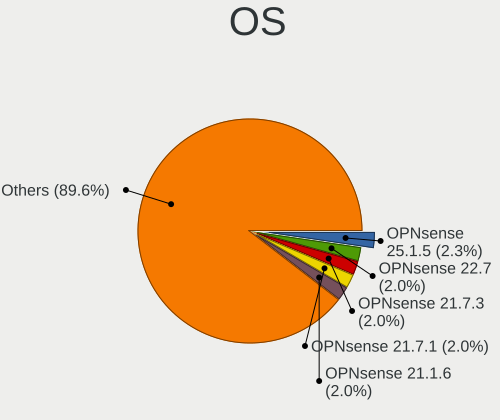

| Name             | Desktops | Percent |
|------------------|----------|---------|
| OPNsense 25.1.5  | 8        | 2.32%   |
| OPNsense 22.7    | 7        | 2.03%   |
| OPNsense 21.7.3  | 7        | 2.03%   |
| OPNsense 21.7.1  | 7        | 2.03%   |
| OPNsense 21.1.6  | 7        | 2.03%   |
| OPNsense 20.7.8  | 7        | 2.03%   |
| OPNsense 25.7.3  | 6        | 1.74%   |
| OPNsense 22.1.8  | 6        | 1.74%   |
| OPNsense 25.1.7  | 5        | 1.45%   |
| OPNsense 24.7.4  | 5        | 1.45%   |
| OPNsense 24.7.12 | 5        | 1.45%   |
| OPNsense 24.7.10 | 5        | 1.45%   |
| OPNsense 21.7.6  | 5        | 1.45%   |
| OPNsense 25.7.7  | 4        | 1.16%   |
| OPNsense 24.7.6  | 4        | 1.16%   |
| OPNsense 24.7.11 | 4        | 1.16%   |
| OPNsense 24.1.1  | 4        | 1.16%   |
| OPNsense 23.7.10 | 4        | 1.16%   |
| OPNsense 23.1.7  | 4        | 1.16%   |
| OPNsense 23.1.11 | 4        | 1.16%   |
| OPNsense 23.1.1  | 4        | 1.16%   |
| OPNsense 23.1    | 4        | 1.16%   |
| OPNsense 22.7.4  | 4        | 1.16%   |
| OPNsense 22.7.10 | 4        | 1.16%   |
| OPNsense 22.1.6  | 4        | 1.16%   |
| OPNsense 22.1.3  | 4        | 1.16%   |
| OPNsense 21.7.7  | 4        | 1.16%   |
| OPNsense 21.1.3  | 4        | 1.16%   |
| OPNsense 21.1    | 4        | 1.16%   |
| OpenBSD 6.8      | 4        | 1.16%   |
| OPNsense 25.7.5  | 3        | 0.87%   |
| OPNsense 25.1.4  | 3        | 0.87%   |
| OPNsense 25.1.12 | 3        | 0.87%   |
| OPNsense 24.7.9  | 3        | 0.87%   |
| OPNsense 24.7.8  | 3        | 0.87%   |
| OPNsense 24.7.7  | 3        | 0.87%   |
| OPNsense 24.1.7  | 3        | 0.87%   |
| OPNsense 24.1.4  | 3        | 0.87%   |
| OPNsense 24.1.3  | 3        | 0.87%   |
| OPNsense 24.1.2  | 3        | 0.87%   |

OS Family
---------

OS without a version

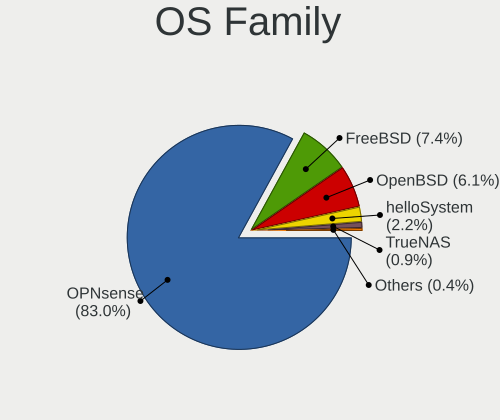

| Name        | Desktops | Percent |
|-------------|----------|---------|
| OPNsense    | 190      | 82.97%  |
| FreeBSD     | 17       | 7.42%   |
| OpenBSD     | 14       | 6.11%   |
| helloSystem | 5        | 2.18%   |
| TrueNAS     | 2        | 0.87%   |
| GhostBSD    | 1        | 0.44%   |

Arch
----

OS architecture (x86_64, i586, etc.)

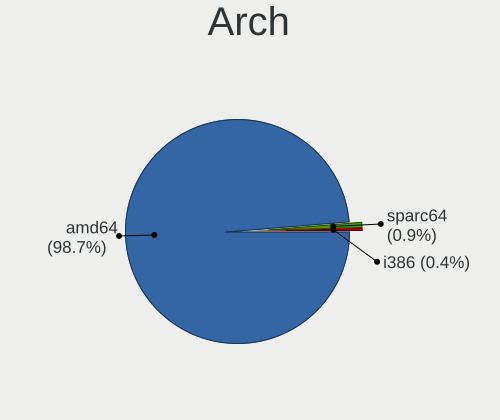

| Name    | Desktops | Percent |
|---------|----------|---------|
| amd64   | 226      | 98.69%  |
| sparc64 | 2        | 0.87%   |
| i386    | 1        | 0.44%   |

DE
--

Desktop Environment

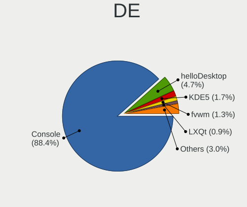

| Name          | Desktops | Percent |
|---------------|----------|---------|
| Console       | 205      | 88.36%  |
| helloDesktop  | 11       | 4.74%   |
| KDE5          | 4        | 1.72%   |
| fvwm          | 3        | 1.29%   |
| LXQt          | 2        | 0.86%   |
| GNOME         | 2        | 0.86%   |
| XFCE          | 1        | 0.43%   |
| MATE          | 1        | 0.43%   |
| i3            | 1        | 0.43%   |
| Enlightenment | 1        | 0.43%   |
| CDE           | 1        | 0.43%   |

Display Server
--------------

X11 or Wayland

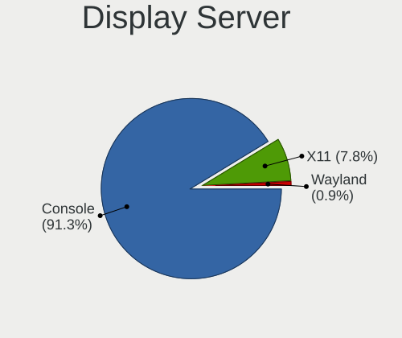

| Name    | Desktops | Percent |
|---------|----------|---------|
| Console | 210      | 91.3%   |
| X11     | 18       | 7.83%   |
| Wayland | 2        | 0.87%   |

Display Manager
---------------

SDDM, LightDM, etc.

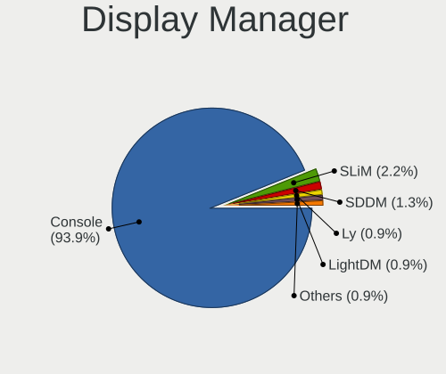

| Name    | Desktops | Percent |
|---------|----------|---------|
| Console | 216      | 93.91%  |
| SLiM    | 5        | 2.17%   |
| SDDM    | 3        | 1.3%    |
| Ly      | 2        | 0.87%   |
| LightDM | 2        | 0.87%   |
| XDM     | 1        | 0.43%   |
| GDM     | 1        | 0.43%   |

OS Lang
-------

Language

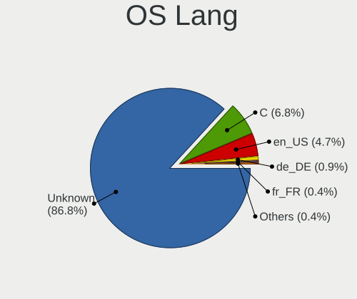

| Lang    | Desktops | Percent |
|---------|----------|---------|
| Unknown | 204      | 86.81%  |
| C       | 16       | 6.81%   |
| en_US   | 11       | 4.68%   |
| de_DE   | 2        | 0.85%   |
| fr_FR   | 1        | 0.43%   |
| de_CH   | 1        | 0.43%   |

Boot Mode
---------

EFI or BIOS

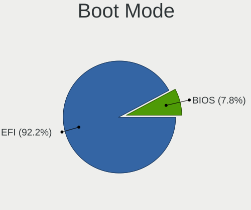

| Mode | Desktops | Percent |
|------|----------|---------|
| EFI  | 212      | 92.17%  |
| BIOS | 18       | 7.83%   |

Filesystem
----------

Type of filesystem

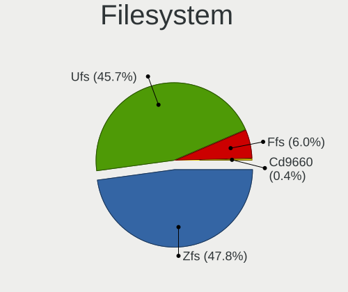

| Type   | Desktops | Percent |
|--------|----------|---------|
| Zfs    | 111      | 47.84%  |
| Ufs    | 106      | 45.69%  |
| Ffs    | 14       | 6.03%   |
| Cd9660 | 1        | 0.43%   |

Part. scheme
------------

Scheme of partitioning

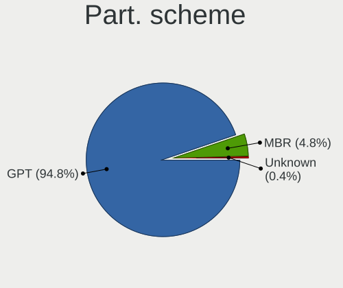

| Type    | Desktops | Percent |
|---------|----------|---------|
| GPT     | 218      | 94.78%  |
| MBR     | 11       | 4.78%   |
| Unknown | 1        | 0.43%   |

Board
-----

Vendor
------

Motherboard manufacturer

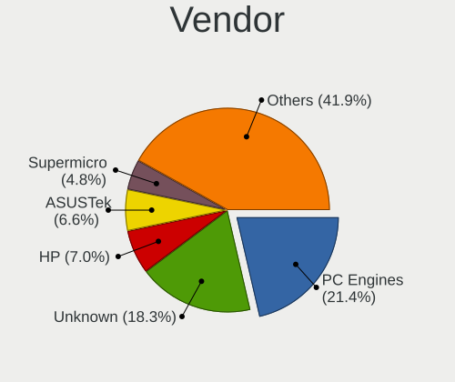

| Name                                 | Desktops | Percent |
|--------------------------------------|----------|---------|
| PC Engines                           | 49       | 21.4%   |
| Unknown                              | 42       | 18.34%  |
| Hewlett-Packard                      | 16       | 6.99%   |
| ASUSTek Computer                     | 15       | 6.55%   |
| Supermicro                           | 11       | 4.8%    |
| Protectli                            | 10       | 4.37%   |
| Gigabyte Technology                  | 9        | 3.93%   |
| ASRock                               | 9        | 3.93%   |
| Shuttle                              | 8        | 3.49%   |
| Dell                                 | 8        | 3.49%   |
| Intel                                | 6        | 2.62%   |
| GoWin Solution                       | 5        | 2.18%   |
| Techvision                           | 4        | 1.75%   |
| Lenovo                               | 3        | 1.31%   |
| Fujitsu                              | 3        | 1.31%   |
| Apple                                | 3        | 1.31%   |
| TOPC                                 | 2        | 0.87%   |
| Sun                                  | 2        | 0.87%   |
| Shenzhen Meigao Electronic Equipment | 2        | 0.87%   |
| LinuxContainers                      | 2        | 0.87%   |
| ASRockRack                           | 2        | 0.87%   |
| Acer                                 | 2        | 0.87%   |
| YANYU                                | 1        | 0.44%   |
| Yanling                              | 1        | 0.44%   |
| Trigkey                              | 1        | 0.44%   |
| SLIMBOOK                             | 1        | 0.44%   |
| Silicom                              | 1        | 0.44%   |
| MW                                   | 1        | 0.44%   |
| MSI                                  | 1        | 0.44%   |
| Intel BOX4A200                       | 1        | 0.44%   |
| Infoblox                             | 1        | 0.44%   |
| IGEL Technology                      | 1        | 0.44%   |
| HPE                                  | 1        | 0.44%   |
| CWWK                                 | 1        | 0.44%   |
| Biostar                              | 1        | 0.44%   |
| BESSTAR Tech                         | 1        | 0.44%   |
| AZW                                  | 1        | 0.44%   |
| ADI Engineering                      | 1        | 0.44%   |

Model
-----

Motherboard model

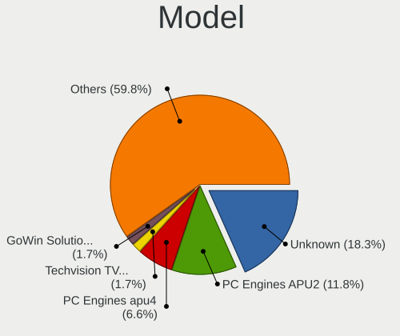

| Name                                              | Desktops | Percent |
|---------------------------------------------------|----------|---------|
| Unknown                                           | 42       | 18.34%  |
| PC Engines APU2                                   | 27       | 11.79%  |
| PC Engines apu4                                   | 15       | 6.55%   |
| Techvision TVI7309X                               | 4        | 1.75%   |
| GoWin Solution R86S                               | 4        | 1.75%   |
| Supermicro SYS-5019D-4C-FN8TP                     | 3        | 1.31%   |
| Protectli FW6                                     | 3        | 1.31%   |
| PC Engines APU                                    | 3        | 1.31%   |
| ASUS All Series                                   | 3        | 1.31%   |
| ASRock A320M-ITX                                  | 3        | 1.31%   |
| TOPC PHX ITX                                      | 2        | 0.87%   |
| Shuttle DS10U                                     | 2        | 0.87%   |
| Shuttle DL30N                                     | 2        | 0.87%   |
| Shenzhen Meigao Electronic Equipment Venus Series | 2        | 0.87%   |
| Protectli VP2420                                  | 2        | 0.87%   |
| Protectli V1410                                   | 2        | 0.87%   |
| PC Engines apu6                                   | 2        | 0.87%   |
| PC Engines APU3                                   | 2        | 0.87%   |
| LinuxContainers Standard PC (Q35 + ICH9, 2009)    | 2        | 0.87%   |
| Intel Q3XXG4-P V1.0                               | 2        | 0.87%   |
| HP Compaq Elite 8300 SFF                          | 2        | 0.87%   |
| HP Compaq 8200 Elite CMT PC                       | 2        | 0.87%   |
| Fujitsu FUTRO S920                                | 2        | 0.87%   |
| Dell Precision 3440                               | 2        | 0.87%   |
| Dell OptiPlex 7020                                | 2        | 0.87%   |
| ASRock B550 Taichi                                | 2        | 0.87%   |
| Apple MacPro5,1                                   | 2        | 0.87%   |
| YANYU D19SL_B                                     | 1        | 0.44%   |
| Yanling YL-KBR6L                                  | 1        | 0.44%   |
| Trigkey Green G5                                  | 1        | 0.44%   |
| Supermicro X9SCL/X9SCM                            | 1        | 0.44%   |
| Supermicro SYS-E300-9D-4CN8TP                     | 1        | 0.44%   |
| Supermicro SYS-E300-9D                            | 1        | 0.44%   |
| Supermicro SYS-1019D-FHN13TP                      | 1        | 0.44%   |
| Supermicro SYS-1019D-4C-FHN13TP                   | 1        | 0.44%   |
| Supermicro SYS-1019D-16C-RAN13TP+                 | 1        | 0.44%   |
| Supermicro PDSML                                  | 1        | 0.44%   |
| Supermicro AS -5019D-FTN4                         | 1        | 0.44%   |
| Sun SUNW,Sun-Blade-1500                           | 1        | 0.44%   |
| Sun SUNW,Sun-Blade-100                            | 1        | 0.44%   |

Model Family
------------

Motherboard model prefix

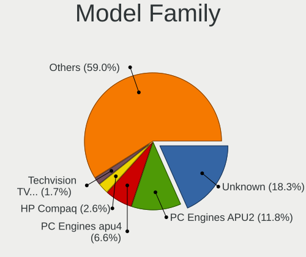

| Name                                       | Desktops | Percent |
|--------------------------------------------|----------|---------|
| Unknown                                    | 42       | 18.34%  |
| PC Engines APU2                            | 27       | 11.79%  |
| PC Engines apu4                            | 15       | 6.55%   |
| HP Compaq                                  | 6        | 2.62%   |
| Techvision TVI7309X                        | 4        | 1.75%   |
| GoWin Solution R86S                        | 4        | 1.75%   |
| Dell OptiPlex                              | 4        | 1.75%   |
| Supermicro SYS-5019D-4C-FN8TP              | 3        | 1.31%   |
| Protectli FW6                              | 3        | 1.31%   |
| PC Engines APU                             | 3        | 1.31%   |
| Fujitsu FUTRO                              | 3        | 1.31%   |
| Dell Precision                             | 3        | 1.31%   |
| ASUS TUF                                   | 3        | 1.31%   |
| ASUS All                                   | 3        | 1.31%   |
| ASRock A320M-ITX                           | 3        | 1.31%   |
| TOPC PHX                                   | 2        | 0.87%   |
| Sun SUNW                                   | 2        | 0.87%   |
| Shuttle DS10U                              | 2        | 0.87%   |
| Shuttle DL30N                              | 2        | 0.87%   |
| Shenzhen Meigao Electronic Equipment Venus | 2        | 0.87%   |
| Protectli VP2420                           | 2        | 0.87%   |
| Protectli V1410                            | 2        | 0.87%   |
| PC Engines apu6                            | 2        | 0.87%   |
| PC Engines APU3                            | 2        | 0.87%   |
| LinuxContainers Standard                   | 2        | 0.87%   |
| Intel Q3XXG4-P                             | 2        | 0.87%   |
| HP ProLiant                                | 2        | 0.87%   |
| HP ProDesk                                 | 2        | 0.87%   |
| ASUS PRIME                                 | 2        | 0.87%   |
| ASRock B550                                | 2        | 0.87%   |
| Apple MacPro5                              | 2        | 0.87%   |
| Acer Aspire                                | 2        | 0.87%   |
| YANYU D19SL                                | 1        | 0.44%   |
| Yanling YL-KBR6L                           | 1        | 0.44%   |
| Trigkey Green                              | 1        | 0.44%   |
| Supermicro X9SCL                           | 1        | 0.44%   |
| Supermicro SYS-E300-9D-4CN8TP              | 1        | 0.44%   |
| Supermicro SYS-E300-9D                     | 1        | 0.44%   |
| Supermicro SYS-1019D-FHN13TP               | 1        | 0.44%   |
| Supermicro SYS-1019D-4C-FHN13TP            | 1        | 0.44%   |

MFG Year
--------

Motherboard manufacture year

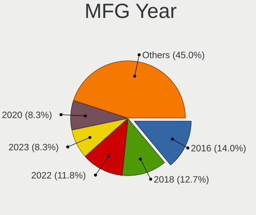

| Year    | Desktops | Percent |
|---------|----------|---------|
| 2016    | 32       | 13.97%  |
| 2018    | 29       | 12.66%  |
| 2022    | 27       | 11.79%  |
| 2023    | 19       | 8.3%    |
| 2020    | 19       | 8.3%    |
| 2024    | 18       | 7.86%   |
| 2021    | 14       | 6.11%   |
| 2019    | 13       | 5.68%   |
| 2012    | 13       | 5.68%   |
| 2017    | 10       | 4.37%   |
| 2014    | 9        | 3.93%   |
| 2015    | 7        | 3.06%   |
| 2013    | 5        | 2.18%   |
| 2011    | 4        | 1.75%   |
| 2025    | 3        | 1.31%   |
| Unknown | 3        | 1.31%   |
| 2008    | 2        | 0.87%   |
| 2010    | 1        | 0.44%   |
| 2007    | 1        | 0.44%   |

Form Factor
-----------

Physical design of the computer

| Name    | Desktops | Percent |
|---------|----------|---------|
| Desktop | 229      | 100%    |

Coreboot
--------

Have coreboot on board

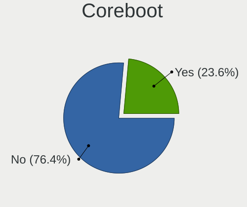

| Used | Desktops | Percent |
|------|----------|---------|
| No   | 175      | 76.42%  |
| Yes  | 54       | 23.58%  |

RAM Size
--------

Total RAM memory

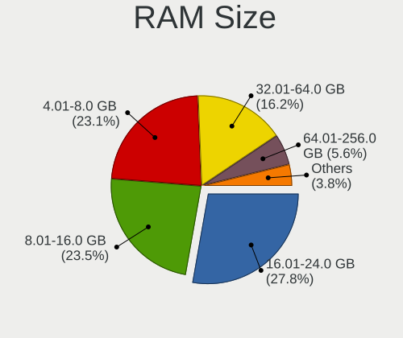

| Size in GB  | Desktops | Percent |
|-------------|----------|---------|
| 16.01-24.0  | 65       | 27.78%  |
| 8.01-16.0   | 55       | 23.5%   |
| 4.01-8.0    | 54       | 23.08%  |
| 32.01-64.0  | 38       | 16.24%  |
| 64.01-256.0 | 13       | 5.56%   |
| 2.01-3.0    | 4        | 1.71%   |
| 1.01-2.0    | 2        | 0.85%   |
| 24.01-32.0  | 1        | 0.43%   |
| 0.01-0.5    | 1        | 0.43%   |
| Unknown     | 1        | 0.43%   |

RAM Used
--------

Used RAM memory

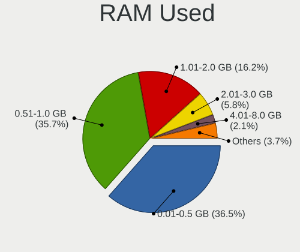

| Used GB    | Desktops | Percent |
|------------|----------|---------|
| 0.01-0.5   | 88       | 36.51%  |
| 0.51-1.0   | 86       | 35.68%  |
| 1.01-2.0   | 39       | 16.18%  |
| 2.01-3.0   | 14       | 5.81%   |
| 4.01-8.0   | 5        | 2.07%   |
| 3.01-4.0   | 3        | 1.24%   |
| 8.01-16.0  | 2        | 0.83%   |
| 0          | 2        | 0.83%   |
| 16.01-24.0 | 1        | 0.41%   |
| Unknown    | 1        | 0.41%   |

Total Drives
------------

Number of drives on board

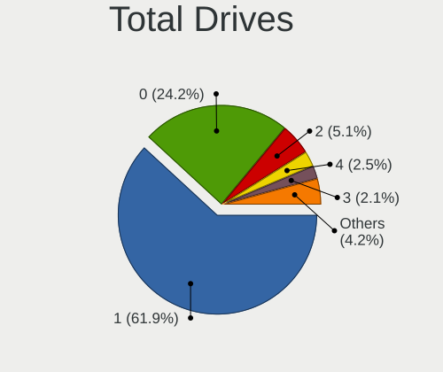

| Drives | Desktops | Percent |
|--------|----------|---------|
| 1      | 146      | 61.86%  |
| 0      | 57       | 24.15%  |
| 2      | 12       | 5.08%   |
| 4      | 6        | 2.54%   |
| 3      | 5        | 2.12%   |
| 6      | 3        | 1.27%   |
| 5      | 3        | 1.27%   |
| 17     | 1        | 0.42%   |
| 16     | 1        | 0.42%   |
| 8      | 1        | 0.42%   |
| 7      | 1        | 0.42%   |

Has CD-ROM
----------

Has CD-ROM on board

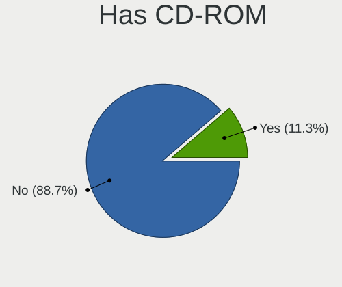

| Presented | Desktops | Percent |
|-----------|----------|---------|
| No        | 204      | 88.7%   |
| Yes       | 26       | 11.3%   |

Has Ethernet
------------

Has Ethernet on board

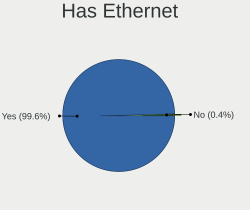

| Presented | Desktops | Percent |
|-----------|----------|---------|
| Yes       | 228      | 99.56%  |
| No        | 1        | 0.44%   |

Has WiFi
--------

Has WiFi module

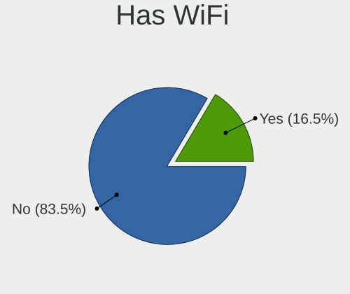

| Presented | Desktops | Percent |
|-----------|----------|---------|
| No        | 193      | 83.55%  |
| Yes       | 38       | 16.45%  |

Has Bluetooth
-------------

Has Bluetooth module

| Presented | Desktops | Percent |
|-----------|----------|---------|
| No        | 202      | 87.83%  |
| Yes       | 28       | 12.17%  |

Location
--------

Country
-------

Geographic location (country)

| Country     | Desktops | Percent |
|-------------|----------|---------|
| Switzerland | 229      | 100%    |

City
----

Geographic location (city)

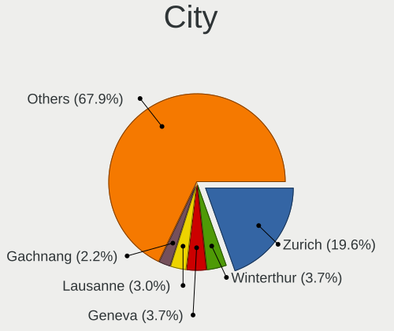

| City               | Desktops | Percent |
|--------------------|----------|---------|
| Zurich             | 53       | 19.56%  |
| Winterthur         | 10       | 3.69%   |
| Geneva             | 10       | 3.69%   |
| Lausanne           | 8        | 2.95%   |
| Gachnang           | 6        | 2.21%   |
| Bern               | 6        | 2.21%   |
| Lucerne            | 5        | 1.85%   |
| Gordola            | 5        | 1.85%   |
| Basel              | 4        | 1.48%   |
| St. Moritz         | 3        | 1.11%   |
| St. Gallen         | 3        | 1.11%   |
| Niederbipp         | 3        | 1.11%   |
| Mettmenstetten     | 3        | 1.11%   |
| Maennedorf         | 3        | 1.11%   |
| Lenzburg           | 3        | 1.11%   |
| Horgen             | 3        | 1.11%   |
| Dietikon           | 3        | 1.11%   |
| Dielsdorf          | 3        | 1.11%   |
| Zug                | 2        | 0.74%   |
| Wettswil           | 2        | 0.74%   |
| Uster              | 2        | 0.74%   |
| Thalwil            | 2        | 0.74%   |
| Tagelswangen       | 2        | 0.74%   |
| Siggenthal Station | 2        | 0.74%   |
| Sankt Margrethen   | 2        | 0.74%   |
| Riehen             | 2        | 0.74%   |
| Palezieux          | 2        | 0.74%   |
| Ottenbach          | 2        | 0.74%   |
| Oensingen          | 2        | 0.74%   |
| Muttenz            | 2        | 0.74%   |
| Mohlin             | 2        | 0.74%   |
| Kolliken           | 2        | 0.74%   |
| Gerlafingen        | 2        | 0.74%   |
| Davos Dorf         | 2        | 0.74%   |
| Burgdorf           | 2        | 0.74%   |
| Biel/Bienne        | 2        | 0.74%   |
| Belp               | 2        | 0.74%   |
| Zweidlen-Dorf      | 1        | 0.37%   |
| Zuzwil             | 1        | 0.37%   |
| Zuben              | 1        | 0.37%   |

Drives
------

Drive Vendor
------------

Hard drive vendors

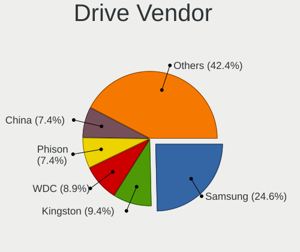

| Vendor              | Desktops | Drives | Percent |
|---------------------|----------|--------|---------|
| Samsung Electronics | 50       | 88     | 24.63%  |
| Kingston            | 19       | 24     | 9.36%   |
| WDC                 | 18       | 58     | 8.87%   |
| Phison              | 15       | 19     | 7.39%   |
| China               | 15       | 21     | 7.39%   |
| Seagate             | 9        | 15     | 4.43%   |
| Transcend           | 8        | 11     | 3.94%   |
| Crucial             | 8        | 16     | 3.94%   |
| Intel               | 6        | 23     | 2.96%   |
| Hoodisk             | 6        | 9      | 2.96%   |
| Corsair             | 5        | 8      | 2.46%   |
| Toshiba             | 4        | 6      | 1.97%   |
| SK hynix            | 3        | 3      | 1.48%   |
| ShiJi               | 3        | 10     | 1.48%   |
| SanDisk             | 3        | 9      | 1.48%   |
| Protectli           | 3        | 3      | 1.48%   |
| HPT                 | 3        | 35     | 1.48%   |
| Hitachi             | 3        | 3      | 1.48%   |
| Fanxiang            | 3        | 3      | 1.48%   |
| Silicon Motion      | 2        | 2      | 0.99%   |
| QEMU                | 2        | 2      | 0.99%   |
| FORESEE             | 2        | 3      | 0.99%   |
| A-DATA Technology   | 2        | 2      | 0.99%   |
| SPCC                | 1        | 2      | 0.49%   |
| PNY                 | 1        | 1      | 0.49%   |
| OPENBSD             | 1        | 1      | 0.49%   |
| Micron Technology   | 1        | 2      | 0.49%   |
| KingSpec            | 1        | 1      | 0.49%   |
| Intenso             | 1        | 5      | 0.49%   |
| Hewlett-Packard     | 1        | 15     | 0.49%   |
| GOFATOO             | 1        | 1      | 0.49%   |
| CWdisk              | 1        | 2      | 0.49%   |
| BIWIN               | 1        | 1      | 0.49%   |
| Apple               | 1        | 1      | 0.49%   |

Drive Model
-----------

Hard drive models

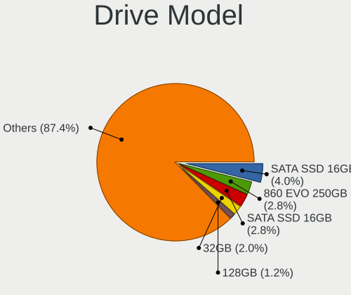

| Model                             | Desktops | Percent |
|-----------------------------------|----------|---------|
| Phison SATA SSD 16GB              | 10       | 3.95%   |
| Samsung SSD 860 EVO 250GB         | 7        | 2.77%   |
| China SATA SSD 16GB               | 7        | 2.77%   |
| Hoodisk SSD 32GB                  | 5        | 1.98%   |
| ShiJi SSD 128GB                   | 3        | 1.19%   |
| Samsung SSD 860 PRO 256GB         | 3        | 1.19%   |
| Samsung SSD 850 PRO 256GB         | 3        | 1.19%   |
| Phison SATA SSD 32GB              | 3        | 1.19%   |
| Kingston RBUSNS8180DS3128GH 128GB | 3        | 1.19%   |
| HPT DISK 0_3 1TB                  | 3        | 1.19%   |
| HPT DISK 0_2 1TB                  | 3        | 1.19%   |
| HPT DISK 0_1 1TB                  | 3        | 1.19%   |
| HPT DISK 0_0 4TB                  | 3        | 1.19%   |
| Fanxiang S501 128GB               | 3        | 1.19%   |
| China SATA SSD 32GB               | 3        | 1.19%   |
| WDC WD6002FRYZ-01WD5B1 6TB        | 2        | 0.79%   |
| WDC WD40EFPX-68C6CN0 4TB          | 2        | 0.79%   |
| WDC WD30EFRX-68EUZN0 3TB          | 2        | 0.79%   |
| WDC WD1000DHTZ-04N21V0 1TB        | 2        | 0.79%   |
| Transcend TS64GMSA230S 64GB       | 2        | 0.79%   |
| Transcend TS128GSSD420K 128GB     | 2        | 0.79%   |
| Toshiba DT01ACA200 2TB            | 2        | 0.79%   |
| SK hynix SC311 SATA 256GB         | 2        | 0.79%   |
| Seagate ST3500413AS 500GB         | 2        | 0.79%   |
| Samsung SSD 980 PRO 250GB         | 2        | 0.79%   |
| Samsung SSD 970 EVO Plus 1TB      | 2        | 0.79%   |
| Samsung SSD 960 EVO 250GB         | 2        | 0.79%   |
| Samsung SSD 850 PRO 1TB           | 2        | 0.79%   |
| Samsung SSD 840 Series 120GB      | 2        | 0.79%   |
| Samsung SSD 840 EVO 120GB mSATA   | 2        | 0.79%   |
| QEMU HARDDISK                     | 2        | 0.79%   |
| Protectli 240GB M.2               | 2        | 0.79%   |
| Phison YSO256GTLCW-E3C-2 256GB    | 2        | 0.79%   |
| Kingston SKC600MS512G 512GB       | 2        | 0.79%   |
| Kingston SA400S37120G 120GB       | 2        | 0.79%   |
| Kingston SA400M8120G 120GB        | 2        | 0.79%   |
| HPT DISK 0_9 3TB                  | 2        | 0.79%   |
| HPT DISK 0_8 3TB                  | 2        | 0.79%   |
| HPT DISK 0_7 1TB                  | 2        | 0.79%   |
| HPT DISK 0_6 1TB                  | 2        | 0.79%   |

HDD Vendor
----------

Hard disk drive vendors

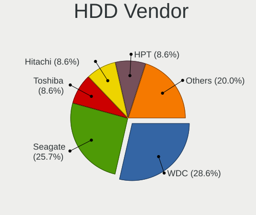

| Vendor              | Desktops | Drives | Percent |
|---------------------|----------|--------|---------|
| WDC                 | 10       | 44     | 28.57%  |
| Seagate             | 9        | 15     | 25.71%  |
| Toshiba             | 3        | 5      | 8.57%   |
| HPT                 | 3        | 35     | 8.57%   |
| Hitachi             | 3        | 3      | 8.57%   |
| QEMU                | 2        | 2      | 5.71%   |
| Samsung Electronics | 1        | 1      | 2.86%   |
| OPENBSD             | 1        | 1      | 2.86%   |
| Hewlett-Packard     | 1        | 12     | 2.86%   |
| China               | 1        | 1      | 2.86%   |
| Apple               | 1        | 1      | 2.86%   |

SSD Vendor
----------

Solid state drive vendors

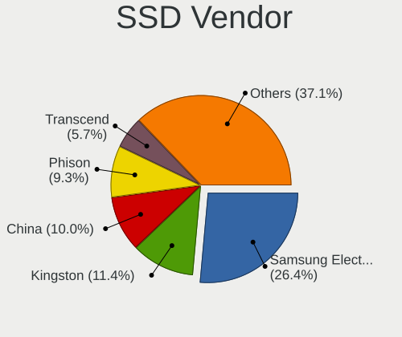

| Vendor              | Desktops | Drives | Percent |
|---------------------|----------|--------|---------|
| Samsung Electronics | 37       | 68     | 26.43%  |
| Kingston            | 16       | 18     | 11.43%  |
| China               | 14       | 20     | 10%     |
| Phison              | 13       | 16     | 9.29%   |
| Transcend           | 8        | 11     | 5.71%   |
| Crucial             | 7        | 15     | 5%      |
| Intel               | 6        | 23     | 4.29%   |
| Hoodisk             | 6        | 9      | 4.29%   |
| WDC                 | 5        | 9      | 3.57%   |
| Corsair             | 4        | 7      | 2.86%   |
| SK hynix            | 3        | 3      | 2.14%   |
| ShiJi               | 3        | 10     | 2.14%   |
| SanDisk             | 3        | 9      | 2.14%   |
| Protectli           | 3        | 3      | 2.14%   |
| A-DATA Technology   | 2        | 2      | 1.43%   |
| Toshiba             | 1        | 1      | 0.71%   |
| SPCC                | 1        | 2      | 0.71%   |
| PNY                 | 1        | 1      | 0.71%   |
| Micron Technology   | 1        | 2      | 0.71%   |
| KingSpec            | 1        | 1      | 0.71%   |
| Intenso             | 1        | 5      | 0.71%   |
| Hewlett-Packard     | 1        | 3      | 0.71%   |
| GOFATOO             | 1        | 1      | 0.71%   |
| FORESEE             | 1        | 1      | 0.71%   |
| BIWIN               | 1        | 1      | 0.71%   |

Drive Kind
----------

HDD or SSD

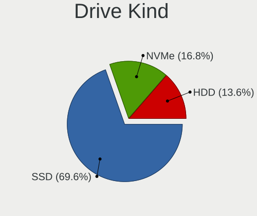

| Kind | Desktops | Drives | Percent |
|------|----------|--------|---------|
| SSD  | 133      | 241    | 69.63%  |
| NVMe | 32       | 44     | 16.75%  |
| HDD  | 26       | 120    | 13.61%  |

Drive Connector
---------------

SATA, SAS, NVMe, etc.

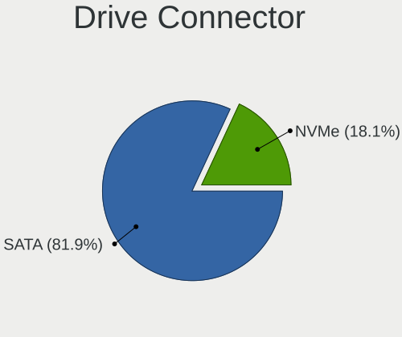

| Type | Desktops | Drives | Percent |
|------|----------|--------|---------|
| SATA | 145      | 361    | 81.92%  |
| NVMe | 32       | 44     | 18.08%  |

Drive Size
----------

Size of hard drive

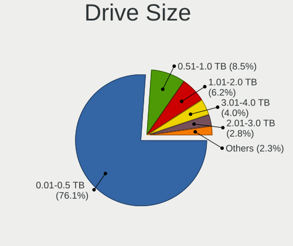

| Size in TB | Desktops | Drives | Percent |
|------------|----------|--------|---------|
| 0.01-0.5   | 134      | 253    | 76.14%  |
| 0.51-1.0   | 15       | 47     | 8.52%   |
| 1.01-2.0   | 11       | 23     | 6.25%   |
| 3.01-4.0   | 7        | 9      | 3.98%   |
| 2.01-3.0   | 5        | 13     | 2.84%   |
| 4.01-10.0  | 4        | 16     | 2.27%   |

Space Total
-----------

Amount of disk space available on the file system

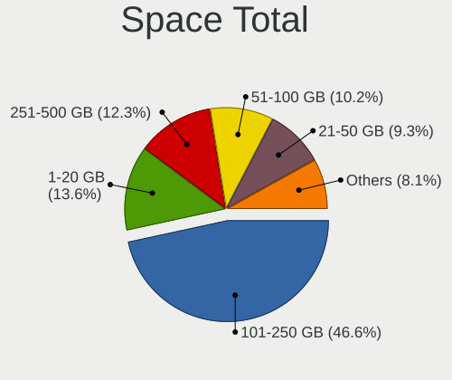

| Size in GB | Desktops | Percent |
|------------|----------|---------|
| 101-250    | 110      | 46.61%  |
| 1-20       | 32       | 13.56%  |
| 251-500    | 29       | 12.29%  |
| 51-100     | 24       | 10.17%  |
| 21-50      | 22       | 9.32%   |
| 501-1000   | 13       | 5.51%   |
| 1001-2000  | 5        | 2.12%   |
| 2001-3000  | 1        | 0.42%   |

Space Used
----------

Amount of used disk space

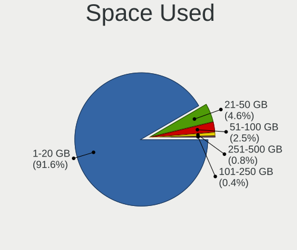

| Used GB | Desktops | Percent |
|---------|----------|---------|
| 1-20    | 219      | 91.63%  |
| 21-50   | 11       | 4.6%    |
| 51-100  | 6        | 2.51%   |
| 251-500 | 2        | 0.84%   |
| 101-250 | 1        | 0.42%   |

Malfunc. Drives
---------------

Drive models with a malfunction

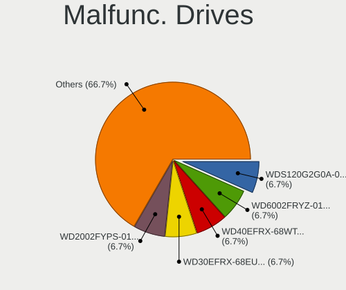

| Model                                     | Desktops | Drives | Percent |
|-------------------------------------------|----------|--------|---------|
| Seagate ST3500413AS 500GB                 | 2        | 3      | 9.52%   |
| WDC WDS120G2G0A-00JH30 120GB              | 1        | 2      | 4.76%   |
| WDC WD6002FRYZ-01WD5B1 6TB                | 1        | 6      | 4.76%   |
| WDC WD40EFRX-68WT0N0 4TB                  | 1        | 1      | 4.76%   |
| WDC WD30EFRX-68EUZN0 3TB                  | 1        | 1      | 4.76%   |
| WDC WD2002FYPS-01U1B0 2TB                 | 1        | 5      | 4.76%   |
| Toshiba MK1059GSM 1TB                     | 1        | 1      | 4.76%   |
| Seagate ST3500418AS 500GB                 | 1        | 2      | 4.76%   |
| Seagate ST2000VN004-2E4164 2TB            | 1        | 2      | 4.76%   |
| Samsung Electronics SSD 850 EVO mSATA 1TB | 1        | 1      | 4.76%   |
| Samsung Electronics HD204UI 2TB           | 1        | 1      | 4.76%   |
| Kingston SV300S37A120G 120GB              | 1        | 1      | 4.76%   |
| Intel SSDSC2CT240A4 240GB                 | 1        | 1      | 4.76%   |
| Intel SSDSC2BW240A4 240GB                 | 1        | 2      | 4.76%   |
| Intel SSDSA2M160G2GC 160GB                | 1        | 2      | 4.76%   |
| Intel SSDSA2BW160G3H 160GB                | 1        | 5      | 4.76%   |
| Hitachi HDS721050CLA660 500GB             | 1        | 1      | 4.76%   |
| Crucial CT256MX100SSD1 256GB              | 1        | 2      | 4.76%   |
| Corsair Force 3 SSD 120GB                 | 1        | 2      | 4.76%   |
| Corsair CSSD-F120GB2                      | 1        | 2      | 4.76%   |

Malfunc. Drive Vendor
---------------------

Vendors of faulty drives

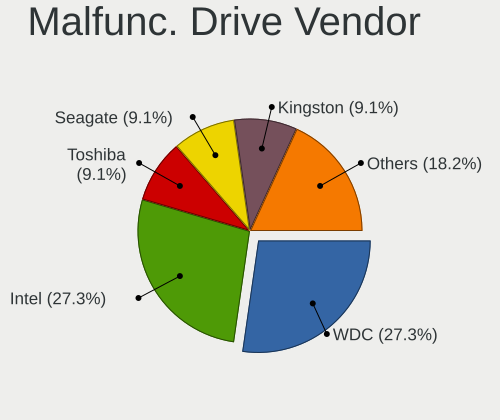

| Vendor              | Desktops | Drives | Percent |
|---------------------|----------|--------|---------|
| WDC                 | 4        | 15     | 21.05%  |
| Intel               | 4        | 10     | 21.05%  |
| Seagate             | 3        | 7      | 15.79%  |
| Samsung Electronics | 2        | 2      | 10.53%  |
| Corsair             | 2        | 4      | 10.53%  |
| Toshiba             | 1        | 1      | 5.26%   |
| Kingston            | 1        | 1      | 5.26%   |
| Hitachi             | 1        | 1      | 5.26%   |
| Crucial             | 1        | 2      | 5.26%   |

Malfunc. HDD Vendor
-------------------

Vendors of faulty HDD drives

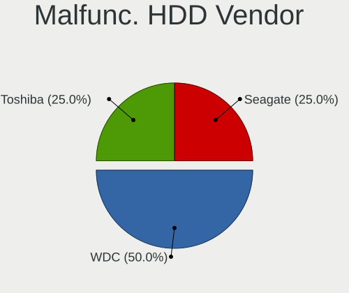

| Vendor              | Desktops | Drives | Percent |
|---------------------|----------|--------|---------|
| WDC                 | 3        | 13     | 33.33%  |
| Seagate             | 3        | 7      | 33.33%  |
| Toshiba             | 1        | 1      | 11.11%  |
| Samsung Electronics | 1        | 1      | 11.11%  |
| Hitachi             | 1        | 1      | 11.11%  |

Malfunc. Drive Kind
-------------------

Kinds of faulty drives

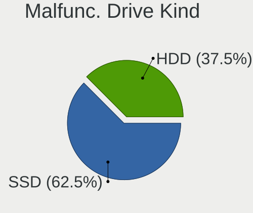

| Kind | Desktops | Drives | Percent |
|------|----------|--------|---------|
| SSD  | 10       | 20     | 58.82%  |
| HDD  | 7        | 23     | 41.18%  |

Failed Drives
-------------

Failed drive models

Zero info for selected period =(

Failed Drive Vendor
-------------------

Failed drive vendors

Zero info for selected period =(

Drive Status
------------

Number of failed and malfunc. drives

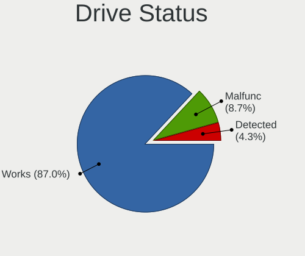

| Status   | Desktops | Drives | Percent |
|----------|----------|--------|---------|
| Works    | 160      | 315    | 86.96%  |
| Malfunc  | 16       | 43     | 8.7%    |
| Detected | 8        | 47     | 4.35%   |

Storage controller
------------------

Storage Vendor
--------------

Storage controller vendors

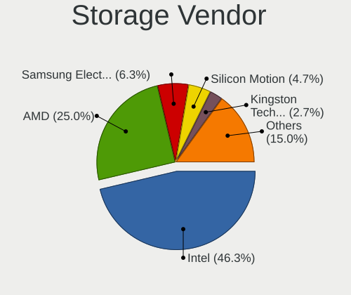

| Vendor                       | Desktops | Percent |
|------------------------------|----------|---------|
| Intel                        | 139      | 46.33%  |
| AMD                          | 75       | 25%     |
| Samsung Electronics          | 19       | 6.33%   |
| Silicon Motion               | 14       | 4.67%   |
| Kingston Technology Company  | 8        | 2.67%   |
| ASMedia Technology           | 7        | 2.33%   |
| SanDisk                      | 6        | 2%      |
| MAXIO Technology (Hangzhou)  | 5        | 1.67%   |
| Micron Technology            | 4        | 1.33%   |
| Phison Electronics           | 3        | 1%      |
| HighPoint Technologies       | 3        | 1%      |
| ULi Electronics              | 2        | 0.67%   |
| Shenzhen Longsys Electronics | 2        | 0.67%   |
| Red Hat                      | 2        | 0.67%   |
| Micron/Crucial Technology    | 2        | 0.67%   |
| Marvell Technology Group     | 2        | 0.67%   |
| JMicron Technology           | 2        | 0.67%   |
| Toshiba                      | 1        | 0.33%   |
| Hewlett-Packard              | 1        | 0.33%   |
| Chelsio Communications       | 1        | 0.33%   |
| Broadcom / LSI               | 1        | 0.33%   |
| ADATA Technology             | 1        | 0.33%   |

Storage Model
-------------

Storage controller models

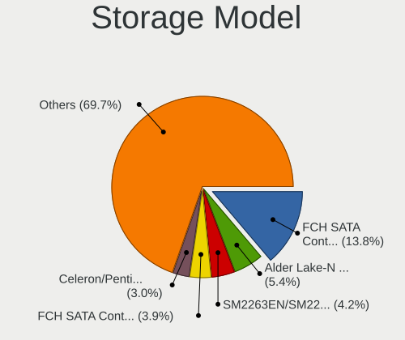

| Model                                                                                                              | Desktops | Percent |
|--------------------------------------------------------------------------------------------------------------------|----------|---------|
| AMD FCH SATA Controller [AHCI mode]                                                                                | 46       | 13.81%  |
| Intel Alder Lake-N SATA AHCI Controller                                                                            | 18       | 5.41%   |
| Silicon Motion SM2263EN/SM2263XT (DRAM-less) NVMe SSD Controllers                                                  | 14       | 4.2%    |
| AMD FCH SATA Controller [IDE mode]                                                                                 | 13       | 3.9%    |
| Intel Celeron/Pentium Silver Processor SATA Controller                                                             | 10       | 3%      |
| Intel C620 Series Chipset Family SSATA Controller [AHCI mode]                                                      | 8        | 2.4%    |
| Intel 7 Series/C210 Series Chipset Family 6-port SATA Controller [AHCI mode]                                       | 8        | 2.4%    |
| Intel 6 Series/C200 Series Chipset Family 6 port Desktop SATA AHCI Controller                                      | 8        | 2.4%    |
| Samsung NVMe SSD Controller PM9A1/PM9A3/980PRO                                                                     | 7        | 2.1%    |
| Intel Sunrise Point-LP SATA Controller [AHCI mode]                                                                 | 7        | 2.1%    |
| Intel Jasper Lake SATA AHCI Controller                                                                             | 7        | 2.1%    |
| Intel Atom Processor C3000 Series SATA Controller 1                                                                | 7        | 2.1%    |
| Intel 8 Series/C220 Series Chipset Family 6-port SATA Controller 1 [AHCI mode]                                     | 7        | 2.1%    |
| AMD 500 Series Chipset SATA Controller                                                                             | 7        | 2.1%    |
| Samsung NVMe SSD Controller SM981/PM981/PM983                                                                      | 6        | 1.8%    |
| Intel Q170/Q150/B150/H170/H110/Z170/CM236 Chipset SATA Controller [AHCI Mode]                                      | 6        | 1.8%    |
| Samsung NVMe SSD Controller SM961/PM961/SM963                                                                      | 5        | 1.5%    |
| MAXIO (Hangzhou) NVMe SSD Controller MAP1202 (DRAM-less)                                                           | 5        | 1.5%    |
| Intel Comet Lake SATA AHCI Controller                                                                              | 5        | 1.5%    |
| Intel Cannon Lake PCH SATA AHCI Controller                                                                         | 5        | 1.5%    |
| Intel C620 Series Chipset Family SATA Controller [AHCI mode]                                                       | 5        | 1.5%    |
| Intel Atom Processor C3000 Series SATA Controller 0                                                                | 5        | 1.5%    |
| ASMedia ASM1061/ASM1062 Serial ATA Controller                                                                      | 5        | 1.5%    |
| Intel Cannon Point-LP SATA Controller [AHCI Mode]                                                                  | 4        | 1.2%    |
| Intel Alder Lake-P SATA AHCI Controller                                                                            | 4        | 1.2%    |
| Intel 200 Series PCH SATA controller [AHCI mode]                                                                   | 4        | 1.2%    |
| AMD SB7x0/SB8x0/SB9x0 SATA Controller [AHCI mode]                                                                  | 4        | 1.2%    |
| AMD A320 Chipset SATA Controller [AHCI mode]                                                                       | 3        | 0.9%    |
| AMD 400 Series Chipset SATA Controller                                                                             | 3        | 0.9%    |
| ULi M5229 IDE                                                                                                      | 2        | 0.6%    |
| Shenzhen Longsys FORESEE XP1000 / Lexar Professional CFexpress Type B Gold series, NM620 PCIe NVME SSD (DRAM-less) | 2        | 0.6%    |
| SanDisk Extreme Pro / WD Black SN750 / PC SN730 / Red SN700 NVMe SSD                                               | 2        | 0.6%    |
| Samsung NVMe SSD Controller 980 (DRAM-less)                                                                        | 2        | 0.6%    |
| Red Hat Virtio 1.0 SCSI                                                                                            | 2        | 0.6%    |
| Phison PS5013-E13 PCIe3 NVMe Controller (DRAM-less)                                                                | 2        | 0.6%    |
| Micron 2550 NVMe SSD (DRAM-less)                                                                                   | 2        | 0.6%    |
| Kingston Company NV2 NVMe SSD [TC2200] (DRAM-less)                                                                 | 2        | 0.6%    |
| Kingston Company NV2 NVMe SSD [SM2267XT] (DRAM-less)                                                               | 2        | 0.6%    |
| JMicron JMB58x AHCI SATA controller                                                                                | 2        | 0.6%    |
| Intel Wildcat Point-LP SATA Controller [AHCI Mode]                                                                 | 2        | 0.6%    |

Storage Kind
------------

Kind of storage controller (IDE, SATA, NVMe, SAS, ...)

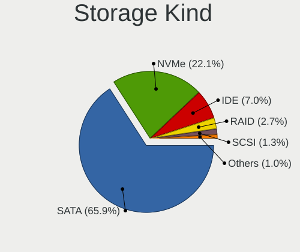

| Kind | Desktops | Percent |
|------|----------|---------|
| SATA | 197      | 65.89%  |
| NVMe | 66       | 22.07%  |
| IDE  | 21       | 7.02%   |
| RAID | 8        | 2.68%   |
| SCSI | 4        | 1.34%   |
| SAS  | 3        | 1%      |

Processor
---------

CPU Vendor
----------

Processor vendors

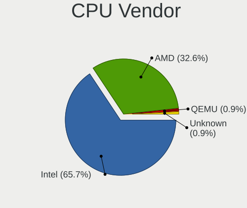

| Vendor  | Desktops | Percent |
|---------|----------|---------|
| Intel   | 151      | 65.65%  |
| AMD     | 75       | 32.61%  |
| QEMU    | 2        | 0.87%   |
| Unknown | 2        | 0.87%   |

CPU Model
---------

Processor models

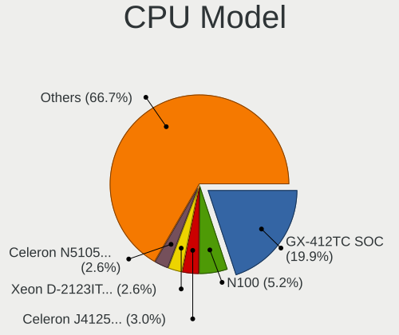

| Model                                       | Desktops | Percent |
|---------------------------------------------|----------|---------|
| AMD GX-412TC SOC                            | 46       | 19.91%  |
| Intel N100                                  | 12       | 5.19%   |
| Intel Celeron J4125 CPU @ 2.00GHz           | 7        | 3.03%   |
| Intel Xeon D-2123IT CPU @ 2.20GHz           | 6        | 2.6%    |
| Intel Celeron N5105 @ 2.00GHz               | 6        | 2.6%    |
| Intel N150                                  | 5        | 2.16%   |
| Intel Core i3-N305                          | 5        | 2.16%   |
| Intel Pentium Silver N6005 @ 2.00GHz        | 4        | 1.73%   |
| Intel Celeron CPU 3865U @ 1.80GHz           | 4        | 1.73%   |
| Intel Atom CPU C3758 @ 2.20GHz              | 4        | 1.73%   |
| AMD Ryzen 5 3400G with Radeon Vega Graphics | 3        | 1.3%    |
| AMD G-T40E Processor                        | 3        | 1.3%    |
| QEMU pc-q35-9.0                             | 2        | 0.87%   |
| Intel Core i7-6700K CPU @ 4.00GHz           | 2        | 0.87%   |
| Intel Core i7-3770K CPU @ 3.50GHz           | 2        | 0.87%   |
| Intel Core i7-3770 CPU @ 3.40GHz            | 2        | 0.87%   |
| Intel Core i5-8500 CPU @ 3.00GHz            | 2        | 0.87%   |
| Intel Core i5-8365U CPU @ 1.60GHz           | 2        | 0.87%   |
| Intel Core i5-6500 CPU @ 3.20GHz            | 2        | 0.87%   |
| Intel Core i5-3470 CPU @ 3.20GHz            | 2        | 0.87%   |
| Intel Core i5-2500 CPU @ 3.30GHz            | 2        | 0.87%   |
| Intel Core i5-10500 CPU @ 3.10GHz           | 2        | 0.87%   |
| Intel Celeron N5100 @ 1.10GHz               | 2        | 0.87%   |
| Intel Celeron J6412 @ 2.00GHz               | 2        | 0.87%   |
| Intel 12th Gen Core i5-12600H               | 2        | 0.87%   |
| Intel 11th Gen Core i5-1135G7 @ 2.40GHz     | 2        | 0.87%   |
| AMD Ryzen 7 7840HS w/ Radeon 780M Graphics  | 2        | 0.87%   |
| AMD Ryzen 7 5800X 8-Core Processor          | 2        | 0.87%   |
| AMD Ryzen 7 5700G with Radeon Graphics      | 2        | 0.87%   |
| AMD Ryzen 5 5600G with Radeon Graphics      | 2        | 0.87%   |
| AMD GX-415GA SOC with Radeon HD Graphics    | 2        | 0.87%   |
|                                             | 2        | 0.87%   |
| Intel Xeon W-2223 CPU @ 3.60GHz             | 1        | 0.43%   |
| Intel Xeon W-2133 CPU @ 3.60GHz             | 1        | 0.43%   |
| Intel Xeon E-2274G CPU @ 4.00GHz            | 1        | 0.43%   |
| Intel Xeon D-2183IT CPU @ 2.20GHz           | 1        | 0.43%   |
| Intel Xeon D-2146NT CPU @ 2.30GHz           | 1        | 0.43%   |
| Intel Xeon CPU X5550 @ 2.67GHz              | 1        | 0.43%   |
| Intel Xeon CPU X3450 @ 2.67GHz              | 1        | 0.43%   |
| Intel Xeon CPU W3680 @ 3.33GHz              | 1        | 0.43%   |

CPU Model Family
----------------

Processor model prefix

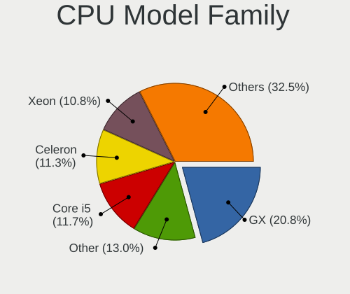

| Model                  | Desktops | Percent |
|------------------------|----------|---------|
| AMD GX                 | 48       | 20.78%  |
| Other                  | 30       | 12.99%  |
| Intel Core i5          | 27       | 11.69%  |
| Intel Celeron          | 26       | 11.26%  |
| Intel Xeon             | 25       | 10.82%  |
| Intel Core i7          | 14       | 6.06%   |
| Intel Core i3          | 13       | 5.63%   |
| Intel Atom             | 9        | 3.9%    |
| AMD Ryzen 7            | 8        | 3.46%   |
| AMD Ryzen 5            | 6        | 2.6%    |
| Intel Pentium Silver   | 5        | 2.16%   |
| Intel Pentium          | 3        | 1.3%    |
| AMD G                  | 3        | 1.3%    |
| Intel Core 2 Duo       | 2        | 0.87%   |
| AMD Ryzen 9            | 2        | 0.87%   |
| AMD Ryzen 7 PRO        | 2        | 0.87%   |
| Intel Pentium Gold     | 1        | 0.43%   |
| Intel Core             | 1        | 0.43%   |
| AMD Ryzen Threadripper | 1        | 0.43%   |
| AMD Ryzen 3            | 1        | 0.43%   |
| AMD Opteron            | 1        | 0.43%   |
| AMD Geode Integrated   | 1        | 0.43%   |
| AMD FX                 | 1        | 0.43%   |
| AMD EPYC               | 1        | 0.43%   |

CPU Cores
---------

Number of processor cores

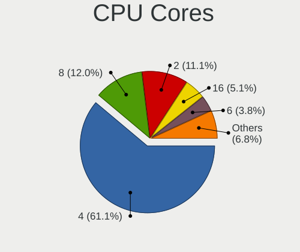

| Number  | Desktops | Percent |
|---------|----------|---------|
| 4       | 143      | 61.11%  |
| 8       | 28       | 11.97%  |
| 2       | 26       | 11.11%  |
| 16      | 12       | 5.13%   |
| 6       | 9        | 3.85%   |
| 12      | 6        | 2.56%   |
| 1       | 4        | 1.71%   |
| Unknown | 3        | 1.28%   |
| 32      | 1        | 0.43%   |
| 24      | 1        | 0.43%   |
| 10      | 1        | 0.43%   |

CPU Sockets
-----------

Number of sockets

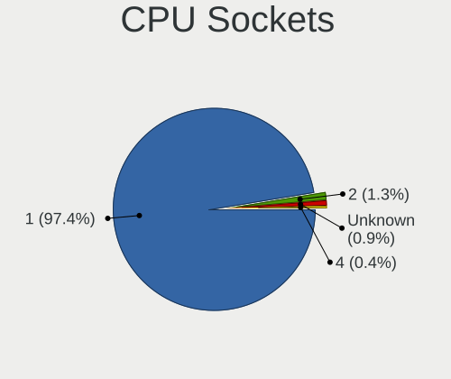

| Number  | Desktops | Percent |
|---------|----------|---------|
| 1       | 224      | 97.39%  |
| 2       | 3        | 1.3%    |
| Unknown | 2        | 0.87%   |
| 4       | 1        | 0.43%   |

CPU Threads
-----------

Threads per core (Hyper-Threading)

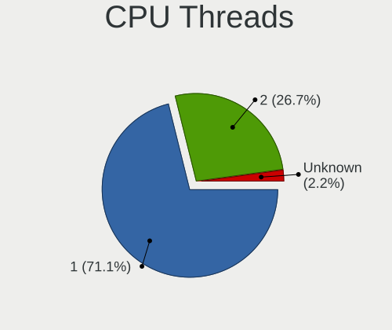

| Number  | Desktops | Percent |
|---------|----------|---------|
| 1       | 165      | 71.12%  |
| 2       | 62       | 26.72%  |
| Unknown | 5        | 2.16%   |

CPU Microarch
-------------

Microarchitecture

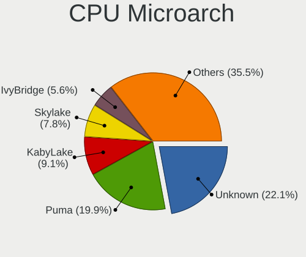

| Name          | Desktops | Percent |
|---------------|----------|---------|
| Unknown       | 51       | 22.08%  |
| Puma          | 46       | 19.91%  |
| KabyLake      | 21       | 9.09%   |
| Skylake       | 18       | 7.79%   |
| IvyBridge     | 13       | 5.63%   |
| Haswell       | 12       | 5.19%   |
| Goldmont plus | 10       | 4.33%   |
| Goldmont      | 9        | 3.9%    |
| Zen 3         | 8        | 3.46%   |
| SandyBridge   | 8        | 3.46%   |
| Zen           | 4        | 1.73%   |
| Silvermont    | 4        | 1.73%   |
| Zen+          | 3        | 1.3%    |
| Bobcat        | 3        | 1.3%    |
| Zen 2         | 2        | 0.87%   |
| Westmere      | 2        | 0.87%   |
| TigerLake     | 2        | 0.87%   |
| Nehalem       | 2        | 0.87%   |
| Jaguar        | 2        | 0.87%   |
| Core          | 2        | 0.87%   |
| CometLake     | 2        | 0.87%   |
| Broadwell     | 2        | 0.87%   |
| Piledriver    | 1        | 0.43%   |
| Penryn        | 1        | 0.43%   |
| IceLake       | 1        | 0.43%   |
| Geode         | 1        | 0.43%   |
| Excavator     | 1        | 0.43%   |

Graphics
--------

GPU Vendor
----------

Vendors of graphics cards

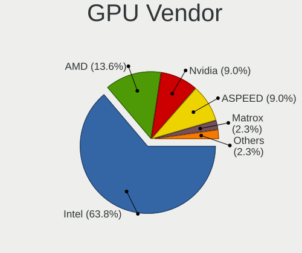

| Vendor                                       | Desktops | Percent |
|----------------------------------------------|----------|---------|
| Intel                                        | 113      | 63.84%  |
| AMD                                          | 24       | 13.56%  |
| Nvidia                                       | 16       | 9.04%   |
| ASPEED Technology                            | 16       | 9.04%   |
| Matrox Electronics Systems                   | 4        | 2.26%   |
| Red Hat                                      | 2        | 1.13%   |
| XGI Technology (eXtreme Graphics Innovation) | 1        | 0.56%   |
| 3DLabs                                       | 1        | 0.56%   |

GPU Model
---------

Graphics card models

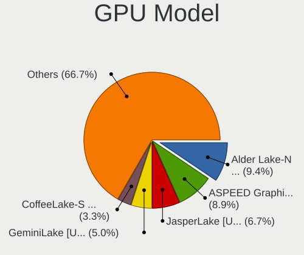

| Model                                                                       | Desktops | Percent |
|-----------------------------------------------------------------------------|----------|---------|
| Intel Alder Lake-N [UHD Graphics]                                           | 17       | 9.44%   |
| ASPEED Technology ASPEED Graphics Family                                    | 16       | 8.89%   |
| Intel JasperLake [UHD Graphics]                                             | 12       | 6.67%   |
| Intel GeminiLake [UHD Graphics 600]                                         | 9        | 5%      |
| Intel CoffeeLake-S GT2 [UHD Graphics 630]                                   | 6        | 3.33%   |
| Intel Alder Lake-N [Intel Graphics]                                         | 6        | 3.33%   |
| Intel Xeon E3-1200 v2/3rd Gen Core processor Graphics Controller            | 5        | 2.78%   |
| Intel 2nd Generation Core Processor Family Integrated Graphics Controller   | 5        | 2.78%   |
| AMD Cezanne [Radeon Vega Series / Radeon Vega Mobile Series]                | 5        | 2.78%   |
| Intel Xeon E3-1200 v3/4th Gen Core Processor Integrated Graphics Controller | 4        | 2.22%   |
| Intel Skylake-S GT2 [HD Graphics 530]                                       | 4        | 2.22%   |
| Intel Kaby Lake-U GT1 [HD Graphics 610]                                     | 4        | 2.22%   |
| Intel WhiskeyLake-U GT2 [UHD Graphics 620]                                  | 3        | 1.67%   |
| Intel IvyBridge GT2 [HD Graphics 4000]                                      | 3        | 1.67%   |
| Intel CometLake-U GT2 [UHD Graphics]                                        | 3        | 1.67%   |
| AMD Picasso/Raven 2 [Radeon Vega Series / Radeon Vega Mobile Series]        | 3        | 1.67%   |
| Red Hat Virtio 1.0 GPU                                                      | 2        | 1.11%   |
| Nvidia GM206 [GeForce GTX 960]                                              | 2        | 1.11%   |
| Matrox Electronics Systems MGA G200eW WPCM450                               | 2        | 1.11%   |
| Matrox Electronics Systems MGA G200EH                                       | 2        | 1.11%   |
| Intel TigerLake-LP GT2 [Iris Xe Graphics]                                   | 2        | 1.11%   |
| Intel Haswell-ULT Integrated Graphics Controller                            | 2        | 1.11%   |
| Intel Elkhart Lake [UHD Graphics Gen11 16EU]                                | 2        | 1.11%   |
| Intel CometLake-S GT2 [UHD Graphics 630]                                    | 2        | 1.11%   |
| Intel Atom Processor Z36xxx/Z37xxx Series Graphics & Display                | 2        | 1.11%   |
| Intel Alder Lake-UP3 GT2 [UHD Graphics]                                     | 2        | 1.11%   |
| Intel Alder Lake-P Integrated Graphics Controller                           | 2        | 1.11%   |
| Intel 4th Generation Core Processor Family Integrated Graphics Controller   | 2        | 1.11%   |
| AMD Raphael                                                                 | 2        | 1.11%   |
| AMD Phoenix1                                                                | 2        | 1.11%   |
| AMD Navi 23 [Radeon RX 6600/6600 XT/6600M]                                  | 2        | 1.11%   |
| AMD Kabini [Radeon HD 8330E]                                                | 2        | 1.11%   |
| AMD Caicos XT [Radeon HD 7470/8470 / R5 235/310 OEM]                        | 2        | 1.11%   |
| XGI Technology (eXtreme Graphics Innovation) Z7/Z9 (XG20 core)              | 1        | 0.56%   |
| Nvidia TU116 [GeForce GTX 1660 SUPER]                                       | 1        | 0.56%   |
| Nvidia GP107GL [Quadro P400]                                                | 1        | 0.56%   |
| Nvidia GP107 [GeForce GTX 1050]                                             | 1        | 0.56%   |
| Nvidia GP106 [GeForce GTX 1060 3GB]                                         | 1        | 0.56%   |
| Nvidia GM204GL [Quadro M4000]                                               | 1        | 0.56%   |
| Nvidia GM107 [GeForce GTX 750 Ti]                                           | 1        | 0.56%   |

GPU Combo
---------

Combinations of graphics cards

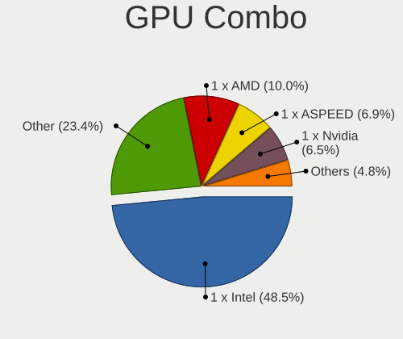

| Name           | Desktops | Percent |
|----------------|----------|---------|
| 1 x Intel      | 112      | 48.48%  |
| Other          | 54       | 23.38%  |
| 1 x AMD        | 23       | 9.96%   |
| 1 x ASPEED     | 16       | 6.93%   |
| 1 x Nvidia     | 15       | 6.49%   |
| 1 x Matrox     | 4        | 1.73%   |
| 2 x AMD        | 2        | 0.87%   |
| 1 x Red Hat    | 2        | 0.87%   |
| 1 x XGI        | 1        | 0.43%   |
| Intel + Nvidia | 1        | 0.43%   |
| 1 x 3DLabs     | 1        | 0.43%   |

GPU Driver
----------

Free vs proprietary

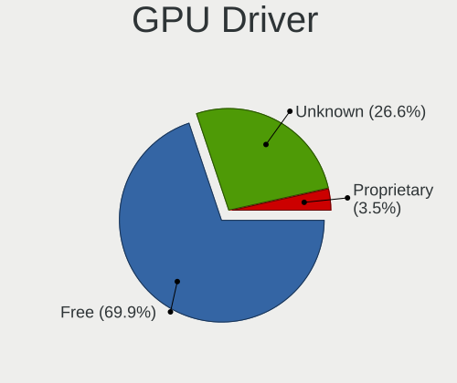

| Driver      | Desktops | Percent |
|-------------|----------|---------|
| Free        | 160      | 69.87%  |
| Unknown     | 61       | 26.64%  |
| Proprietary | 8        | 3.49%   |

GPU Memory
----------

Total video memory

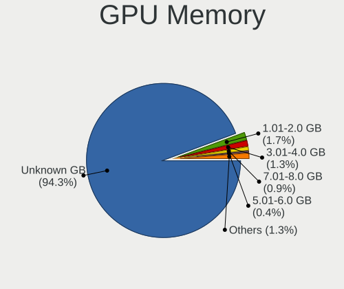

| Size in GB | Desktops | Percent |
|------------|----------|---------|
| Unknown    | 217      | 94.35%  |
| 1.01-2.0   | 4        | 1.74%   |
| 3.01-4.0   | 3        | 1.3%    |
| 7.01-8.0   | 2        | 0.87%   |
| 5.01-6.0   | 1        | 0.43%   |
| 2.01-3.0   | 1        | 0.43%   |
| 0.51-1.0   | 1        | 0.43%   |
| 0.01-0.5   | 1        | 0.43%   |

Monitor
-------

Monitor Vendor
--------------

Monitor vendors

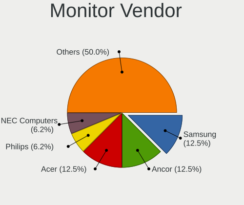

| Vendor               | Desktops | Percent |
|----------------------|----------|---------|
| Samsung Electronics  | 2        | 12.5%   |
| Ancor Communications | 2        | 12.5%   |
| Acer                 | 2        | 12.5%   |
| Philips              | 1        | 6.25%   |
| NEC Computers        | 1        | 6.25%   |
| LG Electronics       | 1        | 6.25%   |
| Lenovo               | 1        | 6.25%   |
| Iiyama               | 1        | 6.25%   |
| Hewlett-Packard      | 1        | 6.25%   |
| Fujitsu Siemens      | 1        | 6.25%   |
| Eizo                 | 1        | 6.25%   |
| BenQ                 | 1        | 6.25%   |
| ASUSTek Computer     | 1        | 6.25%   |

Monitor Model
-------------

Monitor models

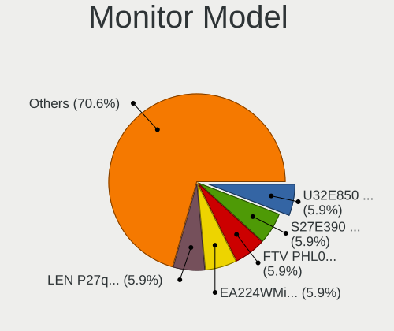

| Model                                                             | Desktops | Percent |
|-------------------------------------------------------------------|----------|---------|
| Samsung Electronics U32E850 SAM0CE3 3840x2160 700x390mm 31.5-inch | 1        | 5.88%   |
| Samsung Electronics S27E390 SAM0C1B 1920x1080 600x340mm 27.2-inch | 1        | 5.88%   |
| Philips FTV PHL01EA 1920x1080 1440x810mm 65.0-inch                | 1        | 5.88%   |
| NEC Computers LCD Monitor EA224WMi 1920x1080                      | 1        | 5.88%   |
| LG Electronics LCD Monitor LG Ultra HD 11520x2160                 | 1        | 5.88%   |
| LG Electronics LCD Monitor LG Ultra HD                            | 1        | 5.88%   |
| Lenovo LEN P27q-10 LEN61A8 2560x1440 600x340mm 27.2-inch          | 1        | 5.88%   |
| Iiyama PL3288UH IVM7610 3840x2160 700x390mm 31.5-inch             | 1        | 5.88%   |
| Hewlett-Packard ZR24w HWP286A 1920x1200 540x350mm 25.3-inch       | 1        | 5.88%   |
| Fujitsu Siemens S19-1 FUS0517 1280x1024 380x300mm 19.1-inch       | 1        | 5.88%   |
| Eizo EV2316W ENC2394 1920x1080 510x290mm 23.1-inch                | 1        | 5.88%   |
| BenQ GW2250H BNQ78BD 1920x1080 480x270mm 21.7-inch                | 1        | 5.88%   |
| ASUSTek Computer XG35V AUS3551 3440x1440 820x350mm 35.1-inch      | 1        | 5.88%   |
| Ancor Communications VS278 ACI27A1 1920x1080 600x340mm 27.2-inch  | 1        | 5.88%   |
| Ancor Communications PB248 ACI24A3 1920x1200 520x320mm 24.0-inch  | 1        | 5.88%   |
| Acer XB271HU ACR0490 2560x1440 600x340mm 27.2-inch                | 1        | 5.88%   |
| Acer XB271HU A ACR052F 2560x1440 600x340mm 27.2-inch              | 1        | 5.88%   |

Monitor Resolution
------------------

Monitor screen resolution

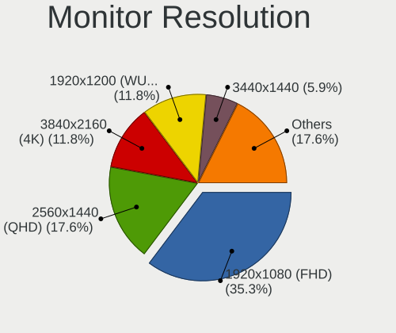

| Resolution        | Desktops | Percent |
|-------------------|----------|---------|
| 1920x1080 (FHD)   | 6        | 35.29%  |
| 2560x1440 (QHD)   | 3        | 17.65%  |
| 3840x2160 (4K)    | 2        | 11.76%  |
| 1920x1200 (WUXGA) | 2        | 11.76%  |
| 3440x1440         | 1        | 5.88%   |
| 1280x1024 (SXGA)  | 1        | 5.88%   |
| 11520x2160        | 1        | 5.88%   |
| Unknown           | 1        | 5.88%   |

Monitor Diagonal
----------------

Diagonal size in inches

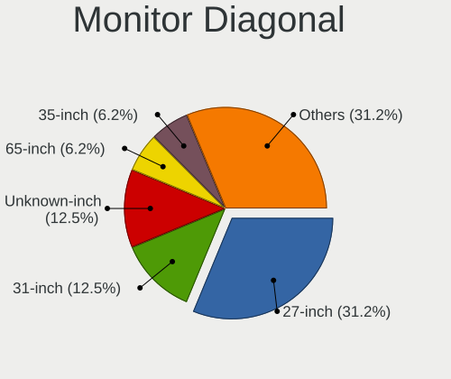

| Inches  | Desktops | Percent |
|---------|----------|---------|
| 27      | 5        | 31.25%  |
| 31      | 2        | 12.5%   |
| Unknown | 2        | 12.5%   |
| 65      | 1        | 6.25%   |
| 35      | 1        | 6.25%   |
| 25      | 1        | 6.25%   |
| 24      | 1        | 6.25%   |
| 23      | 1        | 6.25%   |
| 21      | 1        | 6.25%   |
| 19      | 1        | 6.25%   |

Monitor Width
-------------

Physical width

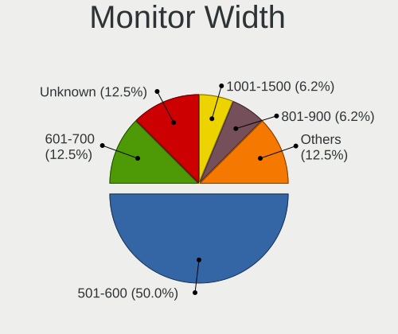

| Width in mm | Desktops | Percent |
|-------------|----------|---------|
| 501-600     | 8        | 50%     |
| 601-700     | 2        | 12.5%   |
| Unknown     | 2        | 12.5%   |
| 801-900     | 1        | 6.25%   |
| 401-500     | 1        | 6.25%   |
| 351-400     | 1        | 6.25%   |
| 1001-1500   | 1        | 6.25%   |

Aspect Ratio
------------

Proportional relationship between the width and the height

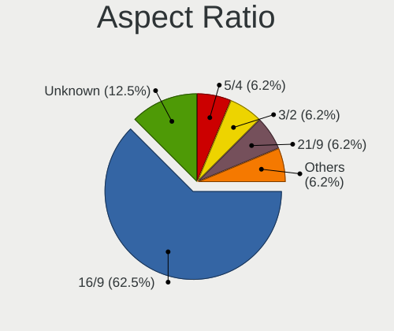

| Ratio   | Desktops | Percent |
|---------|----------|---------|
| 16/9    | 10       | 62.5%   |
| Unknown | 2        | 12.5%   |
| 5/4     | 1        | 6.25%   |
| 3/2     | 1        | 6.25%   |
| 21/9    | 1        | 6.25%   |
| 16/10   | 1        | 6.25%   |

Monitor Area
------------

Area in inch²

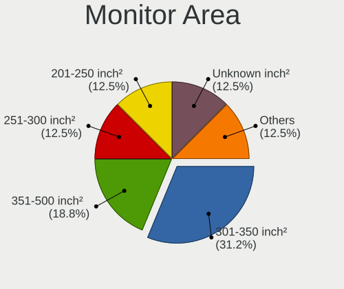

| Area in inch² | Desktops | Percent |
|----------------|----------|---------|
| 301-350        | 5        | 31.25%  |
| 351-500        | 3        | 18.75%  |
| 251-300        | 2        | 12.5%   |
| 201-250        | 2        | 12.5%   |
| Unknown        | 2        | 12.5%   |
| More than 1000 | 1        | 6.25%   |
| 151-200        | 1        | 6.25%   |

Pixel Density
-------------

Pixels per inch

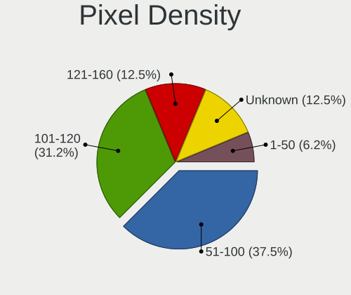

| Density | Desktops | Percent |
|---------|----------|---------|
| 51-100  | 6        | 37.5%   |
| 101-120 | 5        | 31.25%  |
| 121-160 | 2        | 12.5%   |
| Unknown | 2        | 12.5%   |
| 1-50    | 1        | 6.25%   |

Multiple Monitors
-----------------

Total monitors connected

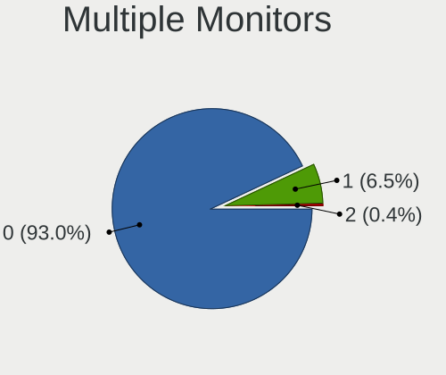

| Total | Desktops | Percent |
|-------|----------|---------|
| 0     | 214      | 93.04%  |
| 1     | 15       | 6.52%   |
| 2     | 1        | 0.43%   |

Network
-------

Net Controller Vendor
---------------------

Controller vendors

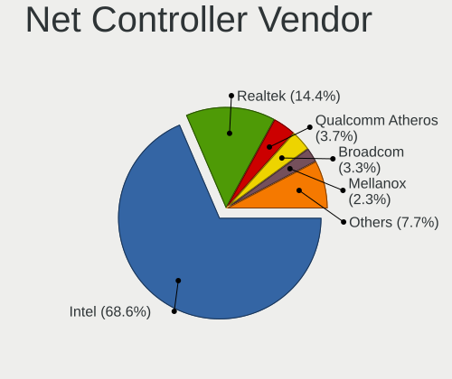

| Vendor                            | Desktops | Percent |
|-----------------------------------|----------|---------|
| Intel                             | 205      | 68.56%  |
| Realtek Semiconductor             | 43       | 14.38%  |
| Qualcomm Atheros                  | 11       | 3.68%   |
| Broadcom                          | 10       | 3.34%   |
| Mellanox Technologies             | 7        | 2.34%   |
| MediaTek                          | 3        | 1%      |
| U-Blox                            | 2        | 0.67%   |
| Samsung Electronics               | 2        | 0.67%   |
| Huawei Technologies               | 2        | 0.67%   |
| American Megatrends               | 2        | 0.67%   |
| VIA Technologies                  | 1        | 0.33%   |
| Red Hat                           | 1        | 0.33%   |
| Qualcomm Atheros Communications   | 1        | 0.33%   |
| QLogic                            | 1        | 0.33%   |
| Oracle/SUN                        | 1        | 0.33%   |
| Microchip Technology              | 1        | 0.33%   |
| Free Software Initiative of Japan | 1        | 0.33%   |
| Edimax Technology                 | 1        | 0.33%   |
| Dell                              | 1        | 0.33%   |
| Chelsio Communications            | 1        | 0.33%   |
| Aquantia                          | 1        | 0.33%   |
| 3Com                              | 1        | 0.33%   |

Net Controller Model
--------------------

Controller models

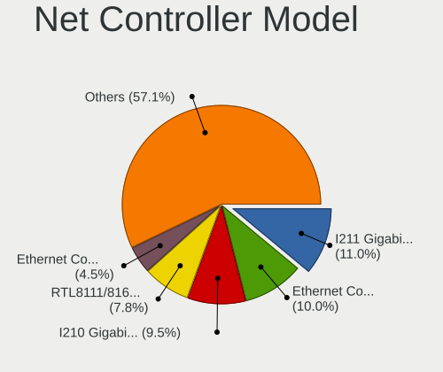

| Model                                                                         | Desktops | Percent |
|-------------------------------------------------------------------------------|----------|---------|
| Intel I211 Gigabit Network Connection                                         | 44       | 11.03%  |
| Intel Ethernet Controller I226-V                                              | 40       | 10.03%  |
| Intel I210 Gigabit Network Connection                                         | 38       | 9.52%   |
| Realtek RTL8111/8168/8211/8411 PCI Express Gigabit Ethernet Controller        | 31       | 7.77%   |
| Intel Ethernet Controller I225-V                                              | 18       | 4.51%   |
| Intel I350 Gigabit Network Connection                                         | 14       | 3.51%   |
| Intel 82579LM Gigabit Network Connection (Lewisville)                         | 12       | 3.01%   |
| Intel 82599ES 10-Gigabit SFI/SFP+ Network Connection                          | 11       | 2.76%   |
| Intel Ethernet Connection X553 10 GbE SFP+                                    | 9        | 2.26%   |
| Intel Ethernet Controller X710 for 10GbE SFP+                                 | 7        | 1.75%   |
| Intel Ethernet Connection X722 for 10GbE SFP+                                 | 7        | 1.75%   |
| Intel Ethernet Connection X722 for 10GBASE-T                                  | 7        | 1.75%   |
| Intel 82574L Gigabit Network Connection                                       | 7        | 1.75%   |
| Intel Ethernet Controller X550                                                | 6        | 1.5%    |
| Realtek RTL8125 2.5GbE Controller                                             | 5        | 1.25%   |
| Intel Ethernet Connection I217-LM                                             | 5        | 1.25%   |
| Intel 82571EB/82571GB Gigabit Ethernet Controller D0/D1 (copper applications) | 5        | 1.25%   |
| Qualcomm Atheros AR928X Wireless Network Adapter (PCI-Express)                | 4        | 1%      |
| Mellanox MT27500 Family [ConnectX-3]                                          | 4        | 1%      |
| Intel Ethernet Controller I226-LM                                             | 4        | 1%      |
| Intel 82583V Gigabit Network Connection                                       | 4        | 1%      |
| Intel 82576 Gigabit Network Connection                                        | 4        | 1%      |
| Realtek RTL8821CE 802.11ac PCIe Wireless Network Adapter                      | 3        | 0.75%   |
| Intel Wi-Fi 6 AX200                                                           | 3        | 0.75%   |
| Intel I210 Gigabit Fiber Network Connection                                   | 3        | 0.75%   |
| Intel Ethernet Controller E810-XXV for SFP                                    | 3        | 0.75%   |
| Intel Ethernet Connection (2) I219-V                                          | 3        | 0.75%   |
| Intel Ethernet Connection (2) I219-LM                                         | 3        | 0.75%   |
| Intel 82579V Gigabit Network Connection                                       | 3        | 0.75%   |
| Intel 82571EB/82571GB Gigabit Ethernet Controller (Copper)                    | 3        | 0.75%   |
| U-Blox [u-blox 7]                                                             | 2        | 0.5%    |
| Samsung Galaxy series, misc. (tethering mode)                                 | 2        | 0.5%    |
| Realtek RTL8188EE Wireless Network Adapter                                    | 2        | 0.5%    |
| Qualcomm Atheros AR93xx Wireless Network Adapter                              | 2        | 0.5%    |
| Mellanox MT27710 Family [ConnectX-4 Lx]                                       | 2        | 0.5%    |
| Intel Jasper Lake PCH CNVi WiFi                                               | 2        | 0.5%    |
| Intel Ethernet Controller XXV710 for 25GbE SFP28                              | 2        | 0.5%    |
| Intel Ethernet Controller X710 for 10GBASE-T                                  | 2        | 0.5%    |
| Intel Ethernet Connection I218-V                                              | 2        | 0.5%    |
| Intel Ethernet Connection (6) I219-LM                                         | 2        | 0.5%    |

Wireless Vendor
---------------

Wireless vendors

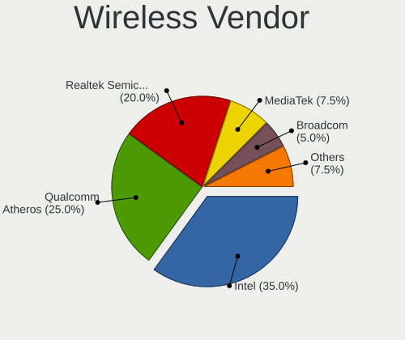

| Vendor                          | Desktops | Percent |
|---------------------------------|----------|---------|
| Intel                           | 14       | 35%     |
| Qualcomm Atheros                | 10       | 25%     |
| Realtek Semiconductor           | 8        | 20%     |
| MediaTek                        | 3        | 7.5%    |
| Broadcom                        | 2        | 5%      |
| Qualcomm Atheros Communications | 1        | 2.5%    |
| Edimax Technology               | 1        | 2.5%    |
| Dell                            | 1        | 2.5%    |

Wireless Model
--------------

Wireless models

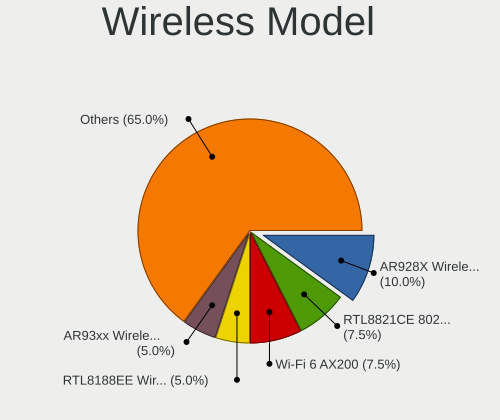

| Model                                                                | Desktops | Percent |
|----------------------------------------------------------------------|----------|---------|
| Qualcomm Atheros AR928X Wireless Network Adapter (PCI-Express)       | 4        | 10%     |
| Realtek RTL8821CE 802.11ac PCIe Wireless Network Adapter             | 3        | 7.5%    |
| Intel Wi-Fi 6 AX200                                                  | 3        | 7.5%    |
| Realtek RTL8188EE Wireless Network Adapter                           | 2        | 5%      |
| Qualcomm Atheros AR93xx Wireless Network Adapter                     | 2        | 5%      |
| Intel Jasper Lake PCH CNVi WiFi                                      | 2        | 5%      |
| Intel Cannon Lake PCH CNVi WiFi                                      | 2        | 5%      |
| Intel Alder Lake-N PCH CNVi WiFi                                     | 2        | 5%      |
| Realtek RTL8822CE 802.11ac PCIe Wireless Network Adapter             | 1        | 2.5%    |
| Realtek RTL8822BE 802.11a/b/g/n/ac WiFi adapter                      | 1        | 2.5%    |
| Realtek RTL8192CE PCIe Wireless Network Adapter                      | 1        | 2.5%    |
| Qualcomm Atheros QCA9565 / AR9565 Wireless Network Adapter           | 1        | 2.5%    |
| Qualcomm Atheros QCA6174 802.11ac Wireless Network Adapter           | 1        | 2.5%    |
| Qualcomm Atheros AR9271 802.11n                                      | 1        | 2.5%    |
| Qualcomm Atheros AR9485 Wireless Network Adapter                     | 1        | 2.5%    |
| Qualcomm Atheros AR9462 Wireless Network Adapter                     | 1        | 2.5%    |
| MediaTek MT7922 802.11ax PCI Express Wireless Network Adapter        | 1        | 2.5%    |
| MediaTek MT7921K (RZ608) Wi-Fi 6E 80MHz                              | 1        | 2.5%    |
| MediaTek MT7902 802.11ax PCIe Wireless Network Adapter [Filogic 310] | 1        | 2.5%    |
| Intel Wireless 8265 / 8275                                           | 1        | 2.5%    |
| Intel Wireless 7265                                                  | 1        | 2.5%    |
| Intel Wireless 7260                                                  | 1        | 2.5%    |
| Intel Wireless 3160                                                  | 1        | 2.5%    |
| Intel Wi-Fi 6E(802.11ax) AX210/AX1675* 2x2 [Typhoon Peak]            | 1        | 2.5%    |
| Edimax EW-7711UTn nLite Wireless Adapter [Ralink RT3070]             | 1        | 2.5%    |
| Dell Wireless 5550 HSPA+ Mini-Card Network Adapter                   | 1        | 2.5%    |
| Broadcom BCM4360 802.11ac Dual Band Wireless Network Adapter         | 1        | 2.5%    |
| Broadcom BCM4322 802.11a/b/g/n Wireless LAN Controller               | 1        | 2.5%    |

Ethernet Vendor
---------------

Ethernet vendors

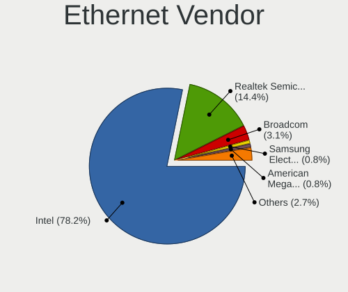

| Vendor                 | Desktops | Percent |
|------------------------|----------|---------|
| Intel                  | 201      | 78.21%  |
| Realtek Semiconductor  | 37       | 14.4%   |
| Broadcom               | 8        | 3.11%   |
| Samsung Electronics    | 2        | 0.78%   |
| American Megatrends    | 2        | 0.78%   |
| VIA Technologies       | 1        | 0.39%   |
| Qualcomm Atheros       | 1        | 0.39%   |
| QLogic                 | 1        | 0.39%   |
| Oracle/SUN             | 1        | 0.39%   |
| Huawei Technologies    | 1        | 0.39%   |
| Chelsio Communications | 1        | 0.39%   |
| Aquantia               | 1        | 0.39%   |

Ethernet Model
--------------

Ethernet models

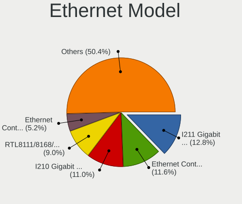

| Model                                                                         | Desktops | Percent |
|-------------------------------------------------------------------------------|----------|---------|
| Intel I211 Gigabit Network Connection                                         | 44       | 12.75%  |
| Intel Ethernet Controller I226-V                                              | 40       | 11.59%  |
| Intel I210 Gigabit Network Connection                                         | 38       | 11.01%  |
| Realtek RTL8111/8168/8211/8411 PCI Express Gigabit Ethernet Controller        | 31       | 8.99%   |
| Intel Ethernet Controller I225-V                                              | 18       | 5.22%   |
| Intel I350 Gigabit Network Connection                                         | 14       | 4.06%   |
| Intel 82579LM Gigabit Network Connection (Lewisville)                         | 12       | 3.48%   |
| Intel 82599ES 10-Gigabit SFI/SFP+ Network Connection                          | 11       | 3.19%   |
| Intel Ethernet Connection X553 10 GbE SFP+                                    | 9        | 2.61%   |
| Intel Ethernet Controller X710 for 10GbE SFP+                                 | 7        | 2.03%   |
| Intel Ethernet Connection X722 for 10GbE SFP+                                 | 7        | 2.03%   |
| Intel Ethernet Connection X722 for 10GBASE-T                                  | 7        | 2.03%   |
| Intel 82574L Gigabit Network Connection                                       | 7        | 2.03%   |
| Intel Ethernet Controller X550                                                | 6        | 1.74%   |
| Realtek RTL8125 2.5GbE Controller                                             | 5        | 1.45%   |
| Intel Ethernet Connection I217-LM                                             | 5        | 1.45%   |
| Intel 82571EB/82571GB Gigabit Ethernet Controller D0/D1 (copper applications) | 5        | 1.45%   |
| Intel Ethernet Controller I226-LM                                             | 4        | 1.16%   |
| Intel 82583V Gigabit Network Connection                                       | 4        | 1.16%   |
| Intel 82576 Gigabit Network Connection                                        | 4        | 1.16%   |
| Intel I210 Gigabit Fiber Network Connection                                   | 3        | 0.87%   |
| Intel Ethernet Controller E810-XXV for SFP                                    | 3        | 0.87%   |
| Intel Ethernet Connection (2) I219-V                                          | 3        | 0.87%   |
| Intel Ethernet Connection (2) I219-LM                                         | 3        | 0.87%   |
| Intel 82579V Gigabit Network Connection                                       | 3        | 0.87%   |
| Intel 82571EB/82571GB Gigabit Ethernet Controller (Copper)                    | 3        | 0.87%   |
| Samsung Galaxy series, misc. (tethering mode)                                 | 2        | 0.58%   |
| Intel Ethernet Controller XXV710 for 25GbE SFP28                              | 2        | 0.58%   |
| Intel Ethernet Controller X710 for 10GBASE-T                                  | 2        | 0.58%   |
| Intel Ethernet Connection I218-V                                              | 2        | 0.58%   |
| Intel Ethernet Connection (6) I219-LM                                         | 2        | 0.58%   |
| Intel Ethernet Connection (2) I218-V                                          | 2        | 0.58%   |
| Intel Ethernet Connection (11) I219-LM                                        | 2        | 0.58%   |
| Intel 82599 10 Gigabit TN Network Connection                                  | 2        | 0.58%   |
| Broadcom NetXtreme BCM5720 Gigabit Ethernet PCIe                              | 2        | 0.58%   |
| American Megatrends Virtual Ethernet                                          | 2        | 0.58%   |
| VIA VT6105M [Rhine-III]                                                       | 1        | 0.29%   |
| Realtek USB 2.5GbE Controller                                                 | 1        | 0.29%   |
| Realtek RTL8111/8168/8411 PCI Express Gigabit Ethernet Controller             | 1        | 0.29%   |
| Qualcomm Atheros QCA8171 Gigabit Ethernet                                     | 1        | 0.29%   |

Net Controller Kind
-------------------

Ethernet, WiFi or modem

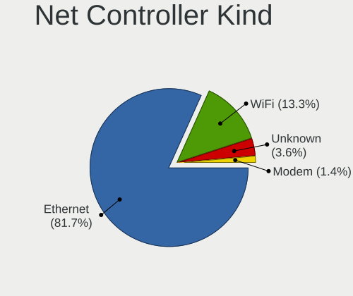

| Kind     | Desktops | Percent |
|----------|----------|---------|
| Ethernet | 228      | 81.72%  |
| WiFi     | 37       | 13.26%  |
| Unknown  | 10       | 3.58%   |
| Modem    | 4        | 1.43%   |

Used Controller
---------------

Currently used network controller

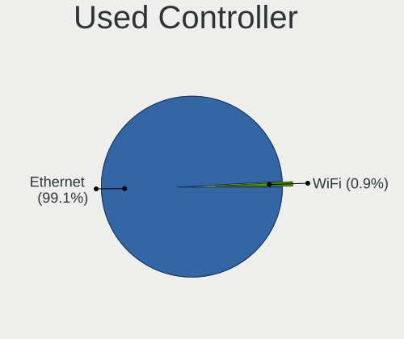

| Kind     | Desktops | Percent |
|----------|----------|---------|
| Ethernet | 221      | 99.1%   |
| WiFi     | 2        | 0.9%    |

NICs
----

Total network controllers on board

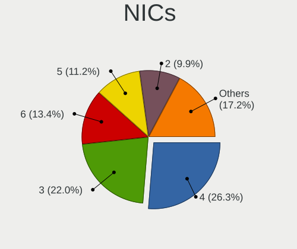

| Total | Desktops | Percent |
|-------|----------|---------|
| 4     | 61       | 26.29%  |
| 3     | 51       | 21.98%  |
| 6     | 31       | 13.36%  |
| 5     | 26       | 11.21%  |
| 2     | 23       | 9.91%   |
| 1     | 19       | 8.19%   |
| 8     | 8        | 3.45%   |
| 9     | 4        | 1.72%   |
| 7     | 4        | 1.72%   |
| 13    | 3        | 1.29%   |
| 15    | 1        | 0.43%   |
| 14    | 1        | 0.43%   |

IPv6
----

IPv6 vs IPv4

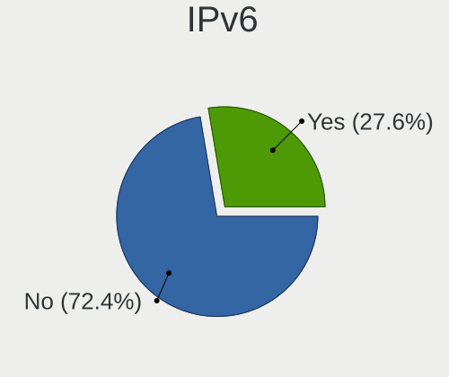

| Used | Desktops | Percent |
|------|----------|---------|
| No   | 178      | 72.36%  |
| Yes  | 68       | 27.64%  |

Bluetooth
---------

Bluetooth Vendor
----------------

Controller vendors

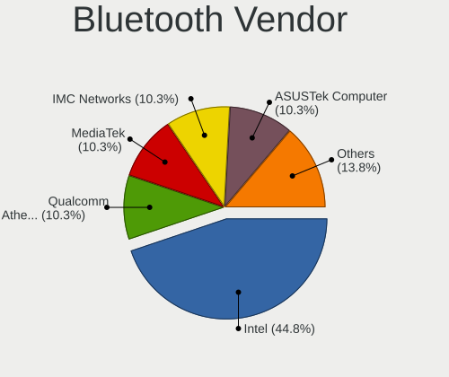

| Vendor                          | Desktops | Percent |
|---------------------------------|----------|---------|
| Intel                           | 13       | 44.83%  |
| Qualcomm Atheros Communications | 3        | 10.34%  |
| MediaTek                        | 3        | 10.34%  |
| IMC Networks                    | 3        | 10.34%  |
| ASUSTek Computer                | 3        | 10.34%  |
| Realtek Semiconductor           | 2        | 6.9%    |
| Apple                           | 2        | 6.9%    |

Bluetooth Model
---------------

Controller models

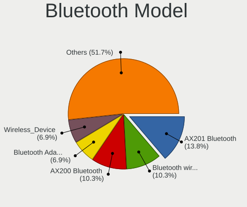

| Model                                                 | Desktops | Percent |
|-------------------------------------------------------|----------|---------|
| Intel AX201 Bluetooth                                 | 4        | 13.79%  |
| Intel Bluetooth wireless interface                    | 3        | 10.34%  |
| Intel AX200 Bluetooth                                 | 3        | 10.34%  |
| Realtek Bluetooth Adapter                             | 2        | 6.9%    |
| MediaTek Wireless_Device                              | 2        | 6.9%    |
| Intel Bluetooth 9460/9560 Jefferson Peak (JfP)        | 2        | 6.9%    |
| IMC Networks Realtek Bluetooth Adapter                | 2        | 6.9%    |
| Apple Built-in Bluetooth 2.0+EDR HCI                  | 2        | 6.9%    |
| Qualcomm Atheros QCA61x4 Bluetooth 4.0                | 1        | 3.45%   |
| Qualcomm Atheros AR9462 Bluetooth                     | 1        | 3.45%   |
| Qualcomm Atheros AR3012 Bluetooth 4.0                 | 1        | 3.45%   |
| MediaTek RZ608 Bluetooth Adapter                      | 1        | 3.45%   |
| Intel AX210 Bluetooth                                 | 1        | 3.45%   |
| IMC Networks Wireless_Device                          | 1        | 3.45%   |
| ASUS Broadcom BCM20702A0 Bluetooth                    | 1        | 3.45%   |
| ASUS Broadcom BCM20702 Single-Chip Bluetooth 4.0 + LE | 1        | 3.45%   |
| ASUS Bluetooth Controller                             | 1        | 3.45%   |

Sound
-----

Sound Vendor
------------

Sound card vendors

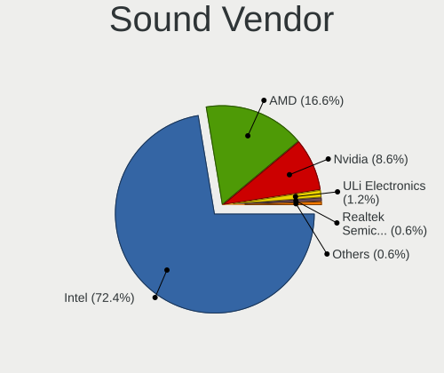

| Vendor                | Desktops | Percent |
|-----------------------|----------|---------|
| Intel                 | 118      | 72.39%  |
| AMD                   | 27       | 16.56%  |
| Nvidia                | 14       | 8.59%   |
| ULi Electronics       | 2        | 1.23%   |
| Realtek Semiconductor | 1        | 0.61%   |
| Logitech              | 1        | 0.61%   |

Sound Model
-----------

Sound card models

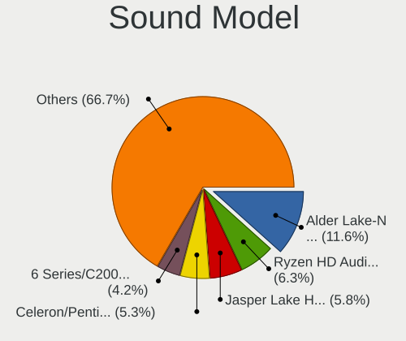

| Model                                                                             | Desktops | Percent |
|-----------------------------------------------------------------------------------|----------|---------|
| Intel Alder Lake-N PCH High Definition Audio Controller                           | 22       | 11.64%  |
| AMD Ryzen HD Audio Controller                                                     | 12       | 6.35%   |
| Intel Jasper Lake HD Audio                                                        | 11       | 5.82%   |
| Intel Celeron/Pentium Silver Processor High Definition Audio                      | 10       | 5.29%   |
| Intel 6 Series/C200 Series Chipset Family High Definition Audio Controller        | 8        | 4.23%   |
| Intel Xeon E3-1200 v3/4th Gen Core Processor HD Audio Controller                  | 7        | 3.7%    |
| Intel 7 Series/C216 Chipset Family High Definition Audio Controller               | 7        | 3.7%    |
| AMD Renoir/Cezanne HDMI/DP Audio Controller                                       | 7        | 3.7%    |
| Intel 8 Series/C220 Series Chipset High Definition Audio Controller               | 6        | 3.17%   |
| Intel Cannon Lake PCH cAVS                                                        | 5        | 2.65%   |
| Intel Alder Lake PCH-P High Definition Audio Controller                           | 5        | 2.65%   |
| Intel Cannon Point-LP High Definition Audio Controller                            | 4        | 2.12%   |
| Intel 200 Series PCH HD Audio                                                     | 4        | 2.12%   |
| Intel 100 Series/C230 Series Chipset Family HD Audio Controller                   | 4        | 2.12%   |
| AMD Radeon High Definition Audio Controller                                       | 4        | 2.12%   |
| Intel Sunrise Point-LP HD Audio                                                   | 3        | 1.59%   |
| Intel Comet Lake PCH-LP cAVS                                                      | 3        | 1.59%   |
| Intel 82801JI (ICH10 Family) HD Audio Controller                                  | 3        | 1.59%   |
| AMD Starship/Matisse HD Audio Controller                                          | 3        | 1.59%   |
| AMD Raven/Raven2/Fenghuang HDMI/DP Audio Controller                               | 3        | 1.59%   |
| ULi Electronics M5451 PCI AC-Link Controller Audio Device                         | 2        | 1.06%   |
| Nvidia GP107GL High Definition Audio Controller                                   | 2        | 1.06%   |
| Nvidia GM206 High Definition Audio Controller                                     | 2        | 1.06%   |
| Nvidia GK107 HDMI Audio Controller                                                | 2        | 1.06%   |
| Intel Wildcat Point-LP High Definition Audio Controller                           | 2        | 1.06%   |
| Intel Tiger Lake-LP Smart Sound Technology Audio Controller                       | 2        | 1.06%   |
| Intel Haswell-ULT HD Audio Controller                                             | 2        | 1.06%   |
| Intel Elkhart Lake High Density Audio bus interface                               | 2        | 1.06%   |
| Intel Comet Lake PCH cAVS                                                         | 2        | 1.06%   |
| Intel C600/X79 series chipset High Definition Audio Controller                    | 2        | 1.06%   |
| Intel Broadwell-U Audio Controller                                                | 2        | 1.06%   |
| Intel Atom Processor Z36xxx/Z37xxx Series High Definition Audio Controller        | 2        | 1.06%   |
| Intel Alder Lake-S HD Audio Controller                                            | 2        | 1.06%   |
| Intel 8 Series HD Audio Controller                                                | 2        | 1.06%   |
| AMD Navi 21/23 HDMI/DP Audio Controller                                           | 2        | 1.06%   |
| AMD Kabini HDMI/DP Audio                                                          | 2        | 1.06%   |
| AMD FCH Azalia Controller                                                         | 2        | 1.06%   |
| AMD Family 17h (Models 00h-0fh) HD Audio Controller                               | 2        | 1.06%   |
| AMD Caicos HDMI Audio [Radeon HD 6450 / 7450/8450/8490 OEM / R5 230/235/235X OEM] | 2        | 1.06%   |
| Realtek Semiconductor USB Audio Maono Elf retrieving string failed                | 1        | 0.53%   |

Memory
------

Memory Vendor
-------------

Memory module vendors

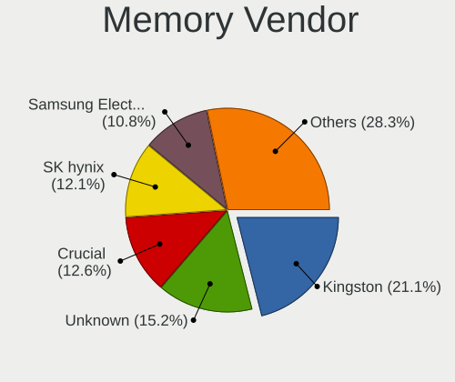

| Vendor              | Desktops | Percent |
|---------------------|----------|---------|
| Kingston            | 47       | 21.08%  |
| Unknown             | 34       | 15.25%  |
| Crucial             | 28       | 12.56%  |
| SK hynix            | 27       | 12.11%  |
| Samsung Electronics | 24       | 10.76%  |
| Micron Technology   | 24       | 10.76%  |
| Corsair             | 18       | 8.07%   |
| Nanya Technology    | 3        | 1.35%   |
| G.Skill             | 3        | 1.35%   |
| Unknown (07FB)      | 2        | 0.9%    |
| QEMU                | 2        | 0.9%    |
| Hewlett-Packard     | 2        | 0.9%    |
| Unknown (ABCD)      | 1        | 0.45%   |
| Unknown (0x05F7)    | 1        | 0.45%   |
| Transcend           | 1        | 0.45%   |
| tigo                | 1        | 0.45%   |
| Super Talent        | 1        | 0.45%   |
| Lexar Co Limited    | 1        | 0.45%   |
| Kimtigo             | 1        | 0.45%   |
| Goldenmars          | 1        | 0.45%   |
| Unknown             | 1        | 0.45%   |

Memory Model
------------

Memory module models

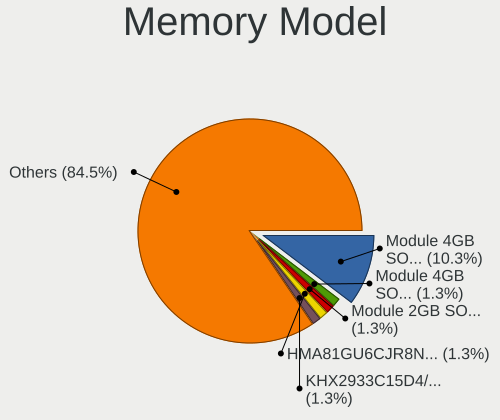

| Model                                                         | Desktops | Percent |
|---------------------------------------------------------------|----------|---------|
| Unknown RAM Module 4GB SODIMM DDR3 1333MT/s                   | 24       | 10.34%  |
| Unknown RAM Module 4GB SODIMM DDR3 667MT/s                    | 3        | 1.29%   |
| Unknown RAM Module 2GB SODIMM DDR3 1333MT/s                   | 3        | 1.29%   |
| SK hynix RAM HMA81GU6CJR8N-XN 8GB DIMM DDR4 3200MT/s          | 3        | 1.29%   |
| Kingston RAM KHX2933C15D4/8GX 8GB DIMM DDR4 2400MT/s          | 3        | 1.29%   |
| Kingston RAM KF2666C15S4/8G 8GB SODIMM DDR4 2667MT/s          | 3        | 1.29%   |
| Kingston RAM CBD24D4S7S8K1A-8 8GB SODIMM DDR4 2400MT/s        | 3        | 1.29%   |
| Crucial RAM CT16G56C46S5.M8G1 16GB SODIMM DDR5 5600MT/s       | 3        | 1.29%   |
| Unknown RAM Module 4GB DIMM DDR3 1333MT/s                     | 2        | 0.86%   |
| SK hynix RAM HMT451S6BFR8A-PB 4GB SODIMM DDR3 1600MT/s        | 2        | 0.86%   |
| Samsung RAM M425R4GA3BB0-CQKOL 32GB SODIMM DDR5 4800MT/s      | 2        | 0.86%   |
| Samsung RAM M378B5173QH0-CK0 4GB DIMM DDR3 1600MT/s           | 2        | 0.86%   |
| Micron RAM Module 8GB Row Of Chips LPDDR4 3200MT/s            | 2        | 0.86%   |
| Micron RAM Module 2GB DIMM DDR3 1333MT/s                      | 2        | 0.86%   |
| Micron RAM Module 16GB Row Of Chips LPDDR4 4267MT/s           | 2        | 0.86%   |
| Micron RAM CT16G56C46S5.C8D 16GB SODIMM DDR5 5600MT/s         | 2        | 0.86%   |
| Micron RAM 53D512M64D4RQ-046 8GB Row Of Chips LPDDR4 4800MT/s | 2        | 0.86%   |
| Kingston RAM KHX1600C10D3/8G 8GB DIMM DDR3 1600MT/s           | 2        | 0.86%   |
| Kingston RAM 99U5471-052.A00LF 8GB DIMM DDR3 1333MT/s         | 2        | 0.86%   |
| Kingston RAM 9965745-020.A00G 32GB DIMM DDR4 3200MT/s         | 2        | 0.86%   |
| Kingston RAM 9965698-044.A00G 16GB DIMM DDR4 2666MT/s         | 2        | 0.86%   |
| Kingston RAM 9905403-559.A00LF 8GB DIMM DDR3 1333MT/s         | 2        | 0.86%   |
| Crucial RAM CT8G4SFS824A.M8FD 8GB SODIMM DDR4 2400MT/s        | 2        | 0.86%   |
| Crucial RAM CT8G4SFRA32A.M8FR 8GB SODIMM DDR4 3200MT/s        | 2        | 0.86%   |
| Crucial RAM CT8G4DFS8266.M8FJ 8GB DIMM DDR4 2666MT/s          | 2        | 0.86%   |
| Crucial RAM CT8G4DFRA266.C8FB 8GB DIMM DDR4 2666MT/s          | 2        | 0.86%   |
| Crucial RAM CT8G48C40S5.M4A1 8GB SODIMM DDR5 4800MT/s         | 2        | 0.86%   |
| Crucial RAM CT32G48C40S5.M16A1 32GB SODIMM DDR5 4800MT/s      | 2        | 0.86%   |
| Crucial RAM CT32G48C40S5.C16A1 32GB SODIMM DDR5 4800MT/s      | 2        | 0.86%   |
| Crucial RAM CT16G56C46S5.C8D 16GB SODIMM DDR5 5600MT/s        | 2        | 0.86%   |
| Corsair RAM CMK32GX5M2A4800C40 16GB DIMM DDR5 4800MT/s        | 2        | 0.86%   |
| Unknown RAM Module 512MB DIMM DDR2 667MT/s                    | 1        | 0.43%   |
| Unknown RAM Module 4096MB DIMM 1333MT/s                       | 1        | 0.43%   |
| Unknown (ABCD) RAM 123456789012345678 8GB DIMM DDR4 2400MT/s  | 1        | 0.43%   |
| Unknown (0x05F7) RAM Module 1GB FB-DIMM DDR2 800MT/s          | 1        | 0.43%   |
| Unknown (07FB) RAM GSA8G4SCL196P-26 8GB SODIMM DDR4 2667MT/s  | 1        | 0.43%   |
| Unknown (07FB) RAM GSA8G4SCL176P-24 8GB SODIMM DDR4 2400MT/s  | 1        | 0.43%   |
| Transcend RAM TS512MLK64V6H 4GB DIMM DDR3 1600MT/s            | 1        | 0.43%   |
| tigo RAM 1600Mhz-8G 8GB SODIMM DDR3 1600MT/s                  | 1        | 0.43%   |
| Super Talent RAM SUPERTALENT02 4GB DIMM DDR3 1600MT/s         | 1        | 0.43%   |

Memory Kind
-----------

Memory module kinds

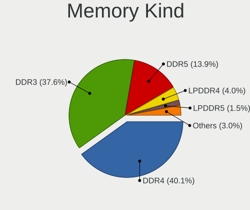

| Kind    | Desktops | Percent |
|---------|----------|---------|
| DDR4    | 81       | 40.1%   |
| DDR3    | 76       | 37.62%  |
| DDR5    | 28       | 13.86%  |
| LPDDR4  | 8        | 3.96%   |
| LPDDR5  | 3        | 1.49%   |
| DDR2    | 3        | 1.49%   |
| RAM     | 2        | 0.99%   |
| Unknown | 1        | 0.5%    |

Memory Form Factor
------------------

Physical design of the memory module

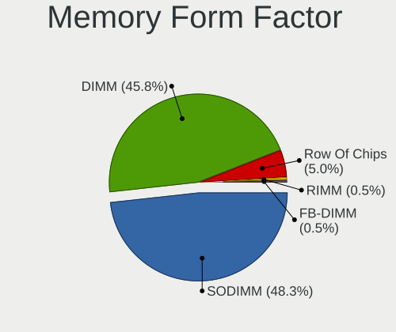

| Name         | Desktops | Percent |
|--------------|----------|---------|
| SODIMM       | 97       | 48.26%  |
| DIMM         | 92       | 45.77%  |
| Row Of Chips | 10       | 4.98%   |
| RIMM         | 1        | 0.5%    |
| FB-DIMM      | 1        | 0.5%    |

Memory Size
-----------

Memory module size

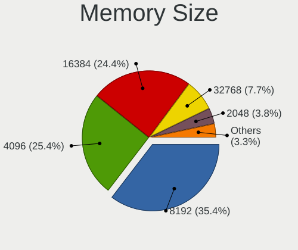

| Size  | Desktops | Percent |
|-------|----------|---------|
| 8192  | 74       | 35.41%  |
| 4096  | 53       | 25.36%  |
| 16384 | 51       | 24.4%   |
| 32768 | 16       | 7.66%   |
| 2048  | 8        | 3.83%   |
| 65536 | 2        | 0.96%   |
| 1024  | 2        | 0.96%   |
| 6144  | 1        | 0.48%   |
| 3072  | 1        | 0.48%   |
| 512   | 1        | 0.48%   |

Memory Speed
------------

Memory module speed

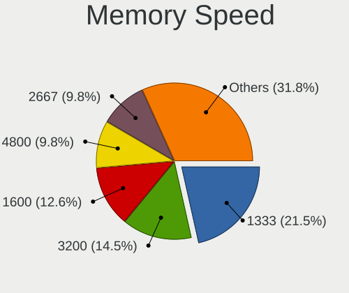

| Speed   | Desktops | Percent |
|---------|----------|---------|
| 1333    | 46       | 21.5%   |
| 3200    | 31       | 14.49%  |
| 1600    | 27       | 12.62%  |
| 4800    | 21       | 9.81%   |
| 2667    | 21       | 9.81%   |
| 2400    | 17       | 7.94%   |
| 2133    | 10       | 4.67%   |
| 5600    | 9        | 4.21%   |
| 2666    | 9        | 4.21%   |
| 667     | 5        | 2.34%   |
| 6400    | 3        | 1.4%    |
| 4267    | 2        | 0.93%   |
| 3600    | 2        | 0.93%   |
| 2933    | 2        | 0.93%   |
| 800     | 2        | 0.93%   |
| Unknown | 2        | 0.93%   |
| 3000    | 1        | 0.47%   |
| 1800    | 1        | 0.47%   |
| 1334    | 1        | 0.47%   |
| 1067    | 1        | 0.47%   |
| 1066    | 1        | 0.47%   |

Printers & scanners
-------------------

Printer Vendor
--------------

Printer device vendors

Zero info for selected period =(

Printer Model
-------------

Printer device models

Zero info for selected period =(

Scanner Vendor
--------------

Scanner device vendors

Zero info for selected period =(

Scanner Model
-------------

Scanner device models

Zero info for selected period =(

Camera
------

Camera Vendor
-------------

Camera device vendors

| Vendor   | Desktops | Percent |
|----------|----------|---------|
| Microdia | 2        | 100%    |

Camera Model
------------

Camera device models

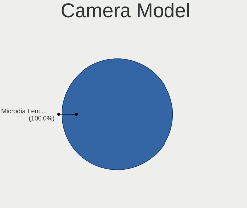

| Model                      | Desktops | Percent |
|----------------------------|----------|---------|
| Microdia Lenovo EasyCamera | 2        | 100%    |

Security
--------

Fingerprint Vendor
------------------

Fingerprint sensor vendors

Zero info for selected period =(

Fingerprint Model
-----------------

Fingerprint sensor models

Zero info for selected period =(

Chipcard Vendor
---------------

Chipcard module vendors

Zero info for selected period =(

Chipcard Model
--------------

Chipcard module models

Zero info for selected period =(

Unsupported
-----------

Unsupported Devices
-------------------

Total unsupported devices on board

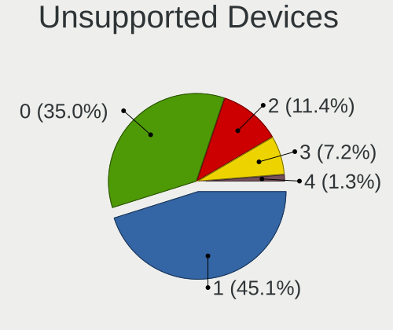

| Total | Desktops | Percent |
|-------|----------|---------|
| 1     | 107      | 45.15%  |
| 0     | 83       | 35.02%  |
| 2     | 27       | 11.39%  |
| 3     | 17       | 7.17%   |
| 4     | 3        | 1.27%   |

Unsupported Device Types
------------------------

Types of unsupported devices

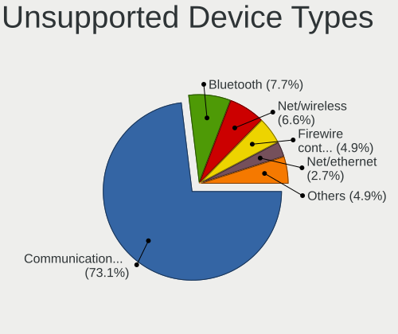

| Type                     | Desktops | Percent |
|--------------------------|----------|---------|
| Communication controller | 133      | 73.08%  |
| Bluetooth                | 14       | 7.69%   |
| Net/wireless             | 12       | 6.59%   |
| Firewire controller      | 9        | 4.95%   |
| Net/ethernet             | 5        | 2.75%   |
| Graphics card            | 3        | 1.65%   |
| Card reader              | 3        | 1.65%   |
| Sound                    | 2        | 1.1%    |
| Network                  | 1        | 0.55%   |

