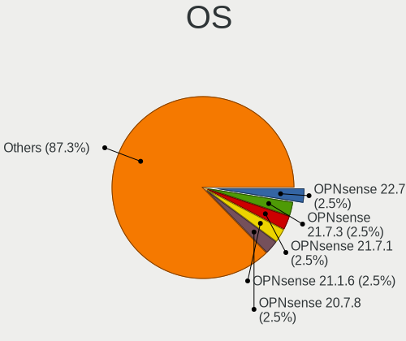
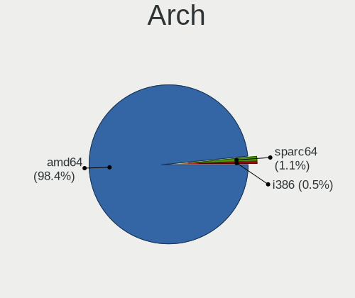
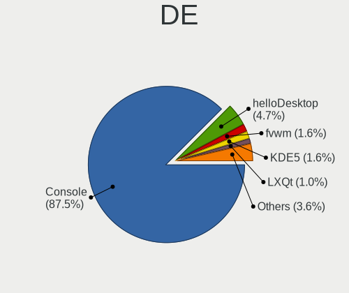
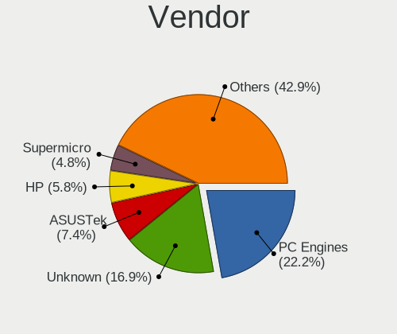
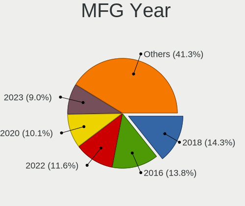
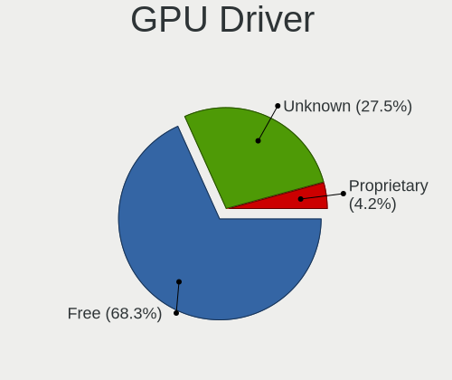
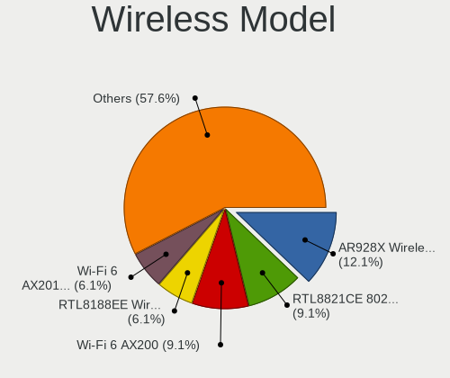
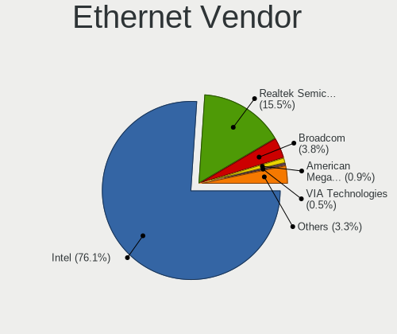
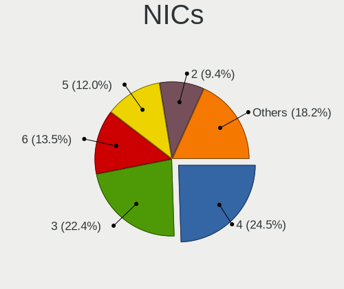

BSD in Switzerland - Tested Hardware & Statistics (Desktops)
------------------------------------------------------------

A project to collect tested hardware configurations for BSD in Switzerland.

Anyone can contribute to this report by the [hw-probe](https://github.com/linuxhw/hw-probe/blob/master/INSTALL.BSD.md) tool:

    hw-probe -all -upload

Please contribute! Especially if your hardware is rare.

Contents
--------

* [ Test Cases ](#test-cases)

* [ System ](#system)
  - [ OS                       ](#os)
  - [ OS Family                ](#os-family)
  - [ Arch                     ](#arch)
  - [ DE                       ](#de)
  - [ Display Server           ](#display-server)
  - [ Display Manager          ](#display-manager)
  - [ OS Lang                  ](#os-lang)
  - [ Boot Mode                ](#boot-mode)
  - [ Filesystem               ](#filesystem)
  - [ Part. scheme             ](#part-scheme)

* [ Board ](#board)
  - [ Vendor                   ](#vendor)
  - [ Model                    ](#model)
  - [ Model Family             ](#model-family)
  - [ MFG Year                 ](#mfg-year)
  - [ Form Factor              ](#form-factor)
  - [ Coreboot                 ](#coreboot)
  - [ RAM Size                 ](#ram-size)
  - [ RAM Used                 ](#ram-used)
  - [ Total Drives             ](#total-drives)
  - [ Has CD-ROM               ](#has-cd-rom)
  - [ Has Ethernet             ](#has-ethernet)
  - [ Has WiFi                 ](#has-wifi)
  - [ Has Bluetooth            ](#has-bluetooth)

* [ Location ](#location)
  - [ Country                  ](#country)
  - [ City                     ](#city)

* [ Drives ](#drives)
  - [ Drive Vendor             ](#drive-vendor)
  - [ Drive Model              ](#drive-model)
  - [ HDD Vendor               ](#hdd-vendor)
  - [ SSD Vendor               ](#ssd-vendor)
  - [ Drive Kind               ](#drive-kind)
  - [ Drive Connector          ](#drive-connector)
  - [ Drive Size               ](#drive-size)
  - [ Space Total              ](#space-total)
  - [ Space Used               ](#space-used)
  - [ Malfunc. Drives          ](#malfunc-drives)
  - [ Malfunc. Drive Vendor    ](#malfunc-drive-vendor)
  - [ Malfunc. HDD Vendor      ](#malfunc-hdd-vendor)
  - [ Malfunc. Drive Kind      ](#malfunc-drive-kind)
  - [ Failed Drives            ](#failed-drives)
  - [ Failed Drive Vendor      ](#failed-drive-vendor)
  - [ Drive Status             ](#drive-status)

* [ Storage controller ](#storage-controller)
  - [ Storage Vendor           ](#storage-vendor)
  - [ Storage Model            ](#storage-model)
  - [ Storage Kind             ](#storage-kind)

* [ Processor ](#processor)
  - [ CPU Vendor               ](#cpu-vendor)
  - [ CPU Model                ](#cpu-model)
  - [ CPU Model Family         ](#cpu-model-family)
  - [ CPU Cores                ](#cpu-cores)
  - [ CPU Sockets              ](#cpu-sockets)
  - [ CPU Threads              ](#cpu-threads)
  - [ CPU Microarch            ](#cpu-microarch)

* [ Graphics ](#graphics)
  - [ GPU Vendor               ](#gpu-vendor)
  - [ GPU Model                ](#gpu-model)
  - [ GPU Combo                ](#gpu-combo)
  - [ GPU Driver               ](#gpu-driver)
  - [ GPU Memory               ](#gpu-memory)

* [ Monitor ](#monitor)
  - [ Monitor Vendor           ](#monitor-vendor)
  - [ Monitor Model            ](#monitor-model)
  - [ Monitor Resolution       ](#monitor-resolution)
  - [ Monitor Diagonal         ](#monitor-diagonal)
  - [ Monitor Width            ](#monitor-width)
  - [ Aspect Ratio             ](#aspect-ratio)
  - [ Monitor Area             ](#monitor-area)
  - [ Pixel Density            ](#pixel-density)
  - [ Multiple Monitors        ](#multiple-monitors)

* [ Network ](#network)
  - [ Net Controller Vendor    ](#net-controller-vendor)
  - [ Net Controller Model     ](#net-controller-model)
  - [ Wireless Vendor          ](#wireless-vendor)
  - [ Wireless Model           ](#wireless-model)
  - [ Ethernet Vendor          ](#ethernet-vendor)
  - [ Ethernet Model           ](#ethernet-model)
  - [ Net Controller Kind      ](#net-controller-kind)
  - [ Used Controller          ](#used-controller)
  - [ NICs                     ](#nics)
  - [ IPv6                     ](#ipv6)

* [ Bluetooth ](#bluetooth)
  - [ Bluetooth Vendor         ](#bluetooth-vendor)
  - [ Bluetooth Model          ](#bluetooth-model)

* [ Sound ](#sound)
  - [ Sound Vendor             ](#sound-vendor)
  - [ Sound Model              ](#sound-model)

* [ Memory ](#memory)
  - [ Memory Vendor            ](#memory-vendor)
  - [ Memory Model             ](#memory-model)
  - [ Memory Kind              ](#memory-kind)
  - [ Memory Form Factor       ](#memory-form-factor)
  - [ Memory Size              ](#memory-size)
  - [ Memory Speed             ](#memory-speed)

* [ Printers & scanners ](#printers--scanners)
  - [ Printer Vendor           ](#printer-vendor)
  - [ Printer Model            ](#printer-model)
  - [ Scanner Vendor           ](#scanner-vendor)
  - [ Scanner Model            ](#scanner-model)

* [ Camera ](#camera)
  - [ Camera Vendor            ](#camera-vendor)
  - [ Camera Model             ](#camera-model)

* [ Security ](#security)
  - [ Fingerprint Vendor       ](#fingerprint-vendor)
  - [ Fingerprint Model        ](#fingerprint-model)
  - [ Chipcard Vendor          ](#chipcard-vendor)
  - [ Chipcard Model           ](#chipcard-model)

* [ Unsupported ](#unsupported)
  - [ Unsupported Devices      ](#unsupported-devices)
  - [ Unsupported Device Types ](#unsupported-device-types)

Test Cases
----------

Total: 259

| Vendor        | Model                       | Probe                                                     | Date         |
|---------------|-----------------------------|-----------------------------------------------------------|--------------|
| PC Engines    | APU2                        | [79f4518fa1](https://bsd-hardware.info/?probe=79f4518fa1) | Dec 23, 2023 |
| ASUSTek       | PRIME H610I-PLUS D4         | [3a435d185e](https://bsd-hardware.info/?probe=3a435d185e) | Dec 22, 2023 |
| PC Engines    | APU2                        | [f3061d599c](https://bsd-hardware.info/?probe=f3061d599c) | Dec 19, 2023 |
| Intel         | HURONRIVER                  | [d0ebaa4479](https://bsd-hardware.info/?probe=d0ebaa4479) | Dec 17, 2023 |
| Unknown       | QDNV01                      | [63cbf7642b](https://bsd-hardware.info/?probe=63cbf7642b) | Nov 28, 2023 |
| ASRock        | B550 Taichi                 | [60d2873b5d](https://bsd-hardware.info/?probe=60d2873b5d) | Nov 26, 2023 |
| Unknown       | YL-SKUL6                    | [ac654676da](https://bsd-hardware.info/?probe=ac654676da) | Nov 16, 2023 |
| ASUSTek       | Z97-A                       | [3ce8e78453](https://bsd-hardware.info/?probe=3ce8e78453) | Nov 11, 2023 |
| Dell          | 0WR7PY A02                  | [3ce02454f8](https://bsd-hardware.info/?probe=3ce02454f8) | Nov 09, 2023 |
| Unknown       | Unknown                     | [876b0db38a](https://bsd-hardware.info/?probe=876b0db38a) | Nov 07, 2023 |
| ASUSTek       | Z97-A                       | [a8aad4a386](https://bsd-hardware.info/?probe=a8aad4a386) | Nov 04, 2023 |
| Yanling       | YL-KBR6L Ver:1.01           | [bdc7be2258](https://bsd-hardware.info/?probe=bdc7be2258) | Oct 29, 2023 |
| GoWin Solu... | R86S                        | [8668f0e8e9](https://bsd-hardware.info/?probe=8668f0e8e9) | Oct 24, 2023 |
| Unknown       | Unknown                     | [135c0112a4](https://bsd-hardware.info/?probe=135c0112a4) | Oct 21, 2023 |
| Unknown       | QDNV01                      | [df90627ba3](https://bsd-hardware.info/?probe=df90627ba3) | Oct 17, 2023 |
| Unknown       | Unknown                     | [50418139b2](https://bsd-hardware.info/?probe=50418139b2) | Sep 30, 2023 |
| PC Engines    | APU                         | [ca9bc2faa7](https://bsd-hardware.info/?probe=ca9bc2faa7) | Sep 29, 2023 |
| PC Engines    | APU                         | [067872c1f5](https://bsd-hardware.info/?probe=067872c1f5) | Sep 29, 2023 |
| PC Engines    | APU2                        | [252385ae71](https://bsd-hardware.info/?probe=252385ae71) | Sep 27, 2023 |
| GoWin Solu... | R86S                        | [6d38812084](https://bsd-hardware.info/?probe=6d38812084) | Sep 22, 2023 |
| HP            | 1790                        | [17ace3bb2c](https://bsd-hardware.info/?probe=17ace3bb2c) | Sep 18, 2023 |
| ASUSTek       | H170M-E D3                  | [f9bde14ab2](https://bsd-hardware.info/?probe=f9bde14ab2) | Sep 10, 2023 |
| Techvision    | TVI7309X B0                 | [e59ce0fb84](https://bsd-hardware.info/?probe=e59ce0fb84) | Aug 21, 2023 |
| Supermicro    | X11SDW-8C-TP13F             | [da4385727b](https://bsd-hardware.info/?probe=da4385727b) | Aug 19, 2023 |
| PC Engines    | apu6                        | [65fda0fe1f](https://bsd-hardware.info/?probe=65fda0fe1f) | Aug 11, 2023 |
| Lenovo        | 3743 SDK0T76461 WIN 3422... | [d5675b5940](https://bsd-hardware.info/?probe=d5675b5940) | Aug 06, 2023 |
| Intel BOX4... | Geminilake                  | [b833ada775](https://bsd-hardware.info/?probe=b833ada775) | Aug 01, 2023 |
| GoWin Solu... | R86S                        | [51bb255924](https://bsd-hardware.info/?probe=51bb255924) | Jul 29, 2023 |
| Unknown       | Unknown                     | [dc7318d29f](https://bsd-hardware.info/?probe=dc7318d29f) | Jul 15, 2023 |
| Unknown       | Unknown                     | [9ce40969da](https://bsd-hardware.info/?probe=9ce40969da) | Jul 11, 2023 |
| Protectli     | VP2410                      | [8ad8c5daa9](https://bsd-hardware.info/?probe=8ad8c5daa9) | Jul 03, 2023 |
| Gigabyte      | J4005ND2P-CF                | [ee61a4b160](https://bsd-hardware.info/?probe=ee61a4b160) | Jun 17, 2023 |
| PC Engines    | apu4                        | [f130ecbaa3](https://bsd-hardware.info/?probe=f130ecbaa3) | Jun 01, 2023 |
| Unknown       | Unknown                     | [c1854cc5f2](https://bsd-hardware.info/?probe=c1854cc5f2) | May 27, 2023 |
| ASRock        | Z68 Pro3 Gen3               | [0a03cd86a0](https://bsd-hardware.info/?probe=0a03cd86a0) | May 21, 2023 |
| HP            | 8299                        | [f5ecf1eaeb](https://bsd-hardware.info/?probe=f5ecf1eaeb) | May 17, 2023 |
| CWWK          | MINIPC-G12                  | [b26aab0f0d](https://bsd-hardware.info/?probe=b26aab0f0d) | May 17, 2023 |
| PC Engines    | apu6                        | [3733cf215f](https://bsd-hardware.info/?probe=3733cf215f) | May 13, 2023 |
| Supermicro    | X11SDW-16C-TP13F+           | [1cc0308686](https://bsd-hardware.info/?probe=1cc0308686) | May 13, 2023 |
| MW            | GMLK-2_5G4L                 | [9fea438eba](https://bsd-hardware.info/?probe=9fea438eba) | May 07, 2023 |
| ASUSTek       | PRIME H610I-PLUS D4         | [472c5fb78e](https://bsd-hardware.info/?probe=472c5fb78e) | Apr 29, 2023 |
| PC Engines    | APU2                        | [4337168a3a](https://bsd-hardware.info/?probe=4337168a3a) | Apr 20, 2023 |
| Supermicro    | M11SDV-8C-LN4F              | [49a95f197c](https://bsd-hardware.info/?probe=49a95f197c) | Apr 20, 2023 |
| Intel BOX4... | Geminilake                  | [79d72cc60f](https://bsd-hardware.info/?probe=79d72cc60f) | Apr 13, 2023 |
| PC Engines    | APU2                        | [766755078c](https://bsd-hardware.info/?probe=766755078c) | Apr 10, 2023 |
| GoWin Solu... | R86S                        | [35e1503946](https://bsd-hardware.info/?probe=35e1503946) | Mar 08, 2023 |
| Protectli     | FW4C Ver                    | [d93437d96b](https://bsd-hardware.info/?probe=d93437d96b) | Mar 04, 2023 |
| Shuttle       | FS81                        | [5787eda5ac](https://bsd-hardware.info/?probe=5787eda5ac) | Feb 26, 2023 |
| Unknown       | Unknown                     | [913946ccc9](https://bsd-hardware.info/?probe=913946ccc9) | Feb 25, 2023 |
| Techvision    | TVI7309X B0                 | [0e62dfc436](https://bsd-hardware.info/?probe=0e62dfc436) | Feb 25, 2023 |
| Dell          | 05XGC8 A01                  | [c51a264e20](https://bsd-hardware.info/?probe=c51a264e20) | Feb 23, 2023 |
| Supermicro    | M11SDV-8C-LN4F              | [4874e3417f](https://bsd-hardware.info/?probe=4874e3417f) | Feb 09, 2023 |
| Intel BOX4... | Geminilake                  | [286c29b1bb](https://bsd-hardware.info/?probe=286c29b1bb) | Feb 08, 2023 |
| Fujitsu       | D3313-A1 S26361-D3313-A1    | [3a47e70001](https://bsd-hardware.info/?probe=3a47e70001) | Feb 03, 2023 |
| PC Engines    | apu4                        | [c3ff966a17](https://bsd-hardware.info/?probe=c3ff966a17) | Feb 03, 2023 |
| PC Engines    | APU2                        | [315ef90664](https://bsd-hardware.info/?probe=315ef90664) | Feb 01, 2023 |
| Techvision    | TVI7309X B0                 | [739cc6e5ac](https://bsd-hardware.info/?probe=739cc6e5ac) | Jan 18, 2023 |
| Intel         | HURONRIVER                  | [9994ae920b](https://bsd-hardware.info/?probe=9994ae920b) | Jan 15, 2023 |
| Intel         | HURONRIVER                  | [320272bdf1](https://bsd-hardware.info/?probe=320272bdf1) | Jan 11, 2023 |
| PC Engines    | apu4                        | [3d69b3aec1](https://bsd-hardware.info/?probe=3d69b3aec1) | Jan 03, 2023 |
| PC Engines    | apu4                        | [62e6e7e679](https://bsd-hardware.info/?probe=62e6e7e679) | Jan 03, 2023 |
| Gigabyte      | B550M AORUS PRO-P           | [d22c37fa81](https://bsd-hardware.info/?probe=d22c37fa81) | Dec 29, 2022 |
| Intel BOX4... | Geminilake                  | [a2b2b7c25f](https://bsd-hardware.info/?probe=a2b2b7c25f) | Dec 23, 2022 |
| HP            | ProLiant MicroServer Gen... | [a2bc442acd](https://bsd-hardware.info/?probe=a2bc442acd) | Dec 23, 2022 |
| Intel BOX4... | Geminilake                  | [06933f3d87](https://bsd-hardware.info/?probe=06933f3d87) | Dec 23, 2022 |
| Dell          | 0X4N41 A01                  | [4091e15cac](https://bsd-hardware.info/?probe=4091e15cac) | Dec 14, 2022 |
| ASUSTek       | PRIME B550-PLUS             | [1d8397a653](https://bsd-hardware.info/?probe=1d8397a653) | Dec 10, 2022 |
| Unknown       | Unknown                     | [0405fd0f0d](https://bsd-hardware.info/?probe=0405fd0f0d) | Dec 09, 2022 |
| ASUSTek       | PRIME B550-PLUS             | [c30f53fc6d](https://bsd-hardware.info/?probe=c30f53fc6d) | Dec 09, 2022 |
| Unknown       | Unknown                     | [78893acbd5](https://bsd-hardware.info/?probe=78893acbd5) | Dec 06, 2022 |
| Unknown       | Unknown                     | [a5b10d3f79](https://bsd-hardware.info/?probe=a5b10d3f79) | Nov 29, 2022 |
| Unknown       | Unknown                     | [2fe35064cb](https://bsd-hardware.info/?probe=2fe35064cb) | Nov 28, 2022 |
| MW            | GMLK-2_5G4L                 | [7f9869324b](https://bsd-hardware.info/?probe=7f9869324b) | Nov 26, 2022 |
| Unknown       | Unknown                     | [77e932dd9e](https://bsd-hardware.info/?probe=77e932dd9e) | Nov 23, 2022 |
| Infoblox      | IB-1410                     | [7521108ef5](https://bsd-hardware.info/?probe=7521108ef5) | Nov 23, 2022 |
| Unknown       | Unknown                     | [521008f8da](https://bsd-hardware.info/?probe=521008f8da) | Nov 10, 2022 |
| Unknown       | Unknown                     | [bc7a300434](https://bsd-hardware.info/?probe=bc7a300434) | Nov 02, 2022 |
| Unknown       | Unknown                     | [2fc5bd737a](https://bsd-hardware.info/?probe=2fc5bd737a) | Oct 09, 2022 |
| PC Engines    | APU2                        | [47e38f3abe](https://bsd-hardware.info/?probe=47e38f3abe) | Oct 05, 2022 |
| Unknown       | Unknown                     | [02a9700c12](https://bsd-hardware.info/?probe=02a9700c12) | Oct 03, 2022 |
| Gigabyte      | X570 AORUS MASTER           | [353008eb5e](https://bsd-hardware.info/?probe=353008eb5e) | Sep 29, 2022 |
| PC Engines    | APU2                        | [3fcc5e5ae2](https://bsd-hardware.info/?probe=3fcc5e5ae2) | Sep 25, 2022 |
| HP            | ProLiant ML350p Gen8        | [1a9c6a10bd](https://bsd-hardware.info/?probe=1a9c6a10bd) | Sep 19, 2022 |
| HP            | 0B54h D                     | [a24f08281d](https://bsd-hardware.info/?probe=a24f08281d) | Sep 19, 2022 |
| Apple         | Mac-7BA5B2D9E42DDD94        | [d2e169b8ad](https://bsd-hardware.info/?probe=d2e169b8ad) | Sep 13, 2022 |
| Unknown       | Unknown                     | [9422de47ab](https://bsd-hardware.info/?probe=9422de47ab) | Aug 30, 2022 |
| Shuttle       | FS81                        | [b2db8ceabe](https://bsd-hardware.info/?probe=b2db8ceabe) | Aug 24, 2022 |
| Dell          | 02YYK5 A00                  | [5428710004](https://bsd-hardware.info/?probe=5428710004) | Aug 16, 2022 |
| Acer          | Aspire X3995                | [9240256ae5](https://bsd-hardware.info/?probe=9240256ae5) | Aug 06, 2022 |
| Unknown       | Unknown                     | [9f98df6faf](https://bsd-hardware.info/?probe=9f98df6faf) | Aug 05, 2022 |
| Unknown       | Unknown                     | [25ca16baef](https://bsd-hardware.info/?probe=25ca16baef) | Aug 05, 2022 |
| Unknown       | Unknown                     | [f9bf5b2e00](https://bsd-hardware.info/?probe=f9bf5b2e00) | Aug 04, 2022 |
| PC Engines    | APU2                        | [35d0a79b04](https://bsd-hardware.info/?probe=35d0a79b04) | Aug 04, 2022 |
| Protectli     | FW6                         | [b686fdf1c1](https://bsd-hardware.info/?probe=b686fdf1c1) | Jul 31, 2022 |
| Unknown       | Unknown                     | [0b84314fbf](https://bsd-hardware.info/?probe=0b84314fbf) | Jul 28, 2022 |
| Unknown       | Unknown                     | [4e721b00d5](https://bsd-hardware.info/?probe=4e721b00d5) | Jul 28, 2022 |
| PC Engines    | APU2                        | [7d3a1f2825](https://bsd-hardware.info/?probe=7d3a1f2825) | Jul 14, 2022 |
| PC Engines    | APU2                        | [0dd60aeb9a](https://bsd-hardware.info/?probe=0dd60aeb9a) | Jul 14, 2022 |
| Biostar       | H61MHV2                     | [58a61e6171](https://bsd-hardware.info/?probe=58a61e6171) | Jul 11, 2022 |
| Biostar       | H61MHV2                     | [2aa5e2a62d](https://bsd-hardware.info/?probe=2aa5e2a62d) | Jul 08, 2022 |
| Dell          | 02YYK5 A00                  | [fb2e5bec61](https://bsd-hardware.info/?probe=fb2e5bec61) | Jul 05, 2022 |
| Dell          | 02YYK5 A00                  | [629de6cdb6](https://bsd-hardware.info/?probe=629de6cdb6) | Jul 05, 2022 |
| HP            | 1494                        | [3a61eb7bae](https://bsd-hardware.info/?probe=3a61eb7bae) | Jul 01, 2022 |
| Gigabyte      | X570 AORUS MASTER           | [34bb6613ee](https://bsd-hardware.info/?probe=34bb6613ee) | Jun 23, 2022 |
| Unknown       | Unknown                     | [d7d6b654a4](https://bsd-hardware.info/?probe=d7d6b654a4) | Jun 22, 2022 |
| Dell          | 02YYK5 A00                  | [180af6a2da](https://bsd-hardware.info/?probe=180af6a2da) | Jun 19, 2022 |
| Dell          | 02YYK5 A00                  | [c58d529930](https://bsd-hardware.info/?probe=c58d529930) | Jun 19, 2022 |
| MW            | GMLK-2_5G4L                 | [97e567c06b](https://bsd-hardware.info/?probe=97e567c06b) | Jun 18, 2022 |
| ASUSTek       | Pro B660M-C D4              | [302ea8252d](https://bsd-hardware.info/?probe=302ea8252d) | Jun 08, 2022 |
| PC Engines    | apu4                        | [1067180759](https://bsd-hardware.info/?probe=1067180759) | May 31, 2022 |
| PC Engines    | apu4                        | [214bc37259](https://bsd-hardware.info/?probe=214bc37259) | May 26, 2022 |
| Protectli     | FW6                         | [0dc7509652](https://bsd-hardware.info/?probe=0dc7509652) | May 24, 2022 |
| Unknown       | Unknown                     | [7c260c2423](https://bsd-hardware.info/?probe=7c260c2423) | May 20, 2022 |
| Intel         | D54250WYK H13922-303        | [8f9e0896d7](https://bsd-hardware.info/?probe=8f9e0896d7) | May 12, 2022 |
| Dell          | 0X4N41 A01                  | [d1596f34bf](https://bsd-hardware.info/?probe=d1596f34bf) | May 12, 2022 |
| Intel         | D54250WYK H13922-303        | [6dfeb3d80d](https://bsd-hardware.info/?probe=6dfeb3d80d) | May 10, 2022 |
| Intel         | HURONRIVER                  | [515172b464](https://bsd-hardware.info/?probe=515172b464) | May 09, 2022 |
| PC Engines    | APU2                        | [a2b68686f0](https://bsd-hardware.info/?probe=a2b68686f0) | Apr 27, 2022 |
| Dell          | 0TP406                      | [775061bc83](https://bsd-hardware.info/?probe=775061bc83) | Apr 25, 2022 |
| Biostar       | H61MHV2                     | [7d9806d719](https://bsd-hardware.info/?probe=7d9806d719) | Apr 21, 2022 |
| Gigabyte      | 990FXA-UD3                  | [378021707a](https://bsd-hardware.info/?probe=378021707a) | Apr 17, 2022 |
| PC Engines    | apu4                        | [62df504364](https://bsd-hardware.info/?probe=62df504364) | Apr 09, 2022 |
| Dell          | 0TP406                      | [9a29305ef1](https://bsd-hardware.info/?probe=9a29305ef1) | Apr 06, 2022 |
| Unknown       | Unknown                     | [b6b1ec9dc1](https://bsd-hardware.info/?probe=b6b1ec9dc1) | Mar 30, 2022 |
| ASRockRack    | X570D4U-2L2T                | [7e042aa70d](https://bsd-hardware.info/?probe=7e042aa70d) | Mar 25, 2022 |
| Unknown       | Unknown                     | [abb17bcb42](https://bsd-hardware.info/?probe=abb17bcb42) | Mar 21, 2022 |
| Unknown       | Unknown                     | [1d97ecbc95](https://bsd-hardware.info/?probe=1d97ecbc95) | Mar 20, 2022 |
| Unknown       | Unknown                     | [e169892276](https://bsd-hardware.info/?probe=e169892276) | Mar 18, 2022 |
| Dell          | 0X4N41 A01                  | [456b55de38](https://bsd-hardware.info/?probe=456b55de38) | Mar 17, 2022 |
| Unknown       | Unknown                     | [1ed23967fd](https://bsd-hardware.info/?probe=1ed23967fd) | Mar 17, 2022 |
| Dell          | 0X4N41 A01                  | [4d7d8fd92b](https://bsd-hardware.info/?probe=4d7d8fd92b) | Mar 17, 2022 |
| Unknown       | Unknown                     | [95154c4898](https://bsd-hardware.info/?probe=95154c4898) | Mar 16, 2022 |
| PC Engines    | APU2                        | [6e5badb880](https://bsd-hardware.info/?probe=6e5badb880) | Mar 04, 2022 |
| Intel         | Q3XXG4-P V1.0               | [7da5182091](https://bsd-hardware.info/?probe=7da5182091) | Feb 27, 2022 |
| PC Engines    | APU2                        | [40ba1b35da](https://bsd-hardware.info/?probe=40ba1b35da) | Feb 24, 2022 |
| Dell          | 0X4N41 A01                  | [fea17bcf92](https://bsd-hardware.info/?probe=fea17bcf92) | Feb 19, 2022 |
| PC Engines    | APU2                        | [547be2fb61](https://bsd-hardware.info/?probe=547be2fb61) | Feb 19, 2022 |
| Dell          | 0X4N41 A01                  | [a62eea5e4e](https://bsd-hardware.info/?probe=a62eea5e4e) | Feb 11, 2022 |
| Dell          | 0X4N41 A01                  | [55b7348a0c](https://bsd-hardware.info/?probe=55b7348a0c) | Feb 11, 2022 |
| PC Engines    | APU2                        | [566948b2c1](https://bsd-hardware.info/?probe=566948b2c1) | Feb 09, 2022 |
| Acer          | Aspire XC-885 V:1.1         | [76fadb9527](https://bsd-hardware.info/?probe=76fadb9527) | Feb 09, 2022 |
| HP            | 0B54h D                     | [c2b43efb8f](https://bsd-hardware.info/?probe=c2b43efb8f) | Feb 07, 2022 |
| HP            | ProLiant ML350p Gen8        | [7987f643d7](https://bsd-hardware.info/?probe=7987f643d7) | Feb 06, 2022 |
| HP            | 0B54h D                     | [1878f5822c](https://bsd-hardware.info/?probe=1878f5822c) | Feb 06, 2022 |
| HP            | ProLiant ML350p Gen8        | [b9e0021bfb](https://bsd-hardware.info/?probe=b9e0021bfb) | Feb 06, 2022 |
| Unknown       | Unknown                     | [000331f38e](https://bsd-hardware.info/?probe=000331f38e) | Jan 31, 2022 |
| Unknown       | Unknown                     | [74b8fc0269](https://bsd-hardware.info/?probe=74b8fc0269) | Jan 30, 2022 |
| PC Engines    | apu4                        | [4f6a1c9c9a](https://bsd-hardware.info/?probe=4f6a1c9c9a) | Jan 25, 2022 |
| Unknown       | Unknown                     | [b572e30460](https://bsd-hardware.info/?probe=b572e30460) | Jan 19, 2022 |
| HP            | 3396                        | [236ed20a86](https://bsd-hardware.info/?probe=236ed20a86) | Jan 11, 2022 |
| Unknown       | Unknown                     | [e38915ac8c](https://bsd-hardware.info/?probe=e38915ac8c) | Jan 08, 2022 |
| Unknown       | Unknown                     | [0a82e095ee](https://bsd-hardware.info/?probe=0a82e095ee) | Jan 08, 2022 |
| Unknown       | Unknown                     | [9c67eb6ecd](https://bsd-hardware.info/?probe=9c67eb6ecd) | Dec 30, 2021 |
| Gigabyte      | H97N-WIFI                   | [3ccd5eace4](https://bsd-hardware.info/?probe=3ccd5eace4) | Dec 15, 2021 |
| ASRock        | B550 Taichi                 | [ed2fd72332](https://bsd-hardware.info/?probe=ed2fd72332) | Dec 14, 2021 |
| PC Engines    | apu4                        | [a06765ebb1](https://bsd-hardware.info/?probe=a06765ebb1) | Dec 09, 2021 |
| Dell          | 0X4N41 A01                  | [015319ce8c](https://bsd-hardware.info/?probe=015319ce8c) | Dec 08, 2021 |
| Supermicro    | X11SDW-4C-TP13F             | [f424260bfa](https://bsd-hardware.info/?probe=f424260bfa) | Dec 03, 2021 |
| ASRockRack    | X570D4U-2L2T                | [b35a4b529c](https://bsd-hardware.info/?probe=b35a4b529c) | Nov 22, 2021 |
| Intel         | HURONRIVER                  | [741fd0e126](https://bsd-hardware.info/?probe=741fd0e126) | Nov 13, 2021 |
| Dell          | 0X4N41 A01                  | [d08d7fde4a](https://bsd-hardware.info/?probe=d08d7fde4a) | Nov 13, 2021 |
| PC Engines    | apu4                        | [64cad2ccf6](https://bsd-hardware.info/?probe=64cad2ccf6) | Nov 08, 2021 |
| HP            | 3397                        | [3434fa8427](https://bsd-hardware.info/?probe=3434fa8427) | Nov 07, 2021 |
| HP            | 3397                        | [155eceb394](https://bsd-hardware.info/?probe=155eceb394) | Nov 07, 2021 |
| Apple         | Mac-F42C88C8 Proto1         | [15d56aee58](https://bsd-hardware.info/?probe=15d56aee58) | Oct 21, 2021 |
| Apple         | Mac-F221BEC8                | [cb2cc35e6c](https://bsd-hardware.info/?probe=cb2cc35e6c) | Oct 19, 2021 |
| Apple         | Mac-F221BEC8                | [4e91fa71b2](https://bsd-hardware.info/?probe=4e91fa71b2) | Oct 19, 2021 |
| Unknown       | Unknown                     | [734ec7d9fc](https://bsd-hardware.info/?probe=734ec7d9fc) | Oct 18, 2021 |
| Unknown       | Unknown                     | [4ecab88e78](https://bsd-hardware.info/?probe=4ecab88e78) | Oct 17, 2021 |
| ASRock        | A320M-ITX                   | [06a8c0d2ac](https://bsd-hardware.info/?probe=06a8c0d2ac) | Oct 08, 2021 |
| ASRock        | B550 Taichi                 | [7599775c70](https://bsd-hardware.info/?probe=7599775c70) | Oct 08, 2021 |
| PC Engines    | APU2                        | [7a21594bf7](https://bsd-hardware.info/?probe=7a21594bf7) | Oct 08, 2021 |
| PC Engines    | apu6                        | [a184c5f1b2](https://bsd-hardware.info/?probe=a184c5f1b2) | Oct 06, 2021 |
| PC Engines    | APU2                        | [d36e631149](https://bsd-hardware.info/?probe=d36e631149) | Oct 03, 2021 |
| Gigabyte      | B450M DS3H-CF               | [1038e3314d](https://bsd-hardware.info/?probe=1038e3314d) | Sep 21, 2021 |
| PC Engines    | apu4                        | [9557835b54](https://bsd-hardware.info/?probe=9557835b54) | Sep 09, 2021 |
| Gigabyte      | BRi3(H)-10110               | [9aa3540749](https://bsd-hardware.info/?probe=9aa3540749) | Sep 09, 2021 |
| Gigabyte      | X399 DESIGNARE EX-CF        | [a78cc6a11b](https://bsd-hardware.info/?probe=a78cc6a11b) | Sep 04, 2021 |
| ASRock        | A320M-ITX                   | [051ca0708f](https://bsd-hardware.info/?probe=051ca0708f) | Sep 03, 2021 |
| ASRock        | A320M-ITX                   | [23bccfa11c](https://bsd-hardware.info/?probe=23bccfa11c) | Sep 01, 2021 |
| ASUSTek       | P8Z77-V                     | [eb4948e855](https://bsd-hardware.info/?probe=eb4948e855) | Aug 31, 2021 |
| Unknown       | Unknown                     | [114a632ab4](https://bsd-hardware.info/?probe=114a632ab4) | Aug 30, 2021 |
| ASRock        | A320M-ITX                   | [b0339f73bc](https://bsd-hardware.info/?probe=b0339f73bc) | Aug 28, 2021 |
| Unknown       | Unknown                     | [5bb434cb3f](https://bsd-hardware.info/?probe=5bb434cb3f) | Aug 27, 2021 |
| ASRock        | A320M-ITX                   | [c28bfd784d](https://bsd-hardware.info/?probe=c28bfd784d) | Aug 27, 2021 |
| Supermicro    | X9SCL/X9SCMA                | [47284b4819](https://bsd-hardware.info/?probe=47284b4819) | Aug 27, 2021 |
| PC Engines    | apu4                        | [9f5ec6c23f](https://bsd-hardware.info/?probe=9f5ec6c23f) | Aug 23, 2021 |
| PC Engines    | apu4                        | [514a974f68](https://bsd-hardware.info/?probe=514a974f68) | Aug 10, 2021 |
| PC Engines    | APU2                        | [823fdc32f0](https://bsd-hardware.info/?probe=823fdc32f0) | Aug 09, 2021 |
| ASRock        | J4105-ITX                   | [1ac35fcecf](https://bsd-hardware.info/?probe=1ac35fcecf) | Aug 08, 2021 |
| Shuttle       | DS10U                       | [fa151322fc](https://bsd-hardware.info/?probe=fa151322fc) | Aug 03, 2021 |
| Supermicro    | X9SCL/X9SCMA                | [772a9416ab](https://bsd-hardware.info/?probe=772a9416ab) | Aug 01, 2021 |
| PC Engines    | APU2                        | [4c2b89d2e6](https://bsd-hardware.info/?probe=4c2b89d2e6) | Jul 31, 2021 |
| Dell          | 0X4N41 A01                  | [a528966ab8](https://bsd-hardware.info/?probe=a528966ab8) | Jul 30, 2021 |
| Dell          | 0X4N41 A01                  | [51136572fc](https://bsd-hardware.info/?probe=51136572fc) | Jul 29, 2021 |
| ASRockRack    | X470D4U2-2T                 | [8a2efd6b5b](https://bsd-hardware.info/?probe=8a2efd6b5b) | Jul 25, 2021 |
| Supermicro    | X9SCL/X9SCMA                | [fea747e9eb](https://bsd-hardware.info/?probe=fea747e9eb) | Jul 25, 2021 |
| Dell          | 0X4N41 A01                  | [f29fab4508](https://bsd-hardware.info/?probe=f29fab4508) | Jul 23, 2021 |
| Dell          | 0X4N41 A01                  | [b7c3a2b2e4](https://bsd-hardware.info/?probe=b7c3a2b2e4) | Jul 23, 2021 |
| Supermicro    | X9SCL/X9SCMA                | [89938d9a3a](https://bsd-hardware.info/?probe=89938d9a3a) | Jul 20, 2021 |
| Supermicro    | X9SCL/X9SCMA                | [c2721a852b](https://bsd-hardware.info/?probe=c2721a852b) | Jul 18, 2021 |
| Supermicro    | PDSML+                      | [f8a9ca42d6](https://bsd-hardware.info/?probe=f8a9ca42d6) | Jul 11, 2021 |
| PC Engines    | APU2                        | [fe77a10950](https://bsd-hardware.info/?probe=fe77a10950) | Jul 08, 2021 |
| Protectli     | FW6                         | [c28479f624](https://bsd-hardware.info/?probe=c28479f624) | Jun 20, 2021 |
| ASRockRack    | X470D4U2-2T                 | [6efb43e299](https://bsd-hardware.info/?probe=6efb43e299) | Jun 18, 2021 |
| Protectli     | FW6                         | [36d53d9465](https://bsd-hardware.info/?probe=36d53d9465) | Jun 17, 2021 |
| Protectli     | FW6                         | [9579e972f2](https://bsd-hardware.info/?probe=9579e972f2) | Jun 13, 2021 |
| ASUSTek       | ROG STRIX Z370-I GAMING     | [15ba8e73e1](https://bsd-hardware.info/?probe=15ba8e73e1) | Jun 09, 2021 |
| PC Engines    | apu4                        | [7ffaed1505](https://bsd-hardware.info/?probe=7ffaed1505) | Jun 06, 2021 |
| HPE           | ProLiant MicroServer Gen... | [74f5dbcf1b](https://bsd-hardware.info/?probe=74f5dbcf1b) | Jun 01, 2021 |
| PC Engines    | apu4                        | [aad3e6a309](https://bsd-hardware.info/?probe=aad3e6a309) | May 28, 2021 |
| Shuttle       | DS10U                       | [bd8bea4a6a](https://bsd-hardware.info/?probe=bd8bea4a6a) | May 27, 2021 |
| ASRock        | X99M Extreme4               | [ef131c774d](https://bsd-hardware.info/?probe=ef131c774d) | May 02, 2021 |
| Lenovo        | 318E NOK                    | [115f2c7b35](https://bsd-hardware.info/?probe=115f2c7b35) | Apr 27, 2021 |
| Unknown       | Unknown                     | [44e10ac014](https://bsd-hardware.info/?probe=44e10ac014) | Apr 19, 2021 |
| PC Engines    | APU2                        | [8b425e6086](https://bsd-hardware.info/?probe=8b425e6086) | Apr 08, 2021 |
| PC Engines    | APU2                        | [f261049b51](https://bsd-hardware.info/?probe=f261049b51) | Apr 07, 2021 |
| Unknown       | Unknown                     | [09e3c55edf](https://bsd-hardware.info/?probe=09e3c55edf) | Mar 26, 2021 |
| PC Engines    | APU2                        | [6204024271](https://bsd-hardware.info/?probe=6204024271) | Mar 24, 2021 |
| PC Engines    | APU2                        | [b39d8ba487](https://bsd-hardware.info/?probe=b39d8ba487) | Mar 24, 2021 |
| HPE           | ProLiant MicroServer Gen... | [40ec36ad78](https://bsd-hardware.info/?probe=40ec36ad78) | Mar 18, 2021 |
| PC Engines    | apu4                        | [e10b5c92e9](https://bsd-hardware.info/?probe=e10b5c92e9) | Mar 16, 2021 |
| Unknown       | Unknown                     | [36f81afd88](https://bsd-hardware.info/?probe=36f81afd88) | Mar 13, 2021 |
| PC Engines    | apu4                        | [9268ee6857](https://bsd-hardware.info/?probe=9268ee6857) | Mar 13, 2021 |
| HPE           | ProLiant MicroServer Gen... | [2c0b0d8eb0](https://bsd-hardware.info/?probe=2c0b0d8eb0) | Mar 09, 2021 |
| BESSTAR Te... | IB9                         | [6d455b5e28](https://bsd-hardware.info/?probe=6d455b5e28) | Mar 08, 2021 |
| PC Engines    | APU3                        | [cf397191d2](https://bsd-hardware.info/?probe=cf397191d2) | Mar 04, 2021 |
| HP            | 0B54h D                     | [eb8428d5f3](https://bsd-hardware.info/?probe=eb8428d5f3) | Mar 01, 2021 |
| PC Engines    | APU2                        | [2ac1695054](https://bsd-hardware.info/?probe=2ac1695054) | Feb 28, 2021 |
| Unknown       | Unknown                     | [b6c6031b46](https://bsd-hardware.info/?probe=b6c6031b46) | Feb 27, 2021 |
| ASUSTek       | Z170-K                      | [aa525de283](https://bsd-hardware.info/?probe=aa525de283) | Feb 13, 2021 |
| Unknown       | Unknown                     | [ad3998234a](https://bsd-hardware.info/?probe=ad3998234a) | Feb 11, 2021 |
| PC Engines    | APU2                        | [836a3035f1](https://bsd-hardware.info/?probe=836a3035f1) | Feb 06, 2021 |
| PC Engines    | APU2                        | [4985fa31bf](https://bsd-hardware.info/?probe=4985fa31bf) | Feb 03, 2021 |
| PC Engines    | apu4                        | [c740c17c50](https://bsd-hardware.info/?probe=c740c17c50) | Feb 01, 2021 |
| YANYU         | D19SL_B                     | [d16128eed9](https://bsd-hardware.info/?probe=d16128eed9) | Jan 28, 2021 |
| Unknown       | Unknown                     | [d2895512c0](https://bsd-hardware.info/?probe=d2895512c0) | Jan 27, 2021 |
| Unknown       | Unknown                     | [b936d5a273](https://bsd-hardware.info/?probe=b936d5a273) | Jan 27, 2021 |
| PC Engines    | APU2                        | [3448eacd29](https://bsd-hardware.info/?probe=3448eacd29) | Jan 24, 2021 |
| PC Engines    | APU2                        | [72e0243d73](https://bsd-hardware.info/?probe=72e0243d73) | Jan 23, 2021 |
| Sun           | SUNW,Sun-Blade-1500         | [647618a0ca](https://bsd-hardware.info/?probe=647618a0ca) | Jan 22, 2021 |
| PC Engines    | APU2                        | [c6c764813a](https://bsd-hardware.info/?probe=c6c764813a) | Jan 21, 2021 |
| PC Engines    | APU2                        | [bf1b93e96d](https://bsd-hardware.info/?probe=bf1b93e96d) | Jan 21, 2021 |
| ADI Engine... | RCC                         | [199da8eab6](https://bsd-hardware.info/?probe=199da8eab6) | Jan 20, 2021 |
| ASUSTek       | SABERTOOTH Z77              | [c107103d53](https://bsd-hardware.info/?probe=c107103d53) | Jan 19, 2021 |
| Sun           | SUNW,Sun-Blade-100          | [299c76eb85](https://bsd-hardware.info/?probe=299c76eb85) | Jan 18, 2021 |
| HP            | 1495                        | [2606547041](https://bsd-hardware.info/?probe=2606547041) | Dec 22, 2020 |
| HP            | 0B54h D                     | [de35ebc178](https://bsd-hardware.info/?probe=de35ebc178) | Dec 04, 2020 |
| PC Engines    | APU2                        | [e6ee8a14d5](https://bsd-hardware.info/?probe=e6ee8a14d5) | Oct 20, 2020 |
| PC Engines    | apu4                        | [e4cd6d0b48](https://bsd-hardware.info/?probe=e4cd6d0b48) | Oct 19, 2020 |
| HP            | ProLiant MicroServer Gen... | [94a279c84d](https://bsd-hardware.info/?probe=94a279c84d) | Sep 03, 2020 |
| HP            | 0B54h D                     | [840b12f1f9](https://bsd-hardware.info/?probe=840b12f1f9) | Aug 09, 2020 |
| HP            | 0B54h D                     | [c4454eaa39](https://bsd-hardware.info/?probe=c4454eaa39) | Aug 09, 2020 |
| Gigabyte      | H67A-UD3H-B3                | [aa29eb9c75](https://bsd-hardware.info/?probe=aa29eb9c75) | Aug 01, 2020 |
| PC Engines    | apu4                        | [52c611855b](https://bsd-hardware.info/?probe=52c611855b) | Jul 12, 2020 |
| HP            | 158A                        | [dfff5dd2f9](https://bsd-hardware.info/?probe=dfff5dd2f9) | Jun 09, 2020 |
| Unknown       | Unknown                     | [80a1eda96f](https://bsd-hardware.info/?probe=80a1eda96f) | May 28, 2020 |
| ASUSTek       | H81M-C                      | [d65f5372ec](https://bsd-hardware.info/?probe=d65f5372ec) | May 26, 2020 |
| HP            | 0B54h D                     | [b43db1d84e](https://bsd-hardware.info/?probe=b43db1d84e) | May 25, 2020 |

System
------

OS
--

Installed operating systems

| Name                | Desktops | Percent |
|---------------------|----------|---------|
| OPNsense 22.7       | 7        | 3.35%   |
| OPNsense 21.7.3     | 7        | 3.35%   |
| OPNsense 21.7.1     | 7        | 3.35%   |
| OPNsense 21.1.6     | 7        | 3.35%   |
| OPNsense 20.7.8     | 7        | 3.35%   |
| OPNsense 22.1.8     | 6        | 2.87%   |
| OPNsense 21.7.6     | 5        | 2.39%   |
| OPNsense 23.7.10    | 4        | 1.91%   |
| OPNsense 23.1.7     | 4        | 1.91%   |
| OPNsense 23.1.11    | 4        | 1.91%   |
| OPNsense 23.1.1     | 4        | 1.91%   |
| OPNsense 23.1       | 4        | 1.91%   |
| OPNsense 22.7.4     | 4        | 1.91%   |
| OPNsense 22.7.10    | 4        | 1.91%   |
| OPNsense 22.1.6     | 4        | 1.91%   |
| OPNsense 22.1.3     | 4        | 1.91%   |
| OPNsense 21.7.7     | 4        | 1.91%   |
| OPNsense 21.1.3     | 4        | 1.91%   |
| OPNsense 21.1       | 4        | 1.91%   |
| OpenBSD 6.8         | 4        | 1.91%   |
| OPNsense 23.7.7     | 3        | 1.44%   |
| OPNsense 23.7.6     | 3        | 1.44%   |
| OPNsense 23.7.1     | 3        | 1.44%   |
| OPNsense 23.1.5     | 3        | 1.44%   |
| OPNsense 22.7.8     | 3        | 1.44%   |
| OPNsense 22.1.7     | 3        | 1.44%   |
| OPNsense 22.1.10    | 3        | 1.44%   |
| OPNsense 22.1.1     | 3        | 1.44%   |
| OPNsense 21.7       | 3        | 1.44%   |
| OPNsense 21.1.8     | 3        | 1.44%   |
| OPNsense 21.1.2     | 3        | 1.44%   |
| FreeBSD 13.1-STABLE | 3        | 1.44%   |
| OPNsense 23.7.9     | 2        | 0.96%   |
| OPNsense 23.7.5     | 2        | 0.96%   |
| OPNsense 23.7.4     | 2        | 0.96%   |
| OPNsense 23.7       | 2        | 0.96%   |
| OPNsense 23.1.8     | 2        | 0.96%   |
| OPNsense 23.1.6     | 2        | 0.96%   |
| OPNsense 22.7.9     | 2        | 0.96%   |
| OPNsense 22.1.9     | 2        | 0.96%   |

OS Family
---------

OS without a version

| Name        | Desktops | Percent |
|-------------|----------|---------|
| OPNsense    | 112      | 78.87%  |
| FreeBSD     | 13       | 9.15%   |
| OpenBSD     | 10       | 7.04%   |
| helloSystem | 4        | 2.82%   |
| TrueNAS     | 2        | 1.41%   |
| GhostBSD    | 1        | 0.7%    |

Arch
----

OS architecture (x86_64, i586, etc.)

| Name    | Desktops | Percent |
|---------|----------|---------|
| amd64   | 139      | 97.89%  |
| sparc64 | 2        | 1.41%   |
| i386    | 1        | 0.7%    |

DE
--

Desktop Environment

| Name          | Desktops | Percent |
|---------------|----------|---------|
| Console       | 125      | 86.21%  |
| helloDesktop  | 6        | 4.14%   |
| KDE5          | 3        | 2.07%   |
| fvwm          | 3        | 2.07%   |
| LXQt          | 2        | 1.38%   |
| XFCE          | 1        | 0.69%   |
| MATE          | 1        | 0.69%   |
| i3            | 1        | 0.69%   |
| GNOME         | 1        | 0.69%   |
| Enlightenment | 1        | 0.69%   |
| CDE           | 1        | 0.69%   |

Display Server
--------------

X11 or Wayland

| Name    | Desktops | Percent |
|---------|----------|---------|
| Console | 128      | 90.14%  |
| X11     | 14       | 9.86%   |

Display Manager
---------------

SDDM, LightDM, etc.

| Name    | Desktops | Percent |
|---------|----------|---------|
| Console | 132      | 92.96%  |
| SLiM    | 4        | 2.82%   |
| SDDM    | 2        | 1.41%   |
| LightDM | 2        | 1.41%   |
| XDM     | 1        | 0.7%    |
| GDM     | 1        | 0.7%    |

OS Lang
-------

Language

| Lang    | Desktops | Percent |
|---------|----------|---------|
| Unknown | 123      | 84.83%  |
| en_US   | 10       | 6.9%    |
| C       | 9        | 6.21%   |
| de_DE   | 2        | 1.38%   |
| de_CH   | 1        | 0.69%   |

Boot Mode
---------

EFI or BIOS

| Mode | Desktops | Percent |
|------|----------|---------|
| EFI  | 126      | 88.73%  |
| BIOS | 16       | 11.27%  |

Filesystem
----------

Type of filesystem

| Type   | Desktops | Percent |
|--------|----------|---------|
| Ufs    | 81       | 56.25%  |
| Zfs    | 52       | 36.11%  |
| Ffs    | 10       | 6.94%   |
| Cd9660 | 1        | 0.69%   |

Part. scheme
------------

Scheme of partitioning

| Type    | Desktops | Percent |
|---------|----------|---------|
| GPT     | 132      | 92.31%  |
| MBR     | 10       | 6.99%   |
| Unknown | 1        | 0.7%    |

Board
-----

Vendor
------

Motherboard manufacturer

| Name                | Desktops | Percent |
|---------------------|----------|---------|
| PC Engines          | 37       | 26.06%  |
| Unknown             | 18       | 12.68%  |
| Hewlett-Packard     | 10       | 7.04%   |
| ASUSTek Computer    | 10       | 7.04%   |
| Gigabyte Technology | 9        | 6.34%   |
| ASRock              | 7        | 4.93%   |
| Supermicro          | 6        | 4.23%   |
| Dell                | 6        | 4.23%   |
| Protectli           | 5        | 3.52%   |
| Techvision          | 3        | 2.11%   |
| Shuttle             | 3        | 2.11%   |
| Intel               | 3        | 2.11%   |
| GoWin Solution      | 3        | 2.11%   |
| Apple               | 3        | 2.11%   |
| Sun                 | 2        | 1.41%   |
| Lenovo              | 2        | 1.41%   |
| ASRockRack          | 2        | 1.41%   |
| Acer                | 2        | 1.41%   |
| YANYU               | 1        | 0.7%    |
| Yanling             | 1        | 0.7%    |
| MW                  | 1        | 0.7%    |
| Intel BOX4A200      | 1        | 0.7%    |
| Infoblox            | 1        | 0.7%    |
| HPE                 | 1        | 0.7%    |
| Fujitsu             | 1        | 0.7%    |
| CWWK                | 1        | 0.7%    |
| Biostar             | 1        | 0.7%    |
| BESSTAR Tech        | 1        | 0.7%    |
| ADI Engineering     | 1        | 0.7%    |

Model
-----

Motherboard model

| Name                                     | Desktops | Percent |
|------------------------------------------|----------|---------|
| PC Engines APU2                          | 20       | 14.08%  |
| Unknown                                  | 18       | 12.68%  |
| PC Engines apu4                          | 13       | 9.15%   |
| Techvision TVI7309X                      | 3        | 2.11%   |
| Protectli FW6                            | 3        | 2.11%   |
| GoWin Solution R86S                      | 3        | 2.11%   |
| ASRock A320M-ITX                         | 3        | 2.11%   |
| Shuttle DS10U                            | 2        | 1.41%   |
| PC Engines apu6                          | 2        | 1.41%   |
| Dell Precision 3440                      | 2        | 1.41%   |
| ASUS All Series                          | 2        | 1.41%   |
| Apple MacPro5,1                          | 2        | 1.41%   |
| YANYU D19SL_B                            | 1        | 0.7%    |
| Yanling YL-KBR6L                         | 1        | 0.7%    |
| Supermicro X9SCL/X9SCM                   | 1        | 0.7%    |
| Supermicro SYS-1019D-FHN13TP             | 1        | 0.7%    |
| Supermicro SYS-1019D-4C-FHN13TP          | 1        | 0.7%    |
| Supermicro SYS-1019D-16C-RAN13TP+        | 1        | 0.7%    |
| Supermicro PDSML                         | 1        | 0.7%    |
| Supermicro AS -5019D-FTN4                | 1        | 0.7%    |
| Sun SUNW,Sun-Blade-1500                  | 1        | 0.7%    |
| Sun SUNW,Sun-Blade-100                   | 1        | 0.7%    |
| Shuttle TERRA_PC                         | 1        | 0.7%    |
| Protectli VP2410                         | 1        | 0.7%    |
| Protectli FW4C                           | 1        | 0.7%    |
| PC Engines APU3                          | 1        | 0.7%    |
| PC Engines APU                           | 1        | 0.7%    |
| MW GMLK-2_5G4L                           | 1        | 0.7%    |
| Lenovo ThinkCentre M75t Gen 2 11KECTO1WW | 1        | 0.7%    |
| Lenovo IdeaCentre 5 14ACN6 90RX0089MZ    | 1        | 0.7%    |
| Intel Q3XXG4-P V1.0                      | 1        | 0.7%    |
| Intel HURONRIVER                         | 1        | 0.7%    |
| Intel D54250WYK H13922-303               | 1        | 0.7%    |
| Intel BOX4A200 Geminilake                | 1        | 0.7%    |
| Infoblox IB-1410                         | 1        | 0.7%    |
| HPE ProLiant MicroServer Gen10           | 1        | 0.7%    |
| HP Z620 Workstation                      | 1        | 0.7%    |
| HP Z600 Workstation                      | 1        | 0.7%    |
| HP Z220 CMT Workstation                  | 1        | 0.7%    |
| HP ProLiant ML350p Gen8                  | 1        | 0.7%    |

Model Family
------------

Motherboard model prefix

| Name                              | Desktops | Percent |
|-----------------------------------|----------|---------|
| PC Engines APU2                   | 20       | 14.08%  |
| Unknown                           | 18       | 12.68%  |
| PC Engines apu4                   | 13       | 9.15%   |
| HP Compaq                         | 4        | 2.82%   |
| Techvision TVI7309X               | 3        | 2.11%   |
| Protectli FW6                     | 3        | 2.11%   |
| GoWin Solution R86S               | 3        | 2.11%   |
| Dell OptiPlex                     | 3        | 2.11%   |
| ASRock A320M-ITX                  | 3        | 2.11%   |
| Sun SUNW                          | 2        | 1.41%   |
| Shuttle DS10U                     | 2        | 1.41%   |
| PC Engines apu6                   | 2        | 1.41%   |
| HP ProLiant                       | 2        | 1.41%   |
| Dell Precision                    | 2        | 1.41%   |
| ASUS PRIME                        | 2        | 1.41%   |
| ASUS All                          | 2        | 1.41%   |
| Apple MacPro5                     | 2        | 1.41%   |
| Acer Aspire                       | 2        | 1.41%   |
| YANYU D19SL                       | 1        | 0.7%    |
| Yanling YL-KBR6L                  | 1        | 0.7%    |
| Supermicro X9SCL                  | 1        | 0.7%    |
| Supermicro SYS-1019D-FHN13TP      | 1        | 0.7%    |
| Supermicro SYS-1019D-4C-FHN13TP   | 1        | 0.7%    |
| Supermicro SYS-1019D-16C-RAN13TP+ | 1        | 0.7%    |
| Supermicro PDSML                  | 1        | 0.7%    |
| Supermicro AS                     | 1        | 0.7%    |
| Shuttle TERRA                     | 1        | 0.7%    |
| Protectli VP2410                  | 1        | 0.7%    |
| Protectli FW4C                    | 1        | 0.7%    |
| PC Engines APU3                   | 1        | 0.7%    |
| PC Engines APU                    | 1        | 0.7%    |
| MW GMLK-2                         | 1        | 0.7%    |
| Lenovo ThinkCentre                | 1        | 0.7%    |
| Lenovo IdeaCentre                 | 1        | 0.7%    |
| Intel Q3XXG4-P                    | 1        | 0.7%    |
| Intel HURONRIVER                  | 1        | 0.7%    |
| Intel D54250WYK                   | 1        | 0.7%    |
| Intel BOX4A200 Geminilake         | 1        | 0.7%    |
| Infoblox IB-1410                  | 1        | 0.7%    |
| HPE ProLiant                      | 1        | 0.7%    |

MFG Year
--------

Motherboard manufacture year

| Year    | Desktops | Percent |
|---------|----------|---------|
| 2018    | 25       | 17.61%  |
| 2016    | 23       | 16.2%   |
| 2020    | 19       | 13.38%  |
| 2022    | 16       | 11.27%  |
| 2012    | 9        | 6.34%   |
| 2021    | 8        | 5.63%   |
| 2019    | 8        | 5.63%   |
| 2013    | 6        | 4.23%   |
| 2023    | 5        | 3.52%   |
| 2017    | 5        | 3.52%   |
| 2015    | 5        | 3.52%   |
| 2014    | 3        | 2.11%   |
| 2011    | 3        | 2.11%   |
| Unknown | 3        | 2.11%   |
| 2008    | 2        | 1.41%   |
| 2010    | 1        | 0.7%    |
| 2007    | 1        | 0.7%    |

Form Factor
-----------

Physical design of the computer

| Name    | Desktops | Percent |
|---------|----------|---------|
| Desktop | 142      | 100%    |

Coreboot
--------

Have coreboot on board

| Used | Desktops | Percent |
|------|----------|---------|
| No   | 101      | 71.13%  |
| Yes  | 41       | 28.87%  |

RAM Size
--------

Total RAM memory

| Size in GB  | Desktops | Percent |
|-------------|----------|---------|
| 4.01-8.0    | 40       | 27.4%   |
| 16.01-24.0  | 39       | 26.71%  |
| 8.01-16.0   | 33       | 22.6%   |
| 32.01-64.0  | 19       | 13.01%  |
| 64.01-256.0 | 8        | 5.48%   |
| 2.01-3.0    | 4        | 2.74%   |
| 1.01-2.0    | 1        | 0.68%   |
| 0.01-0.5    | 1        | 0.68%   |
| Unknown     | 1        | 0.68%   |

RAM Used
--------

Used RAM memory

| Used GB    | Desktops | Percent |
|------------|----------|---------|
| 0.01-0.5   | 63       | 41.18%  |
| 0.51-1.0   | 47       | 30.72%  |
| 1.01-2.0   | 20       | 13.07%  |
| 2.01-3.0   | 10       | 6.54%   |
| 4.01-8.0   | 4        | 2.61%   |
| 3.01-4.0   | 3        | 1.96%   |
| 8.01-16.0  | 2        | 1.31%   |
| 0          | 2        | 1.31%   |
| 16.01-24.0 | 1        | 0.65%   |
| Unknown    | 1        | 0.65%   |

Total Drives
------------

Number of drives on board

| Drives | Desktops | Percent |
|--------|----------|---------|
| 1      | 98       | 67.59%  |
| 0      | 20       | 13.79%  |
| 2      | 8        | 5.52%   |
| 4      | 6        | 4.14%   |
| 3      | 4        | 2.76%   |
| 6      | 3        | 2.07%   |
| 5      | 2        | 1.38%   |
| 17     | 1        | 0.69%   |
| 16     | 1        | 0.69%   |
| 8      | 1        | 0.69%   |
| 7      | 1        | 0.69%   |

Has CD-ROM
----------

Has CD-ROM on board

| Presented | Desktops | Percent |
|-----------|----------|---------|
| No        | 123      | 86.62%  |
| Yes       | 19       | 13.38%  |

Has Ethernet
------------

Has Ethernet on board

| Presented | Desktops | Percent |
|-----------|----------|---------|
| Yes       | 141      | 99.3%   |
| No        | 1        | 0.7%    |

Has WiFi
--------

Has WiFi module

| Presented | Desktops | Percent |
|-----------|----------|---------|
| No        | 118      | 83.1%   |
| Yes       | 24       | 16.9%   |

Has Bluetooth
-------------

Has Bluetooth module

| Presented | Desktops | Percent |
|-----------|----------|---------|
| No        | 125      | 88.03%  |
| Yes       | 17       | 11.97%  |

Location
--------

Country
-------

Geographic location (country)

| Country     | Desktops | Percent |
|-------------|----------|---------|
| Switzerland | 142      | 100%    |

City
----

Geographic location (city)

| City                               | Desktops | Percent |
|------------------------------------|----------|---------|
| Zurich                             | 33       | 19.41%  |
| Winterthur                         | 7        | 4.12%   |
| Gachnang                           | 6        | 3.53%   |
| Gordola                            | 5        | 2.94%   |
| Lausanne                           | 4        | 2.35%   |
| Geneva                             | 4        | 2.35%   |
| Bern                               | 4        | 2.35%   |
| Basel                              | 4        | 2.35%   |
| St. Moritz                         | 3        | 1.76%   |
| St. Gallen                         | 3        | 1.76%   |
| Lenzburg                           | 3        | 1.76%   |
| Siggenthal Station                 | 2        | 1.18%   |
| Riehen                             | 2        | 1.18%   |
| Ottenbach                          | 2        | 1.18%   |
| Oensingen                          | 2        | 1.18%   |
| Niederbipp                         | 2        | 1.18%   |
| Mettmenstetten                     | 2        | 1.18%   |
| Lucerne                            | 2        | 1.18%   |
| Horgen                             | 2        | 1.18%   |
| Gerlafingen                        | 2        | 1.18%   |
| Dietikon                           | 2        | 1.18%   |
| Burgdorf                           | 2        | 1.18%   |
| Belp                               | 2        | 1.18%   |
| Zug                                | 1        | 0.59%   |
| Yverdon-les-Bains                  | 1        | 0.59%   |
| Yens                               | 1        | 0.59%   |
| Worblaufen                         | 1        | 0.59%   |
| Willisau                           | 1        | 0.59%   |
| Wiesendangen / Wiesendangen (Dorf) | 1        | 0.59%   |
| Wetzikon                           | 1        | 0.59%   |
| Wettswil                           | 1        | 0.59%   |
| Welschenrohr                       | 1        | 0.59%   |
| Waedenswil                         | 1        | 0.59%   |
| Vevey                              | 1        | 0.59%   |
| Uster                              | 1        | 0.59%   |
| Trogen                             | 1        | 0.59%   |
| Tagelswangen                       | 1        | 0.59%   |
| Suhr                               | 1        | 0.59%   |
| Steckborn                          | 1        | 0.59%   |
| Stallikon                          | 1        | 0.59%   |

Drives
------

Drive Vendor
------------

Hard drive vendors

| Vendor              | Desktops | Drives | Percent |
|---------------------|----------|--------|---------|
| Samsung Electronics | 32       | 59     | 22.07%  |
| WDC                 | 16       | 39     | 11.03%  |
| Phison              | 14       | 18     | 9.66%   |
| Kingston            | 13       | 17     | 8.97%   |
| China               | 8        | 10     | 5.52%   |
| Seagate             | 7        | 10     | 4.83%   |
| Crucial             | 6        | 13     | 4.14%   |
| Intel               | 5        | 21     | 3.45%   |
| Hoodisk             | 5        | 7      | 3.45%   |
| Corsair             | 5        | 7      | 3.45%   |
| Toshiba             | 3        | 4      | 2.07%   |
| SanDisk             | 3        | 9      | 2.07%   |
| HPT                 | 3        | 35     | 2.07%   |
| Hitachi             | 3        | 3      | 2.07%   |
| Fanxiang            | 3        | 3      | 2.07%   |
| SK hynix            | 2        | 2      | 1.38%   |
| Silicon Motion      | 2        | 2      | 1.38%   |
| ShiJi               | 2        | 8      | 1.38%   |
| Transcend           | 1        | 1      | 0.69%   |
| SPCC                | 1        | 2      | 0.69%   |
| Protectli           | 1        | 1      | 0.69%   |
| PNY                 | 1        | 1      | 0.69%   |
| OPENBSD             | 1        | 1      | 0.69%   |
| Micron Technology   | 1        | 2      | 0.69%   |
| KingSpec            | 1        | 1      | 0.69%   |
| Intenso             | 1        | 4      | 0.69%   |
| Hewlett-Packard     | 1        | 10     | 0.69%   |
| FORESEE             | 1        | 1      | 0.69%   |
| BIWIN               | 1        | 1      | 0.69%   |
| Apple               | 1        | 1      | 0.69%   |
| A-DATA Technology   | 1        | 1      | 0.69%   |

Drive Model
-----------

Hard drive models

| Model                             | Desktops | Percent |
|-----------------------------------|----------|---------|
| Phison SATA SSD 16GB              | 10       | 5.21%   |
| Hoodisk SSD 32GB                  | 5        | 2.6%    |
| Samsung SSD 860 EVO 250GB         | 4        | 2.08%   |
| China SATA SSD 16GB               | 4        | 2.08%   |
| Samsung SSD 860 PRO 256GB         | 3        | 1.56%   |
| Phison SATA SSD 32GB              | 3        | 1.56%   |
| Kingston RBUSNS8180DS3128GH 128GB | 3        | 1.56%   |
| HPT DISK 0_3 1TB                  | 3        | 1.56%   |
| HPT DISK 0_2 1TB                  | 3        | 1.56%   |
| HPT DISK 0_1 1TB                  | 3        | 1.56%   |
| HPT DISK 0_0 4TB                  | 3        | 1.56%   |
| Fanxiang S501 128GB               | 3        | 1.56%   |
| WDC WD6002FRYZ-01WD5B1 6TB        | 2        | 1.04%   |
| WDC WD30EFRX-68EUZN0 3TB          | 2        | 1.04%   |
| ShiJi SSD 128GB                   | 2        | 1.04%   |
| Samsung SSD 980 PRO 250GB         | 2        | 1.04%   |
| Samsung SSD 960 EVO 250GB         | 2        | 1.04%   |
| Samsung SSD 850 PRO 256GB         | 2        | 1.04%   |
| Samsung SSD 840 Series 120GB      | 2        | 1.04%   |
| Kingston SA400M8120G 120GB        | 2        | 1.04%   |
| HPT DISK 0_9 3TB                  | 2        | 1.04%   |
| HPT DISK 0_8 3TB                  | 2        | 1.04%   |
| HPT DISK 0_7 1TB                  | 2        | 1.04%   |
| HPT DISK 0_6 1TB                  | 2        | 1.04%   |
| HPT DISK 0_5 1TB                  | 2        | 1.04%   |
| HPT DISK 0_4 1TB                  | 2        | 1.04%   |
| HPT DISK 0_14 3TB                 | 2        | 1.04%   |
| HPT DISK 0_13 2TB                 | 2        | 1.04%   |
| HPT DISK 0_12 1TB                 | 2        | 1.04%   |
| HPT DISK 0_11 1TB                 | 2        | 1.04%   |
| HPT DISK 0_10 1TB                 | 2        | 1.04%   |
| Hitachi HDS721050CLA360 500GB     | 2        | 1.04%   |
| Crucial CT256MX100SSD1 256GB      | 2        | 1.04%   |
| Crucial CT250MX500SSD1 250GB      | 2        | 1.04%   |
| China SATA SSD 32GB               | 2        | 1.04%   |
| WDC WDS500G1R0A-68A4W0 500GB      | 1        | 0.52%   |
| WDC WDS250G2B0C-00PXH0 250GB      | 1        | 0.52%   |
| WDC WDS240G2G0B-00EPW0 240GB      | 1        | 0.52%   |
| WDC WDS120G2G0B-00EPW0 120GB      | 1        | 0.52%   |
| WDC WDS120G2G0A-00JH30 120GB      | 1        | 0.52%   |

HDD Vendor
----------

Hard disk drive vendors

| Vendor              | Desktops | Drives | Percent |
|---------------------|----------|--------|---------|
| WDC                 | 9        | 27     | 31.03%  |
| Seagate             | 7        | 10     | 24.14%  |
| HPT                 | 3        | 35     | 10.34%  |
| Hitachi             | 3        | 3      | 10.34%  |
| Toshiba             | 2        | 3      | 6.9%    |
| Samsung Electronics | 1        | 1      | 3.45%   |
| OPENBSD             | 1        | 1      | 3.45%   |
| Hewlett-Packard     | 1        | 10     | 3.45%   |
| China               | 1        | 1      | 3.45%   |
| Apple               | 1        | 1      | 3.45%   |

SSD Vendor
----------

Solid state drive vendors

| Vendor              | Desktops | Drives | Percent |
|---------------------|----------|--------|---------|
| Samsung Electronics | 23       | 44     | 23.96%  |
| Phison              | 13       | 16     | 13.54%  |
| Kingston            | 11       | 13     | 11.46%  |
| China               | 7        | 9      | 7.29%   |
| Crucial             | 6        | 13     | 6.25%   |
| Intel               | 5        | 21     | 5.21%   |
| Hoodisk             | 5        | 7      | 5.21%   |
| WDC                 | 4        | 7      | 4.17%   |
| Corsair             | 4        | 6      | 4.17%   |
| SanDisk             | 3        | 9      | 3.13%   |
| SK hynix            | 2        | 2      | 2.08%   |
| ShiJi               | 2        | 8      | 2.08%   |
| Transcend           | 1        | 1      | 1.04%   |
| Toshiba             | 1        | 1      | 1.04%   |
| SPCC                | 1        | 2      | 1.04%   |
| Protectli           | 1        | 1      | 1.04%   |
| PNY                 | 1        | 1      | 1.04%   |
| Micron Technology   | 1        | 2      | 1.04%   |
| KingSpec            | 1        | 1      | 1.04%   |
| Intenso             | 1        | 4      | 1.04%   |
| FORESEE             | 1        | 1      | 1.04%   |
| BIWIN               | 1        | 1      | 1.04%   |
| A-DATA Technology   | 1        | 1      | 1.04%   |

Drive Kind
----------

HDD or SSD

| Kind | Desktops | Drives | Percent |
|------|----------|--------|---------|
| SSD  | 91       | 171    | 67.41%  |
| NVMe | 23       | 31     | 17.04%  |
| HDD  | 21       | 92     | 15.56%  |

Drive Connector
---------------

SATA, SAS, NVMe, etc.

| Type | Desktops | Drives | Percent |
|------|----------|--------|---------|
| SATA | 100      | 263    | 81.3%   |
| NVMe | 23       | 31     | 18.7%   |

Drive Size
----------

Size of hard drive

| Size in TB | Desktops | Drives | Percent |
|------------|----------|--------|---------|
| 0.01-0.5   | 95       | 175    | 73.08%  |
| 0.51-1.0   | 12       | 47     | 9.23%   |
| 1.01-2.0   | 9        | 14     | 6.92%   |
| 3.01-4.0   | 5        | 5      | 3.85%   |
| 2.01-3.0   | 5        | 13     | 3.85%   |
| 4.01-10.0  | 4        | 9      | 3.08%   |

Space Total
-----------

Amount of disk space available on the file system

| Size in GB | Desktops | Percent |
|------------|----------|---------|
| 101-250    | 69       | 46.94%  |
| 1-20       | 25       | 17.01%  |
| 51-100     | 18       | 12.24%  |
| 21-50      | 14       | 9.52%   |
| 251-500    | 11       | 7.48%   |
| 501-1000   | 7        | 4.76%   |
| 1001-2000  | 2        | 1.36%   |
| 2001-3000  | 1        | 0.68%   |

Space Used
----------

Amount of used disk space

| Used GB | Desktops | Percent |
|---------|----------|---------|
| 1-20    | 133      | 89.26%  |
| 21-50   | 10       | 6.71%   |
| 51-100  | 4        | 2.68%   |
| 251-500 | 2        | 1.34%   |

Malfunc. Drives
---------------

Drive models with a malfunction

| Model                                     | Desktops | Drives | Percent |
|-------------------------------------------|----------|--------|---------|
| WDC WDS120G2G0A-00JH30 120GB              | 1        | 2      | 5.56%   |
| WDC WD6002FRYZ-01WD5B1 6TB                | 1        | 6      | 5.56%   |
| WDC WD40EFRX-68WT0N0 4TB                  | 1        | 1      | 5.56%   |
| WDC WD30EFRX-68EUZN0 3TB                  | 1        | 1      | 5.56%   |
| WDC WD2002FYPS-01U1B0 2TB                 | 1        | 1      | 5.56%   |
| Toshiba MK1059GSM 1TB                     | 1        | 1      | 5.56%   |
| Seagate ST3500413AS 500GB                 | 1        | 1      | 5.56%   |
| Seagate ST2000VN004-2E4164 2TB            | 1        | 2      | 5.56%   |
| Samsung Electronics SSD 850 EVO mSATA 1TB | 1        | 1      | 5.56%   |
| Samsung Electronics HD204UI 2TB           | 1        | 1      | 5.56%   |
| Kingston SV300S37A120G 120GB              | 1        | 1      | 5.56%   |
| Intel SSDSC2BW240A4 240GB                 | 1        | 2      | 5.56%   |
| Intel SSDSA2M160G2GC 160GB                | 1        | 2      | 5.56%   |
| Intel SSDSA2BW160G3H 160GB                | 1        | 5      | 5.56%   |
| Hitachi HDS721050CLA660 500GB             | 1        | 1      | 5.56%   |
| Crucial CT256MX100SSD1 256GB              | 1        | 1      | 5.56%   |
| Corsair Force 3 SSD 120GB                 | 1        | 2      | 5.56%   |
| Corsair CSSD-F120GB2                      | 1        | 1      | 5.56%   |

Malfunc. Drive Vendor
---------------------

Vendors of faulty drives

| Vendor              | Desktops | Drives | Percent |
|---------------------|----------|--------|---------|
| WDC                 | 4        | 11     | 23.53%  |
| Intel               | 3        | 9      | 17.65%  |
| Seagate             | 2        | 3      | 11.76%  |
| Samsung Electronics | 2        | 2      | 11.76%  |
| Corsair             | 2        | 3      | 11.76%  |
| Toshiba             | 1        | 1      | 5.88%   |
| Kingston            | 1        | 1      | 5.88%   |
| Hitachi             | 1        | 1      | 5.88%   |
| Crucial             | 1        | 1      | 5.88%   |

Malfunc. HDD Vendor
-------------------

Vendors of faulty HDD drives

| Vendor              | Desktops | Drives | Percent |
|---------------------|----------|--------|---------|
| WDC                 | 3        | 9      | 37.5%   |
| Seagate             | 2        | 3      | 25%     |
| Toshiba             | 1        | 1      | 12.5%   |
| Samsung Electronics | 1        | 1      | 12.5%   |
| Hitachi             | 1        | 1      | 12.5%   |

Malfunc. Drive Kind
-------------------

Kinds of faulty drives

| Kind | Desktops | Drives | Percent |
|------|----------|--------|---------|
| SSD  | 9        | 17     | 60%     |
| HDD  | 6        | 15     | 40%     |

Failed Drives
-------------

Failed drive models

Zero info for selected period =(

Failed Drive Vendor
-------------------

Failed drive vendors

Zero info for selected period =(

Drive Status
------------

Number of failed and malfunc. drives

| Status   | Desktops | Drives | Percent |
|----------|----------|--------|---------|
| Works    | 111      | 217    | 84.73%  |
| Malfunc  | 14       | 32     | 10.69%  |
| Detected | 6        | 45     | 4.58%   |

Storage controller
------------------

Storage Vendor
--------------

Storage controller vendors

| Vendor                      | Desktops | Percent |
|-----------------------------|----------|---------|
| Intel                       | 78       | 45.09%  |
| AMD                         | 55       | 31.79%  |
| Samsung Electronics         | 11       | 6.36%   |
| Silicon Motion              | 5        | 2.89%   |
| SanDisk                     | 5        | 2.89%   |
| HighPoint Technologies      | 3        | 1.73%   |
| ASMedia Technology          | 3        | 1.73%   |
| ULi Electronics             | 2        | 1.16%   |
| Phison Electronics          | 2        | 1.16%   |
| Marvell Technology Group    | 2        | 1.16%   |
| Kingston Technology Company | 2        | 1.16%   |
| JMicron Technology          | 2        | 1.16%   |
| Hewlett-Packard             | 1        | 0.58%   |
| Chelsio Communications      | 1        | 0.58%   |
| Broadcom / LSI              | 1        | 0.58%   |

Storage Model
-------------

Storage controller models

| Model                                                                          | Desktops | Percent |
|--------------------------------------------------------------------------------|----------|---------|
| AMD FCH SATA Controller [AHCI mode]                                            | 36       | 18.65%  |
| AMD FCH SATA Controller [IDE mode]                                             | 11       | 5.7%    |
| Intel Celeron/Pentium Silver Processor SATA Controller                         | 7        | 3.63%   |
| Intel 7 Series/C210 Series Chipset Family 6-port SATA Controller [AHCI mode]   | 7        | 3.63%   |
| Intel Sunrise Point-LP SATA Controller [AHCI mode]                             | 6        | 3.11%   |
| Intel 6 Series/C200 Series Chipset Family 6 port Desktop SATA AHCI Controller  | 6        | 3.11%   |
| Silicon Motion SM2263EN/SM2263XT (DRAM-less) NVMe SSD Controllers              | 5        | 2.59%   |
| Intel Comet Lake SATA AHCI Controller                                          | 5        | 2.59%   |
| AMD 500 Series Chipset SATA Controller                                         | 5        | 2.59%   |
| Samsung NVMe SSD Controller SM961/PM961/SM963                                  | 4        | 2.07%   |
| Samsung NVMe SSD Controller PM9A1/PM9A3/980PRO                                 | 4        | 2.07%   |
| Intel Jasper Lake SATA AHCI Controller                                         | 4        | 2.07%   |
| Samsung NVMe SSD Controller SM981/PM981/PM983                                  | 3        | 1.55%   |
| Intel Q170/Q150/B150/H170/H110/Z170/CM236 Chipset SATA Controller [AHCI Mode]  | 3        | 1.55%   |
| Intel Cannon Point-LP SATA Controller [AHCI Mode]                              | 3        | 1.55%   |
| Intel C620 Series Chipset Family SSATA Controller [AHCI mode]                  | 3        | 1.55%   |
| Intel Atom Processor C3000 Series SATA Controller 1                            | 3        | 1.55%   |
| Intel 8 Series/C220 Series Chipset Family 6-port SATA Controller 1 [AHCI mode] | 3        | 1.55%   |
| ASMedia ASM1062 Serial ATA Controller                                          | 3        | 1.55%   |
| AMD FCH SATA Controller D                                                      | 3        | 1.55%   |
| ULi M5229 IDE                                                                  | 2        | 1.04%   |
| SanDisk Extreme Pro / WD Black SN750 / PC SN730 / Red SN700 NVMe SSD           | 2        | 1.04%   |
| JMicron JMB58x AHCI SATA controller                                            | 2        | 1.04%   |
| Intel Volume Management Device NVMe RAID Controller                            | 2        | 1.04%   |
| Intel Tiger Lake-LP SATA Controller                                            | 2        | 1.04%   |
| Intel Atom Processor C3000 Series SATA Controller 0                            | 2        | 1.04%   |
| Intel Alder Lake-S PCH SATA Controller [AHCI Mode]                             | 2        | 1.04%   |
| Intel 9 Series Chipset Family SATA Controller [AHCI Mode]                      | 2        | 1.04%   |
| Intel 82801JI (ICH10 Family) SATA AHCI Controller                              | 2        | 1.04%   |
| Intel 200 Series PCH SATA controller [AHCI mode]                               | 2        | 1.04%   |
| HighPoint RocketRAID 2760 SAS Controller                                       | 2        | 1.04%   |
| AMD SB7x0/SB8x0/SB9x0 SATA Controller [AHCI mode]                              | 2        | 1.04%   |
| AMD 400 Series Chipset SATA Controller                                         | 2        | 1.04%   |
| SanDisk Ultra 3D / WD Blue SN570 NVMe SSD (DRAM-less)                          | 1        | 0.52%   |
| SanDisk Ultra 3D / WD Blue SN550 NVMe SSD                                      | 1        | 0.52%   |
| SanDisk PC SN520 x2 M.2 2242 NVMe SSD                                          | 1        | 0.52%   |
| Samsung NVMe SSD Controller 980 (DRAM-less)                                    | 1        | 0.52%   |
| Phison PS5013-E13 PCIe3 NVMe Controller (DRAM-less)                            | 1        | 0.52%   |
| Phison E16 PCIe4 NVMe Controller                                               | 1        | 0.52%   |
| Marvell Group 88SE9230 PCIe 2.0 x2 4-port SATA 6 Gb/s RAID Controller          | 1        | 0.52%   |

Storage Kind
------------

Kind of storage controller (IDE, SATA, NVMe, SAS, ...)

| Kind | Desktops | Percent |
|------|----------|---------|
| SATA | 126      | 72.83%  |
| NVMe | 25       | 14.45%  |
| IDE  | 10       | 5.78%   |
| RAID | 8        | 4.62%   |
| SAS  | 2        | 1.16%   |
| SCSI | 2        | 1.16%   |

Processor
---------

CPU Vendor
----------

Processor vendors

| Vendor  | Desktops | Percent |
|---------|----------|---------|
| Intel   | 85       | 59.86%  |
| AMD     | 55       | 38.73%  |
| Unknown | 2        | 1.41%   |

CPU Model
---------

Processor models

| Model                                       | Desktops | Percent |
|---------------------------------------------|----------|---------|
| AMD GX-412TC SOC                            | 36       | 25.35%  |
| Intel Celeron J4125 CPU @ 2.00GHz           | 5        | 3.52%   |
| Intel Celeron CPU 3865U @ 1.80GHz           | 4        | 2.82%   |
| Intel Pentium Silver N6005 @ 2.00GHz        | 3        | 2.11%   |
| Intel Celeron N5105 @ 2.00GHz               | 3        | 2.11%   |
| Intel Atom CPU C3758 @ 2.20GHz              | 3        | 2.11%   |
| AMD Ryzen 5 3400G with Radeon Vega Graphics | 3        | 2.11%   |
| Intel Core i7-3770K CPU @ 3.50GHz           | 2        | 1.41%   |
| Intel Core i5-6500 CPU @ 3.20GHz            | 2        | 1.41%   |
| Intel Core i5-3470 CPU @ 3.20GHz            | 2        | 1.41%   |
| Intel Core i5-10500 CPU @ 3.10GHz           | 2        | 1.41%   |
| Intel Celeron N5100 @ 1.10GHz               | 2        | 1.41%   |
| Intel 11th Gen Core i5-1135G7 @ 2.40GHz     | 2        | 1.41%   |
| AMD Ryzen 7 5800X 8-Core Processor          | 2        | 1.41%   |
|                                             | 2        | 1.41%   |
| Intel Xeon D-2183IT CPU @ 2.20GHz           | 1        | 0.7%    |
| Intel Xeon D-2146NT CPU @ 2.30GHz           | 1        | 0.7%    |
| Intel Xeon D-2123IT CPU @ 2.20GHz           | 1        | 0.7%    |
| Intel Xeon CPU X5550 @ 2.67GHz              | 1        | 0.7%    |
| Intel Xeon CPU X3450 @ 2.67GHz              | 1        | 0.7%    |
| Intel Xeon CPU W3680 @ 3.33GHz              | 1        | 0.7%    |
| Intel Xeon CPU E5630 @ 2.53GHz              | 1        | 0.7%    |
| Intel Xeon CPU E5-2650 v3 @ 2.30GHz         | 1        | 0.7%    |
| Intel Xeon CPU E5-2620 @ 2.00GHz            | 1        | 0.7%    |
| Intel Xeon CPU E5-2609 0 @ 2.40GHz          | 1        | 0.7%    |
| Intel Xeon CPU E3-1230 V2 @ 3.30GHz         | 1        | 0.7%    |
| Intel Xeon CPU E3-1225 V2 @ 3.20GHz         | 1        | 0.7%    |
| Intel Xeon CPU E3-1220L V2 @ 2.30GHz        | 1        | 0.7%    |
| Intel Xeon CPU E                            | 1        | 0.7%    |
| Intel Pentium Gold G7400                    | 1        | 0.7%    |
| Intel Pentium CPU J3710 @ 1.60GHz           | 1        | 0.7%    |
| Intel Pentium CPU G4400 @ 3.30GHz           | 1        | 0.7%    |
| Intel Pentium CPU G2020 @ 2.90GHz           | 1        | 0.7%    |
| Intel N100                                  | 1        | 0.7%    |
| Intel Core i7-9700 CPU @ 3.00GHz            | 1        | 0.7%    |
| Intel Core i7-6700K CPU @ 4.00GHz           | 1        | 0.7%    |
| Intel Core i7-4770 CPU @ 3.40GHz            | 1        | 0.7%    |
| Intel Core i7-3770 CPU @ 3.40GHz            | 1        | 0.7%    |
| Intel Core i7-2600K CPU                     | 1        | 0.7%    |
| Intel Core i7-2600 CPU @ 3.40GHz            | 1        | 0.7%    |

CPU Model Family
----------------

Processor model prefix

| Model                  | Desktops | Percent |
|------------------------|----------|---------|
| AMD GX                 | 37       | 26.06%  |
| Intel Celeron          | 19       | 13.38%  |
| Intel Core i5          | 18       | 12.68%  |
| Intel Xeon             | 14       | 9.86%   |
| Intel Core i7          | 9        | 6.34%   |
| Other                  | 7        | 4.93%   |
| Intel Core i3          | 6        | 4.23%   |
| Intel Atom             | 5        | 3.52%   |
| AMD Ryzen 7            | 5        | 3.52%   |
| AMD Ryzen 5            | 4        | 2.82%   |
| Intel Pentium Silver   | 3        | 2.11%   |
| Intel Pentium          | 3        | 2.11%   |
| Intel Core 2 Duo       | 2        | 1.41%   |
| AMD Ryzen 7 PRO        | 2        | 1.41%   |
| Intel Pentium Gold     | 1        | 0.7%    |
| AMD Ryzen Threadripper | 1        | 0.7%    |
| AMD Ryzen 3            | 1        | 0.7%    |
| AMD Opteron            | 1        | 0.7%    |
| AMD Geode Integrated   | 1        | 0.7%    |
| AMD G                  | 1        | 0.7%    |
| AMD FX                 | 1        | 0.7%    |
| AMD EPYC               | 1        | 0.7%    |

CPU Cores
---------

Number of processor cores

| Number  | Desktops | Percent |
|---------|----------|---------|
| 4       | 87       | 61.27%  |
| 2       | 20       | 14.08%  |
| 8       | 13       | 9.15%   |
| 16      | 9        | 6.34%   |
| 6       | 4        | 2.82%   |
| 1       | 3        | 2.11%   |
| 12      | 2        | 1.41%   |
| Unknown | 2        | 1.41%   |
| 32      | 1        | 0.7%    |
| 10      | 1        | 0.7%    |

CPU Sockets
-----------

Number of sockets

| Number  | Desktops | Percent |
|---------|----------|---------|
| 1       | 136      | 95.77%  |
| 2       | 3        | 2.11%   |
| Unknown | 2        | 1.41%   |
| 4       | 1        | 0.7%    |

CPU Threads
-----------

Threads per core (Hyper-Threading)

| Number  | Desktops | Percent |
|---------|----------|---------|
| 1       | 102      | 71.83%  |
| 2       | 36       | 25.35%  |
| Unknown | 4        | 2.82%   |

CPU Microarch
-------------

Microarchitecture

| Name          | Desktops | Percent |
|---------------|----------|---------|
| Puma          | 36       | 25.35%  |
| KabyLake      | 14       | 9.86%   |
| Unknown       | 14       | 9.86%   |
| IvyBridge     | 10       | 7.04%   |
| Skylake       | 8        | 5.63%   |
| SandyBridge   | 7        | 4.93%   |
| Haswell       | 7        | 4.93%   |
| Goldmont plus | 7        | 4.93%   |
| Zen 3         | 6        | 4.23%   |
| Zen           | 4        | 2.82%   |
| Goldmont      | 4        | 2.82%   |
| Zen+          | 3        | 2.11%   |
| Silvermont    | 3        | 2.11%   |
| Westmere      | 2        | 1.41%   |
| TigerLake     | 2        | 1.41%   |
| Nehalem       | 2        | 1.41%   |
| Core          | 2        | 1.41%   |
| CometLake     | 2        | 1.41%   |
| Zen 2         | 1        | 0.7%    |
| Piledriver    | 1        | 0.7%    |
| Penryn        | 1        | 0.7%    |
| Jaguar        | 1        | 0.7%    |
| IceLake       | 1        | 0.7%    |
| Geode         | 1        | 0.7%    |
| Excavator     | 1        | 0.7%    |
| Broadwell     | 1        | 0.7%    |
| Bobcat        | 1        | 0.7%    |

Graphics
--------

GPU Vendor
----------

Vendors of graphics cards

| Vendor                                       | Desktops | Percent |
|----------------------------------------------|----------|---------|
| Intel                                        | 60       | 58.82%  |
| AMD                                          | 15       | 14.71%  |
| Nvidia                                       | 12       | 11.76%  |
| ASPEED Technology                            | 9        | 8.82%   |
| Matrox Electronics Systems                   | 4        | 3.92%   |
| XGI Technology (eXtreme Graphics Innovation) | 1        | 0.98%   |
| 3DLabs                                       | 1        | 0.98%   |

GPU Model
---------

Graphics card models

| Model                                                                                    | Desktops | Percent |
|------------------------------------------------------------------------------------------|----------|---------|
| ASPEED Technology ASPEED Graphics Family                                                 | 9        | 8.82%   |
| Intel JasperLake [UHD Graphics]                                                          | 8        | 7.84%   |
| Intel GeminiLake [UHD Graphics 600]                                                      | 7        | 6.86%   |
| Intel Xeon E3-1200 v2/3rd Gen Core processor Graphics Controller                         | 4        | 3.92%   |
| Intel HD Graphics 610                                                                    | 4        | 3.92%   |
| Intel 2nd Generation Core Processor Family Integrated Graphics Controller                | 4        | 3.92%   |
| Intel Xeon E3-1200 v3/4th Gen Core Processor Integrated Graphics Controller              | 3        | 2.94%   |
| Intel CometLake-U GT2 [UHD Graphics]                                                     | 3        | 2.94%   |
| Intel CoffeeLake-S GT2 [UHD Graphics 630]                                                | 3        | 2.94%   |
| AMD Picasso/Raven 2 [Radeon Vega Series / Radeon Vega Mobile Series]                     | 3        | 2.94%   |
| AMD Cezanne [Radeon Vega Series / Radeon Vega Mobile Series]                             | 3        | 2.94%   |
| Matrox Electronics Systems MGA G200eW WPCM450                                            | 2        | 1.96%   |
| Matrox Electronics Systems MGA G200EH                                                    | 2        | 1.96%   |
| Intel WhiskeyLake-U GT2 [UHD Graphics 620]                                               | 2        | 1.96%   |
| Intel TigerLake-LP GT2 [Iris Xe Graphics]                                                | 2        | 1.96%   |
| Intel IvyBridge GT2 [HD Graphics 4000]                                                   | 2        | 1.96%   |
| Intel HD Graphics 530                                                                    | 2        | 1.96%   |
| Intel HD Graphics 510                                                                    | 2        | 1.96%   |
| Intel CometLake-S GT2 [UHD Graphics 630]                                                 | 2        | 1.96%   |
| AMD Caicos XT [Radeon HD 7470/8470 / R5 235/310 OEM]                                     | 2        | 1.96%   |
| XGI Technology (eXtreme Graphics Innovation) Z7/Z9 (XG20 core)                           | 1        | 0.98%   |
| Nvidia TU116 [GeForce GTX 1660 SUPER]                                                    | 1        | 0.98%   |
| Nvidia GP106 [GeForce GTX 1060 3GB]                                                      | 1        | 0.98%   |
| Nvidia GM206 [GeForce GTX 960]                                                           | 1        | 0.98%   |
| Nvidia GM107 [GeForce GTX 750 Ti]                                                        | 1        | 0.98%   |
| Nvidia GK208B [GeForce GT 710]                                                           | 1        | 0.98%   |
| Nvidia GK107 [GeForce GT 640]                                                            | 1        | 0.98%   |
| Nvidia GK107 [GeForce GT 640 OEM]                                                        | 1        | 0.98%   |
| Nvidia GK104 [GeForce GTX 680]                                                           | 1        | 0.98%   |
| Nvidia GF119 [GeForce GT 520]                                                            | 1        | 0.98%   |
| Nvidia GF108GL [Quadro 600]                                                              | 1        | 0.98%   |
| Nvidia G98 [Quadro NVS 295]                                                              | 1        | 0.98%   |
| Nvidia G92 [GeForce 8800 GT]                                                             | 1        | 0.98%   |
| Intel Whiskey Lake-U GT1 [UHD Graphics 610]                                              | 1        | 0.98%   |
| Intel UHD Graphics 620                                                                   | 1        | 0.98%   |
| Intel Iris Plus Graphics G1 (Ice Lake)                                                   | 1        | 0.98%   |
| Intel HD Graphics 6000                                                                   | 1        | 0.98%   |
| Intel Haswell-ULT Integrated Graphics Controller                                         | 1        | 0.98%   |
| Intel Atom/Celeron/Pentium Processor x5-E8000/J3xxx/N3xxx Integrated Graphics Controller | 1        | 0.98%   |
| Intel Atom Processor Z36xxx/Z37xxx Series Graphics & Display                             | 1        | 0.98%   |

GPU Combo
---------

Combinations of graphics cards

| Name           | Desktops | Percent |
|----------------|----------|---------|
| 1 x Intel      | 59       | 41.55%  |
| Other          | 41       | 28.87%  |
| 1 x AMD        | 15       | 10.56%  |
| 1 x Nvidia     | 11       | 7.75%   |
| 1 x ASPEED     | 9        | 6.34%   |
| 1 x Matrox     | 4        | 2.82%   |
| 1 x XGI        | 1        | 0.7%    |
| Intel + Nvidia | 1        | 0.7%    |
| 1 x 3DLabs     | 1        | 0.7%    |

GPU Driver
----------

Free vs proprietary

| Driver      | Desktops | Percent |
|-------------|----------|---------|
| Free        | 90       | 63.38%  |
| Unknown     | 44       | 30.99%  |
| Proprietary | 8        | 5.63%   |

GPU Memory
----------

Total video memory

| Size in GB | Desktops | Percent |
|------------|----------|---------|
| Unknown    | 132      | 92.96%  |
| 1.01-2.0   | 4        | 2.82%   |
| 3.01-4.0   | 3        | 2.11%   |
| 5.01-6.0   | 1        | 0.7%    |
| 2.01-3.0   | 1        | 0.7%    |
| 0.01-0.5   | 1        | 0.7%    |

Monitor
-------

Monitor Vendor
--------------

Monitor vendors

| Vendor               | Desktops | Percent |
|----------------------|----------|---------|
| Samsung Electronics  | 2        | 14.29%  |
| Acer                 | 2        | 14.29%  |
| Philips              | 1        | 7.14%   |
| NEC Computers        | 1        | 7.14%   |
| LG Electronics       | 1        | 7.14%   |
| Lenovo               | 1        | 7.14%   |
| Iiyama               | 1        | 7.14%   |
| Fujitsu Siemens      | 1        | 7.14%   |
| Eizo                 | 1        | 7.14%   |
| BenQ                 | 1        | 7.14%   |
| ASUSTek Computer     | 1        | 7.14%   |
| Ancor Communications | 1        | 7.14%   |

Monitor Model
-------------

Monitor models

| Model                                                             | Desktops | Percent |
|-------------------------------------------------------------------|----------|---------|
| Samsung Electronics U32E850 SAM0CE3 3840x2160 700x390mm 31.5-inch | 1        | 6.67%   |
| Samsung Electronics S27E390 SAM0C1B 1920x1080 600x340mm 27.2-inch | 1        | 6.67%   |
| Philips FTV PHL01EA 1920x1080 1440x810mm 65.0-inch                | 1        | 6.67%   |
| NEC Computers LCD Monitor EA224WMi 1920x1080                      | 1        | 6.67%   |
| LG Electronics LCD Monitor LG Ultra HD 11520x2160                 | 1        | 6.67%   |
| LG Electronics LCD Monitor LG Ultra HD                            | 1        | 6.67%   |
| Lenovo LEN P27q-10 LEN61A8 2560x1440 600x340mm 27.2-inch          | 1        | 6.67%   |
| Iiyama PL3288UH IVM7610 3840x2160 700x390mm 31.5-inch             | 1        | 6.67%   |
| Fujitsu Siemens S19-1 FUS0517 1280x1024 380x300mm 19.1-inch       | 1        | 6.67%   |
| Eizo EV2316W ENC2394 1920x1080 510x290mm 23.1-inch                | 1        | 6.67%   |
| BenQ GW2250H BNQ78BD 1920x1080 480x270mm 21.7-inch                | 1        | 6.67%   |
| ASUSTek Computer XG35V AUS3551 3440x1440 820x350mm 35.1-inch      | 1        | 6.67%   |
| Ancor Communications VS278 ACI27A1 1920x1080 600x340mm 27.2-inch  | 1        | 6.67%   |
| Acer XB271HU ACR0490 2560x1440 600x340mm 27.2-inch                | 1        | 6.67%   |
| Acer XB271HU A ACR052F 2560x1440 600x340mm 27.2-inch              | 1        | 6.67%   |

Monitor Resolution
------------------

Monitor screen resolution

| Resolution       | Desktops | Percent |
|------------------|----------|---------|
| 1920x1080 (FHD)  | 6        | 40%     |
| 2560x1440 (QHD)  | 3        | 20%     |
| 3840x2160 (4K)   | 2        | 13.33%  |
| 3440x1440        | 1        | 6.67%   |
| 1280x1024 (SXGA) | 1        | 6.67%   |
| 11520x2160       | 1        | 6.67%   |
| Unknown          | 1        | 6.67%   |

Monitor Diagonal
----------------

Diagonal size in inches

| Inches  | Desktops | Percent |
|---------|----------|---------|
| 27      | 5        | 35.71%  |
| 31      | 2        | 14.29%  |
| Unknown | 2        | 14.29%  |
| 65      | 1        | 7.14%   |
| 35      | 1        | 7.14%   |
| 23      | 1        | 7.14%   |
| 21      | 1        | 7.14%   |
| 19      | 1        | 7.14%   |

Monitor Width
-------------

Physical width

| Width in mm | Desktops | Percent |
|-------------|----------|---------|
| 501-600     | 6        | 42.86%  |
| 601-700     | 2        | 14.29%  |
| Unknown     | 2        | 14.29%  |
| 801-900     | 1        | 7.14%   |
| 401-500     | 1        | 7.14%   |
| 351-400     | 1        | 7.14%   |
| 1001-1500   | 1        | 7.14%   |

Aspect Ratio
------------

Proportional relationship between the width and the height

| Ratio   | Desktops | Percent |
|---------|----------|---------|
| 16/9    | 10       | 71.43%  |
| Unknown | 2        | 14.29%  |
| 5/4     | 1        | 7.14%   |
| 21/9    | 1        | 7.14%   |

Monitor Area
------------

Area in inch

| Area in inch | Desktops | Percent |
|----------------|----------|---------|
| 301-350        | 5        | 35.71%  |
| 351-500        | 3        | 21.43%  |
| 201-250        | 2        | 14.29%  |
| Unknown        | 2        | 14.29%  |
| More than 1000 | 1        | 7.14%   |
| 151-200        | 1        | 7.14%   |

Pixel Density
-------------

Pixels per inch

| Density | Desktops | Percent |
|---------|----------|---------|
| 101-120 | 5        | 35.71%  |
| 51-100  | 4        | 28.57%  |
| 121-160 | 2        | 14.29%  |
| Unknown | 2        | 14.29%  |
| 1-50    | 1        | 7.14%   |

Multiple Monitors
-----------------

Total monitors connected

| Total | Desktops | Percent |
|-------|----------|---------|
| 0     | 128      | 90.14%  |
| 1     | 13       | 9.15%   |
| 2     | 1        | 0.7%    |

Network
-------

Net Controller Vendor
---------------------

Controller vendors

| Vendor                            | Desktops | Percent |
|-----------------------------------|----------|---------|
| Intel                             | 125      | 66.84%  |
| Realtek Semiconductor             | 28       | 14.97%  |
| Broadcom                          | 8        | 4.28%   |
| Qualcomm Atheros                  | 6        | 3.21%   |
| Mellanox Technologies             | 5        | 2.67%   |
| Huawei Technologies               | 2        | 1.07%   |
| American Megatrends               | 2        | 1.07%   |
| VIA Technologies                  | 1        | 0.53%   |
| U-Blox                            | 1        | 0.53%   |
| Qualcomm Atheros Communications   | 1        | 0.53%   |
| QLogic                            | 1        | 0.53%   |
| Oracle/SUN                        | 1        | 0.53%   |
| Microchip Technology              | 1        | 0.53%   |
| Free Software Initiative of Japan | 1        | 0.53%   |
| Edimax Technology                 | 1        | 0.53%   |
| Chelsio Communications            | 1        | 0.53%   |
| Aquantia                          | 1        | 0.53%   |
| 3Com                              | 1        | 0.53%   |

Net Controller Model
--------------------

Controller models

| Model                                                                         | Desktops | Percent |
|-------------------------------------------------------------------------------|----------|---------|
| Intel I211 Gigabit Network Connection                                         | 36       | 14.75%  |
| Intel I210 Gigabit Network Connection                                         | 26       | 10.66%  |
| Realtek RTL8111/8168/8411 PCI Express Gigabit Ethernet Controller             | 21       | 8.61%   |
| Intel Ethernet Controller I225-V                                              | 11       | 4.51%   |
| Intel 82579LM Gigabit Network Connection (Lewisville)                         | 9        | 3.69%   |
| Intel Ethernet Controller I226-V                                              | 8        | 3.28%   |
| Intel I350 Gigabit Network Connection                                         | 7        | 2.87%   |
| Intel 82574L Gigabit Network Connection                                       | 7        | 2.87%   |
| Intel 82599ES 10-Gigabit SFI/SFP+ Network Connection                          | 5        | 2.05%   |
| Intel Ethernet Connection X553 10 GbE SFP+                                    | 4        | 1.64%   |
| Intel 82583V Gigabit Network Connection                                       | 4        | 1.64%   |
| Intel 82576 Gigabit Network Connection                                        | 4        | 1.64%   |
| Intel 82571EB/82571GB Gigabit Ethernet Controller D0/D1 (copper applications) | 4        | 1.64%   |
| Qualcomm Atheros AR928X Wireless Network Adapter (PCI-Express)                | 3        | 1.23%   |
| Mellanox MT27500 Family [ConnectX-3]                                          | 3        | 1.23%   |
| Intel Wi-Fi 6 AX200                                                           | 3        | 1.23%   |
| Intel I210 Gigabit Fiber Network Connection                                   | 3        | 1.23%   |
| Intel Ethernet Controller X550                                                | 3        | 1.23%   |
| Intel Ethernet Connection X722 for 10GbE SFP+                                 | 3        | 1.23%   |
| Intel 82579V Gigabit Network Connection                                       | 3        | 1.23%   |
| Intel 82571EB/82571GB Gigabit Ethernet Controller (Copper)                    | 3        | 1.23%   |
| Realtek RTL8821CE 802.11ac PCIe Wireless Network Adapter                      | 2        | 0.82%   |
| Realtek RTL8125 2.5GbE Controller                                             | 2        | 0.82%   |
| Intel Wi-Fi 6 AX201 160MHz                                                    | 2        | 0.82%   |
| Intel Ethernet Controller XXV710 for 25GbE SFP28                              | 2        | 0.82%   |
| Intel Ethernet Controller X710 for 10GbE SFP+                                 | 2        | 0.82%   |
| Intel Ethernet Controller E810-XXV for SFP                                    | 2        | 0.82%   |
| Intel Ethernet Connection X722 for 10GBASE-T                                  | 2        | 0.82%   |
| Intel Ethernet Connection (6) I219-LM                                         | 2        | 0.82%   |
| Intel Ethernet Connection (2) I218-V                                          | 2        | 0.82%   |
| Intel Ethernet Connection (11) I219-LM                                        | 2        | 0.82%   |
| Intel 82599 10 Gigabit TN Network Connection                                  | 2        | 0.82%   |
| Broadcom NetXtreme BCM5720 Gigabit Ethernet PCIe                              | 2        | 0.82%   |
| American Megatrends Virtual Ethernet                                          | 2        | 0.82%   |
| VIA VT6105M [Rhine-III]                                                       | 1        | 0.41%   |
| U-Blox [u-blox 7]                                                             | 1        | 0.41%   |
| Realtek RTL8822CE 802.11ac PCIe Wireless Network Adapter                      | 1        | 0.41%   |
| Realtek RTL8822BE 802.11a/b/g/n/ac WiFi adapter                               | 1        | 0.41%   |
| Realtek RTL8192CE PCIe Wireless Network Adapter                               | 1        | 0.41%   |
| Realtek RTL8188EE Wireless Network Adapter                                    | 1        | 0.41%   |

Wireless Vendor
---------------

Wireless vendors

| Vendor                          | Desktops | Percent |
|---------------------------------|----------|---------|
| Intel                           | 10       | 41.67%  |
| Realtek Semiconductor           | 6        | 25%     |
| Qualcomm Atheros                | 5        | 20.83%  |
| Qualcomm Atheros Communications | 1        | 4.17%   |
| Edimax Technology               | 1        | 4.17%   |
| Broadcom                        | 1        | 4.17%   |

Wireless Model
--------------

Wireless models

| Model                                                          | Desktops | Percent |
|----------------------------------------------------------------|----------|---------|
| Qualcomm Atheros AR928X Wireless Network Adapter (PCI-Express) | 3        | 12.5%   |
| Intel Wi-Fi 6 AX200                                            | 3        | 12.5%   |
| Realtek RTL8821CE 802.11ac PCIe Wireless Network Adapter       | 2        | 8.33%   |
| Intel Wi-Fi 6 AX201 160MHz                                     | 2        | 8.33%   |
| Realtek RTL8822CE 802.11ac PCIe Wireless Network Adapter       | 1        | 4.17%   |
| Realtek RTL8822BE 802.11a/b/g/n/ac WiFi adapter                | 1        | 4.17%   |
| Realtek RTL8192CE PCIe Wireless Network Adapter                | 1        | 4.17%   |
| Realtek RTL8188EE Wireless Network Adapter                     | 1        | 4.17%   |
| Qualcomm Atheros QCA6174 802.11ac Wireless Network Adapter     | 1        | 4.17%   |
| Qualcomm Atheros AR9271 802.11n                                | 1        | 4.17%   |
| Qualcomm Atheros AR93xx Wireless Network Adapter               | 1        | 4.17%   |
| Intel Wireless 8265 / 8275                                     | 1        | 4.17%   |
| Intel Wireless 7260                                            | 1        | 4.17%   |
| Intel Wireless 3160                                            | 1        | 4.17%   |
| Intel Wi-Fi 6 AX210/AX211/AX411 160MHz                         | 1        | 4.17%   |
| Intel Cannon Lake PCH CNVi WiFi                                | 1        | 4.17%   |
| Edimax EW-7711UTn nLite Wireless Adapter [Ralink RT3070]       | 1        | 4.17%   |
| Broadcom BCM4322 802.11a/b/g/n Wireless LAN Controller         | 1        | 4.17%   |

Ethernet Vendor
---------------

Ethernet vendors

| Vendor                 | Desktops | Percent |
|------------------------|----------|---------|
| Intel                  | 122      | 75.78%  |
| Realtek Semiconductor  | 23       | 14.29%  |
| Broadcom               | 7        | 4.35%   |
| American Megatrends    | 2        | 1.24%   |
| VIA Technologies       | 1        | 0.62%   |
| Qualcomm Atheros       | 1        | 0.62%   |
| QLogic                 | 1        | 0.62%   |
| Oracle/SUN             | 1        | 0.62%   |
| Huawei Technologies    | 1        | 0.62%   |
| Chelsio Communications | 1        | 0.62%   |
| Aquantia               | 1        | 0.62%   |

Ethernet Model
--------------

Ethernet models

| Model                                                                         | Desktops | Percent |
|-------------------------------------------------------------------------------|----------|---------|
| Intel I211 Gigabit Network Connection                                         | 36       | 17.14%  |
| Intel I210 Gigabit Network Connection                                         | 26       | 12.38%  |
| Realtek RTL8111/8168/8411 PCI Express Gigabit Ethernet Controller             | 21       | 10%     |
| Intel Ethernet Controller I225-V                                              | 11       | 5.24%   |
| Intel 82579LM Gigabit Network Connection (Lewisville)                         | 9        | 4.29%   |
| Intel Ethernet Controller I226-V                                              | 8        | 3.81%   |
| Intel I350 Gigabit Network Connection                                         | 7        | 3.33%   |
| Intel 82574L Gigabit Network Connection                                       | 7        | 3.33%   |
| Intel 82599ES 10-Gigabit SFI/SFP+ Network Connection                          | 5        | 2.38%   |
| Intel Ethernet Connection X553 10 GbE SFP+                                    | 4        | 1.9%    |
| Intel 82583V Gigabit Network Connection                                       | 4        | 1.9%    |
| Intel 82576 Gigabit Network Connection                                        | 4        | 1.9%    |
| Intel 82571EB/82571GB Gigabit Ethernet Controller D0/D1 (copper applications) | 4        | 1.9%    |
| Intel I210 Gigabit Fiber Network Connection                                   | 3        | 1.43%   |
| Intel Ethernet Controller X550                                                | 3        | 1.43%   |
| Intel Ethernet Connection X722 for 10GbE SFP+                                 | 3        | 1.43%   |
| Intel 82579V Gigabit Network Connection                                       | 3        | 1.43%   |
| Intel 82571EB/82571GB Gigabit Ethernet Controller (Copper)                    | 3        | 1.43%   |
| Realtek RTL8125 2.5GbE Controller                                             | 2        | 0.95%   |
| Intel Ethernet Controller XXV710 for 25GbE SFP28                              | 2        | 0.95%   |
| Intel Ethernet Controller X710 for 10GbE SFP+                                 | 2        | 0.95%   |
| Intel Ethernet Controller E810-XXV for SFP                                    | 2        | 0.95%   |
| Intel Ethernet Connection X722 for 10GBASE-T                                  | 2        | 0.95%   |
| Intel Ethernet Connection (6) I219-LM                                         | 2        | 0.95%   |
| Intel Ethernet Connection (2) I218-V                                          | 2        | 0.95%   |
| Intel Ethernet Connection (11) I219-LM                                        | 2        | 0.95%   |
| Intel 82599 10 Gigabit TN Network Connection                                  | 2        | 0.95%   |
| Broadcom NetXtreme BCM5720 Gigabit Ethernet PCIe                              | 2        | 0.95%   |
| American Megatrends Virtual Ethernet                                          | 2        | 0.95%   |
| VIA VT6105M [Rhine-III]                                                       | 1        | 0.48%   |
| Qualcomm Atheros QCA8171 Gigabit Ethernet                                     | 1        | 0.48%   |
| QLogic cLOM8214 1/10GbE Controller                                            | 1        | 0.48%   |
| Oracle/SUN RIO 10/100 Ethernet [eri]                                          | 1        | 0.48%   |
| Intel Ethernet Controller X710/X557-AT 10GBASE-T                              | 1        | 0.48%   |
| Intel Ethernet Controller X710 for 10GBASE-T                                  | 1        | 0.48%   |
| Intel Ethernet Connection I354                                                | 1        | 0.48%   |
| Intel Ethernet Connection I218-V                                              | 1        | 0.48%   |
| Intel Ethernet Connection I217-V                                              | 1        | 0.48%   |
| Intel Ethernet Connection I217-LM                                             | 1        | 0.48%   |
| Intel Ethernet Connection (6) I219-V                                          | 1        | 0.48%   |

Net Controller Kind
-------------------

Ethernet, WiFi or modem

| Kind     | Desktops | Percent |
|----------|----------|---------|
| Ethernet | 141      | 81.03%  |
| WiFi     | 23       | 13.22%  |
| Unknown  | 7        | 4.02%   |
| Modem    | 3        | 1.72%   |

Used Controller
---------------

Currently used network controller

| Kind     | Desktops | Percent |
|----------|----------|---------|
| Ethernet | 135      | 98.54%  |
| WiFi     | 2        | 1.46%   |

NICs
----

Total network controllers on board

| Total | Desktops | Percent |
|-------|----------|---------|
| 3     | 36       | 25.17%  |
| 4     | 34       | 23.78%  |
| 5     | 19       | 13.29%  |
| 6     | 17       | 11.89%  |
| 1     | 14       | 9.79%   |
| 2     | 11       | 7.69%   |
| 13    | 3        | 2.1%    |
| 8     | 3        | 2.1%    |
| 9     | 2        | 1.4%    |
| 7     | 2        | 1.4%    |
| 15    | 1        | 0.7%    |
| 14    | 1        | 0.7%    |

IPv6
----

IPv6 vs IPv4

| Used | Desktops | Percent |
|------|----------|---------|
| No   | 116      | 75.32%  |
| Yes  | 38       | 24.68%  |

Bluetooth
---------

Bluetooth Vendor
----------------

Controller vendors

| Vendor                          | Desktops | Percent |
|---------------------------------|----------|---------|
| Intel                           | 9        | 52.94%  |
| IMC Networks                    | 2        | 11.76%  |
| ASUSTek Computer                | 2        | 11.76%  |
| Apple                           | 2        | 11.76%  |
| Realtek Semiconductor           | 1        | 5.88%   |
| Qualcomm Atheros Communications | 1        | 5.88%   |

Bluetooth Model
---------------

Controller models

| Model                                          | Desktops | Percent |
|------------------------------------------------|----------|---------|
| Intel AX200 Bluetooth                          | 3        | 17.65%  |
| Intel Bluetooth wireless interface             | 2        | 11.76%  |
| Intel AX201 Bluetooth                          | 2        | 11.76%  |
| IMC Networks Realtek Bluetooth Adapter         | 2        | 11.76%  |
| Apple Built-in Bluetooth 2.0+EDR HCI           | 2        | 11.76%  |
| Realtek Bluetooth Adapter                      | 1        | 5.88%   |
| Qualcomm Atheros QCA61x4 Bluetooth 4.0         | 1        | 5.88%   |
| Intel Bluetooth 9460/9560 Jefferson Peak (JfP) | 1        | 5.88%   |
| Intel AX210 Bluetooth                          | 1        | 5.88%   |
| ASUS Broadcom BCM20702A0 Bluetooth             | 1        | 5.88%   |
| ASUS Bluetooth Controller                      | 1        | 5.88%   |

Sound
-----

Sound Vendor
------------

Sound card vendors

| Vendor                | Desktops | Percent |
|-----------------------|----------|---------|
| Intel                 | 64       | 67.37%  |
| AMD                   | 17       | 17.89%  |
| Nvidia                | 10       | 10.53%  |
| ULi Electronics       | 2        | 2.11%   |
| Realtek Semiconductor | 1        | 1.05%   |
| Logitech              | 1        | 1.05%   |

Sound Model
-----------

Sound card models

| Model                                                                                             | Desktops | Percent |
|---------------------------------------------------------------------------------------------------|----------|---------|
| Intel Jasper Lake HD Audio                                                                        | 8        | 7.41%   |
| Intel Celeron/Pentium Silver Processor High Definition Audio                                      | 7        | 6.48%   |
| Intel 7 Series/C216 Chipset Family High Definition Audio Controller                               | 6        | 5.56%   |
| Intel 6 Series/C200 Series Chipset Family High Definition Audio Controller                        | 6        | 5.56%   |
| AMD Family 17h/19h HD Audio Controller                                                            | 6        | 5.56%   |
| Intel Xeon E3-1200 v3/4th Gen Core Processor HD Audio Controller                                  | 4        | 3.7%    |
| AMD Renoir Radeon High Definition Audio Controller                                                | 4        | 3.7%    |
| Intel Comet Lake PCH-LP cAVS                                                                      | 3        | 2.78%   |
| Intel Cannon Point-LP High Definition Audio Controller                                            | 3        | 2.78%   |
| Intel 82801JI (ICH10 Family) HD Audio Controller                                                  | 3        | 2.78%   |
| Intel 8 Series/C220 Series Chipset High Definition Audio Controller                               | 3        | 2.78%   |
| AMD Starship/Matisse HD Audio Controller                                                          | 3        | 2.78%   |
| AMD Raven/Raven2/Fenghuang HDMI/DP Audio Controller                                               | 3        | 2.78%   |
| ULi Electronics M5451 PCI AC-Link Controller Audio Device                                         | 2        | 1.85%   |
| Nvidia GK107 HDMI Audio Controller                                                                | 2        | 1.85%   |
| Intel Tiger Lake-LP Smart Sound Technology Audio Controller                                       | 2        | 1.85%   |
| Intel Sunrise Point-LP HD Audio                                                                   | 2        | 1.85%   |
| Intel Comet Lake PCH cAVS                                                                         | 2        | 1.85%   |
| Intel Alder Lake-S HD Audio Controller                                                            | 2        | 1.85%   |
| Intel 200 Series PCH HD Audio                                                                     | 2        | 1.85%   |
| Intel 100 Series/C230 Series Chipset Family HD Audio Controller                                   | 2        | 1.85%   |
| AMD Family 17h (Models 00h-0fh) HD Audio Controller                                               | 2        | 1.85%   |
| AMD Caicos HDMI Audio [Radeon HD 6450 / 7450/8450/8490 OEM / R5 230/235/235X OEM]                 | 2        | 1.85%   |
| Realtek Semiconductor USB Audio Maono Elf retrieving string failed                                | 1        | 0.93%   |
| Nvidia TU116 High Definition Audio Controller                                                     | 1        | 0.93%   |
| Nvidia GP106 High Definition Audio Controller                                                     | 1        | 0.93%   |
| Nvidia GM206 High Definition Audio Controller                                                     | 1        | 0.93%   |
| Nvidia GM107 High Definition Audio Controller [GeForce 940MX]                                     | 1        | 0.93%   |
| Nvidia GK208 HDMI/DP Audio Controller                                                             | 1        | 0.93%   |
| Nvidia GK104 HDMI Audio Controller                                                                | 1        | 0.93%   |
| Nvidia GF119 HDMI Audio Controller                                                                | 1        | 0.93%   |
| Nvidia GF108 High Definition Audio Controller                                                     | 1        | 0.93%   |
| Logitech H600 [Wireless Headset]                                                                  | 1        | 0.93%   |
| Intel Wildcat Point-LP High Definition Audio Controller                                           | 1        | 0.93%   |
| Intel Ice Lake-LP Smart Sound Technology Audio Controller                                         | 1        | 0.93%   |
| Intel Haswell-ULT HD Audio Controller                                                             | 1        | 0.93%   |
| Intel Cannon Lake PCH cAVS                                                                        | 1        | 0.93%   |
| Intel C600/X79 series chipset High Definition Audio Controller                                    | 1        | 0.93%   |
| Intel Broadwell-U Audio Controller                                                                | 1        | 0.93%   |
| Intel Atom/Celeron/Pentium Processor x5-E8000/J3xxx/N3xxx Series High Definition Audio Controller | 1        | 0.93%   |

Memory
------

Memory Vendor
-------------

Memory module vendors

| Vendor              | Desktops | Percent |
|---------------------|----------|---------|
| Kingston            | 36       | 26.09%  |
| Unknown             | 26       | 18.84%  |
| SK hynix            | 15       | 10.87%  |
| Samsung Electronics | 14       | 10.14%  |
| Micron Technology   | 13       | 9.42%   |
| Corsair             | 13       | 9.42%   |
| Crucial             | 11       | 7.97%   |
| Nanya Technology    | 2        | 1.45%   |
| Hewlett-Packard     | 2        | 1.45%   |
| Unknown (ABCD)      | 1        | 0.72%   |
| Unknown (0x05F7)    | 1        | 0.72%   |
| Unknown (07FB)      | 1        | 0.72%   |
| Tigo                | 1        | 0.72%   |
| Super Talent        | 1        | 0.72%   |
| G.Skill             | 1        | 0.72%   |

Memory Model
------------

Memory module models

| Model                                                          | Desktops | Percent |
|----------------------------------------------------------------|----------|---------|
| Unknown RAM Module 4GB SODIMM DDR3 1333MT/s                    | 17       | 11.89%  |
| Unknown RAM Module 2GB SODIMM DDR3 1333MT/s                    | 3        | 2.1%    |
| SK hynix RAM HMA81GU6CJR8N-XN 8GB DIMM DDR4 3200MT/s           | 3        | 2.1%    |
| Kingston RAM KHX2933C15D4/8GX 8GB DIMM DDR4 2400MT/s           | 3        | 2.1%    |
| Kingston RAM KF2666C15S4/8G 8GB SODIMM DDR4 2667MT/s           | 3        | 2.1%    |
| Kingston RAM CBD24D4S7S8K1A-8 8GB SODIMM DDR4 2133MT/s         | 3        | 2.1%    |
| Unknown RAM Module 4GB SODIMM DDR3 667MT/s                     | 2        | 1.4%    |
| Unknown RAM Module 4GB DIMM DDR3 1333MT/s                      | 2        | 1.4%    |
| Micron RAM Module 8GB Row Of Chips LPDDR4 3200MT/s             | 2        | 1.4%    |
| Micron RAM Module 16GB Row Of Chips LPDDR4 4267MT/s            | 2        | 1.4%    |
| Kingston RAM KHX1600C10D3/8G 8GB DIMM DDR3 1600MT/s            | 2        | 1.4%    |
| Kingston RAM 99U5471-052.A00LF 8GB DIMM DDR3 1333MT/s          | 2        | 1.4%    |
| Kingston RAM 9965745-020.A00G 32GB DIMM DDR4 3200MT/s          | 2        | 1.4%    |
| Kingston RAM 9905403-559.A00LF 8GB DIMM DDR3 1333MT/s          | 2        | 1.4%    |
| Crucial RAM CT8G4SFS824A.M8FD 8GB SODIMM DDR4 2400MT/s         | 2        | 1.4%    |
| Crucial RAM CT8G4SFRA32A.M8FR 8GB SODIMM DDR4 3200MT/s         | 2        | 1.4%    |
| Crucial RAM CT8G4DFS8266.M8FJ 8GB DIMM DDR4 2666MT/s           | 2        | 1.4%    |
| Crucial RAM CT8G4DFRA266.C8FB 8GB DIMM DDR4 2666MT/s           | 2        | 1.4%    |
| Unknown RAM Module 512MB DIMM DDR2 667MT/s                     | 1        | 0.7%    |
| Unknown RAM Module 4096MB DIMM 1333MT/s                        | 1        | 0.7%    |
| Unknown (ABCD) RAM 123456789012345678 2GB DIMM LPDDR4 2400MT/s | 1        | 0.7%    |
| Unknown (0x05F7) RAM Module 1GB FB-DIMM DDR2 800MT/s           | 1        | 0.7%    |
| Unknown (07FB) RAM GSA8G4SCL196P-26 8GB SODIMM DDR4 2667MT/s   | 1        | 0.7%    |
| Tigo RAM 1600Mhz-8G 8GB SODIMM DDR3 1600MT/s                   | 1        | 0.7%    |
| Super Talent RAM SUPERTALENT02 4GB DIMM DDR3 1600MT/s          | 1        | 0.7%    |
| SK hynix RAM Module 8GB SODIMM DDR4 3200MT/s                   | 1        | 0.7%    |
| SK hynix RAM Module 8GB SODIMM DDR4 2667MT/s                   | 1        | 0.7%    |
| SK hynix RAM Module 8GB DIMM DDR4 2133MT/s                     | 1        | 0.7%    |
| SK hynix RAM Module 4GB DIMM DDR3 1333MT/s                     | 1        | 0.7%    |
| SK hynix RAM Module 1GB FB-DIMM DDR2 800MT/s                   | 1        | 0.7%    |
| SK hynix RAM HMT451U6AFR8C-PB 4GB DIMM DDR3 1600MT/s           | 1        | 0.7%    |
| SK hynix RAM HMT42GR7MFR4C-PB 16384MB DIMM DDR3 1600MT/s       | 1        | 0.7%    |
| SK hynix RAM HMT41GU7BFR8A-PB 8GB DIMM DDR3 1600MT/s           | 1        | 0.7%    |
| SK hynix RAM HMT41GU6DFR8A-PB 8GB DIMM DDR3 1600MT/s           | 1        | 0.7%    |
| SK hynix RAM HMT351R7CFR8A-H9 4GB DIMM DDR3 1333MT/s           | 1        | 0.7%    |
| SK hynix RAM HMT325U7BFR8C-H9 2GB DIMM DDR3 1333MT/s           | 1        | 0.7%    |
| SK hynix RAM HMA82GU6DJR8N-VK 16GB DIMM DDR4 2667MT/s          | 1        | 0.7%    |
| Samsung RAM Module 16GB SODIMM DDR4 3200MT/s                   | 1        | 0.7%    |
| Samsung RAM Module 16GB DIMM DDR3 1333MT/s                     | 1        | 0.7%    |
| Samsung RAM Module 16GB DIMM DDR3 1066MT/s                     | 1        | 0.7%    |

Memory Kind
-----------

Memory module kinds

| Kind    | Desktops | Percent |
|---------|----------|---------|
| DDR3    | 57       | 46.72%  |
| DDR4    | 54       | 44.26%  |
| LPDDR4  | 6        | 4.92%   |
| DDR2    | 3        | 2.46%   |
| DDR5    | 1        | 0.82%   |
| Unknown | 1        | 0.82%   |

Memory Form Factor
------------------

Physical design of the memory module

| Name         | Desktops | Percent |
|--------------|----------|---------|
| DIMM         | 66       | 54.1%   |
| SODIMM       | 49       | 40.16%  |
| Row Of Chips | 5        | 4.1%    |
| RIMM         | 1        | 0.82%   |
| FB-DIMM      | 1        | 0.82%   |

Memory Size
-----------

Memory module size

| Size  | Desktops | Percent |
|-------|----------|---------|
| 8192  | 53       | 41.73%  |
| 4096  | 36       | 28.35%  |
| 16384 | 23       | 18.11%  |
| 2048  | 6        | 4.72%   |
| 32768 | 5        | 3.94%   |
| 1024  | 2        | 1.57%   |
| 65536 | 1        | 0.79%   |
| 512   | 1        | 0.79%   |

Memory Speed
------------

Memory module speed

| Speed | Desktops | Percent |
|-------|----------|---------|
| 1333  | 38       | 28.36%  |
| 3200  | 19       | 14.18%  |
| 1600  | 19       | 14.18%  |
| 2667  | 17       | 12.69%  |
| 2400  | 10       | 7.46%   |
| 2133  | 10       | 7.46%   |
| 2666  | 6        | 4.48%   |
| 667   | 4        | 2.99%   |
| 4267  | 2        | 1.49%   |
| 2933  | 2        | 1.49%   |
| 800   | 2        | 1.49%   |
| 4800  | 1        | 0.75%   |
| 3600  | 1        | 0.75%   |
| 3000  | 1        | 0.75%   |
| 1800  | 1        | 0.75%   |
| 1066  | 1        | 0.75%   |

Printers & scanners
-------------------

Printer Vendor
--------------

Printer device vendors

Zero info for selected period =(

Printer Model
-------------

Printer device models

Zero info for selected period =(

Scanner Vendor
--------------

Scanner device vendors

Zero info for selected period =(

Scanner Model
-------------

Scanner device models

Zero info for selected period =(

Camera
------

Camera Vendor
-------------

Camera device vendors

| Vendor   | Desktops | Percent |
|----------|----------|---------|
| Microdia | 1        | 100%    |

Camera Model
------------

Camera device models

| Model                      | Desktops | Percent |
|----------------------------|----------|---------|
| Microdia Lenovo EasyCamera | 1        | 100%    |

Security
--------

Fingerprint Vendor
------------------

Fingerprint sensor vendors

Zero info for selected period =(

Fingerprint Model
-----------------

Fingerprint sensor models

Zero info for selected period =(

Chipcard Vendor
---------------

Chipcard module vendors

Zero info for selected period =(

Chipcard Model
--------------

Chipcard module models

Zero info for selected period =(

Unsupported
-----------

Unsupported Devices
-------------------

Total unsupported devices on board

| Total | Desktops | Percent |
|-------|----------|---------|
| 0     | 62       | 41.89%  |
| 1     | 59       | 39.86%  |
| 2     | 17       | 11.49%  |
| 3     | 9        | 6.08%   |
| 4     | 1        | 0.68%   |

Unsupported Device Types
------------------------

Types of unsupported devices

| Type                     | Desktops | Percent |
|--------------------------|----------|---------|
| Communication controller | 69       | 66.99%  |
| Bluetooth                | 9        | 8.74%   |
| Firewire controller      | 8        | 7.77%   |
| Net/wireless             | 7        | 6.8%    |
| Net/ethernet             | 4        | 3.88%   |
| Sound                    | 2        | 1.94%   |
| Card reader              | 2        | 1.94%   |
| Network                  | 1        | 0.97%   |
| Graphics card            | 1        | 0.97%   |

