BSD in Switzerland - Tested Hardware & Statistics (Notebooks)
-------------------------------------------------------------

A project to collect tested hardware configurations for BSD in Switzerland.

Anyone can contribute to this report by the [hw-probe](https://github.com/linuxhw/hw-probe/blob/master/INSTALL.BSD.md) tool:

    hw-probe -all -upload

Please contribute! Especially if your hardware is rare.

Contents
--------

* [ Test Cases ](#test-cases)

* [ System ](#system)
  - [ OS                       ](#os)
  - [ OS Family                ](#os-family)
  - [ Arch                     ](#arch)
  - [ DE                       ](#de)
  - [ Display Server           ](#display-server)
  - [ Display Manager          ](#display-manager)
  - [ OS Lang                  ](#os-lang)
  - [ Boot Mode                ](#boot-mode)
  - [ Filesystem               ](#filesystem)
  - [ Part. scheme             ](#part-scheme)

* [ Board ](#board)
  - [ Vendor                   ](#vendor)
  - [ Model                    ](#model)
  - [ Model Family             ](#model-family)
  - [ MFG Year                 ](#mfg-year)
  - [ Form Factor              ](#form-factor)
  - [ Coreboot                 ](#coreboot)
  - [ RAM Size                 ](#ram-size)
  - [ RAM Used                 ](#ram-used)
  - [ Total Drives             ](#total-drives)
  - [ Has CD-ROM               ](#has-cd-rom)
  - [ Has Ethernet             ](#has-ethernet)
  - [ Has WiFi                 ](#has-wifi)
  - [ Has Bluetooth            ](#has-bluetooth)

* [ Location ](#location)
  - [ Country                  ](#country)
  - [ City                     ](#city)

* [ Drives ](#drives)
  - [ Drive Vendor             ](#drive-vendor)
  - [ Drive Model              ](#drive-model)
  - [ HDD Vendor               ](#hdd-vendor)
  - [ SSD Vendor               ](#ssd-vendor)
  - [ Drive Kind               ](#drive-kind)
  - [ Drive Connector          ](#drive-connector)
  - [ Drive Size               ](#drive-size)
  - [ Space Total              ](#space-total)
  - [ Space Used               ](#space-used)
  - [ Malfunc. Drives          ](#malfunc-drives)
  - [ Malfunc. Drive Vendor    ](#malfunc-drive-vendor)
  - [ Malfunc. HDD Vendor      ](#malfunc-hdd-vendor)
  - [ Malfunc. Drive Kind      ](#malfunc-drive-kind)
  - [ Failed Drives            ](#failed-drives)
  - [ Failed Drive Vendor      ](#failed-drive-vendor)
  - [ Drive Status             ](#drive-status)

* [ Storage controller ](#storage-controller)
  - [ Storage Vendor           ](#storage-vendor)
  - [ Storage Model            ](#storage-model)
  - [ Storage Kind             ](#storage-kind)

* [ Processor ](#processor)
  - [ CPU Vendor               ](#cpu-vendor)
  - [ CPU Model                ](#cpu-model)
  - [ CPU Model Family         ](#cpu-model-family)
  - [ CPU Cores                ](#cpu-cores)
  - [ CPU Sockets              ](#cpu-sockets)
  - [ CPU Threads              ](#cpu-threads)
  - [ CPU Microarch            ](#cpu-microarch)

* [ Graphics ](#graphics)
  - [ GPU Vendor               ](#gpu-vendor)
  - [ GPU Model                ](#gpu-model)
  - [ GPU Combo                ](#gpu-combo)
  - [ GPU Driver               ](#gpu-driver)
  - [ GPU Memory               ](#gpu-memory)

* [ Monitor ](#monitor)
  - [ Monitor Vendor           ](#monitor-vendor)
  - [ Monitor Model            ](#monitor-model)
  - [ Monitor Resolution       ](#monitor-resolution)
  - [ Monitor Diagonal         ](#monitor-diagonal)
  - [ Monitor Width            ](#monitor-width)
  - [ Aspect Ratio             ](#aspect-ratio)
  - [ Monitor Area             ](#monitor-area)
  - [ Pixel Density            ](#pixel-density)
  - [ Multiple Monitors        ](#multiple-monitors)

* [ Network ](#network)
  - [ Net Controller Vendor    ](#net-controller-vendor)
  - [ Net Controller Model     ](#net-controller-model)
  - [ Wireless Vendor          ](#wireless-vendor)
  - [ Wireless Model           ](#wireless-model)
  - [ Ethernet Vendor          ](#ethernet-vendor)
  - [ Ethernet Model           ](#ethernet-model)
  - [ Net Controller Kind      ](#net-controller-kind)
  - [ Used Controller          ](#used-controller)
  - [ NICs                     ](#nics)
  - [ IPv6                     ](#ipv6)

* [ Bluetooth ](#bluetooth)
  - [ Bluetooth Vendor         ](#bluetooth-vendor)
  - [ Bluetooth Model          ](#bluetooth-model)

* [ Sound ](#sound)
  - [ Sound Vendor             ](#sound-vendor)
  - [ Sound Model              ](#sound-model)

* [ Memory ](#memory)
  - [ Memory Vendor            ](#memory-vendor)
  - [ Memory Model             ](#memory-model)
  - [ Memory Kind              ](#memory-kind)
  - [ Memory Form Factor       ](#memory-form-factor)
  - [ Memory Size              ](#memory-size)
  - [ Memory Speed             ](#memory-speed)

* [ Printers & scanners ](#printers--scanners)
  - [ Printer Vendor           ](#printer-vendor)
  - [ Printer Model            ](#printer-model)
  - [ Scanner Vendor           ](#scanner-vendor)
  - [ Scanner Model            ](#scanner-model)

* [ Camera ](#camera)
  - [ Camera Vendor            ](#camera-vendor)
  - [ Camera Model             ](#camera-model)

* [ Security ](#security)
  - [ Fingerprint Vendor       ](#fingerprint-vendor)
  - [ Fingerprint Model        ](#fingerprint-model)
  - [ Chipcard Vendor          ](#chipcard-vendor)
  - [ Chipcard Model           ](#chipcard-model)

* [ Unsupported ](#unsupported)
  - [ Unsupported Devices      ](#unsupported-devices)
  - [ Unsupported Device Types ](#unsupported-device-types)

Test Cases
----------

Total: 83

| Vendor    | Model                       | Probe                                                     | Date         |
|-----------|-----------------------------|-----------------------------------------------------------|--------------|
| Lenovo    | Yoga 900S-12ISK 80ML        | [47f57b0893](https://bsd-hardware.info/?probe=47f57b0893) | Feb 11, 2024 |
| Lenovo    | Yoga 900S-12ISK 80ML        | [5315513827](https://bsd-hardware.info/?probe=5315513827) | Feb 11, 2024 |
| Deciso    | NetBoard-A20                | [aaadb904c1](https://bsd-hardware.info/?probe=aaadb904c1) | Jan 10, 2024 |
| Deciso    | NetBoard-A20                | [cfcb03c18a](https://bsd-hardware.info/?probe=cfcb03c18a) | Jan 05, 2024 |
| Dell      | XPS 15 7590                 | [67a65520e6](https://bsd-hardware.info/?probe=67a65520e6) | Jan 03, 2024 |
| Lenovo    | ThinkPad T14 Gen 3 21CF0... | [2ab7b9d6b2](https://bsd-hardware.info/?probe=2ab7b9d6b2) | Jan 02, 2024 |
| Lenovo    | ThinkPad T14 Gen 3 21CF0... | [0a2c02f944](https://bsd-hardware.info/?probe=0a2c02f944) | Dec 27, 2023 |
| Lenovo    | ThinkPad T14 Gen 3 21CF0... | [4b1250f831](https://bsd-hardware.info/?probe=4b1250f831) | Dec 26, 2023 |
| Apple     | MacBookPro10,2              | [e1867819f3](https://bsd-hardware.info/?probe=e1867819f3) | Dec 15, 2023 |
| Deciso    | NetBoard-A20                | [18364861b5](https://bsd-hardware.info/?probe=18364861b5) | Dec 03, 2023 |
| Lenovo    | Yoga 2 Pro 20266            | [1096dc8160](https://bsd-hardware.info/?probe=1096dc8160) | Nov 27, 2023 |
| Lenovo    | Yoga 2 Pro 20266            | [1bfc57a019](https://bsd-hardware.info/?probe=1bfc57a019) | Nov 27, 2023 |
| Lenovo    | ThinkPad W530 24411M9       | [0272396725](https://bsd-hardware.info/?probe=0272396725) | Nov 19, 2023 |
| Lenovo    | ThinkPad X1 Carbon 4th 2... | [918706e110](https://bsd-hardware.info/?probe=918706e110) | Nov 15, 2023 |
| ASUSTek   | K56CB                       | [8d4f2c439a](https://bsd-hardware.info/?probe=8d4f2c439a) | Nov 11, 2023 |
| ASUSTek   | K56CB                       | [7d6d03a42b](https://bsd-hardware.info/?probe=7d6d03a42b) | Nov 05, 2023 |
| Seco      | UDOO x86                    | [260f8194ed](https://bsd-hardware.info/?probe=260f8194ed) | Oct 22, 2023 |
| Deciso    | NetBoard-A20                | [7ed49c5f2f](https://bsd-hardware.info/?probe=7ed49c5f2f) | Oct 13, 2023 |
| Deciso    | NetBoard-A20                | [b9c11f29c9](https://bsd-hardware.info/?probe=b9c11f29c9) | Oct 10, 2023 |
| Deciso    | Netboard A20                | [c549fc9540](https://bsd-hardware.info/?probe=c549fc9540) | Oct 05, 2023 |
| Deciso    | NetBoard-A20                | [e9e295eae3](https://bsd-hardware.info/?probe=e9e295eae3) | Aug 24, 2023 |
| Deciso    | NetBoard-A20                | [c38eb6b9bd](https://bsd-hardware.info/?probe=c38eb6b9bd) | Aug 19, 2023 |
| Lenovo    | Yoga Slim 7 Pro 14ACH5 8... | [020e17c2f8](https://bsd-hardware.info/?probe=020e17c2f8) | Jul 23, 2023 |
| Deciso    | Netboard A20                | [e82dfa5520](https://bsd-hardware.info/?probe=e82dfa5520) | Jul 14, 2023 |
| ASUSTek   | ASUS TUF Gaming A17 FA70... | [dd937d0914](https://bsd-hardware.info/?probe=dd937d0914) | Jun 12, 2023 |
| Lenovo    | Yoga Slim 7 Pro 14ACH5 8... | [95695f78c5](https://bsd-hardware.info/?probe=95695f78c5) | May 08, 2023 |
| Lenovo    | Yoga Slim 7 Pro 14ACH5 8... | [692b42afcd](https://bsd-hardware.info/?probe=692b42afcd) | Apr 08, 2023 |
| Lenovo    | Yoga Slim 7 Pro 14ACH5 8... | [0af5cebe20](https://bsd-hardware.info/?probe=0af5cebe20) | Mar 29, 2023 |
| Lenovo    | Yoga Slim 7 Pro 14ACH5 8... | [f4e450fed1](https://bsd-hardware.info/?probe=f4e450fed1) | Mar 29, 2023 |
| Lenovo    | Yoga Slim 7 Pro 14ACH5 8... | [136a6641be](https://bsd-hardware.info/?probe=136a6641be) | Mar 21, 2023 |
| Apple     | MacBookPro5,1               | [9e300b5797](https://bsd-hardware.info/?probe=9e300b5797) | Mar 19, 2023 |
| Deciso    | Netboard A20                | [7c91a0f01b](https://bsd-hardware.info/?probe=7c91a0f01b) | Feb 14, 2023 |
| Lenovo    | IdeaPad Y700-15ISK 80NV     | [0c9cf4e002](https://bsd-hardware.info/?probe=0c9cf4e002) | Feb 09, 2023 |
| Lenovo    | IdeaPad Y700-15ISK 80NV     | [ca1e51a042](https://bsd-hardware.info/?probe=ca1e51a042) | Feb 09, 2023 |
| Deciso    | NetBoard-A10                | [5b226a942e](https://bsd-hardware.info/?probe=5b226a942e) | Jan 27, 2023 |
| Unknown   | Unknown                     | [8511097117](https://bsd-hardware.info/?probe=8511097117) | Jan 22, 2023 |
| Unknown   | Unknown                     | [d5d2ce1b39](https://bsd-hardware.info/?probe=d5d2ce1b39) | Jan 22, 2023 |
| Lenovo    | ThinkPad T460p 20FW003PM... | [ac8e728222](https://bsd-hardware.info/?probe=ac8e728222) | Sep 24, 2022 |
| Unknown   | Unknown                     | [fbd1af0e98](https://bsd-hardware.info/?probe=fbd1af0e98) | Sep 21, 2022 |
| Acer      | Aspire E5-771               | [0a58077c49](https://bsd-hardware.info/?probe=0a58077c49) | Sep 20, 2022 |
| Apple     | MacBookPro5,1               | [f4d84edb3b](https://bsd-hardware.info/?probe=f4d84edb3b) | Sep 04, 2022 |
| Deciso    | Netboard A20                | [c70ba0979e](https://bsd-hardware.info/?probe=c70ba0979e) | Jul 07, 2022 |
| Lenovo    | IdeaPad Y700-15ISK 80NV     | [1cc5f44e4a](https://bsd-hardware.info/?probe=1cc5f44e4a) | May 25, 2022 |
| Lenovo    | IdeaPad Y700-15ISK 80NV     | [ddaca5356c](https://bsd-hardware.info/?probe=ddaca5356c) | May 21, 2022 |
| Deciso    | DEC2700 - OPNsense Appli... | [926afc7ac8](https://bsd-hardware.info/?probe=926afc7ac8) | Apr 07, 2022 |
| Deciso    | Netboard A20                | [835d6c060f](https://bsd-hardware.info/?probe=835d6c060f) | Mar 25, 2022 |
| Deciso    | Netboard A20                | [5a6b66aa01](https://bsd-hardware.info/?probe=5a6b66aa01) | Mar 24, 2022 |
| ASUSTek   | N50Vc                       | [883ded6cb1](https://bsd-hardware.info/?probe=883ded6cb1) | Mar 15, 2022 |
| Lenovo    | IdeaPad Y700-15ISK 80NV     | [dd57366224](https://bsd-hardware.info/?probe=dd57366224) | Mar 15, 2022 |
| Shuttle   | DS77U                       | [1ca3d58dfc](https://bsd-hardware.info/?probe=1ca3d58dfc) | Feb 23, 2022 |
| Lenovo    | ThinkPad X250 20CMCTO1WW    | [4ba527dc9b](https://bsd-hardware.info/?probe=4ba527dc9b) | Feb 06, 2022 |
| ASUSTek   | N50Vc                       | [468a2d7ab8](https://bsd-hardware.info/?probe=468a2d7ab8) | Jan 17, 2022 |
| Lenovo    | ThinkPad T470s W10DG 20J... | [6c895cb96f](https://bsd-hardware.info/?probe=6c895cb96f) | Jan 10, 2022 |
| Casper    | EXCALIBUR G900              | [539cf08655](https://bsd-hardware.info/?probe=539cf08655) | Dec 24, 2021 |
| Lenovo    | ThinkPad X1 Carbon Gen 9... | [8f9e9ddde5](https://bsd-hardware.info/?probe=8f9e9ddde5) | Dec 02, 2021 |
| Lenovo    | IdeaPad Y700-15ISK 80NV     | [0fa0f325e9](https://bsd-hardware.info/?probe=0fa0f325e9) | Oct 28, 2021 |
| Lenovo    | ThinkPad T490s 20NYS3TU0... | [d377309110](https://bsd-hardware.info/?probe=d377309110) | Oct 02, 2021 |
| Lenovo    | Yoga Slim 7 Pro 14ACH5 8... | [2a54a0c338](https://bsd-hardware.info/?probe=2a54a0c338) | Sep 14, 2021 |
| Lenovo    | Yoga Slim 7 Pro 14ACH5 8... | [7979c87340](https://bsd-hardware.info/?probe=7979c87340) | Sep 14, 2021 |
| Lenovo    | IdeaPad Y700-15ISK 80NV     | [1498417edf](https://bsd-hardware.info/?probe=1498417edf) | Aug 15, 2021 |
| Lenovo    | ThinkPad X1 Carbon Gen 8... | [85e94a1288](https://bsd-hardware.info/?probe=85e94a1288) | Jul 13, 2021 |
| Lenovo    | ThinkPad T420 4237A12       | [dc29d714d9](https://bsd-hardware.info/?probe=dc29d714d9) | Jun 02, 2021 |
| ASUSTek   | UX31A                       | [67a6df2b68](https://bsd-hardware.info/?probe=67a6df2b68) | May 30, 2021 |
| Dell      | Latitude E6430              | [8d24817728](https://bsd-hardware.info/?probe=8d24817728) | May 19, 2021 |
| HP        | EliteBook 840 G3            | [2b97986de1](https://bsd-hardware.info/?probe=2b97986de1) | Apr 21, 2021 |
| Lenovo    | IdeaPad Y700-15ISK 80NV     | [beacf76b6a](https://bsd-hardware.info/?probe=beacf76b6a) | Mar 26, 2021 |
| HUAWEI    | MACH-WX9                    | [f7e09652d9](https://bsd-hardware.info/?probe=f7e09652d9) | Mar 25, 2021 |
| HUAWEI    | MACH-WX9                    | [f9fdc75b45](https://bsd-hardware.info/?probe=f9fdc75b45) | Mar 25, 2021 |
| Lenovo    | IdeaPad Y700-15ISK 80NV     | [acbc65fd42](https://bsd-hardware.info/?probe=acbc65fd42) | Mar 10, 2021 |
| Apple     | MacBookPro9,2               | [a7d9aeda81](https://bsd-hardware.info/?probe=a7d9aeda81) | Feb 22, 2021 |
| Lenovo    | ThinkPad T430 2349H2G       | [229db16a93](https://bsd-hardware.info/?probe=229db16a93) | Feb 05, 2021 |
| Lenovo    | ThinkPad T490 20N2CTO1WW    | [9458fbeb87](https://bsd-hardware.info/?probe=9458fbeb87) | Jan 19, 2021 |
| Lenovo    | Yoga 720-13IKB 81C3         | [467a6fc001](https://bsd-hardware.info/?probe=467a6fc001) | Nov 26, 2020 |
| HP        | EliteBook 840 G3            | [e44b010bc9](https://bsd-hardware.info/?probe=e44b010bc9) | Nov 11, 2020 |
| HP        | EliteBook 840 G3            | [2fb1bc911f](https://bsd-hardware.info/?probe=2fb1bc911f) | Nov 11, 2020 |
| Lenovo    | Yoga 720-13IKB 81C3         | [bdc2de68ce](https://bsd-hardware.info/?probe=bdc2de68ce) | Nov 05, 2020 |
| Lenovo    | Yoga 720-13IKB 81C3         | [8cfb32120b](https://bsd-hardware.info/?probe=8cfb32120b) | Nov 05, 2020 |
| Acer      | Aspire E1-532               | [10bff44534](https://bsd-hardware.info/?probe=10bff44534) | Oct 07, 2020 |
| Lenovo    | ThinkPad X1 Carbon 3rd 2... | [2dd2bb5d60](https://bsd-hardware.info/?probe=2dd2bb5d60) | Aug 20, 2020 |
| Dell      | Precision M6600             | [b6c974b8bd](https://bsd-hardware.info/?probe=b6c974b8bd) | Aug 19, 2020 |
| Dell      | Precision M6600             | [da6f06315a](https://bsd-hardware.info/?probe=da6f06315a) | Aug 06, 2020 |
| HUAWEI    | MACH-WX9                    | [455ba9f0a8](https://bsd-hardware.info/?probe=455ba9f0a8) | Jul 20, 2020 |
| Panasonic | CF-19ADUAX1M                | [cefc742c62](https://bsd-hardware.info/?probe=cefc742c62) | May 29, 2020 |

System
------

OS
--

Installed operating systems

| Name                     | Notebooks | Percent |
|--------------------------|-----------|---------|
| helloSystem 0.5.0        | 3         | 4.69%   |
| FreeBSD 14.0             | 3         | 4.69%   |
| FreeBSD 13.0             | 3         | 4.69%   |
| OPNsense 23.7.1          | 2         | 3.13%   |
| OPNsense 23.4.2          | 2         | 3.13%   |
| OPNsense 23.1            | 2         | 3.13%   |
| helloSystem 0.8.2        | 2         | 3.13%   |
| helloSystem 0.8.1        | 2         | 3.13%   |
| FreeBSD 13.0-STABLE      | 2         | 3.13%   |
| FreeBSD 13.0-p7          | 2         | 3.13%   |
| FreeBSD 12.1-p8          | 2         | 3.13%   |
| OPNsense 23.7.6          | 1         | 1.56%   |
| OPNsense 23.7.5          | 1         | 1.56%   |
| OPNsense 23.4.1          | 1         | 1.56%   |
| OPNsense 23.10.1         | 1         | 1.56%   |
| OPNsense 23.10           | 1         | 1.56%   |
| OPNsense 22.7.4          | 1         | 1.56%   |
| OPNsense 22.7.11         | 1         | 1.56%   |
| OPNsense 22.10           | 1         | 1.56%   |
| OPNsense 22.1.9          | 1         | 1.56%   |
| OPNsense 22.1.4          | 1         | 1.56%   |
| OPNsense 22.1.1          | 1         | 1.56%   |
| OPNsense 21.1.5          | 1         | 1.56%   |
| OpenBSD 7.0              | 1         | 1.56%   |
| OpenBSD 6.8              | 1         | 1.56%   |
| OpenBSD 6.7              | 1         | 1.56%   |
| helloSystem 0.9.0        | 1         | 1.56%   |
| helloSystem 0.7.0        | 1         | 1.56%   |
| GhostBSD 23.10.1         | 1         | 1.56%   |
| GhostBSD 23.07.20        | 1         | 1.56%   |
| GhostBSD 23.04.23        | 1         | 1.56%   |
| GhostBSD 23.04.02        | 1         | 1.56%   |
| GhostBSD 21.08.27        | 1         | 1.56%   |
| GhostBSD 20.04.02        | 1         | 1.56%   |
| FreeBSD 15.0-CURRENT     | 1         | 1.56%   |
| FreeBSD 14.0-p3          | 1         | 1.56%   |
| FreeBSD 14.0-CURRENT     | 1         | 1.56%   |
| FreeBSD 13.2-PRERELEASE  | 1         | 1.56%   |
| FreeBSD 13.2-p4          | 1         | 1.56%   |
| FreeBSD 13.1-STABLE-HBSD | 1         | 1.56%   |

OS Family
---------

OS without a version

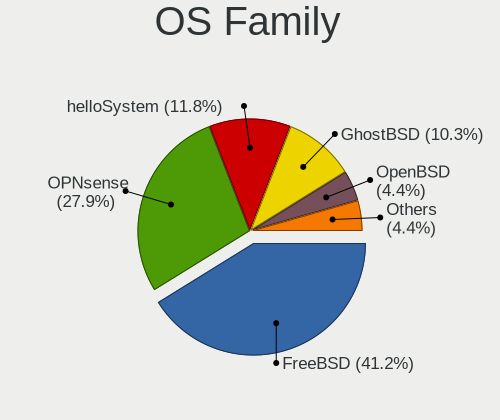

| Name        | Notebooks | Percent |
|-------------|-----------|---------|
| FreeBSD     | 23        | 44.23%  |
| OPNsense    | 14        | 26.92%  |
| helloSystem | 8         | 15.38%  |
| GhostBSD    | 4         | 7.69%   |
| OpenBSD     | 3         | 5.77%   |

Arch
----

OS architecture (x86_64, i586, etc.)

| Name  | Notebooks | Percent |
|-------|-----------|---------|
| amd64 | 49        | 100%    |

DE
--

Desktop Environment

| Name         | Notebooks | Percent |
|--------------|-----------|---------|
| Console      | 21        | 40.38%  |
| helloDesktop | 8         | 15.38%  |
| KDE5         | 5         | 9.62%   |
| MATE         | 4         | 7.69%   |
| XFCE         | 3         | 5.77%   |
| TWM          | 3         | 5.77%   |
| i3           | 3         | 5.77%   |
| fvwm         | 2         | 3.85%   |
| Openbox      | 1         | 1.92%   |
| LXDE         | 1         | 1.92%   |
| GNOME        | 1         | 1.92%   |

Display Server
--------------

X11 or Wayland

| Name    | Notebooks | Percent |
|---------|-----------|---------|
| X11     | 28        | 54.9%   |
| Console | 21        | 41.18%  |
| Wayland | 2         | 3.92%   |

Display Manager
---------------

SDDM, LightDM, etc.

| Name    | Notebooks | Percent |
|---------|-----------|---------|
| Console | 29        | 55.77%  |
| SLiM    | 14        | 26.92%  |
| LightDM | 6         | 11.54%  |
| SDDM    | 2         | 3.85%   |
| GDM     | 1         | 1.92%   |

OS Lang
-------

Language

| Lang    | Notebooks | Percent |
|---------|-----------|---------|
| Unknown | 21        | 41.18%  |
| C       | 13        | 25.49%  |
| en_US   | 9         | 17.65%  |
| de_CH   | 3         | 5.88%   |
| fr_FR   | 2         | 3.92%   |
| ru_RU   | 1         | 1.96%   |
| fi_FI   | 1         | 1.96%   |
| de_DE   | 1         | 1.96%   |

Boot Mode
---------

EFI or BIOS

| Mode | Notebooks | Percent |
|------|-----------|---------|
| EFI  | 43        | 87.76%  |
| BIOS | 6         | 12.24%  |

Filesystem
----------

Type of filesystem

| Type   | Notebooks | Percent |
|--------|-----------|---------|
| Zfs    | 31        | 60.78%  |
| Ufs    | 13        | 25.49%  |
| Cd9660 | 4         | 7.84%   |
| Ffs    | 3         | 5.88%   |

Part. scheme
------------

Scheme of partitioning

| Type    | Notebooks | Percent |
|---------|-----------|---------|
| GPT     | 46        | 93.88%  |
| MBR     | 2         | 4.08%   |
| Unknown | 1         | 2.04%   |

Board
-----

Vendor
------

Motherboard manufacturer

| Name             | Notebooks | Percent |
|------------------|-----------|---------|
| Lenovo           | 20        | 40.82%  |
| Deciso           | 8         | 16.33%  |
| ASUSTek Computer | 4         | 8.16%   |
| Dell             | 3         | 6.12%   |
| Apple            | 3         | 6.12%   |
| HUAWEI           | 2         | 4.08%   |
| Acer             | 2         | 4.08%   |
| Unknown          | 2         | 4.08%   |
| Shuttle          | 1         | 2.04%   |
| Seco             | 1         | 2.04%   |
| Panasonic        | 1         | 2.04%   |
| Hewlett-Packard  | 1         | 2.04%   |
| Casper           | 1         | 2.04%   |

Model
-----

Motherboard model

| Name                                       | Notebooks | Percent |
|--------------------------------------------|-----------|---------|
| Deciso NetBoard-A20                        | 4         | 8.16%   |
| Lenovo Yoga Slim 7 Pro 14ACH5 82MS         | 3         | 6.12%   |
| HUAWEI MACH-WX9                            | 2         | 4.08%   |
| Deciso Netboard A20                        | 2         | 4.08%   |
| Unknown                                    | 2         | 4.08%   |
| Shuttle DS77U                              | 1         | 2.04%   |
| Seco UDOO x86                              | 1         | 2.04%   |
| Panasonic CF-19ADUAX1M                     | 1         | 2.04%   |
| Lenovo Yoga 900S-12ISK 80ML                | 1         | 2.04%   |
| Lenovo Yoga 720-13IKB 81C3                 | 1         | 2.04%   |
| Lenovo Yoga 2 Pro 20266                    | 1         | 2.04%   |
| Lenovo ThinkPad X250 20CMCTO1WW            | 1         | 2.04%   |
| Lenovo ThinkPad X1 Carbon Gen 9 20XWCTO1WW | 1         | 2.04%   |
| Lenovo ThinkPad X1 Carbon Gen 8 20U9CTO1WW | 1         | 2.04%   |
| Lenovo ThinkPad X1 Carbon 4th 20FCS43F00   | 1         | 2.04%   |
| Lenovo ThinkPad X1 Carbon 3rd 20BTS09900   | 1         | 2.04%   |
| Lenovo ThinkPad W530 24411M9               | 1         | 2.04%   |
| Lenovo ThinkPad T490s 20NYS3TU00           | 1         | 2.04%   |
| Lenovo ThinkPad T490 20N2CTO1WW            | 1         | 2.04%   |
| Lenovo ThinkPad T470s W10DG 20JTS0A900     | 1         | 2.04%   |
| Lenovo ThinkPad T460p 20FW003PMZ           | 1         | 2.04%   |
| Lenovo ThinkPad T430 2349H2G               | 1         | 2.04%   |
| Lenovo ThinkPad T420 4237A12               | 1         | 2.04%   |
| Lenovo ThinkPad T14 Gen 3 21CF002UMZ       | 1         | 2.04%   |
| Lenovo IdeaPad Y700-15ISK 80NV             | 1         | 2.04%   |
| HP EliteBook 840 G3                        | 1         | 2.04%   |
| Dell XPS 15 7590                           | 1         | 2.04%   |
| Dell Precision M6600                       | 1         | 2.04%   |
| Dell Latitude E6430                        | 1         | 2.04%   |
| Deciso NetBoard-A10                        | 1         | 2.04%   |
| Deciso DEC2700 - OPNsense Appliance        | 1         | 2.04%   |
| Casper EXCALIBUR G900                      | 1         | 2.04%   |
| ASUS UX31A                                 | 1         | 2.04%   |
| ASUS N50Vc                                 | 1         | 2.04%   |
| ASUS K56CB                                 | 1         | 2.04%   |
| ASUS ASUS TUF Gaming A17 FA707RC_FA707RC   | 1         | 2.04%   |
| Apple MacBookPro9,2                        | 1         | 2.04%   |
| Apple MacBookPro5,1                        | 1         | 2.04%   |
| Apple MacBookPro10,2                       | 1         | 2.04%   |
| Acer Aspire E5-771                         | 1         | 2.04%   |

Model Family
------------

Motherboard model prefix

| Name                   | Notebooks | Percent |
|------------------------|-----------|---------|
| Lenovo ThinkPad        | 13        | 26.53%  |
| Lenovo Yoga            | 6         | 12.24%  |
| Deciso NetBoard-A20    | 4         | 8.16%   |
| HUAWEI MACH-WX9        | 2         | 4.08%   |
| Deciso Netboard        | 2         | 4.08%   |
| Acer Aspire            | 2         | 4.08%   |
| Unknown                | 2         | 4.08%   |
| Shuttle DS77U          | 1         | 2.04%   |
| Seco UDOO              | 1         | 2.04%   |
| Panasonic CF-19ADUAX1M | 1         | 2.04%   |
| Lenovo IdeaPad         | 1         | 2.04%   |
| HP EliteBook           | 1         | 2.04%   |
| Dell XPS               | 1         | 2.04%   |
| Dell Precision         | 1         | 2.04%   |
| Dell Latitude          | 1         | 2.04%   |
| Deciso NetBoard-A10    | 1         | 2.04%   |
| Deciso DEC2700         | 1         | 2.04%   |
| Casper EXCALIBUR       | 1         | 2.04%   |
| ASUS UX31A             | 1         | 2.04%   |
| ASUS N50Vc             | 1         | 2.04%   |
| ASUS K56CB             | 1         | 2.04%   |
| ASUS ASUS              | 1         | 2.04%   |
| Apple MacBookPro9      | 1         | 2.04%   |
| Apple MacBookPro5      | 1         | 2.04%   |
| Apple MacBookPro10     | 1         | 2.04%   |

MFG Year
--------

Motherboard manufacture year

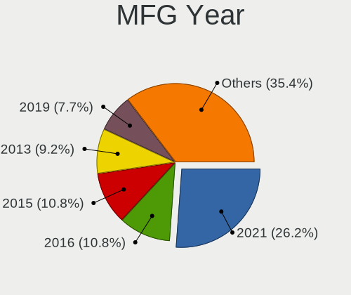

| Year | Notebooks | Percent |
|------|-----------|---------|
| 2021 | 12        | 24.49%  |
| 2015 | 5         | 10.2%   |
| 2013 | 5         | 10.2%   |
| 2019 | 4         | 8.16%   |
| 2017 | 4         | 8.16%   |
| 2016 | 4         | 8.16%   |
| 2012 | 3         | 6.12%   |
| 2011 | 3         | 6.12%   |
| 2022 | 2         | 4.08%   |
| 2020 | 2         | 4.08%   |
| 2018 | 2         | 4.08%   |
| 2023 | 1         | 2.04%   |
| 2014 | 1         | 2.04%   |
| 2009 | 1         | 2.04%   |

Form Factor
-----------

Physical design of the computer

| Name     | Notebooks | Percent |
|----------|-----------|---------|
| Notebook | 49        | 100%    |

Coreboot
--------

Have coreboot on board

| Used | Notebooks | Percent |
|------|-----------|---------|
| No   | 49        | 100%    |

RAM Size
--------

Total RAM memory

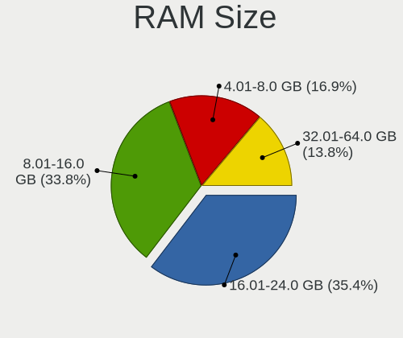

| Size in GB | Notebooks | Percent |
|------------|-----------|---------|
| 16.01-24.0 | 20        | 40.82%  |
| 8.01-16.0  | 16        | 32.65%  |
| 4.01-8.0   | 8         | 16.33%  |
| 32.01-64.0 | 5         | 10.2%   |

RAM Used
--------

Used RAM memory

| Used GB  | Notebooks | Percent |
|----------|-----------|---------|
| 0.01-0.5 | 22        | 44.9%   |
| 0.51-1.0 | 16        | 32.65%  |
| 1.01-2.0 | 8         | 16.33%  |
| 2.01-3.0 | 3         | 6.12%   |

Total Drives
------------

Number of drives on board

| Drives | Notebooks | Percent |
|--------|-----------|---------|
| 1      | 39        | 76.47%  |
| 2      | 7         | 13.73%  |
| 0      | 4         | 7.84%   |
| 4      | 1         | 1.96%   |

Has CD-ROM
----------

Has CD-ROM on board

| Presented | Notebooks | Percent |
|-----------|-----------|---------|
| No        | 41        | 83.67%  |
| Yes       | 8         | 16.33%  |

Has Ethernet
------------

Has Ethernet on board

| Presented | Notebooks | Percent |
|-----------|-----------|---------|
| Yes       | 39        | 79.59%  |
| No        | 10        | 20.41%  |

Has WiFi
--------

Has WiFi module

| Presented | Notebooks | Percent |
|-----------|-----------|---------|
| Yes       | 39        | 79.59%  |
| No        | 10        | 20.41%  |

Has Bluetooth
-------------

Has Bluetooth module

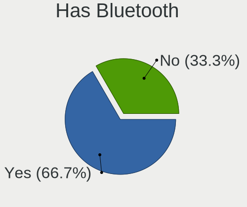

| Presented | Notebooks | Percent |
|-----------|-----------|---------|
| Yes       | 34        | 69.39%  |
| No        | 15        | 30.61%  |

Location
--------

Country
-------

Geographic location (country)

| Country     | Notebooks | Percent |
|-------------|-----------|---------|
| Switzerland | 49        | 100%    |

City
----

Geographic location (city)

| City                     | Notebooks | Percent |
|--------------------------|-----------|---------|
| Zurich                   | 21        | 36.84%  |
| Basel                    | 3         | 5.26%   |
| Therwil                  | 2         | 3.51%   |
| Munchenstein             | 2         | 3.51%   |
| Glattbrugg               | 2         | 3.51%   |
| Corcelles-pres-Payerne   | 2         | 3.51%   |
| Steckborn                | 1         | 1.75%   |
| St. Moritz               | 1         | 1.75%   |
| Seuzach Dorf             | 1         | 1.75%   |
| Riehen                   | 1         | 1.75%   |
| Onex                     | 1         | 1.75%   |
| Moosseedorf              | 1         | 1.75%   |
| Lutry                    | 1         | 1.75%   |
| Loehningen               | 1         | 1.75%   |
| Lenzburg                 | 1         | 1.75%   |
| Le Landeron              | 1         | 1.75%   |
| Lausanne                 | 1         | 1.75%   |
| Langnau am Albis         | 1         | 1.75%   |
| Kiesen                   | 1         | 1.75%   |
| Huttwil                  | 1         | 1.75%   |
| Hittnau / Hittnau (Dorf) | 1         | 1.75%   |
| Hildisrieden             | 1         | 1.75%   |
| Grenchen                 | 1         | 1.75%   |
| Fribourg                 | 1         | 1.75%   |
| Düdingen                | 1         | 1.75%   |
| Dinhard                  | 1         | 1.75%   |
| Broc                     | 1         | 1.75%   |
| Bern                     | 1         | 1.75%   |
| Belmont-sur-Lausanne     | 1         | 1.75%   |
| Aesch                    | 1         | 1.75%   |
| Adliswil                 | 1         | 1.75%   |

Drives
------

Drive Vendor
------------

Hard drive vendors

| Vendor              | Notebooks | Drives | Percent |
|---------------------|-----------|--------|---------|
| Samsung Electronics | 16        | 19     | 29.09%  |
| Transcend           | 9         | 14     | 16.36%  |
| WDC                 | 5         | 5      | 9.09%   |
| SanDisk             | 4         | 4      | 7.27%   |
| Toshiba             | 3         | 3      | 5.45%   |
| SK hynix            | 3         | 5      | 5.45%   |
| Kingston            | 3         | 3      | 5.45%   |
| Intel               | 3         | 4      | 5.45%   |
| Seagate             | 2         | 2      | 3.64%   |
| NVMe                | 2         | 2      | 3.64%   |
| Crucial             | 2         | 2      | 3.64%   |
| OCZ                 | 1         | 1      | 1.82%   |
| LITEON              | 1         | 6      | 1.82%   |
| Apple               | 1         | 1      | 1.82%   |

Drive Model
-----------

Hard drive models

| Model                                  | Notebooks | Percent |
|----------------------------------------|-----------|---------|
| Transcend TS256GMTS952T2 256GB         | 4         | 7.02%   |
| SK hynix SKHynix_HFS512GDE9X081N 512GB | 3         | 5.26%   |
| Transcend TS128GMTE110S 128GB          | 2         | 3.51%   |
| Samsung MZVLB512HAJQ-00000 512GB       | 2         | 3.51%   |
| WDC WDS240G2G0A-00JH30 240GB           | 1         | 1.75%   |
| WDC WD3200BEKT-00V5T0 320GB            | 1         | 1.75%   |
| WDC WD10SPZX-21Z10T0 1TB               | 1         | 1.75%   |
| WDC PC SN730 SDBPNTY-1T00-1101 1TB     | 1         | 1.75%   |
| WDC PC SN720 SDAQNTW-512G-1001 512GB   | 1         | 1.75%   |
| Transcend TS512GMTS952T2 512GB         | 1         | 1.75%   |
| Transcend TS256GMTE710T 256GB          | 1         | 1.75%   |
| Transcend TS256GMTE652T2 256GB         | 1         | 1.75%   |
| Toshiba TR200 240GB                    | 1         | 1.75%   |
| Toshiba THNSFJ256GCSU 256GB            | 1         | 1.75%   |
| Toshiba MK3263GSXN 320GB               | 1         | 1.75%   |
| Seagate ST2000LM007-1R8174 2TB         | 1         | 1.75%   |
| Seagate SSD 500GB                      | 1         | 1.75%   |
| SanDisk SSD U100 24GB                  | 1         | 1.75%   |
| SanDisk SSD PLUS 1000GB                | 1         | 1.75%   |
| SanDisk SD8SN8U128G1001 128GB          | 1         | 1.75%   |
| SanDisk SD5SE2256G1002E 256GB          | 1         | 1.75%   |
| Samsung SSD SM841 2.5-inch 7mm 128GB   | 1         | 1.75%   |
| Samsung SSD 870 EVO 1TB                | 1         | 1.75%   |
| Samsung SSD 860 EVO mSATA 500GB        | 1         | 1.75%   |
| Samsung SSD 860 EVO 250GB              | 1         | 1.75%   |
| Samsung SSD 860 EVO 1TB                | 1         | 1.75%   |
| Samsung SSD 850 EVO 500GB              | 1         | 1.75%   |
| Samsung SSD 850 EVO 250GB              | 1         | 1.75%   |
| Samsung SSD 850 EVO 1TB                | 1         | 1.75%   |
| Samsung SSD 840 PRO Series 256GB       | 1         | 1.75%   |
| Samsung Portable SSD T7 2TB            | 1         | 1.75%   |
| Samsung MZVLW1T0HMLH-000L7 1TB         | 1         | 1.75%   |
| Samsung MZVLB1T0HBLR-000L7 1TB         | 1         | 1.75%   |
| Samsung MZVL21T0HCLR-00BL7 1TB         | 1         | 1.75%   |
| Samsung MZMTD128HAFV-000L1 128GB       | 1         | 1.75%   |
| Samsung MZHPV512HDGL-000L1 512GB       | 1         | 1.75%   |
| Samsung MZ7TD512HAGM-000L1 512GB       | 1         | 1.75%   |
| OCZ AGILITY3 240GB                     | 1         | 1.75%   |
| NVMe SanDisk A400 SD9 256GB            | 1         | 1.75%   |
| NVMe KIOXIA-EXCERIA S 500GB            | 1         | 1.75%   |

HDD Vendor
----------

Hard disk drive vendors

| Vendor  | Notebooks | Drives | Percent |
|---------|-----------|--------|---------|
| WDC     | 2         | 2      | 33.33%  |
| NVMe    | 2         | 2      | 33.33%  |
| Toshiba | 1         | 1      | 16.67%  |
| Seagate | 1         | 1      | 16.67%  |

SSD Vendor
----------

Solid state drive vendors

| Vendor              | Notebooks | Drives | Percent |
|---------------------|-----------|--------|---------|
| Samsung Electronics | 11        | 13     | 34.38%  |
| Transcend           | 5         | 10     | 15.63%  |
| SanDisk             | 4         | 4      | 12.5%   |
| Kingston            | 3         | 3      | 9.38%   |
| Toshiba             | 2         | 2      | 6.25%   |
| WDC                 | 1         | 1      | 3.13%   |
| Seagate             | 1         | 1      | 3.13%   |
| OCZ                 | 1         | 1      | 3.13%   |
| LITEON              | 1         | 6      | 3.13%   |
| Intel               | 1         | 2      | 3.13%   |
| Crucial             | 1         | 1      | 3.13%   |
| Apple               | 1         | 1      | 3.13%   |

Drive Kind
----------

HDD or SSD

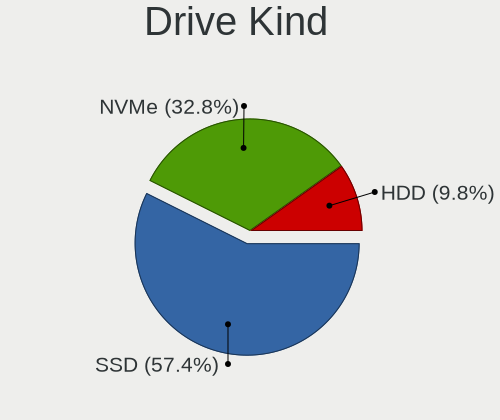

| Kind | Notebooks | Drives | Percent |
|------|-----------|--------|---------|
| SSD  | 28        | 45     | 54.9%   |
| NVMe | 17        | 20     | 33.33%  |
| HDD  | 6         | 6      | 11.76%  |

Drive Connector
---------------

SATA, SAS, NVMe, etc.

| Type | Notebooks | Drives | Percent |
|------|-----------|--------|---------|
| SATA | 31        | 51     | 64.58%  |
| NVMe | 17        | 20     | 35.42%  |

Drive Size
----------

Size of hard drive

| Size in TB | Notebooks | Drives | Percent |
|------------|-----------|--------|---------|
| 0.01-0.5   | 23        | 34     | 67.65%  |
| 0.51-1.0   | 10        | 16     | 29.41%  |
| 1.01-2.0   | 1         | 1      | 2.94%   |

Space Total
-----------

Amount of disk space available on the file system

| Size in GB | Notebooks | Percent |
|------------|-----------|---------|
| 101-250    | 20        | 39.22%  |
| 251-500    | 15        | 29.41%  |
| 1-20       | 7         | 13.73%  |
| 501-1000   | 7         | 13.73%  |
| 21-50      | 1         | 1.96%   |
| 51-100     | 1         | 1.96%   |

Space Used
----------

Amount of used disk space

| Used GB | Notebooks | Percent |
|---------|-----------|---------|
| 1-20    | 43        | 84.31%  |
| 21-50   | 4         | 7.84%   |
| 101-250 | 2         | 3.92%   |
| 51-100  | 2         | 3.92%   |

Malfunc. Drives
---------------

Drive models with a malfunction

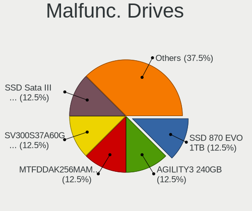

| Model                               | Notebooks | Drives | Percent |
|-------------------------------------|-----------|--------|---------|
| Samsung Electronics SSD 870 EVO 1TB | 1         | 1      | 25%     |
| OCZ AGILITY3 240GB                  | 1         | 1      | 25%     |
| Kingston SV300S37A60G 64GB          | 1         | 1      | 25%     |
| Intel SSDSCKKF256G8H 256GB          | 1         | 2      | 25%     |

Malfunc. Drive Vendor
---------------------

Vendors of faulty drives

| Vendor              | Notebooks | Drives | Percent |
|---------------------|-----------|--------|---------|
| Samsung Electronics | 1         | 1      | 25%     |
| OCZ                 | 1         | 1      | 25%     |
| Kingston            | 1         | 1      | 25%     |
| Intel               | 1         | 2      | 25%     |

Malfunc. HDD Vendor
-------------------

Vendors of faulty HDD drives

Zero info for selected period =(

Malfunc. Drive Kind
-------------------

Kinds of faulty drives

| Kind | Notebooks | Drives | Percent |
|------|-----------|--------|---------|
| SSD  | 4         | 5      | 100%    |

Failed Drives
-------------

Failed drive models

Zero info for selected period =(

Failed Drive Vendor
-------------------

Failed drive vendors

Zero info for selected period =(

Drive Status
------------

Number of failed and malfunc. drives

| Status   | Notebooks | Drives | Percent |
|----------|-----------|--------|---------|
| Works    | 43        | 64     | 87.76%  |
| Malfunc  | 4         | 5      | 8.16%   |
| Detected | 2         | 2      | 4.08%   |

Storage controller
------------------

Storage Vendor
--------------

Storage controller vendors

| Vendor                    | Notebooks | Percent |
|---------------------------|-----------|---------|
| Intel                     | 27        | 50.94%  |
| Samsung Electronics       | 7         | 13.21%  |
| AMD                       | 5         | 9.43%   |
| SK hynix                  | 4         | 7.55%   |
| Transcend                 | 3         | 5.66%   |
| SanDisk                   | 3         | 5.66%   |
| Silicon Motion            | 1         | 1.89%   |
| Nvidia                    | 1         | 1.89%   |
| Micron/Crucial Technology | 1         | 1.89%   |
| KIOXIA                    | 1         | 1.89%   |

Storage Model
-------------

Storage controller models

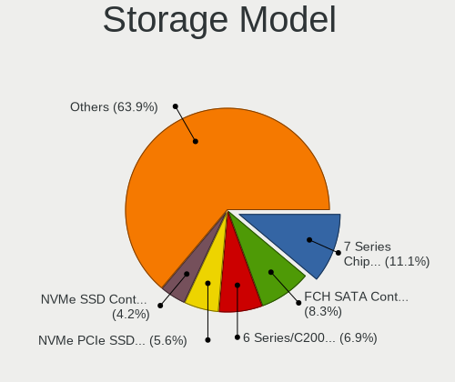

| Model                                                                            | Notebooks | Percent |
|----------------------------------------------------------------------------------|-----------|---------|
| Intel 7 Series Chipset Family 6-port SATA Controller [AHCI mode]                 | 6         | 11.32%  |
| AMD FCH SATA Controller [AHCI mode]                                              | 5         | 9.43%   |
| SK hynix Gold P31/BC711/PC711 NVMe Solid State Drive                             | 3         | 5.66%   |
| Samsung NVMe SSD Controller SM981/PM981/PM983                                    | 3         | 5.66%   |
| Intel Sunrise Point-LP SATA Controller [AHCI mode]                               | 3         | 5.66%   |
| Intel 6 Series/C200 Series Chipset Family 6 port Mobile SATA AHCI Controller     | 3         | 5.66%   |
| Transcend NVMe PCIe SSD 110S/112S/120S/MTE300S/MTE400S/MTE652T2 (DRAM-less)      | 2         | 3.77%   |
| Intel Wildcat Point-LP SATA Controller [AHCI Mode]                               | 2         | 3.77%   |
| Intel HM170/QM170 Chipset SATA Controller [AHCI Mode]                            | 2         | 3.77%   |
| Intel 82801 Mobile SATA Controller [RAID mode]                                   | 2         | 3.77%   |
| Intel 8 Series SATA Controller 1 [AHCI mode]                                     | 2         | 3.77%   |
| Transcend NVMe PCIe SSD 240S/MTE710T                                             | 1         | 1.89%   |
| SK hynix PC601 NVMe Solid State Drive                                            | 1         | 1.89%   |
| Silicon Motion SM2263EN/SM2263XT (DRAM-less) NVMe SSD Controllers                | 1         | 1.89%   |
| SanDisk WD Black NVMe SSD                                                        | 1         | 1.89%   |
| SanDisk Extreme Pro / WD Black SN750 / PC SN730 / Red SN700 NVMe SSD             | 1         | 1.89%   |
| SanDisk Extreme Pro / WD Black 2018/SN750/PC SN720 NVMe SSD                      | 1         | 1.89%   |
| Samsung S4LN058A01[SSUBX] AHCI SSD Controller (Apple slot)                       | 1         | 1.89%   |
| Samsung NVMe SSD Controller SM961/PM961/SM963                                    | 1         | 1.89%   |
| Samsung NVMe SSD Controller SM951/PM951                                          | 1         | 1.89%   |
| Samsung NVMe SSD Controller PM9A1/PM9A3/980PRO                                   | 1         | 1.89%   |
| Nvidia MCP79 AHCI Controller                                                     | 1         | 1.89%   |
| Micron/Crucial P5 NVMe PCIe SSD[SlashP5]                                         | 1         | 1.89%   |
| KIOXIA NVMe SSD                                                                  | 1         | 1.89%   |
| Intel Tiger Lake SATA AHCI Controller                                            | 1         | 1.89%   |
| Intel SSD DC P4101/Pro 7600p/760p/E 6100p Series                                 | 1         | 1.89%   |
| Intel SSD 670p Series [Keystone Harbor]                                          | 1         | 1.89%   |
| Intel Comet Lake SATA AHCI Controller                                            | 1         | 1.89%   |
| Intel Cannon Lake Mobile PCH SATA AHCI Controller                                | 1         | 1.89%   |
| Intel Atom/Celeron/Pentium Processor x5-E8000/J3xxx/N3xxx Series SATA Controller | 1         | 1.89%   |
| Intel 82801IBM/IEM (ICH9M/ICH9M-E) 4 port SATA Controller [AHCI mode]            | 1         | 1.89%   |

Storage Kind
------------

Kind of storage controller (IDE, SATA, NVMe, SAS, ...)

| Kind | Notebooks | Percent |
|------|-----------|---------|
| SATA | 30        | 57.69%  |
| NVMe | 20        | 38.46%  |
| RAID | 2         | 3.85%   |

Processor
---------

CPU Vendor
----------

Processor vendors

| Vendor | Notebooks | Percent |
|--------|-----------|---------|
| Intel  | 36        | 73.47%  |
| AMD    | 13        | 26.53%  |

CPU Model
---------

Processor models

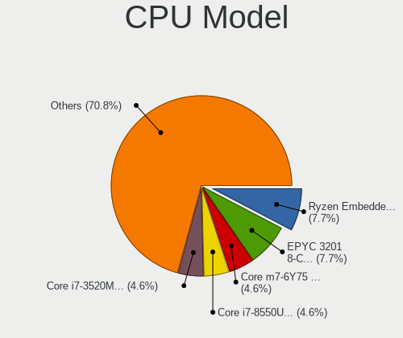

| Model                                      | Notebooks | Percent |
|--------------------------------------------|-----------|---------|
| AMD Ryzen 7 5800H with Radeon Graphics     | 3         | 6.12%   |
| AMD EPYC 3201 8-Core Processor             | 3         | 6.12%   |
| AMD EPYC 3101 4-Core Processor             | 3         | 6.12%   |
| Intel Core i7-8550U CPU @ 1.80GHz          | 2         | 4.08%   |
| Intel Core i7-3520M CPU @ 2.90GHz          | 2         | 4.08%   |
| Intel Core i5-6300U CPU @ 2.40GHz          | 2         | 4.08%   |
| Intel Core i5-3317U CPU @ 1.70GHz          | 2         | 4.08%   |
| Intel Core i5-2520M CPU @ 2.50GHz          | 2         | 4.08%   |
| AMD Ryzen Embedded V1500B                  | 2         | 4.08%   |
| Intel Core m7-6Y75 CPU @ 1.20GHz           | 1         | 2.04%   |
| Intel Core i7-9750H CPU @ 2.60GHz          | 1         | 2.04%   |
| Intel Core i7-8665U CPU @ 1.90GHz          | 1         | 2.04%   |
| Intel Core i7-8565U CPU @ 1.80GHz          | 1         | 2.04%   |
| Intel Core i7-6820HQ CPU @ 2.70GHz         | 1         | 2.04%   |
| Intel Core i7-6700HQ CPU @ 2.60GHz         | 1         | 2.04%   |
| Intel Core i7-6600U CPU @ 2.60GHz          | 1         | 2.04%   |
| Intel Core i7-5600U CPU @ 2.60GHz          | 1         | 2.04%   |
| Intel Core i7-5500U CPU @ 2.40GHz          | 1         | 2.04%   |
| Intel Core i7-4500U CPU @ 1.80GHz          | 1         | 2.04%   |
| Intel Core i7-3840QM CPU @ 2.80GHz         | 1         | 2.04%   |
| Intel Core i7-2720QM CPU @ 2.20GH          | 1         | 2.04%   |
| Intel Core i5-8250U CPU @ 1.60GHz          | 1         | 2.04%   |
| Intel Core i5-5200U CPU @ 2.20GHz          | 1         | 2.04%   |
| Intel Core i5-3340M CPU @ 2.70GHz          | 1         | 2.04%   |
| Intel Core i5-3320M CPU @ 2.60GHz          | 1         | 2.04%   |
| Intel Core i5-3210M CPU @ 2.50GHz          | 1         | 2.04%   |
| Intel Core i5-10310U CPU @ 1.70GHz         | 1         | 2.04%   |
| Intel Core i5-10210U CPU @ 1.60GHz         | 1         | 2.04%   |
| Intel Core i3-7100U CPU @ 2.40GHz          | 1         | 2.04%   |
| Intel Core 2 Duo CPU T9600 @ 2.80GHz       | 1         | 2.04%   |
| Intel Core 2 Duo CPU P8400 @ 2.26GHz       | 1         | 2.04%   |
| Intel Celeron CPU N3160 @ 1.60GHz          | 1         | 2.04%   |
| Intel Celeron 2955U @ 1.40GHz              | 1         | 2.04%   |
| Intel 11th Gen Core i7-1185G7 @ 3.00GHz    | 1         | 2.04%   |
| Intel 11th Gen Core i7-11800H @ 2.30GHz    | 1         | 2.04%   |
| AMD Ryzen 7 PRO 6850U with Radeon Graphics | 1         | 2.04%   |
| AMD Ryzen 7 6800H with Radeon Graphics     | 1         | 2.04%   |

CPU Model Family
----------------

Processor model prefix

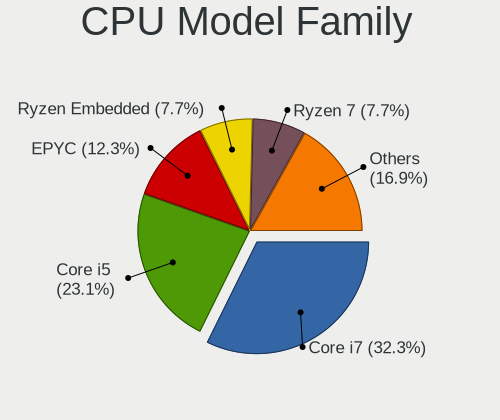

| Model              | Notebooks | Percent |
|--------------------|-----------|---------|
| Intel Core i7      | 15        | 30.61%  |
| Intel Core i5      | 13        | 26.53%  |
| AMD EPYC           | 6         | 12.24%  |
| AMD Ryzen 7        | 4         | 8.16%   |
| Other              | 2         | 4.08%   |
| Intel Core 2 Duo   | 2         | 4.08%   |
| Intel Celeron      | 2         | 4.08%   |
| AMD Ryzen Embedded | 2         | 4.08%   |
| Intel Core m7      | 1         | 2.04%   |
| Intel Core i3      | 1         | 2.04%   |
| AMD Ryzen 7 PRO    | 1         | 2.04%   |

CPU Cores
---------

Number of processor cores

| Number  | Notebooks | Percent |
|---------|-----------|---------|
| 2       | 20        | 40.82%  |
| 4       | 16        | 32.65%  |
| 8       | 6         | 12.24%  |
| 16      | 5         | 10.2%   |
| 6       | 1         | 2.04%   |
| Unknown | 1         | 2.04%   |

CPU Sockets
-----------

Number of sockets

| Number | Notebooks | Percent |
|--------|-----------|---------|
| 1      | 48        | 97.96%  |
| 2      | 1         | 2.04%   |

CPU Threads
-----------

Threads per core (Hyper-Threading)

| Number  | Notebooks | Percent |
|---------|-----------|---------|
| 2       | 32        | 65.31%  |
| 1       | 16        | 32.65%  |
| Unknown | 1         | 2.04%   |

CPU Microarch
-------------

Microarchitecture

| Name        | Notebooks | Percent |
|-------------|-----------|---------|
| KabyLake    | 9         | 18.37%  |
| Zen         | 8         | 16.33%  |
| IvyBridge   | 8         | 16.33%  |
| Skylake     | 6         | 12.24%  |
| Zen 3       | 3         | 6.12%   |
| SandyBridge | 3         | 6.12%   |
| Broadwell   | 3         | 6.12%   |
| Unknown     | 3         | 6.12%   |
| Penryn      | 2         | 4.08%   |
| Haswell     | 2         | 4.08%   |
| TigerLake   | 1         | 2.04%   |
| Silvermont  | 1         | 2.04%   |

Graphics
--------

GPU Vendor
----------

Vendors of graphics cards

| Vendor | Notebooks | Percent |
|--------|-----------|---------|
| Intel  | 33        | 68.75%  |
| Nvidia | 9         | 18.75%  |
| AMD    | 6         | 12.5%   |

GPU Model
---------

Graphics card models

| Model                                                                                    | Notebooks | Percent |
|------------------------------------------------------------------------------------------|-----------|---------|
| Intel 3rd Gen Core processor Graphics Controller                                         | 8         | 16.33%  |
| Intel UHD Graphics 620                                                                   | 3         | 6.12%   |
| Intel Skylake GT2 [HD Graphics 520]                                                      | 3         | 6.12%   |
| Intel HD Graphics 5500                                                                   | 3         | 6.12%   |
| AMD Cezanne [Radeon Vega Series / Radeon Vega Mobile Series]                             | 3         | 6.12%   |
| Nvidia GP108M [GeForce MX150]                                                            | 2         | 4.08%   |
| Intel WhiskeyLake-U GT2 [UHD Graphics 620]                                               | 2         | 4.08%   |
| Intel HD Graphics 530                                                                    | 2         | 4.08%   |
| Intel Haswell-ULT Integrated Graphics Controller                                         | 2         | 4.08%   |
| Intel CometLake-U GT2 [UHD Graphics]                                                     | 2         | 4.08%   |
| Intel 2nd Generation Core Processor Family Integrated Graphics Controller                | 2         | 4.08%   |
| AMD Rembrandt [Radeon 680M]                                                              | 2         | 4.08%   |
| Nvidia TU117M [GeForce GTX 1650 Mobile / Max-Q]                                          | 1         | 2.04%   |
| Nvidia GM108M [GeForce 940MX]                                                            | 1         | 2.04%   |
| Nvidia GK107M [GeForce GT 740M]                                                          | 1         | 2.04%   |
| Nvidia GA107M [GeForce RTX 3050 Mobile]                                                  | 1         | 2.04%   |
| Nvidia GA106M [GeForce RTX 3060 Mobile / Max-Q]                                          | 1         | 2.04%   |
| Nvidia G98M [GeForce 9300M GS]                                                           | 1         | 2.04%   |
| Nvidia G96CM [GeForce 9600M GT]                                                          | 1         | 2.04%   |
| Nvidia C79 [GeForce 9400M]                                                               | 1         | 2.04%   |
| Intel TigerLake-LP GT2 [Iris Xe Graphics]                                                | 1         | 2.04%   |
| Intel TigerLake-H GT1 [UHD Graphics]                                                     | 1         | 2.04%   |
| Intel HD Graphics 620                                                                    | 1         | 2.04%   |
| Intel HD Graphics 515                                                                    | 1         | 2.04%   |
| Intel CoffeeLake-H GT2 [UHD Graphics 630]                                                | 1         | 2.04%   |
| Intel Atom/Celeron/Pentium Processor x5-E8000/J3xxx/N3xxx Integrated Graphics Controller | 1         | 2.04%   |
| AMD Blackcomb [Radeon HD 6970M/6990M]                                                    | 1         | 2.04%   |

GPU Combo
---------

Combinations of graphics cards

| Name           | Notebooks | Percent |
|----------------|-----------|---------|
| 1 x Intel      | 27        | 55.1%   |
| Other          | 8         | 16.33%  |
| Intel + Nvidia | 6         | 12.24%  |
| 1 x AMD        | 5         | 10.2%   |
| 2 x Nvidia     | 1         | 2.04%   |
| 1 x Nvidia     | 1         | 2.04%   |
| AMD + Nvidia   | 1         | 2.04%   |

GPU Driver
----------

Free vs proprietary

| Driver      | Notebooks | Percent |
|-------------|-----------|---------|
| Free        | 37        | 75.51%  |
| Unknown     | 10        | 20.41%  |
| Proprietary | 2         | 4.08%   |

GPU Memory
----------

Total video memory

| Size in GB | Notebooks | Percent |
|------------|-----------|---------|
| Unknown    | 46        | 90.2%   |
| 1.01-2.0   | 3         | 5.88%   |
| 0.01-0.5   | 2         | 3.92%   |

Monitor
-------

Monitor Vendor
--------------

Monitor vendors

| Vendor                  | Notebooks | Percent |
|-------------------------|-----------|---------|
| AU Optronics            | 8         | 29.63%  |
| LG Display              | 3         | 11.11%  |
| Chimei Innolux          | 3         | 11.11%  |
| Sharp                   | 2         | 7.41%   |
| Samsung Electronics     | 2         | 7.41%   |
| JDI                     | 2         | 7.41%   |
| CSO                     | 2         | 7.41%   |
| Apple                   | 2         | 7.41%   |
| Dell                    | 1         | 3.7%    |
| Chi Mei Optoelectronics | 1         | 3.7%    |
| BOE                     | 1         | 3.7%    |

Monitor Model
-------------

Monitor models

| Model                                                                    | Notebooks | Percent |
|--------------------------------------------------------------------------|-----------|---------|
| JDI LCD Monitor JDI422A 3000x2000 290x200mm 13.9-inch                    | 2         | 7.41%   |
| CSO LCD Monitor CSO1402 2880x1800 300x190mm 14.0-inch                    | 2         | 7.41%   |
| Chimei Innolux LCD Monitor CMN14F2 1920x1080 310x170mm 13.9-inch         | 2         | 7.41%   |
| Sharp LCD Monitor SHP1457 2560x1440 280x160mm 12.7-inch                  | 1         | 3.7%    |
| Sharp LCD Monitor SHP143A 3840x2160 350x190mm 15.7-inch                  | 1         | 3.7%    |
| Samsung Electronics LCD Monitor SDC424A 3200x1800 290x170mm 13.2-inch    | 1         | 3.7%    |
| Samsung Electronics CF791 SAM0DC3 3440x1440 800x330mm 34.1-inch          | 1         | 3.7%    |
| LG Display LCD Monitor LGD0437 1920x1080 280x160mm 12.7-inch             | 1         | 3.7%    |
| LG Display LCD Monitor LGD0430 1366x768 350x190mm 15.7-inch              | 1         | 3.7%    |
| LG Display LCD Monitor LGD0419 2560x1440 310x170mm 13.9-inch             | 1         | 3.7%    |
| Dell P2715Q DEL40BD 3840x2160 600x340mm 27.2-inch                        | 1         | 3.7%    |
| Chimei Innolux LCD Monitor CMN1348 1920x1080 280x160mm 12.7-inch         | 1         | 3.7%    |
| Chi Mei Optoelectronics LCD Monitor CMO1561 1280x800 330x210mm 15.4-inch | 1         | 3.7%    |
| BOE LCD Monitor BOE0910 1920x1080 340x190mm 15.3-inch                    | 1         | 3.7%    |
| AU Optronics LCD Monitor AUOD291 1920x1200 300x190mm 14.0-inch           | 1         | 3.7%    |
| AU Optronics LCD Monitor AUO45EC 1366x768 340x190mm 15.3-inch            | 1         | 3.7%    |
| AU Optronics LCD Monitor AUO313C 1366x768 310x170mm 13.9-inch            | 1         | 3.7%    |
| AU Optronics LCD Monitor AUO243D 1920x1080 310x170mm 13.9-inch           | 1         | 3.7%    |
| AU Optronics LCD Monitor AUO213E 1600x900 310x170mm 13.9-inch            | 1         | 3.7%    |
| AU Optronics LCD Monitor AUO159D 1920x1080 380x210mm 17.1-inch           | 1         | 3.7%    |
| AU Optronics LCD Monitor AUO123D 1920x1080 310x170mm 13.9-inch           | 1         | 3.7%    |
| AU Optronics LCD Monitor AUO11ED 1920x1080 340x190mm 15.3-inch           | 1         | 3.7%    |
| Apple LCD Monitor APP9C84 1440x900 330x210mm 15.4-inch                   | 1         | 3.7%    |
| Apple Color LCD APPA014 2560x1600 290x180mm 13.4-inch                    | 1         | 3.7%    |

Monitor Resolution
------------------

Monitor screen resolution

| Resolution        | Notebooks | Percent |
|-------------------|-----------|---------|
| 1920x1080 (FHD)   | 9         | 33.33%  |
| 1366x768 (WXGA)   | 3         | 11.11%  |
| 3840x2160 (4K)    | 2         | 7.41%   |
| 3000x2000         | 2         | 7.41%   |
| 2880x1800         | 2         | 7.41%   |
| 2560x1440 (QHD)   | 2         | 7.41%   |
| 3440x1440         | 1         | 3.7%    |
| 3200x1800 (QHD+)  | 1         | 3.7%    |
| 2560x1600         | 1         | 3.7%    |
| 1920x1200 (WUXGA) | 1         | 3.7%    |
| 1600x900 (HD+)    | 1         | 3.7%    |
| 1440x900 (WXGA+)  | 1         | 3.7%    |
| 1280x800 (WXGA)   | 1         | 3.7%    |

Monitor Diagonal
----------------

Diagonal size in inches

| Inches | Notebooks | Percent |
|--------|-----------|---------|
| 13     | 11        | 40.74%  |
| 15     | 7         | 25.93%  |
| 14     | 3         | 11.11%  |
| 12     | 3         | 11.11%  |
| 34     | 1         | 3.7%    |
| 27     | 1         | 3.7%    |
| 17     | 1         | 3.7%    |

Monitor Width
-------------

Physical width

| Width in mm | Notebooks | Percent |
|-------------|-----------|---------|
| 301-350     | 14        | 51.85%  |
| 201-300     | 10        | 37.04%  |
| 701-800     | 1         | 3.7%    |
| 501-600     | 1         | 3.7%    |
| 351-400     | 1         | 3.7%    |

Aspect Ratio
------------

Proportional relationship between the width and the height

| Ratio | Notebooks | Percent |
|-------|-----------|---------|
| 16/9  | 18        | 66.67%  |
| 16/10 | 6         | 22.22%  |
| 4/3   | 2         | 7.41%   |
| 21/9  | 1         | 3.7%    |

Monitor Area
------------

Area in inch²

| Area in inch² | Notebooks | Percent |
|----------------|-----------|---------|
| 81-90          | 13        | 48.15%  |
| 101-110        | 4         | 14.81%  |
| 61-70          | 3         | 11.11%  |
| 91-100         | 3         | 11.11%  |
| 71-80          | 1         | 3.7%    |
| 351-500        | 1         | 3.7%    |
| 301-350        | 1         | 3.7%    |
| 121-130        | 1         | 3.7%    |

Pixel Density
-------------

Pixels per inch

| Density       | Notebooks | Percent |
|---------------|-----------|---------|
| 121-160       | 8         | 29.63%  |
| 161-240       | 7         | 25.93%  |
| More than 240 | 6         | 22.22%  |
| 101-120       | 4         | 14.81%  |
| 51-100        | 2         | 7.41%   |

Multiple Monitors
-----------------

Total monitors connected

| Total | Notebooks | Percent |
|-------|-----------|---------|
| 1     | 25        | 48.08%  |
| 0     | 25        | 48.08%  |
| 2     | 2         | 3.85%   |

Network
-------

Net Controller Vendor
---------------------

Controller vendors

| Vendor                            | Notebooks | Percent |
|-----------------------------------|-----------|---------|
| Intel                             | 37        | 47.44%  |
| Realtek Semiconductor             | 12        | 15.38%  |
| AMD                               | 8         | 10.26%  |
| Broadcom                          | 6         | 7.69%   |
| Qualcomm Atheros                  | 3         | 3.85%   |
| TP-Link                           | 2         | 2.56%   |
| Sierra Wireless                   | 2         | 2.56%   |
| MediaTek                          | 2         | 2.56%   |
| Samsung Electronics               | 1         | 1.28%   |
| Ralink Technology                 | 1         | 1.28%   |
| Qualcomm Technologies             | 1         | 1.28%   |
| Nvidia                            | 1         | 1.28%   |
| Motorola PCS                      | 1         | 1.28%   |
| Ericsson Business Mobile Networks | 1         | 1.28%   |

Net Controller Model
--------------------

Controller models

| Model                                                                  | Notebooks | Percent |
|------------------------------------------------------------------------|-----------|---------|
| Realtek RTL8111/8168/8211/8411 PCI Express Gigabit Ethernet Controller | 8         | 8.16%   |
| AMD XGMAC 10GbE Controller                                             | 8         | 8.16%   |
| Intel I210 Gigabit Network Connection                                  | 6         | 6.12%   |
| Intel 82579LM Gigabit Network Connection (Lewisville)                  | 6         | 6.12%   |
| Intel Ethernet Connection I219-LM                                      | 4         | 4.08%   |
| Realtek RTL8852AE 802.11ax PCIe Wireless Network Adapter               | 3         | 3.06%   |
| Intel Wireless 8265 / 8275                                             | 3         | 3.06%   |
| Intel Wireless 8260                                                    | 3         | 3.06%   |
| Intel Wireless 7265                                                    | 3         | 3.06%   |
| Intel Centrino Advanced-N 6205 [Taylor Peak]                           | 3         | 3.06%   |
| Sierra Wireless EM7455                                                 | 2         | 2.04%   |
| Intel Wi-Fi 6 AX200                                                    | 2         | 2.04%   |
| Intel I211 Gigabit Network Connection                                  | 2         | 2.04%   |
| Intel Centrino Ultimate-N 6300                                         | 2         | 2.04%   |
| Intel Cannon Point-LP CNVi [Wireless-AC]                               | 2         | 2.04%   |
| Broadcom NetXtreme BCM57786 Gigabit Ethernet PCIe                      | 2         | 2.04%   |
| Broadcom BCM4331 802.11a/b/g/n                                         | 2         | 2.04%   |
| TP-Link TL-WN823N v2/v3 [Realtek RTL8192EU]                            | 1         | 1.02%   |
| TP-Link AC600 wireless Realtek RTL8811AU [Archer T2U Nano]             | 1         | 1.02%   |
| Samsung Galaxy series, misc. (tethering mode)                          | 1         | 1.02%   |
| Realtek RTL8814AU 802.11a/b/g/n/ac Wireless Adapter                    | 1         | 1.02%   |
| Realtek RTL8188EUS 802.11n Wireless Network Adapter                    | 1         | 1.02%   |
| Realtek RTL8188EE Wireless Network Adapter                             | 1         | 1.02%   |
| Ralink RT2501/RT2573 Wireless Adapter                                  | 1         | 1.02%   |
| Qualcomm QCNFA765 Wireless Network Adapter                             | 1         | 1.02%   |
| Qualcomm Atheros QCA9565 / AR9565 Wireless Network Adapter             | 1         | 1.02%   |
| Qualcomm Atheros AR9485 Wireless Network Adapter                       | 1         | 1.02%   |
| Qualcomm Atheros AR9285 Wireless Network Adapter (PCI-Express)         | 1         | 1.02%   |
| Nvidia MCP79 Ethernet                                                  | 1         | 1.02%   |
| Motorola PCS USB RNDIS Device                                          | 1         | 1.02%   |
| MediaTek MT7921 802.11ax PCI Express Wireless Network Adapter          | 1         | 1.02%   |
| MediaTek 802.11 n WLAN                                                 | 1         | 1.02%   |
| Intel Wireless 7260                                                    | 1         | 1.02%   |
| Intel WiFi Link 5100                                                   | 1         | 1.02%   |
| Intel Wi-Fi 6 AX201                                                    | 1         | 1.02%   |
| Intel Tiger Lake PCH CNVi WiFi                                         | 1         | 1.02%   |
| Intel Ethernet Controller I225-V                                       | 1         | 1.02%   |
| Intel Ethernet Connection (6) I219-V                                   | 1         | 1.02%   |
| Intel Ethernet Connection (6) I219-LM                                  | 1         | 1.02%   |
| Intel Ethernet Connection (3) I218-V                                   | 1         | 1.02%   |

Wireless Vendor
---------------

Wireless vendors

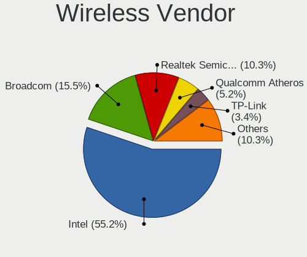

| Vendor                | Notebooks | Percent |
|-----------------------|-----------|---------|
| Intel                 | 25        | 53.19%  |
| Realtek Semiconductor | 6         | 12.77%  |
| Broadcom              | 5         | 10.64%  |
| Qualcomm Atheros      | 3         | 6.38%   |
| TP-Link               | 2         | 4.26%   |
| Sierra Wireless       | 2         | 4.26%   |
| MediaTek              | 2         | 4.26%   |
| Ralink Technology     | 1         | 2.13%   |
| Qualcomm Technologies | 1         | 2.13%   |

Wireless Model
--------------

Wireless models

| Model                                                          | Notebooks | Percent |
|----------------------------------------------------------------|-----------|---------|
| Realtek RTL8852AE 802.11ax PCIe Wireless Network Adapter       | 3         | 6.38%   |
| Intel Wireless 8265 / 8275                                     | 3         | 6.38%   |
| Intel Wireless 8260                                            | 3         | 6.38%   |
| Intel Wireless 7265                                            | 3         | 6.38%   |
| Intel Centrino Advanced-N 6205 [Taylor Peak]                   | 3         | 6.38%   |
| Sierra Wireless EM7455                                         | 2         | 4.26%   |
| Intel Wi-Fi 6 AX200                                            | 2         | 4.26%   |
| Intel Centrino Ultimate-N 6300                                 | 2         | 4.26%   |
| Intel Cannon Point-LP CNVi [Wireless-AC]                       | 2         | 4.26%   |
| Broadcom BCM4331 802.11a/b/g/n                                 | 2         | 4.26%   |
| TP-Link TL-WN823N v2/v3 [Realtek RTL8192EU]                    | 1         | 2.13%   |
| TP-Link AC600 wireless Realtek RTL8811AU [Archer T2U Nano]     | 1         | 2.13%   |
| Realtek RTL8814AU 802.11a/b/g/n/ac Wireless Adapter            | 1         | 2.13%   |
| Realtek RTL8188EUS 802.11n Wireless Network Adapter            | 1         | 2.13%   |
| Realtek RTL8188EE Wireless Network Adapter                     | 1         | 2.13%   |
| Ralink RT2501/RT2573 Wireless Adapter                          | 1         | 2.13%   |
| Qualcomm QCNFA765 Wireless Network Adapter                     | 1         | 2.13%   |
| Qualcomm Atheros QCA9565 / AR9565 Wireless Network Adapter     | 1         | 2.13%   |
| Qualcomm Atheros AR9485 Wireless Network Adapter               | 1         | 2.13%   |
| Qualcomm Atheros AR9285 Wireless Network Adapter (PCI-Express) | 1         | 2.13%   |
| MediaTek MT7921 802.11ax PCI Express Wireless Network Adapter  | 1         | 2.13%   |
| MediaTek 802.11 n WLAN                                         | 1         | 2.13%   |
| Intel Wireless 7260                                            | 1         | 2.13%   |
| Intel WiFi Link 5100                                           | 1         | 2.13%   |
| Intel Wi-Fi 6 AX201                                            | 1         | 2.13%   |
| Intel Tiger Lake PCH CNVi WiFi                                 | 1         | 2.13%   |
| Intel Dual Band Wireless-AC 3165 Plus Bluetooth                | 1         | 2.13%   |
| Intel Comet Lake PCH-LP CNVi WiFi                              | 1         | 2.13%   |
| Intel Centrino Advanced-N 6235                                 | 1         | 2.13%   |
| Broadcom BCM4350 802.11ac Wireless Network Adapter             | 1         | 2.13%   |
| Broadcom BCM4322 802.11a/b/g/n Wireless LAN Controller         | 1         | 2.13%   |
| Broadcom BCM4313 802.11bgn Wireless Network Adapter            | 1         | 2.13%   |

Ethernet Vendor
---------------

Ethernet vendors

| Vendor                | Notebooks | Percent |
|-----------------------|-----------|---------|
| Intel                 | 25        | 53.19%  |
| Realtek Semiconductor | 8         | 17.02%  |
| AMD                   | 8         | 17.02%  |
| Broadcom              | 3         | 6.38%   |
| Samsung Electronics   | 1         | 2.13%   |
| Nvidia                | 1         | 2.13%   |
| Motorola PCS          | 1         | 2.13%   |

Ethernet Model
--------------

Ethernet models

| Model                                                                  | Notebooks | Percent |
|------------------------------------------------------------------------|-----------|---------|
| Realtek RTL8111/8168/8211/8411 PCI Express Gigabit Ethernet Controller | 8         | 16.33%  |
| AMD XGMAC 10GbE Controller                                             | 8         | 16.33%  |
| Intel I210 Gigabit Network Connection                                  | 6         | 12.24%  |
| Intel 82579LM Gigabit Network Connection (Lewisville)                  | 6         | 12.24%  |
| Intel Ethernet Connection I219-LM                                      | 4         | 8.16%   |
| Intel I211 Gigabit Network Connection                                  | 2         | 4.08%   |
| Broadcom NetXtreme BCM57786 Gigabit Ethernet PCIe                      | 2         | 4.08%   |
| Samsung Galaxy series, misc. (tethering mode)                          | 1         | 2.04%   |
| Nvidia MCP79 Ethernet                                                  | 1         | 2.04%   |
| Motorola PCS USB RNDIS Device                                          | 1         | 2.04%   |
| Intel Ethernet Controller I225-V                                       | 1         | 2.04%   |
| Intel Ethernet Connection (6) I219-V                                   | 1         | 2.04%   |
| Intel Ethernet Connection (6) I219-LM                                  | 1         | 2.04%   |
| Intel Ethernet Connection (3) I218-V                                   | 1         | 2.04%   |
| Intel Ethernet Connection (3) I218-LM                                  | 1         | 2.04%   |
| Intel Ethernet Connection (2) I219-LM                                  | 1         | 2.04%   |
| Intel Ethernet Connection (10) I219-LM                                 | 1         | 2.04%   |
| Intel 82574L Gigabit Network Connection                                | 1         | 2.04%   |
| Broadcom NetXtreme BCM57765 Gigabit Ethernet PCIe                      | 1         | 2.04%   |
| Broadcom NetXtreme BCM57762 Gigabit Ethernet PCIe                      | 1         | 2.04%   |

Net Controller Kind
-------------------

Ethernet, WiFi or modem

| Kind     | Notebooks | Percent |
|----------|-----------|---------|
| WiFi     | 39        | 48.75%  |
| Ethernet | 39        | 48.75%  |
| Modem    | 2         | 2.5%    |

Used Controller
---------------

Currently used network controller

| Kind     | Notebooks | Percent |
|----------|-----------|---------|
| Ethernet | 33        | 56.9%   |
| WiFi     | 25        | 43.1%   |

NICs
----

Total network controllers on board

| Total | Notebooks | Percent |
|-------|-----------|---------|
| 2     | 23        | 46.94%  |
| 1     | 13        | 26.53%  |
| 6     | 7         | 14.29%  |
| 3     | 3         | 6.12%   |
| 5     | 2         | 4.08%   |
| 4     | 1         | 2.04%   |

IPv6
----

IPv6 vs IPv4

| Used | Notebooks | Percent |
|------|-----------|---------|
| No   | 39        | 78%     |
| Yes  | 11        | 22%     |

Bluetooth
---------

Bluetooth Vendor
----------------

Controller vendors

| Vendor                  | Notebooks | Percent |
|-------------------------|-----------|---------|
| Intel                   | 16        | 47.06%  |
| Realtek Semiconductor   | 3         | 8.82%   |
| Apple                   | 3         | 8.82%   |
| IMC Networks            | 2         | 5.88%   |
| Broadcom                | 2         | 5.88%   |
| ASUSTek Computer        | 2         | 5.88%   |
| USI                     | 1         | 2.94%   |
| Lite-On Technology      | 1         | 2.94%   |
| Foxconn / Hon Hai       | 1         | 2.94%   |
| Dell                    | 1         | 2.94%   |
| Cambridge Silicon Radio | 1         | 2.94%   |
| Alps Electric           | 1         | 2.94%   |

Bluetooth Model
---------------

Controller models

| Model                                                       | Notebooks | Percent |
|-------------------------------------------------------------|-----------|---------|
| Intel Bluetooth wireless interface                          | 9         | 26.47%  |
| Realtek Bluetooth Adapter                                   | 3         | 8.82%   |
| Intel AX201 Bluetooth                                       | 3         | 8.82%   |
| Intel AX200 Bluetooth                                       | 2         | 5.88%   |
| Apple Bluetooth Host Controller                             | 2         | 5.88%   |
| USI Qualcomm WCN685x Bluetooth Adapter                      | 1         | 2.94%   |
| Lite-On Atheros AR3012 Bluetooth                            | 1         | 2.94%   |
| Intel Centrino Bluetooth Wireless Transceiver               | 1         | 2.94%   |
| Intel Bluetooth 9460/9560 Jefferson Peak (JfP)              | 1         | 2.94%   |
| IMC Networks MediaTek Bluetooth Adapter                     | 1         | 2.94%   |
| IMC Networks Atheros AR3012 Bluetooth 4.0 Adapter           | 1         | 2.94%   |
| Foxconn / Hon Hai Qualcomm Atheros AR3011 Bluetooth Adapter | 1         | 2.94%   |
| Dell Dell Wireless 380 Bluetooth 4.0 Module                 | 1         | 2.94%   |
| Cambridge Silicon Radio Bluetooth Dongle (HCI mode)         | 1         | 2.94%   |
| Broadcom Bluetooth 4.1 USB                                  | 1         | 2.94%   |
| Broadcom BCM20702 Bluetooth 4.0 [ThinkPad]                  | 1         | 2.94%   |
| ASUS USB-BT500                                              | 1         | 2.94%   |
| ASUS BT-253 Bluetooth Adapter                               | 1         | 2.94%   |
| Apple Broadcom Built-in Bluetooth                           | 1         | 2.94%   |
| Alps Electric UGTZ4 Bluetooth                               | 1         | 2.94%   |

Sound
-----

Sound Vendor
------------

Sound card vendors

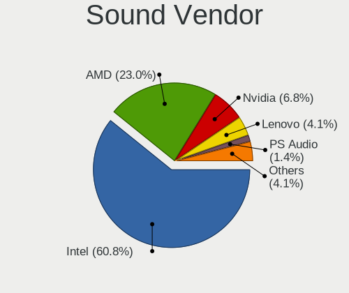

| Vendor           | Notebooks | Percent |
|------------------|-----------|---------|
| Intel            | 35        | 63.64%  |
| AMD              | 12        | 21.82%  |
| Nvidia           | 3         | 5.45%   |
| Lenovo           | 2         | 3.64%   |
| PS Audio         | 1         | 1.82%   |
| GN Netcom        | 1         | 1.82%   |
| ASUSTek Computer | 1         | 1.82%   |

Sound Model
-----------

Sound card models

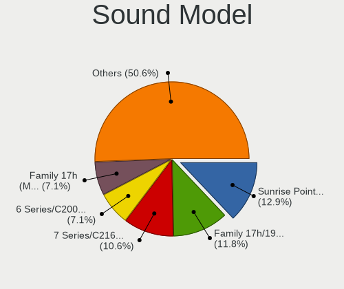

| Model                                                                                             | Notebooks | Percent |
|---------------------------------------------------------------------------------------------------|-----------|---------|
| Intel Sunrise Point-LP HD Audio                                                                   | 8         | 12.5%   |
| Intel 7 Series/C216 Chipset Family High Definition Audio Controller                               | 7         | 10.94%  |
| AMD Family 17h/19h HD Audio Controller                                                            | 6         | 9.38%   |
| AMD Family 17h (Models 00h-0fh) HD Audio Controller                                               | 5         | 7.81%   |
| Intel 6 Series/C200 Series Chipset Family High Definition Audio Controller                        | 4         | 6.25%   |
| Intel Wildcat Point-LP High Definition Audio Controller                                           | 3         | 4.69%   |
| Intel Broadwell-U Audio Controller                                                                | 3         | 4.69%   |
| AMD Renoir Radeon High Definition Audio Controller                                                | 3         | 4.69%   |
| Lenovo Lenovo USB-C Mini Dock                                                                     | 2         | 3.13%   |
| Intel Haswell-ULT HD Audio Controller                                                             | 2         | 3.13%   |
| Intel Comet Lake PCH-LP cAVS                                                                      | 2         | 3.13%   |
| Intel Cannon Point-LP High Definition Audio Controller                                            | 2         | 3.13%   |
| Intel 8 Series HD Audio Controller                                                                | 2         | 3.13%   |
| Intel 100 Series/C230 Series Chipset Family HD Audio Controller                                   | 2         | 3.13%   |
| PS Audio PS Audio USB Audio 2.0                                                                   | 1         | 1.56%   |
| Nvidia MCP79 High Definition Audio                                                                | 1         | 1.56%   |
| Nvidia GA106 High Definition Audio Controller                                                     | 1         | 1.56%   |
| Intel Tiger Lake-LP Smart Sound Technology Audio Controller                                       | 1         | 1.56%   |
| Intel Tiger Lake-H HD Audio Controller                                                            | 1         | 1.56%   |
| Intel Cannon Lake PCH cAVS                                                                        | 1         | 1.56%   |
| Intel Atom/Celeron/Pentium Processor x5-E8000/J3xxx/N3xxx Series High Definition Audio Controller | 1         | 1.56%   |
| Intel 82801I (ICH9 Family) HD Audio Controller                                                    | 1         | 1.56%   |
| GN Netcom Jabra UC VOICE 550 MS mono USB                                                          | 1         | 1.56%   |
| ASUSTek Computer C-Media CM6549 Extension                                                         | 1         | 1.56%   |
| AMD Rembrandt Radeon High Definition Audio Controller                                             | 1         | 1.56%   |
| AMD Barts HDMI Audio [Radeon HD 6790/6850/6870 / 7720 OEM]                                        | 1         | 1.56%   |
| Unknown                                                                                           | 1         | 1.56%   |

Memory
------

Memory Vendor
-------------

Memory module vendors

| Vendor              | Notebooks | Percent |
|---------------------|-----------|---------|
| Samsung Electronics | 12        | 24%     |
| SK hynix            | 10        | 20%     |
| Transcend           | 8         | 16%     |
| Micron Technology   | 8         | 16%     |
| Kingston            | 5         | 10%     |
| Unknown             | 1         | 2%      |
| Elpida              | 1         | 2%      |
| Crucial             | 1         | 2%      |
| Corsair             | 1         | 2%      |
| ASint Technology    | 1         | 2%      |
| A-DATA Technology   | 1         | 2%      |
| Unknown             | 1         | 2%      |

Memory Model
------------

Memory module models

| Model                                                          | Notebooks | Percent |
|----------------------------------------------------------------|-----------|---------|
| Transcend RAM TS1GLH64V6BL 8GB SODIMM DDR4 2667MT/s            | 5         | 9.43%   |
| Samsung RAM M471A1G44AB0-CWE 8GB Row Of Chips DDR4 3200MT/s    | 3         | 5.66%   |
| Transcend RAM TS1GLH64V6B3 8GB SODIMM DDR4 1333MT/s            | 2         | 3.77%   |
| Micron RAM MT52L512M32D2PF-09 4GB Row Of Chips LPDDR3 2133MT/s | 2         | 3.77%   |
| Unknown RAM Module 2GB SODIMM DDR2 800MT/s                     | 1         | 1.89%   |
| Transcend RAM TS512MLH64V6HL 4GB SODIMM DDR4 2667MT/s          | 1         | 1.89%   |
| Transcend RAM TS2GLH64V2B 16GB SODIMM DDR4 1600MT/s            | 1         | 1.89%   |
| SK hynix RAM Module 8GB Row Of Chips LPDDR3 2133MT/s           | 1         | 1.89%   |
| SK hynix RAM Module 4GB SODIMM LPDDR3 1600MT/s                 | 1         | 1.89%   |
| SK hynix RAM Module 4GB SODIMM DDR3 1600MT/s                   | 1         | 1.89%   |
| SK hynix RAM Module 2GB SODIMM DDR3 1600MT/s                   | 1         | 1.89%   |
| SK hynix RAM HMT451S6BFR8A-PB 4GB SODIMM DDR3 1600MT/s         | 1         | 1.89%   |
| SK hynix RAM HMT325S6BFR8C-H9 2GB SODIMM DDR3 1333MT/s         | 1         | 1.89%   |
| SK hynix RAM HMA82GS6MFR8N-TF 16GB SODIMM DDR4 2133MT/s        | 1         | 1.89%   |
| SK hynix RAM HMA82GS6AFR8N-UH 16GB SODIMM DDR4 2400MT/s        | 1         | 1.89%   |
| SK hynix RAM HMA41GS6AFR8N-TF 8GB SODIMM DDR4 2667MT/s         | 1         | 1.89%   |
| SK hynix RAM H9JCNNNCP3MLYR-N6E 4GB DIMM LPDDR5 6400MT/s       | 1         | 1.89%   |
| Samsung RAM Module 8GB SODIMM DDR4 2133MT/s                    | 1         | 1.89%   |
| Samsung RAM Module 8192MB SODIMM DDR4 2133MT/s                 | 1         | 1.89%   |
| Samsung RAM Module 2GB SODIMM DDR3 1067MT/s                    | 1         | 1.89%   |
| Samsung RAM M471B5674-M0-YK0 4GB Chip DDR3 1600MT/s            | 1         | 1.89%   |
| Samsung RAM M471B5273QH0-YKO 8GB SODIMM DDR3 1600MT/s          | 1         | 1.89%   |
| Samsung RAM M471B5273DH0-CK0 4GB SODIMM DDR3 1600MT/s          | 1         | 1.89%   |
| Samsung RAM M471B5273CH0-CK0 4GB SODIMM DDR2                   | 1         | 1.89%   |
| Samsung RAM M471B1G73QH0-YK0 8GB SODIMM DDR3 1867MT/s          | 1         | 1.89%   |
| Samsung RAM M471A2G44AM0-CTD 16GB SODIMM DDR4 2667MT/s         | 1         | 1.89%   |
| Samsung RAM M425R2GA3BB0-CQKOL 16GB SODIMM DDR5 4800MT/s       | 1         | 1.89%   |
| Micron RAM MT52L512M32D2PF-10 4GB SODIMM LPDDR3 1867MT/s       | 1         | 1.89%   |
| Micron RAM MT52L512M32D2PF-10 4GB Chip LPDDR3 1867MT/s         | 1         | 1.89%   |
| Micron RAM 8KTF25664HZ-1G6M1 2GB SODIMM DDR3 1600MT/s          | 1         | 1.89%   |
| Micron RAM 53E2G32D4NQ-046 4GB Row Of Chips LPDDR4 4267MT/s    | 1         | 1.89%   |
| Micron RAM 4ATS1G64HZ-2G6E1 8GB SODIMM DDR4 2667MT/s           | 1         | 1.89%   |
| Micron RAM 4ATF51264HZ-2G3B2 4GB SODIMM DDR4 2400MT/s          | 1         | 1.89%   |
| Micron RAM 16KTF2G64HZ-1G6A1 16GB SODIMM DDR3 1600MT/s         | 1         | 1.89%   |
| Kingston RAM Module 8192MB SODIMM DDR3 1867MT/s                | 1         | 1.89%   |
| Kingston RAM KHYXPX-MIE 8GB SODIMM DDR4 2667MT/s               | 1         | 1.89%   |
| Kingston RAM 9905712-035.A00G 16GB SODIMM DDR4 2667MT/s        | 1         | 1.89%   |
| Kingston RAM 9905469-157.A01LF 4096MB SODIMM DDR3 1600MT/s     | 1         | 1.89%   |
| Kingston RAM 9905428-196.A00LF 8GB SODIMM DDR3 1333MT/s        | 1         | 1.89%   |
| Elpida RAM Module 4GB SODIMM DDR3 1600MT/s                     | 1         | 1.89%   |

Memory Kind
-----------

Memory module kinds

| Kind    | Notebooks | Percent |
|---------|-----------|---------|
| DDR4    | 20        | 43.48%  |
| DDR3    | 16        | 34.78%  |
| LPDDR3  | 5         | 10.87%  |
| LPDDR5  | 1         | 2.17%   |
| LPDDR4  | 1         | 2.17%   |
| DDR5    | 1         | 2.17%   |
| DDR2    | 1         | 2.17%   |
| Unknown | 1         | 2.17%   |

Memory Form Factor
------------------

Physical design of the memory module

| Name         | Notebooks | Percent |
|--------------|-----------|---------|
| SODIMM       | 37        | 78.72%  |
| Row Of Chips | 7         | 14.89%  |
| Chip         | 2         | 4.26%   |
| DIMM         | 1         | 2.13%   |

Memory Size
-----------

Memory module size

| Size  | Notebooks | Percent |
|-------|-----------|---------|
| 8192  | 20        | 41.67%  |
| 4096  | 15        | 31.25%  |
| 16384 | 7         | 14.58%  |
| 2048  | 6         | 12.5%   |

Memory Speed
------------

Memory module speed

| Speed   | Notebooks | Percent |
|---------|-----------|---------|
| 1600    | 13        | 27.66%  |
| 2667    | 10        | 21.28%  |
| 2133    | 6         | 12.77%  |
| 3200    | 4         | 8.51%   |
| 1333    | 4         | 8.51%   |
| 1867    | 3         | 6.38%   |
| 6400    | 1         | 2.13%   |
| 4800    | 1         | 2.13%   |
| 4267    | 1         | 2.13%   |
| 2400    | 1         | 2.13%   |
| 1067    | 1         | 2.13%   |
| 800     | 1         | 2.13%   |
| Unknown | 1         | 2.13%   |

Printers & scanners
-------------------

Printer Vendor
--------------

Printer device vendors

Zero info for selected period =(

Printer Model
-------------

Printer device models

Zero info for selected period =(

Scanner Vendor
--------------

Scanner device vendors

Zero info for selected period =(

Scanner Model
-------------

Scanner device models

Zero info for selected period =(

Camera
------

Camera Vendor
-------------

Camera device vendors

| Vendor                                 | Notebooks | Percent |
|----------------------------------------|-----------|---------|
| Chicony Electronics                    | 11        | 36.67%  |
| IMC Networks                           | 7         | 23.33%  |
| Bison Electronics                      | 4         | 13.33%  |
| Sunplus Innovation Technology          | 2         | 6.67%   |
| Apple                                  | 2         | 6.67%   |
| Suyin                                  | 1         | 3.33%   |
| Supreme Electronics                    | 1         | 3.33%   |
| Microdia                               | 1         | 3.33%   |
| Cheng Uei Precision Industry (Foxlink) | 1         | 3.33%   |

Camera Model
------------

Camera device models

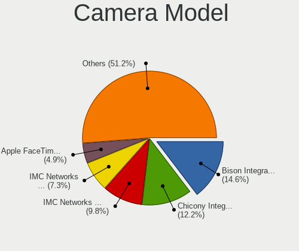

| Model                                            | Notebooks | Percent |
|--------------------------------------------------|-----------|---------|
| Chicony Integrated Camera                        | 5         | 16.67%  |
| IMC Networks Integrated Camera                   | 4         | 13.33%  |
| Bison Integrated Camera                          | 3         | 10%     |
| Suyin HD WebCam                                  | 1         | 3.33%   |
| Supreme Realtek PC Camera                        | 1         | 3.33%   |
| Sunplus Laptop Integrated WebCam HD              | 1         | 3.33%   |
| Sunplus Laptop Integrated Webcam FHD             | 1         | 3.33%   |
| Microdia Integrated Webcam                       | 1         | 3.33%   |
| IMC Networks Lenovo EasyCamera                   | 1         | 3.33%   |
| IMC Networks EasyCamera                          | 1         | 3.33%   |
| IMC Networks ASUS EasyCamera                     | 1         | 3.33%   |
| Chicony USB2.0 HD UVC WebCam                     | 1         | 3.33%   |
| Chicony USB 2.0 2.0M UVC WebCam                  | 1         | 3.33%   |
| Chicony ThinkPad T490 Webcam                     | 1         | 3.33%   |
| Chicony Lenovo EasyCamera                        | 1         | 3.33%   |
| Chicony Integrated Camera [ThinkPad]             | 1         | 3.33%   |
| Chicony HP Universal Camera                      | 1         | 3.33%   |
| Cheng Uei Precision Industry (Foxlink) HD Camera | 1         | 3.33%   |
| Bison Lenovo EasyCamera integrated webcam        | 1         | 3.33%   |
| Apple FaceTime HD Camera (Built-in)              | 1         | 3.33%   |
| Apple FaceTime HD Camera                         | 1         | 3.33%   |

Security
--------

Fingerprint Vendor
------------------

Fingerprint sensor vendors

| Vendor                     | Notebooks | Percent |
|----------------------------|-----------|---------|
| Validity Sensors           | 4         | 50%     |
| Synaptics                  | 2         | 25%     |
| Upek                       | 1         | 12.5%   |
| Shenzhen Goodix Technology | 1         | 12.5%   |

Fingerprint Model
-----------------

Fingerprint sensor models

| Model                                                  | Notebooks | Percent |
|--------------------------------------------------------|-----------|---------|
| Validity Sensors VFS7500 Touch Fingerprint Sensor      | 2         | 25%     |
| Validity Sensors VFS 5011 fingerprint sensor           | 1         | 12.5%   |
| Validity Sensors Synaptics WBDI                        | 1         | 12.5%   |
| Upek Biometric Touchchip/Touchstrip Fingerprint Sensor | 1         | 12.5%   |
| Synaptics WBDI                                         | 1         | 12.5%   |
| Synaptics Prometheus MIS Touch Fingerprint Reader      | 1         | 12.5%   |
| Shenzhen Goodix Fingerprint Reader                     | 1         | 12.5%   |

Chipcard Vendor
---------------

Chipcard module vendors

Zero info for selected period =(

Chipcard Model
--------------

Chipcard module models

Zero info for selected period =(

Unsupported
-----------

Unsupported Devices
-------------------

Total unsupported devices on board

| Total | Notebooks | Percent |
|-------|-----------|---------|
| 2     | 16        | 31.37%  |
| 1     | 13        | 25.49%  |
| 0     | 9         | 17.65%  |
| 3     | 6         | 11.76%  |
| 4     | 5         | 9.8%    |
| 5     | 2         | 3.92%   |

Unsupported Device Types
------------------------

Types of unsupported devices

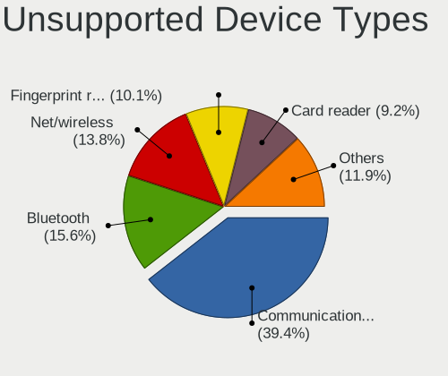

| Type                     | Notebooks | Percent |
|--------------------------|-----------|---------|
| Communication controller | 33        | 39.76%  |
| Net/wireless             | 13        | 15.66%  |
| Bluetooth                | 13        | 15.66%  |
| Card reader              | 8         | 9.64%   |
| Fingerprint reader       | 6         | 7.23%   |
| Firewire controller      | 5         | 6.02%   |
| Storage                  | 1         | 1.2%    |
| Sound                    | 1         | 1.2%    |
| Network                  | 1         | 1.2%    |
| Net/ethernet             | 1         | 1.2%    |
| Graphics card            | 1         | 1.2%    |

