BSD in Switzerland - Tested Hardware & Statistics
-------------------------------------------------

A project to collect tested hardware configurations for BSD in Switzerland.

Anyone can contribute to this report by the [hw-probe](https://github.com/linuxhw/hw-probe/blob/master/INSTALL.BSD.md) tool:

    hw-probe -all -upload

Please contribute! Especially if your hardware is rare.

This is a report for all computer types. See also reports for [desktops](/Location/Switzerland/Desktop/README.md) and [notebooks](/Location/Switzerland/Notebook/README.md).

Contents
--------

* [ Test Cases ](#test-cases)

* [ System ](#system)
  - [ OS                       ](#os)
  - [ OS Family                ](#os-family)
  - [ Arch                     ](#arch)
  - [ DE                       ](#de)
  - [ Display Server           ](#display-server)
  - [ Display Manager          ](#display-manager)
  - [ OS Lang                  ](#os-lang)
  - [ Boot Mode                ](#boot-mode)
  - [ Filesystem               ](#filesystem)
  - [ Part. scheme             ](#part-scheme)

* [ Board ](#board)
  - [ Vendor                   ](#vendor)
  - [ Model                    ](#model)
  - [ Model Family             ](#model-family)
  - [ MFG Year                 ](#mfg-year)
  - [ Form Factor              ](#form-factor)
  - [ Coreboot                 ](#coreboot)
  - [ RAM Size                 ](#ram-size)
  - [ RAM Used                 ](#ram-used)
  - [ Total Drives             ](#total-drives)
  - [ Has CD-ROM               ](#has-cd-rom)
  - [ Has Ethernet             ](#has-ethernet)
  - [ Has WiFi                 ](#has-wifi)
  - [ Has Bluetooth            ](#has-bluetooth)

* [ Location ](#location)
  - [ Country                  ](#country)
  - [ City                     ](#city)

* [ Drives ](#drives)
  - [ Drive Vendor             ](#drive-vendor)
  - [ Drive Model              ](#drive-model)
  - [ HDD Vendor               ](#hdd-vendor)
  - [ SSD Vendor               ](#ssd-vendor)
  - [ Drive Kind               ](#drive-kind)
  - [ Drive Connector          ](#drive-connector)
  - [ Drive Size               ](#drive-size)
  - [ Space Total              ](#space-total)
  - [ Space Used               ](#space-used)
  - [ Malfunc. Drives          ](#malfunc-drives)
  - [ Malfunc. Drive Vendor    ](#malfunc-drive-vendor)
  - [ Malfunc. HDD Vendor      ](#malfunc-hdd-vendor)
  - [ Malfunc. Drive Kind      ](#malfunc-drive-kind)
  - [ Failed Drives            ](#failed-drives)
  - [ Failed Drive Vendor      ](#failed-drive-vendor)
  - [ Drive Status             ](#drive-status)

* [ Storage controller ](#storage-controller)
  - [ Storage Vendor           ](#storage-vendor)
  - [ Storage Model            ](#storage-model)
  - [ Storage Kind             ](#storage-kind)

* [ Processor ](#processor)
  - [ CPU Vendor               ](#cpu-vendor)
  - [ CPU Model                ](#cpu-model)
  - [ CPU Model Family         ](#cpu-model-family)
  - [ CPU Cores                ](#cpu-cores)
  - [ CPU Sockets              ](#cpu-sockets)
  - [ CPU Threads              ](#cpu-threads)
  - [ CPU Microarch            ](#cpu-microarch)

* [ Graphics ](#graphics)
  - [ GPU Vendor               ](#gpu-vendor)
  - [ GPU Model                ](#gpu-model)
  - [ GPU Combo                ](#gpu-combo)
  - [ GPU Driver               ](#gpu-driver)
  - [ GPU Memory               ](#gpu-memory)

* [ Monitor ](#monitor)
  - [ Monitor Vendor           ](#monitor-vendor)
  - [ Monitor Model            ](#monitor-model)
  - [ Monitor Resolution       ](#monitor-resolution)
  - [ Monitor Diagonal         ](#monitor-diagonal)
  - [ Monitor Width            ](#monitor-width)
  - [ Aspect Ratio             ](#aspect-ratio)
  - [ Monitor Area             ](#monitor-area)
  - [ Pixel Density            ](#pixel-density)
  - [ Multiple Monitors        ](#multiple-monitors)

* [ Network ](#network)
  - [ Net Controller Vendor    ](#net-controller-vendor)
  - [ Net Controller Model     ](#net-controller-model)
  - [ Wireless Vendor          ](#wireless-vendor)
  - [ Wireless Model           ](#wireless-model)
  - [ Ethernet Vendor          ](#ethernet-vendor)
  - [ Ethernet Model           ](#ethernet-model)
  - [ Net Controller Kind      ](#net-controller-kind)
  - [ Used Controller          ](#used-controller)
  - [ NICs                     ](#nics)
  - [ IPv6                     ](#ipv6)

* [ Bluetooth ](#bluetooth)
  - [ Bluetooth Vendor         ](#bluetooth-vendor)
  - [ Bluetooth Model          ](#bluetooth-model)

* [ Sound ](#sound)
  - [ Sound Vendor             ](#sound-vendor)
  - [ Sound Model              ](#sound-model)

* [ Memory ](#memory)
  - [ Memory Vendor            ](#memory-vendor)
  - [ Memory Model             ](#memory-model)
  - [ Memory Kind              ](#memory-kind)
  - [ Memory Form Factor       ](#memory-form-factor)
  - [ Memory Size              ](#memory-size)
  - [ Memory Speed             ](#memory-speed)

* [ Printers & scanners ](#printers--scanners)
  - [ Printer Vendor           ](#printer-vendor)
  - [ Printer Model            ](#printer-model)
  - [ Scanner Vendor           ](#scanner-vendor)
  - [ Scanner Model            ](#scanner-model)

* [ Camera ](#camera)
  - [ Camera Vendor            ](#camera-vendor)
  - [ Camera Model             ](#camera-model)

* [ Security ](#security)
  - [ Fingerprint Vendor       ](#fingerprint-vendor)
  - [ Fingerprint Model        ](#fingerprint-model)
  - [ Chipcard Vendor          ](#chipcard-vendor)
  - [ Chipcard Model           ](#chipcard-model)

* [ Unsupported ](#unsupported)
  - [ Unsupported Devices      ](#unsupported-devices)
  - [ Unsupported Device Types ](#unsupported-device-types)

Test Cases
----------

Total: 648

| Vendor        | Model                       | Form-Factor | Probe                                                     | Date         |
|---------------|-----------------------------|-------------|-----------------------------------------------------------|--------------|
| AMI           | Aptio CRB                   | Mini pc     | [4f5f2a4b9d](https://bsd-hardware.info/?probe=4f5f2a4b9d) | Dec 23, 2025 |
| SLIMBOOK      | ZERO-N100-4RJ               | Desktop     | [e8d30918fa](https://bsd-hardware.info/?probe=e8d30918fa) | Dec 14, 2025 |
| HP            | 83F2                        | Desktop     | [da2329c4a5](https://bsd-hardware.info/?probe=da2329c4a5) | Dec 08, 2025 |
| Deciso        | DEC2700 - OPNsense Appli... | Notebook    | [b618ebfac6](https://bsd-hardware.info/?probe=b618ebfac6) | Dec 04, 2025 |
| Sophos        | XG                          | Firewall    | [2070c5e6bc](https://bsd-hardware.info/?probe=2070c5e6bc) | Nov 30, 2025 |
| Sophos        | XG                          | Firewall    | [ba0e4db317](https://bsd-hardware.info/?probe=ba0e4db317) | Nov 30, 2025 |
| PC Engines    | apu4                        | Desktop     | [ccd321163a](https://bsd-hardware.info/?probe=ccd321163a) | Nov 27, 2025 |
| PC Engines    | APU2                        | Desktop     | [8dbe82a617](https://bsd-hardware.info/?probe=8dbe82a617) | Nov 25, 2025 |
| Unknown       | Unknown                     | Desktop     | [e65e58c866](https://bsd-hardware.info/?probe=e65e58c866) | Nov 24, 2025 |
| SLIMBOOK      | ZERO-N100-4RJ               | Desktop     | [8141da7974](https://bsd-hardware.info/?probe=8141da7974) | Nov 08, 2025 |
| Fujitsu       | D3313-A1 S26361-D3313-A1    | Desktop     | [1849bfae28](https://bsd-hardware.info/?probe=1849bfae28) | Nov 07, 2025 |
| Deciso        | NetBoard-A10                | Notebook    | [1b8c7b9ec1](https://bsd-hardware.info/?probe=1b8c7b9ec1) | Oct 31, 2025 |
| Sophos        | SG                          | Firewall    | [503cb4bd4e](https://bsd-hardware.info/?probe=503cb4bd4e) | Oct 27, 2025 |
| Unknown       | Unknown                     | Desktop     | [bb0fd8c7fa](https://bsd-hardware.info/?probe=bb0fd8c7fa) | Oct 21, 2025 |
| PC Engines    | APU                         | Desktop     | [a0ed6d8902](https://bsd-hardware.info/?probe=a0ed6d8902) | Oct 20, 2025 |
| Lenovo        | 312D SDK0J40697 WIN 3305... | Mini pc     | [7fa9f57d3a](https://bsd-hardware.info/?probe=7fa9f57d3a) | Oct 15, 2025 |
| Unknown       | QDNV01                      | Desktop     | [4eb5b90f6a](https://bsd-hardware.info/?probe=4eb5b90f6a) | Oct 13, 2025 |
| Intel         | D34010WYK H14771-303        | Desktop     | [dc6e74d2b3](https://bsd-hardware.info/?probe=dc6e74d2b3) | Oct 09, 2025 |
| Intel         | HURONRIVER                  | Desktop     | [ba018e12bc](https://bsd-hardware.info/?probe=ba018e12bc) | Oct 06, 2025 |
| HP            | 8158 A01                    | Mini pc     | [e6aa906bb2](https://bsd-hardware.info/?probe=e6aa906bb2) | Oct 03, 2025 |
| Supermicro    | X10SLL-F                    | Server      | [b723e86a77](https://bsd-hardware.info/?probe=b723e86a77) | Sep 23, 2025 |
| Fujitsu       | D3543-A2 S26361-D3543-A2... | Desktop     | [2e40e2252b](https://bsd-hardware.info/?probe=2e40e2252b) | Sep 20, 2025 |
| PC Engines    | APU3                        | Desktop     | [f3016df1d1](https://bsd-hardware.info/?probe=f3016df1d1) | Sep 20, 2025 |
| Shuttle       | DL30N                       | Desktop     | [d8934c951a](https://bsd-hardware.info/?probe=d8934c951a) | Sep 17, 2025 |
| Unknown       | Unknown                     | Desktop     | [e3cc9036f1](https://bsd-hardware.info/?probe=e3cc9036f1) | Sep 16, 2025 |
| AZW           | ME mini                     | Desktop     | [30b06671da](https://bsd-hardware.info/?probe=30b06671da) | Sep 15, 2025 |
| Supermicro    | X11SDV-4C-TP8F              | Desktop     | [78b6bf557c](https://bsd-hardware.info/?probe=78b6bf557c) | Sep 15, 2025 |
| Unknown       | Unknown                     | Desktop     | [afd02f10b8](https://bsd-hardware.info/?probe=afd02f10b8) | Sep 13, 2025 |
| Extreme Ne... | Unknown                     | Firewall    | [3fb5053802](https://bsd-hardware.info/?probe=3fb5053802) | Sep 13, 2025 |
| CheckPoint    | PB-10-00                    | Firewall    | [535db0495d](https://bsd-hardware.info/?probe=535db0495d) | Aug 25, 2025 |
| HP            | 3397                        | Desktop     | [4d7dff559c](https://bsd-hardware.info/?probe=4d7dff559c) | Aug 24, 2025 |
| Sophos        | SG                          | Firewall    | [c210514344](https://bsd-hardware.info/?probe=c210514344) | Aug 22, 2025 |
| Sophos        | SG                          | Firewall    | [6d2e87fa4d](https://bsd-hardware.info/?probe=6d2e87fa4d) | Aug 20, 2025 |
| HP            | Z420 Workstation            | Desktop     | [1ff8b8627f](https://bsd-hardware.info/?probe=1ff8b8627f) | Aug 19, 2025 |
| Lenovo        | ThinkStation P520c 30BX0... | Desktop     | [6767ecf883](https://bsd-hardware.info/?probe=6767ecf883) | Aug 19, 2025 |
| GoWin Solu... | R86S                        | Desktop     | [5ace4182f6](https://bsd-hardware.info/?probe=5ace4182f6) | Aug 18, 2025 |
| PC Engines    | APU3                        | Desktop     | [8b8f907df9](https://bsd-hardware.info/?probe=8b8f907df9) | Aug 17, 2025 |
| Infoblox      | IB-1410                     | Desktop     | [003a839470](https://bsd-hardware.info/?probe=003a839470) | Aug 11, 2025 |
| PC Engines    | APU2                        | Desktop     | [b7043646bb](https://bsd-hardware.info/?probe=b7043646bb) | Aug 11, 2025 |
| Sophos        | XG                          | Firewall    | [6846622c67](https://bsd-hardware.info/?probe=6846622c67) | Aug 04, 2025 |
| Unknown       | Unknown                     | Desktop     | [d46805eb03](https://bsd-hardware.info/?probe=d46805eb03) | Aug 01, 2025 |
| Fujitsu       | D3543-A2 S26361-D3543-A2... | Desktop     | [f2f4545bda](https://bsd-hardware.info/?probe=f2f4545bda) | Jul 30, 2025 |
| Supermicro    | X11SDV-4C-TP8F              | Desktop     | [30e4157e26](https://bsd-hardware.info/?probe=30e4157e26) | Jul 19, 2025 |
| Intel         | HURONRIVER                  | Desktop     | [e44e55ea35](https://bsd-hardware.info/?probe=e44e55ea35) | Jul 05, 2025 |
| Unknown       | Unknown                     | Desktop     | [cff5e43895](https://bsd-hardware.info/?probe=cff5e43895) | Jul 05, 2025 |
| Sophos        | XG                          | Firewall    | [523e6bf861](https://bsd-hardware.info/?probe=523e6bf861) | Jul 05, 2025 |
| Shuttle       | FH310V                      | Desktop     | [bebd147dff](https://bsd-hardware.info/?probe=bebd147dff) | Jun 29, 2025 |
| HP            | 3397                        | Desktop     | [344ec435cd](https://bsd-hardware.info/?probe=344ec435cd) | Jun 21, 2025 |
| PC Engines    | APU3                        | Desktop     | [ee06a6f948](https://bsd-hardware.info/?probe=ee06a6f948) | Jun 19, 2025 |
| SLIMBOOK      | ZERO-N100-4RJ               | Desktop     | [576941fcb8](https://bsd-hardware.info/?probe=576941fcb8) | Jun 09, 2025 |
| LinuxConta... | Incus pc-q35-9.0            | Desktop     | [95146653f9](https://bsd-hardware.info/?probe=95146653f9) | Jun 03, 2025 |
| Supermicro    | X10SDV-TP8F                 | Server      | [4b401f0e6b](https://bsd-hardware.info/?probe=4b401f0e6b) | Jun 02, 2025 |
| Unknown       | Unknown                     | Desktop     | [b4682b702f](https://bsd-hardware.info/?probe=b4682b702f) | Jun 02, 2025 |
| Supermicro    | X10SLH-F/X10SLM+-F          | Server      | [6dfa3e614f](https://bsd-hardware.info/?probe=6dfa3e614f) | Jun 01, 2025 |
| Supermicro    | X10SLH-F/X10SLM+-F          | Server      | [bab47280a1](https://bsd-hardware.info/?probe=bab47280a1) | May 30, 2025 |
| HP            | 83F2                        | Desktop     | [878ba4bf0f](https://bsd-hardware.info/?probe=878ba4bf0f) | May 30, 2025 |
| Intel BOX4... | Geminilake                  | Desktop     | [baf055da34](https://bsd-hardware.info/?probe=baf055da34) | May 26, 2025 |
| HP            | 83F2                        | Desktop     | [131bc3b5a0](https://bsd-hardware.info/?probe=131bc3b5a0) | May 26, 2025 |
| ASUSTek       | TUF Gaming X670E-PLUS WI... | Desktop     | [02782e94e9](https://bsd-hardware.info/?probe=02782e94e9) | May 25, 2025 |
| CheckPoint    | PB-10-00                    | Firewall    | [5c8d1abc4f](https://bsd-hardware.info/?probe=5c8d1abc4f) | May 20, 2025 |
| Unknown       | Unknown                     | Desktop     | [12b79d1df8](https://bsd-hardware.info/?probe=12b79d1df8) | May 14, 2025 |
| Protectli     | VP2420                      | Desktop     | [e9f8c48a30](https://bsd-hardware.info/?probe=e9f8c48a30) | May 12, 2025 |
| Unknown       | Unknown                     | Desktop     | [302281fee4](https://bsd-hardware.info/?probe=302281fee4) | May 04, 2025 |
| PC Engines    | APU2                        | Desktop     | [4fed266c79](https://bsd-hardware.info/?probe=4fed266c79) | Apr 27, 2025 |
| Unknown       | Unknown                     | Desktop     | [a096895592](https://bsd-hardware.info/?probe=a096895592) | Apr 27, 2025 |
| SLIMBOOK      | ZERO-N100-4RJ               | Desktop     | [fa95b8f340](https://bsd-hardware.info/?probe=fa95b8f340) | Apr 27, 2025 |
| ASUSTek       | Z170-PREMIUM                | Desktop     | [a3af9db44c](https://bsd-hardware.info/?probe=a3af9db44c) | Apr 26, 2025 |
| Unknown       | Unknown                     | Desktop     | [4dab69244a](https://bsd-hardware.info/?probe=4dab69244a) | Apr 22, 2025 |
| PC Engines    | APU2                        | Desktop     | [42c58d3134](https://bsd-hardware.info/?probe=42c58d3134) | Apr 15, 2025 |
| Unknown       | Unknown                     | Desktop     | [5525021004](https://bsd-hardware.info/?probe=5525021004) | Apr 15, 2025 |
| PC Engines    | APU2                        | Desktop     | [6e72d1499f](https://bsd-hardware.info/?probe=6e72d1499f) | Apr 15, 2025 |
| Unknown       | QDNV01                      | Desktop     | [bbc1cfb6cd](https://bsd-hardware.info/?probe=bbc1cfb6cd) | Apr 12, 2025 |
| Dell          | 02YYK5 A01                  | Desktop     | [65cd254a41](https://bsd-hardware.info/?probe=65cd254a41) | Apr 04, 2025 |
| SLIMBOOK      | ZERO-N100-4RJ               | Desktop     | [977049759f](https://bsd-hardware.info/?probe=977049759f) | Apr 01, 2025 |
| TOPC          | PHX                         | Desktop     | [c0d37cfe28](https://bsd-hardware.info/?probe=c0d37cfe28) | Mar 29, 2025 |
| Intel         | Q3XXG4-P V1.0               | Desktop     | [49a6910f85](https://bsd-hardware.info/?probe=49a6910f85) | Mar 27, 2025 |
| Lenovo        | 3136 SDK0J40697 WIN 3305... | Mini pc     | [be54226a8b](https://bsd-hardware.info/?probe=be54226a8b) | Mar 23, 2025 |
| PC Engines    | APU2                        | Desktop     | [077eabc5b3](https://bsd-hardware.info/?probe=077eabc5b3) | Mar 23, 2025 |
| ASUSTek       | NUC14RVB 60AS0080-MB2A02    | Mini pc     | [53a8cb40b9](https://bsd-hardware.info/?probe=53a8cb40b9) | Mar 16, 2025 |
| PC Engines    | APU2                        | Desktop     | [9db7bac8a2](https://bsd-hardware.info/?probe=9db7bac8a2) | Mar 15, 2025 |
| TOPC          | PHX                         | Desktop     | [b03cee3464](https://bsd-hardware.info/?probe=b03cee3464) | Feb 28, 2025 |
| GoWin Solu... | R86S                        | Desktop     | [c8fe79d190](https://bsd-hardware.info/?probe=c8fe79d190) | Feb 20, 2025 |
| Intel         | HURONRIVER                  | Desktop     | [8e5d7c7aed](https://bsd-hardware.info/?probe=8e5d7c7aed) | Feb 19, 2025 |
| ASUSTek       | TUF Gaming X670E-PLUS WI... | Desktop     | [b5120b37dd](https://bsd-hardware.info/?probe=b5120b37dd) | Feb 18, 2025 |
| ZOTAC         | ZBOX-CI323NANO              | Mini pc     | [73f3b0ec6f](https://bsd-hardware.info/?probe=73f3b0ec6f) | Feb 14, 2025 |
| HP            | 81C5 MVB                    | Desktop     | [9778f1a756](https://bsd-hardware.info/?probe=9778f1a756) | Feb 12, 2025 |
| Deciso        | NetBoard-A30 R1.0           | Server      | [97fded3b0c](https://bsd-hardware.info/?probe=97fded3b0c) | Feb 10, 2025 |
| Apple         | MacBook4,1                  | Notebook    | [f28a86fa7b](https://bsd-hardware.info/?probe=f28a86fa7b) | Feb 08, 2025 |
| Deciso        | DEC2700 - OPNsense Appli... | Notebook    | [4c21997357](https://bsd-hardware.info/?probe=4c21997357) | Feb 04, 2025 |
| TOPC          | PHX                         | Desktop     | [3c09391ecf](https://bsd-hardware.info/?probe=3c09391ecf) | Feb 03, 2025 |
| Supermicro    | X10SLL-F                    | Server      | [b2ca20fbd7](https://bsd-hardware.info/?probe=b2ca20fbd7) | Feb 02, 2025 |
| AMI           | Aptio CRB                   | Mini pc     | [606b40f57b](https://bsd-hardware.info/?probe=606b40f57b) | Jan 30, 2025 |
| CheckPoint    | PB-10-00                    | Firewall    | [4922b11c4c](https://bsd-hardware.info/?probe=4922b11c4c) | Jan 30, 2025 |
| Protectli     | V1410                       | Desktop     | [12440c4a80](https://bsd-hardware.info/?probe=12440c4a80) | Jan 29, 2025 |
| HP            | 83F0                        | Desktop     | [37f70b0d40](https://bsd-hardware.info/?probe=37f70b0d40) | Jan 28, 2025 |
| Sophos        | SG                          | Firewall    | [fc8d4e019f](https://bsd-hardware.info/?probe=fc8d4e019f) | Jan 27, 2025 |
| CheckPoint    | PB-10-00                    | Firewall    | [d0818d11f3](https://bsd-hardware.info/?probe=d0818d11f3) | Jan 27, 2025 |
| Dell          | 0Y2K8N A01                  | Desktop     | [b676bb06df](https://bsd-hardware.info/?probe=b676bb06df) | Jan 24, 2025 |
| Unknown       | Unknown                     | Desktop     | [6feacd2446](https://bsd-hardware.info/?probe=6feacd2446) | Jan 24, 2025 |
| MSI           | Z170A GAMING PRO CARBON     | Desktop     | [f9db3b3b4d](https://bsd-hardware.info/?probe=f9db3b3b4d) | Jan 23, 2025 |
| Apple         | MacBookPro9,2               | Notebook    | [6440069298](https://bsd-hardware.info/?probe=6440069298) | Jan 18, 2025 |
| Shenzhen M... | AHWSA                       | Desktop     | [b251441cc5](https://bsd-hardware.info/?probe=b251441cc5) | Jan 09, 2025 |
| Unknown       | Unknown                     | Desktop     | [c2b71a1f07](https://bsd-hardware.info/?probe=c2b71a1f07) | Jan 06, 2025 |
| Protectli     | VP2420                      | Desktop     | [a3a282fc47](https://bsd-hardware.info/?probe=a3a282fc47) | Jan 04, 2025 |
| IGEL Techn... | IGEL-D220                   | Desktop     | [9d3ca29f8a](https://bsd-hardware.info/?probe=9d3ca29f8a) | Dec 30, 2024 |
| TUXEDO        | InfinityBook Pro AMD Gen... | Notebook    | [b880be6d5f](https://bsd-hardware.info/?probe=b880be6d5f) | Dec 30, 2024 |
| PC Engines    | apu4                        | Desktop     | [1245a959bc](https://bsd-hardware.info/?probe=1245a959bc) | Dec 19, 2024 |
| Unknown       | Unknown                     | Desktop     | [4d58aebb29](https://bsd-hardware.info/?probe=4d58aebb29) | Dec 18, 2024 |
| Supermicro    | X11SDV-4C-TP8F              | Desktop     | [f031d48a53](https://bsd-hardware.info/?probe=f031d48a53) | Dec 16, 2024 |
| Supermicro    | X11SDV-4C-TP8F              | Desktop     | [1eb9f463b0](https://bsd-hardware.info/?probe=1eb9f463b0) | Dec 16, 2024 |
| Chuwi         | LarkBox X                   | Mini pc     | [49533a833d](https://bsd-hardware.info/?probe=49533a833d) | Dec 15, 2024 |
| Chuwi         | LarkBox X                   | Mini pc     | [992ad315d3](https://bsd-hardware.info/?probe=992ad315d3) | Dec 15, 2024 |
| Unknown       | Unknown                     | Desktop     | [696aedf790](https://bsd-hardware.info/?probe=696aedf790) | Dec 13, 2024 |
| Silicom       | 80300-0134-g01              | Desktop     | [9c18dc951c](https://bsd-hardware.info/?probe=9c18dc951c) | Dec 11, 2024 |
| Unknown       | Unknown                     | Desktop     | [3a099cfc0b](https://bsd-hardware.info/?probe=3a099cfc0b) | Dec 07, 2024 |
| PC Engines    | APU2                        | Desktop     | [897b7914d9](https://bsd-hardware.info/?probe=897b7914d9) | Dec 04, 2024 |
| Intel         | D34010WYK H14771-303        | Desktop     | [cc9f37f097](https://bsd-hardware.info/?probe=cc9f37f097) | Dec 04, 2024 |
| Intel         | HURONRIVER                  | Desktop     | [d74d9a6d06](https://bsd-hardware.info/?probe=d74d9a6d06) | Nov 27, 2024 |
| Gowin Solu... | GW-MB-U01                   | Desktop     | [2626f42aad](https://bsd-hardware.info/?probe=2626f42aad) | Nov 25, 2024 |
| Apple         | MacBookPro8,1               | Notebook    | [dc3d4a1f8d](https://bsd-hardware.info/?probe=dc3d4a1f8d) | Nov 24, 2024 |
| ASRock        | B550 Taichi                 | Desktop     | [8ef9cf51fb](https://bsd-hardware.info/?probe=8ef9cf51fb) | Nov 21, 2024 |
| Supermicro    | X10SLM+-LN4F                | Server      | [2feec23495](https://bsd-hardware.info/?probe=2feec23495) | Nov 21, 2024 |
| Shuttle       | FH61V                       | Desktop     | [1770dc6006](https://bsd-hardware.info/?probe=1770dc6006) | Nov 19, 2024 |
| Shenzhen M... | AHWSA                       | Desktop     | [8e58ca6121](https://bsd-hardware.info/?probe=8e58ca6121) | Nov 14, 2024 |
| PC Engines    | APU                         | Desktop     | [933dc34c47](https://bsd-hardware.info/?probe=933dc34c47) | Nov 14, 2024 |
| ASUSTek       | TUF Gaming X670E-PLUS WI... | Desktop     | [8583a7eb2e](https://bsd-hardware.info/?probe=8583a7eb2e) | Nov 09, 2024 |
| Shenzhen M... | AHWSA                       | Desktop     | [123789a341](https://bsd-hardware.info/?probe=123789a341) | Nov 07, 2024 |
| ASUSTek       | G75VW                       | Notebook    | [2ede0a1468](https://bsd-hardware.info/?probe=2ede0a1468) | Nov 06, 2024 |
| HP            | 1494                        | Desktop     | [ac956f4a8a](https://bsd-hardware.info/?probe=ac956f4a8a) | Nov 04, 2024 |
| Lenovo        | ThinkPad T14 Gen 3 21CF0... | Notebook    | [7aa93cd8ba](https://bsd-hardware.info/?probe=7aa93cd8ba) | Nov 03, 2024 |
| Supermicro    | X11SDV-4C-TP8F              | Desktop     | [ae14bea998](https://bsd-hardware.info/?probe=ae14bea998) | Nov 02, 2024 |
| Unknown       | Unknown                     | Desktop     | [aeaca5f3a0](https://bsd-hardware.info/?probe=aeaca5f3a0) | Oct 24, 2024 |
| Unknown       | Unknown                     | Desktop     | [f191f5d343](https://bsd-hardware.info/?probe=f191f5d343) | Oct 23, 2024 |
| Supermicro    | X11SCL-IF                   | Server      | [2cb6364513](https://bsd-hardware.info/?probe=2cb6364513) | Oct 23, 2024 |
| HP            | 1494                        | Desktop     | [154852b17b](https://bsd-hardware.info/?probe=154852b17b) | Oct 22, 2024 |
| Unknown       | Unknown                     | Desktop     | [574cd1a009](https://bsd-hardware.info/?probe=574cd1a009) | Oct 18, 2024 |
| PC Engines    | APU                         | Desktop     | [05d1822d02](https://bsd-hardware.info/?probe=05d1822d02) | Oct 17, 2024 |
| PC Engines    | APU                         | Desktop     | [1ccdfd7edd](https://bsd-hardware.info/?probe=1ccdfd7edd) | Oct 17, 2024 |
| PC Engines    | apu4                        | Desktop     | [d185e2c850](https://bsd-hardware.info/?probe=d185e2c850) | Oct 16, 2024 |
| Deciso        | DEC2700 - OPNsense Appli... | Notebook    | [1d5b951541](https://bsd-hardware.info/?probe=1d5b951541) | Oct 04, 2024 |
| Lenovo        | ThinkPad X1 Carbon 6th 2... | Notebook    | [bbc44a72cc](https://bsd-hardware.info/?probe=bbc44a72cc) | Oct 03, 2024 |
| AMI           | Aptio CRB                   | Mini pc     | [80cdd4fffc](https://bsd-hardware.info/?probe=80cdd4fffc) | Oct 03, 2024 |
| Shenzhen M... | AHWSA                       | Desktop     | [d8cf190bc2](https://bsd-hardware.info/?probe=d8cf190bc2) | Sep 28, 2024 |
| Unknown       | Unknown                     | Desktop     | [d9e63995fb](https://bsd-hardware.info/?probe=d9e63995fb) | Sep 28, 2024 |
| Supermicro    | X10SDV-TP8F                 | Server      | [b0ce68cff4](https://bsd-hardware.info/?probe=b0ce68cff4) | Sep 28, 2024 |
| Apple         | MacBookPro11,4              | Notebook    | [df7c99c150](https://bsd-hardware.info/?probe=df7c99c150) | Sep 25, 2024 |
| Deciso        | DEC2700 - OPNsense Appli... | Notebook    | [999fa3b31b](https://bsd-hardware.info/?probe=999fa3b31b) | Sep 25, 2024 |
| Apple         | MacBookPro11,4              | Notebook    | [5138a61509](https://bsd-hardware.info/?probe=5138a61509) | Sep 24, 2024 |
| Lenovo        | Yoga 900S-12ISK 80ML        | Notebook    | [8836aa08ec](https://bsd-hardware.info/?probe=8836aa08ec) | Sep 23, 2024 |
| Unknown       | Unknown                     | Desktop     | [9ddfeb7780](https://bsd-hardware.info/?probe=9ddfeb7780) | Sep 21, 2024 |
| Protectli     | V1410                       | Desktop     | [452edd44ed](https://bsd-hardware.info/?probe=452edd44ed) | Sep 20, 2024 |
| Shuttle       | DL30N                       | Desktop     | [895fb08a2f](https://bsd-hardware.info/?probe=895fb08a2f) | Sep 18, 2024 |
| Lenovo        | Yoga 900S-12ISK 80ML        | Notebook    | [41254dde12](https://bsd-hardware.info/?probe=41254dde12) | Sep 15, 2024 |
| Intel BOX4... | Geminilake                  | Desktop     | [7bc6403170](https://bsd-hardware.info/?probe=7bc6403170) | Sep 14, 2024 |
| Protectli     | VP6670                      | Desktop     | [6bf32f779c](https://bsd-hardware.info/?probe=6bf32f779c) | Sep 14, 2024 |
| Deciso        | NetBoard-A20                | Notebook    | [2cad072780](https://bsd-hardware.info/?probe=2cad072780) | Sep 12, 2024 |
| Lenovo        | Yoga 900S-12ISK 80ML        | Notebook    | [ce0404f7c9](https://bsd-hardware.info/?probe=ce0404f7c9) | Aug 31, 2024 |
| Techvision    | TVI7309X B0                 | Desktop     | [52e2d4ad6a](https://bsd-hardware.info/?probe=52e2d4ad6a) | Aug 29, 2024 |
| Sophos        | XG                          | Firewall    | [c5a7e9a655](https://bsd-hardware.info/?probe=c5a7e9a655) | Aug 28, 2024 |
| ASUSTek       | TUF Gaming X670E-PLUS WI... | Desktop     | [db7a0dda31](https://bsd-hardware.info/?probe=db7a0dda31) | Aug 26, 2024 |
| ASUSTek       | TUF Gaming X670E-PLUS WI... | Desktop     | [c56df5fe7c](https://bsd-hardware.info/?probe=c56df5fe7c) | Aug 25, 2024 |
| Lenovo        | ThinkPad X250 20CMCTO1WW    | Notebook    | [403fdba0ec](https://bsd-hardware.info/?probe=403fdba0ec) | Aug 25, 2024 |
| HP            | EliteBook 2570p             | Notebook    | [facf720e84](https://bsd-hardware.info/?probe=facf720e84) | Aug 24, 2024 |
| Shuttle       | FH310V                      | Desktop     | [ca649bfffa](https://bsd-hardware.info/?probe=ca649bfffa) | Aug 23, 2024 |
| Lenovo        | Yoga 900S-12ISK 80ML        | Notebook    | [a0abac7ab7](https://bsd-hardware.info/?probe=a0abac7ab7) | Aug 21, 2024 |
| Intel         | NUC9i7QNB K49245-500        | Mini pc     | [0ae392a6d4](https://bsd-hardware.info/?probe=0ae392a6d4) | Aug 12, 2024 |
| LinuxConta... | Incus pc-q35-9.0            | Desktop     | [550411a5aa](https://bsd-hardware.info/?probe=550411a5aa) | Aug 04, 2024 |
| ZOTAC         | ZBOX-CI337NANO              | Mini pc     | [a33f652b8c](https://bsd-hardware.info/?probe=a33f652b8c) | Aug 04, 2024 |
| Supermicro    | X11SDV-4C-TLN2F             | Desktop     | [b2bd066528](https://bsd-hardware.info/?probe=b2bd066528) | Aug 02, 2024 |
| Supermicro    | X11SDV-4C-TLN2F             | Desktop     | [be116a0073](https://bsd-hardware.info/?probe=be116a0073) | Aug 02, 2024 |
| ASUSTek       | TUF Gaming B550-PLUS        | Desktop     | [e96f250351](https://bsd-hardware.info/?probe=e96f250351) | Aug 01, 2024 |
| Unknown       | Unknown                     | Desktop     | [2f1762c0ca](https://bsd-hardware.info/?probe=2f1762c0ca) | Jul 26, 2024 |
| Supermicro    | X10SLH-F/X10SLM+-F          | Server      | [44fd1c41b8](https://bsd-hardware.info/?probe=44fd1c41b8) | Jul 24, 2024 |
| Deciso        | DEC2700 - OPNsense Appli... | Notebook    | [bcbdd06498](https://bsd-hardware.info/?probe=bcbdd06498) | Jul 21, 2024 |
| ZOTAC         | ZBOX-CI337NANO              | Mini pc     | [3039d78d20](https://bsd-hardware.info/?probe=3039d78d20) | Jul 19, 2024 |
| Unknown       | QDNV01                      | Desktop     | [6c29d0b29c](https://bsd-hardware.info/?probe=6c29d0b29c) | Jul 19, 2024 |
| Deciso        | NetBoard-A20                | Notebook    | [190d52ebe5](https://bsd-hardware.info/?probe=190d52ebe5) | Jul 13, 2024 |
| ZOTAC         | ZBOX-CI337NANO              | Mini pc     | [207da6c3ec](https://bsd-hardware.info/?probe=207da6c3ec) | Jul 06, 2024 |
| ZOTAC         | ZBOX-CI337NANO              | Mini pc     | [c1b95e991f](https://bsd-hardware.info/?probe=c1b95e991f) | Jul 04, 2024 |
| Shuttle       | DL30N                       | Desktop     | [8004067dfc](https://bsd-hardware.info/?probe=8004067dfc) | Jul 02, 2024 |
| Supermicro    | X11SCL-IF                   | Server      | [9bc9088d47](https://bsd-hardware.info/?probe=9bc9088d47) | Jun 22, 2024 |
| HP            | ProLiant DL380 G7           | Server      | [4aaa4938f3](https://bsd-hardware.info/?probe=4aaa4938f3) | Jun 17, 2024 |
| Protectli     | VP6670                      | Desktop     | [9c24cea9d2](https://bsd-hardware.info/?probe=9c24cea9d2) | Jun 16, 2024 |
| HP            | EliteBook 8540p             | Notebook    | [cad0e50ea5](https://bsd-hardware.info/?probe=cad0e50ea5) | Jun 14, 2024 |
| HP            | ProLiant ML350p Gen8        | Desktop     | [820bfd0c77](https://bsd-hardware.info/?probe=820bfd0c77) | Jun 14, 2024 |
| Lenovo        | ThinkPad X250 20CMCTO1WW    | Notebook    | [bbc7b223f1](https://bsd-hardware.info/?probe=bbc7b223f1) | Jun 14, 2024 |
| CheckPoint    | PB-10-00                    | Firewall    | [db2a3b2992](https://bsd-hardware.info/?probe=db2a3b2992) | Jun 13, 2024 |
| Sophos        | XG                          | Firewall    | [339760b2c7](https://bsd-hardware.info/?probe=339760b2c7) | Jun 09, 2024 |
| Sophos        | XG                          | Firewall    | [129a40e081](https://bsd-hardware.info/?probe=129a40e081) | Jun 04, 2024 |
| Deciso        | NetBoard-A20                | Notebook    | [e30ed0bb29](https://bsd-hardware.info/?probe=e30ed0bb29) | Jun 03, 2024 |
| Dell          | 0TWW5Y A02                  | Server      | [22fdb634c0](https://bsd-hardware.info/?probe=22fdb634c0) | May 26, 2024 |
| Deciso        | NetBoard-A20                | Notebook    | [ce91493709](https://bsd-hardware.info/?probe=ce91493709) | May 24, 2024 |
| CheckPoint    | PB-10-00                    | Firewall    | [43e01c8dc5](https://bsd-hardware.info/?probe=43e01c8dc5) | May 21, 2024 |
| Unknown       | Unknown                     | Desktop     | [71e118978a](https://bsd-hardware.info/?probe=71e118978a) | May 19, 2024 |
| Trigkey       | Green G5                    | Desktop     | [85a239bc2f](https://bsd-hardware.info/?probe=85a239bc2f) | May 18, 2024 |
| Unknown       | QDNV01                      | Desktop     | [f23cb7b083](https://bsd-hardware.info/?probe=f23cb7b083) | May 18, 2024 |
| Unknown       | QDNV01                      | Desktop     | [9b0fbcd081](https://bsd-hardware.info/?probe=9b0fbcd081) | May 18, 2024 |
| Sophos        | SG                          | Firewall    | [b9b4ba32e4](https://bsd-hardware.info/?probe=b9b4ba32e4) | May 18, 2024 |
| ASUSTek       | H170M-E D3                  | Desktop     | [a07851f5f5](https://bsd-hardware.info/?probe=a07851f5f5) | May 13, 2024 |
| Trigkey       | Green G5                    | Desktop     | [0cc228bf09](https://bsd-hardware.info/?probe=0cc228bf09) | May 09, 2024 |
| Dell          | 072T6D A01                  | Server      | [a7a95f387b](https://bsd-hardware.info/?probe=a7a95f387b) | May 07, 2024 |
| Lenovo        | ThinkPad T15p Gen 1 20TN... | Notebook    | [5f31e6dc7e](https://bsd-hardware.info/?probe=5f31e6dc7e) | May 04, 2024 |
| ASUSTek       | TUF Gaming A620-PRO WIFI    | Desktop     | [a186355a65](https://bsd-hardware.info/?probe=a186355a65) | May 02, 2024 |
| Intel         | NUC10i3FNB M38070-307       | Mini pc     | [671adbdfc4](https://bsd-hardware.info/?probe=671adbdfc4) | May 01, 2024 |
| HP            | EliteBook 2560p             | Notebook    | [bb6303ed5b](https://bsd-hardware.info/?probe=bb6303ed5b) | Apr 29, 2024 |
| Trigkey       | Green G5                    | Desktop     | [6bad716921](https://bsd-hardware.info/?probe=6bad716921) | Apr 26, 2024 |
| Intel         | SHARKBAY                    | Desktop     | [cbe3a65615](https://bsd-hardware.info/?probe=cbe3a65615) | Apr 16, 2024 |
| Unknown       | QDNV01                      | Desktop     | [e90c02d0da](https://bsd-hardware.info/?probe=e90c02d0da) | Apr 13, 2024 |
| ASUSTek       | Z97-A                       | Desktop     | [2f83e16bd9](https://bsd-hardware.info/?probe=2f83e16bd9) | Apr 11, 2024 |
| PC Engines    | APU2                        | Desktop     | [22fc545294](https://bsd-hardware.info/?probe=22fc545294) | Apr 11, 2024 |
| Dell          | 0TWW5Y A02                  | Server      | [7f7aa552e1](https://bsd-hardware.info/?probe=7f7aa552e1) | Apr 10, 2024 |
| Unknown       | Unknown                     | Desktop     | [258e758f9b](https://bsd-hardware.info/?probe=258e758f9b) | Mar 30, 2024 |
| MW            | GMLK-2_5G4L                 | Desktop     | [690a945c99](https://bsd-hardware.info/?probe=690a945c99) | Mar 30, 2024 |
| PC Engines    | APU2                        | Desktop     | [e5ac53d0d4](https://bsd-hardware.info/?probe=e5ac53d0d4) | Mar 26, 2024 |
| Unknown       | Unknown                     | Desktop     | [352fb163da](https://bsd-hardware.info/?probe=352fb163da) | Mar 24, 2024 |
| Unknown       | Unknown                     | Desktop     | [462b269f0f](https://bsd-hardware.info/?probe=462b269f0f) | Mar 18, 2024 |
| Supermicro    | X10SDV-TP8F                 | Server      | [b9029d81da](https://bsd-hardware.info/?probe=b9029d81da) | Mar 11, 2024 |
| Supermicro    | X11SDW-8C-TP13F             | Desktop     | [8092b98305](https://bsd-hardware.info/?probe=8092b98305) | Mar 11, 2024 |
| Dell          | 0X4N41 A01                  | Desktop     | [25688a2cac](https://bsd-hardware.info/?probe=25688a2cac) | Mar 11, 2024 |
| Unknown       | Unknown                     | Desktop     | [cc261708c0](https://bsd-hardware.info/?probe=cc261708c0) | Mar 02, 2024 |
| Unknown       | Unknown                     | Desktop     | [0960d6e3b5](https://bsd-hardware.info/?probe=0960d6e3b5) | Feb 29, 2024 |
| PC Engines    | APU2                        | Desktop     | [513a0febb8](https://bsd-hardware.info/?probe=513a0febb8) | Feb 20, 2024 |
| PC Engines    | APU2                        | Desktop     | [4f83cef1be](https://bsd-hardware.info/?probe=4f83cef1be) | Feb 20, 2024 |
| ASUSTek       | Q87T                        | Desktop     | [cc75f2f0fa](https://bsd-hardware.info/?probe=cc75f2f0fa) | Feb 18, 2024 |
| Sophos        | SG                          | Firewall    | [e38a7b380e](https://bsd-hardware.info/?probe=e38a7b380e) | Feb 18, 2024 |
| PC Engines    | apu6                        | Desktop     | [9f618d2d95](https://bsd-hardware.info/?probe=9f618d2d95) | Feb 17, 2024 |
| Unknown       | Unknown                     | Desktop     | [0a1749e911](https://bsd-hardware.info/?probe=0a1749e911) | Feb 17, 2024 |
| ASUSTek       | Q87T                        | Desktop     | [ca381bbbcc](https://bsd-hardware.info/?probe=ca381bbbcc) | Feb 17, 2024 |
| ASRock        | B550 Taichi                 | Desktop     | [814a0aba66](https://bsd-hardware.info/?probe=814a0aba66) | Feb 14, 2024 |
| AMI           | Aptio CRB                   | Mini pc     | [52d7bc4280](https://bsd-hardware.info/?probe=52d7bc4280) | Feb 13, 2024 |
| Lenovo        | Yoga 900S-12ISK 80ML        | Notebook    | [47f57b0893](https://bsd-hardware.info/?probe=47f57b0893) | Feb 11, 2024 |
| Lenovo        | Yoga 900S-12ISK 80ML        | Notebook    | [5315513827](https://bsd-hardware.info/?probe=5315513827) | Feb 11, 2024 |
| Intel         | NUC11DBBi7 M17027-404       | Mini pc     | [4b3438a1eb](https://bsd-hardware.info/?probe=4b3438a1eb) | Feb 09, 2024 |
| Supermicro    | A1SAi 123456789             | Mini pc     | [ebb7e0a814](https://bsd-hardware.info/?probe=ebb7e0a814) | Feb 06, 2024 |
| ASRock        | B450M Pro4 R2.0             | Desktop     | [55d74d88f2](https://bsd-hardware.info/?probe=55d74d88f2) | Feb 06, 2024 |
| Unknown       | Unknown                     | Desktop     | [f206c1a24c](https://bsd-hardware.info/?probe=f206c1a24c) | Feb 05, 2024 |
| AMI           | Aptio CRB                   | Mini pc     | [39e92446fc](https://bsd-hardware.info/?probe=39e92446fc) | Feb 03, 2024 |
| Intel         | NUC11DBBi7 M17027-404       | Mini pc     | [c29c522ede](https://bsd-hardware.info/?probe=c29c522ede) | Feb 03, 2024 |
| AMI           | Aptio CRB                   | Mini pc     | [98d2751465](https://bsd-hardware.info/?probe=98d2751465) | Feb 01, 2024 |
| BESSTAR Te... | GB7                         | Mini pc     | [21fc9a3c78](https://bsd-hardware.info/?probe=21fc9a3c78) | Jan 27, 2024 |
| BESSTAR Te... | GB7                         | Mini pc     | [d280f919ce](https://bsd-hardware.info/?probe=d280f919ce) | Jan 26, 2024 |
| Unknown       | Unknown                     | Desktop     | [829691c455](https://bsd-hardware.info/?probe=829691c455) | Jan 26, 2024 |
| Shuttle       | FS110                       | Desktop     | [48cc3837da](https://bsd-hardware.info/?probe=48cc3837da) | Jan 14, 2024 |
| Deciso        | NetBoard-A20                | Notebook    | [aaadb904c1](https://bsd-hardware.info/?probe=aaadb904c1) | Jan 10, 2024 |
| Deciso        | NetBoard-A20                | Notebook    | [cfcb03c18a](https://bsd-hardware.info/?probe=cfcb03c18a) | Jan 05, 2024 |
| HP            | 1905                        | Desktop     | [9e67ddf10b](https://bsd-hardware.info/?probe=9e67ddf10b) | Jan 05, 2024 |
| Dell          | XPS 15 7590                 | Notebook    | [67a65520e6](https://bsd-hardware.info/?probe=67a65520e6) | Jan 03, 2024 |
| Lenovo        | ThinkPad T14 Gen 3 21CF0... | Notebook    | [2ab7b9d6b2](https://bsd-hardware.info/?probe=2ab7b9d6b2) | Jan 02, 2024 |
| Lenovo        | ThinkPad T14 Gen 3 21CF0... | Notebook    | [0a2c02f944](https://bsd-hardware.info/?probe=0a2c02f944) | Dec 27, 2023 |
| Lenovo        | ThinkPad T14 Gen 3 21CF0... | Notebook    | [4b1250f831](https://bsd-hardware.info/?probe=4b1250f831) | Dec 26, 2023 |
| PC Engines    | APU2                        | Desktop     | [79f4518fa1](https://bsd-hardware.info/?probe=79f4518fa1) | Dec 23, 2023 |
| ASUSTek       | PRIME H610I-PLUS D4         | Desktop     | [3a435d185e](https://bsd-hardware.info/?probe=3a435d185e) | Dec 22, 2023 |
| PC Engines    | APU2                        | Desktop     | [f3061d599c](https://bsd-hardware.info/?probe=f3061d599c) | Dec 19, 2023 |
| Intel         | HURONRIVER                  | Desktop     | [d0ebaa4479](https://bsd-hardware.info/?probe=d0ebaa4479) | Dec 17, 2023 |
| Apple         | MacBookPro10,2              | Notebook    | [e1867819f3](https://bsd-hardware.info/?probe=e1867819f3) | Dec 15, 2023 |
| Deciso        | NetBoard-A20                | Notebook    | [18364861b5](https://bsd-hardware.info/?probe=18364861b5) | Dec 03, 2023 |
| Unknown       | QDNV01                      | Desktop     | [63cbf7642b](https://bsd-hardware.info/?probe=63cbf7642b) | Nov 28, 2023 |
| Lenovo        | Yoga 2 Pro 20266            | Notebook    | [1096dc8160](https://bsd-hardware.info/?probe=1096dc8160) | Nov 27, 2023 |
| Lenovo        | Yoga 2 Pro 20266            | Notebook    | [1bfc57a019](https://bsd-hardware.info/?probe=1bfc57a019) | Nov 27, 2023 |
| ASRock        | B550 Taichi                 | Desktop     | [60d2873b5d](https://bsd-hardware.info/?probe=60d2873b5d) | Nov 26, 2023 |
| Apple         | Mac-00BE6ED71E35EB86 iMa... | All in one  | [797f393ce0](https://bsd-hardware.info/?probe=797f393ce0) | Nov 19, 2023 |
| Lenovo        | ThinkPad W530 24411M9       | Notebook    | [0272396725](https://bsd-hardware.info/?probe=0272396725) | Nov 19, 2023 |
| Unknown       | YL-SKUL6                    | Desktop     | [ac654676da](https://bsd-hardware.info/?probe=ac654676da) | Nov 16, 2023 |
| Lenovo        | ThinkPad X1 Carbon 4th 2... | Notebook    | [918706e110](https://bsd-hardware.info/?probe=918706e110) | Nov 15, 2023 |
| ASUSTek       | K56CB                       | Notebook    | [8d4f2c439a](https://bsd-hardware.info/?probe=8d4f2c439a) | Nov 11, 2023 |
| ASUSTek       | Z97-A                       | Desktop     | [3ce8e78453](https://bsd-hardware.info/?probe=3ce8e78453) | Nov 11, 2023 |
| Dell          | 0WR7PY A02                  | Desktop     | [3ce02454f8](https://bsd-hardware.info/?probe=3ce02454f8) | Nov 09, 2023 |
| Unknown       | Unknown                     | Desktop     | [876b0db38a](https://bsd-hardware.info/?probe=876b0db38a) | Nov 07, 2023 |
| ZOTAC         | ZBOX-CI320NANO series Re... | Mini pc     | [9de790eac0](https://bsd-hardware.info/?probe=9de790eac0) | Nov 05, 2023 |
| ASUSTek       | K56CB                       | Notebook    | [7d6d03a42b](https://bsd-hardware.info/?probe=7d6d03a42b) | Nov 05, 2023 |
| Dell          | 0MD99X A12                  | Server      | [c137d2d6da](https://bsd-hardware.info/?probe=c137d2d6da) | Nov 05, 2023 |
| ASUSTek       | Z97-A                       | Desktop     | [a8aad4a386](https://bsd-hardware.info/?probe=a8aad4a386) | Nov 04, 2023 |
| Yanling       | YL-KBR6L Ver:1.01           | Desktop     | [bdc7be2258](https://bsd-hardware.info/?probe=bdc7be2258) | Oct 29, 2023 |
| GoWin Solu... | R86S                        | Desktop     | [8668f0e8e9](https://bsd-hardware.info/?probe=8668f0e8e9) | Oct 24, 2023 |
| Seco          | UDOO x86                    | Notebook    | [260f8194ed](https://bsd-hardware.info/?probe=260f8194ed) | Oct 22, 2023 |
| Unknown       | Unknown                     | Desktop     | [135c0112a4](https://bsd-hardware.info/?probe=135c0112a4) | Oct 21, 2023 |
| Unknown       | QDNV01                      | Desktop     | [df90627ba3](https://bsd-hardware.info/?probe=df90627ba3) | Oct 17, 2023 |
| Deciso        | NetBoard-A20                | Notebook    | [7ed49c5f2f](https://bsd-hardware.info/?probe=7ed49c5f2f) | Oct 13, 2023 |
| Deciso        | NetBoard-A20                | Notebook    | [b9c11f29c9](https://bsd-hardware.info/?probe=b9c11f29c9) | Oct 10, 2023 |
| Deciso        | Netboard A20                | Notebook    | [c549fc9540](https://bsd-hardware.info/?probe=c549fc9540) | Oct 05, 2023 |
| Unknown       | Unknown                     | Desktop     | [50418139b2](https://bsd-hardware.info/?probe=50418139b2) | Sep 30, 2023 |
| Sophos        | SG                          | Firewall    | [273b148522](https://bsd-hardware.info/?probe=273b148522) | Sep 30, 2023 |
| PC Engines    | APU                         | Desktop     | [ca9bc2faa7](https://bsd-hardware.info/?probe=ca9bc2faa7) | Sep 29, 2023 |
| PC Engines    | APU                         | Desktop     | [067872c1f5](https://bsd-hardware.info/?probe=067872c1f5) | Sep 29, 2023 |
| PC Engines    | APU2                        | Desktop     | [252385ae71](https://bsd-hardware.info/?probe=252385ae71) | Sep 27, 2023 |
| GoWin Solu... | R86S                        | Desktop     | [6d38812084](https://bsd-hardware.info/?probe=6d38812084) | Sep 22, 2023 |
| Supermicro    | X11SCL-IF                   | Server      | [da7e89f514](https://bsd-hardware.info/?probe=da7e89f514) | Sep 20, 2023 |
| Supermicro    | X11SCL-IF                   | Server      | [5a57c7066e](https://bsd-hardware.info/?probe=5a57c7066e) | Sep 19, 2023 |
| HP            | 1790                        | Desktop     | [17ace3bb2c](https://bsd-hardware.info/?probe=17ace3bb2c) | Sep 18, 2023 |
| Sophos        | SG                          | Firewall    | [960f408d24](https://bsd-hardware.info/?probe=960f408d24) | Sep 13, 2023 |
| ASUSTek       | H170M-E D3                  | Desktop     | [f9bde14ab2](https://bsd-hardware.info/?probe=f9bde14ab2) | Sep 10, 2023 |
| Supermicro    | X11SCL-IF                   | Server      | [b8c6daa2c4](https://bsd-hardware.info/?probe=b8c6daa2c4) | Aug 30, 2023 |
| Deciso        | NetBoard-A20                | Notebook    | [e9e295eae3](https://bsd-hardware.info/?probe=e9e295eae3) | Aug 24, 2023 |
| Techvision    | TVI7309X B0                 | Desktop     | [e59ce0fb84](https://bsd-hardware.info/?probe=e59ce0fb84) | Aug 21, 2023 |
| Supermicro    | X11SDW-8C-TP13F             | Desktop     | [da4385727b](https://bsd-hardware.info/?probe=da4385727b) | Aug 19, 2023 |
| Deciso        | NetBoard-A20                | Notebook    | [c38eb6b9bd](https://bsd-hardware.info/?probe=c38eb6b9bd) | Aug 19, 2023 |
| Supermicro    | X10SLM+-LN4F                | Server      | [05e32e30fd](https://bsd-hardware.info/?probe=05e32e30fd) | Aug 17, 2023 |
| PC Engines    | apu6                        | Desktop     | [65fda0fe1f](https://bsd-hardware.info/?probe=65fda0fe1f) | Aug 11, 2023 |
| Lenovo        | 3743 SDK0T76461 WIN 3422... | Desktop     | [d5675b5940](https://bsd-hardware.info/?probe=d5675b5940) | Aug 06, 2023 |
| Intel BOX4... | Geminilake                  | Desktop     | [b833ada775](https://bsd-hardware.info/?probe=b833ada775) | Aug 01, 2023 |
| GoWin Solu... | R86S                        | Desktop     | [51bb255924](https://bsd-hardware.info/?probe=51bb255924) | Jul 29, 2023 |
| Lenovo        | Yoga Slim 7 Pro 14ACH5 8... | Notebook    | [020e17c2f8](https://bsd-hardware.info/?probe=020e17c2f8) | Jul 23, 2023 |
| Unknown       | Unknown                     | Desktop     | [dc7318d29f](https://bsd-hardware.info/?probe=dc7318d29f) | Jul 15, 2023 |
| Deciso        | Netboard A20                | Notebook    | [e82dfa5520](https://bsd-hardware.info/?probe=e82dfa5520) | Jul 14, 2023 |
| Unknown       | Unknown                     | Desktop     | [9ce40969da](https://bsd-hardware.info/?probe=9ce40969da) | Jul 11, 2023 |
| Protectli     | VP2410                      | Desktop     | [8ad8c5daa9](https://bsd-hardware.info/?probe=8ad8c5daa9) | Jul 03, 2023 |
| Apple         | Mac-4BC72D62AD45599E Mac... | Mini pc     | [3f2469c1b3](https://bsd-hardware.info/?probe=3f2469c1b3) | Jul 01, 2023 |
| Gigabyte      | J4005ND2P-CF                | Desktop     | [ee61a4b160](https://bsd-hardware.info/?probe=ee61a4b160) | Jun 17, 2023 |
| ASUSTek       | ASUS TUF Gaming A17 FA70... | Notebook    | [dd937d0914](https://bsd-hardware.info/?probe=dd937d0914) | Jun 12, 2023 |
| PC Engines    | apu4                        | Desktop     | [f130ecbaa3](https://bsd-hardware.info/?probe=f130ecbaa3) | Jun 01, 2023 |
| Unknown       | Unknown                     | Desktop     | [c1854cc5f2](https://bsd-hardware.info/?probe=c1854cc5f2) | May 27, 2023 |
| ASRock        | Z68 Pro3 Gen3               | Desktop     | [0a03cd86a0](https://bsd-hardware.info/?probe=0a03cd86a0) | May 21, 2023 |
| HP            | 8299                        | Desktop     | [f5ecf1eaeb](https://bsd-hardware.info/?probe=f5ecf1eaeb) | May 17, 2023 |
| CWWK          | MINIPC-G12                  | Desktop     | [b26aab0f0d](https://bsd-hardware.info/?probe=b26aab0f0d) | May 17, 2023 |
| Supermicro    | X11SCL-IF                   | Server      | [e44ad0928d](https://bsd-hardware.info/?probe=e44ad0928d) | May 15, 2023 |
| PC Engines    | apu6                        | Desktop     | [3733cf215f](https://bsd-hardware.info/?probe=3733cf215f) | May 13, 2023 |
| Supermicro    | X11SDW-16C-TP13F+           | Desktop     | [1cc0308686](https://bsd-hardware.info/?probe=1cc0308686) | May 13, 2023 |
| Supermicro    | X11SCL-IF                   | Server      | [4932220de5](https://bsd-hardware.info/?probe=4932220de5) | May 09, 2023 |
| Lenovo        | Yoga Slim 7 Pro 14ACH5 8... | Notebook    | [95695f78c5](https://bsd-hardware.info/?probe=95695f78c5) | May 08, 2023 |
| Supermicro    | X11SCL-IF                   | Server      | [d4916dbd5f](https://bsd-hardware.info/?probe=d4916dbd5f) | May 08, 2023 |
| MW            | GMLK-2_5G4L                 | Desktop     | [9fea438eba](https://bsd-hardware.info/?probe=9fea438eba) | May 07, 2023 |
| ASUSTek       | PRIME H610I-PLUS D4         | Desktop     | [472c5fb78e](https://bsd-hardware.info/?probe=472c5fb78e) | Apr 29, 2023 |
| Sophos        | SG                          | Firewall    | [b5452a27b6](https://bsd-hardware.info/?probe=b5452a27b6) | Apr 24, 2023 |
| PC Engines    | APU2                        | Desktop     | [4337168a3a](https://bsd-hardware.info/?probe=4337168a3a) | Apr 20, 2023 |
| Supermicro    | M11SDV-8C-LN4F              | Desktop     | [49a95f197c](https://bsd-hardware.info/?probe=49a95f197c) | Apr 20, 2023 |
| Intel BOX4... | Geminilake                  | Desktop     | [79d72cc60f](https://bsd-hardware.info/?probe=79d72cc60f) | Apr 13, 2023 |
| PC Engines    | APU2                        | Desktop     | [766755078c](https://bsd-hardware.info/?probe=766755078c) | Apr 10, 2023 |
| Lenovo        | Yoga Slim 7 Pro 14ACH5 8... | Notebook    | [692b42afcd](https://bsd-hardware.info/?probe=692b42afcd) | Apr 08, 2023 |
| Sophos        | SG                          | Firewall    | [b3328d5498](https://bsd-hardware.info/?probe=b3328d5498) | Apr 01, 2023 |
| Lenovo        | Yoga Slim 7 Pro 14ACH5 8... | Notebook    | [0af5cebe20](https://bsd-hardware.info/?probe=0af5cebe20) | Mar 29, 2023 |
| Lenovo        | Yoga Slim 7 Pro 14ACH5 8... | Notebook    | [f4e450fed1](https://bsd-hardware.info/?probe=f4e450fed1) | Mar 29, 2023 |
| Supermicro    | A1SAi 123456789             | Mini pc     | [72e4bf10a6](https://bsd-hardware.info/?probe=72e4bf10a6) | Mar 23, 2023 |
| Lenovo        | Yoga Slim 7 Pro 14ACH5 8... | Notebook    | [136a6641be](https://bsd-hardware.info/?probe=136a6641be) | Mar 21, 2023 |
| Apple         | iMac18,1                    | All in one  | [c6c12705af](https://bsd-hardware.info/?probe=c6c12705af) | Mar 20, 2023 |
| Apple         | MacBookPro5,1               | Notebook    | [9e300b5797](https://bsd-hardware.info/?probe=9e300b5797) | Mar 19, 2023 |
| GoWin Solu... | R86S                        | Desktop     | [35e1503946](https://bsd-hardware.info/?probe=35e1503946) | Mar 08, 2023 |
| Protectli     | FW4C Ver                    | Desktop     | [d93437d96b](https://bsd-hardware.info/?probe=d93437d96b) | Mar 04, 2023 |
| Shuttle       | FS81                        | Desktop     | [5787eda5ac](https://bsd-hardware.info/?probe=5787eda5ac) | Feb 26, 2023 |
| Unknown       | Unknown                     | Desktop     | [913946ccc9](https://bsd-hardware.info/?probe=913946ccc9) | Feb 25, 2023 |
| Techvision    | TVI7309X B0                 | Desktop     | [0e62dfc436](https://bsd-hardware.info/?probe=0e62dfc436) | Feb 25, 2023 |
| Dell          | 05XGC8 A01                  | Desktop     | [c51a264e20](https://bsd-hardware.info/?probe=c51a264e20) | Feb 23, 2023 |
| Intel         | NUC12WSBi3 M36953-303       | Mini pc     | [727ca24f1c](https://bsd-hardware.info/?probe=727ca24f1c) | Feb 22, 2023 |
| AMI           | Aptio CRB                   | Mini pc     | [5b8fdd6349](https://bsd-hardware.info/?probe=5b8fdd6349) | Feb 21, 2023 |
| Intel         | NUC12WSBi3 M36953-303       | Mini pc     | [9bdcc78235](https://bsd-hardware.info/?probe=9bdcc78235) | Feb 19, 2023 |
| Deciso        | Netboard A20                | Notebook    | [7c91a0f01b](https://bsd-hardware.info/?probe=7c91a0f01b) | Feb 14, 2023 |
| Lenovo        | IdeaPad Y700-15ISK 80NV     | Notebook    | [0c9cf4e002](https://bsd-hardware.info/?probe=0c9cf4e002) | Feb 09, 2023 |
| Lenovo        | IdeaPad Y700-15ISK 80NV     | Notebook    | [ca1e51a042](https://bsd-hardware.info/?probe=ca1e51a042) | Feb 09, 2023 |
| Supermicro    | M11SDV-8C-LN4F              | Desktop     | [4874e3417f](https://bsd-hardware.info/?probe=4874e3417f) | Feb 09, 2023 |
| Intel BOX4... | Geminilake                  | Desktop     | [286c29b1bb](https://bsd-hardware.info/?probe=286c29b1bb) | Feb 08, 2023 |
| Fujitsu       | D3313-A1 S26361-D3313-A1    | Desktop     | [3a47e70001](https://bsd-hardware.info/?probe=3a47e70001) | Feb 03, 2023 |
| AMI           | Aptio CRB                   | Mini pc     | [193659d215](https://bsd-hardware.info/?probe=193659d215) | Feb 03, 2023 |
| PC Engines    | apu4                        | Desktop     | [c3ff966a17](https://bsd-hardware.info/?probe=c3ff966a17) | Feb 03, 2023 |
| PC Engines    | APU2                        | Desktop     | [315ef90664](https://bsd-hardware.info/?probe=315ef90664) | Feb 01, 2023 |
| AMI           | Aptio CRB                   | Mini pc     | [e43ebed0e6](https://bsd-hardware.info/?probe=e43ebed0e6) | Jan 29, 2023 |
| AMI           | Aptio CRB                   | Mini pc     | [92aedf2a46](https://bsd-hardware.info/?probe=92aedf2a46) | Jan 28, 2023 |
| Deciso        | NetBoard-A10                | Notebook    | [5b226a942e](https://bsd-hardware.info/?probe=5b226a942e) | Jan 27, 2023 |
| AMI           | Aptio CRB                   | Mini pc     | [06e3f3daea](https://bsd-hardware.info/?probe=06e3f3daea) | Jan 24, 2023 |
| Unknown       | Unknown                     | Notebook    | [8511097117](https://bsd-hardware.info/?probe=8511097117) | Jan 22, 2023 |
| Unknown       | Unknown                     | Notebook    | [d5d2ce1b39](https://bsd-hardware.info/?probe=d5d2ce1b39) | Jan 22, 2023 |
| Techvision    | TVI7309X B0                 | Desktop     | [739cc6e5ac](https://bsd-hardware.info/?probe=739cc6e5ac) | Jan 18, 2023 |
| Intel         | HURONRIVER                  | Desktop     | [9994ae920b](https://bsd-hardware.info/?probe=9994ae920b) | Jan 15, 2023 |
| Intel         | HURONRIVER                  | Desktop     | [320272bdf1](https://bsd-hardware.info/?probe=320272bdf1) | Jan 11, 2023 |
| PC Engines    | apu4                        | Desktop     | [3d69b3aec1](https://bsd-hardware.info/?probe=3d69b3aec1) | Jan 03, 2023 |
| PC Engines    | apu4                        | Desktop     | [62e6e7e679](https://bsd-hardware.info/?probe=62e6e7e679) | Jan 03, 2023 |
| AMI           | Aptio CRB                   | Mini pc     | [2973cd399c](https://bsd-hardware.info/?probe=2973cd399c) | Jan 01, 2023 |
| Gigabyte      | B550M AORUS PRO-P           | Desktop     | [d22c37fa81](https://bsd-hardware.info/?probe=d22c37fa81) | Dec 29, 2022 |
| Sophos        | SG                          | Firewall    | [e331fe5e06](https://bsd-hardware.info/?probe=e331fe5e06) | Dec 26, 2022 |
| Intel BOX4... | Geminilake                  | Desktop     | [a2b2b7c25f](https://bsd-hardware.info/?probe=a2b2b7c25f) | Dec 23, 2022 |
| HP            | ProLiant MicroServer Gen... | Desktop     | [a2bc442acd](https://bsd-hardware.info/?probe=a2bc442acd) | Dec 23, 2022 |
| Intel BOX4... | Geminilake                  | Desktop     | [06933f3d87](https://bsd-hardware.info/?probe=06933f3d87) | Dec 23, 2022 |
| Dell          | 0X4N41 A01                  | Desktop     | [4091e15cac](https://bsd-hardware.info/?probe=4091e15cac) | Dec 14, 2022 |
| ASUSTek       | PRIME B550-PLUS             | Desktop     | [1d8397a653](https://bsd-hardware.info/?probe=1d8397a653) | Dec 10, 2022 |
| Unknown       | Unknown                     | Desktop     | [0405fd0f0d](https://bsd-hardware.info/?probe=0405fd0f0d) | Dec 09, 2022 |
| ASUSTek       | PRIME B550-PLUS             | Desktop     | [c30f53fc6d](https://bsd-hardware.info/?probe=c30f53fc6d) | Dec 09, 2022 |
| Unknown       | Unknown                     | Desktop     | [78893acbd5](https://bsd-hardware.info/?probe=78893acbd5) | Dec 06, 2022 |
| Unknown       | Unknown                     | Desktop     | [a5b10d3f79](https://bsd-hardware.info/?probe=a5b10d3f79) | Nov 29, 2022 |
| Unknown       | Unknown                     | Desktop     | [2fe35064cb](https://bsd-hardware.info/?probe=2fe35064cb) | Nov 28, 2022 |
| MW            | GMLK-2_5G4L                 | Desktop     | [7f9869324b](https://bsd-hardware.info/?probe=7f9869324b) | Nov 26, 2022 |
| Unknown       | Unknown                     | Desktop     | [77e932dd9e](https://bsd-hardware.info/?probe=77e932dd9e) | Nov 23, 2022 |
| Infoblox      | IB-1410                     | Desktop     | [7521108ef5](https://bsd-hardware.info/?probe=7521108ef5) | Nov 23, 2022 |
| Unknown       | Unknown                     | Desktop     | [521008f8da](https://bsd-hardware.info/?probe=521008f8da) | Nov 10, 2022 |
| Unknown       | Unknown                     | Desktop     | [bc7a300434](https://bsd-hardware.info/?probe=bc7a300434) | Nov 02, 2022 |
| Intel         | NUC9i7QNB K49245-500        | Mini pc     | [154dad5874](https://bsd-hardware.info/?probe=154dad5874) | Oct 18, 2022 |
| Unknown       | Unknown                     | Desktop     | [2fc5bd737a](https://bsd-hardware.info/?probe=2fc5bd737a) | Oct 09, 2022 |
| PC Engines    | APU2                        | Desktop     | [47e38f3abe](https://bsd-hardware.info/?probe=47e38f3abe) | Oct 05, 2022 |
| Unknown       | Unknown                     | Desktop     | [02a9700c12](https://bsd-hardware.info/?probe=02a9700c12) | Oct 03, 2022 |
| Gigabyte      | X570 AORUS MASTER           | Desktop     | [353008eb5e](https://bsd-hardware.info/?probe=353008eb5e) | Sep 29, 2022 |
| PC Engines    | APU2                        | Desktop     | [3fcc5e5ae2](https://bsd-hardware.info/?probe=3fcc5e5ae2) | Sep 25, 2022 |
| Lenovo        | ThinkPad T460p 20FW003PM... | Notebook    | [ac8e728222](https://bsd-hardware.info/?probe=ac8e728222) | Sep 24, 2022 |
| Sophos        | SG                          | Firewall    | [d485561c3b](https://bsd-hardware.info/?probe=d485561c3b) | Sep 21, 2022 |
| Unknown       | Unknown                     | Notebook    | [fbd1af0e98](https://bsd-hardware.info/?probe=fbd1af0e98) | Sep 21, 2022 |
| Acer          | Aspire E5-771               | Notebook    | [0a58077c49](https://bsd-hardware.info/?probe=0a58077c49) | Sep 20, 2022 |
| HP            | ProLiant ML350p Gen8        | Desktop     | [1a9c6a10bd](https://bsd-hardware.info/?probe=1a9c6a10bd) | Sep 19, 2022 |
| ASUSTek       | TUF Gaming X670E-PLUS WI... | Desktop     | [a24f08281d](https://bsd-hardware.info/?probe=a24f08281d) | Sep 19, 2022 |
| Apple         | Mac-7BA5B2D9E42DDD94        | Desktop     | [d2e169b8ad](https://bsd-hardware.info/?probe=d2e169b8ad) | Sep 13, 2022 |
| AMI           | Aptio CRB                   | Mini pc     | [68ac9de055](https://bsd-hardware.info/?probe=68ac9de055) | Sep 05, 2022 |
| Apple         | MacBookPro5,1               | Notebook    | [f4d84edb3b](https://bsd-hardware.info/?probe=f4d84edb3b) | Sep 04, 2022 |
| Unknown       | Unknown                     | Desktop     | [9422de47ab](https://bsd-hardware.info/?probe=9422de47ab) | Aug 30, 2022 |
| Shuttle       | FS81                        | Desktop     | [b2db8ceabe](https://bsd-hardware.info/?probe=b2db8ceabe) | Aug 24, 2022 |
| Dell          | 02YYK5 A00                  | Desktop     | [5428710004](https://bsd-hardware.info/?probe=5428710004) | Aug 16, 2022 |
| Supermicro    | X10SDV-TP8F                 | Server      | [3b99c8f471](https://bsd-hardware.info/?probe=3b99c8f471) | Aug 09, 2022 |
| Acer          | Aspire X3995                | Desktop     | [9240256ae5](https://bsd-hardware.info/?probe=9240256ae5) | Aug 06, 2022 |
| Unknown       | Unknown                     | Desktop     | [9f98df6faf](https://bsd-hardware.info/?probe=9f98df6faf) | Aug 05, 2022 |
| Unknown       | Unknown                     | Desktop     | [25ca16baef](https://bsd-hardware.info/?probe=25ca16baef) | Aug 05, 2022 |
| Unknown       | Unknown                     | Desktop     | [f9bf5b2e00](https://bsd-hardware.info/?probe=f9bf5b2e00) | Aug 04, 2022 |
| PC Engines    | APU2                        | Desktop     | [35d0a79b04](https://bsd-hardware.info/?probe=35d0a79b04) | Aug 04, 2022 |
| Protectli     | FW6                         | Desktop     | [b686fdf1c1](https://bsd-hardware.info/?probe=b686fdf1c1) | Jul 31, 2022 |
| Unknown       | Unknown                     | Desktop     | [0b84314fbf](https://bsd-hardware.info/?probe=0b84314fbf) | Jul 28, 2022 |
| Unknown       | Unknown                     | Desktop     | [4e721b00d5](https://bsd-hardware.info/?probe=4e721b00d5) | Jul 28, 2022 |
| PC Engines    | APU2                        | Desktop     | [7d3a1f2825](https://bsd-hardware.info/?probe=7d3a1f2825) | Jul 14, 2022 |
| PC Engines    | APU2                        | Desktop     | [0dd60aeb9a](https://bsd-hardware.info/?probe=0dd60aeb9a) | Jul 14, 2022 |
| Biostar       | H61MHV2                     | Desktop     | [58a61e6171](https://bsd-hardware.info/?probe=58a61e6171) | Jul 11, 2022 |
| Biostar       | H61MHV2                     | Desktop     | [2aa5e2a62d](https://bsd-hardware.info/?probe=2aa5e2a62d) | Jul 08, 2022 |
| Deciso        | Netboard A20                | Notebook    | [c70ba0979e](https://bsd-hardware.info/?probe=c70ba0979e) | Jul 07, 2022 |
| Dell          | 02YYK5 A00                  | Desktop     | [fb2e5bec61](https://bsd-hardware.info/?probe=fb2e5bec61) | Jul 05, 2022 |
| Dell          | 02YYK5 A00                  | Desktop     | [629de6cdb6](https://bsd-hardware.info/?probe=629de6cdb6) | Jul 05, 2022 |
| HP            | 1494                        | Desktop     | [3a61eb7bae](https://bsd-hardware.info/?probe=3a61eb7bae) | Jul 01, 2022 |
| Gigabyte      | X570 AORUS MASTER           | Desktop     | [34bb6613ee](https://bsd-hardware.info/?probe=34bb6613ee) | Jun 23, 2022 |
| Unknown       | Unknown                     | Desktop     | [d7d6b654a4](https://bsd-hardware.info/?probe=d7d6b654a4) | Jun 22, 2022 |
| Dell          | 02YYK5 A00                  | Desktop     | [180af6a2da](https://bsd-hardware.info/?probe=180af6a2da) | Jun 19, 2022 |
| Dell          | 02YYK5 A00                  | Desktop     | [c58d529930](https://bsd-hardware.info/?probe=c58d529930) | Jun 19, 2022 |
| MW            | GMLK-2_5G4L                 | Desktop     | [97e567c06b](https://bsd-hardware.info/?probe=97e567c06b) | Jun 18, 2022 |
| Supermicro    | A1SRM-2758F                 | Server      | [3c53a92a68](https://bsd-hardware.info/?probe=3c53a92a68) | Jun 17, 2022 |
| Supermicro    | X10SLH-F/X10SLM+-F          | Server      | [626b058309](https://bsd-hardware.info/?probe=626b058309) | Jun 16, 2022 |
| Supermicro    | X10SLH-F/X10SLM+-F          | Server      | [ef0e973cad](https://bsd-hardware.info/?probe=ef0e973cad) | Jun 15, 2022 |
| ASUSTek       | Pro B660M-C D4              | Desktop     | [302ea8252d](https://bsd-hardware.info/?probe=302ea8252d) | Jun 08, 2022 |
| PC Engines    | apu4                        | Desktop     | [1067180759](https://bsd-hardware.info/?probe=1067180759) | May 31, 2022 |
| PC Engines    | apu4                        | Desktop     | [214bc37259](https://bsd-hardware.info/?probe=214bc37259) | May 26, 2022 |
| Lenovo        | IdeaPad Y700-15ISK 80NV     | Notebook    | [1cc5f44e4a](https://bsd-hardware.info/?probe=1cc5f44e4a) | May 25, 2022 |
| Protectli     | FW6                         | Desktop     | [0dc7509652](https://bsd-hardware.info/?probe=0dc7509652) | May 24, 2022 |
| Lenovo        | IdeaPad Y700-15ISK 80NV     | Notebook    | [ddaca5356c](https://bsd-hardware.info/?probe=ddaca5356c) | May 21, 2022 |
| Unknown       | Unknown                     | Desktop     | [7c260c2423](https://bsd-hardware.info/?probe=7c260c2423) | May 20, 2022 |
| Intel         | D54250WYK H13922-303        | Desktop     | [8f9e0896d7](https://bsd-hardware.info/?probe=8f9e0896d7) | May 12, 2022 |
| Dell          | 0X4N41 A01                  | Desktop     | [d1596f34bf](https://bsd-hardware.info/?probe=d1596f34bf) | May 12, 2022 |
| Intel         | D54250WYK H13922-303        | Desktop     | [6dfeb3d80d](https://bsd-hardware.info/?probe=6dfeb3d80d) | May 10, 2022 |
| Intel         | HURONRIVER                  | Desktop     | [515172b464](https://bsd-hardware.info/?probe=515172b464) | May 09, 2022 |
| PC Engines    | APU2                        | Desktop     | [a2b68686f0](https://bsd-hardware.info/?probe=a2b68686f0) | Apr 27, 2022 |
| Dell          | 0TP406                      | Desktop     | [775061bc83](https://bsd-hardware.info/?probe=775061bc83) | Apr 25, 2022 |
| Biostar       | H61MHV2                     | Desktop     | [7d9806d719](https://bsd-hardware.info/?probe=7d9806d719) | Apr 21, 2022 |
| Gigabyte      | 990FXA-UD3                  | Desktop     | [378021707a](https://bsd-hardware.info/?probe=378021707a) | Apr 17, 2022 |
| Sophos        | SG                          | Firewall    | [2b5126d5a1](https://bsd-hardware.info/?probe=2b5126d5a1) | Apr 09, 2022 |
| PC Engines    | apu4                        | Desktop     | [62df504364](https://bsd-hardware.info/?probe=62df504364) | Apr 09, 2022 |
| Sophos        | UTM                         | Firewall    | [37af5c0425](https://bsd-hardware.info/?probe=37af5c0425) | Apr 08, 2022 |
| Sophos        | UTM                         | Firewall    | [8e79b3e5bf](https://bsd-hardware.info/?probe=8e79b3e5bf) | Apr 07, 2022 |
| Deciso        | DEC2700 - OPNsense Appli... | Notebook    | [926afc7ac8](https://bsd-hardware.info/?probe=926afc7ac8) | Apr 07, 2022 |
| Dell          | 0TP406                      | Desktop     | [9a29305ef1](https://bsd-hardware.info/?probe=9a29305ef1) | Apr 06, 2022 |
| Unknown       | Unknown                     | Desktop     | [b6b1ec9dc1](https://bsd-hardware.info/?probe=b6b1ec9dc1) | Mar 30, 2022 |
| Deciso        | Netboard A20                | Notebook    | [835d6c060f](https://bsd-hardware.info/?probe=835d6c060f) | Mar 25, 2022 |
| ASRockRack    | X570D4U-2L2T                | Desktop     | [7e042aa70d](https://bsd-hardware.info/?probe=7e042aa70d) | Mar 25, 2022 |
| Deciso        | Netboard A20                | Notebook    | [5a6b66aa01](https://bsd-hardware.info/?probe=5a6b66aa01) | Mar 24, 2022 |
| Unknown       | Unknown                     | Desktop     | [abb17bcb42](https://bsd-hardware.info/?probe=abb17bcb42) | Mar 21, 2022 |
| Unknown       | Unknown                     | Desktop     | [1d97ecbc95](https://bsd-hardware.info/?probe=1d97ecbc95) | Mar 20, 2022 |
| Unknown       | Unknown                     | Desktop     | [e169892276](https://bsd-hardware.info/?probe=e169892276) | Mar 18, 2022 |
| Dell          | 0X4N41 A01                  | Desktop     | [456b55de38](https://bsd-hardware.info/?probe=456b55de38) | Mar 17, 2022 |
| Unknown       | Unknown                     | Desktop     | [1ed23967fd](https://bsd-hardware.info/?probe=1ed23967fd) | Mar 17, 2022 |
| Dell          | 0X4N41 A01                  | Desktop     | [4d7d8fd92b](https://bsd-hardware.info/?probe=4d7d8fd92b) | Mar 17, 2022 |
| Unknown       | Unknown                     | Desktop     | [95154c4898](https://bsd-hardware.info/?probe=95154c4898) | Mar 16, 2022 |
| ASUSTek       | N50Vc                       | Notebook    | [883ded6cb1](https://bsd-hardware.info/?probe=883ded6cb1) | Mar 15, 2022 |
| Lenovo        | IdeaPad Y700-15ISK 80NV     | Notebook    | [dd57366224](https://bsd-hardware.info/?probe=dd57366224) | Mar 15, 2022 |
| PC Engines    | APU2                        | Desktop     | [6e5badb880](https://bsd-hardware.info/?probe=6e5badb880) | Mar 04, 2022 |
| Intel         | Q3XXG4-P V1.0               | Desktop     | [7da5182091](https://bsd-hardware.info/?probe=7da5182091) | Feb 27, 2022 |
| PC Engines    | APU2                        | Desktop     | [40ba1b35da](https://bsd-hardware.info/?probe=40ba1b35da) | Feb 24, 2022 |
| Shuttle       | DS77U                       | Notebook    | [1ca3d58dfc](https://bsd-hardware.info/?probe=1ca3d58dfc) | Feb 23, 2022 |
| Dell          | 0X4N41 A01                  | Desktop     | [fea17bcf92](https://bsd-hardware.info/?probe=fea17bcf92) | Feb 19, 2022 |
| PC Engines    | APU2                        | Desktop     | [547be2fb61](https://bsd-hardware.info/?probe=547be2fb61) | Feb 19, 2022 |
| Dell          | 0X4N41 A01                  | Desktop     | [a62eea5e4e](https://bsd-hardware.info/?probe=a62eea5e4e) | Feb 11, 2022 |
| Dell          | 0X4N41 A01                  | Desktop     | [55b7348a0c](https://bsd-hardware.info/?probe=55b7348a0c) | Feb 11, 2022 |
| PC Engines    | APU2                        | Desktop     | [566948b2c1](https://bsd-hardware.info/?probe=566948b2c1) | Feb 09, 2022 |
| Acer          | Aspire XC-885 V:1.1         | Desktop     | [76fadb9527](https://bsd-hardware.info/?probe=76fadb9527) | Feb 09, 2022 |
| ASUSTek       | TUF Gaming X670E-PLUS WI... | Desktop     | [c2b43efb8f](https://bsd-hardware.info/?probe=c2b43efb8f) | Feb 07, 2022 |
| Supermicro    | X10SLL-F                    | Server      | [0fa41ad797](https://bsd-hardware.info/?probe=0fa41ad797) | Feb 06, 2022 |
| Lenovo        | ThinkPad X250 20CMCTO1WW    | Notebook    | [4ba527dc9b](https://bsd-hardware.info/?probe=4ba527dc9b) | Feb 06, 2022 |
| Raspberry ... | Raspberry Pi                | Soc         | [d04ab1a7bf](https://bsd-hardware.info/?probe=d04ab1a7bf) | Feb 06, 2022 |
| HP            | ProLiant ML350p Gen8        | Desktop     | [7987f643d7](https://bsd-hardware.info/?probe=7987f643d7) | Feb 06, 2022 |
| ASUSTek       | TUF Gaming X670E-PLUS WI... | Desktop     | [1878f5822c](https://bsd-hardware.info/?probe=1878f5822c) | Feb 06, 2022 |
| Raspberry ... | Raspberry Pi                | Soc         | [b9ed6f82cc](https://bsd-hardware.info/?probe=b9ed6f82cc) | Feb 06, 2022 |
| HP            | ProLiant ML350p Gen8        | Desktop     | [b9e0021bfb](https://bsd-hardware.info/?probe=b9e0021bfb) | Feb 06, 2022 |
| ZOTAC         | ZBOX-CI327NANO-GS-01        | Mini pc     | [c6a0bd2277](https://bsd-hardware.info/?probe=c6a0bd2277) | Feb 01, 2022 |
| Unknown       | Unknown                     | Desktop     | [000331f38e](https://bsd-hardware.info/?probe=000331f38e) | Jan 31, 2022 |
| Unknown       | Unknown                     | Desktop     | [74b8fc0269](https://bsd-hardware.info/?probe=74b8fc0269) | Jan 30, 2022 |
| ZOTAC         | ZBOX-CI327NANO-GS-01        | Mini pc     | [3e78e7eb38](https://bsd-hardware.info/?probe=3e78e7eb38) | Jan 30, 2022 |
| PC Engines    | apu4                        | Desktop     | [4f6a1c9c9a](https://bsd-hardware.info/?probe=4f6a1c9c9a) | Jan 25, 2022 |
| Unknown       | Unknown                     | Desktop     | [b572e30460](https://bsd-hardware.info/?probe=b572e30460) | Jan 19, 2022 |
| ASUSTek       | N50Vc                       | Notebook    | [468a2d7ab8](https://bsd-hardware.info/?probe=468a2d7ab8) | Jan 17, 2022 |
| Supermicro    | X10SLL-F                    | Server      | [b11f87a501](https://bsd-hardware.info/?probe=b11f87a501) | Jan 16, 2022 |
| HP            | 3396                        | Desktop     | [236ed20a86](https://bsd-hardware.info/?probe=236ed20a86) | Jan 11, 2022 |
| Lenovo        | ThinkPad T470s W10DG 20J... | Notebook    | [6c895cb96f](https://bsd-hardware.info/?probe=6c895cb96f) | Jan 10, 2022 |
| Unknown       | Unknown                     | Desktop     | [e38915ac8c](https://bsd-hardware.info/?probe=e38915ac8c) | Jan 08, 2022 |
| Unknown       | Unknown                     | Desktop     | [0a82e095ee](https://bsd-hardware.info/?probe=0a82e095ee) | Jan 08, 2022 |
| Unknown       | Unknown                     | Desktop     | [9c67eb6ecd](https://bsd-hardware.info/?probe=9c67eb6ecd) | Dec 30, 2021 |
| Casper        | EXCALIBUR G900              | Notebook    | [539cf08655](https://bsd-hardware.info/?probe=539cf08655) | Dec 24, 2021 |
| Gigabyte      | H97N-WIFI                   | Desktop     | [3ccd5eace4](https://bsd-hardware.info/?probe=3ccd5eace4) | Dec 15, 2021 |
| ASRock        | B550 Taichi                 | Desktop     | [ed2fd72332](https://bsd-hardware.info/?probe=ed2fd72332) | Dec 14, 2021 |
| PC Engines    | apu4                        | Desktop     | [a06765ebb1](https://bsd-hardware.info/?probe=a06765ebb1) | Dec 09, 2021 |
| Dell          | 0X4N41 A01                  | Desktop     | [015319ce8c](https://bsd-hardware.info/?probe=015319ce8c) | Dec 08, 2021 |
| Supermicro    | X11SDW-4C-TP13F             | Desktop     | [f424260bfa](https://bsd-hardware.info/?probe=f424260bfa) | Dec 03, 2021 |
| Lenovo        | ThinkPad X1 Carbon Gen 9... | Notebook    | [8f9e9ddde5](https://bsd-hardware.info/?probe=8f9e9ddde5) | Dec 02, 2021 |
| ASRockRack    | X570D4U-2L2T                | Desktop     | [b35a4b529c](https://bsd-hardware.info/?probe=b35a4b529c) | Nov 22, 2021 |
| Intel         | HURONRIVER                  | Desktop     | [741fd0e126](https://bsd-hardware.info/?probe=741fd0e126) | Nov 13, 2021 |
| Dell          | 0X4N41 A01                  | Desktop     | [d08d7fde4a](https://bsd-hardware.info/?probe=d08d7fde4a) | Nov 13, 2021 |
| PC Engines    | apu4                        | Desktop     | [64cad2ccf6](https://bsd-hardware.info/?probe=64cad2ccf6) | Nov 08, 2021 |
| HP            | 3397                        | Desktop     | [3434fa8427](https://bsd-hardware.info/?probe=3434fa8427) | Nov 07, 2021 |
| HP            | 3397                        | Desktop     | [155eceb394](https://bsd-hardware.info/?probe=155eceb394) | Nov 07, 2021 |
| Dell          | XPS 13 7390 2-in-1          | Convertible | [cc8c604fa6](https://bsd-hardware.info/?probe=cc8c604fa6) | Nov 03, 2021 |
| BESSTAR Te... | GB7                         | Mini pc     | [45a2da748c](https://bsd-hardware.info/?probe=45a2da748c) | Oct 30, 2021 |
| Lenovo        | IdeaPad Y700-15ISK 80NV     | Notebook    | [0fa0f325e9](https://bsd-hardware.info/?probe=0fa0f325e9) | Oct 28, 2021 |
| Apple         | Mac-F42C88C8 Proto1         | Desktop     | [15d56aee58](https://bsd-hardware.info/?probe=15d56aee58) | Oct 21, 2021 |
| Apple         | Mac-F221BEC8                | Desktop     | [cb2cc35e6c](https://bsd-hardware.info/?probe=cb2cc35e6c) | Oct 19, 2021 |
| Apple         | Mac-F221BEC8                | Desktop     | [4e91fa71b2](https://bsd-hardware.info/?probe=4e91fa71b2) | Oct 19, 2021 |
| Unknown       | Unknown                     | Desktop     | [734ec7d9fc](https://bsd-hardware.info/?probe=734ec7d9fc) | Oct 18, 2021 |
| Unknown       | Unknown                     | Desktop     | [4ecab88e78](https://bsd-hardware.info/?probe=4ecab88e78) | Oct 17, 2021 |
| ASRock        | A320M-ITX                   | Desktop     | [06a8c0d2ac](https://bsd-hardware.info/?probe=06a8c0d2ac) | Oct 08, 2021 |
| ASRock        | B550 Taichi                 | Desktop     | [7599775c70](https://bsd-hardware.info/?probe=7599775c70) | Oct 08, 2021 |
| PC Engines    | APU2                        | Desktop     | [7a21594bf7](https://bsd-hardware.info/?probe=7a21594bf7) | Oct 08, 2021 |
| PC Engines    | apu6                        | Desktop     | [a184c5f1b2](https://bsd-hardware.info/?probe=a184c5f1b2) | Oct 06, 2021 |
| PC Engines    | APU2                        | Desktop     | [d36e631149](https://bsd-hardware.info/?probe=d36e631149) | Oct 03, 2021 |
| Lenovo        | ThinkPad T490s 20NYS3TU0... | Notebook    | [d377309110](https://bsd-hardware.info/?probe=d377309110) | Oct 02, 2021 |
| Gigabyte      | B450M DS3H-CF               | Desktop     | [1038e3314d](https://bsd-hardware.info/?probe=1038e3314d) | Sep 21, 2021 |
| Lenovo        | Yoga Slim 7 Pro 14ACH5 8... | Notebook    | [2a54a0c338](https://bsd-hardware.info/?probe=2a54a0c338) | Sep 14, 2021 |
| Lenovo        | Yoga Slim 7 Pro 14ACH5 8... | Notebook    | [7979c87340](https://bsd-hardware.info/?probe=7979c87340) | Sep 14, 2021 |
| PC Engines    | apu4                        | Desktop     | [9557835b54](https://bsd-hardware.info/?probe=9557835b54) | Sep 09, 2021 |
| Gigabyte      | BRi3(H)-10110               | Desktop     | [9aa3540749](https://bsd-hardware.info/?probe=9aa3540749) | Sep 09, 2021 |
| Gigabyte      | X399 DESIGNARE EX-CF        | Desktop     | [a78cc6a11b](https://bsd-hardware.info/?probe=a78cc6a11b) | Sep 04, 2021 |
| ASRock        | A320M-ITX                   | Desktop     | [051ca0708f](https://bsd-hardware.info/?probe=051ca0708f) | Sep 03, 2021 |
| ASRock        | A320M-ITX                   | Desktop     | [23bccfa11c](https://bsd-hardware.info/?probe=23bccfa11c) | Sep 01, 2021 |
| ASUSTek       | P8Z77-V                     | Desktop     | [eb4948e855](https://bsd-hardware.info/?probe=eb4948e855) | Aug 31, 2021 |
| Unknown       | Unknown                     | Desktop     | [114a632ab4](https://bsd-hardware.info/?probe=114a632ab4) | Aug 30, 2021 |
| ASRock        | A320M-ITX                   | Desktop     | [b0339f73bc](https://bsd-hardware.info/?probe=b0339f73bc) | Aug 28, 2021 |
| Unknown       | Unknown                     | Desktop     | [5bb434cb3f](https://bsd-hardware.info/?probe=5bb434cb3f) | Aug 27, 2021 |
| ASRock        | A320M-ITX                   | Desktop     | [c28bfd784d](https://bsd-hardware.info/?probe=c28bfd784d) | Aug 27, 2021 |
| Supermicro    | X9SCL/X9SCMA                | Desktop     | [47284b4819](https://bsd-hardware.info/?probe=47284b4819) | Aug 27, 2021 |
| Intel         | NUC8BEB J72692-303          | Mini pc     | [31b995146e](https://bsd-hardware.info/?probe=31b995146e) | Aug 25, 2021 |
| PC Engines    | apu4                        | Desktop     | [9f5ec6c23f](https://bsd-hardware.info/?probe=9f5ec6c23f) | Aug 23, 2021 |
| Lenovo        | IdeaPad Y700-15ISK 80NV     | Notebook    | [1498417edf](https://bsd-hardware.info/?probe=1498417edf) | Aug 15, 2021 |
| PC Engines    | apu4                        | Desktop     | [514a974f68](https://bsd-hardware.info/?probe=514a974f68) | Aug 10, 2021 |
| PC Engines    | APU2                        | Desktop     | [823fdc32f0](https://bsd-hardware.info/?probe=823fdc32f0) | Aug 09, 2021 |
| ASRock        | J4105-ITX                   | Desktop     | [1ac35fcecf](https://bsd-hardware.info/?probe=1ac35fcecf) | Aug 08, 2021 |
| Supermicro    | A2SDi-4C-HLN4F              | Server      | [fa4ba34119](https://bsd-hardware.info/?probe=fa4ba34119) | Aug 07, 2021 |
| Intel         | NUC8BEB J72692-303          | Mini pc     | [9fe86991b5](https://bsd-hardware.info/?probe=9fe86991b5) | Aug 04, 2021 |
| Shuttle       | DS10U                       | Desktop     | [fa151322fc](https://bsd-hardware.info/?probe=fa151322fc) | Aug 03, 2021 |
| Supermicro    | X9SCL/X9SCMA                | Desktop     | [772a9416ab](https://bsd-hardware.info/?probe=772a9416ab) | Aug 01, 2021 |
| PC Engines    | APU2                        | Desktop     | [4c2b89d2e6](https://bsd-hardware.info/?probe=4c2b89d2e6) | Jul 31, 2021 |
| Dell          | 0X4N41 A01                  | Desktop     | [a528966ab8](https://bsd-hardware.info/?probe=a528966ab8) | Jul 30, 2021 |
| Dell          | 0X4N41 A01                  | Desktop     | [51136572fc](https://bsd-hardware.info/?probe=51136572fc) | Jul 29, 2021 |
| ASRockRack    | X470D4U2-2T                 | Desktop     | [8a2efd6b5b](https://bsd-hardware.info/?probe=8a2efd6b5b) | Jul 25, 2021 |
| Supermicro    | X9SCL/X9SCMA                | Desktop     | [fea747e9eb](https://bsd-hardware.info/?probe=fea747e9eb) | Jul 25, 2021 |
| CompuLab      | fitlet2                     | Mini pc     | [18ce49973d](https://bsd-hardware.info/?probe=18ce49973d) | Jul 24, 2021 |
| Dell          | 0X4N41 A01                  | Desktop     | [f29fab4508](https://bsd-hardware.info/?probe=f29fab4508) | Jul 23, 2021 |
| Dell          | 0X4N41 A01                  | Desktop     | [b7c3a2b2e4](https://bsd-hardware.info/?probe=b7c3a2b2e4) | Jul 23, 2021 |
| Supermicro    | X9SCL/X9SCMA                | Desktop     | [89938d9a3a](https://bsd-hardware.info/?probe=89938d9a3a) | Jul 20, 2021 |
| Supermicro    | X9SCL/X9SCMA                | Desktop     | [c2721a852b](https://bsd-hardware.info/?probe=c2721a852b) | Jul 18, 2021 |
| Lenovo        | ThinkPad X1 Carbon Gen 8... | Notebook    | [85e94a1288](https://bsd-hardware.info/?probe=85e94a1288) | Jul 13, 2021 |
| Supermicro    | PDSML+                      | Desktop     | [f8a9ca42d6](https://bsd-hardware.info/?probe=f8a9ca42d6) | Jul 11, 2021 |
| PC Engines    | APU2                        | Desktop     | [fe77a10950](https://bsd-hardware.info/?probe=fe77a10950) | Jul 08, 2021 |
| Intel         | NUC7i7BNB J31145-302        | Mini pc     | [a54eaf1e7b](https://bsd-hardware.info/?probe=a54eaf1e7b) | Jun 28, 2021 |
| Protectli     | FW6                         | Desktop     | [c28479f624](https://bsd-hardware.info/?probe=c28479f624) | Jun 20, 2021 |
| ASRockRack    | X470D4U2-2T                 | Desktop     | [6efb43e299](https://bsd-hardware.info/?probe=6efb43e299) | Jun 18, 2021 |
| Protectli     | FW6                         | Desktop     | [36d53d9465](https://bsd-hardware.info/?probe=36d53d9465) | Jun 17, 2021 |
| Sophos        | SG                          | Firewall    | [48b4a02fef](https://bsd-hardware.info/?probe=48b4a02fef) | Jun 17, 2021 |
| Protectli     | FW6                         | Desktop     | [9579e972f2](https://bsd-hardware.info/?probe=9579e972f2) | Jun 13, 2021 |
| ASUSTek       | ROG STRIX Z370-I GAMING     | Desktop     | [15ba8e73e1](https://bsd-hardware.info/?probe=15ba8e73e1) | Jun 09, 2021 |
| PC Engines    | apu4                        | Desktop     | [7ffaed1505](https://bsd-hardware.info/?probe=7ffaed1505) | Jun 06, 2021 |
| Lenovo        | ThinkPad T420 4237A12       | Notebook    | [dc29d714d9](https://bsd-hardware.info/?probe=dc29d714d9) | Jun 02, 2021 |
| HPE           | ProLiant MicroServer Gen... | Desktop     | [74f5dbcf1b](https://bsd-hardware.info/?probe=74f5dbcf1b) | Jun 01, 2021 |
| ASUSTek       | UX31A                       | Notebook    | [67a6df2b68](https://bsd-hardware.info/?probe=67a6df2b68) | May 30, 2021 |
| PC Engines    | apu4                        | Desktop     | [aad3e6a309](https://bsd-hardware.info/?probe=aad3e6a309) | May 28, 2021 |
| Shuttle       | DS10U                       | Desktop     | [bd8bea4a6a](https://bsd-hardware.info/?probe=bd8bea4a6a) | May 27, 2021 |
| Fujitsu       | D3383-B1 S26361-D3383-B1... | Server      | [6460f775b0](https://bsd-hardware.info/?probe=6460f775b0) | May 25, 2021 |
| Fujitsu       | D3383-B1 S26361-D3383-B1... | Server      | [10a74a9200](https://bsd-hardware.info/?probe=10a74a9200) | May 25, 2021 |
| Unknown       | Raspberry Pi                | Soc         | [b8b40dbc2d](https://bsd-hardware.info/?probe=b8b40dbc2d) | May 20, 2021 |
| Dell          | Latitude E6430              | Notebook    | [8d24817728](https://bsd-hardware.info/?probe=8d24817728) | May 19, 2021 |
| ASUSTek       | P9D-I Series                | Server      | [fe8dc15588](https://bsd-hardware.info/?probe=fe8dc15588) | May 17, 2021 |
| Sophos        | SG                          | Firewall    | [8d2f78f042](https://bsd-hardware.info/?probe=8d2f78f042) | May 16, 2021 |
| Unknown       | Raspberry Pi                | Soc         | [ae3bb311de](https://bsd-hardware.info/?probe=ae3bb311de) | May 07, 2021 |
| ASRock        | X99M Extreme4               | Desktop     | [ef131c774d](https://bsd-hardware.info/?probe=ef131c774d) | May 02, 2021 |
| Lenovo        | 318E NOK                    | Desktop     | [115f2c7b35](https://bsd-hardware.info/?probe=115f2c7b35) | Apr 27, 2021 |
| HP            | EliteBook 840 G3            | Notebook    | [2b97986de1](https://bsd-hardware.info/?probe=2b97986de1) | Apr 21, 2021 |
| Unknown       | Unknown                     | Desktop     | [44e10ac014](https://bsd-hardware.info/?probe=44e10ac014) | Apr 19, 2021 |
| Sophos        | XG                          | Firewall    | [428b16a419](https://bsd-hardware.info/?probe=428b16a419) | Apr 14, 2021 |
| PC Engines    | APU2                        | Desktop     | [8b425e6086](https://bsd-hardware.info/?probe=8b425e6086) | Apr 08, 2021 |
| PC Engines    | APU2                        | Desktop     | [f261049b51](https://bsd-hardware.info/?probe=f261049b51) | Apr 07, 2021 |
| Lenovo        | IdeaPad Y700-15ISK 80NV     | Notebook    | [beacf76b6a](https://bsd-hardware.info/?probe=beacf76b6a) | Mar 26, 2021 |
| Unknown       | Unknown                     | Desktop     | [09e3c55edf](https://bsd-hardware.info/?probe=09e3c55edf) | Mar 26, 2021 |
| HUAWEI        | MACH-WX9                    | Notebook    | [f7e09652d9](https://bsd-hardware.info/?probe=f7e09652d9) | Mar 25, 2021 |
| HUAWEI        | MACH-WX9                    | Notebook    | [f9fdc75b45](https://bsd-hardware.info/?probe=f9fdc75b45) | Mar 25, 2021 |
| PC Engines    | APU2                        | Desktop     | [6204024271](https://bsd-hardware.info/?probe=6204024271) | Mar 24, 2021 |
| PC Engines    | APU2                        | Desktop     | [b39d8ba487](https://bsd-hardware.info/?probe=b39d8ba487) | Mar 24, 2021 |
| HPE           | ProLiant MicroServer Gen... | Desktop     | [40ec36ad78](https://bsd-hardware.info/?probe=40ec36ad78) | Mar 18, 2021 |
| PC Engines    | apu4                        | Desktop     | [e10b5c92e9](https://bsd-hardware.info/?probe=e10b5c92e9) | Mar 16, 2021 |
| Unknown       | Unknown                     | Desktop     | [36f81afd88](https://bsd-hardware.info/?probe=36f81afd88) | Mar 13, 2021 |
| PC Engines    | apu4                        | Desktop     | [9268ee6857](https://bsd-hardware.info/?probe=9268ee6857) | Mar 13, 2021 |
| Lenovo        | IdeaPad Y700-15ISK 80NV     | Notebook    | [acbc65fd42](https://bsd-hardware.info/?probe=acbc65fd42) | Mar 10, 2021 |
| HPE           | ProLiant MicroServer Gen... | Desktop     | [2c0b0d8eb0](https://bsd-hardware.info/?probe=2c0b0d8eb0) | Mar 09, 2021 |
| BESSTAR Te... | IB9                         | Desktop     | [6d455b5e28](https://bsd-hardware.info/?probe=6d455b5e28) | Mar 08, 2021 |
| PC Engines    | APU3                        | Desktop     | [cf397191d2](https://bsd-hardware.info/?probe=cf397191d2) | Mar 04, 2021 |
| ASUSTek       | TUF Gaming X670E-PLUS WI... | Desktop     | [eb8428d5f3](https://bsd-hardware.info/?probe=eb8428d5f3) | Mar 01, 2021 |
| PC Engines    | APU2                        | Desktop     | [2ac1695054](https://bsd-hardware.info/?probe=2ac1695054) | Feb 28, 2021 |
| Unknown       | Unknown                     | Desktop     | [b6c6031b46](https://bsd-hardware.info/?probe=b6c6031b46) | Feb 27, 2021 |
| Sophos        | SG                          | Firewall    | [c7392a1f0d](https://bsd-hardware.info/?probe=c7392a1f0d) | Feb 23, 2021 |
| Apple         | MacBookPro9,2               | Notebook    | [a7d9aeda81](https://bsd-hardware.info/?probe=a7d9aeda81) | Feb 22, 2021 |
| Supermicro    | X10SDV-8C-TLN4F             | Server      | [636a269a2a](https://bsd-hardware.info/?probe=636a269a2a) | Feb 15, 2021 |
| ASUSTek       | Z170-K                      | Desktop     | [aa525de283](https://bsd-hardware.info/?probe=aa525de283) | Feb 13, 2021 |
| Unknown       | Unknown                     | Desktop     | [ad3998234a](https://bsd-hardware.info/?probe=ad3998234a) | Feb 11, 2021 |
| ASUSTek       | PN50                        | Mini pc     | [5a0b61ac41](https://bsd-hardware.info/?probe=5a0b61ac41) | Feb 07, 2021 |
| PC Engines    | APU2                        | Desktop     | [836a3035f1](https://bsd-hardware.info/?probe=836a3035f1) | Feb 06, 2021 |
| Lenovo        | ThinkPad T430 2349H2G       | Notebook    | [229db16a93](https://bsd-hardware.info/?probe=229db16a93) | Feb 05, 2021 |
| PC Engines    | APU2                        | Desktop     | [4985fa31bf](https://bsd-hardware.info/?probe=4985fa31bf) | Feb 03, 2021 |
| PC Engines    | apu4                        | Desktop     | [c740c17c50](https://bsd-hardware.info/?probe=c740c17c50) | Feb 01, 2021 |
| Supermicro    | A2SDi-4C-HLN4F              | Server      | [db0ed2b3c2](https://bsd-hardware.info/?probe=db0ed2b3c2) | Jan 31, 2021 |
| YANYU         | D19SL_B                     | Desktop     | [d16128eed9](https://bsd-hardware.info/?probe=d16128eed9) | Jan 28, 2021 |
| Unknown       | Unknown                     | Desktop     | [d2895512c0](https://bsd-hardware.info/?probe=d2895512c0) | Jan 27, 2021 |
| Unknown       | Unknown                     | Desktop     | [b936d5a273](https://bsd-hardware.info/?probe=b936d5a273) | Jan 27, 2021 |
| PC Engines    | APU2                        | Desktop     | [3448eacd29](https://bsd-hardware.info/?probe=3448eacd29) | Jan 24, 2021 |
| PC Engines    | APU2                        | Desktop     | [72e0243d73](https://bsd-hardware.info/?probe=72e0243d73) | Jan 23, 2021 |
| Sun           | SUNW,Sun-Blade-1500         | Desktop     | [647618a0ca](https://bsd-hardware.info/?probe=647618a0ca) | Jan 22, 2021 |
| PC Engines    | APU2                        | Desktop     | [c6c764813a](https://bsd-hardware.info/?probe=c6c764813a) | Jan 21, 2021 |
| PC Engines    | APU2                        | Desktop     | [bf1b93e96d](https://bsd-hardware.info/?probe=bf1b93e96d) | Jan 21, 2021 |
| Supermicro    | A1SRi 123456789             | Mini pc     | [cf9cb3dfcf](https://bsd-hardware.info/?probe=cf9cb3dfcf) | Jan 20, 2021 |
| ADI Engine... | RCC                         | Desktop     | [199da8eab6](https://bsd-hardware.info/?probe=199da8eab6) | Jan 20, 2021 |
| Supermicro    | A2SDi-4C-HLN4F              | Server      | [3d1e915a1b](https://bsd-hardware.info/?probe=3d1e915a1b) | Jan 19, 2021 |
| Supermicro    | A2SDi-4C-HLN4F              | Server      | [39f883b288](https://bsd-hardware.info/?probe=39f883b288) | Jan 19, 2021 |
| Lenovo        | ThinkPad T490 20N2CTO1WW    | Notebook    | [9458fbeb87](https://bsd-hardware.info/?probe=9458fbeb87) | Jan 19, 2021 |
| ASUSTek       | SABERTOOTH Z77              | Desktop     | [c107103d53](https://bsd-hardware.info/?probe=c107103d53) | Jan 19, 2021 |
| Sun           | SUNW,Sun-Blade-100          | Desktop     | [299c76eb85](https://bsd-hardware.info/?probe=299c76eb85) | Jan 18, 2021 |
| HP            | 1495                        | Desktop     | [2606547041](https://bsd-hardware.info/?probe=2606547041) | Dec 22, 2020 |
| ASUSTek       | TUF Gaming X670E-PLUS WI... | Desktop     | [de35ebc178](https://bsd-hardware.info/?probe=de35ebc178) | Dec 04, 2020 |
| Lenovo        | Yoga 720-13IKB 81C3         | Notebook    | [467a6fc001](https://bsd-hardware.info/?probe=467a6fc001) | Nov 26, 2020 |
| HP            | EliteBook 840 G3            | Notebook    | [e44b010bc9](https://bsd-hardware.info/?probe=e44b010bc9) | Nov 11, 2020 |
| HP            | EliteBook 840 G3            | Notebook    | [2fb1bc911f](https://bsd-hardware.info/?probe=2fb1bc911f) | Nov 11, 2020 |
| Lenovo        | Yoga 720-13IKB 81C3         | Notebook    | [bdc2de68ce](https://bsd-hardware.info/?probe=bdc2de68ce) | Nov 05, 2020 |
| Lenovo        | Yoga 720-13IKB 81C3         | Notebook    | [8cfb32120b](https://bsd-hardware.info/?probe=8cfb32120b) | Nov 05, 2020 |
| PC Engines    | APU2                        | Desktop     | [e6ee8a14d5](https://bsd-hardware.info/?probe=e6ee8a14d5) | Oct 20, 2020 |
| PC Engines    | apu4                        | Desktop     | [e4cd6d0b48](https://bsd-hardware.info/?probe=e4cd6d0b48) | Oct 19, 2020 |
| Acer          | Aspire E1-532               | Notebook    | [10bff44534](https://bsd-hardware.info/?probe=10bff44534) | Oct 07, 2020 |
| HP            | ProLiant MicroServer Gen... | Desktop     | [94a279c84d](https://bsd-hardware.info/?probe=94a279c84d) | Sep 03, 2020 |
| Lenovo        | ThinkPad X1 Carbon 3rd 2... | Notebook    | [2dd2bb5d60](https://bsd-hardware.info/?probe=2dd2bb5d60) | Aug 20, 2020 |
| Dell          | Precision M6600             | Notebook    | [b6c974b8bd](https://bsd-hardware.info/?probe=b6c974b8bd) | Aug 19, 2020 |
| ASUSTek       | TUF Gaming X670E-PLUS WI... | Desktop     | [840b12f1f9](https://bsd-hardware.info/?probe=840b12f1f9) | Aug 09, 2020 |
| ASUSTek       | TUF Gaming X670E-PLUS WI... | Desktop     | [c4454eaa39](https://bsd-hardware.info/?probe=c4454eaa39) | Aug 09, 2020 |
| Dell          | Precision M6600             | Notebook    | [da6f06315a](https://bsd-hardware.info/?probe=da6f06315a) | Aug 06, 2020 |
| Gigabyte      | H67A-UD3H-B3                | Desktop     | [aa29eb9c75](https://bsd-hardware.info/?probe=aa29eb9c75) | Aug 01, 2020 |
| HUAWEI        | MACH-WX9                    | Notebook    | [455ba9f0a8](https://bsd-hardware.info/?probe=455ba9f0a8) | Jul 20, 2020 |
| PC Engines    | apu4                        | Desktop     | [52c611855b](https://bsd-hardware.info/?probe=52c611855b) | Jul 12, 2020 |
| HP            | 158A                        | Desktop     | [dfff5dd2f9](https://bsd-hardware.info/?probe=dfff5dd2f9) | Jun 09, 2020 |
| Panasonic     | CF-19ADUAX1M                | Notebook    | [cefc742c62](https://bsd-hardware.info/?probe=cefc742c62) | May 29, 2020 |
| Unknown       | Unknown                     | Desktop     | [80a1eda96f](https://bsd-hardware.info/?probe=80a1eda96f) | May 28, 2020 |
| ASUSTek       | H81M-C                      | Desktop     | [d65f5372ec](https://bsd-hardware.info/?probe=d65f5372ec) | May 26, 2020 |
| ASUSTek       | TUF Gaming X670E-PLUS WI... | Desktop     | [b43db1d84e](https://bsd-hardware.info/?probe=b43db1d84e) | May 25, 2020 |

...

See full list of test cases in the file [Test_Cases.md](</Location/Switzerland/All/Test_Cases.md>).

System
------

OS
--

Installed operating systems

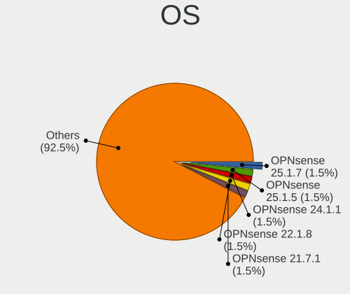

| Name             | Computers | Percent |
|------------------|-----------|---------|
| OPNsense 25.1.7  | 8         | 1.51%   |
| OPNsense 25.1.5  | 8         | 1.51%   |
| OPNsense 24.1.1  | 8         | 1.51%   |
| OPNsense 22.1.8  | 8         | 1.51%   |
| OPNsense 21.7.1  | 8         | 1.51%   |
| OPNsense 20.7.8  | 8         | 1.51%   |
| OPNsense 25.7.3  | 7         | 1.32%   |
| OPNsense 23.1    | 7         | 1.32%   |
| OPNsense 22.7    | 7         | 1.32%   |
| OPNsense 21.7.3  | 7         | 1.32%   |
| OPNsense 21.1.6  | 7         | 1.32%   |
| OPNsense 25.1    | 6         | 1.13%   |
| OPNsense 24.7.4  | 6         | 1.13%   |
| OPNsense 24.7.12 | 6         | 1.13%   |
| OPNsense 24.7.10 | 6         | 1.13%   |
| OPNsense 23.7.1  | 6         | 1.13%   |
| OPNsense 23.1.1  | 6         | 1.13%   |
| OPNsense 22.7.4  | 6         | 1.13%   |
| OPNsense 22.7.10 | 6         | 1.13%   |
| OPNsense 21.1    | 6         | 1.13%   |
| FreeBSD 14.0-p6  | 6         | 1.13%   |
| OPNsense 24.1.7  | 5         | 0.94%   |
| OPNsense 23.1.7  | 5         | 0.94%   |
| OPNsense 23.1.11 | 5         | 0.94%   |
| OPNsense 21.7.7  | 5         | 0.94%   |
| OPNsense 21.7.6  | 5         | 0.94%   |
| OPNsense 21.1.5  | 5         | 0.94%   |
| OpenBSD 6.8      | 5         | 0.94%   |
| FreeBSD 13.0-p7  | 5         | 0.94%   |
| OPNsense 25.7.7  | 4         | 0.75%   |
| OPNsense 25.7.5  | 4         | 0.75%   |
| OPNsense 25.7.1  | 4         | 0.75%   |
| OPNsense 25.1.12 | 4         | 0.75%   |
| OPNsense 24.7.8  | 4         | 0.75%   |
| OPNsense 24.7.7  | 4         | 0.75%   |
| OPNsense 24.7.6  | 4         | 0.75%   |
| OPNsense 24.7.5  | 4         | 0.75%   |
| OPNsense 24.7.11 | 4         | 0.75%   |
| OPNsense 24.1.8  | 4         | 0.75%   |
| OPNsense 24.1.3  | 4         | 0.75%   |

OS Family
---------

OS without a version

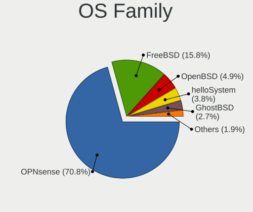

| Name        | Computers | Percent |
|-------------|-----------|---------|
| OPNsense    | 259       | 70.77%  |
| FreeBSD     | 58        | 15.85%  |
| OpenBSD     | 18        | 4.92%   |
| helloSystem | 14        | 3.83%   |
| GhostBSD    | 10        | 2.73%   |
| NomadBSD    | 5         | 1.37%   |
| TrueNAS     | 2         | 0.55%   |

Arch
----

OS architecture (x86_64, i586, etc.)

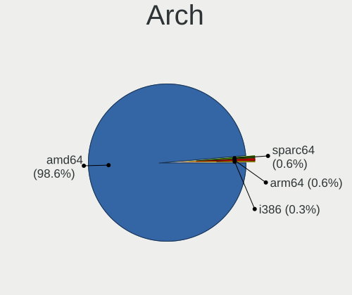

| Name    | Computers | Percent |
|---------|-----------|---------|
| amd64   | 358       | 98.62%  |
| sparc64 | 2         | 0.55%   |
| arm64   | 2         | 0.55%   |
| i386    | 1         | 0.28%   |

DE
--

Desktop Environment

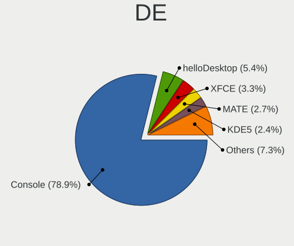

| Name          | Computers | Percent |
|---------------|-----------|---------|
| Console       | 291       | 78.86%  |
| helloDesktop  | 20        | 5.42%   |
| XFCE          | 12        | 3.25%   |
| MATE          | 10        | 2.71%   |
| KDE5          | 9         | 2.44%   |
| TWM           | 5         | 1.36%   |
| i3            | 5         | 1.36%   |
| fvwm          | 5         | 1.36%   |
| GNOME         | 4         | 1.08%   |
| LXQt          | 2         | 0.54%   |
| wlroots       | 1         | 0.27%   |
| Openbox       | 1         | 0.27%   |
| LXDE          | 1         | 0.27%   |
| Enlightenment | 1         | 0.27%   |
| CDE           | 1         | 0.27%   |
| AwesomeWM     | 1         | 0.27%   |

Display Server
--------------

X11 or Wayland

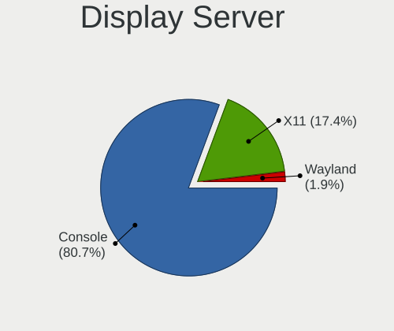

| Name    | Computers | Percent |
|---------|-----------|---------|
| Console | 296       | 80.65%  |
| X11     | 64        | 17.44%  |
| Wayland | 7         | 1.91%   |

Display Manager
---------------

SDDM, LightDM, etc.

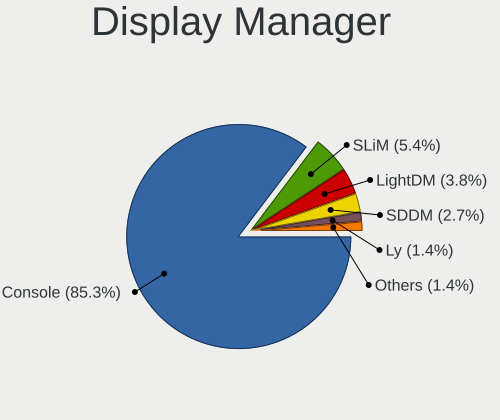

| Name    | Computers | Percent |
|---------|-----------|---------|
| Console | 314       | 85.33%  |
| SLiM    | 20        | 5.43%   |
| LightDM | 14        | 3.8%    |
| SDDM    | 10        | 2.72%   |
| Ly      | 5         | 1.36%   |
| GDM     | 3         | 0.82%   |
| XDM     | 2         | 0.54%   |

OS Lang
-------

Language

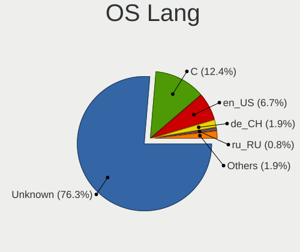

| Lang    | Computers | Percent |
|---------|-----------|---------|
| Unknown | 284       | 76.34%  |
| C       | 46        | 12.37%  |
| en_US   | 25        | 6.72%   |
| de_CH   | 7         | 1.88%   |
| ru_RU   | 3         | 0.81%   |
| fr_FR   | 3         | 0.81%   |
| de_DE   | 3         | 0.81%   |
| fi_FI   | 1         | 0.27%   |

Boot Mode
---------

EFI or BIOS

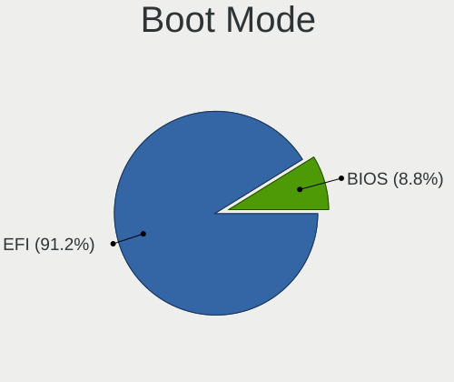

| Mode | Computers | Percent |
|------|-----------|---------|
| EFI  | 332       | 91.21%  |
| BIOS | 32        | 8.79%   |

Filesystem
----------

Type of filesystem

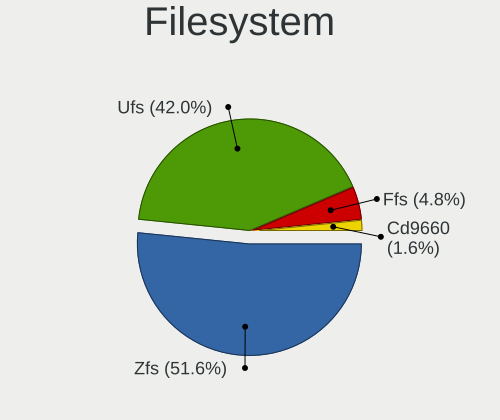

| Type   | Computers | Percent |
|--------|-----------|---------|
| Zfs    | 193       | 51.6%   |
| Ufs    | 157       | 41.98%  |
| Ffs    | 18        | 4.81%   |
| Cd9660 | 6         | 1.6%    |

Part. scheme
------------

Scheme of partitioning

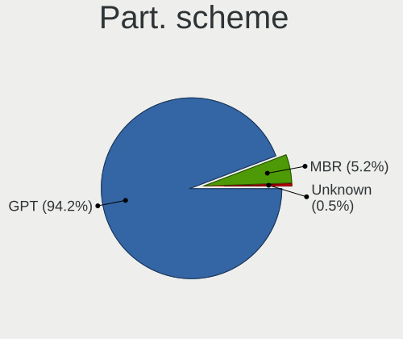

| Type    | Computers | Percent |
|---------|-----------|---------|
| GPT     | 343       | 94.23%  |
| MBR     | 19        | 5.22%   |
| Unknown | 2         | 0.55%   |

Board
-----

Vendor
------

Motherboard manufacturer

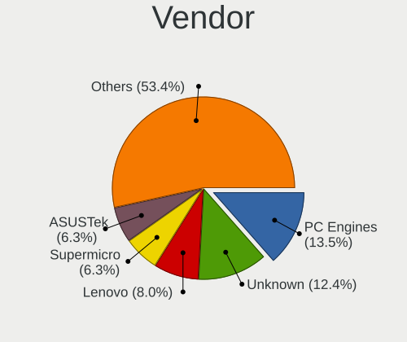

| Name                                 | Computers | Percent |
|--------------------------------------|-----------|---------|
| PC Engines                           | 49        | 13.5%   |
| Unknown                              | 45        | 12.4%   |
| Lenovo                               | 29        | 7.99%   |
| Supermicro                           | 23        | 6.34%   |
| ASUSTek Computer                     | 23        | 6.34%   |
| Hewlett-Packard                      | 22        | 6.06%   |
| Dell                                 | 16        | 4.41%   |
| Sophos                               | 14        | 3.86%   |
| Deciso                               | 14        | 3.86%   |
| Intel                                | 13        | 3.58%   |
| Apple                                | 13        | 3.58%   |
| Protectli                            | 10        | 2.75%   |
| Shuttle                              | 9         | 2.48%   |
| Gigabyte Technology                  | 9         | 2.48%   |
| ASRock                               | 9         | 2.48%   |
| GoWin Solution                       | 5         | 1.38%   |
| Fujitsu                              | 5         | 1.38%   |
| ZOTAC                                | 4         | 1.1%    |
| Techvision                           | 4         | 1.1%    |
| Acer                                 | 4         | 1.1%    |
| BESSTAR Tech                         | 3         | 0.83%   |
| AMI                                  | 3         | 0.83%   |
| TOPC                                 | 2         | 0.55%   |
| Sun                                  | 2         | 0.55%   |
| Shenzhen Meigao Electronic Equipment | 2         | 0.55%   |
| LinuxContainers                      | 2         | 0.55%   |
| HUAWEI                               | 2         | 0.55%   |
| CheckPoint                           | 2         | 0.55%   |
| ASRockRack                           | 2         | 0.55%   |
| YANYU                                | 1         | 0.28%   |
| Yanling                              | 1         | 0.28%   |
| TUXEDO                               | 1         | 0.28%   |
| Trigkey                              | 1         | 0.28%   |
| SLIMBOOK                             | 1         | 0.28%   |
| Silicom                              | 1         | 0.28%   |
| Seco                                 | 1         | 0.28%   |
| Raspberry Pi Foundation              | 1         | 0.28%   |
| Panasonic                            | 1         | 0.28%   |
| MW                                   | 1         | 0.28%   |
| MSI                                  | 1         | 0.28%   |

Model
-----

Motherboard model

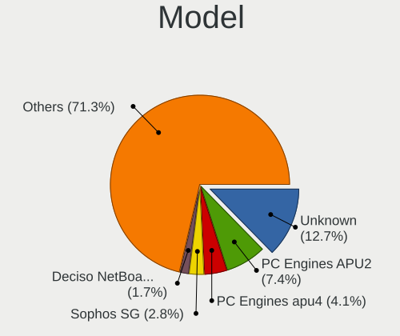

| Name                                              | Computers | Percent |
|---------------------------------------------------|-----------|---------|
| Unknown                                           | 46        | 12.67%  |
| PC Engines APU2                                   | 27        | 7.44%   |
| PC Engines apu4                                   | 15        | 4.13%   |
| Sophos SG                                         | 10        | 2.75%   |
| Deciso NetBoard-A20                               | 6         | 1.65%   |
| Supermicro Super Server                           | 5         | 1.38%   |
| Techvision TVI7309X                               | 4         | 1.1%    |
| GoWin Solution R86S                               | 4         | 1.1%    |
| Deciso DEC2700 - OPNsense Appliance               | 4         | 1.1%    |
| Supermicro SYS-5019D-4C-FN8TP                     | 3         | 0.83%   |
| Sophos XG                                         | 3         | 0.83%   |
| Protectli FW6                                     | 3         | 0.83%   |
| PC Engines APU                                    | 3         | 0.83%   |
| Lenovo Yoga Slim 7 Pro 14ACH5 82MS                | 3         | 0.83%   |
| Lenovo Yoga 900S-12ISK 80ML                       | 3         | 0.83%   |
| ASUS All Series                                   | 3         | 0.83%   |
| ASRock A320M-ITX                                  | 3         | 0.83%   |
| TOPC PHX ITX                                      | 2         | 0.55%   |
| Supermicro A1SAi                                  | 2         | 0.55%   |
| Shuttle DS10U                                     | 2         | 0.55%   |
| Shuttle DL30N                                     | 2         | 0.55%   |
| Shenzhen Meigao Electronic Equipment Venus Series | 2         | 0.55%   |
| Protectli VP2420                                  | 2         | 0.55%   |
| Protectli V1410                                   | 2         | 0.55%   |
| PC Engines apu6                                   | 2         | 0.55%   |
| PC Engines APU3                                   | 2         | 0.55%   |
| LinuxContainers Standard PC (Q35 + ICH9, 2009)    | 2         | 0.55%   |
| Intel Q3XXG4-P V1.0                               | 2         | 0.55%   |
| Intel NUC9i7QNX                                   | 2         | 0.55%   |
| HUAWEI MACH-WX9                                   | 2         | 0.55%   |
| HP Compaq Elite 8300 SFF                          | 2         | 0.55%   |
| HP Compaq 8200 Elite CMT PC                       | 2         | 0.55%   |
| Fujitsu PRIMERGY RX2530 M5                        | 2         | 0.55%   |
| Fujitsu FUTRO S920                                | 2         | 0.55%   |
| Dell Precision 3440                               | 2         | 0.55%   |
| Dell PowerEdge T640                               | 2         | 0.55%   |
| Dell OptiPlex 7020                                | 2         | 0.55%   |
| Deciso Netboard A20                               | 2         | 0.55%   |
| CheckPoint PB-10-00                               | 2         | 0.55%   |
| BESSTAR Tech GK41                                 | 2         | 0.55%   |

Model Family
------------

Motherboard model prefix

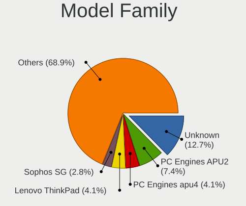

| Name                                       | Computers | Percent |
|--------------------------------------------|-----------|---------|
| Unknown                                    | 46        | 12.67%  |
| PC Engines APU2                            | 27        | 7.44%   |
| PC Engines apu4                            | 15        | 4.13%   |
| Lenovo ThinkPad                            | 15        | 4.13%   |
| Sophos SG                                  | 10        | 2.75%   |
| Lenovo Yoga                                | 8         | 2.2%    |
| HP Compaq                                  | 6         | 1.65%   |
| Deciso NetBoard-A20                        | 6         | 1.65%   |
| Supermicro Super                           | 5         | 1.38%   |
| Techvision TVI7309X                        | 4         | 1.1%    |
| HP EliteBook                               | 4         | 1.1%    |
| GoWin Solution R86S                        | 4         | 1.1%    |
| Dell Precision                             | 4         | 1.1%    |
| Dell PowerEdge                             | 4         | 1.1%    |
| Dell OptiPlex                              | 4         | 1.1%    |
| Deciso DEC2700                             | 4         | 1.1%    |
| Acer Aspire                                | 4         | 1.1%    |
| Supermicro SYS-5019D-4C-FN8TP              | 3         | 0.83%   |
| Sophos XG                                  | 3         | 0.83%   |
| Protectli FW6                              | 3         | 0.83%   |
| PC Engines APU                             | 3         | 0.83%   |
| Lenovo ThinkCentre                         | 3         | 0.83%   |
| HP ProLiant                                | 3         | 0.83%   |
| Fujitsu FUTRO                              | 3         | 0.83%   |
| ASUS TUF                                   | 3         | 0.83%   |
| ASUS All                                   | 3         | 0.83%   |
| ASRock A320M-ITX                           | 3         | 0.83%   |
| TOPC PHX                                   | 2         | 0.55%   |
| Supermicro A1SAi                           | 2         | 0.55%   |
| Sun SUNW                                   | 2         | 0.55%   |
| Shuttle DS10U                              | 2         | 0.55%   |
| Shuttle DL30N                              | 2         | 0.55%   |
| Shenzhen Meigao Electronic Equipment Venus | 2         | 0.55%   |
| Protectli VP2420                           | 2         | 0.55%   |
| Protectli V1410                            | 2         | 0.55%   |
| PC Engines apu6                            | 2         | 0.55%   |
| PC Engines APU3                            | 2         | 0.55%   |
| LinuxContainers Standard                   | 2         | 0.55%   |
| Intel Q3XXG4-P                             | 2         | 0.55%   |
| Intel NUC9i7QNX                            | 2         | 0.55%   |

MFG Year
--------

Motherboard manufacture year

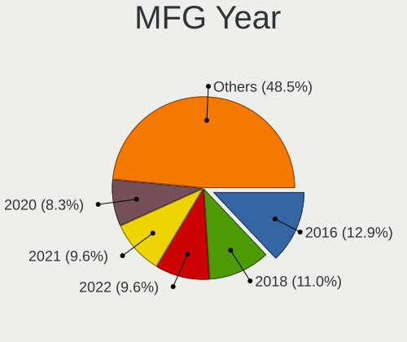

| Year    | Computers | Percent |
|---------|-----------|---------|
| 2016    | 47        | 12.95%  |
| 2018    | 40        | 11.02%  |
| 2022    | 35        | 9.64%   |
| 2021    | 35        | 9.64%   |
| 2020    | 30        | 8.26%   |
| 2019    | 23        | 6.34%   |
| 2023    | 22        | 6.06%   |
| 2014    | 22        | 6.06%   |
| 2024    | 20        | 5.51%   |
| 2017    | 20        | 5.51%   |
| 2015    | 17        | 4.68%   |
| 2012    | 16        | 4.41%   |
| 2013    | 12        | 3.31%   |
| 2011    | 9         | 2.48%   |
| Unknown | 5         | 1.38%   |
| 2025    | 4         | 1.1%    |
| 2008    | 3         | 0.83%   |
| 2010    | 1         | 0.28%   |
| 2009    | 1         | 0.28%   |
| 2007    | 1         | 0.28%   |

Form Factor
-----------

Physical design of the computer

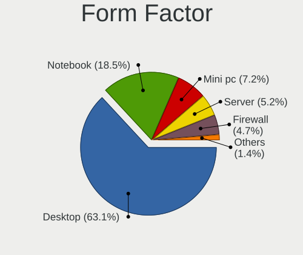

| Name           | Computers | Percent |
|----------------|-----------|---------|
| Desktop        | 229       | 63.09%  |
| Notebook       | 67        | 18.46%  |
| Mini pc        | 26        | 7.16%   |
| Server         | 19        | 5.23%   |
| Firewall       | 17        | 4.68%   |
| System on chip | 2         | 0.55%   |
| All in one     | 2         | 0.55%   |
| Convertible    | 1         | 0.28%   |

Coreboot
--------

Have coreboot on board

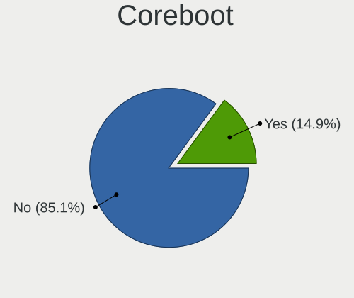

| Used | Computers | Percent |
|------|-----------|---------|
| No   | 309       | 85.12%  |
| Yes  | 54        | 14.88%  |

RAM Size
--------

Total RAM memory

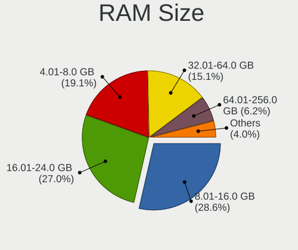

| Size in GB      | Computers | Percent |
|-----------------|-----------|---------|
| 8.01-16.0       | 106       | 28.57%  |
| 16.01-24.0      | 100       | 26.95%  |
| 4.01-8.0        | 71        | 19.14%  |
| 32.01-64.0      | 56        | 15.09%  |
| 64.01-256.0     | 23        | 6.2%    |
| 2.01-3.0        | 5         | 1.35%   |
| More than 256.0 | 2         | 0.54%   |
| 1.01-2.0        | 2         | 0.54%   |
| 0.51-1.0        | 2         | 0.54%   |
| 3.01-4.0        | 1         | 0.27%   |
| 24.01-32.0      | 1         | 0.27%   |
| 0.01-0.5        | 1         | 0.27%   |
| Unknown         | 1         | 0.27%   |

RAM Used
--------

Used RAM memory

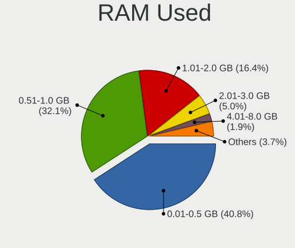

| Used GB     | Computers | Percent |
|-------------|-----------|---------|
| 0.01-0.5    | 154       | 40.85%  |
| 0.51-1.0    | 121       | 32.1%   |
| 1.01-2.0    | 62        | 16.45%  |
| 2.01-3.0    | 19        | 5.04%   |
| 4.01-8.0    | 7         | 1.86%   |
| 3.01-4.0    | 5         | 1.33%   |
| 0           | 3         | 0.8%    |
| 16.01-24.0  | 2         | 0.53%   |
| 8.01-16.0   | 2         | 0.53%   |
| 64.01-256.0 | 1         | 0.27%   |
| Unknown     | 1         | 0.27%   |

Total Drives
------------

Number of drives on board

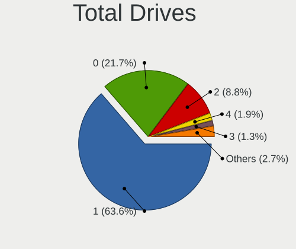

| Drives | Computers | Percent |
|--------|-----------|---------|
| 1      | 238       | 63.64%  |
| 0      | 81        | 21.66%  |
| 2      | 33        | 8.82%   |
| 4      | 7         | 1.87%   |
| 3      | 5         | 1.34%   |
| 6      | 3         | 0.8%    |
| 5      | 3         | 0.8%    |
| 17     | 1         | 0.27%   |
| 16     | 1         | 0.27%   |
| 8      | 1         | 0.27%   |
| 7      | 1         | 0.27%   |

Has CD-ROM
----------

Has CD-ROM on board

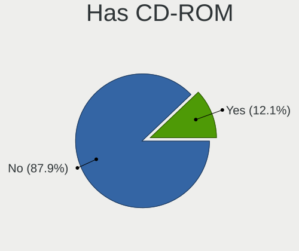

| Presented | Computers | Percent |
|-----------|-----------|---------|
| No        | 320       | 87.91%  |
| Yes       | 44        | 12.09%  |

Has Ethernet
------------

Has Ethernet on board

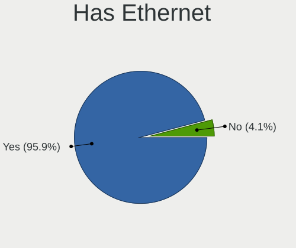

| Presented | Computers | Percent |
|-----------|-----------|---------|
| Yes       | 349       | 95.88%  |
| No        | 15        | 4.12%   |

Has WiFi
--------

Has WiFi module

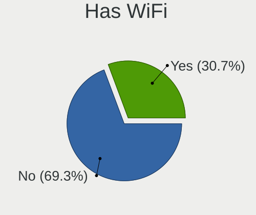

| Presented | Computers | Percent |
|-----------|-----------|---------|
| No        | 253       | 69.32%  |
| Yes       | 112       | 30.68%  |

Has Bluetooth
-------------

Has Bluetooth module

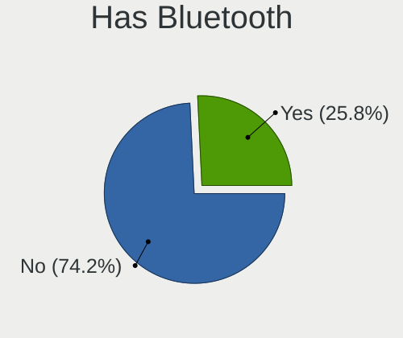

| Presented | Computers | Percent |
|-----------|-----------|---------|
| No        | 271       | 74.25%  |
| Yes       | 94        | 25.75%  |

Location
--------

Country
-------

Geographic location (country)

| Country     | Computers | Percent |
|-------------|-----------|---------|
| Switzerland | 363       | 100%    |

City
----

Geographic location (city)

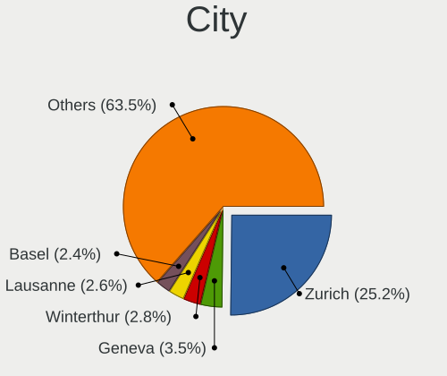

| City               | Computers | Percent |
|--------------------|-----------|---------|
| Zurich             | 107       | 25.18%  |
| Geneva             | 15        | 3.53%   |
| Winterthur         | 12        | 2.82%   |
| Lausanne           | 11        | 2.59%   |
| Basel              | 10        | 2.35%   |
| Bern               | 8         | 1.88%   |
| Gachnang           | 7         | 1.65%   |
| Lucerne            | 6         | 1.41%   |
| Muttenz            | 5         | 1.18%   |
| Horgen             | 5         | 1.18%   |
| Gordola            | 5         | 1.18%   |
| St. Moritz         | 4         | 0.94%   |
| Niederbipp         | 4         | 0.94%   |
| Lenzburg           | 4         | 0.94%   |
| Burgdorf           | 4         | 0.94%   |
| Wallisellen        | 3         | 0.71%   |
| Therwil            | 3         | 0.71%   |
| St. Gallen         | 3         | 0.71%   |
| Riehen             | 3         | 0.71%   |
| Mohlin             | 3         | 0.71%   |
| Mettmenstetten     | 3         | 0.71%   |
| Maennedorf         | 3         | 0.71%   |
| Dietikon           | 3         | 0.71%   |
| Dielsdorf          | 3         | 0.71%   |
| Zug                | 2         | 0.47%   |
| Wohlen             | 2         | 0.47%   |
| Wetzikon           | 2         | 0.47%   |
| Wettswil           | 2         | 0.47%   |
| Uster              | 2         | 0.47%   |
| Thalwil            | 2         | 0.47%   |
| Tagelswangen       | 2         | 0.47%   |
| Steckborn          | 2         | 0.47%   |
| Siggenthal Station | 2         | 0.47%   |
| Sankt Margrethen   | 2         | 0.47%   |
| Palezieux          | 2         | 0.47%   |
| Ottenbach          | 2         | 0.47%   |
| Onex               | 2         | 0.47%   |
| Oensingen          | 2         | 0.47%   |
| Neuchatel          | 2         | 0.47%   |
| Munchenstein       | 2         | 0.47%   |

Drives
------

Drive Vendor
------------

Hard drive vendors

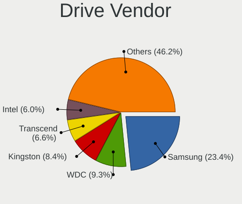

| Vendor              | Computers | Drives | Percent |
|---------------------|-----------|--------|---------|
| Samsung Electronics | 78        | 126    | 23.42%  |
| WDC                 | 31        | 76     | 9.31%   |
| Kingston            | 28        | 37     | 8.41%   |
| Transcend           | 22        | 35     | 6.61%   |
| Intel               | 20        | 50     | 6.01%   |
| Phison              | 15        | 19     | 4.5%    |
| China               | 15        | 21     | 4.5%    |
| Seagate             | 14        | 23     | 4.2%    |
| Crucial             | 12        | 20     | 3.6%    |
| Toshiba             | 8         | 10     | 2.4%    |
| SanDisk             | 7         | 13     | 2.1%    |
| A-DATA Technology   | 7         | 13     | 2.1%    |
| SK hynix            | 6         | 8      | 1.8%    |
| Hoodisk             | 6         | 9      | 1.8%    |
| Corsair             | 6         | 10     | 1.8%    |
| Apple               | 5         | 5      | 1.5%    |
| Hitachi             | 4         | 4      | 1.2%    |
| Silicon Motion      | 3         | 3      | 0.9%    |
| ShiJi               | 3         | 10     | 0.9%    |
| Protectli           | 3         | 3      | 0.9%    |
| NVMe                | 3         | 3      | 0.9%    |
| Intenso             | 3         | 7      | 0.9%    |
| HPT                 | 3         | 35     | 0.9%    |
| Fanxiang            | 3         | 3      | 0.9%    |
| QEMU                | 2         | 2      | 0.6%    |
| OCZ                 | 2         | 3      | 0.6%    |
| Micron Technology   | 2         | 3      | 0.6%    |
| KingSpec            | 2         | 2      | 0.6%    |
| HGST                | 2         | 2      | 0.6%    |
| Hewlett-Packard     | 2         | 17     | 0.6%    |
| FTS                 | 2         | 2      | 0.6%    |
| FORESEE             | 2         | 3      | 0.6%    |
| VICK                | 1         | 1      | 0.3%    |
| Verbatim            | 1         | 2      | 0.3%    |
| USB                 | 1         | 1      | 0.3%    |
| SPCC                | 1         | 2      | 0.3%    |
| PNY                 | 1         | 1      | 0.3%    |
| OPENBSD             | 1         | 1      | 0.3%    |
| LITEON              | 1         | 6      | 0.3%    |
| KIOXIA              | 1         | 1      | 0.3%    |

Drive Model
-----------

Hard drive models

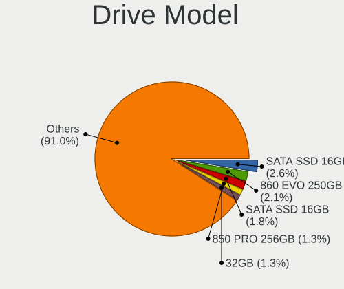

| Model                                  | Computers | Percent |
|----------------------------------------|-----------|---------|
| Phison SATA SSD 16GB                   | 10        | 2.58%   |
| Samsung SSD 860 EVO 250GB              | 8         | 2.07%   |
| China SATA SSD 16GB                    | 7         | 1.81%   |
| Samsung SSD 850 PRO 256GB              | 5         | 1.29%   |
| Hoodisk SSD 32GB                       | 5         | 1.29%   |
| Transcend TS256GMTS952T2 256GB         | 4         | 1.03%   |
| Transcend TS256GMTE710T 256GB          | 4         | 1.03%   |
| Samsung SSD 860 PRO 256GB              | 4         | 1.03%   |
| WDC WDS120G2G0B-00EPW0 120GB           | 3         | 0.78%   |
| SK hynix SKHynix_HFS512GDE9X081N 512GB | 3         | 0.78%   |
| ShiJi SSD 128GB                        | 3         | 0.78%   |
| Samsung SSD 850 EVO 500GB              | 3         | 0.78%   |
| Phison SATA SSD 32GB                   | 3         | 0.78%   |
| Kingston SKC600MS512G 512GB            | 3         | 0.78%   |
| Kingston SA400S37120G 120GB            | 3         | 0.78%   |
| Kingston RBUSNS8180DS3128GH 128GB      | 3         | 0.78%   |
| Intel SSDSC2BW180A4 180GB              | 3         | 0.78%   |
| Intel SSDSA2BW160G3H 160GB             | 3         | 0.78%   |
| HPT DISK 0_3 1TB                       | 3         | 0.78%   |
| HPT DISK 0_2 1TB                       | 3         | 0.78%   |
| HPT DISK 0_1 1TB                       | 3         | 0.78%   |
| HPT DISK 0_0 4TB                       | 3         | 0.78%   |
| Fanxiang S501 128GB                    | 3         | 0.78%   |
| China SATA SSD 32GB                    | 3         | 0.78%   |
| WDC WDS240G2G0A-00JH30 240GB           | 2         | 0.52%   |
| WDC WD6002FRYZ-01WD5B1 6TB             | 2         | 0.52%   |
| WDC WD40EFPX-68C6CN0 4TB               | 2         | 0.52%   |
| WDC WD30EFRX-68EUZN0 3TB               | 2         | 0.52%   |
| WDC WD1000DHTZ-04N21V0 1TB             | 2         | 0.52%   |
| Transcend TS64GMSA230S 64GB            | 2         | 0.52%   |
| Transcend TS512GMTS952T2 512GB         | 2         | 0.52%   |
| Transcend TS128GSSD420K 128GB          | 2         | 0.52%   |
| Transcend TS128GMTE110S 128GB          | 2         | 0.52%   |
| Toshiba DT01ACA200 2TB                 | 2         | 0.52%   |
| SK hynix SC311 SATA 256GB              | 2         | 0.52%   |
| Seagate ST3500413AS 500GB              | 2         | 0.52%   |
| Seagate ST18000NE000-3G6101 18TB       | 2         | 0.52%   |
| SanDisk SSD U100 24GB                  | 2         | 0.52%   |
| Samsung SSD 980 PRO 500GB              | 2         | 0.52%   |
| Samsung SSD 980 PRO 250GB              | 2         | 0.52%   |

HDD Vendor
----------

Hard disk drive vendors

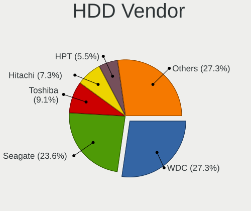

| Vendor              | Computers | Drives | Percent |
|---------------------|-----------|--------|---------|
| WDC                 | 15        | 50     | 27.27%  |
| Seagate             | 13        | 22     | 23.64%  |
| Toshiba             | 5         | 7      | 9.09%   |
| Hitachi             | 4         | 4      | 7.27%   |
| HPT                 | 3         | 35     | 5.45%   |
| Apple               | 3         | 3      | 5.45%   |
| QEMU                | 2         | 2      | 3.64%   |
| NVMe                | 2         | 2      | 3.64%   |
| HGST                | 2         | 2      | 3.64%   |
| Hewlett-Packard     | 2         | 13     | 3.64%   |
| USB                 | 1         | 1      | 1.82%   |
| Samsung Electronics | 1         | 1      | 1.82%   |
| OPENBSD             | 1         | 1      | 1.82%   |
| China               | 1         | 1      | 1.82%   |

SSD Vendor
----------

Solid state drive vendors

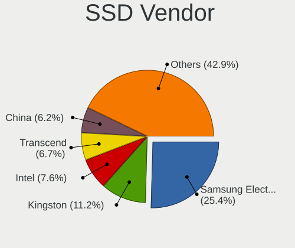

| Vendor              | Computers | Drives | Percent |
|---------------------|-----------|--------|---------|
| Samsung Electronics | 57        | 93     | 25.45%  |
| Kingston            | 25        | 31     | 11.16%  |
| Intel               | 17        | 47     | 7.59%   |
| Transcend           | 15        | 27     | 6.7%    |
| China               | 14        | 20     | 6.25%   |
| Phison              | 13        | 16     | 5.8%    |
| WDC                 | 11        | 19     | 4.91%   |
| Crucial             | 10        | 18     | 4.46%   |
| SanDisk             | 7         | 13     | 3.13%   |
| A-DATA Technology   | 7         | 13     | 3.13%   |
| Hoodisk             | 6         | 9      | 2.68%   |
| Corsair             | 5         | 9      | 2.23%   |
| Toshiba             | 3         | 3      | 1.34%   |
| SK hynix            | 3         | 3      | 1.34%   |
| ShiJi               | 3         | 10     | 1.34%   |
| Protectli           | 3         | 3      | 1.34%   |
| Intenso             | 3         | 7      | 1.34%   |
| OCZ                 | 2         | 3      | 0.89%   |
| Micron Technology   | 2         | 3      | 0.89%   |
| KingSpec            | 2         | 2      | 0.89%   |
| Hewlett-Packard     | 2         | 4      | 0.89%   |
| FTS                 | 2         | 2      | 0.89%   |
| Apple               | 2         | 2      | 0.89%   |
| VICK                | 1         | 1      | 0.45%   |
| Verbatim            | 1         | 2      | 0.45%   |
| SPCC                | 1         | 2      | 0.45%   |
| Seagate             | 1         | 1      | 0.45%   |
| PNY                 | 1         | 1      | 0.45%   |
| NVMe                | 1         | 1      | 0.45%   |
| LITEON              | 1         | 6      | 0.45%   |
| GOFATOO             | 1         | 1      | 0.45%   |
| FORESEE             | 1         | 1      | 0.45%   |
| BIWIN               | 1         | 1      | 0.45%   |

Drive Kind
----------

HDD or SSD

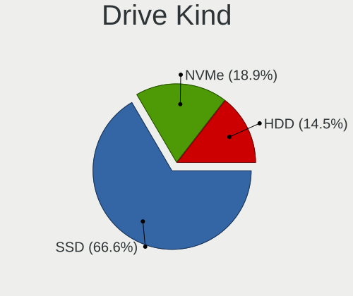

| Kind | Computers | Drives | Percent |
|------|-----------|--------|---------|
| SSD  | 211       | 374    | 66.56%  |
| NVMe | 60        | 79     | 18.93%  |
| HDD  | 46        | 144    | 14.51%  |

Drive Connector
---------------

SATA, SAS, NVMe, etc.

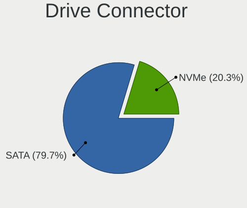

| Type | Computers | Drives | Percent |
|------|-----------|--------|---------|
| SATA | 235       | 518    | 79.66%  |
| NVMe | 60        | 79     | 20.34%  |

Drive Size
----------

Size of hard drive

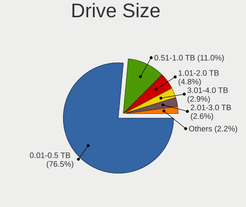

| Size in TB | Computers | Drives | Percent |
|------------|-----------|--------|---------|
| 0.01-0.5   | 208       | 379    | 76.47%  |
| 0.51-1.0   | 30        | 71     | 11.03%  |
| 1.01-2.0   | 13        | 25     | 4.78%   |
| 3.01-4.0   | 8         | 10     | 2.94%   |
| 2.01-3.0   | 7         | 15     | 2.57%   |
| 4.01-10.0  | 4         | 16     | 1.47%   |
| 10.01-20.0 | 2         | 2      | 0.74%   |

Space Total
-----------

Amount of disk space available on the file system

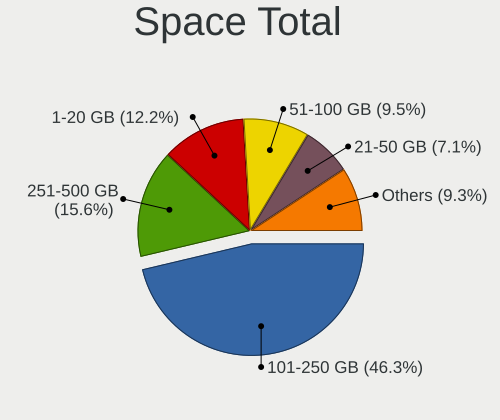

| Size in GB     | Computers | Percent |
|----------------|-----------|---------|
| 101-250        | 175       | 46.3%   |
| 251-500        | 59        | 15.61%  |
| 1-20           | 46        | 12.17%  |
| 51-100         | 36        | 9.52%   |
| 21-50          | 27        | 7.14%   |
| 501-1000       | 26        | 6.88%   |
| 1001-2000      | 6         | 1.59%   |
| More than 3000 | 1         | 0.26%   |
| 2001-3000      | 1         | 0.26%   |
| Unknown        | 1         | 0.26%   |

Space Used
----------

Amount of used disk space

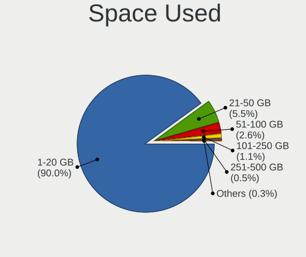

| Used GB | Computers | Percent |
|---------|-----------|---------|
| 1-20    | 342       | 90%     |
| 21-50   | 21        | 5.53%   |
| 51-100  | 10        | 2.63%   |
| 101-250 | 4         | 1.05%   |
| 251-500 | 2         | 0.53%   |
| Unknown | 1         | 0.26%   |

Malfunc. Drives
---------------

Drive models with a malfunction

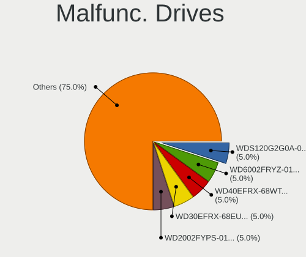

| Model                                      | Computers | Drives | Percent |
|--------------------------------------------|-----------|--------|---------|
| Seagate ST3500413AS 500GB                  | 2         | 3      | 5.71%   |
| WDC WDS250G2B0B-00YS70 250GB               | 1         | 1      | 2.86%   |
| WDC WDS120G2G0A-00JH30 120GB               | 1         | 2      | 2.86%   |
| WDC WD6002FRYZ-01WD5B1 6TB                 | 1         | 6      | 2.86%   |
| WDC WD40EFRX-68WT0N0 4TB                   | 1         | 1      | 2.86%   |
| WDC WD30EFRX-68EUZN0 3TB                   | 1         | 1      | 2.86%   |
| WDC WD2002FYPS-01U1B0 2TB                  | 1         | 5      | 2.86%   |
| Toshiba MK1059GSM 1TB                      | 1         | 1      | 2.86%   |
| Seagate ST3500418AS 500GB                  | 1         | 2      | 2.86%   |
| Seagate ST2000VN004-2E4164 2TB             | 1         | 2      | 2.86%   |
| Samsung Electronics SSD 870 EVO 1TB        | 1         | 1      | 2.86%   |
| Samsung Electronics SSD 850 EVO mSATA 1TB  | 1         | 1      | 2.86%   |
| Samsung Electronics HD204UI 2TB            | 1         | 1      | 2.86%   |
| OCZ AGILITY3 240GB                         | 1         | 1      | 2.86%   |
| Micron Technology MTFDDAK256MAM-1K12 256GB | 1         | 1      | 2.86%   |
| Kingston SV300S37A60G 64GB                 | 1         | 1      | 2.86%   |
| Kingston SV300S37A120G 120GB               | 1         | 1      | 2.86%   |
| Kingston SH103S3120G 120GB                 | 1         | 2      | 2.86%   |
| Intenso SSD Sata III 248GB                 | 1         | 1      | 2.86%   |
| Intel SSDSCKKF256G8H 256GB                 | 1         | 2      | 2.86%   |
| Intel SSDSC2CT240A4 240GB                  | 1         | 1      | 2.86%   |
| Intel SSDSC2BW480A4 480GB                  | 1         | 2      | 2.86%   |
| Intel SSDSC2BW240A4 240GB                  | 1         | 2      | 2.86%   |
| Intel SSDSC2BW120H6 120GB                  | 1         | 1      | 2.86%   |
| Intel SSDSA2M160G2GC 160GB                 | 1         | 2      | 2.86%   |
| Intel SSDSA2M120G2GC 120GB                 | 1         | 1      | 2.86%   |
| Intel SSDSA2BW160G3H 160GB                 | 1         | 5      | 2.86%   |
| Hitachi HDS721050CLA660 500GB              | 1         | 1      | 2.86%   |
| HGST HUS726020ALE614 2TB                   | 1         | 1      | 2.86%   |
| HGST HTE725032A7E630 320GB                 | 1         | 1      | 2.86%   |
| Crucial CT480M500SSD1 480GB                | 1         | 1      | 2.86%   |
| Crucial CT256MX100SSD1 256GB               | 1         | 2      | 2.86%   |
| Corsair Force 3 SSD 120GB                  | 1         | 2      | 2.86%   |
| Corsair CSSD-F120GB2                       | 1         | 2      | 2.86%   |

Malfunc. Drive Vendor
---------------------

Vendors of faulty drives

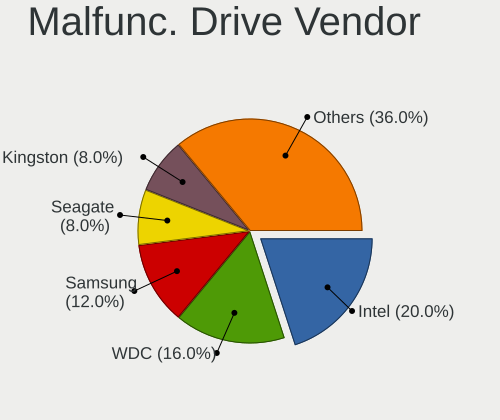

| Vendor              | Computers | Drives | Percent |
|---------------------|-----------|--------|---------|
| Intel               | 8         | 16     | 24.24%  |
| WDC                 | 5         | 16     | 15.15%  |
| Seagate             | 3         | 7      | 9.09%   |
| Samsung Electronics | 3         | 3      | 9.09%   |
| Kingston            | 3         | 4      | 9.09%   |
| HGST                | 2         | 2      | 6.06%   |
| Crucial             | 2         | 3      | 6.06%   |
| Corsair             | 2         | 4      | 6.06%   |
| Toshiba             | 1         | 1      | 3.03%   |
| OCZ                 | 1         | 1      | 3.03%   |
| Micron Technology   | 1         | 1      | 3.03%   |
| Intenso             | 1         | 1      | 3.03%   |
| Hitachi             | 1         | 1      | 3.03%   |

Malfunc. HDD Vendor
-------------------

Vendors of faulty HDD drives

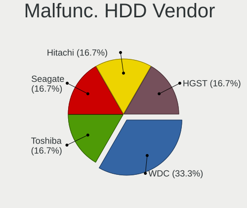

| Vendor              | Computers | Drives | Percent |
|---------------------|-----------|--------|---------|
| WDC                 | 3         | 13     | 27.27%  |
| Seagate             | 3         | 7      | 27.27%  |
| HGST                | 2         | 2      | 18.18%  |
| Toshiba             | 1         | 1      | 9.09%   |
| Samsung Electronics | 1         | 1      | 9.09%   |
| Hitachi             | 1         | 1      | 9.09%   |

Malfunc. Drive Kind
-------------------

Kinds of faulty drives

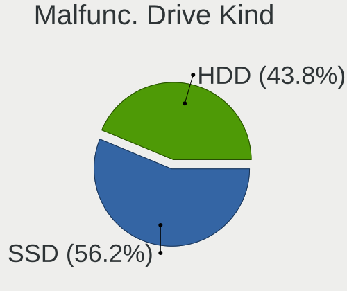

| Kind | Computers | Drives | Percent |
|------|-----------|--------|---------|
| SSD  | 22        | 35     | 70.97%  |
| HDD  | 9         | 25     | 29.03%  |

Failed Drives
-------------

Failed drive models

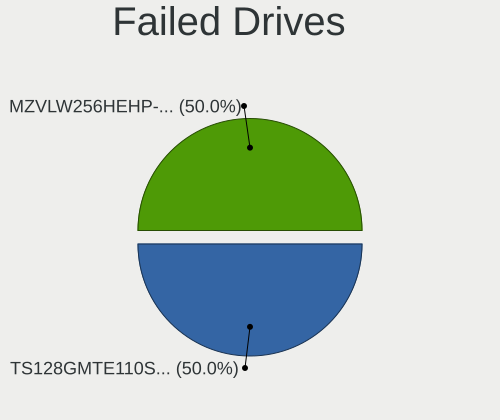

| Model                                        | Computers | Drives | Percent |
|----------------------------------------------|-----------|--------|---------|
| Transcend TS128GMTE110S 128GB                | 1         | 1      | 50%     |
| Samsung Electronics MZVLW256HEHP-000L7 256GB | 1         | 1      | 50%     |

Failed Drive Vendor
-------------------

Failed drive vendors

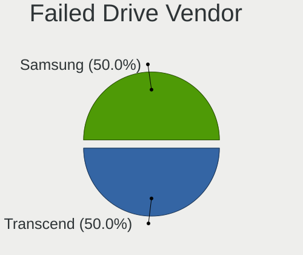

| Vendor              | Computers | Drives | Percent |
|---------------------|-----------|--------|---------|
| Transcend           | 1         | 1      | 50%     |
| Samsung Electronics | 1         | 1      | 50%     |

Drive Status
------------

Number of failed and malfunc. drives

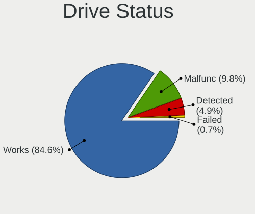

| Status   | Computers | Drives | Percent |
|----------|-----------|--------|---------|
| Works    | 258       | 480    | 84.59%  |
| Malfunc  | 30        | 60     | 9.84%   |
| Detected | 15        | 55     | 4.92%   |
| Failed   | 2         | 2      | 0.66%   |

Storage controller
------------------

Storage Vendor
--------------

Storage controller vendors

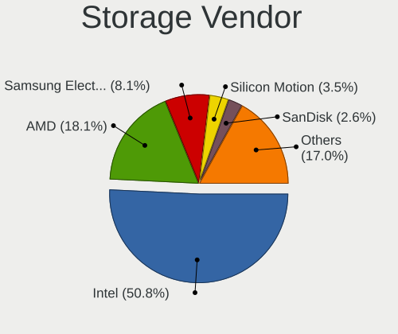

| Vendor                       | Computers | Percent |
|------------------------------|-----------|---------|
| Intel                        | 233       | 50.76%  |
| AMD                          | 83        | 18.08%  |
| Samsung Electronics          | 37        | 8.06%   |
| Silicon Motion               | 16        | 3.49%   |
| SanDisk                      | 12        | 2.61%   |
| Transcend                    | 8         | 1.74%   |
| Kingston Technology Company  | 8         | 1.74%   |
| Broadcom / LSI               | 7         | 1.53%   |
| ASMedia Technology           | 7         | 1.53%   |
| MAXIO Technology (Hangzhou)  | 6         | 1.31%   |
| Micron/Crucial Technology    | 5         | 1.09%   |
| SK hynix                     | 4         | 0.87%   |
| Phison Electronics           | 4         | 0.87%   |
| Micron Technology            | 4         | 0.87%   |
| Marvell Technology Group     | 4         | 0.87%   |
| HighPoint Technologies       | 3         | 0.65%   |
| ULi Electronics              | 2         | 0.44%   |
| Toshiba                      | 2         | 0.44%   |
| Shenzhen Longsys Electronics | 2         | 0.44%   |
| Red Hat                      | 2         | 0.44%   |
| KIOXIA                       | 2         | 0.44%   |
| JMicron Technology           | 2         | 0.44%   |
| Hewlett-Packard              | 2         | 0.44%   |
| Chelsio Communications       | 2         | 0.44%   |
| Nvidia                       | 1         | 0.22%   |
| ADATA Technology             | 1         | 0.22%   |

Storage Model
-------------

Storage controller models

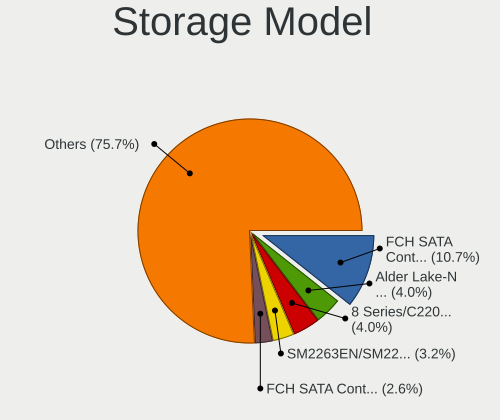

| Model                                                                          | Computers | Percent |
|--------------------------------------------------------------------------------|-----------|---------|
| AMD FCH SATA Controller [AHCI mode]                                            | 54        | 10.67%  |
| Intel Alder Lake-N SATA AHCI Controller                                        | 20        | 3.95%   |
| Intel 8 Series/C220 Series Chipset Family 6-port SATA Controller 1 [AHCI mode] | 20        | 3.95%   |
| Silicon Motion SM2263EN/SM2263XT (DRAM-less) NVMe SSD Controllers              | 16        | 3.16%   |
| AMD FCH SATA Controller [IDE mode]                                             | 13        | 2.57%   |
| Intel Sunrise Point-LP SATA Controller [AHCI mode]                             | 12        | 2.37%   |
| Intel Celeron/Pentium Silver Processor SATA Controller                         | 12        | 2.37%   |
| Intel C620 Series Chipset Family SSATA Controller [AHCI mode]                  | 12        | 2.37%   |
| Samsung NVMe SSD Controller SM981/PM981/PM983                                  | 11        | 2.17%   |
| Samsung NVMe SSD Controller PM9A1/PM9A3/980PRO                                 | 11        | 2.17%   |
| Intel Q170/Q150/B150/H170/H110/Z170/CM236 Chipset SATA Controller [AHCI Mode]  | 11        | 2.17%   |
| Intel C620 Series Chipset Family SATA Controller [AHCI mode]                   | 9         | 1.78%   |
| Intel 7 Series/C210 Series Chipset Family 6-port SATA Controller [AHCI mode]   | 9         | 1.78%   |
| Intel 7 Series Chipset Family 6-port SATA Controller [AHCI mode]               | 9         | 1.78%   |
| Samsung NVMe SSD Controller SM961/PM961/SM963                                  | 8         | 1.58%   |
| Intel Cannon Lake PCH SATA AHCI Controller                                     | 8         | 1.58%   |
| Intel Atom Processor C3000 Series SATA Controller 1                            | 8         | 1.58%   |
| Intel Atom processor C2000 AHCI SATA3 Controller                               | 8         | 1.58%   |
| Intel 6 Series/C200 Series Chipset Family 6 port Desktop SATA AHCI Controller  | 8         | 1.58%   |
| Intel Jasper Lake SATA AHCI Controller                                         | 7         | 1.38%   |
| Intel Comet Lake SATA AHCI Controller                                          | 7         | 1.38%   |
| Intel 6 Series/C200 Series Chipset Family 6 port Mobile SATA AHCI Controller   | 7         | 1.38%   |
| AMD 500 Series Chipset SATA Controller                                         | 7         | 1.38%   |
| MAXIO (Hangzhou) NVMe SSD Controller MAP1202 (DRAM-less)                       | 6         | 1.19%   |
| Intel Atom Processor E3800 Series SATA AHCI Controller                         | 6         | 1.19%   |
| Intel Atom Processor C3000 Series SATA Controller 0                            | 6         | 1.19%   |
| Intel Cannon Point-LP SATA Controller [AHCI Mode]                              | 5         | 0.99%   |
| Intel Alder Lake-P SATA AHCI Controller                                        | 5         | 0.99%   |
| ASMedia ASM1061/ASM1062 Serial ATA Controller                                  | 5         | 0.99%   |
| Transcend NVMe PCIe SSD 220S/240S/MTE710T                                      | 4         | 0.79%   |
| Intel Wildcat Point-LP SATA Controller [AHCI Mode]                             | 4         | 0.79%   |
| Intel Atom processor C2000 AHCI SATA2 Controller                               | 4         | 0.79%   |
| Intel 8 Series SATA Controller 1 [AHCI mode]                                   | 4         | 0.79%   |
| Intel 200 Series PCH SATA controller [AHCI mode]                               | 4         | 0.79%   |
| AMD SB7x0/SB8x0/SB9x0 SATA Controller [AHCI mode]                              | 4         | 0.79%   |
| SK hynix Gold P31/BC711/PC711 NVMe Solid State Drive                           | 3         | 0.59%   |
| SanDisk Extreme Pro / WD Black SN750 / PC SN730 / Red SN700 NVMe SSD           | 3         | 0.59%   |
| SanDisk Extreme Pro / WD Black 2018/SN750/PC SN720 NVMe SSD                    | 3         | 0.59%   |
| Samsung NVMe SSD Controller 980 (DRAM-less)                                    | 3         | 0.59%   |
| Phison PS5013-E13 PCIe3 NVMe Controller (DRAM-less)                            | 3         | 0.59%   |

Storage Kind
------------

Kind of storage controller (IDE, SATA, NVMe, SAS, ...)

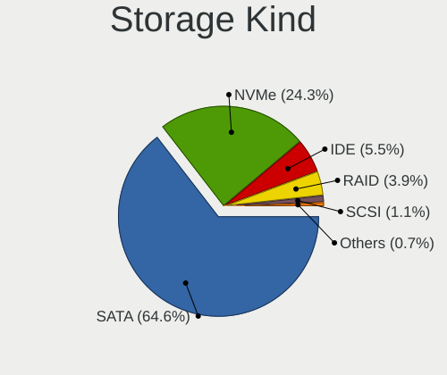

| Kind | Computers | Percent |
|------|-----------|---------|
| SATA | 295       | 64.55%  |
| NVMe | 111       | 24.29%  |
| IDE  | 25        | 5.47%   |
| RAID | 18        | 3.94%   |
| SCSI | 5         | 1.09%   |
| SAS  | 3         | 0.66%   |

Processor
---------

CPU Vendor
----------

Processor vendors

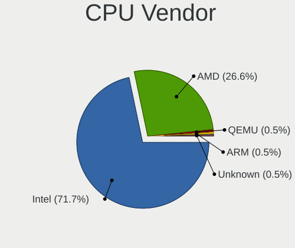

| Vendor  | Computers | Percent |
|---------|-----------|---------|
| Intel   | 261       | 71.7%   |
| AMD     | 97        | 26.65%  |
| QEMU    | 2         | 0.55%   |
| ARM     | 2         | 0.55%   |
| Unknown | 2         | 0.55%   |

CPU Model
---------

Processor models

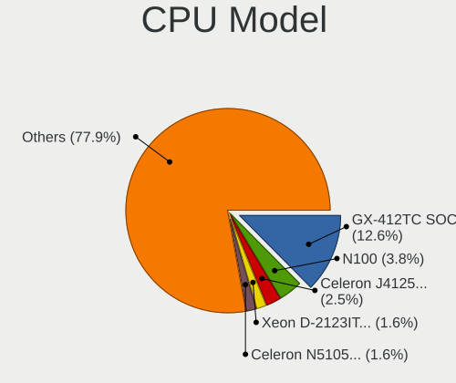

| Model                                       | Computers | Percent |
|---------------------------------------------|-----------|---------|
| AMD GX-412TC SOC                            | 46        | 12.57%  |
| Intel N100                                  | 14        | 3.83%   |
| Intel Celeron J4125 CPU @ 2.00GHz           | 9         | 2.46%   |
| Intel Xeon D-2123IT CPU @ 2.20GHz           | 6         | 1.64%   |
| Intel Celeron N5105 @ 2.00GHz               | 6         | 1.64%   |
| Intel N150                                  | 5         | 1.37%   |
| Intel Core i3-N305                          | 5         | 1.37%   |
| AMD Ryzen Embedded V1500B                   | 5         | 1.37%   |
| AMD EPYC 3201 8-Core Processor              | 5         | 1.37%   |
| Intel Pentium Silver N6005 @ 2.00GHz        | 4         | 1.09%   |
| Intel Core i5-6500 CPU @ 3.20GHz            | 4         | 1.09%   |
| Intel Core i5-2520M CPU @ 2.50GHz           | 4         | 1.09%   |
| Intel Celeron CPU 3865U @ 1.80GHz           | 4         | 1.09%   |
| Intel Atom CPU C3758 @ 2.20GHz              | 4         | 1.09%   |
| Intel Atom CPU C2558 @ 2.40GHz              | 4         | 1.09%   |
| Intel Xeon Silver 4210 CPU @ 2.20GHz        | 3         | 0.82%   |
| Intel Core m7-6Y75 CPU @ 1.20GHz            | 3         | 0.82%   |
| Intel Core i7-9750H CPU @ 2.60GHz           | 3         | 0.82%   |
| Intel Core i7-8550U CPU @ 1.80GHz           | 3         | 0.82%   |
| Intel Core i7-3520M CPU @ 2.90GHz           | 3         | 0.82%   |
| Intel Celeron CPU J1900 @ 1.99GHz           | 3         | 0.82%   |
| AMD Ryzen 7 5800H with Radeon Graphics      | 3         | 0.82%   |
| AMD Ryzen 5 3400G with Radeon Vega Graphics | 3         | 0.82%   |
| AMD G-T40E Processor                        | 3         | 0.82%   |
| AMD EPYC 3101 4-Core Processor              | 3         | 0.82%   |
| QEMU pc-q35-9.0                             | 2         | 0.55%   |
| Intel Xeon CPU X5650 @ 2.67GHz              | 2         | 0.55%   |
| Intel Xeon CPU D-1518 @ 2.20GHz             | 2         | 0.55%   |
| Intel Pentium CPU G4400 @ 3.30GHz           | 2         | 0.55%   |
| Intel Pentium CPU G3420 @ 3.20GHz           | 2         | 0.55%   |
| Intel Core i7-6700K CPU @ 4.00GHz           | 2         | 0.55%   |
| Intel Core i7-3770K CPU @ 3.50GHz           | 2         | 0.55%   |
| Intel Core i7-3770 CPU @ 3.40GHz            | 2         | 0.55%   |
| Intel Core i5-8500 CPU @ 3.00GHz            | 2         | 0.55%   |
| Intel Core i5-8365U CPU @ 1.60GHz           | 2         | 0.55%   |
| Intel Core i5-8250U CPU @ 1.60GHz           | 2         | 0.55%   |
| Intel Core i5-6300U CPU @ 2.40GHz           | 2         | 0.55%   |
| Intel Core i5-5200U CPU @ 2.20GHz           | 2         | 0.55%   |
| Intel Core i5-4570S CPU @ 2.90GHz           | 2         | 0.55%   |
| Intel Core i5-3470 CPU @ 3.20GHz            | 2         | 0.55%   |

CPU Model Family
----------------

Processor model prefix

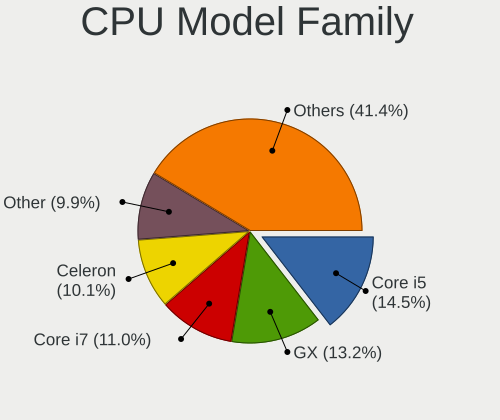

| Model                  | Computers | Percent |
|------------------------|-----------|---------|
| Intel Core i5          | 53        | 14.52%  |
| AMD GX                 | 48        | 13.15%  |
| Intel Core i7          | 40        | 10.96%  |
| Intel Celeron          | 37        | 10.14%  |
| Other                  | 36        | 9.86%   |
| Intel Xeon             | 35        | 9.59%   |
| Intel Atom             | 20        | 5.48%   |
| Intel Core i3          | 19        | 5.21%   |
| AMD Ryzen 7            | 13        | 3.56%   |
| AMD EPYC               | 10        | 2.74%   |
| Intel Pentium          | 6         | 1.64%   |
| AMD Ryzen 5            | 6         | 1.64%   |
| Intel Pentium Silver   | 5         | 1.37%   |
| Intel Core 2 Duo       | 5         | 1.37%   |
| AMD Ryzen Embedded     | 5         | 1.37%   |
| Intel Xeon Silver      | 4         | 1.1%    |
| Intel Core m7          | 3         | 0.82%   |
| AMD Ryzen 7 PRO        | 3         | 0.82%   |
| AMD G                  | 3         | 0.82%   |
| Intel Core             | 2         | 0.55%   |
| ARM Cortex             | 2         | 0.55%   |
| AMD Ryzen 9            | 2         | 0.55%   |
| AMD Ryzen 3            | 2         | 0.55%   |
| Intel Pentium Gold     | 1         | 0.27%   |
| AMD Ryzen Threadripper | 1         | 0.27%   |
| AMD Opteron            | 1         | 0.27%   |
| AMD Geode Integrated   | 1         | 0.27%   |
| AMD FX                 | 1         | 0.27%   |
| AMD Embedded           | 1         | 0.27%   |

CPU Cores
---------

Number of processor cores

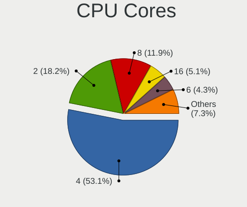

| Number  | Computers | Percent |
|---------|-----------|---------|
| 4       | 196       | 53.12%  |
| 2       | 67        | 18.16%  |
| 8       | 44        | 11.92%  |
| 16      | 19        | 5.15%   |
| 6       | 16        | 4.34%   |
| 12      | 8         | 2.17%   |
| Unknown | 7         | 1.9%    |
| 1       | 4         | 1.08%   |
| 20      | 3         | 0.81%   |
| 24      | 2         | 0.54%   |
| 32      | 1         | 0.27%   |
| 11      | 1         | 0.27%   |
| 10      | 1         | 0.27%   |

CPU Sockets
-----------

Number of sockets

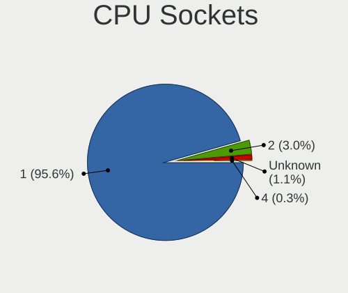

| Number  | Computers | Percent |
|---------|-----------|---------|
| 1       | 348       | 95.6%   |
| 2       | 11        | 3.02%   |
| Unknown | 4         | 1.1%    |
| 4       | 1         | 0.27%   |

CPU Threads
-----------

Threads per core (Hyper-Threading)

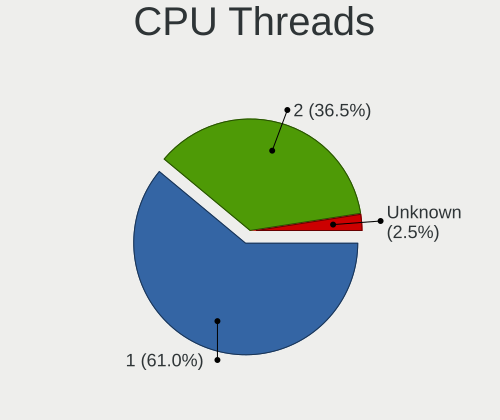

| Number  | Computers | Percent |
|---------|-----------|---------|
| 1       | 224       | 61.04%  |
| 2       | 134       | 36.51%  |
| Unknown | 9         | 2.45%   |

CPU Microarch
-------------

Microarchitecture

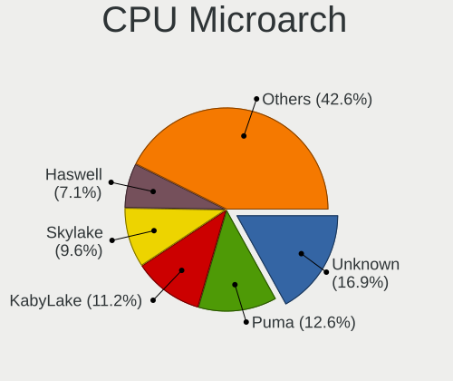

| Name          | Computers | Percent |
|---------------|-----------|---------|
| Unknown       | 62        | 16.94%  |
| Puma          | 46        | 12.57%  |
| KabyLake      | 41        | 11.2%   |
| Skylake       | 35        | 9.56%   |
| Haswell       | 26        | 7.1%    |
| IvyBridge     | 25        | 6.83%   |
| Zen           | 18        | 4.92%   |
| Silvermont    | 17        | 4.64%   |
| SandyBridge   | 14        | 3.83%   |
| Goldmont      | 13        | 3.55%   |
| Goldmont plus | 12        | 3.28%   |
| Zen 3         | 11        | 3.01%   |
| Broadwell     | 9         | 2.46%   |
| Westmere      | 5         | 1.37%   |
| Penryn        | 4         | 1.09%   |
| Zen+          | 3         | 0.82%   |
| Zen 2         | 3         | 0.82%   |
| TigerLake     | 3         | 0.82%   |
| Core          | 3         | 0.82%   |
| CometLake     | 3         | 0.82%   |
| Bobcat        | 3         | 0.82%   |
| Nehalem       | 2         | 0.55%   |
| Jaguar        | 2         | 0.55%   |
| IceLake       | 2         | 0.55%   |
| Excavator     | 2         | 0.55%   |
| Piledriver    | 1         | 0.27%   |
| Geode         | 1         | 0.27%   |

Graphics
--------

GPU Vendor
----------

Vendors of graphics cards

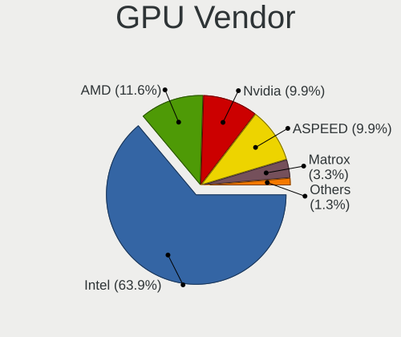

| Vendor                                       | Computers | Percent |
|----------------------------------------------|-----------|---------|
| Intel                                        | 193       | 63.91%  |
| AMD                                          | 35        | 11.59%  |
| Nvidia                                       | 30        | 9.93%   |
| ASPEED Technology                            | 30        | 9.93%   |
| Matrox Electronics Systems                   | 10        | 3.31%   |
| Red Hat                                      | 2         | 0.66%   |
| XGI Technology (eXtreme Graphics Innovation) | 1         | 0.33%   |
| 3DLabs                                       | 1         | 0.33%   |

GPU Model
---------

Graphics card models

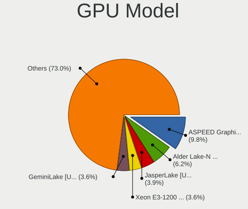

| Model                                                                                    | Computers | Percent |
|------------------------------------------------------------------------------------------|-----------|---------|
| ASPEED Technology ASPEED Graphics Family                                                 | 30        | 9.77%   |
| Intel Alder Lake-N [UHD Graphics]                                                        | 19        | 6.19%   |
| Intel JasperLake [UHD Graphics]                                                          | 12        | 3.91%   |
| Intel Xeon E3-1200 v3/4th Gen Core Processor Integrated Graphics Controller              | 11        | 3.58%   |
| Intel GeminiLake [UHD Graphics 600]                                                      | 11        | 3.58%   |
| Intel 3rd Gen Core processor Graphics Controller                                         | 10        | 3.26%   |
| Intel 2nd Generation Core Processor Family Integrated Graphics Controller                | 10        | 3.26%   |
| Intel CoffeeLake-S GT2 [UHD Graphics 630]                                                | 8         | 2.61%   |
| AMD Cezanne [Radeon Vega Series / Radeon Vega Mobile Series]                             | 8         | 2.61%   |
| Intel Skylake-S GT2 [HD Graphics 530]                                                    | 7         | 2.28%   |
| Intel CometLake-U GT2 [UHD Graphics]                                                     | 6         | 1.95%   |
| Intel Atom Processor Z36xxx/Z37xxx Series Graphics & Display                             | 6         | 1.95%   |
| Intel Alder Lake-N [Intel Graphics]                                                      | 6         | 1.95%   |
| Intel Xeon E3-1200 v2/3rd Gen Core processor Graphics Controller                         | 5         | 1.63%   |
| Intel WhiskeyLake-U GT2 [UHD Graphics 620]                                               | 5         | 1.63%   |
| Intel Kaby Lake-R GT2 [UHD Graphics 620]                                                 | 5         | 1.63%   |
| Intel Kaby Lake-U GT1 [HD Graphics 610]                                                  | 4         | 1.3%    |
| Intel Haswell-ULT Integrated Graphics Controller                                         | 4         | 1.3%    |
| Intel Broadwell-U GT2 [HD Graphics 5500]                                                 | 4         | 1.3%    |
| Matrox Electronics Systems MGA G200eW WPCM450                                            | 3         | 0.98%   |
| Intel TigerLake-LP GT2 [Iris Xe Graphics]                                                | 3         | 0.98%   |
| Intel Skylake-Y GT2 [HD Graphics 515]                                                    | 3         | 0.98%   |
| Intel Skylake-U GT2 [HD Graphics 520]                                                    | 3         | 0.98%   |
| Intel IvyBridge GT2 [HD Graphics 4000]                                                   | 3         | 0.98%   |
| Intel CoffeeLake-H GT2 [UHD Graphics 630]                                                | 3         | 0.98%   |
| Intel Atom/Celeron/Pentium Processor x5-E8000/J3xxx/N3xxx Integrated Graphics Controller | 3         | 0.98%   |
| AMD Picasso/Raven 2 [Radeon Vega Series / Radeon Vega Mobile Series]                     | 3         | 0.98%   |
| Red Hat Virtio 1.0 GPU                                                                   | 2         | 0.65%   |
| Nvidia GP108M [GeForce MX150]                                                            | 2         | 0.65%   |
| Nvidia GM206 [GeForce GTX 960]                                                           | 2         | 0.65%   |
| Matrox Electronics Systems MGA G200EH                                                    | 2         | 0.65%   |
| Matrox Electronics Systems MGA G200e [Pilot] ServerEngines (SEP1)                        | 2         | 0.65%   |
| Matrox Electronics Systems Integrated Matrox G200eW3 Graphics Controller                 | 2         | 0.65%   |
| Intel TigerLake-H GT1 [UHD Graphics]                                                     | 2         | 0.65%   |
| Intel Skylake-S GT1 [HD Graphics 510]                                                    | 2         | 0.65%   |
| Intel Skylake-H GT2 [HD Graphics 530]                                                    | 2         | 0.65%   |
| Intel Kaby Lake-U GT2 [HD Graphics 620]                                                  | 2         | 0.65%   |
| Intel Elkhart Lake [UHD Graphics Gen11 16EU]                                             | 2         | 0.65%   |
| Intel CometLake-S GT2 [UHD Graphics 630]                                                 | 2         | 0.65%   |
| Intel Apollo Lake GT1 [HD Graphics 500]                                                  | 2         | 0.65%   |

GPU Combo
---------

Combinations of graphics cards

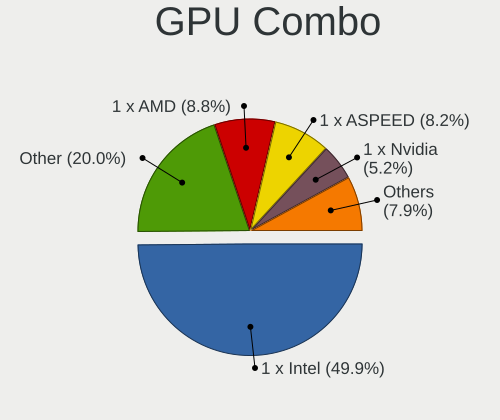

| Name            | Computers | Percent |
|-----------------|-----------|---------|
| 1 x Intel       | 182       | 49.86%  |
| Other           | 73        | 20%     |
| 1 x AMD         | 32        | 8.77%   |
| 1 x ASPEED      | 30        | 8.22%   |
| 1 x Nvidia      | 19        | 5.21%   |
| 1 x Matrox      | 9         | 2.47%   |
| Intel + Nvidia  | 8         | 2.19%   |
| 2 x Intel       | 2         | 0.55%   |
| 2 x AMD         | 2         | 0.55%   |
| 1 x Red Hat     | 2         | 0.55%   |
| 2 x Nvidia      | 1         | 0.27%   |
| 1 x XGI         | 1         | 0.27%   |
| Nvidia + Matrox | 1         | 0.27%   |
| Intel + AMD     | 1         | 0.27%   |
| AMD + Nvidia    | 1         | 0.27%   |
| 1 x 3DLabs      | 1         | 0.27%   |

GPU Driver
----------

Free vs proprietary

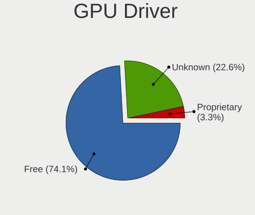

| Driver      | Computers | Percent |
|-------------|-----------|---------|
| Free        | 269       | 74.1%   |
| Unknown     | 82        | 22.59%  |
| Proprietary | 12        | 3.31%   |

GPU Memory
----------

Total video memory

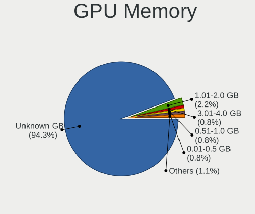

| Size in GB | Computers | Percent |
|------------|-----------|---------|
| Unknown    | 346       | 94.28%  |
| 1.01-2.0   | 8         | 2.18%   |
| 3.01-4.0   | 3         | 0.82%   |
| 0.51-1.0   | 3         | 0.82%   |
| 0.01-0.5   | 3         | 0.82%   |
| 7.01-8.0   | 2         | 0.54%   |
| 5.01-6.0   | 1         | 0.27%   |
| 2.01-3.0   | 1         | 0.27%   |

Monitor
-------

Monitor Vendor
--------------

Monitor vendors

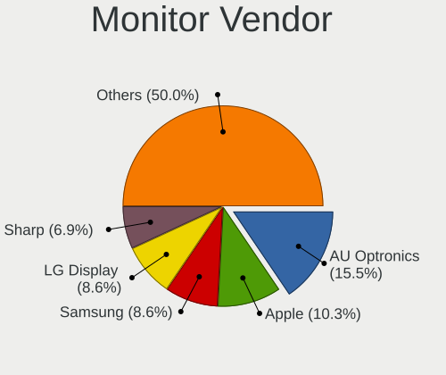

| Vendor                  | Computers | Percent |
|-------------------------|-----------|---------|
| AU Optronics            | 9         | 15.52%  |
| Apple                   | 6         | 10.34%  |
| Samsung Electronics     | 5         | 8.62%   |
| LG Display              | 5         | 8.62%   |
| Sharp                   | 4         | 6.9%    |
| CSO                     | 3         | 5.17%   |
| Chimei Innolux          | 3         | 5.17%   |
| JDI                     | 2         | 3.45%   |
| Chi Mei Optoelectronics | 2         | 3.45%   |
| BOE                     | 2         | 3.45%   |
| Ancor Communications    | 2         | 3.45%   |
| Acer                    | 2         | 3.45%   |
| Philips                 | 1         | 1.72%   |
| NEC Computers           | 1         | 1.72%   |
| LG Electronics          | 1         | 1.72%   |
| Lenovo                  | 1         | 1.72%   |
| Iiyama                  | 1         | 1.72%   |
| Hewlett-Packard         | 1         | 1.72%   |
| Fujitsu Siemens         | 1         | 1.72%   |
| Eizo                    | 1         | 1.72%   |
| DENON                   | 1         | 1.72%   |
| Dell                    | 1         | 1.72%   |
| CSW                     | 1         | 1.72%   |
| BenQ                    | 1         | 1.72%   |
| ASUSTek Computer        | 1         | 1.72%   |

Monitor Model
-------------

Monitor models

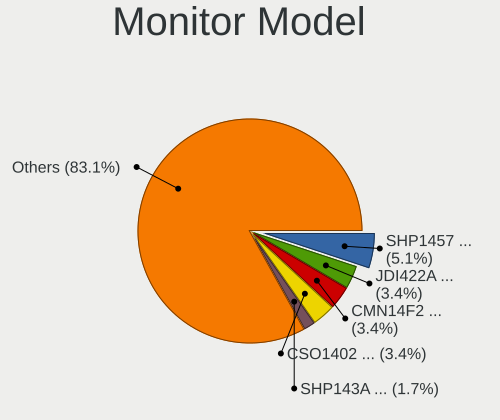

| Model                                                                    | Computers | Percent |
|--------------------------------------------------------------------------|-----------|---------|
| Sharp LCD Monitor SHP1457 2560x1440 280x160mm 12.7-inch                  | 3         | 5.08%   |
| JDI LCD Monitor JDI422A 3000x2000 290x200mm 13.9-inch                    | 2         | 3.39%   |
| CSO LCD Monitor CSO1402 2880x1800 300x190mm 14.0-inch                    | 2         | 3.39%   |
| Chimei Innolux LCD Monitor CMN14F2 1920x1080 310x170mm 13.9-inch         | 2         | 3.39%   |
| Sharp LCD Monitor SHP143A 3840x2160 350x190mm 15.7-inch                  | 1         | 1.69%   |
| Samsung Electronics U32E850 SAM0CE3 3840x2160 700x390mm 31.5-inch        | 1         | 1.69%   |
| Samsung Electronics S27E390 SAM0C1B 1920x1080 600x340mm 27.2-inch        | 1         | 1.69%   |
| Samsung Electronics LCD Monitor SDC424A 3200x1800 290x170mm 13.2-inch    | 1         | 1.69%   |
| Samsung Electronics CF791 SAM0DC3 3440x1440 800x330mm 34.1-inch          | 1         | 1.69%   |
| Samsung Electronics C24F390 SAM0D2C 1920x1080 520x290mm 23.4-inch        | 1         | 1.69%   |
| Philips FTV PHL01EA 1920x1080 1440x810mm 65.0-inch                       | 1         | 1.69%   |
| NEC Computers LCD Monitor EA224WMi 1920x1080                             | 1         | 1.69%   |
| LG Electronics LCD Monitor LG Ultra HD 11520x2160                        | 1         | 1.69%   |
| LG Electronics LCD Monitor LG Ultra HD                                   | 1         | 1.69%   |
| LG Display LCD Monitor LGD06ED 1920x1200 300x190mm 14.0-inch             | 1         | 1.69%   |
| LG Display LCD Monitor LGD0437 1920x1080 280x160mm 12.7-inch             | 1         | 1.69%   |
| LG Display LCD Monitor LGD0430 1366x768 350x190mm 15.7-inch              | 1         | 1.69%   |
| LG Display LCD Monitor LGD0419 2560x1440 310x170mm 13.9-inch             | 1         | 1.69%   |
| LG Display LCD Monitor LGD0258 1600x900 350x190mm 15.7-inch              | 1         | 1.69%   |
| Lenovo LEN P27q-10 LEN61A8 2560x1440 600x340mm 27.2-inch                 | 1         | 1.69%   |
| Iiyama PL3288UH IVM7610 3840x2160 700x390mm 31.5-inch                    | 1         | 1.69%   |
| Hewlett-Packard ZR24w HWP286A 1920x1200 540x350mm 25.3-inch              | 1         | 1.69%   |
| Fujitsu Siemens S19-1 FUS0517 1280x1024 380x300mm 19.1-inch              | 1         | 1.69%   |
| Eizo EV2316W ENC2394 1920x1080 510x290mm 23.1-inch                       | 1         | 1.69%   |
| DENON AVRHD DON003A 1920x1080 698x392mm 31.5-inch                        | 1         | 1.69%   |
| Dell P2715Q DEL40BD 3840x2160 600x340mm 27.2-inch                        | 1         | 1.69%   |
| CSW MNE007ZA3-2 CSW1431 2880x1800 300x190mm 14.0-inch                    | 1         | 1.69%   |
| CSO LCD Monitor CSO1500 3840x2160 340x190mm 15.3-inch                    | 1         | 1.69%   |
| Chimei Innolux LCD Monitor CMN1348 1920x1080 280x160mm 12.7-inch         | 1         | 1.69%   |
| Chi Mei Optoelectronics LCD Monitor CMO1561 1280x800 330x210mm 15.4-inch | 1         | 1.69%   |
| Chi Mei Optoelectronics LCD Monitor 1920x1080                            | 1         | 1.69%   |
| BOE LCD Monitor BOE0910 1920x1080 340x190mm 15.3-inch                    | 1         | 1.69%   |
| BOE LCD Monitor BOE06DF 1920x1080 310x170mm 13.9-inch                    | 1         | 1.69%   |
| BenQ GW2250H BNQ78BD 1920x1080 480x270mm 21.7-inch                       | 1         | 1.69%   |
| AU Optronics LCD Monitor AUOD291 1920x1200 300x190mm 14.0-inch           | 1         | 1.69%   |
| AU Optronics LCD Monitor AUO45EC 1366x768 340x190mm 15.3-inch            | 1         | 1.69%   |
| AU Optronics LCD Monitor AUO313C 1366x768 310x170mm 13.9-inch            | 1         | 1.69%   |
| AU Optronics LCD Monitor AUO243D 1920x1080 310x170mm 13.9-inch           | 1         | 1.69%   |
| AU Optronics LCD Monitor AUO213E 1600x900 310x170mm 13.9-inch            | 1         | 1.69%   |
| AU Optronics LCD Monitor AUO206C 1366x768 280x160mm 12.7-inch            | 1         | 1.69%   |

Monitor Resolution
------------------

Monitor screen resolution

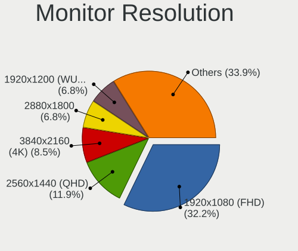

| Resolution        | Computers | Percent |
|-------------------|-----------|---------|
| 1920x1080 (FHD)   | 19        | 32.2%   |
| 2560x1440 (QHD)   | 7         | 11.86%  |
| 3840x2160 (4K)    | 5         | 8.47%   |
| 2880x1800         | 4         | 6.78%   |
| 1920x1200 (WUXGA) | 4         | 6.78%   |
| 1366x768 (WXGA)   | 4         | 6.78%   |
| 1280x800 (WXGA)   | 4         | 6.78%   |
| 3440x1440         | 2         | 3.39%   |
| 3000x2000         | 2         | 3.39%   |
| 1600x900 (HD+)    | 2         | 3.39%   |
| 3200x1800 (QHD+)  | 1         | 1.69%   |
| 2560x1600         | 1         | 1.69%   |
| 1440x900 (WXGA+)  | 1         | 1.69%   |
| 1280x1024 (SXGA)  | 1         | 1.69%   |
| 11520x2160        | 1         | 1.69%   |
| Unknown           | 1         | 1.69%   |

Monitor Diagonal
----------------

Diagonal size in inches

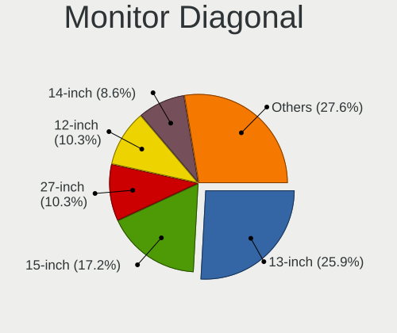

| Inches  | Computers | Percent |
|---------|-----------|---------|
| 13      | 15        | 25.86%  |
| 15      | 10        | 17.24%  |
| 27      | 6         | 10.34%  |
| 12      | 6         | 10.34%  |
| 14      | 5         | 8.62%   |
| 31      | 3         | 5.17%   |
| Unknown | 3         | 5.17%   |
| 23      | 2         | 3.45%   |
| 65      | 1         | 1.72%   |
| 35      | 1         | 1.72%   |
| 34      | 1         | 1.72%   |
| 25      | 1         | 1.72%   |
| 24      | 1         | 1.72%   |
| 21      | 1         | 1.72%   |
| 19      | 1         | 1.72%   |
| 17      | 1         | 1.72%   |

Monitor Width
-------------

Physical width

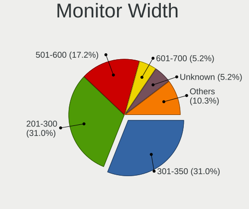

| Width in mm | Computers | Percent |
|-------------|-----------|---------|
| 301-350     | 18        | 31.03%  |
| 201-300     | 18        | 31.03%  |
| 501-600     | 10        | 17.24%  |
| 601-700     | 3         | 5.17%   |
| Unknown     | 3         | 5.17%   |
| 351-400     | 2         | 3.45%   |
| 801-900     | 1         | 1.72%   |
| 701-800     | 1         | 1.72%   |
| 401-500     | 1         | 1.72%   |
| 1001-1500   | 1         | 1.72%   |

Aspect Ratio
------------

Proportional relationship between the width and the height

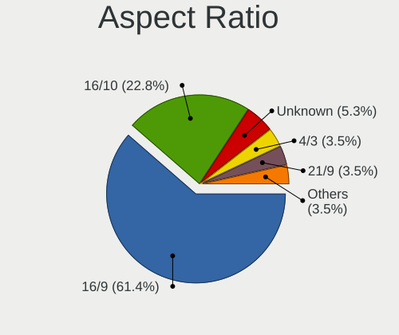

| Ratio   | Computers | Percent |
|---------|-----------|---------|
| 16/9    | 35        | 61.4%   |
| 16/10   | 13        | 22.81%  |
| Unknown | 3         | 5.26%   |
| 4/3     | 2         | 3.51%   |
| 21/9    | 2         | 3.51%   |
| 5/4     | 1         | 1.75%   |
| 3/2     | 1         | 1.75%   |

Monitor Area
------------

Area in inch²

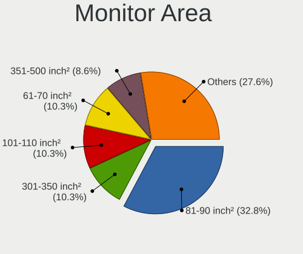

| Area in inch² | Computers | Percent |
|----------------|-----------|---------|
| 81-90          | 19        | 32.76%  |
| 61-70          | 6         | 10.34%  |
| 301-350        | 6         | 10.34%  |
| 101-110        | 6         | 10.34%  |
| 351-500        | 5         | 8.62%   |
| 91-100         | 4         | 6.9%    |
| 201-250        | 3         | 5.17%   |
| Unknown        | 3         | 5.17%   |
| 251-300        | 2         | 3.45%   |
| More than 1000 | 1         | 1.72%   |
| 71-80          | 1         | 1.72%   |
| 151-200        | 1         | 1.72%   |
| 121-130        | 1         | 1.72%   |

Pixel Density
-------------

Pixels per inch

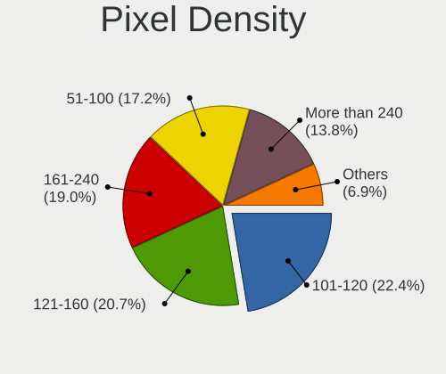

| Density       | Computers | Percent |
|---------------|-----------|---------|
| 101-120       | 13        | 22.41%  |
| 121-160       | 12        | 20.69%  |
| 161-240       | 11        | 18.97%  |
| 51-100        | 10        | 17.24%  |
| More than 240 | 8         | 13.79%  |
| Unknown       | 3         | 5.17%   |
| 1-50          | 1         | 1.72%   |

Multiple Monitors
-----------------

Total monitors connected

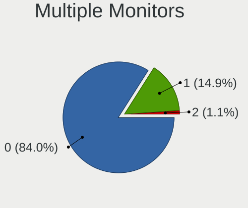

| Total | Computers | Percent |
|-------|-----------|---------|
| 0     | 310       | 84.01%  |
| 1     | 55        | 14.91%  |
| 2     | 4         | 1.08%   |

Network
-------

Net Controller Vendor
---------------------

Controller vendors

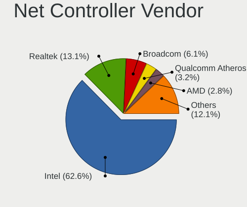

| Vendor                                 | Computers | Percent |
|----------------------------------------|-----------|---------|
| Intel                                  | 310       | 62.63%  |
| Realtek Semiconductor                  | 65        | 13.13%  |
| Broadcom                               | 30        | 6.06%   |
| Qualcomm Atheros                       | 16        | 3.23%   |
| AMD                                    | 14        | 2.83%   |
| Mellanox Technologies                  | 12        | 2.42%   |
| MediaTek                               | 5         | 1.01%   |
| TP-Link                                | 3         | 0.61%   |
| Samsung Electronics                    | 3         | 0.61%   |
| Qualcomm                               | 3         | 0.61%   |
| U-Blox                                 | 2         | 0.4%    |
| Sierra Wireless                        | 2         | 0.4%    |
| Microchip Technology                   | 2         | 0.4%    |
| Huawei Technologies                    | 2         | 0.4%    |
| Hewlett-Packard                        | 2         | 0.4%    |
| Chelsio Communications                 | 2         | 0.4%    |
| American Megatrends                    | 2         | 0.4%    |
| VIA Technologies                       | 1         | 0.2%    |
| Suzhou Motorcomm Electronic Technology | 1         | 0.2%    |
| Red Hat                                | 1         | 0.2%    |
| Ralink Technology                      | 1         | 0.2%    |
| Qualcomm Technologies                  | 1         | 0.2%    |
| Qualcomm Atheros Communications        | 1         | 0.2%    |
| QLogic                                 | 1         | 0.2%    |
| Prolific Technology                    | 1         | 0.2%    |
| Oracle/SUN                             | 1         | 0.2%    |
| Nvidia                                 | 1         | 0.2%    |
| NetXen Incorporated                    | 1         | 0.2%    |
| Motorola PCS                           | 1         | 0.2%    |
| Marvell Technology Group               | 1         | 0.2%    |
| Free Software Initiative of Japan      | 1         | 0.2%    |
| Ericsson Business Mobile Networks      | 1         | 0.2%    |
| Emulex                                 | 1         | 0.2%    |
| Edimax Technology                      | 1         | 0.2%    |
| Dell                                   | 1         | 0.2%    |
| Aquantia                               | 1         | 0.2%    |
| 3Com                                   | 1         | 0.2%    |

Net Controller Model
--------------------

Controller models

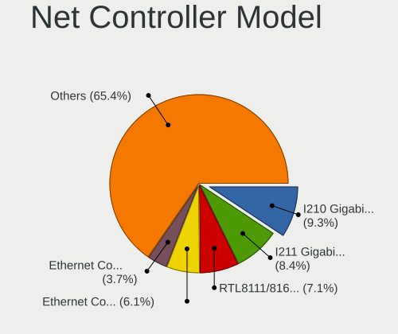

| Model                                                                         | Computers | Percent |
|-------------------------------------------------------------------------------|-----------|---------|
| Intel I210 Gigabit Network Connection                                         | 63        | 9.32%   |
| Intel I211 Gigabit Network Connection                                         | 57        | 8.43%   |
| Realtek RTL8111/8168/8211/8411 PCI Express Gigabit Ethernet Controller        | 48        | 7.1%    |
| Intel Ethernet Controller I226-V                                              | 41        | 6.07%   |
| Intel Ethernet Controller I225-V                                              | 25        | 3.7%    |
| Intel I350 Gigabit Network Connection                                         | 23        | 3.4%    |
| Intel 82579LM Gigabit Network Connection (Lewisville)                         | 21        | 3.11%   |
| Intel 82599ES 10-Gigabit SFI/SFP+ Network Connection                          | 17        | 2.51%   |
| AMD XGMAC 10GbE Controller                                                    | 14        | 2.07%   |
| Intel Ethernet Controller X710 for 10GbE SFP+                                 | 9         | 1.33%   |
| Intel Ethernet Connection X553 10 GbE SFP+                                    | 9         | 1.33%   |
| Intel 82574L Gigabit Network Connection                                       | 9         | 1.33%   |
| Intel Wi-Fi 6 AX200                                                           | 8         | 1.18%   |
| Intel Ethernet Connection I354                                                | 8         | 1.18%   |
| Intel I210 Gigabit Fiber Network Connection                                   | 7         | 1.04%   |
| Intel Ethernet Controller X550                                                | 7         | 1.04%   |
| Intel Ethernet Connection X722 for 10GbE SFP+                                 | 7         | 1.04%   |
| Intel Ethernet Connection X722 for 10GBASE-T                                  | 7         | 1.04%   |
| Realtek RTL8125 2.5GbE Controller                                             | 6         | 0.89%   |
| Intel Wireless 8265 / 8275                                                    | 6         | 0.89%   |
| Broadcom BCM4331 802.11a/b/g/n                                                | 6         | 0.89%   |
| Mellanox MT27500 Family [ConnectX-3]                                          | 5         | 0.74%   |
| Intel Wireless 7265                                                           | 5         | 0.74%   |
| Intel Ethernet Connection I217-LM                                             | 5         | 0.74%   |
| Intel 82583V Gigabit Network Connection                                       | 5         | 0.74%   |
| Intel 82576 Gigabit Network Connection                                        | 5         | 0.74%   |
| Intel 82571EB/82571GB Gigabit Ethernet Controller D0/D1 (copper applications) | 5         | 0.74%   |
| Qualcomm Atheros AR928X Wireless Network Adapter (PCI-Express)                | 4         | 0.59%   |
| Intel I350 Gigabit Fiber Network Connection                                   | 4         | 0.59%   |
| Intel Ethernet Controller I226-LM                                             | 4         | 0.59%   |
| Intel Ethernet Connection I219-LM                                             | 4         | 0.59%   |
| Intel Ethernet Connection (7) I219-LM                                         | 4         | 0.59%   |
| Intel Ethernet Connection (2) I219-LM                                         | 4         | 0.59%   |
| Intel Centrino Advanced-N 6205 [Taylor Peak]                                  | 4         | 0.59%   |
| Intel Alder Lake-N PCH CNVi WiFi                                              | 4         | 0.59%   |
| Broadcom NetXtreme BCM57765 Gigabit Ethernet PCIe                             | 4         | 0.59%   |
| Samsung Galaxy series, misc. (tethering mode)                                 | 3         | 0.44%   |
| Realtek USB 2.5GbE Controller                                                 | 3         | 0.44%   |
| Realtek RTL8852AE 802.11ax PCIe Wireless Network Adapter                      | 3         | 0.44%   |
| Realtek RTL8821CE 802.11ac PCIe Wireless Network Adapter                      | 3         | 0.44%   |

Wireless Vendor
---------------

Wireless vendors

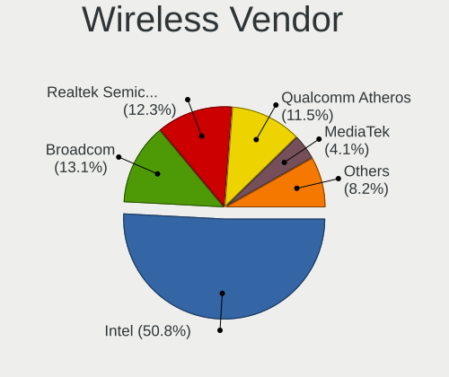

| Vendor                          | Computers | Percent |
|---------------------------------|-----------|---------|
| Intel                           | 62        | 50.82%  |
| Broadcom                        | 16        | 13.11%  |
| Realtek Semiconductor           | 15        | 12.3%   |
| Qualcomm Atheros                | 14        | 11.48%  |
| MediaTek                        | 5         | 4.1%    |
| TP-Link                         | 3         | 2.46%   |
| Sierra Wireless                 | 2         | 1.64%   |
| Ralink Technology               | 1         | 0.82%   |
| Qualcomm Technologies           | 1         | 0.82%   |
| Qualcomm Atheros Communications | 1         | 0.82%   |
| Edimax Technology               | 1         | 0.82%   |
| Dell                            | 1         | 0.82%   |

Wireless Model
--------------

Wireless models

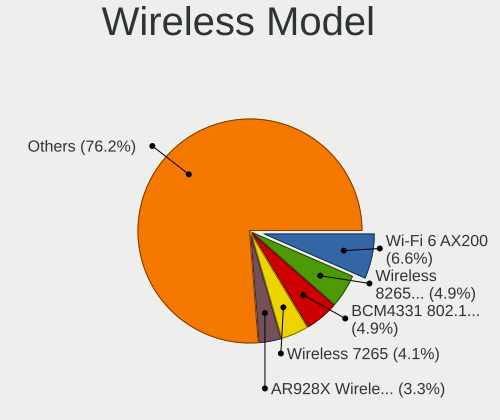

| Model                                                          | Computers | Percent |
|----------------------------------------------------------------|-----------|---------|
| Intel Wi-Fi 6 AX200                                            | 8         | 6.56%   |
| Intel Wireless 8265 / 8275                                     | 6         | 4.92%   |
| Broadcom BCM4331 802.11a/b/g/n                                 | 6         | 4.92%   |
| Intel Wireless 7265                                            | 5         | 4.1%    |
| Qualcomm Atheros AR928X Wireless Network Adapter (PCI-Express) | 4         | 3.28%   |
| Intel Centrino Advanced-N 6205 [Taylor Peak]                   | 4         | 3.28%   |
| Intel Alder Lake-N PCH CNVi WiFi                               | 4         | 3.28%   |
| Realtek RTL8852AE 802.11ax PCIe Wireless Network Adapter       | 3         | 2.46%   |
| Realtek RTL8821CE 802.11ac PCIe Wireless Network Adapter       | 3         | 2.46%   |
| Realtek RTL8188EE Wireless Network Adapter                     | 3         | 2.46%   |
| Intel Wireless 8260                                            | 3         | 2.46%   |
| Intel Wireless 7260                                            | 3         | 2.46%   |
| Intel Wi-Fi 6E(802.11ax) AX210/AX1675* 2x2 [Typhoon Peak]      | 3         | 2.46%   |
| Intel Cannon Point-LP CNVi [Wireless-AC]                       | 3         | 2.46%   |
| Sierra Wireless EM7455                                         | 2         | 1.64%   |
| Realtek RTL8822CE 802.11ac PCIe Wireless Network Adapter       | 2         | 1.64%   |
| Qualcomm Atheros QCA9565 / AR9565 Wireless Network Adapter     | 2         | 1.64%   |
| Qualcomm Atheros AR9485 Wireless Network Adapter               | 2         | 1.64%   |
| Qualcomm Atheros AR93xx Wireless Network Adapter               | 2         | 1.64%   |
| Intel Wireless 3165                                            | 2         | 1.64%   |
| Intel Wireless 3160                                            | 2         | 1.64%   |
| Intel Jasper Lake PCH CNVi WiFi                                | 2         | 1.64%   |
| Intel Comet Lake PCH-LP CNVi WiFi                              | 2         | 1.64%   |
| Intel Centrino Ultimate-N 6300                                 | 2         | 1.64%   |
| Intel Cannon Lake PCH CNVi WiFi                                | 2         | 1.64%   |
| Broadcom BCM43602 802.11ac Wireless LAN SoC                    | 2         | 1.64%   |
| Broadcom BCM4350 802.11ac Wireless Network Adapter             | 2         | 1.64%   |
| Broadcom BCM4322 802.11a/b/g/n Wireless LAN Controller         | 2         | 1.64%   |
| Broadcom BCM4313 802.11bgn Wireless Network Adapter            | 2         | 1.64%   |
| TP-Link TL-WN823N v2/v3 [Realtek RTL8192EU]                    | 1         | 0.82%   |
| TP-Link TL-WN722N v2/v3 [Realtek RTL8188EUS]                   | 1         | 0.82%   |
| TP-Link AC600 wireless Realtek RTL8811AU [Archer T2U Nano]     | 1         | 0.82%   |
| Realtek RTL8822BE 802.11a/b/g/n/ac WiFi adapter                | 1         | 0.82%   |
| Realtek RTL8814AU 802.11a/b/g/n/ac Wireless Adapter            | 1         | 0.82%   |
| Realtek RTL8192CE PCIe Wireless Network Adapter                | 1         | 0.82%   |
| Realtek RTL8188EUS 802.11n Wireless Network Adapter            | 1         | 0.82%   |
| Ralink RT2501/RT2573 Wireless Adapter                          | 1         | 0.82%   |
| Qualcomm QCNFA765 Wireless Network Adapter                     | 1         | 0.82%   |
| Qualcomm Atheros QCA9377 802.11ac Wireless Network Adapter     | 1         | 0.82%   |
| Qualcomm Atheros QCA6174 802.11ac Wireless Network Adapter     | 1         | 0.82%   |

Ethernet Vendor
---------------

Ethernet vendors

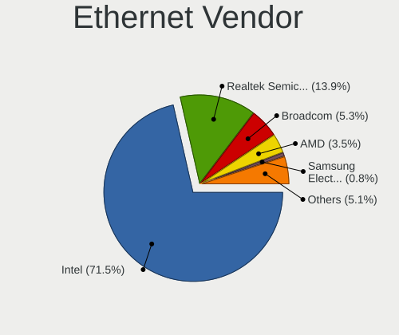

| Vendor                                 | Computers | Percent |
|----------------------------------------|-----------|---------|
| Intel                                  | 283       | 71.46%  |
| Realtek Semiconductor                  | 55        | 13.89%  |
| Broadcom                               | 21        | 5.3%    |
| AMD                                    | 14        | 3.54%   |
| Samsung Electronics                    | 3         | 0.76%   |
| Qualcomm                               | 3         | 0.76%   |
| Qualcomm Atheros                       | 2         | 0.51%   |
| Chelsio Communications                 | 2         | 0.51%   |
| American Megatrends                    | 2         | 0.51%   |
| VIA Technologies                       | 1         | 0.25%   |
| Suzhou Motorcomm Electronic Technology | 1         | 0.25%   |
| QLogic                                 | 1         | 0.25%   |
| Oracle/SUN                             | 1         | 0.25%   |
| Nvidia                                 | 1         | 0.25%   |
| Motorola PCS                           | 1         | 0.25%   |
| Microchip Technology                   | 1         | 0.25%   |
| Marvell Technology Group               | 1         | 0.25%   |
| Huawei Technologies                    | 1         | 0.25%   |
| Emulex                                 | 1         | 0.25%   |
| Aquantia                               | 1         | 0.25%   |

Ethernet Model
--------------

Ethernet models

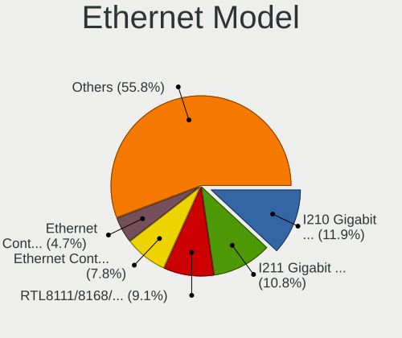

| Model                                                                         | Computers | Percent |
|-------------------------------------------------------------------------------|-----------|---------|
| Intel I210 Gigabit Network Connection                                         | 63        | 11.91%  |
| Intel I211 Gigabit Network Connection                                         | 57        | 10.78%  |
| Realtek RTL8111/8168/8211/8411 PCI Express Gigabit Ethernet Controller        | 48        | 9.07%   |
| Intel Ethernet Controller I226-V                                              | 41        | 7.75%   |
| Intel Ethernet Controller I225-V                                              | 25        | 4.73%   |
| Intel I350 Gigabit Network Connection                                         | 23        | 4.35%   |
| Intel 82579LM Gigabit Network Connection (Lewisville)                         | 21        | 3.97%   |
| Intel 82599ES 10-Gigabit SFI/SFP+ Network Connection                          | 17        | 3.21%   |
| AMD XGMAC 10GbE Controller                                                    | 14        | 2.65%   |
| Intel Ethernet Controller X710 for 10GbE SFP+                                 | 9         | 1.7%    |
| Intel Ethernet Connection X553 10 GbE SFP+                                    | 9         | 1.7%    |
| Intel 82574L Gigabit Network Connection                                       | 9         | 1.7%    |
| Intel Ethernet Connection I354                                                | 8         | 1.51%   |
| Intel I210 Gigabit Fiber Network Connection                                   | 7         | 1.32%   |
| Intel Ethernet Controller X550                                                | 7         | 1.32%   |
| Intel Ethernet Connection X722 for 10GbE SFP+                                 | 7         | 1.32%   |
| Intel Ethernet Connection X722 for 10GBASE-T                                  | 7         | 1.32%   |
| Realtek RTL8125 2.5GbE Controller                                             | 6         | 1.13%   |
| Intel Ethernet Connection I217-LM                                             | 5         | 0.95%   |
| Intel 82583V Gigabit Network Connection                                       | 5         | 0.95%   |
| Intel 82576 Gigabit Network Connection                                        | 5         | 0.95%   |
| Intel 82571EB/82571GB Gigabit Ethernet Controller D0/D1 (copper applications) | 5         | 0.95%   |
| Intel I350 Gigabit Fiber Network Connection                                   | 4         | 0.76%   |
| Intel Ethernet Controller I226-LM                                             | 4         | 0.76%   |
| Intel Ethernet Connection I219-LM                                             | 4         | 0.76%   |
| Intel Ethernet Connection (7) I219-LM                                         | 4         | 0.76%   |
| Intel Ethernet Connection (2) I219-LM                                         | 4         | 0.76%   |
| Broadcom NetXtreme BCM57765 Gigabit Ethernet PCIe                             | 4         | 0.76%   |
| Samsung Galaxy series, misc. (tethering mode)                                 | 3         | 0.57%   |
| Realtek USB 2.5GbE Controller                                                 | 3         | 0.57%   |
| Intel Ethernet Controller E810-XXV for SFP                                    | 3         | 0.57%   |
| Intel Ethernet Connection (6) I219-V                                          | 3         | 0.57%   |
| Intel Ethernet Connection (6) I219-LM                                         | 3         | 0.57%   |
| Intel Ethernet Connection (2) I219-V                                          | 3         | 0.57%   |
| Intel 82579V Gigabit Network Connection                                       | 3         | 0.57%   |
| Intel 82571EB/82571GB Gigabit Ethernet Controller (Copper)                    | 3         | 0.57%   |
| Qualcomm FP3                                                                  | 2         | 0.38%   |
| Intel Ethernet Controller XXV710 for 25GbE SFP28                              | 2         | 0.38%   |
| Intel Ethernet Controller X710 for 10GBASE-T                                  | 2         | 0.38%   |
| Intel Ethernet Controller E810-C for SFP                                      | 2         | 0.38%   |

Net Controller Kind
-------------------

Ethernet, WiFi or modem

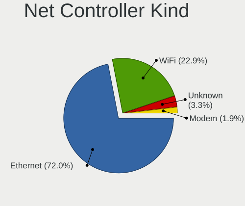

| Kind     | Computers | Percent |
|----------|-----------|---------|
| Ethernet | 349       | 71.96%  |
| WiFi     | 111       | 22.89%  |
| Unknown  | 16        | 3.3%    |
| Modem    | 9         | 1.86%   |

Used Controller
---------------

Currently used network controller

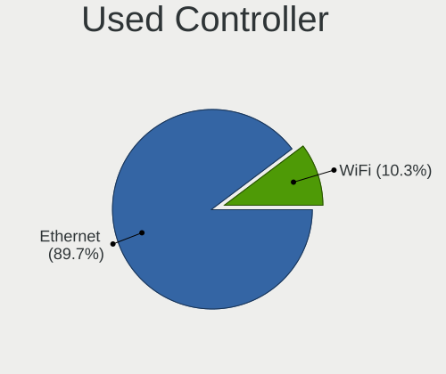

| Kind     | Computers | Percent |
|----------|-----------|---------|
| Ethernet | 323       | 89.72%  |
| WiFi     | 37        | 10.28%  |

NICs
----

Total network controllers on board

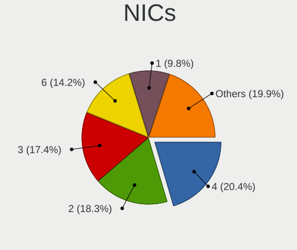

| Total | Computers | Percent |
|-------|-----------|---------|
| 4     | 75        | 20.44%  |
| 2     | 67        | 18.26%  |
| 3     | 64        | 17.44%  |
| 6     | 52        | 14.17%  |
| 1     | 36        | 9.81%   |
| 5     | 35        | 9.54%   |
| 8     | 11        | 3%      |
| 7     | 7         | 1.91%   |
| 9     | 5         | 1.36%   |
| 13    | 3         | 0.82%   |
| 12    | 3         | 0.82%   |
| 10    | 3         | 0.82%   |
| 14    | 2         | 0.54%   |
| 0     | 2         | 0.54%   |
| 16    | 1         | 0.27%   |
| 15    | 1         | 0.27%   |

IPv6
----

IPv6 vs IPv4

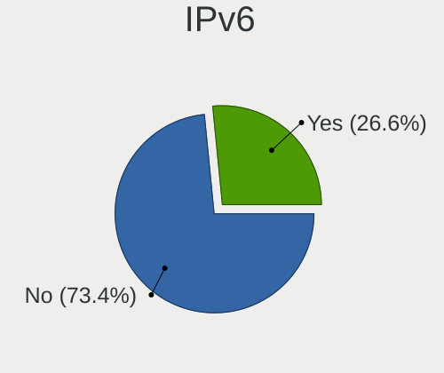

| Used | Computers | Percent |
|------|-----------|---------|
| No   | 282       | 73.44%  |
| Yes  | 102       | 26.56%  |

Bluetooth
---------

Bluetooth Vendor
----------------

Controller vendors

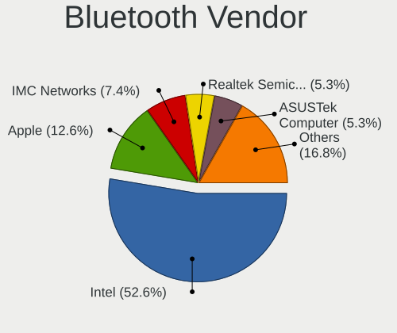

| Vendor                          | Computers | Percent |
|---------------------------------|-----------|---------|
| Intel                           | 50        | 52.63%  |
| Apple                           | 12        | 12.63%  |
| IMC Networks                    | 7         | 7.37%   |
| Realtek Semiconductor           | 5         | 5.26%   |
| ASUSTek Computer                | 5         | 5.26%   |
| Qualcomm Atheros Communications | 3         | 3.16%   |
| MediaTek                        | 3         | 3.16%   |
| Broadcom                        | 3         | 3.16%   |
| USI                             | 1         | 1.05%   |
| Lite-On Technology              | 1         | 1.05%   |
| Hewlett-Packard                 | 1         | 1.05%   |
| Foxconn / Hon Hai               | 1         | 1.05%   |
| Dell                            | 1         | 1.05%   |
| Cambridge Silicon Radio         | 1         | 1.05%   |
| Alps Electric                   | 1         | 1.05%   |

Bluetooth Model
---------------

Controller models

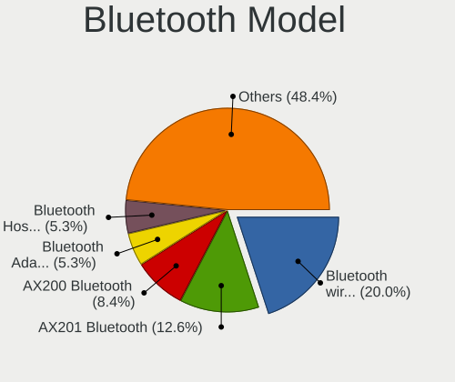

| Model                                                       | Computers | Percent |
|-------------------------------------------------------------|-----------|---------|
| Intel Bluetooth wireless interface                          | 19        | 20%     |
| Intel AX201 Bluetooth                                       | 12        | 12.63%  |
| Intel AX200 Bluetooth                                       | 8         | 8.42%   |
| Realtek Bluetooth Adapter                                   | 5         | 5.26%   |
| Apple Bluetooth Host Controller                             | 5         | 5.26%   |
| Intel Bluetooth 9460/9560 Jefferson Peak (JfP)              | 4         | 4.21%   |
| Apple Broadcom Built-in Bluetooth                           | 4         | 4.21%   |
| Intel AX210 Bluetooth                                       | 3         | 3.16%   |
| IMC Networks Realtek Bluetooth Adapter                      | 3         | 3.16%   |
| MediaTek Wireless_Device                                    | 2         | 2.11%   |
| Intel Centrino Bluetooth Wireless Transceiver               | 2         | 2.11%   |
| Intel AX211 Bluetooth                                       | 2         | 2.11%   |
| Broadcom Bluetooth 4.1 USB                                  | 2         | 2.11%   |
| Apple Built-in Bluetooth 2.0+EDR HCI                        | 2         | 2.11%   |
| USI Qualcomm WCN685x Bluetooth Adapter                      | 1         | 1.05%   |
| Qualcomm Atheros QCA61x4 Bluetooth 4.0                      | 1         | 1.05%   |
| Qualcomm Atheros AR9462 Bluetooth                           | 1         | 1.05%   |
| Qualcomm Atheros AR3012 Bluetooth 4.0                       | 1         | 1.05%   |
| MediaTek RZ608 Bluetooth Adapter                            | 1         | 1.05%   |
| Lite-On Atheros AR3012 Bluetooth                            | 1         | 1.05%   |
| IMC Networks Wireless_Device                                | 1         | 1.05%   |
| IMC Networks Qualcomm Atheros Bluetooth 4.1                 | 1         | 1.05%   |
| IMC Networks MediaTek Bluetooth Adapter                     | 1         | 1.05%   |
| IMC Networks Atheros AR3012 Bluetooth 4.0 Adapter           | 1         | 1.05%   |
| HP Broadcom 2070 Bluetooth Combo                            | 1         | 1.05%   |
| Foxconn / Hon Hai Qualcomm Atheros AR3011 Bluetooth Adapter | 1         | 1.05%   |
| Dell Dell Wireless 380 Bluetooth 4.0 Module                 | 1         | 1.05%   |
| Cambridge Silicon Radio Bluetooth Dongle (HCI mode)         | 1         | 1.05%   |
| Broadcom BCM20702 Bluetooth 4.0 [ThinkPad]                  | 1         | 1.05%   |
| ASUS USB-BT500                                              | 1         | 1.05%   |
| ASUS BT-253 Bluetooth Adapter                               | 1         | 1.05%   |
| ASUS Broadcom BCM20702A0 Bluetooth                          | 1         | 1.05%   |
| ASUS Broadcom BCM20702 Single-Chip Bluetooth 4.0 + LE       | 1         | 1.05%   |
| ASUS Bluetooth Controller                                   | 1         | 1.05%   |
| Apple Built-in iSight (no firmware loaded)                  | 1         | 1.05%   |
| Alps Electric UGTZ4 Bluetooth                               | 1         | 1.05%   |

Sound
-----

Sound Vendor
------------

Sound card vendors

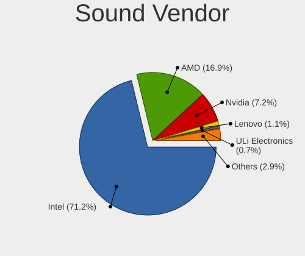

| Vendor                | Computers | Percent |
|-----------------------|-----------|---------|
| Intel                 | 198       | 71.22%  |
| AMD                   | 47        | 16.91%  |
| Nvidia                | 20        | 7.19%   |
| Lenovo                | 3         | 1.08%   |
| ULi Electronics       | 2         | 0.72%   |
| Realtek Semiconductor | 2         | 0.72%   |
| PS Audio              | 1         | 0.36%   |
| Logitech              | 1         | 0.36%   |
| GN Netcom             | 1         | 0.36%   |
| ESS Technology        | 1         | 0.36%   |
| C-Media Electronics   | 1         | 0.36%   |
| ASUSTek Computer      | 1         | 0.36%   |

Sound Model
-----------

Sound card models

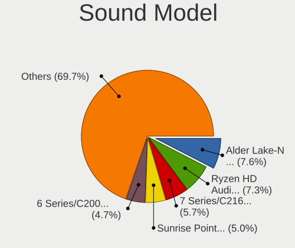

| Model                                                                                             | Computers | Percent |
|---------------------------------------------------------------------------------------------------|-----------|---------|
| Intel Alder Lake-N PCH High Definition Audio Controller                                           | 24        | 7.57%   |
| AMD Ryzen HD Audio Controller                                                                     | 23        | 7.26%   |
| Intel 7 Series/C216 Chipset Family High Definition Audio Controller                               | 18        | 5.68%   |
| Intel Sunrise Point-LP HD Audio                                                                   | 16        | 5.05%   |
| Intel 6 Series/C200 Series Chipset Family High Definition Audio Controller                        | 15        | 4.73%   |
| Intel Xeon E3-1200 v3/4th Gen Core Processor HD Audio Controller                                  | 14        | 4.42%   |
| Intel Celeron/Pentium Silver Processor High Definition Audio                                      | 12        | 3.79%   |
| Intel Jasper Lake HD Audio                                                                        | 11        | 3.47%   |
| AMD Renoir/Cezanne HDMI/DP Audio Controller                                                       | 11        | 3.47%   |
| Intel Cannon Lake PCH cAVS                                                                        | 10        | 3.15%   |
| Intel 100 Series/C230 Series Chipset Family HD Audio Controller                                   | 10        | 3.15%   |
| AMD Family 17h (Models 00h-0fh) HD Audio Controller                                               | 8         | 2.52%   |
| Intel Cannon Point-LP High Definition Audio Controller                                            | 7         | 2.21%   |
| Intel 8 Series/C220 Series Chipset High Definition Audio Controller                               | 7         | 2.21%   |
| Intel Comet Lake PCH-LP cAVS                                                                      | 6         | 1.89%   |
| Intel Alder Lake PCH-P High Definition Audio Controller                                           | 6         | 1.89%   |
| AMD Radeon High Definition Audio Controller                                                       | 6         | 1.89%   |
| Intel Wildcat Point-LP High Definition Audio Controller                                           | 5         | 1.58%   |
| Intel Broadwell-U Audio Controller                                                                | 5         | 1.58%   |
| Intel Atom Processor Z36xxx/Z37xxx Series High Definition Audio Controller                        | 5         | 1.58%   |
| Nvidia GK107 HDMI Audio Controller                                                                | 4         | 1.26%   |
| Intel Haswell-ULT HD Audio Controller                                                             | 4         | 1.26%   |
| Intel 8 Series HD Audio Controller                                                                | 4         | 1.26%   |
| Intel 200 Series PCH HD Audio                                                                     | 4         | 1.26%   |
| Intel Tiger Lake-LP Smart Sound Technology Audio Controller                                       | 3         | 0.95%   |
| Intel Comet Lake PCH cAVS                                                                         | 3         | 0.95%   |
| Intel Atom/Celeron/Pentium Processor x5-E8000/J3xxx/N3xxx Series High Definition Audio Controller | 3         | 0.95%   |
| Intel 82801JI (ICH10 Family) HD Audio Controller                                                  | 3         | 0.95%   |
| AMD Starship/Matisse HD Audio Controller                                                          | 3         | 0.95%   |
| AMD Raven/Raven2/Fenghuang HDMI/DP Audio Controller                                               | 3         | 0.95%   |
| AMD Kabini HDMI/DP Audio                                                                          | 3         | 0.95%   |
| ULi Electronics M5451 PCI AC-Link Controller Audio Device                                         | 2         | 0.63%   |
| Nvidia GP107GL High Definition Audio Controller                                                   | 2         | 0.63%   |
| Nvidia GM206 High Definition Audio Controller                                                     | 2         | 0.63%   |
| Lenovo Lenovo USB-C Mini Dock                                                                     | 2         | 0.63%   |
| Intel Ice Lake-LP Smart Sound Technology Audio Controller                                         | 2         | 0.63%   |
| Intel Elkhart Lake High Density Audio bus interface                                               | 2         | 0.63%   |
| Intel C600/X79 series chipset High Definition Audio Controller                                    | 2         | 0.63%   |
| Intel Alder Lake-S HD Audio Controller                                                            | 2         | 0.63%   |
| Intel 82801I (ICH9 Family) HD Audio Controller                                                    | 2         | 0.63%   |

Memory
------

Memory Vendor
-------------

Memory module vendors

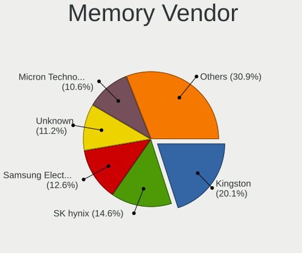

| Vendor              | Computers | Percent |
|---------------------|-----------|---------|
| Kingston            | 70        | 20.06%  |
| SK hynix            | 51        | 14.61%  |
| Samsung Electronics | 44        | 12.61%  |
| Unknown             | 39        | 11.17%  |
| Micron Technology   | 37        | 10.6%   |
| Crucial             | 31        | 8.88%   |
| Corsair             | 24        | 6.88%   |
| Transcend           | 17        | 4.87%   |
| Unknown             | 4         | 1.15%   |
| Unknown (ABCD)      | 3         | 0.86%   |
| Toshiba             | 3         | 0.86%   |
| Nanya Technology    | 3         | 0.86%   |
| G.Skill             | 3         | 0.86%   |
| Unknown (07FB)      | 2         | 0.57%   |
| QEMU                | 2         | 0.57%   |
| Hewlett-Packard     | 2         | 0.57%   |
| Elpida              | 2         | 0.57%   |
| A-DATA Technology   | 2         | 0.57%   |
| Unknown (F301)      | 1         | 0.29%   |
| Unknown (0x05F7)    | 1         | 0.29%   |
| tigo                | 1         | 0.29%   |
| Super Talent        | 1         | 0.29%   |
| Silicon Power       | 1         | 0.29%   |
| Lexar Co Limited    | 1         | 0.29%   |
| Kimtigo             | 1         | 0.29%   |
| Goldenmars          | 1         | 0.29%   |
| ASint Technology    | 1         | 0.29%   |
| Aeneon              | 1         | 0.29%   |

Memory Model
------------

Memory module models

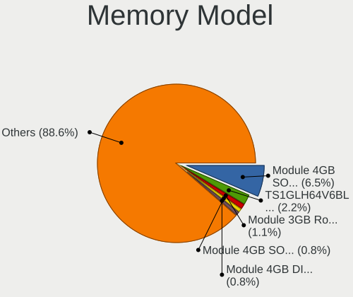

| Model                                                          | Computers | Percent |
|----------------------------------------------------------------|-----------|---------|
| Unknown RAM Module 4GB SODIMM DDR3 1333MT/s                    | 24        | 6.49%   |
| Transcend RAM TS1GLH64V6BL 8GB SODIMM DDR4 2667MT/s            | 8         | 2.16%   |
| Unknown                                                        | 4         | 1.08%   |
| Unknown RAM Module 4GB SODIMM DDR3 667MT/s                     | 3         | 0.81%   |
| Unknown RAM Module 4GB DIMM DDR3 1333MT/s                      | 3         | 0.81%   |
| Unknown RAM Module 2GB SODIMM DDR3 1333MT/s                    | 3         | 0.81%   |
| Unknown (ABCD) RAM 123456789012345678 8GB DIMM DDR4 2400MT/s   | 3         | 0.81%   |
| SK hynix RAM Module 4GB SODIMM LPDDR3 1600MT/s                 | 3         | 0.81%   |
| SK hynix RAM HMT451S6BFR8A-PB 4GB SODIMM DDR3 1600MT/s         | 3         | 0.81%   |
| SK hynix RAM HMA81GU6CJR8N-XN 8GB DIMM DDR4 3200MT/s           | 3         | 0.81%   |
| Samsung RAM M471A1G44AB0-CWE 8GB Row Of Chips DDR4 3200MT/s    | 3         | 0.81%   |
| Kingston RAM KHX2933C15D4/8GX 8GB DIMM DDR4 2400MT/s           | 3         | 0.81%   |
| Kingston RAM KF2666C15S4/8G 8GB SODIMM DDR4 2667MT/s           | 3         | 0.81%   |
| Kingston RAM CBD24D4S7S8K1A-8 8GB SODIMM DDR4 2400MT/s         | 3         | 0.81%   |
| Crucial RAM CT16G56C46S5.M8G1 16GB SODIMM DDR5 5600MT/s        | 3         | 0.81%   |
| Transcend RAM TS512MLH64V6HL 4GB SODIMM DDR4 2667MT/s          | 2         | 0.54%   |
| Transcend RAM TS1GLH64V6B3 8GB SODIMM DDR4 1333MT/s            | 2         | 0.54%   |
| SK hynix RAM HMA82GR7CJR4N-WM 16GB DIMM DDR4 2933MT/s          | 2         | 0.54%   |
| SK hynix RAM HMA82GR7AFR8N-VK 16GB DIMM DDR4 2666MT/s          | 2         | 0.54%   |
| SK hynix RAM HMA82GR7AFR4N-UH 16GB DIMM DDR4 2400MT/s          | 2         | 0.54%   |
| SK hynix RAM HMA81GS6CJR8N-VK 8GB SODIMM DDR4 2667MT/s         | 2         | 0.54%   |
| Samsung RAM M471A5244CB0-CTD 4GB SODIMM DDR4 3200MT/s          | 2         | 0.54%   |
| Samsung RAM M425R4GA3BB0-CQKOL 32GB SODIMM DDR5 4800MT/s       | 2         | 0.54%   |
| Samsung RAM M378B5173QH0-CK0 4GB DIMM DDR3 1600MT/s            | 2         | 0.54%   |
| Micron RAM MT52L512M32D2PF-09 4GB Row Of Chips LPDDR3 2133MT/s | 2         | 0.54%   |
| Micron RAM Module 8GB Row Of Chips LPDDR4 3200MT/s             | 2         | 0.54%   |
| Micron RAM Module 2GB DIMM DDR3 1333MT/s                       | 2         | 0.54%   |
| Micron RAM Module 16GB Row Of Chips LPDDR4 4267MT/s            | 2         | 0.54%   |
| Micron RAM CT16G56C46S5.C8D 16GB SODIMM DDR5 5600MT/s          | 2         | 0.54%   |
| Micron RAM 53D512M64D4RQ-046 8GB Row Of Chips LPDDR4 4800MT/s  | 2         | 0.54%   |
| Kingston RAM KHX1600C10D3/8G 8GB DIMM DDR3 1600MT/s            | 2         | 0.54%   |
| Kingston RAM 99U5471-052.A00LF 8GB DIMM DDR3 1333MT/s          | 2         | 0.54%   |
| Kingston RAM 9965745-020.A00G 32GB DIMM DDR4 3200MT/s          | 2         | 0.54%   |
| Kingston RAM 9965698-044.A00G 16GB DIMM DDR4 2666MT/s          | 2         | 0.54%   |
| Kingston RAM 9905403-559.A00LF 8GB DIMM DDR3 1333MT/s          | 2         | 0.54%   |
| Elpida RAM Module 4GB SODIMM DDR3 1600MT/s                     | 2         | 0.54%   |
| Crucial RAM CT8G4SFS824A.M8FD 8GB SODIMM DDR4 2400MT/s         | 2         | 0.54%   |
| Crucial RAM CT8G4SFRA32A.M8FR 8GB SODIMM DDR4 3200MT/s         | 2         | 0.54%   |
| Crucial RAM CT8G4DFS8266.M8FJ 8GB DIMM DDR4 2666MT/s           | 2         | 0.54%   |
| Crucial RAM CT8G4DFRA266.C8FB 8GB DIMM DDR4 2666MT/s           | 2         | 0.54%   |

Memory Kind
-----------

Memory module kinds

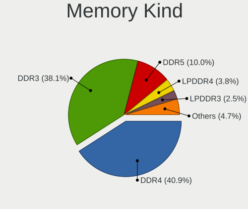

| Kind    | Computers | Percent |
|---------|-----------|---------|
| DDR4    | 131       | 40.94%  |
| DDR3    | 122       | 38.13%  |
| DDR5    | 32        | 10%     |
| LPDDR4  | 12        | 3.75%   |
| LPDDR3  | 8         | 2.5%    |
| DDR2    | 6         | 1.88%   |
| LPDDR5  | 5         | 1.56%   |
| RAM     | 2         | 0.63%   |
| Unknown | 2         | 0.63%   |

Memory Form Factor
------------------

Physical design of the memory module

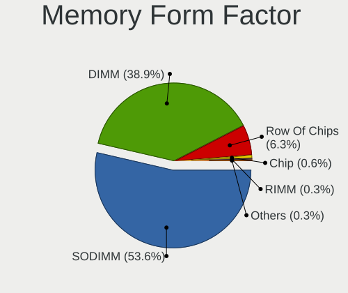

| Name         | Computers | Percent |
|--------------|-----------|---------|
| SODIMM       | 171       | 53.61%  |
| DIMM         | 124       | 38.87%  |
| Row Of Chips | 20        | 6.27%   |
| Chip         | 2         | 0.63%   |
| RIMM         | 1         | 0.31%   |
| FB-DIMM      | 1         | 0.31%   |

Memory Size
-----------

Memory module size

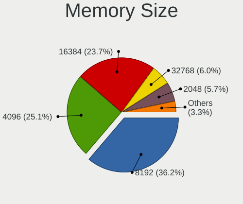

| Size  | Computers | Percent |
|-------|-----------|---------|
| 8192  | 121       | 36.23%  |
| 4096  | 84        | 25.15%  |
| 16384 | 79        | 23.65%  |
| 32768 | 20        | 5.99%   |
| 2048  | 19        | 5.69%   |
| 1024  | 4         | 1.2%    |
| 65536 | 3         | 0.9%    |
| 3072  | 2         | 0.6%    |
| 6144  | 1         | 0.3%    |
| 512   | 1         | 0.3%    |

Memory Speed
------------

Memory module speed

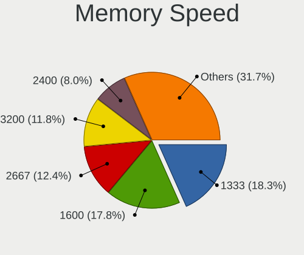

| Speed   | Computers | Percent |
|---------|-----------|---------|
| 1333    | 62        | 18.34%  |
| 1600    | 60        | 17.75%  |
| 2667    | 42        | 12.43%  |
| 3200    | 40        | 11.83%  |
| 2400    | 27        | 7.99%   |
| 4800    | 24        | 7.1%    |
| 2133    | 19        | 5.62%   |
| 2666    | 11        | 3.25%   |
| 5600    | 10        | 2.96%   |
| 667     | 6         | 1.78%   |
| 6400    | 4         | 1.18%   |
| 4267    | 4         | 1.18%   |
| 2933    | 4         | 1.18%   |
| 1867    | 4         | 1.18%   |
| 800     | 4         | 1.18%   |
| 1334    | 3         | 0.89%   |
| Unknown | 3         | 0.89%   |
| 3600    | 2         | 0.59%   |
| 3000    | 2         | 0.59%   |
| 1067    | 2         | 0.59%   |
| 4000    | 1         | 0.3%    |
| 1866    | 1         | 0.3%    |
| 1800    | 1         | 0.3%    |
| 1066    | 1         | 0.3%    |
| 1033    | 1         | 0.3%    |

Printers & scanners
-------------------

Printer Vendor
--------------

Printer device vendors

Zero info for selected period =(

Printer Model
-------------

Printer device models

Zero info for selected period =(

Scanner Vendor
--------------

Scanner device vendors

Zero info for selected period =(

Scanner Model
-------------

Scanner device models

Zero info for selected period =(

Camera
------

Camera Vendor
-------------

Camera device vendors

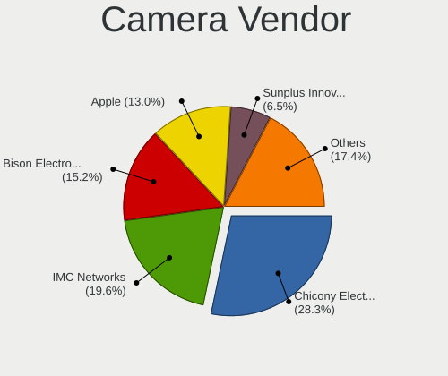

| Vendor                                 | Computers | Percent |
|----------------------------------------|-----------|---------|
| Chicony Electronics                    | 13        | 28.26%  |
| IMC Networks                           | 9         | 19.57%  |
| Bison Electronics                      | 7         | 15.22%  |
| Apple                                  | 6         | 13.04%  |
| Sunplus Innovation Technology          | 3         | 6.52%   |
| Microdia                               | 3         | 6.52%   |
| Cheng Uei Precision Industry (Foxlink) | 2         | 4.35%   |
| Suyin                                  | 1         | 2.17%   |
| Supreme Electronics                    | 1         | 2.17%   |
| Shenzhen Kingcome Optoelectronic       | 1         | 2.17%   |

Camera Model
------------

Camera device models

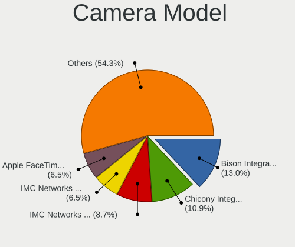

| Model                                                       | Computers | Percent |
|-------------------------------------------------------------|-----------|---------|
| Bison Integrated Camera                                     | 6         | 13.04%  |
| Chicony Integrated Camera                                   | 5         | 10.87%  |
| IMC Networks Integrated Camera                              | 4         | 8.7%    |
| IMC Networks Lenovo EasyCamera                              | 3         | 6.52%   |
| Apple FaceTime HD Camera (Built-in)                         | 3         | 6.52%   |
| Apple FaceTime HD Camera                                    | 3         | 6.52%   |
| Microdia Lenovo EasyCamera                                  | 2         | 4.35%   |
| Suyin HD WebCam                                             | 1         | 2.17%   |
| Supreme Realtek PC Camera                                   | 1         | 2.17%   |
| Sunplus Laptop Integrated WebCam HD                         | 1         | 2.17%   |
| Sunplus Laptop Integrated Webcam FHD                        | 1         | 2.17%   |
| Sunplus ASUS Webcam                                         | 1         | 2.17%   |
| Shenzhen Kingcome Optoelectronic FHD WebCam                 | 1         | 2.17%   |
| Microdia Integrated Webcam                                  | 1         | 2.17%   |
| IMC Networks EasyCamera                                     | 1         | 2.17%   |
| IMC Networks ASUS EasyCamera                                | 1         | 2.17%   |
| Chicony USB2.0 HD UVC WebCam                                | 1         | 2.17%   |
| Chicony USB 2.0 2.0M UVC WebCam                             | 1         | 2.17%   |
| Chicony ThinkPad T490 Webcam                                | 1         | 2.17%   |
| Chicony Lenovo EasyCamera                                   | 1         | 2.17%   |
| Chicony Integrated HP HD Webcam                             | 1         | 2.17%   |
| Chicony Integrated Camera [ThinkPad]                        | 1         | 2.17%   |
| Chicony HP Webcam [2 MP Macro]                              | 1         | 2.17%   |
| Chicony HP Universal Camera                                 | 1         | 2.17%   |
| Cheng Uei Precision Industry (Foxlink) HP HD Webcam [Fixed] | 1         | 2.17%   |
| Cheng Uei Precision Industry (Foxlink) HD Camera            | 1         | 2.17%   |
| Bison Lenovo EasyCamera integrated webcam                   | 1         | 2.17%   |

Security
--------

Fingerprint Vendor
------------------

Fingerprint sensor vendors

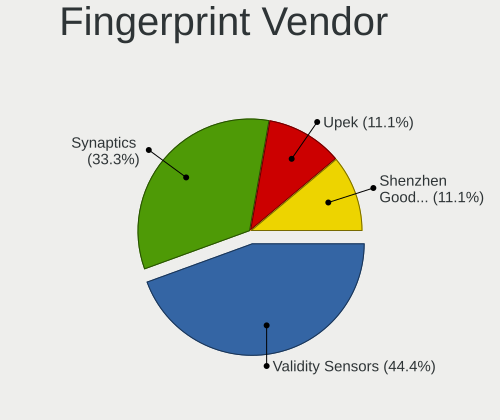

| Vendor                     | Computers | Percent |
|----------------------------|-----------|---------|
| Validity Sensors           | 7         | 53.85%  |
| Synaptics                  | 4         | 30.77%  |
| Upek                       | 1         | 7.69%   |
| Shenzhen Goodix Technology | 1         | 7.69%   |

Fingerprint Model
-----------------

Fingerprint sensor models

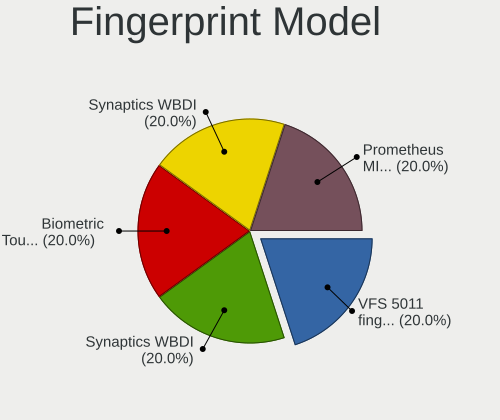

| Model                                                  | Computers | Percent |
|--------------------------------------------------------|-----------|---------|
| Validity Sensors VFS7500 Touch Fingerprint Sensor      | 2         | 15.38%  |
| Validity Sensors VFS 5011 fingerprint sensor           | 2         | 15.38%  |
| Synaptics Prometheus MIS Touch Fingerprint Reader      | 2         | 15.38%  |
| Validity Sensors VFS491                                | 1         | 7.69%   |
| Validity Sensors VFS451 Fingerprint Reader             | 1         | 7.69%   |
| Validity Sensors Synaptics WBDI                        | 1         | 7.69%   |
| Upek Biometric Touchchip/Touchstrip Fingerprint Sensor | 1         | 7.69%   |
| Synaptics WBDI                                         | 1         | 7.69%   |
| Synaptics Metallica MIS Touch Fingerprint Reader       | 1         | 7.69%   |
| Shenzhen Goodix Fingerprint Reader                     | 1         | 7.69%   |

Chipcard Vendor
---------------

Chipcard module vendors

Zero info for selected period =(

Chipcard Model
--------------

Chipcard module models

Zero info for selected period =(

Unsupported
-----------

Unsupported Devices
-------------------

Total unsupported devices on board

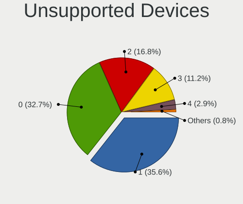

| Total | Computers | Percent |
|-------|-----------|---------|
| 1     | 134       | 35.64%  |
| 0     | 123       | 32.71%  |
| 2     | 63        | 16.76%  |
| 3     | 42        | 11.17%  |
| 4     | 11        | 2.93%   |
| 5     | 3         | 0.8%    |

Unsupported Device Types
------------------------

Types of unsupported devices

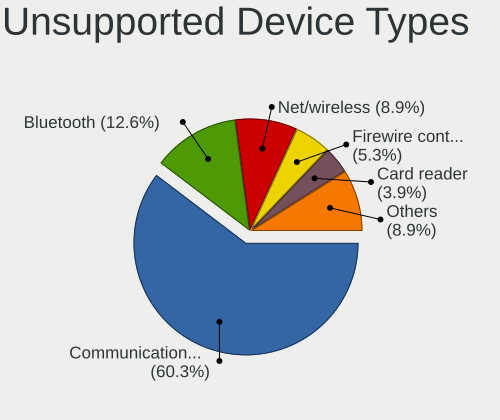

| Type                     | Computers | Percent |
|--------------------------|-----------|---------|
| Communication controller | 216       | 60.34%  |
| Bluetooth                | 45        | 12.57%  |
| Net/wireless             | 32        | 8.94%   |
| Firewire controller      | 19        | 5.31%   |
| Card reader              | 14        | 3.91%   |
| Fingerprint reader       | 11        | 3.07%   |
| Net/ethernet             | 8         | 2.23%   |
| Sound                    | 5         | 1.4%    |
| Graphics card            | 4         | 1.12%   |
| Network                  | 3         | 0.84%   |
| Storage                  | 1         | 0.28%   |

