BSD in Switzerland - Tested Hardware & Statistics
-------------------------------------------------

A project to collect tested hardware configurations for BSD in Switzerland.

Anyone can contribute to this report by the [hw-probe](https://github.com/linuxhw/hw-probe/blob/master/INSTALL.BSD.md) tool:

    hw-probe -all -upload

Please contribute! Especially if your hardware is rare.

This is a report for all computer types. See also reports for [desktops](/Location/Switzerland/Desktop/README.md) and [notebooks](/Location/Switzerland/Notebook/README.md).

Contents
--------

* [ Test Cases ](#test-cases)

* [ System ](#system)
  - [ OS                       ](#os)
  - [ OS Family                ](#os-family)
  - [ Arch                     ](#arch)
  - [ DE                       ](#de)
  - [ Display Server           ](#display-server)
  - [ Display Manager          ](#display-manager)
  - [ OS Lang                  ](#os-lang)
  - [ Boot Mode                ](#boot-mode)
  - [ Filesystem               ](#filesystem)
  - [ Part. scheme             ](#part-scheme)

* [ Board ](#board)
  - [ Vendor                   ](#vendor)
  - [ Model                    ](#model)
  - [ Model Family             ](#model-family)
  - [ MFG Year                 ](#mfg-year)
  - [ Form Factor              ](#form-factor)
  - [ Coreboot                 ](#coreboot)
  - [ RAM Size                 ](#ram-size)
  - [ RAM Used                 ](#ram-used)
  - [ Total Drives             ](#total-drives)
  - [ Has CD-ROM               ](#has-cd-rom)
  - [ Has Ethernet             ](#has-ethernet)
  - [ Has WiFi                 ](#has-wifi)
  - [ Has Bluetooth            ](#has-bluetooth)

* [ Location ](#location)
  - [ Country                  ](#country)
  - [ City                     ](#city)

* [ Drives ](#drives)
  - [ Drive Vendor             ](#drive-vendor)
  - [ Drive Model              ](#drive-model)
  - [ HDD Vendor               ](#hdd-vendor)
  - [ SSD Vendor               ](#ssd-vendor)
  - [ Drive Kind               ](#drive-kind)
  - [ Drive Connector          ](#drive-connector)
  - [ Drive Size               ](#drive-size)
  - [ Space Total              ](#space-total)
  - [ Space Used               ](#space-used)
  - [ Malfunc. Drives          ](#malfunc-drives)
  - [ Malfunc. Drive Vendor    ](#malfunc-drive-vendor)
  - [ Malfunc. HDD Vendor      ](#malfunc-hdd-vendor)
  - [ Malfunc. Drive Kind      ](#malfunc-drive-kind)
  - [ Failed Drives            ](#failed-drives)
  - [ Failed Drive Vendor      ](#failed-drive-vendor)
  - [ Drive Status             ](#drive-status)

* [ Storage controller ](#storage-controller)
  - [ Storage Vendor           ](#storage-vendor)
  - [ Storage Model            ](#storage-model)
  - [ Storage Kind             ](#storage-kind)

* [ Processor ](#processor)
  - [ CPU Vendor               ](#cpu-vendor)
  - [ CPU Model                ](#cpu-model)
  - [ CPU Model Family         ](#cpu-model-family)
  - [ CPU Cores                ](#cpu-cores)
  - [ CPU Sockets              ](#cpu-sockets)
  - [ CPU Threads              ](#cpu-threads)
  - [ CPU Microarch            ](#cpu-microarch)

* [ Graphics ](#graphics)
  - [ GPU Vendor               ](#gpu-vendor)
  - [ GPU Model                ](#gpu-model)
  - [ GPU Combo                ](#gpu-combo)
  - [ GPU Driver               ](#gpu-driver)
  - [ GPU Memory               ](#gpu-memory)

* [ Monitor ](#monitor)
  - [ Monitor Vendor           ](#monitor-vendor)
  - [ Monitor Model            ](#monitor-model)
  - [ Monitor Resolution       ](#monitor-resolution)
  - [ Monitor Diagonal         ](#monitor-diagonal)
  - [ Monitor Width            ](#monitor-width)
  - [ Aspect Ratio             ](#aspect-ratio)
  - [ Monitor Area             ](#monitor-area)
  - [ Pixel Density            ](#pixel-density)
  - [ Multiple Monitors        ](#multiple-monitors)

* [ Network ](#network)
  - [ Net Controller Vendor    ](#net-controller-vendor)
  - [ Net Controller Model     ](#net-controller-model)
  - [ Wireless Vendor          ](#wireless-vendor)
  - [ Wireless Model           ](#wireless-model)
  - [ Ethernet Vendor          ](#ethernet-vendor)
  - [ Ethernet Model           ](#ethernet-model)
  - [ Net Controller Kind      ](#net-controller-kind)
  - [ Used Controller          ](#used-controller)
  - [ NICs                     ](#nics)
  - [ IPv6                     ](#ipv6)

* [ Bluetooth ](#bluetooth)
  - [ Bluetooth Vendor         ](#bluetooth-vendor)
  - [ Bluetooth Model          ](#bluetooth-model)

* [ Sound ](#sound)
  - [ Sound Vendor             ](#sound-vendor)
  - [ Sound Model              ](#sound-model)

* [ Memory ](#memory)
  - [ Memory Vendor            ](#memory-vendor)
  - [ Memory Model             ](#memory-model)
  - [ Memory Kind              ](#memory-kind)
  - [ Memory Form Factor       ](#memory-form-factor)
  - [ Memory Size              ](#memory-size)
  - [ Memory Speed             ](#memory-speed)

* [ Printers & scanners ](#printers--scanners)
  - [ Printer Vendor           ](#printer-vendor)
  - [ Printer Model            ](#printer-model)
  - [ Scanner Vendor           ](#scanner-vendor)
  - [ Scanner Model            ](#scanner-model)

* [ Camera ](#camera)
  - [ Camera Vendor            ](#camera-vendor)
  - [ Camera Model             ](#camera-model)

* [ Security ](#security)
  - [ Fingerprint Vendor       ](#fingerprint-vendor)
  - [ Fingerprint Model        ](#fingerprint-model)
  - [ Chipcard Vendor          ](#chipcard-vendor)
  - [ Chipcard Model           ](#chipcard-model)

* [ Unsupported ](#unsupported)
  - [ Unsupported Devices      ](#unsupported-devices)
  - [ Unsupported Device Types ](#unsupported-device-types)

Test Cases
----------

Total: 401

| Vendor        | Model                       | Form-Factor | Probe                                                     | Date         |
|---------------|-----------------------------|-------------|-----------------------------------------------------------|--------------|
| Lenovo        | ThinkPad T14 Gen 3 21CF0... | Notebook    | [2ab7b9d6b2](https://bsd-hardware.info/?probe=2ab7b9d6b2) | Jan 02, 2024 |
| Lenovo        | ThinkPad T14 Gen 3 21CF0... | Notebook    | [0a2c02f944](https://bsd-hardware.info/?probe=0a2c02f944) | Dec 27, 2023 |
| Lenovo        | ThinkPad T14 Gen 3 21CF0... | Notebook    | [4b1250f831](https://bsd-hardware.info/?probe=4b1250f831) | Dec 26, 2023 |
| PC Engines    | APU2                        | Desktop     | [79f4518fa1](https://bsd-hardware.info/?probe=79f4518fa1) | Dec 23, 2023 |
| ASUSTek       | PRIME H610I-PLUS D4         | Desktop     | [3a435d185e](https://bsd-hardware.info/?probe=3a435d185e) | Dec 22, 2023 |
| PC Engines    | APU2                        | Desktop     | [f3061d599c](https://bsd-hardware.info/?probe=f3061d599c) | Dec 19, 2023 |
| Intel         | HURONRIVER                  | Desktop     | [d0ebaa4479](https://bsd-hardware.info/?probe=d0ebaa4479) | Dec 17, 2023 |
| Apple         | MacBookPro10,2              | Notebook    | [e1867819f3](https://bsd-hardware.info/?probe=e1867819f3) | Dec 15, 2023 |
| Deciso        | NetBoard-A20                | Notebook    | [18364861b5](https://bsd-hardware.info/?probe=18364861b5) | Dec 03, 2023 |
| Unknown       | QDNV01                      | Desktop     | [63cbf7642b](https://bsd-hardware.info/?probe=63cbf7642b) | Nov 28, 2023 |
| Lenovo        | Yoga 2 Pro 20266            | Notebook    | [1096dc8160](https://bsd-hardware.info/?probe=1096dc8160) | Nov 27, 2023 |
| Lenovo        | Yoga 2 Pro 20266            | Notebook    | [1bfc57a019](https://bsd-hardware.info/?probe=1bfc57a019) | Nov 27, 2023 |
| ASRock        | B550 Taichi                 | Desktop     | [60d2873b5d](https://bsd-hardware.info/?probe=60d2873b5d) | Nov 26, 2023 |
| Apple         | Mac-00BE6ED71E35EB86 iMa... | All in one  | [797f393ce0](https://bsd-hardware.info/?probe=797f393ce0) | Nov 19, 2023 |
| Lenovo        | ThinkPad W530 24411M9       | Notebook    | [0272396725](https://bsd-hardware.info/?probe=0272396725) | Nov 19, 2023 |
| Unknown       | YL-SKUL6                    | Desktop     | [ac654676da](https://bsd-hardware.info/?probe=ac654676da) | Nov 16, 2023 |
| Lenovo        | ThinkPad X1 Carbon 4th 2... | Notebook    | [918706e110](https://bsd-hardware.info/?probe=918706e110) | Nov 15, 2023 |
| ASUSTek       | K56CB                       | Notebook    | [8d4f2c439a](https://bsd-hardware.info/?probe=8d4f2c439a) | Nov 11, 2023 |
| ASUSTek       | Z97-A                       | Desktop     | [3ce8e78453](https://bsd-hardware.info/?probe=3ce8e78453) | Nov 11, 2023 |
| Dell          | 0WR7PY A02                  | Desktop     | [3ce02454f8](https://bsd-hardware.info/?probe=3ce02454f8) | Nov 09, 2023 |
| Unknown       | Unknown                     | Desktop     | [876b0db38a](https://bsd-hardware.info/?probe=876b0db38a) | Nov 07, 2023 |
| ZOTAC         | ZBOX-CI320NANO series Re... | Mini pc     | [9de790eac0](https://bsd-hardware.info/?probe=9de790eac0) | Nov 05, 2023 |
| ASUSTek       | K56CB                       | Notebook    | [7d6d03a42b](https://bsd-hardware.info/?probe=7d6d03a42b) | Nov 05, 2023 |
| Dell          | 0MD99X A12                  | Server      | [c137d2d6da](https://bsd-hardware.info/?probe=c137d2d6da) | Nov 05, 2023 |
| ASUSTek       | Z97-A                       | Desktop     | [a8aad4a386](https://bsd-hardware.info/?probe=a8aad4a386) | Nov 04, 2023 |
| Yanling       | YL-KBR6L Ver:1.01           | Desktop     | [bdc7be2258](https://bsd-hardware.info/?probe=bdc7be2258) | Oct 29, 2023 |
| GoWin Solu... | R86S                        | Desktop     | [8668f0e8e9](https://bsd-hardware.info/?probe=8668f0e8e9) | Oct 24, 2023 |
| Seco          | UDOO x86                    | Notebook    | [260f8194ed](https://bsd-hardware.info/?probe=260f8194ed) | Oct 22, 2023 |
| Unknown       | Unknown                     | Desktop     | [135c0112a4](https://bsd-hardware.info/?probe=135c0112a4) | Oct 21, 2023 |
| Unknown       | QDNV01                      | Desktop     | [df90627ba3](https://bsd-hardware.info/?probe=df90627ba3) | Oct 17, 2023 |
| Deciso        | NetBoard-A20                | Notebook    | [7ed49c5f2f](https://bsd-hardware.info/?probe=7ed49c5f2f) | Oct 13, 2023 |
| Deciso        | NetBoard-A20                | Notebook    | [b9c11f29c9](https://bsd-hardware.info/?probe=b9c11f29c9) | Oct 10, 2023 |
| Deciso        | Netboard A20                | Notebook    | [c549fc9540](https://bsd-hardware.info/?probe=c549fc9540) | Oct 05, 2023 |
| Unknown       | Unknown                     | Desktop     | [50418139b2](https://bsd-hardware.info/?probe=50418139b2) | Sep 30, 2023 |
| Sophos        | SG                          | Firewall    | [273b148522](https://bsd-hardware.info/?probe=273b148522) | Sep 30, 2023 |
| PC Engines    | APU                         | Desktop     | [ca9bc2faa7](https://bsd-hardware.info/?probe=ca9bc2faa7) | Sep 29, 2023 |
| PC Engines    | APU                         | Desktop     | [067872c1f5](https://bsd-hardware.info/?probe=067872c1f5) | Sep 29, 2023 |
| PC Engines    | APU2                        | Desktop     | [252385ae71](https://bsd-hardware.info/?probe=252385ae71) | Sep 27, 2023 |
| GoWin Solu... | R86S                        | Desktop     | [6d38812084](https://bsd-hardware.info/?probe=6d38812084) | Sep 22, 2023 |
| Supermicro    | X11SCL-IF                   | Server      | [da7e89f514](https://bsd-hardware.info/?probe=da7e89f514) | Sep 20, 2023 |
| Supermicro    | X11SCL-IF                   | Server      | [5a57c7066e](https://bsd-hardware.info/?probe=5a57c7066e) | Sep 19, 2023 |
| HP            | 1790                        | Desktop     | [17ace3bb2c](https://bsd-hardware.info/?probe=17ace3bb2c) | Sep 18, 2023 |
| Sophos        | SG                          | Firewall    | [960f408d24](https://bsd-hardware.info/?probe=960f408d24) | Sep 13, 2023 |
| ASUSTek       | H170M-E D3                  | Desktop     | [f9bde14ab2](https://bsd-hardware.info/?probe=f9bde14ab2) | Sep 10, 2023 |
| Supermicro    | X11SCL-IF                   | Server      | [b8c6daa2c4](https://bsd-hardware.info/?probe=b8c6daa2c4) | Aug 30, 2023 |
| Deciso        | NetBoard-A20                | Notebook    | [e9e295eae3](https://bsd-hardware.info/?probe=e9e295eae3) | Aug 24, 2023 |
| Techvision    | TVI7309X B0                 | Desktop     | [e59ce0fb84](https://bsd-hardware.info/?probe=e59ce0fb84) | Aug 21, 2023 |
| Supermicro    | X11SDW-8C-TP13F             | Desktop     | [da4385727b](https://bsd-hardware.info/?probe=da4385727b) | Aug 19, 2023 |
| Deciso        | NetBoard-A20                | Notebook    | [c38eb6b9bd](https://bsd-hardware.info/?probe=c38eb6b9bd) | Aug 19, 2023 |
| Supermicro    | X10SLM+-LN4F                | Server      | [05e32e30fd](https://bsd-hardware.info/?probe=05e32e30fd) | Aug 17, 2023 |
| PC Engines    | apu6                        | Desktop     | [65fda0fe1f](https://bsd-hardware.info/?probe=65fda0fe1f) | Aug 11, 2023 |
| Lenovo        | 3743 SDK0T76461 WIN 3422... | Desktop     | [d5675b5940](https://bsd-hardware.info/?probe=d5675b5940) | Aug 06, 2023 |
| Intel BOX4... | Geminilake                  | Desktop     | [b833ada775](https://bsd-hardware.info/?probe=b833ada775) | Aug 01, 2023 |
| GoWin Solu... | R86S                        | Desktop     | [51bb255924](https://bsd-hardware.info/?probe=51bb255924) | Jul 29, 2023 |
| Lenovo        | Yoga Slim 7 Pro 14ACH5 8... | Notebook    | [020e17c2f8](https://bsd-hardware.info/?probe=020e17c2f8) | Jul 23, 2023 |
| Unknown       | Unknown                     | Desktop     | [dc7318d29f](https://bsd-hardware.info/?probe=dc7318d29f) | Jul 15, 2023 |
| Deciso        | Netboard A20                | Notebook    | [e82dfa5520](https://bsd-hardware.info/?probe=e82dfa5520) | Jul 14, 2023 |
| Unknown       | Unknown                     | Desktop     | [9ce40969da](https://bsd-hardware.info/?probe=9ce40969da) | Jul 11, 2023 |
| Protectli     | VP2410                      | Desktop     | [8ad8c5daa9](https://bsd-hardware.info/?probe=8ad8c5daa9) | Jul 03, 2023 |
| Apple         | Mac-4BC72D62AD45599E Mac... | Mini pc     | [3f2469c1b3](https://bsd-hardware.info/?probe=3f2469c1b3) | Jul 01, 2023 |
| Gigabyte      | J4005ND2P-CF                | Desktop     | [ee61a4b160](https://bsd-hardware.info/?probe=ee61a4b160) | Jun 17, 2023 |
| ASUSTek       | ASUS TUF Gaming A17 FA70... | Notebook    | [dd937d0914](https://bsd-hardware.info/?probe=dd937d0914) | Jun 12, 2023 |
| PC Engines    | apu4                        | Desktop     | [f130ecbaa3](https://bsd-hardware.info/?probe=f130ecbaa3) | Jun 01, 2023 |
| Unknown       | Unknown                     | Desktop     | [c1854cc5f2](https://bsd-hardware.info/?probe=c1854cc5f2) | May 27, 2023 |
| ASRock        | Z68 Pro3 Gen3               | Desktop     | [0a03cd86a0](https://bsd-hardware.info/?probe=0a03cd86a0) | May 21, 2023 |
| HP            | 8299                        | Desktop     | [f5ecf1eaeb](https://bsd-hardware.info/?probe=f5ecf1eaeb) | May 17, 2023 |
| CWWK          | MINIPC-G12                  | Desktop     | [b26aab0f0d](https://bsd-hardware.info/?probe=b26aab0f0d) | May 17, 2023 |
| Supermicro    | X11SCL-IF                   | Server      | [e44ad0928d](https://bsd-hardware.info/?probe=e44ad0928d) | May 15, 2023 |
| PC Engines    | apu6                        | Desktop     | [3733cf215f](https://bsd-hardware.info/?probe=3733cf215f) | May 13, 2023 |
| Supermicro    | X11SDW-16C-TP13F+           | Desktop     | [1cc0308686](https://bsd-hardware.info/?probe=1cc0308686) | May 13, 2023 |
| Supermicro    | X11SCL-IF                   | Server      | [4932220de5](https://bsd-hardware.info/?probe=4932220de5) | May 09, 2023 |
| Lenovo        | Yoga Slim 7 Pro 14ACH5 8... | Notebook    | [95695f78c5](https://bsd-hardware.info/?probe=95695f78c5) | May 08, 2023 |
| Supermicro    | X11SCL-IF                   | Server      | [d4916dbd5f](https://bsd-hardware.info/?probe=d4916dbd5f) | May 08, 2023 |
| MW            | GMLK-2_5G4L                 | Desktop     | [9fea438eba](https://bsd-hardware.info/?probe=9fea438eba) | May 07, 2023 |
| ASUSTek       | PRIME H610I-PLUS D4         | Desktop     | [472c5fb78e](https://bsd-hardware.info/?probe=472c5fb78e) | Apr 29, 2023 |
| Sophos        | SG                          | Firewall    | [b5452a27b6](https://bsd-hardware.info/?probe=b5452a27b6) | Apr 24, 2023 |
| PC Engines    | APU2                        | Desktop     | [4337168a3a](https://bsd-hardware.info/?probe=4337168a3a) | Apr 20, 2023 |
| Supermicro    | M11SDV-8C-LN4F              | Desktop     | [49a95f197c](https://bsd-hardware.info/?probe=49a95f197c) | Apr 20, 2023 |
| Intel BOX4... | Geminilake                  | Desktop     | [79d72cc60f](https://bsd-hardware.info/?probe=79d72cc60f) | Apr 13, 2023 |
| PC Engines    | APU2                        | Desktop     | [766755078c](https://bsd-hardware.info/?probe=766755078c) | Apr 10, 2023 |
| Lenovo        | Yoga Slim 7 Pro 14ACH5 8... | Notebook    | [692b42afcd](https://bsd-hardware.info/?probe=692b42afcd) | Apr 08, 2023 |
| Sophos        | SG                          | Firewall    | [b3328d5498](https://bsd-hardware.info/?probe=b3328d5498) | Apr 01, 2023 |
| Lenovo        | Yoga Slim 7 Pro 14ACH5 8... | Notebook    | [0af5cebe20](https://bsd-hardware.info/?probe=0af5cebe20) | Mar 29, 2023 |
| Lenovo        | Yoga Slim 7 Pro 14ACH5 8... | Notebook    | [f4e450fed1](https://bsd-hardware.info/?probe=f4e450fed1) | Mar 29, 2023 |
| Supermicro    | A1SAi 123456789             | Mini pc     | [72e4bf10a6](https://bsd-hardware.info/?probe=72e4bf10a6) | Mar 23, 2023 |
| Lenovo        | Yoga Slim 7 Pro 14ACH5 8... | Notebook    | [136a6641be](https://bsd-hardware.info/?probe=136a6641be) | Mar 21, 2023 |
| Apple         | iMac18,1                    | All in one  | [c6c12705af](https://bsd-hardware.info/?probe=c6c12705af) | Mar 20, 2023 |
| Apple         | MacBookPro5,1               | Notebook    | [9e300b5797](https://bsd-hardware.info/?probe=9e300b5797) | Mar 19, 2023 |
| GoWin Solu... | R86S                        | Desktop     | [35e1503946](https://bsd-hardware.info/?probe=35e1503946) | Mar 08, 2023 |
| Protectli     | FW4C Ver                    | Desktop     | [d93437d96b](https://bsd-hardware.info/?probe=d93437d96b) | Mar 04, 2023 |
| Shuttle       | FS81                        | Desktop     | [5787eda5ac](https://bsd-hardware.info/?probe=5787eda5ac) | Feb 26, 2023 |
| Unknown       | Unknown                     | Desktop     | [913946ccc9](https://bsd-hardware.info/?probe=913946ccc9) | Feb 25, 2023 |
| Techvision    | TVI7309X B0                 | Desktop     | [0e62dfc436](https://bsd-hardware.info/?probe=0e62dfc436) | Feb 25, 2023 |
| Dell          | 05XGC8 A01                  | Desktop     | [c51a264e20](https://bsd-hardware.info/?probe=c51a264e20) | Feb 23, 2023 |
| Intel         | NUC12WSBi3 M36953-303       | Mini pc     | [727ca24f1c](https://bsd-hardware.info/?probe=727ca24f1c) | Feb 22, 2023 |
| AMI           | Aptio CRB                   | Mini pc     | [5b8fdd6349](https://bsd-hardware.info/?probe=5b8fdd6349) | Feb 21, 2023 |
| Intel         | NUC12WSBi3 M36953-303       | Mini pc     | [9bdcc78235](https://bsd-hardware.info/?probe=9bdcc78235) | Feb 19, 2023 |
| Deciso        | Netboard A20                | Notebook    | [7c91a0f01b](https://bsd-hardware.info/?probe=7c91a0f01b) | Feb 14, 2023 |
| Lenovo        | IdeaPad Y700-15ISK 80NV     | Notebook    | [0c9cf4e002](https://bsd-hardware.info/?probe=0c9cf4e002) | Feb 09, 2023 |
| Lenovo        | IdeaPad Y700-15ISK 80NV     | Notebook    | [ca1e51a042](https://bsd-hardware.info/?probe=ca1e51a042) | Feb 09, 2023 |
| Supermicro    | M11SDV-8C-LN4F              | Desktop     | [4874e3417f](https://bsd-hardware.info/?probe=4874e3417f) | Feb 09, 2023 |
| Intel BOX4... | Geminilake                  | Desktop     | [286c29b1bb](https://bsd-hardware.info/?probe=286c29b1bb) | Feb 08, 2023 |
| Fujitsu       | D3313-A1 S26361-D3313-A1    | Desktop     | [3a47e70001](https://bsd-hardware.info/?probe=3a47e70001) | Feb 03, 2023 |
| AMI           | Aptio CRB                   | Mini pc     | [193659d215](https://bsd-hardware.info/?probe=193659d215) | Feb 03, 2023 |
| PC Engines    | apu4                        | Desktop     | [c3ff966a17](https://bsd-hardware.info/?probe=c3ff966a17) | Feb 03, 2023 |
| PC Engines    | APU2                        | Desktop     | [315ef90664](https://bsd-hardware.info/?probe=315ef90664) | Feb 01, 2023 |
| AMI           | Aptio CRB                   | Mini pc     | [e43ebed0e6](https://bsd-hardware.info/?probe=e43ebed0e6) | Jan 29, 2023 |
| AMI           | Aptio CRB                   | Mini pc     | [92aedf2a46](https://bsd-hardware.info/?probe=92aedf2a46) | Jan 28, 2023 |
| Deciso        | NetBoard-A10                | Notebook    | [5b226a942e](https://bsd-hardware.info/?probe=5b226a942e) | Jan 27, 2023 |
| AMI           | Aptio CRB                   | Mini pc     | [06e3f3daea](https://bsd-hardware.info/?probe=06e3f3daea) | Jan 24, 2023 |
| Unknown       | Unknown                     | Notebook    | [8511097117](https://bsd-hardware.info/?probe=8511097117) | Jan 22, 2023 |
| Unknown       | Unknown                     | Notebook    | [d5d2ce1b39](https://bsd-hardware.info/?probe=d5d2ce1b39) | Jan 22, 2023 |
| Techvision    | TVI7309X B0                 | Desktop     | [739cc6e5ac](https://bsd-hardware.info/?probe=739cc6e5ac) | Jan 18, 2023 |
| Intel         | HURONRIVER                  | Desktop     | [9994ae920b](https://bsd-hardware.info/?probe=9994ae920b) | Jan 15, 2023 |
| Intel         | HURONRIVER                  | Desktop     | [320272bdf1](https://bsd-hardware.info/?probe=320272bdf1) | Jan 11, 2023 |
| PC Engines    | apu4                        | Desktop     | [3d69b3aec1](https://bsd-hardware.info/?probe=3d69b3aec1) | Jan 03, 2023 |
| PC Engines    | apu4                        | Desktop     | [62e6e7e679](https://bsd-hardware.info/?probe=62e6e7e679) | Jan 03, 2023 |
| AMI           | Aptio CRB                   | Mini pc     | [2973cd399c](https://bsd-hardware.info/?probe=2973cd399c) | Jan 01, 2023 |
| Gigabyte      | B550M AORUS PRO-P           | Desktop     | [d22c37fa81](https://bsd-hardware.info/?probe=d22c37fa81) | Dec 29, 2022 |
| Sophos        | SG                          | Firewall    | [e331fe5e06](https://bsd-hardware.info/?probe=e331fe5e06) | Dec 26, 2022 |
| Intel BOX4... | Geminilake                  | Desktop     | [a2b2b7c25f](https://bsd-hardware.info/?probe=a2b2b7c25f) | Dec 23, 2022 |
| HP            | ProLiant MicroServer Gen... | Desktop     | [a2bc442acd](https://bsd-hardware.info/?probe=a2bc442acd) | Dec 23, 2022 |
| Intel BOX4... | Geminilake                  | Desktop     | [06933f3d87](https://bsd-hardware.info/?probe=06933f3d87) | Dec 23, 2022 |
| Dell          | 0X4N41 A01                  | Desktop     | [4091e15cac](https://bsd-hardware.info/?probe=4091e15cac) | Dec 14, 2022 |
| ASUSTek       | PRIME B550-PLUS             | Desktop     | [1d8397a653](https://bsd-hardware.info/?probe=1d8397a653) | Dec 10, 2022 |
| Unknown       | Unknown                     | Desktop     | [0405fd0f0d](https://bsd-hardware.info/?probe=0405fd0f0d) | Dec 09, 2022 |
| ASUSTek       | PRIME B550-PLUS             | Desktop     | [c30f53fc6d](https://bsd-hardware.info/?probe=c30f53fc6d) | Dec 09, 2022 |
| Unknown       | Unknown                     | Desktop     | [78893acbd5](https://bsd-hardware.info/?probe=78893acbd5) | Dec 06, 2022 |
| Unknown       | Unknown                     | Desktop     | [a5b10d3f79](https://bsd-hardware.info/?probe=a5b10d3f79) | Nov 29, 2022 |
| Unknown       | Unknown                     | Desktop     | [2fe35064cb](https://bsd-hardware.info/?probe=2fe35064cb) | Nov 28, 2022 |
| MW            | GMLK-2_5G4L                 | Desktop     | [7f9869324b](https://bsd-hardware.info/?probe=7f9869324b) | Nov 26, 2022 |
| Unknown       | Unknown                     | Desktop     | [77e932dd9e](https://bsd-hardware.info/?probe=77e932dd9e) | Nov 23, 2022 |
| Infoblox      | IB-1410                     | Desktop     | [7521108ef5](https://bsd-hardware.info/?probe=7521108ef5) | Nov 23, 2022 |
| Unknown       | Unknown                     | Desktop     | [521008f8da](https://bsd-hardware.info/?probe=521008f8da) | Nov 10, 2022 |
| Unknown       | Unknown                     | Desktop     | [bc7a300434](https://bsd-hardware.info/?probe=bc7a300434) | Nov 02, 2022 |
| Intel         | NUC9i7QNB K49245-500        | Mini pc     | [154dad5874](https://bsd-hardware.info/?probe=154dad5874) | Oct 18, 2022 |
| Unknown       | Unknown                     | Desktop     | [2fc5bd737a](https://bsd-hardware.info/?probe=2fc5bd737a) | Oct 09, 2022 |
| PC Engines    | APU2                        | Desktop     | [47e38f3abe](https://bsd-hardware.info/?probe=47e38f3abe) | Oct 05, 2022 |
| Unknown       | Unknown                     | Desktop     | [02a9700c12](https://bsd-hardware.info/?probe=02a9700c12) | Oct 03, 2022 |
| Gigabyte      | X570 AORUS MASTER           | Desktop     | [353008eb5e](https://bsd-hardware.info/?probe=353008eb5e) | Sep 29, 2022 |
| PC Engines    | APU2                        | Desktop     | [3fcc5e5ae2](https://bsd-hardware.info/?probe=3fcc5e5ae2) | Sep 25, 2022 |
| Lenovo        | ThinkPad T460p 20FW003PM... | Notebook    | [ac8e728222](https://bsd-hardware.info/?probe=ac8e728222) | Sep 24, 2022 |
| Sophos        | SG                          | Firewall    | [d485561c3b](https://bsd-hardware.info/?probe=d485561c3b) | Sep 21, 2022 |
| Unknown       | Unknown                     | Notebook    | [fbd1af0e98](https://bsd-hardware.info/?probe=fbd1af0e98) | Sep 21, 2022 |
| Acer          | Aspire E5-771               | Notebook    | [0a58077c49](https://bsd-hardware.info/?probe=0a58077c49) | Sep 20, 2022 |
| HP            | ProLiant ML350p Gen8        | Desktop     | [1a9c6a10bd](https://bsd-hardware.info/?probe=1a9c6a10bd) | Sep 19, 2022 |
| HP            | 0B54h D                     | Desktop     | [a24f08281d](https://bsd-hardware.info/?probe=a24f08281d) | Sep 19, 2022 |
| Apple         | Mac-7BA5B2D9E42DDD94        | Desktop     | [d2e169b8ad](https://bsd-hardware.info/?probe=d2e169b8ad) | Sep 13, 2022 |
| AMI           | Aptio CRB                   | Mini pc     | [68ac9de055](https://bsd-hardware.info/?probe=68ac9de055) | Sep 05, 2022 |
| Apple         | MacBookPro5,1               | Notebook    | [f4d84edb3b](https://bsd-hardware.info/?probe=f4d84edb3b) | Sep 04, 2022 |
| Unknown       | Unknown                     | Desktop     | [9422de47ab](https://bsd-hardware.info/?probe=9422de47ab) | Aug 30, 2022 |
| Shuttle       | FS81                        | Desktop     | [b2db8ceabe](https://bsd-hardware.info/?probe=b2db8ceabe) | Aug 24, 2022 |
| Dell          | 02YYK5 A00                  | Desktop     | [5428710004](https://bsd-hardware.info/?probe=5428710004) | Aug 16, 2022 |
| Supermicro    | X10SDV-TP8F                 | Server      | [3b99c8f471](https://bsd-hardware.info/?probe=3b99c8f471) | Aug 09, 2022 |
| Acer          | Aspire X3995                | Desktop     | [9240256ae5](https://bsd-hardware.info/?probe=9240256ae5) | Aug 06, 2022 |
| Unknown       | Unknown                     | Desktop     | [9f98df6faf](https://bsd-hardware.info/?probe=9f98df6faf) | Aug 05, 2022 |
| Unknown       | Unknown                     | Desktop     | [25ca16baef](https://bsd-hardware.info/?probe=25ca16baef) | Aug 05, 2022 |
| Unknown       | Unknown                     | Desktop     | [f9bf5b2e00](https://bsd-hardware.info/?probe=f9bf5b2e00) | Aug 04, 2022 |
| PC Engines    | APU2                        | Desktop     | [35d0a79b04](https://bsd-hardware.info/?probe=35d0a79b04) | Aug 04, 2022 |
| Protectli     | FW6                         | Desktop     | [b686fdf1c1](https://bsd-hardware.info/?probe=b686fdf1c1) | Jul 31, 2022 |
| Unknown       | Unknown                     | Desktop     | [0b84314fbf](https://bsd-hardware.info/?probe=0b84314fbf) | Jul 28, 2022 |
| Unknown       | Unknown                     | Desktop     | [4e721b00d5](https://bsd-hardware.info/?probe=4e721b00d5) | Jul 28, 2022 |
| PC Engines    | APU2                        | Desktop     | [7d3a1f2825](https://bsd-hardware.info/?probe=7d3a1f2825) | Jul 14, 2022 |
| PC Engines    | APU2                        | Desktop     | [0dd60aeb9a](https://bsd-hardware.info/?probe=0dd60aeb9a) | Jul 14, 2022 |
| Biostar       | H61MHV2                     | Desktop     | [58a61e6171](https://bsd-hardware.info/?probe=58a61e6171) | Jul 11, 2022 |
| Biostar       | H61MHV2                     | Desktop     | [2aa5e2a62d](https://bsd-hardware.info/?probe=2aa5e2a62d) | Jul 08, 2022 |
| Deciso        | Netboard A20                | Notebook    | [c70ba0979e](https://bsd-hardware.info/?probe=c70ba0979e) | Jul 07, 2022 |
| Dell          | 02YYK5 A00                  | Desktop     | [fb2e5bec61](https://bsd-hardware.info/?probe=fb2e5bec61) | Jul 05, 2022 |
| Dell          | 02YYK5 A00                  | Desktop     | [629de6cdb6](https://bsd-hardware.info/?probe=629de6cdb6) | Jul 05, 2022 |
| HP            | 1494                        | Desktop     | [3a61eb7bae](https://bsd-hardware.info/?probe=3a61eb7bae) | Jul 01, 2022 |
| Gigabyte      | X570 AORUS MASTER           | Desktop     | [34bb6613ee](https://bsd-hardware.info/?probe=34bb6613ee) | Jun 23, 2022 |
| Unknown       | Unknown                     | Desktop     | [d7d6b654a4](https://bsd-hardware.info/?probe=d7d6b654a4) | Jun 22, 2022 |
| Dell          | 02YYK5 A00                  | Desktop     | [180af6a2da](https://bsd-hardware.info/?probe=180af6a2da) | Jun 19, 2022 |
| Dell          | 02YYK5 A00                  | Desktop     | [c58d529930](https://bsd-hardware.info/?probe=c58d529930) | Jun 19, 2022 |
| MW            | GMLK-2_5G4L                 | Desktop     | [97e567c06b](https://bsd-hardware.info/?probe=97e567c06b) | Jun 18, 2022 |
| Supermicro    | A1SRM-2758F                 | Server      | [3c53a92a68](https://bsd-hardware.info/?probe=3c53a92a68) | Jun 17, 2022 |
| Supermicro    | X11SSM-F                    | Server      | [626b058309](https://bsd-hardware.info/?probe=626b058309) | Jun 16, 2022 |
| Supermicro    | X11SSM-F                    | Server      | [ef0e973cad](https://bsd-hardware.info/?probe=ef0e973cad) | Jun 15, 2022 |
| ASUSTek       | Pro B660M-C D4              | Desktop     | [302ea8252d](https://bsd-hardware.info/?probe=302ea8252d) | Jun 08, 2022 |
| PC Engines    | apu4                        | Desktop     | [1067180759](https://bsd-hardware.info/?probe=1067180759) | May 31, 2022 |
| PC Engines    | apu4                        | Desktop     | [214bc37259](https://bsd-hardware.info/?probe=214bc37259) | May 26, 2022 |
| Lenovo        | IdeaPad Y700-15ISK 80NV     | Notebook    | [1cc5f44e4a](https://bsd-hardware.info/?probe=1cc5f44e4a) | May 25, 2022 |
| Protectli     | FW6                         | Desktop     | [0dc7509652](https://bsd-hardware.info/?probe=0dc7509652) | May 24, 2022 |
| Lenovo        | IdeaPad Y700-15ISK 80NV     | Notebook    | [ddaca5356c](https://bsd-hardware.info/?probe=ddaca5356c) | May 21, 2022 |
| Unknown       | Unknown                     | Desktop     | [7c260c2423](https://bsd-hardware.info/?probe=7c260c2423) | May 20, 2022 |
| Intel         | D54250WYK H13922-303        | Desktop     | [8f9e0896d7](https://bsd-hardware.info/?probe=8f9e0896d7) | May 12, 2022 |
| Dell          | 0X4N41 A01                  | Desktop     | [d1596f34bf](https://bsd-hardware.info/?probe=d1596f34bf) | May 12, 2022 |
| Intel         | D54250WYK H13922-303        | Desktop     | [6dfeb3d80d](https://bsd-hardware.info/?probe=6dfeb3d80d) | May 10, 2022 |
| Intel         | HURONRIVER                  | Desktop     | [515172b464](https://bsd-hardware.info/?probe=515172b464) | May 09, 2022 |
| PC Engines    | APU2                        | Desktop     | [a2b68686f0](https://bsd-hardware.info/?probe=a2b68686f0) | Apr 27, 2022 |
| Dell          | 0TP406                      | Desktop     | [775061bc83](https://bsd-hardware.info/?probe=775061bc83) | Apr 25, 2022 |
| Biostar       | H61MHV2                     | Desktop     | [7d9806d719](https://bsd-hardware.info/?probe=7d9806d719) | Apr 21, 2022 |
| Gigabyte      | 990FXA-UD3                  | Desktop     | [378021707a](https://bsd-hardware.info/?probe=378021707a) | Apr 17, 2022 |
| Sophos        | SG                          | Firewall    | [2b5126d5a1](https://bsd-hardware.info/?probe=2b5126d5a1) | Apr 09, 2022 |
| PC Engines    | apu4                        | Desktop     | [62df504364](https://bsd-hardware.info/?probe=62df504364) | Apr 09, 2022 |
| Sophos        | UTM                         | Firewall    | [37af5c0425](https://bsd-hardware.info/?probe=37af5c0425) | Apr 08, 2022 |
| Sophos        | UTM                         | Firewall    | [8e79b3e5bf](https://bsd-hardware.info/?probe=8e79b3e5bf) | Apr 07, 2022 |
| Deciso        | DEC2700 - OPNsense Appli... | Notebook    | [926afc7ac8](https://bsd-hardware.info/?probe=926afc7ac8) | Apr 07, 2022 |
| Dell          | 0TP406                      | Desktop     | [9a29305ef1](https://bsd-hardware.info/?probe=9a29305ef1) | Apr 06, 2022 |
| Unknown       | Unknown                     | Desktop     | [b6b1ec9dc1](https://bsd-hardware.info/?probe=b6b1ec9dc1) | Mar 30, 2022 |
| Deciso        | Netboard A20                | Notebook    | [835d6c060f](https://bsd-hardware.info/?probe=835d6c060f) | Mar 25, 2022 |
| ASRockRack    | X570D4U-2L2T                | Desktop     | [7e042aa70d](https://bsd-hardware.info/?probe=7e042aa70d) | Mar 25, 2022 |
| Deciso        | Netboard A20                | Notebook    | [5a6b66aa01](https://bsd-hardware.info/?probe=5a6b66aa01) | Mar 24, 2022 |
| Unknown       | Unknown                     | Desktop     | [abb17bcb42](https://bsd-hardware.info/?probe=abb17bcb42) | Mar 21, 2022 |
| Unknown       | Unknown                     | Desktop     | [1d97ecbc95](https://bsd-hardware.info/?probe=1d97ecbc95) | Mar 20, 2022 |
| Unknown       | Unknown                     | Desktop     | [e169892276](https://bsd-hardware.info/?probe=e169892276) | Mar 18, 2022 |
| Dell          | 0X4N41 A01                  | Desktop     | [456b55de38](https://bsd-hardware.info/?probe=456b55de38) | Mar 17, 2022 |
| Unknown       | Unknown                     | Desktop     | [1ed23967fd](https://bsd-hardware.info/?probe=1ed23967fd) | Mar 17, 2022 |
| Dell          | 0X4N41 A01                  | Desktop     | [4d7d8fd92b](https://bsd-hardware.info/?probe=4d7d8fd92b) | Mar 17, 2022 |
| Unknown       | Unknown                     | Desktop     | [95154c4898](https://bsd-hardware.info/?probe=95154c4898) | Mar 16, 2022 |
| ASUSTek       | N50Vc                       | Notebook    | [883ded6cb1](https://bsd-hardware.info/?probe=883ded6cb1) | Mar 15, 2022 |
| Lenovo        | IdeaPad Y700-15ISK 80NV     | Notebook    | [dd57366224](https://bsd-hardware.info/?probe=dd57366224) | Mar 15, 2022 |
| PC Engines    | APU2                        | Desktop     | [6e5badb880](https://bsd-hardware.info/?probe=6e5badb880) | Mar 04, 2022 |
| Intel         | Q3XXG4-P V1.0               | Desktop     | [7da5182091](https://bsd-hardware.info/?probe=7da5182091) | Feb 27, 2022 |
| PC Engines    | APU2                        | Desktop     | [40ba1b35da](https://bsd-hardware.info/?probe=40ba1b35da) | Feb 24, 2022 |
| Shuttle       | DS77U                       | Notebook    | [1ca3d58dfc](https://bsd-hardware.info/?probe=1ca3d58dfc) | Feb 23, 2022 |
| Dell          | 0X4N41 A01                  | Desktop     | [fea17bcf92](https://bsd-hardware.info/?probe=fea17bcf92) | Feb 19, 2022 |
| PC Engines    | APU2                        | Desktop     | [547be2fb61](https://bsd-hardware.info/?probe=547be2fb61) | Feb 19, 2022 |
| Dell          | 0X4N41 A01                  | Desktop     | [a62eea5e4e](https://bsd-hardware.info/?probe=a62eea5e4e) | Feb 11, 2022 |
| Dell          | 0X4N41 A01                  | Desktop     | [55b7348a0c](https://bsd-hardware.info/?probe=55b7348a0c) | Feb 11, 2022 |
| PC Engines    | APU2                        | Desktop     | [566948b2c1](https://bsd-hardware.info/?probe=566948b2c1) | Feb 09, 2022 |
| Acer          | Aspire XC-885 V:1.1         | Desktop     | [76fadb9527](https://bsd-hardware.info/?probe=76fadb9527) | Feb 09, 2022 |
| HP            | 0B54h D                     | Desktop     | [c2b43efb8f](https://bsd-hardware.info/?probe=c2b43efb8f) | Feb 07, 2022 |
| Supermicro    | X10SLL-F                    | Server      | [0fa41ad797](https://bsd-hardware.info/?probe=0fa41ad797) | Feb 06, 2022 |
| Lenovo        | ThinkPad X250 20CMCTO1WW    | Notebook    | [4ba527dc9b](https://bsd-hardware.info/?probe=4ba527dc9b) | Feb 06, 2022 |
| Raspberry ... | Raspberry Pi                | Soc         | [d04ab1a7bf](https://bsd-hardware.info/?probe=d04ab1a7bf) | Feb 06, 2022 |
| HP            | ProLiant ML350p Gen8        | Desktop     | [7987f643d7](https://bsd-hardware.info/?probe=7987f643d7) | Feb 06, 2022 |
| HP            | 0B54h D                     | Desktop     | [1878f5822c](https://bsd-hardware.info/?probe=1878f5822c) | Feb 06, 2022 |
| Raspberry ... | Raspberry Pi                | Soc         | [b9ed6f82cc](https://bsd-hardware.info/?probe=b9ed6f82cc) | Feb 06, 2022 |
| HP            | ProLiant ML350p Gen8        | Desktop     | [b9e0021bfb](https://bsd-hardware.info/?probe=b9e0021bfb) | Feb 06, 2022 |
| ZOTAC         | ZBOX-CI327NANO-GS-01        | Mini pc     | [c6a0bd2277](https://bsd-hardware.info/?probe=c6a0bd2277) | Feb 01, 2022 |
| Unknown       | Unknown                     | Desktop     | [000331f38e](https://bsd-hardware.info/?probe=000331f38e) | Jan 31, 2022 |
| Unknown       | Unknown                     | Desktop     | [74b8fc0269](https://bsd-hardware.info/?probe=74b8fc0269) | Jan 30, 2022 |
| ZOTAC         | ZBOX-CI327NANO-GS-01        | Mini pc     | [3e78e7eb38](https://bsd-hardware.info/?probe=3e78e7eb38) | Jan 30, 2022 |
| PC Engines    | apu4                        | Desktop     | [4f6a1c9c9a](https://bsd-hardware.info/?probe=4f6a1c9c9a) | Jan 25, 2022 |
| Unknown       | Unknown                     | Desktop     | [b572e30460](https://bsd-hardware.info/?probe=b572e30460) | Jan 19, 2022 |
| ASUSTek       | N50Vc                       | Notebook    | [468a2d7ab8](https://bsd-hardware.info/?probe=468a2d7ab8) | Jan 17, 2022 |
| Supermicro    | X10SLL-F                    | Server      | [b11f87a501](https://bsd-hardware.info/?probe=b11f87a501) | Jan 16, 2022 |
| HP            | 3396                        | Desktop     | [236ed20a86](https://bsd-hardware.info/?probe=236ed20a86) | Jan 11, 2022 |
| Lenovo        | ThinkPad T470s W10DG 20J... | Notebook    | [6c895cb96f](https://bsd-hardware.info/?probe=6c895cb96f) | Jan 10, 2022 |
| Unknown       | Unknown                     | Desktop     | [e38915ac8c](https://bsd-hardware.info/?probe=e38915ac8c) | Jan 08, 2022 |
| Unknown       | Unknown                     | Desktop     | [0a82e095ee](https://bsd-hardware.info/?probe=0a82e095ee) | Jan 08, 2022 |
| Unknown       | Unknown                     | Desktop     | [9c67eb6ecd](https://bsd-hardware.info/?probe=9c67eb6ecd) | Dec 30, 2021 |
| Casper        | EXCALIBUR G900              | Notebook    | [539cf08655](https://bsd-hardware.info/?probe=539cf08655) | Dec 24, 2021 |
| Gigabyte      | H97N-WIFI                   | Desktop     | [3ccd5eace4](https://bsd-hardware.info/?probe=3ccd5eace4) | Dec 15, 2021 |
| ASRock        | B550 Taichi                 | Desktop     | [ed2fd72332](https://bsd-hardware.info/?probe=ed2fd72332) | Dec 14, 2021 |
| PC Engines    | apu4                        | Desktop     | [a06765ebb1](https://bsd-hardware.info/?probe=a06765ebb1) | Dec 09, 2021 |
| Dell          | 0X4N41 A01                  | Desktop     | [015319ce8c](https://bsd-hardware.info/?probe=015319ce8c) | Dec 08, 2021 |
| Supermicro    | X11SDW-4C-TP13F             | Desktop     | [f424260bfa](https://bsd-hardware.info/?probe=f424260bfa) | Dec 03, 2021 |
| Lenovo        | ThinkPad X1 Carbon Gen 9... | Notebook    | [8f9e9ddde5](https://bsd-hardware.info/?probe=8f9e9ddde5) | Dec 02, 2021 |
| ASRockRack    | X570D4U-2L2T                | Desktop     | [b35a4b529c](https://bsd-hardware.info/?probe=b35a4b529c) | Nov 22, 2021 |
| Intel         | HURONRIVER                  | Desktop     | [741fd0e126](https://bsd-hardware.info/?probe=741fd0e126) | Nov 13, 2021 |
| Dell          | 0X4N41 A01                  | Desktop     | [d08d7fde4a](https://bsd-hardware.info/?probe=d08d7fde4a) | Nov 13, 2021 |
| PC Engines    | apu4                        | Desktop     | [64cad2ccf6](https://bsd-hardware.info/?probe=64cad2ccf6) | Nov 08, 2021 |
| HP            | 3397                        | Desktop     | [3434fa8427](https://bsd-hardware.info/?probe=3434fa8427) | Nov 07, 2021 |
| HP            | 3397                        | Desktop     | [155eceb394](https://bsd-hardware.info/?probe=155eceb394) | Nov 07, 2021 |
| Dell          | XPS 13 7390 2-in-1          | Convertible | [cc8c604fa6](https://bsd-hardware.info/?probe=cc8c604fa6) | Nov 03, 2021 |
| BESSTAR Te... | GB7                         | Mini pc     | [45a2da748c](https://bsd-hardware.info/?probe=45a2da748c) | Oct 30, 2021 |
| Lenovo        | IdeaPad Y700-15ISK 80NV     | Notebook    | [0fa0f325e9](https://bsd-hardware.info/?probe=0fa0f325e9) | Oct 28, 2021 |
| Apple         | Mac-F42C88C8 Proto1         | Desktop     | [15d56aee58](https://bsd-hardware.info/?probe=15d56aee58) | Oct 21, 2021 |
| Apple         | Mac-F221BEC8                | Desktop     | [cb2cc35e6c](https://bsd-hardware.info/?probe=cb2cc35e6c) | Oct 19, 2021 |
| Apple         | Mac-F221BEC8                | Desktop     | [4e91fa71b2](https://bsd-hardware.info/?probe=4e91fa71b2) | Oct 19, 2021 |
| Unknown       | Unknown                     | Desktop     | [734ec7d9fc](https://bsd-hardware.info/?probe=734ec7d9fc) | Oct 18, 2021 |
| Unknown       | Unknown                     | Desktop     | [4ecab88e78](https://bsd-hardware.info/?probe=4ecab88e78) | Oct 17, 2021 |
| ASRock        | A320M-ITX                   | Desktop     | [06a8c0d2ac](https://bsd-hardware.info/?probe=06a8c0d2ac) | Oct 08, 2021 |
| ASRock        | B550 Taichi                 | Desktop     | [7599775c70](https://bsd-hardware.info/?probe=7599775c70) | Oct 08, 2021 |
| PC Engines    | APU2                        | Desktop     | [7a21594bf7](https://bsd-hardware.info/?probe=7a21594bf7) | Oct 08, 2021 |
| PC Engines    | apu6                        | Desktop     | [a184c5f1b2](https://bsd-hardware.info/?probe=a184c5f1b2) | Oct 06, 2021 |
| PC Engines    | APU2                        | Desktop     | [d36e631149](https://bsd-hardware.info/?probe=d36e631149) | Oct 03, 2021 |
| Lenovo        | ThinkPad T490s 20NYS3TU0... | Notebook    | [d377309110](https://bsd-hardware.info/?probe=d377309110) | Oct 02, 2021 |
| Gigabyte      | B450M DS3H-CF               | Desktop     | [1038e3314d](https://bsd-hardware.info/?probe=1038e3314d) | Sep 21, 2021 |
| Lenovo        | Yoga Slim 7 Pro 14ACH5 8... | Notebook    | [2a54a0c338](https://bsd-hardware.info/?probe=2a54a0c338) | Sep 14, 2021 |
| Lenovo        | Yoga Slim 7 Pro 14ACH5 8... | Notebook    | [7979c87340](https://bsd-hardware.info/?probe=7979c87340) | Sep 14, 2021 |
| PC Engines    | apu4                        | Desktop     | [9557835b54](https://bsd-hardware.info/?probe=9557835b54) | Sep 09, 2021 |
| Gigabyte      | BRi3(H)-10110               | Desktop     | [9aa3540749](https://bsd-hardware.info/?probe=9aa3540749) | Sep 09, 2021 |
| Gigabyte      | X399 DESIGNARE EX-CF        | Desktop     | [a78cc6a11b](https://bsd-hardware.info/?probe=a78cc6a11b) | Sep 04, 2021 |
| ASRock        | A320M-ITX                   | Desktop     | [051ca0708f](https://bsd-hardware.info/?probe=051ca0708f) | Sep 03, 2021 |
| ASRock        | A320M-ITX                   | Desktop     | [23bccfa11c](https://bsd-hardware.info/?probe=23bccfa11c) | Sep 01, 2021 |
| ASUSTek       | P8Z77-V                     | Desktop     | [eb4948e855](https://bsd-hardware.info/?probe=eb4948e855) | Aug 31, 2021 |
| Unknown       | Unknown                     | Desktop     | [114a632ab4](https://bsd-hardware.info/?probe=114a632ab4) | Aug 30, 2021 |
| ASRock        | A320M-ITX                   | Desktop     | [b0339f73bc](https://bsd-hardware.info/?probe=b0339f73bc) | Aug 28, 2021 |
| Unknown       | Unknown                     | Desktop     | [5bb434cb3f](https://bsd-hardware.info/?probe=5bb434cb3f) | Aug 27, 2021 |
| ASRock        | A320M-ITX                   | Desktop     | [c28bfd784d](https://bsd-hardware.info/?probe=c28bfd784d) | Aug 27, 2021 |
| Supermicro    | X9SCL/X9SCMA                | Desktop     | [47284b4819](https://bsd-hardware.info/?probe=47284b4819) | Aug 27, 2021 |
| Intel         | NUC8BEB J72692-303          | Mini pc     | [31b995146e](https://bsd-hardware.info/?probe=31b995146e) | Aug 25, 2021 |
| PC Engines    | apu4                        | Desktop     | [9f5ec6c23f](https://bsd-hardware.info/?probe=9f5ec6c23f) | Aug 23, 2021 |
| Lenovo        | IdeaPad Y700-15ISK 80NV     | Notebook    | [1498417edf](https://bsd-hardware.info/?probe=1498417edf) | Aug 15, 2021 |
| PC Engines    | apu4                        | Desktop     | [514a974f68](https://bsd-hardware.info/?probe=514a974f68) | Aug 10, 2021 |
| PC Engines    | APU2                        | Desktop     | [823fdc32f0](https://bsd-hardware.info/?probe=823fdc32f0) | Aug 09, 2021 |
| ASRock        | J4105-ITX                   | Desktop     | [1ac35fcecf](https://bsd-hardware.info/?probe=1ac35fcecf) | Aug 08, 2021 |
| Supermicro    | A2SDi-4C-HLN4F              | Server      | [fa4ba34119](https://bsd-hardware.info/?probe=fa4ba34119) | Aug 07, 2021 |
| Intel         | NUC8BEB J72692-303          | Mini pc     | [9fe86991b5](https://bsd-hardware.info/?probe=9fe86991b5) | Aug 04, 2021 |
| Shuttle       | DS10U                       | Desktop     | [fa151322fc](https://bsd-hardware.info/?probe=fa151322fc) | Aug 03, 2021 |
| Supermicro    | X9SCL/X9SCMA                | Desktop     | [772a9416ab](https://bsd-hardware.info/?probe=772a9416ab) | Aug 01, 2021 |
| PC Engines    | APU2                        | Desktop     | [4c2b89d2e6](https://bsd-hardware.info/?probe=4c2b89d2e6) | Jul 31, 2021 |
| Dell          | 0X4N41 A01                  | Desktop     | [a528966ab8](https://bsd-hardware.info/?probe=a528966ab8) | Jul 30, 2021 |
| Dell          | 0X4N41 A01                  | Desktop     | [51136572fc](https://bsd-hardware.info/?probe=51136572fc) | Jul 29, 2021 |
| ASRockRack    | X470D4U2-2T                 | Desktop     | [8a2efd6b5b](https://bsd-hardware.info/?probe=8a2efd6b5b) | Jul 25, 2021 |
| Supermicro    | X9SCL/X9SCMA                | Desktop     | [fea747e9eb](https://bsd-hardware.info/?probe=fea747e9eb) | Jul 25, 2021 |
| CompuLab      | fitlet2                     | Mini pc     | [18ce49973d](https://bsd-hardware.info/?probe=18ce49973d) | Jul 24, 2021 |
| Dell          | 0X4N41 A01                  | Desktop     | [f29fab4508](https://bsd-hardware.info/?probe=f29fab4508) | Jul 23, 2021 |
| Dell          | 0X4N41 A01                  | Desktop     | [b7c3a2b2e4](https://bsd-hardware.info/?probe=b7c3a2b2e4) | Jul 23, 2021 |
| Supermicro    | X9SCL/X9SCMA                | Desktop     | [89938d9a3a](https://bsd-hardware.info/?probe=89938d9a3a) | Jul 20, 2021 |
| Supermicro    | X9SCL/X9SCMA                | Desktop     | [c2721a852b](https://bsd-hardware.info/?probe=c2721a852b) | Jul 18, 2021 |
| Lenovo        | ThinkPad X1 Carbon Gen 8... | Notebook    | [85e94a1288](https://bsd-hardware.info/?probe=85e94a1288) | Jul 13, 2021 |
| Supermicro    | PDSML+                      | Desktop     | [f8a9ca42d6](https://bsd-hardware.info/?probe=f8a9ca42d6) | Jul 11, 2021 |
| PC Engines    | APU2                        | Desktop     | [fe77a10950](https://bsd-hardware.info/?probe=fe77a10950) | Jul 08, 2021 |
| Intel         | NUC7i7BNB J31145-302        | Mini pc     | [a54eaf1e7b](https://bsd-hardware.info/?probe=a54eaf1e7b) | Jun 28, 2021 |
| Protectli     | FW6                         | Desktop     | [c28479f624](https://bsd-hardware.info/?probe=c28479f624) | Jun 20, 2021 |
| ASRockRack    | X470D4U2-2T                 | Desktop     | [6efb43e299](https://bsd-hardware.info/?probe=6efb43e299) | Jun 18, 2021 |
| Protectli     | FW6                         | Desktop     | [36d53d9465](https://bsd-hardware.info/?probe=36d53d9465) | Jun 17, 2021 |
| Sophos        | SG                          | Firewall    | [48b4a02fef](https://bsd-hardware.info/?probe=48b4a02fef) | Jun 17, 2021 |
| Protectli     | FW6                         | Desktop     | [9579e972f2](https://bsd-hardware.info/?probe=9579e972f2) | Jun 13, 2021 |
| ASUSTek       | ROG STRIX Z370-I GAMING     | Desktop     | [15ba8e73e1](https://bsd-hardware.info/?probe=15ba8e73e1) | Jun 09, 2021 |
| PC Engines    | apu4                        | Desktop     | [7ffaed1505](https://bsd-hardware.info/?probe=7ffaed1505) | Jun 06, 2021 |
| Lenovo        | ThinkPad T420 4237A12       | Notebook    | [dc29d714d9](https://bsd-hardware.info/?probe=dc29d714d9) | Jun 02, 2021 |
| HPE           | ProLiant MicroServer Gen... | Desktop     | [74f5dbcf1b](https://bsd-hardware.info/?probe=74f5dbcf1b) | Jun 01, 2021 |
| ASUSTek       | UX31A                       | Notebook    | [67a6df2b68](https://bsd-hardware.info/?probe=67a6df2b68) | May 30, 2021 |
| PC Engines    | apu4                        | Desktop     | [aad3e6a309](https://bsd-hardware.info/?probe=aad3e6a309) | May 28, 2021 |
| Shuttle       | DS10U                       | Desktop     | [bd8bea4a6a](https://bsd-hardware.info/?probe=bd8bea4a6a) | May 27, 2021 |
| Fujitsu       | D3383-B1 S26361-D3383-B1... | Server      | [6460f775b0](https://bsd-hardware.info/?probe=6460f775b0) | May 25, 2021 |
| Fujitsu       | D3383-B1 S26361-D3383-B1... | Server      | [10a74a9200](https://bsd-hardware.info/?probe=10a74a9200) | May 25, 2021 |
| Unknown       | Raspberry Pi                | Soc         | [b8b40dbc2d](https://bsd-hardware.info/?probe=b8b40dbc2d) | May 20, 2021 |
| Dell          | Latitude E6430              | Notebook    | [8d24817728](https://bsd-hardware.info/?probe=8d24817728) | May 19, 2021 |
| ASUSTek       | P9D-I Series                | Server      | [fe8dc15588](https://bsd-hardware.info/?probe=fe8dc15588) | May 17, 2021 |
| Sophos        | SG                          | Firewall    | [8d2f78f042](https://bsd-hardware.info/?probe=8d2f78f042) | May 16, 2021 |
| Unknown       | Raspberry Pi                | Soc         | [ae3bb311de](https://bsd-hardware.info/?probe=ae3bb311de) | May 07, 2021 |
| ASRock        | X99M Extreme4               | Desktop     | [ef131c774d](https://bsd-hardware.info/?probe=ef131c774d) | May 02, 2021 |
| Lenovo        | 318E NOK                    | Desktop     | [115f2c7b35](https://bsd-hardware.info/?probe=115f2c7b35) | Apr 27, 2021 |
| HP            | EliteBook 840 G3            | Notebook    | [2b97986de1](https://bsd-hardware.info/?probe=2b97986de1) | Apr 21, 2021 |
| Unknown       | Unknown                     | Desktop     | [44e10ac014](https://bsd-hardware.info/?probe=44e10ac014) | Apr 19, 2021 |
| Sophos        | XG                          | Firewall    | [428b16a419](https://bsd-hardware.info/?probe=428b16a419) | Apr 14, 2021 |
| PC Engines    | APU2                        | Desktop     | [8b425e6086](https://bsd-hardware.info/?probe=8b425e6086) | Apr 08, 2021 |
| PC Engines    | APU2                        | Desktop     | [f261049b51](https://bsd-hardware.info/?probe=f261049b51) | Apr 07, 2021 |
| Lenovo        | IdeaPad Y700-15ISK 80NV     | Notebook    | [beacf76b6a](https://bsd-hardware.info/?probe=beacf76b6a) | Mar 26, 2021 |
| Unknown       | Unknown                     | Desktop     | [09e3c55edf](https://bsd-hardware.info/?probe=09e3c55edf) | Mar 26, 2021 |
| HUAWEI        | MACH-WX9                    | Notebook    | [f7e09652d9](https://bsd-hardware.info/?probe=f7e09652d9) | Mar 25, 2021 |
| HUAWEI        | MACH-WX9                    | Notebook    | [f9fdc75b45](https://bsd-hardware.info/?probe=f9fdc75b45) | Mar 25, 2021 |
| PC Engines    | APU2                        | Desktop     | [6204024271](https://bsd-hardware.info/?probe=6204024271) | Mar 24, 2021 |
| PC Engines    | APU2                        | Desktop     | [b39d8ba487](https://bsd-hardware.info/?probe=b39d8ba487) | Mar 24, 2021 |
| HPE           | ProLiant MicroServer Gen... | Desktop     | [40ec36ad78](https://bsd-hardware.info/?probe=40ec36ad78) | Mar 18, 2021 |
| PC Engines    | apu4                        | Desktop     | [e10b5c92e9](https://bsd-hardware.info/?probe=e10b5c92e9) | Mar 16, 2021 |
| Unknown       | Unknown                     | Desktop     | [36f81afd88](https://bsd-hardware.info/?probe=36f81afd88) | Mar 13, 2021 |
| PC Engines    | apu4                        | Desktop     | [9268ee6857](https://bsd-hardware.info/?probe=9268ee6857) | Mar 13, 2021 |
| Lenovo        | IdeaPad Y700-15ISK 80NV     | Notebook    | [acbc65fd42](https://bsd-hardware.info/?probe=acbc65fd42) | Mar 10, 2021 |
| HPE           | ProLiant MicroServer Gen... | Desktop     | [2c0b0d8eb0](https://bsd-hardware.info/?probe=2c0b0d8eb0) | Mar 09, 2021 |
| BESSTAR Te... | IB9                         | Desktop     | [6d455b5e28](https://bsd-hardware.info/?probe=6d455b5e28) | Mar 08, 2021 |
| PC Engines    | APU3                        | Desktop     | [cf397191d2](https://bsd-hardware.info/?probe=cf397191d2) | Mar 04, 2021 |
| HP            | 0B54h D                     | Desktop     | [eb8428d5f3](https://bsd-hardware.info/?probe=eb8428d5f3) | Mar 01, 2021 |
| PC Engines    | APU2                        | Desktop     | [2ac1695054](https://bsd-hardware.info/?probe=2ac1695054) | Feb 28, 2021 |
| Unknown       | Unknown                     | Desktop     | [b6c6031b46](https://bsd-hardware.info/?probe=b6c6031b46) | Feb 27, 2021 |
| Sophos        | SG                          | Firewall    | [c7392a1f0d](https://bsd-hardware.info/?probe=c7392a1f0d) | Feb 23, 2021 |
| Apple         | MacBookPro9,2               | Notebook    | [a7d9aeda81](https://bsd-hardware.info/?probe=a7d9aeda81) | Feb 22, 2021 |
| Supermicro    | X10SDV-8C-TLN4F             | Server      | [636a269a2a](https://bsd-hardware.info/?probe=636a269a2a) | Feb 15, 2021 |
| ASUSTek       | Z170-K                      | Desktop     | [aa525de283](https://bsd-hardware.info/?probe=aa525de283) | Feb 13, 2021 |
| Unknown       | Unknown                     | Desktop     | [ad3998234a](https://bsd-hardware.info/?probe=ad3998234a) | Feb 11, 2021 |
| ASUSTek       | PN50                        | Mini pc     | [5a0b61ac41](https://bsd-hardware.info/?probe=5a0b61ac41) | Feb 07, 2021 |
| PC Engines    | APU2                        | Desktop     | [836a3035f1](https://bsd-hardware.info/?probe=836a3035f1) | Feb 06, 2021 |
| Lenovo        | ThinkPad T430 2349H2G       | Notebook    | [229db16a93](https://bsd-hardware.info/?probe=229db16a93) | Feb 05, 2021 |
| PC Engines    | APU2                        | Desktop     | [4985fa31bf](https://bsd-hardware.info/?probe=4985fa31bf) | Feb 03, 2021 |
| PC Engines    | apu4                        | Desktop     | [c740c17c50](https://bsd-hardware.info/?probe=c740c17c50) | Feb 01, 2021 |
| Supermicro    | A2SDi-4C-HLN4F              | Server      | [db0ed2b3c2](https://bsd-hardware.info/?probe=db0ed2b3c2) | Jan 31, 2021 |
| YANYU         | D19SL_B                     | Desktop     | [d16128eed9](https://bsd-hardware.info/?probe=d16128eed9) | Jan 28, 2021 |
| Unknown       | Unknown                     | Desktop     | [d2895512c0](https://bsd-hardware.info/?probe=d2895512c0) | Jan 27, 2021 |
| Unknown       | Unknown                     | Desktop     | [b936d5a273](https://bsd-hardware.info/?probe=b936d5a273) | Jan 27, 2021 |
| PC Engines    | APU2                        | Desktop     | [3448eacd29](https://bsd-hardware.info/?probe=3448eacd29) | Jan 24, 2021 |
| PC Engines    | APU2                        | Desktop     | [72e0243d73](https://bsd-hardware.info/?probe=72e0243d73) | Jan 23, 2021 |
| Sun           | SUNW,Sun-Blade-1500         | Desktop     | [647618a0ca](https://bsd-hardware.info/?probe=647618a0ca) | Jan 22, 2021 |
| PC Engines    | APU2                        | Desktop     | [c6c764813a](https://bsd-hardware.info/?probe=c6c764813a) | Jan 21, 2021 |
| PC Engines    | APU2                        | Desktop     | [bf1b93e96d](https://bsd-hardware.info/?probe=bf1b93e96d) | Jan 21, 2021 |
| Supermicro    | A1SRi 123456789             | Mini pc     | [cf9cb3dfcf](https://bsd-hardware.info/?probe=cf9cb3dfcf) | Jan 20, 2021 |
| ADI Engine... | RCC                         | Desktop     | [199da8eab6](https://bsd-hardware.info/?probe=199da8eab6) | Jan 20, 2021 |
| Supermicro    | A2SDi-4C-HLN4F              | Server      | [3d1e915a1b](https://bsd-hardware.info/?probe=3d1e915a1b) | Jan 19, 2021 |
| Supermicro    | A2SDi-4C-HLN4F              | Server      | [39f883b288](https://bsd-hardware.info/?probe=39f883b288) | Jan 19, 2021 |
| Lenovo        | ThinkPad T490 20N2CTO1WW    | Notebook    | [9458fbeb87](https://bsd-hardware.info/?probe=9458fbeb87) | Jan 19, 2021 |
| ASUSTek       | SABERTOOTH Z77              | Desktop     | [c107103d53](https://bsd-hardware.info/?probe=c107103d53) | Jan 19, 2021 |
| Sun           | SUNW,Sun-Blade-100          | Desktop     | [299c76eb85](https://bsd-hardware.info/?probe=299c76eb85) | Jan 18, 2021 |
| HP            | 1495                        | Desktop     | [2606547041](https://bsd-hardware.info/?probe=2606547041) | Dec 22, 2020 |
| HP            | 0B54h D                     | Desktop     | [de35ebc178](https://bsd-hardware.info/?probe=de35ebc178) | Dec 04, 2020 |
| Lenovo        | Yoga 720-13IKB 81C3         | Notebook    | [467a6fc001](https://bsd-hardware.info/?probe=467a6fc001) | Nov 26, 2020 |
| HP            | EliteBook 840 G3            | Notebook    | [e44b010bc9](https://bsd-hardware.info/?probe=e44b010bc9) | Nov 11, 2020 |
| HP            | EliteBook 840 G3            | Notebook    | [2fb1bc911f](https://bsd-hardware.info/?probe=2fb1bc911f) | Nov 11, 2020 |
| Lenovo        | Yoga 720-13IKB 81C3         | Notebook    | [bdc2de68ce](https://bsd-hardware.info/?probe=bdc2de68ce) | Nov 05, 2020 |
| Lenovo        | Yoga 720-13IKB 81C3         | Notebook    | [8cfb32120b](https://bsd-hardware.info/?probe=8cfb32120b) | Nov 05, 2020 |
| PC Engines    | APU2                        | Desktop     | [e6ee8a14d5](https://bsd-hardware.info/?probe=e6ee8a14d5) | Oct 20, 2020 |
| PC Engines    | apu4                        | Desktop     | [e4cd6d0b48](https://bsd-hardware.info/?probe=e4cd6d0b48) | Oct 19, 2020 |
| Acer          | Aspire E1-532               | Notebook    | [10bff44534](https://bsd-hardware.info/?probe=10bff44534) | Oct 07, 2020 |
| HP            | ProLiant MicroServer Gen... | Desktop     | [94a279c84d](https://bsd-hardware.info/?probe=94a279c84d) | Sep 03, 2020 |
| Lenovo        | ThinkPad X1 Carbon 3rd 2... | Notebook    | [2dd2bb5d60](https://bsd-hardware.info/?probe=2dd2bb5d60) | Aug 20, 2020 |
| Dell          | Precision M6600             | Notebook    | [b6c974b8bd](https://bsd-hardware.info/?probe=b6c974b8bd) | Aug 19, 2020 |
| HP            | 0B54h D                     | Desktop     | [840b12f1f9](https://bsd-hardware.info/?probe=840b12f1f9) | Aug 09, 2020 |
| HP            | 0B54h D                     | Desktop     | [c4454eaa39](https://bsd-hardware.info/?probe=c4454eaa39) | Aug 09, 2020 |
| Dell          | Precision M6600             | Notebook    | [da6f06315a](https://bsd-hardware.info/?probe=da6f06315a) | Aug 06, 2020 |
| Gigabyte      | H67A-UD3H-B3                | Desktop     | [aa29eb9c75](https://bsd-hardware.info/?probe=aa29eb9c75) | Aug 01, 2020 |
| HUAWEI        | MACH-WX9                    | Notebook    | [455ba9f0a8](https://bsd-hardware.info/?probe=455ba9f0a8) | Jul 20, 2020 |
| PC Engines    | apu4                        | Desktop     | [52c611855b](https://bsd-hardware.info/?probe=52c611855b) | Jul 12, 2020 |
| HP            | 158A                        | Desktop     | [dfff5dd2f9](https://bsd-hardware.info/?probe=dfff5dd2f9) | Jun 09, 2020 |
| Panasonic     | CF-19ADUAX1M                | Notebook    | [cefc742c62](https://bsd-hardware.info/?probe=cefc742c62) | May 29, 2020 |
| Unknown       | Unknown                     | Desktop     | [80a1eda96f](https://bsd-hardware.info/?probe=80a1eda96f) | May 28, 2020 |
| ASUSTek       | H81M-C                      | Desktop     | [d65f5372ec](https://bsd-hardware.info/?probe=d65f5372ec) | May 26, 2020 |
| HP            | 0B54h D                     | Desktop     | [b43db1d84e](https://bsd-hardware.info/?probe=b43db1d84e) | May 25, 2020 |

System
------

OS
--

Installed operating systems

| Name                | Computers | Percent |
|---------------------|-----------|---------|
| OPNsense 22.1.8     | 8         | 2.52%   |
| OPNsense 21.7.1     | 8         | 2.52%   |
| OPNsense 20.7.8     | 8         | 2.52%   |
| OPNsense 23.1       | 7         | 2.2%    |
| OPNsense 22.7       | 7         | 2.2%    |
| OPNsense 21.7.3     | 7         | 2.2%    |
| OPNsense 21.1.6     | 7         | 2.2%    |
| OPNsense 23.7.1     | 6         | 1.89%   |
| OPNsense 23.1.1     | 6         | 1.89%   |
| OPNsense 22.7.4     | 6         | 1.89%   |
| OPNsense 22.7.10    | 6         | 1.89%   |
| OPNsense 21.1       | 6         | 1.89%   |
| OPNsense 23.1.7     | 5         | 1.57%   |
| OPNsense 23.1.11    | 5         | 1.57%   |
| OPNsense 21.7.7     | 5         | 1.57%   |
| OPNsense 21.7.6     | 5         | 1.57%   |
| OPNsense 21.1.5     | 5         | 1.57%   |
| OpenBSD 6.8         | 5         | 1.57%   |
| FreeBSD 13.0-p7     | 5         | 1.57%   |
| OPNsense 23.7.6     | 4         | 1.26%   |
| OPNsense 23.7.5     | 4         | 1.26%   |
| OPNsense 23.7.10    | 4         | 1.26%   |
| OPNsense 23.1.5     | 4         | 1.26%   |
| OPNsense 22.1.6     | 4         | 1.26%   |
| OPNsense 22.1.3     | 4         | 1.26%   |
| OPNsense 22.1.1     | 4         | 1.26%   |
| OPNsense 22.1       | 4         | 1.26%   |
| OPNsense 21.1.3     | 4         | 1.26%   |
| OPNsense 21.1.2     | 4         | 1.26%   |
| helloSystem 0.8.1   | 4         | 1.26%   |
| GhostBSD 20.04.02   | 4         | 1.26%   |
| FreeBSD 13.2-p4     | 4         | 1.26%   |
| FreeBSD 13.1-STABLE | 4         | 1.26%   |
| FreeBSD 13.0        | 4         | 1.26%   |
| OPNsense 23.7.7     | 3         | 0.94%   |
| OPNsense 23.7.4     | 3         | 0.94%   |
| OPNsense 23.1.6     | 3         | 0.94%   |
| OPNsense 22.7.8     | 3         | 0.94%   |
| OPNsense 22.1.9     | 3         | 0.94%   |
| OPNsense 22.1.7     | 3         | 0.94%   |

OS Family
---------

OS without a version

| Name        | Computers | Percent |
|-------------|-----------|---------|
| OPNsense    | 155       | 66.52%  |
| FreeBSD     | 43        | 18.45%  |
| OpenBSD     | 14        | 6.01%   |
| helloSystem | 12        | 5.15%   |
| GhostBSD    | 7         | 3%      |
| TrueNAS     | 2         | 0.86%   |

Arch
----

OS architecture (x86_64, i586, etc.)

| Name    | Computers | Percent |
|---------|-----------|---------|
| amd64   | 225       | 97.83%  |
| sparc64 | 2         | 0.87%   |
| arm64   | 2         | 0.87%   |
| i386    | 1         | 0.43%   |

DE
--

Desktop Environment

| Name          | Computers | Percent |
|---------------|-----------|---------|
| Console       | 180       | 76.27%  |
| helloDesktop  | 14        | 5.93%   |
| KDE5          | 8         | 3.39%   |
| MATE          | 7         | 2.97%   |
| XFCE          | 6         | 2.54%   |
| fvwm          | 5         | 2.12%   |
| i3            | 4         | 1.69%   |
| TWM           | 3         | 1.27%   |
| LXQt          | 2         | 0.85%   |
| GNOME         | 2         | 0.85%   |
| Openbox       | 1         | 0.42%   |
| LXDE          | 1         | 0.42%   |
| Enlightenment | 1         | 0.42%   |
| CDE           | 1         | 0.42%   |
| AwesomeWM     | 1         | 0.42%   |

Display Server
--------------

X11 or Wayland

| Name    | Computers | Percent |
|---------|-----------|---------|
| Console | 184       | 79.31%  |
| X11     | 46        | 19.83%  |
| Wayland | 2         | 0.86%   |

Display Manager
---------------

SDDM, LightDM, etc.

| Name    | Computers | Percent |
|---------|-----------|---------|
| Console | 196       | 84.12%  |
| SLiM    | 18        | 7.73%   |
| LightDM | 10        | 4.29%   |
| SDDM    | 4         | 1.72%   |
| XDM     | 2         | 0.86%   |
| GDM     | 2         | 0.86%   |
| Ly      | 1         | 0.43%   |

OS Lang
-------

Language

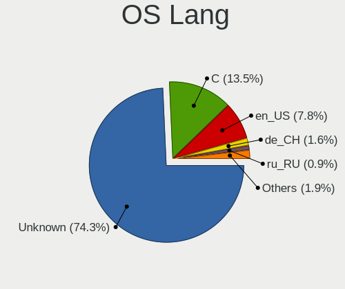

| Lang    | Computers | Percent |
|---------|-----------|---------|
| Unknown | 176       | 74.89%  |
| C       | 28        | 11.91%  |
| en_US   | 21        | 8.94%   |
| de_CH   | 4         | 1.7%    |
| de_DE   | 3         | 1.28%   |
| fr_FR   | 2         | 0.85%   |
| fi_FI   | 1         | 0.43%   |

Boot Mode
---------

EFI or BIOS

| Mode | Computers | Percent |
|------|-----------|---------|
| EFI  | 204       | 88.7%   |
| BIOS | 26        | 11.3%   |

Filesystem
----------

Type of filesystem

| Type   | Computers | Percent |
|--------|-----------|---------|
| Ufs    | 115       | 48.94%  |
| Zfs    | 100       | 42.55%  |
| Ffs    | 14        | 5.96%   |
| Cd9660 | 6         | 2.55%   |

Part. scheme
------------

Scheme of partitioning

| Type    | Computers | Percent |
|---------|-----------|---------|
| GPT     | 213       | 92.21%  |
| MBR     | 16        | 6.93%   |
| Unknown | 2         | 0.87%   |

Board
-----

Vendor
------

Motherboard manufacturer

| Name                    | Computers | Percent |
|-------------------------|-----------|---------|
| PC Engines              | 37        | 16.09%  |
| Lenovo                  | 21        | 9.13%   |
| Unknown                 | 21        | 9.13%   |
| Supermicro              | 16        | 6.96%   |
| ASUSTek Computer        | 16        | 6.96%   |
| Hewlett-Packard         | 11        | 4.78%   |
| Sophos                  | 10        | 4.35%   |
| Dell                    | 10        | 4.35%   |
| Gigabyte Technology     | 9         | 3.91%   |
| Apple                   | 9         | 3.91%   |
| Deciso                  | 8         | 3.48%   |
| Intel                   | 7         | 3.04%   |
| ASRock                  | 7         | 3.04%   |
| Protectli               | 5         | 2.17%   |
| Shuttle                 | 4         | 1.74%   |
| Acer                    | 4         | 1.74%   |
| Techvision              | 3         | 1.3%    |
| GoWin Solution          | 3         | 1.3%    |
| Fujitsu                 | 3         | 1.3%    |
| ZOTAC                   | 2         | 0.87%   |
| Sun                     | 2         | 0.87%   |
| HUAWEI                  | 2         | 0.87%   |
| BESSTAR Tech            | 2         | 0.87%   |
| ASRockRack              | 2         | 0.87%   |
| AMI                     | 2         | 0.87%   |
| YANYU                   | 1         | 0.43%   |
| Yanling                 | 1         | 0.43%   |
| Seco                    | 1         | 0.43%   |
| Raspberry Pi Foundation | 1         | 0.43%   |
| Panasonic               | 1         | 0.43%   |
| MW                      | 1         | 0.43%   |
| Intel BOX4A200          | 1         | 0.43%   |
| Infoblox                | 1         | 0.43%   |
| HPE                     | 1         | 0.43%   |
| CWWK                    | 1         | 0.43%   |
| CompuLab                | 1         | 0.43%   |
| Casper                  | 1         | 0.43%   |
| Biostar                 | 1         | 0.43%   |
| ADI Engineering         | 1         | 0.43%   |

Model
-----

Motherboard model

| Name                               | Computers | Percent |
|------------------------------------|-----------|---------|
| Unknown                            | 21        | 9.13%   |
| PC Engines APU2                    | 20        | 8.7%    |
| PC Engines apu4                    | 13        | 5.65%   |
| Sophos SG                          | 8         | 3.48%   |
| Supermicro Super Server            | 4         | 1.74%   |
| Deciso NetBoard-A20                | 4         | 1.74%   |
| Techvision TVI7309X                | 3         | 1.3%    |
| Protectli FW6                      | 3         | 1.3%    |
| Lenovo Yoga Slim 7 Pro 14ACH5 82MS | 3         | 1.3%    |
| GoWin Solution R86S                | 3         | 1.3%    |
| ASRock A320M-ITX                   | 3         | 1.3%    |
| Supermicro A1SAi                   | 2         | 0.87%   |
| Shuttle DS10U                      | 2         | 0.87%   |
| PC Engines apu6                    | 2         | 0.87%   |
| HUAWEI MACH-WX9                    | 2         | 0.87%   |
| Fujitsu PRIMERGY RX2530 M5         | 2         | 0.87%   |
| Dell Precision 3440                | 2         | 0.87%   |
| Deciso Netboard A20                | 2         | 0.87%   |
| ASUS All Series                    | 2         | 0.87%   |
| Apple MacPro5,1                    | 2         | 0.87%   |
| ZOTAC ZBOX-CI327NANO-GS-01         | 1         | 0.43%   |
| ZOTAC ZBOX-CI320NANO series        | 1         | 0.43%   |
| YANYU D19SL_B                      | 1         | 0.43%   |
| Yanling YL-KBR6L                   | 1         | 0.43%   |
| Supermicro X9SCL/X9SCM             | 1         | 0.43%   |
| Supermicro X10SLM+-LN4F            | 1         | 0.43%   |
| Supermicro X10SLL-F                | 1         | 0.43%   |
| Supermicro SYS-5018D-FN8T          | 1         | 0.43%   |
| Supermicro SYS-1019D-FHN13TP       | 1         | 0.43%   |
| Supermicro SYS-1019D-4C-FHN13TP    | 1         | 0.43%   |
| Supermicro SYS-1019D-16C-RAN13TP+  | 1         | 0.43%   |
| Supermicro PDSML                   | 1         | 0.43%   |
| Supermicro AS -5019D-FTN4          | 1         | 0.43%   |
| Supermicro A1SRM-2758F             | 1         | 0.43%   |
| Sun SUNW,Sun-Blade-1500            | 1         | 0.43%   |
| Sun SUNW,Sun-Blade-100             | 1         | 0.43%   |
| Sophos XG                          | 1         | 0.43%   |
| Sophos UTM                         | 1         | 0.43%   |
| Shuttle TERRA_PC                   | 1         | 0.43%   |
| Shuttle DS77U                      | 1         | 0.43%   |

Model Family
------------

Motherboard model prefix

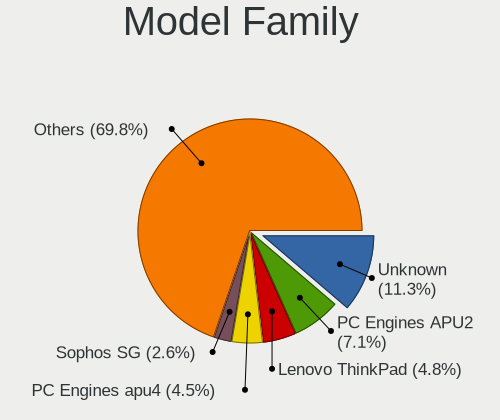

| Name                              | Computers | Percent |
|-----------------------------------|-----------|---------|
| Unknown                           | 21        | 9.13%   |
| PC Engines APU2                   | 20        | 8.7%    |
| PC Engines apu4                   | 13        | 5.65%   |
| Lenovo ThinkPad                   | 13        | 5.65%   |
| Sophos SG                         | 8         | 3.48%   |
| Lenovo Yoga                       | 5         | 2.17%   |
| Supermicro Super                  | 4         | 1.74%   |
| HP Compaq                         | 4         | 1.74%   |
| Deciso NetBoard-A20               | 4         | 1.74%   |
| Acer Aspire                       | 4         | 1.74%   |
| Techvision TVI7309X               | 3         | 1.3%    |
| Protectli FW6                     | 3         | 1.3%    |
| GoWin Solution R86S               | 3         | 1.3%    |
| Dell Precision                    | 3         | 1.3%    |
| Dell OptiPlex                     | 3         | 1.3%    |
| ASRock A320M-ITX                  | 3         | 1.3%    |
| Supermicro A1SAi                  | 2         | 0.87%   |
| Sun SUNW                          | 2         | 0.87%   |
| Shuttle DS10U                     | 2         | 0.87%   |
| PC Engines apu6                   | 2         | 0.87%   |
| HUAWEI MACH-WX9                   | 2         | 0.87%   |
| HP ProLiant                       | 2         | 0.87%   |
| Fujitsu PRIMERGY                  | 2         | 0.87%   |
| Deciso Netboard                   | 2         | 0.87%   |
| ASUS PRIME                        | 2         | 0.87%   |
| ASUS All                          | 2         | 0.87%   |
| Apple MacPro5                     | 2         | 0.87%   |
| ZOTAC ZBOX-CI327NANO-GS-01        | 1         | 0.43%   |
| ZOTAC ZBOX-CI320NANO              | 1         | 0.43%   |
| YANYU D19SL                       | 1         | 0.43%   |
| Yanling YL-KBR6L                  | 1         | 0.43%   |
| Supermicro X9SCL                  | 1         | 0.43%   |
| Supermicro X10SLM+-LN4F           | 1         | 0.43%   |
| Supermicro X10SLL-F               | 1         | 0.43%   |
| Supermicro SYS-5018D-FN8T         | 1         | 0.43%   |
| Supermicro SYS-1019D-FHN13TP      | 1         | 0.43%   |
| Supermicro SYS-1019D-4C-FHN13TP   | 1         | 0.43%   |
| Supermicro SYS-1019D-16C-RAN13TP+ | 1         | 0.43%   |
| Supermicro PDSML                  | 1         | 0.43%   |
| Supermicro AS                     | 1         | 0.43%   |

MFG Year
--------

Motherboard manufacture year

| Year    | Computers | Percent |
|---------|-----------|---------|
| 2018    | 30        | 13.04%  |
| 2016    | 28        | 12.17%  |
| 2020    | 26        | 11.3%   |
| 2022    | 22        | 9.57%   |
| 2021    | 22        | 9.57%   |
| 2019    | 15        | 6.52%   |
| 2017    | 14        | 6.09%   |
| 2014    | 14        | 6.09%   |
| 2015    | 12        | 5.22%   |
| 2013    | 12        | 5.22%   |
| 2012    | 12        | 5.22%   |
| 2011    | 7         | 3.04%   |
| 2023    | 6         | 2.61%   |
| Unknown | 5         | 2.17%   |
| 2008    | 2         | 0.87%   |
| 2010    | 1         | 0.43%   |
| 2009    | 1         | 0.43%   |
| 2007    | 1         | 0.43%   |

Form Factor
-----------

Physical design of the computer

| Name           | Computers | Percent |
|----------------|-----------|---------|
| Desktop        | 142       | 61.74%  |
| Notebook       | 47        | 20.43%  |
| Mini pc        | 14        | 6.09%   |
| Server         | 12        | 5.22%   |
| Firewall       | 10        | 4.35%   |
| System on chip | 2         | 0.87%   |
| All in one     | 2         | 0.87%   |
| Convertible    | 1         | 0.43%   |

Coreboot
--------

Have coreboot on board

| Used | Computers | Percent |
|------|-----------|---------|
| No   | 189       | 82.17%  |
| Yes  | 41        | 17.83%  |

RAM Size
--------

Total RAM memory

| Size in GB      | Computers | Percent |
|-----------------|-----------|---------|
| 8.01-16.0       | 67        | 28.51%  |
| 16.01-24.0      | 66        | 28.09%  |
| 4.01-8.0        | 51        | 21.7%   |
| 32.01-64.0      | 28        | 11.91%  |
| 64.01-256.0     | 12        | 5.11%   |
| 2.01-3.0        | 4         | 1.7%    |
| 0.51-1.0        | 2         | 0.85%   |
| More than 256.0 | 1         | 0.43%   |
| 3.01-4.0        | 1         | 0.43%   |
| 1.01-2.0        | 1         | 0.43%   |
| 0.01-0.5        | 1         | 0.43%   |
| Unknown         | 1         | 0.43%   |

RAM Used
--------

Used RAM memory

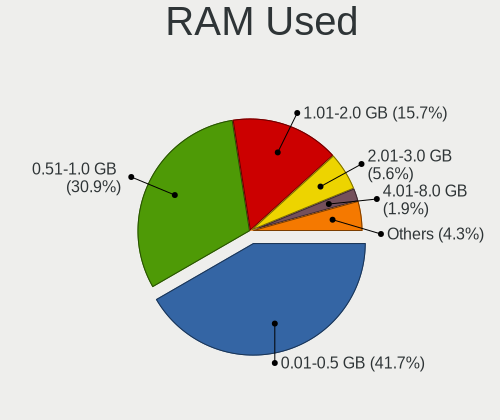

| Used GB     | Computers | Percent |
|-------------|-----------|---------|
| 0.01-0.5    | 107       | 44.4%   |
| 0.51-1.0    | 71        | 29.46%  |
| 1.01-2.0    | 33        | 13.69%  |
| 2.01-3.0    | 13        | 5.39%   |
| 4.01-8.0    | 5         | 2.07%   |
| 3.01-4.0    | 4         | 1.66%   |
| 0           | 3         | 1.24%   |
| 8.01-16.0   | 2         | 0.83%   |
| 64.01-256.0 | 1         | 0.41%   |
| 16.01-24.0  | 1         | 0.41%   |
| Unknown     | 1         | 0.41%   |

Total Drives
------------

Number of drives on board

| Drives | Computers | Percent |
|--------|-----------|---------|
| 1      | 162       | 68.94%  |
| 0      | 27        | 11.49%  |
| 2      | 26        | 11.06%  |
| 4      | 7         | 2.98%   |
| 3      | 4         | 1.7%    |
| 6      | 3         | 1.28%   |
| 5      | 2         | 0.85%   |
| 17     | 1         | 0.43%   |
| 16     | 1         | 0.43%   |
| 8      | 1         | 0.43%   |
| 7      | 1         | 0.43%   |

Has CD-ROM
----------

Has CD-ROM on board

| Presented | Computers | Percent |
|-----------|-----------|---------|
| No        | 201       | 87.39%  |
| Yes       | 29        | 12.61%  |

Has Ethernet
------------

Has Ethernet on board

| Presented | Computers | Percent |
|-----------|-----------|---------|
| Yes       | 217       | 94.35%  |
| No        | 13        | 5.65%   |

Has WiFi
--------

Has WiFi module

| Presented | Computers | Percent |
|-----------|-----------|---------|
| No        | 156       | 67.83%  |
| Yes       | 74        | 32.17%  |

Has Bluetooth
-------------

Has Bluetooth module

| Presented | Computers | Percent |
|-----------|-----------|---------|
| No        | 170       | 73.91%  |
| Yes       | 60        | 26.09%  |

Location
--------

Country
-------

Geographic location (country)

| Country     | Computers | Percent |
|-------------|-----------|---------|
| Switzerland | 230       | 100%    |

City
----

Geographic location (city)

| City                     | Computers | Percent |
|--------------------------|-----------|---------|
| Zurich                   | 63        | 23.42%  |
| Winterthur               | 9         | 3.35%   |
| Basel                    | 8         | 2.97%   |
| Geneva                   | 7         | 2.6%    |
| Gachnang                 | 7         | 2.6%    |
| Lausanne                 | 5         | 1.86%   |
| Gordola                  | 5         | 1.86%   |
| Bern                     | 5         | 1.86%   |
| St. Moritz               | 4         | 1.49%   |
| Lenzburg                 | 4         | 1.49%   |
| St. Gallen               | 3         | 1.12%   |
| Riehen                   | 3         | 1.12%   |
| Lucerne                  | 3         | 1.12%   |
| Horgen                   | 3         | 1.12%   |
| Wallisellen              | 2         | 0.74%   |
| Therwil                  | 2         | 0.74%   |
| Steckborn                | 2         | 0.74%   |
| Siggenthal Station       | 2         | 0.74%   |
| Ottenbach                | 2         | 0.74%   |
| Onex                     | 2         | 0.74%   |
| Oensingen                | 2         | 0.74%   |
| Niederbipp               | 2         | 0.74%   |
| Munchenstein             | 2         | 0.74%   |
| Moosseedorf              | 2         | 0.74%   |
| Mettmenstetten           | 2         | 0.74%   |
| Hittnau / Hittnau (Dorf) | 2         | 0.74%   |
| Hildisrieden             | 2         | 0.74%   |
| Grenchen                 | 2         | 0.74%   |
| Glattbrugg               | 2         | 0.74%   |
| Gerlafingen              | 2         | 0.74%   |
| Eiken                    | 2         | 0.74%   |
| Dinhard                  | 2         | 0.74%   |
| Dietikon                 | 2         | 0.74%   |
| Corcelles-pres-Payerne   | 2         | 0.74%   |
| Burgdorf                 | 2         | 0.74%   |
| Buchs                    | 2         | 0.74%   |
| Belp                     | 2         | 0.74%   |
| Belmont-sur-Lausanne     | 2         | 0.74%   |
| Zug                      | 1         | 0.37%   |
| Zufikon                  | 1         | 0.37%   |

Drives
------

Drive Vendor
------------

Hard drive vendors

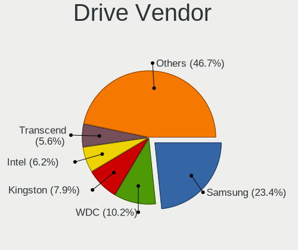

| Vendor              | Computers | Drives | Percent |
|---------------------|-----------|--------|---------|
| Samsung Electronics | 56        | 90     | 23.14%  |
| WDC                 | 26        | 51     | 10.74%  |
| Kingston            | 18        | 22     | 7.44%   |
| Intel               | 15        | 34     | 6.2%    |
| Phison              | 14        | 18     | 5.79%   |
| Transcend           | 11        | 16     | 4.55%   |
| Seagate             | 10        | 14     | 4.13%   |
| Crucial             | 10        | 17     | 4.13%   |
| China               | 8         | 10     | 3.31%   |
| Toshiba             | 7         | 8      | 2.89%   |
| SanDisk             | 7         | 13     | 2.89%   |
| Corsair             | 6         | 9      | 2.48%   |
| SK hynix            | 5         | 7      | 2.07%   |
| Hoodisk             | 5         | 7      | 2.07%   |
| Silicon Motion      | 3         | 3      | 1.24%   |
| NVMe                | 3         | 3      | 1.24%   |
| HPT                 | 3         | 35     | 1.24%   |
| Hitachi             | 3         | 3      | 1.24%   |
| Fanxiang            | 3         | 3      | 1.24%   |
| Apple               | 3         | 3      | 1.24%   |
| A-DATA Technology   | 3         | 4      | 1.24%   |
| ShiJi               | 2         | 8      | 0.83%   |
| OCZ                 | 2         | 3      | 0.83%   |
| KingSpec            | 2         | 2      | 0.83%   |
| HGST                | 2         | 2      | 0.83%   |
| FTS                 | 2         | 2      | 0.83%   |
| USB                 | 1         | 1      | 0.41%   |
| SPCC                | 1         | 2      | 0.41%   |
| Protectli           | 1         | 1      | 0.41%   |
| PNY                 | 1         | 1      | 0.41%   |
| OPENBSD             | 1         | 1      | 0.41%   |
| Micron Technology   | 1         | 2      | 0.41%   |
| LITEON              | 1         | 6      | 0.41%   |
| KIOXIA              | 1         | 1      | 0.41%   |
| Intenso             | 1         | 4      | 0.41%   |
| Hewlett-Packard     | 1         | 10     | 0.41%   |
| Gigabyte Technology | 1         | 1      | 0.41%   |
| FORESEE             | 1         | 1      | 0.41%   |
| BIWIN               | 1         | 1      | 0.41%   |

Drive Model
-----------

Hard drive models

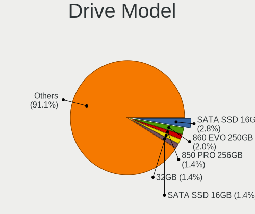

| Model                                  | Computers | Percent |
|----------------------------------------|-----------|---------|
| Phison SATA SSD 16GB                   | 10        | 3.42%   |
| Samsung SSD 860 EVO 250GB              | 5         | 1.71%   |
| Hoodisk SSD 32GB                       | 5         | 1.71%   |
| Transcend TS256GMTS952T2 256GB         | 4         | 1.37%   |
| Samsung SSD 860 PRO 256GB              | 4         | 1.37%   |
| China SATA SSD 16GB                    | 4         | 1.37%   |
| SK hynix SKHynix_HFS512GDE9X081N 512GB | 3         | 1.03%   |
| Phison SATA SSD 32GB                   | 3         | 1.03%   |
| Kingston RBUSNS8180DS3128GH 128GB      | 3         | 1.03%   |
| HPT DISK 0_3 1TB                       | 3         | 1.03%   |
| HPT DISK 0_2 1TB                       | 3         | 1.03%   |
| HPT DISK 0_1 1TB                       | 3         | 1.03%   |
| HPT DISK 0_0 4TB                       | 3         | 1.03%   |
| Fanxiang S501 128GB                    | 3         | 1.03%   |
| WDC WDS240G2G0A-00JH30 240GB           | 2         | 0.68%   |
| WDC WDS120G2G0B-00EPW0 120GB           | 2         | 0.68%   |
| WDC WD6002FRYZ-01WD5B1 6TB             | 2         | 0.68%   |
| WDC WD30EFRX-68EUZN0 3TB               | 2         | 0.68%   |
| Transcend TS128GMTE110S 128GB          | 2         | 0.68%   |
| ShiJi SSD 128GB                        | 2         | 0.68%   |
| SanDisk SSD U100 24GB                  | 2         | 0.68%   |
| Samsung SSD 980 PRO 250GB              | 2         | 0.68%   |
| Samsung SSD 960 EVO 250GB              | 2         | 0.68%   |
| Samsung SSD 850 PRO 256GB              | 2         | 0.68%   |
| Samsung SSD 850 PRO 128GB              | 2         | 0.68%   |
| Samsung SSD 850 EVO 500GB              | 2         | 0.68%   |
| Samsung SSD 850 EVO 250GB              | 2         | 0.68%   |
| Samsung SSD 840 Series 120GB           | 2         | 0.68%   |
| Samsung MZVLB512HAJQ-00000 512GB       | 2         | 0.68%   |
| Kingston SV300S37A60G 64GB             | 2         | 0.68%   |
| Kingston SKC600MS512G 512GB            | 2         | 0.68%   |
| Kingston SA400S37120G 120GB            | 2         | 0.68%   |
| Kingston SA400M8120G 120GB             | 2         | 0.68%   |
| Intel SSDSC2BW180A4 180GB              | 2         | 0.68%   |
| Intel SSDSA2BW160G3H 160GB             | 2         | 0.68%   |
| HPT DISK 0_9 3TB                       | 2         | 0.68%   |
| HPT DISK 0_8 3TB                       | 2         | 0.68%   |
| HPT DISK 0_7 1TB                       | 2         | 0.68%   |
| HPT DISK 0_6 1TB                       | 2         | 0.68%   |
| HPT DISK 0_5 1TB                       | 2         | 0.68%   |

HDD Vendor
----------

Hard disk drive vendors

| Vendor              | Computers | Drives | Percent |
|---------------------|-----------|--------|---------|
| WDC                 | 14        | 33     | 31.82%  |
| Seagate             | 9         | 13     | 20.45%  |
| Toshiba             | 4         | 5      | 9.09%   |
| HPT                 | 3         | 35     | 6.82%   |
| Hitachi             | 3         | 3      | 6.82%   |
| NVMe                | 2         | 2      | 4.55%   |
| HGST                | 2         | 2      | 4.55%   |
| Apple               | 2         | 2      | 4.55%   |
| USB                 | 1         | 1      | 2.27%   |
| Samsung Electronics | 1         | 1      | 2.27%   |
| OPENBSD             | 1         | 1      | 2.27%   |
| Hewlett-Packard     | 1         | 10     | 2.27%   |
| China               | 1         | 1      | 2.27%   |

SSD Vendor
----------

Solid state drive vendors

| Vendor              | Computers | Drives | Percent |
|---------------------|-----------|--------|---------|
| Samsung Electronics | 39        | 63     | 25.32%  |
| Kingston            | 16        | 18     | 10.39%  |
| Phison              | 13        | 16     | 8.44%   |
| Intel               | 12        | 31     | 7.79%   |
| Crucial             | 9         | 16     | 5.84%   |
| WDC                 | 7         | 11     | 4.55%   |
| Transcend           | 7         | 12     | 4.55%   |
| SanDisk             | 7         | 13     | 4.55%   |
| China               | 7         | 9      | 4.55%   |
| Hoodisk             | 5         | 7      | 3.25%   |
| Corsair             | 5         | 8      | 3.25%   |
| Toshiba             | 3         | 3      | 1.95%   |
| A-DATA Technology   | 3         | 4      | 1.95%   |
| SK hynix            | 2         | 2      | 1.3%    |
| ShiJi               | 2         | 8      | 1.3%    |
| OCZ                 | 2         | 3      | 1.3%    |
| KingSpec            | 2         | 2      | 1.3%    |
| FTS                 | 2         | 2      | 1.3%    |
| SPCC                | 1         | 2      | 0.65%   |
| Seagate             | 1         | 1      | 0.65%   |
| Protectli           | 1         | 1      | 0.65%   |
| PNY                 | 1         | 1      | 0.65%   |
| NVMe                | 1         | 1      | 0.65%   |
| Micron Technology   | 1         | 2      | 0.65%   |
| LITEON              | 1         | 6      | 0.65%   |
| Intenso             | 1         | 4      | 0.65%   |
| FORESEE             | 1         | 1      | 0.65%   |
| BIWIN               | 1         | 1      | 0.65%   |
| Apple               | 1         | 1      | 0.65%   |

Drive Kind
----------

HDD or SSD

| Kind | Computers | Drives | Percent |
|------|-----------|--------|---------|
| SSD  | 145       | 249    | 63.32%  |
| NVMe | 48        | 61     | 20.96%  |
| HDD  | 36        | 109    | 15.72%  |

Drive Connector
---------------

SATA, SAS, NVMe, etc.

| Type | Computers | Drives | Percent |
|------|-----------|--------|---------|
| SATA | 162       | 358    | 77.14%  |
| NVMe | 48        | 61     | 22.86%  |

Drive Size
----------

Size of hard drive

| Size in TB | Computers | Drives | Percent |
|------------|-----------|--------|---------|
| 0.01-0.5   | 144       | 246    | 73.1%   |
| 0.51-1.0   | 26        | 67     | 13.2%   |
| 1.01-2.0   | 11        | 16     | 5.58%   |
| 2.01-3.0   | 7         | 15     | 3.55%   |
| 3.01-4.0   | 5         | 5      | 2.54%   |
| 4.01-10.0  | 4         | 9      | 2.03%   |

Space Total
-----------

Amount of disk space available on the file system

| Size in GB     | Computers | Percent |
|----------------|-----------|---------|
| 101-250        | 104       | 43.88%  |
| 1-20           | 37        | 15.61%  |
| 251-500        | 30        | 12.66%  |
| 51-100         | 26        | 10.97%  |
| 21-50          | 19        | 8.02%   |
| 501-1000       | 16        | 6.75%   |
| 1001-2000      | 2         | 0.84%   |
| More than 3000 | 1         | 0.42%   |
| 2001-3000      | 1         | 0.42%   |
| Unknown        | 1         | 0.42%   |

Space Used
----------

Amount of used disk space

| Used GB | Computers | Percent |
|---------|-----------|---------|
| 1-20    | 211       | 88.28%  |
| 21-50   | 17        | 7.11%   |
| 51-100  | 6         | 2.51%   |
| 251-500 | 2         | 0.84%   |
| 101-250 | 2         | 0.84%   |
| Unknown | 1         | 0.42%   |

Malfunc. Drives
---------------

Drive models with a malfunction

| Model                                     | Computers | Drives | Percent |
|-------------------------------------------|-----------|--------|---------|
| WDC WDS120G2G0A-00JH30 120GB              | 1         | 2      | 3.85%   |
| WDC WD6002FRYZ-01WD5B1 6TB                | 1         | 6      | 3.85%   |
| WDC WD40EFRX-68WT0N0 4TB                  | 1         | 1      | 3.85%   |
| WDC WD30EFRX-68EUZN0 3TB                  | 1         | 1      | 3.85%   |
| WDC WD2002FYPS-01U1B0 2TB                 | 1         | 1      | 3.85%   |
| Toshiba MK1059GSM 1TB                     | 1         | 1      | 3.85%   |
| Seagate ST3500413AS 500GB                 | 1         | 1      | 3.85%   |
| Seagate ST2000VN004-2E4164 2TB            | 1         | 2      | 3.85%   |
| Samsung Electronics SSD 870 EVO 1TB       | 1         | 1      | 3.85%   |
| Samsung Electronics SSD 850 EVO mSATA 1TB | 1         | 1      | 3.85%   |
| Samsung Electronics HD204UI 2TB           | 1         | 1      | 3.85%   |
| OCZ AGILITY3 240GB                        | 1         | 1      | 3.85%   |
| Kingston SV300S37A60G 64GB                | 1         | 1      | 3.85%   |
| Kingston SV300S37A120G 120GB              | 1         | 1      | 3.85%   |
| Intel SSDSCKKF256G8H 256GB                | 1         | 2      | 3.85%   |
| Intel SSDSC2BW240A4 240GB                 | 1         | 2      | 3.85%   |
| Intel SSDSC2BW120H6 120GB                 | 1         | 1      | 3.85%   |
| Intel SSDSA2M160G2GC 160GB                | 1         | 2      | 3.85%   |
| Intel SSDSA2BW160G3H 160GB                | 1         | 5      | 3.85%   |
| Hitachi HDS721050CLA660 500GB             | 1         | 1      | 3.85%   |
| HGST HUS726020ALE614 2TB                  | 1         | 1      | 3.85%   |
| HGST HTE725032A7E630 320GB                | 1         | 1      | 3.85%   |
| Crucial CT480M500SSD1 480GB               | 1         | 1      | 3.85%   |
| Crucial CT256MX100SSD1 256GB              | 1         | 1      | 3.85%   |
| Corsair Force 3 SSD 120GB                 | 1         | 2      | 3.85%   |
| Corsair CSSD-F120GB2                      | 1         | 1      | 3.85%   |

Malfunc. Drive Vendor
---------------------

Vendors of faulty drives

| Vendor              | Computers | Drives | Percent |
|---------------------|-----------|--------|---------|
| Intel               | 5         | 12     | 20%     |
| WDC                 | 4         | 11     | 16%     |
| Samsung Electronics | 3         | 3      | 12%     |
| Seagate             | 2         | 3      | 8%      |
| Kingston            | 2         | 2      | 8%      |
| HGST                | 2         | 2      | 8%      |
| Crucial             | 2         | 2      | 8%      |
| Corsair             | 2         | 3      | 8%      |
| Toshiba             | 1         | 1      | 4%      |
| OCZ                 | 1         | 1      | 4%      |
| Hitachi             | 1         | 1      | 4%      |

Malfunc. HDD Vendor
-------------------

Vendors of faulty HDD drives

| Vendor              | Computers | Drives | Percent |
|---------------------|-----------|--------|---------|
| WDC                 | 3         | 9      | 30%     |
| Seagate             | 2         | 3      | 20%     |
| HGST                | 2         | 2      | 20%     |
| Toshiba             | 1         | 1      | 10%     |
| Samsung Electronics | 1         | 1      | 10%     |
| Hitachi             | 1         | 1      | 10%     |

Malfunc. Drive Kind
-------------------

Kinds of faulty drives

| Kind | Computers | Drives | Percent |
|------|-----------|--------|---------|
| SSD  | 15        | 24     | 65.22%  |
| HDD  | 8         | 17     | 34.78%  |

Failed Drives
-------------

Failed drive models

Zero info for selected period =(

Failed Drive Vendor
-------------------

Failed drive vendors

Zero info for selected period =(

Drive Status
------------

Number of failed and malfunc. drives

| Status   | Computers | Drives | Percent |
|----------|-----------|--------|---------|
| Works    | 184       | 328    | 84.79%  |
| Malfunc  | 22        | 41     | 10.14%  |
| Detected | 11        | 50     | 5.07%   |

Storage controller
------------------

Storage Vendor
--------------

Storage controller vendors

| Vendor                      | Computers | Percent |
|-----------------------------|-----------|---------|
| Intel                       | 141       | 51.84%  |
| AMD                         | 61        | 22.43%  |
| Samsung Electronics         | 22        | 8.09%   |
| SanDisk                     | 8         | 2.94%   |
| Silicon Motion              | 6         | 2.21%   |
| Broadcom / LSI              | 4         | 1.47%   |
| Transcend                   | 3         | 1.1%    |
| SK hynix                    | 3         | 1.1%    |
| Phison Electronics          | 3         | 1.1%    |
| HighPoint Technologies      | 3         | 1.1%    |
| ASMedia Technology          | 3         | 1.1%    |
| ULi Electronics             | 2         | 0.74%   |
| Marvell Technology Group    | 2         | 0.74%   |
| KIOXIA                      | 2         | 0.74%   |
| Kingston Technology Company | 2         | 0.74%   |
| JMicron Technology          | 2         | 0.74%   |
| Chelsio Communications      | 2         | 0.74%   |
| Nvidia                      | 1         | 0.37%   |
| Micron/Crucial Technology   | 1         | 0.37%   |
| Hewlett-Packard             | 1         | 0.37%   |

Storage Model
-------------

Storage controller models

| Model                                                                          | Computers | Percent |
|--------------------------------------------------------------------------------|-----------|---------|
| AMD FCH SATA Controller [AHCI mode]                                            | 42        | 14%     |
| Intel 8 Series/C220 Series Chipset Family 6-port SATA Controller 1 [AHCI mode] | 13        | 4.33%   |
| Intel Sunrise Point-LP SATA Controller [AHCI mode]                             | 11        | 3.67%   |
| AMD FCH SATA Controller [IDE mode]                                             | 11        | 3.67%   |
| Intel Celeron/Pentium Silver Processor SATA Controller                         | 8         | 2.67%   |
| Intel 7 Series/C210 Series Chipset Family 6-port SATA Controller [AHCI mode]   | 8         | 2.67%   |
| Samsung NVMe SSD Controller SM981/PM981/PM983                                  | 7         | 2.33%   |
| Samsung NVMe SSD Controller SM961/PM961/SM963                                  | 7         | 2.33%   |
| Silicon Motion SM2263EN/SM2263XT (DRAM-less) NVMe SSD Controllers              | 6         | 2%      |
| Samsung NVMe SSD Controller PM9A1/PM9A3/980PRO                                 | 6         | 2%      |
| Intel Comet Lake SATA AHCI Controller                                          | 6         | 2%      |
| Intel 7 Series Chipset Family 6-port SATA Controller [AHCI mode]               | 6         | 2%      |
| Intel 6 Series/C200 Series Chipset Family 6 port Desktop SATA AHCI Controller  | 6         | 2%      |
| Intel Q170/Q150/B150/H170/H110/Z170/CM236 Chipset SATA Controller [AHCI Mode]  | 5         | 1.67%   |
| Intel C620 Series Chipset Family SSATA Controller [AHCI mode]                  | 5         | 1.67%   |
| Intel Atom processor C2000 AHCI SATA3 Controller                               | 5         | 1.67%   |
| Intel 6 Series/C200 Series Chipset Family 6 port Mobile SATA AHCI Controller   | 5         | 1.67%   |
| AMD 500 Series Chipset SATA Controller                                         | 5         | 1.67%   |
| Intel Jasper Lake SATA AHCI Controller                                         | 4         | 1.33%   |
| Intel Cannon Point-LP SATA Controller [AHCI Mode]                              | 4         | 1.33%   |
| Intel Atom Processor E3800 Series SATA AHCI Controller                         | 4         | 1.33%   |
| Intel Atom Processor C3000 Series SATA Controller 1                            | 4         | 1.33%   |
| Intel Atom processor C2000 AHCI SATA2 Controller                               | 4         | 1.33%   |
| SK hynix Gold P31/BC711/PC711 NVMe Solid State Drive                           | 3         | 1%      |
| SanDisk Extreme Pro / WD Black SN750 / PC SN730 / Red SN700 NVMe SSD           | 3         | 1%      |
| Intel Wildcat Point-LP SATA Controller [AHCI Mode]                             | 3         | 1%      |
| Intel Celeron N3350/Pentium N4200/Atom E3900 Series SATA AHCI Controller       | 3         | 1%      |
| Intel Atom Processor C3000 Series SATA Controller 0                            | 3         | 1%      |
| Intel 82801 Mobile SATA Controller [RAID mode]                                 | 3         | 1%      |
| Intel 8 Series SATA Controller 1 [AHCI mode]                                   | 3         | 1%      |
| ASMedia ASM1062 Serial ATA Controller                                          | 3         | 1%      |
| AMD FCH SATA Controller D                                                      | 3         | 1%      |
| ULi M5229 IDE                                                                  | 2         | 0.67%   |
| Transcend NVMe PCIe SSD 110S/112S/120S/MTE300S/MTE400S/MTE652T2 (DRAM-less)    | 2         | 0.67%   |
| Samsung NVMe SSD Controller 980 (DRAM-less)                                    | 2         | 0.67%   |
| Phison PS5013-E13 PCIe3 NVMe Controller (DRAM-less)                            | 2         | 0.67%   |
| JMicron JMB58x AHCI SATA controller                                            | 2         | 0.67%   |
| Intel Volume Management Device NVMe RAID Controller                            | 2         | 0.67%   |
| Intel Tiger Lake-LP SATA Controller                                            | 2         | 0.67%   |
| Intel NM10/ICH7 Family SATA Controller [AHCI mode]                             | 2         | 0.67%   |

Storage Kind
------------

Kind of storage controller (IDE, SATA, NVMe, SAS, ...)

| Kind | Computers | Percent |
|------|-----------|---------|
| SATA | 182       | 66.67%  |
| NVMe | 51        | 18.68%  |
| IDE  | 21        | 7.69%   |
| RAID | 14        | 5.13%   |
| SCSI | 3         | 1.1%    |
| SAS  | 2         | 0.73%   |

Processor
---------

CPU Vendor
----------

Processor vendors

| Vendor  | Computers | Percent |
|---------|-----------|---------|
| Intel   | 157       | 68.26%  |
| AMD     | 69        | 30%     |
| ARM     | 2         | 0.87%   |
| Unknown | 2         | 0.87%   |

CPU Model
---------

Processor models

| Model                                       | Computers | Percent |
|---------------------------------------------|-----------|---------|
| AMD GX-412TC SOC                            | 36        | 15.65%  |
| Intel Celeron J4125 CPU @ 2.00GHz           | 6         | 2.61%   |
| Intel Core i5-2520M CPU @ 2.50GHz           | 4         | 1.74%   |
| Intel Celeron CPU 3865U @ 1.80GHz           | 4         | 1.74%   |
| Intel Pentium Silver N6005 @ 2.00GHz        | 3         | 1.3%    |
| Intel Celeron N5105 @ 2.00GHz               | 3         | 1.3%    |
| Intel Atom CPU C3758 @ 2.20GHz              | 3         | 1.3%    |
| AMD Ryzen 7 5800H with Radeon Graphics      | 3         | 1.3%    |
| AMD Ryzen 5 3400G with Radeon Vega Graphics | 3         | 1.3%    |
| AMD EPYC 3201 8-Core Processor              | 3         | 1.3%    |
| AMD EPYC 3101 4-Core Processor              | 3         | 1.3%    |
| Intel Xeon Silver 4210 CPU @ 2.20GHz        | 2         | 0.87%   |
| Intel Pentium CPU G3420 @ 3.20GHz           | 2         | 0.87%   |
| Intel Core i7-8550U CPU @ 1.80GHz           | 2         | 0.87%   |
| Intel Core i7-3770K CPU @ 3.50GHz           | 2         | 0.87%   |
| Intel Core i7-3520M CPU @ 2.90GHz           | 2         | 0.87%   |
| Intel Core i5-8250U CPU @ 1.60GHz           | 2         | 0.87%   |
| Intel Core i5-6500 CPU @ 3.20GHz            | 2         | 0.87%   |
| Intel Core i5-6300U CPU @ 2.40GHz           | 2         | 0.87%   |
| Intel Core i5-4570S CPU @ 2.90GHz           | 2         | 0.87%   |
| Intel Core i5-3470 CPU @ 3.20GHz            | 2         | 0.87%   |
| Intel Core i5-3317U CPU @ 1.70GHz           | 2         | 0.87%   |
| Intel Core i5-10500 CPU @ 3.10GHz           | 2         | 0.87%   |
| Intel Core i5-10210U CPU @ 1.60GHz          | 2         | 0.87%   |
| Intel Celeron N5100 @ 1.10GHz               | 2         | 0.87%   |
| Intel Celeron CPU J1900 @ 1.99GHz           | 2         | 0.87%   |
| Intel Atom CPU C2558 @ 2.40GHz              | 2         | 0.87%   |
| Intel 11th Gen Core i5-1135G7 @ 2.40GHz     | 2         | 0.87%   |
| ARM Cortex-A53 r0p4                         | 2         | 0.87%   |
| AMD Ryzen Embedded V1500B                   | 2         | 0.87%   |
| AMD Ryzen 7 5800X 8-Core Processor          | 2         | 0.87%   |
|                                             | 2         | 0.87%   |
| Intel Xeon D-2183IT CPU @ 2.20GHz           | 1         | 0.43%   |
| Intel Xeon D-2146NT CPU @ 2.30GHz           | 1         | 0.43%   |
| Intel Xeon D-2123IT CPU @ 2.20GHz           | 1         | 0.43%   |
| Intel Xeon CPU X5650 @ 2.67GHz              | 1         | 0.43%   |
| Intel Xeon CPU X5550 @ 2.67GHz              | 1         | 0.43%   |
| Intel Xeon CPU X3450 @ 2.67GHz              | 1         | 0.43%   |
| Intel Xeon CPU W3680 @ 3.33GHz              | 1         | 0.43%   |
| Intel Xeon CPU E5630 @ 2.53GHz              | 1         | 0.43%   |

CPU Model Family
----------------

Processor model prefix

| Model                  | Computers | Percent |
|------------------------|-----------|---------|
| Intel Core i5          | 37        | 16.09%  |
| AMD GX                 | 37        | 16.09%  |
| Intel Core i7          | 27        | 11.74%  |
| Intel Celeron          | 27        | 11.74%  |
| Intel Xeon             | 21        | 9.13%   |
| Intel Atom             | 13        | 5.65%   |
| Other                  | 10        | 4.35%   |
| Intel Core i3          | 9         | 3.91%   |
| AMD Ryzen 7            | 9         | 3.91%   |
| AMD EPYC               | 7         | 3.04%   |
| Intel Pentium          | 5         | 2.17%   |
| Intel Core 2 Duo       | 4         | 1.74%   |
| AMD Ryzen 5            | 4         | 1.74%   |
| Intel Pentium Silver   | 3         | 1.3%    |
| AMD Ryzen 7 PRO        | 3         | 1.3%    |
| Intel Xeon Silver      | 2         | 0.87%   |
| ARM Cortex             | 2         | 0.87%   |
| AMD Ryzen Embedded     | 2         | 0.87%   |
| AMD Ryzen 3            | 2         | 0.87%   |
| Intel Pentium Gold     | 1         | 0.43%   |
| AMD Ryzen Threadripper | 1         | 0.43%   |
| AMD Opteron            | 1         | 0.43%   |
| AMD Geode Integrated   | 1         | 0.43%   |
| AMD G                  | 1         | 0.43%   |
| AMD FX                 | 1         | 0.43%   |

CPU Cores
---------

Number of processor cores

| Number  | Computers | Percent |
|---------|-----------|---------|
| 4       | 123       | 53.48%  |
| 2       | 49        | 21.3%   |
| 8       | 23        | 10%     |
| 16      | 14        | 6.09%   |
| 6       | 5         | 2.17%   |
| Unknown | 5         | 2.17%   |
| 12      | 4         | 1.74%   |
| 1       | 3         | 1.3%    |
| 20      | 2         | 0.87%   |
| 32      | 1         | 0.43%   |
| 10      | 1         | 0.43%   |

CPU Sockets
-----------

Number of sockets

| Number  | Computers | Percent |
|---------|-----------|---------|
| 1       | 218       | 94.78%  |
| 2       | 7         | 3.04%   |
| Unknown | 4         | 1.74%   |
| 4       | 1         | 0.43%   |

CPU Threads
-----------

Threads per core (Hyper-Threading)

| Number  | Computers | Percent |
|---------|-----------|---------|
| 1       | 141       | 61.3%   |
| 2       | 82        | 35.65%  |
| Unknown | 7         | 3.04%   |

CPU Microarch
-------------

Microarchitecture

| Name          | Computers | Percent |
|---------------|-----------|---------|
| Puma          | 36        | 15.65%  |
| KabyLake      | 27        | 11.74%  |
| Unknown       | 20        | 8.7%    |
| IvyBridge     | 19        | 8.26%   |
| Haswell       | 18        | 7.83%   |
| Skylake       | 17        | 7.39%   |
| Zen           | 12        | 5.22%   |
| Silvermont    | 11        | 4.78%   |
| SandyBridge   | 11        | 4.78%   |
| Zen 3         | 9         | 3.91%   |
| Goldmont plus | 8         | 3.48%   |
| Goldmont      | 8         | 3.48%   |
| Broadwell     | 6         | 2.61%   |
| Zen+          | 3         | 1.3%    |
| Westmere      | 3         | 1.3%    |
| TigerLake     | 3         | 1.3%    |
| Penryn        | 3         | 1.3%    |
| Core          | 3         | 1.3%    |
| Zen 2         | 2         | 0.87%   |
| Nehalem       | 2         | 0.87%   |
| IceLake       | 2         | 0.87%   |
| CometLake     | 2         | 0.87%   |
| Piledriver    | 1         | 0.43%   |
| Jaguar        | 1         | 0.43%   |
| Geode         | 1         | 0.43%   |
| Excavator     | 1         | 0.43%   |
| Bobcat        | 1         | 0.43%   |

Graphics
--------

GPU Vendor
----------

Vendors of graphics cards

| Vendor                                       | Computers | Percent |
|----------------------------------------------|-----------|---------|
| Intel                                        | 113       | 60.43%  |
| AMD                                          | 23        | 12.3%   |
| Nvidia                                       | 21        | 11.23%  |
| ASPEED Technology                            | 21        | 11.23%  |
| Matrox Electronics Systems                   | 7         | 3.74%   |
| XGI Technology (eXtreme Graphics Innovation) | 1         | 0.53%   |
| 3DLabs                                       | 1         | 0.53%   |

GPU Model
---------

Graphics card models

| Model                                                                                    | Computers | Percent |
|------------------------------------------------------------------------------------------|-----------|---------|
| ASPEED Technology ASPEED Graphics Family                                                 | 21        | 11.17%  |
| Intel Xeon E3-1200 v3/4th Gen Core Processor Integrated Graphics Controller              | 9         | 4.79%   |
| Intel JasperLake [UHD Graphics]                                                          | 8         | 4.26%   |
| Intel GeminiLake [UHD Graphics 600]                                                      | 8         | 4.26%   |
| Intel 3rd Gen Core processor Graphics Controller                                         | 8         | 4.26%   |
| Intel 2nd Generation Core Processor Family Integrated Graphics Controller                | 7         | 3.72%   |
| AMD Cezanne [Radeon Vega Series / Radeon Vega Mobile Series]                             | 6         | 3.19%   |
| Intel HD Graphics 530                                                                    | 5         | 2.66%   |
| Intel CometLake-U GT2 [UHD Graphics]                                                     | 5         | 2.66%   |
| Intel Xeon E3-1200 v2/3rd Gen Core processor Graphics Controller                         | 4         | 2.13%   |
| Intel WhiskeyLake-U GT2 [UHD Graphics 620]                                               | 4         | 2.13%   |
| Intel UHD Graphics 620                                                                   | 4         | 2.13%   |
| Intel HD Graphics 610                                                                    | 4         | 2.13%   |
| Intel Atom Processor Z36xxx/Z37xxx Series Graphics & Display                             | 4         | 2.13%   |
| Matrox Electronics Systems MGA G200eW WPCM450                                            | 3         | 1.6%    |
| Intel TigerLake-LP GT2 [Iris Xe Graphics]                                                | 3         | 1.6%    |
| Intel Skylake GT2 [HD Graphics 520]                                                      | 3         | 1.6%    |
| Intel HD Graphics 5500                                                                   | 3         | 1.6%    |
| Intel Haswell-ULT Integrated Graphics Controller                                         | 3         | 1.6%    |
| Intel CoffeeLake-S GT2 [UHD Graphics 630]                                                | 3         | 1.6%    |
| AMD Picasso/Raven 2 [Radeon Vega Series / Radeon Vega Mobile Series]                     | 3         | 1.6%    |
| Nvidia GP108M [GeForce MX150]                                                            | 2         | 1.06%   |
| Matrox Electronics Systems MGA G200EH                                                    | 2         | 1.06%   |
| Matrox Electronics Systems MGA G200e [Pilot] ServerEngines (SEP1)                        | 2         | 1.06%   |
| Intel IvyBridge GT2 [HD Graphics 4000]                                                   | 2         | 1.06%   |
| Intel HD Graphics 510                                                                    | 2         | 1.06%   |
| Intel HD Graphics 500                                                                    | 2         | 1.06%   |
| Intel CometLake-S GT2 [UHD Graphics 630]                                                 | 2         | 1.06%   |
| Intel Atom/Celeron/Pentium Processor x5-E8000/J3xxx/N3xxx Integrated Graphics Controller | 2         | 1.06%   |
| Intel Alder Lake-UP3 GT1 [UHD Graphics]                                                  | 2         | 1.06%   |
| AMD Renoir [Radeon RX Vega 6 (Ryzen 4000/5000 Mobile Series)]                            | 2         | 1.06%   |
| AMD Rembrandt [Radeon 680M]                                                              | 2         | 1.06%   |
| AMD Caicos XT [Radeon HD 7470/8470 / R5 235/310 OEM]                                     | 2         | 1.06%   |
| XGI Technology (eXtreme Graphics Innovation) Z7/Z9 (XG20 core)                           | 1         | 0.53%   |
| Nvidia TU116 [GeForce GTX 1660 SUPER]                                                    | 1         | 0.53%   |
| Nvidia GP106 [GeForce GTX 1060 3GB]                                                      | 1         | 0.53%   |
| Nvidia GM206 [GeForce GTX 960]                                                           | 1         | 0.53%   |
| Nvidia GM108M [GeForce 940MX]                                                            | 1         | 0.53%   |
| Nvidia GM107 [GeForce GTX 750 Ti]                                                        | 1         | 0.53%   |
| Nvidia GK208B [GeForce GT 710]                                                           | 1         | 0.53%   |

GPU Combo
---------

Combinations of graphics cards

| Name           | Computers | Percent |
|----------------|-----------|---------|
| 1 x Intel      | 105       | 45.65%  |
| Other          | 51        | 22.17%  |
| 1 x ASPEED     | 21        | 9.13%   |
| 1 x AMD        | 21        | 9.13%   |
| 1 x Nvidia     | 13        | 5.65%   |
| 1 x Matrox     | 7         | 3.04%   |
| Intel + Nvidia | 6         | 2.61%   |
| 2 x Nvidia     | 1         | 0.43%   |
| 2 x Intel      | 1         | 0.43%   |
| 1 x XGI        | 1         | 0.43%   |
| Intel + AMD    | 1         | 0.43%   |
| AMD + Nvidia   | 1         | 0.43%   |
| 1 x 3DLabs     | 1         | 0.43%   |

GPU Driver
----------

Free vs proprietary

| Driver      | Computers | Percent |
|-------------|-----------|---------|
| Free        | 164       | 71.3%   |
| Unknown     | 56        | 24.35%  |
| Proprietary | 10        | 4.35%   |

GPU Memory
----------

Total video memory

| Size in GB | Computers | Percent |
|------------|-----------|---------|
| Unknown    | 217       | 93.53%  |
| 1.01-2.0   | 7         | 3.02%   |
| 3.01-4.0   | 3         | 1.29%   |
| 0.01-0.5   | 3         | 1.29%   |
| 5.01-6.0   | 1         | 0.43%   |
| 2.01-3.0   | 1         | 0.43%   |

Monitor
-------

Monitor Vendor
--------------

Monitor vendors

| Vendor                  | Computers | Percent |
|-------------------------|-----------|---------|
| AU Optronics            | 8         | 19.51%  |
| Samsung Electronics     | 4         | 9.76%   |
| LG Display              | 3         | 7.32%   |
| Chimei Innolux          | 3         | 7.32%   |
| JDI                     | 2         | 4.88%   |
| CSO                     | 2         | 4.88%   |
| Apple                   | 2         | 4.88%   |
| Acer                    | 2         | 4.88%   |
| Sharp                   | 1         | 2.44%   |
| Philips                 | 1         | 2.44%   |
| NEC Computers           | 1         | 2.44%   |
| LG Electronics          | 1         | 2.44%   |
| Lenovo                  | 1         | 2.44%   |
| Iiyama                  | 1         | 2.44%   |
| Fujitsu Siemens         | 1         | 2.44%   |
| Eizo                    | 1         | 2.44%   |
| DENON                   | 1         | 2.44%   |
| Dell                    | 1         | 2.44%   |
| Chi Mei Optoelectronics | 1         | 2.44%   |
| BOE                     | 1         | 2.44%   |
| BenQ                    | 1         | 2.44%   |
| ASUSTek Computer        | 1         | 2.44%   |
| Ancor Communications    | 1         | 2.44%   |

Monitor Model
-------------

Monitor models

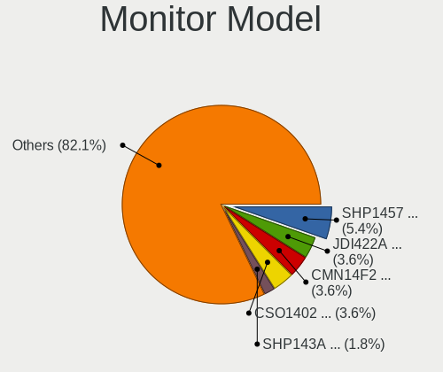

| Model                                                                    | Computers | Percent |
|--------------------------------------------------------------------------|-----------|---------|
| JDI LCD Monitor JDI422A 3000x2000 290x200mm 13.9-inch                    | 2         | 4.76%   |
| CSO LCD Monitor CSO1402 2880x1800 300x190mm 14.0-inch                    | 2         | 4.76%   |
| Chimei Innolux LCD Monitor CMN14F2 1920x1080 310x170mm 13.9-inch         | 2         | 4.76%   |
| Sharp LCD Monitor SHP143A 3840x2160 350x190mm 15.7-inch                  | 1         | 2.38%   |
| Samsung Electronics U32E850 SAM0CE3 3840x2160 700x390mm 31.5-inch        | 1         | 2.38%   |
| Samsung Electronics S27E390 SAM0C1B 1920x1080 600x340mm 27.2-inch        | 1         | 2.38%   |
| Samsung Electronics LCD Monitor SDC424A 3200x1800 290x170mm 13.2-inch    | 1         | 2.38%   |
| Samsung Electronics CF791 SAM0DC3 3440x1440 800x330mm 34.1-inch          | 1         | 2.38%   |
| Philips FTV PHL01EA 1920x1080 1440x810mm 65.0-inch                       | 1         | 2.38%   |
| NEC Computers LCD Monitor EA224WMi 1920x1080                             | 1         | 2.38%   |
| LG Electronics LCD Monitor LG Ultra HD 11520x2160                        | 1         | 2.38%   |
| LG Electronics LCD Monitor LG Ultra HD                                   | 1         | 2.38%   |
| LG Display LCD Monitor LGD0437 1920x1080 280x160mm 12.7-inch             | 1         | 2.38%   |
| LG Display LCD Monitor LGD0430 1366x768 350x190mm 15.7-inch              | 1         | 2.38%   |
| LG Display LCD Monitor LGD0419 2560x1440 310x170mm 13.9-inch             | 1         | 2.38%   |
| Lenovo LEN P27q-10 LEN61A8 2560x1440 600x340mm 27.2-inch                 | 1         | 2.38%   |
| Iiyama PL3288UH IVM7610 3840x2160 700x390mm 31.5-inch                    | 1         | 2.38%   |
| Fujitsu Siemens S19-1 FUS0517 1280x1024 380x300mm 19.1-inch              | 1         | 2.38%   |
| Eizo EV2316W ENC2394 1920x1080 510x290mm 23.1-inch                       | 1         | 2.38%   |
| DENON AVRHD DON003A 1920x1080 698x392mm 31.5-inch                        | 1         | 2.38%   |
| Dell P2715Q DEL40BD 3840x2160 600x340mm 27.2-inch                        | 1         | 2.38%   |
| Chimei Innolux LCD Monitor CMN1348 1920x1080 280x160mm 12.7-inch         | 1         | 2.38%   |
| Chi Mei Optoelectronics LCD Monitor CMO1561 1280x800 330x210mm 15.4-inch | 1         | 2.38%   |
| BOE LCD Monitor BOE0910 1920x1080 340x190mm 15.3-inch                    | 1         | 2.38%   |
| BenQ GW2250H BNQ78BD 1920x1080 480x270mm 21.7-inch                       | 1         | 2.38%   |
| AU Optronics LCD Monitor AUOD291 1920x1200 300x190mm 14.0-inch           | 1         | 2.38%   |
| AU Optronics LCD Monitor AUO45EC 1366x768 340x190mm 15.3-inch            | 1         | 2.38%   |
| AU Optronics LCD Monitor AUO313C 1366x768 310x170mm 13.9-inch            | 1         | 2.38%   |
| AU Optronics LCD Monitor AUO243D 1920x1080 310x170mm 13.9-inch           | 1         | 2.38%   |
| AU Optronics LCD Monitor AUO213E 1600x900 310x170mm 13.9-inch            | 1         | 2.38%   |
| AU Optronics LCD Monitor AUO159D 1920x1080 380x210mm 17.1-inch           | 1         | 2.38%   |
| AU Optronics LCD Monitor AUO123D 1920x1080 310x170mm 13.9-inch           | 1         | 2.38%   |
| AU Optronics LCD Monitor AUO11ED 1920x1080 340x190mm 15.3-inch           | 1         | 2.38%   |
| ASUSTek Computer XG35V AUS3551 3440x1440 820x350mm 35.1-inch             | 1         | 2.38%   |
| Apple LCD Monitor APP9C84 1440x900 330x210mm 15.4-inch                   | 1         | 2.38%   |
| Apple Color LCD APPA014 2560x1600 290x180mm 13.4-inch                    | 1         | 2.38%   |
| Ancor Communications VS278 ACI27A1 1920x1080 600x340mm 27.2-inch         | 1         | 2.38%   |
| Acer XB271HU ACR0490 2560x1440 600x340mm 27.2-inch                       | 1         | 2.38%   |
| Acer XB271HU A ACR052F 2560x1440 600x340mm 27.2-inch                     | 1         | 2.38%   |

Monitor Resolution
------------------

Monitor screen resolution

| Resolution        | Computers | Percent |
|-------------------|-----------|---------|
| 1920x1080 (FHD)   | 16        | 38.1%   |
| 3840x2160 (4K)    | 4         | 9.52%   |
| 2560x1440 (QHD)   | 4         | 9.52%   |
| 1366x768 (WXGA)   | 3         | 7.14%   |
| 3440x1440         | 2         | 4.76%   |
| 3000x2000         | 2         | 4.76%   |
| 2880x1800         | 2         | 4.76%   |
| 3200x1800 (QHD+)  | 1         | 2.38%   |
| 2560x1600         | 1         | 2.38%   |
| 1920x1200 (WUXGA) | 1         | 2.38%   |
| 1600x900 (HD+)    | 1         | 2.38%   |
| 1440x900 (WXGA+)  | 1         | 2.38%   |
| 1280x800 (WXGA)   | 1         | 2.38%   |
| 1280x1024 (SXGA)  | 1         | 2.38%   |
| 11520x2160        | 1         | 2.38%   |
| Unknown           | 1         | 2.38%   |

Monitor Diagonal
----------------

Diagonal size in inches

| Inches  | Computers | Percent |
|---------|-----------|---------|
| 13      | 11        | 26.83%  |
| 15      | 7         | 17.07%  |
| 27      | 6         | 14.63%  |
| 31      | 3         | 7.32%   |
| 14      | 3         | 7.32%   |
| 12      | 2         | 4.88%   |
| Unknown | 2         | 4.88%   |
| 65      | 1         | 2.44%   |
| 35      | 1         | 2.44%   |
| 34      | 1         | 2.44%   |
| 23      | 1         | 2.44%   |
| 21      | 1         | 2.44%   |
| 19      | 1         | 2.44%   |
| 17      | 1         | 2.44%   |

Monitor Width
-------------

Physical width

| Width in mm | Computers | Percent |
|-------------|-----------|---------|
| 301-350     | 14        | 34.15%  |
| 201-300     | 9         | 21.95%  |
| 501-600     | 7         | 17.07%  |
| 601-700     | 3         | 7.32%   |
| 351-400     | 2         | 4.88%   |
| Unknown     | 2         | 4.88%   |
| 801-900     | 1         | 2.44%   |
| 701-800     | 1         | 2.44%   |
| 401-500     | 1         | 2.44%   |
| 1001-1500   | 1         | 2.44%   |

Aspect Ratio
------------

Proportional relationship between the width and the height

| Ratio   | Computers | Percent |
|---------|-----------|---------|
| 16/9    | 28        | 68.29%  |
| 16/10   | 6         | 14.63%  |
| 4/3     | 2         | 4.88%   |
| 21/9    | 2         | 4.88%   |
| Unknown | 2         | 4.88%   |
| 5/4     | 1         | 2.44%   |

Monitor Area
------------

Area in inch

| Area in inch | Computers | Percent |
|----------------|-----------|---------|
| 81-90          | 13        | 31.71%  |
| 301-350        | 6         | 14.63%  |
| 351-500        | 5         | 12.2%   |
| 101-110        | 4         | 9.76%   |
| 91-100         | 3         | 7.32%   |
| 61-70          | 2         | 4.88%   |
| 201-250        | 2         | 4.88%   |
| Unknown        | 2         | 4.88%   |
| More than 1000 | 1         | 2.44%   |
| 71-80          | 1         | 2.44%   |
| 151-200        | 1         | 2.44%   |
| 121-130        | 1         | 2.44%   |

Pixel Density
-------------

Pixels per inch

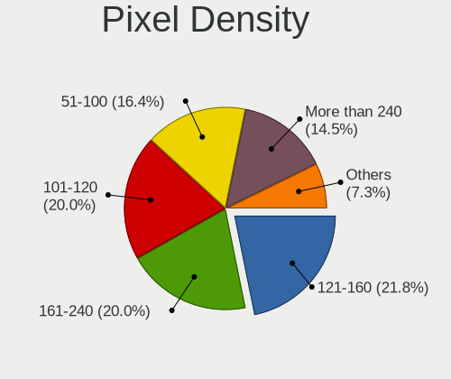

| Density       | Computers | Percent |
|---------------|-----------|---------|
| 121-160       | 10        | 24.39%  |
| 101-120       | 9         | 21.95%  |
| 51-100        | 7         | 17.07%  |
| More than 240 | 6         | 14.63%  |
| 161-240       | 6         | 14.63%  |
| Unknown       | 2         | 4.88%   |
| 1-50          | 1         | 2.44%   |

Multiple Monitors
-----------------

Total monitors connected

| Total | Computers | Percent |
|-------|-----------|---------|
| 0     | 190       | 81.55%  |
| 1     | 40        | 17.17%  |
| 2     | 3         | 1.29%   |

Network
-------

Net Controller Vendor
---------------------

Controller vendors

| Vendor                            | Computers | Percent |
|-----------------------------------|-----------|---------|
| Intel                             | 195       | 63.11%  |
| Realtek Semiconductor             | 44        | 14.24%  |
| Broadcom                          | 17        | 5.5%    |
| Qualcomm Atheros                  | 9         | 2.91%   |
| AMD                               | 8         | 2.59%   |
| Mellanox Technologies             | 6         | 1.94%   |
| TP-Link                           | 3         | 0.97%   |
| Sierra Wireless                   | 2         | 0.65%   |
| MediaTek                          | 2         | 0.65%   |
| Huawei Technologies               | 2         | 0.65%   |
| Chelsio Communications            | 2         | 0.65%   |
| American Megatrends               | 2         | 0.65%   |
| VIA Technologies                  | 1         | 0.32%   |
| U-Blox                            | 1         | 0.32%   |
| Samsung Electronics               | 1         | 0.32%   |
| Ralink Technology                 | 1         | 0.32%   |
| Qualcomm Technologies             | 1         | 0.32%   |
| Qualcomm Atheros Communications   | 1         | 0.32%   |
| Qualcomm                          | 1         | 0.32%   |
| QLogic                            | 1         | 0.32%   |
| Oracle/SUN                        | 1         | 0.32%   |
| Nvidia                            | 1         | 0.32%   |
| NetXen Incorporated               | 1         | 0.32%   |
| Microchip Technology              | 1         | 0.32%   |
| Free Software Initiative of Japan | 1         | 0.32%   |
| Ericsson Business Mobile Networks | 1         | 0.32%   |
| Edimax Technology                 | 1         | 0.32%   |
| Aquantia                          | 1         | 0.32%   |
| 3Com                              | 1         | 0.32%   |

Net Controller Model
--------------------

Controller models

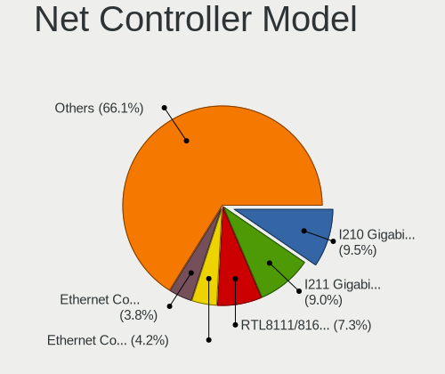

| Model                                                                         | Computers | Percent |
|-------------------------------------------------------------------------------|-----------|---------|
| Intel I210 Gigabit Network Connection                                         | 45        | 10.92%  |
| Intel I211 Gigabit Network Connection                                         | 44        | 10.68%  |
| Realtek RTL8111/8168/8411 PCI Express Gigabit Ethernet Controller             | 33        | 8.01%   |
| Intel 82579LM Gigabit Network Connection (Lewisville)                         | 16        | 3.88%   |
| Intel I350 Gigabit Network Connection                                         | 13        | 3.16%   |
| Intel Ethernet Controller I225-V                                              | 13        | 3.16%   |
| Intel 82574L Gigabit Network Connection                                       | 9         | 2.18%   |
| Intel Ethernet Controller I226-V                                              | 8         | 1.94%   |
| AMD XGMAC 10GbE Controller                                                    | 8         | 1.94%   |
| Intel 82599ES 10-Gigabit SFI/SFP+ Network Connection                          | 7         | 1.7%    |
| Intel Wi-Fi 6 AX200                                                           | 6         | 1.46%   |
| Intel Wireless 8265 / 8275                                                    | 5         | 1.21%   |
| Intel Ethernet Connection I354                                                | 5         | 1.21%   |
| Intel 82576 Gigabit Network Connection                                        | 5         | 1.21%   |
| Intel I210 Gigabit Fiber Network Connection                                   | 4         | 0.97%   |
| Intel Ethernet Connection X553 10 GbE SFP+                                    | 4         | 0.97%   |
| Intel Ethernet Connection I219-LM                                             | 4         | 0.97%   |
| Intel 82583V Gigabit Network Connection                                       | 4         | 0.97%   |
| Intel 82571EB/82571GB Gigabit Ethernet Controller D0/D1 (copper applications) | 4         | 0.97%   |
| Broadcom BCM4331 802.11a/b/g/n                                                | 4         | 0.97%   |
| Realtek RTL8852AE 802.11ax PCIe Wireless Network Adapter                      | 3         | 0.73%   |
| Qualcomm Atheros AR928X Wireless Network Adapter (PCI-Express)                | 3         | 0.73%   |
| Mellanox MT27500 Family [ConnectX-3]                                          | 3         | 0.73%   |
| Intel Wireless 8260                                                           | 3         | 0.73%   |
| Intel Wireless 7265                                                           | 3         | 0.73%   |
| Intel Ethernet Controller X710 for 10GbE SFP+                                 | 3         | 0.73%   |
| Intel Ethernet Controller X550                                                | 3         | 0.73%   |
| Intel Ethernet Connection X722 for 10GbE SFP+                                 | 3         | 0.73%   |
| Intel Ethernet Connection (6) I219-V                                          | 3         | 0.73%   |
| Intel Ethernet Connection (6) I219-LM                                         | 3         | 0.73%   |
| Intel Centrino Advanced-N 6205 [Taylor Peak]                                  | 3         | 0.73%   |
| Intel Cannon Point-LP CNVi [Wireless-AC]                                      | 3         | 0.73%   |
| Intel 82579V Gigabit Network Connection                                       | 3         | 0.73%   |
| Intel 82571EB/82571GB Gigabit Ethernet Controller (Copper)                    | 3         | 0.73%   |
| Sierra Wireless EM7455                                                        | 2         | 0.49%   |
| Realtek RTL8822CE 802.11ac PCIe Wireless Network Adapter                      | 2         | 0.49%   |
| Realtek RTL8821CE 802.11ac PCIe Wireless Network Adapter                      | 2         | 0.49%   |
| Realtek RTL8188EE Wireless Network Adapter                                    | 2         | 0.49%   |
| Realtek RTL8125 2.5GbE Controller                                             | 2         | 0.49%   |
| Intel Wireless 7260                                                           | 2         | 0.49%   |

Wireless Vendor
---------------

Wireless vendors

| Vendor                          | Computers | Percent |
|---------------------------------|-----------|---------|
| Intel                           | 42        | 51.22%  |
| Realtek Semiconductor           | 13        | 15.85%  |
| Qualcomm Atheros                | 8         | 9.76%   |
| Broadcom                        | 8         | 9.76%   |
| TP-Link                         | 3         | 3.66%   |
| Sierra Wireless                 | 2         | 2.44%   |
| MediaTek                        | 2         | 2.44%   |
| Ralink Technology               | 1         | 1.22%   |
| Qualcomm Technologies           | 1         | 1.22%   |
| Qualcomm Atheros Communications | 1         | 1.22%   |
| Edimax Technology               | 1         | 1.22%   |

Wireless Model
--------------

Wireless models

| Model                                                          | Computers | Percent |
|----------------------------------------------------------------|-----------|---------|
| Intel Wi-Fi 6 AX200                                            | 6         | 7.32%   |
| Intel Wireless 8265 / 8275                                     | 5         | 6.1%    |
| Broadcom BCM4331 802.11a/b/g/n                                 | 4         | 4.88%   |
| Realtek RTL8852AE 802.11ax PCIe Wireless Network Adapter       | 3         | 3.66%   |
| Qualcomm Atheros AR928X Wireless Network Adapter (PCI-Express) | 3         | 3.66%   |
| Intel Wireless 8260                                            | 3         | 3.66%   |
| Intel Wireless 7265                                            | 3         | 3.66%   |
| Intel Centrino Advanced-N 6205 [Taylor Peak]                   | 3         | 3.66%   |
| Intel Cannon Point-LP CNVi [Wireless-AC]                       | 3         | 3.66%   |
| Sierra Wireless EM7455                                         | 2         | 2.44%   |
| Realtek RTL8822CE 802.11ac PCIe Wireless Network Adapter       | 2         | 2.44%   |
| Realtek RTL8821CE 802.11ac PCIe Wireless Network Adapter       | 2         | 2.44%   |
| Realtek RTL8188EE Wireless Network Adapter                     | 2         | 2.44%   |
| Intel Wireless 7260                                            | 2         | 2.44%   |
| Intel Wireless 3160                                            | 2         | 2.44%   |
| Intel Wi-Fi 6 AX201 160MHz                                     | 2         | 2.44%   |
| Intel Centrino Ultimate-N 6300                                 | 2         | 2.44%   |
| Broadcom BCM4322 802.11a/b/g/n Wireless LAN Controller         | 2         | 2.44%   |
| TP-Link TL-WN823N v2/v3 [Realtek RTL8192EU]                    | 1         | 1.22%   |
| TP-Link TL-WN722N v2/v3 [Realtek RTL8188EUS]                   | 1         | 1.22%   |
| TP-Link AC600 wireless Realtek RTL8811AU [Archer T2U Nano]     | 1         | 1.22%   |
| Realtek RTL8822BE 802.11a/b/g/n/ac WiFi adapter                | 1         | 1.22%   |
| Realtek RTL8814AU 802.11a/b/g/n/ac Wireless Adapter            | 1         | 1.22%   |
| Realtek RTL8192CE PCIe Wireless Network Adapter                | 1         | 1.22%   |
| Realtek RTL8188EUS 802.11n Wireless Network Adapter            | 1         | 1.22%   |
| Ralink RT2501/RT2573 Wireless Adapter                          | 1         | 1.22%   |
| Qualcomm QCNFA765 Wireless Network Adapter                     | 1         | 1.22%   |
| Qualcomm Atheros QCA9565 / AR9565 Wireless Network Adapter     | 1         | 1.22%   |
| Qualcomm Atheros QCA6174 802.11ac Wireless Network Adapter     | 1         | 1.22%   |
| Qualcomm Atheros AR9271 802.11n                                | 1         | 1.22%   |
| Qualcomm Atheros AR9485 Wireless Network Adapter               | 1         | 1.22%   |
| Qualcomm Atheros AR93xx Wireless Network Adapter               | 1         | 1.22%   |
| Qualcomm Atheros AR9285 Wireless Network Adapter (PCI-Express) | 1         | 1.22%   |
| MediaTek MT7921 802.11ax PCI Express Wireless Network Adapter  | 1         | 1.22%   |
| MediaTek 802.11 n WLAN                                         | 1         | 1.22%   |
| Intel Wireless 3165                                            | 1         | 1.22%   |
| Intel WiFi Link 5100                                           | 1         | 1.22%   |
| Intel Wi-Fi 6 AX210/AX211/AX411 160MHz                         | 1         | 1.22%   |
| Intel Wi-Fi 6 AX201                                            | 1         | 1.22%   |
| Intel Tiger Lake PCH CNVi WiFi                                 | 1         | 1.22%   |

Ethernet Vendor
---------------

Ethernet vendors

| Vendor                 | Computers | Percent |
|------------------------|-----------|---------|
| Intel                  | 177       | 71.66%  |
| Realtek Semiconductor  | 35        | 14.17%  |
| Broadcom               | 14        | 5.67%   |
| AMD                    | 8         | 3.24%   |
| Chelsio Communications | 2         | 0.81%   |
| American Megatrends    | 2         | 0.81%   |
| VIA Technologies       | 1         | 0.4%    |
| Samsung Electronics    | 1         | 0.4%    |
| Qualcomm Atheros       | 1         | 0.4%    |
| Qualcomm               | 1         | 0.4%    |
| QLogic                 | 1         | 0.4%    |
| Oracle/SUN             | 1         | 0.4%    |
| Nvidia                 | 1         | 0.4%    |
| Huawei Technologies    | 1         | 0.4%    |
| Aquantia               | 1         | 0.4%    |

Ethernet Model
--------------

Ethernet models

| Model                                                                         | Computers | Percent |
|-------------------------------------------------------------------------------|-----------|---------|
| Intel I210 Gigabit Network Connection                                         | 45        | 14.24%  |
| Intel I211 Gigabit Network Connection                                         | 44        | 13.92%  |
| Realtek RTL8111/8168/8411 PCI Express Gigabit Ethernet Controller             | 33        | 10.44%  |
| Intel 82579LM Gigabit Network Connection (Lewisville)                         | 16        | 5.06%   |
| Intel I350 Gigabit Network Connection                                         | 13        | 4.11%   |
| Intel Ethernet Controller I225-V                                              | 13        | 4.11%   |
| Intel 82574L Gigabit Network Connection                                       | 9         | 2.85%   |
| Intel Ethernet Controller I226-V                                              | 8         | 2.53%   |
| AMD XGMAC 10GbE Controller                                                    | 8         | 2.53%   |
| Intel 82599ES 10-Gigabit SFI/SFP+ Network Connection                          | 7         | 2.22%   |
| Intel Ethernet Connection I354                                                | 5         | 1.58%   |
| Intel 82576 Gigabit Network Connection                                        | 5         | 1.58%   |
| Intel I210 Gigabit Fiber Network Connection                                   | 4         | 1.27%   |
| Intel Ethernet Connection X553 10 GbE SFP+                                    | 4         | 1.27%   |
| Intel Ethernet Connection I219-LM                                             | 4         | 1.27%   |
| Intel 82583V Gigabit Network Connection                                       | 4         | 1.27%   |
| Intel 82571EB/82571GB Gigabit Ethernet Controller D0/D1 (copper applications) | 4         | 1.27%   |
| Intel Ethernet Controller X710 for 10GbE SFP+                                 | 3         | 0.95%   |
| Intel Ethernet Controller X550                                                | 3         | 0.95%   |
| Intel Ethernet Connection X722 for 10GbE SFP+                                 | 3         | 0.95%   |
| Intel Ethernet Connection (6) I219-V                                          | 3         | 0.95%   |
| Intel Ethernet Connection (6) I219-LM                                         | 3         | 0.95%   |
| Intel 82579V Gigabit Network Connection                                       | 3         | 0.95%   |
| Intel 82571EB/82571GB Gigabit Ethernet Controller (Copper)                    | 3         | 0.95%   |
| Realtek RTL8125 2.5GbE Controller                                             | 2         | 0.63%   |
| Intel I350 Gigabit Fiber Network Connection                                   | 2         | 0.63%   |
| Intel Ethernet Controller XXV710 for 25GbE SFP28                              | 2         | 0.63%   |
| Intel Ethernet Controller E810-XXV for SFP                                    | 2         | 0.63%   |
| Intel Ethernet Connection X722 for 1GbE                                       | 2         | 0.63%   |
| Intel Ethernet Connection X722 for 10GBASE-T                                  | 2         | 0.63%   |
| Intel Ethernet Connection (2) I218-V                                          | 2         | 0.63%   |
| Intel Ethernet Connection (11) I219-LM                                        | 2         | 0.63%   |
| Intel 82599 10 Gigabit TN Network Connection                                  | 2         | 0.63%   |
| Broadcom NetXtreme BCM57786 Gigabit Ethernet PCIe                             | 2         | 0.63%   |
| Broadcom NetXtreme BCM57766 Gigabit Ethernet PCIe                             | 2         | 0.63%   |
| Broadcom NetXtreme BCM57765 Gigabit Ethernet PCIe                             | 2         | 0.63%   |
| Broadcom NetXtreme BCM57762 Gigabit Ethernet PCIe                             | 2         | 0.63%   |
| Broadcom NetXtreme BCM5720 Gigabit Ethernet PCIe                              | 2         | 0.63%   |
| American Megatrends Virtual Ethernet                                          | 2         | 0.63%   |
| VIA VT6105M [Rhine-III]                                                       | 1         | 0.32%   |

Net Controller Kind
-------------------

Ethernet, WiFi or modem

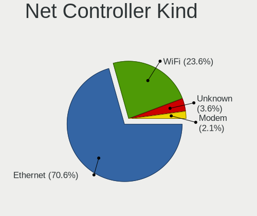

| Kind     | Computers | Percent |
|----------|-----------|---------|
| Ethernet | 217       | 71.38%  |
| WiFi     | 73        | 24.01%  |
| Unknown  | 9         | 2.96%   |
| Modem    | 5         | 1.64%   |

Used Controller
---------------

Currently used network controller

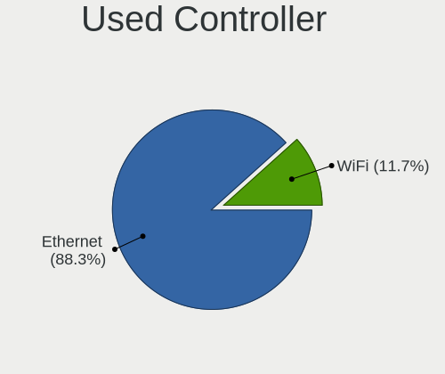

| Kind     | Computers | Percent |
|----------|-----------|---------|
| Ethernet | 205       | 87.61%  |
| WiFi     | 29        | 12.39%  |

NICs
----

Total network controllers on board

| Total | Computers | Percent |
|-------|-----------|---------|
| 4     | 45        | 19.48%  |
| 3     | 42        | 18.18%  |
| 2     | 42        | 18.18%  |
| 6     | 33        | 14.29%  |
| 1     | 26        | 11.26%  |
| 5     | 22        | 9.52%   |
| 8     | 6         | 2.6%    |
| 13    | 3         | 1.3%    |
| 7     | 3         | 1.3%    |
| 10    | 2         | 0.87%   |
| 9     | 2         | 0.87%   |
| 0     | 2         | 0.87%   |
| 15    | 1         | 0.43%   |
| 14    | 1         | 0.43%   |
| 12    | 1         | 0.43%   |

IPv6
----

IPv6 vs IPv4

| Used | Computers | Percent |
|------|-----------|---------|
| No   | 186       | 75.92%  |
| Yes  | 59        | 24.08%  |

Bluetooth
---------

Bluetooth Vendor
----------------

Controller vendors

| Vendor                          | Computers | Percent |
|---------------------------------|-----------|---------|
| Intel                           | 31        | 51.67%  |
| Apple                           | 8         | 13.33%  |
| IMC Networks                    | 5         | 8.33%   |
| Realtek Semiconductor           | 4         | 6.67%   |
| ASUSTek Computer                | 4         | 6.67%   |
| USI                             | 1         | 1.67%   |
| Qualcomm Atheros Communications | 1         | 1.67%   |
| Lite-On Technology              | 1         | 1.67%   |
| Foxconn / Hon Hai               | 1         | 1.67%   |
| Dell                            | 1         | 1.67%   |
| Cambridge Silicon Radio         | 1         | 1.67%   |
| Broadcom                        | 1         | 1.67%   |
| Alps Electric                   | 1         | 1.67%   |

Bluetooth Model
---------------

Controller models

| Model                                                       | Computers | Percent |
|-------------------------------------------------------------|-----------|---------|
| Intel Bluetooth wireless interface                          | 13        | 21.67%  |
| Intel AX201 Bluetooth                                       | 6         | 10%     |
| Intel AX200 Bluetooth                                       | 6         | 10%     |
| Realtek Bluetooth Adapter                                   | 4         | 6.67%   |
| Intel Bluetooth 9460/9560 Jefferson Peak (JfP)              | 3         | 5%      |
| IMC Networks Realtek Bluetooth Adapter                      | 3         | 5%      |
| Apple Broadcom Built-in Bluetooth                           | 3         | 5%      |
| Apple Bluetooth Host Controller                             | 3         | 5%      |
| Apple Built-in Bluetooth 2.0+EDR HCI                        | 2         | 3.33%   |
| USI Qualcomm WCN685x Bluetooth Adapter                      | 1         | 1.67%   |
| Qualcomm Atheros QCA61x4 Bluetooth 4.0                      | 1         | 1.67%   |
| Lite-On Atheros AR3012 Bluetooth                            | 1         | 1.67%   |
| Intel Centrino Bluetooth Wireless Transceiver               | 1         | 1.67%   |
| Intel AX211 Bluetooth                                       | 1         | 1.67%   |
| Intel AX210 Bluetooth                                       | 1         | 1.67%   |
| IMC Networks MediaTek Bluetooth Adapter                     | 1         | 1.67%   |
| IMC Networks Atheros AR3012 Bluetooth 4.0 Adapter           | 1         | 1.67%   |
| Foxconn / Hon Hai Qualcomm Atheros AR3011 Bluetooth Adapter | 1         | 1.67%   |
| Dell Dell Wireless 380 Bluetooth 4.0 Module                 | 1         | 1.67%   |
| Cambridge Silicon Radio Bluetooth Dongle (HCI mode)         | 1         | 1.67%   |
| Broadcom BCM20702 Bluetooth 4.0 [ThinkPad]                  | 1         | 1.67%   |
| ASUS USB-BT500                                              | 1         | 1.67%   |
| ASUS BT-253 Bluetooth Adapter                               | 1         | 1.67%   |
| ASUS Broadcom BCM20702A0 Bluetooth                          | 1         | 1.67%   |
| ASUS Bluetooth Controller                                   | 1         | 1.67%   |
| Alps Electric UGTZ4 Bluetooth                               | 1         | 1.67%   |

Sound
-----

Sound Vendor
------------

Sound card vendors

| Vendor                | Computers | Percent |
|-----------------------|-----------|---------|
| Intel                 | 116       | 68.24%  |
| AMD                   | 31        | 18.24%  |
| Nvidia                | 14        | 8.24%   |
| ULi Electronics       | 2         | 1.18%   |
| Lenovo                | 2         | 1.18%   |
| Realtek Semiconductor | 1         | 0.59%   |
| PS Audio              | 1         | 0.59%   |
| Logitech              | 1         | 0.59%   |
| GN Netcom             | 1         | 0.59%   |
| ASUSTek Computer      | 1         | 0.59%   |

Sound Model
-----------

Sound card models

| Model                                                                                             | Computers | Percent |
|---------------------------------------------------------------------------------------------------|-----------|---------|
| Intel 7 Series/C216 Chipset Family High Definition Audio Controller                               | 14        | 7.25%   |
| AMD Family 17h/19h HD Audio Controller                                                            | 13        | 6.74%   |
| Intel Sunrise Point-LP HD Audio                                                                   | 11        | 5.7%    |
| Intel 6 Series/C200 Series Chipset Family High Definition Audio Controller                        | 11        | 5.7%    |
| Intel Xeon E3-1200 v3/4th Gen Core Processor HD Audio Controller                                  | 10        | 5.18%   |
| Intel Jasper Lake HD Audio                                                                        | 8         | 4.15%   |
| Intel Celeron/Pentium Silver Processor High Definition Audio                                      | 8         | 4.15%   |
| AMD Renoir Radeon High Definition Audio Controller                                                | 8         | 4.15%   |
| AMD Family 17h (Models 00h-0fh) HD Audio Controller                                               | 7         | 3.63%   |
| Intel Cannon Point-LP High Definition Audio Controller                                            | 6         | 3.11%   |
| Intel Comet Lake PCH-LP cAVS                                                                      | 5         | 2.59%   |
| Intel 100 Series/C230 Series Chipset Family HD Audio Controller                                   | 5         | 2.59%   |
| Intel Wildcat Point-LP High Definition Audio Controller                                           | 4         | 2.07%   |
| Intel Broadwell-U Audio Controller                                                                | 4         | 2.07%   |
| Nvidia GK107 HDMI Audio Controller                                                                | 3         | 1.55%   |
| Intel Tiger Lake-LP Smart Sound Technology Audio Controller                                       | 3         | 1.55%   |
| Intel Haswell-ULT HD Audio Controller                                                             | 3         | 1.55%   |
| Intel Atom Processor Z36xxx/Z37xxx Series High Definition Audio Controller                        | 3         | 1.55%   |
| Intel 82801JI (ICH10 Family) HD Audio Controller                                                  | 3         | 1.55%   |
| Intel 8 Series/C220 Series Chipset High Definition Audio Controller                               | 3         | 1.55%   |
| Intel 8 Series HD Audio Controller                                                                | 3         | 1.55%   |
| AMD Starship/Matisse HD Audio Controller                                                          | 3         | 1.55%   |
| AMD Raven/Raven2/Fenghuang HDMI/DP Audio Controller                                               | 3         | 1.55%   |
| ULi Electronics M5451 PCI AC-Link Controller Audio Device                                         | 2         | 1.04%   |
| Lenovo Lenovo USB-C Mini Dock                                                                     | 2         | 1.04%   |
| Intel Ice Lake-LP Smart Sound Technology Audio Controller                                         | 2         | 1.04%   |
| Intel Comet Lake PCH cAVS                                                                         | 2         | 1.04%   |
| Intel Cannon Lake PCH cAVS                                                                        | 2         | 1.04%   |
| Intel Atom/Celeron/Pentium Processor x5-E8000/J3xxx/N3xxx Series High Definition Audio Controller | 2         | 1.04%   |
| Intel Alder Lake-S HD Audio Controller                                                            | 2         | 1.04%   |
| Intel Alder Lake PCH-P High Definition Audio Controller                                           | 2         | 1.04%   |
| Intel 82801I (ICH9 Family) HD Audio Controller                                                    | 2         | 1.04%   |
| Intel 200 Series PCH HD Audio                                                                     | 2         | 1.04%   |
| AMD Caicos HDMI Audio [Radeon HD 6450 / 7450/8450/8490 OEM / R5 230/235/235X OEM]                 | 2         | 1.04%   |
| Realtek Semiconductor USB Audio Maono Elf retrieving string failed                                | 1         | 0.52%   |
| PS Audio PS Audio USB Audio 2.0                                                                   | 1         | 0.52%   |
| Nvidia TU116 High Definition Audio Controller                                                     | 1         | 0.52%   |
| Nvidia MCP79 High Definition Audio                                                                | 1         | 0.52%   |
| Nvidia GP106 High Definition Audio Controller                                                     | 1         | 0.52%   |
| Nvidia GM206 High Definition Audio Controller                                                     | 1         | 0.52%   |

Memory
------

Memory Vendor
-------------

Memory module vendors

| Vendor              | Computers | Percent |
|---------------------|-----------|---------|
| Kingston            | 50        | 22.94%  |
| SK hynix            | 30        | 13.76%  |
| Unknown             | 28        | 12.84%  |
| Samsung Electronics | 27        | 12.39%  |
| Micron Technology   | 23        | 10.55%  |
| Corsair             | 17        | 7.8%    |
| Crucial             | 13        | 5.96%   |
| Transcend           | 10        | 4.59%   |
| Unknown (ABCD)      | 2         | 0.92%   |
| Toshiba             | 2         | 0.92%   |
| Nanya Technology    | 2         | 0.92%   |
| Hewlett-Packard     | 2         | 0.92%   |
| Elpida              | 2         | 0.92%   |
| A-DATA Technology   | 2         | 0.92%   |
| Unknown (0x05F7)    | 1         | 0.46%   |
| Unknown (07FB)      | 1         | 0.46%   |
| Tigo                | 1         | 0.46%   |
| Super Talent        | 1         | 0.46%   |
| Silicon Power       | 1         | 0.46%   |
| G.Skill             | 1         | 0.46%   |
| ASint Technology    | 1         | 0.46%   |
| Unknown             | 1         | 0.46%   |

Memory Model
------------

Memory module models

| Model                                                             | Computers | Percent |
|-------------------------------------------------------------------|-----------|---------|
| Unknown RAM Module 4GB SODIMM DDR3 1333MT/s                       | 17        | 7.36%   |
| Transcend RAM TS1GLH64V6BL 8GB SODIMM DDR4 2667MT/s               | 5         | 2.16%   |
| Unknown RAM Module 2GB SODIMM DDR3 1333MT/s                       | 3         | 1.3%    |
| SK hynix RAM HMA81GU6CJR8N-XN 8GB DIMM DDR4 3200MT/s              | 3         | 1.3%    |
| Samsung RAM M471A1G44AB0-CWE 8GB Row Of Chips DDR4 3200MT/s       | 3         | 1.3%    |
| Kingston RAM KHX2933C15D4/8GX 8GB DIMM DDR4 2400MT/s              | 3         | 1.3%    |
| Kingston RAM KF2666C15S4/8G 8GB SODIMM DDR4 2667MT/s              | 3         | 1.3%    |
| Kingston RAM CBD24D4S7S8K1A-8 8GB SODIMM DDR4 2133MT/s            | 3         | 1.3%    |
| Unknown RAM Module 4GB SODIMM DDR3 667MT/s                        | 2         | 0.87%   |
| Unknown RAM Module 4GB DIMM DDR3 1333MT/s                         | 2         | 0.87%   |
| Unknown (ABCD) RAM 123456789012345678 1536MB DIMM LPDDR3 2400MT/s | 2         | 0.87%   |
| Transcend RAM TS1GLH64V6B3 8GB SODIMM DDR4 1333MT/s               | 2         | 0.87%   |
| SK hynix RAM HMA82GR7CJR4N-WM 16GB DIMM DDR4 2933MT/s             | 2         | 0.87%   |
| Micron RAM MT52L512M32D2PF-09 4GB Row Of Chips LPDDR3 2133MT/s    | 2         | 0.87%   |
| Micron RAM Module 8GB Row Of Chips LPDDR4 3200MT/s                | 2         | 0.87%   |
| Micron RAM Module 16GB Row Of Chips LPDDR4 4267MT/s               | 2         | 0.87%   |
| Kingston RAM KHX1600C10D3/8G 8GB DIMM DDR3 1600MT/s               | 2         | 0.87%   |
| Kingston RAM 99U5471-052.A00LF 8GB DIMM DDR3 1333MT/s             | 2         | 0.87%   |
| Kingston RAM 9965745-020.A00G 32GB DIMM DDR4 3200MT/s             | 2         | 0.87%   |
| Kingston RAM 9905403-559.A00LF 8GB DIMM DDR3 1333MT/s             | 2         | 0.87%   |
| Elpida RAM Module 4GB SODIMM DDR3 1600MT/s                        | 2         | 0.87%   |
| Crucial RAM CT8G4SFS824A.M8FD 8GB SODIMM DDR4 2400MT/s            | 2         | 0.87%   |
| Crucial RAM CT8G4SFRA32A.M8FR 8GB SODIMM DDR4 3200MT/s            | 2         | 0.87%   |
| Crucial RAM CT8G4DFS8266.M8FJ 8GB DIMM DDR4 2666MT/s              | 2         | 0.87%   |
| Crucial RAM CT8G4DFRA266.C8FB 8GB DIMM DDR4 2666MT/s              | 2         | 0.87%   |
| Unknown RAM Module 512MB DIMM DDR2 667MT/s                        | 1         | 0.43%   |
| Unknown RAM Module 4096MB DIMM 1333MT/s                           | 1         | 0.43%   |
| Unknown RAM Module 2GB SODIMM DDR2 800MT/s                        | 1         | 0.43%   |
| Unknown RAM Module 2GB DIMM DDR2 800MT/s                          | 1         | 0.43%   |
| Unknown RAM Module 1GB DIMM DDR2 800MT/s                          | 1         | 0.43%   |
| Unknown RAM Module 1GB DIMM DDR2 1033MT/s                         | 1         | 0.43%   |
| Unknown (0x05F7) RAM Module 1GB FB-DIMM DDR2 800MT/s              | 1         | 0.43%   |
| Unknown (07FB) RAM GSA8G4SCL196P-26 8GB SODIMM DDR4 2667MT/s      | 1         | 0.43%   |
| Transcend RAM TS512MSK64W6H 4GB DIMM DDR3 1600MT/s                | 1         | 0.43%   |
| Transcend RAM TS512MLK64W6H 4GB DIMM DDR3 1600MT/s                | 1         | 0.43%   |
| Transcend RAM TS512MLH64V6HL 4GB SODIMM DDR4 2667MT/s             | 1         | 0.43%   |
| Transcend RAM TS2GLH64V2B 16GB SODIMM DDR4 1600MT/s               | 1         | 0.43%   |
| Transcend RAM TS256MLK64W6N 2GB DIMM DDR3 1600MT/s                | 1         | 0.43%   |
| Toshiba RAM 9965527-021.A00LF 8GB SODIMM DDR3 1600MT/s            | 1         | 0.43%   |
| Toshiba RAM 9965525-140.A00LF 8GB DIMM DDR3 1333MT/s              | 1         | 0.43%   |

Memory Kind
-----------

Memory module kinds

| Kind    | Computers | Percent |
|---------|-----------|---------|
| DDR3    | 89        | 45.18%  |
| DDR4    | 85        | 43.15%  |
| LPDDR4  | 9         | 4.57%   |
| DDR2    | 5         | 2.54%   |
| LPDDR3  | 4         | 2.03%   |
| DDR5    | 2         | 1.02%   |
| Unknown | 2         | 1.02%   |
| LPDDR5  | 1         | 0.51%   |

Memory Form Factor
------------------

Physical design of the memory module

| Name         | Computers | Percent |
|--------------|-----------|---------|
| SODIMM       | 96        | 48.48%  |
| DIMM         | 85        | 42.93%  |
| Row Of Chips | 13        | 6.57%   |
| Chip         | 2         | 1.01%   |
| RIMM         | 1         | 0.51%   |
| FB-DIMM      | 1         | 0.51%   |

Memory Size
-----------

Memory module size

| Size  | Computers | Percent |
|-------|-----------|---------|
| 8192  | 86        | 41.55%  |
| 4096  | 57        | 27.54%  |
| 16384 | 40        | 19.32%  |
| 2048  | 14        | 6.76%   |
| 32768 | 5         | 2.42%   |
| 1024  | 3         | 1.45%   |
| 65536 | 1         | 0.48%   |
| 512   | 1         | 0.48%   |

Memory Speed
------------

Memory module speed

| Speed   | Computers | Percent |
|---------|-----------|---------|
| 1333    | 47        | 22.27%  |
| 1600    | 41        | 19.43%  |
| 2667    | 29        | 13.74%  |
| 3200    | 24        | 11.37%  |
| 2133    | 18        | 8.53%   |
| 2400    | 16        | 7.58%   |
| 2666    | 6         | 2.84%   |
| 4267    | 4         | 1.9%    |
| 2933    | 4         | 1.9%    |
| 800     | 4         | 1.9%    |
| 667     | 4         | 1.9%    |
| 1867    | 3         | 1.42%   |
| 4800    | 2         | 0.95%   |
| 6400    | 1         | 0.47%   |
| 3600    | 1         | 0.47%   |
| 3000    | 1         | 0.47%   |
| 1866    | 1         | 0.47%   |
| 1800    | 1         | 0.47%   |
| 1067    | 1         | 0.47%   |
| 1066    | 1         | 0.47%   |
| 1033    | 1         | 0.47%   |
| Unknown | 1         | 0.47%   |

Printers & scanners
-------------------

Printer Vendor
--------------

Printer device vendors

Zero info for selected period =(

Printer Model
-------------

Printer device models

Zero info for selected period =(

Scanner Vendor
--------------

Scanner device vendors

Zero info for selected period =(

Scanner Model
-------------

Scanner device models

Zero info for selected period =(

Camera
------

Camera Vendor
-------------

Camera device vendors

| Vendor                                 | Computers | Percent |
|----------------------------------------|-----------|---------|
| Chicony Electronics                    | 11        | 35.48%  |
| IMC Networks                           | 6         | 19.35%  |
| Bison Electronics                      | 4         | 12.9%   |
| Apple                                  | 4         | 12.9%   |
| Sunplus Innovation Technology          | 2         | 6.45%   |
| Suyin                                  | 1         | 3.23%   |
| Supreme Electronics                    | 1         | 3.23%   |
| Microdia                               | 1         | 3.23%   |
| Cheng Uei Precision Industry (Foxlink) | 1         | 3.23%   |

Camera Model
------------

Camera device models

| Model                                            | Computers | Percent |
|--------------------------------------------------|-----------|---------|
| Chicony Integrated Camera                        | 5         | 16.13%  |
| IMC Networks Integrated Camera                   | 4         | 12.9%   |
| Bison Integrated Camera                          | 3         | 9.68%   |
| Apple FaceTime HD Camera (Built-in)              | 3         | 9.68%   |
| Suyin HD WebCam                                  | 1         | 3.23%   |
| Supreme Realtek PC Camera                        | 1         | 3.23%   |
| Sunplus Laptop Integrated WebCam HD              | 1         | 3.23%   |
| Sunplus Laptop Integrated Webcam FHD             | 1         | 3.23%   |
| Microdia Lenovo EasyCamera                       | 1         | 3.23%   |
| IMC Networks EasyCamera                          | 1         | 3.23%   |
| IMC Networks ASUS EasyCamera                     | 1         | 3.23%   |
| Chicony USB2.0 HD UVC WebCam                     | 1         | 3.23%   |
| Chicony USB 2.0 2.0M UVC WebCam                  | 1         | 3.23%   |
| Chicony ThinkPad T490 Webcam                     | 1         | 3.23%   |
| Chicony Lenovo EasyCamera                        | 1         | 3.23%   |
| Chicony Integrated Camera [ThinkPad]             | 1         | 3.23%   |
| Chicony HP Universal Camera                      | 1         | 3.23%   |
| Cheng Uei Precision Industry (Foxlink) HD Camera | 1         | 3.23%   |
| Bison Lenovo EasyCamera integrated webcam        | 1         | 3.23%   |
| Apple FaceTime HD Camera                         | 1         | 3.23%   |

Security
--------

Fingerprint Vendor
------------------

Fingerprint sensor vendors

| Vendor           | Computers | Percent |
|------------------|-----------|---------|
| Validity Sensors | 4         | 57.14%  |
| Synaptics        | 2         | 28.57%  |
| Upek             | 1         | 14.29%  |

Fingerprint Model
-----------------

Fingerprint sensor models

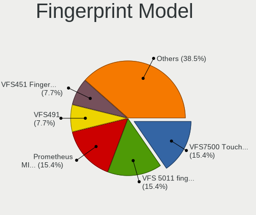

| Model                                                  | Computers | Percent |
|--------------------------------------------------------|-----------|---------|
| Validity Sensors VFS7500 Touch Fingerprint Sensor      | 2         | 28.57%  |
| Validity Sensors VFS 5011 fingerprint sensor           | 1         | 14.29%  |
| Validity Sensors Synaptics WBDI                        | 1         | 14.29%  |
| Upek Biometric Touchchip/Touchstrip Fingerprint Sensor | 1         | 14.29%  |
| Synaptics WBDI                                         | 1         | 14.29%  |
| Synaptics Prometheus MIS Touch Fingerprint Reader      | 1         | 14.29%  |

Chipcard Vendor
---------------

Chipcard module vendors

Zero info for selected period =(

Chipcard Model
--------------

Chipcard module models

Zero info for selected period =(

Unsupported
-----------

Unsupported Devices
-------------------

Total unsupported devices on board

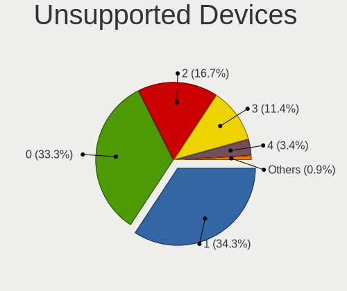

| Total | Computers | Percent |
|-------|-----------|---------|
| 0     | 90        | 37.82%  |
| 1     | 77        | 32.35%  |
| 2     | 37        | 15.55%  |
| 3     | 24        | 10.08%  |
| 4     | 7         | 2.94%   |
| 5     | 3         | 1.26%   |

Unsupported Device Types
------------------------

Types of unsupported devices

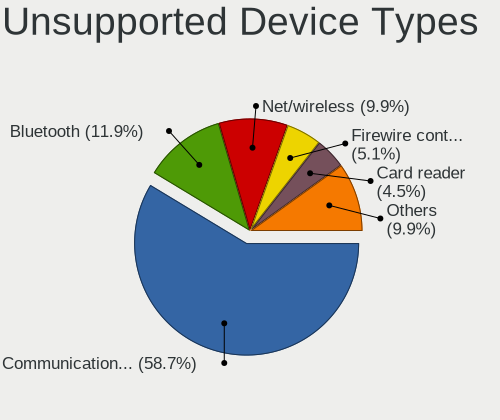

| Type                     | Computers | Percent |
|--------------------------|-----------|---------|
| Communication controller | 122       | 55.96%  |
| Bluetooth                | 27        | 12.39%  |
| Net/wireless             | 22        | 10.09%  |
| Firewire controller      | 14        | 6.42%   |
| Card reader              | 11        | 5.05%   |
| Fingerprint reader       | 6         | 2.75%   |
| Sound                    | 5         | 2.29%   |
| Net/ethernet             | 5         | 2.29%   |
| Network                  | 3         | 1.38%   |
| Graphics card            | 2         | 0.92%   |
| Storage                  | 1         | 0.46%   |

