BSD in Switzerland - Tested Hardware & Statistics
-------------------------------------------------

A project to collect tested hardware configurations for BSD in Switzerland.

Anyone can contribute to this report by the [hw-probe](https://github.com/linuxhw/hw-probe/blob/master/INSTALL.BSD.md) tool:

    hw-probe -all -upload

Please contribute! Especially if your hardware is rare.

This is a report for all computer types. See also reports for [desktops](/Location/Switzerland/Desktop/README.md) and [notebooks](/Location/Switzerland/Notebook/README.md).

Contents
--------

* [ Test Cases ](#test-cases)

* [ System ](#system)
  - [ OS                       ](#os)
  - [ OS Family                ](#os-family)
  - [ Arch                     ](#arch)
  - [ DE                       ](#de)
  - [ Display Server           ](#display-server)
  - [ Display Manager          ](#display-manager)
  - [ OS Lang                  ](#os-lang)
  - [ Boot Mode                ](#boot-mode)
  - [ Filesystem               ](#filesystem)
  - [ Part. scheme             ](#part-scheme)

* [ Board ](#board)
  - [ Vendor                   ](#vendor)
  - [ Model                    ](#model)
  - [ Model Family             ](#model-family)
  - [ MFG Year                 ](#mfg-year)
  - [ Form Factor              ](#form-factor)
  - [ Coreboot                 ](#coreboot)
  - [ RAM Size                 ](#ram-size)
  - [ RAM Used                 ](#ram-used)
  - [ Total Drives             ](#total-drives)
  - [ Has CD-ROM               ](#has-cd-rom)
  - [ Has Ethernet             ](#has-ethernet)
  - [ Has WiFi                 ](#has-wifi)
  - [ Has Bluetooth            ](#has-bluetooth)

* [ Location ](#location)
  - [ Country                  ](#country)
  - [ City                     ](#city)

* [ Drives ](#drives)
  - [ Drive Vendor             ](#drive-vendor)
  - [ Drive Model              ](#drive-model)
  - [ HDD Vendor               ](#hdd-vendor)
  - [ SSD Vendor               ](#ssd-vendor)
  - [ Drive Kind               ](#drive-kind)
  - [ Drive Connector          ](#drive-connector)
  - [ Drive Size               ](#drive-size)
  - [ Space Total              ](#space-total)
  - [ Space Used               ](#space-used)
  - [ Malfunc. Drives          ](#malfunc-drives)
  - [ Malfunc. Drive Vendor    ](#malfunc-drive-vendor)
  - [ Malfunc. HDD Vendor      ](#malfunc-hdd-vendor)
  - [ Malfunc. Drive Kind      ](#malfunc-drive-kind)
  - [ Failed Drives            ](#failed-drives)
  - [ Failed Drive Vendor      ](#failed-drive-vendor)
  - [ Drive Status             ](#drive-status)

* [ Storage controller ](#storage-controller)
  - [ Storage Vendor           ](#storage-vendor)
  - [ Storage Model            ](#storage-model)
  - [ Storage Kind             ](#storage-kind)

* [ Processor ](#processor)
  - [ CPU Vendor               ](#cpu-vendor)
  - [ CPU Model                ](#cpu-model)
  - [ CPU Model Family         ](#cpu-model-family)
  - [ CPU Cores                ](#cpu-cores)
  - [ CPU Sockets              ](#cpu-sockets)
  - [ CPU Threads              ](#cpu-threads)
  - [ CPU Microarch            ](#cpu-microarch)

* [ Graphics ](#graphics)
  - [ GPU Vendor               ](#gpu-vendor)
  - [ GPU Model                ](#gpu-model)
  - [ GPU Combo                ](#gpu-combo)
  - [ GPU Driver               ](#gpu-driver)
  - [ GPU Memory               ](#gpu-memory)

* [ Monitor ](#monitor)
  - [ Monitor Vendor           ](#monitor-vendor)
  - [ Monitor Model            ](#monitor-model)
  - [ Monitor Resolution       ](#monitor-resolution)
  - [ Monitor Diagonal         ](#monitor-diagonal)
  - [ Monitor Width            ](#monitor-width)
  - [ Aspect Ratio             ](#aspect-ratio)
  - [ Monitor Area             ](#monitor-area)
  - [ Pixel Density            ](#pixel-density)
  - [ Multiple Monitors        ](#multiple-monitors)

* [ Network ](#network)
  - [ Net Controller Vendor    ](#net-controller-vendor)
  - [ Net Controller Model     ](#net-controller-model)
  - [ Wireless Vendor          ](#wireless-vendor)
  - [ Wireless Model           ](#wireless-model)
  - [ Ethernet Vendor          ](#ethernet-vendor)
  - [ Ethernet Model           ](#ethernet-model)
  - [ Net Controller Kind      ](#net-controller-kind)
  - [ Used Controller          ](#used-controller)
  - [ NICs                     ](#nics)
  - [ IPv6                     ](#ipv6)

* [ Bluetooth ](#bluetooth)
  - [ Bluetooth Vendor         ](#bluetooth-vendor)
  - [ Bluetooth Model          ](#bluetooth-model)

* [ Sound ](#sound)
  - [ Sound Vendor             ](#sound-vendor)
  - [ Sound Model              ](#sound-model)

* [ Memory ](#memory)
  - [ Memory Vendor            ](#memory-vendor)
  - [ Memory Model             ](#memory-model)
  - [ Memory Kind              ](#memory-kind)
  - [ Memory Form Factor       ](#memory-form-factor)
  - [ Memory Size              ](#memory-size)
  - [ Memory Speed             ](#memory-speed)

* [ Printers & scanners ](#printers--scanners)
  - [ Printer Vendor           ](#printer-vendor)
  - [ Printer Model            ](#printer-model)
  - [ Scanner Vendor           ](#scanner-vendor)
  - [ Scanner Model            ](#scanner-model)

* [ Camera ](#camera)
  - [ Camera Vendor            ](#camera-vendor)
  - [ Camera Model             ](#camera-model)

* [ Security ](#security)
  - [ Fingerprint Vendor       ](#fingerprint-vendor)
  - [ Fingerprint Model        ](#fingerprint-model)
  - [ Chipcard Vendor          ](#chipcard-vendor)
  - [ Chipcard Model           ](#chipcard-model)

* [ Unsupported ](#unsupported)
  - [ Unsupported Devices      ](#unsupported-devices)
  - [ Unsupported Device Types ](#unsupported-device-types)

Test Cases
----------

Total: 245

| Vendor        | Model                       | Form-Factor | Probe                                                     | Date         |
|---------------|-----------------------------|-------------|-----------------------------------------------------------|--------------|
| HP            | 1494                        | Desktop     | [3a61eb7bae](https://bsd-hardware.info/?probe=3a61eb7bae) | Jul 01, 2022 |
| Gigabyte      | X570 AORUS MASTER           | Desktop     | [34bb6613ee](https://bsd-hardware.info/?probe=34bb6613ee) | Jun 23, 2022 |
| Unknown       | Unknown                     | Desktop     | [d7d6b654a4](https://bsd-hardware.info/?probe=d7d6b654a4) | Jun 22, 2022 |
| Dell          | 02YYK5 A00                  | Desktop     | [180af6a2da](https://bsd-hardware.info/?probe=180af6a2da) | Jun 19, 2022 |
| Dell          | 02YYK5 A00                  | Desktop     | [c58d529930](https://bsd-hardware.info/?probe=c58d529930) | Jun 19, 2022 |
| MW            | GMLK-2_5G4L                 | Desktop     | [97e567c06b](https://bsd-hardware.info/?probe=97e567c06b) | Jun 18, 2022 |
| Supermicro    | A1SRM-2758F                 | Server      | [3c53a92a68](https://bsd-hardware.info/?probe=3c53a92a68) | Jun 17, 2022 |
| Supermicro    | X11SSM-F                    | Server      | [626b058309](https://bsd-hardware.info/?probe=626b058309) | Jun 16, 2022 |
| Supermicro    | X11SSM-F                    | Server      | [ef0e973cad](https://bsd-hardware.info/?probe=ef0e973cad) | Jun 15, 2022 |
| ASUSTek       | Pro B660M-C D4              | Desktop     | [302ea8252d](https://bsd-hardware.info/?probe=302ea8252d) | Jun 08, 2022 |
| PC Engines    | apu4                        | Desktop     | [1067180759](https://bsd-hardware.info/?probe=1067180759) | May 31, 2022 |
| PC Engines    | apu4                        | Desktop     | [214bc37259](https://bsd-hardware.info/?probe=214bc37259) | May 26, 2022 |
| Lenovo        | IdeaPad Y700-15ISK 80NV     | Notebook    | [1cc5f44e4a](https://bsd-hardware.info/?probe=1cc5f44e4a) | May 25, 2022 |
| Protectli     | FW6                         | Desktop     | [0dc7509652](https://bsd-hardware.info/?probe=0dc7509652) | May 24, 2022 |
| Lenovo        | IdeaPad Y700-15ISK 80NV     | Notebook    | [ddaca5356c](https://bsd-hardware.info/?probe=ddaca5356c) | May 21, 2022 |
| Unknown       | Unknown                     | Desktop     | [7c260c2423](https://bsd-hardware.info/?probe=7c260c2423) | May 20, 2022 |
| Intel         | D54250WYK H13922-303        | Desktop     | [8f9e0896d7](https://bsd-hardware.info/?probe=8f9e0896d7) | May 12, 2022 |
| Dell          | 0X4N41 A01                  | Desktop     | [d1596f34bf](https://bsd-hardware.info/?probe=d1596f34bf) | May 12, 2022 |
| Intel         | D54250WYK H13922-303        | Desktop     | [6dfeb3d80d](https://bsd-hardware.info/?probe=6dfeb3d80d) | May 10, 2022 |
| Intel         | HURONRIVER                  | Desktop     | [515172b464](https://bsd-hardware.info/?probe=515172b464) | May 09, 2022 |
| PC Engines    | APU2                        | Desktop     | [a2b68686f0](https://bsd-hardware.info/?probe=a2b68686f0) | Apr 27, 2022 |
| Dell          | 0TP406                      | Desktop     | [775061bc83](https://bsd-hardware.info/?probe=775061bc83) | Apr 25, 2022 |
| Biostar       | H61MHV2                     | Desktop     | [7d9806d719](https://bsd-hardware.info/?probe=7d9806d719) | Apr 21, 2022 |
| Gigabyte      | 990FXA-UD3                  | Desktop     | [378021707a](https://bsd-hardware.info/?probe=378021707a) | Apr 17, 2022 |
| Sophos        | SG                          | Firewall    | [2b5126d5a1](https://bsd-hardware.info/?probe=2b5126d5a1) | Apr 09, 2022 |
| PC Engines    | apu4                        | Desktop     | [62df504364](https://bsd-hardware.info/?probe=62df504364) | Apr 09, 2022 |
| Sophos        | UTM                         | Firewall    | [37af5c0425](https://bsd-hardware.info/?probe=37af5c0425) | Apr 08, 2022 |
| Sophos        | UTM                         | Firewall    | [8e79b3e5bf](https://bsd-hardware.info/?probe=8e79b3e5bf) | Apr 07, 2022 |
| Deciso        | DEC2700 - OPNsense Appli... | Notebook    | [926afc7ac8](https://bsd-hardware.info/?probe=926afc7ac8) | Apr 07, 2022 |
| Dell          | 0TP406                      | Desktop     | [9a29305ef1](https://bsd-hardware.info/?probe=9a29305ef1) | Apr 06, 2022 |
| Unknown       | Unknown                     | Desktop     | [b6b1ec9dc1](https://bsd-hardware.info/?probe=b6b1ec9dc1) | Mar 30, 2022 |
| Deciso        | Netboard A20                | Notebook    | [835d6c060f](https://bsd-hardware.info/?probe=835d6c060f) | Mar 25, 2022 |
| ASRockRack    | X570D4U-2L2T                | Desktop     | [7e042aa70d](https://bsd-hardware.info/?probe=7e042aa70d) | Mar 25, 2022 |
| Deciso        | Netboard A20                | Notebook    | [5a6b66aa01](https://bsd-hardware.info/?probe=5a6b66aa01) | Mar 24, 2022 |
| Unknown       | Unknown                     | Desktop     | [abb17bcb42](https://bsd-hardware.info/?probe=abb17bcb42) | Mar 21, 2022 |
| Unknown       | Unknown                     | Desktop     | [1d97ecbc95](https://bsd-hardware.info/?probe=1d97ecbc95) | Mar 20, 2022 |
| Unknown       | Unknown                     | Desktop     | [e169892276](https://bsd-hardware.info/?probe=e169892276) | Mar 18, 2022 |
| Dell          | 0X4N41 A01                  | Desktop     | [456b55de38](https://bsd-hardware.info/?probe=456b55de38) | Mar 17, 2022 |
| Unknown       | Unknown                     | Desktop     | [1ed23967fd](https://bsd-hardware.info/?probe=1ed23967fd) | Mar 17, 2022 |
| Dell          | 0X4N41 A01                  | Desktop     | [4d7d8fd92b](https://bsd-hardware.info/?probe=4d7d8fd92b) | Mar 17, 2022 |
| Unknown       | Unknown                     | Desktop     | [95154c4898](https://bsd-hardware.info/?probe=95154c4898) | Mar 16, 2022 |
| ASUSTek       | N50Vc                       | Notebook    | [883ded6cb1](https://bsd-hardware.info/?probe=883ded6cb1) | Mar 15, 2022 |
| Lenovo        | IdeaPad Y700-15ISK 80NV     | Notebook    | [dd57366224](https://bsd-hardware.info/?probe=dd57366224) | Mar 15, 2022 |
| PC Engines    | APU2                        | Desktop     | [6e5badb880](https://bsd-hardware.info/?probe=6e5badb880) | Mar 04, 2022 |
| Intel         | Q3XXG4-P V1.0               | Desktop     | [7da5182091](https://bsd-hardware.info/?probe=7da5182091) | Feb 27, 2022 |
| PC Engines    | APU2                        | Desktop     | [40ba1b35da](https://bsd-hardware.info/?probe=40ba1b35da) | Feb 24, 2022 |
| Shuttle       | DS77U                       | Notebook    | [1ca3d58dfc](https://bsd-hardware.info/?probe=1ca3d58dfc) | Feb 23, 2022 |
| PC Engines    | APU2                        | Desktop     | [3ac0b6f7c4](https://bsd-hardware.info/?probe=3ac0b6f7c4) | Feb 21, 2022 |
| Dell          | 0X4N41 A01                  | Desktop     | [fea17bcf92](https://bsd-hardware.info/?probe=fea17bcf92) | Feb 19, 2022 |
| PC Engines    | APU2                        | Desktop     | [547be2fb61](https://bsd-hardware.info/?probe=547be2fb61) | Feb 19, 2022 |
| Dell          | 0X4N41 A01                  | Desktop     | [a62eea5e4e](https://bsd-hardware.info/?probe=a62eea5e4e) | Feb 11, 2022 |
| Dell          | 0X4N41 A01                  | Desktop     | [55b7348a0c](https://bsd-hardware.info/?probe=55b7348a0c) | Feb 11, 2022 |
| PC Engines    | APU2                        | Desktop     | [566948b2c1](https://bsd-hardware.info/?probe=566948b2c1) | Feb 09, 2022 |
| Acer          | Aspire XC-885 V:1.1         | Desktop     | [76fadb9527](https://bsd-hardware.info/?probe=76fadb9527) | Feb 09, 2022 |
| HP            | 0B54h D                     | Desktop     | [c2b43efb8f](https://bsd-hardware.info/?probe=c2b43efb8f) | Feb 07, 2022 |
| Supermicro    | X10SLL-F                    | Server      | [0fa41ad797](https://bsd-hardware.info/?probe=0fa41ad797) | Feb 06, 2022 |
| Lenovo        | ThinkPad X250 20CMCTO1WW    | Notebook    | [4ba527dc9b](https://bsd-hardware.info/?probe=4ba527dc9b) | Feb 06, 2022 |
| Raspberry ... | Raspberry Pi                | Soc         | [d04ab1a7bf](https://bsd-hardware.info/?probe=d04ab1a7bf) | Feb 06, 2022 |
| HP            | ProLiant ML350p Gen8        | Desktop     | [7987f643d7](https://bsd-hardware.info/?probe=7987f643d7) | Feb 06, 2022 |
| HP            | 0B54h D                     | Desktop     | [1878f5822c](https://bsd-hardware.info/?probe=1878f5822c) | Feb 06, 2022 |
| Raspberry ... | Raspberry Pi                | Soc         | [b9ed6f82cc](https://bsd-hardware.info/?probe=b9ed6f82cc) | Feb 06, 2022 |
| HP            | ProLiant ML350p Gen8        | Desktop     | [b9e0021bfb](https://bsd-hardware.info/?probe=b9e0021bfb) | Feb 06, 2022 |
| ZOTAC         | ZBOX-CI327NANO-GS-01        | Mini pc     | [c6a0bd2277](https://bsd-hardware.info/?probe=c6a0bd2277) | Feb 01, 2022 |
| Unknown       | Unknown                     | Desktop     | [000331f38e](https://bsd-hardware.info/?probe=000331f38e) | Jan 31, 2022 |
| Unknown       | Unknown                     | Desktop     | [df6e313377](https://bsd-hardware.info/?probe=df6e313377) | Jan 31, 2022 |
| Unknown       | Unknown                     | Desktop     | [74b8fc0269](https://bsd-hardware.info/?probe=74b8fc0269) | Jan 30, 2022 |
| ZOTAC         | ZBOX-CI327NANO-GS-01        | Mini pc     | [3e78e7eb38](https://bsd-hardware.info/?probe=3e78e7eb38) | Jan 30, 2022 |
| PC Engines    | apu4                        | Desktop     | [4f6a1c9c9a](https://bsd-hardware.info/?probe=4f6a1c9c9a) | Jan 25, 2022 |
| Unknown       | Unknown                     | Desktop     | [b572e30460](https://bsd-hardware.info/?probe=b572e30460) | Jan 19, 2022 |
| ASUSTek       | N50Vc                       | Notebook    | [468a2d7ab8](https://bsd-hardware.info/?probe=468a2d7ab8) | Jan 17, 2022 |
| Supermicro    | X10SLL-F                    | Server      | [b11f87a501](https://bsd-hardware.info/?probe=b11f87a501) | Jan 16, 2022 |
| HP            | 3396                        | Desktop     | [236ed20a86](https://bsd-hardware.info/?probe=236ed20a86) | Jan 11, 2022 |
| Lenovo        | ThinkPad T470s W10DG 20J... | Notebook    | [6c895cb96f](https://bsd-hardware.info/?probe=6c895cb96f) | Jan 10, 2022 |
| Unknown       | Unknown                     | Desktop     | [e38915ac8c](https://bsd-hardware.info/?probe=e38915ac8c) | Jan 08, 2022 |
| Unknown       | Unknown                     | Desktop     | [0a82e095ee](https://bsd-hardware.info/?probe=0a82e095ee) | Jan 08, 2022 |
| Unknown       | Unknown                     | Desktop     | [9c67eb6ecd](https://bsd-hardware.info/?probe=9c67eb6ecd) | Dec 30, 2021 |
| Casper        | EXCALIBUR G900              | Notebook    | [539cf08655](https://bsd-hardware.info/?probe=539cf08655) | Dec 24, 2021 |
| Gigabyte      | H97N-WIFI                   | Desktop     | [3ccd5eace4](https://bsd-hardware.info/?probe=3ccd5eace4) | Dec 15, 2021 |
| ASRock        | B550 Taichi                 | Desktop     | [ed2fd72332](https://bsd-hardware.info/?probe=ed2fd72332) | Dec 14, 2021 |
| PC Engines    | apu4                        | Desktop     | [a06765ebb1](https://bsd-hardware.info/?probe=a06765ebb1) | Dec 09, 2021 |
| Dell          | 0X4N41 A01                  | Desktop     | [015319ce8c](https://bsd-hardware.info/?probe=015319ce8c) | Dec 08, 2021 |
| Supermicro    | X11SDW-4C-TP13F             | Desktop     | [f424260bfa](https://bsd-hardware.info/?probe=f424260bfa) | Dec 03, 2021 |
| Lenovo        | ThinkPad X1 Carbon Gen 9... | Notebook    | [8f9e9ddde5](https://bsd-hardware.info/?probe=8f9e9ddde5) | Dec 02, 2021 |
| ASRockRack    | X570D4U-2L2T                | Desktop     | [b35a4b529c](https://bsd-hardware.info/?probe=b35a4b529c) | Nov 22, 2021 |
| Intel         | HURONRIVER                  | Desktop     | [741fd0e126](https://bsd-hardware.info/?probe=741fd0e126) | Nov 13, 2021 |
| Dell          | 0X4N41 A01                  | Desktop     | [d08d7fde4a](https://bsd-hardware.info/?probe=d08d7fde4a) | Nov 13, 2021 |
| PC Engines    | apu4                        | Desktop     | [64cad2ccf6](https://bsd-hardware.info/?probe=64cad2ccf6) | Nov 08, 2021 |
| HP            | 3397                        | Desktop     | [3434fa8427](https://bsd-hardware.info/?probe=3434fa8427) | Nov 07, 2021 |
| HP            | 3397                        | Desktop     | [155eceb394](https://bsd-hardware.info/?probe=155eceb394) | Nov 07, 2021 |
| Dell          | XPS 13 7390 2-in-1          | Convertible | [cc8c604fa6](https://bsd-hardware.info/?probe=cc8c604fa6) | Nov 03, 2021 |
| BESSTAR Te... | GB7                         | Mini pc     | [45a2da748c](https://bsd-hardware.info/?probe=45a2da748c) | Oct 30, 2021 |
| Lenovo        | IdeaPad Y700-15ISK 80NV     | Notebook    | [0fa0f325e9](https://bsd-hardware.info/?probe=0fa0f325e9) | Oct 28, 2021 |
| Lenovo        | IdeaPad Y700-15ISK 80NV     | Notebook    | [7f77c09ea1](https://bsd-hardware.info/?probe=7f77c09ea1) | Oct 28, 2021 |
| Apple         | Mac-F42C88C8 Proto1         | Desktop     | [15d56aee58](https://bsd-hardware.info/?probe=15d56aee58) | Oct 21, 2021 |
| Apple         | Mac-F221BEC8                | Desktop     | [cb2cc35e6c](https://bsd-hardware.info/?probe=cb2cc35e6c) | Oct 19, 2021 |
| Apple         | Mac-F221BEC8                | Desktop     | [4e91fa71b2](https://bsd-hardware.info/?probe=4e91fa71b2) | Oct 19, 2021 |
| Unknown       | Unknown                     | Desktop     | [734ec7d9fc](https://bsd-hardware.info/?probe=734ec7d9fc) | Oct 18, 2021 |
| Unknown       | Unknown                     | Desktop     | [4ecab88e78](https://bsd-hardware.info/?probe=4ecab88e78) | Oct 17, 2021 |
| ASRock        | A320M-ITX                   | Desktop     | [06a8c0d2ac](https://bsd-hardware.info/?probe=06a8c0d2ac) | Oct 08, 2021 |
| ASRock        | B550 Taichi                 | Desktop     | [7599775c70](https://bsd-hardware.info/?probe=7599775c70) | Oct 08, 2021 |
| PC Engines    | APU2                        | Desktop     | [7a21594bf7](https://bsd-hardware.info/?probe=7a21594bf7) | Oct 08, 2021 |
| PC Engines    | apu6                        | Desktop     | [a184c5f1b2](https://bsd-hardware.info/?probe=a184c5f1b2) | Oct 06, 2021 |
| PC Engines    | APU2                        | Desktop     | [d36e631149](https://bsd-hardware.info/?probe=d36e631149) | Oct 03, 2021 |
| Lenovo        | ThinkPad T490s 20NYS3TU0... | Notebook    | [d377309110](https://bsd-hardware.info/?probe=d377309110) | Oct 02, 2021 |
| Lenovo        | IdeaPad Y700-15ISK 80NV     | Notebook    | [cec09523c6](https://bsd-hardware.info/?probe=cec09523c6) | Sep 29, 2021 |
| Gigabyte      | B450M DS3H-CF               | Desktop     | [1038e3314d](https://bsd-hardware.info/?probe=1038e3314d) | Sep 21, 2021 |
| Lenovo        | Yoga Slim 7 Pro 14ACH5 8... | Notebook    | [2a54a0c338](https://bsd-hardware.info/?probe=2a54a0c338) | Sep 14, 2021 |
| Lenovo        | Yoga Slim 7 Pro 14ACH5 8... | Notebook    | [7979c87340](https://bsd-hardware.info/?probe=7979c87340) | Sep 14, 2021 |
| PC Engines    | apu4                        | Desktop     | [9557835b54](https://bsd-hardware.info/?probe=9557835b54) | Sep 09, 2021 |
| Gigabyte      | BRi3(H)-10110               | Desktop     | [9aa3540749](https://bsd-hardware.info/?probe=9aa3540749) | Sep 09, 2021 |
| Gigabyte      | X399 DESIGNARE EX-CF        | Desktop     | [a78cc6a11b](https://bsd-hardware.info/?probe=a78cc6a11b) | Sep 04, 2021 |
| ASRock        | A320M-ITX                   | Desktop     | [051ca0708f](https://bsd-hardware.info/?probe=051ca0708f) | Sep 03, 2021 |
| ASRock        | A320M-ITX                   | Desktop     | [23bccfa11c](https://bsd-hardware.info/?probe=23bccfa11c) | Sep 01, 2021 |
| ASUSTek       | P8Z77-V                     | Desktop     | [eb4948e855](https://bsd-hardware.info/?probe=eb4948e855) | Aug 31, 2021 |
| Unknown       | Unknown                     | Desktop     | [114a632ab4](https://bsd-hardware.info/?probe=114a632ab4) | Aug 30, 2021 |
| ASRock        | A320M-ITX                   | Desktop     | [b0339f73bc](https://bsd-hardware.info/?probe=b0339f73bc) | Aug 28, 2021 |
| Unknown       | Unknown                     | Desktop     | [5bb434cb3f](https://bsd-hardware.info/?probe=5bb434cb3f) | Aug 27, 2021 |
| ASRock        | A320M-ITX                   | Desktop     | [c28bfd784d](https://bsd-hardware.info/?probe=c28bfd784d) | Aug 27, 2021 |
| Supermicro    | X9SCL/X9SCMA                | Desktop     | [47284b4819](https://bsd-hardware.info/?probe=47284b4819) | Aug 27, 2021 |
| Intel         | NUC8BEB J72692-303          | Mini pc     | [31b995146e](https://bsd-hardware.info/?probe=31b995146e) | Aug 25, 2021 |
| PC Engines    | apu4                        | Desktop     | [9f5ec6c23f](https://bsd-hardware.info/?probe=9f5ec6c23f) | Aug 23, 2021 |
| Lenovo        | IdeaPad Y700-15ISK 80NV     | Notebook    | [1498417edf](https://bsd-hardware.info/?probe=1498417edf) | Aug 15, 2021 |
| Lenovo        | IdeaPad Y700-15ISK 80NV     | Notebook    | [c40cb92b67](https://bsd-hardware.info/?probe=c40cb92b67) | Aug 15, 2021 |
| PC Engines    | apu4                        | Desktop     | [514a974f68](https://bsd-hardware.info/?probe=514a974f68) | Aug 10, 2021 |
| PC Engines    | APU2                        | Desktop     | [823fdc32f0](https://bsd-hardware.info/?probe=823fdc32f0) | Aug 09, 2021 |
| ASRock        | J4105-ITX                   | Desktop     | [1ac35fcecf](https://bsd-hardware.info/?probe=1ac35fcecf) | Aug 08, 2021 |
| Supermicro    | A2SDi-4C-HLN4F              | Server      | [fa4ba34119](https://bsd-hardware.info/?probe=fa4ba34119) | Aug 07, 2021 |
| Intel         | NUC8BEB J72692-303          | Mini pc     | [9fe86991b5](https://bsd-hardware.info/?probe=9fe86991b5) | Aug 04, 2021 |
| Shuttle       | DS10U                       | Desktop     | [fa151322fc](https://bsd-hardware.info/?probe=fa151322fc) | Aug 03, 2021 |
| Supermicro    | X9SCL/X9SCMA                | Desktop     | [772a9416ab](https://bsd-hardware.info/?probe=772a9416ab) | Aug 01, 2021 |
| PC Engines    | APU2                        | Desktop     | [4c2b89d2e6](https://bsd-hardware.info/?probe=4c2b89d2e6) | Jul 31, 2021 |
| Dell          | 0X4N41 A01                  | Desktop     | [a528966ab8](https://bsd-hardware.info/?probe=a528966ab8) | Jul 30, 2021 |
| Dell          | 0X4N41 A01                  | Desktop     | [51136572fc](https://bsd-hardware.info/?probe=51136572fc) | Jul 29, 2021 |
| ASRockRack    | X470D4U2-2T                 | Desktop     | [8a2efd6b5b](https://bsd-hardware.info/?probe=8a2efd6b5b) | Jul 25, 2021 |
| Supermicro    | X9SCL/X9SCMA                | Desktop     | [fea747e9eb](https://bsd-hardware.info/?probe=fea747e9eb) | Jul 25, 2021 |
| CompuLab      | fitlet2                     | Mini pc     | [18ce49973d](https://bsd-hardware.info/?probe=18ce49973d) | Jul 24, 2021 |
| Dell          | 0X4N41 A01                  | Desktop     | [f29fab4508](https://bsd-hardware.info/?probe=f29fab4508) | Jul 23, 2021 |
| Dell          | 0X4N41 A01                  | Desktop     | [b7c3a2b2e4](https://bsd-hardware.info/?probe=b7c3a2b2e4) | Jul 23, 2021 |
| Supermicro    | X9SCL/X9SCMA                | Desktop     | [89938d9a3a](https://bsd-hardware.info/?probe=89938d9a3a) | Jul 20, 2021 |
| Supermicro    | X9SCL/X9SCMA                | Desktop     | [c2721a852b](https://bsd-hardware.info/?probe=c2721a852b) | Jul 18, 2021 |
| Lenovo        | ThinkPad X1 Carbon Gen 8... | Notebook    | [85e94a1288](https://bsd-hardware.info/?probe=85e94a1288) | Jul 13, 2021 |
| Supermicro    | PDSML+                      | Desktop     | [f8a9ca42d6](https://bsd-hardware.info/?probe=f8a9ca42d6) | Jul 11, 2021 |
| PC Engines    | APU2                        | Desktop     | [fe77a10950](https://bsd-hardware.info/?probe=fe77a10950) | Jul 08, 2021 |
| Intel         | NUC7i7BNB J31145-302        | Mini pc     | [a54eaf1e7b](https://bsd-hardware.info/?probe=a54eaf1e7b) | Jun 28, 2021 |
| Lenovo        | IdeaPad Y700-15ISK 80NV     | Notebook    | [ae63f87748](https://bsd-hardware.info/?probe=ae63f87748) | Jun 22, 2021 |
| Protectli     | FW6                         | Desktop     | [c28479f624](https://bsd-hardware.info/?probe=c28479f624) | Jun 20, 2021 |
| ASRockRack    | X470D4U2-2T                 | Desktop     | [6efb43e299](https://bsd-hardware.info/?probe=6efb43e299) | Jun 18, 2021 |
| Protectli     | FW6                         | Desktop     | [36d53d9465](https://bsd-hardware.info/?probe=36d53d9465) | Jun 17, 2021 |
| Sophos        | SG                          | Firewall    | [48b4a02fef](https://bsd-hardware.info/?probe=48b4a02fef) | Jun 17, 2021 |
| Protectli     | FW6                         | Desktop     | [9579e972f2](https://bsd-hardware.info/?probe=9579e972f2) | Jun 13, 2021 |
| ASUSTek       | ROG STRIX Z370-I GAMING     | Desktop     | [15ba8e73e1](https://bsd-hardware.info/?probe=15ba8e73e1) | Jun 09, 2021 |
| PC Engines    | apu4                        | Desktop     | [7ffaed1505](https://bsd-hardware.info/?probe=7ffaed1505) | Jun 06, 2021 |
| Lenovo        | ThinkPad T420 4237A12       | Notebook    | [dc29d714d9](https://bsd-hardware.info/?probe=dc29d714d9) | Jun 02, 2021 |
| HPE           | ProLiant MicroServer Gen... | Desktop     | [74f5dbcf1b](https://bsd-hardware.info/?probe=74f5dbcf1b) | Jun 01, 2021 |
| ASUSTek       | UX31A                       | Notebook    | [67a6df2b68](https://bsd-hardware.info/?probe=67a6df2b68) | May 30, 2021 |
| PC Engines    | apu4                        | Desktop     | [aad3e6a309](https://bsd-hardware.info/?probe=aad3e6a309) | May 28, 2021 |
| Shuttle       | DS10U                       | Desktop     | [bd8bea4a6a](https://bsd-hardware.info/?probe=bd8bea4a6a) | May 27, 2021 |
| Lenovo        | IdeaPad Y700-15ISK 80NV     | Notebook    | [1cdbad9dfe](https://bsd-hardware.info/?probe=1cdbad9dfe) | May 27, 2021 |
| Fujitsu       | D3383-B1 S26361-D3383-B1... | Server      | [6460f775b0](https://bsd-hardware.info/?probe=6460f775b0) | May 25, 2021 |
| Fujitsu       | D3383-B1 S26361-D3383-B1... | Server      | [10a74a9200](https://bsd-hardware.info/?probe=10a74a9200) | May 25, 2021 |
| Unknown       | Raspberry Pi                | Soc         | [b8b40dbc2d](https://bsd-hardware.info/?probe=b8b40dbc2d) | May 20, 2021 |
| Dell          | Latitude E6430              | Notebook    | [8d24817728](https://bsd-hardware.info/?probe=8d24817728) | May 19, 2021 |
| ASUSTek       | P9D-I Series                | Server      | [fe8dc15588](https://bsd-hardware.info/?probe=fe8dc15588) | May 17, 2021 |
| Sophos        | SG                          | Firewall    | [8d2f78f042](https://bsd-hardware.info/?probe=8d2f78f042) | May 16, 2021 |
| Unknown       | Raspberry Pi                | Soc         | [d4a2aebcf1](https://bsd-hardware.info/?probe=d4a2aebcf1) | May 12, 2021 |
| Unknown       | Raspberry Pi                | Soc         | [ae3bb311de](https://bsd-hardware.info/?probe=ae3bb311de) | May 07, 2021 |
| ASRock        | X99M Extreme4               | Desktop     | [ef131c774d](https://bsd-hardware.info/?probe=ef131c774d) | May 02, 2021 |
| Lenovo        | IdeaPad Y700-15ISK 80NV     | Notebook    | [5020fdee8a](https://bsd-hardware.info/?probe=5020fdee8a) | May 01, 2021 |
| Lenovo        | 318E NOK                    | Desktop     | [115f2c7b35](https://bsd-hardware.info/?probe=115f2c7b35) | Apr 27, 2021 |
| HP            | EliteBook 840 G3            | Notebook    | [2b97986de1](https://bsd-hardware.info/?probe=2b97986de1) | Apr 21, 2021 |
| Unknown       | Unknown                     | Desktop     | [44e10ac014](https://bsd-hardware.info/?probe=44e10ac014) | Apr 19, 2021 |
| Sophos        | XG                          | Firewall    | [428b16a419](https://bsd-hardware.info/?probe=428b16a419) | Apr 14, 2021 |
| Lenovo        | IdeaPad Y700-15ISK 80NV     | Notebook    | [6f935f23d5](https://bsd-hardware.info/?probe=6f935f23d5) | Apr 11, 2021 |
| PC Engines    | APU2                        | Desktop     | [8b425e6086](https://bsd-hardware.info/?probe=8b425e6086) | Apr 08, 2021 |
| PC Engines    | APU2                        | Desktop     | [f261049b51](https://bsd-hardware.info/?probe=f261049b51) | Apr 07, 2021 |
| Lenovo        | IdeaPad Y700-15ISK 80NV     | Notebook    | [beacf76b6a](https://bsd-hardware.info/?probe=beacf76b6a) | Mar 26, 2021 |
| Unknown       | Unknown                     | Desktop     | [09e3c55edf](https://bsd-hardware.info/?probe=09e3c55edf) | Mar 26, 2021 |
| HUAWEI        | MACH-WX9                    | Notebook    | [f7e09652d9](https://bsd-hardware.info/?probe=f7e09652d9) | Mar 25, 2021 |
| HUAWEI        | MACH-WX9                    | Notebook    | [f9fdc75b45](https://bsd-hardware.info/?probe=f9fdc75b45) | Mar 25, 2021 |
| PC Engines    | APU2                        | Desktop     | [6204024271](https://bsd-hardware.info/?probe=6204024271) | Mar 24, 2021 |
| PC Engines    | APU2                        | Desktop     | [b39d8ba487](https://bsd-hardware.info/?probe=b39d8ba487) | Mar 24, 2021 |
| HPE           | ProLiant MicroServer Gen... | Desktop     | [40ec36ad78](https://bsd-hardware.info/?probe=40ec36ad78) | Mar 18, 2021 |
| PC Engines    | apu4                        | Desktop     | [e10b5c92e9](https://bsd-hardware.info/?probe=e10b5c92e9) | Mar 16, 2021 |
| Unknown       | Unknown                     | Desktop     | [36f81afd88](https://bsd-hardware.info/?probe=36f81afd88) | Mar 13, 2021 |
| PC Engines    | apu4                        | Desktop     | [6d42054ec5](https://bsd-hardware.info/?probe=6d42054ec5) | Mar 13, 2021 |
| PC Engines    | apu4                        | Desktop     | [9268ee6857](https://bsd-hardware.info/?probe=9268ee6857) | Mar 13, 2021 |
| Lenovo        | IdeaPad Y700-15ISK 80NV     | Notebook    | [acbc65fd42](https://bsd-hardware.info/?probe=acbc65fd42) | Mar 10, 2021 |
| HPE           | ProLiant MicroServer Gen... | Desktop     | [2c0b0d8eb0](https://bsd-hardware.info/?probe=2c0b0d8eb0) | Mar 09, 2021 |
| BESSTAR Te... | IB9                         | Desktop     | [6d455b5e28](https://bsd-hardware.info/?probe=6d455b5e28) | Mar 08, 2021 |
| PC Engines    | APU3                        | Desktop     | [cf397191d2](https://bsd-hardware.info/?probe=cf397191d2) | Mar 04, 2021 |
| HP            | 0B54h D                     | Desktop     | [eb8428d5f3](https://bsd-hardware.info/?probe=eb8428d5f3) | Mar 01, 2021 |
| PC Engines    | APU2                        | Desktop     | [2ac1695054](https://bsd-hardware.info/?probe=2ac1695054) | Feb 28, 2021 |
| Unknown       | Unknown                     | Desktop     | [b6c6031b46](https://bsd-hardware.info/?probe=b6c6031b46) | Feb 27, 2021 |
| Sophos        | SG                          | Firewall    | [c7392a1f0d](https://bsd-hardware.info/?probe=c7392a1f0d) | Feb 23, 2021 |
| Apple         | MacBookPro9,2               | Notebook    | [a7d9aeda81](https://bsd-hardware.info/?probe=a7d9aeda81) | Feb 22, 2021 |
| Supermicro    | X10SDV-8C-TLN4F             | Server      | [636a269a2a](https://bsd-hardware.info/?probe=636a269a2a) | Feb 15, 2021 |
| ASUSTek       | Z170-K                      | Desktop     | [aa525de283](https://bsd-hardware.info/?probe=aa525de283) | Feb 13, 2021 |
| Unknown       | Unknown                     | Desktop     | [ad3998234a](https://bsd-hardware.info/?probe=ad3998234a) | Feb 11, 2021 |
| ASUSTek       | PN50                        | Mini pc     | [5a0b61ac41](https://bsd-hardware.info/?probe=5a0b61ac41) | Feb 07, 2021 |
| PC Engines    | APU2                        | Desktop     | [836a3035f1](https://bsd-hardware.info/?probe=836a3035f1) | Feb 06, 2021 |
| PC Engines    | APU2                        | Desktop     | [22b310774a](https://bsd-hardware.info/?probe=22b310774a) | Feb 06, 2021 |
| Lenovo        | ThinkPad T430 2349H2G       | Notebook    | [229db16a93](https://bsd-hardware.info/?probe=229db16a93) | Feb 05, 2021 |
| PC Engines    | APU2                        | Desktop     | [290957c97b](https://bsd-hardware.info/?probe=290957c97b) | Feb 04, 2021 |
| PC Engines    | APU2                        | Desktop     | [4985fa31bf](https://bsd-hardware.info/?probe=4985fa31bf) | Feb 03, 2021 |
| PC Engines    | apu4                        | Desktop     | [c740c17c50](https://bsd-hardware.info/?probe=c740c17c50) | Feb 01, 2021 |
| Supermicro    | A2SDi-4C-HLN4F              | Server      | [db0ed2b3c2](https://bsd-hardware.info/?probe=db0ed2b3c2) | Jan 31, 2021 |
| YANYU         | D19SL_B                     | Desktop     | [d16128eed9](https://bsd-hardware.info/?probe=d16128eed9) | Jan 28, 2021 |
| Unknown       | Unknown                     | Desktop     | [d2895512c0](https://bsd-hardware.info/?probe=d2895512c0) | Jan 27, 2021 |
| Unknown       | Unknown                     | Desktop     | [b936d5a273](https://bsd-hardware.info/?probe=b936d5a273) | Jan 27, 2021 |
| PC Engines    | APU2                        | Desktop     | [3448eacd29](https://bsd-hardware.info/?probe=3448eacd29) | Jan 24, 2021 |
| PC Engines    | APU2                        | Desktop     | [72e0243d73](https://bsd-hardware.info/?probe=72e0243d73) | Jan 23, 2021 |
| Sun           | SUNW,Sun-Blade-1500         | Desktop     | [647618a0ca](https://bsd-hardware.info/?probe=647618a0ca) | Jan 22, 2021 |
| PC Engines    | APU2                        | Desktop     | [c6c764813a](https://bsd-hardware.info/?probe=c6c764813a) | Jan 21, 2021 |
| PC Engines    | APU2                        | Desktop     | [bf1b93e96d](https://bsd-hardware.info/?probe=bf1b93e96d) | Jan 21, 2021 |
| Supermicro    | A1SRi 123456789             | Mini pc     | [cf9cb3dfcf](https://bsd-hardware.info/?probe=cf9cb3dfcf) | Jan 20, 2021 |
| ADI Engine... | RCC                         | Desktop     | [199da8eab6](https://bsd-hardware.info/?probe=199da8eab6) | Jan 20, 2021 |
| Supermicro    | A2SDi-4C-HLN4F              | Server      | [3d1e915a1b](https://bsd-hardware.info/?probe=3d1e915a1b) | Jan 19, 2021 |
| Supermicro    | A2SDi-4C-HLN4F              | Server      | [39f883b288](https://bsd-hardware.info/?probe=39f883b288) | Jan 19, 2021 |
| Lenovo        | ThinkPad T490 20N2CTO1WW    | Notebook    | [9458fbeb87](https://bsd-hardware.info/?probe=9458fbeb87) | Jan 19, 2021 |
| ASUSTek       | SABERTOOTH Z77              | Desktop     | [c107103d53](https://bsd-hardware.info/?probe=c107103d53) | Jan 19, 2021 |
| Sun           | SUNW,Sun-Blade-100          | Desktop     | [299c76eb85](https://bsd-hardware.info/?probe=299c76eb85) | Jan 18, 2021 |
| HP            | 1495                        | Desktop     | [2606547041](https://bsd-hardware.info/?probe=2606547041) | Dec 22, 2020 |
| HP            | 0B54h D                     | Desktop     | [de35ebc178](https://bsd-hardware.info/?probe=de35ebc178) | Dec 04, 2020 |
| Lenovo        | Yoga 720-13IKB 81C3         | Notebook    | [467a6fc001](https://bsd-hardware.info/?probe=467a6fc001) | Nov 26, 2020 |
| HP            | EliteBook 840 G3            | Notebook    | [e44b010bc9](https://bsd-hardware.info/?probe=e44b010bc9) | Nov 11, 2020 |
| HP            | EliteBook 840 G3            | Notebook    | [2fb1bc911f](https://bsd-hardware.info/?probe=2fb1bc911f) | Nov 11, 2020 |
| Lenovo        | Yoga 720-13IKB 81C3         | Notebook    | [bdc2de68ce](https://bsd-hardware.info/?probe=bdc2de68ce) | Nov 05, 2020 |
| Lenovo        | Yoga 720-13IKB 81C3         | Notebook    | [8cfb32120b](https://bsd-hardware.info/?probe=8cfb32120b) | Nov 05, 2020 |
| PC Engines    | APU2                        | Desktop     | [e6ee8a14d5](https://bsd-hardware.info/?probe=e6ee8a14d5) | Oct 20, 2020 |
| PC Engines    | apu4                        | Desktop     | [e4cd6d0b48](https://bsd-hardware.info/?probe=e4cd6d0b48) | Oct 19, 2020 |
| Acer          | Aspire E1-532               | Notebook    | [10bff44534](https://bsd-hardware.info/?probe=10bff44534) | Oct 07, 2020 |
| HP            | ProLiant MicroServer Gen... | Desktop     | [94a279c84d](https://bsd-hardware.info/?probe=94a279c84d) | Sep 03, 2020 |
| Lenovo        | ThinkPad X1 Carbon 3rd 2... | Notebook    | [2dd2bb5d60](https://bsd-hardware.info/?probe=2dd2bb5d60) | Aug 20, 2020 |
| Dell          | Precision M6600             | Notebook    | [b6c974b8bd](https://bsd-hardware.info/?probe=b6c974b8bd) | Aug 19, 2020 |
| HP            | 0B54h D                     | Desktop     | [840b12f1f9](https://bsd-hardware.info/?probe=840b12f1f9) | Aug 09, 2020 |
| HP            | 0B54h D                     | Desktop     | [c4454eaa39](https://bsd-hardware.info/?probe=c4454eaa39) | Aug 09, 2020 |
| Dell          | Precision M6600             | Notebook    | [da6f06315a](https://bsd-hardware.info/?probe=da6f06315a) | Aug 06, 2020 |
| Gigabyte      | H67A-UD3H-B3                | Desktop     | [aa29eb9c75](https://bsd-hardware.info/?probe=aa29eb9c75) | Aug 01, 2020 |
| HUAWEI        | MACH-WX9                    | Notebook    | [455ba9f0a8](https://bsd-hardware.info/?probe=455ba9f0a8) | Jul 20, 2020 |
| PC Engines    | apu4                        | Desktop     | [52c611855b](https://bsd-hardware.info/?probe=52c611855b) | Jul 12, 2020 |
| HP            | 158A                        | Desktop     | [dfff5dd2f9](https://bsd-hardware.info/?probe=dfff5dd2f9) | Jun 09, 2020 |
| Panasonic     | CF-19ADUAX1M                | Notebook    | [cefc742c62](https://bsd-hardware.info/?probe=cefc742c62) | May 29, 2020 |
| Unknown       | Unknown                     | Desktop     | [80a1eda96f](https://bsd-hardware.info/?probe=80a1eda96f) | May 28, 2020 |
| ASUSTek       | H81M-C                      | Desktop     | [d65f5372ec](https://bsd-hardware.info/?probe=d65f5372ec) | May 26, 2020 |
| HP            | 0B54h D                     | Desktop     | [b43db1d84e](https://bsd-hardware.info/?probe=b43db1d84e) | May 25, 2020 |

System
------

OS
--

Installed operating systems

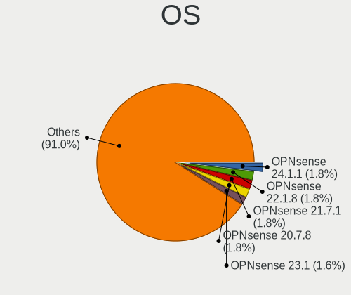

| Name                    | Computers | Percent |
|-------------------------|-----------|---------|
| OPNsense 22.1.8         | 8         | 4.47%   |
| OPNsense 21.7.1         | 8         | 4.47%   |
| OPNsense 20.7.8         | 8         | 4.47%   |
| OPNsense 21.7.3         | 7         | 3.91%   |
| OPNsense 21.1.6         | 7         | 3.91%   |
| OPNsense 21.1           | 6         | 3.35%   |
| OPNsense 21.7.7         | 5         | 2.79%   |
| OPNsense 21.7.6         | 5         | 2.79%   |
| OPNsense 21.1.5         | 5         | 2.79%   |
| OpenBSD 6.8             | 5         | 2.79%   |
| FreeBSD 13.0-p7         | 5         | 2.79%   |
| OPNsense 22.1.6         | 4         | 2.23%   |
| OPNsense 22.1.3         | 4         | 2.23%   |
| OPNsense 22.1.1         | 4         | 2.23%   |
| OPNsense 22.1           | 4         | 2.23%   |
| OPNsense 21.1.3         | 4         | 2.23%   |
| OPNsense 21.1.2         | 4         | 2.23%   |
| GhostBSD 20.04.02       | 4         | 2.23%   |
| FreeBSD 13.0            | 4         | 2.23%   |
| OPNsense 22.1.7         | 3         | 1.68%   |
| OPNsense 22.1.4         | 3         | 1.68%   |
| OPNsense 21.7.4         | 3         | 1.68%   |
| OPNsense 21.7           | 3         | 1.68%   |
| OPNsense 21.1.8         | 3         | 1.68%   |
| OPNsense 21.1.7         | 3         | 1.68%   |
| OPNsense 21.1.4         | 3         | 1.68%   |
| OpenBSD 7.0             | 3         | 1.68%   |
| OpenBSD 6.7             | 3         | 1.68%   |
| helloSystem 0.5.0       | 3         | 1.68%   |
| FreeBSD 12.1-p8         | 3         | 1.68%   |
| OPNsense 22.1.5         | 2         | 1.12%   |
| OPNsense 22.1.2         | 2         | 1.12%   |
| OPNsense 21.7.5         | 2         | 1.12%   |
| OPNsense 21.1.9         | 2         | 1.12%   |
| FreeBSD 14.0-CURRENT    | 2         | 1.12%   |
| FreeBSD 13.0-STABLE     | 2         | 1.12%   |
| FreeBSD 13.0-p5         | 2         | 1.12%   |
| FreeBSD 12.2-p4         | 2         | 1.12%   |
| FreeBSD 12.2-p2         | 2         | 1.12%   |
| FreeBSD 12.2            | 2         | 1.12%   |
| FreeBSD 12.1-STABLE     | 2         | 1.12%   |
| FreeBSD 12.1-p5         | 2         | 1.12%   |
| FreeBSD 12.1            | 2         | 1.12%   |
| FreeBSD 11.4-p9         | 2         | 1.12%   |
| TrueNAS 12.2-p6         | 1         | 0.56%   |
| TrueNAS 12.2-p12        | 1         | 0.56%   |
| OPNsense 22.1.9         | 1         | 0.56%   |
| OPNsense 21.1.1         | 1         | 0.56%   |
| OPNsense 20.7.5         | 1         | 0.56%   |
| OpenBSD 6.9             | 1         | 0.56%   |
| helloSystem 0.6.0       | 1         | 0.56%   |
| helloSystem 0.4.0       | 1         | 0.56%   |
| GhostBSD 21.08.27       | 1         | 0.56%   |
| FreeBSD 13.1-STABLE     | 1         | 0.56%   |
| FreeBSD 13.1-PRERELEASE | 1         | 0.56%   |
| FreeBSD 13.0-p6         | 1         | 0.56%   |
| FreeBSD 13.0-p2         | 1         | 0.56%   |
| FreeBSD 13.0-p1         | 1         | 0.56%   |
| FreeBSD 12.2-STABLE     | 1         | 0.56%   |
| FreeBSD 12.2-p1         | 1         | 0.56%   |

OS Family
---------

OS without a version

| Name        | Computers | Percent |
|-------------|-----------|---------|
| OPNsense    | 86        | 60.56%  |
| FreeBSD     | 32        | 22.54%  |
| OpenBSD     | 12        | 8.45%   |
| helloSystem | 5         | 3.52%   |
| GhostBSD    | 5         | 3.52%   |
| TrueNAS     | 2         | 1.41%   |

Arch
----

OS architecture (x86_64, i586, etc.)

| Name    | Computers | Percent |
|---------|-----------|---------|
| amd64   | 137       | 96.48%  |
| sparc64 | 2         | 1.41%   |
| arm64   | 2         | 1.41%   |
| i386    | 1         | 0.7%    |

DE
--

Desktop Environment

| Name         | Computers | Percent |
|--------------|-----------|---------|
| Console      | 108       | 75%     |
| KDE5         | 8         | 5.56%   |
| MATE         | 5         | 3.47%   |
| helloDesktop | 5         | 3.47%   |
| fvwm         | 5         | 3.47%   |
| i3           | 4         | 2.78%   |
| XFCE         | 3         | 2.08%   |
| TWM          | 2         | 1.39%   |
| LXQt         | 1         | 0.69%   |
| LXDE         | 1         | 0.69%   |
| GNOME        | 1         | 0.69%   |
| CDE          | 1         | 0.69%   |

Display Server
--------------

X11 or Wayland

| Name    | Computers | Percent |
|---------|-----------|---------|
| Console | 110       | 76.92%  |
| X11     | 33        | 23.08%  |

Display Manager
---------------

SDDM, LightDM, etc.

| Name    | Computers | Percent |
|---------|-----------|---------|
| Console | 120       | 83.92%  |
| SLiM    | 11        | 7.69%   |
| LightDM | 7         | 4.9%    |
| SDDM    | 2         | 1.4%    |
| GDM     | 2         | 1.4%    |
| XDM     | 1         | 0.7%    |

OS Lang
-------

Language

| Lang    | Computers | Percent |
|---------|-----------|---------|
| Unknown | 106       | 74.13%  |
| en_US   | 17        | 11.89%  |
| C       | 15        | 10.49%  |
| de_CH   | 3         | 2.1%    |
| de_DE   | 2         | 1.4%    |

Boot Mode
---------

EFI or BIOS

| Mode | Computers | Percent |
|------|-----------|---------|
| EFI  | 121       | 85.21%  |
| BIOS | 21        | 14.79%  |

Filesystem
----------

Type of filesystem

| Type | Computers | Percent |
|------|-----------|---------|
| Ufs  | 79        | 54.86%  |
| Zfs  | 53        | 36.81%  |
| Ffs  | 12        | 8.33%   |

Part. scheme
------------

Scheme of partitioning

| Type    | Computers | Percent |
|---------|-----------|---------|
| GPT     | 128       | 90.14%  |
| MBR     | 13        | 9.15%   |
| Unknown | 1         | 0.7%    |

Board
-----

Vendor
------

Motherboard manufacturer

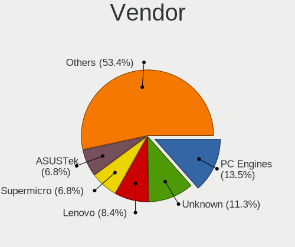

| Name                    | Computers | Percent |
|-------------------------|-----------|---------|
| PC Engines              | 28        | 19.72%  |
| Lenovo                  | 14        | 9.86%   |
| ASUSTek Computer        | 10        | 7.04%   |
| Supermicro              | 9         | 6.34%   |
| Hewlett-Packard         | 9         | 6.34%   |
| Unknown                 | 9         | 6.34%   |
| Gigabyte Technology     | 7         | 4.93%   |
| Dell                    | 7         | 4.93%   |
| ASRock                  | 6         | 4.23%   |
| Sophos                  | 5         | 3.52%   |
| Intel                   | 5         | 3.52%   |
| Shuttle                 | 3         | 2.11%   |
| Protectli               | 3         | 2.11%   |
| Apple                   | 3         | 2.11%   |
| Sun                     | 2         | 1.41%   |
| HUAWEI                  | 2         | 1.41%   |
| Fujitsu                 | 2         | 1.41%   |
| Deciso                  | 2         | 1.41%   |
| BESSTAR Tech            | 2         | 1.41%   |
| ASRockRack              | 2         | 1.41%   |
| Acer                    | 2         | 1.41%   |
| ZOTAC                   | 1         | 0.7%    |
| YANYU                   | 1         | 0.7%    |
| Raspberry Pi Foundation | 1         | 0.7%    |
| Panasonic               | 1         | 0.7%    |
| MW                      | 1         | 0.7%    |
| HPE                     | 1         | 0.7%    |
| CompuLab                | 1         | 0.7%    |
| Casper                  | 1         | 0.7%    |
| Biostar                 | 1         | 0.7%    |
| ADI Engineering         | 1         | 0.7%    |

Model
-----

Motherboard model

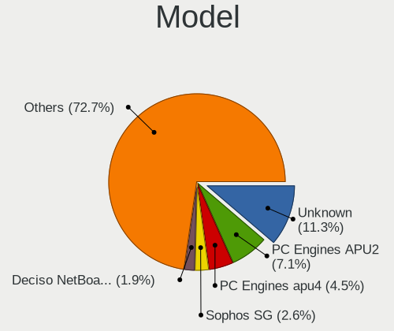

| Name                                       | Computers | Percent |
|--------------------------------------------|-----------|---------|
| PC Engines APU2                            | 15        | 10.56%  |
| PC Engines apu4                            | 11        | 7.75%   |
| Unknown                                    | 9         | 6.34%   |
| Supermicro Super Server                    | 3         | 2.11%   |
| Sophos SG                                  | 3         | 2.11%   |
| Protectli FW6                              | 3         | 2.11%   |
| ASRock A320M-ITX                           | 3         | 2.11%   |
| Shuttle DS10U                              | 2         | 1.41%   |
| Lenovo Yoga Slim 7 Pro 14ACH5 82MS         | 2         | 1.41%   |
| HUAWEI MACH-WX9                            | 2         | 1.41%   |
| Fujitsu PRIMERGY RX2530 M5                 | 2         | 1.41%   |
| Dell Precision 3440                        | 2         | 1.41%   |
| ZOTAC ZBOX-CI327NANO-GS-01                 | 1         | 0.7%    |
| YANYU D19SL_B                              | 1         | 0.7%    |
| Supermicro X9SCL/X9SCM                     | 1         | 0.7%    |
| Supermicro X10SLL-F                        | 1         | 0.7%    |
| Supermicro SYS-1019D-4C-FHN13TP            | 1         | 0.7%    |
| Supermicro PDSML                           | 1         | 0.7%    |
| Supermicro A1SRM-2758F                     | 1         | 0.7%    |
| Supermicro A1SAi                           | 1         | 0.7%    |
| Sun SUNW,Sun-Blade-1500                    | 1         | 0.7%    |
| Sun SUNW,Sun-Blade-100                     | 1         | 0.7%    |
| Sophos XG                                  | 1         | 0.7%    |
| Sophos UTM                                 | 1         | 0.7%    |
| Shuttle DS77U                              | 1         | 0.7%    |
| RPi Raspberry Pi                           | 1         | 0.7%    |
| PC Engines apu6                            | 1         | 0.7%    |
| PC Engines APU3                            | 1         | 0.7%    |
| Panasonic CF-19ADUAX1M                     | 1         | 0.7%    |
| MW GMLK-2_5G4L                             | 1         | 0.7%    |
| Lenovo Yoga 720-13IKB 81C3                 | 1         | 0.7%    |
| Lenovo ThinkPad X250 20CMCTO1WW            | 1         | 0.7%    |
| Lenovo ThinkPad X1 Carbon Gen 9 20XWCTO1WW | 1         | 0.7%    |
| Lenovo ThinkPad X1 Carbon Gen 8 20U9CTO1WW | 1         | 0.7%    |
| Lenovo ThinkPad X1 Carbon 3rd 20BTS09900   | 1         | 0.7%    |
| Lenovo ThinkPad T490s 20NYS3TU00           | 1         | 0.7%    |
| Lenovo ThinkPad T490 20N2CTO1WW            | 1         | 0.7%    |
| Lenovo ThinkPad T470s W10DG 20JTS0A900     | 1         | 0.7%    |
| Lenovo ThinkPad T430 2349H2G               | 1         | 0.7%    |
| Lenovo ThinkPad T420 4237A12               | 1         | 0.7%    |
| Lenovo ThinkCentre M75t Gen 2 11KECTO1WW   | 1         | 0.7%    |
| Lenovo IdeaPad Y700-15ISK 80NV             | 1         | 0.7%    |
| Intel Q3XXG4-P V1.0                        | 1         | 0.7%    |
| Intel NUC8i5BEH                            | 1         | 0.7%    |
| Intel NUC7i7BNB J31145-302                 | 1         | 0.7%    |
| Intel HURONRIVER                           | 1         | 0.7%    |
| Intel D54250WYK H13922-303                 | 1         | 0.7%    |
| HPE ProLiant MicroServer Gen10             | 1         | 0.7%    |
| HP Z620 Workstation                        | 1         | 0.7%    |
| HP Z600 Workstation                        | 1         | 0.7%    |
| HP ProLiant ML350p Gen8                    | 1         | 0.7%    |
| HP ProLiant MicroServer Gen8               | 1         | 0.7%    |
| HP EliteBook 840 G3                        | 1         | 0.7%    |
| HP Compaq Elite 8300 SFF                   | 1         | 0.7%    |
| HP Compaq Elite 8300 CMT                   | 1         | 0.7%    |
| HP Compaq 8200 Elite SFF PC                | 1         | 0.7%    |
| HP Compaq 8200 Elite CMT PC                | 1         | 0.7%    |
| Gigabyte X570 AORUS MASTER                 | 1         | 0.7%    |
| Gigabyte X399 DESIGNARE EX                 | 1         | 0.7%    |
| Gigabyte H97N-WIFI                         | 1         | 0.7%    |

Model Family
------------

Motherboard model prefix

| Name                            | Computers | Percent |
|---------------------------------|-----------|---------|
| PC Engines APU2                 | 15        | 10.56%  |
| PC Engines apu4                 | 11        | 7.75%   |
| Lenovo ThinkPad                 | 9         | 6.34%   |
| Unknown                         | 9         | 6.34%   |
| HP Compaq                       | 4         | 2.82%   |
| Supermicro Super                | 3         | 2.11%   |
| Sophos SG                       | 3         | 2.11%   |
| Protectli FW6                   | 3         | 2.11%   |
| Lenovo Yoga                     | 3         | 2.11%   |
| Dell Precision                  | 3         | 2.11%   |
| ASRock A320M-ITX                | 3         | 2.11%   |
| Sun SUNW                        | 2         | 1.41%   |
| Shuttle DS10U                   | 2         | 1.41%   |
| HUAWEI MACH-WX9                 | 2         | 1.41%   |
| HP ProLiant                     | 2         | 1.41%   |
| Fujitsu PRIMERGY                | 2         | 1.41%   |
| Acer Aspire                     | 2         | 1.41%   |
| ZOTAC ZBOX-CI327NANO-GS-01      | 1         | 0.7%    |
| YANYU D19SL                     | 1         | 0.7%    |
| Supermicro X9SCL                | 1         | 0.7%    |
| Supermicro X10SLL-F             | 1         | 0.7%    |
| Supermicro SYS-1019D-4C-FHN13TP | 1         | 0.7%    |
| Supermicro PDSML                | 1         | 0.7%    |
| Supermicro A1SRM-2758F          | 1         | 0.7%    |
| Supermicro A1SAi                | 1         | 0.7%    |
| Sophos XG                       | 1         | 0.7%    |
| Sophos UTM                      | 1         | 0.7%    |
| Shuttle DS77U                   | 1         | 0.7%    |
| RPi Raspberry                   | 1         | 0.7%    |
| PC Engines apu6                 | 1         | 0.7%    |
| PC Engines APU3                 | 1         | 0.7%    |
| Panasonic CF-19ADUAX1M          | 1         | 0.7%    |
| MW GMLK-2                       | 1         | 0.7%    |
| Lenovo ThinkCentre              | 1         | 0.7%    |
| Lenovo IdeaPad                  | 1         | 0.7%    |
| Intel Q3XXG4-P                  | 1         | 0.7%    |
| Intel NUC8i5BEH                 | 1         | 0.7%    |
| Intel NUC7i7BNB                 | 1         | 0.7%    |
| Intel HURONRIVER                | 1         | 0.7%    |
| Intel D54250WYK                 | 1         | 0.7%    |
| HPE ProLiant                    | 1         | 0.7%    |
| HP Z620                         | 1         | 0.7%    |
| HP Z600                         | 1         | 0.7%    |
| HP EliteBook                    | 1         | 0.7%    |
| Gigabyte X570                   | 1         | 0.7%    |
| Gigabyte X399                   | 1         | 0.7%    |
| Gigabyte H97N-WIFI              | 1         | 0.7%    |
| Gigabyte H67A-UD3H-B3           | 1         | 0.7%    |
| Gigabyte BRi3(H)-10110          | 1         | 0.7%    |
| Gigabyte B450M                  | 1         | 0.7%    |
| Gigabyte 990FXA-UD3             | 1         | 0.7%    |
| Dell XPS420                     | 1         | 0.7%    |
| Dell XPS                        | 1         | 0.7%    |
| Dell OptiPlex                   | 1         | 0.7%    |
| Dell Latitude                   | 1         | 0.7%    |
| Deciso Netboard                 | 1         | 0.7%    |
| Deciso DEC2700                  | 1         | 0.7%    |
| CompuLab fitlet2                | 1         | 0.7%    |
| Casper EXCALIBUR                | 1         | 0.7%    |
| Biostar H61MHV2                 | 1         | 0.7%    |

MFG Year
--------

Motherboard manufacture year

| Year    | Computers | Percent |
|---------|-----------|---------|
| 2018    | 26        | 18.31%  |
| 2020    | 20        | 14.08%  |
| 2016    | 20        | 14.08%  |
| 2021    | 14        | 9.86%   |
| 2017    | 10        | 7.04%   |
| 2019    | 8         | 5.63%   |
| 2015    | 8         | 5.63%   |
| 2013    | 8         | 5.63%   |
| 2012    | 6         | 4.23%   |
| 2011    | 6         | 4.23%   |
| 2014    | 5         | 3.52%   |
| Unknown | 5         | 3.52%   |
| 2022    | 2         | 1.41%   |
| 2008    | 2         | 1.41%   |
| 2009    | 1         | 0.7%    |
| 2007    | 1         | 0.7%    |

Form Factor
-----------

Physical design of the computer

| Name           | Computers | Percent |
|----------------|-----------|---------|
| Desktop        | 92        | 64.79%  |
| Notebook       | 27        | 19.01%  |
| Server         | 8         | 5.63%   |
| Mini pc        | 7         | 4.93%   |
| Firewall       | 5         | 3.52%   |
| System on chip | 2         | 1.41%   |
| Convertible    | 1         | 0.7%    |

Coreboot
--------

Have coreboot on board

| Used | Computers | Percent |
|------|-----------|---------|
| No   | 110       | 77.46%  |
| Yes  | 32        | 22.54%  |

RAM Size
--------

Total RAM memory

| Size in GB  | Computers | Percent |
|-------------|-----------|---------|
| 16.01-24.0  | 42        | 29.37%  |
| 8.01-16.0   | 35        | 24.48%  |
| 4.01-8.0    | 34        | 23.78%  |
| 32.01-64.0  | 16        | 11.19%  |
| 64.01-256.0 | 7         | 4.9%    |
| 2.01-3.0    | 3         | 2.1%    |
| 0.51-1.0    | 2         | 1.4%    |
| 3.01-4.0    | 1         | 0.7%    |
| 1.01-2.0    | 1         | 0.7%    |
| 0.01-0.5    | 1         | 0.7%    |
| Unknown     | 1         | 0.7%    |

RAM Used
--------

Used RAM memory

| Used GB     | Computers | Percent |
|-------------|-----------|---------|
| 0.01-0.5    | 64        | 43.24%  |
| 0.51-1.0    | 45        | 30.41%  |
| 1.01-2.0    | 16        | 10.81%  |
| 2.01-3.0    | 9         | 6.08%   |
| 4.01-8.0    | 3         | 2.03%   |
| 3.01-4.0    | 3         | 2.03%   |
| 0           | 3         | 2.03%   |
| 8.01-16.0   | 2         | 1.35%   |
| 64.01-256.0 | 1         | 0.68%   |
| 16.01-24.0  | 1         | 0.68%   |
| Unknown     | 1         | 0.68%   |

Total Drives
------------

Number of drives on board

| Drives | Computers | Percent |
|--------|-----------|---------|
| 1      | 100       | 69.93%  |
| 2      | 17        | 11.89%  |
| 0      | 15        | 10.49%  |
| 4      | 4         | 2.8%    |
| 6      | 3         | 2.1%    |
| 3      | 2         | 1.4%    |
| 17     | 1         | 0.7%    |
| 16     | 1         | 0.7%    |

Has CD-ROM
----------

Has CD-ROM on board

| Presented | Computers | Percent |
|-----------|-----------|---------|
| No        | 121       | 85.21%  |
| Yes       | 21        | 14.79%  |

Has Ethernet
------------

Has Ethernet on board

| Presented | Computers | Percent |
|-----------|-----------|---------|
| Yes       | 131       | 92.25%  |
| No        | 11        | 7.75%   |

Has WiFi
--------

Has WiFi module

| Presented | Computers | Percent |
|-----------|-----------|---------|
| No        | 97        | 68.31%  |
| Yes       | 45        | 31.69%  |

Has Bluetooth
-------------

Has Bluetooth module

| Presented | Computers | Percent |
|-----------|-----------|---------|
| No        | 106       | 74.65%  |
| Yes       | 36        | 25.35%  |

Location
--------

Country
-------

Geographic location (country)

| Country     | Computers | Percent |
|-------------|-----------|---------|
| Switzerland | 142       | 100%    |

City
----

Geographic location (city)

| City                   | Computers | Percent |
|------------------------|-----------|---------|
| Zurich                 | 43        | 26.54%  |
| Gachnang               | 7         | 4.32%   |
| Gordola                | 5         | 3.09%   |
| St. Moritz             | 4         | 2.47%   |
| Lenzburg               | 4         | 2.47%   |
| Winterthur             | 3         | 1.85%   |
| Lausanne               | 3         | 1.85%   |
| Basel                  | 3         | 1.85%   |
| Wallisellen            | 2         | 1.23%   |
| Therwil                | 2         | 1.23%   |
| St. Gallen             | 2         | 1.23%   |
| Riehen                 | 2         | 1.23%   |
| Ottenbach              | 2         | 1.23%   |
| Oensingen              | 2         | 1.23%   |
| Munchenstein           | 2         | 1.23%   |
| Mettmenstetten         | 2         | 1.23%   |
| Lucerne                | 2         | 1.23%   |
| Geneva                 | 2         | 1.23%   |
| Eiken                  | 2         | 1.23%   |
| Dinhard                | 2         | 1.23%   |
| Corcelles-pres-Payerne | 2         | 1.23%   |
| Buchs                  | 2         | 1.23%   |
| Zufikon                | 1         | 0.62%   |
| Yverdon-les-Bains      | 1         | 0.62%   |
| Yens                   | 1         | 0.62%   |
| Worblaufen             | 1         | 0.62%   |
| Willisau               | 1         | 0.62%   |
| Wetzikon               | 1         | 0.62%   |
| Wettswil               | 1         | 0.62%   |
| Welschenrohr           | 1         | 0.62%   |
| Uster                  | 1         | 0.62%   |
| Trogen                 | 1         | 0.62%   |
| Suhr                   | 1         | 0.62%   |
| Steckborn              | 1         | 0.62%   |
| Sitterdorf             | 1         | 0.62%   |
| Rumlang                | 1         | 0.62%   |
| Root                   | 1         | 0.62%   |
| Romanens               | 1         | 0.62%   |
| Riviera                | 1         | 0.62%   |
| Rickenbach bei Wil     | 1         | 0.62%   |
| Richterswil            | 1         | 0.62%   |
| Renens                 | 1         | 0.62%   |
| Pfaeffikon             | 1         | 0.62%   |
| Opfikon                | 1         | 0.62%   |
| Onex                   | 1         | 0.62%   |
| Oftringen              | 1         | 0.62%   |
| Oetwil am See          | 1         | 0.62%   |
| Niederbipp             | 1         | 0.62%   |
| Nidau                  | 1         | 0.62%   |
| Neuenegg               | 1         | 0.62%   |
| Naters                 | 1         | 0.62%   |
| Moosseedorf            | 1         | 0.62%   |
| Mendrisio              | 1         | 0.62%   |
| Mellingen              | 1         | 0.62%   |
| Lupfig                 | 1         | 0.62%   |
| Lohnstorf              | 1         | 0.62%   |
| Liestal                | 1         | 0.62%   |
| Langnau am Albis       | 1         | 0.62%   |
| La Tour-de-Peilz       | 1         | 0.62%   |
| Jona                   | 1         | 0.62%   |

Drives
------

Drive Vendor
------------

Hard drive vendors

| Vendor              | Computers | Drives | Percent |
|---------------------|-----------|--------|---------|
| Samsung Electronics | 34        | 53     | 22.97%  |
| WDC                 | 19        | 27     | 12.84%  |
| Phison              | 13        | 16     | 8.78%   |
| Kingston            | 11        | 11     | 7.43%   |
| Seagate             | 9         | 11     | 6.08%   |
| Intel               | 9         | 25     | 6.08%   |
| Crucial             | 6         | 12     | 4.05%   |
| Hoodisk             | 5         | 6      | 3.38%   |
| Toshiba             | 4         | 5      | 2.7%    |
| SanDisk             | 4         | 6      | 2.7%    |
| Corsair             | 4         | 6      | 2.7%    |
| Transcend           | 3         | 3      | 2.03%   |
| HPT                 | 3         | 35     | 2.03%   |
| Hitachi             | 3         | 3      | 2.03%   |
| ShiJi               | 2         | 3      | 1.35%   |
| NVMe                | 2         | 2      | 1.35%   |
| FTS                 | 2         | 2      | 1.35%   |
| China               | 2         | 3      | 1.35%   |
| SPCC                | 1         | 2      | 0.68%   |
| OPENBSD             | 1         | 1      | 0.68%   |
| OCZ                 | 1         | 2      | 0.68%   |
| Micron Technology   | 1         | 2      | 0.68%   |
| LITEON              | 1         | 9      | 0.68%   |
| KIOXIA              | 1         | 1      | 0.68%   |
| KingSpec            | 1         | 1      | 0.68%   |
| Hewlett-Packard     | 1         | 5      | 0.68%   |
| Gigabyte Technology | 1         | 1      | 0.68%   |
| FORESEE             | 1         | 1      | 0.68%   |
| BIWIN               | 1         | 1      | 0.68%   |
| Apple               | 1         | 1      | 0.68%   |
| A-DATA Technology   | 1         | 1      | 0.68%   |

Drive Model
-----------

Hard drive models

| Model                                | Computers | Percent |
|--------------------------------------|-----------|---------|
| Phison SATA SSD 16GB                 | 10        | 5.35%   |
| Samsung SSD 860 EVO 250GB            | 5         | 2.67%   |
| Hoodisk SSD 32GB                     | 5         | 2.67%   |
| Samsung SSD 860 PRO 256GB            | 3         | 1.6%    |
| Phison SATA SSD 32GB                 | 3         | 1.6%    |
| Kingston RBUSNS8180DS3128GH 128GB    | 3         | 1.6%    |
| HPT DISK 0_3 3TB                     | 3         | 1.6%    |
| HPT DISK 0_2 3TB                     | 3         | 1.6%    |
| HPT DISK 0_1 6TB                     | 3         | 1.6%    |
| HPT DISK 0_0 4TB                     | 3         | 1.6%    |
| WDC WDS240G2G0A-00JH30 240GB         | 2         | 1.07%   |
| WDC WDS120G2G0B-00EPW0 120GB         | 2         | 1.07%   |
| WDC WD6002FRYZ-01WD5B1 6TB           | 2         | 1.07%   |
| ShiJi SSD 128GB                      | 2         | 1.07%   |
| Samsung SSD 960 EVO 250GB            | 2         | 1.07%   |
| Samsung SSD 850 EVO 250GB            | 2         | 1.07%   |
| Samsung MZVLB512HAJQ-00000 512GB     | 2         | 1.07%   |
| Kingston SA400S37120G 120GB          | 2         | 1.07%   |
| Intel SSDSA2BW160G3H 160GB           | 2         | 1.07%   |
| HPT DISK 0_9 3TB                     | 2         | 1.07%   |
| HPT DISK 0_8 3TB                     | 2         | 1.07%   |
| HPT DISK 0_7 3TB                     | 2         | 1.07%   |
| HPT DISK 0_6 3TB                     | 2         | 1.07%   |
| HPT DISK 0_5 18TB                    | 2         | 1.07%   |
| HPT DISK 0_4 18TB                    | 2         | 1.07%   |
| HPT DISK 0_14 3TB                    | 2         | 1.07%   |
| HPT DISK 0_13 2TB                    | 2         | 1.07%   |
| HPT DISK 0_12 1TB                    | 2         | 1.07%   |
| HPT DISK 0_11 1TB                    | 2         | 1.07%   |
| HPT DISK 0_10 1TB                    | 2         | 1.07%   |
| Hitachi HDS721050CLA360 500GB        | 2         | 1.07%   |
| FTS PRAID EP580i 2.8TB               | 2         | 1.07%   |
| Crucial CT250MX500SSD1 250GB         | 2         | 1.07%   |
| WDC WDS250G2B0C-00PXH0 250GB         | 1         | 0.53%   |
| WDC WDS240G2G0B-00EPW0 240GB         | 1         | 0.53%   |
| WDC WDS120G2G0A-00JH30 120GB         | 1         | 0.53%   |
| WDC WD5000BEKT-00KA9T0 500GB         | 1         | 0.53%   |
| WDC WD40EFRX-68WT0N0 4TB             | 1         | 0.53%   |
| WDC WD30EFRX-68EUZN0 3TB             | 1         | 0.53%   |
| WDC WD2503ABYX-01WERA1 256GB         | 1         | 0.53%   |
| WDC WD2002FYPS-01U1B0 2TB            | 1         | 0.53%   |
| WDC WD10SPZX-21Z10T0 1TB             | 1         | 0.53%   |
| WDC WD10JPVX-00JC3T0 1TB             | 1         | 0.53%   |
| WDC WD10EALX-009BA0 1TB              | 1         | 0.53%   |
| WDC PC SN730 SDBQNTY-256G-1001 256GB | 1         | 0.53%   |
| WDC PC SN730 SDBPNTY-1T00-1101 1TB   | 1         | 0.53%   |
| WDC PC SN720 SDAQNTW-512G-1001 512GB | 1         | 0.53%   |
| Transcend TS64GMSA230S 64GB          | 1         | 0.53%   |
| Transcend TS256GMTS952T2 256GB       | 1         | 0.53%   |
| Transcend TS256GMTE652T2 256GB       | 1         | 0.53%   |
| Toshiba TR200 240GB                  | 1         | 0.53%   |
| Toshiba THNSFJ256GCSU 256GB          | 1         | 0.53%   |
| Toshiba MQ03UBB300 3TB               | 1         | 0.53%   |
| Toshiba MK1059GSM 1TB                | 1         | 0.53%   |
| Toshiba DT01ACA200 2TB               | 1         | 0.53%   |
| SPCC Solid State Disk 256GB          | 1         | 0.53%   |
| Seagate ST9250410AS 250GB            | 1         | 0.53%   |
| Seagate ST5000DM000-1FK178 5TB       | 1         | 0.53%   |
| Seagate ST3500413AS 500GB            | 1         | 0.53%   |
| Seagate ST3320820A 320GB             | 1         | 0.53%   |

HDD Vendor
----------

Hard disk drive vendors

| Vendor          | Computers | Drives | Percent |
|-----------------|-----------|--------|---------|
| WDC             | 9         | 15     | 28.13%  |
| Seagate         | 9         | 11     | 28.13%  |
| HPT             | 3         | 35     | 9.38%   |
| Hitachi         | 3         | 3      | 9.38%   |
| Toshiba         | 2         | 3      | 6.25%   |
| NVMe            | 2         | 2      | 6.25%   |
| OPENBSD         | 1         | 1      | 3.13%   |
| Hewlett-Packard | 1         | 5      | 3.13%   |
| China           | 1         | 1      | 3.13%   |
| Apple           | 1         | 1      | 3.13%   |

SSD Vendor
----------

Solid state drive vendors

| Vendor              | Computers | Drives | Percent |
|---------------------|-----------|--------|---------|
| Samsung Electronics | 24        | 40     | 25%     |
| Phison              | 13        | 16     | 13.54%  |
| Kingston            | 11        | 11     | 11.46%  |
| Intel               | 8         | 24     | 8.33%   |
| WDC                 | 6         | 8      | 6.25%   |
| Hoodisk             | 5         | 6      | 5.21%   |
| Crucial             | 5         | 11     | 5.21%   |
| SanDisk             | 4         | 6      | 4.17%   |
| Corsair             | 3         | 5      | 3.13%   |
| Transcend           | 2         | 2      | 2.08%   |
| Toshiba             | 2         | 2      | 2.08%   |
| ShiJi               | 2         | 3      | 2.08%   |
| FTS                 | 2         | 2      | 2.08%   |
| SPCC                | 1         | 2      | 1.04%   |
| OCZ                 | 1         | 2      | 1.04%   |
| Micron Technology   | 1         | 2      | 1.04%   |
| LITEON              | 1         | 9      | 1.04%   |
| KingSpec            | 1         | 1      | 1.04%   |
| FORESEE             | 1         | 1      | 1.04%   |
| China               | 1         | 2      | 1.04%   |
| BIWIN               | 1         | 1      | 1.04%   |
| A-DATA Technology   | 1         | 1      | 1.04%   |

Drive Kind
----------

HDD or SSD

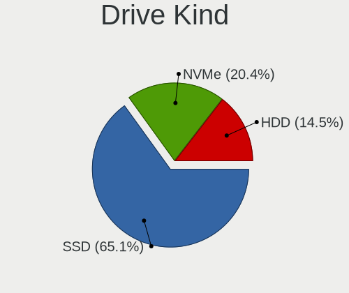

| Kind | Computers | Drives | Percent |
|------|-----------|--------|---------|
| SSD  | 94        | 157    | 66.67%  |
| HDD  | 25        | 77     | 17.73%  |
| NVMe | 22        | 23     | 15.6%   |

Drive Connector
---------------

SATA, SAS, NVMe, etc.

| Type | Computers | Drives | Percent |
|------|-----------|--------|---------|
| SATA | 108       | 234    | 83.08%  |
| NVMe | 22        | 23     | 16.92%  |

Drive Size
----------

Size of hard drive

| Size in TB | Computers | Drives | Percent |
|------------|-----------|--------|---------|
| 0.01-0.5   | 99        | 158    | 70.71%  |
| 0.51-1.0   | 15        | 29     | 10.71%  |
| 2.01-3.0   | 7         | 21     | 5%      |
| 1.01-2.0   | 7         | 8      | 5%      |
| 4.01-10.0  | 6         | 10     | 4.29%   |
| 3.01-4.0   | 4         | 4      | 2.86%   |
| 10.01-20.0 | 2         | 4      | 1.43%   |

Space Total
-----------

Amount of disk space available on the file system

| Size in GB | Computers | Percent |
|------------|-----------|---------|
| 101-250    | 63        | 43.75%  |
| 1-20       | 23        | 15.97%  |
| 51-100     | 17        | 11.81%  |
| 251-500    | 15        | 10.42%  |
| 21-50      | 14        | 9.72%   |
| 501-1000   | 11        | 7.64%   |
| 1001-2000  | 1         | 0.69%   |

Space Used
----------

Amount of used disk space

| Used GB | Computers | Percent |
|---------|-----------|---------|
| 1-20    | 132       | 89.19%  |
| 21-50   | 9         | 6.08%   |
| 51-100  | 5         | 3.38%   |
| 251-500 | 1         | 0.68%   |
| 101-250 | 1         | 0.68%   |

Malfunc. Drives
---------------

Drive models with a malfunction

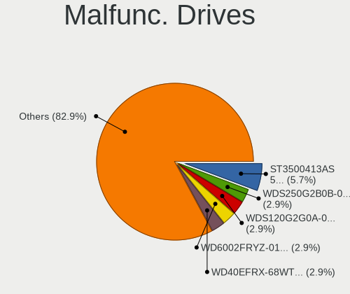

| Model                         | Computers | Drives | Percent |
|-------------------------------|-----------|--------|---------|
| WDC WDS120G2G0A-00JH30 120GB  | 1         | 1      | 7.69%   |
| WDC WD6002FRYZ-01WD5B1 6TB    | 1         | 5      | 7.69%   |
| WDC WD40EFRX-68WT0N0 4TB      | 1         | 1      | 7.69%   |
| WDC WD2002FYPS-01U1B0 2TB     | 1         | 1      | 7.69%   |
| Toshiba MK1059GSM 1TB         | 1         | 1      | 7.69%   |
| Seagate ST3500413AS 500GB     | 1         | 1      | 7.69%   |
| Kingston SV300S37A120G 120GB  | 1         | 1      | 7.69%   |
| Intel SSDSCKKF256G8H 256GB    | 1         | 2      | 7.69%   |
| Intel SSDSC2BW240A4 240GB     | 1         | 1      | 7.69%   |
| Intel SSDSA2M160G2GC 160GB    | 1         | 1      | 7.69%   |
| Intel SSDSA2BW160G3H 160GB    | 1         | 5      | 7.69%   |
| Hitachi HDS721050CLA660 500GB | 1         | 1      | 7.69%   |
| Corsair Force 3 SSD 120GB     | 1         | 2      | 7.69%   |

Malfunc. Drive Vendor
---------------------

Vendors of faulty drives

| Vendor   | Computers | Drives | Percent |
|----------|-----------|--------|---------|
| Intel    | 4         | 9      | 33.33%  |
| WDC      | 3         | 8      | 25%     |
| Toshiba  | 1         | 1      | 8.33%   |
| Seagate  | 1         | 1      | 8.33%   |
| Kingston | 1         | 1      | 8.33%   |
| Hitachi  | 1         | 1      | 8.33%   |
| Corsair  | 1         | 2      | 8.33%   |

Malfunc. HDD Vendor
-------------------

Vendors of faulty HDD drives

| Vendor  | Computers | Drives | Percent |
|---------|-----------|--------|---------|
| WDC     | 2         | 7      | 40%     |
| Toshiba | 1         | 1      | 20%     |
| Seagate | 1         | 1      | 20%     |
| Hitachi | 1         | 1      | 20%     |

Malfunc. Drive Kind
-------------------

Kinds of faulty drives

| Kind | Computers | Drives | Percent |
|------|-----------|--------|---------|
| SSD  | 7         | 13     | 63.64%  |
| HDD  | 4         | 10     | 36.36%  |

Failed Drives
-------------

Failed drive models

Zero info for selected period =(

Failed Drive Vendor
-------------------

Failed drive vendors

Zero info for selected period =(

Drive Status
------------

Number of failed and malfunc. drives

| Status   | Computers | Drives | Percent |
|----------|-----------|--------|---------|
| Works    | 115       | 188    | 85.82%  |
| Malfunc  | 10        | 23     | 7.46%   |
| Detected | 9         | 46     | 6.72%   |

Storage controller
------------------

Storage Vendor
--------------

Storage controller vendors

| Vendor                    | Computers | Percent |
|---------------------------|-----------|---------|
| Intel                     | 81        | 49.39%  |
| AMD                       | 43        | 26.22%  |
| Samsung Electronics       | 14        | 8.54%   |
| SanDisk                   | 5         | 3.05%   |
| HighPoint Technologies    | 3         | 1.83%   |
| ASMedia Technology        | 3         | 1.83%   |
| ULi Electronics           | 2         | 1.22%   |
| Phison Electronics        | 2         | 1.22%   |
| Marvell Technology Group  | 2         | 1.22%   |
| KIOXIA                    | 2         | 1.22%   |
| Chelsio Communications    | 2         | 1.22%   |
| Broadcom / LSI            | 2         | 1.22%   |
| Micron/Crucial Technology | 1         | 0.61%   |
| Hewlett-Packard           | 1         | 0.61%   |
| Unknown                   | 1         | 0.61%   |

Storage Model
-------------

Storage controller models

| Model                                                                          | Computers | Percent |
|--------------------------------------------------------------------------------|-----------|---------|
| AMD FCH SATA Controller [AHCI mode]                                            | 30        | 15.96%  |
| AMD FCH SATA Controller [IDE mode]                                             | 9         | 4.79%   |
| Intel 8 Series/C220 Series Chipset Family 6-port SATA Controller 1 [AHCI mode] | 7         | 3.72%   |
| Intel Sunrise Point-LP SATA Controller [AHCI mode]                             | 6         | 3.19%   |
| Samsung NVMe SSD Controller SM981/PM981/PM983                                  | 5         | 2.66%   |
| Samsung NVMe SSD Controller SM961/PM961/SM963                                  | 5         | 2.66%   |
| Intel Comet Lake SATA AHCI Controller                                          | 5         | 2.66%   |
| Intel 6 Series/C200 Series Chipset Family 6 port Desktop SATA AHCI Controller  | 5         | 2.66%   |
| Intel Cannon Point-LP SATA Controller [AHCI Mode]                              | 4         | 2.13%   |
| Intel Atom processor C2000 AHCI SATA3 Controller                               | 4         | 2.13%   |
| Intel 7 Series/C210 Series Chipset Family 6-port SATA Controller [AHCI mode]   | 4         | 2.13%   |
| Samsung NVMe SSD Controller PM9A1/PM9A3/980PRO                                 | 3         | 1.6%    |
| Intel Q170/Q150/B150/H170/H110/Z170/CM236 Chipset SATA Controller [AHCI Mode]  | 3         | 1.6%    |
| Intel Celeron/Pentium Silver Processor SATA Controller                         | 3         | 1.6%    |
| Intel C620 Series Chipset Family SSATA Controller [AHCI mode]                  | 3         | 1.6%    |
| Intel Atom Processor C3000 Series SATA Controller 1                            | 3         | 1.6%    |
| Intel Atom Processor C3000 Series SATA Controller 0                            | 3         | 1.6%    |
| Intel Atom processor C2000 AHCI SATA2 Controller                               | 3         | 1.6%    |
| Intel 82801 Mobile SATA Controller [RAID mode]                                 | 3         | 1.6%    |
| Intel 7 Series Chipset Family 6-port SATA Controller [AHCI mode]               | 3         | 1.6%    |
| Intel 6 Series/C200 Series Chipset Family 6 port Mobile SATA AHCI Controller   | 3         | 1.6%    |
| ASMedia ASM1062 Serial ATA Controller                                          | 3         | 1.6%    |
| AMD FCH SATA Controller D                                                      | 3         | 1.6%    |
| ULi M5229 IDE                                                                  | 2         | 1.06%   |
| SanDisk WD Black SN750 / PC SN730 NVMe SSD                                     | 2         | 1.06%   |
| Intel Wildcat Point-LP SATA Controller [AHCI Mode]                             | 2         | 1.06%   |
| Intel NM10/ICH7 Family SATA Controller [AHCI mode]                             | 2         | 1.06%   |
| Intel Celeron N3350/Pentium N4200/Atom E3900 Series SATA AHCI Controller       | 2         | 1.06%   |
| Intel C620 Series Chipset Family SATA Controller [AHCI mode]                   | 2         | 1.06%   |
| Intel 82801G (ICH7 Family) IDE Controller                                      | 2         | 1.06%   |
| Intel 8 Series SATA Controller 1 [AHCI mode]                                   | 2         | 1.06%   |
| HighPoint RocketRAID 2760 SAS Controller                                       | 2         | 1.06%   |
| Broadcom / LSI MegaRAID Tri-Mode SAS3516                                       | 2         | 1.06%   |
| AMD 500 Series Chipset SATA Controller                                         | 2         | 1.06%   |
| AMD 400 Series Chipset SATA Controller                                         | 2         | 1.06%   |
| Unknown                                                                        | 2         | 1.06%   |
| SanDisk WD Blue SN550 NVMe SSD                                                 | 1         | 0.53%   |
| SanDisk WD Black NVMe SSD                                                      | 1         | 0.53%   |
| SanDisk WD Black 2018/SN750 / PC SN720 NVMe SSD                                | 1         | 0.53%   |
| Samsung SM951 AHCI                                                             | 1         | 0.53%   |
| Phison PS5013 E13 NVMe Controller                                              | 1         | 0.53%   |
| Phison E16 PCIe4 NVMe Controller                                               | 1         | 0.53%   |
| Marvell Group 88SE9230 PCIe 2.0 x2 4-port SATA 6 Gb/s RAID Controller          | 1         | 0.53%   |
| Marvell Group 88SE9172 SATA 6Gb/s Controller                                   | 1         | 0.53%   |
| KIOXIA unknown                                                                 | 1         | 0.53%   |
| KIOXIA NVMe SSD                                                                | 1         | 0.53%   |
| Intel Volume Management Device NVMe RAID Controller                            | 1         | 0.53%   |
| Intel Tiger Lake-LP SATA Controller [AHCI mode]                                | 1         | 0.53%   |
| Intel SSD Pro 7600p/760p/E 6100p Series                                        | 1         | 0.53%   |
| Intel SATA Controller [RAID mode]                                              | 1         | 0.53%   |
| Intel HM170/QM170 Chipset SATA Controller [AHCI Mode]                          | 1         | 0.53%   |
| Intel Cannon Lake PCH SATA AHCI Controller                                     | 1         | 0.53%   |
| Intel C602 chipset 4-Port SATA Storage Control Unit                            | 1         | 0.53%   |
| Intel C600/X79 series chipset SATA RAID Controller                             | 1         | 0.53%   |
| Intel C600/X79 series chipset IDE-r Controller                                 | 1         | 0.53%   |
| Intel C600/X79 series chipset 4-Port SATA IDE Controller                       | 1         | 0.53%   |
| Intel C600/X79 series chipset 2-Port SATA IDE Controller                       | 1         | 0.53%   |
| Intel Atom Processor E3800 Series SATA AHCI Controller                         | 1         | 0.53%   |
| Intel Alder Lake-S PCH SATA Controller [AHCI Mode]                             | 1         | 0.53%   |
| Intel 9 Series Chipset Family SATA Controller [AHCI Mode]                      | 1         | 0.53%   |

Storage Kind
------------

Kind of storage controller (IDE, SATA, NVMe, SAS, ...)

| Kind | Computers | Percent |
|------|-----------|---------|
| SATA | 108       | 65.06%  |
| NVMe | 25        | 15.06%  |
| IDE  | 18        | 10.84%  |
| RAID | 11        | 6.63%   |
| SCSI | 3         | 1.81%   |
| SAS  | 1         | 0.6%    |

Processor
---------

CPU Vendor
----------

Processor vendors

| Vendor  | Computers | Percent |
|---------|-----------|---------|
| Intel   | 92        | 64.79%  |
| AMD     | 46        | 32.39%  |
| ARM     | 2         | 1.41%   |
| Unknown | 2         | 1.41%   |

CPU Model
---------

Processor models

| Model                                       | Computers | Percent |
|---------------------------------------------|-----------|---------|
| AMD GX-412TC SOC                            | 28        | 19.72%  |
| Intel Core i5-2520M CPU @ 2.50GHz           | 3         | 2.11%   |
| Intel Celeron CPU 3865U @ 1.80GHz           | 3         | 2.11%   |
| AMD Ryzen 5 3400G with Radeon Vega Graphics | 3         | 2.11%   |
| Intel Xeon Silver 4210 CPU @ 2.20GHz        | 2         | 1.41%   |
| Intel Core i7-8550U CPU @ 1.80GHz           | 2         | 1.41%   |
| Intel Core i7-3770K CPU @ 3.50GHz           | 2         | 1.41%   |
| Intel Core i5-10500 CPU @ 3.10GHz           | 2         | 1.41%   |
| Intel Celeron J4125 CPU @ 2.00GHz           | 2         | 1.41%   |
| Intel Atom CPU C3758 @ 2.20GHz              | 2         | 1.41%   |
| Intel Atom CPU C2558 @ 2.40GHz              | 2         | 1.41%   |
| ARM Cortex-A53 r0p4                         | 2         | 1.41%   |
| AMD Ryzen 7 5800X 8-Core Processor          | 2         | 1.41%   |
| AMD Ryzen 7 5800H with Radeon Graphics      | 2         | 1.41%   |
|                                             | 2         | 1.41%   |
| Intel Xeon D-2123IT CPU @ 2.20GHz           | 1         | 0.7%    |
| Intel Xeon CPU W3680 @ 3.33GHz              | 1         | 0.7%    |
| Intel Xeon CPU E5630 @ 2.53GHz              | 1         | 0.7%    |
| Intel Xeon CPU E5-2650 v3 @ 2.30GHz         | 1         | 0.7%    |
| Intel Xeon CPU E5-2620 @ 2.00GHz            | 1         | 0.7%    |
| Intel Xeon CPU E5-2609 0 @ 2.40GHz          | 1         | 0.7%    |
| Intel Xeon CPU E3-1265L v3 @ 2.50GHz        | 1         | 0.7%    |
| Intel Xeon CPU E3-1240 v5 @ 3.50GHz         | 1         | 0.7%    |
| Intel Xeon CPU E3-1230 V2 @ 3.30GHz         | 1         | 0.7%    |
| Intel Xeon CPU E3-1220L V2 @ 2.30GHz        | 1         | 0.7%    |
| Intel Xeon CPU E3-1220 v3 @ 3.10GHz         | 1         | 0.7%    |
| Intel Xeon CPU E                            | 1         | 0.7%    |
| Intel Xeon CPU D-1540 @ 2.00GHz             | 1         | 0.7%    |
| Intel Pentium Gold G7400                    | 1         | 0.7%    |
| Intel Pentium CPU G3420 @ 3.20GHz           | 1         | 0.7%    |
| Intel Core i7-9700 CPU @ 3.00GHz            | 1         | 0.7%    |
| Intel Core i7-8665U CPU @ 1.90GHz           | 1         | 0.7%    |
| Intel Core i7-8565U CPU @ 1.80GHz           | 1         | 0.7%    |
| Intel Core i7-7567U CPU @ 3.50GHz           | 1         | 0.7%    |
| Intel Core i7-6700K CPU @ 4.00GHz           | 1         | 0.7%    |
| Intel Core i7-6700HQ CPU @ 2.60GHz          | 1         | 0.7%    |
| Intel Core i7-6600U CPU @ 2.60GHz           | 1         | 0.7%    |
| Intel Core i7-5600U CPU @ 2.60GHz           | 1         | 0.7%    |
| Intel Core i7-5500U CPU @ 2.40GHz           | 1         | 0.7%    |
| Intel Core i7-3770 CPU @ 3.40GHz            | 1         | 0.7%    |
| Intel Core i7-3520M CPU @ 2.90GHz           | 1         | 0.7%    |
| Intel Core i7-2720QM CPU @ 2.20GH           | 1         | 0.7%    |
| Intel Core i7-2600K CPU                     | 1         | 0.7%    |
| Intel Core i7-2600 CPU @ 3.40GHz            | 1         | 0.7%    |
| Intel Core i7-1065G7 CPU @ 1.30GHz          | 1         | 0.7%    |
| Intel Core i7-10510U CPU @ 1.80GHz          | 1         | 0.7%    |
| Intel Core i5-9400 CPU @ 2.90GHz            | 1         | 0.7%    |
| Intel Core i5-8365U CPU @ 1.60GHz           | 1         | 0.7%    |
| Intel Core i5-8259U CPU @ 2.30GHz           | 1         | 0.7%    |
| Intel Core i5-8250U CPU @ 1.60GHz           | 1         | 0.7%    |
| Intel Core i5-6300U CPU @ 2.40GHz           | 1         | 0.7%    |
| Intel Core i5-5250U CPU @ 1.60GHz           | 1         | 0.7%    |
| Intel Core i5-4590 CPU @ 3.30GHz            | 1         | 0.7%    |
| Intel Core i5-4570S CPU @ 2.90GHz           | 1         | 0.7%    |
| Intel Core i5-4250U CPU @ 1.30GHz           | 1         | 0.7%    |
| Intel Core i5-3550 CPU @ 3.30GHz            | 1         | 0.7%    |
| Intel Core i5-3470 CPU @ 3.20GHz            | 1         | 0.7%    |
| Intel Core i5-3340M CPU @ 2.70GHz           | 1         | 0.7%    |
| Intel Core i5-3317U CPU @ 1.70GHz           | 1         | 0.7%    |
| Intel Core i5-3210M CPU @ 2.50GHz           | 1         | 0.7%    |

CPU Model Family
----------------

Processor model prefix

| Model                  | Computers | Percent |
|------------------------|-----------|---------|
| AMD GX                 | 28        | 19.72%  |
| Intel Core i5          | 22        | 15.49%  |
| Intel Core i7          | 20        | 14.08%  |
| Intel Xeon             | 13        | 9.15%   |
| Intel Celeron          | 11        | 7.75%   |
| Intel Core i3          | 8         | 5.63%   |
| Intel Atom             | 8         | 5.63%   |
| Other                  | 5         | 3.52%   |
| AMD Ryzen 7            | 5         | 3.52%   |
| AMD Ryzen 5            | 4         | 2.82%   |
| Intel Core 2 Duo       | 3         | 2.11%   |
| Intel Xeon Silver      | 2         | 1.41%   |
| ARM Cortex             | 2         | 1.41%   |
| AMD Ryzen 3            | 2         | 1.41%   |
| Intel Pentium Gold     | 1         | 0.7%    |
| Intel Pentium          | 1         | 0.7%    |
| AMD Ryzen Threadripper | 1         | 0.7%    |
| AMD Ryzen Embedded     | 1         | 0.7%    |
| AMD Ryzen 7 PRO        | 1         | 0.7%    |
| AMD Opteron            | 1         | 0.7%    |
| AMD Geode Integrated   | 1         | 0.7%    |
| AMD FX                 | 1         | 0.7%    |
| AMD EPYC               | 1         | 0.7%    |

CPU Cores
---------

Number of processor cores

| Number  | Computers | Percent |
|---------|-----------|---------|
| 4       | 75        | 52.82%  |
| 2       | 31        | 21.83%  |
| 8       | 13        | 9.15%   |
| 16      | 6         | 4.23%   |
| 6       | 4         | 2.82%   |
| Unknown | 4         | 2.82%   |
| 1       | 3         | 2.11%   |
| 20      | 2         | 1.41%   |
| 12      | 2         | 1.41%   |
| 32      | 1         | 0.7%    |
| 10      | 1         | 0.7%    |

CPU Sockets
-----------

Number of sockets

| Number  | Computers | Percent |
|---------|-----------|---------|
| 1       | 133       | 93.66%  |
| 2       | 4         | 2.82%   |
| Unknown | 4         | 2.82%   |
| 4       | 1         | 0.7%    |

CPU Threads
-----------

Threads per core (Hyper-Threading)

| Number  | Computers | Percent |
|---------|-----------|---------|
| 1       | 78        | 54.93%  |
| 2       | 58        | 40.85%  |
| Unknown | 6         | 4.23%   |

CPU Microarch
-------------

Microarchitecture

| Name          | Computers | Percent |
|---------------|-----------|---------|
| Puma          | 28        | 19.72%  |
| KabyLake      | 21        | 14.79%  |
| IvyBridge     | 11        | 7.75%   |
| Haswell       | 10        | 7.04%   |
| Skylake       | 9         | 6.34%   |
| SandyBridge   | 9         | 6.34%   |
| Unknown       | 6         | 4.23%   |
| Zen 3         | 5         | 3.52%   |
| Zen           | 5         | 3.52%   |
| Silvermont    | 5         | 3.52%   |
| Goldmont      | 5         | 3.52%   |
| Broadwell     | 4         | 2.82%   |
| Zen+          | 3         | 2.11%   |
| Goldmont plus | 3         | 2.11%   |
| Core          | 3         | 2.11%   |
| Zen 2         | 2         | 1.41%   |
| Westmere      | 2         | 1.41%   |
| TigerLake     | 2         | 1.41%   |
| Penryn        | 2         | 1.41%   |
| IceLake       | 2         | 1.41%   |
| CometLake     | 2         | 1.41%   |
| Piledriver    | 1         | 0.7%    |
| Geode         | 1         | 0.7%    |
| Excavator     | 1         | 0.7%    |

Graphics
--------

GPU Vendor
----------

Vendors of graphics cards

| Vendor                                       | Computers | Percent |
|----------------------------------------------|-----------|---------|
| Intel                                        | 61        | 55.45%  |
| AMD                                          | 16        | 14.55%  |
| Nvidia                                       | 13        | 11.82%  |
| ASPEED Technology                            | 13        | 11.82%  |
| Matrox Electronics Systems                   | 5         | 4.55%   |
| XGI Technology (eXtreme Graphics Innovation) | 1         | 0.91%   |
| 3DLabs                                       | 1         | 0.91%   |

GPU Model
---------

Graphics card models

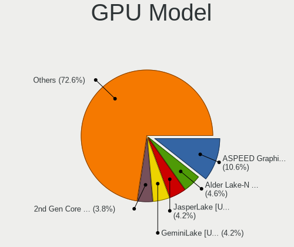

| Model                                                                              | Computers | Percent |
|------------------------------------------------------------------------------------|-----------|---------|
| ASPEED Technology ASPEED Graphics Family                                           | 13        | 11.82%  |
| Intel 2nd Generation Core Processor Family Integrated Graphics Controller          | 5         | 4.55%   |
| Intel WhiskeyLake-U GT2 [UHD Graphics 620]                                         | 4         | 3.64%   |
| Intel CometLake-U GT2 [UHD Graphics]                                               | 4         | 3.64%   |
| Intel 3rd Gen Core processor Graphics Controller                                   | 4         | 3.64%   |
| Intel Xeon E3-1200 v3/4th Gen Core Processor Integrated Graphics Controller        | 3         | 2.73%   |
| Intel UHD Graphics 620                                                             | 3         | 2.73%   |
| Intel Kaby Lake-U GT1 Integrated Graphics Controller                               | 3         | 2.73%   |
| Intel GeminiLake [UHD Graphics 600]                                                | 3         | 2.73%   |
| Intel CoffeeLake-S GT2 [UHD Graphics 630]                                          | 3         | 2.73%   |
| AMD Picasso/Raven 2 [Radeon Vega Series / Radeon Vega Mobile Series]               | 3         | 2.73%   |
| AMD Cezanne                                                                        | 3         | 2.73%   |
| Nvidia GP108M [GeForce MX150]                                                      | 2         | 1.82%   |
| Matrox Electronics Systems MGA G200EH                                              | 2         | 1.82%   |
| Matrox Electronics Systems MGA G200e [Pilot] ServerEngines (SEP1)                  | 2         | 1.82%   |
| Intel TigerLake-LP GT2 [Iris Xe Graphics]                                          | 2         | 1.82%   |
| Intel Skylake GT2 [HD Graphics 520]                                                | 2         | 1.82%   |
| Intel IvyBridge GT2 [HD Graphics 4000]                                             | 2         | 1.82%   |
| Intel HD Graphics 5500                                                             | 2         | 1.82%   |
| Intel HD Graphics 530                                                              | 2         | 1.82%   |
| Intel Haswell-ULT Integrated Graphics Controller                                   | 2         | 1.82%   |
| Intel CometLake-S GT2 [UHD Graphics 630]                                           | 2         | 1.82%   |
| AMD Renoir                                                                         | 2         | 1.82%   |
| AMD Caicos XT [Radeon HD 7470/8470 / R5 235/310 OEM]                               | 2         | 1.82%   |
| XGI Technology (eXtreme Graphics Innovation) Z7/Z9 (XG20 core)                     | 1         | 0.91%   |
| Nvidia TU116 [GeForce GTX 1660 SUPER]                                              | 1         | 0.91%   |
| Nvidia GP106 [GeForce GTX 1060 3GB]                                                | 1         | 0.91%   |
| Nvidia GM206 [GeForce GTX 960]                                                     | 1         | 0.91%   |
| Nvidia GM107 [GeForce GTX 750 Ti]                                                  | 1         | 0.91%   |
| Nvidia GK107 [GeForce GT 640]                                                      | 1         | 0.91%   |
| Nvidia GK104 [GeForce GTX 680]                                                     | 1         | 0.91%   |
| Nvidia GF108GL [Quadro 600]                                                        | 1         | 0.91%   |
| Nvidia GA106M [GeForce RTX 3060 Mobile / Max-Q]                                    | 1         | 0.91%   |
| Nvidia G98M [GeForce 9300M GS]                                                     | 1         | 0.91%   |
| Nvidia G98 [Quadro NVS 295]                                                        | 1         | 0.91%   |
| Nvidia G92 [GeForce 8800 GT]                                                       | 1         | 0.91%   |
| Matrox Electronics Systems MGA G200eW WPCM450                                      | 1         | 0.91%   |
| Intel Xeon E3-1200 v2/3rd Gen Core processor Graphics Controller                   | 1         | 0.91%   |
| Intel TigerLake-H GT1 [UHD Graphics]                                               | 1         | 0.91%   |
| Intel Iris Plus Graphics G7                                                        | 1         | 0.91%   |
| Intel Iris Plus Graphics G1 (Ice Lake)                                             | 1         | 0.91%   |
| Intel Iris Plus Graphics 650                                                       | 1         | 0.91%   |
| Intel HD Graphics 620                                                              | 1         | 0.91%   |
| Intel HD Graphics 6000                                                             | 1         | 0.91%   |
| Intel HD Graphics 500                                                              | 1         | 0.91%   |
| Intel CoffeeLake-U GT3e [Iris Plus Graphics 655]                                   | 1         | 0.91%   |
| Intel Coffee Lake UHD 610 Graphics Controller                                      | 1         | 0.91%   |
| Intel Celeron N3350/Pentium N4200/Atom E3900 Series Integrated Graphics Controller | 1         | 0.91%   |
| Intel Atom Processor Z36xxx/Z37xxx Series Graphics & Display                       | 1         | 0.91%   |
| Intel 4th Generation Core Processor Family Integrated Graphics Controller          | 1         | 0.91%   |
| Intel 4 Series Chipset Integrated Graphics Controller                              | 1         | 0.91%   |
| AMD Wani [Radeon R5/R6/R7 Graphics]                                                | 1         | 0.91%   |
| AMD Tonga XT / Amethyst XT [Radeon R9 380X / R9 M295X]                             | 1         | 0.91%   |
| AMD RV630 XT [Radeon HD 2600 XT]                                                   | 1         | 0.91%   |
| AMD Rage 3 [Rage XL PCI]                                                           | 1         | 0.91%   |
| AMD Ellesmere [Radeon RX 470/480/570/570X/580/580X/590]                            | 1         | 0.91%   |
| AMD Blackcomb [Radeon HD 6970M/6990M]                                              | 1         | 0.91%   |
| 3DLabs Sun XVR-500 Graphics Accelerator                                            | 1         | 0.91%   |
| Unknown                                                                            | 1         | 0.91%   |

GPU Combo
---------

Combinations of graphics cards

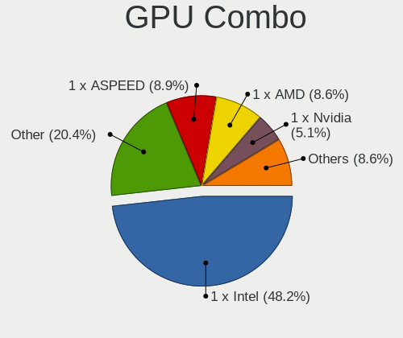

| Name           | Computers | Percent |
|----------------|-----------|---------|
| 1 x Intel      | 57        | 40.14%  |
| Other          | 35        | 24.65%  |
| 1 x AMD        | 16        | 11.27%  |
| 1 x ASPEED     | 13        | 9.15%   |
| 1 x Nvidia     | 10        | 7.04%   |
| 1 x Matrox     | 5         | 3.52%   |
| Intel + Nvidia | 3         | 2.11%   |
| 2 x Intel      | 1         | 0.7%    |
| 1 x XGI        | 1         | 0.7%    |
| 1 x 3DLabs     | 1         | 0.7%    |

GPU Driver
----------

Free vs proprietary

| Driver      | Computers | Percent |
|-------------|-----------|---------|
| Free        | 96        | 67.61%  |
| Unknown     | 39        | 27.46%  |
| Proprietary | 7         | 4.93%   |

GPU Memory
----------

Total video memory

| Size in GB | Computers | Percent |
|------------|-----------|---------|
| Unknown    | 133       | 93.66%  |
| 1.01-2.0   | 4         | 2.82%   |
| 3.01-4.0   | 2         | 1.41%   |
| 5.01-6.0   | 1         | 0.7%    |
| 2.01-3.0   | 1         | 0.7%    |
| 0.01-0.5   | 1         | 0.7%    |

Monitor
-------

Monitor Vendor
--------------

Monitor vendors

| Vendor                  | Computers | Percent |
|-------------------------|-----------|---------|
| AU Optronics            | 6         | 20.69%  |
| LG Display              | 3         | 10.34%  |
| Chimei Innolux          | 3         | 10.34%  |
| Samsung Electronics     | 2         | 6.9%    |
| JDI                     | 2         | 6.9%    |
| Acer                    | 2         | 6.9%    |
| Sharp                   | 1         | 3.45%   |
| Philips                 | 1         | 3.45%   |
| NEC Computers           | 1         | 3.45%   |
| LG Electronics          | 1         | 3.45%   |
| Lenovo                  | 1         | 3.45%   |
| Iiyama                  | 1         | 3.45%   |
| Eizo                    | 1         | 3.45%   |
| Dell                    | 1         | 3.45%   |
| Chi Mei Optoelectronics | 1         | 3.45%   |
| BOE                     | 1         | 3.45%   |
| Ancor Communications    | 1         | 3.45%   |

Monitor Model
-------------

Monitor models

| Model                                                                    | Computers | Percent |
|--------------------------------------------------------------------------|-----------|---------|
| JDI LCD Monitor JDI422A 3000x2000 290x200mm 13.9-inch                    | 2         | 6.67%   |
| Chimei Innolux LCD Monitor CMN14F2 1920x1080 310x170mm 13.9-inch         | 2         | 6.67%   |
| Sharp LCD Monitor SHP143A 3840x2160 350x190mm 15.7-inch                  | 1         | 3.33%   |
| Samsung Electronics S27E390 SAM0C1B 1920x1080 600x340mm 27.2-inch        | 1         | 3.33%   |
| Samsung Electronics CF791 SAM0DC3 3440x1440 800x330mm 34.1-inch          | 1         | 3.33%   |
| Philips FTV PHL01EA 1920x1080 1440x810mm 65.0-inch                       | 1         | 3.33%   |
| NEC Computers LCD Monitor EA224WMi 1920x1080                             | 1         | 3.33%   |
| LG Electronics LCD Monitor LG Ultra HD 11520x2160                        | 1         | 3.33%   |
| LG Electronics LCD Monitor LG Ultra HD                                   | 1         | 3.33%   |
| LG Display LCD Monitor LGD0437 1920x1080 280x160mm 12.7-inch             | 1         | 3.33%   |
| LG Display LCD Monitor LGD0430 1366x768 350x190mm 15.7-inch              | 1         | 3.33%   |
| LG Display LCD Monitor LGD0419 2560x1440 310x170mm 13.9-inch             | 1         | 3.33%   |
| Lenovo LEN P27q-10 LEN61A8 2560x1440 600x340mm 27.2-inch                 | 1         | 3.33%   |
| Iiyama PL3288UH IVM7610 3840x2160 700x390mm 31.5-inch                    | 1         | 3.33%   |
| Eizo EV2316W ENC2394 1920x1080 510x290mm 23.1-inch                       | 1         | 3.33%   |
| Dell P2715Q DEL40BD 3840x2160 600x340mm 27.2-inch                        | 1         | 3.33%   |
| Chimei Innolux LCD Monitor CMN1348 1920x1080 280x160mm 12.7-inch         | 1         | 3.33%   |
| Chi Mei Optoelectronics LCD Monitor CMO1561 1280x800 330x210mm 15.4-inch | 1         | 3.33%   |
| BOE LCD Monitor BOE0910 1920x1080 340x190mm 15.3-inch                    | 1         | 3.33%   |
| AU Optronics LCD Monitor AUOD291 1920x1200 300x190mm 14.0-inch           | 1         | 3.33%   |
| AU Optronics LCD Monitor AUO313C 1366x768 310x170mm 13.9-inch            | 1         | 3.33%   |
| AU Optronics LCD Monitor AUO243D 1920x1080 310x170mm 13.9-inch           | 1         | 3.33%   |
| AU Optronics LCD Monitor AUO213E 1600x900 310x170mm 13.9-inch            | 1         | 3.33%   |
| AU Optronics LCD Monitor AUO159D 1920x1080 380x210mm 17.1-inch           | 1         | 3.33%   |
| AU Optronics LCD Monitor AUO123D 1920x1080 310x170mm 13.9-inch           | 1         | 3.33%   |
| Ancor Communications VS278 ACI27A1 1920x1080 600x340mm 27.2-inch         | 1         | 3.33%   |
| Acer XB271HU ACR0490 2560x1440 600x340mm 27.2-inch                       | 1         | 3.33%   |
| Acer XB271HU A ACR052F 2560x1440 600x340mm 27.2-inch                     | 1         | 3.33%   |

Monitor Resolution
------------------

Monitor screen resolution

| Resolution        | Computers | Percent |
|-------------------|-----------|---------|
| 1920x1080 (FHD)   | 13        | 43.33%  |
| 2560x1440 (QHD)   | 4         | 13.33%  |
| 3840x2160 (4K)    | 3         | 10%     |
| 3000x2000         | 2         | 6.67%   |
| 1366x768 (WXGA)   | 2         | 6.67%   |
| 3440x1440         | 1         | 3.33%   |
| 1920x1200 (WUXGA) | 1         | 3.33%   |
| 1600x900 (HD+)    | 1         | 3.33%   |
| 1280x800 (WXGA)   | 1         | 3.33%   |
| 11520x2160        | 1         | 3.33%   |
| Unknown           | 1         | 3.33%   |

Monitor Diagonal
----------------

Diagonal size in inches

| Inches  | Computers | Percent |
|---------|-----------|---------|
| 13      | 9         | 31.03%  |
| 27      | 6         | 20.69%  |
| 15      | 4         | 13.79%  |
| 12      | 2         | 6.9%    |
| Unknown | 2         | 6.9%    |
| 65      | 1         | 3.45%   |
| 34      | 1         | 3.45%   |
| 31      | 1         | 3.45%   |
| 23      | 1         | 3.45%   |
| 17      | 1         | 3.45%   |
| 14      | 1         | 3.45%   |

Monitor Width
-------------

Physical width

| Width in mm | Computers | Percent |
|-------------|-----------|---------|
| 301-350     | 11        | 37.93%  |
| 501-600     | 7         | 24.14%  |
| 201-300     | 5         | 17.24%  |
| Unknown     | 2         | 6.9%    |
| 701-800     | 1         | 3.45%   |
| 601-700     | 1         | 3.45%   |
| 351-400     | 1         | 3.45%   |
| 1001-1500   | 1         | 3.45%   |

Aspect Ratio
------------

Proportional relationship between the width and the height

| Ratio   | Computers | Percent |
|---------|-----------|---------|
| 16/9    | 22        | 75.86%  |
| 4/3     | 2         | 6.9%    |
| 16/10   | 2         | 6.9%    |
| Unknown | 2         | 6.9%    |
| 21/9    | 1         | 3.45%   |

Monitor Area
------------

Area in inch

| Area in inch | Computers | Percent |
|----------------|-----------|---------|
| 81-90          | 10        | 34.48%  |
| 301-350        | 6         | 20.69%  |
| 101-110        | 3         | 10.34%  |
| 61-70          | 2         | 6.9%    |
| 351-500        | 2         | 6.9%    |
| Unknown        | 2         | 6.9%    |
| More than 1000 | 1         | 3.45%   |
| 201-250        | 1         | 3.45%   |
| 121-130        | 1         | 3.45%   |
| 91-100         | 1         | 3.45%   |

Pixel Density
-------------

Pixels per inch

| Density       | Computers | Percent |
|---------------|-----------|---------|
| 121-160       | 8         | 27.59%  |
| 161-240       | 5         | 17.24%  |
| 101-120       | 5         | 17.24%  |
| 51-100        | 5         | 17.24%  |
| More than 240 | 3         | 10.34%  |
| Unknown       | 2         | 6.9%    |
| 1-50          | 1         | 3.45%   |

Multiple Monitors
-----------------

Total monitors connected

| Total | Computers | Percent |
|-------|-----------|---------|
| 0     | 113       | 79.02%  |
| 1     | 27        | 18.88%  |
| 2     | 3         | 2.1%    |

Network
-------

Net Controller Vendor
---------------------

Controller vendors

| Vendor                            | Computers | Percent |
|-----------------------------------|-----------|---------|
| Intel                             | 123       | 66.85%  |
| Realtek Semiconductor             | 23        | 12.5%   |
| Broadcom                          | 11        | 5.98%   |
| TP-Link                           | 3         | 1.63%   |
| Qualcomm Atheros                  | 3         | 1.63%   |
| Mellanox Technologies             | 3         | 1.63%   |
| Chelsio Communications            | 2         | 1.09%   |
| American Megatrends               | 2         | 1.09%   |
| AMD                               | 2         | 1.09%   |
| VIA Technologies                  | 1         | 0.54%   |
| U-Blox                            | 1         | 0.54%   |
| Sierra Wireless                   | 1         | 0.54%   |
| Samsung Electronics               | 1         | 0.54%   |
| Ralink Technology                 | 1         | 0.54%   |
| Qualcomm Atheros Communications   | 1         | 0.54%   |
| QLogic                            | 1         | 0.54%   |
| Oracle/SUN                        | 1         | 0.54%   |
| MediaTek                          | 1         | 0.54%   |
| Huawei Technologies               | 1         | 0.54%   |
| Free Software Initiative of Japan | 1         | 0.54%   |
| Aquantia                          | 1         | 0.54%   |

Net Controller Model
--------------------

Controller models

| Model                                                                         | Computers | Percent |
|-------------------------------------------------------------------------------|-----------|---------|
| Intel I211 Gigabit Network Connection                                         | 33        | 13.15%  |
| Intel I210 Gigabit Network Connection                                         | 27        | 10.76%  |
| Realtek RTL8111/8168/8411 PCI Express Gigabit Ethernet Controller             | 16        | 6.37%   |
| Intel 82579LM Gigabit Network Connection (Lewisville)                         | 13        | 5.18%   |
| Intel I350 Gigabit Network Connection                                         | 7         | 2.79%   |
| Intel 82599ES 10-Gigabit SFI/SFP+ Network Connection                          | 6         | 2.39%   |
| Intel Wireless 8265 / 8275                                                    | 5         | 1.99%   |
| Intel 82574L Gigabit Network Connection                                       | 5         | 1.99%   |
| Intel Wi-Fi 6 AX200                                                           | 4         | 1.59%   |
| Intel Ethernet Connection I354                                                | 4         | 1.59%   |
| Intel 82571EB/82571GB Gigabit Ethernet Controller D0/D1 (copper applications) | 4         | 1.59%   |
| Intel I210 Gigabit Fiber Network Connection                                   | 3         | 1.2%    |
| Intel Ethernet Connection I219-LM                                             | 3         | 1.2%    |
| Intel Ethernet Connection (6) I219-V                                          | 3         | 1.2%    |
| Intel Ethernet Connection (6) I219-LM                                         | 3         | 1.2%    |
| Intel Centrino Advanced-N 6205 [Taylor Peak]                                  | 3         | 1.2%    |
| Intel Cannon Point-LP CNVi [Wireless-AC]                                      | 3         | 1.2%    |
| Intel 82583V Gigabit Network Connection                                       | 3         | 1.2%    |
| Intel 82576 Gigabit Network Connection                                        | 3         | 1.2%    |
| Realtek RTL8852AE 802.11ax PCIe Wireless Network Adapter                      | 2         | 0.8%    |
| Realtek RTL8821CE 802.11ac PCIe Wireless Network Adapter                      | 2         | 0.8%    |
| Intel Wireless 8260                                                           | 2         | 0.8%    |
| Intel Wireless 7265                                                           | 2         | 0.8%    |
| Intel Ethernet Controller X710 for 10GbE SFP+                                 | 2         | 0.8%    |
| Intel Ethernet Controller X550                                                | 2         | 0.8%    |
| Intel Ethernet Controller I225-V                                              | 2         | 0.8%    |
| Intel Ethernet Connection X722 for 1GbE                                       | 2         | 0.8%    |
| Intel Ethernet Connection X553 10 GbE SFP+                                    | 2         | 0.8%    |
| Intel Ethernet Connection (11) I219-LM                                        | 2         | 0.8%    |
| Intel 82599 10 Gigabit TN Network Connection                                  | 2         | 0.8%    |
| Intel 82579V Gigabit Network Connection                                       | 2         | 0.8%    |
| Intel 82571EB/82571GB Gigabit Ethernet Controller (Copper)                    | 2         | 0.8%    |
| Broadcom NetXtreme BCM5720 Gigabit Ethernet PCIe                              | 2         | 0.8%    |
| American Megatrends Virtual Ethernet                                          | 2         | 0.8%    |
| AMD Family 17h Processor 10 Gb Ethernet Controller Port 0                     | 2         | 0.8%    |
| VIA VT6105M [Rhine-III]                                                       | 1         | 0.4%    |
| U-Blox [u-blox 7]                                                             | 1         | 0.4%    |
| TP-Link TL-WN823N v2/v3 [Realtek RTL8192EU]                                   | 1         | 0.4%    |
| TP-Link TL-WN722N v2/v3 [Realtek RTL8188EUS]                                  | 1         | 0.4%    |
| TP-Link AC600 wireless Realtek RTL8811AU [Archer T2U Nano]                    | 1         | 0.4%    |
| Sierra Wireless EM7455                                                        | 1         | 0.4%    |
| Samsung Galaxy series, misc. (tethering mode)                                 | 1         | 0.4%    |
| Realtek RTL8822CE 802.11ac PCIe Wireless Network Adapter                      | 1         | 0.4%    |
| Realtek RTL8822BE 802.11a/b/g/n/ac WiFi adapter                               | 1         | 0.4%    |
| Realtek RTL8188EUS 802.11n Wireless Network Adapter                           | 1         | 0.4%    |
| Realtek RTL8188EE Wireless Network Adapter                                    | 1         | 0.4%    |
| Realtek RTL8125 2.5GbE Controller                                             | 1         | 0.4%    |
| Ralink RT2501/RT2573 Wireless Adapter                                         | 1         | 0.4%    |
| Qualcomm Atheros QCA9565 / AR9565 Wireless Network Adapter                    | 1         | 0.4%    |
| Qualcomm Atheros QCA8171 Gigabit Ethernet                                     | 1         | 0.4%    |
| Qualcomm Atheros AR9271 802.11n                                               | 1         | 0.4%    |
| Qualcomm Atheros AR928X Wireless Network Adapter (PCI-Express)                | 1         | 0.4%    |
| QLogic cLOM8214 1/10GbE Controller                                            | 1         | 0.4%    |
| Oracle/SUN RIO 10/100 Ethernet [eri]                                          | 1         | 0.4%    |
| Mellanox MT2894 Family [ConnectX-6 Lx]                                        | 1         | 0.4%    |
| Mellanox MT27710 Family [ConnectX-4 Lx]                                       | 1         | 0.4%    |
| Mellanox MT26448 [ConnectX EN 10GigE, PCIe 2.0 5GT/s]                         | 1         | 0.4%    |
| MediaTek 802.11 n WLAN                                                        | 1         | 0.4%    |
| Intel Wireless 7260                                                           | 1         | 0.4%    |
| Intel Wireless 3165                                                           | 1         | 0.4%    |

Wireless Vendor
---------------

Wireless vendors

| Vendor                          | Computers | Percent |
|---------------------------------|-----------|---------|
| Intel                           | 30        | 60%     |
| Realtek Semiconductor           | 8         | 16%     |
| TP-Link                         | 3         | 6%      |
| Broadcom                        | 3         | 6%      |
| Qualcomm Atheros                | 2         | 4%      |
| Sierra Wireless                 | 1         | 2%      |
| Ralink Technology               | 1         | 2%      |
| Qualcomm Atheros Communications | 1         | 2%      |
| MediaTek                        | 1         | 2%      |

Wireless Model
--------------

Wireless models

| Model                                                          | Computers | Percent |
|----------------------------------------------------------------|-----------|---------|
| Intel Wireless 8265 / 8275                                     | 5         | 10%     |
| Intel Wi-Fi 6 AX200                                            | 4         | 8%      |
| Intel Centrino Advanced-N 6205 [Taylor Peak]                   | 3         | 6%      |
| Intel Cannon Point-LP CNVi [Wireless-AC]                       | 3         | 6%      |
| Realtek RTL8852AE 802.11ax PCIe Wireless Network Adapter       | 2         | 4%      |
| Realtek RTL8821CE 802.11ac PCIe Wireless Network Adapter       | 2         | 4%      |
| Intel Wireless 8260                                            | 2         | 4%      |
| Intel Wireless 7265                                            | 2         | 4%      |
| TP-Link TL-WN823N v2/v3 [Realtek RTL8192EU]                    | 1         | 2%      |
| TP-Link TL-WN722N v2/v3 [Realtek RTL8188EUS]                   | 1         | 2%      |
| TP-Link AC600 wireless Realtek RTL8811AU [Archer T2U Nano]     | 1         | 2%      |
| Sierra Wireless EM7455                                         | 1         | 2%      |
| Realtek RTL8822CE 802.11ac PCIe Wireless Network Adapter       | 1         | 2%      |
| Realtek RTL8822BE 802.11a/b/g/n/ac WiFi adapter                | 1         | 2%      |
| Realtek RTL8188EUS 802.11n Wireless Network Adapter            | 1         | 2%      |
| Realtek RTL8188EE Wireless Network Adapter                     | 1         | 2%      |
| Ralink RT2501/RT2573 Wireless Adapter                          | 1         | 2%      |
| Qualcomm Atheros QCA9565 / AR9565 Wireless Network Adapter     | 1         | 2%      |
| Qualcomm Atheros AR9271 802.11n                                | 1         | 2%      |
| Qualcomm Atheros AR928X Wireless Network Adapter (PCI-Express) | 1         | 2%      |
| MediaTek 802.11 n WLAN                                         | 1         | 2%      |
| Intel Wireless 7260                                            | 1         | 2%      |
| Intel Wireless 3165                                            | 1         | 2%      |
| Intel WiFi Link 5100                                           | 1         | 2%      |
| Intel Wi-Fi 6 AX201                                            | 1         | 2%      |
| Intel Tiger Lake PCH CNVi WiFi                                 | 1         | 2%      |
| Intel Ice Lake-LP PCH CNVi WiFi                                | 1         | 2%      |
| Intel Dual Band Wireless-AC 3165 Plus Bluetooth                | 1         | 2%      |
| Intel Comet Lake PCH-LP CNVi WiFi                              | 1         | 2%      |
| Intel Centrino Ultimate-N 6300                                 | 1         | 2%      |
| Intel Centrino Advanced-N 6235                                 | 1         | 2%      |
| Intel Cannon Lake PCH CNVi WiFi                                | 1         | 2%      |
| Broadcom BCM4331 802.11a/b/g/n                                 | 1         | 2%      |
| Broadcom BCM4322 802.11a/b/g/n Wireless LAN Controller         | 1         | 2%      |
| Broadcom BCM4313 802.11bgn Wireless Network Adapter            | 1         | 2%      |

Ethernet Vendor
---------------

Ethernet vendors

| Vendor                 | Computers | Percent |
|------------------------|-----------|---------|
| Intel                  | 110       | 74.32%  |
| Realtek Semiconductor  | 17        | 11.49%  |
| Broadcom               | 9         | 6.08%   |
| Chelsio Communications | 2         | 1.35%   |
| American Megatrends    | 2         | 1.35%   |
| AMD                    | 2         | 1.35%   |
| VIA Technologies       | 1         | 0.68%   |
| Samsung Electronics    | 1         | 0.68%   |
| Qualcomm Atheros       | 1         | 0.68%   |
| QLogic                 | 1         | 0.68%   |
| Oracle/SUN             | 1         | 0.68%   |
| Aquantia               | 1         | 0.68%   |

Ethernet Model
--------------

Ethernet models

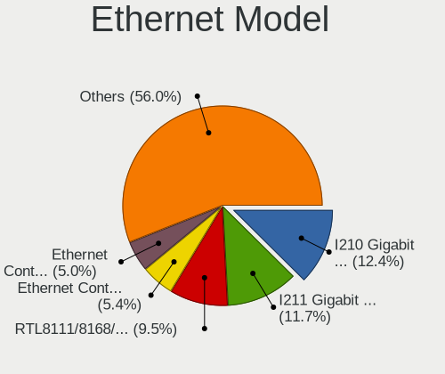

| Model                                                                         | Computers | Percent |
|-------------------------------------------------------------------------------|-----------|---------|
| Intel I211 Gigabit Network Connection                                         | 33        | 16.92%  |
| Intel I210 Gigabit Network Connection                                         | 27        | 13.85%  |
| Realtek RTL8111/8168/8411 PCI Express Gigabit Ethernet Controller             | 16        | 8.21%   |
| Intel 82579LM Gigabit Network Connection (Lewisville)                         | 13        | 6.67%   |
| Intel I350 Gigabit Network Connection                                         | 7         | 3.59%   |
| Intel 82599ES 10-Gigabit SFI/SFP+ Network Connection                          | 6         | 3.08%   |
| Intel 82574L Gigabit Network Connection                                       | 5         | 2.56%   |
| Intel Ethernet Connection I354                                                | 4         | 2.05%   |
| Intel 82571EB/82571GB Gigabit Ethernet Controller D0/D1 (copper applications) | 4         | 2.05%   |
| Intel I210 Gigabit Fiber Network Connection                                   | 3         | 1.54%   |
| Intel Ethernet Connection I219-LM                                             | 3         | 1.54%   |
| Intel Ethernet Connection (6) I219-V                                          | 3         | 1.54%   |
| Intel Ethernet Connection (6) I219-LM                                         | 3         | 1.54%   |
| Intel 82583V Gigabit Network Connection                                       | 3         | 1.54%   |
| Intel 82576 Gigabit Network Connection                                        | 3         | 1.54%   |
| Intel Ethernet Controller X710 for 10GbE SFP+                                 | 2         | 1.03%   |
| Intel Ethernet Controller X550                                                | 2         | 1.03%   |
| Intel Ethernet Controller I225-V                                              | 2         | 1.03%   |
| Intel Ethernet Connection X722 for 1GbE                                       | 2         | 1.03%   |
| Intel Ethernet Connection X553 10 GbE SFP+                                    | 2         | 1.03%   |
| Intel Ethernet Connection (11) I219-LM                                        | 2         | 1.03%   |
| Intel 82599 10 Gigabit TN Network Connection                                  | 2         | 1.03%   |
| Intel 82579V Gigabit Network Connection                                       | 2         | 1.03%   |
| Intel 82571EB/82571GB Gigabit Ethernet Controller (Copper)                    | 2         | 1.03%   |
| Broadcom NetXtreme BCM5720 Gigabit Ethernet PCIe                              | 2         | 1.03%   |
| American Megatrends Virtual Ethernet                                          | 2         | 1.03%   |
| AMD Family 17h Processor 10 Gb Ethernet Controller Port 0                     | 2         | 1.03%   |
| VIA VT6105M [Rhine-III]                                                       | 1         | 0.51%   |
| Samsung Galaxy series, misc. (tethering mode)                                 | 1         | 0.51%   |
| Realtek RTL8125 2.5GbE Controller                                             | 1         | 0.51%   |
| Qualcomm Atheros QCA8171 Gigabit Ethernet                                     | 1         | 0.51%   |
| QLogic cLOM8214 1/10GbE Controller                                            | 1         | 0.51%   |
| Oracle/SUN RIO 10/100 Ethernet [eri]                                          | 1         | 0.51%   |
| Intel I350 Gigabit Fiber Network Connection                                   | 1         | 0.51%   |
| Intel Ethernet Controller XXV710 for 25GbE SFP28                              | 1         | 0.51%   |
| Intel Ethernet Controller X710/X557-AT 10GBASE-T                              | 1         | 0.51%   |
| Intel Ethernet Controller E810-XXV for SFP                                    | 1         | 0.51%   |
| Intel Ethernet Connection X722 for 10GbE SFP+                                 | 1         | 0.51%   |
| Intel Ethernet Connection X722 for 10GBASE-T                                  | 1         | 0.51%   |
| Intel Ethernet Connection X553 1GbE                                           | 1         | 0.51%   |
| Intel Ethernet Connection X552/X557-AT 10GBASE-T                              | 1         | 0.51%   |
| Intel Ethernet Connection I218-V                                              | 1         | 0.51%   |
| Intel Ethernet Connection I217-V                                              | 1         | 0.51%   |
| Intel Ethernet Connection I217-LM                                             | 1         | 0.51%   |
| Intel Ethernet Connection (4) I219-V                                          | 1         | 0.51%   |
| Intel Ethernet Connection (3) I218-V                                          | 1         | 0.51%   |
| Intel Ethernet Connection (3) I218-LM                                         | 1         | 0.51%   |
| Intel Ethernet Connection (2) I219-V                                          | 1         | 0.51%   |
| Intel Ethernet Connection (2) I218-V                                          | 1         | 0.51%   |
| Intel Ethernet Connection (17) I219-V                                         | 1         | 0.51%   |
| Intel Ethernet Connection (10) I219-LM                                        | 1         | 0.51%   |
| Intel 82573L Gigabit Ethernet Controller                                      | 1         | 0.51%   |
| Intel 82572EI Gigabit Ethernet Controller (Copper)                            | 1         | 0.51%   |
| Intel 82566DC-2 Gigabit Network Connection                                    | 1         | 0.51%   |
| Intel 80003ES2LAN Gigabit Ethernet Controller (Copper)                        | 1         | 0.51%   |
| Chelsio T520-LL-CR Unified Wire Ethernet Controller                           | 1         | 0.51%   |
| Chelsio T520-CR Unified Wire Ethernet Controller                              | 1         | 0.51%   |
| Broadcom NetXtreme BCM57786 Gigabit Ethernet PCIe                             | 1         | 0.51%   |
| Broadcom NetXtreme BCM57765 Gigabit Ethernet PCIe                             | 1         | 0.51%   |
| Broadcom NetXtreme BCM5764M Gigabit Ethernet PCIe                             | 1         | 0.51%   |

Net Controller Kind
-------------------

Ethernet, WiFi or modem

| Kind     | Computers | Percent |
|----------|-----------|---------|
| Ethernet | 131       | 72.38%  |
| WiFi     | 44        | 24.31%  |
| Unknown  | 4         | 2.21%   |
| Modem    | 2         | 1.1%    |

Used Controller
---------------

Currently used network controller

| Kind     | Computers | Percent |
|----------|-----------|---------|
| Ethernet | 125       | 83.33%  |
| WiFi     | 25        | 16.67%  |

NICs
----

Total network controllers on board

| Total | Computers | Percent |
|-------|-----------|---------|
| 3     | 32        | 22.38%  |
| 2     | 26        | 18.18%  |
| 4     | 22        | 15.38%  |
| 1     | 21        | 14.69%  |
| 6     | 16        | 11.19%  |
| 5     | 13        | 9.09%   |
| 8     | 4         | 2.8%    |
| 13    | 2         | 1.4%    |
| 7     | 2         | 1.4%    |
| 0     | 2         | 1.4%    |
| 14    | 1         | 0.7%    |
| 12    | 1         | 0.7%    |
| 10    | 1         | 0.7%    |

IPv6
----

IPv6 vs IPv4

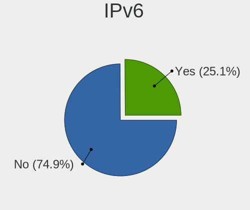

| Used | Computers | Percent |
|------|-----------|---------|
| No   | 114       | 76%     |
| Yes  | 36        | 24%     |

Bluetooth
---------

Bluetooth Vendor
----------------

Controller vendors

| Vendor                  | Computers | Percent |
|-------------------------|-----------|---------|
| Intel                   | 21        | 58.33%  |
| IMC Networks            | 3         | 8.33%   |
| ASUSTek Computer        | 3         | 8.33%   |
| Realtek Semiconductor   | 2         | 5.56%   |
| Apple                   | 2         | 5.56%   |
| Lite-On Technology      | 1         | 2.78%   |
| Dell                    | 1         | 2.78%   |
| Cambridge Silicon Radio | 1         | 2.78%   |
| Broadcom                | 1         | 2.78%   |
| Alps Electric           | 1         | 2.78%   |

Bluetooth Model
---------------

Controller models

| Model                                               | Computers | Percent |
|-----------------------------------------------------|-----------|---------|
| Intel Bluetooth wireless interface                  | 9         | 25%     |
| Intel AX201 Bluetooth                               | 4         | 11.11%  |
| Intel AX200 Bluetooth                               | 4         | 11.11%  |
| Intel Bluetooth 9460/9560 Jefferson Peak (JfP)      | 3         | 8.33%   |
| Realtek Bluetooth Radio                             | 2         | 5.56%   |
| IMC Networks Realtek Bluetooth Adapter              | 2         | 5.56%   |
| Lite-On Atheros AR3012 Bluetooth                    | 1         | 2.78%   |
| Intel Centrino Bluetooth Wireless Transceiver       | 1         | 2.78%   |
| IMC Networks Bluetooth Radio                        | 1         | 2.78%   |
| Dell Dell Wireless 380 Bluetooth 4.0 Module         | 1         | 2.78%   |
| Cambridge Silicon Radio Bluetooth Dongle (HCI mode) | 1         | 2.78%   |
| Broadcom BCM20702 Bluetooth 4.0 [ThinkPad]          | 1         | 2.78%   |
| ASUS BT-253 Bluetooth Adapter                       | 1         | 2.78%   |
| ASUS Broadcom BCM20702A0 Bluetooth                  | 1         | 2.78%   |
| ASUS Bluetooth Controller                           | 1         | 2.78%   |
| Apple Built-in Bluetooth 2.0+EDR HCI                | 1         | 2.78%   |
| Apple Apple Broadcom Built-in Bluetooth             | 1         | 2.78%   |
| Alps Electric UGTZ4 Bluetooth                       | 1         | 2.78%   |

Sound
-----

Sound Vendor
------------

Sound card vendors

| Vendor                | Computers | Percent |
|-----------------------|-----------|---------|
| Intel                 | 67        | 67.68%  |
| AMD                   | 19        | 19.19%  |
| Nvidia                | 8         | 8.08%   |
| ULi Electronics       | 2         | 2.02%   |
| Realtek Semiconductor | 1         | 1.01%   |
| Logitech              | 1         | 1.01%   |
| GN Netcom             | 1         | 1.01%   |

Sound Model
-----------

Sound card models

| Model                                                                             | Computers | Percent |
|-----------------------------------------------------------------------------------|-----------|---------|
| AMD Family 17h/19h HD Audio Controller                                            | 9         | 7.89%   |
| Intel 7 Series/C216 Chipset Family High Definition Audio Controller               | 8         | 7.02%   |
| Intel 6 Series/C200 Series Chipset Family High Definition Audio Controller        | 8         | 7.02%   |
| Intel Sunrise Point-LP HD Audio                                                   | 7         | 6.14%   |
| Intel Cannon Point-LP High Definition Audio Controller                            | 6         | 5.26%   |
| AMD Renoir Radeon High Definition Audio Controller                                | 5         | 4.39%   |
| Intel Xeon E3-1200 v3/4th Gen Core Processor HD Audio Controller                  | 4         | 3.51%   |
| Intel Comet Lake PCH-LP cAVS                                                      | 4         | 3.51%   |
| Intel Wildcat Point-LP High Definition Audio Controller                           | 3         | 2.63%   |
| Intel Celeron/Pentium Silver Processor High Definition Audio                      | 3         | 2.63%   |
| Intel Broadwell-U Audio Controller                                                | 3         | 2.63%   |
| Intel 100 Series/C230 Series Chipset Family HD Audio Controller                   | 3         | 2.63%   |
| AMD Raven/Raven2/Fenghuang HDMI/DP Audio Controller                               | 3         | 2.63%   |
| AMD Family 17h (Models 00h-0fh) HD Audio Controller                               | 3         | 2.63%   |
| ULi Electronics M5451 PCI AC-Link Controller Audio Device                         | 2         | 1.75%   |
| Intel Tiger Lake-LP Smart Sound Technology Audio Controller                       | 2         | 1.75%   |
| Intel Ice Lake-LP Smart Sound Technology Audio Controller                         | 2         | 1.75%   |
| Intel Haswell-ULT HD Audio Controller                                             | 2         | 1.75%   |
| Intel Comet Lake PCH cAVS                                                         | 2         | 1.75%   |
| Intel 82801JI (ICH10 Family) HD Audio Controller                                  | 2         | 1.75%   |
| Intel 82801I (ICH9 Family) HD Audio Controller                                    | 2         | 1.75%   |
| Intel 8 Series/C220 Series Chipset High Definition Audio Controller               | 2         | 1.75%   |
| Intel 8 Series HD Audio Controller                                                | 2         | 1.75%   |
| AMD Starship/Matisse HD Audio Controller                                          | 2         | 1.75%   |
| AMD Caicos HDMI Audio [Radeon HD 6450 / 7450/8450/8490 OEM / R5 230/235/235X OEM] | 2         | 1.75%   |
| Realtek Semiconductor USB Audio Maono Elf retrieving string failed                | 1         | 0.88%   |
| Nvidia unknown                                                                    | 1         | 0.88%   |
| Nvidia TU116 High Definition Audio Controller                                     | 1         | 0.88%   |
| Nvidia GP106 High Definition Audio Controller                                     | 1         | 0.88%   |
| Nvidia GM206 High Definition Audio Controller                                     | 1         | 0.88%   |
| Nvidia GM107 High Definition Audio Controller [GeForce 940MX]                     | 1         | 0.88%   |
| Nvidia GK107 HDMI Audio Controller                                                | 1         | 0.88%   |
| Nvidia GK104 HDMI Audio Controller                                                | 1         | 0.88%   |
| Nvidia GF108 High Definition Audio Controller                                     | 1         | 0.88%   |
| Logitech H600 [Wireless Headset]                                                  | 1         | 0.88%   |
| Intel Tiger Lake-H HD Audio Controller                                            | 1         | 0.88%   |
| Intel Celeron N3350/Pentium N4200/Atom E3900 Series Audio Cluster                 | 1         | 0.88%   |
| Intel Cannon Lake PCH cAVS                                                        | 1         | 0.88%   |
| Intel C600/X79 series chipset High Definition Audio Controller                    | 1         | 0.88%   |
| Intel Atom Processor Z36xxx/Z37xxx Series High Definition Audio Controller        | 1         | 0.88%   |
| Intel Alder Lake-S HD Audio Controller                                            | 1         | 0.88%   |
| Intel 631xESB/632xESB High Definition Audio Controller                            | 1         | 0.88%   |
| Intel 200 Series PCH HD Audio                                                     | 1         | 0.88%   |
| GN Netcom Jabra UC VOICE 550 MS mono USB                                          | 1         | 0.88%   |
| AMD Tonga HDMI Audio [Radeon R9 285/380]                                          | 1         | 0.88%   |
| AMD SBx00 Azalia (Intel HDA)                                                      | 1         | 0.88%   |
| AMD Ellesmere HDMI Audio [Radeon RX 470/480 / 570/580/590]                        | 1         | 0.88%   |
| AMD Barts HDMI Audio [Radeon HD 6790/6850/6870 / 7720 OEM]                        | 1         | 0.88%   |

Memory
------

Memory Vendor
-------------

Memory module vendors

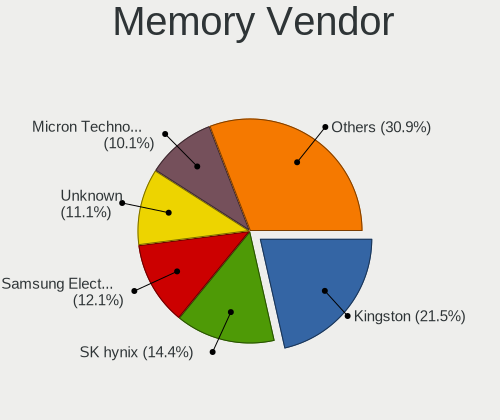

| Vendor              | Computers | Percent |
|---------------------|-----------|---------|
| Kingston            | 37        | 27.82%  |
| Unknown             | 22        | 16.54%  |
| Samsung Electronics | 15        | 11.28%  |
| SK hynix            | 13        | 9.77%   |
| Micron Technology   | 13        | 9.77%   |
| Corsair             | 9         | 6.77%   |
| Crucial             | 8         | 6.02%   |
| Transcend           | 3         | 2.26%   |
| Toshiba             | 2         | 1.5%    |
| Hewlett-Packard     | 2         | 1.5%    |
| Unknown (ABCD)      | 1         | 0.75%   |
| Unknown (0x05F7)    | 1         | 0.75%   |
| Unknown (07FB)      | 1         | 0.75%   |
| Tigo                | 1         | 0.75%   |
| Super Talent        | 1         | 0.75%   |
| Silicon Power       | 1         | 0.75%   |
| Nanya Technology    | 1         | 0.75%   |
| Elpida              | 1         | 0.75%   |
| A-DATA Technology   | 1         | 0.75%   |

Memory Model
------------

Memory module models

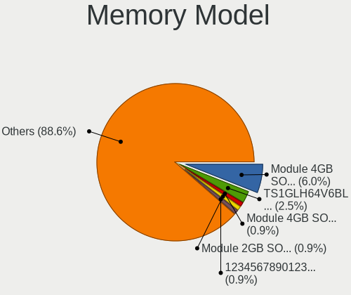

| Model                                                             | Computers | Percent |
|-------------------------------------------------------------------|-----------|---------|
| Unknown                                                           | 22        | 15.71%  |
| SK hynix RAM HMA81GU6CJR8N-XN 8GB DIMM DDR4 3200MT/s              | 3         | 2.14%   |
| Kingston RAM KHX2933C15D4/8GX 8GB DIMM DDR4 2400MT/s              | 3         | 2.14%   |
| Kingston RAM CBD24D4S7S8K1A-8 8GB SODIMM DDR4 2133MT/s            | 3         | 2.14%   |
| SK hynix RAM HMA82GR7CJR4N-WM 16GB DIMM DDR4 2933MT/s             | 2         | 1.43%   |
| Samsung RAM M471A1G44AB0-CWE 8GB Row Of Chips DDR4 3200MT/s       | 2         | 1.43%   |
| Micron RAM MT52L512M32D2PF-09 4GB Row Of Chips LPDDR3 2133MT/s    | 2         | 1.43%   |
| Kingston RAM KF2666C15S4/8G 8GB SODIMM DDR4 2667MT/s              | 2         | 1.43%   |
| Kingston RAM 99U5471-052.A00LF 8GB DIMM DDR3 1333MT/s             | 2         | 1.43%   |
| Kingston RAM 9965745-020.A00G 32GB DIMM DDR4 3200MT/s             | 2         | 1.43%   |
| Kingston RAM 9905403-559.A00LF 8GB DIMM DDR3 1333MT/s             | 2         | 1.43%   |
| Crucial RAM CT8G4DFS8266.M8FJ 8GB DIMM DDR4 2666MT/s              | 2         | 1.43%   |
| Crucial RAM CT8G4DFRA266.C8FB 8GB DIMM DDR4 2666MT/s              | 2         | 1.43%   |
| Unknown (ABCD) RAM 123456789012345678 1536MB DIMM LPDDR3 2400MT/s | 1         | 0.71%   |
| Unknown (0x05F7) RAM Module 1GB FB-DIMM DDR2 800MT/s              | 1         | 0.71%   |
| Unknown (07FB) RAM GSA8G4SCL196P-26 8GB SODIMM DDR4 2667MT/s      | 1         | 0.71%   |
| Transcend RAM TS512MLK64W6H 4GB DIMM DDR3 1600MT/s                | 1         | 0.71%   |
| Transcend RAM TS256MLK64W6N 2GB DIMM DDR3 1600MT/s                | 1         | 0.71%   |
| Transcend RAM TS1GLH64V6BL 8GB SODIMM DDR4 2667MT/s               | 1         | 0.71%   |
| Transcend RAM TS1GLH64V6B3 8GB SODIMM DDR4 1333MT/s               | 1         | 0.71%   |
| Toshiba RAM 9965527-021.A00LF 8GB SODIMM DDR3 1600MT/s            | 1         | 0.71%   |
| Toshiba RAM 9965525-140.A00LF 8GB DIMM DDR3 1333MT/s              | 1         | 0.71%   |
| Tigo RAM 1600Mhz-8G 8GB SODIMM DDR3 1600MT/s                      | 1         | 0.71%   |
| Super Talent RAM SUPERTALENT02 4GB DIMM DDR3 1333MT/s             | 1         | 0.71%   |
| SK hynix RAM Module 8GB Row Of Chips LPDDR3 2133MT/s              | 1         | 0.71%   |
| SK hynix RAM Module 1GB FB-DIMM DDR2 800MT/s                      | 1         | 0.71%   |
| SK hynix RAM HMT42GR7MFR4C-PB 16384MB DIMM DDR3 1600MT/s          | 1         | 0.71%   |
| SK hynix RAM HMT325U7BFR8C-H9 2GB DIMM DDR3 1333MT/s              | 1         | 0.71%   |
| SK hynix RAM HMT325S6BFR8C-H9 2GB SODIMM DDR3 1333MT/s            | 1         | 0.71%   |
| SK hynix RAM HMA82GS6AFR8N-UH 16GB SODIMM DDR4 2400MT/s           | 1         | 0.71%   |
| SK hynix RAM HMA41GS6AFR8N-TF 8GB SODIMM DDR4 2133MT/s            | 1         | 0.71%   |
| SK hynix RAM H9HCNNNCPMALHR-NEE 8GB Row Of Chips LPDDR4 4267MT/s  | 1         | 0.71%   |
| Silicon Power RAM SP008GLSTU160N02 8GB SODIMM DDR3 1600MT/s       | 1         | 0.71%   |
| Samsung RAM Module 8GB SODIMM DDR4 2133MT/s                       | 1         | 0.71%   |
| Samsung RAM Module 8192MB SODIMM DDR4 2133MT/s                    | 1         | 0.71%   |
| Samsung RAM Module 16GB DIMM DDR3 1333MT/s                        | 1         | 0.71%   |
| Samsung RAM M471B5674-M0-YK0 4GB Chip DDR3 1600MT/s               | 1         | 0.71%   |
| Samsung RAM M471B5273DH0-CK0 4GB SODIMM DDR3 1600MT/s             | 1         | 0.71%   |
| Samsung RAM M471A5244CB0-CTD 4GB SODIMM DDR4 2667MT/s             | 1         | 0.71%   |
| Samsung RAM M471A2G44AM0-CTD 16GB SODIMM DDR4 2667MT/s            | 1         | 0.71%   |
| Samsung RAM M471A1K43CB1-CTD 8GB SODIMM DDR4 2667MT/s             | 1         | 0.71%   |
| Samsung RAM M471A1K43BB1-CRC 8GB SODIMM DDR4 2400MT/s             | 1         | 0.71%   |
| Samsung RAM M393B2G70DB0-CK0 16GB DIMM DDR3 1600MT/s              | 1         | 0.71%   |
| Samsung RAM M393B2G70BH0-CK0 16GB DIMM DDR3 1600MT/s              | 1         | 0.71%   |
| Samsung RAM M393B1K70BH1-CH9 8GB DIMM DDR3 1333MT/s               | 1         | 0.71%   |
| Samsung RAM M393A1K43BB1-CTD 8GB RIMM DDR4 2133MT/s               | 1         | 0.71%   |
| Samsung RAM M391B5673EH1-CH9 2048MB DIMM DDR3 1333MT/s            | 1         | 0.71%   |
| Samsung RAM M378B5173QH0-CK0 4GB DIMM DDR3 1600MT/s               | 1         | 0.71%   |
| Nanya RAM NT1GT64U8HB0BY-3C 1GB DIMM DDR2 667MT/s                 | 1         | 0.71%   |
| Micron RAM Module 8GB Row Of Chips LPDDR4 3200MT/s                | 1         | 0.71%   |
| Micron RAM Module 4096MB DIMM DDR3 1333MT/s                       | 1         | 0.71%   |
| Micron RAM Module 2GB DIMM DDR3 1333MT/s                          | 1         | 0.71%   |
| Micron RAM HMA81GS6CJR8N-VK 8GB SODIMM DDR4 2667MT/s              | 1         | 0.71%   |
| Micron RAM 8KTF25664HZ-1G6M1 2GB SODIMM DDR3 1600MT/s             | 1         | 0.71%   |
| Micron RAM 53E2G32D4NQ-046 4GB Row Of Chips LPDDR4 4267MT/s       | 1         | 0.71%   |
| Micron RAM 4ATS1G64HZ-2G6E1 8GB SODIMM DDR4 2667MT/s              | 1         | 0.71%   |
| Micron RAM 4ATF51264HZ-2G3B2 4GB SODIMM DDR4 2400MT/s             | 1         | 0.71%   |
| Micron RAM 36ASF2G72PZ-2G1A2 16GB DIMM DDR4 2133MT/s              | 1         | 0.71%   |
| Micron RAM 18ASF2G72AZ-2G3B1 16GB DIMM DDR4 2400MT/s              | 1         | 0.71%   |
| Micron RAM 16KTF2G64HZ-1G6A1 16GB SODIMM DDR3 1600MT/s            | 1         | 0.71%   |

Memory Kind
-----------

Memory module kinds

| Kind    | Computers | Percent |
|---------|-----------|---------|
| DDR3    | 55        | 46.22%  |
| DDR4    | 51        | 42.86%  |
| DDR2    | 5         | 4.2%    |
| LPDDR4  | 4         | 3.36%   |
| LPDDR3  | 3         | 2.52%   |
| Unknown | 1         | 0.84%   |

Memory Form Factor
------------------

Physical design of the memory module

| Name         | Computers | Percent |
|--------------|-----------|---------|
| DIMM         | 55        | 46.22%  |
| SODIMM       | 53        | 44.54%  |
| Row Of Chips | 8         | 6.72%   |
| RIMM         | 1         | 0.84%   |
| FB-DIMM      | 1         | 0.84%   |
| Chip         | 1         | 0.84%   |

Memory Size
-----------

Memory module size

| Size  | Computers | Percent |
|-------|-----------|---------|
| 8192  | 56        | 44.44%  |
| 4096  | 35        | 27.78%  |
| 16384 | 19        | 15.08%  |
| 2048  | 10        | 7.94%   |
| 1024  | 3         | 2.38%   |
| 32768 | 2         | 1.59%   |
| 512   | 1         | 0.79%   |

Memory Speed
------------

Memory module speed

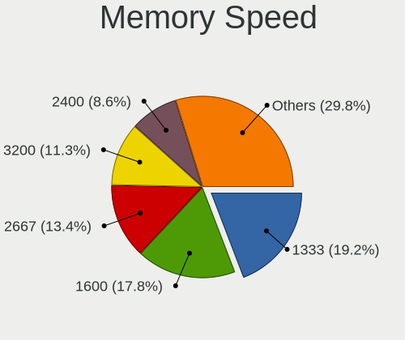

| Speed | Computers | Percent |
|-------|-----------|---------|
| 1333  | 34        | 26.56%  |
| 1600  | 20        | 15.63%  |
| 2133  | 16        | 12.5%   |
| 2667  | 14        | 10.94%  |
| 2400  | 12        | 9.38%   |
| 3200  | 10        | 7.81%   |
| 2666  | 5         | 3.91%   |
| 800   | 4         | 3.13%   |
| 667   | 4         | 3.13%   |
| 4267  | 2         | 1.56%   |
| 2933  | 2         | 1.56%   |
| 3600  | 1         | 0.78%   |
| 1867  | 1         | 0.78%   |
| 1866  | 1         | 0.78%   |
| 1800  | 1         | 0.78%   |
| 1033  | 1         | 0.78%   |

Printers & scanners
-------------------

Printer Vendor
--------------

Printer device vendors

Zero info for selected period =(

Printer Model
-------------

Printer device models

Zero info for selected period =(

Scanner Vendor
--------------

Scanner device vendors

Zero info for selected period =(

Scanner Model
-------------

Scanner device models

Zero info for selected period =(

Camera
------

Camera Vendor
-------------

Camera device vendors

| Vendor                                 | Computers | Percent |
|----------------------------------------|-----------|---------|
| Chicony Electronics                    | 9         | 47.37%  |
| IMC Networks                           | 4         | 21.05%  |
| Acer                                   | 2         | 10.53%  |
| Suyin                                  | 1         | 5.26%   |
| Sunplus Innovation Technology          | 1         | 5.26%   |
| Cheng Uei Precision Industry (Foxlink) | 1         | 5.26%   |
| Apple                                  | 1         | 5.26%   |

Camera Model
------------

Camera device models

| Model                                            | Computers | Percent |
|--------------------------------------------------|-----------|---------|
| Chicony Integrated Camera                        | 4         | 21.05%  |
| IMC Networks Integrated Camera                   | 3         | 15.79%  |
| Acer Integrated Camera                           | 2         | 10.53%  |
| Suyin HD WebCam                                  | 1         | 5.26%   |
| Sunplus Laptop Integrated Webcam FHD             | 1         | 5.26%   |
| IMC Networks EasyCamera                          | 1         | 5.26%   |
| Chicony USB2.0 HD UVC WebCam                     | 1         | 5.26%   |
| Chicony USB 2.0 2.0M UVC WebCam                  | 1         | 5.26%   |
| Chicony ThinkPad T490 Webcam                     | 1         | 5.26%   |
| Chicony Lenovo EasyCamera                        | 1         | 5.26%   |
| Chicony HP Universal Camera                      | 1         | 5.26%   |
| Cheng Uei Precision Industry (Foxlink) HD Camera | 1         | 5.26%   |
| Apple FaceTime HD Camera                         | 1         | 5.26%   |

Security
--------

Fingerprint Vendor
------------------

Fingerprint sensor vendors

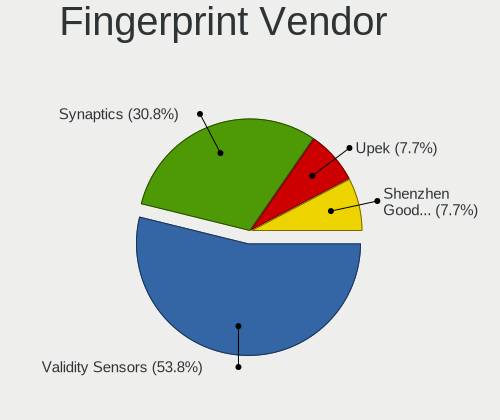

| Vendor           | Computers | Percent |
|------------------|-----------|---------|
| Validity Sensors | 2         | 40%     |
| Synaptics        | 2         | 40%     |
| Upek             | 1         | 20%     |

Fingerprint Model
-----------------

Fingerprint sensor models

| Model                                                  | Computers | Percent |
|--------------------------------------------------------|-----------|---------|
| Validity Sensors VFS 5011 fingerprint sensor           | 1         | 20%     |
| Validity Sensors Synaptics WBDI                        | 1         | 20%     |
| Upek Biometric Touchchip/Touchstrip Fingerprint Sensor | 1         | 20%     |
| Synaptics  WBDI                                        | 1         | 20%     |
| Synaptics Prometheus MIS Touch Fingerprint Reader      | 1         | 20%     |

Chipcard Vendor
---------------

Chipcard module vendors

Zero info for selected period =(

Chipcard Model
--------------

Chipcard module models

Zero info for selected period =(

Unsupported
-----------

Unsupported Devices
-------------------

Total unsupported devices on board

| Total | Computers | Percent |
|-------|-----------|---------|
| 0     | 55        | 37.41%  |
| 1     | 44        | 29.93%  |
| 2     | 26        | 17.69%  |
| 3     | 14        | 9.52%   |
| 4     | 6         | 4.08%   |
| 5     | 2         | 1.36%   |

Unsupported Device Types
------------------------

Types of unsupported devices

| Type                     | Computers | Percent |
|--------------------------|-----------|---------|
| Communication controller | 74        | 51.75%  |
| Bluetooth                | 17        | 11.89%  |
| Net/wireless             | 16        | 11.19%  |
| Firewire controller      | 12        | 8.39%   |
| Card reader              | 7         | 4.9%    |
| Sound                    | 4         | 2.8%    |
| Net/ethernet             | 4         | 2.8%    |
| Fingerprint reader       | 4         | 2.8%    |
| Network                  | 2         | 1.4%    |
| Graphics card            | 2         | 1.4%    |
| Storage                  | 1         | 0.7%    |

