BSD in UK - Tested Hardware & Statistics
----------------------------------------

A project to collect tested hardware configurations for BSD in UK.

Anyone can contribute to this report by the [hw-probe](https://github.com/linuxhw/hw-probe/blob/master/INSTALL.BSD.md) tool:

    hw-probe -all -upload

Please contribute! Especially if your hardware is rare.

This is a report for all computer types. See also reports for [desktops](/Location/UK/Desktop/README.md) and [notebooks](/Location/UK/Notebook/README.md).

Contents
--------

* [ Test Cases ](#test-cases)

* [ System ](#system)
  - [ OS                       ](#os)
  - [ OS Family                ](#os-family)
  - [ Arch                     ](#arch)
  - [ DE                       ](#de)
  - [ Display Server           ](#display-server)
  - [ Display Manager          ](#display-manager)
  - [ OS Lang                  ](#os-lang)
  - [ Boot Mode                ](#boot-mode)
  - [ Filesystem               ](#filesystem)
  - [ Part. scheme             ](#part-scheme)

* [ Board ](#board)
  - [ Vendor                   ](#vendor)
  - [ Model                    ](#model)
  - [ Model Family             ](#model-family)
  - [ MFG Year                 ](#mfg-year)
  - [ Form Factor              ](#form-factor)
  - [ Coreboot                 ](#coreboot)
  - [ RAM Size                 ](#ram-size)
  - [ RAM Used                 ](#ram-used)
  - [ Total Drives             ](#total-drives)
  - [ Has CD-ROM               ](#has-cd-rom)
  - [ Has Ethernet             ](#has-ethernet)
  - [ Has WiFi                 ](#has-wifi)
  - [ Has Bluetooth            ](#has-bluetooth)

* [ Location ](#location)
  - [ Country                  ](#country)
  - [ City                     ](#city)

* [ Drives ](#drives)
  - [ Drive Vendor             ](#drive-vendor)
  - [ Drive Model              ](#drive-model)
  - [ HDD Vendor               ](#hdd-vendor)
  - [ SSD Vendor               ](#ssd-vendor)
  - [ Drive Kind               ](#drive-kind)
  - [ Drive Connector          ](#drive-connector)
  - [ Drive Size               ](#drive-size)
  - [ Space Total              ](#space-total)
  - [ Space Used               ](#space-used)
  - [ Malfunc. Drives          ](#malfunc-drives)
  - [ Malfunc. Drive Vendor    ](#malfunc-drive-vendor)
  - [ Malfunc. HDD Vendor      ](#malfunc-hdd-vendor)
  - [ Malfunc. Drive Kind      ](#malfunc-drive-kind)
  - [ Failed Drives            ](#failed-drives)
  - [ Failed Drive Vendor      ](#failed-drive-vendor)
  - [ Drive Status             ](#drive-status)

* [ Storage controller ](#storage-controller)
  - [ Storage Vendor           ](#storage-vendor)
  - [ Storage Model            ](#storage-model)
  - [ Storage Kind             ](#storage-kind)

* [ Processor ](#processor)
  - [ CPU Vendor               ](#cpu-vendor)
  - [ CPU Model                ](#cpu-model)
  - [ CPU Model Family         ](#cpu-model-family)
  - [ CPU Cores                ](#cpu-cores)
  - [ CPU Sockets              ](#cpu-sockets)
  - [ CPU Threads              ](#cpu-threads)
  - [ CPU Microarch            ](#cpu-microarch)

* [ Graphics ](#graphics)
  - [ GPU Vendor               ](#gpu-vendor)
  - [ GPU Model                ](#gpu-model)
  - [ GPU Combo                ](#gpu-combo)
  - [ GPU Driver               ](#gpu-driver)
  - [ GPU Memory               ](#gpu-memory)

* [ Monitor ](#monitor)
  - [ Monitor Vendor           ](#monitor-vendor)
  - [ Monitor Model            ](#monitor-model)
  - [ Monitor Resolution       ](#monitor-resolution)
  - [ Monitor Diagonal         ](#monitor-diagonal)
  - [ Monitor Width            ](#monitor-width)
  - [ Aspect Ratio             ](#aspect-ratio)
  - [ Monitor Area             ](#monitor-area)
  - [ Pixel Density            ](#pixel-density)
  - [ Multiple Monitors        ](#multiple-monitors)

* [ Network ](#network)
  - [ Net Controller Vendor    ](#net-controller-vendor)
  - [ Net Controller Model     ](#net-controller-model)
  - [ Wireless Vendor          ](#wireless-vendor)
  - [ Wireless Model           ](#wireless-model)
  - [ Ethernet Vendor          ](#ethernet-vendor)
  - [ Ethernet Model           ](#ethernet-model)
  - [ Net Controller Kind      ](#net-controller-kind)
  - [ Used Controller          ](#used-controller)
  - [ NICs                     ](#nics)
  - [ IPv6                     ](#ipv6)

* [ Bluetooth ](#bluetooth)
  - [ Bluetooth Vendor         ](#bluetooth-vendor)
  - [ Bluetooth Model          ](#bluetooth-model)

* [ Sound ](#sound)
  - [ Sound Vendor             ](#sound-vendor)
  - [ Sound Model              ](#sound-model)

* [ Memory ](#memory)
  - [ Memory Vendor            ](#memory-vendor)
  - [ Memory Model             ](#memory-model)
  - [ Memory Kind              ](#memory-kind)
  - [ Memory Form Factor       ](#memory-form-factor)
  - [ Memory Size              ](#memory-size)
  - [ Memory Speed             ](#memory-speed)

* [ Printers & scanners ](#printers--scanners)
  - [ Printer Vendor           ](#printer-vendor)
  - [ Printer Model            ](#printer-model)
  - [ Scanner Vendor           ](#scanner-vendor)
  - [ Scanner Model            ](#scanner-model)

* [ Camera ](#camera)
  - [ Camera Vendor            ](#camera-vendor)
  - [ Camera Model             ](#camera-model)

* [ Security ](#security)
  - [ Fingerprint Vendor       ](#fingerprint-vendor)
  - [ Fingerprint Model        ](#fingerprint-model)
  - [ Chipcard Vendor          ](#chipcard-vendor)
  - [ Chipcard Model           ](#chipcard-model)

* [ Unsupported ](#unsupported)
  - [ Unsupported Devices      ](#unsupported-devices)
  - [ Unsupported Device Types ](#unsupported-device-types)

Test Cases
----------

Total: 1611

| Vendor        | Model                       | Form-Factor | Probe                                                     | Date         |
|---------------|-----------------------------|-------------|-----------------------------------------------------------|--------------|
| Lenovo        | ThinkPad T14 Gen 2i 20W1... | Notebook    | [c1426aac21](https://bsd-hardware.info/?probe=c1426aac21) | Jan 03, 2026 |
| AZW           | MINI S                      | Mini pc     | [178e523a28](https://bsd-hardware.info/?probe=178e523a28) | Jan 01, 2026 |
| Lenovo        | 3136 SDK0J40697 WIN 3305... | Mini pc     | [db36388766](https://bsd-hardware.info/?probe=db36388766) | Dec 30, 2025 |
| HP            | EliteBook Folio 9470m       | Notebook    | [e5cd4a5c15](https://bsd-hardware.info/?probe=e5cd4a5c15) | Dec 28, 2025 |
| HP            | 805A                        | Desktop     | [79cd88dc0f](https://bsd-hardware.info/?probe=79cd88dc0f) | Dec 27, 2025 |
| Lenovo        | Tablet 10 20L4S00U00        | Tablet      | [a369b76aa0](https://bsd-hardware.info/?probe=a369b76aa0) | Dec 27, 2025 |
| Lenovo        | Tablet 10 20L4S00U00        | Tablet      | [b306c2b75f](https://bsd-hardware.info/?probe=b306c2b75f) | Dec 27, 2025 |
| Protectli     | VP2420                      | Desktop     | [ecc16973ed](https://bsd-hardware.info/?probe=ecc16973ed) | Dec 26, 2025 |
| Unknown       | Unknown                     | Desktop     | [2542b1491f](https://bsd-hardware.info/?probe=2542b1491f) | Dec 26, 2025 |
| Deciso        | Netboard A8V2               | Desktop     | [c62e96587d](https://bsd-hardware.info/?probe=c62e96587d) | Dec 25, 2025 |
| HP            | EliteBook 840 G7 Noteboo... | Notebook    | [ca65a8537b](https://bsd-hardware.info/?probe=ca65a8537b) | Dec 25, 2025 |
| HP            | 8267 A01                    | Mini pc     | [eb942b5a7c](https://bsd-hardware.info/?probe=eb942b5a7c) | Dec 24, 2025 |
| Unknown       | Unknown                     | Desktop     | [4fc21572d6](https://bsd-hardware.info/?probe=4fc21572d6) | Dec 23, 2025 |
| Lenovo        | ThinkPad T480 20L6S9UJ0Y    | Notebook    | [6799072e37](https://bsd-hardware.info/?probe=6799072e37) | Dec 21, 2025 |
| Lenovo        | ThinkPad T480 20L6S9UJ0Y    | Notebook    | [e523952624](https://bsd-hardware.info/?probe=e523952624) | Dec 21, 2025 |
| Protectli     | VP2420                      | Desktop     | [5767818baa](https://bsd-hardware.info/?probe=5767818baa) | Dec 21, 2025 |
| Lenovo        | ThinkPad T14 Gen 2i 20W1... | Notebook    | [d811e53da8](https://bsd-hardware.info/?probe=d811e53da8) | Dec 21, 2025 |
| Star Labs     | Byte                        | Desktop     | [383868a718](https://bsd-hardware.info/?probe=383868a718) | Dec 20, 2025 |
| Unknown       | Unknown                     | Desktop     | [ca912292dc](https://bsd-hardware.info/?probe=ca912292dc) | Dec 18, 2025 |
| Supermicro    | X10SLQ                      | Server      | [667b0e778d](https://bsd-hardware.info/?probe=667b0e778d) | Dec 17, 2025 |
| Dell          | 02YYK5 A00                  | Desktop     | [8acbbb6f5a](https://bsd-hardware.info/?probe=8acbbb6f5a) | Dec 14, 2025 |
| Deciso        | NetBoard-A10_Gen.3          | Notebook    | [937bc95626](https://bsd-hardware.info/?probe=937bc95626) | Dec 14, 2025 |
| HP            | 872B                        | Desktop     | [0627a0368c](https://bsd-hardware.info/?probe=0627a0368c) | Dec 13, 2025 |
| Unknown       | QDNV01                      | Desktop     | [28a05c37eb](https://bsd-hardware.info/?probe=28a05c37eb) | Dec 13, 2025 |
| HP            | 872B                        | Desktop     | [3560f36aff](https://bsd-hardware.info/?probe=3560f36aff) | Dec 13, 2025 |
| Dell          | Latitude 5410               | Notebook    | [0754c58554](https://bsd-hardware.info/?probe=0754c58554) | Dec 13, 2025 |
| HP            | ProBook 455 G2              | Notebook    | [ee7f7ebedd](https://bsd-hardware.info/?probe=ee7f7ebedd) | Dec 12, 2025 |
| Lenovo        | 36DB SDK0J40709 WIN 3259... | All in one  | [7dcf325338](https://bsd-hardware.info/?probe=7dcf325338) | Dec 09, 2025 |
| Dell          | 0C3YXR A00                  | Desktop     | [c9c9ea1cd7](https://bsd-hardware.info/?probe=c9c9ea1cd7) | Dec 09, 2025 |
| Lenovo        | ThinkPad E15 Gen 2 20T80... | Notebook    | [28e7de1846](https://bsd-hardware.info/?probe=28e7de1846) | Dec 08, 2025 |
| Lenovo        | ThinkPad E15 Gen 2 20T80... | Notebook    | [bea927e2fd](https://bsd-hardware.info/?probe=bea927e2fd) | Dec 08, 2025 |
| Dell          | Precision 3561              | Notebook    | [54c5a30bf4](https://bsd-hardware.info/?probe=54c5a30bf4) | Dec 08, 2025 |
| Dell          | Precision 3561              | Notebook    | [fcedc4b737](https://bsd-hardware.info/?probe=fcedc4b737) | Dec 08, 2025 |
| Dell          | Latitude 5520               | Notebook    | [a8c5ee2142](https://bsd-hardware.info/?probe=a8c5ee2142) | Dec 08, 2025 |
| Dell          | Latitude 5520               | Notebook    | [05c34d8bb3](https://bsd-hardware.info/?probe=05c34d8bb3) | Dec 08, 2025 |
| Unknown       | Unknown                     | Desktop     | [4aec046330](https://bsd-hardware.info/?probe=4aec046330) | Dec 08, 2025 |
| Intel         | NUC5i5RYB H40999-506        | Mini pc     | [e77811fdbd](https://bsd-hardware.info/?probe=e77811fdbd) | Dec 07, 2025 |
| Unknown       | Unknown                     | Desktop     | [c35783a4c1](https://bsd-hardware.info/?probe=c35783a4c1) | Dec 06, 2025 |
| Supermicro    | X10SLQ                      | Server      | [034136d392](https://bsd-hardware.info/?probe=034136d392) | Dec 03, 2025 |
| Apple         | Mac-7BA5B2794B2CDB12 Mac... | Mini pc     | [c0af65d1c4](https://bsd-hardware.info/?probe=c0af65d1c4) | Dec 02, 2025 |
| Unknown       | Unknown                     | Desktop     | [b719fe3769](https://bsd-hardware.info/?probe=b719fe3769) | Dec 01, 2025 |
| Inventec      | DQ Class A02                | Desktop     | [3415023522](https://bsd-hardware.info/?probe=3415023522) | Nov 30, 2025 |
| Hardkernel    | ODROID-H2                   | Desktop     | [ea630f51ab](https://bsd-hardware.info/?probe=ea630f51ab) | Nov 29, 2025 |
| Hardkernel    | ODROID-H2                   | Desktop     | [878c541b31](https://bsd-hardware.info/?probe=878c541b31) | Nov 28, 2025 |
| Apple         | Mac-7BA5B2794B2CDB12 Mac... | Mini pc     | [f2a6ac0d93](https://bsd-hardware.info/?probe=f2a6ac0d93) | Nov 28, 2025 |
| HP            | 8103 A01                    | Mini pc     | [cae0ce5935](https://bsd-hardware.info/?probe=cae0ce5935) | Nov 27, 2025 |
| Unknown       | Unknown                     | Desktop     | [980c3f3def](https://bsd-hardware.info/?probe=980c3f3def) | Nov 26, 2025 |
| ZOTAC         | ZBOX-CI329NANO              | Mini pc     | [8c323e617b](https://bsd-hardware.info/?probe=8c323e617b) | Nov 25, 2025 |
| Unknown       | Unknown                     | Desktop     | [b7426b179d](https://bsd-hardware.info/?probe=b7426b179d) | Nov 23, 2025 |
| Unknown       | Unknown                     | Desktop     | [6d786624d9](https://bsd-hardware.info/?probe=6d786624d9) | Nov 18, 2025 |
| Gigabyte      | Z370P D3-CF                 | Desktop     | [7e3e11e275](https://bsd-hardware.info/?probe=7e3e11e275) | Nov 16, 2025 |
| HP            | 872B                        | Desktop     | [de3cda763e](https://bsd-hardware.info/?probe=de3cda763e) | Nov 15, 2025 |
| Lenovo        | 3136 SDK0J40697 WIN 3305... | Mini pc     | [a65cd4c890](https://bsd-hardware.info/?probe=a65cd4c890) | Nov 15, 2025 |
| Lenovo        | 312D SDK0J40697 WIN 3305... | Mini pc     | [853d4ec171](https://bsd-hardware.info/?probe=853d4ec171) | Nov 07, 2025 |
| Dell          | 02YYK5 A00                  | Desktop     | [5715e8b553](https://bsd-hardware.info/?probe=5715e8b553) | Nov 06, 2025 |
| Shuttle       | DS10U                       | Desktop     | [cd5364c9b5](https://bsd-hardware.info/?probe=cd5364c9b5) | Nov 05, 2025 |
| Lenovo        | 312D SDK0J40700 WIN 3258... | Mini pc     | [2cab0b851c](https://bsd-hardware.info/?probe=2cab0b851c) | Nov 04, 2025 |
| Techvision    | TVI7309X B0                 | Desktop     | [385fb6dc06](https://bsd-hardware.info/?probe=385fb6dc06) | Nov 02, 2025 |
| ASRock        | N100M                       | Desktop     | [61168a465c](https://bsd-hardware.info/?probe=61168a465c) | Nov 02, 2025 |
| Apple         | Mac-27ADBB7B4CEE8E61 iMa... | All in one  | [2df901d019](https://bsd-hardware.info/?probe=2df901d019) | Nov 02, 2025 |
| HP            | 8103 A01                    | Mini pc     | [55623dd07d](https://bsd-hardware.info/?probe=55623dd07d) | Nov 01, 2025 |
| Unknown       | Unknown                     | Desktop     | [7b73a179db](https://bsd-hardware.info/?probe=7b73a179db) | Nov 01, 2025 |
| Dell          | 0KYWH7 A03                  | Desktop     | [0b80128cad](https://bsd-hardware.info/?probe=0b80128cad) | Oct 31, 2025 |
| Lenovo        | 312D SDK0J40697 WIN 3305... | Mini pc     | [44241b019b](https://bsd-hardware.info/?probe=44241b019b) | Oct 30, 2025 |
| Protectli     | VP2420                      | Desktop     | [4bdd8500d4](https://bsd-hardware.info/?probe=4bdd8500d4) | Oct 29, 2025 |
| ASUSTek       | H110T                       | Mini pc     | [12cdc6a5ef](https://bsd-hardware.info/?probe=12cdc6a5ef) | Oct 28, 2025 |
| Supermicro    | X10SLQ                      | Server      | [d0c3a7fecb](https://bsd-hardware.info/?probe=d0c3a7fecb) | Oct 27, 2025 |
| GMKtec        | NucBox M6                   | Desktop     | [299010300f](https://bsd-hardware.info/?probe=299010300f) | Oct 26, 2025 |
| Dell          | 04JN2K A07                  | Server      | [76141de6a4](https://bsd-hardware.info/?probe=76141de6a4) | Oct 20, 2025 |
| Protectli     | VP2420                      | Desktop     | [7d50f713cc](https://bsd-hardware.info/?probe=7d50f713cc) | Oct 16, 2025 |
| HP            | Stream Laptop 14-ax0XX      | Notebook    | [fa039e4311](https://bsd-hardware.info/?probe=fa039e4311) | Oct 16, 2025 |
| SHENZHEN Y... | M1                          | Mini pc     | [75c2d708c1](https://bsd-hardware.info/?probe=75c2d708c1) | Oct 16, 2025 |
| Samsung       | NC10                        | Notebook    | [509d4a9b20](https://bsd-hardware.info/?probe=509d4a9b20) | Oct 16, 2025 |
| ASUSTek       | ROG Strix G16 G614JVR_G6... | Notebook    | [429aa7318f](https://bsd-hardware.info/?probe=429aa7318f) | Oct 14, 2025 |
| IceWhale T... | ZMB216-i ZMB                | Desktop     | [138bba1425](https://bsd-hardware.info/?probe=138bba1425) | Oct 13, 2025 |
| Protectli     | VP4650                      | Desktop     | [83da7c64fa](https://bsd-hardware.info/?probe=83da7c64fa) | Oct 12, 2025 |
| AMI           | Aptio CRB                   | Mini pc     | [d6104213a5](https://bsd-hardware.info/?probe=d6104213a5) | Oct 11, 2025 |
| AMI           | Aptio CRB                   | Mini pc     | [4f4a38219a](https://bsd-hardware.info/?probe=4f4a38219a) | Oct 11, 2025 |
| Unknown       | Unknown                     | Desktop     | [be0116f857](https://bsd-hardware.info/?probe=be0116f857) | Oct 11, 2025 |
| Gigabyte      | GA-6LPCE2 01234567          | Server      | [3092823050](https://bsd-hardware.info/?probe=3092823050) | Oct 10, 2025 |
| Sophos        | SG                          | Firewall    | [ea591f82d3](https://bsd-hardware.info/?probe=ea591f82d3) | Oct 10, 2025 |
| Unknown       | Unknown                     | Desktop     | [f32eac26f9](https://bsd-hardware.info/?probe=f32eac26f9) | Oct 09, 2025 |
| MSI           | MS-B0B11                    | Desktop     | [394ee89b00](https://bsd-hardware.info/?probe=394ee89b00) | Oct 08, 2025 |
| BESSTAR Te... | GB7                         | Mini pc     | [3ff04d9d5c](https://bsd-hardware.info/?probe=3ff04d9d5c) | Oct 06, 2025 |
| Star Labs     | Byte                        | Desktop     | [a420cb52d3](https://bsd-hardware.info/?probe=a420cb52d3) | Oct 06, 2025 |
| Unknown       | QDNV01                      | Desktop     | [12b6262dbe](https://bsd-hardware.info/?probe=12b6262dbe) | Oct 06, 2025 |
| Lenovo        | 312D SDK0J40700 WIN 3258... | Mini pc     | [f41c2839b4](https://bsd-hardware.info/?probe=f41c2839b4) | Oct 03, 2025 |
| CncTion       | N6000-4L B0                 | Desktop     | [3bd342a749](https://bsd-hardware.info/?probe=3bd342a749) | Oct 02, 2025 |
| Intel         | DENLOW_WS                   | Desktop     | [f33286f1d5](https://bsd-hardware.info/?probe=f33286f1d5) | Oct 01, 2025 |
| Unknown       | Unknown                     | Desktop     | [e8413f4a1f](https://bsd-hardware.info/?probe=e8413f4a1f) | Sep 30, 2025 |
| Unknown       | Unknown                     | Desktop     | [9df531cc2d](https://bsd-hardware.info/?probe=9df531cc2d) | Sep 30, 2025 |
| Apple         | MacBookAir6,1               | Notebook    | [2e6c5389c6](https://bsd-hardware.info/?probe=2e6c5389c6) | Sep 29, 2025 |
| Star Labs     | Byte                        | Desktop     | [f8a2f32196](https://bsd-hardware.info/?probe=f8a2f32196) | Sep 28, 2025 |
| ASRock        | B450M-HDV                   | Desktop     | [ae298ed3f1](https://bsd-hardware.info/?probe=ae298ed3f1) | Sep 27, 2025 |
| Deciso        | Netboard-A10 Gen.3 R2.1     | Desktop     | [a35b3da07a](https://bsd-hardware.info/?probe=a35b3da07a) | Sep 25, 2025 |
| Deciso        | Netboard-A10 Gen.3 R2.1     | Desktop     | [053921f837](https://bsd-hardware.info/?probe=053921f837) | Sep 23, 2025 |
| Protectli     | V1210                       | Desktop     | [8d02b2b39a](https://bsd-hardware.info/?probe=8d02b2b39a) | Sep 22, 2025 |
| HP            | EliteBook 840 G8 Noteboo... | Notebook    | [24ce6e8685](https://bsd-hardware.info/?probe=24ce6e8685) | Sep 21, 2025 |
| Protectli     | VP2420                      | Desktop     | [1371b27f0b](https://bsd-hardware.info/?probe=1371b27f0b) | Sep 20, 2025 |
| Dell          | 0200DY A01                  | Desktop     | [c10760b709](https://bsd-hardware.info/?probe=c10760b709) | Sep 19, 2025 |
| Dell          | 05XGC8 A00                  | Desktop     | [ecae4a69ec](https://bsd-hardware.info/?probe=ecae4a69ec) | Sep 17, 2025 |
| Sophos        | SG                          | Firewall    | [f7e2565bb5](https://bsd-hardware.info/?probe=f7e2565bb5) | Sep 06, 2025 |
| Intel         | BayTrail Platform           | Tablet      | [f7bb4d81e2](https://bsd-hardware.info/?probe=f7bb4d81e2) | Sep 05, 2025 |
| Intel         | CW-J6-5L 2C                 | Desktop     | [b9e279fdd3](https://bsd-hardware.info/?probe=b9e279fdd3) | Sep 02, 2025 |
| MSI           | MS-B0B11                    | Desktop     | [1774fa62cd](https://bsd-hardware.info/?probe=1774fa62cd) | Sep 02, 2025 |
| Lenovo        | ThinkPad X61s 76693JG       | Notebook    | [51e66f1bd2](https://bsd-hardware.info/?probe=51e66f1bd2) | Sep 01, 2025 |
| Intel         | SKYBAY                      | Desktop     | [eaa921d440](https://bsd-hardware.info/?probe=eaa921d440) | Sep 01, 2025 |
| Unknown       | Unknown                     | Desktop     | [c7bb0d6863](https://bsd-hardware.info/?probe=c7bb0d6863) | Aug 30, 2025 |
| Unknown       | QDNV01                      | Desktop     | [dab9e0669b](https://bsd-hardware.info/?probe=dab9e0669b) | Aug 29, 2025 |
| Lenovo        | SHARKBAY SDK0E50510 WIN     | Desktop     | [9de9111cb6](https://bsd-hardware.info/?probe=9de9111cb6) | Aug 29, 2025 |
| PC Engines    | APU3                        | Desktop     | [6d264939d8](https://bsd-hardware.info/?probe=6d264939d8) | Aug 28, 2025 |
| Fujitsu       | LIFEBOOK U9313X             | Convertible | [f11307aa25](https://bsd-hardware.info/?probe=f11307aa25) | Aug 26, 2025 |
| HP            | 805A                        | Desktop     | [fcb9166742](https://bsd-hardware.info/?probe=fcb9166742) | Aug 26, 2025 |
| AZW           | MINI S                      | Mini pc     | [72ed9bcb1c](https://bsd-hardware.info/?probe=72ed9bcb1c) | Aug 24, 2025 |
| AZW           | MINI S                      | Mini pc     | [9d2e245b92](https://bsd-hardware.info/?probe=9d2e245b92) | Aug 24, 2025 |
| Dell          | 0D28YY A00                  | Desktop     | [309043f561](https://bsd-hardware.info/?probe=309043f561) | Aug 24, 2025 |
| Unknown       | Unknown                     | Desktop     | [47e2823c16](https://bsd-hardware.info/?probe=47e2823c16) | Aug 22, 2025 |
| Google        | Reef                        | Notebook    | [ff4733298b](https://bsd-hardware.info/?probe=ff4733298b) | Aug 20, 2025 |
| Dell          | 0VD5HY A07                  | Desktop     | [2bcb8ab6c7](https://bsd-hardware.info/?probe=2bcb8ab6c7) | Aug 19, 2025 |
| ASUSTek       | BU403UA                     | Notebook    | [e654f9bd9f](https://bsd-hardware.info/?probe=e654f9bd9f) | Aug 19, 2025 |
| ASUSTek       | BU403UA                     | Notebook    | [dde40f3528](https://bsd-hardware.info/?probe=dde40f3528) | Aug 17, 2025 |
| AMI           | Aptio CRB                   | Mini pc     | [c7dfd85fb3](https://bsd-hardware.info/?probe=c7dfd85fb3) | Aug 11, 2025 |
| SLIMBOOK      | ZERO-N100-4RJ               | Desktop     | [098a99b9e9](https://bsd-hardware.info/?probe=098a99b9e9) | Aug 06, 2025 |
| Unknown       | Unknown                     | Desktop     | [fb30380ebc](https://bsd-hardware.info/?probe=fb30380ebc) | Aug 04, 2025 |
| Unknown       | Unknown                     | Desktop     | [800ab48b0b](https://bsd-hardware.info/?probe=800ab48b0b) | Aug 04, 2025 |
| Gigabyte      | Z68MA-D2H-B3                | Desktop     | [142c620f08](https://bsd-hardware.info/?probe=142c620f08) | Aug 04, 2025 |
| Lenovo        | ThinkPad X390 20Q0003VUK    | Notebook    | [f60a291978](https://bsd-hardware.info/?probe=f60a291978) | Aug 04, 2025 |
| CncTion       | N5105-4L B0                 | Desktop     | [8e55f46ce2](https://bsd-hardware.info/?probe=8e55f46ce2) | Aug 03, 2025 |
| Unknown       | Unknown                     | Desktop     | [eefedf229f](https://bsd-hardware.info/?probe=eefedf229f) | Aug 03, 2025 |
| Panasonic     | CF-52VDC1FDE                | Notebook    | [ca727a60e1](https://bsd-hardware.info/?probe=ca727a60e1) | Aug 01, 2025 |
| HP            | EliteBook 660 16 inch G1... | Notebook    | [b45a4fd15d](https://bsd-hardware.info/?probe=b45a4fd15d) | Aug 01, 2025 |
| Unknown       | Unknown                     | Desktop     | [8e71d3cabb](https://bsd-hardware.info/?probe=8e71d3cabb) | Jul 31, 2025 |
| Gigabyte      | B450M DS3H-CF               | Desktop     | [77868ff32e](https://bsd-hardware.info/?probe=77868ff32e) | Jul 30, 2025 |
| Shuttle       | FS110                       | Desktop     | [3ae46830dd](https://bsd-hardware.info/?probe=3ae46830dd) | Jul 30, 2025 |
| ADLINK Tec... | ABEG                        | Desktop     | [311f23868b](https://bsd-hardware.info/?probe=311f23868b) | Jul 29, 2025 |
| HP            | 8062                        | Desktop     | [35ecf9cca0](https://bsd-hardware.info/?probe=35ecf9cca0) | Jul 25, 2025 |
| AZW           | EQ                          | Desktop     | [e51f80aafe](https://bsd-hardware.info/?probe=e51f80aafe) | Jul 24, 2025 |
| Lenovo        | 3111 SDK0J40697 WIN 3305... | Mini pc     | [702095b11e](https://bsd-hardware.info/?probe=702095b11e) | Jul 23, 2025 |
| Gigabyte      | Z370 AORUS Gaming 7         | Desktop     | [22b89642e0](https://bsd-hardware.info/?probe=22b89642e0) | Jul 23, 2025 |
| CncTion       | N5105-4L B0                 | Desktop     | [1d7e2a9de9](https://bsd-hardware.info/?probe=1d7e2a9de9) | Jul 23, 2025 |
| Unknown       | YL-J3160L4                  | Desktop     | [6e96dfda23](https://bsd-hardware.info/?probe=6e96dfda23) | Jul 23, 2025 |
| Intel         | DENLOW_WS                   | Desktop     | [412962b174](https://bsd-hardware.info/?probe=412962b174) | Jul 23, 2025 |
| Intel         | DENLOW_WS                   | Desktop     | [18509637e2](https://bsd-hardware.info/?probe=18509637e2) | Jul 23, 2025 |
| Apple         | Mac-BE088AF8C5EB4FA2 iMa... | All in one  | [9abb56a109](https://bsd-hardware.info/?probe=9abb56a109) | Jul 22, 2025 |
| Intel         | DENLOW_WS                   | Desktop     | [404b278ee8](https://bsd-hardware.info/?probe=404b278ee8) | Jul 21, 2025 |
| Unknown       | Unknown                     | Desktop     | [fcaff28f91](https://bsd-hardware.info/?probe=fcaff28f91) | Jul 21, 2025 |
| Intel         | BayTrail Platform           | Tablet      | [77da45ea5b](https://bsd-hardware.info/?probe=77da45ea5b) | Jul 20, 2025 |
| Lenovo        | ThinkPad X61s 76693JG       | Notebook    | [b88b84b626](https://bsd-hardware.info/?probe=b88b84b626) | Jul 20, 2025 |
| Unknown       | Unknown                     | Desktop     | [833d387063](https://bsd-hardware.info/?probe=833d387063) | Jul 19, 2025 |
| HP            | 802E                        | Desktop     | [8675c00948](https://bsd-hardware.info/?probe=8675c00948) | Jul 19, 2025 |
| HP            | 802E                        | Desktop     | [26528087cc](https://bsd-hardware.info/?probe=26528087cc) | Jul 19, 2025 |
| Dell          | 0JP3NX A01                  | Desktop     | [b88721d95e](https://bsd-hardware.info/?probe=b88721d95e) | Jul 17, 2025 |
| Gigabyte      | Z370 AORUS Gaming 7         | Desktop     | [4f6b67a204](https://bsd-hardware.info/?probe=4f6b67a204) | Jul 17, 2025 |
| ASUSTek       | H110T                       | Mini pc     | [e6fd97d837](https://bsd-hardware.info/?probe=e6fd97d837) | Jul 16, 2025 |
| Supermicro    | A1SAi-2550F                 | Mini pc     | [a885d524ed](https://bsd-hardware.info/?probe=a885d524ed) | Jul 13, 2025 |
| Supermicro    | X10SDV-4C-TLN2F             | Server      | [95f9e94478](https://bsd-hardware.info/?probe=95f9e94478) | Jul 11, 2025 |
| Unknown       | Unknown                     | Desktop     | [35689f3f62](https://bsd-hardware.info/?probe=35689f3f62) | Jul 11, 2025 |
| ASUSTek       | PRIME H610I-PLUS D4         | Desktop     | [d07f9e43a2](https://bsd-hardware.info/?probe=d07f9e43a2) | Jul 09, 2025 |
| Unknown       | Unknown                     | Desktop     | [d60a2d21cd](https://bsd-hardware.info/?probe=d60a2d21cd) | Jul 06, 2025 |
| Intel         | BOX-J41L4A V3.01            | Desktop     | [84cc4da198](https://bsd-hardware.info/?probe=84cc4da198) | Jul 04, 2025 |
| Unknown       | Unknown                     | Desktop     | [7f11ed904c](https://bsd-hardware.info/?probe=7f11ed904c) | Jul 02, 2025 |
| HP            | 82A2                        | Desktop     | [d6aedb4693](https://bsd-hardware.info/?probe=d6aedb4693) | Jun 30, 2025 |
| Lenovo        | 3136 SDK0J40697 WIN 3305... | Mini pc     | [1224235b70](https://bsd-hardware.info/?probe=1224235b70) | Jun 23, 2025 |
| Supermicro    | X10SDV-4C-TLN2F             | Server      | [d0b2e8f49c](https://bsd-hardware.info/?probe=d0b2e8f49c) | Jun 22, 2025 |
| Gigabyte      | B450 AORUS ELITE            | Desktop     | [16369e202f](https://bsd-hardware.info/?probe=16369e202f) | Jun 21, 2025 |
| Lenovo        | 3111 SDK0J40697 WIN 3305... | Mini pc     | [9878bbcbbc](https://bsd-hardware.info/?probe=9878bbcbbc) | Jun 21, 2025 |
| Unknown       | Unknown                     | Desktop     | [d0a4b83267](https://bsd-hardware.info/?probe=d0a4b83267) | Jun 19, 2025 |
| Dell          | 0C3YXR A00                  | Desktop     | [ff7450d7ff](https://bsd-hardware.info/?probe=ff7450d7ff) | Jun 19, 2025 |
| Dell          | 05XGC8 A00                  | Desktop     | [be2bf251ea](https://bsd-hardware.info/?probe=be2bf251ea) | Jun 18, 2025 |
| Unknown       | Unknown                     | Desktop     | [cfdd1bb186](https://bsd-hardware.info/?probe=cfdd1bb186) | Jun 14, 2025 |
| Dell          | 00CV7F A00                  | Desktop     | [90dfbe0d87](https://bsd-hardware.info/?probe=90dfbe0d87) | Jun 10, 2025 |
| ASUSTek       | H110T                       | Mini pc     | [9f2bc3adcf](https://bsd-hardware.info/?probe=9f2bc3adcf) | Jun 10, 2025 |
| ASUSTek       | PRIME H610I-PLUS D4         | Desktop     | [0383d3b9ce](https://bsd-hardware.info/?probe=0383d3b9ce) | Jun 06, 2025 |
| ASUSTek       | PRIME Q370M-C               | Desktop     | [924c3fb858](https://bsd-hardware.info/?probe=924c3fb858) | Jun 06, 2025 |
| MSI           | MAG B650M MORTAR WIFI       | Desktop     | [d03ab56b1b](https://bsd-hardware.info/?probe=d03ab56b1b) | Jun 05, 2025 |
| HP            | Pavilion Notebook           | Notebook    | [1bc8976b6b](https://bsd-hardware.info/?probe=1bc8976b6b) | Jun 05, 2025 |
| Microsoft     | Surface Laptop 5            | Tablet      | [3f37eaff71](https://bsd-hardware.info/?probe=3f37eaff71) | Jun 03, 2025 |
| Microsoft     | Surface Laptop 5            | Tablet      | [f7a5d781d4](https://bsd-hardware.info/?probe=f7a5d781d4) | Jun 03, 2025 |
| ASUSTek       | Q170M-C                     | Desktop     | [38bead9fa9](https://bsd-hardware.info/?probe=38bead9fa9) | Jun 01, 2025 |
| Lenovo        | 3111 SDK0J40697 WIN 3305... | Mini pc     | [a4012600bf](https://bsd-hardware.info/?probe=a4012600bf) | May 30, 2025 |
| Inventec      | DQ Class A02                | Desktop     | [4b7e6454cf](https://bsd-hardware.info/?probe=4b7e6454cf) | May 30, 2025 |
| Unknown       | QDNV01                      | Desktop     | [e3fb482d26](https://bsd-hardware.info/?probe=e3fb482d26) | May 28, 2025 |
| Inventec      | DQ Class A02                | Desktop     | [a2c015a705](https://bsd-hardware.info/?probe=a2c015a705) | May 28, 2025 |
| Unknown       | Unknown                     | Desktop     | [92c9aa13fc](https://bsd-hardware.info/?probe=92c9aa13fc) | May 27, 2025 |
| Dell          | 0T10XW A00                  | Desktop     | [a2773b46d5](https://bsd-hardware.info/?probe=a2773b46d5) | May 23, 2025 |
| Unknown       | Unknown                     | Desktop     | [141cf82d1d](https://bsd-hardware.info/?probe=141cf82d1d) | May 22, 2025 |
| MSI           | MAG B650M MORTAR WIFI       | Desktop     | [85249f5ca2](https://bsd-hardware.info/?probe=85249f5ca2) | May 21, 2025 |
| Cisco         | ASA5545 A0                  | Desktop     | [4c6c757ee8](https://bsd-hardware.info/?probe=4c6c757ee8) | May 20, 2025 |
| Shuttle       | DS10U                       | Desktop     | [3f1b2b7f43](https://bsd-hardware.info/?probe=3f1b2b7f43) | May 20, 2025 |
| Techvision    | TVI7309X B0                 | Desktop     | [b8f23dd0a5](https://bsd-hardware.info/?probe=b8f23dd0a5) | May 18, 2025 |
| HP            | 83F3                        | Desktop     | [2954431e2b](https://bsd-hardware.info/?probe=2954431e2b) | May 17, 2025 |
| Dell          | 081N4V A07                  | Server      | [bd394f2d87](https://bsd-hardware.info/?probe=bd394f2d87) | May 17, 2025 |
| Protectli     | VP2420                      | Desktop     | [2cd27943e7](https://bsd-hardware.info/?probe=2cd27943e7) | May 16, 2025 |
| Intel         | B75                         | Desktop     | [65f02c262f](https://bsd-hardware.info/?probe=65f02c262f) | May 13, 2025 |
| HP            | 8062                        | Desktop     | [c089880607](https://bsd-hardware.info/?probe=c089880607) | May 09, 2025 |
| Dell          | 0FDY5C A00                  | Desktop     | [8c838ee745](https://bsd-hardware.info/?probe=8c838ee745) | May 09, 2025 |
| Unknown       | Unknown                     | Desktop     | [ad6df82913](https://bsd-hardware.info/?probe=ad6df82913) | May 09, 2025 |
| ASUSTek       | H81M-K                      | Desktop     | [d780fd10ab](https://bsd-hardware.info/?probe=d780fd10ab) | May 08, 2025 |
| Gigabyte      | GA-78LMT-USB3 SEx           | Desktop     | [4e79d970e1](https://bsd-hardware.info/?probe=4e79d970e1) | May 06, 2025 |
| Unknown       | Unknown                     | Desktop     | [ff7762077e](https://bsd-hardware.info/?probe=ff7762077e) | May 03, 2025 |
| Lenovo        | 3136 SDK0J40697 WIN 3305... | Mini pc     | [4357ba49ae](https://bsd-hardware.info/?probe=4357ba49ae) | May 03, 2025 |
| AZW           | EQ                          | Desktop     | [c21ecde96f](https://bsd-hardware.info/?probe=c21ecde96f) | May 02, 2025 |
| Unknown       | Unknown                     | Desktop     | [e490ea8c75](https://bsd-hardware.info/?probe=e490ea8c75) | May 02, 2025 |
| Unknown       | Unknown                     | Desktop     | [1269431d08](https://bsd-hardware.info/?probe=1269431d08) | May 01, 2025 |
| Unknown       | Unknown                     | Desktop     | [ae997a7d9e](https://bsd-hardware.info/?probe=ae997a7d9e) | Apr 30, 2025 |
| Dell          | 0KYWH7 A03                  | Desktop     | [36972febf6](https://bsd-hardware.info/?probe=36972febf6) | Apr 30, 2025 |
| Lenovo        | 312D SDK0J40700 WIN 3258... | Mini pc     | [7249658c94](https://bsd-hardware.info/?probe=7249658c94) | Apr 29, 2025 |
| Dell          | 02YYK5 A00                  | Desktop     | [918171fd54](https://bsd-hardware.info/?probe=918171fd54) | Apr 28, 2025 |
| Dell          | OptiPlex 3020               | Desktop     | [fbf5490874](https://bsd-hardware.info/?probe=fbf5490874) | Apr 28, 2025 |
| GoWin Solu... | R86S                        | Desktop     | [71e7896295](https://bsd-hardware.info/?probe=71e7896295) | Apr 28, 2025 |
| HP            | ZBook 17 G2                 | Notebook    | [b831bd1de5](https://bsd-hardware.info/?probe=b831bd1de5) | Apr 27, 2025 |
| BESSTAR Te... | GB9                         | Mini pc     | [9325fa7673](https://bsd-hardware.info/?probe=9325fa7673) | Apr 27, 2025 |
| HP            | 8054                        | Desktop     | [c673cd93c9](https://bsd-hardware.info/?probe=c673cd93c9) | Apr 26, 2025 |
| Lenovo        | 3136 SDK0J40697 WIN 3305... | Mini pc     | [129b404d89](https://bsd-hardware.info/?probe=129b404d89) | Apr 25, 2025 |
| AMI           | Aptio CRB                   | Mini pc     | [27c682f228](https://bsd-hardware.info/?probe=27c682f228) | Apr 25, 2025 |
| Dell          | 05XGC8 A00                  | Desktop     | [a433a8fc06](https://bsd-hardware.info/?probe=a433a8fc06) | Apr 24, 2025 |
| Lenovo        | ThinkPad X270 W10DG 20K5... | Notebook    | [ef103d1a10](https://bsd-hardware.info/?probe=ef103d1a10) | Apr 24, 2025 |
| HP            | EliteDesk 800 G3 SFF        | Desktop     | [59793c040f](https://bsd-hardware.info/?probe=59793c040f) | Apr 24, 2025 |
| ASUSTek       | H110I-PLUS                  | Desktop     | [f3600d0fa9](https://bsd-hardware.info/?probe=f3600d0fa9) | Apr 21, 2025 |
| Fujitsu       | D3430-U1 S26361-D3430-U1    | Desktop     | [5ea37c725a](https://bsd-hardware.info/?probe=5ea37c725a) | Apr 20, 2025 |
| HP            | ZBook 17 G2                 | Notebook    | [0290af8d17](https://bsd-hardware.info/?probe=0290af8d17) | Apr 20, 2025 |
| Unknown       | Unknown                     | Desktop     | [791daece3c](https://bsd-hardware.info/?probe=791daece3c) | Apr 18, 2025 |
| Dell          | 0FDY5C A00                  | Desktop     | [73cb447e18](https://bsd-hardware.info/?probe=73cb447e18) | Apr 18, 2025 |
| Dell          | 0T10XW A00                  | Desktop     | [1bb251a749](https://bsd-hardware.info/?probe=1bb251a749) | Apr 18, 2025 |
| Hardkernel    | ODROID-H2                   | Desktop     | [66013e99aa](https://bsd-hardware.info/?probe=66013e99aa) | Apr 16, 2025 |
| Unknown       | QDNV01                      | Desktop     | [dd3d9b8ed8](https://bsd-hardware.info/?probe=dd3d9b8ed8) | Apr 16, 2025 |
| Unknown       | Unknown                     | Desktop     | [260d069d74](https://bsd-hardware.info/?probe=260d069d74) | Apr 16, 2025 |
| Acer          | Aspire 5742Z                | Notebook    | [988a8ec99a](https://bsd-hardware.info/?probe=988a8ec99a) | Apr 15, 2025 |
| HP            | 82B4                        | Desktop     | [bf24a7aee4](https://bsd-hardware.info/?probe=bf24a7aee4) | Apr 15, 2025 |
| Lenovo        | 3136 SDK0J40697 WIN 3305... | Mini pc     | [239f021e5f](https://bsd-hardware.info/?probe=239f021e5f) | Apr 15, 2025 |
| Unknown       | Unknown                     | Desktop     | [f403034aec](https://bsd-hardware.info/?probe=f403034aec) | Apr 14, 2025 |
| Dell          | 0C3YXR A00                  | Desktop     | [82a9b718e9](https://bsd-hardware.info/?probe=82a9b718e9) | Apr 13, 2025 |
| Fujitsu       | D3430-U1 S26361-D3430-U1    | Desktop     | [69dc4d8817](https://bsd-hardware.info/?probe=69dc4d8817) | Apr 13, 2025 |
| HP            | 8054                        | Desktop     | [94ecf4c8f2](https://bsd-hardware.info/?probe=94ecf4c8f2) | Apr 13, 2025 |
| Unknown       | Unknown                     | Desktop     | [2ad3164b21](https://bsd-hardware.info/?probe=2ad3164b21) | Apr 08, 2025 |
| Lenovo        | ThinkPad P14s Gen 1 20Y1... | Notebook    | [8e3bae7f65](https://bsd-hardware.info/?probe=8e3bae7f65) | Apr 07, 2025 |
| ASUSTek       | P8Z77-V LE                  | Desktop     | [d76f1c2d86](https://bsd-hardware.info/?probe=d76f1c2d86) | Apr 07, 2025 |
| Unknown       | Unknown                     | Desktop     | [e91e65b409](https://bsd-hardware.info/?probe=e91e65b409) | Apr 06, 2025 |
| Lenovo        | 312D SDK0J40700 WIN 3258... | Mini pc     | [8f33304962](https://bsd-hardware.info/?probe=8f33304962) | Apr 05, 2025 |
| Dell          | 0T10XW A00                  | Desktop     | [a5abc65d6a](https://bsd-hardware.info/?probe=a5abc65d6a) | Apr 05, 2025 |
| HP            | 8523 A01                    | Mini pc     | [eec99a87a4](https://bsd-hardware.info/?probe=eec99a87a4) | Apr 03, 2025 |
| HP            | 8AC6                        | Mini pc     | [29a5a8fb00](https://bsd-hardware.info/?probe=29a5a8fb00) | Apr 03, 2025 |
| ASUSTek       | CS-B                        | Desktop     | [83c4831da3](https://bsd-hardware.info/?probe=83c4831da3) | Apr 02, 2025 |
| Lenovo        | ThinkPad T550 20CJS00X00    | Notebook    | [c766b545db](https://bsd-hardware.info/?probe=c766b545db) | Apr 02, 2025 |
| ASUSTek       | P8Z77-V LE                  | Desktop     | [831ec0cbe0](https://bsd-hardware.info/?probe=831ec0cbe0) | Apr 02, 2025 |
| Intel         | NUC5i5RYB H40999-506        | Mini pc     | [203c93b853](https://bsd-hardware.info/?probe=203c93b853) | Apr 02, 2025 |
| ASUSTek       | H110I-PLUS                  | Desktop     | [ff6ccf6671](https://bsd-hardware.info/?probe=ff6ccf6671) | Apr 02, 2025 |
| ASRockRack    | D1521D4I2                   | Desktop     | [bd887b2cd7](https://bsd-hardware.info/?probe=bd887b2cd7) | Apr 01, 2025 |
| Intel CNCT... | Unknown                     | Desktop     | [d9bc8badf6](https://bsd-hardware.info/?probe=d9bc8badf6) | Apr 01, 2025 |
| MW            | GMLK-2_5G4L                 | Desktop     | [8b2d18e3c0](https://bsd-hardware.info/?probe=8b2d18e3c0) | Mar 31, 2025 |
| Unknown       | Unknown                     | Desktop     | [39f8767275](https://bsd-hardware.info/?probe=39f8767275) | Mar 31, 2025 |
| Cisco         | ASA5545 A0                  | Desktop     | [c916bac02f](https://bsd-hardware.info/?probe=c916bac02f) | Mar 30, 2025 |
| Cisco         | ASA5545 A0                  | Desktop     | [b7c07d9012](https://bsd-hardware.info/?probe=b7c07d9012) | Mar 30, 2025 |
| Sophos        | SG                          | Firewall    | [f1b4fa7acb](https://bsd-hardware.info/?probe=f1b4fa7acb) | Mar 30, 2025 |
| ASUSTek       | H110I-PLUS                  | Desktop     | [c254e0b560](https://bsd-hardware.info/?probe=c254e0b560) | Mar 30, 2025 |
| SJRC          | SJ-ADLN-6L                  | Desktop     | [21618dafcc](https://bsd-hardware.info/?probe=21618dafcc) | Mar 29, 2025 |
| AZW           | EQ                          | Desktop     | [7eef575941](https://bsd-hardware.info/?probe=7eef575941) | Mar 29, 2025 |
| Lenovo        | 312D SDK0J40697 WIN 3305... | Mini pc     | [7efb0b3c2e](https://bsd-hardware.info/?probe=7efb0b3c2e) | Mar 27, 2025 |
| Unknown       | Unknown                     | Desktop     | [7b3c70014b](https://bsd-hardware.info/?probe=7b3c70014b) | Mar 27, 2025 |
| Apple         | MacBookPro8,3               | Notebook    | [1a6d755f2f](https://bsd-hardware.info/?probe=1a6d755f2f) | Mar 25, 2025 |
| Unknown       | Unknown                     | Desktop     | [507b855ffe](https://bsd-hardware.info/?probe=507b855ffe) | Mar 24, 2025 |
| Unknown       | Unknown                     | Desktop     | [b4479f1c7b](https://bsd-hardware.info/?probe=b4479f1c7b) | Mar 23, 2025 |
| Protectli     | VP4670                      | Desktop     | [b612bb9a42](https://bsd-hardware.info/?probe=b612bb9a42) | Mar 23, 2025 |
| Apple         | MacBookPro8,3               | Notebook    | [274cca0d30](https://bsd-hardware.info/?probe=274cca0d30) | Mar 22, 2025 |
| Unknown       | Unknown                     | Desktop     | [78cdb92afc](https://bsd-hardware.info/?probe=78cdb92afc) | Mar 22, 2025 |
| Lenovo        | ThinkCentre M900 10FLS19... | Desktop     | [bde213c63d](https://bsd-hardware.info/?probe=bde213c63d) | Mar 22, 2025 |
| HP            | 8054                        | Desktop     | [cf2a967451](https://bsd-hardware.info/?probe=cf2a967451) | Mar 21, 2025 |
| ASRock        | B365M Pro4-F                | Desktop     | [22e37fae05](https://bsd-hardware.info/?probe=22e37fae05) | Mar 21, 2025 |
| Unknown       | Unknown                     | Desktop     | [48273432c1](https://bsd-hardware.info/?probe=48273432c1) | Mar 21, 2025 |
| Dell          | 0K29HN A02                  | Server      | [b3c3280137](https://bsd-hardware.info/?probe=b3c3280137) | Mar 20, 2025 |
| Unknown       | Unknown                     | Desktop     | [6b36aed57f](https://bsd-hardware.info/?probe=6b36aed57f) | Mar 19, 2025 |
| HP            | 82A2                        | Desktop     | [a691aa914e](https://bsd-hardware.info/?probe=a691aa914e) | Mar 18, 2025 |
| Unknown       | Unknown                     | Desktop     | [49fac4d8fa](https://bsd-hardware.info/?probe=49fac4d8fa) | Mar 17, 2025 |
| Sophos        | XG                          | Firewall    | [9e532967eb](https://bsd-hardware.info/?probe=9e532967eb) | Mar 17, 2025 |
| HP            | ZBook 17 G2                 | Notebook    | [3ac44e90e5](https://bsd-hardware.info/?probe=3ac44e90e5) | Mar 16, 2025 |
| Unknown       | Unknown                     | Desktop     | [b7b0f2e02f](https://bsd-hardware.info/?probe=b7b0f2e02f) | Mar 16, 2025 |
| Fujitsu       | D3313-G1 S26361-D3313-G1    | Desktop     | [1d7cc05fa9](https://bsd-hardware.info/?probe=1d7cc05fa9) | Mar 16, 2025 |
| Unknown       | Unknown                     | Desktop     | [6a30e8a9f8](https://bsd-hardware.info/?probe=6a30e8a9f8) | Mar 15, 2025 |
| HP            | 3647h                       | Desktop     | [85ffa750b7](https://bsd-hardware.info/?probe=85ffa750b7) | Mar 15, 2025 |
| Panasonic     | CFSZ6-2                     | Notebook    | [1b784b035f](https://bsd-hardware.info/?probe=1b784b035f) | Mar 15, 2025 |
| HP            | 1998                        | Desktop     | [333c8a38d5](https://bsd-hardware.info/?probe=333c8a38d5) | Mar 14, 2025 |
| HP            | 82B4                        | Desktop     | [59c72ea78c](https://bsd-hardware.info/?probe=59c72ea78c) | Mar 14, 2025 |
| Lenovo        | 312D SDK0J40697 WIN 3305... | Mini pc     | [5241a2c70b](https://bsd-hardware.info/?probe=5241a2c70b) | Mar 14, 2025 |
| HP            | ZBook 17 G2                 | Notebook    | [67bcbc3b4c](https://bsd-hardware.info/?probe=67bcbc3b4c) | Mar 12, 2025 |
| Lenovo        | ThinkPad T495 20NKS01W0K    | Notebook    | [c273be5c22](https://bsd-hardware.info/?probe=c273be5c22) | Mar 12, 2025 |
| Unknown       | Unknown                     | Desktop     | [b2132599f5](https://bsd-hardware.info/?probe=b2132599f5) | Mar 11, 2025 |
| Unknown       | Unknown                     | Desktop     | [23beaeae53](https://bsd-hardware.info/?probe=23beaeae53) | Mar 10, 2025 |
| Dell          | 0GCY4M A01                  | Desktop     | [9d54a2d676](https://bsd-hardware.info/?probe=9d54a2d676) | Mar 10, 2025 |
| HP            | ZBook 17 G2                 | Notebook    | [ce7dcfac1b](https://bsd-hardware.info/?probe=ce7dcfac1b) | Mar 09, 2025 |
| ASRock        | B365M Pro4-F                | Desktop     | [aba9c7ed9c](https://bsd-hardware.info/?probe=aba9c7ed9c) | Mar 09, 2025 |
| Unknown       | Unknown                     | Desktop     | [6ef9bc742c](https://bsd-hardware.info/?probe=6ef9bc742c) | Mar 07, 2025 |
| Dell          | 0GCY4M A01                  | Desktop     | [81ed06d86d](https://bsd-hardware.info/?probe=81ed06d86d) | Mar 07, 2025 |
| Lenovo        | 312D SDK0J40700 WIN 3258... | Mini pc     | [95f8c06d47](https://bsd-hardware.info/?probe=95f8c06d47) | Mar 06, 2025 |
| HP            | 872B                        | Desktop     | [6966d70882](https://bsd-hardware.info/?probe=6966d70882) | Mar 06, 2025 |
| Unknown       | Unknown                     | Desktop     | [281801168b](https://bsd-hardware.info/?probe=281801168b) | Mar 05, 2025 |
| Acer          | Revo RL80                   | Desktop     | [09d36e7ce1](https://bsd-hardware.info/?probe=09d36e7ce1) | Mar 04, 2025 |
| HP            | 8103 A01                    | Mini pc     | [5dfd9fafde](https://bsd-hardware.info/?probe=5dfd9fafde) | Mar 04, 2025 |
| Trigkey       | Key N                       | Mini pc     | [c7556ec5fa](https://bsd-hardware.info/?probe=c7556ec5fa) | Mar 04, 2025 |
| Sophos        | SG                          | Firewall    | [95f81f1639](https://bsd-hardware.info/?probe=95f81f1639) | Mar 03, 2025 |
| Dell          | 0K29HN A02                  | Server      | [e1cb7c4359](https://bsd-hardware.info/?probe=e1cb7c4359) | Mar 02, 2025 |
| Sophos        | SG                          | Firewall    | [dc2e1d84c9](https://bsd-hardware.info/?probe=dc2e1d84c9) | Mar 02, 2025 |
| AZW           | EQ                          | Desktop     | [3481892f74](https://bsd-hardware.info/?probe=3481892f74) | Mar 02, 2025 |
| Dell          | 0K29HN A02                  | Server      | [70b5259b8a](https://bsd-hardware.info/?probe=70b5259b8a) | Mar 01, 2025 |
| AZW           | EQ                          | Desktop     | [74cb61d08a](https://bsd-hardware.info/?probe=74cb61d08a) | Mar 01, 2025 |
| ASRock        | X570 Phantom Gaming 4S      | Desktop     | [b65c14dee7](https://bsd-hardware.info/?probe=b65c14dee7) | Feb 28, 2025 |
| Shuttle       | DS50U                       | Desktop     | [637a459b82](https://bsd-hardware.info/?probe=637a459b82) | Feb 28, 2025 |
| Lenovo        | ThinkCentre M900 10FLS19... | Desktop     | [b905d638d9](https://bsd-hardware.info/?probe=b905d638d9) | Feb 28, 2025 |
| Unknown       | Unknown                     | Desktop     | [8c4f79f708](https://bsd-hardware.info/?probe=8c4f79f708) | Feb 26, 2025 |
| Dell          | 03V7GF A01                  | Desktop     | [035fa6509d](https://bsd-hardware.info/?probe=035fa6509d) | Feb 26, 2025 |
| Supermicro    | X10SDV-4C-TLN2F             | Server      | [bac47bcc12](https://bsd-hardware.info/?probe=bac47bcc12) | Feb 26, 2025 |
| HP            | 8103 A01                    | Mini pc     | [6cbfd2f0cf](https://bsd-hardware.info/?probe=6cbfd2f0cf) | Feb 25, 2025 |
| HP            | 8299                        | Desktop     | [6fbcb7e007](https://bsd-hardware.info/?probe=6fbcb7e007) | Feb 25, 2025 |
| Unknown       | YL-SKUL6-7 Series           | Desktop     | [2625c4244d](https://bsd-hardware.info/?probe=2625c4244d) | Feb 24, 2025 |
| Unknown       | Unknown                     | Desktop     | [8369128b44](https://bsd-hardware.info/?probe=8369128b44) | Feb 23, 2025 |
| HP            | ProBook 430 G8 Notebook ... | Notebook    | [7aa930ff64](https://bsd-hardware.info/?probe=7aa930ff64) | Feb 22, 2025 |
| HP            | 82A2                        | Desktop     | [115e2ab1ba](https://bsd-hardware.info/?probe=115e2ab1ba) | Feb 22, 2025 |
| Intel         | DP55WB AAE64798-204         | Desktop     | [96b24e9a7b](https://bsd-hardware.info/?probe=96b24e9a7b) | Feb 21, 2025 |
| Lenovo        | 312D SDK0J40697 WIN 3305... | Mini pc     | [15384d37ee](https://bsd-hardware.info/?probe=15384d37ee) | Feb 20, 2025 |
| AZW           | EQ                          | Desktop     | [6c345c2167](https://bsd-hardware.info/?probe=6c345c2167) | Feb 20, 2025 |
| Dell          | 0VD5HY A07                  | Desktop     | [81750f3935](https://bsd-hardware.info/?probe=81750f3935) | Feb 19, 2025 |
| Dell          | 0FDY5C A00                  | Desktop     | [b94b35fb9d](https://bsd-hardware.info/?probe=b94b35fb9d) | Feb 19, 2025 |
| Lenovo        | SHARKBAY NOK                | Desktop     | [4cdde023d4](https://bsd-hardware.info/?probe=4cdde023d4) | Feb 18, 2025 |
| Unknown       | Unknown                     | Desktop     | [bff93601a8](https://bsd-hardware.info/?probe=bff93601a8) | Feb 16, 2025 |
| Lenovo        | ThinkPad T460 20FN003LUK    | Notebook    | [8d5ce1eca6](https://bsd-hardware.info/?probe=8d5ce1eca6) | Feb 15, 2025 |
| Apple         | MacBookPro8,3               | Notebook    | [959c936cc1](https://bsd-hardware.info/?probe=959c936cc1) | Feb 15, 2025 |
| Unknown       | Unknown                     | Desktop     | [10376b78ec](https://bsd-hardware.info/?probe=10376b78ec) | Feb 14, 2025 |
| Lenovo        | 312D SDK0J40697 WIN 3305... | Mini pc     | [c5cceff92e](https://bsd-hardware.info/?probe=c5cceff92e) | Feb 14, 2025 |
| MSI           | Modern 15 F13MG             | Notebook    | [b7f27b9528](https://bsd-hardware.info/?probe=b7f27b9528) | Feb 13, 2025 |
| Gigabyte      | Z370P D3-CF                 | Desktop     | [4f9fb7e36e](https://bsd-hardware.info/?probe=4f9fb7e36e) | Feb 12, 2025 |
| Unknown       | QDNV01                      | Desktop     | [0504d19263](https://bsd-hardware.info/?probe=0504d19263) | Feb 11, 2025 |
| Supermicro    | M11SDV-8C-LN4F              | Desktop     | [b4ed82375f](https://bsd-hardware.info/?probe=b4ed82375f) | Feb 08, 2025 |
| ASUSTek       | ROG STRIX X870E-E GAMING... | Desktop     | [6e495d471a](https://bsd-hardware.info/?probe=6e495d471a) | Feb 07, 2025 |
| ZOTAC         | ZBOX-MI522NANO/MI542NANO    | Mini pc     | [ea5cbca9b0](https://bsd-hardware.info/?probe=ea5cbca9b0) | Feb 03, 2025 |
| Dell          | XPS 15 9500                 | Notebook    | [d10ad4bd32](https://bsd-hardware.info/?probe=d10ad4bd32) | Feb 03, 2025 |
| AZW           | GK55                        | Desktop     | [24db078d11](https://bsd-hardware.info/?probe=24db078d11) | Feb 02, 2025 |
| Dell          | 03V7GF A01                  | Desktop     | [c47bf27ef8](https://bsd-hardware.info/?probe=c47bf27ef8) | Feb 01, 2025 |
| Unknown       | Unknown                     | Desktop     | [5db84534f6](https://bsd-hardware.info/?probe=5db84534f6) | Feb 01, 2025 |
| Unknown       | Unknown                     | Desktop     | [5e47d3f90d](https://bsd-hardware.info/?probe=5e47d3f90d) | Feb 01, 2025 |
| Dell          | 0T10XW A00                  | Desktop     | [cbd73e9e70](https://bsd-hardware.info/?probe=cbd73e9e70) | Jan 31, 2025 |
| ASUSTek       | PN50-E1                     | Mini pc     | [8fd0eb6e72](https://bsd-hardware.info/?probe=8fd0eb6e72) | Jan 30, 2025 |
| Protectli     | FW4C Ver                    | Desktop     | [d4426eeb5d](https://bsd-hardware.info/?probe=d4426eeb5d) | Jan 29, 2025 |
| HP            | 3647h                       | Desktop     | [e2b71fafdc](https://bsd-hardware.info/?probe=e2b71fafdc) | Jan 29, 2025 |
| Raspberry ... | Raspberry Pi                | Soc         | [df62988c25](https://bsd-hardware.info/?probe=df62988c25) | Jan 29, 2025 |
| Unknown       | Unknown                     | Desktop     | [de03fbc20e](https://bsd-hardware.info/?probe=de03fbc20e) | Jan 28, 2025 |
| PC Special... | L140CU                      | Notebook    | [8ea58ac37a](https://bsd-hardware.info/?probe=8ea58ac37a) | Jan 27, 2025 |
| PC Special... | L140CU                      | Notebook    | [e7e0fcf140](https://bsd-hardware.info/?probe=e7e0fcf140) | Jan 27, 2025 |
| Lenovo        | 312D SDK0J40697 WIN 3305... | Mini pc     | [1b514806ea](https://bsd-hardware.info/?probe=1b514806ea) | Jan 27, 2025 |
| Intel         | CW-J6-5L 2C                 | Desktop     | [356caf3b6e](https://bsd-hardware.info/?probe=356caf3b6e) | Jan 25, 2025 |
| AZW           | EQ                          | Desktop     | [81f0b3e25b](https://bsd-hardware.info/?probe=81f0b3e25b) | Jan 23, 2025 |
| Stormshiel... | SNi20-A                     | Desktop     | [8e3b7a97f3](https://bsd-hardware.info/?probe=8e3b7a97f3) | Jan 21, 2025 |
| ASUSTek       | N3050M-E                    | Desktop     | [f0baf01286](https://bsd-hardware.info/?probe=f0baf01286) | Jan 21, 2025 |
| Lenovo        | ThinkPad L380 20M6S2FU00    | Notebook    | [8cb99e3fe8](https://bsd-hardware.info/?probe=8cb99e3fe8) | Jan 20, 2025 |
| Deciso        | DEC2700 - OPNsense Appli... | Notebook    | [26031e117a](https://bsd-hardware.info/?probe=26031e117a) | Jan 20, 2025 |
| AZW           | EQ                          | Desktop     | [0afa7d2f0d](https://bsd-hardware.info/?probe=0afa7d2f0d) | Jan 18, 2025 |
| AZW           | EQ                          | Desktop     | [a9da3ba7e0](https://bsd-hardware.info/?probe=a9da3ba7e0) | Jan 18, 2025 |
| GoWin Solu... | R86S                        | Desktop     | [95ec797200](https://bsd-hardware.info/?probe=95ec797200) | Jan 17, 2025 |
| HP            | 3031h                       | Desktop     | [ebc05821ac](https://bsd-hardware.info/?probe=ebc05821ac) | Jan 16, 2025 |
| Unknown       | Unknown                     | Desktop     | [e5349ac00d](https://bsd-hardware.info/?probe=e5349ac00d) | Jan 15, 2025 |
| Fujitsu       | D3313-E1 S26361-D3313-E1    | Desktop     | [754c3ff47b](https://bsd-hardware.info/?probe=754c3ff47b) | Jan 14, 2025 |
| Techvision    | TVI7309X B0                 | Desktop     | [1742fe2ba1](https://bsd-hardware.info/?probe=1742fe2ba1) | Jan 14, 2025 |
| Techvision    | TVI7309X B0                 | Desktop     | [93aa1e35d5](https://bsd-hardware.info/?probe=93aa1e35d5) | Jan 14, 2025 |
| HP            | EliteBook 650 15.6 inch ... | Notebook    | [24a6ddb8c4](https://bsd-hardware.info/?probe=24a6ddb8c4) | Jan 13, 2025 |
| Unknown       | Unknown                     | Desktop     | [54c79bbc8d](https://bsd-hardware.info/?probe=54c79bbc8d) | Jan 11, 2025 |
| HP            | ProLiant ML350 Gen9         | Desktop     | [d16de5f0f7](https://bsd-hardware.info/?probe=d16de5f0f7) | Jan 11, 2025 |
| Deciso        | DEC2700 - OPNsense Appli... | Notebook    | [e7e6ec6c7f](https://bsd-hardware.info/?probe=e7e6ec6c7f) | Jan 09, 2025 |
| Lenovo        | SHARKBAY NOK                | Desktop     | [307c2e2125](https://bsd-hardware.info/?probe=307c2e2125) | Jan 09, 2025 |
| HP            | 3031h                       | Desktop     | [39f0a628a0](https://bsd-hardware.info/?probe=39f0a628a0) | Jan 08, 2025 |
| Techvision    | TVI7309X B0                 | Desktop     | [515f77c66a](https://bsd-hardware.info/?probe=515f77c66a) | Jan 06, 2025 |
| Unknown       | Unknown                     | Desktop     | [e5cde54bfe](https://bsd-hardware.info/?probe=e5cde54bfe) | Jan 06, 2025 |
| HP            | 8954                        | Desktop     | [80434f997e](https://bsd-hardware.info/?probe=80434f997e) | Jan 06, 2025 |
| AMI           | Aptio CRB                   | Mini pc     | [b1eaa92834](https://bsd-hardware.info/?probe=b1eaa92834) | Jan 02, 2025 |
| Intel         | CARLOW                      | Desktop     | [01eb3deae5](https://bsd-hardware.info/?probe=01eb3deae5) | Jan 01, 2025 |
| Shenzhen M... | AHWSA                       | Desktop     | [f7c0f4e47a](https://bsd-hardware.info/?probe=f7c0f4e47a) | Dec 29, 2024 |
| Inventec      | ZQ Class A02                | Desktop     | [9d4dc92f21](https://bsd-hardware.info/?probe=9d4dc92f21) | Dec 27, 2024 |
| HP            | 86E9 A                      | Desktop     | [355a0a1775](https://bsd-hardware.info/?probe=355a0a1775) | Dec 27, 2024 |
| HP            | 86E9 A                      | Desktop     | [5c61053e94](https://bsd-hardware.info/?probe=5c61053e94) | Dec 26, 2024 |
| GoWin Solu... | R86S                        | Desktop     | [1a6fdb5298](https://bsd-hardware.info/?probe=1a6fdb5298) | Dec 26, 2024 |
| Sophos        | XG                          | Firewall    | [2cd9277c4f](https://bsd-hardware.info/?probe=2cd9277c4f) | Dec 26, 2024 |
| Apple         | MacBookPro8,3               | Notebook    | [af06d6afc4](https://bsd-hardware.info/?probe=af06d6afc4) | Dec 24, 2024 |
| Unknown       | Unknown                     | All in one  | [cb659e7cd1](https://bsd-hardware.info/?probe=cb659e7cd1) | Dec 24, 2024 |
| Unknown       | Unknown                     | Desktop     | [8befdf2a04](https://bsd-hardware.info/?probe=8befdf2a04) | Dec 22, 2024 |
| Gigabyte      | M68MT-S2                    | Desktop     | [0ac816abb8](https://bsd-hardware.info/?probe=0ac816abb8) | Dec 22, 2024 |
| HP            | 1998                        | Desktop     | [e4d863c249](https://bsd-hardware.info/?probe=e4d863c249) | Dec 21, 2024 |
| Star Labs     | StarLite                    | Tablet      | [86df31742e](https://bsd-hardware.info/?probe=86df31742e) | Dec 20, 2024 |
| HP            | 8158 A01                    | Mini pc     | [323f176156](https://bsd-hardware.info/?probe=323f176156) | Dec 20, 2024 |
| Star Labs     | StarLite                    | Tablet      | [712cca18b3](https://bsd-hardware.info/?probe=712cca18b3) | Dec 19, 2024 |
| Unknown       | Unknown                     | Desktop     | [200a584a04](https://bsd-hardware.info/?probe=200a584a04) | Dec 19, 2024 |
| Unknown       | Unknown                     | Desktop     | [90c615583a](https://bsd-hardware.info/?probe=90c615583a) | Dec 18, 2024 |
| Intel         | CARLOW                      | Desktop     | [076b8b224e](https://bsd-hardware.info/?probe=076b8b224e) | Dec 18, 2024 |
| Unknown       | Unknown                     | Desktop     | [f7191720f2](https://bsd-hardware.info/?probe=f7191720f2) | Dec 18, 2024 |
| Protectli     | V1210                       | Desktop     | [0fc656d941](https://bsd-hardware.info/?probe=0fc656d941) | Dec 18, 2024 |
| HP            | 8103 A01                    | Mini pc     | [01260ea01d](https://bsd-hardware.info/?probe=01260ea01d) | Dec 17, 2024 |
| Dell          | 0PJDGF A02                  | Desktop     | [d00367bec2](https://bsd-hardware.info/?probe=d00367bec2) | Dec 17, 2024 |
| Cisco         | ASA5545 A0                  | Desktop     | [bdd19ad5e0](https://bsd-hardware.info/?probe=bdd19ad5e0) | Dec 16, 2024 |
| AAEON         | UP-APL01 V0.4               | Desktop     | [4093aeb156](https://bsd-hardware.info/?probe=4093aeb156) | Dec 16, 2024 |
| AAEON         | UP-APL01 V0.4               | Desktop     | [42837ef09d](https://bsd-hardware.info/?probe=42837ef09d) | Dec 15, 2024 |
| Intel         | BayTrail Platform           | Tablet      | [583d923026](https://bsd-hardware.info/?probe=583d923026) | Dec 13, 2024 |
| Gigabyte      | H310M S2H                   | Desktop     | [d514bee926](https://bsd-hardware.info/?probe=d514bee926) | Dec 09, 2024 |
| Barracuda ... | Barracuda CloudGen Firew... | Firewall    | [0f70f62be7](https://bsd-hardware.info/?probe=0f70f62be7) | Dec 08, 2024 |
| Dell          | 02YYK5 A01                  | Desktop     | [eff61a5b5a](https://bsd-hardware.info/?probe=eff61a5b5a) | Dec 08, 2024 |
| Unknown       | Unknown                     | Desktop     | [2323c300a7](https://bsd-hardware.info/?probe=2323c300a7) | Dec 08, 2024 |
| Dell          | 0KYWH7 A03                  | Desktop     | [622105821f](https://bsd-hardware.info/?probe=622105821f) | Dec 07, 2024 |
| AMD           | Kabini CRB                  | Desktop     | [fb4786e02b](https://bsd-hardware.info/?probe=fb4786e02b) | Dec 06, 2024 |
| Fujitsu       | D3313-G1 S26361-D3313-G1    | Desktop     | [f61562fa69](https://bsd-hardware.info/?probe=f61562fa69) | Dec 05, 2024 |
| Cisco         | ASA5545 A0                  | Desktop     | [b125a557db](https://bsd-hardware.info/?probe=b125a557db) | Dec 04, 2024 |
| Dell          | 02YYK5 A01                  | Desktop     | [5e6a2a3b36](https://bsd-hardware.info/?probe=5e6a2a3b36) | Dec 02, 2024 |
| Unknown       | PICO PC                     | Desktop     | [8734e8b7c0](https://bsd-hardware.info/?probe=8734e8b7c0) | Nov 29, 2024 |
| Sophos        | SG                          | Firewall    | [9d11a1ad73](https://bsd-hardware.info/?probe=9d11a1ad73) | Nov 29, 2024 |
| Unknown       | J3160-4L                    | Desktop     | [aec90e7441](https://bsd-hardware.info/?probe=aec90e7441) | Nov 27, 2024 |
| Protectli     | V1210                       | Desktop     | [e53f0f593a](https://bsd-hardware.info/?probe=e53f0f593a) | Nov 26, 2024 |
| HP            | ZBook 17 G2                 | Notebook    | [c8d95da1f8](https://bsd-hardware.info/?probe=c8d95da1f8) | Nov 26, 2024 |
| Unknown       | Unknown                     | Desktop     | [52c9820eec](https://bsd-hardware.info/?probe=52c9820eec) | Nov 24, 2024 |
| Lenovo        | 3136 SDK0J40697 WIN 3305... | Mini pc     | [7453fe50fc](https://bsd-hardware.info/?probe=7453fe50fc) | Nov 23, 2024 |
| Dell          | 0PJDGF A02                  | Desktop     | [4a83b7b9c8](https://bsd-hardware.info/?probe=4a83b7b9c8) | Nov 23, 2024 |
| Lenovo        | 312D SDK0J40700 WIN 3258... | Mini pc     | [e02f4734ba](https://bsd-hardware.info/?probe=e02f4734ba) | Nov 22, 2024 |
| Lenovo        | 312D SDK0J40697 WIN 3305... | Mini pc     | [42adc68ab8](https://bsd-hardware.info/?probe=42adc68ab8) | Nov 22, 2024 |
| HP            | 8523 A01                    | Mini pc     | [179c001dfa](https://bsd-hardware.info/?probe=179c001dfa) | Nov 18, 2024 |
| Protectli     | FW4C Ver                    | Desktop     | [5ef0329d5f](https://bsd-hardware.info/?probe=5ef0329d5f) | Nov 18, 2024 |
| Protectli     | V1210                       | Desktop     | [a289a5950c](https://bsd-hardware.info/?probe=a289a5950c) | Nov 17, 2024 |
| Unknown       | Unknown                     | Desktop     | [9ec63a77da](https://bsd-hardware.info/?probe=9ec63a77da) | Nov 17, 2024 |
| Unknown       | YL-SKUL6-7 Series           | Desktop     | [20d3085651](https://bsd-hardware.info/?probe=20d3085651) | Nov 17, 2024 |
| Lenovo        | 312D SDK0J40697 WIN 3305... | Mini pc     | [c40f2846d6](https://bsd-hardware.info/?probe=c40f2846d6) | Nov 16, 2024 |
| HP            | 8523 A01                    | Mini pc     | [c3d48e8b0c](https://bsd-hardware.info/?probe=c3d48e8b0c) | Nov 15, 2024 |
| Sophos        | SG                          | Firewall    | [340f9013bd](https://bsd-hardware.info/?probe=340f9013bd) | Nov 14, 2024 |
| Protectli     | V1210                       | Desktop     | [8c540d1973](https://bsd-hardware.info/?probe=8c540d1973) | Nov 14, 2024 |
| Barracuda ... | Barracuda NG Firewall F2... | Firewall    | [458e76a59b](https://bsd-hardware.info/?probe=458e76a59b) | Nov 14, 2024 |
| BESSTAR Te... | GB7                         | Mini pc     | [49aa1a0ac7](https://bsd-hardware.info/?probe=49aa1a0ac7) | Nov 14, 2024 |
| Supermicro    | X10SDV-4C-TLN2F             | Server      | [38d8b42e9b](https://bsd-hardware.info/?probe=38d8b42e9b) | Nov 12, 2024 |
| SHENZHEN Y... | M1                          | Mini pc     | [5e350e49d5](https://bsd-hardware.info/?probe=5e350e49d5) | Nov 11, 2024 |
| Acer          | Nitro AN515-42              | Notebook    | [0cd9c4bf36](https://bsd-hardware.info/?probe=0cd9c4bf36) | Nov 11, 2024 |
| Unknown       | Unknown                     | Desktop     | [d596c27b1e](https://bsd-hardware.info/?probe=d596c27b1e) | Nov 11, 2024 |
| Apple         | MacBookPro8,3               | Notebook    | [f3bbee2559](https://bsd-hardware.info/?probe=f3bbee2559) | Nov 10, 2024 |
| Intel         | Q3XXG4-P V1.0               | Desktop     | [0cb2282657](https://bsd-hardware.info/?probe=0cb2282657) | Nov 09, 2024 |
| Intel         | CARLOW                      | Desktop     | [b2781b364e](https://bsd-hardware.info/?probe=b2781b364e) | Nov 08, 2024 |
| Acer          | Veriton X2631G V:1.0        | Desktop     | [2ff4b42411](https://bsd-hardware.info/?probe=2ff4b42411) | Nov 07, 2024 |
| Gigabyte      | B650M D3HP                  | Desktop     | [adf503f345](https://bsd-hardware.info/?probe=adf503f345) | Nov 06, 2024 |
| Gigabyte      | B650M D3HP                  | Desktop     | [fe8076ef02](https://bsd-hardware.info/?probe=fe8076ef02) | Nov 06, 2024 |
| Lenovo        | 312D SDK0J40697 WIN 3305... | Mini pc     | [e214d4df59](https://bsd-hardware.info/?probe=e214d4df59) | Nov 04, 2024 |
| HP            | 8350                        | Desktop     | [76cecf3b8b](https://bsd-hardware.info/?probe=76cecf3b8b) | Nov 04, 2024 |
| HP            | 8592                        | Desktop     | [0b2e07fa9c](https://bsd-hardware.info/?probe=0b2e07fa9c) | Nov 02, 2024 |
| Protectli     | V1210                       | Desktop     | [e2219d605a](https://bsd-hardware.info/?probe=e2219d605a) | Nov 01, 2024 |
| Intel         | JSL MRD                     | Desktop     | [8a8cae89b2](https://bsd-hardware.info/?probe=8a8cae89b2) | Oct 30, 2024 |
| Shenzhen M... | AHBNB OEM                   | Desktop     | [ed3d722eb8](https://bsd-hardware.info/?probe=ed3d722eb8) | Oct 29, 2024 |
| Gigabyte      | Z77N-WIFI                   | Desktop     | [bd27e509c2](https://bsd-hardware.info/?probe=bd27e509c2) | Oct 29, 2024 |
| Unknown       | YL-SKUL6-7 Series           | Desktop     | [5913f8a01d](https://bsd-hardware.info/?probe=5913f8a01d) | Oct 28, 2024 |
| AZW           | GK55                        | Desktop     | [8478a5ab58](https://bsd-hardware.info/?probe=8478a5ab58) | Oct 27, 2024 |
| Lenovo        | ThinkPad T420 4236MA3       | Notebook    | [1fe30aef50](https://bsd-hardware.info/?probe=1fe30aef50) | Oct 24, 2024 |
| ASRockRack    | B550D4ID-2L2T               | Desktop     | [4e482078d9](https://bsd-hardware.info/?probe=4e482078d9) | Oct 23, 2024 |
| ASRock        | B550M Phantom Gaming 4      | Desktop     | [c963db262c](https://bsd-hardware.info/?probe=c963db262c) | Oct 22, 2024 |
| Gigabyte      | MC12-LE0-00 01000100        | Server      | [0deaaf4d6c](https://bsd-hardware.info/?probe=0deaaf4d6c) | Oct 21, 2024 |
| Unknown       | QDNV01                      | Desktop     | [8451cca61f](https://bsd-hardware.info/?probe=8451cca61f) | Oct 20, 2024 |
| Unknown       | Unknown                     | Desktop     | [08b2aeedac](https://bsd-hardware.info/?probe=08b2aeedac) | Oct 20, 2024 |
| Dell          | 0D6H9T A01                  | Desktop     | [d8b7f85313](https://bsd-hardware.info/?probe=d8b7f85313) | Oct 19, 2024 |
| Neousys Te... | NVS-5000 Rev. A3            | Server      | [d6cfff1cc0](https://bsd-hardware.info/?probe=d6cfff1cc0) | Oct 19, 2024 |
| Lenovo        | 312D SDK0J40700 WIN 3258... | Mini pc     | [2bb0063d11](https://bsd-hardware.info/?probe=2bb0063d11) | Oct 19, 2024 |
| ASRockRack    | B550D4ID-2L2T               | Desktop     | [5d741eaabc](https://bsd-hardware.info/?probe=5d741eaabc) | Oct 18, 2024 |
| Lenovo        | 312D SDK0J40697 WIN 3305... | Mini pc     | [3a2fe0c31b](https://bsd-hardware.info/?probe=3a2fe0c31b) | Oct 17, 2024 |
| ASUSTek       | ROG STRIX X670E-F GAMING... | Desktop     | [c163cc64f9](https://bsd-hardware.info/?probe=c163cc64f9) | Oct 16, 2024 |
| Dell          | 0T10XW A00                  | Desktop     | [3a6bbfb7f0](https://bsd-hardware.info/?probe=3a6bbfb7f0) | Oct 16, 2024 |
| Unknown       | Unknown                     | Desktop     | [50d7c77c32](https://bsd-hardware.info/?probe=50d7c77c32) | Oct 15, 2024 |
| Dell          | 04JN2K A07                  | Server      | [f3b57e0181](https://bsd-hardware.info/?probe=f3b57e0181) | Oct 14, 2024 |
| Gigabyte      | Z77N-WIFI                   | Desktop     | [8cd36c6b0f](https://bsd-hardware.info/?probe=8cd36c6b0f) | Oct 12, 2024 |
| GPD           | P2 MAX                      | Notebook    | [884f11539a](https://bsd-hardware.info/?probe=884f11539a) | Oct 12, 2024 |
| HP            | 8062                        | Desktop     | [625bd8d1e2](https://bsd-hardware.info/?probe=625bd8d1e2) | Oct 11, 2024 |
| Unknown       | Unknown                     | Desktop     | [fb551d479a](https://bsd-hardware.info/?probe=fb551d479a) | Oct 10, 2024 |
| Apple         | MacBookPro11,1              | Notebook    | [7fef5366cf](https://bsd-hardware.info/?probe=7fef5366cf) | Oct 10, 2024 |
| HP            | 3048h                       | Desktop     | [ac96e7804d](https://bsd-hardware.info/?probe=ac96e7804d) | Oct 09, 2024 |
| Dell          | 0K6VXP A00                  | Mini pc     | [1328b2717d](https://bsd-hardware.info/?probe=1328b2717d) | Oct 09, 2024 |
| HP            | 8062                        | Desktop     | [8fb83152e2](https://bsd-hardware.info/?probe=8fb83152e2) | Oct 08, 2024 |
| Dell          | 07WP95 A02                  | Desktop     | [6b911100de](https://bsd-hardware.info/?probe=6b911100de) | Oct 08, 2024 |
| Lenovo        | ThinkPad P14s Gen 1 20Y1... | Notebook    | [52ca4ac8cd](https://bsd-hardware.info/?probe=52ca4ac8cd) | Oct 05, 2024 |
| Lenovo        | ThinkPad P14s Gen 1 20Y1... | Notebook    | [402e2d6b51](https://bsd-hardware.info/?probe=402e2d6b51) | Oct 05, 2024 |
| Lenovo        | 312D SDK0J40697 WIN 3305... | Mini pc     | [363fc65d23](https://bsd-hardware.info/?probe=363fc65d23) | Oct 05, 2024 |
| Intel         | BayTrail Platform           | Tablet      | [14115cd6aa](https://bsd-hardware.info/?probe=14115cd6aa) | Oct 04, 2024 |
| ASUSTek       | ROG STRIX B550-F GAMING     | Desktop     | [d3f7dadcfe](https://bsd-hardware.info/?probe=d3f7dadcfe) | Oct 04, 2024 |
| Dell          | 00CV7F A00                  | Desktop     | [4e6d9d6bc1](https://bsd-hardware.info/?probe=4e6d9d6bc1) | Oct 01, 2024 |
| GoWin Solu... | R86S                        | Desktop     | [68eaf89634](https://bsd-hardware.info/?probe=68eaf89634) | Sep 30, 2024 |
| SJRC          | SJ-ADLN-6L                  | Desktop     | [afda0fc669](https://bsd-hardware.info/?probe=afda0fc669) | Sep 29, 2024 |
| Unknown       | Unknown                     | Desktop     | [7fa0012726](https://bsd-hardware.info/?probe=7fa0012726) | Sep 28, 2024 |
| TUXEDO        | Aura 15 Gen1                | Notebook    | [0f0cf20fe9](https://bsd-hardware.info/?probe=0f0cf20fe9) | Sep 28, 2024 |
| Apple         | MacBookPro8,3               | Notebook    | [15c24e17a2](https://bsd-hardware.info/?probe=15c24e17a2) | Sep 28, 2024 |
| MW            | GMLK-2_5G4L                 | Desktop     | [e050326a2c](https://bsd-hardware.info/?probe=e050326a2c) | Sep 28, 2024 |
| CWWK          | CW-AD4L-N V1                | Desktop     | [19b4f30ed9](https://bsd-hardware.info/?probe=19b4f30ed9) | Sep 28, 2024 |
| Lenovo        | 312D SDK0J40697 WIN 3305... | Mini pc     | [3d6e4d6aa5](https://bsd-hardware.info/?probe=3d6e4d6aa5) | Sep 26, 2024 |
| Acer          | Aspire 4820                 | Notebook    | [2ba56db0c4](https://bsd-hardware.info/?probe=2ba56db0c4) | Sep 26, 2024 |
| Cisco         | ASA5545 A0                  | Desktop     | [4c3977149c](https://bsd-hardware.info/?probe=4c3977149c) | Sep 26, 2024 |
| HP            | ZBook 17 G2                 | Notebook    | [24de39a693](https://bsd-hardware.info/?probe=24de39a693) | Sep 26, 2024 |
| Lenovo        | 312D SDK0J40697 WIN 3305... | Mini pc     | [b03b3abd4c](https://bsd-hardware.info/?probe=b03b3abd4c) | Sep 26, 2024 |
| HP            | ProLiant ML350 Gen9         | Desktop     | [14aefb427d](https://bsd-hardware.info/?probe=14aefb427d) | Sep 24, 2024 |
| Unknown       | Unknown                     | Desktop     | [149168c0e5](https://bsd-hardware.info/?probe=149168c0e5) | Sep 24, 2024 |
| Unknown       | Unknown                     | Desktop     | [369c91c4f8](https://bsd-hardware.info/?probe=369c91c4f8) | Sep 23, 2024 |
| Lenovo        | 3136 SDK0J40697 WIN 3305... | Mini pc     | [f35552f48b](https://bsd-hardware.info/?probe=f35552f48b) | Sep 21, 2024 |
| HP            | 8076 MVB,A                  | Desktop     | [b002333751](https://bsd-hardware.info/?probe=b002333751) | Sep 21, 2024 |
| Unknown       | Unknown                     | Desktop     | [5b9383db2f](https://bsd-hardware.info/?probe=5b9383db2f) | Sep 18, 2024 |
| HP            | ZBook 17 G2                 | Notebook    | [fbfc038a2d](https://bsd-hardware.info/?probe=fbfc038a2d) | Sep 18, 2024 |
| Dell          | 00CV7F A00                  | Desktop     | [863fdb73ef](https://bsd-hardware.info/?probe=863fdb73ef) | Sep 18, 2024 |
| MSI           | A520M-A PRO                 | Desktop     | [d609ed758b](https://bsd-hardware.info/?probe=d609ed758b) | Sep 17, 2024 |
| Intel         | BayTrail Platform           | Tablet      | [0d81d9e72a](https://bsd-hardware.info/?probe=0d81d9e72a) | Sep 12, 2024 |
| Unknown       | Unknown                     | Desktop     | [e4876aeca4](https://bsd-hardware.info/?probe=e4876aeca4) | Sep 09, 2024 |
| Unknown       | Unknown                     | Desktop     | [1fc277d2a5](https://bsd-hardware.info/?probe=1fc277d2a5) | Sep 08, 2024 |
| Unknown       | QDNV01                      | Desktop     | [2478c9d6ba](https://bsd-hardware.info/?probe=2478c9d6ba) | Sep 08, 2024 |
| BESSTAR Te... | GB7                         | Mini pc     | [673e6a9443](https://bsd-hardware.info/?probe=673e6a9443) | Sep 08, 2024 |
| HP            | ZBook 17 G2                 | Notebook    | [a0946e4145](https://bsd-hardware.info/?probe=a0946e4145) | Sep 07, 2024 |
| NU591         | 1.0                         | Desktop     | [db9dda75f8](https://bsd-hardware.info/?probe=db9dda75f8) | Sep 06, 2024 |
| Panasonic     | CF-C1BT02EGE                | Notebook    | [e2dcfb8821](https://bsd-hardware.info/?probe=e2dcfb8821) | Sep 06, 2024 |
| Lenovo        | ThinkPad P14s Gen 1 20Y1... | Notebook    | [c6c35c6a96](https://bsd-hardware.info/?probe=c6c35c6a96) | Sep 05, 2024 |
| Lenovo        | ThinkPad P14s Gen 1 20Y1... | Notebook    | [cd17d71b66](https://bsd-hardware.info/?probe=cd17d71b66) | Sep 05, 2024 |
| Unknown       | Unknown                     | Desktop     | [bdebdbd079](https://bsd-hardware.info/?probe=bdebdbd079) | Sep 02, 2024 |
| Unknown       | Unknown                     | Desktop     | [b5c63e1f20](https://bsd-hardware.info/?probe=b5c63e1f20) | Sep 02, 2024 |
| AZW           | EQ                          | Desktop     | [abbe2ddf35](https://bsd-hardware.info/?probe=abbe2ddf35) | Sep 01, 2024 |
| Unknown       | Unknown                     | Desktop     | [dd86aed16c](https://bsd-hardware.info/?probe=dd86aed16c) | Sep 01, 2024 |
| MW            | GMLK-2_5G4L                 | Desktop     | [463b550e56](https://bsd-hardware.info/?probe=463b550e56) | Aug 30, 2024 |
| HP            | 802E                        | Desktop     | [a8ce15f8db](https://bsd-hardware.info/?probe=a8ce15f8db) | Aug 29, 2024 |
| Cisco         | ASA5545 A0                  | Desktop     | [61ed0dd6df](https://bsd-hardware.info/?probe=61ed0dd6df) | Aug 28, 2024 |
| Techvision    | TVI7309X B0                 | Desktop     | [a7e81bb814](https://bsd-hardware.info/?probe=a7e81bb814) | Aug 28, 2024 |
| Unknown       | Unknown                     | Desktop     | [596f970333](https://bsd-hardware.info/?probe=596f970333) | Aug 26, 2024 |
| Unknown       | Unknown                     | Desktop     | [4fcd9940d1](https://bsd-hardware.info/?probe=4fcd9940d1) | Aug 25, 2024 |
| Protectli     | VP6670                      | Desktop     | [52a5e57f2e](https://bsd-hardware.info/?probe=52a5e57f2e) | Aug 23, 2024 |
| Protectli     | VP2420                      | Desktop     | [21d4678ecc](https://bsd-hardware.info/?probe=21d4678ecc) | Aug 22, 2024 |
| Deciso        | NetBoard-A10_Gen.3          | Notebook    | [272dd56725](https://bsd-hardware.info/?probe=272dd56725) | Aug 22, 2024 |
| Protectli     | VP2420                      | Desktop     | [2a6446d4be](https://bsd-hardware.info/?probe=2a6446d4be) | Aug 19, 2024 |
| Unknown       | Unknown                     | Desktop     | [93ecb9c878](https://bsd-hardware.info/?probe=93ecb9c878) | Aug 15, 2024 |
| Datto         | 1000                        | Notebook    | [ff45190084](https://bsd-hardware.info/?probe=ff45190084) | Aug 15, 2024 |
| Unknown       | Unknown                     | Desktop     | [57e8d19d93](https://bsd-hardware.info/?probe=57e8d19d93) | Aug 14, 2024 |
| Dell          | 02C2CP A04                  | Server      | [3961979e49](https://bsd-hardware.info/?probe=3961979e49) | Aug 09, 2024 |
| ASUSTek       | PRIME Z490M-PLUS            | Desktop     | [a0cf045ed3](https://bsd-hardware.info/?probe=a0cf045ed3) | Aug 08, 2024 |
| Cisco         | ASA5545 A0                  | Desktop     | [b82e0453d9](https://bsd-hardware.info/?probe=b82e0453d9) | Aug 07, 2024 |
| Unknown       | Unknown                     | Desktop     | [bccbbd5174](https://bsd-hardware.info/?probe=bccbbd5174) | Aug 06, 2024 |
| Unknown       | Unknown                     | Desktop     | [93e6cbea7f](https://bsd-hardware.info/?probe=93e6cbea7f) | Aug 06, 2024 |
| Protectli     | FW4C Ver                    | Desktop     | [66f4dda861](https://bsd-hardware.info/?probe=66f4dda861) | Aug 05, 2024 |
| Unknown       | Unknown                     | Desktop     | [86a48105d3](https://bsd-hardware.info/?probe=86a48105d3) | Aug 05, 2024 |
| Intel         | NUC7i5BNB J31144-304        | Mini pc     | [d3f2062d5c](https://bsd-hardware.info/?probe=d3f2062d5c) | Aug 04, 2024 |
| Protectli     | FW4C Ver                    | Desktop     | [f31380cb03](https://bsd-hardware.info/?probe=f31380cb03) | Aug 04, 2024 |
| PC Special... | L140CU                      | Notebook    | [41e8ed9ff2](https://bsd-hardware.info/?probe=41e8ed9ff2) | Aug 04, 2024 |
| Techvision    | TVI7309X B0                 | Desktop     | [31e628b663](https://bsd-hardware.info/?probe=31e628b663) | Aug 03, 2024 |
| CWWK          | CW-AD4L-N V1                | Desktop     | [3c2e4b8f8a](https://bsd-hardware.info/?probe=3c2e4b8f8a) | Jul 31, 2024 |
| Apple         | MacBookPro14,1              | Notebook    | [e7cfb93b94](https://bsd-hardware.info/?probe=e7cfb93b94) | Jul 29, 2024 |
| Lenovo        | ThinkPad X230 23066CC       | Notebook    | [fad7a780db](https://bsd-hardware.info/?probe=fad7a780db) | Jul 29, 2024 |
| ZOTAC         | ZBOX-MI522NANO/MI542NANO    | Mini pc     | [ba7b9c4c9d](https://bsd-hardware.info/?probe=ba7b9c4c9d) | Jul 28, 2024 |
| Apple         | MacBookPro14,1              | Notebook    | [8ab282bab2](https://bsd-hardware.info/?probe=8ab282bab2) | Jul 28, 2024 |
| Unknown       | Unknown                     | Desktop     | [07aa16bf43](https://bsd-hardware.info/?probe=07aa16bf43) | Jul 28, 2024 |
| Sophos        | XG                          | Firewall    | [7d6335d4cc](https://bsd-hardware.info/?probe=7d6335d4cc) | Jul 27, 2024 |
| Unknown       | Unknown                     | Desktop     | [0d449a6199](https://bsd-hardware.info/?probe=0d449a6199) | Jul 26, 2024 |
| GoWin Solu... | R86S                        | Desktop     | [7153f6e2f0](https://bsd-hardware.info/?probe=7153f6e2f0) | Jul 26, 2024 |
| Gigabyte      | Z68MA-D2H-B3                | Desktop     | [53708489a0](https://bsd-hardware.info/?probe=53708489a0) | Jul 26, 2024 |
| Lenovo        | ThinkPad P14s Gen 1 20Y1... | Notebook    | [b671ec6c8d](https://bsd-hardware.info/?probe=b671ec6c8d) | Jul 21, 2024 |
| Lenovo        | ThinkPad T400 6475FA4       | Notebook    | [ebe23829a9](https://bsd-hardware.info/?probe=ebe23829a9) | Jul 18, 2024 |
| ZOTAC         | ZBOX-MI522NANO/MI542NANO    | Mini pc     | [9a9e78c01b](https://bsd-hardware.info/?probe=9a9e78c01b) | Jul 15, 2024 |
| Dell          | 0T10XW A00                  | Desktop     | [dc6352272b](https://bsd-hardware.info/?probe=dc6352272b) | Jul 14, 2024 |
| Lenovo        | ThinkPad X220 429137G       | Notebook    | [f6d3e4a448](https://bsd-hardware.info/?probe=f6d3e4a448) | Jul 13, 2024 |
| Sophos        | SG                          | Firewall    | [34da857168](https://bsd-hardware.info/?probe=34da857168) | Jul 10, 2024 |
| MW            | GMLK-2_5G4L                 | Desktop     | [5d1bae0ac7](https://bsd-hardware.info/?probe=5d1bae0ac7) | Jul 10, 2024 |
| Lenovo        | ThinkPad X220 429137G       | Notebook    | [1e0500cb46](https://bsd-hardware.info/?probe=1e0500cb46) | Jul 09, 2024 |
| Lenovo        | ThinkPad E16 Gen 1 21JNC... | Notebook    | [3ecc86438d](https://bsd-hardware.info/?probe=3ecc86438d) | Jul 08, 2024 |
| Unknown       | QDNV01                      | Desktop     | [720b16de8a](https://bsd-hardware.info/?probe=720b16de8a) | Jul 07, 2024 |
| ASUSTek       | ROG STRIX B650E-I GAMING... | Desktop     | [4b9cdbf4d2](https://bsd-hardware.info/?probe=4b9cdbf4d2) | Jul 07, 2024 |
| Unknown       | Unknown                     | Desktop     | [10a5b022d3](https://bsd-hardware.info/?probe=10a5b022d3) | Jul 06, 2024 |
| Protectli     | FW4C Ver                    | Desktop     | [7ade8429a5](https://bsd-hardware.info/?probe=7ade8429a5) | Jul 06, 2024 |
| Lenovo        | ThinkPad X220 429137G       | Notebook    | [2d398edd49](https://bsd-hardware.info/?probe=2d398edd49) | Jul 02, 2024 |
| Lenovo        | ThinkPad X220 429137G       | Notebook    | [c78a57178a](https://bsd-hardware.info/?probe=c78a57178a) | Jul 02, 2024 |
| Lenovo        | 3136 SDK0J40697 WIN 3305... | Mini pc     | [37f8a860bd](https://bsd-hardware.info/?probe=37f8a860bd) | Jun 29, 2024 |
| GoWin Solu... | R86S                        | Desktop     | [933f87c1da](https://bsd-hardware.info/?probe=933f87c1da) | Jun 29, 2024 |
| Barracuda ... | Barracuda NG Firewall F2... | Firewall    | [1fec2a97f0](https://bsd-hardware.info/?probe=1fec2a97f0) | Jun 28, 2024 |
| Lenovo        | ThinkPad X220 429137G       | Notebook    | [f8dbb73971](https://bsd-hardware.info/?probe=f8dbb73971) | Jun 27, 2024 |
| MSI           | PRO B760M-P                 | Desktop     | [18ecac9dc3](https://bsd-hardware.info/?probe=18ecac9dc3) | Jun 26, 2024 |
| Dell          | XPS 15 9560                 | Notebook    | [f3b5f883fb](https://bsd-hardware.info/?probe=f3b5f883fb) | Jun 21, 2024 |
| Techvision    | TVI7309X B0                 | Desktop     | [be05d2d448](https://bsd-hardware.info/?probe=be05d2d448) | Jun 18, 2024 |
| HP            | Pavilion 15                 | Notebook    | [36a75dbcf3](https://bsd-hardware.info/?probe=36a75dbcf3) | Jun 18, 2024 |
| ASUSTek       | 1001P                       | Notebook    | [757aec0ac5](https://bsd-hardware.info/?probe=757aec0ac5) | Jun 17, 2024 |
| AMI           | Aptio CRB                   | Mini pc     | [2914c5f9d1](https://bsd-hardware.info/?probe=2914c5f9d1) | Jun 17, 2024 |
| Gigabyte      | H410M S2H V3                | Desktop     | [38e99138bb](https://bsd-hardware.info/?probe=38e99138bb) | Jun 12, 2024 |
| AMI           | Aptio CRB                   | Mini pc     | [4c2f80dcc1](https://bsd-hardware.info/?probe=4c2f80dcc1) | Jun 11, 2024 |
| Dell          | 0T10XW A00                  | Desktop     | [de5724a9b0](https://bsd-hardware.info/?probe=de5724a9b0) | Jun 11, 2024 |
| Techvision    | TVI7309X B0                 | Desktop     | [c3089dc4ea](https://bsd-hardware.info/?probe=c3089dc4ea) | Jun 10, 2024 |
| Intel         | SKYBAY                      | Desktop     | [a0705138c9](https://bsd-hardware.info/?probe=a0705138c9) | Jun 10, 2024 |
| AZW           | SER V1.0                    | Mini pc     | [d4076aff58](https://bsd-hardware.info/?probe=d4076aff58) | Jun 10, 2024 |
| Intel         | SKYBAY                      | Desktop     | [9f8adcd817](https://bsd-hardware.info/?probe=9f8adcd817) | Jun 08, 2024 |
| Unknown       | Unknown                     | Desktop     | [90d78eaad3](https://bsd-hardware.info/?probe=90d78eaad3) | Jun 08, 2024 |
| Dell          | 04Y8V0 A02                  | Desktop     | [b8c5834d50](https://bsd-hardware.info/?probe=b8c5834d50) | Jun 07, 2024 |
| Techvision    | TVI7309X B0                 | Desktop     | [6d08096f7b](https://bsd-hardware.info/?probe=6d08096f7b) | Jun 05, 2024 |
| Gigabyte      | Z68MA-D2H-B3                | Desktop     | [031917412b](https://bsd-hardware.info/?probe=031917412b) | Jun 05, 2024 |
| Gigabyte      | Z97-HD3                     | Desktop     | [81cda00860](https://bsd-hardware.info/?probe=81cda00860) | Jun 02, 2024 |
| CWWK          | CW-AD4L-N V1                | Desktop     | [5175658d10](https://bsd-hardware.info/?probe=5175658d10) | May 30, 2024 |
| Intel         | BayTrail Platform           | Tablet      | [2cb0a7bc06](https://bsd-hardware.info/?probe=2cb0a7bc06) | May 28, 2024 |
| Gigabyte      | GA-990FXA-UD5               | Desktop     | [73ad6d19d7](https://bsd-hardware.info/?probe=73ad6d19d7) | May 26, 2024 |
| Protectli     | FW4B Ver                    | Desktop     | [0f40bca0ac](https://bsd-hardware.info/?probe=0f40bca0ac) | May 26, 2024 |
| ASUSTek       | VivoBook_ASUSLaptop X412... | Notebook    | [7738e5ded1](https://bsd-hardware.info/?probe=7738e5ded1) | May 25, 2024 |
| Dell          | 07WP95 A02                  | Desktop     | [4120e17b0b](https://bsd-hardware.info/?probe=4120e17b0b) | May 24, 2024 |
| Techvision    | TVI7309X B0                 | Desktop     | [8863ea55e9](https://bsd-hardware.info/?probe=8863ea55e9) | May 23, 2024 |
| HP            | ZBook 17 G2                 | Notebook    | [6c9cc5620b](https://bsd-hardware.info/?probe=6c9cc5620b) | May 22, 2024 |
| Dell          | Inspiron 1545               | Notebook    | [84bb977e77](https://bsd-hardware.info/?probe=84bb977e77) | May 22, 2024 |
| Dell          | Inspiron 1545               | Notebook    | [6fa29eb23c](https://bsd-hardware.info/?probe=6fa29eb23c) | May 22, 2024 |
| Hardkernel    | ODROID-H2                   | Desktop     | [1bbc532317](https://bsd-hardware.info/?probe=1bbc532317) | May 20, 2024 |
| Dell          | Inspiron 1545               | Notebook    | [e123332fb8](https://bsd-hardware.info/?probe=e123332fb8) | May 16, 2024 |
| Unknown       | Unknown                     | Desktop     | [c28486f7b5](https://bsd-hardware.info/?probe=c28486f7b5) | May 14, 2024 |
| AMI           | Aptio CRB                   | Mini pc     | [b2e1fadd06](https://bsd-hardware.info/?probe=b2e1fadd06) | May 14, 2024 |
| Unknown       | Unknown                     | Desktop     | [d913d5e244](https://bsd-hardware.info/?probe=d913d5e244) | May 12, 2024 |
| ZOTAC         | ZBOX-MI522NANO/MI542NANO    | Mini pc     | [9b66118e09](https://bsd-hardware.info/?probe=9b66118e09) | May 12, 2024 |
| Dell          | Inspiron 1545               | Notebook    | [d5f43a27aa](https://bsd-hardware.info/?probe=d5f43a27aa) | May 12, 2024 |
| Dell          | Inspiron 1545               | Notebook    | [3c3432b2c0](https://bsd-hardware.info/?probe=3c3432b2c0) | May 11, 2024 |
| Unknown       | Unknown                     | Desktop     | [95e53b0ee9](https://bsd-hardware.info/?probe=95e53b0ee9) | May 10, 2024 |
| Unknown       | Unknown                     | Desktop     | [1bfbe21216](https://bsd-hardware.info/?probe=1bfbe21216) | May 10, 2024 |
| ASUSTek       | PN50-E1                     | Mini pc     | [3e236114af](https://bsd-hardware.info/?probe=3e236114af) | May 10, 2024 |
| ASUSTek       | PN50-E1                     | Mini pc     | [833657e0ab](https://bsd-hardware.info/?probe=833657e0ab) | May 10, 2024 |
| ZOTAC         | ZBOX-MI522NANO/MI542NANO    | Mini pc     | [f5b6c5ffa3](https://bsd-hardware.info/?probe=f5b6c5ffa3) | May 10, 2024 |
| ASUSTek       | PN50-E1                     | Mini pc     | [bafdd06339](https://bsd-hardware.info/?probe=bafdd06339) | May 10, 2024 |
| AMI           | Aptio CRB                   | Mini pc     | [a10175de86](https://bsd-hardware.info/?probe=a10175de86) | May 07, 2024 |
| ASUSTek       | P10S-C Series               | Desktop     | [11db8e3f1e](https://bsd-hardware.info/?probe=11db8e3f1e) | May 06, 2024 |
| Dell          | 0GXM1W A01                  | Desktop     | [f20a5dbc2b](https://bsd-hardware.info/?probe=f20a5dbc2b) | May 06, 2024 |
| ZOTAC         | ZBOX-MI522NANO/MI542NANO    | Mini pc     | [76c2ddbad2](https://bsd-hardware.info/?probe=76c2ddbad2) | May 05, 2024 |
| ZOTAC         | ZBOX-MI522NANO/MI542NANO    | Mini pc     | [20cb6200de](https://bsd-hardware.info/?probe=20cb6200de) | May 05, 2024 |
| Lenovo        | Legion 5 Pro 16ACH6H 82J... | Notebook    | [89a61aca01](https://bsd-hardware.info/?probe=89a61aca01) | May 04, 2024 |
| HP            | ZBook 17 G2                 | Notebook    | [8558fc6b60](https://bsd-hardware.info/?probe=8558fc6b60) | May 04, 2024 |
| AZW           | EQ                          | Desktop     | [6fb8bd4d4a](https://bsd-hardware.info/?probe=6fb8bd4d4a) | May 02, 2024 |
| Shenzhen M... | PHBRC                       | Mini pc     | [f657134100](https://bsd-hardware.info/?probe=f657134100) | Apr 30, 2024 |
| DFI           | Unknown                     | Notebook    | [1348838d15](https://bsd-hardware.info/?probe=1348838d15) | Apr 28, 2024 |
| Raspberry ... | Raspberry Pi 5 Model B      | Soc         | [755a7a8614](https://bsd-hardware.info/?probe=755a7a8614) | Apr 28, 2024 |
| Techvision    | TVI7309X B0                 | Desktop     | [d3ade6deae](https://bsd-hardware.info/?probe=d3ade6deae) | Apr 26, 2024 |
| Unknown       | Unknown                     | Desktop     | [5b9d2e7817](https://bsd-hardware.info/?probe=5b9d2e7817) | Apr 26, 2024 |
| Hardkernel    | ODROID-H2                   | Desktop     | [5645a7f37e](https://bsd-hardware.info/?probe=5645a7f37e) | Apr 25, 2024 |
| Dell          | 048DY8 A00                  | Desktop     | [9604806e18](https://bsd-hardware.info/?probe=9604806e18) | Apr 24, 2024 |
| Dell          | 0T10XW A00                  | Desktop     | [84db454f1c](https://bsd-hardware.info/?probe=84db454f1c) | Apr 24, 2024 |
| Dell          | 0C3YXR A02                  | Desktop     | [c7c80f2929](https://bsd-hardware.info/?probe=c7c80f2929) | Apr 22, 2024 |
| Dell          | 09T7VV A05                  | Server      | [f3f53a40b3](https://bsd-hardware.info/?probe=f3f53a40b3) | Apr 20, 2024 |
| Unknown       | Unknown                     | Desktop     | [8dcdbfb956](https://bsd-hardware.info/?probe=8dcdbfb956) | Apr 18, 2024 |
| Deciso        | NetBoard-A10_Gen.3          | Notebook    | [c2e1f3af3b](https://bsd-hardware.info/?probe=c2e1f3af3b) | Apr 18, 2024 |
| Unknown       | QDNV01                      | Desktop     | [dd1db96452](https://bsd-hardware.info/?probe=dd1db96452) | Apr 17, 2024 |
| Sophos        | SG                          | Firewall    | [11b1ad33c7](https://bsd-hardware.info/?probe=11b1ad33c7) | Apr 16, 2024 |
| Protectli     | VP2420                      | Desktop     | [7ef75e0f44](https://bsd-hardware.info/?probe=7ef75e0f44) | Apr 15, 2024 |
| Unknown       | Unknown                     | Desktop     | [f1207a13cd](https://bsd-hardware.info/?probe=f1207a13cd) | Apr 15, 2024 |
| Barracuda ... | Barracuda NG Firewall F2... | Firewall    | [6dac70b97b](https://bsd-hardware.info/?probe=6dac70b97b) | Apr 15, 2024 |
| Dell          | 0WR7PY A02                  | Desktop     | [77784d4768](https://bsd-hardware.info/?probe=77784d4768) | Apr 13, 2024 |
| Lenovo        | ThinkPad T400 6475FA4       | Notebook    | [4318a318e5](https://bsd-hardware.info/?probe=4318a318e5) | Apr 11, 2024 |
| Intel         | D525MW AAE93082-401         | Desktop     | [9a37f5660f](https://bsd-hardware.info/?probe=9a37f5660f) | Apr 09, 2024 |
| ASUSTek       | PRIME B650-PLUS             | Desktop     | [1335666f76](https://bsd-hardware.info/?probe=1335666f76) | Apr 09, 2024 |
| Sophos        | SG                          | Firewall    | [4e0b53357e](https://bsd-hardware.info/?probe=4e0b53357e) | Apr 09, 2024 |
| MW            | GMLK-2_5G4L                 | Desktop     | [35a03e8873](https://bsd-hardware.info/?probe=35a03e8873) | Apr 09, 2024 |
| Lenovo        | ThinkPad S5-S531 20B0000... | Notebook    | [cf65a95f23](https://bsd-hardware.info/?probe=cf65a95f23) | Apr 08, 2024 |
| Lenovo        | ThinkPad S5-S531 20B0000... | Notebook    | [bea4d85189](https://bsd-hardware.info/?probe=bea4d85189) | Apr 08, 2024 |
| HP            | 82A2                        | Desktop     | [2ae972f471](https://bsd-hardware.info/?probe=2ae972f471) | Apr 08, 2024 |
| Lenovo        | ThinkServer RS140           | Desktop     | [45dda21509](https://bsd-hardware.info/?probe=45dda21509) | Apr 05, 2024 |
| AZW           | EQ                          | Desktop     | [f99b3e1718](https://bsd-hardware.info/?probe=f99b3e1718) | Apr 04, 2024 |
| HP            | 8103 A01                    | Mini pc     | [ad4942f90b](https://bsd-hardware.info/?probe=ad4942f90b) | Apr 02, 2024 |
| Protectli     | FW4C                        | Desktop     | [c648027b9f](https://bsd-hardware.info/?probe=c648027b9f) | Mar 31, 2024 |
| Unknown       | Unknown                     | Desktop     | [9c7f688497](https://bsd-hardware.info/?probe=9c7f688497) | Mar 30, 2024 |
| PICO PC       | MNHO-113                    | Desktop     | [14c7dd19fc](https://bsd-hardware.info/?probe=14c7dd19fc) | Mar 29, 2024 |
| Unknown       | Unknown                     | Desktop     | [a5d6d0e225](https://bsd-hardware.info/?probe=a5d6d0e225) | Mar 28, 2024 |
| Unknown       | Q2XX V1.0                   | Desktop     | [b5cb70682c](https://bsd-hardware.info/?probe=b5cb70682c) | Mar 22, 2024 |
| HP            | ZBook 17 G2                 | Notebook    | [8a5397997e](https://bsd-hardware.info/?probe=8a5397997e) | Mar 18, 2024 |
| ASRock Ind... | NUC-1240P                   | Desktop     | [6af02a243a](https://bsd-hardware.info/?probe=6af02a243a) | Mar 14, 2024 |
| PICO PC       | MNHO-113                    | Desktop     | [894f192f69](https://bsd-hardware.info/?probe=894f192f69) | Mar 12, 2024 |
| Lenovo        | ThinkCentre M75n 11BXS00... | Desktop     | [6ed6f9c86f](https://bsd-hardware.info/?probe=6ed6f9c86f) | Mar 09, 2024 |
| Lenovo        | ThinkPad X1 Carbon 6th 2... | Notebook    | [637e2678c5](https://bsd-hardware.info/?probe=637e2678c5) | Mar 09, 2024 |
| Lenovo        | ThinkPad X1 Carbon 6th 2... | Notebook    | [f6e67c7e6e](https://bsd-hardware.info/?probe=f6e67c7e6e) | Mar 09, 2024 |
| Protectli     | VP4650                      | Desktop     | [1e46aaf57b](https://bsd-hardware.info/?probe=1e46aaf57b) | Mar 08, 2024 |
| Apple         | MacBookPro8,3               | Notebook    | [89647876db](https://bsd-hardware.info/?probe=89647876db) | Mar 02, 2024 |
| Apple         | Mac-031AEE4D24BFF0B1 Mac... | Mini pc     | [628367ae92](https://bsd-hardware.info/?probe=628367ae92) | Feb 29, 2024 |
| Techvision    | TVI7309X B0                 | Desktop     | [d24854506d](https://bsd-hardware.info/?probe=d24854506d) | Feb 29, 2024 |
| Unknown       | Unknown                     | Desktop     | [f217b7ef50](https://bsd-hardware.info/?probe=f217b7ef50) | Feb 28, 2024 |
| Unknown       | Unknown                     | Desktop     | [b35c8e02b3](https://bsd-hardware.info/?probe=b35c8e02b3) | Feb 27, 2024 |
| Dell          | 00VTMF A00                  | Desktop     | [1dfc21b4b8](https://bsd-hardware.info/?probe=1dfc21b4b8) | Feb 18, 2024 |
| Unknown       | Unknown                     | Desktop     | [b35fd5253d](https://bsd-hardware.info/?probe=b35fd5253d) | Feb 15, 2024 |
| Intel         | BayTrail Platform           | Tablet      | [11ee2ab5d0](https://bsd-hardware.info/?probe=11ee2ab5d0) | Feb 15, 2024 |
| AZW           | EQ                          | Desktop     | [cfdbc24520](https://bsd-hardware.info/?probe=cfdbc24520) | Feb 14, 2024 |
| Shuttle       | NC02U                       | Notebook    | [d559b380f0](https://bsd-hardware.info/?probe=d559b380f0) | Feb 14, 2024 |
| Lenovo        | ThinkPad T410 2522WAR       | Notebook    | [caccf07908](https://bsd-hardware.info/?probe=caccf07908) | Feb 12, 2024 |
| Cisco         | ASA5515 A0                  | Desktop     | [8374ec4cca](https://bsd-hardware.info/?probe=8374ec4cca) | Feb 09, 2024 |
| Unknown       | Unknown                     | Notebook    | [f5ad3c2512](https://bsd-hardware.info/?probe=f5ad3c2512) | Feb 08, 2024 |
| ASRock        | B450M-HDV                   | Desktop     | [841a005fc8](https://bsd-hardware.info/?probe=841a005fc8) | Feb 06, 2024 |
| Apple         | Mac-8ED6AF5B48C039E1 Mac... | Mini pc     | [22274a8184](https://bsd-hardware.info/?probe=22274a8184) | Feb 06, 2024 |
| Unknown       | Unknown                     | Desktop     | [e217f9a442](https://bsd-hardware.info/?probe=e217f9a442) | Feb 05, 2024 |
| Unknown       | Unknown                     | Desktop     | [07bb97c05d](https://bsd-hardware.info/?probe=07bb97c05d) | Feb 04, 2024 |
| Protectli     | FW6 Ver                     | Desktop     | [97176aa00a](https://bsd-hardware.info/?probe=97176aa00a) | Feb 03, 2024 |
| Cisco         | ASA5515 A0                  | Desktop     | [366c1acc24](https://bsd-hardware.info/?probe=366c1acc24) | Feb 03, 2024 |
| AZW           | EQ                          | Desktop     | [e3022ba227](https://bsd-hardware.info/?probe=e3022ba227) | Feb 03, 2024 |
| Unknown       | Unknown                     | Desktop     | [9336d525a4](https://bsd-hardware.info/?probe=9336d525a4) | Feb 02, 2024 |
| ASRock Ind... | NUC-1240P                   | Desktop     | [9d86991181](https://bsd-hardware.info/?probe=9d86991181) | Jan 30, 2024 |
| Lenovo        | 312D SDK0J40697 WIN 3305... | Mini pc     | [5f9cb35b4a](https://bsd-hardware.info/?probe=5f9cb35b4a) | Jan 29, 2024 |
| CWWK          | CW-J6-6L                    | Desktop     | [116847fccd](https://bsd-hardware.info/?probe=116847fccd) | Jan 29, 2024 |
| HP            | 8103 A01                    | Mini pc     | [cfd08a2707](https://bsd-hardware.info/?probe=cfd08a2707) | Jan 28, 2024 |
| MW            | GMLK-2_5G4L                 | Desktop     | [41120c422b](https://bsd-hardware.info/?probe=41120c422b) | Jan 26, 2024 |
| Supermicro    | X10SDV-4C-TLN2F             | Server      | [47783e5e00](https://bsd-hardware.info/?probe=47783e5e00) | Jan 26, 2024 |
| Dell          | 0JP3NX A01                  | Desktop     | [71b0b575da](https://bsd-hardware.info/?probe=71b0b575da) | Jan 26, 2024 |
| Unknown       | Unknown                     | Desktop     | [f67153fdd9](https://bsd-hardware.info/?probe=f67153fdd9) | Jan 25, 2024 |
| Dell          | 0VDX6J A01                  | Desktop     | [9b58c46acb](https://bsd-hardware.info/?probe=9b58c46acb) | Jan 25, 2024 |
| HP            | ZBook 17 G2                 | Notebook    | [db2c57b081](https://bsd-hardware.info/?probe=db2c57b081) | Jan 24, 2024 |
| Unknown       | Unknown                     | Desktop     | [546b4e7e84](https://bsd-hardware.info/?probe=546b4e7e84) | Jan 21, 2024 |
| Intel         | CD952                       | Desktop     | [8391836f3a](https://bsd-hardware.info/?probe=8391836f3a) | Jan 19, 2024 |
| HP            | ProLiant DL380 G7           | Server      | [58989c95cd](https://bsd-hardware.info/?probe=58989c95cd) | Jan 18, 2024 |
| Lenovo        | SHARKBAY 0B98401 WIN        | Desktop     | [3ac522759b](https://bsd-hardware.info/?probe=3ac522759b) | Jan 18, 2024 |
| Dell          | Latitude 7480               | Notebook    | [d9b4d836e7](https://bsd-hardware.info/?probe=d9b4d836e7) | Jan 17, 2024 |
| maiyunda      | www.maiyunda.com            | Desktop     | [b9e2d9e273](https://bsd-hardware.info/?probe=b9e2d9e273) | Jan 13, 2024 |
| HP            | 255 G7 Notebook PC          | Notebook    | [2c7e743906](https://bsd-hardware.info/?probe=2c7e743906) | Jan 10, 2024 |
| ASRock        | B450M-HDV                   | Desktop     | [c15701f2a9](https://bsd-hardware.info/?probe=c15701f2a9) | Jan 10, 2024 |
| ASRock        | B450M-HDV                   | Desktop     | [82d5d6af92](https://bsd-hardware.info/?probe=82d5d6af92) | Jan 10, 2024 |
| HP            | 255 G7 Notebook PC          | Notebook    | [ef0d0a61f8](https://bsd-hardware.info/?probe=ef0d0a61f8) | Jan 10, 2024 |
| Lenovo        | 3136 SDK0J40697 WIN 3305... | Mini pc     | [e829cae9f1](https://bsd-hardware.info/?probe=e829cae9f1) | Jan 07, 2024 |
| Unknown       | Unknown                     | Desktop     | [d9db00092e](https://bsd-hardware.info/?probe=d9db00092e) | Jan 05, 2024 |
| HP            | 3646h                       | Desktop     | [38cea44a78](https://bsd-hardware.info/?probe=38cea44a78) | Jan 05, 2024 |
| Unknown       | Unknown                     | Desktop     | [0329eb81b9](https://bsd-hardware.info/?probe=0329eb81b9) | Jan 04, 2024 |
| Apple         | Mac-8ED6AF5B48C039E1 Mac... | Mini pc     | [fa6ca1d0f7](https://bsd-hardware.info/?probe=fa6ca1d0f7) | Jan 04, 2024 |
| Gigabyte      | MFLP7AP-00\2.x              | Desktop     | [fa13219efb](https://bsd-hardware.info/?probe=fa13219efb) | Jan 02, 2024 |
| ASUSTek       | ROG STRIX B650E-I GAMING... | Desktop     | [a29eec0aa5](https://bsd-hardware.info/?probe=a29eec0aa5) | Jan 02, 2024 |
| Protectli     | VP2420                      | Desktop     | [4b1f47b18e](https://bsd-hardware.info/?probe=4b1f47b18e) | Dec 31, 2023 |
| Unknown       | Unknown                     | Desktop     | [ce3ae03b86](https://bsd-hardware.info/?probe=ce3ae03b86) | Dec 30, 2023 |
| Deciso        | NetBoard-A10                | Notebook    | [1545839e21](https://bsd-hardware.info/?probe=1545839e21) | Dec 29, 2023 |
| Dell          | 0VRWRC A00                  | Desktop     | [ec4b676c4b](https://bsd-hardware.info/?probe=ec4b676c4b) | Dec 28, 2023 |
| Unknown       | Unknown                     | Desktop     | [eba2e80eee](https://bsd-hardware.info/?probe=eba2e80eee) | Dec 28, 2023 |
| Protectli     | FW6 Ver                     | Desktop     | [c910bb7b83](https://bsd-hardware.info/?probe=c910bb7b83) | Dec 26, 2023 |
| Sophos        | XG                          | Firewall    | [f1a7e4eb38](https://bsd-hardware.info/?probe=f1a7e4eb38) | Dec 25, 2023 |
| Protectli     | VP2420                      | Desktop     | [34e03b1271](https://bsd-hardware.info/?probe=34e03b1271) | Dec 24, 2023 |
| Dell          | 0FDY5C A00                  | Desktop     | [e39c520eb6](https://bsd-hardware.info/?probe=e39c520eb6) | Dec 23, 2023 |
| Dell          | 012KND A00                  | Mini pc     | [9107aaa45d](https://bsd-hardware.info/?probe=9107aaa45d) | Dec 21, 2023 |
| MW            | GMLK-2_5G4L                 | Desktop     | [841767c8f8](https://bsd-hardware.info/?probe=841767c8f8) | Dec 19, 2023 |
| Lenovo        | 3136 SDK0J40697 WIN 3305... | Mini pc     | [0716929be0](https://bsd-hardware.info/?probe=0716929be0) | Dec 19, 2023 |
| Dell          | 0T7D40 A01                  | Desktop     | [35283b08ff](https://bsd-hardware.info/?probe=35283b08ff) | Dec 19, 2023 |
| Lenovo        | SHARKBAY SDK0E50510 WIN     | Desktop     | [4adda9051f](https://bsd-hardware.info/?probe=4adda9051f) | Dec 15, 2023 |
| Advantech     | NAMB-3250 A102-1            | Desktop     | [41899c5e07](https://bsd-hardware.info/?probe=41899c5e07) | Dec 15, 2023 |
| MSI           | B450 TOMAHAWK MAX II        | Desktop     | [d9d33d12d7](https://bsd-hardware.info/?probe=d9d33d12d7) | Dec 14, 2023 |
| MSI           | B450 TOMAHAWK MAX II        | Desktop     | [9654df78b8](https://bsd-hardware.info/?probe=9654df78b8) | Dec 14, 2023 |
| Dell          | 0J8G6F A03                  | Desktop     | [e6e7f333a3](https://bsd-hardware.info/?probe=e6e7f333a3) | Dec 12, 2023 |
| Dell          | Latitude E6510              | Notebook    | [86c4864c0a](https://bsd-hardware.info/?probe=86c4864c0a) | Dec 11, 2023 |
| Dell          | Latitude E6510              | Notebook    | [dc2d54a168](https://bsd-hardware.info/?probe=dc2d54a168) | Dec 11, 2023 |
| HP            | 3397                        | Desktop     | [9013e5a39a](https://bsd-hardware.info/?probe=9013e5a39a) | Dec 08, 2023 |
| HP            | ZBook 17 G2                 | Notebook    | [406d7a0572](https://bsd-hardware.info/?probe=406d7a0572) | Dec 07, 2023 |
| Fusion5       | FMP4 v2                     | Desktop     | [786d461a61](https://bsd-hardware.info/?probe=786d461a61) | Dec 06, 2023 |
| Dell          | 0VRWRC A00                  | Desktop     | [17fd054f21](https://bsd-hardware.info/?probe=17fd054f21) | Dec 06, 2023 |
| Unknown       | Unknown                     | Desktop     | [52d2381f88](https://bsd-hardware.info/?probe=52d2381f88) | Dec 06, 2023 |
| Lenovo        | ThinkPad W520 4270CTO       | Notebook    | [e63bc464f2](https://bsd-hardware.info/?probe=e63bc464f2) | Dec 05, 2023 |
| HP            | ZBook 17 G2                 | Notebook    | [cc4538374c](https://bsd-hardware.info/?probe=cc4538374c) | Dec 05, 2023 |
| ZOTAC         | ZBOX-CI329NANO              | Mini pc     | [2f9c1e6d93](https://bsd-hardware.info/?probe=2f9c1e6d93) | Dec 04, 2023 |
| Toshiba       | Satellite C50-B             | Notebook    | [34db2bdd7d](https://bsd-hardware.info/?probe=34db2bdd7d) | Dec 03, 2023 |
| Dell          | 0GCY4M A01                  | Desktop     | [a5d23a5491](https://bsd-hardware.info/?probe=a5d23a5491) | Dec 02, 2023 |
| Star Labs     | LabTop                      | Notebook    | [e8dcf01d78](https://bsd-hardware.info/?probe=e8dcf01d78) | Dec 02, 2023 |
| Unknown       | Unknown                     | Desktop     | [353b3874d5](https://bsd-hardware.info/?probe=353b3874d5) | Dec 01, 2023 |
| Intel         | DH67CL AAG10212-206         | Desktop     | [818a6b3f2c](https://bsd-hardware.info/?probe=818a6b3f2c) | Nov 29, 2023 |
| Dell          | 0DVNTK A00                  | Mini pc     | [3f81508cc6](https://bsd-hardware.info/?probe=3f81508cc6) | Nov 28, 2023 |
| HP            | 0B54h D                     | Desktop     | [92d27048f9](https://bsd-hardware.info/?probe=92d27048f9) | Nov 26, 2023 |
| HP            | 0B54h D                     | Desktop     | [ca4d073520](https://bsd-hardware.info/?probe=ca4d073520) | Nov 26, 2023 |
| HP            | Notebook                    | Notebook    | [aff6430eb2](https://bsd-hardware.info/?probe=aff6430eb2) | Nov 24, 2023 |
| Gigabyte      | X399 DESIGNARE EX-CF        | Desktop     | [81faa8cbd2](https://bsd-hardware.info/?probe=81faa8cbd2) | Nov 22, 2023 |
| Deciso        | NetBoard-A10_Gen.3          | Notebook    | [2ea96f8806](https://bsd-hardware.info/?probe=2ea96f8806) | Nov 21, 2023 |
| Protectli     | FW6 Ver                     | Desktop     | [ec5731af27](https://bsd-hardware.info/?probe=ec5731af27) | Nov 21, 2023 |
| PICO PC       | MNHO-113                    | Desktop     | [c9a12372b4](https://bsd-hardware.info/?probe=c9a12372b4) | Nov 20, 2023 |
| ADLINK Tec... | ABEG                        | Desktop     | [87e37876b0](https://bsd-hardware.info/?probe=87e37876b0) | Nov 17, 2023 |
| ASUSTek       | A55BM-E                     | Desktop     | [a81ae16c47](https://bsd-hardware.info/?probe=a81ae16c47) | Nov 17, 2023 |
| Intel         | BayTrail Platform           | Tablet      | [cefd9be0a9](https://bsd-hardware.info/?probe=cefd9be0a9) | Nov 15, 2023 |
| Protectli     | FW6 Ver                     | Desktop     | [6fb511ed3a](https://bsd-hardware.info/?probe=6fb511ed3a) | Nov 11, 2023 |
| Dell          | 012KND A00                  | Mini pc     | [182034f155](https://bsd-hardware.info/?probe=182034f155) | Nov 09, 2023 |
| HP            | ProLiant DL360 Gen9         | Server      | [7707f6b861](https://bsd-hardware.info/?probe=7707f6b861) | Nov 07, 2023 |
| NU591         | 1.0                         | Desktop     | [826aef324c](https://bsd-hardware.info/?probe=826aef324c) | Nov 07, 2023 |
| HP            | 3031h                       | Desktop     | [a38d555974](https://bsd-hardware.info/?probe=a38d555974) | Nov 06, 2023 |
| Raspberry ... | Raspberry Pi                | Soc         | [c69e655a86](https://bsd-hardware.info/?probe=c69e655a86) | Nov 05, 2023 |
| PICO PC       | MNHO-113                    | Desktop     | [7653a1705b](https://bsd-hardware.info/?probe=7653a1705b) | Nov 05, 2023 |
| MSI           | MAG Z390 TOMAHAWK           | Desktop     | [d95762a0c0](https://bsd-hardware.info/?probe=d95762a0c0) | Nov 04, 2023 |
| Techvision    | TVI7309X B0                 | Desktop     | [dd3612a38f](https://bsd-hardware.info/?probe=dd3612a38f) | Nov 02, 2023 |
| Techvision    | TVI7309X B0                 | Desktop     | [11b5e187fc](https://bsd-hardware.info/?probe=11b5e187fc) | Nov 02, 2023 |
| Unknown       | Unknown                     | Desktop     | [3499447096](https://bsd-hardware.info/?probe=3499447096) | Nov 01, 2023 |
| Apple         | Mac-8ED6AF5B48C039E1 Mac... | Mini pc     | [959b5f0be7](https://bsd-hardware.info/?probe=959b5f0be7) | Oct 30, 2023 |
| TUXEDO        | Aura 15 Gen1                | Notebook    | [7a6b4537f3](https://bsd-hardware.info/?probe=7a6b4537f3) | Oct 29, 2023 |
| Gigabyte      | H81M-S2V                    | Desktop     | [07f64c00f4](https://bsd-hardware.info/?probe=07f64c00f4) | Oct 28, 2023 |
| Unknown       | Unknown                     | Desktop     | [2df22c840a](https://bsd-hardware.info/?probe=2df22c840a) | Oct 28, 2023 |
| Deciso        | NetBoard-A10                | Notebook    | [d0ee609c75](https://bsd-hardware.info/?probe=d0ee609c75) | Oct 25, 2023 |
| Unknown       | Unknown                     | Desktop     | [8c9f8e4f16](https://bsd-hardware.info/?probe=8c9f8e4f16) | Oct 21, 2023 |
| Unknown       | Unknown                     | Desktop     | [f15d15cba2](https://bsd-hardware.info/?probe=f15d15cba2) | Oct 21, 2023 |
| Unknown       | Unknown                     | Desktop     | [d63aebc59b](https://bsd-hardware.info/?probe=d63aebc59b) | Oct 19, 2023 |
| Shenzhen M... | F6BFC                       | Desktop     | [3e57b220ce](https://bsd-hardware.info/?probe=3e57b220ce) | Oct 18, 2023 |
| Apple         | Mac-8ED6AF5B48C039E1 Mac... | Mini pc     | [ee39a109bc](https://bsd-hardware.info/?probe=ee39a109bc) | Oct 18, 2023 |
| Unknown       | Unknown                     | Notebook    | [ea04f97748](https://bsd-hardware.info/?probe=ea04f97748) | Oct 17, 2023 |
| AZW           | EQ                          | Desktop     | [1f76967326](https://bsd-hardware.info/?probe=1f76967326) | Oct 14, 2023 |
| HP            | ProLiant DL380 G7           | Server      | [48e2572a0c](https://bsd-hardware.info/?probe=48e2572a0c) | Oct 13, 2023 |
| Protectli     | FW4B Ver                    | Desktop     | [e2647b46bf](https://bsd-hardware.info/?probe=e2647b46bf) | Oct 09, 2023 |
| Yanling       | YL-KBR6L Ver:1.01           | Desktop     | [53fab8363c](https://bsd-hardware.info/?probe=53fab8363c) | Oct 09, 2023 |
| Lenovo        | IdeaPad 3 17ITL6 82H9       | Notebook    | [5be3eb1296](https://bsd-hardware.info/?probe=5be3eb1296) | Oct 08, 2023 |
| Lenovo        | ThinkPad E580 20KS001JUK    | Notebook    | [0aac5f52c9](https://bsd-hardware.info/?probe=0aac5f52c9) | Oct 08, 2023 |
| Lenovo        | ThinkPad X230 2325J67       | Notebook    | [bfbc6beca8](https://bsd-hardware.info/?probe=bfbc6beca8) | Oct 04, 2023 |
| HP            | ZBook 17 G2                 | Notebook    | [4e12d36770](https://bsd-hardware.info/?probe=4e12d36770) | Oct 03, 2023 |
| Lenovo        | 310B SDK0J40697 WIN 3305... | Desktop     | [66c5aee47e](https://bsd-hardware.info/?probe=66c5aee47e) | Oct 03, 2023 |
| Dell          | 0FDY5C A00                  | Desktop     | [acc8dea1e2](https://bsd-hardware.info/?probe=acc8dea1e2) | Oct 03, 2023 |
| AZW           | EQ                          | Desktop     | [81d0adbf96](https://bsd-hardware.info/?probe=81d0adbf96) | Oct 03, 2023 |
| ASUSTek       | P10S-C Series               | Desktop     | [cc0a5bb631](https://bsd-hardware.info/?probe=cc0a5bb631) | Sep 30, 2023 |
| ASUSTek       | P10S-C Series               | Desktop     | [4e7d5e6cf9](https://bsd-hardware.info/?probe=4e7d5e6cf9) | Sep 29, 2023 |
| Apple         | Mac-35C5E08120C7EEAF Mac... | Mini pc     | [eaf7d5bd39](https://bsd-hardware.info/?probe=eaf7d5bd39) | Sep 28, 2023 |
| Seeed Stud... | ODYSSEY-X86J4105 SD-BS-C... | Desktop     | [64dac999bd](https://bsd-hardware.info/?probe=64dac999bd) | Sep 24, 2023 |
| Lenovo        | 310B SDK0J40697 WIN 3305... | Desktop     | [6c3728aa16](https://bsd-hardware.info/?probe=6c3728aa16) | Sep 24, 2023 |
| HP            | 859B                        | Desktop     | [7b8592b129](https://bsd-hardware.info/?probe=7b8592b129) | Sep 21, 2023 |
| HP            | ZBook 17 G2                 | Notebook    | [f29233649e](https://bsd-hardware.info/?probe=f29233649e) | Sep 20, 2023 |
| OEGStone      | doceo 510                   | Notebook    | [9f3b47e30f](https://bsd-hardware.info/?probe=9f3b47e30f) | Sep 13, 2023 |
| Protectli     | FW4B Ver                    | Desktop     | [015620b56d](https://bsd-hardware.info/?probe=015620b56d) | Sep 11, 2023 |
| HP            | ZBook 17 G2                 | Notebook    | [e2d694053a](https://bsd-hardware.info/?probe=e2d694053a) | Sep 10, 2023 |
| Unknown       | Unknown                     | Desktop     | [65240d295c](https://bsd-hardware.info/?probe=65240d295c) | Sep 10, 2023 |
| Gigabyte      | H81M-S2V                    | Desktop     | [f30ab73618](https://bsd-hardware.info/?probe=f30ab73618) | Sep 10, 2023 |
| Unknown       | Unknown                     | Desktop     | [d28c125e99](https://bsd-hardware.info/?probe=d28c125e99) | Sep 10, 2023 |
| HP            | 8103 A01                    | Mini pc     | [698cbedaa3](https://bsd-hardware.info/?probe=698cbedaa3) | Sep 09, 2023 |
| IceWhale T... | ZimaBoard 432 ZMB           | Desktop     | [6e458d22a3](https://bsd-hardware.info/?probe=6e458d22a3) | Sep 05, 2023 |
| HP            | EliteBook 8570p             | Notebook    | [cfecf51114](https://bsd-hardware.info/?probe=cfecf51114) | Sep 04, 2023 |
| HP            | EliteBook 8570p             | Notebook    | [d240fba8b7](https://bsd-hardware.info/?probe=d240fba8b7) | Sep 03, 2023 |
| Gigabyte      | A520I AC                    | Desktop     | [e245a38088](https://bsd-hardware.info/?probe=e245a38088) | Aug 31, 2023 |
| HP            | EliteBook 8570p             | Notebook    | [0dda7a609c](https://bsd-hardware.info/?probe=0dda7a609c) | Aug 29, 2023 |
| AZW           | EQ                          | Desktop     | [fe5669c376](https://bsd-hardware.info/?probe=fe5669c376) | Aug 29, 2023 |
| Unknown       | Unknown                     | Desktop     | [c5068ec761](https://bsd-hardware.info/?probe=c5068ec761) | Aug 28, 2023 |
| CncTion       | N6000-4L B0                 | Desktop     | [0cab2e3af3](https://bsd-hardware.info/?probe=0cab2e3af3) | Aug 28, 2023 |
| MSI           | AM1I                        | Desktop     | [50183030f8](https://bsd-hardware.info/?probe=50183030f8) | Aug 27, 2023 |
| HP            | ProLiant DL380 G7           | Server      | [785043a723](https://bsd-hardware.info/?probe=785043a723) | Aug 26, 2023 |
| Lenovo        | ThinkPad X230 2325IB1       | Notebook    | [41fbf7d1ca](https://bsd-hardware.info/?probe=41fbf7d1ca) | Aug 26, 2023 |
| HP            | ProLiant DL380 G7           | Server      | [3188f262e0](https://bsd-hardware.info/?probe=3188f262e0) | Aug 25, 2023 |
| Dell          | Latitude E6420              | Notebook    | [a085ba3865](https://bsd-hardware.info/?probe=a085ba3865) | Aug 25, 2023 |
| Lenovo        | ThinkPad P50 20EN0009MS     | Notebook    | [4b3fcfa17e](https://bsd-hardware.info/?probe=4b3fcfa17e) | Aug 25, 2023 |
| ASUSTek       | S500CA                      | Notebook    | [019366a664](https://bsd-hardware.info/?probe=019366a664) | Aug 25, 2023 |
| Cisco         | ASA5515 A0                  | Desktop     | [d4540d9ae5](https://bsd-hardware.info/?probe=d4540d9ae5) | Aug 24, 2023 |
| MSI           | AM1I                        | Desktop     | [0f74a7c547](https://bsd-hardware.info/?probe=0f74a7c547) | Aug 21, 2023 |
| Lenovo        | ThinkPad T480s 20L8S0UD0... | Notebook    | [3c3610a93f](https://bsd-hardware.info/?probe=3c3610a93f) | Aug 19, 2023 |
| ASRock        | E3C224D2I                   | Desktop     | [93bf9586db](https://bsd-hardware.info/?probe=93bf9586db) | Aug 18, 2023 |
| HP            | EliteBook 8570p             | Notebook    | [434ec73823](https://bsd-hardware.info/?probe=434ec73823) | Aug 18, 2023 |
| PICO PC       | MNHO-113                    | Desktop     | [95f3a15448](https://bsd-hardware.info/?probe=95f3a15448) | Aug 17, 2023 |
| Unknown       | QGLK03                      | Desktop     | [bb622dd456](https://bsd-hardware.info/?probe=bb622dd456) | Aug 16, 2023 |
| Supermicro    | M12SWA-TF                   | Desktop     | [2e38f0b91a](https://bsd-hardware.info/?probe=2e38f0b91a) | Aug 16, 2023 |
| Intel         | Q3XXG4-P V1.0               | Desktop     | [d830d61109](https://bsd-hardware.info/?probe=d830d61109) | Aug 15, 2023 |
| Acer          | TDPS05 R3700                | Desktop     | [5e3083a96d](https://bsd-hardware.info/?probe=5e3083a96d) | Aug 14, 2023 |
| Mini PC       | Rev JSL5 DDR4               | Mini pc     | [af1a82a2d6](https://bsd-hardware.info/?probe=af1a82a2d6) | Aug 14, 2023 |
| Protectli     | FW6 Ver                     | Desktop     | [7e3965fa27](https://bsd-hardware.info/?probe=7e3965fa27) | Aug 12, 2023 |
| Protectli     | VP2410 10                   | Desktop     | [b4869eafb2](https://bsd-hardware.info/?probe=b4869eafb2) | Aug 12, 2023 |
| ASUSTek       | 1001P                       | Notebook    | [ac53dba211](https://bsd-hardware.info/?probe=ac53dba211) | Aug 11, 2023 |
| ASUSTek       | 1001P                       | Notebook    | [2424d8acdc](https://bsd-hardware.info/?probe=2424d8acdc) | Aug 11, 2023 |
| HPE           | ProLiant MicroServer Gen... | Desktop     | [d06166298c](https://bsd-hardware.info/?probe=d06166298c) | Aug 07, 2023 |
| Acer          | Aspire XC-115               | Desktop     | [7a94fde347](https://bsd-hardware.info/?probe=7a94fde347) | Aug 06, 2023 |
| HPE           | ProLiant DL20 Gen10 Plus    | Server      | [7817db3082](https://bsd-hardware.info/?probe=7817db3082) | Aug 04, 2023 |
| Unknown       | YL-SKUL6                    | Desktop     | [cdd90dd470](https://bsd-hardware.info/?probe=cdd90dd470) | Aug 04, 2023 |
| Samsung       | Q210                        | Notebook    | [2e25c6d2ec](https://bsd-hardware.info/?probe=2e25c6d2ec) | Aug 03, 2023 |
| Samsung       | Q210                        | Notebook    | [d3c5ab902d](https://bsd-hardware.info/?probe=d3c5ab902d) | Aug 03, 2023 |
| Unknown       | Unknown                     | Desktop     | [b9f6337c0d](https://bsd-hardware.info/?probe=b9f6337c0d) | Aug 02, 2023 |
| Unknown       | 1.1                         | Desktop     | [745c09c8e7](https://bsd-hardware.info/?probe=745c09c8e7) | Aug 01, 2023 |
| HP            | 8617                        | Desktop     | [7592f46fef](https://bsd-hardware.info/?probe=7592f46fef) | Jul 30, 2023 |
| HP            | EliteBook 8570p             | Notebook    | [2619fadb11](https://bsd-hardware.info/?probe=2619fadb11) | Jul 29, 2023 |
| Protectli     | FW4B Ver                    | Desktop     | [449a3e6015](https://bsd-hardware.info/?probe=449a3e6015) | Jul 28, 2023 |
| Dell          | Latitude 5480               | Notebook    | [e1521ed9d2](https://bsd-hardware.info/?probe=e1521ed9d2) | Jul 26, 2023 |
| ASUSTek       | 1015PX                      | Notebook    | [b0745153e4](https://bsd-hardware.info/?probe=b0745153e4) | Jul 24, 2023 |
| AZW           | SER V2.0                    | Mini pc     | [14d1fdc0b1](https://bsd-hardware.info/?probe=14d1fdc0b1) | Jul 24, 2023 |
| Lenovo        | ThinkPad E15 Gen 2 20TDS... | Notebook    | [56fc67d3eb](https://bsd-hardware.info/?probe=56fc67d3eb) | Jul 22, 2023 |
| HP            | EliteBook 8570p             | Notebook    | [9f4f71236e](https://bsd-hardware.info/?probe=9f4f71236e) | Jul 21, 2023 |
| Dell          | Precision 5550              | Notebook    | [4c9dd227a7](https://bsd-hardware.info/?probe=4c9dd227a7) | Jul 20, 2023 |
| ASUSTek       | 1015PX                      | Notebook    | [dc06c76cf9](https://bsd-hardware.info/?probe=dc06c76cf9) | Jul 19, 2023 |
| Dell          | 05XKKK A02                  | Server      | [38ccc77811](https://bsd-hardware.info/?probe=38ccc77811) | Jul 17, 2023 |
| Unknown       | Unknown                     | Desktop     | [f4fb011cfb](https://bsd-hardware.info/?probe=f4fb011cfb) | Jul 11, 2023 |
| Techvision    | TVI7309X B0                 | Desktop     | [d365b4b0df](https://bsd-hardware.info/?probe=d365b4b0df) | Jul 07, 2023 |
| HP            | EliteBook 8570p             | Notebook    | [44b85aad5e](https://bsd-hardware.info/?probe=44b85aad5e) | Jul 07, 2023 |
| Unknown       | Unknown                     | Desktop     | [a7e3b61154](https://bsd-hardware.info/?probe=a7e3b61154) | Jul 05, 2023 |
| CncTion       | N5105-4L-I226 B0            | Desktop     | [492f3e2096](https://bsd-hardware.info/?probe=492f3e2096) | Jul 05, 2023 |
| Dell          | 07WP95 A01                  | Desktop     | [1705a37ecb](https://bsd-hardware.info/?probe=1705a37ecb) | Jul 05, 2023 |
| CncTion       | N5105-4L-I226 B0            | Desktop     | [d1e58041a9](https://bsd-hardware.info/?probe=d1e58041a9) | Jul 04, 2023 |
| Techvision    | TVI7309X B0                 | Desktop     | [24bc6390a7](https://bsd-hardware.info/?probe=24bc6390a7) | Jul 02, 2023 |
| Techvision    | TVI7309X B0                 | Desktop     | [7e76f16380](https://bsd-hardware.info/?probe=7e76f16380) | Jul 01, 2023 |
| Techvision    | TVI7309X B0                 | Desktop     | [7c71b88b22](https://bsd-hardware.info/?probe=7c71b88b22) | Jun 30, 2023 |
| Apple         | Mac-35C5E08120C7EEAF Mac... | Mini pc     | [ddeb9d00a6](https://bsd-hardware.info/?probe=ddeb9d00a6) | Jun 29, 2023 |
| Techvision    | TVI7309X B0                 | Desktop     | [0dbf4904dc](https://bsd-hardware.info/?probe=0dbf4904dc) | Jun 28, 2023 |
| HP            | EliteBook 8570p             | Notebook    | [03c29939fc](https://bsd-hardware.info/?probe=03c29939fc) | Jun 28, 2023 |
| Unknown       | Unknown                     | Desktop     | [9d98798bc8](https://bsd-hardware.info/?probe=9d98798bc8) | Jun 27, 2023 |
| HP            | EliteBook 8570p             | Notebook    | [748ae83ba1](https://bsd-hardware.info/?probe=748ae83ba1) | Jun 27, 2023 |
| HP            | EliteBook 850 G5            | Notebook    | [4bae8cd192](https://bsd-hardware.info/?probe=4bae8cd192) | Jun 27, 2023 |
| Cisco         | ASA5515 A0                  | Desktop     | [9d8eedf081](https://bsd-hardware.info/?probe=9d8eedf081) | Jun 26, 2023 |
| Protectli     | FW6 Ver                     | Desktop     | [03eb1a54c8](https://bsd-hardware.info/?probe=03eb1a54c8) | Jun 25, 2023 |
| HP            | EliteBook 8570p             | Notebook    | [e7dfbf94d0](https://bsd-hardware.info/?probe=e7dfbf94d0) | Jun 25, 2023 |
| Supermicro    | X10SRL-FB                   | Server      | [24770c65d3](https://bsd-hardware.info/?probe=24770c65d3) | Jun 24, 2023 |
| Gigabyte      | Z77N-WIFI                   | Desktop     | [aca5df3113](https://bsd-hardware.info/?probe=aca5df3113) | Jun 24, 2023 |
| HP            | 8592                        | Desktop     | [154f28878a](https://bsd-hardware.info/?probe=154f28878a) | Jun 21, 2023 |
| HPE           | ProLiant DL20 Gen10 Plus    | Server      | [7d5925b21e](https://bsd-hardware.info/?probe=7d5925b21e) | Jun 21, 2023 |
| Unknown       | Unknown                     | Desktop     | [81268da610](https://bsd-hardware.info/?probe=81268da610) | Jun 17, 2023 |
| HP            | EliteBook 8570p             | Notebook    | [53bbc07cc8](https://bsd-hardware.info/?probe=53bbc07cc8) | Jun 17, 2023 |
| HUAWEI        | BOHB-WAX9                   | Notebook    | [d8079e6155](https://bsd-hardware.info/?probe=d8079e6155) | Jun 16, 2023 |
| Notebook      | NL5xRU                      | Notebook    | [04ca736537](https://bsd-hardware.info/?probe=04ca736537) | Jun 15, 2023 |
| Dell          | 0H7TGR A00                  | Desktop     | [da72cc4da4](https://bsd-hardware.info/?probe=da72cc4da4) | Jun 14, 2023 |
| Apple         | Mac-35C5E08120C7EEAF Mac... | Mini pc     | [644e9b9d90](https://bsd-hardware.info/?probe=644e9b9d90) | Jun 14, 2023 |
| Gigabyte      | Z77N-WIFI                   | Desktop     | [f96302f46c](https://bsd-hardware.info/?probe=f96302f46c) | Jun 13, 2023 |
| Fujitsu Si... | AMILO Li3710                | Notebook    | [f6540a4d85](https://bsd-hardware.info/?probe=f6540a4d85) | Jun 13, 2023 |
| Apple         | Mac-35C5E08120C7EEAF Mac... | Mini pc     | [1307c1f267](https://bsd-hardware.info/?probe=1307c1f267) | Jun 13, 2023 |
| IP3 Tech      | VB2                         | Mini pc     | [38575bac1f](https://bsd-hardware.info/?probe=38575bac1f) | Jun 11, 2023 |
| AZW           | EQ                          | Desktop     | [f1f980d130](https://bsd-hardware.info/?probe=f1f980d130) | Jun 10, 2023 |
| maiyunda      | www.maiyunda.com            | Desktop     | [7b43dea184](https://bsd-hardware.info/?probe=7b43dea184) | Jun 08, 2023 |
| Apple         | Mac-35C5E08120C7EEAF Mac... | Mini pc     | [5de35aa3bb](https://bsd-hardware.info/?probe=5de35aa3bb) | Jun 06, 2023 |
| Apple         | Mac-35C5E08120C7EEAF Mac... | Mini pc     | [e32011137f](https://bsd-hardware.info/?probe=e32011137f) | Jun 05, 2023 |
| Apple         | Mac-35C5E08120C7EEAF Mac... | Mini pc     | [70fa6667b0](https://bsd-hardware.info/?probe=70fa6667b0) | Jun 05, 2023 |
| Gigabyte      | Z77N-WIFI                   | Desktop     | [c1c30d3223](https://bsd-hardware.info/?probe=c1c30d3223) | Jun 02, 2023 |
| HP            | EliteBook 8570p             | Notebook    | [22572f1df6](https://bsd-hardware.info/?probe=22572f1df6) | Jun 01, 2023 |
| Gigabyte      | Z77N-WIFI                   | Desktop     | [45cb709a24](https://bsd-hardware.info/?probe=45cb709a24) | Jun 01, 2023 |
| HP            | ProLiant DL360 Gen9         | Server      | [a11ca8795e](https://bsd-hardware.info/?probe=a11ca8795e) | Jun 01, 2023 |
| Apple         | Mac-35C5E08120C7EEAF Mac... | Mini pc     | [e968a467d5](https://bsd-hardware.info/?probe=e968a467d5) | May 30, 2023 |
| Dell          | 0GXM1W A01                  | Desktop     | [c9959faf54](https://bsd-hardware.info/?probe=c9959faf54) | May 29, 2023 |
| Apple         | Mac-35C5E08120C7EEAF Mac... | Mini pc     | [a9f82c093e](https://bsd-hardware.info/?probe=a9f82c093e) | May 28, 2023 |
| Lenovo        | ThinkPad X13 Gen 1 20UGS... | Notebook    | [6701dce30e](https://bsd-hardware.info/?probe=6701dce30e) | May 28, 2023 |
| Axiomtek      | NA362-DAMI-c3768-US         | Desktop     | [243efb73f6](https://bsd-hardware.info/?probe=243efb73f6) | May 27, 2023 |
| HP            | EliteBook 8570p             | Notebook    | [65376d6b42](https://bsd-hardware.info/?probe=65376d6b42) | May 27, 2023 |
| Unknown       | 1.0                         | Desktop     | [12d6c7934e](https://bsd-hardware.info/?probe=12d6c7934e) | May 27, 2023 |
| Dell          | 0GXM1W A01                  | Desktop     | [364d24b4f4](https://bsd-hardware.info/?probe=364d24b4f4) | May 25, 2023 |
| ASRock        | E3C224D2I                   | Desktop     | [57353597b3](https://bsd-hardware.info/?probe=57353597b3) | May 25, 2023 |
| Dell          | 0GXM1W A01                  | Desktop     | [afa4b1b0df](https://bsd-hardware.info/?probe=afa4b1b0df) | May 25, 2023 |
| HP            | EliteBook 8570p             | Notebook    | [a1a68c0f7d](https://bsd-hardware.info/?probe=a1a68c0f7d) | May 24, 2023 |
| Apple         | Mac-35C5E08120C7EEAF Mac... | Mini pc     | [2fec675050](https://bsd-hardware.info/?probe=2fec675050) | May 20, 2023 |
| HP            | EliteBook 8570p             | Notebook    | [70d54595c2](https://bsd-hardware.info/?probe=70d54595c2) | May 19, 2023 |
| ASRock        | IMB-181-L                   | Desktop     | [0347664bbc](https://bsd-hardware.info/?probe=0347664bbc) | May 17, 2023 |
| HP            | EliteBook 8570p             | Notebook    | [e252dc5ff2](https://bsd-hardware.info/?probe=e252dc5ff2) | May 15, 2023 |
| Dell          | 0WN7Y6 A01                  | Desktop     | [a232411c74](https://bsd-hardware.info/?probe=a232411c74) | May 12, 2023 |
| TUXEDO        | Aura 15 Gen1                | Notebook    | [3d889e8b9b](https://bsd-hardware.info/?probe=3d889e8b9b) | May 11, 2023 |
| Supermicro    | X8SIL                       | Desktop     | [a39ebc1c3a](https://bsd-hardware.info/?probe=a39ebc1c3a) | May 10, 2023 |
| Sophos        | SG                          | Firewall    | [67e0c0dc71](https://bsd-hardware.info/?probe=67e0c0dc71) | May 07, 2023 |
| ASUSTek       | P11C-M Series               | Desktop     | [8114acc225](https://bsd-hardware.info/?probe=8114acc225) | May 07, 2023 |
| Dell          | 0W3F1J A00                  | Mini pc     | [80d3f65191](https://bsd-hardware.info/?probe=80d3f65191) | May 06, 2023 |
| Unknown       | Unknown                     | Desktop     | [6cc74ec4bd](https://bsd-hardware.info/?probe=6cc74ec4bd) | May 04, 2023 |
| ASUSTek       | P11C-M Series               | Desktop     | [2c5d0e597f](https://bsd-hardware.info/?probe=2c5d0e597f) | May 03, 2023 |
| Gigabyte      | A320M-H-CF                  | Desktop     | [3fbe359db7](https://bsd-hardware.info/?probe=3fbe359db7) | May 03, 2023 |
| Lenovo        | SHARKBAY NOK                | Desktop     | [2a9fc1af29](https://bsd-hardware.info/?probe=2a9fc1af29) | Apr 27, 2023 |
| Intel GMLV... | GMLR115 GMLR115             | Desktop     | [56d2fcc6e9](https://bsd-hardware.info/?probe=56d2fcc6e9) | Apr 24, 2023 |
| Samsung       | DP700A3D-A05UK SEC_SW_RE... | All in one  | [5718d8d05e](https://bsd-hardware.info/?probe=5718d8d05e) | Apr 24, 2023 |
| Dell          | 0WR7PY A03                  | Desktop     | [e461f7862c](https://bsd-hardware.info/?probe=e461f7862c) | Apr 23, 2023 |
| Fujitsu Si... | AMILO Li3710                | Notebook    | [214b0c30e0](https://bsd-hardware.info/?probe=214b0c30e0) | Apr 23, 2023 |
| Dell          | 02YYK5 A01                  | Desktop     | [9f7ba08cb2](https://bsd-hardware.info/?probe=9f7ba08cb2) | Apr 23, 2023 |
| Sophos        | SG                          | Firewall    | [7adec1bab7](https://bsd-hardware.info/?probe=7adec1bab7) | Apr 23, 2023 |
| Gigabyte      | N3050MD3P                   | Desktop     | [66e9ccbef8](https://bsd-hardware.info/?probe=66e9ccbef8) | Apr 22, 2023 |
| Fujitsu       | D3313-A1 S26361-D3313-A1    | Desktop     | [7a5fcaf0d0](https://bsd-hardware.info/?probe=7a5fcaf0d0) | Apr 22, 2023 |
| HP            | EliteBook 8570p             | Notebook    | [6e82f69c4c](https://bsd-hardware.info/?probe=6e82f69c4c) | Apr 20, 2023 |
| PICO PC       | MNHO-113                    | Desktop     | [ad485d27af](https://bsd-hardware.info/?probe=ad485d27af) | Apr 15, 2023 |
| Samsung       | N150/N210/N220              | Notebook    | [f6e5189f54](https://bsd-hardware.info/?probe=f6e5189f54) | Apr 11, 2023 |
| Lenovo        | ThinkPad X280 20KESB4T00    | Notebook    | [fb6c7b3b09](https://bsd-hardware.info/?probe=fb6c7b3b09) | Apr 11, 2023 |
| ASUSTek       | PRIME H510M-E               | Desktop     | [385910dbe5](https://bsd-hardware.info/?probe=385910dbe5) | Apr 11, 2023 |
| Unknown       | Unknown                     | Desktop     | [ceebb96d61](https://bsd-hardware.info/?probe=ceebb96d61) | Apr 11, 2023 |
| AMI           | Aptio CRB                   | Mini pc     | [7145e5aea1](https://bsd-hardware.info/?probe=7145e5aea1) | Apr 11, 2023 |
| Unknown       | Unknown                     | Desktop     | [e163926e69](https://bsd-hardware.info/?probe=e163926e69) | Apr 10, 2023 |
| Unknown       | Unknown                     | Desktop     | [f2fbd3c3ad](https://bsd-hardware.info/?probe=f2fbd3c3ad) | Apr 09, 2023 |
| Fujitsu Si... | AMILO Li3710                | Notebook    | [6dabd5d84a](https://bsd-hardware.info/?probe=6dabd5d84a) | Apr 08, 2023 |
| HP            | 8103 A01                    | Mini pc     | [4ad245dce9](https://bsd-hardware.info/?probe=4ad245dce9) | Apr 08, 2023 |
| ASRock        | E3C224D2I                   | Desktop     | [f8f3f3c43c](https://bsd-hardware.info/?probe=f8f3f3c43c) | Apr 07, 2023 |
| Dell          | 0WR7PY A03                  | Desktop     | [42a875684f](https://bsd-hardware.info/?probe=42a875684f) | Apr 07, 2023 |
| Unknown       | Unknown                     | Desktop     | [196f8d9e86](https://bsd-hardware.info/?probe=196f8d9e86) | Apr 06, 2023 |
| Supermicro    | X10SDV-4C-TLN2F             | Server      | [a4957dcdd6](https://bsd-hardware.info/?probe=a4957dcdd6) | Apr 04, 2023 |
| Unknown       | Unknown                     | Desktop     | [5a7bd1b139](https://bsd-hardware.info/?probe=5a7bd1b139) | Apr 02, 2023 |
| ASUSTek       | PRIME H510M-E               | Desktop     | [8fe73c707e](https://bsd-hardware.info/?probe=8fe73c707e) | Apr 02, 2023 |
| Fujitsu       | D3313-G1 S26361-D3313-G1    | Desktop     | [1122cabca9](https://bsd-hardware.info/?probe=1122cabca9) | Apr 01, 2023 |
| ASRockRack    | EPYCD8-2T                   | Desktop     | [75f414997a](https://bsd-hardware.info/?probe=75f414997a) | Mar 31, 2023 |
| Lenovo        | ThinkPad X230 23255NG       | Notebook    | [2ef93a7621](https://bsd-hardware.info/?probe=2ef93a7621) | Mar 29, 2023 |
| Lenovo        | SHARKBAY 0B98405 STD        | Desktop     | [29c6f5f74c](https://bsd-hardware.info/?probe=29c6f5f74c) | Mar 28, 2023 |
| IceWhale T... | ZimaBoard 832 ZMB           | Desktop     | [3c4f4abe16](https://bsd-hardware.info/?probe=3c4f4abe16) | Mar 23, 2023 |
| Intel         | DENLOW_WS                   | Desktop     | [8b3bb4ee24](https://bsd-hardware.info/?probe=8b3bb4ee24) | Mar 19, 2023 |
| ASUSTek       | Z97I-PLUS                   | Desktop     | [cdbc1b0031](https://bsd-hardware.info/?probe=cdbc1b0031) | Mar 19, 2023 |
| CNCTION-IA... | Unknown                     | Desktop     | [914c4aad57](https://bsd-hardware.info/?probe=914c4aad57) | Mar 19, 2023 |
| HP            | ProBook 450 G8 Notebook ... | Notebook    | [c83b0dda87](https://bsd-hardware.info/?probe=c83b0dda87) | Mar 18, 2023 |
| HP            | ProBook 450 G8 Notebook ... | Notebook    | [9ac4738956](https://bsd-hardware.info/?probe=9ac4738956) | Mar 18, 2023 |
| Dell          | 0D28YY A00                  | Desktop     | [15e8aedcb6](https://bsd-hardware.info/?probe=15e8aedcb6) | Mar 17, 2023 |
| ASUSTek       | ROG STRIX B450-F GAMING ... | Desktop     | [74cf75116d](https://bsd-hardware.info/?probe=74cf75116d) | Mar 17, 2023 |
| OEGStone      | W54_55SU1,SUW               | Notebook    | [7a2b28c47f](https://bsd-hardware.info/?probe=7a2b28c47f) | Mar 17, 2023 |
| Intel         | SHARKBAY                    | Desktop     | [6c2382fa44](https://bsd-hardware.info/?probe=6c2382fa44) | Mar 16, 2023 |
| Fujitsu       | D3313-G1 S26361-D3313-G1    | Desktop     | [652100bcac](https://bsd-hardware.info/?probe=652100bcac) | Mar 16, 2023 |
| ASUSTek       | 1001P                       | Notebook    | [76eae56ba3](https://bsd-hardware.info/?probe=76eae56ba3) | Mar 15, 2023 |
| OEGStone      | W54_55SU1,SUW               | Notebook    | [64316408f0](https://bsd-hardware.info/?probe=64316408f0) | Mar 15, 2023 |
| Lenovo        | ThinkPad X270 W10DG 20K5... | Notebook    | [89a5ee25f9](https://bsd-hardware.info/?probe=89a5ee25f9) | Mar 14, 2023 |
| Dynabook E... | Satellite Pro E10-G-101     | Notebook    | [c58a37ef03](https://bsd-hardware.info/?probe=c58a37ef03) | Mar 14, 2023 |
| Unknown       | Unknown                     | Desktop     | [82759eff54](https://bsd-hardware.info/?probe=82759eff54) | Mar 11, 2023 |
| Star Labs     | StarBook                    | Notebook    | [80f6445f54](https://bsd-hardware.info/?probe=80f6445f54) | Mar 10, 2023 |
| Acer          | TDPS05 R3700                | Desktop     | [6ee4404ee0](https://bsd-hardware.info/?probe=6ee4404ee0) | Mar 09, 2023 |
| Lenovo        | IdeaPad 5 15ALC05 82LN      | Notebook    | [9466e6d4f4](https://bsd-hardware.info/?probe=9466e6d4f4) | Mar 07, 2023 |
| Deciso        | NetBoard-A10_Gen.3          | Notebook    | [1cca4a556d](https://bsd-hardware.info/?probe=1cca4a556d) | Mar 07, 2023 |
| HPE           | ML10Gen9                    | Server      | [6283151877](https://bsd-hardware.info/?probe=6283151877) | Mar 07, 2023 |
| Raspberry ... | Raspberry Pi                | Soc         | [3daad10634](https://bsd-hardware.info/?probe=3daad10634) | Mar 02, 2023 |
| Techvision    | TVI7309X B0                 | Desktop     | [fb5b37bff5](https://bsd-hardware.info/?probe=fb5b37bff5) | Mar 02, 2023 |
| IceWhale T... | ZimaBoard 832 ZMB           | Desktop     | [e9e179e9ac](https://bsd-hardware.info/?probe=e9e179e9ac) | Mar 02, 2023 |
| MSI           | B450M PRO-VDH MAX           | Desktop     | [85aecf8c3f](https://bsd-hardware.info/?probe=85aecf8c3f) | Feb 26, 2023 |
| HP            | EliteBook 8570p             | Notebook    | [1a4897cb53](https://bsd-hardware.info/?probe=1a4897cb53) | Feb 26, 2023 |
| ASUSTek       | ROG STRIX Z390-E GAMING     | Desktop     | [be81f2675f](https://bsd-hardware.info/?probe=be81f2675f) | Feb 25, 2023 |
| HP            | EliteBook 8570p             | Notebook    | [1e548fa114](https://bsd-hardware.info/?probe=1e548fa114) | Feb 24, 2023 |
| PC Engines    | apu4                        | Desktop     | [410a7ff78e](https://bsd-hardware.info/?probe=410a7ff78e) | Feb 23, 2023 |
| Intel         | CW-J6-5L 2C                 | Desktop     | [442643937e](https://bsd-hardware.info/?probe=442643937e) | Feb 22, 2023 |
| Intel         | CW-J6-5L 2C                 | Desktop     | [90fc1b74e6](https://bsd-hardware.info/?probe=90fc1b74e6) | Feb 22, 2023 |
| Unknown       | Unknown                     | Desktop     | [8c063582d4](https://bsd-hardware.info/?probe=8c063582d4) | Feb 20, 2023 |
| Lenovo        | ThinkPad T460 20FMS3320G    | Notebook    | [c85f94d574](https://bsd-hardware.info/?probe=c85f94d574) | Feb 19, 2023 |
| HP            | EliteBook 8570p             | Notebook    | [1ba2a827d9](https://bsd-hardware.info/?probe=1ba2a827d9) | Feb 18, 2023 |
| Unknown       | Unknown                     | Desktop     | [b906471557](https://bsd-hardware.info/?probe=b906471557) | Feb 17, 2023 |
| Apple         | MacBookPro11,1              | Notebook    | [673f6c0a01](https://bsd-hardware.info/?probe=673f6c0a01) | Feb 17, 2023 |
| ASUSTek       | PRIME Z490M-PLUS            | Desktop     | [1d9739f234](https://bsd-hardware.info/?probe=1d9739f234) | Feb 17, 2023 |
| Dell          | 0DVNTK A00                  | Mini pc     | [e49082a67c](https://bsd-hardware.info/?probe=e49082a67c) | Feb 14, 2023 |
| Lenovo        | ThinkPad W520 42844DG       | Notebook    | [d341f3c6f6](https://bsd-hardware.info/?probe=d341f3c6f6) | Feb 11, 2023 |
| Lenovo        | ThinkPad P14s Gen 3 21AK... | Notebook    | [b7a491a010](https://bsd-hardware.info/?probe=b7a491a010) | Feb 03, 2023 |
| Dell          | 00V62H A01                  | Desktop     | [092bbaa484](https://bsd-hardware.info/?probe=092bbaa484) | Feb 01, 2023 |
| Unknown       | Unknown                     | Desktop     | [ecf5a46a0f](https://bsd-hardware.info/?probe=ecf5a46a0f) | Feb 01, 2023 |
| HP            | 8103 A01                    | Mini pc     | [d89405421a](https://bsd-hardware.info/?probe=d89405421a) | Jan 31, 2023 |
| Dell          | 0F373D A00                  | Desktop     | [cd4202e58b](https://bsd-hardware.info/?probe=cd4202e58b) | Jan 30, 2023 |
| Dell          | 00V62H A01                  | Desktop     | [283d305565](https://bsd-hardware.info/?probe=283d305565) | Jan 29, 2023 |
| Dell          | 00V62H A01                  | Desktop     | [9d09937e2a](https://bsd-hardware.info/?probe=9d09937e2a) | Jan 28, 2023 |
| Dell          | 03KWTV A02                  | Desktop     | [28088f7e94](https://bsd-hardware.info/?probe=28088f7e94) | Jan 22, 2023 |
| Lenovo        | 3136 SDK0J40697 WIN 3305... | Mini pc     | [b938a15d41](https://bsd-hardware.info/?probe=b938a15d41) | Jan 22, 2023 |
| Lenovo        | 3136 SDK0J40697 WIN 3305... | Mini pc     | [0e9d5e53b9](https://bsd-hardware.info/?probe=0e9d5e53b9) | Jan 22, 2023 |
| Unknown       | Unknown                     | Desktop     | [0bbf3bdc00](https://bsd-hardware.info/?probe=0bbf3bdc00) | Jan 21, 2023 |
| Lenovo        | SDK0J40705 WIN 342503995... | Desktop     | [0dc2013a9f](https://bsd-hardware.info/?probe=0dc2013a9f) | Jan 21, 2023 |
| Unknown       | PICO PC                     | Desktop     | [9e20d7dbbc](https://bsd-hardware.info/?probe=9e20d7dbbc) | Jan 20, 2023 |
| HP            | 17E2                        | Mini pc     | [ff98f389b1](https://bsd-hardware.info/?probe=ff98f389b1) | Jan 18, 2023 |
| Protectli     | FW6 Ver                     | Desktop     | [8c1f6c2733](https://bsd-hardware.info/?probe=8c1f6c2733) | Jan 12, 2023 |
| HP            | ProLiant DL360 Gen9         | Server      | [9b4b30a009](https://bsd-hardware.info/?probe=9b4b30a009) | Jan 11, 2023 |
| Unknown       | Unknown                     | Desktop     | [6e866a006d](https://bsd-hardware.info/?probe=6e866a006d) | Jan 10, 2023 |
| Supermicro    | X10SDV-4C-TLN2F             | Server      | [2428fe6bd3](https://bsd-hardware.info/?probe=2428fe6bd3) | Jan 10, 2023 |
| Dell          | 0W3F1J A00                  | Mini pc     | [eca179a730](https://bsd-hardware.info/?probe=eca179a730) | Jan 07, 2023 |
| Unknown       | Unknown                     | Desktop     | [7e87430a40](https://bsd-hardware.info/?probe=7e87430a40) | Jan 07, 2023 |
| Gigabyte      | A320M-H-CF                  | Desktop     | [ce6ccffb1b](https://bsd-hardware.info/?probe=ce6ccffb1b) | Jan 06, 2023 |
| Dell          | 0W3F1J A00                  | Mini pc     | [d83b84a6bb](https://bsd-hardware.info/?probe=d83b84a6bb) | Jan 05, 2023 |
| Winston Ma... | PICO PC                     | Desktop     | [d744315833](https://bsd-hardware.info/?probe=d744315833) | Jan 05, 2023 |

...

See full list of test cases in the file [Test_Cases.md](</Location/UK/All/Test_Cases.md>).

System
------

OS
--

Installed operating systems

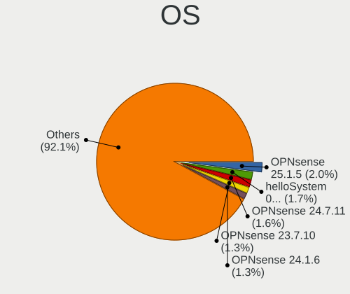

| Name                 | Computers | Percent |
|----------------------|-----------|---------|
| OPNsense 25.1.5      | 26        | 2.05%   |
| helloSystem 0.8.1    | 21        | 1.65%   |
| OPNsense 24.7.11     | 20        | 1.57%   |
| OPNsense 23.7.10     | 17        | 1.34%   |
| OPNsense 24.1.6      | 16        | 1.26%   |
| OPNsense 23.1.11     | 16        | 1.26%   |
| OPNsense 20.7.8      | 16        | 1.26%   |
| OPNsense 25.1.3      | 15        | 1.18%   |
| helloSystem 0.7.0    | 15        | 1.18%   |
| FreeBSD 14.0-CURRENT | 14        | 1.1%    |
| FreeBSD 13.0         | 14        | 1.1%    |
| OPNsense 25.1.7      | 13        | 1.02%   |
| OPNsense 25.1.4      | 13        | 1.02%   |
| OPNsense 25.1.1      | 13        | 1.02%   |
| OPNsense 22.7.10     | 13        | 1.02%   |
| OPNsense 24.7.8      | 12        | 0.94%   |
| helloSystem 0.5.0    | 12        | 0.94%   |
| OPNsense 25.7.6      | 11        | 0.87%   |
| OPNsense 25.1        | 11        | 0.87%   |
| OPNsense 24.7.7      | 11        | 0.87%   |
| OPNsense 24.7.6      | 11        | 0.87%   |
| OPNsense 24.7.5      | 11        | 0.87%   |
| OPNsense 24.7.12     | 11        | 0.87%   |
| OPNsense 23.7.12     | 11        | 0.87%   |
| OPNsense 22.1        | 11        | 0.87%   |
| OPNsense 21.7.7      | 11        | 0.87%   |
| OPNsense 21.1.5      | 11        | 0.87%   |
| FreeBSD 14.2         | 11        | 0.87%   |
| OPNsense 25.7.9      | 10        | 0.79%   |
| OPNsense 25.7.4      | 10        | 0.79%   |
| OPNsense 25.7.1      | 10        | 0.79%   |
| OPNsense 24.1.9      | 10        | 0.79%   |
| OPNsense 24.1.5      | 10        | 0.79%   |
| OPNsense 22.7.4      | 10        | 0.79%   |
| OPNsense 22.1.6      | 10        | 0.79%   |
| helloSystem 0.4.0    | 10        | 0.79%   |
| FreeBSD 15.0-CURRENT | 10        | 0.79%   |
| OPNsense 25.1.6      | 9         | 0.71%   |
| OPNsense 25.1.10     | 9         | 0.71%   |
| OPNsense 24.7.4      | 9         | 0.71%   |

OS Family
---------

OS without a version

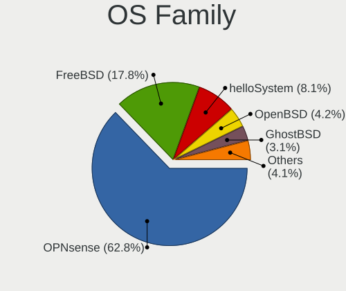

| Name        | Computers | Percent |
|-------------|-----------|---------|
| OPNsense    | 568       | 62.76%  |
| FreeBSD     | 161       | 17.79%  |
| helloSystem | 73        | 8.07%   |
| OpenBSD     | 38        | 4.2%    |
| GhostBSD    | 28        | 3.09%   |
| NomadBSD    | 17        | 1.88%   |
| NetBSD      | 7         | 0.77%   |
| XigmaNAS    | 3         | 0.33%   |
| DragonFly   | 3         | 0.33%   |
| pfSense     | 2         | 0.22%   |
| MidnightBSD | 2         | 0.22%   |
| ClonOS      | 2         | 0.22%   |
| FuryBSD     | 1         | 0.11%   |

Arch
----

OS architecture (x86_64, i586, etc.)

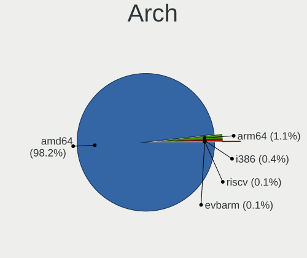

| Name   | Computers | Percent |
|--------|-----------|---------|
| amd64  | 874       | 98.2%   |
| arm64  | 10        | 1.12%   |
| i386   | 4         | 0.45%   |
| riscv  | 1         | 0.11%   |
| evbarm | 1         | 0.11%   |

DE
--

Desktop Environment

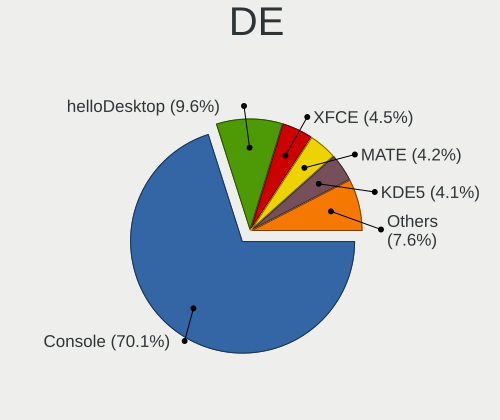

| Name             | Computers | Percent |
|------------------|-----------|---------|
| Console          | 640       | 70.1%   |
| helloDesktop     | 88        | 9.64%   |
| XFCE             | 41        | 4.49%   |
| MATE             | 38        | 4.16%   |
| KDE5             | 37        | 4.05%   |
| TWM              | 11        | 1.2%    |
| Openbox          | 11        | 1.2%    |
| GNOME            | 10        | 1.1%    |
| fvwm             | 7         | 0.77%   |
| i3               | 4         | 0.44%   |
| Cinnamon         | 4         | 0.44%   |
| LXQt             | 3         | 0.33%   |
| xinitrc          | 2         | 0.22%   |
| Fluxbox          | 2         | 0.22%   |
| Budgie           | 2         | 0.22%   |
| AwesomeWM        | 2         | 0.22%   |
| X-Cinnamon       | 1         | 0.11%   |
| sway             | 1         | 0.11%   |
| Potato           | 1         | 0.11%   |
| PekWM            | 1         | 0.11%   |
| Metacity (Marco) | 1         | 0.11%   |
| LXDE             | 1         | 0.11%   |
| KDE6             | 1         | 0.11%   |
| IceWM            | 1         | 0.11%   |
| Enlightenment    | 1         | 0.11%   |
| DWM              | 1         | 0.11%   |
| CDE              | 1         | 0.11%   |

Display Server
--------------

X11 or Wayland

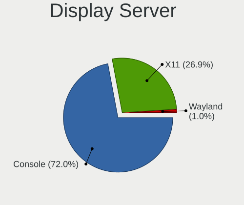

| Name    | Computers | Percent |
|---------|-----------|---------|
| Console | 647       | 72.05%  |
| X11     | 242       | 26.95%  |
| Wayland | 9         | 1%      |

Display Manager
---------------

SDDM, LightDM, etc.

| Name    | Computers | Percent |
|---------|-----------|---------|
| Console | 707       | 77.95%  |
| SLiM    | 88        | 9.7%    |
| SDDM    | 57        | 6.28%   |
| LightDM | 44        | 4.85%   |
| XDM     | 5         | 0.55%   |
| GDM     | 5         | 0.55%   |
| Ly      | 1         | 0.11%   |

OS Lang
-------

Language

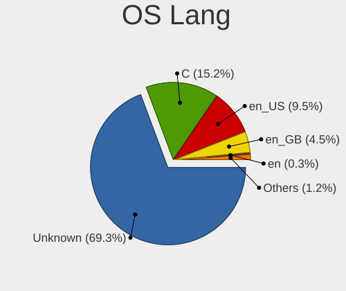

| Lang            | Computers | Percent |
|-----------------|-----------|---------|
| Unknown         | 637       | 69.31%  |
| C               | 140       | 15.23%  |
| en_US           | 87        | 9.47%   |
| en_GB           | 41        | 4.46%   |
| en              | 3         | 0.33%   |
| ru_RU           | 2         | 0.22%   |
| fr_FR           | 2         | 0.22%   |
| en_GB.US-ASCII  | 2         | 0.22%   |
| it_CH           | 1         | 0.11%   |
| fi_FI           | 1         | 0.11%   |
| en_UK           | 1         | 0.11%   |
| en_GB.ISO8859-1 | 1         | 0.11%   |
| be_BY           | 1         | 0.11%   |

Boot Mode
---------

EFI or BIOS

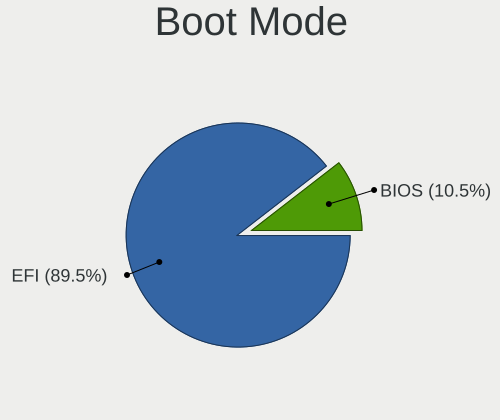

| Mode | Computers | Percent |
|------|-----------|---------|
| EFI  | 802       | 89.51%  |
| BIOS | 94        | 10.49%  |

Filesystem
----------

Type of filesystem

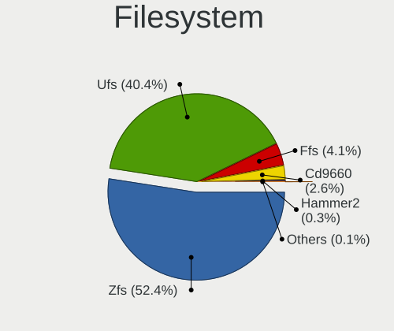

| Type    | Computers | Percent |
|---------|-----------|---------|
| Zfs     | 482       | 52.45%  |
| Ufs     | 371       | 40.37%  |
| Ffs     | 38        | 4.13%   |
| Cd9660  | 24        | 2.61%   |
| Hammer2 | 3         | 0.33%   |
| Unknown | 1         | 0.11%   |

Part. scheme
------------

Scheme of partitioning

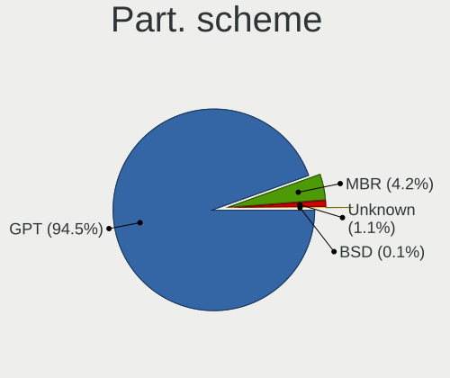

| Type    | Computers | Percent |
|---------|-----------|---------|
| GPT     | 846       | 94.53%  |
| MBR     | 38        | 4.25%   |
| Unknown | 10        | 1.12%   |
| BSD     | 1         | 0.11%   |

Board
-----

Vendor
------

Motherboard manufacturer

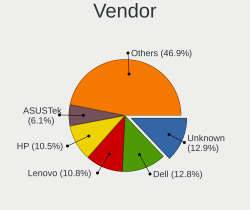

| Name                                 | Computers | Percent |
|--------------------------------------|-----------|---------|
| Unknown                              | 115       | 12.94%  |
| Dell                                 | 114       | 12.82%  |
| Lenovo                               | 96        | 10.8%   |
| Hewlett-Packard                      | 93        | 10.46%  |
| ASUSTek Computer                     | 54        | 6.07%   |
| Intel                                | 43        | 4.84%   |
| Gigabyte Technology                  | 41        | 4.61%   |
| Protectli                            | 26        | 2.92%   |
| Apple                                | 21        | 2.36%   |
| ASRock                               | 17        | 1.91%   |
| MSI                                  | 15        | 1.69%   |
| AMI                                  | 15        | 1.69%   |
| Fujitsu                              | 12        | 1.35%   |
| Deciso                               | 11        | 1.24%   |
| Acer                                 | 11        | 1.24%   |
| Supermicro                           | 10        | 1.12%   |
| PC Engines                           | 10        | 1.12%   |
| Shuttle                              | 9         | 1.01%   |
| AZW                                  | 9         | 1.01%   |
| Techvision                           | 8         | 0.9%    |
| Samsung Electronics                  | 8         | 0.9%    |
| Raspberry Pi Foundation              | 8         | 0.9%    |
| Sophos                               | 7         | 0.79%   |
| Star Labs                            | 6         | 0.67%   |
| Toshiba                              | 5         | 0.56%   |
| MW                                   | 5         | 0.56%   |
| Shenzhen Meigao Electronic Equipment | 4         | 0.45%   |
| PICO PC                              | 4         | 0.45%   |
| Panasonic                            | 4         | 0.45%   |
| Inventec                             | 4         | 0.45%   |
| IceWhale Technology                  | 4         | 0.45%   |
| HPE                                  | 4         | 0.45%   |
| BESSTAR Tech                         | 4         | 0.45%   |
| ASRockRack                           | 4         | 0.45%   |
| ZOTAC                                | 3         | 0.34%   |
| HUAWEI                               | 3         | 0.34%   |
| GoWin Solution                       | 3         | 0.34%   |
| CncTion                              | 3         | 0.34%   |
| Cisco                                | 3         | 0.34%   |
| Biostar                              | 3         | 0.34%   |

Model
-----

Motherboard model

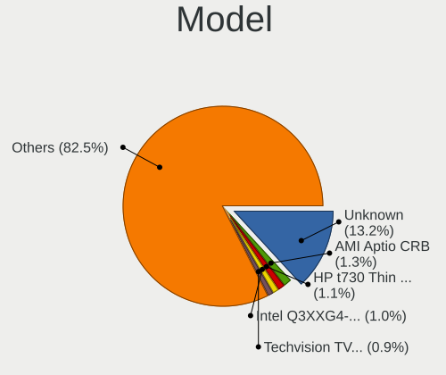

| Name                                | Computers | Percent |
|-------------------------------------|-----------|---------|
| Unknown                             | 117       | 13.16%  |
| AMI Aptio CRB                       | 12        | 1.35%   |
| HP t730 Thin Client                 | 10        | 1.12%   |
| Intel Q3XXG4-P V1.0                 | 9         | 1.01%   |
| Techvision TVI7309X                 | 8         | 0.9%    |
| Dell Wyse 5070 Extended Thin Client | 8         | 0.9%    |
| Protectli VP2420                    | 6         | 0.67%   |
| ASUS All Series                     | 6         | 0.67%   |
| RPi Raspberry Pi                    | 5         | 0.56%   |
| Protectli FW6                       | 5         | 0.56%   |
| Protectli FW4B                      | 5         | 0.56%   |
| PC Engines APU2                     | 5         | 0.56%   |
| MW GMLK-2_5G4L                      | 5         | 0.56%   |
| Fujitsu FUTRO S920                  | 5         | 0.56%   |
| Dell OptiPlex 7010                  | 5         | 0.56%   |
| Sophos SG                           | 4         | 0.45%   |
| PICO PC MNHO-113                    | 4         | 0.45%   |
| Dell OptiPlex 790                   | 4         | 0.45%   |
| Dell OptiPlex 7020                  | 4         | 0.45%   |
| Dell OptiPlex 3020                  | 4         | 0.45%   |
| Dell OptiPlex 3010                  | 4         | 0.45%   |
| AZW EQ                              | 4         | 0.45%   |
| Supermicro Super Server             | 3         | 0.34%   |
| Sophos XG                           | 3         | 0.34%   |
| Protectli FW4C                      | 3         | 0.34%   |
| PC Engines apu4                     | 3         | 0.34%   |
| Lenovo ThinkCentre M720q 10TAS00Q00 | 3         | 0.34%   |
| Intel SHARKBAY                      | 3         | 0.34%   |
| Intel DENLOW_WS                     | 3         | 0.34%   |
| HP Z600 Workstation                 | 3         | 0.34%   |
| HP t620 PLUS Quad Core TC           | 3         | 0.34%   |
| HP ProDesk 400 G3 SFF               | 3         | 0.34%   |
| HP EliteDesk 800 G1 SFF             | 3         | 0.34%   |
| HP EliteBook 8570p                  | 3         | 0.34%   |
| GoWin Solution R86S                 | 3         | 0.34%   |
| Gigabyte B450M DS3H                 | 3         | 0.34%   |
| Dell PowerEdge R440                 | 3         | 0.34%   |
| Dell PowerEdge R210 II              | 3         | 0.34%   |
| Dell OptiPlex Micro 7010            | 3         | 0.34%   |
| Dell OptiPlex 760                   | 3         | 0.34%   |

Model Family
------------

Motherboard model prefix

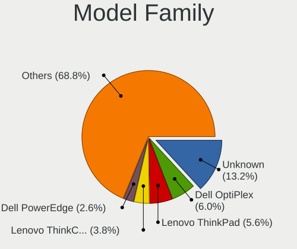

| Name                | Computers | Percent |
|---------------------|-----------|---------|
| Unknown             | 117       | 13.16%  |
| Dell OptiPlex       | 53        | 5.96%   |
| Lenovo ThinkPad     | 50        | 5.62%   |
| Lenovo ThinkCentre  | 34        | 3.82%   |
| Dell PowerEdge      | 23        | 2.59%   |
| HP EliteDesk        | 13        | 1.46%   |
| AMI Aptio           | 12        | 1.35%   |
| Dell Latitude       | 11        | 1.24%   |
| ASUS ROG            | 11        | 1.24%   |
| HP t730             | 10        | 1.12%   |
| HP ProDesk          | 10        | 1.12%   |
| Intel Q3XXG4-P      | 9         | 1.01%   |
| HP ProLiant         | 9         | 1.01%   |
| HP EliteBook        | 9         | 1.01%   |
| Dell Wyse           | 9         | 1.01%   |
| Dell Precision      | 9         | 1.01%   |
| Techvision TVI7309X | 8         | 0.9%    |
| RPi Raspberry       | 8         | 0.9%    |
| ASUS PRIME          | 8         | 0.9%    |
| Acer Aspire         | 8         | 0.9%    |
| HP Compaq           | 7         | 0.79%   |
| Fujitsu FUTRO       | 7         | 0.79%   |
| Protectli VP2420    | 6         | 0.67%   |
| ASUS All            | 6         | 0.67%   |
| Protectli FW6       | 5         | 0.56%   |
| Protectli FW4B      | 5         | 0.56%   |
| PC Engines APU2     | 5         | 0.56%   |
| MW GMLK-2           | 5         | 0.56%   |
| HP Pavilion         | 5         | 0.56%   |
| Apple Macmini5      | 5         | 0.56%   |
| Toshiba Satellite   | 4         | 0.45%   |
| Sophos SG           | 4         | 0.45%   |
| PICO PC MNHO-113    | 4         | 0.45%   |
| HP ProBook          | 4         | 0.45%   |
| Dell XPS            | 4         | 0.45%   |
| Dell Inspiron       | 4         | 0.45%   |
| Deciso NetBoard-A10 | 4         | 0.45%   |
| AZW EQ              | 4         | 0.45%   |
| Supermicro Super    | 3         | 0.34%   |
| Sophos XG           | 3         | 0.34%   |

MFG Year
--------

Motherboard manufacture year

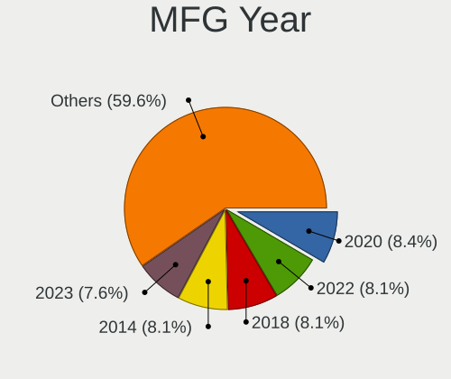

| Year    | Computers | Percent |
|---------|-----------|---------|
| 2020    | 75        | 8.44%   |
| 2022    | 72        | 8.1%    |
| 2018    | 72        | 8.1%    |
| 2014    | 72        | 8.1%    |
| 2023    | 68        | 7.65%   |
| 2021    | 65        | 7.31%   |
| 2024    | 63        | 7.09%   |
| 2016    | 62        | 6.97%   |
| 2019    | 59        | 6.64%   |
| 2015    | 49        | 5.51%   |
| 2017    | 42        | 4.72%   |
| 2013    | 42        | 4.72%   |
| 2012    | 40        | 4.5%    |
| 2011    | 29        | 3.26%   |
| 2010    | 24        | 2.7%    |
| 2009    | 19        | 2.14%   |
| 2008    | 13        | 1.46%   |
| 2025    | 9         | 1.01%   |
| Unknown | 8         | 0.9%    |
| 2007    | 4         | 0.45%   |
| 2006    | 2         | 0.22%   |

Form Factor
-----------

Physical design of the computer

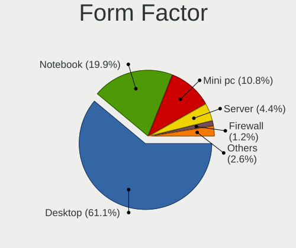

| Name           | Computers | Percent |
|----------------|-----------|---------|
| Desktop        | 543       | 61.08%  |
| Notebook       | 177       | 19.91%  |
| Mini pc        | 96        | 10.8%   |
| Server         | 39        | 4.39%   |
| Firewall       | 11        | 1.24%   |
| System on chip | 7         | 0.79%   |
| Tablet         | 7         | 0.79%   |
| All in one     | 7         | 0.79%   |
| Convertible    | 2         | 0.22%   |

Coreboot
--------

Have coreboot on board

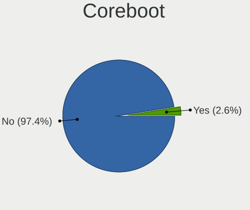

| Used | Computers | Percent |
|------|-----------|---------|
| No   | 866       | 97.41%  |
| Yes  | 23        | 2.59%   |

RAM Size
--------

Total RAM memory

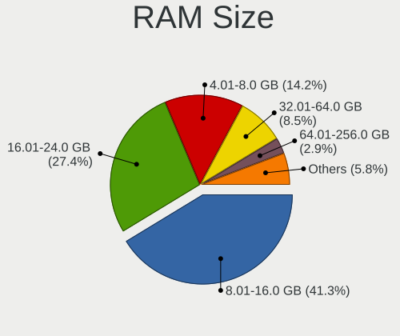

| Size in GB      | Computers | Percent |
|-----------------|-----------|---------|
| 8.01-16.0       | 373       | 41.31%  |
| 16.01-24.0      | 247       | 27.35%  |
| 4.01-8.0        | 128       | 14.17%  |
| 32.01-64.0      | 77        | 8.53%   |
| 64.01-256.0     | 26        | 2.88%   |
| 2.01-3.0        | 23        | 2.55%   |
| 24.01-32.0      | 14        | 1.55%   |
| 3.01-4.0        | 8         | 0.89%   |
| More than 256.0 | 2         | 0.22%   |
| 0.51-1.0        | 2         | 0.22%   |
| 1.01-2.0        | 1         | 0.11%   |
| 0.01-0.5        | 1         | 0.11%   |
| Unknown         | 1         | 0.11%   |

RAM Used
--------

Used RAM memory

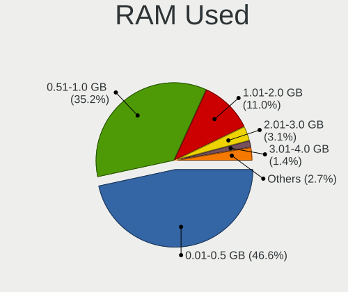

| Used GB     | Computers | Percent |
|-------------|-----------|---------|
| 0.01-0.5    | 428       | 46.62%  |
| 0.51-1.0    | 323       | 35.19%  |
| 1.01-2.0    | 101       | 11%     |
| 2.01-3.0    | 28        | 3.05%   |
| 3.01-4.0    | 13        | 1.42%   |
| 4.01-8.0    | 9         | 0.98%   |
| Unknown     | 7         | 0.76%   |
| 8.01-16.0   | 3         | 0.33%   |
| 24.01-32.0  | 2         | 0.22%   |
| 32.01-64.0  | 1         | 0.11%   |
| 64.01-256.0 | 1         | 0.11%   |
| 16.01-24.0  | 1         | 0.11%   |
| 0           | 1         | 0.11%   |

Total Drives
------------

Number of drives on board

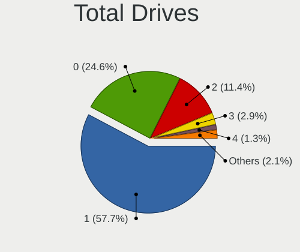

| Drives | Computers | Percent |
|--------|-----------|---------|
| 1      | 544       | 57.75%  |
| 0      | 232       | 24.63%  |
| 2      | 107       | 11.36%  |
| 3      | 27        | 2.87%   |
| 4      | 12        | 1.27%   |
| 5      | 8         | 0.85%   |
| 7      | 4         | 0.42%   |
| 8      | 3         | 0.32%   |
| 6      | 2         | 0.21%   |
| 24     | 1         | 0.11%   |
| 17     | 1         | 0.11%   |
| 14     | 1         | 0.11%   |

Has CD-ROM
----------

Has CD-ROM on board

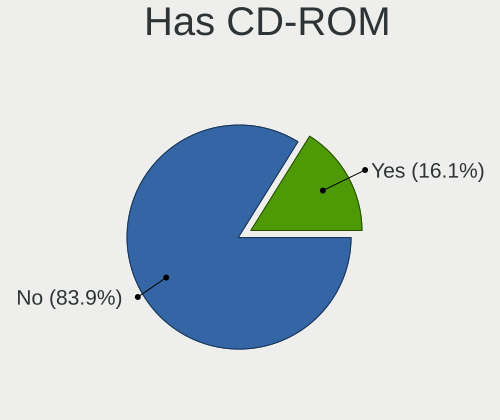

| Presented | Computers | Percent |
|-----------|-----------|---------|
| No        | 754       | 83.87%  |
| Yes       | 145       | 16.13%  |

Has Ethernet
------------

Has Ethernet on board

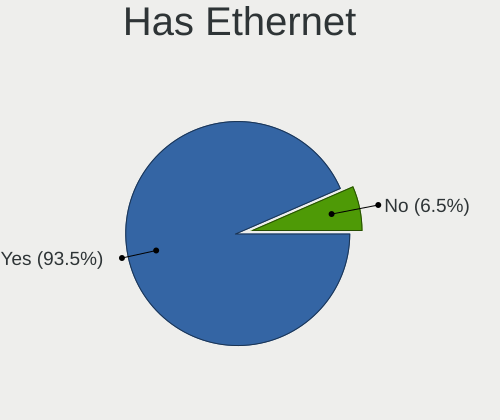

| Presented | Computers | Percent |
|-----------|-----------|---------|
| Yes       | 831       | 93.48%  |
| No        | 58        | 6.52%   |

Has WiFi
--------

Has WiFi module

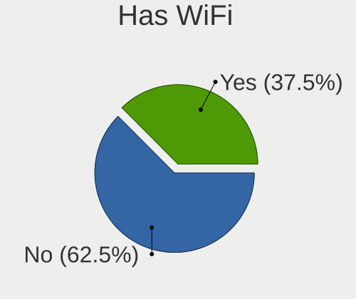

| Presented | Computers | Percent |
|-----------|-----------|---------|
| No        | 559       | 62.53%  |
| Yes       | 335       | 37.47%  |

Has Bluetooth
-------------

Has Bluetooth module

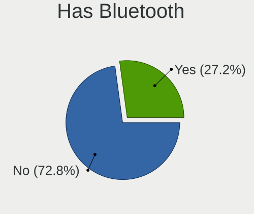

| Presented | Computers | Percent |
|-----------|-----------|---------|
| No        | 652       | 72.85%  |
| Yes       | 243       | 27.15%  |

Location
--------

Country
-------

Geographic location (country)

| Country | Computers | Percent |
|---------|-----------|---------|
| UK      | 889       | 100%    |

City
----

Geographic location (city)

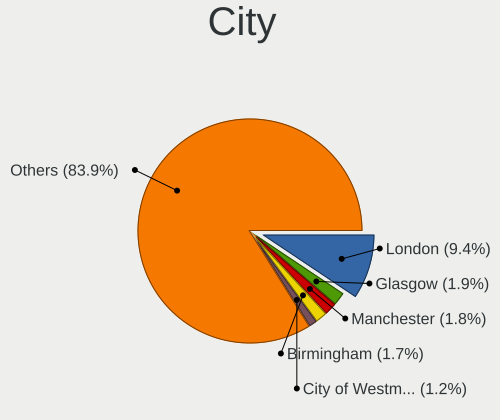

| City                | Computers | Percent |
|---------------------|-----------|---------|
| London              | 102       | 9.38%   |
| Glasgow             | 21        | 1.93%   |
| Manchester          | 20        | 1.84%   |
| Birmingham          | 19        | 1.75%   |
| City of Westminster | 13        | 1.2%    |
| Brighton            | 13        | 1.2%    |
| Newcastle upon Tyne | 12        | 1.1%    |
| Liverpool           | 12        | 1.1%    |
| Reading             | 11        | 1.01%   |
| Southampton         | 9         | 0.83%   |
| Slough              | 9         | 0.83%   |
| Sheffield           | 9         | 0.83%   |
| City of London      | 9         | 0.83%   |
| Cambridge           | 9         | 0.83%   |
| Bristol             | 9         | 0.83%   |
| Bradford            | 9         | 0.83%   |
| Greenwich           | 8         | 0.74%   |
| Edgware             | 8         | 0.74%   |
| Watford             | 7         | 0.64%   |
| Walsall             | 7         | 0.64%   |
| Sutton              | 7         | 0.64%   |
| Southwark           | 7         | 0.64%   |
| Peterborough        | 7         | 0.64%   |
| Milton Keynes       | 7         | 0.64%   |
| Leicester           | 7         | 0.64%   |
| Leeds               | 7         | 0.64%   |
| Islington           | 7         | 0.64%   |
| Hull                | 7         | 0.64%   |
| Harrow              | 7         | 0.64%   |
| Harringay           | 7         | 0.64%   |
| Hackney             | 7         | 0.64%   |
| Croydon             | 7         | 0.64%   |
| Coventry            | 7         | 0.64%   |
| Swindon             | 6         | 0.55%   |
| Portsmouth          | 6         | 0.55%   |
| Oldham              | 6         | 0.55%   |
| Fulham              | 6         | 0.55%   |
| Crawley             | 6         | 0.55%   |
| Worthing            | 5         | 0.46%   |
| Wandsworth          | 5         | 0.46%   |

Drives
------

Drive Vendor
------------

Hard drive vendors

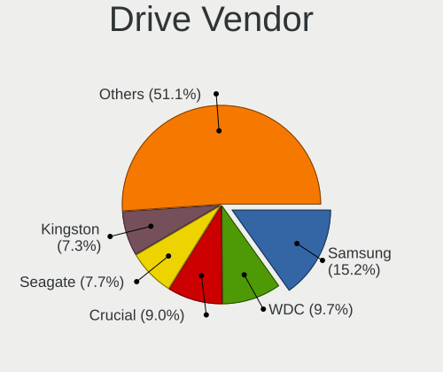

| Vendor              | Computers | Drives | Percent |
|---------------------|-----------|--------|---------|
| Samsung Electronics | 128       | 220    | 15.17%  |
| WDC                 | 82        | 133    | 9.72%   |
| Crucial             | 76        | 121    | 9%      |
| Seagate             | 65        | 135    | 7.7%    |
| Kingston            | 62        | 90     | 7.35%   |
| SanDisk             | 44        | 55     | 5.21%   |
| Toshiba             | 33        | 96     | 3.91%   |
| Transcend           | 28        | 39     | 3.32%   |
| Intel               | 23        | 40     | 2.73%   |
| Hitachi             | 18        | 27     | 2.13%   |
| Hoodisk             | 17        | 34     | 2.01%   |
| China               | 17        | 21     | 2.01%   |
| SK hynix            | 14        | 20     | 1.66%   |
| Phison              | 14        | 19     | 1.66%   |
| HGST                | 12        | 64     | 1.42%   |
| Micron Technology   | 11        | 12     | 1.3%    |
| Apple               | 10        | 13     | 1.18%   |
| A-DATA Technology   | 10        | 15     | 1.18%   |
| Patriot             | 9         | 12     | 1.07%   |
| OCZ                 | 8         | 13     | 0.95%   |
| LITEONIT            | 8         | 11     | 0.95%   |
| Hewlett-Packard     | 8         | 32     | 0.95%   |
| Apacer              | 8         | 10     | 0.95%   |
| SPCC                | 7         | 10     | 0.83%   |
| PNY                 | 7         | 15     | 0.83%   |
| Integral            | 7         | 10     | 0.83%   |
| Gigabyte Technology | 7         | 10     | 0.83%   |
| FORESEE             | 7         | 9      | 0.83%   |
| NVMe                | 6         | 6      | 0.71%   |
| LITEON              | 6         | 8      | 0.71%   |
| Lexar               | 6         | 9      | 0.71%   |
| Corsair             | 5         | 10     | 0.59%   |
| BIWIN               | 5         | 9      | 0.59%   |
| Silicon Motion      | 4         | 6      | 0.47%   |
| Protectli           | 4         | 5      | 0.47%   |
| Netac               | 4         | 9      | 0.47%   |
| Fanxiang            | 4         | 5      | 0.47%   |
| XUM                 | 3         | 3      | 0.36%   |
| ORTIAL              | 3         | 5      | 0.36%   |
| KIOXIA-EXCERIA      | 3         | 6      | 0.36%   |

Drive Model
-----------

Hard drive models

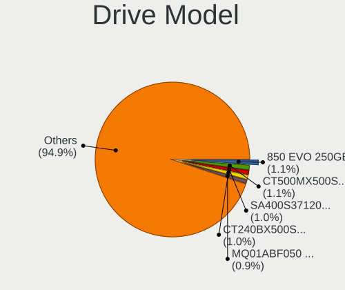

| Model                                | Computers | Percent |
|--------------------------------------|-----------|---------|
| Samsung SSD 850 EVO 250GB            | 10        | 1.11%   |
| Crucial CT500MX500SSD1 500GB         | 10        | 1.11%   |
| Kingston SA400S37120G 120GB          | 9         | 1%      |
| Crucial CT240BX500SSD1 240GB         | 9         | 1%      |
| Toshiba MQ01ABF050 500GB             | 8         | 0.88%   |
| Kingston SA400S37240G 240GB          | 8         | 0.88%   |
| Crucial CT120BX500SSD1 120GB         | 7         | 0.77%   |
| Samsung SSD 860 EVO 500GB            | 6         | 0.66%   |
| Samsung SSD 840 EVO 250GB            | 6         | 0.66%   |
| Hoodisk SSD 32GB                     | 6         | 0.66%   |
| Crucial CT1000MX500SSD1 1TB          | 6         | 0.66%   |
| Kingston SUV500MS120G 120GB          | 5         | 0.55%   |
| Hoodisk SSD 64GB                     | 5         | 0.55%   |
| Hoodisk SSD 128GB                    | 5         | 0.55%   |
| WDC WDS240G2G0A-00JH30 240GB         | 4         | 0.44%   |
| SPCC Solid State Disk 128GB          | 4         | 0.44%   |
| SanDisk SSD PLUS 480GB               | 4         | 0.44%   |
| Samsung SSD 840 EVO 120GB            | 4         | 0.44%   |
| PNY CS900 120GB SSD                  | 4         | 0.44%   |
| Kingston SV300S37A120G 120GB         | 4         | 0.44%   |
| HGST HTS725050A7E630 500GB           | 4         | 0.44%   |
| HP RAID 1(1+0) 119GB                 | 4         | 0.44%   |
| Crucial CT480BX500SSD1 480GB         | 4         | 0.44%   |
| Crucial CT250MX500SSD1 250GB         | 4         | 0.44%   |
| BIWIN SSD 128GB                      | 4         | 0.44%   |
| XUM HX256GSSDSATA3 256GB             | 3         | 0.33%   |
| WDC WDS500G2B0A-00SM50 500GB         | 3         | 0.33%   |
| WDC WD20EZRX-00D8PB0 2TB             | 3         | 0.33%   |
| WDC PC SN730 SDBQNTY-256G-1001 256GB | 3         | 0.33%   |
| Transcend TS64GMSA230S 64GB          | 3         | 0.33%   |
| Transcend TS256GMTE652T2 256GB       | 3         | 0.33%   |
| Transcend TS128GMTE110S 128GB        | 3         | 0.33%   |
| Toshiba HDWE140 4TB                  | 3         | 0.33%   |
| Seagate ST500DM002-1BD142 500GB      | 3         | 0.33%   |
| Seagate ST3500418AS 500GB            | 3         | 0.33%   |
| Seagate ST3500312CS 500GB            | 3         | 0.33%   |
| Seagate ST2000LM003 HN-M201RAD 2TB   | 3         | 0.33%   |
| Seagate ST1000LM024 HN-M101MBB 1TB   | 3         | 0.33%   |
| Seagate ST1000DM010-2EP102 1TB       | 3         | 0.33%   |
| SanDisk SDSSDA240G 240GB             | 3         | 0.33%   |

HDD Vendor
----------

Hard disk drive vendors

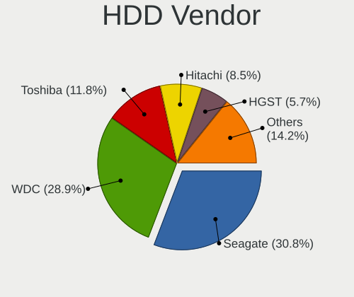

| Vendor              | Computers | Drives | Percent |
|---------------------|-----------|--------|---------|
| Seagate             | 65        | 135    | 30.81%  |
| WDC                 | 61        | 100    | 28.91%  |
| Toshiba             | 25        | 78     | 11.85%  |
| Hitachi             | 18        | 27     | 8.53%   |
| HGST                | 12        | 64     | 5.69%   |
| Samsung Electronics | 10        | 10     | 4.74%   |
| NVMe                | 5         | 5      | 2.37%   |
| Apple               | 5         | 6      | 2.37%   |
| Hewlett-Packard     | 4         | 12     | 1.9%    |
| Fujitsu             | 3         | 8      | 1.42%   |
| OPENBSD             | 2         | 2      | 0.95%   |
| Dell                | 1         | 2      | 0.47%   |

SSD Vendor
----------

Solid state drive vendors

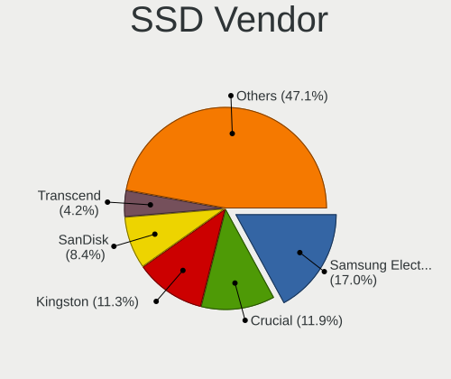

| Vendor              | Computers | Drives | Percent |
|---------------------|-----------|--------|---------|
| Samsung Electronics | 89        | 153    | 17.05%  |
| Crucial             | 62        | 105    | 11.88%  |
| Kingston            | 59        | 85     | 11.3%   |
| SanDisk             | 44        | 55     | 8.43%   |
| Transcend           | 22        | 27     | 4.21%   |
| Intel               | 19        | 35     | 3.64%   |
| Hoodisk             | 17        | 34     | 3.26%   |
| China               | 17        | 21     | 3.26%   |
| WDC                 | 14        | 23     | 2.68%   |
| A-DATA Technology   | 9         | 14     | 1.72%   |
| OCZ                 | 8         | 13     | 1.53%   |
| Micron Technology   | 8         | 9      | 1.53%   |
| LITEONIT            | 8         | 11     | 1.53%   |
| Apacer              | 8         | 10     | 1.53%   |
| PNY                 | 7         | 13     | 1.34%   |
| Patriot             | 7         | 10     | 1.34%   |
| Integral            | 7         | 10     | 1.34%   |
| FORESEE             | 7         | 9      | 1.34%   |
| SPCC                | 6         | 7      | 1.15%   |
| Phison              | 6         | 7      | 1.15%   |
| LITEON              | 6         | 8      | 1.15%   |
| Lexar               | 6         | 9      | 1.15%   |
| Toshiba             | 5         | 13     | 0.96%   |
| SK hynix            | 5         | 7      | 0.96%   |
| Hewlett-Packard     | 5         | 20     | 0.96%   |
| Gigabyte Technology | 5         | 8      | 0.96%   |
| Corsair             | 5         | 10     | 0.96%   |
| BIWIN               | 5         | 9      | 0.96%   |
| Apple               | 5         | 7      | 0.96%   |
| Protectli           | 4         | 5      | 0.77%   |
| XUM                 | 3         | 3      | 0.57%   |
| Netac               | 3         | 8      | 0.57%   |
| Intenso             | 3         | 3      | 0.57%   |
| Innodisk            | 3         | 5      | 0.57%   |
| Vaseky              | 2         | 2      | 0.38%   |
| SHAREVDI            | 2         | 3      | 0.38%   |
| ORTIAL              | 2         | 4      | 0.38%   |
| Fanxiang            | 2         | 3      | 0.38%   |
| Zheino              | 1         | 1      | 0.19%   |
| Wibtek              | 1         | 1      | 0.19%   |

Drive Kind
----------

HDD or SSD

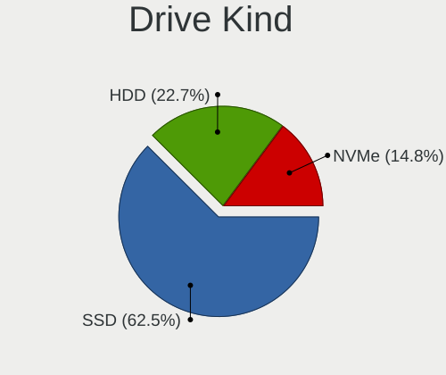

| Kind | Computers | Drives | Percent |
|------|-----------|--------|---------|
| SSD  | 481       | 810    | 62.47%  |
| HDD  | 175       | 449    | 22.73%  |
| NVMe | 114       | 175    | 14.81%  |

Drive Connector
---------------

SATA, SAS, NVMe, etc.

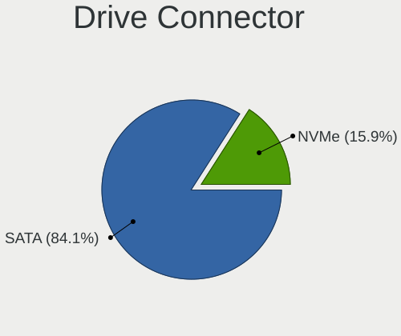

| Type | Computers | Drives | Percent |
|------|-----------|--------|---------|
| SATA | 601       | 1259   | 84.06%  |
| NVMe | 114       | 175    | 15.94%  |

Drive Size
----------

Size of hard drive

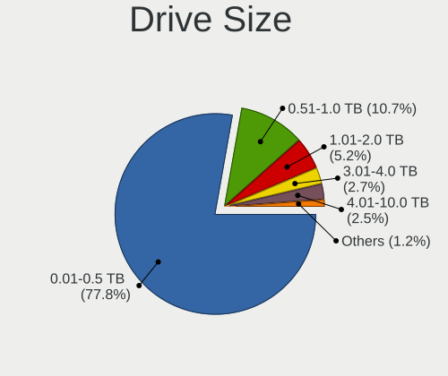

| Size in TB | Computers | Drives | Percent |
|------------|-----------|--------|---------|
| 0.01-0.5   | 525       | 911    | 77.78%  |
| 0.51-1.0   | 72        | 142    | 10.67%  |
| 1.01-2.0   | 35        | 66     | 5.19%   |
| 3.01-4.0   | 18        | 68     | 2.67%   |
| 4.01-10.0  | 17        | 57     | 2.52%   |
| 2.01-3.0   | 6         | 13     | 0.89%   |
| 10.01-20.0 | 2         | 2      | 0.3%    |

Space Total
-----------

Amount of disk space available on the file system

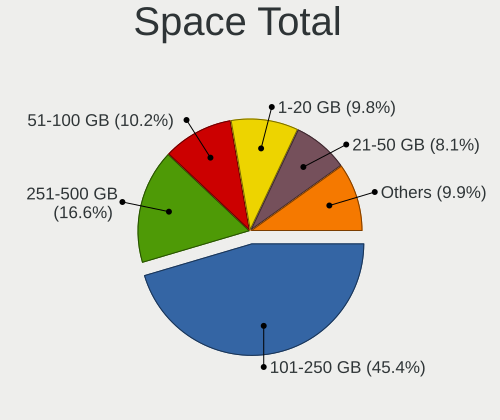

| Size in GB     | Computers | Percent |
|----------------|-----------|---------|
| 101-250        | 427       | 45.43%  |
| 251-500        | 156       | 16.6%   |
| 51-100         | 96        | 10.21%  |
| 1-20           | 92        | 9.79%   |
| 21-50          | 76        | 8.09%   |
| 501-1000       | 60        | 6.38%   |
| 1001-2000      | 19        | 2.02%   |
| Unknown        | 7         | 0.74%   |
| More than 3000 | 6         | 0.64%   |
| 2001-3000      | 1         | 0.11%   |

Space Used
----------

Amount of used disk space

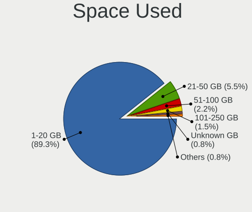

| Used GB        | Computers | Percent |
|----------------|-----------|---------|
| 1-20           | 827       | 89.31%  |
| 21-50          | 51        | 5.51%   |
| 51-100         | 20        | 2.16%   |
| 101-250        | 14        | 1.51%   |
| Unknown        | 7         | 0.76%   |
| 251-500        | 3         | 0.32%   |
| More than 3000 | 2         | 0.22%   |
| 2001-3000      | 1         | 0.11%   |
| 1001-2000      | 1         | 0.11%   |

Malfunc. Drives
---------------

Drive models with a malfunction

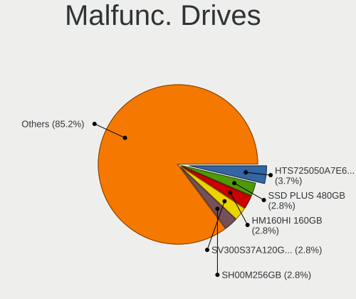

| Model                                            | Computers | Drives | Percent |
|--------------------------------------------------|-----------|--------|---------|
| HGST HTS725050A7E630 500GB                       | 4         | 10     | 3.7%    |
| SanDisk SSD PLUS 480GB                           | 3         | 3      | 2.78%   |
| Samsung Electronics HM160HI 160GB                | 3         | 3      | 2.78%   |
| Kingston SV300S37A120G 120GB                     | 3         | 7      | 2.78%   |
| China SH00M256GB                                 | 3         | 4      | 2.78%   |
| Toshiba HDWE140 4TB                              | 2         | 11     | 1.85%   |
| Seagate ST3500418AS 500GB                        | 2         | 3      | 1.85%   |
| Seagate ST3160310CS 160GB                        | 2         | 2      | 1.85%   |
| Samsung Electronics SSD PM810 2.5-inch 7mm 256GB | 2         | 3      | 1.85%   |
| OCZ VERTEX4 512GB                                | 2         | 2      | 1.85%   |
| HGST HTS721010A9E630 1TB                         | 2         | 26     | 1.85%   |
| Crucial CT525MX300SSD1 528GB                     | 2         | 3      | 1.85%   |
| Crucial CT128MX100SSD1 128GB                     | 2         | 8      | 1.85%   |
| China SATA SSD 32GB                              | 2         | 3      | 1.85%   |
| WDC WD7500BPKX-60HPJT0 752GB                     | 1         | 1      | 0.93%   |
| WDC WD5000AAKX-221CA1 500GB                      | 1         | 1      | 0.93%   |
| WDC WD5000AAKS-60WWPA0 500GB                     | 1         | 1      | 0.93%   |
| WDC WD4001FAEX-00MJRA0 4TB                       | 1         | 4      | 0.93%   |
| WDC WD3200BPVT-75JJ5T0 320GB                     | 1         | 1      | 0.93%   |
| WDC WD3200BEVT-22A23T0 320GB                     | 1         | 2      | 0.93%   |
| WDC WD3200AAJS-22B4A0 320GB                      | 1         | 1      | 0.93%   |
| WDC WD30EFRX-68EUZN0 3TB                         | 1         | 1      | 0.93%   |
| WDC WD2500BEVT-80A23T0 250GB                     | 1         | 1      | 0.93%   |
| WDC WD20EFZX-68AWUN0 2TB                         | 1         | 2      | 0.93%   |
| WDC WD1600BEVT-80A23T0 160GB                     | 1         | 1      | 0.93%   |
| WDC WD10JMVW-11AJGS0 1TB                         | 1         | 1      | 0.93%   |
| Transcend TS256GSSD320 256GB                     | 1         | 1      | 0.93%   |
| Toshiba THNSNK128GCS8 SATA 128GB                 | 1         | 2      | 0.93%   |
| Toshiba MK2555GSX 250GB                          | 1         | 1      | 0.93%   |
| Toshiba MD04ACA400 4TB                           | 1         | 1      | 0.93%   |
| Toshiba DT01ACA200 2TB                           | 1         | 1      | 0.93%   |
| Toshiba DT01ABA300 3TB                           | 1         | 1      | 0.93%   |
| Seagate ST9320423AS 320GB                        | 1         | 1      | 0.93%   |
| Seagate ST9250410AS 250GB                        | 1         | 1      | 0.93%   |
| Seagate ST9250315AS 250GB                        | 1         | 1      | 0.93%   |
| Seagate ST9160821AS 160GB                        | 1         | 1      | 0.93%   |
| Seagate ST500LM000-1EJ162 500GB                  | 1         | 1      | 0.93%   |
| Seagate ST3320310CS 320GB                        | 1         | 1      | 0.93%   |
| Seagate ST32000542AS 2TB                         | 1         | 1      | 0.93%   |
| Seagate ST250DM000-1BD141 250GB                  | 1         | 1      | 0.93%   |

Malfunc. Drive Vendor
---------------------

Vendors of faulty drives

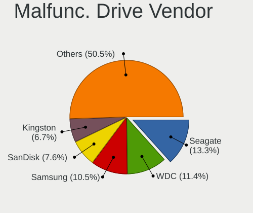

| Vendor              | Computers | Drives | Percent |
|---------------------|-----------|--------|---------|
| Seagate             | 14        | 15     | 13.33%  |
| WDC                 | 12        | 17     | 11.43%  |
| Samsung Electronics | 11        | 14     | 10.48%  |
| SanDisk             | 8         | 9      | 7.62%   |
| Kingston            | 7         | 11     | 6.67%   |
| Hitachi             | 7         | 12     | 6.67%   |
| Crucial             | 7         | 16     | 6.67%   |
| Toshiba             | 6         | 17     | 5.71%   |
| HGST                | 6         | 38     | 5.71%   |
| China               | 6         | 8      | 5.71%   |
| Apple               | 4         | 4      | 3.81%   |
| Intel               | 3         | 6      | 2.86%   |
| A-DATA Technology   | 3         | 4      | 2.86%   |
| OCZ                 | 2         | 2      | 1.9%    |
| Micron Technology   | 2         | 2      | 1.9%    |
| Transcend           | 1         | 1      | 0.95%   |
| MARVELL             | 1         | 1      | 0.95%   |
| Kingchuxing         | 1         | 1      | 0.95%   |
| HP Phison           | 1         | 1      | 0.95%   |
| Hewlett-Packard     | 1         | 1      | 0.95%   |
| FCS                 | 1         | 2      | 0.95%   |
| BIWIN               | 1         | 1      | 0.95%   |

Malfunc. HDD Vendor
-------------------

Vendors of faulty HDD drives

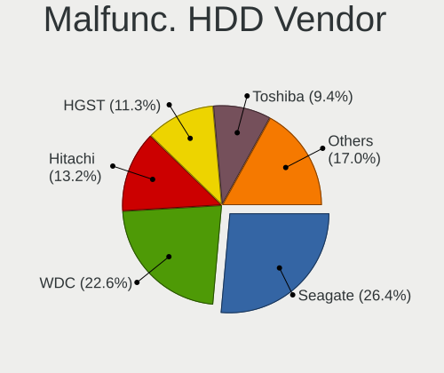

| Vendor              | Computers | Drives | Percent |
|---------------------|-----------|--------|---------|
| Seagate             | 14        | 15     | 26.42%  |
| WDC                 | 12        | 17     | 22.64%  |
| Hitachi             | 7         | 12     | 13.21%  |
| HGST                | 6         | 38     | 11.32%  |
| Toshiba             | 5         | 15     | 9.43%   |
| Samsung Electronics | 5         | 5      | 9.43%   |
| Apple               | 3         | 3      | 5.66%   |
| Hewlett-Packard     | 1         | 1      | 1.89%   |

Malfunc. Drive Kind
-------------------

Kinds of faulty drives

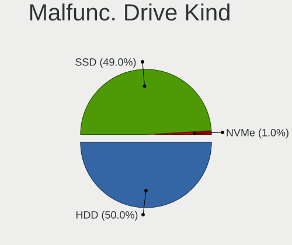

| Kind | Computers | Drives | Percent |
|------|-----------|--------|---------|
| HDD  | 52        | 106    | 50%     |
| SSD  | 51        | 74     | 49.04%  |
| NVMe | 1         | 3      | 0.96%   |

Failed Drives
-------------

Failed drive models

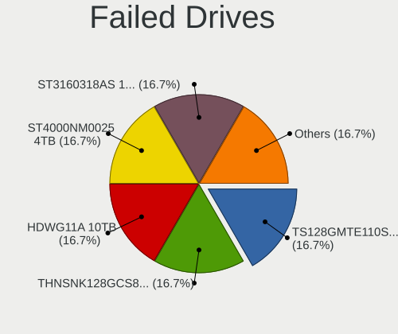

| Model                            | Computers | Drives | Percent |
|----------------------------------|-----------|--------|---------|
| Transcend TS128GMTE110S 128GB    | 1         | 1      | 16.67%  |
| Toshiba THNSNK128GCS8 SATA 128GB | 1         | 1      | 16.67%  |
| Toshiba HDWG11A 10TB             | 1         | 1      | 16.67%  |
| Seagate ST4000NM0025 4TB         | 1         | 2      | 16.67%  |
| Seagate ST3160318AS 160GB        | 1         | 1      | 16.67%  |
| Kingston SM2280S3120G 120GB      | 1         | 1      | 16.67%  |

Failed Drive Vendor
-------------------

Failed drive vendors

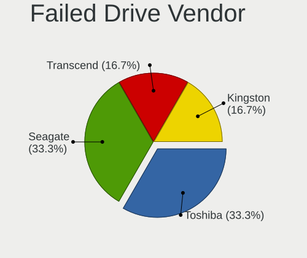

| Vendor    | Computers | Drives | Percent |
|-----------|-----------|--------|---------|
| Toshiba   | 2         | 2      | 33.33%  |
| Seagate   | 2         | 3      | 33.33%  |
| Transcend | 1         | 1      | 16.67%  |
| Kingston  | 1         | 1      | 16.67%  |

Drive Status
------------

Number of failed and malfunc. drives

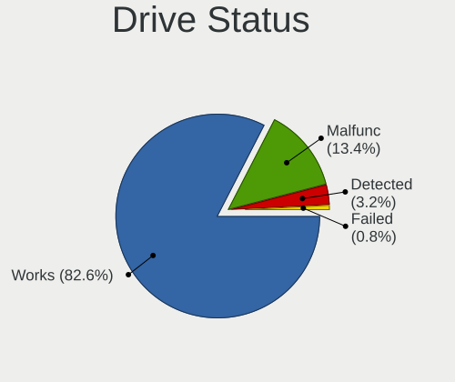

| Status   | Computers | Drives | Percent |
|----------|-----------|--------|---------|
| Works    | 611       | 1196   | 82.57%  |
| Malfunc  | 99        | 183    | 13.38%  |
| Detected | 24        | 48     | 3.24%   |
| Failed   | 6         | 7      | 0.81%   |

Storage controller
------------------

Storage Vendor
--------------

Storage controller vendors

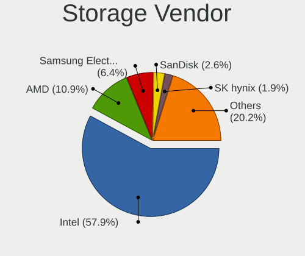

| Vendor                                  | Computers | Percent |
|-----------------------------------------|-----------|---------|
| Intel                                   | 657       | 57.89%  |
| AMD                                     | 124       | 10.93%  |
| Samsung Electronics                     | 73        | 6.43%   |
| SanDisk                                 | 30        | 2.64%   |
| SK hynix                                | 22        | 1.94%   |
| MAXIO Technology (Hangzhou)             | 22        | 1.94%   |
| Micron/Crucial Technology               | 21        | 1.85%   |
| Silicon Motion                          | 19        | 1.67%   |
| Kingston Technology Company             | 18        | 1.59%   |
| Broadcom / LSI                          | 18        | 1.59%   |
| Phison Electronics                      | 17        | 1.5%    |
| Micron Technology                       | 15        | 1.32%   |
| Toshiba                                 | 14        | 1.23%   |
| Marvell Technology Group                | 12        | 1.06%   |
| ASMedia Technology                      | 11        | 0.97%   |
| Transcend                               | 10        | 0.88%   |
| Nvidia                                  | 9         | 0.79%   |
| KIOXIA                                  | 7         | 0.62%   |
| Hosin Global Electronics                | 5         | 0.44%   |
| Hewlett-Packard                         | 5         | 0.44%   |
| Shenzhen Longsys Electronics            | 4         | 0.35%   |
| Realtek Semiconductor                   | 3         | 0.26%   |
| Solid State Storage Technology          | 2         | 0.18%   |
| Shenzhen Unionmemory Information System | 2         | 0.18%   |
| Netac Technology                        | 2         | 0.18%   |
| Adaptec                                 | 2         | 0.18%   |
| Yangtze Memory Technologies             | 1         | 0.09%   |
| VIA Technologies                        | 1         | 0.09%   |
| Silicon Integrated Systems [SiS]        | 1         | 0.09%   |
| Silicon Image                           | 1         | 0.09%   |
| Shenzhen Techwinsemi Technology         | 1         | 0.09%   |
| Seagate Technology                      | 1         | 0.09%   |
| OCZ Technology Group                    | 1         | 0.09%   |
| Lite-On Technology                      | 1         | 0.09%   |
| INNOGRIT                                | 1         | 0.09%   |
| Chelsio Communications                  | 1         | 0.09%   |
| ADATA Technology                        | 1         | 0.09%   |

Storage Model
-------------

Storage controller models

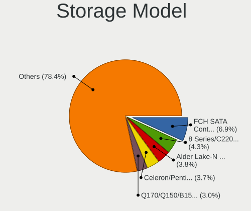

| Model                                                                            | Computers | Percent |
|----------------------------------------------------------------------------------|-----------|---------|
| AMD FCH SATA Controller [AHCI mode]                                              | 85        | 6.86%   |
| Intel 8 Series/C220 Series Chipset Family 6-port SATA Controller 1 [AHCI mode]   | 53        | 4.28%   |
| Intel Alder Lake-N SATA AHCI Controller                                          | 47        | 3.79%   |
| Intel Celeron/Pentium Silver Processor SATA Controller                           | 46        | 3.71%   |
| Intel Q170/Q150/B150/H170/H110/Z170/CM236 Chipset SATA Controller [AHCI Mode]    | 37        | 2.99%   |
| Intel Cannon Lake PCH SATA AHCI Controller                                       | 36        | 2.91%   |
| Intel Sunrise Point-LP SATA Controller [AHCI mode]                               | 35        | 2.82%   |
| Intel Atom Processor E3800 Series SATA AHCI Controller                           | 30        | 2.42%   |
| Intel Jasper Lake SATA AHCI Controller                                           | 25        | 2.02%   |
| Intel Atom/Celeron/Pentium Processor x5-E8000/J3xxx/N3xxx Series SATA Controller | 25        | 2.02%   |
| Intel 6 Series/C200 Series Chipset Family 6 port Desktop SATA AHCI Controller    | 25        | 2.02%   |
| Samsung NVMe SSD Controller SM981/PM981/PM983                                    | 23        | 1.86%   |
| MAXIO (Hangzhou) NVMe SSD Controller MAP1202 (DRAM-less)                         | 22        | 1.78%   |
| Samsung NVMe SSD Controller 980 (DRAM-less)                                      | 20        | 1.61%   |
| Intel 6 Series/C200 Series Chipset Family 6 port Mobile SATA AHCI Controller     | 20        | 1.61%   |
| Intel 200 Series PCH SATA controller [AHCI mode]                                 | 20        | 1.61%   |
| Silicon Motion SM2263EN/SM2263XT (DRAM-less) NVMe SSD Controllers                | 18        | 1.45%   |
| Samsung NVMe SSD Controller SM961/PM961/SM963                                    | 18        | 1.45%   |
| Intel 7 Series Chipset Family 6-port SATA Controller [AHCI mode]                 | 17        | 1.37%   |
| Intel Wildcat Point-LP SATA Controller [AHCI Mode]                               | 16        | 1.29%   |
| Intel 8 Series SATA Controller 1 [AHCI mode]                                     | 16        | 1.29%   |
| Micron/Crucial P2 [Nick P2] / P3 / P3 Plus NVMe PCIe SSD (DRAM-less)             | 15        | 1.21%   |
| Intel Celeron N3350/Pentium N4200/Atom E3900 Series SATA AHCI Controller         | 15        | 1.21%   |
| Intel 7 Series/C210 Series Chipset Family 6-port SATA Controller [AHCI mode]     | 14        | 1.13%   |
| AMD FCH IDE Controller                                                           | 13        | 1.05%   |
| AMD 400 Series Chipset SATA Controller                                           | 13        | 1.05%   |
| Intel 5 Series/3400 Series Chipset 6 port SATA AHCI Controller                   | 12        | 0.97%   |
| AMD 500 Series Chipset SATA Controller                                           | 12        | 0.97%   |
| Intel Elkhart Lake SATA AHCI                                                     | 11        | 0.89%   |
| Intel Alder Lake-S PCH SATA Controller [AHCI Mode]                               | 11        | 0.89%   |
| AMD SB7x0/SB8x0/SB9x0 SATA Controller [AHCI mode]                                | 10        | 0.81%   |
| Phison PS5013-E13 PCIe3 NVMe Controller (DRAM-less)                              | 9         | 0.73%   |
| Intel NM10/ICH7 Family SATA Controller [IDE mode]                                | 9         | 0.73%   |
| Intel Comet Lake SATA AHCI Controller                                            | 9         | 0.73%   |
| Intel 82801 Mobile SATA Controller [RAID mode]                                   | 9         | 0.73%   |
| Intel Atom Processor C3000 Series SATA Controller 0                              | 8         | 0.65%   |
| ASMedia ASM1061/ASM1062 Serial ATA Controller                                    | 8         | 0.65%   |
| SK hynix Gold P31/BC711/PC711 NVMe Solid State Drive                             | 7         | 0.56%   |
| Phison E12 NVMe Controller                                                       | 7         | 0.56%   |
| Intel Volume Management Device NVMe RAID Controller                              | 7         | 0.56%   |

Storage Kind
------------

Kind of storage controller (IDE, SATA, NVMe, SAS, ...)

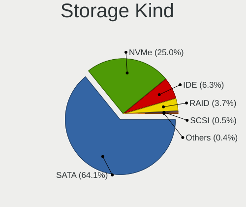

| Kind | Computers | Percent |
|------|-----------|---------|
| SATA | 730       | 64.15%  |
| NVMe | 284       | 24.96%  |
| IDE  | 72        | 6.33%   |
| RAID | 42        | 3.69%   |
| SCSI | 6         | 0.53%   |
| SAS  | 4         | 0.35%   |

Processor
---------

CPU Vendor
----------

Processor vendors

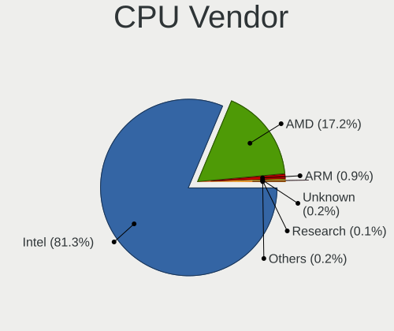

| Vendor   | Computers | Percent |
|----------|-----------|---------|
| Intel    | 723       | 81.33%  |
| AMD      | 153       | 17.21%  |
| ARM      | 8         | 0.9%    |
| Unknown  | 2         | 0.22%   |
| Research | 1         | 0.11%   |
| Broadcom | 1         | 0.11%   |
| 11th     | 1         | 0.11%   |

CPU Model
---------

Processor models

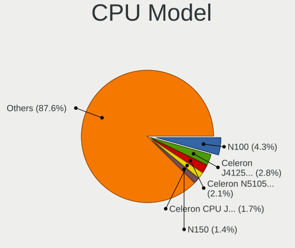

| Model                                    | Computers | Percent |
|------------------------------------------|-----------|---------|
| Intel N100                               | 39        | 4.35%   |
| Intel Celeron J4125 CPU @ 2.00GHz        | 25        | 2.79%   |
| Intel Celeron N5105 @ 2.00GHz            | 19        | 2.12%   |
| Intel Celeron CPU J1900 @ 1.99GHz        | 15        | 1.67%   |
| Intel N150                               | 13        | 1.45%   |
| AMD RX-427BB with AMD Radeon R7 Graphics | 12        | 1.34%   |
| Intel Pentium Silver J5005 CPU @ 1.50GHz | 10        | 1.11%   |
| Intel Core i5-8500T CPU @ 2.10GHz        | 10        | 1.11%   |
| Intel Pentium Silver N6005 @ 2.00GHz     | 9         | 1%      |
| AMD GX-412TC SOC                         | 9         | 1%      |
| Intel Core i5-9500 CPU @ 3.00GHz         | 8         | 0.89%   |
| AMD Ryzen Embedded V1500B                | 8         | 0.89%   |
| Intel Celeron J6412 @ 2.00GHz            | 7         | 0.78%   |
| Intel Celeron CPU J3160 @ 1.60GHz        | 7         | 0.78%   |
| ARM Cortex-A72 r0p3                      | 7         | 0.78%   |
| Intel Core i7-8550U CPU @ 1.80GHz        | 6         | 0.67%   |
| Intel Core i5-2520M CPU @ 2.50GHz        | 6         | 0.67%   |
| Intel Core i3-8100T CPU @ 3.10GHz        | 6         | 0.67%   |
| Intel Celeron CPU 3865U @ 1.80GHz        | 6         | 0.67%   |
| Intel Atom CPU E3845 @ 1.91GHz           | 6         | 0.67%   |
| Intel Pentium CPU N3700 @ 1.60GHz        | 5         | 0.56%   |
| Intel CPU Version                        | 5         | 0.56%   |
| Intel Core i5-8250U CPU @ 1.60GHz        | 5         | 0.56%   |
| Intel Core i5-7500 CPU @ 3.40GHz         | 5         | 0.56%   |
| Intel Core i5-7200U CPU @ 2.50GHz        | 5         | 0.56%   |
| Intel Core i5-6500 CPU @ 3.20GHz         | 5         | 0.56%   |
| Intel Core i5-6200U CPU @ 2.30GHz        | 5         | 0.56%   |
| Intel Core i5-5250U CPU @ 1.60GHz        | 5         | 0.56%   |
| Intel Core i5-4570 CPU @ 3.20GHz         | 5         | 0.56%   |
| Intel Core i5-3470 CPU @ 3.20GHz         | 5         | 0.56%   |
| Intel Core i3-7100 CPU @ 3.90GHz         | 5         | 0.56%   |
| Intel Core 2 Duo CPU E8400 @ 3.00GHz     | 5         | 0.56%   |
| Intel Core 2 Duo                         | 5         | 0.56%   |
| Intel Celeron CPU N3450 @ 1.10GHz        | 5         | 0.56%   |
| Intel Celeron CPU N3150 @ 1.60GHz        | 5         | 0.56%   |
| Intel Atom CPU C3758R @ 2.40GHz          | 5         | 0.56%   |
| Intel 13th Gen Core i5-13500T            | 5         | 0.56%   |
| Intel 11th Gen Core i7-1165G7 @ 2.80GHz  | 5         | 0.56%   |
| AMD Ryzen 5 3600 6-Core Processor        | 5         | 0.56%   |
| Intel Xeon CPU E3-1225 V2 @ 3.20GHz      | 4         | 0.45%   |

CPU Model Family
----------------

Processor model prefix

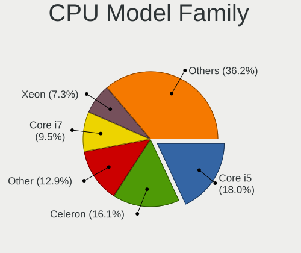

| Model                   | Computers | Percent |
|-------------------------|-----------|---------|
| Intel Core i5           | 161       | 18.03%  |
| Intel Celeron           | 144       | 16.13%  |
| Other                   | 115       | 12.88%  |
| Intel Core i7           | 85        | 9.52%   |
| Intel Xeon              | 65        | 7.28%   |
| Intel Core i3           | 61        | 6.83%   |
| Intel Atom              | 32        | 3.58%   |
| AMD Ryzen 5             | 30        | 3.36%   |
| AMD GX                  | 27        | 3.02%   |
| Intel Core 2 Duo        | 23        | 2.58%   |
| Intel Pentium Silver    | 22        | 2.46%   |
| AMD Ryzen 7             | 17        | 1.9%    |
| Intel Pentium           | 16        | 1.79%   |
| AMD Ryzen Embedded      | 10        | 1.12%   |
| ARM Cortex              | 8         | 0.9%    |
| AMD Ryzen 9             | 6         | 0.67%   |
| AMD FX                  | 6         | 0.67%   |
| Intel Xeon Silver       | 4         | 0.45%   |
| Intel Core i9           | 4         | 0.45%   |
| AMD Ryzen 3             | 4         | 0.45%   |
| AMD G                   | 4         | 0.45%   |
| AMD Athlon              | 4         | 0.45%   |
| AMD A6                  | 4         | 0.45%   |
| AMD Ryzen Threadripper  | 3         | 0.34%   |
| AMD Ryzen 7 PRO         | 3         | 0.34%   |
| AMD Ryzen 5 PRO         | 3         | 0.34%   |
| AMD EPYC                | 3         | 0.34%   |
| AMD Embedded            | 3         | 0.34%   |
| Intel Pentium Gold      | 2         | 0.22%   |
| Intel Core 2 Quad       | 2         | 0.22%   |
| Intel Core              | 2         | 0.22%   |
| AMD Ryzen 3 PRO         | 2         | 0.22%   |
| AMD E2                  | 2         | 0.22%   |
| AMD A8                  | 2         | 0.22%   |
| AMD A4                  | 2         | 0.22%   |
| Intel Pentium Dual-Core | 1         | 0.11%   |
| Intel Pentium Dual      | 1         | 0.11%   |
| Intel Core m3           | 1         | 0.11%   |
| Intel Core 2            | 1         | 0.11%   |
| Intel 686-class         | 1         | 0.11%   |

CPU Cores
---------

Number of processor cores

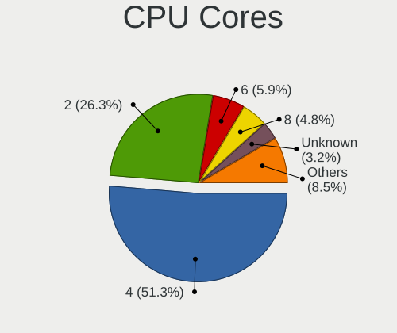

| Number  | Computers | Percent |
|---------|-----------|---------|
| 4       | 461       | 51.34%  |
| 2       | 236       | 26.28%  |
| 6       | 53        | 5.9%    |
| 8       | 43        | 4.79%   |
| Unknown | 29        | 3.23%   |
| 12      | 25        | 2.78%   |
| 16      | 19        | 2.12%   |
| 10      | 7         | 0.78%   |
| 24      | 6         | 0.67%   |
| 20      | 6         | 0.67%   |
| 1       | 5         | 0.56%   |
| 32      | 3         | 0.33%   |
| 128     | 1         | 0.11%   |
| 64      | 1         | 0.11%   |
| 14      | 1         | 0.11%   |
| 5       | 1         | 0.11%   |
| 3       | 1         | 0.11%   |

CPU Sockets
-----------

Number of sockets

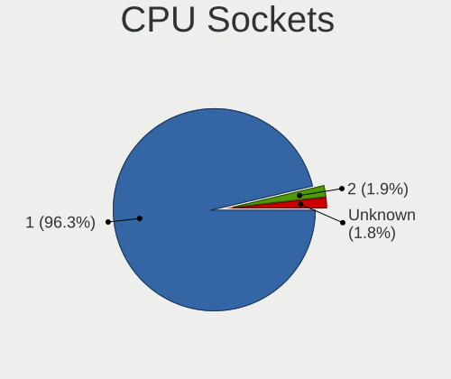

| Number  | Computers | Percent |
|---------|-----------|---------|
| 1       | 857       | 96.29%  |
| 2       | 17        | 1.91%   |
| Unknown | 16        | 1.8%    |

CPU Threads
-----------

Threads per core (Hyper-Threading)

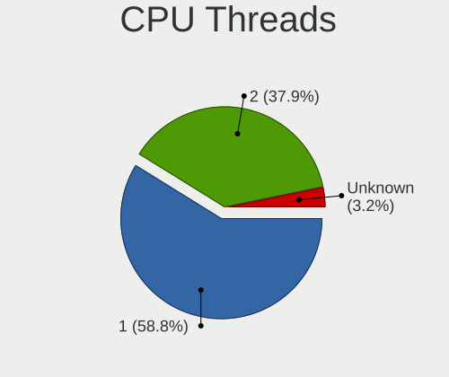

| Number  | Computers | Percent |
|---------|-----------|---------|
| 1       | 526       | 58.84%  |
| 2       | 339       | 37.92%  |
| Unknown | 29        | 3.24%   |

CPU Microarch
-------------

Microarchitecture

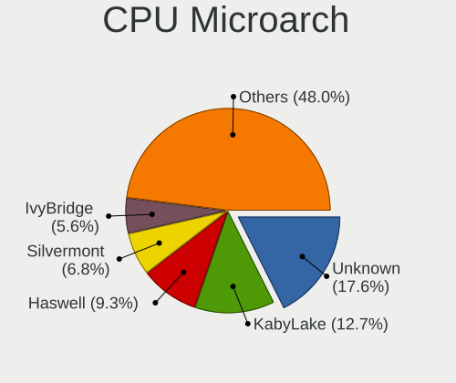

| Name          | Computers | Percent |
|---------------|-----------|---------|
| Unknown       | 157       | 17.6%   |
| KabyLake      | 113       | 12.67%  |
| Haswell       | 83        | 9.3%    |
| Silvermont    | 61        | 6.84%   |
| IvyBridge     | 50        | 5.61%   |
| Goldmont plus | 49        | 5.49%   |
| Skylake       | 47        | 5.27%   |
| SandyBridge   | 42        | 4.71%   |
| Penryn        | 28        | 3.14%   |
| Zen 2         | 26        | 2.91%   |
| Goldmont      | 25        | 2.8%    |
| Broadwell     | 22        | 2.47%   |
| Zen           | 19        | 2.13%   |
| Zen 3         | 17        | 1.91%   |
| Westmere      | 17        | 1.91%   |
| Jaguar        | 16        | 1.79%   |
| Steamroller   | 15        | 1.68%   |
| Puma          | 15        | 1.68%   |
| Nehalem       | 13        | 1.46%   |
| TigerLake     | 12        | 1.35%   |
| Bonnell       | 12        | 1.35%   |
| Zen+          | 11        | 1.23%   |
| CometLake     | 8         | 0.9%    |
| Core          | 7         | 0.78%   |
| Piledriver    | 6         | 0.67%   |
| Excavator     | 6         | 0.67%   |
| Bobcat        | 5         | 0.56%   |
| K10           | 3         | 0.34%   |
| Bulldozer     | 3         | 0.34%   |
| IceLake       | 2         | 0.22%   |
| K8 Hammer     | 1         | 0.11%   |
| K10 Llano     | 1         | 0.11%   |

Graphics
--------

GPU Vendor
----------

Vendors of graphics cards

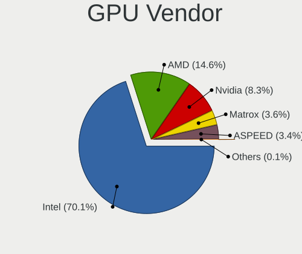

| Vendor                           | Computers | Percent |
|----------------------------------|-----------|---------|
| Intel                            | 611       | 70.07%  |
| AMD                              | 127       | 14.56%  |
| Nvidia                           | 72        | 8.26%   |
| Matrox Electronics Systems       | 31        | 3.56%   |
| ASPEED Technology                | 30        | 3.44%   |
| Silicon Integrated Systems [SiS] | 1         | 0.11%   |

GPU Model
---------

Graphics card models

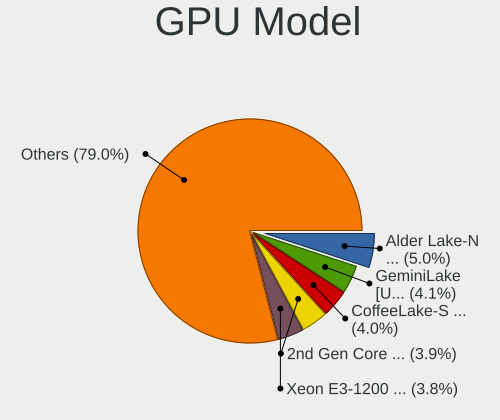

| Model                                                                                    | Computers | Percent |
|------------------------------------------------------------------------------------------|-----------|---------|
| Intel Alder Lake-N [UHD Graphics]                                                        | 45        | 5.04%   |
| Intel GeminiLake [UHD Graphics 600]                                                      | 37        | 4.15%   |
| Intel CoffeeLake-S GT2 [UHD Graphics 630]                                                | 36        | 4.04%   |
| Intel 2nd Generation Core Processor Family Integrated Graphics Controller                | 35        | 3.92%   |
| Intel Xeon E3-1200 v3/4th Gen Core Processor Integrated Graphics Controller              | 34        | 3.81%   |
| Intel JasperLake [UHD Graphics]                                                          | 34        | 3.81%   |
| Intel Atom Processor Z36xxx/Z37xxx Series Graphics & Display                             | 30        | 3.36%   |
| ASPEED Technology ASPEED Graphics Family                                                 | 30        | 3.36%   |
| Intel Atom/Celeron/Pentium Processor x5-E8000/J3xxx/N3xxx Integrated Graphics Controller | 27        | 3.03%   |
| Intel Haswell-ULT Integrated Graphics Controller                                         | 19        | 2.13%   |
| Intel Skylake-S GT2 [HD Graphics 530]                                                    | 18        | 2.02%   |
| Intel Xeon E3-1200 v2/3rd Gen Core processor Graphics Controller                         | 16        | 1.79%   |
| Intel Kaby Lake-S GT2 [HD Graphics 630]                                                  | 16        | 1.79%   |
| Intel Apollo Lake GT1 [HD Graphics 500]                                                  | 15        | 1.68%   |
| AMD Kaveri [Radeon R7 Graphics]                                                          | 14        | 1.57%   |
| Matrox Electronics Systems MGA G200eW WPCM450                                            | 13        | 1.46%   |
| Intel Kaby Lake-R GT2 [UHD Graphics 620]                                                 | 13        | 1.46%   |
| Intel Alder Lake-N [Intel Graphics]                                                      | 13        | 1.46%   |
| Intel 4th Generation Core Processor Family Integrated Graphics Controller                | 13        | 1.46%   |
| AMD Renoir [Radeon Vega Series / Radeon Vega Mobile Series]                              | 13        | 1.46%   |
| Intel TigerLake-LP GT2 [Iris Xe Graphics]                                                | 12        | 1.35%   |
| Intel Kaby Lake-U GT2 [HD Graphics 620]                                                  | 12        | 1.35%   |
| Intel GeminiLake [UHD Graphics 605]                                                      | 12        | 1.35%   |
| Intel 3rd Gen Core processor Graphics Controller                                         | 12        | 1.35%   |
| Intel Skylake-U GT2 [HD Graphics 520]                                                    | 11        | 1.23%   |
| Intel Elkhart Lake [UHD Graphics Gen11 16EU]                                             | 11        | 1.23%   |
| Intel 4 Series Chipset Integrated Graphics Controller                                    | 11        | 1.23%   |
| AMD Cezanne [Radeon Vega Series / Radeon Vega Mobile Series]                             | 10        | 1.12%   |
| Intel Alder Lake-S GT1 [UHD Graphics 770]                                                | 9         | 1.01%   |
| Intel Broadwell-U GT2 [HD Graphics 5500]                                                 | 8         | 0.9%    |
| AMD Picasso/Raven 2 [Radeon Vega Series / Radeon Vega Mobile Series]                     | 8         | 0.9%    |
| Intel Xeon E3-1200 v3 Processor Integrated Graphics Controller                           | 7         | 0.78%   |
| Intel Mobile 4 Series Chipset Integrated Graphics Controller                             | 7         | 0.78%   |
| Intel IvyBridge GT2 [HD Graphics 4000]                                                   | 7         | 0.78%   |
| Intel Core Processor Integrated Graphics Controller                                      | 7         | 0.78%   |
| Intel CometLake-U GT2 [UHD Graphics]                                                     | 7         | 0.78%   |
| Matrox Electronics Systems MGA G200EH                                                    | 6         | 0.67%   |
| Matrox Electronics Systems G200eR2                                                       | 6         | 0.67%   |
| Intel Kaby Lake-U GT1 [HD Graphics 610]                                                  | 6         | 0.67%   |
| AMD Raven Ridge [Radeon Vega Series / Radeon Vega Mobile Series]                         | 6         | 0.67%   |

GPU Combo
---------

Combinations of graphics cards

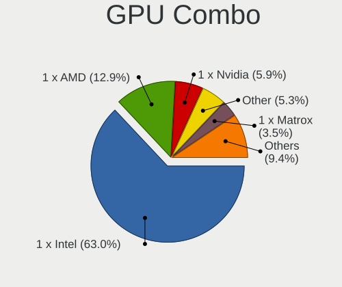

| Name           | Computers | Percent |
|----------------|-----------|---------|
| 1 x Intel      | 562       | 63%     |
| 1 x AMD        | 115       | 12.89%  |
| 1 x Nvidia     | 53        | 5.94%   |
| Other          | 47        | 5.27%   |
| 1 x Matrox     | 31        | 3.48%   |
| 1 x ASPEED     | 29        | 3.25%   |
| 2 x Intel      | 23        | 2.58%   |
| Intel + Nvidia | 17        | 1.91%   |
| Intel + AMD    | 8         | 0.9%    |
| 2 x AMD        | 3         | 0.34%   |
| 2 x Nvidia     | 2         | 0.22%   |
| 1 x SiS        | 1         | 0.11%   |
| Intel + ASPEED | 1         | 0.11%   |

GPU Driver
----------

Free vs proprietary

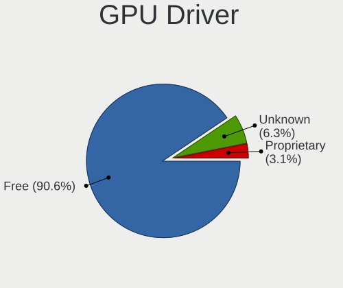

| Driver      | Computers | Percent |
|-------------|-----------|---------|
| Free        | 809       | 90.59%  |
| Unknown     | 56        | 6.27%   |
| Proprietary | 28        | 3.14%   |

GPU Memory
----------

Total video memory

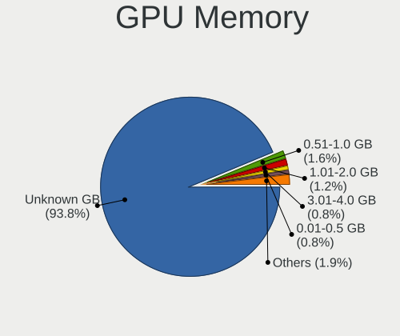

| Size in GB | Computers | Percent |
|------------|-----------|---------|
| Unknown    | 840       | 93.75%  |
| 0.51-1.0   | 14        | 1.56%   |
| 1.01-2.0   | 11        | 1.23%   |
| 3.01-4.0   | 7         | 0.78%   |
| 0.01-0.5   | 7         | 0.78%   |
| 7.01-8.0   | 6         | 0.67%   |
| 5.01-6.0   | 4         | 0.45%   |
| 8.01-16.0  | 3         | 0.33%   |
| 2.01-3.0   | 2         | 0.22%   |
| 16.01-24.0 | 2         | 0.22%   |

Monitor
-------

Monitor Vendor
--------------

Monitor vendors

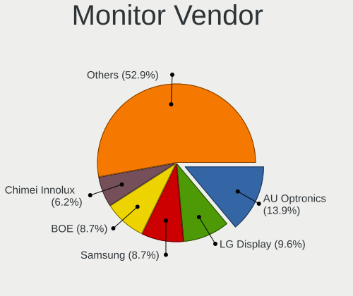

| Vendor                  | Computers | Percent |
|-------------------------|-----------|---------|
| AU Optronics            | 29        | 13.94%  |
| LG Display              | 20        | 9.62%   |
| Samsung Electronics     | 18        | 8.65%   |
| BOE                     | 18        | 8.65%   |
| Chimei Innolux          | 13        | 6.25%   |
| Dell                    | 12        | 5.77%   |
| Lenovo                  | 11        | 5.29%   |
| Sharp                   | 9         | 4.33%   |
| BenQ                    | 9         | 4.33%   |
| Iiyama                  | 7         | 3.37%   |
| Hewlett-Packard         | 6         | 2.88%   |
| Apple                   | 6         | 2.88%   |
| Philips                 | 5         | 2.4%    |
| AOC                     | 5         | 2.4%    |
| Goldstar                | 4         | 1.92%   |
| Gigabyte Technology     | 3         | 1.44%   |
| Acer                    | 3         | 1.44%   |
| Sony                    | 2         | 0.96%   |
| Pixio                   | 2         | 0.96%   |
| LG Philips              | 2         | 0.96%   |
| HannStar                | 2         | 0.96%   |
| CPT                     | 2         | 0.96%   |
| Chi Mei Optoelectronics | 2         | 0.96%   |
| ViewSonic               | 1         | 0.48%   |
| Vestel Elektronik       | 1         | 0.48%   |
| unknown                 | 1         | 0.48%   |
| SDC                     | 1         | 0.48%   |
| RS                      | 1         | 0.48%   |
| PANDA                   | 1         | 0.48%   |
| Panasonic               | 1         | 0.48%   |
| OEM                     | 1         | 0.48%   |
| MSI                     | 1         | 0.48%   |
| InnoLux Display         | 1         | 0.48%   |
| InfoVision              | 1         | 0.48%   |
| HPN                     | 1         | 0.48%   |
| eMachines               | 1         | 0.48%   |
| CVT                     | 1         | 0.48%   |
| AVX                     | 1         | 0.48%   |
| Ancor Communications    | 1         | 0.48%   |
| Amazon                  | 1         | 0.48%   |

Monitor Model
-------------

Monitor models

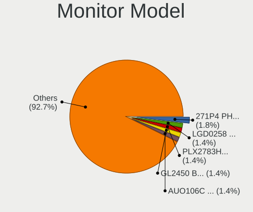

| Model                                                                | Computers | Percent |
|----------------------------------------------------------------------|-----------|---------|
| Philips 271P4 PHL08C3 1920x1080 600x340mm 27.2-inch                  | 4         | 1.83%   |
| LG Display LCD Monitor LGD0258 1600x900 350x190mm 15.7-inch          | 3         | 1.37%   |
| Iiyama PLX2783H IVM6648 1920x1080 600x340mm 27.2-inch                | 3         | 1.37%   |
| BenQ GL2450 BNQ78A4 1920x1080 530x300mm 24.0-inch                    | 3         | 1.37%   |
| AU Optronics LCD Monitor AUO106C 1366x768 280x160mm 12.7-inch        | 3         | 1.37%   |
| Sharp LCD Monitor SHP1421 3200x1800 290x170mm 13.2-inch              | 2         | 0.91%   |
| LG Display LCD Monitor LGD6E01 1366x768 340x190mm 15.3-inch          | 2         | 0.91%   |
| LG Display LCD Monitor LGD05FA 1920x1080 310x170mm 13.9-inch         | 2         | 0.91%   |
| LG Display LCD Monitor LGD02D8 1366x768 280x160mm 12.7-inch          | 2         | 0.91%   |
| Hewlett-Packard ZR24w HWP286A 1920x1200 540x350mm 25.3-inch          | 2         | 0.91%   |
| Gigabyte Technology M27Q GBT270D 2560x1440 700x390mm 31.5-inch       | 2         | 0.91%   |
| CPT LCD Monitor CPT04C4 1024x600 230x140mm 10.6-inch                 | 2         | 0.91%   |
| Chimei Innolux LCD Monitor CMN15E7 1920x1080 340x190mm 15.3-inch     | 2         | 0.91%   |
| BOE LCD Monitor BOE0B36 2160x1440 270x180mm 12.8-inch                | 2         | 0.91%   |
| AU Optronics LCD Monitor AUO492D 1920x1080 290x170mm 13.2-inch       | 2         | 0.91%   |
| ViewSonic VP2756-4K VSCE73B 3840x2160 600x340mm 27.2-inch            | 1         | 0.46%   |
| Vestel Elektronik 32W_LCD_TV VES3700 1920x1080 710x400mm 32.1-inch   | 1         | 0.46%   |
| unknown LCD Monitor SAMSUNG 1920x1080                                | 1         | 0.46%   |
| Sony SDM-HS95P SNY2500 1280x1024 380x300mm 19.1-inch                 | 1         | 0.46%   |
| Sony LCD Monitor MS_9005 1920x1200 330x210mm 15.4-inch               | 1         | 0.46%   |
| Sharp LQ140Z1JW01 SHP1401 3200x1800 310x170mm 13.9-inch              | 1         | 0.46%   |
| Sharp LQ135P1JX51 SHP14B3 2256x1504 290x190mm 13.6-inch              | 1         | 0.46%   |
| Sharp LQ133M1JW62A SHP156C 1920x1080 290x170mm 13.2-inch             | 1         | 0.46%   |
| Sharp LQ133M1JW08 SHP1425 1920x1080 290x170mm 13.2-inch              | 1         | 0.46%   |
| Sharp LCD Monitor SHP14D1 1920x1200 340x210mm 15.7-inch              | 1         | 0.46%   |
| Sharp LCD Monitor SHP1453 1920x1080 350x190mm 15.7-inch              | 1         | 0.46%   |
| Sharp LCD Monitor SHP143B 3840x2160 350x190mm 15.7-inch              | 1         | 0.46%   |
| SDC LCD Monitor 5440x1080                                            | 1         | 0.46%   |
| SDC LCD Monitor 3520x1080                                            | 1         | 0.46%   |
| SDC LCD Monitor 1600x900                                             | 1         | 0.46%   |
| SDC LCD Monitor                                                      | 1         | 0.46%   |
| Samsung Electronics U28D590 SAM0B80 3840x2160 610x350mm 27.7-inch    | 1         | 0.46%   |
| Samsung Electronics T24D390 SAM0B6E 1920x1080 520x290mm 23.4-inch    | 1         | 0.46%   |
| Samsung Electronics SyncMaster SAM030D 1680x1050 470x300mm 22.0-inch | 1         | 0.46%   |
| Samsung Electronics SyncMaster SAM011F 1280x1024 380x300mm 19.1-inch | 1         | 0.46%   |
| Samsung Electronics S27F350 SAM0D22 1920x1080 600x340mm 27.2-inch    | 1         | 0.46%   |
| Samsung Electronics S24F350 SAM0D20 1920x1080 520x290mm 23.4-inch    | 1         | 0.46%   |
| Samsung Electronics S24D330 SAM0D92 1920x1080 530x300mm 24.0-inch    | 1         | 0.46%   |
| Samsung Electronics S24C550 SAM0A4B 1920x1080 520x290mm 23.4-inch    | 1         | 0.46%   |
| Samsung Electronics S22F350 SAM0D1A 1920x1080 480x270mm 21.7-inch    | 1         | 0.46%   |

Monitor Resolution
------------------

Monitor screen resolution

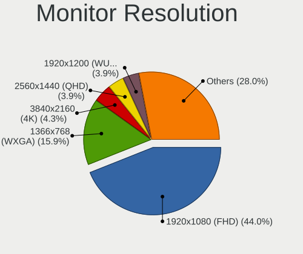

| Resolution         | Computers | Percent |
|--------------------|-----------|---------|
| 1920x1080 (FHD)    | 91        | 43.96%  |
| 1366x768 (WXGA)    | 33        | 15.94%  |
| 3840x2160 (4K)     | 9         | 4.35%   |
| 2560x1440 (QHD)    | 8         | 3.86%   |
| 1920x1200 (WUXGA)  | 8         | 3.86%   |
| 1600x900 (HD+)     | 8         | 3.86%   |
| 1280x800 (WXGA)    | 8         | 3.86%   |
| 1440x900 (WXGA+)   | 6         | 2.9%    |
| 1024x600           | 5         | 2.42%   |
| 1680x1050 (WSXGA+) | 4         | 1.93%   |
| 3200x1800 (QHD+)   | 3         | 1.45%   |
| 1280x1024 (SXGA)   | 3         | 1.45%   |
| Unknown            | 3         | 1.45%   |
| 3440x1440          | 2         | 0.97%   |
| 2880x1800          | 2         | 0.97%   |
| 2560x1600          | 2         | 0.97%   |
| 2560x1080          | 2         | 0.97%   |
| 2160x1440          | 2         | 0.97%   |
| 1920x540           | 2         | 0.97%   |
| 5760x1200          | 1         | 0.48%   |
| 5440x1080          | 1         | 0.48%   |
| 3840x1080          | 1         | 0.48%   |
| 3520x1080          | 1         | 0.48%   |
| 3200x1080          | 1         | 0.48%   |
| 2256x1504          | 1         | 0.48%   |

Monitor Diagonal
----------------

Diagonal size in inches

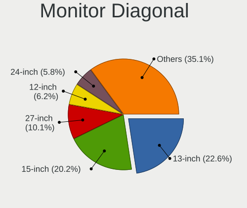

| Inches  | Computers | Percent |
|---------|-----------|---------|
| 13      | 47        | 22.6%   |
| 15      | 42        | 20.19%  |
| 27      | 21        | 10.1%   |
| 12      | 13        | 6.25%   |
| 24      | 12        | 5.77%   |
| Unknown | 11        | 5.29%   |
| 23      | 8         | 3.85%   |
| 19      | 8         | 3.85%   |
| 21      | 7         | 3.37%   |
| 31      | 6         | 2.88%   |
| 17      | 6         | 2.88%   |
| 34      | 4         | 1.92%   |
| 22      | 4         | 1.92%   |
| 10      | 4         | 1.92%   |
| 18      | 3         | 1.44%   |
| 14      | 3         | 1.44%   |
| 11      | 3         | 1.44%   |
| 25      | 2         | 0.96%   |
| 49      | 1         | 0.48%   |
| 42      | 1         | 0.48%   |
| 39      | 1         | 0.48%   |
| 9       | 1         | 0.48%   |

Monitor Width
-------------

Physical width

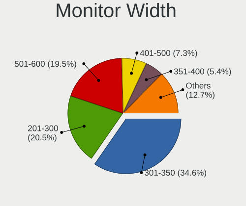

| Width in mm | Computers | Percent |
|-------------|-----------|---------|
| 301-350     | 71        | 34.63%  |
| 201-300     | 42        | 20.49%  |
| 501-600     | 40        | 19.51%  |
| 401-500     | 15        | 7.32%   |
| 351-400     | 11        | 5.37%   |
| Unknown     | 11        | 5.37%   |
| 601-700     | 8         | 3.9%    |
| 701-800     | 4         | 1.95%   |
| 801-900     | 1         | 0.49%   |
| 1001-1500   | 1         | 0.49%   |
| 901-1000    | 1         | 0.49%   |

Aspect Ratio
------------

Proportional relationship between the width and the height

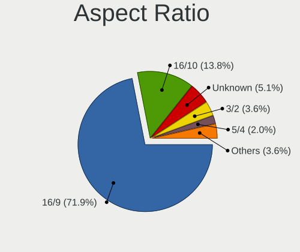

| Ratio   | Computers | Percent |
|---------|-----------|---------|
| 16/9    | 141       | 71.94%  |
| 16/10   | 27        | 13.78%  |
| Unknown | 10        | 5.1%    |
| 3/2     | 7         | 3.57%   |
| 5/4     | 4         | 2.04%   |
| 21/9    | 4         | 2.04%   |
| 32/9    | 2         | 1.02%   |
| 6/5     | 1         | 0.51%   |

Monitor Area
------------

Area in inch²

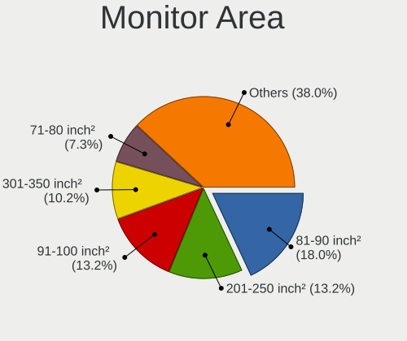

| Area in inch² | Computers | Percent |
|----------------|-----------|---------|
| 81-90          | 37        | 18.05%  |
| 201-250        | 27        | 13.17%  |
| 91-100         | 27        | 13.17%  |
| 301-350        | 21        | 10.24%  |
| 71-80          | 15        | 7.32%   |
| 101-110        | 13        | 6.34%   |
| 61-70          | 11        | 5.37%   |
| Unknown        | 11        | 5.37%   |
| 351-500        | 10        | 4.88%   |
| 151-200        | 9         | 4.39%   |
| 121-130        | 6         | 2.93%   |
| 41-50          | 5         | 2.44%   |
| 51-60          | 3         | 1.46%   |
| 251-300        | 3         | 1.46%   |
| 501-1000       | 3         | 1.46%   |
| 141-150        | 2         | 0.98%   |
| 111-120        | 2         | 0.98%   |

Pixel Density
-------------

Pixels per inch

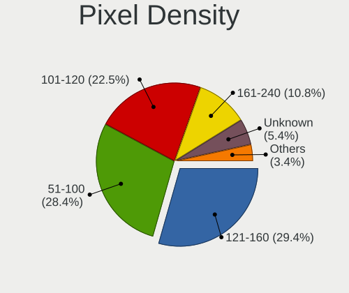

| Density       | Computers | Percent |
|---------------|-----------|---------|
| 121-160       | 60        | 29.41%  |
| 51-100        | 58        | 28.43%  |
| 101-120       | 46        | 22.55%  |
| 161-240       | 22        | 10.78%  |
| Unknown       | 11        | 5.39%   |
| More than 240 | 6         | 2.94%   |
| 1-50          | 1         | 0.49%   |

Multiple Monitors
-----------------

Total monitors connected

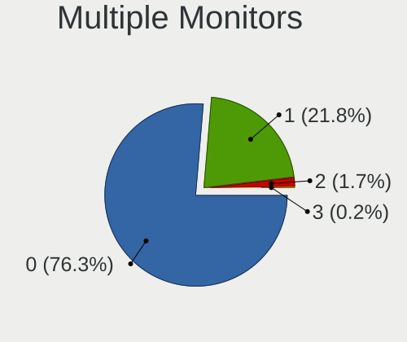

| Total | Computers | Percent |
|-------|-----------|---------|
| 0     | 684       | 76.34%  |
| 1     | 195       | 21.76%  |
| 2     | 15        | 1.67%   |
| 3     | 2         | 0.22%   |

Network
-------

Net Controller Vendor
---------------------

Controller vendors

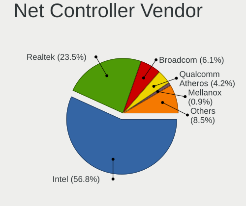

| Vendor                            | Computers | Percent |
|-----------------------------------|-----------|---------|
| Intel                             | 690       | 56.79%  |
| Realtek Semiconductor             | 286       | 23.54%  |
| Broadcom                          | 74        | 6.09%   |
| Qualcomm Atheros                  | 51        | 4.2%    |
| Mellanox Technologies             | 11        | 0.91%   |
| Marvell Technology Group          | 10        | 0.82%   |
| Ralink Technology                 | 9         | 0.74%   |
| IMC Networks                      | 9         | 0.74%   |
| AMD                               | 8         | 0.66%   |
| Nvidia                            | 7         | 0.58%   |
| MediaTek                          | 6         | 0.49%   |
| D-Link System                     | 5         | 0.41%   |
| Ericsson Business Mobile Networks | 4         | 0.33%   |
| U-Blox                            | 3         | 0.25%   |
| Ralink                            | 3         | 0.25%   |
| Hewlett-Packard                   | 3         | 0.25%   |
| ZTE WCDMA Technologies MSM        | 2         | 0.16%   |
| TP-Link                           | 2         | 0.16%   |
| Solarflare Communications         | 2         | 0.16%   |
| Sierra Wireless                   | 2         | 0.16%   |
| QinHeng Electronics               | 2         | 0.16%   |
| Microsoft                         | 2         | 0.16%   |
| Edimax Technology                 | 2         | 0.16%   |
| Dell                              | 2         | 0.16%   |
| Belkin Components                 | 2         | 0.16%   |
| American Megatrends               | 2         | 0.16%   |
| ZyXEL Communications              | 1         | 0.08%   |
| Xiaomi                            | 1         | 0.08%   |
| Samsung Electronics               | 1         | 0.08%   |
| Qualcomm                          | 1         | 0.08%   |
| QLogic                            | 1         | 0.08%   |
| Napatech A/S                      | 1         | 0.08%   |
| MYRICOM                           | 1         | 0.08%   |
| Lenovo                            | 1         | 0.08%   |
| Google                            | 1         | 0.08%   |
| Fibocom                           | 1         | 0.08%   |
| Emulex                            | 1         | 0.08%   |
| Chelsio Communications            | 1         | 0.08%   |
| Bluegiga Technologies             | 1         | 0.08%   |
| ASUSTek Computer                  | 1         | 0.08%   |

Net Controller Model
--------------------

Controller models

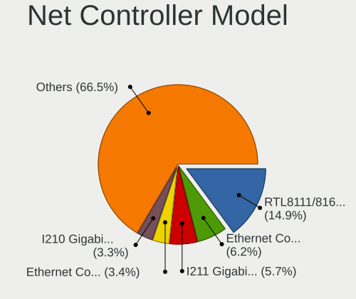

| Model                                                                         | Computers | Percent |
|-------------------------------------------------------------------------------|-----------|---------|
| Realtek RTL8111/8168/8211/8411 PCI Express Gigabit Ethernet Controller        | 229       | 14.87%  |
| Intel Ethernet Controller I226-V                                              | 95        | 6.17%   |
| Intel I211 Gigabit Network Connection                                         | 88        | 5.71%   |
| Intel Ethernet Controller I225-V                                              | 53        | 3.44%   |
| Intel I210 Gigabit Network Connection                                         | 51        | 3.31%   |
| Intel 82579LM Gigabit Network Connection (Lewisville)                         | 38        | 2.47%   |
| Intel I350 Gigabit Network Connection                                         | 37        | 2.4%    |
| Realtek RTL8125 2.5GbE Controller                                             | 31        | 2.01%   |
| Intel 82580 Gigabit Network Connection                                        | 28        | 1.82%   |
| Intel 82574L Gigabit Network Connection                                       | 24        | 1.56%   |
| Intel 82571EB/82571GB Gigabit Ethernet Controller (Copper)                    | 24        | 1.56%   |
| Intel Ethernet Connection I217-LM                                             | 22        | 1.43%   |
| Intel Wireless 8265 / 8275                                                    | 20        | 1.3%    |
| Intel 82599ES 10-Gigabit SFI/SFP+ Network Connection                          | 20        | 1.3%    |
| Intel Centrino Advanced-N 6205 [Taylor Peak]                                  | 19        | 1.23%   |
| Intel Wi-Fi 6 AX200                                                           | 18        | 1.17%   |
| Intel 82571EB/82571GB Gigabit Ethernet Controller D0/D1 (copper applications) | 16        | 1.04%   |
| Intel 82576 Gigabit Network Connection                                        | 15        | 0.97%   |
| Intel Wireless 8260                                                           | 14        | 0.91%   |
| Intel Wireless 7260                                                           | 14        | 0.91%   |
| Broadcom NetXtreme BCM5720 Gigabit Ethernet PCIe                              | 14        | 0.91%   |
| Intel Ethernet Connection (7) I219-V                                          | 13        | 0.84%   |
| Intel Ethernet Connection (2) I219-LM                                         | 13        | 0.84%   |
| Intel Wireless 7265                                                           | 12        | 0.78%   |
| Intel Ethernet Controller 10-Gigabit X540-AT2                                 | 12        | 0.78%   |
| Intel Ethernet Connection (7) I219-LM                                         | 12        | 0.78%   |
| Intel Ethernet Connection (2) I219-V                                          | 12        | 0.78%   |
| Realtek RTL810xE PCI Express Fast Ethernet controller                         | 11        | 0.71%   |
| Intel 82583V Gigabit Network Connection                                       | 11        | 0.71%   |
| Intel Wi-Fi 6 AX201                                                           | 10        | 0.65%   |
| Realtek RTL8821CE 802.11ac PCIe Wireless Network Adapter                      | 9         | 0.58%   |
| Qualcomm Atheros QCA9377 802.11ac Wireless Network Adapter                    | 9         | 0.58%   |
| Intel I210 Gigabit Fiber Network Connection                                   | 9         | 0.58%   |
| Intel Alder Lake-N PCH CNVi WiFi                                              | 9         | 0.58%   |
| Intel 82567LM-3 Gigabit Network Connection                                    | 9         | 0.58%   |
| IMC Networks 802.11 n/g/b Wireless LAN USB Mini-Card                          | 9         | 0.58%   |
| Qualcomm Atheros AR93xx Wireless Network Adapter                              | 8         | 0.52%   |
| Broadcom NetXtreme II BCM5716 Gigabit Ethernet                                | 8         | 0.52%   |
| Broadcom NetXtreme II BCM5709 Gigabit Ethernet                                | 8         | 0.52%   |
| Broadcom NetXtreme BCM57765 Gigabit Ethernet PCIe                             | 8         | 0.52%   |

Wireless Vendor
---------------

Wireless vendors

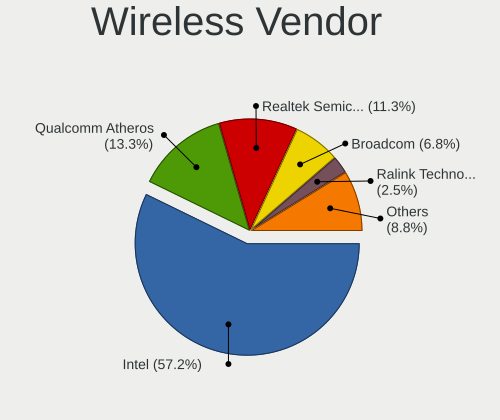

| Vendor                | Computers | Percent |
|-----------------------|-----------|---------|
| Intel                 | 202       | 57.22%  |
| Qualcomm Atheros      | 47        | 13.31%  |
| Realtek Semiconductor | 40        | 11.33%  |
| Broadcom              | 24        | 6.8%    |
| Ralink Technology     | 9         | 2.55%   |
| IMC Networks          | 9         | 2.55%   |
| MediaTek              | 5         | 1.42%   |
| D-Link System         | 5         | 1.42%   |
| Ralink                | 3         | 0.85%   |
| TP-Link               | 2         | 0.57%   |
| Edimax Technology     | 2         | 0.57%   |
| Belkin Components     | 2         | 0.57%   |
| ZyXEL Communications  | 1         | 0.28%   |
| Sierra Wireless       | 1         | 0.28%   |
| ASUSTek Computer      | 1         | 0.28%   |

Wireless Model
--------------

Wireless models

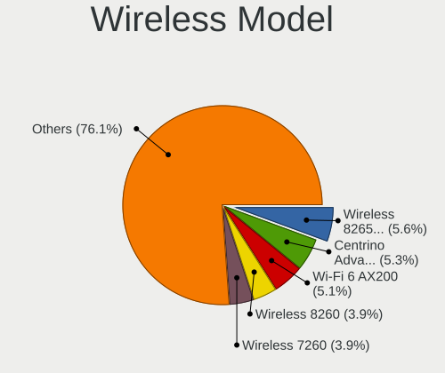

| Model                                                                      | Computers | Percent |
|----------------------------------------------------------------------------|-----------|---------|
| Intel Wireless 8265 / 8275                                                 | 20        | 5.62%   |
| Intel Centrino Advanced-N 6205 [Taylor Peak]                               | 19        | 5.34%   |
| Intel Wi-Fi 6 AX200                                                        | 18        | 5.06%   |
| Intel Wireless 8260                                                        | 14        | 3.93%   |
| Intel Wireless 7260                                                        | 14        | 3.93%   |
| Intel Wireless 7265                                                        | 12        | 3.37%   |
| Intel Wi-Fi 6 AX201                                                        | 10        | 2.81%   |
| Realtek RTL8821CE 802.11ac PCIe Wireless Network Adapter                   | 9         | 2.53%   |
| Qualcomm Atheros QCA9377 802.11ac Wireless Network Adapter                 | 9         | 2.53%   |
| Intel Alder Lake-N PCH CNVi WiFi                                           | 9         | 2.53%   |
| IMC Networks 802.11 n/g/b Wireless LAN USB Mini-Card                       | 9         | 2.53%   |
| Qualcomm Atheros AR93xx Wireless Network Adapter                           | 8         | 2.25%   |
| Broadcom BCM4331 802.11a/b/g/n                                             | 8         | 2.25%   |
| Realtek RTL8723BE PCIe Wireless Network Adapter                            | 7         | 1.97%   |
| Intel Wireless 3165                                                        | 7         | 1.97%   |
| Intel Centrino Advanced-N 6200                                             | 7         | 1.97%   |
| Qualcomm Atheros AR9462 Wireless Network Adapter                           | 6         | 1.69%   |
| Intel Wireless 3160                                                        | 6         | 1.69%   |
| Intel Jasper Lake PCH CNVi WiFi                                            | 6         | 1.69%   |
| Qualcomm Atheros AR242x / AR542x Wireless Network Adapter (PCI-Express)    | 5         | 1.4%    |
| Intel Wi-Fi 5(802.11ac) Wireless-AC 9x6x [Thunder Peak]                    | 5         | 1.4%    |
| Intel Comet Lake PCH-LP CNVi WiFi                                          | 5         | 1.4%    |
| Intel Centrino Ultimate-N 6300                                             | 5         | 1.4%    |
| D-Link System AirPlus G DWL-G122 Wireless Adapter(rev.C1) [Ralink RT2571W] | 5         | 1.4%    |
| Realtek RTL8822CE 802.11ac PCIe Wireless Network Adapter                   | 4         | 1.12%   |
| Qualcomm Atheros AR9485 Wireless Network Adapter                           | 4         | 1.12%   |
| Intel WiFi Link 5100                                                       | 4         | 1.12%   |
| Intel Wi-Fi 6E(802.11ax) AX210/AX1675* 2x2 [Typhoon Peak]                  | 4         | 1.12%   |
| Intel Raptor Lake PCH CNVi WiFi                                            | 4         | 1.12%   |
| Intel Centrino Advanced-N 6235                                             | 4         | 1.12%   |
| Intel Cannon Lake PCH CNVi WiFi                                            | 4         | 1.12%   |
| Intel Alder Lake-P PCH CNVi WiFi                                           | 4         | 1.12%   |
| Broadcom BCM4360 802.11ac Dual Band Wireless Network Adapter               | 4         | 1.12%   |
| Broadcom BCM4322 802.11a/b/g/n Wireless LAN Controller                     | 4         | 1.12%   |
| Ralink RT5370 Wireless Adapter                                             | 3         | 0.84%   |
| Qualcomm Atheros QCA6174 802.11ac Wireless Network Adapter                 | 3         | 0.84%   |
| Qualcomm Atheros AR9287 Wireless Network Adapter (PCI-Express)             | 3         | 0.84%   |
| Qualcomm Atheros AR9285 Wireless Network Adapter (PCI-Express)             | 3         | 0.84%   |
| MediaTek MT7922 802.11ax PCI Express Wireless Network Adapter              | 3         | 0.84%   |
| Intel Dual Band Wireless-AC 3168NGW [Stone Peak]                           | 3         | 0.84%   |

Ethernet Vendor
---------------

Ethernet vendors

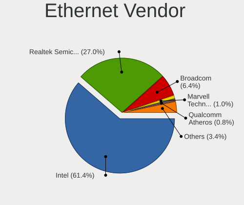

| Vendor                     | Computers | Percent |
|----------------------------|-----------|---------|
| Intel                      | 602       | 61.37%  |
| Realtek Semiconductor      | 265       | 27.01%  |
| Broadcom                   | 63        | 6.42%   |
| Marvell Technology Group   | 10        | 1.02%   |
| Qualcomm Atheros           | 8         | 0.82%   |
| AMD                        | 8         | 0.82%   |
| Nvidia                     | 7         | 0.71%   |
| ZTE WCDMA Technologies MSM | 2         | 0.2%    |
| Solarflare Communications  | 2         | 0.2%    |
| Microsoft                  | 2         | 0.2%    |
| American Megatrends        | 2         | 0.2%    |
| Xiaomi                     | 1         | 0.1%    |
| Samsung Electronics        | 1         | 0.1%    |
| Qualcomm                   | 1         | 0.1%    |
| QLogic                     | 1         | 0.1%    |
| MYRICOM                    | 1         | 0.1%    |
| Lenovo                     | 1         | 0.1%    |
| Emulex                     | 1         | 0.1%    |
| Chelsio Communications     | 1         | 0.1%    |
| Aquantia                   | 1         | 0.1%    |
| Apple                      | 1         | 0.1%    |

Ethernet Model
--------------

Ethernet models

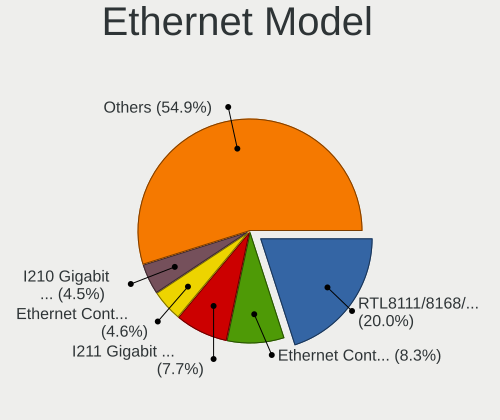

| Model                                                                         | Computers | Percent |
|-------------------------------------------------------------------------------|-----------|---------|
| Realtek RTL8111/8168/8211/8411 PCI Express Gigabit Ethernet Controller        | 229       | 20.03%  |
| Intel Ethernet Controller I226-V                                              | 95        | 8.31%   |
| Intel I211 Gigabit Network Connection                                         | 88        | 7.7%    |
| Intel Ethernet Controller I225-V                                              | 53        | 4.64%   |
| Intel I210 Gigabit Network Connection                                         | 51        | 4.46%   |
| Intel 82579LM Gigabit Network Connection (Lewisville)                         | 38        | 3.32%   |
| Intel I350 Gigabit Network Connection                                         | 37        | 3.24%   |
| Realtek RTL8125 2.5GbE Controller                                             | 31        | 2.71%   |
| Intel 82580 Gigabit Network Connection                                        | 28        | 2.45%   |
| Intel 82574L Gigabit Network Connection                                       | 24        | 2.1%    |
| Intel 82571EB/82571GB Gigabit Ethernet Controller (Copper)                    | 24        | 2.1%    |
| Intel Ethernet Connection I217-LM                                             | 22        | 1.92%   |
| Intel 82599ES 10-Gigabit SFI/SFP+ Network Connection                          | 20        | 1.75%   |
| Intel 82571EB/82571GB Gigabit Ethernet Controller D0/D1 (copper applications) | 16        | 1.4%    |
| Intel 82576 Gigabit Network Connection                                        | 15        | 1.31%   |
| Broadcom NetXtreme BCM5720 Gigabit Ethernet PCIe                              | 14        | 1.22%   |
| Intel Ethernet Connection (7) I219-V                                          | 13        | 1.14%   |
| Intel Ethernet Connection (2) I219-LM                                         | 13        | 1.14%   |
| Intel Ethernet Controller 10-Gigabit X540-AT2                                 | 12        | 1.05%   |
| Intel Ethernet Connection (7) I219-LM                                         | 12        | 1.05%   |
| Intel Ethernet Connection (2) I219-V                                          | 12        | 1.05%   |
| Realtek RTL810xE PCI Express Fast Ethernet controller                         | 11        | 0.96%   |
| Intel 82583V Gigabit Network Connection                                       | 11        | 0.96%   |
| Intel I210 Gigabit Fiber Network Connection                                   | 9         | 0.79%   |
| Intel 82567LM-3 Gigabit Network Connection                                    | 9         | 0.79%   |
| Broadcom NetXtreme II BCM5716 Gigabit Ethernet                                | 8         | 0.7%    |
| Broadcom NetXtreme II BCM5709 Gigabit Ethernet                                | 8         | 0.7%    |
| Broadcom NetXtreme BCM57765 Gigabit Ethernet PCIe                             | 8         | 0.7%    |
| AMD XGMAC 10GbE Controller                                                    | 8         | 0.7%    |
| Intel Ethernet Controller X550                                                | 7         | 0.61%   |
| Intel Ethernet Connection I219-LM                                             | 7         | 0.61%   |
| Intel Ethernet Connection (17) I219-LM                                        | 7         | 0.61%   |
| Intel Ethernet Connection X553 10 GbE SFP+                                    | 6         | 0.52%   |
| Intel Ethernet Connection (4) I219-V                                          | 6         | 0.52%   |
| Intel Ethernet Connection (4) I219-LM                                         | 6         | 0.52%   |
| Intel Ethernet 10G 2P X520 Adapter                                            | 6         | 0.52%   |
| Intel 82579V Gigabit Network Connection                                       | 6         | 0.52%   |
| Nvidia MCP79 Ethernet                                                         | 5         | 0.44%   |
| Marvell Group 88E8040 PCI-E Fast Ethernet Controller                          | 5         | 0.44%   |
| Intel Ethernet Controller X710 for 10GbE SFP+                                 | 5         | 0.44%   |

Net Controller Kind
-------------------

Ethernet, WiFi or modem

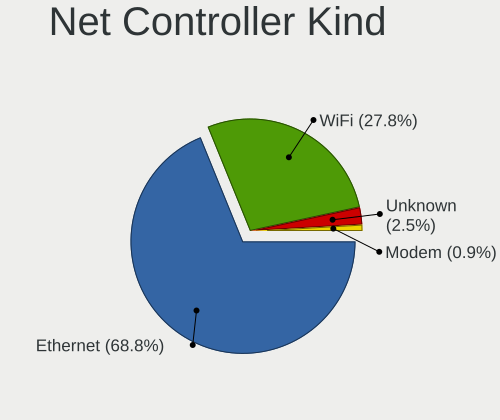

| Kind     | Computers | Percent |
|----------|-----------|---------|
| Ethernet | 831       | 68.85%  |
| WiFi     | 335       | 27.75%  |
| Unknown  | 30        | 2.49%   |
| Modem    | 11        | 0.91%   |

Used Controller
---------------

Currently used network controller

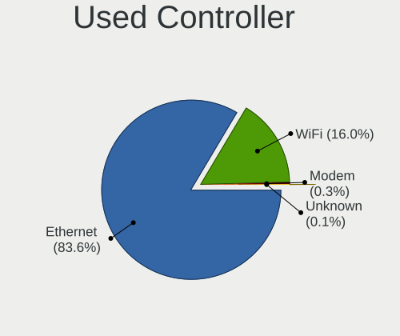

| Kind     | Computers | Percent |
|----------|-----------|---------|
| Ethernet | 757       | 83.55%  |
| WiFi     | 145       | 16%     |
| Modem    | 3         | 0.33%   |
| Unknown  | 1         | 0.11%   |

NICs
----

Total network controllers on board

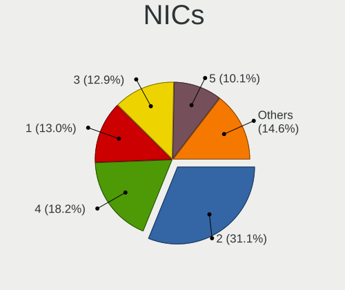

| Total | Computers | Percent |
|-------|-----------|---------|
| 2     | 280       | 31.15%  |
| 4     | 164       | 18.24%  |
| 1     | 117       | 13.01%  |
| 3     | 116       | 12.9%   |
| 5     | 91        | 10.12%  |
| 6     | 65        | 7.23%   |
| 0     | 16        | 1.78%   |
| 9     | 15        | 1.67%   |
| 7     | 14        | 1.56%   |
| 8     | 10        | 1.11%   |
| 10    | 4         | 0.44%   |
| 15    | 2         | 0.22%   |
| 12    | 2         | 0.22%   |
| 17    | 1         | 0.11%   |
| 14    | 1         | 0.11%   |
| 13    | 1         | 0.11%   |

IPv6
----

IPv6 vs IPv4

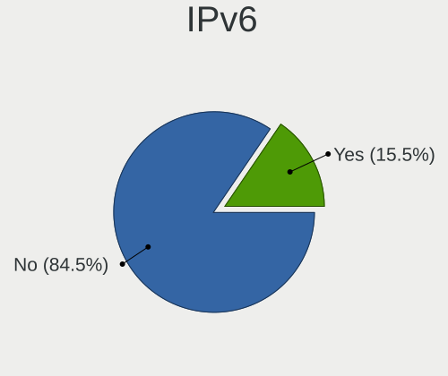

| Used | Computers | Percent |
|------|-----------|---------|
| No   | 780       | 84.51%  |
| Yes  | 143       | 15.49%  |

Bluetooth
---------

Bluetooth Vendor
----------------

Controller vendors

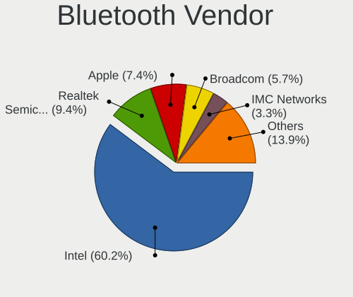

| Vendor                          | Computers | Percent |
|---------------------------------|-----------|---------|
| Intel                           | 147       | 60.25%  |
| Realtek Semiconductor           | 23        | 9.43%   |
| Apple                           | 18        | 7.38%   |
| Broadcom                        | 14        | 5.74%   |
| IMC Networks                    | 8         | 3.28%   |
| Foxconn / Hon Hai               | 6         | 2.46%   |
| Cambridge Silicon Radio         | 6         | 2.46%   |
| Qualcomm Atheros Communications | 5         | 2.05%   |
| Dell                            | 5         | 2.05%   |
| MediaTek                        | 3         | 1.23%   |
| Lite-On Technology              | 3         | 1.23%   |
| ASUSTek Computer                | 3         | 1.23%   |
| TP-Link                         | 1         | 0.41%   |
| Skylight Digital                | 1         | 0.41%   |
| Alps Electric                   | 1         | 0.41%   |

Bluetooth Model
---------------

Controller models

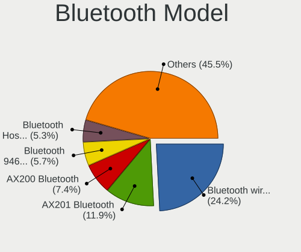

| Model                                                   | Computers | Percent |
|---------------------------------------------------------|-----------|---------|
| Intel Bluetooth wireless interface                      | 59        | 24.18%  |
| Intel AX201 Bluetooth                                   | 29        | 11.89%  |
| Intel AX200 Bluetooth                                   | 18        | 7.38%   |
| Intel Bluetooth 9460/9560 Jefferson Peak (JfP)          | 14        | 5.74%   |
| Apple Bluetooth Host Controller                         | 13        | 5.33%   |
| Realtek Bluetooth Adapter                               | 12        | 4.92%   |
| Intel AX211 Bluetooth                                   | 8         | 3.28%   |
| Intel Centrino Bluetooth Wireless Transceiver           | 6         | 2.46%   |
| Cambridge Silicon Radio Bluetooth Dongle (HCI mode)     | 6         | 2.46%   |
| Intel Wireless-AC 9260 Bluetooth Adapter                | 5         | 2.05%   |
| IMC Networks Qualcomm Atheros Bluetooth 4.1             | 5         | 2.05%   |
| Realtek Bluetooth 4.0 Adapter                           | 4         | 1.64%   |
| Intel AX210 Bluetooth                                   | 4         | 1.64%   |
| Dell DW375 Bluetooth Module                             | 4         | 1.64%   |
| Broadcom BCM20702 Bluetooth 4.0 [ThinkPad]              | 4         | 1.64%   |
| Lite-On Bluetooth USB Module                            | 3         | 1.23%   |
| Intel Wireless-AC 3168 Bluetooth                        | 3         | 1.23%   |
| Broadcom BCM2045B (BDC-2.1)                             | 3         | 1.23%   |
| Apple Broadcom Built-in Bluetooth                       | 3         | 1.23%   |
| Realtek RTL8822BE Bluetooth 4.2 Adapter                 | 2         | 0.82%   |
| Realtek Bluetooth 4.0 + High Speed Chip                 | 2         | 0.82%   |
| Qualcomm Atheros QCA61x4 Bluetooth 4.0                  | 2         | 0.82%   |
| Qualcomm Atheros AR3012 Bluetooth 4.0                   | 2         | 0.82%   |
| Foxconn / Hon Hai RZ616 Bluetooth Adapter               | 2         | 0.82%   |
| Foxconn / Hon Hai Bluetooth USB Module                  | 2         | 0.82%   |
| Broadcom Bluetooth                                      | 2         | 0.82%   |
| Broadcom BCM2045 Bluetooth                              | 2         | 0.82%   |
| TP-Link Bluetooth 5.0 USB Adapter                       | 1         | 0.41%   |
| Skylight Digital Realtek Bluetooth Adapter              | 1         | 0.41%   |
| Realtek RTL8723B Bluetooth                              | 1         | 0.41%   |
| Realtek  Bluetooth 4.2 Adapter                          | 1         | 0.41%   |
| Realtek Bluetooth 5.1 Adapter                           | 1         | 0.41%   |
| Qualcomm Atheros QCA9377 Bluetooth 4.1                  | 1         | 0.41%   |
| MediaTek RZ616 Bluetooth Adapter                        | 1         | 0.41%   |
| MediaTek RZ608 Bluetooth Adapter                        | 1         | 0.41%   |
| MediaTek Bluetooth Adapter                              | 1         | 0.41%   |
| Intel Centrino Advanced-N 6230 Bluetooth adapter        | 1         | 0.41%   |
| IMC Networks Realtek Bluetooth Adapter                  | 1         | 0.41%   |
| IMC Networks Realtek Bluetooth 4.0 Adapter              | 1         | 0.41%   |
| IMC Networks Qualcomm Atheros AR3012 Bluetooth 4.0 + HS | 1         | 0.41%   |

Sound
-----

Sound Vendor
------------

Sound card vendors

| Vendor                                       | Computers | Percent |
|----------------------------------------------|-----------|---------|
| Intel                                        | 589       | 70.37%  |
| AMD                                          | 149       | 17.8%   |
| Nvidia                                       | 53        | 6.33%   |
| C-Media Electronics                          | 14        | 1.67%   |
| SteelSeries ApS                              | 4         | 0.48%   |
| Texas Instruments                            | 3         | 0.36%   |
| Creative Labs                                | 2         | 0.24%   |
| ASUSTek Computer                             | 2         | 0.24%   |
| Zoran Co. Personal Media Division (Nogatech) | 1         | 0.12%   |
| XMOS                                         | 1         | 0.12%   |
| Trust International                          | 1         | 0.12%   |
| Trust                                        | 1         | 0.12%   |
| Thesycon Systemsoftware & Consulting         | 1         | 0.12%   |
| Silicon Integrated Systems [SiS]             | 1         | 0.12%   |
| Nam Tai E&E Products                         | 1         | 0.12%   |
| Logitech                                     | 1         | 0.12%   |
| Lenovo                                       | 1         | 0.12%   |
| JMTek                                        | 1         | 0.12%   |
| Griffin Technology                           | 1         | 0.12%   |
| GN Netcom                                    | 1         | 0.12%   |
| GEMBIRD                                      | 1         | 0.12%   |
| Focusrite-Novation                           | 1         | 0.12%   |
| FiiO Electronics Technology                  | 1         | 0.12%   |
| Elgato Systems                               | 1         | 0.12%   |
| Creative Technology                          | 1         | 0.12%   |
| Cambridge Audio                              | 1         | 0.12%   |
| BEHRINGER International                      | 1         | 0.12%   |
| Anlya.cn                                     | 1         | 0.12%   |
| Unknown                                      | 1         | 0.12%   |

Sound Model
-----------

Sound card models

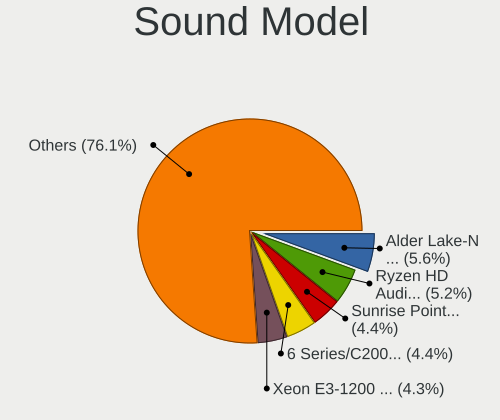

| Model                                                                                             | Computers | Percent |
|---------------------------------------------------------------------------------------------------|-----------|---------|
| Intel Alder Lake-N PCH High Definition Audio Controller                                           | 56        | 5.61%   |
| AMD Ryzen HD Audio Controller                                                                     | 52        | 5.21%   |
| Intel Sunrise Point-LP HD Audio                                                                   | 44        | 4.4%    |
| Intel 6 Series/C200 Series Chipset Family High Definition Audio Controller                        | 44        | 4.4%    |
| Intel Xeon E3-1200 v3/4th Gen Core Processor HD Audio Controller                                  | 43        | 4.3%    |
| Intel Celeron/Pentium Silver Processor High Definition Audio                                      | 43        | 4.3%    |
| Intel 8 Series/C220 Series Chipset High Definition Audio Controller                               | 35        | 3.5%    |
| Intel Jasper Lake HD Audio                                                                        | 34        | 3.4%    |
| Intel 7 Series/C216 Chipset Family High Definition Audio Controller                               | 31        | 3.1%    |
| Intel 100 Series/C230 Series Chipset Family HD Audio Controller                                   | 30        | 3%      |
| AMD FCH Azalia Controller                                                                         | 30        | 3%      |
| Intel Cannon Lake PCH cAVS                                                                        | 28        | 2.8%    |
| Intel Atom/Celeron/Pentium Processor x5-E8000/J3xxx/N3xxx Series High Definition Audio Controller | 26        | 2.6%    |
| AMD Renoir/Cezanne HDMI/DP Audio Controller                                                       | 25        | 2.5%    |
| Intel Atom Processor Z36xxx/Z37xxx Series High Definition Audio Controller                        | 23        | 2.3%    |
| Intel Haswell-ULT HD Audio Controller                                                             | 19        | 1.9%    |
| Intel 8 Series HD Audio Controller                                                                | 19        | 1.9%    |
| AMD Kabini HDMI/DP Audio                                                                          | 19        | 1.9%    |
| AMD Starship/Matisse HD Audio Controller                                                          | 18        | 1.8%    |
| Intel Broadwell-U Audio Controller                                                                | 16        | 1.6%    |
| Intel 200 Series PCH HD Audio                                                                     | 16        | 1.6%    |
| AMD Kaveri HDMI/DP Audio Controller                                                               | 14        | 1.4%    |
| Intel Wildcat Point-LP High Definition Audio Controller                                           | 13        | 1.3%    |
| Intel NM10/ICH7 Family High Definition Audio Controller                                           | 13        | 1.3%    |
| Intel Celeron N3350/Pentium N4200/Atom E3900 Series Audio Cluster                                 | 13        | 1.3%    |
| AMD Raven/Raven2/Fenghuang HDMI/DP Audio Controller                                               | 13        | 1.3%    |
| Intel Tiger Lake-LP Smart Sound Technology Audio Controller                                       | 12        | 1.2%    |
| Intel Elkhart Lake High Density Audio bus interface                                               | 11        | 1.1%    |
| Intel Alder Lake-S HD Audio Controller                                                            | 11        | 1.1%    |
| AMD SBx00 Azalia (Intel HDA)                                                                      | 11        | 1.1%    |
| Intel 5 Series/3400 Series Chipset High Definition Audio                                          | 10        | 1%      |
| Intel 82801JD/DO (ICH10 Family) HD Audio Controller                                               | 9         | 0.9%    |
| Intel 82801I (ICH9 Family) HD Audio Controller                                                    | 9         | 0.9%    |
| Intel Comet Lake PCH-LP cAVS                                                                      | 8         | 0.8%    |
| Nvidia High Definition Audio Controller                                                           | 6         | 0.6%    |
| C-Media Electronics Audio Adapter (Unitek Y-247A)                                                 | 6         | 0.6%    |
| Nvidia MCP79 High Definition Audio                                                                | 5         | 0.5%    |
| Intel Raptor Lake-P/U/H cAVS                                                                      | 5         | 0.5%    |
| Intel Alder Lake PCH-P High Definition Audio Controller                                           | 5         | 0.5%    |
| Intel 82801JI (ICH10 Family) HD Audio Controller                                                  | 5         | 0.5%    |

Memory
------

Memory Vendor
-------------

Memory module vendors

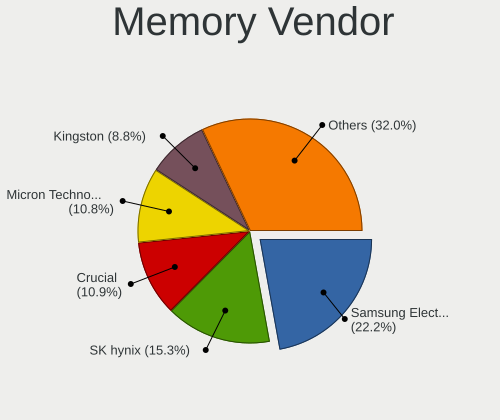

| Vendor                                  | Computers | Percent |
|-----------------------------------------|-----------|---------|
| Samsung Electronics                     | 209       | 22.16%  |
| SK hynix                                | 144       | 15.27%  |
| Crucial                                 | 103       | 10.92%  |
| Micron Technology                       | 102       | 10.82%  |
| Kingston                                | 83        | 8.8%    |
| Unknown                                 | 58        | 6.15%   |
| Corsair                                 | 49        | 5.2%    |
| Unknown                                 | 32        | 3.39%   |
| Unknown (ABCD)                          | 24        | 2.55%   |
| Transcend                               | 20        | 2.12%   |
| A-DATA Technology                       | 20        | 2.12%   |
| Ramaxel Technology                      | 10        | 1.06%   |
| G.Skill                                 | 8         | 0.85%   |
| Team                                    | 6         | 0.64%   |
| Nanya Technology                        | 6         | 0.64%   |
| Elpida                                  | 6         | 0.64%   |
| Timetec                                 | 5         | 0.53%   |
| SK_Hynix                                | 4         | 0.42%   |
| Apacer                                  | 4         | 0.42%   |
| Unknown (AB)                            | 3         | 0.32%   |
| Toshiba                                 | 3         | 0.32%   |
| Smart Modular                           | 3         | 0.32%   |
| Patriot                                 | 3         | 0.32%   |
| Hewlett-Packard                         | 3         | 0.32%   |
| Unknown (0x0702)                        | 2         | 0.21%   |
| Teikon                                  | 2         | 0.21%   |
| Lexar                                   | 2         | 0.21%   |
| Kimtigo                                 | 2         | 0.21%   |
| GSkill                                  | 2         | 0.21%   |
| Essencore Limited                       | 2         | 0.21%   |
| CSX                                     | 2         | 0.21%   |
| Unknown (0x0FBA)                        | 1         | 0.11%   |
| Unknown (0x0C26)                        | 1         | 0.11%   |
| Unknown (0x0AFD)                        | 1         | 0.11%   |
| Unknown (0B3D)                          | 1         | 0.11%   |
| Silicon Power Computer & Communications | 1         | 0.11%   |
| Shenzhen Longsys                        | 1         | 0.11%   |
| Samsung / Micron                        | 1         | 0.11%   |
| PUSKILL                                 | 1         | 0.11%   |
| Patriot Memory (PDP Systems)            | 1         | 0.11%   |

Memory Model
------------

Memory module models

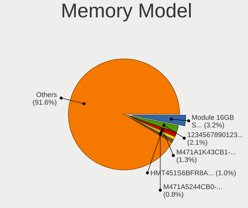

| Model                                                            | Computers | Percent |
|------------------------------------------------------------------|-----------|---------|
| Unknown                                                          | 32        | 3.18%   |
| Unknown (ABCD) RAM 123456789012345678 8GB DIMM DDR4 2400MT/s     | 21        | 2.09%   |
| Samsung RAM M471A1K43CB1-CTD 8GB SODIMM DDR4 3200MT/s            | 13        | 1.29%   |
| SK hynix RAM HMT451S6BFR8A-PB 4GB SODIMM DDR3 1600MT/s           | 10        | 1%      |
| Samsung RAM M471A5244CB0-CTD 4GB SODIMM DDR4 3200MT/s            | 8         | 0.8%    |
| Samsung RAM M425R1GB4BB0-CQKOL 8GB SODIMM DDR5 4800MT/s          | 8         | 0.8%    |
| SK hynix RAM HMT41GS6BFR8A-PB 8GB SODIMM DDR3 1600MT/s           | 7         | 0.7%    |
| SK hynix RAM HMA81GS6AFR8N-UH 8GB SODIMM DDR4 2400MT/s           | 7         | 0.7%    |
| Samsung RAM M471B5273DH0-CH9 4GB SODIMM DDR3 1334MT/s            | 7         | 0.7%    |
| Samsung RAM M471B5173EB0-YK0 4GB SODIMM DDR3 1600MT/s            | 7         | 0.7%    |
| Samsung RAM M471B1G73QH0-YK0 8GB SODIMM DDR3 1867MT/s            | 7         | 0.7%    |
| Unknown RAM Module 2GB SODIMM DDR2 667MT/s                       | 6         | 0.6%    |
| Samsung RAM M471B5173DB0-YK0 4GB SODIMM DDR3 1600MT/s            | 6         | 0.6%    |
| Crucial RAM CT16G48C40S5.M8A1 16GB SODIMM DDR5 4800MT/s          | 6         | 0.6%    |
| Corsair RAM CMK16GX4M2B3200C16 8GB DIMM DDR4 3200MT/s            | 6         | 0.6%    |
| Unknown RAM Module 4GB SODIMM DDR3 1333MT/s                      | 5         | 0.5%    |
| Transcend RAM TS1GLH64V6BL 8GB SODIMM DDR4 2667MT/s              | 5         | 0.5%    |
| SK hynix RAM HMT451U7BFR8A-PB 4GB DIMM DDR3 1600MT/s             | 5         | 0.5%    |
| SK hynix RAM HMT351S6CFR8C-PB 4GB SODIMM DDR3 1600MT/s           | 5         | 0.5%    |
| SK hynix RAM HMA851S6AFR6N-UH 4GB SODIMM DDR4 2400MT/s           | 5         | 0.5%    |
| Samsung RAM M471B5173QH0-YK0 4GB SODIMM DDR3 1600MT/s            | 5         | 0.5%    |
| Micron RAM Module 8GB Row Of Chips LPDDR4 3200MT/s               | 5         | 0.5%    |
| Micron RAM 8ATF1G64HZ-3G2R1 8GB SODIMM DDR4 3200MT/s             | 5         | 0.5%    |
| Unknown RAM Module 8GB DIMM DDR3 1600MT/s                        | 4         | 0.4%    |
| Unknown RAM Module 1GB DIMM SDRAM                                | 4         | 0.4%    |
| SK hynix RAM HMT351U6CFR8C-PB 4GB DIMM DDR3 1600MT/s             | 4         | 0.4%    |
| Samsung RAM Module 8GB SODIMM DDR4 3200MT/s                      | 4         | 0.4%    |
| Samsung RAM Module 4GB DIMM DDR4 2133MT/s                        | 4         | 0.4%    |
| Samsung RAM M471B5773CHS-CH9 2GB SODIMM DDR3 1333MT/s            | 4         | 0.4%    |
| Samsung RAM M471B5273CH0-CH9 4GB SODIMM DDR3 1334MT/s            | 4         | 0.4%    |
| Samsung RAM M471A5244CB0-CWE 4GB SODIMM DDR4 3200MT/s            | 4         | 0.4%    |
| Samsung RAM M471A5244CB0-CRC 4GB SODIMM DDR4 2400MT/s            | 4         | 0.4%    |
| Samsung RAM M471A1K43DB1-CTD 8GB SODIMM DDR4 2667MT/s            | 4         | 0.4%    |
| Samsung RAM M471A1G44AB0-CWE 8GB SODIMM DDR4 3200MT/s            | 4         | 0.4%    |
| Crucial RAM CT102464BF160B.C16 8GB SODIMM DDR3 1600MT/s          | 4         | 0.4%    |
| Crucial RAM CT102464BF160B.C16 8GB DIMM DDR3 1600MT/s            | 4         | 0.4%    |
| Unknown RAM Module 4GB DIMM DDR3 1600MT/s                        | 3         | 0.3%    |
| Unknown (ABCD) RAM 123456789012345678 1GB SODIMM LPDDR4 2400MT/s | 3         | 0.3%    |
| Transcend RAM TS1GLK72V6H 8GB DIMM DDR3 1600MT/s                 | 3         | 0.3%    |
| Timetec RAM UD3-1600 8GB DIMM DDR3 1600MT/s                      | 3         | 0.3%    |

Memory Kind
-----------

Memory module kinds

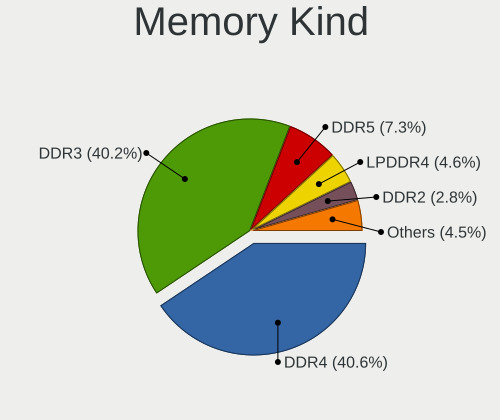

| Kind    | Computers | Percent |
|---------|-----------|---------|
| DDR4    | 337       | 40.6%   |
| DDR3    | 334       | 40.24%  |
| DDR5    | 61        | 7.35%   |
| LPDDR4  | 38        | 4.58%   |
| DDR2    | 23        | 2.77%   |
| Unknown | 12        | 1.45%   |
| LPDDR5  | 9         | 1.08%   |
| SDRAM   | 7         | 0.84%   |
| LPDDR3  | 6         | 0.72%   |
| DDR     | 2         | 0.24%   |
| LPDDR2  | 1         | 0.12%   |

Memory Form Factor
------------------

Physical design of the memory module

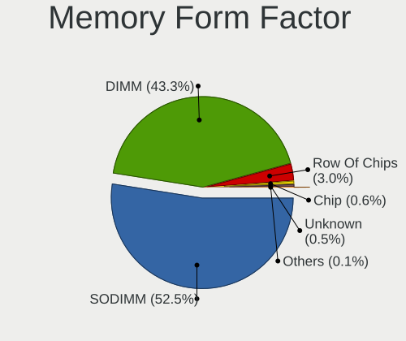

| Name         | Computers | Percent |
|--------------|-----------|---------|
| SODIMM       | 433       | 52.48%  |
| DIMM         | 357       | 43.27%  |
| Row Of Chips | 25        | 3.03%   |
| Chip         | 5         | 0.61%   |
| Unknown      | 4         | 0.48%   |
| FB-DIMM      | 1         | 0.12%   |

Memory Size
-----------

Memory module size

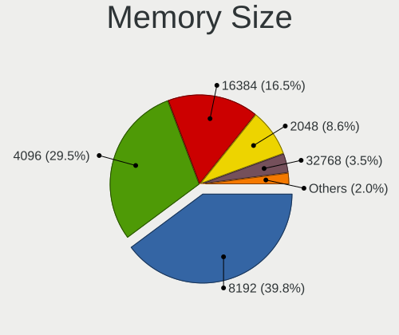

| Size  | Computers | Percent |
|-------|-----------|---------|
| 8192  | 350       | 39.82%  |
| 4096  | 259       | 29.47%  |
| 16384 | 145       | 16.5%   |
| 2048  | 76        | 8.65%   |
| 32768 | 31        | 3.53%   |
| 1024  | 15        | 1.71%   |
| 65536 | 1         | 0.11%   |
| 24576 | 1         | 0.11%   |
| 512   | 1         | 0.11%   |

Memory Speed
------------

Memory module speed

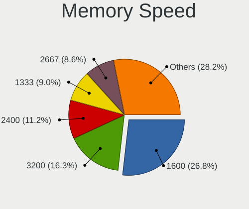

| Speed   | Computers | Percent |
|---------|-----------|---------|
| 1600    | 235       | 26.8%   |
| 3200    | 143       | 16.31%  |
| 2400    | 98        | 11.17%  |
| 1333    | 79        | 9.01%   |
| 2667    | 75        | 8.55%   |
| 2133    | 47        | 5.36%   |
| 4800    | 44        | 5.02%   |
| 800     | 18        | 2.05%   |
| 667     | 17        | 1.94%   |
| 5600    | 13        | 1.48%   |
| 1867    | 13        | 1.48%   |
| 2666    | 11        | 1.25%   |
| 1334    | 11        | 1.25%   |
| 1866    | 8         | 0.91%   |
| Unknown | 8         | 0.91%   |
| 6400    | 7         | 0.8%    |
| 1067    | 6         | 0.68%   |
| 1066    | 6         | 0.68%   |
| 5200    | 5         | 0.57%   |
| 3600    | 5         | 0.57%   |
| 533     | 4         | 0.46%   |
| 4000    | 3         | 0.34%   |
| 3000    | 3         | 0.34%   |
| 2933    | 3         | 0.34%   |
| 4267    | 2         | 0.23%   |
| 2600    | 2         | 0.23%   |
| 65535   | 1         | 0.11%   |
| 7467    | 1         | 0.11%   |
| 7200    | 1         | 0.11%   |
| 6000    | 1         | 0.11%   |
| 3733    | 1         | 0.11%   |
| 3534    | 1         | 0.11%   |
| 3066    | 1         | 0.11%   |
| 975     | 1         | 0.11%   |
| 933     | 1         | 0.11%   |
| 333     | 1         | 0.11%   |
| 133     | 1         | 0.11%   |

Printers & scanners
-------------------

Printer Vendor
--------------

Printer device vendors

| Vendor          | Computers | Percent |
|-----------------|-----------|---------|
| Hewlett-Packard | 1         | 100%    |

Printer Model
-------------

Printer device models

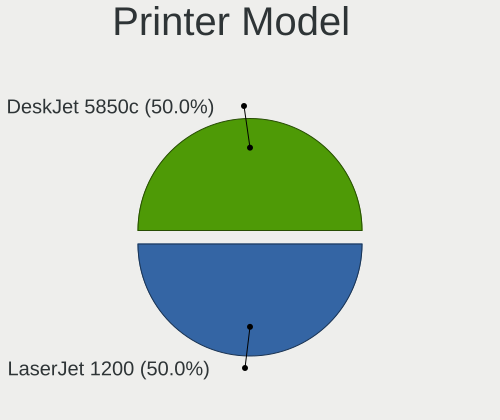

| Model            | Computers | Percent |
|------------------|-----------|---------|
| HP LaserJet 1200 | 1         | 50%     |
| HP DeskJet 5850c | 1         | 50%     |

Scanner Vendor
--------------

Scanner device vendors

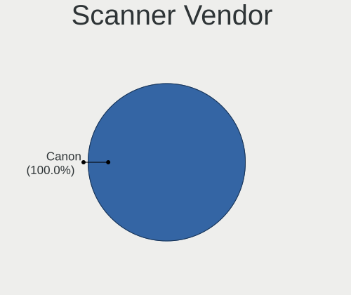

| Vendor | Computers | Percent |
|--------|-----------|---------|
| Canon  | 3         | 100%    |

Scanner Model
-------------

Scanner device models

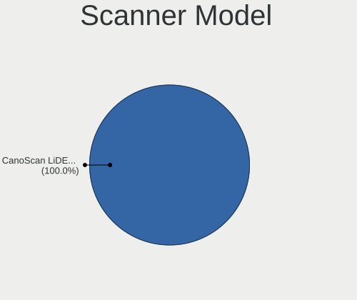

| Model                   | Computers | Percent |
|-------------------------|-----------|---------|
| Canon CanoScan LiDE 210 | 2         | 66.67%  |
| Canon CanoScan LiDE 220 | 1         | 33.33%  |

Camera
------

Camera Vendor
-------------

Camera device vendors

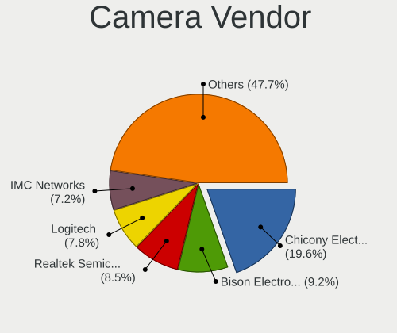

| Vendor                                 | Computers | Percent |
|----------------------------------------|-----------|---------|
| Chicony Electronics                    | 30        | 19.61%  |
| Bison Electronics                      | 14        | 9.15%   |
| Realtek Semiconductor                  | 13        | 8.5%    |
| Logitech                               | 12        | 7.84%   |
| IMC Networks                           | 11        | 7.19%   |
| Sunplus Innovation Technology          | 9         | 5.88%   |
| Syntek                                 | 7         | 4.58%   |
| Lite-On Technology                     | 7         | 4.58%   |
| Z-Star Microelectronics                | 5         | 3.27%   |
| Suyin                                  | 5         | 3.27%   |
| Quanta                                 | 5         | 3.27%   |
| Microdia                               | 5         | 3.27%   |
| Luxvisions Innotech Limited            | 5         | 3.27%   |
| Apple                                  | 5         | 3.27%   |
| Silicon Motion                         | 4         | 2.61%   |
| Cheng Uei Precision Industry (Foxlink) | 4         | 2.61%   |
| Lenovo                                 | 3         | 1.96%   |
| Trust                                  | 1         | 0.65%   |
| Supreme Electronics                    | 1         | 0.65%   |
| SHENZHEN AONI ELECTRONIC               | 1         | 0.65%   |
| Ricoh                                  | 1         | 0.65%   |
| Microsoft                              | 1         | 0.65%   |
| Creative Technology                    | 1         | 0.65%   |
| BSD                                    | 1         | 0.65%   |
| ARC International                      | 1         | 0.65%   |
| Alcor Micro                            | 1         | 0.65%   |

Camera Model
------------

Camera device models

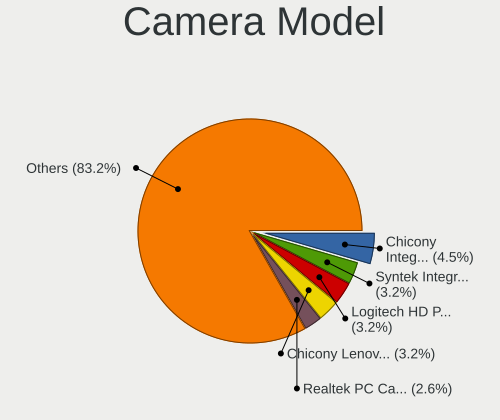

| Model                                                       | Computers | Percent |
|-------------------------------------------------------------|-----------|---------|
| Chicony Integrated Camera                                   | 7         | 4.52%   |
| Syntek Integrated Camera                                    | 5         | 3.23%   |
| Logitech HD Pro Webcam C920                                 | 5         | 3.23%   |
| Chicony Lenovo Integrated Camera (0.3MP)                    | 5         | 3.23%   |
| Realtek PC Camera                                           | 4         | 2.58%   |
| Realtek Integrated_Webcam_HD                                | 4         | 2.58%   |
| IMC Networks Integrated Camera                              | 4         | 2.58%   |
| Sunplus Integrated_Webcam_HD                                | 3         | 1.94%   |
| Luxvisions Innotech Limited Integrated Camera               | 3         | 1.94%   |
| IMC Networks USB2.0 HD UVC WebCam                           | 3         | 1.94%   |
| Chicony Integrated HP HD Webcam                             | 3         | 1.94%   |
| Bison SunplusIT Integrated Camera                           | 3         | 1.94%   |
| Bison Integrated Camera                                     | 3         | 1.94%   |
| Apple FaceTime HD Camera                                    | 3         | 1.94%   |
| Z-Star Webcam                                               | 2         | 1.29%   |
| Z-Star Namuga 1.3M Webcam                                   | 2         | 1.29%   |
| Suyin 1.3M WebCam (notebook emachines E730, Acer sub-brand) | 2         | 1.29%   |
| Sunplus USB 2.0 Camera                                      | 2         | 1.29%   |
| Silicon Motion 300k Pixel Camera                            | 2         | 1.29%   |
| Realtek USB 2.0 Webcam                                      | 2         | 1.29%   |
| Quanta HP Universal Camera                                  | 2         | 1.29%   |
| Microdia USB 2.0 Camera                                     | 2         | 1.29%   |
| Luxvisions Innotech Limited HP HD Camera                    | 2         | 1.29%   |
| Logitech Webcam C930e                                       | 2         | 1.29%   |
| Logitech Labtec Webcam Pro                                  | 2         | 1.29%   |
| Lite-On Integrated Camera                                   | 2         | 1.29%   |
| Lenovo Integrated Webcam                                    | 2         | 1.29%   |
| Chicony Integrated Camera [ThinkPad]                        | 2         | 1.29%   |
| Bison ThinkPad P50 Integrated Camera                        | 2         | 1.29%   |
| Bison ThinkPad Integrated Camera                            | 2         | 1.29%   |
| Apple FaceTime HD Camera (Built-in)                         | 2         | 1.29%   |
| Z-Star WebCam SC-03FFL11739P                                | 1         | 0.65%   |
| Trust Canyon CNS-CWC6 Webcam                                | 1         | 0.65%   |
| Syntek USB 2.0 UVC 1.3M WebCam                              | 1         | 0.65%   |
| Syntek Syntek 0.3MPixel USB 2.0 UVC PC Camera               | 1         | 0.65%   |
| Suyin Laptop_Integrated_Webcam_3M                           | 1         | 0.65%   |
| Suyin Acer Crystal Eye webcam                               | 1         | 0.65%   |
| Suyin 1.3M HD Webcam                                        | 1         | 0.65%   |
| Supreme Integrated Camera                                   | 1         | 0.65%   |
| Sunplus Laptop_Integrated_Webcam_FHD                        | 1         | 0.65%   |

Security
--------

Fingerprint Vendor
------------------

Fingerprint sensor vendors

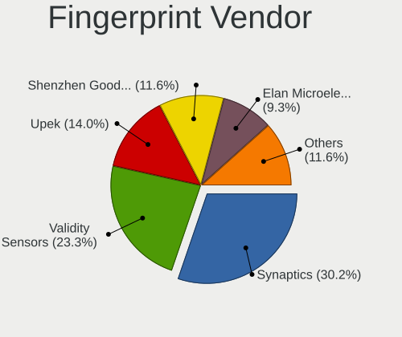

| Vendor                     | Computers | Percent |
|----------------------------|-----------|---------|
| Synaptics                  | 13        | 30.23%  |
| Validity Sensors           | 10        | 23.26%  |
| Upek                       | 6         | 13.95%  |
| Shenzhen Goodix Technology | 5         | 11.63%  |
| Elan Microelectronics      | 4         | 9.3%    |
| Broadcom                   | 2         | 4.65%   |
| AuthenTec                  | 2         | 4.65%   |
| STMicroelectronics         | 1         | 2.33%   |

Fingerprint Model
-----------------

Fingerprint sensor models

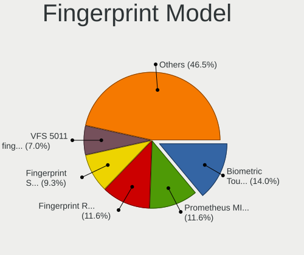

| Model                                                                        | Computers | Percent |
|------------------------------------------------------------------------------|-----------|---------|
| Upek Biometric Touchchip/Touchstrip Fingerprint Sensor                       | 6         | 13.95%  |
| Synaptics Prometheus MIS Touch Fingerprint Reader                            | 5         | 11.63%  |
| Shenzhen Goodix Fingerprint Reader                                           | 5         | 11.63%  |
| Elan Fingerprint Sensor                                                      | 4         | 9.3%    |
| Validity Sensors VFS 5011 fingerprint sensor                                 | 3         | 6.98%   |
| Synaptics Metallica MIS Touch Fingerprint Reader                             | 3         | 6.98%   |
| Synaptics Metallica MOH Touch Fingerprint Reader                             | 2         | 4.65%   |
| Synaptics FS7604 Touch Fingerprint Sensor with PurePrint                     | 2         | 4.65%   |
| Broadcom BCM5880 Secure Applications Processor with fingerprint swipe sensor | 2         | 4.65%   |
| Validity Sensors VFS7500 Touch Fingerprint Sensor                            | 1         | 2.33%   |
| Validity Sensors VFS495 Fingerprint Reader                                   | 1         | 2.33%   |
| Validity Sensors VFS491                                                      | 1         | 2.33%   |
| Validity Sensors VFS Fingerprint sensor                                      | 1         | 2.33%   |
| Validity Sensors Synaptics WBDI                                              | 1         | 2.33%   |
| Validity Sensors Swipe Fingerprint Sensor                                    | 1         | 2.33%   |
| Validity Sensors Fingerprint scanner                                         | 1         | 2.33%   |
| Synaptics UWP WBDI                                                           | 1         | 2.33%   |
| STMicroelectronics Fingerprint Reader                                        | 1         | 2.33%   |
| AuthenTec AES2810                                                            | 1         | 2.33%   |
| AuthenTec AES1660                                                            | 1         | 2.33%   |

Chipcard Vendor
---------------

Chipcard module vendors

Zero info for selected period =(

Chipcard Model
--------------

Chipcard module models

Zero info for selected period =(

Unsupported
-----------

Unsupported Devices
-------------------

Total unsupported devices on board

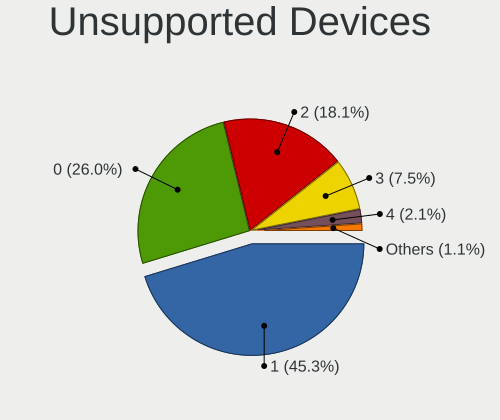

| Total | Computers | Percent |
|-------|-----------|---------|
| 1     | 417       | 45.28%  |
| 0     | 239       | 25.95%  |
| 2     | 167       | 18.13%  |
| 3     | 69        | 7.49%   |
| 4     | 19        | 2.06%   |
| 5     | 8         | 0.87%   |
| 9     | 1         | 0.11%   |
| 8     | 1         | 0.11%   |

Unsupported Device Types
------------------------

Types of unsupported devices

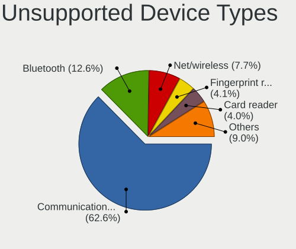

| Type                     | Computers | Percent |
|--------------------------|-----------|---------|
| Communication controller | 584       | 62.59%  |
| Bluetooth                | 118       | 12.65%  |
| Net/wireless             | 72        | 7.72%   |
| Fingerprint reader       | 38        | 4.07%   |
| Card reader              | 37        | 3.97%   |
| Firewire controller      | 33        | 3.54%   |
| Network                  | 17        | 1.82%   |
| Sound                    | 12        | 1.29%   |
| Net/ethernet             | 8         | 0.86%   |
| Graphics card            | 7         | 0.75%   |
| Storage                  | 4         | 0.43%   |
| Storage/raid             | 3         | 0.32%   |

