BSD in UK - Tested Hardware & Statistics (Desktops)
---------------------------------------------------

A project to collect tested hardware configurations for BSD in UK.

Anyone can contribute to this report by the [hw-probe](https://github.com/linuxhw/hw-probe/blob/master/INSTALL.BSD.md) tool:

    hw-probe -all -upload

Please contribute! Especially if your hardware is rare.

Contents
--------

* [ Test Cases ](#test-cases)

* [ System ](#system)
  - [ OS                       ](#os)
  - [ OS Family                ](#os-family)
  - [ Arch                     ](#arch)
  - [ DE                       ](#de)
  - [ Display Server           ](#display-server)
  - [ Display Manager          ](#display-manager)
  - [ OS Lang                  ](#os-lang)
  - [ Boot Mode                ](#boot-mode)
  - [ Filesystem               ](#filesystem)
  - [ Part. scheme             ](#part-scheme)

* [ Board ](#board)
  - [ Vendor                   ](#vendor)
  - [ Model                    ](#model)
  - [ Model Family             ](#model-family)
  - [ MFG Year                 ](#mfg-year)
  - [ Form Factor              ](#form-factor)
  - [ Coreboot                 ](#coreboot)
  - [ RAM Size                 ](#ram-size)
  - [ RAM Used                 ](#ram-used)
  - [ Total Drives             ](#total-drives)
  - [ Has CD-ROM               ](#has-cd-rom)
  - [ Has Ethernet             ](#has-ethernet)
  - [ Has WiFi                 ](#has-wifi)
  - [ Has Bluetooth            ](#has-bluetooth)

* [ Location ](#location)
  - [ Country                  ](#country)
  - [ City                     ](#city)

* [ Drives ](#drives)
  - [ Drive Vendor             ](#drive-vendor)
  - [ Drive Model              ](#drive-model)
  - [ HDD Vendor               ](#hdd-vendor)
  - [ SSD Vendor               ](#ssd-vendor)
  - [ Drive Kind               ](#drive-kind)
  - [ Drive Connector          ](#drive-connector)
  - [ Drive Size               ](#drive-size)
  - [ Space Total              ](#space-total)
  - [ Space Used               ](#space-used)
  - [ Malfunc. Drives          ](#malfunc-drives)
  - [ Malfunc. Drive Vendor    ](#malfunc-drive-vendor)
  - [ Malfunc. HDD Vendor      ](#malfunc-hdd-vendor)
  - [ Malfunc. Drive Kind      ](#malfunc-drive-kind)
  - [ Failed Drives            ](#failed-drives)
  - [ Failed Drive Vendor      ](#failed-drive-vendor)
  - [ Drive Status             ](#drive-status)

* [ Storage controller ](#storage-controller)
  - [ Storage Vendor           ](#storage-vendor)
  - [ Storage Model            ](#storage-model)
  - [ Storage Kind             ](#storage-kind)

* [ Processor ](#processor)
  - [ CPU Vendor               ](#cpu-vendor)
  - [ CPU Model                ](#cpu-model)
  - [ CPU Model Family         ](#cpu-model-family)
  - [ CPU Cores                ](#cpu-cores)
  - [ CPU Sockets              ](#cpu-sockets)
  - [ CPU Threads              ](#cpu-threads)
  - [ CPU Microarch            ](#cpu-microarch)

* [ Graphics ](#graphics)
  - [ GPU Vendor               ](#gpu-vendor)
  - [ GPU Model                ](#gpu-model)
  - [ GPU Combo                ](#gpu-combo)
  - [ GPU Driver               ](#gpu-driver)
  - [ GPU Memory               ](#gpu-memory)

* [ Monitor ](#monitor)
  - [ Monitor Vendor           ](#monitor-vendor)
  - [ Monitor Model            ](#monitor-model)
  - [ Monitor Resolution       ](#monitor-resolution)
  - [ Monitor Diagonal         ](#monitor-diagonal)
  - [ Monitor Width            ](#monitor-width)
  - [ Aspect Ratio             ](#aspect-ratio)
  - [ Monitor Area             ](#monitor-area)
  - [ Pixel Density            ](#pixel-density)
  - [ Multiple Monitors        ](#multiple-monitors)

* [ Network ](#network)
  - [ Net Controller Vendor    ](#net-controller-vendor)
  - [ Net Controller Model     ](#net-controller-model)
  - [ Wireless Vendor          ](#wireless-vendor)
  - [ Wireless Model           ](#wireless-model)
  - [ Ethernet Vendor          ](#ethernet-vendor)
  - [ Ethernet Model           ](#ethernet-model)
  - [ Net Controller Kind      ](#net-controller-kind)
  - [ Used Controller          ](#used-controller)
  - [ NICs                     ](#nics)
  - [ IPv6                     ](#ipv6)

* [ Bluetooth ](#bluetooth)
  - [ Bluetooth Vendor         ](#bluetooth-vendor)
  - [ Bluetooth Model          ](#bluetooth-model)

* [ Sound ](#sound)
  - [ Sound Vendor             ](#sound-vendor)
  - [ Sound Model              ](#sound-model)

* [ Memory ](#memory)
  - [ Memory Vendor            ](#memory-vendor)
  - [ Memory Model             ](#memory-model)
  - [ Memory Kind              ](#memory-kind)
  - [ Memory Form Factor       ](#memory-form-factor)
  - [ Memory Size              ](#memory-size)
  - [ Memory Speed             ](#memory-speed)

* [ Printers & scanners ](#printers--scanners)
  - [ Printer Vendor           ](#printer-vendor)
  - [ Printer Model            ](#printer-model)
  - [ Scanner Vendor           ](#scanner-vendor)
  - [ Scanner Model            ](#scanner-model)

* [ Camera ](#camera)
  - [ Camera Vendor            ](#camera-vendor)
  - [ Camera Model             ](#camera-model)

* [ Security ](#security)
  - [ Fingerprint Vendor       ](#fingerprint-vendor)
  - [ Fingerprint Model        ](#fingerprint-model)
  - [ Chipcard Vendor          ](#chipcard-vendor)
  - [ Chipcard Model           ](#chipcard-model)

* [ Unsupported ](#unsupported)
  - [ Unsupported Devices      ](#unsupported-devices)
  - [ Unsupported Device Types ](#unsupported-device-types)

Test Cases
----------

Total: 524

| Vendor        | Model                       | Probe                                                     | Date         |
|---------------|-----------------------------|-----------------------------------------------------------|--------------|
| Unknown       | Unknown                     | [b35fd5253d](https://bsd-hardware.info/?probe=b35fd5253d) | Feb 15, 2024 |
| AZW           | EQ                          | [cfdbc24520](https://bsd-hardware.info/?probe=cfdbc24520) | Feb 14, 2024 |
| Cisco         | ASA5515 A0                  | [8374ec4cca](https://bsd-hardware.info/?probe=8374ec4cca) | Feb 09, 2024 |
| ASRock        | B450M-HDV                   | [841a005fc8](https://bsd-hardware.info/?probe=841a005fc8) | Feb 06, 2024 |
| Unknown       | Unknown                     | [e217f9a442](https://bsd-hardware.info/?probe=e217f9a442) | Feb 05, 2024 |
| Unknown       | Unknown                     | [07bb97c05d](https://bsd-hardware.info/?probe=07bb97c05d) | Feb 04, 2024 |
| Protectli     | FW6 Ver                     | [97176aa00a](https://bsd-hardware.info/?probe=97176aa00a) | Feb 03, 2024 |
| Cisco         | ASA5515 A0                  | [366c1acc24](https://bsd-hardware.info/?probe=366c1acc24) | Feb 03, 2024 |
| AZW           | EQ                          | [e3022ba227](https://bsd-hardware.info/?probe=e3022ba227) | Feb 03, 2024 |
| Unknown       | Unknown                     | [9336d525a4](https://bsd-hardware.info/?probe=9336d525a4) | Feb 02, 2024 |
| ASRock Ind... | NUC-1240P                   | [9d86991181](https://bsd-hardware.info/?probe=9d86991181) | Jan 30, 2024 |
| CWWK          | CW-J6-6L                    | [116847fccd](https://bsd-hardware.info/?probe=116847fccd) | Jan 29, 2024 |
| MW            | GMLK-2_5G4L                 | [41120c422b](https://bsd-hardware.info/?probe=41120c422b) | Jan 26, 2024 |
| Dell          | 0JP3NX A01                  | [71b0b575da](https://bsd-hardware.info/?probe=71b0b575da) | Jan 26, 2024 |
| Unknown       | Unknown                     | [f67153fdd9](https://bsd-hardware.info/?probe=f67153fdd9) | Jan 25, 2024 |
| Dell          | 0VDX6J A01                  | [9b58c46acb](https://bsd-hardware.info/?probe=9b58c46acb) | Jan 25, 2024 |
| Unknown       | Unknown                     | [546b4e7e84](https://bsd-hardware.info/?probe=546b4e7e84) | Jan 21, 2024 |
| Intel         | CD952                       | [8391836f3a](https://bsd-hardware.info/?probe=8391836f3a) | Jan 19, 2024 |
| Lenovo        | SHARKBAY 0B98401 WIN        | [3ac522759b](https://bsd-hardware.info/?probe=3ac522759b) | Jan 18, 2024 |
| maiyunda      | www.maiyunda.com            | [b9e2d9e273](https://bsd-hardware.info/?probe=b9e2d9e273) | Jan 13, 2024 |
| ASRock        | B450M-HDV                   | [c15701f2a9](https://bsd-hardware.info/?probe=c15701f2a9) | Jan 10, 2024 |
| ASRock        | B450M-HDV                   | [82d5d6af92](https://bsd-hardware.info/?probe=82d5d6af92) | Jan 10, 2024 |
| Unknown       | Unknown                     | [d9db00092e](https://bsd-hardware.info/?probe=d9db00092e) | Jan 05, 2024 |
| HP            | 3646h                       | [38cea44a78](https://bsd-hardware.info/?probe=38cea44a78) | Jan 05, 2024 |
| Unknown       | Unknown                     | [0329eb81b9](https://bsd-hardware.info/?probe=0329eb81b9) | Jan 04, 2024 |
| Gigabyte      | MFLP7AP-00\2.x              | [fa13219efb](https://bsd-hardware.info/?probe=fa13219efb) | Jan 02, 2024 |
| ASUSTek       | ROG STRIX B650E-I GAMING... | [a29eec0aa5](https://bsd-hardware.info/?probe=a29eec0aa5) | Jan 02, 2024 |
| Protectli     | VP2420                      | [4b1f47b18e](https://bsd-hardware.info/?probe=4b1f47b18e) | Dec 31, 2023 |
| Unknown       | Unknown                     | [ce3ae03b86](https://bsd-hardware.info/?probe=ce3ae03b86) | Dec 30, 2023 |
| Dell          | 0VRWRC A00                  | [ec4b676c4b](https://bsd-hardware.info/?probe=ec4b676c4b) | Dec 28, 2023 |
| Unknown       | Unknown                     | [eba2e80eee](https://bsd-hardware.info/?probe=eba2e80eee) | Dec 28, 2023 |
| Protectli     | FW6 Ver                     | [c910bb7b83](https://bsd-hardware.info/?probe=c910bb7b83) | Dec 26, 2023 |
| Protectli     | VP2420                      | [34e03b1271](https://bsd-hardware.info/?probe=34e03b1271) | Dec 24, 2023 |
| Dell          | 0FDY5C A00                  | [e39c520eb6](https://bsd-hardware.info/?probe=e39c520eb6) | Dec 23, 2023 |
| MW            | GMLK-2_5G4L                 | [841767c8f8](https://bsd-hardware.info/?probe=841767c8f8) | Dec 19, 2023 |
| Dell          | 0T7D40 A01                  | [35283b08ff](https://bsd-hardware.info/?probe=35283b08ff) | Dec 19, 2023 |
| Lenovo        | SHARKBAY SDK0E50510 WIN     | [4adda9051f](https://bsd-hardware.info/?probe=4adda9051f) | Dec 15, 2023 |
| Advantech     | NAMB-3250 A102-1            | [41899c5e07](https://bsd-hardware.info/?probe=41899c5e07) | Dec 15, 2023 |
| MSI           | B450 TOMAHAWK MAX II        | [d9d33d12d7](https://bsd-hardware.info/?probe=d9d33d12d7) | Dec 14, 2023 |
| MSI           | B450 TOMAHAWK MAX II        | [9654df78b8](https://bsd-hardware.info/?probe=9654df78b8) | Dec 14, 2023 |
| Dell          | 0J8G6F A03                  | [e6e7f333a3](https://bsd-hardware.info/?probe=e6e7f333a3) | Dec 12, 2023 |
| HP            | 3397                        | [9013e5a39a](https://bsd-hardware.info/?probe=9013e5a39a) | Dec 08, 2023 |
| Fusion5       | FMP4 v2                     | [786d461a61](https://bsd-hardware.info/?probe=786d461a61) | Dec 06, 2023 |
| Dell          | 0VRWRC A00                  | [17fd054f21](https://bsd-hardware.info/?probe=17fd054f21) | Dec 06, 2023 |
| Unknown       | Unknown                     | [52d2381f88](https://bsd-hardware.info/?probe=52d2381f88) | Dec 06, 2023 |
| Dell          | 0GCY4M A01                  | [a5d23a5491](https://bsd-hardware.info/?probe=a5d23a5491) | Dec 02, 2023 |
| Unknown       | Unknown                     | [353b3874d5](https://bsd-hardware.info/?probe=353b3874d5) | Dec 01, 2023 |
| Intel         | DH67CL AAG10212-206         | [818a6b3f2c](https://bsd-hardware.info/?probe=818a6b3f2c) | Nov 29, 2023 |
| HP            | 0B54h D                     | [92d27048f9](https://bsd-hardware.info/?probe=92d27048f9) | Nov 26, 2023 |
| HP            | 0B54h D                     | [ca4d073520](https://bsd-hardware.info/?probe=ca4d073520) | Nov 26, 2023 |
| Gigabyte      | X399 DESIGNARE EX-CF        | [81faa8cbd2](https://bsd-hardware.info/?probe=81faa8cbd2) | Nov 22, 2023 |
| Protectli     | FW6 Ver                     | [ec5731af27](https://bsd-hardware.info/?probe=ec5731af27) | Nov 21, 2023 |
| PICO PC       | MNHO-113                    | [c9a12372b4](https://bsd-hardware.info/?probe=c9a12372b4) | Nov 20, 2023 |
| ADLINK Tec... | ABEG                        | [87e37876b0](https://bsd-hardware.info/?probe=87e37876b0) | Nov 17, 2023 |
| ASUSTek       | A55BM-E                     | [a81ae16c47](https://bsd-hardware.info/?probe=a81ae16c47) | Nov 17, 2023 |
| Protectli     | FW6 Ver                     | [6fb511ed3a](https://bsd-hardware.info/?probe=6fb511ed3a) | Nov 11, 2023 |
| NU591         | 1.0                         | [826aef324c](https://bsd-hardware.info/?probe=826aef324c) | Nov 07, 2023 |
| HP            | 3031h                       | [a38d555974](https://bsd-hardware.info/?probe=a38d555974) | Nov 06, 2023 |
| PICO PC       | MNHO-113                    | [7653a1705b](https://bsd-hardware.info/?probe=7653a1705b) | Nov 05, 2023 |
| MSI           | MAG Z390 TOMAHAWK           | [d95762a0c0](https://bsd-hardware.info/?probe=d95762a0c0) | Nov 04, 2023 |
| Techvision    | TVI7309X B0                 | [dd3612a38f](https://bsd-hardware.info/?probe=dd3612a38f) | Nov 02, 2023 |
| Techvision    | TVI7309X B0                 | [11b5e187fc](https://bsd-hardware.info/?probe=11b5e187fc) | Nov 02, 2023 |
| Unknown       | Unknown                     | [3499447096](https://bsd-hardware.info/?probe=3499447096) | Nov 01, 2023 |
| Gigabyte      | H81M-S2V                    | [07f64c00f4](https://bsd-hardware.info/?probe=07f64c00f4) | Oct 28, 2023 |
| Unknown       | Unknown                     | [2df22c840a](https://bsd-hardware.info/?probe=2df22c840a) | Oct 28, 2023 |
| Unknown       | Unknown                     | [8c9f8e4f16](https://bsd-hardware.info/?probe=8c9f8e4f16) | Oct 21, 2023 |
| Unknown       | Unknown                     | [f15d15cba2](https://bsd-hardware.info/?probe=f15d15cba2) | Oct 21, 2023 |
| Unknown       | Unknown                     | [d63aebc59b](https://bsd-hardware.info/?probe=d63aebc59b) | Oct 19, 2023 |
| Shenzhen M... | F6BFC                       | [3e57b220ce](https://bsd-hardware.info/?probe=3e57b220ce) | Oct 18, 2023 |
| AZW           | EQ                          | [1f76967326](https://bsd-hardware.info/?probe=1f76967326) | Oct 14, 2023 |
| Protectli     | FW4B Ver                    | [e2647b46bf](https://bsd-hardware.info/?probe=e2647b46bf) | Oct 09, 2023 |
| Yanling       | YL-KBR6L Ver:1.01           | [53fab8363c](https://bsd-hardware.info/?probe=53fab8363c) | Oct 09, 2023 |
| Lenovo        | 310B SDK0J40697 WIN 3305... | [66c5aee47e](https://bsd-hardware.info/?probe=66c5aee47e) | Oct 03, 2023 |
| Dell          | 0FDY5C A00                  | [acc8dea1e2](https://bsd-hardware.info/?probe=acc8dea1e2) | Oct 03, 2023 |
| AZW           | EQ                          | [81d0adbf96](https://bsd-hardware.info/?probe=81d0adbf96) | Oct 03, 2023 |
| ASUSTek       | P10S-C Series               | [cc0a5bb631](https://bsd-hardware.info/?probe=cc0a5bb631) | Sep 30, 2023 |
| ASUSTek       | P10S-C Series               | [4e7d5e6cf9](https://bsd-hardware.info/?probe=4e7d5e6cf9) | Sep 29, 2023 |
| Seeed Stud... | ODYSSEY-X86J4105 SD-BS-C... | [64dac999bd](https://bsd-hardware.info/?probe=64dac999bd) | Sep 24, 2023 |
| Lenovo        | 310B SDK0J40697 WIN 3305... | [6c3728aa16](https://bsd-hardware.info/?probe=6c3728aa16) | Sep 24, 2023 |
| HP            | 859B                        | [7b8592b129](https://bsd-hardware.info/?probe=7b8592b129) | Sep 21, 2023 |
| Protectli     | FW4B Ver                    | [015620b56d](https://bsd-hardware.info/?probe=015620b56d) | Sep 11, 2023 |
| Unknown       | Unknown                     | [65240d295c](https://bsd-hardware.info/?probe=65240d295c) | Sep 10, 2023 |
| Gigabyte      | H81M-S2V                    | [f30ab73618](https://bsd-hardware.info/?probe=f30ab73618) | Sep 10, 2023 |
| Unknown       | Unknown                     | [d28c125e99](https://bsd-hardware.info/?probe=d28c125e99) | Sep 10, 2023 |
| IceWhale T... | ZimaBoard 432 ZMB           | [6e458d22a3](https://bsd-hardware.info/?probe=6e458d22a3) | Sep 05, 2023 |
| Gigabyte      | A520I AC                    | [e245a38088](https://bsd-hardware.info/?probe=e245a38088) | Aug 31, 2023 |
| AZW           | EQ                          | [fe5669c376](https://bsd-hardware.info/?probe=fe5669c376) | Aug 29, 2023 |
| Unknown       | Unknown                     | [c5068ec761](https://bsd-hardware.info/?probe=c5068ec761) | Aug 28, 2023 |
| CncTion       | N6000-4L B0                 | [0cab2e3af3](https://bsd-hardware.info/?probe=0cab2e3af3) | Aug 28, 2023 |
| MSI           | AM1I                        | [50183030f8](https://bsd-hardware.info/?probe=50183030f8) | Aug 27, 2023 |
| Cisco         | ASA5515 A0                  | [d4540d9ae5](https://bsd-hardware.info/?probe=d4540d9ae5) | Aug 24, 2023 |
| MSI           | AM1I                        | [0f74a7c547](https://bsd-hardware.info/?probe=0f74a7c547) | Aug 21, 2023 |
| ASRock        | E3C224D2I                   | [93bf9586db](https://bsd-hardware.info/?probe=93bf9586db) | Aug 18, 2023 |
| PICO PC       | MNHO-113                    | [95f3a15448](https://bsd-hardware.info/?probe=95f3a15448) | Aug 17, 2023 |
| Unknown       | QGLK03                      | [bb622dd456](https://bsd-hardware.info/?probe=bb622dd456) | Aug 16, 2023 |
| Supermicro    | M12SWA-TF                   | [2e38f0b91a](https://bsd-hardware.info/?probe=2e38f0b91a) | Aug 16, 2023 |
| Intel         | Q3XXG4-P V1.0               | [d830d61109](https://bsd-hardware.info/?probe=d830d61109) | Aug 15, 2023 |
| Acer          | TDPS05 R3700                | [5e3083a96d](https://bsd-hardware.info/?probe=5e3083a96d) | Aug 14, 2023 |
| Protectli     | FW6 Ver                     | [7e3965fa27](https://bsd-hardware.info/?probe=7e3965fa27) | Aug 12, 2023 |
| Protectli     | VP2410 10                   | [b4869eafb2](https://bsd-hardware.info/?probe=b4869eafb2) | Aug 12, 2023 |
| HPE           | ProLiant MicroServer Gen... | [d06166298c](https://bsd-hardware.info/?probe=d06166298c) | Aug 07, 2023 |
| Acer          | Aspire XC-115               | [7a94fde347](https://bsd-hardware.info/?probe=7a94fde347) | Aug 06, 2023 |
| Unknown       | YL-SKUL6                    | [cdd90dd470](https://bsd-hardware.info/?probe=cdd90dd470) | Aug 04, 2023 |
| Unknown       | Unknown                     | [b9f6337c0d](https://bsd-hardware.info/?probe=b9f6337c0d) | Aug 02, 2023 |
| Unknown       | 1.1                         | [745c09c8e7](https://bsd-hardware.info/?probe=745c09c8e7) | Aug 01, 2023 |
| HP            | 8617                        | [7592f46fef](https://bsd-hardware.info/?probe=7592f46fef) | Jul 30, 2023 |
| Protectli     | FW4B Ver                    | [449a3e6015](https://bsd-hardware.info/?probe=449a3e6015) | Jul 28, 2023 |
| Unknown       | Unknown                     | [f4fb011cfb](https://bsd-hardware.info/?probe=f4fb011cfb) | Jul 11, 2023 |
| Techvision    | TVI7309X B0                 | [d365b4b0df](https://bsd-hardware.info/?probe=d365b4b0df) | Jul 07, 2023 |
| Unknown       | Unknown                     | [a7e3b61154](https://bsd-hardware.info/?probe=a7e3b61154) | Jul 05, 2023 |
| CncTion       | N5105-4L-I226 B0            | [492f3e2096](https://bsd-hardware.info/?probe=492f3e2096) | Jul 05, 2023 |
| Dell          | 07WP95 A01                  | [1705a37ecb](https://bsd-hardware.info/?probe=1705a37ecb) | Jul 05, 2023 |
| CncTion       | N5105-4L-I226 B0            | [d1e58041a9](https://bsd-hardware.info/?probe=d1e58041a9) | Jul 04, 2023 |
| Techvision    | TVI7309X B0                 | [24bc6390a7](https://bsd-hardware.info/?probe=24bc6390a7) | Jul 02, 2023 |
| Techvision    | TVI7309X B0                 | [7e76f16380](https://bsd-hardware.info/?probe=7e76f16380) | Jul 01, 2023 |
| Techvision    | TVI7309X B0                 | [7c71b88b22](https://bsd-hardware.info/?probe=7c71b88b22) | Jun 30, 2023 |
| Techvision    | TVI7309X B0                 | [0dbf4904dc](https://bsd-hardware.info/?probe=0dbf4904dc) | Jun 28, 2023 |
| Unknown       | Unknown                     | [9d98798bc8](https://bsd-hardware.info/?probe=9d98798bc8) | Jun 27, 2023 |
| Cisco         | ASA5515 A0                  | [9d8eedf081](https://bsd-hardware.info/?probe=9d8eedf081) | Jun 26, 2023 |
| Protectli     | FW6 Ver                     | [03eb1a54c8](https://bsd-hardware.info/?probe=03eb1a54c8) | Jun 25, 2023 |
| Gigabyte      | Z77N-WIFI                   | [aca5df3113](https://bsd-hardware.info/?probe=aca5df3113) | Jun 24, 2023 |
| HP            | 8592                        | [154f28878a](https://bsd-hardware.info/?probe=154f28878a) | Jun 21, 2023 |
| Unknown       | Unknown                     | [81268da610](https://bsd-hardware.info/?probe=81268da610) | Jun 17, 2023 |
| Dell          | 0H7TGR A00                  | [da72cc4da4](https://bsd-hardware.info/?probe=da72cc4da4) | Jun 14, 2023 |
| Gigabyte      | Z77N-WIFI                   | [f96302f46c](https://bsd-hardware.info/?probe=f96302f46c) | Jun 13, 2023 |
| AZW           | EQ                          | [f1f980d130](https://bsd-hardware.info/?probe=f1f980d130) | Jun 10, 2023 |
| maiyunda      | www.maiyunda.com            | [7b43dea184](https://bsd-hardware.info/?probe=7b43dea184) | Jun 08, 2023 |
| Gigabyte      | Z77N-WIFI                   | [c1c30d3223](https://bsd-hardware.info/?probe=c1c30d3223) | Jun 02, 2023 |
| Gigabyte      | Z77N-WIFI                   | [45cb709a24](https://bsd-hardware.info/?probe=45cb709a24) | Jun 01, 2023 |
| Dell          | 0GXM1W A01                  | [c9959faf54](https://bsd-hardware.info/?probe=c9959faf54) | May 29, 2023 |
| Axiomtek      | NA362-DAMI-c3768-US         | [243efb73f6](https://bsd-hardware.info/?probe=243efb73f6) | May 27, 2023 |
| Unknown       | 1.0                         | [12d6c7934e](https://bsd-hardware.info/?probe=12d6c7934e) | May 27, 2023 |
| Dell          | 0GXM1W A01                  | [364d24b4f4](https://bsd-hardware.info/?probe=364d24b4f4) | May 25, 2023 |
| ASRock        | E3C224D2I                   | [57353597b3](https://bsd-hardware.info/?probe=57353597b3) | May 25, 2023 |
| Dell          | 0GXM1W A01                  | [afa4b1b0df](https://bsd-hardware.info/?probe=afa4b1b0df) | May 25, 2023 |
| ASRock        | IMB-181-L                   | [0347664bbc](https://bsd-hardware.info/?probe=0347664bbc) | May 17, 2023 |
| Dell          | 0WN7Y6 A01                  | [a232411c74](https://bsd-hardware.info/?probe=a232411c74) | May 12, 2023 |
| Supermicro    | X8SIL                       | [a39ebc1c3a](https://bsd-hardware.info/?probe=a39ebc1c3a) | May 10, 2023 |
| ASUSTek       | P11C-M Series               | [8114acc225](https://bsd-hardware.info/?probe=8114acc225) | May 07, 2023 |
| Unknown       | Unknown                     | [6cc74ec4bd](https://bsd-hardware.info/?probe=6cc74ec4bd) | May 04, 2023 |
| ASUSTek       | P11C-M Series               | [2c5d0e597f](https://bsd-hardware.info/?probe=2c5d0e597f) | May 03, 2023 |
| Gigabyte      | A320M-H-CF                  | [3fbe359db7](https://bsd-hardware.info/?probe=3fbe359db7) | May 03, 2023 |
| Lenovo        | SHARKBAY NOK                | [2a9fc1af29](https://bsd-hardware.info/?probe=2a9fc1af29) | Apr 27, 2023 |
| Intel GMLV... | GMLR115 GMLR115             | [56d2fcc6e9](https://bsd-hardware.info/?probe=56d2fcc6e9) | Apr 24, 2023 |
| Dell          | 0WR7PY A03                  | [e461f7862c](https://bsd-hardware.info/?probe=e461f7862c) | Apr 23, 2023 |
| Dell          | 02YYK5 A01                  | [9f7ba08cb2](https://bsd-hardware.info/?probe=9f7ba08cb2) | Apr 23, 2023 |
| Gigabyte      | N3050MD3P                   | [66e9ccbef8](https://bsd-hardware.info/?probe=66e9ccbef8) | Apr 22, 2023 |
| Fujitsu       | D3313-A1 S26361-D3313-A1    | [7a5fcaf0d0](https://bsd-hardware.info/?probe=7a5fcaf0d0) | Apr 22, 2023 |
| PICO PC       | MNHO-113                    | [ad485d27af](https://bsd-hardware.info/?probe=ad485d27af) | Apr 15, 2023 |
| ASUSTek       | PRIME H510M-E               | [385910dbe5](https://bsd-hardware.info/?probe=385910dbe5) | Apr 11, 2023 |
| Unknown       | Unknown                     | [ceebb96d61](https://bsd-hardware.info/?probe=ceebb96d61) | Apr 11, 2023 |
| Unknown       | Unknown                     | [e163926e69](https://bsd-hardware.info/?probe=e163926e69) | Apr 10, 2023 |
| Unknown       | Unknown                     | [f2fbd3c3ad](https://bsd-hardware.info/?probe=f2fbd3c3ad) | Apr 09, 2023 |
| ASRock        | E3C224D2I                   | [f8f3f3c43c](https://bsd-hardware.info/?probe=f8f3f3c43c) | Apr 07, 2023 |
| Dell          | 0WR7PY A03                  | [42a875684f](https://bsd-hardware.info/?probe=42a875684f) | Apr 07, 2023 |
| Unknown       | Unknown                     | [196f8d9e86](https://bsd-hardware.info/?probe=196f8d9e86) | Apr 06, 2023 |
| Unknown       | Unknown                     | [5a7bd1b139](https://bsd-hardware.info/?probe=5a7bd1b139) | Apr 02, 2023 |
| ASUSTek       | PRIME H510M-E               | [8fe73c707e](https://bsd-hardware.info/?probe=8fe73c707e) | Apr 02, 2023 |
| Fujitsu       | D3313-G1 S26361-D3313-G1    | [1122cabca9](https://bsd-hardware.info/?probe=1122cabca9) | Apr 01, 2023 |
| ASRockRack    | EPYCD8-2T                   | [75f414997a](https://bsd-hardware.info/?probe=75f414997a) | Mar 31, 2023 |
| Lenovo        | SHARKBAY 0B98405 STD        | [29c6f5f74c](https://bsd-hardware.info/?probe=29c6f5f74c) | Mar 28, 2023 |
| IceWhale T... | ZimaBoard 832 ZMB           | [3c4f4abe16](https://bsd-hardware.info/?probe=3c4f4abe16) | Mar 23, 2023 |
| Intel         | DENLOW_WS                   | [8b3bb4ee24](https://bsd-hardware.info/?probe=8b3bb4ee24) | Mar 19, 2023 |
| ASUSTek       | Z97I-PLUS                   | [cdbc1b0031](https://bsd-hardware.info/?probe=cdbc1b0031) | Mar 19, 2023 |
| CNCTION-IA... | Unknown                     | [914c4aad57](https://bsd-hardware.info/?probe=914c4aad57) | Mar 19, 2023 |
| Dell          | 0D28YY A00                  | [15e8aedcb6](https://bsd-hardware.info/?probe=15e8aedcb6) | Mar 17, 2023 |
| ASUSTek       | ROG STRIX B450-F GAMING ... | [74cf75116d](https://bsd-hardware.info/?probe=74cf75116d) | Mar 17, 2023 |
| Intel         | SHARKBAY                    | [6c2382fa44](https://bsd-hardware.info/?probe=6c2382fa44) | Mar 16, 2023 |
| Fujitsu       | D3313-G1 S26361-D3313-G1    | [652100bcac](https://bsd-hardware.info/?probe=652100bcac) | Mar 16, 2023 |
| Unknown       | Unknown                     | [82759eff54](https://bsd-hardware.info/?probe=82759eff54) | Mar 11, 2023 |
| Acer          | TDPS05 R3700                | [6ee4404ee0](https://bsd-hardware.info/?probe=6ee4404ee0) | Mar 09, 2023 |
| Techvision    | TVI7309X B0                 | [fb5b37bff5](https://bsd-hardware.info/?probe=fb5b37bff5) | Mar 02, 2023 |
| IceWhale T... | ZimaBoard 832 ZMB           | [e9e179e9ac](https://bsd-hardware.info/?probe=e9e179e9ac) | Mar 02, 2023 |
| MSI           | B450M PRO-VDH MAX           | [85aecf8c3f](https://bsd-hardware.info/?probe=85aecf8c3f) | Feb 26, 2023 |
| ASUSTek       | ROG STRIX Z390-E GAMING     | [be81f2675f](https://bsd-hardware.info/?probe=be81f2675f) | Feb 25, 2023 |
| PC Engines    | apu4                        | [410a7ff78e](https://bsd-hardware.info/?probe=410a7ff78e) | Feb 23, 2023 |
| Intel         | CW-J6-5L 2C                 | [442643937e](https://bsd-hardware.info/?probe=442643937e) | Feb 22, 2023 |
| Intel         | CW-J6-5L 2C                 | [90fc1b74e6](https://bsd-hardware.info/?probe=90fc1b74e6) | Feb 22, 2023 |
| Unknown       | Unknown                     | [8c063582d4](https://bsd-hardware.info/?probe=8c063582d4) | Feb 20, 2023 |
| Unknown       | Unknown                     | [b906471557](https://bsd-hardware.info/?probe=b906471557) | Feb 17, 2023 |
| ASUSTek       | PRIME Z490M-PLUS            | [1d9739f234](https://bsd-hardware.info/?probe=1d9739f234) | Feb 17, 2023 |
| Dell          | 00V62H A01                  | [092bbaa484](https://bsd-hardware.info/?probe=092bbaa484) | Feb 01, 2023 |
| Unknown       | Unknown                     | [ecf5a46a0f](https://bsd-hardware.info/?probe=ecf5a46a0f) | Feb 01, 2023 |
| Dell          | 0F373D A00                  | [cd4202e58b](https://bsd-hardware.info/?probe=cd4202e58b) | Jan 30, 2023 |
| Dell          | 00V62H A01                  | [283d305565](https://bsd-hardware.info/?probe=283d305565) | Jan 29, 2023 |
| Dell          | 00V62H A01                  | [9d09937e2a](https://bsd-hardware.info/?probe=9d09937e2a) | Jan 28, 2023 |
| Dell          | 03KWTV A02                  | [28088f7e94](https://bsd-hardware.info/?probe=28088f7e94) | Jan 22, 2023 |
| Unknown       | Unknown                     | [0bbf3bdc00](https://bsd-hardware.info/?probe=0bbf3bdc00) | Jan 21, 2023 |
| Lenovo        | SDK0J40705 WIN 342503995... | [0dc2013a9f](https://bsd-hardware.info/?probe=0dc2013a9f) | Jan 21, 2023 |
| Unknown       | PICO PC                     | [9e20d7dbbc](https://bsd-hardware.info/?probe=9e20d7dbbc) | Jan 20, 2023 |
| Protectli     | FW6 Ver                     | [8c1f6c2733](https://bsd-hardware.info/?probe=8c1f6c2733) | Jan 12, 2023 |
| Unknown       | Unknown                     | [6e866a006d](https://bsd-hardware.info/?probe=6e866a006d) | Jan 10, 2023 |
| Unknown       | Unknown                     | [7e87430a40](https://bsd-hardware.info/?probe=7e87430a40) | Jan 07, 2023 |
| Gigabyte      | A320M-H-CF                  | [ce6ccffb1b](https://bsd-hardware.info/?probe=ce6ccffb1b) | Jan 06, 2023 |
| Winston Ma... | PICO PC                     | [d744315833](https://bsd-hardware.info/?probe=d744315833) | Jan 05, 2023 |
| Acer          | Aspire X3400                | [fa59d6aa07](https://bsd-hardware.info/?probe=fa59d6aa07) | Jan 04, 2023 |
| HP            | ProLiant MicroServer Gen... | [409d119307](https://bsd-hardware.info/?probe=409d119307) | Jan 02, 2023 |
| Intel         | DH77KC AAG39641-400         | [d66b90249d](https://bsd-hardware.info/?probe=d66b90249d) | Jan 02, 2023 |
| Unknown       | Unknown                     | [0f727c761b](https://bsd-hardware.info/?probe=0f727c761b) | Dec 29, 2022 |
| HP            | 8000 X4                     | [e66d228381](https://bsd-hardware.info/?probe=e66d228381) | Dec 29, 2022 |
| Intel         | CARLOW                      | [fa30f060f3](https://bsd-hardware.info/?probe=fa30f060f3) | Dec 28, 2022 |
| Fujitsu       | D3230-A1 S26361-D3230-A1    | [5dafbbced0](https://bsd-hardware.info/?probe=5dafbbced0) | Dec 28, 2022 |
| Raspberry ... | Raspberry Pi 4 Model B      | [888de76acd](https://bsd-hardware.info/?probe=888de76acd) | Dec 28, 2022 |
| Unknown       | Unknown                     | [e70af54c3f](https://bsd-hardware.info/?probe=e70af54c3f) | Dec 28, 2022 |
| Raspberry ... | Raspberry Pi 400            | [ee9cac334f](https://bsd-hardware.info/?probe=ee9cac334f) | Dec 21, 2022 |
| Fujitsu       | D3313-G1 S26361-D3313-G1    | [f321130f0e](https://bsd-hardware.info/?probe=f321130f0e) | Dec 18, 2022 |
| Fujitsu       | D3313-G1 S26361-D3313-G1    | [14d483ac06](https://bsd-hardware.info/?probe=14d483ac06) | Dec 18, 2022 |
| ASRock        | E3C224D2I                   | [106e525671](https://bsd-hardware.info/?probe=106e525671) | Dec 18, 2022 |
| AMI           | PEISIA E3845 VER1.0         | [c3ffb2c87d](https://bsd-hardware.info/?probe=c3ffb2c87d) | Dec 17, 2022 |
| Intel         | DN2820FYK H24582-203        | [160d942d28](https://bsd-hardware.info/?probe=160d942d28) | Dec 17, 2022 |
| HP            | 213D A01                    | [6c83f31e71](https://bsd-hardware.info/?probe=6c83f31e71) | Dec 10, 2022 |
| AMI           | PEISIA E3845 VER1.0         | [0ac47aa8a0](https://bsd-hardware.info/?probe=0ac47aa8a0) | Dec 09, 2022 |
| Intel         | CARLOW                      | [1b45524779](https://bsd-hardware.info/?probe=1b45524779) | Dec 05, 2022 |
| Intel         | D54250WYK H13922-303        | [f3b09cfb70](https://bsd-hardware.info/?probe=f3b09cfb70) | Nov 30, 2022 |
| ASRock        | B450M-HDV                   | [d0009172b1](https://bsd-hardware.info/?probe=d0009172b1) | Nov 24, 2022 |
| ASRock        | B450M-HDV                   | [25cc0129d9](https://bsd-hardware.info/?probe=25cc0129d9) | Nov 24, 2022 |
| Unknown       | Unknown                     | [c5562e1851](https://bsd-hardware.info/?probe=c5562e1851) | Nov 24, 2022 |
| ASRock Ind... | NUC-1240P                   | [75547bc09a](https://bsd-hardware.info/?probe=75547bc09a) | Nov 24, 2022 |
| Datto         | SSD                         | [08d401fa34](https://bsd-hardware.info/?probe=08d401fa34) | Nov 22, 2022 |
| ASUSTek       | ROG STRIX B450-F GAMING ... | [92eab8d065](https://bsd-hardware.info/?probe=92eab8d065) | Nov 19, 2022 |
| Acer          | TDPS05 R3700                | [4ebc5df17c](https://bsd-hardware.info/?probe=4ebc5df17c) | Nov 15, 2022 |
| Acer          | TDPS05 R3700                | [6e1273fdd6](https://bsd-hardware.info/?probe=6e1273fdd6) | Nov 15, 2022 |
| HP            | 8000 X4                     | [824d5f1ace](https://bsd-hardware.info/?probe=824d5f1ace) | Nov 12, 2022 |
| HP            | 1998                        | [e397526bac](https://bsd-hardware.info/?probe=e397526bac) | Nov 11, 2022 |
| HP            | 1998                        | [6a38c36a3e](https://bsd-hardware.info/?probe=6a38c36a3e) | Nov 11, 2022 |
| ASUSTek       | P5B-Deluxe                  | [87d7d4435b](https://bsd-hardware.info/?probe=87d7d4435b) | Nov 10, 2022 |
| ASUSTek       | PRIME Z490M-PLUS            | [9e3a09a0b3](https://bsd-hardware.info/?probe=9e3a09a0b3) | Nov 10, 2022 |
| Intel         | SHARKBAY                    | [667abc6f38](https://bsd-hardware.info/?probe=667abc6f38) | Nov 09, 2022 |
| Unknown       | Unknown                     | [47e6a4fa8b](https://bsd-hardware.info/?probe=47e6a4fa8b) | Nov 09, 2022 |
| Intel         | SHARKBAY                    | [80a31985d9](https://bsd-hardware.info/?probe=80a31985d9) | Nov 05, 2022 |
| Unknown       | J3160-4L                    | [e05d9b2d17](https://bsd-hardware.info/?probe=e05d9b2d17) | Oct 30, 2022 |
| Unknown       | Unknown                     | [4e01e68bb2](https://bsd-hardware.info/?probe=4e01e68bb2) | Oct 27, 2022 |
| Gigabyte      | H61M-DS2 x.x                | [10ea57e48f](https://bsd-hardware.info/?probe=10ea57e48f) | Oct 23, 2022 |
| Gigabyte      | H61M-DS2 x.x                | [947d061849](https://bsd-hardware.info/?probe=947d061849) | Oct 22, 2022 |
| Quanmax       | spo-book TECH QUAD B1       | [f3db09e0f0](https://bsd-hardware.info/?probe=f3db09e0f0) | Oct 19, 2022 |
| Unknown       | J3160-4L                    | [42c01a3aaf](https://bsd-hardware.info/?probe=42c01a3aaf) | Oct 13, 2022 |
| ASUSTek       | H110M-PLUS                  | [ba30f2772b](https://bsd-hardware.info/?probe=ba30f2772b) | Oct 12, 2022 |
| Unknown       | Unknown                     | [b889791d9f](https://bsd-hardware.info/?probe=b889791d9f) | Oct 06, 2022 |
| ASRock        | J3355M                      | [0240dbc2bb](https://bsd-hardware.info/?probe=0240dbc2bb) | Oct 04, 2022 |
| Shuttle       | FH61V                       | [305f06cd6a](https://bsd-hardware.info/?probe=305f06cd6a) | Oct 01, 2022 |
| Protectli     | FW4B Ver                    | [05651f8664](https://bsd-hardware.info/?probe=05651f8664) | Oct 01, 2022 |
| Dell          | 0T10XW A01                  | [c2ff0bc0b9](https://bsd-hardware.info/?probe=c2ff0bc0b9) | Sep 30, 2022 |
| ASUSTek       | PRIME Z490M-PLUS            | [3877787983](https://bsd-hardware.info/?probe=3877787983) | Sep 27, 2022 |
| Intel         | Q3XXG4-P V1.0               | [cde2481e46](https://bsd-hardware.info/?probe=cde2481e46) | Sep 26, 2022 |
| HP            | 8592                        | [898ce46c1f](https://bsd-hardware.info/?probe=898ce46c1f) | Sep 25, 2022 |
| Dell          | 07WP95 A01                  | [98e67ff164](https://bsd-hardware.info/?probe=98e67ff164) | Sep 12, 2022 |
| Deciso        | Netboard A10 V2.1           | [6c88b88822](https://bsd-hardware.info/?probe=6c88b88822) | Sep 07, 2022 |
| Gigabyte      | H61M-DS2 x.x                | [3f5ad2f043](https://bsd-hardware.info/?probe=3f5ad2f043) | Sep 05, 2022 |
| MSI           | A320M-A PRO M2              | [d455ed153a](https://bsd-hardware.info/?probe=d455ed153a) | Aug 30, 2022 |
| MSI           | A320M-A PRO M2              | [9d367a6989](https://bsd-hardware.info/?probe=9d367a6989) | Aug 30, 2022 |
| Gigabyte      | H61M-DS2                    | [edb9608bc9](https://bsd-hardware.info/?probe=edb9608bc9) | Aug 24, 2022 |
| Gigabyte      | H61M-DS2 x.x                | [5648905ca2](https://bsd-hardware.info/?probe=5648905ca2) | Aug 19, 2022 |
| HP            | 8592                        | [212adc2c89](https://bsd-hardware.info/?probe=212adc2c89) | Aug 19, 2022 |
| Fujitsu       | D3313-A1 S26361-D3313-A1    | [2b5456b337](https://bsd-hardware.info/?probe=2b5456b337) | Aug 19, 2022 |
| Unknown       | Unknown                     | [3208aefb72](https://bsd-hardware.info/?probe=3208aefb72) | Aug 17, 2022 |
| IceWhale T... | ZimaBoard 832 ZMB           | [78340c12ef](https://bsd-hardware.info/?probe=78340c12ef) | Aug 16, 2022 |
| Protectli     | FW6 Ver                     | [970bec57b8](https://bsd-hardware.info/?probe=970bec57b8) | Aug 15, 2022 |
| Protectli     | FW6 Ver                     | [4cf33d57a1](https://bsd-hardware.info/?probe=4cf33d57a1) | Aug 15, 2022 |
| IceWhale T... | ZimaBoard 832 ZMB           | [9783858164](https://bsd-hardware.info/?probe=9783858164) | Aug 14, 2022 |
| HP            | 8592                        | [7c6794942c](https://bsd-hardware.info/?probe=7c6794942c) | Aug 10, 2022 |
| Protectli     | FW6 Ver                     | [8176a8261d](https://bsd-hardware.info/?probe=8176a8261d) | Aug 04, 2022 |
| Unknown       | Unknown                     | [cbda56eddb](https://bsd-hardware.info/?probe=cbda56eddb) | Aug 03, 2022 |
| Protectli     | FW4B Ver                    | [b33527f3ee](https://bsd-hardware.info/?probe=b33527f3ee) | Jul 25, 2022 |
| Dell          | 0T7D40 A00                  | [3d5e83cf1a](https://bsd-hardware.info/?probe=3d5e83cf1a) | Jul 20, 2022 |
| Gigabyte      | J1900N-D3V                  | [17aa06f41f](https://bsd-hardware.info/?probe=17aa06f41f) | Jul 18, 2022 |
| Dell          | 0T7D40 A00                  | [2aef6b2ab4](https://bsd-hardware.info/?probe=2aef6b2ab4) | Jul 18, 2022 |
| Shuttle       | FH170                       | [a156048964](https://bsd-hardware.info/?probe=a156048964) | Jul 16, 2022 |
| Shuttle       | FH170                       | [81b62c2839](https://bsd-hardware.info/?probe=81b62c2839) | Jul 16, 2022 |
| ASUSTek       | ROG STRIX B550-E GAMING     | [0f36e9b5a4](https://bsd-hardware.info/?probe=0f36e9b5a4) | Jul 03, 2022 |
| Inventec      | D CLASS A02                 | [6b5f81700c](https://bsd-hardware.info/?probe=6b5f81700c) | Jul 01, 2022 |
| Intel         | CARLOW                      | [615107464b](https://bsd-hardware.info/?probe=615107464b) | Jul 01, 2022 |
| Intel         | Q3XXG4-P V1.0               | [f8d0f1f7e0](https://bsd-hardware.info/?probe=f8d0f1f7e0) | Jun 29, 2022 |
| AMD           | Kabini CRB                  | [2ee9e57522](https://bsd-hardware.info/?probe=2ee9e57522) | Jun 26, 2022 |
| Dell          | 0J3C2F A02                  | [58ff991ef8](https://bsd-hardware.info/?probe=58ff991ef8) | Jun 23, 2022 |
| Dell          | 0WMJ54 A01                  | [aa5b395a20](https://bsd-hardware.info/?probe=aa5b395a20) | Jun 19, 2022 |
| Lenovo        | ThinkPad T530 24292VG       | [6f744019ce](https://bsd-hardware.info/?probe=6f744019ce) | Jun 19, 2022 |
| Gigabyte      | N3150ND3V                   | [56999b6746](https://bsd-hardware.info/?probe=56999b6746) | Jun 13, 2022 |
| Seeed Stud... | ODYSSEY-X86J4105 SD-BS-C... | [31c49e462c](https://bsd-hardware.info/?probe=31c49e462c) | Jun 01, 2022 |
| Unknown       | Unknown                     | [607561a9a4](https://bsd-hardware.info/?probe=607561a9a4) | May 28, 2022 |
| Unknown       | Unknown                     | [c67bf4af0a](https://bsd-hardware.info/?probe=c67bf4af0a) | May 27, 2022 |
| ASUSTek       | A55BM-E                     | [d5773cd8b3](https://bsd-hardware.info/?probe=d5773cd8b3) | May 16, 2022 |
| Dell          | 0WMJ54 A01                  | [c6faa8080e](https://bsd-hardware.info/?probe=c6faa8080e) | May 10, 2022 |
| HP            | 8592                        | [d922327cdd](https://bsd-hardware.info/?probe=d922327cdd) | May 06, 2022 |
| Intel         | CARLOW                      | [6f185d9b30](https://bsd-hardware.info/?probe=6f185d9b30) | May 06, 2022 |
| Intel         | CARLOW                      | [2240df9d2d](https://bsd-hardware.info/?probe=2240df9d2d) | May 04, 2022 |
| MSI           | B450 GAMING PRO CARBON M... | [544b83da9f](https://bsd-hardware.info/?probe=544b83da9f) | Apr 24, 2022 |
| Unknown       | Unknown                     | [3b256304a0](https://bsd-hardware.info/?probe=3b256304a0) | Apr 23, 2022 |
| Shuttle       | FH61V                       | [6f4c78b7db](https://bsd-hardware.info/?probe=6f4c78b7db) | Apr 23, 2022 |
| Gigabyte      | 990FXA-UD3                  | [3813b46bc1](https://bsd-hardware.info/?probe=3813b46bc1) | Apr 22, 2022 |
| Lenovo        | 3132 SDK0J40697 WIN 3305... | [3322ad9dac](https://bsd-hardware.info/?probe=3322ad9dac) | Apr 20, 2022 |
| Lenovo        | 3132 SDK0J40697 WIN 3305... | [aa48329066](https://bsd-hardware.info/?probe=aa48329066) | Apr 20, 2022 |
| ASUSTek       | AM1M-A                      | [754d45f24f](https://bsd-hardware.info/?probe=754d45f24f) | Apr 11, 2022 |
| Jetway        | 1.0                         | [0048067292](https://bsd-hardware.info/?probe=0048067292) | Apr 11, 2022 |
| ASRock        | X370 Taichi                 | [7f156a0671](https://bsd-hardware.info/?probe=7f156a0671) | Apr 10, 2022 |
| ASRock        | X370 Taichi                 | [a006c9e999](https://bsd-hardware.info/?probe=a006c9e999) | Apr 10, 2022 |
| Gigabyte      | B560M DS3H                  | [a7470aa647](https://bsd-hardware.info/?probe=a7470aa647) | Apr 09, 2022 |
| MSI           | MAG B550M MORTAR            | [d9ef1569d2](https://bsd-hardware.info/?probe=d9ef1569d2) | Apr 07, 2022 |
| Gigabyte      | H61M-DS2 x.x                | [2a7de69b4b](https://bsd-hardware.info/?probe=2a7de69b4b) | Apr 04, 2022 |
| Quanmax       | spo-book TECH QUAD B1       | [1b382db711](https://bsd-hardware.info/?probe=1b382db711) | Apr 04, 2022 |
| Fujitsu       | D3230-A1 S26361-D3230-A1    | [6274858d8d](https://bsd-hardware.info/?probe=6274858d8d) | Apr 02, 2022 |
| Foxconn       | 2ADA                        | [9fae64765f](https://bsd-hardware.info/?probe=9fae64765f) | Mar 31, 2022 |
| ASUSTek       | A55BM-E                     | [eaa8d1a7d7](https://bsd-hardware.info/?probe=eaa8d1a7d7) | Mar 30, 2022 |
| Intel         | Q3XXG4-P V1.0               | [730dd09705](https://bsd-hardware.info/?probe=730dd09705) | Mar 28, 2022 |
| Unknown       | Unknown                     | [9b49ac0cf2](https://bsd-hardware.info/?probe=9b49ac0cf2) | Mar 23, 2022 |
| Intel         | DH61CR AAG14064-209         | [3812666505](https://bsd-hardware.info/?probe=3812666505) | Mar 23, 2022 |
| Seeed Stud... | ODYSSEY-X86J4105 SD-BS-C... | [87289f0c36](https://bsd-hardware.info/?probe=87289f0c36) | Mar 20, 2022 |
| Unknown       | Unknown                     | [8870903766](https://bsd-hardware.info/?probe=8870903766) | Mar 20, 2022 |
| Seeed Stud... | ODYSSEY-X86J4105 SD-BS-C... | [c9fb46b179](https://bsd-hardware.info/?probe=c9fb46b179) | Mar 19, 2022 |
| HP            | 8592                        | [afffe00b26](https://bsd-hardware.info/?probe=afffe00b26) | Mar 19, 2022 |
| Dell          | 0GXM1W A02                  | [d28bef2c37](https://bsd-hardware.info/?probe=d28bef2c37) | Mar 17, 2022 |
| PC Engines    | APU2                        | [e56b256787](https://bsd-hardware.info/?probe=e56b256787) | Mar 15, 2022 |
| Intel         | DH67BL AAG10189-211         | [10a235fe8f](https://bsd-hardware.info/?probe=10a235fe8f) | Mar 13, 2022 |
| Unknown       | Unknown                     | [5a22c1d4ab](https://bsd-hardware.info/?probe=5a22c1d4ab) | Mar 10, 2022 |
| Dell          | 0WMJ54 A01                  | [77c308e93e](https://bsd-hardware.info/?probe=77c308e93e) | Mar 05, 2022 |
| Dell          | 0WMJ54 A01                  | [1ffc0a0805](https://bsd-hardware.info/?probe=1ffc0a0805) | Mar 03, 2022 |
| ASUSTek       | H81M-PLUS                   | [26565f3d84](https://bsd-hardware.info/?probe=26565f3d84) | Mar 01, 2022 |
| Biostar       | J3160NH                     | [536f856d94](https://bsd-hardware.info/?probe=536f856d94) | Feb 23, 2022 |
| Dell          | 0VD5HY A07                  | [bb86fb3e67](https://bsd-hardware.info/?probe=bb86fb3e67) | Feb 22, 2022 |
| HP            | 8592                        | [fc273bb51a](https://bsd-hardware.info/?probe=fc273bb51a) | Feb 14, 2022 |
| HP            | 8592                        | [5accd7ce0d](https://bsd-hardware.info/?probe=5accd7ce0d) | Feb 13, 2022 |
| PAIQ          | EC3-BT19D4L A1              | [a3843d55ca](https://bsd-hardware.info/?probe=a3843d55ca) | Feb 05, 2022 |
| Intel         | J1900                       | [3b4b841677](https://bsd-hardware.info/?probe=3b4b841677) | Feb 04, 2022 |
| PAIQ          | EC3-BT19D4L A1              | [86cb857d00](https://bsd-hardware.info/?probe=86cb857d00) | Feb 02, 2022 |
| PC Engines    | APU2                        | [0409aa82c2](https://bsd-hardware.info/?probe=0409aa82c2) | Feb 01, 2022 |
| Dell          | 0J3C2F A02                  | [4b4b77d8f3](https://bsd-hardware.info/?probe=4b4b77d8f3) | Feb 01, 2022 |
| Yanling       | YL-KBR6L Ver:1.01           | [a65a16decd](https://bsd-hardware.info/?probe=a65a16decd) | Jan 31, 2022 |
| ASUSTek       | PRIME Z490M-PLUS            | [d08074d468](https://bsd-hardware.info/?probe=d08074d468) | Jan 28, 2022 |
| Gigabyte      | J3455N-D3H                  | [461b538b72](https://bsd-hardware.info/?probe=461b538b72) | Jan 28, 2022 |
| Unknown       | PICO PC                     | [538ca6b389](https://bsd-hardware.info/?probe=538ca6b389) | Jan 27, 2022 |
| Fujitsu       | D3230-A1 S26361-D3230-A1    | [277f5bacdd](https://bsd-hardware.info/?probe=277f5bacdd) | Jan 22, 2022 |
| ASRock        | QC5000M-ITX/PH              | [6ea5e898fa](https://bsd-hardware.info/?probe=6ea5e898fa) | Jan 21, 2022 |
| Intel         | SHARKBAY                    | [6bde480ecd](https://bsd-hardware.info/?probe=6bde480ecd) | Jan 14, 2022 |
| ASUSTek       | Z87-PRO                     | [280ea0618b](https://bsd-hardware.info/?probe=280ea0618b) | Jan 14, 2022 |
| Gigabyte      | B450M DS3H-CF               | [825d20fcf7](https://bsd-hardware.info/?probe=825d20fcf7) | Jan 14, 2022 |
| Winston Ma... | PICO PC                     | [ac1014aab2](https://bsd-hardware.info/?probe=ac1014aab2) | Jan 13, 2022 |
| Gigabyte      | B450M DS3H-CF               | [b953d9d2e6](https://bsd-hardware.info/?probe=b953d9d2e6) | Jan 13, 2022 |
| ASUSTek       | P5G41T-M LX2/GB             | [1527560bbd](https://bsd-hardware.info/?probe=1527560bbd) | Jan 11, 2022 |
| ASUSTek       | P5G41T-M LX2/GB             | [d914e4c500](https://bsd-hardware.info/?probe=d914e4c500) | Jan 10, 2022 |
| HP            | 8169                        | [85e0cf058c](https://bsd-hardware.info/?probe=85e0cf058c) | Jan 10, 2022 |
| HP            | ProLiant MicroServer Gen... | [9a24935dab](https://bsd-hardware.info/?probe=9a24935dab) | Jan 09, 2022 |
| Fujitsu       | D3230-A1 S26361-D3230-A1    | [de6d713222](https://bsd-hardware.info/?probe=de6d713222) | Jan 05, 2022 |
| PC Engines    | APU                         | [efe2fbd850](https://bsd-hardware.info/?probe=efe2fbd850) | Jan 04, 2022 |
| ASRock        | B450 Steel Legend           | [e67007df20](https://bsd-hardware.info/?probe=e67007df20) | Jan 01, 2022 |
| Gigabyte      | B550M AORUS PRO-P           | [dd62d57a45](https://bsd-hardware.info/?probe=dd62d57a45) | Dec 29, 2021 |
| Protectli     | FW6 Ver                     | [c3c1529f86](https://bsd-hardware.info/?probe=c3c1529f86) | Dec 22, 2021 |
| ASUSTek       | ROG STRIX X570-E GAMING     | [c83118d6d0](https://bsd-hardware.info/?probe=c83118d6d0) | Dec 09, 2021 |
| Inventec      | Z CLASS A02                 | [67556468e3](https://bsd-hardware.info/?probe=67556468e3) | Nov 30, 2021 |
| Protectli     | FW6 Ver                     | [53e6ac863a](https://bsd-hardware.info/?probe=53e6ac863a) | Nov 18, 2021 |
| Dell          | 0J3C2F A02                  | [56cd34ffef](https://bsd-hardware.info/?probe=56cd34ffef) | Nov 17, 2021 |
| Dell          | 0F6X5P A00                  | [8451595212](https://bsd-hardware.info/?probe=8451595212) | Nov 16, 2021 |
| Dell          | 0GXM1W A01                  | [e0c3737f7c](https://bsd-hardware.info/?probe=e0c3737f7c) | Nov 15, 2021 |
| Dell          | 0J3C2F A02                  | [a2bbadf4a5](https://bsd-hardware.info/?probe=a2bbadf4a5) | Nov 12, 2021 |
| Fujitsu       | D3230-A1 S26361-D3230-A1    | [f0c5f5ef97](https://bsd-hardware.info/?probe=f0c5f5ef97) | Nov 09, 2021 |
| Yanling       | YL-KBR6L                    | [35f1c905eb](https://bsd-hardware.info/?probe=35f1c905eb) | Nov 04, 2021 |
| AZW           | GK55                        | [91db367d18](https://bsd-hardware.info/?probe=91db367d18) | Oct 28, 2021 |
| Unknown       | Unknown                     | [8caf15c2a5](https://bsd-hardware.info/?probe=8caf15c2a5) | Oct 22, 2021 |
| Gigabyte      | H61M-DS2 x.x                | [8e11143a1d](https://bsd-hardware.info/?probe=8e11143a1d) | Oct 14, 2021 |
| Fujitsu       | D3313-B1 S26361-D3313-B1    | [c8b057c4e4](https://bsd-hardware.info/?probe=c8b057c4e4) | Oct 12, 2021 |
| Gigabyte      | J3455N-D3H                  | [40aba3842c](https://bsd-hardware.info/?probe=40aba3842c) | Oct 03, 2021 |
| ASUSTek       | PRIME A320M-K               | [c574dcc409](https://bsd-hardware.info/?probe=c574dcc409) | Oct 01, 2021 |
| ASRockRack    | X470D4U2-2T                 | [357b9d3ad2](https://bsd-hardware.info/?probe=357b9d3ad2) | Sep 30, 2021 |
| HP            | 0AE8h C                     | [159e371cc7](https://bsd-hardware.info/?probe=159e371cc7) | Sep 30, 2021 |
| Intel         | DH67BL AAG10189-211         | [cc7d3fa6a3](https://bsd-hardware.info/?probe=cc7d3fa6a3) | Sep 26, 2021 |
| Intel         | DH67BL AAG10189-211         | [dc09f7f7cb](https://bsd-hardware.info/?probe=dc09f7f7cb) | Sep 25, 2021 |
| ASRock        | J3455M                      | [411b04cbba](https://bsd-hardware.info/?probe=411b04cbba) | Sep 25, 2021 |
| Unknown       | Unknown                     | [462d25d041](https://bsd-hardware.info/?probe=462d25d041) | Sep 19, 2021 |
| Intel         | Q3XXG4-P V1.0               | [63a24ea67f](https://bsd-hardware.info/?probe=63a24ea67f) | Sep 12, 2021 |
| ASUSTek       | H110M-PLUS                  | [08b4825275](https://bsd-hardware.info/?probe=08b4825275) | Sep 09, 2021 |
| ASRockRack    | X470D4U2-2T                 | [8ce323def8](https://bsd-hardware.info/?probe=8ce323def8) | Sep 09, 2021 |
| Gigabyte      | B550I AORUS PRO AX          | [f860e13b6b](https://bsd-hardware.info/?probe=f860e13b6b) | Sep 08, 2021 |
| ASUSTek       | ROG STRIX X570-E GAMING     | [a3fe3577b0](https://bsd-hardware.info/?probe=a3fe3577b0) | Aug 26, 2021 |
| ASRock        | B450M-HDV                   | [fdeba8e75d](https://bsd-hardware.info/?probe=fdeba8e75d) | Aug 26, 2021 |
| Fujitsu       | D3230-A1 S26361-D3230-A1    | [2499806edc](https://bsd-hardware.info/?probe=2499806edc) | Aug 26, 2021 |
| ASRock        | B450M-HDV                   | [996f8b5618](https://bsd-hardware.info/?probe=996f8b5618) | Aug 22, 2021 |
| Unknown       | Unknown                     | [beda690c72](https://bsd-hardware.info/?probe=beda690c72) | Aug 19, 2021 |
| Intel         | Q3XXG4-P V1.0               | [f4fe59224e](https://bsd-hardware.info/?probe=f4fe59224e) | Aug 18, 2021 |
| Unknown       | Unknown                     | [621207a309](https://bsd-hardware.info/?probe=621207a309) | Aug 11, 2021 |
| Shuttle       | FH81                        | [58ddd2da40](https://bsd-hardware.info/?probe=58ddd2da40) | Aug 08, 2021 |
| Intel         | DH67BL AAG10189-211         | [6106746a7f](https://bsd-hardware.info/?probe=6106746a7f) | Aug 07, 2021 |
| NU941         | 1.0                         | [e76f1a177c](https://bsd-hardware.info/?probe=e76f1a177c) | Aug 07, 2021 |
| ASUSTek       | PRIME Z490M-PLUS            | [aad64262b5](https://bsd-hardware.info/?probe=aad64262b5) | Jul 29, 2021 |
| Unknown       | PICO PC                     | [47f932c3d3](https://bsd-hardware.info/?probe=47f932c3d3) | Jul 29, 2021 |
| Biostar       | A88M                        | [f9d3b78d58](https://bsd-hardware.info/?probe=f9d3b78d58) | Jul 26, 2021 |
| Unknown       | Unknown                     | [41e0c49bcb](https://bsd-hardware.info/?probe=41e0c49bcb) | Jul 24, 2021 |
| Intel         | Q3XXG4-P V1.0               | [05180e292a](https://bsd-hardware.info/?probe=05180e292a) | Jul 24, 2021 |
| ASUSTek       | H110M-PLUS                  | [d0f2da9c41](https://bsd-hardware.info/?probe=d0f2da9c41) | Jul 21, 2021 |
| HP            | 213D A01                    | [3b518acc68](https://bsd-hardware.info/?probe=3b518acc68) | Jul 15, 2021 |
| Unknown       | Unknown                     | [17938ca56f](https://bsd-hardware.info/?probe=17938ca56f) | Jul 14, 2021 |
| Dell          | 0F6X5P A00                  | [46aaff0a7c](https://bsd-hardware.info/?probe=46aaff0a7c) | Jul 14, 2021 |
| HP            | 0AE8h C                     | [23df6b2e94](https://bsd-hardware.info/?probe=23df6b2e94) | Jul 12, 2021 |
| Gigabyte      | X570 I AORUS PRO WIFI       | [0c9fc39896](https://bsd-hardware.info/?probe=0c9fc39896) | Jul 11, 2021 |
| Gigabyte      | X570 I AORUS PRO WIFI       | [3d69b35f7d](https://bsd-hardware.info/?probe=3d69b35f7d) | Jul 11, 2021 |
| Unknown       | Unknown                     | [4a3836de00](https://bsd-hardware.info/?probe=4a3836de00) | Jul 08, 2021 |
| Protectli     | FW4B Ver                    | [18d373b2d3](https://bsd-hardware.info/?probe=18d373b2d3) | Jul 06, 2021 |
| ASRock        | J3355B-ITX                  | [d8bd1a3025](https://bsd-hardware.info/?probe=d8bd1a3025) | Jul 05, 2021 |
| ASRock        | B450M-HDV                   | [dca41aa10a](https://bsd-hardware.info/?probe=dca41aa10a) | Jul 05, 2021 |
| PC Engines    | apu4                        | [18a1374b95](https://bsd-hardware.info/?probe=18a1374b95) | Jul 04, 2021 |
| Biostar       | B450MH                      | [167f09a25c](https://bsd-hardware.info/?probe=167f09a25c) | Jun 29, 2021 |
| Lenovo        | 3132 SDK0J40697 WIN 3305... | [1b35a7ea0a](https://bsd-hardware.info/?probe=1b35a7ea0a) | Jun 28, 2021 |
| Intel CNCT... | Unknown                     | [d2298356a0](https://bsd-hardware.info/?probe=d2298356a0) | Jun 22, 2021 |
| Intel         | DH67CL AAG10212-206         | [f2367a4249](https://bsd-hardware.info/?probe=f2367a4249) | Jun 21, 2021 |
| Unknown       | Unknown                     | [287ec8a2ee](https://bsd-hardware.info/?probe=287ec8a2ee) | Jun 19, 2021 |
| Unknown       | Unknown                     | [e6a66eac0b](https://bsd-hardware.info/?probe=e6a66eac0b) | Jun 19, 2021 |
| ASUSTek       | PRIME Z270-A                | [c7b4a17b7d](https://bsd-hardware.info/?probe=c7b4a17b7d) | Jun 19, 2021 |
| Unknown       | Unknown                     | [c3f7e818ae](https://bsd-hardware.info/?probe=c3f7e818ae) | Jun 18, 2021 |
| ASRock        | B550 Phantom Gaming 4       | [5ccdc16de4](https://bsd-hardware.info/?probe=5ccdc16de4) | Jun 12, 2021 |
| Gigabyte      | X570 I AORUS PRO WIFI       | [9062f35935](https://bsd-hardware.info/?probe=9062f35935) | Jun 10, 2021 |
| Dell          | 02YYK5 A01                  | [2bb2632198](https://bsd-hardware.info/?probe=2bb2632198) | Jun 04, 2021 |
| Gigabyte      | J3455N-D3H                  | [23751b05a9](https://bsd-hardware.info/?probe=23751b05a9) | Jun 01, 2021 |
| PC Engines    | APU2                        | [c5f1ffd6c0](https://bsd-hardware.info/?probe=c5f1ffd6c0) | May 31, 2021 |
| Intel         | Q3XXG4-P V1.0               | [cd60e38216](https://bsd-hardware.info/?probe=cd60e38216) | May 30, 2021 |
| HP            | 213D A01                    | [de3d6dcdf5](https://bsd-hardware.info/?probe=de3d6dcdf5) | May 22, 2021 |
| HP            | 18E7                        | [56a672af0a](https://bsd-hardware.info/?probe=56a672af0a) | May 20, 2021 |
| Apple         | Mac-F221BEC8                | [869f003493](https://bsd-hardware.info/?probe=869f003493) | May 17, 2021 |
| Lenovo        | SDK0J40705 WIN 342503995... | [b7ea8547ce](https://bsd-hardware.info/?probe=b7ea8547ce) | May 15, 2021 |
| EVGA          | X299 FTW K                  | [c4862c598a](https://bsd-hardware.info/?probe=c4862c598a) | May 11, 2021 |
| Gigabyte      | Z97X-UD3H-CF                | [cc49321b12](https://bsd-hardware.info/?probe=cc49321b12) | May 11, 2021 |
| Biostar       | A88M                        | [74c3afbf45](https://bsd-hardware.info/?probe=74c3afbf45) | May 10, 2021 |
| ASUSTek       | ROG STRIX X570-E GAMING     | [8d78068ca7](https://bsd-hardware.info/?probe=8d78068ca7) | May 09, 2021 |
| Unknown       | Unknown                     | [a707beae6f](https://bsd-hardware.info/?probe=a707beae6f) | May 02, 2021 |
| Yanling       | YL-KBR6L Ver:1.01           | [0cddbdee33](https://bsd-hardware.info/?probe=0cddbdee33) | May 01, 2021 |
| Dell          | 0WR7PY A02                  | [1a780b9a95](https://bsd-hardware.info/?probe=1a780b9a95) | Apr 27, 2021 |
| ASUSTek       | Z87-PRO                     | [d218181abb](https://bsd-hardware.info/?probe=d218181abb) | Apr 26, 2021 |
| Intel         | Q3XXG4-P V1.0               | [f888bd5312](https://bsd-hardware.info/?probe=f888bd5312) | Apr 20, 2021 |
| Intel         | Q3XXG4-P V1.0               | [7dacccd5f5](https://bsd-hardware.info/?probe=7dacccd5f5) | Apr 18, 2021 |
| Lenovo        | 3129 SDK0J40700 WIN 3258... | [1cef60d042](https://bsd-hardware.info/?probe=1cef60d042) | Apr 13, 2021 |
| Dell          | 0VRWRC A00                  | [903d74f8e7](https://bsd-hardware.info/?probe=903d74f8e7) | Apr 12, 2021 |
| Unknown       | PICO PC                     | [8ab959af5c](https://bsd-hardware.info/?probe=8ab959af5c) | Apr 11, 2021 |
| Biostar       | A88M                        | [6fc307ade8](https://bsd-hardware.info/?probe=6fc307ade8) | Apr 09, 2021 |
| Unknown       | Unknown                     | [9eafdd3e07](https://bsd-hardware.info/?probe=9eafdd3e07) | Apr 07, 2021 |
| Unknown       | Unknown                     | [5393389555](https://bsd-hardware.info/?probe=5393389555) | Apr 05, 2021 |
| Dell          | 0TP412                      | [1bc05b5951](https://bsd-hardware.info/?probe=1bc05b5951) | Apr 04, 2021 |
| Lenovo        | SHARKBAY 0B98401 PRO        | [7fc044cdb6](https://bsd-hardware.info/?probe=7fc044cdb6) | Apr 03, 2021 |
| AMI           | PEISIA E3845 VER1.0         | [12909e67d4](https://bsd-hardware.info/?probe=12909e67d4) | Mar 23, 2021 |
| AMI           | PEISIA E3845 VER1.0         | [159f39df79](https://bsd-hardware.info/?probe=159f39df79) | Mar 23, 2021 |
| Unknown       | Unknown                     | [a81f03223e](https://bsd-hardware.info/?probe=a81f03223e) | Mar 22, 2021 |
| Unknown       | Unknown                     | [04d2c36bec](https://bsd-hardware.info/?probe=04d2c36bec) | Mar 22, 2021 |
| HP            | 1825                        | [15e822a4dc](https://bsd-hardware.info/?probe=15e822a4dc) | Mar 20, 2021 |
| Unknown       | Unknown                     | [192451364a](https://bsd-hardware.info/?probe=192451364a) | Mar 20, 2021 |
| Quanmax       | spo-book TECH QUAD B1       | [3e479a0551](https://bsd-hardware.info/?probe=3e479a0551) | Mar 16, 2021 |
| ASUSTek       | H110M-PLUS                  | [80e7c230d7](https://bsd-hardware.info/?probe=80e7c230d7) | Mar 12, 2021 |
| ASUSTek       | H110M-PLUS                  | [cf00023cef](https://bsd-hardware.info/?probe=cf00023cef) | Mar 11, 2021 |
| PC Engines    | APU2                        | [14142a990a](https://bsd-hardware.info/?probe=14142a990a) | Mar 09, 2021 |
| Unknown       | Unknown                     | [1ad8d8132f](https://bsd-hardware.info/?probe=1ad8d8132f) | Mar 09, 2021 |
| ASUSTek       | All Series                  | [b4aec46644](https://bsd-hardware.info/?probe=b4aec46644) | Mar 07, 2021 |
| ASUSTek       | All Series                  | [f7b1921594](https://bsd-hardware.info/?probe=f7b1921594) | Mar 07, 2021 |
| ASUSTek       | P8Z77-V                     | [88ee81b089](https://bsd-hardware.info/?probe=88ee81b089) | Mar 06, 2021 |
| Unknown       | Unknown                     | [99448b6fad](https://bsd-hardware.info/?probe=99448b6fad) | Mar 02, 2021 |
| ASUSTek       | PRIME Z490M-PLUS            | [d106f46dde](https://bsd-hardware.info/?probe=d106f46dde) | Mar 01, 2021 |
| Shuttle       | FS61                        | [3016999a76](https://bsd-hardware.info/?probe=3016999a76) | Feb 25, 2021 |
| Unknown       | YL-SKUL6                    | [96d7fbef45](https://bsd-hardware.info/?probe=96d7fbef45) | Feb 25, 2021 |
| Acer          | RS780HVF                    | [3367ae4413](https://bsd-hardware.info/?probe=3367ae4413) | Feb 24, 2021 |
| ASUSTek       | P8Z77-V LX2                 | [0aeea0fec9](https://bsd-hardware.info/?probe=0aeea0fec9) | Feb 23, 2021 |
| Biostar       | A88M                        | [2d4a32fbc3](https://bsd-hardware.info/?probe=2d4a32fbc3) | Feb 22, 2021 |
| Biostar       | A88M                        | [7ff97a241a](https://bsd-hardware.info/?probe=7ff97a241a) | Feb 22, 2021 |
| MSI           | A78M-E35                    | [0a1462e4a7](https://bsd-hardware.info/?probe=0a1462e4a7) | Feb 22, 2021 |
| Dell          | 0M863N A01                  | [8dd5cd14a9](https://bsd-hardware.info/?probe=8dd5cd14a9) | Feb 22, 2021 |
| Dell          | 0M863N A01                  | [94f2627d79](https://bsd-hardware.info/?probe=94f2627d79) | Feb 20, 2021 |
| Lenovo        | SDK0J40705 WIN 342503995... | [3f0003e9a2](https://bsd-hardware.info/?probe=3f0003e9a2) | Feb 19, 2021 |
| Gigabyte      | M68MT-S2                    | [5d94572e10](https://bsd-hardware.info/?probe=5d94572e10) | Feb 16, 2021 |
| Gigabyte      | B450M DS3H-CF               | [9181a2479b](https://bsd-hardware.info/?probe=9181a2479b) | Feb 15, 2021 |
| Gigabyte      | Z97X-UD3H-CF                | [3c043807ba](https://bsd-hardware.info/?probe=3c043807ba) | Feb 15, 2021 |
| Lenovo        | SDK0J40705 WIN 342503995... | [62e8f472f6](https://bsd-hardware.info/?probe=62e8f472f6) | Feb 15, 2021 |
| Shuttle       | DS10U                       | [ad9283aae7](https://bsd-hardware.info/?probe=ad9283aae7) | Feb 14, 2021 |
| Intel         | Q3XXG4-P V1.0               | [7313a6d6e2](https://bsd-hardware.info/?probe=7313a6d6e2) | Feb 14, 2021 |
| Gigabyte      | Z97M-D3H                    | [a335917871](https://bsd-hardware.info/?probe=a335917871) | Feb 14, 2021 |
| ASUSTek       | ROG STRIX Z370-G GAMING     | [565ceb36f0](https://bsd-hardware.info/?probe=565ceb36f0) | Feb 14, 2021 |
| Shuttle       | DS10U                       | [aef3ca0794](https://bsd-hardware.info/?probe=aef3ca0794) | Feb 12, 2021 |
| ASUSTek       | Z87-PRO                     | [ad0f0dde9d](https://bsd-hardware.info/?probe=ad0f0dde9d) | Feb 10, 2021 |
| ASRock        | B550 Phantom Gaming 4       | [435f081b3b](https://bsd-hardware.info/?probe=435f081b3b) | Feb 09, 2021 |
| ASRock        | B550 Phantom Gaming 4       | [7a8ab8feaf](https://bsd-hardware.info/?probe=7a8ab8feaf) | Feb 08, 2021 |
| ASRock        | B550 Phantom Gaming 4       | [2d0beb2534](https://bsd-hardware.info/?probe=2d0beb2534) | Feb 08, 2021 |
| QOTOM         | Q355G4-P V1.0               | [5c09abed71](https://bsd-hardware.info/?probe=5c09abed71) | Feb 05, 2021 |
| QOTOM         | Q355G4-P V1.0               | [c79ea5055f](https://bsd-hardware.info/?probe=c79ea5055f) | Feb 05, 2021 |
| QOTOM         | Q355G4-P V1.0               | [222778ae2b](https://bsd-hardware.info/?probe=222778ae2b) | Feb 05, 2021 |
| Lenovo        | SDK0J40705 WIN 342503995... | [f827129438](https://bsd-hardware.info/?probe=f827129438) | Feb 04, 2021 |
| Unknown       | PICO PC                     | [de1cd4e050](https://bsd-hardware.info/?probe=de1cd4e050) | Feb 04, 2021 |
| Lenovo        | SDK0J40705 WIN 342503995... | [b192745cde](https://bsd-hardware.info/?probe=b192745cde) | Feb 03, 2021 |
| Lenovo        | SDK0J40705 WIN 342503995... | [c11da3972d](https://bsd-hardware.info/?probe=c11da3972d) | Feb 03, 2021 |
| Protectli     | FW4B                        | [5334bf8761](https://bsd-hardware.info/?probe=5334bf8761) | Feb 03, 2021 |
| Deciso        | Netboard A10                | [a3f5b21dff](https://bsd-hardware.info/?probe=a3f5b21dff) | Feb 03, 2021 |
| Supermicro    | X8SIU                       | [57fbc2cb9a](https://bsd-hardware.info/?probe=57fbc2cb9a) | Feb 02, 2021 |
| Fujitsu       | D3230-A1 S26361-D3230-A1    | [6b9511bf39](https://bsd-hardware.info/?probe=6b9511bf39) | Jan 31, 2021 |
| Unknown       | YL-SKUL6                    | [9f0538d38b](https://bsd-hardware.info/?probe=9f0538d38b) | Jan 31, 2021 |
| ASRock        | X399 Taichi                 | [875e6714ca](https://bsd-hardware.info/?probe=875e6714ca) | Jan 27, 2021 |
| ASRock        | J3455M                      | [c90667d62c](https://bsd-hardware.info/?probe=c90667d62c) | Jan 27, 2021 |
| Lenovo        | Board                       | [da81aa7cb9](https://bsd-hardware.info/?probe=da81aa7cb9) | Jan 26, 2021 |
| AZW           | GK55                        | [077fedae7d](https://bsd-hardware.info/?probe=077fedae7d) | Jan 26, 2021 |
| AZW           | GK55                        | [db3fc2c7b2](https://bsd-hardware.info/?probe=db3fc2c7b2) | Jan 25, 2021 |
| Intel         | Q3XXG4-P V1.0               | [aa5782d83e](https://bsd-hardware.info/?probe=aa5782d83e) | Jan 24, 2021 |
| Dell          | 0WMJ54 A01                  | [6d11e7b348](https://bsd-hardware.info/?probe=6d11e7b348) | Jan 23, 2021 |
| Unknown       | Unknown                     | [aeb42f8919](https://bsd-hardware.info/?probe=aeb42f8919) | Jan 23, 2021 |
| Unknown       | Unknown                     | [5b3be23f50](https://bsd-hardware.info/?probe=5b3be23f50) | Jan 23, 2021 |
| Jetway        | 1.0                         | [8f47246cdf](https://bsd-hardware.info/?probe=8f47246cdf) | Jan 23, 2021 |
| Unknown       | Unknown                     | [f952cac718](https://bsd-hardware.info/?probe=f952cac718) | Jan 22, 2021 |
| Intel         | Q3XXG4-P V1.0               | [29c88c0b95](https://bsd-hardware.info/?probe=29c88c0b95) | Jan 22, 2021 |
| Protectli     | FW4B                        | [ea6fcc20bc](https://bsd-hardware.info/?probe=ea6fcc20bc) | Jan 22, 2021 |
| Intel         | Q3XXG4-P V1.0               | [1722f1824f](https://bsd-hardware.info/?probe=1722f1824f) | Jan 22, 2021 |
| PC Engines    | APU2                        | [0fac28f2bf](https://bsd-hardware.info/?probe=0fac28f2bf) | Jan 21, 2021 |
| Shuttle       | FS67U                       | [8ed524df62](https://bsd-hardware.info/?probe=8ed524df62) | Jan 20, 2021 |
| Protectli     | FW4A Ver                    | [5725505d31](https://bsd-hardware.info/?probe=5725505d31) | Jan 20, 2021 |
| PC Engines    | APU2                        | [49463c91f7](https://bsd-hardware.info/?probe=49463c91f7) | Jan 19, 2021 |
| Dell          | 0M863N A01                  | [4feae8b20d](https://bsd-hardware.info/?probe=4feae8b20d) | Jan 15, 2021 |
| ASRock        | 990FX Extreme4              | [20c77fd91b](https://bsd-hardware.info/?probe=20c77fd91b) | Dec 16, 2020 |
| Gigabyte      | Z97P-D3                     | [588af8f5b3](https://bsd-hardware.info/?probe=588af8f5b3) | Dec 16, 2020 |
| Acer          | Aspire X1440                | [6100b30349](https://bsd-hardware.info/?probe=6100b30349) | Dec 15, 2020 |
| Apple         | Xserve3,1                   | [7329a7650d](https://bsd-hardware.info/?probe=7329a7650d) | Dec 05, 2020 |
| ASUSTek       | PRIME X570-P                | [1076ee5826](https://bsd-hardware.info/?probe=1076ee5826) | Dec 04, 2020 |
| ASUSTek       | PRIME X570-P                | [ec1363a9ea](https://bsd-hardware.info/?probe=ec1363a9ea) | Dec 04, 2020 |
| MSI           | B450 GAMING PLUS            | [4cf3dd682b](https://bsd-hardware.info/?probe=4cf3dd682b) | Nov 24, 2020 |
| ASRock        | IMB-191                     | [76991234cd](https://bsd-hardware.info/?probe=76991234cd) | Nov 18, 2020 |
| Unknown       | Unknown                     | [d08d610bd0](https://bsd-hardware.info/?probe=d08d610bd0) | Oct 29, 2020 |
| Intel         | CRESCENTBAY                 | [42d114559b](https://bsd-hardware.info/?probe=42d114559b) | Oct 21, 2020 |
| ASRock        | IMB-191                     | [4ac9e9cf2a](https://bsd-hardware.info/?probe=4ac9e9cf2a) | Oct 19, 2020 |
| Fujitsu       | D2950-A1 S26361-D2950-A1    | [86e9866c03](https://bsd-hardware.info/?probe=86e9866c03) | Oct 02, 2020 |
| Fujitsu       | D2950-A1 S26361-D2950-A1    | [3b8f8a2033](https://bsd-hardware.info/?probe=3b8f8a2033) | Oct 02, 2020 |
| Lenovo        | 3098 SDK0E50510 WIN         | [b9b460d9e2](https://bsd-hardware.info/?probe=b9b460d9e2) | Sep 28, 2020 |
| PC Engines    | apu4                        | [f0f8a22656](https://bsd-hardware.info/?probe=f0f8a22656) | Aug 05, 2020 |
| Biostar       | B450MH                      | [4ad280f947](https://bsd-hardware.info/?probe=4ad280f947) | Aug 02, 2020 |
| HPE           | ProLiant MicroServer Gen... | [6b015a340b](https://bsd-hardware.info/?probe=6b015a340b) | Jul 31, 2020 |
| Lenovo        | Win8 Pro DPK TPG            | [db7146b868](https://bsd-hardware.info/?probe=db7146b868) | Jul 14, 2020 |
| Sony UK       | Raspberry Pi 4 Model B      | [483af3998c](https://bsd-hardware.info/?probe=483af3998c) | May 28, 2020 |
| Gigabyte      | H61M-S2PV                   | [14e00aa09f](https://bsd-hardware.info/?probe=14e00aa09f) | May 25, 2020 |
| HP            | 213D A01                    | [23f8adb299](https://bsd-hardware.info/?probe=23f8adb299) | May 25, 2020 |

...

See full list of test cases in the file [Test_Cases.md](</Location/UK/Desktop/Test_Cases.md>).

System
------

OS
--

Installed operating systems

| Name                 | Desktops | Percent |
|----------------------|----------|---------|
| OPNsense 23.1.11     | 13       | 3.04%   |
| OPNsense 23.7.10     | 12       | 2.8%    |
| OPNsense 20.7.8      | 12       | 2.8%    |
| OPNsense 22.7.10     | 11       | 2.57%   |
| OPNsense 21.7.7      | 8        | 1.87%   |
| OPNsense 21.1.5      | 8        | 1.87%   |
| helloSystem 0.5.0    | 8        | 1.87%   |
| OPNsense 23.7.7      | 7        | 1.64%   |
| OPNsense 23.1.5      | 7        | 1.64%   |
| OPNsense 23.1.3      | 7        | 1.64%   |
| OPNsense 23.1.1      | 7        | 1.64%   |
| OPNsense 22.1        | 7        | 1.64%   |
| OPNsense 21.7.1      | 7        | 1.64%   |
| OPNsense 21.1        | 7        | 1.64%   |
| OPNsense 23.7.9      | 6        | 1.4%    |
| OPNsense 23.7.12     | 6        | 1.4%    |
| OPNsense 23.1.9      | 6        | 1.4%    |
| OPNsense 23.1.6      | 6        | 1.4%    |
| OPNsense 22.7.4      | 6        | 1.4%    |
| OPNsense 22.1.6      | 6        | 1.4%    |
| OPNsense 21.1.7      | 6        | 1.4%    |
| OPNsense 21.1.4      | 6        | 1.4%    |
| helloSystem 0.4.0    | 6        | 1.4%    |
| OPNsense 23.7.6      | 5        | 1.17%   |
| OPNsense 23.7.5      | 5        | 1.17%   |
| OPNsense 23.7.2      | 5        | 1.17%   |
| OPNsense 23.7.11     | 5        | 1.17%   |
| OPNsense 23.7.1      | 5        | 1.17%   |
| OPNsense 22.7.9      | 5        | 1.17%   |
| OPNsense 22.7.7      | 5        | 1.17%   |
| OPNsense 22.7.6      | 5        | 1.17%   |
| OPNsense 22.7.2      | 5        | 1.17%   |
| OPNsense 22.1.9      | 5        | 1.17%   |
| OPNsense 22.1.8      | 5        | 1.17%   |
| OPNsense 22.1.3      | 5        | 1.17%   |
| OPNsense 21.7.8      | 5        | 1.17%   |
| OPNsense 21.7.3      | 5        | 1.17%   |
| OPNsense 21.1.1      | 5        | 1.17%   |
| FreeBSD 14.0-CURRENT | 5        | 1.17%   |
| OPNsense 23.7.8      | 4        | 0.93%   |

OS Family
---------

OS without a version

| Name        | Desktops | Percent |
|-------------|----------|---------|
| OPNsense    | 232      | 72.27%  |
| FreeBSD     | 37       | 11.53%  |
| helloSystem | 29       | 9.03%   |
| OpenBSD     | 11       | 3.43%   |
| GhostBSD    | 4        | 1.25%   |
| XigmaNAS    | 3        | 0.93%   |
| NetBSD      | 3        | 0.93%   |
| pfSense     | 1        | 0.31%   |
| NomadBSD    | 1        | 0.31%   |

Arch
----

OS architecture (x86_64, i586, etc.)

| Name  | Desktops | Percent |
|-------|----------|---------|
| amd64 | 313      | 98.43%  |
| arm64 | 4        | 1.26%   |
| riscv | 1        | 0.31%   |

DE
--

Desktop Environment

| Name             | Desktops | Percent |
|------------------|----------|---------|
| Console          | 258      | 80.37%  |
| helloDesktop     | 30       | 9.35%   |
| KDE5             | 10       | 3.12%   |
| XFCE             | 7        | 2.18%   |
| MATE             | 3        | 0.93%   |
| GNOME            | 3        | 0.93%   |
| Openbox          | 2        | 0.62%   |
| fvwm             | 2        | 0.62%   |
| TWM              | 1        | 0.31%   |
| PekWM            | 1        | 0.31%   |
| Metacity (Marco) | 1        | 0.31%   |
| DWM              | 1        | 0.31%   |
| Cinnamon         | 1        | 0.31%   |
| CDE              | 1        | 0.31%   |

Display Server
--------------

X11 or Wayland

| Name    | Desktops | Percent |
|---------|----------|---------|
| Console | 257      | 80.31%  |
| X11     | 61       | 19.06%  |
| Wayland | 2        | 0.63%   |

Display Manager
---------------

SDDM, LightDM, etc.

| Name    | Desktops | Percent |
|---------|----------|---------|
| Console | 275      | 85.14%  |
| SLiM    | 28       | 8.67%   |
| SDDM    | 9        | 2.79%   |
| LightDM | 6        | 1.86%   |
| XDM     | 2        | 0.62%   |
| GDM     | 2        | 0.62%   |
| Ly      | 1        | 0.31%   |

OS Lang
-------

Language

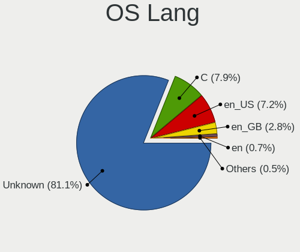

| Lang           | Desktops | Percent |
|----------------|----------|---------|
| Unknown        | 253      | 78.09%  |
| en_US          | 30       | 9.26%   |
| C              | 25       | 7.72%   |
| en_GB          | 11       | 3.4%    |
| en             | 3        | 0.93%   |
| fr_FR          | 1        | 0.31%   |
| en_GB.US-ASCII | 1        | 0.31%   |

Boot Mode
---------

EFI or BIOS

| Mode | Desktops | Percent |
|------|----------|---------|
| EFI  | 282      | 87.58%  |
| BIOS | 40       | 12.42%  |

Filesystem
----------

Type of filesystem

| Type    | Desktops | Percent |
|---------|----------|---------|
| Ufs     | 189      | 57.98%  |
| Zfs     | 118      | 36.2%   |
| Ffs     | 11       | 3.37%   |
| Cd9660  | 7        | 2.15%   |
| Unknown | 1        | 0.31%   |

Part. scheme
------------

Scheme of partitioning

| Type    | Desktops | Percent |
|---------|----------|---------|
| GPT     | 299      | 93.44%  |
| MBR     | 15       | 4.69%   |
| Unknown | 6        | 1.88%   |

Board
-----

Vendor
------

Motherboard manufacturer

| Name                                 | Desktops | Percent |
|--------------------------------------|----------|---------|
| Unknown                              | 51       | 16.04%  |
| Dell                                 | 33       | 10.38%  |
| ASUSTek Computer                     | 27       | 8.49%   |
| Gigabyte Technology                  | 24       | 7.55%   |
| Intel                                | 23       | 7.23%   |
| Hewlett-Packard                      | 19       | 5.97%   |
| Lenovo                               | 15       | 4.72%   |
| ASRock                               | 14       | 4.4%    |
| Protectli                            | 12       | 3.77%   |
| PC Engines                           | 9        | 2.83%   |
| MSI                                  | 9        | 2.83%   |
| Shuttle                              | 6        | 1.89%   |
| Fujitsu                              | 6        | 1.89%   |
| Acer                                 | 5        | 1.57%   |
| Techvision                           | 4        | 1.26%   |
| Supermicro                           | 3        | 0.94%   |
| PICO PC                              | 3        | 0.94%   |
| IceWhale Technology                  | 3        | 0.94%   |
| Biostar                              | 3        | 0.94%   |
| AZW                                  | 3        | 0.94%   |
| Yanling                              | 2        | 0.63%   |
| Raspberry Pi Foundation              | 2        | 0.63%   |
| MW                                   | 2        | 0.63%   |
| Inventec                             | 2        | 0.63%   |
| HPE                                  | 2        | 0.63%   |
| Deciso                               | 2        | 0.63%   |
| CncTion                              | 2        | 0.63%   |
| Cisco                                | 2        | 0.63%   |
| ASRockRack                           | 2        | 0.63%   |
| Apple                                | 2        | 0.63%   |
| AMI                                  | 2        | 0.63%   |
| Winston Marriot                      | 1        | 0.31%   |
| Sony UK                              | 1        | 0.31%   |
| Shenzhen Meigao Electronic Equipment | 1        | 0.31%   |
| Seeed Studio                         | 1        | 0.31%   |
| Quanmax                              | 1        | 0.31%   |
| QOTOM                                | 1        | 0.31%   |
| PAIQ                                 | 1        | 0.31%   |
| NU941                                | 1        | 0.31%   |
| NU591                                | 1        | 0.31%   |

Model
-----

Motherboard model

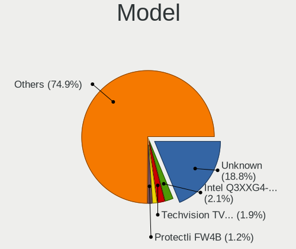

| Name                                | Desktops | Percent |
|-------------------------------------|----------|---------|
| Unknown                             | 52       | 16.35%  |
| Intel Q3XXG4-P V1.0                 | 8        | 2.52%   |
| Protectli FW6                       | 5        | 1.57%   |
| PC Engines APU2                     | 5        | 1.57%   |
| ASUS All Series                     | 5        | 1.57%   |
| Techvision TVI7309X                 | 4        | 1.26%   |
| Protectli FW4B                      | 4        | 1.26%   |
| Dell OptiPlex 7010                  | 4        | 1.26%   |
| PICO PC MNHO-113                    | 3        | 0.94%   |
| PC Engines apu4                     | 3        | 0.94%   |
| Intel SHARKBAY                      | 3        | 0.94%   |
| HP Z600 Workstation                 | 3        | 0.94%   |
| HP t620 PLUS Quad Core TC           | 3        | 0.94%   |
| Fujitsu FUTRO S920                  | 3        | 0.94%   |
| Dell OptiPlex 790                   | 3        | 0.94%   |
| Dell OptiPlex 760                   | 3        | 0.94%   |
| Dell OptiPlex 3020                  | 3        | 0.94%   |
| Yanling YL-KBR6L                    | 2        | 0.63%   |
| MW GMLK-2_5G4L                      | 2        | 0.63%   |
| Lenovo ThinkCentre M920s 10SJ0041UK | 2        | 0.63%   |
| Lenovo ThinkCentre E73 10DS0015UK   | 2        | 0.63%   |
| IceWhale ZimaBoard 832 ZMB          | 2        | 0.63%   |
| HP ProLiant MicroServer Gen8        | 2        | 0.63%   |
| Gigabyte B450M DS3H                 | 2        | 0.63%   |
| Dell OptiPlex 5040                  | 2        | 0.63%   |
| Dell OptiPlex 390                   | 2        | 0.63%   |
| Dell OptiPlex 3020M                 | 2        | 0.63%   |
| Dell OptiPlex 3000                  | 2        | 0.63%   |
| Cisco SALEEN                        | 2        | 0.63%   |
| AZW EQ                              | 2        | 0.63%   |
| ASUS ROG STRIX X570-E GAMING        | 2        | 0.63%   |
| ASUS PRIME H510M-E                  | 2        | 0.63%   |
| ASUS H110M-PLUS                     | 2        | 0.63%   |
| ASRock B550 Phantom Gaming 4        | 2        | 0.63%   |
| AMI PEISIA E3845 VER1.0             | 2        | 0.63%   |
| Winston Marriot PICO PC(R)          | 1        | 0.31%   |
| Supermicro X8SIU                    | 1        | 0.31%   |
| Supermicro X8SIL                    | 1        | 0.31%   |
| Supermicro M12SWA-TF                | 1        | 0.31%   |
| Sony UK Raspberry Pi 4 Model B      | 1        | 0.31%   |

Model Family
------------

Motherboard model prefix

| Name                 | Desktops | Percent |
|----------------------|----------|---------|
| Unknown              | 52       | 16.35%  |
| Dell OptiPlex        | 30       | 9.43%   |
| Lenovo ThinkCentre   | 12       | 3.77%   |
| Intel Q3XXG4-P       | 8        | 2.52%   |
| ASUS ROG             | 7        | 2.2%    |
| ASUS PRIME           | 6        | 1.89%   |
| Protectli FW6        | 5        | 1.57%   |
| PC Engines APU2      | 5        | 1.57%   |
| ASUS All             | 5        | 1.57%   |
| Acer Aspire          | 5        | 1.57%   |
| Techvision TVI7309X  | 4        | 1.26%   |
| Protectli FW4B       | 4        | 1.26%   |
| HP EliteDesk         | 4        | 1.26%   |
| Fujitsu FUTRO        | 4        | 1.26%   |
| PICO PC MNHO-113     | 3        | 0.94%   |
| PC Engines apu4      | 3        | 0.94%   |
| Intel SHARKBAY       | 3        | 0.94%   |
| IceWhale ZimaBoard   | 3        | 0.94%   |
| HP Z600              | 3        | 0.94%   |
| HP t620              | 3        | 0.94%   |
| HP ProDesk           | 3        | 0.94%   |
| HP Compaq            | 3        | 0.94%   |
| Yanling YL-KBR6L     | 2        | 0.63%   |
| RPi Raspberry        | 2        | 0.63%   |
| MW GMLK-2            | 2        | 0.63%   |
| HPE ProLiant         | 2        | 0.63%   |
| HP ProLiant          | 2        | 0.63%   |
| Gigabyte H61M-DS2    | 2        | 0.63%   |
| Gigabyte B450M       | 2        | 0.63%   |
| Fujitsu ESPRIMO      | 2        | 0.63%   |
| Dell Precision       | 2        | 0.63%   |
| Deciso Netboard      | 2        | 0.63%   |
| Cisco SALEEN         | 2        | 0.63%   |
| AZW EQ               | 2        | 0.63%   |
| ASUS P8Z77-V         | 2        | 0.63%   |
| ASUS H110M-PLUS      | 2        | 0.63%   |
| ASRock B550          | 2        | 0.63%   |
| AMI PEISIA           | 2        | 0.63%   |
| Winston Marriot PICO | 1        | 0.31%   |
| Supermicro X8SIU     | 1        | 0.31%   |

MFG Year
--------

Motherboard manufacture year

| Year    | Desktops | Percent |
|---------|----------|---------|
| 2014    | 36       | 11.32%  |
| 2022    | 31       | 9.75%   |
| 2018    | 30       | 9.43%   |
| 2016    | 28       | 8.81%   |
| 2021    | 27       | 8.49%   |
| 2020    | 27       | 8.49%   |
| 2013    | 26       | 8.18%   |
| 2019    | 23       | 7.23%   |
| 2023    | 20       | 6.29%   |
| 2015    | 17       | 5.35%   |
| 2017    | 11       | 3.46%   |
| 2012    | 11       | 3.46%   |
| 2010    | 8        | 2.52%   |
| 2009    | 7        | 2.2%    |
| 2011    | 6        | 1.89%   |
| 2008    | 4        | 1.26%   |
| Unknown | 4        | 1.26%   |
| 2024    | 1        | 0.31%   |
| 2007    | 1        | 0.31%   |

Form Factor
-----------

Physical design of the computer

| Name    | Desktops | Percent |
|---------|----------|---------|
| Desktop | 318      | 100%    |

Coreboot
--------

Have coreboot on board

| Used | Desktops | Percent |
|------|----------|---------|
| No   | 306      | 96.23%  |
| Yes  | 12       | 3.77%   |

RAM Size
--------

Total RAM memory

| Size in GB      | Desktops | Percent |
|-----------------|----------|---------|
| 8.01-16.0       | 133      | 41.56%  |
| 16.01-24.0      | 74       | 23.13%  |
| 4.01-8.0        | 59       | 18.44%  |
| 32.01-64.0      | 22       | 6.88%   |
| 2.01-3.0        | 11       | 3.44%   |
| 64.01-256.0     | 11       | 3.44%   |
| 24.01-32.0      | 5        | 1.56%   |
| 3.01-4.0        | 4        | 1.25%   |
| More than 256.0 | 1        | 0.31%   |

RAM Used
--------

Used RAM memory

| Used GB     | Desktops | Percent |
|-------------|----------|---------|
| 0.01-0.5    | 173      | 52.91%  |
| 0.51-1.0    | 97       | 29.66%  |
| 1.01-2.0    | 31       | 9.48%   |
| 3.01-4.0    | 8        | 2.45%   |
| 2.01-3.0    | 7        | 2.14%   |
| 4.01-8.0    | 4        | 1.22%   |
| Unknown     | 3        | 0.92%   |
| 24.01-32.0  | 2        | 0.61%   |
| 32.01-64.0  | 1        | 0.31%   |
| 64.01-256.0 | 1        | 0.31%   |

Total Drives
------------

Number of drives on board

| Drives | Desktops | Percent |
|--------|----------|---------|
| 1      | 218      | 66.46%  |
| 0      | 45       | 13.72%  |
| 2      | 29       | 8.84%   |
| 3      | 14       | 4.27%   |
| 4      | 8        | 2.44%   |
| 5      | 6        | 1.83%   |
| 8      | 3        | 0.91%   |
| 7      | 3        | 0.91%   |
| 24     | 1        | 0.3%    |
| 6      | 1        | 0.3%    |

Has CD-ROM
----------

Has CD-ROM on board

| Presented | Desktops | Percent |
|-----------|----------|---------|
| No        | 269      | 84.06%  |
| Yes       | 51       | 15.94%  |

Has Ethernet
------------

Has Ethernet on board

| Presented | Desktops | Percent |
|-----------|----------|---------|
| Yes       | 312      | 98.11%  |
| No        | 6        | 1.89%   |

Has WiFi
--------

Has WiFi module

| Presented | Desktops | Percent |
|-----------|----------|---------|
| No        | 257      | 80.56%  |
| Yes       | 62       | 19.44%  |

Has Bluetooth
-------------

Has Bluetooth module

| Presented | Desktops | Percent |
|-----------|----------|---------|
| No        | 274      | 85.89%  |
| Yes       | 45       | 14.11%  |

Location
--------

Country
-------

Geographic location (country)

| Country | Desktops | Percent |
|---------|----------|---------|
| UK      | 318      | 100%    |

City
----

Geographic location (city)

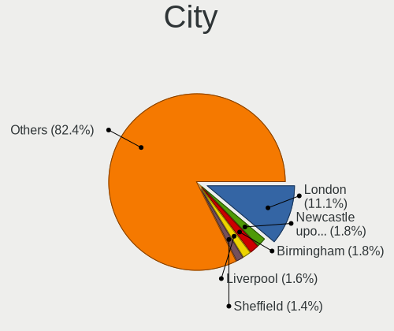

| City                  | Desktops | Percent |
|-----------------------|----------|---------|
| London                | 46       | 12.3%   |
| Newcastle upon Tyne   | 7        | 1.87%   |
| Sheffield             | 5        | 1.34%   |
| Reading               | 5        | 1.34%   |
| Leeds                 | 5        | 1.34%   |
| Hull                  | 5        | 1.34%   |
| Birmingham            | 5        | 1.34%   |
| Watford               | 4        | 1.07%   |
| Stourbridge           | 4        | 1.07%   |
| Milton Keynes         | 4        | 1.07%   |
| Liverpool             | 4        | 1.07%   |
| Coventry              | 4        | 1.07%   |
| City of Westminster   | 4        | 1.07%   |
| Cambridge             | 4        | 1.07%   |
| York                  | 3        | 0.8%    |
| Wolverhampton         | 3        | 0.8%    |
| Wittersham            | 3        | 0.8%    |
| Wembley               | 3        | 0.8%    |
| Walsall               | 3        | 0.8%    |
| Slough                | 3        | 0.8%    |
| Poplar                | 3        | 0.8%    |
| Mansfield             | 3        | 0.8%    |
| Leicester             | 3        | 0.8%    |
| Kensington            | 3        | 0.8%    |
| Glasgow               | 3        | 0.8%    |
| Dundee                | 3        | 0.8%    |
| City of London        | 3        | 0.8%    |
| Bristol               | 3        | 0.8%    |
| Basingstoke           | 3        | 0.8%    |
| Andover               | 3        | 0.8%    |
| Worthing              | 2        | 0.53%   |
| Woking                | 2        | 0.53%   |
| Telford               | 2        | 0.53%   |
| Sutton Coldfield      | 2        | 0.53%   |
| St Albans             | 2        | 0.53%   |
| Scunthorpe            | 2        | 0.53%   |
| Ruthin                | 2        | 0.53%   |
| Royal Tunbridge Wells | 2        | 0.53%   |
| Romford               | 2        | 0.53%   |
| Portsmouth            | 2        | 0.53%   |

Drives
------

Drive Vendor
------------

Hard drive vendors

| Vendor              | Desktops | Drives | Percent |
|---------------------|----------|--------|---------|
| Samsung Electronics | 44       | 80     | 12.79%  |
| Crucial             | 36       | 52     | 10.47%  |
| Kingston            | 35       | 48     | 10.17%  |
| WDC                 | 34       | 66     | 9.88%   |
| Seagate             | 30       | 59     | 8.72%   |
| SanDisk             | 19       | 21     | 5.52%   |
| Transcend           | 13       | 17     | 3.78%   |
| Toshiba             | 12       | 60     | 3.49%   |
| Hoodisk             | 11       | 20     | 3.2%    |
| Phison              | 10       | 15     | 2.91%   |
| Intel               | 8        | 9      | 2.33%   |
| SK hynix            | 7        | 8      | 2.03%   |
| Hitachi             | 7        | 11     | 2.03%   |
| LITEONIT            | 6        | 7      | 1.74%   |
| China               | 6        | 8      | 1.74%   |
| OCZ                 | 5        | 8      | 1.45%   |
| Micron Technology   | 4        | 5      | 1.16%   |
| Gigabyte Technology | 4        | 5      | 1.16%   |
| SPCC                | 3        | 3      | 0.87%   |
| PNY                 | 3        | 11     | 0.87%   |
| Lexar               | 3        | 4      | 0.87%   |
| Integral            | 3        | 5      | 0.87%   |
| Corsair             | 3        | 6      | 0.87%   |
| Vaseky              | 2        | 2      | 0.58%   |
| Silicon Motion      | 2        | 2      | 0.58%   |
| OPENBSD             | 2        | 2      | 0.58%   |
| KIOXIA              | 2        | 4      | 0.58%   |
| HGST                | 2        | 2      | 0.58%   |
| Fanxiang            | 2        | 2      | 0.58%   |
| BR                  | 2        | 2      | 0.58%   |
| BIWIN               | 2        | 5      | 0.58%   |
| Apacer              | 2        | 3      | 0.58%   |
| A-DATA Technology   | 2        | 3      | 0.58%   |
| Zheino              | 1        | 1      | 0.29%   |
| Wibtek              | 1        | 1      | 0.29%   |
| TCSUNBOW            | 1        | 3      | 0.29%   |
| ShiJi               | 1        | 1      | 0.29%   |
| Patriot             | 1        | 4      | 0.29%   |
| ORTIAL              | 1        | 1      | 0.29%   |
| Netac               | 1        | 5      | 0.29%   |

Drive Model
-----------

Hard drive models

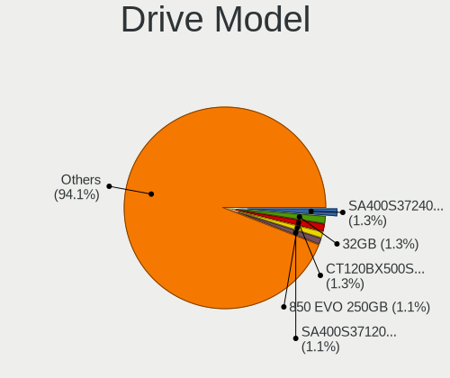

| Model                                | Desktops | Percent |
|--------------------------------------|----------|---------|
| Kingston SA400S37240G 240GB          | 6        | 1.57%   |
| Hoodisk SSD 64GB                     | 5        | 1.31%   |
| Crucial CT120BX500SSD1 120GB         | 5        | 1.31%   |
| Samsung SSD 850 EVO 250GB            | 4        | 1.05%   |
| Hoodisk SSD 32GB                     | 4        | 1.05%   |
| Crucial CT240BX500SSD1 240GB         | 4        | 1.05%   |
| Toshiba HDWE140 4TB                  | 3        | 0.79%   |
| Seagate ST500DM002-1BD142 500GB      | 3        | 0.79%   |
| SanDisk SSD PLUS 480GB               | 3        | 0.79%   |
| Samsung SSD 970 EVO Plus 1TB         | 3        | 0.79%   |
| Samsung SSD 840 EVO 250GB            | 3        | 0.79%   |
| Phison Sabrent 1TB                   | 3        | 0.79%   |
| Kingston SUV500MS240G 240GB          | 3        | 0.79%   |
| Kingston SUV500MS120G 120GB          | 3        | 0.79%   |
| Kingston SMS200S330G 32GB            | 3        | 0.79%   |
| Kingston SA400S37120G 120GB          | 3        | 0.79%   |
| Gigabyte GP-GSTFS31120GNTD 120GB     | 3        | 0.79%   |
| Crucial CT500MX500SSD1 500GB         | 3        | 0.79%   |
| Crucial CT480BX500SSD1 480GB         | 3        | 0.79%   |
| Crucial CT1000BX500SSD1 1TB          | 3        | 0.79%   |
| WDC WDS240G2G0A-00JH30 240GB         | 2        | 0.52%   |
| WDC WD20EZRX-22D8PB0 2TB             | 2        | 0.52%   |
| WDC WD20EZRX-00D8PB0 2TB             | 2        | 0.52%   |
| WDC WD20EFZX-68AWUN0 2TB             | 2        | 0.52%   |
| WDC WD20EFRX-68EUZN0 2TB             | 2        | 0.52%   |
| WDC PC SN730 SDBQNTY-256G-1001 256GB | 2        | 0.52%   |
| Transcend TS128GMTE110S 128GB        | 2        | 0.52%   |
| Transcend TS128GMSA370 128GB         | 2        | 0.52%   |
| Toshiba DT01ACA200 2TB               | 2        | 0.52%   |
| Seagate ST8000VN0022-2EL112 8TB      | 2        | 0.52%   |
| Seagate ST4000NE001-2MA101 4TB       | 2        | 0.52%   |
| Seagate ST3500418AS 500GB            | 2        | 0.52%   |
| Seagate ST3500312CS 500GB            | 2        | 0.52%   |
| Seagate ST3320310CS 320GB            | 2        | 0.52%   |
| Seagate ST3160318AS 160GB            | 2        | 0.52%   |
| Seagate ST3160310CS 160GB            | 2        | 0.52%   |
| SanDisk SDSSDA120G 120GB             | 2        | 0.52%   |
| SanDisk SDCFHS-016G                  | 2        | 0.52%   |
| Samsung SSD 980 500GB                | 2        | 0.52%   |
| Samsung SSD 960 EVO 250GB            | 2        | 0.52%   |

HDD Vendor
----------

Hard disk drive vendors

| Vendor              | Desktops | Drives | Percent |
|---------------------|----------|--------|---------|
| Seagate             | 30       | 59     | 36.14%  |
| WDC                 | 27       | 55     | 32.53%  |
| Toshiba             | 9        | 50     | 10.84%  |
| Hitachi             | 7        | 11     | 8.43%   |
| Samsung Electronics | 5        | 5      | 6.02%   |
| OPENBSD             | 2        | 2      | 2.41%   |
| HGST                | 2        | 2      | 2.41%   |
| Hewlett-Packard     | 1        | 1      | 1.2%    |

SSD Vendor
----------

Solid state drive vendors

| Vendor              | Desktops | Drives | Percent |
|---------------------|----------|--------|---------|
| Kingston            | 34       | 47     | 16.04%  |
| Crucial             | 30       | 45     | 14.15%  |
| Samsung Electronics | 27       | 46     | 12.74%  |
| SanDisk             | 19       | 21     | 8.96%   |
| Transcend           | 11       | 14     | 5.19%   |
| Hoodisk             | 11       | 20     | 5.19%   |
| LITEONIT            | 6        | 7      | 2.83%   |
| Intel               | 6        | 6      | 2.83%   |
| China               | 6        | 8      | 2.83%   |
| OCZ                 | 5        | 8      | 2.36%   |
| WDC                 | 4        | 6      | 1.89%   |
| Phison              | 4        | 5      | 1.89%   |
| Toshiba             | 3        | 10     | 1.42%   |
| SK hynix            | 3        | 3      | 1.42%   |
| PNY                 | 3        | 9      | 1.42%   |
| Micron Technology   | 3        | 4      | 1.42%   |
| Lexar               | 3        | 4      | 1.42%   |
| Integral            | 3        | 5      | 1.42%   |
| Gigabyte Technology | 3        | 4      | 1.42%   |
| Corsair             | 3        | 6      | 1.42%   |
| Vaseky              | 2        | 2      | 0.94%   |
| SPCC                | 2        | 2      | 0.94%   |
| BIWIN               | 2        | 5      | 0.94%   |
| Apacer              | 2        | 3      | 0.94%   |
| A-DATA Technology   | 2        | 3      | 0.94%   |
| Zheino              | 1        | 1      | 0.47%   |
| Wibtek              | 1        | 1      | 0.47%   |
| TCSUNBOW            | 1        | 3      | 0.47%   |
| ShiJi               | 1        | 1      | 0.47%   |
| Patriot             | 1        | 4      | 0.47%   |
| Netac               | 1        | 5      | 0.47%   |
| LITEON              | 1        | 1      | 0.47%   |
| KeepData            | 1        | 1      | 0.47%   |
| Intenso             | 1        | 1      | 0.47%   |
| Innodisk            | 1        | 3      | 0.47%   |
| FORESEE             | 1        | 1      | 0.47%   |
| Fordisk             | 1        | 2      | 0.47%   |
| BAITITON            | 1        | 1      | 0.47%   |
| Argon               | 1        | 1      | 0.47%   |
| Apple               | 1        | 1      | 0.47%   |

Drive Kind
----------

HDD or SSD

| Kind | Desktops | Drives | Percent |
|------|----------|--------|---------|
| SSD  | 194      | 320    | 61.98%  |
| HDD  | 67       | 185    | 21.41%  |
| NVMe | 52       | 81     | 16.61%  |

Drive Connector
---------------

SATA, SAS, NVMe, etc.

| Type | Desktops | Drives | Percent |
|------|----------|--------|---------|
| SATA | 238      | 505    | 82.07%  |
| NVMe | 52       | 81     | 17.93%  |

Drive Size
----------

Size of hard drive

| Size in TB | Desktops | Drives | Percent |
|------------|----------|--------|---------|
| 0.01-0.5   | 219      | 367    | 79.93%  |
| 0.51-1.0   | 24       | 37     | 8.76%   |
| 1.01-2.0   | 14       | 28     | 5.11%   |
| 3.01-4.0   | 7        | 47     | 2.55%   |
| 4.01-10.0  | 7        | 16     | 2.55%   |
| 2.01-3.0   | 3        | 10     | 1.09%   |

Space Total
-----------

Amount of disk space available on the file system

| Size in GB     | Desktops | Percent |
|----------------|----------|---------|
| 101-250        | 160      | 48.48%  |
| 251-500        | 51       | 15.45%  |
| 1-20           | 37       | 11.21%  |
| 21-50          | 32       | 9.7%    |
| 51-100         | 31       | 9.39%   |
| 501-1000       | 12       | 3.64%   |
| 1001-2000      | 5        | 1.52%   |
| More than 3000 | 1        | 0.3%    |
| Unknown        | 1        | 0.3%    |

Space Used
----------

Amount of used disk space

| Used GB        | Desktops | Percent |
|----------------|----------|---------|
| 1-20           | 298      | 91.13%  |
| 21-50          | 16       | 4.89%   |
| 51-100         | 5        | 1.53%   |
| 101-250        | 4        | 1.22%   |
| 251-500        | 2        | 0.61%   |
| More than 3000 | 1        | 0.31%   |
| Unknown        | 1        | 0.31%   |

Malfunc. Drives
---------------

Drive models with a malfunction

| Model                                            | Desktops | Drives | Percent |
|--------------------------------------------------|----------|--------|---------|
| Toshiba HDWE140 4TB                              | 2        | 11     | 4.65%   |
| Seagate ST3160310CS 160GB                        | 2        | 2      | 4.65%   |
| SanDisk SSD PLUS 480GB                           | 2        | 2      | 4.65%   |
| Samsung Electronics HM160HI 160GB                | 2        | 2      | 4.65%   |
| Crucial CT525MX300SSD1 528GB                     | 2        | 3      | 4.65%   |
| China SH00M256GB                                 | 2        | 2      | 4.65%   |
| WDC WD5000AAKX-221CA1 500GB                      | 1        | 1      | 2.33%   |
| WDC WD5000AAKS-60WWPA0 500GB                     | 1        | 1      | 2.33%   |
| WDC WD4001FAEX-00MJRA0 4TB                       | 1        | 4      | 2.33%   |
| WDC WD3200BEVT-22A23T0 320GB                     | 1        | 2      | 2.33%   |
| WDC WD3200AAJS-22B4A0 320GB                      | 1        | 1      | 2.33%   |
| WDC WD30EFRX-68EUZN0 3TB                         | 1        | 1      | 2.33%   |
| WDC WD20EFZX-68AWUN0 2TB                         | 1        | 2      | 2.33%   |
| WDC WD10JMVW-11AJGS0 1TB                         | 1        | 1      | 2.33%   |
| Transcend TS256GSSD320 256GB                     | 1        | 1      | 2.33%   |
| Toshiba THNSNK128GCS8 SATA 128GB                 | 1        | 2      | 2.33%   |
| Toshiba MD04ACA400 4TB                           | 1        | 1      | 2.33%   |
| Toshiba DT01ACA200 2TB                           | 1        | 1      | 2.33%   |
| Toshiba DT01ABA300 3TB                           | 1        | 1      | 2.33%   |
| Seagate ST3500418AS 500GB                        | 1        | 2      | 2.33%   |
| Seagate ST3320310CS 320GB                        | 1        | 1      | 2.33%   |
| Seagate ST32000542AS 2TB                         | 1        | 1      | 2.33%   |
| Seagate ST250DM000-1BD141 250GB                  | 1        | 1      | 2.33%   |
| Seagate ST2000LM015-2E8174 2TB                   | 1        | 1      | 2.33%   |
| SanDisk SSD P4 16GB                              | 1        | 1      | 2.33%   |
| SanDisk SDCFHS-016G                              | 1        | 1      | 2.33%   |
| Samsung Electronics SSD PM810 2.5-inch 7mm 256GB | 1        | 2      | 2.33%   |
| Samsung Electronics SSD 970 EVO 500GB            | 1        | 3      | 2.33%   |
| Samsung Electronics MZHPV512HDGL-00000 512GB     | 1        | 1      | 2.33%   |
| OCZ VERTEX4 512GB                                | 1        | 1      | 2.33%   |
| Kingston SV300S37A120G 120GB                     | 1        | 1      | 2.33%   |
| Kingston SV200S3128G 128GB                       | 1        | 1      | 2.33%   |
| Kingston SMS200S330G 32GB                        | 1        | 1      | 2.33%   |
| Kingston SMS200S3120G 120GB                      | 1        | 1      | 2.33%   |
| Hewlett-Packard VB0250EAVER 250GB                | 1        | 1      | 2.33%   |
| Crucial CT480BX500SSD1 480GB                     | 1        | 2      | 2.33%   |
| A-DATA Technology SU630 240GB                    | 1        | 2      | 2.33%   |

Malfunc. Drive Vendor
---------------------

Vendors of faulty drives

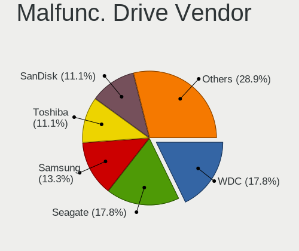

| Vendor              | Desktops | Drives | Percent |
|---------------------|----------|--------|---------|
| WDC                 | 8        | 13     | 19.05%  |
| Seagate             | 7        | 8      | 16.67%  |
| Toshiba             | 5        | 16     | 11.9%   |
| Samsung Electronics | 5        | 8      | 11.9%   |
| SanDisk             | 4        | 4      | 9.52%   |
| Kingston            | 4        | 4      | 9.52%   |
| Crucial             | 3        | 5      | 7.14%   |
| China               | 2        | 2      | 4.76%   |
| Transcend           | 1        | 1      | 2.38%   |
| OCZ                 | 1        | 1      | 2.38%   |
| Hewlett-Packard     | 1        | 1      | 2.38%   |
| A-DATA Technology   | 1        | 2      | 2.38%   |

Malfunc. HDD Vendor
-------------------

Vendors of faulty HDD drives

| Vendor              | Desktops | Drives | Percent |
|---------------------|----------|--------|---------|
| WDC                 | 8        | 13     | 36.36%  |
| Seagate             | 7        | 8      | 31.82%  |
| Toshiba             | 4        | 14     | 18.18%  |
| Samsung Electronics | 2        | 2      | 9.09%   |
| Hewlett-Packard     | 1        | 1      | 4.55%   |

Malfunc. Drive Kind
-------------------

Kinds of faulty drives

| Kind | Desktops | Drives | Percent |
|------|----------|--------|---------|
| HDD  | 22       | 38     | 52.38%  |
| SSD  | 19       | 24     | 45.24%  |
| NVMe | 1        | 3      | 2.38%   |

Failed Drives
-------------

Failed drive models

| Model                     | Desktops | Drives | Percent |
|---------------------------|----------|--------|---------|
| Seagate ST3160318AS 160GB | 1        | 1      | 100%    |

Failed Drive Vendor
-------------------

Failed drive vendors

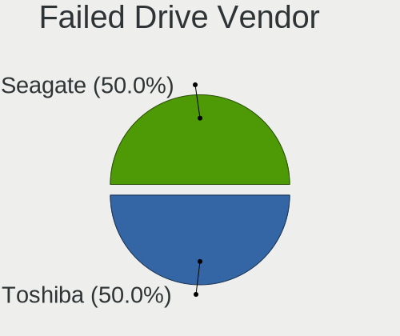

| Vendor  | Desktops | Drives | Percent |
|---------|----------|--------|---------|
| Seagate | 1        | 1      | 100%    |

Drive Status
------------

Number of failed and malfunc. drives

| Status   | Desktops | Drives | Percent |
|----------|----------|--------|---------|
| Works    | 253      | 506    | 84.62%  |
| Malfunc  | 38       | 65     | 12.71%  |
| Detected | 7        | 14     | 2.34%   |
| Failed   | 1        | 1      | 0.33%   |

Storage controller
------------------

Storage Vendor
--------------

Storage controller vendors

| Vendor                           | Desktops | Percent |
|----------------------------------|----------|---------|
| Intel                            | 235      | 58.17%  |
| AMD                              | 68       | 16.83%  |
| Samsung Electronics              | 20       | 4.95%   |
| SanDisk                          | 11       | 2.72%   |
| Silicon Motion                   | 10       | 2.48%   |
| ASMedia Technology               | 9        | 2.23%   |
| Phison Electronics               | 8        | 1.98%   |
| Micron/Crucial Technology        | 6        | 1.49%   |
| Marvell Technology Group         | 6        | 1.49%   |
| SK hynix                         | 5        | 1.24%   |
| MAXIO Technology (Hangzhou)      | 4        | 0.99%   |
| Shenzhen Longsys Electronics     | 3        | 0.74%   |
| Nvidia                           | 3        | 0.74%   |
| Broadcom / LSI                   | 3        | 0.74%   |
| KIOXIA                           | 2        | 0.5%    |
| Adaptec                          | 2        | 0.5%    |
| VIA Technologies                 | 1        | 0.25%   |
| Toshiba                          | 1        | 0.25%   |
| Silicon Integrated Systems [SiS] | 1        | 0.25%   |
| Silicon Image                    | 1        | 0.25%   |
| Realtek Semiconductor            | 1        | 0.25%   |
| OCZ Technology Group             | 1        | 0.25%   |
| Micron Technology                | 1        | 0.25%   |
| Kingston Technology Company      | 1        | 0.25%   |
| Hosin Global Electronics         | 1        | 0.25%   |

Storage Model
-------------

Storage controller models

| Model                                                                                   | Desktops | Percent |
|-----------------------------------------------------------------------------------------|----------|---------|
| AMD FCH SATA Controller [AHCI mode]                                                     | 45       | 10.18%  |
| Intel 8 Series/C220 Series Chipset Family 6-port SATA Controller 1 [AHCI mode]          | 27       | 6.11%   |
| Intel Celeron/Pentium Silver Processor SATA Controller                                  | 18       | 4.07%   |
| Intel Atom Processor E3800 Series SATA AHCI Controller                                  | 16       | 3.62%   |
| Intel Sunrise Point-LP SATA Controller [AHCI mode]                                      | 15       | 3.39%   |
| Intel 6 Series/C200 Series Chipset Family 6 port Desktop SATA AHCI Controller           | 14       | 3.17%   |
| AMD 400 Series Chipset SATA Controller                                                  | 12       | 2.71%   |
| Intel Jasper Lake SATA AHCI Controller                                                  | 11       | 2.49%   |
| Intel Cannon Lake PCH SATA AHCI Controller                                              | 11       | 2.49%   |
| Silicon Motion SM2263EN/SM2263XT (DRAM-less) NVMe SSD Controllers                       | 10       | 2.26%   |
| Intel Atom/Celeron/Pentium Processor x5-E8000/J3xxx/N3xxx Series SATA Controller        | 10       | 2.26%   |
| Samsung NVMe SSD Controller SM981/PM981/PM983                                           | 9        | 2.04%   |
| Intel Q170/Q150/B150/H170/H110/Z170/CM236 Chipset SATA Controller [AHCI Mode]           | 9        | 2.04%   |
| Intel Celeron N3350/Pentium N4200/Atom E3900 Series SATA AHCI Controller                | 9        | 2.04%   |
| Intel 7 Series/C210 Series Chipset Family 6-port SATA Controller [AHCI mode]            | 9        | 2.04%   |
| Intel Wildcat Point-LP SATA Controller [AHCI Mode]                                      | 7        | 1.58%   |
| Intel unknown                                                                           | 7        | 1.58%   |
| Intel NM10/ICH7 Family SATA Controller [IDE mode]                                       | 7        | 1.58%   |
| ASMedia ASM1061/ASM1062 Serial ATA Controller                                           | 7        | 1.58%   |
| AMD SB7x0/SB8x0/SB9x0 SATA Controller [AHCI mode]                                       | 7        | 1.58%   |
| AMD 500 Series Chipset SATA Controller                                                  | 7        | 1.58%   |
| Samsung NVMe SSD Controller SM961/PM961/SM963                                           | 6        | 1.36%   |
| Intel 8 Series SATA Controller 1 [AHCI mode]                                            | 6        | 1.36%   |
| Intel 200 Series PCH SATA controller [AHCI mode]                                        | 6        | 1.36%   |
| Micron/Crucial P2 [Nick P2] / P3 / P3 Plus NVMe PCIe SSD (DRAM-less)                    | 5        | 1.13%   |
| Intel 82801JD/DO (ICH10 Family) SATA AHCI Controller                                    | 5        | 1.13%   |
| Intel 6 Series/C200 Series Chipset Family Desktop SATA Controller (IDE mode, ports 4-5) | 5        | 1.13%   |
| Intel 6 Series/C200 Series Chipset Family Desktop SATA Controller (IDE mode, ports 0-3) | 5        | 1.13%   |
| Phison E12 NVMe Controller                                                              | 4        | 0.9%    |
| MAXIO (Hangzhou) NVMe SSD Controller MAP1202 (DRAM-less)                                | 4        | 0.9%    |
| Intel SATA Controller [RAID mode]                                                       | 4        | 0.9%    |
| Intel Elkhart Lake SATA AHCI                                                            | 4        | 0.9%    |
| Intel 9 Series Chipset Family SATA Controller [AHCI Mode]                               | 4        | 0.9%    |
| Intel 82801G (ICH7 Family) IDE Controller                                               | 4        | 0.9%    |
| Intel 4 Series Chipset PT IDER Controller                                               | 4        | 0.9%    |
| SanDisk Extreme Pro / WD Black SN750 / PC SN730 / Red SN700 NVMe SSD                    | 3        | 0.68%   |
| Samsung NVMe SSD Controller 980 (DRAM-less)                                             | 3        | 0.68%   |
| Phison PS5013-E13 PCIe3 NVMe Controller (DRAM-less)                                     | 3        | 0.68%   |
| Intel Tiger Lake-LP SATA Controller                                                     | 3        | 0.68%   |
| Intel 500 Series Chipset Family SATA AHCI Controller                                    | 3        | 0.68%   |

Storage Kind
------------

Kind of storage controller (IDE, SATA, NVMe, SAS, ...)

| Kind | Desktops | Percent |
|------|----------|---------|
| SATA | 283      | 72.38%  |
| NVMe | 67       | 17.14%  |
| IDE  | 29       | 7.42%   |
| RAID | 7        | 1.79%   |
| SCSI | 4        | 1.02%   |
| SAS  | 1        | 0.26%   |

Processor
---------

CPU Vendor
----------

Processor vendors

| Vendor   | Desktops | Percent |
|----------|----------|---------|
| Intel    | 243      | 76.42%  |
| AMD      | 70       | 22.01%  |
| ARM      | 3        | 0.94%   |
| Research | 1        | 0.31%   |
| Unknown  | 1        | 0.31%   |

CPU Model
---------

Processor models

| Model                                    | Desktops | Percent |
|------------------------------------------|----------|---------|
| Intel Celeron J4125 CPU @ 2.00GHz        | 14       | 4.33%   |
| Intel N100                               | 9        | 2.79%   |
| AMD GX-412TC SOC                         | 8        | 2.48%   |
| Intel Celeron N5105 @ 2.00GHz            | 7        | 2.17%   |
| Intel Celeron CPU J1900 @ 1.99GHz        | 7        | 2.17%   |
| Intel Pentium Silver N6005 @ 2.00GHz     | 6        | 1.86%   |
| Intel Atom CPU E3845 @ 1.91GHz           | 6        | 1.86%   |
| Intel Core i5-9500 CPU @ 3.00GHz         | 5        | 1.55%   |
| Intel Celeron CPU J3160 @ 1.60GHz        | 5        | 1.55%   |
| Intel Core i5-5250U CPU @ 1.60GHz        | 4        | 1.24%   |
| Intel Celeron CPU N3450 @ 1.10GHz        | 4        | 1.24%   |
| Intel Celeron CPU 3865U @ 1.80GHz        | 4        | 1.24%   |
| AMD Ryzen 7 3700X 8-Core Processor       | 4        | 1.24%   |
| AMD Ryzen 5 3600 6-Core Processor        | 4        | 1.24%   |
| Intel Core i7-4770S CPU @ 3.10GHz        | 3        | 0.93%   |
| Intel Core i5-7200U CPU @ 2.50GHz        | 3        | 0.93%   |
| Intel Core i5-4570T CPU @ 2.90GHz        | 3        | 0.93%   |
| Intel Core i5-4570 CPU @ 3.20GHz         | 3        | 0.93%   |
| Intel Core i5-4460 CPU @ 3.20GHz         | 3        | 0.93%   |
| Intel Core i3-4160 CPU @ 3.60GHz         | 3        | 0.93%   |
| Intel Core i3-2120 CPU @ 3.30GHz         | 3        | 0.93%   |
| Intel Core i3-2100 CPU @ 3.10GH          | 3        | 0.93%   |
| Intel Core 2 Duo                         | 3        | 0.93%   |
| Intel Celeron J6413 @ 1.80GHz            | 3        | 0.93%   |
| Intel Celeron CPU J3455 @ 1.50GHz        | 3        | 0.93%   |
| Intel 11th Gen Core i7-1165G7 @ 2.80GHz  | 3        | 0.93%   |
| ARM Cortex-A72 r0p3                      | 3        | 0.93%   |
| AMD Ryzen 5 5600G with Radeon Graphics   | 3        | 0.93%   |
| AMD GX-420CA SOC with Radeon HD Graphics | 3        | 0.93%   |
| AMD GX-416RA SOC                         | 3        | 0.93%   |
| Intel Core i7-8550U CPU @ 1.80GHz        | 2        | 0.62%   |
| Intel Core i7-6700T CPU @ 2.80GHz        | 2        | 0.62%   |
| Intel Core i7-4500U CPU @ 1.80GHz        | 2        | 0.62%   |
| Intel Core i7-3770K CPU @ 3.50GHz        | 2        | 0.62%   |
| Intel Core i7-3770 CPU @ 3.40GHz         | 2        | 0.62%   |
| Intel Core i7-2600 CPU @ 3.40GH          | 2        | 0.62%   |
| Intel Core i5-4590T CPU @ 2.00GHz        | 2        | 0.62%   |
| Intel Core i5-4590S CPU @ 3.00GHz        | 2        | 0.62%   |
| Intel Core i5-4430 CPU @ 3.00GHz         | 2        | 0.62%   |
| Intel Core i5-4200U CPU @ 1.60GHz        | 2        | 0.62%   |

CPU Model Family
----------------

Processor model prefix

| Model                   | Desktops | Percent |
|-------------------------|----------|---------|
| Intel Celeron           | 65       | 20.19%  |
| Intel Core i5           | 46       | 14.29%  |
| Intel Core i3           | 37       | 11.49%  |
| Intel Core i7           | 23       | 7.14%   |
| Intel Xeon              | 21       | 6.52%   |
| Other                   | 20       | 6.21%   |
| AMD GX                  | 18       | 5.59%   |
| AMD Ryzen 5             | 13       | 4.04%   |
| Intel Atom              | 12       | 3.73%   |
| Intel Pentium Silver    | 9        | 2.8%    |
| Intel Core 2 Duo        | 7        | 2.17%   |
| AMD Ryzen 7             | 6        | 1.86%   |
| Intel Core i9           | 3        | 0.93%   |
| ARM Cortex              | 3        | 0.93%   |
| AMD Ryzen Threadripper  | 3        | 0.93%   |
| AMD Ryzen 9             | 3        | 0.93%   |
| AMD Ryzen 3             | 3        | 0.93%   |
| AMD G                   | 3        | 0.93%   |
| AMD FX                  | 3        | 0.93%   |
| AMD Athlon              | 3        | 0.93%   |
| Intel Pentium           | 2        | 0.62%   |
| Intel Core 2 Quad       | 2        | 0.62%   |
| AMD E2                  | 2        | 0.62%   |
| AMD A6                  | 2        | 0.62%   |
| AMD A4                  | 2        | 0.62%   |
| Intel Pentium Dual-Core | 1        | 0.31%   |
| Intel 686-class         | 1        | 0.31%   |
| AMD Ryzen 7 PRO         | 1        | 0.31%   |
| AMD Ryzen 5 PRO         | 1        | 0.31%   |
| AMD Phenom II X6        | 1        | 0.31%   |
| AMD Phenom              | 1        | 0.31%   |
| AMD Opteron             | 1        | 0.31%   |
| AMD EPYC                | 1        | 0.31%   |
| AMD Athlon II X2        | 1        | 0.31%   |
| AMD A8                  | 1        | 0.31%   |
| AMD A10                 | 1        | 0.31%   |

CPU Cores
---------

Number of processor cores

| Number  | Desktops | Percent |
|---------|----------|---------|
| 4       | 168      | 51.69%  |
| 2       | 91       | 28%     |
| 6       | 15       | 4.62%   |
| 8       | 13       | 4%      |
| 12      | 11       | 3.38%   |
| 16      | 9        | 2.77%   |
| Unknown | 9        | 2.77%   |
| 24      | 4        | 1.23%   |
| 32      | 2        | 0.62%   |
| 10      | 2        | 0.62%   |
| 64      | 1        | 0.31%   |

CPU Sockets
-----------

Number of sockets

| Number  | Desktops | Percent |
|---------|----------|---------|
| 1       | 308      | 96.86%  |
| Unknown | 6        | 1.89%   |
| 2       | 4        | 1.26%   |

CPU Threads
-----------

Threads per core (Hyper-Threading)

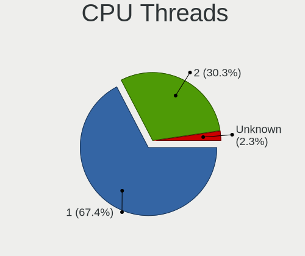

| Number  | Desktops | Percent |
|---------|----------|---------|
| 1       | 211      | 65.73%  |
| 2       | 101      | 31.46%  |
| Unknown | 9        | 2.8%    |

CPU Microarch
-------------

Microarchitecture

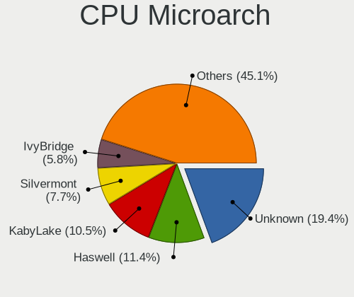

| Name          | Desktops | Percent |
|---------------|----------|---------|
| Unknown       | 42       | 13.13%  |
| Haswell       | 41       | 12.81%  |
| KabyLake      | 33       | 10.31%  |
| Silvermont    | 26       | 8.13%   |
| IvyBridge     | 19       | 5.94%   |
| Goldmont plus | 18       | 5.63%   |
| Zen 2         | 12       | 3.75%   |
| SandyBridge   | 12       | 3.75%   |
| Jaguar        | 12       | 3.75%   |
| Penryn        | 11       | 3.44%   |
| Skylake       | 10       | 3.13%   |
| Puma          | 10       | 3.13%   |
| Goldmont      | 10       | 3.13%   |
| Zen 3         | 8        | 2.5%    |
| Broadwell     | 7        | 2.19%   |
| Zen           | 6        | 1.88%   |
| Zen+          | 5        | 1.56%   |
| Piledriver    | 5        | 1.56%   |
| Nehalem       | 5        | 1.56%   |
| Bonnell       | 5        | 1.56%   |
| Westmere      | 4        | 1.25%   |
| Bobcat        | 4        | 1.25%   |
| TigerLake     | 3        | 0.94%   |
| K10           | 3        | 0.94%   |
| Steamroller   | 2        | 0.63%   |
| Excavator     | 2        | 0.63%   |
| Core          | 2        | 0.63%   |
| CometLake     | 2        | 0.63%   |
| Bulldozer     | 1        | 0.31%   |

Graphics
--------

GPU Vendor
----------

Vendors of graphics cards

| Vendor                           | Desktops | Percent |
|----------------------------------|----------|---------|
| Intel                            | 205      | 67.43%  |
| AMD                              | 51       | 16.78%  |
| Nvidia                           | 35       | 11.51%  |
| ASPEED Technology                | 7        | 2.3%    |
| Matrox Electronics Systems       | 5        | 1.64%   |
| Silicon Integrated Systems [SiS] | 1        | 0.33%   |

GPU Model
---------

Graphics card models

| Model                                                                                    | Desktops | Percent |
|------------------------------------------------------------------------------------------|----------|---------|
| Intel Xeon E3-1200 v3/4th Gen Core Processor Integrated Graphics Controller              | 20       | 6.45%   |
| Intel GeminiLake [UHD Graphics 600]                                                      | 16       | 5.16%   |
| Intel Atom Processor Z36xxx/Z37xxx Series Graphics & Display                             | 16       | 5.16%   |
| Intel JasperLake [UHD Graphics]                                                          | 15       | 4.84%   |
| Intel 4th Generation Core Processor Family Integrated Graphics Controller                | 11       | 3.55%   |
| Intel Atom/Celeron/Pentium Processor x5-E8000/J3xxx/N3xxx Integrated Graphics Controller | 10       | 3.23%   |
| Intel Alder Lake-N [UHD Graphics]                                                        | 10       | 3.23%   |
| Intel 2nd Generation Core Processor Family Integrated Graphics Controller                | 10       | 3.23%   |
| Intel HD Graphics 500                                                                    | 9        | 2.9%    |
| Intel CoffeeLake-S GT2 [UHD Graphics 630]                                                | 8        | 2.58%   |
| Intel Xeon E3-1200 v2/3rd Gen Core processor Graphics Controller                         | 7        | 2.26%   |
| ASPEED Technology ASPEED Graphics Family                                                 | 7        | 2.26%   |
| Intel HD Graphics 620                                                                    | 6        | 1.94%   |
| Intel Haswell-ULT Integrated Graphics Controller                                         | 6        | 1.94%   |
| Intel 4 Series Chipset Integrated Graphics Controller                                    | 6        | 1.94%   |
| Intel IvyBridge GT2 [HD Graphics 4000]                                                   | 5        | 1.61%   |
| Intel HD Graphics 610                                                                    | 5        | 1.61%   |
| Intel HD Graphics 530                                                                    | 5        | 1.61%   |
| Intel Elkhart Lake [UHD Graphics Gen11 16EU]                                             | 5        | 1.61%   |
| Nvidia GK208B [GeForce GT 710]                                                           | 4        | 1.29%   |
| Intel Xeon E3-1200 v3 Processor Integrated Graphics Controller                           | 4        | 1.29%   |
| Intel HD Graphics 6000                                                                   | 4        | 1.29%   |
| AMD Cezanne [Radeon Vega Series / Radeon Vega Mobile Series]                             | 4        | 1.29%   |
| Intel UHD Graphics 620                                                                   | 3        | 0.97%   |
| Intel TigerLake-LP GT2 [Iris Xe Graphics]                                                | 3        | 0.97%   |
| Intel HD Graphics 5500                                                                   | 3        | 0.97%   |
| AMD Raven Ridge [Radeon Vega Series / Radeon Vega Mobile Series]                         | 3        | 0.97%   |
| AMD Picasso/Raven 2 [Radeon Vega Series / Radeon Vega Mobile Series]                     | 3        | 0.97%   |
| AMD Lexa PRO [Radeon 540/540X/550/550X / RX 540X/550/550X]                               | 3        | 0.97%   |
| AMD Kabini [Radeon HD 8400E]                                                             | 3        | 0.97%   |
| Nvidia GT218 [GeForce 8400 GS Rev. 3]                                                    | 2        | 0.65%   |
| Nvidia GT218 [GeForce 210]                                                               | 2        | 0.65%   |
| Nvidia GP107 [GeForce GTX 1050 Ti]                                                       | 2        | 0.65%   |
| Nvidia GF119 [GeForce GT 520]                                                            | 2        | 0.65%   |
| Matrox Electronics Systems MGA G200eW WPCM450                                            | 2        | 0.65%   |
| Matrox Electronics Systems MGA G200EH                                                    | 2        | 0.65%   |
| Intel RocketLake-S GT1 [UHD Graphics 750]                                                | 2        | 0.65%   |
| Intel HD Graphics 630                                                                    | 2        | 0.65%   |
| Intel GeminiLake [UHD Graphics 605]                                                      | 2        | 0.65%   |
| Intel CometLake-S GT2 [UHD Graphics 630]                                                 | 2        | 0.65%   |

GPU Combo
---------

Combinations of graphics cards

| Name        | Desktops | Percent |
|-------------|----------|---------|
| 1 x Intel   | 200      | 62.7%   |
| 1 x AMD     | 47       | 14.73%  |
| 1 x Nvidia  | 34       | 10.66%  |
| Other       | 19       | 5.96%   |
| 1 x ASPEED  | 7        | 2.19%   |
| 1 x Matrox  | 5        | 1.57%   |
| 2 x Intel   | 3        | 0.94%   |
| Intel + AMD | 2        | 0.63%   |
| 2 x AMD     | 1        | 0.31%   |
| 1 x SiS     | 1        | 0.31%   |

GPU Driver
----------

Free vs proprietary

| Driver      | Desktops | Percent |
|-------------|----------|---------|
| Free        | 278      | 87.15%  |
| Unknown     | 24       | 7.52%   |
| Proprietary | 17       | 5.33%   |

GPU Memory
----------

Total video memory

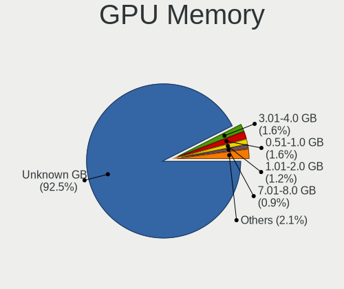

| Size in GB | Desktops | Percent |
|------------|----------|---------|
| Unknown    | 293      | 91.28%  |
| 0.51-1.0   | 7        | 2.18%   |
| 3.01-4.0   | 6        | 1.87%   |
| 1.01-2.0   | 5        | 1.56%   |
| 7.01-8.0   | 4        | 1.25%   |
| 5.01-6.0   | 2        | 0.62%   |
| 8.01-16.0  | 2        | 0.62%   |
| 0.01-0.5   | 2        | 0.62%   |

Monitor
-------

Monitor Vendor
--------------

Monitor vendors

| Vendor              | Desktops | Percent |
|---------------------|----------|---------|
| Dell                | 8        | 17.02%  |
| Samsung Electronics | 7        | 14.89%  |
| BenQ                | 6        | 12.77%  |
| AOC                 | 5        | 10.64%  |
| Hewlett-Packard     | 4        | 8.51%   |
| Iiyama              | 3        | 6.38%   |
| Acer                | 3        | 6.38%   |
| Lenovo              | 2        | 4.26%   |
| Goldstar            | 2        | 4.26%   |
| unknown             | 1        | 2.13%   |
| RS                  | 1        | 2.13%   |
| Pixio               | 1        | 2.13%   |
| OEM                 | 1        | 2.13%   |
| CVT                 | 1        | 2.13%   |
| AVX                 | 1        | 2.13%   |
| Unknown             | 1        | 2.13%   |

Monitor Model
-------------

Monitor models

| Model                                                                | Desktops | Percent |
|----------------------------------------------------------------------|----------|---------|
| BenQ GL2450 BNQ78A4 1920x1080 530x300mm 24.0-inch                    | 3        | 5.88%   |
| Hewlett-Packard ZR24w HWP286A 1920x1200 540x350mm 25.3-inch          | 2        | 3.92%   |
| unknown LCD Monitor SAMSUNG 1920x1080                                | 1        | 1.96%   |
| Samsung Electronics U28D590 SAM0B80 3840x2160 610x350mm 27.7-inch    | 1        | 1.96%   |
| Samsung Electronics T24D390 SAM0B6E 1920x1080 520x290mm 23.4-inch    | 1        | 1.96%   |
| Samsung Electronics SyncMaster SAM030D 1680x1050 470x300mm 22.0-inch | 1        | 1.96%   |
| Samsung Electronics SyncMaster SAM011F 1280x1024 380x300mm 19.1-inch | 1        | 1.96%   |
| Samsung Electronics S27F350 SAM0D22 1920x1080 600x340mm 27.2-inch    | 1        | 1.96%   |
| Samsung Electronics S24F350 SAM0D20 1920x1080 520x290mm 23.4-inch    | 1        | 1.96%   |
| Samsung Electronics S24C550 SAM0A4B 1920x1080 520x290mm 23.4-inch    | 1        | 1.96%   |
| RS LE2262 BTC2262 1680x1050 470x290mm 21.7-inch                      | 1        | 1.96%   |
| Pixio PX247 PNS0247 1920x1080 520x310mm 23.8-inch                    | 1        | 1.96%   |
| OEM 32W_LCD_TV OEM3700 1920x540                                      | 1        | 1.96%   |
| Lenovo LCD Monitor LEN0990 1440x900 410x260mm 19.1-inch              | 1        | 1.96%   |
| Lenovo L24e-30 LEN66BC 1920x1080 530x300mm 24.0-inch                 | 1        | 1.96%   |
| Iiyama PL4071UH IVM000A 3840x2160 880x490mm 39.7-inch                | 1        | 1.96%   |
| Iiyama PL2390 IVM562D 1920x1080 510x290mm 23.1-inch                  | 1        | 1.96%   |
| Iiyama PL2283H IVM562E 1920x1080 500x290mm 22.8-inch                 | 1        | 1.96%   |
| Iiyama PL2273HD IVM561A 1920x1080 480x270mm 21.7-inch                | 1        | 1.96%   |
| Hewlett-Packard w1907 HWP26A2 1440x900 410x260mm 19.1-inch           | 1        | 1.96%   |
| Hewlett-Packard 2310e HWP2909 1920x1080 510x290mm 23.1-inch          | 1        | 1.96%   |
| Goldstar LG ULTRAWIDE GSM5AFB 2560x1080 800x340mm 34.2-inch          | 1        | 1.96%   |
| Goldstar LG Ultra HD GSM5B09 3840x2160 600x340mm 27.2-inch           | 1        | 1.96%   |
| Dell U4919DW DELA107 3840x1080 1200x340mm 49.1-inch                  | 1        | 1.96%   |
| Dell U3415W DELA0A6 3440x1440 800x330mm 34.1-inch                    | 1        | 1.96%   |
| Dell U2412M DELA07A 1920x1200 520x320mm 24.0-inch                    | 1        | 1.96%   |
| Dell LCD Monitor S2740L 1920x1080                                    | 1        | 1.96%   |
| Dell LCD Monitor P2214H 1920x1080                                    | 1        | 1.96%   |
| Dell LCD Monitor DELD110 2560x1440 700x400mm 31.7-inch               | 1        | 1.96%   |
| Dell LCD Monitor 1908FP 3200x1080                                    | 1        | 1.96%   |
| Dell E196FP DELA015 1280x1024 380x300mm 19.1-inch                    | 1        | 1.96%   |
| CVT LCD Monitor CVT4668 1440x900 360x290mm 18.2-inch                 | 1        | 1.96%   |
| BenQ LCD Monitor GW2780 1920x1080                                    | 1        | 1.96%   |
| BenQ LCD Monitor DL2215                                              | 1        | 1.96%   |
| BenQ GW2780 BNQ78E6 1920x1080 600x340mm 27.2-inch                    | 1        | 1.96%   |
| BenQ GW2475H BNQ78EE 1920x1080 530x300mm 24.0-inch                   | 1        | 1.96%   |
| AVX AVERMEDIA_HD AVX0003 1920x1080 380x300mm 19.1-inch               | 1        | 1.96%   |
| AOC N22W AOC220A 1680x1050 470x300mm 22.0-inch                       | 1        | 1.96%   |
| AOC LCD Monitor 2460X 5760x1200                                      | 1        | 1.96%   |
| AOC LCD Monitor 2460X                                                | 1        | 1.96%   |

Monitor Resolution
------------------

Monitor screen resolution

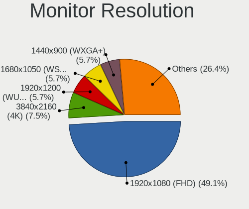

| Resolution         | Desktops | Percent |
|--------------------|----------|---------|
| 1920x1080 (FHD)    | 24       | 50%     |
| 3840x2160 (4K)     | 3        | 6.25%   |
| 1920x1200 (WUXGA)  | 3        | 6.25%   |
| 1680x1050 (WSXGA+) | 3        | 6.25%   |
| 1440x900 (WXGA+)   | 3        | 6.25%   |
| 1280x1024 (SXGA)   | 2        | 4.17%   |
| Unknown            | 2        | 4.17%   |
| 5760x1200          | 1        | 2.08%   |
| 3840x1080          | 1        | 2.08%   |
| 3440x1440          | 1        | 2.08%   |
| 3200x1080          | 1        | 2.08%   |
| 2560x1440 (QHD)    | 1        | 2.08%   |
| 2560x1080          | 1        | 2.08%   |
| 1920x540           | 1        | 2.08%   |
| 1600x900 (HD+)     | 1        | 2.08%   |

Monitor Diagonal
----------------

Diagonal size in inches

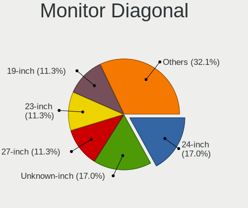

| Inches  | Desktops | Percent |
|---------|----------|---------|
| 24      | 8        | 16.67%  |
| Unknown | 8        | 16.67%  |
| 23      | 6        | 12.5%   |
| 19      | 6        | 12.5%   |
| 27      | 5        | 10.42%  |
| 21      | 4        | 8.33%   |
| 22      | 3        | 6.25%   |
| 34      | 2        | 4.17%   |
| 25      | 2        | 4.17%   |
| 49      | 1        | 2.08%   |
| 39      | 1        | 2.08%   |
| 31      | 1        | 2.08%   |
| 18      | 1        | 2.08%   |

Monitor Width
-------------

Physical width

| Width in mm | Desktops | Percent |
|-------------|----------|---------|
| 501-600     | 20       | 43.48%  |
| 401-500     | 8        | 17.39%  |
| Unknown     | 8        | 17.39%  |
| 351-400     | 4        | 8.7%    |
| 701-800     | 2        | 4.35%   |
| 601-700     | 2        | 4.35%   |
| 801-900     | 1        | 2.17%   |
| 1001-1500   | 1        | 2.17%   |

Aspect Ratio
------------

Proportional relationship between the width and the height

| Ratio   | Desktops | Percent |
|---------|----------|---------|
| 16/9    | 24       | 51.06%  |
| Unknown | 7        | 14.89%  |
| 16/10   | 6        | 12.77%  |
| 5/4     | 3        | 6.38%   |
| 32/9    | 2        | 4.26%   |
| 3/2     | 2        | 4.26%   |
| 21/9    | 2        | 4.26%   |
| 6/5     | 1        | 2.13%   |

Monitor Area
------------

Area in inch

| Area in inch | Desktops | Percent |
|----------------|----------|---------|
| 201-250        | 17       | 37.78%  |
| Unknown        | 8        | 17.78%  |
| 151-200        | 7        | 15.56%  |
| 301-350        | 5        | 11.11%  |
| 351-500        | 3        | 6.67%   |
| 251-300        | 3        | 6.67%   |
| 501-1000       | 2        | 4.44%   |

Pixel Density
-------------

Pixels per inch

| Density | Desktops | Percent |
|---------|----------|---------|
| 51-100  | 31       | 65.96%  |
| Unknown | 8        | 17.02%  |
| 101-120 | 6        | 12.77%  |
| 161-240 | 1        | 2.13%   |
| 121-160 | 1        | 2.13%   |

Multiple Monitors
-----------------

Total monitors connected

| Total | Desktops | Percent |
|-------|----------|---------|
| 0     | 271      | 84.95%  |
| 1     | 42       | 13.17%  |
| 2     | 5        | 1.57%   |
| 3     | 1        | 0.31%   |

Network
-------

Net Controller Vendor
---------------------

Controller vendors

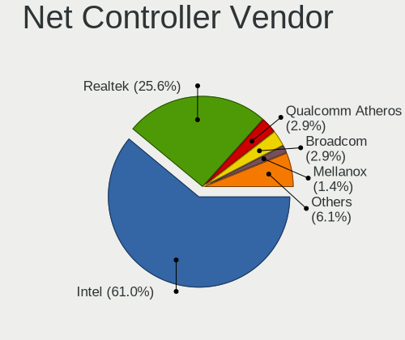

| Vendor                            | Desktops | Percent |
|-----------------------------------|----------|---------|
| Intel                             | 246      | 60.29%  |
| Realtek Semiconductor             | 105      | 25.74%  |
| Qualcomm Atheros                  | 14       | 3.43%   |
| Broadcom                          | 14       | 3.43%   |
| Mellanox Technologies             | 5        | 1.23%   |
| Ralink Technology                 | 4        | 0.98%   |
| IMC Networks                      | 3        | 0.74%   |
| Ralink                            | 2        | 0.49%   |
| Nvidia                            | 2        | 0.49%   |
| MediaTek                          | 2        | 0.49%   |
| Marvell Technology Group          | 2        | 0.49%   |
| ZTE WCDMA Technologies MSM        | 1        | 0.25%   |
| U-Blox                            | 1        | 0.25%   |
| MYRICOM                           | 1        | 0.25%   |
| Microsoft                         | 1        | 0.25%   |
| Ericsson Business Mobile Networks | 1        | 0.25%   |
| Bluegiga Technologies             | 1        | 0.25%   |
| ASUSTek Computer                  | 1        | 0.25%   |
| Aquantia                          | 1        | 0.25%   |
| American Megatrends               | 1        | 0.25%   |

Net Controller Model
--------------------

Controller models

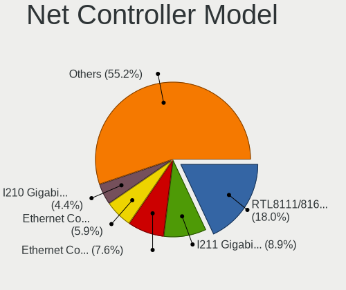

| Model                                                                         | Desktops | Percent |
|-------------------------------------------------------------------------------|----------|---------|
| Realtek RTL8111/8168/8211/8411 PCI Express Gigabit Ethernet Controller        | 95       | 18.92%  |
| Intel I211 Gigabit Network Connection                                         | 53       | 10.56%  |
| Intel I210 Gigabit Network Connection                                         | 24       | 4.78%   |
| Intel Ethernet Controller I225-V                                              | 23       | 4.58%   |
| Intel Ethernet Controller I226-V                                              | 22       | 4.38%   |
| Intel 82574L Gigabit Network Connection                                       | 18       | 3.59%   |
| Intel 82571EB/82571GB Gigabit Ethernet Controller (Copper)                    | 18       | 3.59%   |
| Intel I350 Gigabit Network Connection                                         | 13       | 2.59%   |
| Realtek RTL8125 2.5GbE Controller                                             | 11       | 2.19%   |
| Intel 82579LM Gigabit Network Connection (Lewisville)                         | 11       | 2.19%   |
| Intel Ethernet Connection I217-LM                                             | 10       | 1.99%   |
| Intel 82580 Gigabit Network Connection                                        | 10       | 1.99%   |
| Intel 82571EB/82571GB Gigabit Ethernet Controller D0/D1 (copper applications) | 10       | 1.99%   |
| Intel 82583V Gigabit Network Connection                                       | 8        | 1.59%   |
| Intel 82576 Gigabit Network Connection                                        | 8        | 1.59%   |
| Intel Ethernet Connection (2) I219-V                                          | 6        | 1.2%    |
| Intel Wireless 7260                                                           | 5        | 1%      |
| Intel Wi-Fi 6 AX200                                                           | 5        | 1%      |
| Intel 82599ES 10-Gigabit SFI/SFP+ Network Connection                          | 5        | 1%      |
| Intel 82579V Gigabit Network Connection                                       | 5        | 1%      |
| Intel 82567LM-3 Gigabit Network Connection                                    | 5        | 1%      |
| Mellanox MT27500 Family [ConnectX-3]                                          | 4        | 0.8%    |
| Intel Ethernet Connection I217-V                                              | 4        | 0.8%    |
| Broadcom NetXtreme BCM5764M Gigabit Ethernet PCIe                             | 4        | 0.8%    |
| Qualcomm Atheros AR9462 Wireless Network Adapter                              | 3        | 0.6%    |
| Intel Wi-Fi 6 AX201 160MHz                                                    | 3        | 0.6%    |
| Intel Wi-Fi 5(802.11ac) Wireless-AC 9x6x [Thunder Peak]                       | 3        | 0.6%    |
| Intel NM10/ICH7 Family LAN Controller                                         | 3        | 0.6%    |
| Intel Ethernet Controller X550                                                | 3        | 0.6%    |
| Intel Ethernet Controller 10-Gigabit X540-AT2                                 | 3        | 0.6%    |
| Intel Ethernet Connection (7) I219-V                                          | 3        | 0.6%    |
| Intel Ethernet Connection (7) I219-LM                                         | 3        | 0.6%    |
| Intel Ethernet Connection (2) I219-LM                                         | 3        | 0.6%    |
| Intel Dual Band Wireless-AC 3168NGW [Stone Peak]                              | 3        | 0.6%    |
| Intel 82575EB Gigabit Network Connection                                      | 3        | 0.6%    |
| IMC Networks 802.11 n/g/b Wireless LAN USB Mini-Card                          | 3        | 0.6%    |
| Broadcom NetXtreme BCM5720 Gigabit Ethernet PCIe                              | 3        | 0.6%    |
| Realtek RTL8821CE 802.11ac PCIe Wireless Network Adapter                      | 2        | 0.4%    |
| Qualcomm Atheros AR9485 Wireless Network Adapter                              | 2        | 0.4%    |
| Qualcomm Atheros AR93xx Wireless Network Adapter                              | 2        | 0.4%    |

Wireless Vendor
---------------

Wireless vendors

| Vendor                | Desktops | Percent |
|-----------------------|----------|---------|
| Intel                 | 35       | 54.69%  |
| Qualcomm Atheros      | 12       | 18.75%  |
| Realtek Semiconductor | 4        | 6.25%   |
| Ralink Technology     | 4        | 6.25%   |
| IMC Networks          | 3        | 4.69%   |
| Ralink                | 2        | 3.13%   |
| MediaTek              | 2        | 3.13%   |
| Broadcom              | 1        | 1.56%   |
| ASUSTek Computer      | 1        | 1.56%   |

Wireless Model
--------------

Wireless models

| Model                                                                  | Desktops | Percent |
|------------------------------------------------------------------------|----------|---------|
| Intel Wireless 7260                                                    | 5        | 7.81%   |
| Intel Wi-Fi 6 AX200                                                    | 5        | 7.81%   |
| Qualcomm Atheros AR9462 Wireless Network Adapter                       | 3        | 4.69%   |
| Intel Wi-Fi 6 AX201 160MHz                                             | 3        | 4.69%   |
| Intel Wi-Fi 5(802.11ac) Wireless-AC 9x6x [Thunder Peak]                | 3        | 4.69%   |
| Intel Dual Band Wireless-AC 3168NGW [Stone Peak]                       | 3        | 4.69%   |
| IMC Networks 802.11 n/g/b Wireless LAN USB Mini-Card                   | 3        | 4.69%   |
| Realtek RTL8821CE 802.11ac PCIe Wireless Network Adapter               | 2        | 3.13%   |
| Qualcomm Atheros AR9485 Wireless Network Adapter                       | 2        | 3.13%   |
| Qualcomm Atheros AR93xx Wireless Network Adapter                       | 2        | 3.13%   |
| Qualcomm Atheros AR9287 Wireless Network Adapter (PCI-Express)         | 2        | 3.13%   |
| Intel Wireless 8265 / 8275                                             | 2        | 3.13%   |
| Intel Wireless 7265                                                    | 2        | 3.13%   |
| Intel Wireless 3160                                                    | 2        | 3.13%   |
| Intel Centrino Advanced-N 6235                                         | 2        | 3.13%   |
| Realtek RTL8821AE 802.11ac PCIe Wireless Network Adapter               | 1        | 1.56%   |
| Realtek RTL8188EUS 802.11n Wireless Network Adapter                    | 1        | 1.56%   |
| Ralink RT5370 Wireless Adapter                                         | 1        | 1.56%   |
| Ralink RT3072 Wireless Adapter                                         | 1        | 1.56%   |
| Ralink RT2870/RT3070 Wireless Adapter                                  | 1        | 1.56%   |
| Ralink MT7601U Wireless Adapter                                        | 1        | 1.56%   |
| Ralink RT5390 Wireless 802.11n 1T/1R PCIe                              | 1        | 1.56%   |
| Ralink RT3090 Wireless 802.11n 1T/1R PCIe                              | 1        | 1.56%   |
| Qualcomm Atheros QCA9377 802.11ac Wireless Network Adapter             | 1        | 1.56%   |
| Qualcomm Atheros AR9285 Wireless Network Adapter (PCI-Express)         | 1        | 1.56%   |
| Qualcomm Atheros AR5416 Wireless Network Adapter [AR5008 802.11(a)bgn] | 1        | 1.56%   |
| MediaTek MT7922 802.11ax PCI Express Wireless Network Adapter          | 1        | 1.56%   |
| MediaTek MT7921K (RZ608) Wi-Fi 6E 80MHz                                | 1        | 1.56%   |
| Intel Wireless 8260                                                    | 1        | 1.56%   |
| Intel Wireless 3165                                                    | 1        | 1.56%   |
| Intel Wi-Fi 6E(802.11ax) AX210/AX1675* 2x2 [Typhoon Peak]              | 1        | 1.56%   |
| Intel CNVi: Wi-Fi                                                      | 1        | 1.56%   |
| Intel Centrino Wireless-N 2230                                         | 1        | 1.56%   |
| Intel Centrino Advanced-N 6205 [Taylor Peak]                           | 1        | 1.56%   |
| Intel Cannon Lake PCH CNVi WiFi                                        | 1        | 1.56%   |
| Intel Alder Lake-P PCH CNVi WiFi                                       | 1        | 1.56%   |
| Broadcom BCM4322 802.11a/b/g/n Wireless LAN Controller                 | 1        | 1.56%   |
| ASUS N10 Nano 802.11n Network Adapter [Realtek RTL8192CU]              | 1        | 1.56%   |

Ethernet Vendor
---------------

Ethernet vendors

| Vendor                   | Desktops | Percent |
|--------------------------|----------|---------|
| Intel                    | 242      | 66.12%  |
| Realtek Semiconductor    | 101      | 27.6%   |
| Broadcom                 | 13       | 3.55%   |
| Qualcomm Atheros         | 2        | 0.55%   |
| Nvidia                   | 2        | 0.55%   |
| Marvell Technology Group | 2        | 0.55%   |
| MYRICOM                  | 1        | 0.27%   |
| Microsoft                | 1        | 0.27%   |
| Aquantia                 | 1        | 0.27%   |
| American Megatrends      | 1        | 0.27%   |

Ethernet Model
--------------

Ethernet models

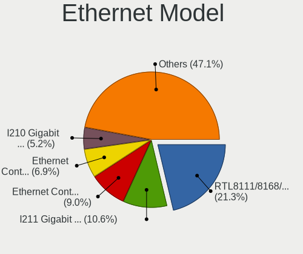

| Model                                                                         | Desktops | Percent |
|-------------------------------------------------------------------------------|----------|---------|
| Realtek RTL8111/8168/8211/8411 PCI Express Gigabit Ethernet Controller        | 95       | 22.35%  |
| Intel I211 Gigabit Network Connection                                         | 53       | 12.47%  |
| Intel I210 Gigabit Network Connection                                         | 24       | 5.65%   |
| Intel Ethernet Controller I225-V                                              | 23       | 5.41%   |
| Intel Ethernet Controller I226-V                                              | 22       | 5.18%   |
| Intel 82574L Gigabit Network Connection                                       | 18       | 4.24%   |
| Intel 82571EB/82571GB Gigabit Ethernet Controller (Copper)                    | 18       | 4.24%   |
| Intel I350 Gigabit Network Connection                                         | 13       | 3.06%   |
| Realtek RTL8125 2.5GbE Controller                                             | 11       | 2.59%   |
| Intel 82579LM Gigabit Network Connection (Lewisville)                         | 11       | 2.59%   |
| Intel Ethernet Connection I217-LM                                             | 10       | 2.35%   |
| Intel 82580 Gigabit Network Connection                                        | 10       | 2.35%   |
| Intel 82571EB/82571GB Gigabit Ethernet Controller D0/D1 (copper applications) | 10       | 2.35%   |
| Intel 82583V Gigabit Network Connection                                       | 8        | 1.88%   |
| Intel 82576 Gigabit Network Connection                                        | 8        | 1.88%   |
| Intel Ethernet Connection (2) I219-V                                          | 6        | 1.41%   |
| Intel 82599ES 10-Gigabit SFI/SFP+ Network Connection                          | 5        | 1.18%   |
| Intel 82579V Gigabit Network Connection                                       | 5        | 1.18%   |
| Intel 82567LM-3 Gigabit Network Connection                                    | 5        | 1.18%   |
| Intel Ethernet Connection I217-V                                              | 4        | 0.94%   |
| Broadcom NetXtreme BCM5764M Gigabit Ethernet PCIe                             | 4        | 0.94%   |
| Intel NM10/ICH7 Family LAN Controller                                         | 3        | 0.71%   |
| Intel Ethernet Controller X550                                                | 3        | 0.71%   |
| Intel Ethernet Controller 10-Gigabit X540-AT2                                 | 3        | 0.71%   |
| Intel Ethernet Connection (7) I219-V                                          | 3        | 0.71%   |
| Intel Ethernet Connection (7) I219-LM                                         | 3        | 0.71%   |
| Intel Ethernet Connection (2) I219-LM                                         | 3        | 0.71%   |
| Intel 82575EB Gigabit Network Connection                                      | 3        | 0.71%   |
| Broadcom NetXtreme BCM5720 Gigabit Ethernet PCIe                              | 3        | 0.71%   |
| Intel Ethernet Connection I219-LM                                             | 2        | 0.47%   |
| Intel Ethernet Connection (14) I219-V                                         | 2        | 0.47%   |
| Realtek RTL8111/8168/8411 PCI Express Gigabit Ethernet Controller             | 1        | 0.24%   |
| Qualcomm Atheros Killer E2500 Gigabit Ethernet Controller                     | 1        | 0.24%   |
| Qualcomm Atheros AR8151 v2.0 Gigabit Ethernet                                 | 1        | 0.24%   |
| Nvidia MCP77 Ethernet                                                         | 1        | 0.24%   |
| Nvidia MCP73 Ethernet                                                         | 1        | 0.24%   |
| MYRICOM Myri-10G Dual-Protocol NIC                                            | 1        | 0.24%   |
| Microsoft RTL8153B GigE [Surface Ethernet Adapter]                            | 1        | 0.24%   |
| Marvell Group 88E8071 PCI-E Gigabit Ethernet Controller                       | 1        | 0.24%   |
| Marvell Group 88E8056 PCI-E Gigabit Ethernet Controller                       | 1        | 0.24%   |

Net Controller Kind
-------------------

Ethernet, WiFi or modem

| Kind     | Desktops | Percent |
|----------|----------|---------|
| Ethernet | 312      | 80.62%  |
| WiFi     | 62       | 16.02%  |
| Unknown  | 9        | 2.33%   |
| Modem    | 4        | 1.03%   |

Used Controller
---------------

Currently used network controller

| Kind     | Desktops | Percent |
|----------|----------|---------|
| Ethernet | 306      | 96.23%  |
| WiFi     | 12       | 3.77%   |

NICs
----

Total network controllers on board

| Total | Desktops | Percent |
|-------|----------|---------|
| 2     | 64       | 19.94%  |
| 4     | 62       | 19.31%  |
| 1     | 51       | 15.89%  |
| 3     | 46       | 14.33%  |
| 5     | 41       | 12.77%  |
| 6     | 34       | 10.59%  |
| 7     | 9        | 2.8%    |
| 0     | 5        | 1.56%   |
| 8     | 3        | 0.93%   |
| 10    | 2        | 0.62%   |
| 15    | 1        | 0.31%   |
| 14    | 1        | 0.31%   |
| 12    | 1        | 0.31%   |
| 9     | 1        | 0.31%   |

IPv6
----

IPv6 vs IPv4

| Used | Desktops | Percent |
|------|----------|---------|
| No   | 289      | 88.11%  |
| Yes  | 39       | 11.89%  |

Bluetooth
---------

Bluetooth Vendor
----------------

Controller vendors

| Vendor                  | Desktops | Percent |
|-------------------------|----------|---------|
| Intel                   | 29       | 63.04%  |
| Cambridge Silicon Radio | 5        | 10.87%  |
| Realtek Semiconductor   | 2        | 4.35%   |
| IMC Networks            | 2        | 4.35%   |
| Foxconn / Hon Hai       | 2        | 4.35%   |
| ASUSTek Computer        | 2        | 4.35%   |
| TP-Link                 | 1        | 2.17%   |
| MediaTek                | 1        | 2.17%   |
| Lite-On Technology      | 1        | 2.17%   |
| Broadcom                | 1        | 2.17%   |

Bluetooth Model
---------------

Controller models

| Model                                                   | Desktops | Percent |
|---------------------------------------------------------|----------|---------|
| Intel Bluetooth wireless interface                      | 8        | 17.39%  |
| Intel AX200 Bluetooth                                   | 5        | 10.87%  |
| Cambridge Silicon Radio Bluetooth Dongle (HCI mode)     | 5        | 10.87%  |
| Intel AX201 Bluetooth                                   | 4        | 8.7%    |
| Intel Wireless-AC 9260 Bluetooth Adapter                | 3        | 6.52%   |
| Intel Wireless-AC 3168 Bluetooth                        | 3        | 6.52%   |
| Intel Centrino Bluetooth Wireless Transceiver           | 3        | 6.52%   |
| TP-Link Bluetooth 5.0 USB Adapter                       | 1        | 2.17%   |
| Realtek Bluetooth Adapter                               | 1        | 2.17%   |
| Realtek Bluetooth 5.1 Adapter                           | 1        | 2.17%   |
| MediaTek RZ608 Bluetooth Adapter                        | 1        | 2.17%   |
| Lite-On Bluetooth USB Module                            | 1        | 2.17%   |
| Intel Bluetooth 9460/9560 Jefferson Peak (JfP)          | 1        | 2.17%   |
| Intel AX211 Bluetooth                                   | 1        | 2.17%   |
| Intel AX210 Bluetooth                                   | 1        | 2.17%   |
| IMC Networks Realtek Bluetooth Adapter                  | 1        | 2.17%   |
| IMC Networks Realtek Bluetooth 4.0 Adapter              | 1        | 2.17%   |
| Foxconn / Hon Hai RZ616 Bluetooth Adapter               | 1        | 2.17%   |
| Foxconn / Hon Hai Bluetooth USB Module                  | 1        | 2.17%   |
| Broadcom BCM20702A0 Bluetooth 4.0                       | 1        | 2.17%   |
| ASUS Qualcomm Atheros AR9462 Bluetooth 4.0 + HS Adapter | 1        | 2.17%   |
| ASUS Broadcom BCM20702A0 Bluetooth                      | 1        | 2.17%   |

Sound
-----

Sound Vendor
------------

Sound card vendors

| Vendor                               | Desktops | Percent |
|--------------------------------------|----------|---------|
| Intel                                | 198      | 63.46%  |
| AMD                                  | 63       | 20.19%  |
| Nvidia                               | 32       | 10.26%  |
| C-Media Electronics                  | 4        | 1.28%   |
| Texas Instruments                    | 2        | 0.64%   |
| Creative Labs                        | 2        | 0.64%   |
| Trust International                  | 1        | 0.32%   |
| Thesycon Systemsoftware & Consulting | 1        | 0.32%   |
| Silicon Integrated Systems [SiS]     | 1        | 0.32%   |
| Nam Tai E&E Products                 | 1        | 0.32%   |
| Logitech                             | 1        | 0.32%   |
| Griffin Technology                   | 1        | 0.32%   |
| GEMBIRD                              | 1        | 0.32%   |
| Elgato Systems                       | 1        | 0.32%   |
| BEHRINGER International              | 1        | 0.32%   |
| ASUSTek Computer                     | 1        | 0.32%   |
| Unknown                              | 1        | 0.32%   |

Sound Model
-----------

Sound card models

| Model                                                                                             | Desktops | Percent |
|---------------------------------------------------------------------------------------------------|----------|---------|
| Intel Xeon E3-1200 v3/4th Gen Core Processor HD Audio Controller                                  | 29       | 7.57%   |
| Intel 8 Series/C220 Series Chipset High Definition Audio Controller                               | 18       | 4.7%    |
| Intel Celeron/Pentium Silver Processor High Definition Audio                                      | 17       | 4.44%   |
| Intel Jasper Lake HD Audio                                                                        | 15       | 3.92%   |
| Intel 6 Series/C200 Series Chipset Family High Definition Audio Controller                        | 15       | 3.92%   |
| AMD Starship/Matisse HD Audio Controller                                                          | 15       | 3.92%   |
| AMD FCH Azalia Controller                                                                         | 14       | 3.66%   |
| AMD Kabini HDMI/DP Audio                                                                          | 12       | 3.13%   |
| AMD Family 17h/19h HD Audio Controller                                                            | 12       | 3.13%   |
| Intel Sunrise Point-LP HD Audio                                                                   | 11       | 2.87%   |
| Intel Atom/Celeron/Pentium Processor x5-E8000/J3xxx/N3xxx Series High Definition Audio Controller | 10       | 2.61%   |
| Intel Atom Processor Z36xxx/Z37xxx Series High Definition Audio Controller                        | 9        | 2.35%   |
| Intel Alder Lake-N PCH High Definition Audio Controller                                           | 9        | 2.35%   |
| Intel Celeron N3350/Pentium N4200/Atom E3900 Series Audio Cluster                                 | 8        | 2.09%   |
| Intel 7 Series/C216 Chipset Family High Definition Audio Controller                               | 8        | 2.09%   |
| Intel Cannon Lake PCH cAVS                                                                        | 7        | 1.83%   |
| Intel Broadwell-U Audio Controller                                                                | 7        | 1.83%   |
| Intel 100 Series/C230 Series Chipset Family HD Audio Controller                                   | 7        | 1.83%   |
| AMD SBx00 Azalia (Intel HDA)                                                                      | 7        | 1.83%   |
| Intel Wildcat Point-LP High Definition Audio Controller                                           | 6        | 1.57%   |
| Intel Haswell-ULT HD Audio Controller                                                             | 6        | 1.57%   |
| Intel 8 Series HD Audio Controller                                                                | 6        | 1.57%   |
| Intel 200 Series PCH HD Audio                                                                     | 6        | 1.57%   |
| AMD Raven/Raven2/Fenghuang HDMI/DP Audio Controller                                               | 6        | 1.57%   |
| Nvidia High Definition Audio Controller                                                           | 5        | 1.31%   |
| Intel NM10/ICH7 Family High Definition Audio Controller                                           | 5        | 1.31%   |
| Intel Elkhart Lake High Density Audio bus interface                                               | 5        | 1.31%   |
| Intel 82801JI (ICH10 Family) HD Audio Controller                                                  | 5        | 1.31%   |
| Intel 82801JD/DO (ICH10 Family) HD Audio Controller                                               | 5        | 1.31%   |
| AMD Renoir Radeon High Definition Audio Controller                                                | 5        | 1.31%   |
| Nvidia GK208 HDMI/DP Audio Controller                                                             | 4        | 1.04%   |
| AMD Baffin HDMI/DP Audio [Radeon RX 550 640SP / RX 560/560X]                                      | 4        | 1.04%   |
| Nvidia GF108 High Definition Audio Controller                                                     | 3        | 0.78%   |
| Intel 9 Series Chipset Family HD Audio Controller                                                 | 3        | 0.78%   |
| AMD Wrestler HDMI Audio                                                                           | 3        | 0.78%   |
| AMD Navi 21/23 HDMI/DP Audio Controller                                                           | 3        | 0.78%   |
| AMD Ellesmere HDMI Audio [Radeon RX 470/480 / 570/580/590]                                        | 3        | 0.78%   |
| Texas Instruments PCM2902 Audio Codec                                                             | 2        | 0.52%   |
| Nvidia TU116 High Definition Audio Controller                                                     | 2        | 0.52%   |
| Nvidia GP107GL High Definition Audio Controller                                                   | 2        | 0.52%   |

Memory
------

Memory Vendor
-------------

Memory module vendors

| Vendor                                  | Desktops | Percent |
|-----------------------------------------|----------|---------|
| Crucial                                 | 47       | 14.29%  |
| SK hynix                                | 40       | 12.16%  |
| Samsung Electronics                     | 40       | 12.16%  |
| Kingston                                | 37       | 11.25%  |
| Corsair                                 | 34       | 10.33%  |
| Micron Technology                       | 30       | 9.12%   |
| Unknown                                 | 26       | 7.9%    |
| Unknown                                 | 12       | 3.65%   |
| Unknown (ABCD)                          | 9        | 2.74%   |
| Transcend                               | 7        | 2.13%   |
| A-DATA Technology                       | 7        | 2.13%   |
| Ramaxel Technology                      | 6        | 1.82%   |
| Team                                    | 5        | 1.52%   |
| Nanya Technology                        | 5        | 1.52%   |
| G.Skill                                 | 4        | 1.22%   |
| Timetec                                 | 3        | 0.91%   |
| Unknown (AB)                            | 2        | 0.61%   |
| Smart Modular                           | 2        | 0.61%   |
| Essencore Limited                       | 2        | 0.61%   |
| Teikon                                  | 1        | 0.3%    |
| Silicon Power Computer & Communications | 1        | 0.3%    |
| KLEVV                                   | 1        | 0.3%    |
| Kimtigo                                 | 1        | 0.3%    |
| HPE                                     | 1        | 0.3%    |
| Hewlett-Packard                         | 1        | 0.3%    |
| Heoriady                                | 1        | 0.3%    |
| Elpida                                  | 1        | 0.3%    |
| CSX                                     | 1        | 0.3%    |
| Avant                                   | 1        | 0.3%    |
| A-DA                                    | 1        | 0.3%    |

Memory Model
------------

Memory module models

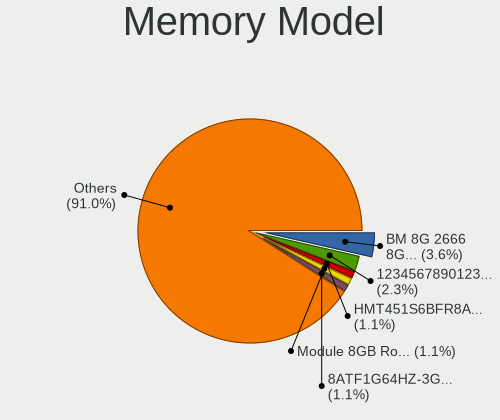

| Model                                                            | Desktops | Percent |
|------------------------------------------------------------------|----------|---------|
| Unknown                                                          | 12       | 3.42%   |
| Unknown (ABCD) RAM 123456789012345678 4GB DIMM DDR4 2400MT/s     | 9        | 2.56%   |
| Unknown RAM Module 4GB SODIMM DDR3 1333MT/s                      | 4        | 1.14%   |
| Samsung RAM M471A1K43CB1-CTD 8GB SODIMM DDR4 2667MT/s            | 4        | 1.14%   |
| Micron RAM 8ATF1G64HZ-3G2R1 8GB SODIMM DDR4 3200MT/s             | 4        | 1.14%   |
| Corsair RAM CMK16GX4M2B3200C16 8GB DIMM DDR4 3200MT/s            | 4        | 1.14%   |
| Unknown RAM Module 4GB DIMM DDR3 1600MT/s                        | 3        | 0.85%   |
| Unknown RAM Module 1GB DIMM SDRAM                                | 3        | 0.85%   |
| SK hynix RAM HMT451U6BFR8C-PB 4GB DIMM DDR3 1600MT/s             | 3        | 0.85%   |
| SK hynix RAM HMT451S6BFR8A-PB 4GB SODIMM DDR3 1600MT/s           | 3        | 0.85%   |
| Samsung RAM M471B5173DB0-YK0 4GB SODIMM DDR3 1600MT/s            | 3        | 0.85%   |
| Micron RAM Module 8GB Row Of Chips LPDDR4 3200MT/s               | 3        | 0.85%   |
| Micron RAM 8JTF51264AZ-1G6E1 4GB DIMM DDR3 1600MT/s              | 3        | 0.85%   |
| Kingston RAM 99U5469-045.A00LF 4GB DIMM DDR3 1600MT/s            | 3        | 0.85%   |
| Crucial RAM CT102464BF160B.C16 8GB SODIMM DDR3 1600MT/s          | 3        | 0.85%   |
| Crucial RAM CT102464BF160B.C16 8GB DIMM DDR3 1600MT/s            | 3        | 0.85%   |
| Crucial RAM CT102464BA160B.C16 8GB DIMM DDR3 1600MT/s            | 3        | 0.85%   |
| Corsair RAM CMX8GX3M2A1333C9 4GB DIMM DDR3 1333MT/s              | 3        | 0.85%   |
| Unknown RAM Module 4GB SODIMM DDR3 667MT/s                       | 2        | 0.57%   |
| Unknown RAM Module 2GB DIMM DDR3 1333MT/s                        | 2        | 0.57%   |
| Unknown RAM Module 2GB DIMM DDR2 800MT/s                         | 2        | 0.57%   |
| Transcend RAM TS1GLK72V6H 8GB DIMM DDR3 1600MT/s                 | 2        | 0.57%   |
| Transcend RAM TS1GLH64V1H 8GB DIMM DDR4 2133MT/s                 | 2        | 0.57%   |
| Timetec RAM UD3-1600 8GB DIMM DDR3 1600MT/s                      | 2        | 0.57%   |
| Team RAM TEAMGROUP-UD4-3200 8GB DIMM DDR4 3200MT/s               | 2        | 0.57%   |
| Smart Modular RAM Module 4GB DIMM DDR3 1333MT/s                  | 2        | 0.57%   |
| SK hynix RAM HMT451U7BFR8A-PB 4GB DIMM DDR3 1600MT/s             | 2        | 0.57%   |
| SK hynix RAM HMT451U6BFR8A-PB 4GB DIMM DDR3 1600MT/s             | 2        | 0.57%   |
| SK hynix RAM HMT451U6AFR8C-PB 4GB DIMM DDR3 1600MT/s             | 2        | 0.57%   |
| SK hynix RAM HMT41GS6BFR8A-PB 8GB SODIMM DDR3 1600MT/s           | 2        | 0.57%   |
| SK hynix RAM HMT351U6EFR8C-PB 4GB DIMM DDR3 1600MT/s             | 2        | 0.57%   |
| SK hynix RAM HMT351U6CFR8C-PB 4GB DIMM DDR3 1600MT/s             | 2        | 0.57%   |
| SK hynix RAM HMT351U6CFR8C-H9 4GB DIMM DDR3 1333MT/s             | 2        | 0.57%   |
| Samsung RAM M471B5273DH0-CH9 4GB SODIMM DDR3 1334MT/s            | 2        | 0.57%   |
| Samsung RAM M471B1G73DB0-YK0 8GB DIMM DDR3 1600MT/s              | 2        | 0.57%   |
| Samsung RAM M425R1GB4BB0-CQKOL 8GB SODIMM DDR5 4800MT/s          | 2        | 0.57%   |
| Kingston RAM Module 2048MB DIMM DDR2 800MT/s                     | 2        | 0.57%   |
| Kingston RAM LV26D4U9S8HJ-8 8GB DIMM DDR4 2667MT/s               | 2        | 0.57%   |
| Kingston RAM 9905584-016.A00LF 4GB DIMM DDR3 1600MT/s            | 2        | 0.57%   |
| Essencore Limited RAM KD48GS880-32N2200 8GB SODIMM DDR4 3200MT/s | 2        | 0.57%   |

Memory Kind
-----------

Memory module kinds

| Kind    | Desktops | Percent |
|---------|----------|---------|
| DDR3    | 144      | 49.15%  |
| DDR4    | 111      | 37.88%  |
| LPDDR4  | 12       | 4.1%    |
| DDR5    | 9        | 3.07%   |
| DDR2    | 8        | 2.73%   |
| SDRAM   | 4        | 1.37%   |
| Unknown | 2        | 0.68%   |
| LPDDR5  | 1        | 0.34%   |
| LPDDR3  | 1        | 0.34%   |
| DDR     | 1        | 0.34%   |

Memory Form Factor
------------------

Physical design of the memory module

| Name         | Desktops | Percent |
|--------------|----------|---------|
| DIMM         | 177      | 60.82%  |
| SODIMM       | 109      | 37.46%  |
| Row Of Chips | 4        | 1.37%   |
| Unknown      | 1        | 0.34%   |

Memory Size
-----------

Memory module size

| Size  | Desktops | Percent |
|-------|----------|---------|
| 8192  | 129      | 42.57%  |
| 4096  | 95       | 31.35%  |
| 16384 | 34       | 11.22%  |
| 2048  | 29       | 9.57%   |
| 32768 | 11       | 3.63%   |
| 1024  | 5        | 1.65%   |

Memory Speed
------------

Memory module speed

| Speed   | Desktops | Percent |
|---------|----------|---------|
| 1600    | 99       | 31.94%  |
| 3200    | 38       | 12.26%  |
| 2400    | 33       | 10.65%  |
| 1333    | 33       | 10.65%  |
| 2667    | 27       | 8.71%   |
| 2133    | 13       | 4.19%   |
| 800     | 13       | 4.19%   |
| 4800    | 8        | 2.58%   |
| 2666    | 7        | 2.26%   |
| 1867    | 6        | 1.94%   |
| 667     | 6        | 1.94%   |
| 3600    | 4        | 1.29%   |
| 3000    | 3        | 0.97%   |
| 1866    | 3        | 0.97%   |
| Unknown | 3        | 0.97%   |
| 2933    | 2        | 0.65%   |
| 1334    | 2        | 0.65%   |
| 1066    | 2        | 0.65%   |
| 65535   | 1        | 0.32%   |
| 6400    | 1        | 0.32%   |
| 5600    | 1        | 0.32%   |
| 3534    | 1        | 0.32%   |
| 1067    | 1        | 0.32%   |
| 933     | 1        | 0.32%   |
| 533     | 1        | 0.32%   |
| 133     | 1        | 0.32%   |

Printers & scanners
-------------------

Printer Vendor
--------------

Printer device vendors

| Vendor          | Desktops | Percent |
|-----------------|----------|---------|
| Hewlett-Packard | 1        | 100%    |

Printer Model
-------------

Printer device models

| Model            | Desktops | Percent |
|------------------|----------|---------|
| HP LaserJet 1200 | 1        | 50%     |
| HP DeskJet 5850c | 1        | 50%     |

Scanner Vendor
--------------

Scanner device vendors

| Vendor | Desktops | Percent |
|--------|----------|---------|
| Canon  | 2        | 100%    |

Scanner Model
-------------

Scanner device models

| Model                   | Desktops | Percent |
|-------------------------|----------|---------|
| Canon CanoScan LiDE 220 | 1        | 50%     |
| Canon CanoScan LiDE 210 | 1        | 50%     |

Camera
------

Camera Vendor
-------------

Camera device vendors

| Vendor                   | Desktops | Percent |
|--------------------------|----------|---------|
| Logitech                 | 7        | 63.64%  |
| Trust                    | 1        | 9.09%   |
| SHENZHEN AONI ELECTRONIC | 1        | 9.09%   |
| Chicony Electronics      | 1        | 9.09%   |
| ARC International        | 1        | 9.09%   |

Camera Model
------------

Camera device models

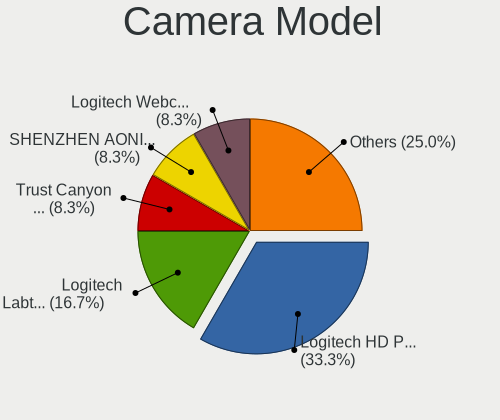

| Model                                          | Desktops | Percent |
|------------------------------------------------|----------|---------|
| Logitech HD Pro Webcam C920                    | 3        | 27.27%  |
| Logitech Labtec Webcam Pro                     | 2        | 18.18%  |
| Trust Canyon CNS-CWC6 Webcam                   | 1        | 9.09%   |
| SHENZHEN AONI ELECTRONIC NexiGo N990 4K Camera | 1        | 9.09%   |
| Logitech Webcam C930e                          | 1        | 9.09%   |
| Logitech Webcam C310                           | 1        | 9.09%   |
| Chicony Integrated Camera [ThinkPad]           | 1        | 9.09%   |
| ARC International Camera                       | 1        | 9.09%   |

Security
--------

Fingerprint Vendor
------------------

Fingerprint sensor vendors

Zero info for selected period =(

Fingerprint Model
-----------------

Fingerprint sensor models

Zero info for selected period =(

Chipcard Vendor
---------------

Chipcard module vendors

Zero info for selected period =(

Chipcard Model
--------------

Chipcard module models

Zero info for selected period =(

Unsupported
-----------

Unsupported Devices
-------------------

Total unsupported devices on board

| Total | Desktops | Percent |
|-------|----------|---------|
| 1     | 168      | 51.85%  |
| 0     | 109      | 33.64%  |
| 2     | 30       | 9.26%   |
| 3     | 12       | 3.7%    |
| 4     | 3        | 0.93%   |
| 9     | 1        | 0.31%   |
| 8     | 1        | 0.31%   |

Unsupported Device Types
------------------------

Types of unsupported devices

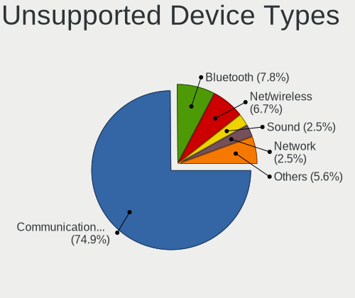

| Type                     | Desktops | Percent |
|--------------------------|----------|---------|
| Communication controller | 189      | 75.6%   |
| Bluetooth                | 18       | 7.2%    |
| Net/wireless             | 14       | 5.6%    |
| Card reader              | 7        | 2.8%    |
| Sound                    | 6        | 2.4%    |
| Firewire controller      | 6        | 2.4%    |
| Network                  | 5        | 2%      |
| Net/ethernet             | 2        | 0.8%    |
| Graphics card            | 2        | 0.8%    |
| Storage/raid             | 1        | 0.4%    |

