BSD in UK - Tested Hardware & Statistics (Desktops)
---------------------------------------------------

A project to collect tested hardware configurations for BSD in UK.

Anyone can contribute to this report by the [hw-probe](https://github.com/linuxhw/hw-probe/blob/master/INSTALL.BSD.md) tool:

    hw-probe -all -upload

Please contribute! Especially if your hardware is rare.

Contents
--------

* [ Test Cases ](#test-cases)

* [ System ](#system)
  - [ OS                       ](#os)
  - [ OS Family                ](#os-family)
  - [ Arch                     ](#arch)
  - [ DE                       ](#de)
  - [ Display Server           ](#display-server)
  - [ Display Manager          ](#display-manager)
  - [ OS Lang                  ](#os-lang)
  - [ Boot Mode                ](#boot-mode)
  - [ Filesystem               ](#filesystem)
  - [ Part. scheme             ](#part-scheme)

* [ Board ](#board)
  - [ Vendor                   ](#vendor)
  - [ Model                    ](#model)
  - [ Model Family             ](#model-family)
  - [ MFG Year                 ](#mfg-year)
  - [ Form Factor              ](#form-factor)
  - [ Coreboot                 ](#coreboot)
  - [ RAM Size                 ](#ram-size)
  - [ RAM Used                 ](#ram-used)
  - [ Total Drives             ](#total-drives)
  - [ Has CD-ROM               ](#has-cd-rom)
  - [ Has Ethernet             ](#has-ethernet)
  - [ Has WiFi                 ](#has-wifi)
  - [ Has Bluetooth            ](#has-bluetooth)

* [ Location ](#location)
  - [ Country                  ](#country)
  - [ City                     ](#city)

* [ Drives ](#drives)
  - [ Drive Vendor             ](#drive-vendor)
  - [ Drive Model              ](#drive-model)
  - [ HDD Vendor               ](#hdd-vendor)
  - [ SSD Vendor               ](#ssd-vendor)
  - [ Drive Kind               ](#drive-kind)
  - [ Drive Connector          ](#drive-connector)
  - [ Drive Size               ](#drive-size)
  - [ Space Total              ](#space-total)
  - [ Space Used               ](#space-used)
  - [ Malfunc. Drives          ](#malfunc-drives)
  - [ Malfunc. Drive Vendor    ](#malfunc-drive-vendor)
  - [ Malfunc. HDD Vendor      ](#malfunc-hdd-vendor)
  - [ Malfunc. Drive Kind      ](#malfunc-drive-kind)
  - [ Failed Drives            ](#failed-drives)
  - [ Failed Drive Vendor      ](#failed-drive-vendor)
  - [ Drive Status             ](#drive-status)

* [ Storage controller ](#storage-controller)
  - [ Storage Vendor           ](#storage-vendor)
  - [ Storage Model            ](#storage-model)
  - [ Storage Kind             ](#storage-kind)

* [ Processor ](#processor)
  - [ CPU Vendor               ](#cpu-vendor)
  - [ CPU Model                ](#cpu-model)
  - [ CPU Model Family         ](#cpu-model-family)
  - [ CPU Cores                ](#cpu-cores)
  - [ CPU Sockets              ](#cpu-sockets)
  - [ CPU Threads              ](#cpu-threads)
  - [ CPU Microarch            ](#cpu-microarch)

* [ Graphics ](#graphics)
  - [ GPU Vendor               ](#gpu-vendor)
  - [ GPU Model                ](#gpu-model)
  - [ GPU Combo                ](#gpu-combo)
  - [ GPU Driver               ](#gpu-driver)
  - [ GPU Memory               ](#gpu-memory)

* [ Monitor ](#monitor)
  - [ Monitor Vendor           ](#monitor-vendor)
  - [ Monitor Model            ](#monitor-model)
  - [ Monitor Resolution       ](#monitor-resolution)
  - [ Monitor Diagonal         ](#monitor-diagonal)
  - [ Monitor Width            ](#monitor-width)
  - [ Aspect Ratio             ](#aspect-ratio)
  - [ Monitor Area             ](#monitor-area)
  - [ Pixel Density            ](#pixel-density)
  - [ Multiple Monitors        ](#multiple-monitors)

* [ Network ](#network)
  - [ Net Controller Vendor    ](#net-controller-vendor)
  - [ Net Controller Model     ](#net-controller-model)
  - [ Wireless Vendor          ](#wireless-vendor)
  - [ Wireless Model           ](#wireless-model)
  - [ Ethernet Vendor          ](#ethernet-vendor)
  - [ Ethernet Model           ](#ethernet-model)
  - [ Net Controller Kind      ](#net-controller-kind)
  - [ Used Controller          ](#used-controller)
  - [ NICs                     ](#nics)
  - [ IPv6                     ](#ipv6)

* [ Bluetooth ](#bluetooth)
  - [ Bluetooth Vendor         ](#bluetooth-vendor)
  - [ Bluetooth Model          ](#bluetooth-model)

* [ Sound ](#sound)
  - [ Sound Vendor             ](#sound-vendor)
  - [ Sound Model              ](#sound-model)

* [ Memory ](#memory)
  - [ Memory Vendor            ](#memory-vendor)
  - [ Memory Model             ](#memory-model)
  - [ Memory Kind              ](#memory-kind)
  - [ Memory Form Factor       ](#memory-form-factor)
  - [ Memory Size              ](#memory-size)
  - [ Memory Speed             ](#memory-speed)

* [ Printers & scanners ](#printers--scanners)
  - [ Printer Vendor           ](#printer-vendor)
  - [ Printer Model            ](#printer-model)
  - [ Scanner Vendor           ](#scanner-vendor)
  - [ Scanner Model            ](#scanner-model)

* [ Camera ](#camera)
  - [ Camera Vendor            ](#camera-vendor)
  - [ Camera Model             ](#camera-model)

* [ Security ](#security)
  - [ Fingerprint Vendor       ](#fingerprint-vendor)
  - [ Fingerprint Model        ](#fingerprint-model)
  - [ Chipcard Vendor          ](#chipcard-vendor)
  - [ Chipcard Model           ](#chipcard-model)

* [ Unsupported ](#unsupported)
  - [ Unsupported Devices      ](#unsupported-devices)
  - [ Unsupported Device Types ](#unsupported-device-types)

Test Cases
----------

Total: 247

| Vendor        | Model                       | Probe                                                     | Date         |
|---------------|-----------------------------|-----------------------------------------------------------|--------------|
| Gigabyte      | H81N                        | [d922327cdd](https://bsd-hardware.info/?probe=d922327cdd) | May 06, 2022 |
| Intel         | CARLOW                      | [6f185d9b30](https://bsd-hardware.info/?probe=6f185d9b30) | May 06, 2022 |
| Intel         | CARLOW                      | [2240df9d2d](https://bsd-hardware.info/?probe=2240df9d2d) | May 04, 2022 |
| MSI           | B450 GAMING PRO CARBON M... | [544b83da9f](https://bsd-hardware.info/?probe=544b83da9f) | Apr 24, 2022 |
| ASUSTek       | A55BM-E                     | [9758c067ec](https://bsd-hardware.info/?probe=9758c067ec) | Apr 23, 2022 |
| Unknown       | Unknown                     | [3b256304a0](https://bsd-hardware.info/?probe=3b256304a0) | Apr 23, 2022 |
| Shuttle       | FH61V                       | [6f4c78b7db](https://bsd-hardware.info/?probe=6f4c78b7db) | Apr 23, 2022 |
| Gigabyte      | 990FXA-UD3                  | [3813b46bc1](https://bsd-hardware.info/?probe=3813b46bc1) | Apr 22, 2022 |
| Lenovo        | 3132 SDK0J40697 WIN 3305... | [3322ad9dac](https://bsd-hardware.info/?probe=3322ad9dac) | Apr 20, 2022 |
| Lenovo        | 3132 SDK0J40697 WIN 3305... | [aa48329066](https://bsd-hardware.info/?probe=aa48329066) | Apr 20, 2022 |
| ASUSTek       | AM1M-A                      | [754d45f24f](https://bsd-hardware.info/?probe=754d45f24f) | Apr 11, 2022 |
| Jetway        | 1.0                         | [0048067292](https://bsd-hardware.info/?probe=0048067292) | Apr 11, 2022 |
| ASRock        | X370 Taichi                 | [7f156a0671](https://bsd-hardware.info/?probe=7f156a0671) | Apr 10, 2022 |
| ASRock        | X370 Taichi                 | [a006c9e999](https://bsd-hardware.info/?probe=a006c9e999) | Apr 10, 2022 |
| ASUSTek       | A55BM-E                     | [907da6ea08](https://bsd-hardware.info/?probe=907da6ea08) | Apr 10, 2022 |
| ASUSTek       | A55BM-E                     | [f71ea0931e](https://bsd-hardware.info/?probe=f71ea0931e) | Apr 10, 2022 |
| Gigabyte      | B560M DS3H                  | [a7470aa647](https://bsd-hardware.info/?probe=a7470aa647) | Apr 09, 2022 |
| MSI           | MAG B550M MORTAR            | [d9ef1569d2](https://bsd-hardware.info/?probe=d9ef1569d2) | Apr 07, 2022 |
| Gigabyte      | H61M-DS2 x.x                | [2a7de69b4b](https://bsd-hardware.info/?probe=2a7de69b4b) | Apr 04, 2022 |
| Quanmax       | spo-book TECH QUAD B1       | [1b382db711](https://bsd-hardware.info/?probe=1b382db711) | Apr 04, 2022 |
| Fujitsu       | D3230-A1 S26361-D3230-A1    | [6274858d8d](https://bsd-hardware.info/?probe=6274858d8d) | Apr 02, 2022 |
| Foxconn       | 2ADA                        | [9fae64765f](https://bsd-hardware.info/?probe=9fae64765f) | Mar 31, 2022 |
| ASUSTek       | A55BM-E                     | [eaa8d1a7d7](https://bsd-hardware.info/?probe=eaa8d1a7d7) | Mar 30, 2022 |
| Intel         | Q3XXG4-P V1.0               | [730dd09705](https://bsd-hardware.info/?probe=730dd09705) | Mar 28, 2022 |
| Unknown       | Unknown                     | [9b49ac0cf2](https://bsd-hardware.info/?probe=9b49ac0cf2) | Mar 23, 2022 |
| Intel         | DH61CR AAG14064-209         | [3812666505](https://bsd-hardware.info/?probe=3812666505) | Mar 23, 2022 |
| Seeed Stud... | ODYSSEY-X86J4105 SD-BS-C... | [87289f0c36](https://bsd-hardware.info/?probe=87289f0c36) | Mar 20, 2022 |
| Unknown       | Unknown                     | [8870903766](https://bsd-hardware.info/?probe=8870903766) | Mar 20, 2022 |
| Seeed Stud... | ODYSSEY-X86J4105 SD-BS-C... | [c9fb46b179](https://bsd-hardware.info/?probe=c9fb46b179) | Mar 19, 2022 |
| Gigabyte      | H81N                        | [afffe00b26](https://bsd-hardware.info/?probe=afffe00b26) | Mar 19, 2022 |
| Dell          | 0GXM1W A02                  | [d28bef2c37](https://bsd-hardware.info/?probe=d28bef2c37) | Mar 17, 2022 |
| PC Engines    | APU2                        | [e56b256787](https://bsd-hardware.info/?probe=e56b256787) | Mar 15, 2022 |
| Intel         | DH67BL AAG10189-211         | [10a235fe8f](https://bsd-hardware.info/?probe=10a235fe8f) | Mar 13, 2022 |
| Unknown       | Unknown                     | [a556350922](https://bsd-hardware.info/?probe=a556350922) | Mar 11, 2022 |
| Unknown       | Unknown                     | [5a22c1d4ab](https://bsd-hardware.info/?probe=5a22c1d4ab) | Mar 10, 2022 |
| Dell          | 0WMJ54 A01                  | [77c308e93e](https://bsd-hardware.info/?probe=77c308e93e) | Mar 05, 2022 |
| Dell          | 0WMJ54 A01                  | [1ffc0a0805](https://bsd-hardware.info/?probe=1ffc0a0805) | Mar 03, 2022 |
| ASUSTek       | H81M-PLUS                   | [26565f3d84](https://bsd-hardware.info/?probe=26565f3d84) | Mar 01, 2022 |
| Biostar       | J3160NH                     | [536f856d94](https://bsd-hardware.info/?probe=536f856d94) | Feb 23, 2022 |
| Dell          | 0VD5HY A07                  | [bb86fb3e67](https://bsd-hardware.info/?probe=bb86fb3e67) | Feb 22, 2022 |
| Gigabyte      | H81N                        | [fc273bb51a](https://bsd-hardware.info/?probe=fc273bb51a) | Feb 14, 2022 |
| Gigabyte      | H81N                        | [5accd7ce0d](https://bsd-hardware.info/?probe=5accd7ce0d) | Feb 13, 2022 |
| PAIQ          | EC3-BT19D4L A1              | [a3843d55ca](https://bsd-hardware.info/?probe=a3843d55ca) | Feb 05, 2022 |
| Intel         | J1900                       | [3b4b841677](https://bsd-hardware.info/?probe=3b4b841677) | Feb 04, 2022 |
| PAIQ          | EC3-BT19D4L A1              | [86cb857d00](https://bsd-hardware.info/?probe=86cb857d00) | Feb 02, 2022 |
| PC Engines    | APU2                        | [0409aa82c2](https://bsd-hardware.info/?probe=0409aa82c2) | Feb 01, 2022 |
| Dell          | 0J3C2F A02                  | [4b4b77d8f3](https://bsd-hardware.info/?probe=4b4b77d8f3) | Feb 01, 2022 |
| Yanling       | YL-KBR6L Ver:1.01           | [a65a16decd](https://bsd-hardware.info/?probe=a65a16decd) | Jan 31, 2022 |
| ASUSTek       | PRIME Z490M-PLUS            | [d08074d468](https://bsd-hardware.info/?probe=d08074d468) | Jan 28, 2022 |
| Gigabyte      | J3455N-D3H                  | [461b538b72](https://bsd-hardware.info/?probe=461b538b72) | Jan 28, 2022 |
| Unknown       | PICO PC                     | [538ca6b389](https://bsd-hardware.info/?probe=538ca6b389) | Jan 27, 2022 |
| Fujitsu       | D3230-A1 S26361-D3230-A1    | [277f5bacdd](https://bsd-hardware.info/?probe=277f5bacdd) | Jan 22, 2022 |
| ASRock        | QC5000M-ITX/PH              | [6ea5e898fa](https://bsd-hardware.info/?probe=6ea5e898fa) | Jan 21, 2022 |
| Intel         | SHARKBAY                    | [6bde480ecd](https://bsd-hardware.info/?probe=6bde480ecd) | Jan 14, 2022 |
| ASUSTek       | Z87-PRO                     | [280ea0618b](https://bsd-hardware.info/?probe=280ea0618b) | Jan 14, 2022 |
| Gigabyte      | B450M DS3H-CF               | [825d20fcf7](https://bsd-hardware.info/?probe=825d20fcf7) | Jan 14, 2022 |
| Winston Ma... | PICO PC                     | [ac1014aab2](https://bsd-hardware.info/?probe=ac1014aab2) | Jan 13, 2022 |
| Gigabyte      | B450M DS3H-CF               | [b953d9d2e6](https://bsd-hardware.info/?probe=b953d9d2e6) | Jan 13, 2022 |
| ASUSTek       | P5G41T-M LX2/GB             | [1527560bbd](https://bsd-hardware.info/?probe=1527560bbd) | Jan 11, 2022 |
| ASUSTek       | P5G41T-M LX2/GB             | [d914e4c500](https://bsd-hardware.info/?probe=d914e4c500) | Jan 10, 2022 |
| HP            | 8169                        | [85e0cf058c](https://bsd-hardware.info/?probe=85e0cf058c) | Jan 10, 2022 |
| HP            | ProLiant MicroServer Gen... | [9a24935dab](https://bsd-hardware.info/?probe=9a24935dab) | Jan 09, 2022 |
| Fujitsu       | D3230-A1 S26361-D3230-A1    | [ce54324df7](https://bsd-hardware.info/?probe=ce54324df7) | Jan 09, 2022 |
| Fujitsu       | D3230-A1 S26361-D3230-A1    | [de6d713222](https://bsd-hardware.info/?probe=de6d713222) | Jan 05, 2022 |
| PC Engines    | APU                         | [efe2fbd850](https://bsd-hardware.info/?probe=efe2fbd850) | Jan 04, 2022 |
| ASRock        | B450 Steel Legend           | [e67007df20](https://bsd-hardware.info/?probe=e67007df20) | Jan 01, 2022 |
| Gigabyte      | B550M AORUS PRO-P           | [dd62d57a45](https://bsd-hardware.info/?probe=dd62d57a45) | Dec 29, 2021 |
| Protectli     | FW6 Ver                     | [c3c1529f86](https://bsd-hardware.info/?probe=c3c1529f86) | Dec 22, 2021 |
| ASUSTek       | ROG STRIX X570-E GAMING     | [c83118d6d0](https://bsd-hardware.info/?probe=c83118d6d0) | Dec 09, 2021 |
| Inventec      | Z CLASS A02                 | [67556468e3](https://bsd-hardware.info/?probe=67556468e3) | Nov 30, 2021 |
| Protectli     | FW6 Ver                     | [53e6ac863a](https://bsd-hardware.info/?probe=53e6ac863a) | Nov 18, 2021 |
| Dell          | 0J3C2F A02                  | [56cd34ffef](https://bsd-hardware.info/?probe=56cd34ffef) | Nov 17, 2021 |
| Dell          | 0F6X5P A00                  | [8451595212](https://bsd-hardware.info/?probe=8451595212) | Nov 16, 2021 |
| Dell          | 0GXM1W A01                  | [e0c3737f7c](https://bsd-hardware.info/?probe=e0c3737f7c) | Nov 15, 2021 |
| Dell          | 0J3C2F A02                  | [a2bbadf4a5](https://bsd-hardware.info/?probe=a2bbadf4a5) | Nov 12, 2021 |
| Fujitsu       | D3230-A1 S26361-D3230-A1    | [f0c5f5ef97](https://bsd-hardware.info/?probe=f0c5f5ef97) | Nov 09, 2021 |
| Yanling       | YL-KBR6L                    | [35f1c905eb](https://bsd-hardware.info/?probe=35f1c905eb) | Nov 04, 2021 |
| AZW           | GK55                        | [91db367d18](https://bsd-hardware.info/?probe=91db367d18) | Oct 28, 2021 |
| Unknown       | Unknown                     | [8caf15c2a5](https://bsd-hardware.info/?probe=8caf15c2a5) | Oct 22, 2021 |
| Gigabyte      | H61M-DS2 x.x                | [8e11143a1d](https://bsd-hardware.info/?probe=8e11143a1d) | Oct 14, 2021 |
| Fujitsu       | D3313-B1 S26361-D3313-B1    | [c8b057c4e4](https://bsd-hardware.info/?probe=c8b057c4e4) | Oct 12, 2021 |
| Gigabyte      | J3455N-D3H                  | [40aba3842c](https://bsd-hardware.info/?probe=40aba3842c) | Oct 03, 2021 |
| ASUSTek       | PRIME A320M-K               | [c574dcc409](https://bsd-hardware.info/?probe=c574dcc409) | Oct 01, 2021 |
| ASRockRack    | X470D4U2-2T                 | [357b9d3ad2](https://bsd-hardware.info/?probe=357b9d3ad2) | Sep 30, 2021 |
| HP            | 0AE8h C                     | [159e371cc7](https://bsd-hardware.info/?probe=159e371cc7) | Sep 30, 2021 |
| Intel         | DH67BL AAG10189-211         | [cc7d3fa6a3](https://bsd-hardware.info/?probe=cc7d3fa6a3) | Sep 26, 2021 |
| Intel         | DH67BL AAG10189-211         | [dc09f7f7cb](https://bsd-hardware.info/?probe=dc09f7f7cb) | Sep 25, 2021 |
| ASRock        | J3455M                      | [411b04cbba](https://bsd-hardware.info/?probe=411b04cbba) | Sep 25, 2021 |
| Unknown       | Unknown                     | [462d25d041](https://bsd-hardware.info/?probe=462d25d041) | Sep 19, 2021 |
| Intel         | Q3XXG4-P V1.0               | [63a24ea67f](https://bsd-hardware.info/?probe=63a24ea67f) | Sep 12, 2021 |
| ASUSTek       | H110M-PLUS                  | [08b4825275](https://bsd-hardware.info/?probe=08b4825275) | Sep 09, 2021 |
| ASRockRack    | X470D4U2-2T                 | [8ce323def8](https://bsd-hardware.info/?probe=8ce323def8) | Sep 09, 2021 |
| Gigabyte      | B550I AORUS PRO AX          | [f860e13b6b](https://bsd-hardware.info/?probe=f860e13b6b) | Sep 08, 2021 |
| ASUSTek       | ROG STRIX X570-E GAMING     | [a3fe3577b0](https://bsd-hardware.info/?probe=a3fe3577b0) | Aug 26, 2021 |
| ASRock        | B450M-HDV                   | [fdeba8e75d](https://bsd-hardware.info/?probe=fdeba8e75d) | Aug 26, 2021 |
| Fujitsu       | D3230-A1 S26361-D3230-A1    | [2499806edc](https://bsd-hardware.info/?probe=2499806edc) | Aug 26, 2021 |
| ASRock        | B450M-HDV                   | [996f8b5618](https://bsd-hardware.info/?probe=996f8b5618) | Aug 22, 2021 |
| Unknown       | Unknown                     | [beda690c72](https://bsd-hardware.info/?probe=beda690c72) | Aug 19, 2021 |
| Intel         | Q3XXG4-P V1.0               | [f4fe59224e](https://bsd-hardware.info/?probe=f4fe59224e) | Aug 18, 2021 |
| Unknown       | Unknown                     | [621207a309](https://bsd-hardware.info/?probe=621207a309) | Aug 11, 2021 |
| Shuttle       | FH81                        | [58ddd2da40](https://bsd-hardware.info/?probe=58ddd2da40) | Aug 08, 2021 |
| Intel         | DH67BL AAG10189-211         | [6106746a7f](https://bsd-hardware.info/?probe=6106746a7f) | Aug 07, 2021 |
| NU941         | 1.0                         | [e76f1a177c](https://bsd-hardware.info/?probe=e76f1a177c) | Aug 07, 2021 |
| ASUSTek       | PRIME Z490M-PLUS            | [aad64262b5](https://bsd-hardware.info/?probe=aad64262b5) | Jul 29, 2021 |
| Unknown       | PICO PC                     | [47f932c3d3](https://bsd-hardware.info/?probe=47f932c3d3) | Jul 29, 2021 |
| Biostar       | A88M                        | [f9d3b78d58](https://bsd-hardware.info/?probe=f9d3b78d58) | Jul 26, 2021 |
| Unknown       | Unknown                     | [41e0c49bcb](https://bsd-hardware.info/?probe=41e0c49bcb) | Jul 24, 2021 |
| Intel         | Q3XXG4-P V1.0               | [05180e292a](https://bsd-hardware.info/?probe=05180e292a) | Jul 24, 2021 |
| ASUSTek       | H110M-PLUS                  | [d0f2da9c41](https://bsd-hardware.info/?probe=d0f2da9c41) | Jul 21, 2021 |
| HP            | 213D A01                    | [3b518acc68](https://bsd-hardware.info/?probe=3b518acc68) | Jul 15, 2021 |
| Unknown       | Unknown                     | [17938ca56f](https://bsd-hardware.info/?probe=17938ca56f) | Jul 14, 2021 |
| Dell          | 0F6X5P A00                  | [46aaff0a7c](https://bsd-hardware.info/?probe=46aaff0a7c) | Jul 14, 2021 |
| HP            | 0AE8h C                     | [23df6b2e94](https://bsd-hardware.info/?probe=23df6b2e94) | Jul 12, 2021 |
| Gigabyte      | X570 I AORUS PRO WIFI       | [0c9fc39896](https://bsd-hardware.info/?probe=0c9fc39896) | Jul 11, 2021 |
| Gigabyte      | X570 I AORUS PRO WIFI       | [3d69b35f7d](https://bsd-hardware.info/?probe=3d69b35f7d) | Jul 11, 2021 |
| Unknown       | Unknown                     | [4a3836de00](https://bsd-hardware.info/?probe=4a3836de00) | Jul 08, 2021 |
| Protectli     | FW4B Ver                    | [18d373b2d3](https://bsd-hardware.info/?probe=18d373b2d3) | Jul 06, 2021 |
| ASRock        | J3355B-ITX                  | [d8bd1a3025](https://bsd-hardware.info/?probe=d8bd1a3025) | Jul 05, 2021 |
| ASRock        | B450M-HDV                   | [dca41aa10a](https://bsd-hardware.info/?probe=dca41aa10a) | Jul 05, 2021 |
| PC Engines    | apu4                        | [18a1374b95](https://bsd-hardware.info/?probe=18a1374b95) | Jul 04, 2021 |
| Biostar       | B450MH                      | [167f09a25c](https://bsd-hardware.info/?probe=167f09a25c) | Jun 29, 2021 |
| Lenovo        | 3132 SDK0J40697 WIN 3305... | [1b35a7ea0a](https://bsd-hardware.info/?probe=1b35a7ea0a) | Jun 28, 2021 |
| Intel CNCT... | Unknown                     | [d2298356a0](https://bsd-hardware.info/?probe=d2298356a0) | Jun 22, 2021 |
| Intel         | DH67CL AAG10212-206         | [f2367a4249](https://bsd-hardware.info/?probe=f2367a4249) | Jun 21, 2021 |
| Unknown       | Unknown                     | [287ec8a2ee](https://bsd-hardware.info/?probe=287ec8a2ee) | Jun 19, 2021 |
| Unknown       | Unknown                     | [e6a66eac0b](https://bsd-hardware.info/?probe=e6a66eac0b) | Jun 19, 2021 |
| ASUSTek       | PRIME Z270-A                | [c7b4a17b7d](https://bsd-hardware.info/?probe=c7b4a17b7d) | Jun 19, 2021 |
| Unknown       | Unknown                     | [c3f7e818ae](https://bsd-hardware.info/?probe=c3f7e818ae) | Jun 18, 2021 |
| ASRock        | B550 Phantom Gaming 4       | [5ccdc16de4](https://bsd-hardware.info/?probe=5ccdc16de4) | Jun 12, 2021 |
| Gigabyte      | X570 I AORUS PRO WIFI       | [9062f35935](https://bsd-hardware.info/?probe=9062f35935) | Jun 10, 2021 |
| Dell          | 02YYK5 A01                  | [2bb2632198](https://bsd-hardware.info/?probe=2bb2632198) | Jun 04, 2021 |
| Gigabyte      | J3455N-D3H                  | [23751b05a9](https://bsd-hardware.info/?probe=23751b05a9) | Jun 01, 2021 |
| PC Engines    | APU2                        | [c5f1ffd6c0](https://bsd-hardware.info/?probe=c5f1ffd6c0) | May 31, 2021 |
| Intel         | Q3XXG4-P V1.0               | [cd60e38216](https://bsd-hardware.info/?probe=cd60e38216) | May 30, 2021 |
| HP            | 213D A01                    | [de3d6dcdf5](https://bsd-hardware.info/?probe=de3d6dcdf5) | May 22, 2021 |
| HP            | 18E7                        | [56a672af0a](https://bsd-hardware.info/?probe=56a672af0a) | May 20, 2021 |
| Apple         | Mac-F221BEC8                | [869f003493](https://bsd-hardware.info/?probe=869f003493) | May 17, 2021 |
| Lenovo        | SDK0J40705 WIN 342503995... | [b7ea8547ce](https://bsd-hardware.info/?probe=b7ea8547ce) | May 15, 2021 |
| EVGA          | X299 FTW K                  | [c4862c598a](https://bsd-hardware.info/?probe=c4862c598a) | May 11, 2021 |
| Gigabyte      | Z97X-UD3H-CF                | [cc49321b12](https://bsd-hardware.info/?probe=cc49321b12) | May 11, 2021 |
| Biostar       | A88M                        | [74c3afbf45](https://bsd-hardware.info/?probe=74c3afbf45) | May 10, 2021 |
| ASUSTek       | ROG STRIX X570-E GAMING     | [8d78068ca7](https://bsd-hardware.info/?probe=8d78068ca7) | May 09, 2021 |
| Unknown       | Unknown                     | [a707beae6f](https://bsd-hardware.info/?probe=a707beae6f) | May 02, 2021 |
| Yanling       | YL-KBR6L Ver:1.01           | [0cddbdee33](https://bsd-hardware.info/?probe=0cddbdee33) | May 01, 2021 |
| Dell          | 0WR7PY A02                  | [1a780b9a95](https://bsd-hardware.info/?probe=1a780b9a95) | Apr 27, 2021 |
| ASUSTek       | Z87-PRO                     | [d218181abb](https://bsd-hardware.info/?probe=d218181abb) | Apr 26, 2021 |
| Intel         | Q3XXG4-P V1.0               | [f888bd5312](https://bsd-hardware.info/?probe=f888bd5312) | Apr 20, 2021 |
| Intel         | Q3XXG4-P V1.0               | [7dacccd5f5](https://bsd-hardware.info/?probe=7dacccd5f5) | Apr 18, 2021 |
| Lenovo        | 3129 SDK0J40700 WIN 3258... | [1cef60d042](https://bsd-hardware.info/?probe=1cef60d042) | Apr 13, 2021 |
| Dell          | 0VRWRC A00                  | [903d74f8e7](https://bsd-hardware.info/?probe=903d74f8e7) | Apr 12, 2021 |
| Unknown       | PICO PC                     | [8ab959af5c](https://bsd-hardware.info/?probe=8ab959af5c) | Apr 11, 2021 |
| Biostar       | A88M                        | [6fc307ade8](https://bsd-hardware.info/?probe=6fc307ade8) | Apr 09, 2021 |
| Unknown       | Unknown                     | [9eafdd3e07](https://bsd-hardware.info/?probe=9eafdd3e07) | Apr 07, 2021 |
| Unknown       | Unknown                     | [5393389555](https://bsd-hardware.info/?probe=5393389555) | Apr 05, 2021 |
| Dell          | 0TP412                      | [1bc05b5951](https://bsd-hardware.info/?probe=1bc05b5951) | Apr 04, 2021 |
| Lenovo        | SHARKBAY 0B98401 PRO        | [7fc044cdb6](https://bsd-hardware.info/?probe=7fc044cdb6) | Apr 03, 2021 |
| AMI           | PEISIA E3845 VER1.0         | [12909e67d4](https://bsd-hardware.info/?probe=12909e67d4) | Mar 23, 2021 |
| AMI           | PEISIA E3845 VER1.0         | [159f39df79](https://bsd-hardware.info/?probe=159f39df79) | Mar 23, 2021 |
| Unknown       | Unknown                     | [a81f03223e](https://bsd-hardware.info/?probe=a81f03223e) | Mar 22, 2021 |
| Unknown       | Unknown                     | [04d2c36bec](https://bsd-hardware.info/?probe=04d2c36bec) | Mar 22, 2021 |
| HP            | 1825                        | [15e822a4dc](https://bsd-hardware.info/?probe=15e822a4dc) | Mar 20, 2021 |
| Unknown       | Unknown                     | [192451364a](https://bsd-hardware.info/?probe=192451364a) | Mar 20, 2021 |
| Quanmax       | spo-book TECH QUAD B1       | [3e479a0551](https://bsd-hardware.info/?probe=3e479a0551) | Mar 16, 2021 |
| ASUSTek       | H110M-PLUS                  | [80e7c230d7](https://bsd-hardware.info/?probe=80e7c230d7) | Mar 12, 2021 |
| ASUSTek       | H110M-PLUS                  | [cf00023cef](https://bsd-hardware.info/?probe=cf00023cef) | Mar 11, 2021 |
| PC Engines    | APU2                        | [14142a990a](https://bsd-hardware.info/?probe=14142a990a) | Mar 09, 2021 |
| Unknown       | Unknown                     | [1ad8d8132f](https://bsd-hardware.info/?probe=1ad8d8132f) | Mar 09, 2021 |
| ASUSTek       | All Series                  | [b4aec46644](https://bsd-hardware.info/?probe=b4aec46644) | Mar 07, 2021 |
| ASUSTek       | All Series                  | [f7b1921594](https://bsd-hardware.info/?probe=f7b1921594) | Mar 07, 2021 |
| ASUSTek       | P8Z77-V                     | [88ee81b089](https://bsd-hardware.info/?probe=88ee81b089) | Mar 06, 2021 |
| Unknown       | Unknown                     | [99448b6fad](https://bsd-hardware.info/?probe=99448b6fad) | Mar 02, 2021 |
| ASUSTek       | PRIME Z490M-PLUS            | [d106f46dde](https://bsd-hardware.info/?probe=d106f46dde) | Mar 01, 2021 |
| Shuttle       | FS61                        | [3016999a76](https://bsd-hardware.info/?probe=3016999a76) | Feb 25, 2021 |
| Unknown       | YL-SKUL6                    | [96d7fbef45](https://bsd-hardware.info/?probe=96d7fbef45) | Feb 25, 2021 |
| Acer          | RS780HVF                    | [3367ae4413](https://bsd-hardware.info/?probe=3367ae4413) | Feb 24, 2021 |
| ASUSTek       | P8Z77-V LX2                 | [0aeea0fec9](https://bsd-hardware.info/?probe=0aeea0fec9) | Feb 23, 2021 |
| Biostar       | A88M                        | [2d4a32fbc3](https://bsd-hardware.info/?probe=2d4a32fbc3) | Feb 22, 2021 |
| Biostar       | A88M                        | [7ff97a241a](https://bsd-hardware.info/?probe=7ff97a241a) | Feb 22, 2021 |
| MSI           | A78M-E35                    | [0a1462e4a7](https://bsd-hardware.info/?probe=0a1462e4a7) | Feb 22, 2021 |
| Dell          | 0M863N A01                  | [8dd5cd14a9](https://bsd-hardware.info/?probe=8dd5cd14a9) | Feb 22, 2021 |
| Dell          | 0M863N A01                  | [94f2627d79](https://bsd-hardware.info/?probe=94f2627d79) | Feb 20, 2021 |
| Lenovo        | SDK0J40705 WIN 342503995... | [3f0003e9a2](https://bsd-hardware.info/?probe=3f0003e9a2) | Feb 19, 2021 |
| Gigabyte      | M68MT-S2                    | [5d94572e10](https://bsd-hardware.info/?probe=5d94572e10) | Feb 16, 2021 |
| Gigabyte      | B450M DS3H-CF               | [9181a2479b](https://bsd-hardware.info/?probe=9181a2479b) | Feb 15, 2021 |
| Gigabyte      | Z97X-UD3H-CF                | [3c043807ba](https://bsd-hardware.info/?probe=3c043807ba) | Feb 15, 2021 |
| Lenovo        | SDK0J40705 WIN 342503995... | [62e8f472f6](https://bsd-hardware.info/?probe=62e8f472f6) | Feb 15, 2021 |
| Shuttle       | DS10U                       | [ad9283aae7](https://bsd-hardware.info/?probe=ad9283aae7) | Feb 14, 2021 |
| Intel         | Q3XXG4-P V1.0               | [7313a6d6e2](https://bsd-hardware.info/?probe=7313a6d6e2) | Feb 14, 2021 |
| Gigabyte      | Z97M-D3H                    | [a335917871](https://bsd-hardware.info/?probe=a335917871) | Feb 14, 2021 |
| ASUSTek       | ROG STRIX Z370-G GAMING     | [565ceb36f0](https://bsd-hardware.info/?probe=565ceb36f0) | Feb 14, 2021 |
| Shuttle       | DS10U                       | [aef3ca0794](https://bsd-hardware.info/?probe=aef3ca0794) | Feb 12, 2021 |
| ASUSTek       | Z87-PRO                     | [ad0f0dde9d](https://bsd-hardware.info/?probe=ad0f0dde9d) | Feb 10, 2021 |
| ASRock        | B550 Phantom Gaming 4       | [435f081b3b](https://bsd-hardware.info/?probe=435f081b3b) | Feb 09, 2021 |
| ASRock        | B550 Phantom Gaming 4       | [7a8ab8feaf](https://bsd-hardware.info/?probe=7a8ab8feaf) | Feb 08, 2021 |
| ASRock        | B550 Phantom Gaming 4       | [2d0beb2534](https://bsd-hardware.info/?probe=2d0beb2534) | Feb 08, 2021 |
| QOTOM         | Q355G4-P V1.0               | [5c09abed71](https://bsd-hardware.info/?probe=5c09abed71) | Feb 05, 2021 |
| QOTOM         | Q355G4-P V1.0               | [c79ea5055f](https://bsd-hardware.info/?probe=c79ea5055f) | Feb 05, 2021 |
| QOTOM         | Q355G4-P V1.0               | [222778ae2b](https://bsd-hardware.info/?probe=222778ae2b) | Feb 05, 2021 |
| Lenovo        | SDK0J40705 WIN 342503995... | [f827129438](https://bsd-hardware.info/?probe=f827129438) | Feb 04, 2021 |
| Unknown       | PICO PC                     | [de1cd4e050](https://bsd-hardware.info/?probe=de1cd4e050) | Feb 04, 2021 |
| Lenovo        | SDK0J40705 WIN 342503995... | [b192745cde](https://bsd-hardware.info/?probe=b192745cde) | Feb 03, 2021 |
| Lenovo        | SDK0J40705 WIN 342503995... | [c11da3972d](https://bsd-hardware.info/?probe=c11da3972d) | Feb 03, 2021 |
| Protectli     | FW4B                        | [5334bf8761](https://bsd-hardware.info/?probe=5334bf8761) | Feb 03, 2021 |
| Deciso        | Netboard A10                | [a3f5b21dff](https://bsd-hardware.info/?probe=a3f5b21dff) | Feb 03, 2021 |
| Supermicro    | X8SIU                       | [57fbc2cb9a](https://bsd-hardware.info/?probe=57fbc2cb9a) | Feb 02, 2021 |
| Fujitsu       | D3230-A1 S26361-D3230-A1    | [6b9511bf39](https://bsd-hardware.info/?probe=6b9511bf39) | Jan 31, 2021 |
| Unknown       | YL-SKUL6                    | [9f0538d38b](https://bsd-hardware.info/?probe=9f0538d38b) | Jan 31, 2021 |
| ASRock        | X399 Taichi                 | [875e6714ca](https://bsd-hardware.info/?probe=875e6714ca) | Jan 27, 2021 |
| ASRock        | J3455M                      | [c90667d62c](https://bsd-hardware.info/?probe=c90667d62c) | Jan 27, 2021 |
| Lenovo        | Board                       | [da81aa7cb9](https://bsd-hardware.info/?probe=da81aa7cb9) | Jan 26, 2021 |
| AZW           | GK55                        | [077fedae7d](https://bsd-hardware.info/?probe=077fedae7d) | Jan 26, 2021 |
| AZW           | GK55                        | [db3fc2c7b2](https://bsd-hardware.info/?probe=db3fc2c7b2) | Jan 25, 2021 |
| Intel         | Q3XXG4-P V1.0               | [aa5782d83e](https://bsd-hardware.info/?probe=aa5782d83e) | Jan 24, 2021 |
| Dell          | 0WMJ54 A01                  | [6d11e7b348](https://bsd-hardware.info/?probe=6d11e7b348) | Jan 23, 2021 |
| Unknown       | Unknown                     | [aeb42f8919](https://bsd-hardware.info/?probe=aeb42f8919) | Jan 23, 2021 |
| Unknown       | Unknown                     | [5b3be23f50](https://bsd-hardware.info/?probe=5b3be23f50) | Jan 23, 2021 |
| Jetway        | 1.0                         | [8f47246cdf](https://bsd-hardware.info/?probe=8f47246cdf) | Jan 23, 2021 |
| Unknown       | Unknown                     | [f952cac718](https://bsd-hardware.info/?probe=f952cac718) | Jan 22, 2021 |
| Intel         | Q3XXG4-P V1.0               | [29c88c0b95](https://bsd-hardware.info/?probe=29c88c0b95) | Jan 22, 2021 |
| Protectli     | FW4B                        | [ea6fcc20bc](https://bsd-hardware.info/?probe=ea6fcc20bc) | Jan 22, 2021 |
| Intel         | Q3XXG4-P V1.0               | [1722f1824f](https://bsd-hardware.info/?probe=1722f1824f) | Jan 22, 2021 |
| PC Engines    | apu2                        | [0fac28f2bf](https://bsd-hardware.info/?probe=0fac28f2bf) | Jan 21, 2021 |
| Shuttle       | FS67U                       | [8ed524df62](https://bsd-hardware.info/?probe=8ed524df62) | Jan 20, 2021 |
| Protectli     | FW4A Ver                    | [5725505d31](https://bsd-hardware.info/?probe=5725505d31) | Jan 20, 2021 |
| PC Engines    | apu2                        | [49463c91f7](https://bsd-hardware.info/?probe=49463c91f7) | Jan 19, 2021 |
| Dell          | 0M863N A01                  | [4feae8b20d](https://bsd-hardware.info/?probe=4feae8b20d) | Jan 15, 2021 |
| ASRock        | 990FX Extreme4              | [20c77fd91b](https://bsd-hardware.info/?probe=20c77fd91b) | Dec 16, 2020 |
| Gigabyte      | Z97P-D3                     | [588af8f5b3](https://bsd-hardware.info/?probe=588af8f5b3) | Dec 16, 2020 |
| Acer          | Aspire X1440                | [6100b30349](https://bsd-hardware.info/?probe=6100b30349) | Dec 15, 2020 |
| Apple         | Xserve3,1                   | [7329a7650d](https://bsd-hardware.info/?probe=7329a7650d) | Dec 05, 2020 |
| ASUSTek       | PRIME X570-P                | [1076ee5826](https://bsd-hardware.info/?probe=1076ee5826) | Dec 04, 2020 |
| ASUSTek       | PRIME X570-P                | [ec1363a9ea](https://bsd-hardware.info/?probe=ec1363a9ea) | Dec 04, 2020 |
| MSI           | B450 GAMING PLUS            | [4cf3dd682b](https://bsd-hardware.info/?probe=4cf3dd682b) | Nov 24, 2020 |
| ASRock        | IMB-191                     | [76991234cd](https://bsd-hardware.info/?probe=76991234cd) | Nov 18, 2020 |
| Unknown       | Unknown                     | [d08d610bd0](https://bsd-hardware.info/?probe=d08d610bd0) | Oct 29, 2020 |
| Intel         | CRESCENTBAY                 | [42d114559b](https://bsd-hardware.info/?probe=42d114559b) | Oct 21, 2020 |
| ASRock        | IMB-191                     | [4ac9e9cf2a](https://bsd-hardware.info/?probe=4ac9e9cf2a) | Oct 19, 2020 |
| Fujitsu       | D2950-A1 S26361-D2950-A1    | [86e9866c03](https://bsd-hardware.info/?probe=86e9866c03) | Oct 02, 2020 |
| Fujitsu       | D2950-A1 S26361-D2950-A1    | [3b8f8a2033](https://bsd-hardware.info/?probe=3b8f8a2033) | Oct 02, 2020 |
| Lenovo        | 3098 SDK0E50510 WIN         | [b9b460d9e2](https://bsd-hardware.info/?probe=b9b460d9e2) | Sep 28, 2020 |
| PC Engines    | apu4                        | [f0f8a22656](https://bsd-hardware.info/?probe=f0f8a22656) | Aug 05, 2020 |
| Biostar       | B450MH                      | [4ad280f947](https://bsd-hardware.info/?probe=4ad280f947) | Aug 02, 2020 |
| HPE           | ProLiant MicroServer Gen... | [6b015a340b](https://bsd-hardware.info/?probe=6b015a340b) | Jul 31, 2020 |
| Lenovo        | Win8 Pro DPK TPG            | [db7146b868](https://bsd-hardware.info/?probe=db7146b868) | Jul 14, 2020 |
| Sony UK       | Raspberry Pi 4 Model B      | [483af3998c](https://bsd-hardware.info/?probe=483af3998c) | May 28, 2020 |
| Gigabyte      | H61M-S2PV                   | [14e00aa09f](https://bsd-hardware.info/?probe=14e00aa09f) | May 25, 2020 |
| HP            | 213D A01                    | [23f8adb299](https://bsd-hardware.info/?probe=23f8adb299) | May 25, 2020 |

System
------

OS
--

Installed operating systems

| Name                 | Desktops | Percent |
|----------------------|----------|---------|
| OPNsense 20.7.8      | 12       | 6.09%   |
| OPNsense 21.7.7      | 8        | 4.06%   |
| OPNsense 21.1.5      | 8        | 4.06%   |
| helloSystem 0.5.0    | 8        | 4.06%   |
| OPNsense 22.1        | 7        | 3.55%   |
| OPNsense 21.7.1      | 7        | 3.55%   |
| OPNsense 21.1        | 7        | 3.55%   |
| OPNsense 21.1.7      | 6        | 3.05%   |
| OPNsense 21.1.4      | 6        | 3.05%   |
| helloSystem 0.4.0    | 6        | 3.05%   |
| OPNsense 22.1.6      | 5        | 2.54%   |
| OPNsense 22.1.3      | 5        | 2.54%   |
| OPNsense 21.7.8      | 5        | 2.54%   |
| OPNsense 21.7.3      | 5        | 2.54%   |
| OPNsense 21.1.1      | 5        | 2.54%   |
| OPNsense 22.1.4      | 4        | 2.03%   |
| OPNsense 22.1.2      | 4        | 2.03%   |
| OPNsense 21.1.8      | 4        | 2.03%   |
| OPNsense 21.1.6      | 4        | 2.03%   |
| OPNsense 21.1.3      | 4        | 2.03%   |
| OPNsense 21.1.2      | 4        | 2.03%   |
| OpenBSD 6.8          | 4        | 2.03%   |
| GhostBSD 20.04.02    | 4        | 2.03%   |
| OPNsense 21.7.5      | 3        | 1.52%   |
| OPNsense 21.7.2      | 3        | 1.52%   |
| FreeBSD 14.0-CURRENT | 3        | 1.52%   |
| FreeBSD 13.0-STABLE  | 3        | 1.52%   |
| FreeBSD 13.0-p3      | 3        | 1.52%   |
| FreeBSD 13.0-p2      | 3        | 1.52%   |
| FreeBSD 13.0         | 3        | 1.52%   |
| FreeBSD 12.2-p3      | 3        | 1.52%   |
| FreeBSD 12.2         | 3        | 1.52%   |
| OPNsense 22.1.5      | 2        | 1.02%   |
| OPNsense 21.7.4      | 2        | 1.02%   |
| OPNsense 21.7        | 2        | 1.02%   |
| OPNsense 20.7.7      | 2        | 1.02%   |
| OPNsense 20.7        | 2        | 1.02%   |
| OpenBSD 6.7          | 2        | 1.02%   |
| helloSystem 0.7.0    | 2        | 1.02%   |
| helloSystem 0.3.0    | 2        | 1.02%   |
| FreeBSD 13.0-p11     | 2        | 1.02%   |
| FreeBSD 12.1-p7      | 2        | 1.02%   |
| FreeBSD 12.1         | 2        | 1.02%   |
| XigmaNAS 12.2        | 1        | 0.51%   |
| pfSense 12.3-STABLE  | 1        | 0.51%   |
| OPNsense 22.7        | 1        | 0.51%   |
| OPNsense 22.1.1      | 1        | 0.51%   |
| OPNsense 21.7.6      | 1        | 0.51%   |
| OpenBSD 7.0          | 1        | 0.51%   |
| OpenBSD 6.9          | 1        | 0.51%   |
| NetBSD 9.99.74       | 1        | 0.51%   |
| NetBSD 9.99.23       | 1        | 0.51%   |
| NetBSD 9.2           | 1        | 0.51%   |
| helloSystem 0.6.0    | 1        | 0.51%   |
| FreeBSD 13.0-p5      | 1        | 0.51%   |
| FreeBSD 13.0-p4      | 1        | 0.51%   |
| FreeBSD 12.2-p6      | 1        | 0.51%   |
| FreeBSD 12.1-p12     | 1        | 0.51%   |
| FreeBSD 12.1-p1      | 1        | 0.51%   |

OS Family
---------

OS without a version

| Name        | Desktops | Percent |
|-------------|----------|---------|
| OPNsense    | 91       | 58.71%  |
| FreeBSD     | 29       | 18.71%  |
| helloSystem | 18       | 11.61%  |
| OpenBSD     | 8        | 5.16%   |
| GhostBSD    | 4        | 2.58%   |
| NetBSD      | 3        | 1.94%   |
| XigmaNAS    | 1        | 0.65%   |
| pfSense     | 1        | 0.65%   |

Arch
----

OS architecture (x86_64, i586, etc.)

| Name  | Desktops | Percent |
|-------|----------|---------|
| amd64 | 151      | 98.69%  |
| riscv | 1        | 0.65%   |
| arm64 | 1        | 0.65%   |

DE
--

Desktop Environment

| Name             | Desktops | Percent |
|------------------|----------|---------|
| Console          | 109      | 70.32%  |
| helloDesktop     | 18       | 11.61%  |
| KDE5             | 8        | 5.16%   |
| XFCE             | 6        | 3.87%   |
| MATE             | 3        | 1.94%   |
| GNOME            | 3        | 1.94%   |
| fvwm             | 2        | 1.29%   |
| TWM              | 1        | 0.65%   |
| PekWM            | 1        | 0.65%   |
| Openbox          | 1        | 0.65%   |
| Metacity (Marco) | 1        | 0.65%   |
| DWM              | 1        | 0.65%   |
| CDE              | 1        | 0.65%   |

Display Server
--------------

X11 or Wayland

| Name    | Desktops | Percent |
|---------|----------|---------|
| Console | 109      | 70.78%  |
| X11     | 44       | 28.57%  |
| Wayland | 1        | 0.65%   |

Display Manager
---------------

SDDM, LightDM, etc.

| Name    | Desktops | Percent |
|---------|----------|---------|
| Console | 123      | 78.34%  |
| SLiM    | 18       | 11.46%  |
| SDDM    | 7        | 4.46%   |
| LightDM | 6        | 3.82%   |
| XDM     | 2        | 1.27%   |
| Ly      | 1        | 0.64%   |

OS Lang
-------

Language

| Lang           | Desktops | Percent |
|----------------|----------|---------|
| Unknown        | 110      | 70.97%  |
| en_US          | 22       | 14.19%  |
| C              | 14       | 9.03%   |
| en_GB          | 8        | 5.16%   |
| en_GB.US-ASCII | 1        | 0.65%   |

Boot Mode
---------

EFI or BIOS

| Mode | Desktops | Percent |
|------|----------|---------|
| EFI  | 126      | 80.77%  |
| BIOS | 30       | 19.23%  |

Filesystem
----------

Type of filesystem

| Type    | Desktops | Percent |
|---------|----------|---------|
| Ufs     | 93       | 60%     |
| Zfs     | 52       | 33.55%  |
| Ffs     | 8        | 5.16%   |
| Cd9660  | 1        | 0.65%   |
| Unknown | 1        | 0.65%   |

Part. scheme
------------

Scheme of partitioning

| Type    | Desktops | Percent |
|---------|----------|---------|
| GPT     | 139      | 90.26%  |
| MBR     | 10       | 6.49%   |
| Unknown | 5        | 3.25%   |

Board
-----

Vendor
------

Motherboard manufacturer

| Name                | Desktops | Percent |
|---------------------|----------|---------|
| ASUSTek Computer    | 16       | 10.46%  |
| Intel               | 15       | 9.8%    |
| Gigabyte Technology | 15       | 9.8%    |
| Unknown             | 15       | 9.8%    |
| Dell                | 14       | 9.15%   |
| ASRock              | 11       | 7.19%   |
| PC Engines          | 8        | 5.23%   |
| Lenovo              | 8        | 5.23%   |
| Hewlett-Packard     | 8        | 5.23%   |
| Shuttle             | 5        | 3.27%   |
| Protectli           | 4        | 2.61%   |
| MSI                 | 4        | 2.61%   |
| Fujitsu             | 3        | 1.96%   |
| Biostar             | 3        | 1.96%   |
| Yanling             | 2        | 1.31%   |
| Apple               | 2        | 1.31%   |
| Acer                | 2        | 1.31%   |
| Winston Marriot     | 1        | 0.65%   |
| Supermicro          | 1        | 0.65%   |
| Sony UK             | 1        | 0.65%   |
| Seeed Studio        | 1        | 0.65%   |
| Quanmax             | 1        | 0.65%   |
| QOTOM               | 1        | 0.65%   |
| PAIQ                | 1        | 0.65%   |
| NU941               | 1        | 0.65%   |
| Jetway              | 1        | 0.65%   |
| Inventec            | 1        | 0.65%   |
| Intel CNCTION-IAF   | 1        | 0.65%   |
| HPE                 | 1        | 0.65%   |
| Foxconn             | 1        | 0.65%   |
| EVGA                | 1        | 0.65%   |
| Deciso              | 1        | 0.65%   |
| AZW                 | 1        | 0.65%   |
| ASRockRack          | 1        | 0.65%   |
| AMI                 | 1        | 0.65%   |

Model
-----

Motherboard model

| Name                                    | Desktops | Percent |
|-----------------------------------------|----------|---------|
| Unknown                                 | 15       | 9.8%    |
| Intel Q3XXG4-P V1.0                     | 8        | 5.23%   |
| PC Engines APU2                         | 5        | 3.27%   |
| ASUS All Series                         | 4        | 2.61%   |
| Dell OptiPlex 7010                      | 3        | 1.96%   |
| Yanling YL-KBR6L                        | 2        | 1.31%   |
| Protectli FW4B                          | 2        | 1.31%   |
| PC Engines apu4                         | 2        | 1.31%   |
| Lenovo ThinkCentre M920s 10SJ0041UK     | 2        | 1.31%   |
| HP Z600 Workstation                     | 2        | 1.31%   |
| HP t620 PLUS Quad Core TC               | 2        | 1.31%   |
| Gigabyte B450M DS3H                     | 2        | 1.31%   |
| Dell OptiPlex 760                       | 2        | 1.31%   |
| Dell OptiPlex 390                       | 2        | 1.31%   |
| Dell OptiPlex 3020                      | 2        | 1.31%   |
| ASUS ROG STRIX X570-E GAMING            | 2        | 1.31%   |
| ASRock B550 Phantom Gaming 4            | 2        | 1.31%   |
| Winston Marriot PICO PC(R)              | 1        | 0.65%   |
| Supermicro X8SIU                        | 1        | 0.65%   |
| Sony UK Raspberry Pi 4 Model B          | 1        | 0.65%   |
| Shuttle XH61V                           | 1        | 0.65%   |
| Shuttle SH81R                           | 1        | 0.65%   |
| Shuttle DS67U                           | 1        | 0.65%   |
| Shuttle DS61                            | 1        | 0.65%   |
| Shuttle DS10U                           | 1        | 0.65%   |
| Seeed Studio ODYSSEY-X86J4105           | 1        | 0.65%   |
| Quanmax spo-book TECH QUAD              | 1        | 0.65%   |
| QOTOM Q355G4-P V1.0                     | 1        | 0.65%   |
| Protectli FW6                           | 1        | 0.65%   |
| Protectli FW4A                          | 1        | 0.65%   |
| PC Engines APU                          | 1        | 0.65%   |
| PAIQ EC3-BT19D4L                        | 1        | 0.65%   |
| NU941 1.0                               | 1        | 0.65%   |
| MSI MS-7C94                             | 1        | 0.65%   |
| MSI MS-7B86                             | 1        | 0.65%   |
| MSI MS-7B85                             | 1        | 0.65%   |
| MSI MS-7721                             | 1        | 0.65%   |
| Lenovo ThinkCentre M93p 10AAS0F201      | 1        | 0.65%   |
| Lenovo ThinkCentre Edge72 3493DEG       | 1        | 0.65%   |
| Lenovo ThinkCentre E73 10DU0003UK       | 1        | 0.65%   |
| Lenovo ThinkCentre E73 10DS0015UK       | 1        | 0.65%   |
| Lenovo ThinkCentre A55 870577G          | 1        | 0.65%   |
| Lenovo IdeaCentre 310S-08IGM 90HX000PUK | 1        | 0.65%   |
| Jetway 1.0                              | 1        | 0.65%   |
| Inventec Z CLASS                        | 1        | 0.65%   |
| Intel SHARKBAY                          | 1        | 0.65%   |
| Intel J1900                             | 1        | 0.65%   |
| Intel DH67CL AAG10212-206               | 1        | 0.65%   |
| Intel DH67BL AAG10189-211               | 1        | 0.65%   |
| Intel DH61CR                            | 1        | 0.65%   |
| Intel CRESCENTBAY                       | 1        | 0.65%   |
| Intel CNCTION-IAF CNCTION-IAF           | 1        | 0.65%   |
| Intel CARLOW                            | 1        | 0.65%   |
| HPE ProLiant MicroServer Gen10          | 1        | 0.65%   |
| HP ProLiant MicroServer Gen8            | 1        | 0.65%   |
| HP ProDesk 600 G2 DM                    | 1        | 0.65%   |
| HP ProDesk 600 G1 SFF                   | 1        | 0.65%   |
| HP EliteDesk 800 G1 DM                  | 1        | 0.65%   |
| Gigabyte Z97X-UD3H                      | 1        | 0.65%   |
| Gigabyte Z97P-D3                        | 1        | 0.65%   |

Model Family
------------

Motherboard model prefix

| Name                          | Desktops | Percent |
|-------------------------------|----------|---------|
| Unknown                       | 15       | 9.8%    |
| Dell OptiPlex                 | 12       | 7.84%   |
| Intel Q3XXG4-P                | 8        | 5.23%   |
| Lenovo ThinkCentre            | 7        | 4.58%   |
| PC Engines apu2               | 5        | 3.27%   |
| ASUS PRIME                    | 4        | 2.61%   |
| ASUS All                      | 4        | 2.61%   |
| ASUS ROG                      | 3        | 1.96%   |
| Yanling YL-KBR6L              | 2        | 1.31%   |
| Protectli FW4B                | 2        | 1.31%   |
| PC Engines apu4               | 2        | 1.31%   |
| HP Z600                       | 2        | 1.31%   |
| HP t620                       | 2        | 1.31%   |
| HP ProDesk                    | 2        | 1.31%   |
| Gigabyte B450M                | 2        | 1.31%   |
| Fujitsu ESPRIMO               | 2        | 1.31%   |
| ASUS P8Z77-V                  | 2        | 1.31%   |
| ASRock B550                   | 2        | 1.31%   |
| Acer Aspire                   | 2        | 1.31%   |
| Winston Marriot PICO          | 1        | 0.65%   |
| Supermicro X8SIU              | 1        | 0.65%   |
| Sony UK Raspberry             | 1        | 0.65%   |
| Shuttle XH61V                 | 1        | 0.65%   |
| Shuttle SH81R                 | 1        | 0.65%   |
| Shuttle DS67U                 | 1        | 0.65%   |
| Shuttle DS61                  | 1        | 0.65%   |
| Shuttle DS10U                 | 1        | 0.65%   |
| Seeed Studio ODYSSEY-X86J4105 | 1        | 0.65%   |
| Quanmax spo-book              | 1        | 0.65%   |
| QOTOM Q355G4-P                | 1        | 0.65%   |
| Protectli FW6                 | 1        | 0.65%   |
| Protectli FW4A                | 1        | 0.65%   |
| PC Engines APU                | 1        | 0.65%   |
| PAIQ EC3-BT19D4L              | 1        | 0.65%   |
| NU941 1.0                     | 1        | 0.65%   |
| MSI MS-7C94                   | 1        | 0.65%   |
| MSI MS-7B86                   | 1        | 0.65%   |
| MSI MS-7B85                   | 1        | 0.65%   |
| MSI MS-7721                   | 1        | 0.65%   |
| Lenovo IdeaCentre             | 1        | 0.65%   |
| Jetway 1.0                    | 1        | 0.65%   |
| Inventec Z                    | 1        | 0.65%   |
| Intel SHARKBAY                | 1        | 0.65%   |
| Intel J1900                   | 1        | 0.65%   |
| Intel DH67CL                  | 1        | 0.65%   |
| Intel DH67BL                  | 1        | 0.65%   |
| Intel DH61CR                  | 1        | 0.65%   |
| Intel CRESCENTBAY             | 1        | 0.65%   |
| Intel CNCTION-IAF CNCTION-IAF | 1        | 0.65%   |
| Intel CARLOW                  | 1        | 0.65%   |
| HPE ProLiant                  | 1        | 0.65%   |
| HP ProLiant                   | 1        | 0.65%   |
| HP EliteDesk                  | 1        | 0.65%   |
| Gigabyte Z97X-UD3H            | 1        | 0.65%   |
| Gigabyte Z97P-D3              | 1        | 0.65%   |
| Gigabyte Z97M-D3H             | 1        | 0.65%   |
| Gigabyte X570                 | 1        | 0.65%   |
| Gigabyte M68MT-S2             | 1        | 0.65%   |
| Gigabyte J3455N-D3H           | 1        | 0.65%   |
| Gigabyte H81N                 | 1        | 0.65%   |

MFG Year
--------

Motherboard manufacture year

| Year    | Desktops | Percent |
|---------|----------|---------|
| 2016    | 19       | 12.42%  |
| 2014    | 19       | 12.42%  |
| 2020    | 16       | 10.46%  |
| 2018    | 16       | 10.46%  |
| 2019    | 15       | 9.8%    |
| 2015    | 12       | 7.84%   |
| 2013    | 12       | 7.84%   |
| 2021    | 11       | 7.19%   |
| 2012    | 8        | 5.23%   |
| 2017    | 6        | 3.92%   |
| 2011    | 6        | 3.92%   |
| 2010    | 5        | 3.27%   |
| 2009    | 3        | 1.96%   |
| Unknown | 3        | 1.96%   |
| 2008    | 1        | 0.65%   |
| 2007    | 1        | 0.65%   |

Form Factor
-----------

Physical design of the computer

| Name    | Desktops | Percent |
|---------|----------|---------|
| Desktop | 153      | 100%    |

Coreboot
--------

Have coreboot on board

| Used | Desktops | Percent |
|------|----------|---------|
| No   | 143      | 93.46%  |
| Yes  | 10       | 6.54%   |

RAM Size
--------

Total RAM memory

| Size in GB  | Desktops | Percent |
|-------------|----------|---------|
| 8.01-16.0   | 58       | 37.66%  |
| 4.01-8.0    | 36       | 23.38%  |
| 16.01-24.0  | 34       | 22.08%  |
| 32.01-64.0  | 10       | 6.49%   |
| 64.01-256.0 | 6        | 3.9%    |
| 2.01-3.0    | 5        | 3.25%   |
| 24.01-32.0  | 3        | 1.95%   |
| 3.01-4.0    | 2        | 1.3%    |

RAM Used
--------

Used RAM memory

| Used GB     | Desktops | Percent |
|-------------|----------|---------|
| 0.01-0.5    | 83       | 51.55%  |
| 0.51-1.0    | 46       | 28.57%  |
| 1.01-2.0    | 15       | 9.32%   |
| 3.01-4.0    | 4        | 2.48%   |
| 2.01-3.0    | 4        | 2.48%   |
| Unknown     | 3        | 1.86%   |
| 4.01-8.0    | 2        | 1.24%   |
| 24.01-32.0  | 2        | 1.24%   |
| 32.01-64.0  | 1        | 0.62%   |
| 64.01-256.0 | 1        | 0.62%   |

Total Drives
------------

Number of drives on board

| Drives | Desktops | Percent |
|--------|----------|---------|
| 1      | 102      | 64.97%  |
| 2      | 19       | 12.1%   |
| 0      | 11       | 7.01%   |
| 4      | 7        | 4.46%   |
| 3      | 7        | 4.46%   |
| 5      | 6        | 3.82%   |
| 8      | 3        | 1.91%   |
| 7      | 1        | 0.64%   |
| 6      | 1        | 0.64%   |

Has CD-ROM
----------

Has CD-ROM on board

| Presented | Desktops | Percent |
|-----------|----------|---------|
| No        | 124      | 81.05%  |
| Yes       | 29       | 18.95%  |

Has Ethernet
------------

Has Ethernet on board

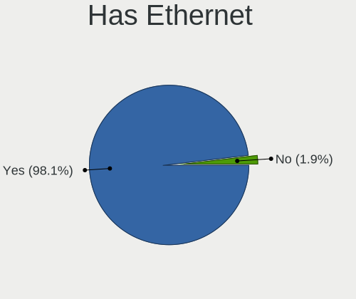

| Presented | Desktops | Percent |
|-----------|----------|---------|
| Yes       | 150      | 98.04%  |
| No        | 3        | 1.96%   |

Has WiFi
--------

Has WiFi module

| Presented | Desktops | Percent |
|-----------|----------|---------|
| No        | 123      | 79.87%  |
| Yes       | 31       | 20.13%  |

Has Bluetooth
-------------

Has Bluetooth module

| Presented | Desktops | Percent |
|-----------|----------|---------|
| No        | 131      | 85.06%  |
| Yes       | 23       | 14.94%  |

Location
--------

Country
-------

Geographic location (country)

| Country | Desktops | Percent |
|---------|----------|---------|
| UK      | 153      | 100%    |

City
----

Geographic location (city)

| City                  | Desktops | Percent |
|-----------------------|----------|---------|
| London                | 17       | 9.94%   |
| Sheffield             | 4        | 2.34%   |
| Newcastle upon Tyne   | 4        | 2.34%   |
| Hull                  | 4        | 2.34%   |
| York                  | 3        | 1.75%   |
| Wittersham            | 3        | 1.75%   |
| Watford               | 3        | 1.75%   |
| Stourbridge           | 3        | 1.75%   |
| Poplar                | 3        | 1.75%   |
| Milton Keynes         | 3        | 1.75%   |
| Kensington            | 3        | 1.75%   |
| Andover               | 3        | 1.75%   |
| Wolverhampton         | 2        | 1.17%   |
| Telford               | 2        | 1.17%   |
| Slough                | 2        | 1.17%   |
| Ruthin                | 2        | 1.17%   |
| Oldham                | 2        | 1.17%   |
| Mansfield             | 2        | 1.17%   |
| Malton                | 2        | 1.17%   |
| Liverpool             | 2        | 1.17%   |
| Egham                 | 2        | 1.17%   |
| Dundee                | 2        | 1.17%   |
| Dulwich               | 2        | 1.17%   |
| Castleford            | 2        | 1.17%   |
| Cambridge             | 2        | 1.17%   |
| Bristol               | 2        | 1.17%   |
| Birmingham            | 2        | 1.17%   |
| Banbury               | 2        | 1.17%   |
| Yeovil                | 1        | 0.58%   |
| Windsor               | 1        | 0.58%   |
| Weedon Bec            | 1        | 0.58%   |
| Ware                  | 1        | 0.58%   |
| Walthamstow           | 1        | 0.58%   |
| Upper Norwood         | 1        | 0.58%   |
| Truro                 | 1        | 0.58%   |
| Trowbridge            | 1        | 0.58%   |
| Swindon               | 1        | 0.58%   |
| Swansea               | 1        | 0.58%   |
| Sutton Coldfield      | 1        | 0.58%   |
| Streatham             | 1        | 0.58%   |
| Stratford             | 1        | 0.58%   |
| Stonehouse            | 1        | 0.58%   |
| Stoke Newington       | 1        | 0.58%   |
| St Asaph              | 1        | 0.58%   |
| South Shields         | 1        | 0.58%   |
| Scunthorpe            | 1        | 0.58%   |
| Royal Tunbridge Wells | 1        | 0.58%   |
| Royal Leamington Spa  | 1        | 0.58%   |
| Rotherham             | 1        | 0.58%   |
| Romford               | 1        | 0.58%   |
| Rochdale              | 1        | 0.58%   |
| Rickmansworth         | 1        | 0.58%   |
| Reigate               | 1        | 0.58%   |
| Reading               | 1        | 0.58%   |
| Portsmouth            | 1        | 0.58%   |
| Portishead            | 1        | 0.58%   |
| Plumstead             | 1        | 0.58%   |
| Peterborough          | 1        | 0.58%   |
| Palmers Green         | 1        | 0.58%   |
| Otley                 | 1        | 0.58%   |

Drives
------

Drive Vendor
------------

Hard drive vendors

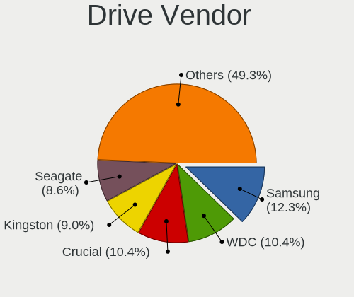

| Vendor              | Desktops | Drives | Percent |
|---------------------|----------|--------|---------|
| Samsung Electronics | 27       | 50     | 14.36%  |
| WDC                 | 25       | 38     | 13.3%   |
| Seagate             | 22       | 48     | 11.7%   |
| Crucial             | 19       | 27     | 10.11%  |
| Kingston            | 18       | 29     | 9.57%   |
| SanDisk             | 11       | 13     | 5.85%   |
| Toshiba             | 8        | 30     | 4.26%   |
| Phison              | 7        | 11     | 3.72%   |
| Hoodisk             | 7        | 11     | 3.72%   |
| Transcend           | 5        | 7      | 2.66%   |
| Intel               | 5        | 6      | 2.66%   |
| SK Hynix            | 3        | 3      | 1.6%    |
| OCZ                 | 3        | 4      | 1.6%    |
| Micron Technology   | 3        | 3      | 1.6%    |
| LITEONIT            | 3        | 3      | 1.6%    |
| Hitachi             | 3        | 6      | 1.6%    |
| PNY                 | 2        | 10     | 1.06%   |
| OPENBSD             | 2        | 2      | 1.06%   |
| A-DATA Technology   | 2        | 3      | 1.06%   |
| Zheino              | 1        | 1      | 0.53%   |
| TCSUNBOW            | 1        | 2      | 0.53%   |
| SPCC                | 1        | 1      | 0.53%   |
| Patriot             | 1        | 4      | 0.53%   |
| Netac               | 1        | 2      | 0.53%   |
| Lexar               | 1        | 1      | 0.53%   |
| Integral            | 1        | 3      | 0.53%   |
| HGST                | 1        | 1      | 0.53%   |
| Gigabyte Technology | 1        | 2      | 0.53%   |
| FORESEE             | 1        | 1      | 0.53%   |
| Corsair             | 1        | 1      | 0.53%   |
| Apple               | 1        | 1      | 0.53%   |
| Apacer              | 1        | 2      | 0.53%   |

Drive Model
-----------

Hard drive models

| Model                                | Desktops | Percent |
|--------------------------------------|----------|---------|
| Kingston SA400S37240G 240GB          | 4        | 1.9%    |
| Hoodisk SSD 64GB                     | 4        | 1.9%    |
| Samsung SSD 850 EVO 250GB            | 3        | 1.42%   |
| Phison Sabrent 1TB                   | 3        | 1.42%   |
| Kingston SUV500MS120G 120GB          | 3        | 1.42%   |
| Crucial CT500MX500SSD1 500GB         | 3        | 1.42%   |
| Crucial CT120BX500SSD1 120GB         | 3        | 1.42%   |
| WDC PC SN730 SDBQNTY-256G-1001 256GB | 2        | 0.95%   |
| Toshiba HDWE140 4TB                  | 2        | 0.95%   |
| Seagate ST8000VN0022-2EL112 8TB      | 2        | 0.95%   |
| Seagate ST4000NE001-2MA101 4TB       | 2        | 0.95%   |
| Seagate ST3500418AS 500GB            | 2        | 0.95%   |
| Seagate ST3500312CS 500GB            | 2        | 0.95%   |
| Seagate ST3160318AS 160GB            | 2        | 0.95%   |
| Seagate ST3160310CS 160GB            | 2        | 0.95%   |
| SanDisk SSD PLUS 480GB               | 2        | 0.95%   |
| SanDisk SDCFHS-016G                  | 2        | 0.95%   |
| Samsung SSD 860 EVO 500GB            | 2        | 0.95%   |
| Samsung SSD 840 EVO 250GB            | 2        | 0.95%   |
| Samsung SSD 750 EVO 250GB            | 2        | 0.95%   |
| Phison SATA SSD 16GB                 | 2        | 0.95%   |
| OPENBSD SR RAID 1 752GB              | 2        | 0.95%   |
| Kingston SUV500MS240G 240GB          | 2        | 0.95%   |
| Kingston SMS200S330G 32GB            | 2        | 0.95%   |
| Intel SSDSA2CT040G3 40GB             | 2        | 0.95%   |
| Hoodisk SSD 32GB                     | 2        | 0.95%   |
| Crucial CT525MX300SSD1 528GB         | 2        | 0.95%   |
| Crucial CT240BX500SSD1 240GB         | 2        | 0.95%   |
| Crucial CT1000BX500SSD1 1TB          | 2        | 0.95%   |
| Zheino CHN HFmSATA01M 128 128GB      | 1        | 0.47%   |
| WDC WDS500G2B0A-00SM50 500GB         | 1        | 0.47%   |
| WDC WDS250G2B0A-00SM50 250GB         | 1        | 0.47%   |
| WDC WDS240G2G0A-00JH30 240GB         | 1        | 0.47%   |
| WDC WDS100T3X0C-00SJG0 1TB           | 1        | 0.47%   |
| WDC WD800JD-75MSA3 80GB              | 1        | 0.47%   |
| WDC WD5003AZEX-00K3CA0 500GB         | 1        | 0.47%   |
| WDC WD5000LPVX-22V0TT0 500GB         | 1        | 0.47%   |
| WDC WD5000AZLX-75K2TA0 500GB         | 1        | 0.47%   |
| WDC WD5000AVDS-63U7B1 500GB          | 1        | 0.47%   |
| WDC WD5000AAKX-221CA1 500GB          | 1        | 0.47%   |
| WDC WD5000AAKS-60WWPA0 500GB         | 1        | 0.47%   |
| WDC WD5000AAKS-00A7B2 500GB          | 1        | 0.47%   |
| WDC WD4001FAEX-00MJRA0 4TB           | 1        | 0.47%   |
| WDC WD3200BEVT-22A23T0 320GB         | 1        | 0.47%   |
| WDC WD3200AAJS-22B4A0 320GB          | 1        | 0.47%   |
| WDC WD3000JS-63PDB1 304GB            | 1        | 0.47%   |
| WDC WD2503ABYX-01WERA1 256GB         | 1        | 0.47%   |
| WDC WD2500AAJS-75M0A0 250GB          | 1        | 0.47%   |
| WDC WD1602ABJS-43P5A0 160GB          | 1        | 0.47%   |
| WDC WD10SPZX-22Z10T1 1TB             | 1        | 0.47%   |
| WDC WD10SPCX-24HWST1 1TB             | 1        | 0.47%   |
| WDC WD10JPVX-22JC3T0 1TB             | 1        | 0.47%   |
| WDC WD10JMVW-11AJGS0 1TB             | 1        | 0.47%   |
| WDC WD10EZRX-00A8LB0 1TB             | 1        | 0.47%   |
| WDC WD10EZEX-00WN4A0 1TB             | 1        | 0.47%   |
| WDC WD1002F9YZ-09H1JL1 1TB           | 1        | 0.47%   |
| WDC PC SN520 SDAPNUW-256G-1006 256GB | 1        | 0.47%   |
| Transcend TS64GMSA370 64GB           | 1        | 0.47%   |
| Transcend TS64GMSA230S 64GB          | 1        | 0.47%   |
| Transcend TS256GSSD320 256GB         | 1        | 0.47%   |

HDD Vendor
----------

Hard disk drive vendors

| Vendor              | Desktops | Drives | Percent |
|---------------------|----------|--------|---------|
| Seagate             | 22       | 48     | 38.6%   |
| WDC                 | 20       | 30     | 35.09%  |
| Toshiba             | 6        | 23     | 10.53%  |
| Samsung Electronics | 3        | 3      | 5.26%   |
| Hitachi             | 3        | 6      | 5.26%   |
| OPENBSD             | 2        | 2      | 3.51%   |
| HGST                | 1        | 1      | 1.75%   |

SSD Vendor
----------

Solid state drive vendors

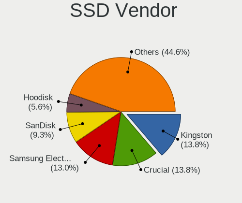

| Vendor              | Desktops | Drives | Percent |
|---------------------|----------|--------|---------|
| Samsung Electronics | 20       | 35     | 16.81%  |
| Kingston            | 18       | 29     | 15.13%  |
| Crucial             | 18       | 26     | 15.13%  |
| SanDisk             | 11       | 13     | 9.24%   |
| Hoodisk             | 7        | 11     | 5.88%   |
| Transcend           | 5        | 7      | 4.2%    |
| Phison              | 4        | 5      | 3.36%   |
| Intel               | 4        | 4      | 3.36%   |
| WDC                 | 3        | 4      | 2.52%   |
| OCZ                 | 3        | 4      | 2.52%   |
| Micron Technology   | 3        | 3      | 2.52%   |
| LITEONIT            | 3        | 3      | 2.52%   |
| Toshiba             | 2        | 7      | 1.68%   |
| SK Hynix            | 2        | 2      | 1.68%   |
| PNY                 | 2        | 8      | 1.68%   |
| A-DATA Technology   | 2        | 3      | 1.68%   |
| Zheino              | 1        | 1      | 0.84%   |
| TCSUNBOW            | 1        | 2      | 0.84%   |
| SPCC                | 1        | 1      | 0.84%   |
| Patriot             | 1        | 4      | 0.84%   |
| Netac               | 1        | 2      | 0.84%   |
| Lexar               | 1        | 1      | 0.84%   |
| Integral            | 1        | 3      | 0.84%   |
| Gigabyte Technology | 1        | 2      | 0.84%   |
| FORESEE             | 1        | 1      | 0.84%   |
| Corsair             | 1        | 1      | 0.84%   |
| Apple               | 1        | 1      | 0.84%   |
| Apacer              | 1        | 2      | 0.84%   |

Drive Kind
----------

HDD or SSD

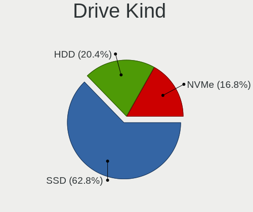

| Kind | Desktops | Drives | Percent |
|------|----------|--------|---------|
| SSD  | 106      | 185    | 63.47%  |
| HDD  | 46       | 113    | 27.54%  |
| NVMe | 15       | 28     | 8.98%   |

Drive Connector
---------------

SATA, SAS, NVMe, etc.

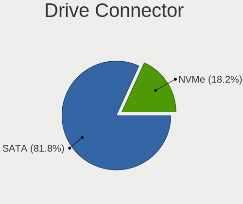

| Type | Desktops | Drives | Percent |
|------|----------|--------|---------|
| SATA | 135      | 298    | 90%     |
| NVMe | 15       | 28     | 10%     |

Drive Size
----------

Size of hard drive

| Size in TB | Desktops | Drives | Percent |
|------------|----------|--------|---------|
| 0.01-0.5   | 124      | 213    | 76.54%  |
| 0.51-1.0   | 18       | 29     | 11.11%  |
| 1.01-2.0   | 7        | 10     | 4.32%   |
| 3.01-4.0   | 6        | 31     | 3.7%    |
| 4.01-10.0  | 6        | 14     | 3.7%    |
| 2.01-3.0   | 1        | 1      | 0.62%   |

Space Total
-----------

Amount of disk space available on the file system

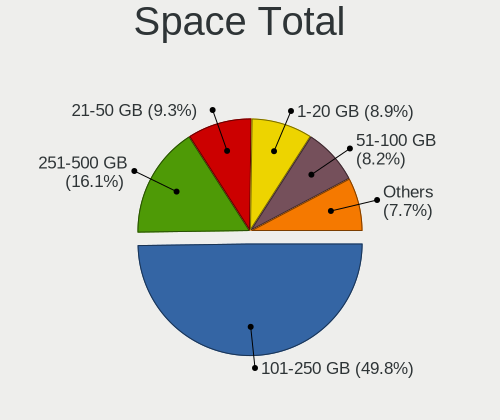

| Size in GB | Desktops | Percent |
|------------|----------|---------|
| 101-250    | 62       | 38.99%  |
| 1-20       | 25       | 15.72%  |
| 251-500    | 23       | 14.47%  |
| 21-50      | 21       | 13.21%  |
| 51-100     | 19       | 11.95%  |
| 501-1000   | 6        | 3.77%   |
| 1001-2000  | 3        | 1.89%   |

Space Used
----------

Amount of used disk space

| Used GB | Desktops | Percent |
|---------|----------|---------|
| 1-20    | 141      | 89.81%  |
| 21-50   | 8        | 5.1%    |
| 101-250 | 3        | 1.91%   |
| 51-100  | 3        | 1.91%   |
| 251-500 | 2        | 1.27%   |

Malfunc. Drives
---------------

Drive models with a malfunction

| Model                                            | Desktops | Drives | Percent |
|--------------------------------------------------|----------|--------|---------|
| Seagate ST3160310CS 160GB                        | 2        | 2      | 7.69%   |
| SanDisk SSD PLUS 480GB                           | 2        | 2      | 7.69%   |
| Crucial CT525MX300SSD1 528GB                     | 2        | 3      | 7.69%   |
| WDC WD5000AAKX-221CA1 500GB                      | 1        | 1      | 3.85%   |
| WDC WD5000AAKS-60WWPA0 500GB                     | 1        | 1      | 3.85%   |
| WDC WD4001FAEX-00MJRA0 4TB                       | 1        | 4      | 3.85%   |
| WDC WD3200BEVT-22A23T0 320GB                     | 1        | 2      | 3.85%   |
| WDC WD3200AAJS-22B4A0 320GB                      | 1        | 1      | 3.85%   |
| WDC WD10JMVW-11AJGS0 1TB                         | 1        | 1      | 3.85%   |
| Transcend TS256GSSD320 256GB                     | 1        | 1      | 3.85%   |
| Toshiba MD04ACA400 4TB                           | 1        | 1      | 3.85%   |
| Toshiba HDWE140 4TB                              | 1        | 8      | 3.85%   |
| Toshiba DT01ACA200 2TB                           | 1        | 1      | 3.85%   |
| Toshiba DT01ABA300 3TB                           | 1        | 1      | 3.85%   |
| Seagate ST3500418AS 500GB                        | 1        | 2      | 3.85%   |
| Seagate ST2000LM015-2E8174 2TB                   | 1        | 1      | 3.85%   |
| SanDisk SSD P4 16GB                              | 1        | 1      | 3.85%   |
| SanDisk SDCFHS-016G                              | 1        | 1      | 3.85%   |
| Samsung Electronics SSD PM810 2.5-inch 7mm 256GB | 1        | 2      | 3.85%   |
| Samsung Electronics MZHPV512HDGL-00000 512GB     | 1        | 1      | 3.85%   |
| Samsung Electronics HM160HI 160GB                | 1        | 1      | 3.85%   |
| Kingston SV200S3128G 128GB                       | 1        | 1      | 3.85%   |
| A-DATA Technology SU630 240GB                    | 1        | 2      | 3.85%   |

Malfunc. Drive Vendor
---------------------

Vendors of faulty drives

| Vendor              | Desktops | Drives | Percent |
|---------------------|----------|--------|---------|
| WDC                 | 6        | 10     | 24%     |
| Seagate             | 4        | 5      | 16%     |
| SanDisk             | 4        | 4      | 16%     |
| Toshiba             | 3        | 11     | 12%     |
| Samsung Electronics | 3        | 4      | 12%     |
| Crucial             | 2        | 3      | 8%      |
| Transcend           | 1        | 1      | 4%      |
| Kingston            | 1        | 1      | 4%      |
| A-DATA Technology   | 1        | 2      | 4%      |

Malfunc. HDD Vendor
-------------------

Vendors of faulty HDD drives

| Vendor              | Desktops | Drives | Percent |
|---------------------|----------|--------|---------|
| WDC                 | 6        | 10     | 42.86%  |
| Seagate             | 4        | 5      | 28.57%  |
| Toshiba             | 3        | 11     | 21.43%  |
| Samsung Electronics | 1        | 1      | 7.14%   |

Malfunc. Drive Kind
-------------------

Kinds of faulty drives

| Kind | Desktops | Drives | Percent |
|------|----------|--------|---------|
| HDD  | 14       | 27     | 56%     |
| SSD  | 11       | 14     | 44%     |

Failed Drives
-------------

Failed drive models

Zero info for selected period =(

Failed Drive Vendor
-------------------

Failed drive vendors

Zero info for selected period =(

Drive Status
------------

Number of failed and malfunc. drives

| Status   | Desktops | Drives | Percent |
|----------|----------|--------|---------|
| Works    | 128      | 274    | 82.05%  |
| Malfunc  | 22       | 41     | 14.1%   |
| Detected | 6        | 11     | 3.85%   |

Storage controller
------------------

Storage Vendor
--------------

Storage controller vendors

| Vendor                    | Desktops | Percent |
|---------------------------|----------|---------|
| Intel                     | 106      | 55.5%   |
| AMD                       | 44       | 23.04%  |
| Samsung Electronics       | 9        | 4.71%   |
| ASMedia Technology        | 7        | 3.66%   |
| Sandisk                   | 5        | 2.62%   |
| Marvell Technology Group  | 5        | 2.62%   |
| Phison Electronics        | 4        | 2.09%   |
| Nvidia                    | 2        | 1.05%   |
| Broadcom / LSI            | 2        | 1.05%   |
| Adaptec                   | 2        | 1.05%   |
| VIA Technologies          | 1        | 0.52%   |
| SK Hynix                  | 1        | 0.52%   |
| Silicon Motion            | 1        | 0.52%   |
| Silicon Image             | 1        | 0.52%   |
| Micron/Crucial Technology | 1        | 0.52%   |

Storage Model
-------------

Storage controller models

| Model                                                                                   | Desktops | Percent |
|-----------------------------------------------------------------------------------------|----------|---------|
| AMD FCH SATA Controller [AHCI mode]                                                     | 29       | 13.43%  |
| Intel 8 Series/C220 Series Chipset Family 6-port SATA Controller 1 [AHCI mode]          | 14       | 6.48%   |
| Intel Atom Processor E3800 Series SATA AHCI Controller                                  | 11       | 5.09%   |
| Intel 6 Series/C200 Series Chipset Family 6 port Desktop SATA AHCI Controller           | 9        | 4.17%   |
| Intel Sunrise Point-LP SATA Controller [AHCI mode]                                      | 8        | 3.7%    |
| AMD 400 Series Chipset SATA Controller                                                  | 8        | 3.7%    |
| Samsung NVMe SSD Controller SM981/PM981/PM983                                           | 6        | 2.78%   |
| Intel Wildcat Point-LP SATA Controller [AHCI Mode]                                      | 6        | 2.78%   |
| Intel NM10/ICH7 Family SATA Controller [IDE mode]                                       | 6        | 2.78%   |
| ASMedia ASM1062 Serial ATA Controller                                                   | 6        | 2.78%   |
| AMD SB7x0/SB8x0/SB9x0 SATA Controller [AHCI mode]                                       | 6        | 2.78%   |
| Intel 7 Series/C210 Series Chipset Family 6-port SATA Controller [AHCI mode]            | 5        | 2.31%   |
| Intel 6 Series/C200 Series Chipset Family Desktop SATA Controller (IDE mode, ports 4-5) | 5        | 2.31%   |
| Intel 6 Series/C200 Series Chipset Family Desktop SATA Controller (IDE mode, ports 0-3) | 5        | 2.31%   |
| AMD 500 Series Chipset SATA Controller                                                  | 5        | 2.31%   |
| Phison E12 NVMe Controller                                                              | 4        | 1.85%   |
| Intel Celeron/Pentium Silver Processor SATA Controller                                  | 4        | 1.85%   |
| Intel Atom/Celeron/Pentium Processor x5-E8000/J3xxx/N3xxx Series SATA Controller        | 4        | 1.85%   |
| Intel 82801G (ICH7 Family) IDE Controller                                               | 4        | 1.85%   |
| Intel 8 Series SATA Controller 1 [AHCI mode]                                            | 4        | 1.85%   |
| Intel SATA Controller [RAID mode]                                                       | 3        | 1.39%   |
| Intel Q170/Q150/B150/H170/H110/Z170/CM236 Chipset SATA Controller [AHCI Mode]           | 3        | 1.39%   |
| Intel Celeron N3350/Pentium N4200/Atom E3900 Series SATA AHCI Controller                | 3        | 1.39%   |
| Intel 9 Series Chipset Family SATA Controller [AHCI Mode]                               | 3        | 1.39%   |
| Intel 200 Series PCH SATA controller [AHCI mode]                                        | 3        | 1.39%   |
| Sandisk WD Black SN750 / PC SN730 NVMe SSD                                              | 2        | 0.93%   |
| Marvell Group 88SE9215 PCIe 2.0 x1 4-port SATA 6 Gb/s Controller                        | 2        | 0.93%   |
| Intel Cannon Lake PCH SATA AHCI Controller                                              | 2        | 0.93%   |
| Intel 82801JI (ICH10 Family) SATA AHCI Controller                                       | 2        | 0.93%   |
| Intel 82801JD/DO (ICH10 Family) SATA AHCI Controller                                    | 2        | 0.93%   |
| Intel 4 Series Chipset PT IDER Controller                                               | 2        | 0.93%   |
| AMD SB7x0/SB8x0/SB9x0 IDE Controller                                                    | 2        | 0.93%   |
| Adaptec AIC-7850T/7856T [AVA-2902/4/6 / AHA-2910]                                       | 2        | 0.93%   |
| VIA VT6415 PATA IDE Host Controller                                                     | 1        | 0.46%   |
| SK Hynix BC501 NVMe Solid State Drive                                                   | 1        | 0.46%   |
| Silicon Motion SM2263EN/SM2263XT SSD Controller                                         | 1        | 0.46%   |
| Silicon Image SiI 3512 [SATALink/SATARaid] Serial ATA Controller                        | 1        | 0.46%   |
| Sandisk WD Blue SN570 NVMe SSD                                                          | 1        | 0.46%   |
| Sandisk WD Blue SN500 / PC SN520 NVMe SSD                                               | 1        | 0.46%   |
| Sandisk WD Black 2018/SN750 / PC SN720 NVMe SSD                                         | 1        | 0.46%   |
| Samsung SM951 AHCI                                                                      | 1        | 0.46%   |
| Samsung NVMe SSD Controller SM961/PM961/SM963                                           | 1        | 0.46%   |
| Samsung NVMe SSD Controller PM9A1/PM9A3/980PRO                                          | 1        | 0.46%   |
| Samsung NVMe SSD Controller 980                                                         | 1        | 0.46%   |
| Nvidia MCP61 SATA Controller                                                            | 1        | 0.46%   |
| Nvidia GeForce 7100/nForce 630i SATA                                                    | 1        | 0.46%   |
| Micron/Crucial P2 NVMe PCIe SSD                                                         | 1        | 0.46%   |
| Marvell Group 88SE9230 PCIe 2.0 x2 4-port SATA 6 Gb/s RAID Controller                   | 1        | 0.46%   |
| Marvell Group 88SE9172 SATA 6Gb/s Controller                                            | 1        | 0.46%   |
| Marvell Group 88SE912x SATA 6Gb/s Controller [IDE mode]                                 | 1        | 0.46%   |
| Intel SSD 660P Series                                                                   | 1        | 0.46%   |
| Intel Comet Lake SATA AHCI Controller                                                   | 1        | 0.46%   |
| Intel Comet Lake PCH-H RAID                                                             | 1        | 0.46%   |
| Intel Cannon Point-LP SATA Controller [AHCI Mode]                                       | 1        | 0.46%   |
| Intel 82801IR/IO/IH (ICH9R/DO/DH) 4 port SATA Controller [IDE mode]                     | 1        | 0.46%   |
| Intel 82801I (ICH9 Family) 2 port SATA Controller [IDE mode]                            | 1        | 0.46%   |
| Intel 8 Series/C220 Series Chipset Family 4-port SATA Controller 1 [IDE mode]           | 1        | 0.46%   |
| Intel 7 Series Chipset Family 6-port SATA Controller [AHCI mode]                        | 1        | 0.46%   |
| Intel 500 Series Chipset Family SATA AHCI Controller                                    | 1        | 0.46%   |
| Intel 5 Series/3400 Series Chipset 6 port SATA AHCI Controller                          | 1        | 0.46%   |

Storage Kind
------------

Kind of storage controller (IDE, SATA, NVMe, SAS, ...)

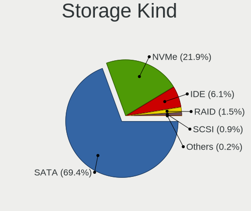

| Kind | Desktops | Percent |
|------|----------|---------|
| SATA | 133      | 74.3%   |
| IDE  | 20       | 11.17%  |
| NVMe | 18       | 10.06%  |
| RAID | 5        | 2.79%   |
| SCSI | 3        | 1.68%   |

Processor
---------

CPU Vendor
----------

Processor vendors

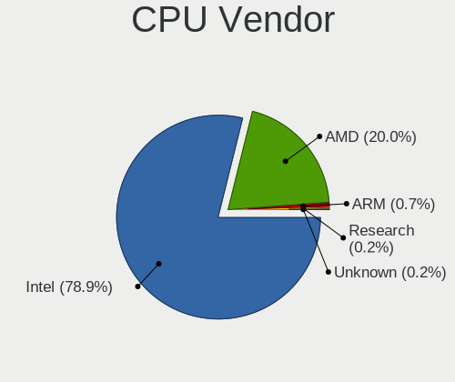

| Vendor  | Desktops | Percent |
|---------|----------|---------|
| Intel   | 106      | 69.28%  |
| AMD     | 45       | 29.41%  |
| ARM     | 1        | 0.65%   |
| Unknown | 1        | 0.65%   |

CPU Model
---------

Processor models

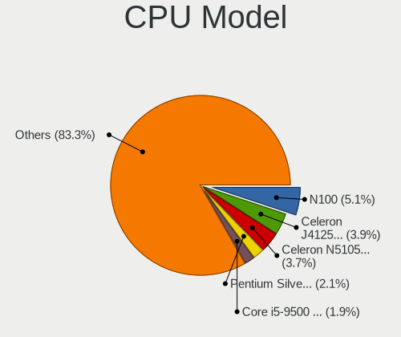

| Model                                       | Desktops | Percent |
|---------------------------------------------|----------|---------|
| AMD GX-412TC SOC                            | 7        | 4.55%   |
| Intel Celeron CPU J1900 @ 1.99GHz           | 5        | 3.25%   |
| Intel Core i5-5250U CPU @ 1.60GHz           | 4        | 2.6%    |
| Intel Atom CPU E3845 @ 1.91GHz              | 4        | 2.6%    |
| Intel Core i3-4160 CPU @ 3.60GHz            | 3        | 1.95%   |
| Intel Celeron CPU J3160 @ 1.60GHz           | 3        | 1.95%   |
| Intel Celeron CPU 3865U @ 1.80GHz           | 3        | 1.95%   |
| AMD Ryzen 7 3700X 8-Core Processor          | 3        | 1.95%   |
| AMD Ryzen 5 5600G with Radeon Graphics      | 3        | 1.95%   |
| AMD Ryzen 5 3600 6-Core Processor           | 3        | 1.95%   |
| Intel Core i7-4500U CPU @ 1.80GHz           | 2        | 1.3%    |
| Intel Core i5-9500 CPU @ 3.00GHz            | 2        | 1.3%    |
| Intel Core i5-7200U CPU @ 2.50GHz           | 2        | 1.3%    |
| Intel Core i5-4570 CPU @ 3.20GHz            | 2        | 1.3%    |
| Intel Core i5-4460 CPU @ 3.20GHz            | 2        | 1.3%    |
| Intel Core i5-4200U CPU @ 1.60GHz           | 2        | 1.3%    |
| Intel Core i5-3470 CPU @ 3.20GHz            | 2        | 1.3%    |
| Intel Core i3-5005U CPU @ 2.00GHz           | 2        | 1.3%    |
| Intel Core i3-4150 CPU @ 3.50GHz            | 2        | 1.3%    |
| Intel Core i3-2120 CPU @ 3.30GHz            | 2        | 1.3%    |
| Intel Core i3-2100 CPU @ 3.10GH             | 2        | 1.3%    |
| Intel Core 2 Duo                            | 2        | 1.3%    |
| Intel Celeron J4125 CPU @ 2.00GHz           | 2        | 1.3%    |
| Intel Celeron CPU J3455 @ 1.50GHz           | 2        | 1.3%    |
| AMD Ryzen 9 5900X 12-Core Processor         | 2        | 1.3%    |
| AMD Ryzen 5 5600X 6-Core Processor          | 2        | 1.3%    |
| AMD Ryzen 3 2200G with Radeon Vega Graphics | 2        | 1.3%    |
| AMD GX-420CA SOC with Radeon HD Graphics    | 2        | 1.3%    |
| Intel Xeon CPU X5690 @ 3.47GHz              | 1        | 0.65%   |
| Intel Xeon CPU X5570 @ 2.93GHz              | 1        | 0.65%   |
| Intel Xeon CPU X3450 @ 2.67GHz              | 1        | 0.65%   |
| Intel Xeon CPU E5530 @ 2.40GHz              | 1        | 0.65%   |
| Intel Xeon CPU E5520 @ 2.27GHz              | 1        | 0.65%   |
| Intel Xeon CPU E31265L @ 2.40GHz            | 1        | 0.65%   |
| Intel Xeon CPU E3-1265L v3 @ 2.50GHz        | 1        | 0.65%   |
| Intel Xeon CPU E3-1225 v3 @ 3.20GHz         | 1        | 0.65%   |
| Intel Xeon CPU E3-1225 V2 @ 3.20GHz         | 1        | 0.65%   |
| Intel Xeon                                  | 1        | 0.65%   |
| Intel Pentium Silver J5005 CPU @ 1.50GHz    | 1        | 0.65%   |
| Intel Pentium Dual-Core CPU E5800 @ 3.20GHz | 1        | 0.65%   |
| Intel Pentium CPU G4560 @ 3.50GHz           | 1        | 0.65%   |
| Intel Core i9-9900X CPU @ 3.50GHz           | 1        | 0.65%   |
| Intel Core i9-10850K CPU @ 3.60GHz          | 1        | 0.65%   |
| Intel Core i7-8700 CPU @ 3.20GHz            | 1        | 0.65%   |
| Intel Core i7-8550U CPU @ 1.80GHz           | 1        | 0.65%   |
| Intel Core i7-6700T CPU @ 2.80GHz           | 1        | 0.65%   |
| Intel Core i7-4790K CPU @ 4.00GHz           | 1        | 0.65%   |
| Intel Core i7-4770S CPU @ 3.10GHz           | 1        | 0.65%   |
| Intel Core i7-4770K CPU @ 3.50GHz           | 1        | 0.65%   |
| Intel Core i7-3770S CPU @ 3.10GHz           | 1        | 0.65%   |
| Intel Core i7-3770K CPU @ 3.50GHz           | 1        | 0.65%   |
| Intel Core i7-3770 CPU @ 3.40GHz            | 1        | 0.65%   |
| Intel Core i7-2600 CPU @ 3.40GH             | 1        | 0.65%   |
| Intel Core i7-10510U CPU @ 1.80GHz          | 1        | 0.65%   |
| Intel Core i5-7500 CPU @ 3.40GHz            | 1        | 0.65%   |
| Intel Core i5-6200U CPU @ 2.30GHz           | 1        | 0.65%   |
| Intel Core i5-4590 CPU @ 3.30GHz            | 1        | 0.65%   |
| Intel Core i5-4570T CPU @ 2.90GHz           | 1        | 0.65%   |
| Intel Core i5-4430 CPU @ 3.00GHz            | 1        | 0.65%   |
| Intel Core i5-3570K CPU @ 3.40GHz           | 1        | 0.65%   |

CPU Model Family
----------------

Processor model prefix

| Model                   | Desktops | Percent |
|-------------------------|----------|---------|
| Intel Core i5           | 25       | 16.23%  |
| Intel Celeron           | 22       | 14.29%  |
| Intel Core i3           | 20       | 12.99%  |
| Intel Core i7           | 13       | 8.44%   |
| AMD GX                  | 11       | 7.14%   |
| Intel Xeon              | 10       | 6.49%   |
| AMD Ryzen 5             | 9        | 5.84%   |
| Intel Atom              | 5        | 3.25%   |
| Intel Core 2 Duo        | 4        | 2.6%    |
| AMD Ryzen 7             | 4        | 2.6%    |
| AMD Ryzen 3             | 3        | 1.95%   |
| AMD FX                  | 3        | 1.95%   |
| Intel Core i9           | 2        | 1.3%    |
| Intel Core 2 Quad       | 2        | 1.3%    |
| AMD Ryzen 9             | 2        | 1.3%    |
| AMD G                   | 2        | 1.3%    |
| AMD A4                  | 2        | 1.3%    |
| Other                   | 1        | 0.65%   |
| Intel Pentium Silver    | 1        | 0.65%   |
| Intel Pentium Dual-Core | 1        | 0.65%   |
| Intel Pentium           | 1        | 0.65%   |
| Intel 686-class         | 1        | 0.65%   |
| ARM Cortex              | 1        | 0.65%   |
| AMD Ryzen Threadripper  | 1        | 0.65%   |
| AMD Ryzen 7 PRO         | 1        | 0.65%   |
| AMD Phenom II X6        | 1        | 0.65%   |
| AMD Phenom              | 1        | 0.65%   |
| AMD Opteron             | 1        | 0.65%   |
| AMD E2                  | 1        | 0.65%   |
| AMD Athlon              | 1        | 0.65%   |
| AMD A8                  | 1        | 0.65%   |
| AMD A6                  | 1        | 0.65%   |

CPU Cores
---------

Number of processor cores

| Number  | Desktops | Percent |
|---------|----------|---------|
| 4       | 67       | 43.23%  |
| 2       | 52       | 33.55%  |
| 12      | 9        | 5.81%   |
| 6       | 7        | 4.52%   |
| 16      | 5        | 3.23%   |
| 8       | 5        | 3.23%   |
| Unknown | 5        | 3.23%   |
| 24      | 3        | 1.94%   |
| 10      | 2        | 1.29%   |

CPU Sockets
-----------

Number of sockets

| Number  | Desktops | Percent |
|---------|----------|---------|
| 1       | 148      | 96.73%  |
| Unknown | 3        | 1.96%   |
| 2       | 2        | 1.31%   |

CPU Threads
-----------

Threads per core (Hyper-Threading)

| Number  | Desktops | Percent |
|---------|----------|---------|
| 1       | 96       | 62.34%  |
| 2       | 53       | 34.42%  |
| Unknown | 5        | 3.25%   |

CPU Microarch
-------------

Microarchitecture

| Name          | Desktops | Percent |
|---------------|----------|---------|
| Haswell       | 23       | 15.03%  |
| Silvermont    | 15       | 9.8%    |
| KabyLake      | 14       | 9.15%   |
| IvyBridge     | 10       | 6.54%   |
| Zen 2         | 9        | 5.88%   |
| SandyBridge   | 9        | 5.88%   |
| Penryn        | 8        | 5.23%   |
| Zen 3         | 7        | 4.58%   |
| Puma          | 7        | 4.58%   |
| Jaguar        | 6        | 3.92%   |
| Broadwell     | 6        | 3.92%   |
| Piledriver    | 5        | 3.27%   |
| Skylake       | 4        | 2.61%   |
| Nehalem       | 4        | 2.61%   |
| Goldmont plus | 4        | 2.61%   |
| Zen           | 3        | 1.96%   |
| Goldmont      | 3        | 1.96%   |
| Bobcat        | 3        | 1.96%   |
| Unknown       | 3        | 1.96%   |
| K10           | 2        | 1.31%   |
| CometLake     | 2        | 1.31%   |
| Zen+          | 1        | 0.65%   |
| Westmere      | 1        | 0.65%   |
| Excavator     | 1        | 0.65%   |
| Core          | 1        | 0.65%   |
| Bulldozer     | 1        | 0.65%   |
| Bonnell       | 1        | 0.65%   |

Graphics
--------

GPU Vendor
----------

Vendors of graphics cards

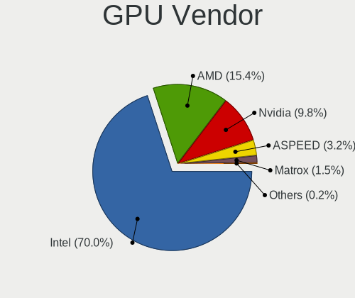

| Vendor                     | Desktops | Percent |
|----------------------------|----------|---------|
| Intel                      | 89       | 60.54%  |
| AMD                        | 31       | 21.09%  |
| Nvidia                     | 24       | 16.33%  |
| Matrox Electronics Systems | 2        | 1.36%   |
| ASPEED Technology          | 1        | 0.68%   |

GPU Model
---------

Graphics card models

| Model                                                                                    | Desktops | Percent |
|------------------------------------------------------------------------------------------|----------|---------|
| Intel Atom Processor Z36xxx/Z37xxx Series Graphics & Display                             | 11       | 7.43%   |
| Intel Xeon E3-1200 v3/4th Gen Core Processor Integrated Graphics Controller              | 9        | 6.08%   |
| Intel 4th Generation Core Processor Family Integrated Graphics Controller                | 7        | 4.73%   |
| Intel 2nd Generation Core Processor Family Integrated Graphics Controller                | 7        | 4.73%   |
| Intel Xeon E3-1200 v2/3rd Gen Core processor Graphics Controller                         | 5        | 3.38%   |
| Intel 4 Series Chipset Integrated Graphics Controller                                    | 5        | 3.38%   |
| Intel HD Graphics 6000                                                                   | 4        | 2.7%    |
| Intel Haswell-ULT Integrated Graphics Controller                                         | 4        | 2.7%    |
| Intel Atom/Celeron/Pentium Processor x5-E8000/J3xxx/N3xxx Integrated Graphics Controller | 4        | 2.7%    |
| Intel Kaby Lake-U GT1 Integrated Graphics Controller                                     | 3        | 2.03%   |
| Intel IvyBridge GT2 [HD Graphics 4000]                                                   | 3        | 2.03%   |
| Intel HD Graphics 620                                                                    | 3        | 2.03%   |
| Intel HD Graphics 500                                                                    | 3        | 2.03%   |
| Intel GeminiLake [UHD Graphics 600]                                                      | 3        | 2.03%   |
| AMD Lexa PRO [Radeon 540/540X/550/550X / RX 540X/550/550X]                               | 3        | 2.03%   |
| AMD Cezanne                                                                              | 3        | 2.03%   |
| Nvidia GT218 [GeForce 210]                                                               | 2        | 1.35%   |
| Nvidia GK208B [GeForce GT 710]                                                           | 2        | 1.35%   |
| Nvidia GF119 [GeForce GT 520]                                                            | 2        | 1.35%   |
| Intel Xeon E3-1200 v3 Processor Integrated Graphics Controller                           | 2        | 1.35%   |
| Intel HD Graphics 5500                                                                   | 2        | 1.35%   |
| Intel CometLake-S GT2 [UHD Graphics 630]                                                 | 2        | 1.35%   |
| Intel CoffeeLake-S GT2 [UHD Graphics 630]                                                | 2        | 1.35%   |
| AMD Raven Ridge [Radeon Vega Series / Radeon Vega Mobile Series]                         | 2        | 1.35%   |
| AMD Kabini [Radeon HD 8400E]                                                             | 2        | 1.35%   |
| AMD Ellesmere [Radeon RX 470/480/570/570X/580/580X/590]                                  | 2        | 1.35%   |
| Nvidia TU116 [GeForce GTX 1660 SUPER]                                                    | 1        | 0.68%   |
| Nvidia TU104 [GeForce RTX 2080 Rev. A]                                                   | 1        | 0.68%   |
| Nvidia GT218 [GeForce 8400 GS Rev. 3]                                                    | 1        | 0.68%   |
| Nvidia GP107 [GeForce GTX 1050 Ti]                                                       | 1        | 0.68%   |
| Nvidia GP104 [GeForce GTX 1080]                                                          | 1        | 0.68%   |
| Nvidia GP102 [GeForce GTX 1080 Ti]                                                       | 1        | 0.68%   |
| Nvidia GM206 [GeForce GTX 960]                                                           | 1        | 0.68%   |
| Nvidia GM107 [GeForce GTX 750]                                                           | 1        | 0.68%   |
| Nvidia GM107 [GeForce GTX 750 Ti]                                                        | 1        | 0.68%   |
| Nvidia GK107GL [Quadro K2000]                                                            | 1        | 0.68%   |
| Nvidia GK107 [GeForce GT 640]                                                            | 1        | 0.68%   |
| Nvidia GF114 [GeForce GTX 560 Ti]                                                        | 1        | 0.68%   |
| Nvidia GF108GL [Quadro 600]                                                              | 1        | 0.68%   |
| Nvidia GF106GL [Quadro 2000]                                                             | 1        | 0.68%   |
| Nvidia GA104 [GeForce RTX 3070]                                                          | 1        | 0.68%   |
| Nvidia G96 [GeForce GT 120 Mac Edition]                                                  | 1        | 0.68%   |
| Nvidia G92 [GeForce GTS 250]                                                             | 1        | 0.68%   |
| Nvidia G84 [GeForce 8600 GT]                                                             | 1        | 0.68%   |
| Matrox Electronics Systems MGA G200eW WPCM450                                            | 1        | 0.68%   |
| Matrox Electronics Systems MGA G200EH                                                    | 1        | 0.68%   |
| Intel WhiskeyLake-U GT2 [UHD Graphics 620]                                               | 1        | 0.68%   |
| Intel UHD Graphics 620                                                                   | 1        | 0.68%   |
| Intel Skylake GT2 [HD Graphics 520]                                                      | 1        | 0.68%   |
| Intel HD Graphics 610                                                                    | 1        | 0.68%   |
| Intel HD Graphics 530                                                                    | 1        | 0.68%   |
| Intel HD Graphics 510                                                                    | 1        | 0.68%   |
| Intel GeminiLake [UHD Graphics 605]                                                      | 1        | 0.68%   |
| Intel CometLake-U GT2 [UHD Graphics]                                                     | 1        | 0.68%   |
| Intel Atom Processor D2xxx/N2xxx Integrated Graphics Controller                          | 1        | 0.68%   |
| Intel 82946GZ/GL Integrated Graphics Controller                                          | 1        | 0.68%   |
| ASPEED Technology ASPEED Graphics Family                                                 | 1        | 0.68%   |
| AMD Wrestler [Radeon HD 7340]                                                            | 1        | 0.68%   |
| AMD Wrestler [Radeon HD 6320]                                                            | 1        | 0.68%   |
| AMD Wani [Radeon R5/R6/R7 Graphics]                                                      | 1        | 0.68%   |

GPU Combo
---------

Combinations of graphics cards

| Name        | Desktops | Percent |
|-------------|----------|---------|
| 1 x Intel   | 86       | 55.84%  |
| 1 x AMD     | 28       | 18.18%  |
| 1 x Nvidia  | 23       | 14.94%  |
| Other       | 11       | 7.14%   |
| 1 x Matrox  | 2        | 1.3%    |
| Intel + AMD | 2        | 1.3%    |
| 2 x Intel   | 1        | 0.65%   |
| 1 x ASPEED  | 1        | 0.65%   |

GPU Driver
----------

Free vs proprietary

| Driver      | Desktops | Percent |
|-------------|----------|---------|
| Free        | 127      | 82.47%  |
| Unknown     | 15       | 9.74%   |
| Proprietary | 12       | 7.79%   |

GPU Memory
----------

Total video memory

| Size in GB | Desktops | Percent |
|------------|----------|---------|
| Unknown    | 135      | 87.1%   |
| 3.01-4.0   | 5        | 3.23%   |
| 1.01-2.0   | 5        | 3.23%   |
| 0.51-1.0   | 5        | 3.23%   |
| 7.01-8.0   | 3        | 1.94%   |
| 5.01-6.0   | 1        | 0.65%   |
| 8.01-16.0  | 1        | 0.65%   |

Monitor
-------

Monitor Vendor
--------------

Monitor vendors

| Vendor              | Desktops | Percent |
|---------------------|----------|---------|
| Dell                | 8        | 22.86%  |
| Samsung Electronics | 5        | 14.29%  |
| Hewlett-Packard     | 4        | 11.43%  |
| BenQ                | 4        | 11.43%  |
| AOC                 | 4        | 11.43%  |
| Iiyama              | 2        | 5.71%   |
| Acer                | 2        | 5.71%   |
| RS                  | 1        | 2.86%   |
| Pixio               | 1        | 2.86%   |
| OEM                 | 1        | 2.86%   |
| Lenovo              | 1        | 2.86%   |
| Goldstar            | 1        | 2.86%   |
| AVX                 | 1        | 2.86%   |

Monitor Model
-------------

Monitor models

| Model                                                                | Desktops | Percent |
|----------------------------------------------------------------------|----------|---------|
| Hewlett-Packard ZR24w HWP286A 1920x1200 540x350mm 25.3-inch          | 2        | 5.26%   |
| BenQ GL2450 BNQ78A4 1920x1080 530x300mm 24.0-inch                    | 2        | 5.26%   |
| Samsung Electronics U28D590 SAM0B80 3840x2160 610x350mm 27.7-inch    | 1        | 2.63%   |
| Samsung Electronics T24D390 SAM0B6E 1920x1080 520x290mm 23.4-inch    | 1        | 2.63%   |
| Samsung Electronics SyncMaster SAM030D 1680x1050 470x300mm 22.0-inch | 1        | 2.63%   |
| Samsung Electronics SyncMaster SAM011F 1280x1024 380x300mm 19.1-inch | 1        | 2.63%   |
| Samsung Electronics S24F350 SAM0D20 1920x1080 520x290mm 23.4-inch    | 1        | 2.63%   |
| RS LE2262 BTC2262 1680x1050 470x290mm 21.7-inch                      | 1        | 2.63%   |
| Pixio PX247 PNS0247 1920x1080 520x310mm 23.8-inch                    | 1        | 2.63%   |
| OEM 32W_LCD_TV OEM3700 1920x540                                      | 1        | 2.63%   |
| Lenovo LCD Monitor LEN0990 1440x900 410x260mm 19.1-inch              | 1        | 2.63%   |
| Iiyama PL4071UH IVM000A 3840x2160 880x490mm 39.7-inch                | 1        | 2.63%   |
| Iiyama PL2283H IVM562E 1920x1080 500x290mm 22.8-inch                 | 1        | 2.63%   |
| Iiyama PL2273HD IVM561A 1920x1080 480x270mm 21.7-inch                | 1        | 2.63%   |
| Hewlett-Packard w1907 HWP26A2 1440x900 410x260mm 19.1-inch           | 1        | 2.63%   |
| Hewlett-Packard 2310e HWP2909 1920x1080 510x290mm 23.1-inch          | 1        | 2.63%   |
| Goldstar LG Ultra HD GSM5B09 3840x2160 600x340mm 27.2-inch           | 1        | 2.63%   |
| Dell U4919DW DELA107 3840x1080 1200x340mm 49.1-inch                  | 1        | 2.63%   |
| Dell U3415W DELA0A6 3440x1440 800x330mm 34.1-inch                    | 1        | 2.63%   |
| Dell U2412M DELA07A 1920x1200 520x320mm 24.0-inch                    | 1        | 2.63%   |
| Dell LCD Monitor S2740L 1920x1080                                    | 1        | 2.63%   |
| Dell LCD Monitor P2214H 1920x1080                                    | 1        | 2.63%   |
| Dell LCD Monitor DELD110 2560x1440 700x400mm 31.7-inch               | 1        | 2.63%   |
| Dell LCD Monitor 1908FP 3200x1080                                    | 1        | 2.63%   |
| Dell E196FP DELA015 1280x1024 340x270mm 17.1-inch                    | 1        | 2.63%   |
| BenQ LCD Monitor DL2215                                              | 1        | 2.63%   |
| BenQ GW2475H BNQ78EE 1920x1080 530x300mm 24.0-inch                   | 1        | 2.63%   |
| AVX AVERMEDIA_HD AVX0003 1920x1080 380x300mm 19.1-inch               | 1        | 2.63%   |
| AOC N22W AOC220A 1680x1050 470x300mm 22.0-inch                       | 1        | 2.63%   |
| AOC LCD Monitor 2460X 5760x1200                                      | 1        | 2.63%   |
| AOC LCD Monitor 2460X                                                | 1        | 2.63%   |
| AOC G2460 AOC2460 1920x1080 530x300mm 24.0-inch                      | 1        | 2.63%   |
| AOC 2280W AOC2280 1920x1080 480x270mm 21.7-inch                      | 1        | 2.63%   |
| AOC 2070W AOC2070 1600x900 430x240mm 19.4-inch                       | 1        | 2.63%   |
| Acer S271HL ACR02CA 1920x1080 600x340mm 27.2-inch                    | 1        | 2.63%   |
| Acer ET241Y ACR056C 1920x1080 480x270mm 21.7-inch                    | 1        | 2.63%   |

Monitor Resolution
------------------

Monitor screen resolution

| Resolution         | Desktops | Percent |
|--------------------|----------|---------|
| 1920x1080 (FHD)    | 15       | 40.54%  |
| 3840x2160 (4K)     | 3        | 8.11%   |
| 1920x1200 (WUXGA)  | 3        | 8.11%   |
| 1680x1050 (WSXGA+) | 3        | 8.11%   |
| 1440x900 (WXGA+)   | 2        | 5.41%   |
| 1280x1024 (SXGA)   | 2        | 5.41%   |
| Unknown            | 2        | 5.41%   |
| 5760x1200          | 1        | 2.7%    |
| 3840x1080          | 1        | 2.7%    |
| 3440x1440          | 1        | 2.7%    |
| 3200x1080          | 1        | 2.7%    |
| 2560x1440 (QHD)    | 1        | 2.7%    |
| 1920x540           | 1        | 2.7%    |
| 1600x900 (HD+)     | 1        | 2.7%    |

Monitor Diagonal
----------------

Diagonal size in inches

| Inches  | Desktops | Percent |
|---------|----------|---------|
| 24      | 5        | 13.89%  |
| 19      | 5        | 13.89%  |
| Unknown | 5        | 13.89%  |
| 23      | 4        | 11.11%  |
| 21      | 4        | 11.11%  |
| 27      | 3        | 8.33%   |
| 22      | 3        | 8.33%   |
| 25      | 2        | 5.56%   |
| 49      | 1        | 2.78%   |
| 39      | 1        | 2.78%   |
| 34      | 1        | 2.78%   |
| 31      | 1        | 2.78%   |
| 17      | 1        | 2.78%   |

Monitor Width
-------------

Physical width

| Width in mm | Desktops | Percent |
|-------------|----------|---------|
| 501-600     | 13       | 38.24%  |
| 401-500     | 8        | 23.53%  |
| Unknown     | 5        | 14.71%  |
| 601-700     | 2        | 5.88%   |
| 351-400     | 2        | 5.88%   |
| 801-900     | 1        | 2.94%   |
| 701-800     | 1        | 2.94%   |
| 301-350     | 1        | 2.94%   |
| 1001-1500   | 1        | 2.94%   |

Aspect Ratio
------------

Proportional relationship between the width and the height

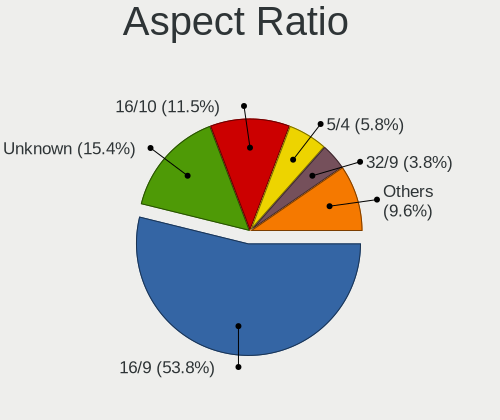

| Ratio   | Desktops | Percent |
|---------|----------|---------|
| 16/9    | 17       | 48.57%  |
| 16/10   | 6        | 17.14%  |
| Unknown | 4        | 11.43%  |
| 5/4     | 3        | 8.57%   |
| 32/9    | 2        | 5.71%   |
| 3/2     | 2        | 5.71%   |
| 21/9    | 1        | 2.86%   |

Monitor Area
------------

Area in inch

| Area in inch | Desktops | Percent |
|----------------|----------|---------|
| 201-250        | 12       | 36.36%  |
| 151-200        | 5        | 15.15%  |
| Unknown        | 5        | 15.15%  |
| 301-350        | 3        | 9.09%   |
| 251-300        | 3        | 9.09%   |
| 351-500        | 2        | 6.06%   |
| 501-1000       | 2        | 6.06%   |
| 141-150        | 1        | 3.03%   |

Pixel Density
-------------

Pixels per inch

| Density | Desktops | Percent |
|---------|----------|---------|
| 51-100  | 22       | 62.86%  |
| 101-120 | 6        | 17.14%  |
| Unknown | 5        | 14.29%  |
| 161-240 | 1        | 2.86%   |
| 121-160 | 1        | 2.86%   |

Multiple Monitors
-----------------

Total monitors connected

| Total | Desktops | Percent |
|-------|----------|---------|
| 0     | 117      | 75.97%  |
| 1     | 32       | 20.78%  |
| 2     | 4        | 2.6%    |
| 3     | 1        | 0.65%   |

Network
-------

Net Controller Vendor
---------------------

Controller vendors

| Vendor                   | Desktops | Percent |
|--------------------------|----------|---------|
| Intel                    | 107      | 54.31%  |
| Realtek Semiconductor    | 62       | 31.47%  |
| Qualcomm Atheros         | 9        | 4.57%   |
| Broadcom                 | 9        | 4.57%   |
| Ralink Technology        | 2        | 1.02%   |
| Ralink                   | 2        | 1.02%   |
| U-Blox                   | 1        | 0.51%   |
| Nvidia                   | 1        | 0.51%   |
| Marvell Technology Group | 1        | 0.51%   |
| Bluegiga Technologies    | 1        | 0.51%   |
| ASUSTek Computer         | 1        | 0.51%   |
| American Megatrends      | 1        | 0.51%   |

Net Controller Model
--------------------

Controller models

| Model                                                                         | Desktops | Percent |
|-------------------------------------------------------------------------------|----------|---------|
| Realtek RTL8111/8168/8411 PCI Express Gigabit Ethernet Controller             | 55       | 23.11%  |
| Intel I211 Gigabit Network Connection                                         | 34       | 14.29%  |
| Intel I210 Gigabit Network Connection                                         | 10       | 4.2%    |
| Intel 82574L Gigabit Network Connection                                       | 10       | 4.2%    |
| Intel 82571EB/82571GB Gigabit Ethernet Controller (Copper)                    | 10       | 4.2%    |
| Intel I350 Gigabit Network Connection                                         | 7        | 2.94%   |
| Intel 82580 Gigabit Network Connection                                        | 7        | 2.94%   |
| Realtek RTL8125 2.5GbE Controller                                             | 6        | 2.52%   |
| Intel 82571EB/82571GB Gigabit Ethernet Controller D0/D1 (copper applications) | 6        | 2.52%   |
| Intel Ethernet Connection I217-LM                                             | 5        | 2.1%    |
| Intel 82579LM Gigabit Network Connection (Lewisville)                         | 5        | 2.1%    |
| Intel Wi-Fi 6 AX200                                                           | 4        | 1.68%   |
| Intel Ethernet Connection (2) I219-V                                          | 4        | 1.68%   |
| Intel 82583V Gigabit Network Connection                                       | 4        | 1.68%   |
| Intel 82579V Gigabit Network Connection                                       | 4        | 1.68%   |
| Intel 82576 Gigabit Network Connection                                        | 4        | 1.68%   |
| Intel Wireless 7260                                                           | 3        | 1.26%   |
| Intel NM10/ICH7 Family LAN Controller                                         | 3        | 1.26%   |
| Qualcomm Atheros AR93xx Wireless Network Adapter                              | 2        | 0.84%   |
| Intel Wireless-AC 9260                                                        | 2        | 0.84%   |
| Intel Wireless 3160                                                           | 2        | 0.84%   |
| Intel Ethernet Controller X550                                                | 2        | 0.84%   |
| Intel Ethernet Connection I217-V                                              | 2        | 0.84%   |
| Intel Ethernet Connection (7) I219-LM                                         | 2        | 0.84%   |
| Intel Dual Band Wireless-AC 3168NGW [Stone Peak]                              | 2        | 0.84%   |
| Intel 82567LM-3 Gigabit Network Connection                                    | 2        | 0.84%   |
| Broadcom NetXtreme BCM5764M Gigabit Ethernet PCIe                             | 2        | 0.84%   |
| Broadcom NetXtreme BCM5720 Gigabit Ethernet PCIe                              | 2        | 0.84%   |
| U-Blox [u-blox 8]                                                             | 1        | 0.42%   |
| Realtek RTL8821CE 802.11ac PCIe Wireless Network Adapter                      | 1        | 0.42%   |
| Realtek RTL8821AE 802.11ac PCIe Wireless Network Adapter                      | 1        | 0.42%   |
| Ralink RT3072 Wireless Adapter                                                | 1        | 0.42%   |
| Ralink MT7601U Wireless Adapter                                               | 1        | 0.42%   |
| Ralink RT5390 Wireless 802.11n 1T/1R PCIe                                     | 1        | 0.42%   |
| Ralink RT3090 Wireless 802.11n 1T/1R PCIe                                     | 1        | 0.42%   |
| Qualcomm Atheros Killer E2500 Gigabit Ethernet Controller                     | 1        | 0.42%   |
| Qualcomm Atheros AR9485 Wireless Network Adapter                              | 1        | 0.42%   |
| Qualcomm Atheros AR9462 Wireless Network Adapter                              | 1        | 0.42%   |
| Qualcomm Atheros AR9287 Wireless Network Adapter (PCI-Express)                | 1        | 0.42%   |
| Qualcomm Atheros AR9285 Wireless Network Adapter (PCI-Express)                | 1        | 0.42%   |
| Qualcomm Atheros AR8151 v2.0 Gigabit Ethernet                                 | 1        | 0.42%   |
| Qualcomm Atheros AR5416 Wireless Network Adapter [AR5008 802.11(a)bgn]        | 1        | 0.42%   |
| Nvidia MCP73 Ethernet                                                         | 1        | 0.42%   |
| Marvell Group 88E8071 PCI-E Gigabit Ethernet Controller                       | 1        | 0.42%   |
| Intel Wireless 7265                                                           | 1        | 0.42%   |
| Intel Wireless 3165                                                           | 1        | 0.42%   |
| Intel I210 Gigabit Fiber Network Connection                                   | 1        | 0.42%   |
| Intel Ethernet Controller 10-Gigabit X540-AT2                                 | 1        | 0.42%   |
| Intel Ethernet Connection I219-LM                                             | 1        | 0.42%   |
| Intel Ethernet Connection (6) I219-LM                                         | 1        | 0.42%   |
| Intel Ethernet Connection (2) I219-LM                                         | 1        | 0.42%   |
| Intel Ethernet Connection (11) I219-V                                         | 1        | 0.42%   |
| Intel DH8900CC Null Device                                                    | 1        | 0.42%   |
| Intel Centrino Wireless-N 2230                                                | 1        | 0.42%   |
| Intel Centrino Ultimate-N 6300                                                | 1        | 0.42%   |
| Intel 82572EI Gigabit Ethernet Controller (Copper)                            | 1        | 0.42%   |
| Intel 82571EB Gigabit Ethernet Controller                                     | 1        | 0.42%   |
| Broadcom NetXtreme BCM5754 Gigabit Ethernet PCI Express                       | 1        | 0.42%   |
| Broadcom NetXtreme BCM5721 Gigabit Ethernet PCI Express                       | 1        | 0.42%   |
| Broadcom NetLink BCM5786 Gigabit Ethernet PCI Express                         | 1        | 0.42%   |

Wireless Vendor
---------------

Wireless vendors

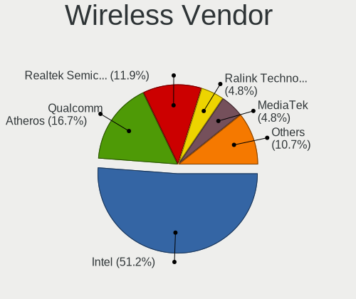

| Vendor                | Desktops | Percent |
|-----------------------|----------|---------|
| Intel                 | 16       | 51.61%  |
| Qualcomm Atheros      | 7        | 22.58%  |
| Realtek Semiconductor | 2        | 6.45%   |
| Ralink Technology     | 2        | 6.45%   |
| Ralink                | 2        | 6.45%   |
| Broadcom              | 1        | 3.23%   |
| ASUSTek Computer      | 1        | 3.23%   |

Wireless Model
--------------

Wireless models

| Model                                                                  | Desktops | Percent |
|------------------------------------------------------------------------|----------|---------|
| Intel Wi-Fi 6 AX200                                                    | 4        | 12.9%   |
| Intel Wireless 7260                                                    | 3        | 9.68%   |
| Qualcomm Atheros AR93xx Wireless Network Adapter                       | 2        | 6.45%   |
| Intel Wireless-AC 9260                                                 | 2        | 6.45%   |
| Intel Wireless 3160                                                    | 2        | 6.45%   |
| Intel Dual Band Wireless-AC 3168NGW [Stone Peak]                       | 2        | 6.45%   |
| Realtek RTL8821CE 802.11ac PCIe Wireless Network Adapter               | 1        | 3.23%   |
| Realtek RTL8821AE 802.11ac PCIe Wireless Network Adapter               | 1        | 3.23%   |
| Ralink RT3072 Wireless Adapter                                         | 1        | 3.23%   |
| Ralink MT7601U Wireless Adapter                                        | 1        | 3.23%   |
| Ralink RT5390 Wireless 802.11n 1T/1R PCIe                              | 1        | 3.23%   |
| Ralink RT3090 Wireless 802.11n 1T/1R PCIe                              | 1        | 3.23%   |
| Qualcomm Atheros AR9485 Wireless Network Adapter                       | 1        | 3.23%   |
| Qualcomm Atheros AR9462 Wireless Network Adapter                       | 1        | 3.23%   |
| Qualcomm Atheros AR9287 Wireless Network Adapter (PCI-Express)         | 1        | 3.23%   |
| Qualcomm Atheros AR9285 Wireless Network Adapter (PCI-Express)         | 1        | 3.23%   |
| Qualcomm Atheros AR5416 Wireless Network Adapter [AR5008 802.11(a)bgn] | 1        | 3.23%   |
| Intel Wireless 7265                                                    | 1        | 3.23%   |
| Intel Wireless 3165                                                    | 1        | 3.23%   |
| Intel Centrino Wireless-N 2230                                         | 1        | 3.23%   |
| Broadcom BCM4322 802.11a/b/g/n Wireless LAN Controller                 | 1        | 3.23%   |
| ASUS N10 Nano 802.11n Network Adapter [Realtek RTL8192CU]              | 1        | 3.23%   |

Ethernet Vendor
---------------

Ethernet vendors

| Vendor                   | Desktops | Percent |
|--------------------------|----------|---------|
| Intel                    | 106      | 59.89%  |
| Realtek Semiconductor    | 58       | 32.77%  |
| Broadcom                 | 8        | 4.52%   |
| Qualcomm Atheros         | 2        | 1.13%   |
| Nvidia                   | 1        | 0.56%   |
| Marvell Technology Group | 1        | 0.56%   |
| American Megatrends      | 1        | 0.56%   |

Ethernet Model
--------------

Ethernet models

| Model                                                                         | Desktops | Percent |
|-------------------------------------------------------------------------------|----------|---------|
| Realtek RTL8111/8168/8411 PCI Express Gigabit Ethernet Controller             | 55       | 27.36%  |
| Intel I211 Gigabit Network Connection                                         | 34       | 16.92%  |
| Intel I210 Gigabit Network Connection                                         | 10       | 4.98%   |
| Intel 82574L Gigabit Network Connection                                       | 10       | 4.98%   |
| Intel 82571EB/82571GB Gigabit Ethernet Controller (Copper)                    | 10       | 4.98%   |
| Intel I350 Gigabit Network Connection                                         | 7        | 3.48%   |
| Intel 82580 Gigabit Network Connection                                        | 7        | 3.48%   |
| Intel 82571EB/82571GB Gigabit Ethernet Controller D0/D1 (copper applications) | 6        | 2.99%   |
| Intel Ethernet Connection I217-LM                                             | 5        | 2.49%   |
| Intel 82579LM Gigabit Network Connection (Lewisville)                         | 5        | 2.49%   |
| Realtek RTL8125 2.5GbE Controller                                             | 4        | 1.99%   |
| Intel Ethernet Connection (2) I219-V                                          | 4        | 1.99%   |
| Intel 82583V Gigabit Network Connection                                       | 4        | 1.99%   |
| Intel 82579V Gigabit Network Connection                                       | 4        | 1.99%   |
| Intel 82576 Gigabit Network Connection                                        | 4        | 1.99%   |
| Intel NM10/ICH7 Family LAN Controller                                         | 3        | 1.49%   |
| Intel Ethernet Controller X550                                                | 2        | 1%      |
| Intel Ethernet Connection I217-V                                              | 2        | 1%      |
| Intel Ethernet Connection (7) I219-LM                                         | 2        | 1%      |
| Intel 82567LM-3 Gigabit Network Connection                                    | 2        | 1%      |
| Broadcom NetXtreme BCM5764M Gigabit Ethernet PCIe                             | 2        | 1%      |
| Broadcom NetXtreme BCM5720 Gigabit Ethernet PCIe                              | 2        | 1%      |
| Qualcomm Atheros Killer E2500 Gigabit Ethernet Controller                     | 1        | 0.5%    |
| Qualcomm Atheros AR8151 v2.0 Gigabit Ethernet                                 | 1        | 0.5%    |
| Nvidia MCP73 Ethernet                                                         | 1        | 0.5%    |
| Marvell Group 88E8071 PCI-E Gigabit Ethernet Controller                       | 1        | 0.5%    |
| Intel I210 Gigabit Fiber Network Connection                                   | 1        | 0.5%    |
| Intel Ethernet Controller 10-Gigabit X540-AT2                                 | 1        | 0.5%    |
| Intel Ethernet Connection I219-LM                                             | 1        | 0.5%    |
| Intel Ethernet Connection (6) I219-LM                                         | 1        | 0.5%    |
| Intel Ethernet Connection (2) I219-LM                                         | 1        | 0.5%    |
| Intel Ethernet Connection (11) I219-V                                         | 1        | 0.5%    |
| Intel 82572EI Gigabit Ethernet Controller (Copper)                            | 1        | 0.5%    |
| Intel 82571EB Gigabit Ethernet Controller                                     | 1        | 0.5%    |
| Broadcom NetXtreme BCM5754 Gigabit Ethernet PCI Express                       | 1        | 0.5%    |
| Broadcom NetXtreme BCM5721 Gigabit Ethernet PCI Express                       | 1        | 0.5%    |
| Broadcom NetLink BCM5786 Gigabit Ethernet PCI Express                         | 1        | 0.5%    |
| Broadcom NetLink BCM57781 Gigabit Ethernet PCIe                               | 1        | 0.5%    |
| American Megatrends Virtual Ethernet                                          | 1        | 0.5%    |

Net Controller Kind
-------------------

Ethernet, WiFi or modem

| Kind     | Desktops | Percent |
|----------|----------|---------|
| Ethernet | 150      | 80.21%  |
| WiFi     | 31       | 16.58%  |
| Unknown  | 4        | 2.14%   |
| Modem    | 2        | 1.07%   |

Used Controller
---------------

Currently used network controller

| Kind     | Desktops | Percent |
|----------|----------|---------|
| Ethernet | 148      | 93.08%  |
| WiFi     | 11       | 6.92%   |

NICs
----

Total network controllers on board

| Total | Desktops | Percent |
|-------|----------|---------|
| 1     | 33       | 21.57%  |
| 2     | 29       | 18.95%  |
| 3     | 27       | 17.65%  |
| 4     | 21       | 13.73%  |
| 5     | 18       | 11.76%  |
| 6     | 13       | 8.5%    |
| 7     | 5        | 3.27%   |
| 0     | 3        | 1.96%   |
| 15    | 1        | 0.65%   |
| 12    | 1        | 0.65%   |
| 10    | 1        | 0.65%   |
| 8     | 1        | 0.65%   |

IPv6
----

IPv6 vs IPv4

| Used | Desktops | Percent |
|------|----------|---------|
| No   | 141      | 88.68%  |
| Yes  | 18       | 11.32%  |

Bluetooth
---------

Bluetooth Vendor
----------------

Controller vendors

| Vendor                  | Desktops | Percent |
|-------------------------|----------|---------|
| Intel                   | 13       | 56.52%  |
| Cambridge Silicon Radio | 5        | 21.74%  |
| IMC Networks            | 2        | 8.7%    |
| ASUSTek Computer        | 2        | 8.7%    |
| Realtek Semiconductor   | 1        | 4.35%   |

Bluetooth Model
---------------

Controller models

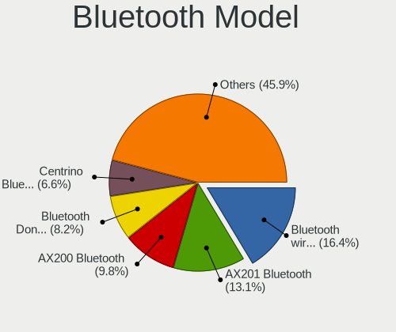

| Model                                                   | Desktops | Percent |
|---------------------------------------------------------|----------|---------|
| Cambridge Silicon Radio Bluetooth Dongle (HCI mode)     | 5        | 21.74%  |
| Intel Bluetooth wireless interface                      | 4        | 17.39%  |
| Intel AX200 Bluetooth                                   | 4        | 17.39%  |
| Intel Wireless-AC 9260 Bluetooth Adapter                | 2        | 8.7%    |
| Intel Wireless-AC 3168 Bluetooth                        | 2        | 8.7%    |
| Realtek Bluetooth Radio                                 | 1        | 4.35%   |
| Intel Centrino Bluetooth Wireless Transceiver           | 1        | 4.35%   |
| IMC Networks Realtek Bluetooth Adapter                  | 1        | 4.35%   |
| IMC Networks Realtek Bluetooth 4.0 Adapter              | 1        | 4.35%   |
| ASUS Qualcomm Atheros AR9462 Bluetooth 4.0 + HS Adapter | 1        | 4.35%   |
| ASUS Broadcom BCM20702A0 Bluetooth                      | 1        | 4.35%   |

Sound
-----

Sound Vendor
------------

Sound card vendors

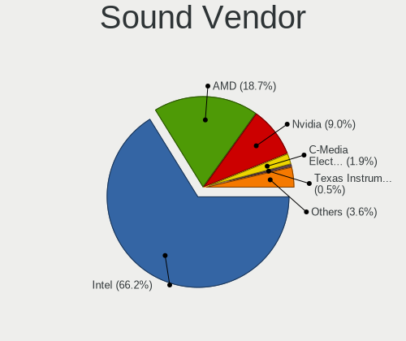

| Vendor                               | Desktops | Percent |
|--------------------------------------|----------|---------|
| Intel                                | 84       | 53.5%   |
| AMD                                  | 41       | 26.11%  |
| Nvidia                               | 21       | 13.38%  |
| Texas Instruments                    | 2        | 1.27%   |
| C-Media Electronics                  | 2        | 1.27%   |
| Thesycon Systemsoftware & Consulting | 1        | 0.64%   |
| Nam Tai E&E Products                 | 1        | 0.64%   |
| Logitech                             | 1        | 0.64%   |
| Griffin Technology                   | 1        | 0.64%   |
| Elgato Systems                       | 1        | 0.64%   |
| Creative Labs                        | 1        | 0.64%   |
| BEHRINGER International              | 1        | 0.64%   |

Sound Model
-----------

Sound card models

| Model                                                                                             | Desktops | Percent |
|---------------------------------------------------------------------------------------------------|----------|---------|
| Intel Xeon E3-1200 v3/4th Gen Core Processor HD Audio Controller                                  | 16       | 7.88%   |
| AMD Starship/Matisse HD Audio Controller                                                          | 12       | 5.91%   |
| Intel 8 Series/C220 Series Chipset High Definition Audio Controller                               | 11       | 5.42%   |
| Intel 6 Series/C200 Series Chipset Family High Definition Audio Controller                        | 11       | 5.42%   |
| AMD FCH Azalia Controller                                                                         | 8        | 3.94%   |
| Intel Wildcat Point-LP High Definition Audio Controller                                           | 6        | 2.96%   |
| Intel Broadwell-U Audio Controller                                                                | 6        | 2.96%   |
| AMD SBx00 Azalia (Intel HDA)                                                                      | 6        | 2.96%   |
| AMD Family 17h/19h HD Audio Controller                                                            | 6        | 2.96%   |
| Intel Sunrise Point-LP HD Audio                                                                   | 5        | 2.46%   |
| Intel Atom Processor Z36xxx/Z37xxx Series High Definition Audio Controller                        | 5        | 2.46%   |
| AMD Kabini HDMI/DP Audio                                                                          | 5        | 2.46%   |
| Intel Haswell-ULT HD Audio Controller                                                             | 4        | 1.97%   |
| Intel Atom/Celeron/Pentium Processor x5-E8000/J3xxx/N3xxx Series High Definition Audio Controller | 4        | 1.97%   |
| Intel 82801JI (ICH10 Family) HD Audio Controller                                                  | 4        | 1.97%   |
| Intel 8 Series HD Audio Controller                                                                | 4        | 1.97%   |
| AMD Renoir Radeon High Definition Audio Controller                                                | 4        | 1.97%   |
| AMD Baffin HDMI/DP Audio [Radeon RX 550 640SP / RX 560/560X]                                      | 4        | 1.97%   |
| Nvidia High Definition Audio Controller                                                           | 3        | 1.48%   |
| Intel NM10/ICH7 Family High Definition Audio Controller                                           | 3        | 1.48%   |
| Intel Celeron/Pentium Silver Processor High Definition Audio                                      | 3        | 1.48%   |
| Intel Celeron N3350/Pentium N4200/Atom E3900 Series Audio Cluster                                 | 3        | 1.48%   |
| Intel 9 Series Chipset Family HD Audio Controller                                                 | 3        | 1.48%   |
| Intel 7 Series/C216 Chipset Family High Definition Audio Controller                               | 3        | 1.48%   |
| Intel 200 Series PCH HD Audio                                                                     | 3        | 1.48%   |
| Intel 100 Series/C230 Series Chipset Family HD Audio Controller                                   | 3        | 1.48%   |
| AMD Ellesmere HDMI Audio [Radeon RX 470/480 / 570/580/590]                                        | 3        | 1.48%   |
| Texas Instruments PCM2902 Audio Codec                                                             | 2        | 0.99%   |
| Nvidia GM107 High Definition Audio Controller [GeForce 940MX]                                     | 2        | 0.99%   |
| Nvidia GK208 HDMI/DP Audio Controller                                                             | 2        | 0.99%   |
| Nvidia GK107 HDMI Audio Controller                                                                | 2        | 0.99%   |
| Nvidia GF119 HDMI Audio Controller                                                                | 2        | 0.99%   |
| Intel Cannon Lake PCH cAVS                                                                        | 2        | 0.99%   |
| Intel 82801JD/DO (ICH10 Family) HD Audio Controller                                               | 2        | 0.99%   |
| AMD Wrestler HDMI Audio                                                                           | 2        | 0.99%   |
| AMD Trinity HDMI Audio Controller                                                                 | 2        | 0.99%   |
| AMD RV710/730 HDMI Audio [Radeon HD 4000 series]                                                  | 2        | 0.99%   |
| AMD Raven/Raven2/Fenghuang HDMI/DP Audio Controller                                               | 2        | 0.99%   |
| AMD Oland/Hainan/Cape Verde/Pitcairn HDMI Audio [Radeon HD 7000 Series]                           | 2        | 0.99%   |
| Thesycon Systemsoftware & Consulting Topping DX3 Pro Audio Control                                | 1        | 0.49%   |
| Nvidia TU116 High Definition Audio Controller                                                     | 1        | 0.49%   |
| Nvidia TU104 HD Audio Controller                                                                  | 1        | 0.49%   |
| Nvidia MCP73 High Definition Audio                                                                | 1        | 0.49%   |
| Nvidia MCP61 High Definition Audio                                                                | 1        | 0.49%   |
| Nvidia GP107GL High Definition Audio Controller                                                   | 1        | 0.49%   |
| Nvidia GP104 High Definition Audio Controller                                                     | 1        | 0.49%   |
| Nvidia GP102 HDMI Audio Controller                                                                | 1        | 0.49%   |
| Nvidia GM206 High Definition Audio Controller                                                     | 1        | 0.49%   |
| Nvidia GF114 HDMI Audio Controller                                                                | 1        | 0.49%   |
| Nvidia GF108 High Definition Audio Controller                                                     | 1        | 0.49%   |
| Nvidia GF106 High Definition Audio Controller                                                     | 1        | 0.49%   |
| Nvidia GA104 High Definition Audio Controller                                                     | 1        | 0.49%   |
| Nam Tai E&E Products Sony SingStar USBMIC                                                         | 1        | 0.49%   |
| Logitech HD Webcam C910                                                                           | 1        | 0.49%   |
| Intel Comet Lake PCH-LP cAVS                                                                      | 1        | 0.49%   |
| Intel Comet Lake PCH cAVS                                                                         | 1        | 0.49%   |
| Intel Cannon Point-LP High Definition Audio Controller                                            | 1        | 0.49%   |
| Intel 82801I (ICH9 Family) HD Audio Controller                                                    | 1        | 0.49%   |
| Griffin Technology iMic                                                                           | 1        | 0.49%   |
| Elgato Systems Elgato Wave:3 Elgato Wave:3 Controls Elgato Wave:3 DFU                             | 1        | 0.49%   |

Memory
------

Memory Vendor
-------------

Memory module vendors

| Vendor              | Desktops | Percent |
|---------------------|----------|---------|
| Crucial             | 24       | 16.11%  |
| Corsair             | 23       | 15.44%  |
| Kingston            | 22       | 14.77%  |
| Unknown             | 19       | 12.75%  |
| SK Hynix            | 18       | 12.08%  |
| Samsung Electronics | 12       | 8.05%   |
| Ramaxel Technology  | 4        | 2.68%   |
| Micron Technology   | 4        | 2.68%   |
| A-DATA Technology   | 4        | 2.68%   |
| Unknown (ABCD)      | 3        | 2.01%   |
| Team                | 3        | 2.01%   |
| Nanya Technology    | 3        | 2.01%   |
| Transcend           | 2        | 1.34%   |
| G.Skill             | 2        | 1.34%   |
| Unknown             | 2        | 1.34%   |
| TIMETEC             | 1        | 0.67%   |
| Teikon              | 1        | 0.67%   |
| CSX                 | 1        | 0.67%   |
| Avant               | 1        | 0.67%   |

Memory Model
------------

Memory module models

| Model                                                             | Desktops | Percent |
|-------------------------------------------------------------------|----------|---------|
| Unknown RAM Module 4GB SODIMM DDR3 1333MT/s                       | 4        | 2.48%   |
| Unknown RAM Module 1GB DIMM SDRAM                                 | 3        | 1.86%   |
| Unknown (ABCD) RAM 123456789012345678 1536MB DIMM LPDDR4 2400MT/s | 3        | 1.86%   |
| Corsair RAM CMX8GX3M2A1333C9 4GB DIMM 1333MT/s                    | 3        | 1.86%   |
| Unknown RAM Module 4GB DIMM DDR3 1600MT/s                         | 2        | 1.24%   |
| Unknown RAM Module 2GB DIMM DDR3 1333MT/s                         | 2        | 1.24%   |
| SK Hynix RAM HMT451U7BFR8A-PB 4GB DIMM DDR3 1600MT/s              | 2        | 1.24%   |
| SK Hynix RAM HMT351U6EFR8C-PB 4GB DIMM DDR3 1600MT/s              | 2        | 1.24%   |
| SK Hynix RAM HMT351U6CFR8C-PB 4GB DIMM DDR3 1600MT/s              | 2        | 1.24%   |
| Kingston RAM Module 2048MB DIMM DDR2 800MT/s                      | 2        | 1.24%   |
| Kingston RAM LV26D4U9S8HJ-8 8GB DIMM DDR4 2667MT/s                | 2        | 1.24%   |
| Kingston RAM 99U5469-045.A00LF 4GB DIMM DDR3 1600MT/s             | 2        | 1.24%   |
| Crucial RAM CT102464BF160B.C16 8GB SODIMM DDR3 1600MT/s           | 2        | 1.24%   |
| Crucial RAM CT102464BF160B.C16 8GB DIMM DDR3 1600MT/s             | 2        | 1.24%   |
| Crucial RAM BL32G36C16U4B.M16FB1 32GB DIMM DDR4 3600MT/s          | 2        | 1.24%   |
| Corsair RAM CMK32GX4M2D3200C16 16GB DIMM DDR4 3200MT/s            | 2        | 1.24%   |
| Unknown                                                           | 2        | 1.24%   |
| Unknown RAM Module 8GB SODIMM DDR4 2133MT/s                       | 1        | 0.62%   |
| Unknown RAM Module 8GB DIMM DDR3 1600MT/s                         | 1        | 0.62%   |
| Unknown RAM Module 4GB SODIMM DDR3 667MT/s                        | 1        | 0.62%   |
| Unknown RAM Module 4GB DIMM 1333MT/s                              | 1        | 0.62%   |
| Unknown RAM Module 2GB DIMM DDR2 800MT/s                          | 1        | 0.62%   |
| Unknown RAM Module 2GB DIMM DDR 133MT/s                           | 1        | 0.62%   |
| Unknown RAM Module 2048MB DIMM DDR2 800MT/s                       | 1        | 0.62%   |
| Unknown RAM Module 16GB DIMM DDR4 2133MT/s                        | 1        | 0.62%   |
| Unknown RAM HooDisk NB 4G 1600 4GB DIMM DDR3 1600MT/s             | 1        | 0.62%   |
| Transcend RAM TS512MSK64W6H 4GB SODIMM DDR3 1600MT/s              | 1        | 0.62%   |
| Transcend RAM TS1GLK72V6H 8GB DIMM DDR3 1600MT/s                  | 1        | 0.62%   |
| TIMETEC RAM SD3-1600 8GB SODIMM DDR3 1600MT/s                     | 1        | 0.62%   |
| Teikon RAM TMTS8G58DFRBFIR-16 8GB SODIMM DDR3 1600MT/s            | 1        | 0.62%   |
| Team RAM TEAMGROUP-UD4-3200 16GB DIMM DDR4 3200MT/s               | 1        | 0.62%   |
| Team RAM TEAMGROUP-UD4-3000 4GB DIMM DDR4 2400MT/s                | 1        | 0.62%   |
| Team RAM Elite-1600 8GB DIMM DDR3 1600MT/s                        | 1        | 0.62%   |
| SK Hynix RAM HMT451U6BFR8C-PB 4GB DIMM DDR3 1600MT/s              | 1        | 0.62%   |
| SK Hynix RAM HMT451U6BFR8A-PB 4GB DIMM DDR3 1600MT/s              | 1        | 0.62%   |
| SK Hynix RAM HMT451U6AFR8C-PB 4GB DIMM DDR3 1600MT/s              | 1        | 0.62%   |
| SK Hynix RAM HMT451U6AFR8A-PB 4GB DIMM DDR3 1600MT/s              | 1        | 0.62%   |
| SK Hynix RAM HMT41GS6BFR8A-PB 8GB SODIMM DDR3 1600MT/s            | 1        | 0.62%   |
| SK Hynix RAM HMT41GS6BFR8A-PB 8GB DIMM DDR3 1600MT/s              | 1        | 0.62%   |
| SK Hynix RAM HMT41GS6AFR8A-PB 8GB SODIMM DDR3 1600MT/s            | 1        | 0.62%   |
| SK Hynix RAM HMT351U6CFR8C-PBA 8GB DIMM DDR3 1600MT/s             | 1        | 0.62%   |
| SK Hynix RAM HMT351U6CFR8C-H9 4GB DIMM DDR3 1333MT/s              | 1        | 0.62%   |
| SK Hynix RAM HMT325U6CFR8C-PB 2GB DIMM DDR3 1600MT/s              | 1        | 0.62%   |
| SK Hynix RAM HMT325U6BFR8C-H9 2GB DIMM DDR3 1333MT/s              | 1        | 0.62%   |
| SK Hynix RAM HMT125U6BFR8C-H9 2048MB DIMM DDR3 1333MT/s           | 1        | 0.62%   |
| SK Hynix RAM HMAA4GS6AJR8N-WM 32GB SODIMM DDR4 2933MT/s           | 1        | 0.62%   |
| SK Hynix RAM HMA81GU7AFR8N-UH 8192MB DIMM DDR4 2400MT/s           | 1        | 0.62%   |
| SK Hynix RAM HMA81GS6AFR8N-UH 8GB SODIMM DDR4 2400MT/s            | 1        | 0.62%   |
| SK Hynix RAM HMA41GS6AFR8N-TF 8GB SODIMM DDR4 2133MT/s            | 1        | 0.62%   |
| Samsung RAM Module 4GB SODIMM DDR4 2133MT/s                       | 1        | 0.62%   |
| Samsung RAM M471B5773CHS-CH9 2GB SODIMM DDR3 1333MT/s             | 1        | 0.62%   |
| Samsung RAM M471B5173QH0-YK0 4GB SODIMM DDR3 1600MT/s             | 1        | 0.62%   |
| Samsung RAM M471B5173DB0-YK0 4GB SODIMM DDR3 1600MT/s             | 1        | 0.62%   |
| Samsung RAM M471B5173CB0-YK0 4GB SODIMM DDR3 1600MT/s             | 1        | 0.62%   |
| Samsung RAM M471B2873FHS-CH9 4GB DIMM DDR3 1600MT/s               | 1        | 0.62%   |
| Samsung RAM M471B1G73QH0-YK0 8GB SODIMM DDR3 1600MT/s             | 1        | 0.62%   |
| Samsung RAM M471B1G73BH0-YK0 8GB DIMM DDR3 1600MT/s               | 1        | 0.62%   |
| Samsung RAM M378B5273DH0-CK0 4GB DIMM DDR3 1600MT/s               | 1        | 0.62%   |
| Samsung RAM M378B5173QH0-CK0 4GB DIMM DDR3 1600MT/s               | 1        | 0.62%   |
| Samsung RAM M378B5173DB0-CK0 4GB DIMM DDR3 1600MT/s               | 1        | 0.62%   |

Memory Kind
-----------

Memory module kinds

| Kind    | Desktops | Percent |
|---------|----------|---------|
| DDR3    | 84       | 61.76%  |
| DDR4    | 38       | 27.94%  |
| DDR2    | 5        | 3.68%   |
| SDRAM   | 3        | 2.21%   |
| LPDDR4  | 3        | 2.21%   |
| Unknown | 2        | 1.47%   |
| DDR     | 1        | 0.74%   |

Memory Form Factor
------------------

Physical design of the memory module

| Name    | Desktops | Percent |
|---------|----------|---------|
| DIMM    | 99       | 72.79%  |
| SODIMM  | 36       | 26.47%  |
| Unknown | 1        | 0.74%   |

Memory Size
-----------

Memory module size

| Size  | Desktops | Percent |
|-------|----------|---------|
| 4096  | 56       | 38.89%  |
| 8192  | 54       | 37.5%   |
| 2048  | 16       | 11.11%  |
| 16384 | 11       | 7.64%   |
| 32768 | 4        | 2.78%   |
| 1024  | 3        | 2.08%   |

Memory Speed
------------

Memory module speed

| Speed   | Desktops | Percent |
|---------|----------|---------|
| 1600    | 56       | 39.16%  |
| 1333    | 23       | 16.08%  |
| 2400    | 13       | 9.09%   |
| 2667    | 8        | 5.59%   |
| 2133    | 8        | 5.59%   |
| 800     | 7        | 4.9%    |
| 3200    | 5        | 3.5%    |
| 3600    | 4        | 2.8%    |
| 1867    | 3        | 2.1%    |
| 667     | 3        | 2.1%    |
| Unknown | 3        | 2.1%    |
| 2666    | 2        | 1.4%    |
| 3534    | 1        | 0.7%    |
| 2933    | 1        | 0.7%    |
| 1866    | 1        | 0.7%    |
| 1800    | 1        | 0.7%    |
| 1067    | 1        | 0.7%    |
| 1066    | 1        | 0.7%    |
| 933     | 1        | 0.7%    |
| 133     | 1        | 0.7%    |

Printers & scanners
-------------------

Printer Vendor
--------------

Printer device vendors

| Vendor          | Desktops | Percent |
|-----------------|----------|---------|
| Hewlett-Packard | 1        | 100%    |

Printer Model
-------------

Printer device models

| Model            | Desktops | Percent |
|------------------|----------|---------|
| HP LaserJet 1200 | 1        | 50%     |
| HP DeskJet 5850c | 1        | 50%     |

Scanner Vendor
--------------

Scanner device vendors

| Vendor | Desktops | Percent |
|--------|----------|---------|
| Canon  | 1        | 100%    |

Scanner Model
-------------

Scanner device models

| Model                   | Desktops | Percent |
|-------------------------|----------|---------|
| Canon CanoScan LiDE 210 | 1        | 100%    |

Camera
------

Camera Vendor
-------------

Camera device vendors

| Vendor            | Desktops | Percent |
|-------------------|----------|---------|
| Logitech          | 6        | 85.71%  |
| ARC International | 1        | 14.29%  |

Camera Model
------------

Camera device models

| Model                       | Desktops | Percent |
|-----------------------------|----------|---------|
| Logitech Labtec Webcam Pro  | 2        | 28.57%  |
| Logitech HD Pro Webcam C920 | 2        | 28.57%  |
| Logitech Webcam C930e       | 1        | 14.29%  |
| Logitech Webcam C310        | 1        | 14.29%  |
| ARC International Camera    | 1        | 14.29%  |

Security
--------

Fingerprint Vendor
------------------

Fingerprint sensor vendors

Zero info for selected period =(

Fingerprint Model
-----------------

Fingerprint sensor models

Zero info for selected period =(

Chipcard Vendor
---------------

Chipcard module vendors

Zero info for selected period =(

Chipcard Model
--------------

Chipcard module models

Zero info for selected period =(

Unsupported
-----------

Unsupported Devices
-------------------

Total unsupported devices on board

| Total | Desktops | Percent |
|-------|----------|---------|
| 1     | 74       | 47.13%  |
| 0     | 66       | 42.04%  |
| 2     | 12       | 7.64%   |
| 3     | 5        | 3.18%   |

Unsupported Device Types
------------------------

Types of unsupported devices

| Type                     | Desktops | Percent |
|--------------------------|----------|---------|
| Communication controller | 75       | 70.09%  |
| Net/wireless             | 8        | 7.48%   |
| Card reader              | 6        | 5.61%   |
| Bluetooth                | 6        | 5.61%   |
| Sound                    | 4        | 3.74%   |
| Firewire controller      | 3        | 2.8%    |
| Network                  | 2        | 1.87%   |
| Storage/raid             | 1        | 0.93%   |
| Net/ethernet             | 1        | 0.93%   |
| Graphics card            | 1        | 0.93%   |

