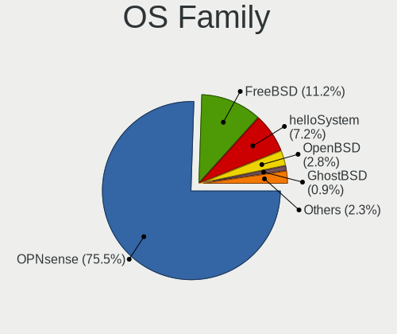
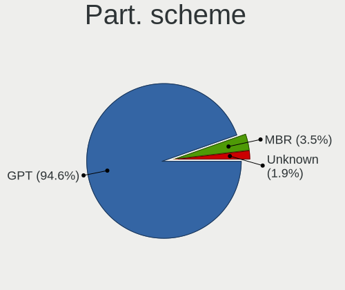
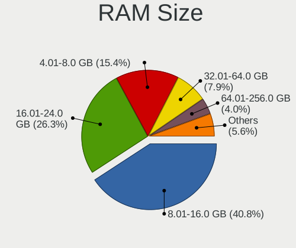
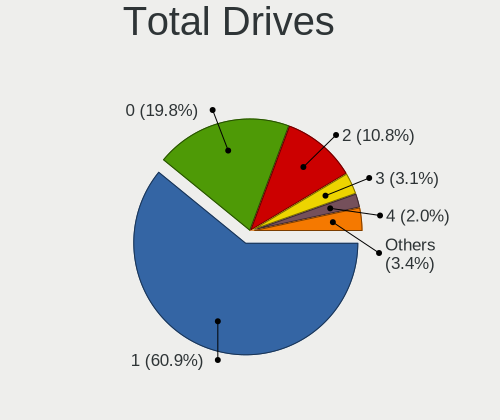
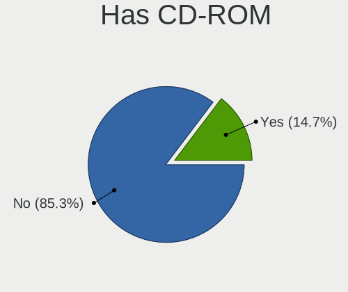
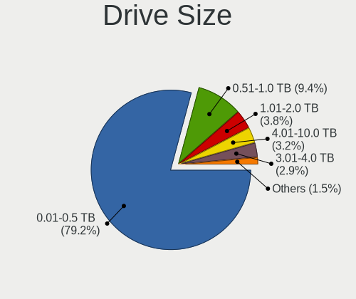
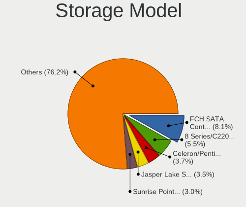
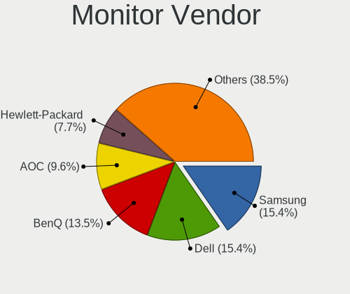
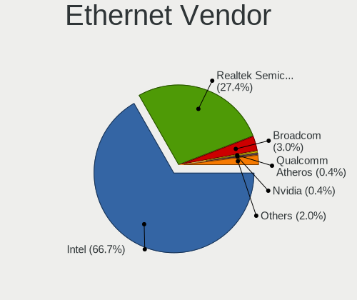

BSD in UK - Tested Hardware & Statistics (Desktops)
---------------------------------------------------

A project to collect tested hardware configurations for BSD in UK.

Anyone can contribute to this report by the [hw-probe](https://github.com/linuxhw/hw-probe/blob/master/INSTALL.BSD.md) tool:

    hw-probe -all -upload

Please contribute! Especially if your hardware is rare.

Contents
--------

* [ Test Cases ](#test-cases)

* [ System ](#system)
  - [ OS                       ](#os)
  - [ OS Family                ](#os-family)
  - [ Arch                     ](#arch)
  - [ DE                       ](#de)
  - [ Display Server           ](#display-server)
  - [ Display Manager          ](#display-manager)
  - [ OS Lang                  ](#os-lang)
  - [ Boot Mode                ](#boot-mode)
  - [ Filesystem               ](#filesystem)
  - [ Part. scheme             ](#part-scheme)

* [ Board ](#board)
  - [ Vendor                   ](#vendor)
  - [ Model                    ](#model)
  - [ Model Family             ](#model-family)
  - [ MFG Year                 ](#mfg-year)
  - [ Form Factor              ](#form-factor)
  - [ Coreboot                 ](#coreboot)
  - [ RAM Size                 ](#ram-size)
  - [ RAM Used                 ](#ram-used)
  - [ Total Drives             ](#total-drives)
  - [ Has CD-ROM               ](#has-cd-rom)
  - [ Has Ethernet             ](#has-ethernet)
  - [ Has WiFi                 ](#has-wifi)
  - [ Has Bluetooth            ](#has-bluetooth)

* [ Location ](#location)
  - [ Country                  ](#country)
  - [ City                     ](#city)

* [ Drives ](#drives)
  - [ Drive Vendor             ](#drive-vendor)
  - [ Drive Model              ](#drive-model)
  - [ HDD Vendor               ](#hdd-vendor)
  - [ SSD Vendor               ](#ssd-vendor)
  - [ Drive Kind               ](#drive-kind)
  - [ Drive Connector          ](#drive-connector)
  - [ Drive Size               ](#drive-size)
  - [ Space Total              ](#space-total)
  - [ Space Used               ](#space-used)
  - [ Malfunc. Drives          ](#malfunc-drives)
  - [ Malfunc. Drive Vendor    ](#malfunc-drive-vendor)
  - [ Malfunc. HDD Vendor      ](#malfunc-hdd-vendor)
  - [ Malfunc. Drive Kind      ](#malfunc-drive-kind)
  - [ Failed Drives            ](#failed-drives)
  - [ Failed Drive Vendor      ](#failed-drive-vendor)
  - [ Drive Status             ](#drive-status)

* [ Storage controller ](#storage-controller)
  - [ Storage Vendor           ](#storage-vendor)
  - [ Storage Model            ](#storage-model)
  - [ Storage Kind             ](#storage-kind)

* [ Processor ](#processor)
  - [ CPU Vendor               ](#cpu-vendor)
  - [ CPU Model                ](#cpu-model)
  - [ CPU Model Family         ](#cpu-model-family)
  - [ CPU Cores                ](#cpu-cores)
  - [ CPU Sockets              ](#cpu-sockets)
  - [ CPU Threads              ](#cpu-threads)
  - [ CPU Microarch            ](#cpu-microarch)

* [ Graphics ](#graphics)
  - [ GPU Vendor               ](#gpu-vendor)
  - [ GPU Model                ](#gpu-model)
  - [ GPU Combo                ](#gpu-combo)
  - [ GPU Driver               ](#gpu-driver)
  - [ GPU Memory               ](#gpu-memory)

* [ Monitor ](#monitor)
  - [ Monitor Vendor           ](#monitor-vendor)
  - [ Monitor Model            ](#monitor-model)
  - [ Monitor Resolution       ](#monitor-resolution)
  - [ Monitor Diagonal         ](#monitor-diagonal)
  - [ Monitor Width            ](#monitor-width)
  - [ Aspect Ratio             ](#aspect-ratio)
  - [ Monitor Area             ](#monitor-area)
  - [ Pixel Density            ](#pixel-density)
  - [ Multiple Monitors        ](#multiple-monitors)

* [ Network ](#network)
  - [ Net Controller Vendor    ](#net-controller-vendor)
  - [ Net Controller Model     ](#net-controller-model)
  - [ Wireless Vendor          ](#wireless-vendor)
  - [ Wireless Model           ](#wireless-model)
  - [ Ethernet Vendor          ](#ethernet-vendor)
  - [ Ethernet Model           ](#ethernet-model)
  - [ Net Controller Kind      ](#net-controller-kind)
  - [ Used Controller          ](#used-controller)
  - [ NICs                     ](#nics)
  - [ IPv6                     ](#ipv6)

* [ Bluetooth ](#bluetooth)
  - [ Bluetooth Vendor         ](#bluetooth-vendor)
  - [ Bluetooth Model          ](#bluetooth-model)

* [ Sound ](#sound)
  - [ Sound Vendor             ](#sound-vendor)
  - [ Sound Model              ](#sound-model)

* [ Memory ](#memory)
  - [ Memory Vendor            ](#memory-vendor)
  - [ Memory Model             ](#memory-model)
  - [ Memory Kind              ](#memory-kind)
  - [ Memory Form Factor       ](#memory-form-factor)
  - [ Memory Size              ](#memory-size)
  - [ Memory Speed             ](#memory-speed)

* [ Printers & scanners ](#printers--scanners)
  - [ Printer Vendor           ](#printer-vendor)
  - [ Printer Model            ](#printer-model)
  - [ Scanner Vendor           ](#scanner-vendor)
  - [ Scanner Model            ](#scanner-model)

* [ Camera ](#camera)
  - [ Camera Vendor            ](#camera-vendor)
  - [ Camera Model             ](#camera-model)

* [ Security ](#security)
  - [ Fingerprint Vendor       ](#fingerprint-vendor)
  - [ Fingerprint Model        ](#fingerprint-model)
  - [ Chipcard Vendor          ](#chipcard-vendor)
  - [ Chipcard Model           ](#chipcard-model)

* [ Unsupported ](#unsupported)
  - [ Unsupported Devices      ](#unsupported-devices)
  - [ Unsupported Device Types ](#unsupported-device-types)

Test Cases
----------

Total: 699

| Vendor        | Model                       | Probe                                                     | Date         |
|---------------|-----------------------------|-----------------------------------------------------------|--------------|
| HP            | 8954                        | [80434f997e](https://bsd-hardware.info/?probe=80434f997e) | Jan 06, 2025 |
| Intel         | CARLOW                      | [01eb3deae5](https://bsd-hardware.info/?probe=01eb3deae5) | Jan 01, 2025 |
| Shenzhen M... | AHWSA                       | [f7c0f4e47a](https://bsd-hardware.info/?probe=f7c0f4e47a) | Dec 29, 2024 |
| Inventec      | ZQ Class A02                | [9d4dc92f21](https://bsd-hardware.info/?probe=9d4dc92f21) | Dec 27, 2024 |
| HP            | 86E9 A                      | [355a0a1775](https://bsd-hardware.info/?probe=355a0a1775) | Dec 27, 2024 |
| HP            | 86E9 A                      | [5c61053e94](https://bsd-hardware.info/?probe=5c61053e94) | Dec 26, 2024 |
| GoWin Solu... | R86S                        | [1a6fdb5298](https://bsd-hardware.info/?probe=1a6fdb5298) | Dec 26, 2024 |
| Unknown       | Unknown                     | [8befdf2a04](https://bsd-hardware.info/?probe=8befdf2a04) | Dec 22, 2024 |
| Gigabyte      | M68MT-S2                    | [0ac816abb8](https://bsd-hardware.info/?probe=0ac816abb8) | Dec 22, 2024 |
| HP            | 1998                        | [e4d863c249](https://bsd-hardware.info/?probe=e4d863c249) | Dec 21, 2024 |
| Unknown       | Unknown                     | [200a584a04](https://bsd-hardware.info/?probe=200a584a04) | Dec 19, 2024 |
| Unknown       | Unknown                     | [90c615583a](https://bsd-hardware.info/?probe=90c615583a) | Dec 18, 2024 |
| Intel         | CARLOW                      | [076b8b224e](https://bsd-hardware.info/?probe=076b8b224e) | Dec 18, 2024 |
| Unknown       | Unknown                     | [f7191720f2](https://bsd-hardware.info/?probe=f7191720f2) | Dec 18, 2024 |
| Protectli     | V1210                       | [0fc656d941](https://bsd-hardware.info/?probe=0fc656d941) | Dec 18, 2024 |
| Dell          | 0PJDGF A02                  | [d00367bec2](https://bsd-hardware.info/?probe=d00367bec2) | Dec 17, 2024 |
| Cisco         | ASA5545 A0                  | [bdd19ad5e0](https://bsd-hardware.info/?probe=bdd19ad5e0) | Dec 16, 2024 |
| AAEON         | UP-APL01 V0.4               | [4093aeb156](https://bsd-hardware.info/?probe=4093aeb156) | Dec 16, 2024 |
| AAEON         | UP-APL01 V0.4               | [42837ef09d](https://bsd-hardware.info/?probe=42837ef09d) | Dec 15, 2024 |
| Gigabyte      | H310M S2H                   | [d514bee926](https://bsd-hardware.info/?probe=d514bee926) | Dec 09, 2024 |
| Dell          | 02YYK5 A01                  | [eff61a5b5a](https://bsd-hardware.info/?probe=eff61a5b5a) | Dec 08, 2024 |
| Unknown       | Unknown                     | [2323c300a7](https://bsd-hardware.info/?probe=2323c300a7) | Dec 08, 2024 |
| Dell          | 0KYWH7 A03                  | [622105821f](https://bsd-hardware.info/?probe=622105821f) | Dec 07, 2024 |
| AMD           | Kabini CRB                  | [fb4786e02b](https://bsd-hardware.info/?probe=fb4786e02b) | Dec 06, 2024 |
| Fujitsu       | D3313-G1 S26361-D3313-G1    | [f61562fa69](https://bsd-hardware.info/?probe=f61562fa69) | Dec 05, 2024 |
| Cisco         | ASA5545 A0                  | [b125a557db](https://bsd-hardware.info/?probe=b125a557db) | Dec 04, 2024 |
| Dell          | 02YYK5 A01                  | [5e6a2a3b36](https://bsd-hardware.info/?probe=5e6a2a3b36) | Dec 02, 2024 |
| Unknown       | PICO PC                     | [8734e8b7c0](https://bsd-hardware.info/?probe=8734e8b7c0) | Nov 29, 2024 |
| Unknown       | J3160-4L                    | [aec90e7441](https://bsd-hardware.info/?probe=aec90e7441) | Nov 27, 2024 |
| Protectli     | V1210                       | [e53f0f593a](https://bsd-hardware.info/?probe=e53f0f593a) | Nov 26, 2024 |
| Unknown       | Unknown                     | [52c9820eec](https://bsd-hardware.info/?probe=52c9820eec) | Nov 24, 2024 |
| Dell          | 0PJDGF A02                  | [4a83b7b9c8](https://bsd-hardware.info/?probe=4a83b7b9c8) | Nov 23, 2024 |
| Protectli     | FW4C Ver                    | [5ef0329d5f](https://bsd-hardware.info/?probe=5ef0329d5f) | Nov 18, 2024 |
| Protectli     | V1210                       | [a289a5950c](https://bsd-hardware.info/?probe=a289a5950c) | Nov 17, 2024 |
| Unknown       | Unknown                     | [9ec63a77da](https://bsd-hardware.info/?probe=9ec63a77da) | Nov 17, 2024 |
| Unknown       | YL-SKUL6-7 Series           | [20d3085651](https://bsd-hardware.info/?probe=20d3085651) | Nov 17, 2024 |
| Protectli     | V1210                       | [8c540d1973](https://bsd-hardware.info/?probe=8c540d1973) | Nov 14, 2024 |
| Unknown       | Unknown                     | [d596c27b1e](https://bsd-hardware.info/?probe=d596c27b1e) | Nov 11, 2024 |
| Intel         | Q3XXG4-P V1.0               | [0cb2282657](https://bsd-hardware.info/?probe=0cb2282657) | Nov 09, 2024 |
| Intel         | CARLOW                      | [b2781b364e](https://bsd-hardware.info/?probe=b2781b364e) | Nov 08, 2024 |
| Acer          | Veriton X2631G V:1.0        | [2ff4b42411](https://bsd-hardware.info/?probe=2ff4b42411) | Nov 07, 2024 |
| Gigabyte      | B650M D3HP                  | [adf503f345](https://bsd-hardware.info/?probe=adf503f345) | Nov 06, 2024 |
| Gigabyte      | B650M D3HP                  | [fe8076ef02](https://bsd-hardware.info/?probe=fe8076ef02) | Nov 06, 2024 |
| HP            | 8350                        | [76cecf3b8b](https://bsd-hardware.info/?probe=76cecf3b8b) | Nov 04, 2024 |
| HP            | 8592                        | [0b2e07fa9c](https://bsd-hardware.info/?probe=0b2e07fa9c) | Nov 02, 2024 |
| Protectli     | V1210                       | [e2219d605a](https://bsd-hardware.info/?probe=e2219d605a) | Nov 01, 2024 |
| Intel         | JSL MRD                     | [8a8cae89b2](https://bsd-hardware.info/?probe=8a8cae89b2) | Oct 30, 2024 |
| Shenzhen M... | AHBNB OEM                   | [ed3d722eb8](https://bsd-hardware.info/?probe=ed3d722eb8) | Oct 29, 2024 |
| Gigabyte      | Z77N-WIFI                   | [bd27e509c2](https://bsd-hardware.info/?probe=bd27e509c2) | Oct 29, 2024 |
| Unknown       | YL-SKUL6-7 Series           | [5913f8a01d](https://bsd-hardware.info/?probe=5913f8a01d) | Oct 28, 2024 |
| AZW           | GK55                        | [8478a5ab58](https://bsd-hardware.info/?probe=8478a5ab58) | Oct 27, 2024 |
| ASRockRack    | B550D4ID-2L2T               | [4e482078d9](https://bsd-hardware.info/?probe=4e482078d9) | Oct 23, 2024 |
| ASRock        | B550M Phantom Gaming 4      | [c963db262c](https://bsd-hardware.info/?probe=c963db262c) | Oct 22, 2024 |
| Unknown       | QDNV01                      | [8451cca61f](https://bsd-hardware.info/?probe=8451cca61f) | Oct 20, 2024 |
| Unknown       | Unknown                     | [08b2aeedac](https://bsd-hardware.info/?probe=08b2aeedac) | Oct 20, 2024 |
| Dell          | 0D6H9T A01                  | [d8b7f85313](https://bsd-hardware.info/?probe=d8b7f85313) | Oct 19, 2024 |
| ASRockRack    | B550D4ID-2L2T               | [5d741eaabc](https://bsd-hardware.info/?probe=5d741eaabc) | Oct 18, 2024 |
| ASUSTek       | ROG STRIX X670E-F GAMING... | [c163cc64f9](https://bsd-hardware.info/?probe=c163cc64f9) | Oct 16, 2024 |
| Dell          | 0T10XW A00                  | [3a6bbfb7f0](https://bsd-hardware.info/?probe=3a6bbfb7f0) | Oct 16, 2024 |
| Unknown       | Unknown                     | [50d7c77c32](https://bsd-hardware.info/?probe=50d7c77c32) | Oct 15, 2024 |
| Gigabyte      | Z77N-WIFI                   | [8cd36c6b0f](https://bsd-hardware.info/?probe=8cd36c6b0f) | Oct 12, 2024 |
| HP            | 8062                        | [625bd8d1e2](https://bsd-hardware.info/?probe=625bd8d1e2) | Oct 11, 2024 |
| Unknown       | Unknown                     | [fb551d479a](https://bsd-hardware.info/?probe=fb551d479a) | Oct 10, 2024 |
| HP            | 3048h                       | [ac96e7804d](https://bsd-hardware.info/?probe=ac96e7804d) | Oct 09, 2024 |
| HP            | 8062                        | [8fb83152e2](https://bsd-hardware.info/?probe=8fb83152e2) | Oct 08, 2024 |
| Dell          | 07WP95 A02                  | [6b911100de](https://bsd-hardware.info/?probe=6b911100de) | Oct 08, 2024 |
| ASUSTek       | ROG STRIX B550-F GAMING     | [d3f7dadcfe](https://bsd-hardware.info/?probe=d3f7dadcfe) | Oct 04, 2024 |
| Dell          | 00CV7F A00                  | [4e6d9d6bc1](https://bsd-hardware.info/?probe=4e6d9d6bc1) | Oct 01, 2024 |
| GoWin Solu... | R86S                        | [68eaf89634](https://bsd-hardware.info/?probe=68eaf89634) | Sep 30, 2024 |
| SJRC          | SJ-ADLN-6L                  | [afda0fc669](https://bsd-hardware.info/?probe=afda0fc669) | Sep 29, 2024 |
| Unknown       | Unknown                     | [7fa0012726](https://bsd-hardware.info/?probe=7fa0012726) | Sep 28, 2024 |
| MW            | GMLK-2_5G4L                 | [e050326a2c](https://bsd-hardware.info/?probe=e050326a2c) | Sep 28, 2024 |
| CWWK          | CW-AD4L-N V1                | [19b4f30ed9](https://bsd-hardware.info/?probe=19b4f30ed9) | Sep 28, 2024 |
| Cisco         | ASA5545 A0                  | [4c3977149c](https://bsd-hardware.info/?probe=4c3977149c) | Sep 26, 2024 |
| HP            | ProLiant ML350 Gen9         | [14aefb427d](https://bsd-hardware.info/?probe=14aefb427d) | Sep 24, 2024 |
| Unknown       | Unknown                     | [149168c0e5](https://bsd-hardware.info/?probe=149168c0e5) | Sep 24, 2024 |
| Unknown       | Unknown                     | [369c91c4f8](https://bsd-hardware.info/?probe=369c91c4f8) | Sep 23, 2024 |
| HP            | 8076 MVB,A                  | [b002333751](https://bsd-hardware.info/?probe=b002333751) | Sep 21, 2024 |
| Unknown       | Unknown                     | [5b9383db2f](https://bsd-hardware.info/?probe=5b9383db2f) | Sep 18, 2024 |
| Dell          | 00CV7F A00                  | [863fdb73ef](https://bsd-hardware.info/?probe=863fdb73ef) | Sep 18, 2024 |
| MSI           | A520M-A PRO                 | [d609ed758b](https://bsd-hardware.info/?probe=d609ed758b) | Sep 17, 2024 |
| Unknown       | Unknown                     | [e4876aeca4](https://bsd-hardware.info/?probe=e4876aeca4) | Sep 09, 2024 |
| Unknown       | Unknown                     | [1fc277d2a5](https://bsd-hardware.info/?probe=1fc277d2a5) | Sep 08, 2024 |
| Unknown       | QDNV01                      | [2478c9d6ba](https://bsd-hardware.info/?probe=2478c9d6ba) | Sep 08, 2024 |
| NU591         | 1.0                         | [db9dda75f8](https://bsd-hardware.info/?probe=db9dda75f8) | Sep 06, 2024 |
| Unknown       | Unknown                     | [bdebdbd079](https://bsd-hardware.info/?probe=bdebdbd079) | Sep 02, 2024 |
| Unknown       | Unknown                     | [b5c63e1f20](https://bsd-hardware.info/?probe=b5c63e1f20) | Sep 02, 2024 |
| AZW           | EQ                          | [abbe2ddf35](https://bsd-hardware.info/?probe=abbe2ddf35) | Sep 01, 2024 |
| Unknown       | Unknown                     | [dd86aed16c](https://bsd-hardware.info/?probe=dd86aed16c) | Sep 01, 2024 |
| MW            | GMLK-2_5G4L                 | [463b550e56](https://bsd-hardware.info/?probe=463b550e56) | Aug 30, 2024 |
| HP            | 802E                        | [a8ce15f8db](https://bsd-hardware.info/?probe=a8ce15f8db) | Aug 29, 2024 |
| Cisco         | ASA5545 A0                  | [61ed0dd6df](https://bsd-hardware.info/?probe=61ed0dd6df) | Aug 28, 2024 |
| Techvision    | TVI7309X B0                 | [a7e81bb814](https://bsd-hardware.info/?probe=a7e81bb814) | Aug 28, 2024 |
| Unknown       | Unknown                     | [596f970333](https://bsd-hardware.info/?probe=596f970333) | Aug 26, 2024 |
| Unknown       | Unknown                     | [4fcd9940d1](https://bsd-hardware.info/?probe=4fcd9940d1) | Aug 25, 2024 |
| Protectli     | VP6670                      | [52a5e57f2e](https://bsd-hardware.info/?probe=52a5e57f2e) | Aug 23, 2024 |
| Protectli     | VP2420                      | [21d4678ecc](https://bsd-hardware.info/?probe=21d4678ecc) | Aug 22, 2024 |
| Protectli     | VP2420                      | [2a6446d4be](https://bsd-hardware.info/?probe=2a6446d4be) | Aug 19, 2024 |
| Unknown       | Unknown                     | [93ecb9c878](https://bsd-hardware.info/?probe=93ecb9c878) | Aug 15, 2024 |
| Unknown       | Unknown                     | [57e8d19d93](https://bsd-hardware.info/?probe=57e8d19d93) | Aug 14, 2024 |
| ASUSTek       | PRIME Z490M-PLUS            | [a0cf045ed3](https://bsd-hardware.info/?probe=a0cf045ed3) | Aug 08, 2024 |
| Cisco         | ASA5545 A0                  | [b82e0453d9](https://bsd-hardware.info/?probe=b82e0453d9) | Aug 07, 2024 |
| Unknown       | Unknown                     | [bccbbd5174](https://bsd-hardware.info/?probe=bccbbd5174) | Aug 06, 2024 |
| Unknown       | Unknown                     | [93e6cbea7f](https://bsd-hardware.info/?probe=93e6cbea7f) | Aug 06, 2024 |
| Protectli     | FW4C Ver                    | [66f4dda861](https://bsd-hardware.info/?probe=66f4dda861) | Aug 05, 2024 |
| Unknown       | Unknown                     | [86a48105d3](https://bsd-hardware.info/?probe=86a48105d3) | Aug 05, 2024 |
| Protectli     | FW4C Ver                    | [f31380cb03](https://bsd-hardware.info/?probe=f31380cb03) | Aug 04, 2024 |
| Techvision    | TVI7309X B0                 | [31e628b663](https://bsd-hardware.info/?probe=31e628b663) | Aug 03, 2024 |
| CWWK          | CW-AD4L-N V1                | [3c2e4b8f8a](https://bsd-hardware.info/?probe=3c2e4b8f8a) | Jul 31, 2024 |
| Unknown       | Unknown                     | [07aa16bf43](https://bsd-hardware.info/?probe=07aa16bf43) | Jul 28, 2024 |
| Unknown       | Unknown                     | [0d449a6199](https://bsd-hardware.info/?probe=0d449a6199) | Jul 26, 2024 |
| GoWin Solu... | R86S                        | [7153f6e2f0](https://bsd-hardware.info/?probe=7153f6e2f0) | Jul 26, 2024 |
| Gigabyte      | Z68MA-D2H-B3                | [53708489a0](https://bsd-hardware.info/?probe=53708489a0) | Jul 26, 2024 |
| Dell          | 0T10XW A00                  | [dc6352272b](https://bsd-hardware.info/?probe=dc6352272b) | Jul 14, 2024 |
| MW            | GMLK-2_5G4L                 | [5d1bae0ac7](https://bsd-hardware.info/?probe=5d1bae0ac7) | Jul 10, 2024 |
| Unknown       | QDNV01                      | [720b16de8a](https://bsd-hardware.info/?probe=720b16de8a) | Jul 07, 2024 |
| ASUSTek       | ROG STRIX B650E-I GAMING... | [4b9cdbf4d2](https://bsd-hardware.info/?probe=4b9cdbf4d2) | Jul 07, 2024 |
| Unknown       | Unknown                     | [10a5b022d3](https://bsd-hardware.info/?probe=10a5b022d3) | Jul 06, 2024 |
| Protectli     | FW4C Ver                    | [7ade8429a5](https://bsd-hardware.info/?probe=7ade8429a5) | Jul 06, 2024 |
| GoWin Solu... | R86S                        | [933f87c1da](https://bsd-hardware.info/?probe=933f87c1da) | Jun 29, 2024 |
| MSI           | PRO B760M-P                 | [18ecac9dc3](https://bsd-hardware.info/?probe=18ecac9dc3) | Jun 26, 2024 |
| Techvision    | TVI7309X B0                 | [be05d2d448](https://bsd-hardware.info/?probe=be05d2d448) | Jun 18, 2024 |
| Gigabyte      | H410M S2H V3                | [38e99138bb](https://bsd-hardware.info/?probe=38e99138bb) | Jun 12, 2024 |
| Dell          | 0T10XW A00                  | [de5724a9b0](https://bsd-hardware.info/?probe=de5724a9b0) | Jun 11, 2024 |
| Techvision    | TVI7309X B0                 | [c3089dc4ea](https://bsd-hardware.info/?probe=c3089dc4ea) | Jun 10, 2024 |
| Intel         | SKYBAY                      | [a0705138c9](https://bsd-hardware.info/?probe=a0705138c9) | Jun 10, 2024 |
| Intel         | SKYBAY                      | [9f8adcd817](https://bsd-hardware.info/?probe=9f8adcd817) | Jun 08, 2024 |
| Unknown       | Unknown                     | [90d78eaad3](https://bsd-hardware.info/?probe=90d78eaad3) | Jun 08, 2024 |
| Dell          | 04Y8V0 A02                  | [b8c5834d50](https://bsd-hardware.info/?probe=b8c5834d50) | Jun 07, 2024 |
| Techvision    | TVI7309X B0                 | [6d08096f7b](https://bsd-hardware.info/?probe=6d08096f7b) | Jun 05, 2024 |
| Gigabyte      | Z68MA-D2H-B3                | [031917412b](https://bsd-hardware.info/?probe=031917412b) | Jun 05, 2024 |
| Gigabyte      | Z97-HD3                     | [81cda00860](https://bsd-hardware.info/?probe=81cda00860) | Jun 02, 2024 |
| CWWK          | CW-AD4L-N V1                | [5175658d10](https://bsd-hardware.info/?probe=5175658d10) | May 30, 2024 |
| Gigabyte      | GA-990FXA-UD5               | [73ad6d19d7](https://bsd-hardware.info/?probe=73ad6d19d7) | May 26, 2024 |
| Protectli     | FW4B Ver                    | [0f40bca0ac](https://bsd-hardware.info/?probe=0f40bca0ac) | May 26, 2024 |
| Dell          | 07WP95 A02                  | [4120e17b0b](https://bsd-hardware.info/?probe=4120e17b0b) | May 24, 2024 |
| Techvision    | TVI7309X B0                 | [8863ea55e9](https://bsd-hardware.info/?probe=8863ea55e9) | May 23, 2024 |
| Hardkernel    | ODROID-H2                   | [1bbc532317](https://bsd-hardware.info/?probe=1bbc532317) | May 20, 2024 |
| Unknown       | Unknown                     | [c28486f7b5](https://bsd-hardware.info/?probe=c28486f7b5) | May 14, 2024 |
| Unknown       | Unknown                     | [d913d5e244](https://bsd-hardware.info/?probe=d913d5e244) | May 12, 2024 |
| Unknown       | Unknown                     | [95e53b0ee9](https://bsd-hardware.info/?probe=95e53b0ee9) | May 10, 2024 |
| Unknown       | Unknown                     | [1bfbe21216](https://bsd-hardware.info/?probe=1bfbe21216) | May 10, 2024 |
| ASUSTek       | P10S-C Series               | [11db8e3f1e](https://bsd-hardware.info/?probe=11db8e3f1e) | May 06, 2024 |
| Dell          | 0GXM1W A01                  | [f20a5dbc2b](https://bsd-hardware.info/?probe=f20a5dbc2b) | May 06, 2024 |
| AZW           | EQ                          | [6fb8bd4d4a](https://bsd-hardware.info/?probe=6fb8bd4d4a) | May 02, 2024 |
| Techvision    | TVI7309X B0                 | [d3ade6deae](https://bsd-hardware.info/?probe=d3ade6deae) | Apr 26, 2024 |
| Unknown       | Unknown                     | [5b9d2e7817](https://bsd-hardware.info/?probe=5b9d2e7817) | Apr 26, 2024 |
| Hardkernel    | ODROID-H2                   | [5645a7f37e](https://bsd-hardware.info/?probe=5645a7f37e) | Apr 25, 2024 |
| Dell          | 048DY8 A00                  | [9604806e18](https://bsd-hardware.info/?probe=9604806e18) | Apr 24, 2024 |
| Dell          | 0T10XW A00                  | [84db454f1c](https://bsd-hardware.info/?probe=84db454f1c) | Apr 24, 2024 |
| Dell          | 0C3YXR A02                  | [c7c80f2929](https://bsd-hardware.info/?probe=c7c80f2929) | Apr 22, 2024 |
| Unknown       | Unknown                     | [8dcdbfb956](https://bsd-hardware.info/?probe=8dcdbfb956) | Apr 18, 2024 |
| Unknown       | QDNV01                      | [dd1db96452](https://bsd-hardware.info/?probe=dd1db96452) | Apr 17, 2024 |
| Protectli     | VP2420                      | [7ef75e0f44](https://bsd-hardware.info/?probe=7ef75e0f44) | Apr 15, 2024 |
| Unknown       | Unknown                     | [f1207a13cd](https://bsd-hardware.info/?probe=f1207a13cd) | Apr 15, 2024 |
| Dell          | 0WR7PY A02                  | [77784d4768](https://bsd-hardware.info/?probe=77784d4768) | Apr 13, 2024 |
| Intel         | D525MW AAE93082-401         | [9a37f5660f](https://bsd-hardware.info/?probe=9a37f5660f) | Apr 09, 2024 |
| ASUSTek       | PRIME B650-PLUS             | [1335666f76](https://bsd-hardware.info/?probe=1335666f76) | Apr 09, 2024 |
| MW            | GMLK-2_5G4L                 | [35a03e8873](https://bsd-hardware.info/?probe=35a03e8873) | Apr 09, 2024 |
| HP            | 82A2                        | [2ae972f471](https://bsd-hardware.info/?probe=2ae972f471) | Apr 08, 2024 |
| Lenovo        | ThinkServer RS140           | [45dda21509](https://bsd-hardware.info/?probe=45dda21509) | Apr 05, 2024 |
| AZW           | EQ                          | [f99b3e1718](https://bsd-hardware.info/?probe=f99b3e1718) | Apr 04, 2024 |
| Protectli     | FW4C                        | [c648027b9f](https://bsd-hardware.info/?probe=c648027b9f) | Mar 31, 2024 |
| Unknown       | Unknown                     | [9c7f688497](https://bsd-hardware.info/?probe=9c7f688497) | Mar 30, 2024 |
| PICO PC       | MNHO-113                    | [14c7dd19fc](https://bsd-hardware.info/?probe=14c7dd19fc) | Mar 29, 2024 |
| Unknown       | Unknown                     | [a5d6d0e225](https://bsd-hardware.info/?probe=a5d6d0e225) | Mar 28, 2024 |
| Unknown       | Q2XX V1.0                   | [b5cb70682c](https://bsd-hardware.info/?probe=b5cb70682c) | Mar 22, 2024 |
| ASRock Ind... | NUC-1240P                   | [6af02a243a](https://bsd-hardware.info/?probe=6af02a243a) | Mar 14, 2024 |
| PICO PC       | MNHO-113                    | [894f192f69](https://bsd-hardware.info/?probe=894f192f69) | Mar 12, 2024 |
| Lenovo        | ThinkCentre M75n 11BXS00... | [6ed6f9c86f](https://bsd-hardware.info/?probe=6ed6f9c86f) | Mar 09, 2024 |
| Protectli     | VP4650                      | [1e46aaf57b](https://bsd-hardware.info/?probe=1e46aaf57b) | Mar 08, 2024 |
| Techvision    | TVI7309X B0                 | [d24854506d](https://bsd-hardware.info/?probe=d24854506d) | Feb 29, 2024 |
| Unknown       | Unknown                     | [f217b7ef50](https://bsd-hardware.info/?probe=f217b7ef50) | Feb 28, 2024 |
| Unknown       | Unknown                     | [b35c8e02b3](https://bsd-hardware.info/?probe=b35c8e02b3) | Feb 27, 2024 |
| Dell          | 00VTMF A00                  | [1dfc21b4b8](https://bsd-hardware.info/?probe=1dfc21b4b8) | Feb 18, 2024 |
| Unknown       | Unknown                     | [b35fd5253d](https://bsd-hardware.info/?probe=b35fd5253d) | Feb 15, 2024 |
| AZW           | EQ                          | [cfdbc24520](https://bsd-hardware.info/?probe=cfdbc24520) | Feb 14, 2024 |
| Cisco         | ASA5515 A0                  | [8374ec4cca](https://bsd-hardware.info/?probe=8374ec4cca) | Feb 09, 2024 |
| ASRock        | B450M-HDV                   | [841a005fc8](https://bsd-hardware.info/?probe=841a005fc8) | Feb 06, 2024 |
| Unknown       | Unknown                     | [e217f9a442](https://bsd-hardware.info/?probe=e217f9a442) | Feb 05, 2024 |
| Unknown       | Unknown                     | [07bb97c05d](https://bsd-hardware.info/?probe=07bb97c05d) | Feb 04, 2024 |
| Protectli     | FW6 Ver                     | [97176aa00a](https://bsd-hardware.info/?probe=97176aa00a) | Feb 03, 2024 |
| Cisco         | ASA5515 A0                  | [366c1acc24](https://bsd-hardware.info/?probe=366c1acc24) | Feb 03, 2024 |
| AZW           | EQ                          | [e3022ba227](https://bsd-hardware.info/?probe=e3022ba227) | Feb 03, 2024 |
| Unknown       | Unknown                     | [9336d525a4](https://bsd-hardware.info/?probe=9336d525a4) | Feb 02, 2024 |
| ASRock Ind... | NUC-1240P                   | [9d86991181](https://bsd-hardware.info/?probe=9d86991181) | Jan 30, 2024 |
| CWWK          | CW-J6-6L                    | [116847fccd](https://bsd-hardware.info/?probe=116847fccd) | Jan 29, 2024 |
| MW            | GMLK-2_5G4L                 | [41120c422b](https://bsd-hardware.info/?probe=41120c422b) | Jan 26, 2024 |
| Dell          | 0JP3NX A01                  | [71b0b575da](https://bsd-hardware.info/?probe=71b0b575da) | Jan 26, 2024 |
| Unknown       | Unknown                     | [f67153fdd9](https://bsd-hardware.info/?probe=f67153fdd9) | Jan 25, 2024 |
| Dell          | 0VDX6J A01                  | [9b58c46acb](https://bsd-hardware.info/?probe=9b58c46acb) | Jan 25, 2024 |
| Unknown       | Unknown                     | [546b4e7e84](https://bsd-hardware.info/?probe=546b4e7e84) | Jan 21, 2024 |
| Intel         | CD952                       | [8391836f3a](https://bsd-hardware.info/?probe=8391836f3a) | Jan 19, 2024 |
| Lenovo        | SHARKBAY 0B98401 WIN        | [3ac522759b](https://bsd-hardware.info/?probe=3ac522759b) | Jan 18, 2024 |
| maiyunda      | www.maiyunda.com            | [b9e2d9e273](https://bsd-hardware.info/?probe=b9e2d9e273) | Jan 13, 2024 |
| ASRock        | B450M-HDV                   | [c15701f2a9](https://bsd-hardware.info/?probe=c15701f2a9) | Jan 10, 2024 |
| ASRock        | B450M-HDV                   | [82d5d6af92](https://bsd-hardware.info/?probe=82d5d6af92) | Jan 10, 2024 |
| Unknown       | Unknown                     | [d9db00092e](https://bsd-hardware.info/?probe=d9db00092e) | Jan 05, 2024 |
| HP            | 3646h                       | [38cea44a78](https://bsd-hardware.info/?probe=38cea44a78) | Jan 05, 2024 |
| Unknown       | Unknown                     | [0329eb81b9](https://bsd-hardware.info/?probe=0329eb81b9) | Jan 04, 2024 |
| Gigabyte      | MFLP7AP-00\2.x              | [fa13219efb](https://bsd-hardware.info/?probe=fa13219efb) | Jan 02, 2024 |
| ASUSTek       | ROG STRIX B650E-I GAMING... | [a29eec0aa5](https://bsd-hardware.info/?probe=a29eec0aa5) | Jan 02, 2024 |
| Protectli     | VP2420                      | [4b1f47b18e](https://bsd-hardware.info/?probe=4b1f47b18e) | Dec 31, 2023 |
| Unknown       | Unknown                     | [ce3ae03b86](https://bsd-hardware.info/?probe=ce3ae03b86) | Dec 30, 2023 |
| Dell          | 0VRWRC A00                  | [ec4b676c4b](https://bsd-hardware.info/?probe=ec4b676c4b) | Dec 28, 2023 |
| Unknown       | Unknown                     | [eba2e80eee](https://bsd-hardware.info/?probe=eba2e80eee) | Dec 28, 2023 |
| Protectli     | FW6 Ver                     | [c910bb7b83](https://bsd-hardware.info/?probe=c910bb7b83) | Dec 26, 2023 |
| Protectli     | VP2420                      | [34e03b1271](https://bsd-hardware.info/?probe=34e03b1271) | Dec 24, 2023 |
| Dell          | 0FDY5C A00                  | [e39c520eb6](https://bsd-hardware.info/?probe=e39c520eb6) | Dec 23, 2023 |
| MW            | GMLK-2_5G4L                 | [841767c8f8](https://bsd-hardware.info/?probe=841767c8f8) | Dec 19, 2023 |
| Dell          | 0T7D40 A01                  | [35283b08ff](https://bsd-hardware.info/?probe=35283b08ff) | Dec 19, 2023 |
| Lenovo        | SHARKBAY SDK0E50510 WIN     | [4adda9051f](https://bsd-hardware.info/?probe=4adda9051f) | Dec 15, 2023 |
| Advantech     | NAMB-3250 A102-1            | [41899c5e07](https://bsd-hardware.info/?probe=41899c5e07) | Dec 15, 2023 |
| MSI           | B450 TOMAHAWK MAX II        | [d9d33d12d7](https://bsd-hardware.info/?probe=d9d33d12d7) | Dec 14, 2023 |
| MSI           | B450 TOMAHAWK MAX II        | [9654df78b8](https://bsd-hardware.info/?probe=9654df78b8) | Dec 14, 2023 |
| Dell          | 0J8G6F A03                  | [e6e7f333a3](https://bsd-hardware.info/?probe=e6e7f333a3) | Dec 12, 2023 |
| HP            | 3397                        | [9013e5a39a](https://bsd-hardware.info/?probe=9013e5a39a) | Dec 08, 2023 |
| Fusion5       | FMP4 v2                     | [786d461a61](https://bsd-hardware.info/?probe=786d461a61) | Dec 06, 2023 |
| Dell          | 0VRWRC A00                  | [17fd054f21](https://bsd-hardware.info/?probe=17fd054f21) | Dec 06, 2023 |
| Unknown       | Unknown                     | [52d2381f88](https://bsd-hardware.info/?probe=52d2381f88) | Dec 06, 2023 |
| Dell          | 0GCY4M A01                  | [a5d23a5491](https://bsd-hardware.info/?probe=a5d23a5491) | Dec 02, 2023 |
| Unknown       | Unknown                     | [353b3874d5](https://bsd-hardware.info/?probe=353b3874d5) | Dec 01, 2023 |
| Intel         | DH67CL AAG10212-206         | [818a6b3f2c](https://bsd-hardware.info/?probe=818a6b3f2c) | Nov 29, 2023 |
| HP            | 0B54h D                     | [92d27048f9](https://bsd-hardware.info/?probe=92d27048f9) | Nov 26, 2023 |
| HP            | 0B54h D                     | [ca4d073520](https://bsd-hardware.info/?probe=ca4d073520) | Nov 26, 2023 |
| Gigabyte      | X399 DESIGNARE EX-CF        | [81faa8cbd2](https://bsd-hardware.info/?probe=81faa8cbd2) | Nov 22, 2023 |
| Protectli     | FW6 Ver                     | [ec5731af27](https://bsd-hardware.info/?probe=ec5731af27) | Nov 21, 2023 |
| PICO PC       | MNHO-113                    | [c9a12372b4](https://bsd-hardware.info/?probe=c9a12372b4) | Nov 20, 2023 |
| ADLINK Tec... | ABEG                        | [87e37876b0](https://bsd-hardware.info/?probe=87e37876b0) | Nov 17, 2023 |
| ASUSTek       | A55BM-E                     | [a81ae16c47](https://bsd-hardware.info/?probe=a81ae16c47) | Nov 17, 2023 |
| Protectli     | FW6 Ver                     | [6fb511ed3a](https://bsd-hardware.info/?probe=6fb511ed3a) | Nov 11, 2023 |
| NU591         | 1.0                         | [826aef324c](https://bsd-hardware.info/?probe=826aef324c) | Nov 07, 2023 |
| HP            | 3031h                       | [a38d555974](https://bsd-hardware.info/?probe=a38d555974) | Nov 06, 2023 |
| PICO PC       | MNHO-113                    | [7653a1705b](https://bsd-hardware.info/?probe=7653a1705b) | Nov 05, 2023 |
| MSI           | MAG Z390 TOMAHAWK           | [d95762a0c0](https://bsd-hardware.info/?probe=d95762a0c0) | Nov 04, 2023 |
| Techvision    | TVI7309X B0                 | [dd3612a38f](https://bsd-hardware.info/?probe=dd3612a38f) | Nov 02, 2023 |
| Techvision    | TVI7309X B0                 | [11b5e187fc](https://bsd-hardware.info/?probe=11b5e187fc) | Nov 02, 2023 |
| Unknown       | Unknown                     | [3499447096](https://bsd-hardware.info/?probe=3499447096) | Nov 01, 2023 |
| Gigabyte      | H81M-S2V                    | [07f64c00f4](https://bsd-hardware.info/?probe=07f64c00f4) | Oct 28, 2023 |
| Unknown       | Unknown                     | [2df22c840a](https://bsd-hardware.info/?probe=2df22c840a) | Oct 28, 2023 |
| Unknown       | Unknown                     | [8c9f8e4f16](https://bsd-hardware.info/?probe=8c9f8e4f16) | Oct 21, 2023 |
| Unknown       | Unknown                     | [f15d15cba2](https://bsd-hardware.info/?probe=f15d15cba2) | Oct 21, 2023 |
| Unknown       | Unknown                     | [d63aebc59b](https://bsd-hardware.info/?probe=d63aebc59b) | Oct 19, 2023 |
| Shenzhen M... | F6BFC                       | [3e57b220ce](https://bsd-hardware.info/?probe=3e57b220ce) | Oct 18, 2023 |
| AZW           | EQ                          | [1f76967326](https://bsd-hardware.info/?probe=1f76967326) | Oct 14, 2023 |
| Protectli     | FW4B Ver                    | [e2647b46bf](https://bsd-hardware.info/?probe=e2647b46bf) | Oct 09, 2023 |
| Yanling       | YL-KBR6L Ver:1.01           | [53fab8363c](https://bsd-hardware.info/?probe=53fab8363c) | Oct 09, 2023 |
| Lenovo        | 310B SDK0J40697 WIN 3305... | [66c5aee47e](https://bsd-hardware.info/?probe=66c5aee47e) | Oct 03, 2023 |
| Dell          | 0FDY5C A00                  | [acc8dea1e2](https://bsd-hardware.info/?probe=acc8dea1e2) | Oct 03, 2023 |
| AZW           | EQ                          | [81d0adbf96](https://bsd-hardware.info/?probe=81d0adbf96) | Oct 03, 2023 |
| ASUSTek       | P10S-C Series               | [cc0a5bb631](https://bsd-hardware.info/?probe=cc0a5bb631) | Sep 30, 2023 |
| ASUSTek       | P10S-C Series               | [4e7d5e6cf9](https://bsd-hardware.info/?probe=4e7d5e6cf9) | Sep 29, 2023 |
| Seeed Stud... | ODYSSEY-X86J4105 SD-BS-C... | [64dac999bd](https://bsd-hardware.info/?probe=64dac999bd) | Sep 24, 2023 |
| Lenovo        | 310B SDK0J40697 WIN 3305... | [6c3728aa16](https://bsd-hardware.info/?probe=6c3728aa16) | Sep 24, 2023 |
| HP            | 859B                        | [7b8592b129](https://bsd-hardware.info/?probe=7b8592b129) | Sep 21, 2023 |
| Protectli     | FW4B Ver                    | [015620b56d](https://bsd-hardware.info/?probe=015620b56d) | Sep 11, 2023 |
| Unknown       | Unknown                     | [65240d295c](https://bsd-hardware.info/?probe=65240d295c) | Sep 10, 2023 |
| Gigabyte      | H81M-S2V                    | [f30ab73618](https://bsd-hardware.info/?probe=f30ab73618) | Sep 10, 2023 |
| Unknown       | Unknown                     | [d28c125e99](https://bsd-hardware.info/?probe=d28c125e99) | Sep 10, 2023 |
| IceWhale T... | ZimaBoard 432 ZMB           | [6e458d22a3](https://bsd-hardware.info/?probe=6e458d22a3) | Sep 05, 2023 |
| Gigabyte      | A520I AC                    | [e245a38088](https://bsd-hardware.info/?probe=e245a38088) | Aug 31, 2023 |
| AZW           | EQ                          | [fe5669c376](https://bsd-hardware.info/?probe=fe5669c376) | Aug 29, 2023 |
| Unknown       | Unknown                     | [c5068ec761](https://bsd-hardware.info/?probe=c5068ec761) | Aug 28, 2023 |
| CncTion       | N6000-4L B0                 | [0cab2e3af3](https://bsd-hardware.info/?probe=0cab2e3af3) | Aug 28, 2023 |
| MSI           | AM1I                        | [50183030f8](https://bsd-hardware.info/?probe=50183030f8) | Aug 27, 2023 |
| Cisco         | ASA5515 A0                  | [d4540d9ae5](https://bsd-hardware.info/?probe=d4540d9ae5) | Aug 24, 2023 |
| MSI           | AM1I                        | [0f74a7c547](https://bsd-hardware.info/?probe=0f74a7c547) | Aug 21, 2023 |
| ASRock        | E3C224D2I                   | [93bf9586db](https://bsd-hardware.info/?probe=93bf9586db) | Aug 18, 2023 |
| PICO PC       | MNHO-113                    | [95f3a15448](https://bsd-hardware.info/?probe=95f3a15448) | Aug 17, 2023 |
| Unknown       | QGLK03                      | [bb622dd456](https://bsd-hardware.info/?probe=bb622dd456) | Aug 16, 2023 |
| Supermicro    | M12SWA-TF                   | [2e38f0b91a](https://bsd-hardware.info/?probe=2e38f0b91a) | Aug 16, 2023 |
| Intel         | Q3XXG4-P V1.0               | [d830d61109](https://bsd-hardware.info/?probe=d830d61109) | Aug 15, 2023 |
| Acer          | TDPS05 R3700                | [5e3083a96d](https://bsd-hardware.info/?probe=5e3083a96d) | Aug 14, 2023 |
| Protectli     | FW6 Ver                     | [7e3965fa27](https://bsd-hardware.info/?probe=7e3965fa27) | Aug 12, 2023 |
| Protectli     | VP2410 10                   | [b4869eafb2](https://bsd-hardware.info/?probe=b4869eafb2) | Aug 12, 2023 |
| HPE           | ProLiant MicroServer Gen... | [d06166298c](https://bsd-hardware.info/?probe=d06166298c) | Aug 07, 2023 |
| Acer          | Aspire XC-115               | [7a94fde347](https://bsd-hardware.info/?probe=7a94fde347) | Aug 06, 2023 |
| Unknown       | YL-SKUL6                    | [cdd90dd470](https://bsd-hardware.info/?probe=cdd90dd470) | Aug 04, 2023 |
| Unknown       | Unknown                     | [b9f6337c0d](https://bsd-hardware.info/?probe=b9f6337c0d) | Aug 02, 2023 |
| Unknown       | 1.1                         | [745c09c8e7](https://bsd-hardware.info/?probe=745c09c8e7) | Aug 01, 2023 |
| HP            | 8617                        | [7592f46fef](https://bsd-hardware.info/?probe=7592f46fef) | Jul 30, 2023 |
| Protectli     | FW4B Ver                    | [449a3e6015](https://bsd-hardware.info/?probe=449a3e6015) | Jul 28, 2023 |
| Unknown       | Unknown                     | [f4fb011cfb](https://bsd-hardware.info/?probe=f4fb011cfb) | Jul 11, 2023 |
| Techvision    | TVI7309X B0                 | [d365b4b0df](https://bsd-hardware.info/?probe=d365b4b0df) | Jul 07, 2023 |
| Unknown       | Unknown                     | [a7e3b61154](https://bsd-hardware.info/?probe=a7e3b61154) | Jul 05, 2023 |
| CncTion       | N5105-4L-I226 B0            | [492f3e2096](https://bsd-hardware.info/?probe=492f3e2096) | Jul 05, 2023 |
| Dell          | 07WP95 A01                  | [1705a37ecb](https://bsd-hardware.info/?probe=1705a37ecb) | Jul 05, 2023 |
| CncTion       | N5105-4L-I226 B0            | [d1e58041a9](https://bsd-hardware.info/?probe=d1e58041a9) | Jul 04, 2023 |
| Techvision    | TVI7309X B0                 | [24bc6390a7](https://bsd-hardware.info/?probe=24bc6390a7) | Jul 02, 2023 |
| Techvision    | TVI7309X B0                 | [7e76f16380](https://bsd-hardware.info/?probe=7e76f16380) | Jul 01, 2023 |
| Techvision    | TVI7309X B0                 | [7c71b88b22](https://bsd-hardware.info/?probe=7c71b88b22) | Jun 30, 2023 |
| Techvision    | TVI7309X B0                 | [0dbf4904dc](https://bsd-hardware.info/?probe=0dbf4904dc) | Jun 28, 2023 |
| Unknown       | Unknown                     | [9d98798bc8](https://bsd-hardware.info/?probe=9d98798bc8) | Jun 27, 2023 |
| Cisco         | ASA5515 A0                  | [9d8eedf081](https://bsd-hardware.info/?probe=9d8eedf081) | Jun 26, 2023 |
| Protectli     | FW6 Ver                     | [03eb1a54c8](https://bsd-hardware.info/?probe=03eb1a54c8) | Jun 25, 2023 |
| Gigabyte      | Z77N-WIFI                   | [aca5df3113](https://bsd-hardware.info/?probe=aca5df3113) | Jun 24, 2023 |
| HP            | 8592                        | [154f28878a](https://bsd-hardware.info/?probe=154f28878a) | Jun 21, 2023 |
| Unknown       | Unknown                     | [81268da610](https://bsd-hardware.info/?probe=81268da610) | Jun 17, 2023 |
| Dell          | 0H7TGR A00                  | [da72cc4da4](https://bsd-hardware.info/?probe=da72cc4da4) | Jun 14, 2023 |
| Gigabyte      | Z77N-WIFI                   | [f96302f46c](https://bsd-hardware.info/?probe=f96302f46c) | Jun 13, 2023 |
| AZW           | EQ                          | [f1f980d130](https://bsd-hardware.info/?probe=f1f980d130) | Jun 10, 2023 |
| maiyunda      | www.maiyunda.com            | [7b43dea184](https://bsd-hardware.info/?probe=7b43dea184) | Jun 08, 2023 |
| Gigabyte      | Z77N-WIFI                   | [c1c30d3223](https://bsd-hardware.info/?probe=c1c30d3223) | Jun 02, 2023 |
| Gigabyte      | Z77N-WIFI                   | [45cb709a24](https://bsd-hardware.info/?probe=45cb709a24) | Jun 01, 2023 |
| Dell          | 0GXM1W A01                  | [c9959faf54](https://bsd-hardware.info/?probe=c9959faf54) | May 29, 2023 |
| Axiomtek      | NA362-DAMI-c3768-US         | [243efb73f6](https://bsd-hardware.info/?probe=243efb73f6) | May 27, 2023 |
| Unknown       | 1.0                         | [12d6c7934e](https://bsd-hardware.info/?probe=12d6c7934e) | May 27, 2023 |
| Dell          | 0GXM1W A01                  | [364d24b4f4](https://bsd-hardware.info/?probe=364d24b4f4) | May 25, 2023 |
| ASRock        | E3C224D2I                   | [57353597b3](https://bsd-hardware.info/?probe=57353597b3) | May 25, 2023 |
| Dell          | 0GXM1W A01                  | [afa4b1b0df](https://bsd-hardware.info/?probe=afa4b1b0df) | May 25, 2023 |
| ASRock        | IMB-181-L                   | [0347664bbc](https://bsd-hardware.info/?probe=0347664bbc) | May 17, 2023 |
| Dell          | 0WN7Y6 A01                  | [a232411c74](https://bsd-hardware.info/?probe=a232411c74) | May 12, 2023 |
| Supermicro    | X8SIL                       | [a39ebc1c3a](https://bsd-hardware.info/?probe=a39ebc1c3a) | May 10, 2023 |
| ASUSTek       | P11C-M Series               | [8114acc225](https://bsd-hardware.info/?probe=8114acc225) | May 07, 2023 |
| Unknown       | Unknown                     | [6cc74ec4bd](https://bsd-hardware.info/?probe=6cc74ec4bd) | May 04, 2023 |
| ASUSTek       | P11C-M Series               | [2c5d0e597f](https://bsd-hardware.info/?probe=2c5d0e597f) | May 03, 2023 |
| Gigabyte      | A320M-H-CF                  | [3fbe359db7](https://bsd-hardware.info/?probe=3fbe359db7) | May 03, 2023 |
| Lenovo        | SHARKBAY NOK                | [2a9fc1af29](https://bsd-hardware.info/?probe=2a9fc1af29) | Apr 27, 2023 |
| Intel GMLV... | GMLR115 GMLR115             | [56d2fcc6e9](https://bsd-hardware.info/?probe=56d2fcc6e9) | Apr 24, 2023 |
| Dell          | 0WR7PY A03                  | [e461f7862c](https://bsd-hardware.info/?probe=e461f7862c) | Apr 23, 2023 |
| Dell          | 02YYK5 A01                  | [9f7ba08cb2](https://bsd-hardware.info/?probe=9f7ba08cb2) | Apr 23, 2023 |
| Gigabyte      | N3050MD3P                   | [66e9ccbef8](https://bsd-hardware.info/?probe=66e9ccbef8) | Apr 22, 2023 |
| Fujitsu       | D3313-A1 S26361-D3313-A1    | [7a5fcaf0d0](https://bsd-hardware.info/?probe=7a5fcaf0d0) | Apr 22, 2023 |
| PICO PC       | MNHO-113                    | [ad485d27af](https://bsd-hardware.info/?probe=ad485d27af) | Apr 15, 2023 |
| ASUSTek       | PRIME H510M-E               | [385910dbe5](https://bsd-hardware.info/?probe=385910dbe5) | Apr 11, 2023 |
| Unknown       | Unknown                     | [ceebb96d61](https://bsd-hardware.info/?probe=ceebb96d61) | Apr 11, 2023 |
| Unknown       | Unknown                     | [e163926e69](https://bsd-hardware.info/?probe=e163926e69) | Apr 10, 2023 |
| Unknown       | Unknown                     | [f2fbd3c3ad](https://bsd-hardware.info/?probe=f2fbd3c3ad) | Apr 09, 2023 |
| ASRock        | E3C224D2I                   | [f8f3f3c43c](https://bsd-hardware.info/?probe=f8f3f3c43c) | Apr 07, 2023 |
| Dell          | 0WR7PY A03                  | [42a875684f](https://bsd-hardware.info/?probe=42a875684f) | Apr 07, 2023 |
| Unknown       | Unknown                     | [196f8d9e86](https://bsd-hardware.info/?probe=196f8d9e86) | Apr 06, 2023 |
| Unknown       | Unknown                     | [5a7bd1b139](https://bsd-hardware.info/?probe=5a7bd1b139) | Apr 02, 2023 |
| ASUSTek       | PRIME H510M-E               | [8fe73c707e](https://bsd-hardware.info/?probe=8fe73c707e) | Apr 02, 2023 |
| Fujitsu       | D3313-G1 S26361-D3313-G1    | [1122cabca9](https://bsd-hardware.info/?probe=1122cabca9) | Apr 01, 2023 |
| ASRockRack    | EPYCD8-2T                   | [75f414997a](https://bsd-hardware.info/?probe=75f414997a) | Mar 31, 2023 |
| Lenovo        | SHARKBAY 0B98405 STD        | [29c6f5f74c](https://bsd-hardware.info/?probe=29c6f5f74c) | Mar 28, 2023 |
| IceWhale T... | ZimaBoard 832 ZMB           | [3c4f4abe16](https://bsd-hardware.info/?probe=3c4f4abe16) | Mar 23, 2023 |
| Intel         | DENLOW_WS                   | [8b3bb4ee24](https://bsd-hardware.info/?probe=8b3bb4ee24) | Mar 19, 2023 |
| ASUSTek       | Z97I-PLUS                   | [cdbc1b0031](https://bsd-hardware.info/?probe=cdbc1b0031) | Mar 19, 2023 |
| CNCTION-IA... | Unknown                     | [914c4aad57](https://bsd-hardware.info/?probe=914c4aad57) | Mar 19, 2023 |
| Dell          | 0D28YY A00                  | [15e8aedcb6](https://bsd-hardware.info/?probe=15e8aedcb6) | Mar 17, 2023 |
| ASUSTek       | ROG STRIX B450-F GAMING ... | [74cf75116d](https://bsd-hardware.info/?probe=74cf75116d) | Mar 17, 2023 |
| Intel         | SHARKBAY                    | [6c2382fa44](https://bsd-hardware.info/?probe=6c2382fa44) | Mar 16, 2023 |
| Fujitsu       | D3313-G1 S26361-D3313-G1    | [652100bcac](https://bsd-hardware.info/?probe=652100bcac) | Mar 16, 2023 |
| Unknown       | Unknown                     | [82759eff54](https://bsd-hardware.info/?probe=82759eff54) | Mar 11, 2023 |
| Acer          | TDPS05 R3700                | [6ee4404ee0](https://bsd-hardware.info/?probe=6ee4404ee0) | Mar 09, 2023 |
| Techvision    | TVI7309X B0                 | [fb5b37bff5](https://bsd-hardware.info/?probe=fb5b37bff5) | Mar 02, 2023 |
| IceWhale T... | ZimaBoard 832 ZMB           | [e9e179e9ac](https://bsd-hardware.info/?probe=e9e179e9ac) | Mar 02, 2023 |
| MSI           | B450M PRO-VDH MAX           | [85aecf8c3f](https://bsd-hardware.info/?probe=85aecf8c3f) | Feb 26, 2023 |
| ASUSTek       | ROG STRIX Z390-E GAMING     | [be81f2675f](https://bsd-hardware.info/?probe=be81f2675f) | Feb 25, 2023 |
| PC Engines    | apu4                        | [410a7ff78e](https://bsd-hardware.info/?probe=410a7ff78e) | Feb 23, 2023 |
| Intel         | CW-J6-5L 2C                 | [442643937e](https://bsd-hardware.info/?probe=442643937e) | Feb 22, 2023 |
| Intel         | CW-J6-5L 2C                 | [90fc1b74e6](https://bsd-hardware.info/?probe=90fc1b74e6) | Feb 22, 2023 |
| Unknown       | Unknown                     | [8c063582d4](https://bsd-hardware.info/?probe=8c063582d4) | Feb 20, 2023 |
| Unknown       | Unknown                     | [b906471557](https://bsd-hardware.info/?probe=b906471557) | Feb 17, 2023 |
| ASUSTek       | PRIME Z490M-PLUS            | [1d9739f234](https://bsd-hardware.info/?probe=1d9739f234) | Feb 17, 2023 |
| Dell          | 00V62H A01                  | [092bbaa484](https://bsd-hardware.info/?probe=092bbaa484) | Feb 01, 2023 |
| Unknown       | Unknown                     | [ecf5a46a0f](https://bsd-hardware.info/?probe=ecf5a46a0f) | Feb 01, 2023 |
| Dell          | 0F373D A00                  | [cd4202e58b](https://bsd-hardware.info/?probe=cd4202e58b) | Jan 30, 2023 |
| Dell          | 00V62H A01                  | [283d305565](https://bsd-hardware.info/?probe=283d305565) | Jan 29, 2023 |
| Dell          | 00V62H A01                  | [9d09937e2a](https://bsd-hardware.info/?probe=9d09937e2a) | Jan 28, 2023 |
| Dell          | 03KWTV A02                  | [28088f7e94](https://bsd-hardware.info/?probe=28088f7e94) | Jan 22, 2023 |
| Unknown       | Unknown                     | [0bbf3bdc00](https://bsd-hardware.info/?probe=0bbf3bdc00) | Jan 21, 2023 |
| Lenovo        | SDK0J40705 WIN 342503995... | [0dc2013a9f](https://bsd-hardware.info/?probe=0dc2013a9f) | Jan 21, 2023 |
| Unknown       | PICO PC                     | [9e20d7dbbc](https://bsd-hardware.info/?probe=9e20d7dbbc) | Jan 20, 2023 |
| Protectli     | FW6 Ver                     | [8c1f6c2733](https://bsd-hardware.info/?probe=8c1f6c2733) | Jan 12, 2023 |
| Unknown       | Unknown                     | [6e866a006d](https://bsd-hardware.info/?probe=6e866a006d) | Jan 10, 2023 |
| Unknown       | Unknown                     | [7e87430a40](https://bsd-hardware.info/?probe=7e87430a40) | Jan 07, 2023 |
| Gigabyte      | A320M-H-CF                  | [ce6ccffb1b](https://bsd-hardware.info/?probe=ce6ccffb1b) | Jan 06, 2023 |
| Winston Ma... | PICO PC                     | [d744315833](https://bsd-hardware.info/?probe=d744315833) | Jan 05, 2023 |
| Acer          | Aspire X3400                | [fa59d6aa07](https://bsd-hardware.info/?probe=fa59d6aa07) | Jan 04, 2023 |
| HP            | ProLiant MicroServer Gen... | [409d119307](https://bsd-hardware.info/?probe=409d119307) | Jan 02, 2023 |
| Intel         | DH77KC AAG39641-400         | [d66b90249d](https://bsd-hardware.info/?probe=d66b90249d) | Jan 02, 2023 |
| Unknown       | Unknown                     | [0f727c761b](https://bsd-hardware.info/?probe=0f727c761b) | Dec 29, 2022 |
| HP            | 8000 X4                     | [e66d228381](https://bsd-hardware.info/?probe=e66d228381) | Dec 29, 2022 |
| Intel         | CARLOW                      | [fa30f060f3](https://bsd-hardware.info/?probe=fa30f060f3) | Dec 28, 2022 |
| Fujitsu       | D3230-A1 S26361-D3230-A1    | [5dafbbced0](https://bsd-hardware.info/?probe=5dafbbced0) | Dec 28, 2022 |
| Raspberry ... | Raspberry Pi 4 Model B      | [888de76acd](https://bsd-hardware.info/?probe=888de76acd) | Dec 28, 2022 |
| Unknown       | Unknown                     | [e70af54c3f](https://bsd-hardware.info/?probe=e70af54c3f) | Dec 28, 2022 |
| Raspberry ... | Raspberry Pi 400            | [ee9cac334f](https://bsd-hardware.info/?probe=ee9cac334f) | Dec 21, 2022 |
| Fujitsu       | D3313-G1 S26361-D3313-G1    | [f321130f0e](https://bsd-hardware.info/?probe=f321130f0e) | Dec 18, 2022 |
| Fujitsu       | D3313-G1 S26361-D3313-G1    | [14d483ac06](https://bsd-hardware.info/?probe=14d483ac06) | Dec 18, 2022 |
| ASRock        | E3C224D2I                   | [106e525671](https://bsd-hardware.info/?probe=106e525671) | Dec 18, 2022 |
| AMI           | PEISIA E3845 VER1.0         | [c3ffb2c87d](https://bsd-hardware.info/?probe=c3ffb2c87d) | Dec 17, 2022 |
| Intel         | DN2820FYK H24582-203        | [160d942d28](https://bsd-hardware.info/?probe=160d942d28) | Dec 17, 2022 |
| HP            | 213D A01                    | [6c83f31e71](https://bsd-hardware.info/?probe=6c83f31e71) | Dec 10, 2022 |
| AMI           | PEISIA E3845 VER1.0         | [0ac47aa8a0](https://bsd-hardware.info/?probe=0ac47aa8a0) | Dec 09, 2022 |
| Intel         | CARLOW                      | [1b45524779](https://bsd-hardware.info/?probe=1b45524779) | Dec 05, 2022 |
| Intel         | D54250WYK H13922-303        | [f3b09cfb70](https://bsd-hardware.info/?probe=f3b09cfb70) | Nov 30, 2022 |
| ASRock        | B450M-HDV                   | [d0009172b1](https://bsd-hardware.info/?probe=d0009172b1) | Nov 24, 2022 |
| ASRock        | B450M-HDV                   | [25cc0129d9](https://bsd-hardware.info/?probe=25cc0129d9) | Nov 24, 2022 |
| Unknown       | Unknown                     | [c5562e1851](https://bsd-hardware.info/?probe=c5562e1851) | Nov 24, 2022 |
| ASRock Ind... | NUC-1240P                   | [75547bc09a](https://bsd-hardware.info/?probe=75547bc09a) | Nov 24, 2022 |
| Datto         | SSD                         | [08d401fa34](https://bsd-hardware.info/?probe=08d401fa34) | Nov 22, 2022 |
| ASUSTek       | ROG STRIX B450-F GAMING ... | [92eab8d065](https://bsd-hardware.info/?probe=92eab8d065) | Nov 19, 2022 |
| Acer          | TDPS05 R3700                | [4ebc5df17c](https://bsd-hardware.info/?probe=4ebc5df17c) | Nov 15, 2022 |
| Acer          | TDPS05 R3700                | [6e1273fdd6](https://bsd-hardware.info/?probe=6e1273fdd6) | Nov 15, 2022 |
| HP            | 8000 X4                     | [824d5f1ace](https://bsd-hardware.info/?probe=824d5f1ace) | Nov 12, 2022 |
| HP            | 1998                        | [e397526bac](https://bsd-hardware.info/?probe=e397526bac) | Nov 11, 2022 |
| HP            | 1998                        | [6a38c36a3e](https://bsd-hardware.info/?probe=6a38c36a3e) | Nov 11, 2022 |
| ASUSTek       | P5B-Deluxe                  | [87d7d4435b](https://bsd-hardware.info/?probe=87d7d4435b) | Nov 10, 2022 |
| ASUSTek       | PRIME Z490M-PLUS            | [9e3a09a0b3](https://bsd-hardware.info/?probe=9e3a09a0b3) | Nov 10, 2022 |
| Intel         | SHARKBAY                    | [667abc6f38](https://bsd-hardware.info/?probe=667abc6f38) | Nov 09, 2022 |
| Unknown       | Unknown                     | [47e6a4fa8b](https://bsd-hardware.info/?probe=47e6a4fa8b) | Nov 09, 2022 |
| Intel         | SHARKBAY                    | [80a31985d9](https://bsd-hardware.info/?probe=80a31985d9) | Nov 05, 2022 |
| Unknown       | J3160-4L                    | [e05d9b2d17](https://bsd-hardware.info/?probe=e05d9b2d17) | Oct 30, 2022 |
| Unknown       | Unknown                     | [4e01e68bb2](https://bsd-hardware.info/?probe=4e01e68bb2) | Oct 27, 2022 |
| Gigabyte      | H61M-DS2 x.x                | [10ea57e48f](https://bsd-hardware.info/?probe=10ea57e48f) | Oct 23, 2022 |
| Gigabyte      | H61M-DS2 x.x                | [947d061849](https://bsd-hardware.info/?probe=947d061849) | Oct 22, 2022 |
| Quanmax       | spo-book TECH QUAD B1       | [f3db09e0f0](https://bsd-hardware.info/?probe=f3db09e0f0) | Oct 19, 2022 |
| Unknown       | J3160-4L                    | [42c01a3aaf](https://bsd-hardware.info/?probe=42c01a3aaf) | Oct 13, 2022 |
| ASUSTek       | H110M-PLUS                  | [ba30f2772b](https://bsd-hardware.info/?probe=ba30f2772b) | Oct 12, 2022 |
| Unknown       | Unknown                     | [b889791d9f](https://bsd-hardware.info/?probe=b889791d9f) | Oct 06, 2022 |
| ASRock        | J3355M                      | [0240dbc2bb](https://bsd-hardware.info/?probe=0240dbc2bb) | Oct 04, 2022 |
| Shuttle       | FH61V                       | [305f06cd6a](https://bsd-hardware.info/?probe=305f06cd6a) | Oct 01, 2022 |
| Protectli     | FW4B Ver                    | [05651f8664](https://bsd-hardware.info/?probe=05651f8664) | Oct 01, 2022 |
| Dell          | 0T10XW A01                  | [c2ff0bc0b9](https://bsd-hardware.info/?probe=c2ff0bc0b9) | Sep 30, 2022 |
| ASUSTek       | PRIME Z490M-PLUS            | [3877787983](https://bsd-hardware.info/?probe=3877787983) | Sep 27, 2022 |
| Intel         | Q3XXG4-P V1.0               | [cde2481e46](https://bsd-hardware.info/?probe=cde2481e46) | Sep 26, 2022 |
| HP            | 8592                        | [898ce46c1f](https://bsd-hardware.info/?probe=898ce46c1f) | Sep 25, 2022 |
| Dell          | 07WP95 A01                  | [98e67ff164](https://bsd-hardware.info/?probe=98e67ff164) | Sep 12, 2022 |
| Deciso        | Netboard A10 V2.1           | [6c88b88822](https://bsd-hardware.info/?probe=6c88b88822) | Sep 07, 2022 |
| Gigabyte      | H61M-DS2 x.x                | [3f5ad2f043](https://bsd-hardware.info/?probe=3f5ad2f043) | Sep 05, 2022 |
| MSI           | A320M-A PRO M2              | [d455ed153a](https://bsd-hardware.info/?probe=d455ed153a) | Aug 30, 2022 |
| MSI           | A320M-A PRO M2              | [9d367a6989](https://bsd-hardware.info/?probe=9d367a6989) | Aug 30, 2022 |
| Gigabyte      | H61M-DS2                    | [edb9608bc9](https://bsd-hardware.info/?probe=edb9608bc9) | Aug 24, 2022 |
| Gigabyte      | H61M-DS2 x.x                | [5648905ca2](https://bsd-hardware.info/?probe=5648905ca2) | Aug 19, 2022 |
| HP            | 8592                        | [212adc2c89](https://bsd-hardware.info/?probe=212adc2c89) | Aug 19, 2022 |
| Fujitsu       | D3313-A1 S26361-D3313-A1    | [2b5456b337](https://bsd-hardware.info/?probe=2b5456b337) | Aug 19, 2022 |
| Unknown       | Unknown                     | [3208aefb72](https://bsd-hardware.info/?probe=3208aefb72) | Aug 17, 2022 |
| IceWhale T... | ZimaBoard 832 ZMB           | [78340c12ef](https://bsd-hardware.info/?probe=78340c12ef) | Aug 16, 2022 |
| Protectli     | FW6 Ver                     | [970bec57b8](https://bsd-hardware.info/?probe=970bec57b8) | Aug 15, 2022 |
| Protectli     | FW6 Ver                     | [4cf33d57a1](https://bsd-hardware.info/?probe=4cf33d57a1) | Aug 15, 2022 |
| IceWhale T... | ZimaBoard 832 ZMB           | [9783858164](https://bsd-hardware.info/?probe=9783858164) | Aug 14, 2022 |
| HP            | 8592                        | [7c6794942c](https://bsd-hardware.info/?probe=7c6794942c) | Aug 10, 2022 |
| Protectli     | FW6 Ver                     | [8176a8261d](https://bsd-hardware.info/?probe=8176a8261d) | Aug 04, 2022 |
| Unknown       | Unknown                     | [cbda56eddb](https://bsd-hardware.info/?probe=cbda56eddb) | Aug 03, 2022 |
| Protectli     | FW4B Ver                    | [b33527f3ee](https://bsd-hardware.info/?probe=b33527f3ee) | Jul 25, 2022 |
| Dell          | 0T7D40 A00                  | [3d5e83cf1a](https://bsd-hardware.info/?probe=3d5e83cf1a) | Jul 20, 2022 |
| Gigabyte      | J1900N-D3V                  | [17aa06f41f](https://bsd-hardware.info/?probe=17aa06f41f) | Jul 18, 2022 |
| Dell          | 0T7D40 A00                  | [2aef6b2ab4](https://bsd-hardware.info/?probe=2aef6b2ab4) | Jul 18, 2022 |
| Shuttle       | FH170                       | [a156048964](https://bsd-hardware.info/?probe=a156048964) | Jul 16, 2022 |
| Shuttle       | FH170                       | [81b62c2839](https://bsd-hardware.info/?probe=81b62c2839) | Jul 16, 2022 |
| ASUSTek       | ROG STRIX B550-E GAMING     | [0f36e9b5a4](https://bsd-hardware.info/?probe=0f36e9b5a4) | Jul 03, 2022 |
| Inventec      | D CLASS A02                 | [6b5f81700c](https://bsd-hardware.info/?probe=6b5f81700c) | Jul 01, 2022 |
| Intel         | CARLOW                      | [615107464b](https://bsd-hardware.info/?probe=615107464b) | Jul 01, 2022 |
| Intel         | Q3XXG4-P V1.0               | [f8d0f1f7e0](https://bsd-hardware.info/?probe=f8d0f1f7e0) | Jun 29, 2022 |
| AMD           | Kabini CRB                  | [2ee9e57522](https://bsd-hardware.info/?probe=2ee9e57522) | Jun 26, 2022 |
| Dell          | 0J3C2F A02                  | [58ff991ef8](https://bsd-hardware.info/?probe=58ff991ef8) | Jun 23, 2022 |
| Dell          | 0WMJ54 A01                  | [aa5b395a20](https://bsd-hardware.info/?probe=aa5b395a20) | Jun 19, 2022 |
| Lenovo        | ThinkPad T530 24292VG       | [6f744019ce](https://bsd-hardware.info/?probe=6f744019ce) | Jun 19, 2022 |
| Gigabyte      | N3150ND3V                   | [56999b6746](https://bsd-hardware.info/?probe=56999b6746) | Jun 13, 2022 |
| Seeed Stud... | ODYSSEY-X86J4105 SD-BS-C... | [31c49e462c](https://bsd-hardware.info/?probe=31c49e462c) | Jun 01, 2022 |
| Unknown       | Unknown                     | [607561a9a4](https://bsd-hardware.info/?probe=607561a9a4) | May 28, 2022 |
| Unknown       | Unknown                     | [c67bf4af0a](https://bsd-hardware.info/?probe=c67bf4af0a) | May 27, 2022 |
| ASUSTek       | A55BM-E                     | [d5773cd8b3](https://bsd-hardware.info/?probe=d5773cd8b3) | May 16, 2022 |
| Dell          | 0WMJ54 A01                  | [c6faa8080e](https://bsd-hardware.info/?probe=c6faa8080e) | May 10, 2022 |
| HP            | 8592                        | [d922327cdd](https://bsd-hardware.info/?probe=d922327cdd) | May 06, 2022 |
| Intel         | CARLOW                      | [6f185d9b30](https://bsd-hardware.info/?probe=6f185d9b30) | May 06, 2022 |
| Intel         | CARLOW                      | [2240df9d2d](https://bsd-hardware.info/?probe=2240df9d2d) | May 04, 2022 |
| MSI           | B450 GAMING PRO CARBON M... | [544b83da9f](https://bsd-hardware.info/?probe=544b83da9f) | Apr 24, 2022 |
| Unknown       | Unknown                     | [3b256304a0](https://bsd-hardware.info/?probe=3b256304a0) | Apr 23, 2022 |
| Shuttle       | FH61V                       | [6f4c78b7db](https://bsd-hardware.info/?probe=6f4c78b7db) | Apr 23, 2022 |
| Gigabyte      | 990FXA-UD3                  | [3813b46bc1](https://bsd-hardware.info/?probe=3813b46bc1) | Apr 22, 2022 |
| Lenovo        | 3132 SDK0J40697 WIN 3305... | [3322ad9dac](https://bsd-hardware.info/?probe=3322ad9dac) | Apr 20, 2022 |
| Lenovo        | 3132 SDK0J40697 WIN 3305... | [aa48329066](https://bsd-hardware.info/?probe=aa48329066) | Apr 20, 2022 |
| ASUSTek       | AM1M-A                      | [754d45f24f](https://bsd-hardware.info/?probe=754d45f24f) | Apr 11, 2022 |
| Jetway        | 1.0                         | [0048067292](https://bsd-hardware.info/?probe=0048067292) | Apr 11, 2022 |
| ASRock        | X370 Taichi                 | [7f156a0671](https://bsd-hardware.info/?probe=7f156a0671) | Apr 10, 2022 |
| ASRock        | X370 Taichi                 | [a006c9e999](https://bsd-hardware.info/?probe=a006c9e999) | Apr 10, 2022 |
| Gigabyte      | B560M DS3H                  | [a7470aa647](https://bsd-hardware.info/?probe=a7470aa647) | Apr 09, 2022 |
| MSI           | MAG B550M MORTAR            | [d9ef1569d2](https://bsd-hardware.info/?probe=d9ef1569d2) | Apr 07, 2022 |
| Gigabyte      | H61M-DS2 x.x                | [2a7de69b4b](https://bsd-hardware.info/?probe=2a7de69b4b) | Apr 04, 2022 |
| Quanmax       | spo-book TECH QUAD B1       | [1b382db711](https://bsd-hardware.info/?probe=1b382db711) | Apr 04, 2022 |
| Fujitsu       | D3230-A1 S26361-D3230-A1    | [6274858d8d](https://bsd-hardware.info/?probe=6274858d8d) | Apr 02, 2022 |
| Foxconn       | 2ADA                        | [9fae64765f](https://bsd-hardware.info/?probe=9fae64765f) | Mar 31, 2022 |
| ASUSTek       | A55BM-E                     | [eaa8d1a7d7](https://bsd-hardware.info/?probe=eaa8d1a7d7) | Mar 30, 2022 |
| Intel         | Q3XXG4-P V1.0               | [730dd09705](https://bsd-hardware.info/?probe=730dd09705) | Mar 28, 2022 |
| Unknown       | Unknown                     | [9b49ac0cf2](https://bsd-hardware.info/?probe=9b49ac0cf2) | Mar 23, 2022 |
| Intel         | DH61CR AAG14064-209         | [3812666505](https://bsd-hardware.info/?probe=3812666505) | Mar 23, 2022 |
| Seeed Stud... | ODYSSEY-X86J4105 SD-BS-C... | [87289f0c36](https://bsd-hardware.info/?probe=87289f0c36) | Mar 20, 2022 |
| Unknown       | Unknown                     | [8870903766](https://bsd-hardware.info/?probe=8870903766) | Mar 20, 2022 |
| Seeed Stud... | ODYSSEY-X86J4105 SD-BS-C... | [c9fb46b179](https://bsd-hardware.info/?probe=c9fb46b179) | Mar 19, 2022 |
| HP            | 8592                        | [afffe00b26](https://bsd-hardware.info/?probe=afffe00b26) | Mar 19, 2022 |
| Dell          | 0GXM1W A02                  | [d28bef2c37](https://bsd-hardware.info/?probe=d28bef2c37) | Mar 17, 2022 |
| PC Engines    | APU2                        | [e56b256787](https://bsd-hardware.info/?probe=e56b256787) | Mar 15, 2022 |
| Intel         | DH67BL AAG10189-211         | [10a235fe8f](https://bsd-hardware.info/?probe=10a235fe8f) | Mar 13, 2022 |
| Unknown       | Unknown                     | [5a22c1d4ab](https://bsd-hardware.info/?probe=5a22c1d4ab) | Mar 10, 2022 |
| Dell          | 0WMJ54 A01                  | [77c308e93e](https://bsd-hardware.info/?probe=77c308e93e) | Mar 05, 2022 |
| Dell          | 0WMJ54 A01                  | [1ffc0a0805](https://bsd-hardware.info/?probe=1ffc0a0805) | Mar 03, 2022 |
| ASUSTek       | H81M-PLUS                   | [26565f3d84](https://bsd-hardware.info/?probe=26565f3d84) | Mar 01, 2022 |
| Biostar       | J3160NH                     | [536f856d94](https://bsd-hardware.info/?probe=536f856d94) | Feb 23, 2022 |
| Dell          | 0VD5HY A07                  | [bb86fb3e67](https://bsd-hardware.info/?probe=bb86fb3e67) | Feb 22, 2022 |
| HP            | 8592                        | [fc273bb51a](https://bsd-hardware.info/?probe=fc273bb51a) | Feb 14, 2022 |
| HP            | 8592                        | [5accd7ce0d](https://bsd-hardware.info/?probe=5accd7ce0d) | Feb 13, 2022 |
| PAIQ          | EC3-BT19D4L A1              | [a3843d55ca](https://bsd-hardware.info/?probe=a3843d55ca) | Feb 05, 2022 |
| Intel         | J1900                       | [3b4b841677](https://bsd-hardware.info/?probe=3b4b841677) | Feb 04, 2022 |
| PAIQ          | EC3-BT19D4L A1              | [86cb857d00](https://bsd-hardware.info/?probe=86cb857d00) | Feb 02, 2022 |
| PC Engines    | APU2                        | [0409aa82c2](https://bsd-hardware.info/?probe=0409aa82c2) | Feb 01, 2022 |
| Dell          | 0J3C2F A02                  | [4b4b77d8f3](https://bsd-hardware.info/?probe=4b4b77d8f3) | Feb 01, 2022 |
| Yanling       | YL-KBR6L Ver:1.01           | [a65a16decd](https://bsd-hardware.info/?probe=a65a16decd) | Jan 31, 2022 |
| ASUSTek       | PRIME Z490M-PLUS            | [d08074d468](https://bsd-hardware.info/?probe=d08074d468) | Jan 28, 2022 |
| Gigabyte      | J3455N-D3H                  | [461b538b72](https://bsd-hardware.info/?probe=461b538b72) | Jan 28, 2022 |
| Unknown       | PICO PC                     | [538ca6b389](https://bsd-hardware.info/?probe=538ca6b389) | Jan 27, 2022 |
| Fujitsu       | D3230-A1 S26361-D3230-A1    | [277f5bacdd](https://bsd-hardware.info/?probe=277f5bacdd) | Jan 22, 2022 |
| ASRock        | QC5000M-ITX/PH              | [6ea5e898fa](https://bsd-hardware.info/?probe=6ea5e898fa) | Jan 21, 2022 |
| Intel         | SHARKBAY                    | [6bde480ecd](https://bsd-hardware.info/?probe=6bde480ecd) | Jan 14, 2022 |
| ASUSTek       | Z87-PRO                     | [280ea0618b](https://bsd-hardware.info/?probe=280ea0618b) | Jan 14, 2022 |
| Gigabyte      | B450M DS3H-CF               | [825d20fcf7](https://bsd-hardware.info/?probe=825d20fcf7) | Jan 14, 2022 |
| Winston Ma... | PICO PC                     | [ac1014aab2](https://bsd-hardware.info/?probe=ac1014aab2) | Jan 13, 2022 |
| Gigabyte      | B450M DS3H-CF               | [b953d9d2e6](https://bsd-hardware.info/?probe=b953d9d2e6) | Jan 13, 2022 |
| ASUSTek       | P5G41T-M LX2/GB             | [1527560bbd](https://bsd-hardware.info/?probe=1527560bbd) | Jan 11, 2022 |
| ASUSTek       | P5G41T-M LX2/GB             | [d914e4c500](https://bsd-hardware.info/?probe=d914e4c500) | Jan 10, 2022 |
| HP            | 8169                        | [85e0cf058c](https://bsd-hardware.info/?probe=85e0cf058c) | Jan 10, 2022 |
| HP            | ProLiant MicroServer Gen... | [9a24935dab](https://bsd-hardware.info/?probe=9a24935dab) | Jan 09, 2022 |
| Fujitsu       | D3230-A1 S26361-D3230-A1    | [de6d713222](https://bsd-hardware.info/?probe=de6d713222) | Jan 05, 2022 |
| PC Engines    | APU                         | [efe2fbd850](https://bsd-hardware.info/?probe=efe2fbd850) | Jan 04, 2022 |
| ASRock        | B450 Steel Legend           | [e67007df20](https://bsd-hardware.info/?probe=e67007df20) | Jan 01, 2022 |
| Gigabyte      | B550M AORUS PRO-P           | [dd62d57a45](https://bsd-hardware.info/?probe=dd62d57a45) | Dec 29, 2021 |
| Protectli     | FW6 Ver                     | [c3c1529f86](https://bsd-hardware.info/?probe=c3c1529f86) | Dec 22, 2021 |
| ASUSTek       | ROG STRIX X570-E GAMING     | [c83118d6d0](https://bsd-hardware.info/?probe=c83118d6d0) | Dec 09, 2021 |
| Inventec      | Z CLASS A02                 | [67556468e3](https://bsd-hardware.info/?probe=67556468e3) | Nov 30, 2021 |
| Protectli     | FW6 Ver                     | [53e6ac863a](https://bsd-hardware.info/?probe=53e6ac863a) | Nov 18, 2021 |
| Dell          | 0J3C2F A02                  | [56cd34ffef](https://bsd-hardware.info/?probe=56cd34ffef) | Nov 17, 2021 |
| Dell          | 0F6X5P A00                  | [8451595212](https://bsd-hardware.info/?probe=8451595212) | Nov 16, 2021 |
| Dell          | 0GXM1W A01                  | [e0c3737f7c](https://bsd-hardware.info/?probe=e0c3737f7c) | Nov 15, 2021 |
| Dell          | 0J3C2F A02                  | [a2bbadf4a5](https://bsd-hardware.info/?probe=a2bbadf4a5) | Nov 12, 2021 |
| Fujitsu       | D3230-A1 S26361-D3230-A1    | [f0c5f5ef97](https://bsd-hardware.info/?probe=f0c5f5ef97) | Nov 09, 2021 |
| Yanling       | YL-KBR6L                    | [35f1c905eb](https://bsd-hardware.info/?probe=35f1c905eb) | Nov 04, 2021 |
| AZW           | GK55                        | [91db367d18](https://bsd-hardware.info/?probe=91db367d18) | Oct 28, 2021 |
| Unknown       | Unknown                     | [8caf15c2a5](https://bsd-hardware.info/?probe=8caf15c2a5) | Oct 22, 2021 |
| Gigabyte      | H61M-DS2 x.x                | [8e11143a1d](https://bsd-hardware.info/?probe=8e11143a1d) | Oct 14, 2021 |
| Fujitsu       | D3313-B1 S26361-D3313-B1    | [c8b057c4e4](https://bsd-hardware.info/?probe=c8b057c4e4) | Oct 12, 2021 |
| Gigabyte      | J3455N-D3H                  | [40aba3842c](https://bsd-hardware.info/?probe=40aba3842c) | Oct 03, 2021 |
| ASUSTek       | PRIME A320M-K               | [c574dcc409](https://bsd-hardware.info/?probe=c574dcc409) | Oct 01, 2021 |
| ASRockRack    | X470D4U2-2T                 | [357b9d3ad2](https://bsd-hardware.info/?probe=357b9d3ad2) | Sep 30, 2021 |
| HP            | 0AE8h C                     | [159e371cc7](https://bsd-hardware.info/?probe=159e371cc7) | Sep 30, 2021 |
| Intel         | DH67BL AAG10189-211         | [cc7d3fa6a3](https://bsd-hardware.info/?probe=cc7d3fa6a3) | Sep 26, 2021 |
| Intel         | DH67BL AAG10189-211         | [dc09f7f7cb](https://bsd-hardware.info/?probe=dc09f7f7cb) | Sep 25, 2021 |
| ASRock        | J3455M                      | [411b04cbba](https://bsd-hardware.info/?probe=411b04cbba) | Sep 25, 2021 |
| Unknown       | Unknown                     | [462d25d041](https://bsd-hardware.info/?probe=462d25d041) | Sep 19, 2021 |
| Intel         | Q3XXG4-P V1.0               | [63a24ea67f](https://bsd-hardware.info/?probe=63a24ea67f) | Sep 12, 2021 |
| ASUSTek       | H110M-PLUS                  | [08b4825275](https://bsd-hardware.info/?probe=08b4825275) | Sep 09, 2021 |
| ASRockRack    | X470D4U2-2T                 | [8ce323def8](https://bsd-hardware.info/?probe=8ce323def8) | Sep 09, 2021 |
| Gigabyte      | B550I AORUS PRO AX          | [f860e13b6b](https://bsd-hardware.info/?probe=f860e13b6b) | Sep 08, 2021 |
| ASUSTek       | ROG STRIX X570-E GAMING     | [a3fe3577b0](https://bsd-hardware.info/?probe=a3fe3577b0) | Aug 26, 2021 |
| ASRock        | B450M-HDV                   | [fdeba8e75d](https://bsd-hardware.info/?probe=fdeba8e75d) | Aug 26, 2021 |
| Fujitsu       | D3230-A1 S26361-D3230-A1    | [2499806edc](https://bsd-hardware.info/?probe=2499806edc) | Aug 26, 2021 |
| ASRock        | B450M-HDV                   | [996f8b5618](https://bsd-hardware.info/?probe=996f8b5618) | Aug 22, 2021 |
| Unknown       | Unknown                     | [beda690c72](https://bsd-hardware.info/?probe=beda690c72) | Aug 19, 2021 |
| Intel         | Q3XXG4-P V1.0               | [f4fe59224e](https://bsd-hardware.info/?probe=f4fe59224e) | Aug 18, 2021 |
| Unknown       | Unknown                     | [621207a309](https://bsd-hardware.info/?probe=621207a309) | Aug 11, 2021 |
| Shuttle       | FH81                        | [58ddd2da40](https://bsd-hardware.info/?probe=58ddd2da40) | Aug 08, 2021 |
| Intel         | DH67BL AAG10189-211         | [6106746a7f](https://bsd-hardware.info/?probe=6106746a7f) | Aug 07, 2021 |
| NU941         | 1.0                         | [e76f1a177c](https://bsd-hardware.info/?probe=e76f1a177c) | Aug 07, 2021 |
| ASUSTek       | PRIME Z490M-PLUS            | [aad64262b5](https://bsd-hardware.info/?probe=aad64262b5) | Jul 29, 2021 |
| Unknown       | PICO PC                     | [47f932c3d3](https://bsd-hardware.info/?probe=47f932c3d3) | Jul 29, 2021 |
| Biostar       | A88M                        | [f9d3b78d58](https://bsd-hardware.info/?probe=f9d3b78d58) | Jul 26, 2021 |
| Unknown       | Unknown                     | [41e0c49bcb](https://bsd-hardware.info/?probe=41e0c49bcb) | Jul 24, 2021 |
| Intel         | Q3XXG4-P V1.0               | [05180e292a](https://bsd-hardware.info/?probe=05180e292a) | Jul 24, 2021 |
| ASUSTek       | H110M-PLUS                  | [d0f2da9c41](https://bsd-hardware.info/?probe=d0f2da9c41) | Jul 21, 2021 |
| HP            | 213D A01                    | [3b518acc68](https://bsd-hardware.info/?probe=3b518acc68) | Jul 15, 2021 |
| Unknown       | Unknown                     | [17938ca56f](https://bsd-hardware.info/?probe=17938ca56f) | Jul 14, 2021 |
| Dell          | 0F6X5P A00                  | [46aaff0a7c](https://bsd-hardware.info/?probe=46aaff0a7c) | Jul 14, 2021 |
| HP            | 0AE8h C                     | [23df6b2e94](https://bsd-hardware.info/?probe=23df6b2e94) | Jul 12, 2021 |
| Gigabyte      | X570 I AORUS PRO WIFI       | [0c9fc39896](https://bsd-hardware.info/?probe=0c9fc39896) | Jul 11, 2021 |
| Gigabyte      | X570 I AORUS PRO WIFI       | [3d69b35f7d](https://bsd-hardware.info/?probe=3d69b35f7d) | Jul 11, 2021 |
| Unknown       | Unknown                     | [4a3836de00](https://bsd-hardware.info/?probe=4a3836de00) | Jul 08, 2021 |
| Protectli     | FW4B Ver                    | [18d373b2d3](https://bsd-hardware.info/?probe=18d373b2d3) | Jul 06, 2021 |
| ASRock        | J3355B-ITX                  | [d8bd1a3025](https://bsd-hardware.info/?probe=d8bd1a3025) | Jul 05, 2021 |
| ASRock        | B450M-HDV                   | [dca41aa10a](https://bsd-hardware.info/?probe=dca41aa10a) | Jul 05, 2021 |
| PC Engines    | apu4                        | [18a1374b95](https://bsd-hardware.info/?probe=18a1374b95) | Jul 04, 2021 |
| Biostar       | B450MH                      | [167f09a25c](https://bsd-hardware.info/?probe=167f09a25c) | Jun 29, 2021 |
| Lenovo        | 3132 SDK0J40697 WIN 3305... | [1b35a7ea0a](https://bsd-hardware.info/?probe=1b35a7ea0a) | Jun 28, 2021 |
| Intel CNCT... | Unknown                     | [d2298356a0](https://bsd-hardware.info/?probe=d2298356a0) | Jun 22, 2021 |
| Intel         | DH67CL AAG10212-206         | [f2367a4249](https://bsd-hardware.info/?probe=f2367a4249) | Jun 21, 2021 |
| Unknown       | Unknown                     | [287ec8a2ee](https://bsd-hardware.info/?probe=287ec8a2ee) | Jun 19, 2021 |
| Unknown       | Unknown                     | [e6a66eac0b](https://bsd-hardware.info/?probe=e6a66eac0b) | Jun 19, 2021 |
| ASUSTek       | PRIME Z270-A                | [c7b4a17b7d](https://bsd-hardware.info/?probe=c7b4a17b7d) | Jun 19, 2021 |
| Unknown       | Unknown                     | [c3f7e818ae](https://bsd-hardware.info/?probe=c3f7e818ae) | Jun 18, 2021 |
| ASRock        | B550 Phantom Gaming 4       | [5ccdc16de4](https://bsd-hardware.info/?probe=5ccdc16de4) | Jun 12, 2021 |
| Gigabyte      | X570 I AORUS PRO WIFI       | [9062f35935](https://bsd-hardware.info/?probe=9062f35935) | Jun 10, 2021 |
| Dell          | 02YYK5 A01                  | [2bb2632198](https://bsd-hardware.info/?probe=2bb2632198) | Jun 04, 2021 |
| Gigabyte      | J3455N-D3H                  | [23751b05a9](https://bsd-hardware.info/?probe=23751b05a9) | Jun 01, 2021 |
| PC Engines    | APU2                        | [c5f1ffd6c0](https://bsd-hardware.info/?probe=c5f1ffd6c0) | May 31, 2021 |
| Intel         | Q3XXG4-P V1.0               | [cd60e38216](https://bsd-hardware.info/?probe=cd60e38216) | May 30, 2021 |
| HP            | 213D A01                    | [de3d6dcdf5](https://bsd-hardware.info/?probe=de3d6dcdf5) | May 22, 2021 |
| HP            | 18E7                        | [56a672af0a](https://bsd-hardware.info/?probe=56a672af0a) | May 20, 2021 |
| Apple         | Mac-F221BEC8                | [869f003493](https://bsd-hardware.info/?probe=869f003493) | May 17, 2021 |
| Lenovo        | SDK0J40705 WIN 342503995... | [b7ea8547ce](https://bsd-hardware.info/?probe=b7ea8547ce) | May 15, 2021 |
| EVGA          | X299 FTW K                  | [c4862c598a](https://bsd-hardware.info/?probe=c4862c598a) | May 11, 2021 |
| Gigabyte      | Z97X-UD3H-CF                | [cc49321b12](https://bsd-hardware.info/?probe=cc49321b12) | May 11, 2021 |
| Biostar       | A88M                        | [74c3afbf45](https://bsd-hardware.info/?probe=74c3afbf45) | May 10, 2021 |
| ASUSTek       | ROG STRIX X570-E GAMING     | [8d78068ca7](https://bsd-hardware.info/?probe=8d78068ca7) | May 09, 2021 |
| Unknown       | Unknown                     | [a707beae6f](https://bsd-hardware.info/?probe=a707beae6f) | May 02, 2021 |
| Yanling       | YL-KBR6L Ver:1.01           | [0cddbdee33](https://bsd-hardware.info/?probe=0cddbdee33) | May 01, 2021 |
| Dell          | 0WR7PY A02                  | [1a780b9a95](https://bsd-hardware.info/?probe=1a780b9a95) | Apr 27, 2021 |
| ASUSTek       | Z87-PRO                     | [d218181abb](https://bsd-hardware.info/?probe=d218181abb) | Apr 26, 2021 |
| Intel         | Q3XXG4-P V1.0               | [f888bd5312](https://bsd-hardware.info/?probe=f888bd5312) | Apr 20, 2021 |
| Intel         | Q3XXG4-P V1.0               | [7dacccd5f5](https://bsd-hardware.info/?probe=7dacccd5f5) | Apr 18, 2021 |
| Lenovo        | 3129 SDK0J40700 WIN 3258... | [1cef60d042](https://bsd-hardware.info/?probe=1cef60d042) | Apr 13, 2021 |
| Dell          | 0VRWRC A00                  | [903d74f8e7](https://bsd-hardware.info/?probe=903d74f8e7) | Apr 12, 2021 |
| Unknown       | PICO PC                     | [8ab959af5c](https://bsd-hardware.info/?probe=8ab959af5c) | Apr 11, 2021 |
| Biostar       | A88M                        | [6fc307ade8](https://bsd-hardware.info/?probe=6fc307ade8) | Apr 09, 2021 |
| Unknown       | Unknown                     | [9eafdd3e07](https://bsd-hardware.info/?probe=9eafdd3e07) | Apr 07, 2021 |
| Unknown       | Unknown                     | [5393389555](https://bsd-hardware.info/?probe=5393389555) | Apr 05, 2021 |
| Dell          | 0TP412                      | [1bc05b5951](https://bsd-hardware.info/?probe=1bc05b5951) | Apr 04, 2021 |
| Lenovo        | SHARKBAY 0B98401 PRO        | [7fc044cdb6](https://bsd-hardware.info/?probe=7fc044cdb6) | Apr 03, 2021 |
| AMI           | PEISIA E3845 VER1.0         | [12909e67d4](https://bsd-hardware.info/?probe=12909e67d4) | Mar 23, 2021 |
| AMI           | PEISIA E3845 VER1.0         | [159f39df79](https://bsd-hardware.info/?probe=159f39df79) | Mar 23, 2021 |
| Unknown       | Unknown                     | [a81f03223e](https://bsd-hardware.info/?probe=a81f03223e) | Mar 22, 2021 |
| Unknown       | Unknown                     | [04d2c36bec](https://bsd-hardware.info/?probe=04d2c36bec) | Mar 22, 2021 |
| HP            | 1825                        | [15e822a4dc](https://bsd-hardware.info/?probe=15e822a4dc) | Mar 20, 2021 |
| Unknown       | Unknown                     | [192451364a](https://bsd-hardware.info/?probe=192451364a) | Mar 20, 2021 |
| Quanmax       | spo-book TECH QUAD B1       | [3e479a0551](https://bsd-hardware.info/?probe=3e479a0551) | Mar 16, 2021 |
| ASUSTek       | H110M-PLUS                  | [80e7c230d7](https://bsd-hardware.info/?probe=80e7c230d7) | Mar 12, 2021 |
| ASUSTek       | H110M-PLUS                  | [cf00023cef](https://bsd-hardware.info/?probe=cf00023cef) | Mar 11, 2021 |
| PC Engines    | APU2                        | [14142a990a](https://bsd-hardware.info/?probe=14142a990a) | Mar 09, 2021 |
| Unknown       | Unknown                     | [1ad8d8132f](https://bsd-hardware.info/?probe=1ad8d8132f) | Mar 09, 2021 |
| ASUSTek       | All Series                  | [b4aec46644](https://bsd-hardware.info/?probe=b4aec46644) | Mar 07, 2021 |
| ASUSTek       | All Series                  | [f7b1921594](https://bsd-hardware.info/?probe=f7b1921594) | Mar 07, 2021 |
| ASUSTek       | P8Z77-V                     | [88ee81b089](https://bsd-hardware.info/?probe=88ee81b089) | Mar 06, 2021 |
| Unknown       | Unknown                     | [99448b6fad](https://bsd-hardware.info/?probe=99448b6fad) | Mar 02, 2021 |
| ASUSTek       | PRIME Z490M-PLUS            | [d106f46dde](https://bsd-hardware.info/?probe=d106f46dde) | Mar 01, 2021 |
| Shuttle       | FS61                        | [3016999a76](https://bsd-hardware.info/?probe=3016999a76) | Feb 25, 2021 |
| Unknown       | YL-SKUL6                    | [96d7fbef45](https://bsd-hardware.info/?probe=96d7fbef45) | Feb 25, 2021 |
| Acer          | RS780HVF                    | [3367ae4413](https://bsd-hardware.info/?probe=3367ae4413) | Feb 24, 2021 |
| ASUSTek       | P8Z77-V LX2                 | [0aeea0fec9](https://bsd-hardware.info/?probe=0aeea0fec9) | Feb 23, 2021 |
| Biostar       | A88M                        | [2d4a32fbc3](https://bsd-hardware.info/?probe=2d4a32fbc3) | Feb 22, 2021 |
| Biostar       | A88M                        | [7ff97a241a](https://bsd-hardware.info/?probe=7ff97a241a) | Feb 22, 2021 |
| MSI           | A78M-E35                    | [0a1462e4a7](https://bsd-hardware.info/?probe=0a1462e4a7) | Feb 22, 2021 |
| Dell          | 0M863N A01                  | [8dd5cd14a9](https://bsd-hardware.info/?probe=8dd5cd14a9) | Feb 22, 2021 |
| Dell          | 0M863N A01                  | [94f2627d79](https://bsd-hardware.info/?probe=94f2627d79) | Feb 20, 2021 |
| Lenovo        | SDK0J40705 WIN 342503995... | [3f0003e9a2](https://bsd-hardware.info/?probe=3f0003e9a2) | Feb 19, 2021 |
| Gigabyte      | M68MT-S2                    | [5d94572e10](https://bsd-hardware.info/?probe=5d94572e10) | Feb 16, 2021 |
| Gigabyte      | B450M DS3H-CF               | [9181a2479b](https://bsd-hardware.info/?probe=9181a2479b) | Feb 15, 2021 |
| Gigabyte      | Z97X-UD3H-CF                | [3c043807ba](https://bsd-hardware.info/?probe=3c043807ba) | Feb 15, 2021 |
| Lenovo        | SDK0J40705 WIN 342503995... | [62e8f472f6](https://bsd-hardware.info/?probe=62e8f472f6) | Feb 15, 2021 |
| Shuttle       | DS10U                       | [ad9283aae7](https://bsd-hardware.info/?probe=ad9283aae7) | Feb 14, 2021 |
| Intel         | Q3XXG4-P V1.0               | [7313a6d6e2](https://bsd-hardware.info/?probe=7313a6d6e2) | Feb 14, 2021 |
| Gigabyte      | Z97M-D3H                    | [a335917871](https://bsd-hardware.info/?probe=a335917871) | Feb 14, 2021 |
| ASUSTek       | ROG STRIX Z370-G GAMING     | [565ceb36f0](https://bsd-hardware.info/?probe=565ceb36f0) | Feb 14, 2021 |
| Shuttle       | DS10U                       | [aef3ca0794](https://bsd-hardware.info/?probe=aef3ca0794) | Feb 12, 2021 |
| ASUSTek       | Z87-PRO                     | [ad0f0dde9d](https://bsd-hardware.info/?probe=ad0f0dde9d) | Feb 10, 2021 |
| ASRock        | B550 Phantom Gaming 4       | [435f081b3b](https://bsd-hardware.info/?probe=435f081b3b) | Feb 09, 2021 |
| ASRock        | B550 Phantom Gaming 4       | [7a8ab8feaf](https://bsd-hardware.info/?probe=7a8ab8feaf) | Feb 08, 2021 |
| ASRock        | B550 Phantom Gaming 4       | [2d0beb2534](https://bsd-hardware.info/?probe=2d0beb2534) | Feb 08, 2021 |
| QOTOM         | Q355G4-P V1.0               | [5c09abed71](https://bsd-hardware.info/?probe=5c09abed71) | Feb 05, 2021 |
| QOTOM         | Q355G4-P V1.0               | [c79ea5055f](https://bsd-hardware.info/?probe=c79ea5055f) | Feb 05, 2021 |
| QOTOM         | Q355G4-P V1.0               | [222778ae2b](https://bsd-hardware.info/?probe=222778ae2b) | Feb 05, 2021 |
| Lenovo        | SDK0J40705 WIN 342503995... | [f827129438](https://bsd-hardware.info/?probe=f827129438) | Feb 04, 2021 |
| Unknown       | PICO PC                     | [de1cd4e050](https://bsd-hardware.info/?probe=de1cd4e050) | Feb 04, 2021 |
| Lenovo        | SDK0J40705 WIN 342503995... | [b192745cde](https://bsd-hardware.info/?probe=b192745cde) | Feb 03, 2021 |
| Lenovo        | SDK0J40705 WIN 342503995... | [c11da3972d](https://bsd-hardware.info/?probe=c11da3972d) | Feb 03, 2021 |
| Protectli     | FW4B                        | [5334bf8761](https://bsd-hardware.info/?probe=5334bf8761) | Feb 03, 2021 |
| Deciso        | Netboard A10                | [a3f5b21dff](https://bsd-hardware.info/?probe=a3f5b21dff) | Feb 03, 2021 |
| Supermicro    | X8SIU                       | [57fbc2cb9a](https://bsd-hardware.info/?probe=57fbc2cb9a) | Feb 02, 2021 |
| Fujitsu       | D3230-A1 S26361-D3230-A1    | [6b9511bf39](https://bsd-hardware.info/?probe=6b9511bf39) | Jan 31, 2021 |
| Unknown       | YL-SKUL6                    | [9f0538d38b](https://bsd-hardware.info/?probe=9f0538d38b) | Jan 31, 2021 |
| ASRock        | X399 Taichi                 | [875e6714ca](https://bsd-hardware.info/?probe=875e6714ca) | Jan 27, 2021 |
| ASRock        | J3455M                      | [c90667d62c](https://bsd-hardware.info/?probe=c90667d62c) | Jan 27, 2021 |
| Lenovo        | Board                       | [da81aa7cb9](https://bsd-hardware.info/?probe=da81aa7cb9) | Jan 26, 2021 |
| AZW           | GK55                        | [077fedae7d](https://bsd-hardware.info/?probe=077fedae7d) | Jan 26, 2021 |
| AZW           | GK55                        | [db3fc2c7b2](https://bsd-hardware.info/?probe=db3fc2c7b2) | Jan 25, 2021 |
| Intel         | Q3XXG4-P V1.0               | [aa5782d83e](https://bsd-hardware.info/?probe=aa5782d83e) | Jan 24, 2021 |
| Dell          | 0WMJ54 A01                  | [6d11e7b348](https://bsd-hardware.info/?probe=6d11e7b348) | Jan 23, 2021 |
| Unknown       | Unknown                     | [aeb42f8919](https://bsd-hardware.info/?probe=aeb42f8919) | Jan 23, 2021 |
| Unknown       | Unknown                     | [5b3be23f50](https://bsd-hardware.info/?probe=5b3be23f50) | Jan 23, 2021 |
| Jetway        | 1.0                         | [8f47246cdf](https://bsd-hardware.info/?probe=8f47246cdf) | Jan 23, 2021 |
| Unknown       | Unknown                     | [f952cac718](https://bsd-hardware.info/?probe=f952cac718) | Jan 22, 2021 |
| Intel         | Q3XXG4-P V1.0               | [29c88c0b95](https://bsd-hardware.info/?probe=29c88c0b95) | Jan 22, 2021 |
| Protectli     | FW4B                        | [ea6fcc20bc](https://bsd-hardware.info/?probe=ea6fcc20bc) | Jan 22, 2021 |
| Intel         | Q3XXG4-P V1.0               | [1722f1824f](https://bsd-hardware.info/?probe=1722f1824f) | Jan 22, 2021 |
| PC Engines    | APU2                        | [0fac28f2bf](https://bsd-hardware.info/?probe=0fac28f2bf) | Jan 21, 2021 |
| Shuttle       | FS67U                       | [8ed524df62](https://bsd-hardware.info/?probe=8ed524df62) | Jan 20, 2021 |
| Protectli     | FW4A Ver                    | [5725505d31](https://bsd-hardware.info/?probe=5725505d31) | Jan 20, 2021 |
| PC Engines    | APU2                        | [49463c91f7](https://bsd-hardware.info/?probe=49463c91f7) | Jan 19, 2021 |
| Dell          | 0M863N A01                  | [4feae8b20d](https://bsd-hardware.info/?probe=4feae8b20d) | Jan 15, 2021 |
| ASRock        | 990FX Extreme4              | [20c77fd91b](https://bsd-hardware.info/?probe=20c77fd91b) | Dec 16, 2020 |
| Gigabyte      | Z97P-D3                     | [588af8f5b3](https://bsd-hardware.info/?probe=588af8f5b3) | Dec 16, 2020 |
| Acer          | Aspire X1440                | [6100b30349](https://bsd-hardware.info/?probe=6100b30349) | Dec 15, 2020 |
| Apple         | Xserve3,1                   | [7329a7650d](https://bsd-hardware.info/?probe=7329a7650d) | Dec 05, 2020 |
| ASUSTek       | PRIME X570-P                | [1076ee5826](https://bsd-hardware.info/?probe=1076ee5826) | Dec 04, 2020 |
| ASUSTek       | PRIME X570-P                | [ec1363a9ea](https://bsd-hardware.info/?probe=ec1363a9ea) | Dec 04, 2020 |
| MSI           | B450 GAMING PLUS            | [4cf3dd682b](https://bsd-hardware.info/?probe=4cf3dd682b) | Nov 24, 2020 |
| ASRock        | IMB-191                     | [76991234cd](https://bsd-hardware.info/?probe=76991234cd) | Nov 18, 2020 |
| Unknown       | Unknown                     | [d08d610bd0](https://bsd-hardware.info/?probe=d08d610bd0) | Oct 29, 2020 |
| Intel         | CRESCENTBAY                 | [42d114559b](https://bsd-hardware.info/?probe=42d114559b) | Oct 21, 2020 |
| ASRock        | IMB-191                     | [4ac9e9cf2a](https://bsd-hardware.info/?probe=4ac9e9cf2a) | Oct 19, 2020 |
| Fujitsu       | D2950-A1 S26361-D2950-A1    | [86e9866c03](https://bsd-hardware.info/?probe=86e9866c03) | Oct 02, 2020 |
| Fujitsu       | D2950-A1 S26361-D2950-A1    | [3b8f8a2033](https://bsd-hardware.info/?probe=3b8f8a2033) | Oct 02, 2020 |
| Lenovo        | 3098 SDK0E50510 WIN         | [b9b460d9e2](https://bsd-hardware.info/?probe=b9b460d9e2) | Sep 28, 2020 |
| PC Engines    | apu4                        | [f0f8a22656](https://bsd-hardware.info/?probe=f0f8a22656) | Aug 05, 2020 |
| Biostar       | B450MH                      | [4ad280f947](https://bsd-hardware.info/?probe=4ad280f947) | Aug 02, 2020 |
| HPE           | ProLiant MicroServer Gen... | [6b015a340b](https://bsd-hardware.info/?probe=6b015a340b) | Jul 31, 2020 |
| Lenovo        | Win8 Pro DPK TPG            | [db7146b868](https://bsd-hardware.info/?probe=db7146b868) | Jul 14, 2020 |
| Sony UK       | Raspberry Pi 4 Model B      | [483af3998c](https://bsd-hardware.info/?probe=483af3998c) | May 28, 2020 |
| Gigabyte      | H61M-S2PV                   | [14e00aa09f](https://bsd-hardware.info/?probe=14e00aa09f) | May 25, 2020 |
| HP            | 213D A01                    | [23f8adb299](https://bsd-hardware.info/?probe=23f8adb299) | May 25, 2020 |

...

See full list of test cases in the file [Test_Cases.md](</Location/UK/Desktop/Test_Cases.md>).

System
------

OS
--

Installed operating systems

| Name              | Desktops | Percent |
|-------------------|----------|---------|
| OPNsense 23.1.11  | 14       | 2.41%   |
| OPNsense 23.7.10  | 12       | 2.06%   |
| OPNsense 20.7.8   | 12       | 2.06%   |
| OPNsense 24.1.6   | 11       | 1.89%   |
| OPNsense 22.7.10  | 11       | 1.89%   |
| OPNsense 24.7.7   | 10       | 1.72%   |
| OPNsense 24.7.11  | 9        | 1.55%   |
| OPNsense 21.7.7   | 8        | 1.37%   |
| OPNsense 21.1.5   | 8        | 1.37%   |
| helloSystem 0.5.0 | 8        | 1.37%   |
| OPNsense 24.7.8   | 7        | 1.2%    |
| OPNsense 24.7.5   | 7        | 1.2%    |
| OPNsense 24.7.4   | 7        | 1.2%    |
| OPNsense 24.7.3   | 7        | 1.2%    |
| OPNsense 24.7.2   | 7        | 1.2%    |
| OPNsense 24.7     | 7        | 1.2%    |
| OPNsense 24.1.9   | 7        | 1.2%    |
| OPNsense 24.1.8   | 7        | 1.2%    |
| OPNsense 24.1.5   | 7        | 1.2%    |
| OPNsense 23.7.7   | 7        | 1.2%    |
| OPNsense 23.7.12  | 7        | 1.2%    |
| OPNsense 23.1.5   | 7        | 1.2%    |
| OPNsense 23.1.3   | 7        | 1.2%    |
| OPNsense 23.1.1   | 7        | 1.2%    |
| OPNsense 22.1     | 7        | 1.2%    |
| OPNsense 21.7.1   | 7        | 1.2%    |
| OPNsense 21.1     | 7        | 1.2%    |
| OPNsense 24.7.9   | 6        | 1.03%   |
| OPNsense 24.7.6   | 6        | 1.03%   |
| OPNsense 24.7.10  | 6        | 1.03%   |
| OPNsense 24.1.4   | 6        | 1.03%   |
| OPNsense 23.7.9   | 6        | 1.03%   |
| OPNsense 23.1.9   | 6        | 1.03%   |
| OPNsense 23.1.6   | 6        | 1.03%   |
| OPNsense 22.7.4   | 6        | 1.03%   |
| OPNsense 22.1.6   | 6        | 1.03%   |
| OPNsense 21.7.8   | 6        | 1.03%   |
| OPNsense 21.1.7   | 6        | 1.03%   |
| OPNsense 21.1.4   | 6        | 1.03%   |
| helloSystem 0.4.0 | 6        | 1.03%   |

OS Family
---------

OS without a version

| Name        | Desktops | Percent |
|-------------|----------|---------|
| OPNsense    | 324      | 75.52%  |
| FreeBSD     | 48       | 11.19%  |
| helloSystem | 31       | 7.23%   |
| OpenBSD     | 12       | 2.8%    |
| GhostBSD    | 4        | 0.93%   |
| XigmaNAS    | 3        | 0.7%    |
| NetBSD      | 3        | 0.7%    |
| DragonFly   | 2        | 0.47%   |
| pfSense     | 1        | 0.23%   |
| NomadBSD    | 1        | 0.23%   |

Arch
----

OS architecture (x86_64, i586, etc.)

| Name  | Desktops | Percent |
|-------|----------|---------|
| amd64 | 421      | 98.83%  |
| arm64 | 4        | 0.94%   |
| riscv | 1        | 0.23%   |

DE
--

Desktop Environment

| Name             | Desktops | Percent |
|------------------|----------|---------|
| Console          | 358      | 83.26%  |
| helloDesktop     | 33       | 7.67%   |
| KDE5             | 14       | 3.26%   |
| XFCE             | 8        | 1.86%   |
| MATE             | 4        | 0.93%   |
| GNOME            | 3        | 0.7%    |
| Openbox          | 2        | 0.47%   |
| fvwm             | 2        | 0.47%   |
| TWM              | 1        | 0.23%   |
| PekWM            | 1        | 0.23%   |
| Metacity (Marco) | 1        | 0.23%   |
| DWM              | 1        | 0.23%   |
| Cinnamon         | 1        | 0.23%   |
| CDE              | 1        | 0.23%   |

Display Server
--------------

X11 or Wayland

| Name    | Desktops | Percent |
|---------|----------|---------|
| Console | 358      | 83.45%  |
| X11     | 69       | 16.08%  |
| Wayland | 2        | 0.47%   |

Display Manager
---------------

SDDM, LightDM, etc.

| Name    | Desktops | Percent |
|---------|----------|---------|
| Console | 376      | 87.04%  |
| SLiM    | 30       | 6.94%   |
| SDDM    | 13       | 3.01%   |
| LightDM | 8        | 1.85%   |
| XDM     | 2        | 0.46%   |
| GDM     | 2        | 0.46%   |
| Ly      | 1        | 0.23%   |

OS Lang
-------

Language

| Lang           | Desktops | Percent |
|----------------|----------|---------|
| Unknown        | 351      | 81.06%  |
| C              | 34       | 7.85%   |
| en_US          | 31       | 7.16%   |
| en_GB          | 12       | 2.77%   |
| en             | 3        | 0.69%   |
| fr_FR          | 1        | 0.23%   |
| en_GB.US-ASCII | 1        | 0.23%   |

Boot Mode
---------

EFI or BIOS

| Mode | Desktops | Percent |
|------|----------|---------|
| EFI  | 382      | 88.84%  |
| BIOS | 48       | 11.16%  |

Filesystem
----------

Type of filesystem

| Type    | Desktops | Percent |
|---------|----------|---------|
| Ufs     | 228      | 52.17%  |
| Zfs     | 187      | 42.79%  |
| Ffs     | 12       | 2.75%   |
| Cd9660  | 7        | 1.6%    |
| Hammer2 | 2        | 0.46%   |
| Unknown | 1        | 0.23%   |

Part. scheme
------------

Scheme of partitioning

| Type    | Desktops | Percent |
|---------|----------|---------|
| GPT     | 405      | 94.63%  |
| MBR     | 15       | 3.5%    |
| Unknown | 8        | 1.87%   |

Board
-----

Vendor
------

Motherboard manufacturer

| Name                                 | Desktops | Percent |
|--------------------------------------|----------|---------|
| Unknown                              | 79       | 18.54%  |
| Dell                                 | 46       | 10.8%   |
| Gigabyte Technology                  | 32       | 7.51%   |
| ASUSTek Computer                     | 31       | 7.28%   |
| Hewlett-Packard                      | 30       | 7.04%   |
| Intel                                | 28       | 6.57%   |
| Protectli                            | 22       | 5.16%   |
| Lenovo                               | 17       | 3.99%   |
| ASRock                               | 15       | 3.52%   |
| MSI                                  | 11       | 2.58%   |
| PC Engines                           | 9        | 2.11%   |
| Techvision                           | 8        | 1.88%   |
| Fujitsu                              | 7        | 1.64%   |
| Shuttle                              | 6        | 1.41%   |
| Acer                                 | 6        | 1.41%   |
| MW                                   | 5        | 1.17%   |
| PICO PC                              | 4        | 0.94%   |
| Supermicro                           | 3        | 0.7%    |
| Shenzhen Meigao Electronic Equipment | 3        | 0.7%    |
| Inventec                             | 3        | 0.7%    |
| IceWhale Technology                  | 3        | 0.7%    |
| GoWin Solution                       | 3        | 0.7%    |
| Cisco                                | 3        | 0.7%    |
| Biostar                              | 3        | 0.7%    |
| AZW                                  | 3        | 0.7%    |
| ASRockRack                           | 3        | 0.7%    |
| Yanling                              | 2        | 0.47%   |
| Raspberry Pi Foundation              | 2        | 0.47%   |
| NU591                                | 2        | 0.47%   |
| HPE                                  | 2        | 0.47%   |
| Deciso                               | 2        | 0.47%   |
| CWWK                                 | 2        | 0.47%   |
| CncTion                              | 2        | 0.47%   |
| Apple                                | 2        | 0.47%   |
| AMI                                  | 2        | 0.47%   |
| AMD                                  | 2        | 0.47%   |
| Winston Marriot                      | 1        | 0.23%   |
| Sony UK                              | 1        | 0.23%   |
| SJRC                                 | 1        | 0.23%   |
| Seeed Studio                         | 1        | 0.23%   |

Model
-----

Motherboard model

| Name                                              | Desktops | Percent |
|---------------------------------------------------|----------|---------|
| Unknown                                           | 80       | 18.78%  |
| Intel Q3XXG4-P V1.0                               | 9        | 2.11%   |
| Techvision TVI7309X                               | 8        | 1.88%   |
| Protectli FW6                                     | 5        | 1.17%   |
| Protectli FW4B                                    | 5        | 1.17%   |
| PC Engines APU2                                   | 5        | 1.17%   |
| MW GMLK-2_5G4L                                    | 5        | 1.17%   |
| Dell OptiPlex 7010                                | 5        | 1.17%   |
| ASUS All Series                                   | 5        | 1.17%   |
| PICO PC MNHO-113                                  | 4        | 0.94%   |
| Fujitsu FUTRO S920                                | 4        | 0.94%   |
| Protectli VP2420                                  | 3        | 0.7%    |
| Protectli FW4C                                    | 3        | 0.7%    |
| PC Engines apu4                                   | 3        | 0.7%    |
| Intel SHARKBAY                                    | 3        | 0.7%    |
| HP Z600 Workstation                               | 3        | 0.7%    |
| HP t620 PLUS Quad Core TC                         | 3        | 0.7%    |
| GoWin Solution R86S                               | 3        | 0.7%    |
| Dell OptiPlex 790                                 | 3        | 0.7%    |
| Dell OptiPlex 760                                 | 3        | 0.7%    |
| Dell OptiPlex 3020                                | 3        | 0.7%    |
| Dell OptiPlex 3010                                | 3        | 0.7%    |
| Cisco SALEEN                                      | 3        | 0.7%    |
| Yanling YL-KBR6L                                  | 2        | 0.47%   |
| Shenzhen Meigao Electronic Equipment Venus series | 2        | 0.47%   |
| Protectli V1210                                   | 2        | 0.47%   |
| NU591 1.0                                         | 2        | 0.47%   |
| Lenovo ThinkCentre M920s 10SJ0041UK               | 2        | 0.47%   |
| Lenovo ThinkCentre E73 10DS0015UK                 | 2        | 0.47%   |
| Intel CARLOW                                      | 2        | 0.47%   |
| IceWhale ZimaBoard 832 ZMB                        | 2        | 0.47%   |
| HP ProLiant MicroServer Gen8                      | 2        | 0.47%   |
| HP EliteDesk 800 G5 SFF                           | 2        | 0.47%   |
| HP EliteDesk 800 G1 SFF                           | 2        | 0.47%   |
| Gigabyte Z77N-WIFI                                | 2        | 0.47%   |
| Gigabyte M68MT-S2                                 | 2        | 0.47%   |
| Gigabyte B450M DS3H                               | 2        | 0.47%   |
| Dell OptiPlex 7020                                | 2        | 0.47%   |
| Dell OptiPlex 5040                                | 2        | 0.47%   |
| Dell OptiPlex 390                                 | 2        | 0.47%   |

Model Family
------------

Motherboard model prefix

| Name                                       | Desktops | Percent |
|--------------------------------------------|----------|---------|
| Unknown                                    | 80       | 18.78%  |
| Dell OptiPlex                              | 40       | 9.39%   |
| Lenovo ThinkCentre                         | 13       | 3.05%   |
| Intel Q3XXG4-P                             | 9        | 2.11%   |
| ASUS ROG                                   | 9        | 2.11%   |
| Techvision TVI7309X                        | 8        | 1.88%   |
| ASUS PRIME                                 | 7        | 1.64%   |
| HP EliteDesk                               | 6        | 1.41%   |
| Protectli FW6                              | 5        | 1.17%   |
| Protectli FW4B                             | 5        | 1.17%   |
| PC Engines APU2                            | 5        | 1.17%   |
| MW GMLK-2                                  | 5        | 1.17%   |
| HP ProDesk                                 | 5        | 1.17%   |
| Fujitsu FUTRO                              | 5        | 1.17%   |
| Dell Precision                             | 5        | 1.17%   |
| ASUS All                                   | 5        | 1.17%   |
| Acer Aspire                                | 5        | 1.17%   |
| PICO PC MNHO-113                           | 4        | 0.94%   |
| HP Compaq                                  | 4        | 0.94%   |
| Protectli VP2420                           | 3        | 0.7%    |
| Protectli FW4C                             | 3        | 0.7%    |
| PC Engines apu4                            | 3        | 0.7%    |
| Intel SHARKBAY                             | 3        | 0.7%    |
| IceWhale ZimaBoard                         | 3        | 0.7%    |
| HP Z600                                    | 3        | 0.7%    |
| HP t620                                    | 3        | 0.7%    |
| HP ProLiant                                | 3        | 0.7%    |
| GoWin Solution R86S                        | 3        | 0.7%    |
| Cisco SALEEN                               | 3        | 0.7%    |
| Yanling YL-KBR6L                           | 2        | 0.47%   |
| Shenzhen Meigao Electronic Equipment Venus | 2        | 0.47%   |
| RPi Raspberry                              | 2        | 0.47%   |
| Protectli V1210                            | 2        | 0.47%   |
| NU591 1.0                                  | 2        | 0.47%   |
| Intel CARLOW                               | 2        | 0.47%   |
| HPE ProLiant                               | 2        | 0.47%   |
| HP 290                                     | 2        | 0.47%   |
| Gigabyte Z77N-WIFI                         | 2        | 0.47%   |
| Gigabyte M68MT-S2                          | 2        | 0.47%   |
| Gigabyte H61M-DS2                          | 2        | 0.47%   |

MFG Year
--------

Motherboard manufacture year

| Year    | Desktops | Percent |
|---------|----------|---------|
| 2022    | 46       | 10.8%   |
| 2014    | 42       | 9.86%   |
| 2023    | 38       | 8.92%   |
| 2021    | 38       | 8.92%   |
| 2018    | 35       | 8.22%   |
| 2016    | 31       | 7.28%   |
| 2013    | 30       | 7.04%   |
| 2020    | 28       | 6.57%   |
| 2019    | 25       | 5.87%   |
| 2015    | 21       | 4.93%   |
| 2012    | 20       | 4.69%   |
| 2017    | 19       | 4.46%   |
| 2024    | 16       | 3.76%   |
| 2010    | 8        | 1.88%   |
| 2009    | 8        | 1.88%   |
| 2011    | 7        | 1.64%   |
| Unknown | 6        | 1.41%   |
| 2008    | 5        | 1.17%   |
| 2006    | 2        | 0.47%   |
| 2007    | 1        | 0.23%   |

Form Factor
-----------

Physical design of the computer

| Name    | Desktops | Percent |
|---------|----------|---------|
| Desktop | 426      | 100%    |

Coreboot
--------

Have coreboot on board

| Used | Desktops | Percent |
|------|----------|---------|
| No   | 413      | 96.95%  |
| Yes  | 13       | 3.05%   |

RAM Size
--------

Total RAM memory

| Size in GB      | Desktops | Percent |
|-----------------|----------|---------|
| 8.01-16.0       | 175      | 40.79%  |
| 16.01-24.0      | 113      | 26.34%  |
| 4.01-8.0        | 66       | 15.38%  |
| 32.01-64.0      | 34       | 7.93%   |
| 64.01-256.0     | 17       | 3.96%   |
| 2.01-3.0        | 12       | 2.8%    |
| 24.01-32.0      | 6        | 1.4%    |
| 3.01-4.0        | 5        | 1.17%   |
| More than 256.0 | 1        | 0.23%   |

RAM Used
--------

Used RAM memory

| Used GB     | Desktops | Percent |
|-------------|----------|---------|
| 0.01-0.5    | 214      | 49.08%  |
| 0.51-1.0    | 147      | 33.72%  |
| 1.01-2.0    | 45       | 10.32%  |
| 2.01-3.0    | 11       | 2.52%   |
| 3.01-4.0    | 8        | 1.83%   |
| 4.01-8.0    | 4        | 0.92%   |
| Unknown     | 3        | 0.69%   |
| 24.01-32.0  | 2        | 0.46%   |
| 32.01-64.0  | 1        | 0.23%   |
| 64.01-256.0 | 1        | 0.23%   |

Total Drives
------------

Number of drives on board

| Drives | Desktops | Percent |
|--------|----------|---------|
| 1      | 271      | 60.9%   |
| 0      | 88       | 19.78%  |
| 2      | 48       | 10.79%  |
| 3      | 14       | 3.15%   |
| 4      | 9        | 2.02%   |
| 5      | 6        | 1.35%   |
| 7      | 4        | 0.9%    |
| 8      | 3        | 0.67%   |
| 24     | 1        | 0.22%   |
| 6      | 1        | 0.22%   |

Has CD-ROM
----------

Has CD-ROM on board

| Presented | Desktops | Percent |
|-----------|----------|---------|
| No        | 366      | 85.31%  |
| Yes       | 63       | 14.69%  |

Has Ethernet
------------

Has Ethernet on board

| Presented | Desktops | Percent |
|-----------|----------|---------|
| Yes       | 418      | 98.12%  |
| No        | 8        | 1.88%   |

Has WiFi
--------

Has WiFi module

| Presented | Desktops | Percent |
|-----------|----------|---------|
| No        | 346      | 80.84%  |
| Yes       | 82       | 19.16%  |

Has Bluetooth
-------------

Has Bluetooth module

| Presented | Desktops | Percent |
|-----------|----------|---------|
| No        | 368      | 85.98%  |
| Yes       | 60       | 14.02%  |

Location
--------

Country
-------

Geographic location (country)

| Country | Desktops | Percent |
|---------|----------|---------|
| UK      | 426      | 100%    |

City
----

Geographic location (city)

| City                | Desktops | Percent |
|---------------------|----------|---------|
| London              | 56       | 11.09%  |
| Newcastle upon Tyne | 9        | 1.78%   |
| Birmingham          | 9        | 1.78%   |
| Liverpool           | 8        | 1.58%   |
| Sheffield           | 7        | 1.39%   |
| Slough              | 6        | 1.19%   |
| Manchester          | 6        | 1.19%   |
| City of Westminster | 6        | 1.19%   |
| Reading             | 5        | 0.99%   |
| Oldham              | 5        | 0.99%   |
| Leeds               | 5        | 0.99%   |
| Hull                | 5        | 0.99%   |
| Glasgow             | 5        | 0.99%   |
| Watford             | 4        | 0.79%   |
| Walsall             | 4        | 0.79%   |
| Stourbridge         | 4        | 0.79%   |
| Northampton         | 4        | 0.79%   |
| Milton Keynes       | 4        | 0.79%   |
| Leicester           | 4        | 0.79%   |
| Croydon             | 4        | 0.79%   |
| Coventry            | 4        | 0.79%   |
| Cambridge           | 4        | 0.79%   |
| Bristol             | 4        | 0.79%   |
| York                | 3        | 0.59%   |
| Wolverhampton       | 3        | 0.59%   |
| Wittersham          | 3        | 0.59%   |
| Wembley             | 3        | 0.59%   |
| Sutton Coldfield    | 3        | 0.59%   |
| Poplar              | 3        | 0.59%   |
| Peterborough        | 3        | 0.59%   |
| Mansfield           | 3        | 0.59%   |
| Kensington          | 3        | 0.59%   |
| Harrow              | 3        | 0.59%   |
| Harlow              | 3        | 0.59%   |
| Dundee              | 3        | 0.59%   |
| Crawley             | 3        | 0.59%   |
| City of London      | 3        | 0.59%   |
| Bradford            | 3        | 0.59%   |
| Basingstoke         | 3        | 0.59%   |
| Andover             | 3        | 0.59%   |

Drives
------

Drive Vendor
------------

Hard drive vendors

| Vendor              | Desktops | Drives | Percent |
|---------------------|----------|--------|---------|
| Samsung Electronics | 53       | 96     | 12.27%  |
| WDC                 | 45       | 81     | 10.42%  |
| Crucial             | 45       | 64     | 10.42%  |
| Kingston            | 39       | 54     | 9.03%   |
| Seagate             | 37       | 71     | 8.56%   |
| SanDisk             | 25       | 29     | 5.79%   |
| Transcend           | 15       | 20     | 3.47%   |
| Hoodisk             | 15       | 26     | 3.47%   |
| Toshiba             | 13       | 62     | 3.01%   |
| Phison              | 11       | 16     | 2.55%   |
| Intel               | 10       | 12     | 2.31%   |
| SK hynix            | 8        | 9      | 1.85%   |
| LITEONIT            | 8        | 11     | 1.85%   |
| Hitachi             | 7        | 11     | 1.62%   |
| China               | 7        | 9      | 1.62%   |
| OCZ                 | 6        | 10     | 1.39%   |
| PNY                 | 5        | 13     | 1.16%   |
| Micron Technology   | 5        | 6      | 1.16%   |
| Integral            | 5        | 8      | 1.16%   |
| Gigabyte Technology | 5        | 6      | 1.16%   |
| Silicon Motion      | 4        | 6      | 0.93%   |
| Lexar               | 4        | 5      | 0.93%   |
| SPCC                | 3        | 5      | 0.69%   |
| Protectli           | 3        | 3      | 0.69%   |
| KIOXIA-EXCERIA      | 3        | 6      | 0.69%   |
| Corsair             | 3        | 6      | 0.69%   |
| BIWIN               | 3        | 6      | 0.69%   |
| Apacer              | 3        | 4      | 0.69%   |
| A-DATA Technology   | 3        | 4      | 0.69%   |
| Vaseky              | 2        | 2      | 0.46%   |
| SHAREVDI            | 2        | 3      | 0.46%   |
| Patriot             | 2        | 5      | 0.46%   |
| OPENBSD             | 2        | 2      | 0.46%   |
| Netac               | 2        | 6      | 0.46%   |
| KIOXIA              | 2        | 4      | 0.46%   |
| HGST                | 2        | 2      | 0.46%   |
| FORESEE             | 2        | 2      | 0.46%   |
| Fanxiang            | 2        | 2      | 0.46%   |
| BR                  | 2        | 2      | 0.46%   |
| Zheino              | 1        | 1      | 0.23%   |

Drive Model
-----------

Hard drive models

| Model                                | Desktops | Percent |
|--------------------------------------|----------|---------|
| Kingston SA400S37240G 240GB          | 6        | 1.26%   |
| Hoodisk SSD 32GB                     | 6        | 1.26%   |
| Crucial CT120BX500SSD1 120GB         | 6        | 1.26%   |
| Samsung SSD 850 EVO 250GB            | 5        | 1.05%   |
| Kingston SA400S37120G 120GB          | 5        | 1.05%   |
| Hoodisk SSD 64GB                     | 5        | 1.05%   |
| Crucial CT500MX500SSD1 500GB         | 5        | 1.05%   |
| Crucial CT240BX500SSD1 240GB         | 5        | 1.05%   |
| WDC WDS500G2B0A-00SM50 500GB         | 3        | 0.63%   |
| Toshiba HDWE140 4TB                  | 3        | 0.63%   |
| Seagate ST500DM002-1BD142 500GB      | 3        | 0.63%   |
| SanDisk SSD PLUS 480GB               | 3        | 0.63%   |
| Samsung SSD 970 EVO Plus 1TB         | 3        | 0.63%   |
| Samsung SSD 840 EVO 250GB            | 3        | 0.63%   |
| PNY CS900 120GB SSD                  | 3        | 0.63%   |
| Phison Sabrent 512GB                 | 3        | 0.63%   |
| Kingston SUV500MS240G 240GB          | 3        | 0.63%   |
| Kingston SUV500MS120G 120GB          | 3        | 0.63%   |
| Kingston SMS200S330G 32GB            | 3        | 0.63%   |
| Hoodisk SSD 128GB                    | 3        | 0.63%   |
| Gigabyte GP-GSTFS31120GNTD 120GB     | 3        | 0.63%   |
| Crucial CT480BX500SSD1 480GB         | 3        | 0.63%   |
| Crucial CT250MX500SSD1 250GB         | 3        | 0.63%   |
| Crucial CT1000BX500SSD1 1TB          | 3        | 0.63%   |
| BIWIN SSD 128GB                      | 3        | 0.63%   |
| WDC WDS240G2G0A-00JH30 240GB         | 2        | 0.42%   |
| WDC WD20EZRX-22D8PB0 2TB             | 2        | 0.42%   |
| WDC WD20EZRX-00D8PB0 2TB             | 2        | 0.42%   |
| WDC WD20EFZX-68AWUN0 2TB             | 2        | 0.42%   |
| WDC WD20EFRX-68EUZN0 2TB             | 2        | 0.42%   |
| WDC PC SN730 SDBQNTY-256G-1001 256GB | 2        | 0.42%   |
| Transcend TS64GMSA230S 64GB          | 2        | 0.42%   |
| Transcend TS128GMTE110S 128GB        | 2        | 0.42%   |
| Transcend TS128GMSA370 128GB         | 2        | 0.42%   |
| Toshiba DT01ACA200 2TB               | 2        | 0.42%   |
| Silicon Motion BKHD Nvme 128G        | 2        | 0.42%   |
| SHAREVDI 128GB SSD                   | 2        | 0.42%   |
| Seagate ST8000VN0022-2EL112 8TB      | 2        | 0.42%   |
| Seagate ST4000NE001-2MA101 4TB       | 2        | 0.42%   |
| Seagate ST4000LM024-2AN17V 4TB       | 2        | 0.42%   |

HDD Vendor
----------

Hard disk drive vendors

| Vendor              | Desktops | Drives | Percent |
|---------------------|----------|--------|---------|
| Seagate             | 37       | 71     | 37%     |
| WDC                 | 34       | 64     | 34%     |
| Toshiba             | 10       | 51     | 10%     |
| Hitachi             | 7        | 11     | 7%      |
| Samsung Electronics | 5        | 5      | 5%      |
| OPENBSD             | 2        | 2      | 2%      |
| HGST                | 2        | 2      | 2%      |
| NVMe                | 1        | 1      | 1%      |
| Hewlett-Packard     | 1        | 1      | 1%      |
| Fujitsu             | 1        | 1      | 1%      |

SSD Vendor
----------

Solid state drive vendors

| Vendor              | Desktops | Drives | Percent |
|---------------------|----------|--------|---------|
| Kingston            | 37       | 50     | 13.75%  |
| Crucial             | 37       | 55     | 13.75%  |
| Samsung Electronics | 35       | 59     | 13.01%  |
| SanDisk             | 25       | 29     | 9.29%   |
| Hoodisk             | 15       | 26     | 5.58%   |
| Transcend           | 13       | 17     | 4.83%   |
| LITEONIT            | 8        | 11     | 2.97%   |
| Intel               | 8        | 9      | 2.97%   |
| WDC                 | 7        | 11     | 2.6%    |
| China               | 7        | 9      | 2.6%    |
| OCZ                 | 6        | 10     | 2.23%   |
| PNY                 | 5        | 11     | 1.86%   |
| Integral            | 5        | 8      | 1.86%   |
| SK hynix            | 4        | 4      | 1.49%   |
| Phison              | 4        | 5      | 1.49%   |
| Lexar               | 4        | 5      | 1.49%   |
| Toshiba             | 3        | 11     | 1.12%   |
| Protectli           | 3        | 3      | 1.12%   |
| Micron Technology   | 3        | 4      | 1.12%   |
| Gigabyte Technology | 3        | 4      | 1.12%   |
| Corsair             | 3        | 6      | 1.12%   |
| BIWIN               | 3        | 6      | 1.12%   |
| Apacer              | 3        | 4      | 1.12%   |
| A-DATA Technology   | 3        | 4      | 1.12%   |
| Vaseky              | 2        | 2      | 0.74%   |
| SPCC                | 2        | 2      | 0.74%   |
| SHAREVDI            | 2        | 3      | 0.74%   |
| FORESEE             | 2        | 2      | 0.74%   |
| Zheino              | 1        | 1      | 0.37%   |
| XUM                 | 1        | 1      | 0.37%   |
| Wibtek              | 1        | 1      | 0.37%   |
| TCSUNBOW            | 1        | 3      | 0.37%   |
| ShiJi               | 1        | 1      | 0.37%   |
| Quaroni             | 1        | 1      | 0.37%   |
| Patriot             | 1        | 4      | 0.37%   |
| Netac               | 1        | 5      | 0.37%   |
| LITEON              | 1        | 1      | 0.37%   |
| KeepData            | 1        | 1      | 0.37%   |
| Intenso             | 1        | 1      | 0.37%   |
| Innodisk            | 1        | 3      | 0.37%   |

Drive Kind
----------

HDD or SSD

| Kind | Desktops | Drives | Percent |
|------|----------|--------|---------|
| SSD  | 246      | 399    | 62.76%  |
| HDD  | 80       | 209    | 20.41%  |
| NVMe | 66       | 105    | 16.84%  |

Drive Connector
---------------

SATA, SAS, NVMe, etc.

| Type | Desktops | Drives | Percent |
|------|----------|--------|---------|
| SATA | 297      | 608    | 81.82%  |
| NVMe | 66       | 105    | 18.18%  |

Drive Size
----------

Size of hard drive

| Size in TB | Desktops | Drives | Percent |
|------------|----------|--------|---------|
| 0.01-0.5   | 270      | 449    | 79.18%  |
| 0.51-1.0   | 32       | 47     | 9.38%   |
| 1.01-2.0   | 13       | 27     | 3.81%   |
| 4.01-10.0  | 11       | 22     | 3.23%   |
| 3.01-4.0   | 10       | 51     | 2.93%   |
| 2.01-3.0   | 3        | 10     | 0.88%   |
| 10.01-20.0 | 2        | 2      | 0.59%   |

Space Total
-----------

Amount of disk space available on the file system

| Size in GB     | Desktops | Percent |
|----------------|----------|---------|
| 101-250        | 219      | 49.77%  |
| 251-500        | 71       | 16.14%  |
| 21-50          | 41       | 9.32%   |
| 1-20           | 39       | 8.86%   |
| 51-100         | 36       | 8.18%   |
| 501-1000       | 22       | 5%      |
| 1001-2000      | 6        | 1.36%   |
| More than 3000 | 3        | 0.68%   |
| Unknown        | 3        | 0.68%   |

Space Used
----------

Amount of used disk space

| Used GB        | Desktops | Percent |
|----------------|----------|---------|
| 1-20           | 400      | 91.32%  |
| 21-50          | 20       | 4.57%   |
| 51-100         | 6        | 1.37%   |
| 101-250        | 5        | 1.14%   |
| 251-500        | 3        | 0.68%   |
| Unknown        | 3        | 0.68%   |
| More than 3000 | 1        | 0.23%   |

Malfunc. Drives
---------------

Drive models with a malfunction

| Model                                            | Desktops | Drives | Percent |
|--------------------------------------------------|----------|--------|---------|
| Toshiba HDWE140 4TB                              | 2        | 11     | 4.35%   |
| Seagate ST3160310CS 160GB                        | 2        | 2      | 4.35%   |
| SanDisk SSD PLUS 480GB                           | 2        | 2      | 4.35%   |
| Samsung Electronics HM160HI 160GB                | 2        | 2      | 4.35%   |
| Crucial CT525MX300SSD1 528GB                     | 2        | 3      | 4.35%   |
| China SH00M256GB                                 | 2        | 2      | 4.35%   |
| WDC WD5000AAKX-221CA1 500GB                      | 1        | 1      | 2.17%   |
| WDC WD5000AAKS-60WWPA0 500GB                     | 1        | 1      | 2.17%   |
| WDC WD4001FAEX-00MJRA0 4TB                       | 1        | 4      | 2.17%   |
| WDC WD3200BEVT-22A23T0 320GB                     | 1        | 2      | 2.17%   |
| WDC WD3200AAJS-22B4A0 320GB                      | 1        | 1      | 2.17%   |
| WDC WD30EFRX-68EUZN0 3TB                         | 1        | 1      | 2.17%   |
| WDC WD20EFZX-68AWUN0 2TB                         | 1        | 2      | 2.17%   |
| WDC WD10JMVW-11AJGS0 1TB                         | 1        | 1      | 2.17%   |
| Transcend TS256GSSD320 256GB                     | 1        | 1      | 2.17%   |
| Toshiba THNSNK128GCS8 SATA 128GB                 | 1        | 2      | 2.17%   |
| Toshiba MD04ACA400 4TB                           | 1        | 1      | 2.17%   |
| Toshiba DT01ACA200 2TB                           | 1        | 1      | 2.17%   |
| Toshiba DT01ABA300 3TB                           | 1        | 1      | 2.17%   |
| Seagate ST9250410AS 250GB                        | 1        | 1      | 2.17%   |
| Seagate ST3500418AS 500GB                        | 1        | 2      | 2.17%   |
| Seagate ST3320310CS 320GB                        | 1        | 1      | 2.17%   |
| Seagate ST32000542AS 2TB                         | 1        | 1      | 2.17%   |
| Seagate ST250DM000-1BD141 250GB                  | 1        | 1      | 2.17%   |
| Seagate ST2000LM015-2E8174 2TB                   | 1        | 1      | 2.17%   |
| SanDisk SSD PLUS 240GB                           | 1        | 1      | 2.17%   |
| SanDisk SSD P4 16GB                              | 1        | 1      | 2.17%   |
| SanDisk SDCFHS-016G                              | 1        | 1      | 2.17%   |
| Samsung Electronics SSD PM810 2.5-inch 7mm 256GB | 1        | 2      | 2.17%   |
| Samsung Electronics SSD 970 EVO 500GB            | 1        | 3      | 2.17%   |
| Samsung Electronics SSD 850 EVO mSATA 120GB      | 1        | 1      | 2.17%   |
| Samsung Electronics MZHPV512HDGL-00000 512GB     | 1        | 1      | 2.17%   |
| OCZ VERTEX4 512GB                                | 1        | 1      | 2.17%   |
| Kingston SV300S37A120G 120GB                     | 1        | 1      | 2.17%   |
| Kingston SV200S3128G 128GB                       | 1        | 1      | 2.17%   |
| Kingston SMS200S330G 32GB                        | 1        | 1      | 2.17%   |
| Kingston SMS200S3120G 120GB                      | 1        | 1      | 2.17%   |
| Hewlett-Packard VB0250EAVER 250GB                | 1        | 1      | 2.17%   |
| Crucial CT480BX500SSD1 480GB                     | 1        | 2      | 2.17%   |
| A-DATA Technology SU630 240GB                    | 1        | 2      | 2.17%   |

Malfunc. Drive Vendor
---------------------

Vendors of faulty drives

| Vendor              | Desktops | Drives | Percent |
|---------------------|----------|--------|---------|
| WDC                 | 8        | 13     | 17.78%  |
| Seagate             | 8        | 9      | 17.78%  |
| Samsung Electronics | 6        | 9      | 13.33%  |
| Toshiba             | 5        | 16     | 11.11%  |
| SanDisk             | 5        | 5      | 11.11%  |
| Kingston            | 4        | 4      | 8.89%   |
| Crucial             | 3        | 5      | 6.67%   |
| China               | 2        | 2      | 4.44%   |
| Transcend           | 1        | 1      | 2.22%   |
| OCZ                 | 1        | 1      | 2.22%   |
| Hewlett-Packard     | 1        | 1      | 2.22%   |
| A-DATA Technology   | 1        | 2      | 2.22%   |

Malfunc. HDD Vendor
-------------------

Vendors of faulty HDD drives

| Vendor              | Desktops | Drives | Percent |
|---------------------|----------|--------|---------|
| WDC                 | 8        | 13     | 34.78%  |
| Seagate             | 8        | 9      | 34.78%  |
| Toshiba             | 4        | 14     | 17.39%  |
| Samsung Electronics | 2        | 2      | 8.7%    |
| Hewlett-Packard     | 1        | 1      | 4.35%   |

Malfunc. Drive Kind
-------------------

Kinds of faulty drives

| Kind | Desktops | Drives | Percent |
|------|----------|--------|---------|
| HDD  | 23       | 39     | 51.11%  |
| SSD  | 21       | 26     | 46.67%  |
| NVMe | 1        | 3      | 2.22%   |

Failed Drives
-------------

Failed drive models

| Model                            | Desktops | Drives | Percent |
|----------------------------------|----------|--------|---------|
| Toshiba THNSNK128GCS8 SATA 128GB | 1        | 1      | 50%     |
| Seagate ST3160318AS 160GB        | 1        | 1      | 50%     |

Failed Drive Vendor
-------------------

Failed drive vendors

| Vendor  | Desktops | Drives | Percent |
|---------|----------|--------|---------|
| Toshiba | 1        | 1      | 50%     |
| Seagate | 1        | 1      | 50%     |

Drive Status
------------

Number of failed and malfunc. drives

| Status   | Desktops | Drives | Percent |
|----------|----------|--------|---------|
| Works    | 321      | 627    | 86.06%  |
| Malfunc  | 41       | 68     | 10.99%  |
| Detected | 9        | 16     | 2.41%   |
| Failed   | 2        | 2      | 0.54%   |

Storage controller
------------------

Storage Vendor
--------------

Storage controller vendors

| Vendor                           | Desktops | Percent |
|----------------------------------|----------|---------|
| Intel                            | 320      | 57.35%  |
| AMD                              | 80       | 14.34%  |
| Samsung Electronics              | 29       | 5.2%    |
| SanDisk                          | 15       | 2.69%   |
| Silicon Motion                   | 13       | 2.33%   |
| Micron/Crucial Technology        | 12       | 2.15%   |
| Phison Electronics               | 11       | 1.97%   |
| ASMedia Technology               | 10       | 1.79%   |
| MAXIO Technology (Hangzhou)      | 9        | 1.61%   |
| Kingston Technology Company      | 8        | 1.43%   |
| Micron Technology                | 7        | 1.25%   |
| Marvell Technology Group         | 7        | 1.25%   |
| SK hynix                         | 6        | 1.08%   |
| Nvidia                           | 4        | 0.72%   |
| KIOXIA                           | 4        | 0.72%   |
| Shenzhen Longsys Electronics     | 3        | 0.54%   |
| Hosin Global Electronics         | 3        | 0.54%   |
| Broadcom / LSI                   | 3        | 0.54%   |
| Toshiba                          | 2        | 0.36%   |
| Netac Technology                 | 2        | 0.36%   |
| Adaptec                          | 2        | 0.36%   |
| VIA Technologies                 | 1        | 0.18%   |
| Silicon Integrated Systems [SiS] | 1        | 0.18%   |
| Silicon Image                    | 1        | 0.18%   |
| Seagate Technology               | 1        | 0.18%   |
| Realtek Semiconductor            | 1        | 0.18%   |
| OCZ Technology Group             | 1        | 0.18%   |
| INNOGRIT                         | 1        | 0.18%   |
| Chelsio Communications           | 1        | 0.18%   |

Storage Model
-------------

Storage controller models

| Model                                                                                   | Desktops | Percent |
|-----------------------------------------------------------------------------------------|----------|---------|
| AMD FCH SATA Controller [AHCI mode]                                                     | 49       | 8.14%   |
| Intel 8 Series/C220 Series Chipset Family 6-port SATA Controller 1 [AHCI mode]          | 33       | 5.48%   |
| Intel Celeron/Pentium Silver Processor SATA Controller                                  | 22       | 3.65%   |
| Intel Jasper Lake SATA AHCI Controller                                                  | 21       | 3.49%   |
| Intel Sunrise Point-LP SATA Controller [AHCI mode]                                      | 18       | 2.99%   |
| Intel Alder Lake-N SATA AHCI Controller                                                 | 18       | 2.99%   |
| Intel 6 Series/C200 Series Chipset Family 6 port Desktop SATA AHCI Controller           | 18       | 2.99%   |
| Intel Atom/Celeron/Pentium Processor x5-E8000/J3xxx/N3xxx Series SATA Controller        | 17       | 2.82%   |
| Intel Cannon Lake PCH SATA AHCI Controller                                              | 16       | 2.66%   |
| Intel Atom Processor E3800 Series SATA AHCI Controller                                  | 16       | 2.66%   |
| Intel Q170/Q150/B150/H170/H110/Z170/CM236 Chipset SATA Controller [AHCI Mode]           | 15       | 2.49%   |
| Silicon Motion SM2263EN/SM2263XT (DRAM-less) NVMe SSD Controllers                       | 13       | 2.16%   |
| Samsung NVMe SSD Controller SM981/PM981/PM983                                           | 12       | 1.99%   |
| AMD 400 Series Chipset SATA Controller                                                  | 12       | 1.99%   |
| Intel Celeron N3350/Pentium N4200/Atom E3900 Series SATA AHCI Controller                | 11       | 1.83%   |
| Intel 7 Series/C210 Series Chipset Family 6-port SATA Controller [AHCI mode]            | 11       | 1.83%   |
| AMD 500 Series Chipset SATA Controller                                                  | 11       | 1.83%   |
| Micron/Crucial P2 [Nick P2] / P3 / P3 Plus NVMe PCIe SSD (DRAM-less)                    | 10       | 1.66%   |
| MAXIO (Hangzhou) NVMe SSD Controller MAP1202 (DRAM-less)                                | 9        | 1.5%    |
| Samsung NVMe SSD Controller SM961/PM961/SM963                                           | 8        | 1.33%   |
| Intel 200 Series PCH SATA controller [AHCI mode]                                        | 8        | 1.33%   |
| AMD SB7x0/SB8x0/SB9x0 SATA Controller [AHCI mode]                                       | 8        | 1.33%   |
| Intel Wildcat Point-LP SATA Controller [AHCI Mode]                                      | 7        | 1.16%   |
| Intel NM10/ICH7 Family SATA Controller [IDE mode]                                       | 7        | 1.16%   |
| Intel 8 Series SATA Controller 1 [AHCI mode]                                            | 7        | 1.16%   |
| ASMedia ASM1061/ASM1062 Serial ATA Controller                                           | 7        | 1.16%   |
| Samsung NVMe SSD Controller 980 (DRAM-less)                                             | 6        | 1%      |
| Phison PS5013-E13 PCIe3 NVMe Controller (DRAM-less)                                     | 6        | 1%      |
| Intel Elkhart Lake SATA AHCI                                                            | 6        | 1%      |
| Intel 82801JD/DO (ICH10 Family) SATA AHCI Controller                                    | 6        | 1%      |
| Intel 6 Series/C200 Series Chipset Family Desktop SATA Controller (IDE mode, ports 4-5) | 6        | 1%      |
| Intel 6 Series/C200 Series Chipset Family Desktop SATA Controller (IDE mode, ports 0-3) | 6        | 1%      |
| Intel SATA Controller [RAID mode]                                                       | 5        | 0.83%   |
| Intel Alder Lake-S PCH SATA Controller [AHCI Mode]                                      | 5        | 0.83%   |
| Intel 9 Series Chipset Family SATA Controller [AHCI Mode]                               | 5        | 0.83%   |
| Intel 4 Series Chipset PT IDER Controller                                               | 5        | 0.83%   |
| Phison E12 NVMe Controller                                                              | 4        | 0.66%   |
| Intel Atom Processor C3000 Series SATA Controller 1                                     | 4        | 0.66%   |
| Intel 82801G (ICH7 Family) IDE Controller                                               | 4        | 0.66%   |
| Intel 500 Series Chipset Family SATA AHCI Controller                                    | 4        | 0.66%   |

Storage Kind
------------

Kind of storage controller (IDE, SATA, NVMe, SAS, ...)

| Kind | Desktops | Percent |
|------|----------|---------|
| SATA | 377      | 69.43%  |
| NVMe | 119      | 21.92%  |
| IDE  | 33       | 6.08%   |
| RAID | 8        | 1.47%   |
| SCSI | 5        | 0.92%   |
| SAS  | 1        | 0.18%   |

Processor
---------

CPU Vendor
----------

Processor vendors

| Vendor   | Desktops | Percent |
|----------|----------|---------|
| Intel    | 336      | 78.87%  |
| AMD      | 85       | 19.95%  |
| ARM      | 3        | 0.7%    |
| Research | 1        | 0.23%   |
| Unknown  | 1        | 0.23%   |

CPU Model
---------

Processor models

| Model                                    | Desktops | Percent |
|------------------------------------------|----------|---------|
| Intel N100                               | 22       | 5.1%    |
| Intel Celeron J4125 CPU @ 2.00GHz        | 17       | 3.94%   |
| Intel Celeron N5105 @ 2.00GHz            | 16       | 3.71%   |
| Intel Pentium Silver N6005 @ 2.00GHz     | 9        | 2.09%   |
| Intel Core i5-9500 CPU @ 3.00GHz         | 8        | 1.86%   |
| AMD GX-412TC SOC                         | 8        | 1.86%   |
| Intel Celeron CPU J1900 @ 1.99GHz        | 7        | 1.62%   |
| Intel Celeron CPU J3160 @ 1.60GHz        | 6        | 1.39%   |
| Intel Celeron CPU 3865U @ 1.80GHz        | 6        | 1.39%   |
| Intel Atom CPU E3845 @ 1.91GHz           | 6        | 1.39%   |
| Intel Celeron CPU N3450 @ 1.10GHz        | 5        | 1.16%   |
| Intel Core i5-7200U CPU @ 2.50GHz        | 4        | 0.93%   |
| Intel Core i5-5250U CPU @ 1.60GHz        | 4        | 0.93%   |
| Intel Core i5-4570 CPU @ 3.20GHz         | 4        | 0.93%   |
| Intel Core i5-4460 CPU @ 3.20GHz         | 4        | 0.93%   |
| Intel Core i5-3470 CPU @ 3.20GHz         | 4        | 0.93%   |
| Intel Celeron J6412 @ 2.00GHz            | 4        | 0.93%   |
| AMD Ryzen 7 3700X 8-Core Processor       | 4        | 0.93%   |
| AMD Ryzen 5 5600G with Radeon Graphics   | 4        | 0.93%   |
| AMD Ryzen 5 3600 6-Core Processor        | 4        | 0.93%   |
| AMD GX-420CA SOC with Radeon HD Graphics | 4        | 0.93%   |
| Intel Xeon CPU E3-1225 V2 @ 3.20GHz      | 3        | 0.7%    |
| Intel Pentium CPU J3710 @ 1.60GHz        | 3        | 0.7%    |
| Intel Core i7-4770S CPU @ 3.10GHz        | 3        | 0.7%    |
| Intel Core i7-3770K CPU @ 3.50GHz        | 3        | 0.7%    |
| Intel Core i7-2600 CPU @ 3.40GH          | 3        | 0.7%    |
| Intel Core i5-4570T CPU @ 2.90GHz        | 3        | 0.7%    |
| Intel Core i3-4160 CPU @ 3.60GHz         | 3        | 0.7%    |
| Intel Core i3-4150 CPU @ 3.50GHz         | 3        | 0.7%    |
| Intel Core i3-2120 CPU @ 3.30GHz         | 3        | 0.7%    |
| Intel Core i3-2100 CPU @ 3.10GH          | 3        | 0.7%    |
| Intel Core 2 Duo CPU E8400 @ 3.00GHz     | 3        | 0.7%    |
| Intel Core 2 Duo                         | 3        | 0.7%    |
| Intel Celeron J6413 @ 1.80GHz            | 3        | 0.7%    |
| Intel Celeron CPU N3160 @ 1.60GHz        | 3        | 0.7%    |
| Intel Celeron CPU J3455 @ 1.50GHz        | 3        | 0.7%    |
| Intel Atom CPU D525 @ 1.80GHz            | 3        | 0.7%    |
| Intel Atom CPU C3758R @ 2.40GHz          | 3        | 0.7%    |
| Intel 11th Gen Core i7-1165G7 @ 2.80GHz  | 3        | 0.7%    |
| ARM Cortex-A72 r0p3                      | 3        | 0.7%    |

CPU Model Family
----------------

Processor model prefix

| Model                   | Desktops | Percent |
|-------------------------|----------|---------|
| Intel Celeron           | 89       | 20.7%   |
| Intel Core i5           | 62       | 14.42%  |
| Other                   | 41       | 9.53%   |
| Intel Core i3           | 39       | 9.07%   |
| Intel Xeon              | 30       | 6.98%   |
| Intel Core i7           | 30       | 6.98%   |
| AMD GX                  | 21       | 4.88%   |
| AMD Ryzen 5             | 18       | 4.19%   |
| Intel Atom              | 17       | 3.95%   |
| Intel Pentium Silver    | 12       | 2.79%   |
| Intel Core 2 Duo        | 8        | 1.86%   |
| AMD Ryzen 7             | 8        | 1.86%   |
| Intel Pentium           | 7        | 1.63%   |
| AMD Ryzen 9             | 5        | 1.16%   |
| AMD FX                  | 5        | 1.16%   |
| AMD Athlon              | 4        | 0.93%   |
| Intel Core i9           | 3        | 0.7%    |
| ARM Cortex              | 3        | 0.7%    |
| AMD Ryzen Threadripper  | 3        | 0.7%    |
| AMD Ryzen 3             | 3        | 0.7%    |
| AMD G                   | 3        | 0.7%    |
| Intel Core 2 Quad       | 2        | 0.47%   |
| AMD E2                  | 2        | 0.47%   |
| AMD A6                  | 2        | 0.47%   |
| AMD A4                  | 2        | 0.47%   |
| Intel Pentium Dual-Core | 1        | 0.23%   |
| Intel 686-class         | 1        | 0.23%   |
| AMD Ryzen 7 PRO         | 1        | 0.23%   |
| AMD Ryzen 5 PRO         | 1        | 0.23%   |
| AMD Phenom II X6        | 1        | 0.23%   |
| AMD Phenom              | 1        | 0.23%   |
| AMD Opteron             | 1        | 0.23%   |
| AMD EPYC                | 1        | 0.23%   |
| AMD Athlon II X2        | 1        | 0.23%   |
| AMD A8                  | 1        | 0.23%   |
| AMD A10                 | 1        | 0.23%   |

CPU Cores
---------

Number of processor cores

| Number  | Desktops | Percent |
|---------|----------|---------|
| 4       | 235      | 54.27%  |
| 2       | 102      | 23.56%  |
| 6       | 25       | 5.77%   |
| 8       | 23       | 5.31%   |
| 12      | 16       | 3.7%    |
| 16      | 10       | 2.31%   |
| Unknown | 10       | 2.31%   |
| 24      | 4        | 0.92%   |
| 10      | 4        | 0.92%   |
| 32      | 2        | 0.46%   |
| 64      | 1        | 0.23%   |
| 20      | 1        | 0.23%   |

CPU Sockets
-----------

Number of sockets

| Number  | Desktops | Percent |
|---------|----------|---------|
| 1       | 416      | 97.65%  |
| Unknown | 6        | 1.41%   |
| 2       | 4        | 0.94%   |

CPU Threads
-----------

Threads per core (Hyper-Threading)

| Number  | Desktops | Percent |
|---------|----------|---------|
| 1       | 289      | 67.37%  |
| 2       | 130      | 30.3%   |
| Unknown | 10       | 2.33%   |

CPU Microarch
-------------

Microarchitecture

| Name          | Desktops | Percent |
|---------------|----------|---------|
| Unknown       | 83       | 19.39%  |
| Haswell       | 49       | 11.45%  |
| KabyLake      | 45       | 10.51%  |
| Silvermont    | 33       | 7.71%   |
| IvyBridge     | 25       | 5.84%   |
| Goldmont plus | 22       | 5.14%   |
| Goldmont      | 15       | 3.5%    |
| Skylake       | 14       | 3.27%   |
| SandyBridge   | 14       | 3.27%   |
| Jaguar        | 14       | 3.27%   |
| Zen 3         | 13       | 3.04%   |
| Zen 2         | 13       | 3.04%   |
| Penryn        | 12       | 2.8%    |
| Puma          | 11       | 2.57%   |
| Broadwell     | 8        | 1.87%   |
| Zen           | 7        | 1.64%   |
| Nehalem       | 6        | 1.4%    |
| Bonnell       | 6        | 1.4%    |
| Zen+          | 5        | 1.17%   |
| Piledriver    | 5        | 1.17%   |
| CometLake     | 5        | 1.17%   |
| Westmere      | 4        | 0.93%   |
| Bobcat        | 4        | 0.93%   |
| TigerLake     | 3        | 0.7%    |
| K10           | 3        | 0.7%    |
| Bulldozer     | 3        | 0.7%    |
| Steamroller   | 2        | 0.47%   |
| Excavator     | 2        | 0.47%   |
| Core          | 2        | 0.47%   |

Graphics
--------

GPU Vendor
----------

Vendors of graphics cards

| Vendor                           | Desktops | Percent |
|----------------------------------|----------|---------|
| Intel                            | 287      | 70%     |
| AMD                              | 63       | 15.37%  |
| Nvidia                           | 40       | 9.76%   |
| ASPEED Technology                | 13       | 3.17%   |
| Matrox Electronics Systems       | 6        | 1.46%   |
| Silicon Integrated Systems [SiS] | 1        | 0.24%   |

GPU Model
---------

Graphics card models

| Model                                                                                    | Desktops | Percent |
|------------------------------------------------------------------------------------------|----------|---------|
| Intel JasperLake [UHD Graphics]                                                          | 30       | 7.19%   |
| Intel Xeon E3-1200 v3/4th Gen Core Processor Integrated Graphics Controller              | 24       | 5.76%   |
| Intel Alder Lake-N [UHD Graphics]                                                        | 24       | 5.76%   |
| Intel GeminiLake [UHD Graphics 600]                                                      | 20       | 4.8%    |
| Intel Atom/Celeron/Pentium Processor x5-E8000/J3xxx/N3xxx Integrated Graphics Controller | 17       | 4.08%   |
| Intel Atom Processor Z36xxx/Z37xxx Series Graphics & Display                             | 16       | 3.84%   |
| Intel CoffeeLake-S GT2 [UHD Graphics 630]                                                | 13       | 3.12%   |
| ASPEED Technology ASPEED Graphics Family                                                 | 13       | 3.12%   |
| Intel Xeon E3-1200 v2/3rd Gen Core processor Graphics Controller                         | 12       | 2.88%   |
| Intel 4th Generation Core Processor Family Integrated Graphics Controller                | 12       | 2.88%   |
| Intel HD Graphics 500                                                                    | 11       | 2.64%   |
| Intel 2nd Generation Core Processor Family Integrated Graphics Controller                | 11       | 2.64%   |
| AMD Cezanne [Radeon Vega Series / Radeon Vega Mobile Series]                             | 8        | 1.92%   |
| Intel HD Graphics 620                                                                    | 7        | 1.68%   |
| Intel HD Graphics 610                                                                    | 7        | 1.68%   |
| Intel HD Graphics 530                                                                    | 7        | 1.68%   |
| Intel Haswell-ULT Integrated Graphics Controller                                         | 7        | 1.68%   |
| Intel Elkhart Lake [UHD Graphics Gen11 16EU]                                             | 7        | 1.68%   |
| Intel 4 Series Chipset Integrated Graphics Controller                                    | 7        | 1.68%   |
| Intel IvyBridge GT2 [HD Graphics 4000]                                                   | 6        | 1.44%   |
| Intel Xeon E3-1200 v3 Processor Integrated Graphics Controller                           | 5        | 1.2%    |
| Nvidia GK208B [GeForce GT 710]                                                           | 4        | 0.96%   |
| Intel HD Graphics 630                                                                    | 4        | 0.96%   |
| Intel HD Graphics 6000                                                                   | 4        | 0.96%   |
| AMD Picasso/Raven 2 [Radeon Vega Series / Radeon Vega Mobile Series]                     | 4        | 0.96%   |
| AMD Kabini [Radeon HD 8400E]                                                             | 4        | 0.96%   |
| Matrox Electronics Systems MGA G200EH                                                    | 3        | 0.72%   |
| Intel UHD Graphics 620                                                                   | 3        | 0.72%   |
| Intel TigerLake-LP GT2 [Iris Xe Graphics]                                                | 3        | 0.72%   |
| Intel HD Graphics 5500                                                                   | 3        | 0.72%   |
| Intel CometLake-S GT2 [UHD Graphics 630]                                                 | 3        | 0.72%   |
| Intel Alder Lake-S GT1 [UHD Graphics 770]                                                | 3        | 0.72%   |
| Intel Alder Lake-P GT2 [Iris Xe Graphics]                                                | 3        | 0.72%   |
| AMD Raven Ridge [Radeon Vega Series / Radeon Vega Mobile Series]                         | 3        | 0.72%   |
| AMD Lexa PRO [Radeon 540/540X/550/550X / RX 540X/550/550X]                               | 3        | 0.72%   |
| Nvidia GT218 [GeForce 8400 GS Rev. 3]                                                    | 2        | 0.48%   |
| Nvidia GT218 [GeForce 210]                                                               | 2        | 0.48%   |
| Nvidia GP107 [GeForce GTX 1050 Ti]                                                       | 2        | 0.48%   |
| Nvidia GF119 [GeForce GT 520]                                                            | 2        | 0.48%   |
| Nvidia GF108 [GeForce GT 620]                                                            | 2        | 0.48%   |

GPU Combo
---------

Combinations of graphics cards

| Name        | Desktops | Percent |
|-------------|----------|---------|
| 1 x Intel   | 280      | 65.57%  |
| 1 x AMD     | 57       | 13.35%  |
| 1 x Nvidia  | 39       | 9.13%   |
| Other       | 22       | 5.15%   |
| 1 x ASPEED  | 13       | 3.04%   |
| 1 x Matrox  | 6        | 1.41%   |
| 2 x Intel   | 4        | 0.94%   |
| Intel + AMD | 3        | 0.7%    |
| 2 x AMD     | 2        | 0.47%   |
| 1 x SiS     | 1        | 0.23%   |

GPU Driver
----------

Free vs proprietary

| Driver      | Desktops | Percent |
|-------------|----------|---------|
| Free        | 381      | 89.23%  |
| Unknown     | 27       | 6.32%   |
| Proprietary | 19       | 4.45%   |

GPU Memory
----------

Total video memory

| Size in GB | Desktops | Percent |
|------------|----------|---------|
| Unknown    | 397      | 92.54%  |
| 3.01-4.0   | 7        | 1.63%   |
| 0.51-1.0   | 7        | 1.63%   |
| 1.01-2.0   | 5        | 1.17%   |
| 7.01-8.0   | 4        | 0.93%   |
| 0.01-0.5   | 3        | 0.7%    |
| 5.01-6.0   | 2        | 0.47%   |
| 16.01-24.0 | 2        | 0.47%   |
| 8.01-16.0  | 2        | 0.47%   |

Monitor
-------

Monitor Vendor
--------------

Monitor vendors

| Vendor               | Desktops | Percent |
|----------------------|----------|---------|
| Samsung Electronics  | 8        | 15.38%  |
| Dell                 | 8        | 15.38%  |
| BenQ                 | 7        | 13.46%  |
| AOC                  | 5        | 9.62%   |
| Hewlett-Packard      | 4        | 7.69%   |
| Iiyama               | 3        | 5.77%   |
| Acer                 | 3        | 5.77%   |
| Lenovo               | 2        | 3.85%   |
| Goldstar             | 2        | 3.85%   |
| unknown              | 1        | 1.92%   |
| RS                   | 1        | 1.92%   |
| Pixio                | 1        | 1.92%   |
| OEM                  | 1        | 1.92%   |
| Gigabyte Technology  | 1        | 1.92%   |
| eMachines            | 1        | 1.92%   |
| CVT                  | 1        | 1.92%   |
| AVX                  | 1        | 1.92%   |
| Ancor Communications | 1        | 1.92%   |
| Unknown              | 1        | 1.92%   |

Monitor Model
-------------

Monitor models

| Model                                                                | Desktops | Percent |
|----------------------------------------------------------------------|----------|---------|
| BenQ GL2450 BNQ78A4 1920x1080 530x300mm 24.0-inch                    | 3        | 5.36%   |
| Hewlett-Packard ZR24w HWP286A 1920x1200 540x350mm 25.3-inch          | 2        | 3.57%   |
| unknown LCD Monitor SAMSUNG 1920x1080                                | 1        | 1.79%   |
| Samsung Electronics U28D590 SAM0B80 3840x2160 610x350mm 27.7-inch    | 1        | 1.79%   |
| Samsung Electronics T24D390 SAM0B6E 1920x1080 520x290mm 23.4-inch    | 1        | 1.79%   |
| Samsung Electronics SyncMaster SAM030D 1680x1050 470x300mm 22.0-inch | 1        | 1.79%   |
| Samsung Electronics SyncMaster SAM011F 1280x1024 380x300mm 19.1-inch | 1        | 1.79%   |
| Samsung Electronics S27F350 SAM0D22 1920x1080 600x340mm 27.2-inch    | 1        | 1.79%   |
| Samsung Electronics S24F350 SAM0D20 1920x1080 520x290mm 23.4-inch    | 1        | 1.79%   |
| Samsung Electronics S24D330 SAM0D92 1920x1080 530x300mm 24.0-inch    | 1        | 1.79%   |
| Samsung Electronics S24C550 SAM0A4B 1920x1080 520x290mm 23.4-inch    | 1        | 1.79%   |
| RS LE2262 BTC2262 1680x1050 470x290mm 21.7-inch                      | 1        | 1.79%   |
| Pixio PX247 PNS0247 1920x1080 520x310mm 23.8-inch                    | 1        | 1.79%   |
| OEM 32W_LCD_TV OEM3700 1920x540                                      | 1        | 1.79%   |
| Lenovo LCD Monitor LEN0990 1440x900 410x260mm 19.1-inch              | 1        | 1.79%   |
| Lenovo L24e-30 LEN66BC 1920x1080 530x300mm 24.0-inch                 | 1        | 1.79%   |
| Iiyama PL4071UH IVM000A 3840x2160 880x490mm 39.7-inch                | 1        | 1.79%   |
| Iiyama PL2390 IVM562D 1920x1080 510x290mm 23.1-inch                  | 1        | 1.79%   |
| Iiyama PL2283H IVM562E 1920x1080 500x290mm 22.8-inch                 | 1        | 1.79%   |
| Iiyama PL2273HD IVM561A 1920x1080 480x270mm 21.7-inch                | 1        | 1.79%   |
| Hewlett-Packard w1907 HWP26A2 1440x900 410x260mm 19.1-inch           | 1        | 1.79%   |
| Hewlett-Packard 2310e HWP2909 1920x1080 510x290mm 23.1-inch          | 1        | 1.79%   |
| Goldstar LG ULTRAWIDE GSM5AFB 2560x1080 800x340mm 34.2-inch          | 1        | 1.79%   |
| Goldstar LG Ultra HD GSM5B09 3840x2160 600x340mm 27.2-inch           | 1        | 1.79%   |
| Gigabyte Technology M32UC GBT3209 3840x2160 700x390mm 31.5-inch      | 1        | 1.79%   |
| eMachines E192HQV EMA01E9 1366x768 410x230mm 18.5-inch               | 1        | 1.79%   |
| Dell U4919DW DELA107 3840x1080 1200x340mm 49.1-inch                  | 1        | 1.79%   |
| Dell U3415W DELA0A6 3440x1440 800x330mm 34.1-inch                    | 1        | 1.79%   |
| Dell U2412M DELA07A 1920x1200 520x320mm 24.0-inch                    | 1        | 1.79%   |
| Dell LCD Monitor S2740L 1920x1080                                    | 1        | 1.79%   |
| Dell LCD Monitor P2214H 1920x1080                                    | 1        | 1.79%   |
| Dell LCD Monitor DELD110 2560x1440 700x400mm 31.7-inch               | 1        | 1.79%   |
| Dell LCD Monitor 1908FP 3200x1080                                    | 1        | 1.79%   |
| Dell E196FP DELA015 1280x1024 340x270mm 17.1-inch                    | 1        | 1.79%   |
| CVT LCD Monitor CVT4668 1440x900 360x290mm 18.2-inch                 | 1        | 1.79%   |
| BenQ LCD Monitor GW2780 1920x1080                                    | 1        | 1.79%   |
| BenQ LCD Monitor DL2215                                              | 1        | 1.79%   |
| BenQ LCD BNQ8024 2560x1440 600x340mm 27.2-inch                       | 1        | 1.79%   |
| BenQ GW2780 BNQ78E6 1920x1080 600x340mm 27.2-inch                    | 1        | 1.79%   |
| BenQ GW2475H BNQ78EE 1920x1080 530x300mm 24.0-inch                   | 1        | 1.79%   |

Monitor Resolution
------------------

Monitor screen resolution

| Resolution         | Desktops | Percent |
|--------------------|----------|---------|
| 1920x1080 (FHD)    | 26       | 49.06%  |
| 3840x2160 (4K)     | 4        | 7.55%   |
| 1920x1200 (WUXGA)  | 3        | 5.66%   |
| 1680x1050 (WSXGA+) | 3        | 5.66%   |
| 1440x900 (WXGA+)   | 3        | 5.66%   |
| 2560x1440 (QHD)    | 2        | 3.77%   |
| 1280x1024 (SXGA)   | 2        | 3.77%   |
| Unknown            | 2        | 3.77%   |
| 5760x1200          | 1        | 1.89%   |
| 3840x1080          | 1        | 1.89%   |
| 3440x1440          | 1        | 1.89%   |
| 3200x1080          | 1        | 1.89%   |
| 2560x1080          | 1        | 1.89%   |
| 1920x540           | 1        | 1.89%   |
| 1600x900 (HD+)     | 1        | 1.89%   |
| 1366x768 (WXGA)    | 1        | 1.89%   |

Monitor Diagonal
----------------

Diagonal size in inches

| Inches  | Desktops | Percent |
|---------|----------|---------|
| 24      | 9        | 16.98%  |
| Unknown | 9        | 16.98%  |
| 27      | 6        | 11.32%  |
| 23      | 6        | 11.32%  |
| 19      | 6        | 11.32%  |
| 21      | 4        | 7.55%   |
| 22      | 3        | 5.66%   |
| 34      | 2        | 3.77%   |
| 31      | 2        | 3.77%   |
| 25      | 2        | 3.77%   |
| 18      | 2        | 3.77%   |
| 49      | 1        | 1.89%   |
| 39      | 1        | 1.89%   |

Monitor Width
-------------

Physical width

| Width in mm | Desktops | Percent |
|-------------|----------|---------|
| 501-600     | 22       | 43.14%  |
| 401-500     | 9        | 17.65%  |
| Unknown     | 9        | 17.65%  |
| 351-400     | 4        | 7.84%   |
| 601-700     | 3        | 5.88%   |
| 701-800     | 2        | 3.92%   |
| 801-900     | 1        | 1.96%   |
| 1001-1500   | 1        | 1.96%   |

Aspect Ratio
------------

Proportional relationship between the width and the height

| Ratio   | Desktops | Percent |
|---------|----------|---------|
| 16/9    | 28       | 53.85%  |
| Unknown | 8        | 15.38%  |
| 16/10   | 6        | 11.54%  |
| 5/4     | 3        | 5.77%   |
| 32/9    | 2        | 3.85%   |
| 3/2     | 2        | 3.85%   |
| 21/9    | 2        | 3.85%   |
| 6/5     | 1        | 1.92%   |

Monitor Area
------------

Area in inch

| Area in inch | Desktops | Percent |
|----------------|----------|---------|
| 201-250        | 18       | 36%     |
| Unknown        | 9        | 18%     |
| 151-200        | 7        | 14%     |
| 301-350        | 6        | 12%     |
| 351-500        | 4        | 8%      |
| 251-300        | 3        | 6%      |
| 501-1000       | 2        | 4%      |
| 141-150        | 1        | 2%      |

Pixel Density
-------------

Pixels per inch

| Density | Desktops | Percent |
|---------|----------|---------|
| 51-100  | 33       | 63.46%  |
| Unknown | 9        | 17.31%  |
| 101-120 | 7        | 13.46%  |
| 121-160 | 2        | 3.85%   |
| 161-240 | 1        | 1.92%   |

Multiple Monitors
-----------------

Total monitors connected

| Total | Desktops | Percent |
|-------|----------|---------|
| 0     | 374      | 87.59%  |
| 1     | 47       | 11.01%  |
| 2     | 5        | 1.17%   |
| 3     | 1        | 0.23%   |

Network
-------

Net Controller Vendor
---------------------

Controller vendors

| Vendor                            | Desktops | Percent |
|-----------------------------------|----------|---------|
| Intel                             | 338      | 61.01%  |
| Realtek Semiconductor             | 142      | 25.63%  |
| Qualcomm Atheros                  | 16       | 2.89%   |
| Broadcom                          | 16       | 2.89%   |
| Mellanox Technologies             | 8        | 1.44%   |
| Ralink Technology                 | 4        | 0.72%   |
| MediaTek                          | 4        | 0.72%   |
| IMC Networks                      | 4        | 0.72%   |
| U-Blox                            | 2        | 0.36%   |
| Ralink                            | 2        | 0.36%   |
| QinHeng Electronics               | 2        | 0.36%   |
| Nvidia                            | 2        | 0.36%   |
| Microsoft                         | 2        | 0.36%   |
| Marvell Technology Group          | 2        | 0.36%   |
| American Megatrends               | 2        | 0.36%   |
| ZTE WCDMA Technologies MSM        | 1        | 0.18%   |
| MYRICOM                           | 1        | 0.18%   |
| Ericsson Business Mobile Networks | 1        | 0.18%   |
| D-Link System                     | 1        | 0.18%   |
| Chelsio Communications            | 1        | 0.18%   |
| Bluegiga Technologies             | 1        | 0.18%   |
| ASUSTek Computer                  | 1        | 0.18%   |
| Aquantia                          | 1        | 0.18%   |

Net Controller Model
--------------------

Controller models

| Model                                                                         | Desktops | Percent |
|-------------------------------------------------------------------------------|----------|---------|
| Realtek RTL8111/8168/8211/8411 PCI Express Gigabit Ethernet Controller        | 123      | 18.01%  |
| Intel I211 Gigabit Network Connection                                         | 61       | 8.93%   |
| Intel Ethernet Controller I226-V                                              | 52       | 7.61%   |
| Intel Ethernet Controller I225-V                                              | 40       | 5.86%   |
| Intel I210 Gigabit Network Connection                                         | 30       | 4.39%   |
| Intel 82574L Gigabit Network Connection                                       | 21       | 3.07%   |
| Intel 82571EB/82571GB Gigabit Ethernet Controller (Copper)                    | 20       | 2.93%   |
| Intel I350 Gigabit Network Connection                                         | 18       | 2.64%   |
| Realtek RTL8125 2.5GbE Controller                                             | 16       | 2.34%   |
| Intel 82580 Gigabit Network Connection                                        | 15       | 2.2%    |
| Intel Ethernet Connection I217-LM                                             | 14       | 2.05%   |
| Intel 82579LM Gigabit Network Connection (Lewisville)                         | 13       | 1.9%    |
| Intel 82571EB/82571GB Gigabit Ethernet Controller D0/D1 (copper applications) | 11       | 1.61%   |
| Intel 82599ES 10-Gigabit SFI/SFP+ Network Connection                          | 9        | 1.32%   |
| Intel 82583V Gigabit Network Connection                                       | 9        | 1.32%   |
| Intel 82576 Gigabit Network Connection                                        | 9        | 1.32%   |
| Mellanox MT27500 Family [ConnectX-3]                                          | 7        | 1.02%   |
| Intel Ethernet Controller 10-Gigabit X540-AT2                                 | 7        | 1.02%   |
| Intel Wi-Fi 6 AX200                                                           | 6        | 0.88%   |
| Intel Ethernet Connection (2) I219-V                                          | 6        | 0.88%   |
| Intel 82567LM-3 Gigabit Network Connection                                    | 6        | 0.88%   |
| Intel Wireless 7260                                                           | 5        | 0.73%   |
| Intel Wi-Fi 6 AX201 160MHz                                                    | 5        | 0.73%   |
| Intel Ethernet Connection (7) I219-LM                                         | 5        | 0.73%   |
| Intel Ethernet Connection (2) I219-LM                                         | 5        | 0.73%   |
| Intel 82579V Gigabit Network Connection                                       | 5        | 0.73%   |
| Intel Ethernet Connection X553 10 GbE SFP+                                    | 4        | 0.59%   |
| Intel Ethernet Connection I217-V                                              | 4        | 0.59%   |
| Intel DH8900CC Null Device                                                    | 4        | 0.59%   |
| IMC Networks 802.11 n/g/b Wireless LAN USB Mini-Card                          | 4        | 0.59%   |
| Broadcom NetXtreme BCM5764M Gigabit Ethernet PCIe                             | 4        | 0.59%   |
| Realtek RTL8821CE 802.11ac PCIe Wireless Network Adapter                      | 3        | 0.44%   |
| Qualcomm Atheros AR9462 Wireless Network Adapter                              | 3        | 0.44%   |
| Qualcomm Atheros AR93xx Wireless Network Adapter                              | 3        | 0.44%   |
| Intel Wireless 7265                                                           | 3        | 0.44%   |
| Intel Wireless 3160                                                           | 3        | 0.44%   |
| Intel Wi-Fi 6E(802.11ax) AX210/AX1675* 2x2 [Typhoon Peak]                     | 3        | 0.44%   |
| Intel Wi-Fi 5(802.11ac) Wireless-AC 9x6x [Thunder Peak]                       | 3        | 0.44%   |
| Intel NM10/ICH7 Family LAN Controller                                         | 3        | 0.44%   |
| Intel Ethernet Controller X710 for 10GbE SFP+                                 | 3        | 0.44%   |

Wireless Vendor
---------------

Wireless vendors

| Vendor                | Desktops | Percent |
|-----------------------|----------|---------|
| Intel                 | 43       | 51.19%  |
| Qualcomm Atheros      | 14       | 16.67%  |
| Realtek Semiconductor | 10       | 11.9%   |
| Ralink Technology     | 4        | 4.76%   |
| MediaTek              | 4        | 4.76%   |
| IMC Networks          | 4        | 4.76%   |
| Ralink                | 2        | 2.38%   |
| D-Link System         | 1        | 1.19%   |
| Broadcom              | 1        | 1.19%   |
| ASUSTek Computer      | 1        | 1.19%   |

Wireless Model
--------------

Wireless models

| Model                                                                  | Desktops | Percent |
|------------------------------------------------------------------------|----------|---------|
| Intel Wi-Fi 6 AX200                                                    | 6        | 7.14%   |
| Intel Wireless 7260                                                    | 5        | 5.95%   |
| Intel Wi-Fi 6 AX201 160MHz                                             | 5        | 5.95%   |
| IMC Networks 802.11 n/g/b Wireless LAN USB Mini-Card                   | 4        | 4.76%   |
| Realtek RTL8821CE 802.11ac PCIe Wireless Network Adapter               | 3        | 3.57%   |
| Qualcomm Atheros AR9462 Wireless Network Adapter                       | 3        | 3.57%   |
| Qualcomm Atheros AR93xx Wireless Network Adapter                       | 3        | 3.57%   |
| Intel Wireless 7265                                                    | 3        | 3.57%   |
| Intel Wireless 3160                                                    | 3        | 3.57%   |
| Intel Wi-Fi 6E(802.11ax) AX210/AX1675* 2x2 [Typhoon Peak]              | 3        | 3.57%   |
| Intel Wi-Fi 5(802.11ac) Wireless-AC 9x6x [Thunder Peak]                | 3        | 3.57%   |
| Intel Dual Band Wireless-AC 3168NGW [Stone Peak]                       | 3        | 3.57%   |
| Qualcomm Atheros AR9485 Wireless Network Adapter                       | 2        | 2.38%   |
| Qualcomm Atheros AR9287 Wireless Network Adapter (PCI-Express)         | 2        | 2.38%   |
| MediaTek MT7922 802.11ax PCI Express Wireless Network Adapter          | 2        | 2.38%   |
| Intel Wireless 8265 / 8275                                             | 2        | 2.38%   |
| Intel Centrino Advanced-N 6235                                         | 2        | 2.38%   |
| Intel Alder Lake-P PCH CNVi WiFi                                       | 2        | 2.38%   |
| Realtek RTL8852CE PCIe 802.11ax Wireless Network Controller            | 1        | 1.19%   |
| Realtek RTL8822CE 802.11ac PCIe Wireless Network Adapter               | 1        | 1.19%   |
| Realtek RTL8821AE 802.11ac PCIe Wireless Network Adapter               | 1        | 1.19%   |
| Realtek RTL8192EE PCIe Wireless Network Adapter                        | 1        | 1.19%   |
| Realtek RTL8192CU 802.11n WLAN Adapter                                 | 1        | 1.19%   |
| Realtek RTL8188EUS 802.11n Wireless Network Adapter                    | 1        | 1.19%   |
| Realtek 8811CU Wireless LAN 802.11ac USB NIC                           | 1        | 1.19%   |
| Ralink RT5370 Wireless Adapter                                         | 1        | 1.19%   |
| Ralink RT3072 Wireless Adapter                                         | 1        | 1.19%   |
| Ralink RT2870/RT3070 Wireless Adapter                                  | 1        | 1.19%   |
| Ralink MT7601U Wireless Adapter                                        | 1        | 1.19%   |
| Ralink RT5390 Wireless 802.11n 1T/1R PCIe                              | 1        | 1.19%   |
| Ralink RT3090 Wireless 802.11n 1T/1R PCIe                              | 1        | 1.19%   |
| Qualcomm Atheros QCA9377 802.11ac Wireless Network Adapter             | 1        | 1.19%   |
| Qualcomm Atheros QCA6174 802.11ac Wireless Network Adapter             | 1        | 1.19%   |
| Qualcomm Atheros AR9285 Wireless Network Adapter (PCI-Express)         | 1        | 1.19%   |
| Qualcomm Atheros AR5416 Wireless Network Adapter [AR5008 802.11(a)bgn] | 1        | 1.19%   |
| MediaTek MT7921K (RZ608) Wi-Fi 6E 80MHz                                | 1        | 1.19%   |
| MediaTek MT7921 802.11ax PCI Express Wireless Network Adapter          | 1        | 1.19%   |
| Intel Wireless 8260                                                    | 1        | 1.19%   |
| Intel Wireless 3165                                                    | 1        | 1.19%   |
| Intel CNVi: Wi-Fi                                                      | 1        | 1.19%   |

Ethernet Vendor
---------------

Ethernet vendors

| Vendor                     | Desktops | Percent |
|----------------------------|----------|---------|
| Intel                      | 329      | 66.73%  |
| Realtek Semiconductor      | 135      | 27.38%  |
| Broadcom                   | 15       | 3.04%   |
| Qualcomm Atheros           | 2        | 0.41%   |
| Nvidia                     | 2        | 0.41%   |
| Microsoft                  | 2        | 0.41%   |
| Marvell Technology Group   | 2        | 0.41%   |
| American Megatrends        | 2        | 0.41%   |
| ZTE WCDMA Technologies MSM | 1        | 0.2%    |
| MYRICOM                    | 1        | 0.2%    |
| Chelsio Communications     | 1        | 0.2%    |
| Aquantia                   | 1        | 0.2%    |

Ethernet Model
--------------

Ethernet models

| Model                                                                         | Desktops | Percent |
|-------------------------------------------------------------------------------|----------|---------|
| Realtek RTL8111/8168/8211/8411 PCI Express Gigabit Ethernet Controller        | 123      | 21.28%  |
| Intel I211 Gigabit Network Connection                                         | 61       | 10.55%  |
| Intel Ethernet Controller I226-V                                              | 52       | 9%      |
| Intel Ethernet Controller I225-V                                              | 40       | 6.92%   |
| Intel I210 Gigabit Network Connection                                         | 30       | 5.19%   |
| Intel 82574L Gigabit Network Connection                                       | 21       | 3.63%   |
| Intel 82571EB/82571GB Gigabit Ethernet Controller (Copper)                    | 20       | 3.46%   |
| Intel I350 Gigabit Network Connection                                         | 18       | 3.11%   |
| Realtek RTL8125 2.5GbE Controller                                             | 16       | 2.77%   |
| Intel 82580 Gigabit Network Connection                                        | 15       | 2.6%    |
| Intel Ethernet Connection I217-LM                                             | 14       | 2.42%   |
| Intel 82579LM Gigabit Network Connection (Lewisville)                         | 13       | 2.25%   |
| Intel 82571EB/82571GB Gigabit Ethernet Controller D0/D1 (copper applications) | 11       | 1.9%    |
| Intel 82599ES 10-Gigabit SFI/SFP+ Network Connection                          | 9        | 1.56%   |
| Intel 82583V Gigabit Network Connection                                       | 9        | 1.56%   |
| Intel 82576 Gigabit Network Connection                                        | 9        | 1.56%   |
| Intel Ethernet Controller 10-Gigabit X540-AT2                                 | 7        | 1.21%   |
| Intel Ethernet Connection (2) I219-V                                          | 6        | 1.04%   |
| Intel 82567LM-3 Gigabit Network Connection                                    | 6        | 1.04%   |
| Intel Ethernet Connection (7) I219-LM                                         | 5        | 0.87%   |
| Intel Ethernet Connection (2) I219-LM                                         | 5        | 0.87%   |
| Intel 82579V Gigabit Network Connection                                       | 5        | 0.87%   |
| Intel Ethernet Connection X553 10 GbE SFP+                                    | 4        | 0.69%   |
| Intel Ethernet Connection I217-V                                              | 4        | 0.69%   |
| Broadcom NetXtreme BCM5764M Gigabit Ethernet PCIe                             | 4        | 0.69%   |
| Intel NM10/ICH7 Family LAN Controller                                         | 3        | 0.52%   |
| Intel Ethernet Controller X710 for 10GbE SFP+                                 | 3        | 0.52%   |
| Intel Ethernet Controller X550                                                | 3        | 0.52%   |
| Intel Ethernet Connection (7) I219-V                                          | 3        | 0.52%   |
| Intel Ethernet Connection (17) I219-LM                                        | 3        | 0.52%   |
| Intel Ethernet Connection (14) I219-V                                         | 3        | 0.52%   |
| Intel 82575EB Gigabit Network Connection                                      | 3        | 0.52%   |
| Broadcom NetXtreme BCM5720 Gigabit Ethernet PCIe                              | 3        | 0.52%   |
| Microsoft RTL8153B GigE [Surface Ethernet Adapter]                            | 2        | 0.35%   |
| Intel Ethernet Connection I219-LM                                             | 2        | 0.35%   |
| Broadcom NetXtreme II BCM5709 Gigabit Ethernet                                | 2        | 0.35%   |
| American Megatrends Virtual Ethernet                                          | 2        | 0.35%   |
| ZTE WCDMA MSM ZXIC Mobile Boardband                                           | 1        | 0.17%   |
| Realtek USB 2.5GbE Controller                                                 | 1        | 0.17%   |
| Realtek RTL8111/8168/8411 PCI Express Gigabit Ethernet Controller             | 1        | 0.17%   |

Net Controller Kind
-------------------

Ethernet, WiFi or modem

| Kind     | Desktops | Percent |
|----------|----------|---------|
| Ethernet | 418      | 80.23%  |
| WiFi     | 82       | 15.74%  |
| Unknown  | 15       | 2.88%   |
| Modem    | 6        | 1.15%   |

Used Controller
---------------

Currently used network controller

| Kind     | Desktops | Percent |
|----------|----------|---------|
| Ethernet | 410      | 96.7%   |
| WiFi     | 14       | 3.3%    |

NICs
----

Total network controllers on board

| Total | Desktops | Percent |
|-------|----------|---------|
| 4     | 97       | 22.56%  |
| 2     | 82       | 19.07%  |
| 1     | 60       | 13.95%  |
| 3     | 59       | 13.72%  |
| 5     | 54       | 12.56%  |
| 6     | 43       | 10%     |
| 7     | 10       | 2.33%   |
| 8     | 7        | 1.63%   |
| 9     | 6        | 1.4%    |
| 0     | 6        | 1.4%    |
| 15    | 2        | 0.47%   |
| 10    | 2        | 0.47%   |
| 14    | 1        | 0.23%   |
| 12    | 1        | 0.23%   |

IPv6
----

IPv6 vs IPv4

| Used | Desktops | Percent |
|------|----------|---------|
| No   | 381      | 87.19%  |
| Yes  | 56       | 12.81%  |

Bluetooth
---------

Bluetooth Vendor
----------------

Controller vendors

| Vendor                          | Desktops | Percent |
|---------------------------------|----------|---------|
| Intel                           | 39       | 63.93%  |
| Cambridge Silicon Radio         | 5        | 8.2%    |
| Realtek Semiconductor           | 4        | 6.56%   |
| Foxconn / Hon Hai               | 3        | 4.92%   |
| MediaTek                        | 2        | 3.28%   |
| IMC Networks                    | 2        | 3.28%   |
| ASUSTek Computer                | 2        | 3.28%   |
| TP-Link                         | 1        | 1.64%   |
| Qualcomm Atheros Communications | 1        | 1.64%   |
| Lite-On Technology              | 1        | 1.64%   |
| Broadcom                        | 1        | 1.64%   |

Bluetooth Model
---------------

Controller models

| Model                                                   | Desktops | Percent |
|---------------------------------------------------------|----------|---------|
| Intel Bluetooth wireless interface                      | 10       | 16.39%  |
| Intel AX201 Bluetooth                                   | 8        | 13.11%  |
| Intel AX200 Bluetooth                                   | 6        | 9.84%   |
| Cambridge Silicon Radio Bluetooth Dongle (HCI mode)     | 5        | 8.2%    |
| Intel Centrino Bluetooth Wireless Transceiver           | 4        | 6.56%   |
| Realtek Bluetooth Adapter                               | 3        | 4.92%   |
| Intel Wireless-AC 9260 Bluetooth Adapter                | 3        | 4.92%   |
| Intel Wireless-AC 3168 Bluetooth                        | 3        | 4.92%   |
| Intel AX210 Bluetooth                                   | 3        | 4.92%   |
| Foxconn / Hon Hai RZ616 Bluetooth Adapter               | 2        | 3.28%   |
| TP-Link Bluetooth 5.0 USB Adapter                       | 1        | 1.64%   |
| Realtek Bluetooth 5.1 Adapter                           | 1        | 1.64%   |
| Qualcomm Atheros QCA61x4 Bluetooth 4.0                  | 1        | 1.64%   |
| MediaTek RZ608 Bluetooth Adapter                        | 1        | 1.64%   |
| MediaTek Bluetooth Adapter                              | 1        | 1.64%   |
| Lite-On Bluetooth USB Module                            | 1        | 1.64%   |
| Intel Bluetooth 9460/9560 Jefferson Peak (JfP)          | 1        | 1.64%   |
| Intel AX211 Bluetooth                                   | 1        | 1.64%   |
| IMC Networks Realtek Bluetooth Adapter                  | 1        | 1.64%   |
| IMC Networks Realtek Bluetooth 4.0 Adapter              | 1        | 1.64%   |
| Foxconn / Hon Hai Bluetooth USB Module                  | 1        | 1.64%   |
| Broadcom BCM20702A0 Bluetooth 4.0                       | 1        | 1.64%   |
| ASUS Qualcomm Atheros AR9462 Bluetooth 4.0 + HS Adapter | 1        | 1.64%   |
| ASUS Broadcom BCM20702A0 Bluetooth                      | 1        | 1.64%   |

Sound
-----

Sound Vendor
------------

Sound card vendors

| Vendor                               | Desktops | Percent |
|--------------------------------------|----------|---------|
| Intel                                | 272      | 66.18%  |
| AMD                                  | 77       | 18.73%  |
| Nvidia                               | 37       | 9%      |
| C-Media Electronics                  | 8        | 1.95%   |
| Texas Instruments                    | 2        | 0.49%   |
| Creative Labs                        | 2        | 0.49%   |
| Trust International                  | 1        | 0.24%   |
| Thesycon Systemsoftware & Consulting | 1        | 0.24%   |
| Silicon Integrated Systems [SiS]     | 1        | 0.24%   |
| Nam Tai E&E Products                 | 1        | 0.24%   |
| Logitech                             | 1        | 0.24%   |
| Griffin Technology                   | 1        | 0.24%   |
| GEMBIRD                              | 1        | 0.24%   |
| FiiO Electronics Technology          | 1        | 0.24%   |
| Elgato Systems                       | 1        | 0.24%   |
| Creative Technology                  | 1        | 0.24%   |
| BEHRINGER International              | 1        | 0.24%   |
| ASUSTek Computer                     | 1        | 0.24%   |
| Unknown                              | 1        | 0.24%   |

Sound Model
-----------

Sound card models

| Model                                                                                             | Desktops | Percent |
|---------------------------------------------------------------------------------------------------|----------|---------|
| Intel Xeon E3-1200 v3/4th Gen Core Processor HD Audio Controller                                  | 34       | 6.81%   |
| Intel Jasper Lake HD Audio                                                                        | 30       | 6.01%   |
| Intel 8 Series/C220 Series Chipset High Definition Audio Controller                               | 23       | 4.61%   |
| Intel Alder Lake-N PCH High Definition Audio Controller                                           | 22       | 4.41%   |
| Intel Celeron/Pentium Silver Processor High Definition Audio                                      | 20       | 4.01%   |
| AMD Family 17h/19h/1ah HD Audio Controller                                                        | 20       | 4.01%   |
| Intel 6 Series/C200 Series Chipset Family High Definition Audio Controller                        | 19       | 3.81%   |
| Intel Atom/Celeron/Pentium Processor x5-E8000/J3xxx/N3xxx Series High Definition Audio Controller | 17       | 3.41%   |
| AMD Starship/Matisse HD Audio Controller                                                          | 16       | 3.21%   |
| AMD FCH Azalia Controller                                                                         | 15       | 3.01%   |
| AMD Kabini HDMI/DP Audio                                                                          | 14       | 2.81%   |
| Intel Sunrise Point-LP HD Audio                                                                   | 13       | 2.61%   |
| Intel Cannon Lake PCH cAVS                                                                        | 11       | 2.2%    |
| Intel 7 Series/C216 Chipset Family High Definition Audio Controller                               | 10       | 2%      |
| Intel 100 Series/C230 Series Chipset Family HD Audio Controller                                   | 10       | 2%      |
| AMD Renoir Radeon High Definition Audio Controller                                                | 10       | 2%      |
| Intel Celeron N3350/Pentium N4200/Atom E3900 Series Audio Cluster                                 | 9        | 1.8%    |
| Intel Atom Processor Z36xxx/Z37xxx Series High Definition Audio Controller                        | 9        | 1.8%    |
| AMD SBx00 Azalia (Intel HDA)                                                                      | 8        | 1.6%    |
| Intel Haswell-ULT HD Audio Controller                                                             | 7        | 1.4%    |
| Intel Elkhart Lake High Density Audio bus interface                                               | 7        | 1.4%    |
| Intel Broadwell-U Audio Controller                                                                | 7        | 1.4%    |
| Intel 8 Series HD Audio Controller                                                                | 7        | 1.4%    |
| Intel 200 Series PCH HD Audio                                                                     | 7        | 1.4%    |
| AMD Raven/Raven2/Fenghuang HDMI/DP Audio Controller                                               | 7        | 1.4%    |
| Intel Wildcat Point-LP High Definition Audio Controller                                           | 6        | 1.2%    |
| Intel NM10/ICH7 Family High Definition Audio Controller                                           | 6        | 1.2%    |
| Intel 82801JD/DO (ICH10 Family) HD Audio Controller                                               | 6        | 1.2%    |
| Nvidia High Definition Audio Controller                                                           | 5        | 1%      |
| Intel Alder Lake-S HD Audio Controller                                                            | 5        | 1%      |
| Intel 82801JI (ICH10 Family) HD Audio Controller                                                  | 5        | 1%      |
| AMD Baffin HDMI/DP Audio [Radeon RX 550 640SP / RX 560/560X]                                      | 5        | 1%      |
| Nvidia GK208 HDMI/DP Audio Controller                                                             | 4        | 0.8%    |
| Nvidia GF108 High Definition Audio Controller                                                     | 4        | 0.8%    |
| Intel 9 Series Chipset Family HD Audio Controller                                                 | 4        | 0.8%    |
| Nvidia GM107 High Definition Audio Controller [GeForce 940MX]                                     | 3        | 0.6%    |
| Nvidia GF119 HDMI Audio Controller                                                                | 3        | 0.6%    |
| Intel Alder Lake PCH-P High Definition Audio Controller                                           | 3        | 0.6%    |
| C-Media Electronics CMI8788 [Oxygen HD Audio]                                                     | 3        | 0.6%    |
| C-Media Electronics Audio Adapter (Unitek Y-247A)                                                 | 3        | 0.6%    |

Memory
------

Memory Vendor
-------------

Memory module vendors

| Vendor                                  | Desktops | Percent |
|-----------------------------------------|----------|---------|
| Crucial                                 | 64       | 14.35%  |
| Samsung Electronics                     | 63       | 14.13%  |
| SK hynix                                | 58       | 13%     |
| Kingston                                | 52       | 11.66%  |
| Micron Technology                       | 40       | 8.97%   |
| Corsair                                 | 39       | 8.74%   |
| Unknown                                 | 30       | 6.73%   |
| Unknown                                 | 17       | 3.81%   |
| Unknown (ABCD)                          | 11       | 2.47%   |
| Transcend                               | 10       | 2.24%   |
| A-DATA Technology                       | 8        | 1.79%   |
| Team                                    | 6        | 1.35%   |
| Ramaxel Technology                      | 6        | 1.35%   |
| Nanya Technology                        | 5        | 1.12%   |
| G.Skill                                 | 5        | 1.12%   |
| Timetec                                 | 3        | 0.67%   |
| Smart Modular                           | 3        | 0.67%   |
| Unknown (AB)                            | 2        | 0.45%   |
| Teikon                                  | 2        | 0.45%   |
| Patriot                                 | 2        | 0.45%   |
| Kimtigo                                 | 2        | 0.45%   |
| Hewlett-Packard                         | 2        | 0.45%   |
| Essencore Limited                       | 2        | 0.45%   |
| Unknown (0x0AFD)                        | 1        | 0.22%   |
| SK_Hynix                                | 1        | 0.22%   |
| Silicon Power Computer & Communications | 1        | 0.22%   |
| Samsung / Micron                        | 1        | 0.22%   |
| Patriot Memory (PDP Systems)            | 1        | 0.22%   |
| Netac                                   | 1        | 0.22%   |
| KLEVV                                   | 1        | 0.22%   |
| HPE                                     | 1        | 0.22%   |
| Heoriady                                | 1        | 0.22%   |
| Elpida                                  | 1        | 0.22%   |
| CSX                                     | 1        | 0.22%   |
| Avant                                   | 1        | 0.22%   |
| Apacer                                  | 1        | 0.22%   |
| A-DA                                    | 1        | 0.22%   |

Memory Model
------------

Memory module models

| Model                                                          | Desktops | Percent |
|----------------------------------------------------------------|----------|---------|
| Unknown                                                        | 17       | 3.57%   |
| Unknown (ABCD) RAM 123456789012345678 2GB DIMM LPDDR4 2133MT/s | 11       | 2.31%   |
| SK hynix RAM HMT451S6BFR8A-PB 4GB SODIMM DDR3 1600MT/s         | 5        | 1.05%   |
| Micron RAM Module 8GB Row Of Chips LPDDR4 3200MT/s             | 5        | 1.05%   |
| Micron RAM 8ATF1G64HZ-3G2R1 8GB SODIMM DDR4 3200MT/s           | 5        | 1.05%   |
| Unknown RAM Module 4GB SODIMM DDR3 1333MT/s                    | 4        | 0.84%   |
| SK hynix RAM HMT351U6CFR8C-PB 4GB DIMM DDR3 1600MT/s           | 4        | 0.84%   |
| Samsung RAM M471A1K43CB1-CTD 8GB SODIMM DDR4 2667MT/s          | 4        | 0.84%   |
| Samsung RAM M425R1GB4BB0-CQKOL 8GB SODIMM DDR5 4800MT/s        | 4        | 0.84%   |
| Crucial RAM CT16G48C40S5.M8A1 16GB SODIMM DDR5 4800MT/s        | 4        | 0.84%   |
| Corsair RAM CMK16GX4M2B3200C16 8GB DIMM DDR4 3200MT/s          | 4        | 0.84%   |
| Unknown RAM Module 4GB DIMM DDR3 1600MT/s                      | 3        | 0.63%   |
| Unknown RAM Module 1GB DIMM SDRAM                              | 3        | 0.63%   |
| Transcend RAM TS1GLK72V6H 8GB DIMM DDR3 1600MT/s               | 3        | 0.63%   |
| Smart Modular RAM Module 4GB DIMM DDR3 1333MT/s                | 3        | 0.63%   |
| SK hynix RAM HMT451U7BFR8A-PB 4GB DIMM DDR3 1600MT/s           | 3        | 0.63%   |
| SK hynix RAM HMT451U6BFR8C-PB 4GB DIMM DDR3 1600MT/s           | 3        | 0.63%   |
| SK hynix RAM HMT41GS6BFR8A-PB 8GB SODIMM DDR3 1600MT/s         | 3        | 0.63%   |
| Samsung RAM M471B5173DB0-YK0 4GB SODIMM DDR3 1600MT/s          | 3        | 0.63%   |
| Samsung RAM M378B5273DH0-CK0 4GB DIMM DDR3 1600MT/s            | 3        | 0.63%   |
| Micron RAM 8JTF51264AZ-1G6E1 4GB DIMM DDR3 1600MT/s            | 3        | 0.63%   |
| Kingston RAM 99U5469-045.A00LF 4GB DIMM DDR3 1600MT/s          | 3        | 0.63%   |
| Crucial RAM CT102464BF160B.C16 8GB SODIMM DDR3 1600MT/s        | 3        | 0.63%   |
| Crucial RAM CT102464BF160B.C16 8GB DIMM DDR3 1600MT/s          | 3        | 0.63%   |
| Crucial RAM CT102464BA160B.C16 8GB DIMM DDR3 1600MT/s          | 3        | 0.63%   |
| Corsair RAM CMX8GX3M2A1333C9 4GB DIMM DDR3 1333MT/s            | 3        | 0.63%   |
| Unknown RAM Module 8GB DIMM 1600MT/s                           | 2        | 0.42%   |
| Unknown RAM Module 4GB SODIMM DDR3 667MT/s                     | 2        | 0.42%   |
| Unknown RAM Module 4GB DIMM 1333MT/s                           | 2        | 0.42%   |
| Unknown RAM Module 2GB DIMM DDR3 1333MT/s                      | 2        | 0.42%   |
| Unknown RAM Module 2GB DIMM DDR2 800MT/s                       | 2        | 0.42%   |
| Transcend RAM TS1GLH64V1H 8GB DIMM DDR4 2133MT/s               | 2        | 0.42%   |
| Timetec RAM UD3-1600 8GB DIMM DDR3 1600MT/s                    | 2        | 0.42%   |
| Team RAM TEAMGROUP-UD4-3200 8GB DIMM DDR4 3200MT/s             | 2        | 0.42%   |
| SK hynix RAM Module 16GB DIMM DDR4 2667MT/s                    | 2        | 0.42%   |
| SK hynix RAM HMT451U6BFR8A-PB 4GB DIMM DDR3 1600MT/s           | 2        | 0.42%   |
| SK hynix RAM HMT451U6AFR8C-PB 4GB DIMM DDR3 1600MT/s           | 2        | 0.42%   |
| SK hynix RAM HMT351U6EFR8C-PB 4GB DIMM DDR3 1600MT/s           | 2        | 0.42%   |
| SK hynix RAM HMT351U6CFR8C-H9 4GB DIMM DDR3 1333MT/s           | 2        | 0.42%   |
| SK hynix RAM HMA81GS6MFR8N-UH 8GB SODIMM DDR4 2400MT/s         | 2        | 0.42%   |

Memory Kind
-----------

Memory module kinds

| Kind    | Desktops | Percent |
|---------|----------|---------|
| DDR3    | 171      | 42.96%  |
| DDR4    | 156      | 39.2%   |
| DDR5    | 27       | 6.78%   |
| LPDDR4  | 21       | 5.28%   |
| DDR2    | 8        | 2.01%   |
| Unknown | 6        | 1.51%   |
| SDRAM   | 5        | 1.26%   |
| LPDDR5  | 2        | 0.5%    |
| LPDDR3  | 1        | 0.25%   |
| DDR     | 1        | 0.25%   |

Memory Form Factor
------------------

Physical design of the memory module

| Name         | Desktops | Percent |
|--------------|----------|---------|
| DIMM         | 231      | 58.48%  |
| SODIMM       | 150      | 37.97%  |
| Row Of Chips | 11       | 2.78%   |
| Unknown      | 2        | 0.51%   |
| Chip         | 1        | 0.25%   |

Memory Size
-----------

Memory module size

| Size  | Desktops | Percent |
|-------|----------|---------|
| 8192  | 173      | 41.99%  |
| 4096  | 120      | 29.13%  |
| 16384 | 61       | 14.81%  |
| 2048  | 33       | 8.01%   |
| 32768 | 19       | 4.61%   |
| 1024  | 6        | 1.46%   |

Memory Speed
------------

Memory module speed

| Speed   | Desktops | Percent |
|---------|----------|---------|
| 1600    | 123      | 29.43%  |
| 3200    | 58       | 13.88%  |
| 2400    | 43       | 10.29%  |
| 2667    | 39       | 9.33%   |
| 1333    | 38       | 9.09%   |
| 4800    | 23       | 5.5%    |
| 2133    | 19       | 4.55%   |
| 800     | 15       | 3.59%   |
| 2666    | 9        | 2.15%   |
| 1867    | 6        | 1.44%   |
| 667     | 6        | 1.44%   |
| 3600    | 5        | 1.2%    |
| 1866    | 4        | 0.96%   |
| Unknown | 4        | 0.96%   |
| 5600    | 3        | 0.72%   |
| 3000    | 3        | 0.72%   |
| 6400    | 2        | 0.48%   |
| 5200    | 2        | 0.48%   |
| 2933    | 2        | 0.48%   |
| 1334    | 2        | 0.48%   |
| 1066    | 2        | 0.48%   |
| 65535   | 1        | 0.24%   |
| 7200    | 1        | 0.24%   |
| 4267    | 1        | 0.24%   |
| 4000    | 1        | 0.24%   |
| 3534    | 1        | 0.24%   |
| 2600    | 1        | 0.24%   |
| 1067    | 1        | 0.24%   |
| 933     | 1        | 0.24%   |
| 533     | 1        | 0.24%   |
| 133     | 1        | 0.24%   |

Printers & scanners
-------------------

Printer Vendor
--------------

Printer device vendors

| Vendor          | Desktops | Percent |
|-----------------|----------|---------|
| Hewlett-Packard | 1        | 100%    |

Printer Model
-------------

Printer device models

| Model            | Desktops | Percent |
|------------------|----------|---------|
| HP LaserJet 1200 | 1        | 50%     |
| HP DeskJet 5850c | 1        | 50%     |

Scanner Vendor
--------------

Scanner device vendors

| Vendor | Desktops | Percent |
|--------|----------|---------|
| Canon  | 2        | 100%    |

Scanner Model
-------------

Scanner device models

| Model                   | Desktops | Percent |
|-------------------------|----------|---------|
| Canon CanoScan LiDE 220 | 1        | 50%     |
| Canon CanoScan LiDE 210 | 1        | 50%     |

Camera
------

Camera Vendor
-------------

Camera device vendors

| Vendor                   | Desktops | Percent |
|--------------------------|----------|---------|
| Logitech                 | 8        | 66.67%  |
| Trust                    | 1        | 8.33%   |
| SHENZHEN AONI ELECTRONIC | 1        | 8.33%   |
| Chicony Electronics      | 1        | 8.33%   |
| ARC International        | 1        | 8.33%   |

Camera Model
------------

Camera device models

| Model                                          | Desktops | Percent |
|------------------------------------------------|----------|---------|
| Logitech HD Pro Webcam C920                    | 4        | 33.33%  |
| Logitech Labtec Webcam Pro                     | 2        | 16.67%  |
| Trust Canyon CNS-CWC6 Webcam                   | 1        | 8.33%   |
| SHENZHEN AONI ELECTRONIC NexiGo N990 4K Camera | 1        | 8.33%   |
| Logitech Webcam C930e                          | 1        | 8.33%   |
| Logitech Webcam C310                           | 1        | 8.33%   |
| Chicony Integrated Camera [ThinkPad]           | 1        | 8.33%   |
| ARC International Camera                       | 1        | 8.33%   |

Security
--------

Fingerprint Vendor
------------------

Fingerprint sensor vendors

Zero info for selected period =(

Fingerprint Model
-----------------

Fingerprint sensor models

Zero info for selected period =(

Chipcard Vendor
---------------

Chipcard module vendors

Zero info for selected period =(

Chipcard Model
--------------

Chipcard module models

Zero info for selected period =(

Unsupported
-----------

Unsupported Devices
-------------------

Total unsupported devices on board

| Total | Desktops | Percent |
|-------|----------|---------|
| 1     | 242      | 55.38%  |
| 0     | 127      | 29.06%  |
| 2     | 45       | 10.3%   |
| 3     | 16       | 3.66%   |
| 4     | 5        | 1.14%   |
| 9     | 1        | 0.23%   |
| 8     | 1        | 0.23%   |

Unsupported Device Types
------------------------

Types of unsupported devices

| Type                     | Desktops | Percent |
|--------------------------|----------|---------|
| Communication controller | 268      | 74.86%  |
| Bluetooth                | 28       | 7.82%   |
| Net/wireless             | 24       | 6.7%    |
| Sound                    | 9        | 2.51%   |
| Network                  | 9        | 2.51%   |
| Firewire controller      | 7        | 1.96%   |
| Card reader              | 7        | 1.96%   |
| Net/ethernet             | 3        | 0.84%   |
| Graphics card            | 2        | 0.56%   |
| Storage/raid             | 1        | 0.28%   |

