BSD in UK - Tested Hardware & Statistics (Notebooks)
----------------------------------------------------

A project to collect tested hardware configurations for BSD in UK.

Anyone can contribute to this report by the [hw-probe](https://github.com/linuxhw/hw-probe/blob/master/INSTALL.BSD.md) tool:

    hw-probe -all -upload

Please contribute! Especially if your hardware is rare.

Contents
--------

* [ Test Cases ](#test-cases)

* [ System ](#system)
  - [ OS                       ](#os)
  - [ OS Family                ](#os-family)
  - [ Arch                     ](#arch)
  - [ DE                       ](#de)
  - [ Display Server           ](#display-server)
  - [ Display Manager          ](#display-manager)
  - [ OS Lang                  ](#os-lang)
  - [ Boot Mode                ](#boot-mode)
  - [ Filesystem               ](#filesystem)
  - [ Part. scheme             ](#part-scheme)

* [ Board ](#board)
  - [ Vendor                   ](#vendor)
  - [ Model                    ](#model)
  - [ Model Family             ](#model-family)
  - [ MFG Year                 ](#mfg-year)
  - [ Form Factor              ](#form-factor)
  - [ Coreboot                 ](#coreboot)
  - [ RAM Size                 ](#ram-size)
  - [ RAM Used                 ](#ram-used)
  - [ Total Drives             ](#total-drives)
  - [ Has CD-ROM               ](#has-cd-rom)
  - [ Has Ethernet             ](#has-ethernet)
  - [ Has WiFi                 ](#has-wifi)
  - [ Has Bluetooth            ](#has-bluetooth)

* [ Location ](#location)
  - [ Country                  ](#country)
  - [ City                     ](#city)

* [ Drives ](#drives)
  - [ Drive Vendor             ](#drive-vendor)
  - [ Drive Model              ](#drive-model)
  - [ HDD Vendor               ](#hdd-vendor)
  - [ SSD Vendor               ](#ssd-vendor)
  - [ Drive Kind               ](#drive-kind)
  - [ Drive Connector          ](#drive-connector)
  - [ Drive Size               ](#drive-size)
  - [ Space Total              ](#space-total)
  - [ Space Used               ](#space-used)
  - [ Malfunc. Drives          ](#malfunc-drives)
  - [ Malfunc. Drive Vendor    ](#malfunc-drive-vendor)
  - [ Malfunc. HDD Vendor      ](#malfunc-hdd-vendor)
  - [ Malfunc. Drive Kind      ](#malfunc-drive-kind)
  - [ Failed Drives            ](#failed-drives)
  - [ Failed Drive Vendor      ](#failed-drive-vendor)
  - [ Drive Status             ](#drive-status)

* [ Storage controller ](#storage-controller)
  - [ Storage Vendor           ](#storage-vendor)
  - [ Storage Model            ](#storage-model)
  - [ Storage Kind             ](#storage-kind)

* [ Processor ](#processor)
  - [ CPU Vendor               ](#cpu-vendor)
  - [ CPU Model                ](#cpu-model)
  - [ CPU Model Family         ](#cpu-model-family)
  - [ CPU Cores                ](#cpu-cores)
  - [ CPU Sockets              ](#cpu-sockets)
  - [ CPU Threads              ](#cpu-threads)
  - [ CPU Microarch            ](#cpu-microarch)

* [ Graphics ](#graphics)
  - [ GPU Vendor               ](#gpu-vendor)
  - [ GPU Model                ](#gpu-model)
  - [ GPU Combo                ](#gpu-combo)
  - [ GPU Driver               ](#gpu-driver)
  - [ GPU Memory               ](#gpu-memory)

* [ Monitor ](#monitor)
  - [ Monitor Vendor           ](#monitor-vendor)
  - [ Monitor Model            ](#monitor-model)
  - [ Monitor Resolution       ](#monitor-resolution)
  - [ Monitor Diagonal         ](#monitor-diagonal)
  - [ Monitor Width            ](#monitor-width)
  - [ Aspect Ratio             ](#aspect-ratio)
  - [ Monitor Area             ](#monitor-area)
  - [ Pixel Density            ](#pixel-density)
  - [ Multiple Monitors        ](#multiple-monitors)

* [ Network ](#network)
  - [ Net Controller Vendor    ](#net-controller-vendor)
  - [ Net Controller Model     ](#net-controller-model)
  - [ Wireless Vendor          ](#wireless-vendor)
  - [ Wireless Model           ](#wireless-model)
  - [ Ethernet Vendor          ](#ethernet-vendor)
  - [ Ethernet Model           ](#ethernet-model)
  - [ Net Controller Kind      ](#net-controller-kind)
  - [ Used Controller          ](#used-controller)
  - [ NICs                     ](#nics)
  - [ IPv6                     ](#ipv6)

* [ Bluetooth ](#bluetooth)
  - [ Bluetooth Vendor         ](#bluetooth-vendor)
  - [ Bluetooth Model          ](#bluetooth-model)

* [ Sound ](#sound)
  - [ Sound Vendor             ](#sound-vendor)
  - [ Sound Model              ](#sound-model)

* [ Memory ](#memory)
  - [ Memory Vendor            ](#memory-vendor)
  - [ Memory Model             ](#memory-model)
  - [ Memory Kind              ](#memory-kind)
  - [ Memory Form Factor       ](#memory-form-factor)
  - [ Memory Size              ](#memory-size)
  - [ Memory Speed             ](#memory-speed)

* [ Printers & scanners ](#printers--scanners)
  - [ Printer Vendor           ](#printer-vendor)
  - [ Printer Model            ](#printer-model)
  - [ Scanner Vendor           ](#scanner-vendor)
  - [ Scanner Model            ](#scanner-model)

* [ Camera ](#camera)
  - [ Camera Vendor            ](#camera-vendor)
  - [ Camera Model             ](#camera-model)

* [ Security ](#security)
  - [ Fingerprint Vendor       ](#fingerprint-vendor)
  - [ Fingerprint Model        ](#fingerprint-model)
  - [ Chipcard Vendor          ](#chipcard-vendor)
  - [ Chipcard Model           ](#chipcard-model)

* [ Unsupported ](#unsupported)
  - [ Unsupported Devices      ](#unsupported-devices)
  - [ Unsupported Device Types ](#unsupported-device-types)

Test Cases
----------

Total: 257

| Vendor        | Model                       | Probe                                                     | Date         |
|---------------|-----------------------------|-----------------------------------------------------------|--------------|
| Dell          | Latitude E6510              | [86c4864c0a](https://bsd-hardware.info/?probe=86c4864c0a) | Dec 11, 2023 |
| Dell          | Latitude E6510              | [dc2d54a168](https://bsd-hardware.info/?probe=dc2d54a168) | Dec 11, 2023 |
| HP            | ZBook 17 G2                 | [406d7a0572](https://bsd-hardware.info/?probe=406d7a0572) | Dec 07, 2023 |
| Lenovo        | ThinkPad W520 4270CTO       | [e63bc464f2](https://bsd-hardware.info/?probe=e63bc464f2) | Dec 05, 2023 |
| HP            | ZBook 17 G2                 | [cc4538374c](https://bsd-hardware.info/?probe=cc4538374c) | Dec 05, 2023 |
| Toshiba       | Satellite C50-B             | [34db2bdd7d](https://bsd-hardware.info/?probe=34db2bdd7d) | Dec 03, 2023 |
| Star Labs     | LabTop                      | [e8dcf01d78](https://bsd-hardware.info/?probe=e8dcf01d78) | Dec 02, 2023 |
| HP            | Notebook                    | [aff6430eb2](https://bsd-hardware.info/?probe=aff6430eb2) | Nov 24, 2023 |
| Deciso        | NetBoard-A10                | [2ea96f8806](https://bsd-hardware.info/?probe=2ea96f8806) | Nov 21, 2023 |
| TUXEDO        | Aura 15 Gen1                | [7a6b4537f3](https://bsd-hardware.info/?probe=7a6b4537f3) | Oct 29, 2023 |
| Deciso        | NetBoard-A10                | [d0ee609c75](https://bsd-hardware.info/?probe=d0ee609c75) | Oct 25, 2023 |
| Unknown       | Unknown                     | [ea04f97748](https://bsd-hardware.info/?probe=ea04f97748) | Oct 17, 2023 |
| Lenovo        | IdeaPad 3 17ITL6 82H9       | [5be3eb1296](https://bsd-hardware.info/?probe=5be3eb1296) | Oct 08, 2023 |
| Lenovo        | ThinkPad E580 20KS001JUK    | [0aac5f52c9](https://bsd-hardware.info/?probe=0aac5f52c9) | Oct 08, 2023 |
| Lenovo        | ThinkPad X230 2325J67       | [bfbc6beca8](https://bsd-hardware.info/?probe=bfbc6beca8) | Oct 04, 2023 |
| HP            | ZBook 17 G2                 | [4e12d36770](https://bsd-hardware.info/?probe=4e12d36770) | Oct 03, 2023 |
| HP            | ZBook 17 G2                 | [f29233649e](https://bsd-hardware.info/?probe=f29233649e) | Sep 20, 2023 |
| OEGStone      | doceo 510                   | [9f3b47e30f](https://bsd-hardware.info/?probe=9f3b47e30f) | Sep 13, 2023 |
| HP            | ZBook 17 G2                 | [e2d694053a](https://bsd-hardware.info/?probe=e2d694053a) | Sep 10, 2023 |
| HP            | EliteBook 8570p             | [cfecf51114](https://bsd-hardware.info/?probe=cfecf51114) | Sep 04, 2023 |
| HP            | EliteBook 8570p             | [d240fba8b7](https://bsd-hardware.info/?probe=d240fba8b7) | Sep 03, 2023 |
| HP            | EliteBook 8570p             | [0dda7a609c](https://bsd-hardware.info/?probe=0dda7a609c) | Aug 29, 2023 |
| Lenovo        | ThinkPad X230 2325IB1       | [41fbf7d1ca](https://bsd-hardware.info/?probe=41fbf7d1ca) | Aug 26, 2023 |
| Dell          | Latitude E6420              | [a085ba3865](https://bsd-hardware.info/?probe=a085ba3865) | Aug 25, 2023 |
| Lenovo        | ThinkPad P50 20EN0009MS     | [4b3fcfa17e](https://bsd-hardware.info/?probe=4b3fcfa17e) | Aug 25, 2023 |
| ASUSTek       | S500CA                      | [019366a664](https://bsd-hardware.info/?probe=019366a664) | Aug 25, 2023 |
| Lenovo        | ThinkPad T480s 20L8S0UD0... | [3c3610a93f](https://bsd-hardware.info/?probe=3c3610a93f) | Aug 19, 2023 |
| HP            | EliteBook 8570p             | [434ec73823](https://bsd-hardware.info/?probe=434ec73823) | Aug 18, 2023 |
| ASUSTek       | 1001P                       | [ac53dba211](https://bsd-hardware.info/?probe=ac53dba211) | Aug 11, 2023 |
| ASUSTek       | 1001P                       | [2424d8acdc](https://bsd-hardware.info/?probe=2424d8acdc) | Aug 11, 2023 |
| Samsung       | Q210                        | [2e25c6d2ec](https://bsd-hardware.info/?probe=2e25c6d2ec) | Aug 03, 2023 |
| Samsung       | Q210                        | [d3c5ab902d](https://bsd-hardware.info/?probe=d3c5ab902d) | Aug 03, 2023 |
| HP            | EliteBook 8570p             | [2619fadb11](https://bsd-hardware.info/?probe=2619fadb11) | Jul 29, 2023 |
| Dell          | Latitude 5480               | [e1521ed9d2](https://bsd-hardware.info/?probe=e1521ed9d2) | Jul 26, 2023 |
| ASUSTek       | 1015PX                      | [b0745153e4](https://bsd-hardware.info/?probe=b0745153e4) | Jul 24, 2023 |
| Lenovo        | ThinkPad E15 Gen 2 20TDS... | [56fc67d3eb](https://bsd-hardware.info/?probe=56fc67d3eb) | Jul 22, 2023 |
| HP            | EliteBook 8570p             | [9f4f71236e](https://bsd-hardware.info/?probe=9f4f71236e) | Jul 21, 2023 |
| Dell          | Precision 5550              | [4c9dd227a7](https://bsd-hardware.info/?probe=4c9dd227a7) | Jul 20, 2023 |
| ASUSTek       | 1015PX                      | [dc06c76cf9](https://bsd-hardware.info/?probe=dc06c76cf9) | Jul 19, 2023 |
| HP            | EliteBook 8570p             | [44b85aad5e](https://bsd-hardware.info/?probe=44b85aad5e) | Jul 07, 2023 |
| HP            | EliteBook 8570p             | [03c29939fc](https://bsd-hardware.info/?probe=03c29939fc) | Jun 28, 2023 |
| HP            | EliteBook 8570p             | [748ae83ba1](https://bsd-hardware.info/?probe=748ae83ba1) | Jun 27, 2023 |
| HP            | EliteBook 850 G5            | [4bae8cd192](https://bsd-hardware.info/?probe=4bae8cd192) | Jun 27, 2023 |
| HP            | EliteBook 8570p             | [e7dfbf94d0](https://bsd-hardware.info/?probe=e7dfbf94d0) | Jun 25, 2023 |
| HP            | EliteBook 8570p             | [53bbc07cc8](https://bsd-hardware.info/?probe=53bbc07cc8) | Jun 17, 2023 |
| HUAWEI        | BOHB-WAX9                   | [d8079e6155](https://bsd-hardware.info/?probe=d8079e6155) | Jun 16, 2023 |
| Notebook      | NL5xRU                      | [04ca736537](https://bsd-hardware.info/?probe=04ca736537) | Jun 15, 2023 |
| Fujitsu Si... | AMILO Li3710                | [f6540a4d85](https://bsd-hardware.info/?probe=f6540a4d85) | Jun 13, 2023 |
| HP            | EliteBook 8570p             | [22572f1df6](https://bsd-hardware.info/?probe=22572f1df6) | Jun 01, 2023 |
| Lenovo        | ThinkPad X13 Gen 1 20UGS... | [6701dce30e](https://bsd-hardware.info/?probe=6701dce30e) | May 28, 2023 |
| HP            | EliteBook 8570p             | [65376d6b42](https://bsd-hardware.info/?probe=65376d6b42) | May 27, 2023 |
| HP            | EliteBook 8570p             | [a1a68c0f7d](https://bsd-hardware.info/?probe=a1a68c0f7d) | May 24, 2023 |
| HP            | EliteBook 8570p             | [70d54595c2](https://bsd-hardware.info/?probe=70d54595c2) | May 19, 2023 |
| HP            | EliteBook 8570p             | [e252dc5ff2](https://bsd-hardware.info/?probe=e252dc5ff2) | May 15, 2023 |
| TUXEDO        | Aura 15 Gen1                | [3d889e8b9b](https://bsd-hardware.info/?probe=3d889e8b9b) | May 11, 2023 |
| Fujitsu Si... | AMILO Li3710                | [214b0c30e0](https://bsd-hardware.info/?probe=214b0c30e0) | Apr 23, 2023 |
| HP            | EliteBook 8570p             | [6e82f69c4c](https://bsd-hardware.info/?probe=6e82f69c4c) | Apr 20, 2023 |
| Samsung       | N150/N210/N220              | [f6e5189f54](https://bsd-hardware.info/?probe=f6e5189f54) | Apr 11, 2023 |
| Lenovo        | ThinkPad X280 20KESB4T00    | [fb6c7b3b09](https://bsd-hardware.info/?probe=fb6c7b3b09) | Apr 11, 2023 |
| Fujitsu Si... | AMILO Li3710                | [6dabd5d84a](https://bsd-hardware.info/?probe=6dabd5d84a) | Apr 08, 2023 |
| Lenovo        | ThinkPad X230 23255NG       | [2ef93a7621](https://bsd-hardware.info/?probe=2ef93a7621) | Mar 29, 2023 |
| HP            | ProBook 450 G8 Notebook ... | [c83b0dda87](https://bsd-hardware.info/?probe=c83b0dda87) | Mar 18, 2023 |
| HP            | ProBook 450 G8 Notebook ... | [9ac4738956](https://bsd-hardware.info/?probe=9ac4738956) | Mar 18, 2023 |
| OEGStone      | W54_55SU1,SUW               | [7a2b28c47f](https://bsd-hardware.info/?probe=7a2b28c47f) | Mar 17, 2023 |
| ASUSTek       | 1001P                       | [76eae56ba3](https://bsd-hardware.info/?probe=76eae56ba3) | Mar 15, 2023 |
| OEGStone      | W54_55SU1,SUW               | [64316408f0](https://bsd-hardware.info/?probe=64316408f0) | Mar 15, 2023 |
| Lenovo        | ThinkPad X270 W10DG 20K5... | [89a5ee25f9](https://bsd-hardware.info/?probe=89a5ee25f9) | Mar 14, 2023 |
| Dynabook E... | Satellite Pro E10-G-101     | [c58a37ef03](https://bsd-hardware.info/?probe=c58a37ef03) | Mar 14, 2023 |
| Star Labs     | StarBook                    | [80f6445f54](https://bsd-hardware.info/?probe=80f6445f54) | Mar 10, 2023 |
| Lenovo        | IdeaPad 5 15ALC05 82LN      | [9466e6d4f4](https://bsd-hardware.info/?probe=9466e6d4f4) | Mar 07, 2023 |
| Deciso        | NetBoard-A10                | [1cca4a556d](https://bsd-hardware.info/?probe=1cca4a556d) | Mar 07, 2023 |
| HP            | EliteBook 8570p             | [1a4897cb53](https://bsd-hardware.info/?probe=1a4897cb53) | Feb 26, 2023 |
| HP            | EliteBook 8570p             | [1e548fa114](https://bsd-hardware.info/?probe=1e548fa114) | Feb 24, 2023 |
| Lenovo        | ThinkPad T460 20FMS3320G    | [c85f94d574](https://bsd-hardware.info/?probe=c85f94d574) | Feb 19, 2023 |
| HP            | EliteBook 8570p             | [1ba2a827d9](https://bsd-hardware.info/?probe=1ba2a827d9) | Feb 18, 2023 |
| Apple         | MacBookPro11,1              | [673f6c0a01](https://bsd-hardware.info/?probe=673f6c0a01) | Feb 17, 2023 |
| Lenovo        | ThinkPad W520 42844DG       | [d341f3c6f6](https://bsd-hardware.info/?probe=d341f3c6f6) | Feb 11, 2023 |
| Lenovo        | ThinkPad P14s Gen 3 21AK... | [b7a491a010](https://bsd-hardware.info/?probe=b7a491a010) | Feb 03, 2023 |
| HP            | EliteBook 8570p             | [17f5e2e3d2](https://bsd-hardware.info/?probe=17f5e2e3d2) | Jan 04, 2023 |
| Star Labs     | Lite                        | [9ad15636dd](https://bsd-hardware.info/?probe=9ad15636dd) | Dec 25, 2022 |
| HP            | EliteBook 8570p             | [7cf06451fd](https://bsd-hardware.info/?probe=7cf06451fd) | Dec 17, 2022 |
| HP            | EliteBook 8570p             | [64c92d49d9](https://bsd-hardware.info/?probe=64c92d49d9) | Dec 12, 2022 |
| HP            | EliteBook 8570p             | [6d10b2a0b4](https://bsd-hardware.info/?probe=6d10b2a0b4) | Dec 11, 2022 |
| HP            | EliteBook 8570p             | [3ad7cec298](https://bsd-hardware.info/?probe=3ad7cec298) | Nov 26, 2022 |
| Dell          | XPS 13 9343                 | [8ec61db3f0](https://bsd-hardware.info/?probe=8ec61db3f0) | Nov 22, 2022 |
| HP            | EliteBook 8570p             | [436a2d30f6](https://bsd-hardware.info/?probe=436a2d30f6) | Nov 16, 2022 |
| Deciso        | NetBoard-A10                | [5d4c95dcac](https://bsd-hardware.info/?probe=5d4c95dcac) | Oct 26, 2022 |
| HP            | ENVY Laptop 13-aq0xxx       | [bc229efed9](https://bsd-hardware.info/?probe=bc229efed9) | Oct 18, 2022 |
| HP            | ENVY Laptop 13-aq0xxx       | [0a8b1f727f](https://bsd-hardware.info/?probe=0a8b1f727f) | Oct 17, 2022 |
| Fujitsu       | LIFEBOOK U904               | [3a86733538](https://bsd-hardware.info/?probe=3a86733538) | Oct 09, 2022 |
| TUXEDO        | Aura 15 Gen1                | [a49ac2701d](https://bsd-hardware.info/?probe=a49ac2701d) | Oct 02, 2022 |
| Deciso        | NetBoard-A10                | [9b95ddf7b9](https://bsd-hardware.info/?probe=9b95ddf7b9) | Oct 01, 2022 |
| Deciso        | NetBoard-A10                | [5cec3595a3](https://bsd-hardware.info/?probe=5cec3595a3) | Sep 21, 2022 |
| HP            | EliteBook 8570p             | [7c6751649b](https://bsd-hardware.info/?probe=7c6751649b) | Sep 07, 2022 |
| Dell          | XPS 13 9343                 | [ec74af083f](https://bsd-hardware.info/?probe=ec74af083f) | Sep 04, 2022 |
| Dell          | Precision 7710              | [339099bbf0](https://bsd-hardware.info/?probe=339099bbf0) | Sep 01, 2022 |
| Dell          | Inspiron 1545               | [e1a29d8008](https://bsd-hardware.info/?probe=e1a29d8008) | Aug 14, 2022 |
| HUAWEI        | BOM-WXX9                    | [4ba15a31d9](https://bsd-hardware.info/?probe=4ba15a31d9) | Aug 10, 2022 |
| HP            | EliteBook 8570p             | [978f01c546](https://bsd-hardware.info/?probe=978f01c546) | Jul 16, 2022 |
| Deciso        | OPNsense Appliance          | [05fb88304d](https://bsd-hardware.info/?probe=05fb88304d) | Jul 13, 2022 |
| Lenovo        | ThinkPad T470 20HD000MUK    | [866724656a](https://bsd-hardware.info/?probe=866724656a) | Jul 06, 2022 |
| System76      | Gazelle                     | [7e2dbb0a5b](https://bsd-hardware.info/?probe=7e2dbb0a5b) | Jun 28, 2022 |
| System76      | Gazelle                     | [8cb2a30786](https://bsd-hardware.info/?probe=8cb2a30786) | Jun 28, 2022 |
| Fujitsu Si... | AMILO Li3710                | [6d4bc39638](https://bsd-hardware.info/?probe=6d4bc39638) | Jun 18, 2022 |
| HP            | Pavilion Notebook           | [6116216a6d](https://bsd-hardware.info/?probe=6116216a6d) | Jun 15, 2022 |
| Fujitsu Si... | AMILO Li3710                | [387bf3d18f](https://bsd-hardware.info/?probe=387bf3d18f) | Jun 12, 2022 |
| Fujitsu Si... | AMILO Li3710                | [edebcb2719](https://bsd-hardware.info/?probe=edebcb2719) | Jun 12, 2022 |
| HP            | EliteBook 8570p             | [1067f6ab27](https://bsd-hardware.info/?probe=1067f6ab27) | Jun 03, 2022 |
| Apple         | MacBookPro5,3               | [3b03bdf595](https://bsd-hardware.info/?probe=3b03bdf595) | May 29, 2022 |
| Dell          | XPS 13 9343                 | [44abecc1ef](https://bsd-hardware.info/?probe=44abecc1ef) | May 20, 2022 |
| ASUSTek       | 1001P                       | [6ffa9529a3](https://bsd-hardware.info/?probe=6ffa9529a3) | May 20, 2022 |
| ASUSTek       | 1001P                       | [2820584223](https://bsd-hardware.info/?probe=2820584223) | May 20, 2022 |
| Lenovo        | ThinkPad X230 2325J67       | [3ee0f54d2f](https://bsd-hardware.info/?probe=3ee0f54d2f) | May 12, 2022 |
| TUXEDO        | Aura 15 Gen1                | [49d1cd3009](https://bsd-hardware.info/?probe=49d1cd3009) | May 10, 2022 |
| Packard Be... | EasyNote_MX52-B-071         | [277c9e0a0a](https://bsd-hardware.info/?probe=277c9e0a0a) | May 08, 2022 |
| Dell          | Vostro 5590                 | [1f23973fb4](https://bsd-hardware.info/?probe=1f23973fb4) | May 04, 2022 |
| HP            | Pavilion m6                 | [c720817018](https://bsd-hardware.info/?probe=c720817018) | May 03, 2022 |
| Lenovo        | ThinkPad X240 20AMS1YG01    | [6e38eb1a4e](https://bsd-hardware.info/?probe=6e38eb1a4e) | May 01, 2022 |
| MSI           | Modern 14 B11MOL            | [9a61443be9](https://bsd-hardware.info/?probe=9a61443be9) | Apr 25, 2022 |
| Lenovo        | ThinkPad X220 4291QT1       | [f7aa3576ae](https://bsd-hardware.info/?probe=f7aa3576ae) | Apr 13, 2022 |
| Lenovo        | ThinkPad X201 3680MG1       | [a2b9975fe2](https://bsd-hardware.info/?probe=a2b9975fe2) | Apr 11, 2022 |
| HP            | EliteBook 8570p             | [0c73871c49](https://bsd-hardware.info/?probe=0c73871c49) | Apr 04, 2022 |
| TUXEDO        | Aura 15 Gen1                | [1be95af210](https://bsd-hardware.info/?probe=1be95af210) | Apr 01, 2022 |
| HP            | EliteBook 8570p             | [7e1e137c8f](https://bsd-hardware.info/?probe=7e1e137c8f) | Mar 20, 2022 |
| Dell          | Latitude E7440              | [a776ebf7f4](https://bsd-hardware.info/?probe=a776ebf7f4) | Mar 19, 2022 |
| Lenovo        | Z50-70 20354                | [a1f85aff27](https://bsd-hardware.info/?probe=a1f85aff27) | Mar 10, 2022 |
| Lenovo        | Z50-70 20354                | [ab71ed7239](https://bsd-hardware.info/?probe=ab71ed7239) | Mar 10, 2022 |
| Jumper        | EZbook                      | [35869ff0db](https://bsd-hardware.info/?probe=35869ff0db) | Feb 14, 2022 |
| HUAWEI        | MACHD-WXX9                  | [3debf6433b](https://bsd-hardware.info/?probe=3debf6433b) | Feb 02, 2022 |
| Lenovo        | ThinkPad X220 4291H77       | [dd4d3a9dcc](https://bsd-hardware.info/?probe=dd4d3a9dcc) | Feb 02, 2022 |
| HP            | EliteBook 8570p             | [f47789d894](https://bsd-hardware.info/?probe=f47789d894) | Jan 29, 2022 |
| HP            | EliteBook 8570p             | [61406080a7](https://bsd-hardware.info/?probe=61406080a7) | Jan 18, 2022 |
| Jumper        | EZbook                      | [7d648bcdc7](https://bsd-hardware.info/?probe=7d648bcdc7) | Jan 17, 2022 |
| Lenovo        | ThinkPad T410 2522E38       | [2dbb2679f1](https://bsd-hardware.info/?probe=2dbb2679f1) | Jan 17, 2022 |
| Lenovo        | ThinkPad R61 8935WCS        | [9cc0f26f6f](https://bsd-hardware.info/?probe=9cc0f26f6f) | Jan 16, 2022 |
| HP            | EliteBook 8570p             | [1bbb37d4c6](https://bsd-hardware.info/?probe=1bbb37d4c6) | Jan 03, 2022 |
| Samsung       | 305E4A/305E5A/305E7A        | [5188a12b26](https://bsd-hardware.info/?probe=5188a12b26) | Dec 21, 2021 |
| HP            | Laptop 15-db0xxx            | [812c7f3e36](https://bsd-hardware.info/?probe=812c7f3e36) | Nov 29, 2021 |
| HP            | EliteBook 8570p             | [822a2481bb](https://bsd-hardware.info/?probe=822a2481bb) | Nov 17, 2021 |
| ASUSTek       | 1001P                       | [648081d75b](https://bsd-hardware.info/?probe=648081d75b) | Nov 09, 2021 |
| Dell          | XPS 13 9343                 | [227c2380d0](https://bsd-hardware.info/?probe=227c2380d0) | Nov 04, 2021 |
| Samsung       | 550P5C/550P7C               | [69fe175fb8](https://bsd-hardware.info/?probe=69fe175fb8) | Oct 30, 2021 |
| Lenovo        | ThinkPad X1 Carbon 2nd 2... | [9996e06a3d](https://bsd-hardware.info/?probe=9996e06a3d) | Oct 22, 2021 |
| Dell          | XPS 13 9343                 | [4b8421b910](https://bsd-hardware.info/?probe=4b8421b910) | Oct 21, 2021 |
| HP            | 15                          | [e3f26d7245](https://bsd-hardware.info/?probe=e3f26d7245) | Oct 18, 2021 |
| HP            | EliteBook 8570p             | [86613b04d3](https://bsd-hardware.info/?probe=86613b04d3) | Oct 17, 2021 |
| Dell          | XPS 13 9343                 | [7dd8f42ab1](https://bsd-hardware.info/?probe=7dd8f42ab1) | Oct 15, 2021 |
| HP            | EliteBook 8570p             | [27f01061f2](https://bsd-hardware.info/?probe=27f01061f2) | Sep 12, 2021 |
| Dell          | XPS 13 9343                 | [1f9857aa23](https://bsd-hardware.info/?probe=1f9857aa23) | Sep 08, 2021 |
| Apple         | MacBookPro5,1               | [2cba98f24b](https://bsd-hardware.info/?probe=2cba98f24b) | Sep 04, 2021 |
| HP            | EliteBook 8570p             | [fae9e84f60](https://bsd-hardware.info/?probe=fae9e84f60) | Aug 27, 2021 |
| Toshiba       | Satellite L50-C             | [250db17f57](https://bsd-hardware.info/?probe=250db17f57) | Aug 20, 2021 |
| Toshiba       | Satellite L50-C             | [a2e1cbd3d8](https://bsd-hardware.info/?probe=a2e1cbd3d8) | Aug 20, 2021 |
| Lenovo        | IdeaPad 1 11IGL05 81VT      | [f7725f06df](https://bsd-hardware.info/?probe=f7725f06df) | Aug 18, 2021 |
| HP            | EliteBook 8570p             | [71092e78e2](https://bsd-hardware.info/?probe=71092e78e2) | Aug 17, 2021 |
| HP            | EliteBook 8570p             | [6e97c9a59e](https://bsd-hardware.info/?probe=6e97c9a59e) | Aug 14, 2021 |
| HP            | ZBook 17 G2                 | [f2d911563a](https://bsd-hardware.info/?probe=f2d911563a) | Aug 07, 2021 |
| HP            | ZBook 17 G2                 | [2faf8af7be](https://bsd-hardware.info/?probe=2faf8af7be) | Jul 30, 2021 |
| HP            | ZBook 17 G2                 | [c7fb9e9dee](https://bsd-hardware.info/?probe=c7fb9e9dee) | Jul 27, 2021 |
| HP            | ZBook 17 G2                 | [50c349b7b5](https://bsd-hardware.info/?probe=50c349b7b5) | Jul 27, 2021 |
| HP            | ZBook 17 G2                 | [6149ab50a8](https://bsd-hardware.info/?probe=6149ab50a8) | Jul 24, 2021 |
| HP            | ZBook 17 G2                 | [1ef99f31dd](https://bsd-hardware.info/?probe=1ef99f31dd) | Jul 23, 2021 |
| HP            | ProBook 440 G7              | [63dc88528c](https://bsd-hardware.info/?probe=63dc88528c) | Jul 17, 2021 |
| HP            | ProBook 440 G7              | [7138e2a9e7](https://bsd-hardware.info/?probe=7138e2a9e7) | Jul 17, 2021 |
| HP            | ProBook 440 G7              | [b73eb50747](https://bsd-hardware.info/?probe=b73eb50747) | Jul 16, 2021 |
| HP            | EliteBook 8570p             | [462fc329a9](https://bsd-hardware.info/?probe=462fc329a9) | Jul 16, 2021 |
| HP            | ProBook 440 G7              | [d2866f01b5](https://bsd-hardware.info/?probe=d2866f01b5) | Jul 16, 2021 |
| Dell          | Latitude E6410              | [8c904d84e0](https://bsd-hardware.info/?probe=8c904d84e0) | Jun 28, 2021 |
| Lenovo        | ThinkPad T420 4236NHG       | [ea00bc1f1f](https://bsd-hardware.info/?probe=ea00bc1f1f) | Jun 20, 2021 |
| HP            | EliteBook 8570p             | [cc24e867fc](https://bsd-hardware.info/?probe=cc24e867fc) | Jun 19, 2021 |
| Pegatron      | T12Ah                       | [50d37406df](https://bsd-hardware.info/?probe=50d37406df) | Jun 06, 2021 |
| HP            | EliteBook 8570p             | [52ba4e835f](https://bsd-hardware.info/?probe=52ba4e835f) | Jun 03, 2021 |
| Lenovo        | ThinkPad T470 20HD000MUK    | [e27342ab94](https://bsd-hardware.info/?probe=e27342ab94) | May 13, 2021 |
| Toshiba       | TECRA M11                   | [6357d0d51f](https://bsd-hardware.info/?probe=6357d0d51f) | May 08, 2021 |
| Pegatron      | T12Ah                       | [ce8d45af17](https://bsd-hardware.info/?probe=ce8d45af17) | May 03, 2021 |
| Acer          | Aspire V5-531               | [edbf1ff1c6](https://bsd-hardware.info/?probe=edbf1ff1c6) | May 01, 2021 |
| Acer          | Aspire V5-531               | [8282b3e5fb](https://bsd-hardware.info/?probe=8282b3e5fb) | May 01, 2021 |
| Dell          | Inspiron 3793               | [c2d56fc369](https://bsd-hardware.info/?probe=c2d56fc369) | Apr 29, 2021 |
| Apple         | MacBookPro8,1               | [d1aaeaad42](https://bsd-hardware.info/?probe=d1aaeaad42) | Apr 26, 2021 |
| Dell          | Inspiron 3793               | [c784e7b290](https://bsd-hardware.info/?probe=c784e7b290) | Apr 25, 2021 |
| Toshiba       | Satellite L50-C             | [9cf9861053](https://bsd-hardware.info/?probe=9cf9861053) | Apr 23, 2021 |
| Pegatron      | T12Ah                       | [5de4060089](https://bsd-hardware.info/?probe=5de4060089) | Apr 23, 2021 |
| Toshiba       | Satellite L50-C             | [94b2e5d5ff](https://bsd-hardware.info/?probe=94b2e5d5ff) | Apr 23, 2021 |
| Samsung       | NC10                        | [3307e80418](https://bsd-hardware.info/?probe=3307e80418) | Apr 17, 2021 |
| Samsung       | NC10                        | [dd4310d56f](https://bsd-hardware.info/?probe=dd4310d56f) | Apr 13, 2021 |
| Apple         | MacBookPro8,1               | [0621acab4e](https://bsd-hardware.info/?probe=0621acab4e) | Apr 09, 2021 |
| Dell          | Latitude E6430s             | [563ad840b0](https://bsd-hardware.info/?probe=563ad840b0) | Apr 07, 2021 |
| Toshiba       | Satellite L50-C             | [ff59142f85](https://bsd-hardware.info/?probe=ff59142f85) | Apr 03, 2021 |
| Apple         | MacBookPro8,1               | [e4e3731289](https://bsd-hardware.info/?probe=e4e3731289) | Apr 01, 2021 |
| Toshiba       | Satellite L50-C             | [32f33a7a8b](https://bsd-hardware.info/?probe=32f33a7a8b) | Mar 31, 2021 |
| Dell          | Latitude E6430s             | [c366bef9bf](https://bsd-hardware.info/?probe=c366bef9bf) | Mar 28, 2021 |
| HP            | EliteBook 8570p             | [ed80dc9019](https://bsd-hardware.info/?probe=ed80dc9019) | Mar 27, 2021 |
| Toshiba       | Satellite L50-C             | [70cf274538](https://bsd-hardware.info/?probe=70cf274538) | Mar 23, 2021 |
| Toshiba       | Satellite C660              | [7d64801e2b](https://bsd-hardware.info/?probe=7d64801e2b) | Mar 21, 2021 |
| Lenovo        | ThinkPad X270 W10DG 20K5... | [b9eeb28ada](https://bsd-hardware.info/?probe=b9eeb28ada) | Mar 16, 2021 |
| TUXEDO        | Aura 15 Gen1                | [860b1cd65b](https://bsd-hardware.info/?probe=860b1cd65b) | Mar 15, 2021 |
| Toshiba       | Satellite C660              | [83f9d05407](https://bsd-hardware.info/?probe=83f9d05407) | Mar 14, 2021 |
| TUXEDO        | Aura 15 Gen1                | [9a7f08f8c1](https://bsd-hardware.info/?probe=9a7f08f8c1) | Mar 11, 2021 |
| TUXEDO        | Aura 15 Gen1                | [d9661207d7](https://bsd-hardware.info/?probe=d9661207d7) | Mar 11, 2021 |
| Toshiba       | Satellite Pro U400          | [71fd81df30](https://bsd-hardware.info/?probe=71fd81df30) | Mar 07, 2021 |
| Apple         | MacBookPro5,5               | [50ac436475](https://bsd-hardware.info/?probe=50ac436475) | Mar 06, 2021 |
| Dell          | Latitude E5570              | [12eae7a62e](https://bsd-hardware.info/?probe=12eae7a62e) | Mar 05, 2021 |
| Toshiba       | Satellite L50-C             | [3af26c7a29](https://bsd-hardware.info/?probe=3af26c7a29) | Feb 25, 2021 |
| Acer          | Aspire V5-531               | [fc868b6179](https://bsd-hardware.info/?probe=fc868b6179) | Feb 25, 2021 |
| GEO           | GeoBook3                    | [ba18b9bf80](https://bsd-hardware.info/?probe=ba18b9bf80) | Feb 19, 2021 |
| HP            | 250 G7 Notebook PC          | [366f8d1eaf](https://bsd-hardware.info/?probe=366f8d1eaf) | Feb 18, 2021 |
| Acer          | Aspire V5-531               | [ad4634140e](https://bsd-hardware.info/?probe=ad4634140e) | Feb 16, 2021 |
| HP            | 250 G7 Notebook PC          | [a3380d4b0c](https://bsd-hardware.info/?probe=a3380d4b0c) | Feb 16, 2021 |
| Pegatron      | T12Ah                       | [a5ab7068dc](https://bsd-hardware.info/?probe=a5ab7068dc) | Feb 14, 2021 |
| Lenovo        | ThinkPad X200 7459ZLW       | [9fbba84be0](https://bsd-hardware.info/?probe=9fbba84be0) | Feb 13, 2021 |
| Dell          | Latitude E6420              | [6bf1f5fe84](https://bsd-hardware.info/?probe=6bf1f5fe84) | Feb 12, 2021 |
| Lenovo        | Legion Y530-15ICH 81FV      | [2b0f35d7a9](https://bsd-hardware.info/?probe=2b0f35d7a9) | Feb 12, 2021 |
| HP            | EliteBook 8570p             | [72137c63f8](https://bsd-hardware.info/?probe=72137c63f8) | Feb 09, 2021 |
| Alienware     | M18xR1                      | [67a336fac6](https://bsd-hardware.info/?probe=67a336fac6) | Feb 08, 2021 |
| Lenovo        | ThinkPad T470 20HD000MUK    | [39c8cd6d0c](https://bsd-hardware.info/?probe=39c8cd6d0c) | Feb 08, 2021 |
| Sony          | VPCF12C5E                   | [df8c1de8a5](https://bsd-hardware.info/?probe=df8c1de8a5) | Feb 07, 2021 |
| Toshiba       | Satellite L50-C             | [7a5a694be1](https://bsd-hardware.info/?probe=7a5a694be1) | Feb 06, 2021 |
| Apple         | MacBookPro5,5               | [254e518190](https://bsd-hardware.info/?probe=254e518190) | Feb 03, 2021 |
| HP            | EliteBook 8570p             | [46c938b853](https://bsd-hardware.info/?probe=46c938b853) | Feb 01, 2021 |
| HP            | EliteBook 8570p             | [b3eb492602](https://bsd-hardware.info/?probe=b3eb492602) | Jan 31, 2021 |
| Pegatron      | T12Ah                       | [4bda74f229](https://bsd-hardware.info/?probe=4bda74f229) | Jan 31, 2021 |
| Acer          | Aspire V5-531               | [b917d2b6ad](https://bsd-hardware.info/?probe=b917d2b6ad) | Jan 30, 2021 |
| Toshiba       | Satellite L50-C             | [98af88dfe6](https://bsd-hardware.info/?probe=98af88dfe6) | Jan 30, 2021 |
| Toshiba       | Satellite L50-C             | [f76ea8946b](https://bsd-hardware.info/?probe=f76ea8946b) | Jan 28, 2021 |
| Acer          | Aspire V5-531               | [41caa6acaa](https://bsd-hardware.info/?probe=41caa6acaa) | Jan 24, 2021 |
| HP            | EliteBook 8570p             | [c2e361eeff](https://bsd-hardware.info/?probe=c2e361eeff) | Jan 23, 2021 |
| Pegatron      | T12Ah                       | [e9c5982872](https://bsd-hardware.info/?probe=e9c5982872) | Jan 23, 2021 |
| HP            | EliteBook 8570p             | [86e5ba4c5b](https://bsd-hardware.info/?probe=86e5ba4c5b) | Jan 22, 2021 |
| HP            | EliteBook 8570p             | [fcedf7a28d](https://bsd-hardware.info/?probe=fcedf7a28d) | Jan 19, 2021 |
| HP            | EliteBook 8570p             | [bb4f8afc82](https://bsd-hardware.info/?probe=bb4f8afc82) | Jan 09, 2021 |
| HP            | EliteBook 8570p             | [97a3ac7e36](https://bsd-hardware.info/?probe=97a3ac7e36) | Jan 08, 2021 |
| HP            | EliteBook 8570p             | [60d9540d35](https://bsd-hardware.info/?probe=60d9540d35) | Dec 31, 2020 |
| Pegatron      | T12Ah                       | [427bb18c90](https://bsd-hardware.info/?probe=427bb18c90) | Dec 27, 2020 |
| Toshiba       | Satellite L50-C             | [8195760dd6](https://bsd-hardware.info/?probe=8195760dd6) | Dec 23, 2020 |
| Samsung       | N140                        | [cab912c576](https://bsd-hardware.info/?probe=cab912c576) | Dec 21, 2020 |
| Toshiba       | Satellite L50-C             | [2b478c0d01](https://bsd-hardware.info/?probe=2b478c0d01) | Dec 08, 2020 |
| Acer          | Aspire V5-531               | [f62cab95dd](https://bsd-hardware.info/?probe=f62cab95dd) | Dec 03, 2020 |
| HP            | EliteBook 8570p             | [1f3fa432dc](https://bsd-hardware.info/?probe=1f3fa432dc) | Nov 21, 2020 |
| HP            | Compaq nx7400 (RU430ET#A... | [c9c7bae008](https://bsd-hardware.info/?probe=c9c7bae008) | Nov 01, 2020 |
| Toshiba       | Satellite L50-C             | [e5c99b958d](https://bsd-hardware.info/?probe=e5c99b958d) | Oct 31, 2020 |
| Acer          | Aspire V5-531               | [f9a374a310](https://bsd-hardware.info/?probe=f9a374a310) | Oct 30, 2020 |
| Lenovo        | ThinkPad T560 20FJS0CE00    | [be16cb1839](https://bsd-hardware.info/?probe=be16cb1839) | Oct 19, 2020 |
| Panasonic     | CF-C1BT02EGE                | [8a80fb614e](https://bsd-hardware.info/?probe=8a80fb614e) | Oct 19, 2020 |
| Lenovo        | ThinkPad Yoga 11e 20D900... | [6cd0b0ed25](https://bsd-hardware.info/?probe=6cd0b0ed25) | Sep 28, 2020 |
| Lenovo        | ThinkPad T430 2347C32       | [339c63a941](https://bsd-hardware.info/?probe=339c63a941) | Sep 22, 2020 |
| Apple         | MacBookPro8,1               | [89bb299f1e](https://bsd-hardware.info/?probe=89bb299f1e) | Sep 22, 2020 |
| ASUSTek       | ZenBook S UX391UA           | [d7d299f9fc](https://bsd-hardware.info/?probe=d7d299f9fc) | Sep 14, 2020 |
| ASUSTek       | ZenBook S UX391UA           | [ec434bfdcd](https://bsd-hardware.info/?probe=ec434bfdcd) | Sep 14, 2020 |
| ASUSTek       | ZenBook S UX391UA           | [628b379afb](https://bsd-hardware.info/?probe=628b379afb) | Sep 14, 2020 |
| ASUSTek       | ZenBook S UX391UA           | [decfd42a65](https://bsd-hardware.info/?probe=decfd42a65) | Sep 13, 2020 |
| Acer          | Aspire V5-531               | [9168df8552](https://bsd-hardware.info/?probe=9168df8552) | Aug 08, 2020 |
| Google        | Lulu                        | [64aef60e6b](https://bsd-hardware.info/?probe=64aef60e6b) | Aug 02, 2020 |
| Toshiba       | Satellite L50-C             | [cef5a64eb8](https://bsd-hardware.info/?probe=cef5a64eb8) | Jul 11, 2020 |
| Acer          | Aspire V5-531               | [2394ca7e03](https://bsd-hardware.info/?probe=2394ca7e03) | Jul 03, 2020 |
| Toshiba       | Satellite L50-C             | [4f34d107bc](https://bsd-hardware.info/?probe=4f34d107bc) | Jul 03, 2020 |
| Toshiba       | Satellite L50-C             | [067478e4be](https://bsd-hardware.info/?probe=067478e4be) | Jul 03, 2020 |
| Lenovo        | ThinkPad X220 42902WU       | [e8a2f44b21](https://bsd-hardware.info/?probe=e8a2f44b21) | May 24, 2020 |

System
------

OS
--

Installed operating systems

| Name                 | Notebooks | Percent |
|----------------------|-----------|---------|
| helloSystem 0.7.0    | 10        | 6.49%   |
| helloSystem 0.8.1    | 9         | 5.84%   |
| FreeBSD 14.0-CURRENT | 8         | 5.19%   |
| FreeBSD 13.0         | 8         | 5.19%   |
| FreeBSD 13.1         | 6         | 3.9%    |
| NomadBSD 20221130    | 5         | 3.25%   |
| OpenBSD 7.2          | 4         | 2.6%    |
| helloSystem 0.5.0    | 4         | 2.6%    |
| helloSystem 0.4.0    | 4         | 2.6%    |
| GhostBSD 20.04.02    | 4         | 2.6%    |
| FreeBSD 13.2         | 4         | 2.6%    |
| FreeBSD 12.2         | 4         | 2.6%    |
| OpenBSD 7.1          | 3         | 1.95%   |
| OpenBSD 6.8          | 3         | 1.95%   |
| NomadBSD 1.4-RC1     | 3         | 1.95%   |
| NomadBSD 1.3.2       | 3         | 1.95%   |
| helloSystem 0.6.0    | 3         | 1.95%   |
| OPNsense 23.7.6      | 2         | 1.3%    |
| OPNsense 22.4.3      | 2         | 1.3%    |
| helloSystem 0.8.2    | 2         | 1.3%    |
| helloSystem 0.8.0    | 2         | 1.3%    |
| GhostBSD 23.02.02    | 2         | 1.3%    |
| FreeBSD 15.0-CURRENT | 2         | 1.3%    |
| FreeBSD 14.0-p1      | 2         | 1.3%    |
| FreeBSD 13.2-p2      | 2         | 1.3%    |
| FreeBSD 13.0-p5      | 2         | 1.3%    |
| FreeBSD 13.0-CURRENT | 2         | 1.3%    |
| FreeBSD 12.2-p6      | 2         | 1.3%    |
| FreeBSD 12.2-p4      | 2         | 1.3%    |
| FreeBSD 12.2-p3      | 2         | 1.3%    |
| FreeBSD 12.2-p2      | 2         | 1.3%    |
| FreeBSD 12.1-p9      | 2         | 1.3%    |
| OPNsense 23.7.8      | 1         | 0.65%   |
| OPNsense 23.1.1      | 1         | 0.65%   |
| OPNsense 22.7.4      | 1         | 0.65%   |
| OPNsense 22.1.6      | 1         | 0.65%   |
| OPNsense 22.1.10     | 1         | 0.65%   |
| OPNsense 21.1.4      | 1         | 0.65%   |
| OPNsense 21.1.3      | 1         | 0.65%   |
| OPNsense 21.1.1      | 1         | 0.65%   |

OS Family
---------

OS without a version

| Name        | Notebooks | Percent |
|-------------|-----------|---------|
| FreeBSD     | 44        | 36.67%  |
| helloSystem | 31        | 25.83%  |
| OpenBSD     | 13        | 10.83%  |
| NomadBSD    | 12        | 10%     |
| GhostBSD    | 10        | 8.33%   |
| OPNsense    | 8         | 6.67%   |
| FuryBSD     | 1         | 0.83%   |
| DragonFly   | 1         | 0.83%   |

Arch
----

OS architecture (x86_64, i586, etc.)

| Name  | Notebooks | Percent |
|-------|-----------|---------|
| amd64 | 112       | 98.25%  |
| i386  | 2         | 1.75%   |

DE
--

Desktop Environment

| Name          | Notebooks | Percent |
|---------------|-----------|---------|
| helloDesktop  | 34        | 27.64%  |
| KDE5          | 17        | 13.82%  |
| Console       | 16        | 13.01%  |
| XFCE          | 15        | 12.2%   |
| MATE          | 13        | 10.57%  |
| Openbox       | 9         | 7.32%   |
| fvwm          | 5         | 4.07%   |
| i3            | 3         | 2.44%   |
| GNOME         | 3         | 2.44%   |
| xinitrc       | 2         | 1.63%   |
| Cinnamon      | 2         | 1.63%   |
| Budgie        | 2         | 1.63%   |
| Potato        | 1         | 0.81%   |
| Enlightenment | 1         | 0.81%   |

Display Server
--------------

X11 or Wayland

| Name    | Notebooks | Percent |
|---------|-----------|---------|
| X11     | 97        | 82.91%  |
| Console | 16        | 13.68%  |
| Wayland | 4         | 3.42%   |

Display Manager
---------------

SDDM, LightDM, etc.

| Name    | Notebooks | Percent |
|---------|-----------|---------|
| SLiM    | 46        | 38.33%  |
| Console | 34        | 28.33%  |
| SDDM    | 23        | 19.17%  |
| LightDM | 13        | 10.83%  |
| XDM     | 3         | 2.5%    |
| GDM     | 1         | 0.83%   |

OS Lang
-------

Language

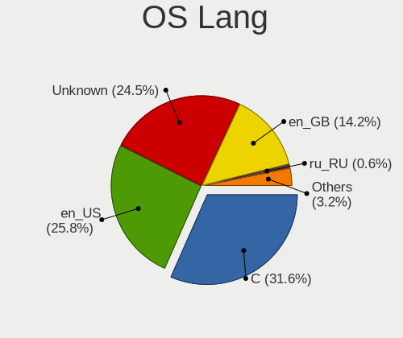

| Lang            | Notebooks | Percent |
|-----------------|-----------|---------|
| en_US           | 36        | 28.8%   |
| C               | 36        | 28.8%   |
| Unknown         | 30        | 24%     |
| en_GB           | 17        | 13.6%   |
| ru_RU           | 1         | 0.8%    |
| it_CH           | 1         | 0.8%    |
| fr_FR           | 1         | 0.8%    |
| en_UK           | 1         | 0.8%    |
| en_GB.US-ASCII  | 1         | 0.8%    |
| en_GB.ISO8859-1 | 1         | 0.8%    |

Boot Mode
---------

EFI or BIOS

| Mode | Notebooks | Percent |
|------|-----------|---------|
| EFI  | 95        | 82.61%  |
| BIOS | 20        | 17.39%  |

Filesystem
----------

Type of filesystem

| Type    | Notebooks | Percent |
|---------|-----------|---------|
| Zfs     | 62        | 52.1%   |
| Ufs     | 32        | 26.89%  |
| Ffs     | 13        | 10.92%  |
| Cd9660  | 11        | 9.24%   |
| Hammer2 | 1         | 0.84%   |

Part. scheme
------------

Scheme of partitioning

| Type    | Notebooks | Percent |
|---------|-----------|---------|
| GPT     | 104       | 89.66%  |
| MBR     | 10        | 8.62%   |
| BSD     | 1         | 0.86%   |
| Unknown | 1         | 0.86%   |

Board
-----

Vendor
------

Motherboard manufacturer

| Name                | Notebooks | Percent |
|---------------------|-----------|---------|
| Lenovo              | 33        | 28.95%  |
| Dell                | 16        | 14.04%  |
| Hewlett-Packard     | 15        | 13.16%  |
| Samsung Electronics | 6         | 5.26%   |
| Toshiba             | 5         | 4.39%   |
| ASUSTek Computer    | 5         | 4.39%   |
| Apple               | 5         | 4.39%   |
| Deciso              | 4         | 3.51%   |
| Star Labs           | 3         | 2.63%   |
| HUAWEI              | 3         | 2.63%   |
| OEGStone            | 2         | 1.75%   |
| TUXEDO              | 1         | 0.88%   |
| System76            | 1         | 0.88%   |
| Sony                | 1         | 0.88%   |
| Pegatron            | 1         | 0.88%   |
| Panasonic           | 1         | 0.88%   |
| Packard Bell        | 1         | 0.88%   |
| Notebook            | 1         | 0.88%   |
| MSI                 | 1         | 0.88%   |
| Jumper              | 1         | 0.88%   |
| Google              | 1         | 0.88%   |
| GEO                 | 1         | 0.88%   |
| Fujitsu Siemens     | 1         | 0.88%   |
| Fujitsu             | 1         | 0.88%   |
| Dynabook Europe     | 1         | 0.88%   |
| Alienware           | 1         | 0.88%   |
| Acer                | 1         | 0.88%   |
| Unknown             | 1         | 0.88%   |

Model
-----

Motherboard model

| Name                                  | Notebooks | Percent |
|---------------------------------------|-----------|---------|
| HP EliteBook 8570p                    | 3         | 2.63%   |
| Deciso NetBoard-A10                   | 3         | 2.63%   |
| Dell XPS 13 9343                      | 2         | 1.75%   |
| Dell Latitude E6420                   | 2         | 1.75%   |
| Dell Inspiron 3793                    | 2         | 1.75%   |
| ASUS ZenBook S UX391UA                | 2         | 1.75%   |
| TUXEDO Aura 15 Gen1                   | 1         | 0.88%   |
| Toshiba TECRA M11                     | 1         | 0.88%   |
| Toshiba Satellite Pro U400            | 1         | 0.88%   |
| Toshiba Satellite L50-C               | 1         | 0.88%   |
| Toshiba Satellite C660                | 1         | 0.88%   |
| Toshiba Satellite C50-B               | 1         | 0.88%   |
| System76 Gazelle                      | 1         | 0.88%   |
| Star Labs StarBook                    | 1         | 0.88%   |
| Star Labs Lite                        | 1         | 0.88%   |
| Star Labs LabTop                      | 1         | 0.88%   |
| Sony VPCF12C5E                        | 1         | 0.88%   |
| Samsung Q210                          | 1         | 0.88%   |
| Samsung NC10                          | 1         | 0.88%   |
| Samsung N150/N210/N220                | 1         | 0.88%   |
| Samsung N140                          | 1         | 0.88%   |
| Samsung 550P5C/550P7C                 | 1         | 0.88%   |
| Samsung 305E4A/305E5A/305E7A          | 1         | 0.88%   |
| Pegatron T12Ah                        | 1         | 0.88%   |
| Panasonic CF-C1BT02EGE                | 1         | 0.88%   |
| Packard Bell EasyNote_MX52-B-071      | 1         | 0.88%   |
| OEGStone W54_55SU1,SUW                | 1         | 0.88%   |
| OEGStone doceo 510                    | 1         | 0.88%   |
| Notebook NL5xRU                       | 1         | 0.88%   |
| MSI Modern 14 B11MOL                  | 1         | 0.88%   |
| Lenovo Z50-70 20354                   | 1         | 0.88%   |
| Lenovo ThinkPad Yoga 11e 20D9000QUK   | 1         | 0.88%   |
| Lenovo ThinkPad X280 20KESB4T00       | 1         | 0.88%   |
| Lenovo ThinkPad X270 W10DG 20K5S0DS00 | 1         | 0.88%   |
| Lenovo ThinkPad X270 W10DG 20K5S0DB05 | 1         | 0.88%   |
| Lenovo ThinkPad X240 20AMS1YG01       | 1         | 0.88%   |
| Lenovo ThinkPad X230 2325J67          | 1         | 0.88%   |
| Lenovo ThinkPad X230 2325IB1          | 1         | 0.88%   |
| Lenovo ThinkPad X230 23255NG          | 1         | 0.88%   |
| Lenovo ThinkPad X220 4291QT1          | 1         | 0.88%   |

Model Family
------------

Motherboard model prefix

| Name                   | Notebooks | Percent |
|------------------------|-----------|---------|
| Lenovo ThinkPad        | 29        | 25.44%  |
| Dell Latitude          | 8         | 7.02%   |
| Toshiba Satellite      | 4         | 3.51%   |
| HP EliteBook           | 4         | 3.51%   |
| Lenovo IdeaPad         | 3         | 2.63%   |
| Dell Inspiron          | 3         | 2.63%   |
| Deciso NetBoard-A10    | 3         | 2.63%   |
| Apple MacBookPro5      | 3         | 2.63%   |
| HP ProBook             | 2         | 1.75%   |
| HP Pavilion            | 2         | 1.75%   |
| Dell XPS               | 2         | 1.75%   |
| Dell Precision         | 2         | 1.75%   |
| ASUS ZenBook           | 2         | 1.75%   |
| TUXEDO Aura            | 1         | 0.88%   |
| Toshiba TECRA          | 1         | 0.88%   |
| System76 Gazelle       | 1         | 0.88%   |
| Star Labs StarBook     | 1         | 0.88%   |
| Star Labs Lite         | 1         | 0.88%   |
| Star Labs LabTop       | 1         | 0.88%   |
| Sony VPCF12C5E         | 1         | 0.88%   |
| Samsung Q210           | 1         | 0.88%   |
| Samsung NC10           | 1         | 0.88%   |
| Samsung N150           | 1         | 0.88%   |
| Samsung N140           | 1         | 0.88%   |
| Samsung 550P5C         | 1         | 0.88%   |
| Samsung 305E4A         | 1         | 0.88%   |
| Pegatron T12Ah         | 1         | 0.88%   |
| Panasonic CF-C1BT02EGE | 1         | 0.88%   |
| Packard Bell EasyNote  | 1         | 0.88%   |
| OEGStone W54           | 1         | 0.88%   |
| OEGStone doceo         | 1         | 0.88%   |
| Notebook NL5xRU        | 1         | 0.88%   |
| MSI Modern             | 1         | 0.88%   |
| Lenovo Z50-70          | 1         | 0.88%   |
| Jumper EZbook          | 1         | 0.88%   |
| HUAWEI MACHD-WXX9      | 1         | 0.88%   |
| HUAWEI BOM-WXX9        | 1         | 0.88%   |
| HUAWEI BOHB-WAX9       | 1         | 0.88%   |
| HP ZBook               | 1         | 0.88%   |
| HP Notebook            | 1         | 0.88%   |

MFG Year
--------

Motherboard manufacture year

| Year | Notebooks | Percent |
|------|-----------|---------|
| 2020 | 12        | 10.53%  |
| 2012 | 10        | 8.77%   |
| 2011 | 10        | 8.77%   |
| 2022 | 9         | 7.89%   |
| 2016 | 9         | 7.89%   |
| 2010 | 9         | 7.89%   |
| 2019 | 8         | 7.02%   |
| 2018 | 8         | 7.02%   |
| 2021 | 7         | 6.14%   |
| 2009 | 7         | 6.14%   |
| 2013 | 6         | 5.26%   |
| 2015 | 4         | 3.51%   |
| 2014 | 4         | 3.51%   |
| 2008 | 4         | 3.51%   |
| 2023 | 3         | 2.63%   |
| 2017 | 2         | 1.75%   |
| 2007 | 2         | 1.75%   |

Form Factor
-----------

Physical design of the computer

| Name     | Notebooks | Percent |
|----------|-----------|---------|
| Notebook | 114       | 100%    |

Coreboot
--------

Have coreboot on board

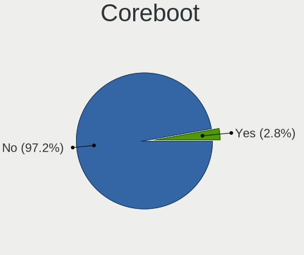

| Used | Notebooks | Percent |
|------|-----------|---------|
| No   | 110       | 96.49%  |
| Yes  | 4         | 3.51%   |

RAM Size
--------

Total RAM memory

| Size in GB  | Notebooks | Percent |
|-------------|-----------|---------|
| 8.01-16.0   | 53        | 45.3%   |
| 4.01-8.0    | 26        | 22.22%  |
| 16.01-24.0  | 24        | 20.51%  |
| 32.01-64.0  | 6         | 5.13%   |
| 2.01-3.0    | 5         | 4.27%   |
| 64.01-256.0 | 2         | 1.71%   |
| 3.01-4.0    | 1         | 0.85%   |

RAM Used
--------

Used RAM memory

| Used GB   | Notebooks | Percent |
|-----------|-----------|---------|
| 0.01-0.5  | 69        | 57.02%  |
| 0.51-1.0  | 37        | 30.58%  |
| 1.01-2.0  | 8         | 6.61%   |
| 2.01-3.0  | 4         | 3.31%   |
| 4.01-8.0  | 1         | 0.83%   |
| 3.01-4.0  | 1         | 0.83%   |
| 8.01-16.0 | 1         | 0.83%   |

Total Drives
------------

Number of drives on board

| Drives | Notebooks | Percent |
|--------|-----------|---------|
| 1      | 92        | 74.19%  |
| 2      | 23        | 18.55%  |
| 0      | 5         | 4.03%   |
| 3      | 4         | 3.23%   |

Has CD-ROM
----------

Has CD-ROM on board

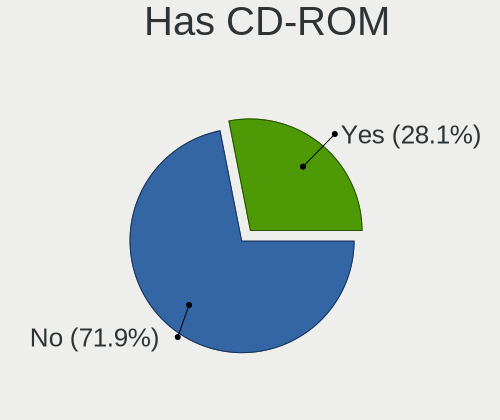

| Presented | Notebooks | Percent |
|-----------|-----------|---------|
| No        | 83        | 70.34%  |
| Yes       | 35        | 29.66%  |

Has Ethernet
------------

Has Ethernet on board

| Presented | Notebooks | Percent |
|-----------|-----------|---------|
| Yes       | 93        | 81.58%  |
| No        | 21        | 18.42%  |

Has WiFi
--------

Has WiFi module

| Presented | Notebooks | Percent |
|-----------|-----------|---------|
| Yes       | 109       | 95.61%  |
| No        | 5         | 4.39%   |

Has Bluetooth
-------------

Has Bluetooth module

| Presented | Notebooks | Percent |
|-----------|-----------|---------|
| Yes       | 75        | 64.1%   |
| No        | 42        | 35.9%   |

Location
--------

Country
-------

Geographic location (country)

| Country | Notebooks | Percent |
|---------|-----------|---------|
| UK      | 114       | 100%    |

City
----

Geographic location (city)

| City            | Notebooks | Percent |
|-----------------|-----------|---------|
| London          | 11        | 7.97%   |
| Brighton        | 7         | 5.07%   |
| Glasgow         | 6         | 4.35%   |
| Manchester      | 5         | 3.62%   |
| Swindon         | 3         | 2.17%   |
| Shoreham-by-Sea | 3         | 2.17%   |
| Oxford          | 3         | 2.17%   |
| Leatherhead     | 3         | 2.17%   |
| City of London  | 3         | 2.17%   |
| Worthing        | 2         | 1.45%   |
| Reading         | 2         | 1.45%   |
| Plymouth        | 2         | 1.45%   |
| Peterborough    | 2         | 1.45%   |
| Ipswich         | 2         | 1.45%   |
| Hove            | 2         | 1.45%   |
| Greenwich       | 2         | 1.45%   |
| Gloucester      | 2         | 1.45%   |
| East Grinstead  | 2         | 1.45%   |
| Coventry        | 2         | 1.45%   |
| Addlestone      | 2         | 1.45%   |
| Wraysbury       | 1         | 0.72%   |
| Woking          | 1         | 0.72%   |
| West Bromwich   | 1         | 0.72%   |
| Watford         | 1         | 0.72%   |
| Walsall         | 1         | 0.72%   |
| Wakefield       | 1         | 0.72%   |
| Tottenham       | 1         | 0.72%   |
| Tatsfield       | 1         | 0.72%   |
| Sutton          | 1         | 0.72%   |
| Stretford       | 1         | 0.72%   |
| St Austell      | 1         | 0.72%   |
| St Albans       | 1         | 0.72%   |
| Southampton     | 1         | 0.72%   |
| South Croydon   | 1         | 0.72%   |
| Ruislip         | 1         | 0.72%   |
| Rugby           | 1         | 0.72%   |
| Reigate         | 1         | 0.72%   |
| Pevensey        | 1         | 0.72%   |
| Perth           | 1         | 0.72%   |
| Oxenhope        | 1         | 0.72%   |

Drives
------

Drive Vendor
------------

Hard drive vendors

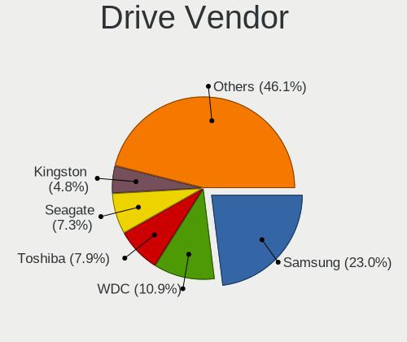

| Vendor              | Notebooks | Drives | Percent |
|---------------------|-----------|--------|---------|
| Samsung Electronics | 34        | 57     | 24.29%  |
| WDC                 | 17        | 24     | 12.14%  |
| Toshiba             | 12        | 26     | 8.57%   |
| Seagate             | 11        | 15     | 7.86%   |
| HGST                | 6         | 37     | 4.29%   |
| Crucial             | 6         | 6      | 4.29%   |
| Intel               | 5         | 5      | 3.57%   |
| Hitachi             | 5         | 5      | 3.57%   |
| Transcend           | 4         | 7      | 2.86%   |
| SanDisk             | 4         | 4      | 2.86%   |
| NVMe                | 4         | 4      | 2.86%   |
| SK hynix            | 3         | 3      | 2.14%   |
| Kingston            | 3         | 3      | 2.14%   |
| XUM                 | 2         | 2      | 1.43%   |
| Star Drive          | 2         | 2      | 1.43%   |
| Phison              | 2         | 2      | 1.43%   |
| Corsair             | 2         | 3      | 1.43%   |
| Apple               | 2         | 3      | 1.43%   |
| UMIS                | 1         | 1      | 0.71%   |
| SPCC                | 1         | 1      | 0.71%   |
| Solid State Storage | 1         | 1      | 0.71%   |
| SATA3 60            | 1         | 1      | 0.71%   |
| PNY                 | 1         | 1      | 0.71%   |
| OWC                 | 1         | 1      | 0.71%   |
| Micron Technology   | 1         | 1      | 0.71%   |
| MicroDream          | 1         | 1      | 0.71%   |
| LITEON              | 1         | 1      | 0.71%   |
| Lexar               | 1         | 1      | 0.71%   |
| Intenso             | 1         | 1      | 0.71%   |
| Integral            | 1         | 1      | 0.71%   |
| Fujitsu             | 1         | 6      | 0.71%   |
| FORESEE             | 1         | 1      | 0.71%   |
| Apacer              | 1         | 1      | 0.71%   |
| A-DATA Technology   | 1         | 1      | 0.71%   |

Drive Model
-----------

Hard drive models

| Model                                              | Notebooks | Percent |
|----------------------------------------------------|-----------|---------|
| Toshiba MQ01ABF050 500GB                           | 6         | 4.14%   |
| HGST HTS725050A7E630 500GB                         | 4         | 2.76%   |
| Transcend TS256GMTE652T2 256GB                     | 3         | 2.07%   |
| Seagate ST1000LM024 HN-M101MBB 1TB                 | 3         | 2.07%   |
| Samsung HM251JX 250GB                              | 3         | 2.07%   |
| XUM HX256GSSDSATA3 256GB                           | 2         | 1.38%   |
| WDC WDS250G2B0B-00YS70 250GB                       | 2         | 1.38%   |
| WDC WDS240G2G0A-00JH30 240GB                       | 2         | 1.38%   |
| WDC WD3200BPVT-80JJ5T0 320GB                       | 2         | 1.38%   |
| WDC WD1600BEVT-80A23T0 160GB                       | 2         | 1.38%   |
| WDC WD1600BEVT-22ZCT0 160GB                        | 2         | 1.38%   |
| Seagate ST9320423AS 320GB                          | 2         | 1.38%   |
| Seagate ST1000LM035-1RK172 1TB                     | 2         | 1.38%   |
| Samsung SSD PM851 M.2 2280 256GB                   | 2         | 1.38%   |
| Samsung SSD 860 EVO 500GB                          | 2         | 1.38%   |
| Samsung MZVLW512HMJP-00000 512GB                   | 2         | 1.38%   |
| HGST HTS721010A9E630 1TB                           | 2         | 1.38%   |
| Crucial CT500P2SSD8 500GB                          | 2         | 1.38%   |
| WDC WDS250G2B0A 250GB                              | 1         | 0.69%   |
| WDC WDS120G2G0A-00JH30 120GB                       | 1         | 0.69%   |
| WDC WD7500BPKX-00HPJT0 752GB                       | 1         | 0.69%   |
| WDC WD2500BEVT-80A23T0 250GB                       | 1         | 0.69%   |
| WDC WD2500BEVT-22ZCT0 250GB                        | 1         | 0.69%   |
| WDC WD1600BEVS-08VAT2 160GB                        | 1         | 0.69%   |
| WDC PC SN730 SDBQNTY-256G-1001 256GB               | 1         | 0.69%   |
| UMIS RPJTJ512MEE1OWX 512GB                         | 1         | 0.69%   |
| Transcend TS128GMTE110S 128GB                      | 1         | 0.69%   |
| Toshiba THNSNJ128GMCU 128GB                        | 1         | 0.69%   |
| Toshiba THNSF5256GPUK 256GB                        | 1         | 0.69%   |
| Toshiba MK8034GSX 80GB                             | 1         | 0.69%   |
| Toshiba MK5061GSY 500GB                            | 1         | 0.69%   |
| Toshiba KXG5AZNV256G 256GB                         | 1         | 0.69%   |
| Toshiba KBG30ZMV256G 256GB                         | 1         | 0.69%   |
| Star Drive SATA SSD 960GB                          | 1         | 0.69%   |
| Star Drive PCIe SSD 960GB                          | 1         | 0.69%   |
| SPCC Solid State Disk 128GB                        | 1         | 0.69%   |
| Solid State Storage CL1-3D128-Q11 NVMe SSSTC 128GB | 1         | 0.69%   |
| SK hynix SKHynix_HFS001TDE9X081N 1TB               | 1         | 0.69%   |
| SK hynix PC711 NVMe 512GB                          | 1         | 0.69%   |
| SK hynix BC511 HFM256GDJTNI-82A0A 256GB            | 1         | 0.69%   |

HDD Vendor
----------

Hard disk drive vendors

| Vendor              | Notebooks | Drives | Percent |
|---------------------|-----------|--------|---------|
| Seagate             | 11        | 15     | 22.45%  |
| WDC                 | 10        | 13     | 20.41%  |
| Toshiba             | 8         | 20     | 16.33%  |
| HGST                | 6         | 37     | 12.24%  |
| Samsung Electronics | 5         | 5      | 10.2%   |
| Hitachi             | 5         | 5      | 10.2%   |
| NVMe                | 3         | 3      | 6.12%   |
| Fujitsu             | 1         | 6      | 2.04%   |

SSD Vendor
----------

Solid state drive vendors

| Vendor              | Notebooks | Drives | Percent |
|---------------------|-----------|--------|---------|
| Samsung Electronics | 19        | 37     | 31.15%  |
| WDC                 | 6         | 10     | 9.84%   |
| SanDisk             | 4         | 4      | 6.56%   |
| Kingston            | 3         | 3      | 4.92%   |
| Intel               | 3         | 3      | 4.92%   |
| Crucial             | 3         | 3      | 4.92%   |
| XUM                 | 2         | 2      | 3.28%   |
| Corsair             | 2         | 3      | 3.28%   |
| Apple               | 2         | 3      | 3.28%   |
| Toshiba             | 1         | 1      | 1.64%   |
| Star Drive          | 1         | 1      | 1.64%   |
| SPCC                | 1         | 1      | 1.64%   |
| SATA3 60            | 1         | 1      | 1.64%   |
| PNY                 | 1         | 1      | 1.64%   |
| Phison              | 1         | 1      | 1.64%   |
| OWC                 | 1         | 1      | 1.64%   |
| NVMe                | 1         | 1      | 1.64%   |
| Micron Technology   | 1         | 1      | 1.64%   |
| MicroDream          | 1         | 1      | 1.64%   |
| LITEON              | 1         | 1      | 1.64%   |
| Lexar               | 1         | 1      | 1.64%   |
| Intenso             | 1         | 1      | 1.64%   |
| Integral            | 1         | 1      | 1.64%   |
| FORESEE             | 1         | 1      | 1.64%   |
| Apacer              | 1         | 1      | 1.64%   |
| A-DATA Technology   | 1         | 1      | 1.64%   |

Drive Kind
----------

HDD or SSD

| Kind | Notebooks | Drives | Percent |
|------|-----------|--------|---------|
| SSD  | 56        | 85     | 44.09%  |
| HDD  | 41        | 104    | 32.28%  |
| NVMe | 30        | 40     | 23.62%  |

Drive Connector
---------------

SATA, SAS, NVMe, etc.

| Type | Notebooks | Drives | Percent |
|------|-----------|--------|---------|
| SATA | 87        | 189    | 74.36%  |
| NVMe | 30        | 40     | 25.64%  |

Drive Size
----------

Size of hard drive

| Size in TB | Notebooks | Drives | Percent |
|------------|-----------|--------|---------|
| 0.01-0.5   | 76        | 140    | 80%     |
| 0.51-1.0   | 13        | 42     | 13.68%  |
| 1.01-2.0   | 5         | 6      | 5.26%   |
| 3.01-4.0   | 1         | 1      | 1.05%   |

Space Total
-----------

Amount of disk space available on the file system

| Size in GB | Notebooks | Percent |
|------------|-----------|---------|
| 101-250    | 46        | 35.38%  |
| 251-500    | 28        | 21.54%  |
| 1-20       | 28        | 21.54%  |
| 501-1000   | 10        | 7.69%   |
| 51-100     | 8         | 6.15%   |
| 21-50      | 6         | 4.62%   |
| Unknown    | 3         | 2.31%   |
| 1001-2000  | 1         | 0.77%   |

Space Used
----------

Amount of used disk space

| Used GB | Notebooks | Percent |
|---------|-----------|---------|
| 1-20    | 97        | 76.38%  |
| 21-50   | 17        | 13.39%  |
| 51-100  | 6         | 4.72%   |
| 101-250 | 4         | 3.15%   |
| Unknown | 3         | 2.36%   |

Malfunc. Drives
---------------

Drive models with a malfunction

| Model                                            | Notebooks | Drives | Percent |
|--------------------------------------------------|-----------|--------|---------|
| HGST HTS725050A7E630 500GB                       | 4         | 10     | 20%     |
| HGST HTS721010A9E630 1TB                         | 2         | 21     | 10%     |
| WDC WD2500BEVT-80A23T0 250GB                     | 1         | 1      | 5%      |
| WDC WD1600BEVT-80A23T0 160GB                     | 1         | 1      | 5%      |
| Seagate ST9320423AS 320GB                        | 1         | 1      | 5%      |
| Seagate ST9160821AS 160GB                        | 1         | 1      | 5%      |
| Samsung Electronics SSD PM810 2.5-inch 7mm 256GB | 1         | 1      | 5%      |
| Samsung Electronics HM320JI 320GB                | 1         | 1      | 5%      |
| Samsung Electronics HM251JX 250GB                | 1         | 1      | 5%      |
| Samsung Electronics HM160HI 160GB                | 1         | 1      | 5%      |
| Micron Technology MTFDDAK256MAM-1K12 256GB       | 1         | 1      | 5%      |
| Hitachi HTS545050A7E380 500GB                    | 1         | 1      | 5%      |
| Hitachi HTS545032B9A302 320GB                    | 1         | 1      | 5%      |
| Hitachi HTS543232A7A384 320GB                    | 1         | 1      | 5%      |
| HGST HTS541010A9E680 1TB                         | 1         | 1      | 5%      |
| A-DATA Technology SP550 240GB                    | 1         | 1      | 5%      |

Malfunc. Drive Vendor
---------------------

Vendors of faulty drives

| Vendor              | Notebooks | Drives | Percent |
|---------------------|-----------|--------|---------|
| HGST                | 5         | 32     | 27.78%  |
| Samsung Electronics | 4         | 4      | 22.22%  |
| Hitachi             | 3         | 3      | 16.67%  |
| WDC                 | 2         | 2      | 11.11%  |
| Seagate             | 2         | 2      | 11.11%  |
| Micron Technology   | 1         | 1      | 5.56%   |
| A-DATA Technology   | 1         | 1      | 5.56%   |

Malfunc. HDD Vendor
-------------------

Vendors of faulty HDD drives

| Vendor              | Notebooks | Drives | Percent |
|---------------------|-----------|--------|---------|
| HGST                | 5         | 32     | 33.33%  |
| Samsung Electronics | 3         | 3      | 20%     |
| Hitachi             | 3         | 3      | 20%     |
| WDC                 | 2         | 2      | 13.33%  |
| Seagate             | 2         | 2      | 13.33%  |

Malfunc. Drive Kind
-------------------

Kinds of faulty drives

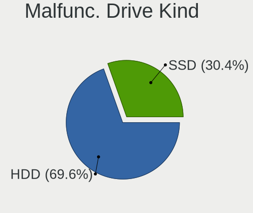

| Kind | Notebooks | Drives | Percent |
|------|-----------|--------|---------|
| HDD  | 14        | 42     | 82.35%  |
| SSD  | 3         | 3      | 17.65%  |

Failed Drives
-------------

Failed drive models

Zero info for selected period =(

Failed Drive Vendor
-------------------

Failed drive vendors

Zero info for selected period =(

Drive Status
------------

Number of failed and malfunc. drives

| Status   | Notebooks | Drives | Percent |
|----------|-----------|--------|---------|
| Works    | 97        | 176    | 80.83%  |
| Malfunc  | 17        | 45     | 14.17%  |
| Detected | 6         | 8      | 5%      |

Storage controller
------------------

Storage Vendor
--------------

Storage controller vendors

| Vendor                                  | Notebooks | Percent |
|-----------------------------------------|-----------|---------|
| Intel                                   | 83        | 65.35%  |
| Samsung Electronics                     | 13        | 10.24%  |
| AMD                                     | 5         | 3.94%   |
| Transcend                               | 4         | 3.15%   |
| Toshiba                                 | 4         | 3.15%   |
| Phison Electronics                      | 4         | 3.15%   |
| Nvidia                                  | 4         | 3.15%   |
| SK hynix                                | 3         | 2.36%   |
| Micron/Crucial Technology               | 3         | 2.36%   |
| Solid State Storage Technology          | 1         | 0.79%   |
| Shenzhen Unionmemory Information System | 1         | 0.79%   |
| SanDisk                                 | 1         | 0.79%   |
| Kingston Technology Company             | 1         | 0.79%   |

Storage Model
-------------

Storage controller models

| Model                                                                          | Notebooks | Percent |
|--------------------------------------------------------------------------------|-----------|---------|
| Intel 6 Series/C200 Series Chipset Family 6 port Mobile SATA AHCI Controller   | 11        | 7.97%   |
| Intel 7 Series Chipset Family 6-port SATA Controller [AHCI mode]               | 10        | 7.25%   |
| Intel 82801 Mobile SATA Controller [RAID mode]                                 | 9         | 6.52%   |
| Intel Sunrise Point-LP SATA Controller [AHCI mode]                             | 6         | 4.35%   |
| Intel 8 Series SATA Controller 1 [AHCI mode]                                   | 6         | 4.35%   |
| Samsung NVMe SSD Controller 980 (DRAM-less)                                    | 5         | 3.62%   |
| Intel 82801IBM/IEM (ICH9M/ICH9M-E) 4 port SATA Controller [AHCI mode]          | 5         | 3.62%   |
| Transcend NVMe PCIe SSD 110S/112S/120S/MTE300S/MTE400S/MTE652T2 (DRAM-less)    | 4         | 2.9%    |
| Samsung NVMe SSD Controller SM961/PM961/SM963                                  | 4         | 2.9%    |
| Nvidia MCP79 AHCI Controller                                                   | 4         | 2.9%    |
| Intel Wildcat Point-LP SATA Controller [AHCI Mode]                             | 4         | 2.9%    |
| Intel 5 Series/3400 Series Chipset 6 port SATA AHCI Controller                 | 4         | 2.9%    |
| AMD FCH SATA Controller [AHCI mode]                                            | 4         | 2.9%    |
| Intel Comet Lake SATA AHCI Controller                                          | 3         | 2.17%   |
| Intel Celeron/Pentium Silver Processor SATA Controller                         | 3         | 2.17%   |
| Toshiba XG5 NVMe SSD Controller                                                | 2         | 1.45%   |
| SK hynix Gold P31/BC711/PC711 NVMe Solid State Drive                           | 2         | 1.45%   |
| Phison PS5013-E13 PCIe3 NVMe Controller (DRAM-less)                            | 2         | 1.45%   |
| Phison E12 NVMe Controller                                                     | 2         | 1.45%   |
| Micron/Crucial P2 [Nick P2] / P3 / P3 Plus NVMe PCIe SSD (DRAM-less)           | 2         | 1.45%   |
| Intel Volume Management Device NVMe RAID Controller                            | 2         | 1.45%   |
| Intel Q170/Q150/B150/H170/H110/Z170/CM236 Chipset SATA Controller [AHCI Mode]  | 2         | 1.45%   |
| Intel NM10/ICH7 Family SATA Controller [AHCI mode]                             | 2         | 1.45%   |
| Intel Atom Processor E3800 Series SATA AHCI Controller                         | 2         | 1.45%   |
| Intel 82801GBM/GHM (ICH7-M Family) SATA Controller [IDE mode]                  | 2         | 1.45%   |
| Intel 8 Series/C220 Series Chipset Family 6-port SATA Controller 1 [AHCI mode] | 2         | 1.45%   |
| Intel 7 Series Chipset Family 4-port SATA Controller [IDE mode]                | 2         | 1.45%   |
| Intel 7 Series Chipset Family 2-port SATA Controller [IDE mode]                | 2         | 1.45%   |
| Toshiba XG4 NVMe SSD Controller                                                | 1         | 0.72%   |
| Toshiba BG3 x2 NVMe SSD Controller (DRAM-less)                                 | 1         | 0.72%   |
| Solid State Storage CL1-3D256-Q11 NVMe SSD M.2                                 | 1         | 0.72%   |
| SK hynix BC511 NVMe SSD                                                        | 1         | 0.72%   |
| Shenzhen Unionmemory Information System AM620 PCIe 3.0 NVMe SSD 512GB          | 1         | 0.72%   |
| SanDisk Extreme Pro / WD Black SN750 / PC SN730 / Red SN700 NVMe SSD           | 1         | 0.72%   |
| Samsung S4LN058A01[SSUBX] AHCI SSD Controller (Apple slot)                     | 1         | 0.72%   |
| Samsung S4LN053X01 AHCI SSD Controller(Apple slot)                             | 1         | 0.72%   |
| Samsung NVMe SSD Controller SM981/PM981/PM983                                  | 1         | 0.72%   |
| Samsung NVMe SSD Controller SM951/PM951                                        | 1         | 0.72%   |
| Samsung NVMe SSD Controller PM9A1/PM9A3/980PRO                                 | 1         | 0.72%   |
| Micron/Crucial P1 NVMe PCIe SSD[Frampton]                                      | 1         | 0.72%   |

Storage Kind
------------

Kind of storage controller (IDE, SATA, NVMe, SAS, ...)

| Kind | Notebooks | Percent |
|------|-----------|---------|
| SATA | 77        | 58.33%  |
| NVMe | 34        | 25.76%  |
| RAID | 11        | 8.33%   |
| IDE  | 10        | 7.58%   |

Processor
---------

CPU Vendor
----------

Processor vendors

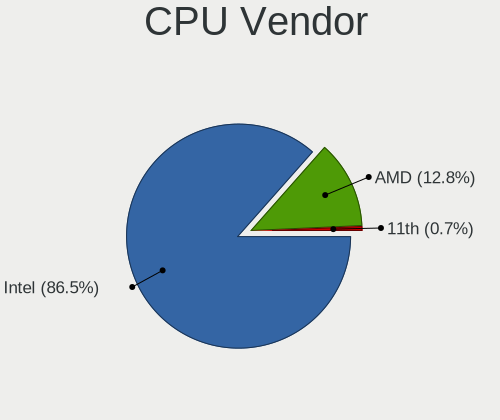

| Vendor | Notebooks | Percent |
|--------|-----------|---------|
| Intel  | 101       | 88.6%   |
| AMD    | 12        | 10.53%  |
| 11th   | 1         | 0.88%   |

CPU Model
---------

Processor models

| Model                                    | Notebooks | Percent |
|------------------------------------------|-----------|---------|
| Intel CPU Version                        | 4         | 3.51%   |
| Intel Core i7-8550U CPU @ 1.80GHz        | 4         | 3.51%   |
| Intel Core i7-3520M CPU @ 2.90GHz        | 4         | 3.51%   |
| Intel Core i5-6300U CPU @ 2.40GHz        | 4         | 3.51%   |
| AMD Ryzen Embedded V1500B                | 4         | 3.51%   |
| Intel Core i5-4300U CPU @ 1.90GHz        | 3         | 2.63%   |
| Intel Core i5-2520M CPU @ 2.50GHz        | 3         | 2.63%   |
| Intel Core i7-8565U CPU @ 1.80GHz        | 2         | 1.75%   |
| Intel Core i7-5600U CPU @ 2.60GHz        | 2         | 1.75%   |
| Intel Core i7-1065G7 CPU @ 1.30GHz       | 2         | 1.75%   |
| Intel Core i5-8250U CPU @ 1.60GHz        | 2         | 1.75%   |
| Intel Core i5-7300U CPU @ 2.60GHz        | 2         | 1.75%   |
| Intel Core i5-4210U CPU @ 1.70GHz        | 2         | 1.75%   |
| Intel Core i5-3320M CPU @ 2.60GHz        | 2         | 1.75%   |
| Intel Core i5-2540M CPU @ 2.60GHz        | 2         | 1.75%   |
| Intel Core i5-10210U CPU @ 1.60GHz       | 2         | 1.75%   |
| Intel Core 2 Duo CPU P8600 @ 2.40GHz     | 2         | 1.75%   |
| Intel Celeron N4000 CPU @ 1.10GHz        | 2         | 1.75%   |
| Intel Atom CPU N450 @ 1.66GHz            | 2         | 1.75%   |
| Intel 11th Gen Core i7-1165G7 @ 2.80GHz  | 2         | 1.75%   |
| Intel 11th Gen Core i5-1135G7 @ 2.40GHz  | 2         | 1.75%   |
| AMD Ryzen 7 4700U with Radeon Graphics   | 2         | 1.75%   |
| Intel Xeon CPU E3-1535M v5 @ 2.90GHz     | 1         | 0.88%   |
| Intel Pentium Silver N5030 CPU @ 1.10GHz | 1         | 0.88%   |
| Intel Pentium Gold 7505 @ 2.00GHz        | 1         | 0.88%   |
| Intel Pentium Dual CPU T3200 @ 2.00GHz   | 1         | 0.88%   |
| Intel Pentium CPU N3700 @ 1.60GHz        | 1         | 0.88%   |
| Intel Pentium CPU 967 @ 1.30GHz          | 1         | 0.88%   |
| Intel Pentium CPU 3825U @ 1.90GHz        | 1         | 0.88%   |
| Intel Core i7-6820HQ CPU @ 2.70GHz       | 1         | 0.88%   |
| Intel Core i7-6700HQ CPU @ 2.60GHz       | 1         | 0.88%   |
| Intel Core i7-6600U CPU @ 2.60GHz        | 1         | 0.88%   |
| Intel Core i7-4770HQ CPU @ 2.20GHz       | 1         | 0.88%   |
| Intel Core i7-4710MQ CPU @ 2.50GHz       | 1         | 0.88%   |
| Intel Core i7-4600U CPU @ 2.10GHz        | 1         | 0.88%   |
| Intel Core i7-3630QM CPU @ 2.40GHz       | 1         | 0.88%   |
| Intel Core i7-3612QM CPU @ 2.10GHz       | 1         | 0.88%   |
| Intel Core i7-3540M CPU @ 3.00GHz        | 1         | 0.88%   |
| Intel Core i7-2820QM CPU @ 2.30GHz       | 1         | 0.88%   |
| Intel Core i7-2720QM CPU @ 2.20GHz       | 1         | 0.88%   |

CPU Model Family
----------------

Processor model prefix

| Model                | Notebooks | Percent |
|----------------------|-----------|---------|
| Intel Core i5        | 34        | 29.82%  |
| Intel Core i7        | 30        | 26.32%  |
| Other                | 10        | 8.77%   |
| Intel Core 2 Duo     | 8         | 7.02%   |
| Intel Celeron        | 8         | 7.02%   |
| AMD Ryzen Embedded   | 4         | 3.51%   |
| Intel Pentium        | 3         | 2.63%   |
| Intel Atom           | 3         | 2.63%   |
| AMD Ryzen 7          | 3         | 2.63%   |
| AMD A6               | 2         | 1.75%   |
| Intel Xeon           | 1         | 0.88%   |
| Intel Pentium Silver | 1         | 0.88%   |
| Intel Pentium Gold   | 1         | 0.88%   |
| Intel Pentium Dual   | 1         | 0.88%   |
| Intel Core i3        | 1         | 0.88%   |
| Intel Core 2         | 1         | 0.88%   |
| AMD Ryzen 5          | 1         | 0.88%   |
| AMD Ryzen 3 PRO      | 1         | 0.88%   |
| AMD Athlon 64 X2     | 1         | 0.88%   |

CPU Cores
---------

Number of processor cores

| Number  | Notebooks | Percent |
|---------|-----------|---------|
| 2       | 58        | 50.88%  |
| 4       | 33        | 28.95%  |
| Unknown | 9         | 7.89%   |
| 8       | 8         | 7.02%   |
| 1       | 3         | 2.63%   |
| 16      | 2         | 1.75%   |
| 12      | 1         | 0.88%   |

CPU Sockets
-----------

Number of sockets

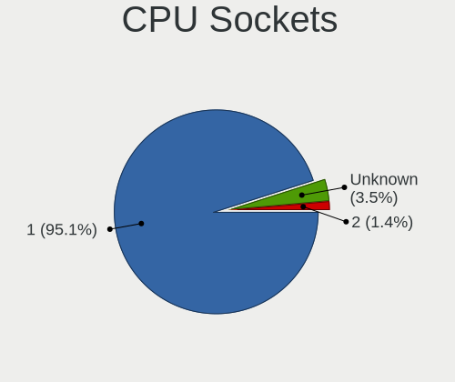

| Number  | Notebooks | Percent |
|---------|-----------|---------|
| 1       | 109       | 95.61%  |
| Unknown | 3         | 2.63%   |
| 2       | 2         | 1.75%   |

CPU Threads
-----------

Threads per core (Hyper-Threading)

| Number  | Notebooks | Percent |
|---------|-----------|---------|
| 2       | 76        | 66.67%  |
| 1       | 29        | 25.44%  |
| Unknown | 9         | 7.89%   |

CPU Microarch
-------------

Microarchitecture

| Name          | Notebooks | Percent |
|---------------|-----------|---------|
| KabyLake      | 14        | 12.28%  |
| SandyBridge   | 12        | 10.53%  |
| IvyBridge     | 11        | 9.65%   |
| Haswell       | 11        | 9.65%   |
| Skylake       | 9         | 7.89%   |
| Penryn        | 8         | 7.02%   |
| Westmere      | 5         | 4.39%   |
| TigerLake     | 5         | 4.39%   |
| Bonnell       | 5         | 4.39%   |
| Zen           | 4         | 3.51%   |
| Goldmont plus | 4         | 3.51%   |
| Core          | 4         | 3.51%   |
| Broadwell     | 4         | 3.51%   |
| Unknown       | 4         | 3.51%   |
| Zen 2         | 3         | 2.63%   |
| Silvermont    | 3         | 2.63%   |
| IceLake       | 2         | 1.75%   |
| Nehalem       | 1         | 0.88%   |
| K8 Hammer     | 1         | 0.88%   |
| K10 Llano     | 1         | 0.88%   |
| Goldmont      | 1         | 0.88%   |
| Excavator     | 1         | 0.88%   |
| CometLake     | 1         | 0.88%   |

Graphics
--------

GPU Vendor
----------

Vendors of graphics cards

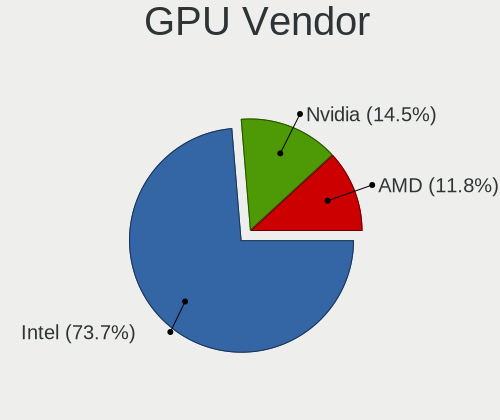

| Vendor | Notebooks | Percent |
|--------|-----------|---------|
| Intel  | 91        | 73.98%  |
| Nvidia | 20        | 16.26%  |
| AMD    | 12        | 9.76%   |

GPU Model
---------

Graphics card models

| Model                                                                         | Notebooks | Percent |
|-------------------------------------------------------------------------------|-----------|---------|
| Intel 2nd Generation Core Processor Family Integrated Graphics Controller     | 12        | 9.23%   |
| Intel Haswell-ULT Integrated Graphics Controller                              | 8         | 6.15%   |
| Intel 3rd Gen Core processor Graphics Controller                              | 8         | 6.15%   |
| Intel UHD Graphics 620                                                        | 7         | 5.38%   |
| Intel Skylake GT2 [HD Graphics 520]                                           | 6         | 4.62%   |
| Intel TigerLake-LP GT2 [Iris Xe Graphics]                                     | 5         | 3.85%   |
| Intel Mobile 4 Series Chipset Integrated Graphics Controller                  | 5         | 3.85%   |
| Intel Core Processor Integrated Graphics Controller                           | 4         | 3.08%   |
| Nvidia C79 [GeForce 9400M]                                                    | 3         | 2.31%   |
| Intel Mobile 945GM/GMS/GME, 943/940GML Express Integrated Graphics Controller | 3         | 2.31%   |
| Intel GeminiLake [UHD Graphics 600]                                           | 3         | 2.31%   |
| Intel CometLake-U GT2 [UHD Graphics]                                          | 3         | 2.31%   |
| Intel Atom Processor D4xx/D5xx/N4xx/N5xx Integrated Graphics Controller       | 3         | 2.31%   |
| AMD Thames [Radeon HD 7550M/7570M/7650M]                                      | 3         | 2.31%   |
| AMD Renoir [Radeon RX Vega 6 (Ryzen 4000/5000 Mobile Series)]                 | 3         | 2.31%   |
| Nvidia GP108M [GeForce MX230]                                                 | 2         | 1.54%   |
| Nvidia G96CM [GeForce 9600M GT]                                               | 2         | 1.54%   |
| Intel WhiskeyLake-U GT2 [UHD Graphics 620]                                    | 2         | 1.54%   |
| Intel Mobile 945GSE Express Integrated Graphics Controller                    | 2         | 1.54%   |
| Intel Iris Plus Graphics G7                                                   | 2         | 1.54%   |
| Intel HD Graphics 620                                                         | 2         | 1.54%   |
| Intel HD Graphics 5500                                                        | 2         | 1.54%   |
| Intel HD Graphics 530                                                         | 2         | 1.54%   |
| Intel HD Graphics                                                             | 2         | 1.54%   |
| Intel Atom Processor Z36xxx/Z37xxx Series Graphics & Display                  | 2         | 1.54%   |
| Intel 4th Gen Core Processor Integrated Graphics Controller                   | 2         | 1.54%   |
| AMD Lucienne                                                                  | 2         | 1.54%   |
| Nvidia TU117GLM [T550 Laptop GPU]                                             | 1         | 0.77%   |
| Nvidia TU117GLM [Quadro T2000 Mobile / Max-Q]                                 | 1         | 0.77%   |
| Nvidia MCP79 [GeForce 8200M G]                                                | 1         | 0.77%   |
| Nvidia GT218M [NVS 3100M]                                                     | 1         | 0.77%   |
| Nvidia GT216M [GeForce GT 330M]                                               | 1         | 0.77%   |
| Nvidia GP108M [GeForce MX250]                                                 | 1         | 0.77%   |
| Nvidia GP108BM [GeForce MX250]                                                | 1         | 0.77%   |
| Nvidia GP107M [GeForce MX350]                                                 | 1         | 0.77%   |
| Nvidia GM204GLM [Quadro M4000M]                                               | 1         | 0.77%   |
| Nvidia GM107GLM [Quadro M2000M]                                               | 1         | 0.77%   |
| Nvidia GK107M [GeForce GT 650M]                                               | 1         | 0.77%   |
| Nvidia GK107GLM [Quadro K1100M]                                               | 1         | 0.77%   |
| Nvidia GF114M [GeForce GTX 580M]                                              | 1         | 0.77%   |

GPU Combo
---------

Combinations of graphics cards

| Name           | Notebooks | Percent |
|----------------|-----------|---------|
| 1 x Intel      | 66        | 57.39%  |
| 2 x Intel      | 12        | 10.43%  |
| Intel + Nvidia | 12        | 10.43%  |
| 1 x AMD        | 11        | 9.57%   |
| 1 x Nvidia     | 7         | 6.09%   |
| Other          | 4         | 3.48%   |
| 2 x Nvidia     | 2         | 1.74%   |
| Intel + AMD    | 1         | 0.87%   |

GPU Driver
----------

Free vs proprietary

| Driver      | Notebooks | Percent |
|-------------|-----------|---------|
| Free        | 103       | 89.57%  |
| Unknown     | 7         | 6.09%   |
| Proprietary | 5         | 4.35%   |

GPU Memory
----------

Total video memory

| Size in GB | Notebooks | Percent |
|------------|-----------|---------|
| Unknown    | 107       | 91.45%  |
| 0.01-0.5   | 4         | 3.42%   |
| 1.01-2.0   | 3         | 2.56%   |
| 0.51-1.0   | 3         | 2.56%   |

Monitor
-------

Monitor Vendor
--------------

Monitor vendors

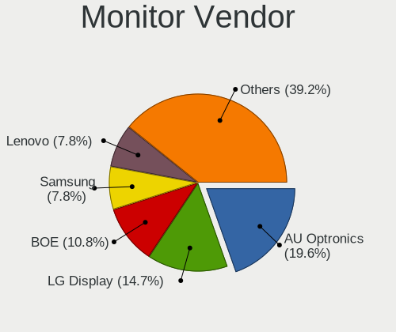

| Vendor                  | Notebooks | Percent |
|-------------------------|-----------|---------|
| AU Optronics            | 17        | 21.25%  |
| LG Display              | 11        | 13.75%  |
| BOE                     | 7         | 8.75%   |
| Sharp                   | 6         | 7.5%    |
| Samsung Electronics     | 6         | 7.5%    |
| Lenovo                  | 6         | 7.5%    |
| Chimei Innolux          | 6         | 7.5%    |
| Philips                 | 4         | 5%      |
| LG Philips              | 2         | 2.5%    |
| Hewlett-Packard         | 2         | 2.5%    |
| HannStar                | 2         | 2.5%    |
| Chi Mei Optoelectronics | 2         | 2.5%    |
| Apple                   | 2         | 2.5%    |
| Vestel Elektronik       | 1         | 1.25%   |
| Sony                    | 1         | 1.25%   |
| SDC                     | 1         | 1.25%   |
| PANDA                   | 1         | 1.25%   |
| InnoLux Display         | 1         | 1.25%   |
| InfoVision              | 1         | 1.25%   |
| CPT                     | 1         | 1.25%   |

Monitor Model
-------------

Monitor models

| Model                                                                 | Notebooks | Percent |
|-----------------------------------------------------------------------|-----------|---------|
| Philips 271P4 PHL08C3 1920x1080 600x340mm 27.2-inch                   | 3         | 3.53%   |
| LG Display LCD Monitor LGD0258 1600x900 350x190mm 15.7-inch           | 3         | 3.53%   |
| AU Optronics LCD Monitor AUO106C 1366x768 280x160mm 12.7-inch         | 3         | 3.53%   |
| Sharp LCD Monitor SHP1421 3200x1800 290x170mm 13.2-inch               | 2         | 2.35%   |
| AU Optronics LCD Monitor AUO492D 1920x1080 290x170mm 13.2-inch        | 2         | 2.35%   |
| Vestel Elektronik 32W_LCD_TV VES3700 1920x1080 710x400mm 32.1-inch    | 1         | 1.18%   |
| Sony SDM-HS95P SNY2500 1280x1024 380x300mm 19.1-inch                  | 1         | 1.18%   |
| Sharp LQ140Z1JW01 SHP1401 3200x1800 310x170mm 13.9-inch               | 1         | 1.18%   |
| Sharp LQ133M1JW08 SHP1425 1920x1080 290x170mm 13.2-inch               | 1         | 1.18%   |
| Sharp LCD Monitor SHP14D1 1920x1200 340x210mm 15.7-inch               | 1         | 1.18%   |
| Sharp LCD Monitor SHP143B 3840x2160 350x190mm 15.7-inch               | 1         | 1.18%   |
| SDC LCD Monitor 5440x1080                                             | 1         | 1.18%   |
| SDC LCD Monitor 3520x1080                                             | 1         | 1.18%   |
| SDC LCD Monitor 1600x900                                              | 1         | 1.18%   |
| Samsung Electronics LCD Monitor SEC5448 1920x1080 410x230mm 18.5-inch | 1         | 1.18%   |
| Samsung Electronics LCD Monitor SEC5441 1366x768 340x190mm 15.3-inch  | 1         | 1.18%   |
| Samsung Electronics LCD Monitor SEC384A 1366x768 340x190mm 15.3-inch  | 1         | 1.18%   |
| Samsung Electronics LCD Monitor SDC834D 1920x1080 290x160mm 13.0-inch | 1         | 1.18%   |
| Samsung Electronics LCD Monitor SDC4141 1366x768 340x190mm 15.3-inch  | 1         | 1.18%   |
| Samsung Electronics LCD Monitor SDC3754 1600x900 380x210mm 17.1-inch  | 1         | 1.18%   |
| Philips LCD Monitor 271P4 5440x1080                                   | 1         | 1.18%   |
| Philips LCD Monitor 271P4 3520x1080                                   | 1         | 1.18%   |
| Philips LCD Monitor 271P4                                             | 1         | 1.18%   |
| PANDA LCD Monitor NCP004F 1920x1080 310x170mm 13.9-inch               | 1         | 1.18%   |
| LG Philips LCD Monitor LPLE300 1280x800 330x210mm 15.4-inch           | 1         | 1.18%   |
| LG Philips LCD Monitor LPL1279 1680x1050 330x210mm 15.4-inch          | 1         | 1.18%   |
| LG Display LCD Monitor LGD6E01 1366x768 340x190mm 15.3-inch           | 1         | 1.18%   |
| LG Display LCD Monitor LGD0508 1366x768 310x170mm 13.9-inch           | 1         | 1.18%   |
| LG Display LCD Monitor LGD0459 1920x1080 380x210mm 17.1-inch          | 1         | 1.18%   |
| LG Display LCD Monitor LGD0419 2560x1440 310x170mm 13.9-inch          | 1         | 1.18%   |
| LG Display LCD Monitor LGD03A3 1366x768 280x160mm 12.7-inch           | 1         | 1.18%   |
| LG Display LCD Monitor LGD02DF 1600x900 310x170mm 13.9-inch           | 1         | 1.18%   |
| LG Display LCD Monitor LGD02DC 1366x768 340x190mm 15.3-inch           | 1         | 1.18%   |
| LG Display LCD Monitor LGD02D8 1366x768 280x160mm 12.7-inch           | 1         | 1.18%   |
| Lenovo LCD Monitor LEN40BA 1920x1080 340x190mm 15.3-inch              | 1         | 1.18%   |
| Lenovo LCD Monitor LEN40B2 1920x1080 340x190mm 15.3-inch              | 1         | 1.18%   |
| Lenovo LCD Monitor LEN4050 1280x800 330x210mm 15.4-inch               | 1         | 1.18%   |
| Lenovo LCD Monitor LEN4036 1440x900 300x190mm 14.0-inch               | 1         | 1.18%   |
| Lenovo LCD Monitor LEN4011 1280x800 260x160mm 12.0-inch               | 1         | 1.18%   |
| Lenovo LCD Monitor LEN4010 1280x800 260x160mm 12.0-inch               | 1         | 1.18%   |

Monitor Resolution
------------------

Monitor screen resolution

| Resolution         | Notebooks | Percent |
|--------------------|-----------|---------|
| 1920x1080 (FHD)    | 26        | 32.5%   |
| 1366x768 (WXGA)    | 21        | 26.25%  |
| 1280x800 (WXGA)    | 7         | 8.75%   |
| 1600x900 (HD+)     | 6         | 7.5%    |
| 1024x600           | 4         | 5%      |
| 3200x1800 (QHD+)   | 3         | 3.75%   |
| 1920x1200 (WUXGA)  | 3         | 3.75%   |
| 5440x1080          | 1         | 1.25%   |
| 3840x2160 (4K)     | 1         | 1.25%   |
| 3520x1080          | 1         | 1.25%   |
| 2880x1800          | 1         | 1.25%   |
| 2560x1440 (QHD)    | 1         | 1.25%   |
| 1920x540           | 1         | 1.25%   |
| 1680x1050 (WSXGA+) | 1         | 1.25%   |
| 1440x900 (WXGA+)   | 1         | 1.25%   |
| 1280x1024 (SXGA)   | 1         | 1.25%   |
| Unknown            | 1         | 1.25%   |

Monitor Diagonal
----------------

Diagonal size in inches

| Inches  | Notebooks | Percent |
|---------|-----------|---------|
| 15      | 28        | 35.44%  |
| 13      | 22        | 27.85%  |
| 12      | 7         | 8.86%   |
| 17      | 5         | 6.33%   |
| 27      | 4         | 5.06%   |
| 10      | 3         | 3.8%    |
| 11      | 2         | 2.53%   |
| 42      | 1         | 1.27%   |
| 23      | 1         | 1.27%   |
| 22      | 1         | 1.27%   |
| 19      | 1         | 1.27%   |
| 18      | 1         | 1.27%   |
| 14      | 1         | 1.27%   |
| 9       | 1         | 1.27%   |
| Unknown | 1         | 1.27%   |

Monitor Width
-------------

Physical width

| Width in mm | Notebooks | Percent |
|-------------|-----------|---------|
| 301-350     | 39        | 50%     |
| 201-300     | 25        | 32.05%  |
| 351-400     | 6         | 7.69%   |
| 501-600     | 4         | 5.13%   |
| 401-500     | 2         | 2.56%   |
| 901-1000    | 1         | 1.28%   |
| Unknown     | 1         | 1.28%   |

Aspect Ratio
------------

Proportional relationship between the width and the height

| Ratio   | Notebooks | Percent |
|---------|-----------|---------|
| 16/9    | 57        | 78.08%  |
| 16/10   | 13        | 17.81%  |
| 5/4     | 1         | 1.37%   |
| 3/2     | 1         | 1.37%   |
| Unknown | 1         | 1.37%   |

Monitor Area
------------

Area in inch

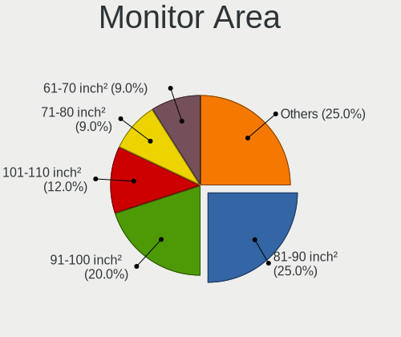

| Area in inch | Notebooks | Percent |
|----------------|-----------|---------|
| 91-100         | 16        | 20.25%  |
| 81-90          | 14        | 17.72%  |
| 101-110        | 11        | 13.92%  |
| 71-80          | 9         | 11.39%  |
| 61-70          | 7         | 8.86%   |
| 121-130        | 5         | 6.33%   |
| 41-50          | 4         | 5.06%   |
| 301-350        | 4         | 5.06%   |
| 51-60          | 2         | 2.53%   |
| 201-250        | 2         | 2.53%   |
| 151-200        | 1         | 1.27%   |
| 141-150        | 1         | 1.27%   |
| 111-120        | 1         | 1.27%   |
| 501-1000       | 1         | 1.27%   |
| Unknown        | 1         | 1.27%   |

Pixel Density
-------------

Pixels per inch

| Density       | Notebooks | Percent |
|---------------|-----------|---------|
| 121-160       | 29        | 37.66%  |
| 101-120       | 24        | 31.17%  |
| 51-100        | 11        | 14.29%  |
| 161-240       | 8         | 10.39%  |
| More than 240 | 4         | 5.19%   |
| Unknown       | 1         | 1.3%    |

Multiple Monitors
-----------------

Total monitors connected

| Total | Notebooks | Percent |
|-------|-----------|---------|
| 1     | 82        | 68.91%  |
| 0     | 31        | 26.05%  |
| 2     | 5         | 4.2%    |
| 3     | 1         | 0.84%   |

Network
-------

Net Controller Vendor
---------------------

Controller vendors

| Vendor                            | Notebooks | Percent |
|-----------------------------------|-----------|---------|
| Intel                             | 83        | 47.16%  |
| Realtek Semiconductor             | 34        | 19.32%  |
| Qualcomm Atheros                  | 17        | 9.66%   |
| Broadcom                          | 9         | 5.11%   |
| Marvell Technology Group          | 6         | 3.41%   |
| Nvidia                            | 4         | 2.27%   |
| AMD                               | 4         | 2.27%   |
| Hewlett-Packard                   | 3         | 1.7%    |
| D-Link System                     | 3         | 1.7%    |
| Sierra Wireless                   | 2         | 1.14%   |
| Ericsson Business Mobile Networks | 2         | 1.14%   |
| Edimax Technology                 | 2         | 1.14%   |
| Dell                              | 2         | 1.14%   |
| ZyXEL Communications              | 1         | 0.57%   |
| TP-Link                           | 1         | 0.57%   |
| Ralink Technology                 | 1         | 0.57%   |
| Ralink                            | 1         | 0.57%   |
| Qualcomm                          | 1         | 0.57%   |

Net Controller Model
--------------------

Controller models

| Model                                                                       | Notebooks | Percent |
|-----------------------------------------------------------------------------|-----------|---------|
| Realtek RTL8111/8168/8411 PCI Express Gigabit Ethernet Controller           | 20        | 8.7%    |
| Intel 82579LM Gigabit Network Connection (Lewisville)                       | 17        | 7.39%   |
| Intel Centrino Advanced-N 6205 [Taylor Peak]                                | 13        | 5.65%   |
| Realtek RTL810xE PCI Express Fast Ethernet controller                       | 9         | 3.91%   |
| Intel Wireless 8265 / 8275                                                  | 8         | 3.48%   |
| Intel Wireless 8260                                                         | 8         | 3.48%   |
| Intel Wireless 7260                                                         | 8         | 3.48%   |
| Intel Wi-Fi 6 AX201                                                         | 6         | 2.61%   |
| Intel Centrino Advanced-N 6200                                              | 6         | 2.61%   |
| Intel Ethernet Connection I219-LM                                           | 5         | 2.17%   |
| Qualcomm Atheros AR242x / AR542x Wireless Network Adapter (PCI-Express)     | 4         | 1.74%   |
| Nvidia MCP79 Ethernet                                                       | 4         | 1.74%   |
| Intel Wi-Fi 6 AX200                                                         | 4         | 1.74%   |
| Intel I211 Gigabit Network Connection                                       | 4         | 1.74%   |
| Intel Ethernet Connection I218-LM                                           | 4         | 1.74%   |
| Intel Centrino Ultimate-N 6300                                              | 4         | 1.74%   |
| Intel 82577LM Gigabit Network Connection                                    | 4         | 1.74%   |
| AMD XGMAC 10GbE Controller                                                  | 4         | 1.74%   |
| Realtek RTL8723BE PCIe Wireless Network Adapter                             | 3         | 1.3%    |
| Qualcomm Atheros QCA9377 802.11ac Wireless Network Adapter                  | 3         | 1.3%    |
| Marvell Group 88E8040 PCI-E Fast Ethernet Controller                        | 3         | 1.3%    |
| Intel Wireless 3165                                                         | 3         | 1.3%    |
| Intel Ethernet Connection (4) I219-LM                                       | 3         | 1.3%    |
| Intel Comet Lake PCH-LP CNVi WiFi                                           | 3         | 1.3%    |
| HP hs2350 HSPA+ Mobile Broadband Module Network Adapter                     | 3         | 1.3%    |
| D-Link System AirPlus G DWL-G122 Wireless Adapter(rev.C1) [Ralink RT2571W]  | 3         | 1.3%    |
| Broadcom BCM4322 802.11a/b/g/n Wireless LAN Controller                      | 3         | 1.3%    |
| Realtek RTL8822CE 802.11ac PCIe Wireless Network Adapter                    | 2         | 0.87%   |
| Realtek RTL8188CE 802.11b/g/n WiFi Adapter                                  | 2         | 0.87%   |
| Qualcomm Atheros AR9485 Wireless Network Adapter                            | 2         | 0.87%   |
| Qualcomm Atheros AR9285 Wireless Network Adapter (PCI-Express)              | 2         | 0.87%   |
| Intel PRO/Wireless 3945ABG [Golan] Network Connection                       | 2         | 0.87%   |
| Intel I210 Gigabit Network Connection                                       | 2         | 0.87%   |
| Intel Ethernet Connection (4) I219-V                                        | 2         | 0.87%   |
| Intel Ethernet Connection (2) I219-LM                                       | 2         | 0.87%   |
| Ericsson Business Mobile Networks F5521 gw Mobile Broadband Serial Port III | 2         | 0.87%   |
| Dell DW5811e Snapdragon X7 LTE DM Port                                      | 2         | 0.87%   |
| ZyXEL NWD2105 802.11bgn Wireless Adapter [Ralink RT3070]                    | 1         | 0.43%   |
| TP-Link AC600 wireless Realtek RTL8811AU [Archer T2U Nano]                  | 1         | 0.43%   |
| Sierra Wireless EM7345 4G LTE                                               | 1         | 0.43%   |

Wireless Vendor
---------------

Wireless vendors

| Vendor                | Notebooks | Percent |
|-----------------------|-----------|---------|
| Intel                 | 74        | 62.18%  |
| Qualcomm Atheros      | 16        | 13.45%  |
| Realtek Semiconductor | 12        | 10.08%  |
| Broadcom              | 7         | 5.88%   |
| D-Link System         | 3         | 2.52%   |
| Edimax Technology     | 2         | 1.68%   |
| ZyXEL Communications  | 1         | 0.84%   |
| TP-Link               | 1         | 0.84%   |
| Sierra Wireless       | 1         | 0.84%   |
| Ralink Technology     | 1         | 0.84%   |
| Ralink                | 1         | 0.84%   |

Wireless Model
--------------

Wireless models

| Model                                                                      | Notebooks | Percent |
|----------------------------------------------------------------------------|-----------|---------|
| Intel Centrino Advanced-N 6205 [Taylor Peak]                               | 13        | 10.66%  |
| Intel Wireless 8265 / 8275                                                 | 8         | 6.56%   |
| Intel Wireless 8260                                                        | 8         | 6.56%   |
| Intel Wireless 7260                                                        | 8         | 6.56%   |
| Intel Wi-Fi 6 AX201                                                        | 6         | 4.92%   |
| Intel Centrino Advanced-N 6200                                             | 6         | 4.92%   |
| Qualcomm Atheros AR242x / AR542x Wireless Network Adapter (PCI-Express)    | 4         | 3.28%   |
| Intel Wi-Fi 6 AX200                                                        | 4         | 3.28%   |
| Intel Centrino Ultimate-N 6300                                             | 4         | 3.28%   |
| Realtek RTL8723BE PCIe Wireless Network Adapter                            | 3         | 2.46%   |
| Qualcomm Atheros QCA9377 802.11ac Wireless Network Adapter                 | 3         | 2.46%   |
| Intel Wireless 3165                                                        | 3         | 2.46%   |
| Intel Comet Lake PCH-LP CNVi WiFi                                          | 3         | 2.46%   |
| D-Link System AirPlus G DWL-G122 Wireless Adapter(rev.C1) [Ralink RT2571W] | 3         | 2.46%   |
| Broadcom BCM4322 802.11a/b/g/n Wireless LAN Controller                     | 3         | 2.46%   |
| Realtek RTL8822CE 802.11ac PCIe Wireless Network Adapter                   | 2         | 1.64%   |
| Realtek RTL8188CE 802.11b/g/n WiFi Adapter                                 | 2         | 1.64%   |
| Qualcomm Atheros AR9485 Wireless Network Adapter                           | 2         | 1.64%   |
| Qualcomm Atheros AR9285 Wireless Network Adapter (PCI-Express)             | 2         | 1.64%   |
| Intel PRO/Wireless 3945ABG [Golan] Network Connection                      | 2         | 1.64%   |
| ZyXEL NWD2105 802.11bgn Wireless Adapter [Ralink RT3070]                   | 1         | 0.82%   |
| TP-Link AC600 wireless Realtek RTL8811AU [Archer T2U Nano]                 | 1         | 0.82%   |
| Sierra Wireless EM7345 4G LTE                                              | 1         | 0.82%   |
| Realtek RTL8852AE 802.11ax PCIe Wireless Network Adapter                   | 1         | 0.82%   |
| Realtek RTL8821CE 802.11ac PCIe Wireless Network Adapter                   | 1         | 0.82%   |
| Realtek RTL8723DE Wireless Network Adapter                                 | 1         | 0.82%   |
| Realtek RTL8192E/RTL8192SE Wireless LAN Controller                         | 1         | 0.82%   |
| Realtek RTL8188EE Wireless Network Adapter                                 | 1         | 0.82%   |
| Realtek RTL8188CUS 802.11n WLAN Adapter                                    | 1         | 0.82%   |
| Realtek Realtek Bluetooth 4.2 Adapter                                      | 1         | 0.82%   |
| Ralink RT2501/RT2573 Wireless Adapter                                      | 1         | 0.82%   |
| Ralink RT2790 Wireless 802.11n 1T/2R PCIe                                  | 1         | 0.82%   |
| Qualcomm Atheros QCA9565 / AR9565 Wireless Network Adapter                 | 1         | 0.82%   |
| Qualcomm Atheros AR9462 Wireless Network Adapter                           | 1         | 0.82%   |
| Qualcomm Atheros AR93xx Wireless Network Adapter                           | 1         | 0.82%   |
| Qualcomm Atheros AR928X Wireless Network Adapter (PCI-Express)             | 1         | 0.82%   |
| Qualcomm Atheros AR2427 802.11bg Wireless Network Adapter (PCI-Express)    | 1         | 0.82%   |
| Intel Wireless 3160                                                        | 1         | 0.82%   |
| Intel WiFi Link 5100                                                       | 1         | 0.82%   |
| Intel PRO/Wireless 5100 AGN [Shiloh] Network Connection                    | 1         | 0.82%   |

Ethernet Vendor
---------------

Ethernet vendors

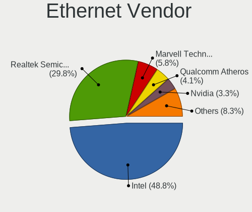

| Vendor                   | Notebooks | Percent |
|--------------------------|-----------|---------|
| Intel                    | 47        | 47.47%  |
| Realtek Semiconductor    | 30        | 30.3%   |
| Marvell Technology Group | 6         | 6.06%   |
| Qualcomm Atheros         | 4         | 4.04%   |
| Nvidia                   | 4         | 4.04%   |
| AMD                      | 4         | 4.04%   |
| Broadcom                 | 3         | 3.03%   |
| Qualcomm                 | 1         | 1.01%   |

Ethernet Model
--------------

Ethernet models

| Model                                                             | Notebooks | Percent |
|-------------------------------------------------------------------|-----------|---------|
| Realtek RTL8111/8168/8411 PCI Express Gigabit Ethernet Controller | 20        | 20%     |
| Intel 82579LM Gigabit Network Connection (Lewisville)             | 17        | 17%     |
| Realtek RTL810xE PCI Express Fast Ethernet controller             | 9         | 9%      |
| Intel Ethernet Connection I219-LM                                 | 5         | 5%      |
| Nvidia MCP79 Ethernet                                             | 4         | 4%      |
| Intel I211 Gigabit Network Connection                             | 4         | 4%      |
| Intel Ethernet Connection I218-LM                                 | 4         | 4%      |
| Intel 82577LM Gigabit Network Connection                          | 4         | 4%      |
| AMD XGMAC 10GbE Controller                                        | 4         | 4%      |
| Marvell Group 88E8040 PCI-E Fast Ethernet Controller              | 3         | 3%      |
| Intel Ethernet Connection (4) I219-LM                             | 3         | 3%      |
| Intel I210 Gigabit Network Connection                             | 2         | 2%      |
| Intel Ethernet Connection (4) I219-V                              | 2         | 2%      |
| Intel Ethernet Connection (2) I219-LM                             | 2         | 2%      |
| Realtek RTL-8100/8101L/8139 PCI Fast Ethernet Adapter             | 1         | 1%      |
| Qualcomm FP3                                                      | 1         | 1%      |
| Qualcomm Atheros AR8161 Gigabit Ethernet                          | 1         | 1%      |
| Qualcomm Atheros AR8152 v2.0 Fast Ethernet                        | 1         | 1%      |
| Qualcomm Atheros AR8151 v2.0 Gigabit Ethernet                     | 1         | 1%      |
| Qualcomm Atheros AR8132 Fast Ethernet                             | 1         | 1%      |
| Marvell Group 88E8072 PCI-E Gigabit Ethernet Controller           | 1         | 1%      |
| Marvell Group 88E8057 PCI-E Gigabit Ethernet Controller           | 1         | 1%      |
| Marvell Group 88E8055 PCI-E Gigabit Ethernet Controller           | 1         | 1%      |
| Intel Ethernet Connection I217-LM                                 | 1         | 1%      |
| Intel Ethernet Connection (16) I219-V                             | 1         | 1%      |
| Intel 82577LC Gigabit Network Connection                          | 1         | 1%      |
| Intel 82567LM Gigabit Network Connection                          | 1         | 1%      |
| Broadcom NetXtreme BCM57765 Gigabit Ethernet PCIe                 | 1         | 1%      |
| Broadcom NetXtreme BCM57762 Gigabit Ethernet PCIe                 | 1         | 1%      |
| Broadcom NetLink BCM5787M Gigabit Ethernet PCI Express            | 1         | 1%      |
| Broadcom BCM4401-B0 100Base-TX                                    | 1         | 1%      |

Net Controller Kind
-------------------

Ethernet, WiFi or modem

| Kind     | Notebooks | Percent |
|----------|-----------|---------|
| WiFi     | 109       | 51.9%   |
| Ethernet | 93        | 44.29%  |
| Unknown  | 5         | 2.38%   |
| Modem    | 3         | 1.43%   |

Used Controller
---------------

Currently used network controller

| Kind     | Notebooks | Percent |
|----------|-----------|---------|
| WiFi     | 80        | 55.17%  |
| Ethernet | 62        | 42.76%  |
| Modem    | 3         | 2.07%   |

NICs
----

Total network controllers on board

| Total | Notebooks | Percent |
|-------|-----------|---------|
| 2     | 87        | 75.65%  |
| 1     | 22        | 19.13%  |
| 5     | 4         | 3.48%   |
| 6     | 1         | 0.87%   |
| 3     | 1         | 0.87%   |

IPv6
----

IPv6 vs IPv4

| Used | Notebooks | Percent |
|------|-----------|---------|
| No   | 107       | 90.68%  |
| Yes  | 11        | 9.32%   |

Bluetooth
---------

Bluetooth Vendor
----------------

Controller vendors

| Vendor                          | Notebooks | Percent |
|---------------------------------|-----------|---------|
| Intel                           | 41        | 54.67%  |
| Broadcom                        | 11        | 14.67%  |
| Realtek Semiconductor           | 5         | 6.67%   |
| Dell                            | 5         | 6.67%   |
| Apple                           | 5         | 6.67%   |
| Qualcomm Atheros Communications | 2         | 2.67%   |
| Foxconn / Hon Hai               | 2         | 2.67%   |
| Skylight Digital                | 1         | 1.33%   |
| IMC Networks                    | 1         | 1.33%   |
| ASUSTek Computer                | 1         | 1.33%   |
| Alps Electric                   | 1         | 1.33%   |

Bluetooth Model
---------------

Controller models

| Model                                                                               | Notebooks | Percent |
|-------------------------------------------------------------------------------------|-----------|---------|
| Intel Bluetooth wireless interface                                                  | 24        | 32%     |
| Intel AX201 Bluetooth                                                               | 6         | 8%      |
| Intel Bluetooth 9460/9560 Jefferson Peak (JfP)                                      | 5         | 6.67%   |
| Apple Bluetooth Host Controller                                                     | 5         | 6.67%   |
| Intel AX200 Bluetooth                                                               | 4         | 5.33%   |
| Dell DW375 Bluetooth Module                                                         | 4         | 5.33%   |
| Broadcom BCM20702 Bluetooth 4.0 [ThinkPad]                                          | 3         | 4%      |
| Broadcom BCM2045B (BDC-2.1)                                                         | 3         | 4%      |
| Realtek Bluetooth Adapter                                                           | 2         | 2.67%   |
| Realtek Bluetooth 4.0 Adapter                                                       | 2         | 2.67%   |
| Broadcom BCM2045 Bluetooth                                                          | 2         | 2.67%   |
| Skylight Digital Realtek Bluetooth Adapter                                          | 1         | 1.33%   |
| Realtek RTL8723B Bluetooth                                                          | 1         | 1.33%   |
| Qualcomm Atheros QCA9377 Bluetooth 4.1                                              | 1         | 1.33%   |
| Qualcomm Atheros AR3012 Bluetooth 4.0                                               | 1         | 1.33%   |
| Intel Centrino Bluetooth Wireless Transceiver                                       | 1         | 1.33%   |
| Intel AX211 Bluetooth                                                               | 1         | 1.33%   |
| IMC Networks Qualcomm Atheros AR3012 Bluetooth 4.0 + HS                             | 1         | 1.33%   |
| Foxconn / Hon Hai Foxconn T77H114 BCM2070 [Single-Chip Bluetooth 2.1 + EDR Adapter] | 1         | 1.33%   |
| Foxconn / Hon Hai Bluetooth USB Module                                              | 1         | 1.33%   |
| Dell Dell Wireless 380 Bluetooth 4.0 Module                                         | 1         | 1.33%   |
| Broadcom Bluetooth 2.1 Device                                                       | 1         | 1.33%   |
| Broadcom Bluetooth                                                                  | 1         | 1.33%   |
| Broadcom BCM2045B (BDC-2.1) [Bluetooth Controller]                                  | 1         | 1.33%   |
| ASUS BT-253 Bluetooth Adapter                                                       | 1         | 1.33%   |
| Alps Electric UGTZ4 Bluetooth                                                       | 1         | 1.33%   |

Sound
-----

Sound Vendor
------------

Sound card vendors

| Vendor              | Notebooks | Percent |
|---------------------|-----------|---------|
| Intel               | 97        | 76.38%  |
| AMD                 | 15        | 11.81%  |
| Nvidia              | 8         | 6.3%    |
| SteelSeries ApS     | 4         | 3.15%   |
| JMTek               | 1         | 0.79%   |
| GN Netcom           | 1         | 0.79%   |
| C-Media Electronics | 1         | 0.79%   |

Sound Model
-----------

Sound card models

| Model                                                                                             | Notebooks | Percent |
|---------------------------------------------------------------------------------------------------|-----------|---------|
| Intel Sunrise Point-LP HD Audio                                                                   | 15        | 10.27%  |
| Intel 7 Series/C216 Chipset Family High Definition Audio Controller                               | 12        | 8.22%   |
| Intel 6 Series/C200 Series Chipset Family High Definition Audio Controller                        | 12        | 8.22%   |
| Intel Haswell-ULT HD Audio Controller                                                             | 8         | 5.48%   |
| Intel 8 Series HD Audio Controller                                                                | 8         | 5.48%   |
| AMD Family 17h/19h HD Audio Controller                                                            | 8         | 5.48%   |
| Intel Tiger Lake-LP Smart Sound Technology Audio Controller                                       | 6         | 4.11%   |
| Intel NM10/ICH7 Family High Definition Audio Controller                                           | 6         | 4.11%   |
| Intel 82801I (ICH9 Family) HD Audio Controller                                                    | 6         | 4.11%   |
| Intel 5 Series/3400 Series Chipset High Definition Audio                                          | 6         | 4.11%   |
| AMD Renoir Radeon High Definition Audio Controller                                                | 5         | 3.42%   |
| SteelSeries ApS SteelSeries Siberia 350                                                           | 4         | 2.74%   |
| Nvidia MCP79 High Definition Audio                                                                | 4         | 2.74%   |
| Intel Celeron/Pentium Silver Processor High Definition Audio                                      | 4         | 2.74%   |
| Intel Broadwell-U Audio Controller                                                                | 4         | 2.74%   |
| Intel 8 Series/C220 Series Chipset High Definition Audio Controller                               | 3         | 2.05%   |
| Intel 100 Series/C230 Series Chipset Family HD Audio Controller                                   | 3         | 2.05%   |
| AMD Turks HDMI Audio [Radeon HD 6500/6600 / 6700M Series]                                         | 3         | 2.05%   |
| Intel Wildcat Point-LP High Definition Audio Controller                                           | 2         | 1.37%   |
| Intel Ice Lake-LP Smart Sound Technology Audio Controller                                         | 2         | 1.37%   |
| Intel Comet Lake PCH-LP cAVS                                                                      | 2         | 1.37%   |
| Intel Cannon Point-LP High Definition Audio Controller                                            | 2         | 1.37%   |
| Intel Atom Processor Z36xxx/Z37xxx Series High Definition Audio Controller                        | 2         | 1.37%   |
| Nvidia High Definition Audio Controller                                                           | 1         | 0.68%   |
| Nvidia GT216 HDMI Audio Controller                                                                | 1         | 0.68%   |
| Nvidia GK107 HDMI Audio Controller                                                                | 1         | 0.68%   |
| Nvidia GF114 HDMI Audio Controller                                                                | 1         | 0.68%   |
| JMTek audio controller                                                                            | 1         | 0.68%   |
| Intel Xeon E3-1200 v3/4th Gen Core Processor HD Audio Controller                                  | 1         | 0.68%   |
| Intel Crystal Well HD Audio Controller                                                            | 1         | 0.68%   |
| Intel Comet Lake PCH cAVS                                                                         | 1         | 0.68%   |
| Intel Celeron N3350/Pentium N4200/Atom E3900 Series Audio Cluster                                 | 1         | 0.68%   |
| Intel Atom/Celeron/Pentium Processor x5-E8000/J3xxx/N3xxx Series High Definition Audio Controller | 1         | 0.68%   |
| Intel Alder Lake PCH-P High Definition Audio Controller                                           | 1         | 0.68%   |
| Intel 82801H (ICH8 Family) HD Audio Controller                                                    | 1         | 0.68%   |
| GN Netcom Jabra Evolve 65                                                                         | 1         | 0.68%   |
| C-Media Electronics USB Audio Class 1.0 and 2.0 Device                                            | 1         | 0.68%   |
| AMD SBx00 Azalia (Intel HDA)                                                                      | 1         | 0.68%   |
| AMD High Definition Audio Controller                                                              | 1         | 0.68%   |
| AMD FCH Azalia Controller                                                                         | 1         | 0.68%   |

Memory
------

Memory Vendor
-------------

Memory module vendors

| Vendor              | Notebooks | Percent |
|---------------------|-----------|---------|
| Samsung Electronics | 36        | 30%     |
| SK hynix            | 25        | 20.83%  |
| Micron Technology   | 16        | 13.33%  |
| Unknown             | 11        | 9.17%   |
| Kingston            | 7         | 5.83%   |
| Crucial             | 7         | 5.83%   |
| Transcend           | 4         | 3.33%   |
| Unknown (ABCD)      | 3         | 2.5%    |
| Elpida              | 3         | 2.5%    |
| A-DATA Technology   | 2         | 1.67%   |
| Unknown             | 2         | 1.67%   |
| GSkill              | 1         | 0.83%   |
| Corsair             | 1         | 0.83%   |
| A Force             | 1         | 0.83%   |
| 48spaces            | 1         | 0.83%   |

Memory Model
------------

Memory module models

| Model                                                            | Notebooks | Percent |
|------------------------------------------------------------------|-----------|---------|
| Unknown RAM Module 2GB SODIMM DDR2 667MT/s                       | 5         | 3.79%   |
| SK hynix RAM HMT351S6CFR8C-PB 4GB SODIMM DDR3 1600MT/s           | 5         | 3.79%   |
| Samsung RAM M471B1G73QH0-YK0 8GB SODIMM DDR3 1867MT/s            | 5         | 3.79%   |
| Samsung RAM M471B5273DH0-CH9 4GB SODIMM DDR3 1334MT/s            | 4         | 3.03%   |
| Samsung RAM M471B5273CH0-CH9 4GB SODIMM DDR3 1334MT/s            | 4         | 3.03%   |
| Unknown (ABCD) RAM 123456789012345678 2GB SODIMM LPDDR4 2400MT/s | 3         | 2.27%   |
| Transcend RAM TS1GLH64V6BL 8GB SODIMM DDR4 2667MT/s              | 3         | 2.27%   |
| SK hynix RAM HMT451S6BFR8A-PB 4GB SODIMM DDR3 1600MT/s           | 3         | 2.27%   |
| SK hynix RAM HMT41GS6BFR8A-PB 8GB SODIMM DDR3 1600MT/s           | 3         | 2.27%   |
| SK hynix RAM HMT351S6EFR8C-PB 4GB SODIMM DDR3 1600MT/s           | 3         | 2.27%   |
| SK hynix RAM HMT451S6AFR8A-PB 4GB SODIMM DDR3 1600MT/s           | 2         | 1.52%   |
| SK hynix RAM HMT351S6BFR8C-H9 4GB SODIMM DDR3 1334MT/s           | 2         | 1.52%   |
| SK hynix RAM HMA81GS6AFR8N-UH 8GB SODIMM DDR4 2400MT/s           | 2         | 1.52%   |
| Samsung RAM M471B5773CHS-CH9 2GB SODIMM DDR3 1333MT/s            | 2         | 1.52%   |
| Samsung RAM M471B5173QH0-YK0 4GB SODIMM DDR3 1600MT/s            | 2         | 1.52%   |
| Samsung RAM M471A5244CB0-CWE 4GB Row Of Chips DDR4 3200MT/s      | 2         | 1.52%   |
| Samsung RAM M471A5244CB0-CTD 4GB SODIMM DDR4 2667MT/s            | 2         | 1.52%   |
| Samsung RAM M471A1G43DB0-CPB 8GB SODIMM DDR4 2133MT/s            | 2         | 1.52%   |
| Samsung RAM K4EBE304EB-EGCG 8GB Row Of Chips LPDDR3 2133MT/s     | 2         | 1.52%   |
| Elpida RAM 8KTS51264HDZ-1G6E1 4GB Chip DDR3 1600MT/s             | 2         | 1.52%   |
| Unknown                                                          | 2         | 1.52%   |
| Unknown SODIMM 2GB SODIMM DDR2 533MT/s                           | 1         | 0.76%   |
| Unknown SODIMM 2048MB SODIMM DDR2 533MT/s                        | 1         | 0.76%   |
| Unknown RAM Module 4096MB SODIMM DDR3 1333MT/s                   | 1         | 0.76%   |
| Unknown RAM Module 4096MB SODIMM 1066MT/s                        | 1         | 0.76%   |
| Unknown RAM Module 2GB SODIMM 667MT/s                            | 1         | 0.76%   |
| Unknown RAM Module 2048MB SODIMM DDR2 667MT/s                    | 1         | 0.76%   |
| Unknown RAM Module 2048MB SODIMM 800MT/s                         | 1         | 0.76%   |
| Transcend RAM TS512MLH64V6HL 4GB SODIMM DDR4 2667MT/s            | 1         | 0.76%   |
| SK hynix RAM Module 4GB SODIMM DDR3 1067MT/s                     | 1         | 0.76%   |
| SK hynix RAM LX8GDDR3LS1600 8GB SODIMM DDR3 1600MT/s             | 1         | 0.76%   |
| SK hynix RAM HMT451S6AFR8C-PB 4GB SODIMM DDR3 1600MT/s           | 1         | 0.76%   |
| SK hynix RAM HMT41GS6AFR8A-PB 8GB SODIMM DDR3 1600MT/s           | 1         | 0.76%   |
| SK hynix RAM HMT351S6CFR8C-H9 4GB SODIMM DDR3 1333MT/s           | 1         | 0.76%   |
| SK hynix RAM HMT351S6BFR8C-H9 4GB SODIMM DDR3 1333MT/s           | 1         | 0.76%   |
| SK hynix RAM HMA851S6AFR6N-UH 4GB SODIMM DDR4 2400MT/s           | 1         | 0.76%   |
| SK hynix RAM HMA82GS6MFR8N-TF 16GB SODIMM DDR4 2133MT/s          | 1         | 0.76%   |
| SK hynix RAM HMA81GS6JJR8N-VK 8GB SODIMM DDR4 2667MT/s           | 1         | 0.76%   |
| SK hynix RAM HMA81GS6CJR8N-VK 8GB SODIMM DDR4 2667MT/s           | 1         | 0.76%   |
| SK hynix RAM HMA41GS7AFR8N-TF 8GB DIMM DDR4 2133MT/s             | 1         | 0.76%   |

Memory Kind
-----------

Memory module kinds

| Kind    | Notebooks | Percent |
|---------|-----------|---------|
| DDR3    | 48        | 46.6%   |
| DDR4    | 35        | 33.98%  |
| DDR2    | 10        | 9.71%   |
| LPDDR4  | 4         | 3.88%   |
| Unknown | 3         | 2.91%   |
| LPDDR3  | 2         | 1.94%   |
| DDR     | 1         | 0.97%   |

Memory Form Factor
------------------

Physical design of the memory module

| Name         | Notebooks | Percent |
|--------------|-----------|---------|
| SODIMM       | 93        | 90.29%  |
| Row Of Chips | 5         | 4.85%   |
| Chip         | 3         | 2.91%   |
| DIMM         | 1         | 0.97%   |
| Unknown      | 1         | 0.97%   |

Memory Size
-----------

Memory module size

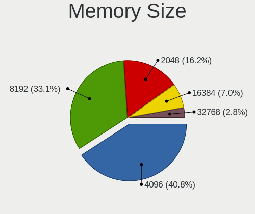

| Size  | Notebooks | Percent |
|-------|-----------|---------|
| 4096  | 47        | 41.59%  |
| 8192  | 34        | 30.09%  |
| 2048  | 20        | 17.7%   |
| 16384 | 8         | 7.08%   |
| 32768 | 4         | 3.54%   |

Memory Speed
------------

Memory module speed

| Speed | Notebooks | Percent |
|-------|-----------|---------|
| 1600  | 30        | 26.79%  |
| 2400  | 13        | 11.61%  |
| 2667  | 12        | 10.71%  |
| 3200  | 11        | 9.82%   |
| 1334  | 8         | 7.14%   |
| 1333  | 8         | 7.14%   |
| 667   | 7         | 6.25%   |
| 2133  | 6         | 5.36%   |
| 1867  | 5         | 4.46%   |
| 1067  | 4         | 3.57%   |
| 800   | 3         | 2.68%   |
| 533   | 2         | 1.79%   |
| 4267  | 1         | 0.89%   |
| 1066  | 1         | 0.89%   |
| 333   | 1         | 0.89%   |

Printers & scanners
-------------------

Printer Vendor
--------------

Printer device vendors

Zero info for selected period =(

Printer Model
-------------

Printer device models

Zero info for selected period =(

Scanner Vendor
--------------

Scanner device vendors

Zero info for selected period =(

Scanner Model
-------------

Scanner device models

Zero info for selected period =(

Camera
------

Camera Vendor
-------------

Camera device vendors

| Vendor                                 | Notebooks | Percent |
|----------------------------------------|-----------|---------|
| Chicony Electronics                    | 20        | 25.32%  |
| Realtek Semiconductor                  | 9         | 11.39%  |
| Bison Electronics                      | 8         | 10.13%  |
| IMC Networks                           | 5         | 6.33%   |
| Z-Star Microelectronics                | 4         | 5.06%   |
| Syntek                                 | 4         | 5.06%   |
| Microdia                               | 4         | 5.06%   |
| Lite-On Technology                     | 4         | 5.06%   |
| Suyin                                  | 3         | 3.8%    |
| Sunplus Innovation Technology          | 3         | 3.8%    |
| Luxvisions Innotech Limited            | 3         | 3.8%    |
| Cheng Uei Precision Industry (Foxlink) | 3         | 3.8%    |
| Silicon Motion                         | 2         | 2.53%   |
| Ricoh                                  | 1         | 1.27%   |
| Quanta                                 | 1         | 1.27%   |
| Logitech                               | 1         | 1.27%   |
| Lenovo                                 | 1         | 1.27%   |
| Creative Technology                    | 1         | 1.27%   |
| Apple                                  | 1         | 1.27%   |
| Alcor Micro                            | 1         | 1.27%   |

Camera Model
------------

Camera device models

| Model                                         | Notebooks | Percent |
|-----------------------------------------------|-----------|---------|
| Chicony Integrated Camera                     | 5         | 6.17%   |
| Realtek Integrated_Webcam_HD                  | 4         | 4.94%   |
| Chicony Lenovo Integrated Camera (0.3MP)      | 4         | 4.94%   |
| Chicony Integrated HP HD Webcam               | 3         | 3.7%    |
| Z-Star Webcam                                 | 2         | 2.47%   |
| Syntek Integrated Camera                      | 2         | 2.47%   |
| Realtek USB 2.0 Webcam                        | 2         | 2.47%   |
| Microdia USB 2.0 Camera                       | 2         | 2.47%   |
| Luxvisions Innotech Limited Integrated Camera | 2         | 2.47%   |
| IMC Networks USB2.0 HD UVC WebCam             | 2         | 2.47%   |
| Bison Integrated Camera                       | 2         | 2.47%   |
| Z-Star WebCam SC-03FFL11739P                  | 1         | 1.23%   |
| Z-Star Namuga 1.3M Webcam                     | 1         | 1.23%   |
| Syntek USB 2.0 UVC 1.3M WebCam                | 1         | 1.23%   |
| Syntek Syntek 0.3MPixel USB 2.0 UVC PC Camera | 1         | 1.23%   |
| Suyin Laptop_Integrated_Webcam_3M             | 1         | 1.23%   |
| Suyin Acer Crystal Eye webcam                 | 1         | 1.23%   |
| Suyin 1.3M HD Webcam                          | 1         | 1.23%   |
| Sunplus Laptop_Integrated_Webcam_FHD          | 1         | 1.23%   |
| Sunplus Laptop_Integrated_Webcam_1.3M         | 1         | 1.23%   |
| Sunplus HP HD Camera                          | 1         | 1.23%   |
| Silicon Motion WebCam SC-13HDL11939N          | 1         | 1.23%   |
| Silicon Motion 300k Pixel Camera              | 1         | 1.23%   |
| Ricoh Laptop_Integrated_Webcam_3M             | 1         | 1.23%   |
| Realtek USB Camera                            | 1         | 1.23%   |
| Realtek USB 2.0 PC Camera                     | 1         | 1.23%   |
| Realtek PC Camera                             | 1         | 1.23%   |
| Quanta HD Camera                              | 1         | 1.23%   |
| Microdia Webcam Vitade AF                     | 1         | 1.23%   |
| Microdia Integrated Webcam                    | 1         | 1.23%   |
| Luxvisions Innotech Limited HP HD Camera      | 1         | 1.23%   |
| Logitech Webcam C930e                         | 1         | 1.23%   |
| Logitech B525 HD Webcam                       | 1         | 1.23%   |
| Lite-On TOSHIBA Web Camera - HD               | 1         | 1.23%   |
| Lite-On Integrated Camera                     | 1         | 1.23%   |
| Lite-On HP Wide Vision HD Camera              | 1         | 1.23%   |
| Lite-On HP HD Camera                          | 1         | 1.23%   |
| Lenovo Integrated Webcam                      | 1         | 1.23%   |
| IMC Networks USB 2.0 UVC VGA WebCam           | 1         | 1.23%   |
| IMC Networks Integrated Webcam                | 1         | 1.23%   |

Security
--------

Fingerprint Vendor
------------------

Fingerprint sensor vendors

| Vendor                     | Notebooks | Percent |
|----------------------------|-----------|---------|
| Validity Sensors           | 6         | 24%     |
| Upek                       | 5         | 20%     |
| Synaptics                  | 4         | 16%     |
| Shenzhen Goodix Technology | 4         | 16%     |
| Elan Microelectronics      | 3         | 12%     |
| Broadcom                   | 2         | 8%      |
| AuthenTec                  | 1         | 4%      |

Fingerprint Model
-----------------

Fingerprint sensor models

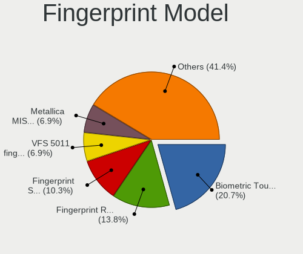

| Model                                                                        | Notebooks | Percent |
|------------------------------------------------------------------------------|-----------|---------|
| Upek Biometric Touchchip/Touchstrip Fingerprint Sensor                       | 5         | 20%     |
| Shenzhen Goodix Fingerprint Reader                                           | 4         | 16%     |
| Elan Fingerprint Sensor                                                      | 3         | 12%     |
| Validity Sensors VFS 5011 fingerprint sensor                                 | 2         | 8%      |
| Broadcom BCM5880 Secure Applications Processor with fingerprint swipe sensor | 2         | 8%      |
| Validity Sensors VFS7500 Touch Fingerprint Sensor                            | 1         | 4%      |
| Validity Sensors Synaptics WBDI                                              | 1         | 4%      |
| Validity Sensors Swipe Fingerprint Sensor                                    | 1         | 4%      |
| Validity Sensors Fingerprint scanner                                         | 1         | 4%      |
| Synaptics UWP WBDI                                                           | 1         | 4%      |
| Synaptics Metallica MOH Touch Fingerprint Reader                             | 1         | 4%      |
| Synaptics Metallica MIS Touch Fingerprint Reader                             | 1         | 4%      |
| Synaptics FS7604 Touch Fingerprint Sensor with PurePrint                     | 1         | 4%      |
| AuthenTec AES1660                                                            | 1         | 4%      |

Chipcard Vendor
---------------

Chipcard module vendors

Zero info for selected period =(

Chipcard Model
--------------

Chipcard module models

Zero info for selected period =(

Unsupported
-----------

Unsupported Devices
-------------------

Total unsupported devices on board

| Total | Notebooks | Percent |
|-------|-----------|---------|
| 2     | 41        | 33.06%  |
| 1     | 36        | 29.03%  |
| 0     | 20        | 16.13%  |
| 3     | 14        | 11.29%  |
| 4     | 9         | 7.26%   |
| 5     | 4         | 3.23%   |

Unsupported Device Types
------------------------

Types of unsupported devices

| Type                     | Notebooks | Percent |
|--------------------------|-----------|---------|
| Communication controller | 82        | 42.93%  |
| Bluetooth                | 31        | 16.23%  |
| Fingerprint reader       | 23        | 12.04%  |
| Net/wireless             | 19        | 9.95%   |
| Firewire controller      | 14        | 7.33%   |
| Card reader              | 14        | 7.33%   |
| Storage                  | 4         | 2.09%   |
| Network                  | 2         | 1.05%   |
| Sound                    | 1         | 0.52%   |
| Graphics card            | 1         | 0.52%   |

