BSD in UK - Tested Hardware & Statistics (Notebooks)
----------------------------------------------------

A project to collect tested hardware configurations for BSD in UK.

Anyone can contribute to this report by the [hw-probe](https://github.com/linuxhw/hw-probe/blob/master/INSTALL.BSD.md) tool:

    hw-probe -all -upload

Please contribute! Especially if your hardware is rare.

Contents
--------

* [ Test Cases ](#test-cases)

* [ System ](#system)
  - [ OS                       ](#os)
  - [ OS Family                ](#os-family)
  - [ Arch                     ](#arch)
  - [ DE                       ](#de)
  - [ Display Server           ](#display-server)
  - [ Display Manager          ](#display-manager)
  - [ OS Lang                  ](#os-lang)
  - [ Boot Mode                ](#boot-mode)
  - [ Filesystem               ](#filesystem)
  - [ Part. scheme             ](#part-scheme)

* [ Board ](#board)
  - [ Vendor                   ](#vendor)
  - [ Model                    ](#model)
  - [ Model Family             ](#model-family)
  - [ MFG Year                 ](#mfg-year)
  - [ Form Factor              ](#form-factor)
  - [ Coreboot                 ](#coreboot)
  - [ RAM Size                 ](#ram-size)
  - [ RAM Used                 ](#ram-used)
  - [ Total Drives             ](#total-drives)
  - [ Has CD-ROM               ](#has-cd-rom)
  - [ Has Ethernet             ](#has-ethernet)
  - [ Has WiFi                 ](#has-wifi)
  - [ Has Bluetooth            ](#has-bluetooth)

* [ Location ](#location)
  - [ Country                  ](#country)
  - [ City                     ](#city)

* [ Drives ](#drives)
  - [ Drive Vendor             ](#drive-vendor)
  - [ Drive Model              ](#drive-model)
  - [ HDD Vendor               ](#hdd-vendor)
  - [ SSD Vendor               ](#ssd-vendor)
  - [ Drive Kind               ](#drive-kind)
  - [ Drive Connector          ](#drive-connector)
  - [ Drive Size               ](#drive-size)
  - [ Space Total              ](#space-total)
  - [ Space Used               ](#space-used)
  - [ Malfunc. Drives          ](#malfunc-drives)
  - [ Malfunc. Drive Vendor    ](#malfunc-drive-vendor)
  - [ Malfunc. HDD Vendor      ](#malfunc-hdd-vendor)
  - [ Malfunc. Drive Kind      ](#malfunc-drive-kind)
  - [ Failed Drives            ](#failed-drives)
  - [ Failed Drive Vendor      ](#failed-drive-vendor)
  - [ Drive Status             ](#drive-status)

* [ Storage controller ](#storage-controller)
  - [ Storage Vendor           ](#storage-vendor)
  - [ Storage Model            ](#storage-model)
  - [ Storage Kind             ](#storage-kind)

* [ Processor ](#processor)
  - [ CPU Vendor               ](#cpu-vendor)
  - [ CPU Model                ](#cpu-model)
  - [ CPU Model Family         ](#cpu-model-family)
  - [ CPU Cores                ](#cpu-cores)
  - [ CPU Sockets              ](#cpu-sockets)
  - [ CPU Threads              ](#cpu-threads)
  - [ CPU Microarch            ](#cpu-microarch)

* [ Graphics ](#graphics)
  - [ GPU Vendor               ](#gpu-vendor)
  - [ GPU Model                ](#gpu-model)
  - [ GPU Combo                ](#gpu-combo)
  - [ GPU Driver               ](#gpu-driver)
  - [ GPU Memory               ](#gpu-memory)

* [ Monitor ](#monitor)
  - [ Monitor Vendor           ](#monitor-vendor)
  - [ Monitor Model            ](#monitor-model)
  - [ Monitor Resolution       ](#monitor-resolution)
  - [ Monitor Diagonal         ](#monitor-diagonal)
  - [ Monitor Width            ](#monitor-width)
  - [ Aspect Ratio             ](#aspect-ratio)
  - [ Monitor Area             ](#monitor-area)
  - [ Pixel Density            ](#pixel-density)
  - [ Multiple Monitors        ](#multiple-monitors)

* [ Network ](#network)
  - [ Net Controller Vendor    ](#net-controller-vendor)
  - [ Net Controller Model     ](#net-controller-model)
  - [ Wireless Vendor          ](#wireless-vendor)
  - [ Wireless Model           ](#wireless-model)
  - [ Ethernet Vendor          ](#ethernet-vendor)
  - [ Ethernet Model           ](#ethernet-model)
  - [ Net Controller Kind      ](#net-controller-kind)
  - [ Used Controller          ](#used-controller)
  - [ NICs                     ](#nics)
  - [ IPv6                     ](#ipv6)

* [ Bluetooth ](#bluetooth)
  - [ Bluetooth Vendor         ](#bluetooth-vendor)
  - [ Bluetooth Model          ](#bluetooth-model)

* [ Sound ](#sound)
  - [ Sound Vendor             ](#sound-vendor)
  - [ Sound Model              ](#sound-model)

* [ Memory ](#memory)
  - [ Memory Vendor            ](#memory-vendor)
  - [ Memory Model             ](#memory-model)
  - [ Memory Kind              ](#memory-kind)
  - [ Memory Form Factor       ](#memory-form-factor)
  - [ Memory Size              ](#memory-size)
  - [ Memory Speed             ](#memory-speed)

* [ Printers & scanners ](#printers--scanners)
  - [ Printer Vendor           ](#printer-vendor)
  - [ Printer Model            ](#printer-model)
  - [ Scanner Vendor           ](#scanner-vendor)
  - [ Scanner Model            ](#scanner-model)

* [ Camera ](#camera)
  - [ Camera Vendor            ](#camera-vendor)
  - [ Camera Model             ](#camera-model)

* [ Security ](#security)
  - [ Fingerprint Vendor       ](#fingerprint-vendor)
  - [ Fingerprint Model        ](#fingerprint-model)
  - [ Chipcard Vendor          ](#chipcard-vendor)
  - [ Chipcard Model           ](#chipcard-model)

* [ Unsupported ](#unsupported)
  - [ Unsupported Devices      ](#unsupported-devices)
  - [ Unsupported Device Types ](#unsupported-device-types)

Test Cases
----------

Total: 193

| Vendor        | Model                       | Probe                                                     | Date         |
|---------------|-----------------------------|-----------------------------------------------------------|--------------|
| HP            | EliteBook 8570p             | [978f01c546](https://bsd-hardware.info/?probe=978f01c546) | Jul 16, 2022 |
| HP            | EliteBook 8570p             | [68c4af67b5](https://bsd-hardware.info/?probe=68c4af67b5) | Jul 14, 2022 |
| Deciso        | OPNsense Appliance          | [05fb88304d](https://bsd-hardware.info/?probe=05fb88304d) | Jul 13, 2022 |
| Lenovo        | ThinkPad T470 20HD000MUK    | [866724656a](https://bsd-hardware.info/?probe=866724656a) | Jul 06, 2022 |
| System76      | Gazelle                     | [7e2dbb0a5b](https://bsd-hardware.info/?probe=7e2dbb0a5b) | Jun 28, 2022 |
| System76      | Gazelle                     | [8cb2a30786](https://bsd-hardware.info/?probe=8cb2a30786) | Jun 28, 2022 |
| Fujitsu Si... | AMILO Li3710                | [6d4bc39638](https://bsd-hardware.info/?probe=6d4bc39638) | Jun 18, 2022 |
| HP            | Pavilion Notebook           | [6116216a6d](https://bsd-hardware.info/?probe=6116216a6d) | Jun 15, 2022 |
| Fujitsu Si... | AMILO Li3710                | [387bf3d18f](https://bsd-hardware.info/?probe=387bf3d18f) | Jun 12, 2022 |
| Fujitsu Si... | AMILO Li3710                | [edebcb2719](https://bsd-hardware.info/?probe=edebcb2719) | Jun 12, 2022 |
| HP            | EliteBook 8570p             | [1067f6ab27](https://bsd-hardware.info/?probe=1067f6ab27) | Jun 03, 2022 |
| Apple         | MacBookPro5,3               | [3b03bdf595](https://bsd-hardware.info/?probe=3b03bdf595) | May 29, 2022 |
| HP            | EliteBook 8570p             | [3d0fdb11ff](https://bsd-hardware.info/?probe=3d0fdb11ff) | May 27, 2022 |
| Dell          | XPS 13 9343                 | [44abecc1ef](https://bsd-hardware.info/?probe=44abecc1ef) | May 20, 2022 |
| ASUSTek       | 1001P                       | [6ffa9529a3](https://bsd-hardware.info/?probe=6ffa9529a3) | May 20, 2022 |
| ASUSTek       | 1001P                       | [2820584223](https://bsd-hardware.info/?probe=2820584223) | May 20, 2022 |
| Lenovo        | ThinkPad X230 2325J67       | [3ee0f54d2f](https://bsd-hardware.info/?probe=3ee0f54d2f) | May 12, 2022 |
| TUXEDO        | Aura 15 Gen1                | [49d1cd3009](https://bsd-hardware.info/?probe=49d1cd3009) | May 10, 2022 |
| Packard Be... | EasyNote_MX52-B-071         | [277c9e0a0a](https://bsd-hardware.info/?probe=277c9e0a0a) | May 08, 2022 |
| Dell          | Vostro 5590                 | [1f23973fb4](https://bsd-hardware.info/?probe=1f23973fb4) | May 04, 2022 |
| HP            | Pavilion m6                 | [c720817018](https://bsd-hardware.info/?probe=c720817018) | May 03, 2022 |
| Lenovo        | ThinkPad X240 20AMS1YG01    | [6e38eb1a4e](https://bsd-hardware.info/?probe=6e38eb1a4e) | May 01, 2022 |
| MSI           | Modern 14 B11MOL            | [9a61443be9](https://bsd-hardware.info/?probe=9a61443be9) | Apr 25, 2022 |
| HP            | EliteBook 8570p             | [c4dee3f070](https://bsd-hardware.info/?probe=c4dee3f070) | Apr 21, 2022 |
| HP            | EliteBook 8570p             | [d9acb17caf](https://bsd-hardware.info/?probe=d9acb17caf) | Apr 20, 2022 |
| Lenovo        | ThinkPad X220 4291QT1       | [f7aa3576ae](https://bsd-hardware.info/?probe=f7aa3576ae) | Apr 13, 2022 |
| Lenovo        | ThinkPad X201 3680MG1       | [a2b9975fe2](https://bsd-hardware.info/?probe=a2b9975fe2) | Apr 11, 2022 |
| HP            | EliteBook 8570p             | [0c73871c49](https://bsd-hardware.info/?probe=0c73871c49) | Apr 04, 2022 |
| TUXEDO        | Aura 15 Gen1                | [1be95af210](https://bsd-hardware.info/?probe=1be95af210) | Apr 01, 2022 |
| HP            | EliteBook 8570p             | [e9f59e748e](https://bsd-hardware.info/?probe=e9f59e748e) | Mar 24, 2022 |
| HP            | EliteBook 8570p             | [7e1e137c8f](https://bsd-hardware.info/?probe=7e1e137c8f) | Mar 20, 2022 |
| HP            | EliteBook 8570p             | [dafb1bbb92](https://bsd-hardware.info/?probe=dafb1bbb92) | Mar 20, 2022 |
| Dell          | Latitude E7440              | [a776ebf7f4](https://bsd-hardware.info/?probe=a776ebf7f4) | Mar 19, 2022 |
| Lenovo        | Z50-70 20354                | [a1f85aff27](https://bsd-hardware.info/?probe=a1f85aff27) | Mar 10, 2022 |
| Lenovo        | Z50-70 20354                | [ab71ed7239](https://bsd-hardware.info/?probe=ab71ed7239) | Mar 10, 2022 |
| Jumper        | EZbook                      | [35869ff0db](https://bsd-hardware.info/?probe=35869ff0db) | Feb 14, 2022 |
| HUAWEI        | MACHD-WXX9                  | [3debf6433b](https://bsd-hardware.info/?probe=3debf6433b) | Feb 02, 2022 |
| Lenovo        | ThinkPad X220 4291H77       | [dd4d3a9dcc](https://bsd-hardware.info/?probe=dd4d3a9dcc) | Feb 02, 2022 |
| HP            | EliteBook 8570p             | [f47789d894](https://bsd-hardware.info/?probe=f47789d894) | Jan 29, 2022 |
| HP            | EliteBook 8570p             | [61406080a7](https://bsd-hardware.info/?probe=61406080a7) | Jan 18, 2022 |
| Jumper        | EZbook                      | [7d648bcdc7](https://bsd-hardware.info/?probe=7d648bcdc7) | Jan 17, 2022 |
| Lenovo        | ThinkPad T410 2522E38       | [2dbb2679f1](https://bsd-hardware.info/?probe=2dbb2679f1) | Jan 17, 2022 |
| HP            | EliteBook 8570p             | [1520fece28](https://bsd-hardware.info/?probe=1520fece28) | Jan 17, 2022 |
| Lenovo        | ThinkPad R61 8935WCS        | [9cc0f26f6f](https://bsd-hardware.info/?probe=9cc0f26f6f) | Jan 16, 2022 |
| HP            | EliteBook 8570p             | [5f106ee686](https://bsd-hardware.info/?probe=5f106ee686) | Jan 15, 2022 |
| HP            | EliteBook 8570p             | [1bbb37d4c6](https://bsd-hardware.info/?probe=1bbb37d4c6) | Jan 03, 2022 |
| HP            | EliteBook 8570p             | [0a180d834c](https://bsd-hardware.info/?probe=0a180d834c) | Jan 03, 2022 |
| HP            | EliteBook 8570p             | [b956c2a933](https://bsd-hardware.info/?probe=b956c2a933) | Dec 28, 2021 |
| Samsung       | 305E4A/305E5A/305E7A        | [5188a12b26](https://bsd-hardware.info/?probe=5188a12b26) | Dec 21, 2021 |
| HP            | EliteBook 8570p             | [44d3e7366c](https://bsd-hardware.info/?probe=44d3e7366c) | Dec 20, 2021 |
| HP            | EliteBook 8570p             | [045ffeb9b3](https://bsd-hardware.info/?probe=045ffeb9b3) | Dec 12, 2021 |
| HP            | Laptop 15-db0xxx            | [812c7f3e36](https://bsd-hardware.info/?probe=812c7f3e36) | Nov 29, 2021 |
| HP            | EliteBook 8570p             | [92fc69392b](https://bsd-hardware.info/?probe=92fc69392b) | Nov 27, 2021 |
| HP            | EliteBook 8570p             | [d3888a4c7d](https://bsd-hardware.info/?probe=d3888a4c7d) | Nov 21, 2021 |
| HP            | EliteBook 8570p             | [822a2481bb](https://bsd-hardware.info/?probe=822a2481bb) | Nov 17, 2021 |
| HP            | EliteBook 8570p             | [ea51e03be6](https://bsd-hardware.info/?probe=ea51e03be6) | Nov 13, 2021 |
| ASUSTek       | 1001P                       | [648081d75b](https://bsd-hardware.info/?probe=648081d75b) | Nov 09, 2021 |
| HP            | EliteBook 8570p             | [28a264a128](https://bsd-hardware.info/?probe=28a264a128) | Nov 09, 2021 |
| HP            | EliteBook 8570p             | [d0b487888a](https://bsd-hardware.info/?probe=d0b487888a) | Nov 08, 2021 |
| Dell          | XPS 13 9343                 | [227c2380d0](https://bsd-hardware.info/?probe=227c2380d0) | Nov 04, 2021 |
| Samsung       | 550P5C/550P7C               | [69fe175fb8](https://bsd-hardware.info/?probe=69fe175fb8) | Oct 30, 2021 |
| Lenovo        | ThinkPad X1 Carbon 2nd 2... | [9996e06a3d](https://bsd-hardware.info/?probe=9996e06a3d) | Oct 22, 2021 |
| Dell          | XPS 13 9343                 | [4b8421b910](https://bsd-hardware.info/?probe=4b8421b910) | Oct 21, 2021 |
| HP            | 15                          | [e3f26d7245](https://bsd-hardware.info/?probe=e3f26d7245) | Oct 18, 2021 |
| HP            | EliteBook 8570p             | [86613b04d3](https://bsd-hardware.info/?probe=86613b04d3) | Oct 17, 2021 |
| Dell          | XPS 13 9343                 | [7dd8f42ab1](https://bsd-hardware.info/?probe=7dd8f42ab1) | Oct 15, 2021 |
| Dell          | XPS 13 9343                 | [3bd1b15cee](https://bsd-hardware.info/?probe=3bd1b15cee) | Oct 11, 2021 |
| HP            | EliteBook 8570p             | [1b48acadd5](https://bsd-hardware.info/?probe=1b48acadd5) | Oct 10, 2021 |
| Dell          | XPS 13 9343                 | [f271d0163d](https://bsd-hardware.info/?probe=f271d0163d) | Oct 03, 2021 |
| HP            | EliteBook 8570p             | [646148fc25](https://bsd-hardware.info/?probe=646148fc25) | Sep 18, 2021 |
| HP            | EliteBook 8570p             | [5a4e53da56](https://bsd-hardware.info/?probe=5a4e53da56) | Sep 12, 2021 |
| HP            | EliteBook 8570p             | [27f01061f2](https://bsd-hardware.info/?probe=27f01061f2) | Sep 12, 2021 |
| Dell          | XPS 13 9343                 | [1f9857aa23](https://bsd-hardware.info/?probe=1f9857aa23) | Sep 08, 2021 |
| HP            | EliteBook 8570p             | [7a289e8d1b](https://bsd-hardware.info/?probe=7a289e8d1b) | Sep 06, 2021 |
| Apple         | MacBookPro5,1               | [2cba98f24b](https://bsd-hardware.info/?probe=2cba98f24b) | Sep 04, 2021 |
| HP            | EliteBook 8570p             | [fae9e84f60](https://bsd-hardware.info/?probe=fae9e84f60) | Aug 27, 2021 |
| HP            | EliteBook 8570p             | [a98c6adb40](https://bsd-hardware.info/?probe=a98c6adb40) | Aug 22, 2021 |
| Toshiba       | Satellite L50-C             | [250db17f57](https://bsd-hardware.info/?probe=250db17f57) | Aug 20, 2021 |
| Toshiba       | Satellite L50-C             | [a2e1cbd3d8](https://bsd-hardware.info/?probe=a2e1cbd3d8) | Aug 20, 2021 |
| Lenovo        | IdeaPad 1 11IGL05 81VT      | [f7725f06df](https://bsd-hardware.info/?probe=f7725f06df) | Aug 18, 2021 |
| HP            | EliteBook 8570p             | [71092e78e2](https://bsd-hardware.info/?probe=71092e78e2) | Aug 17, 2021 |
| HP            | EliteBook 8570p             | [6e97c9a59e](https://bsd-hardware.info/?probe=6e97c9a59e) | Aug 14, 2021 |
| HP            | ZBook 17 G2                 | [f2d911563a](https://bsd-hardware.info/?probe=f2d911563a) | Aug 07, 2021 |
| HP            | ZBook 17 G2                 | [2faf8af7be](https://bsd-hardware.info/?probe=2faf8af7be) | Jul 30, 2021 |
| HP            | ZBook 17 G2                 | [c7fb9e9dee](https://bsd-hardware.info/?probe=c7fb9e9dee) | Jul 27, 2021 |
| HP            | ZBook 17 G2                 | [50c349b7b5](https://bsd-hardware.info/?probe=50c349b7b5) | Jul 27, 2021 |
| HP            | ZBook 17 G2                 | [6149ab50a8](https://bsd-hardware.info/?probe=6149ab50a8) | Jul 24, 2021 |
| HP            | ZBook 17 G2                 | [1ef99f31dd](https://bsd-hardware.info/?probe=1ef99f31dd) | Jul 23, 2021 |
| HP            | ProBook 440 G7              | [63dc88528c](https://bsd-hardware.info/?probe=63dc88528c) | Jul 17, 2021 |
| HP            | ProBook 440 G7              | [7138e2a9e7](https://bsd-hardware.info/?probe=7138e2a9e7) | Jul 17, 2021 |
| HP            | ProBook 440 G7              | [b73eb50747](https://bsd-hardware.info/?probe=b73eb50747) | Jul 16, 2021 |
| HP            | EliteBook 8570p             | [462fc329a9](https://bsd-hardware.info/?probe=462fc329a9) | Jul 16, 2021 |
| HP            | ProBook 440 G7              | [d2866f01b5](https://bsd-hardware.info/?probe=d2866f01b5) | Jul 16, 2021 |
| Dell          | Latitude E6410              | [8c904d84e0](https://bsd-hardware.info/?probe=8c904d84e0) | Jun 28, 2021 |
| Lenovo        | ThinkPad T420 4236NHG       | [ea00bc1f1f](https://bsd-hardware.info/?probe=ea00bc1f1f) | Jun 20, 2021 |
| HP            | EliteBook 8570p             | [cc24e867fc](https://bsd-hardware.info/?probe=cc24e867fc) | Jun 19, 2021 |
| Pegatron      | T12Ah                       | [50d37406df](https://bsd-hardware.info/?probe=50d37406df) | Jun 06, 2021 |
| HP            | EliteBook 8570p             | [52ba4e835f](https://bsd-hardware.info/?probe=52ba4e835f) | Jun 03, 2021 |
| Lenovo        | ThinkPad T470 20HD000MUK    | [e27342ab94](https://bsd-hardware.info/?probe=e27342ab94) | May 13, 2021 |
| HP            | EliteBook 8570p             | [062fe5ec40](https://bsd-hardware.info/?probe=062fe5ec40) | May 09, 2021 |
| Toshiba       | TECRA M11                   | [6357d0d51f](https://bsd-hardware.info/?probe=6357d0d51f) | May 08, 2021 |
| Pegatron      | T12Ah                       | [ce8d45af17](https://bsd-hardware.info/?probe=ce8d45af17) | May 03, 2021 |
| Acer          | Aspire V5-531               | [edbf1ff1c6](https://bsd-hardware.info/?probe=edbf1ff1c6) | May 01, 2021 |
| Acer          | Aspire V5-531               | [8282b3e5fb](https://bsd-hardware.info/?probe=8282b3e5fb) | May 01, 2021 |
| Dell          | Inspiron 3793               | [c2d56fc369](https://bsd-hardware.info/?probe=c2d56fc369) | Apr 29, 2021 |
| Apple         | MacBookPro8,1               | [d1aaeaad42](https://bsd-hardware.info/?probe=d1aaeaad42) | Apr 26, 2021 |
| HP            | EliteBook 8570p             | [e90abb54c9](https://bsd-hardware.info/?probe=e90abb54c9) | Apr 25, 2021 |
| Dell          | Inspiron 3793               | [c784e7b290](https://bsd-hardware.info/?probe=c784e7b290) | Apr 25, 2021 |
| Toshiba       | Satellite L50-C             | [9cf9861053](https://bsd-hardware.info/?probe=9cf9861053) | Apr 23, 2021 |
| Pegatron      | T12Ah                       | [5de4060089](https://bsd-hardware.info/?probe=5de4060089) | Apr 23, 2021 |
| Toshiba       | Satellite L50-C             | [94b2e5d5ff](https://bsd-hardware.info/?probe=94b2e5d5ff) | Apr 23, 2021 |
| Samsung       | NC10                        | [3307e80418](https://bsd-hardware.info/?probe=3307e80418) | Apr 17, 2021 |
| Samsung       | NC10                        | [dd4310d56f](https://bsd-hardware.info/?probe=dd4310d56f) | Apr 13, 2021 |
| Apple         | MacBookPro8,1               | [0621acab4e](https://bsd-hardware.info/?probe=0621acab4e) | Apr 09, 2021 |
| Dell          | Latitude E6430s             | [563ad840b0](https://bsd-hardware.info/?probe=563ad840b0) | Apr 07, 2021 |
| HP            | EliteBook 8570p             | [d9ec051372](https://bsd-hardware.info/?probe=d9ec051372) | Apr 06, 2021 |
| Toshiba       | Satellite L50-C             | [ff59142f85](https://bsd-hardware.info/?probe=ff59142f85) | Apr 03, 2021 |
| HP            | EliteBook 8570p             | [cdeafa0952](https://bsd-hardware.info/?probe=cdeafa0952) | Apr 02, 2021 |
| Apple         | MacBookPro8,1               | [e4e3731289](https://bsd-hardware.info/?probe=e4e3731289) | Apr 01, 2021 |
| Toshiba       | Satellite L50-C             | [32f33a7a8b](https://bsd-hardware.info/?probe=32f33a7a8b) | Mar 31, 2021 |
| Dell          | Latitude E6430s             | [c366bef9bf](https://bsd-hardware.info/?probe=c366bef9bf) | Mar 28, 2021 |
| HP            | EliteBook 8570p             | [ed80dc9019](https://bsd-hardware.info/?probe=ed80dc9019) | Mar 27, 2021 |
| Toshiba       | Satellite L50-C             | [70cf274538](https://bsd-hardware.info/?probe=70cf274538) | Mar 23, 2021 |
| Toshiba       | Satellite C660              | [7d64801e2b](https://bsd-hardware.info/?probe=7d64801e2b) | Mar 21, 2021 |
| Lenovo        | ThinkPad X270 W10DG 20K5... | [b9eeb28ada](https://bsd-hardware.info/?probe=b9eeb28ada) | Mar 16, 2021 |
| TUXEDO        | Aura 15 Gen1                | [860b1cd65b](https://bsd-hardware.info/?probe=860b1cd65b) | Mar 15, 2021 |
| Toshiba       | Satellite C660              | [83f9d05407](https://bsd-hardware.info/?probe=83f9d05407) | Mar 14, 2021 |
| TUXEDO        | Aura 15 Gen1                | [9a7f08f8c1](https://bsd-hardware.info/?probe=9a7f08f8c1) | Mar 11, 2021 |
| TUXEDO        | Aura 15 Gen1                | [d9661207d7](https://bsd-hardware.info/?probe=d9661207d7) | Mar 11, 2021 |
| Toshiba       | Satellite Pro U400          | [71fd81df30](https://bsd-hardware.info/?probe=71fd81df30) | Mar 07, 2021 |
| Apple         | MacBookPro5,5               | [50ac436475](https://bsd-hardware.info/?probe=50ac436475) | Mar 06, 2021 |
| Dell          | Latitude E5570              | [12eae7a62e](https://bsd-hardware.info/?probe=12eae7a62e) | Mar 05, 2021 |
| Toshiba       | Satellite L50-C             | [3af26c7a29](https://bsd-hardware.info/?probe=3af26c7a29) | Feb 25, 2021 |
| Acer          | Aspire V5-531               | [fc868b6179](https://bsd-hardware.info/?probe=fc868b6179) | Feb 25, 2021 |
| Lenovo        | ThinkPad T470 20HD000MUK    | [b85d23571e](https://bsd-hardware.info/?probe=b85d23571e) | Feb 23, 2021 |
| GEO           | GeoBook3                    | [ba18b9bf80](https://bsd-hardware.info/?probe=ba18b9bf80) | Feb 19, 2021 |
| HP            | 250 G7 Notebook PC          | [366f8d1eaf](https://bsd-hardware.info/?probe=366f8d1eaf) | Feb 18, 2021 |
| Acer          | Aspire V5-531               | [ad4634140e](https://bsd-hardware.info/?probe=ad4634140e) | Feb 16, 2021 |
| HP            | 250 G7 Notebook PC          | [a3380d4b0c](https://bsd-hardware.info/?probe=a3380d4b0c) | Feb 16, 2021 |
| Pegatron      | T12Ah                       | [a5ab7068dc](https://bsd-hardware.info/?probe=a5ab7068dc) | Feb 14, 2021 |
| Lenovo        | ThinkPad X200 7459ZLW       | [9fbba84be0](https://bsd-hardware.info/?probe=9fbba84be0) | Feb 13, 2021 |
| Dell          | Latitude E6420              | [6bf1f5fe84](https://bsd-hardware.info/?probe=6bf1f5fe84) | Feb 12, 2021 |
| Apple         | MacBookPro5,5               | [9bbe1119a1](https://bsd-hardware.info/?probe=9bbe1119a1) | Feb 12, 2021 |
| Lenovo        | Legion Y530-15ICH 81FV      | [2b0f35d7a9](https://bsd-hardware.info/?probe=2b0f35d7a9) | Feb 12, 2021 |
| HP            | EliteBook 8570p             | [72137c63f8](https://bsd-hardware.info/?probe=72137c63f8) | Feb 09, 2021 |
| Alienware     | M18xR1                      | [67a336fac6](https://bsd-hardware.info/?probe=67a336fac6) | Feb 08, 2021 |
| Lenovo        | ThinkPad T470 20HD000MUK    | [39c8cd6d0c](https://bsd-hardware.info/?probe=39c8cd6d0c) | Feb 08, 2021 |
| Sony          | VPCF12C5E                   | [df8c1de8a5](https://bsd-hardware.info/?probe=df8c1de8a5) | Feb 07, 2021 |
| Apple         | MacBookPro5,5               | [ffc0295ae1](https://bsd-hardware.info/?probe=ffc0295ae1) | Feb 07, 2021 |
| Toshiba       | Satellite L50-C             | [7a5a694be1](https://bsd-hardware.info/?probe=7a5a694be1) | Feb 06, 2021 |
| Apple         | MacBookPro5,5               | [13fdaa7c15](https://bsd-hardware.info/?probe=13fdaa7c15) | Feb 04, 2021 |
| Apple         | MacBookPro5,5               | [254e518190](https://bsd-hardware.info/?probe=254e518190) | Feb 03, 2021 |
| HP            | EliteBook 8570p             | [46c938b853](https://bsd-hardware.info/?probe=46c938b853) | Feb 01, 2021 |
| HP            | EliteBook 8570p             | [b3eb492602](https://bsd-hardware.info/?probe=b3eb492602) | Jan 31, 2021 |
| Pegatron      | T12Ah                       | [4bda74f229](https://bsd-hardware.info/?probe=4bda74f229) | Jan 31, 2021 |
| Acer          | Aspire V5-531               | [0c4e2f8a07](https://bsd-hardware.info/?probe=0c4e2f8a07) | Jan 30, 2021 |
| Acer          | Aspire V5-531               | [b917d2b6ad](https://bsd-hardware.info/?probe=b917d2b6ad) | Jan 30, 2021 |
| Toshiba       | Satellite L50-C             | [98af88dfe6](https://bsd-hardware.info/?probe=98af88dfe6) | Jan 30, 2021 |
| Toshiba       | Satellite L50-C             | [f76ea8946b](https://bsd-hardware.info/?probe=f76ea8946b) | Jan 28, 2021 |
| Acer          | Aspire V5-531               | [41caa6acaa](https://bsd-hardware.info/?probe=41caa6acaa) | Jan 24, 2021 |
| HP            | EliteBook 8570p             | [c2e361eeff](https://bsd-hardware.info/?probe=c2e361eeff) | Jan 23, 2021 |
| Pegatron      | T12Ah                       | [e9c5982872](https://bsd-hardware.info/?probe=e9c5982872) | Jan 23, 2021 |
| HP            | EliteBook 8570p             | [86e5ba4c5b](https://bsd-hardware.info/?probe=86e5ba4c5b) | Jan 22, 2021 |
| HP            | EliteBook 8570p             | [fcedf7a28d](https://bsd-hardware.info/?probe=fcedf7a28d) | Jan 19, 2021 |
| HP            | EliteBook 8570p             | [bb4f8afc82](https://bsd-hardware.info/?probe=bb4f8afc82) | Jan 09, 2021 |
| HP            | EliteBook 8570p             | [97a3ac7e36](https://bsd-hardware.info/?probe=97a3ac7e36) | Jan 08, 2021 |
| Toshiba       | Satellite L50-C             | [de391d20e5](https://bsd-hardware.info/?probe=de391d20e5) | Jan 01, 2021 |
| HP            | EliteBook 8570p             | [60d9540d35](https://bsd-hardware.info/?probe=60d9540d35) | Dec 31, 2020 |
| Pegatron      | T12Ah                       | [427bb18c90](https://bsd-hardware.info/?probe=427bb18c90) | Dec 27, 2020 |
| Toshiba       | Satellite L50-C             | [8195760dd6](https://bsd-hardware.info/?probe=8195760dd6) | Dec 23, 2020 |
| Samsung       | N140                        | [cab912c576](https://bsd-hardware.info/?probe=cab912c576) | Dec 21, 2020 |
| Toshiba       | Satellite L50-C             | [2b478c0d01](https://bsd-hardware.info/?probe=2b478c0d01) | Dec 08, 2020 |
| Acer          | Aspire V5-531               | [f62cab95dd](https://bsd-hardware.info/?probe=f62cab95dd) | Dec 03, 2020 |
| HP            | EliteBook 8570p             | [1f3fa432dc](https://bsd-hardware.info/?probe=1f3fa432dc) | Nov 21, 2020 |
| HP            | Compaq nx7400 (RU430ET#A... | [c9c7bae008](https://bsd-hardware.info/?probe=c9c7bae008) | Nov 01, 2020 |
| Toshiba       | Satellite L50-C             | [e5c99b958d](https://bsd-hardware.info/?probe=e5c99b958d) | Oct 31, 2020 |
| Acer          | Aspire V5-531               | [f9a374a310](https://bsd-hardware.info/?probe=f9a374a310) | Oct 30, 2020 |
| Lenovo        | ThinkPad T560 20FJS0CE00    | [be16cb1839](https://bsd-hardware.info/?probe=be16cb1839) | Oct 19, 2020 |
| Panasonic     | CF-C1BT02EGE                | [8a80fb614e](https://bsd-hardware.info/?probe=8a80fb614e) | Oct 19, 2020 |
| Lenovo        | ThinkPad Yoga 11e 20D900... | [6cd0b0ed25](https://bsd-hardware.info/?probe=6cd0b0ed25) | Sep 28, 2020 |
| Lenovo        | ThinkPad T430 2347C32       | [339c63a941](https://bsd-hardware.info/?probe=339c63a941) | Sep 22, 2020 |
| Apple         | MacBookPro8,1               | [89bb299f1e](https://bsd-hardware.info/?probe=89bb299f1e) | Sep 22, 2020 |
| ASUSTek       | ZenBook S UX391UA           | [d7d299f9fc](https://bsd-hardware.info/?probe=d7d299f9fc) | Sep 14, 2020 |
| ASUSTek       | ZenBook S UX391UA           | [ec434bfdcd](https://bsd-hardware.info/?probe=ec434bfdcd) | Sep 14, 2020 |
| ASUSTek       | ZenBook S UX391UA           | [628b379afb](https://bsd-hardware.info/?probe=628b379afb) | Sep 14, 2020 |
| ASUSTek       | ZenBook S UX391UA           | [decfd42a65](https://bsd-hardware.info/?probe=decfd42a65) | Sep 13, 2020 |
| Acer          | Aspire V5-531               | [9168df8552](https://bsd-hardware.info/?probe=9168df8552) | Aug 08, 2020 |
| Google        | Lulu                        | [64aef60e6b](https://bsd-hardware.info/?probe=64aef60e6b) | Aug 02, 2020 |
| Toshiba       | Satellite L50-C             | [cef5a64eb8](https://bsd-hardware.info/?probe=cef5a64eb8) | Jul 11, 2020 |
| Acer          | Aspire V5-531               | [2394ca7e03](https://bsd-hardware.info/?probe=2394ca7e03) | Jul 03, 2020 |
| Toshiba       | Satellite L50-C             | [4f34d107bc](https://bsd-hardware.info/?probe=4f34d107bc) | Jul 03, 2020 |
| Toshiba       | Satellite L50-C             | [067478e4be](https://bsd-hardware.info/?probe=067478e4be) | Jul 03, 2020 |
| Lenovo        | ThinkPad X220 42902WU       | [e8a2f44b21](https://bsd-hardware.info/?probe=e8a2f44b21) | May 24, 2020 |

System
------

OS
--

Installed operating systems

| Name                 | Notebooks | Percent |
|----------------------|-----------|---------|
| helloSystem 0.7.0    | 8         | 8.42%   |
| FreeBSD 13.0         | 8         | 8.42%   |
| FreeBSD 14.0-CURRENT | 6         | 6.32%   |
| helloSystem 0.5.0    | 4         | 4.21%   |
| helloSystem 0.4.0    | 4         | 4.21%   |
| GhostBSD 20.04.02    | 4         | 4.21%   |
| FreeBSD 12.2         | 4         | 4.21%   |
| OpenBSD 7.1          | 3         | 3.16%   |
| OpenBSD 6.8          | 3         | 3.16%   |
| NomadBSD 1.4-RC1     | 3         | 3.16%   |
| NomadBSD 1.3.2       | 3         | 3.16%   |
| helloSystem 0.6.0    | 3         | 3.16%   |
| FreeBSD 13.1         | 3         | 3.16%   |
| FreeBSD 13.0-p5      | 2         | 2.11%   |
| FreeBSD 13.0-CURRENT | 2         | 2.11%   |
| FreeBSD 12.2-p6      | 2         | 2.11%   |
| FreeBSD 12.2-p4      | 2         | 2.11%   |
| FreeBSD 12.2-p3      | 2         | 2.11%   |
| FreeBSD 12.2-p2      | 2         | 2.11%   |
| FreeBSD 12.1-p9      | 2         | 2.11%   |
| OPNsense 22.1.6      | 1         | 1.05%   |
| OPNsense 22.1.10     | 1         | 1.05%   |
| OPNsense 21.1.4      | 1         | 1.05%   |
| OPNsense 21.1.3      | 1         | 1.05%   |
| OPNsense 21.1.1      | 1         | 1.05%   |
| OpenBSD 7.0          | 1         | 1.05%   |
| OpenBSD 6.9          | 1         | 1.05%   |
| NomadBSD 1.4         | 1         | 1.05%   |
| helloSystem 0.8.0    | 1         | 1.05%   |
| helloSystem          | 1         | 1.05%   |
| GhostBSD 22.06.26    | 1         | 1.05%   |
| GhostBSD 22.06.07    | 1         | 1.05%   |
| GhostBSD 22.01.12    | 1         | 1.05%   |
| FuryBSD 12.1-p9      | 1         | 1.05%   |
| FreeBSD 13.0-STABLE  | 1         | 1.05%   |
| FreeBSD 13.0-p4      | 1         | 1.05%   |
| FreeBSD 13.0-p3      | 1         | 1.05%   |
| FreeBSD 12.3-p5      | 1         | 1.05%   |
| FreeBSD 12.2-p5      | 1         | 1.05%   |
| FreeBSD 12.2-p1      | 1         | 1.05%   |
| FreeBSD 12.1-p8      | 1         | 1.05%   |
| FreeBSD 12.1-p7      | 1         | 1.05%   |
| FreeBSD 12.1-p6      | 1         | 1.05%   |
| FreeBSD 11.3-STABLE  | 1         | 1.05%   |
| DragonFly 6.2        | 1         | 1.05%   |

OS Family
---------

OS without a version

| Name        | Notebooks | Percent |
|-------------|-----------|---------|
| FreeBSD     | 27        | 37.5%   |
| helloSystem | 19        | 26.39%  |
| OpenBSD     | 8         | 11.11%  |
| NomadBSD    | 7         | 9.72%   |
| GhostBSD    | 5         | 6.94%   |
| OPNsense    | 4         | 5.56%   |
| FuryBSD     | 1         | 1.39%   |
| DragonFly   | 1         | 1.39%   |

Arch
----

OS architecture (x86_64, i586, etc.)

| Name  | Notebooks | Percent |
|-------|-----------|---------|
| amd64 | 66        | 97.06%  |
| i386  | 2         | 2.94%   |

DE
--

Desktop Environment

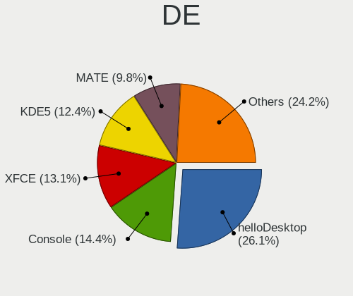

| Name          | Notebooks | Percent |
|---------------|-----------|---------|
| helloDesktop  | 20        | 27.03%  |
| KDE5          | 11        | 14.86%  |
| XFCE          | 8         | 10.81%  |
| Console       | 8         | 10.81%  |
| MATE          | 7         | 9.46%   |
| Openbox       | 6         | 8.11%   |
| fvwm          | 5         | 6.76%   |
| i3            | 3         | 4.05%   |
| GNOME         | 2         | 2.7%    |
| Cinnamon      | 2         | 2.7%    |
| Enlightenment | 1         | 1.35%   |
| akonadi_newm  | 1         | 1.35%   |

Display Server
--------------

X11 or Wayland

| Name    | Notebooks | Percent |
|---------|-----------|---------|
| X11     | 59        | 85.51%  |
| Console | 9         | 13.04%  |
| Wayland | 1         | 1.45%   |

Display Manager
---------------

SDDM, LightDM, etc.

| Name    | Notebooks | Percent |
|---------|-----------|---------|
| SLiM    | 32        | 45.07%  |
| Console | 19        | 26.76%  |
| SDDM    | 13        | 18.31%  |
| LightDM | 5         | 7.04%   |
| XDM     | 2         | 2.82%   |

OS Lang
-------

Language

| Lang            | Notebooks | Percent |
|-----------------|-----------|---------|
| en_US           | 24        | 30.38%  |
| C               | 20        | 25.32%  |
| Unknown         | 19        | 24.05%  |
| en_GB           | 12        | 15.19%  |
| ru_RU           | 1         | 1.27%   |
| it_CH           | 1         | 1.27%   |
| en_GB.US-ASCII  | 1         | 1.27%   |
| en_GB.ISO8859-1 | 1         | 1.27%   |

Boot Mode
---------

EFI or BIOS

| Mode | Notebooks | Percent |
|------|-----------|---------|
| EFI  | 52        | 75.36%  |
| BIOS | 17        | 24.64%  |

Filesystem
----------

Type of filesystem

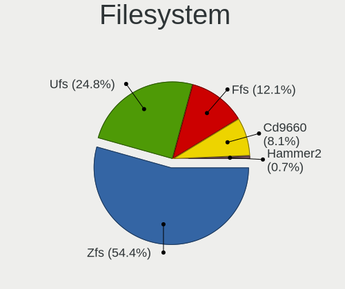

| Type    | Notebooks | Percent |
|---------|-----------|---------|
| Zfs     | 35        | 49.3%   |
| Ufs     | 23        | 32.39%  |
| Ffs     | 8         | 11.27%  |
| Cd9660  | 4         | 5.63%   |
| Hammer2 | 1         | 1.41%   |

Part. scheme
------------

Scheme of partitioning

| Type    | Notebooks | Percent |
|---------|-----------|---------|
| GPT     | 60        | 86.96%  |
| MBR     | 7         | 10.14%  |
| BSD     | 1         | 1.45%   |
| Unknown | 1         | 1.45%   |

Board
-----

Vendor
------

Motherboard manufacturer

| Name                | Notebooks | Percent |
|---------------------|-----------|---------|
| Lenovo              | 18        | 26.47%  |
| Hewlett-Packard     | 11        | 16.18%  |
| Dell                | 9         | 13.24%  |
| Toshiba             | 4         | 5.88%   |
| Samsung Electronics | 4         | 5.88%   |
| Apple               | 4         | 5.88%   |
| ASUSTek Computer    | 3         | 4.41%   |
| TUXEDO              | 1         | 1.47%   |
| System76            | 1         | 1.47%   |
| Sony                | 1         | 1.47%   |
| Pegatron            | 1         | 1.47%   |
| Panasonic           | 1         | 1.47%   |
| Packard Bell        | 1         | 1.47%   |
| MSI                 | 1         | 1.47%   |
| Jumper              | 1         | 1.47%   |
| HUAWEI              | 1         | 1.47%   |
| Google              | 1         | 1.47%   |
| GEO                 | 1         | 1.47%   |
| Fujitsu Siemens     | 1         | 1.47%   |
| Deciso              | 1         | 1.47%   |
| Alienware           | 1         | 1.47%   |
| Acer                | 1         | 1.47%   |

Model
-----

Motherboard model

| Name                                     | Notebooks | Percent |
|------------------------------------------|-----------|---------|
| HP EliteBook 8570p                       | 3         | 4.41%   |
| Dell Inspiron 3793                       | 2         | 2.94%   |
| ASUS ZenBook S UX391UA                   | 2         | 2.94%   |
| TUXEDO Aura 15 Gen1                      | 1         | 1.47%   |
| Toshiba TECRA M11                        | 1         | 1.47%   |
| Toshiba Satellite Pro U400               | 1         | 1.47%   |
| Toshiba Satellite L50-C                  | 1         | 1.47%   |
| Toshiba Satellite C660                   | 1         | 1.47%   |
| System76 Gazelle                         | 1         | 1.47%   |
| Sony VPCF12C5E                           | 1         | 1.47%   |
| Samsung NC10                             | 1         | 1.47%   |
| Samsung N140                             | 1         | 1.47%   |
| Samsung 550P5C/550P7C                    | 1         | 1.47%   |
| Samsung 305E4A/305E5A/305E7A             | 1         | 1.47%   |
| Pegatron T12Ah                           | 1         | 1.47%   |
| Panasonic CF-C1BT02EGE                   | 1         | 1.47%   |
| Packard Bell EasyNote_MX52-B-071         | 1         | 1.47%   |
| MSI Modern 14 B11MOL                     | 1         | 1.47%   |
| Lenovo Z50-70 20354                      | 1         | 1.47%   |
| Lenovo ThinkPad Yoga 11e 20D9000QUK      | 1         | 1.47%   |
| Lenovo ThinkPad X270 W10DG 20K5S0DS00    | 1         | 1.47%   |
| Lenovo ThinkPad X240 20AMS1YG01          | 1         | 1.47%   |
| Lenovo ThinkPad X230 2325J67             | 1         | 1.47%   |
| Lenovo ThinkPad X220 4291QT1             | 1         | 1.47%   |
| Lenovo ThinkPad X220 4291H77             | 1         | 1.47%   |
| Lenovo ThinkPad X220 42902WU             | 1         | 1.47%   |
| Lenovo ThinkPad X201 3680MG1             | 1         | 1.47%   |
| Lenovo ThinkPad X200 7459ZLW             | 1         | 1.47%   |
| Lenovo ThinkPad X1 Carbon 2nd 20A70066UK | 1         | 1.47%   |
| Lenovo ThinkPad T560 20FJS0CE00          | 1         | 1.47%   |
| Lenovo ThinkPad T470 20HD000MUK          | 1         | 1.47%   |
| Lenovo ThinkPad T430 2347C32             | 1         | 1.47%   |
| Lenovo ThinkPad T420 4236NHG             | 1         | 1.47%   |
| Lenovo ThinkPad T410 2522E38             | 1         | 1.47%   |
| Lenovo ThinkPad R61 8935WCS              | 1         | 1.47%   |
| Lenovo IdeaPad 1 11IGL05 81VT            | 1         | 1.47%   |
| Jumper EZbook                            | 1         | 1.47%   |
| HUAWEI MACHD-WXX9                        | 1         | 1.47%   |
| HP ZBook 17 G2                           | 1         | 1.47%   |
| HP ProBook 440 G7                        | 1         | 1.47%   |
| HP Pavilion Notebook                     | 1         | 1.47%   |
| HP Pavilion m6                           | 1         | 1.47%   |
| HP Laptop 15-db0xxx                      | 1         | 1.47%   |
| HP Compaq nx7400 (RU430ET#ABU)           | 1         | 1.47%   |
| HP 250 G7 Notebook PC                    | 1         | 1.47%   |
| HP 15                                    | 1         | 1.47%   |
| Google Lulu                              | 1         | 1.47%   |
| GEO GeoBook3                             | 1         | 1.47%   |
| Fujitsu Siemens AMILO Li3710             | 1         | 1.47%   |
| Dell XPS 13 9343                         | 1         | 1.47%   |
| Dell Vostro 5590                         | 1         | 1.47%   |
| Dell Latitude E7440                      | 1         | 1.47%   |
| Dell Latitude E6430s                     | 1         | 1.47%   |
| Dell Latitude E6420                      | 1         | 1.47%   |
| Dell Latitude E6410                      | 1         | 1.47%   |
| Dell Latitude E5570                      | 1         | 1.47%   |
| Deciso OPNsense Appliance                | 1         | 1.47%   |
| ASUS 1001P                               | 1         | 1.47%   |
| Apple MacBookPro8,1                      | 1         | 1.47%   |
| Apple MacBookPro5,5                      | 1         | 1.47%   |

Model Family
------------

Motherboard model prefix

| Name                   | Notebooks | Percent |
|------------------------|-----------|---------|
| Lenovo ThinkPad        | 16        | 23.53%  |
| Dell Latitude          | 5         | 7.35%   |
| Toshiba Satellite      | 3         | 4.41%   |
| HP EliteBook           | 3         | 4.41%   |
| Apple MacBookPro5      | 3         | 4.41%   |
| HP Pavilion            | 2         | 2.94%   |
| Dell Inspiron          | 2         | 2.94%   |
| ASUS ZenBook           | 2         | 2.94%   |
| TUXEDO Aura            | 1         | 1.47%   |
| Toshiba TECRA          | 1         | 1.47%   |
| System76 Gazelle       | 1         | 1.47%   |
| Sony VPCF12C5E         | 1         | 1.47%   |
| Samsung NC10           | 1         | 1.47%   |
| Samsung N140           | 1         | 1.47%   |
| Samsung 550P5C         | 1         | 1.47%   |
| Samsung 305E4A         | 1         | 1.47%   |
| Pegatron T12Ah         | 1         | 1.47%   |
| Panasonic CF-C1BT02EGE | 1         | 1.47%   |
| Packard Bell EasyNote  | 1         | 1.47%   |
| MSI Modern             | 1         | 1.47%   |
| Lenovo Z50-70          | 1         | 1.47%   |
| Lenovo IdeaPad         | 1         | 1.47%   |
| Jumper EZbook          | 1         | 1.47%   |
| HUAWEI MACHD-WXX9      | 1         | 1.47%   |
| HP ZBook               | 1         | 1.47%   |
| HP ProBook             | 1         | 1.47%   |
| HP Laptop              | 1         | 1.47%   |
| HP Compaq              | 1         | 1.47%   |
| HP 250                 | 1         | 1.47%   |
| HP 15                  | 1         | 1.47%   |
| Google Lulu            | 1         | 1.47%   |
| GEO GeoBook3           | 1         | 1.47%   |
| Fujitsu Siemens AMILO  | 1         | 1.47%   |
| Dell XPS               | 1         | 1.47%   |
| Dell Vostro            | 1         | 1.47%   |
| Deciso OPNsense        | 1         | 1.47%   |
| ASUS 1001P             | 1         | 1.47%   |
| Apple MacBookPro8      | 1         | 1.47%   |
| Alienware M18xR1       | 1         | 1.47%   |
| Acer Aspire            | 1         | 1.47%   |

MFG Year
--------

Motherboard manufacture year

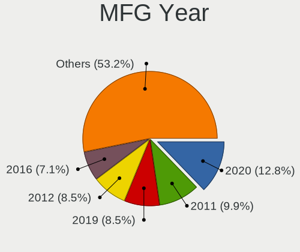

| Year | Notebooks | Percent |
|------|-----------|---------|
| 2020 | 8         | 11.76%  |
| 2011 | 8         | 11.76%  |
| 2010 | 7         | 10.29%  |
| 2016 | 6         | 8.82%   |
| 2013 | 6         | 8.82%   |
| 2019 | 5         | 7.35%   |
| 2012 | 5         | 7.35%   |
| 2009 | 5         | 7.35%   |
| 2018 | 4         | 5.88%   |
| 2021 | 3         | 4.41%   |
| 2015 | 3         | 4.41%   |
| 2008 | 3         | 4.41%   |
| 2007 | 2         | 2.94%   |
| 2022 | 1         | 1.47%   |
| 2017 | 1         | 1.47%   |
| 2014 | 1         | 1.47%   |

Form Factor
-----------

Physical design of the computer

| Name     | Notebooks | Percent |
|----------|-----------|---------|
| Notebook | 68        | 100%    |

Coreboot
--------

Have coreboot on board

| Used | Notebooks | Percent |
|------|-----------|---------|
| No   | 67        | 98.53%  |
| Yes  | 1         | 1.47%   |

RAM Size
--------

Total RAM memory

| Size in GB | Notebooks | Percent |
|------------|-----------|---------|
| 8.01-16.0  | 33        | 47.83%  |
| 4.01-8.0   | 17        | 24.64%  |
| 16.01-24.0 | 13        | 18.84%  |
| 2.01-3.0   | 3         | 4.35%   |
| 32.01-64.0 | 2         | 2.9%    |
| 3.01-4.0   | 1         | 1.45%   |

RAM Used
--------

Used RAM memory

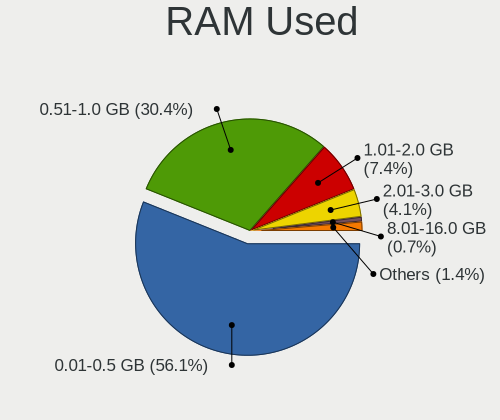

| Used GB   | Notebooks | Percent |
|-----------|-----------|---------|
| 0.01-0.5  | 43        | 59.72%  |
| 0.51-1.0  | 20        | 27.78%  |
| 2.01-3.0  | 3         | 4.17%   |
| 1.01-2.0  | 3         | 4.17%   |
| 4.01-8.0  | 1         | 1.39%   |
| 3.01-4.0  | 1         | 1.39%   |
| 8.01-16.0 | 1         | 1.39%   |

Total Drives
------------

Number of drives on board

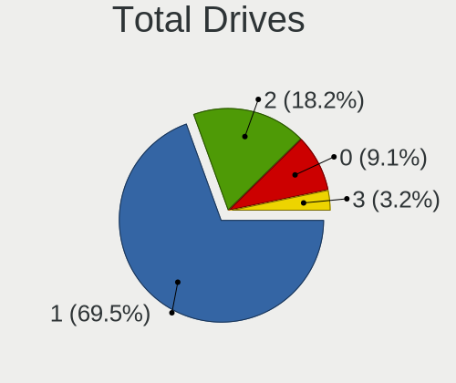

| Drives | Notebooks | Percent |
|--------|-----------|---------|
| 1      | 56        | 73.68%  |
| 2      | 15        | 19.74%  |
| 0      | 3         | 3.95%   |
| 3      | 2         | 2.63%   |

Has CD-ROM
----------

Has CD-ROM on board

| Presented | Notebooks | Percent |
|-----------|-----------|---------|
| No        | 44        | 61.11%  |
| Yes       | 28        | 38.89%  |

Has Ethernet
------------

Has Ethernet on board

| Presented | Notebooks | Percent |
|-----------|-----------|---------|
| Yes       | 57        | 83.82%  |
| No        | 11        | 16.18%  |

Has WiFi
--------

Has WiFi module

| Presented | Notebooks | Percent |
|-----------|-----------|---------|
| Yes       | 67        | 98.53%  |
| No        | 1         | 1.47%   |

Has Bluetooth
-------------

Has Bluetooth module

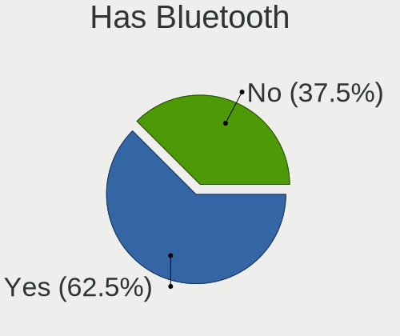

| Presented | Notebooks | Percent |
|-----------|-----------|---------|
| Yes       | 41        | 57.75%  |
| No        | 30        | 42.25%  |

Location
--------

Country
-------

Geographic location (country)

| Country | Notebooks | Percent |
|---------|-----------|---------|
| UK      | 68        | 100%    |

City
----

Geographic location (city)

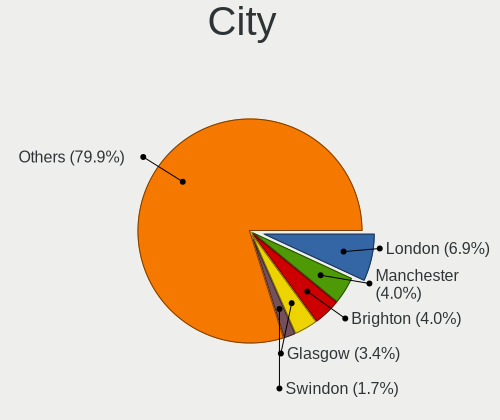

| City                | Notebooks | Percent |
|---------------------|-----------|---------|
| London              | 9         | 11.11%  |
| Brighton            | 7         | 8.64%   |
| Glasgow             | 5         | 6.17%   |
| Worthing            | 3         | 3.7%    |
| Leatherhead         | 3         | 3.7%    |
| Swindon             | 2         | 2.47%   |
| Greenwich           | 2         | 2.47%   |
| Gloucester          | 2         | 2.47%   |
| Wraysbury           | 1         | 1.23%   |
| Woking              | 1         | 1.23%   |
| Watford             | 1         | 1.23%   |
| Walsall             | 1         | 1.23%   |
| Tottenham           | 1         | 1.23%   |
| Sutton              | 1         | 1.23%   |
| St Austell          | 1         | 1.23%   |
| Southampton         | 1         | 1.23%   |
| Rugby               | 1         | 1.23%   |
| Reigate             | 1         | 1.23%   |
| Reading             | 1         | 1.23%   |
| Perth               | 1         | 1.23%   |
| Oxenhope            | 1         | 1.23%   |
| Okehampton          | 1         | 1.23%   |
| Notting Hill Gate   | 1         | 1.23%   |
| North Tawton        | 1         | 1.23%   |
| Newcastle upon Tyne | 1         | 1.23%   |
| Morden              | 1         | 1.23%   |
| Milton Keynes       | 1         | 1.23%   |
| Manchester          | 1         | 1.23%   |
| Malton              | 1         | 1.23%   |
| Lytham St Annes     | 1         | 1.23%   |
| Longfield           | 1         | 1.23%   |
| Leicester           | 1         | 1.23%   |
| Kensington          | 1         | 1.23%   |
| Islington           | 1         | 1.23%   |
| Ipswich             | 1         | 1.23%   |
| Inverness           | 1         | 1.23%   |
| Inverkeithing       | 1         | 1.23%   |
| Huddersfield        | 1         | 1.23%   |
| Harrow              | 1         | 1.23%   |
| Fulham              | 1         | 1.23%   |
| Finchley            | 1         | 1.23%   |
| Feltham             | 1         | 1.23%   |
| Farnham             | 1         | 1.23%   |
| Edinburgh           | 1         | 1.23%   |
| Dunbar              | 1         | 1.23%   |
| Coventry            | 1         | 1.23%   |
| City of Westminster | 1         | 1.23%   |
| City of London      | 1         | 1.23%   |
| Cheshunt            | 1         | 1.23%   |
| Calne               | 1         | 1.23%   |
| Bedford             | 1         | 1.23%   |
| Beaminster          | 1         | 1.23%   |
| Ashton-under-Lyne   | 1         | 1.23%   |
| Ashington           | 1         | 1.23%   |
| Addingham           | 1         | 1.23%   |
| Aberdeen            | 1         | 1.23%   |

Drives
------

Drive Vendor
------------

Hard drive vendors

| Vendor              | Notebooks | Drives | Percent |
|---------------------|-----------|--------|---------|
| Samsung Electronics | 21        | 38     | 25%     |
| WDC                 | 11        | 15     | 13.1%   |
| Toshiba             | 8         | 23     | 9.52%   |
| Seagate             | 6         | 6      | 7.14%   |
| HGST                | 6         | 25     | 7.14%   |
| Hitachi             | 4         | 4      | 4.76%   |
| SanDisk             | 3         | 3      | 3.57%   |
| Kingston            | 3         | 3      | 3.57%   |
| Intel               | 3         | 3      | 3.57%   |
| NVMe                | 2         | 2      | 2.38%   |
| XUM                 | 1         | 1      | 1.19%   |
| Transcend           | 1         | 1      | 1.19%   |
| Solid State Storage | 1         | 1      | 1.19%   |
| SK hynix            | 1         | 1      | 1.19%   |
| PNY                 | 1         | 1      | 1.19%   |
| Phison              | 1         | 1      | 1.19%   |
| OWC                 | 1         | 1      | 1.19%   |
| Micron Technology   | 1         | 1      | 1.19%   |
| MicroDream          | 1         | 1      | 1.19%   |
| LITEON              | 1         | 1      | 1.19%   |
| Intenso             | 1         | 1      | 1.19%   |
| Fujitsu             | 1         | 6      | 1.19%   |
| Crucial             | 1         | 1      | 1.19%   |
| Corsair             | 1         | 1      | 1.19%   |
| Apple               | 1         | 2      | 1.19%   |
| Apacer              | 1         | 1      | 1.19%   |
| A-DATA Technology   | 1         | 1      | 1.19%   |

Drive Model
-----------

Hard drive models

| Model                                              | Notebooks | Percent |
|----------------------------------------------------|-----------|---------|
| Toshiba MQ01ABF050 500GB                           | 4         | 4.71%   |
| HGST HTS725050A7E630 500GB                         | 4         | 4.71%   |
| Samsung HM251JX 250GB                              | 3         | 3.53%   |
| WDC WDS240G2G0A-00JH30 240GB                       | 2         | 2.35%   |
| WDC WD1600BEVT-80A23T0 160GB                       | 2         | 2.35%   |
| WDC WD1600BEVT-22ZCT0 160GB                        | 2         | 2.35%   |
| Seagate ST1000LM035-1RK172 1TB                     | 2         | 2.35%   |
| Samsung SSD 860 EVO 500GB                          | 2         | 2.35%   |
| Samsung MZVLW512HMJP-00000 512GB                   | 2         | 2.35%   |
| XUM HX256GSSDSATA3 256GB                           | 1         | 1.18%   |
| WDC WDS250G2B0B-00YS70 250GB                       | 1         | 1.18%   |
| WDC WDS250G2B0A 250GB                              | 1         | 1.18%   |
| WDC WDS120G2G0A-00JH30 120GB                       | 1         | 1.18%   |
| WDC WD2500BEVT-80A23T0 250GB                       | 1         | 1.18%   |
| WDC WD1600BEVS-08VAT2 160GB                        | 1         | 1.18%   |
| Transcend TS256GMTE652T2 256GB                     | 1         | 1.18%   |
| Toshiba THNSNJ128GMCU 128GB                        | 1         | 1.18%   |
| Toshiba THNSF5256GPUK 256GB                        | 1         | 1.18%   |
| Toshiba MK5061GSY 500GB                            | 1         | 1.18%   |
| Toshiba KBG30ZMV256G 256GB                         | 1         | 1.18%   |
| Solid State Storage CL1-3D128-Q11 NVMe SSSTC 128GB | 1         | 1.18%   |
| SK hynix BC511 HFM256GDJTNI-82A0A 256GB            | 1         | 1.18%   |
| Seagate ST9320423AS 320GB                          | 1         | 1.18%   |
| Seagate ST9160821AS 160GB                          | 1         | 1.18%   |
| Seagate ST2000LM015-2E8174 2TB                     | 1         | 1.18%   |
| Seagate ST1000LM024 HN-M101MBB 1TB                 | 1         | 1.18%   |
| SanDisk SD6SB1M128G1022I 128GB                     | 1         | 1.18%   |
| SanDisk Extreme 55AE 500GB                         | 1         | 1.18%   |
| SanDisk Cruzer Fit 32GB                            | 1         | 1.18%   |
| Samsung SSD PM871 2.5 7mm 128GB                    | 1         | 1.18%   |
| Samsung SSD PM851 M.2 2280 256GB                   | 1         | 1.18%   |
| Samsung SSD PM810 2.5-inch 7mm 256GB               | 1         | 1.18%   |
| Samsung SSD 980 PRO 500GB                          | 1         | 1.18%   |
| Samsung SSD 860 EVO 250GB                          | 1         | 1.18%   |
| Samsung SSD 850 PRO 1TB                            | 1         | 1.18%   |
| Samsung SSD 850 EVO mSATA 250GB                    | 1         | 1.18%   |
| Samsung SSD 850 EVO M.2 250GB                      | 1         | 1.18%   |
| Samsung SSD 850 EVO 500GB                          | 1         | 1.18%   |
| Samsung SSD 850 EVO 250GB                          | 1         | 1.18%   |
| Samsung SSD 840 EVO 1TB                            | 1         | 1.18%   |
| Samsung PM991 NVMe 512GB                           | 1         | 1.18%   |
| Samsung MZVLB1T0HBLR-00000 1TB                     | 1         | 1.18%   |
| Samsung MZNLN256HMHQ-000H1 256GB                   | 1         | 1.18%   |
| PNY CS900 240GB SSD                                | 1         | 1.18%   |
| Phison SATA SSD 120GB                              | 1         | 1.18%   |
| OWC Mercury Electra 6G SSD                         | 1         | 1.18%   |
| NVMe Samsung SSD 980 1TB                           | 1         | 1.18%   |
| NVMe KINGSTON OM8PDP3 256GB                        | 1         | 1.18%   |
| Micron MTFDDAK256MAM-1K12 256GB                    | 1         | 1.18%   |
| MicroDream 512G SSD                                | 1         | 1.18%   |
| LITEON LCH-256V2S 256GB                            | 1         | 1.18%   |
| Kingston SV300S37A60G 64GB                         | 1         | 1.18%   |
| Kingston SUV500MS120G 120GB                        | 1         | 1.18%   |
| Kingston SA400S37240G 240GB                        | 1         | 1.18%   |
| Intenso SATA3 240GB SSD                            | 1         | 1.18%   |
| Intel SSDSCKGF256A5 SATA 256GB                     | 1         | 1.18%   |
| Intel SSDSCKGF180A4L 180GB                         | 1         | 1.18%   |
| Intel SSDSC2BF180A4H 180GB                         | 1         | 1.18%   |
| Hitachi HTS725032A9A364 320GB                      | 1         | 1.18%   |
| Hitachi HTS545032B9A302 320GB                      | 1         | 1.18%   |

HDD Vendor
----------

Hard disk drive vendors

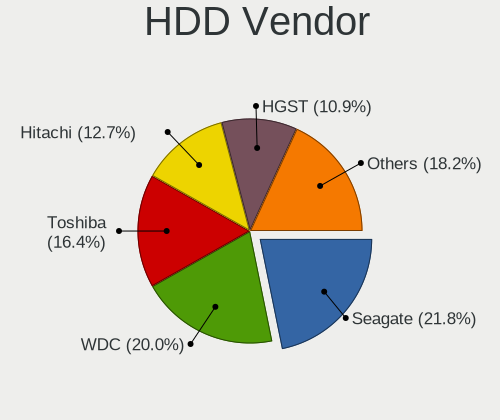

| Vendor              | Notebooks | Drives | Percent |
|---------------------|-----------|--------|---------|
| WDC                 | 6         | 7      | 18.75%  |
| Seagate             | 6         | 6      | 18.75%  |
| HGST                | 6         | 25     | 18.75%  |
| Toshiba             | 5         | 18     | 15.63%  |
| Hitachi             | 4         | 4      | 12.5%   |
| Samsung Electronics | 3         | 3      | 9.38%   |
| NVMe                | 1         | 1      | 3.13%   |
| Fujitsu             | 1         | 6      | 3.13%   |

SSD Vendor
----------

Solid state drive vendors

| Vendor              | Notebooks | Drives | Percent |
|---------------------|-----------|--------|---------|
| Samsung Electronics | 13        | 29     | 30.95%  |
| WDC                 | 5         | 8      | 11.9%   |
| SanDisk             | 3         | 3      | 7.14%   |
| Kingston            | 3         | 3      | 7.14%   |
| Intel               | 3         | 3      | 7.14%   |
| XUM                 | 1         | 1      | 2.38%   |
| Toshiba             | 1         | 1      | 2.38%   |
| PNY                 | 1         | 1      | 2.38%   |
| Phison              | 1         | 1      | 2.38%   |
| OWC                 | 1         | 1      | 2.38%   |
| NVMe                | 1         | 1      | 2.38%   |
| Micron Technology   | 1         | 1      | 2.38%   |
| MicroDream          | 1         | 1      | 2.38%   |
| LITEON              | 1         | 1      | 2.38%   |
| Intenso             | 1         | 1      | 2.38%   |
| Crucial             | 1         | 1      | 2.38%   |
| Corsair             | 1         | 1      | 2.38%   |
| Apple               | 1         | 2      | 2.38%   |
| Apacer              | 1         | 1      | 2.38%   |
| A-DATA Technology   | 1         | 1      | 2.38%   |

Drive Kind
----------

HDD or SSD

| Kind | Notebooks | Drives | Percent |
|------|-----------|--------|---------|
| SSD  | 38        | 62     | 51.35%  |
| HDD  | 26        | 70     | 35.14%  |
| NVMe | 10        | 13     | 13.51%  |

Drive Connector
---------------

SATA, SAS, NVMe, etc.

| Type | Notebooks | Drives | Percent |
|------|-----------|--------|---------|
| SATA | 58        | 132    | 85.29%  |
| NVMe | 10        | 13     | 14.71%  |

Drive Size
----------

Size of hard drive

| Size in TB | Notebooks | Drives | Percent |
|------------|-----------|--------|---------|
| 0.01-0.5   | 50        | 110    | 81.97%  |
| 0.51-1.0   | 9         | 19     | 14.75%  |
| 1.01-2.0   | 2         | 3      | 3.28%   |

Space Total
-----------

Amount of disk space available on the file system

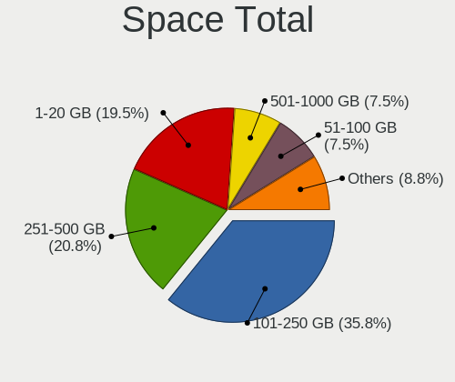

| Size in GB | Notebooks | Percent |
|------------|-----------|---------|
| 101-250    | 30        | 38.96%  |
| 1-20       | 18        | 23.38%  |
| 251-500    | 15        | 19.48%  |
| 501-1000   | 7         | 9.09%   |
| 21-50      | 3         | 3.9%    |
| Unknown    | 3         | 3.9%    |
| 51-100     | 1         | 1.3%    |

Space Used
----------

Amount of used disk space

| Used GB | Notebooks | Percent |
|---------|-----------|---------|
| 1-20    | 56        | 73.68%  |
| 21-50   | 11        | 14.47%  |
| 51-100  | 4         | 5.26%   |
| Unknown | 3         | 3.95%   |
| 101-250 | 2         | 2.63%   |

Malfunc. Drives
---------------

Drive models with a malfunction

| Model                                            | Notebooks | Drives | Percent |
|--------------------------------------------------|-----------|--------|---------|
| HGST HTS725050A7E630 500GB                       | 4         | 12     | 25%     |
| WDC WD2500BEVT-80A23T0 250GB                     | 1         | 1      | 6.25%   |
| WDC WD1600BEVT-80A23T0 160GB                     | 1         | 1      | 6.25%   |
| Seagate ST9320423AS 320GB                        | 1         | 1      | 6.25%   |
| Seagate ST9160821AS 160GB                        | 1         | 1      | 6.25%   |
| Samsung Electronics SSD PM810 2.5-inch 7mm 256GB | 1         | 1      | 6.25%   |
| Samsung Electronics HM251JX 250GB                | 1         | 1      | 6.25%   |
| Micron Technology MTFDDAK256MAM-1K12 256GB       | 1         | 1      | 6.25%   |
| Hitachi HTS545032B9A302 320GB                    | 1         | 1      | 6.25%   |
| Hitachi HTS543232A7A384 320GB                    | 1         | 1      | 6.25%   |
| HGST HTS721010A9E630 1TB                         | 1         | 11     | 6.25%   |
| HGST HTS541010A9E680 1TB                         | 1         | 1      | 6.25%   |
| A-DATA Technology SP550 240GB                    | 1         | 1      | 6.25%   |

Malfunc. Drive Vendor
---------------------

Vendors of faulty drives

| Vendor              | Notebooks | Drives | Percent |
|---------------------|-----------|--------|---------|
| HGST                | 5         | 24     | 33.33%  |
| WDC                 | 2         | 2      | 13.33%  |
| Seagate             | 2         | 2      | 13.33%  |
| Samsung Electronics | 2         | 2      | 13.33%  |
| Hitachi             | 2         | 2      | 13.33%  |
| Micron Technology   | 1         | 1      | 6.67%   |
| A-DATA Technology   | 1         | 1      | 6.67%   |

Malfunc. HDD Vendor
-------------------

Vendors of faulty HDD drives

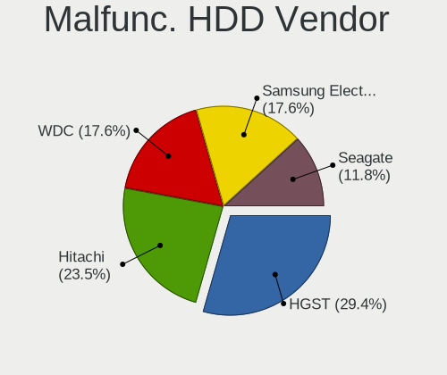

| Vendor              | Notebooks | Drives | Percent |
|---------------------|-----------|--------|---------|
| HGST                | 5         | 24     | 41.67%  |
| WDC                 | 2         | 2      | 16.67%  |
| Seagate             | 2         | 2      | 16.67%  |
| Hitachi             | 2         | 2      | 16.67%  |
| Samsung Electronics | 1         | 1      | 8.33%   |

Malfunc. Drive Kind
-------------------

Kinds of faulty drives

| Kind | Notebooks | Drives | Percent |
|------|-----------|--------|---------|
| HDD  | 11        | 31     | 78.57%  |
| SSD  | 3         | 3      | 21.43%  |

Failed Drives
-------------

Failed drive models

Zero info for selected period =(

Failed Drive Vendor
-------------------

Failed drive vendors

Zero info for selected period =(

Drive Status
------------

Number of failed and malfunc. drives

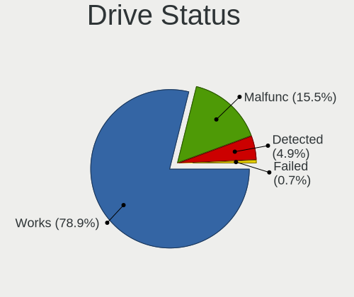

| Status   | Notebooks | Drives | Percent |
|----------|-----------|--------|---------|
| Works    | 57        | 106    | 76%     |
| Malfunc  | 14        | 34     | 18.67%  |
| Detected | 4         | 5      | 5.33%   |

Storage controller
------------------

Storage Vendor
--------------

Storage controller vendors

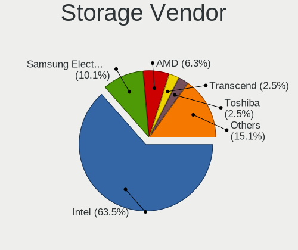

| Vendor                         | Notebooks | Percent |
|--------------------------------|-----------|---------|
| Intel                          | 54        | 75%     |
| Samsung Electronics            | 6         | 8.33%   |
| Nvidia                         | 3         | 4.17%   |
| AMD                            | 3         | 4.17%   |
| Toshiba                        | 2         | 2.78%   |
| Solid State Storage Technology | 1         | 1.39%   |
| SK hynix                       | 1         | 1.39%   |
| Kingston Technology Company    | 1         | 1.39%   |
| Unknown                        | 1         | 1.39%   |

Storage Model
-------------

Storage controller models

| Model                                                                            | Notebooks | Percent |
|----------------------------------------------------------------------------------|-----------|---------|
| Intel 6 Series/C200 Series Chipset Family 6 port Mobile SATA AHCI Controller     | 8         | 10.13%  |
| Intel 7 Series Chipset Family 6-port SATA Controller [AHCI mode]                 | 7         | 8.86%   |
| Intel 82801 Mobile SATA Controller [RAID mode]                                   | 6         | 7.59%   |
| Intel Sunrise Point-LP SATA Controller [AHCI mode]                               | 4         | 5.06%   |
| Intel 82801IBM/IEM (ICH9M/ICH9M-E) 4 port SATA Controller [AHCI mode]            | 4         | 5.06%   |
| Intel 8 Series SATA Controller 1 [AHCI mode]                                     | 4         | 5.06%   |
| Intel 5 Series/3400 Series Chipset 6 port SATA AHCI Controller                   | 4         | 5.06%   |
| Nvidia MCP79 AHCI Controller                                                     | 3         | 3.8%    |
| Samsung NVMe SSD Controller SM961/PM961/SM963                                    | 2         | 2.53%   |
| Samsung NVMe SSD Controller 980                                                  | 2         | 2.53%   |
| Intel Wildcat Point-LP SATA Controller [AHCI Mode]                               | 2         | 2.53%   |
| Intel Comet Lake SATA AHCI Controller                                            | 2         | 2.53%   |
| Intel 82801GBM/GHM (ICH7-M Family) SATA Controller [IDE mode]                    | 2         | 2.53%   |
| AMD FCH SATA Controller [AHCI mode]                                              | 2         | 2.53%   |
| Unknown                                                                          | 2         | 2.53%   |
| Toshiba XG4 NVMe SSD Controller                                                  | 1         | 1.27%   |
| Toshiba BG3 NVMe SSD Controller                                                  | 1         | 1.27%   |
| SK hynix BC511                                                                   | 1         | 1.27%   |
| Samsung SM951 AHCI                                                               | 1         | 1.27%   |
| Samsung NVMe SSD Controller SM981/PM981/PM983                                    | 1         | 1.27%   |
| Samsung NVMe SSD Controller PM9A1/PM9A3/980PRO                                   | 1         | 1.27%   |
| Kingston Company OM3PDP3 NVMe SSD                                                | 1         | 1.27%   |
| Intel NM10/ICH7 Family SATA Controller [AHCI mode]                               | 1         | 1.27%   |
| Intel Mobile 4 Series Chipset PT IDER Controller                                 | 1         | 1.27%   |
| Intel Ice Lake-LP SATA Controller [AHCI mode]                                    | 1         | 1.27%   |
| Intel HM170/QM170 Chipset SATA Controller [AHCI Mode]                            | 1         | 1.27%   |
| Intel Celeron/Pentium Silver Processor SATA Controller                           | 1         | 1.27%   |
| Intel Celeron N3350/Pentium N4200/Atom E3900 Series SATA AHCI Controller         | 1         | 1.27%   |
| Intel Atom/Celeron/Pentium Processor x5-E8000/J3xxx/N3xxx Series SATA Controller | 1         | 1.27%   |
| Intel Atom Processor E3800 Series SATA AHCI Controller                           | 1         | 1.27%   |
| Intel 82801HM/HEM (ICH8M/ICH8M-E) SATA Controller [AHCI mode]                    | 1         | 1.27%   |
| Intel 82801HM/HEM (ICH8M/ICH8M-E) IDE Controller                                 | 1         | 1.27%   |
| Intel 82801GBM/GHM (ICH7-M Family) SATA Controller [AHCI mode]                   | 1         | 1.27%   |
| Intel 82801G (ICH7 Family) IDE Controller                                        | 1         | 1.27%   |
| Intel 8 Series/C220 Series Chipset Family 6-port SATA Controller 1 [AHCI mode]   | 1         | 1.27%   |
| Intel 7 Series Chipset Family 4-port SATA Controller [IDE mode]                  | 1         | 1.27%   |
| Intel 7 Series Chipset Family 2-port SATA Controller [IDE mode]                  | 1         | 1.27%   |
| Intel 5 Series/3400 Series Chipset 4 port SATA AHCI Controller                   | 1         | 1.27%   |
| AMD SB600 Non-Raid-5 SATA                                                        | 1         | 1.27%   |
| AMD SB600 IDE                                                                    | 1         | 1.27%   |

Storage Kind
------------

Kind of storage controller (IDE, SATA, NVMe, SAS, ...)

| Kind | Notebooks | Percent |
|------|-----------|---------|
| SATA | 51        | 68%     |
| NVMe | 11        | 14.67%  |
| IDE  | 7         | 9.33%   |
| RAID | 6         | 8%      |

Processor
---------

CPU Vendor
----------

Processor vendors

| Vendor | Notebooks | Percent |
|--------|-----------|---------|
| Intel  | 62        | 91.18%  |
| AMD    | 5         | 7.35%   |
| 11th   | 1         | 1.47%   |

CPU Model
---------

Processor models

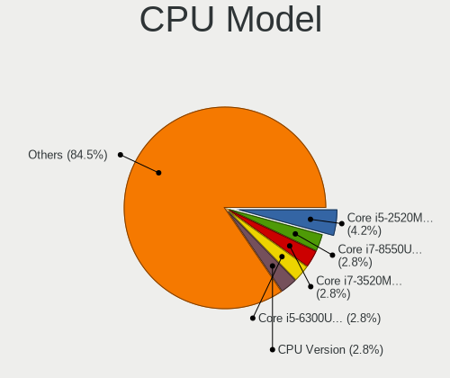

| Model                                        | Notebooks | Percent |
|----------------------------------------------|-----------|---------|
| Intel CPU Version                            | 3         | 4.41%   |
| Intel Core i7-3520M CPU @ 2.90GHz            | 3         | 4.41%   |
| Intel Core i5-4300U CPU @ 1.90GHz            | 3         | 4.41%   |
| Intel Core i5-2520M CPU @ 2.50GHz            | 3         | 4.41%   |
| Intel Core i7-8550U CPU @ 1.80GHz            | 2         | 2.94%   |
| Intel Core i7-1065G7 CPU @ 1.30GHz           | 2         | 2.94%   |
| Intel Core i5-6300U CPU @ 2.40GHz            | 2         | 2.94%   |
| Intel Core i5-4210U CPU @ 1.70GHz            | 2         | 2.94%   |
| Intel Core i5-2540M CPU @ 2.60GHz            | 2         | 2.94%   |
| Intel Core 2 Duo CPU P8600 @ 2.40GHz         | 2         | 2.94%   |
| Intel Pentium CPU N3700 @ 1.60GHz            | 1         | 1.47%   |
| Intel Pentium CPU 967 @ 1.30GHz              | 1         | 1.47%   |
| Intel Core i7-8565U CPU @ 1.80GHz            | 1         | 1.47%   |
| Intel Core i7-6700HQ CPU @ 2.60GHz           | 1         | 1.47%   |
| Intel Core i7-6600U CPU @ 2.60GHz            | 1         | 1.47%   |
| Intel Core i7-5600U CPU @ 2.60GHz            | 1         | 1.47%   |
| Intel Core i7-4770HQ CPU @ 2.20GHz           | 1         | 1.47%   |
| Intel Core i7-4710MQ CPU @ 2.50GHz           | 1         | 1.47%   |
| Intel Core i7-3630QM CPU @ 2.40GHz           | 1         | 1.47%   |
| Intel Core i7-3612QM CPU @ 2.10GHz           | 1         | 1.47%   |
| Intel Core i7-3540M CPU @ 3.00GHz            | 1         | 1.47%   |
| Intel Core i7-2820QM CPU @ 2.30GHz           | 1         | 1.47%   |
| Intel Core i7-10510U CPU @ 1.80GHz           | 1         | 1.47%   |
| Intel Core i7 CPU Q 720 @ 1.60GHz            | 1         | 1.47%   |
| Intel Core i5-7300U CPU @ 2.60GHz            | 1         | 1.47%   |
| Intel Core i5-6200U CPU @ 2.30GHz            | 1         | 1.47%   |
| Intel Core i5-3320M CPU @ 2.60GHz            | 1         | 1.47%   |
| Intel Core i5-3210M CPU @ 2.50GHz            | 1         | 1.47%   |
| Intel Core i5-2430M CPU @ 2.40GHz            | 1         | 1.47%   |
| Intel Core i5-2410M CPU @ 2.30GH             | 1         | 1.47%   |
| Intel Core i5-10210U CPU @ 1.60GHz           | 1         | 1.47%   |
| Intel Core i5 CPU M 560 @ 2.67GHz            | 1         | 1.47%   |
| Intel Core i5 CPU M 560 @ 2.67GH             | 1         | 1.47%   |
| Intel Core i5 CPU M 520 @ 2.40GHz            | 1         | 1.47%   |
| Intel Core i3 CPU M 330 @ 2.13GHz            | 1         | 1.47%   |
| Intel Core 2 Duo CPU T9600 @ 2.80GHz         | 1         | 1.47%   |
| Intel Core 2 Duo CPU T8100 @ 2.10GHz         | 1         | 1.47%   |
| Intel Core 2 Duo CPU T6400 @ 2.00GHz         | 1         | 1.47%   |
| Intel Core 2 Duo CPU P8700 @ 2.53GHz         | 1         | 1.47%   |
| Intel Core 2 Duo CPU P7550 @ 2.26GHz         | 1         | 1.47%   |
| Intel Core 2 CPU T7200 @ 2.00GHz             | 1         | 1.47%   |
| Intel Celeron N4020 CPU @ 1.10GHz            | 1         | 1.47%   |
| Intel Celeron N4000 CPU @ 1.10GHz            | 1         | 1.47%   |
| Intel Celeron CPU N3350 @ 1.10GHz            | 1         | 1.47%   |
| Intel Celeron CPU N2930 @ 1.83GHz            | 1         | 1.47%   |
| Intel Celeron CPU 3215U @ 1.70GHz            | 1         | 1.47%   |
| Intel Atom CPU N450 @ 1.66GHz                | 1         | 1.47%   |
| Intel 11th Gen Core i7-1165G7 @ 2.80GHz      | 1         | 1.47%   |
| AMD Ryzen Embedded V1500B                    | 1         | 1.47%   |
| AMD Ryzen 7 4700U with Radeon Graphics       | 1         | 1.47%   |
| AMD Athlon 64 X2 Dual-Core Processor TK-57   | 1         | 1.47%   |
| AMD A6-9225 RADEON R4, 5 COMPUTE CORES 2C+3G | 1         | 1.47%   |
| AMD A6-3420M APU with Radeon HD Graphics     | 1         | 1.47%   |
| 11th Gen Intel Core i5-1135G7 @ 2.40GHz      | 1         | 1.47%   |

CPU Model Family
----------------

Processor model prefix

| Model              | Notebooks | Percent |
|--------------------|-----------|---------|
| Intel Core i5      | 22        | 32.35%  |
| Intel Core i7      | 19        | 27.94%  |
| Intel Core 2 Duo   | 7         | 10.29%  |
| Other              | 5         | 7.35%   |
| Intel Celeron      | 5         | 7.35%   |
| Intel Pentium      | 2         | 2.94%   |
| AMD A6             | 2         | 2.94%   |
| Intel Core i3      | 1         | 1.47%   |
| Intel Core 2       | 1         | 1.47%   |
| Intel Atom         | 1         | 1.47%   |
| AMD Ryzen Embedded | 1         | 1.47%   |
| AMD Ryzen 7        | 1         | 1.47%   |
| AMD Athlon 64 X2   | 1         | 1.47%   |

CPU Cores
---------

Number of processor cores

| Number  | Notebooks | Percent |
|---------|-----------|---------|
| 2       | 37        | 54.41%  |
| 4       | 18        | 26.47%  |
| Unknown | 8         | 11.76%  |
| 1       | 3         | 4.41%   |
| 8       | 2         | 2.94%   |

CPU Sockets
-----------

Number of sockets

| Number  | Notebooks | Percent |
|---------|-----------|---------|
| 1       | 64        | 94.12%  |
| 2       | 2         | 2.94%   |
| Unknown | 2         | 2.94%   |

CPU Threads
-----------

Threads per core (Hyper-Threading)

| Number  | Notebooks | Percent |
|---------|-----------|---------|
| 2       | 46        | 67.65%  |
| 1       | 14        | 20.59%  |
| Unknown | 8         | 11.76%  |

CPU Microarch
-------------

Microarchitecture

| Name          | Notebooks | Percent |
|---------------|-----------|---------|
| SandyBridge   | 9         | 13.24%  |
| IvyBridge     | 8         | 11.76%  |
| Penryn        | 7         | 10.29%  |
| Haswell       | 7         | 10.29%  |
| KabyLake      | 6         | 8.82%   |
| Skylake       | 5         | 7.35%   |
| Westmere      | 4         | 5.88%   |
| Bonnell       | 3         | 4.41%   |
| Silvermont    | 2         | 2.94%   |
| IceLake       | 2         | 2.94%   |
| Goldmont plus | 2         | 2.94%   |
| Core          | 2         | 2.94%   |
| Broadwell     | 2         | 2.94%   |
| Zen 2         | 1         | 1.47%   |
| Zen           | 1         | 1.47%   |
| TigerLake     | 1         | 1.47%   |
| Nehalem       | 1         | 1.47%   |
| K8 Hammer     | 1         | 1.47%   |
| K10 Llano     | 1         | 1.47%   |
| Goldmont      | 1         | 1.47%   |
| Excavator     | 1         | 1.47%   |
| Unknown       | 1         | 1.47%   |

Graphics
--------

GPU Vendor
----------

Vendors of graphics cards

| Vendor | Notebooks | Percent |
|--------|-----------|---------|
| Intel  | 55        | 75.34%  |
| Nvidia | 10        | 13.7%   |
| AMD    | 8         | 10.96%  |

GPU Model
---------

Graphics card models

| Model                                                                                    | Notebooks | Percent |
|------------------------------------------------------------------------------------------|-----------|---------|
| Intel 2nd Generation Core Processor Family Integrated Graphics Controller                | 9         | 11.25%  |
| Intel Haswell-ULT Integrated Graphics Controller                                         | 5         | 6.25%   |
| Intel 3rd Gen Core processor Graphics Controller                                         | 5         | 6.25%   |
| Intel Skylake GT2 [HD Graphics 520]                                                      | 4         | 5%      |
| Intel Mobile 4 Series Chipset Integrated Graphics Controller                             | 4         | 5%      |
| Intel Core Processor Integrated Graphics Controller                                      | 4         | 5%      |
| Nvidia C79 [GeForce 9400M]                                                               | 3         | 3.75%   |
| Intel Mobile 945GM/GMS/GME, 943/940GML Express Integrated Graphics Controller            | 3         | 3.75%   |
| AMD Thames [Radeon HD 7550M/7570M/7650M]                                                 | 3         | 3.75%   |
| Nvidia GP108M [GeForce MX230]                                                            | 2         | 2.5%    |
| Nvidia G96CM [GeForce 9600M GT]                                                          | 2         | 2.5%    |
| Intel UHD Graphics 620                                                                   | 2         | 2.5%    |
| Intel TigerLake-LP GT2 [Iris Xe Graphics]                                                | 2         | 2.5%    |
| Intel Mobile 945GSE Express Integrated Graphics Controller                               | 2         | 2.5%    |
| Intel Iris Plus Graphics G7                                                              | 2         | 2.5%    |
| Intel GeminiLake [UHD Graphics 600]                                                      | 2         | 2.5%    |
| Intel CometLake-U GT2 [UHD Graphics]                                                     | 2         | 2.5%    |
| Nvidia GT216M [GeForce GT 330M]                                                          | 1         | 1.25%   |
| Nvidia GP108M [GeForce MX250]                                                            | 1         | 1.25%   |
| Nvidia GK107M [GeForce GT 650M]                                                          | 1         | 1.25%   |
| Nvidia GK107GLM [Quadro K1100M]                                                          | 1         | 1.25%   |
| Nvidia GF114M [GeForce GTX 580M]                                                         | 1         | 1.25%   |
| Intel WhiskeyLake-U GT2 [UHD Graphics 620]                                               | 1         | 1.25%   |
| Intel Mobile GM965/GL960 Integrated Graphics Controller (secondary)                      | 1         | 1.25%   |
| Intel Mobile GM965/GL960 Integrated Graphics Controller (primary)                        | 1         | 1.25%   |
| Intel Mobile 945GM/GMS, 943/940GML Express Integrated Graphics Controller                | 1         | 1.25%   |
| Intel HD Graphics 620                                                                    | 1         | 1.25%   |
| Intel HD Graphics 5500                                                                   | 1         | 1.25%   |
| Intel HD Graphics 530                                                                    | 1         | 1.25%   |
| Intel HD Graphics 500                                                                    | 1         | 1.25%   |
| Intel HD Graphics                                                                        | 1         | 1.25%   |
| Intel Crystal Well Integrated Graphics Controller                                        | 1         | 1.25%   |
| Intel Atom/Celeron/Pentium Processor x5-E8000/J3xxx/N3xxx Integrated Graphics Controller | 1         | 1.25%   |
| Intel Atom Processor Z36xxx/Z37xxx Series Graphics & Display                             | 1         | 1.25%   |
| Intel Atom Processor D4xx/D5xx/N4xx/N5xx Integrated Graphics Controller                  | 1         | 1.25%   |
| Intel 4th Gen Core Processor Integrated Graphics Controller                              | 1         | 1.25%   |
| AMD Thames [Radeon HD 7500M/7600M Series]                                                | 1         | 1.25%   |
| AMD Sumo [Radeon HD 6520G]                                                               | 1         | 1.25%   |
| AMD Stoney [Radeon R2/R3/R4/R5 Graphics]                                                 | 1         | 1.25%   |
| AMD RS690M [Radeon Xpress 1200/1250/1270]                                                | 1         | 1.25%   |
| AMD Renoir                                                                               | 1         | 1.25%   |

GPU Combo
---------

Combinations of graphics cards

| Name           | Notebooks | Percent |
|----------------|-----------|---------|
| 1 x Intel      | 40        | 57.97%  |
| 2 x Intel      | 9         | 13.04%  |
| 1 x AMD        | 7         | 10.14%  |
| Intel + Nvidia | 5         | 7.25%   |
| 1 x Nvidia     | 4         | 5.8%    |
| 2 x Nvidia     | 2         | 2.9%    |
| Other          | 1         | 1.45%   |
| Intel + AMD    | 1         | 1.45%   |

GPU Driver
----------

Free vs proprietary

| Driver      | Notebooks | Percent |
|-------------|-----------|---------|
| Free        | 62        | 89.86%  |
| Unknown     | 4         | 5.8%    |
| Proprietary | 3         | 4.35%   |

GPU Memory
----------

Total video memory

| Size in GB | Notebooks | Percent |
|------------|-----------|---------|
| Unknown    | 61        | 88.41%  |
| 1.01-2.0   | 3         | 4.35%   |
| 0.51-1.0   | 3         | 4.35%   |
| 0.01-0.5   | 2         | 2.9%    |

Monitor
-------

Monitor Vendor
--------------

Monitor vendors

| Vendor                  | Notebooks | Percent |
|-------------------------|-----------|---------|
| AU Optronics            | 12        | 21.05%  |
| LG Display              | 9         | 15.79%  |
| Samsung Electronics     | 5         | 8.77%   |
| Chimei Innolux          | 5         | 8.77%   |
| Philips                 | 4         | 7.02%   |
| Lenovo                  | 4         | 7.02%   |
| LG Philips              | 2         | 3.51%   |
| Hewlett-Packard         | 2         | 3.51%   |
| HannStar                | 2         | 3.51%   |
| BOE                     | 2         | 3.51%   |
| Apple                   | 2         | 3.51%   |
| Vestel Elektronik       | 1         | 1.75%   |
| Sony                    | 1         | 1.75%   |
| Sharp                   | 1         | 1.75%   |
| SDC                     | 1         | 1.75%   |
| PANDA                   | 1         | 1.75%   |
| InnoLux Display         | 1         | 1.75%   |
| CPT                     | 1         | 1.75%   |
| Chi Mei Optoelectronics | 1         | 1.75%   |

Monitor Model
-------------

Monitor models

| Model                                                                    | Notebooks | Percent |
|--------------------------------------------------------------------------|-----------|---------|
| Philips LCD Monitor PHL08C3 1920x1080 600x340mm 27.2-inch                | 3         | 5.08%   |
| LG Display LCD Monitor LGD0258 1600x900 350x190mm 15.7-inch              | 3         | 5.08%   |
| AU Optronics LCD Monitor AUO106C 1366x768 280x160mm 12.7-inch            | 3         | 5.08%   |
| AU Optronics LCD Monitor AUO492D 1920x1080 290x170mm 13.2-inch           | 2         | 3.39%   |
| Vestel Elektronik 32W_LCD_TV VES3700 1920x1080 710x400mm 32.1-inch       | 1         | 1.69%   |
| Sony SDM-HS95P SNY2500 1280x1024 380x300mm 19.1-inch                     | 1         | 1.69%   |
| Sharp LCD Monitor SHP1421 3200x1800 290x170mm 13.2-inch                  | 1         | 1.69%   |
| SDC LCD Monitor 3520x1080                                                | 1         | 1.69%   |
| Samsung Electronics LCD Monitor SEC5448 1920x1080 410x230mm 18.5-inch    | 1         | 1.69%   |
| Samsung Electronics LCD Monitor SEC384A 1366x768 340x190mm 15.3-inch     | 1         | 1.69%   |
| Samsung Electronics LCD Monitor SDC834D 1920x1080 290x160mm 13.0-inch    | 1         | 1.69%   |
| Samsung Electronics LCD Monitor SDC4141 1366x768 340x190mm 15.3-inch     | 1         | 1.69%   |
| Samsung Electronics LCD Monitor SDC3754 1600x900 380x210mm 17.1-inch     | 1         | 1.69%   |
| Philips LCD Monitor 271P4 3520x1080                                      | 1         | 1.69%   |
| Philips LCD Monitor 271P4                                                | 1         | 1.69%   |
| PANDA LCD Monitor NCP004F 1920x1080 310x170mm 13.9-inch                  | 1         | 1.69%   |
| LG Philips LCD Monitor LPLE300 1280x800 330x210mm 15.4-inch              | 1         | 1.69%   |
| LG Philips LCD Monitor LPL1279 1680x1050 330x210mm 15.4-inch             | 1         | 1.69%   |
| LG Display LCD Monitor LGD6E01 1366x768 340x190mm 15.3-inch              | 1         | 1.69%   |
| LG Display LCD Monitor LGD0508 1366x768 310x170mm 13.9-inch              | 1         | 1.69%   |
| LG Display LCD Monitor LGD0419 2560x1440 310x170mm 13.9-inch             | 1         | 1.69%   |
| LG Display LCD Monitor LGD02DF 1600x900 310x170mm 13.9-inch              | 1         | 1.69%   |
| LG Display LCD Monitor LGD02DC 1366x768 340x190mm 15.3-inch              | 1         | 1.69%   |
| LG Display LCD Monitor LGD02D8 1366x768 280x160mm 12.7-inch              | 1         | 1.69%   |
| Lenovo LCD Monitor LEN4050 1280x800 330x210mm 15.4-inch                  | 1         | 1.69%   |
| Lenovo LCD Monitor LEN4036 1440x900 300x190mm 14.0-inch                  | 1         | 1.69%   |
| Lenovo LCD Monitor LEN4011 1280x800 260x170mm 12.2-inch                  | 1         | 1.69%   |
| Lenovo LCD Monitor LEN4010 1280x800 260x160mm 12.0-inch                  | 1         | 1.69%   |
| InnoLux Display BT101IW03V1 INL000D 1024x600 220x120mm 9.9-inch          | 1         | 1.69%   |
| Hewlett-Packard LCD Monitor LA2306 3520x1080                             | 1         | 1.69%   |
| Hewlett-Packard LA2306 HWP2949 1920x1080 510x290mm 23.1-inch             | 1         | 1.69%   |
| HannStar LCD Monitor HSD1CF3 1920x1200 590x370mm 27.4-inch               | 1         | 1.69%   |
| HannStar LCD Monitor HSD03E9 1024x600 220x130mm 10.1-inch                | 1         | 1.69%   |
| CPT LCD Monitor CPT04C4 1024x600 230x140mm 10.6-inch                     | 1         | 1.69%   |
| Chimei Innolux LCD Monitor CMN15D7 1920x1080 340x190mm 15.3-inch         | 1         | 1.69%   |
| Chimei Innolux LCD Monitor CMN15AB 1366x768 340x190mm 15.3-inch          | 1         | 1.69%   |
| Chimei Innolux LCD Monitor CMN14C9 1920x1080 310x170mm 13.9-inch         | 1         | 1.69%   |
| Chimei Innolux LCD Monitor CMN1471 1366x768 310x170mm 13.9-inch          | 1         | 1.69%   |
| Chimei Innolux LCD Monitor CMN1132 1366x768 260x140mm 11.6-inch          | 1         | 1.69%   |
| Chi Mei Optoelectronics LCD Monitor CMO1312 1280x800 290x180mm 13.4-inch | 1         | 1.69%   |
| BOE LCD Monitor BOE08D7 1920x1080 310x170mm 13.9-inch                    | 1         | 1.69%   |
| BOE LCD Monitor BOE0630 1920x1080 340x190mm 15.3-inch                    | 1         | 1.69%   |
| AU Optronics LCD Monitor AUO8174 1280x800 330x210mm 15.4-inch            | 1         | 1.69%   |
| AU Optronics LCD Monitor AUO37ED 1920x1080 340x190mm 15.3-inch           | 1         | 1.69%   |
| AU Optronics LCD Monitor AUO333C 1366x768 310x170mm 13.9-inch            | 1         | 1.69%   |
| AU Optronics LCD Monitor AUO32EC 1366x768 340x190mm 15.3-inch            | 1         | 1.69%   |
| AU Optronics LCD Monitor AUO31EC 1366x768 340x190mm 15.3-inch            | 1         | 1.69%   |
| AU Optronics LCD Monitor AUO149E 1600x900 380x210mm 17.1-inch            | 1         | 1.69%   |
| AU Optronics LCD Monitor AUO139D 1920x1080 380x210mm 17.1-inch           | 1         | 1.69%   |
| Apple LCD Monitor APP9CCB 1280x800 290x180mm 13.4-inch                   | 1         | 1.69%   |
| Apple Color LCD APPA02E 2880x1800 330x210mm 15.4-inch                    | 1         | 1.69%   |
| Apple Cinema HD APP9223 1920x1200 490x310mm 22.8-inch                    | 1         | 1.69%   |

Monitor Resolution
------------------

Monitor screen resolution

| Resolution         | Notebooks | Percent |
|--------------------|-----------|---------|
| 1366x768 (WXGA)    | 15        | 26.79%  |
| 1920x1080 (FHD)    | 14        | 25%     |
| 1280x800 (WXGA)    | 7         | 12.5%   |
| 1600x900 (HD+)     | 6         | 10.71%  |
| 1024x600           | 3         | 5.36%   |
| 1920x1200 (WUXGA)  | 2         | 3.57%   |
| 3520x1080          | 1         | 1.79%   |
| 3200x1800 (QHD+)   | 1         | 1.79%   |
| 2880x1800          | 1         | 1.79%   |
| 2560x1440 (QHD)    | 1         | 1.79%   |
| 1920x540           | 1         | 1.79%   |
| 1680x1050 (WSXGA+) | 1         | 1.79%   |
| 1440x900 (WXGA+)   | 1         | 1.79%   |
| 1280x1024 (SXGA)   | 1         | 1.79%   |
| Unknown            | 1         | 1.79%   |

Monitor Diagonal
----------------

Diagonal size in inches

| Inches  | Notebooks | Percent |
|---------|-----------|---------|
| 15      | 18        | 32.14%  |
| 13      | 14        | 25%     |
| 12      | 6         | 10.71%  |
| 27      | 4         | 7.14%   |
| 17      | 3         | 5.36%   |
| 10      | 2         | 3.57%   |
| 42      | 1         | 1.79%   |
| 23      | 1         | 1.79%   |
| 22      | 1         | 1.79%   |
| 19      | 1         | 1.79%   |
| 18      | 1         | 1.79%   |
| 14      | 1         | 1.79%   |
| 11      | 1         | 1.79%   |
| 9       | 1         | 1.79%   |
| Unknown | 1         | 1.79%   |

Monitor Width
-------------

Physical width

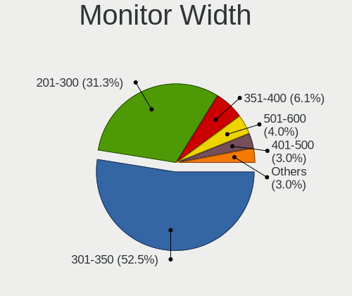

| Width in mm | Notebooks | Percent |
|-------------|-----------|---------|
| 301-350     | 26        | 47.27%  |
| 201-300     | 17        | 30.91%  |
| 501-600     | 4         | 7.27%   |
| 351-400     | 4         | 7.27%   |
| 401-500     | 2         | 3.64%   |
| 901-1000    | 1         | 1.82%   |
| Unknown     | 1         | 1.82%   |

Aspect Ratio
------------

Proportional relationship between the width and the height

| Ratio   | Notebooks | Percent |
|---------|-----------|---------|
| 16/9    | 36        | 72%     |
| 16/10   | 11        | 22%     |
| 5/4     | 1         | 2%      |
| 3/2     | 1         | 2%      |
| Unknown | 1         | 2%      |

Monitor Area
------------

Area in inch

| Area in inch | Notebooks | Percent |
|----------------|-----------|---------|
| 81-90          | 11        | 19.64%  |
| 101-110        | 9         | 16.07%  |
| 91-100         | 9         | 16.07%  |
| 61-70          | 6         | 10.71%  |
| 71-80          | 4         | 7.14%   |
| 301-350        | 4         | 7.14%   |
| 41-50          | 3         | 5.36%   |
| 121-130        | 3         | 5.36%   |
| 201-250        | 2         | 3.57%   |
| 51-60          | 1         | 1.79%   |
| 151-200        | 1         | 1.79%   |
| 141-150        | 1         | 1.79%   |
| 501-1000       | 1         | 1.79%   |
| Unknown        | 1         | 1.79%   |

Pixel Density
-------------

Pixels per inch

| Density       | Notebooks | Percent |
|---------------|-----------|---------|
| 101-120       | 19        | 35.19%  |
| 121-160       | 18        | 33.33%  |
| 51-100        | 10        | 18.52%  |
| 161-240       | 5         | 9.26%   |
| More than 240 | 1         | 1.85%   |
| Unknown       | 1         | 1.85%   |

Multiple Monitors
-----------------

Total monitors connected

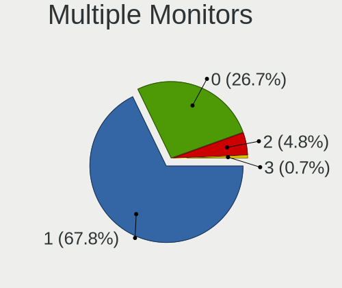

| Total | Notebooks | Percent |
|-------|-----------|---------|
| 1     | 47        | 67.14%  |
| 0     | 18        | 25.71%  |
| 2     | 5         | 7.14%   |

Network
-------

Net Controller Vendor
---------------------

Controller vendors

| Vendor                            | Notebooks | Percent |
|-----------------------------------|-----------|---------|
| Intel                             | 48        | 46.15%  |
| Realtek Semiconductor             | 22        | 21.15%  |
| Qualcomm Atheros                  | 12        | 11.54%  |
| Broadcom                          | 6         | 5.77%   |
| Nvidia                            | 3         | 2.88%   |
| Marvell Technology Group          | 3         | 2.88%   |
| Hewlett-Packard                   | 3         | 2.88%   |
| D-Link System                     | 2         | 1.92%   |
| TP-Link                           | 1         | 0.96%   |
| Sierra Wireless                   | 1         | 0.96%   |
| Ericsson Business Mobile Networks | 1         | 0.96%   |
| Edimax Technology                 | 1         | 0.96%   |
| AMD                               | 1         | 0.96%   |

Net Controller Model
--------------------

Controller models

| Model                                                                       | Notebooks | Percent |
|-----------------------------------------------------------------------------|-----------|---------|
| Realtek RTL8111/8168/8411 PCI Express Gigabit Ethernet Controller           | 13        | 9.35%   |
| Intel 82579LM Gigabit Network Connection (Lewisville)                       | 12        | 8.63%   |
| Intel Centrino Advanced-N 6205 [Taylor Peak]                                | 11        | 7.91%   |
| Realtek RTL810xE PCI Express Fast Ethernet controller                       | 7         | 5.04%   |
| Intel Wireless 7260                                                         | 6         | 4.32%   |
| Intel Wireless 8260                                                         | 4         | 2.88%   |
| Intel Centrino Advanced-N 6200                                              | 4         | 2.88%   |
| Qualcomm Atheros QCA9377 802.11ac Wireless Network Adapter                  | 3         | 2.16%   |
| Qualcomm Atheros AR242x / AR542x Wireless Network Adapter (PCI-Express)     | 3         | 2.16%   |
| Nvidia MCP79 Ethernet                                                       | 3         | 2.16%   |
| Intel Wireless 8265 / 8275                                                  | 3         | 2.16%   |
| Intel Ethernet Connection I219-LM                                           | 3         | 2.16%   |
| Intel Ethernet Connection I218-LM                                           | 3         | 2.16%   |
| Intel Centrino Ultimate-N 6300                                              | 3         | 2.16%   |
| Intel 82577LM Gigabit Network Connection                                    | 3         | 2.16%   |
| HP hs2350 HSPA+ Mobile Broadband Module Network Adapter                     | 3         | 2.16%   |
| Broadcom BCM4322 802.11a/b/g/n Wireless LAN Controller                      | 3         | 2.16%   |
| Realtek RTL8723BE PCIe Wireless Network Adapter                             | 2         | 1.44%   |
| Realtek RTL8188CE 802.11b/g/n WiFi Adapter                                  | 2         | 1.44%   |
| Intel Wireless 3165                                                         | 2         | 1.44%   |
| Intel Wi-Fi 6 AX201                                                         | 2         | 1.44%   |
| Intel Wi-Fi 6 AX200                                                         | 2         | 1.44%   |
| Intel PRO/Wireless 3945ABG [Golan] Network Connection                       | 2         | 1.44%   |
| Intel I210 Gigabit Network Connection                                       | 2         | 1.44%   |
| Intel Comet Lake PCH-LP CNVi WiFi                                           | 2         | 1.44%   |
| D-Link System AirPlus G DWL-G122 Wireless Adapter(rev.C1) [Ralink RT2571W]  | 2         | 1.44%   |
| TP-Link AC600 wireless Realtek RTL8811AU [Archer T2U Nano]                  | 1         | 0.72%   |
| Sierra Wireless Sierra Wireless EM7345 4G LTE                               | 1         | 0.72%   |
| Realtek RTL8821CE 802.11ac PCIe Wireless Network Adapter                    | 1         | 0.72%   |
| Realtek RTL8723DE Wireless Network Adapter                                  | 1         | 0.72%   |
| Realtek RTL8188EE Wireless Network Adapter                                  | 1         | 0.72%   |
| Realtek RTL-8100/8101L/8139 PCI Fast Ethernet Adapter                       | 1         | 0.72%   |
| Realtek Realtek Bluetooth 4.2 Adapter                                       | 1         | 0.72%   |
| Qualcomm Atheros AR9485 Wireless Network Adapter                            | 1         | 0.72%   |
| Qualcomm Atheros AR9462 Wireless Network Adapter                            | 1         | 0.72%   |
| Qualcomm Atheros AR928X Wireless Network Adapter (PCI-Express)              | 1         | 0.72%   |
| Qualcomm Atheros AR9285 Wireless Network Adapter (PCI-Express)              | 1         | 0.72%   |
| Qualcomm Atheros AR8151 v2.0 Gigabit Ethernet                               | 1         | 0.72%   |
| Qualcomm Atheros AR8132 Fast Ethernet                                       | 1         | 0.72%   |
| Qualcomm Atheros AR2427 802.11bg Wireless Network Adapter (PCI-Express)     | 1         | 0.72%   |
| Marvell Group 88E8072 PCI-E Gigabit Ethernet Controller                     | 1         | 0.72%   |
| Marvell Group 88E8057 PCI-E Gigabit Ethernet Controller                     | 1         | 0.72%   |
| Marvell Group 88E8040 PCI-E Fast Ethernet Controller                        | 1         | 0.72%   |
| Intel Wireless 3160                                                         | 1         | 0.72%   |
| Intel WiFi Link 5100                                                        | 1         | 0.72%   |
| Intel PRO/Wireless 5100 AGN [Shiloh] Network Connection                     | 1         | 0.72%   |
| Intel Ethernet Connection I217-LM                                           | 1         | 0.72%   |
| Intel Ethernet Connection (4) I219-LM                                       | 1         | 0.72%   |
| Intel Centrino Advanced-N 6235                                              | 1         | 0.72%   |
| Intel 82577LC Gigabit Network Connection                                    | 1         | 0.72%   |
| Intel 82567LM Gigabit Network Connection                                    | 1         | 0.72%   |
| Ericsson Business Mobile Networks F5521 gw Mobile Broadband Serial Port III | 1         | 0.72%   |
| Edimax Edimax AC600 Wireless LAN USB Adapter                                | 1         | 0.72%   |
| Broadcom NetXtreme BCM57765 Gigabit Ethernet PCIe                           | 1         | 0.72%   |
| Broadcom NetXtreme BCM57762 Gigabit Ethernet PCIe                           | 1         | 0.72%   |
| Broadcom NetLink BCM5787M Gigabit Ethernet PCI Express                      | 1         | 0.72%   |
| Broadcom BCM4401-B0 100Base-TX                                              | 1         | 0.72%   |
| Broadcom BCM43602 802.11ac Wireless LAN SoC                                 | 1         | 0.72%   |
| Broadcom BCM4331 802.11a/b/g/n                                              | 1         | 0.72%   |
| AMD Family 17h Processor 10 Gb Ethernet Controller Port 0                   | 1         | 0.72%   |

Wireless Vendor
---------------

Wireless vendors

| Vendor                | Notebooks | Percent |
|-----------------------|-----------|---------|
| Intel                 | 45        | 62.5%   |
| Qualcomm Atheros      | 11        | 15.28%  |
| Realtek Semiconductor | 7         | 9.72%   |
| Broadcom              | 4         | 5.56%   |
| D-Link System         | 2         | 2.78%   |
| TP-Link               | 1         | 1.39%   |
| Sierra Wireless       | 1         | 1.39%   |
| Edimax Technology     | 1         | 1.39%   |

Wireless Model
--------------

Wireless models

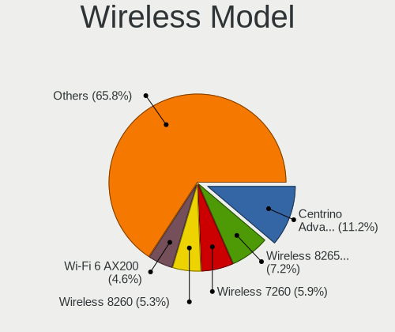

| Model                                                                      | Notebooks | Percent |
|----------------------------------------------------------------------------|-----------|---------|
| Intel Centrino Advanced-N 6205 [Taylor Peak]                               | 11        | 14.86%  |
| Intel Wireless 7260                                                        | 6         | 8.11%   |
| Intel Wireless 8260                                                        | 4         | 5.41%   |
| Intel Centrino Advanced-N 6200                                             | 4         | 5.41%   |
| Qualcomm Atheros QCA9377 802.11ac Wireless Network Adapter                 | 3         | 4.05%   |
| Qualcomm Atheros AR242x / AR542x Wireless Network Adapter (PCI-Express)    | 3         | 4.05%   |
| Intel Wireless 8265 / 8275                                                 | 3         | 4.05%   |
| Intel Centrino Ultimate-N 6300                                             | 3         | 4.05%   |
| Broadcom BCM4322 802.11a/b/g/n Wireless LAN Controller                     | 3         | 4.05%   |
| Realtek RTL8723BE PCIe Wireless Network Adapter                            | 2         | 2.7%    |
| Realtek RTL8188CE 802.11b/g/n WiFi Adapter                                 | 2         | 2.7%    |
| Intel Wireless 3165                                                        | 2         | 2.7%    |
| Intel Wi-Fi 6 AX201                                                        | 2         | 2.7%    |
| Intel Wi-Fi 6 AX200                                                        | 2         | 2.7%    |
| Intel PRO/Wireless 3945ABG [Golan] Network Connection                      | 2         | 2.7%    |
| Intel Comet Lake PCH-LP CNVi WiFi                                          | 2         | 2.7%    |
| D-Link System AirPlus G DWL-G122 Wireless Adapter(rev.C1) [Ralink RT2571W] | 2         | 2.7%    |
| TP-Link AC600 wireless Realtek RTL8811AU [Archer T2U Nano]                 | 1         | 1.35%   |
| Sierra Wireless Sierra Wireless EM7345 4G LTE                              | 1         | 1.35%   |
| Realtek RTL8821CE 802.11ac PCIe Wireless Network Adapter                   | 1         | 1.35%   |
| Realtek RTL8723DE Wireless Network Adapter                                 | 1         | 1.35%   |
| Realtek RTL8188EE Wireless Network Adapter                                 | 1         | 1.35%   |
| Realtek Realtek Bluetooth 4.2 Adapter                                      | 1         | 1.35%   |
| Qualcomm Atheros AR9485 Wireless Network Adapter                           | 1         | 1.35%   |
| Qualcomm Atheros AR9462 Wireless Network Adapter                           | 1         | 1.35%   |
| Qualcomm Atheros AR928X Wireless Network Adapter (PCI-Express)             | 1         | 1.35%   |
| Qualcomm Atheros AR9285 Wireless Network Adapter (PCI-Express)             | 1         | 1.35%   |
| Qualcomm Atheros AR2427 802.11bg Wireless Network Adapter (PCI-Express)    | 1         | 1.35%   |
| Intel Wireless 3160                                                        | 1         | 1.35%   |
| Intel WiFi Link 5100                                                       | 1         | 1.35%   |
| Intel PRO/Wireless 5100 AGN [Shiloh] Network Connection                    | 1         | 1.35%   |
| Intel Centrino Advanced-N 6235                                             | 1         | 1.35%   |
| Edimax Edimax AC600 Wireless LAN USB Adapter                               | 1         | 1.35%   |
| Broadcom BCM43602 802.11ac Wireless LAN SoC                                | 1         | 1.35%   |
| Broadcom BCM4331 802.11a/b/g/n                                             | 1         | 1.35%   |

Ethernet Vendor
---------------

Ethernet vendors

| Vendor                   | Notebooks | Percent |
|--------------------------|-----------|---------|
| Intel                    | 27        | 45%     |
| Realtek Semiconductor    | 21        | 35%     |
| Nvidia                   | 3         | 5%      |
| Marvell Technology Group | 3         | 5%      |
| Broadcom                 | 3         | 5%      |
| Qualcomm Atheros         | 2         | 3.33%   |
| AMD                      | 1         | 1.67%   |

Ethernet Model
--------------

Ethernet models

| Model                                                             | Notebooks | Percent |
|-------------------------------------------------------------------|-----------|---------|
| Realtek RTL8111/8168/8411 PCI Express Gigabit Ethernet Controller | 13        | 21.31%  |
| Intel 82579LM Gigabit Network Connection (Lewisville)             | 12        | 19.67%  |
| Realtek RTL810xE PCI Express Fast Ethernet controller             | 7         | 11.48%  |
| Nvidia MCP79 Ethernet                                             | 3         | 4.92%   |
| Intel Ethernet Connection I219-LM                                 | 3         | 4.92%   |
| Intel Ethernet Connection I218-LM                                 | 3         | 4.92%   |
| Intel 82577LM Gigabit Network Connection                          | 3         | 4.92%   |
| Intel I210 Gigabit Network Connection                             | 2         | 3.28%   |
| Realtek RTL-8100/8101L/8139 PCI Fast Ethernet Adapter             | 1         | 1.64%   |
| Qualcomm Atheros AR8151 v2.0 Gigabit Ethernet                     | 1         | 1.64%   |
| Qualcomm Atheros AR8132 Fast Ethernet                             | 1         | 1.64%   |
| Marvell Group 88E8072 PCI-E Gigabit Ethernet Controller           | 1         | 1.64%   |
| Marvell Group 88E8057 PCI-E Gigabit Ethernet Controller           | 1         | 1.64%   |
| Marvell Group 88E8040 PCI-E Fast Ethernet Controller              | 1         | 1.64%   |
| Intel Ethernet Connection I217-LM                                 | 1         | 1.64%   |
| Intel Ethernet Connection (4) I219-LM                             | 1         | 1.64%   |
| Intel 82577LC Gigabit Network Connection                          | 1         | 1.64%   |
| Intel 82567LM Gigabit Network Connection                          | 1         | 1.64%   |
| Broadcom NetXtreme BCM57765 Gigabit Ethernet PCIe                 | 1         | 1.64%   |
| Broadcom NetXtreme BCM57762 Gigabit Ethernet PCIe                 | 1         | 1.64%   |
| Broadcom NetLink BCM5787M Gigabit Ethernet PCI Express            | 1         | 1.64%   |
| Broadcom BCM4401-B0 100Base-TX                                    | 1         | 1.64%   |
| AMD Family 17h Processor 10 Gb Ethernet Controller Port 0         | 1         | 1.64%   |

Net Controller Kind
-------------------

Ethernet, WiFi or modem

| Kind     | Notebooks | Percent |
|----------|-----------|---------|
| WiFi     | 67        | 52.34%  |
| Ethernet | 57        | 44.53%  |
| Modem    | 3         | 2.34%   |
| Unknown  | 1         | 0.78%   |

Used Controller
---------------

Currently used network controller

| Kind     | Notebooks | Percent |
|----------|-----------|---------|
| WiFi     | 54        | 51.43%  |
| Ethernet | 48        | 45.71%  |
| Modem    | 3         | 2.86%   |

NICs
----

Total network controllers on board

| Total | Notebooks | Percent |
|-------|-----------|---------|
| 2     | 56        | 81.16%  |
| 1     | 11        | 15.94%  |
| 5     | 1         | 1.45%   |
| 3     | 1         | 1.45%   |

IPv6
----

IPv6 vs IPv4

| Used | Notebooks | Percent |
|------|-----------|---------|
| No   | 65        | 90.28%  |
| Yes  | 7         | 9.72%   |

Bluetooth
---------

Bluetooth Vendor
----------------

Controller vendors

| Vendor                          | Notebooks | Percent |
|---------------------------------|-----------|---------|
| Intel                           | 19        | 46.34%  |
| Broadcom                        | 6         | 14.63%  |
| Dell                            | 4         | 9.76%   |
| Apple                           | 4         | 9.76%   |
| Realtek Semiconductor           | 2         | 4.88%   |
| Qualcomm Atheros Communications | 2         | 4.88%   |
| Foxconn / Hon Hai               | 2         | 4.88%   |
| ASUSTek Computer                | 1         | 2.44%   |
| Alps Electric                   | 1         | 2.44%   |

Bluetooth Model
---------------

Controller models

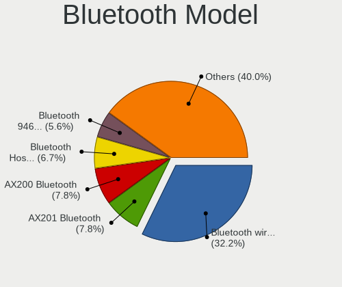

| Model                                                                               | Notebooks | Percent |
|-------------------------------------------------------------------------------------|-----------|---------|
| Intel Bluetooth wireless interface                                                  | 12        | 29.27%  |
| Apple Bluetooth Host Controller                                                     | 4         | 9.76%   |
| Intel AX201 Bluetooth                                                               | 3         | 7.32%   |
| Dell DW375 Bluetooth Module                                                         | 3         | 7.32%   |
| Intel AX200 Bluetooth                                                               | 2         | 4.88%   |
| Broadcom BCM20702 Bluetooth 4.0 [ThinkPad]                                          | 2         | 4.88%   |
| Realtek RTL8723B Bluetooth                                                          | 1         | 2.44%   |
| Realtek  Bluetooth 4.0 Adapter                                                      | 1         | 2.44%   |
| Qualcomm Atheros  QCA9377 Bluetooth 4.1                                             | 1         | 2.44%   |
| Qualcomm Atheros AR3012 Bluetooth 4.0                                               | 1         | 2.44%   |
| Intel Centrino Bluetooth Wireless Transceiver                                       | 1         | 2.44%   |
| Intel Bluetooth 9460/9560 Jefferson Peak (JfP)                                      | 1         | 2.44%   |
| Foxconn / Hon Hai Foxconn T77H114 BCM2070 [Single-Chip Bluetooth 2.1 + EDR Adapter] | 1         | 2.44%   |
| Foxconn / Hon Hai Bluetooth USB Module                                              | 1         | 2.44%   |
| Dell Dell Wireless 380 Bluetooth 4.0 Module                                         | 1         | 2.44%   |
| Broadcom Bluetooth                                                                  | 1         | 2.44%   |
| Broadcom BCM2045B (BDC-2.1) [Bluetooth Controller]                                  | 1         | 2.44%   |
| Broadcom BCM2045B (BDC-2.1)                                                         | 1         | 2.44%   |
| Broadcom BCM2045 Bluetooth                                                          | 1         | 2.44%   |
| ASUS BT-253 Bluetooth Adapter                                                       | 1         | 2.44%   |
| Alps Electric UGTZ4 Bluetooth                                                       | 1         | 2.44%   |

Sound
-----

Sound Vendor
------------

Sound card vendors

| Vendor          | Notebooks | Percent |
|-----------------|-----------|---------|
| Intel           | 59        | 75.64%  |
| AMD             | 8         | 10.26%  |
| Nvidia          | 6         | 7.69%   |
| SteelSeries ApS | 3         | 3.85%   |
| JMTek           | 1         | 1.28%   |
| GN Netcom       | 1         | 1.28%   |

Sound Model
-----------

Sound card models

| Model                                                                                             | Notebooks | Percent |
|---------------------------------------------------------------------------------------------------|-----------|---------|
| Intel 7 Series/C216 Chipset Family High Definition Audio Controller                               | 9         | 10.11%  |
| Intel 6 Series/C200 Series Chipset Family High Definition Audio Controller                        | 9         | 10.11%  |
| Intel Sunrise Point-LP HD Audio                                                                   | 7         | 7.87%   |
| Intel Haswell-ULT HD Audio Controller                                                             | 5         | 5.62%   |
| Intel 8 Series HD Audio Controller                                                                | 5         | 5.62%   |
| Intel 5 Series/3400 Series Chipset High Definition Audio                                          | 5         | 5.62%   |
| Intel NM10/ICH7 Family High Definition Audio Controller                                           | 4         | 4.49%   |
| Intel 82801I (ICH9 Family) HD Audio Controller                                                    | 4         | 4.49%   |
| SteelSeries ApS SteelSeries Siberia 350                                                           | 3         | 3.37%   |
| Nvidia MCP79 High Definition Audio                                                                | 3         | 3.37%   |
| AMD Turks HDMI Audio [Radeon HD 6500/6600 / 6700M Series]                                         | 3         | 3.37%   |
| Intel Tiger Lake-LP Smart Sound Technology Audio Controller                                       | 2         | 2.25%   |
| Intel Ice Lake-LP Smart Sound Technology Audio Controller                                         | 2         | 2.25%   |
| Intel Celeron/Pentium Silver Processor High Definition Audio                                      | 2         | 2.25%   |
| Intel Broadwell-U Audio Controller                                                                | 2         | 2.25%   |
| Intel 8 Series/C220 Series Chipset High Definition Audio Controller                               | 2         | 2.25%   |
| AMD Family 17h/19h HD Audio Controller                                                            | 2         | 2.25%   |
| Nvidia GT216 HDMI Audio Controller                                                                | 1         | 1.12%   |
| Nvidia GK107 HDMI Audio Controller                                                                | 1         | 1.12%   |
| Nvidia GF114 HDMI Audio Controller                                                                | 1         | 1.12%   |
| JMTek audio controller                                                                            | 1         | 1.12%   |
| Intel Wildcat Point-LP High Definition Audio Controller                                           | 1         | 1.12%   |
| Intel Crystal Well HD Audio Controller                                                            | 1         | 1.12%   |
| Intel Comet Lake PCH-LP cAVS                                                                      | 1         | 1.12%   |
| Intel Celeron N3350/Pentium N4200/Atom E3900 Series Audio Cluster                                 | 1         | 1.12%   |
| Intel Cannon Point-LP High Definition Audio Controller                                            | 1         | 1.12%   |
| Intel Atom/Celeron/Pentium Processor x5-E8000/J3xxx/N3xxx Series High Definition Audio Controller | 1         | 1.12%   |
| Intel Atom Processor Z36xxx/Z37xxx Series High Definition Audio Controller                        | 1         | 1.12%   |
| Intel 82801H (ICH8 Family) HD Audio Controller                                                    | 1         | 1.12%   |
| Intel 100 Series/C230 Series Chipset Family HD Audio Controller                                   | 1         | 1.12%   |
| GN Netcom Jabra Evolve 65                                                                         | 1         | 1.12%   |
| AMD SBx00 Azalia (Intel HDA)                                                                      | 1         | 1.12%   |
| AMD Renoir Radeon High Definition Audio Controller                                                | 1         | 1.12%   |
| AMD High Definition Audio Controller                                                              | 1         | 1.12%   |
| AMD FCH Azalia Controller                                                                         | 1         | 1.12%   |
| AMD Family 15h (Models 60h-6fh) Audio Controller                                                  | 1         | 1.12%   |
| AMD BeaverCreek HDMI Audio [Radeon HD 6500D and 6400G-6600G series]                               | 1         | 1.12%   |

Memory
------

Memory Vendor
-------------

Memory module vendors

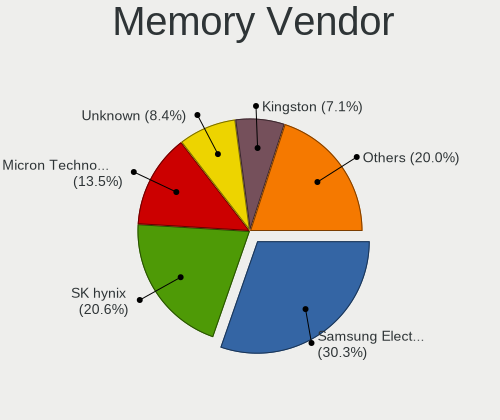

| Vendor              | Notebooks | Percent |
|---------------------|-----------|---------|
| Samsung Electronics | 23        | 31.94%  |
| SK hynix            | 16        | 22.22%  |
| Unknown             | 9         | 12.5%   |
| Micron Technology   | 8         | 11.11%  |
| Crucial             | 4         | 5.56%   |
| Unknown (ABCD)      | 2         | 2.78%   |
| Kingston            | 2         | 2.78%   |
| Elpida              | 2         | 2.78%   |
| A-DATA Technology   | 2         | 2.78%   |
| Transcend           | 1         | 1.39%   |
| Corsair             | 1         | 1.39%   |
| A Force             | 1         | 1.39%   |
| Unknown             | 1         | 1.39%   |

Memory Model
------------

Memory module models

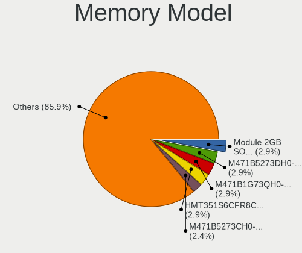

| Model                                                            | Notebooks | Percent |
|------------------------------------------------------------------|-----------|---------|
| Unknown RAM Module 2GB SODIMM DDR2 667MT/s                       | 4         | 4.94%   |
| SK hynix RAM HMT351S6CFR8C-PB 4GB SODIMM DDR3 1600MT/s           | 4         | 4.94%   |
| Samsung RAM M471B1G73QH0-YK0 8GB SODIMM DDR3 1867MT/s            | 4         | 4.94%   |
| SK hynix RAM HMT451S6BFR8A-PB 4GB SODIMM DDR3 1600MT/s           | 3         | 3.7%    |
| Samsung RAM M471B5273DH0-CH9 4GB SODIMM DDR3 1334MT/s            | 3         | 3.7%    |
| Samsung RAM M471B5273CH0-CH9 4GB SODIMM DDR3 1334MT/s            | 3         | 3.7%    |
| Unknown (ABCD) RAM 123456789012345678 2GB SODIMM LPDDR3 2133MT/s | 2         | 2.47%   |
| SK hynix RAM HMT451S6AFR8A-PB 4GB SODIMM DDR3 1600MT/s           | 2         | 2.47%   |
| SK hynix RAM HMT41GS6BFR8A-PB 8GB SODIMM DDR3 1600MT/s           | 2         | 2.47%   |
| SK hynix RAM HMT351S6BFR8C-H9 4GB SODIMM DDR3 1334MT/s           | 2         | 2.47%   |
| Samsung RAM M471A5244CB0-CTD 4GB SODIMM DDR4 2667MT/s            | 2         | 2.47%   |
| Samsung RAM M471A1G43DB0-CPB 8GB SODIMM DDR4 2133MT/s            | 2         | 2.47%   |
| Samsung RAM K4EBE304EB-EGCG 8GB Row Of Chips LPDDR3 2133MT/s     | 2         | 2.47%   |
| Unknown SODIMM 2GB SODIMM DDR2 533MT/s                           | 1         | 1.23%   |
| Unknown SODIMM 2048MB SODIMM DDR2 533MT/s                        | 1         | 1.23%   |
| Unknown RAM Module 4096MB SODIMM DDR3 1333MT/s                   | 1         | 1.23%   |
| Unknown RAM Module 4096MB SODIMM 1066MT/s                        | 1         | 1.23%   |
| Unknown RAM Module 2048MB SODIMM DDR2 667MT/s                    | 1         | 1.23%   |
| Unknown RAM Module 2048MB SODIMM 800MT/s                         | 1         | 1.23%   |
| Transcend RAM TS1GLH64V6BL 8GB SODIMM DDR4 2667MT/s              | 1         | 1.23%   |
| SK hynix RAM Module 4GB SODIMM DDR3 1067MT/s                     | 1         | 1.23%   |
| SK hynix RAM HMT351S6EFR8C-PB 4GB SODIMM DDR3 1600MT/s           | 1         | 1.23%   |
| SK hynix RAM HMT351S6CFR8C-H9 4GB SODIMM DDR3 1333MT/s           | 1         | 1.23%   |
| SK hynix RAM HMT351S6BFR8C-H9 4GB SODIMM DDR3 1333MT/s           | 1         | 1.23%   |
| SK hynix RAM HMA81GS6JJR8N-VK 8GB SODIMM DDR4 2667MT/s           | 1         | 1.23%   |
| SK hynix RAM HMA81GS6AFR8N-UH 8GB SODIMM DDR4 2400MT/s           | 1         | 1.23%   |
| SK hynix RAM GKE800SO102408-2400 8GB SODIMM DDR4 2400MT/s        | 1         | 1.23%   |
| Samsung RAM M471B5773DH0-CH9 2GB SODIMM DDR3 1334MT/s            | 1         | 1.23%   |
| Samsung RAM M471B5773CHS-CH9 2GB SODIMM DDR3 1333MT/s            | 1         | 1.23%   |
| Samsung RAM M471B5674-H0-YK0--- 4GB Chip DDR3 1600MT/s           | 1         | 1.23%   |
| Samsung RAM M471B5273DH0-CK0 4GB SODIMM DDR3 1600MT/s            | 1         | 1.23%   |
| Samsung RAM M471B5273CM0-CH9 4GB SODIMM DDR3 1333MT/s            | 1         | 1.23%   |
| Samsung RAM M471B5173QH0-YK0 4GB SODIMM DDR3 1600MT/s            | 1         | 1.23%   |
| Samsung RAM M471B5173BH0-CK0 4GB SODIMM DDR3 1600MT/s            | 1         | 1.23%   |
| Samsung RAM M471B1G73DB0-YK0 8GB SODIMM DDR3 1600MT/s            | 1         | 1.23%   |
| Samsung RAM M471A2K43CB1-CTD 16GB SODIMM DDR4 2667MT/s           | 1         | 1.23%   |
| Samsung RAM M471A1K43BB1-CTD 8GB SODIMM DDR4 2667MT/s            | 1         | 1.23%   |
| Micron RAM Module 8GB SODIMM DDR4 3200MT/s                       | 1         | 1.23%   |
| Micron RAM Module 8GB SODIMM DDR3 1600MT/s                       | 1         | 1.23%   |
| Micron RAM Module 8192MB SODIMM DDR3 1600MT/s                    | 1         | 1.23%   |
| Micron RAM 8ATF1G64HZ-2G6J1 8GB SODIMM DDR4 2667MT/s             | 1         | 1.23%   |
| Micron RAM 8ATF1G64HZ-2G6E1 8GB SODIMM DDR4 2667MT/s             | 1         | 1.23%   |
| Micron RAM 8ATF1G64HZ-2G3B1 8GB SODIMM DDR4 2400MT/s             | 1         | 1.23%   |
| Micron RAM 53E1G32D2NP-046 2GB Row Of Chips LPDDR4 4267MT/s      | 1         | 1.23%   |
| Micron RAM 4KTF25664HZ-1G6E1 2048MB DDR3 1600MT/s                | 1         | 1.23%   |
| Micron RAM 16KTF1G64HZ-1G6N1 8GB SODIMM DDR3 1600MT/s            | 1         | 1.23%   |
| Kingston RAM 9905624-007.A00G 8GB SODIMM DDR4 2133MT/s           | 1         | 1.23%   |
| Kingston RAM 9905428-051.A00LF 4GB SODIMM DDR3 1333MT/s          | 1         | 1.23%   |
| Elpida RAM EBJ21UE8BDS0-AE-F 2GB SODIMM DDR3 1066MT/s            | 1         | 1.23%   |
| Elpida RAM 8KTS51264HDZ-1G6E1 4GB Chip DDR3 1600MT/s             | 1         | 1.23%   |
| Crucial RAM Module 4GB SODIMM DDR3 1067MT/s                      | 1         | 1.23%   |
| Crucial RAM Module 4096MB SODIMM DDR3 1333MT/s                   | 1         | 1.23%   |
| Crucial RAM CT4G3S1067M.M16FMR 4GB SODIMM DDR3 1067MT/s          | 1         | 1.23%   |
| Crucial RAM CT102464BF160B.M16 8GB SODIMM DDR3 1600MT/s          | 1         | 1.23%   |
| Corsair RAM CMSA8GX3M1A1333C9 8192MB SODIMM DDR3 1333MT/s        | 1         | 1.23%   |
| A-DATA RAM AO1P24HC8T1-BPGS 8GB SODIMM DDR4 2400MT/s             | 1         | 1.23%   |
| A-DATA RAM AM1U16BC4P2-B19C 4GB SODIMM DDR3 1600MT/s             | 1         | 1.23%   |
| A Force RAM 256X64M-67E 2048MB SODIMM DDR2 667MT/s               | 1         | 1.23%   |
| Unknown                                                          | 1         | 1.23%   |

Memory Kind
-----------

Memory module kinds

| Kind    | Notebooks | Percent |
|---------|-----------|---------|
| DDR3    | 34        | 54.84%  |
| DDR4    | 13        | 20.97%  |
| DDR2    | 8         | 12.9%   |
| LPDDR4  | 3         | 4.84%   |
| LPDDR3  | 2         | 3.23%   |
| Unknown | 2         | 3.23%   |

Memory Form Factor
------------------

Physical design of the memory module

| Name         | Notebooks | Percent |
|--------------|-----------|---------|
| SODIMM       | 55        | 90.16%  |
| Row Of Chips | 3         | 4.92%   |
| Chip         | 2         | 3.28%   |
| Unknown      | 1         | 1.64%   |

Memory Size
-----------

Memory module size

| Size  | Notebooks | Percent |
|-------|-----------|---------|
| 4096  | 29        | 43.94%  |
| 8192  | 22        | 33.33%  |
| 2048  | 14        | 21.21%  |
| 16384 | 1         | 1.52%   |

Memory Speed
------------

Memory module speed

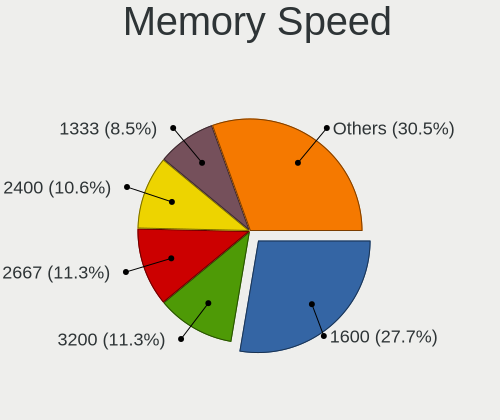

| Speed | Notebooks | Percent |
|-------|-----------|---------|
| 1600  | 19        | 28.36%  |
| 2667  | 7         | 10.45%  |
| 2133  | 6         | 8.96%   |
| 1334  | 6         | 8.96%   |
| 1333  | 6         | 8.96%   |
| 667   | 5         | 7.46%   |
| 2400  | 4         | 5.97%   |
| 1867  | 4         | 5.97%   |
| 1067  | 3         | 4.48%   |
| 533   | 2         | 2.99%   |
| 4267  | 1         | 1.49%   |
| 3200  | 1         | 1.49%   |
| 1066  | 1         | 1.49%   |
| 800   | 1         | 1.49%   |
| 333   | 1         | 1.49%   |

Printers & scanners
-------------------

Printer Vendor
--------------

Printer device vendors

Zero info for selected period =(

Printer Model
-------------

Printer device models

Zero info for selected period =(

Scanner Vendor
--------------

Scanner device vendors

Zero info for selected period =(

Scanner Model
-------------

Scanner device models

Zero info for selected period =(

Camera
------

Camera Vendor
-------------

Camera device vendors

| Vendor                                 | Notebooks | Percent |
|----------------------------------------|-----------|---------|
| Chicony Electronics                    | 13        | 27.66%  |
| Realtek Semiconductor                  | 5         | 10.64%  |
| Acer                                   | 4         | 8.51%   |
| Z-Star Microelectronics                | 3         | 6.38%   |
| Suyin                                  | 3         | 6.38%   |
| IMC Networks                           | 3         | 6.38%   |
| Cheng Uei Precision Industry (Foxlink) | 3         | 6.38%   |
| Sunplus Innovation Technology          | 2         | 4.26%   |
| Silicon Motion                         | 2         | 4.26%   |
| Lite-On Technology                     | 2         | 4.26%   |
| Syntek                                 | 1         | 2.13%   |
| Microdia                               | 1         | 2.13%   |
| Logitech                               | 1         | 2.13%   |
| Lenovo                                 | 1         | 2.13%   |
| Creative Technology                    | 1         | 2.13%   |
| Apple                                  | 1         | 2.13%   |
| Alcor Micro                            | 1         | 2.13%   |

Camera Model
------------

Camera device models

| Model                                                                    | Notebooks | Percent |
|--------------------------------------------------------------------------|-----------|---------|
| Chicony Integrated HP HD Webcam                                          | 3         | 6.25%   |
| Chicony Integrated Camera                                                | 3         | 6.25%   |
| Realtek USB 2 Webcam                                                     | 2         | 4.17%   |
| Realtek Integrated_Webcam_HD                                             | 2         | 4.17%   |
| IMC Networks USB2.0 HD UVC WebCam                                        | 2         | 4.17%   |
| Chicony Lenovo Integrated Camera (0.3MP)                                 | 2         | 4.17%   |
| Z-Star WebCam SC-03FFL11739P                                             | 1         | 2.08%   |
| Z-Star Webcam                                                            | 1         | 2.08%   |
| Z-Star Namuga 1.3M Webcam                                                | 1         | 2.08%   |
| Syntek Syntek 0.3MPixel USB 2.0 UVC PC Camera                            | 1         | 2.08%   |
| Suyin Laptop_Integrated_Webcam_3M                                        | 1         | 2.08%   |
| Suyin Acer Crystal Eye webcam                                            | 1         | 2.08%   |
| Suyin 1.3M HD Webcam                                                     | 1         | 2.08%   |
| Sunplus Laptop_Integrated_Webcam_FHD                                     | 1         | 2.08%   |
| Sunplus Laptop_Integrated_Webcam_1.3M                                    | 1         | 2.08%   |
| Silicon Motion WebCam SC-13HDL11939N                                     | 1         | 2.08%   |
| Silicon Motion 300k Pixel Camera                                         | 1         | 2.08%   |
| Realtek Realtek USB2.0 PC Camera                                         | 1         | 2.08%   |
| Microdia Integrated Webcam                                               | 1         | 2.08%   |
| Logitech Webcam C930e                                                    | 1         | 2.08%   |
| Logitech B525 HD Webcam                                                  | 1         | 2.08%   |
| Lite-On Integrated Camera                                                | 1         | 2.08%   |
| Lite-On HP HD Camera                                                     | 1         | 2.08%   |
| Lenovo Integrated Webcam                                                 | 1         | 2.08%   |
| IMC Networks Integrated Webcam                                           | 1         | 2.08%   |
| Creative Webcam Live! Motion                                             | 1         | 2.08%   |
| Chicony Webcam                                                           | 1         | 2.08%   |
| Chicony TOSHIBA Web Camera - HD                                          | 1         | 2.08%   |
| Chicony Thinkpad T430 camera                                             | 1         | 2.08%   |
| Chicony Integrated Camera [ThinkPad]                                     | 1         | 2.08%   |
| Chicony Chicony USB 2.0 Camera                                           | 1         | 2.08%   |
| Cheng Uei Precision Industry (Foxlink) HP TrueVision HD Camera           | 1         | 2.08%   |
| Cheng Uei Precision Industry (Foxlink) HP EliteBook integrated HD Webcam | 1         | 2.08%   |
| Cheng Uei Precision Industry (Foxlink) HD Camera                         | 1         | 2.08%   |
| Apple FaceTime HD Camera                                                 | 1         | 2.08%   |
| Alcor Micro USB 2.0 Web Camera                                           | 1         | 2.08%   |
| Acer Lenovo EasyCamera                                                   | 1         | 2.08%   |
| Acer Integrated Camera                                                   | 1         | 2.08%   |
| Acer HD Webcam                                                           | 1         | 2.08%   |
| Acer EasyCamera                                                          | 1         | 2.08%   |

Security
--------

Fingerprint Vendor
------------------

Fingerprint sensor vendors

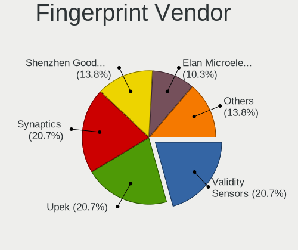

| Vendor                     | Notebooks | Percent |
|----------------------------|-----------|---------|
| Validity Sensors           | 4         | 33.33%  |
| Shenzhen Goodix Technology | 3         | 25%     |
| Upek                       | 2         | 16.67%  |
| Synaptics                  | 1         | 8.33%   |
| Broadcom                   | 1         | 8.33%   |
| AuthenTec                  | 1         | 8.33%   |

Fingerprint Model
-----------------

Fingerprint sensor models

| Model                                                                        | Notebooks | Percent |
|------------------------------------------------------------------------------|-----------|---------|
| Shenzhen Goodix Fingerprint Reader                                           | 3         | 25%     |
| Validity Sensors VFS 5011 fingerprint sensor                                 | 2         | 16.67%  |
| Upek Biometric Touchchip/Touchstrip Fingerprint Sensor                       | 2         | 16.67%  |
| Validity Sensors Synaptics WBDI                                              | 1         | 8.33%   |
| Validity Sensors Fingerprint scanner                                         | 1         | 8.33%   |
| Synaptics  FS7604 Touch Fingerprint Sensor with PurePrint                    | 1         | 8.33%   |
| Broadcom BCM5880 Secure Applications Processor with fingerprint swipe sensor | 1         | 8.33%   |
| AuthenTec AuthenTec Inc. AES1660                                             | 1         | 8.33%   |

Chipcard Vendor
---------------

Chipcard module vendors

Zero info for selected period =(

Chipcard Model
--------------

Chipcard module models

Zero info for selected period =(

Unsupported
-----------

Unsupported Devices
-------------------

Total unsupported devices on board

| Total | Notebooks | Percent |
|-------|-----------|---------|
| 2     | 27        | 36%     |
| 1     | 23        | 30.67%  |
| 0     | 11        | 14.67%  |
| 3     | 7         | 9.33%   |
| 4     | 5         | 6.67%   |
| 5     | 2         | 2.67%   |

Unsupported Device Types
------------------------

Types of unsupported devices

| Type                     | Notebooks | Percent |
|--------------------------|-----------|---------|
| Communication controller | 49        | 43.36%  |
| Bluetooth                | 19        | 16.81%  |
| Net/wireless             | 13        | 11.5%   |
| Firewire controller      | 10        | 8.85%   |
| Fingerprint reader       | 10        | 8.85%   |
| Card reader              | 8         | 7.08%   |
| Storage                  | 2         | 1.77%   |
| Sound                    | 1         | 0.88%   |
| Graphics card            | 1         | 0.88%   |

