BSD in UK - Tested Hardware & Statistics
----------------------------------------

A project to collect tested hardware configurations for BSD in UK.

Anyone can contribute to this report by the [hw-probe](https://github.com/linuxhw/hw-probe/blob/master/INSTALL.BSD.md) tool:

    hw-probe -all -upload

Please contribute! Especially if your hardware is rare.

This is a report for all computer types. See also reports for [desktops](/Location/UK/Desktop/README.md) and [notebooks](/Location/UK/Notebook/README.md).

Contents
--------

* [ Test Cases ](#test-cases)

* [ System ](#system)
  - [ OS                       ](#os)
  - [ OS Family                ](#os-family)
  - [ Arch                     ](#arch)
  - [ DE                       ](#de)
  - [ Display Server           ](#display-server)
  - [ Display Manager          ](#display-manager)
  - [ OS Lang                  ](#os-lang)
  - [ Boot Mode                ](#boot-mode)
  - [ Filesystem               ](#filesystem)
  - [ Part. scheme             ](#part-scheme)

* [ Board ](#board)
  - [ Vendor                   ](#vendor)
  - [ Model                    ](#model)
  - [ Model Family             ](#model-family)
  - [ MFG Year                 ](#mfg-year)
  - [ Form Factor              ](#form-factor)
  - [ Coreboot                 ](#coreboot)
  - [ RAM Size                 ](#ram-size)
  - [ RAM Used                 ](#ram-used)
  - [ Total Drives             ](#total-drives)
  - [ Has CD-ROM               ](#has-cd-rom)
  - [ Has Ethernet             ](#has-ethernet)
  - [ Has WiFi                 ](#has-wifi)
  - [ Has Bluetooth            ](#has-bluetooth)

* [ Location ](#location)
  - [ Country                  ](#country)
  - [ City                     ](#city)

* [ Drives ](#drives)
  - [ Drive Vendor             ](#drive-vendor)
  - [ Drive Model              ](#drive-model)
  - [ HDD Vendor               ](#hdd-vendor)
  - [ SSD Vendor               ](#ssd-vendor)
  - [ Drive Kind               ](#drive-kind)
  - [ Drive Connector          ](#drive-connector)
  - [ Drive Size               ](#drive-size)
  - [ Space Total              ](#space-total)
  - [ Space Used               ](#space-used)
  - [ Malfunc. Drives          ](#malfunc-drives)
  - [ Malfunc. Drive Vendor    ](#malfunc-drive-vendor)
  - [ Malfunc. HDD Vendor      ](#malfunc-hdd-vendor)
  - [ Malfunc. Drive Kind      ](#malfunc-drive-kind)
  - [ Failed Drives            ](#failed-drives)
  - [ Failed Drive Vendor      ](#failed-drive-vendor)
  - [ Drive Status             ](#drive-status)

* [ Storage controller ](#storage-controller)
  - [ Storage Vendor           ](#storage-vendor)
  - [ Storage Model            ](#storage-model)
  - [ Storage Kind             ](#storage-kind)

* [ Processor ](#processor)
  - [ CPU Vendor               ](#cpu-vendor)
  - [ CPU Model                ](#cpu-model)
  - [ CPU Model Family         ](#cpu-model-family)
  - [ CPU Cores                ](#cpu-cores)
  - [ CPU Sockets              ](#cpu-sockets)
  - [ CPU Threads              ](#cpu-threads)
  - [ CPU Microarch            ](#cpu-microarch)

* [ Graphics ](#graphics)
  - [ GPU Vendor               ](#gpu-vendor)
  - [ GPU Model                ](#gpu-model)
  - [ GPU Combo                ](#gpu-combo)
  - [ GPU Driver               ](#gpu-driver)
  - [ GPU Memory               ](#gpu-memory)

* [ Monitor ](#monitor)
  - [ Monitor Vendor           ](#monitor-vendor)
  - [ Monitor Model            ](#monitor-model)
  - [ Monitor Resolution       ](#monitor-resolution)
  - [ Monitor Diagonal         ](#monitor-diagonal)
  - [ Monitor Width            ](#monitor-width)
  - [ Aspect Ratio             ](#aspect-ratio)
  - [ Monitor Area             ](#monitor-area)
  - [ Pixel Density            ](#pixel-density)
  - [ Multiple Monitors        ](#multiple-monitors)

* [ Network ](#network)
  - [ Net Controller Vendor    ](#net-controller-vendor)
  - [ Net Controller Model     ](#net-controller-model)
  - [ Wireless Vendor          ](#wireless-vendor)
  - [ Wireless Model           ](#wireless-model)
  - [ Ethernet Vendor          ](#ethernet-vendor)
  - [ Ethernet Model           ](#ethernet-model)
  - [ Net Controller Kind      ](#net-controller-kind)
  - [ Used Controller          ](#used-controller)
  - [ NICs                     ](#nics)
  - [ IPv6                     ](#ipv6)

* [ Bluetooth ](#bluetooth)
  - [ Bluetooth Vendor         ](#bluetooth-vendor)
  - [ Bluetooth Model          ](#bluetooth-model)

* [ Sound ](#sound)
  - [ Sound Vendor             ](#sound-vendor)
  - [ Sound Model              ](#sound-model)

* [ Memory ](#memory)
  - [ Memory Vendor            ](#memory-vendor)
  - [ Memory Model             ](#memory-model)
  - [ Memory Kind              ](#memory-kind)
  - [ Memory Form Factor       ](#memory-form-factor)
  - [ Memory Size              ](#memory-size)
  - [ Memory Speed             ](#memory-speed)

* [ Printers & scanners ](#printers--scanners)
  - [ Printer Vendor           ](#printer-vendor)
  - [ Printer Model            ](#printer-model)
  - [ Scanner Vendor           ](#scanner-vendor)
  - [ Scanner Model            ](#scanner-model)

* [ Camera ](#camera)
  - [ Camera Vendor            ](#camera-vendor)
  - [ Camera Model             ](#camera-model)

* [ Security ](#security)
  - [ Fingerprint Vendor       ](#fingerprint-vendor)
  - [ Fingerprint Model        ](#fingerprint-model)
  - [ Chipcard Vendor          ](#chipcard-vendor)
  - [ Chipcard Model           ](#chipcard-model)

* [ Unsupported ](#unsupported)
  - [ Unsupported Devices      ](#unsupported-devices)
  - [ Unsupported Device Types ](#unsupported-device-types)

Test Cases
----------

Total: 735

| Vendor        | Model                       | Form-Factor | Probe                                                     | Date         |
|---------------|-----------------------------|-------------|-----------------------------------------------------------|--------------|
| AZW           | EQ                          | Desktop     | [f1f980d130](https://bsd-hardware.info/?probe=f1f980d130) | Jun 10, 2023 |
| maiyunda      | www.maiyunda.com            | Desktop     | [7b43dea184](https://bsd-hardware.info/?probe=7b43dea184) | Jun 08, 2023 |
| Apple         | Mac-35C5E08120C7EEAF Mac... | Mini pc     | [5de35aa3bb](https://bsd-hardware.info/?probe=5de35aa3bb) | Jun 06, 2023 |
| Apple         | Mac-35C5E08120C7EEAF Mac... | Mini pc     | [e32011137f](https://bsd-hardware.info/?probe=e32011137f) | Jun 05, 2023 |
| Apple         | Mac-35C5E08120C7EEAF Mac... | Mini pc     | [70fa6667b0](https://bsd-hardware.info/?probe=70fa6667b0) | Jun 05, 2023 |
| Gigabyte      | Z77N-WIFI                   | Desktop     | [c1c30d3223](https://bsd-hardware.info/?probe=c1c30d3223) | Jun 02, 2023 |
| HP            | EliteBook 8570p             | Notebook    | [22572f1df6](https://bsd-hardware.info/?probe=22572f1df6) | Jun 01, 2023 |
| Gigabyte      | Z77N-WIFI                   | Desktop     | [45cb709a24](https://bsd-hardware.info/?probe=45cb709a24) | Jun 01, 2023 |
| HP            | ProLiant DL360 Gen9         | Server      | [a11ca8795e](https://bsd-hardware.info/?probe=a11ca8795e) | Jun 01, 2023 |
| Apple         | Mac-35C5E08120C7EEAF Mac... | Mini pc     | [e968a467d5](https://bsd-hardware.info/?probe=e968a467d5) | May 30, 2023 |
| Dell          | 0GXM1W A01                  | Desktop     | [c9959faf54](https://bsd-hardware.info/?probe=c9959faf54) | May 29, 2023 |
| Apple         | Mac-35C5E08120C7EEAF Mac... | Mini pc     | [a9f82c093e](https://bsd-hardware.info/?probe=a9f82c093e) | May 28, 2023 |
| Lenovo        | ThinkPad X13 Gen 1 20UGS... | Notebook    | [6701dce30e](https://bsd-hardware.info/?probe=6701dce30e) | May 28, 2023 |
| Axiomtek      | NA362-DAMI-c3768-US         | Desktop     | [243efb73f6](https://bsd-hardware.info/?probe=243efb73f6) | May 27, 2023 |
| HP            | EliteBook 8570p             | Notebook    | [65376d6b42](https://bsd-hardware.info/?probe=65376d6b42) | May 27, 2023 |
| Unknown       | 1.0                         | Desktop     | [12d6c7934e](https://bsd-hardware.info/?probe=12d6c7934e) | May 27, 2023 |
| Dell          | 0GXM1W A01                  | Desktop     | [364d24b4f4](https://bsd-hardware.info/?probe=364d24b4f4) | May 25, 2023 |
| ASRock        | E3C224D2I                   | Desktop     | [57353597b3](https://bsd-hardware.info/?probe=57353597b3) | May 25, 2023 |
| Dell          | 0GXM1W A01                  | Desktop     | [afa4b1b0df](https://bsd-hardware.info/?probe=afa4b1b0df) | May 25, 2023 |
| HP            | EliteBook 8570p             | Notebook    | [a1a68c0f7d](https://bsd-hardware.info/?probe=a1a68c0f7d) | May 24, 2023 |
| Apple         | Mac-35C5E08120C7EEAF Mac... | Mini pc     | [2fec675050](https://bsd-hardware.info/?probe=2fec675050) | May 20, 2023 |
| HP            | EliteBook 8570p             | Notebook    | [70d54595c2](https://bsd-hardware.info/?probe=70d54595c2) | May 19, 2023 |
| ASRock        | IMB-181-L                   | Desktop     | [0347664bbc](https://bsd-hardware.info/?probe=0347664bbc) | May 17, 2023 |
| HP            | EliteBook 8570p             | Notebook    | [e252dc5ff2](https://bsd-hardware.info/?probe=e252dc5ff2) | May 15, 2023 |
| Dell          | 0WN7Y6 A01                  | Desktop     | [a232411c74](https://bsd-hardware.info/?probe=a232411c74) | May 12, 2023 |
| TUXEDO        | Aura 15 Gen1                | Notebook    | [3d889e8b9b](https://bsd-hardware.info/?probe=3d889e8b9b) | May 11, 2023 |
| Supermicro    | X8SIL                       | Desktop     | [a39ebc1c3a](https://bsd-hardware.info/?probe=a39ebc1c3a) | May 10, 2023 |
| Sophos        | SG                          | Firewall    | [67e0c0dc71](https://bsd-hardware.info/?probe=67e0c0dc71) | May 07, 2023 |
| ASUSTek       | P11C-M Series               | Desktop     | [8114acc225](https://bsd-hardware.info/?probe=8114acc225) | May 07, 2023 |
| Dell          | 0W3F1J A00                  | Mini pc     | [80d3f65191](https://bsd-hardware.info/?probe=80d3f65191) | May 06, 2023 |
| Unknown       | Unknown                     | Desktop     | [6cc74ec4bd](https://bsd-hardware.info/?probe=6cc74ec4bd) | May 04, 2023 |
| ASUSTek       | P11C-M Series               | Desktop     | [2c5d0e597f](https://bsd-hardware.info/?probe=2c5d0e597f) | May 03, 2023 |
| Gigabyte      | A320M-H-CF                  | Desktop     | [3fbe359db7](https://bsd-hardware.info/?probe=3fbe359db7) | May 03, 2023 |
| Lenovo        | SHARKBAY NOK                | Desktop     | [2a9fc1af29](https://bsd-hardware.info/?probe=2a9fc1af29) | Apr 27, 2023 |
| Intel GMLV... | GMLR115 GMLR115             | Desktop     | [56d2fcc6e9](https://bsd-hardware.info/?probe=56d2fcc6e9) | Apr 24, 2023 |
| Samsung       | DP700A3D-A05UK SEC_SW_RE... | All in one  | [5718d8d05e](https://bsd-hardware.info/?probe=5718d8d05e) | Apr 24, 2023 |
| Dell          | 0WR7PY A03                  | Desktop     | [e461f7862c](https://bsd-hardware.info/?probe=e461f7862c) | Apr 23, 2023 |
| Fujitsu Si... | AMILO Li3710                | Notebook    | [214b0c30e0](https://bsd-hardware.info/?probe=214b0c30e0) | Apr 23, 2023 |
| Dell          | 02YYK5 A01                  | Desktop     | [9f7ba08cb2](https://bsd-hardware.info/?probe=9f7ba08cb2) | Apr 23, 2023 |
| Sophos        | SG                          | Firewall    | [7adec1bab7](https://bsd-hardware.info/?probe=7adec1bab7) | Apr 23, 2023 |
| Gigabyte      | N3050MD3P                   | Desktop     | [66e9ccbef8](https://bsd-hardware.info/?probe=66e9ccbef8) | Apr 22, 2023 |
| Fujitsu       | D3313-A1 S26361-D3313-A1    | Desktop     | [7a5fcaf0d0](https://bsd-hardware.info/?probe=7a5fcaf0d0) | Apr 22, 2023 |
| HP            | EliteBook 8570p             | Notebook    | [6e82f69c4c](https://bsd-hardware.info/?probe=6e82f69c4c) | Apr 20, 2023 |
| PICO PC       | MNHO-113                    | Desktop     | [ad485d27af](https://bsd-hardware.info/?probe=ad485d27af) | Apr 15, 2023 |
| Samsung       | N150/N210/N220              | Notebook    | [f6e5189f54](https://bsd-hardware.info/?probe=f6e5189f54) | Apr 11, 2023 |
| Lenovo        | ThinkPad X280 20KESB4T00    | Notebook    | [fb6c7b3b09](https://bsd-hardware.info/?probe=fb6c7b3b09) | Apr 11, 2023 |
| ASUSTek       | PRIME H510M-E               | Desktop     | [385910dbe5](https://bsd-hardware.info/?probe=385910dbe5) | Apr 11, 2023 |
| Unknown       | Unknown                     | Desktop     | [ceebb96d61](https://bsd-hardware.info/?probe=ceebb96d61) | Apr 11, 2023 |
| AMI           | Aptio CRB                   | Mini pc     | [7145e5aea1](https://bsd-hardware.info/?probe=7145e5aea1) | Apr 11, 2023 |
| Unknown       | Unknown                     | Desktop     | [e163926e69](https://bsd-hardware.info/?probe=e163926e69) | Apr 10, 2023 |
| Unknown       | Unknown                     | Desktop     | [f2fbd3c3ad](https://bsd-hardware.info/?probe=f2fbd3c3ad) | Apr 09, 2023 |
| Fujitsu Si... | AMILO Li3710                | Notebook    | [6dabd5d84a](https://bsd-hardware.info/?probe=6dabd5d84a) | Apr 08, 2023 |
| HP            | 8103 A01                    | Mini pc     | [4ad245dce9](https://bsd-hardware.info/?probe=4ad245dce9) | Apr 08, 2023 |
| ASRock        | E3C224D2I                   | Desktop     | [f8f3f3c43c](https://bsd-hardware.info/?probe=f8f3f3c43c) | Apr 07, 2023 |
| Dell          | 0WR7PY A03                  | Desktop     | [42a875684f](https://bsd-hardware.info/?probe=42a875684f) | Apr 07, 2023 |
| Unknown       | Unknown                     | Desktop     | [196f8d9e86](https://bsd-hardware.info/?probe=196f8d9e86) | Apr 06, 2023 |
| Supermicro    | X10SDV-4C-TLN2F             | Server      | [a4957dcdd6](https://bsd-hardware.info/?probe=a4957dcdd6) | Apr 04, 2023 |
| Unknown       | Unknown                     | Desktop     | [5a7bd1b139](https://bsd-hardware.info/?probe=5a7bd1b139) | Apr 02, 2023 |
| ASUSTek       | PRIME H510M-E               | Desktop     | [8fe73c707e](https://bsd-hardware.info/?probe=8fe73c707e) | Apr 02, 2023 |
| Fujitsu       | D3313-G1 S26361-D3313-G1    | Desktop     | [1122cabca9](https://bsd-hardware.info/?probe=1122cabca9) | Apr 01, 2023 |
| ASRockRack    | EPYCD8-2T                   | Desktop     | [75f414997a](https://bsd-hardware.info/?probe=75f414997a) | Mar 31, 2023 |
| Lenovo        | ThinkPad X230 23255NG       | Notebook    | [2ef93a7621](https://bsd-hardware.info/?probe=2ef93a7621) | Mar 29, 2023 |
| Lenovo        | SHARKBAY 0B98405 STD        | Desktop     | [29c6f5f74c](https://bsd-hardware.info/?probe=29c6f5f74c) | Mar 28, 2023 |
| IceWhale T... | ZimaBoard 832 ZMB           | Desktop     | [3c4f4abe16](https://bsd-hardware.info/?probe=3c4f4abe16) | Mar 23, 2023 |
| Intel         | DENLOW_WS                   | Desktop     | [8b3bb4ee24](https://bsd-hardware.info/?probe=8b3bb4ee24) | Mar 19, 2023 |
| ASUSTek       | Z97I-PLUS                   | Desktop     | [cdbc1b0031](https://bsd-hardware.info/?probe=cdbc1b0031) | Mar 19, 2023 |
| CNCTION-IA... | Unknown                     | Desktop     | [914c4aad57](https://bsd-hardware.info/?probe=914c4aad57) | Mar 19, 2023 |
| HP            | ProBook 450 G8 Notebook ... | Notebook    | [c83b0dda87](https://bsd-hardware.info/?probe=c83b0dda87) | Mar 18, 2023 |
| HP            | ProBook 450 G8 Notebook ... | Notebook    | [9ac4738956](https://bsd-hardware.info/?probe=9ac4738956) | Mar 18, 2023 |
| Dell          | 0D28YY A00                  | Desktop     | [15e8aedcb6](https://bsd-hardware.info/?probe=15e8aedcb6) | Mar 17, 2023 |
| ASUSTek       | ROG STRIX B450-F GAMING ... | Desktop     | [74cf75116d](https://bsd-hardware.info/?probe=74cf75116d) | Mar 17, 2023 |
| OEGStone      | W54_55SU1,SUW               | Notebook    | [7a2b28c47f](https://bsd-hardware.info/?probe=7a2b28c47f) | Mar 17, 2023 |
| Intel         | SHARKBAY                    | Desktop     | [6c2382fa44](https://bsd-hardware.info/?probe=6c2382fa44) | Mar 16, 2023 |
| Fujitsu       | D3313-G1 S26361-D3313-G1    | Desktop     | [652100bcac](https://bsd-hardware.info/?probe=652100bcac) | Mar 16, 2023 |
| ASUSTek       | 1001P                       | Notebook    | [76eae56ba3](https://bsd-hardware.info/?probe=76eae56ba3) | Mar 15, 2023 |
| OEGStone      | W54_55SU1,SUW               | Notebook    | [64316408f0](https://bsd-hardware.info/?probe=64316408f0) | Mar 15, 2023 |
| Lenovo        | ThinkPad X270 W10DG 20K5... | Notebook    | [89a5ee25f9](https://bsd-hardware.info/?probe=89a5ee25f9) | Mar 14, 2023 |
| Dynabook E... | Satellite Pro E10-G-101     | Notebook    | [c58a37ef03](https://bsd-hardware.info/?probe=c58a37ef03) | Mar 14, 2023 |
| Unknown       | Unknown                     | Desktop     | [82759eff54](https://bsd-hardware.info/?probe=82759eff54) | Mar 11, 2023 |
| Star Labs     | StarBook                    | Notebook    | [80f6445f54](https://bsd-hardware.info/?probe=80f6445f54) | Mar 10, 2023 |
| Acer          | TDPS05 R3700                | Desktop     | [6ee4404ee0](https://bsd-hardware.info/?probe=6ee4404ee0) | Mar 09, 2023 |
| Lenovo        | IdeaPad 5 15ALC05 82LN      | Notebook    | [9466e6d4f4](https://bsd-hardware.info/?probe=9466e6d4f4) | Mar 07, 2023 |
| Deciso        | OPNsense Appliance          | Notebook    | [1cca4a556d](https://bsd-hardware.info/?probe=1cca4a556d) | Mar 07, 2023 |
| HPE           | ML10Gen9                    | Server      | [6283151877](https://bsd-hardware.info/?probe=6283151877) | Mar 07, 2023 |
| Raspberry ... | Raspberry Pi                | Soc         | [3daad10634](https://bsd-hardware.info/?probe=3daad10634) | Mar 02, 2023 |
| Techvision    | TVI7309X B0                 | Desktop     | [fb5b37bff5](https://bsd-hardware.info/?probe=fb5b37bff5) | Mar 02, 2023 |
| IceWhale T... | ZimaBoard 832 ZMB           | Desktop     | [e9e179e9ac](https://bsd-hardware.info/?probe=e9e179e9ac) | Mar 02, 2023 |
| MSI           | B450M PRO-VDH MAX           | Desktop     | [85aecf8c3f](https://bsd-hardware.info/?probe=85aecf8c3f) | Feb 26, 2023 |
| HP            | EliteBook 8570p             | Notebook    | [1a4897cb53](https://bsd-hardware.info/?probe=1a4897cb53) | Feb 26, 2023 |
| ASUSTek       | ROG STRIX Z390-E GAMING     | Desktop     | [be81f2675f](https://bsd-hardware.info/?probe=be81f2675f) | Feb 25, 2023 |
| HP            | EliteBook 8570p             | Notebook    | [1e548fa114](https://bsd-hardware.info/?probe=1e548fa114) | Feb 24, 2023 |
| PC Engines    | apu4                        | Desktop     | [410a7ff78e](https://bsd-hardware.info/?probe=410a7ff78e) | Feb 23, 2023 |
| Intel         | CW-J6-5L 2C                 | Desktop     | [442643937e](https://bsd-hardware.info/?probe=442643937e) | Feb 22, 2023 |
| Intel         | CW-J6-5L 2C                 | Desktop     | [90fc1b74e6](https://bsd-hardware.info/?probe=90fc1b74e6) | Feb 22, 2023 |
| Unknown       | Unknown                     | Desktop     | [8c063582d4](https://bsd-hardware.info/?probe=8c063582d4) | Feb 20, 2023 |
| Lenovo        | ThinkPad T460 20FMS3320G    | Notebook    | [c85f94d574](https://bsd-hardware.info/?probe=c85f94d574) | Feb 19, 2023 |
| HP            | EliteBook 8570p             | Notebook    | [1ba2a827d9](https://bsd-hardware.info/?probe=1ba2a827d9) | Feb 18, 2023 |
| Unknown       | Unknown                     | Desktop     | [b906471557](https://bsd-hardware.info/?probe=b906471557) | Feb 17, 2023 |
| Apple         | MacBookPro11,1              | Notebook    | [673f6c0a01](https://bsd-hardware.info/?probe=673f6c0a01) | Feb 17, 2023 |
| ASUSTek       | PRIME Z490M-PLUS            | Desktop     | [1d9739f234](https://bsd-hardware.info/?probe=1d9739f234) | Feb 17, 2023 |
| Dell          | 0DVNTK A00                  | Mini pc     | [e49082a67c](https://bsd-hardware.info/?probe=e49082a67c) | Feb 14, 2023 |
| Lenovo        | ThinkPad W520 42844DG       | Notebook    | [d341f3c6f6](https://bsd-hardware.info/?probe=d341f3c6f6) | Feb 11, 2023 |
| Lenovo        | ThinkPad P14s Gen 3 21AK... | Notebook    | [b7a491a010](https://bsd-hardware.info/?probe=b7a491a010) | Feb 03, 2023 |
| Dell          | 00V62H A01                  | Desktop     | [092bbaa484](https://bsd-hardware.info/?probe=092bbaa484) | Feb 01, 2023 |
| Unknown       | Unknown                     | Desktop     | [ecf5a46a0f](https://bsd-hardware.info/?probe=ecf5a46a0f) | Feb 01, 2023 |
| HP            | 8103 A01                    | Mini pc     | [d89405421a](https://bsd-hardware.info/?probe=d89405421a) | Jan 31, 2023 |
| Dell          | 0F373D A00                  | Desktop     | [cd4202e58b](https://bsd-hardware.info/?probe=cd4202e58b) | Jan 30, 2023 |
| Dell          | 00V62H A01                  | Desktop     | [283d305565](https://bsd-hardware.info/?probe=283d305565) | Jan 29, 2023 |
| Dell          | 00V62H A01                  | Desktop     | [9d09937e2a](https://bsd-hardware.info/?probe=9d09937e2a) | Jan 28, 2023 |
| Dell          | 03KWTV A02                  | Desktop     | [28088f7e94](https://bsd-hardware.info/?probe=28088f7e94) | Jan 22, 2023 |
| Lenovo        | 3136 SDK0J40697 WIN 3305... | Mini pc     | [b938a15d41](https://bsd-hardware.info/?probe=b938a15d41) | Jan 22, 2023 |
| Lenovo        | 3136 SDK0J40697 WIN 3305... | Mini pc     | [0e9d5e53b9](https://bsd-hardware.info/?probe=0e9d5e53b9) | Jan 22, 2023 |
| Unknown       | Unknown                     | Desktop     | [0bbf3bdc00](https://bsd-hardware.info/?probe=0bbf3bdc00) | Jan 21, 2023 |
| Lenovo        | SDK0J40705 WIN 342503995... | Desktop     | [0dc2013a9f](https://bsd-hardware.info/?probe=0dc2013a9f) | Jan 21, 2023 |
| Unknown       | PICO PC                     | Desktop     | [9e20d7dbbc](https://bsd-hardware.info/?probe=9e20d7dbbc) | Jan 20, 2023 |
| HP            | 17E2                        | Mini pc     | [ff98f389b1](https://bsd-hardware.info/?probe=ff98f389b1) | Jan 18, 2023 |
| Protectli     | FW6 Ver                     | Desktop     | [8c1f6c2733](https://bsd-hardware.info/?probe=8c1f6c2733) | Jan 12, 2023 |
| HP            | ProLiant DL360 Gen9         | Server      | [9b4b30a009](https://bsd-hardware.info/?probe=9b4b30a009) | Jan 11, 2023 |
| Unknown       | Unknown                     | Desktop     | [6e866a006d](https://bsd-hardware.info/?probe=6e866a006d) | Jan 10, 2023 |
| Supermicro    | X10SDV-4C-TLN2F             | Server      | [2428fe6bd3](https://bsd-hardware.info/?probe=2428fe6bd3) | Jan 10, 2023 |
| Dell          | 0W3F1J A00                  | Mini pc     | [eca179a730](https://bsd-hardware.info/?probe=eca179a730) | Jan 07, 2023 |
| Unknown       | Unknown                     | Desktop     | [7e87430a40](https://bsd-hardware.info/?probe=7e87430a40) | Jan 07, 2023 |
| Gigabyte      | A320M-H-CF                  | Desktop     | [ce6ccffb1b](https://bsd-hardware.info/?probe=ce6ccffb1b) | Jan 06, 2023 |
| Dell          | 0W3F1J A00                  | Mini pc     | [d83b84a6bb](https://bsd-hardware.info/?probe=d83b84a6bb) | Jan 05, 2023 |
| Winston Ma... | PICO PC                     | Desktop     | [d744315833](https://bsd-hardware.info/?probe=d744315833) | Jan 05, 2023 |
| Acer          | Aspire X3400                | Desktop     | [fa59d6aa07](https://bsd-hardware.info/?probe=fa59d6aa07) | Jan 04, 2023 |
| HP            | EliteBook 8570p             | Notebook    | [17f5e2e3d2](https://bsd-hardware.info/?probe=17f5e2e3d2) | Jan 04, 2023 |
| HP            | ProLiant MicroServer Gen... | Desktop     | [409d119307](https://bsd-hardware.info/?probe=409d119307) | Jan 02, 2023 |
| Intel         | DH77KC AAG39641-400         | Desktop     | [d66b90249d](https://bsd-hardware.info/?probe=d66b90249d) | Jan 02, 2023 |
| Unknown       | Unknown                     | Desktop     | [0f727c761b](https://bsd-hardware.info/?probe=0f727c761b) | Dec 29, 2022 |
| HP            | 8000 X4                     | Desktop     | [e66d228381](https://bsd-hardware.info/?probe=e66d228381) | Dec 29, 2022 |
| Intel         | CARLOW                      | Desktop     | [fa30f060f3](https://bsd-hardware.info/?probe=fa30f060f3) | Dec 28, 2022 |
| Fujitsu       | D3230-A1 S26361-D3230-A1    | Desktop     | [5dafbbced0](https://bsd-hardware.info/?probe=5dafbbced0) | Dec 28, 2022 |
| Raspberry ... | Raspberry Pi 4 Model B      | Desktop     | [888de76acd](https://bsd-hardware.info/?probe=888de76acd) | Dec 28, 2022 |
| Unknown       | Unknown                     | Desktop     | [e70af54c3f](https://bsd-hardware.info/?probe=e70af54c3f) | Dec 28, 2022 |
| Star Labs     | Lite                        | Notebook    | [9ad15636dd](https://bsd-hardware.info/?probe=9ad15636dd) | Dec 25, 2022 |
| HP            | ProLiant DL360 Gen9         | Server      | [17ddf8c2e1](https://bsd-hardware.info/?probe=17ddf8c2e1) | Dec 21, 2022 |
| Raspberry ... | Raspberry Pi 400            | Desktop     | [ee9cac334f](https://bsd-hardware.info/?probe=ee9cac334f) | Dec 21, 2022 |
| Fujitsu       | D3313-G1 S26361-D3313-G1    | Desktop     | [f321130f0e](https://bsd-hardware.info/?probe=f321130f0e) | Dec 18, 2022 |
| Fujitsu       | D3313-G1 S26361-D3313-G1    | Desktop     | [14d483ac06](https://bsd-hardware.info/?probe=14d483ac06) | Dec 18, 2022 |
| ASRock        | E3C224D2I                   | Desktop     | [106e525671](https://bsd-hardware.info/?probe=106e525671) | Dec 18, 2022 |
| HP            | EliteBook 8570p             | Notebook    | [7cf06451fd](https://bsd-hardware.info/?probe=7cf06451fd) | Dec 17, 2022 |
| AMI           | PEISIA E3845 VER1.0         | Desktop     | [c3ffb2c87d](https://bsd-hardware.info/?probe=c3ffb2c87d) | Dec 17, 2022 |
| Intel         | DN2820FYK H24582-203        | Desktop     | [160d942d28](https://bsd-hardware.info/?probe=160d942d28) | Dec 17, 2022 |
| Fanless Mi... | Rev JSL1                    | Mini pc     | [353c3d5cee](https://bsd-hardware.info/?probe=353c3d5cee) | Dec 12, 2022 |
| HP            | EliteBook 8570p             | Notebook    | [64c92d49d9](https://bsd-hardware.info/?probe=64c92d49d9) | Dec 12, 2022 |
| HP            | EliteBook 8570p             | Notebook    | [6d10b2a0b4](https://bsd-hardware.info/?probe=6d10b2a0b4) | Dec 11, 2022 |
| HP            | 213D A01                    | Desktop     | [6c83f31e71](https://bsd-hardware.info/?probe=6c83f31e71) | Dec 10, 2022 |
| AMI           | PEISIA E3845 VER1.0         | Desktop     | [0ac47aa8a0](https://bsd-hardware.info/?probe=0ac47aa8a0) | Dec 09, 2022 |
| Intel         | CARLOW                      | Desktop     | [1b45524779](https://bsd-hardware.info/?probe=1b45524779) | Dec 05, 2022 |
| Intel         | D54250WYK H13922-303        | Desktop     | [f3b09cfb70](https://bsd-hardware.info/?probe=f3b09cfb70) | Nov 30, 2022 |
| HP            | EliteBook 8570p             | Notebook    | [3ad7cec298](https://bsd-hardware.info/?probe=3ad7cec298) | Nov 26, 2022 |
| HP            | ProLiant DL360 G5           | Server      | [4a44193c5f](https://bsd-hardware.info/?probe=4a44193c5f) | Nov 24, 2022 |
| ASRock        | B450M-HDV                   | Desktop     | [d0009172b1](https://bsd-hardware.info/?probe=d0009172b1) | Nov 24, 2022 |
| ASRock        | B450M-HDV                   | Desktop     | [25cc0129d9](https://bsd-hardware.info/?probe=25cc0129d9) | Nov 24, 2022 |
| Unknown       | Unknown                     | Desktop     | [c5562e1851](https://bsd-hardware.info/?probe=c5562e1851) | Nov 24, 2022 |
| ASRock Ind... | NUC-1240P                   | Desktop     | [75547bc09a](https://bsd-hardware.info/?probe=75547bc09a) | Nov 24, 2022 |
| Dell          | XPS 13 9343                 | Notebook    | [8ec61db3f0](https://bsd-hardware.info/?probe=8ec61db3f0) | Nov 22, 2022 |
| Datto         | SSD                         | Desktop     | [08d401fa34](https://bsd-hardware.info/?probe=08d401fa34) | Nov 22, 2022 |
| ASUSTek       | ROG STRIX B450-F GAMING ... | Desktop     | [92eab8d065](https://bsd-hardware.info/?probe=92eab8d065) | Nov 19, 2022 |
| HP            | ProLiant DL380 G7           | Server      | [79c7aad234](https://bsd-hardware.info/?probe=79c7aad234) | Nov 17, 2022 |
| HP            | EliteBook 8570p             | Notebook    | [436a2d30f6](https://bsd-hardware.info/?probe=436a2d30f6) | Nov 16, 2022 |
| Acer          | TDPS05 R3700                | Desktop     | [4ebc5df17c](https://bsd-hardware.info/?probe=4ebc5df17c) | Nov 15, 2022 |
| Acer          | TDPS05 R3700                | Desktop     | [6e1273fdd6](https://bsd-hardware.info/?probe=6e1273fdd6) | Nov 15, 2022 |
| HP            | 8000 X4                     | Desktop     | [824d5f1ace](https://bsd-hardware.info/?probe=824d5f1ace) | Nov 12, 2022 |
| HP            | 1998                        | Desktop     | [e397526bac](https://bsd-hardware.info/?probe=e397526bac) | Nov 11, 2022 |
| HP            | 1998                        | Desktop     | [6a38c36a3e](https://bsd-hardware.info/?probe=6a38c36a3e) | Nov 11, 2022 |
| ASUSTek       | P5B-Deluxe                  | Desktop     | [87d7d4435b](https://bsd-hardware.info/?probe=87d7d4435b) | Nov 10, 2022 |
| ASUSTek       | PRIME Z490M-PLUS            | Desktop     | [9e3a09a0b3](https://bsd-hardware.info/?probe=9e3a09a0b3) | Nov 10, 2022 |
| Intel         | SHARKBAY                    | Desktop     | [667abc6f38](https://bsd-hardware.info/?probe=667abc6f38) | Nov 09, 2022 |
| Unknown       | Unknown                     | Desktop     | [47e6a4fa8b](https://bsd-hardware.info/?probe=47e6a4fa8b) | Nov 09, 2022 |
| Dell          | 0W3F1J A00                  | Mini pc     | [5c70ba3a0d](https://bsd-hardware.info/?probe=5c70ba3a0d) | Nov 08, 2022 |
| Intel         | SHARKBAY                    | Desktop     | [80a31985d9](https://bsd-hardware.info/?probe=80a31985d9) | Nov 05, 2022 |
| Apple         | Mac-35C5E08120C7EEAF Mac... | Mini pc     | [3fa9f3aa5c](https://bsd-hardware.info/?probe=3fa9f3aa5c) | Nov 05, 2022 |
| Dell          | 0W3F1J A00                  | Mini pc     | [7c95a69cc9](https://bsd-hardware.info/?probe=7c95a69cc9) | Nov 02, 2022 |
| Unknown       | J3160-4L                    | Desktop     | [e05d9b2d17](https://bsd-hardware.info/?probe=e05d9b2d17) | Oct 30, 2022 |
| AWOW          | AK34Pro                     | Mini pc     | [70cc64ba78](https://bsd-hardware.info/?probe=70cc64ba78) | Oct 29, 2022 |
| Unknown       | Unknown                     | Desktop     | [4e01e68bb2](https://bsd-hardware.info/?probe=4e01e68bb2) | Oct 27, 2022 |
| HP            | 8103 A01                    | Mini pc     | [9017d1ac90](https://bsd-hardware.info/?probe=9017d1ac90) | Oct 26, 2022 |
| Deciso        | NetBoard-A10                | Notebook    | [5d4c95dcac](https://bsd-hardware.info/?probe=5d4c95dcac) | Oct 26, 2022 |
| Lenovo        | 3136 SDK0J40697 WIN 3305... | Mini pc     | [69a9ae7bde](https://bsd-hardware.info/?probe=69a9ae7bde) | Oct 25, 2022 |
| Gigabyte      | H61M-DS2 x.x                | Desktop     | [10ea57e48f](https://bsd-hardware.info/?probe=10ea57e48f) | Oct 23, 2022 |
| Gigabyte      | H61M-DS2 x.x                | Desktop     | [947d061849](https://bsd-hardware.info/?probe=947d061849) | Oct 22, 2022 |
| Quanmax       | spo-book TECH QUAD B1       | Desktop     | [f3db09e0f0](https://bsd-hardware.info/?probe=f3db09e0f0) | Oct 19, 2022 |
| HP            | ENVY Laptop 13-aq0xxx       | Notebook    | [bc229efed9](https://bsd-hardware.info/?probe=bc229efed9) | Oct 18, 2022 |
| HP            | ENVY Laptop 13-aq0xxx       | Notebook    | [0a8b1f727f](https://bsd-hardware.info/?probe=0a8b1f727f) | Oct 17, 2022 |
| Unknown       | J3160-4L                    | Desktop     | [42c01a3aaf](https://bsd-hardware.info/?probe=42c01a3aaf) | Oct 13, 2022 |
| ASUSTek       | H110M-PLUS                  | Desktop     | [ba30f2772b](https://bsd-hardware.info/?probe=ba30f2772b) | Oct 12, 2022 |
| Fujitsu       | LIFEBOOK U904               | Notebook    | [3a86733538](https://bsd-hardware.info/?probe=3a86733538) | Oct 09, 2022 |
| Unknown       | Unknown                     | Desktop     | [b889791d9f](https://bsd-hardware.info/?probe=b889791d9f) | Oct 06, 2022 |
| ASRock        | J3355M                      | Desktop     | [0240dbc2bb](https://bsd-hardware.info/?probe=0240dbc2bb) | Oct 04, 2022 |
| TUXEDO        | Aura 15 Gen1                | Notebook    | [a49ac2701d](https://bsd-hardware.info/?probe=a49ac2701d) | Oct 02, 2022 |
| Shuttle       | FH61V                       | Desktop     | [305f06cd6a](https://bsd-hardware.info/?probe=305f06cd6a) | Oct 01, 2022 |
| Deciso        | OPNsense Appliance          | Notebook    | [9b95ddf7b9](https://bsd-hardware.info/?probe=9b95ddf7b9) | Oct 01, 2022 |
| Protectli     | FW4B Ver                    | Desktop     | [05651f8664](https://bsd-hardware.info/?probe=05651f8664) | Oct 01, 2022 |
| Dell          | 0T10XW A01                  | Desktop     | [c2ff0bc0b9](https://bsd-hardware.info/?probe=c2ff0bc0b9) | Sep 30, 2022 |
| ASUSTek       | PRIME Z490M-PLUS            | Desktop     | [3877787983](https://bsd-hardware.info/?probe=3877787983) | Sep 27, 2022 |
| Intel         | Q3XXG4-P V1.0               | Desktop     | [cde2481e46](https://bsd-hardware.info/?probe=cde2481e46) | Sep 26, 2022 |
| HP            | 8592                        | Desktop     | [898ce46c1f](https://bsd-hardware.info/?probe=898ce46c1f) | Sep 25, 2022 |
| AMI           | Aptio CRB                   | Mini pc     | [de9d75d495](https://bsd-hardware.info/?probe=de9d75d495) | Sep 25, 2022 |
| AMI           | Aptio CRB                   | Mini pc     | [8883d36139](https://bsd-hardware.info/?probe=8883d36139) | Sep 25, 2022 |
| Deciso        | OPNsense Appliance          | Notebook    | [5cec3595a3](https://bsd-hardware.info/?probe=5cec3595a3) | Sep 21, 2022 |
| HP            | 8103 A01                    | Mini pc     | [533a1ebabe](https://bsd-hardware.info/?probe=533a1ebabe) | Sep 17, 2022 |
| Dell          | 07WP95 A01                  | Desktop     | [98e67ff164](https://bsd-hardware.info/?probe=98e67ff164) | Sep 12, 2022 |
| HP            | ProLiant DL380 G7           | Server      | [fb678970df](https://bsd-hardware.info/?probe=fb678970df) | Sep 09, 2022 |
| Deciso        | Netboard A10 V2.1           | Desktop     | [6c88b88822](https://bsd-hardware.info/?probe=6c88b88822) | Sep 07, 2022 |
| HP            | EliteBook 8570p             | Notebook    | [7c6751649b](https://bsd-hardware.info/?probe=7c6751649b) | Sep 07, 2022 |
| Gigabyte      | H61M-DS2 x.x                | Desktop     | [3f5ad2f043](https://bsd-hardware.info/?probe=3f5ad2f043) | Sep 05, 2022 |
| Dell          | XPS 13 9343                 | Notebook    | [ec74af083f](https://bsd-hardware.info/?probe=ec74af083f) | Sep 04, 2022 |
| Dell          | Precision 7710              | Notebook    | [339099bbf0](https://bsd-hardware.info/?probe=339099bbf0) | Sep 01, 2022 |
| HP            | 8103 A01                    | Mini pc     | [58a4089f3f](https://bsd-hardware.info/?probe=58a4089f3f) | Aug 30, 2022 |
| MSI           | A320M-A PRO M2              | Desktop     | [d455ed153a](https://bsd-hardware.info/?probe=d455ed153a) | Aug 30, 2022 |
| MSI           | A320M-A PRO M2              | Desktop     | [9d367a6989](https://bsd-hardware.info/?probe=9d367a6989) | Aug 30, 2022 |
| Gigabyte      | H61M-DS2                    | Desktop     | [edb9608bc9](https://bsd-hardware.info/?probe=edb9608bc9) | Aug 24, 2022 |
| Dell          | 03X6X0 A03                  | Server      | [d77ae4f2a0](https://bsd-hardware.info/?probe=d77ae4f2a0) | Aug 24, 2022 |
| Dell          | 04415J A00                  | Mini pc     | [0dd0325ce1](https://bsd-hardware.info/?probe=0dd0325ce1) | Aug 22, 2022 |
| HP            | ProLiant DL360 Gen9         | Server      | [6dd76b10ad](https://bsd-hardware.info/?probe=6dd76b10ad) | Aug 21, 2022 |
| Gigabyte      | H61M-DS2 x.x                | Desktop     | [5648905ca2](https://bsd-hardware.info/?probe=5648905ca2) | Aug 19, 2022 |
| HP            | 8592                        | Desktop     | [212adc2c89](https://bsd-hardware.info/?probe=212adc2c89) | Aug 19, 2022 |
| Fujitsu       | D3313-A1 S26361-D3313-A1    | Desktop     | [2b5456b337](https://bsd-hardware.info/?probe=2b5456b337) | Aug 19, 2022 |
| Unknown       | Unknown                     | Desktop     | [3208aefb72](https://bsd-hardware.info/?probe=3208aefb72) | Aug 17, 2022 |
| IceWhale T... | ZimaBoard 832 ZMB           | Desktop     | [78340c12ef](https://bsd-hardware.info/?probe=78340c12ef) | Aug 16, 2022 |
| Protectli     | FW6 Ver                     | Desktop     | [970bec57b8](https://bsd-hardware.info/?probe=970bec57b8) | Aug 15, 2022 |
| Protectli     | FW6 Ver                     | Desktop     | [4cf33d57a1](https://bsd-hardware.info/?probe=4cf33d57a1) | Aug 15, 2022 |
| IceWhale T... | ZimaBoard 832 ZMB           | Desktop     | [9783858164](https://bsd-hardware.info/?probe=9783858164) | Aug 14, 2022 |
| Dell          | Inspiron 1545               | Notebook    | [e1a29d8008](https://bsd-hardware.info/?probe=e1a29d8008) | Aug 14, 2022 |
| HUAWEI        | BOM-WXX9                    | Notebook    | [4ba15a31d9](https://bsd-hardware.info/?probe=4ba15a31d9) | Aug 10, 2022 |
| HP            | 8592                        | Desktop     | [7c6794942c](https://bsd-hardware.info/?probe=7c6794942c) | Aug 10, 2022 |
| Protectli     | FW6 Ver                     | Desktop     | [8176a8261d](https://bsd-hardware.info/?probe=8176a8261d) | Aug 04, 2022 |
| Unknown       | Unknown                     | Desktop     | [cbda56eddb](https://bsd-hardware.info/?probe=cbda56eddb) | Aug 03, 2022 |
| Protectli     | FW4B Ver                    | Desktop     | [b33527f3ee](https://bsd-hardware.info/?probe=b33527f3ee) | Jul 25, 2022 |
| Dell          | 0T7D40 A00                  | Desktop     | [3d5e83cf1a](https://bsd-hardware.info/?probe=3d5e83cf1a) | Jul 20, 2022 |
| Gigabyte      | J1900N-D3V                  | Desktop     | [17aa06f41f](https://bsd-hardware.info/?probe=17aa06f41f) | Jul 18, 2022 |
| Dell          | 0T7D40 A00                  | Desktop     | [2aef6b2ab4](https://bsd-hardware.info/?probe=2aef6b2ab4) | Jul 18, 2022 |
| Shuttle       | FH170                       | Desktop     | [a156048964](https://bsd-hardware.info/?probe=a156048964) | Jul 16, 2022 |
| Shuttle       | FH170                       | Desktop     | [81b62c2839](https://bsd-hardware.info/?probe=81b62c2839) | Jul 16, 2022 |
| HP            | EliteBook 8570p             | Notebook    | [978f01c546](https://bsd-hardware.info/?probe=978f01c546) | Jul 16, 2022 |
| AMI           | Aptio CRB                   | Mini pc     | [9943585bfa](https://bsd-hardware.info/?probe=9943585bfa) | Jul 16, 2022 |
| HP            | ProLiant DL380 G7           | Server      | [9c6f76056f](https://bsd-hardware.info/?probe=9c6f76056f) | Jul 15, 2022 |
| Deciso        | OPNsense Appliance          | Notebook    | [05fb88304d](https://bsd-hardware.info/?probe=05fb88304d) | Jul 13, 2022 |
| Lenovo        | ThinkPad T470 20HD000MUK    | Notebook    | [866724656a](https://bsd-hardware.info/?probe=866724656a) | Jul 06, 2022 |
| ASUSTek       | ROG STRIX B550-E GAMING     | Desktop     | [0f36e9b5a4](https://bsd-hardware.info/?probe=0f36e9b5a4) | Jul 03, 2022 |
| Inventec      | D CLASS A02                 | Desktop     | [6b5f81700c](https://bsd-hardware.info/?probe=6b5f81700c) | Jul 01, 2022 |
| Intel         | CARLOW                      | Desktop     | [615107464b](https://bsd-hardware.info/?probe=615107464b) | Jul 01, 2022 |
| Intel         | Q3XXG4-P V1.0               | Desktop     | [f8d0f1f7e0](https://bsd-hardware.info/?probe=f8d0f1f7e0) | Jun 29, 2022 |
| System76      | Gazelle                     | Notebook    | [7e2dbb0a5b](https://bsd-hardware.info/?probe=7e2dbb0a5b) | Jun 28, 2022 |
| System76      | Gazelle                     | Notebook    | [8cb2a30786](https://bsd-hardware.info/?probe=8cb2a30786) | Jun 28, 2022 |
| AMD           | Kabini CRB                  | Desktop     | [2ee9e57522](https://bsd-hardware.info/?probe=2ee9e57522) | Jun 26, 2022 |
| Dell          | 0J3C2F A02                  | Desktop     | [58ff991ef8](https://bsd-hardware.info/?probe=58ff991ef8) | Jun 23, 2022 |
| Dell          | 0WMJ54 A01                  | Desktop     | [aa5b395a20](https://bsd-hardware.info/?probe=aa5b395a20) | Jun 19, 2022 |
| Lenovo        | ThinkPad T530 24292VG       | Desktop     | [6f744019ce](https://bsd-hardware.info/?probe=6f744019ce) | Jun 19, 2022 |
| Fujitsu Si... | AMILO Li3710                | Notebook    | [6d4bc39638](https://bsd-hardware.info/?probe=6d4bc39638) | Jun 18, 2022 |
| Dell          | 0DVNTK A00                  | Mini pc     | [02c0f92734](https://bsd-hardware.info/?probe=02c0f92734) | Jun 16, 2022 |
| HP            | Pavilion Notebook           | Notebook    | [6116216a6d](https://bsd-hardware.info/?probe=6116216a6d) | Jun 15, 2022 |
| Gigabyte      | N3150ND3V                   | Desktop     | [56999b6746](https://bsd-hardware.info/?probe=56999b6746) | Jun 13, 2022 |
| Fujitsu Si... | AMILO Li3710                | Notebook    | [387bf3d18f](https://bsd-hardware.info/?probe=387bf3d18f) | Jun 12, 2022 |
| Fujitsu Si... | AMILO Li3710                | Notebook    | [edebcb2719](https://bsd-hardware.info/?probe=edebcb2719) | Jun 12, 2022 |
| HP            | EliteBook 8570p             | Notebook    | [1067f6ab27](https://bsd-hardware.info/?probe=1067f6ab27) | Jun 03, 2022 |
| Dell          | 0DVNTK A00                  | Mini pc     | [d44f80f2d9](https://bsd-hardware.info/?probe=d44f80f2d9) | Jun 01, 2022 |
| Seeed Stud... | ODYSSEY-X86J4105 SD-BS-C... | Desktop     | [31c49e462c](https://bsd-hardware.info/?probe=31c49e462c) | Jun 01, 2022 |
| HP            | ProLiant DL380 G7           | Server      | [ee7e944260](https://bsd-hardware.info/?probe=ee7e944260) | May 31, 2022 |
| HP            | ProLiant DL380 G7           | Server      | [2c55c55a67](https://bsd-hardware.info/?probe=2c55c55a67) | May 31, 2022 |
| Apple         | MacBookPro5,3               | Notebook    | [3b03bdf595](https://bsd-hardware.info/?probe=3b03bdf595) | May 29, 2022 |
| Unknown       | Unknown                     | Desktop     | [607561a9a4](https://bsd-hardware.info/?probe=607561a9a4) | May 28, 2022 |
| Unknown       | Unknown                     | Desktop     | [c67bf4af0a](https://bsd-hardware.info/?probe=c67bf4af0a) | May 27, 2022 |
| Dell          | XPS 13 9343                 | Notebook    | [44abecc1ef](https://bsd-hardware.info/?probe=44abecc1ef) | May 20, 2022 |
| ASUSTek       | 1001P                       | Notebook    | [6ffa9529a3](https://bsd-hardware.info/?probe=6ffa9529a3) | May 20, 2022 |
| ASUSTek       | 1001P                       | Notebook    | [2820584223](https://bsd-hardware.info/?probe=2820584223) | May 20, 2022 |
| Dell          | 04JN2K A12                  | Server      | [550e12f317](https://bsd-hardware.info/?probe=550e12f317) | May 17, 2022 |
| ASUSTek       | A55BM-E                     | Desktop     | [d5773cd8b3](https://bsd-hardware.info/?probe=d5773cd8b3) | May 16, 2022 |
| Lenovo        | ThinkPad X230 2325J67       | Notebook    | [3ee0f54d2f](https://bsd-hardware.info/?probe=3ee0f54d2f) | May 12, 2022 |
| TUXEDO        | Aura 15 Gen1                | Notebook    | [49d1cd3009](https://bsd-hardware.info/?probe=49d1cd3009) | May 10, 2022 |
| Dell          | 0WMJ54 A01                  | Desktop     | [c6faa8080e](https://bsd-hardware.info/?probe=c6faa8080e) | May 10, 2022 |
| Packard Be... | EasyNote_MX52-B-071         | Notebook    | [277c9e0a0a](https://bsd-hardware.info/?probe=277c9e0a0a) | May 08, 2022 |
| HP            | 8592                        | Desktop     | [d922327cdd](https://bsd-hardware.info/?probe=d922327cdd) | May 06, 2022 |
| Intel         | CARLOW                      | Desktop     | [6f185d9b30](https://bsd-hardware.info/?probe=6f185d9b30) | May 06, 2022 |
| Intel         | CARLOW                      | Desktop     | [2240df9d2d](https://bsd-hardware.info/?probe=2240df9d2d) | May 04, 2022 |
| Dell          | Vostro 5590                 | Notebook    | [1f23973fb4](https://bsd-hardware.info/?probe=1f23973fb4) | May 04, 2022 |
| HP            | Pavilion m6                 | Notebook    | [c720817018](https://bsd-hardware.info/?probe=c720817018) | May 03, 2022 |
| Lenovo        | ThinkPad X240 20AMS1YG01    | Notebook    | [6e38eb1a4e](https://bsd-hardware.info/?probe=6e38eb1a4e) | May 01, 2022 |
| AMI           | Aptio CRB                   | Mini pc     | [60932d337b](https://bsd-hardware.info/?probe=60932d337b) | Apr 28, 2022 |
| MSI           | Modern 14 B11MOL            | Notebook    | [9a61443be9](https://bsd-hardware.info/?probe=9a61443be9) | Apr 25, 2022 |
| MSI           | B450 GAMING PRO CARBON M... | Desktop     | [544b83da9f](https://bsd-hardware.info/?probe=544b83da9f) | Apr 24, 2022 |
| Unknown       | Unknown                     | Desktop     | [3b256304a0](https://bsd-hardware.info/?probe=3b256304a0) | Apr 23, 2022 |
| Shuttle       | FH61V                       | Desktop     | [6f4c78b7db](https://bsd-hardware.info/?probe=6f4c78b7db) | Apr 23, 2022 |
| Dell          | 0N051F A01                  | Server      | [0784468d7a](https://bsd-hardware.info/?probe=0784468d7a) | Apr 22, 2022 |
| Gigabyte      | 990FXA-UD3                  | Desktop     | [3813b46bc1](https://bsd-hardware.info/?probe=3813b46bc1) | Apr 22, 2022 |
| AMI           | Aptio CRB                   | Mini pc     | [a2fc9672d6](https://bsd-hardware.info/?probe=a2fc9672d6) | Apr 22, 2022 |
| Lenovo        | 3132 SDK0J40697 WIN 3305... | Desktop     | [3322ad9dac](https://bsd-hardware.info/?probe=3322ad9dac) | Apr 20, 2022 |
| Lenovo        | 3132 SDK0J40697 WIN 3305... | Desktop     | [aa48329066](https://bsd-hardware.info/?probe=aa48329066) | Apr 20, 2022 |
| Lenovo        | ThinkPad X220 4291QT1       | Notebook    | [f7aa3576ae](https://bsd-hardware.info/?probe=f7aa3576ae) | Apr 13, 2022 |
| Lenovo        | ThinkPad X201 3680MG1       | Notebook    | [a2b9975fe2](https://bsd-hardware.info/?probe=a2b9975fe2) | Apr 11, 2022 |
| ASUSTek       | AM1M-A                      | Desktop     | [754d45f24f](https://bsd-hardware.info/?probe=754d45f24f) | Apr 11, 2022 |
| Jetway        | 1.0                         | Desktop     | [0048067292](https://bsd-hardware.info/?probe=0048067292) | Apr 11, 2022 |
| HP            | ProLiant DL360 Gen9         | Server      | [f4098d352f](https://bsd-hardware.info/?probe=f4098d352f) | Apr 11, 2022 |
| ASRock        | X370 Taichi                 | Desktop     | [7f156a0671](https://bsd-hardware.info/?probe=7f156a0671) | Apr 10, 2022 |
| ASRock        | X370 Taichi                 | Desktop     | [a006c9e999](https://bsd-hardware.info/?probe=a006c9e999) | Apr 10, 2022 |
| Gigabyte      | B560M DS3H                  | Desktop     | [a7470aa647](https://bsd-hardware.info/?probe=a7470aa647) | Apr 09, 2022 |
| MSI           | MAG B550M MORTAR            | Desktop     | [d9ef1569d2](https://bsd-hardware.info/?probe=d9ef1569d2) | Apr 07, 2022 |
| AMI           | Aptio CRB                   | Mini pc     | [7eee3bb3d8](https://bsd-hardware.info/?probe=7eee3bb3d8) | Apr 06, 2022 |
| AMI           | Aptio CRB                   | Mini pc     | [0911185155](https://bsd-hardware.info/?probe=0911185155) | Apr 05, 2022 |
| Gigabyte      | H61M-DS2 x.x                | Desktop     | [2a7de69b4b](https://bsd-hardware.info/?probe=2a7de69b4b) | Apr 04, 2022 |
| Quanmax       | spo-book TECH QUAD B1       | Desktop     | [1b382db711](https://bsd-hardware.info/?probe=1b382db711) | Apr 04, 2022 |
| HP            | EliteBook 8570p             | Notebook    | [0c73871c49](https://bsd-hardware.info/?probe=0c73871c49) | Apr 04, 2022 |
| Fujitsu       | D3230-A1 S26361-D3230-A1    | Desktop     | [6274858d8d](https://bsd-hardware.info/?probe=6274858d8d) | Apr 02, 2022 |
| TUXEDO        | Aura 15 Gen1                | Notebook    | [1be95af210](https://bsd-hardware.info/?probe=1be95af210) | Apr 01, 2022 |
| AMI           | Aptio CRB                   | Mini pc     | [137a301b9b](https://bsd-hardware.info/?probe=137a301b9b) | Mar 31, 2022 |
| Foxconn       | 2ADA                        | Desktop     | [9fae64765f](https://bsd-hardware.info/?probe=9fae64765f) | Mar 31, 2022 |
| ASUSTek       | A55BM-E                     | Desktop     | [eaa8d1a7d7](https://bsd-hardware.info/?probe=eaa8d1a7d7) | Mar 30, 2022 |
| Intel         | Q3XXG4-P V1.0               | Desktop     | [730dd09705](https://bsd-hardware.info/?probe=730dd09705) | Mar 28, 2022 |
| HP            | 8103 A01                    | Mini pc     | [5d554517f2](https://bsd-hardware.info/?probe=5d554517f2) | Mar 28, 2022 |
| AMI           | Aptio CRB                   | Mini pc     | [a25c6f603c](https://bsd-hardware.info/?probe=a25c6f603c) | Mar 26, 2022 |
| AMI           | Aptio CRB                   | Mini pc     | [9913acc698](https://bsd-hardware.info/?probe=9913acc698) | Mar 24, 2022 |
| AMI           | Aptio CRB                   | Mini pc     | [e58663aeb0](https://bsd-hardware.info/?probe=e58663aeb0) | Mar 24, 2022 |
| Unknown       | Unknown                     | Desktop     | [9b49ac0cf2](https://bsd-hardware.info/?probe=9b49ac0cf2) | Mar 23, 2022 |
| Intel         | DH61CR AAG14064-209         | Desktop     | [3812666505](https://bsd-hardware.info/?probe=3812666505) | Mar 23, 2022 |
| Seeed Stud... | ODYSSEY-X86J4105 SD-BS-C... | Desktop     | [87289f0c36](https://bsd-hardware.info/?probe=87289f0c36) | Mar 20, 2022 |
| HP            | EliteBook 8570p             | Notebook    | [7e1e137c8f](https://bsd-hardware.info/?probe=7e1e137c8f) | Mar 20, 2022 |
| Unknown       | Unknown                     | Desktop     | [8870903766](https://bsd-hardware.info/?probe=8870903766) | Mar 20, 2022 |
| Dell          | Latitude E7440              | Notebook    | [a776ebf7f4](https://bsd-hardware.info/?probe=a776ebf7f4) | Mar 19, 2022 |
| Seeed Stud... | ODYSSEY-X86J4105 SD-BS-C... | Desktop     | [c9fb46b179](https://bsd-hardware.info/?probe=c9fb46b179) | Mar 19, 2022 |
| HP            | 8592                        | Desktop     | [afffe00b26](https://bsd-hardware.info/?probe=afffe00b26) | Mar 19, 2022 |
| Dell          | 0GXM1W A02                  | Desktop     | [d28bef2c37](https://bsd-hardware.info/?probe=d28bef2c37) | Mar 17, 2022 |
| PC Engines    | APU2                        | Desktop     | [e56b256787](https://bsd-hardware.info/?probe=e56b256787) | Mar 15, 2022 |
| Lenovo        | 312D SDK0J40697 WIN 3305... | Mini pc     | [72b461ded3](https://bsd-hardware.info/?probe=72b461ded3) | Mar 14, 2022 |
| Intel         | DH67BL AAG10189-211         | Desktop     | [10a235fe8f](https://bsd-hardware.info/?probe=10a235fe8f) | Mar 13, 2022 |
| Lenovo        | Z50-70 20354                | Notebook    | [a1f85aff27](https://bsd-hardware.info/?probe=a1f85aff27) | Mar 10, 2022 |
| Unknown       | Unknown                     | Desktop     | [5a22c1d4ab](https://bsd-hardware.info/?probe=5a22c1d4ab) | Mar 10, 2022 |
| Lenovo        | Z50-70 20354                | Notebook    | [ab71ed7239](https://bsd-hardware.info/?probe=ab71ed7239) | Mar 10, 2022 |
| Sophos        | SG                          | Firewall    | [70d42d9a3a](https://bsd-hardware.info/?probe=70d42d9a3a) | Mar 07, 2022 |
| Dell          | 0WMJ54 A01                  | Desktop     | [77c308e93e](https://bsd-hardware.info/?probe=77c308e93e) | Mar 05, 2022 |
| Dell          | 0WMJ54 A01                  | Desktop     | [1ffc0a0805](https://bsd-hardware.info/?probe=1ffc0a0805) | Mar 03, 2022 |
| Raspberry ... | Raspberry Pi                | Soc         | [3f1d5448b3](https://bsd-hardware.info/?probe=3f1d5448b3) | Mar 01, 2022 |
| ASUSTek       | H81M-PLUS                   | Desktop     | [26565f3d84](https://bsd-hardware.info/?probe=26565f3d84) | Mar 01, 2022 |
| Dell          | 0M877N A01                  | Server      | [af93606e74](https://bsd-hardware.info/?probe=af93606e74) | Feb 24, 2022 |
| Biostar       | J3160NH                     | Desktop     | [536f856d94](https://bsd-hardware.info/?probe=536f856d94) | Feb 23, 2022 |
| Dell          | 0VD5HY A07                  | Desktop     | [bb86fb3e67](https://bsd-hardware.info/?probe=bb86fb3e67) | Feb 22, 2022 |
| Jumper        | EZbook                      | Notebook    | [35869ff0db](https://bsd-hardware.info/?probe=35869ff0db) | Feb 14, 2022 |
| HP            | 8592                        | Desktop     | [fc273bb51a](https://bsd-hardware.info/?probe=fc273bb51a) | Feb 14, 2022 |
| HP            | 8592                        | Desktop     | [5accd7ce0d](https://bsd-hardware.info/?probe=5accd7ce0d) | Feb 13, 2022 |
| Dell          | 00NH4P A02                  | Server      | [5c1ea00df3](https://bsd-hardware.info/?probe=5c1ea00df3) | Feb 08, 2022 |
| Acidanther... | Mac-7BA5B2D9E42DDD94 iMa... | All in one  | [b6329aa072](https://bsd-hardware.info/?probe=b6329aa072) | Feb 06, 2022 |
| Dell          | 03X6X0 A03                  | Server      | [08e48565c1](https://bsd-hardware.info/?probe=08e48565c1) | Feb 06, 2022 |
| PAIQ          | EC3-BT19D4L A1              | Desktop     | [a3843d55ca](https://bsd-hardware.info/?probe=a3843d55ca) | Feb 05, 2022 |
| Intel         | J1900                       | Desktop     | [3b4b841677](https://bsd-hardware.info/?probe=3b4b841677) | Feb 04, 2022 |
| Apple         | Mac-7BA5B2794B2CDB12 Mac... | Mini pc     | [c3394665a0](https://bsd-hardware.info/?probe=c3394665a0) | Feb 03, 2022 |
| HUAWEI        | MACHD-WXX9                  | Notebook    | [3debf6433b](https://bsd-hardware.info/?probe=3debf6433b) | Feb 02, 2022 |
| PAIQ          | EC3-BT19D4L A1              | Desktop     | [86cb857d00](https://bsd-hardware.info/?probe=86cb857d00) | Feb 02, 2022 |
| Lenovo        | ThinkPad X220 4291H77       | Notebook    | [dd4d3a9dcc](https://bsd-hardware.info/?probe=dd4d3a9dcc) | Feb 02, 2022 |
| PC Engines    | APU2                        | Desktop     | [0409aa82c2](https://bsd-hardware.info/?probe=0409aa82c2) | Feb 01, 2022 |
| Dell          | 0J3C2F A02                  | Desktop     | [4b4b77d8f3](https://bsd-hardware.info/?probe=4b4b77d8f3) | Feb 01, 2022 |
| Yanling       | YL-KBR6L Ver:1.01           | Desktop     | [a65a16decd](https://bsd-hardware.info/?probe=a65a16decd) | Jan 31, 2022 |
| HP            | EliteBook 8570p             | Notebook    | [f47789d894](https://bsd-hardware.info/?probe=f47789d894) | Jan 29, 2022 |
| ASUSTek       | PRIME Z490M-PLUS            | Desktop     | [d08074d468](https://bsd-hardware.info/?probe=d08074d468) | Jan 28, 2022 |
| Dell          | 00NH4P A02                  | Server      | [b456eb04b7](https://bsd-hardware.info/?probe=b456eb04b7) | Jan 28, 2022 |
| Gigabyte      | J3455N-D3H                  | Desktop     | [461b538b72](https://bsd-hardware.info/?probe=461b538b72) | Jan 28, 2022 |
| Unknown       | PICO PC                     | Desktop     | [538ca6b389](https://bsd-hardware.info/?probe=538ca6b389) | Jan 27, 2022 |
| CheckPoint    | PB-10-00                    | Firewall    | [68b230df84](https://bsd-hardware.info/?probe=68b230df84) | Jan 25, 2022 |
| CheckPoint    | PB-10-00                    | Firewall    | [ef85ae90b3](https://bsd-hardware.info/?probe=ef85ae90b3) | Jan 25, 2022 |
| Fujitsu       | D3230-A1 S26361-D3230-A1    | Desktop     | [277f5bacdd](https://bsd-hardware.info/?probe=277f5bacdd) | Jan 22, 2022 |
| ASRock        | QC5000M-ITX/PH              | Desktop     | [6ea5e898fa](https://bsd-hardware.info/?probe=6ea5e898fa) | Jan 21, 2022 |
| HP            | EliteBook 8570p             | Notebook    | [61406080a7](https://bsd-hardware.info/?probe=61406080a7) | Jan 18, 2022 |
| Jumper        | EZbook                      | Notebook    | [7d648bcdc7](https://bsd-hardware.info/?probe=7d648bcdc7) | Jan 17, 2022 |
| Lenovo        | ThinkPad T410 2522E38       | Notebook    | [2dbb2679f1](https://bsd-hardware.info/?probe=2dbb2679f1) | Jan 17, 2022 |
| HP            | ProLiant DL380 G7           | Server      | [55716e7c8b](https://bsd-hardware.info/?probe=55716e7c8b) | Jan 17, 2022 |
| Lenovo        | ThinkPad R61 8935WCS        | Notebook    | [9cc0f26f6f](https://bsd-hardware.info/?probe=9cc0f26f6f) | Jan 16, 2022 |
| Intel         | SHARKBAY                    | Desktop     | [6bde480ecd](https://bsd-hardware.info/?probe=6bde480ecd) | Jan 14, 2022 |
| ASUSTek       | Z87-PRO                     | Desktop     | [280ea0618b](https://bsd-hardware.info/?probe=280ea0618b) | Jan 14, 2022 |
| Gigabyte      | B450M DS3H-CF               | Desktop     | [825d20fcf7](https://bsd-hardware.info/?probe=825d20fcf7) | Jan 14, 2022 |
| Winston Ma... | PICO PC                     | Desktop     | [ac1014aab2](https://bsd-hardware.info/?probe=ac1014aab2) | Jan 13, 2022 |
| Gigabyte      | B450M DS3H-CF               | Desktop     | [b953d9d2e6](https://bsd-hardware.info/?probe=b953d9d2e6) | Jan 13, 2022 |
| ASUSTek       | P5G41T-M LX2/GB             | Desktop     | [1527560bbd](https://bsd-hardware.info/?probe=1527560bbd) | Jan 11, 2022 |
| HP            | ProLiant DL380 G7           | Server      | [e85c24b03a](https://bsd-hardware.info/?probe=e85c24b03a) | Jan 11, 2022 |
| ASUSTek       | P5G41T-M LX2/GB             | Desktop     | [d914e4c500](https://bsd-hardware.info/?probe=d914e4c500) | Jan 10, 2022 |
| HP            | 8169                        | Desktop     | [85e0cf058c](https://bsd-hardware.info/?probe=85e0cf058c) | Jan 10, 2022 |
| HP            | ProLiant MicroServer Gen... | Desktop     | [9a24935dab](https://bsd-hardware.info/?probe=9a24935dab) | Jan 09, 2022 |
| Fujitsu       | D3230-A1 S26361-D3230-A1    | Desktop     | [de6d713222](https://bsd-hardware.info/?probe=de6d713222) | Jan 05, 2022 |
| PC Engines    | APU                         | Desktop     | [efe2fbd850](https://bsd-hardware.info/?probe=efe2fbd850) | Jan 04, 2022 |
| Apple         | Mac-F22C86C8                | Mini pc     | [3ada7b4079](https://bsd-hardware.info/?probe=3ada7b4079) | Jan 03, 2022 |
| HP            | EliteBook 8570p             | Notebook    | [1bbb37d4c6](https://bsd-hardware.info/?probe=1bbb37d4c6) | Jan 03, 2022 |
| ASRock        | B450 Steel Legend           | Desktop     | [e67007df20](https://bsd-hardware.info/?probe=e67007df20) | Jan 01, 2022 |
| Gigabyte      | B550M AORUS PRO-P           | Desktop     | [dd62d57a45](https://bsd-hardware.info/?probe=dd62d57a45) | Dec 29, 2021 |
| Protectli     | FW6 Ver                     | Desktop     | [c3c1529f86](https://bsd-hardware.info/?probe=c3c1529f86) | Dec 22, 2021 |
| Samsung       | 305E4A/305E5A/305E7A        | Notebook    | [5188a12b26](https://bsd-hardware.info/?probe=5188a12b26) | Dec 21, 2021 |
| Lenovo        | 312D SDK0J40697 WIN 3305... | Mini pc     | [90919a642f](https://bsd-hardware.info/?probe=90919a642f) | Dec 21, 2021 |
| ASUSTek       | ROG STRIX X570-E GAMING     | Desktop     | [c83118d6d0](https://bsd-hardware.info/?probe=c83118d6d0) | Dec 09, 2021 |
| Dell          | 0N051F A01                  | Server      | [071ad110ab](https://bsd-hardware.info/?probe=071ad110ab) | Dec 01, 2021 |
| Inventec      | Z CLASS A02                 | Desktop     | [67556468e3](https://bsd-hardware.info/?probe=67556468e3) | Nov 30, 2021 |
| HP            | Laptop 15-db0xxx            | Notebook    | [812c7f3e36](https://bsd-hardware.info/?probe=812c7f3e36) | Nov 29, 2021 |
| Dell          | 012KND A00                  | Mini pc     | [71f763e932](https://bsd-hardware.info/?probe=71f763e932) | Nov 25, 2021 |
| AMI           | Aptio CRB                   | Mini pc     | [99ceb827fe](https://bsd-hardware.info/?probe=99ceb827fe) | Nov 20, 2021 |
| Protectli     | FW6 Ver                     | Desktop     | [53e6ac863a](https://bsd-hardware.info/?probe=53e6ac863a) | Nov 18, 2021 |
| Dell          | 0J3C2F A02                  | Desktop     | [56cd34ffef](https://bsd-hardware.info/?probe=56cd34ffef) | Nov 17, 2021 |
| HP            | EliteBook 8570p             | Notebook    | [822a2481bb](https://bsd-hardware.info/?probe=822a2481bb) | Nov 17, 2021 |
| Dell          | 0F6X5P A00                  | Desktop     | [8451595212](https://bsd-hardware.info/?probe=8451595212) | Nov 16, 2021 |
| Dell          | 0GXM1W A01                  | Desktop     | [e0c3737f7c](https://bsd-hardware.info/?probe=e0c3737f7c) | Nov 15, 2021 |
| Dell          | 0J3C2F A02                  | Desktop     | [a2bbadf4a5](https://bsd-hardware.info/?probe=a2bbadf4a5) | Nov 12, 2021 |
| Fujitsu       | D3230-A1 S26361-D3230-A1    | Desktop     | [f0c5f5ef97](https://bsd-hardware.info/?probe=f0c5f5ef97) | Nov 09, 2021 |
| ASUSTek       | 1001P                       | Notebook    | [648081d75b](https://bsd-hardware.info/?probe=648081d75b) | Nov 09, 2021 |
| Intel         | NUC7i7BNB J31145-304        | Mini pc     | [abaafd0a1e](https://bsd-hardware.info/?probe=abaafd0a1e) | Nov 05, 2021 |
| Raspberry ... | Raspberry Pi                | Soc         | [83480615f6](https://bsd-hardware.info/?probe=83480615f6) | Nov 04, 2021 |
| Yanling       | YL-KBR6L                    | Desktop     | [35f1c905eb](https://bsd-hardware.info/?probe=35f1c905eb) | Nov 04, 2021 |
| Dell          | XPS 13 9343                 | Notebook    | [227c2380d0](https://bsd-hardware.info/?probe=227c2380d0) | Nov 04, 2021 |
| Dell          | 081N4V A05                  | Server      | [2492e3f933](https://bsd-hardware.info/?probe=2492e3f933) | Nov 03, 2021 |
| Samsung       | 550P5C/550P7C               | Notebook    | [69fe175fb8](https://bsd-hardware.info/?probe=69fe175fb8) | Oct 30, 2021 |
| AZW           | GK55                        | Desktop     | [91db367d18](https://bsd-hardware.info/?probe=91db367d18) | Oct 28, 2021 |
| Unknown       | Unknown                     | Desktop     | [8caf15c2a5](https://bsd-hardware.info/?probe=8caf15c2a5) | Oct 22, 2021 |
| Dell          | 05XKKK A04                  | Server      | [0c40d38f1d](https://bsd-hardware.info/?probe=0c40d38f1d) | Oct 22, 2021 |
| Lenovo        | ThinkPad X1 Carbon 2nd 2... | Notebook    | [9996e06a3d](https://bsd-hardware.info/?probe=9996e06a3d) | Oct 22, 2021 |
| Dell          | XPS 13 9343                 | Notebook    | [4b8421b910](https://bsd-hardware.info/?probe=4b8421b910) | Oct 21, 2021 |
| HP            | 15                          | Notebook    | [e3f26d7245](https://bsd-hardware.info/?probe=e3f26d7245) | Oct 18, 2021 |
| HP            | EliteBook 8570p             | Notebook    | [86613b04d3](https://bsd-hardware.info/?probe=86613b04d3) | Oct 17, 2021 |
| HP            | ProLiant DL360 Gen9         | Server      | [5e82a5d94b](https://bsd-hardware.info/?probe=5e82a5d94b) | Oct 15, 2021 |
| Dell          | XPS 13 9343                 | Notebook    | [7dd8f42ab1](https://bsd-hardware.info/?probe=7dd8f42ab1) | Oct 15, 2021 |
| Gigabyte      | H61M-DS2 x.x                | Desktop     | [8e11143a1d](https://bsd-hardware.info/?probe=8e11143a1d) | Oct 14, 2021 |
| Fujitsu       | D3313-B1 S26361-D3313-B1    | Desktop     | [c8b057c4e4](https://bsd-hardware.info/?probe=c8b057c4e4) | Oct 12, 2021 |
| HP            | ProLiant DL380 G7           | Server      | [4ecdb6038a](https://bsd-hardware.info/?probe=4ecdb6038a) | Oct 10, 2021 |
| HP            | ProLiant DL360 G7           | Server      | [4b25e8e063](https://bsd-hardware.info/?probe=4b25e8e063) | Oct 10, 2021 |
| Gigabyte      | J3455N-D3H                  | Desktop     | [40aba3842c](https://bsd-hardware.info/?probe=40aba3842c) | Oct 03, 2021 |
| ASUSTek       | PRIME A320M-K               | Desktop     | [c574dcc409](https://bsd-hardware.info/?probe=c574dcc409) | Oct 01, 2021 |
| ASRockRack    | X470D4U2-2T                 | Desktop     | [357b9d3ad2](https://bsd-hardware.info/?probe=357b9d3ad2) | Sep 30, 2021 |
| HP            | 0AE8h C                     | Desktop     | [159e371cc7](https://bsd-hardware.info/?probe=159e371cc7) | Sep 30, 2021 |
| Intel         | DH67BL AAG10189-211         | Desktop     | [cc7d3fa6a3](https://bsd-hardware.info/?probe=cc7d3fa6a3) | Sep 26, 2021 |
| Intel         | DH67BL AAG10189-211         | Desktop     | [dc09f7f7cb](https://bsd-hardware.info/?probe=dc09f7f7cb) | Sep 25, 2021 |
| ASRock        | J3455M                      | Desktop     | [411b04cbba](https://bsd-hardware.info/?probe=411b04cbba) | Sep 25, 2021 |
| Intel         | NUC7i7BNB J31145-304        | Mini pc     | [31a63f86a2](https://bsd-hardware.info/?probe=31a63f86a2) | Sep 22, 2021 |
| Unknown       | Unknown                     | Desktop     | [462d25d041](https://bsd-hardware.info/?probe=462d25d041) | Sep 19, 2021 |
| HP            | EliteBook 8570p             | Notebook    | [27f01061f2](https://bsd-hardware.info/?probe=27f01061f2) | Sep 12, 2021 |
| Intel         | Q3XXG4-P V1.0               | Desktop     | [63a24ea67f](https://bsd-hardware.info/?probe=63a24ea67f) | Sep 12, 2021 |
| AMI           | Aptio CRB                   | Mini pc     | [dcd383c684](https://bsd-hardware.info/?probe=dcd383c684) | Sep 12, 2021 |
| Dell          | 03X6X0 A03                  | Server      | [016e4443a0](https://bsd-hardware.info/?probe=016e4443a0) | Sep 10, 2021 |
| ASUSTek       | H110M-PLUS                  | Desktop     | [08b4825275](https://bsd-hardware.info/?probe=08b4825275) | Sep 09, 2021 |
| ASRockRack    | X470D4U2-2T                 | Desktop     | [8ce323def8](https://bsd-hardware.info/?probe=8ce323def8) | Sep 09, 2021 |
| Dell          | XPS 13 9343                 | Notebook    | [1f9857aa23](https://bsd-hardware.info/?probe=1f9857aa23) | Sep 08, 2021 |
| Gigabyte      | B550I AORUS PRO AX          | Desktop     | [f860e13b6b](https://bsd-hardware.info/?probe=f860e13b6b) | Sep 08, 2021 |
| Apple         | MacBookPro5,1               | Notebook    | [2cba98f24b](https://bsd-hardware.info/?probe=2cba98f24b) | Sep 04, 2021 |
| Dell          | 0XDN97 A09                  | Server      | [4668ce0e56](https://bsd-hardware.info/?probe=4668ce0e56) | Sep 02, 2021 |
| HPE           | ML10Gen9                    | Server      | [d8a8039f9d](https://bsd-hardware.info/?probe=d8a8039f9d) | Aug 31, 2021 |
| HP            | EliteBook 8570p             | Notebook    | [fae9e84f60](https://bsd-hardware.info/?probe=fae9e84f60) | Aug 27, 2021 |
| ASUSTek       | ROG STRIX X570-E GAMING     | Desktop     | [a3fe3577b0](https://bsd-hardware.info/?probe=a3fe3577b0) | Aug 26, 2021 |
| ASRock        | B450M-HDV                   | Desktop     | [fdeba8e75d](https://bsd-hardware.info/?probe=fdeba8e75d) | Aug 26, 2021 |
| Fujitsu       | D3230-A1 S26361-D3230-A1    | Desktop     | [2499806edc](https://bsd-hardware.info/?probe=2499806edc) | Aug 26, 2021 |
| ASRock        | B450M-HDV                   | Desktop     | [996f8b5618](https://bsd-hardware.info/?probe=996f8b5618) | Aug 22, 2021 |
| Toshiba       | Satellite L50-C             | Notebook    | [250db17f57](https://bsd-hardware.info/?probe=250db17f57) | Aug 20, 2021 |
| Toshiba       | Satellite L50-C             | Notebook    | [a2e1cbd3d8](https://bsd-hardware.info/?probe=a2e1cbd3d8) | Aug 20, 2021 |
| Unknown       | Unknown                     | Desktop     | [beda690c72](https://bsd-hardware.info/?probe=beda690c72) | Aug 19, 2021 |
| Lenovo        | IdeaPad 1 11IGL05 81VT      | Notebook    | [f7725f06df](https://bsd-hardware.info/?probe=f7725f06df) | Aug 18, 2021 |
| Intel         | Q3XXG4-P V1.0               | Desktop     | [f4fe59224e](https://bsd-hardware.info/?probe=f4fe59224e) | Aug 18, 2021 |
| HP            | EliteBook 8570p             | Notebook    | [71092e78e2](https://bsd-hardware.info/?probe=71092e78e2) | Aug 17, 2021 |
| HP            | ProLiant DL360 Gen9         | Server      | [2b4ad9fd77](https://bsd-hardware.info/?probe=2b4ad9fd77) | Aug 17, 2021 |
| HP            | EliteBook 8570p             | Notebook    | [6e97c9a59e](https://bsd-hardware.info/?probe=6e97c9a59e) | Aug 14, 2021 |
| Unknown       | Unknown                     | Desktop     | [621207a309](https://bsd-hardware.info/?probe=621207a309) | Aug 11, 2021 |
| HP            | ProLiant DL360 Gen9         | Server      | [7760e33e84](https://bsd-hardware.info/?probe=7760e33e84) | Aug 10, 2021 |
| Shuttle       | FH81                        | Desktop     | [58ddd2da40](https://bsd-hardware.info/?probe=58ddd2da40) | Aug 08, 2021 |
| Intel         | DH67BL AAG10189-211         | Desktop     | [6106746a7f](https://bsd-hardware.info/?probe=6106746a7f) | Aug 07, 2021 |
| NU941         | 1.0                         | Desktop     | [e76f1a177c](https://bsd-hardware.info/?probe=e76f1a177c) | Aug 07, 2021 |
| HP            | ZBook 17 G2                 | Notebook    | [f2d911563a](https://bsd-hardware.info/?probe=f2d911563a) | Aug 07, 2021 |
| HP            | ZBook 17 G2                 | Notebook    | [2faf8af7be](https://bsd-hardware.info/?probe=2faf8af7be) | Jul 30, 2021 |
| ASUSTek       | PRIME Z490M-PLUS            | Desktop     | [aad64262b5](https://bsd-hardware.info/?probe=aad64262b5) | Jul 29, 2021 |
| Unknown       | PICO PC                     | Desktop     | [47f932c3d3](https://bsd-hardware.info/?probe=47f932c3d3) | Jul 29, 2021 |
| HP            | ZBook 17 G2                 | Notebook    | [c7fb9e9dee](https://bsd-hardware.info/?probe=c7fb9e9dee) | Jul 27, 2021 |
| HP            | ZBook 17 G2                 | Notebook    | [50c349b7b5](https://bsd-hardware.info/?probe=50c349b7b5) | Jul 27, 2021 |
| Biostar       | A88M                        | Desktop     | [f9d3b78d58](https://bsd-hardware.info/?probe=f9d3b78d58) | Jul 26, 2021 |
| Unknown       | Unknown                     | Desktop     | [41e0c49bcb](https://bsd-hardware.info/?probe=41e0c49bcb) | Jul 24, 2021 |
| Intel         | Q3XXG4-P V1.0               | Desktop     | [05180e292a](https://bsd-hardware.info/?probe=05180e292a) | Jul 24, 2021 |
| HP            | ZBook 17 G2                 | Notebook    | [6149ab50a8](https://bsd-hardware.info/?probe=6149ab50a8) | Jul 24, 2021 |
| HP            | ZBook 17 G2                 | Notebook    | [1ef99f31dd](https://bsd-hardware.info/?probe=1ef99f31dd) | Jul 23, 2021 |
| ASUSTek       | H110M-PLUS                  | Desktop     | [d0f2da9c41](https://bsd-hardware.info/?probe=d0f2da9c41) | Jul 21, 2021 |
| HP            | ProBook 440 G7              | Notebook    | [63dc88528c](https://bsd-hardware.info/?probe=63dc88528c) | Jul 17, 2021 |
| HP            | ProBook 440 G7              | Notebook    | [7138e2a9e7](https://bsd-hardware.info/?probe=7138e2a9e7) | Jul 17, 2021 |
| HP            | ProBook 440 G7              | Notebook    | [b73eb50747](https://bsd-hardware.info/?probe=b73eb50747) | Jul 16, 2021 |
| HP            | EliteBook 8570p             | Notebook    | [462fc329a9](https://bsd-hardware.info/?probe=462fc329a9) | Jul 16, 2021 |
| HP            | ProBook 440 G7              | Notebook    | [d2866f01b5](https://bsd-hardware.info/?probe=d2866f01b5) | Jul 16, 2021 |
| HP            | 213D A01                    | Desktop     | [3b518acc68](https://bsd-hardware.info/?probe=3b518acc68) | Jul 15, 2021 |
| Unknown       | Unknown                     | Desktop     | [17938ca56f](https://bsd-hardware.info/?probe=17938ca56f) | Jul 14, 2021 |
| Dell          | 0F6X5P A00                  | Desktop     | [46aaff0a7c](https://bsd-hardware.info/?probe=46aaff0a7c) | Jul 14, 2021 |
| HP            | 0AE8h C                     | Desktop     | [23df6b2e94](https://bsd-hardware.info/?probe=23df6b2e94) | Jul 12, 2021 |
| Gigabyte      | X570 I AORUS PRO WIFI       | Desktop     | [0c9fc39896](https://bsd-hardware.info/?probe=0c9fc39896) | Jul 11, 2021 |
| Gigabyte      | X570 I AORUS PRO WIFI       | Desktop     | [3d69b35f7d](https://bsd-hardware.info/?probe=3d69b35f7d) | Jul 11, 2021 |
| Unknown       | Unknown                     | Desktop     | [4a3836de00](https://bsd-hardware.info/?probe=4a3836de00) | Jul 08, 2021 |
| Protectli     | FW4B Ver                    | Desktop     | [18d373b2d3](https://bsd-hardware.info/?probe=18d373b2d3) | Jul 06, 2021 |
| ASRock        | J3355B-ITX                  | Desktop     | [d8bd1a3025](https://bsd-hardware.info/?probe=d8bd1a3025) | Jul 05, 2021 |
| ASRock        | B450M-HDV                   | Desktop     | [dca41aa10a](https://bsd-hardware.info/?probe=dca41aa10a) | Jul 05, 2021 |
| Barracuda ... | Barracuda NG Firewall F2... | Firewall    | [3e1240d256](https://bsd-hardware.info/?probe=3e1240d256) | Jul 05, 2021 |
| PC Engines    | apu4                        | Desktop     | [18a1374b95](https://bsd-hardware.info/?probe=18a1374b95) | Jul 04, 2021 |
| Biostar       | B450MH                      | Desktop     | [167f09a25c](https://bsd-hardware.info/?probe=167f09a25c) | Jun 29, 2021 |
| Dell          | Latitude E6410              | Notebook    | [8c904d84e0](https://bsd-hardware.info/?probe=8c904d84e0) | Jun 28, 2021 |
| Lenovo        | 3132 SDK0J40697 WIN 3305... | Desktop     | [1b35a7ea0a](https://bsd-hardware.info/?probe=1b35a7ea0a) | Jun 28, 2021 |
| AMI           | Aptio CRB                   | Mini pc     | [629973b03e](https://bsd-hardware.info/?probe=629973b03e) | Jun 26, 2021 |
| Intel CNCT... | Unknown                     | Desktop     | [d2298356a0](https://bsd-hardware.info/?probe=d2298356a0) | Jun 22, 2021 |
| Intel         | DH67CL AAG10212-206         | Desktop     | [f2367a4249](https://bsd-hardware.info/?probe=f2367a4249) | Jun 21, 2021 |
| Lenovo        | ThinkPad T420 4236NHG       | Notebook    | [ea00bc1f1f](https://bsd-hardware.info/?probe=ea00bc1f1f) | Jun 20, 2021 |
| HP            | EliteBook 8570p             | Notebook    | [cc24e867fc](https://bsd-hardware.info/?probe=cc24e867fc) | Jun 19, 2021 |
| Unknown       | Unknown                     | Desktop     | [287ec8a2ee](https://bsd-hardware.info/?probe=287ec8a2ee) | Jun 19, 2021 |
| Unknown       | Unknown                     | Desktop     | [e6a66eac0b](https://bsd-hardware.info/?probe=e6a66eac0b) | Jun 19, 2021 |
| ASUSTek       | PRIME Z270-A                | Desktop     | [c7b4a17b7d](https://bsd-hardware.info/?probe=c7b4a17b7d) | Jun 19, 2021 |
| Unknown       | Unknown                     | Desktop     | [c3f7e818ae](https://bsd-hardware.info/?probe=c3f7e818ae) | Jun 18, 2021 |
| HPE           | ML10Gen9                    | Server      | [1a2b1b407b](https://bsd-hardware.info/?probe=1a2b1b407b) | Jun 17, 2021 |
| ASRock        | B550 Phantom Gaming 4       | Desktop     | [5ccdc16de4](https://bsd-hardware.info/?probe=5ccdc16de4) | Jun 12, 2021 |
| Gigabyte      | X570 I AORUS PRO WIFI       | Desktop     | [9062f35935](https://bsd-hardware.info/?probe=9062f35935) | Jun 10, 2021 |
| Pegatron      | T12Ah                       | Notebook    | [50d37406df](https://bsd-hardware.info/?probe=50d37406df) | Jun 06, 2021 |
| Dell          | 02YYK5 A01                  | Desktop     | [2bb2632198](https://bsd-hardware.info/?probe=2bb2632198) | Jun 04, 2021 |
| HP            | EliteBook 8570p             | Notebook    | [52ba4e835f](https://bsd-hardware.info/?probe=52ba4e835f) | Jun 03, 2021 |
| Gigabyte      | J3455N-D3H                  | Desktop     | [23751b05a9](https://bsd-hardware.info/?probe=23751b05a9) | Jun 01, 2021 |
| PC Engines    | APU2                        | Desktop     | [c5f1ffd6c0](https://bsd-hardware.info/?probe=c5f1ffd6c0) | May 31, 2021 |
| Intel         | Q3XXG4-P V1.0               | Desktop     | [cd60e38216](https://bsd-hardware.info/?probe=cd60e38216) | May 30, 2021 |
| HP            | 213D A01                    | Desktop     | [de3d6dcdf5](https://bsd-hardware.info/?probe=de3d6dcdf5) | May 22, 2021 |
| HP            | 18E7                        | Desktop     | [56a672af0a](https://bsd-hardware.info/?probe=56a672af0a) | May 20, 2021 |
| Apple         | Mac-F221BEC8                | Desktop     | [869f003493](https://bsd-hardware.info/?probe=869f003493) | May 17, 2021 |
| Lenovo        | SDK0J40705 WIN 342503995... | Desktop     | [b7ea8547ce](https://bsd-hardware.info/?probe=b7ea8547ce) | May 15, 2021 |
| ZOTAC         | ZBOX-CI323NANO              | Mini pc     | [03d2a695b2](https://bsd-hardware.info/?probe=03d2a695b2) | May 15, 2021 |
| Lenovo        | ThinkPad T470 20HD000MUK    | Notebook    | [e27342ab94](https://bsd-hardware.info/?probe=e27342ab94) | May 13, 2021 |
| EVGA          | X299 FTW K                  | Desktop     | [c4862c598a](https://bsd-hardware.info/?probe=c4862c598a) | May 11, 2021 |
| Gigabyte      | Z97X-UD3H-CF                | Desktop     | [cc49321b12](https://bsd-hardware.info/?probe=cc49321b12) | May 11, 2021 |
| Dell          | 03X6X0 A08                  | Server      | [ede56150a6](https://bsd-hardware.info/?probe=ede56150a6) | May 10, 2021 |
| Biostar       | A88M                        | Desktop     | [74c3afbf45](https://bsd-hardware.info/?probe=74c3afbf45) | May 10, 2021 |
| ASUSTek       | ROG STRIX X570-E GAMING     | Desktop     | [8d78068ca7](https://bsd-hardware.info/?probe=8d78068ca7) | May 09, 2021 |
| Toshiba       | TECRA M11                   | Notebook    | [6357d0d51f](https://bsd-hardware.info/?probe=6357d0d51f) | May 08, 2021 |
| Pegatron      | T12Ah                       | Notebook    | [ce8d45af17](https://bsd-hardware.info/?probe=ce8d45af17) | May 03, 2021 |
| Unknown       | Unknown                     | Desktop     | [a707beae6f](https://bsd-hardware.info/?probe=a707beae6f) | May 02, 2021 |
| Yanling       | YL-KBR6L Ver:1.01           | Desktop     | [0cddbdee33](https://bsd-hardware.info/?probe=0cddbdee33) | May 01, 2021 |
| Acer          | Aspire V5-531               | Notebook    | [edbf1ff1c6](https://bsd-hardware.info/?probe=edbf1ff1c6) | May 01, 2021 |
| Acer          | Aspire V5-531               | Notebook    | [8282b3e5fb](https://bsd-hardware.info/?probe=8282b3e5fb) | May 01, 2021 |
| Dell          | Inspiron 3793               | Notebook    | [c2d56fc369](https://bsd-hardware.info/?probe=c2d56fc369) | Apr 29, 2021 |
| Intel         | NUC5i3RYB H41000-503        | Mini pc     | [1653ea52ce](https://bsd-hardware.info/?probe=1653ea52ce) | Apr 29, 2021 |
| AMI           | Aptio CRB                   | Mini pc     | [7636bce7be](https://bsd-hardware.info/?probe=7636bce7be) | Apr 27, 2021 |
| Dell          | 0WR7PY A02                  | Desktop     | [1a780b9a95](https://bsd-hardware.info/?probe=1a780b9a95) | Apr 27, 2021 |
| ASUSTek       | Z87-PRO                     | Desktop     | [d218181abb](https://bsd-hardware.info/?probe=d218181abb) | Apr 26, 2021 |
| Unknown       | Raspberry Pi                | Soc         | [81610a700d](https://bsd-hardware.info/?probe=81610a700d) | Apr 26, 2021 |
| Apple         | MacBookPro8,1               | Notebook    | [d1aaeaad42](https://bsd-hardware.info/?probe=d1aaeaad42) | Apr 26, 2021 |
| Dell          | Inspiron 3793               | Notebook    | [c784e7b290](https://bsd-hardware.info/?probe=c784e7b290) | Apr 25, 2021 |
| Toshiba       | Satellite L50-C             | Notebook    | [9cf9861053](https://bsd-hardware.info/?probe=9cf9861053) | Apr 23, 2021 |
| Pegatron      | T12Ah                       | Notebook    | [5de4060089](https://bsd-hardware.info/?probe=5de4060089) | Apr 23, 2021 |
| Toshiba       | Satellite L50-C             | Notebook    | [94b2e5d5ff](https://bsd-hardware.info/?probe=94b2e5d5ff) | Apr 23, 2021 |
| Intel         | Q3XXG4-P V1.0               | Desktop     | [f888bd5312](https://bsd-hardware.info/?probe=f888bd5312) | Apr 20, 2021 |
| Intel         | Q3XXG4-P V1.0               | Desktop     | [7dacccd5f5](https://bsd-hardware.info/?probe=7dacccd5f5) | Apr 18, 2021 |
| Samsung       | NC10                        | Notebook    | [3307e80418](https://bsd-hardware.info/?probe=3307e80418) | Apr 17, 2021 |
| Lenovo        | 3129 SDK0J40700 WIN 3258... | Desktop     | [1cef60d042](https://bsd-hardware.info/?probe=1cef60d042) | Apr 13, 2021 |
| Samsung       | NC10                        | Notebook    | [dd4310d56f](https://bsd-hardware.info/?probe=dd4310d56f) | Apr 13, 2021 |
| Dell          | 0VRWRC A00                  | Desktop     | [903d74f8e7](https://bsd-hardware.info/?probe=903d74f8e7) | Apr 12, 2021 |
| Unknown       | PICO PC                     | Desktop     | [8ab959af5c](https://bsd-hardware.info/?probe=8ab959af5c) | Apr 11, 2021 |
| Biostar       | A88M                        | Desktop     | [6fc307ade8](https://bsd-hardware.info/?probe=6fc307ade8) | Apr 09, 2021 |
| Apple         | MacBookPro8,1               | Notebook    | [0621acab4e](https://bsd-hardware.info/?probe=0621acab4e) | Apr 09, 2021 |
| Dell          | Latitude E6430s             | Notebook    | [563ad840b0](https://bsd-hardware.info/?probe=563ad840b0) | Apr 07, 2021 |
| Unknown       | Unknown                     | Desktop     | [9eafdd3e07](https://bsd-hardware.info/?probe=9eafdd3e07) | Apr 07, 2021 |
| Unknown       | Unknown                     | Desktop     | [5393389555](https://bsd-hardware.info/?probe=5393389555) | Apr 05, 2021 |
| Dell          | 0TP412                      | Desktop     | [1bc05b5951](https://bsd-hardware.info/?probe=1bc05b5951) | Apr 04, 2021 |
| Lenovo        | SHARKBAY 0B98401 PRO        | Desktop     | [7fc044cdb6](https://bsd-hardware.info/?probe=7fc044cdb6) | Apr 03, 2021 |
| Toshiba       | Satellite L50-C             | Notebook    | [ff59142f85](https://bsd-hardware.info/?probe=ff59142f85) | Apr 03, 2021 |
| Apple         | MacBookPro8,1               | Notebook    | [e4e3731289](https://bsd-hardware.info/?probe=e4e3731289) | Apr 01, 2021 |
| Toshiba       | Satellite L50-C             | Notebook    | [32f33a7a8b](https://bsd-hardware.info/?probe=32f33a7a8b) | Mar 31, 2021 |
| Dell          | Latitude E6430s             | Notebook    | [c366bef9bf](https://bsd-hardware.info/?probe=c366bef9bf) | Mar 28, 2021 |
| HP            | EliteBook 8570p             | Notebook    | [ed80dc9019](https://bsd-hardware.info/?probe=ed80dc9019) | Mar 27, 2021 |
| Dell          | 05KX61 A00                  | Server      | [56a394ac67](https://bsd-hardware.info/?probe=56a394ac67) | Mar 27, 2021 |
| AMI           | PEISIA E3845 VER1.0         | Desktop     | [12909e67d4](https://bsd-hardware.info/?probe=12909e67d4) | Mar 23, 2021 |
| AMI           | PEISIA E3845 VER1.0         | Desktop     | [159f39df79](https://bsd-hardware.info/?probe=159f39df79) | Mar 23, 2021 |
| Toshiba       | Satellite L50-C             | Notebook    | [70cf274538](https://bsd-hardware.info/?probe=70cf274538) | Mar 23, 2021 |
| Unknown       | Unknown                     | Desktop     | [a81f03223e](https://bsd-hardware.info/?probe=a81f03223e) | Mar 22, 2021 |
| Unknown       | Unknown                     | Desktop     | [04d2c36bec](https://bsd-hardware.info/?probe=04d2c36bec) | Mar 22, 2021 |
| Toshiba       | Satellite C660              | Notebook    | [7d64801e2b](https://bsd-hardware.info/?probe=7d64801e2b) | Mar 21, 2021 |
| HP            | 1825                        | Desktop     | [15e822a4dc](https://bsd-hardware.info/?probe=15e822a4dc) | Mar 20, 2021 |
| Unknown       | Unknown                     | Desktop     | [192451364a](https://bsd-hardware.info/?probe=192451364a) | Mar 20, 2021 |
| AMI           | Aptio CRB                   | Mini pc     | [d7790b678b](https://bsd-hardware.info/?probe=d7790b678b) | Mar 16, 2021 |
| Lenovo        | ThinkPad X270 W10DG 20K5... | Notebook    | [b9eeb28ada](https://bsd-hardware.info/?probe=b9eeb28ada) | Mar 16, 2021 |
| Quanmax       | spo-book TECH QUAD B1       | Desktop     | [3e479a0551](https://bsd-hardware.info/?probe=3e479a0551) | Mar 16, 2021 |
| TUXEDO        | Aura 15 Gen1                | Notebook    | [860b1cd65b](https://bsd-hardware.info/?probe=860b1cd65b) | Mar 15, 2021 |
| Toshiba       | Satellite C660              | Notebook    | [83f9d05407](https://bsd-hardware.info/?probe=83f9d05407) | Mar 14, 2021 |
| Apple         | iMac12,1                    | All in one  | [17466db7fd](https://bsd-hardware.info/?probe=17466db7fd) | Mar 14, 2021 |
| ASUSTek       | H110M-PLUS                  | Desktop     | [80e7c230d7](https://bsd-hardware.info/?probe=80e7c230d7) | Mar 12, 2021 |
| ASUSTek       | H110M-PLUS                  | Desktop     | [cf00023cef](https://bsd-hardware.info/?probe=cf00023cef) | Mar 11, 2021 |
| TUXEDO        | Aura 15 Gen1                | Notebook    | [9a7f08f8c1](https://bsd-hardware.info/?probe=9a7f08f8c1) | Mar 11, 2021 |
| TUXEDO        | Aura 15 Gen1                | Notebook    | [d9661207d7](https://bsd-hardware.info/?probe=d9661207d7) | Mar 11, 2021 |
| PC Engines    | APU2                        | Desktop     | [14142a990a](https://bsd-hardware.info/?probe=14142a990a) | Mar 09, 2021 |
| Unknown       | Unknown                     | Desktop     | [1ad8d8132f](https://bsd-hardware.info/?probe=1ad8d8132f) | Mar 09, 2021 |
| Toshiba       | Satellite Pro U400          | Notebook    | [71fd81df30](https://bsd-hardware.info/?probe=71fd81df30) | Mar 07, 2021 |
| ASUSTek       | All Series                  | Desktop     | [b4aec46644](https://bsd-hardware.info/?probe=b4aec46644) | Mar 07, 2021 |
| ASUSTek       | All Series                  | Desktop     | [f7b1921594](https://bsd-hardware.info/?probe=f7b1921594) | Mar 07, 2021 |
| ASUSTek       | P8Z77-V                     | Desktop     | [88ee81b089](https://bsd-hardware.info/?probe=88ee81b089) | Mar 06, 2021 |
| Apple         | MacBookPro5,5               | Notebook    | [50ac436475](https://bsd-hardware.info/?probe=50ac436475) | Mar 06, 2021 |
| HP            | Pavilion x360 Convertibl... | Convertible | [f27578615f](https://bsd-hardware.info/?probe=f27578615f) | Mar 05, 2021 |
| Dell          | Latitude E5570              | Notebook    | [12eae7a62e](https://bsd-hardware.info/?probe=12eae7a62e) | Mar 05, 2021 |
| Unknown       | Unknown                     | Desktop     | [99448b6fad](https://bsd-hardware.info/?probe=99448b6fad) | Mar 02, 2021 |
| ZOTAC         | Board                       | Mini pc     | [b8a097931c](https://bsd-hardware.info/?probe=b8a097931c) | Mar 01, 2021 |
| ASUSTek       | PRIME Z490M-PLUS            | Desktop     | [d106f46dde](https://bsd-hardware.info/?probe=d106f46dde) | Mar 01, 2021 |
| Toshiba       | Satellite L50-C             | Notebook    | [3af26c7a29](https://bsd-hardware.info/?probe=3af26c7a29) | Feb 25, 2021 |
| Dell          | 0DRR0P A02                  | Server      | [b72db7df7f](https://bsd-hardware.info/?probe=b72db7df7f) | Feb 25, 2021 |
| Shuttle       | FS61                        | Desktop     | [3016999a76](https://bsd-hardware.info/?probe=3016999a76) | Feb 25, 2021 |
| Unknown       | YL-SKUL6                    | Desktop     | [96d7fbef45](https://bsd-hardware.info/?probe=96d7fbef45) | Feb 25, 2021 |
| Acer          | Aspire V5-531               | Notebook    | [fc868b6179](https://bsd-hardware.info/?probe=fc868b6179) | Feb 25, 2021 |
| Acer          | RS780HVF                    | Desktop     | [3367ae4413](https://bsd-hardware.info/?probe=3367ae4413) | Feb 24, 2021 |
| ASUSTek       | P8B-M SeriesG               | Server      | [04c5c07d61](https://bsd-hardware.info/?probe=04c5c07d61) | Feb 24, 2021 |
| ASUSTek       | P8Z77-V LX2                 | Desktop     | [0aeea0fec9](https://bsd-hardware.info/?probe=0aeea0fec9) | Feb 23, 2021 |
| Biostar       | A88M                        | Desktop     | [2d4a32fbc3](https://bsd-hardware.info/?probe=2d4a32fbc3) | Feb 22, 2021 |
| Biostar       | A88M                        | Desktop     | [7ff97a241a](https://bsd-hardware.info/?probe=7ff97a241a) | Feb 22, 2021 |
| MSI           | A78M-E35                    | Desktop     | [0a1462e4a7](https://bsd-hardware.info/?probe=0a1462e4a7) | Feb 22, 2021 |
| Dell          | 0M863N A01                  | Desktop     | [8dd5cd14a9](https://bsd-hardware.info/?probe=8dd5cd14a9) | Feb 22, 2021 |
| Dell          | 0M863N A01                  | Desktop     | [94f2627d79](https://bsd-hardware.info/?probe=94f2627d79) | Feb 20, 2021 |
| Lenovo        | SDK0J40705 WIN 342503995... | Desktop     | [3f0003e9a2](https://bsd-hardware.info/?probe=3f0003e9a2) | Feb 19, 2021 |
| GEO           | GeoBook3                    | Notebook    | [ba18b9bf80](https://bsd-hardware.info/?probe=ba18b9bf80) | Feb 19, 2021 |
| HP            | 250 G7 Notebook PC          | Notebook    | [366f8d1eaf](https://bsd-hardware.info/?probe=366f8d1eaf) | Feb 18, 2021 |
| Unknown       | Raspberry Pi                | Soc         | [d1ad5d61d2](https://bsd-hardware.info/?probe=d1ad5d61d2) | Feb 17, 2021 |
| Acer          | Aspire V5-531               | Notebook    | [ad4634140e](https://bsd-hardware.info/?probe=ad4634140e) | Feb 16, 2021 |
| Gigabyte      | M68MT-S2                    | Desktop     | [5d94572e10](https://bsd-hardware.info/?probe=5d94572e10) | Feb 16, 2021 |
| Dell          | 0F0XJ6 A11                  | Server      | [27b11c7a56](https://bsd-hardware.info/?probe=27b11c7a56) | Feb 16, 2021 |
| HP            | 250 G7 Notebook PC          | Notebook    | [a3380d4b0c](https://bsd-hardware.info/?probe=a3380d4b0c) | Feb 16, 2021 |
| Gigabyte      | B450M DS3H-CF               | Desktop     | [9181a2479b](https://bsd-hardware.info/?probe=9181a2479b) | Feb 15, 2021 |
| Gigabyte      | Z97X-UD3H-CF                | Desktop     | [3c043807ba](https://bsd-hardware.info/?probe=3c043807ba) | Feb 15, 2021 |
| Lenovo        | SDK0J40705 WIN 342503995... | Desktop     | [62e8f472f6](https://bsd-hardware.info/?probe=62e8f472f6) | Feb 15, 2021 |
| Shuttle       | DS10U                       | Desktop     | [ad9283aae7](https://bsd-hardware.info/?probe=ad9283aae7) | Feb 14, 2021 |
| Intel         | Q3XXG4-P V1.0               | Desktop     | [7313a6d6e2](https://bsd-hardware.info/?probe=7313a6d6e2) | Feb 14, 2021 |
| Pegatron      | T12Ah                       | Notebook    | [a5ab7068dc](https://bsd-hardware.info/?probe=a5ab7068dc) | Feb 14, 2021 |
| Gigabyte      | Z97M-D3H                    | Desktop     | [a335917871](https://bsd-hardware.info/?probe=a335917871) | Feb 14, 2021 |
| ASUSTek       | ROG STRIX Z370-G GAMING     | Desktop     | [565ceb36f0](https://bsd-hardware.info/?probe=565ceb36f0) | Feb 14, 2021 |
| Lenovo        | ThinkPad X200 7459ZLW       | Notebook    | [9fbba84be0](https://bsd-hardware.info/?probe=9fbba84be0) | Feb 13, 2021 |
| Dell          | Latitude E6420              | Notebook    | [6bf1f5fe84](https://bsd-hardware.info/?probe=6bf1f5fe84) | Feb 12, 2021 |
| Lenovo        | Legion Y530-15ICH 81FV      | Notebook    | [2b0f35d7a9](https://bsd-hardware.info/?probe=2b0f35d7a9) | Feb 12, 2021 |
| Shuttle       | DS10U                       | Desktop     | [aef3ca0794](https://bsd-hardware.info/?probe=aef3ca0794) | Feb 12, 2021 |
| Supermicro    | X11DPi-NT                   | Server      | [d088fbcf53](https://bsd-hardware.info/?probe=d088fbcf53) | Feb 12, 2021 |
| AMI           | Aptio CRB                   | Mini pc     | [c1a950c4b9](https://bsd-hardware.info/?probe=c1a950c4b9) | Feb 11, 2021 |
| AMI           | Aptio CRB                   | Mini pc     | [f9f21da0eb](https://bsd-hardware.info/?probe=f9f21da0eb) | Feb 11, 2021 |
| ASUSTek       | Z87-PRO                     | Desktop     | [ad0f0dde9d](https://bsd-hardware.info/?probe=ad0f0dde9d) | Feb 10, 2021 |
| Intel         | NUC6i5SYB H81131-503        | Mini pc     | [5ab9b894a5](https://bsd-hardware.info/?probe=5ab9b894a5) | Feb 09, 2021 |
| HP            | EliteBook 8570p             | Notebook    | [72137c63f8](https://bsd-hardware.info/?probe=72137c63f8) | Feb 09, 2021 |
| ASRock        | B550 Phantom Gaming 4       | Desktop     | [435f081b3b](https://bsd-hardware.info/?probe=435f081b3b) | Feb 09, 2021 |
| Alienware     | M18xR1                      | Notebook    | [67a336fac6](https://bsd-hardware.info/?probe=67a336fac6) | Feb 08, 2021 |
| ASRock        | B550 Phantom Gaming 4       | Desktop     | [7a8ab8feaf](https://bsd-hardware.info/?probe=7a8ab8feaf) | Feb 08, 2021 |
| ASRock        | B550 Phantom Gaming 4       | Desktop     | [2d0beb2534](https://bsd-hardware.info/?probe=2d0beb2534) | Feb 08, 2021 |
| Lenovo        | ThinkPad T470 20HD000MUK    | Notebook    | [39c8cd6d0c](https://bsd-hardware.info/?probe=39c8cd6d0c) | Feb 08, 2021 |
| Sony          | VPCF12C5E                   | Notebook    | [df8c1de8a5](https://bsd-hardware.info/?probe=df8c1de8a5) | Feb 07, 2021 |
| Toshiba       | Satellite L50-C             | Notebook    | [7a5a694be1](https://bsd-hardware.info/?probe=7a5a694be1) | Feb 06, 2021 |
| QOTOM         | Q355G4-P V1.0               | Desktop     | [5c09abed71](https://bsd-hardware.info/?probe=5c09abed71) | Feb 05, 2021 |
| QOTOM         | Q355G4-P V1.0               | Desktop     | [c79ea5055f](https://bsd-hardware.info/?probe=c79ea5055f) | Feb 05, 2021 |
| QOTOM         | Q355G4-P V1.0               | Desktop     | [222778ae2b](https://bsd-hardware.info/?probe=222778ae2b) | Feb 05, 2021 |
| AMI           | Aptio CRB                   | Mini pc     | [09f8c3657f](https://bsd-hardware.info/?probe=09f8c3657f) | Feb 04, 2021 |
| Lenovo        | SDK0J40705 WIN 342503995... | Desktop     | [f827129438](https://bsd-hardware.info/?probe=f827129438) | Feb 04, 2021 |
| Unknown       | PICO PC                     | Desktop     | [de1cd4e050](https://bsd-hardware.info/?probe=de1cd4e050) | Feb 04, 2021 |
| Lenovo        | SDK0J40705 WIN 342503995... | Desktop     | [b192745cde](https://bsd-hardware.info/?probe=b192745cde) | Feb 03, 2021 |
| Lenovo        | SDK0J40705 WIN 342503995... | Desktop     | [c11da3972d](https://bsd-hardware.info/?probe=c11da3972d) | Feb 03, 2021 |
| Protectli     | FW4B                        | Desktop     | [5334bf8761](https://bsd-hardware.info/?probe=5334bf8761) | Feb 03, 2021 |
| Deciso        | Netboard A10                | Desktop     | [a3f5b21dff](https://bsd-hardware.info/?probe=a3f5b21dff) | Feb 03, 2021 |
| Apple         | MacBookPro5,5               | Notebook    | [254e518190](https://bsd-hardware.info/?probe=254e518190) | Feb 03, 2021 |
| Supermicro    | X8SIU                       | Desktop     | [57fbc2cb9a](https://bsd-hardware.info/?probe=57fbc2cb9a) | Feb 02, 2021 |
| AMI           | Aptio CRB                   | Mini pc     | [cc7f2d0b64](https://bsd-hardware.info/?probe=cc7f2d0b64) | Feb 02, 2021 |
| HP            | EliteBook 8570p             | Notebook    | [46c938b853](https://bsd-hardware.info/?probe=46c938b853) | Feb 01, 2021 |
| Fujitsu       | D3230-A1 S26361-D3230-A1    | Desktop     | [6b9511bf39](https://bsd-hardware.info/?probe=6b9511bf39) | Jan 31, 2021 |
| HP            | EliteBook 8570p             | Notebook    | [b3eb492602](https://bsd-hardware.info/?probe=b3eb492602) | Jan 31, 2021 |
| Unknown       | YL-SKUL6                    | Desktop     | [9f0538d38b](https://bsd-hardware.info/?probe=9f0538d38b) | Jan 31, 2021 |
| Pegatron      | T12Ah                       | Notebook    | [4bda74f229](https://bsd-hardware.info/?probe=4bda74f229) | Jan 31, 2021 |
| Acer          | Aspire V5-531               | Notebook    | [b917d2b6ad](https://bsd-hardware.info/?probe=b917d2b6ad) | Jan 30, 2021 |
| Toshiba       | Satellite L50-C             | Notebook    | [98af88dfe6](https://bsd-hardware.info/?probe=98af88dfe6) | Jan 30, 2021 |
| HP            | ProLiant DL360p Gen8        | Server      | [996a6207dc](https://bsd-hardware.info/?probe=996a6207dc) | Jan 30, 2021 |
| Intel         | NUC5PGYB H78167-102         | Mini pc     | [ad190621be](https://bsd-hardware.info/?probe=ad190621be) | Jan 28, 2021 |
| Toshiba       | Satellite L50-C             | Notebook    | [f76ea8946b](https://bsd-hardware.info/?probe=f76ea8946b) | Jan 28, 2021 |
| ASRock        | X399 Taichi                 | Desktop     | [875e6714ca](https://bsd-hardware.info/?probe=875e6714ca) | Jan 27, 2021 |
| ASRock        | J3455M                      | Desktop     | [c90667d62c](https://bsd-hardware.info/?probe=c90667d62c) | Jan 27, 2021 |
| Lenovo        | 312D SDK0J40697 WIN 3305... | Mini pc     | [5e6fbbd1ee](https://bsd-hardware.info/?probe=5e6fbbd1ee) | Jan 27, 2021 |
| Lenovo        | Board                       | Desktop     | [da81aa7cb9](https://bsd-hardware.info/?probe=da81aa7cb9) | Jan 26, 2021 |
| AZW           | GK55                        | Desktop     | [077fedae7d](https://bsd-hardware.info/?probe=077fedae7d) | Jan 26, 2021 |
| Silver Pea... | Network Appliance Platfo... | Firewall    | [6f058f9a0c](https://bsd-hardware.info/?probe=6f058f9a0c) | Jan 25, 2021 |
| AZW           | GK55                        | Desktop     | [db3fc2c7b2](https://bsd-hardware.info/?probe=db3fc2c7b2) | Jan 25, 2021 |
| Acer          | Aspire V5-531               | Notebook    | [41caa6acaa](https://bsd-hardware.info/?probe=41caa6acaa) | Jan 24, 2021 |
| Intel         | Q3XXG4-P V1.0               | Desktop     | [aa5782d83e](https://bsd-hardware.info/?probe=aa5782d83e) | Jan 24, 2021 |
| Dell          | 0WMJ54 A01                  | Desktop     | [6d11e7b348](https://bsd-hardware.info/?probe=6d11e7b348) | Jan 23, 2021 |
| Unknown       | Unknown                     | Desktop     | [aeb42f8919](https://bsd-hardware.info/?probe=aeb42f8919) | Jan 23, 2021 |
| Unknown       | Unknown                     | Desktop     | [5b3be23f50](https://bsd-hardware.info/?probe=5b3be23f50) | Jan 23, 2021 |
| AMI           | Aptio CRB                   | Mini pc     | [8720b818b5](https://bsd-hardware.info/?probe=8720b818b5) | Jan 23, 2021 |
| HP            | EliteBook 8570p             | Notebook    | [c2e361eeff](https://bsd-hardware.info/?probe=c2e361eeff) | Jan 23, 2021 |
| Pegatron      | T12Ah                       | Notebook    | [e9c5982872](https://bsd-hardware.info/?probe=e9c5982872) | Jan 23, 2021 |
| AMI           | Aptio CRB                   | Mini pc     | [7829f75120](https://bsd-hardware.info/?probe=7829f75120) | Jan 23, 2021 |
| Jetway        | 1.0                         | Desktop     | [8f47246cdf](https://bsd-hardware.info/?probe=8f47246cdf) | Jan 23, 2021 |
| HP            | EliteBook 8570p             | Notebook    | [86e5ba4c5b](https://bsd-hardware.info/?probe=86e5ba4c5b) | Jan 22, 2021 |
| Unknown       | Unknown                     | Desktop     | [f952cac718](https://bsd-hardware.info/?probe=f952cac718) | Jan 22, 2021 |
| Intel         | Q3XXG4-P V1.0               | Desktop     | [29c88c0b95](https://bsd-hardware.info/?probe=29c88c0b95) | Jan 22, 2021 |
| Protectli     | FW4B                        | Desktop     | [ea6fcc20bc](https://bsd-hardware.info/?probe=ea6fcc20bc) | Jan 22, 2021 |
| Intel         | Q3XXG4-P V1.0               | Desktop     | [1722f1824f](https://bsd-hardware.info/?probe=1722f1824f) | Jan 22, 2021 |
| HP            | Pavilion x360 Convertibl... | Convertible | [2e630c3c54](https://bsd-hardware.info/?probe=2e630c3c54) | Jan 22, 2021 |
| AMI           | Aptio CRB                   | Mini pc     | [6821383a38](https://bsd-hardware.info/?probe=6821383a38) | Jan 21, 2021 |
| AMI           | Aptio CRB                   | Mini pc     | [526fd1f7c9](https://bsd-hardware.info/?probe=526fd1f7c9) | Jan 21, 2021 |
| PC Engines    | APU2                        | Desktop     | [0fac28f2bf](https://bsd-hardware.info/?probe=0fac28f2bf) | Jan 21, 2021 |
| Shuttle       | FS67U                       | Desktop     | [8ed524df62](https://bsd-hardware.info/?probe=8ed524df62) | Jan 20, 2021 |
| Protectli     | FW4A Ver                    | Desktop     | [5725505d31](https://bsd-hardware.info/?probe=5725505d31) | Jan 20, 2021 |
| PC Engines    | APU2                        | Desktop     | [49463c91f7](https://bsd-hardware.info/?probe=49463c91f7) | Jan 19, 2021 |
| HP            | EliteBook 8570p             | Notebook    | [fcedf7a28d](https://bsd-hardware.info/?probe=fcedf7a28d) | Jan 19, 2021 |
| Dell          | 0M863N A01                  | Desktop     | [4feae8b20d](https://bsd-hardware.info/?probe=4feae8b20d) | Jan 15, 2021 |
| HP            | EliteBook 8570p             | Notebook    | [bb4f8afc82](https://bsd-hardware.info/?probe=bb4f8afc82) | Jan 09, 2021 |
| HP            | EliteBook 8570p             | Notebook    | [97a3ac7e36](https://bsd-hardware.info/?probe=97a3ac7e36) | Jan 08, 2021 |
| HP            | EliteBook 8570p             | Notebook    | [60d9540d35](https://bsd-hardware.info/?probe=60d9540d35) | Dec 31, 2020 |
| Pegatron      | T12Ah                       | Notebook    | [427bb18c90](https://bsd-hardware.info/?probe=427bb18c90) | Dec 27, 2020 |
| Toshiba       | Satellite L50-C             | Notebook    | [8195760dd6](https://bsd-hardware.info/?probe=8195760dd6) | Dec 23, 2020 |
| Samsung       | N140                        | Notebook    | [cab912c576](https://bsd-hardware.info/?probe=cab912c576) | Dec 21, 2020 |
| ASRock        | 990FX Extreme4              | Desktop     | [20c77fd91b](https://bsd-hardware.info/?probe=20c77fd91b) | Dec 16, 2020 |
| Gigabyte      | Z97P-D3                     | Desktop     | [588af8f5b3](https://bsd-hardware.info/?probe=588af8f5b3) | Dec 16, 2020 |
| Acer          | Aspire X1440                | Desktop     | [6100b30349](https://bsd-hardware.info/?probe=6100b30349) | Dec 15, 2020 |
| Toshiba       | Satellite L50-C             | Notebook    | [2b478c0d01](https://bsd-hardware.info/?probe=2b478c0d01) | Dec 08, 2020 |
| Apple         | Xserve3,1                   | Desktop     | [7329a7650d](https://bsd-hardware.info/?probe=7329a7650d) | Dec 05, 2020 |
| ASUSTek       | PRIME X570-P                | Desktop     | [1076ee5826](https://bsd-hardware.info/?probe=1076ee5826) | Dec 04, 2020 |
| ASUSTek       | PRIME X570-P                | Desktop     | [ec1363a9ea](https://bsd-hardware.info/?probe=ec1363a9ea) | Dec 04, 2020 |
| Acer          | Aspire V5-531               | Notebook    | [f62cab95dd](https://bsd-hardware.info/?probe=f62cab95dd) | Dec 03, 2020 |
| MSI           | B450 GAMING PLUS            | Desktop     | [4cf3dd682b](https://bsd-hardware.info/?probe=4cf3dd682b) | Nov 24, 2020 |
| HP            | EliteBook 8570p             | Notebook    | [1f3fa432dc](https://bsd-hardware.info/?probe=1f3fa432dc) | Nov 21, 2020 |
| ASRock        | IMB-191                     | Desktop     | [76991234cd](https://bsd-hardware.info/?probe=76991234cd) | Nov 18, 2020 |
| HP            | Compaq nx7400 (RU430ET#A... | Notebook    | [c9c7bae008](https://bsd-hardware.info/?probe=c9c7bae008) | Nov 01, 2020 |
| Toshiba       | Satellite L50-C             | Notebook    | [e5c99b958d](https://bsd-hardware.info/?probe=e5c99b958d) | Oct 31, 2020 |
| Acer          | Aspire V5-531               | Notebook    | [f9a374a310](https://bsd-hardware.info/?probe=f9a374a310) | Oct 30, 2020 |
| Unknown       | Unknown                     | Desktop     | [d08d610bd0](https://bsd-hardware.info/?probe=d08d610bd0) | Oct 29, 2020 |
| Intel         | CRESCENTBAY                 | Desktop     | [42d114559b](https://bsd-hardware.info/?probe=42d114559b) | Oct 21, 2020 |
| Lenovo        | ThinkPad T560 20FJS0CE00    | Notebook    | [be16cb1839](https://bsd-hardware.info/?probe=be16cb1839) | Oct 19, 2020 |
| ASRock        | IMB-191                     | Desktop     | [4ac9e9cf2a](https://bsd-hardware.info/?probe=4ac9e9cf2a) | Oct 19, 2020 |
| Panasonic     | CF-C1BT02EGE                | Notebook    | [8a80fb614e](https://bsd-hardware.info/?probe=8a80fb614e) | Oct 19, 2020 |
| Fujitsu       | D2950-A1 S26361-D2950-A1    | Desktop     | [86e9866c03](https://bsd-hardware.info/?probe=86e9866c03) | Oct 02, 2020 |
| Fujitsu       | D2950-A1 S26361-D2950-A1    | Desktop     | [3b8f8a2033](https://bsd-hardware.info/?probe=3b8f8a2033) | Oct 02, 2020 |
| Gigabyte      | MZ32-AR0-00 01000100        | Server      | [93e2466fc6](https://bsd-hardware.info/?probe=93e2466fc6) | Oct 01, 2020 |
| Lenovo        | ThinkPad Yoga 11e 20D900... | Notebook    | [6cd0b0ed25](https://bsd-hardware.info/?probe=6cd0b0ed25) | Sep 28, 2020 |
| Lenovo        | 3098 SDK0E50510 WIN         | Desktop     | [b9b460d9e2](https://bsd-hardware.info/?probe=b9b460d9e2) | Sep 28, 2020 |
| Lenovo        | ThinkPad T430 2347C32       | Notebook    | [339c63a941](https://bsd-hardware.info/?probe=339c63a941) | Sep 22, 2020 |
| Apple         | MacBookPro8,1               | Notebook    | [89bb299f1e](https://bsd-hardware.info/?probe=89bb299f1e) | Sep 22, 2020 |
| Dell          | 0W7H8C A03                  | Server      | [639b47e2ad](https://bsd-hardware.info/?probe=639b47e2ad) | Sep 21, 2020 |
| ASUSTek       | ZenBook S UX391UA           | Notebook    | [d7d299f9fc](https://bsd-hardware.info/?probe=d7d299f9fc) | Sep 14, 2020 |
| ASUSTek       | ZenBook S UX391UA           | Notebook    | [ec434bfdcd](https://bsd-hardware.info/?probe=ec434bfdcd) | Sep 14, 2020 |
| ASUSTek       | ZenBook S UX391UA           | Notebook    | [628b379afb](https://bsd-hardware.info/?probe=628b379afb) | Sep 14, 2020 |
| ASUSTek       | ZenBook S UX391UA           | Notebook    | [decfd42a65](https://bsd-hardware.info/?probe=decfd42a65) | Sep 13, 2020 |
| Acer          | Aspire V5-531               | Notebook    | [9168df8552](https://bsd-hardware.info/?probe=9168df8552) | Aug 08, 2020 |
| PC Engines    | apu4                        | Desktop     | [f0f8a22656](https://bsd-hardware.info/?probe=f0f8a22656) | Aug 05, 2020 |
| Google        | Lulu                        | Notebook    | [64aef60e6b](https://bsd-hardware.info/?probe=64aef60e6b) | Aug 02, 2020 |
| Biostar       | B450MH                      | Desktop     | [4ad280f947](https://bsd-hardware.info/?probe=4ad280f947) | Aug 02, 2020 |
| HPE           | ProLiant MicroServer Gen... | Desktop     | [6b015a340b](https://bsd-hardware.info/?probe=6b015a340b) | Jul 31, 2020 |
| Lenovo        | Win8 Pro DPK TPG            | Desktop     | [db7146b868](https://bsd-hardware.info/?probe=db7146b868) | Jul 14, 2020 |
| Toshiba       | Satellite L50-C             | Notebook    | [cef5a64eb8](https://bsd-hardware.info/?probe=cef5a64eb8) | Jul 11, 2020 |
| Acer          | Aspire V5-531               | Notebook    | [2394ca7e03](https://bsd-hardware.info/?probe=2394ca7e03) | Jul 03, 2020 |
| Toshiba       | Satellite L50-C             | Notebook    | [4f34d107bc](https://bsd-hardware.info/?probe=4f34d107bc) | Jul 03, 2020 |
| Toshiba       | Satellite L50-C             | Notebook    | [067478e4be](https://bsd-hardware.info/?probe=067478e4be) | Jul 03, 2020 |
| Sony UK       | Raspberry Pi 4 Model B      | Desktop     | [483af3998c](https://bsd-hardware.info/?probe=483af3998c) | May 28, 2020 |
| Gigabyte      | H61M-S2PV                   | Desktop     | [14e00aa09f](https://bsd-hardware.info/?probe=14e00aa09f) | May 25, 2020 |
| HP            | 213D A01                    | Desktop     | [23f8adb299](https://bsd-hardware.info/?probe=23f8adb299) | May 25, 2020 |
| Lenovo        | ThinkPad X220 42902WU       | Notebook    | [e8a2f44b21](https://bsd-hardware.info/?probe=e8a2f44b21) | May 24, 2020 |

...

See full list of test cases in the file [Test_Cases.md](</Location/UK/All/Test_Cases.md>).

System
------

OS
--

Installed operating systems

| Name                 | Computers | Percent |
|----------------------|-----------|---------|
| OPNsense 20.7.8      | 16        | 2.91%   |
| helloSystem 0.7.0    | 14        | 2.55%   |
| FreeBSD 13.0         | 14        | 2.55%   |
| OPNsense 22.7.10     | 13        | 2.36%   |
| FreeBSD 14.0-CURRENT | 13        | 2.36%   |
| helloSystem 0.5.0    | 12        | 2.18%   |
| OPNsense 22.1        | 11        | 2%      |
| OPNsense 21.7.7      | 11        | 2%      |
| OPNsense 21.1.5      | 11        | 2%      |
| OPNsense 22.7.4      | 10        | 1.82%   |
| OPNsense 22.1.6      | 10        | 1.82%   |
| helloSystem 0.4.0    | 10        | 1.82%   |
| OPNsense 23.1.5      | 9         | 1.64%   |
| OPNsense 23.1.1      | 9         | 1.64%   |
| OPNsense 22.1.10     | 9         | 1.64%   |
| OPNsense 21.7.3      | 9         | 1.64%   |
| OPNsense 21.7.1      | 9         | 1.64%   |
| OPNsense 21.1.1      | 9         | 1.64%   |
| OPNsense 21.1        | 9         | 1.64%   |
| GhostBSD 20.04.02    | 9         | 1.64%   |
| OPNsense 22.7.7      | 8         | 1.45%   |
| OPNsense 22.7.6      | 8         | 1.45%   |
| OPNsense 22.7.2      | 8         | 1.45%   |
| OPNsense 21.1.7      | 8         | 1.45%   |
| OpenBSD 6.8          | 8         | 1.45%   |
| FreeBSD 13.1         | 8         | 1.45%   |
| OPNsense 23.1.6      | 7         | 1.27%   |
| OPNsense 23.1.3      | 7         | 1.27%   |
| OPNsense 22.1.8      | 7         | 1.27%   |
| OPNsense 21.1.4      | 7         | 1.27%   |
| OPNsense 21.1.3      | 7         | 1.27%   |
| OPNsense 21.1.2      | 7         | 1.27%   |
| FreeBSD 12.2         | 7         | 1.27%   |
| OPNsense 23.1.7      | 6         | 1.09%   |
| OPNsense 22.1.4      | 6         | 1.09%   |
| OPNsense 21.7.8      | 6         | 1.09%   |
| helloSystem 0.8.1    | 6         | 1.09%   |
| helloSystem 0.8.0    | 6         | 1.09%   |
| FreeBSD 13.0-STABLE  | 6         | 1.09%   |
| OPNsense 22.7.9      | 5         | 0.91%   |

OS Family
---------

OS without a version

| Name        | Computers | Percent |
|-------------|-----------|---------|
| OPNsense    | 223       | 53.73%  |
| FreeBSD     | 80        | 19.28%  |
| helloSystem | 51        | 12.29%  |
| OpenBSD     | 24        | 5.78%   |
| GhostBSD    | 15        | 3.61%   |
| NomadBSD    | 11        | 2.65%   |
| NetBSD      | 5         | 1.2%    |
| XigmaNAS    | 3         | 0.72%   |
| pfSense     | 1         | 0.24%   |
| FuryBSD     | 1         | 0.24%   |
| DragonFly   | 1         | 0.24%   |

Arch
----

OS architecture (x86_64, i586, etc.)

| Name  | Computers | Percent |
|-------|-----------|---------|
| amd64 | 396       | 97.3%   |
| arm64 | 8         | 1.97%   |
| i386  | 2         | 0.49%   |
| riscv | 1         | 0.25%   |

DE
--

Desktop Environment

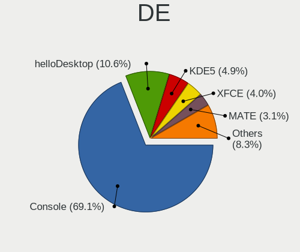

| Name             | Computers | Percent |
|------------------|-----------|---------|
| Console          | 264       | 63.16%  |
| helloDesktop     | 57        | 13.64%  |
| KDE5             | 23        | 5.5%    |
| XFCE             | 19        | 4.55%   |
| MATE             | 16        | 3.83%   |
| Openbox          | 9         | 2.15%   |
| fvwm             | 7         | 1.67%   |
| GNOME            | 6         | 1.44%   |
| i3               | 3         | 0.72%   |
| Cinnamon         | 3         | 0.72%   |
| xinitrc          | 2         | 0.48%   |
| TWM              | 1         | 0.24%   |
| PekWM            | 1         | 0.24%   |
| Metacity (Marco) | 1         | 0.24%   |
| Fluxbox          | 1         | 0.24%   |
| Enlightenment    | 1         | 0.24%   |
| DWM              | 1         | 0.24%   |
| CDE              | 1         | 0.24%   |
| Budgie           | 1         | 0.24%   |
| AwesomeWM        | 1         | 0.24%   |

Display Server
--------------

X11 or Wayland

| Name    | Computers | Percent |
|---------|-----------|---------|
| Console | 265       | 64.32%  |
| X11     | 143       | 34.71%  |
| Wayland | 4         | 0.97%   |

Display Manager
---------------

SDDM, LightDM, etc.

| Name    | Computers | Percent |
|---------|-----------|---------|
| Console | 299       | 71.53%  |
| SLiM    | 65        | 15.55%  |
| SDDM    | 28        | 6.7%    |
| LightDM | 17        | 4.07%   |
| XDM     | 5         | 1.2%    |
| GDM     | 3         | 0.72%   |
| Ly      | 1         | 0.24%   |

OS Lang
-------

Language

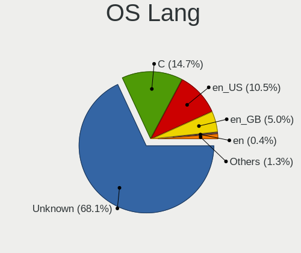

| Lang            | Computers | Percent |
|-----------------|-----------|---------|
| Unknown         | 272       | 63.85%  |
| en_US           | 61        | 14.32%  |
| C               | 56        | 13.15%  |
| en_GB           | 27        | 6.34%   |
| en              | 3         | 0.7%    |
| ru_RU           | 2         | 0.47%   |
| en_GB.US-ASCII  | 2         | 0.47%   |
| it_CH           | 1         | 0.23%   |
| fr_FR           | 1         | 0.23%   |
| en_GB.ISO8859-1 | 1         | 0.23%   |

Boot Mode
---------

EFI or BIOS

| Mode | Computers | Percent |
|------|-----------|---------|
| EFI  | 350       | 84.75%  |
| BIOS | 63        | 15.25%  |

Filesystem
----------

Type of filesystem

| Type    | Computers | Percent |
|---------|-----------|---------|
| Ufs     | 228       | 54.29%  |
| Zfs     | 153       | 36.43%  |
| Ffs     | 24        | 5.71%   |
| Cd9660  | 13        | 3.1%    |
| Hammer2 | 1         | 0.24%   |
| Unknown | 1         | 0.24%   |

Part. scheme
------------

Scheme of partitioning

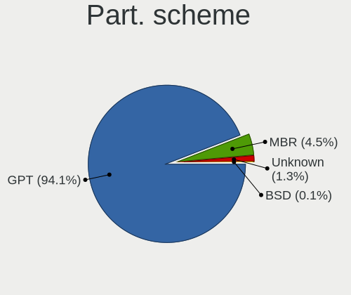

| Type    | Computers | Percent |
|---------|-----------|---------|
| GPT     | 377       | 91.95%  |
| MBR     | 25        | 6.1%    |
| Unknown | 7         | 1.71%   |
| BSD     | 1         | 0.24%   |

Board
-----

Vendor
------

Motherboard manufacturer

| Name                    | Computers | Percent |
|-------------------------|-----------|---------|
| Dell                    | 55        | 13.51%  |
| Lenovo                  | 40        | 9.83%   |
| Hewlett-Packard         | 38        | 9.34%   |
| Unknown                 | 34        | 8.35%   |
| ASUSTek Computer        | 29        | 7.13%   |
| Intel                   | 26        | 6.39%   |
| Gigabyte Technology     | 21        | 5.16%   |
| ASRock                  | 14        | 3.44%   |
| AMI                     | 12        | 2.95%   |
| Apple                   | 11        | 2.7%    |
| PC Engines              | 9         | 2.21%   |
| Protectli               | 7         | 1.72%   |
| MSI                     | 7         | 1.72%   |
| Fujitsu                 | 7         | 1.72%   |
| Shuttle                 | 6         | 1.47%   |
| Samsung Electronics     | 6         | 1.47%   |
| Raspberry Pi Foundation | 5         | 1.23%   |
| Deciso                  | 5         | 1.23%   |
| Acer                    | 5         | 1.23%   |
| Toshiba                 | 4         | 0.98%   |
| Supermicro              | 4         | 0.98%   |
| Biostar                 | 3         | 0.74%   |
| ZOTAC                   | 2         | 0.49%   |
| Yanling                 | 2         | 0.49%   |
| Star Labs               | 2         | 0.49%   |
| Sophos                  | 2         | 0.49%   |
| Inventec                | 2         | 0.49%   |
| IceWhale Technology     | 2         | 0.49%   |
| HUAWEI                  | 2         | 0.49%   |
| HPE                     | 2         | 0.49%   |
| AZW                     | 2         | 0.49%   |
| ASRockRack              | 2         | 0.49%   |
| Winston Marriot         | 1         | 0.25%   |
| TUXEDO                  | 1         | 0.25%   |
| Techvision              | 1         | 0.25%   |
| System76                | 1         | 0.25%   |
| Sony UK                 | 1         | 0.25%   |
| Sony                    | 1         | 0.25%   |
| Silver Peak Systems     | 1         | 0.25%   |
| Seeed Studio            | 1         | 0.25%   |

Model
-----

Motherboard model

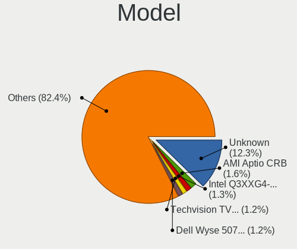

| Name                                | Computers | Percent |
|-------------------------------------|-----------|---------|
| Unknown                             | 35        | 8.6%    |
| AMI Aptio CRB                       | 9         | 2.21%   |
| Intel Q3XXG4-P V1.0                 | 8         | 1.97%   |
| PC Engines APU2                     | 5         | 1.23%   |
| Dell Wyse 5070 Extended Thin Client | 5         | 1.23%   |
| ASUS All Series                     | 5         | 1.23%   |
| HP t730 Thin Client                 | 4         | 0.98%   |
| Dell OptiPlex 7010                  | 4         | 0.98%   |
| RPi Raspberry Pi                    | 3         | 0.74%   |
| Protectli FW6                       | 3         | 0.74%   |
| Protectli FW4B                      | 3         | 0.74%   |
| PC Engines apu4                     | 3         | 0.74%   |
| Intel SHARKBAY                      | 3         | 0.74%   |
| HP t620 PLUS Quad Core TC           | 3         | 0.74%   |
| HP EliteBook 8570p                  | 3         | 0.74%   |
| Fujitsu FUTRO S920                  | 3         | 0.74%   |
| Dell OptiPlex 790                   | 3         | 0.74%   |
| Dell OptiPlex 760                   | 3         | 0.74%   |
| Dell OptiPlex 3020                  | 3         | 0.74%   |
| Yanling YL-KBR6L                    | 2         | 0.49%   |
| Sophos SG                           | 2         | 0.49%   |
| Lenovo ThinkCentre M920s 10SJ0041UK | 2         | 0.49%   |
| Lenovo ThinkCentre E73 10DS0015UK   | 2         | 0.49%   |
| IceWhale ZimaBoard 832 ZMB          | 2         | 0.49%   |
| HP Z600 Workstation                 | 2         | 0.49%   |
| HP ProLiant MicroServer Gen8        | 2         | 0.49%   |
| HP ProLiant DL360 Gen9              | 2         | 0.49%   |
| Gigabyte B450M DS3H                 | 2         | 0.49%   |
| Dell XPS 13 9343                    | 2         | 0.49%   |
| Dell PowerEdge R610                 | 2         | 0.49%   |
| Dell PowerEdge R210 II              | 2         | 0.49%   |
| Dell PowerEdge R210                 | 2         | 0.49%   |
| Dell OptiPlex 390                   | 2         | 0.49%   |
| Dell Inspiron 3793                  | 2         | 0.49%   |
| Deciso OPNsense Appliance           | 2         | 0.49%   |
| ASUS ZenBook S UX391UA              | 2         | 0.49%   |
| ASUS ROG STRIX X570-E GAMING        | 2         | 0.49%   |
| ASUS PRIME H510M-E                  | 2         | 0.49%   |
| ASUS H110M-PLUS                     | 2         | 0.49%   |
| ASRock B550 Phantom Gaming 4        | 2         | 0.49%   |

Model Family
------------

Motherboard model prefix

| Name               | Computers | Percent |
|--------------------|-----------|---------|
| Unknown            | 35        | 8.6%    |
| Lenovo ThinkPad    | 24        | 5.9%    |
| Dell OptiPlex      | 22        | 5.41%   |
| Dell PowerEdge     | 14        | 3.44%   |
| Lenovo ThinkCentre | 12        | 2.95%   |
| AMI Aptio          | 9         | 2.21%   |
| Intel Q3XXG4-P     | 8         | 1.97%   |
| HP ProLiant        | 8         | 1.97%   |
| ASUS ROG           | 6         | 1.47%   |
| ASUS PRIME         | 6         | 1.47%   |
| RPi Raspberry      | 5         | 1.23%   |
| PC Engines APU2    | 5         | 1.23%   |
| Dell Wyse          | 5         | 1.23%   |
| Dell Latitude      | 5         | 1.23%   |
| ASUS All           | 5         | 1.23%   |
| Acer Aspire        | 5         | 1.23%   |
| HP t730            | 4         | 0.98%   |
| Fujitsu FUTRO      | 4         | 0.98%   |
| Toshiba Satellite  | 3         | 0.74%   |
| Protectli FW6      | 3         | 0.74%   |
| Protectli FW4B     | 3         | 0.74%   |
| PC Engines apu4    | 3         | 0.74%   |
| Intel SHARKBAY     | 3         | 0.74%   |
| HP t620            | 3         | 0.74%   |
| HP Pavilion        | 3         | 0.74%   |
| HP EliteDesk       | 3         | 0.74%   |
| HP EliteBook       | 3         | 0.74%   |
| Dell Precision     | 3         | 0.74%   |
| Dell Inspiron      | 3         | 0.74%   |
| Apple MacBookPro5  | 3         | 0.74%   |
| Yanling YL-KBR6L   | 2         | 0.49%   |
| Sophos SG          | 2         | 0.49%   |
| Lenovo IdeaPad     | 2         | 0.49%   |
| IceWhale ZimaBoard | 2         | 0.49%   |
| HP Z600            | 2         | 0.49%   |
| HP ProDesk         | 2         | 0.49%   |
| HP ProBook         | 2         | 0.49%   |
| Gigabyte H61M-DS2  | 2         | 0.49%   |
| Gigabyte B450M     | 2         | 0.49%   |
| Fujitsu ESPRIMO    | 2         | 0.49%   |

MFG Year
--------

Motherboard manufacture year

| Year    | Computers | Percent |
|---------|-----------|---------|
| 2020    | 42        | 10.32%  |
| 2018    | 40        | 9.83%   |
| 2014    | 40        | 9.83%   |
| 2016    | 37        | 9.09%   |
| 2019    | 34        | 8.35%   |
| 2013    | 31        | 7.62%   |
| 2021    | 30        | 7.37%   |
| 2015    | 26        | 6.39%   |
| 2022    | 25        | 6.14%   |
| 2011    | 18        | 4.42%   |
| 2010    | 18        | 4.42%   |
| 2012    | 17        | 4.18%   |
| 2017    | 16        | 3.93%   |
| 2009    | 14        | 3.44%   |
| Unknown | 6         | 1.47%   |
| 2008    | 5         | 1.23%   |
| 2023    | 4         | 0.98%   |
| 2007    | 4         | 0.98%   |

Form Factor
-----------

Physical design of the computer

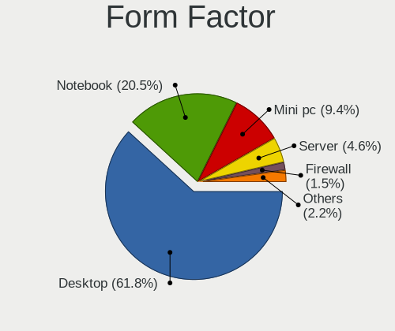

| Name           | Computers | Percent |
|----------------|-----------|---------|
| Desktop        | 246       | 60.44%  |
| Notebook       | 91        | 22.36%  |
| Mini pc        | 33        | 8.11%   |
| Server         | 24        | 5.9%    |
| Firewall       | 5         | 1.23%   |
| System on chip | 4         | 0.98%   |
| All in one     | 3         | 0.74%   |
| Convertible    | 1         | 0.25%   |

Coreboot
--------

Have coreboot on board

| Used | Computers | Percent |
|------|-----------|---------|
| No   | 391       | 96.07%  |
| Yes  | 16        | 3.93%   |

RAM Size
--------

Total RAM memory

| Size in GB      | Computers | Percent |
|-----------------|-----------|---------|
| 8.01-16.0       | 182       | 44.39%  |
| 16.01-24.0      | 84        | 20.49%  |
| 4.01-8.0        | 79        | 19.27%  |
| 32.01-64.0      | 25        | 6.1%    |
| 2.01-3.0        | 14        | 3.41%   |
| 64.01-256.0     | 12        | 2.93%   |
| 3.01-4.0        | 5         | 1.22%   |
| 24.01-32.0      | 4         | 0.98%   |
| 0.51-1.0        | 2         | 0.49%   |
| More than 256.0 | 1         | 0.24%   |
| 1.01-2.0        | 1         | 0.24%   |
| Unknown         | 1         | 0.24%   |

RAM Used
--------

Used RAM memory

| Used GB     | Computers | Percent |
|-------------|-----------|---------|
| 0.01-0.5    | 241       | 56.71%  |
| 0.51-1.0    | 111       | 26.12%  |
| 1.01-2.0    | 33        | 7.76%   |
| 2.01-3.0    | 12        | 2.82%   |
| 3.01-4.0    | 9         | 2.12%   |
| 4.01-8.0    | 6         | 1.41%   |
| Unknown     | 5         | 1.18%   |
| 24.01-32.0  | 2         | 0.47%   |
| 8.01-16.0   | 2         | 0.47%   |
| 32.01-64.0  | 1         | 0.24%   |
| 64.01-256.0 | 1         | 0.24%   |
| 16.01-24.0  | 1         | 0.24%   |
| 0           | 1         | 0.24%   |

Total Drives
------------

Number of drives on board

| Drives | Computers | Percent |
|--------|-----------|---------|
| 1      | 287       | 67.85%  |
| 2      | 58        | 13.71%  |
| 0      | 37        | 8.75%   |
| 3      | 16        | 3.78%   |
| 4      | 8         | 1.89%   |
| 5      | 7         | 1.65%   |
| 8      | 3         | 0.71%   |
| 7      | 3         | 0.71%   |
| 6      | 2         | 0.47%   |
| 17     | 1         | 0.24%   |
| 14     | 1         | 0.24%   |

Has CD-ROM
----------

Has CD-ROM on board

| Presented | Computers | Percent |
|-----------|-----------|---------|
| No        | 325       | 78.88%  |
| Yes       | 87        | 21.12%  |

Has Ethernet
------------

Has Ethernet on board

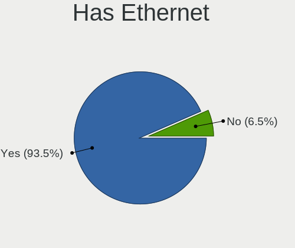

| Presented | Computers | Percent |
|-----------|-----------|---------|
| Yes       | 379       | 93.12%  |
| No        | 28        | 6.88%   |

Has WiFi
--------

Has WiFi module

| Presented | Computers | Percent |
|-----------|-----------|---------|
| No        | 246       | 60%     |
| Yes       | 164       | 40%     |

Has Bluetooth
-------------

Has Bluetooth module

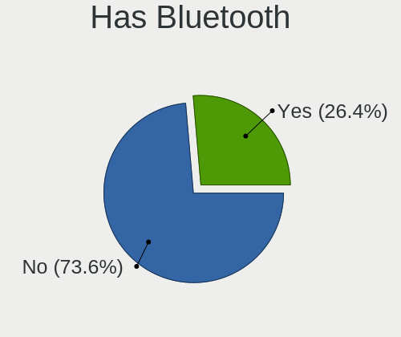

| Presented | Computers | Percent |
|-----------|-----------|---------|
| No        | 307       | 74.7%   |
| Yes       | 104       | 25.3%   |

Location
--------

Country
-------

Geographic location (country)

| Country | Computers | Percent |
|---------|-----------|---------|
| UK      | 407       | 100%    |

City
----

Geographic location (city)

| City                | Computers | Percent |
|---------------------|-----------|---------|
| London              | 58        | 12.03%  |
| Glasgow             | 8         | 1.66%   |
| Brighton            | 8         | 1.66%   |
| Newcastle upon Tyne | 7         | 1.45%   |
| Cambridge           | 7         | 1.45%   |
| Birmingham          | 6         | 1.24%   |
| Watford             | 5         | 1.04%   |
| Swindon             | 5         | 1.04%   |
| Sheffield           | 5         | 1.04%   |
| Kensington          | 5         | 1.04%   |
| Hull                | 5         | 1.04%   |
| City of London      | 5         | 1.04%   |
| Bristol             | 5         | 1.04%   |
| Stourbridge         | 4         | 0.83%   |
| Shoreham-by-Sea     | 4         | 0.83%   |
| Poplar              | 4         | 0.83%   |
| Milton Keynes       | 4         | 0.83%   |
| Leicester           | 4         | 0.83%   |
| Leeds               | 4         | 0.83%   |
| Islington           | 4         | 0.83%   |
| Greenwich           | 4         | 0.83%   |
| Coventry            | 4         | 0.83%   |
| York                | 3         | 0.62%   |
| Wolverhampton       | 3         | 0.62%   |
| Woking              | 3         | 0.62%   |
| Wittersham          | 3         | 0.62%   |
| Walsall             | 3         | 0.62%   |
| Southampton         | 3         | 0.62%   |
| Scunthorpe          | 3         | 0.62%   |
| Ruthin              | 3         | 0.62%   |
| Reading             | 3         | 0.62%   |
| Notting Hill Gate   | 3         | 0.62%   |
| Mansfield           | 3         | 0.62%   |
| Manchester          | 3         | 0.62%   |
| Malton              | 3         | 0.62%   |
| Liverpool           | 3         | 0.62%   |
| Leatherhead         | 3         | 0.62%   |
| Gloucester          | 3         | 0.62%   |
| Egham               | 3         | 0.62%   |
| Dundee              | 3         | 0.62%   |

Drives
------

Drive Vendor
------------

Hard drive vendors

| Vendor              | Computers | Drives | Percent |
|---------------------|-----------|--------|---------|
| Samsung Electronics | 75        | 133    | 16.09%  |
| WDC                 | 49        | 86     | 10.52%  |
| Seagate             | 41        | 97     | 8.8%    |
| Crucial             | 40        | 61     | 8.58%   |
| Kingston            | 34        | 54     | 7.3%    |
| Toshiba             | 22        | 61     | 4.72%   |
| SanDisk             | 21        | 25     | 4.51%   |
| Transcend           | 16        | 21     | 3.43%   |
| Intel               | 15        | 18     | 3.22%   |
| Hitachi             | 13        | 17     | 2.79%   |
| Hoodisk             | 11        | 17     | 2.36%   |
| Phison              | 9         | 13     | 1.93%   |
| HGST                | 9         | 35     | 1.93%   |
| SK hynix            | 7         | 9      | 1.5%    |
| Hewlett-Packard     | 7         | 23     | 1.5%    |
| China               | 7         | 7      | 1.5%    |
| LITEONIT            | 6         | 7      | 1.29%   |
| Micron Technology   | 5         | 6      | 1.07%   |
| Corsair             | 5         | 7      | 1.07%   |
| Apacer              | 5         | 6      | 1.07%   |
| OCZ                 | 4         | 6      | 0.86%   |
| FORESEE             | 4         | 5      | 0.86%   |
| Apple               | 4         | 5      | 0.86%   |
| A-DATA Technology   | 4         | 7      | 0.86%   |
| PNY                 | 3         | 11     | 0.64%   |
| NVMe                | 3         | 3      | 0.64%   |
| Intenso             | 3         | 3      | 0.64%   |
| Integral            | 3         | 5      | 0.64%   |
| Gigabyte Technology | 3         | 4      | 0.64%   |
| XUM                 | 2         | 2      | 0.43%   |
| Vaseky              | 2         | 2      | 0.43%   |
| Star Drive          | 2         | 2      | 0.43%   |
| SPCC                | 2         | 2      | 0.43%   |
| Patriot             | 2         | 5      | 0.43%   |
| OPENBSD             | 2         | 2      | 0.43%   |
| Netac               | 2         | 6      | 0.43%   |
| Lexar               | 2         | 2      | 0.43%   |
| Fanxiang            | 2         | 2      | 0.43%   |
| Zheino              | 1         | 1      | 0.21%   |
| UMIS                | 1         | 1      | 0.21%   |

Drive Model
-----------

Hard drive models

| Model                                | Computers | Percent |
|--------------------------------------|-----------|---------|
| Toshiba MQ01ABF050 500GB             | 6         | 1.19%   |
| Samsung SSD 860 EVO 500GB            | 5         | 0.99%   |
| Samsung SSD 850 EVO 250GB            | 5         | 0.99%   |
| Kingston SUV500MS120G 120GB          | 5         | 0.99%   |
| Kingston SA400S37240G 240GB          | 5         | 0.99%   |
| Hoodisk SSD 64GB                     | 5         | 0.99%   |
| Crucial CT500MX500SSD1 500GB         | 5         | 0.99%   |
| Crucial CT120BX500SSD1 120GB         | 5         | 0.99%   |
| Kingston SA400S37120G 120GB          | 4         | 0.79%   |
| Hoodisk SSD 32GB                     | 4         | 0.79%   |
| HGST HTS725050A7E630 500GB           | 4         | 0.79%   |
| HP RAID 1(1+0) 1TB                   | 4         | 0.79%   |
| Crucial CT240BX500SSD1 240GB         | 4         | 0.79%   |
| Crucial CT1000MX500SSD1 1TB          | 4         | 0.79%   |
| WDC WDS240G2G0A-00JH30 240GB         | 3         | 0.6%    |
| Seagate ST3500418AS 500GB            | 3         | 0.6%    |
| SanDisk SSD PLUS 480GB               | 3         | 0.6%    |
| Samsung SSD 970 EVO Plus 1TB         | 3         | 0.6%    |
| Samsung HM251JX 250GB                | 3         | 0.6%    |
| Phison Sabrent 2TB                   | 3         | 0.6%    |
| Kingston SUV500MS240G 240GB          | 3         | 0.6%    |
| Gigabyte GP-GSTFS31120GNTD 120GB     | 3         | 0.6%    |
| Crucial CT480BX500SSD1 480GB         | 3         | 0.6%    |
| XUM HX256GSSDSATA3 256GB             | 2         | 0.4%    |
| WDC WDS250G2B0B-00YS70 250GB         | 2         | 0.4%    |
| WDC WD20EZRX-22D8PB0 2TB             | 2         | 0.4%    |
| WDC WD20EZRX-00D8PB0 2TB             | 2         | 0.4%    |
| WDC WD20EFZX-68AWUN0 2TB             | 2         | 0.4%    |
| WDC WD20EFRX-68EUZN0 2TB             | 2         | 0.4%    |
| WDC WD1600BEVT-80A23T0 160GB         | 2         | 0.4%    |
| WDC WD1600BEVT-22ZCT0 160GB          | 2         | 0.4%    |
| WDC PC SN730 SDBQNTY-256G-1001 256GB | 2         | 0.4%    |
| Transcend TS256GMTE652T2 256GB       | 2         | 0.4%    |
| Transcend TS128GMTE110S 128GB        | 2         | 0.4%    |
| Transcend TS128GMSA370 128GB         | 2         | 0.4%    |
| Toshiba HDWE140 4TB                  | 2         | 0.4%    |
| Toshiba DT01ACA200 2TB               | 2         | 0.4%    |
| Seagate ST8000VN0022-2EL112 8TB      | 2         | 0.4%    |
| Seagate ST8000AS0002-1NA17Z 8TB      | 2         | 0.4%    |
| Seagate ST500DM002-1BD142 500GB      | 2         | 0.4%    |

HDD Vendor
----------

Hard disk drive vendors

| Vendor              | Computers | Drives | Percent |
|---------------------|-----------|--------|---------|
| Seagate             | 41        | 97     | 29.29%  |
| WDC                 | 38        | 67     | 27.14%  |
| Toshiba             | 17        | 48     | 12.14%  |
| Hitachi             | 13        | 17     | 9.29%   |
| HGST                | 9         | 35     | 6.43%   |
| Samsung Electronics | 8         | 8      | 5.71%   |
| Hewlett-Packard     | 7         | 23     | 5%      |
| OPENBSD             | 2         | 2      | 1.43%   |
| NVMe                | 2         | 2      | 1.43%   |
| Fujitsu             | 1         | 6      | 0.71%   |
| Dell                | 1         | 2      | 0.71%   |
| Apple               | 1         | 1      | 0.71%   |

SSD Vendor
----------

Solid state drive vendors

| Vendor              | Computers | Drives | Percent |
|---------------------|-----------|--------|---------|
| Samsung Electronics | 48        | 88     | 17.45%  |
| Crucial             | 35        | 56     | 12.73%  |
| Kingston            | 34        | 54     | 12.36%  |
| SanDisk             | 21        | 25     | 7.64%   |
| Transcend           | 12        | 15     | 4.36%   |
| Intel               | 11        | 13     | 4%      |
| Hoodisk             | 11        | 17     | 4%      |
| WDC                 | 9         | 14     | 3.27%   |
| China               | 7         | 7      | 2.55%   |
| LITEONIT            | 6         | 7      | 2.18%   |
| Phison              | 5         | 6      | 1.82%   |
| Micron Technology   | 5         | 6      | 1.82%   |
| Corsair             | 5         | 7      | 1.82%   |
| Apacer              | 5         | 6      | 1.82%   |
| OCZ                 | 4         | 6      | 1.45%   |
| FORESEE             | 4         | 5      | 1.45%   |
| A-DATA Technology   | 4         | 7      | 1.45%   |
| Toshiba             | 3         | 9      | 1.09%   |
| PNY                 | 3         | 9      | 1.09%   |
| Intenso             | 3         | 3      | 1.09%   |
| Integral            | 3         | 5      | 1.09%   |
| Gigabyte Technology | 3         | 4      | 1.09%   |
| Apple               | 3         | 4      | 1.09%   |
| XUM                 | 2         | 2      | 0.73%   |
| Vaseky              | 2         | 2      | 0.73%   |
| SPCC                | 2         | 2      | 0.73%   |
| SK hynix            | 2         | 2      | 0.73%   |
| Patriot             | 2         | 5      | 0.73%   |
| Netac               | 2         | 6      | 0.73%   |
| Lexar               | 2         | 2      | 0.73%   |
| Zheino              | 1         | 1      | 0.36%   |
| TCSUNBOW            | 1         | 2      | 0.36%   |
| Star Drive          | 1         | 1      | 0.36%   |
| ShiJi               | 1         | 1      | 0.36%   |
| SATA3 60            | 1         | 1      | 0.36%   |
| OWC                 | 1         | 1      | 0.36%   |
| ORTIAL              | 1         | 3      | 0.36%   |
| NVMe                | 1         | 1      | 0.36%   |
| MicroDream          | 1         | 1      | 0.36%   |
| MARVELL             | 1         | 1      | 0.36%   |

Drive Kind
----------

HDD or SSD

| Kind | Computers | Drives | Percent |
|------|-----------|--------|---------|
| SSD  | 252       | 417    | 59.86%  |
| HDD  | 114       | 308    | 27.08%  |
| NVMe | 55        | 85     | 13.06%  |

Drive Connector
---------------

SATA, SAS, NVMe, etc.

| Type | Computers | Drives | Percent |
|------|-----------|--------|---------|
| SATA | 334       | 725    | 85.86%  |
| NVMe | 55        | 85     | 14.14%  |

Drive Size
----------

Size of hard drive

| Size in TB | Computers | Drives | Percent |
|------------|-----------|--------|---------|
| 0.01-0.5   | 294       | 510    | 77.78%  |
| 0.51-1.0   | 40        | 81     | 10.58%  |
| 1.01-2.0   | 24        | 52     | 6.35%   |
| 3.01-4.0   | 9         | 37     | 2.38%   |
| 4.01-10.0  | 9         | 43     | 2.38%   |
| 2.01-3.0   | 2         | 2      | 0.53%   |

Space Total
-----------

Amount of disk space available on the file system

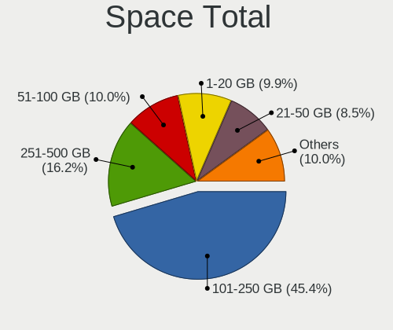

| Size in GB     | Computers | Percent |
|----------------|-----------|---------|
| 101-250        | 177       | 40.78%  |
| 251-500        | 64        | 14.75%  |
| 1-20           | 58        | 13.36%  |
| 51-100         | 50        | 11.52%  |
| 21-50          | 43        | 9.91%   |
| 501-1000       | 24        | 5.53%   |
| 1001-2000      | 9         | 2.07%   |
| Unknown        | 5         | 1.15%   |
| More than 3000 | 3         | 0.69%   |
| 2001-3000      | 1         | 0.23%   |

Space Used
----------

Amount of used disk space

| Used GB        | Computers | Percent |
|----------------|-----------|---------|
| 1-20           | 366       | 85.71%  |
| 21-50          | 33        | 7.73%   |
| 51-100         | 11        | 2.58%   |
| 101-250        | 7         | 1.64%   |
| Unknown        | 5         | 1.17%   |
| More than 3000 | 2         | 0.47%   |
| 251-500        | 2         | 0.47%   |
| 2001-3000      | 1         | 0.23%   |

Malfunc. Drives
---------------

Drive models with a malfunction

| Model                                            | Computers | Drives | Percent |
|--------------------------------------------------|-----------|--------|---------|
| HGST HTS725050A7E630 500GB                       | 4         | 10     | 6.25%   |
| Seagate ST3500418AS 500GB                        | 2         | 3      | 3.13%   |
| Seagate ST3160310CS 160GB                        | 2         | 2      | 3.13%   |
| SanDisk SSD PLUS 480GB                           | 2         | 2      | 3.13%   |
| Samsung Electronics SSD PM810 2.5-inch 7mm 256GB | 2         | 3      | 3.13%   |
| Samsung Electronics HM160HI 160GB                | 2         | 2      | 3.13%   |
| Crucial CT525MX300SSD1 528GB                     | 2         | 3      | 3.13%   |
| China SATA SSD 32GB                              | 2         | 2      | 3.13%   |
| WDC WD5000AAKX-221CA1 500GB                      | 1         | 1      | 1.56%   |
| WDC WD5000AAKS-60WWPA0 500GB                     | 1         | 1      | 1.56%   |
| WDC WD4001FAEX-00MJRA0 4TB                       | 1         | 4      | 1.56%   |
| WDC WD3200BEVT-22A23T0 320GB                     | 1         | 2      | 1.56%   |
| WDC WD3200AAJS-22B4A0 320GB                      | 1         | 1      | 1.56%   |
| WDC WD30EFRX-68EUZN0 3TB                         | 1         | 1      | 1.56%   |
| WDC WD2500BEVT-80A23T0 250GB                     | 1         | 1      | 1.56%   |
| WDC WD20EFZX-68AWUN0 2TB                         | 1         | 2      | 1.56%   |
| WDC WD1600BEVT-80A23T0 160GB                     | 1         | 1      | 1.56%   |
| WDC WD10JMVW-11AJGS0 1TB                         | 1         | 1      | 1.56%   |
| Transcend TS256GSSD320 256GB                     | 1         | 1      | 1.56%   |
| Toshiba MK2555GSX 250GB                          | 1         | 1      | 1.56%   |
| Toshiba MD04ACA400 4TB                           | 1         | 1      | 1.56%   |
| Toshiba HDWE140 4TB                              | 1         | 8      | 1.56%   |
| Toshiba DT01ACA200 2TB                           | 1         | 1      | 1.56%   |
| Toshiba DT01ABA300 3TB                           | 1         | 1      | 1.56%   |
| Seagate ST9320423AS 320GB                        | 1         | 1      | 1.56%   |
| Seagate ST9160821AS 160GB                        | 1         | 1      | 1.56%   |
| Seagate ST32000542AS 2TB                         | 1         | 1      | 1.56%   |
| Seagate ST250DM000-1BD141 250GB                  | 1         | 1      | 1.56%   |
| Seagate ST2000LM015-2E8174 2TB                   | 1         | 1      | 1.56%   |
| SanDisk SSD P4 16GB                              | 1         | 1      | 1.56%   |
| SanDisk SDCFHS-016G                              | 1         | 1      | 1.56%   |
| Samsung Electronics SSD 970 EVO 500GB            | 1         | 3      | 1.56%   |
| Samsung Electronics MZHPV512HDGL-00000 512GB     | 1         | 1      | 1.56%   |
| Samsung Electronics HM251JX 250GB                | 1         | 1      | 1.56%   |
| Micron Technology MTFDDAK256MAM-1K12 256GB       | 1         | 1      | 1.56%   |
| MARVELL SATAIII 16GB                             | 1         | 1      | 1.56%   |
| Kingston SV300S37A120G 120GB                     | 1         | 3      | 1.56%   |
| Kingston SV200S3128G 128GB                       | 1         | 1      | 1.56%   |
| Kingchuxing SSD 60GB                             | 1         | 1      | 1.56%   |
| Intel SSDSC2BB120G4 120GB                        | 1         | 2      | 1.56%   |

Malfunc. Drive Vendor
---------------------

Vendors of faulty drives

| Vendor              | Computers | Drives | Percent |
|---------------------|-----------|--------|---------|
| WDC                 | 10        | 15     | 16.13%  |
| Seagate             | 9         | 10     | 14.52%  |
| Samsung Electronics | 7         | 10     | 11.29%  |
| HGST                | 6         | 29     | 9.68%   |
| Toshiba             | 4         | 12     | 6.45%   |
| SanDisk             | 4         | 4      | 6.45%   |
| Crucial             | 4         | 7      | 6.45%   |
| China               | 4         | 4      | 6.45%   |
| Hitachi             | 3         | 3      | 4.84%   |
| Kingston            | 2         | 4      | 3.23%   |
| A-DATA Technology   | 2         | 3      | 3.23%   |
| Transcend           | 1         | 1      | 1.61%   |
| Micron Technology   | 1         | 1      | 1.61%   |
| MARVELL             | 1         | 1      | 1.61%   |
| Kingchuxing         | 1         | 1      | 1.61%   |
| Intel               | 1         | 2      | 1.61%   |
| Hewlett-Packard     | 1         | 1      | 1.61%   |
| Apple               | 1         | 1      | 1.61%   |

Malfunc. HDD Vendor
-------------------

Vendors of faulty HDD drives

| Vendor              | Computers | Drives | Percent |
|---------------------|-----------|--------|---------|
| WDC                 | 10        | 15     | 27.03%  |
| Seagate             | 9         | 10     | 24.32%  |
| HGST                | 6         | 29     | 16.22%  |
| Toshiba             | 4         | 12     | 10.81%  |
| Samsung Electronics | 3         | 3      | 8.11%   |
| Hitachi             | 3         | 3      | 8.11%   |
| Hewlett-Packard     | 1         | 1      | 2.7%    |
| Apple               | 1         | 1      | 2.7%    |

Malfunc. Drive Kind
-------------------

Kinds of faulty drives

| Kind | Computers | Drives | Percent |
|------|-----------|--------|---------|
| HDD  | 36        | 74     | 59.02%  |
| SSD  | 24        | 32     | 39.34%  |
| NVMe | 1         | 3      | 1.64%   |

Failed Drives
-------------

Failed drive models

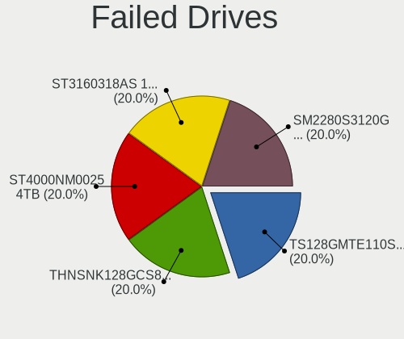

| Model                     | Computers | Drives | Percent |
|---------------------------|-----------|--------|---------|
| Seagate ST4000NM0025 4TB  | 1         | 2      | 50%     |
| Seagate ST3160318AS 160GB | 1         | 1      | 50%     |

Failed Drive Vendor
-------------------

Failed drive vendors

| Vendor  | Computers | Drives | Percent |
|---------|-----------|--------|---------|
| Seagate | 2         | 3      | 100%    |

Drive Status
------------

Number of failed and malfunc. drives

| Status   | Computers | Drives | Percent |
|----------|-----------|--------|---------|
| Works    | 330       | 660    | 80.88%  |
| Malfunc  | 58        | 109    | 14.22%  |
| Detected | 18        | 38     | 4.41%   |
| Failed   | 2         | 3      | 0.49%   |

Storage controller
------------------

Storage Vendor
--------------

Storage controller vendors

| Vendor                                  | Computers | Percent |
|-----------------------------------------|-----------|---------|
| Intel                                   | 301       | 62.71%  |
| AMD                                     | 69        | 14.38%  |
| Samsung Electronics                     | 26        | 5.42%   |
| Broadcom / LSI                          | 11        | 2.29%   |
| SanDisk                                 | 8         | 1.67%   |
| Marvell Technology Group                | 8         | 1.67%   |
| ASMedia Technology                      | 8         | 1.67%   |
| Phison Electronics                      | 7         | 1.46%   |
| Nvidia                                  | 7         | 1.46%   |
| SK hynix                                | 5         | 1.04%   |
| Micron/Crucial Technology               | 5         | 1.04%   |
| Hewlett-Packard                         | 5         | 1.04%   |
| Silicon Motion                          | 4         | 0.83%   |
| Transcend                               | 3         | 0.63%   |
| Toshiba                                 | 3         | 0.63%   |
| Adaptec                                 | 2         | 0.42%   |
| VIA Technologies                        | 1         | 0.21%   |
| Solid State Storage Technology          | 1         | 0.21%   |
| Silicon Image                           | 1         | 0.21%   |
| Shenzhen Unionmemory Information System | 1         | 0.21%   |
| Shenzhen Longsys Electronics            | 1         | 0.21%   |
| OCZ Technology Group                    | 1         | 0.21%   |
| MAXIO Technology (Hangzhou)             | 1         | 0.21%   |
| Kingston Technology Company             | 1         | 0.21%   |

Storage Model
-------------

Storage controller models

| Model                                                                                   | Computers | Percent |
|-----------------------------------------------------------------------------------------|-----------|---------|
| AMD FCH SATA Controller [AHCI mode]                                                     | 49        | 9.26%   |
| Intel 8 Series/C220 Series Chipset Family 6-port SATA Controller 1 [AHCI mode]          | 28        | 5.29%   |
| Intel Atom Processor E3800 Series SATA AHCI Controller                                  | 24        | 4.54%   |
| Intel Celeron/Pentium Silver Processor SATA Controller                                  | 22        | 4.16%   |
| Intel Sunrise Point-LP SATA Controller [AHCI mode]                                      | 20        | 3.78%   |
| Intel 6 Series/C200 Series Chipset Family 6 port Desktop SATA AHCI Controller           | 18        | 3.4%    |
| Intel Atom/Celeron/Pentium Processor x5-E8000/J3xxx/N3xxx Series SATA Controller        | 13        | 2.46%   |
| Intel 8 Series SATA Controller 1 [AHCI mode]                                            | 12        | 2.27%   |
| Samsung NVMe SSD Controller SM981/PM981/PM983                                           | 11        | 2.08%   |
| Intel Wildcat Point-LP SATA Controller [AHCI Mode]                                      | 11        | 2.08%   |
| AMD 400 Series Chipset SATA Controller                                                  | 11        | 2.08%   |
| Intel Q170/Q150/B150/H170/H110/Z170/CM236 Chipset SATA Controller [AHCI Mode]           | 10        | 1.89%   |
| Intel 7 Series Chipset Family 6-port SATA Controller [AHCI mode]                        | 10        | 1.89%   |
| Intel 6 Series/C200 Series Chipset Family 6 port Mobile SATA AHCI Controller            | 10        | 1.89%   |
| Intel Celeron N3350/Pentium N4200/Atom E3900 Series SATA AHCI Controller                | 9         | 1.7%    |
| Intel Cannon Lake PCH SATA AHCI Controller                                              | 9         | 1.7%    |
| Intel 7 Series/C210 Series Chipset Family 6-port SATA Controller [AHCI mode]            | 8         | 1.51%   |
| AMD SB7x0/SB8x0/SB9x0 SATA Controller [AHCI mode]                                       | 8         | 1.51%   |
| Samsung NVMe SSD Controller SM961/PM961/SM963                                           | 7         | 1.32%   |
| Intel 82801 Mobile SATA Controller [RAID mode]                                          | 7         | 1.32%   |
| Intel 5 Series/3400 Series Chipset 6 port SATA AHCI Controller                          | 7         | 1.32%   |
| ASMedia ASM1062 Serial ATA Controller                                                   | 7         | 1.32%   |
| Unknown                                                                                 | 7         | 1.32%   |
| Intel NM10/ICH7 Family SATA Controller [IDE mode]                                       | 6         | 1.13%   |
| Intel 6 Series/C200 Series Chipset Family Desktop SATA Controller (IDE mode, ports 4-5) | 6         | 1.13%   |
| Intel 6 Series/C200 Series Chipset Family Desktop SATA Controller (IDE mode, ports 0-3) | 6         | 1.13%   |
| AMD 500 Series Chipset SATA Controller                                                  | 6         | 1.13%   |
| Phison E12 NVMe Controller                                                              | 5         | 0.95%   |
| Intel Jasper Lake SATA AHCI Controller                                                  | 5         | 0.95%   |
| Intel 82801IBM/IEM (ICH9M/ICH9M-E) 4 port SATA Controller [AHCI mode]                   | 5         | 0.95%   |
| Intel 82801G (ICH7 Family) IDE Controller                                               | 5         | 0.95%   |
| AMD FCH IDE Controller                                                                  | 5         | 0.95%   |
| Silicon Motion SM2263EN/SM2263XT SSD Controller                                         | 4         | 0.76%   |
| Samsung NVMe SSD Controller 980                                                         | 4         | 0.76%   |
| Nvidia MCP79 AHCI Controller                                                            | 4         | 0.76%   |
| Micron/Crucial P2 NVMe PCIe SSD                                                         | 4         | 0.76%   |
| Intel 9 Series Chipset Family SATA Controller [AHCI Mode]                               | 4         | 0.76%   |
| SanDisk WD Black SN750 / PC SN730 NVMe SSD                                              | 3         | 0.57%   |
| Marvell Group 88SE9215 PCIe 2.0 x1 4-port SATA 6 Gb/s Controller                        | 3         | 0.57%   |
| Intel SSD 660P Series                                                                   | 3         | 0.57%   |

Storage Kind
------------

Kind of storage controller (IDE, SATA, NVMe, SAS, ...)

| Kind | Computers | Percent |
|------|-----------|---------|
| SATA | 339       | 71.67%  |
| NVMe | 62        | 13.11%  |
| IDE  | 41        | 8.67%   |
| RAID | 22        | 4.65%   |
| SCSI | 5         | 1.06%   |
| SAS  | 4         | 0.85%   |

Processor
---------

CPU Vendor
----------

Processor vendors

| Vendor   | Computers | Percent |
|----------|-----------|---------|
| Intel    | 320       | 78.62%  |
| AMD      | 77        | 18.92%  |
| ARM      | 6         | 1.47%   |
| Unknown  | 2         | 0.49%   |
| Research | 1         | 0.25%   |
| 11th     | 1         | 0.25%   |

CPU Model
---------

Processor models

| Model                                    | Computers | Percent |
|------------------------------------------|-----------|---------|
| Intel Celeron CPU J1900 @ 1.99GHz        | 10        | 2.43%   |
| Intel Celeron J4125 CPU @ 2.00GHz        | 9         | 2.18%   |
| AMD GX-412TC SOC                         | 8         | 1.94%   |
| Intel Pentium Silver J5005 CPU @ 1.50GHz | 6         | 1.46%   |
| Intel Atom CPU E3845 @ 1.91GHz           | 6         | 1.46%   |
| ARM Cortex-A72 r0p3                      | 5         | 1.21%   |
| Intel Pentium Silver N6005 @ 2.00GHz     | 4         | 0.97%   |
| Intel Core i5-9500 CPU @ 3.00GHz         | 4         | 0.97%   |
| Intel Core i5-7200U CPU @ 2.50GHz        | 4         | 0.97%   |
| Intel Core i5-6300U CPU @ 2.40GHz        | 4         | 0.97%   |
| Intel Core i5-5250U CPU @ 1.60GHz        | 4         | 0.97%   |
| Intel Core 2 Duo                         | 4         | 0.97%   |
| Intel Celeron CPU N3150 @ 1.60GHz        | 4         | 0.97%   |
| Intel Celeron CPU J3160 @ 1.60GHz        | 4         | 0.97%   |
| Intel Celeron CPU 3865U @ 1.80GHz        | 4         | 0.97%   |
| AMD Ryzen 5 3600 6-Core Processor        | 4         | 0.97%   |
| AMD RX-427BB with AMD Radeon R7 Graphics | 4         | 0.97%   |
| Intel Pentium CPU N3700 @ 1.60GHz        | 3         | 0.73%   |
| Intel CPU Version                        | 3         | 0.73%   |
| Intel Core i7-8550U CPU @ 1.80GHz        | 3         | 0.73%   |
| Intel Core i7-4770S CPU @ 3.10GHz        | 3         | 0.73%   |
| Intel Core i7-3520M CPU @ 2.90GHz        | 3         | 0.73%   |
| Intel Core i5-4570T CPU @ 2.90GHz        | 3         | 0.73%   |
| Intel Core i5-4570 CPU @ 3.20GHz         | 3         | 0.73%   |
| Intel Core i5-4300U CPU @ 1.90GHz        | 3         | 0.73%   |
| Intel Core i5-2520M CPU @ 2.50GHz        | 3         | 0.73%   |
| Intel Core i3-4160 CPU @ 3.60GHz         | 3         | 0.73%   |
| Intel Core i3-2120 CPU @ 3.30GHz         | 3         | 0.73%   |
| Intel Core i3-2100 CPU @ 3.10GH          | 3         | 0.73%   |
| Intel Celeron CPU N3450 @ 1.10GHz        | 3         | 0.73%   |
| Intel Celeron CPU N2940 @ 1.83GHz        | 3         | 0.73%   |
| Intel Celeron CPU J3455 @ 1.50GHz        | 3         | 0.73%   |
| Intel 11th Gen Core i7-1165G7 @ 2.80GHz  | 3         | 0.73%   |
| AMD Ryzen Embedded V1500B                | 3         | 0.73%   |
| AMD Ryzen 7 3700X 8-Core Processor       | 3         | 0.73%   |
| AMD Ryzen 5 5600G with Radeon Graphics   | 3         | 0.73%   |
| AMD GX-420CA SOC with Radeon HD Graphics | 3         | 0.73%   |
| AMD GX-416RA SOC                         | 3         | 0.73%   |
| Intel Xeon CPU X3450 @ 2.67GHz           | 2         | 0.49%   |
| Intel Xeon CPU X3430 @ 2.40GHz           | 2         | 0.49%   |

CPU Model Family
----------------

Processor model prefix

| Model                   | Computers | Percent |
|-------------------------|-----------|---------|
| Intel Core i5           | 74        | 18.05%  |
| Intel Celeron           | 64        | 15.61%  |
| Intel Core i7           | 45        | 10.98%  |
| Intel Xeon              | 37        | 9.02%   |
| Intel Core i3           | 33        | 8.05%   |
| Other                   | 20        | 4.88%   |
| AMD GX                  | 18        | 4.39%   |
| Intel Atom              | 15        | 3.66%   |
| Intel Core 2 Duo        | 14        | 3.41%   |
| AMD Ryzen 5             | 14        | 3.41%   |
| Intel Pentium Silver    | 12        | 2.93%   |
| Intel Pentium           | 7         | 1.71%   |
| ARM Cortex              | 6         | 1.46%   |
| AMD Ryzen 7             | 6         | 1.46%   |
| AMD G                   | 4         | 0.98%   |
| AMD A6                  | 4         | 0.98%   |
| Intel Core i9           | 3         | 0.73%   |
| AMD Ryzen Embedded      | 3         | 0.73%   |
| AMD Ryzen 3             | 3         | 0.73%   |
| AMD FX                  | 3         | 0.73%   |
| Intel Xeon Silver       | 2         | 0.49%   |
| Intel Core 2 Quad       | 2         | 0.49%   |
| AMD Ryzen 9             | 2         | 0.49%   |
| AMD EPYC                | 2         | 0.49%   |
| AMD Athlon              | 2         | 0.49%   |
| AMD A4                  | 2         | 0.49%   |
| Intel Pentium Dual-Core | 1         | 0.24%   |
| Intel Core 2            | 1         | 0.24%   |
| Intel 686-class         | 1         | 0.24%   |
| AMD Ryzen Threadripper  | 1         | 0.24%   |
| AMD Ryzen 7 PRO         | 1         | 0.24%   |
| AMD Ryzen 3 PRO         | 1         | 0.24%   |
| AMD Phenom II X6        | 1         | 0.24%   |
| AMD Phenom              | 1         | 0.24%   |
| AMD Opteron             | 1         | 0.24%   |
| AMD E2                  | 1         | 0.24%   |
| AMD Athlon II X2        | 1         | 0.24%   |
| AMD Athlon 64 X2        | 1         | 0.24%   |
| AMD A8                  | 1         | 0.24%   |

CPU Cores
---------

Number of processor cores

| Number  | Computers | Percent |
|---------|-----------|---------|
| 4       | 185       | 44.9%   |
| 2       | 136       | 33.01%  |
| Unknown | 23        | 5.58%   |
| 8       | 17        | 4.13%   |
| 6       | 15        | 3.64%   |
| 12      | 14        | 3.4%    |
| 16      | 11        | 2.67%   |
| 24      | 4         | 0.97%   |
| 1       | 3         | 0.73%   |
| 10      | 2         | 0.49%   |
| 128     | 1         | 0.24%   |
| 64      | 1         | 0.24%   |

CPU Sockets
-----------

Number of sockets

| Number  | Computers | Percent |
|---------|-----------|---------|
| 1       | 382       | 93.86%  |
| 2       | 13        | 3.19%   |
| Unknown | 12        | 2.95%   |

CPU Threads
-----------

Threads per core (Hyper-Threading)

| Number  | Computers | Percent |
|---------|-----------|---------|
| 1       | 225       | 54.88%  |
| 2       | 162       | 39.51%  |
| Unknown | 23        | 5.61%   |

CPU Microarch
-------------

Microarchitecture

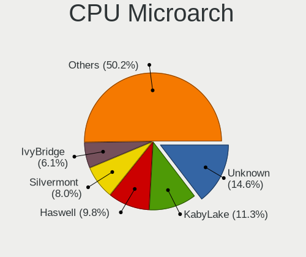

| Name          | Computers | Percent |
|---------------|-----------|---------|
| Haswell       | 52        | 12.75%  |
| Silvermont    | 40        | 9.8%    |
| KabyLake      | 37        | 9.07%   |
| IvyBridge     | 29        | 7.11%   |
| SandyBridge   | 27        | 6.62%   |
| Unknown       | 26        | 6.37%   |
| Goldmont plus | 23        | 5.64%   |
| Skylake       | 20        | 4.9%    |
| Penryn        | 19        | 4.66%   |
| Zen 2         | 13        | 3.19%   |
| Broadwell     | 12        | 2.94%   |
| Jaguar        | 11        | 2.7%    |
| Westmere      | 10        | 2.45%   |
| Nehalem       | 10        | 2.45%   |
| Goldmont      | 10        | 2.45%   |
| Puma          | 9         | 2.21%   |
| Zen           | 8         | 1.96%   |
| Zen 3         | 7         | 1.72%   |
| Bonnell       | 6         | 1.47%   |
| Piledriver    | 5         | 1.23%   |
| Bobcat        | 5         | 1.23%   |
| Zen+          | 4         | 0.98%   |
| TigerLake     | 4         | 0.98%   |
| Steamroller   | 4         | 0.98%   |
| Core          | 4         | 0.98%   |
| K10           | 3         | 0.74%   |
| Excavator     | 3         | 0.74%   |
| IceLake       | 2         | 0.49%   |
| CometLake     | 2         | 0.49%   |
| K8 Hammer     | 1         | 0.25%   |
| K10 Llano     | 1         | 0.25%   |
| Bulldozer     | 1         | 0.25%   |

Graphics
--------

GPU Vendor
----------

Vendors of graphics cards

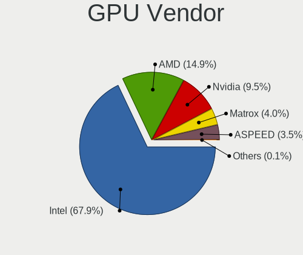

| Vendor                     | Computers | Percent |
|----------------------------|-----------|---------|
| Intel                      | 257       | 64.74%  |
| AMD                        | 61        | 15.37%  |
| Nvidia                     | 50        | 12.59%  |
| Matrox Electronics Systems | 20        | 5.04%   |
| ASPEED Technology          | 9         | 2.27%   |

GPU Model
---------

Graphics card models

| Model                                                                                    | Computers | Percent |
|------------------------------------------------------------------------------------------|-----------|---------|
| Intel Atom Processor Z36xxx/Z37xxx Series Graphics & Display                             | 24        | 5.88%   |
| Intel 2nd Generation Core Processor Family Integrated Graphics Controller                | 22        | 5.39%   |
| Intel Xeon E3-1200 v3/4th Gen Core Processor Integrated Graphics Controller              | 20        | 4.9%    |
| Intel GeminiLake [UHD Graphics 600]                                                      | 15        | 3.68%   |
| Intel Haswell-ULT Integrated Graphics Controller                                         | 14        | 3.43%   |
| Intel Atom/Celeron/Pentium Processor x5-E8000/J3xxx/N3xxx Integrated Graphics Controller | 13        | 3.19%   |
| Matrox Electronics Systems MGA G200eW WPCM450                                            | 11        | 2.7%    |
| Intel HD Graphics 500                                                                    | 9         | 2.21%   |
| ASPEED Technology ASPEED Graphics Family                                                 | 9         | 2.21%   |
| Intel Xeon E3-1200 v2/3rd Gen Core processor Graphics Controller                         | 8         | 1.96%   |
| Intel GeminiLake [UHD Graphics 605]                                                      | 8         | 1.96%   |
| Intel 4th Generation Core Processor Family Integrated Graphics Controller                | 8         | 1.96%   |
| Intel Skylake GT2 [HD Graphics 520]                                                      | 7         | 1.72%   |
| Intel HD Graphics 620                                                                    | 7         | 1.72%   |
| Intel CoffeeLake-S GT2 [UHD Graphics 630]                                                | 7         | 1.72%   |
| Intel JasperLake [UHD Graphics]                                                          | 6         | 1.47%   |
| Intel HD Graphics 5500                                                                   | 6         | 1.47%   |
| Intel 3rd Gen Core processor Graphics Controller                                         | 6         | 1.47%   |
| Matrox Electronics Systems MGA G200EH                                                    | 5         | 1.23%   |
| Intel TigerLake-LP GT2 [Iris Xe Graphics]                                                | 5         | 1.23%   |
| Intel Mobile 4 Series Chipset Integrated Graphics Controller                             | 5         | 1.23%   |
| Intel HD Graphics 610                                                                    | 5         | 1.23%   |
| Intel HD Graphics 530                                                                    | 5         | 1.23%   |
| Intel 4 Series Chipset Integrated Graphics Controller                                    | 5         | 1.23%   |
| Nvidia GK208B [GeForce GT 710]                                                           | 4         | 0.98%   |
| Intel Xeon E3-1200 v3 Processor Integrated Graphics Controller                           | 4         | 0.98%   |
| Intel UHD Graphics 620                                                                   | 4         | 0.98%   |
| Intel IvyBridge GT2 [HD Graphics 4000]                                                   | 4         | 0.98%   |
| Intel HD Graphics 6000                                                                   | 4         | 0.98%   |
| Intel Core Processor Integrated Graphics Controller                                      | 4         | 0.98%   |
| AMD Kaveri [Radeon R7 Graphics]                                                          | 4         | 0.98%   |
| Nvidia C79 [GeForce 9400M]                                                               | 3         | 0.74%   |
| Intel WhiskeyLake-U GT2 [UHD Graphics 620]                                               | 3         | 0.74%   |
| Intel Mobile 945GM/GMS/GME, 943/940GML Express Integrated Graphics Controller            | 3         | 0.74%   |
| Intel CometLake-U GT2 [UHD Graphics]                                                     | 3         | 0.74%   |
| AMD Thames [Radeon HD 7550M/7570M/7650M]                                                 | 3         | 0.74%   |
| AMD Renoir                                                                               | 3         | 0.74%   |
| AMD Raven Ridge [Radeon Vega Series / Radeon Vega Mobile Series]                         | 3         | 0.74%   |
| AMD Lexa PRO [Radeon 540/540X/550/550X / RX 540X/550/550X]                               | 3         | 0.74%   |
| AMD Kabini [Radeon HD 8400E]                                                             | 3         | 0.74%   |

GPU Combo
---------

Combinations of graphics cards

| Name           | Computers | Percent |
|----------------|-----------|---------|
| 1 x Intel      | 231       | 56.48%  |
| 1 x AMD        | 56        | 13.69%  |
| 1 x Nvidia     | 39        | 9.54%   |
| Other          | 27        | 6.6%    |
| 1 x Matrox     | 20        | 4.89%   |
| 2 x Intel      | 12        | 2.93%   |
| Intel + Nvidia | 9         | 2.2%    |
| 1 x ASPEED     | 8         | 1.96%   |
| Intel + AMD    | 4         | 0.98%   |
| 2 x Nvidia     | 2         | 0.49%   |
| Intel + ASPEED | 1         | 0.24%   |

GPU Driver
----------

Free vs proprietary

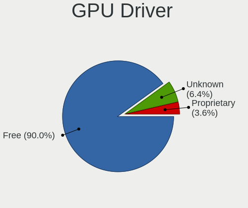

| Driver      | Computers | Percent |
|-------------|-----------|---------|
| Free        | 353       | 86.31%  |
| Unknown     | 35        | 8.56%   |
| Proprietary | 21        | 5.13%   |

GPU Memory
----------

Total video memory

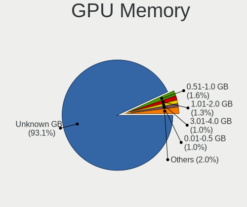

| Size in GB | Computers | Percent |
|------------|-----------|---------|
| Unknown    | 374       | 91%     |
| 0.51-1.0   | 9         | 2.19%   |
| 1.01-2.0   | 8         | 1.95%   |
| 3.01-4.0   | 6         | 1.46%   |
| 7.01-8.0   | 5         | 1.22%   |
| 0.01-0.5   | 5         | 1.22%   |
| 5.01-6.0   | 2         | 0.49%   |
| 8.01-16.0  | 2         | 0.49%   |

Monitor
-------

Monitor Vendor
--------------

Monitor vendors

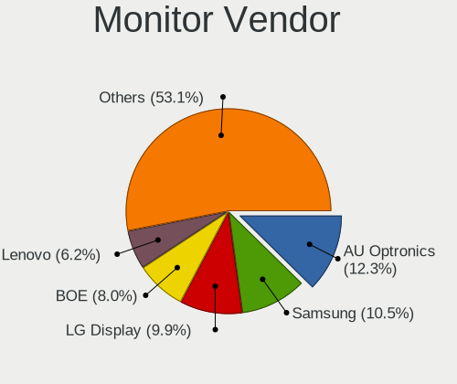

| Vendor                  | Computers | Percent |
|-------------------------|-----------|---------|
| Samsung Electronics     | 13        | 11.5%   |
| AU Optronics            | 13        | 11.5%   |
| LG Display              | 11        | 9.73%   |
| Dell                    | 9         | 7.96%   |
| Lenovo                  | 6         | 5.31%   |
| Hewlett-Packard         | 6         | 5.31%   |
| Chimei Innolux          | 6         | 5.31%   |
| BenQ                    | 6         | 5.31%   |
| AOC                     | 5         | 4.42%   |
| Philips                 | 4         | 3.54%   |
| BOE                     | 4         | 3.54%   |
| Sharp                   | 3         | 2.65%   |
| Iiyama                  | 3         | 2.65%   |
| Acer                    | 3         | 2.65%   |
| Pixio                   | 2         | 1.77%   |
| LG Philips              | 2         | 1.77%   |
| HannStar                | 2         | 1.77%   |
| Apple                   | 2         | 1.77%   |
| Vestel Elektronik       | 1         | 0.88%   |
| unknown                 | 1         | 0.88%   |
| Sony                    | 1         | 0.88%   |
| SDC                     | 1         | 0.88%   |
| RS                      | 1         | 0.88%   |
| PANDA                   | 1         | 0.88%   |
| OEM                     | 1         | 0.88%   |
| InnoLux Display         | 1         | 0.88%   |
| Goldstar                | 1         | 0.88%   |
| CPT                     | 1         | 0.88%   |
| Chi Mei Optoelectronics | 1         | 0.88%   |
| AVX                     | 1         | 0.88%   |
| Unknown                 | 1         | 0.88%   |

Monitor Model
-------------

Monitor models

| Model                                                                 | Computers | Percent |
|-----------------------------------------------------------------------|-----------|---------|
| Philips 271P4 PHL08C3 1920x1080 600x340mm 27.2-inch                   | 3         | 2.52%   |
| LG Display LCD Monitor LGD0258 1600x900 350x190mm 15.7-inch           | 3         | 2.52%   |
| BenQ GL2450 BNQ78A4 1920x1080 530x300mm 24.0-inch                     | 3         | 2.52%   |
| AU Optronics LCD Monitor AUO106C 1366x768 280x160mm 12.7-inch         | 3         | 2.52%   |
| Sharp LCD Monitor SHP1421 3200x1800 290x170mm 13.2-inch               | 2         | 1.68%   |
| Hewlett-Packard ZR24w HWP286A 1920x1200 540x350mm 25.3-inch           | 2         | 1.68%   |
| AU Optronics LCD Monitor AUO492D 1920x1080 290x170mm 13.2-inch        | 2         | 1.68%   |
| Vestel Elektronik 32W_LCD_TV VES3700 1920x1080 710x400mm 32.1-inch    | 1         | 0.84%   |
| unknown LCD Monitor SAMSUNG 1920x1080                                 | 1         | 0.84%   |
| Sony SDM-HS95P SNY2500 1280x1024 380x300mm 19.1-inch                  | 1         | 0.84%   |
| Sharp LQ140Z1JW01 SHP1401 3200x1800 310x170mm 13.9-inch               | 1         | 0.84%   |
| SDC LCD Monitor 3520x1080                                             | 1         | 0.84%   |
| Samsung Electronics U28D590 SAM0B80 3840x2160 610x350mm 27.7-inch     | 1         | 0.84%   |
| Samsung Electronics T24D390 SAM0B6E 1920x1080 520x290mm 23.4-inch     | 1         | 0.84%   |
| Samsung Electronics SyncMaster SAM030D 1680x1050 470x300mm 22.0-inch  | 1         | 0.84%   |
| Samsung Electronics SyncMaster SAM011F 1280x1024 380x300mm 19.1-inch  | 1         | 0.84%   |
| Samsung Electronics S27F350 SAM0D22 1920x1080 600x340mm 27.2-inch     | 1         | 0.84%   |
| Samsung Electronics S24F350 SAM0D20 1920x1080 520x290mm 23.4-inch     | 1         | 0.84%   |
| Samsung Electronics S24C550 SAM0A4B 1920x1080 520x290mm 23.4-inch     | 1         | 0.84%   |
| Samsung Electronics LCD Monitor SEC5448 1920x1080 410x230mm 18.5-inch | 1         | 0.84%   |
| Samsung Electronics LCD Monitor SEC5441 1366x768 340x190mm 15.3-inch  | 1         | 0.84%   |
| Samsung Electronics LCD Monitor SEC384A 1366x768 340x190mm 15.3-inch  | 1         | 0.84%   |
| Samsung Electronics LCD Monitor SDC834D 1920x1080 290x160mm 13.0-inch | 1         | 0.84%   |
| Samsung Electronics LCD Monitor SDC4141 1366x768 340x190mm 15.3-inch  | 1         | 0.84%   |
| Samsung Electronics LCD Monitor SDC3754 1600x900 380x210mm 17.1-inch  | 1         | 0.84%   |
| RS LE2262 BTC2262 1680x1050 470x290mm 21.7-inch                       | 1         | 0.84%   |
| Pixio PX7 Prime HYC2700 2560x1440 600x340mm 27.2-inch                 | 1         | 0.84%   |
| Pixio PX247 PNS0247 1920x1080 520x310mm 23.8-inch                     | 1         | 0.84%   |
| Philips LCD Monitor 271P4 3520x1080                                   | 1         | 0.84%   |
| Philips LCD Monitor 271P4                                             | 1         | 0.84%   |
| PANDA LCD Monitor NCP004F 1920x1080 310x170mm 13.9-inch               | 1         | 0.84%   |
| OEM 32W_LCD_TV OEM3700 1920x540                                       | 1         | 0.84%   |
| LG Philips LCD Monitor LPLE300 1280x800 330x210mm 15.4-inch           | 1         | 0.84%   |
| LG Philips LCD Monitor LPL1279 1680x1050 330x210mm 15.4-inch          | 1         | 0.84%   |
| LG Display LCD Monitor LGD6E01 1366x768 340x190mm 15.3-inch           | 1         | 0.84%   |
| LG Display LCD Monitor LGD052D 1920x1080 290x170mm 13.2-inch          | 1         | 0.84%   |
| LG Display LCD Monitor LGD0508 1366x768 310x170mm 13.9-inch           | 1         | 0.84%   |
| LG Display LCD Monitor LGD0459 1920x1080 380x210mm 17.1-inch          | 1         | 0.84%   |
| LG Display LCD Monitor LGD0419 2560x1440 310x170mm 13.9-inch          | 1         | 0.84%   |
| LG Display LCD Monitor LGD02DF 1600x900 310x170mm 13.9-inch           | 1         | 0.84%   |

Monitor Resolution
------------------

Monitor screen resolution

| Resolution         | Computers | Percent |
|--------------------|-----------|---------|
| 1920x1080 (FHD)    | 44        | 38.94%  |
| 1366x768 (WXGA)    | 17        | 15.04%  |
| 1600x900 (HD+)     | 7         | 6.19%   |
| 1280x800 (WXGA)    | 7         | 6.19%   |
| 1920x1200 (WUXGA)  | 5         | 4.42%   |
| 1680x1050 (WSXGA+) | 4         | 3.54%   |
| 3840x2160 (4K)     | 3         | 2.65%   |
| 3200x1800 (QHD+)   | 3         | 2.65%   |
| 2560x1440 (QHD)    | 3         | 2.65%   |
| 1440x900 (WXGA+)   | 3         | 2.65%   |
| 1280x1024 (SXGA)   | 3         | 2.65%   |
| 1024x600           | 3         | 2.65%   |
| Unknown            | 3         | 2.65%   |
| 1920x540           | 2         | 1.77%   |
| 5760x1200          | 1         | 0.88%   |
| 3840x1080          | 1         | 0.88%   |
| 3520x1080          | 1         | 0.88%   |
| 3440x1440          | 1         | 0.88%   |
| 3200x1080          | 1         | 0.88%   |
| 2880x1800          | 1         | 0.88%   |

Monitor Diagonal
----------------

Diagonal size in inches

| Inches  | Computers | Percent |
|---------|-----------|---------|
| 15      | 20        | 17.7%   |
| 13      | 19        | 16.81%  |
| 27      | 10        | 8.85%   |
| Unknown | 9         | 7.96%   |
| 24      | 8         | 7.08%   |
| 23      | 8         | 7.08%   |
| 19      | 7         | 6.19%   |
| 12      | 6         | 5.31%   |
| 22      | 4         | 3.54%   |
| 21      | 4         | 3.54%   |
| 17      | 4         | 3.54%   |
| 25      | 2         | 1.77%   |
| 11      | 2         | 1.77%   |
| 10      | 2         | 1.77%   |
| 49      | 1         | 0.88%   |
| 42      | 1         | 0.88%   |
| 39      | 1         | 0.88%   |
| 34      | 1         | 0.88%   |
| 31      | 1         | 0.88%   |
| 18      | 1         | 0.88%   |
| 14      | 1         | 0.88%   |
| 9       | 1         | 0.88%   |

Monitor Width
-------------

Physical width

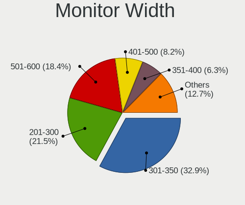

| Width in mm | Computers | Percent |
|-------------|-----------|---------|
| 301-350     | 29        | 26.36%  |
| 501-600     | 26        | 23.64%  |
| 201-300     | 22        | 20%     |
| 401-500     | 10        | 9.09%   |
| Unknown     | 9         | 8.18%   |
| 351-400     | 8         | 7.27%   |
| 601-700     | 2         | 1.82%   |
| 801-900     | 1         | 0.91%   |
| 701-800     | 1         | 0.91%   |
| 1001-1500   | 1         | 0.91%   |
| 901-1000    | 1         | 0.91%   |

Aspect Ratio
------------

Proportional relationship between the width and the height

| Ratio   | Computers | Percent |
|---------|-----------|---------|
| 16/9    | 70        | 66.04%  |
| 16/10   | 18        | 16.98%  |
| Unknown | 8         | 7.55%   |
| 5/4     | 4         | 3.77%   |
| 3/2     | 3         | 2.83%   |
| 32/9    | 2         | 1.89%   |
| 21/9    | 1         | 0.94%   |

Monitor Area
------------

Area in inch

| Area in inch | Computers | Percent |
|----------------|-----------|---------|
| 201-250        | 20        | 18.18%  |
| 81-90          | 12        | 10.91%  |
| 301-350        | 10        | 9.09%   |
| 101-110        | 10        | 9.09%   |
| 91-100         | 10        | 9.09%   |
| Unknown        | 9         | 8.18%   |
| 71-80          | 8         | 7.27%   |
| 151-200        | 7         | 6.36%   |
| 61-70          | 6         | 5.45%   |
| 121-130        | 4         | 3.64%   |
| 41-50          | 3         | 2.73%   |
| 251-300        | 3         | 2.73%   |
| 501-1000       | 3         | 2.73%   |
| 51-60          | 2         | 1.82%   |
| 351-500        | 2         | 1.82%   |
| 141-150        | 1         | 0.91%   |

Pixel Density
-------------

Pixels per inch

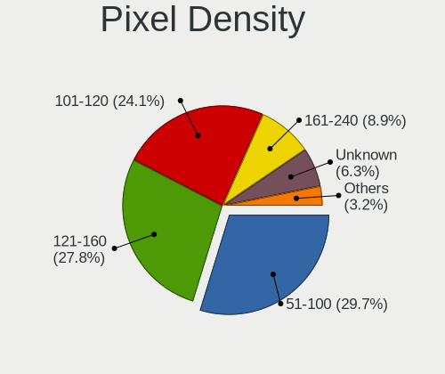

| Density       | Computers | Percent |
|---------------|-----------|---------|
| 51-100        | 41        | 37.27%  |
| 101-120       | 27        | 24.55%  |
| 121-160       | 21        | 19.09%  |
| 161-240       | 9         | 8.18%   |
| Unknown       | 9         | 8.18%   |
| More than 240 | 3         | 2.73%   |

Multiple Monitors
-----------------

Total monitors connected

| Total | Computers | Percent |
|-------|-----------|---------|
| 0     | 290       | 70.39%  |
| 1     | 111       | 26.94%  |
| 2     | 10        | 2.43%   |
| 3     | 1         | 0.24%   |

Network
-------

Net Controller Vendor
---------------------

Controller vendors

| Vendor                            | Computers | Percent |
|-----------------------------------|-----------|---------|
| Intel                             | 290       | 51.97%  |
| Realtek Semiconductor             | 138       | 24.73%  |
| Broadcom                          | 44        | 7.89%   |
| Qualcomm Atheros                  | 30        | 5.38%   |
| Marvell Technology Group          | 7         | 1.25%   |
| Ralink Technology                 | 6         | 1.08%   |
| Nvidia                            | 6         | 1.08%   |
| IMC Networks                      | 5         | 0.9%    |
| Hewlett-Packard                   | 3         | 0.54%   |
| Ericsson Business Mobile Networks | 3         | 0.54%   |
| D-Link System                     | 3         | 0.54%   |
| AMD                               | 3         | 0.54%   |
| Sierra Wireless                   | 2         | 0.36%   |
| Ralink                            | 2         | 0.36%   |
| Mellanox Technologies             | 2         | 0.36%   |
| Edimax Technology                 | 2         | 0.36%   |
| Dell                              | 2         | 0.36%   |
| ZTE WCDMA Technologies MSM        | 1         | 0.18%   |
| Xiaomi                            | 1         | 0.18%   |
| U-Blox                            | 1         | 0.18%   |
| TP-Link                           | 1         | 0.18%   |
| QLogic                            | 1         | 0.18%   |
| Napatech A/S                      | 1         | 0.18%   |
| Bluegiga Technologies             | 1         | 0.18%   |
| Belkin Components                 | 1         | 0.18%   |
| ASUSTek Computer                  | 1         | 0.18%   |
| American Megatrends               | 1         | 0.18%   |

Net Controller Model
--------------------

Controller models

| Model                                                                         | Computers | Percent |
|-------------------------------------------------------------------------------|-----------|---------|
| Realtek RTL8111/8168/8411 PCI Express Gigabit Ethernet Controller             | 114       | 16.55%  |
| Intel I211 Gigabit Network Connection                                         | 55        | 7.98%   |
| Intel I210 Gigabit Network Connection                                         | 25        | 3.63%   |
| Intel 82579LM Gigabit Network Connection (Lewisville)                         | 24        | 3.48%   |
| Intel 82571EB/82571GB Gigabit Ethernet Controller (Copper)                    | 18        | 2.61%   |
| Intel I350 Gigabit Network Connection                                         | 16        | 2.32%   |
| Intel 82574L Gigabit Network Connection                                       | 14        | 2.03%   |
| Intel Wireless 7260                                                           | 13        | 1.89%   |
| Intel 82580 Gigabit Network Connection                                        | 13        | 1.89%   |
| Intel Centrino Advanced-N 6205 [Taylor Peak]                                  | 12        | 1.74%   |
| Intel Ethernet Connection I217-LM                                             | 11        | 1.6%    |
| Realtek RTL8125 2.5GbE Controller                                             | 10        | 1.45%   |
| Intel 82576 Gigabit Network Connection                                        | 10        | 1.45%   |
| Intel Ethernet Controller I225-V                                              | 9         | 1.31%   |
| Intel 82571EB/82571GB Gigabit Ethernet Controller D0/D1 (copper applications) | 9         | 1.31%   |
| Intel Wireless 8260                                                           | 8         | 1.16%   |
| Intel Wi-Fi 6 AX200                                                           | 8         | 1.16%   |
| Realtek RTL810xE PCI Express Fast Ethernet controller                         | 7         | 1.02%   |
| Intel Ethernet Controller I226-V                                              | 7         | 1.02%   |
| Intel 82583V Gigabit Network Connection                                       | 7         | 1.02%   |
| Broadcom NetXtreme BCM5720 Gigabit Ethernet PCIe                              | 7         | 1.02%   |
| Qualcomm Atheros AR93xx Wireless Network Adapter                              | 6         | 0.87%   |
| Intel Wireless 3165                                                           | 6         | 0.87%   |
| Intel Ethernet Connection I219-LM                                             | 6         | 0.87%   |
| Broadcom NetXtreme II BCM5716 Gigabit Ethernet                                | 6         | 0.87%   |
| Broadcom NetXtreme II BCM5709 Gigabit Ethernet                                | 6         | 0.87%   |
| Qualcomm Atheros AR9462 Wireless Network Adapter                              | 5         | 0.73%   |
| Intel Wireless 8265 / 8275                                                    | 5         | 0.73%   |
| Intel Ethernet Connection (2) I219-V                                          | 5         | 0.73%   |
| Intel Centrino Ultimate-N 6300                                                | 5         | 0.73%   |
| Intel 82599ES 10-Gigabit SFI/SFP+ Network Connection                          | 5         | 0.73%   |
| Intel 82579V Gigabit Network Connection                                       | 5         | 0.73%   |
| IMC Networks 802.11 n/g/b Wireless LAN USB Mini-Card                          | 5         | 0.73%   |
| Qualcomm Atheros QCA9377 802.11ac Wireless Network Adapter                    | 4         | 0.58%   |
| Nvidia MCP79 Ethernet                                                         | 4         | 0.58%   |
| Intel Wireless 3160                                                           | 4         | 0.58%   |
| Intel Wi-Fi 6 AX201                                                           | 4         | 0.58%   |
| Intel Ethernet Connection I218-LM                                             | 4         | 0.58%   |
| Intel Ethernet Connection (7) I219-LM                                         | 4         | 0.58%   |
| Intel Ethernet Connection (2) I219-LM                                         | 4         | 0.58%   |

Wireless Vendor
---------------

Wireless vendors

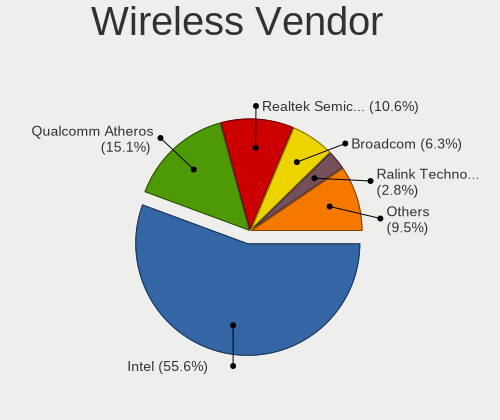

| Vendor                | Computers | Percent |
|-----------------------|-----------|---------|
| Intel                 | 96        | 55.49%  |
| Qualcomm Atheros      | 27        | 15.61%  |
| Realtek Semiconductor | 17        | 9.83%   |
| Broadcom              | 11        | 6.36%   |
| Ralink Technology     | 6         | 3.47%   |
| IMC Networks          | 5         | 2.89%   |
| D-Link System         | 3         | 1.73%   |
| Ralink                | 2         | 1.16%   |
| Edimax Technology     | 2         | 1.16%   |
| TP-Link               | 1         | 0.58%   |
| Sierra Wireless       | 1         | 0.58%   |
| Belkin Components     | 1         | 0.58%   |
| ASUSTek Computer      | 1         | 0.58%   |

Wireless Model
--------------

Wireless models

| Model                                                                      | Computers | Percent |
|----------------------------------------------------------------------------|-----------|---------|
| Intel Wireless 7260                                                        | 13        | 7.43%   |
| Intel Centrino Advanced-N 6205 [Taylor Peak]                               | 12        | 6.86%   |
| Intel Wireless 8260                                                        | 8         | 4.57%   |
| Intel Wi-Fi 6 AX200                                                        | 8         | 4.57%   |
| Qualcomm Atheros AR93xx Wireless Network Adapter                           | 6         | 3.43%   |
| Intel Wireless 3165                                                        | 6         | 3.43%   |
| Qualcomm Atheros AR9462 Wireless Network Adapter                           | 5         | 2.86%   |
| Intel Wireless 8265 / 8275                                                 | 5         | 2.86%   |
| IMC Networks 802.11 n/g/b Wireless LAN USB Mini-Card                       | 5         | 2.86%   |
| Qualcomm Atheros QCA9377 802.11ac Wireless Network Adapter                 | 4         | 2.29%   |
| Intel Wireless 3160                                                        | 4         | 2.29%   |
| Intel Wi-Fi 6 AX201                                                        | 4         | 2.29%   |
| Intel Centrino Ultimate-N 6300                                             | 4         | 2.29%   |
| Intel Centrino Advanced-N 6200                                             | 4         | 2.29%   |
| Broadcom BCM4322 802.11a/b/g/n Wireless LAN Controller                     | 4         | 2.29%   |
| Realtek RTL8821CE 802.11ac PCIe Wireless Network Adapter                   | 3         | 1.71%   |
| Ralink RT5370 Wireless Adapter                                             | 3         | 1.71%   |
| Qualcomm Atheros AR242x / AR542x Wireless Network Adapter (PCI-Express)    | 3         | 1.71%   |
| Intel Wireless 7265                                                        | 3         | 1.71%   |
| Intel WiFi Link 5100                                                       | 3         | 1.71%   |
| Intel Centrino Advanced-N 6235                                             | 3         | 1.71%   |
| D-Link System AirPlus G DWL-G122 Wireless Adapter(rev.C1) [Ralink RT2571W] | 3         | 1.71%   |
| Realtek RTL8822CE 802.11ac PCIe Wireless Network Adapter                   | 2         | 1.14%   |
| Realtek RTL8723BE PCIe Wireless Network Adapter                            | 2         | 1.14%   |
| Realtek RTL8188CE 802.11b/g/n WiFi Adapter                                 | 2         | 1.14%   |
| Qualcomm Atheros AR9485 Wireless Network Adapter                           | 2         | 1.14%   |
| Qualcomm Atheros AR9287 Wireless Network Adapter (PCI-Express)             | 2         | 1.14%   |
| Qualcomm Atheros AR9285 Wireless Network Adapter (PCI-Express)             | 2         | 1.14%   |
| Intel Wireless-AC 9260                                                     | 2         | 1.14%   |
| Intel Wi-Fi 6 AX201 160MHz                                                 | 2         | 1.14%   |
| Intel PRO/Wireless 3945ABG [Golan] Network Connection                      | 2         | 1.14%   |
| Intel Gemini Lake PCH CNVi WiFi                                            | 2         | 1.14%   |
| Intel Dual Band Wireless-AC 3168NGW [Stone Peak]                           | 2         | 1.14%   |
| Intel Comet Lake PCH-LP CNVi WiFi                                          | 2         | 1.14%   |
| Intel Alder Lake-P PCH CNVi WiFi                                           | 2         | 1.14%   |
| Broadcom BCM4360 802.11ac Wireless Network Adapter                         | 2         | 1.14%   |
| Broadcom BCM4331 802.11a/b/g/n                                             | 2         | 1.14%   |
| TP-Link AC600 wireless Realtek RTL8811AU [Archer T2U Nano]                 | 1         | 0.57%   |
| Sierra Wireless EM7345 4G LTE                                              | 1         | 0.57%   |
| Realtek RTL8852AE 802.11ax PCIe Wireless Network Adapter                   | 1         | 0.57%   |

Ethernet Vendor
---------------

Ethernet vendors

| Vendor                   | Computers | Percent |
|--------------------------|-----------|---------|
| Intel                    | 253       | 57.37%  |
| Realtek Semiconductor    | 128       | 29.02%  |
| Broadcom                 | 37        | 8.39%   |
| Marvell Technology Group | 7         | 1.59%   |
| Nvidia                   | 6         | 1.36%   |
| Qualcomm Atheros         | 4         | 0.91%   |
| AMD                      | 3         | 0.68%   |
| Xiaomi                   | 1         | 0.23%   |
| QLogic                   | 1         | 0.23%   |
| American Megatrends      | 1         | 0.23%   |

Ethernet Model
--------------

Ethernet models

| Model                                                                         | Computers | Percent |
|-------------------------------------------------------------------------------|-----------|---------|
| Realtek RTL8111/8168/8411 PCI Express Gigabit Ethernet Controller             | 114       | 22.98%  |
| Intel I211 Gigabit Network Connection                                         | 55        | 11.09%  |
| Intel I210 Gigabit Network Connection                                         | 25        | 5.04%   |
| Intel 82579LM Gigabit Network Connection (Lewisville)                         | 24        | 4.84%   |
| Intel 82571EB/82571GB Gigabit Ethernet Controller (Copper)                    | 18        | 3.63%   |
| Intel I350 Gigabit Network Connection                                         | 16        | 3.23%   |
| Intel 82574L Gigabit Network Connection                                       | 14        | 2.82%   |
| Intel 82580 Gigabit Network Connection                                        | 13        | 2.62%   |
| Intel Ethernet Connection I217-LM                                             | 11        | 2.22%   |
| Realtek RTL8125 2.5GbE Controller                                             | 10        | 2.02%   |
| Intel 82576 Gigabit Network Connection                                        | 10        | 2.02%   |
| Intel Ethernet Controller I225-V                                              | 9         | 1.81%   |
| Intel 82571EB/82571GB Gigabit Ethernet Controller D0/D1 (copper applications) | 9         | 1.81%   |
| Realtek RTL810xE PCI Express Fast Ethernet controller                         | 7         | 1.41%   |
| Intel Ethernet Controller I226-V                                              | 7         | 1.41%   |
| Intel 82583V Gigabit Network Connection                                       | 7         | 1.41%   |
| Broadcom NetXtreme BCM5720 Gigabit Ethernet PCIe                              | 7         | 1.41%   |
| Intel Ethernet Connection I219-LM                                             | 6         | 1.21%   |
| Broadcom NetXtreme II BCM5716 Gigabit Ethernet                                | 6         | 1.21%   |
| Broadcom NetXtreme II BCM5709 Gigabit Ethernet                                | 6         | 1.21%   |
| Intel Ethernet Connection (2) I219-V                                          | 5         | 1.01%   |
| Intel 82599ES 10-Gigabit SFI/SFP+ Network Connection                          | 5         | 1.01%   |
| Intel 82579V Gigabit Network Connection                                       | 5         | 1.01%   |
| Nvidia MCP79 Ethernet                                                         | 4         | 0.81%   |
| Intel Ethernet Connection I218-LM                                             | 4         | 0.81%   |
| Intel Ethernet Connection (7) I219-LM                                         | 4         | 0.81%   |
| Intel Ethernet Connection (2) I219-LM                                         | 4         | 0.81%   |
| Marvell Group 88E8040 PCI-E Fast Ethernet Controller                          | 3         | 0.6%    |
| Intel NM10/ICH7 Family LAN Controller                                         | 3         | 0.6%    |
| Intel Ethernet Controller X550                                                | 3         | 0.6%    |
| Intel 82577LM Gigabit Network Connection                                      | 3         | 0.6%    |
| Intel 82575EB Gigabit Network Connection                                      | 3         | 0.6%    |
| Intel 82567LM-3 Gigabit Network Connection                                    | 3         | 0.6%    |
| Broadcom NetXtreme BCM57765 Gigabit Ethernet PCIe                             | 3         | 0.6%    |
| Broadcom NetXtreme BCM57762 Gigabit Ethernet PCIe                             | 3         | 0.6%    |
| Broadcom NetXtreme BCM5719 Gigabit Ethernet PCIe                              | 3         | 0.6%    |
| AMD Family 17h Processor 10 Gb Ethernet Controller Port 0                     | 3         | 0.6%    |
| Qualcomm Atheros AR8151 v2.0 Gigabit Ethernet                                 | 2         | 0.4%    |
| Intel Ethernet Connection I354                                                | 2         | 0.4%    |
| Intel Ethernet Connection I217-V                                              | 2         | 0.4%    |

Net Controller Kind
-------------------

Ethernet, WiFi or modem

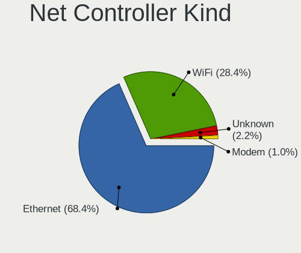

| Kind     | Computers | Percent |
|----------|-----------|---------|
| Ethernet | 379       | 67.56%  |
| WiFi     | 164       | 29.23%  |
| Unknown  | 11        | 1.96%   |
| Modem    | 7         | 1.25%   |

Used Controller
---------------

Currently used network controller

| Kind     | Computers | Percent |
|----------|-----------|---------|
| Ethernet | 353       | 80.23%  |
| WiFi     | 84        | 19.09%  |
| Modem    | 3         | 0.68%   |

NICs
----

Total network controllers on board

| Total | Computers | Percent |
|-------|-----------|---------|
| 2     | 140       | 33.98%  |
| 1     | 64        | 15.53%  |
| 4     | 59        | 14.32%  |
| 3     | 50        | 12.14%  |
| 5     | 43        | 10.44%  |
| 6     | 29        | 7.04%   |
| 0     | 9         | 2.18%   |
| 7     | 6         | 1.46%   |
| 8     | 4         | 0.97%   |
| 10    | 3         | 0.73%   |
| 9     | 2         | 0.49%   |
| 15    | 1         | 0.24%   |
| 14    | 1         | 0.24%   |
| 12    | 1         | 0.24%   |

IPv6
----

IPv6 vs IPv4

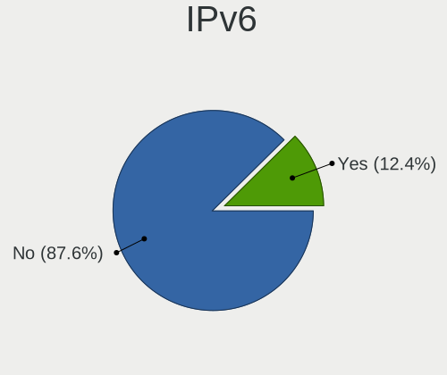

| Used | Computers | Percent |
|------|-----------|---------|
| No   | 372       | 88.36%  |
| Yes  | 49        | 11.64%  |

Bluetooth
---------

Bluetooth Vendor
----------------

Controller vendors

| Vendor                          | Computers | Percent |
|---------------------------------|-----------|---------|
| Intel                           | 56        | 53.85%  |
| Broadcom                        | 9         | 8.65%   |
| Apple                           | 9         | 8.65%   |
| Realtek Semiconductor           | 6         | 5.77%   |
| Cambridge Silicon Radio         | 6         | 5.77%   |
| Dell                            | 4         | 3.85%   |
| Qualcomm Atheros Communications | 3         | 2.88%   |
| Foxconn / Hon Hai               | 3         | 2.88%   |
| ASUSTek Computer                | 3         | 2.88%   |
| IMC Networks                    | 2         | 1.92%   |
| Skylight Digital                | 1         | 0.96%   |
| Lite-On Technology              | 1         | 0.96%   |
| Alps Electric                   | 1         | 0.96%   |

Bluetooth Model
---------------

Controller models

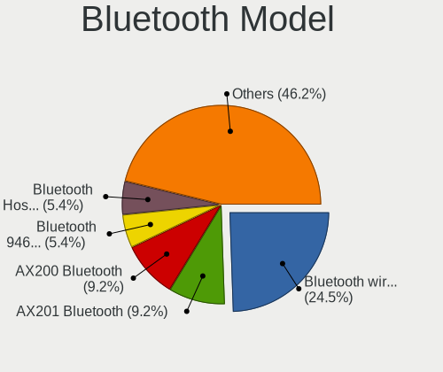

| Model                                                                               | Computers | Percent |
|-------------------------------------------------------------------------------------|-----------|---------|
| Intel Bluetooth wireless interface                                                  | 25        | 24.04%  |
| Intel AX201 Bluetooth                                                               | 8         | 7.69%   |
| Intel AX200 Bluetooth                                                               | 8         | 7.69%   |
| Apple Bluetooth Host Controller                                                     | 7         | 6.73%   |
| Cambridge Silicon Radio Bluetooth Dongle (HCI mode)                                 | 6         | 5.77%   |
| Intel Bluetooth 9460/9560 Jefferson Peak (JfP)                                      | 5         | 4.81%   |
| Intel Centrino Bluetooth Wireless Transceiver                                       | 4         | 3.85%   |
| Realtek Bluetooth Adapter                                                           | 3         | 2.88%   |
| Dell DW375 Bluetooth Module                                                         | 3         | 2.88%   |
| Qualcomm Atheros AR3012 Bluetooth 4.0                                               | 2         | 1.92%   |
| Intel Wireless-AC 9260 Bluetooth Adapter                                            | 2         | 1.92%   |
| Intel Wireless-AC 3168 Bluetooth                                                    | 2         | 1.92%   |
| Intel Wireless Bluetooth                                                            | 2         | 1.92%   |
| Foxconn / Hon Hai Bluetooth USB Module                                              | 2         | 1.92%   |
| Broadcom BCM20702 Bluetooth 4.0 [ThinkPad]                                          | 2         | 1.92%   |
| Broadcom BCM2045B (BDC-2.1)                                                         | 2         | 1.92%   |
| Skylight Digital Realtek Bluetooth Adapter                                          | 1         | 0.96%   |
| Realtek RTL8723B Bluetooth                                                          | 1         | 0.96%   |
| Realtek Bluetooth 5.1 Adapter                                                       | 1         | 0.96%   |
| Realtek Bluetooth 4.0 Adapter                                                       | 1         | 0.96%   |
| Qualcomm Atheros QCA9377 Bluetooth 4.1                                              | 1         | 0.96%   |
| Lite-On Bluetooth USB Module                                                        | 1         | 0.96%   |
| IMC Networks Realtek Bluetooth Adapter                                              | 1         | 0.96%   |
| IMC Networks Realtek Bluetooth 4.0 Adapter                                          | 1         | 0.96%   |
| Foxconn / Hon Hai Foxconn T77H114 BCM2070 [Single-Chip Bluetooth 2.1 + EDR Adapter] | 1         | 0.96%   |
| Dell Dell Wireless 380 Bluetooth 4.0 Module                                         | 1         | 0.96%   |
| Broadcom Bluetooth 2.1 Device                                                       | 1         | 0.96%   |
| Broadcom Bluetooth                                                                  | 1         | 0.96%   |
| Broadcom BCM20702A0 Bluetooth 4.0                                                   | 1         | 0.96%   |
| Broadcom BCM2045B (BDC-2.1) [Bluetooth Controller]                                  | 1         | 0.96%   |
| Broadcom BCM2045 Bluetooth                                                          | 1         | 0.96%   |
| ASUS Qualcomm Atheros AR9462 Bluetooth 4.0 + HS Adapter                             | 1         | 0.96%   |
| ASUS BT-253 Bluetooth Adapter                                                       | 1         | 0.96%   |
| ASUS Broadcom BCM20702A0 Bluetooth                                                  | 1         | 0.96%   |
| Apple Built-in Bluetooth 2.0+EDR HCI                                                | 1         | 0.96%   |
| Apple Bluetooth USB Host Controller                                                 | 1         | 0.96%   |
| Alps Electric UGTZ4 Bluetooth                                                       | 1         | 0.96%   |

Sound
-----

Sound Vendor
------------

Sound card vendors

| Vendor                               | Computers | Percent |
|--------------------------------------|-----------|---------|
| Intel                                | 253       | 65.37%  |
| AMD                                  | 73        | 18.86%  |
| Nvidia                               | 39        | 10.08%  |
| C-Media Electronics                  | 6         | 1.55%   |
| SteelSeries ApS                      | 3         | 0.78%   |
| Texas Instruments                    | 2         | 0.52%   |
| Creative Labs                        | 2         | 0.52%   |
| Thesycon Systemsoftware & Consulting | 1         | 0.26%   |
| Nam Tai E&E Products                 | 1         | 0.26%   |
| Logitech                             | 1         | 0.26%   |
| JMTek                                | 1         | 0.26%   |
| Griffin Technology                   | 1         | 0.26%   |
| GN Netcom                            | 1         | 0.26%   |
| Elgato Systems                       | 1         | 0.26%   |
| BEHRINGER International              | 1         | 0.26%   |
| Unknown                              | 1         | 0.26%   |

Sound Model
-----------

Sound card models

| Model                                                                                             | Computers | Percent |
|---------------------------------------------------------------------------------------------------|-----------|---------|
| Intel 6 Series/C200 Series Chipset Family High Definition Audio Controller                        | 28        | 5.96%   |
| Intel Xeon E3-1200 v3/4th Gen Core Processor HD Audio Controller                                  | 27        | 5.74%   |
| Intel Sunrise Point-LP HD Audio                                                                   | 21        | 4.47%   |
| Intel Celeron/Pentium Silver Processor High Definition Audio                                      | 21        | 4.47%   |
| Intel 8 Series/C220 Series Chipset High Definition Audio Controller                               | 19        | 4.04%   |
| Intel Atom Processor Z36xxx/Z37xxx Series High Definition Audio Controller                        | 17        | 3.62%   |
| Intel 7 Series/C216 Chipset Family High Definition Audio Controller                               | 17        | 3.62%   |
| AMD FCH Azalia Controller                                                                         | 15        | 3.19%   |
| AMD Family 17h/19h HD Audio Controller                                                            | 15        | 3.19%   |
| Intel Haswell-ULT HD Audio Controller                                                             | 14        | 2.98%   |
| Intel 8 Series HD Audio Controller                                                                | 14        | 2.98%   |
| AMD Starship/Matisse HD Audio Controller                                                          | 13        | 2.77%   |
| Intel Atom/Celeron/Pentium Processor x5-E8000/J3xxx/N3xxx Series High Definition Audio Controller | 12        | 2.55%   |
| Intel Broadwell-U Audio Controller                                                                | 11        | 2.34%   |
| AMD Kabini HDMI/DP Audio                                                                          | 10        | 2.13%   |
| Intel NM10/ICH7 Family High Definition Audio Controller                                           | 9         | 1.91%   |
| Intel 100 Series/C230 Series Chipset Family HD Audio Controller                                   | 9         | 1.91%   |
| AMD SBx00 Azalia (Intel HDA)                                                                      | 9         | 1.91%   |
| Intel Wildcat Point-LP High Definition Audio Controller                                           | 8         | 1.7%    |
| Intel Celeron N3350/Pentium N4200/Atom E3900 Series Audio Cluster                                 | 8         | 1.7%    |
| AMD Renoir Radeon High Definition Audio Controller                                                | 8         | 1.7%    |
| Intel Cannon Lake PCH cAVS                                                                        | 7         | 1.49%   |
| Intel Jasper Lake HD Audio                                                                        | 6         | 1.28%   |
| Intel 82801I (ICH9 Family) HD Audio Controller                                                    | 6         | 1.28%   |
| Nvidia High Definition Audio Controller                                                           | 5         | 1.06%   |
| Intel Tiger Lake-LP Smart Sound Technology Audio Controller                                       | 5         | 1.06%   |
| Intel 5 Series/3400 Series Chipset High Definition Audio                                          | 5         | 1.06%   |
| Nvidia MCP79 High Definition Audio                                                                | 4         | 0.85%   |
| Nvidia GK208 HDMI/DP Audio Controller                                                             | 4         | 0.85%   |
| Intel 82801JI (ICH10 Family) HD Audio Controller                                                  | 4         | 0.85%   |
| AMD Wrestler HDMI Audio                                                                           | 4         | 0.85%   |
| AMD Turks HDMI Audio [Radeon HD 6500/6600 / 6700M Series]                                         | 4         | 0.85%   |
| AMD Raven/Raven2/Fenghuang HDMI/DP Audio Controller                                               | 4         | 0.85%   |
| AMD Kaveri HDMI/DP Audio Controller                                                               | 4         | 0.85%   |
| AMD Ellesmere HDMI Audio [Radeon RX 470/480 / 570/580/590]                                        | 4         | 0.85%   |
| AMD Baffin HDMI/DP Audio [Radeon RX 550 640SP / RX 560/560X]                                      | 4         | 0.85%   |
| SteelSeries ApS SteelSeries Siberia 350                                                           | 3         | 0.64%   |
| Nvidia GK107 HDMI Audio Controller                                                                | 3         | 0.64%   |
| Nvidia GF108 High Definition Audio Controller                                                     | 3         | 0.64%   |
| Intel Cannon Point-LP High Definition Audio Controller                                            | 3         | 0.64%   |

Memory
------

Memory Vendor
-------------

Memory module vendors

| Vendor              | Computers | Percent |
|---------------------|-----------|---------|
| SK hynix            | 70        | 17.03%  |
| Samsung Electronics | 69        | 16.79%  |
| Unknown             | 43        | 10.46%  |
| Crucial             | 42        | 10.22%  |
| Kingston            | 40        | 9.73%   |
| Micron Technology   | 38        | 9.25%   |
| Corsair             | 32        | 7.79%   |
| Unknown (ABCD)      | 12        | 2.92%   |
| Transcend           | 8         | 1.95%   |
| A-DATA Technology   | 8         | 1.95%   |
| Unknown             | 8         | 1.95%   |
| Team                | 5         | 1.22%   |
| Ramaxel Technology  | 5         | 1.22%   |
| Nanya Technology    | 4         | 0.97%   |
| Elpida              | 4         | 0.97%   |
| Timetec             | 3         | 0.73%   |
| G.Skill             | 3         | 0.73%   |
| Toshiba             | 2         | 0.49%   |
| Hewlett-Packard     | 2         | 0.49%   |
| Unknown (AB)        | 1         | 0.24%   |
| Teikon              | 1         | 0.24%   |
| SK_Hynix            | 1         | 0.24%   |
| Kimtigo             | 1         | 0.24%   |
| Heoriady            | 1         | 0.24%   |
| GSkill              | 1         | 0.24%   |
| Essencore Limited   | 1         | 0.24%   |
| CSX                 | 1         | 0.24%   |
| Avant               | 1         | 0.24%   |
| Apacer              | 1         | 0.24%   |
| A-DA                | 1         | 0.24%   |
| A Force             | 1         | 0.24%   |
| 48spaces            | 1         | 0.24%   |

Memory Model
------------

Memory module models

| Model                                                            | Computers | Percent |
|------------------------------------------------------------------|-----------|---------|
| Unknown (ABCD) RAM 123456789012345678 2GB DIMM LPDDR4 2400MT/s   | 9         | 2.03%   |
| Unknown                                                          | 8         | 1.8%    |
| SK hynix RAM HMT451S6BFR8A-PB 4GB SODIMM DDR3 1600MT/s           | 6         | 1.35%   |
| Samsung RAM M471B5273DH0-CH9 4GB SODIMM DDR3 1334MT/s            | 6         | 1.35%   |
| Samsung RAM M471B1G73QH0-YK0 8GB SODIMM DDR3 1867MT/s            | 6         | 1.35%   |
| Corsair RAM CMK16GX4M2B3200C16 8GB DIMM DDR4 3200MT/s            | 5         | 1.13%   |
| Unknown RAM Module 8GB DIMM DDR3 1600MT/s                        | 4         | 0.9%    |
| Unknown RAM Module 4GB SODIMM DDR3 1333MT/s                      | 4         | 0.9%    |
| Unknown RAM Module 2GB SODIMM DDR2 667MT/s                       | 4         | 0.9%    |
| SK hynix RAM HMT41GS6BFR8A-PB 8GB SODIMM DDR3 1600MT/s           | 4         | 0.9%    |
| SK hynix RAM HMT351S6CFR8C-PB 4GB SODIMM DDR3 1600MT/s           | 4         | 0.9%    |
| SK hynix RAM HMA81GS6AFR8N-UH 8GB SODIMM DDR4 2400MT/s           | 4         | 0.9%    |
| Samsung RAM M471B5173DB0-YK0 4GB SODIMM DDR3 1600MT/s            | 4         | 0.9%    |
| Samsung RAM M471A1K43CB1-CTD 8GB SODIMM DDR4 2667MT/s            | 4         | 0.9%    |
| Unknown RAM Module 4GB DIMM DDR3 1600MT/s                        | 3         | 0.68%   |
| Unknown RAM Module 1GB DIMM SDRAM                                | 3         | 0.68%   |
| Unknown (ABCD) RAM 123456789012345678 4GB SODIMM LPDDR4 2133MT/s | 3         | 0.68%   |
| SK hynix RAM HMT451U6BFR8C-PB 4GB DIMM DDR3 1600MT/s             | 3         | 0.68%   |
| Samsung RAM M471B5273CH0-CH9 4GB SODIMM DDR3 1334MT/s            | 3         | 0.68%   |
| Samsung RAM M471A5244CB0-CTD 4GB SODIMM DDR4 2667MT/s            | 3         | 0.68%   |
| Micron RAM 8JTF51264AZ-1G6E1 4GB DIMM DDR3 1600MT/s              | 3         | 0.68%   |
| Micron RAM 8ATF1G64HZ-3G2R1 8GB SODIMM DDR4 3200MT/s             | 3         | 0.68%   |
| Kingston RAM 99U5469-045.A00LF 4GB DIMM DDR3 1600MT/s            | 3         | 0.68%   |
| Crucial RAM CT102464BF160B.C16 8GB SODIMM DDR3 1600MT/s          | 3         | 0.68%   |
| Corsair RAM CMX8GX3M2A1333C9 4GB DIMM DDR3 1333MT/s              | 3         | 0.68%   |
| Unknown RAM Module 8GB DIMM DDR3 1333MT/s                        | 2         | 0.45%   |
| Unknown RAM Module 4GB SODIMM DDR3 667MT/s                       | 2         | 0.45%   |
| Unknown RAM Module 4GB DIMM DDR3 1333MT/s                        | 2         | 0.45%   |
| Unknown RAM Module 2GB DIMM DDR3 1333MT/s                        | 2         | 0.45%   |
| Unknown RAM Module 2GB DIMM DDR2 800MT/s                         | 2         | 0.45%   |
| Transcend RAM TS1GLK72V6H 8GB DIMM DDR3 1600MT/s                 | 2         | 0.45%   |
| Transcend RAM TS1GLH64V6BL 8GB SODIMM DDR4 2667MT/s              | 2         | 0.45%   |
| Transcend RAM TS1GLH64V1H 8GB DIMM DDR4 2133MT/s                 | 2         | 0.45%   |
| Toshiba RAM KCDT82-MIE 4GB SODIMM DDR4 2400MT/s                  | 2         | 0.45%   |
| Timetec RAM UD3-1600 8GB DIMM DDR3 1600MT/s                      | 2         | 0.45%   |
| SK hynix RAM HMT451U7BFR8A-PB 4GB DIMM DDR3 1600MT/s             | 2         | 0.45%   |
| SK hynix RAM HMT451U6BFR8A-PB 4GB DIMM DDR3 1600MT/s             | 2         | 0.45%   |
| SK hynix RAM HMT451U6AFR8C-PB 4GB DIMM DDR3 1600MT/s             | 2         | 0.45%   |
| SK hynix RAM HMT451S6DFR8A-PB 4GB SODIMM DDR3 1600MT/s           | 2         | 0.45%   |
| SK hynix RAM HMT451S6AFR8A-PB 4GB SODIMM DDR3 1600MT/s           | 2         | 0.45%   |

Memory Kind
-----------

Memory module kinds

| Kind    | Computers | Percent |
|---------|-----------|---------|
| DDR3    | 208       | 56.22%  |
| DDR4    | 117       | 31.62%  |
| DDR2    | 16        | 4.32%   |
| LPDDR4  | 15        | 4.05%   |
| SDRAM   | 4         | 1.08%   |
| Unknown | 4         | 1.08%   |
| LPDDR3  | 3         | 0.81%   |
| DDR     | 2         | 0.54%   |
| DDR5    | 1         | 0.27%   |

Memory Form Factor
------------------

Physical design of the memory module

| Name         | Computers | Percent |
|--------------|-----------|---------|
| DIMM         | 189       | 51.5%   |
| SODIMM       | 166       | 45.23%  |
| Row Of Chips | 6         | 1.63%   |
| Chip         | 3         | 0.82%   |
| Unknown      | 2         | 0.54%   |
| FB-DIMM      | 1         | 0.27%   |

Memory Size
-----------

Memory module size

| Size  | Computers | Percent |
|-------|-----------|---------|
| 4096  | 148       | 38.14%  |
| 8192  | 147       | 37.89%  |
| 2048  | 47        | 12.11%  |
| 16384 | 29        | 7.47%   |
| 32768 | 11        | 2.84%   |
| 1024  | 5         | 1.29%   |
| 65536 | 1         | 0.26%   |

Memory Speed
------------

Memory module speed

| Speed   | Computers | Percent |
|---------|-----------|---------|
| 1600    | 137       | 34.86%  |
| 1333    | 48        | 12.21%  |
| 2400    | 39        | 9.92%   |
| 3200    | 31        | 7.89%   |
| 2667    | 27        | 6.87%   |
| 2133    | 24        | 6.11%   |
| 800     | 14        | 3.56%   |
| 667     | 12        | 3.05%   |
| 1867    | 11        | 2.8%    |
| 1334    | 9         | 2.29%   |
| 2666    | 7         | 1.78%   |
| 1067    | 6         | 1.53%   |
| 1066    | 5         | 1.27%   |
| 3600    | 4         | 1.02%   |
| 533     | 3         | 0.76%   |
| Unknown | 3         | 0.76%   |
| 2933    | 2         | 0.51%   |
| 1866    | 2         | 0.51%   |
| 65535   | 1         | 0.25%   |
| 4800    | 1         | 0.25%   |
| 4267    | 1         | 0.25%   |
| 3534    | 1         | 0.25%   |
| 3000    | 1         | 0.25%   |
| 2600    | 1         | 0.25%   |
| 933     | 1         | 0.25%   |
| 333     | 1         | 0.25%   |
| 133     | 1         | 0.25%   |

Printers & scanners
-------------------

Printer Vendor
--------------

Printer device vendors

| Vendor          | Computers | Percent |
|-----------------|-----------|---------|
| Hewlett-Packard | 1         | 100%    |

Printer Model
-------------

Printer device models

| Model            | Computers | Percent |
|------------------|-----------|---------|
| HP LaserJet 1200 | 1         | 50%     |
| HP DeskJet 5850c | 1         | 50%     |

Scanner Vendor
--------------

Scanner device vendors

| Vendor | Computers | Percent |
|--------|-----------|---------|
| Canon  | 3         | 100%    |

Scanner Model
-------------

Scanner device models

| Model                   | Computers | Percent |
|-------------------------|-----------|---------|
| Canon CanoScan LiDE 210 | 2         | 66.67%  |
| Canon CanoScan LiDE 220 | 1         | 33.33%  |

Camera
------

Camera Vendor
-------------

Camera device vendors

| Vendor                                 | Computers | Percent |
|----------------------------------------|-----------|---------|
| Chicony Electronics                    | 17        | 22.37%  |
| Logitech                               | 8         | 10.53%  |
| Realtek Semiconductor                  | 7         | 9.21%   |
| Bison Electronics                      | 6         | 7.89%   |
| Z-Star Microelectronics                | 4         | 5.26%   |
| Microdia                               | 4         | 5.26%   |
| IMC Networks                           | 4         | 5.26%   |
| Suyin                                  | 3         | 3.95%   |
| Silicon Motion                         | 3         | 3.95%   |
| Lite-On Technology                     | 3         | 3.95%   |
| Cheng Uei Precision Industry (Foxlink) | 3         | 3.95%   |
| Syntek                                 | 2         | 2.63%   |
| Sunplus Innovation Technology          | 2         | 2.63%   |
| Luxvisions Innotech Limited            | 2         | 2.63%   |
| Apple                                  | 2         | 2.63%   |
| Trust                                  | 1         | 1.32%   |
| SHENZHEN AONI ELECTRONIC               | 1         | 1.32%   |
| Lenovo                                 | 1         | 1.32%   |
| Creative Technology                    | 1         | 1.32%   |
| ARC International                      | 1         | 1.32%   |
| Alcor Micro                            | 1         | 1.32%   |

Camera Model
------------

Camera device models

| Model                                          | Computers | Percent |
|------------------------------------------------|-----------|---------|
| Realtek Integrated_Webcam_HD                   | 4         | 5.19%   |
| Chicony Integrated Camera                      | 4         | 5.19%   |
| Logitech HD Pro Webcam C920                    | 3         | 3.9%    |
| Chicony Lenovo Integrated Camera (0.3MP)       | 3         | 3.9%    |
| Chicony Integrated HP HD Webcam                | 3         | 3.9%    |
| Z-Star Webcam                                  | 2         | 2.6%    |
| Realtek USB 2.0 Webcam                         | 2         | 2.6%    |
| Microdia USB 2.0 Camera                        | 2         | 2.6%    |
| Logitech Webcam C930e                          | 2         | 2.6%    |
| Logitech Labtec Webcam Pro                     | 2         | 2.6%    |
| IMC Networks USB2.0 HD UVC WebCam              | 2         | 2.6%    |
| Chicony Integrated Camera [ThinkPad]           | 2         | 2.6%    |
| Apple FaceTime HD Camera                       | 2         | 2.6%    |
| Z-Star WebCam SC-03FFL11739P                   | 1         | 1.3%    |
| Z-Star Namuga 1.3M Webcam                      | 1         | 1.3%    |
| Trust Canyon CNS-CWC6 Webcam                   | 1         | 1.3%    |
| Syntek Syntek 0.3MPixel USB 2.0 UVC PC Camera  | 1         | 1.3%    |
| Syntek Integrated Camera                       | 1         | 1.3%    |
| Suyin Laptop_Integrated_Webcam_3M              | 1         | 1.3%    |
| Suyin Acer Crystal Eye webcam                  | 1         | 1.3%    |
| Suyin 1.3M HD Webcam                           | 1         | 1.3%    |
| Sunplus Laptop_Integrated_Webcam_FHD           | 1         | 1.3%    |
| Sunplus Laptop_Integrated_Webcam_1.3M          | 1         | 1.3%    |
| Silicon Motion WebCam SC-13HDL11939N           | 1         | 1.3%    |
| Silicon Motion WebCam SC-10IRQ12340N           | 1         | 1.3%    |
| Silicon Motion 300k Pixel Camera               | 1         | 1.3%    |
| SHENZHEN AONI ELECTRONIC NexiGo N990 4K Camera | 1         | 1.3%    |
| Realtek USB 2.0 PC Camera                      | 1         | 1.3%    |
| Microdia Webcam Vitade AF                      | 1         | 1.3%    |
| Microdia Integrated Webcam                     | 1         | 1.3%    |
| Luxvisions Innotech Limited Integrated Camera  | 1         | 1.3%    |
| Luxvisions Innotech Limited HP HD Camera       | 1         | 1.3%    |
| Logitech Webcam C310                           | 1         | 1.3%    |
| Logitech B525 HD Webcam                        | 1         | 1.3%    |
| Lite-On Integrated Camera                      | 1         | 1.3%    |
| Lite-On HP Wide Vision HD Camera               | 1         | 1.3%    |
| Lite-On HP HD Camera                           | 1         | 1.3%    |
| Lenovo Integrated Webcam                       | 1         | 1.3%    |
| IMC Networks Integrated Webcam                 | 1         | 1.3%    |
| IMC Networks Integrated Camera                 | 1         | 1.3%    |

Security
--------

Fingerprint Vendor
------------------

Fingerprint sensor vendors

| Vendor                     | Computers | Percent |
|----------------------------|-----------|---------|
| Validity Sensors           | 5         | 29.41%  |
| Upek                       | 3         | 17.65%  |
| Shenzhen Goodix Technology | 3         | 17.65%  |
| Synaptics                  | 2         | 11.76%  |
| Elan Microelectronics      | 2         | 11.76%  |
| Broadcom                   | 1         | 5.88%   |
| AuthenTec                  | 1         | 5.88%   |

Fingerprint Model
-----------------

Fingerprint sensor models

| Model                                                                        | Computers | Percent |
|------------------------------------------------------------------------------|-----------|---------|
| Upek Biometric Touchchip/Touchstrip Fingerprint Sensor                       | 3         | 17.65%  |
| Shenzhen Goodix Fingerprint Reader                                           | 3         | 17.65%  |
| Validity Sensors VFS 5011 fingerprint sensor                                 | 2         | 11.76%  |
| Elan Fingerprint Sensor                                                      | 2         | 11.76%  |
| Validity Sensors Synaptics WBDI                                              | 1         | 5.88%   |
| Validity Sensors Swipe Fingerprint Sensor                                    | 1         | 5.88%   |
| Validity Sensors Fingerprint scanner                                         | 1         | 5.88%   |
| Synaptics UWP WBDI                                                           | 1         | 5.88%   |
| Synaptics FS7604 Touch Fingerprint Sensor with PurePrint                     | 1         | 5.88%   |
| Broadcom BCM5880 Secure Applications Processor with fingerprint swipe sensor | 1         | 5.88%   |
| AuthenTec AES1660                                                            | 1         | 5.88%   |

Chipcard Vendor
---------------

Chipcard module vendors

Zero info for selected period =(

Chipcard Model
--------------

Chipcard module models

Zero info for selected period =(

Unsupported
-----------

Unsupported Devices
-------------------

Total unsupported devices on board

| Total | Computers | Percent |
|-------|-----------|---------|
| 1     | 167       | 39.39%  |
| 0     | 152       | 35.85%  |
| 2     | 65        | 15.33%  |
| 3     | 25        | 5.9%    |
| 4     | 11        | 2.59%   |
| 5     | 3         | 0.71%   |
| 8     | 1         | 0.24%   |

Unsupported Device Types
------------------------

Types of unsupported devices

| Type                     | Computers | Percent |
|--------------------------|-----------|---------|
| Communication controller | 226       | 59.47%  |
| Bluetooth                | 42        | 11.05%  |
| Net/wireless             | 36        | 9.47%   |
| Firewire controller      | 20        | 5.26%   |
| Card reader              | 20        | 5.26%   |
| Fingerprint reader       | 15        | 3.95%   |
| Sound                    | 6         | 1.58%   |
| Network                  | 6         | 1.58%   |
| Graphics card            | 3         | 0.79%   |
| Storage/raid             | 2         | 0.53%   |
| Storage                  | 2         | 0.53%   |
| Net/ethernet             | 2         | 0.53%   |

