BSD in USA - Tested Hardware & Statistics
-----------------------------------------

A project to collect tested hardware configurations for BSD in USA.

Anyone can contribute to this report by the [hw-probe](https://github.com/linuxhw/hw-probe/blob/master/INSTALL.BSD.md) tool:

    hw-probe -all -upload

Please contribute! Especially if your hardware is rare.

This is a report for all computer types. See also reports for [desktops](/Location/USA/Desktop/README.md) and [notebooks](/Location/USA/Notebook/README.md).

Contents
--------

* [ Test Cases ](#test-cases)

* [ System ](#system)
  - [ OS                       ](#os)
  - [ OS Family                ](#os-family)
  - [ Arch                     ](#arch)
  - [ DE                       ](#de)
  - [ Display Server           ](#display-server)
  - [ Display Manager          ](#display-manager)
  - [ OS Lang                  ](#os-lang)
  - [ Boot Mode                ](#boot-mode)
  - [ Filesystem               ](#filesystem)
  - [ Part. scheme             ](#part-scheme)

* [ Board ](#board)
  - [ Vendor                   ](#vendor)
  - [ Model                    ](#model)
  - [ Model Family             ](#model-family)
  - [ MFG Year                 ](#mfg-year)
  - [ Form Factor              ](#form-factor)
  - [ Coreboot                 ](#coreboot)
  - [ RAM Size                 ](#ram-size)
  - [ RAM Used                 ](#ram-used)
  - [ Total Drives             ](#total-drives)
  - [ Has CD-ROM               ](#has-cd-rom)
  - [ Has Ethernet             ](#has-ethernet)
  - [ Has WiFi                 ](#has-wifi)
  - [ Has Bluetooth            ](#has-bluetooth)

* [ Location ](#location)
  - [ Country                  ](#country)
  - [ City                     ](#city)

* [ Drives ](#drives)
  - [ Drive Vendor             ](#drive-vendor)
  - [ Drive Model              ](#drive-model)
  - [ HDD Vendor               ](#hdd-vendor)
  - [ SSD Vendor               ](#ssd-vendor)
  - [ Drive Kind               ](#drive-kind)
  - [ Drive Connector          ](#drive-connector)
  - [ Drive Size               ](#drive-size)
  - [ Space Total              ](#space-total)
  - [ Space Used               ](#space-used)
  - [ Malfunc. Drives          ](#malfunc-drives)
  - [ Malfunc. Drive Vendor    ](#malfunc-drive-vendor)
  - [ Malfunc. HDD Vendor      ](#malfunc-hdd-vendor)
  - [ Malfunc. Drive Kind      ](#malfunc-drive-kind)
  - [ Failed Drives            ](#failed-drives)
  - [ Failed Drive Vendor      ](#failed-drive-vendor)
  - [ Drive Status             ](#drive-status)

* [ Storage controller ](#storage-controller)
  - [ Storage Vendor           ](#storage-vendor)
  - [ Storage Model            ](#storage-model)
  - [ Storage Kind             ](#storage-kind)

* [ Processor ](#processor)
  - [ CPU Vendor               ](#cpu-vendor)
  - [ CPU Model                ](#cpu-model)
  - [ CPU Model Family         ](#cpu-model-family)
  - [ CPU Cores                ](#cpu-cores)
  - [ CPU Sockets              ](#cpu-sockets)
  - [ CPU Threads              ](#cpu-threads)
  - [ CPU Microarch            ](#cpu-microarch)

* [ Graphics ](#graphics)
  - [ GPU Vendor               ](#gpu-vendor)
  - [ GPU Model                ](#gpu-model)
  - [ GPU Combo                ](#gpu-combo)
  - [ GPU Driver               ](#gpu-driver)
  - [ GPU Memory               ](#gpu-memory)

* [ Monitor ](#monitor)
  - [ Monitor Vendor           ](#monitor-vendor)
  - [ Monitor Model            ](#monitor-model)
  - [ Monitor Resolution       ](#monitor-resolution)
  - [ Monitor Diagonal         ](#monitor-diagonal)
  - [ Monitor Width            ](#monitor-width)
  - [ Aspect Ratio             ](#aspect-ratio)
  - [ Monitor Area             ](#monitor-area)
  - [ Pixel Density            ](#pixel-density)
  - [ Multiple Monitors        ](#multiple-monitors)

* [ Network ](#network)
  - [ Net Controller Vendor    ](#net-controller-vendor)
  - [ Net Controller Model     ](#net-controller-model)
  - [ Wireless Vendor          ](#wireless-vendor)
  - [ Wireless Model           ](#wireless-model)
  - [ Ethernet Vendor          ](#ethernet-vendor)
  - [ Ethernet Model           ](#ethernet-model)
  - [ Net Controller Kind      ](#net-controller-kind)
  - [ Used Controller          ](#used-controller)
  - [ NICs                     ](#nics)
  - [ IPv6                     ](#ipv6)

* [ Bluetooth ](#bluetooth)
  - [ Bluetooth Vendor         ](#bluetooth-vendor)
  - [ Bluetooth Model          ](#bluetooth-model)

* [ Sound ](#sound)
  - [ Sound Vendor             ](#sound-vendor)
  - [ Sound Model              ](#sound-model)

* [ Memory ](#memory)
  - [ Memory Vendor            ](#memory-vendor)
  - [ Memory Model             ](#memory-model)
  - [ Memory Kind              ](#memory-kind)
  - [ Memory Form Factor       ](#memory-form-factor)
  - [ Memory Size              ](#memory-size)
  - [ Memory Speed             ](#memory-speed)

* [ Printers & scanners ](#printers--scanners)
  - [ Printer Vendor           ](#printer-vendor)
  - [ Printer Model            ](#printer-model)
  - [ Scanner Vendor           ](#scanner-vendor)
  - [ Scanner Model            ](#scanner-model)

* [ Camera ](#camera)
  - [ Camera Vendor            ](#camera-vendor)
  - [ Camera Model             ](#camera-model)

* [ Security ](#security)
  - [ Fingerprint Vendor       ](#fingerprint-vendor)
  - [ Fingerprint Model        ](#fingerprint-model)
  - [ Chipcard Vendor          ](#chipcard-vendor)
  - [ Chipcard Model           ](#chipcard-model)

* [ Unsupported ](#unsupported)
  - [ Unsupported Devices      ](#unsupported-devices)
  - [ Unsupported Device Types ](#unsupported-device-types)

Test Cases
----------

Total: 10504

| Vendor        | Model                       | Form-Factor | Probe                                                     | Date         |
|---------------|-----------------------------|-------------|-----------------------------------------------------------|--------------|
| Dell          | Latitude 5520               | Notebook    | [3d736273f2](https://bsd-hardware.info/?probe=3d736273f2) | Jan 03, 2026 |
| Dell          | Latitude 5520               | Notebook    | [cced2f8275](https://bsd-hardware.info/?probe=cced2f8275) | Jan 03, 2026 |
| Intel         | DH61AG AAG23736-400         | Desktop     | [d9e65d18b8](https://bsd-hardware.info/?probe=d9e65d18b8) | Jan 03, 2026 |
| AMI           | Aptio CRB                   | Mini pc     | [0c4c34753e](https://bsd-hardware.info/?probe=0c4c34753e) | Jan 03, 2026 |
| AMI           | Aptio CRB                   | Mini pc     | [06e4c3b7c8](https://bsd-hardware.info/?probe=06e4c3b7c8) | Jan 03, 2026 |
| Unknown       | Unknown                     | Desktop     | [d2e0854dcf](https://bsd-hardware.info/?probe=d2e0854dcf) | Jan 03, 2026 |
| Cisco         | ASA5525 A0                  | Desktop     | [0ff88bf36c](https://bsd-hardware.info/?probe=0ff88bf36c) | Jan 03, 2026 |
| Unknown       | QGLK03                      | Desktop     | [99fd520559](https://bsd-hardware.info/?probe=99fd520559) | Jan 03, 2026 |
| Protectli     | FW6 Ver                     | Desktop     | [4a85a19847](https://bsd-hardware.info/?probe=4a85a19847) | Jan 03, 2026 |
| HP            | Pavilion x360 Convertibl... | Convertible | [343a1ad07b](https://bsd-hardware.info/?probe=343a1ad07b) | Jan 02, 2026 |
| Dell          | 07WP95 A02                  | Desktop     | [6ceea70304](https://bsd-hardware.info/?probe=6ceea70304) | Jan 02, 2026 |
| Advantech     | FWA-1320 A103               | Server      | [28394b4f28](https://bsd-hardware.info/?probe=28394b4f28) | Jan 02, 2026 |
| Unknown       | Unknown                     | Desktop     | [4c0a31104f](https://bsd-hardware.info/?probe=4c0a31104f) | Jan 01, 2026 |
| AZW           | EQ                          | Desktop     | [eeb9d5cf31](https://bsd-hardware.info/?probe=eeb9d5cf31) | Jan 01, 2026 |
| Panasonic     | CF-54-3                     | Notebook    | [d80dd851b2](https://bsd-hardware.info/?probe=d80dd851b2) | Jan 01, 2026 |
| HP            | EliteBook 840 14 inch G9... | Notebook    | [eb83aa2496](https://bsd-hardware.info/?probe=eb83aa2496) | Jan 01, 2026 |
| MW            | GMLK-2_5G4L                 | Desktop     | [324e993084](https://bsd-hardware.info/?probe=324e993084) | Dec 31, 2025 |
| Deciso        | NetBoard-A20                | Notebook    | [2c1df99f46](https://bsd-hardware.info/?probe=2c1df99f46) | Dec 31, 2025 |
| ASUSTek       | PRIME Z890M-PLUS WIFI       | Desktop     | [8f541476b3](https://bsd-hardware.info/?probe=8f541476b3) | Dec 31, 2025 |
| Lenovo        | ThinkPad T440p 20AN0069U... | Notebook    | [8b6c965d1a](https://bsd-hardware.info/?probe=8b6c965d1a) | Dec 31, 2025 |
| ASUSTek       | Pro WS WRX80E-SAGE SE WI... | Desktop     | [57365eba60](https://bsd-hardware.info/?probe=57365eba60) | Dec 30, 2025 |
| Dell          | Latitude E6540              | Notebook    | [884c965707](https://bsd-hardware.info/?probe=884c965707) | Dec 30, 2025 |
| Dell          | 042P49 A02                  | Desktop     | [370af47460](https://bsd-hardware.info/?probe=370af47460) | Dec 30, 2025 |
| Supermicro    | X10SLM-F                    | Server      | [44ec26ff37](https://bsd-hardware.info/?probe=44ec26ff37) | Dec 30, 2025 |
| Protectli     | VP2440                      | Desktop     | [205c2b0629](https://bsd-hardware.info/?probe=205c2b0629) | Dec 30, 2025 |
| Lenovo        | 310B SDK0J40697 WIN 3305... | Mini pc     | [d29f979e1d](https://bsd-hardware.info/?probe=d29f979e1d) | Dec 29, 2025 |
| Supermicro    | A1SRi 123456789             | Mini pc     | [3867cb1110](https://bsd-hardware.info/?probe=3867cb1110) | Dec 29, 2025 |
| Protectli     | FW4B Ver                    | Desktop     | [578cc5e151](https://bsd-hardware.info/?probe=578cc5e151) | Dec 29, 2025 |
| Protectli     | VP2420                      | Desktop     | [1415ea724a](https://bsd-hardware.info/?probe=1415ea724a) | Dec 29, 2025 |
| Sophos        | XG                          | Firewall    | [d51e1a4e66](https://bsd-hardware.info/?probe=d51e1a4e66) | Dec 29, 2025 |
| Protectli     | VP6630                      | Desktop     | [dd4e1c39b5](https://bsd-hardware.info/?probe=dd4e1c39b5) | Dec 29, 2025 |
| Dell          | OptiPlex 7010               | Desktop     | [b67e89db64](https://bsd-hardware.info/?probe=b67e89db64) | Dec 29, 2025 |
| ASUSTek       | PRIME Z890M-PLUS WIFI       | Desktop     | [b250613285](https://bsd-hardware.info/?probe=b250613285) | Dec 29, 2025 |
| Dell          | Latitude 7480               | Notebook    | [29771b2eb5](https://bsd-hardware.info/?probe=29771b2eb5) | Dec 28, 2025 |
| Deciso        | NetBoard-A20                | Notebook    | [80bb405674](https://bsd-hardware.info/?probe=80bb405674) | Dec 28, 2025 |
| Lenovo        | 3136 SDK0J40697 WIN 3305... | Mini pc     | [7a23ceb2b8](https://bsd-hardware.info/?probe=7a23ceb2b8) | Dec 28, 2025 |
| Protectli     | VP2420                      | Desktop     | [8984679422](https://bsd-hardware.info/?probe=8984679422) | Dec 28, 2025 |
| Dell          | 0T10XW A01                  | Desktop     | [d0b59d9824](https://bsd-hardware.info/?probe=d0b59d9824) | Dec 28, 2025 |
| ASUSTek       | ROG CROSSHAIR VIII HERO     | Desktop     | [4c910be0ef](https://bsd-hardware.info/?probe=4c910be0ef) | Dec 28, 2025 |
| MSI           | H81M-P33                    | Desktop     | [a9ee8bf095](https://bsd-hardware.info/?probe=a9ee8bf095) | Dec 28, 2025 |
| ASUSTek       | P5Q-E                       | Desktop     | [691c2992ae](https://bsd-hardware.info/?probe=691c2992ae) | Dec 28, 2025 |
| Lenovo        | 310B SDK0J40697 WIN 3305... | Mini pc     | [6e58155bb1](https://bsd-hardware.info/?probe=6e58155bb1) | Dec 27, 2025 |
| Unknown       | Unknown                     | Desktop     | [ce35af183d](https://bsd-hardware.info/?probe=ce35af183d) | Dec 27, 2025 |
| Supermicro    | X13SAZ-F                    | Server      | [04a4e2af89](https://bsd-hardware.info/?probe=04a4e2af89) | Dec 27, 2025 |
| HP            | ProLiant DL20 Gen9          | Server      | [dfdc520281](https://bsd-hardware.info/?probe=dfdc520281) | Dec 27, 2025 |
| AZW           | EQ                          | Desktop     | [6cdd654310](https://bsd-hardware.info/?probe=6cdd654310) | Dec 27, 2025 |
| Lenovo        | ThinkPad T480 20L5000UUS    | Notebook    | [47c9a5affa](https://bsd-hardware.info/?probe=47c9a5affa) | Dec 27, 2025 |
| Protectli     | V1410                       | Desktop     | [dea2e5ed75](https://bsd-hardware.info/?probe=dea2e5ed75) | Dec 27, 2025 |
| Datto         | Unknown                     | Notebook    | [705177afca](https://bsd-hardware.info/?probe=705177afca) | Dec 27, 2025 |
| Unknown       | Unknown                     | Desktop     | [ac9c3243fc](https://bsd-hardware.info/?probe=ac9c3243fc) | Dec 26, 2025 |
| Lenovo        | 312D SDK0J40697 WIN 3305... | Mini pc     | [dd02442801](https://bsd-hardware.info/?probe=dd02442801) | Dec 26, 2025 |
| Deciso        | Netboard A20                | Notebook    | [656af0975a](https://bsd-hardware.info/?probe=656af0975a) | Dec 26, 2025 |
| SJRC          | SJ-ADLN-6L                  | Desktop     | [5ce06658cc](https://bsd-hardware.info/?probe=5ce06658cc) | Dec 26, 2025 |
| Dell          | 02K9CR A01                  | Desktop     | [a13eacfe1a](https://bsd-hardware.info/?probe=a13eacfe1a) | Dec 25, 2025 |
| Huanan        | H81-PLUS V1.4               | Desktop     | [9deba8b808](https://bsd-hardware.info/?probe=9deba8b808) | Dec 25, 2025 |
| ASUSTek       | PRIME B760M-A AX6 II        | Desktop     | [0e087b33c7](https://bsd-hardware.info/?probe=0e087b33c7) | Dec 25, 2025 |
| HP            | 8299                        | Desktop     | [3bf3b61017](https://bsd-hardware.info/?probe=3bf3b61017) | Dec 25, 2025 |
| Unknown       | Unknown                     | Desktop     | [f18fa5d51b](https://bsd-hardware.info/?probe=f18fa5d51b) | Dec 25, 2025 |
| Nitrokey      | NitroWall                   | Desktop     | [5667ee6ebc](https://bsd-hardware.info/?probe=5667ee6ebc) | Dec 25, 2025 |
| Dell          | 08NPPY A00                  | Desktop     | [511902f606](https://bsd-hardware.info/?probe=511902f606) | Dec 24, 2025 |
| Dell          | 08NPPY A00                  | Desktop     | [e9cb2d618c](https://bsd-hardware.info/?probe=e9cb2d618c) | Dec 24, 2025 |
| Unknown       | Unknown                     | Desktop     | [491b8f551f](https://bsd-hardware.info/?probe=491b8f551f) | Dec 24, 2025 |
| Supermicro    | A1SRi-2758F                 | Mini pc     | [34d69d4a02](https://bsd-hardware.info/?probe=34d69d4a02) | Dec 24, 2025 |
| HP            | 18E4                        | Desktop     | [97e1e55d8e](https://bsd-hardware.info/?probe=97e1e55d8e) | Dec 24, 2025 |
| Intel         | NUC13SBBi9 M58736-304       | Mini pc     | [2648678ed7](https://bsd-hardware.info/?probe=2648678ed7) | Dec 24, 2025 |
| Dell          | 008PGD A00                  | Desktop     | [295959f4ec](https://bsd-hardware.info/?probe=295959f4ec) | Dec 23, 2025 |
| Dell          | 008PGD A00                  | Desktop     | [8691d19823](https://bsd-hardware.info/?probe=8691d19823) | Dec 23, 2025 |
| Protectli     | VP2420                      | Desktop     | [2bdb9c0ac8](https://bsd-hardware.info/?probe=2bdb9c0ac8) | Dec 22, 2025 |
| Intel         | BKHD-1264-SFP               | Desktop     | [ff1c9701fc](https://bsd-hardware.info/?probe=ff1c9701fc) | Dec 22, 2025 |
| HP            | 1998                        | Desktop     | [c07aa20bbb](https://bsd-hardware.info/?probe=c07aa20bbb) | Dec 22, 2025 |
| PC Engines    | APU2                        | Desktop     | [8df772a49c](https://bsd-hardware.info/?probe=8df772a49c) | Dec 22, 2025 |
| DNI           | SNDTP-1513N 5508015890      | Desktop     | [2ab2c29c18](https://bsd-hardware.info/?probe=2ab2c29c18) | Dec 22, 2025 |
| Protectli     | FW4B                        | Desktop     | [39963d0dfd](https://bsd-hardware.info/?probe=39963d0dfd) | Dec 22, 2025 |
| Protectli     | FW6                         | Desktop     | [c8e469c431](https://bsd-hardware.info/?probe=c8e469c431) | Dec 22, 2025 |
| Protectli     | FW6                         | Desktop     | [77c8921ce4](https://bsd-hardware.info/?probe=77c8921ce4) | Dec 22, 2025 |
| Unknown       | Unknown                     | Desktop     | [139bf7531f](https://bsd-hardware.info/?probe=139bf7531f) | Dec 21, 2025 |
| Lenovo        | 3308 SDK0T76530 WIN 3556... | Mini pc     | [12e11bf498](https://bsd-hardware.info/?probe=12e11bf498) | Dec 21, 2025 |
| Gigabyte      | F2A68HM-H                   | Desktop     | [a766857e93](https://bsd-hardware.info/?probe=a766857e93) | Dec 21, 2025 |
| Sophos        | SG                          | Firewall    | [cf2c45f5c7](https://bsd-hardware.info/?probe=cf2c45f5c7) | Dec 21, 2025 |
| Intel         | NUC9V7QNB K47180-402        | Mini pc     | [c747d04a61](https://bsd-hardware.info/?probe=c747d04a61) | Dec 21, 2025 |
| Apple         | Mac-35C5E08120C7EEAF Mac... | Mini pc     | [b17fd7000d](https://bsd-hardware.info/?probe=b17fd7000d) | Dec 21, 2025 |
| Apple         | Mac-35C5E08120C7EEAF Mac... | Mini pc     | [7040a54485](https://bsd-hardware.info/?probe=7040a54485) | Dec 20, 2025 |
| ASRockRack    | Z690D4U-2L2T/G5             | Server      | [6cbabedaa0](https://bsd-hardware.info/?probe=6cbabedaa0) | Dec 20, 2025 |
| Datto         | SSD                         | Desktop     | [ab46ddc835](https://bsd-hardware.info/?probe=ab46ddc835) | Dec 20, 2025 |
| Unknown       | Unknown                     | Desktop     | [4eefb88bdd](https://bsd-hardware.info/?probe=4eefb88bdd) | Dec 20, 2025 |
| ASRockRack    | Z690D4U-2L2T/G5             | Server      | [5853ee281b](https://bsd-hardware.info/?probe=5853ee281b) | Dec 20, 2025 |
| Shenzhen M... | AHWSA                       | Desktop     | [e4d3be5b79](https://bsd-hardware.info/?probe=e4d3be5b79) | Dec 20, 2025 |
| Unknown       | Unknown                     | Desktop     | [c74ac31391](https://bsd-hardware.info/?probe=c74ac31391) | Dec 19, 2025 |
| Unknown       | Unknown                     | Desktop     | [aa7b0c2b20](https://bsd-hardware.info/?probe=aa7b0c2b20) | Dec 19, 2025 |
| Sophos        | SG                          | Firewall    | [fb3a7c3427](https://bsd-hardware.info/?probe=fb3a7c3427) | Dec 19, 2025 |
| Dell          | 04JN2K A01                  | Server      | [fc8a755fc2](https://bsd-hardware.info/?probe=fc8a755fc2) | Dec 19, 2025 |
| Dell          | 0GXM1W A01                  | Desktop     | [516ec3b736](https://bsd-hardware.info/?probe=516ec3b736) | Dec 19, 2025 |
| Stonesoft ... | 2105-4-C1                   | Server      | [79afcc5e55](https://bsd-hardware.info/?probe=79afcc5e55) | Dec 19, 2025 |
| Sophos        | XG                          | Firewall    | [9daf7113a6](https://bsd-hardware.info/?probe=9daf7113a6) | Dec 19, 2025 |
| Unknown       | Unknown                     | Desktop     | [cf5047b233](https://bsd-hardware.info/?probe=cf5047b233) | Dec 19, 2025 |
| MSI           | B450M PRO-VDH MAX           | Desktop     | [ba163e1313](https://bsd-hardware.info/?probe=ba163e1313) | Dec 18, 2025 |
| Supermicro    | X10SLM-F                    | Server      | [5aa3fbc742](https://bsd-hardware.info/?probe=5aa3fbc742) | Dec 18, 2025 |
| Supermicro    | X10SLM-F                    | Server      | [919ba15dd4](https://bsd-hardware.info/?probe=919ba15dd4) | Dec 18, 2025 |
| Sophos        | XG                          | Firewall    | [455e234b7a](https://bsd-hardware.info/?probe=455e234b7a) | Dec 18, 2025 |
| Unknown       | Unknown                     | Desktop     | [0dbdd1c692](https://bsd-hardware.info/?probe=0dbdd1c692) | Dec 18, 2025 |
| Lenovo        | 312D SDK0J40697 WIN 3305... | Mini pc     | [358a94b1ef](https://bsd-hardware.info/?probe=358a94b1ef) | Dec 17, 2025 |
| Lenovo        | 3308 SDK0T76530 WIN 3556... | Mini pc     | [81ab0b07a3](https://bsd-hardware.info/?probe=81ab0b07a3) | Dec 17, 2025 |
| TianBei       | N1 PRO                      | Desktop     | [101d0abd8e](https://bsd-hardware.info/?probe=101d0abd8e) | Dec 17, 2025 |
| Lenovo        | ThinkPad T440s 20AQ006HU... | Notebook    | [8529812cdc](https://bsd-hardware.info/?probe=8529812cdc) | Dec 17, 2025 |
| HP            | 8767 A                      | Desktop     | [72eafb9e47](https://bsd-hardware.info/?probe=72eafb9e47) | Dec 17, 2025 |
| Framework     | Laptop (13th Gen Intel C... | Notebook    | [0df002d7d3](https://bsd-hardware.info/?probe=0df002d7d3) | Dec 17, 2025 |
| Gowin Solu... | GW-MB-U01                   | Desktop     | [df01a454bc](https://bsd-hardware.info/?probe=df01a454bc) | Dec 17, 2025 |
| AMI           | Aptio CRB                   | Mini pc     | [a381c87e60](https://bsd-hardware.info/?probe=a381c87e60) | Dec 16, 2025 |
| Dell          | 0PHYDR A00                  | Server      | [5046f1e00c](https://bsd-hardware.info/?probe=5046f1e00c) | Dec 16, 2025 |
| Dell          | Precision 7540              | Notebook    | [d3e63cb32f](https://bsd-hardware.info/?probe=d3e63cb32f) | Dec 16, 2025 |
| Protectli     | FW6                         | Desktop     | [dfe0817996](https://bsd-hardware.info/?probe=dfe0817996) | Dec 16, 2025 |
| Meigao Inn... | P1WSB                       | Desktop     | [c8212f0aac](https://bsd-hardware.info/?probe=c8212f0aac) | Dec 16, 2025 |
| Unknown       | ADL-N Prod                  | Desktop     | [12b78a6bec](https://bsd-hardware.info/?probe=12b78a6bec) | Dec 16, 2025 |
| Protectli     | VP4630                      | Desktop     | [864cd285eb](https://bsd-hardware.info/?probe=864cd285eb) | Dec 15, 2025 |
| Panasonic     | CF-54-3                     | Notebook    | [c3cdd5d151](https://bsd-hardware.info/?probe=c3cdd5d151) | Dec 15, 2025 |
| Supermicro    | X11SSH-F                    | Desktop     | [5e62dde81e](https://bsd-hardware.info/?probe=5e62dde81e) | Dec 15, 2025 |
| Gigabyte      | GA-78LMT-USB3 x.x           | Desktop     | [aec4100e91](https://bsd-hardware.info/?probe=aec4100e91) | Dec 15, 2025 |
| Dell          | 00V62H A01                  | Desktop     | [fbc7deabe7](https://bsd-hardware.info/?probe=fbc7deabe7) | Dec 14, 2025 |
| Unknown       | QGLK03                      | Desktop     | [1c250903fa](https://bsd-hardware.info/?probe=1c250903fa) | Dec 14, 2025 |
| Unknown       | Unknown                     | Desktop     | [71781f4b3b](https://bsd-hardware.info/?probe=71781f4b3b) | Dec 14, 2025 |
| Unknown       | Unknown                     | Desktop     | [2a8a0ae3b0](https://bsd-hardware.info/?probe=2a8a0ae3b0) | Dec 14, 2025 |
| Lenovo        | 312F NOK                    | Mini pc     | [69fc394173](https://bsd-hardware.info/?probe=69fc394173) | Dec 14, 2025 |
| Protectli     | VP4670                      | Desktop     | [bce05d9296](https://bsd-hardware.info/?probe=bce05d9296) | Dec 14, 2025 |
| Supermicro    | X10SLH-N6-ST031             | Server      | [00942093cb](https://bsd-hardware.info/?probe=00942093cb) | Dec 13, 2025 |
| Dell          | 0W0CHX A01                  | Desktop     | [65dc191c4d](https://bsd-hardware.info/?probe=65dc191c4d) | Dec 13, 2025 |
| Deciso        | Netboard A8V2               | Desktop     | [6c79af4944](https://bsd-hardware.info/?probe=6c79af4944) | Dec 13, 2025 |
| HP            | 8768 A                      | Desktop     | [c97b14f278](https://bsd-hardware.info/?probe=c97b14f278) | Dec 13, 2025 |
| HP            | 8299                        | Desktop     | [0e56e12496](https://bsd-hardware.info/?probe=0e56e12496) | Dec 13, 2025 |
| ASUSTek       | PRIME H370M-PLUS            | Desktop     | [4adb33eb06](https://bsd-hardware.info/?probe=4adb33eb06) | Dec 13, 2025 |
| Lenovo        | ThinkPad T470 20HES5800H    | Notebook    | [2bba86b282](https://bsd-hardware.info/?probe=2bba86b282) | Dec 12, 2025 |
| Dell          | 0H0P0M A00                  | Desktop     | [6e947007a9](https://bsd-hardware.info/?probe=6e947007a9) | Dec 12, 2025 |
| Dell          | 0J3C2F A00                  | Desktop     | [54bb8f0006](https://bsd-hardware.info/?probe=54bb8f0006) | Dec 12, 2025 |
| Unknown       | Unknown                     | Desktop     | [1e26e6588d](https://bsd-hardware.info/?probe=1e26e6588d) | Dec 12, 2025 |
| HP            | 8299                        | Desktop     | [82048f26e5](https://bsd-hardware.info/?probe=82048f26e5) | Dec 12, 2025 |
| HP            | 8103 A01                    | Mini pc     | [ad18a6a92b](https://bsd-hardware.info/?probe=ad18a6a92b) | Dec 12, 2025 |
| Protectli     | V1410                       | Desktop     | [42efa7fc68](https://bsd-hardware.info/?probe=42efa7fc68) | Dec 12, 2025 |
| Protectli     | VP3230                      | Desktop     | [fdec19275a](https://bsd-hardware.info/?probe=fdec19275a) | Dec 12, 2025 |
| Deciso        | Netboard A20                | Notebook    | [bd1909e469](https://bsd-hardware.info/?probe=bd1909e469) | Dec 12, 2025 |
| Supermicro    | X10SDV-TP8F                 | Server      | [5151e1d49f](https://bsd-hardware.info/?probe=5151e1d49f) | Dec 11, 2025 |
| Lenovo        | 312F NOK                    | Mini pc     | [d0e0c256c1](https://bsd-hardware.info/?probe=d0e0c256c1) | Dec 10, 2025 |
| HP            | 8103 A01                    | Mini pc     | [55095b1acd](https://bsd-hardware.info/?probe=55095b1acd) | Dec 10, 2025 |
| Lenovo        | 312D SDK0J40697 WIN 3305... | Mini pc     | [80d093ad51](https://bsd-hardware.info/?probe=80d093ad51) | Dec 10, 2025 |
| HP            | 8768 A                      | Desktop     | [459ba89fac](https://bsd-hardware.info/?probe=459ba89fac) | Dec 10, 2025 |
| Lenovo        | 312D SDK0J40697 WIN 3305... | Mini pc     | [cd699f9297](https://bsd-hardware.info/?probe=cd699f9297) | Dec 10, 2025 |
| Unknown       | Unknown                     | Desktop     | [f39e618268](https://bsd-hardware.info/?probe=f39e618268) | Dec 09, 2025 |
| Intel         | NUC8CYB J69922-404          | Mini pc     | [5f2eb3682b](https://bsd-hardware.info/?probe=5f2eb3682b) | Dec 09, 2025 |
| Unknown       | Unknown                     | Desktop     | [11b43ba925](https://bsd-hardware.info/?probe=11b43ba925) | Dec 09, 2025 |
| MSI           | MPG Z690 EDGE WIFI DDR4     | Desktop     | [9b828c62b9](https://bsd-hardware.info/?probe=9b828c62b9) | Dec 09, 2025 |
| Lenovo        | 312D SDK0J40697 WIN 3305... | Mini pc     | [b4d65b9653](https://bsd-hardware.info/?probe=b4d65b9653) | Dec 09, 2025 |
| HP            | ProLiant MicroServer        | Desktop     | [925d4b2cda](https://bsd-hardware.info/?probe=925d4b2cda) | Dec 09, 2025 |
| Dell          | 00V62H A01                  | Desktop     | [b04fca2565](https://bsd-hardware.info/?probe=b04fca2565) | Dec 08, 2025 |
| Dell          | 04Y8V0 A02                  | Desktop     | [a48222f54f](https://bsd-hardware.info/?probe=a48222f54f) | Dec 08, 2025 |
| TianBei       | N1 PRO                      | Desktop     | [36e18cbf57](https://bsd-hardware.info/?probe=36e18cbf57) | Dec 08, 2025 |
| AZW           | EQ                          | Desktop     | [55c910a886](https://bsd-hardware.info/?probe=55c910a886) | Dec 08, 2025 |
| Unknown       | Unknown                     | Desktop     | [19487063a4](https://bsd-hardware.info/?probe=19487063a4) | Dec 08, 2025 |
| TianBei       | N1 PRO                      | Desktop     | [1b323c5438](https://bsd-hardware.info/?probe=1b323c5438) | Dec 08, 2025 |
| Protectli     | V1410                       | Desktop     | [fc9ac3ca93](https://bsd-hardware.info/?probe=fc9ac3ca93) | Dec 08, 2025 |
| Unknown       | Unknown                     | Desktop     | [1f987d1e1c](https://bsd-hardware.info/?probe=1f987d1e1c) | Dec 08, 2025 |
| TianBei       | N1 PRO                      | Desktop     | [6c0b7e5d98](https://bsd-hardware.info/?probe=6c0b7e5d98) | Dec 08, 2025 |
| Supermicro    | C7Z87                       | Server      | [69c4027a9f](https://bsd-hardware.info/?probe=69c4027a9f) | Dec 08, 2025 |
| Dell          | Edge Gateway 5000           | Mini pc     | [1f47d6efbe](https://bsd-hardware.info/?probe=1f47d6efbe) | Dec 07, 2025 |
| CWWK          | MINIPC-G4                   | Desktop     | [0a3a0bbbbe](https://bsd-hardware.info/?probe=0a3a0bbbbe) | Dec 07, 2025 |
| Unknown       | Unknown                     | Desktop     | [acee412fa9](https://bsd-hardware.info/?probe=acee412fa9) | Dec 07, 2025 |
| Supermicro    | X7SLA                       | Desktop     | [98c02f588c](https://bsd-hardware.info/?probe=98c02f588c) | Dec 07, 2025 |
| Unknown       | Unknown                     | Desktop     | [dff66bf3b9](https://bsd-hardware.info/?probe=dff66bf3b9) | Dec 07, 2025 |
| Protectli     | FW6 Ver                     | Desktop     | [e280289247](https://bsd-hardware.info/?probe=e280289247) | Dec 06, 2025 |
| ASUSTek       | PRIME B650-PLUS WIFI        | Desktop     | [d3ed24b18f](https://bsd-hardware.info/?probe=d3ed24b18f) | Dec 06, 2025 |
| Supermicro    | A1SRI-2758F                 | Desktop     | [0afdca8b0e](https://bsd-hardware.info/?probe=0afdca8b0e) | Dec 06, 2025 |
| Techvision    | TVI7309X B0                 | Desktop     | [050ba175b2](https://bsd-hardware.info/?probe=050ba175b2) | Dec 06, 2025 |
| Lenovo        | IdeaPad 3 14ITL05 81X7      | Notebook    | [8ef3d22d4e](https://bsd-hardware.info/?probe=8ef3d22d4e) | Dec 06, 2025 |
| AWOW          | AZ51                        | Mini pc     | [375fa0a52f](https://bsd-hardware.info/?probe=375fa0a52f) | Dec 06, 2025 |
| Toshiba       | Satellite A205              | Notebook    | [d385629375](https://bsd-hardware.info/?probe=d385629375) | Dec 06, 2025 |
| HP            | 8522 A01                    | Mini pc     | [eb059dd20a](https://bsd-hardware.info/?probe=eb059dd20a) | Dec 06, 2025 |
| Supermicro    | A1SRI-2758F                 | Desktop     | [ae0e3be92f](https://bsd-hardware.info/?probe=ae0e3be92f) | Dec 06, 2025 |
| Dell          | 018D1Y A00                  | Desktop     | [e997bfacb8](https://bsd-hardware.info/?probe=e997bfacb8) | Dec 06, 2025 |
| Dell          | 0WMJ54 A00                  | Desktop     | [5d40a1cdf8](https://bsd-hardware.info/?probe=5d40a1cdf8) | Dec 06, 2025 |
| Protectli     | VP2440                      | Desktop     | [3ad4ac5e8b](https://bsd-hardware.info/?probe=3ad4ac5e8b) | Dec 05, 2025 |
| Unknown       | QADL04                      | Desktop     | [5a56c549c8](https://bsd-hardware.info/?probe=5a56c549c8) | Dec 05, 2025 |
| Dell          | 0KWVT8 A03                  | Desktop     | [3c8740cde4](https://bsd-hardware.info/?probe=3c8740cde4) | Dec 05, 2025 |
| Unknown       | QGLK03                      | Desktop     | [e919fa7e5f](https://bsd-hardware.info/?probe=e919fa7e5f) | Dec 05, 2025 |
| Dell          | 0WR7PY A01                  | Desktop     | [2f7fd52386](https://bsd-hardware.info/?probe=2f7fd52386) | Dec 05, 2025 |
| Google        | Cyan                        | Notebook    | [a84462ef5b](https://bsd-hardware.info/?probe=a84462ef5b) | Dec 05, 2025 |
| Pegatron      | NARRA3                      | Desktop     | [afc324cb51](https://bsd-hardware.info/?probe=afc324cb51) | Dec 05, 2025 |
| Supermicro    | X10SRL-FB                   | Server      | [1555831b85](https://bsd-hardware.info/?probe=1555831b85) | Dec 04, 2025 |
| Foxconn       | Napa HP P/N                 | Desktop     | [6490373908](https://bsd-hardware.info/?probe=6490373908) | Dec 04, 2025 |
| HP            | 2B29                        | Desktop     | [be6e023ec2](https://bsd-hardware.info/?probe=be6e023ec2) | Dec 04, 2025 |
| Intel         | CM8I7CB8N K53740-202        | Mini pc     | [9d1c1c0d68](https://bsd-hardware.info/?probe=9d1c1c0d68) | Dec 04, 2025 |
| ASRockRack    | EPC621D6U-2T                | Desktop     | [59984331dd](https://bsd-hardware.info/?probe=59984331dd) | Dec 03, 2025 |
| Lenovo        | 312D SDK0J40697 WIN 3305... | Mini pc     | [860cace5ae](https://bsd-hardware.info/?probe=860cace5ae) | Dec 03, 2025 |
| Intel         | CM8I7CB8N K53740-202        | Mini pc     | [02937be8f6](https://bsd-hardware.info/?probe=02937be8f6) | Dec 03, 2025 |
| Supermicro    | X10SDV-TP8F                 | Server      | [5347dfdfb2](https://bsd-hardware.info/?probe=5347dfdfb2) | Dec 03, 2025 |
| MSI           | MAG B550M MORTAR MAX WIF... | Desktop     | [2647e8f6e3](https://bsd-hardware.info/?probe=2647e8f6e3) | Dec 03, 2025 |
| ASRockRack    | B650D4U                     | Server      | [7bc22d9e6f](https://bsd-hardware.info/?probe=7bc22d9e6f) | Dec 03, 2025 |
| Protectli     | V1410                       | Desktop     | [65cd31dd92](https://bsd-hardware.info/?probe=65cd31dd92) | Dec 03, 2025 |
| Deciso        | Netboard A20                | Notebook    | [eae455b7f9](https://bsd-hardware.info/?probe=eae455b7f9) | Dec 02, 2025 |
| Unknown       | Unknown                     | Desktop     | [68810bc939](https://bsd-hardware.info/?probe=68810bc939) | Dec 02, 2025 |
| Meigao Inn... | P1WSB                       | Desktop     | [daf0cf1b5e](https://bsd-hardware.info/?probe=daf0cf1b5e) | Dec 02, 2025 |
| AWOW          | PC BOX                      | Mini pc     | [2322515db3](https://bsd-hardware.info/?probe=2322515db3) | Dec 02, 2025 |
| Unknown       | Unknown                     | Desktop     | [442c3c98a3](https://bsd-hardware.info/?probe=442c3c98a3) | Dec 02, 2025 |
| Unknown       | Unknown                     | Desktop     | [9c5643cbf7](https://bsd-hardware.info/?probe=9c5643cbf7) | Dec 01, 2025 |
| Unknown       | Unknown                     | Desktop     | [01ba0c4e6c](https://bsd-hardware.info/?probe=01ba0c4e6c) | Dec 01, 2025 |
| Unknown       | Unknown                     | Desktop     | [08b670de6f](https://bsd-hardware.info/?probe=08b670de6f) | Dec 01, 2025 |
| Sophos        | XG                          | Firewall    | [6d90646ab7](https://bsd-hardware.info/?probe=6d90646ab7) | Dec 01, 2025 |
| Protectli     | VP2410                      | Desktop     | [32753342d0](https://bsd-hardware.info/?probe=32753342d0) | Dec 01, 2025 |
| IceWhale T... | ZimaBoard 832 ZMB           | Desktop     | [41490bd1f5](https://bsd-hardware.info/?probe=41490bd1f5) | Dec 01, 2025 |
| Supermicro    | X10SRW-FB                   | Desktop     | [52c4b71378](https://bsd-hardware.info/?probe=52c4b71378) | Dec 01, 2025 |
| Dell          | 0W0CHX A01                  | Desktop     | [3046cc37d7](https://bsd-hardware.info/?probe=3046cc37d7) | Nov 30, 2025 |
| Dell          | 073Y7Y A00                  | Desktop     | [d8b79f5292](https://bsd-hardware.info/?probe=d8b79f5292) | Nov 30, 2025 |
| ASUSTek       | K30AD_M31AD_M51AD_M32AD     | Desktop     | [c2ad6b359c](https://bsd-hardware.info/?probe=c2ad6b359c) | Nov 30, 2025 |
| ASUSTek       | P5Q-E                       | Desktop     | [c4ae96b022](https://bsd-hardware.info/?probe=c4ae96b022) | Nov 30, 2025 |
| MSI           | H81M-P33                    | Desktop     | [3387d770f8](https://bsd-hardware.info/?probe=3387d770f8) | Nov 30, 2025 |
| ASUSTek       | ROG CROSSHAIR VIII HERO     | Desktop     | [db6cea5fd8](https://bsd-hardware.info/?probe=db6cea5fd8) | Nov 30, 2025 |
| Raspberry ... | Raspberry Pi                | Soc         | [848089adb2](https://bsd-hardware.info/?probe=848089adb2) | Nov 30, 2025 |
| Dell          | 05GD68 A00                  | Desktop     | [e3a38f3bd4](https://bsd-hardware.info/?probe=e3a38f3bd4) | Nov 30, 2025 |
| Protectli     | FW4B Ver                    | Desktop     | [b631637c53](https://bsd-hardware.info/?probe=b631637c53) | Nov 30, 2025 |
| MSI           | MAG B550 TOMAHAWK           | Desktop     | [daba7c50d1](https://bsd-hardware.info/?probe=daba7c50d1) | Nov 30, 2025 |
| ASRockRack    | X570D4I-2T                  | Server      | [9aa5f7ab21](https://bsd-hardware.info/?probe=9aa5f7ab21) | Nov 30, 2025 |
| ASRockRack    | X570D4I-2T                  | Server      | [cdf413d652](https://bsd-hardware.info/?probe=cdf413d652) | Nov 30, 2025 |
| Lenovo        | ThinkPad X1 Carbon 6th 2... | Notebook    | [c2a21615fc](https://bsd-hardware.info/?probe=c2a21615fc) | Nov 29, 2025 |
| Protectli     | VP4630                      | Desktop     | [cfa1ca3179](https://bsd-hardware.info/?probe=cfa1ca3179) | Nov 29, 2025 |
| Protectli     | VP2440                      | Desktop     | [cac03b0516](https://bsd-hardware.info/?probe=cac03b0516) | Nov 29, 2025 |
| Protectli     | VP4630                      | Desktop     | [274a159317](https://bsd-hardware.info/?probe=274a159317) | Nov 29, 2025 |
| Shenzhen M... | AHBNB OEM                   | Desktop     | [f2cb04e335](https://bsd-hardware.info/?probe=f2cb04e335) | Nov 29, 2025 |
| ASRock        | X570 Taichi                 | Desktop     | [1269b36c93](https://bsd-hardware.info/?probe=1269b36c93) | Nov 29, 2025 |
| ASRock        | X570 Taichi                 | Desktop     | [33c2ee0f6e](https://bsd-hardware.info/?probe=33c2ee0f6e) | Nov 29, 2025 |
| Gigabyte      | F2A68HM-H                   | Desktop     | [2926391644](https://bsd-hardware.info/?probe=2926391644) | Nov 29, 2025 |
| Dell          | 0WR7PY A02                  | Desktop     | [33dfe9c719](https://bsd-hardware.info/?probe=33dfe9c719) | Nov 29, 2025 |
| HP            | EliteBook 2740p             | Notebook    | [a77a906af9](https://bsd-hardware.info/?probe=a77a906af9) | Nov 29, 2025 |
| Intel         | NUC8CYB J69922-404          | Mini pc     | [c442c3dbb3](https://bsd-hardware.info/?probe=c442c3dbb3) | Nov 28, 2025 |
| ASUSTek       | X555LB                      | Notebook    | [520bce0450](https://bsd-hardware.info/?probe=520bce0450) | Nov 28, 2025 |
| Gigabyte      | H110M-A-CF                  | Desktop     | [9e72decce9](https://bsd-hardware.info/?probe=9e72decce9) | Nov 28, 2025 |
| SJRC          | SJ-ADLN-6L                  | Desktop     | [cdcf5d5c5a](https://bsd-hardware.info/?probe=cdcf5d5c5a) | Nov 27, 2025 |
| Deciso        | Netboard A20                | Notebook    | [c317cec96f](https://bsd-hardware.info/?probe=c317cec96f) | Nov 27, 2025 |
| Unknown       | Unknown                     | Desktop     | [95d910dfa4](https://bsd-hardware.info/?probe=95d910dfa4) | Nov 27, 2025 |
| Lenovo        | IdeaPad 3 14ITL05 81X7      | Notebook    | [44564093cf](https://bsd-hardware.info/?probe=44564093cf) | Nov 27, 2025 |
| Lenovo        | ThinkPad X1 Carbon 6th 2... | Notebook    | [8beefd1b93](https://bsd-hardware.info/?probe=8beefd1b93) | Nov 27, 2025 |
| Unknown       | Unknown                     | Desktop     | [a5da347493](https://bsd-hardware.info/?probe=a5da347493) | Nov 26, 2025 |
| Sophos        | XG                          | Firewall    | [d80cd0abe4](https://bsd-hardware.info/?probe=d80cd0abe4) | Nov 26, 2025 |
| TianBei       | N1 PRO                      | Desktop     | [1ca1b81065](https://bsd-hardware.info/?probe=1ca1b81065) | Nov 26, 2025 |
| AZW           | EQ                          | Mini pc     | [6dcd23ba96](https://bsd-hardware.info/?probe=6dcd23ba96) | Nov 26, 2025 |
| AZW           | EQ                          | Desktop     | [b5b6bde371](https://bsd-hardware.info/?probe=b5b6bde371) | Nov 26, 2025 |
| YANYU         | ITX-N29 VER:1.5 baytrail    | Desktop     | [d904f04884](https://bsd-hardware.info/?probe=d904f04884) | Nov 26, 2025 |
| MSI           | MAG B550M MORTAR MAX WIF... | Desktop     | [04be0149cb](https://bsd-hardware.info/?probe=04be0149cb) | Nov 26, 2025 |
| Gigabyte      | GA-78LMT-USB3 x.x           | Desktop     | [e53651453c](https://bsd-hardware.info/?probe=e53651453c) | Nov 26, 2025 |
| Lenovo        | 312D SDK0J40697 WIN 3305... | Mini pc     | [84cb854c94](https://bsd-hardware.info/?probe=84cb854c94) | Nov 26, 2025 |
| Supermicro    | X11SSN-L-WOHS               | Desktop     | [a0d4b672aa](https://bsd-hardware.info/?probe=a0d4b672aa) | Nov 25, 2025 |
| Unknown       | Unknown                     | Desktop     | [95f760ce24](https://bsd-hardware.info/?probe=95f760ce24) | Nov 25, 2025 |
| AWOW          | AK10                        | Desktop     | [5aabb891dc](https://bsd-hardware.info/?probe=5aabb891dc) | Nov 25, 2025 |
| MSI           | MAG B550M MORTAR MAX WIF... | Desktop     | [3bb19560d4](https://bsd-hardware.info/?probe=3bb19560d4) | Nov 25, 2025 |
| Unknown       | QGLK03                      | Desktop     | [f98ae072d0](https://bsd-hardware.info/?probe=f98ae072d0) | Nov 25, 2025 |
| Unknown       | Unknown                     | Desktop     | [20085358b4](https://bsd-hardware.info/?probe=20085358b4) | Nov 25, 2025 |
| Dell          | 04GJJT A00                  | Desktop     | [9dabfad9cd](https://bsd-hardware.info/?probe=9dabfad9cd) | Nov 25, 2025 |
| Supermicro    | A3SSV-8C-SPLN10F            | Server      | [615467120d](https://bsd-hardware.info/?probe=615467120d) | Nov 25, 2025 |
| Protectli     | VP4630                      | Desktop     | [cf2277243d](https://bsd-hardware.info/?probe=cf2277243d) | Nov 24, 2025 |
| Unknown       | Unknown                     | Desktop     | [c079f3387a](https://bsd-hardware.info/?probe=c079f3387a) | Nov 24, 2025 |
| Sophos        | XG                          | Firewall    | [77136dab37](https://bsd-hardware.info/?probe=77136dab37) | Nov 24, 2025 |
| Dell          | 03X6X0 A03                  | Server      | [60ee2b7f51](https://bsd-hardware.info/?probe=60ee2b7f51) | Nov 24, 2025 |
| Protectli     | VP2420                      | Desktop     | [7d56325b8d](https://bsd-hardware.info/?probe=7d56325b8d) | Nov 24, 2025 |
| Unknown       | Unknown                     | Desktop     | [dadd3d8c29](https://bsd-hardware.info/?probe=dadd3d8c29) | Nov 24, 2025 |
| PC Engines    | APU2                        | Desktop     | [04c41740ba](https://bsd-hardware.info/?probe=04c41740ba) | Nov 24, 2025 |
| Intel         | CM8I7CB8N K53740-202        | Mini pc     | [16cbd5ddfd](https://bsd-hardware.info/?probe=16cbd5ddfd) | Nov 24, 2025 |
| Dell          | 00V62H A01                  | Desktop     | [fc439fef2b](https://bsd-hardware.info/?probe=fc439fef2b) | Nov 24, 2025 |
| Unknown       | Unknown                     | Desktop     | [bfc13fa66f](https://bsd-hardware.info/?probe=bfc13fa66f) | Nov 24, 2025 |
| ASUSTek       | P5Q-E                       | Desktop     | [6dc6882c58](https://bsd-hardware.info/?probe=6dc6882c58) | Nov 23, 2025 |
| MSI           | H81M-P33                    | Desktop     | [9c3403d8cd](https://bsd-hardware.info/?probe=9c3403d8cd) | Nov 23, 2025 |
| ASUSTek       | ROG CROSSHAIR VIII HERO     | Desktop     | [01a5b680c5](https://bsd-hardware.info/?probe=01a5b680c5) | Nov 23, 2025 |
| Gigabyte      | M5NM1AI                     | Desktop     | [d9e1baddc9](https://bsd-hardware.info/?probe=d9e1baddc9) | Nov 23, 2025 |
| Dell          | 0HD5W2 A01                  | Desktop     | [b942616e2e](https://bsd-hardware.info/?probe=b942616e2e) | Nov 23, 2025 |
| Protectli     | VP4630                      | Desktop     | [190aacf864](https://bsd-hardware.info/?probe=190aacf864) | Nov 22, 2025 |
| Gigabyte      | GA-890GPA-UD3H              | Desktop     | [b4d1c2c6c6](https://bsd-hardware.info/?probe=b4d1c2c6c6) | Nov 22, 2025 |
| Lenovo        | IdeaPad 3 14ITL05 81X7      | Notebook    | [054ae79565](https://bsd-hardware.info/?probe=054ae79565) | Nov 22, 2025 |
| Lenovo        | IdeaPad 5 Pro 14ARH7 82S... | Notebook    | [e94c48ab53](https://bsd-hardware.info/?probe=e94c48ab53) | Nov 22, 2025 |
| Lenovo        | IdeaPad 3 14ITL05 81X7      | Notebook    | [770d387999](https://bsd-hardware.info/?probe=770d387999) | Nov 22, 2025 |
| Protectli     | VP2440                      | Desktop     | [ac1f1c54ea](https://bsd-hardware.info/?probe=ac1f1c54ea) | Nov 22, 2025 |
| HP            | 8710                        | Mini pc     | [010f5b91b5](https://bsd-hardware.info/?probe=010f5b91b5) | Nov 21, 2025 |
| Supermicro    | X9SCL/X9SCMA                | Desktop     | [26f1e3b2d7](https://bsd-hardware.info/?probe=26f1e3b2d7) | Nov 21, 2025 |
| Unknown       | QDNV01                      | Desktop     | [88ddc31051](https://bsd-hardware.info/?probe=88ddc31051) | Nov 20, 2025 |
| AZW           | EQ                          | Mini pc     | [11f2495abc](https://bsd-hardware.info/?probe=11f2495abc) | Nov 20, 2025 |
| ASRockRack    | Z690D4U-2L2T/G5             | Server      | [ebcc83b0ca](https://bsd-hardware.info/?probe=ebcc83b0ca) | Nov 20, 2025 |
| Lenovo        | 3178 SDK0J40697 WIN 3305... | Desktop     | [bc1819dbca](https://bsd-hardware.info/?probe=bc1819dbca) | Nov 20, 2025 |
| Dell          | 015HP0 A00                  | Mini pc     | [81af6a7d2d](https://bsd-hardware.info/?probe=81af6a7d2d) | Nov 20, 2025 |
| AWOW          | AZ51                        | Mini pc     | [eea164c0e0](https://bsd-hardware.info/?probe=eea164c0e0) | Nov 20, 2025 |
| Gigabyte      | B550M DS3H                  | Desktop     | [a4f9740176](https://bsd-hardware.info/?probe=a4f9740176) | Nov 19, 2025 |
| Dell          | 0KYJ8C A02                  | Desktop     | [b8369b973e](https://bsd-hardware.info/?probe=b8369b973e) | Nov 19, 2025 |
| AWOW          | AZ51                        | Mini pc     | [b4b1aa66bc](https://bsd-hardware.info/?probe=b4b1aa66bc) | Nov 19, 2025 |
| IBM           | 2648EU2                     | Notebook    | [73113a619e](https://bsd-hardware.info/?probe=73113a619e) | Nov 18, 2025 |
| Supermicro    | X11SDV-4C-TP8F              | Server      | [a9dd497cd0](https://bsd-hardware.info/?probe=a9dd497cd0) | Nov 18, 2025 |
| Supermicro    | X10SLH-N6-ST031             | Server      | [9aebac7cd4](https://bsd-hardware.info/?probe=9aebac7cd4) | Nov 18, 2025 |
| EVOC          | P870DMx-(G)                 | Notebook    | [cf60d7d0d9](https://bsd-hardware.info/?probe=cf60d7d0d9) | Nov 18, 2025 |
| CWWK          | MINIPC-G4                   | Desktop     | [b70a275b52](https://bsd-hardware.info/?probe=b70a275b52) | Nov 18, 2025 |
| Deciso        | NetBoard-A20                | Notebook    | [fd33c9b936](https://bsd-hardware.info/?probe=fd33c9b936) | Nov 18, 2025 |
| Supermicro    | X11SSH-F                    | Desktop     | [58b29f21ac](https://bsd-hardware.info/?probe=58b29f21ac) | Nov 18, 2025 |
| Lenovo        | IdeaPad S145-15IWL 81MV     | Notebook    | [497a7e92e4](https://bsd-hardware.info/?probe=497a7e92e4) | Nov 18, 2025 |
| Lenovo        | SHARKBAY 0B98401 PRO        | Desktop     | [7c6dc15a93](https://bsd-hardware.info/?probe=7c6dc15a93) | Nov 18, 2025 |
| Unknown       | Unknown                     | Desktop     | [dfd42b6aa2](https://bsd-hardware.info/?probe=dfd42b6aa2) | Nov 18, 2025 |
| ASRock        | C2750D4I                    | Desktop     | [d26feffeb7](https://bsd-hardware.info/?probe=d26feffeb7) | Nov 18, 2025 |
| JUNCO         | NBO-N315-01                 | Notebook    | [b6263c96a9](https://bsd-hardware.info/?probe=b6263c96a9) | Nov 18, 2025 |
| ZOTAC         | ZBOX-CI325NANO              | Mini pc     | [c15b457622](https://bsd-hardware.info/?probe=c15b457622) | Nov 17, 2025 |
| Unknown       | Unknown                     | Desktop     | [8eaefa887f](https://bsd-hardware.info/?probe=8eaefa887f) | Nov 17, 2025 |
| AMI           | Aptio CRB                   | Mini pc     | [39d8435c06](https://bsd-hardware.info/?probe=39d8435c06) | Nov 17, 2025 |
| Dell          | 02YYK5 A01                  | Desktop     | [ccf2fe1da6](https://bsd-hardware.info/?probe=ccf2fe1da6) | Nov 17, 2025 |
| Lenovo        | 3136 SDK0J40697 WIN 3305... | Mini pc     | [ffb0e9ee6c](https://bsd-hardware.info/?probe=ffb0e9ee6c) | Nov 17, 2025 |
| Panasonic     | CF-54-3                     | Notebook    | [772ce919da](https://bsd-hardware.info/?probe=772ce919da) | Nov 17, 2025 |
| Lenovo        | IdeaPad 5 Pro 14ARH7 82S... | Notebook    | [c0e6c7b846](https://bsd-hardware.info/?probe=c0e6c7b846) | Nov 17, 2025 |
| Shenzhen M... | AHWSA                       | Desktop     | [a4f4a1a0c3](https://bsd-hardware.info/?probe=a4f4a1a0c3) | Nov 16, 2025 |
| Dell          | 0D6H9T A00                  | Desktop     | [ffa5f64866](https://bsd-hardware.info/?probe=ffa5f64866) | Nov 16, 2025 |
| Dell          | 0D6H9T A00                  | Desktop     | [2b9b6cb9e7](https://bsd-hardware.info/?probe=2b9b6cb9e7) | Nov 16, 2025 |
| YANYU         | ITX-N29 VER:1.5 baytrail    | Desktop     | [09cc5dc63f](https://bsd-hardware.info/?probe=09cc5dc63f) | Nov 16, 2025 |
| Silicom       | 80300-0214-G10 4            | Desktop     | [b4fbff8a80](https://bsd-hardware.info/?probe=b4fbff8a80) | Nov 15, 2025 |
| Lenovo        | 0B98401 PRO                 | Desktop     | [3019385a2b](https://bsd-hardware.info/?probe=3019385a2b) | Nov 15, 2025 |
| Unknown       | Unknown                     | Desktop     | [7e55b52d40](https://bsd-hardware.info/?probe=7e55b52d40) | Nov 15, 2025 |
| AMI           | Aptio CRB                   | Mini pc     | [e9a5df3689](https://bsd-hardware.info/?probe=e9a5df3689) | Nov 15, 2025 |
| Unknown       | QADL04                      | Desktop     | [a2c1fdba0d](https://bsd-hardware.info/?probe=a2c1fdba0d) | Nov 15, 2025 |
| Advantech     | NAMB-3250 A102-1            | Desktop     | [495ad442db](https://bsd-hardware.info/?probe=495ad442db) | Nov 15, 2025 |
| Unknown       | Unknown                     | Desktop     | [6194c73947](https://bsd-hardware.info/?probe=6194c73947) | Nov 14, 2025 |
| Supermicro    | X9DRT-HF+J-NI22             | Desktop     | [d6098c992a](https://bsd-hardware.info/?probe=d6098c992a) | Nov 14, 2025 |
| Dell          | 0YNVJG A01                  | Desktop     | [d6b5dbd9fd](https://bsd-hardware.info/?probe=d6b5dbd9fd) | Nov 14, 2025 |
| Intel         | D5400XS AAD94664-501        | Desktop     | [c700f8a0b8](https://bsd-hardware.info/?probe=c700f8a0b8) | Nov 14, 2025 |
| Protectli     | VP2420                      | Desktop     | [a883bfd1ce](https://bsd-hardware.info/?probe=a883bfd1ce) | Nov 13, 2025 |
| HP            | 8103 A01                    | Mini pc     | [f3ce6a81aa](https://bsd-hardware.info/?probe=f3ce6a81aa) | Nov 13, 2025 |
| Dell          | 00V62H A01                  | Desktop     | [88f7f9c6c8](https://bsd-hardware.info/?probe=88f7f9c6c8) | Nov 12, 2025 |
| Techvision    | TVI7309X B0                 | Desktop     | [3918395458](https://bsd-hardware.info/?probe=3918395458) | Nov 12, 2025 |
| Shenzhen M... | AHWSA                       | Desktop     | [2e73dcf5bf](https://bsd-hardware.info/?probe=2e73dcf5bf) | Nov 12, 2025 |
| Dell          | 00V62H A01                  | Desktop     | [97cc66bcae](https://bsd-hardware.info/?probe=97cc66bcae) | Nov 12, 2025 |
| OEM           | PB-1900-A                   | Desktop     | [4b70996473](https://bsd-hardware.info/?probe=4b70996473) | Nov 12, 2025 |
| Dell          | 0DRG19 A00                  | Mini pc     | [a36c909168](https://bsd-hardware.info/?probe=a36c909168) | Nov 12, 2025 |
| Shenzhen M... | F1FXM                       | Desktop     | [7a6e22c827](https://bsd-hardware.info/?probe=7a6e22c827) | Nov 11, 2025 |
| Protectli     | FW4B                        | Desktop     | [7b87d3af38](https://bsd-hardware.info/?probe=7b87d3af38) | Nov 11, 2025 |
| Deciso        | NetBoard-A20                | Notebook    | [e052222377](https://bsd-hardware.info/?probe=e052222377) | Nov 11, 2025 |
| Dell          | 0HD5W2 A01                  | Desktop     | [076e44e8f9](https://bsd-hardware.info/?probe=076e44e8f9) | Nov 11, 2025 |
| Dell          | 02C2CP A02                  | Server      | [b5eb123620](https://bsd-hardware.info/?probe=b5eb123620) | Nov 11, 2025 |
| MSI           | 970 GAMING                  | Desktop     | [4885349976](https://bsd-hardware.info/?probe=4885349976) | Nov 10, 2025 |
| Intel         | D5400XS AAD94664-501        | Desktop     | [d0e11002d1](https://bsd-hardware.info/?probe=d0e11002d1) | Nov 10, 2025 |
| Dell          | OptiPlex 7010               | Desktop     | [4b38db0081](https://bsd-hardware.info/?probe=4b38db0081) | Nov 10, 2025 |
| Dell          | 081N4V A04                  | Server      | [38a3462c35](https://bsd-hardware.info/?probe=38a3462c35) | Nov 10, 2025 |
| Dell          | 0HD5W2 A01                  | Desktop     | [383c8dfe41](https://bsd-hardware.info/?probe=383c8dfe41) | Nov 10, 2025 |
| Gigabyte      | B450 I AORUS PRO WIFI-CF    | Desktop     | [0fbdddc76c](https://bsd-hardware.info/?probe=0fbdddc76c) | Nov 10, 2025 |
| HPE           | ProLiant DL20 Gen10         | Server      | [b7c6a2fe16](https://bsd-hardware.info/?probe=b7c6a2fe16) | Nov 10, 2025 |
| Protectli     | VP6650                      | Desktop     | [13c61636ef](https://bsd-hardware.info/?probe=13c61636ef) | Nov 10, 2025 |
| Dell          | 01KD4V A01                  | Desktop     | [96f5b4454a](https://bsd-hardware.info/?probe=96f5b4454a) | Nov 09, 2025 |
| Gigabyte      | B450M DS3H-CF               | Desktop     | [4dcccc60af](https://bsd-hardware.info/?probe=4dcccc60af) | Nov 09, 2025 |
| ASUSTek       | ROG CROSSHAIR VIII HERO     | Desktop     | [6d6cad644a](https://bsd-hardware.info/?probe=6d6cad644a) | Nov 09, 2025 |
| ASUSTek       | P5Q-E                       | Desktop     | [6d3eb55b22](https://bsd-hardware.info/?probe=6d3eb55b22) | Nov 09, 2025 |
| MSI           | H81M-P33                    | Desktop     | [10143f0078](https://bsd-hardware.info/?probe=10143f0078) | Nov 09, 2025 |
| Unknown       | Unknown                     | Desktop     | [2457ab6378](https://bsd-hardware.info/?probe=2457ab6378) | Nov 09, 2025 |
| Unknown       | Unknown                     | Desktop     | [5aae25dbf2](https://bsd-hardware.info/?probe=5aae25dbf2) | Nov 08, 2025 |
| Supermicro    | X10SRW-FB                   | Desktop     | [3240cd9640](https://bsd-hardware.info/?probe=3240cd9640) | Nov 08, 2025 |
| Deciso        | NetBoard-A10                | Notebook    | [5af1e03f4d](https://bsd-hardware.info/?probe=5af1e03f4d) | Nov 08, 2025 |
| Dell          | 04Y8V0 A02                  | Desktop     | [e6f47df002](https://bsd-hardware.info/?probe=e6f47df002) | Nov 08, 2025 |
| Dell          | Latitude 5591               | Notebook    | [a5eaec0f76](https://bsd-hardware.info/?probe=a5eaec0f76) | Nov 08, 2025 |
| CWWK          | MINIPC-G12                  | Desktop     | [f3efe7a6e4](https://bsd-hardware.info/?probe=f3efe7a6e4) | Nov 08, 2025 |
| Unknown       | Unknown                     | Desktop     | [e36cbb13b3](https://bsd-hardware.info/?probe=e36cbb13b3) | Nov 08, 2025 |
| Unknown       | Unknown                     | Desktop     | [00e4346986](https://bsd-hardware.info/?probe=00e4346986) | Nov 07, 2025 |
| Sophos        | XG                          | Firewall    | [723a01f82f](https://bsd-hardware.info/?probe=723a01f82f) | Nov 07, 2025 |
| Gigabyte      | Z790 AORUS ELITE AX         | Desktop     | [f1880c4f62](https://bsd-hardware.info/?probe=f1880c4f62) | Nov 07, 2025 |
| HC Technol... | HCAR4000-MI                 | Desktop     | [52cfddcffe](https://bsd-hardware.info/?probe=52cfddcffe) | Nov 07, 2025 |
| Unknown       | QDNV01                      | Desktop     | [e46bb86e19](https://bsd-hardware.info/?probe=e46bb86e19) | Nov 07, 2025 |
| Unknown       | Unknown                     | Desktop     | [bf41ace9e0](https://bsd-hardware.info/?probe=bf41ace9e0) | Nov 07, 2025 |
| Techvision    | TVI7309X B0                 | Desktop     | [d52c6aeb18](https://bsd-hardware.info/?probe=d52c6aeb18) | Nov 07, 2025 |
| ASRockRack    | B550D4ID-2L2T               | Desktop     | [889dc2883f](https://bsd-hardware.info/?probe=889dc2883f) | Nov 07, 2025 |
| Dell          | 09D2HH A00                  | Desktop     | [0df700a183](https://bsd-hardware.info/?probe=0df700a183) | Nov 07, 2025 |
| ASRockRack    | X570D4U-2L2T                | Server      | [acc7c6d4cc](https://bsd-hardware.info/?probe=acc7c6d4cc) | Nov 07, 2025 |
| Supermicro    | X9DRD-iF                    | Server      | [740cf6186d](https://bsd-hardware.info/?probe=740cf6186d) | Nov 07, 2025 |
| AZW           | EQ                          | Mini pc     | [942285614e](https://bsd-hardware.info/?probe=942285614e) | Nov 06, 2025 |
| HP            | 2B29                        | Desktop     | [2ffc0d081c](https://bsd-hardware.info/?probe=2ffc0d081c) | Nov 06, 2025 |
| Framework     | Laptop (13th Gen Intel C... | Notebook    | [d64d24a34c](https://bsd-hardware.info/?probe=d64d24a34c) | Nov 06, 2025 |
| Unknown       | Unknown                     | Desktop     | [81eca378bf](https://bsd-hardware.info/?probe=81eca378bf) | Nov 06, 2025 |
| Intel         | SHARKBAY                    | Desktop     | [22dcc80698](https://bsd-hardware.info/?probe=22dcc80698) | Nov 05, 2025 |
| Unknown       | Unknown                     | Desktop     | [4304c2bdec](https://bsd-hardware.info/?probe=4304c2bdec) | Nov 05, 2025 |
| Dell          | OptiPlex 7010               | Desktop     | [805e22268e](https://bsd-hardware.info/?probe=805e22268e) | Nov 05, 2025 |
| Unknown       | QGLK03                      | Desktop     | [52731e372c](https://bsd-hardware.info/?probe=52731e372c) | Nov 05, 2025 |
| Unknown       | Unknown                     | Desktop     | [0596f5d9c1](https://bsd-hardware.info/?probe=0596f5d9c1) | Nov 05, 2025 |
| GMKtec        | V1.0                        | Mini pc     | [92d34969f4](https://bsd-hardware.info/?probe=92d34969f4) | Nov 04, 2025 |
| GMKtec        | V1.0                        | Mini pc     | [7975f2a89f](https://bsd-hardware.info/?probe=7975f2a89f) | Nov 04, 2025 |
| ASUSTek       | ROG STRIX X670E-I GAMING... | Desktop     | [f148aa72f2](https://bsd-hardware.info/?probe=f148aa72f2) | Nov 04, 2025 |
| Dell          | Latitude 5591               | Notebook    | [b3d1b616f7](https://bsd-hardware.info/?probe=b3d1b616f7) | Nov 03, 2025 |
| Shenzhen M... | F1WSA                       | Desktop     | [8ac5025b94](https://bsd-hardware.info/?probe=8ac5025b94) | Nov 03, 2025 |
| ASRock        | J4105M                      | Desktop     | [b860ce81ff](https://bsd-hardware.info/?probe=b860ce81ff) | Nov 03, 2025 |
| Unknown       | Unknown                     | Desktop     | [19a8e6bf16](https://bsd-hardware.info/?probe=19a8e6bf16) | Nov 02, 2025 |
| Lenovo        | SHARKBAY 0B98401 WIN        | Desktop     | [c1ac3f5b39](https://bsd-hardware.info/?probe=c1ac3f5b39) | Nov 02, 2025 |
| AMI           | Aptio CRB                   | Mini pc     | [fe06e47994](https://bsd-hardware.info/?probe=fe06e47994) | Nov 02, 2025 |
| Acer          | Aspire A515-45              | Notebook    | [f54f641738](https://bsd-hardware.info/?probe=f54f641738) | Nov 02, 2025 |
| Unknown       | Unknown                     | Desktop     | [10b88f1d45](https://bsd-hardware.info/?probe=10b88f1d45) | Nov 02, 2025 |
| MSI           | H81M-P33                    | Desktop     | [9805a34b01](https://bsd-hardware.info/?probe=9805a34b01) | Nov 02, 2025 |
| ASUSTek       | ROG CROSSHAIR VIII HERO     | Desktop     | [8fa45f5d44](https://bsd-hardware.info/?probe=8fa45f5d44) | Nov 02, 2025 |
| ASUSTek       | P5Q-E                       | Desktop     | [74fa8a77a5](https://bsd-hardware.info/?probe=74fa8a77a5) | Nov 02, 2025 |
| Dell EMC      | EDGE680-CPU A00             | Desktop     | [75d2736f85](https://bsd-hardware.info/?probe=75d2736f85) | Nov 02, 2025 |
| HP            | 8522 A01                    | Mini pc     | [1dec9fb1dd](https://bsd-hardware.info/?probe=1dec9fb1dd) | Nov 02, 2025 |
| Gigabyte      | H97N-WIFI                   | Desktop     | [4eccba6c11](https://bsd-hardware.info/?probe=4eccba6c11) | Nov 01, 2025 |
| Unknown       | Unknown                     | Desktop     | [dd430b5681](https://bsd-hardware.info/?probe=dd430b5681) | Nov 01, 2025 |
| Gigabyte      | H97N-WIFI                   | Desktop     | [2c8ebfa267](https://bsd-hardware.info/?probe=2c8ebfa267) | Nov 01, 2025 |
| Lenovo        | 3136 SDK0J40697 WIN 3305... | Mini pc     | [5347d67792](https://bsd-hardware.info/?probe=5347d67792) | Nov 01, 2025 |
| Protectli     | V1410                       | Desktop     | [3f72a455f1](https://bsd-hardware.info/?probe=3f72a455f1) | Nov 01, 2025 |
| GMKtec        | NucBox_G10                  | Mini pc     | [4a9045bd1c](https://bsd-hardware.info/?probe=4a9045bd1c) | Nov 01, 2025 |
| Lenovo        | ThinkPad T430 2347AY1       | Notebook    | [559508d035](https://bsd-hardware.info/?probe=559508d035) | Oct 31, 2025 |
| HP            | 83EE                        | Desktop     | [e7af547e78](https://bsd-hardware.info/?probe=e7af547e78) | Oct 30, 2025 |
| Unknown       | Unknown                     | Desktop     | [5c24c9b198](https://bsd-hardware.info/?probe=5c24c9b198) | Oct 30, 2025 |
| System76      | Lemur Pro                   | Notebook    | [a00b147d68](https://bsd-hardware.info/?probe=a00b147d68) | Oct 30, 2025 |
| System76      | Thelio Major thelio-majo... | Desktop     | [bf3d02ce96](https://bsd-hardware.info/?probe=bf3d02ce96) | Oct 30, 2025 |
| Dell          | Precision M6500             | Notebook    | [baa9b56f7a](https://bsd-hardware.info/?probe=baa9b56f7a) | Oct 30, 2025 |
| Dell          | OptiPlex 3020               | Desktop     | [c1ffc3f3ff](https://bsd-hardware.info/?probe=c1ffc3f3ff) | Oct 30, 2025 |
| Protectli     | VP2410 10                   | Desktop     | [a459d2e585](https://bsd-hardware.info/?probe=a459d2e585) | Oct 30, 2025 |
| Dell          | Latitude 5591               | Notebook    | [31f7224676](https://bsd-hardware.info/?probe=31f7224676) | Oct 30, 2025 |
| Lenovo        | ThinkPad E575 20H8000HUS    | Notebook    | [8da24fbfa3](https://bsd-hardware.info/?probe=8da24fbfa3) | Oct 30, 2025 |
| Supermicro    | X10SLH-N6-ST031             | Server      | [3c20c969be](https://bsd-hardware.info/?probe=3c20c969be) | Oct 30, 2025 |
| Deciso        | NetBoard-A20                | Notebook    | [6c8304aa42](https://bsd-hardware.info/?probe=6c8304aa42) | Oct 30, 2025 |
| AZW           | EQ                          | Mini pc     | [f56d5fbc0c](https://bsd-hardware.info/?probe=f56d5fbc0c) | Oct 29, 2025 |
| Protectli     | FW4B                        | Desktop     | [9d5164e07c](https://bsd-hardware.info/?probe=9d5164e07c) | Oct 29, 2025 |
| Shenzhen M... | AHWSA                       | Desktop     | [f8b3e84f0e](https://bsd-hardware.info/?probe=f8b3e84f0e) | Oct 29, 2025 |
| Dell          | 0D7449 A01                  | Server      | [62d6de1303](https://bsd-hardware.info/?probe=62d6de1303) | Oct 29, 2025 |
| Unknown       | Unknown                     | Desktop     | [a050294d5f](https://bsd-hardware.info/?probe=a050294d5f) | Oct 28, 2025 |
| Dell          | 0YTPXD A00                  | Mini pc     | [36cbb18d72](https://bsd-hardware.info/?probe=36cbb18d72) | Oct 28, 2025 |
| Protectli     | V1211                       | Desktop     | [4107e3be6a](https://bsd-hardware.info/?probe=4107e3be6a) | Oct 27, 2025 |
| Lenovo        | 3136 SDK0J40697 WIN 3305... | Mini pc     | [3ccf6771f0](https://bsd-hardware.info/?probe=3ccf6771f0) | Oct 27, 2025 |
| VIA Techno... | VT8366-8233                 | Desktop     | [9c4b031e64](https://bsd-hardware.info/?probe=9c4b031e64) | Oct 27, 2025 |
| Dell          | OptiPlex 7010               | Desktop     | [692f1aa54a](https://bsd-hardware.info/?probe=692f1aa54a) | Oct 26, 2025 |
| Dell          | Pro 14 PC14250              | Notebook    | [fddf9bb9b5](https://bsd-hardware.info/?probe=fddf9bb9b5) | Oct 26, 2025 |
| Dell          | 0NW6H5 A00                  | Desktop     | [08f3a01bca](https://bsd-hardware.info/?probe=08f3a01bca) | Oct 26, 2025 |
| AZW           | EQ                          | Desktop     | [1d42e4a8be](https://bsd-hardware.info/?probe=1d42e4a8be) | Oct 26, 2025 |
| ASRockRack    | X570D4U-2L2T                | Server      | [ba0df84bf6](https://bsd-hardware.info/?probe=ba0df84bf6) | Oct 26, 2025 |
| Unknown       | Unknown                     | Desktop     | [9d3455d7c9](https://bsd-hardware.info/?probe=9d3455d7c9) | Oct 26, 2025 |
| Lenovo        | 3136 SDK0J40697 WIN 3305... | Mini pc     | [c18275c7c8](https://bsd-hardware.info/?probe=c18275c7c8) | Oct 25, 2025 |
| Sophos        | XG                          | Firewall    | [6760efdbb6](https://bsd-hardware.info/?probe=6760efdbb6) | Oct 25, 2025 |
| Dell          | 0XDN97 A02                  | Server      | [7e325fffcc](https://bsd-hardware.info/?probe=7e325fffcc) | Oct 25, 2025 |
| Dell          | 0XDN97 A02                  | Server      | [3b48583fec](https://bsd-hardware.info/?probe=3b48583fec) | Oct 25, 2025 |
| Sophos        | XG                          | Firewall    | [c93426c0c8](https://bsd-hardware.info/?probe=c93426c0c8) | Oct 24, 2025 |
| Dell          | 08K0X7 A00                  | Desktop     | [a8e5de4c6c](https://bsd-hardware.info/?probe=a8e5de4c6c) | Oct 24, 2025 |
| Dell          | Pro 14 PC14250              | Notebook    | [dbc5c59d2a](https://bsd-hardware.info/?probe=dbc5c59d2a) | Oct 24, 2025 |
| HP            | 213D A01                    | Desktop     | [a16051b7ae](https://bsd-hardware.info/?probe=a16051b7ae) | Oct 24, 2025 |
| Dell          | 0W3F1J A00                  | Mini pc     | [004b75ebf6](https://bsd-hardware.info/?probe=004b75ebf6) | Oct 24, 2025 |
| ASUSTek       | VivoBook S15 X530UA         | Notebook    | [b0d9036cbf](https://bsd-hardware.info/?probe=b0d9036cbf) | Oct 23, 2025 |
| HP            | 83EE                        | Desktop     | [096269e385](https://bsd-hardware.info/?probe=096269e385) | Oct 22, 2025 |
| Unknown       | Unknown                     | Desktop     | [64b6fddcde](https://bsd-hardware.info/?probe=64b6fddcde) | Oct 22, 2025 |
| Sophos        | XG                          | Firewall    | [a85939b8c7](https://bsd-hardware.info/?probe=a85939b8c7) | Oct 22, 2025 |
| Protectli     | VP2430                      | Desktop     | [e175304140](https://bsd-hardware.info/?probe=e175304140) | Oct 22, 2025 |
| Lenovo        | 310C SDK0J40697 WIN 3305... | Mini pc     | [6e8e558c00](https://bsd-hardware.info/?probe=6e8e558c00) | Oct 21, 2025 |
| Lenovo        | 310C SDK0J40697 WIN 3305... | Mini pc     | [631babf28c](https://bsd-hardware.info/?probe=631babf28c) | Oct 21, 2025 |
| ASRockRack    | X570D4I-2T                  | Server      | [e9291d5ae9](https://bsd-hardware.info/?probe=e9291d5ae9) | Oct 21, 2025 |
| ASRockRack    | X570D4I-2T                  | Server      | [f691d564d8](https://bsd-hardware.info/?probe=f691d564d8) | Oct 21, 2025 |
| Intel         | BKHD-1264-SFP               | Desktop     | [f15fea7819](https://bsd-hardware.info/?probe=f15fea7819) | Oct 21, 2025 |
| Intel         | BKHD-1264-SFP               | Desktop     | [97ca406dd7](https://bsd-hardware.info/?probe=97ca406dd7) | Oct 21, 2025 |
| Deciso        | NetBoard-A20                | Notebook    | [c0d41f4619](https://bsd-hardware.info/?probe=c0d41f4619) | Oct 21, 2025 |
| MSI           | Z370 SLI PLUS               | Desktop     | [81d788c16b](https://bsd-hardware.info/?probe=81d788c16b) | Oct 21, 2025 |
| Dell          | 07WP95 A01                  | Desktop     | [5990e2c871](https://bsd-hardware.info/?probe=5990e2c871) | Oct 21, 2025 |
| Intel         | NUC13SBBi9 M58736-304       | Mini pc     | [574a42e883](https://bsd-hardware.info/?probe=574a42e883) | Oct 20, 2025 |
| Dell          | 0KWVT8 A03                  | Desktop     | [a4bd55da30](https://bsd-hardware.info/?probe=a4bd55da30) | Oct 20, 2025 |
| Unknown       | Unknown                     | Desktop     | [ffd22756a1](https://bsd-hardware.info/?probe=ffd22756a1) | Oct 20, 2025 |
| Unknown       | Unknown                     | Desktop     | [61cf1809ff](https://bsd-hardware.info/?probe=61cf1809ff) | Oct 20, 2025 |
| Gigabyte      | C1037UN                     | Desktop     | [7923a7792c](https://bsd-hardware.info/?probe=7923a7792c) | Oct 19, 2025 |
| ASUSTek       | ROG CROSSHAIR VIII HERO     | Desktop     | [4b6a524d67](https://bsd-hardware.info/?probe=4b6a524d67) | Oct 19, 2025 |
| MSI           | H81M-P33                    | Desktop     | [44c8f9ff88](https://bsd-hardware.info/?probe=44c8f9ff88) | Oct 19, 2025 |
| ASUSTek       | P5Q-E                       | Desktop     | [a545e029ad](https://bsd-hardware.info/?probe=a545e029ad) | Oct 19, 2025 |
| Protectli     | FW4B Ver                    | Desktop     | [ea0a60f9bb](https://bsd-hardware.info/?probe=ea0a60f9bb) | Oct 19, 2025 |
| Dell          | 072XWF A03                  | Server      | [a875348544](https://bsd-hardware.info/?probe=a875348544) | Oct 19, 2025 |
| Biostar       | Z170GT7                     | Desktop     | [ba671d820f](https://bsd-hardware.info/?probe=ba671d820f) | Oct 19, 2025 |
| MSI           | Z370 SLI PLUS               | Desktop     | [3461761e3b](https://bsd-hardware.info/?probe=3461761e3b) | Oct 19, 2025 |
| AZW           | EQ                          | Mini pc     | [6415a8d57a](https://bsd-hardware.info/?probe=6415a8d57a) | Oct 19, 2025 |
| Unknown       | Unknown                     | Desktop     | [d6b6163656](https://bsd-hardware.info/?probe=d6b6163656) | Oct 18, 2025 |
| Lenovo        | SHARKBAY 0B98401 WIN        | Desktop     | [06e99b1137](https://bsd-hardware.info/?probe=06e99b1137) | Oct 18, 2025 |
| acrelec       | ACR-1123                    | Desktop     | [70b09fe1f1](https://bsd-hardware.info/?probe=70b09fe1f1) | Oct 17, 2025 |
| Lenovo        | ThinkPad L13 Yoga Gen 2a... | Convertible | [85acdd6b93](https://bsd-hardware.info/?probe=85acdd6b93) | Oct 17, 2025 |
| Protectli     | FW6                         | Desktop     | [8ca5e158e5](https://bsd-hardware.info/?probe=8ca5e158e5) | Oct 17, 2025 |
| TYAN Compu... | S5550GM2NR                  | Desktop     | [48081dabf4](https://bsd-hardware.info/?probe=48081dabf4) | Oct 17, 2025 |
| Unknown       | Unknown                     | Desktop     | [daede4775e](https://bsd-hardware.info/?probe=daede4775e) | Oct 17, 2025 |
| ASRock        | N3150-ITX                   | Desktop     | [d7c8646432](https://bsd-hardware.info/?probe=d7c8646432) | Oct 17, 2025 |
| Deciso        | NetBoard-A10_Gen.3          | Notebook    | [18c29ea953](https://bsd-hardware.info/?probe=18c29ea953) | Oct 17, 2025 |
| Unknown       | Unknown                     | Desktop     | [79129b1582](https://bsd-hardware.info/?probe=79129b1582) | Oct 16, 2025 |
| Supermicro    | X12SCZ-TLN4FA               | Desktop     | [0fad2202dd](https://bsd-hardware.info/?probe=0fad2202dd) | Oct 16, 2025 |
| Mini PC       | ADLN62L V110                | Mini pc     | [54beca1a8f](https://bsd-hardware.info/?probe=54beca1a8f) | Oct 15, 2025 |
| SLIMBOOK      | ZERO-N100-4RJ               | Desktop     | [897d94658d](https://bsd-hardware.info/?probe=897d94658d) | Oct 15, 2025 |
| Dell          | 073Y7Y A00                  | Desktop     | [a39e69a090](https://bsd-hardware.info/?probe=a39e69a090) | Oct 14, 2025 |
| Dell          | OptiPlex 7010               | Desktop     | [0bcd5ae58c](https://bsd-hardware.info/?probe=0bcd5ae58c) | Oct 14, 2025 |
| Lenovo        | 312D SDK0J40697 WIN 3305... | Mini pc     | [ae621c5486](https://bsd-hardware.info/?probe=ae621c5486) | Oct 14, 2025 |
| Protectli     | VP2420                      | Desktop     | [01005c7131](https://bsd-hardware.info/?probe=01005c7131) | Oct 14, 2025 |
| Lenovo        | ThinkPad P50 20ENCTO1WW     | Notebook    | [ab35890cc5](https://bsd-hardware.info/?probe=ab35890cc5) | Oct 14, 2025 |
| Unknown       | Unknown                     | Desktop     | [bd4a8f0d0a](https://bsd-hardware.info/?probe=bd4a8f0d0a) | Oct 14, 2025 |
| Supermicro    | A1SRi 123456789             | Mini pc     | [5433fe3c74](https://bsd-hardware.info/?probe=5433fe3c74) | Oct 13, 2025 |
| Dell          | 03NXH8 A00                  | Mini pc     | [35edfd1743](https://bsd-hardware.info/?probe=35edfd1743) | Oct 13, 2025 |
| Unknown       | Unknown                     | Desktop     | [e1c98c7670](https://bsd-hardware.info/?probe=e1c98c7670) | Oct 13, 2025 |
| Dell          | 0Y2K8N A00                  | Desktop     | [b2b2653648](https://bsd-hardware.info/?probe=b2b2653648) | Oct 13, 2025 |
| ASRock        | X570M Pro4                  | Desktop     | [a5282177ea](https://bsd-hardware.info/?probe=a5282177ea) | Oct 12, 2025 |
| ASRock        | B365M Pro4                  | Desktop     | [1328ec5d44](https://bsd-hardware.info/?probe=1328ec5d44) | Oct 12, 2025 |
| MSI           | PRO Z790-P WIFI             | Desktop     | [7d7e90fdbe](https://bsd-hardware.info/?probe=7d7e90fdbe) | Oct 12, 2025 |
| Protectli     | VP4650                      | Desktop     | [82ab256896](https://bsd-hardware.info/?probe=82ab256896) | Oct 12, 2025 |
| ASUSTek       | P5Q-E                       | Desktop     | [8bed50740c](https://bsd-hardware.info/?probe=8bed50740c) | Oct 12, 2025 |
| MSI           | H81M-P33                    | Desktop     | [02efd3960a](https://bsd-hardware.info/?probe=02efd3960a) | Oct 12, 2025 |
| ASUSTek       | ROG CROSSHAIR VIII HERO     | Desktop     | [f5c1e89755](https://bsd-hardware.info/?probe=f5c1e89755) | Oct 12, 2025 |
| TianBei       | N1 PRO                      | Desktop     | [c509165eb0](https://bsd-hardware.info/?probe=c509165eb0) | Oct 12, 2025 |
| AZW           | EQ                          | Mini pc     | [7fb5488b25](https://bsd-hardware.info/?probe=7fb5488b25) | Oct 12, 2025 |
| Gigabyte      | C1037UN                     | Desktop     | [df77d69bd8](https://bsd-hardware.info/?probe=df77d69bd8) | Oct 12, 2025 |
| Silicom       | 80300-0214-G10 4            | Desktop     | [a4cb2d6cfc](https://bsd-hardware.info/?probe=a4cb2d6cfc) | Oct 12, 2025 |
| acrelec       | ACR-1123                    | Desktop     | [5aef12ec7b](https://bsd-hardware.info/?probe=5aef12ec7b) | Oct 11, 2025 |
| AMI           | Aptio CRB                   | Mini pc     | [c34d547fb2](https://bsd-hardware.info/?probe=c34d547fb2) | Oct 11, 2025 |
| MSI           | PRO Z790-P WIFI             | Desktop     | [9e215f26c1](https://bsd-hardware.info/?probe=9e215f26c1) | Oct 11, 2025 |
| Supermicro    | X9SCL/X9SCMA                | Desktop     | [6f5d5856a3](https://bsd-hardware.info/?probe=6f5d5856a3) | Oct 11, 2025 |
| Jetway        | NU93                        | Desktop     | [6a5d65d0bc](https://bsd-hardware.info/?probe=6a5d65d0bc) | Oct 11, 2025 |
| Lenovo        | 312D SDK0J40697 WIN 3305... | Mini pc     | [1fec99e56c](https://bsd-hardware.info/?probe=1fec99e56c) | Oct 11, 2025 |
| ASRock        | C2750D4I                    | Desktop     | [ff0319914d](https://bsd-hardware.info/?probe=ff0319914d) | Oct 11, 2025 |
| HP            | ProLiant DL20 Gen9          | Server      | [c468ed03cb](https://bsd-hardware.info/?probe=c468ed03cb) | Oct 11, 2025 |
| Dell          | 073Y7Y A00                  | Desktop     | [42d96adcff](https://bsd-hardware.info/?probe=42d96adcff) | Oct 10, 2025 |
| Supermicro    | X9SRE/X9SRE-3F/X9SRi/X9S... | Server      | [eedd58d96b](https://bsd-hardware.info/?probe=eedd58d96b) | Oct 10, 2025 |
| CWWK          | MINIPC-G12                  | Desktop     | [aaddf2e799](https://bsd-hardware.info/?probe=aaddf2e799) | Oct 10, 2025 |
| Deciso        | NetBoard-A10_Gen.3          | Notebook    | [8f8950d727](https://bsd-hardware.info/?probe=8f8950d727) | Oct 10, 2025 |
| Protectli     | VP2420                      | Desktop     | [908033eb41](https://bsd-hardware.info/?probe=908033eb41) | Oct 10, 2025 |
| Sophos        | SG                          | Firewall    | [486fc2d24c](https://bsd-hardware.info/?probe=486fc2d24c) | Oct 10, 2025 |
| Dell          | 0C1R19 A01                  | Desktop     | [6a6dab5096](https://bsd-hardware.info/?probe=6a6dab5096) | Oct 09, 2025 |
| Protectli     | VP4670                      | Desktop     | [70c19ae054](https://bsd-hardware.info/?probe=70c19ae054) | Oct 09, 2025 |
| ASUSTek       | H81I-PLUS                   | Desktop     | [53178c01c4](https://bsd-hardware.info/?probe=53178c01c4) | Oct 09, 2025 |
| Unknown       | Unknown                     | Desktop     | [e7feb180b7](https://bsd-hardware.info/?probe=e7feb180b7) | Oct 09, 2025 |
| Gigabyte      | F2A68HM-H                   | Desktop     | [550f04409f](https://bsd-hardware.info/?probe=550f04409f) | Oct 09, 2025 |
| Dell          | 0C1R19 A01                  | Desktop     | [763b1bbdd7](https://bsd-hardware.info/?probe=763b1bbdd7) | Oct 09, 2025 |
| Unknown       | Unknown                     | Desktop     | [0f5dcd473a](https://bsd-hardware.info/?probe=0f5dcd473a) | Oct 09, 2025 |
| Techvision    | TVI7309X B0                 | Desktop     | [3639220cff](https://bsd-hardware.info/?probe=3639220cff) | Oct 08, 2025 |
| Dell          | Inspiron 5559               | Notebook    | [99739a132e](https://bsd-hardware.info/?probe=99739a132e) | Oct 08, 2025 |
| Dell          | 04Y8V0 A02                  | Desktop     | [04499cd4df](https://bsd-hardware.info/?probe=04499cd4df) | Oct 08, 2025 |
| Lanner        | w/o WiFi, w/ LTE Verge-L... | Desktop     | [44f08a317e](https://bsd-hardware.info/?probe=44f08a317e) | Oct 08, 2025 |
| Dell          | 01G5C3 A02                  | Server      | [8e78101755](https://bsd-hardware.info/?probe=8e78101755) | Oct 08, 2025 |
| MSI           | PRO Z790-P WIFI             | Desktop     | [3e8ed53efe](https://bsd-hardware.info/?probe=3e8ed53efe) | Oct 07, 2025 |
| ASUSTek       | AM1M-A                      | Desktop     | [ef146faf5f](https://bsd-hardware.info/?probe=ef146faf5f) | Oct 07, 2025 |
| Bosgame       | ARB19D-03                   | Mini pc     | [b4cbb5ce8d](https://bsd-hardware.info/?probe=b4cbb5ce8d) | Oct 07, 2025 |
| Dell          | Latitude 5431               | Notebook    | [3028b93c2b](https://bsd-hardware.info/?probe=3028b93c2b) | Oct 07, 2025 |
| Supermicro    | X11SDV-8C-TP8F              | Desktop     | [ced2eb5b38](https://bsd-hardware.info/?probe=ced2eb5b38) | Oct 06, 2025 |
| AMI           | Aptio CRB                   | Mini pc     | [7bc165eb3b](https://bsd-hardware.info/?probe=7bc165eb3b) | Oct 06, 2025 |
| Unknown       | Unknown                     | Desktop     | [0659eec98f](https://bsd-hardware.info/?probe=0659eec98f) | Oct 06, 2025 |
| Lenovo        | 3136 SDK0J40697 WIN 3305... | Mini pc     | [987dce041e](https://bsd-hardware.info/?probe=987dce041e) | Oct 06, 2025 |
| Gigabyte      | C1037UN                     | Desktop     | [b8e2a88f1a](https://bsd-hardware.info/?probe=b8e2a88f1a) | Oct 05, 2025 |
| ASUSTek       | ROG STRIX X670E-I GAMING... | Desktop     | [b2c72f07d0](https://bsd-hardware.info/?probe=b2c72f07d0) | Oct 05, 2025 |
| Dell          | OptiPlex 7010               | Desktop     | [9c9cf22c77](https://bsd-hardware.info/?probe=9c9cf22c77) | Oct 05, 2025 |
| Cisco         | ASA5555 A0                  | Desktop     | [f2641d90b4](https://bsd-hardware.info/?probe=f2641d90b4) | Oct 05, 2025 |
| Lenovo        | 3111 SDK0J40697 WIN 3305... | Desktop     | [0bf5651149](https://bsd-hardware.info/?probe=0bf5651149) | Oct 05, 2025 |
| Dell          | 03X6X0 A03                  | Server      | [e1c1fca536](https://bsd-hardware.info/?probe=e1c1fca536) | Oct 04, 2025 |
| Dell          | 05G6P6 A00                  | Mini pc     | [012359c48b](https://bsd-hardware.info/?probe=012359c48b) | Oct 04, 2025 |
| ASRock        | B550M Steel Legend          | Desktop     | [1ccb0b59a5](https://bsd-hardware.info/?probe=1ccb0b59a5) | Oct 04, 2025 |
| Supermicro    | X10SLH-N6-ST031             | Server      | [4e202c0201](https://bsd-hardware.info/?probe=4e202c0201) | Oct 03, 2025 |
| iKOOLCORE     | R2Max                       | Desktop     | [a6a97d8e11](https://bsd-hardware.info/?probe=a6a97d8e11) | Oct 03, 2025 |
| Unknown       | J3160-4L                    | Desktop     | [acfc63b5f3](https://bsd-hardware.info/?probe=acfc63b5f3) | Oct 03, 2025 |
| Dell          | 0D24M8 A00                  | Desktop     | [8abcc9eb2c](https://bsd-hardware.info/?probe=8abcc9eb2c) | Oct 03, 2025 |
| Lenovo        | ThinkPad L450 20DT001DUS    | Notebook    | [1d5d95e524](https://bsd-hardware.info/?probe=1d5d95e524) | Oct 03, 2025 |
| MSI           | PRO Z790-P WIFI             | Desktop     | [65a347ea4d](https://bsd-hardware.info/?probe=65a347ea4d) | Oct 03, 2025 |
| MSI           | Modern 14 C7M               | Notebook    | [e990e1bf8a](https://bsd-hardware.info/?probe=e990e1bf8a) | Oct 03, 2025 |
| Lenovo        | 3138 SDK0Q40104 WIN 3305... | Desktop     | [6ea9d20341](https://bsd-hardware.info/?probe=6ea9d20341) | Oct 03, 2025 |
| ASUSTek       | PRIME Z590-P WIFI           | Desktop     | [4433d2eaf8](https://bsd-hardware.info/?probe=4433d2eaf8) | Oct 02, 2025 |
| Lenovo        | 310C SDK0J40709 WIN 3259... | Mini pc     | [2888d6424f](https://bsd-hardware.info/?probe=2888d6424f) | Oct 02, 2025 |
| Dell          | 0G7MDY A12                  | Server      | [ea15cac378](https://bsd-hardware.info/?probe=ea15cac378) | Oct 02, 2025 |
| Dell          | 0KYJ8C A02                  | Desktop     | [960d08bbe2](https://bsd-hardware.info/?probe=960d08bbe2) | Oct 01, 2025 |
| CNCTION-IA... | Unknown                     | Desktop     | [42f84ba78a](https://bsd-hardware.info/?probe=42f84ba78a) | Oct 01, 2025 |
| Unknown       | Unknown                     | Desktop     | [146ed3ce3c](https://bsd-hardware.info/?probe=146ed3ce3c) | Oct 01, 2025 |
| Gigabyte      | Z890 AORUS ELITE WIFI7 I... | Desktop     | [5463b7bde4](https://bsd-hardware.info/?probe=5463b7bde4) | Sep 30, 2025 |
| HPE           | ProLiant MicroServer Gen... | Desktop     | [f6ece7fbae](https://bsd-hardware.info/?probe=f6ece7fbae) | Sep 30, 2025 |
| ASUSTek       | PRIME Z270-A                | Desktop     | [099c29c114](https://bsd-hardware.info/?probe=099c29c114) | Sep 30, 2025 |
| Lenovo        | 312D SDK0J40697 WIN 3305... | Mini pc     | [e7624ba0db](https://bsd-hardware.info/?probe=e7624ba0db) | Sep 30, 2025 |
| AMI           | Aptio CRB                   | Mini pc     | [cfdefa881c](https://bsd-hardware.info/?probe=cfdefa881c) | Sep 30, 2025 |
| MSI           | A88XM-E45                   | Desktop     | [682155a540](https://bsd-hardware.info/?probe=682155a540) | Sep 30, 2025 |
| Lenovo        | ThinkPad L380 Yoga 20M70... | Convertible | [a5697a9ab8](https://bsd-hardware.info/?probe=a5697a9ab8) | Sep 30, 2025 |
| ASUSTek       | PRIME B550M-A WIFI II       | Desktop     | [7c3103f38f](https://bsd-hardware.info/?probe=7c3103f38f) | Sep 29, 2025 |
| ASUSTek       | ROG STRIX B550-I GAMING     | Desktop     | [871fef5084](https://bsd-hardware.info/?probe=871fef5084) | Sep 29, 2025 |
| Sophos        | XG                          | Firewall    | [2b10ee67f1](https://bsd-hardware.info/?probe=2b10ee67f1) | Sep 28, 2025 |
| Unknown       | Unknown                     | Desktop     | [1c3a7912ab](https://bsd-hardware.info/?probe=1c3a7912ab) | Sep 28, 2025 |
| Supermicro    | X11SDV-8C-TP8F              | Desktop     | [c51c8c7335](https://bsd-hardware.info/?probe=c51c8c7335) | Sep 28, 2025 |
| Techvision    | TVI7309X B0                 | Desktop     | [a0fb634d0c](https://bsd-hardware.info/?probe=a0fb634d0c) | Sep 28, 2025 |
| Unknown       | Unknown                     | Desktop     | [61cae24687](https://bsd-hardware.info/?probe=61cae24687) | Sep 28, 2025 |
| MSI           | H81M-P33                    | Desktop     | [8fe4d62c8f](https://bsd-hardware.info/?probe=8fe4d62c8f) | Sep 28, 2025 |
| ASUSTek       | P5Q-E                       | Desktop     | [48ef152fc5](https://bsd-hardware.info/?probe=48ef152fc5) | Sep 28, 2025 |
| ASUSTek       | ROG CROSSHAIR VIII HERO     | Desktop     | [84959ac273](https://bsd-hardware.info/?probe=84959ac273) | Sep 28, 2025 |
| Dell          | 0WR7PY A02                  | Desktop     | [3a04d04a1b](https://bsd-hardware.info/?probe=3a04d04a1b) | Sep 28, 2025 |
| Dell          | 0DY523 A03                  | Server      | [8140475dcc](https://bsd-hardware.info/?probe=8140475dcc) | Sep 27, 2025 |
| Dell          | 0M877N A01                  | Server      | [c2b606f249](https://bsd-hardware.info/?probe=c2b606f249) | Sep 27, 2025 |
| Dell          | 0M877N A01                  | Server      | [5e6f9a60dd](https://bsd-hardware.info/?probe=5e6f9a60dd) | Sep 27, 2025 |
| AZW           | EQ                          | Mini pc     | [1a68ca30c8](https://bsd-hardware.info/?probe=1a68ca30c8) | Sep 26, 2025 |
| Dell          | 0DY523 A03                  | Server      | [4f9e8fae23](https://bsd-hardware.info/?probe=4f9e8fae23) | Sep 26, 2025 |
| Accton Tec... | SAF4121 MK                  | Desktop     | [6d219f3d86](https://bsd-hardware.info/?probe=6d219f3d86) | Sep 26, 2025 |
| Dell          | OptiPlex 7010               | Desktop     | [8538bef190](https://bsd-hardware.info/?probe=8538bef190) | Sep 25, 2025 |
| Dell          | 0HHV7N A00                  | Desktop     | [0f126671d0](https://bsd-hardware.info/?probe=0f126671d0) | Sep 25, 2025 |
| Supermicro    | A1SRi 123456789             | Mini pc     | [684cb9a6a7](https://bsd-hardware.info/?probe=684cb9a6a7) | Sep 25, 2025 |
| Unknown       | Unknown                     | Desktop     | [b5fe25229f](https://bsd-hardware.info/?probe=b5fe25229f) | Sep 25, 2025 |
| Unknown       | Unknown                     | Desktop     | [5b6eeb19e2](https://bsd-hardware.info/?probe=5b6eeb19e2) | Sep 25, 2025 |
| Dell          | 0HD5W2 A00                  | Desktop     | [fee813a3a4](https://bsd-hardware.info/?probe=fee813a3a4) | Sep 24, 2025 |
| Apple         | MacBookPro13,3              | Notebook    | [49878f209a](https://bsd-hardware.info/?probe=49878f209a) | Sep 24, 2025 |
| Unknown       | Unknown                     | Desktop     | [71779607db](https://bsd-hardware.info/?probe=71779607db) | Sep 24, 2025 |
| Intel         | SKYBAY                      | Desktop     | [7fa4fc5e41](https://bsd-hardware.info/?probe=7fa4fc5e41) | Sep 23, 2025 |
| Intel         | BKHD-1264-SFP               | Desktop     | [ea94f3bd17](https://bsd-hardware.info/?probe=ea94f3bd17) | Sep 22, 2025 |
| Unknown       | Unknown                     | Desktop     | [955c7a84a1](https://bsd-hardware.info/?probe=955c7a84a1) | Sep 22, 2025 |
| Supermicro    | X10SLM-F                    | Server      | [e6d3563e15](https://bsd-hardware.info/?probe=e6d3563e15) | Sep 22, 2025 |
| Supermicro    | X11SDW-8C-TP13F             | Desktop     | [758dd96fed](https://bsd-hardware.info/?probe=758dd96fed) | Sep 22, 2025 |
| Dell          | 02D0WN A00                  | Mini pc     | [ac23d8c794](https://bsd-hardware.info/?probe=ac23d8c794) | Sep 22, 2025 |
| TianBei       | N1 PRO                      | Desktop     | [897efdcb6d](https://bsd-hardware.info/?probe=897efdcb6d) | Sep 21, 2025 |
| ASUSTek       | P5Q-E                       | Desktop     | [07f7434e42](https://bsd-hardware.info/?probe=07f7434e42) | Sep 21, 2025 |
| MSI           | H81M-P33                    | Desktop     | [4199a49976](https://bsd-hardware.info/?probe=4199a49976) | Sep 21, 2025 |
| ASUSTek       | ROG CROSSHAIR VIII HERO     | Desktop     | [a678424e5d](https://bsd-hardware.info/?probe=a678424e5d) | Sep 21, 2025 |
| Lenovo        | 310C SDK0J40709 WIN 3259... | Mini pc     | [cfdbd2468e](https://bsd-hardware.info/?probe=cfdbd2468e) | Sep 21, 2025 |
| Protectli     | FW4B                        | Desktop     | [dbf251f160](https://bsd-hardware.info/?probe=dbf251f160) | Sep 21, 2025 |
| ASRockRack    | B550D4ID-2L2T               | Desktop     | [5c329a35fa](https://bsd-hardware.info/?probe=5c329a35fa) | Sep 21, 2025 |
| Lenovo        | 312D SDK0J40697 WIN 3305... | Mini pc     | [653a81cb99](https://bsd-hardware.info/?probe=653a81cb99) | Sep 20, 2025 |
| Unknown       | ROUTER                      | Desktop     | [5a74880131](https://bsd-hardware.info/?probe=5a74880131) | Sep 20, 2025 |
| Lenovo        | 312D SDK0J40697 WIN 3305... | Mini pc     | [819d81e255](https://bsd-hardware.info/?probe=819d81e255) | Sep 20, 2025 |
| Lenovo        | ThinkPad X1 Carbon 7th 2... | Notebook    | [9bc55cab8a](https://bsd-hardware.info/?probe=9bc55cab8a) | Sep 20, 2025 |
| Intel         | NUC5i5MYBE H47797-205       | Mini pc     | [aa1e140578](https://bsd-hardware.info/?probe=aa1e140578) | Sep 20, 2025 |
| ASRock        | C2750D4I                    | Desktop     | [42e18a0cc5](https://bsd-hardware.info/?probe=42e18a0cc5) | Sep 20, 2025 |
| ASUSTek       | ROG STRIX B550-I GAMING     | Desktop     | [174e087b79](https://bsd-hardware.info/?probe=174e087b79) | Sep 19, 2025 |
| Hardkernel    | ODROID-H4                   | Desktop     | [dc46eb9b63](https://bsd-hardware.info/?probe=dc46eb9b63) | Sep 19, 2025 |
| Lenovo        | 30BC SDK0J40705 WIN 3425... | Desktop     | [e1183aaef5](https://bsd-hardware.info/?probe=e1183aaef5) | Sep 19, 2025 |
| HP            | ProLiant DL20 Gen9          | Server      | [58939c37d2](https://bsd-hardware.info/?probe=58939c37d2) | Sep 19, 2025 |
| Dell          | 05XGC8 A02                  | Desktop     | [29d12f09fb](https://bsd-hardware.info/?probe=29d12f09fb) | Sep 18, 2025 |
| Dell          | 0NW6H5 A00                  | Desktop     | [f51b718e5e](https://bsd-hardware.info/?probe=f51b718e5e) | Sep 18, 2025 |
| Unknown       | Unknown                     | Desktop     | [1881a38861](https://bsd-hardware.info/?probe=1881a38861) | Sep 18, 2025 |
| Deciso        | NetBoard-A20                | Notebook    | [dfeb63e943](https://bsd-hardware.info/?probe=dfeb63e943) | Sep 18, 2025 |
| Unknown       | QGLK03                      | Desktop     | [5bebc85e60](https://bsd-hardware.info/?probe=5bebc85e60) | Sep 18, 2025 |
| Gigabyte      | Z890 AORUS ELITE WIFI7 I... | Desktop     | [e69da7709a](https://bsd-hardware.info/?probe=e69da7709a) | Sep 18, 2025 |
| TianBei       | N1 PRO                      | Desktop     | [f8755eb759](https://bsd-hardware.info/?probe=f8755eb759) | Sep 18, 2025 |
| Microsoft     | Surface Pro 6               | Tablet      | [929869ed2c](https://bsd-hardware.info/?probe=929869ed2c) | Sep 18, 2025 |
| Lenovo        | 30BC SDK0J40705 WIN 3425... | Desktop     | [164b80034f](https://bsd-hardware.info/?probe=164b80034f) | Sep 17, 2025 |
| Lenovo        | 312D SDK0J40697 WIN 3305... | Mini pc     | [9459a6c181](https://bsd-hardware.info/?probe=9459a6c181) | Sep 17, 2025 |
| Dell          | 018D1Y A00                  | Desktop     | [3f79012f59](https://bsd-hardware.info/?probe=3f79012f59) | Sep 17, 2025 |
| Lenovo        | ThinkPad X140e 20BLS0030... | Notebook    | [454ae015b7](https://bsd-hardware.info/?probe=454ae015b7) | Sep 17, 2025 |
| AMI           | Aptio CRB                   | Mini pc     | [f7b90e8a9b](https://bsd-hardware.info/?probe=f7b90e8a9b) | Sep 16, 2025 |
| Protectli     | VP6650                      | Desktop     | [458cc38314](https://bsd-hardware.info/?probe=458cc38314) | Sep 16, 2025 |
| Protectli     | FW4B Ver                    | Desktop     | [ec236c8de9](https://bsd-hardware.info/?probe=ec236c8de9) | Sep 16, 2025 |
| Dell          | G15 5530                    | Notebook    | [89bca24698](https://bsd-hardware.info/?probe=89bca24698) | Sep 15, 2025 |
| Dell          | 0200DY A01                  | Desktop     | [c116084241](https://bsd-hardware.info/?probe=c116084241) | Sep 15, 2025 |
| Dell          | OptiPlex 7010               | Desktop     | [a61df6a112](https://bsd-hardware.info/?probe=a61df6a112) | Sep 15, 2025 |
| Protectli     | FW6                         | Desktop     | [408352c582](https://bsd-hardware.info/?probe=408352c582) | Sep 14, 2025 |
| Unknown       | Unknown                     | Desktop     | [1ae6afda7a](https://bsd-hardware.info/?probe=1ae6afda7a) | Sep 14, 2025 |
| Dell          | 0NW6H5 A00                  | Desktop     | [e08f502f93](https://bsd-hardware.info/?probe=e08f502f93) | Sep 14, 2025 |
| Shenzhen M... | F1WSA                       | Desktop     | [6ba99fdb67](https://bsd-hardware.info/?probe=6ba99fdb67) | Sep 14, 2025 |
| Dell          | 0D6H9T A00                  | Desktop     | [758623d6ac](https://bsd-hardware.info/?probe=758623d6ac) | Sep 14, 2025 |
| Lenovo        | 3111 SDK0J40705 WIN 3425... | Mini pc     | [f4b22d4b89](https://bsd-hardware.info/?probe=f4b22d4b89) | Sep 13, 2025 |
| Lenovo        | 312D SDK0J40697 WIN 3305... | Mini pc     | [f05f4b64ee](https://bsd-hardware.info/?probe=f05f4b64ee) | Sep 12, 2025 |
| Unknown       | Unknown                     | Desktop     | [7ef8c740df](https://bsd-hardware.info/?probe=7ef8c740df) | Sep 12, 2025 |
| Unknown       | Unknown                     | Desktop     | [2dfad7d91b](https://bsd-hardware.info/?probe=2dfad7d91b) | Sep 12, 2025 |
| Unknown       | Unknown                     | Desktop     | [5c102f87b2](https://bsd-hardware.info/?probe=5c102f87b2) | Sep 12, 2025 |
| Shuttle       | FS81                        | Desktop     | [ff51ca329c](https://bsd-hardware.info/?probe=ff51ca329c) | Sep 12, 2025 |
| AMI           | Aptio CRB                   | Mini pc     | [b464054686](https://bsd-hardware.info/?probe=b464054686) | Sep 12, 2025 |
| Unknown       | Unknown                     | Desktop     | [a202121918](https://bsd-hardware.info/?probe=a202121918) | Sep 12, 2025 |
| Shenzhen M... | F1WSA                       | Desktop     | [d2932c2995](https://bsd-hardware.info/?probe=d2932c2995) | Sep 11, 2025 |
| Intel         | NUC9i9QNB K49243-403        | Mini pc     | [d24ae154f2](https://bsd-hardware.info/?probe=d24ae154f2) | Sep 11, 2025 |
| Supermicro    | X10SLV-Q                    | Server      | [e6fc6cb43d](https://bsd-hardware.info/?probe=e6fc6cb43d) | Sep 11, 2025 |
| Lenovo        | ThinkPad P14s Gen 6 AMD ... | Notebook    | [b12001af14](https://bsd-hardware.info/?probe=b12001af14) | Sep 11, 2025 |
| AZW           | EQ                          | Mini pc     | [425e7ede5f](https://bsd-hardware.info/?probe=425e7ede5f) | Sep 11, 2025 |
| Silicom       | 80200-0240-G03 R203         | Desktop     | [6364aa6b0f](https://bsd-hardware.info/?probe=6364aa6b0f) | Sep 11, 2025 |
| Dell          | Latitude E6420              | Notebook    | [38783351e9](https://bsd-hardware.info/?probe=38783351e9) | Sep 11, 2025 |
| Unknown       | Unknown                     | Desktop     | [756eaf14c5](https://bsd-hardware.info/?probe=756eaf14c5) | Sep 10, 2025 |
| HP            | 1495                        | Desktop     | [8aa5f14892](https://bsd-hardware.info/?probe=8aa5f14892) | Sep 10, 2025 |
| Lenovo        | 3136 SDK0J40697 WIN 3305... | Mini pc     | [f87af2acc4](https://bsd-hardware.info/?probe=f87af2acc4) | Sep 10, 2025 |
| Intel         | NUC13SBBi9 M58736-304       | Mini pc     | [87eee6603e](https://bsd-hardware.info/?probe=87eee6603e) | Sep 09, 2025 |
| Supermicro    | X11SSW-4TF                  | Desktop     | [f0075e6597](https://bsd-hardware.info/?probe=f0075e6597) | Sep 09, 2025 |
| HP            | 8522 A01                    | Mini pc     | [0836cf03b2](https://bsd-hardware.info/?probe=0836cf03b2) | Sep 09, 2025 |
| ASRock        | J4105M                      | Desktop     | [9fb74ebc2c](https://bsd-hardware.info/?probe=9fb74ebc2c) | Sep 08, 2025 |
| AMI           | Aptio CRB                   | Mini pc     | [c937deadfc](https://bsd-hardware.info/?probe=c937deadfc) | Sep 08, 2025 |
| HP            | 212B                        | Desktop     | [769b0aeb69](https://bsd-hardware.info/?probe=769b0aeb69) | Sep 08, 2025 |
| Protectli     | FW4C Ver                    | Desktop     | [51b7248cf1](https://bsd-hardware.info/?probe=51b7248cf1) | Sep 08, 2025 |
| Micro Comp... | Venus series                | Notebook    | [a52a669839](https://bsd-hardware.info/?probe=a52a669839) | Sep 08, 2025 |
| Gigabyte      | GA-78LMT-USB3               | Desktop     | [bf69975d55](https://bsd-hardware.info/?probe=bf69975d55) | Sep 08, 2025 |
| Dell          | 03X6X0 A06                  | Server      | [1b3a4eac3f](https://bsd-hardware.info/?probe=1b3a4eac3f) | Sep 07, 2025 |
| Dell          | 03X6X0 A06                  | Server      | [50ea37c8f6](https://bsd-hardware.info/?probe=50ea37c8f6) | Sep 07, 2025 |
| ASUSTek       | P5Q-E                       | Desktop     | [10eea6235f](https://bsd-hardware.info/?probe=10eea6235f) | Sep 07, 2025 |
| MSI           | H81M-P33                    | Desktop     | [731635f5d2](https://bsd-hardware.info/?probe=731635f5d2) | Sep 07, 2025 |
| ASUSTek       | ROG CROSSHAIR VIII HERO     | Desktop     | [126577a7d2](https://bsd-hardware.info/?probe=126577a7d2) | Sep 07, 2025 |
| HP            | 805D                        | Desktop     | [6a60635ba3](https://bsd-hardware.info/?probe=6a60635ba3) | Sep 07, 2025 |
| Dell          | OptiPlex 7010               | Desktop     | [df0888c7ac](https://bsd-hardware.info/?probe=df0888c7ac) | Sep 07, 2025 |
| Lenovo        | ThinkPad W550s 20E20017U... | Notebook    | [8e43f0b009](https://bsd-hardware.info/?probe=8e43f0b009) | Sep 07, 2025 |
| Protectli     | VP46xx                      | Desktop     | [9957b55b0d](https://bsd-hardware.info/?probe=9957b55b0d) | Sep 07, 2025 |
| MW            | GMLK-2_5G4L                 | Desktop     | [83b57cf1a3](https://bsd-hardware.info/?probe=83b57cf1a3) | Sep 06, 2025 |
| HP            | 212B                        | Desktop     | [a38d356621](https://bsd-hardware.info/?probe=a38d356621) | Sep 06, 2025 |
| Intel         | NUC7i5BNB J31144-307        | Mini pc     | [9153b45583](https://bsd-hardware.info/?probe=9153b45583) | Sep 06, 2025 |
| Unknown       | Unknown                     | Desktop     | [f12a988d2f](https://bsd-hardware.info/?probe=f12a988d2f) | Sep 06, 2025 |
| Unknown       | Unknown                     | Desktop     | [5610133074](https://bsd-hardware.info/?probe=5610133074) | Sep 06, 2025 |
| Protectli     | VP2430                      | Desktop     | [bab4e8271d](https://bsd-hardware.info/?probe=bab4e8271d) | Sep 06, 2025 |
| Unknown       | Unknown                     | Desktop     | [6473fadfb4](https://bsd-hardware.info/?probe=6473fadfb4) | Sep 06, 2025 |
| Unknown       | Unknown                     | Desktop     | [519b303bfe](https://bsd-hardware.info/?probe=519b303bfe) | Sep 05, 2025 |
| ASUSTek       | B85M-G R2.0                 | Desktop     | [669acb57f2](https://bsd-hardware.info/?probe=669acb57f2) | Sep 05, 2025 |
| TianBei       | N1 PRO                      | Desktop     | [fe20565267](https://bsd-hardware.info/?probe=fe20565267) | Sep 05, 2025 |
| Dell          | 0M877N A01                  | Server      | [27ea38574b](https://bsd-hardware.info/?probe=27ea38574b) | Sep 05, 2025 |
| Dell          | 08NPPY A00                  | Desktop     | [9a6a466268](https://bsd-hardware.info/?probe=9a6a466268) | Sep 05, 2025 |
| ASRock        | J4105M                      | Desktop     | [0c5974f5b5](https://bsd-hardware.info/?probe=0c5974f5b5) | Sep 04, 2025 |
| ASRock        | J4105M                      | Desktop     | [8f13d7f60f](https://bsd-hardware.info/?probe=8f13d7f60f) | Sep 04, 2025 |
| AZW           | EQ                          | Desktop     | [a89590e159](https://bsd-hardware.info/?probe=a89590e159) | Sep 04, 2025 |
| Supermicro    | X11SSM-F                    | Server      | [b18c3ea0f8](https://bsd-hardware.info/?probe=b18c3ea0f8) | Sep 04, 2025 |
| Silicom       | 80300-0214-G07 R311         | Desktop     | [d598ddc1e4](https://bsd-hardware.info/?probe=d598ddc1e4) | Sep 03, 2025 |
| Unknown       | Unknown                     | Desktop     | [5d3c09a9b9](https://bsd-hardware.info/?probe=5d3c09a9b9) | Sep 03, 2025 |
| Unknown       | Unknown                     | Desktop     | [195ce7c2f9](https://bsd-hardware.info/?probe=195ce7c2f9) | Sep 03, 2025 |
| Unknown       | Unknown                     | Desktop     | [f43004e455](https://bsd-hardware.info/?probe=f43004e455) | Sep 03, 2025 |
| Protectli     | FW4B                        | Desktop     | [b5f70280e0](https://bsd-hardware.info/?probe=b5f70280e0) | Sep 03, 2025 |
| Lenovo        | 312D SDK0J40697 WIN 3305... | Mini pc     | [2ef079c74b](https://bsd-hardware.info/?probe=2ef079c74b) | Sep 03, 2025 |
| Biostar       | TZ77XE3                     | Desktop     | [027c09436c](https://bsd-hardware.info/?probe=027c09436c) | Sep 03, 2025 |
| Dell          | XPS 17 9730                 | Notebook    | [c6f48f597f](https://bsd-hardware.info/?probe=c6f48f597f) | Sep 03, 2025 |
| Dell          | 0D28YY A00                  | Desktop     | [b1095a487d](https://bsd-hardware.info/?probe=b1095a487d) | Sep 02, 2025 |
| Dell          | 03X6X0 A06                  | Server      | [60537dc6ab](https://bsd-hardware.info/?probe=60537dc6ab) | Sep 02, 2025 |
| Unknown       | Unknown                     | Desktop     | [34e0385079](https://bsd-hardware.info/?probe=34e0385079) | Sep 01, 2025 |
| AMI           | Aptio CRB                   | Mini pc     | [6d68fe161d](https://bsd-hardware.info/?probe=6d68fe161d) | Aug 31, 2025 |
| ASUSTek       | P5Q-E                       | Desktop     | [92160963a0](https://bsd-hardware.info/?probe=92160963a0) | Aug 31, 2025 |
| MSI           | H81M-P33                    | Desktop     | [46a01f7010](https://bsd-hardware.info/?probe=46a01f7010) | Aug 31, 2025 |
| ASUSTek       | ROG CROSSHAIR VIII HERO     | Desktop     | [5068be69ef](https://bsd-hardware.info/?probe=5068be69ef) | Aug 31, 2025 |
| Supermicro    | X11SDW-8C-TP13F             | Desktop     | [df1ae0209a](https://bsd-hardware.info/?probe=df1ae0209a) | Aug 31, 2025 |
| AZW           | EQ                          | Mini pc     | [0fa91682df](https://bsd-hardware.info/?probe=0fa91682df) | Aug 31, 2025 |
| Lenovo        | ThinkCentre M920 Tiny       | Desktop     | [c376be9ed6](https://bsd-hardware.info/?probe=c376be9ed6) | Aug 30, 2025 |
| Supermicro    | X11SSZ-TLN4F                | Server      | [960111695c](https://bsd-hardware.info/?probe=960111695c) | Aug 30, 2025 |
| HP            | ProLiant DL360 G7           | Server      | [745677e64d](https://bsd-hardware.info/?probe=745677e64d) | Aug 30, 2025 |
| Unknown       | Unknown                     | Desktop     | [d9a6f39858](https://bsd-hardware.info/?probe=d9a6f39858) | Aug 30, 2025 |
| Alienware     | 17 R4                       | Notebook    | [e3d6925ee7](https://bsd-hardware.info/?probe=e3d6925ee7) | Aug 30, 2025 |
| Dell          | 0D28YY A00                  | Desktop     | [697dfd8325](https://bsd-hardware.info/?probe=697dfd8325) | Aug 29, 2025 |
| Dell          | 0NW6H5 A00                  | Desktop     | [b34d530695](https://bsd-hardware.info/?probe=b34d530695) | Aug 29, 2025 |
| Unknown       | Unknown                     | Desktop     | [bf1f543b82](https://bsd-hardware.info/?probe=bf1f543b82) | Aug 29, 2025 |
| AWOW          | AK10                        | Desktop     | [bff6169534](https://bsd-hardware.info/?probe=bff6169534) | Aug 28, 2025 |
| Lenovo        | ThinkCentre M920 Tiny       | Desktop     | [2794b97d40](https://bsd-hardware.info/?probe=2794b97d40) | Aug 28, 2025 |
| PC Engines    | APU2                        | Desktop     | [34f069a18d](https://bsd-hardware.info/?probe=34f069a18d) | Aug 28, 2025 |
| Unknown       | Unknown                     | Desktop     | [59a54ccbcc](https://bsd-hardware.info/?probe=59a54ccbcc) | Aug 28, 2025 |
| Lenovo        | 3111 SDK0J40697 WIN 3305... | Mini pc     | [f5f45d6732](https://bsd-hardware.info/?probe=f5f45d6732) | Aug 28, 2025 |
| Apple         | MacBookAir5,1               | Notebook    | [052f8e7d66](https://bsd-hardware.info/?probe=052f8e7d66) | Aug 27, 2025 |
| Minix         | NEO J51-C8 V1.1             | Desktop     | [6c0fad1e5a](https://bsd-hardware.info/?probe=6c0fad1e5a) | Aug 27, 2025 |
| ASRock        | Z68 Extreme3 Gen3           | Desktop     | [b8ea16d30d](https://bsd-hardware.info/?probe=b8ea16d30d) | Aug 27, 2025 |
| BESSTAR Te... | GB7                         | Mini pc     | [a20ceae002](https://bsd-hardware.info/?probe=a20ceae002) | Aug 26, 2025 |
| Foxconn       | PANGU-B 1A32N3500-600-G     | Desktop     | [cde4014d68](https://bsd-hardware.info/?probe=cde4014d68) | Aug 26, 2025 |
| Sophos        | SG                          | Firewall    | [60ab73a286](https://bsd-hardware.info/?probe=60ab73a286) | Aug 26, 2025 |
| V.JMTX-ADN... | 1.0                         | Desktop     | [65e66ef684](https://bsd-hardware.info/?probe=65e66ef684) | Aug 26, 2025 |
| AZW           | EQ13                        | Mini pc     | [cafe0d129d](https://bsd-hardware.info/?probe=cafe0d129d) | Aug 26, 2025 |
| Unknown       | Unknown                     | Desktop     | [6bce43db20](https://bsd-hardware.info/?probe=6bce43db20) | Aug 26, 2025 |
| Lenovo        | ThinkPad W550s 20E20017U... | Notebook    | [79c0e926f9](https://bsd-hardware.info/?probe=79c0e926f9) | Aug 26, 2025 |
| Lenovo        | ThinkPad T495 20NKS0VS00    | Notebook    | [d5e5e1f2f8](https://bsd-hardware.info/?probe=d5e5e1f2f8) | Aug 26, 2025 |
| Supermicro    | X10SDV-6C-TLN4F             | Desktop     | [915ad9d205](https://bsd-hardware.info/?probe=915ad9d205) | Aug 26, 2025 |
| ASRock        | H270M-ITX/ac                | Desktop     | [e05ad67a7b](https://bsd-hardware.info/?probe=e05ad67a7b) | Aug 26, 2025 |
| TianBei       | N1 PRO                      | Desktop     | [11f69c7a03](https://bsd-hardware.info/?probe=11f69c7a03) | Aug 26, 2025 |
| Deciso        | Netboard A8                 | Desktop     | [c2432e24ab](https://bsd-hardware.info/?probe=c2432e24ab) | Aug 25, 2025 |
| Protectli     | V1410                       | Desktop     | [5cea1ee118](https://bsd-hardware.info/?probe=5cea1ee118) | Aug 25, 2025 |
| HP            | 82B4                        | Desktop     | [f26d7cfe78](https://bsd-hardware.info/?probe=f26d7cfe78) | Aug 25, 2025 |
| AMI           | Aptio CRB                   | Mini pc     | [308910b4a1](https://bsd-hardware.info/?probe=308910b4a1) | Aug 25, 2025 |
| Supermicro    | X10SLH-N6-ST031             | Server      | [0666677269](https://bsd-hardware.info/?probe=0666677269) | Aug 25, 2025 |
| Unknown       | Unknown                     | Desktop     | [271c1c606c](https://bsd-hardware.info/?probe=271c1c606c) | Aug 24, 2025 |
| Supermicro    | A1SAM-2550F                 | Desktop     | [5812004afa](https://bsd-hardware.info/?probe=5812004afa) | Aug 24, 2025 |
| Shenzhen M... | AHWSA                       | Desktop     | [9c4f33beba](https://bsd-hardware.info/?probe=9c4f33beba) | Aug 24, 2025 |
| Protectli     | FW4B Ver                    | Desktop     | [817127c8bb](https://bsd-hardware.info/?probe=817127c8bb) | Aug 24, 2025 |
| Supermicro    | X11SCL-IF                   | Server      | [33d870ae80](https://bsd-hardware.info/?probe=33d870ae80) | Aug 24, 2025 |
| Dell          | 0WMJ54 A01                  | Desktop     | [988dc7d70c](https://bsd-hardware.info/?probe=988dc7d70c) | Aug 24, 2025 |
| TianBei       | N1 PRO                      | Desktop     | [6bbd80d126](https://bsd-hardware.info/?probe=6bbd80d126) | Aug 23, 2025 |
| ShenZhen M... | MW-GMLK-2.5G6L              | Desktop     | [900c735074](https://bsd-hardware.info/?probe=900c735074) | Aug 23, 2025 |
| Unknown       | Unknown                     | Desktop     | [2f0ba5620f](https://bsd-hardware.info/?probe=2f0ba5620f) | Aug 23, 2025 |
| ASUSTek       | TUF Gaming B550M-PLUS       | Desktop     | [504670efca](https://bsd-hardware.info/?probe=504670efca) | Aug 23, 2025 |
| Dell          | 08NPPY A00                  | Desktop     | [b87ed646ff](https://bsd-hardware.info/?probe=b87ed646ff) | Aug 23, 2025 |
| Protectli     | FW6                         | Desktop     | [222eae46d5](https://bsd-hardware.info/?probe=222eae46d5) | Aug 23, 2025 |
| HP            | 82B4                        | Desktop     | [261194bcf8](https://bsd-hardware.info/?probe=261194bcf8) | Aug 23, 2025 |
| HP            | 8617                        | Desktop     | [186e2ee6c7](https://bsd-hardware.info/?probe=186e2ee6c7) | Aug 23, 2025 |
| Acer          | Aspire M5910                | Desktop     | [0675098238](https://bsd-hardware.info/?probe=0675098238) | Aug 22, 2025 |
| Shenzhen M... | AHWSA                       | Desktop     | [1ca2cd28d6](https://bsd-hardware.info/?probe=1ca2cd28d6) | Aug 22, 2025 |
| MSI           | B350M GAMING PRO            | Desktop     | [79797f50b7](https://bsd-hardware.info/?probe=79797f50b7) | Aug 22, 2025 |
| Unknown       | Unknown                     | Desktop     | [0e9aefa870](https://bsd-hardware.info/?probe=0e9aefa870) | Aug 22, 2025 |
| Protectli     | V1410                       | Desktop     | [6ab7890428](https://bsd-hardware.info/?probe=6ab7890428) | Aug 22, 2025 |
| Dell          | 0WWJRX A00                  | Desktop     | [e520d715ad](https://bsd-hardware.info/?probe=e520d715ad) | Aug 22, 2025 |
| Dell          | 04415J A00                  | Mini pc     | [3d26a74f1f](https://bsd-hardware.info/?probe=3d26a74f1f) | Aug 22, 2025 |
| Unknown       | Unknown                     | Desktop     | [f2c65c65dd](https://bsd-hardware.info/?probe=f2c65c65dd) | Aug 21, 2025 |
| Unknown       | Unknown                     | Desktop     | [e5ee4f44fa](https://bsd-hardware.info/?probe=e5ee4f44fa) | Aug 21, 2025 |
| Lenovo        | 3130 SDK0J40697 WIN 3305... | Mini pc     | [f9a760766b](https://bsd-hardware.info/?probe=f9a760766b) | Aug 21, 2025 |
| SZ Reachin... | DreamQuest Pro Plus         | Notebook    | [77d77049a1](https://bsd-hardware.info/?probe=77d77049a1) | Aug 20, 2025 |
| Unknown       | Unknown                     | Desktop     | [2c2b51ff46](https://bsd-hardware.info/?probe=2c2b51ff46) | Aug 20, 2025 |
| AMI           | Aptio CRB                   | Mini pc     | [05de76243a](https://bsd-hardware.info/?probe=05de76243a) | Aug 20, 2025 |
| Lenovo        | 3130 SDK0J40697 WIN 3305... | Mini pc     | [cca859373c](https://bsd-hardware.info/?probe=cca859373c) | Aug 20, 2025 |
| CncTion       | J4125-4L-I225               | Desktop     | [04b4be9a6b](https://bsd-hardware.info/?probe=04b4be9a6b) | Aug 19, 2025 |
| Unknown       | 0XFK4K A07                  | Server      | [cd465d73a3](https://bsd-hardware.info/?probe=cd465d73a3) | Aug 19, 2025 |
| Lenovo        | MAHOBAY 0B98401 PRO         | Desktop     | [4672296edc](https://bsd-hardware.info/?probe=4672296edc) | Aug 19, 2025 |
| Dell          | OptiPlex 7050               | Desktop     | [43d615f981](https://bsd-hardware.info/?probe=43d615f981) | Aug 19, 2025 |
| Deciso        | Netboard A20                | Notebook    | [ab541d4289](https://bsd-hardware.info/?probe=ab541d4289) | Aug 18, 2025 |
| Apple         | Mac-8ED6AF5B48C039E1 Mac... | Mini pc     | [441e114349](https://bsd-hardware.info/?probe=441e114349) | Aug 18, 2025 |
| Deciso        | Netboard A20                | Notebook    | [f036841467](https://bsd-hardware.info/?probe=f036841467) | Aug 18, 2025 |
| Dell          | 04GJJT A00                  | Desktop     | [6ba94225a9](https://bsd-hardware.info/?probe=6ba94225a9) | Aug 18, 2025 |
| SZ Reachin... | DreamQuest Pro Plus         | Notebook    | [87a47990f9](https://bsd-hardware.info/?probe=87a47990f9) | Aug 18, 2025 |
| Protectli     | V1410                       | Desktop     | [de9a439046](https://bsd-hardware.info/?probe=de9a439046) | Aug 17, 2025 |
| Gigabyte      | Z890 AORUS ELITE WIFI7 I... | Desktop     | [6155d77d8d](https://bsd-hardware.info/?probe=6155d77d8d) | Aug 17, 2025 |
| Intel         | SKYBAY                      | Desktop     | [6cd68388d6](https://bsd-hardware.info/?probe=6cd68388d6) | Aug 17, 2025 |
| WeiBu         | ADL-N Prod                  | Desktop     | [a5eecf1112](https://bsd-hardware.info/?probe=a5eecf1112) | Aug 17, 2025 |
| Lenovo        | 312D SDK0J40697 WIN 3305... | Mini pc     | [98b5d77bdc](https://bsd-hardware.info/?probe=98b5d77bdc) | Aug 16, 2025 |
| Dell          | 0D7449 A01                  | Server      | [c6bd0e66c1](https://bsd-hardware.info/?probe=c6bd0e66c1) | Aug 16, 2025 |
| Shenzhen M... | AHBNB OEM                   | Desktop     | [d6afe256d2](https://bsd-hardware.info/?probe=d6afe256d2) | Aug 16, 2025 |
| Protectli     | V1410                       | Desktop     | [4857aaa868](https://bsd-hardware.info/?probe=4857aaa868) | Aug 16, 2025 |
| AZW           | EQ                          | Desktop     | [9eab7e4563](https://bsd-hardware.info/?probe=9eab7e4563) | Aug 16, 2025 |
| Techvision    | TVI7309X B0                 | Desktop     | [c52960d598](https://bsd-hardware.info/?probe=c52960d598) | Aug 15, 2025 |
| Protectli     | V1410                       | Desktop     | [a99497fb45](https://bsd-hardware.info/?probe=a99497fb45) | Aug 15, 2025 |
| Deciso        | NetBoard-A10_Gen.3          | Notebook    | [547ce08f35](https://bsd-hardware.info/?probe=547ce08f35) | Aug 15, 2025 |
| AZW           | EQ                          | Mini pc     | [aed7fdb69f](https://bsd-hardware.info/?probe=aed7fdb69f) | Aug 15, 2025 |
| Biostar       | Z170GT7                     | Desktop     | [951dff4346](https://bsd-hardware.info/?probe=951dff4346) | Aug 15, 2025 |
| Unknown       | Unknown                     | Desktop     | [093cf58c78](https://bsd-hardware.info/?probe=093cf58c78) | Aug 15, 2025 |
| Shenzhen M... | AHBNB OEM                   | Desktop     | [6cf5a9d741](https://bsd-hardware.info/?probe=6cf5a9d741) | Aug 14, 2025 |
| Sophos        | XG                          | Firewall    | [c9efc235f1](https://bsd-hardware.info/?probe=c9efc235f1) | Aug 14, 2025 |
| Protectli     | FW1 Ver                     | Desktop     | [4215691c08](https://bsd-hardware.info/?probe=4215691c08) | Aug 14, 2025 |
| Unknown       | QDNV01                      | Desktop     | [a21e4bf6ea](https://bsd-hardware.info/?probe=a21e4bf6ea) | Aug 14, 2025 |
| Protectli     | VP46xx                      | Desktop     | [805fd6015a](https://bsd-hardware.info/?probe=805fd6015a) | Aug 14, 2025 |
| Protectli     | VP2420                      | Desktop     | [ea9592c8e1](https://bsd-hardware.info/?probe=ea9592c8e1) | Aug 14, 2025 |
| Supermicro    | X10DRU-i+B                  | Server      | [8798025abe](https://bsd-hardware.info/?probe=8798025abe) | Aug 13, 2025 |
| Unknown       | QDNV01                      | Desktop     | [6c50d3334a](https://bsd-hardware.info/?probe=6c50d3334a) | Aug 13, 2025 |
| Lenovo        | 312D SDK0J40697 WIN 3305... | Mini pc     | [54b5605b7b](https://bsd-hardware.info/?probe=54b5605b7b) | Aug 13, 2025 |
| ASRock        | Z790 LiveMixer              | Desktop     | [2a3e8ecf64](https://bsd-hardware.info/?probe=2a3e8ecf64) | Aug 13, 2025 |
| Unknown       | Unknown                     | Desktop     | [17fd492e39](https://bsd-hardware.info/?probe=17fd492e39) | Aug 13, 2025 |
| Dell          | 0200DY A01                  | Desktop     | [9ec0372d21](https://bsd-hardware.info/?probe=9ec0372d21) | Aug 13, 2025 |
| ASRock        | Z790 LiveMixer              | Desktop     | [73fe77aae6](https://bsd-hardware.info/?probe=73fe77aae6) | Aug 13, 2025 |
| Protectli     | FW1 Ver                     | Desktop     | [b464f8e04e](https://bsd-hardware.info/?probe=b464f8e04e) | Aug 13, 2025 |
| Deciso        | Netboard A20                | Notebook    | [f493b33da8](https://bsd-hardware.info/?probe=f493b33da8) | Aug 12, 2025 |
| WeiBu         | ADL-N Prod                  | Desktop     | [68193f85f5](https://bsd-hardware.info/?probe=68193f85f5) | Aug 12, 2025 |
| Dell          | Latitude D530               | Notebook    | [5dd5b05ff4](https://bsd-hardware.info/?probe=5dd5b05ff4) | Aug 12, 2025 |
| Dell          | 0FDY5C A00                  | Desktop     | [77b0598a2f](https://bsd-hardware.info/?probe=77b0598a2f) | Aug 12, 2025 |
| Dell          | 0FDY5C A00                  | Desktop     | [eaa9411d10](https://bsd-hardware.info/?probe=eaa9411d10) | Aug 12, 2025 |
| Unknown       | Unknown                     | Desktop     | [fc12cf3f2c](https://bsd-hardware.info/?probe=fc12cf3f2c) | Aug 11, 2025 |
| Sophos        | XG                          | Firewall    | [ec4e432f75](https://bsd-hardware.info/?probe=ec4e432f75) | Aug 11, 2025 |
| Gigabyte      | Z890 AORUS ELITE WIFI7 I... | Desktop     | [db59b5ddec](https://bsd-hardware.info/?probe=db59b5ddec) | Aug 11, 2025 |
| TianBei       | N1 PRO                      | Desktop     | [0701d4e793](https://bsd-hardware.info/?probe=0701d4e793) | Aug 11, 2025 |
| Protectli     | VP2430                      | Desktop     | [cdede9e27b](https://bsd-hardware.info/?probe=cdede9e27b) | Aug 10, 2025 |
| Intel         | BKHD-1264-SFP               | Desktop     | [018fe1f960](https://bsd-hardware.info/?probe=018fe1f960) | Aug 10, 2025 |
| Shenzhen M... | AHBNB OEM                   | Desktop     | [2722cbe01d](https://bsd-hardware.info/?probe=2722cbe01d) | Aug 10, 2025 |
| HP            | 8103 A01                    | Mini pc     | [b1e5e75662](https://bsd-hardware.info/?probe=b1e5e75662) | Aug 10, 2025 |
| HP            | 8299                        | Desktop     | [29f73f63ae](https://bsd-hardware.info/?probe=29f73f63ae) | Aug 09, 2025 |
| Protectli     | V1410                       | Desktop     | [74cf4a2e00](https://bsd-hardware.info/?probe=74cf4a2e00) | Aug 09, 2025 |
| HP            | 1998                        | Desktop     | [de757089bb](https://bsd-hardware.info/?probe=de757089bb) | Aug 09, 2025 |
| ASRock        | AB350 Pro4                  | Desktop     | [3d9fb67af3](https://bsd-hardware.info/?probe=3d9fb67af3) | Aug 09, 2025 |
| ASRock        | A520M-HDV                   | Desktop     | [5c7312bc6d](https://bsd-hardware.info/?probe=5c7312bc6d) | Aug 09, 2025 |
| Gigabyte      | B450M DS3H V2               | Desktop     | [48b0e0abfd](https://bsd-hardware.info/?probe=48b0e0abfd) | Aug 09, 2025 |
| Intel         | BKHD-1264-SFP               | Desktop     | [d4e431976f](https://bsd-hardware.info/?probe=d4e431976f) | Aug 09, 2025 |
| Protectli     | FW6 Ver                     | Desktop     | [c7c189b8f4](https://bsd-hardware.info/?probe=c7c189b8f4) | Aug 09, 2025 |
| Protectli     | FW4B Ver                    | Desktop     | [09bcfe4a1f](https://bsd-hardware.info/?probe=09bcfe4a1f) | Aug 09, 2025 |
| Intel         | DENLOW_REFRESH_WS           | Desktop     | [07f5dbf219](https://bsd-hardware.info/?probe=07f5dbf219) | Aug 08, 2025 |
| Gigabyte      | B450M DS3H V2               | Desktop     | [7bc43681ed](https://bsd-hardware.info/?probe=7bc43681ed) | Aug 08, 2025 |
| Unknown       | Unknown                     | Desktop     | [060c11a6e9](https://bsd-hardware.info/?probe=060c11a6e9) | Aug 08, 2025 |
| Shenzhen M... | AHWSA                       | Desktop     | [95b66d9372](https://bsd-hardware.info/?probe=95b66d9372) | Aug 08, 2025 |
| AMI           | Aptio CRB                   | Mini pc     | [53cdd6df84](https://bsd-hardware.info/?probe=53cdd6df84) | Aug 08, 2025 |
| TianBei       | N1 PRO                      | Desktop     | [49ebd067db](https://bsd-hardware.info/?probe=49ebd067db) | Aug 08, 2025 |
| CncTion       | N5105-4L B0                 | Desktop     | [70c756b105](https://bsd-hardware.info/?probe=70c756b105) | Aug 08, 2025 |
| Protectli     | VP2420                      | Desktop     | [a51f225b04](https://bsd-hardware.info/?probe=a51f225b04) | Aug 08, 2025 |
| TianBei       | N1 PRO                      | Desktop     | [e48662ccac](https://bsd-hardware.info/?probe=e48662ccac) | Aug 08, 2025 |
| GoWin Solu... | R86S                        | Desktop     | [fc36507f2b](https://bsd-hardware.info/?probe=fc36507f2b) | Aug 07, 2025 |
| Unknown       | Unknown                     | Desktop     | [41b5a6a8ef](https://bsd-hardware.info/?probe=41b5a6a8ef) | Aug 07, 2025 |
| Hardkernel    | ODROID-H4                   | Desktop     | [7af14aef27](https://bsd-hardware.info/?probe=7af14aef27) | Aug 07, 2025 |
| Dell          | 0WWJRX A00                  | Desktop     | [cd874a74ed](https://bsd-hardware.info/?probe=cd874a74ed) | Aug 07, 2025 |
| Techvision    | TVI7309X B0                 | Desktop     | [7452934fa5](https://bsd-hardware.info/?probe=7452934fa5) | Aug 06, 2025 |
| Seeed Stud... | ODYSSEY-X86J41X5 SD-BS-C... | Desktop     | [88c4d812ee](https://bsd-hardware.info/?probe=88c4d812ee) | Aug 06, 2025 |
| SJRC          | ADLN-6L                     | Desktop     | [458ae58baa](https://bsd-hardware.info/?probe=458ae58baa) | Aug 06, 2025 |
| Foxconn       | 2AB1                        | Desktop     | [97c0f93896](https://bsd-hardware.info/?probe=97c0f93896) | Aug 06, 2025 |
| HPE           | ProLiant DL360 Gen10        | Server      | [45feb05c9b](https://bsd-hardware.info/?probe=45feb05c9b) | Aug 06, 2025 |
| SJRC          | ADLN-6L                     | Desktop     | [23aa9f7fb6](https://bsd-hardware.info/?probe=23aa9f7fb6) | Aug 06, 2025 |
| Dell          | 0HD5W2 A01                  | Desktop     | [bea9263ca3](https://bsd-hardware.info/?probe=bea9263ca3) | Aug 06, 2025 |
| Unknown       | Unknown                     | Desktop     | [6cd710d5f4](https://bsd-hardware.info/?probe=6cd710d5f4) | Aug 06, 2025 |
| Dell          | 00V62H A01                  | Desktop     | [8f0e07d408](https://bsd-hardware.info/?probe=8f0e07d408) | Aug 06, 2025 |
| Dell          | 00V62H A01                  | Desktop     | [7241760f68](https://bsd-hardware.info/?probe=7241760f68) | Aug 06, 2025 |
| Lenovo        | 3111 SDK0J40705 WIN 3425... | Mini pc     | [ce079f2816](https://bsd-hardware.info/?probe=ce079f2816) | Aug 06, 2025 |
| Unknown       | QGLK03                      | Desktop     | [b609cf092a](https://bsd-hardware.info/?probe=b609cf092a) | Aug 06, 2025 |
| Lenovo        | 312D SDK0J40697 WIN 3305... | Mini pc     | [ee56e91c81](https://bsd-hardware.info/?probe=ee56e91c81) | Aug 06, 2025 |
| ASRock        | Z68 Extreme3 Gen3           | Desktop     | [db6f0371fe](https://bsd-hardware.info/?probe=db6f0371fe) | Aug 05, 2025 |
| HP            | 8767 A                      | Desktop     | [ee251313e1](https://bsd-hardware.info/?probe=ee251313e1) | Aug 05, 2025 |
| Unknown       | Unknown                     | Desktop     | [b9f2274a8d](https://bsd-hardware.info/?probe=b9f2274a8d) | Aug 05, 2025 |
| Unknown       | Unknown                     | Desktop     | [8906b84f44](https://bsd-hardware.info/?probe=8906b84f44) | Aug 05, 2025 |
| Unknown       | Unknown                     | Desktop     | [eff7609d16](https://bsd-hardware.info/?probe=eff7609d16) | Aug 05, 2025 |
| Protectli     | VP2410 10                   | Desktop     | [631a7850bd](https://bsd-hardware.info/?probe=631a7850bd) | Aug 05, 2025 |
| HP            | 213D A01                    | Desktop     | [e26f909ffd](https://bsd-hardware.info/?probe=e26f909ffd) | Aug 05, 2025 |
| TianBei       | N1 PRO                      | Desktop     | [ff726afbb5](https://bsd-hardware.info/?probe=ff726afbb5) | Aug 05, 2025 |
| Dell          | 03NXH8 A00                  | Mini pc     | [c5eab945c6](https://bsd-hardware.info/?probe=c5eab945c6) | Aug 05, 2025 |
| Apple         | Mac-F65AE981FFA204ED Mac... | Mini pc     | [ba04eb8570](https://bsd-hardware.info/?probe=ba04eb8570) | Aug 05, 2025 |
| HP            | 213D A01                    | Desktop     | [c6efebbd90](https://bsd-hardware.info/?probe=c6efebbd90) | Aug 04, 2025 |
| Dell          | 02YYK5 A01                  | Desktop     | [54fec979f9](https://bsd-hardware.info/?probe=54fec979f9) | Aug 04, 2025 |
| Apple         | Mac-7BA5B2794B2CDB12 Mac... | Mini pc     | [1191cc5f29](https://bsd-hardware.info/?probe=1191cc5f29) | Aug 04, 2025 |
| Lenovo        | 3136 SDK0J40697 WIN 3305... | Mini pc     | [7a5e4a583c](https://bsd-hardware.info/?probe=7a5e4a583c) | Aug 04, 2025 |
| Unknown       | Unknown                     | Desktop     | [8cb8f9bb4d](https://bsd-hardware.info/?probe=8cb8f9bb4d) | Aug 04, 2025 |
| AMI           | Aptio CRB                   | Mini pc     | [7c8fcbed2c](https://bsd-hardware.info/?probe=7c8fcbed2c) | Aug 03, 2025 |
| HP            | 83F2                        | Desktop     | [0cd86efd93](https://bsd-hardware.info/?probe=0cd86efd93) | Aug 03, 2025 |
| Protectli     | VP2420                      | Desktop     | [3bc9804e29](https://bsd-hardware.info/?probe=3bc9804e29) | Aug 03, 2025 |
| Dell          | 02YYK5 A01                  | Desktop     | [25d0ce77f0](https://bsd-hardware.info/?probe=25d0ce77f0) | Aug 03, 2025 |
| HP            | 8299                        | Desktop     | [6f50640ac1](https://bsd-hardware.info/?probe=6f50640ac1) | Aug 03, 2025 |
| Supermicro    | X10SLH-N6-ST031             | Server      | [39bef6554f](https://bsd-hardware.info/?probe=39bef6554f) | Aug 03, 2025 |
| TianBei       | N1 PRO                      | Desktop     | [a32abb1d4a](https://bsd-hardware.info/?probe=a32abb1d4a) | Aug 03, 2025 |
| Protectli     | VP4630                      | Desktop     | [136e696502](https://bsd-hardware.info/?probe=136e696502) | Aug 02, 2025 |
| Protectli     | VP2420                      | Desktop     | [ad78a9a3b9](https://bsd-hardware.info/?probe=ad78a9a3b9) | Aug 02, 2025 |
| Unknown       | Unknown                     | Desktop     | [4d51b026cd](https://bsd-hardware.info/?probe=4d51b026cd) | Aug 02, 2025 |
| Shenzhen M... | AHWSA                       | Desktop     | [469b63f717](https://bsd-hardware.info/?probe=469b63f717) | Aug 02, 2025 |
| Unknown       | Unknown                     | Desktop     | [40833e7d99](https://bsd-hardware.info/?probe=40833e7d99) | Aug 02, 2025 |
| Gigabyte      | B550 UD AC-Y1               | Desktop     | [84e4463fb3](https://bsd-hardware.info/?probe=84e4463fb3) | Aug 01, 2025 |
| Gigabyte      | B550 UD AC-Y1               | Desktop     | [6da3b6823b](https://bsd-hardware.info/?probe=6da3b6823b) | Aug 01, 2025 |
| Protectli     | VP2410                      | Desktop     | [2a031736b3](https://bsd-hardware.info/?probe=2a031736b3) | Aug 01, 2025 |
| TianBei       | N1 PRO                      | Desktop     | [3d7c5f2385](https://bsd-hardware.info/?probe=3d7c5f2385) | Aug 01, 2025 |
| AMI           | Aptio CRB                   | Mini pc     | [7b2d244e07](https://bsd-hardware.info/?probe=7b2d244e07) | Aug 01, 2025 |
| Lenovo        | 312D SDK0J40697 WIN 3305... | Mini pc     | [90a361a21a](https://bsd-hardware.info/?probe=90a361a21a) | Aug 01, 2025 |
| Chuwi         | LarkBox X                   | Mini pc     | [00f2d39a94](https://bsd-hardware.info/?probe=00f2d39a94) | Aug 01, 2025 |
| Lenovo        | 312D SDK0J40697 WIN 3305... | Mini pc     | [a794ac59cc](https://bsd-hardware.info/?probe=a794ac59cc) | Aug 01, 2025 |
| MSI           | PRO B550-VC                 | Desktop     | [73b0f53703](https://bsd-hardware.info/?probe=73b0f53703) | Aug 01, 2025 |
| PC Engines    | APU                         | Desktop     | [f43312fb09](https://bsd-hardware.info/?probe=f43312fb09) | Aug 01, 2025 |
| Gigabyte      | B550 UD AC-Y1               | Desktop     | [651164e063](https://bsd-hardware.info/?probe=651164e063) | Jul 31, 2025 |
| Intel         | Q3XXG4-P V1.0               | Desktop     | [a90b32467e](https://bsd-hardware.info/?probe=a90b32467e) | Jul 31, 2025 |
| Techvision    | TVI7309X B0                 | Desktop     | [a2b586b357](https://bsd-hardware.info/?probe=a2b586b357) | Jul 31, 2025 |
| Apple         | MacBookPro11,2              | Notebook    | [3c9c9bc960](https://bsd-hardware.info/?probe=3c9c9bc960) | Jul 31, 2025 |
| Unknown       | Unknown                     | Desktop     | [b87e800d75](https://bsd-hardware.info/?probe=b87e800d75) | Jul 31, 2025 |
| iKOOLCORE     | R2Max                       | Desktop     | [ae9c17969b](https://bsd-hardware.info/?probe=ae9c17969b) | Jul 30, 2025 |
| Deciso        | Netboard A20                | Notebook    | [e9c0342718](https://bsd-hardware.info/?probe=e9c0342718) | Jul 30, 2025 |
| Lenovo        | 3136 SDK0J40697 WIN 3305... | Mini pc     | [c55b500aa4](https://bsd-hardware.info/?probe=c55b500aa4) | Jul 29, 2025 |
| Dell          | 0H4VK7 A01                  | Desktop     | [285c2e8538](https://bsd-hardware.info/?probe=285c2e8538) | Jul 29, 2025 |
| Unknown       | Unknown                     | Desktop     | [ff80a395b5](https://bsd-hardware.info/?probe=ff80a395b5) | Jul 29, 2025 |
| Intel         | BKHD-1264-SFP               | Desktop     | [686fa4caee](https://bsd-hardware.info/?probe=686fa4caee) | Jul 29, 2025 |
| Dell          | 03X6X0 A03                  | Server      | [66597888ff](https://bsd-hardware.info/?probe=66597888ff) | Jul 28, 2025 |
| Unknown       | Unknown                     | Desktop     | [43a54e870f](https://bsd-hardware.info/?probe=43a54e870f) | Jul 28, 2025 |
| TianBei       | N1 PRO                      | Desktop     | [535a26d8a2](https://bsd-hardware.info/?probe=535a26d8a2) | Jul 28, 2025 |
| ASUSTek       | M5A97 R2.0                  | Desktop     | [ddd77eb773](https://bsd-hardware.info/?probe=ddd77eb773) | Jul 28, 2025 |
| Lenovo        | 3138 SDK0Q40104 WIN 3305... | Desktop     | [eb8f713a8c](https://bsd-hardware.info/?probe=eb8f713a8c) | Jul 28, 2025 |
| Unknown       | Unknown                     | Mini pc     | [49e017d5e5](https://bsd-hardware.info/?probe=49e017d5e5) | Jul 28, 2025 |
| PC Engines    | APU2                        | Desktop     | [caf2722ae4](https://bsd-hardware.info/?probe=caf2722ae4) | Jul 28, 2025 |
| Unknown       | Unknown                     | Desktop     | [458f622805](https://bsd-hardware.info/?probe=458f622805) | Jul 28, 2025 |
| Dell          | Inspiron 5559               | Notebook    | [04e7a6f515](https://bsd-hardware.info/?probe=04e7a6f515) | Jul 28, 2025 |
| Shuttle       | FS310                       | Desktop     | [16ec3b9bd5](https://bsd-hardware.info/?probe=16ec3b9bd5) | Jul 28, 2025 |
| Protectli     | VP2420                      | Desktop     | [7ab755677d](https://bsd-hardware.info/?probe=7ab755677d) | Jul 28, 2025 |
| Dell          | Inspiron 5559               | Notebook    | [83fb8af9ba](https://bsd-hardware.info/?probe=83fb8af9ba) | Jul 28, 2025 |
| Lenovo        | [3633AC1] STC               | Server      | [90a15a964c](https://bsd-hardware.info/?probe=90a15a964c) | Jul 28, 2025 |
| Dell          | 0KYJ8C A02                  | Desktop     | [fcebb20ae1](https://bsd-hardware.info/?probe=fcebb20ae1) | Jul 27, 2025 |
| Unknown       | Unknown                     | Desktop     | [92cd743029](https://bsd-hardware.info/?probe=92cd743029) | Jul 27, 2025 |
| Deciso        | NetBoard-A20                | Notebook    | [f4a5757572](https://bsd-hardware.info/?probe=f4a5757572) | Jul 27, 2025 |
| Unknown       | Unknown                     | Desktop     | [331e6db488](https://bsd-hardware.info/?probe=331e6db488) | Jul 27, 2025 |
| Apple         | Mac-F65AE981FFA204ED Mac... | Mini pc     | [5356a25b51](https://bsd-hardware.info/?probe=5356a25b51) | Jul 27, 2025 |
| Sophos        | XG                          | Firewall    | [dc9a414896](https://bsd-hardware.info/?probe=dc9a414896) | Jul 27, 2025 |
| Protectli     | FW4B Ver                    | Desktop     | [f7286d6340](https://bsd-hardware.info/?probe=f7286d6340) | Jul 27, 2025 |
| Protectli     | V1410                       | Desktop     | [9cf7a8574d](https://bsd-hardware.info/?probe=9cf7a8574d) | Jul 27, 2025 |
| Dell          | 0NW6H5 A00                  | Desktop     | [407c207d3e](https://bsd-hardware.info/?probe=407c207d3e) | Jul 27, 2025 |
| Protectli     | FW4A Ver                    | Desktop     | [ed74079e63](https://bsd-hardware.info/?probe=ed74079e63) | Jul 27, 2025 |
| Shenzhen M... | DNBID                       | Desktop     | [cc1cff28be](https://bsd-hardware.info/?probe=cc1cff28be) | Jul 27, 2025 |
| Unknown       | iKoolCore R1 iKoolCore R... | Desktop     | [b9c6d37279](https://bsd-hardware.info/?probe=b9c6d37279) | Jul 27, 2025 |
| HP            | 83EE                        | Desktop     | [3a8e8834de](https://bsd-hardware.info/?probe=3a8e8834de) | Jul 26, 2025 |
| Unknown       | Unknown                     | Desktop     | [6b7b19cb16](https://bsd-hardware.info/?probe=6b7b19cb16) | Jul 26, 2025 |
| Unknown       | Unknown                     | Desktop     | [4a3c2480f0](https://bsd-hardware.info/?probe=4a3c2480f0) | Jul 26, 2025 |
| ASUSTek       | PRIME B450M-A II            | Desktop     | [287975a625](https://bsd-hardware.info/?probe=287975a625) | Jul 25, 2025 |
| HP            | 1495                        | Desktop     | [4b6be35d3b](https://bsd-hardware.info/?probe=4b6be35d3b) | Jul 25, 2025 |
| Unknown       | Unknown                     | Desktop     | [5552c44b79](https://bsd-hardware.info/?probe=5552c44b79) | Jul 25, 2025 |
| Dell          | 00HK8K A02                  | Desktop     | [008f5b5b31](https://bsd-hardware.info/?probe=008f5b5b31) | Jul 24, 2025 |
| Unknown       | Unknown                     | Desktop     | [baa5c88ebf](https://bsd-hardware.info/?probe=baa5c88ebf) | Jul 24, 2025 |
| Unknown       | Unknown                     | Desktop     | [386ed93c3e](https://bsd-hardware.info/?probe=386ed93c3e) | Jul 24, 2025 |
| ShenZhen M... | MW-GMLK-2.5G6L              | Desktop     | [faaa171c67](https://bsd-hardware.info/?probe=faaa171c67) | Jul 24, 2025 |
| AMI           | Aptio CRB                   | Mini pc     | [fd84b56356](https://bsd-hardware.info/?probe=fd84b56356) | Jul 23, 2025 |
| AMI           | Aptio CRB                   | Mini pc     | [63882cecdb](https://bsd-hardware.info/?probe=63882cecdb) | Jul 23, 2025 |
| Unknown       | Unknown                     | Desktop     | [29a9fe86cf](https://bsd-hardware.info/?probe=29a9fe86cf) | Jul 23, 2025 |
| Unknown       | QDNV01                      | Desktop     | [42aa4908f3](https://bsd-hardware.info/?probe=42aa4908f3) | Jul 23, 2025 |
| Unknown       | Unknown                     | Desktop     | [5557e3bb51](https://bsd-hardware.info/?probe=5557e3bb51) | Jul 23, 2025 |
| TYAN Compu... | S5550GM2NR                  | Desktop     | [7add46dcdd](https://bsd-hardware.info/?probe=7add46dcdd) | Jul 23, 2025 |
| Unknown       | Unknown                     | Desktop     | [2d510d4638](https://bsd-hardware.info/?probe=2d510d4638) | Jul 23, 2025 |
| Techvision    | TVI7309X B0                 | Desktop     | [6e1c24a9fb](https://bsd-hardware.info/?probe=6e1c24a9fb) | Jul 23, 2025 |
| Dell          | OptiPlex 7010               | Desktop     | [4832e129a2](https://bsd-hardware.info/?probe=4832e129a2) | Jul 23, 2025 |
| Supermicro    | X10SLH-F/X10SLM+-F          | Server      | [7ebff0b65d](https://bsd-hardware.info/?probe=7ebff0b65d) | Jul 23, 2025 |
| Protectli     | VP2430                      | Desktop     | [5322253303](https://bsd-hardware.info/?probe=5322253303) | Jul 22, 2025 |
| Dell          | Latitude D530               | Notebook    | [fbd02acd99](https://bsd-hardware.info/?probe=fbd02acd99) | Jul 22, 2025 |
| ASRock        | AB350 Pro4                  | Desktop     | [20ea778e39](https://bsd-hardware.info/?probe=20ea778e39) | Jul 22, 2025 |
| Techvision    | TVI7309X B0                 | Desktop     | [7232def8ec](https://bsd-hardware.info/?probe=7232def8ec) | Jul 22, 2025 |
| HP            | ProLiant ML10 v2            | Desktop     | [e82e5948f9](https://bsd-hardware.info/?probe=e82e5948f9) | Jul 21, 2025 |
| Shenzhen M... | F7BFD                       | Desktop     | [c685320f2f](https://bsd-hardware.info/?probe=c685320f2f) | Jul 21, 2025 |
| Dell          | 0FF3FN A00                  | Desktop     | [e5883a0067](https://bsd-hardware.info/?probe=e5883a0067) | Jul 21, 2025 |
| ASUSTek       | TUF Gaming X570-PLUS        | Desktop     | [82159cf430](https://bsd-hardware.info/?probe=82159cf430) | Jul 21, 2025 |
| ASUSTek       | PRIME Z590M-PLUS            | Desktop     | [57b44a29a6](https://bsd-hardware.info/?probe=57b44a29a6) | Jul 21, 2025 |
| Techvision    | TVI7309X B0                 | Desktop     | [13b6af2fdf](https://bsd-hardware.info/?probe=13b6af2fdf) | Jul 21, 2025 |
| Unknown       | Unknown                     | Desktop     | [16333d9537](https://bsd-hardware.info/?probe=16333d9537) | Jul 21, 2025 |
| Supermicro    | X10SLQ                      | Server      | [a3909a4364](https://bsd-hardware.info/?probe=a3909a4364) | Jul 21, 2025 |
| Supermicro    | X10SLQ                      | Server      | [eaef10f909](https://bsd-hardware.info/?probe=eaef10f909) | Jul 21, 2025 |
| AZW           | EQ                          | Desktop     | [6e30babf1b](https://bsd-hardware.info/?probe=6e30babf1b) | Jul 20, 2025 |
| Framework     | Laptop 13 (AMD Ryzen 704... | Notebook    | [42973b3925](https://bsd-hardware.info/?probe=42973b3925) | Jul 20, 2025 |
| Gigabyte      | X58A-UD5                    | Desktop     | [589d9a9b10](https://bsd-hardware.info/?probe=589d9a9b10) | Jul 20, 2025 |
| Unknown       | Unknown                     | Desktop     | [56b064f7dc](https://bsd-hardware.info/?probe=56b064f7dc) | Jul 20, 2025 |
| Unknown       | QDNV01                      | Desktop     | [a4357cd523](https://bsd-hardware.info/?probe=a4357cd523) | Jul 20, 2025 |
| Supermicro    | X11SDV-4C-TP8F              | Desktop     | [e520c33d73](https://bsd-hardware.info/?probe=e520c33d73) | Jul 20, 2025 |
| ASUSTek       | P5Q-E                       | Desktop     | [2cd5a729c5](https://bsd-hardware.info/?probe=2cd5a729c5) | Jul 20, 2025 |
| MSI           | H81M-P33                    | Desktop     | [6dd5db0b7c](https://bsd-hardware.info/?probe=6dd5db0b7c) | Jul 20, 2025 |
| ASUSTek       | ROG CROSSHAIR VIII HERO     | Desktop     | [2f399ea55a](https://bsd-hardware.info/?probe=2f399ea55a) | Jul 20, 2025 |
| Deciso        | NetBoard-A20                | Notebook    | [7398f5d81e](https://bsd-hardware.info/?probe=7398f5d81e) | Jul 20, 2025 |
| Supermicro    | X11SDV-4C-TP8F              | Desktop     | [e7234bb469](https://bsd-hardware.info/?probe=e7234bb469) | Jul 20, 2025 |
| Techvision    | TVI7309X B0                 | Desktop     | [7e0ea98a47](https://bsd-hardware.info/?probe=7e0ea98a47) | Jul 20, 2025 |
| Unknown       | Unknown                     | Desktop     | [49c0088a48](https://bsd-hardware.info/?probe=49c0088a48) | Jul 20, 2025 |
| HP            | ProLiant DL20 Gen9          | Server      | [284830e32d](https://bsd-hardware.info/?probe=284830e32d) | Jul 20, 2025 |
| ASRock        | B760M PG Riptide            | Desktop     | [aba0c8fe15](https://bsd-hardware.info/?probe=aba0c8fe15) | Jul 19, 2025 |
| Unknown       | Unknown                     | Desktop     | [87422d876c](https://bsd-hardware.info/?probe=87422d876c) | Jul 19, 2025 |
| Supermicro    | X9SAE                       | Desktop     | [12f021a71f](https://bsd-hardware.info/?probe=12f021a71f) | Jul 19, 2025 |
| ASRock        | B760M PG Riptide            | Desktop     | [f09d6c3c43](https://bsd-hardware.info/?probe=f09d6c3c43) | Jul 19, 2025 |
| Unknown       | Unknown                     | Desktop     | [b050893d2f](https://bsd-hardware.info/?probe=b050893d2f) | Jul 18, 2025 |
| Protectli     | FW4C Ver                    | Desktop     | [3cb3d724f0](https://bsd-hardware.info/?probe=3cb3d724f0) | Jul 18, 2025 |
| Protectli     | VP2420                      | Desktop     | [e7407e9b58](https://bsd-hardware.info/?probe=e7407e9b58) | Jul 18, 2025 |
| Protectli     | V1211                       | Desktop     | [b0a77174ab](https://bsd-hardware.info/?probe=b0a77174ab) | Jul 18, 2025 |
| Protectli     | VP2410                      | Desktop     | [9870d87dc4](https://bsd-hardware.info/?probe=9870d87dc4) | Jul 18, 2025 |
| Protectli     | V1211                       | Desktop     | [5db138973b](https://bsd-hardware.info/?probe=5db138973b) | Jul 18, 2025 |
| Sophos        | XG                          | Firewall    | [0d6e35d0be](https://bsd-hardware.info/?probe=0d6e35d0be) | Jul 17, 2025 |
| Intel         | BKHD-1264-SFP               | Desktop     | [d8b989aecd](https://bsd-hardware.info/?probe=d8b989aecd) | Jul 17, 2025 |
| Protectli     | FW4A Ver                    | Desktop     | [a13bad114f](https://bsd-hardware.info/?probe=a13bad114f) | Jul 17, 2025 |
| GoWin Solu... | R86S                        | Desktop     | [b17aaa0dc8](https://bsd-hardware.info/?probe=b17aaa0dc8) | Jul 17, 2025 |
| Protectli     | V1410                       | Desktop     | [9170f669d5](https://bsd-hardware.info/?probe=9170f669d5) | Jul 17, 2025 |
| Intel         | X99 V102                    | Desktop     | [dae5fcba0c](https://bsd-hardware.info/?probe=dae5fcba0c) | Jul 17, 2025 |
| Supermicro    | X10SLH-F/X10SLM+-F          | Server      | [2f3cb2350a](https://bsd-hardware.info/?probe=2f3cb2350a) | Jul 17, 2025 |
| MSI           | Z370 SLI PLUS               | Desktop     | [eba26b6c7e](https://bsd-hardware.info/?probe=eba26b6c7e) | Jul 17, 2025 |
| HP            | 1791                        | Desktop     | [0155efab45](https://bsd-hardware.info/?probe=0155efab45) | Jul 16, 2025 |
| Unknown       | Unknown                     | Desktop     | [cf43d6e43b](https://bsd-hardware.info/?probe=cf43d6e43b) | Jul 16, 2025 |
| Dell          | 0YMXG9 A00                  | Server      | [045619ad58](https://bsd-hardware.info/?probe=045619ad58) | Jul 15, 2025 |
| AZW           | EQ                          | Desktop     | [79a2d85707](https://bsd-hardware.info/?probe=79a2d85707) | Jul 15, 2025 |
| ASUSTek       | B85M-G R2.0                 | Desktop     | [4945eba028](https://bsd-hardware.info/?probe=4945eba028) | Jul 14, 2025 |
| Biostar       | Z170GT7                     | Desktop     | [1fd5dceaaf](https://bsd-hardware.info/?probe=1fd5dceaaf) | Jul 14, 2025 |
| TianBei       | N1 PRO                      | Desktop     | [51b32fafbe](https://bsd-hardware.info/?probe=51b32fafbe) | Jul 14, 2025 |
| Protectli     | FW6 Ver                     | Desktop     | [a9e08440a6](https://bsd-hardware.info/?probe=a9e08440a6) | Jul 14, 2025 |
| Dell          | 02YYK5 A01                  | Desktop     | [c3dd986838](https://bsd-hardware.info/?probe=c3dd986838) | Jul 14, 2025 |
| Intel         | Q3XXG4-P V1.0               | Desktop     | [2064a6694a](https://bsd-hardware.info/?probe=2064a6694a) | Jul 14, 2025 |
| ASUSTek       | P5Q-E                       | Desktop     | [bf3534723a](https://bsd-hardware.info/?probe=bf3534723a) | Jul 13, 2025 |
| MSI           | H81M-P33                    | Desktop     | [91420fb1e7](https://bsd-hardware.info/?probe=91420fb1e7) | Jul 13, 2025 |
| ASUSTek       | ROG CROSSHAIR VIII HERO     | Desktop     | [eb30859f46](https://bsd-hardware.info/?probe=eb30859f46) | Jul 13, 2025 |
| Protectli     | FW4C Ver                    | Desktop     | [94295c9885](https://bsd-hardware.info/?probe=94295c9885) | Jul 13, 2025 |
| TianBei       | N1 PRO                      | Desktop     | [b17d53d453](https://bsd-hardware.info/?probe=b17d53d453) | Jul 13, 2025 |
| Dell          | 0Y7WYT A00                  | Desktop     | [097c656fb0](https://bsd-hardware.info/?probe=097c656fb0) | Jul 13, 2025 |
| Unknown       | Unknown                     | Desktop     | [665457d8be](https://bsd-hardware.info/?probe=665457d8be) | Jul 13, 2025 |
| Dell          | Inspiron 5770               | Notebook    | [dd915fa06f](https://bsd-hardware.info/?probe=dd915fa06f) | Jul 13, 2025 |
| Dell          | 0H4VK7 A01                  | Desktop     | [58b9f6926c](https://bsd-hardware.info/?probe=58b9f6926c) | Jul 12, 2025 |
| Unknown       | Unknown                     | Desktop     | [88aefb9279](https://bsd-hardware.info/?probe=88aefb9279) | Jul 12, 2025 |
| HP            | 18E7                        | Desktop     | [85113c597d](https://bsd-hardware.info/?probe=85113c597d) | Jul 12, 2025 |
| Dell          | 0T7D40 A01                  | Desktop     | [ab10cf01e5](https://bsd-hardware.info/?probe=ab10cf01e5) | Jul 12, 2025 |
| TianBei       | N1 PRO                      | Desktop     | [cf19a5bb8d](https://bsd-hardware.info/?probe=cf19a5bb8d) | Jul 12, 2025 |

...

See full list of test cases in the file [Test_Cases.md](</Location/USA/All/Test_Cases.md>).

System
------

OS
--

Installed operating systems

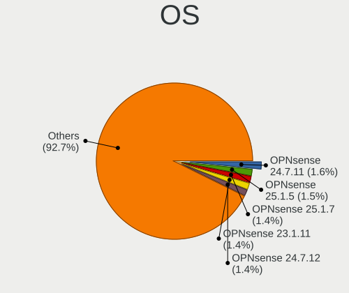

| Name              | Computers | Percent |
|-------------------|-----------|---------|
| OPNsense 24.7.11  | 133       | 1.6%    |
| OPNsense 25.1.5   | 122       | 1.47%   |
| OPNsense 25.1.7   | 120       | 1.44%   |
| OPNsense 23.1.11  | 120       | 1.44%   |
| OPNsense 24.7.12  | 113       | 1.36%   |
| OPNsense 25.1     | 110       | 1.32%   |
| helloSystem 0.8.1 | 106       | 1.27%   |
| OPNsense 24.1.10  | 101       | 1.21%   |
| OPNsense 24.1.6   | 94        | 1.13%   |
| OPNsense 21.7.7   | 90        | 1.08%   |
| OPNsense 25.1.1   | 86        | 1.03%   |
| OPNsense 24.7     | 86        | 1.03%   |
| OPNsense 23.7.10  | 82        | 0.99%   |
| OPNsense 22.7.10  | 82        | 0.99%   |
| OPNsense 23.1     | 81        | 0.97%   |
| OPNsense 25.7.1   | 80        | 0.96%   |
| OPNsense 23.7.12  | 80        | 0.96%   |
| OPNsense 21.7.3   | 77        | 0.93%   |
| OPNsense 24.7.8   | 76        | 0.91%   |
| OPNsense 25.7.7   | 70        | 0.84%   |
| OPNsense 23.7.9   | 70        | 0.84%   |
| OPNsense 22.1.10  | 70        | 0.84%   |
| OPNsense 23.1.7   | 69        | 0.83%   |
| OPNsense 21.7.1   | 69        | 0.83%   |
| OPNsense 23.1.1   | 68        | 0.82%   |
| OPNsense 22.1     | 68        | 0.82%   |
| OPNsense 21.1.5   | 67        | 0.81%   |
| helloSystem 0.7.0 | 67        | 0.81%   |
| OPNsense 25.7.2   | 66        | 0.79%   |
| OPNsense 24.1.9   | 66        | 0.79%   |
| OPNsense 23.1.5   | 65        | 0.78%   |
| OPNsense 22.7.4   | 65        | 0.78%   |
| OPNsense 25.1.4   | 64        | 0.77%   |
| OPNsense 24.7.7   | 64        | 0.77%   |
| OPNsense 24.1.4   | 64        | 0.77%   |
| OPNsense 25.1.3   | 63        | 0.76%   |
| OPNsense 24.7.4   | 63        | 0.76%   |
| OPNsense 24.1.7   | 63        | 0.76%   |
| OPNsense 24.1.2   | 63        | 0.76%   |
| OPNsense 24.7.3   | 62        | 0.75%   |

OS Family
---------

OS without a version

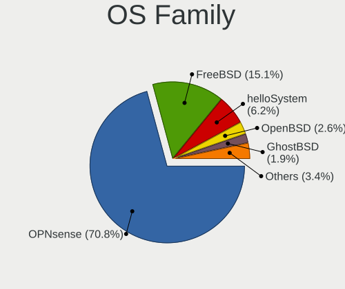

| Name        | Computers | Percent |
|-------------|-----------|---------|
| OPNsense    | 3958      | 70.82%  |
| FreeBSD     | 843       | 15.08%  |
| helloSystem | 346       | 6.19%   |
| OpenBSD     | 146       | 2.61%   |
| GhostBSD    | 108       | 1.93%   |
| NomadBSD    | 48        | 0.86%   |
| pfSense     | 24        | 0.43%   |
| NetBSD      | 23        | 0.41%   |
| MidnightBSD | 22        | 0.39%   |
| FreeNAS     | 17        | 0.3%    |
| TrueNAS     | 16        | 0.29%   |
| HardenedBSD | 10        | 0.18%   |
| ClonOS      | 7         | 0.13%   |
| DragonFly   | 6         | 0.11%   |
| MyBee       | 5         | 0.09%   |
| XigmaNAS    | 4         | 0.07%   |
| FuryBSD     | 3         | 0.05%   |
| OS108       | 2         | 0.04%   |
| Debian      | 1         | 0.02%   |

Arch
----

OS architecture (x86_64, i586, etc.)

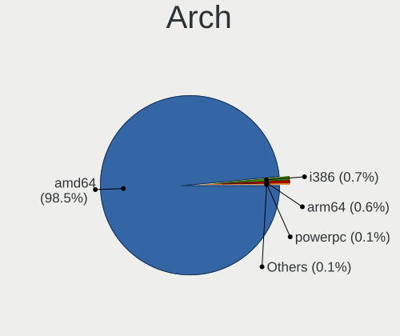

| Name    | Computers | Percent |
|---------|-----------|---------|
| amd64   | 5456      | 98.47%  |
| i386    | 40        | 0.72%   |
| arm64   | 32        | 0.58%   |
| powerpc | 4         | 0.07%   |
| evbarm  | 4         | 0.07%   |
| macppc  | 2         | 0.04%   |
| sparc64 | 1         | 0.02%   |
| riscv   | 1         | 0.02%   |
| aarch64 | 1         | 0.02%   |

DE
--

Desktop Environment

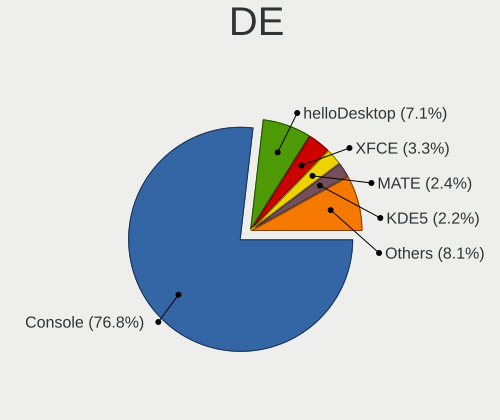

| Name          | Computers | Percent |
|---------------|-----------|---------|
| Console       | 4339      | 76.82%  |
| helloDesktop  | 402       | 7.12%   |
| XFCE          | 188       | 3.33%   |
| MATE          | 138       | 2.44%   |
| KDE5          | 125       | 2.21%   |
| TWM           | 95        | 1.68%   |
| GNOME         | 82        | 1.45%   |
| fvwm          | 60        | 1.06%   |
| Openbox       | 58        | 1.03%   |
| i3            | 41        | 0.73%   |
| Cinnamon      | 16        | 0.28%   |
| LXQt          | 15        | 0.27%   |
| KDE           | 14        | 0.25%   |
| Enlightenment | 11        | 0.19%   |
| KDE6          | 10        | 0.18%   |
| Fluxbox       | 9         | 0.16%   |
| stumpwm       | 6         | 0.11%   |
| Lumina        | 5         | 0.09%   |
| X-Cinnamon    | 3         | 0.05%   |
| Hyprland      | 3         | 0.05%   |
| DWM           | 3         | 0.05%   |
| AwesomeWM     | 3         | 0.05%   |
| Xfwm4         | 2         | 0.04%   |
| wlroots       | 2         | 0.04%   |
| Window Maker  | 2         | 0.04%   |
| Picom         | 2         | 0.04%   |
| LXDE          | 2         | 0.04%   |
| GNUstep       | 2         | 0.04%   |
| fvwm2         | 2         | 0.04%   |
| Wayfire       | 1         | 0.02%   |
| spectrwm      | 1         | 0.02%   |
| sdorfehs      | 1         | 0.02%   |
| iwm           | 1         | 0.02%   |
| ctwm          | 1         | 0.02%   |
| Compton       | 1         | 0.02%   |
| CDE           | 1         | 0.02%   |
| Budgie        | 1         | 0.02%   |

Display Server
--------------

X11 or Wayland

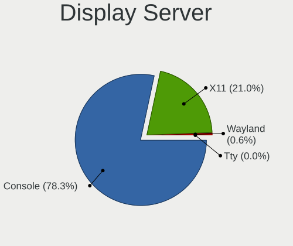

| Name    | Computers | Percent |
|---------|-----------|---------|
| Console | 4364      | 78.35%  |
| X11     | 1172      | 21.04%  |
| Wayland | 33        | 0.59%   |
| Tty     | 1         | 0.02%   |

Display Manager
---------------

SDDM, LightDM, etc.

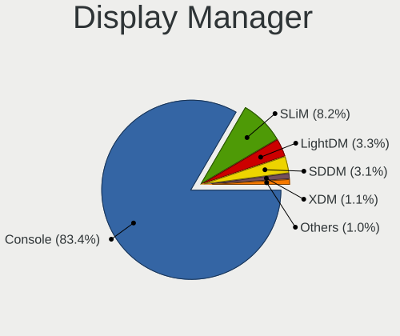

| Name    | Computers | Percent |
|---------|-----------|---------|
| Console | 4674      | 83.39%  |
| SLiM    | 457       | 8.15%   |
| LightDM | 185       | 3.3%    |
| SDDM    | 172       | 3.07%   |
| XDM     | 60        | 1.07%   |
| GDM     | 50        | 0.89%   |
| Ly      | 7         | 0.12%   |

OS Lang
-------

Language

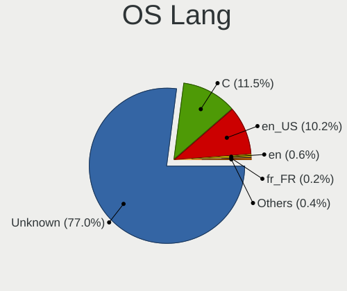

| Lang            | Computers | Percent |
|-----------------|-----------|---------|
| Unknown         | 4370      | 77.05%  |
| C               | 655       | 11.55%  |
| en_US           | 578       | 10.19%  |
| en              | 34        | 0.6%    |
| fr_FR           | 13        | 0.23%   |
| fr              | 4         | 0.07%   |
| ru_RU           | 3         | 0.05%   |
| en_CA           | 3         | 0.05%   |
| zh_CN           | 2         | 0.04%   |
| en_US.US-ASCII  | 2         | 0.04%   |
| en_US.ISO8859-1 | 2         | 0.04%   |
| en_GB           | 2         | 0.04%   |
| ru              | 1         | 0.02%   |
| es_CO           | 1         | 0.02%   |
| en_US.utf-8     | 1         | 0.02%   |
| de_DE           | 1         | 0.02%   |

Boot Mode
---------

EFI or BIOS

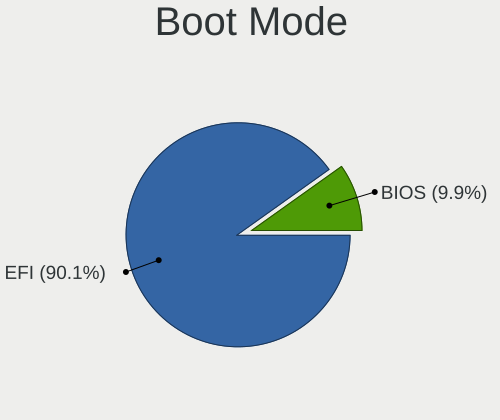

| Mode | Computers | Percent |
|------|-----------|---------|
| EFI  | 5052      | 90.15%  |
| BIOS | 552       | 9.85%   |

Filesystem
----------

Type of filesystem

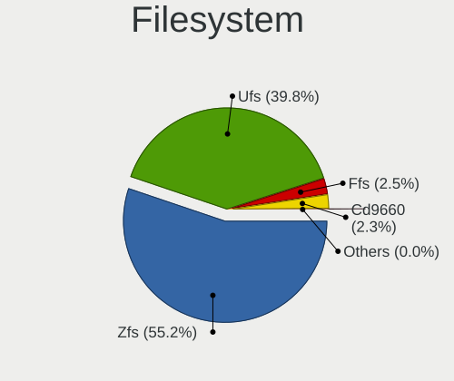

| Type    | Computers | Percent |
|---------|-----------|---------|
| Zfs     | 3168      | 55.19%  |
| Ufs     | 2287      | 39.84%  |
| Ffs     | 146       | 2.54%   |
| Cd9660  | 131       | 2.28%   |
| Hammer2 | 6         | 0.1%    |
| Ext4    | 1         | 0.02%   |
| Unknown | 1         | 0.02%   |

Part. scheme
------------

Scheme of partitioning

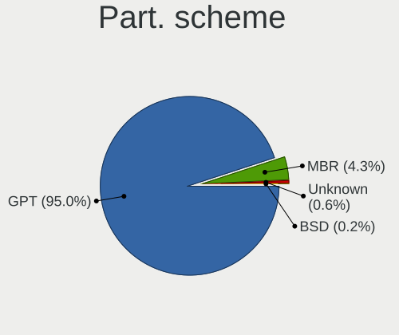

| Type    | Computers | Percent |
|---------|-----------|---------|
| GPT     | 5299      | 94.96%  |
| MBR     | 239       | 4.28%   |
| Unknown | 33        | 0.59%   |
| BSD     | 9         | 0.16%   |

Board
-----

Vendor
------

Motherboard manufacturer

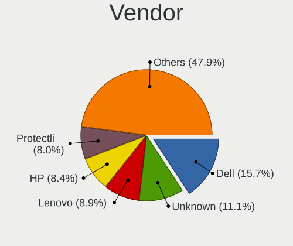

| Name                                 | Computers | Percent |
|--------------------------------------|-----------|---------|
| Dell                                 | 872       | 15.74%  |
| Unknown                              | 614       | 11.09%  |
| Lenovo                               | 491       | 8.86%   |
| Hewlett-Packard                      | 468       | 8.45%   |
| Protectli                            | 442       | 7.98%   |
| Supermicro                           | 376       | 6.79%   |
| ASUSTek Computer                     | 298       | 5.38%   |
| Intel                                | 220       | 3.97%   |
| ASRock                               | 181       | 3.27%   |
| Gigabyte Technology                  | 142       | 2.56%   |
| MSI                                  | 131       | 2.37%   |
| AMI                                  | 93        | 1.68%   |
| AZW                                  | 92        | 1.66%   |
| Apple                                | 82        | 1.48%   |
| Sophos                               | 63        | 1.14%   |
| PC Engines                           | 52        | 0.94%   |
| Techvision                           | 46        | 0.83%   |
| Shenzhen Meigao Electronic Equipment | 44        | 0.79%   |
| Deciso                               | 44        | 0.79%   |
| Acer                                 | 42        | 0.76%   |
| CWWK                                 | 28        | 0.51%   |
| ASRockRack                           | 28        | 0.51%   |
| TianBei                              | 27        | 0.49%   |
| MW                                   | 24        | 0.43%   |
| Google                               | 20        | 0.36%   |
| IceWhale Technology                  | 19        | 0.34%   |
| GoWin Solution                       | 19        | 0.34%   |
| BESSTAR Tech                         | 19        | 0.34%   |
| AWOW                                 | 18        | 0.32%   |
| Foxconn                              | 16        | 0.29%   |
| CompuLab                             | 16        | 0.29%   |
| Biostar                              | 16        | 0.29%   |
| Toshiba                              | 15        | 0.27%   |
| Framework                            | 15        | 0.27%   |
| Shuttle                              | 14        | 0.25%   |
| Raspberry Pi Foundation              | 14        | 0.25%   |
| Advantech                            | 14        | 0.25%   |
| System76                             | 13        | 0.23%   |
| CncTion                              | 13        | 0.23%   |
| CheckPoint                           | 13        | 0.23%   |

Model
-----

Motherboard model

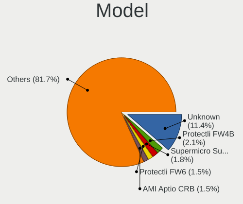

| Name                                              | Computers | Percent |
|---------------------------------------------------|-----------|---------|
| Unknown                                           | 631       | 11.39%  |
| Protectli FW4B                                    | 114       | 2.06%   |
| Supermicro Super Server                           | 100       | 1.81%   |
| Protectli FW6                                     | 84        | 1.52%   |
| AMI Aptio CRB                                     | 82        | 1.48%   |
| AZW EQ                                            | 63        | 1.14%   |
| Intel Q3XXG4-P V1.0                               | 54        | 0.97%   |
| Techvision TVI7309X                               | 46        | 0.83%   |
| Protectli VP2420                                  | 43        | 0.78%   |
| Dell OptiPlex 9020                                | 41        | 0.74%   |
| HP t730 Thin Client                               | 40        | 0.72%   |
| Dell PowerEdge R210 II                            | 39        | 0.7%    |
| Dell OptiPlex 3020                                | 39        | 0.7%    |
| Protectli FW4C                                    | 38        | 0.69%   |
| Supermicro X10SLH-N6-ST031                        | 36        | 0.65%   |
| ASUS All Series                                   | 36        | 0.65%   |
| Sophos XG                                         | 35        | 0.63%   |
| Shenzhen Meigao Electronic Equipment Venus Series | 34        | 0.61%   |
| HP t620 PLUS Quad Core TC                         | 30        | 0.54%   |
| Protectli FW2B                                    | 28        | 0.51%   |
| PC Engines APU2                                   | 28        | 0.51%   |
| Dell Wyse 5070 Extended Thin Client               | 28        | 0.51%   |
| TianBei N1 PRO                                    | 27        | 0.49%   |
| Dell OptiPlex 7010                                | 27        | 0.49%   |
| Sophos SG                                         | 26        | 0.47%   |
| Dell OptiPlex 7040                                | 26        | 0.47%   |
| Protectli VP2410                                  | 25        | 0.45%   |
| Supermicro X9SCL/X9SCM                            | 24        | 0.43%   |
| MW GMLK-2_5G4L                                    | 24        | 0.43%   |
| Dell OptiPlex 3050                                | 19        | 0.34%   |
| HP EliteDesk 800 G1 SFF                           | 18        | 0.32%   |
| Dell OptiPlex 5050                                | 18        | 0.32%   |
| Dell OptiPlex 3040                                | 18        | 0.32%   |
| Supermicro A1SAi                                  | 17        | 0.31%   |
| Protectli V1410                                   | 17        | 0.31%   |
| PC Engines apu4                                   | 17        | 0.31%   |
| Dell OptiPlex 990                                 | 17        | 0.31%   |
| Dell OptiPlex 7050                                | 17        | 0.31%   |
| Lenovo ThinkCentre M720q 10T7002CUS               | 16        | 0.29%   |
| HP EliteDesk 800 G3 SFF                           | 16        | 0.29%   |

Model Family
------------

Motherboard model prefix

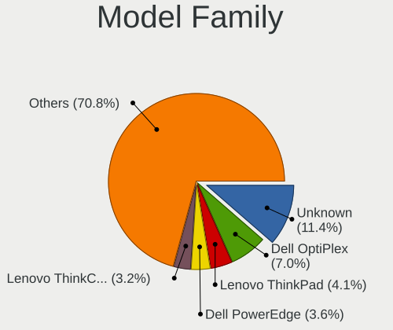

| Name                                       | Computers | Percent |
|--------------------------------------------|-----------|---------|
| Unknown                                    | 631       | 11.39%  |
| Dell OptiPlex                              | 387       | 6.99%   |
| Lenovo ThinkPad                            | 225       | 4.06%   |
| Dell PowerEdge                             | 199       | 3.59%   |
| Lenovo ThinkCentre                         | 176       | 3.18%   |
| Protectli FW4B                             | 114       | 2.06%   |
| Supermicro Super                           | 100       | 1.81%   |
| HP EliteDesk                               | 88        | 1.59%   |
| Protectli FW6                              | 84        | 1.52%   |
| AMI Aptio                                  | 82        | 1.48%   |
| Dell Latitude                              | 71        | 1.28%   |
| Dell Inspiron                              | 68        | 1.23%   |
| AZW EQ                                     | 63        | 1.14%   |
| Dell Precision                             | 57        | 1.03%   |
| Intel Q3XXG4-P                             | 56        | 1.01%   |
| HP ProDesk                                 | 56        | 1.01%   |
| ASUS PRIME                                 | 48        | 0.87%   |
| Techvision TVI7309X                        | 46        | 0.83%   |
| Protectli VP2420                           | 43        | 0.78%   |
| ASUS ROG                                   | 43        | 0.78%   |
| HP t730                                    | 40        | 0.72%   |
| Protectli FW4C                             | 38        | 0.69%   |
| Dell Wyse                                  | 38        | 0.69%   |
| HP ProLiant                                | 37        | 0.67%   |
| HP Compaq                                  | 37        | 0.67%   |
| Supermicro X10SLH-N6-ST031                 | 36        | 0.65%   |
| ASUS All                                   | 36        | 0.65%   |
| Sophos XG                                  | 35        | 0.63%   |
| Shenzhen Meigao Electronic Equipment Venus | 34        | 0.61%   |
| ASUS TUF                                   | 33        | 0.6%    |
| HP t620                                    | 32        | 0.58%   |
| HP Pavilion                                | 29        | 0.52%   |
| Protectli FW2B                             | 28        | 0.51%   |
| PC Engines APU2                            | 28        | 0.51%   |
| TianBei N1                                 | 27        | 0.49%   |
| Sophos SG                                  | 26        | 0.47%   |
| Protectli VP2410                           | 25        | 0.45%   |
| Supermicro X9SCL                           | 24        | 0.43%   |
| MW GMLK-2                                  | 24        | 0.43%   |
| Dell XPS                                   | 24        | 0.43%   |

MFG Year
--------

Motherboard manufacture year

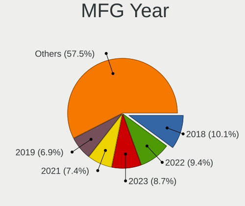

| Year    | Computers | Percent |
|---------|-----------|---------|
| 2018    | 559       | 10.09%  |
| 2022    | 518       | 9.35%   |
| 2023    | 484       | 8.74%   |
| 2021    | 408       | 7.37%   |
| 2019    | 384       | 6.93%   |
| 2020    | 367       | 6.63%   |
| 2016    | 351       | 6.34%   |
| 2024    | 347       | 6.26%   |
| 2017    | 343       | 6.19%   |
| 2014    | 330       | 5.96%   |
| 2013    | 299       | 5.4%    |
| 2015    | 260       | 4.69%   |
| 2012    | 258       | 4.66%   |
| 2011    | 233       | 4.21%   |
| 2010    | 98        | 1.77%   |
| 2009    | 67        | 1.21%   |
| 2008    | 62        | 1.12%   |
| 2025    | 57        | 1.03%   |
| Unknown | 55        | 0.99%   |
| 2007    | 29        | 0.52%   |
| 2006    | 17        | 0.31%   |
| 2005    | 4         | 0.07%   |
| 2004    | 4         | 0.07%   |
| 2003    | 2         | 0.04%   |
| 2002    | 2         | 0.04%   |
| 2001    | 1         | 0.02%   |

Form Factor
-----------

Physical design of the computer

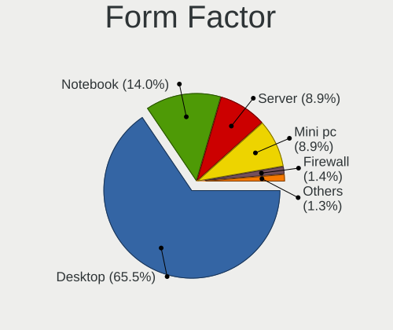

| Name           | Computers | Percent |
|----------------|-----------|---------|
| Desktop        | 3630      | 65.54%  |
| Notebook       | 773       | 13.96%  |
| Server         | 492       | 8.88%   |
| Mini pc        | 491       | 8.86%   |
| Firewall       | 79        | 1.43%   |
| Convertible    | 36        | 0.65%   |
| System on chip | 23        | 0.42%   |
| All in one     | 13        | 0.23%   |
| Stick pc       | 1         | 0.02%   |
| Tablet         | 1         | 0.02%   |

Coreboot
--------

Have coreboot on board

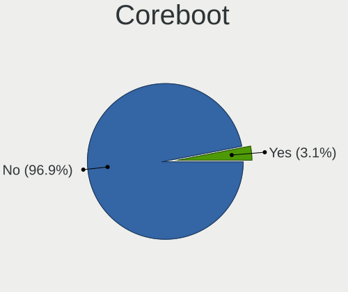

| Used | Computers | Percent |
|------|-----------|---------|
| No   | 5370      | 96.95%  |
| Yes  | 169       | 3.05%   |

RAM Size
--------

Total RAM memory

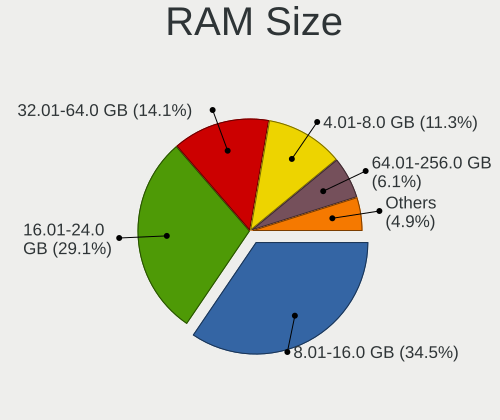

| Size in GB      | Computers | Percent |
|-----------------|-----------|---------|
| 8.01-16.0       | 1974      | 34.49%  |
| 16.01-24.0      | 1668      | 29.15%  |
| 32.01-64.0      | 806       | 14.08%  |
| 4.01-8.0        | 647       | 11.31%  |
| 64.01-256.0     | 349       | 6.1%    |
| 24.01-32.0      | 102       | 1.78%   |
| 2.01-3.0        | 85        | 1.49%   |
| 3.01-4.0        | 36        | 0.63%   |
| 0.51-1.0        | 19        | 0.33%   |
| More than 256.0 | 13        | 0.23%   |
| 1.01-2.0        | 13        | 0.23%   |
| 0.01-0.5        | 11        | 0.19%   |

RAM Used
--------

Used RAM memory

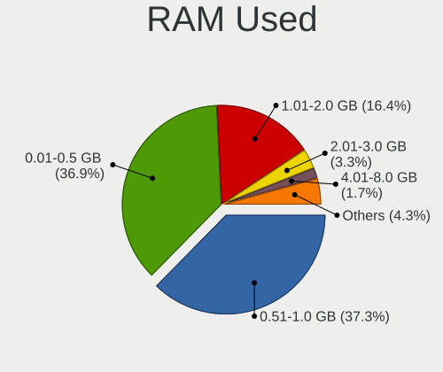

| Used GB     | Computers | Percent |
|-------------|-----------|---------|
| 0.51-1.0    | 2162      | 37.35%  |
| 0.01-0.5    | 2137      | 36.91%  |
| 1.01-2.0    | 952       | 16.44%  |
| 2.01-3.0    | 189       | 3.26%   |
| 4.01-8.0    | 101       | 1.74%   |
| 3.01-4.0    | 97        | 1.68%   |
| 8.01-16.0   | 47        | 0.81%   |
| Unknown     | 28        | 0.48%   |
| 16.01-24.0  | 21        | 0.36%   |
| 24.01-32.0  | 19        | 0.33%   |
| 32.01-64.0  | 15        | 0.26%   |
| 0           | 14        | 0.24%   |
| 64.01-256.0 | 7         | 0.12%   |

Total Drives
------------

Number of drives on board

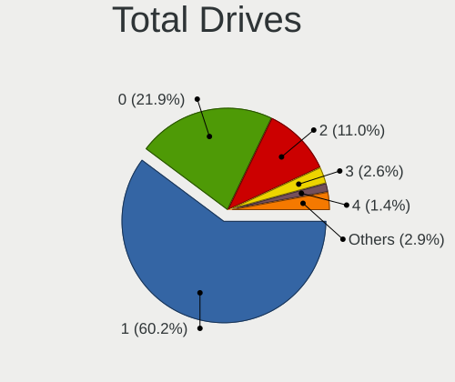

| Drives | Computers | Percent |
|--------|-----------|---------|
| 1      | 3518      | 60.22%  |
| 0      | 1280      | 21.91%  |
| 2      | 642       | 10.99%  |
| 3      | 154       | 2.64%   |
| 4      | 81        | 1.39%   |
| 5      | 42        | 0.72%   |
| 6      | 32        | 0.55%   |
| 7      | 18        | 0.31%   |
| 8      | 14        | 0.24%   |
| 14     | 10        | 0.17%   |
| 10     | 10        | 0.17%   |
| 9      | 8         | 0.14%   |
| 12     | 7         | 0.12%   |
| 11     | 6         | 0.1%    |
| 16     | 3         | 0.05%   |
| 21     | 2         | 0.03%   |
| 18     | 2         | 0.03%   |
| 17     | 2         | 0.03%   |
| 13     | 2         | 0.03%   |
| 58     | 1         | 0.02%   |
| 40     | 1         | 0.02%   |
| 36     | 1         | 0.02%   |
| 30     | 1         | 0.02%   |
| 28     | 1         | 0.02%   |
| 26     | 1         | 0.02%   |
| 22     | 1         | 0.02%   |
| 19     | 1         | 0.02%   |
| 15     | 1         | 0.02%   |

Has CD-ROM
----------

Has CD-ROM on board

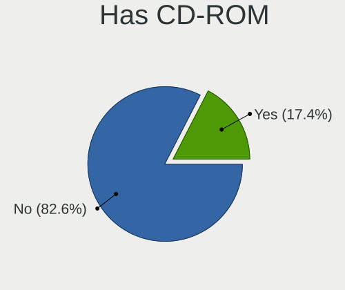

| Presented | Computers | Percent |
|-----------|-----------|---------|
| No        | 4629      | 82.57%  |
| Yes       | 977       | 17.43%  |

Has Ethernet
------------

Has Ethernet on board

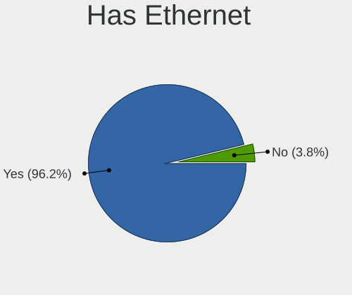

| Presented | Computers | Percent |
|-----------|-----------|---------|
| Yes       | 5329      | 96.21%  |
| No        | 210       | 3.79%   |

Has WiFi
--------

Has WiFi module

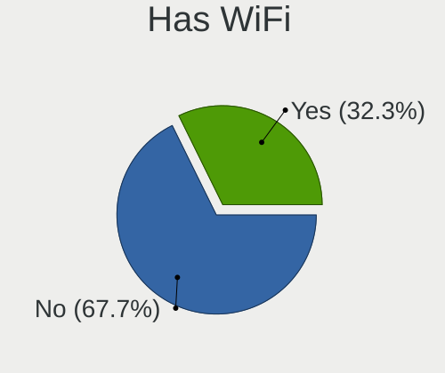

| Presented | Computers | Percent |
|-----------|-----------|---------|
| No        | 3789      | 67.72%  |
| Yes       | 1806      | 32.28%  |

Has Bluetooth
-------------

Has Bluetooth module

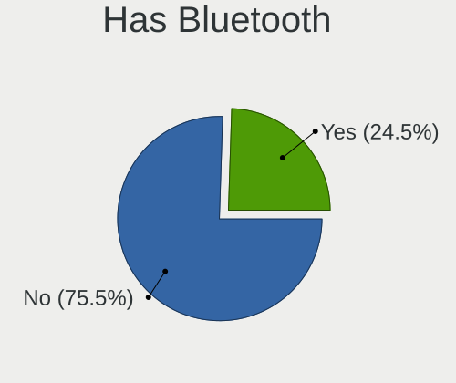

| Presented | Computers | Percent |
|-----------|-----------|---------|
| No        | 4218      | 75.51%  |
| Yes       | 1368      | 24.49%  |

Location
--------

Country
-------

Geographic location (country)

| Country | Computers | Percent |
|---------|-----------|---------|
| USA     | 5539      | 100%    |

City
----

Geographic location (city)

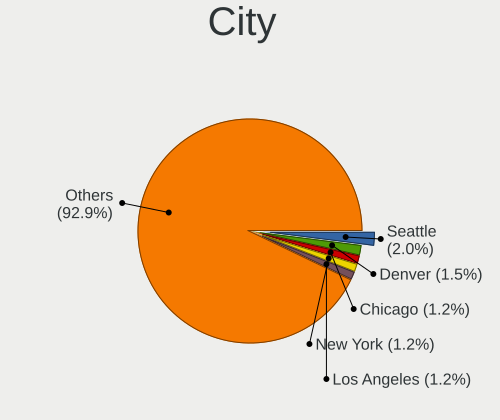

| City           | Computers | Percent |
|----------------|-----------|---------|
| Seattle        | 125       | 2%      |
| Denver         | 94        | 1.5%    |
| Chicago        | 77        | 1.23%   |
| New York       | 75        | 1.2%    |
| Los Angeles    | 74        | 1.18%   |
| Brooklyn       | 63        | 1.01%   |
| Portland       | 58        | 0.93%   |
| Dallas         | 53        | 0.85%   |
| Oakland        | 45        | 0.72%   |
| Austin         | 43        | 0.69%   |
| Atlanta        | 42        | 0.67%   |
| San Francisco  | 40        | 0.64%   |
| Philadelphia   | 40        | 0.64%   |
| Phoenix        | 38        | 0.61%   |
| Minneapolis    | 38        | 0.61%   |
| Columbus       | 38        | 0.61%   |
| San Jose       | 33        | 0.53%   |
| Orlando        | 33        | 0.53%   |
| Las Vegas      | 33        | 0.53%   |
| Houston        | 33        | 0.53%   |
| San Antonio    | 32        | 0.51%   |
| Rochester      | 30        | 0.48%   |
| Jacksonville   | 26        | 0.42%   |
| Grand Rapids   | 25        | 0.4%    |
| Springfield    | 24        | 0.38%   |
| Mountain View  | 24        | 0.38%   |
| Ypsilanti      | 23        | 0.37%   |
| Salt Lake City | 23        | 0.37%   |
| Boston         | 23        | 0.37%   |
| Madison        | 22        | 0.35%   |
| Indianapolis   | 22        | 0.35%   |
| Charlotte      | 22        | 0.35%   |
| Brookfield     | 22        | 0.35%   |
| Washington     | 21        | 0.34%   |
| Omaha          | 21        | 0.34%   |
| Fremont        | 21        | 0.34%   |
| Columbia       | 21        | 0.34%   |
| Pittsburgh     | 20        | 0.32%   |
| Kansas City    | 20        | 0.32%   |
| Tampa          | 19        | 0.3%    |

Drives
------

Drive Vendor
------------

Hard drive vendors

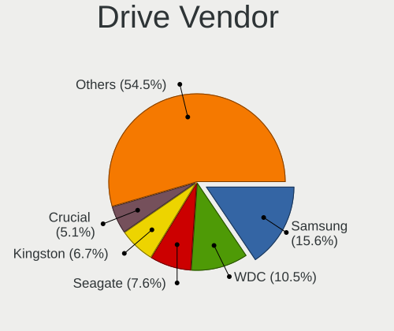

| Vendor              | Computers | Drives | Percent |
|---------------------|-----------|--------|---------|
| Samsung Electronics | 855       | 1802   | 15.56%  |
| WDC                 | 579       | 1728   | 10.54%  |
| Seagate             | 418       | 1159   | 7.61%   |
| Kingston            | 367       | 531    | 6.68%   |
| Crucial             | 282       | 486    | 5.13%   |
| Intel               | 249       | 493    | 4.53%   |
| SanDisk             | 246       | 346    | 4.48%   |
| Toshiba             | 186       | 347    | 3.38%   |
| Transcend           | 181       | 338    | 3.29%   |
| China               | 171       | 288    | 3.11%   |
| SK hynix            | 129       | 193    | 2.35%   |
| A-DATA Technology   | 111       | 184    | 2.02%   |
| Hoodisk             | 105       | 170    | 1.91%   |
| Protectli           | 104       | 187    | 1.89%   |
| Hitachi             | 99        | 218    | 1.8%    |
| PNY                 | 96        | 175    | 1.75%   |
| SPCC                | 88        | 192    | 1.6%    |
| Phison              | 84        | 135    | 1.53%   |
| HGST                | 68        | 242    | 1.24%   |
| FORESEE             | 66        | 98     | 1.2%    |
| Micron Technology   | 64        | 100    | 1.16%   |
| Team                | 62        | 116    | 1.13%   |
| Hewlett-Packard     | 56        | 164    | 1.02%   |
| Dogfish             | 43        | 79     | 0.78%   |
| BIWIN               | 36        | 56     | 0.66%   |
| NVMe                | 35        | 50     | 0.64%   |
| Apple               | 34        | 39     | 0.62%   |
| OCZ                 | 33        | 54     | 0.6%    |
| Apacer              | 31        | 49     | 0.56%   |
| Silicon Motion      | 30        | 46     | 0.55%   |
| Patriot             | 29        | 41     | 0.53%   |
| KingSpec            | 24        | 41     | 0.44%   |
| Lexar               | 23        | 39     | 0.42%   |
| KIOXIA              | 21        | 27     | 0.38%   |
| T-FORCE             | 20        | 27     | 0.36%   |
| Fanxiang            | 20        | 33     | 0.36%   |
| Corsair             | 20        | 55     | 0.36%   |
| Mushkin             | 19        | 32     | 0.35%   |
| LITEON              | 19        | 34     | 0.35%   |
| LITEONIT            | 17        | 23     | 0.31%   |

Drive Model
-----------

Hard drive models

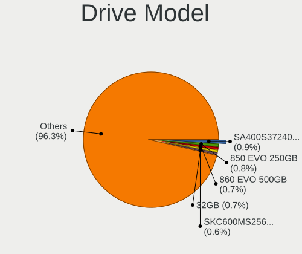

| Model                           | Computers | Percent |
|---------------------------------|-----------|---------|
| Kingston SA400S37240G 240GB     | 55        | 0.92%   |
| Samsung SSD 850 EVO 250GB       | 48        | 0.81%   |
| Samsung SSD 860 EVO 500GB       | 40        | 0.67%   |
| Hoodisk SSD 32GB                | 39        | 0.66%   |
| Kingston SKC600MS256G 256GB     | 37        | 0.62%   |
| Hoodisk SSD 128GB               | 35        | 0.59%   |
| Kingston SA400S37120G 120GB     | 33        | 0.55%   |
| Samsung SSD 850 EVO 500GB       | 32        | 0.54%   |
| FORESEE 128GB SSD               | 32        | 0.54%   |
| Samsung SSD 970 EVO Plus 500GB  | 31        | 0.52%   |
| Crucial CT500MX500SSD1 500GB    | 31        | 0.52%   |
| Samsung SSD 860 EVO 1TB         | 30        | 0.5%    |
| Protectli 120GB mSATA           | 30        | 0.5%    |
| Samsung SSD 870 EVO 500GB       | 29        | 0.49%   |
| Samsung SSD 860 EVO 250GB       | 29        | 0.49%   |
| China SATA SSD 120GB            | 29        | 0.49%   |
| Seagate ST500DM002-1BD142 500GB | 28        | 0.47%   |
| Kingston SUV500MS120G 120GB     | 28        | 0.47%   |
| Kingston SUV500MS240G 240GB     | 25        | 0.42%   |
| BIWIN SSD 128GB                 | 25        | 0.42%   |
| PNY CS900 120GB SSD             | 24        | 0.4%    |
| Crucial CT1000MX500SSD1 1TB     | 24        | 0.4%    |
| Samsung SSD 870 EVO 1TB         | 23        | 0.39%   |
| Samsung SSD 970 EVO Plus 1TB    | 22        | 0.37%   |
| Kingston SV300S37A120G 120GB    | 22        | 0.37%   |
| Crucial CT240BX500SSD1 240GB    | 22        | 0.37%   |
| WDC WDS500G2B0A-00SM50 500GB    | 21        | 0.35%   |
| Crucial CT250MX500SSD1 250GB    | 21        | 0.35%   |
| Transcend TS128GMSA230S 128GB   | 20        | 0.34%   |
| SanDisk SDSSDA120G 120GB        | 20        | 0.34%   |
| SPCC Solid State Disk 128GB     | 19        | 0.32%   |
| Phison PCIe SSD 2TB             | 19        | 0.32%   |
| Hoodisk SSD 64GB                | 19        | 0.32%   |
| Samsung SSD 850 EVO 120GB       | 18        | 0.3%    |
| China SATA SSD 256GB            | 18        | 0.3%    |
| WDC WD10EZEX-08WN4A0 1TB        | 17        | 0.29%   |
| SanDisk SSD PLUS 240GB          | 17        | 0.29%   |
| WDC WD800JD-75MSA3 80GB         | 16        | 0.27%   |
| Team TM8FP6256G 256GB           | 16        | 0.27%   |
| Protectli 64GB mSATA            | 16        | 0.27%   |

HDD Vendor
----------

Hard disk drive vendors

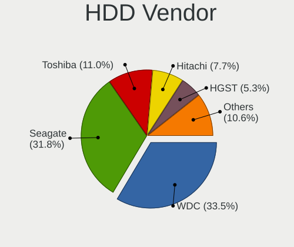

| Vendor                             | Computers | Drives | Percent |
|------------------------------------|-----------|--------|---------|
| WDC                                | 420       | 1424   | 33.55%  |
| Seagate                            | 398       | 1108   | 31.79%  |
| Toshiba                            | 138       | 272    | 11.02%  |
| Hitachi                            | 97        | 216    | 7.75%   |
| HGST                               | 66        | 222    | 5.27%   |
| NVMe                               | 23        | 33     | 1.84%   |
| Hewlett-Packard                    | 23        | 74     | 1.84%   |
| Samsung Electronics                | 18        | 24     | 1.44%   |
| Apple                              | 14        | 15     | 1.12%   |
| Fujitsu                            | 8         | 9      | 0.64%   |
| HPE                                | 6         | 21     | 0.48%   |
| Maxtor                             | 5         | 9      | 0.4%    |
| China                              | 5         | 7      | 0.4%    |
| Lexar                              | 3         | 3      | 0.24%   |
| Generic                            | 3         | 3      | 0.24%   |
| WD MediaMax                        | 2         | 4      | 0.16%   |
| OPENBSD                            | 2         | 2      | 0.16%   |
| LSI                                | 2         | 8      | 0.16%   |
| IBM-207x                           | 2         | 2      | 0.16%   |
| Adaptec                            | 2         | 2      | 0.16%   |
| USB                                | 1         | 1      | 0.08%   |
| QUANTUM                            | 1         | 2      | 0.08%   |
| Product:              USB DISK 3.0 | 1         | 1      | 0.08%   |
| NETAPP                             | 1         | 2      | 0.08%   |
| Memorex                            | 1         | 1      | 0.08%   |
| MaxDigital                         | 1         | 1      | 0.08%   |
| MARVELL                            | 1         | 1      | 0.08%   |
| IBM/Hitachi                        | 1         | 1      | 0.08%   |
| IBM-ESXS                           | 1         | 1      | 0.08%   |
| HPT                                | 1         | 8      | 0.08%   |
| General                            | 1         | 1      | 0.08%   |
| ExcelStor Technology               | 1         | 4      | 0.08%   |
| Dell                               | 1         | 3      | 0.08%   |
| ASMT                               | 1         | 1      | 0.08%   |
| ASMedia                            | 1         | 2      | 0.08%   |

SSD Vendor
----------

Solid state drive vendors

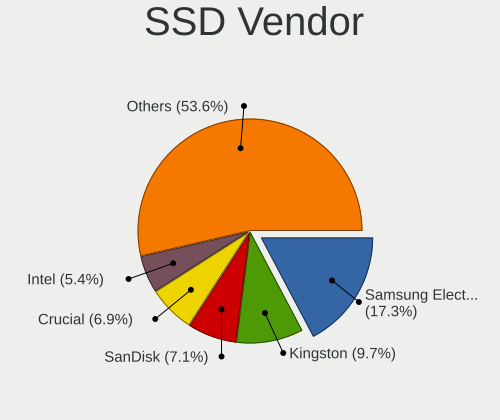

| Vendor              | Computers | Drives | Percent |
|---------------------|-----------|--------|---------|
| Samsung Electronics | 587       | 1307   | 17.27%  |
| Kingston            | 330       | 485    | 9.71%   |
| SanDisk             | 242       | 338    | 7.12%   |
| Crucial             | 233       | 401    | 6.86%   |
| Intel               | 184       | 391    | 5.41%   |
| Transcend           | 169       | 320    | 4.97%   |
| China               | 166       | 281    | 4.89%   |
| Protectli           | 104       | 187    | 3.06%   |
| Hoodisk             | 103       | 168    | 3.03%   |
| A-DATA Technology   | 101       | 164    | 2.97%   |
| PNY                 | 90        | 165    | 2.65%   |
| WDC                 | 87        | 168    | 2.56%   |
| SK hynix            | 73        | 107    | 2.15%   |
| SPCC                | 64        | 148    | 1.88%   |
| FORESEE             | 61        | 92     | 1.8%    |
| Micron Technology   | 50        | 80     | 1.47%   |
| Dogfish             | 43        | 79     | 1.27%   |
| Team                | 34        | 82     | 1%      |
| Phison              | 34        | 44     | 1%      |
| OCZ                 | 33        | 54     | 0.97%   |
| BIWIN               | 33        | 53     | 0.97%   |
| Apacer              | 31        | 49     | 0.91%   |
| Toshiba             | 25        | 41     | 0.74%   |
| KingSpec            | 24        | 41     | 0.71%   |
| Patriot             | 22        | 33     | 0.65%   |
| Hewlett-Packard     | 22        | 53     | 0.65%   |
| Apple               | 21        | 24     | 0.62%   |
| Seagate             | 19        | 44     | 0.56%   |
| Lexar               | 19        | 35     | 0.56%   |
| T-FORCE             | 17        | 23     | 0.5%    |
| LITEONIT            | 17        | 23     | 0.5%    |
| LITEON              | 17        | 32     | 0.5%    |
| ASint Technology    | 17        | 18     | 0.5%    |
| Mushkin             | 16        | 28     | 0.47%   |
| Corsair             | 16        | 25     | 0.47%   |
| OWC                 | 14        | 26     | 0.41%   |
| Supermicro          | 13        | 17     | 0.38%   |
| SHAREVDI            | 12        | 21     | 0.35%   |
| NVMe                | 12        | 15     | 0.35%   |
| Innodisk            | 12        | 16     | 0.35%   |

Drive Kind
----------

HDD or SSD

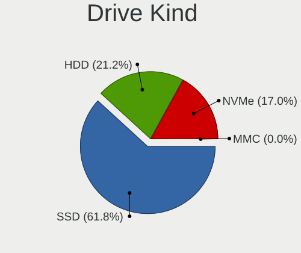

| Kind | Computers | Drives | Percent |
|------|-----------|--------|---------|
| SSD  | 3076      | 6046   | 61.79%  |
| HDD  | 1056      | 3488   | 21.21%  |
| NVMe | 845       | 1459   | 16.97%  |
| MMC  | 1         | 1      | 0.02%   |

Drive Connector
---------------

SATA, SAS, NVMe, etc.

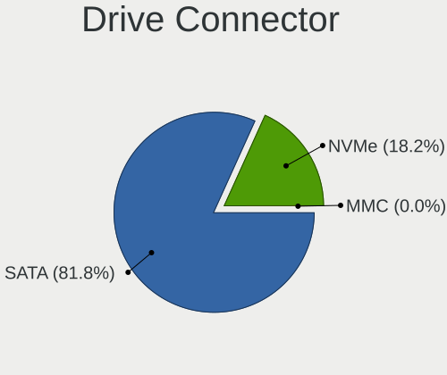

| Type | Computers | Drives | Percent |
|------|-----------|--------|---------|
| SATA | 3790      | 9534   | 81.75%  |
| NVMe | 845       | 1459   | 18.23%  |
| MMC  | 1         | 1      | 0.02%   |

Drive Size
----------

Size of hard drive

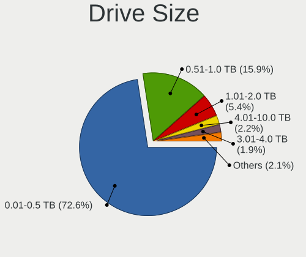

| Size in TB | Computers | Drives | Percent |
|------------|-----------|--------|---------|
| 0.01-0.5   | 3127      | 5845   | 72.57%  |
| 0.51-1.0   | 685       | 1425   | 15.9%   |
| 1.01-2.0   | 232       | 726    | 5.38%   |
| 4.01-10.0  | 93        | 699    | 2.16%   |
| 3.01-4.0   | 80        | 408    | 1.86%   |
| 2.01-3.0   | 58        | 215    | 1.35%   |
| 10.01-20.0 | 33        | 212    | 0.77%   |
| 20.01-50.0 | 1         | 4      | 0.02%   |

Space Total
-----------

Amount of disk space available on the file system

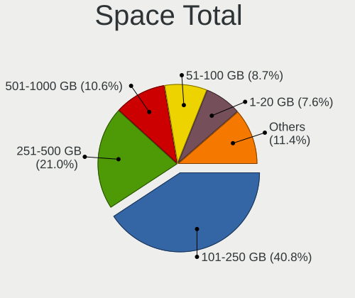

| Size in GB     | Computers | Percent |
|----------------|-----------|---------|
| 101-250        | 2362      | 40.75%  |
| 251-500        | 1218      | 21.01%  |
| 501-1000       | 614       | 10.59%  |
| 51-100         | 504       | 8.7%    |
| 1-20           | 438       | 7.56%   |
| 21-50          | 420       | 7.25%   |
| 1001-2000      | 157       | 2.71%   |
| More than 3000 | 50        | 0.86%   |
| 2001-3000      | 17        | 0.29%   |
| Unknown        | 16        | 0.28%   |

Space Used
----------

Amount of used disk space

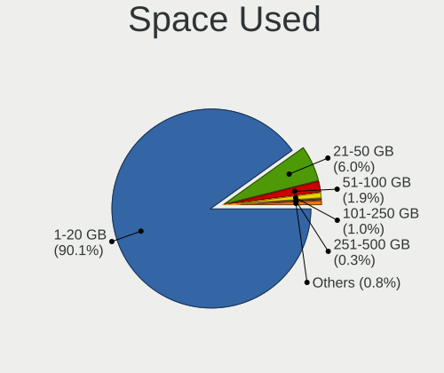

| Used GB        | Computers | Percent |
|----------------|-----------|---------|
| 1-20           | 5204      | 90.13%  |
| 21-50          | 344       | 5.96%   |
| 51-100         | 107       | 1.85%   |
| 101-250        | 55        | 0.95%   |
| 251-500        | 20        | 0.35%   |
| Unknown        | 16        | 0.28%   |
| 501-1000       | 10        | 0.17%   |
| More than 3000 | 8         | 0.14%   |
| 1001-2000      | 6         | 0.1%    |
| 2001-3000      | 3         | 0.05%   |
| 0              | 1         | 0.02%   |

Malfunc. Drives
---------------

Drive models with a malfunction

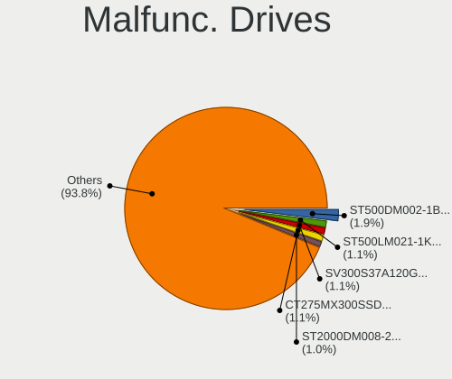

| Model                                 | Computers | Drives | Percent |
|---------------------------------------|-----------|--------|---------|
| Seagate ST500DM002-1BD142 500GB       | 12        | 17     | 1.92%   |
| Seagate ST500LM021-1KJ152 500GB       | 7         | 9      | 1.12%   |
| Kingston SV300S37A120G 120GB          | 7         | 8      | 1.12%   |
| Crucial CT275MX300SSD1 275GB          | 7         | 12     | 1.12%   |
| Seagate ST2000DM008-2FR102 2TB        | 6         | 12     | 0.96%   |
| Seagate ST1000DM003-9YN162 1TB        | 5         | 9      | 0.8%    |
| Kingston SMS200S3120G 120GB           | 5         | 7      | 0.8%    |
| Apacer 16GB SATA Flash Drive          | 5         | 9      | 0.8%    |
| WDC WD5000AAKX-75U6AA0 500GB          | 4         | 5      | 0.64%   |
| Seagate ST9500420AS 500GB             | 4         | 6      | 0.64%   |
| Seagate ST500LT012-1DG142 500GB       | 4         | 5      | 0.64%   |
| Seagate ST3500418AS 500GB             | 4         | 11     | 0.64%   |
| SanDisk SSD PLUS 240GB                | 4         | 5      | 0.64%   |
| Kingston SV300S37A60G 64GB            | 4         | 4      | 0.64%   |
| Kingston SNS4151S316GD 16GB           | 4         | 6      | 0.64%   |
| Kingston SA400S37240G 240GB           | 4         | 4      | 0.64%   |
| Crucial CT120M500SSD1 120GB           | 4         | 5      | 0.64%   |
| China CF 2GB                          | 4         | 6      | 0.64%   |
| WDC WD5003ABYZ-011FA0 500GB           | 3         | 5      | 0.48%   |
| WDC WD5003ABYX-18WERA0 500GB          | 3         | 8      | 0.48%   |
| WDC WD5000AAKX-60U6AA0 500GB          | 3         | 4      | 0.48%   |
| WDC WD30EFRX-68EUZN0 3TB              | 3         | 15     | 0.48%   |
| WDC WD20EARS-00MVWB0 2TB              | 3         | 3      | 0.48%   |
| WDC WD1600AAJS-75M0A0 160GB           | 3         | 3      | 0.48%   |
| SK hynix SC308 SATA 128GB             | 3         | 5      | 0.48%   |
| SK hynix SC210 mSATA 256GB            | 3         | 4      | 0.48%   |
| Samsung Electronics SSD 850 EVO 500GB | 3         | 3      | 0.48%   |
| Kingston SMS200S360G 64GB             | 3         | 3      | 0.48%   |
| Intel SSDSC2BF180A4L 180GB            | 3         | 4      | 0.48%   |
| Intel SSDSA2M120G2GC 120GB            | 3         | 8      | 0.48%   |
| Intel SSDSA2M080G2GC 80GB             | 3         | 3      | 0.48%   |
| HGST HTS725050A7E630 500GB            | 3         | 3      | 0.48%   |
| HGST HTS721010A9E630 1TB              | 3         | 3      | 0.48%   |
| Crucial CT480M500SSD1 480GB           | 3         | 4      | 0.48%   |
| Crucial CT240M500SSD1 240GB           | 3         | 4      | 0.48%   |
| Apacer 32GB SATA Flash Drive          | 3         | 3      | 0.48%   |
| WDC WD60EFAX-68SHWN0 6TB              | 2         | 3      | 0.32%   |
| WDC WD5000AAKX-001CA0 500GB           | 2         | 4      | 0.32%   |
| WDC WD2001FASS-00W2B0 2TB             | 2         | 3      | 0.32%   |
| WDC WD1600BEKT-66F3T2 160GB           | 2         | 4      | 0.32%   |

Malfunc. Drive Vendor
---------------------

Vendors of faulty drives

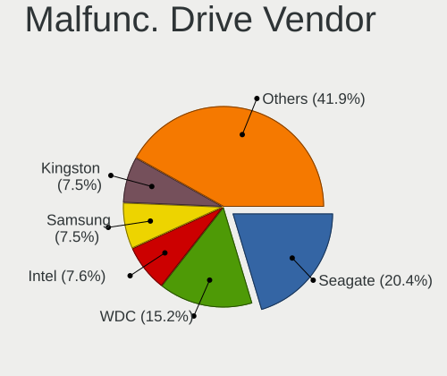

| Vendor              | Computers | Drives | Percent |
|---------------------|-----------|--------|---------|
| Seagate             | 123       | 237    | 20.36%  |
| WDC                 | 92        | 172    | 15.23%  |
| Intel               | 46        | 66     | 7.62%   |
| Samsung Electronics | 45        | 67     | 7.45%   |
| Kingston            | 45        | 58     | 7.45%   |
| Crucial             | 32        | 54     | 5.3%    |
| Toshiba             | 31        | 49     | 5.13%   |
| Hitachi             | 31        | 46     | 5.13%   |
| SanDisk             | 22        | 26     | 3.64%   |
| SK hynix            | 17        | 25     | 2.81%   |
| HGST                | 15        | 16     | 2.48%   |
| Apacer              | 9         | 15     | 1.49%   |
| Micron Technology   | 8         | 12     | 1.32%   |
| China               | 8         | 10     | 1.32%   |
| HP Phison           | 6         | 7      | 0.99%   |
| LITEON              | 5         | 10     | 0.83%   |
| Apple               | 5         | 5      | 0.83%   |
| A-DATA Technology   | 5         | 5      | 0.83%   |
| OCZ                 | 4         | 4      | 0.66%   |
| Corsair             | 4         | 6      | 0.66%   |
| Transcend           | 3         | 6      | 0.5%    |
| SSSTC               | 3         | 3      | 0.5%    |
| SPCC                | 3         | 6      | 0.5%    |
| Phison              | 3         | 3      | 0.5%    |
| Maxtor              | 3         | 6      | 0.5%    |
| PNY                 | 2         | 2      | 0.33%   |
| Plextor             | 2         | 2      | 0.33%   |
| Patriot             | 2         | 2      | 0.33%   |
| Netac               | 2         | 6      | 0.33%   |
| MyDigitalSSD        | 2         | 4      | 0.33%   |
| LITEONIT            | 2         | 5      | 0.33%   |
| Hewlett-Packard     | 2         | 6      | 0.33%   |
| Fujitsu             | 2         | 2      | 0.33%   |
| Dogfish             | 2         | 6      | 0.33%   |
| BIWIN               | 2         | 2      | 0.33%   |
| ZTC                 | 1         | 3      | 0.17%   |
| Wintec              | 1         | 1      | 0.17%   |
| WD MediaMax         | 1         | 3      | 0.17%   |
| VisionTek           | 1         | 1      | 0.17%   |
| MSI                 | 1         | 1      | 0.17%   |

Malfunc. HDD Vendor
-------------------

Vendors of faulty HDD drives

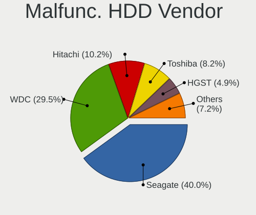

| Vendor               | Computers | Drives | Percent |
|----------------------|-----------|--------|---------|
| Seagate              | 122       | 236    | 40%     |
| WDC                  | 90        | 170    | 29.51%  |
| Hitachi              | 31        | 46     | 10.16%  |
| Toshiba              | 25        | 43     | 8.2%    |
| HGST                 | 15        | 16     | 4.92%   |
| Samsung Electronics  | 6         | 7      | 1.97%   |
| China                | 4         | 6      | 1.31%   |
| Maxtor               | 3         | 6      | 0.98%   |
| Fujitsu              | 2         | 2      | 0.66%   |
| Apple                | 2         | 2      | 0.66%   |
| WD MediaMax          | 1         | 3      | 0.33%   |
| IBM/Hitachi          | 1         | 1      | 0.33%   |
| HPE                  | 1         | 3      | 0.33%   |
| Hewlett-Packard      | 1         | 4      | 0.33%   |
| ExcelStor Technology | 1         | 2      | 0.33%   |

Malfunc. Drive Kind
-------------------

Kinds of faulty drives

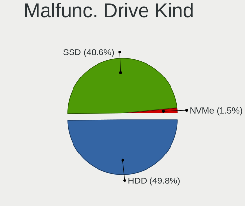

| Kind | Computers | Drives | Percent |
|------|-----------|--------|---------|
| HDD  | 294       | 547    | 49.83%  |
| SSD  | 287       | 420    | 48.64%  |
| NVMe | 9         | 9      | 1.53%   |

Failed Drives
-------------

Failed drive models

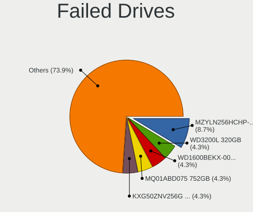

| Model                                        | Computers | Drives | Percent |
|----------------------------------------------|-----------|--------|---------|
| Samsung Electronics MZYLN256HCHP-000L2 256GB | 2         | 2      | 8.7%    |
| WDC WD3200L 320GB                            | 1         | 1      | 4.35%   |
| WDC WD1600BEKX-00B7WT0 160GB                 | 1         | 1      | 4.35%   |
| Toshiba MQ01ABD075 752GB                     | 1         | 1      | 4.35%   |
| Toshiba KXG50ZNV256G NVMe 256GB              | 1         | 1      | 4.35%   |
| SK hynix SC308 SATA 256GB                    | 1         | 1      | 4.35%   |
| SK hynix SC308 SATA 128GB                    | 1         | 1      | 4.35%   |
| Seagate ST3500418AS 500GB                    | 1         | 2      | 4.35%   |
| SanDisk pSSD 32GB                            | 1         | 1      | 4.35%   |
| Samsung Electronics SSD 970 EVO Plus 500GB   | 1         | 1      | 4.35%   |
| Samsung Electronics SSD 960 EVO 500GB        | 1         | 1      | 4.35%   |
| Samsung Electronics PM981 NVMe 256GB         | 1         | 1      | 4.35%   |
| Samsung Electronics MZVLB256HBHQ-000H1 256GB | 1         | 1      | 4.35%   |
| Samsung Electronics MZNTE256HMHP-000L7 256GB | 1         | 1      | 4.35%   |
| Samsung Electronics HD204UI 2TB              | 1         | 2      | 4.35%   |
| Phison PCIe SSD 2TB                          | 1         | 1      | 4.35%   |
| Kingston SA2000M8500G 500GB                  | 1         | 2      | 4.35%   |
| Intel SSDSCKKF512G8 SATA 512GB               | 1         | 1      | 4.35%   |
| Intel SSDSC2KB019T8 1.9TB                    | 1         | 2      | 4.35%   |
| Intel SSDSC2BW180A4 180GB                    | 1         | 1      | 4.35%   |
| Intel SSDSC2BF180A4L 180GB                   | 1         | 1      | 4.35%   |
| Crucial CT500P3PSSD8 500GB                   | 1         | 1      | 4.35%   |

Failed Drive Vendor
-------------------

Failed drive vendors

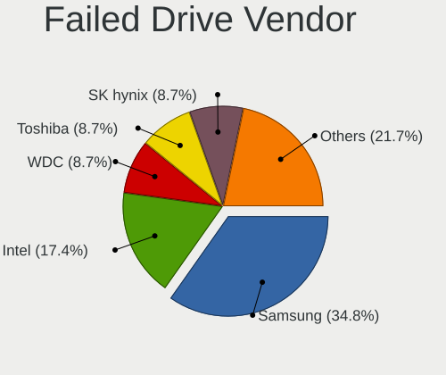

| Vendor              | Computers | Drives | Percent |
|---------------------|-----------|--------|---------|
| Samsung Electronics | 8         | 9      | 34.78%  |
| Intel               | 4         | 5      | 17.39%  |
| WDC                 | 2         | 2      | 8.7%    |
| Toshiba             | 2         | 2      | 8.7%    |
| SK hynix            | 2         | 2      | 8.7%    |
| Seagate             | 1         | 2      | 4.35%   |
| SanDisk             | 1         | 1      | 4.35%   |
| Phison              | 1         | 1      | 4.35%   |
| Kingston            | 1         | 2      | 4.35%   |
| Crucial             | 1         | 1      | 4.35%   |

Drive Status
------------

Number of failed and malfunc. drives

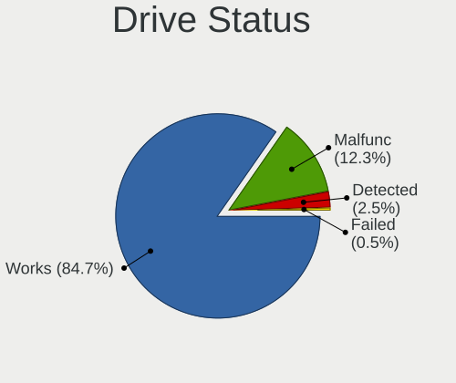

| Status   | Computers | Drives | Percent |
|----------|-----------|--------|---------|
| Works    | 3998      | 9768   | 84.69%  |
| Malfunc  | 580       | 976    | 12.29%  |
| Detected | 120       | 223    | 2.54%   |
| Failed   | 23        | 27     | 0.49%   |

Storage controller
------------------

Storage Vendor
--------------

Storage controller vendors

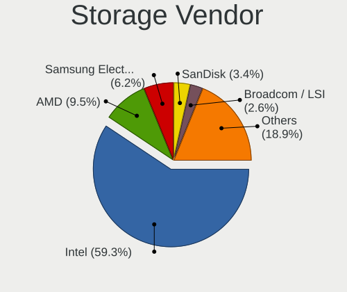

| Vendor                                  | Computers | Percent |
|-----------------------------------------|-----------|---------|
| Intel                                   | 4305      | 59.35%  |
| AMD                                     | 686       | 9.46%   |
| Samsung Electronics                     | 453       | 6.24%   |
| SanDisk                                 | 249       | 3.43%   |
| Broadcom / LSI                          | 192       | 2.65%   |
| Silicon Motion                          | 152       | 2.1%    |
| Phison Electronics                      | 134       | 1.85%   |
| MAXIO Technology (Hangzhou)             | 129       | 1.78%   |
| SK hynix                                | 117       | 1.61%   |
| ASMedia Technology                      | 103       | 1.42%   |
| Kingston Technology Company             | 93        | 1.28%   |
| Micron/Crucial Technology               | 73        | 1.01%   |
| Micron Technology                       | 65        | 0.9%    |
| Marvell Technology Group                | 51        | 0.7%    |
| Toshiba                                 | 46        | 0.63%   |
| Realtek Semiconductor                   | 38        | 0.52%   |
| KIOXIA                                  | 37        | 0.51%   |
| JMicron Technology                      | 36        | 0.5%    |
| Chelsio Communications                  | 36        | 0.5%    |
| Transcend                               | 28        | 0.39%   |
| Hewlett-Packard                         | 26        | 0.36%   |
| Nvidia                                  | 25        | 0.34%   |
| Hosin Global Electronics                | 25        | 0.34%   |
| Shenzhen Longsys Electronics            | 20        | 0.28%   |
| Adaptec                                 | 15        | 0.21%   |
| INNOGRIT                                | 14        | 0.19%   |
| Seagate Technology                      | 11        | 0.15%   |
| ADATA Technology                        | 11        | 0.15%   |
| Lite-On Technology                      | 9         | 0.12%   |
| Yangtze Memory Technologies             | 8         | 0.11%   |
| Solidigm                                | 7         | 0.1%    |
| Silicon Image                           | 7         | 0.1%    |
| VIA Technologies                        | 6         | 0.08%   |
| Shenzhen Unionmemory Information System | 6         | 0.08%   |
| Union Memory (Shenzhen)                 | 5         | 0.07%   |
| Solid State Storage Technology          | 5         | 0.07%   |
| Biwin Storage Technology                | 5         | 0.07%   |
| Silicon Integrated Systems [SiS]        | 3         | 0.04%   |
| Unknown                                 | 3         | 0.04%   |
| Netac Technology                        | 2         | 0.03%   |

Storage Model
-------------

Storage controller models

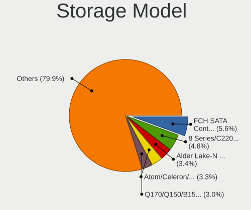

| Model                                                                            | Computers | Percent |
|----------------------------------------------------------------------------------|-----------|---------|
| AMD FCH SATA Controller [AHCI mode]                                              | 455       | 5.62%   |
| Intel 8 Series/C220 Series Chipset Family 6-port SATA Controller 1 [AHCI mode]   | 390       | 4.81%   |
| Intel Alder Lake-N SATA AHCI Controller                                          | 276       | 3.41%   |
| Intel Atom/Celeron/Pentium Processor x5-E8000/J3xxx/N3xxx Series SATA Controller | 268       | 3.31%   |
| Intel Q170/Q150/B150/H170/H110/Z170/CM236 Chipset SATA Controller [AHCI Mode]    | 243       | 3%      |
| Intel Sunrise Point-LP SATA Controller [AHCI mode]                               | 242       | 2.99%   |
| Intel Cannon Lake PCH SATA AHCI Controller                                       | 218       | 2.69%   |
| Intel Celeron/Pentium Silver Processor SATA Controller                           | 216       | 2.67%   |
| Samsung NVMe SSD Controller SM981/PM981/PM983                                    | 211       | 2.6%    |
| Intel 6 Series/C200 Series Chipset Family 6 port Desktop SATA AHCI Controller    | 186       | 2.3%    |
| Intel SATA Controller [RAID mode]                                                | 173       | 2.14%   |
| Intel Jasper Lake SATA AHCI Controller                                           | 155       | 1.91%   |
| Intel 200 Series PCH SATA controller [AHCI mode]                                 | 148       | 1.83%   |
| Silicon Motion SM2263EN/SM2263XT (DRAM-less) NVMe SSD Controllers                | 143       | 1.76%   |
| Intel Atom Processor E3800 Series SATA AHCI Controller                           | 128       | 1.58%   |
| MAXIO (Hangzhou) NVMe SSD Controller MAP1202 (DRAM-less)                         | 127       | 1.57%   |
| Intel 7 Series/C210 Series Chipset Family 6-port SATA Controller [AHCI mode]     | 97        | 1.2%    |
| Intel Wildcat Point-LP SATA Controller [AHCI Mode]                               | 85        | 1.05%   |
| Intel 7 Series Chipset Family 6-port SATA Controller [AHCI mode]                 | 84        | 1.04%   |
| ASMedia ASM1061/ASM1062 Serial ATA Controller                                    | 82        | 1.01%   |
| Intel Celeron N3350/Pentium N4200/Atom E3900 Series SATA AHCI Controller         | 81        | 1%      |
| AMD 400 Series Chipset SATA Controller                                           | 80        | 0.99%   |
| Samsung NVMe SSD Controller 980 (DRAM-less)                                      | 75        | 0.93%   |
| Intel Atom Processor C3000 Series SATA Controller 0                              | 68        | 0.84%   |
| AMD 500 Series Chipset SATA Controller                                           | 68        | 0.84%   |
| Intel Atom Processor C3000 Series SATA Controller 1                              | 66        | 0.81%   |
| Intel Atom processor C2000 AHCI SATA3 Controller                                 | 66        | 0.81%   |
| AMD SB7x0/SB8x0/SB9x0 SATA Controller [AHCI mode]                                | 66        | 0.81%   |
| SanDisk Extreme Pro / WD Black SN750 / PC SN730 / Red SN700 NVMe SSD             | 65        | 0.8%    |
| Samsung NVMe SSD Controller SM961/PM961/SM963                                    | 65        | 0.8%    |
| Intel Elkhart Lake SATA AHCI                                                     | 65        | 0.8%    |
| Intel 8 Series SATA Controller 1 [AHCI mode]                                     | 63        | 0.78%   |
| Intel C610/X99 series chipset 6-Port SATA Controller [AHCI mode]                 | 62        | 0.77%   |
| Intel C600/X79 series chipset 6-Port SATA AHCI Controller                        | 59        | 0.73%   |
| Intel Alder Lake-P SATA AHCI Controller                                          | 59        | 0.73%   |
| Intel 6 Series/C200 Series Chipset Family 6 port Mobile SATA AHCI Controller     | 58        | 0.72%   |
| Intel Comet Lake SATA AHCI Controller                                            | 57        | 0.7%    |
| SK hynix Gold P31/BC711/PC711 NVMe Solid State Drive                             | 55        | 0.68%   |
| Intel C610/X99 series chipset sSATA Controller [AHCI mode]                       | 54        | 0.67%   |
| Intel Atom processor C2000 AHCI SATA2 Controller                                 | 52        | 0.64%   |

Storage Kind
------------

Kind of storage controller (IDE, SATA, NVMe, SAS, ...)

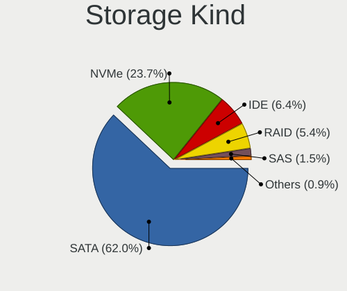

| Kind | Computers | Percent |
|------|-----------|---------|
| SATA | 4498      | 62.05%  |
| NVMe | 1718      | 23.7%   |
| IDE  | 466       | 6.43%   |
| RAID | 391       | 5.39%   |
| SAS  | 111       | 1.53%   |
| SCSI | 65        | 0.9%    |

Processor
---------

CPU Vendor
----------

Processor vendors

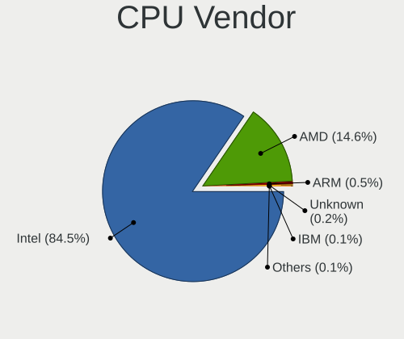

| Vendor               | Computers | Percent |
|----------------------|-----------|---------|
| Intel                | 4695      | 84.53%  |
| AMD                  | 810       | 14.58%  |
| ARM                  | 29        | 0.52%   |
| Unknown              | 9         | 0.16%   |
| IBM                  | 3         | 0.05%   |
| VIA                  | 2         | 0.04%   |
| PowerPC              | 1         | 0.02%   |
| NXP                  | 1         | 0.02%   |
| Motorola             | 1         | 0.02%   |
| i                    | 1         | 0.02%   |
| Cix Technology Group | 1         | 0.02%   |
| Broadcom             | 1         | 0.02%   |

CPU Model
---------

Processor models

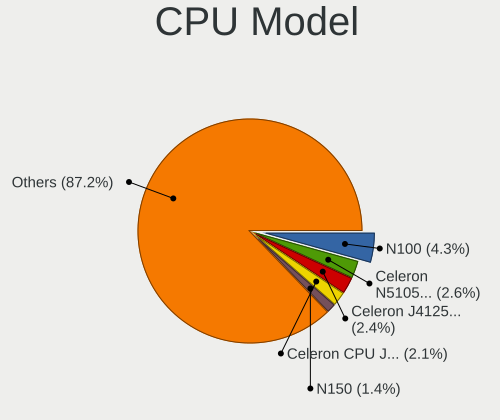

| Model                                    | Computers | Percent |
|------------------------------------------|-----------|---------|
| Intel N100                               | 243       | 4.32%   |
| Intel Celeron N5105 @ 2.00GHz            | 145       | 2.58%   |
| Intel Celeron J4125 CPU @ 2.00GHz        | 137       | 2.43%   |
| Intel Celeron CPU J3160 @ 1.60GHz        | 118       | 2.1%    |
| Intel N150                               | 77        | 1.37%   |
| Intel Core i5-6500 CPU @ 3.20GHz         | 77        | 1.37%   |
| Intel Celeron CPU J1900 @ 1.99GHz        | 73        | 1.3%    |
| Intel Core i5-4570 CPU @ 3.20GHz         | 47        | 0.83%   |
| Intel Core i5-3470 CPU @ 3.20GHz         | 47        | 0.83%   |
| Intel Celeron J6412 @ 2.00GHz            | 47        | 0.83%   |
| AMD GX-412TC SOC                         | 47        | 0.83%   |
| Intel Core i5-7200U CPU @ 2.50GHz        | 46        | 0.82%   |
| Intel Core i7-6700 CPU @ 3.40GHz         | 45        | 0.8%    |
| Intel Pentium CPU N3700 @ 1.60GHz        | 43        | 0.76%   |
| Intel Core i5-8500T CPU @ 2.10GHz        | 43        | 0.76%   |
| Intel Core i3-N305                       | 43        | 0.76%   |
| AMD RX-427BB with AMD Radeon R7 Graphics | 42        | 0.75%   |
| Intel Pentium CPU J3710 @ 1.60GHz        | 40        | 0.71%   |
| Intel Core i5-7500 CPU @ 3.40GHz         | 40        | 0.71%   |
| Intel Core i5-4590 CPU @ 3.30GHz         | 39        | 0.69%   |
| Intel Core i7-3770 CPU @ 3.40GHz         | 37        | 0.66%   |
| Intel Core i5-8250U CPU @ 1.60GHz        | 36        | 0.64%   |
| Intel Pentium Silver J5005 CPU @ 1.50GHz | 33        | 0.59%   |
| Intel Core i3-7100U CPU @ 2.40GHz        | 33        | 0.59%   |
| Intel Atom CPU C3558 @ 2.20GHz           | 33        | 0.59%   |
| AMD GX-420CA SOC with Radeon HD Graphics | 33        | 0.59%   |
| Intel Xeon CPU E3-1270 v3 @ 3.50GHz      | 29        | 0.52%   |
| Intel Celeron CPU J3455 @ 1.50GHz        | 29        | 0.52%   |
| Intel Celeron CPU J3060 @ 1.60GHz        | 29        | 0.52%   |
| Intel Core i7-8550U CPU @ 1.80GHz        | 28        | 0.5%    |
| Intel Celeron J4105 CPU @ 1.50GHz        | 27        | 0.48%   |
| Intel Core i5-8500 CPU @ 3.00GHz         | 26        | 0.46%   |
| Intel Atom CPU C2758 @ 2.40GHz           | 26        | 0.46%   |
| Intel Atom CPU D525 @ 1.80GHz            | 25        | 0.44%   |
| Intel Core i7-4790 CPU @ 3.60GHz         | 24        | 0.43%   |
| Intel Core 2 Duo                         | 24        | 0.43%   |
| Intel Core i7-7700 CPU @ 3.60GHz         | 23        | 0.41%   |
| Intel Core i7-7500U CPU @ 2.70GHz        | 23        | 0.41%   |
| AMD Ryzen 7 5700G with Radeon Graphics   | 23        | 0.41%   |
| Intel Xeon D-2123IT CPU @ 2.20GHz        | 21        | 0.37%   |

CPU Model Family
----------------

Processor model prefix

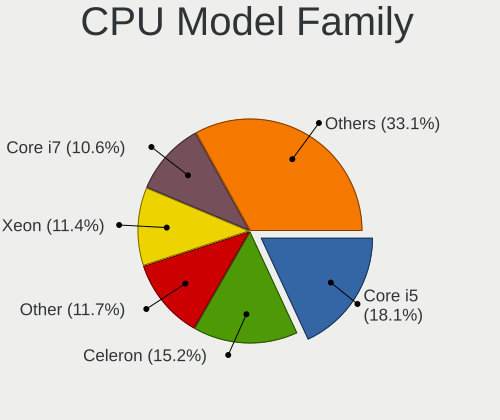

| Model                   | Computers | Percent |
|-------------------------|-----------|---------|
| Intel Core i5           | 1012      | 18.08%  |
| Intel Celeron           | 851       | 15.2%   |
| Other                   | 654       | 11.68%  |
| Intel Xeon              | 636       | 11.36%  |
| Intel Core i7           | 594       | 10.61%  |
| Intel Core i3           | 353       | 6.31%   |
| Intel Atom              | 277       | 4.95%   |
| Intel Pentium           | 150       | 2.68%   |
| AMD Ryzen 7             | 139       | 2.48%   |
| AMD Ryzen 5             | 115       | 2.05%   |
| AMD GX                  | 101       | 1.8%    |
| Intel Core 2 Duo        | 69        | 1.23%   |
| AMD Ryzen 9             | 62        | 1.11%   |
| Intel Pentium Silver    | 61        | 1.09%   |
| AMD EPYC                | 44        | 0.79%   |
| AMD FX                  | 36        | 0.64%   |
| AMD Ryzen 3             | 32        | 0.57%   |
| ARM Cortex              | 27        | 0.48%   |
| Intel Core i9           | 26        | 0.46%   |
| AMD Ryzen Embedded      | 26        | 0.46%   |
| AMD A10                 | 23        | 0.41%   |
| AMD Ryzen 5 PRO         | 21        | 0.38%   |
| Intel Pentium Gold      | 20        | 0.36%   |
| Intel Core 2 Quad       | 18        | 0.32%   |
| AMD Athlon              | 15        | 0.27%   |
| Intel Core              | 13        | 0.23%   |
| AMD Phenom II X4        | 13        | 0.23%   |
| Intel Pentium Dual-Core | 11        | 0.2%    |
| Intel Core 2            | 11        | 0.2%    |
| AMD G                   | 11        | 0.2%    |
| AMD A8                  | 11        | 0.2%    |
| AMD A6                  | 11        | 0.2%    |
| Intel Xeon Gold         | 10        | 0.18%   |
| AMD Opteron             | 10        | 0.18%   |
| Intel Pentium 4         | 9         | 0.16%   |
| Intel Genuine           | 9         | 0.16%   |
| AMD Ryzen Threadripper  | 9         | 0.16%   |
| AMD Ryzen 7 PRO         | 8         | 0.14%   |
| AMD E                   | 7         | 0.13%   |
| AMD A4                  | 7         | 0.13%   |

CPU Cores
---------

Number of processor cores

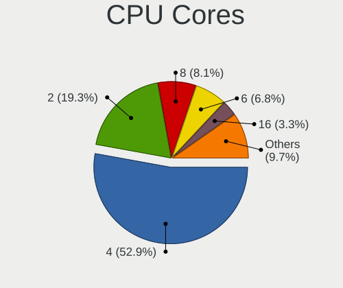

| Number  | Computers | Percent |
|---------|-----------|---------|
| 4       | 2993      | 52.85%  |
| 2       | 1093      | 19.3%   |
| 8       | 456       | 8.05%   |
| 6       | 385       | 6.8%    |
| 16      | 186       | 3.28%   |
| 12      | 182       | 3.21%   |
| Unknown | 146       | 2.58%   |
| 10      | 43        | 0.76%   |
| 24      | 36        | 0.64%   |
| 1       | 35        | 0.62%   |
| 32      | 30        | 0.53%   |
| 20      | 26        | 0.46%   |
| 28      | 13        | 0.23%   |
| 14      | 11        | 0.19%   |
| 3       | 10        | 0.18%   |
| 64      | 3         | 0.05%   |
| 48      | 3         | 0.05%   |
| 40      | 3         | 0.05%   |
| 36      | 3         | 0.05%   |
| 22      | 2         | 0.04%   |
| 18      | 2         | 0.04%   |
| 7       | 2         | 0.04%   |

CPU Sockets
-----------

Number of sockets

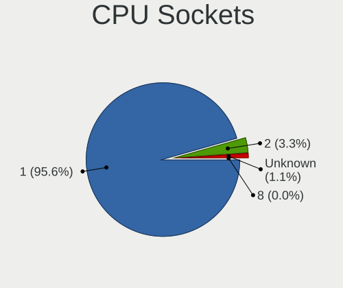

| Number  | Computers | Percent |
|---------|-----------|---------|
| 1       | 5303      | 95.58%  |
| 2       | 182       | 3.28%   |
| Unknown | 60        | 1.08%   |
| 4       | 2         | 0.04%   |
| 8       | 1         | 0.02%   |

CPU Threads
-----------

Threads per core (Hyper-Threading)

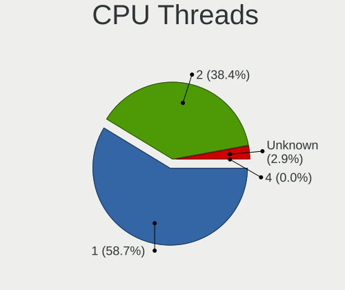

| Number  | Computers | Percent |
|---------|-----------|---------|
| 1       | 3314      | 58.69%  |
| 2       | 2169      | 38.41%  |
| Unknown | 163       | 2.89%   |
| 4       | 1         | 0.02%   |

CPU Microarch
-------------

Microarchitecture

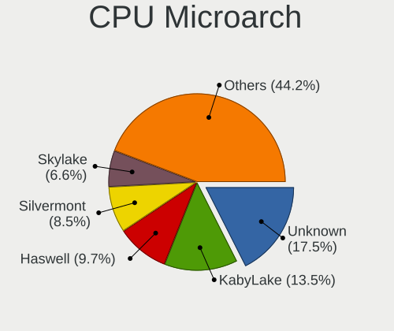

| Name            | Computers | Percent |
|-----------------|-----------|---------|
| Unknown         | 982       | 17.54%  |
| KabyLake        | 754       | 13.47%  |
| Haswell         | 541       | 9.66%   |
| Silvermont      | 474       | 8.47%   |
| Skylake         | 372       | 6.64%   |
| IvyBridge       | 331       | 5.91%   |
| SandyBridge     | 256       | 4.57%   |
| Goldmont plus   | 224       | 4%      |
| Goldmont        | 176       | 3.14%   |
| Broadwell       | 175       | 3.13%   |
| Zen 3           | 119       | 2.13%   |
| Zen             | 105       | 1.88%   |
| Zen 2           | 101       | 1.8%    |
| Westmere        | 99        | 1.77%   |
| CometLake       | 92        | 1.64%   |
| Penryn          | 87        | 1.55%   |
| Zen+            | 85        | 1.52%   |
| Nehalem         | 69        | 1.23%   |
| Puma            | 61        | 1.09%   |
| Bonnell         | 61        | 1.09%   |
| Jaguar          | 59        | 1.05%   |
| Core            | 59        | 1.05%   |
| TigerLake       | 56        | 1%      |
| Steamroller     | 54        | 0.96%   |
| Piledriver      | 53        | 0.95%   |
| K10             | 39        | 0.7%    |
| Excavator       | 27        | 0.48%   |
| Bobcat          | 26        | 0.46%   |
| NetBurst        | 18        | 0.32%   |
| K8 Hammer       | 13        | 0.23%   |
| P6              | 8         | 0.14%   |
| Bulldozer       | 8         | 0.14%   |
| IceLake         | 6         | 0.11%   |
| K10 Llano       | 4         | 0.07%   |
| Geode           | 2         | 0.04%   |
| K8 & K10 hybrid | 1         | 0.02%   |
| K6              | 1         | 0.02%   |
| CannonLake      | 1         | 0.02%   |

Graphics
--------

GPU Vendor
----------

Vendors of graphics cards

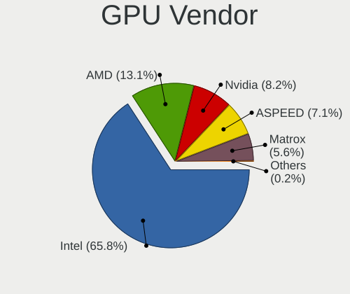

| Vendor                                       | Computers | Percent |
|----------------------------------------------|-----------|---------|
| Intel                                        | 3667      | 65.81%  |
| AMD                                          | 731       | 13.12%  |
| Nvidia                                       | 455       | 8.17%   |
| ASPEED Technology                            | 395       | 7.09%   |
| Matrox Electronics Systems                   | 313       | 5.62%   |
| XGI Technology (eXtreme Graphics Innovation) | 5         | 0.09%   |
| Silicon Integrated Systems [SiS]             | 3         | 0.05%   |
| VIA Technologies                             | 2         | 0.04%   |
| S3 Graphics                                  | 1         | 0.02%   |

GPU Model
---------

Graphics card models

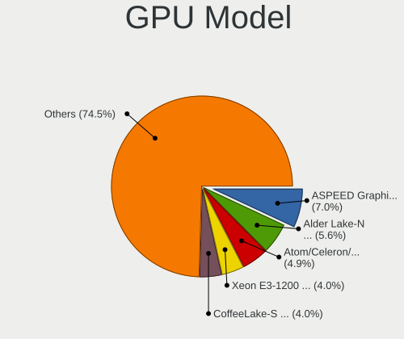

| Model                                                                                    | Computers | Percent |
|------------------------------------------------------------------------------------------|-----------|---------|
| ASPEED Technology ASPEED Graphics Family                                                 | 395       | 6.97%   |
| Intel Alder Lake-N [UHD Graphics]                                                        | 317       | 5.6%    |
| Intel Atom/Celeron/Pentium Processor x5-E8000/J3xxx/N3xxx Integrated Graphics Controller | 275       | 4.85%   |
| Intel Xeon E3-1200 v3/4th Gen Core Processor Integrated Graphics Controller              | 229       | 4.04%   |
| Intel CoffeeLake-S GT2 [UHD Graphics 630]                                                | 226       | 3.99%   |
| Intel Skylake-S GT2 [HD Graphics 530]                                                    | 207       | 3.65%   |
| Intel JasperLake [UHD Graphics]                                                          | 191       | 3.37%   |
| Intel GeminiLake [UHD Graphics 600]                                                      | 188       | 3.32%   |
| Matrox Electronics Systems MGA G200eW WPCM450                                            | 164       | 2.89%   |
| Intel 2nd Generation Core Processor Family Integrated Graphics Controller                | 155       | 2.74%   |
| Intel Atom Processor Z36xxx/Z37xxx Series Graphics & Display                             | 128       | 2.26%   |
| Intel Kaby Lake-U GT2 [HD Graphics 620]                                                  | 114       | 2.01%   |
| Intel Kaby Lake-S GT2 [HD Graphics 630]                                                  | 107       | 1.89%   |
| Intel Xeon E3-1200 v2/3rd Gen Core processor Graphics Controller                         | 97        | 1.71%   |
| Intel Kaby Lake-R GT2 [UHD Graphics 620]                                                 | 91        | 1.61%   |
| Matrox Electronics Systems G200eR2                                                       | 87        | 1.54%   |
| Intel Alder Lake-N [Intel Graphics]                                                      | 80        | 1.41%   |
| Intel 3rd Gen Core processor Graphics Controller                                         | 77        | 1.36%   |
| Intel Apollo Lake GT1 [HD Graphics 500]                                                  | 73        | 1.29%   |
| Intel Haswell-ULT Integrated Graphics Controller                                         | 72        | 1.27%   |
| Intel Elkhart Lake [UHD Graphics Gen11 16EU]                                             | 66        | 1.17%   |
| AMD Cezanne [Radeon Vega Series / Radeon Vega Mobile Series]                             | 61        | 1.08%   |
| Intel Broadwell-U GT2 [HD Graphics 5500]                                                 | 58        | 1.02%   |
| AMD Kaveri [Radeon R7 Graphics]                                                          | 52        | 0.92%   |
| Intel CometLake-S GT2 [UHD Graphics 630]                                                 | 51        | 0.9%    |
| Intel TigerLake-LP GT2 [Iris Xe Graphics]                                                | 49        | 0.86%   |
| AMD Picasso/Raven 2 [Radeon Vega Series / Radeon Vega Mobile Series]                     | 47        | 0.83%   |
| Intel IvyBridge GT2 [HD Graphics 4000]                                                   | 44        | 0.78%   |
| Intel 4th Generation Core Processor Family Integrated Graphics Controller                | 40        | 0.71%   |
| AMD Renoir [Radeon Vega Series / Radeon Vega Mobile Series]                              | 38        | 0.67%   |
| Nvidia GK208B [GeForce GT 710]                                                           | 36        | 0.64%   |
| Intel Skylake-U GT2 [HD Graphics 520]                                                    | 36        | 0.64%   |
| Intel GeminiLake [UHD Graphics 605]                                                      | 36        | 0.64%   |
| Intel Core Processor Integrated Graphics Controller                                      | 34        | 0.6%    |
| AMD Kabini [Radeon HD 8400E]                                                             | 33        | 0.58%   |
| Intel WhiskeyLake-U GT2 [UHD Graphics 620]                                               | 32        | 0.56%   |
| Intel 4 Series Chipset Integrated Graphics Controller                                    | 32        | 0.56%   |
| AMD Ellesmere [Radeon RX 470/480/570/570X/580/580X/590]                                  | 31        | 0.55%   |
| Intel Alder Lake-P GT2 [Iris Xe Graphics]                                                | 29        | 0.51%   |
| AMD Raven Ridge [Radeon Vega Series / Radeon Vega Mobile Series]                         | 28        | 0.49%   |

GPU Combo
---------

Combinations of graphics cards

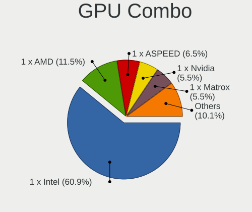

| Name                    | Computers | Percent |
|-------------------------|-----------|---------|
| 1 x Intel               | 3412      | 60.91%  |
| 1 x AMD                 | 646       | 11.53%  |
| 1 x ASPEED              | 363       | 6.48%   |
| 1 x Nvidia              | 309       | 5.52%   |
| 1 x Matrox              | 308       | 5.5%    |
| Other                   | 234       | 4.18%   |
| Intel + Nvidia          | 116       | 2.07%   |
| 2 x Intel               | 90        | 1.61%   |
| Intel + AMD             | 34        | 0.61%   |
| AMD + Nvidia            | 20        | 0.36%   |
| 2 x AMD                 | 18        | 0.32%   |
| Intel + ASPEED          | 16        | 0.29%   |
| Nvidia + ASPEED         | 7         | 0.12%   |
| AMD + ASPEED            | 7         | 0.12%   |
| 1 x XGI                 | 5         | 0.09%   |
| 2 x Nvidia              | 3         | 0.05%   |
| 1 x SiS                 | 3         | 0.05%   |
| Nvidia + Matrox         | 3         | 0.05%   |
| 2 x Nvidia + 1 x ASPEED | 2         | 0.04%   |
| 1 x VIA                 | 2         | 0.04%   |
| 2 x AMD + 1 x ASPEED    | 1         | 0.02%   |
| 1 x S3 Graphics         | 1         | 0.02%   |
| Intel + 2 x AMD         | 1         | 0.02%   |
| AMD + Matrox            | 1         | 0.02%   |

GPU Driver
----------

Free vs proprietary

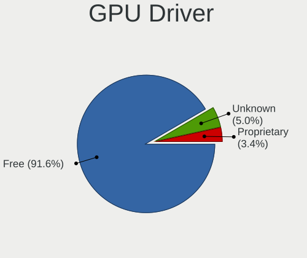

| Driver      | Computers | Percent |
|-------------|-----------|---------|
| Free        | 5106      | 91.62%  |
| Unknown     | 276       | 4.95%   |
| Proprietary | 191       | 3.43%   |

GPU Memory
----------

Total video memory

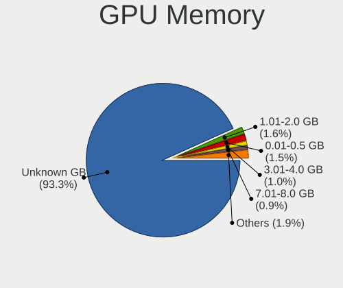

| Size in GB | Computers | Percent |
|------------|-----------|---------|
| Unknown    | 5216      | 93.28%  |
| 1.01-2.0   | 87        | 1.56%   |
| 0.01-0.5   | 82        | 1.47%   |
| 3.01-4.0   | 54        | 0.97%   |
| 7.01-8.0   | 49        | 0.88%   |
| 0.51-1.0   | 47        | 0.84%   |
| 5.01-6.0   | 28        | 0.5%    |
| 8.01-16.0  | 21        | 0.38%   |
| 2.01-3.0   | 5         | 0.09%   |
| 4.01-5.0   | 2         | 0.04%   |
| 16.01-24.0 | 1         | 0.02%   |

Monitor
-------

Monitor Vendor
--------------

Monitor vendors

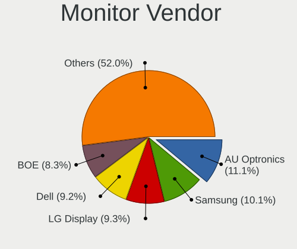

| Vendor                  | Computers | Percent |
|-------------------------|-----------|---------|
| AU Optronics            | 114       | 11.07%  |
| Samsung Electronics     | 104       | 10.1%   |
| LG Display              | 96        | 9.32%   |
| Dell                    | 95        | 9.22%   |
| BOE                     | 85        | 8.25%   |
| Chimei Innolux          | 68        | 6.6%    |
| Goldstar                | 53        | 5.15%   |
| Acer                    | 50        | 4.85%   |
| Lenovo                  | 41        | 3.98%   |
| Hewlett-Packard         | 39        | 3.79%   |
| Apple                   | 34        | 3.3%    |
| Ancor Communications    | 31        | 3.01%   |
| ASUSTek Computer        | 20        | 1.94%   |
| ViewSonic               | 18        | 1.75%   |
| Sharp                   | 15        | 1.46%   |
| BenQ                    | 14        | 1.36%   |
| AOC                     | 13        | 1.26%   |
| Vizio                   | 11        | 1.07%   |
| Sceptre Tech            | 10        | 0.97%   |
| InfoVision              | 10        | 0.97%   |
| LG Electronics          | 9         | 0.87%   |
| Chi Mei Optoelectronics | 9         | 0.87%   |
| MSI                     | 6         | 0.58%   |
| Sony                    | 5         | 0.49%   |
| Philips                 | 4         | 0.39%   |
| NEC Computers           | 4         | 0.39%   |
| Westinghouse            | 3         | 0.29%   |
| LGD                     | 3         | 0.29%   |
| LG Philips              | 3         | 0.29%   |
| Lenovo Group Limited    | 3         | 0.29%   |
| Insignia                | 3         | 0.29%   |
| HannStar                | 3         | 0.29%   |
| Gigabyte Technology     | 3         | 0.29%   |
| Unknown                 | 3         | 0.29%   |
| Toshiba                 | 2         | 0.19%   |
| PANDA                   | 2         | 0.19%   |
| Panasonic               | 2         | 0.19%   |
| ONN                     | 2         | 0.19%   |
| IBM                     | 2         | 0.19%   |
| Hitachi                 | 2         | 0.19%   |

Monitor Model
-------------

Monitor models

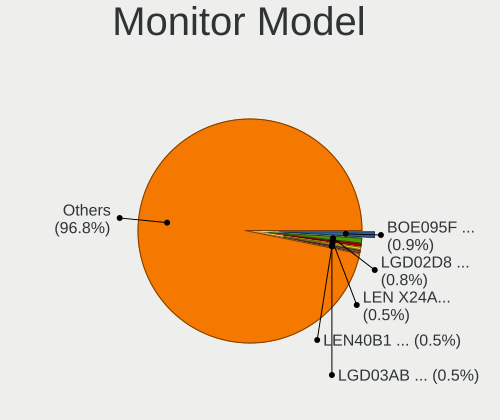

| Model                                                                    | Computers | Percent |
|--------------------------------------------------------------------------|-----------|---------|
| BOE LCD Monitor BOE095F 2256x1504 280x190mm 13.3-inch                    | 10        | 0.94%   |
| LG Display LCD Monitor LGD02D8 1366x768 280x160mm 12.7-inch              | 9         | 0.85%   |
| LG Display LCD Monitor LGD03AB 1366x768 340x190mm 15.3-inch              | 5         | 0.47%   |
| Lenovo LEN X24A LEN60CF 1920x1080 530x300mm 24.0-inch                    | 5         | 0.47%   |
| Lenovo LCD Monitor LEN40B1 1600x900 340x190mm 15.3-inch                  | 5         | 0.47%   |
| AU Optronics LCD Monitor AUO243D 1920x1080 310x170mm 13.9-inch           | 5         | 0.47%   |
| Sceptre Tech Sceptre P30 SPT0BCC 2560x1080 690x290mm 29.5-inch           | 4         | 0.38%   |
| Samsung Electronics LCD Monitor SEC5441 1366x768 340x190mm 15.3-inch     | 4         | 0.38%   |
| Samsung Electronics LCD Monitor SEC324C 1600x900 310x170mm 13.9-inch     | 4         | 0.38%   |
| LG Display LCD Monitor LGD05FA 1920x1080 310x170mm 13.9-inch             | 4         | 0.38%   |
| Lenovo LCD Monitor LEN4035 1280x800 300x190mm 14.0-inch                  | 4         | 0.38%   |
| Dell U2412M DELA07B 1920x1200 520x320mm 24.0-inch                        | 4         | 0.38%   |
| Chimei Innolux LCD Monitor CMN14D4 1920x1080 310x170mm 13.9-inch         | 4         | 0.38%   |
| Chimei Innolux LCD Monitor CMN14C9 1920x1080 310x170mm 13.9-inch         | 4         | 0.38%   |
| Chimei Innolux LCD Monitor CMN1132 1366x768 260x140mm 11.6-inch          | 4         | 0.38%   |
| AU Optronics LCD Monitor AUO403D 1920x1080 310x170mm 13.9-inch           | 4         | 0.38%   |
| AU Optronics LCD Monitor AUO213E 1600x900 310x170mm 13.9-inch            | 4         | 0.38%   |
| ASUSTek Computer VG245 AUS24A1 1920x1080 530x300mm 24.0-inch             | 4         | 0.38%   |
| Samsung Electronics U32J59x SAM0F33 3840x2160 700x390mm 31.5-inch        | 3         | 0.28%   |
| Samsung Electronics SyncMaster SAM00A4 1024x768 300x230mm 14.9-inch      | 3         | 0.28%   |
| Samsung Electronics LCD Monitor SEC3157 1280x800 300x190mm 14.0-inch     | 3         | 0.28%   |
| MSI G32C4 MSI3DA6 1920x1080 700x390mm 31.5-inch                          | 3         | 0.28%   |
| LG Display LCD Monitor LGD02DC 1366x768 340x190mm 15.3-inch              | 3         | 0.28%   |
| Lenovo LEN L174 LEN240B 1280x1024 340x270mm 17.1-inch                    | 3         | 0.28%   |
| Lenovo LCD Monitor LEN40B2 1920x1080 340x190mm 15.3-inch                 | 3         | 0.28%   |
| Lenovo LCD Monitor LEN4031 1280x800 300x190mm 14.0-inch                  | 3         | 0.28%   |
| Lenovo LCD Monitor LEN4011 1280x800 260x160mm 12.0-inch                  | 3         | 0.28%   |
| InfoVision LCD Monitor IVO0489 1366x768 260x140mm 11.6-inch              | 3         | 0.28%   |
| Goldstar LG Ultra HD GSM5B09 3840x2160 600x340mm 27.2-inch               | 3         | 0.28%   |
| Goldstar LG FULL HD GSM5B55 1920x1080 480x270mm 21.7-inch                | 3         | 0.28%   |
| Dell U2518D DEL413C 2560x1440 550x310mm 24.9-inch                        | 3         | 0.28%   |
| Dell S2418HN/NX DEL4123 1920x1080 530x300mm 24.0-inch                    | 3         | 0.28%   |
| Dell E196FP DELA015 1280x1024 380x300mm 19.1-inch                        | 3         | 0.28%   |
| Chimei Innolux LCD Monitor CMN14C0 1920x1080 310x170mm 13.9-inch         | 3         | 0.28%   |
| Chi Mei Optoelectronics LCD Monitor CMO15A2 1366x768 340x190mm 15.3-inch | 3         | 0.28%   |
| BOE LCD Monitor BOE0731 1366x768 260x140mm 11.6-inch                     | 3         | 0.28%   |
| BOE LCD Monitor BOE06CB 1920x1080 340x190mm 15.3-inch                    | 3         | 0.28%   |
| BOE LCD Monitor BOE05DA 1366x768 280x160mm 12.7-inch                     | 3         | 0.28%   |
| AU Optronics LCD Monitor AUO133D 1920x1080 310x170mm 13.9-inch           | 3         | 0.28%   |
| Apple Color LCD APPA018 2560x1600 290x180mm 13.4-inch                    | 3         | 0.28%   |

Monitor Resolution
------------------

Monitor screen resolution

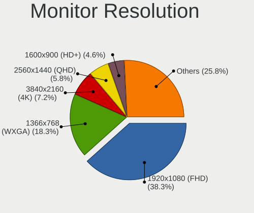

| Resolution         | Computers | Percent |
|--------------------|-----------|---------|
| 1920x1080 (FHD)    | 385       | 38.35%  |
| 1366x768 (WXGA)    | 184       | 18.33%  |
| 3840x2160 (4K)     | 72        | 7.17%   |
| 2560x1440 (QHD)    | 58        | 5.78%   |
| 1600x900 (HD+)     | 46        | 4.58%   |
| 1920x1200 (WUXGA)  | 40        | 3.98%   |
| 1280x1024 (SXGA)   | 29        | 2.89%   |
| 1280x800 (WXGA)    | 26        | 2.59%   |
| 1680x1050 (WSXGA+) | 22        | 2.19%   |
| 2560x1080          | 17        | 1.69%   |
| 1440x900 (WXGA+)   | 17        | 1.69%   |
| 3440x1440          | 13        | 1.29%   |
| 2560x1600          | 12        | 1.2%    |
| 2256x1504          | 10        | 1%      |
| Unknown            | 10        | 1%      |
| 1360x768           | 8         | 0.8%    |
| 1024x768 (XGA)     | 8         | 0.8%    |
| 1024x600           | 6         | 0.6%    |
| 3200x1800 (QHD+)   | 5         | 0.5%    |
| 3840x1080          | 4         | 0.4%    |
| 1600x1200          | 4         | 0.4%    |
| 2880x1800          | 3         | 0.3%    |
| 3840x2400          | 2         | 0.2%    |
| 3840x1600          | 2         | 0.2%    |
| 2240x1400          | 2         | 0.2%    |
| 1920x1280          | 2         | 0.2%    |
| 7860x2400          | 1         | 0.1%    |
| 7040x1440          | 1         | 0.1%    |
| 5760x2160          | 1         | 0.1%    |
| 5760x1080          | 1         | 0.1%    |
| 5120x1440          | 1         | 0.1%    |
| 4640x1080          | 1         | 0.1%    |
| 4480x1080          | 1         | 0.1%    |
| 3840x2560          | 1         | 0.1%    |
| 3520x1080          | 1         | 0.1%    |
| 2806x900           | 1         | 0.1%    |
| 2736x1824          | 1         | 0.1%    |
| 2160x1350          | 1         | 0.1%    |
| 1920x540           | 1         | 0.1%    |
| 1920x1920          | 1         | 0.1%    |

Monitor Diagonal
----------------

Diagonal size in inches

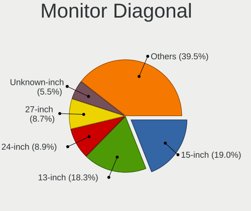

| Inches  | Computers | Percent |
|---------|-----------|---------|
| 15      | 196       | 19.01%  |
| 13      | 189       | 18.33%  |
| 24      | 92        | 8.92%   |
| 27      | 90        | 8.73%   |
| Unknown | 57        | 5.53%   |
| 31      | 45        | 4.36%   |
| 23      | 42        | 4.07%   |
| 17      | 42        | 4.07%   |
| 12      | 40        | 3.88%   |
| 11      | 37        | 3.59%   |
| 21      | 36        | 3.49%   |
| 19      | 32        | 3.1%    |
| 14      | 28        | 2.72%   |
| 34      | 18        | 1.75%   |
| 22      | 12        | 1.16%   |
| 29      | 9         | 0.87%   |
| 20      | 9         | 0.87%   |
| 18      | 9         | 0.87%   |
| 26      | 6         | 0.58%   |
| 64      | 4         | 0.39%   |
| 52      | 3         | 0.29%   |
| 42      | 3         | 0.29%   |
| 32      | 3         | 0.29%   |
| 28      | 3         | 0.29%   |
| 10      | 3         | 0.29%   |
| 54      | 2         | 0.19%   |
| 43      | 2         | 0.19%   |
| 41      | 2         | 0.19%   |
| 40      | 2         | 0.19%   |
| 37      | 2         | 0.19%   |
| 35      | 2         | 0.19%   |
| 16      | 2         | 0.19%   |
| 9       | 2         | 0.19%   |
| 74      | 1         | 0.1%    |
| 50      | 1         | 0.1%    |
| 49      | 1         | 0.1%    |
| 48      | 1         | 0.1%    |
| 39      | 1         | 0.1%    |
| 25      | 1         | 0.1%    |
| 8       | 1         | 0.1%    |

Monitor Width
-------------

Physical width

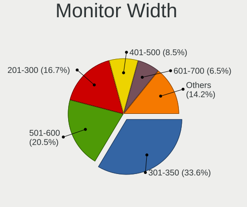

| Width in mm | Computers | Percent |
|-------------|-----------|---------|
| 301-350     | 340       | 33.56%  |
| 501-600     | 208       | 20.53%  |
| 201-300     | 169       | 16.68%  |
| 401-500     | 86        | 8.49%   |
| 601-700     | 66        | 6.52%   |
| Unknown     | 57        | 5.63%   |
| 351-400     | 36        | 3.55%   |
| 701-800     | 21        | 2.07%   |
| 1001-1500   | 12        | 1.18%   |
| 801-900     | 7         | 0.69%   |
| 901-1000    | 7         | 0.69%   |
| 101-200     | 3         | 0.3%    |
| 1501-2000   | 1         | 0.1%    |

Aspect Ratio
------------

Proportional relationship between the width and the height

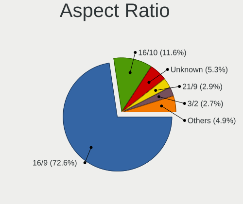

| Ratio   | Computers | Percent |
|---------|-----------|---------|
| 16/9    | 698       | 72.63%  |
| 16/10   | 111       | 11.55%  |
| Unknown | 51        | 5.31%   |
| 21/9    | 28        | 2.91%   |
| 3/2     | 26        | 2.71%   |
| 5/4     | 25        | 2.6%    |
| 4/3     | 15        | 1.56%   |
| 6/5     | 4         | 0.42%   |
| 32/9    | 2         | 0.21%   |
| 1.00    | 1         | 0.1%    |

Monitor Area
------------

Area in inch²

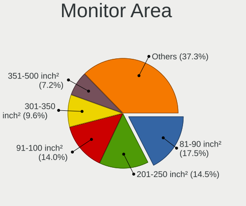

| Area in inch² | Computers | Percent |
|----------------|-----------|---------|
| 81-90          | 179       | 17.46%  |
| 201-250        | 149       | 14.54%  |
| 91-100         | 143       | 13.95%  |
| 301-350        | 98        | 9.56%   |
| 351-500        | 74        | 7.22%   |
| Unknown        | 57        | 5.56%   |
| 101-110        | 52        | 5.07%   |
| 151-200        | 42        | 4.1%    |
| 61-70          | 39        | 3.8%    |
| 51-60          | 36        | 3.51%   |
| 71-80          | 32        | 3.12%   |
| 251-300        | 31        | 3.02%   |
| 141-150        | 25        | 2.44%   |
| 121-130        | 24        | 2.34%   |
| 501-1000       | 14        | 1.37%   |
| More than 1000 | 11        | 1.07%   |
| 111-120        | 9         | 0.88%   |
| 131-140        | 4         | 0.39%   |
| 41-50          | 3         | 0.29%   |
| 1-40           | 3         | 0.29%   |

Pixel Density
-------------

Pixels per inch

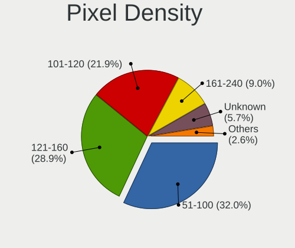

| Density       | Computers | Percent |
|---------------|-----------|---------|
| 51-100        | 321       | 31.97%  |
| 121-160       | 290       | 28.88%  |
| 101-120       | 220       | 21.91%  |
| 161-240       | 90        | 8.96%   |
| Unknown       | 57        | 5.68%   |
| More than 240 | 21        | 2.09%   |
| 1-50          | 5         | 0.5%    |

Multiple Monitors
-----------------

Total monitors connected

| Total | Computers | Percent |
|-------|-----------|---------|
| 0     | 4552      | 81.49%  |
| 1     | 922       | 16.51%  |
| 2     | 100       | 1.79%   |
| 3     | 10        | 0.18%   |
| 4     | 2         | 0.04%   |

Network
-------

Net Controller Vendor
---------------------

Controller vendors

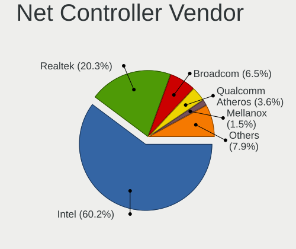

| Vendor                    | Computers | Percent |
|---------------------------|-----------|---------|
| Intel                     | 4632      | 60.21%  |
| Realtek Semiconductor     | 1565      | 20.34%  |
| Broadcom                  | 498       | 6.47%   |
| Qualcomm Atheros          | 275       | 3.57%   |
| Mellanox Technologies     | 114       | 1.48%   |
| MediaTek                  | 61        | 0.79%   |
| Ralink Technology         | 45        | 0.58%   |
| IMC Networks              | 43        | 0.56%   |
| Chelsio Communications    | 41        | 0.53%   |
| AMD                       | 38        | 0.49%   |
| U-Blox                    | 30        | 0.39%   |
| TP-Link                   | 24        | 0.31%   |
| Marvell Technology Group  | 21        | 0.27%   |
| Aquantia                  | 21        | 0.27%   |
| Edimax Technology         | 20        | 0.26%   |
| Ralink                    | 17        | 0.22%   |
| American Megatrends       | 17        | 0.22%   |
| Solarflare Communications | 16        | 0.21%   |
| Google                    | 14        | 0.18%   |
| Emulex                    | 14        | 0.18%   |
| Insyde Software           | 13        | 0.17%   |
| D-Link System             | 11        | 0.14%   |
| Nvidia                    | 8         | 0.1%    |
| Novatel Wireless          | 8         | 0.1%    |
| NetGear                   | 8         | 0.1%    |
| Seeed Technology          | 7         | 0.09%   |
| Samsung Electronics       | 7         | 0.09%   |
| Dell                      | 7         | 0.09%   |
| ASUSTek Computer          | 7         | 0.09%   |
| Apple                     | 7         | 0.09%   |
| Qualcomm                  | 6         | 0.08%   |
| QLogic                    | 6         | 0.08%   |
| Microchip Technology      | 6         | 0.08%   |
| 3Com                      | 5         | 0.06%   |
| VIA Technologies          | 4         | 0.05%   |
| sipeed                    | 4         | 0.05%   |
| Sierra Wireless           | 4         | 0.05%   |
| Sequans Communications    | 4         | 0.05%   |
| Xiaomi                    | 3         | 0.04%   |
| Qualcomm Technologies     | 3         | 0.04%   |

Net Controller Model
--------------------

Controller models

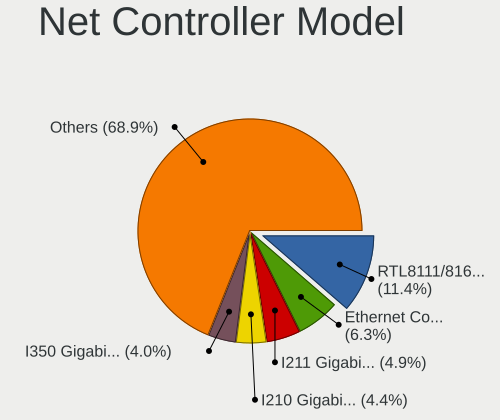

| Model                                                                         | Computers | Percent |
|-------------------------------------------------------------------------------|-----------|---------|
| Realtek RTL8111/8168/8211/8411 PCI Express Gigabit Ethernet Controller        | 1167      | 11.37%  |
| Intel Ethernet Controller I226-V                                              | 649       | 6.32%   |
| Intel I211 Gigabit Network Connection                                         | 507       | 4.94%   |
| Intel I210 Gigabit Network Connection                                         | 451       | 4.39%   |
| Intel I350 Gigabit Network Connection                                         | 414       | 4.03%   |
| Intel Ethernet Controller I225-V                                              | 409       | 3.98%   |
| Intel 82579LM Gigabit Network Connection (Lewisville)                         | 248       | 2.42%   |
| Intel 82599ES 10-Gigabit SFI/SFP+ Network Connection                          | 243       | 2.37%   |
| Intel 82574L Gigabit Network Connection                                       | 213       | 2.07%   |
| Realtek RTL8125 2.5GbE Controller                                             | 190       | 1.85%   |
| Intel Ethernet Connection I217-LM                                             | 185       | 1.8%    |
| Intel Ethernet Controller 10-Gigabit X540-AT2                                 | 173       | 1.69%   |
| Intel 82576 Gigabit Network Connection                                        | 151       | 1.47%   |
| Intel 82580 Gigabit Network Connection                                        | 135       | 1.32%   |
| Intel Ethernet Connection (2) I219-LM                                         | 124       | 1.21%   |
| Intel Wi-Fi 6 AX200                                                           | 119       | 1.16%   |
| Intel 82583V Gigabit Network Connection                                       | 119       | 1.16%   |
| Intel Ethernet Controller X550                                                | 108       | 1.05%   |
| Intel 82571EB/82571GB Gigabit Ethernet Controller D0/D1 (copper applications) | 104       | 1.01%   |
| Intel Wireless 8265 / 8275                                                    | 103       | 1%      |
| Intel Ethernet Controller X710 for 10GbE SFP+                                 | 102       | 0.99%   |
| Realtek RTL8821CE 802.11ac PCIe Wireless Network Adapter                      | 98        | 0.95%   |
| Intel Ethernet Connection (7) I219-LM                                         | 98        | 0.95%   |
| Broadcom NetXtreme BCM5720 Gigabit Ethernet PCIe                              | 93        | 0.91%   |
| Intel Ethernet Connection (7) I219-V                                          | 85        | 0.83%   |
| Intel 82571EB/82571GB Gigabit Ethernet Controller (Copper)                    | 80        | 0.78%   |
| Intel Ethernet Connection (2) I219-V                                          | 78        | 0.76%   |
| Intel Wireless 7265                                                           | 73        | 0.71%   |
| Intel Alder Lake-N PCH CNVi WiFi                                              | 69        | 0.67%   |
| Broadcom NetXtreme II BCM5709 Gigabit Ethernet                                | 68        | 0.66%   |
| Realtek RTL810xE PCI Express Fast Ethernet controller                         | 67        | 0.65%   |
| Intel Wi-Fi 6E(802.11ax) AX210/AX1675* 2x2 [Typhoon Peak]                     | 65        | 0.63%   |
| Intel Wireless 7260                                                           | 63        | 0.61%   |
| Intel Ethernet Connection I354                                                | 62        | 0.6%    |
| Broadcom NetXtreme II BCM5716 Gigabit Ethernet                                | 60        | 0.58%   |
| Mellanox MT27500 Family [ConnectX-3]                                          | 57        | 0.56%   |
| Intel Wireless 8260                                                           | 57        | 0.56%   |
| Intel Centrino Advanced-N 6205 [Taylor Peak]                                  | 56        | 0.55%   |
| Intel Ethernet Connection X553 1GbE                                           | 50        | 0.49%   |
| Intel Ethernet Connection X553 10 GbE SFP+                                    | 50        | 0.49%   |

Wireless Vendor
---------------

Wireless vendors

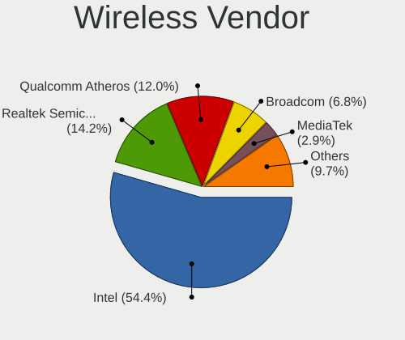

| Vendor                          | Computers | Percent |
|---------------------------------|-----------|---------|
| Intel                           | 1042      | 54.44%  |
| Realtek Semiconductor           | 271       | 14.16%  |
| Qualcomm Atheros                | 230       | 12.02%  |
| Broadcom                        | 130       | 6.79%   |
| MediaTek                        | 55        | 2.87%   |
| Ralink Technology               | 45        | 2.35%   |
| IMC Networks                    | 43        | 2.25%   |
| TP-Link                         | 24        | 1.25%   |
| Edimax Technology               | 20        | 1.04%   |
| Ralink                          | 17        | 0.89%   |
| NetGear                         | 8         | 0.42%   |
| ASUSTek Computer                | 7         | 0.37%   |
| Sierra Wireless                 | 3         | 0.16%   |
| Qualcomm Technologies           | 3         | 0.16%   |
| Qualcomm Atheros Communications | 3         | 0.16%   |
| D-Link                          | 3         | 0.16%   |
| Marvell Technology Group        | 2         | 0.1%    |
| D-Link System                   | 2         | 0.1%    |
| Belkin Components               | 2         | 0.1%    |
| ZyXEL Communications            | 1         | 0.05%   |
| Linksys                         | 1         | 0.05%   |
| Dell                            | 1         | 0.05%   |
| AboCom Systems                  | 1         | 0.05%   |

Wireless Model
--------------

Wireless models

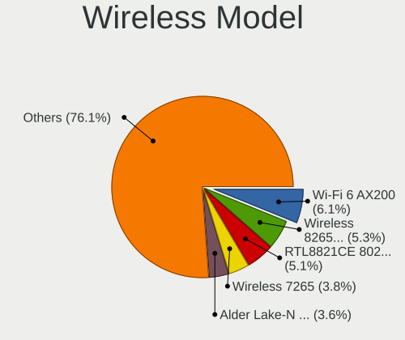

| Model                                                           | Computers | Percent |
|-----------------------------------------------------------------|-----------|---------|
| Intel Wi-Fi 6 AX200                                             | 119       | 6.14%   |
| Intel Wireless 8265 / 8275                                      | 103       | 5.32%   |
| Realtek RTL8821CE 802.11ac PCIe Wireless Network Adapter        | 98        | 5.06%   |
| Intel Wireless 7265                                             | 73        | 3.77%   |
| Intel Alder Lake-N PCH CNVi WiFi                                | 69        | 3.56%   |
| Intel Wi-Fi 6E(802.11ax) AX210/AX1675* 2x2 [Typhoon Peak]       | 65        | 3.36%   |
| Intel Wireless 7260                                             | 63        | 3.25%   |
| Intel Wireless 8260                                             | 57        | 2.94%   |
| Intel Centrino Advanced-N 6205 [Taylor Peak]                    | 56        | 2.89%   |
| Intel Wireless 3165                                             | 48        | 2.48%   |
| IMC Networks 802.11 n/g/b Wireless LAN USB Mini-Card            | 43        | 2.22%   |
| Intel Dual Band Wireless-AC 3168NGW [Stone Peak]                | 40        | 2.07%   |
| Qualcomm Atheros AR9485 Wireless Network Adapter                | 32        | 1.65%   |
| Intel Cannon Lake PCH CNVi WiFi                                 | 32        | 1.65%   |
| Intel Wi-Fi 5(802.11ac) Wireless-AC 9x6x [Thunder Peak]         | 31        | 1.6%    |
| MediaTek MT7922 802.11ax PCI Express Wireless Network Adapter   | 29        | 1.5%    |
| Intel Gemini Lake PCH CNVi WiFi                                 | 29        | 1.5%    |
| Realtek RTL8188EUS 802.11n Wireless Network Adapter             | 28        | 1.45%   |
| Qualcomm Atheros QCA6174 802.11ac Wireless Network Adapter      | 28        | 1.45%   |
| Intel Wi-Fi 6 AX201                                             | 28        | 1.45%   |
| Qualcomm Atheros AR928X Wireless Network Adapter (PCI-Express)  | 27        | 1.39%   |
| Qualcomm Atheros QCA9377 802.11ac Wireless Network Adapter      | 24        | 1.24%   |
| Intel Cannon Point-LP CNVi [Wireless-AC]                        | 24        | 1.24%   |
| Broadcom BCM4331 802.11a/b/g/n                                  | 24        | 1.24%   |
| Qualcomm Atheros AR9462 Wireless Network Adapter                | 23        | 1.19%   |
| Intel Wireless 3160                                             | 21        | 1.08%   |
| Broadcom BCM4360 802.11ac Dual Band Wireless Network Adapter    | 21        | 1.08%   |
| Ralink RT5370 Wireless Adapter                                  | 20        | 1.03%   |
| Qualcomm Atheros AR93xx Wireless Network Adapter                | 20        | 1.03%   |
| Edimax EW-7811Un 802.11n Wireless Adapter [Realtek RTL8188CUS]  | 20        | 1.03%   |
| Realtek RTL8822CE 802.11ac PCIe Wireless Network Adapter        | 18        | 0.93%   |
| Qualcomm Atheros QCA9565 / AR9565 Wireless Network Adapter      | 18        | 0.93%   |
| Qualcomm Atheros AR9285 Wireless Network Adapter (PCI-Express)  | 18        | 0.93%   |
| MediaTek MT7921K (RZ608) Wi-Fi 6E 80MHz                         | 17        | 0.88%   |
| Realtek RTL8188CE 802.11b/g/n WiFi Adapter                      | 16        | 0.83%   |
| Intel Jasper Lake PCH CNVi WiFi                                 | 15        | 0.77%   |
| Qualcomm Atheros QCA986x/988x 802.11ac Wireless Network Adapter | 14        | 0.72%   |
| Intel Alder Lake-P PCH CNVi WiFi                                | 14        | 0.72%   |
| Broadcom BCM4352 802.11ac Dual Band Wireless Network Adapter    | 14        | 0.72%   |
| Intel Comet Lake PCH-LP CNVi WiFi                               | 13        | 0.67%   |

Ethernet Vendor
---------------

Ethernet vendors

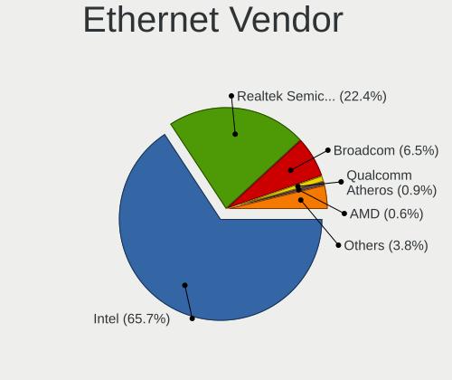

| Vendor                           | Computers | Percent |
|----------------------------------|-----------|---------|
| Intel                            | 4201      | 65.74%  |
| Realtek Semiconductor            | 1432      | 22.41%  |
| Broadcom                         | 418       | 6.54%   |
| Qualcomm Atheros                 | 60        | 0.94%   |
| AMD                              | 37        | 0.58%   |
| Chelsio Communications           | 36        | 0.56%   |
| Aquantia                         | 20        | 0.31%   |
| Marvell Technology Group         | 18        | 0.28%   |
| American Megatrends              | 17        | 0.27%   |
| Solarflare Communications        | 16        | 0.25%   |
| Insyde Software                  | 13        | 0.2%    |
| Emulex                           | 13        | 0.2%    |
| D-Link System                    | 9         | 0.14%   |
| Nvidia                           | 8         | 0.13%   |
| Novatel Wireless                 | 8         | 0.13%   |
| Samsung Electronics              | 7         | 0.11%   |
| Qualcomm                         | 6         | 0.09%   |
| QLogic                           | 6         | 0.09%   |
| Google                           | 5         | 0.08%   |
| Apple                            | 5         | 0.08%   |
| 3Com                             | 5         | 0.08%   |
| VIA Technologies                 | 4         | 0.06%   |
| sipeed                           | 4         | 0.06%   |
| Microchip Technology             | 4         | 0.06%   |
| MediaTek                         | 4         | 0.06%   |
| Xiaomi                           | 3         | 0.05%   |
| Lenovo                           | 3         | 0.05%   |
| IBM                              | 3         | 0.05%   |
| Cisco Systems                    | 3         | 0.05%   |
| OPPO Electronics                 | 2         | 0.03%   |
| OnePlus Technology (Shenzhen)    | 2         | 0.03%   |
| National Semiconductor           | 2         | 0.03%   |
| ICS Advent                       | 2         | 0.03%   |
| ZTE WCDMA Technologies MSM       | 1         | 0.02%   |
| TRENDnet                         | 1         | 0.02%   |
| Tehuti Networks                  | 1         | 0.02%   |
| Silicon Integrated Systems [SiS] | 1         | 0.02%   |
| Silicom                          | 1         | 0.02%   |
| Quectel Wireless Solutions       | 1         | 0.02%   |
| Oracle/SUN                       | 1         | 0.02%   |

Ethernet Model
--------------

Ethernet models

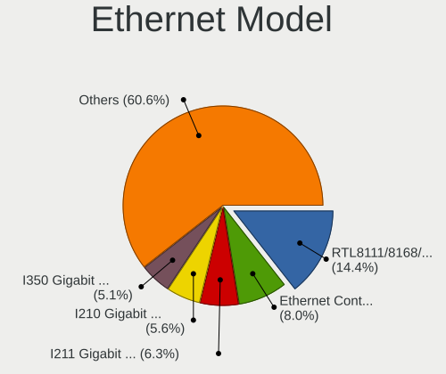

| Model                                                                         | Computers | Percent |
|-------------------------------------------------------------------------------|-----------|---------|
| Realtek RTL8111/8168/8211/8411 PCI Express Gigabit Ethernet Controller        | 1167      | 14.43%  |
| Intel Ethernet Controller I226-V                                              | 649       | 8.03%   |
| Intel I211 Gigabit Network Connection                                         | 507       | 6.27%   |
| Intel I210 Gigabit Network Connection                                         | 451       | 5.58%   |
| Intel I350 Gigabit Network Connection                                         | 414       | 5.12%   |
| Intel Ethernet Controller I225-V                                              | 409       | 5.06%   |
| Intel 82579LM Gigabit Network Connection (Lewisville)                         | 248       | 3.07%   |
| Intel 82599ES 10-Gigabit SFI/SFP+ Network Connection                          | 243       | 3.01%   |
| Intel 82574L Gigabit Network Connection                                       | 213       | 2.63%   |
| Realtek RTL8125 2.5GbE Controller                                             | 188       | 2.33%   |
| Intel Ethernet Connection I217-LM                                             | 185       | 2.29%   |
| Intel Ethernet Controller 10-Gigabit X540-AT2                                 | 173       | 2.14%   |
| Intel 82576 Gigabit Network Connection                                        | 151       | 1.87%   |
| Intel 82580 Gigabit Network Connection                                        | 135       | 1.67%   |
| Intel Ethernet Connection (2) I219-LM                                         | 124       | 1.53%   |
| Intel 82583V Gigabit Network Connection                                       | 119       | 1.47%   |
| Intel Ethernet Controller X550                                                | 108       | 1.34%   |
| Intel 82571EB/82571GB Gigabit Ethernet Controller D0/D1 (copper applications) | 104       | 1.29%   |
| Intel Ethernet Controller X710 for 10GbE SFP+                                 | 102       | 1.26%   |
| Intel Ethernet Connection (7) I219-LM                                         | 98        | 1.21%   |
| Broadcom NetXtreme BCM5720 Gigabit Ethernet PCIe                              | 93        | 1.15%   |
| Intel Ethernet Connection (7) I219-V                                          | 85        | 1.05%   |
| Intel 82571EB/82571GB Gigabit Ethernet Controller (Copper)                    | 80        | 0.99%   |
| Intel Ethernet Connection (2) I219-V                                          | 78        | 0.96%   |
| Broadcom NetXtreme II BCM5709 Gigabit Ethernet                                | 68        | 0.84%   |
| Realtek RTL810xE PCI Express Fast Ethernet controller                         | 67        | 0.83%   |
| Intel Ethernet Connection I354                                                | 62        | 0.77%   |
| Broadcom NetXtreme II BCM5716 Gigabit Ethernet                                | 60        | 0.74%   |
| Intel Ethernet Connection X553 1GbE                                           | 50        | 0.62%   |
| Intel Ethernet Connection X553 10 GbE SFP+                                    | 50        | 0.62%   |
| Intel Ethernet Connection (5) I219-LM                                         | 50        | 0.62%   |
| Intel 82575EB Gigabit Network Connection                                      | 41        | 0.51%   |
| Broadcom NetXtreme II BCM57810 10 Gigabit Ethernet                            | 40        | 0.49%   |
| AMD XGMAC 10GbE Controller                                                    | 37        | 0.46%   |
| Realtek USB 2.5GbE Controller                                                 | 35        | 0.43%   |
| Intel Ethernet Controller I225-LM                                             | 35        | 0.43%   |
| Broadcom NetXtreme BCM5719 Gigabit Ethernet PCIe                              | 33        | 0.41%   |
| Intel Ethernet Connection (4) I219-LM                                         | 32        | 0.4%    |
| Intel 82579V Gigabit Network Connection                                       | 32        | 0.4%    |
| Intel Ethernet Connection X722 for 10GbE SFP+                                 | 30        | 0.37%   |

Net Controller Kind
-------------------

Ethernet, WiFi or modem

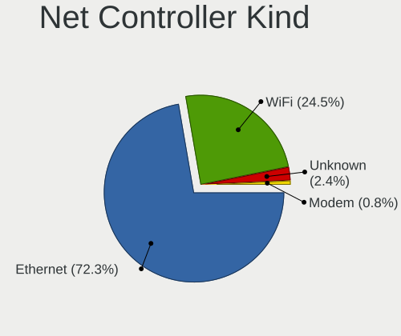

| Kind     | Computers | Percent |
|----------|-----------|---------|
| Ethernet | 5329      | 72.3%   |
| WiFi     | 1806      | 24.5%   |
| Unknown  | 179       | 2.43%   |
| Modem    | 57        | 0.77%   |

Used Controller
---------------

Currently used network controller

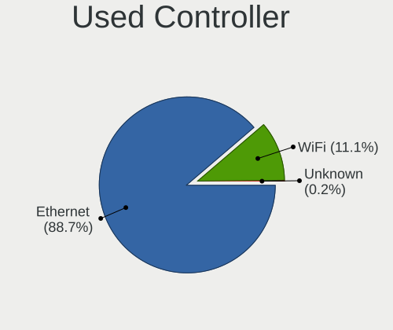

| Kind     | Computers | Percent |
|----------|-----------|---------|
| Ethernet | 4965      | 88.74%  |
| WiFi     | 621       | 11.1%   |
| Unknown  | 9         | 0.16%   |

NICs
----

Total network controllers on board

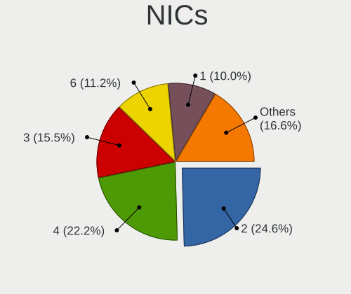

| Total | Computers | Percent |
|-------|-----------|---------|
| 2     | 1398      | 24.58%  |
| 4     | 1260      | 22.15%  |
| 3     | 884       | 15.54%  |
| 6     | 638       | 11.22%  |
| 1     | 566       | 9.95%   |
| 5     | 434       | 7.63%   |
| 8     | 142       | 2.5%    |
| 7     | 113       | 1.99%   |
| 9     | 88        | 1.55%   |
| 10    | 56        | 0.98%   |
| 0     | 50        | 0.88%   |
| 12    | 16        | 0.28%   |
| 11    | 13        | 0.23%   |
| 14    | 9         | 0.16%   |
| 16    | 8         | 0.14%   |
| 13    | 6         | 0.11%   |
| 15    | 3         | 0.05%   |
| 21    | 1         | 0.02%   |
| 20    | 1         | 0.02%   |
| 18    | 1         | 0.02%   |
| 17    | 1         | 0.02%   |

IPv6
----

IPv6 vs IPv4

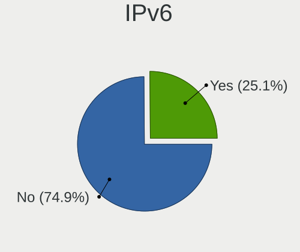

| Used | Computers | Percent |
|------|-----------|---------|
| No   | 4376      | 74.89%  |
| Yes  | 1467      | 25.11%  |

Bluetooth
---------

Bluetooth Vendor
----------------

Controller vendors

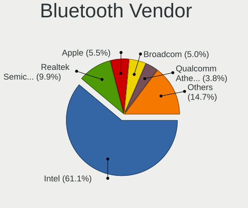

| Vendor                          | Computers | Percent |
|---------------------------------|-----------|---------|
| Intel                           | 850       | 61.11%  |
| Realtek Semiconductor           | 138       | 9.92%   |
| Apple                           | 76        | 5.46%   |
| Broadcom                        | 69        | 4.96%   |
| Qualcomm Atheros Communications | 53        | 3.81%   |
| MediaTek                        | 51        | 3.67%   |
| IMC Networks                    | 47        | 3.38%   |
| ASUSTek Computer                | 24        | 1.73%   |
| Cambridge Silicon Radio         | 21        | 1.51%   |
| Foxconn / Hon Hai               | 18        | 1.29%   |
| Lite-On Technology              | 12        | 0.86%   |
| Dell                            | 11        | 0.79%   |
| Alps Electric                   | 4         | 0.29%   |
| Hewlett-Packard                 | 3         | 0.22%   |
| TP-Link                         | 2         | 0.14%   |
| Ralink                          | 2         | 0.14%   |
| Dynex                           | 2         | 0.14%   |
| USI                             | 1         | 0.07%   |
| Taiyo Yuden                     | 1         | 0.07%   |
| Shenzhen Goodix Technology      | 1         | 0.07%   |
| Primax Electronics              | 1         | 0.07%   |
| Esel International              | 1         | 0.07%   |
| Edimax Technology               | 1         | 0.07%   |
| Corsair                         | 1         | 0.07%   |
| Unknown                         | 1         | 0.07%   |

Bluetooth Model
---------------

Controller models

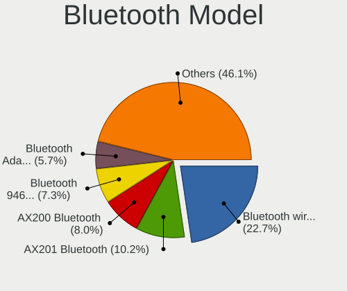

| Model                                                       | Computers | Percent |
|-------------------------------------------------------------|-----------|---------|
| Intel Bluetooth wireless interface                          | 317       | 22.68%  |
| Intel AX201 Bluetooth                                       | 143       | 10.23%  |
| Intel AX200 Bluetooth                                       | 112       | 8.01%   |
| Intel Bluetooth 9460/9560 Jefferson Peak (JfP)              | 102       | 7.3%    |
| Realtek Bluetooth Adapter                                   | 79        | 5.65%   |
| Intel AX210 Bluetooth                                       | 58        | 4.15%   |
| Intel Wireless-AC 3168 Bluetooth                            | 39        | 2.79%   |
| Apple Bluetooth Host Controller                             | 38        | 2.72%   |
| Intel AX211 Bluetooth                                       | 33        | 2.36%   |
| Intel Wireless-AC 9260 Bluetooth Adapter                    | 28        | 2%      |
| Realtek  Bluetooth 4.2 Adapter                              | 27        | 1.93%   |
| MediaTek Wireless_Device                                    | 27        | 1.93%   |
| Cambridge Silicon Radio Bluetooth Dongle (HCI mode)         | 21        | 1.5%    |
| Broadcom BCM20702 Bluetooth 4.0 [ThinkPad]                  | 21        | 1.5%    |
| Intel Centrino Bluetooth Wireless Transceiver               | 18        | 1.29%   |
| MediaTek RZ608 Bluetooth Adapter                            | 17        | 1.22%   |
| Apple Broadcom Built-in Bluetooth                           | 17        | 1.22%   |
| IMC Networks Realtek Bluetooth Adapter                      | 16        | 1.14%   |
| Apple Built-in Bluetooth 2.0+EDR HCI                        | 16        | 1.14%   |
| Broadcom BCM2045B (BDC-2.1)                                 | 15        | 1.07%   |
| Realtek Bluetooth 4.2 Adapter                               | 12        | 0.86%   |
| Broadcom BCM20702A0 Bluetooth 4.0                           | 11        | 0.79%   |
| Qualcomm Atheros Dell Wireless 1707 Bluetooth 4.0 LE Device | 10        | 0.72%   |
| IMC Networks Qualcomm Atheros Bluetooth 4.1                 | 10        | 0.72%   |
| Foxconn / Hon Hai Bluetooth USB Module                      | 8         | 0.57%   |
| Qualcomm Atheros AR3012 Bluetooth 4.0                       | 7         | 0.5%    |
| Lite-On Bluetooth USB Module                                | 7         | 0.5%    |
| Broadcom BCM2045B (BDC-2) [Bluetooth Controller]            | 7         | 0.5%    |
| Qualcomm Atheros QCA9377 Bluetooth 4.1                      | 6         | 0.43%   |
| Qualcomm Atheros QCA61x4 Bluetooth 4.1                      | 6         | 0.43%   |
| Qualcomm Atheros QCA61x4 Bluetooth 4.0                      | 6         | 0.43%   |
| Qualcomm Atheros AR9462 Bluetooth                           | 6         | 0.43%   |
| Dell DW375 Bluetooth Module                                 | 6         | 0.43%   |
| Apple Built-in iSight (no firmware loaded)                  | 6         | 0.43%   |
| Realtek Wireless Bluetooth Adapter                          | 5         | 0.36%   |
| Qualcomm Atheros AR3011 Bluetooth (no firmware)             | 5         | 0.36%   |
| ASUS Qualcomm Bluetooth 4.1                                 | 5         | 0.36%   |
| ASUS Broadcom BCM20702A0 Bluetooth                          | 5         | 0.36%   |
| ASUS Bluetooth USB module                                   | 5         | 0.36%   |
| Realtek Dell Wireless 1801 Bluetooth 4.0 LE                 | 4         | 0.29%   |

Sound
-----

Sound Vendor
------------

Sound card vendors

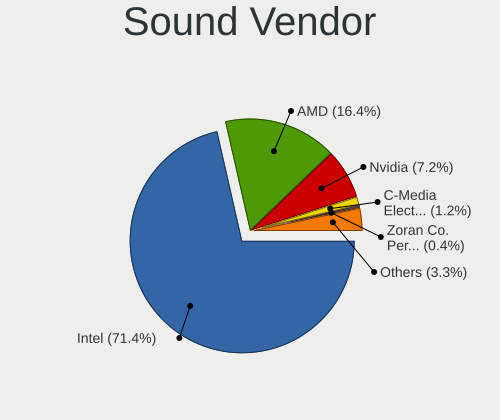

| Vendor                                       | Computers | Percent |
|----------------------------------------------|-----------|---------|
| Intel                                        | 3487      | 71.44%  |
| AMD                                          | 801       | 16.41%  |
| Nvidia                                       | 351       | 7.19%   |
| C-Media Electronics                          | 61        | 1.25%   |
| Zoran Co. Personal Media Division (Nogatech) | 19        | 0.39%   |
| Creative Labs                                | 19        | 0.39%   |
| Logitech                                     | 11        | 0.23%   |
| Texas Instruments                            | 9         | 0.18%   |
| Realtek Semiconductor                        | 8         | 0.16%   |
| SteelSeries ApS                              | 6         | 0.12%   |
| KTMicro                                      | 6         | 0.12%   |
| Creative Technology                          | 6         | 0.12%   |
| Blue Microphones                             | 6         | 0.12%   |
| MosArt Semiconductor                         | 5         | 0.1%    |
| Corsair                                      | 5         | 0.1%    |
| Razer USA                                    | 4         | 0.08%   |
| Micro Star International                     | 4         | 0.08%   |
| Generalplus Technology                       | 4         | 0.08%   |
| Cambridge Silicon Radio                      | 4         | 0.08%   |
| Apple                                        | 4         | 0.08%   |
| Walmart                                      | 3         | 0.06%   |
| VIA Technologies                             | 3         | 0.06%   |
| Lenovo                                       | 3         | 0.06%   |
| JMTek                                        | 3         | 0.06%   |
| Hewlett-Packard                              | 3         | 0.06%   |
| Focusrite-Novation                           | 3         | 0.06%   |
| ASUSTek Computer                             | 3         | 0.06%   |
| ASRock                                       | 3         | 0.06%   |
| Yamaha                                       | 2         | 0.04%   |
| Thesycon Systemsoftware & Consulting         | 2         | 0.04%   |
| Silicon Integrated Systems [SiS]             | 2         | 0.04%   |
| Google                                       | 2         | 0.04%   |
| Giga-Byte Technology                         | 2         | 0.04%   |
| Dell                                         | 2         | 0.04%   |
| CMX Systems                                  | 2         | 0.04%   |
| XMOS                                         | 1         | 0.02%   |
| Universal Audio                              | 1         | 0.02%   |
| Trust International                          | 1         | 0.02%   |
| Tenx Technology                              | 1         | 0.02%   |
| Sony                                         | 1         | 0.02%   |

Sound Model
-----------

Sound card models

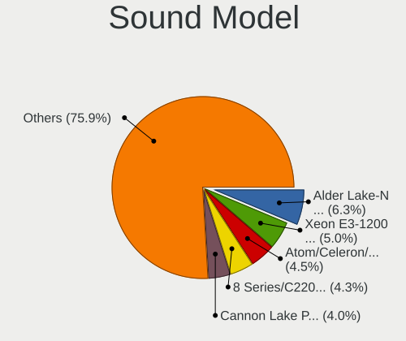

| Model                                                                                             | Computers | Percent |
|---------------------------------------------------------------------------------------------------|-----------|---------|
| Intel Alder Lake-N PCH High Definition Audio Controller                                           | 366       | 6.31%   |
| Intel Xeon E3-1200 v3/4th Gen Core Processor HD Audio Controller                                  | 290       | 5%      |
| Intel Atom/Celeron/Pentium Processor x5-E8000/J3xxx/N3xxx Series High Definition Audio Controller | 263       | 4.54%   |
| Intel 8 Series/C220 Series Chipset High Definition Audio Controller                               | 247       | 4.26%   |
| Intel Cannon Lake PCH cAVS                                                                        | 229       | 3.95%   |
| AMD Ryzen HD Audio Controller                                                                     | 227       | 3.92%   |
| Intel Sunrise Point-LP HD Audio                                                                   | 201       | 3.47%   |
| Intel Celeron/Pentium Silver Processor High Definition Audio                                      | 201       | 3.47%   |
| Intel 100 Series/C230 Series Chipset Family HD Audio Controller                                   | 198       | 3.42%   |
| Intel 7 Series/C216 Chipset Family High Definition Audio Controller                               | 192       | 3.31%   |
| Intel Jasper Lake HD Audio                                                                        | 189       | 3.26%   |
| Intel 6 Series/C200 Series Chipset Family High Definition Audio Controller                        | 176       | 3.04%   |
| Intel 200 Series PCH HD Audio                                                                     | 157       | 2.71%   |
| AMD FCH Azalia Controller                                                                         | 133       | 2.29%   |
| AMD Renoir/Cezanne HDMI/DP Audio Controller                                                       | 113       | 1.95%   |
| Intel Atom Processor Z36xxx/Z37xxx Series High Definition Audio Controller                        | 99        | 1.71%   |
| AMD Starship/Matisse HD Audio Controller                                                          | 96        | 1.66%   |
| Intel Broadwell-U Audio Controller                                                                | 87        | 1.5%    |
| Intel Wildcat Point-LP High Definition Audio Controller                                           | 85        | 1.47%   |
| Intel Alder Lake PCH-P High Definition Audio Controller                                           | 77        | 1.33%   |
| AMD Kabini HDMI/DP Audio                                                                          | 75        | 1.29%   |
| Intel 8 Series HD Audio Controller                                                                | 74        | 1.28%   |
| AMD Raven/Raven2/Fenghuang HDMI/DP Audio Controller                                               | 74        | 1.28%   |
| AMD SBx00 Azalia (Intel HDA)                                                                      | 73        | 1.26%   |
| Intel Haswell-ULT HD Audio Controller                                                             | 72        | 1.24%   |
| AMD Family 17h (Models 00h-0fh) HD Audio Controller                                               | 70        | 1.21%   |
| Intel Elkhart Lake High Density Audio bus interface                                               | 65        | 1.12%   |
| Intel Celeron N3350/Pentium N4200/Atom E3900 Series Audio Cluster                                 | 64        | 1.1%    |
| Nvidia GK208 HDMI/DP Audio Controller                                                             | 54        | 0.93%   |
| Intel Tiger Lake-LP Smart Sound Technology Audio Controller                                       | 53        | 0.91%   |
| AMD Kaveri HDMI/DP Audio Controller                                                               | 51        | 0.88%   |
| Intel 5 Series/3400 Series Chipset High Definition Audio                                          | 43        | 0.74%   |
| Intel NM10/ICH7 Family High Definition Audio Controller                                           | 42        | 0.72%   |
| Intel Comet Lake PCH-LP cAVS                                                                      | 41        | 0.71%   |
| AMD Radeon High Definition Audio Controller                                                       | 39        | 0.67%   |
| Intel Cannon Point-LP High Definition Audio Controller                                            | 37        | 0.64%   |
| AMD Navi 21/23 HDMI/DP Audio Controller                                                           | 35        | 0.6%    |
| AMD Oland/Hainan/Cape Verde/Pitcairn HDMI Audio [Radeon HD 7000 Series]                           | 32        | 0.55%   |
| AMD Ellesmere HDMI Audio [Radeon RX 470/480 / 570/580/590]                                        | 32        | 0.55%   |
| Intel Alder Lake-S HD Audio Controller                                                            | 29        | 0.5%    |

Memory
------

Memory Vendor
-------------

Memory module vendors

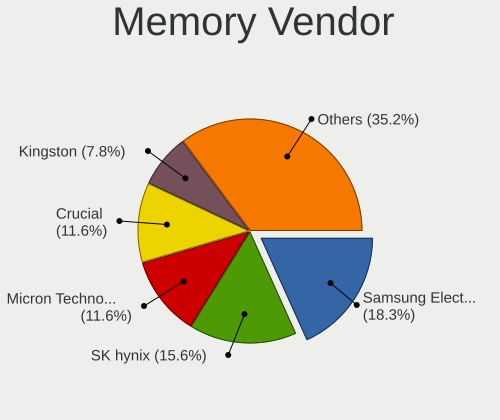

| Vendor                                  | Computers | Percent |
|-----------------------------------------|-----------|---------|
| Samsung Electronics                     | 1102      | 18.26%  |
| SK hynix                                | 940       | 15.58%  |
| Micron Technology                       | 701       | 11.62%  |
| Crucial                                 | 697       | 11.55%  |
| Kingston                                | 468       | 7.76%   |
| Unknown                                 | 373       | 6.18%   |
| G.Skill                                 | 266       | 4.41%   |
| Unknown                                 | 240       | 3.98%   |
| Corsair                                 | 234       | 3.88%   |
| Team                                    | 118       | 1.96%   |
| Transcend                               | 85        | 1.41%   |
| A-DATA Technology                       | 79        | 1.31%   |
| Unknown (ABCD)                          | 71        | 1.18%   |
| Ramaxel Technology                      | 71        | 1.18%   |
| Patriot                                 | 52        | 0.86%   |
| Nanya Technology                        | 51        | 0.85%   |
| Timetec                                 | 44        | 0.73%   |
| PNY                                     | 39        | 0.65%   |
| Kimtigo                                 | 34        | 0.56%   |
| Elpida                                  | 31        | 0.51%   |
| Toshiba                                 | 30        | 0.5%    |
| Super Talent                            | 18        | 0.3%    |
| Silicon Power                           | 18        | 0.3%    |
| Avant                                   | 18        | 0.3%    |
| Apacer                                  | 13        | 0.22%   |
| SK_Hynix                                | 12        | 0.2%    |
| Silicon Power Computer & Communications | 12        | 0.2%    |
| Hewlett-Packard                         | 12        | 0.2%    |
| Patriot Memory (PDP Systems)            | 9         | 0.15%   |
| Innodisk                                | 9         | 0.15%   |
| Sesame                                  | 7         | 0.12%   |
| Lexar Co Limited                        | 7         | 0.12%   |
| Neo Forza                               | 5         | 0.08%   |
| HPE                                     | 5         | 0.08%   |
| GeIL                                    | 5         | 0.08%   |
| Essencore Limited                       | 5         | 0.08%   |
| Wodposit                                | 4         | 0.07%   |
| Vasekey                                 | 4         | 0.07%   |
| Unknown (AB)                            | 4         | 0.07%   |
| Unknown (0x0C6E)                        | 4         | 0.07%   |

Memory Model
------------

Memory module models

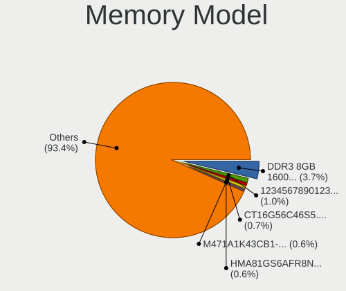

| Model                                                         | Computers | Percent |
|---------------------------------------------------------------|-----------|---------|
| Unknown                                                       | 240       | 3.74%   |
| Unknown (ABCD) RAM 123456789012345678 8GB DIMM DDR4 2400MT/s  | 64        | 1%      |
| Crucial RAM CT16G56C46S5.M8G1 16GB SODIMM DDR5 5600MT/s       | 43        | 0.67%   |
| Samsung RAM M471A1K43CB1-CTD 8GB SODIMM DDR4 3200MT/s         | 40        | 0.62%   |
| SK hynix RAM HMA81GS6AFR8N-UH 8GB SODIMM DDR4 2400MT/s        | 38        | 0.59%   |
| Unknown RAM Module 8GB 1600MT/s                               | 34        | 0.53%   |
| Samsung RAM M471B1G73QH0-YK0 8GB DIMM DDR3 1600MT/s           | 32        | 0.5%    |
| SK hynix RAM HMT451S6BFR8A-PB 4GB SODIMM DDR3 1600MT/s        | 31        | 0.48%   |
| Crucial RAM CT16G48C40S5.M8A1 16GB SODIMM DDR5 4800MT/s       | 30        | 0.47%   |
| Samsung RAM M378B5173DB0-CK0 4GB DIMM DDR3 1600MT/s           | 29        | 0.45%   |
| Micron RAM 8JTF51264AZ-1G6E1 4GB DIMM DDR3 1600MT/s           | 29        | 0.45%   |
| Samsung RAM M471B5173QH0-YK0 4GB SODIMM DDR3 1600MT/s         | 28        | 0.44%   |
| SK hynix RAM Module 3GB Row Of Chips LPDDR5 4800MT/s          | 27        | 0.42%   |
| Unknown RAM Module 4GB SODIMM DDR3 1333MT/s                   | 26        | 0.41%   |
| Team RAM TEAMGROUP-SD4-3200 32GB SODIMM DDR4 3200MT/s         | 26        | 0.41%   |
| Samsung RAM M425R1GB4BB0-CQKOL 8GB SODIMM DDR5 4800MT/s       | 26        | 0.41%   |
| SK hynix RAM HMT451U6AFR8C-PB 4GB DIMM DDR3 1600MT/s          | 25        | 0.39%   |
| Samsung RAM M471B1G73DB0-YK0 8GB DIMM DDR3 1600MT/s           | 24        | 0.37%   |
| Unknown RAM Module 8GB DIMM DDR3 1600MT/s                     | 23        | 0.36%   |
| SK hynix RAM HMA81GU6AFR8N-UH 8GB DIMM DDR4 2400MT/s          | 22        | 0.34%   |
| Samsung RAM M471B5173EB0-YK0 4GB SODIMM DDR3 1600MT/s         | 22        | 0.34%   |
| Micron RAM 53D512M64D4RQ-046 8GB Row Of Chips LPDDR4 4800MT/s | 22        | 0.34%   |
| Micron RAM 18KSF1G72AZ-1G6E1 8GB DIMM DDR3 1600MT/s           | 22        | 0.34%   |
| Unknown RAM Module 4GB DIMM DDR3 1333MT/s                     | 21        | 0.33%   |
| SK hynix RAM HMT451U6BFR8A-PB 4GB DIMM DDR3 1600MT/s          | 21        | 0.33%   |
| Samsung RAM M471A1K43DB1-CTD 8GB SODIMM DDR4 2667MT/s         | 21        | 0.33%   |
| Samsung RAM M471A1K43CB1-CRC 8GB SODIMM DDR4 2667MT/s         | 21        | 0.33%   |
| Samsung RAM M393A2G40DB0-CPB 16GB DIMM DDR4 2133MT/s          | 21        | 0.33%   |
| Transcend RAM TS1GLH64V6BL 8GB SODIMM DDR4 2667MT/s           | 20        | 0.31%   |
| Samsung RAM M471B1G73EB0-YK0 8GB DIMM DDR3 1600MT/s           | 20        | 0.31%   |
| G.Skill RAM F4-3200C16-16GVK 16GB DIMM DDR4 3200MT/s          | 20        | 0.31%   |
| Crucial RAM CT102464BF160B.M16 8GB DIMM DDR3 1600MT/s         | 20        | 0.31%   |
| SK hynix RAM HMT351U6CFR8C-PB 4GB DIMM DDR3 1600MT/s          | 19        | 0.3%    |
| Samsung RAM M471B5273DH0-CH9 4GB SODIMM DDR3 1334MT/s         | 18        | 0.28%   |
| Samsung RAM M471A2K43CB1-CTD 16GB SODIMM DDR4 2667MT/s        | 18        | 0.28%   |
| Samsung RAM M471A1K43BB1-CRC 8GB SODIMM DDR4 2400MT/s         | 18        | 0.28%   |
| SK hynix RAM HMT41GU6BFR8A-PB 8GB DIMM DDR3 1600MT/s          | 17        | 0.27%   |
| Team RAM TEAMGROUP-UD4-3200 8GB DIMM DDR4 3200MT/s            | 16        | 0.25%   |
| SK hynix RAM HMA81GS6CJR8N-VK 8GB SODIMM DDR4 2667MT/s        | 16        | 0.25%   |
| Samsung RAM M471A5244CB0-CWE 4GB SODIMM DDR4 3200MT/s         | 16        | 0.25%   |

Memory Kind
-----------

Memory module kinds

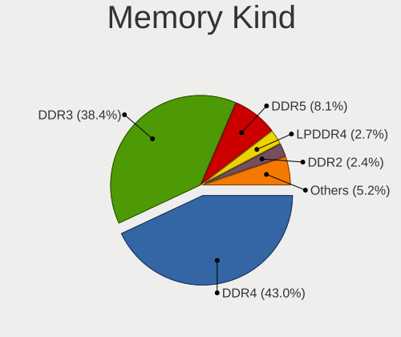

| Kind            | Computers | Percent |
|-----------------|-----------|---------|
| DDR4            | 2278      | 43.04%  |
| DDR3            | 2034      | 38.43%  |
| DDR5            | 431       | 8.14%   |
| LPDDR4          | 144       | 2.72%   |
| DDR2            | 129       | 2.44%   |
| Unknown         | 96        | 1.81%   |
| LPDDR5          | 88        | 1.66%   |
| SDRAM           | 34        | 0.64%   |
| LPDDR3          | 28        | 0.53%   |
| DDR             | 19        | 0.36%   |
| DRAM            | 8         | 0.15%   |
| Logical non-vol | 2         | 0.04%   |
| SRAM            | 1         | 0.02%   |
| DDR2 FB-DIMM    | 1         | 0.02%   |

Memory Form Factor
------------------

Physical design of the memory module

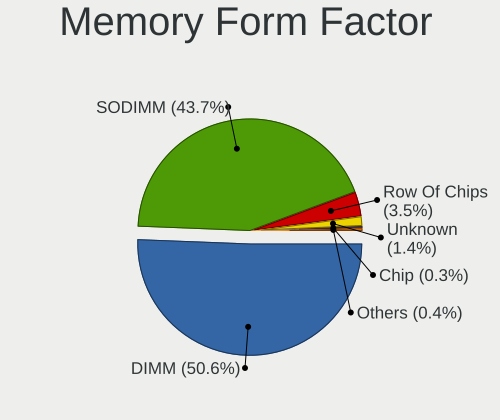

| Name            | Computers | Percent |
|-----------------|-----------|---------|
| DIMM            | 2668      | 50.62%  |
| SODIMM          | 2305      | 43.73%  |
| Row Of Chips    | 187       | 3.55%   |
| Unknown         | 73        | 1.38%   |
| Chip            | 17        | 0.32%   |
| FB-DIMM         | 11        | 0.21%   |
| RIMM            | 9         | 0.17%   |
| Proprietary Car | 1         | 0.02%   |

Memory Size
-----------

Memory module size

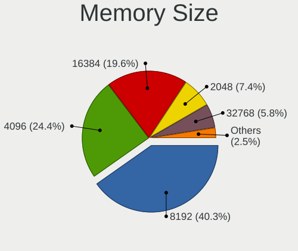

| Size   | Computers | Percent |
|--------|-----------|---------|
| 8192   | 2288      | 40.26%  |
| 4096   | 1387      | 24.41%  |
| 16384  | 1116      | 19.64%  |
| 2048   | 420       | 7.39%   |
| 32768  | 329       | 5.79%   |
| 1024   | 79        | 1.39%   |
| 3072   | 37        | 0.65%   |
| 512    | 9         | 0.16%   |
| 65536  | 6         | 0.11%   |
| 49152  | 6         | 0.11%   |
| 131072 | 3         | 0.05%   |
| 24576  | 1         | 0.02%   |
| 12288  | 1         | 0.02%   |
| 256    | 1         | 0.02%   |

Memory Speed
------------

Memory module speed

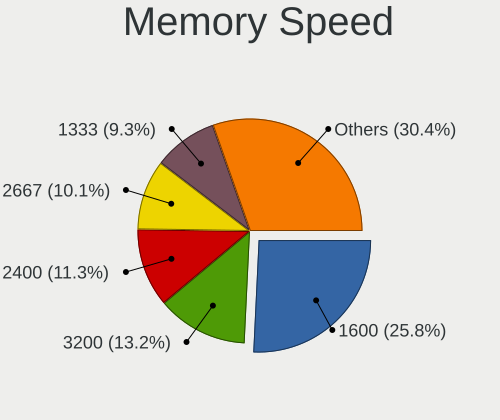

| Speed   | Computers | Percent |
|---------|-----------|---------|
| 1600    | 1462      | 25.76%  |
| 3200    | 747       | 13.16%  |
| 2400    | 642       | 11.31%  |
| 2667    | 575       | 10.13%  |
| 1333    | 525       | 9.25%   |
| 2133    | 404       | 7.12%   |
| 4800    | 314       | 5.53%   |
| 5600    | 160       | 2.82%   |
| 2666    | 98        | 1.73%   |
| 800     | 87        | 1.53%   |
| 667     | 73        | 1.29%   |
| 1867    | 64        | 1.13%   |
| 1066    | 60        | 1.06%   |
| 3600    | 55        | 0.97%   |
| 1334    | 53        | 0.93%   |
| 6400    | 49        | 0.86%   |
| Unknown | 48        | 0.85%   |
| 3000    | 42        | 0.74%   |
| 1067    | 42        | 0.74%   |
| 1866    | 36        | 0.63%   |
| 2933    | 24        | 0.42%   |
| 3733    | 21        | 0.37%   |
| 4267    | 18        | 0.32%   |
| 533     | 14        | 0.25%   |
| 6000    | 7         | 0.12%   |
| 400     | 7         | 0.12%   |
| 5200    | 6         | 0.11%   |
| 4000    | 6         | 0.11%   |
| 4266    | 4         | 0.07%   |
| 1200    | 4         | 0.07%   |
| 975     | 4         | 0.07%   |
| 6600    | 3         | 0.05%   |
| 2600    | 2         | 0.04%   |
| 1639    | 2         | 0.04%   |
| 8400    | 1         | 0.02%   |
| 7467    | 1         | 0.02%   |
| 5500    | 1         | 0.02%   |
| 4133    | 1         | 0.02%   |
| 3534    | 1         | 0.02%   |
| 3333    | 1         | 0.02%   |

Printers & scanners
-------------------

Printer Vendor
--------------

Printer device vendors

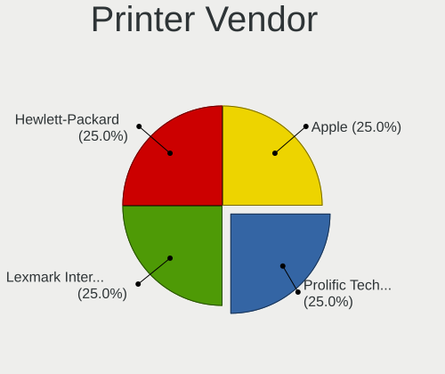

| Vendor                | Computers | Percent |
|-----------------------|-----------|---------|
| Hewlett-Packard       | 2         | 28.57%  |
| Brother Industries    | 2         | 28.57%  |
| Prolific Technology   | 1         | 14.29%  |
| Lexmark International | 1         | 14.29%  |
| Apple                 | 1         | 14.29%  |

Printer Model
-------------

Printer device models

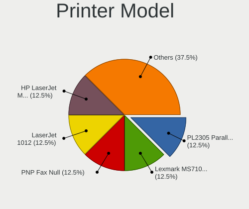

| Model                                                                    | Computers | Percent |
|--------------------------------------------------------------------------|-----------|---------|
| Prolific PL2305 Parallel Port                                            | 1         | 12.5%   |
| Lexmark International Lexmark MS710 Print                                | 1         | 12.5%   |
| HP PNP Fax Null                                                          | 1         | 12.5%   |
| HP LaserJet 1012                                                         | 1         | 12.5%   |
| HP HP LaserJet M101-M106 Printer HP LEDM HP LEDM IPP Printer IPP Printer | 1         | 12.5%   |
| Brother MFC-L2685DW                                                      | 1         | 12.5%   |
| Brother MFC-J485DW                                                       | 1         | 12.5%   |
| Apple Gamesir-G3s 2.10                                                   | 1         | 12.5%   |

Scanner Vendor
--------------

Scanner device vendors

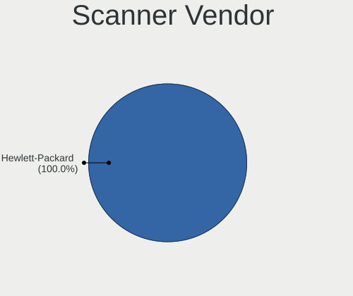

| Vendor          | Computers | Percent |
|-----------------|-----------|---------|
| Seiko Epson     | 2         | 66.67%  |
| Hewlett-Packard | 1         | 33.33%  |

Scanner Model
-------------

Scanner device models

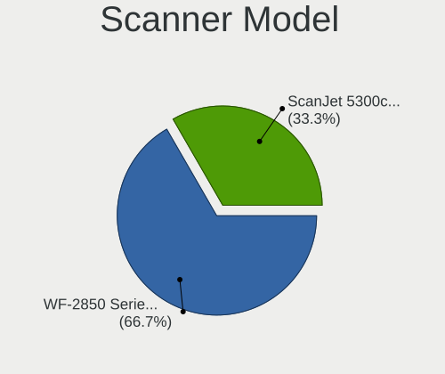

| Model                                                                               | Computers | Percent |
|-------------------------------------------------------------------------------------|-----------|---------|
| Seiko Epson WF-2850 Series EPSON Scanner USB2.0 Printer EPSON Utility USB2.0 Faxout | 2         | 66.67%  |
| HP ScanJet 5300c/5370c                                                              | 1         | 33.33%  |

Camera
------

Camera Vendor
-------------

Camera device vendors

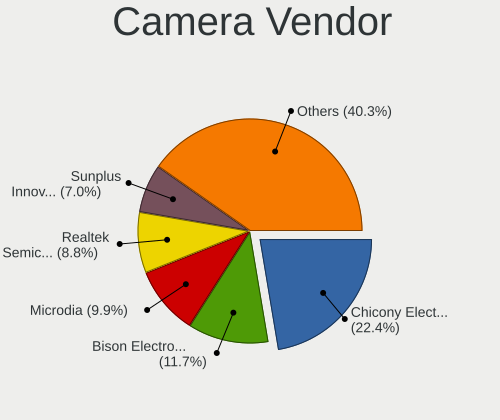

| Vendor                                 | Computers | Percent |
|----------------------------------------|-----------|---------|
| Chicony Electronics                    | 140       | 22.36%  |
| Bison Electronics                      | 73        | 11.66%  |
| Microdia                               | 62        | 9.9%    |
| Realtek Semiconductor                  | 55        | 8.79%   |
| Sunplus Innovation Technology          | 44        | 7.03%   |
| Logitech                               | 43        | 6.87%   |
| IMC Networks                           | 43        | 6.87%   |
| Quanta                                 | 23        | 3.67%   |
| Apple                                  | 19        | 3.04%   |
| Lite-On Technology                     | 18        | 2.88%   |
| Luxvisions Innotech Limited            | 17        | 2.72%   |
| Cheng Uei Precision Industry (Foxlink) | 17        | 2.72%   |
| Suyin                                  | 12        | 1.92%   |
| Syntek                                 | 9         | 1.44%   |
| Lenovo                                 | 6         | 0.96%   |
| Importek                               | 5         | 0.8%    |
| Alcor Micro                            | 4         | 0.64%   |
| Ricoh                                  | 3         | 0.48%   |
| Primax Electronics                     | 3         | 0.48%   |
| Intel                                  | 3         | 0.48%   |
| WCM_USB                                | 2         | 0.32%   |
| Silicon Motion                         | 2         | 0.32%   |
| Shenzhen Kingcome Optoelectronic       | 2         | 0.32%   |
| SHENZHEN EMEET TECHNOLOGY              | 2         | 0.32%   |
| OmniVision Technologies                | 2         | 0.32%   |
| Generalplus Technology                 | 2         | 0.32%   |
| Framework                              | 2         | 0.32%   |
| Z-Star Microelectronics                | 1         | 0.16%   |
| Y Media                                | 1         | 0.16%   |
| Xiongmai                               | 1         | 0.16%   |
| Unknown                                | 1         | 0.16%   |
| Supreme Electronics                    | 1         | 0.16%   |
| Jiangxi Shinetech Optical              | 1         | 0.16%   |
| Goodong Industry                       | 1         | 0.16%   |
| Cubeternet                             | 1         | 0.16%   |
| BSD                                    | 1         | 0.16%   |
| Asuscom Network                        | 1         | 0.16%   |
| Arkmicro Technologies                  | 1         | 0.16%   |
| ARC International                      | 1         | 0.16%   |
| ALi                                    | 1         | 0.16%   |

Camera Model
------------

Camera device models

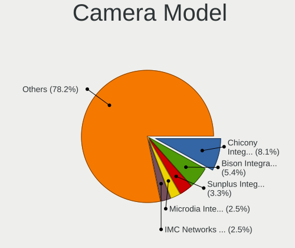

| Model                                               | Computers | Percent |
|-----------------------------------------------------|-----------|---------|
| Chicony Integrated Camera                           | 51        | 8.06%   |
| Bison Integrated Camera                             | 34        | 5.37%   |
| Sunplus Integrated_Webcam_HD                        | 21        | 3.32%   |
| Microdia Integrated_Webcam_HD                       | 16        | 2.53%   |
| IMC Networks Integrated Camera                      | 16        | 2.53%   |
| Lite-On Integrated Camera                           | 15        | 2.37%   |
| Realtek Integrated_Webcam_HD                        | 13        | 2.05%   |
| Microdia Integrated Webcam                          | 13        | 2.05%   |
| Apple FaceTime HD camera                            | 12        | 1.9%    |
| Chicony Lenovo Integrated Camera (0.3MP)            | 11        | 1.74%   |
| Chicony Integrated Camera (1280x720@30)             | 10        | 1.58%   |
| Bison SunplusIT Integrated Camera                   | 10        | 1.58%   |
| Realtek USB 2.0 PC Camera                           | 9         | 1.42%   |
| Luxvisions Innotech Limited Integrated Camera       | 9         | 1.42%   |
| Logitech HD Pro Webcam C920                         | 9         | 1.42%   |
| Logitech Webcam C270                                | 8         | 1.26%   |
| Bison ThinkPad Integrated Camera                    | 8         | 1.26%   |
| Realtek Laptop Camera                               | 7         | 1.11%   |
| Quanta HP TrueVision HD Camera                      | 7         | 1.11%   |
| Chicony Integrated Camera [ThinkPad]                | 7         | 1.11%   |
| Chicony HD Webcam                                   | 7         | 1.11%   |
| IMC Networks Realtek PC Camera                      | 6         | 0.95%   |
| IMC Networks EasyCamera                             | 6         | 0.95%   |
| Chicony thinkpad t430s camera                       | 6         | 0.95%   |
| Cheng Uei Precision Industry (Foxlink) HP HD Camera | 6         | 0.95%   |
| Realtek Integrated Webcam HD                        | 5         | 0.79%   |
| Microdia Integrated Webcam HD                       | 5         | 0.79%   |
| Logitech BRIO Ultra HD Webcam                       | 5         | 0.79%   |
| Chicony Integrated IR Camera                        | 5         | 0.79%   |
| Apple FaceTime HD Camera (Built-in)                 | 5         | 0.79%   |
| Syntek EasyCamera                                   | 4         | 0.63%   |
| Sunplus LTD, NexiGo N930AF FHD Webcam               | 4         | 0.63%   |
| Sunplus Laptop_Integrated_Webcam_FHD                | 4         | 0.63%   |
| Sunplus HD Webcam                                   | 4         | 0.63%   |
| Realtek USB Camera                                  | 4         | 0.63%   |
| Realtek Integrated_Webcam_FHD                       | 4         | 0.63%   |
| Microdia Webcam Vitade AF                           | 4         | 0.63%   |
| Microdia Integrated_Webcam_FHD                      | 4         | 0.63%   |
| Microdia Dell Laptop Integrated Webcam HD           | 4         | 0.63%   |
| Logitech Webcam C930e                               | 4         | 0.63%   |

Security
--------

Fingerprint Vendor
------------------

Fingerprint sensor vendors

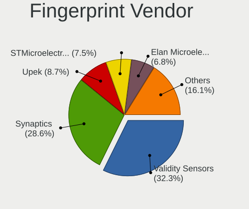

| Vendor                     | Computers | Percent |
|----------------------------|-----------|---------|
| Validity Sensors           | 52        | 32.3%   |
| Synaptics                  | 46        | 28.57%  |
| Upek                       | 14        | 8.7%    |
| STMicroelectronics         | 12        | 7.45%   |
| Elan Microelectronics      | 11        | 6.83%   |
| AuthenTec                  | 10        | 6.21%   |
| Shenzhen Goodix Technology | 8         | 4.97%   |
| FocalTech Systems          | 3         | 1.86%   |
| Broadcom                   | 3         | 1.86%   |
| Samsung Electronics        | 1         | 0.62%   |
| LighTuning Technology      | 1         | 0.62%   |

Fingerprint Model
-----------------

Fingerprint sensor models

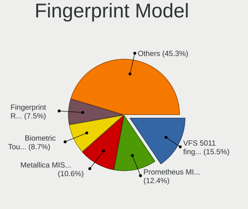

| Model                                                                             | Computers | Percent |
|-----------------------------------------------------------------------------------|-----------|---------|
| Validity Sensors VFS 5011 fingerprint sensor                                      | 25        | 15.53%  |
| Synaptics Prometheus MIS Touch Fingerprint Reader                                 | 20        | 12.42%  |
| Synaptics Metallica MIS Touch Fingerprint Reader                                  | 17        | 10.56%  |
| Upek Biometric Touchchip/Touchstrip Fingerprint Sensor                            | 14        | 8.7%    |
| STMicroelectronics Fingerprint Reader                                             | 12        | 7.45%   |
| Elan Fingerprint Sensor                                                           | 10        | 6.21%   |
| Validity Sensors VFS495 Fingerprint Reader                                        | 7         | 4.35%   |
| Shenzhen Goodix Fingerprint Reader                                                | 7         | 4.35%   |
| Validity Sensors VFS7500 Touch Fingerprint Sensor                                 | 6         | 3.73%   |
| Validity Sensors Synaptics WBDI                                                   | 5         | 3.11%   |
| AuthenTec AES2810                                                                 | 5         | 3.11%   |
| Synaptics FS7604 Touch Fingerprint Sensor with PurePrint                          | 4         | 2.48%   |
| Validity Sensors VFS5011 Fingerprint Reader                                       | 3         | 1.86%   |
| Broadcom BCM5880 Secure Applications Processor with fingerprint swipe sensor      | 3         | 1.86%   |
| AuthenTec AES2501 Fingerprint Sensor                                              | 3         | 1.86%   |
| Validity Sensors VFS7552 Touch Fingerprint Sensor                                 | 2         | 1.24%   |
| Synaptics WBDI                                                                    | 2         | 1.24%   |
| FocalTech Systems Fingerprint Reader                                              | 2         | 1.24%   |
| AuthenTec AES1660                                                                 | 2         | 1.24%   |
| Validity Sensors VFS491                                                           | 1         | 0.62%   |
| Validity Sensors VFS471 Fingerprint Reader                                        | 1         | 0.62%   |
| Validity Sensors VFS301 Fingerprint Reader                                        | 1         | 0.62%   |
| Validity Sensors Fingerprint scanner                                              | 1         | 0.62%   |
| Synaptics WBDI Fingerprint Reader USB 102                                         | 1         | 0.62%   |
| Synaptics UWP WBDI                                                                | 1         | 0.62%   |
| Synaptics Metallica MOH Touch Fingerprint Reader                                  | 1         | 0.62%   |
| Shenzhen Goodix Fingerprint Reader SGX                                            | 1         | 0.62%   |
| Samsung CanvasBio Fingerprint Reader                                              | 1         | 0.62%   |
| LighTuning EgisTec Touch Fingerprint Sensor                                       | 1         | 0.62%   |
| FocalTech Systems FocalTech Fingerprint Device Realtek USB2.0 Finger Print Bridge | 1         | 0.62%   |
| Elan WBF Fingerprint Sensor                                                       | 1         | 0.62%   |

Chipcard Vendor
---------------

Chipcard module vendors

Zero info for selected period =(

Chipcard Model
--------------

Chipcard module models

Zero info for selected period =(

Unsupported
-----------

Unsupported Devices
-------------------

Total unsupported devices on board

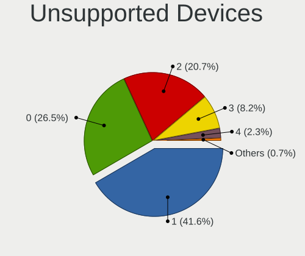

| Total | Computers | Percent |
|-------|-----------|---------|
| 1     | 2381      | 41.62%  |
| 0     | 1518      | 26.53%  |
| 2     | 1185      | 20.71%  |
| 3     | 467       | 8.16%   |
| 4     | 132       | 2.31%   |
| 5     | 29        | 0.51%   |
| 6     | 7         | 0.12%   |
| 7     | 2         | 0.03%   |

Unsupported Device Types
------------------------

Types of unsupported devices

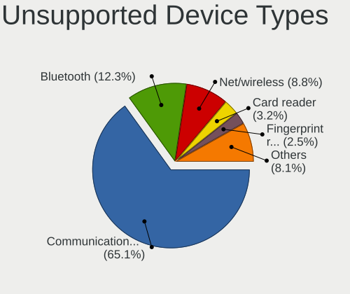

| Type                     | Computers | Percent |
|--------------------------|-----------|---------|
| Communication controller | 3638      | 65.06%  |
| Bluetooth                | 689       | 12.32%  |
| Net/wireless             | 493       | 8.82%   |
| Card reader              | 177       | 3.17%   |
| Fingerprint reader       | 141       | 2.52%   |
| Firewire controller      | 140       | 2.5%    |
| Net/ethernet             | 97        | 1.73%   |
| Sound                    | 78        | 1.39%   |
| Network                  | 70        | 1.25%   |
| Graphics card            | 26        | 0.46%   |
| Storage                  | 14        | 0.25%   |
| Storage/raid             | 9         | 0.16%   |
| Modem                    | 9         | 0.16%   |
| Storage/ata              | 4         | 0.07%   |
| Dvb card                 | 4         | 0.07%   |
| Storage/ide              | 2         | 0.04%   |
| Storage/nvme             | 1         | 0.02%   |

