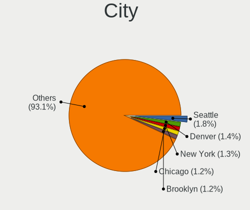
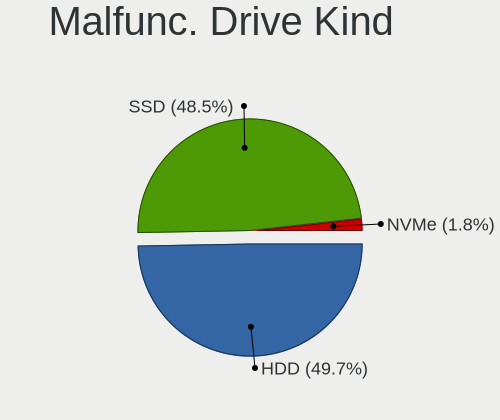
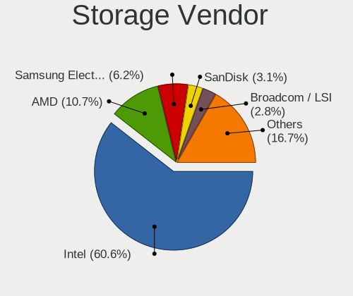
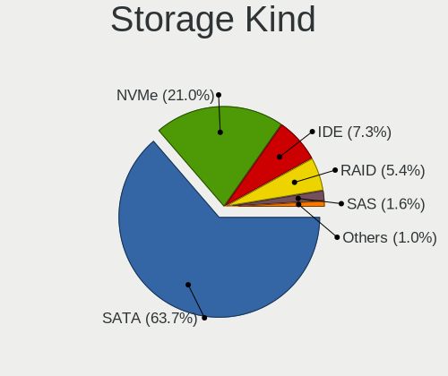
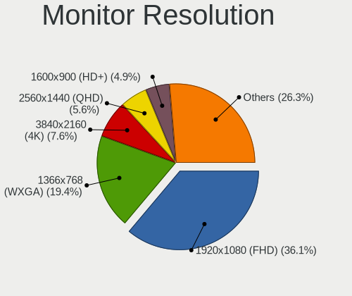
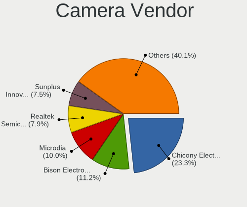

BSD in USA - Tested Hardware & Statistics
-----------------------------------------

A project to collect tested hardware configurations for BSD in USA.

Anyone can contribute to this report by the [hw-probe](https://github.com/linuxhw/hw-probe/blob/master/INSTALL.BSD.md) tool:

    hw-probe -all -upload

Please contribute! Especially if your hardware is rare.

This is a report for all computer types. See also reports for [desktops](/Location/USA/Desktop/README.md) and [notebooks](/Location/USA/Notebook/README.md).

Contents
--------

* [ Test Cases ](#test-cases)

* [ System ](#system)
  - [ OS                       ](#os)
  - [ OS Family                ](#os-family)
  - [ Arch                     ](#arch)
  - [ DE                       ](#de)
  - [ Display Server           ](#display-server)
  - [ Display Manager          ](#display-manager)
  - [ OS Lang                  ](#os-lang)
  - [ Boot Mode                ](#boot-mode)
  - [ Filesystem               ](#filesystem)
  - [ Part. scheme             ](#part-scheme)

* [ Board ](#board)
  - [ Vendor                   ](#vendor)
  - [ Model                    ](#model)
  - [ Model Family             ](#model-family)
  - [ MFG Year                 ](#mfg-year)
  - [ Form Factor              ](#form-factor)
  - [ Coreboot                 ](#coreboot)
  - [ RAM Size                 ](#ram-size)
  - [ RAM Used                 ](#ram-used)
  - [ Total Drives             ](#total-drives)
  - [ Has CD-ROM               ](#has-cd-rom)
  - [ Has Ethernet             ](#has-ethernet)
  - [ Has WiFi                 ](#has-wifi)
  - [ Has Bluetooth            ](#has-bluetooth)

* [ Location ](#location)
  - [ Country                  ](#country)
  - [ City                     ](#city)

* [ Drives ](#drives)
  - [ Drive Vendor             ](#drive-vendor)
  - [ Drive Model              ](#drive-model)
  - [ HDD Vendor               ](#hdd-vendor)
  - [ SSD Vendor               ](#ssd-vendor)
  - [ Drive Kind               ](#drive-kind)
  - [ Drive Connector          ](#drive-connector)
  - [ Drive Size               ](#drive-size)
  - [ Space Total              ](#space-total)
  - [ Space Used               ](#space-used)
  - [ Malfunc. Drives          ](#malfunc-drives)
  - [ Malfunc. Drive Vendor    ](#malfunc-drive-vendor)
  - [ Malfunc. HDD Vendor      ](#malfunc-hdd-vendor)
  - [ Malfunc. Drive Kind      ](#malfunc-drive-kind)
  - [ Failed Drives            ](#failed-drives)
  - [ Failed Drive Vendor      ](#failed-drive-vendor)
  - [ Drive Status             ](#drive-status)

* [ Storage controller ](#storage-controller)
  - [ Storage Vendor           ](#storage-vendor)
  - [ Storage Model            ](#storage-model)
  - [ Storage Kind             ](#storage-kind)

* [ Processor ](#processor)
  - [ CPU Vendor               ](#cpu-vendor)
  - [ CPU Model                ](#cpu-model)
  - [ CPU Model Family         ](#cpu-model-family)
  - [ CPU Cores                ](#cpu-cores)
  - [ CPU Sockets              ](#cpu-sockets)
  - [ CPU Threads              ](#cpu-threads)
  - [ CPU Microarch            ](#cpu-microarch)

* [ Graphics ](#graphics)
  - [ GPU Vendor               ](#gpu-vendor)
  - [ GPU Model                ](#gpu-model)
  - [ GPU Combo                ](#gpu-combo)
  - [ GPU Driver               ](#gpu-driver)
  - [ GPU Memory               ](#gpu-memory)

* [ Monitor ](#monitor)
  - [ Monitor Vendor           ](#monitor-vendor)
  - [ Monitor Model            ](#monitor-model)
  - [ Monitor Resolution       ](#monitor-resolution)
  - [ Monitor Diagonal         ](#monitor-diagonal)
  - [ Monitor Width            ](#monitor-width)
  - [ Aspect Ratio             ](#aspect-ratio)
  - [ Monitor Area             ](#monitor-area)
  - [ Pixel Density            ](#pixel-density)
  - [ Multiple Monitors        ](#multiple-monitors)

* [ Network ](#network)
  - [ Net Controller Vendor    ](#net-controller-vendor)
  - [ Net Controller Model     ](#net-controller-model)
  - [ Wireless Vendor          ](#wireless-vendor)
  - [ Wireless Model           ](#wireless-model)
  - [ Ethernet Vendor          ](#ethernet-vendor)
  - [ Ethernet Model           ](#ethernet-model)
  - [ Net Controller Kind      ](#net-controller-kind)
  - [ Used Controller          ](#used-controller)
  - [ NICs                     ](#nics)
  - [ IPv6                     ](#ipv6)

* [ Bluetooth ](#bluetooth)
  - [ Bluetooth Vendor         ](#bluetooth-vendor)
  - [ Bluetooth Model          ](#bluetooth-model)

* [ Sound ](#sound)
  - [ Sound Vendor             ](#sound-vendor)
  - [ Sound Model              ](#sound-model)

* [ Memory ](#memory)
  - [ Memory Vendor            ](#memory-vendor)
  - [ Memory Model             ](#memory-model)
  - [ Memory Kind              ](#memory-kind)
  - [ Memory Form Factor       ](#memory-form-factor)
  - [ Memory Size              ](#memory-size)
  - [ Memory Speed             ](#memory-speed)

* [ Printers & scanners ](#printers--scanners)
  - [ Printer Vendor           ](#printer-vendor)
  - [ Printer Model            ](#printer-model)
  - [ Scanner Vendor           ](#scanner-vendor)
  - [ Scanner Model            ](#scanner-model)

* [ Camera ](#camera)
  - [ Camera Vendor            ](#camera-vendor)
  - [ Camera Model             ](#camera-model)

* [ Security ](#security)
  - [ Fingerprint Vendor       ](#fingerprint-vendor)
  - [ Fingerprint Model        ](#fingerprint-model)
  - [ Chipcard Vendor          ](#chipcard-vendor)
  - [ Chipcard Model           ](#chipcard-model)

* [ Unsupported ](#unsupported)
  - [ Unsupported Devices      ](#unsupported-devices)
  - [ Unsupported Device Types ](#unsupported-device-types)

Test Cases
----------

Total: 6524

| Vendor        | Model                       | Form-Factor | Probe                                                     | Date         |
|---------------|-----------------------------|-------------|-----------------------------------------------------------|--------------|
| Protectli     | FW2B                        | Desktop     | [ed7bd1dea3](https://bsd-hardware.info/?probe=ed7bd1dea3) | May 09, 2024 |
| Intel         | Q3XXG4-P V1.0               | Desktop     | [152c1f421c](https://bsd-hardware.info/?probe=152c1f421c) | May 09, 2024 |
| Protectli     | VP46xx                      | Desktop     | [e54efb8b1c](https://bsd-hardware.info/?probe=e54efb8b1c) | May 09, 2024 |
| GoWin Solu... | R86S                        | Desktop     | [1f282cde95](https://bsd-hardware.info/?probe=1f282cde95) | May 09, 2024 |
| Unknown       | Unknown                     | Desktop     | [086d24f16e](https://bsd-hardware.info/?probe=086d24f16e) | May 08, 2024 |
| Unknown       | Unknown                     | Desktop     | [4680d0dfbf](https://bsd-hardware.info/?probe=4680d0dfbf) | May 08, 2024 |
| Dell          | 0WMJ54 A01                  | Desktop     | [89c2d124bf](https://bsd-hardware.info/?probe=89c2d124bf) | May 08, 2024 |
| Lenovo        | ThinkPad T530 2394EE9       | Notebook    | [9bc81955aa](https://bsd-hardware.info/?probe=9bc81955aa) | May 08, 2024 |
| Lenovo        | ThinkPad T530 2394EE9       | Notebook    | [651bd2de24](https://bsd-hardware.info/?probe=651bd2de24) | May 08, 2024 |
| Dell          | 0XCR8D A02                  | Desktop     | [bbb91f550d](https://bsd-hardware.info/?probe=bbb91f550d) | May 08, 2024 |
| Protectli     | VP2420                      | Desktop     | [3f72c87441](https://bsd-hardware.info/?probe=3f72c87441) | May 08, 2024 |
| Protectli     | FW6E                        | Desktop     | [eaf305f5e2](https://bsd-hardware.info/?probe=eaf305f5e2) | May 08, 2024 |
| Dell          | 02K9CR A02                  | Desktop     | [dbac1d87ef](https://bsd-hardware.info/?probe=dbac1d87ef) | May 07, 2024 |
| Alienware     | Area-51m A00                | Notebook    | [53d5d4eb1e](https://bsd-hardware.info/?probe=53d5d4eb1e) | May 07, 2024 |
| Dell          | XPS 13 9360                 | Notebook    | [c9ad91fc61](https://bsd-hardware.info/?probe=c9ad91fc61) | May 07, 2024 |
| Lenovo        | ThinkPad X1 Nano Gen 1 2... | Notebook    | [b97dcbade6](https://bsd-hardware.info/?probe=b97dcbade6) | May 07, 2024 |
| HP            | ProLiant DL360 G7           | Server      | [b2546ea49e](https://bsd-hardware.info/?probe=b2546ea49e) | May 07, 2024 |
| Protectli     | FW2B                        | Desktop     | [8a55fe9d07](https://bsd-hardware.info/?probe=8a55fe9d07) | May 07, 2024 |
| Apple         | Mac-F221BEC8                | Desktop     | [79c4a2608c](https://bsd-hardware.info/?probe=79c4a2608c) | May 07, 2024 |
| Gigabyte      | P55-USB3                    | Desktop     | [9024f0074b](https://bsd-hardware.info/?probe=9024f0074b) | May 07, 2024 |
| Supermicro    | X10SLH-N6-ST031             | Server      | [e6c86b7eb3](https://bsd-hardware.info/?probe=e6c86b7eb3) | May 06, 2024 |
| ASUSTek       | PRIME Z590M-PLUS            | Desktop     | [034c626a7f](https://bsd-hardware.info/?probe=034c626a7f) | May 06, 2024 |
| HP            | 8054                        | Desktop     | [15da4dbc3e](https://bsd-hardware.info/?probe=15da4dbc3e) | May 06, 2024 |
| HP            | 8054                        | Desktop     | [42143b7763](https://bsd-hardware.info/?probe=42143b7763) | May 06, 2024 |
| HP            | 8054                        | Desktop     | [89f224ab82](https://bsd-hardware.info/?probe=89f224ab82) | May 06, 2024 |
| ASUSTek       | PRIME H370M-PLUS            | Desktop     | [1f97d380ed](https://bsd-hardware.info/?probe=1f97d380ed) | May 06, 2024 |
| Dell          | 0WMJ54 A01                  | Desktop     | [99b148c21f](https://bsd-hardware.info/?probe=99b148c21f) | May 06, 2024 |
| CompuLab      | fitlet2                     | Mini pc     | [18d9d8fdf8](https://bsd-hardware.info/?probe=18d9d8fdf8) | May 06, 2024 |
| Dell          | 0NW6H5 A00                  | Desktop     | [818fc8022c](https://bsd-hardware.info/?probe=818fc8022c) | May 06, 2024 |
| Protectli     | FW4C Ver                    | Desktop     | [4e0f235713](https://bsd-hardware.info/?probe=4e0f235713) | May 06, 2024 |
| Dell          | Precision 7560              | Notebook    | [62956576cd](https://bsd-hardware.info/?probe=62956576cd) | May 06, 2024 |
| ASUSTek       | PRIME H370M-PLUS            | Desktop     | [1be813a788](https://bsd-hardware.info/?probe=1be813a788) | May 06, 2024 |
| Supermicro    | A2SDi-4C-HLN4F              | Server      | [a2870e073a](https://bsd-hardware.info/?probe=a2870e073a) | May 05, 2024 |
| Lenovo        | 500w Gen 3 82J3             | Convertible | [02317ba035](https://bsd-hardware.info/?probe=02317ba035) | May 05, 2024 |
| Apple         | MacBookPro8,1               | Notebook    | [23e113910f](https://bsd-hardware.info/?probe=23e113910f) | May 05, 2024 |
| Apple         | MacBookPro8,1               | Notebook    | [55560acf02](https://bsd-hardware.info/?probe=55560acf02) | May 05, 2024 |
| Lenovo        | ThinkPad L420 7827W27       | Notebook    | [5231c79a27](https://bsd-hardware.info/?probe=5231c79a27) | May 05, 2024 |
| Dell          | 0WMJ54 A01                  | Desktop     | [328b32897b](https://bsd-hardware.info/?probe=328b32897b) | May 05, 2024 |
| HP            | 83E0                        | Desktop     | [63c44781ef](https://bsd-hardware.info/?probe=63c44781ef) | May 05, 2024 |
| MSI           | H81M-P33                    | Desktop     | [db35e993b4](https://bsd-hardware.info/?probe=db35e993b4) | May 05, 2024 |
| ASUSTek       | ROG CROSSHAIR VIII HERO     | Desktop     | [76bd355935](https://bsd-hardware.info/?probe=76bd355935) | May 05, 2024 |
| ASUSTek       | P5Q-E                       | Desktop     | [4e42133f58](https://bsd-hardware.info/?probe=4e42133f58) | May 05, 2024 |
| Dell          | 0D28YY A00                  | Desktop     | [3d0d226dbc](https://bsd-hardware.info/?probe=3d0d226dbc) | May 05, 2024 |
| Unknown       | Unknown                     | Desktop     | [e504371024](https://bsd-hardware.info/?probe=e504371024) | May 05, 2024 |
| Lenovo        | 312D SDK0J40697 WIN 3305... | Mini pc     | [cb4aeaeea1](https://bsd-hardware.info/?probe=cb4aeaeea1) | May 05, 2024 |
| Protectli     | FW2B                        | Desktop     | [92725f96b8](https://bsd-hardware.info/?probe=92725f96b8) | May 05, 2024 |
| CncTion       | N4505-4L B0                 | Desktop     | [077f0f74a5](https://bsd-hardware.info/?probe=077f0f74a5) | May 04, 2024 |
| Dell          | Latitude 7390               | Notebook    | [b9b511f4d6](https://bsd-hardware.info/?probe=b9b511f4d6) | May 04, 2024 |
| Gigabyte      | GA-78LMT-S2 sex             | Desktop     | [89beae510f](https://bsd-hardware.info/?probe=89beae510f) | May 04, 2024 |
| Dell          | 0MGK50 A02                  | Desktop     | [6f9b5b3cad](https://bsd-hardware.info/?probe=6f9b5b3cad) | May 03, 2024 |
| Dell          | Precision 3571              | Notebook    | [d8015bf7e8](https://bsd-hardware.info/?probe=d8015bf7e8) | May 03, 2024 |
| ChangWang     | CW56-58                     | Desktop     | [54250fd5f6](https://bsd-hardware.info/?probe=54250fd5f6) | May 03, 2024 |
| IceWhale T... | ZimaBoard 432 ZMB           | Desktop     | [5064c18402](https://bsd-hardware.info/?probe=5064c18402) | May 03, 2024 |
| Intel         | Q3XXG4-P V1.0               | Desktop     | [e7125777fc](https://bsd-hardware.info/?probe=e7125777fc) | May 03, 2024 |
| ASRock        | X570 Phantom Gaming-ITX/... | Desktop     | [0b900c7694](https://bsd-hardware.info/?probe=0b900c7694) | May 03, 2024 |
| Apple         | Mac-F60DEB81FF30ACF6 Mac... | Desktop     | [5240c726c5](https://bsd-hardware.info/?probe=5240c726c5) | May 03, 2024 |
| Apple         | Mac-F60DEB81FF30ACF6 Mac... | Desktop     | [db2e2d1fbc](https://bsd-hardware.info/?probe=db2e2d1fbc) | May 02, 2024 |
| PC Engines    | APU2                        | Desktop     | [5429fb29b1](https://bsd-hardware.info/?probe=5429fb29b1) | May 02, 2024 |
| Dell          | 042P49 A01                  | Desktop     | [2e2fbfee01](https://bsd-hardware.info/?probe=2e2fbfee01) | May 02, 2024 |
| Quanta        | S5HF MB 31S5HMB0010         | Server      | [cdfd36bbab](https://bsd-hardware.info/?probe=cdfd36bbab) | May 02, 2024 |
| Dell          | Precision 7560              | Notebook    | [2f6e45641d](https://bsd-hardware.info/?probe=2f6e45641d) | May 02, 2024 |
| Unknown       | Unknown                     | Desktop     | [d99dea58b6](https://bsd-hardware.info/?probe=d99dea58b6) | May 02, 2024 |
| Apple         | PowerBook6,8                | Notebook    | [fa66040f75](https://bsd-hardware.info/?probe=fa66040f75) | May 02, 2024 |
| Unknown       | QDNV01                      | Desktop     | [058c7d1a94](https://bsd-hardware.info/?probe=058c7d1a94) | May 02, 2024 |
| Supermicro    | X11SSZ-TLN4F                | Server      | [a25c90248c](https://bsd-hardware.info/?probe=a25c90248c) | May 02, 2024 |
| GoWin Solu... | R86S                        | Desktop     | [b43368e560](https://bsd-hardware.info/?probe=b43368e560) | May 02, 2024 |
| Supermicro    | X10DRH-iT                   | Server      | [87e2dda1f8](https://bsd-hardware.info/?probe=87e2dda1f8) | May 02, 2024 |
| Barracuda ... | Barracuda NG Firewall F3... | Firewall    | [e6b12d955b](https://bsd-hardware.info/?probe=e6b12d955b) | May 01, 2024 |
| Protectli     | VP2410                      | Desktop     | [53101f66d2](https://bsd-hardware.info/?probe=53101f66d2) | May 01, 2024 |
| Intel         | Q3XXG4-P V1.0               | Desktop     | [be7761bc67](https://bsd-hardware.info/?probe=be7761bc67) | May 01, 2024 |
| GoWin Solu... | R86S                        | Desktop     | [8f1277d3c5](https://bsd-hardware.info/?probe=8f1277d3c5) | May 01, 2024 |
| Lenovo        | ThinkPad X1 Carbon Gen 1... | Notebook    | [49d6f53542](https://bsd-hardware.info/?probe=49d6f53542) | Apr 30, 2024 |
| Dell          | 05XGC8 A01                  | Desktop     | [d463acff9f](https://bsd-hardware.info/?probe=d463acff9f) | Apr 30, 2024 |
| Dell          | XPS 13 9360                 | Notebook    | [26185f189e](https://bsd-hardware.info/?probe=26185f189e) | Apr 30, 2024 |
| PC Engines    | APU2                        | Desktop     | [a058cd5f63](https://bsd-hardware.info/?probe=a058cd5f63) | Apr 30, 2024 |
| Unknown       | Unknown                     | Notebook    | [3c24648eb3](https://bsd-hardware.info/?probe=3c24648eb3) | Apr 30, 2024 |
| Protectli     | FW4C Ver                    | Desktop     | [de3c7e60bd](https://bsd-hardware.info/?probe=de3c7e60bd) | Apr 30, 2024 |
| ASRock        | B550 Phantom Gaming 4       | Desktop     | [a5ad695e41](https://bsd-hardware.info/?probe=a5ad695e41) | Apr 29, 2024 |
| HP            | 829E                        | Mini pc     | [7f58256c41](https://bsd-hardware.info/?probe=7f58256c41) | Apr 29, 2024 |
| Dell          | 0DRG19 A00                  | Mini pc     | [ef0b68ce3a](https://bsd-hardware.info/?probe=ef0b68ce3a) | Apr 29, 2024 |
| AMI           | Aptio CRB                   | Mini pc     | [2e0d777f8c](https://bsd-hardware.info/?probe=2e0d777f8c) | Apr 29, 2024 |
| AZW           | EQ                          | Desktop     | [cb3a9cfebf](https://bsd-hardware.info/?probe=cb3a9cfebf) | Apr 29, 2024 |
| Protectli     | VP2410 10                   | Desktop     | [180e61b28a](https://bsd-hardware.info/?probe=180e61b28a) | Apr 28, 2024 |
| Dell          | 04415J A00                  | Mini pc     | [5d60841c52](https://bsd-hardware.info/?probe=5d60841c52) | Apr 28, 2024 |
| Intel         | X79F1 V2.0                  | Desktop     | [0e973743e4](https://bsd-hardware.info/?probe=0e973743e4) | Apr 28, 2024 |
| Unknown       | Unknown                     | Desktop     | [f3cf18561e](https://bsd-hardware.info/?probe=f3cf18561e) | Apr 28, 2024 |
| Dell          | 05XGC8 A01                  | Desktop     | [346d161a05](https://bsd-hardware.info/?probe=346d161a05) | Apr 28, 2024 |
| Lenovo        | ThinkPad A485 20MU000VUS    | Notebook    | [0323476838](https://bsd-hardware.info/?probe=0323476838) | Apr 28, 2024 |
| AZW           | EQ                          | Desktop     | [5f2a5f1314](https://bsd-hardware.info/?probe=5f2a5f1314) | Apr 27, 2024 |
| Unknown       | QDNV01                      | Desktop     | [67634593ee](https://bsd-hardware.info/?probe=67634593ee) | Apr 27, 2024 |
| Unknown       | Unknown                     | Desktop     | [7d9ef3501e](https://bsd-hardware.info/?probe=7d9ef3501e) | Apr 27, 2024 |
| Barracuda ... | Barracuda NG Firewall F2... | Firewall    | [f35c32132a](https://bsd-hardware.info/?probe=f35c32132a) | Apr 27, 2024 |
| MSI           | X370 GAMING PRO CARBON      | Desktop     | [688f134478](https://bsd-hardware.info/?probe=688f134478) | Apr 27, 2024 |
| Dell          | 00V62H A01                  | Desktop     | [ac096d436d](https://bsd-hardware.info/?probe=ac096d436d) | Apr 27, 2024 |
| ASRock        | B450M Pro4                  | Desktop     | [4202579f8b](https://bsd-hardware.info/?probe=4202579f8b) | Apr 27, 2024 |
| Shuttle       | FS81                        | Desktop     | [95830b82da](https://bsd-hardware.info/?probe=95830b82da) | Apr 27, 2024 |
| Unknown       | Unknown                     | Desktop     | [77ad1db6bd](https://bsd-hardware.info/?probe=77ad1db6bd) | Apr 26, 2024 |
| Sophos        | SG                          | Firewall    | [73353cc92d](https://bsd-hardware.info/?probe=73353cc92d) | Apr 26, 2024 |
| Dell          | 02C2CP A03                  | Server      | [44209ce8c9](https://bsd-hardware.info/?probe=44209ce8c9) | Apr 26, 2024 |
| ChangWang     | CW56-58                     | Desktop     | [d7783a62ca](https://bsd-hardware.info/?probe=d7783a62ca) | Apr 25, 2024 |
| Gigabyte      | H170N-WIFI-CF               | Desktop     | [c15db510cc](https://bsd-hardware.info/?probe=c15db510cc) | Apr 25, 2024 |
| Panasonic     | CFSX4-1                     | Notebook    | [58c0214ae8](https://bsd-hardware.info/?probe=58c0214ae8) | Apr 25, 2024 |
| Supermicro    | X10SLH-N6-ST031             | Desktop     | [c794bd1851](https://bsd-hardware.info/?probe=c794bd1851) | Apr 24, 2024 |
| ASRockRack    | W680D4U-2L2T/G5             | Server      | [3f6efbf89d](https://bsd-hardware.info/?probe=3f6efbf89d) | Apr 24, 2024 |
| AZW           | EQ                          | Desktop     | [2907ff3c11](https://bsd-hardware.info/?probe=2907ff3c11) | Apr 24, 2024 |
| HP            | ProBook 440 G2              | Notebook    | [459837155f](https://bsd-hardware.info/?probe=459837155f) | Apr 24, 2024 |
| Lenovo        | 312A SDK0J40697 WIN 3305... | Desktop     | [a9c5e00a5a](https://bsd-hardware.info/?probe=a9c5e00a5a) | Apr 24, 2024 |
| Unknown       | Unknown                     | Desktop     | [977fec9918](https://bsd-hardware.info/?probe=977fec9918) | Apr 24, 2024 |
| Protectli     | FW4B Ver                    | Desktop     | [14290c46fe](https://bsd-hardware.info/?probe=14290c46fe) | Apr 24, 2024 |
| ASUSTek       | PRIME Z490-V                | Desktop     | [2c3e5dadd2](https://bsd-hardware.info/?probe=2c3e5dadd2) | Apr 24, 2024 |
| Gigabyte      | H81M-H                      | Desktop     | [83a324bd4e](https://bsd-hardware.info/?probe=83a324bd4e) | Apr 24, 2024 |
| Supermicro    | X10SLH-N6-ST031             | Server      | [207072cb69](https://bsd-hardware.info/?probe=207072cb69) | Apr 23, 2024 |
| Unknown       | QDNV01                      | Desktop     | [f0d41cdf44](https://bsd-hardware.info/?probe=f0d41cdf44) | Apr 23, 2024 |
| AZW           | EQ                          | Desktop     | [0d1397a949](https://bsd-hardware.info/?probe=0d1397a949) | Apr 23, 2024 |
| Unknown       | Unknown                     | Desktop     | [f8ff7e4c14](https://bsd-hardware.info/?probe=f8ff7e4c14) | Apr 23, 2024 |
| Apple         | MacBookAir4,1               | Notebook    | [a6e153110d](https://bsd-hardware.info/?probe=a6e153110d) | Apr 22, 2024 |
| Notebook      | NV4XMB,ME,MZ                | Notebook    | [bf1d7a54d1](https://bsd-hardware.info/?probe=bf1d7a54d1) | Apr 22, 2024 |
| Dell          | 00V62H A00                  | Desktop     | [a00361ccc0](https://bsd-hardware.info/?probe=a00361ccc0) | Apr 22, 2024 |
| Protectli     | FW4B Ver                    | Desktop     | [c5c451123b](https://bsd-hardware.info/?probe=c5c451123b) | Apr 22, 2024 |
| Lenovo        | ThinkPad T440 20B7S01V00    | Notebook    | [3008b64c82](https://bsd-hardware.info/?probe=3008b64c82) | Apr 22, 2024 |
| Dell          | Precision 7680              | Notebook    | [4987815b22](https://bsd-hardware.info/?probe=4987815b22) | Apr 21, 2024 |
| Supermicro    | X11SDV-4C-TP8F              | Server      | [1f2712bae0](https://bsd-hardware.info/?probe=1f2712bae0) | Apr 21, 2024 |
| Intel         | Q3XXG4-P V1.0               | Desktop     | [27bc016316](https://bsd-hardware.info/?probe=27bc016316) | Apr 21, 2024 |
| Intel         | S1200KP AAG34877-201        | Desktop     | [591ff7791e](https://bsd-hardware.info/?probe=591ff7791e) | Apr 20, 2024 |
| AZW           | SER V1                      | Desktop     | [4e085db4ef](https://bsd-hardware.info/?probe=4e085db4ef) | Apr 19, 2024 |
| Protectli     | FW4B                        | Desktop     | [d84a4775ae](https://bsd-hardware.info/?probe=d84a4775ae) | Apr 19, 2024 |
| Dell          | 03NXH8 A00                  | Mini pc     | [9161ccc5d1](https://bsd-hardware.info/?probe=9161ccc5d1) | Apr 19, 2024 |
| Dell          | 03NXH8 A00                  | Mini pc     | [de66ec1f1b](https://bsd-hardware.info/?probe=de66ec1f1b) | Apr 19, 2024 |
| CWWK          | CW-AD4L-N V1                | Desktop     | [a5a3503491](https://bsd-hardware.info/?probe=a5a3503491) | Apr 19, 2024 |
| Protectli     | FW4B Ver                    | Desktop     | [4d553dfadf](https://bsd-hardware.info/?probe=4d553dfadf) | Apr 19, 2024 |
| Lenovo        | ThinkPad X230 Tablet 343... | Notebook    | [2400099ef5](https://bsd-hardware.info/?probe=2400099ef5) | Apr 19, 2024 |
| Lenovo        | ThinkPad X230 Tablet 343... | Notebook    | [0a6e2a3b33](https://bsd-hardware.info/?probe=0a6e2a3b33) | Apr 18, 2024 |
| Unknown       | Unknown                     | Desktop     | [8a1e92002f](https://bsd-hardware.info/?probe=8a1e92002f) | Apr 18, 2024 |
| Unknown       | Unknown                     | Desktop     | [6eb7611839](https://bsd-hardware.info/?probe=6eb7611839) | Apr 18, 2024 |
| HP            | 802E                        | Desktop     | [5b970e59a9](https://bsd-hardware.info/?probe=5b970e59a9) | Apr 18, 2024 |
| Gigabyte      | H170N-WIFI-CF               | Desktop     | [a371991d89](https://bsd-hardware.info/?probe=a371991d89) | Apr 18, 2024 |
| HP            | 3397                        | Desktop     | [edb1b08bac](https://bsd-hardware.info/?probe=edb1b08bac) | Apr 18, 2024 |
| Lenovo        | 312A SDK0J40697 WIN 3305... | Desktop     | [312ac9ef97](https://bsd-hardware.info/?probe=312ac9ef97) | Apr 18, 2024 |
| Supermicro    | X10SLM+-LN4F                | Desktop     | [787ae9d825](https://bsd-hardware.info/?probe=787ae9d825) | Apr 17, 2024 |
| AMI           | Aptio CRB                   | Mini pc     | [64b9af8831](https://bsd-hardware.info/?probe=64b9af8831) | Apr 17, 2024 |
| SLIMBOOK      | PROX14-AMD                  | Notebook    | [b874667e73](https://bsd-hardware.info/?probe=b874667e73) | Apr 17, 2024 |
| CWWK          | CW-J6-6L                    | Desktop     | [9fad598601](https://bsd-hardware.info/?probe=9fad598601) | Apr 17, 2024 |
| Apple         | MacBookPro8,1               | Notebook    | [6778d6844d](https://bsd-hardware.info/?probe=6778d6844d) | Apr 17, 2024 |
| LG Electro... | 17Z90Q-K.AAC7U1             | Notebook    | [8e3f536127](https://bsd-hardware.info/?probe=8e3f536127) | Apr 16, 2024 |
| CWWK          | CW-J6-6L                    | Desktop     | [38af677c8c](https://bsd-hardware.info/?probe=38af677c8c) | Apr 16, 2024 |
| Dell          | 0NW6H5 A00                  | Desktop     | [256e25b666](https://bsd-hardware.info/?probe=256e25b666) | Apr 16, 2024 |
| Supermicro    | X10SLM+-LN4F                | Desktop     | [57f9cb7c7c](https://bsd-hardware.info/?probe=57f9cb7c7c) | Apr 16, 2024 |
| Sophos        | SG                          | Firewall    | [25d743bbcb](https://bsd-hardware.info/?probe=25d743bbcb) | Apr 15, 2024 |
| Unknown       | Unknown                     | Desktop     | [ed5ec4af1d](https://bsd-hardware.info/?probe=ed5ec4af1d) | Apr 15, 2024 |
| Supermicro    | X10SLL-F                    | Server      | [2894a91926](https://bsd-hardware.info/?probe=2894a91926) | Apr 15, 2024 |
| Unknown       | Unknown                     | Desktop     | [38648c9cd5](https://bsd-hardware.info/?probe=38648c9cd5) | Apr 15, 2024 |
| Unknown       | Unknown                     | Desktop     | [7d62866ffb](https://bsd-hardware.info/?probe=7d62866ffb) | Apr 15, 2024 |
| Protectli     | VP2420                      | Desktop     | [1fb0c324a7](https://bsd-hardware.info/?probe=1fb0c324a7) | Apr 14, 2024 |
| Protectli     | VP2420                      | Desktop     | [e60a9de225](https://bsd-hardware.info/?probe=e60a9de225) | Apr 14, 2024 |
| Lenovo        | 312D SDK0J40697 WIN 3305... | Mini pc     | [e0665616ad](https://bsd-hardware.info/?probe=e0665616ad) | Apr 14, 2024 |
| AMI           | Aptio CRB                   | Mini pc     | [2f9f249b7d](https://bsd-hardware.info/?probe=2f9f249b7d) | Apr 14, 2024 |
| HP            | ProLiant ML10 v2            | Desktop     | [ce07ad0dfd](https://bsd-hardware.info/?probe=ce07ad0dfd) | Apr 14, 2024 |
| MW            | GMLK-2_5G4L                 | Desktop     | [ecdf8a1fb4](https://bsd-hardware.info/?probe=ecdf8a1fb4) | Apr 14, 2024 |
| MSI           | B450I GAMING PLUS MAX WI... | Desktop     | [7ab7294373](https://bsd-hardware.info/?probe=7ab7294373) | Apr 14, 2024 |
| Supermicro    | X10SDV-TP8F                 | Server      | [0ed39754c4](https://bsd-hardware.info/?probe=0ed39754c4) | Apr 13, 2024 |
| Gigabyte      | Z690I A ULTRA LITE D4       | Desktop     | [0c94f5e1bf](https://bsd-hardware.info/?probe=0c94f5e1bf) | Apr 13, 2024 |
| Intel         | S1200KP AAG34877-201        | Desktop     | [eb6a935f1d](https://bsd-hardware.info/?probe=eb6a935f1d) | Apr 13, 2024 |
| Protectli     | VP4630                      | Desktop     | [ceb253b6e9](https://bsd-hardware.info/?probe=ceb253b6e9) | Apr 13, 2024 |
| Dell          | 081N4V A08                  | Server      | [9e998f561f](https://bsd-hardware.info/?probe=9e998f561f) | Apr 13, 2024 |
| Dell          | 02YYK5 A00                  | Desktop     | [4fa8c1ab46](https://bsd-hardware.info/?probe=4fa8c1ab46) | Apr 13, 2024 |
| Protectli     | VP4630                      | Desktop     | [709596b9a7](https://bsd-hardware.info/?probe=709596b9a7) | Apr 13, 2024 |
| Lenovo        | 3135 SDK0J40697 WIN 3305... | Mini pc     | [63abbbfa69](https://bsd-hardware.info/?probe=63abbbfa69) | Apr 13, 2024 |
| Gigabyte      | X570 I AORUS PRO WIFI       | Desktop     | [342231f6b6](https://bsd-hardware.info/?probe=342231f6b6) | Apr 13, 2024 |
| Dell          | OptiPlex 3020               | Desktop     | [788d81ce1b](https://bsd-hardware.info/?probe=788d81ce1b) | Apr 12, 2024 |
| Sony          | VGN-FZ4000E                 | Notebook    | [f3d6322ab6](https://bsd-hardware.info/?probe=f3d6322ab6) | Apr 12, 2024 |
| Unknown       | Unknown                     | Desktop     | [a4784e1d0b](https://bsd-hardware.info/?probe=a4784e1d0b) | Apr 12, 2024 |
| AZW           | EQ                          | Desktop     | [ac547a3184](https://bsd-hardware.info/?probe=ac547a3184) | Apr 11, 2024 |
| AMI           | Aptio CRB                   | Mini pc     | [f3dacc9486](https://bsd-hardware.info/?probe=f3dacc9486) | Apr 11, 2024 |
| Supermicro    | X10SLL-F                    | Server      | [fb26323c1a](https://bsd-hardware.info/?probe=fb26323c1a) | Apr 11, 2024 |
| ASUSTek       | TUF Gaming B550M-PLUS (W... | Desktop     | [1257111a5f](https://bsd-hardware.info/?probe=1257111a5f) | Apr 10, 2024 |
| Unknown       | QSKL01                      | Desktop     | [8d3085a949](https://bsd-hardware.info/?probe=8d3085a949) | Apr 10, 2024 |
| Intel         | DENLOW_REFRESH_WS           | Desktop     | [6bf2cb9e26](https://bsd-hardware.info/?probe=6bf2cb9e26) | Apr 10, 2024 |
| Unknown       | QGLK03                      | Desktop     | [4da00b268e](https://bsd-hardware.info/?probe=4da00b268e) | Apr 10, 2024 |
| Unknown       | Unknown                     | Desktop     | [5bbd14a051](https://bsd-hardware.info/?probe=5bbd14a051) | Apr 10, 2024 |
| Dell          | 0HD5W2 A01                  | Desktop     | [83ccece967](https://bsd-hardware.info/?probe=83ccece967) | Apr 09, 2024 |
| ASRock        | AMD BC-250                  | Desktop     | [3b38d89497](https://bsd-hardware.info/?probe=3b38d89497) | Apr 09, 2024 |
| Dell          | 0C27VV A04                  | Desktop     | [a825a2e8e1](https://bsd-hardware.info/?probe=a825a2e8e1) | Apr 09, 2024 |
| Intel         | SHARKBAY                    | Desktop     | [ad50837060](https://bsd-hardware.info/?probe=ad50837060) | Apr 09, 2024 |
| MSI           | B360M BAZOOKA               | Desktop     | [af945cd1ad](https://bsd-hardware.info/?probe=af945cd1ad) | Apr 09, 2024 |
| HP            | 83EE                        | Desktop     | [b4ef90627e](https://bsd-hardware.info/?probe=b4ef90627e) | Apr 09, 2024 |
| Gigabyte      | B450M DS3H WIFI-CF          | Desktop     | [766963303c](https://bsd-hardware.info/?probe=766963303c) | Apr 09, 2024 |
| Gigabyte      | B450M DS3H WIFI-CF          | Desktop     | [82a5f11d39](https://bsd-hardware.info/?probe=82a5f11d39) | Apr 08, 2024 |
| Dell          | 0WMJ54 A01                  | Desktop     | [354ffec262](https://bsd-hardware.info/?probe=354ffec262) | Apr 08, 2024 |
| Protectli     | FW4B                        | Desktop     | [f63f5841ca](https://bsd-hardware.info/?probe=f63f5841ca) | Apr 08, 2024 |
| Dell          | 05XGC8 A01                  | Desktop     | [2952e8c144](https://bsd-hardware.info/?probe=2952e8c144) | Apr 08, 2024 |
| Fujitsu       | D3433-S2 S26361-D3433-S2    | Desktop     | [b3e26e3565](https://bsd-hardware.info/?probe=b3e26e3565) | Apr 07, 2024 |
| HP            | 802E                        | Desktop     | [0d19546a5c](https://bsd-hardware.info/?probe=0d19546a5c) | Apr 07, 2024 |
| Sophos        | XG                          | Firewall    | [153e670640](https://bsd-hardware.info/?probe=153e670640) | Apr 07, 2024 |
| Supermicro    | X9SCL/X9SCMA                | Desktop     | [a28770c052](https://bsd-hardware.info/?probe=a28770c052) | Apr 07, 2024 |
| AWOW          | MC02                        | Mini pc     | [88b4c370d9](https://bsd-hardware.info/?probe=88b4c370d9) | Apr 07, 2024 |
| IceWhale T... | ZimaBoard 832 ZMB           | Desktop     | [f136f0b5e6](https://bsd-hardware.info/?probe=f136f0b5e6) | Apr 06, 2024 |
| Protectli     | FW6 Ver                     | Desktop     | [aad3f8b548](https://bsd-hardware.info/?probe=aad3f8b548) | Apr 06, 2024 |
| ASUSTek       | PRIME B760M-A D4            | Desktop     | [04bb97b4ea](https://bsd-hardware.info/?probe=04bb97b4ea) | Apr 06, 2024 |
| Dell          | 05XGC8 A01                  | Desktop     | [44fa4423a1](https://bsd-hardware.info/?probe=44fa4423a1) | Apr 06, 2024 |
| Protectli     | FW6 Ver                     | Desktop     | [f0a3265ccb](https://bsd-hardware.info/?probe=f0a3265ccb) | Apr 06, 2024 |
| Supermicro    | X11SSH-F                    | Desktop     | [04ec06cf77](https://bsd-hardware.info/?probe=04ec06cf77) | Apr 06, 2024 |
| Unknown       | Unknown                     | Desktop     | [eee54861c0](https://bsd-hardware.info/?probe=eee54861c0) | Apr 06, 2024 |
| Supermicro    | X11SCL-IF                   | Server      | [e15bfd33c8](https://bsd-hardware.info/?probe=e15bfd33c8) | Apr 06, 2024 |
| Dell          | 0X3D66 A02                  | Server      | [d2617be829](https://bsd-hardware.info/?probe=d2617be829) | Apr 05, 2024 |
| Dell          | 02C2CP A01                  | Server      | [1c34a8b578](https://bsd-hardware.info/?probe=1c34a8b578) | Apr 05, 2024 |
| Unknown       | Unknown                     | Desktop     | [9be039d914](https://bsd-hardware.info/?probe=9be039d914) | Apr 05, 2024 |
| Protectli     | FW2B Ver                    | Desktop     | [8d8a6ee129](https://bsd-hardware.info/?probe=8d8a6ee129) | Apr 05, 2024 |
| ASUSTek       | PRIME B760M-A D4            | Desktop     | [ed9c8fc0e0](https://bsd-hardware.info/?probe=ed9c8fc0e0) | Apr 05, 2024 |
| HP            | 8056                        | Desktop     | [a9e956a80b](https://bsd-hardware.info/?probe=a9e956a80b) | Apr 05, 2024 |
| Techvision    | TVI7309X B0                 | Desktop     | [0d40cc6ca7](https://bsd-hardware.info/?probe=0d40cc6ca7) | Apr 05, 2024 |
| Google        | Monroe                      | Desktop     | [7c9648d197](https://bsd-hardware.info/?probe=7c9648d197) | Apr 04, 2024 |
| Lenovo        | 3111 SDK0J40697 WIN 3305... | Mini pc     | [c75d2ea6a5](https://bsd-hardware.info/?probe=c75d2ea6a5) | Apr 04, 2024 |
| Google        | Monroe                      | Desktop     | [383d7ee0f2](https://bsd-hardware.info/?probe=383d7ee0f2) | Apr 04, 2024 |
| IceWhale T... | ZimaBoard 832 ZMB           | Desktop     | [393e8d618e](https://bsd-hardware.info/?probe=393e8d618e) | Apr 04, 2024 |
| HP            | 8054                        | Desktop     | [d647dedbd6](https://bsd-hardware.info/?probe=d647dedbd6) | Apr 04, 2024 |
| Protectli     | FW6 Ver                     | Desktop     | [1690649fca](https://bsd-hardware.info/?probe=1690649fca) | Apr 04, 2024 |
| Lenovo        | ThinkPad X260 20F60093US    | Notebook    | [3b7eee9621](https://bsd-hardware.info/?probe=3b7eee9621) | Apr 04, 2024 |
| GoWin Solu... | R86S                        | Desktop     | [968ee75c91](https://bsd-hardware.info/?probe=968ee75c91) | Apr 04, 2024 |
| HP            | 0B4Ch D                     | Desktop     | [fab807fbd8](https://bsd-hardware.info/?probe=fab807fbd8) | Apr 03, 2024 |
| HP            | 0B4Ch D                     | Desktop     | [0af4f1788e](https://bsd-hardware.info/?probe=0af4f1788e) | Apr 03, 2024 |
| Seeed Stud... | ODYSSEY-X86J4105 SD-BS-C... | Desktop     | [f6627db2fc](https://bsd-hardware.info/?probe=f6627db2fc) | Apr 03, 2024 |
| Unknown       | Unknown                     | Desktop     | [4abda92662](https://bsd-hardware.info/?probe=4abda92662) | Apr 03, 2024 |
| Unknown       | Unknown                     | Desktop     | [1b57d4f295](https://bsd-hardware.info/?probe=1b57d4f295) | Apr 03, 2024 |
| Dell          | 078V5P A02                  | Desktop     | [a8938ad6e4](https://bsd-hardware.info/?probe=a8938ad6e4) | Apr 02, 2024 |
| Dell          | 0J3C2F A00                  | Desktop     | [5594fc85ff](https://bsd-hardware.info/?probe=5594fc85ff) | Apr 02, 2024 |
| Dell          | 0J3C2F A00                  | Desktop     | [886273094f](https://bsd-hardware.info/?probe=886273094f) | Apr 02, 2024 |
| ASUSTek       | D500SA                      | Desktop     | [941c80cbc5](https://bsd-hardware.info/?probe=941c80cbc5) | Apr 02, 2024 |
| Gigabyte      | H170N-WIFI-CF               | Desktop     | [6012760cc0](https://bsd-hardware.info/?probe=6012760cc0) | Apr 02, 2024 |
| Supermicro    | X10SLH-N6-ST031             | Server      | [9be457172b](https://bsd-hardware.info/?probe=9be457172b) | Apr 02, 2024 |
| Advantech     | NAMB-3250 A102-1            | Desktop     | [ddc2129633](https://bsd-hardware.info/?probe=ddc2129633) | Apr 02, 2024 |
| Supermicro    | X10SDV-TP8F                 | Server      | [49201e201e](https://bsd-hardware.info/?probe=49201e201e) | Apr 02, 2024 |
| Dell EMC      | VEP1425-V210-CPU A00        | Desktop     | [c67c8ce95b](https://bsd-hardware.info/?probe=c67c8ce95b) | Apr 02, 2024 |
| Supermicro    | A2SDi-2C-HLN4F              | Server      | [a1e99d10f5](https://bsd-hardware.info/?probe=a1e99d10f5) | Apr 01, 2024 |
| Unknown       | QGLK03                      | Desktop     | [4bf2129acc](https://bsd-hardware.info/?probe=4bf2129acc) | Apr 01, 2024 |
| Unknown       | iKoolCore R1 iKoolCore R... | Desktop     | [3382ec2af0](https://bsd-hardware.info/?probe=3382ec2af0) | Apr 01, 2024 |
| HP            | 8055                        | Desktop     | [fef70c13c4](https://bsd-hardware.info/?probe=fef70c13c4) | Apr 01, 2024 |
| HP            | 8103 A01                    | Mini pc     | [944793e476](https://bsd-hardware.info/?probe=944793e476) | Apr 01, 2024 |
| Lenovo        | ThinkPad W530 2447GH2       | Notebook    | [0cb3f41765](https://bsd-hardware.info/?probe=0cb3f41765) | Apr 01, 2024 |
| Dell          | 0C27VV A04                  | Desktop     | [05f17e9b65](https://bsd-hardware.info/?probe=05f17e9b65) | Apr 01, 2024 |
| Protectli     | FW4C Ver                    | Desktop     | [b2b56a8dac](https://bsd-hardware.info/?probe=b2b56a8dac) | Mar 31, 2024 |
| Unknown       | Unknown                     | Desktop     | [e49241456a](https://bsd-hardware.info/?probe=e49241456a) | Mar 31, 2024 |
| CWWK          | CW-AD4L-N V1                | Desktop     | [3e8e09f426](https://bsd-hardware.info/?probe=3e8e09f426) | Mar 31, 2024 |
| Foxconn       | 2ABF                        | Desktop     | [5566f81774](https://bsd-hardware.info/?probe=5566f81774) | Mar 31, 2024 |
| Dell          | 0GY6Y8 A00                  | Desktop     | [8545e699ea](https://bsd-hardware.info/?probe=8545e699ea) | Mar 30, 2024 |
| Supermicro    | X11SCL-IF                   | Server      | [701774a684](https://bsd-hardware.info/?probe=701774a684) | Mar 30, 2024 |
| MSI           | 970A-G43                    | Desktop     | [c658266cdf](https://bsd-hardware.info/?probe=c658266cdf) | Mar 30, 2024 |
| Dell          | 03YWXK A03                  | Server      | [9acdf1b387](https://bsd-hardware.info/?probe=9acdf1b387) | Mar 30, 2024 |
| CWWK          | CW-AD4L-N V1                | Desktop     | [d6aad08f1e](https://bsd-hardware.info/?probe=d6aad08f1e) | Mar 30, 2024 |
| Dell          | OptiPlex 3020               | Desktop     | [b90346b7c4](https://bsd-hardware.info/?probe=b90346b7c4) | Mar 29, 2024 |
| Unknown       | Unknown                     | Desktop     | [256eebada4](https://bsd-hardware.info/?probe=256eebada4) | Mar 29, 2024 |
| Sophos        | SG                          | Firewall    | [5c807bde0b](https://bsd-hardware.info/?probe=5c807bde0b) | Mar 28, 2024 |
| Protectli     | FW6 Ver                     | Desktop     | [e1ce63a7b7](https://bsd-hardware.info/?probe=e1ce63a7b7) | Mar 28, 2024 |
| Unknown       | Unknown                     | Desktop     | [7afb112d77](https://bsd-hardware.info/?probe=7afb112d77) | Mar 27, 2024 |
| Supermicro    | X11SSH-F                    | Desktop     | [ad0e52aa67](https://bsd-hardware.info/?probe=ad0e52aa67) | Mar 27, 2024 |
| Protectli     | FW6 Ver                     | Desktop     | [cf13643ffc](https://bsd-hardware.info/?probe=cf13643ffc) | Mar 27, 2024 |
| Protectli     | FW2B Ver                    | Desktop     | [3af72b5509](https://bsd-hardware.info/?probe=3af72b5509) | Mar 26, 2024 |
| Unknown       | Unknown                     | Desktop     | [029dcd9e19](https://bsd-hardware.info/?probe=029dcd9e19) | Mar 26, 2024 |
| Intel         | CRESCENTBAY                 | Desktop     | [9747d1cfa8](https://bsd-hardware.info/?probe=9747d1cfa8) | Mar 26, 2024 |
| Lenovo        | N22 80S6                    | Notebook    | [7f8b876a83](https://bsd-hardware.info/?probe=7f8b876a83) | Mar 26, 2024 |
| Protectli     | VP2420                      | Desktop     | [473ec6b68a](https://bsd-hardware.info/?probe=473ec6b68a) | Mar 26, 2024 |
| Unknown       | Unknown                     | Desktop     | [e04a9f892d](https://bsd-hardware.info/?probe=e04a9f892d) | Mar 26, 2024 |
| ASRock        | B660M Steel Legend          | Desktop     | [e4ee26852d](https://bsd-hardware.info/?probe=e4ee26852d) | Mar 25, 2024 |
| Unknown       | Unknown                     | Desktop     | [a59ca0436d](https://bsd-hardware.info/?probe=a59ca0436d) | Mar 25, 2024 |
| AMI           | Aptio CRB                   | Mini pc     | [de7c66e8bf](https://bsd-hardware.info/?probe=de7c66e8bf) | Mar 25, 2024 |
| Unknown       | Unknown                     | Desktop     | [ddbd22172a](https://bsd-hardware.info/?probe=ddbd22172a) | Mar 25, 2024 |
| Gateway       | SX2185                      | Desktop     | [45623a4e3a](https://bsd-hardware.info/?probe=45623a4e3a) | Mar 24, 2024 |
| HP            | ProLiant DL360 Gen9         | Server      | [97d28afe67](https://bsd-hardware.info/?probe=97d28afe67) | Mar 24, 2024 |
| ASUSTek       | TUF B365M-PLUS GAMING       | Desktop     | [7f38426889](https://bsd-hardware.info/?probe=7f38426889) | Mar 24, 2024 |
| Intel         | S1200KP AAG34877-201        | Desktop     | [8b3284efab](https://bsd-hardware.info/?probe=8b3284efab) | Mar 24, 2024 |
| Gateway       | SX2185                      | Desktop     | [8d7eccbfda](https://bsd-hardware.info/?probe=8d7eccbfda) | Mar 24, 2024 |
| Unknown       | QDNV01                      | Desktop     | [deeef724f3](https://bsd-hardware.info/?probe=deeef724f3) | Mar 24, 2024 |
| Protectli     | FW4B                        | Desktop     | [b120eca9bd](https://bsd-hardware.info/?probe=b120eca9bd) | Mar 24, 2024 |
| Unknown       | Unknown                     | Desktop     | [10fa3b406f](https://bsd-hardware.info/?probe=10fa3b406f) | Mar 24, 2024 |
| PC Engines    | APU2                        | Desktop     | [0260817f8d](https://bsd-hardware.info/?probe=0260817f8d) | Mar 24, 2024 |
| Intel         | NUC5i5MYBE H47797-205       | Mini pc     | [78c04913c4](https://bsd-hardware.info/?probe=78c04913c4) | Mar 23, 2024 |
| MSI           | MPG X570 GAMING EDGE WIF... | Desktop     | [297786df9e](https://bsd-hardware.info/?probe=297786df9e) | Mar 23, 2024 |
| ASUSTek       | H97M-PLUS                   | Desktop     | [b9227f990f](https://bsd-hardware.info/?probe=b9227f990f) | Mar 23, 2024 |
| Lenovo        | 312D SDK0J40697 WIN 3305... | Mini pc     | [bbec47ee56](https://bsd-hardware.info/?probe=bbec47ee56) | Mar 23, 2024 |
| Supermicro    | X9SCL/X9SCMA                | Desktop     | [7088630ea3](https://bsd-hardware.info/?probe=7088630ea3) | Mar 23, 2024 |
| eMachines     | E525                        | Notebook    | [3c06a422b8](https://bsd-hardware.info/?probe=3c06a422b8) | Mar 23, 2024 |
| Dell          | 02C2CP A03                  | Server      | [4f53e7ef9f](https://bsd-hardware.info/?probe=4f53e7ef9f) | Mar 23, 2024 |
| Protectli     | FW1 Ver                     | Desktop     | [a3ea757d12](https://bsd-hardware.info/?probe=a3ea757d12) | Mar 22, 2024 |
| Lenovo        | 312D SDK0J40697 WIN 3305... | Mini pc     | [f223b34e8d](https://bsd-hardware.info/?probe=f223b34e8d) | Mar 22, 2024 |
| HP            | 8643 SMVB                   | Desktop     | [56b2c4b7e4](https://bsd-hardware.info/?probe=56b2c4b7e4) | Mar 22, 2024 |
| AZW           | EQ                          | Desktop     | [42aa930570](https://bsd-hardware.info/?probe=42aa930570) | Mar 22, 2024 |
| AAEON         | BOXER-6404                  | Desktop     | [3a4a977f6e](https://bsd-hardware.info/?probe=3a4a977f6e) | Mar 21, 2024 |
| AZW           | EQ                          | Desktop     | [5869ab9055](https://bsd-hardware.info/?probe=5869ab9055) | Mar 21, 2024 |
| Protectli     | FW4B Ver                    | Desktop     | [9503694d23](https://bsd-hardware.info/?probe=9503694d23) | Mar 21, 2024 |
| Advantech     | NAMB-3250 A102-1            | Desktop     | [5dd26fed8a](https://bsd-hardware.info/?probe=5dd26fed8a) | Mar 21, 2024 |
| HP            | 8299                        | Desktop     | [cba2026773](https://bsd-hardware.info/?probe=cba2026773) | Mar 20, 2024 |
| Unknown       | Unknown                     | Desktop     | [078c5361ca](https://bsd-hardware.info/?probe=078c5361ca) | Mar 20, 2024 |
| Unknown       | Unknown                     | Desktop     | [1247630c2b](https://bsd-hardware.info/?probe=1247630c2b) | Mar 20, 2024 |
| Supermicro    | A1SRi-2358F                 | Desktop     | [2bf9a18bf3](https://bsd-hardware.info/?probe=2bf9a18bf3) | Mar 20, 2024 |
| GoWin Solu... | R86S                        | Desktop     | [ff8637b1ac](https://bsd-hardware.info/?probe=ff8637b1ac) | Mar 20, 2024 |
| Protectli     | FW6                         | Desktop     | [2bcdf45037](https://bsd-hardware.info/?probe=2bcdf45037) | Mar 19, 2024 |
| Unknown       | QDNV01                      | Desktop     | [c19532e489](https://bsd-hardware.info/?probe=c19532e489) | Mar 19, 2024 |
| Protectli     | FW6 Ver                     | Desktop     | [bab06633ba](https://bsd-hardware.info/?probe=bab06633ba) | Mar 19, 2024 |
| Lenovo        | 312D SDK0J40697 WIN 3305... | Mini pc     | [71d1dac6d2](https://bsd-hardware.info/?probe=71d1dac6d2) | Mar 19, 2024 |
| Intel         | MAHOBAY                     | Desktop     | [14b93cfc55](https://bsd-hardware.info/?probe=14b93cfc55) | Mar 19, 2024 |
| Gigabyte      | Z270N-Gaming 5              | Desktop     | [5108642b51](https://bsd-hardware.info/?probe=5108642b51) | Mar 18, 2024 |
| Chuwi         | LarkBox X                   | Mini pc     | [2c702451e1](https://bsd-hardware.info/?probe=2c702451e1) | Mar 18, 2024 |
| Unknown       | Unknown                     | Desktop     | [ae5eb7a37a](https://bsd-hardware.info/?probe=ae5eb7a37a) | Mar 18, 2024 |
| Unknown       | Unknown                     | Desktop     | [13a5174020](https://bsd-hardware.info/?probe=13a5174020) | Mar 18, 2024 |
| Supermicro    | X10SLH-N6-ST031             | Server      | [f40d2af178](https://bsd-hardware.info/?probe=f40d2af178) | Mar 18, 2024 |
| Lenovo        | 30D9 SDK0J40700 WIN 3258... | Desktop     | [139d9be65a](https://bsd-hardware.info/?probe=139d9be65a) | Mar 18, 2024 |
| Unknown       | Unknown                     | Desktop     | [111b6317aa](https://bsd-hardware.info/?probe=111b6317aa) | Mar 18, 2024 |
| Dell          | 05XGC8 A01                  | Desktop     | [f0edf25f59](https://bsd-hardware.info/?probe=f0edf25f59) | Mar 18, 2024 |
| Cisco         | WAVE-294-K9 A0              | Desktop     | [2d1a4aedd8](https://bsd-hardware.info/?probe=2d1a4aedd8) | Mar 18, 2024 |
| ASRock        | B450M-HDV R4.0              | Desktop     | [bbc697af5e](https://bsd-hardware.info/?probe=bbc697af5e) | Mar 17, 2024 |
| ASUSTek       | ROG STRIX B550-F GAMING     | Desktop     | [6cb109204e](https://bsd-hardware.info/?probe=6cb109204e) | Mar 17, 2024 |
| HP            | ENVY x360 Convertible 15... | Convertible | [403a4f0ea9](https://bsd-hardware.info/?probe=403a4f0ea9) | Mar 17, 2024 |
| CWWK          | CW-AD4L-N V1                | Desktop     | [eafc4ac85c](https://bsd-hardware.info/?probe=eafc4ac85c) | Mar 17, 2024 |
| Techvision    | TVI7309X B0                 | Desktop     | [efe2ac4d67](https://bsd-hardware.info/?probe=efe2ac4d67) | Mar 17, 2024 |
| AZW           | EQ                          | Desktop     | [cb183584bd](https://bsd-hardware.info/?probe=cb183584bd) | Mar 17, 2024 |
| CheckPoint    | T-110-00                    | Desktop     | [2b734cb54c](https://bsd-hardware.info/?probe=2b734cb54c) | Mar 17, 2024 |
| Unknown       | Unknown                     | Desktop     | [b3c0870a9d](https://bsd-hardware.info/?probe=b3c0870a9d) | Mar 16, 2024 |
| Alienware     | 0446JC A01                  | Desktop     | [d207e3f488](https://bsd-hardware.info/?probe=d207e3f488) | Mar 16, 2024 |
| Protectli     | FW4C                        | Desktop     | [0ed19e1896](https://bsd-hardware.info/?probe=0ed19e1896) | Mar 16, 2024 |
| Sophos        | XG                          | Firewall    | [4889cceb4c](https://bsd-hardware.info/?probe=4889cceb4c) | Mar 16, 2024 |
| Unknown       | Unknown                     | Desktop     | [8198f9abe1](https://bsd-hardware.info/?probe=8198f9abe1) | Mar 16, 2024 |
| HP            | 21D0                        | Desktop     | [7ca5d182a1](https://bsd-hardware.info/?probe=7ca5d182a1) | Mar 16, 2024 |
| HC Technol... | HCAR5000-MI                 | Desktop     | [2e83945861](https://bsd-hardware.info/?probe=2e83945861) | Mar 16, 2024 |
| ASRock        | B450M Pro4                  | Desktop     | [3a926e92ee](https://bsd-hardware.info/?probe=3a926e92ee) | Mar 15, 2024 |
| Intel         | CRESCENTBAY                 | Desktop     | [14361a4a60](https://bsd-hardware.info/?probe=14361a4a60) | Mar 15, 2024 |
| Gigabyte      | B550 UD AC-Y1               | Desktop     | [e4cff1e391](https://bsd-hardware.info/?probe=e4cff1e391) | Mar 15, 2024 |
| ASUSTek       | D500SA                      | Desktop     | [169dd141a2](https://bsd-hardware.info/?probe=169dd141a2) | Mar 15, 2024 |
| IceWhale T... | ZimaBoard 832 ZMB           | Desktop     | [420ebdb98a](https://bsd-hardware.info/?probe=420ebdb98a) | Mar 15, 2024 |
| Intel         | JSL MRD                     | Desktop     | [030af58b18](https://bsd-hardware.info/?probe=030af58b18) | Mar 14, 2024 |
| Unknown       | Unknown                     | Desktop     | [7547be9f04](https://bsd-hardware.info/?probe=7547be9f04) | Mar 14, 2024 |
| Dell          | 02YYK5 A00                  | Desktop     | [62f812ffec](https://bsd-hardware.info/?probe=62f812ffec) | Mar 13, 2024 |
| CheckPoint    | T-160-00                    | Desktop     | [a67082d60e](https://bsd-hardware.info/?probe=a67082d60e) | Mar 13, 2024 |
| Cisco         | WAVE-294-K9 A0              | Desktop     | [30ef45502a](https://bsd-hardware.info/?probe=30ef45502a) | Mar 13, 2024 |
| HP            | 21D0                        | Desktop     | [69b7737f88](https://bsd-hardware.info/?probe=69b7737f88) | Mar 12, 2024 |
| IceWhale T... | ZimaBoard 832 ZMB           | Desktop     | [e45227e549](https://bsd-hardware.info/?probe=e45227e549) | Mar 12, 2024 |
| ASUSTek       | TUF Gaming B550M-PLUS (W... | Desktop     | [9015dcf1b5](https://bsd-hardware.info/?probe=9015dcf1b5) | Mar 12, 2024 |
| Gigabyte      | B560M AORUS PRO             | Desktop     | [913d893280](https://bsd-hardware.info/?probe=913d893280) | Mar 12, 2024 |
| ASUSTek       | PRIME J3355I-C              | Desktop     | [0b1cea4778](https://bsd-hardware.info/?probe=0b1cea4778) | Mar 12, 2024 |
| ZOTAC         | Unknown                     | Desktop     | [5f83293eef](https://bsd-hardware.info/?probe=5f83293eef) | Mar 12, 2024 |
| Lenovo        | 310C SDK0J40697 WIN 3305... | Mini pc     | [21ccd8ebd4](https://bsd-hardware.info/?probe=21ccd8ebd4) | Mar 12, 2024 |
| Dell          | 08NPPY A00                  | Desktop     | [adcbf8a526](https://bsd-hardware.info/?probe=adcbf8a526) | Mar 12, 2024 |
| Framework     | Laptop                      | Notebook    | [2c49c1b561](https://bsd-hardware.info/?probe=2c49c1b561) | Mar 12, 2024 |
| NEOSMAY       | BQM5                        | Desktop     | [b086c95e6a](https://bsd-hardware.info/?probe=b086c95e6a) | Mar 11, 2024 |
| Unknown       | Unknown                     | Desktop     | [b3cd4d2736](https://bsd-hardware.info/?probe=b3cd4d2736) | Mar 11, 2024 |
| Unknown       | Unknown                     | Desktop     | [cb16c7419a](https://bsd-hardware.info/?probe=cb16c7419a) | Mar 11, 2024 |
| Dell          | 0YXT71 A00                  | Desktop     | [cc41050746](https://bsd-hardware.info/?probe=cc41050746) | Mar 11, 2024 |
| HP            | 829A                        | Mini pc     | [ed173a275b](https://bsd-hardware.info/?probe=ed173a275b) | Mar 11, 2024 |
| AZW           | EQ                          | Desktop     | [5ee3d2c0ec](https://bsd-hardware.info/?probe=5ee3d2c0ec) | Mar 11, 2024 |
| Unknown       | Unknown                     | Desktop     | [bb8d50ddc0](https://bsd-hardware.info/?probe=bb8d50ddc0) | Mar 11, 2024 |
| Protectli     | FW4B Ver                    | Desktop     | [c3a2d0b8b8](https://bsd-hardware.info/?probe=c3a2d0b8b8) | Mar 11, 2024 |
| AMI           | Aptio CRB                   | Mini pc     | [e2a1042263](https://bsd-hardware.info/?probe=e2a1042263) | Mar 10, 2024 |
| Apple         | Mac-35C5E08120C7EEAF Mac... | Mini pc     | [cd01b6f493](https://bsd-hardware.info/?probe=cd01b6f493) | Mar 10, 2024 |
| Sophos        | XG                          | Firewall    | [7f99ca92a9](https://bsd-hardware.info/?probe=7f99ca92a9) | Mar 10, 2024 |
| Deciso        | NetBoard-A20                | Notebook    | [1840f71538](https://bsd-hardware.info/?probe=1840f71538) | Mar 10, 2024 |
| ASUSTek       | Z97-A                       | Desktop     | [188b799e40](https://bsd-hardware.info/?probe=188b799e40) | Mar 10, 2024 |
| ASUSTek       | PRIME Z590M-PLUS            | Desktop     | [d684d0d701](https://bsd-hardware.info/?probe=d684d0d701) | Mar 10, 2024 |
| GoWin Solu... | R86S                        | Desktop     | [52ae29193b](https://bsd-hardware.info/?probe=52ae29193b) | Mar 09, 2024 |
| Dell          | Latitude E6220              | Notebook    | [5a42aa442f](https://bsd-hardware.info/?probe=5a42aa442f) | Mar 09, 2024 |
| Unknown       | Unknown                     | Desktop     | [d1effa98e6](https://bsd-hardware.info/?probe=d1effa98e6) | Mar 09, 2024 |
| ASUSTek       | H110M-A/M.2                 | Desktop     | [9e67e5b540](https://bsd-hardware.info/?probe=9e67e5b540) | Mar 09, 2024 |
| Unknown       | Unknown                     | Desktop     | [dcaba8ee5e](https://bsd-hardware.info/?probe=dcaba8ee5e) | Mar 08, 2024 |
| Alienware     | 0VDT73 A00                  | Desktop     | [3491a532c5](https://bsd-hardware.info/?probe=3491a532c5) | Mar 08, 2024 |
| Dell          | 0FDY5C A00                  | Desktop     | [f3c360f1d0](https://bsd-hardware.info/?probe=f3c360f1d0) | Mar 08, 2024 |
| Protectli     | FW4B Ver                    | Desktop     | [468bc94f42](https://bsd-hardware.info/?probe=468bc94f42) | Mar 08, 2024 |
| Techvision    | TVI7309X B0                 | Desktop     | [f04728759f](https://bsd-hardware.info/?probe=f04728759f) | Mar 07, 2024 |
| Techvision    | TVI7309X B0                 | Desktop     | [84acda29fe](https://bsd-hardware.info/?probe=84acda29fe) | Mar 07, 2024 |
| HP            | ProLiant DL360 G7           | Server      | [eb89cd2d5c](https://bsd-hardware.info/?probe=eb89cd2d5c) | Mar 07, 2024 |
| HP            | 829A                        | Mini pc     | [1427172dd8](https://bsd-hardware.info/?probe=1427172dd8) | Mar 07, 2024 |
| GoWin Solu... | R86S                        | Desktop     | [df20947cc7](https://bsd-hardware.info/?probe=df20947cc7) | Mar 07, 2024 |
| Dell          | 002KVM A01                  | Desktop     | [92ae9e6766](https://bsd-hardware.info/?probe=92ae9e6766) | Mar 07, 2024 |
| AMI           | Aptio CRB                   | Mini pc     | [7f64b3fa03](https://bsd-hardware.info/?probe=7f64b3fa03) | Mar 07, 2024 |
| MW            | GMLK-2_5G4L                 | Desktop     | [500e63771f](https://bsd-hardware.info/?probe=500e63771f) | Mar 06, 2024 |
| Google        | Droid                       | Notebook    | [47f0dcc73c](https://bsd-hardware.info/?probe=47f0dcc73c) | Mar 06, 2024 |
| Dell          | 0FDY5C A00                  | Desktop     | [1d7180ca61](https://bsd-hardware.info/?probe=1d7180ca61) | Mar 06, 2024 |
| Protectli     | FW4B                        | Desktop     | [09d5e85145](https://bsd-hardware.info/?probe=09d5e85145) | Mar 06, 2024 |
| Dell          | 0DR845                      | Desktop     | [363e107bef](https://bsd-hardware.info/?probe=363e107bef) | Mar 06, 2024 |
| Alienware     | 0VDT73 A00                  | Desktop     | [a7db97a806](https://bsd-hardware.info/?probe=a7db97a806) | Mar 05, 2024 |
| Supermicro    | X11SSZ-TLN4F                | Server      | [906c429b63](https://bsd-hardware.info/?probe=906c429b63) | Mar 05, 2024 |
| ASUSTek       | VivoBook_ASUSLaptop S560... | Notebook    | [fa7a3ad31d](https://bsd-hardware.info/?probe=fa7a3ad31d) | Mar 05, 2024 |
| AMI           | Aptio CRB                   | Mini pc     | [95ce72b917](https://bsd-hardware.info/?probe=95ce72b917) | Mar 05, 2024 |
| Lenovo        | ThinkPad T490 20N3S4PX02    | Notebook    | [0dc4820d7e](https://bsd-hardware.info/?probe=0dc4820d7e) | Mar 05, 2024 |
| Lenovo        | ThinkPad T490 20N3S4PX02    | Notebook    | [c3f8fdaebb](https://bsd-hardware.info/?probe=c3f8fdaebb) | Mar 05, 2024 |
| Dell          | 042P49 A02                  | Desktop     | [8a8f4ef5d4](https://bsd-hardware.info/?probe=8a8f4ef5d4) | Mar 05, 2024 |
| Dell          | 0HFG24 A02                  | Server      | [7d04f0a983](https://bsd-hardware.info/?probe=7d04f0a983) | Mar 04, 2024 |
| ASRock        | B450M Pro4                  | Desktop     | [064e0207bd](https://bsd-hardware.info/?probe=064e0207bd) | Mar 04, 2024 |
| Lenovo        | 312D SDK0J40697 WIN 3305... | Mini pc     | [d00311d2ff](https://bsd-hardware.info/?probe=d00311d2ff) | Mar 04, 2024 |
| MSI           | X370 GAMING PRO CARBON      | Desktop     | [f16a5dabcd](https://bsd-hardware.info/?probe=f16a5dabcd) | Mar 04, 2024 |
| Dell          | 0D02VH A01                  | Desktop     | [7f9ab2d136](https://bsd-hardware.info/?probe=7f9ab2d136) | Mar 04, 2024 |
| Lenovo        | ThinkPad T480s 20L8S45W0... | Notebook    | [6c6fcc3427](https://bsd-hardware.info/?probe=6c6fcc3427) | Mar 04, 2024 |
| ASRock        | B450 Gaming-ITX/ac          | Desktop     | [88ef2d9d7b](https://bsd-hardware.info/?probe=88ef2d9d7b) | Mar 04, 2024 |
| Unknown       | Unknown                     | Desktop     | [4710ab76a4](https://bsd-hardware.info/?probe=4710ab76a4) | Mar 03, 2024 |
| Dell          | 00V62H A01                  | Desktop     | [e2fb9ff9e4](https://bsd-hardware.info/?probe=e2fb9ff9e4) | Mar 03, 2024 |
| Protectli     | FW4B                        | Desktop     | [90a55d3372](https://bsd-hardware.info/?probe=90a55d3372) | Mar 03, 2024 |
| AMI           | Aptio CRB                   | Mini pc     | [4452c7115b](https://bsd-hardware.info/?probe=4452c7115b) | Mar 03, 2024 |
| Dell          | Inspiron 5559               | Notebook    | [2010f287bf](https://bsd-hardware.info/?probe=2010f287bf) | Mar 03, 2024 |
| ASRock        | B450M Pro4                  | Desktop     | [427f209f30](https://bsd-hardware.info/?probe=427f209f30) | Mar 03, 2024 |
| Techvision    | TVI7309X B0                 | Desktop     | [1cb1db7464](https://bsd-hardware.info/?probe=1cb1db7464) | Mar 03, 2024 |
| GMKtec        | NucBox M5                   | Mini pc     | [6d0bf883e3](https://bsd-hardware.info/?probe=6d0bf883e3) | Mar 03, 2024 |
| Intel         | Q3XXG4-P V1.0               | Desktop     | [b839783f77](https://bsd-hardware.info/?probe=b839783f77) | Mar 02, 2024 |
| Protectli     | VP2420                      | Desktop     | [211d483e14](https://bsd-hardware.info/?probe=211d483e14) | Mar 02, 2024 |
| Dell          | 05KX61 A02                  | Server      | [6b4474f226](https://bsd-hardware.info/?probe=6b4474f226) | Mar 02, 2024 |
| Lenovo        | ThinkPad T480s 20L8S45W0... | Notebook    | [b35f962bce](https://bsd-hardware.info/?probe=b35f962bce) | Mar 01, 2024 |
| Panasonic     | CFSX4-1                     | Notebook    | [5821783809](https://bsd-hardware.info/?probe=5821783809) | Mar 01, 2024 |
| Protectli     | VP2420                      | Desktop     | [2737f2b6d5](https://bsd-hardware.info/?probe=2737f2b6d5) | Mar 01, 2024 |
| Protectli     | FW1 Ver                     | Desktop     | [fd95b8962b](https://bsd-hardware.info/?probe=fd95b8962b) | Mar 01, 2024 |
| Protectli     | VP2420                      | Desktop     | [64cbd16809](https://bsd-hardware.info/?probe=64cbd16809) | Mar 01, 2024 |
| Unknown       | Unknown                     | Desktop     | [0ca2a89922](https://bsd-hardware.info/?probe=0ca2a89922) | Mar 01, 2024 |
| Lenovo        | ThinkPad T495 20NJ0000US    | Notebook    | [052c7d6fdf](https://bsd-hardware.info/?probe=052c7d6fdf) | Mar 01, 2024 |
| Dell          | 0WR7PY A01                  | Desktop     | [a75d8f6a69](https://bsd-hardware.info/?probe=a75d8f6a69) | Mar 01, 2024 |
| HP            | 8054                        | Desktop     | [854019e88f](https://bsd-hardware.info/?probe=854019e88f) | Feb 29, 2024 |
| Unknown       | Unknown                     | Desktop     | [5138b0741f](https://bsd-hardware.info/?probe=5138b0741f) | Feb 29, 2024 |
| Dell          | 00V62H A01                  | Desktop     | [59aaeafae5](https://bsd-hardware.info/?probe=59aaeafae5) | Feb 29, 2024 |
| Protectli     | FW2B Ver                    | Desktop     | [3cce4b988d](https://bsd-hardware.info/?probe=3cce4b988d) | Feb 28, 2024 |
| Unknown       | Unknown                     | Desktop     | [c9b25b874b](https://bsd-hardware.info/?probe=c9b25b874b) | Feb 28, 2024 |
| CWWK          | CW-AD4L-N V1                | Desktop     | [33f674689c](https://bsd-hardware.info/?probe=33f674689c) | Feb 28, 2024 |
| Dell          | 0KWVT8 A03                  | Desktop     | [d423eb0e7e](https://bsd-hardware.info/?probe=d423eb0e7e) | Feb 28, 2024 |
| AZW           | SER V1.0                    | Mini pc     | [f2248d5411](https://bsd-hardware.info/?probe=f2248d5411) | Feb 28, 2024 |
| Unknown       | Unknown                     | Desktop     | [0394f6f10b](https://bsd-hardware.info/?probe=0394f6f10b) | Feb 28, 2024 |
| ASUSTek       | TUF Gaming X570-PLUS        | Desktop     | [0857785c6d](https://bsd-hardware.info/?probe=0857785c6d) | Feb 27, 2024 |
| ASUSTek       | Z97I-PLUS                   | Desktop     | [5db9b82479](https://bsd-hardware.info/?probe=5db9b82479) | Feb 27, 2024 |
| Dell          | 0DWX9P A00                  | Server      | [bec0ee88a7](https://bsd-hardware.info/?probe=bec0ee88a7) | Feb 27, 2024 |
| Supermicro    | X7DWE                       | Desktop     | [23e991022f](https://bsd-hardware.info/?probe=23e991022f) | Feb 27, 2024 |
| ASRock        | B450M Pro4                  | Desktop     | [0d32cb7175](https://bsd-hardware.info/?probe=0d32cb7175) | Feb 27, 2024 |
| Roqos         | Core RC10                   | Desktop     | [61c9959277](https://bsd-hardware.info/?probe=61c9959277) | Feb 26, 2024 |
| Roqos         | Core RC10                   | Desktop     | [5aeeba64ff](https://bsd-hardware.info/?probe=5aeeba64ff) | Feb 26, 2024 |
| HP            | 213D A01                    | Desktop     | [eef6db0d05](https://bsd-hardware.info/?probe=eef6db0d05) | Feb 26, 2024 |
| Intel         | MAHOBAY                     | Desktop     | [d72b88edb2](https://bsd-hardware.info/?probe=d72b88edb2) | Feb 26, 2024 |
| GoWin Solu... | R86S                        | Desktop     | [47b5432d5d](https://bsd-hardware.info/?probe=47b5432d5d) | Feb 26, 2024 |
| Dell          | 0XC7MM A01                  | Desktop     | [c231bb33bd](https://bsd-hardware.info/?probe=c231bb33bd) | Feb 26, 2024 |
| Dell          | 08K0X7 A00                  | Desktop     | [36da1e45a2](https://bsd-hardware.info/?probe=36da1e45a2) | Feb 26, 2024 |
| MSI           | 970 GAMING                  | Desktop     | [58e0b159cd](https://bsd-hardware.info/?probe=58e0b159cd) | Feb 26, 2024 |
| Dell          | 0YXT71 A00                  | Desktop     | [e492e7eb8b](https://bsd-hardware.info/?probe=e492e7eb8b) | Feb 26, 2024 |
| Unknown       | Unknown                     | Desktop     | [2abb2c081c](https://bsd-hardware.info/?probe=2abb2c081c) | Feb 26, 2024 |
| HP            | ProLiant DL380 Gen9         | Server      | [f96608eebc](https://bsd-hardware.info/?probe=f96608eebc) | Feb 26, 2024 |
| Unknown       | Unknown                     | Desktop     | [9371ec02cf](https://bsd-hardware.info/?probe=9371ec02cf) | Feb 25, 2024 |
| Unknown       | Unknown                     | Desktop     | [b7604485bd](https://bsd-hardware.info/?probe=b7604485bd) | Feb 25, 2024 |
| Apple         | MacBookPro12,1              | Notebook    | [736c13e863](https://bsd-hardware.info/?probe=736c13e863) | Feb 25, 2024 |
| MSI           | H81M-P33                    | Desktop     | [7e215d6165](https://bsd-hardware.info/?probe=7e215d6165) | Feb 25, 2024 |
| ASUSTek       | P5Q-E                       | Desktop     | [d86a9bc700](https://bsd-hardware.info/?probe=d86a9bc700) | Feb 25, 2024 |
| ASUSTek       | ROG CROSSHAIR VIII HERO     | Desktop     | [7c8bd6104e](https://bsd-hardware.info/?probe=7c8bd6104e) | Feb 25, 2024 |
| ASUSTek       | PRIME B450M-A               | Desktop     | [101b5912bf](https://bsd-hardware.info/?probe=101b5912bf) | Feb 25, 2024 |
| ZOTAC         | Unknown                     | Desktop     | [1d53950aaf](https://bsd-hardware.info/?probe=1d53950aaf) | Feb 25, 2024 |
| ZOTAC         | Unknown                     | Desktop     | [c077854261](https://bsd-hardware.info/?probe=c077854261) | Feb 25, 2024 |
| Dell          | Precision M4800             | Notebook    | [2fb6088a6c](https://bsd-hardware.info/?probe=2fb6088a6c) | Feb 25, 2024 |
| ASRock        | C2750D4I                    | Desktop     | [e96dc8d009](https://bsd-hardware.info/?probe=e96dc8d009) | Feb 25, 2024 |
| Dell          | Precision M4800             | Notebook    | [8b92089beb](https://bsd-hardware.info/?probe=8b92089beb) | Feb 25, 2024 |
| Dell          | 0KM5PX A04                  | Server      | [f387c72224](https://bsd-hardware.info/?probe=f387c72224) | Feb 24, 2024 |
| Dell          | 0F9NPY A00                  | Server      | [e765cc4b32](https://bsd-hardware.info/?probe=e765cc4b32) | Feb 24, 2024 |
| Dell          | 0F9NPY A02                  | Server      | [042304d3b4](https://bsd-hardware.info/?probe=042304d3b4) | Feb 24, 2024 |
| Dell          | 0782GW A00                  | Desktop     | [faac2bd2d1](https://bsd-hardware.info/?probe=faac2bd2d1) | Feb 24, 2024 |
| Protectli     | FW4B Ver                    | Desktop     | [1d2df09306](https://bsd-hardware.info/?probe=1d2df09306) | Feb 24, 2024 |
| Dell          | Inspiron 5559               | Notebook    | [ac72a9a34a](https://bsd-hardware.info/?probe=ac72a9a34a) | Feb 23, 2024 |
| Unknown       | Unknown                     | Desktop     | [f1a2f4be58](https://bsd-hardware.info/?probe=f1a2f4be58) | Feb 23, 2024 |
| Intel         | Q3XXG4-P V1.0               | Desktop     | [ad24a46529](https://bsd-hardware.info/?probe=ad24a46529) | Feb 23, 2024 |
| Unknown       | Unknown                     | Desktop     | [f4a1b9919e](https://bsd-hardware.info/?probe=f4a1b9919e) | Feb 23, 2024 |
| Dell          | 051FJ8 A01                  | Desktop     | [6ac00074c6](https://bsd-hardware.info/?probe=6ac00074c6) | Feb 22, 2024 |
| HP            | ProBook 450 G3              | Notebook    | [8e96322919](https://bsd-hardware.info/?probe=8e96322919) | Feb 22, 2024 |
| Advatronix... | C2750D4I v1.0               | Desktop     | [ba0ab14231](https://bsd-hardware.info/?probe=ba0ab14231) | Feb 22, 2024 |
| Lenovo        | 312D SDK0J40697 WIN 3305... | Mini pc     | [5fc30b8244](https://bsd-hardware.info/?probe=5fc30b8244) | Feb 22, 2024 |
| Lenovo        | 312D SDK0J40697 WIN 3305... | Mini pc     | [b9d82217f5](https://bsd-hardware.info/?probe=b9d82217f5) | Feb 22, 2024 |
| Unknown       | Unknown                     | Desktop     | [cf446759de](https://bsd-hardware.info/?probe=cf446759de) | Feb 22, 2024 |
| Supermicro    | X11SDV-4C-TP8F              | Desktop     | [7d33ba9caf](https://bsd-hardware.info/?probe=7d33ba9caf) | Feb 22, 2024 |
| CWWK          | CW-AD4L-N V1                | Desktop     | [3608025ff8](https://bsd-hardware.info/?probe=3608025ff8) | Feb 21, 2024 |
| ASUSTek       | P7P55D                      | Desktop     | [a4f1a29723](https://bsd-hardware.info/?probe=a4f1a29723) | Feb 21, 2024 |
| Unknown       | Unknown                     | Desktop     | [a5ae8a1c9d](https://bsd-hardware.info/?probe=a5ae8a1c9d) | Feb 21, 2024 |
| Unknown       | Unknown                     | Desktop     | [ec5a400374](https://bsd-hardware.info/?probe=ec5a400374) | Feb 21, 2024 |
| Dell          | Latitude E6540              | Notebook    | [92ba9b26e1](https://bsd-hardware.info/?probe=92ba9b26e1) | Feb 21, 2024 |
| Dell          | 0FRVY0 A06                  | Server      | [29719483da](https://bsd-hardware.info/?probe=29719483da) | Feb 21, 2024 |
| Dell          | 0H634K A00                  | Desktop     | [5392dc85bb](https://bsd-hardware.info/?probe=5392dc85bb) | Feb 21, 2024 |
| ASUSTek       | ROG STRIX B450-F GAMING     | Desktop     | [a7f9ee975c](https://bsd-hardware.info/?probe=a7f9ee975c) | Feb 21, 2024 |
| ASRock        | B450M Pro4                  | Desktop     | [0e5b166b72](https://bsd-hardware.info/?probe=0e5b166b72) | Feb 21, 2024 |
| Protectli     | FW6                         | Desktop     | [6e12645952](https://bsd-hardware.info/?probe=6e12645952) | Feb 21, 2024 |
| Unknown       | Unknown                     | Desktop     | [f26fefc5d5](https://bsd-hardware.info/?probe=f26fefc5d5) | Feb 20, 2024 |
| ASUSTek       | STRIX H270I GAMING          | Desktop     | [fce2d13ee6](https://bsd-hardware.info/?probe=fce2d13ee6) | Feb 20, 2024 |
| HP            | 8103 A01                    | Mini pc     | [f0c28e2a0c](https://bsd-hardware.info/?probe=f0c28e2a0c) | Feb 20, 2024 |
| Intel         | D34010WYK H14771-302        | Desktop     | [01571a7acb](https://bsd-hardware.info/?probe=01571a7acb) | Feb 20, 2024 |
| Dell          | 0DRR0P A04                  | Server      | [c43e62eda4](https://bsd-hardware.info/?probe=c43e62eda4) | Feb 20, 2024 |
| Fujitsu       | D3433-S2 S26361-D3433-S2    | Desktop     | [b5cb8be457](https://bsd-hardware.info/?probe=b5cb8be457) | Feb 20, 2024 |
| MSI           | 970 GAMING                  | Desktop     | [844643ef00](https://bsd-hardware.info/?probe=844643ef00) | Feb 20, 2024 |
| Supermicro    | X10SLH-N6-ST031             | Server      | [0e7b43e357](https://bsd-hardware.info/?probe=0e7b43e357) | Feb 20, 2024 |
| Inventec      | 0W63N3 A01                  | Mini pc     | [e925cd3876](https://bsd-hardware.info/?probe=e925cd3876) | Feb 19, 2024 |
| Dell          | 0H634K A00                  | Desktop     | [e933816d9f](https://bsd-hardware.info/?probe=e933816d9f) | Feb 19, 2024 |
| ASUSTek       | TUF Gaming X570-PLUS        | Desktop     | [59c7610a80](https://bsd-hardware.info/?probe=59c7610a80) | Feb 19, 2024 |
| Dell          | 0FF3FN A00                  | Desktop     | [cb83e35a3e](https://bsd-hardware.info/?probe=cb83e35a3e) | Feb 19, 2024 |
| Intel         | D34010WYK H14771-302        | Desktop     | [dee464f929](https://bsd-hardware.info/?probe=dee464f929) | Feb 19, 2024 |
| HP            | 8103 A01                    | Mini pc     | [e495f4836c](https://bsd-hardware.info/?probe=e495f4836c) | Feb 19, 2024 |
| Unknown       | Unknown                     | Desktop     | [bf1076b2a2](https://bsd-hardware.info/?probe=bf1076b2a2) | Feb 19, 2024 |
| Lenovo        | 3136 SDK0J40697 WIN 3305... | Mini pc     | [15cb4ee493](https://bsd-hardware.info/?probe=15cb4ee493) | Feb 18, 2024 |
| ASRock        | B450M Pro4                  | Desktop     | [9635a74533](https://bsd-hardware.info/?probe=9635a74533) | Feb 18, 2024 |
| Protectli     | VP2420                      | Desktop     | [c2fe49bb7f](https://bsd-hardware.info/?probe=c2fe49bb7f) | Feb 18, 2024 |
| Dell          | 00V62H A01                  | Desktop     | [0c4e6f18e5](https://bsd-hardware.info/?probe=0c4e6f18e5) | Feb 18, 2024 |
| ASUSTek       | P5Q-E                       | Desktop     | [6c06931b93](https://bsd-hardware.info/?probe=6c06931b93) | Feb 18, 2024 |
| ASUSTek       | ROG CROSSHAIR VIII HERO     | Desktop     | [84aa76dfc8](https://bsd-hardware.info/?probe=84aa76dfc8) | Feb 18, 2024 |
| MW            | GMLK-2_5G4L                 | Desktop     | [23cb8e1723](https://bsd-hardware.info/?probe=23cb8e1723) | Feb 18, 2024 |
| Gigabyte      | H170-Gaming 3               | Desktop     | [5333db4eb9](https://bsd-hardware.info/?probe=5333db4eb9) | Feb 18, 2024 |
| Dell          | 0D28YY A00                  | Desktop     | [15db3df1ca](https://bsd-hardware.info/?probe=15db3df1ca) | Feb 18, 2024 |
| Unknown       | Unknown                     | Desktop     | [882809e2c7](https://bsd-hardware.info/?probe=882809e2c7) | Feb 18, 2024 |
| Unknown       | Unknown                     | Desktop     | [db839aa12a](https://bsd-hardware.info/?probe=db839aa12a) | Feb 18, 2024 |
| Protectli     | FW6 Ver                     | Desktop     | [35e8ff3d63](https://bsd-hardware.info/?probe=35e8ff3d63) | Feb 18, 2024 |
| Gigabyte      | H170-Gaming 3               | Desktop     | [4c03a20d4f](https://bsd-hardware.info/?probe=4c03a20d4f) | Feb 18, 2024 |
| HP            | 802E                        | Desktop     | [6ef690a057](https://bsd-hardware.info/?probe=6ef690a057) | Feb 17, 2024 |
| Unknown       | Unknown                     | Desktop     | [ebfcb0f78b](https://bsd-hardware.info/?probe=ebfcb0f78b) | Feb 17, 2024 |
| Dell          | 0CN7CM A04                  | Server      | [c090e35a9f](https://bsd-hardware.info/?probe=c090e35a9f) | Feb 17, 2024 |
| Techvision    | TVI7309X B0                 | Desktop     | [135d71a048](https://bsd-hardware.info/?probe=135d71a048) | Feb 17, 2024 |
| Foxconn       | 2ABF                        | Desktop     | [a7fb944efe](https://bsd-hardware.info/?probe=a7fb944efe) | Feb 17, 2024 |
| Supermicro    | X11SSQ-L-DE05BA             | Server      | [68029fc128](https://bsd-hardware.info/?probe=68029fc128) | Feb 16, 2024 |
| Dell          | 0WMJ54 A01                  | Desktop     | [7ccce31d2d](https://bsd-hardware.info/?probe=7ccce31d2d) | Feb 16, 2024 |
| Unknown       | Unknown                     | Desktop     | [13c84b6db8](https://bsd-hardware.info/?probe=13c84b6db8) | Feb 16, 2024 |
| Unknown       | 0XFK4K A07                  | Server      | [fda628c852](https://bsd-hardware.info/?probe=fda628c852) | Feb 16, 2024 |
| Dell          | 01Y1CJ A00                  | Mini pc     | [a3b94b00ad](https://bsd-hardware.info/?probe=a3b94b00ad) | Feb 15, 2024 |
| Intel         | SKYBAY                      | Desktop     | [5288673757](https://bsd-hardware.info/?probe=5288673757) | Feb 15, 2024 |
| Supermicro    | X9SCL/X9SCMA                | Desktop     | [53bdb73b74](https://bsd-hardware.info/?probe=53bdb73b74) | Feb 14, 2024 |
| Protectli     | FW4B                        | Desktop     | [c9a2dee14e](https://bsd-hardware.info/?probe=c9a2dee14e) | Feb 14, 2024 |
| Sophos        | SG                          | Firewall    | [41c578e646](https://bsd-hardware.info/?probe=41c578e646) | Feb 14, 2024 |
| CncTion       | N5105-4L B0                 | Desktop     | [63fbf4cdbd](https://bsd-hardware.info/?probe=63fbf4cdbd) | Feb 14, 2024 |
| Dell          | 0YXT71 A00                  | Desktop     | [19c7684ced](https://bsd-hardware.info/?probe=19c7684ced) | Feb 14, 2024 |
| ASUSTek       | PRIME A520M-A II            | Desktop     | [acb70accb8](https://bsd-hardware.info/?probe=acb70accb8) | Feb 14, 2024 |
| ASUSTek       | PRIME X370-PRO              | Desktop     | [7a18edf610](https://bsd-hardware.info/?probe=7a18edf610) | Feb 13, 2024 |
| ASRock        | X570 Phantom Gaming 4       | Desktop     | [d24c0ab2c0](https://bsd-hardware.info/?probe=d24c0ab2c0) | Feb 13, 2024 |
| Dell          | 02YYK5 A00                  | Desktop     | [47e43f818a](https://bsd-hardware.info/?probe=47e43f818a) | Feb 13, 2024 |
| Deciso        | Netboard A10 V2.1           | Desktop     | [9f620acb22](https://bsd-hardware.info/?probe=9f620acb22) | Feb 13, 2024 |
| AMI           | Aptio CRB                   | Mini pc     | [825087e77c](https://bsd-hardware.info/?probe=825087e77c) | Feb 13, 2024 |
| Intel         | S1200BTL E98681-352         | Server      | [c7dd68f8a0](https://bsd-hardware.info/?probe=c7dd68f8a0) | Feb 13, 2024 |
| Lenovo        | ThinkPad T450 20BU000GUS    | Notebook    | [e1d99a4966](https://bsd-hardware.info/?probe=e1d99a4966) | Feb 13, 2024 |
| HP            | 18E7                        | Desktop     | [ce1c65da2d](https://bsd-hardware.info/?probe=ce1c65da2d) | Feb 12, 2024 |
| Protectli     | FW2B Ver                    | Desktop     | [d2280903ce](https://bsd-hardware.info/?probe=d2280903ce) | Feb 12, 2024 |
| ASUSTek       | ASUS TUF Gaming A16 FA61... | Notebook    | [5306df5921](https://bsd-hardware.info/?probe=5306df5921) | Feb 12, 2024 |
| Intel         | SKYBAY                      | Desktop     | [7c8379fd02](https://bsd-hardware.info/?probe=7c8379fd02) | Feb 12, 2024 |
| IceWhale T... | ZimaBoard 832 ZMB           | Desktop     | [5d8c1ea60c](https://bsd-hardware.info/?probe=5d8c1ea60c) | Feb 12, 2024 |
| ASUSTek       | M5A97 R2.0                  | Desktop     | [c3d95743df](https://bsd-hardware.info/?probe=c3d95743df) | Feb 12, 2024 |
| Supermicro    | X10SLH-N6-ST031             | Server      | [ebb87f307e](https://bsd-hardware.info/?probe=ebb87f307e) | Feb 12, 2024 |
| Supermicro    | X10SLH-N6-ST031             | Server      | [4888597805](https://bsd-hardware.info/?probe=4888597805) | Feb 12, 2024 |
| MSI           | 890GXM-G65                  | Desktop     | [96d9ab3e95](https://bsd-hardware.info/?probe=96d9ab3e95) | Feb 12, 2024 |
| AMI           | Aptio CRB                   | Mini pc     | [1073b283ec](https://bsd-hardware.info/?probe=1073b283ec) | Feb 11, 2024 |
| Unknown       | Unknown                     | Desktop     | [d05beec487](https://bsd-hardware.info/?probe=d05beec487) | Feb 11, 2024 |
| Dell          | 0FF3FN A00                  | Desktop     | [56b53a9e68](https://bsd-hardware.info/?probe=56b53a9e68) | Feb 11, 2024 |
| Dell          | 0H634K A00                  | Desktop     | [a39d975ae9](https://bsd-hardware.info/?probe=a39d975ae9) | Feb 11, 2024 |
| ASUSTek       | P5Q-E                       | Desktop     | [08506a1aff](https://bsd-hardware.info/?probe=08506a1aff) | Feb 11, 2024 |
| ASUSTek       | ROG CROSSHAIR VIII HERO     | Desktop     | [5f3d8e3288](https://bsd-hardware.info/?probe=5f3d8e3288) | Feb 11, 2024 |
| Unknown       | Unknown                     | Desktop     | [d447aefaf0](https://bsd-hardware.info/?probe=d447aefaf0) | Feb 11, 2024 |
| HP            | 8054                        | Desktop     | [9a3b41d070](https://bsd-hardware.info/?probe=9a3b41d070) | Feb 11, 2024 |
| Dell          | 0H4VK7 A00                  | Desktop     | [64725f3ed7](https://bsd-hardware.info/?probe=64725f3ed7) | Feb 11, 2024 |
| Unknown       | Unknown                     | Desktop     | [e4b4c15b64](https://bsd-hardware.info/?probe=e4b4c15b64) | Feb 11, 2024 |
| Sophos        | XG                          | Firewall    | [4037edf714](https://bsd-hardware.info/?probe=4037edf714) | Feb 11, 2024 |
| Dell          | 00V62H A01                  | Desktop     | [e583d1ae8c](https://bsd-hardware.info/?probe=e583d1ae8c) | Feb 11, 2024 |
| Dell          | 0H4VK7 A00                  | Desktop     | [c321c66eea](https://bsd-hardware.info/?probe=c321c66eea) | Feb 11, 2024 |
| Gigabyte      | H170-D3HP-CF                | Desktop     | [32822eef4c](https://bsd-hardware.info/?probe=32822eef4c) | Feb 11, 2024 |
| ASUSTek       | H97I-PLUS                   | Desktop     | [c5ca47db6b](https://bsd-hardware.info/?probe=c5ca47db6b) | Feb 10, 2024 |
| Advantech     | NAMB-3250 A102-1            | Desktop     | [09843ea5f1](https://bsd-hardware.info/?probe=09843ea5f1) | Feb 10, 2024 |
| Dell          | 0F9NPY A02                  | Server      | [7298dc5ba3](https://bsd-hardware.info/?probe=7298dc5ba3) | Feb 10, 2024 |
| Dell          | Latitude 7490               | Notebook    | [32828d5d84](https://bsd-hardware.info/?probe=32828d5d84) | Feb 10, 2024 |
| Unknown       | Unknown                     | Desktop     | [b13923c3f1](https://bsd-hardware.info/?probe=b13923c3f1) | Feb 10, 2024 |
| Unknown       | Unknown                     | Desktop     | [d0bf9601a7](https://bsd-hardware.info/?probe=d0bf9601a7) | Feb 10, 2024 |
| Unknown       | Unknown                     | Desktop     | [c3f71c8e39](https://bsd-hardware.info/?probe=c3f71c8e39) | Feb 10, 2024 |
| HP            | 213D A01                    | Desktop     | [e80039f387](https://bsd-hardware.info/?probe=e80039f387) | Feb 09, 2024 |
| Unknown       | Unknown                     | Desktop     | [d8f999e5ce](https://bsd-hardware.info/?probe=d8f999e5ce) | Feb 09, 2024 |
| Unknown       | Unknown                     | Desktop     | [61ddfb16f5](https://bsd-hardware.info/?probe=61ddfb16f5) | Feb 09, 2024 |
| HP            | 1495                        | Desktop     | [570b4899ea](https://bsd-hardware.info/?probe=570b4899ea) | Feb 09, 2024 |
| PC Engines    | APU2                        | Desktop     | [2741a6da81](https://bsd-hardware.info/?probe=2741a6da81) | Feb 09, 2024 |
| Gigabyte      | B550 UD AC-Y1               | Desktop     | [1e285504a6](https://bsd-hardware.info/?probe=1e285504a6) | Feb 09, 2024 |
| Unknown       | TB100                       | Desktop     | [9075923143](https://bsd-hardware.info/?probe=9075923143) | Feb 09, 2024 |
| Foxconn       | 2ABF                        | Desktop     | [25d0533779](https://bsd-hardware.info/?probe=25d0533779) | Feb 09, 2024 |
| Unknown       | Unknown                     | Desktop     | [09beb1cb7a](https://bsd-hardware.info/?probe=09beb1cb7a) | Feb 08, 2024 |
| Protectli     | VP2420                      | Desktop     | [70f6cd6041](https://bsd-hardware.info/?probe=70f6cd6041) | Feb 08, 2024 |
| GMKtec        | NucBox M5                   | Mini pc     | [2cdf090d24](https://bsd-hardware.info/?probe=2cdf090d24) | Feb 08, 2024 |
| AZW           | EQ                          | Desktop     | [5b83388da9](https://bsd-hardware.info/?probe=5b83388da9) | Feb 08, 2024 |
| Unknown       | Unknown                     | Desktop     | [1d24f65624](https://bsd-hardware.info/?probe=1d24f65624) | Feb 07, 2024 |
| Lenovo        | 30FD SDK0J40705 WIN 3425... | Desktop     | [87313cc66c](https://bsd-hardware.info/?probe=87313cc66c) | Feb 07, 2024 |
| Panasonic     | CF-52VDA131M                | Notebook    | [1ebdac9598](https://bsd-hardware.info/?probe=1ebdac9598) | Feb 07, 2024 |
| Inventec      | 0W63N3 A01                  | Mini pc     | [bcf9d3885f](https://bsd-hardware.info/?probe=bcf9d3885f) | Feb 07, 2024 |
| Datto         | SSD                         | Desktop     | [1d15370fce](https://bsd-hardware.info/?probe=1d15370fce) | Feb 07, 2024 |
| Inventec      | 0W63N3 A01                  | Mini pc     | [d2d44604ac](https://bsd-hardware.info/?probe=d2d44604ac) | Feb 07, 2024 |
| Unknown       | Unknown                     | Desktop     | [9b6ebfd710](https://bsd-hardware.info/?probe=9b6ebfd710) | Feb 07, 2024 |
| NEOSMAY       | BQM5                        | Desktop     | [766c55f303](https://bsd-hardware.info/?probe=766c55f303) | Feb 06, 2024 |
| Unknown       | ROUTER                      | Desktop     | [b0ad906a1b](https://bsd-hardware.info/?probe=b0ad906a1b) | Feb 06, 2024 |
| ASUSTek       | STRIX H270I GAMING          | Desktop     | [852785036c](https://bsd-hardware.info/?probe=852785036c) | Feb 06, 2024 |
| Protectli     | FW1 Ver                     | Desktop     | [587c9145bc](https://bsd-hardware.info/?probe=587c9145bc) | Feb 06, 2024 |
| Silver Pea... | Unknown                     | Firewall    | [30789cb5bd](https://bsd-hardware.info/?probe=30789cb5bd) | Feb 06, 2024 |
| Protectli     | FW4C Ver                    | Desktop     | [70908897af](https://bsd-hardware.info/?probe=70908897af) | Feb 06, 2024 |
| Intel         | STK1AW32SC H91596-303       | Desktop     | [14fcea4fb9](https://bsd-hardware.info/?probe=14fcea4fb9) | Feb 06, 2024 |
| ASRock        | Z390M-ITX/ac                | Desktop     | [d982b3a856](https://bsd-hardware.info/?probe=d982b3a856) | Feb 05, 2024 |
| Supermicro    | X9SCL/X9SCMA                | Desktop     | [494e0fc84e](https://bsd-hardware.info/?probe=494e0fc84e) | Feb 05, 2024 |
| Dell          | 086D43 A09                  | Server      | [e21f3074a6](https://bsd-hardware.info/?probe=e21f3074a6) | Feb 05, 2024 |
| Supermicro    | X11SDV-4C-TP8F              | Desktop     | [112139bde4](https://bsd-hardware.info/?probe=112139bde4) | Feb 05, 2024 |
| Foxconn       | 2ABF                        | Desktop     | [6e35ed141f](https://bsd-hardware.info/?probe=6e35ed141f) | Feb 05, 2024 |
| Silicom       | 80300-0134-g01              | Desktop     | [45cac52117](https://bsd-hardware.info/?probe=45cac52117) | Feb 05, 2024 |
| MSI           | A88XM-E45                   | Desktop     | [27c1aec350](https://bsd-hardware.info/?probe=27c1aec350) | Feb 04, 2024 |
| Lenovo        | 36C8 SDK0J40700 WIN 3258... | Desktop     | [ed12a75f82](https://bsd-hardware.info/?probe=ed12a75f82) | Feb 04, 2024 |
| ASRock        | H81M-ITX/WiFi               | Desktop     | [1b08d685ed](https://bsd-hardware.info/?probe=1b08d685ed) | Feb 04, 2024 |
| Lenovo        | 312D SDK0J40697 WIN 3305... | Mini pc     | [91937e4592](https://bsd-hardware.info/?probe=91937e4592) | Feb 04, 2024 |
| ASUSTek       | TUF B365M-PLUS GAMING       | Desktop     | [61580db8d6](https://bsd-hardware.info/?probe=61580db8d6) | Feb 04, 2024 |
| Protectli     | FW4B Ver                    | Desktop     | [f41dea5706](https://bsd-hardware.info/?probe=f41dea5706) | Feb 04, 2024 |
| MSI           | H81M-P33                    | Desktop     | [444eaddd27](https://bsd-hardware.info/?probe=444eaddd27) | Feb 04, 2024 |
| ASUSTek       | P5Q-E                       | Desktop     | [87358bcf94](https://bsd-hardware.info/?probe=87358bcf94) | Feb 04, 2024 |
| ASUSTek       | ROG CROSSHAIR VIII HERO     | Desktop     | [94f15f8857](https://bsd-hardware.info/?probe=94f15f8857) | Feb 04, 2024 |
| BESSTAR Te... | GK45                        | Convertible | [da0e40d971](https://bsd-hardware.info/?probe=da0e40d971) | Feb 04, 2024 |
| CWWK          | CW-AD4L-N V1                | Desktop     | [b578551813](https://bsd-hardware.info/?probe=b578551813) | Feb 04, 2024 |
| PC Engines    | APU2                        | Desktop     | [89f0caf8f9](https://bsd-hardware.info/?probe=89f0caf8f9) | Feb 04, 2024 |
| Dell          | 00V62H A01                  | Desktop     | [307c51641d](https://bsd-hardware.info/?probe=307c51641d) | Feb 04, 2024 |
| PC Engines    | APU2                        | Desktop     | [82cc76def6](https://bsd-hardware.info/?probe=82cc76def6) | Feb 04, 2024 |
| Dell          | 0D6H9T A00                  | Desktop     | [9454913bf3](https://bsd-hardware.info/?probe=9454913bf3) | Feb 03, 2024 |
| Protectli     | FW4B                        | Desktop     | [28f07a1d8b](https://bsd-hardware.info/?probe=28f07a1d8b) | Feb 03, 2024 |
| AMI           | Aptio CRB                   | Mini pc     | [8bb4c09136](https://bsd-hardware.info/?probe=8bb4c09136) | Feb 03, 2024 |
| Intel         | DQ77MK AAG39642-500         | Desktop     | [1c126af269](https://bsd-hardware.info/?probe=1c126af269) | Feb 03, 2024 |
| Dell          | 03NXH8 A00                  | Mini pc     | [81aed2cc10](https://bsd-hardware.info/?probe=81aed2cc10) | Feb 03, 2024 |
| Techvision    | TVI7309X B0                 | Desktop     | [b6b8dbf4f5](https://bsd-hardware.info/?probe=b6b8dbf4f5) | Feb 03, 2024 |
| Gigabyte      | Z77M-D3H-MVP                | Desktop     | [da4216fca7](https://bsd-hardware.info/?probe=da4216fca7) | Feb 03, 2024 |
| Intel         | HM570                       | Desktop     | [ecdee25f5b](https://bsd-hardware.info/?probe=ecdee25f5b) | Feb 02, 2024 |
| Dell          | 03NVJ6 A02                  | Desktop     | [97d38286fb](https://bsd-hardware.info/?probe=97d38286fb) | Feb 02, 2024 |
| Unknown       | Unknown                     | Desktop     | [c02da607f1](https://bsd-hardware.info/?probe=c02da607f1) | Feb 02, 2024 |
| HP            | 8103 A01                    | Mini pc     | [57019ddd81](https://bsd-hardware.info/?probe=57019ddd81) | Feb 02, 2024 |
| Silver Pea... | Unknown                     | Firewall    | [c3d1105cb3](https://bsd-hardware.info/?probe=c3d1105cb3) | Feb 02, 2024 |
| Supermicro    | X9SCL/X9SCMA                | Desktop     | [f6dcaf9519](https://bsd-hardware.info/?probe=f6dcaf9519) | Feb 02, 2024 |
| Unknown       | Unknown                     | Desktop     | [a33d1e3c29](https://bsd-hardware.info/?probe=a33d1e3c29) | Feb 02, 2024 |
| PC Engines    | APU2                        | Desktop     | [0c9724263b](https://bsd-hardware.info/?probe=0c9724263b) | Feb 02, 2024 |
| ASRock        | B660M Steel Legend          | Desktop     | [3a5ae5a649](https://bsd-hardware.info/?probe=3a5ae5a649) | Feb 02, 2024 |
| Intel         | QHSW02                      | Desktop     | [90e2883020](https://bsd-hardware.info/?probe=90e2883020) | Feb 02, 2024 |
| Dell          | XPS 15 9530                 | Notebook    | [f9481e59b6](https://bsd-hardware.info/?probe=f9481e59b6) | Feb 01, 2024 |
| HP            | 1495                        | Desktop     | [fc0f87fd50](https://bsd-hardware.info/?probe=fc0f87fd50) | Feb 01, 2024 |
| Gigabyte      | GA-MA78GM-S2HP              | Desktop     | [c0ca7a18ae](https://bsd-hardware.info/?probe=c0ca7a18ae) | Feb 01, 2024 |
| HP            | 18E9                        | Desktop     | [ec3dc64c17](https://bsd-hardware.info/?probe=ec3dc64c17) | Feb 01, 2024 |
| Silver Pea... | Unknown                     | Firewall    | [49362ef497](https://bsd-hardware.info/?probe=49362ef497) | Feb 01, 2024 |
| Unknown       | QSKL01                      | Desktop     | [a61418dbc3](https://bsd-hardware.info/?probe=a61418dbc3) | Feb 01, 2024 |
| Unknown       | Unknown                     | Desktop     | [fb9640755b](https://bsd-hardware.info/?probe=fb9640755b) | Feb 01, 2024 |
| Supermicro    | X9SCL/X9SCMA                | Desktop     | [d372d51db1](https://bsd-hardware.info/?probe=d372d51db1) | Jan 31, 2024 |
| ASRock        | AB350 Pro4                  | Desktop     | [0847b0594d](https://bsd-hardware.info/?probe=0847b0594d) | Jan 31, 2024 |
| ASUSTek       | A68HM-K                     | Desktop     | [f321ac1114](https://bsd-hardware.info/?probe=f321ac1114) | Jan 31, 2024 |
| Chuwi         | LarkBox X                   | Mini pc     | [b2ecf149ab](https://bsd-hardware.info/?probe=b2ecf149ab) | Jan 31, 2024 |
| Silver Pea... | Unknown                     | Firewall    | [f350553825](https://bsd-hardware.info/?probe=f350553825) | Jan 30, 2024 |
| Raspberry ... | Raspberry Pi                | Soc         | [9b41695cf4](https://bsd-hardware.info/?probe=9b41695cf4) | Jan 30, 2024 |
| Protectli     | FW2B Ver                    | Desktop     | [f8ddfd0269](https://bsd-hardware.info/?probe=f8ddfd0269) | Jan 30, 2024 |
| Protectli     | FW4C Ver                    | Desktop     | [eb2da2c88f](https://bsd-hardware.info/?probe=eb2da2c88f) | Jan 30, 2024 |
| Acer          | Veriton X275                | Desktop     | [8df1ac0855](https://bsd-hardware.info/?probe=8df1ac0855) | Jan 30, 2024 |
| Unknown       | Unknown                     | Desktop     | [b5924182bf](https://bsd-hardware.info/?probe=b5924182bf) | Jan 29, 2024 |
| Protectli     | FW1 Ver                     | Desktop     | [4b82e3a95d](https://bsd-hardware.info/?probe=4b82e3a95d) | Jan 28, 2024 |
| MSI           | H81M-P33                    | Desktop     | [d411f5eb4b](https://bsd-hardware.info/?probe=d411f5eb4b) | Jan 28, 2024 |
| ASUSTek       | P5Q-E                       | Desktop     | [22436fad84](https://bsd-hardware.info/?probe=22436fad84) | Jan 28, 2024 |
| ASUSTek       | ROG CROSSHAIR VIII HERO     | Desktop     | [ec38d3e15f](https://bsd-hardware.info/?probe=ec38d3e15f) | Jan 28, 2024 |
| Dell          | 07HXY6 A01                  | Desktop     | [1f9ff2f86a](https://bsd-hardware.info/?probe=1f9ff2f86a) | Jan 28, 2024 |
| Dell          | 07HXY6 A01                  | Desktop     | [55f2cc74d2](https://bsd-hardware.info/?probe=55f2cc74d2) | Jan 28, 2024 |
| Unknown       | QDNV01                      | Desktop     | [6e54e1cc98](https://bsd-hardware.info/?probe=6e54e1cc98) | Jan 28, 2024 |
| HP            | 8103 A01                    | Mini pc     | [6cde48b88b](https://bsd-hardware.info/?probe=6cde48b88b) | Jan 27, 2024 |
| Inventec      | Z CLASS A02                 | Desktop     | [7a16c15977](https://bsd-hardware.info/?probe=7a16c15977) | Jan 27, 2024 |
| Unknown       | Unknown                     | Desktop     | [9a629cc792](https://bsd-hardware.info/?probe=9a629cc792) | Jan 27, 2024 |
| Unknown       | Unknown                     | Desktop     | [ac839a7f6c](https://bsd-hardware.info/?probe=ac839a7f6c) | Jan 27, 2024 |
| Dell          | 03X6X0 A00                  | Server      | [421497f7c6](https://bsd-hardware.info/?probe=421497f7c6) | Jan 26, 2024 |
| ASRock        | B550M Steel Legend          | Desktop     | [fa494be63d](https://bsd-hardware.info/?probe=fa494be63d) | Jan 26, 2024 |
| ASUSTek       | TUF Gaming B560M-PLUS WI... | Desktop     | [713a924dbc](https://bsd-hardware.info/?probe=713a924dbc) | Jan 26, 2024 |
| AZW           | EQ                          | Desktop     | [a14d6a1470](https://bsd-hardware.info/?probe=a14d6a1470) | Jan 26, 2024 |
| Unknown       | Unknown                     | Desktop     | [4b04b7d0f0](https://bsd-hardware.info/?probe=4b04b7d0f0) | Jan 26, 2024 |
| Unknown       | Unknown                     | Desktop     | [9cd2f0b2da](https://bsd-hardware.info/?probe=9cd2f0b2da) | Jan 25, 2024 |
| Panasonic     | CFSX4-1                     | Notebook    | [d998c9373a](https://bsd-hardware.info/?probe=d998c9373a) | Jan 25, 2024 |
| HP            | 843F                        | Desktop     | [650b67d779](https://bsd-hardware.info/?probe=650b67d779) | Jan 25, 2024 |
| AZW           | EQ                          | Desktop     | [c49b4d4d49](https://bsd-hardware.info/?probe=c49b4d4d49) | Jan 24, 2024 |
| ASRock        | J3455-ITX                   | Desktop     | [2aa7476d4f](https://bsd-hardware.info/?probe=2aa7476d4f) | Jan 24, 2024 |
| Unknown       | Unknown                     | Desktop     | [d70b467db3](https://bsd-hardware.info/?probe=d70b467db3) | Jan 24, 2024 |
| Dell          | 0CN7CM A04                  | Server      | [4f79959505](https://bsd-hardware.info/?probe=4f79959505) | Jan 23, 2024 |
| ASRock        | H81M-ITX/WiFi               | Desktop     | [e57514c59b](https://bsd-hardware.info/?probe=e57514c59b) | Jan 23, 2024 |
| ASRock        | AB350 Pro4                  | Desktop     | [20d9879f23](https://bsd-hardware.info/?probe=20d9879f23) | Jan 23, 2024 |
| ASRock        | H81M-ITX/WiFi               | Desktop     | [37e21779b0](https://bsd-hardware.info/?probe=37e21779b0) | Jan 23, 2024 |
| Gigabyte      | X570S AORUS ELITE           | Desktop     | [5862d464ac](https://bsd-hardware.info/?probe=5862d464ac) | Jan 22, 2024 |
| HP            | ProLiant DL360 G7           | Server      | [b9ddf83ccb](https://bsd-hardware.info/?probe=b9ddf83ccb) | Jan 22, 2024 |
| Supermicro    | X11SDV-4C-TP8F              | Desktop     | [649257b7d4](https://bsd-hardware.info/?probe=649257b7d4) | Jan 22, 2024 |
| Protectli     | FW4B Ver                    | Desktop     | [c948e4d72d](https://bsd-hardware.info/?probe=c948e4d72d) | Jan 22, 2024 |
| IBM           | 830381U                     | Desktop     | [a3f2d51f21](https://bsd-hardware.info/?probe=a3f2d51f21) | Jan 21, 2024 |
| Protectli     | FW4B Ver                    | Desktop     | [75746599d1](https://bsd-hardware.info/?probe=75746599d1) | Jan 21, 2024 |
| Protectli     | FW4B Ver                    | Desktop     | [4d272356f7](https://bsd-hardware.info/?probe=4d272356f7) | Jan 21, 2024 |
| Dell          | 0YNVJG A02                  | Desktop     | [82620ff3ea](https://bsd-hardware.info/?probe=82620ff3ea) | Jan 21, 2024 |
| AZW           | EQ                          | Desktop     | [bcaa597224](https://bsd-hardware.info/?probe=bcaa597224) | Jan 21, 2024 |
| Unknown       | Unknown                     | Desktop     | [4244a64777](https://bsd-hardware.info/?probe=4244a64777) | Jan 21, 2024 |
| Lenovo        | 312D SDK0J40697 WIN 3305... | Mini pc     | [03397059f1](https://bsd-hardware.info/?probe=03397059f1) | Jan 21, 2024 |
| Protectli     | VP2420                      | Desktop     | [dd5215657f](https://bsd-hardware.info/?probe=dd5215657f) | Jan 20, 2024 |
| Supermicro    | X13SAE-F                    | Server      | [3efe4df9e9](https://bsd-hardware.info/?probe=3efe4df9e9) | Jan 20, 2024 |
| Unknown       | Unknown                     | Desktop     | [492b9a5dd2](https://bsd-hardware.info/?probe=492b9a5dd2) | Jan 20, 2024 |
| CompuLab      | fitlet2                     | Mini pc     | [4602a02ddc](https://bsd-hardware.info/?probe=4602a02ddc) | Jan 20, 2024 |
| IBM           | 830381U                     | Desktop     | [e44647b8cd](https://bsd-hardware.info/?probe=e44647b8cd) | Jan 20, 2024 |
| AMI           | Aptio CRB                   | Mini pc     | [e2d19736de](https://bsd-hardware.info/?probe=e2d19736de) | Jan 20, 2024 |
| Microsoft     | Windows Dev Kit 2023        | Desktop     | [2cd25bfacf](https://bsd-hardware.info/?probe=2cd25bfacf) | Jan 19, 2024 |
| HP            | ProLiant DL360 G7           | Server      | [5414d17be7](https://bsd-hardware.info/?probe=5414d17be7) | Jan 19, 2024 |
| Intel         | CRESCENTBAY                 | Desktop     | [a5936e1878](https://bsd-hardware.info/?probe=a5936e1878) | Jan 19, 2024 |
| Dell          | 03X6X0 A00                  | Server      | [09718f21c0](https://bsd-hardware.info/?probe=09718f21c0) | Jan 19, 2024 |
| Unknown       | Unknown                     | Desktop     | [d4754523f7](https://bsd-hardware.info/?probe=d4754523f7) | Jan 19, 2024 |
| Dell          | 0F0XJ6 A11                  | Server      | [6b9538da44](https://bsd-hardware.info/?probe=6b9538da44) | Jan 18, 2024 |
| IceWhale T... | ZimaBoard 832 ZMB           | Desktop     | [9d74aa9072](https://bsd-hardware.info/?probe=9d74aa9072) | Jan 18, 2024 |
| Unknown       | QDNV01                      | Desktop     | [99d4f2dbf5](https://bsd-hardware.info/?probe=99d4f2dbf5) | Jan 18, 2024 |
| Unknown       | Unknown                     | Desktop     | [236d3f0732](https://bsd-hardware.info/?probe=236d3f0732) | Jan 18, 2024 |
| Supermicro    | X11SSH-F                    | Desktop     | [d273b1ed9f](https://bsd-hardware.info/?probe=d273b1ed9f) | Jan 18, 2024 |
| Sophos        | XG                          | Firewall    | [fc2835ce35](https://bsd-hardware.info/?probe=fc2835ce35) | Jan 18, 2024 |
| AZW           | EQ                          | Desktop     | [04e8043548](https://bsd-hardware.info/?probe=04e8043548) | Jan 17, 2024 |
| Unknown       | Unknown                     | Desktop     | [ad20eaae94](https://bsd-hardware.info/?probe=ad20eaae94) | Jan 17, 2024 |
| Sophos        | SG                          | Firewall    | [f8a0334608](https://bsd-hardware.info/?probe=f8a0334608) | Jan 17, 2024 |
| Protectli     | FW4C Ver                    | Desktop     | [fa84143aec](https://bsd-hardware.info/?probe=fa84143aec) | Jan 17, 2024 |
| Lenovo        | SHARKBAY NOK                | Desktop     | [fcd8f97c05](https://bsd-hardware.info/?probe=fcd8f97c05) | Jan 17, 2024 |
| AWOW          | MC02                        | Mini pc     | [35fa6243c5](https://bsd-hardware.info/?probe=35fa6243c5) | Jan 17, 2024 |
| Intel         | DH61AG AAG23736-400         | Desktop     | [89e63dd31d](https://bsd-hardware.info/?probe=89e63dd31d) | Jan 16, 2024 |
| Unknown       | Unknown                     | Desktop     | [6ef2456b35](https://bsd-hardware.info/?probe=6ef2456b35) | Jan 16, 2024 |
| HP            | 8103 A01                    | Mini pc     | [9d6f570421](https://bsd-hardware.info/?probe=9d6f570421) | Jan 16, 2024 |
| Supermicro    | X11SSH-F                    | Desktop     | [e6e1960214](https://bsd-hardware.info/?probe=e6e1960214) | Jan 16, 2024 |
| ASUSTek       | P9X79 LE                    | Desktop     | [fc3b560a10](https://bsd-hardware.info/?probe=fc3b560a10) | Jan 15, 2024 |
| Lenovo        | 312A SDK0J40697 WIN 3305... | Desktop     | [1dfff45a5e](https://bsd-hardware.info/?probe=1dfff45a5e) | Jan 15, 2024 |
| CncTion       | N5105-4L B0                 | Desktop     | [de84a99395](https://bsd-hardware.info/?probe=de84a99395) | Jan 15, 2024 |
| HP            | 83E2                        | Desktop     | [f8de5b6abb](https://bsd-hardware.info/?probe=f8de5b6abb) | Jan 15, 2024 |
| CWWK          | CW-AD4L-N V1                | Desktop     | [c22ce22507](https://bsd-hardware.info/?probe=c22ce22507) | Jan 15, 2024 |
| AZW           | EQ                          | Desktop     | [16088b9f73](https://bsd-hardware.info/?probe=16088b9f73) | Jan 15, 2024 |
| Techvision    | TVI7309X B0                 | Desktop     | [0906af3cf9](https://bsd-hardware.info/?probe=0906af3cf9) | Jan 15, 2024 |
| Supermicro    | X11SSH-F                    | Server      | [530d4a5307](https://bsd-hardware.info/?probe=530d4a5307) | Jan 15, 2024 |
| Lenovo        | ThinkPad E15 Gen 2 20TD0... | Notebook    | [fcc009f8ba](https://bsd-hardware.info/?probe=fcc009f8ba) | Jan 15, 2024 |
| Dell          | 0F0XJ6 A13                  | Server      | [32b846d36d](https://bsd-hardware.info/?probe=32b846d36d) | Jan 14, 2024 |
| Gigabyte      | Z590 AORUS PRO AX           | Desktop     | [96bd0ccc8b](https://bsd-hardware.info/?probe=96bd0ccc8b) | Jan 14, 2024 |
| Dell          | 0FRVY0 A03                  | Server      | [2b11fb3a7a](https://bsd-hardware.info/?probe=2b11fb3a7a) | Jan 14, 2024 |
| Dell          | Latitude 7490               | Notebook    | [e2c44b78da](https://bsd-hardware.info/?probe=e2c44b78da) | Jan 14, 2024 |
| Supermicro    | X11SDV-8C-TP8F              | Server      | [686cce4b21](https://bsd-hardware.info/?probe=686cce4b21) | Jan 14, 2024 |
| Gigabyte      | Z690I A ULTRA LITE D4       | Desktop     | [7a7a48463f](https://bsd-hardware.info/?probe=7a7a48463f) | Jan 14, 2024 |
| Protectli     | FW6                         | Desktop     | [b17885bbf5](https://bsd-hardware.info/?probe=b17885bbf5) | Jan 13, 2024 |
| Gigabyte      | B550 UD AC-Y1               | Desktop     | [4e7a1908b5](https://bsd-hardware.info/?probe=4e7a1908b5) | Jan 13, 2024 |
| Unknown       | Unknown                     | Desktop     | [037f8126cc](https://bsd-hardware.info/?probe=037f8126cc) | Jan 13, 2024 |
| ASUSTek       | PRIME X370-PRO              | Desktop     | [a95eae54ba](https://bsd-hardware.info/?probe=a95eae54ba) | Jan 13, 2024 |
| ASRock        | X570 Phantom Gaming 4       | Desktop     | [f1224c8ebd](https://bsd-hardware.info/?probe=f1224c8ebd) | Jan 13, 2024 |
| Gigabyte      | X570S AORUS ELITE           | Desktop     | [e013ea04db](https://bsd-hardware.info/?probe=e013ea04db) | Jan 13, 2024 |
| Dell          | Latitude 7490               | Notebook    | [ed2a38e9f5](https://bsd-hardware.info/?probe=ed2a38e9f5) | Jan 13, 2024 |
| Dell          | 02YYK5 A00                  | Desktop     | [336d472712](https://bsd-hardware.info/?probe=336d472712) | Jan 13, 2024 |
| MSI           | X370 GAMING PRO CARBON      | Desktop     | [699a750910](https://bsd-hardware.info/?probe=699a750910) | Jan 13, 2024 |
| Dell          | Latitude E5420              | Notebook    | [eabdd44efe](https://bsd-hardware.info/?probe=eabdd44efe) | Jan 13, 2024 |
| Dell          | 01V648 A07                  | Server      | [2184f408a0](https://bsd-hardware.info/?probe=2184f408a0) | Jan 13, 2024 |
| Apple         | Mac-7BA5B2794B2CDB12 Mac... | Mini pc     | [c8a1dfc64e](https://bsd-hardware.info/?probe=c8a1dfc64e) | Jan 13, 2024 |
| Unknown       | Unknown                     | Desktop     | [f6388b9dc0](https://bsd-hardware.info/?probe=f6388b9dc0) | Jan 13, 2024 |
| Dell          | 0F0XJ6 A11                  | Server      | [ee71a834fb](https://bsd-hardware.info/?probe=ee71a834fb) | Jan 12, 2024 |
| MSI           | X370 GAMING PRO CARBON      | Desktop     | [a066488c25](https://bsd-hardware.info/?probe=a066488c25) | Jan 12, 2024 |
| ASUSTek       | ROG STRIX B550-F GAMING     | Desktop     | [9736c485c9](https://bsd-hardware.info/?probe=9736c485c9) | Jan 12, 2024 |
| Techvision    | TVI7309X B0                 | Desktop     | [f992fb318d](https://bsd-hardware.info/?probe=f992fb318d) | Jan 12, 2024 |
| Protectli     | FW4C Ver                    | Desktop     | [e9903fc76b](https://bsd-hardware.info/?probe=e9903fc76b) | Jan 12, 2024 |
| Unknown       | Unknown                     | Desktop     | [54f9f65b05](https://bsd-hardware.info/?probe=54f9f65b05) | Jan 12, 2024 |
| AZW           | EQ                          | Desktop     | [b80d010809](https://bsd-hardware.info/?probe=b80d010809) | Jan 12, 2024 |
| Standard      | SFFGL Series                | Mini pc     | [6984816362](https://bsd-hardware.info/?probe=6984816362) | Jan 12, 2024 |
| ASRock        | AB350 Pro4                  | Desktop     | [b2f960c437](https://bsd-hardware.info/?probe=b2f960c437) | Jan 11, 2024 |
| Lenovo        | ThinkPad T14s Gen 4 21F6... | Notebook    | [79707e220e](https://bsd-hardware.info/?probe=79707e220e) | Jan 11, 2024 |
| Techvision    | TVI7309X B0                 | Desktop     | [c642669941](https://bsd-hardware.info/?probe=c642669941) | Jan 11, 2024 |
| Dell          | 0XCR8D A03                  | Desktop     | [67a92b675d](https://bsd-hardware.info/?probe=67a92b675d) | Jan 11, 2024 |
| Protectli     | FW4C Ver                    | Desktop     | [62294dff5a](https://bsd-hardware.info/?probe=62294dff5a) | Jan 10, 2024 |
| Dell          | 05XKKK A05                  | Server      | [37c5277b8d](https://bsd-hardware.info/?probe=37c5277b8d) | Jan 10, 2024 |
| Foxconn       | 2ABF                        | Desktop     | [af74c92cd6](https://bsd-hardware.info/?probe=af74c92cd6) | Jan 10, 2024 |
| Intel         | S1200BTL E98681-352         | Server      | [9bf925dc48](https://bsd-hardware.info/?probe=9bf925dc48) | Jan 10, 2024 |
| Unknown       | Unknown                     | Desktop     | [8f7bfe9126](https://bsd-hardware.info/?probe=8f7bfe9126) | Jan 10, 2024 |
| Protectli     | FW2B Ver                    | Desktop     | [8735484351](https://bsd-hardware.info/?probe=8735484351) | Jan 10, 2024 |
| Gigabyte      | B450M DS3H-CF               | Desktop     | [67f7f97377](https://bsd-hardware.info/?probe=67f7f97377) | Jan 09, 2024 |
| Dell          | Inspiron 14-3452            | Notebook    | [47ac3f7eaa](https://bsd-hardware.info/?probe=47ac3f7eaa) | Jan 09, 2024 |
| HP            | 8054                        | Desktop     | [1d0dd537a8](https://bsd-hardware.info/?probe=1d0dd537a8) | Jan 09, 2024 |
| MSI           | Z270M MORTAR                | Desktop     | [a359d80a45](https://bsd-hardware.info/?probe=a359d80a45) | Jan 09, 2024 |
| CWWK          | CW-AD4L-N V1                | Desktop     | [2dbe56a276](https://bsd-hardware.info/?probe=2dbe56a276) | Jan 09, 2024 |
| Dell          | 0NW6H5 A00                  | Desktop     | [77a712a874](https://bsd-hardware.info/?probe=77a712a874) | Jan 09, 2024 |
| Supermicro    | X10SLH-N6-ST031             | Desktop     | [c877bf8ec0](https://bsd-hardware.info/?probe=c877bf8ec0) | Jan 09, 2024 |
| Unknown       | Unknown                     | Desktop     | [548ff32772](https://bsd-hardware.info/?probe=548ff32772) | Jan 08, 2024 |
| Unknown       | Unknown                     | Desktop     | [ef57a8bf7f](https://bsd-hardware.info/?probe=ef57a8bf7f) | Jan 08, 2024 |
| HP            | ProLiant ML110 G7           | Desktop     | [57c773fdc1](https://bsd-hardware.info/?probe=57c773fdc1) | Jan 08, 2024 |
| Gigabyte      | Z690I A ULTRA LITE D4       | Desktop     | [a4f06776ee](https://bsd-hardware.info/?probe=a4f06776ee) | Jan 08, 2024 |
| Dell          | 0XFWHV A00                  | Desktop     | [41503413eb](https://bsd-hardware.info/?probe=41503413eb) | Jan 08, 2024 |
| Dell          | Inspiron 5555               | Notebook    | [1449593b79](https://bsd-hardware.info/?probe=1449593b79) | Jan 07, 2024 |
| MSI           | H81M-P33                    | Desktop     | [e2407e0579](https://bsd-hardware.info/?probe=e2407e0579) | Jan 07, 2024 |
| ASUSTek       | P5Q-E                       | Desktop     | [e97b058f7c](https://bsd-hardware.info/?probe=e97b058f7c) | Jan 07, 2024 |
| ASUSTek       | ROG CROSSHAIR VIII HERO     | Desktop     | [d429a5298b](https://bsd-hardware.info/?probe=d429a5298b) | Jan 07, 2024 |
| Dell          | XPS 15 9530                 | Notebook    | [13f09671ce](https://bsd-hardware.info/?probe=13f09671ce) | Jan 07, 2024 |
| ASUSTek       | TUF Gaming B450M-PLUS II    | Desktop     | [eda92591b5](https://bsd-hardware.info/?probe=eda92591b5) | Jan 07, 2024 |
| ASUSTek       | TUF Gaming B450M-PLUS II    | Desktop     | [12ff062207](https://bsd-hardware.info/?probe=12ff062207) | Jan 07, 2024 |
| Unknown       | Unknown                     | Desktop     | [6564d3ecfe](https://bsd-hardware.info/?probe=6564d3ecfe) | Jan 07, 2024 |
| BESSTAR Te... | VB9                         | All in one  | [e6148f7091](https://bsd-hardware.info/?probe=e6148f7091) | Jan 06, 2024 |
| AMI           | Aptio CRB                   | Mini pc     | [8796820698](https://bsd-hardware.info/?probe=8796820698) | Jan 06, 2024 |
| Roqos         | Core RC10                   | Desktop     | [3f3aabf270](https://bsd-hardware.info/?probe=3f3aabf270) | Jan 06, 2024 |
| ASUSTek       | X551MA                      | Notebook    | [63dc88d57d](https://bsd-hardware.info/?probe=63dc88d57d) | Jan 06, 2024 |
| ASUSTek       | X551MA                      | Notebook    | [91eda59c82](https://bsd-hardware.info/?probe=91eda59c82) | Jan 06, 2024 |
| ASRock        | B550M Steel Legend          | Desktop     | [d24b57f807](https://bsd-hardware.info/?probe=d24b57f807) | Jan 06, 2024 |
| Dell          | 0XFWHV A00                  | Desktop     | [ef7c13ea0e](https://bsd-hardware.info/?probe=ef7c13ea0e) | Jan 06, 2024 |
| Supermicro    | A2SDi-4C-HLN4F              | Server      | [0514d572ce](https://bsd-hardware.info/?probe=0514d572ce) | Jan 06, 2024 |
| Roqos         | Core RC10                   | Desktop     | [7561797db6](https://bsd-hardware.info/?probe=7561797db6) | Jan 06, 2024 |
| Protectli     | FW2B Ver                    | Desktop     | [4a60768833](https://bsd-hardware.info/?probe=4a60768833) | Jan 06, 2024 |
| HP            | ProLiant ML110 G7           | Desktop     | [9939bc50d4](https://bsd-hardware.info/?probe=9939bc50d4) | Jan 05, 2024 |
| ASUSTek       | H97M-PLUS                   | Desktop     | [22f439df81](https://bsd-hardware.info/?probe=22f439df81) | Jan 05, 2024 |
| Silicom       | 80300-0214-G01 R407         | Desktop     | [bed6767a1f](https://bsd-hardware.info/?probe=bed6767a1f) | Jan 05, 2024 |
| Lenovo        | 3138 SDK0J40697 WIN 3305... | Desktop     | [319f5b8358](https://bsd-hardware.info/?probe=319f5b8358) | Jan 05, 2024 |
| Azulle        | Access3                     | Stick pc    | [451d2b5708](https://bsd-hardware.info/?probe=451d2b5708) | Jan 05, 2024 |
| HP            | 843F                        | Desktop     | [a0a5abafb6](https://bsd-hardware.info/?probe=a0a5abafb6) | Jan 05, 2024 |
| Supermicro    | X10SLH-N6-ST031             | Server      | [677efc87c6](https://bsd-hardware.info/?probe=677efc87c6) | Jan 04, 2024 |
| Lenovo        | SHARKBAY NOK                | Desktop     | [7aede6e8ce](https://bsd-hardware.info/?probe=7aede6e8ce) | Jan 04, 2024 |
| ASUSTek       | TUF Gaming X570-PLUS        | Desktop     | [bb0d74a396](https://bsd-hardware.info/?probe=bb0d74a396) | Jan 04, 2024 |
| ASRockRack    | EPYC3251D4I-2T              | Desktop     | [6e5054d1f1](https://bsd-hardware.info/?probe=6e5054d1f1) | Jan 04, 2024 |
| Intel         | QHSW02                      | Desktop     | [e505c16d73](https://bsd-hardware.info/?probe=e505c16d73) | Jan 04, 2024 |
| iKOOLCORE ... | R2                          | Desktop     | [b8be09aa4a](https://bsd-hardware.info/?probe=b8be09aa4a) | Jan 03, 2024 |
| Dell          | 0D24M8 A01                  | Desktop     | [17862ade20](https://bsd-hardware.info/?probe=17862ade20) | Jan 03, 2024 |
| Dell          | 0YXT71 A00                  | Desktop     | [3e716c2ad2](https://bsd-hardware.info/?probe=3e716c2ad2) | Jan 03, 2024 |
| Dell          | 0D02VH A01                  | Desktop     | [8e8fc6da64](https://bsd-hardware.info/?probe=8e8fc6da64) | Jan 03, 2024 |
| HP            | Laptop 15t-dy100            | Notebook    | [61130d2b74](https://bsd-hardware.info/?probe=61130d2b74) | Jan 03, 2024 |
| ASUSTek       | CM6870                      | Desktop     | [d7b4e67cdc](https://bsd-hardware.info/?probe=d7b4e67cdc) | Jan 03, 2024 |
| Unknown       | QGLK03                      | Desktop     | [6bdc39f976](https://bsd-hardware.info/?probe=6bdc39f976) | Jan 02, 2024 |
| Techvision    | TVI7309X B0                 | Desktop     | [c0f7a38e07](https://bsd-hardware.info/?probe=c0f7a38e07) | Jan 02, 2024 |
| AZW           | U59                         | Desktop     | [c8ffb92584](https://bsd-hardware.info/?probe=c8ffb92584) | Jan 02, 2024 |
| Lenovo        | ThinkPad T490s 20NX000MU... | Notebook    | [1271688c43](https://bsd-hardware.info/?probe=1271688c43) | Jan 02, 2024 |
| AWOW          | AZ51                        | Mini pc     | [2dc5c759ac](https://bsd-hardware.info/?probe=2dc5c759ac) | Jan 02, 2024 |
| Protectli     | VP46xx                      | Desktop     | [f958569c30](https://bsd-hardware.info/?probe=f958569c30) | Jan 02, 2024 |
| Gowin Solu... | GW-MB-U01                   | Desktop     | [673266d486](https://bsd-hardware.info/?probe=673266d486) | Jan 01, 2024 |
| ASUSTek       | H97M-PLUS                   | Desktop     | [270a946916](https://bsd-hardware.info/?probe=270a946916) | Jan 01, 2024 |
| Alienware     | 07HV66 A00                  | Desktop     | [ea6a3f3020](https://bsd-hardware.info/?probe=ea6a3f3020) | Jan 01, 2024 |
| Protectli     | FW4B Ver                    | Desktop     | [3191952740](https://bsd-hardware.info/?probe=3191952740) | Jan 01, 2024 |
| MSI           | Z170A PC MATE               | Desktop     | [e05af13af9](https://bsd-hardware.info/?probe=e05af13af9) | Jan 01, 2024 |
| MSI           | Z270-A PRO                  | Desktop     | [2f2f406aa3](https://bsd-hardware.info/?probe=2f2f406aa3) | Dec 31, 2023 |
| MSI           | H81M-P33                    | Desktop     | [82e08820f2](https://bsd-hardware.info/?probe=82e08820f2) | Dec 31, 2023 |
| ASUSTek       | P5Q-E                       | Desktop     | [da3b88ef85](https://bsd-hardware.info/?probe=da3b88ef85) | Dec 31, 2023 |
| ASUSTek       | ROG CROSSHAIR VIII HERO     | Desktop     | [391f4c0e0b](https://bsd-hardware.info/?probe=391f4c0e0b) | Dec 31, 2023 |
| GEEK+         | Mini PC                     | Mini pc     | [9e550a39c1](https://bsd-hardware.info/?probe=9e550a39c1) | Dec 31, 2023 |
| Intel         | SHARKBAY                    | Desktop     | [bcbbfa0368](https://bsd-hardware.info/?probe=bcbbfa0368) | Dec 31, 2023 |
| Unknown       | Unknown                     | Desktop     | [56ecba336a](https://bsd-hardware.info/?probe=56ecba336a) | Dec 31, 2023 |
| ASUSTek       | CM6870                      | Desktop     | [1889675f37](https://bsd-hardware.info/?probe=1889675f37) | Dec 30, 2023 |
| MSI           | MAG Z790 TOMAHAWK WIFI D... | Desktop     | [715a274a2e](https://bsd-hardware.info/?probe=715a274a2e) | Dec 30, 2023 |
| Protectli     | FW4A Ver                    | Desktop     | [39c4ea3a24](https://bsd-hardware.info/?probe=39c4ea3a24) | Dec 30, 2023 |
| HP            | 3397                        | Desktop     | [46b6923bcd](https://bsd-hardware.info/?probe=46b6923bcd) | Dec 30, 2023 |
| Protectli     | FW2B Ver                    | Desktop     | [3dbf91e1d4](https://bsd-hardware.info/?probe=3dbf91e1d4) | Dec 30, 2023 |
| Apple         | Mac-35C5E08120C7EEAF Mac... | Mini pc     | [e235575d34](https://bsd-hardware.info/?probe=e235575d34) | Dec 30, 2023 |
| Unknown       | QDNV01                      | Desktop     | [d2fed4bb5f](https://bsd-hardware.info/?probe=d2fed4bb5f) | Dec 30, 2023 |
| HP            | 8054                        | Desktop     | [de6046d060](https://bsd-hardware.info/?probe=de6046d060) | Dec 29, 2023 |
| Lenovo        | 312D SDK0J40697 WIN 3305... | Mini pc     | [49375afedd](https://bsd-hardware.info/?probe=49375afedd) | Dec 29, 2023 |
| PC Engines    | apu4                        | Desktop     | [3901782984](https://bsd-hardware.info/?probe=3901782984) | Dec 29, 2023 |
| Panasonic     | CFSX4-1                     | Notebook    | [e54393775b](https://bsd-hardware.info/?probe=e54393775b) | Dec 29, 2023 |
| Deciso        | Netboard A20                | Notebook    | [c545672f6f](https://bsd-hardware.info/?probe=c545672f6f) | Dec 28, 2023 |
| Protectli     | VP2420                      | Desktop     | [39b80f6d35](https://bsd-hardware.info/?probe=39b80f6d35) | Dec 28, 2023 |
| HP            | 0B54h D                     | Desktop     | [0fc53a659f](https://bsd-hardware.info/?probe=0fc53a659f) | Dec 28, 2023 |
| Intel         | SHARKBAY                    | Desktop     | [55a9dc404b](https://bsd-hardware.info/?probe=55a9dc404b) | Dec 27, 2023 |
| Protectli     | VP2420                      | Desktop     | [a7e60ab925](https://bsd-hardware.info/?probe=a7e60ab925) | Dec 27, 2023 |
| HP            | 1998                        | Desktop     | [8bebbb8dab](https://bsd-hardware.info/?probe=8bebbb8dab) | Dec 27, 2023 |
| MSI           | Aspen                       | Desktop     | [ac6dd2b153](https://bsd-hardware.info/?probe=ac6dd2b153) | Dec 27, 2023 |
| Protectli     | FW4B                        | Desktop     | [cf4ead1922](https://bsd-hardware.info/?probe=cf4ead1922) | Dec 26, 2023 |
| Unknown       | Unknown                     | Desktop     | [48677111e5](https://bsd-hardware.info/?probe=48677111e5) | Dec 26, 2023 |
| Apple         | Mac-F221BEC8                | Desktop     | [d08712b71d](https://bsd-hardware.info/?probe=d08712b71d) | Dec 26, 2023 |
| Apple         | MacBookAir6,2               | Notebook    | [47fdb04811](https://bsd-hardware.info/?probe=47fdb04811) | Dec 25, 2023 |
| Supermicro    | X11SDW-16C-TP13F+           | Desktop     | [49ed0c6dca](https://bsd-hardware.info/?probe=49ed0c6dca) | Dec 25, 2023 |
| Lenovo        | ThinkPad X131e 33672T9      | Notebook    | [93f964da45](https://bsd-hardware.info/?probe=93f964da45) | Dec 25, 2023 |
| Gigabyte      | Z690I A ULTRA LITE D4       | Desktop     | [304af7e00e](https://bsd-hardware.info/?probe=304af7e00e) | Dec 25, 2023 |
| Dell          | 081N4V A10                  | Server      | [62d49dec3c](https://bsd-hardware.info/?probe=62d49dec3c) | Dec 25, 2023 |
| Unknown       | QGLK03                      | Desktop     | [4be2a41109](https://bsd-hardware.info/?probe=4be2a41109) | Dec 25, 2023 |
| Unknown       | QGLK03                      | Desktop     | [b187a024cb](https://bsd-hardware.info/?probe=b187a024cb) | Dec 25, 2023 |
| Unknown       | QSKL01                      | Desktop     | [f69898815d](https://bsd-hardware.info/?probe=f69898815d) | Dec 25, 2023 |
| Lenovo        | 30D9 SDK0J40700 WIN 3258... | Desktop     | [504fb1678f](https://bsd-hardware.info/?probe=504fb1678f) | Dec 24, 2023 |
| ASUSTek       | ASUS TUF Gaming A16 FA61... | Notebook    | [278ab700ae](https://bsd-hardware.info/?probe=278ab700ae) | Dec 24, 2023 |
| ASUSTek       | P5Q-E                       | Desktop     | [04675127c2](https://bsd-hardware.info/?probe=04675127c2) | Dec 24, 2023 |
| ASUSTek       | ROG CROSSHAIR VIII HERO     | Desktop     | [1ef7136151](https://bsd-hardware.info/?probe=1ef7136151) | Dec 24, 2023 |
| Dell          | 0KV62T A00                  | Desktop     | [5844adb190](https://bsd-hardware.info/?probe=5844adb190) | Dec 24, 2023 |
| ASRock        | Z77 Extreme3                | Desktop     | [1656e8f6b0](https://bsd-hardware.info/?probe=1656e8f6b0) | Dec 24, 2023 |
| Unknown       | QGLK03                      | Desktop     | [a586279dd0](https://bsd-hardware.info/?probe=a586279dd0) | Dec 24, 2023 |
| Unknown       | Unknown                     | Desktop     | [da2b7d434e](https://bsd-hardware.info/?probe=da2b7d434e) | Dec 24, 2023 |
| Dell          | 01Y1CJ A00                  | Mini pc     | [69e3982549](https://bsd-hardware.info/?probe=69e3982549) | Dec 23, 2023 |
| Dell          | 01G5C3 A02                  | Server      | [7940d24d8e](https://bsd-hardware.info/?probe=7940d24d8e) | Dec 23, 2023 |
| Dell          | 0NC2VH A01                  | Desktop     | [06828fbfed](https://bsd-hardware.info/?probe=06828fbfed) | Dec 23, 2023 |
| Dell          | 0NC2VH A01                  | Desktop     | [3c06ec4635](https://bsd-hardware.info/?probe=3c06ec4635) | Dec 23, 2023 |
| AZW           | EQ                          | Desktop     | [9818e5f996](https://bsd-hardware.info/?probe=9818e5f996) | Dec 23, 2023 |
| Unknown       | Unknown                     | Desktop     | [97559370a8](https://bsd-hardware.info/?probe=97559370a8) | Dec 23, 2023 |
| Protectli     | FW4B Ver                    | Desktop     | [4b6a62bebe](https://bsd-hardware.info/?probe=4b6a62bebe) | Dec 22, 2023 |
| Dell          | 00V62H A01                  | Desktop     | [c4e5366baa](https://bsd-hardware.info/?probe=c4e5366baa) | Dec 22, 2023 |
| Dell          | Latitude E7240              | Notebook    | [f2229124bf](https://bsd-hardware.info/?probe=f2229124bf) | Dec 22, 2023 |
| Supermicro    | X10SLH-N6-ST031             | Server      | [2463b12f4e](https://bsd-hardware.info/?probe=2463b12f4e) | Dec 22, 2023 |
| Lenovo        | ThinkPad A485 20MU000VUS    | Notebook    | [98663cbfef](https://bsd-hardware.info/?probe=98663cbfef) | Dec 22, 2023 |
| Shuttle       | FS77U                       | Desktop     | [9c746c0d5c](https://bsd-hardware.info/?probe=9c746c0d5c) | Dec 21, 2023 |
| Supermicro    | X10SLH-N6-ST031             | Server      | [70fe8567d6](https://bsd-hardware.info/?probe=70fe8567d6) | Dec 21, 2023 |
| Dell          | 0KV62T A00                  | Desktop     | [8a2c7af96c](https://bsd-hardware.info/?probe=8a2c7af96c) | Dec 21, 2023 |
| PC Engines    | apu4                        | Desktop     | [7fa270657e](https://bsd-hardware.info/?probe=7fa270657e) | Dec 21, 2023 |
| Intel         | DH61AG AAG23736-400         | Desktop     | [e6a38faa07](https://bsd-hardware.info/?probe=e6a38faa07) | Dec 21, 2023 |
| ASUSTek       | TUF Gaming B550M-PLUS       | Desktop     | [f9fd749985](https://bsd-hardware.info/?probe=f9fd749985) | Dec 21, 2023 |
| Protectli     | VP2420                      | Desktop     | [9a4aba32a7](https://bsd-hardware.info/?probe=9a4aba32a7) | Dec 21, 2023 |
| Dell          | 0NV0M7 A01                  | Desktop     | [835ca2056c](https://bsd-hardware.info/?probe=835ca2056c) | Dec 21, 2023 |
| Protectli     | FW4B                        | Desktop     | [d67b8b063a](https://bsd-hardware.info/?probe=d67b8b063a) | Dec 21, 2023 |
| Lenovo        | 3136 SDK0J40697 WIN 3305... | Mini pc     | [760c7214cc](https://bsd-hardware.info/?probe=760c7214cc) | Dec 20, 2023 |
| Apple         | PowerBook3,5                | Notebook    | [53313e58d8](https://bsd-hardware.info/?probe=53313e58d8) | Dec 20, 2023 |
| Dell          | 02YYK5 A01                  | Desktop     | [6e070fbb90](https://bsd-hardware.info/?probe=6e070fbb90) | Dec 20, 2023 |
| Acer          | Aspire XC-1660G V:1.1       | Desktop     | [54b2061c80](https://bsd-hardware.info/?probe=54b2061c80) | Dec 19, 2023 |
| ASRock        | B550 Phantom Gaming 4       | Desktop     | [c00a69de7c](https://bsd-hardware.info/?probe=c00a69de7c) | Dec 19, 2023 |
| Advantech     | NAMB-3250 A102-1            | Desktop     | [bb91074237](https://bsd-hardware.info/?probe=bb91074237) | Dec 19, 2023 |
| Dell          | Latitude E7240              | Notebook    | [7d5e8bcb8a](https://bsd-hardware.info/?probe=7d5e8bcb8a) | Dec 19, 2023 |
| Dell          | 04YP6J A02                  | Desktop     | [abcaede8e1](https://bsd-hardware.info/?probe=abcaede8e1) | Dec 19, 2023 |
| Lenovo        | ThinkPad P17 Gen 2i 20YV... | Notebook    | [10fb96c00d](https://bsd-hardware.info/?probe=10fb96c00d) | Dec 18, 2023 |
| Dell          | 04JN2K A03                  | Server      | [d56fe5aeb2](https://bsd-hardware.info/?probe=d56fe5aeb2) | Dec 18, 2023 |
| AMI           | Aptio CRB                   | Mini pc     | [c4a54e3710](https://bsd-hardware.info/?probe=c4a54e3710) | Dec 18, 2023 |
| Protectli     | FW4A Ver                    | Desktop     | [9660edcc5c](https://bsd-hardware.info/?probe=9660edcc5c) | Dec 18, 2023 |
| Unknown       | Unknown                     | Desktop     | [107e747798](https://bsd-hardware.info/?probe=107e747798) | Dec 17, 2023 |
| Supermicro    | X10SDV-4C-TLN2F             | Server      | [ea3bc70906](https://bsd-hardware.info/?probe=ea3bc70906) | Dec 17, 2023 |
| ASUSTek       | P5Q-E                       | Desktop     | [5a4d01667e](https://bsd-hardware.info/?probe=5a4d01667e) | Dec 17, 2023 |
| ASUSTek       | ROG CROSSHAIR VIII HERO     | Desktop     | [ea79e98108](https://bsd-hardware.info/?probe=ea79e98108) | Dec 17, 2023 |
| ECS           | H81H3-WM                    | Desktop     | [9df1f030f9](https://bsd-hardware.info/?probe=9df1f030f9) | Dec 17, 2023 |
| Unknown       | Unknown                     | Desktop     | [88306fe484](https://bsd-hardware.info/?probe=88306fe484) | Dec 17, 2023 |
| Unknown       | Unknown                     | Desktop     | [6a3ef5165f](https://bsd-hardware.info/?probe=6a3ef5165f) | Dec 17, 2023 |
| Unknown       | Unknown                     | Desktop     | [cefdf7d9ca](https://bsd-hardware.info/?probe=cefdf7d9ca) | Dec 17, 2023 |
| Apple         | Mac-031AEE4D24BFF0B1 Mac... | Mini pc     | [4b134e7787](https://bsd-hardware.info/?probe=4b134e7787) | Dec 16, 2023 |
| Protectli     | FW4B                        | Desktop     | [b862c8c507](https://bsd-hardware.info/?probe=b862c8c507) | Dec 16, 2023 |
| Lenovo        | ThinkPad P1 20MD002MUS      | Notebook    | [c0dcfec41d](https://bsd-hardware.info/?probe=c0dcfec41d) | Dec 16, 2023 |
| Unknown       | Unknown                     | Desktop     | [df97b81bea](https://bsd-hardware.info/?probe=df97b81bea) | Dec 15, 2023 |
| AZW           | MINI S 10                   | Desktop     | [d8eee18baf](https://bsd-hardware.info/?probe=d8eee18baf) | Dec 15, 2023 |
| Unknown       | Unknown                     | Desktop     | [5adc44e122](https://bsd-hardware.info/?probe=5adc44e122) | Dec 15, 2023 |
| Techvision    | TVI7309X B0                 | Desktop     | [4b7be4588e](https://bsd-hardware.info/?probe=4b7be4588e) | Dec 15, 2023 |
| Unknown       | Unknown                     | Desktop     | [93f650efc3](https://bsd-hardware.info/?probe=93f650efc3) | Dec 15, 2023 |
| Gigabyte      | B75M-D3H                    | Desktop     | [9773ffcc27](https://bsd-hardware.info/?probe=9773ffcc27) | Dec 15, 2023 |
| Unknown       | Unknown                     | Desktop     | [a9f96c677c](https://bsd-hardware.info/?probe=a9f96c677c) | Dec 14, 2023 |
| CWWK          | MINIPC-G12                  | Desktop     | [e15a019715](https://bsd-hardware.info/?probe=e15a019715) | Dec 14, 2023 |
| Dell          | 0NK5PH A00                  | Desktop     | [60451d4e43](https://bsd-hardware.info/?probe=60451d4e43) | Dec 14, 2023 |
| ASUSTek       | PRIME X370-PRO              | Desktop     | [bc50d301fa](https://bsd-hardware.info/?probe=bc50d301fa) | Dec 13, 2023 |
| ASRock        | X570 Phantom Gaming 4       | Desktop     | [dced442907](https://bsd-hardware.info/?probe=dced442907) | Dec 13, 2023 |
| Unknown       | Unknown                     | Desktop     | [b2407b8a31](https://bsd-hardware.info/?probe=b2407b8a31) | Dec 13, 2023 |
| AMI           | Aptio CRB                   | Mini pc     | [12e42ebd6d](https://bsd-hardware.info/?probe=12e42ebd6d) | Dec 13, 2023 |
| Dell          | 02YYK5 A00                  | Desktop     | [8eb8c9eff3](https://bsd-hardware.info/?probe=8eb8c9eff3) | Dec 13, 2023 |
| Google        | Lindar rev3                 | Notebook    | [2e748fc42c](https://bsd-hardware.info/?probe=2e748fc42c) | Dec 13, 2023 |
| Intel         | QHSW02                      | Desktop     | [da6b7c7115](https://bsd-hardware.info/?probe=da6b7c7115) | Dec 13, 2023 |
| Lenovo        | ThinkPad T14s Gen 4 21F6... | Notebook    | [a7fcca51be](https://bsd-hardware.info/?probe=a7fcca51be) | Dec 13, 2023 |
| ASRock        | H170M-ITX/DL                | Desktop     | [79039f6105](https://bsd-hardware.info/?probe=79039f6105) | Dec 13, 2023 |
| Dell          | Inspiron 5559               | Notebook    | [09f5b25e72](https://bsd-hardware.info/?probe=09f5b25e72) | Dec 12, 2023 |
| MSI           | B150 GAMING M3              | Desktop     | [b5dc4da596](https://bsd-hardware.info/?probe=b5dc4da596) | Dec 12, 2023 |
| Dell          | 0DRG19 A00                  | Mini pc     | [c26ebe6c80](https://bsd-hardware.info/?probe=c26ebe6c80) | Dec 12, 2023 |
| MSI           | MAG Z790 TOMAHAWK WIFI D... | Desktop     | [c05c574f37](https://bsd-hardware.info/?probe=c05c574f37) | Dec 12, 2023 |
| EVGA          | X570 DARK.0                 | Desktop     | [1c84a8169b](https://bsd-hardware.info/?probe=1c84a8169b) | Dec 11, 2023 |
| HP            | 8103 A01                    | Mini pc     | [e2f44ab91e](https://bsd-hardware.info/?probe=e2f44ab91e) | Dec 11, 2023 |
| Intel         | Q3XXG4-P V1.0               | Desktop     | [becfed036a](https://bsd-hardware.info/?probe=becfed036a) | Dec 11, 2023 |
| ASUSTek       | ROG CROSSHAIR VIII HERO     | Desktop     | [68f73bf8ba](https://bsd-hardware.info/?probe=68f73bf8ba) | Dec 11, 2023 |
| ASRock        | H370M-ITX/ac                | Desktop     | [b806cc2a41](https://bsd-hardware.info/?probe=b806cc2a41) | Dec 10, 2023 |
| AZW           | EQ                          | Desktop     | [0280c1cdb9](https://bsd-hardware.info/?probe=0280c1cdb9) | Dec 10, 2023 |
| Unknown       | Unknown                     | Desktop     | [ec8c50c128](https://bsd-hardware.info/?probe=ec8c50c128) | Dec 10, 2023 |
| AZW           | EQ                          | Desktop     | [48537a5985](https://bsd-hardware.info/?probe=48537a5985) | Dec 10, 2023 |
| ASUSTek       | CM6870                      | Desktop     | [881ad2eacf](https://bsd-hardware.info/?probe=881ad2eacf) | Dec 10, 2023 |
| Dell          | 0YNVJG A02                  | Desktop     | [2d8992cd50](https://bsd-hardware.info/?probe=2d8992cd50) | Dec 10, 2023 |
| Unknown       | Unknown                     | Desktop     | [fc1097e9b0](https://bsd-hardware.info/?probe=fc1097e9b0) | Dec 10, 2023 |
| Unknown       | Unknown                     | Desktop     | [3e478d7459](https://bsd-hardware.info/?probe=3e478d7459) | Dec 10, 2023 |
| Deciso        | NetBoard-A20                | Notebook    | [06e5f53429](https://bsd-hardware.info/?probe=06e5f53429) | Dec 10, 2023 |
| Lenovo        | 3136 SDK0J40697 WIN 3305... | Mini pc     | [8dd13bf91f](https://bsd-hardware.info/?probe=8dd13bf91f) | Dec 10, 2023 |
| MSI           | H81M-P33                    | Desktop     | [2b1599aacd](https://bsd-hardware.info/?probe=2b1599aacd) | Dec 10, 2023 |
| ASUSTek       | Pro WS X570-ACE             | Desktop     | [89f0463ec6](https://bsd-hardware.info/?probe=89f0463ec6) | Dec 10, 2023 |
| Unknown       | Unknown                     | Desktop     | [edfa10c0dd](https://bsd-hardware.info/?probe=edfa10c0dd) | Dec 10, 2023 |
| Google        | Parrot                      | Notebook    | [c10a95cbcc](https://bsd-hardware.info/?probe=c10a95cbcc) | Dec 10, 2023 |
| ASRock        | B660M Phantom Gaming 4      | Desktop     | [e71ffa9a86](https://bsd-hardware.info/?probe=e71ffa9a86) | Dec 10, 2023 |
| Google        | Parrot                      | Notebook    | [3a69ea2682](https://bsd-hardware.info/?probe=3a69ea2682) | Dec 10, 2023 |
| Lenovo        | 312D SDK0J40697 WIN 3305... | Mini pc     | [a03446d994](https://bsd-hardware.info/?probe=a03446d994) | Dec 10, 2023 |
| ASRock        | Q1900B-ITX                  | Desktop     | [b7e23a4ed4](https://bsd-hardware.info/?probe=b7e23a4ed4) | Dec 10, 2023 |
| Dell          | 0HD5W2 A01                  | Desktop     | [3b6c1c2fbb](https://bsd-hardware.info/?probe=3b6c1c2fbb) | Dec 09, 2023 |
| ASUSTek       | CM6870                      | Desktop     | [78399ba39e](https://bsd-hardware.info/?probe=78399ba39e) | Dec 09, 2023 |
| Lenovo        | 312D SDK0J40697 WIN 3305... | Mini pc     | [05acf05b44](https://bsd-hardware.info/?probe=05acf05b44) | Dec 09, 2023 |
| Gigabyte      | B650 AORUS ELITE AX V2      | Desktop     | [7a6cdb3f06](https://bsd-hardware.info/?probe=7a6cdb3f06) | Dec 09, 2023 |
| Protectli     | FW4B Ver                    | Desktop     | [55094840ea](https://bsd-hardware.info/?probe=55094840ea) | Dec 09, 2023 |
| Unknown       | Unknown                     | Desktop     | [76f58e8986](https://bsd-hardware.info/?probe=76f58e8986) | Dec 09, 2023 |
| Dell          | 0DRG19 A00                  | Mini pc     | [0674ed24ed](https://bsd-hardware.info/?probe=0674ed24ed) | Dec 09, 2023 |
| Dell          | 0D28YY A00                  | Desktop     | [20dbd4481a](https://bsd-hardware.info/?probe=20dbd4481a) | Dec 09, 2023 |
| Techvision    | TVI7309X B0                 | Desktop     | [8422bc152b](https://bsd-hardware.info/?probe=8422bc152b) | Dec 08, 2023 |
| Dell          | 00V62H A01                  | Desktop     | [a0591ac105](https://bsd-hardware.info/?probe=a0591ac105) | Dec 08, 2023 |
| ASRock        | Z370 Gaming K6              | Desktop     | [2074ab8412](https://bsd-hardware.info/?probe=2074ab8412) | Dec 08, 2023 |
| Intel         | Q3XXG4-P V1.0               | Desktop     | [050e7d8c01](https://bsd-hardware.info/?probe=050e7d8c01) | Dec 08, 2023 |
| Dell          | 081N4V A08                  | Server      | [3aba7cf14e](https://bsd-hardware.info/?probe=3aba7cf14e) | Dec 08, 2023 |
| Supermicro    | X11SDV-4C-TP8F              | Desktop     | [cf3304bda2](https://bsd-hardware.info/?probe=cf3304bda2) | Dec 08, 2023 |
| Dell          | 03NVJ6 A03                  | Desktop     | [c119d3003e](https://bsd-hardware.info/?probe=c119d3003e) | Dec 07, 2023 |
| Protectli     | VP46xx                      | Desktop     | [5051678913](https://bsd-hardware.info/?probe=5051678913) | Dec 07, 2023 |
| PC Engines    | APU2                        | Desktop     | [92c3ba510a](https://bsd-hardware.info/?probe=92c3ba510a) | Dec 07, 2023 |
| Unknown       | Unknown                     | Desktop     | [23b689f778](https://bsd-hardware.info/?probe=23b689f778) | Dec 07, 2023 |
| Techvision    | TVI7309X B0                 | Desktop     | [c906f764b0](https://bsd-hardware.info/?probe=c906f764b0) | Dec 07, 2023 |
| HP            | 213D A01                    | Desktop     | [a7ded310e3](https://bsd-hardware.info/?probe=a7ded310e3) | Dec 07, 2023 |
| Unknown       | Unknown                     | Desktop     | [a11b04691d](https://bsd-hardware.info/?probe=a11b04691d) | Dec 07, 2023 |
| Sony          | VJS122C11L                  | Notebook    | [7d100c8e2c](https://bsd-hardware.info/?probe=7d100c8e2c) | Dec 06, 2023 |
| Dell          | 0CN7X8 A01                  | Server      | [82ff66fb79](https://bsd-hardware.info/?probe=82ff66fb79) | Dec 06, 2023 |
| Unknown       | Unknown                     | Desktop     | [ac7f59dc32](https://bsd-hardware.info/?probe=ac7f59dc32) | Dec 06, 2023 |
| Unknown       | Unknown                     | Desktop     | [ef425e8732](https://bsd-hardware.info/?probe=ef425e8732) | Dec 05, 2023 |
| Unknown       | Unknown                     | Desktop     | [2301bb487f](https://bsd-hardware.info/?probe=2301bb487f) | Dec 05, 2023 |
| ASUSTek       | TUF Gaming X570-PLUS        | Desktop     | [8c023b9c33](https://bsd-hardware.info/?probe=8c023b9c33) | Dec 05, 2023 |
| CWWK          | MINIPC-G12                  | Desktop     | [d6c18203b4](https://bsd-hardware.info/?probe=d6c18203b4) | Dec 04, 2023 |
| Lenovo        | XXXX FFFFFFFFFF             | Desktop     | [780619812e](https://bsd-hardware.info/?probe=780619812e) | Dec 04, 2023 |
| Lenovo        | XXXX FFFFFFFFFF             | Desktop     | [7ddfbf4af2](https://bsd-hardware.info/?probe=7ddfbf4af2) | Dec 04, 2023 |
| Protectli     | FW4B Ver                    | Desktop     | [267d300e4a](https://bsd-hardware.info/?probe=267d300e4a) | Dec 04, 2023 |
| Dell          | 01G5C3 A02                  | Server      | [c5e25db7f9](https://bsd-hardware.info/?probe=c5e25db7f9) | Dec 04, 2023 |
| GoWin Solu... | R86S                        | Desktop     | [494f638f4e](https://bsd-hardware.info/?probe=494f638f4e) | Dec 04, 2023 |
| Protectli     | FW6                         | Desktop     | [91d91ebf31](https://bsd-hardware.info/?probe=91d91ebf31) | Dec 04, 2023 |
| MiTAC         | UltraPoint                  | Desktop     | [346d03e78c](https://bsd-hardware.info/?probe=346d03e78c) | Dec 04, 2023 |
| HP            | 8715                        | Mini pc     | [262c6ee87c](https://bsd-hardware.info/?probe=262c6ee87c) | Dec 03, 2023 |
| Lenovo        | 30D2 SDK0J40697 WIN 3305... | Desktop     | [2fefe41bcd](https://bsd-hardware.info/?probe=2fefe41bcd) | Dec 03, 2023 |
| Lenovo        | 30D2 SDK0J40697 WIN 3305... | Desktop     | [d04fd54963](https://bsd-hardware.info/?probe=d04fd54963) | Dec 03, 2023 |
| AZW           | MINI S 10                   | Desktop     | [caf105bd1b](https://bsd-hardware.info/?probe=caf105bd1b) | Dec 02, 2023 |
| Intel         | D33217GKE G76540-207        | Desktop     | [761e1e0eae](https://bsd-hardware.info/?probe=761e1e0eae) | Dec 02, 2023 |
| Dell          | 0VRWRC A00                  | Desktop     | [8ffbff07d4](https://bsd-hardware.info/?probe=8ffbff07d4) | Dec 02, 2023 |
| HP            | 8265                        | Desktop     | [ec9e6fdd6e](https://bsd-hardware.info/?probe=ec9e6fdd6e) | Dec 02, 2023 |
| Protectli     | FW4C                        | Desktop     | [c3b8887f26](https://bsd-hardware.info/?probe=c3b8887f26) | Dec 02, 2023 |
| ASUSTek       | TUF Gaming X570-PRO         | Desktop     | [baf3e413d0](https://bsd-hardware.info/?probe=baf3e413d0) | Dec 01, 2023 |
| AZW           | EQ                          | Desktop     | [1f66e98633](https://bsd-hardware.info/?probe=1f66e98633) | Dec 01, 2023 |
| ASRock        | H110M-HDS                   | Desktop     | [519a82f253](https://bsd-hardware.info/?probe=519a82f253) | Dec 01, 2023 |
| Dell          | 081N4V A10                  | Server      | [46338756b8](https://bsd-hardware.info/?probe=46338756b8) | Nov 30, 2023 |
| Dell          | 0XN8Y6 A12                  | Server      | [3c8b7cfb27](https://bsd-hardware.info/?probe=3c8b7cfb27) | Nov 30, 2023 |
| AZW           | EQ                          | Desktop     | [a2f18cb86e](https://bsd-hardware.info/?probe=a2f18cb86e) | Nov 30, 2023 |
| Protectli     | FW6 Ver                     | Desktop     | [78fef35503](https://bsd-hardware.info/?probe=78fef35503) | Nov 30, 2023 |
| Silver Pea... | Unknown                     | Firewall    | [405efa1824](https://bsd-hardware.info/?probe=405efa1824) | Nov 30, 2023 |
| MUCAI         | H61 V1.6A                   | Desktop     | [8dfd16da29](https://bsd-hardware.info/?probe=8dfd16da29) | Nov 29, 2023 |
| Raspberry ... | Raspberry Pi                | Soc         | [f3a2321558](https://bsd-hardware.info/?probe=f3a2321558) | Nov 29, 2023 |
| Deciso        | Netboard A8                 | Desktop     | [53d89587d0](https://bsd-hardware.info/?probe=53d89587d0) | Nov 28, 2023 |
| Lenovo        | 312A SDK0J40697 WIN 3305... | Desktop     | [d45a39836c](https://bsd-hardware.info/?probe=d45a39836c) | Nov 28, 2023 |
| Unknown       | Unknown                     | Desktop     | [97fc765ff5](https://bsd-hardware.info/?probe=97fc765ff5) | Nov 28, 2023 |
| Supermicro    | X9SCL/X9SCMA                | Desktop     | [30e336f42f](https://bsd-hardware.info/?probe=30e336f42f) | Nov 28, 2023 |
| Intel         | Q3XXG4-P V1.0               | Desktop     | [be0344dcf2](https://bsd-hardware.info/?probe=be0344dcf2) | Nov 28, 2023 |
| Supermicro    | X10SDV-TP8F                 | Server      | [b132017cc8](https://bsd-hardware.info/?probe=b132017cc8) | Nov 27, 2023 |
| GoWin Solu... | R86S-N                      | Desktop     | [1d40615c24](https://bsd-hardware.info/?probe=1d40615c24) | Nov 27, 2023 |
| WTM           | BKHD-N5105-5LAN B0          | Desktop     | [4d58c53d68](https://bsd-hardware.info/?probe=4d58c53d68) | Nov 27, 2023 |
| Lenovo        | ThinkServer TS140           | Desktop     | [af326ddda5](https://bsd-hardware.info/?probe=af326ddda5) | Nov 27, 2023 |
| Lenovo        | 1036 NO DPK                 | Desktop     | [3b18ff26c0](https://bsd-hardware.info/?probe=3b18ff26c0) | Nov 27, 2023 |
| Dell          | Inspiron 7558               | Notebook    | [b34a8742d5](https://bsd-hardware.info/?probe=b34a8742d5) | Nov 26, 2023 |
| Unknown       | Unknown                     | Desktop     | [14c7b94add](https://bsd-hardware.info/?probe=14c7b94add) | Nov 26, 2023 |
| Intel         | D33217GKE G76540-207        | Desktop     | [9b0af83da8](https://bsd-hardware.info/?probe=9b0af83da8) | Nov 26, 2023 |
| MSI           | H81M-P33                    | Desktop     | [b653e75063](https://bsd-hardware.info/?probe=b653e75063) | Nov 26, 2023 |
| ASUSTek       | P5Q-E                       | Desktop     | [1454187842](https://bsd-hardware.info/?probe=1454187842) | Nov 26, 2023 |
| ASUSTek       | ROG CROSSHAIR VIII HERO     | Desktop     | [28f6ec2a7b](https://bsd-hardware.info/?probe=28f6ec2a7b) | Nov 26, 2023 |

...

See full list of test cases in the file [Test_Cases.md](</Location/USA/All/Test_Cases.md>).

System
------

OS
--

Installed operating systems

| Name              | Computers | Percent |
|-------------------|-----------|---------|
| OPNsense 23.1.11  | 119       | 2.32%   |
| OPNsense 21.7.7   | 90        | 1.75%   |
| OPNsense 23.7.10  | 82        | 1.6%    |
| OPNsense 22.7.10  | 82        | 1.6%    |
| OPNsense 23.1     | 81        | 1.58%   |
| OPNsense 21.7.3   | 77        | 1.5%    |
| OPNsense 24.1.6   | 75        | 1.46%   |
| helloSystem 0.8.1 | 73        | 1.42%   |
| OPNsense 23.7.9   | 70        | 1.36%   |
| OPNsense 23.7.12  | 70        | 1.36%   |
| OPNsense 23.1.7   | 69        | 1.34%   |
| OPNsense 22.1.10  | 69        | 1.34%   |
| OPNsense 21.7.1   | 69        | 1.34%   |
| OPNsense 23.1.1   | 68        | 1.32%   |
| OPNsense 22.1     | 68        | 1.32%   |
| OPNsense 21.1.5   | 67        | 1.31%   |
| helloSystem 0.7.0 | 66        | 1.29%   |
| OPNsense 23.1.5   | 65        | 1.27%   |
| OPNsense 22.7.4   | 65        | 1.27%   |
| OPNsense 24.1.4   | 64        | 1.25%   |
| OPNsense 24.1.2   | 63        | 1.23%   |
| OPNsense 20.7.8   | 61        | 1.19%   |
| OPNsense 21.1.4   | 60        | 1.17%   |
| FreeBSD 13.0      | 60        | 1.17%   |
| OPNsense 23.7.1   | 58        | 1.13%   |
| OPNsense 22.1.8   | 58        | 1.13%   |
| OPNsense 21.1.3   | 58        | 1.13%   |
| FreeBSD 13.1      | 57        | 1.11%   |
| OPNsense 23.7.7   | 54        | 1.05%   |
| OPNsense 23.7.3   | 54        | 1.05%   |
| OPNsense 23.1.9   | 54        | 1.05%   |
| OPNsense 23.1.6   | 54        | 1.05%   |
| OPNsense 24.1.1   | 53        | 1.03%   |
| OPNsense 21.1     | 51        | 0.99%   |
| OPNsense 24.1.3   | 50        | 0.97%   |
| OPNsense 23.7.11  | 50        | 0.97%   |
| OPNsense 22.7.9   | 50        | 0.97%   |
| OPNsense 22.7.6   | 50        | 0.97%   |
| OPNsense 21.1.8   | 50        | 0.97%   |
| OPNsense 23.7     | 48        | 0.94%   |

OS Family
---------

OS without a version

| Name        | Computers | Percent |
|-------------|-----------|---------|
| OPNsense    | 2396      | 65.7%   |
| FreeBSD     | 611       | 16.75%  |
| helloSystem | 301       | 8.25%   |
| OpenBSD     | 118       | 3.24%   |
| GhostBSD    | 76        | 2.08%   |
| NomadBSD    | 40        | 1.1%    |
| pfSense     | 20        | 0.55%   |
| FreeNAS     | 17        | 0.47%   |
| MidnightBSD | 16        | 0.44%   |
| NetBSD      | 15        | 0.41%   |
| TrueNAS     | 11        | 0.3%    |
| HardenedBSD | 9         | 0.25%   |
| DragonFly   | 6         | 0.16%   |
| XigmaNAS    | 4         | 0.11%   |
| FuryBSD     | 3         | 0.08%   |
| OS108       | 2         | 0.05%   |
| MyBee       | 1         | 0.03%   |
| ClonOS      | 1         | 0.03%   |

Arch
----

OS architecture (x86_64, i586, etc.)

| Name    | Computers | Percent |
|---------|-----------|---------|
| amd64   | 3546      | 98.12%  |
| i386    | 31        | 0.86%   |
| arm64   | 27        | 0.75%   |
| powerpc | 4         | 0.11%   |
| evbarm  | 3         | 0.08%   |
| macppc  | 2         | 0.06%   |
| sparc64 | 1         | 0.03%   |

DE
--

Desktop Environment

| Name          | Computers | Percent |
|---------------|-----------|---------|
| Console       | 2677      | 72.65%  |
| helloDesktop  | 334       | 9.06%   |
| XFCE          | 131       | 3.55%   |
| MATE          | 105       | 2.85%   |
| KDE5          | 105       | 2.85%   |
| TWM           | 59        | 1.6%    |
| fvwm          | 59        | 1.6%    |
| GNOME         | 58        | 1.57%   |
| Openbox       | 53        | 1.44%   |
| i3            | 34        | 0.92%   |
| Cinnamon      | 13        | 0.35%   |
| LXQt          | 10        | 0.27%   |
| Enlightenment | 10        | 0.27%   |
| Fluxbox       | 6         | 0.16%   |
| Lumina        | 5         | 0.14%   |
| DWM           | 3         | 0.08%   |
| AwesomeWM     | 3         | 0.08%   |
| Xfwm4         | 2         | 0.05%   |
| X-Cinnamon    | 2         | 0.05%   |
| Picom         | 2         | 0.05%   |
| GNUstep       | 2         | 0.05%   |
| wlroots       | 1         | 0.03%   |
| Window Maker  | 1         | 0.03%   |
| Wayfire       | 1         | 0.03%   |
| spectrwm      | 1         | 0.03%   |
| sdorfehs      | 1         | 0.03%   |
| LXDE          | 1         | 0.03%   |
| KDE6          | 1         | 0.03%   |
| KDE           | 1         | 0.03%   |
| fvwm2         | 1         | 0.03%   |
| Compton       | 1         | 0.03%   |
| CDE           | 1         | 0.03%   |
| Budgie        | 1         | 0.03%   |

Display Server
--------------

X11 or Wayland

| Name    | Computers | Percent |
|---------|-----------|---------|
| Console | 2704      | 74.41%  |
| X11     | 920       | 25.32%  |
| Wayland | 10        | 0.28%   |

Display Manager
---------------

SDDM, LightDM, etc.

| Name    | Computers | Percent |
|---------|-----------|---------|
| Console | 2928      | 80.07%  |
| SLiM    | 402       | 10.99%  |
| LightDM | 126       | 3.45%   |
| SDDM    | 108       | 2.95%   |
| XDM     | 50        | 1.37%   |
| GDM     | 40        | 1.09%   |
| Ly      | 3         | 0.08%   |

OS Lang
-------

Language

| Lang            | Computers | Percent |
|-----------------|-----------|---------|
| Unknown         | 2751      | 74.43%  |
| en_US           | 474       | 12.82%  |
| C               | 410       | 11.09%  |
| en              | 34        | 0.92%   |
| fr_FR           | 8         | 0.22%   |
| fr              | 4         | 0.11%   |
| en_CA           | 3         | 0.08%   |
| ru_RU           | 2         | 0.05%   |
| en_US.US-ASCII  | 2         | 0.05%   |
| en_US.ISO8859-1 | 2         | 0.05%   |
| en_GB           | 2         | 0.05%   |
| ru              | 1         | 0.03%   |
| es_CO           | 1         | 0.03%   |
| en_US.utf-8     | 1         | 0.03%   |
| de_DE           | 1         | 0.03%   |

Boot Mode
---------

EFI or BIOS

| Mode | Computers | Percent |
|------|-----------|---------|
| EFI  | 3191      | 87.04%  |
| BIOS | 475       | 12.96%  |

Filesystem
----------

Type of filesystem

| Type    | Computers | Percent |
|---------|-----------|---------|
| Ufs     | 1802      | 48.35%  |
| Zfs     | 1689      | 45.32%  |
| Ffs     | 118       | 3.17%   |
| Cd9660  | 111       | 2.98%   |
| Hammer2 | 6         | 0.16%   |
| Unknown | 1         | 0.03%   |

Part. scheme
------------

Scheme of partitioning

| Type    | Computers | Percent |
|---------|-----------|---------|
| GPT     | 3398      | 93.15%  |
| MBR     | 213       | 5.84%   |
| Unknown | 28        | 0.77%   |
| BSD     | 9         | 0.25%   |

Board
-----

Vendor
------

Motherboard manufacturer

| Name                    | Computers | Percent |
|-------------------------|-----------|---------|
| Dell                    | 587       | 16.25%  |
| Hewlett-Packard         | 347       | 9.61%   |
| Unknown                 | 324       | 8.97%   |
| Lenovo                  | 319       | 8.83%   |
| Supermicro              | 273       | 7.56%   |
| Protectli               | 271       | 7.5%    |
| ASUSTek Computer        | 219       | 6.06%   |
| Intel                   | 151       | 4.18%   |
| ASRock                  | 127       | 3.52%   |
| Gigabyte Technology     | 103       | 2.85%   |
| MSI                     | 89        | 2.46%   |
| AMI                     | 64        | 1.77%   |
| Apple                   | 60        | 1.66%   |
| PC Engines              | 45        | 1.25%   |
| AZW                     | 38        | 1.05%   |
| Acer                    | 35        | 0.97%   |
| Techvision              | 31        | 0.86%   |
| Sophos                  | 30        | 0.83%   |
| Deciso                  | 24        | 0.66%   |
| CWWK                    | 19        | 0.53%   |
| Google                  | 18        | 0.5%    |
| MW                      | 16        | 0.44%   |
| ASRockRack              | 14        | 0.39%   |
| Toshiba                 | 13        | 0.36%   |
| CompuLab                | 13        | 0.36%   |
| Biostar                 | 13        | 0.36%   |
| BESSTAR Tech            | 13        | 0.36%   |
| AWOW                    | 13        | 0.36%   |
| GoWin Solution          | 12        | 0.33%   |
| Shuttle                 | 11        | 0.3%    |
| Foxconn                 | 11        | 0.3%    |
| System76                | 10        | 0.28%   |
| Seeed Studio            | 10        | 0.28%   |
| IceWhale Technology     | 10        | 0.28%   |
| Raspberry Pi Foundation | 9         | 0.25%   |
| Fujitsu                 | 9         | 0.25%   |
| CheckPoint              | 9         | 0.25%   |
| ZOTAC                   | 8         | 0.22%   |
| Framework               | 8         | 0.22%   |
| Alienware               | 8         | 0.22%   |

Model
-----

Motherboard model

| Name                                | Computers | Percent |
|-------------------------------------|-----------|---------|
| Unknown                             | 335       | 9.27%   |
| Protectli FW4B                      | 83        | 2.3%    |
| Supermicro Super Server             | 72        | 1.99%   |
| Protectli FW6                       | 67        | 1.85%   |
| AMI Aptio CRB                       | 57        | 1.58%   |
| Intel Q3XXG4-P V1.0                 | 46        | 1.27%   |
| HP t730 Thin Client                 | 33        | 0.91%   |
| Techvision TVI7309X                 | 31        | 0.86%   |
| Dell OptiPlex 9020                  | 30        | 0.83%   |
| Dell OptiPlex 3020                  | 29        | 0.8%    |
| ASUS All Series                     | 29        | 0.8%    |
| Dell PowerEdge R210 II              | 28        | 0.78%   |
| HP t620 PLUS Quad Core TC           | 27        | 0.75%   |
| Supermicro X10SLH-N6-ST031          | 24        | 0.66%   |
| PC Engines APU2                     | 23        | 0.64%   |
| Supermicro X9SCL/X9SCM              | 22        | 0.61%   |
| Protectli FW4C                      | 21        | 0.58%   |
| Protectli FW2B                      | 21        | 0.58%   |
| Dell OptiPlex 7010                  | 20        | 0.55%   |
| AZW EQ                              | 20        | 0.55%   |
| Protectli VP2420                    | 19        | 0.53%   |
| PC Engines apu4                     | 17        | 0.47%   |
| Dell Wyse 5070 Extended Thin Client | 17        | 0.47%   |
| Protectli VP2410                    | 16        | 0.44%   |
| MW GMLK-2_5G4L                      | 16        | 0.44%   |
| Sophos XG                           | 15        | 0.42%   |
| Dell OptiPlex 7040                  | 14        | 0.39%   |
| Dell OptiPlex 3040                  | 14        | 0.39%   |
| Sophos SG                           | 13        | 0.36%   |
| Dell OptiPlex 990                   | 13        | 0.36%   |
| CompuLab fitlet2                    | 13        | 0.36%   |
| Protectli FW1                       | 12        | 0.33%   |
| HP EliteDesk 800 G3 SFF             | 12        | 0.33%   |
| HP EliteDesk 800 G1 SFF             | 12        | 0.33%   |
| Dell PowerEdge R630                 | 12        | 0.33%   |
| Dell OptiPlex 790                   | 12        | 0.33%   |
| Supermicro A1SAi                    | 11        | 0.3%    |
| Dell PowerEdge R610                 | 11        | 0.3%    |
| CWWK CW-AD4L-N V1                   | 11        | 0.3%    |
| HP EliteDesk 800 G2 SFF             | 10        | 0.28%   |

Model Family
------------

Motherboard model prefix

| Name                       | Computers | Percent |
|----------------------------|-----------|---------|
| Unknown                    | 335       | 9.27%   |
| Dell OptiPlex              | 239       | 6.62%   |
| Lenovo ThinkPad            | 169       | 4.68%   |
| Dell PowerEdge             | 148       | 4.1%    |
| Lenovo ThinkCentre         | 89        | 2.46%   |
| Protectli FW4B             | 83        | 2.3%    |
| Supermicro Super           | 72        | 1.99%   |
| Protectli FW6              | 67        | 1.85%   |
| HP EliteDesk               | 60        | 1.66%   |
| AMI Aptio                  | 57        | 1.58%   |
| Dell Inspiron              | 54        | 1.5%    |
| Dell Latitude              | 50        | 1.38%   |
| Intel Q3XXG4-P             | 47        | 1.3%    |
| Dell Precision             | 39        | 1.08%   |
| HP ProDesk                 | 37        | 1.02%   |
| ASUS ROG                   | 34        | 0.94%   |
| HP t730                    | 33        | 0.91%   |
| ASUS TUF                   | 32        | 0.89%   |
| Techvision TVI7309X        | 31        | 0.86%   |
| ASUS PRIME                 | 31        | 0.86%   |
| HP t620                    | 29        | 0.8%    |
| ASUS All                   | 29        | 0.8%    |
| HP Compaq                  | 28        | 0.78%   |
| HP ProLiant                | 27        | 0.75%   |
| Supermicro X10SLH-N6-ST031 | 24        | 0.66%   |
| HP Pavilion                | 24        | 0.66%   |
| PC Engines APU2            | 23        | 0.64%   |
| Supermicro X9SCL           | 22        | 0.61%   |
| Protectli FW4C             | 21        | 0.58%   |
| Protectli FW2B             | 21        | 0.58%   |
| Dell Wyse                  | 20        | 0.55%   |
| AZW EQ                     | 20        | 0.55%   |
| Protectli VP2420           | 19        | 0.53%   |
| Acer Aspire                | 18        | 0.5%    |
| PC Engines apu4            | 17        | 0.47%   |
| Dell XPS                   | 17        | 0.47%   |
| Protectli VP2410           | 16        | 0.44%   |
| MW GMLK-2                  | 16        | 0.44%   |
| ASRock X570                | 16        | 0.44%   |
| Sophos XG                  | 15        | 0.42%   |

MFG Year
--------

Motherboard manufacture year

| Year    | Computers | Percent |
|---------|-----------|---------|
| 2018    | 432       | 11.96%  |
| 2022    | 351       | 9.72%   |
| 2020    | 292       | 8.08%   |
| 2019    | 291       | 8.06%   |
| 2021    | 284       | 7.86%   |
| 2016    | 253       | 7%      |
| 2014    | 234       | 6.48%   |
| 2017    | 226       | 6.26%   |
| 2015    | 200       | 5.54%   |
| 2013    | 197       | 5.45%   |
| 2023    | 196       | 5.43%   |
| 2011    | 189       | 5.23%   |
| 2012    | 180       | 4.98%   |
| 2010    | 79        | 2.19%   |
| 2009    | 51        | 1.41%   |
| 2008    | 49        | 1.36%   |
| Unknown | 46        | 1.27%   |
| 2007    | 24        | 0.66%   |
| 2006    | 15        | 0.42%   |
| 2024    | 13        | 0.36%   |
| 2004    | 4         | 0.11%   |
| 2005    | 3         | 0.08%   |
| 2003    | 1         | 0.03%   |
| 2002    | 1         | 0.03%   |
| 2001    | 1         | 0.03%   |

Form Factor
-----------

Physical design of the computer

| Name           | Computers | Percent |
|----------------|-----------|---------|
| Desktop        | 2324      | 64.34%  |
| Notebook       | 578       | 16%     |
| Server         | 349       | 9.66%   |
| Mini pc        | 268       | 7.42%   |
| Firewall       | 42        | 1.16%   |
| Convertible    | 23        | 0.64%   |
| System on chip | 18        | 0.5%    |
| All in one     | 9         | 0.25%   |
| Stick pc       | 1         | 0.03%   |

Coreboot
--------

Have coreboot on board

| Used | Computers | Percent |
|------|-----------|---------|
| No   | 3477      | 96.26%  |
| Yes  | 135       | 3.74%   |

RAM Size
--------

Total RAM memory

| Size in GB      | Computers | Percent |
|-----------------|-----------|---------|
| 8.01-16.0       | 1315      | 35.39%  |
| 16.01-24.0      | 984       | 26.48%  |
| 4.01-8.0        | 521       | 14.02%  |
| 32.01-64.0      | 461       | 12.41%  |
| 64.01-256.0     | 216       | 5.81%   |
| 24.01-32.0      | 73        | 1.96%   |
| 2.01-3.0        | 71        | 1.91%   |
| 3.01-4.0        | 34        | 0.91%   |
| 0.51-1.0        | 16        | 0.43%   |
| 1.01-2.0        | 10        | 0.27%   |
| 0.01-0.5        | 8         | 0.22%   |
| More than 256.0 | 7         | 0.19%   |

RAM Used
--------

Used RAM memory

| Used GB     | Computers | Percent |
|-------------|-----------|---------|
| 0.01-0.5    | 1575      | 41.72%  |
| 0.51-1.0    | 1252      | 33.17%  |
| 1.01-2.0    | 565       | 14.97%  |
| 2.01-3.0    | 116       | 3.07%   |
| 4.01-8.0    | 76        | 2.01%   |
| 3.01-4.0    | 56        | 1.48%   |
| 8.01-16.0   | 44        | 1.17%   |
| Unknown     | 20        | 0.53%   |
| 16.01-24.0  | 19        | 0.5%    |
| 24.01-32.0  | 18        | 0.48%   |
| 32.01-64.0  | 14        | 0.37%   |
| 0           | 14        | 0.37%   |
| 64.01-256.0 | 6         | 0.16%   |

Total Drives
------------

Number of drives on board

| Drives | Computers | Percent |
|--------|-----------|---------|
| 1      | 2566      | 68.59%  |
| 2      | 466       | 12.46%  |
| 0      | 392       | 10.48%  |
| 3      | 126       | 3.37%   |
| 4      | 58        | 1.55%   |
| 5      | 35        | 0.94%   |
| 6      | 25        | 0.67%   |
| 7      | 16        | 0.43%   |
| 8      | 9         | 0.24%   |
| 14     | 8         | 0.21%   |
| 10     | 7         | 0.19%   |
| 12     | 6         | 0.16%   |
| 9      | 6         | 0.16%   |
| 11     | 4         | 0.11%   |
| 21     | 2         | 0.05%   |
| 18     | 2         | 0.05%   |
| 17     | 2         | 0.05%   |
| 16     | 2         | 0.05%   |
| 58     | 1         | 0.03%   |
| 40     | 1         | 0.03%   |
| 30     | 1         | 0.03%   |
| 28     | 1         | 0.03%   |
| 26     | 1         | 0.03%   |
| 22     | 1         | 0.03%   |
| 19     | 1         | 0.03%   |
| 15     | 1         | 0.03%   |
| 13     | 1         | 0.03%   |

Has CD-ROM
----------

Has CD-ROM on board

| Presented | Computers | Percent |
|-----------|-----------|---------|
| No        | 2919      | 79.91%  |
| Yes       | 734       | 20.09%  |

Has Ethernet
------------

Has Ethernet on board

| Presented | Computers | Percent |
|-----------|-----------|---------|
| Yes       | 3457      | 95.71%  |
| No        | 155       | 4.29%   |

Has WiFi
--------

Has WiFi module

| Presented | Computers | Percent |
|-----------|-----------|---------|
| No        | 2436      | 66.85%  |
| Yes       | 1208      | 33.15%  |

Has Bluetooth
-------------

Has Bluetooth module

| Presented | Computers | Percent |
|-----------|-----------|---------|
| No        | 2777      | 76.33%  |
| Yes       | 861       | 23.67%  |

Location
--------

Country
-------

Geographic location (country)

| Country | Computers | Percent |
|---------|-----------|---------|
| USA     | 3612      | 100%    |

City
----

Geographic location (city)

| City           | Computers | Percent |
|----------------|-----------|---------|
| Seattle        | 67        | 1.66%   |
| New York       | 54        | 1.34%   |
| Brooklyn       | 54        | 1.34%   |
| Denver         | 52        | 1.29%   |
| Chicago        | 51        | 1.27%   |
| Los Angeles    | 43        | 1.07%   |
| Portland       | 39        | 0.97%   |
| Dallas         | 38        | 0.94%   |
| Austin         | 33        | 0.82%   |
| San Francisco  | 30        | 0.75%   |
| Atlanta        | 30        | 0.75%   |
| Phoenix        | 26        | 0.65%   |
| Oakland        | 26        | 0.65%   |
| Rochester      | 24        | 0.6%    |
| Columbus       | 24        | 0.6%    |
| San Jose       | 23        | 0.57%   |
| San Antonio    | 21        | 0.52%   |
| Houston        | 21        | 0.52%   |
| Philadelphia   | 20        | 0.5%    |
| Mountain View  | 20        | 0.5%    |
| Las Vegas      | 20        | 0.5%    |
| Grand Rapids   | 20        | 0.5%    |
| Charlotte      | 19        | 0.47%   |
| Springfield    | 18        | 0.45%   |
| Orlando        | 17        | 0.42%   |
| Oklahoma City  | 16        | 0.4%    |
| Jacksonville   | 16        | 0.4%    |
| Ypsilanti      | 15        | 0.37%   |
| Minneapolis    | 15        | 0.37%   |
| Salt Lake City | 14        | 0.35%   |
| Pittsburgh     | 14        | 0.35%   |
| Omaha          | 14        | 0.35%   |
| Kansas City    | 14        | 0.35%   |
| St Louis       | 13        | 0.32%   |
| Raleigh        | 13        | 0.32%   |
| Milwaukee      | 13        | 0.32%   |
| Boston         | 13        | 0.32%   |
| Washington     | 12        | 0.3%    |
| Tucson         | 12        | 0.3%    |
| Salem          | 12        | 0.3%    |

Drives
------

Drive Vendor
------------

Hard drive vendors

| Vendor              | Computers | Drives | Percent |
|---------------------|-----------|--------|---------|
| Samsung Electronics | 667       | 1303   | 16.24%  |
| WDC                 | 461       | 1391   | 11.22%  |
| Seagate             | 333       | 888    | 8.11%   |
| Kingston            | 271       | 369    | 6.6%    |
| Crucial             | 205       | 328    | 4.99%   |
| Intel               | 195       | 368    | 4.75%   |
| SanDisk             | 180       | 242    | 4.38%   |
| Toshiba             | 148       | 261    | 3.6%    |
| Transcend           | 136       | 246    | 3.31%   |
| SK hynix            | 95        | 140    | 2.31%   |
| China               | 88        | 143    | 2.14%   |
| Hoodisk             | 86        | 126    | 2.09%   |
| A-DATA Technology   | 85        | 130    | 2.07%   |
| Hitachi             | 79        | 176    | 1.92%   |
| Protectli           | 74        | 123    | 1.8%    |
| Phison              | 74        | 121    | 1.8%    |
| SPCC                | 69        | 131    | 1.68%   |
| PNY                 | 69        | 111    | 1.68%   |
| HGST                | 47        | 147    | 1.14%   |
| Hewlett-Packard     | 44        | 132    | 1.07%   |
| Team                | 43        | 78     | 1.05%   |
| Micron Technology   | 43        | 59     | 1.05%   |
| Dogfish             | 36        | 64     | 0.88%   |
| BIWIN               | 34        | 52     | 0.83%   |
| FORESEE             | 33        | 50     | 0.8%    |
| NVMe                | 32        | 46     | 0.78%   |
| Silicon Motion      | 26        | 39     | 0.63%   |
| OCZ                 | 26        | 40     | 0.63%   |
| Apple               | 25        | 29     | 0.61%   |
| Patriot             | 19        | 23     | 0.46%   |
| Lexar               | 19        | 28     | 0.46%   |
| Apacer              | 19        | 27     | 0.46%   |
| KIOXIA              | 17        | 23     | 0.41%   |
| KingSpec            | 17        | 21     | 0.41%   |
| Corsair             | 16        | 47     | 0.39%   |
| Mushkin             | 15        | 22     | 0.37%   |
| Fanxiang            | 14        | 23     | 0.34%   |
| OWC                 | 12        | 18     | 0.29%   |
| LITEON              | 12        | 18     | 0.29%   |
| Plextor             | 11        | 20     | 0.27%   |

Drive Model
-----------

Hard drive models

| Model                           | Computers | Percent |
|---------------------------------|-----------|---------|
| Samsung SSD 850 EVO 250GB       | 35        | 0.78%   |
| Kingston SA400S37240G 240GB     | 35        | 0.78%   |
| Hoodisk SSD 32GB                | 33        | 0.74%   |
| Samsung SSD 970 EVO Plus 500GB  | 30        | 0.67%   |
| Samsung SSD 860 EVO 500GB       | 29        | 0.65%   |
| Hoodisk SSD 128GB               | 28        | 0.63%   |
| Kingston SUV500MS240G 240GB     | 25        | 0.56%   |
| Kingston SA400S37120G 120GB     | 25        | 0.56%   |
| Kingston SUV500MS120G 120GB     | 24        | 0.54%   |
| Crucial CT500MX500SSD1 500GB    | 24        | 0.54%   |
| Seagate ST500DM002-1BD142 500GB | 23        | 0.51%   |
| Samsung SSD 860 EVO 250GB       | 23        | 0.51%   |
| Samsung SSD 860 EVO 1TB         | 23        | 0.51%   |
| Protectli 120GB mSATA           | 23        | 0.51%   |
| PNY CS900 120GB SSD             | 23        | 0.51%   |
| BIWIN SSD 128GB                 | 23        | 0.51%   |
| Samsung SSD 850 EVO 500GB       | 20        | 0.45%   |
| Samsung SSD 970 EVO Plus 1TB    | 19        | 0.42%   |
| Samsung SSD 870 EVO 500GB       | 19        | 0.42%   |
| Kingston SV300S37A120G 120GB    | 18        | 0.4%    |
| FORESEE 128GB SSD               | 18        | 0.4%    |
| WDC WD800JD-75MSA3 80GB         | 16        | 0.36%   |
| Kingston SKC600MS256G 256GB     | 16        | 0.36%   |
| Hoodisk SSD 64GB                | 16        | 0.36%   |
| Crucial CT250MX500SSD1 250GB    | 16        | 0.36%   |
| SanDisk SSD PLUS 240GB          | 15        | 0.33%   |
| Phison PCIe SSD 250GB           | 15        | 0.33%   |
| Crucial CT1000MX500SSD1 1TB     | 15        | 0.33%   |
| WDC WD10EZEX-08WN4A0 1TB        | 14        | 0.31%   |
| SPCC Solid State Disk 128GB     | 14        | 0.31%   |
| SanDisk SDSSDA120G 120GB        | 14        | 0.31%   |
| Samsung SSD 860 EVO M.2 250GB   | 14        | 0.31%   |
| Phison Sabrent 1TB              | 14        | 0.31%   |
| Dogfish SSD 128GB               | 14        | 0.31%   |
| China SATA SSD 120GB            | 14        | 0.31%   |
| Transcend TS256GMTS952T2 256GB  | 13        | 0.29%   |
| Samsung SSD 980 500GB           | 13        | 0.29%   |
| Protectli 64GB mSATA            | 13        | 0.29%   |
| WDC WDS500G3X0C-00SJG0 500GB    | 12        | 0.27%   |
| Transcend TS128GMSA230S 128GB   | 12        | 0.27%   |

HDD Vendor
----------

Hard disk drive vendors

| Vendor                             | Computers | Drives | Percent |
|------------------------------------|-----------|--------|---------|
| WDC                                | 340       | 1171   | 33.6%   |
| Seagate                            | 319       | 852    | 31.52%  |
| Toshiba                            | 110       | 207    | 10.87%  |
| Hitachi                            | 78        | 175    | 7.71%   |
| HGST                               | 47        | 143    | 4.64%   |
| Hewlett-Packard                    | 26        | 84     | 2.57%   |
| NVMe                               | 22        | 32     | 2.17%   |
| Samsung Electronics                | 14        | 20     | 1.38%   |
| Apple                              | 11        | 12     | 1.09%   |
| Fujitsu                            | 7         | 8      | 0.69%   |
| Maxtor                             | 5         | 9      | 0.49%   |
| Lexar                              | 3         | 3      | 0.3%    |
| HPE                                | 3         | 9      | 0.3%    |
| China                              | 3         | 5      | 0.3%    |
| LSI                                | 2         | 8      | 0.2%    |
| Generic                            | 2         | 2      | 0.2%    |
| Adaptec                            | 2         | 2      | 0.2%    |
| WD MediaMax                        | 1         | 3      | 0.1%    |
| USB                                | 1         | 1      | 0.1%    |
| QUANTUM                            | 1         | 2      | 0.1%    |
| Product:              USB DISK 3.0 | 1         | 1      | 0.1%    |
| OPENBSD                            | 1         | 1      | 0.1%    |
| NETAPP                             | 1         | 2      | 0.1%    |
| Memorex                            | 1         | 1      | 0.1%    |
| MaxDigital                         | 1         | 1      | 0.1%    |
| MARVELL                            | 1         | 1      | 0.1%    |
| IBM/Hitachi                        | 1         | 1      | 0.1%    |
| IBM-ESXS                           | 1         | 1      | 0.1%    |
| IBM-207x                           | 1         | 1      | 0.1%    |
| HPT                                | 1         | 8      | 0.1%    |
| General                            | 1         | 1      | 0.1%    |
| ExcelStor Technology               | 1         | 4      | 0.1%    |
| Dell                               | 1         | 3      | 0.1%    |
| ASMT                               | 1         | 1      | 0.1%    |
| ASMedia                            | 1         | 1      | 0.1%    |

SSD Vendor
----------

Solid state drive vendors

| Vendor              | Computers | Drives | Percent |
|---------------------|-----------|--------|---------|
| Samsung Electronics | 424       | 868    | 18.03%  |
| Kingston            | 238       | 331    | 10.12%  |
| SanDisk             | 178       | 236    | 7.57%   |
| Crucial             | 161       | 255    | 6.85%   |
| Intel               | 138       | 284    | 5.87%   |
| Transcend           | 127       | 235    | 5.4%    |
| China               | 85        | 138    | 3.62%   |
| Hoodisk             | 84        | 124    | 3.57%   |
| A-DATA Technology   | 75        | 110    | 3.19%   |
| Protectli           | 74        | 123    | 3.15%   |
| PNY                 | 64        | 103    | 2.72%   |
| WDC                 | 56        | 99     | 2.38%   |
| SK hynix            | 51        | 71     | 2.17%   |
| SPCC                | 47        | 94     | 2%      |
| Dogfish             | 36        | 64     | 1.53%   |
| BIWIN               | 31        | 49     | 1.32%   |
| Micron Technology   | 29        | 39     | 1.23%   |
| Phison              | 28        | 38     | 1.19%   |
| FORESEE             | 28        | 44     | 1.19%   |
| OCZ                 | 26        | 40     | 1.11%   |
| Team                | 21        | 51     | 0.89%   |
| Apacer              | 19        | 27     | 0.81%   |
| Toshiba             | 17        | 23     | 0.72%   |
| KingSpec            | 17        | 21     | 0.72%   |
| Lexar               | 15        | 24     | 0.64%   |
| Apple               | 14        | 17     | 0.6%    |
| Seagate             | 13        | 29     | 0.55%   |
| Patriot             | 13        | 16     | 0.55%   |
| Corsair             | 13        | 18     | 0.55%   |
| OWC                 | 12        | 18     | 0.51%   |
| Mushkin             | 12        | 18     | 0.51%   |
| Zheino              | 10        | 19     | 0.43%   |
| Supermicro          | 10        | 10     | 0.43%   |
| NVMe                | 10        | 12     | 0.43%   |
| LITEON              | 10        | 16     | 0.43%   |
| Innodisk            | 10        | 12     | 0.43%   |
| LITEONIT            | 9         | 13     | 0.38%   |
| Hewlett-Packard     | 9         | 15     | 0.38%   |
| Plextor             | 7         | 13     | 0.3%    |
| Intenso             | 7         | 13     | 0.3%    |

Drive Kind
----------

HDD or SSD

| Kind | Computers | Drives | Percent |
|------|-----------|--------|---------|
| SSD  | 2117      | 3910   | 57.09%  |
| HDD  | 842       | 2776   | 22.71%  |
| NVMe | 749       | 1266   | 20.2%   |

Drive Connector
---------------

SATA, SAS, NVMe, etc.

| Type | Computers | Drives | Percent |
|------|-----------|--------|---------|
| SATA | 2700      | 6686   | 78.28%  |
| NVMe | 749       | 1266   | 21.72%  |

Drive Size
----------

Size of hard drive

| Size in TB | Computers | Drives | Percent |
|------------|-----------|--------|---------|
| 0.01-0.5   | 2252      | 4050   | 72.69%  |
| 0.51-1.0   | 478       | 948    | 15.43%  |
| 1.01-2.0   | 161       | 455    | 5.2%    |
| 4.01-10.0  | 76        | 618    | 2.45%   |
| 3.01-4.0   | 55        | 250    | 1.78%   |
| 2.01-3.0   | 53        | 202    | 1.71%   |
| 10.01-20.0 | 22        | 159    | 0.71%   |
| 20.01-50.0 | 1         | 4      | 0.03%   |

Space Total
-----------

Amount of disk space available on the file system

| Size in GB     | Computers | Percent |
|----------------|-----------|---------|
| 101-250        | 1500      | 39.82%  |
| 251-500        | 733       | 19.46%  |
| 51-100         | 359       | 9.53%   |
| 1-20           | 354       | 9.4%    |
| 501-1000       | 354       | 9.4%    |
| 21-50          | 317       | 8.42%   |
| 1001-2000      | 92        | 2.44%   |
| More than 3000 | 35        | 0.93%   |
| Unknown        | 14        | 0.37%   |
| 2001-3000      | 9         | 0.24%   |

Space Used
----------

Amount of used disk space

| Used GB        | Computers | Percent |
|----------------|-----------|---------|
| 1-20           | 3370      | 89.79%  |
| 21-50          | 216       | 5.76%   |
| 51-100         | 74        | 1.97%   |
| 101-250        | 42        | 1.12%   |
| 251-500        | 16        | 0.43%   |
| Unknown        | 14        | 0.37%   |
| More than 3000 | 7         | 0.19%   |
| 501-1000       | 7         | 0.19%   |
| 1001-2000      | 4         | 0.11%   |
| 2001-3000      | 2         | 0.05%   |
| 0              | 1         | 0.03%   |

Malfunc. Drives
---------------

Drive models with a malfunction

| Model                           | Computers | Drives | Percent |
|---------------------------------|-----------|--------|---------|
| Seagate ST500DM002-1BD142 500GB | 8         | 12     | 1.7%    |
| Kingston SV300S37A120G 120GB    | 6         | 7      | 1.28%   |
| Crucial CT275MX300SSD1 275GB    | 6         | 9      | 1.28%   |
| Seagate ST500LM021-1KJ152 500GB | 5         | 5      | 1.06%   |
| Apacer 16GB SATA Flash Drive    | 5         | 9      | 1.06%   |
| Seagate ST3500418AS 500GB       | 4         | 11     | 0.85%   |
| SanDisk SSD PLUS 240GB          | 4         | 5      | 0.85%   |
| Kingston SV300S37A60G 64GB      | 4         | 4      | 0.85%   |
| Kingston SMS200S3120G 120GB     | 4         | 4      | 0.85%   |
| WDC WD5003ABYX-18WERA0 500GB    | 3         | 7      | 0.64%   |
| WDC WD5000AAKX-60U6AA0 500GB    | 3         | 4      | 0.64%   |
| WDC WD30EFRX-68EUZN0 3TB        | 3         | 15     | 0.64%   |
| WDC WD20EARS-00MVWB0 2TB        | 3         | 3      | 0.64%   |
| SK hynix SC210 mSATA 256GB      | 3         | 4      | 0.64%   |
| Seagate ST500LT012-1DG142 500GB | 3         | 4      | 0.64%   |
| Seagate ST2000DM008-2FR102 2TB  | 3         | 3      | 0.64%   |
| Seagate ST1000DM003-9YN162 1TB  | 3         | 7      | 0.64%   |
| Kingston SNS4151S316GD 16GB     | 3         | 5      | 0.64%   |
| Kingston SMS200S360G 64GB       | 3         | 3      | 0.64%   |
| Kingston SA400S37240G 240GB     | 3         | 3      | 0.64%   |
| Intel SSDSC2BF180A4L 180GB      | 3         | 4      | 0.64%   |
| Intel SSDSA2M080G2GC 80GB       | 3         | 3      | 0.64%   |
| HGST HTS725050A7E630 500GB      | 3         | 3      | 0.64%   |
| Crucial CT480M500SSD1 480GB     | 3         | 4      | 0.64%   |
| Crucial CT120M500SSD1 120GB     | 3         | 4      | 0.64%   |
| China CF 2GB                    | 3         | 5      | 0.64%   |
| Apacer 32GB SATA Flash Drive    | 3         | 3      | 0.64%   |
| WDC WD5000AAKX-001CA0 500GB     | 2         | 4      | 0.43%   |
| WDC WD2001FASS-00W2B0 2TB       | 2         | 3      | 0.43%   |
| WDC WD1600BEKT-66F3T2 160GB     | 2         | 4      | 0.43%   |
| WDC WD1600AAJS-75M0A0 160GB     | 2         | 2      | 0.43%   |
| Toshiba MQ01ABF050 500GB        | 2         | 2      | 0.43%   |
| Toshiba MQ01ABD100 1TB          | 2         | 2      | 0.43%   |
| Toshiba DT01ACA050 500GB        | 2         | 2      | 0.43%   |
| SSSTC CVB-8D128-HP 128GB        | 2         | 2      | 0.43%   |
| SPCC Solid State Disk 512GB     | 2         | 3      | 0.43%   |
| SK hynix SC308 SATA 128GB       | 2         | 3      | 0.43%   |
| Seagate ST95005620AS 500GB      | 2         | 2      | 0.43%   |
| Seagate ST9500420AS 500GB       | 2         | 3      | 0.43%   |
| Seagate ST500LT012-9WS142 500GB | 2         | 2      | 0.43%   |

Malfunc. Drive Vendor
---------------------

Vendors of faulty drives

| Vendor              | Computers | Drives | Percent |
|---------------------|-----------|--------|---------|
| Seagate             | 91        | 155    | 20%     |
| WDC                 | 69        | 129    | 15.16%  |
| Kingston            | 37        | 45     | 8.13%   |
| Intel               | 37        | 49     | 8.13%   |
| Samsung Electronics | 32        | 49     | 7.03%   |
| Crucial             | 26        | 35     | 5.71%   |
| Toshiba             | 25        | 35     | 5.49%   |
| Hitachi             | 25        | 33     | 5.49%   |
| SanDisk             | 16        | 19     | 3.52%   |
| SK hynix            | 12        | 16     | 2.64%   |
| HGST                | 12        | 12     | 2.64%   |
| Apacer              | 8         | 12     | 1.76%   |
| HP Phison           | 5         | 5      | 1.1%    |
| OCZ                 | 4         | 4      | 0.88%   |
| Micron Technology   | 4         | 5      | 0.88%   |
| China               | 4         | 6      | 0.88%   |
| SPCC                | 3         | 6      | 0.66%   |
| Phison              | 3         | 3      | 0.66%   |
| Maxtor              | 3         | 6      | 0.66%   |
| LITEON              | 3         | 4      | 0.66%   |
| Apple               | 3         | 3      | 0.66%   |
| SSSTC               | 2         | 2      | 0.44%   |
| PNY                 | 2         | 2      | 0.44%   |
| Plextor             | 2         | 2      | 0.44%   |
| Patriot             | 2         | 2      | 0.44%   |
| MyDigitalSSD        | 2         | 4      | 0.44%   |
| Corsair             | 2         | 2      | 0.44%   |
| A-DATA Technology   | 2         | 2      | 0.44%   |
| ZTC                 | 1         | 3      | 0.22%   |
| Wintec              | 1         | 1      | 0.22%   |
| WD MediaMax         | 1         | 3      | 0.22%   |
| VisionTek           | 1         | 1      | 0.22%   |
| Transcend           | 1         | 4      | 0.22%   |
| LITEONIT            | 1         | 4      | 0.22%   |
| KingSpec            | 1         | 1      | 0.22%   |
| KingDian            | 1         | 1      | 0.22%   |
| KeepData            | 1         | 1      | 0.22%   |
| INDMEM              | 1         | 1      | 0.22%   |
| IBM/Hitachi         | 1         | 1      | 0.22%   |
| HPE                 | 1         | 3      | 0.22%   |

Malfunc. HDD Vendor
-------------------

Vendors of faulty HDD drives

| Vendor               | Computers | Drives | Percent |
|----------------------|-----------|--------|---------|
| Seagate              | 91        | 155    | 38.4%   |
| WDC                  | 68        | 128    | 28.69%  |
| Hitachi              | 25        | 33     | 10.55%  |
| Toshiba              | 22        | 32     | 9.28%   |
| HGST                 | 12        | 12     | 5.06%   |
| Samsung Electronics  | 5         | 6      | 2.11%   |
| Maxtor               | 3         | 6      | 1.27%   |
| China                | 3         | 5      | 1.27%   |
| Apple                | 2         | 2      | 0.84%   |
| WD MediaMax          | 1         | 3      | 0.42%   |
| IBM/Hitachi          | 1         | 1      | 0.42%   |
| HPE                  | 1         | 3      | 0.42%   |
| Hewlett-Packard      | 1         | 4      | 0.42%   |
| Fujitsu              | 1         | 1      | 0.42%   |
| ExcelStor Technology | 1         | 2      | 0.42%   |

Malfunc. Drive Kind
-------------------

Kinds of faulty drives

| Kind | Computers | Drives | Percent |
|------|-----------|--------|---------|
| HDD  | 227       | 393    | 51.13%  |
| SSD  | 209       | 285    | 47.07%  |
| NVMe | 8         | 8      | 1.8%    |

Failed Drives
-------------

Failed drive models

| Model                                        | Computers | Drives | Percent |
|----------------------------------------------|-----------|--------|---------|
| Samsung Electronics MZYLN256HCHP-000L2 256GB | 2         | 2      | 14.29%  |
| WDC WD3200L 320GB                            | 1         | 1      | 7.14%   |
| Toshiba KXG50ZNV256G NVMe 256GB              | 1         | 1      | 7.14%   |
| SK hynix SC308 SATA 256GB                    | 1         | 1      | 7.14%   |
| Seagate ST3500418AS 500GB                    | 1         | 2      | 7.14%   |
| SanDisk pSSD 16GB                            | 1         | 1      | 7.14%   |
| Samsung Electronics SSD 970 EVO Plus 500GB   | 1         | 1      | 7.14%   |
| Samsung Electronics PM981 NVMe 256GB         | 1         | 1      | 7.14%   |
| Samsung Electronics MZVLB256HBHQ-000H1 256GB | 1         | 1      | 7.14%   |
| Samsung Electronics HD204UI 2TB              | 1         | 2      | 7.14%   |
| Kingston SA2000M8500G 500GB                  | 1         | 2      | 7.14%   |
| Intel SSDSCKKF512G8 SATA 512GB               | 1         | 1      | 7.14%   |
| Intel SSDSC2KB019T8 1.9TB                    | 1         | 2      | 7.14%   |

Failed Drive Vendor
-------------------

Failed drive vendors

| Vendor              | Computers | Drives | Percent |
|---------------------|-----------|--------|---------|
| Samsung Electronics | 6         | 7      | 42.86%  |
| Intel               | 2         | 3      | 14.29%  |
| WDC                 | 1         | 1      | 7.14%   |
| Toshiba             | 1         | 1      | 7.14%   |
| SK hynix            | 1         | 1      | 7.14%   |
| Seagate             | 1         | 2      | 7.14%   |
| SanDisk             | 1         | 1      | 7.14%   |
| Kingston            | 1         | 2      | 7.14%   |

Drive Status
------------

Number of failed and malfunc. drives

| Status   | Computers | Drives | Percent |
|----------|-----------|--------|---------|
| Works    | 2921      | 7059   | 84.18%  |
| Malfunc  | 435       | 686    | 12.54%  |
| Detected | 100       | 189    | 2.88%   |
| Failed   | 14        | 18     | 0.4%    |

Storage controller
------------------

Storage Vendor
--------------

Storage controller vendors

| Vendor                                  | Computers | Percent |
|-----------------------------------------|-----------|---------|
| Intel                                   | 2808      | 60.83%  |
| AMD                                     | 533       | 11.55%  |
| Samsung Electronics                     | 295       | 6.39%   |
| Broadcom / LSI                          | 149       | 3.23%   |
| SanDisk                                 | 139       | 3.01%   |
| Phison Electronics                      | 79        | 1.71%   |
| Silicon Motion                          | 73        | 1.58%   |
| ASMedia Technology                      | 66        | 1.43%   |
| SK hynix                                | 49        | 1.06%   |
| Marvell Technology Group                | 42        | 0.91%   |
| Micron/Crucial Technology               | 40        | 0.87%   |
| MAXIO Technology (Hangzhou)             | 38        | 0.82%   |
| Kingston Technology Company             | 34        | 0.74%   |
| Chelsio Communications                  | 27        | 0.58%   |
| Micron Technology                       | 23        | 0.5%    |
| Toshiba                                 | 21        | 0.45%   |
| KIOXIA                                  | 21        | 0.45%   |
| Hewlett-Packard                         | 21        | 0.45%   |
| JMicron Technology                      | 20        | 0.43%   |
| Realtek Semiconductor                   | 19        | 0.41%   |
| Nvidia                                  | 15        | 0.32%   |
| Adaptec                                 | 11        | 0.24%   |
| Transcend                               | 9         | 0.19%   |
| Shenzhen Longsys Electronics            | 9         | 0.19%   |
| Hosin Global Electronics                | 9         | 0.19%   |
| ADATA Technology                        | 8         | 0.17%   |
| Seagate Technology                      | 7         | 0.15%   |
| Lite-On Technology                      | 7         | 0.15%   |
| Silicon Image                           | 6         | 0.13%   |
| VIA Technologies                        | 3         | 0.06%   |
| Union Memory (Shenzhen)                 | 3         | 0.06%   |
| Solid State Storage Technology          | 3         | 0.06%   |
| Silicon Integrated Systems [SiS]        | 3         | 0.06%   |
| Shenzhen Unionmemory Information System | 3         | 0.06%   |
| Biwin Storage Technology                | 3         | 0.06%   |
| Netac Technology                        | 2         | 0.04%   |
| Lenovo                                  | 2         | 0.04%   |
| INNOGRIT                                | 2         | 0.04%   |
| HighPoint Technologies                  | 2         | 0.04%   |
| Dell                                    | 2         | 0.04%   |

Storage Model
-------------

Storage controller models

| Model                                                                            | Computers | Percent |
|----------------------------------------------------------------------------------|-----------|---------|
| AMD FCH SATA Controller [AHCI mode]                                              | 369       | 7.09%   |
| Intel 8 Series/C220 Series Chipset Family 6-port SATA Controller 1 [AHCI mode]   | 281       | 5.4%    |
| Intel Sunrise Point-LP SATA Controller [AHCI mode]                               | 190       | 3.65%   |
| Intel Atom/Celeron/Pentium Processor x5-E8000/J3xxx/N3xxx Series SATA Controller | 180       | 3.46%   |
| Intel Q170/Q150/B150/H170/H110/Z170/CM236 Chipset SATA Controller [AHCI Mode]    | 156       | 3%      |
| Samsung NVMe SSD Controller SM981/PM981/PM983                                    | 150       | 2.88%   |
| Intel Celeron/Pentium Silver Processor SATA Controller                           | 149       | 2.86%   |
| Intel 6 Series/C200 Series Chipset Family 6 port Desktop SATA AHCI Controller    | 142       | 2.73%   |
| Intel SATA Controller [RAID mode]                                                | 112       | 2.15%   |
| Intel Cannon Lake PCH SATA AHCI Controller                                       | 112       | 2.15%   |
| Intel Jasper Lake SATA AHCI Controller                                           | 99        | 1.9%    |
| Intel Atom Processor E3800 Series SATA AHCI Controller                           | 97        | 1.86%   |
| Intel 200 Series PCH SATA controller [AHCI mode]                                 | 81        | 1.56%   |
| Intel 7 Series/C210 Series Chipset Family 6-port SATA Controller [AHCI mode]     | 73        | 1.4%    |
| Silicon Motion SM2263EN/SM2263XT (DRAM-less) NVMe SSD Controllers                | 70        | 1.34%   |
| Intel Wildcat Point-LP SATA Controller [AHCI Mode]                               | 69        | 1.33%   |
| Intel 7 Series Chipset Family 6-port SATA Controller [AHCI mode]                 | 68        | 1.31%   |
| Intel Celeron N3350/Pentium N4200/Atom E3900 Series SATA AHCI Controller         | 61        | 1.17%   |
| Intel unknown                                                                    | 59        | 1.13%   |
| AMD 400 Series Chipset SATA Controller                                           | 58        | 1.11%   |
| ASMedia ASM1061/ASM1062 Serial ATA Controller                                    | 57        | 1.09%   |
| Intel 8 Series SATA Controller 1 [AHCI mode]                                     | 54        | 1.04%   |
| Samsung NVMe SSD Controller 980 (DRAM-less)                                      | 53        | 1.02%   |
| AMD SB7x0/SB8x0/SB9x0 SATA Controller [AHCI mode]                                | 52        | 1%      |
| Intel C610/X99 series chipset 6-Port SATA Controller [AHCI mode]                 | 48        | 0.92%   |
| Intel 6 Series/C200 Series Chipset Family 6 port Mobile SATA AHCI Controller     | 48        | 0.92%   |
| Intel C610/X99 series chipset sSATA Controller [AHCI mode]                       | 44        | 0.85%   |
| AMD FCH IDE Controller                                                           | 44        | 0.85%   |
| AMD 500 Series Chipset SATA Controller                                           | 44        | 0.85%   |
| SanDisk Extreme Pro / WD Black SN750 / PC SN730 / Red SN700 NVMe SSD             | 43        | 0.83%   |
| Intel C600/X79 series chipset 6-Port SATA AHCI Controller                        | 43        | 0.83%   |
| Intel Atom processor C2000 AHCI SATA3 Controller                                 | 43        | 0.83%   |
| Samsung NVMe SSD Controller SM961/PM961/SM963                                    | 42        | 0.81%   |
| Broadcom / LSI SAS2008 PCI-Express Fusion-MPT SAS-2 [Falcon]                     | 40        | 0.77%   |
| MAXIO (Hangzhou) NVMe SSD Controller MAP1202 (DRAM-less)                         | 38        | 0.73%   |
| Intel 5 Series/3400 Series Chipset 6 port SATA AHCI Controller                   | 37        | 0.71%   |
| Intel Atom processor C2000 AHCI SATA2 Controller                                 | 36        | 0.69%   |
| Intel 82801HM/HEM (ICH8M/ICH8M-E) IDE Controller                                 | 36        | 0.69%   |
| Phison E12 NVMe Controller                                                       | 35        | 0.67%   |
| Samsung NVMe SSD Controller PM9A1/PM9A3/980PRO                                   | 33        | 0.63%   |

Storage Kind
------------

Kind of storage controller (IDE, SATA, NVMe, SAS, ...)

| Kind | Computers | Percent |
|------|-----------|---------|
| SATA | 2976      | 64.19%  |
| NVMe | 893       | 19.26%  |
| IDE  | 370       | 7.98%   |
| RAID | 262       | 5.65%   |
| SAS  | 85        | 1.83%   |
| SCSI | 50        | 1.08%   |

Processor
---------

CPU Vendor
----------

Processor vendors

| Vendor   | Computers | Percent |
|----------|-----------|---------|
| Intel    | 2997      | 82.79%  |
| AMD      | 584       | 16.13%  |
| ARM      | 23        | 0.64%   |
| Unknown  | 8         | 0.22%   |
| IBM      | 3         | 0.08%   |
| PowerPC  | 1         | 0.03%   |
| NXP      | 1         | 0.03%   |
| Motorola | 1         | 0.03%   |
| i        | 1         | 0.03%   |
| Broadcom | 1         | 0.03%   |

CPU Model
---------

Processor models

| Model                                    | Computers | Percent |
|------------------------------------------|-----------|---------|
| Intel Celeron J4125 CPU @ 2.00GHz        | 96        | 2.62%   |
| Intel Celeron N5105 @ 2.00GHz            | 90        | 2.45%   |
| Intel Celeron CPU J3160 @ 1.60GHz        | 86        | 2.34%   |
| Intel N100                               | 66        | 1.8%    |
| Intel Celeron CPU J1900 @ 1.99GHz        | 57        | 1.55%   |
| Intel Core i5-6500 CPU @ 3.20GHz         | 54        | 1.47%   |
| AMD GX-412TC SOC                         | 41        | 1.12%   |
| Intel Core i5-7200U CPU @ 2.50GHz        | 40        | 1.09%   |
| Intel Core i5-4570 CPU @ 3.20GHz         | 37        | 1.01%   |
| AMD RX-427BB with AMD Radeon R7 Graphics | 35        | 0.95%   |
| Intel Core i5-3470 CPU @ 3.20GHz         | 33        | 0.9%    |
| Intel Core i5-8250U CPU @ 1.60GHz        | 29        | 0.79%   |
| AMD GX-420CA SOC with Radeon HD Graphics | 28        | 0.76%   |
| Intel Core i7-3770 CPU @ 3.40GHz         | 27        | 0.74%   |
| Intel Core i5-4590 CPU @ 3.30GHz         | 27        | 0.74%   |
| Intel Pentium CPU N3700 @ 1.60GHz        | 25        | 0.68%   |
| Intel Core i3-7100U CPU @ 2.40GHz        | 24        | 0.65%   |
| Intel Celeron CPU J3455 @ 1.50GHz        | 24        | 0.65%   |
| Intel Pentium CPU J3710 @ 1.60GHz        | 22        | 0.6%    |
| Intel Celeron CPU J3060 @ 1.60GHz        | 22        | 0.6%    |
| Intel Atom CPU D525 @ 1.80GHz            | 22        | 0.6%    |
| Intel Core i7-6700 CPU @ 3.40GHz         | 21        | 0.57%   |
| Intel Core i7-8550U CPU @ 1.80GHz        | 20        | 0.54%   |
| Intel Core i7-7500U CPU @ 2.70GHz        | 20        | 0.54%   |
| Intel Atom CPU C3558 @ 2.20GHz           | 20        | 0.54%   |
| Intel Xeon D-2123IT CPU @ 2.20GHz        | 19        | 0.52%   |
| Intel Xeon CPU E3-1270 v3 @ 3.50GHz      | 19        | 0.52%   |
| Intel Core i5-5200U CPU @ 2.20GHz        | 19        | 0.52%   |
| Intel Celeron J6412 @ 2.00GHz            | 19        | 0.52%   |
| Intel Celeron CPU 3865U @ 1.80GHz        | 19        | 0.52%   |
| Intel Pentium Silver J5005 CPU @ 1.50GHz | 18        | 0.49%   |
| Intel Core i5-7500 CPU @ 3.40GHz         | 18        | 0.49%   |
| Intel Core i5-2400 CPU @ 3.10GH          | 18        | 0.49%   |
| Intel Celeron J4105 CPU @ 1.50GHz        | 18        | 0.49%   |
| Intel Pentium Silver N6005 @ 2.00GHz     | 17        | 0.46%   |
| Intel Core i7-4770 CPU @ 3.40GHz         | 17        | 0.46%   |
| Intel Core i5-3320M CPU @ 2.60GHz        | 17        | 0.46%   |
| Intel Core 2 Duo                         | 17        | 0.46%   |
| Intel Xeon CPU D-1518 @ 2.20GHz          | 15        | 0.41%   |
| Intel Core i7-4790 CPU @ 3.60GHz         | 15        | 0.41%   |

CPU Model Family
----------------

Processor model prefix

| Model                   | Computers | Percent |
|-------------------------|-----------|---------|
| Intel Core i5           | 706       | 19.36%  |
| Intel Celeron           | 582       | 15.96%  |
| Intel Xeon              | 470       | 12.89%  |
| Intel Core i7           | 397       | 10.89%  |
| Other                   | 250       | 6.85%   |
| Intel Core i3           | 226       | 6.2%    |
| Intel Atom              | 173       | 4.74%   |
| AMD Ryzen 7             | 103       | 2.82%   |
| Intel Pentium           | 93        | 2.55%   |
| AMD GX                  | 86        | 2.36%   |
| AMD Ryzen 5             | 78        | 2.14%   |
| Intel Core 2 Duo        | 56        | 1.54%   |
| Intel Pentium Silver    | 39        | 1.07%   |
| AMD Ryzen 9             | 34        | 0.93%   |
| AMD EPYC                | 27        | 0.74%   |
| AMD FX                  | 26        | 0.71%   |
| AMD Ryzen 3             | 24        | 0.66%   |
| ARM Cortex              | 22        | 0.6%    |
| AMD A10                 | 19        | 0.52%   |
| Intel Core i9           | 15        | 0.41%   |
| Intel Core 2 Quad       | 14        | 0.38%   |
| AMD Ryzen 5 PRO         | 14        | 0.38%   |
| AMD Athlon              | 12        | 0.33%   |
| Intel Core 2            | 10        | 0.27%   |
| AMD Phenom II X4        | 10        | 0.27%   |
| AMD G                   | 10        | 0.27%   |
| AMD A6                  | 10        | 0.27%   |
| AMD Ryzen Embedded      | 9         | 0.25%   |
| AMD A8                  | 9         | 0.25%   |
| Intel Pentium Dual-Core | 8         | 0.22%   |
| Intel Genuine           | 8         | 0.22%   |
| Intel Pentium 4         | 7         | 0.19%   |
| AMD Opteron             | 7         | 0.19%   |
| Intel Pentium Gold      | 6         | 0.16%   |
| AMD Ryzen Threadripper  | 6         | 0.16%   |
| AMD A4                  | 6         | 0.16%   |
| Intel Xeon Gold         | 5         | 0.14%   |
| AMD Phenom II X6        | 5         | 0.14%   |
| Intel Pentium M         | 4         | 0.11%   |
| AMD Ryzen 7 PRO         | 4         | 0.11%   |

CPU Cores
---------

Number of processor cores

| Number  | Computers | Percent |
|---------|-----------|---------|
| 4       | 1904      | 52.15%  |
| 2       | 832       | 22.79%  |
| 8       | 241       | 6.6%    |
| 6       | 191       | 5.23%   |
| 16      | 130       | 3.56%   |
| 12      | 121       | 3.31%   |
| Unknown | 115       | 3.15%   |
| 1       | 27        | 0.74%   |
| 24      | 21        | 0.58%   |
| 32      | 20        | 0.55%   |
| 10      | 14        | 0.38%   |
| 20      | 12        | 0.33%   |
| 14      | 6         | 0.16%   |
| 28      | 4         | 0.11%   |
| 64      | 3         | 0.08%   |
| 48      | 3         | 0.08%   |
| 36      | 3         | 0.08%   |
| 3       | 3         | 0.08%   |
| 40      | 1         | 0.03%   |

CPU Sockets
-----------

Number of sockets

| Number  | Computers | Percent |
|---------|-----------|---------|
| 1       | 3431      | 94.78%  |
| 2       | 136       | 3.76%   |
| Unknown | 51        | 1.41%   |
| 8       | 1         | 0.03%   |
| 4       | 1         | 0.03%   |

CPU Threads
-----------

Threads per core (Hyper-Threading)

| Number  | Computers | Percent |
|---------|-----------|---------|
| 1       | 2083      | 57.29%  |
| 2       | 1423      | 39.14%  |
| Unknown | 129       | 3.55%   |
| 4       | 1         | 0.03%   |

CPU Microarch
-------------

Microarchitecture

| Name            | Computers | Percent |
|-----------------|-----------|---------|
| KabyLake        | 466       | 12.76%  |
| Haswell         | 397       | 10.87%  |
| Unknown         | 370       | 10.13%  |
| Silvermont      | 328       | 8.98%   |
| Skylake         | 249       | 6.82%   |
| IvyBridge       | 244       | 6.68%   |
| SandyBridge     | 207       | 5.67%   |
| Goldmont plus   | 155       | 4.25%   |
| Broadwell       | 137       | 3.75%   |
| Goldmont        | 100       | 2.74%   |
| Westmere        | 82        | 2.25%   |
| Zen 2           | 77        | 2.11%   |
| Zen 3           | 76        | 2.08%   |
| Zen+            | 69        | 1.89%   |
| Zen             | 68        | 1.86%   |
| Penryn          | 68        | 1.86%   |
| CometLake       | 57        | 1.56%   |
| Nehalem         | 53        | 1.45%   |
| Puma            | 52        | 1.42%   |
| Jaguar          | 51        | 1.4%    |
| Bonnell         | 51        | 1.4%    |
| Core            | 49        | 1.34%   |
| Steamroller     | 45        | 1.23%   |
| Piledriver      | 43        | 1.18%   |
| TigerLake       | 38        | 1.04%   |
| K10             | 27        | 0.74%   |
| Bobcat          | 22        | 0.6%    |
| Excavator       | 21        | 0.58%   |
| NetBurst        | 17        | 0.47%   |
| K8 Hammer       | 11        | 0.3%    |
| P6              | 6         | 0.16%   |
| IceLake         | 6         | 0.16%   |
| K10 Llano       | 4         | 0.11%   |
| Bulldozer       | 3         | 0.08%   |
| K8 & K10 hybrid | 1         | 0.03%   |
| Geode           | 1         | 0.03%   |

Graphics
--------

GPU Vendor
----------

Vendors of graphics cards

| Vendor                                       | Computers | Percent |
|----------------------------------------------|-----------|---------|
| Intel                                        | 2262      | 62.47%  |
| AMD                                          | 539       | 14.89%  |
| Nvidia                                       | 339       | 9.36%   |
| ASPEED Technology                            | 245       | 6.77%   |
| Matrox Electronics Systems                   | 229       | 6.32%   |
| XGI Technology (eXtreme Graphics Innovation) | 4         | 0.11%   |
| Silicon Integrated Systems [SiS]             | 3         | 0.08%   |

GPU Model
---------

Graphics card models

| Model                                                                                    | Computers | Percent |
|------------------------------------------------------------------------------------------|-----------|---------|
| ASPEED Technology ASPEED Graphics Family                                                 | 245       | 6.64%   |
| Intel Atom/Celeron/Pentium Processor x5-E8000/J3xxx/N3xxx Integrated Graphics Controller | 183       | 4.96%   |
| Intel Xeon E3-1200 v3/4th Gen Core Processor Integrated Graphics Controller              | 156       | 4.23%   |
| Intel HD Graphics 530                                                                    | 143       | 3.88%   |
| Intel GeminiLake [UHD Graphics 600]                                                      | 135       | 3.66%   |
| Matrox Electronics Systems MGA G200eW WPCM450                                            | 128       | 3.47%   |
| Intel 2nd Generation Core Processor Family Integrated Graphics Controller                | 128       | 3.47%   |
| Intel JasperLake [UHD Graphics]                                                          | 119       | 3.23%   |
| Intel CoffeeLake-S GT2 [UHD Graphics 630]                                                | 107       | 2.9%    |
| Intel Atom Processor Z36xxx/Z37xxx Series Graphics & Display                             | 97        | 2.63%   |
| Intel Alder Lake-N [UHD Graphics]                                                        | 93        | 2.52%   |
| Intel HD Graphics 620                                                                    | 91        | 2.47%   |
| Intel UHD Graphics 620                                                                   | 65        | 1.76%   |
| Intel Xeon E3-1200 v2/3rd Gen Core processor Graphics Controller                         | 64        | 1.74%   |
| Matrox Electronics Systems G200eR2                                                       | 62        | 1.68%   |
| Intel HD Graphics 630                                                                    | 61        | 1.65%   |
| Intel 3rd Gen Core processor Graphics Controller                                         | 61        | 1.65%   |
| Intel Haswell-ULT Integrated Graphics Controller                                         | 59        | 1.6%    |
| Intel HD Graphics 500                                                                    | 55        | 1.49%   |
| Intel HD Graphics 5500                                                                   | 47        | 1.27%   |
| AMD Kaveri [Radeon R7 Graphics]                                                          | 43        | 1.17%   |
| AMD Picasso/Raven 2 [Radeon Vega Series / Radeon Vega Mobile Series]                     | 37        | 1%      |
| AMD Cezanne [Radeon Vega Series / Radeon Vega Mobile Series]                             | 35        | 0.95%   |
| Intel CometLake-S GT2 [UHD Graphics 630]                                                 | 34        | 0.92%   |
| Intel TigerLake-LP GT2 [Iris Xe Graphics]                                                | 33        | 0.89%   |
| Intel IvyBridge GT2 [HD Graphics 4000]                                                   | 33        | 0.89%   |
| Intel 4th Generation Core Processor Family Integrated Graphics Controller                | 32        | 0.87%   |
| Nvidia GK208B [GeForce GT 710]                                                           | 29        | 0.79%   |
| Intel Elkhart Lake [UHD Graphics Gen11 16EU]                                             | 29        | 0.79%   |
| Intel Skylake GT2 [HD Graphics 520]                                                      | 28        | 0.76%   |
| Intel Core Processor Integrated Graphics Controller                                      | 28        | 0.76%   |
| AMD Kabini [Radeon HD 8400E]                                                             | 28        | 0.76%   |
| AMD Ellesmere [Radeon RX 470/480/570/570X/580/580X/590]                                  | 28        | 0.76%   |
| Intel HD Graphics 610                                                                    | 26        | 0.7%    |
| AMD Renoir [Radeon RX Vega 6 (Ryzen 4000/5000 Mobile Series)]                            | 26        | 0.7%    |
| Intel Atom Processor D4xx/D5xx/N4xx/N5xx Integrated Graphics Controller                  | 24        | 0.65%   |
| Intel WhiskeyLake-U GT2 [UHD Graphics 620]                                               | 23        | 0.62%   |
| Intel 4 Series Chipset Integrated Graphics Controller                                    | 22        | 0.6%    |
| Intel GeminiLake [UHD Graphics 605]                                                      | 20        | 0.54%   |
| AMD ES1000                                                                               | 20        | 0.54%   |

GPU Combo
---------

Combinations of graphics cards

| Name            | Computers | Percent |
|-----------------|-----------|---------|
| 1 x Intel       | 2075      | 56.83%  |
| 1 x AMD         | 485       | 13.28%  |
| 1 x Nvidia      | 242       | 6.63%   |
| 1 x ASPEED      | 229       | 6.27%   |
| 1 x Matrox      | 227       | 6.22%   |
| Other           | 159       | 4.35%   |
| Intel + Nvidia  | 79        | 2.16%   |
| 2 x Intel       | 76        | 2.08%   |
| Intel + AMD     | 24        | 0.66%   |
| 2 x AMD         | 14        | 0.38%   |
| AMD + Nvidia    | 12        | 0.33%   |
| Intel + ASPEED  | 10        | 0.27%   |
| Nvidia + ASPEED | 5         | 0.14%   |
| 1 x XGI         | 4         | 0.11%   |
| 2 x Nvidia      | 3         | 0.08%   |
| 1 x SiS         | 3         | 0.08%   |
| AMD + ASPEED    | 2         | 0.05%   |
| Intel + 2 x AMD | 1         | 0.03%   |
| AMD + Matrox    | 1         | 0.03%   |

GPU Driver
----------

Free vs proprietary

| Driver      | Computers | Percent |
|-------------|-----------|---------|
| Free        | 3272      | 89.96%  |
| Unknown     | 197       | 5.42%   |
| Proprietary | 168       | 4.62%   |

GPU Memory
----------

Total video memory

| Size in GB | Computers | Percent |
|------------|-----------|---------|
| Unknown    | 3354      | 91.92%  |
| 1.01-2.0   | 70        | 1.92%   |
| 0.01-0.5   | 62        | 1.7%    |
| 3.01-4.0   | 47        | 1.29%   |
| 7.01-8.0   | 39        | 1.07%   |
| 0.51-1.0   | 36        | 0.99%   |
| 5.01-6.0   | 22        | 0.6%    |
| 8.01-16.0  | 12        | 0.33%   |
| 2.01-3.0   | 5         | 0.14%   |
| 4.01-5.0   | 2         | 0.05%   |

Monitor
-------

Monitor Vendor
--------------

Monitor vendors

| Vendor                  | Computers | Percent |
|-------------------------|-----------|---------|
| AU Optronics            | 83        | 10.56%  |
| Samsung Electronics     | 78        | 9.92%   |
| Dell                    | 74        | 9.41%   |
| LG Display              | 73        | 9.29%   |
| BOE                     | 64        | 8.14%   |
| Chimei Innolux          | 50        | 6.36%   |
| Goldstar                | 42        | 5.34%   |
| Acer                    | 40        | 5.09%   |
| Lenovo                  | 34        | 4.33%   |
| Hewlett-Packard         | 30        | 3.82%   |
| Apple                   | 27        | 3.44%   |
| Ancor Communications    | 26        | 3.31%   |
| Sharp                   | 12        | 1.53%   |
| ASUSTek Computer        | 12        | 1.53%   |
| AOC                     | 12        | 1.53%   |
| Vizio                   | 11        | 1.4%    |
| ViewSonic               | 10        | 1.27%   |
| BenQ                    | 10        | 1.27%   |
| Sceptre Tech            | 9         | 1.15%   |
| Chi Mei Optoelectronics | 8         | 1.02%   |
| LG Electronics          | 7         | 0.89%   |
| InfoVision              | 6         | 0.76%   |
| Sony                    | 4         | 0.51%   |
| Philips                 | 3         | 0.38%   |
| NEC Computers           | 3         | 0.38%   |
| MSI                     | 3         | 0.38%   |
| LGD                     | 3         | 0.38%   |
| Lenovo Group Limited    | 3         | 0.38%   |
| Insignia                | 3         | 0.38%   |
| HannStar                | 3         | 0.38%   |
| Westinghouse            | 2         | 0.25%   |
| ONN                     | 2         | 0.25%   |
| LG Philips              | 2         | 0.25%   |
| IBM                     | 2         | 0.25%   |
| Gigabyte Technology     | 2         | 0.25%   |
| CTO                     | 2         | 0.25%   |
| CSO                     | 2         | 0.25%   |
| Unknown                 | 2         | 0.25%   |
| Wacom                   | 1         | 0.13%   |
| Viotek                  | 1         | 0.13%   |

Monitor Model
-------------

Monitor models

| Model                                                                 | Computers | Percent |
|-----------------------------------------------------------------------|-----------|---------|
| LG Display LCD Monitor LGD02D8 1366x768 280x160mm 12.7-inch           | 8         | 0.98%   |
| BOE LCD Monitor BOE095F 2256x1504 280x190mm 13.3-inch                 | 8         | 0.98%   |
| LG Display LCD Monitor LGD03AB 1366x768 340x190mm 15.3-inch           | 5         | 0.61%   |
| Lenovo LEN X24A LEN60CF 1920x1080 530x300mm 24.0-inch                 | 5         | 0.61%   |
| Lenovo LCD Monitor LEN40B1 1600x900 350x190mm 15.7-inch               | 5         | 0.61%   |
| Sceptre Tech Sceptre P30 SPT0BCC 2560x1080 690x290mm 29.5-inch        | 4         | 0.49%   |
| Samsung Electronics LCD Monitor SEC5441 1366x768 340x190mm 15.3-inch  | 4         | 0.49%   |
| Lenovo LCD Monitor LEN4035 1280x800 300x190mm 14.0-inch               | 4         | 0.49%   |
| Chimei Innolux LCD Monitor CMN1132 1366x768 260x140mm 11.6-inch       | 4         | 0.49%   |
| Samsung Electronics SyncMaster SAM00A4 1024x768 300x230mm 14.9-inch   | 3         | 0.37%   |
| MSI G32C4 MSI3DA6 1920x1080 700x390mm 31.5-inch                       | 3         | 0.37%   |
| LG Display LCD Monitor LGD02DC 1366x768 340x190mm 15.3-inch           | 3         | 0.37%   |
| Lenovo LCD Monitor LEN40B2 1920x1080 340x190mm 15.3-inch              | 3         | 0.37%   |
| Lenovo LCD Monitor LEN4031 1280x800 300x190mm 14.0-inch               | 3         | 0.37%   |
| Lenovo LCD Monitor LEN4011 1280x800 260x160mm 12.0-inch               | 3         | 0.37%   |
| Goldstar LG FULL HD GSM5B55 1920x1080 480x270mm 21.7-inch             | 3         | 0.37%   |
| Dell U2518D DEL413C 2560x1440 550x310mm 24.9-inch                     | 3         | 0.37%   |
| Dell U2412M DELA07B 1920x1200 520x320mm 24.0-inch                     | 3         | 0.37%   |
| Dell S2418HN/NX DEL4123 1920x1080 530x300mm 24.0-inch                 | 3         | 0.37%   |
| Chimei Innolux LCD Monitor CMN14D4 1920x1080 310x170mm 13.9-inch      | 3         | 0.37%   |
| BOE LCD Monitor BOE05DA 1366x768 280x160mm 12.7-inch                  | 3         | 0.37%   |
| AU Optronics LCD Monitor AUO403D 1920x1080 310x170mm 13.9-inch        | 3         | 0.37%   |
| AU Optronics LCD Monitor AUO213E 1600x900 310x170mm 13.9-inch         | 3         | 0.37%   |
| AU Optronics LCD Monitor AUO133D 1920x1080 310x170mm 13.9-inch        | 3         | 0.37%   |
| ASUSTek Computer VG245 AUS24A1 1920x1080 530x300mm 24.0-inch          | 3         | 0.37%   |
| Ancor Communications VS248 ACI2498 1920x1080 530x300mm 24.0-inch      | 3         | 0.37%   |
| Acer V246HL ACR032E 1920x1080 530x300mm 24.0-inch                     | 3         | 0.37%   |
| Sony TV SNY9C01 1360x768                                              | 2         | 0.25%   |
| Sharp LCD Monitor SHP1481 1920x1080 290x170mm 13.2-inch               | 2         | 0.25%   |
| Sceptre Tech Sceptre J20 SPT080D 1600x900 440x230mm 19.5-inch         | 2         | 0.25%   |
| Sceptre Tech Sceptre C35 SPT0DB7 3440x1440 820x350mm 35.1-inch        | 2         | 0.25%   |
| Samsung Electronics U28E510 SAM0D68 3840x2160 610x350mm 27.7-inch     | 2         | 0.25%   |
| Samsung Electronics S27C750 SAM0A60 1920x1080 600x340mm 27.2-inch     | 2         | 0.25%   |
| Samsung Electronics LCD Monitor SEC324C 1600x900 310x170mm 13.9-inch  | 2         | 0.25%   |
| Samsung Electronics LCD Monitor SEC3157 1440x900 330x210mm 15.4-inch  | 2         | 0.25%   |
| Samsung Electronics LCD Monitor SEC3047 1366x768 280x160mm 12.7-inch  | 2         | 0.25%   |
| Samsung Electronics LCD Monitor SDC4C46 3840x2160 340x190mm 15.3-inch | 2         | 0.25%   |
| Samsung Electronics LCD Monitor SDC424A 3200x1800 290x170mm 13.2-inch | 2         | 0.25%   |
| Philips PHL 326E8F PHLC170 2560x1440 700x390mm 31.5-inch              | 2         | 0.25%   |
| ONN 100002487 ONN0101 1920x1080 520x320mm 24.0-inch                   | 2         | 0.25%   |

Monitor Resolution
------------------

Monitor screen resolution

| Resolution         | Computers | Percent |
|--------------------|-----------|---------|
| 1920x1080 (FHD)    | 264       | 34.06%  |
| 1366x768 (WXGA)    | 153       | 19.74%  |
| 3840x2160 (4K)     | 56        | 7.23%   |
| 2560x1440 (QHD)    | 48        | 6.19%   |
| 1600x900 (HD+)     | 40        | 5.16%   |
| 1920x1200 (WUXGA)  | 32        | 4.13%   |
| 1280x800 (WXGA)    | 24        | 3.1%    |
| 1280x1024 (SXGA)   | 22        | 2.84%   |
| 1680x1050 (WSXGA+) | 19        | 2.45%   |
| 1440x900 (WXGA+)   | 16        | 2.06%   |
| 2560x1080          | 15        | 1.94%   |
| 3440x1440          | 12        | 1.55%   |
| Unknown            | 10        | 1.29%   |
| 2560x1600          | 8         | 1.03%   |
| 2256x1504          | 8         | 1.03%   |
| 1360x768           | 8         | 1.03%   |
| 1024x768 (XGA)     | 7         | 0.9%    |
| 1024x600           | 5         | 0.65%   |
| 3200x1800 (QHD+)   | 4         | 0.52%   |
| 1600x1200          | 4         | 0.52%   |
| 3840x1080          | 3         | 0.39%   |
| 3840x1600          | 2         | 0.26%   |
| 7860x2400          | 1         | 0.13%   |
| 7040x1440          | 1         | 0.13%   |
| 5760x2160          | 1         | 0.13%   |
| 5760x1080          | 1         | 0.13%   |
| 5120x1440          | 1         | 0.13%   |
| 4640x1080          | 1         | 0.13%   |
| 4480x1080          | 1         | 0.13%   |
| 3520x1080          | 1         | 0.13%   |
| 2806x900           | 1         | 0.13%   |
| 2160x1350          | 1         | 0.13%   |
| 1920x540           | 1         | 0.13%   |
| 1920x1920          | 1         | 0.13%   |
| 1400x1050          | 1         | 0.13%   |
| 1280x854           | 1         | 0.13%   |
| 1280x768           | 1         | 0.13%   |

Monitor Diagonal
----------------

Diagonal size in inches

| Inches  | Computers | Percent |
|---------|-----------|---------|
| 15      | 150       | 19.11%  |
| 13      | 138       | 17.58%  |
| 24      | 71        | 9.04%   |
| 27      | 60        | 7.64%   |
| Unknown | 46        | 5.86%   |
| 31      | 36        | 4.59%   |
| 12      | 33        | 4.2%    |
| 19      | 30        | 3.82%   |
| 17      | 30        | 3.82%   |
| 11      | 30        | 3.82%   |
| 21      | 29        | 3.69%   |
| 23      | 28        | 3.57%   |
| 14      | 21        | 2.68%   |
| 34      | 17        | 2.17%   |
| 22      | 10        | 1.27%   |
| 29      | 8         | 1.02%   |
| 20      | 8         | 1.02%   |
| 18      | 7         | 0.89%   |
| 64      | 4         | 0.51%   |
| 26      | 4         | 0.51%   |
| 42      | 3         | 0.38%   |
| 43      | 2         | 0.25%   |
| 37      | 2         | 0.25%   |
| 35      | 2         | 0.25%   |
| 28      | 2         | 0.25%   |
| 16      | 2         | 0.25%   |
| 10      | 2         | 0.25%   |
| 9       | 2         | 0.25%   |
| 54      | 1         | 0.13%   |
| 52      | 1         | 0.13%   |
| 49      | 1         | 0.13%   |
| 41      | 1         | 0.13%   |
| 39      | 1         | 0.13%   |
| 32      | 1         | 0.13%   |
| 25      | 1         | 0.13%   |
| 8       | 1         | 0.13%   |

Monitor Width
-------------

Physical width

| Width in mm | Computers | Percent |
|-------------|-----------|---------|
| 301-350     | 251       | 32.6%   |
| 501-600     | 148       | 19.22%  |
| 201-300     | 133       | 17.27%  |
| 401-500     | 73        | 9.48%   |
| 601-700     | 51        | 6.62%   |
| Unknown     | 46        | 5.97%   |
| 351-400     | 29        | 3.77%   |
| 701-800     | 18        | 2.34%   |
| 1001-1500   | 7         | 0.91%   |
| 901-1000    | 6         | 0.78%   |
| 801-900     | 5         | 0.65%   |
| 101-200     | 3         | 0.39%   |

Aspect Ratio
------------

Proportional relationship between the width and the height

| Ratio   | Computers | Percent |
|---------|-----------|---------|
| 16/9    | 522       | 70.83%  |
| 16/10   | 89        | 12.08%  |
| Unknown | 42        | 5.7%    |
| 21/9    | 27        | 3.66%   |
| 3/2     | 20        | 2.71%   |
| 5/4     | 18        | 2.44%   |
| 4/3     | 13        | 1.76%   |
| 6/5     | 4         | 0.54%   |
| 32/9    | 1         | 0.14%   |
| 1.00    | 1         | 0.14%   |

Monitor Area
------------

Area in inch

| Area in inch | Computers | Percent |
|----------------|-----------|---------|
| 81-90          | 131       | 16.75%  |
| 201-250        | 111       | 14.19%  |
| 91-100         | 110       | 14.07%  |
| 301-350        | 66        | 8.44%   |
| 351-500        | 60        | 7.67%   |
| Unknown        | 46        | 5.88%   |
| 151-200        | 39        | 4.99%   |
| 101-110        | 39        | 4.99%   |
| 61-70          | 33        | 4.22%   |
| 51-60          | 29        | 3.71%   |
| 251-300        | 28        | 3.58%   |
| 71-80          | 22        | 2.81%   |
| 121-130        | 19        | 2.43%   |
| 141-150        | 17        | 2.17%   |
| 501-1000       | 10        | 1.28%   |
| 111-120        | 8         | 1.02%   |
| More than 1000 | 6         | 0.77%   |
| 1-40           | 3         | 0.38%   |
| 131-140        | 3         | 0.38%   |
| 41-50          | 2         | 0.26%   |

Pixel Density
-------------

Pixels per inch

| Density       | Computers | Percent |
|---------------|-----------|---------|
| 51-100        | 236       | 30.89%  |
| 121-160       | 213       | 27.88%  |
| 101-120       | 189       | 24.74%  |
| 161-240       | 59        | 7.72%   |
| Unknown       | 46        | 6.02%   |
| More than 240 | 17        | 2.23%   |
| 1-50          | 4         | 0.52%   |

Multiple Monitors
-----------------

Total monitors connected

| Total | Computers | Percent |
|-------|-----------|---------|
| 0     | 2836      | 77.87%  |
| 1     | 721       | 19.8%   |
| 2     | 76        | 2.09%   |
| 3     | 7         | 0.19%   |
| 4     | 2         | 0.05%   |

Network
-------

Net Controller Vendor
---------------------

Controller vendors

| Vendor                          | Computers | Percent |
|---------------------------------|-----------|---------|
| Intel                           | 2953      | 58.79%  |
| Realtek Semiconductor           | 1041      | 20.72%  |
| Broadcom                        | 355       | 7.07%   |
| Qualcomm Atheros                | 215       | 4.28%   |
| Mellanox Technologies           | 67        | 1.33%   |
| Ralink Technology               | 37        | 0.74%   |
| Chelsio Communications          | 31        | 0.62%   |
| IMC Networks                    | 27        | 0.54%   |
| AMD                             | 21        | 0.42%   |
| TP-Link                         | 19        | 0.38%   |
| U-Blox                          | 18        | 0.36%   |
| Marvell Technology Group        | 18        | 0.36%   |
| Ralink                          | 17        | 0.34%   |
| Edimax Technology               | 16        | 0.32%   |
| MediaTek                        | 15        | 0.3%    |
| Solarflare Communications       | 12        | 0.24%   |
| Aquantia                        | 12        | 0.24%   |
| Google                          | 10        | 0.2%    |
| D-Link System                   | 10        | 0.2%    |
| Emulex                          | 9         | 0.18%   |
| Nvidia                          | 7         | 0.14%   |
| Novatel Wireless                | 7         | 0.14%   |
| NetGear                         | 7         | 0.14%   |
| Dell                            | 7         | 0.14%   |
| Apple                           | 7         | 0.14%   |
| American Megatrends             | 7         | 0.14%   |
| Seeed Technology                | 6         | 0.12%   |
| ASUSTek Computer                | 6         | 0.12%   |
| QLogic                          | 5         | 0.1%    |
| Sequans Communications          | 4         | 0.08%   |
| Sierra Wireless                 | 3         | 0.06%   |
| Qualcomm                        | 3         | 0.06%   |
| Insyde Software                 | 3         | 0.06%   |
| Cisco Systems                   | 3         | 0.06%   |
| 3Com                            | 3         | 0.06%   |
| VIA Technologies                | 2         | 0.04%   |
| Qualcomm Atheros Communications | 2         | 0.04%   |
| OnePlus Technology (Shenzhen)   | 2         | 0.04%   |
| Linksys                         | 2         | 0.04%   |
| ICS Advent                      | 2         | 0.04%   |

Net Controller Model
--------------------

Controller models

| Model                                                                         | Computers | Percent |
|-------------------------------------------------------------------------------|-----------|---------|
| Realtek RTL8111/8168/8211/8411 PCI Express Gigabit Ethernet Controller        | 810       | 12.43%  |
| Intel I211 Gigabit Network Connection                                         | 389       | 5.97%   |
| Intel I210 Gigabit Network Connection                                         | 296       | 4.54%   |
| Intel I350 Gigabit Network Connection                                         | 261       | 4%      |
| Intel Ethernet Controller I225-V                                              | 240       | 3.68%   |
| Intel 82579LM Gigabit Network Connection (Lewisville)                         | 198       | 3.04%   |
| Intel Ethernet Controller I226-V                                              | 191       | 2.93%   |
| Intel 82574L Gigabit Network Connection                                       | 164       | 2.52%   |
| Intel Ethernet Connection I217-LM                                             | 137       | 2.1%    |
| Intel 82599ES 10-Gigabit SFI/SFP+ Network Connection                          | 110       | 1.69%   |
| Intel Ethernet Controller 10-Gigabit X540-AT2                                 | 107       | 1.64%   |
| Intel 82580 Gigabit Network Connection                                        | 106       | 1.63%   |
| Intel 82583V Gigabit Network Connection                                       | 101       | 1.55%   |
| Realtek RTL8125 2.5GbE Controller                                             | 100       | 1.53%   |
| Intel 82576 Gigabit Network Connection                                        | 95        | 1.46%   |
| Intel Wi-Fi 6 AX200                                                           | 88        | 1.35%   |
| Intel 82571EB/82571GB Gigabit Ethernet Controller D0/D1 (copper applications) | 85        | 1.3%    |
| Intel Ethernet Connection (2) I219-LM                                         | 81        | 1.24%   |
| Broadcom NetXtreme BCM5720 Gigabit Ethernet PCIe                              | 69        | 1.06%   |
| Intel 82571EB/82571GB Gigabit Ethernet Controller (Copper)                    | 66        | 1.01%   |
| Intel Wireless 8265 / 8275                                                    | 64        | 0.98%   |
| Realtek RTL810xE PCI Express Fast Ethernet controller                         | 54        | 0.83%   |
| Broadcom NetXtreme II BCM5709 Gigabit Ethernet                                | 52        | 0.8%    |
| Intel Wireless 8260                                                           | 49        | 0.75%   |
| Intel Wireless 7260                                                           | 49        | 0.75%   |
| Intel Ethernet Controller X550                                                | 49        | 0.75%   |
| Intel Ethernet Connection (2) I219-V                                          | 47        | 0.72%   |
| Intel Centrino Advanced-N 6205 [Taylor Peak]                                  | 47        | 0.72%   |
| Intel Wireless 7265                                                           | 45        | 0.69%   |
| Intel Ethernet Connection (7) I219-V                                          | 43        | 0.66%   |
| Intel Ethernet Connection (7) I219-LM                                         | 42        | 0.64%   |
| Broadcom NetXtreme II BCM5716 Gigabit Ethernet                                | 42        | 0.64%   |
| Intel Ethernet Connection I354                                                | 41        | 0.63%   |
| Realtek RTL8821CE 802.11ac PCIe Wireless Network Adapter                      | 40        | 0.61%   |
| Mellanox MT27500 Family [ConnectX-3]                                          | 38        | 0.58%   |
| Intel Wireless 3165                                                           | 37        | 0.57%   |
| Intel Wi-Fi 6E(802.11ax) AX210/AX1675* 2x2 [Typhoon Peak]                     | 33        | 0.51%   |
| Intel Ethernet Connection (5) I219-LM                                         | 30        | 0.46%   |
| Intel Dual Band Wireless-AC 3168NGW [Stone Peak]                              | 29        | 0.44%   |
| Intel Ethernet Connection X553 1GbE                                           | 27        | 0.41%   |

Wireless Vendor
---------------

Wireless vendors

| Vendor                          | Computers | Percent |
|---------------------------------|-----------|---------|
| Intel                           | 707       | 54.72%  |
| Qualcomm Atheros                | 182       | 14.09%  |
| Realtek Semiconductor           | 152       | 11.76%  |
| Broadcom                        | 92        | 7.12%   |
| Ralink Technology               | 37        | 2.86%   |
| IMC Networks                    | 27        | 2.09%   |
| TP-Link                         | 19        | 1.47%   |
| Ralink                          | 17        | 1.32%   |
| Edimax Technology               | 16        | 1.24%   |
| MediaTek                        | 14        | 1.08%   |
| NetGear                         | 7         | 0.54%   |
| ASUSTek Computer                | 6         | 0.46%   |
| Sierra Wireless                 | 2         | 0.15%   |
| Qualcomm Atheros Communications | 2         | 0.15%   |
| D-Link System                   | 2         | 0.15%   |
| D-Link                          | 2         | 0.15%   |
| Belkin Components               | 2         | 0.15%   |
| ZyXEL Communications            | 1         | 0.08%   |
| Qualcomm Technologies           | 1         | 0.08%   |
| Marvell Technology Group        | 1         | 0.08%   |
| Linksys                         | 1         | 0.08%   |
| Dell                            | 1         | 0.08%   |
| AboCom Systems                  | 1         | 0.08%   |

Wireless Model
--------------

Wireless models

| Model                                                           | Computers | Percent |
|-----------------------------------------------------------------|-----------|---------|
| Intel Wi-Fi 6 AX200                                             | 88        | 6.74%   |
| Intel Wireless 8265 / 8275                                      | 64        | 4.9%    |
| Intel Wireless 8260                                             | 49        | 3.75%   |
| Intel Wireless 7260                                             | 49        | 3.75%   |
| Intel Centrino Advanced-N 6205 [Taylor Peak]                    | 47        | 3.6%    |
| Intel Wireless 7265                                             | 45        | 3.45%   |
| Realtek RTL8821CE 802.11ac PCIe Wireless Network Adapter        | 40        | 3.06%   |
| Intel Wireless 3165                                             | 37        | 2.83%   |
| Intel Wi-Fi 6E(802.11ax) AX210/AX1675* 2x2 [Typhoon Peak]       | 33        | 2.53%   |
| Intel Dual Band Wireless-AC 3168NGW [Stone Peak]                | 29        | 2.22%   |
| IMC Networks 802.11 n/g/b Wireless LAN USB Mini-Card            | 27        | 2.07%   |
| Qualcomm Atheros AR9485 Wireless Network Adapter                | 26        | 1.99%   |
| Intel Wi-Fi 5(802.11ac) Wireless-AC 9x6x [Thunder Peak]         | 26        | 1.99%   |
| Qualcomm Atheros AR928X Wireless Network Adapter (PCI-Express)  | 24        | 1.84%   |
| Intel Gemini Lake PCH CNVi WiFi                                 | 24        | 1.84%   |
| Qualcomm Atheros AR9462 Wireless Network Adapter                | 20        | 1.53%   |
| Realtek RTL8188EUS 802.11n Wireless Network Adapter             | 19        | 1.45%   |
| Intel CNVi: Wi-Fi                                               | 19        | 1.45%   |
| Qualcomm Atheros QCA9377 802.11ac Wireless Network Adapter      | 18        | 1.38%   |
| Intel Wireless 3160                                             | 18        | 1.38%   |
| Intel Cannon Point-LP CNVi [Wireless-AC]                        | 18        | 1.38%   |
| Intel Cannon Lake PCH CNVi WiFi                                 | 18        | 1.38%   |
| Ralink RT5370 Wireless Adapter                                  | 17        | 1.3%    |
| Qualcomm Atheros QCA6174 802.11ac Wireless Network Adapter      | 17        | 1.3%    |
| Broadcom BCM4331 802.11a/b/g/n                                  | 17        | 1.3%    |
| Qualcomm Atheros AR93xx Wireless Network Adapter                | 16        | 1.23%   |
| Qualcomm Atheros AR9285 Wireless Network Adapter (PCI-Express)  | 16        | 1.23%   |
| Intel Wi-Fi 6 AX201                                             | 16        | 1.23%   |
| Edimax EW-7811Un 802.11n Wireless Adapter [Realtek RTL8188CUS]  | 16        | 1.23%   |
| Realtek RTL8822CE 802.11ac PCIe Wireless Network Adapter        | 15        | 1.15%   |
| Realtek RTL8188CE 802.11b/g/n WiFi Adapter                      | 13        | 1%      |
| Broadcom BCM4360 802.11ac Dual Band Wireless Network Adapter    | 12        | 0.92%   |
| Broadcom BCM43224 802.11a/b/g/n                                 | 11        | 0.84%   |
| Broadcom BCM4322 802.11a/b/g/n Wireless LAN Controller          | 11        | 0.84%   |
| Qualcomm Atheros QCA9565 / AR9565 Wireless Network Adapter      | 10        | 0.77%   |
| Intel Comet Lake PCH-LP CNVi WiFi                               | 10        | 0.77%   |
| Intel Centrino Wireless-N 2230                                  | 10        | 0.77%   |
| Qualcomm Atheros QCA986x/988x 802.11ac Wireless Network Adapter | 9         | 0.69%   |
| MediaTek MT7921K (RZ608) Wi-Fi 6E 80MHz                         | 9         | 0.69%   |
| Intel PRO/Wireless 4965 AG or AGN [Kedron] Network Connection   | 9         | 0.69%   |

Ethernet Vendor
---------------

Ethernet vendors

| Vendor                           | Computers | Percent |
|----------------------------------|-----------|---------|
| Intel                            | 2660      | 64.2%   |
| Realtek Semiconductor            | 970       | 23.41%  |
| Broadcom                         | 299       | 7.22%   |
| Qualcomm Atheros                 | 43        | 1.04%   |
| Chelsio Communications           | 27        | 0.65%   |
| AMD                              | 20        | 0.48%   |
| Marvell Technology Group         | 16        | 0.39%   |
| Solarflare Communications        | 12        | 0.29%   |
| Aquantia                         | 11        | 0.27%   |
| D-Link System                    | 8         | 0.19%   |
| Nvidia                           | 7         | 0.17%   |
| Novatel Wireless                 | 7         | 0.17%   |
| Emulex                           | 7         | 0.17%   |
| American Megatrends              | 7         | 0.17%   |
| QLogic                           | 5         | 0.12%   |
| Apple                            | 5         | 0.12%   |
| Google                           | 4         | 0.1%    |
| Qualcomm                         | 3         | 0.07%   |
| Insyde Software                  | 3         | 0.07%   |
| Cisco Systems                    | 3         | 0.07%   |
| 3Com                             | 3         | 0.07%   |
| VIA Technologies                 | 2         | 0.05%   |
| OnePlus Technology (Shenzhen)    | 2         | 0.05%   |
| ICS Advent                       | 2         | 0.05%   |
| ZTE WCDMA Technologies MSM       | 1         | 0.02%   |
| Xiaomi                           | 1         | 0.02%   |
| TRENDnet                         | 1         | 0.02%   |
| Tehuti Networks                  | 1         | 0.02%   |
| Silicon Integrated Systems [SiS] | 1         | 0.02%   |
| Silicom                          | 1         | 0.02%   |
| Samsung Electronics              | 1         | 0.02%   |
| Oracle/SUN                       | 1         | 0.02%   |
| OPPO Electronics                 | 1         | 0.02%   |
| National Semiconductor           | 1         | 0.02%   |
| MYRICOM                          | 1         | 0.02%   |
| MediaTek                         | 1         | 0.02%   |
| Linksys                          | 1         | 0.02%   |
| Lenovo                           | 1         | 0.02%   |
| Amazon.com                       | 1         | 0.02%   |
| ADMtek                           | 1         | 0.02%   |

Ethernet Model
--------------

Ethernet models

| Model                                                                         | Computers | Percent |
|-------------------------------------------------------------------------------|-----------|---------|
| Realtek RTL8111/8168/8211/8411 PCI Express Gigabit Ethernet Controller        | 810       | 16.03%  |
| Intel I211 Gigabit Network Connection                                         | 389       | 7.7%    |
| Intel I210 Gigabit Network Connection                                         | 296       | 5.86%   |
| Intel I350 Gigabit Network Connection                                         | 261       | 5.16%   |
| Intel Ethernet Controller I225-V                                              | 240       | 4.75%   |
| Intel 82579LM Gigabit Network Connection (Lewisville)                         | 198       | 3.92%   |
| Intel Ethernet Controller I226-V                                              | 191       | 3.78%   |
| Intel 82574L Gigabit Network Connection                                       | 164       | 3.24%   |
| Intel Ethernet Connection I217-LM                                             | 137       | 2.71%   |
| Intel 82599ES 10-Gigabit SFI/SFP+ Network Connection                          | 110       | 2.18%   |
| Intel Ethernet Controller 10-Gigabit X540-AT2                                 | 107       | 2.12%   |
| Intel 82580 Gigabit Network Connection                                        | 106       | 2.1%    |
| Intel 82583V Gigabit Network Connection                                       | 101       | 2%      |
| Realtek RTL8125 2.5GbE Controller                                             | 97        | 1.92%   |
| Intel 82576 Gigabit Network Connection                                        | 95        | 1.88%   |
| Intel 82571EB/82571GB Gigabit Ethernet Controller D0/D1 (copper applications) | 85        | 1.68%   |
| Intel Ethernet Connection (2) I219-LM                                         | 81        | 1.6%    |
| Broadcom NetXtreme BCM5720 Gigabit Ethernet PCIe                              | 69        | 1.37%   |
| Intel 82571EB/82571GB Gigabit Ethernet Controller (Copper)                    | 66        | 1.31%   |
| Realtek RTL810xE PCI Express Fast Ethernet controller                         | 54        | 1.07%   |
| Broadcom NetXtreme II BCM5709 Gigabit Ethernet                                | 52        | 1.03%   |
| Intel Ethernet Controller X550                                                | 49        | 0.97%   |
| Intel Ethernet Connection (2) I219-V                                          | 47        | 0.93%   |
| Intel Ethernet Connection (7) I219-V                                          | 43        | 0.85%   |
| Intel Ethernet Connection (7) I219-LM                                         | 42        | 0.83%   |
| Broadcom NetXtreme II BCM5716 Gigabit Ethernet                                | 42        | 0.83%   |
| Intel Ethernet Connection I354                                                | 41        | 0.81%   |
| Intel Ethernet Connection (5) I219-LM                                         | 30        | 0.59%   |
| Intel Ethernet Connection X553 1GbE                                           | 27        | 0.53%   |
| Intel 82575EB Gigabit Network Connection                                      | 27        | 0.53%   |
| Broadcom NetXtreme II BCM57810 10 Gigabit Ethernet                            | 26        | 0.51%   |
| Intel Ethernet Controller X710 for 10GbE SFP+                                 | 25        | 0.49%   |
| Intel Ethernet Connection X722 for 10GBASE-T                                  | 25        | 0.49%   |
| Intel Ethernet Connection X722 for 10GbE SFP+                                 | 24        | 0.47%   |
| Intel Ethernet Controller I225-LM                                             | 21        | 0.42%   |
| Intel 82579V Gigabit Network Connection                                       | 21        | 0.42%   |
| Intel Ethernet Connection (4) I219-LM                                         | 20        | 0.4%    |
| Broadcom NetXtreme BCM5719 Gigabit Ethernet PCIe                              | 20        | 0.4%    |
| AMD XGMAC 10GbE Controller                                                    | 20        | 0.4%    |
| Intel Ethernet Connection X552 10 GbE SFP+                                    | 18        | 0.36%   |

Net Controller Kind
-------------------

Ethernet, WiFi or modem

| Kind     | Computers | Percent |
|----------|-----------|---------|
| Ethernet | 3457      | 71.71%  |
| WiFi     | 1209      | 25.08%  |
| Unknown  | 119       | 2.47%   |
| Modem    | 36        | 0.75%   |

Used Controller
---------------

Currently used network controller

| Kind     | Computers | Percent |
|----------|-----------|---------|
| Ethernet | 3226      | 86.93%  |
| WiFi     | 476       | 12.83%  |
| Unknown  | 9         | 0.24%   |

NICs
----

Total network controllers on board

| Total | Computers | Percent |
|-------|-----------|---------|
| 2     | 1004      | 27.15%  |
| 4     | 788       | 21.31%  |
| 3     | 512       | 13.85%  |
| 1     | 433       | 11.71%  |
| 6     | 400       | 10.82%  |
| 5     | 267       | 7.22%   |
| 8     | 92        | 2.49%   |
| 7     | 70        | 1.89%   |
| 9     | 37        | 1%      |
| 0     | 34        | 0.92%   |
| 10    | 32        | 0.87%   |
| 11    | 7         | 0.19%   |
| 13    | 5         | 0.14%   |
| 12    | 5         | 0.14%   |
| 14    | 4         | 0.11%   |
| 16    | 3         | 0.08%   |
| 15    | 3         | 0.08%   |
| 20    | 1         | 0.03%   |
| 17    | 1         | 0.03%   |

IPv6
----

IPv6 vs IPv4

| Used | Computers | Percent |
|------|-----------|---------|
| No   | 2963      | 78.41%  |
| Yes  | 816       | 21.59%  |

Bluetooth
---------

Bluetooth Vendor
----------------

Controller vendors

| Vendor                          | Computers | Percent |
|---------------------------------|-----------|---------|
| Intel                           | 548       | 62.7%   |
| Realtek Semiconductor           | 64        | 7.32%   |
| Broadcom                        | 57        | 6.52%   |
| Apple                           | 57        | 6.52%   |
| Qualcomm Atheros Communications | 35        | 4%      |
| IMC Networks                    | 31        | 3.55%   |
| Cambridge Silicon Radio         | 15        | 1.72%   |
| ASUSTek Computer                | 15        | 1.72%   |
| MediaTek                        | 10        | 1.14%   |
| Lite-On Technology              | 10        | 1.14%   |
| Dell                            | 10        | 1.14%   |
| Foxconn / Hon Hai               | 9         | 1.03%   |
| Alps Electric                   | 4         | 0.46%   |
| Ralink                          | 2         | 0.23%   |
| TP-Link                         | 1         | 0.11%   |
| Taiyo Yuden                     | 1         | 0.11%   |
| Primax Electronics              | 1         | 0.11%   |
| Hewlett-Packard                 | 1         | 0.11%   |
| Esel International              | 1         | 0.11%   |
| Dynex                           | 1         | 0.11%   |
| Corsair                         | 1         | 0.11%   |

Bluetooth Model
---------------

Controller models

| Model                                                       | Computers | Percent |
|-------------------------------------------------------------|-----------|---------|
| Intel Bluetooth wireless interface                          | 221       | 25.17%  |
| Intel AX200 Bluetooth                                       | 81        | 9.23%   |
| Intel Bluetooth 9460/9560 Jefferson Peak (JfP)              | 69        | 7.86%   |
| Intel AX201 Bluetooth                                       | 68        | 7.74%   |
| Intel Wireless-AC 3168 Bluetooth                            | 30        | 3.42%   |
| Intel AX210 Bluetooth                                       | 30        | 3.42%   |
| Apple Bluetooth Host Controller                             | 26        | 2.96%   |
| Intel Wireless-AC 9260 Bluetooth Adapter                    | 23        | 2.62%   |
| Realtek Bluetooth Adapter                                   | 22        | 2.51%   |
| Realtek  Bluetooth 4.2 Adapter                              | 21        | 2.39%   |
| Broadcom BCM20702 Bluetooth 4.0 [ThinkPad]                  | 19        | 2.16%   |
| Cambridge Silicon Radio Bluetooth Dongle (HCI mode)         | 15        | 1.71%   |
| Intel Centrino Bluetooth Wireless Transceiver               | 14        | 1.59%   |
| Apple Built-in Bluetooth 2.0+EDR HCI                        | 14        | 1.59%   |
| Intel AX211 Bluetooth                                       | 12        | 1.37%   |
| IMC Networks Realtek Bluetooth Adapter                      | 12        | 1.37%   |
| Broadcom BCM2045B (BDC-2.1)                                 | 12        | 1.37%   |
| Apple Broadcom Built-in Bluetooth                           | 12        | 1.37%   |
| MediaTek RZ608 Bluetooth Adapter                            | 9         | 1.03%   |
| Broadcom BCM20702A0 Bluetooth 4.0                           | 9         | 1.03%   |
| Realtek Bluetooth 4.2 Adapter                               | 8         | 0.91%   |
| Foxconn / Hon Hai Bluetooth USB Module                      | 8         | 0.91%   |
| Broadcom BCM2045B (BDC-2) [Bluetooth Controller]            | 7         | 0.8%    |
| Qualcomm Atheros QCA9377 Bluetooth 4.1                      | 6         | 0.68%   |
| Qualcomm Atheros Dell Wireless 1707 Bluetooth 4.0 LE Device | 6         | 0.68%   |
| Lite-On Bluetooth USB Module                                | 6         | 0.68%   |
| IMC Networks Qualcomm Atheros Bluetooth 4.1                 | 6         | 0.68%   |
| Dell DW375 Bluetooth Module                                 | 6         | 0.68%   |
| Apple Built-in iSight (no firmware loaded)                  | 6         | 0.68%   |
| Qualcomm Atheros AR9462 Bluetooth                           | 5         | 0.57%   |
| Qualcomm Atheros AR3012 Bluetooth 4.0                       | 5         | 0.57%   |
| Realtek Bluetooth 4.0 Adapter                               | 4         | 0.46%   |
| Realtek RTL8821A Bluetooth                                  | 3         | 0.34%   |
| Qualcomm Atheros QCA61x4 Bluetooth 4.1                      | 3         | 0.34%   |
| Qualcomm Atheros AR3011 Bluetooth (no firmware)             | 3         | 0.34%   |
| Lite-On Qualcomm Atheros QCA9377 Bluetooth                  | 3         | 0.34%   |
| IMC Networks Bluetooth Module                               | 3         | 0.34%   |
| ASUS USB-BT500                                              | 3         | 0.34%   |
| ASUS Qualcomm Bluetooth 4.1                                 | 3         | 0.34%   |
| ASUS Bluetooth USB module                                   | 3         | 0.34%   |

Sound
-----

Sound Vendor
------------

Sound card vendors

| Vendor                                       | Computers | Percent |
|----------------------------------------------|-----------|---------|
| Intel                                        | 2169      | 68.55%  |
| AMD                                          | 581       | 18.36%  |
| Nvidia                                       | 263       | 8.31%   |
| C-Media Electronics                          | 45        | 1.42%   |
| Creative Labs                                | 14        | 0.44%   |
| Logitech                                     | 9         | 0.28%   |
| Texas Instruments                            | 6         | 0.19%   |
| SteelSeries ApS                              | 6         | 0.19%   |
| Zoran Co. Personal Media Division (Nogatech) | 5         | 0.16%   |
| Realtek Semiconductor                        | 5         | 0.16%   |
| Blue Microphones                             | 5         | 0.16%   |
| MosArt Semiconductor                         | 3         | 0.09%   |
| Generalplus Technology                       | 3         | 0.09%   |
| Creative Technology                          | 3         | 0.09%   |
| Corsair                                      | 3         | 0.09%   |
| Cambridge Silicon Radio                      | 3         | 0.09%   |
| Yamaha                                       | 2         | 0.06%   |
| Silicon Integrated Systems [SiS]             | 2         | 0.06%   |
| Razer USA                                    | 2         | 0.06%   |
| Lenovo                                       | 2         | 0.06%   |
| Google                                       | 2         | 0.06%   |
| Focusrite-Novation                           | 2         | 0.06%   |
| CMX Systems                                  | 2         | 0.06%   |
| ASUSTek Computer                             | 2         | 0.06%   |
| Apple                                        | 2         | 0.06%   |
| XMOS                                         | 1         | 0.03%   |
| VIA Technologies                             | 1         | 0.03%   |
| Universal Audio                              | 1         | 0.03%   |
| Thesycon Systemsoftware & Consulting         | 1         | 0.03%   |
| Tenx Technology                              | 1         | 0.03%   |
| Shure                                        | 1         | 0.03%   |
| Quanta                                       | 1         | 0.03%   |
| Nektar                                       | 1         | 0.03%   |
| LG Electronics                               | 1         | 0.03%   |
| KTMicro                                      | 1         | 0.03%   |
| KORG                                         | 1         | 0.03%   |
| Kingston Technology                          | 1         | 0.03%   |
| JMTek                                        | 1         | 0.03%   |
| Hewlett-Packard                              | 1         | 0.03%   |
| Harman                                       | 1         | 0.03%   |

Sound Model
-----------

Sound card models

| Model                                                                                             | Computers | Percent |
|---------------------------------------------------------------------------------------------------|-----------|---------|
| Intel Xeon E3-1200 v3/4th Gen Core Processor HD Audio Controller                                  | 201       | 5.25%   |
| Intel 8 Series/C220 Series Chipset High Definition Audio Controller                               | 178       | 4.65%   |
| Intel Atom/Celeron/Pentium Processor x5-E8000/J3xxx/N3xxx Series High Definition Audio Controller | 174       | 4.55%   |
| Intel 7 Series/C216 Chipset Family High Definition Audio Controller                               | 150       | 3.92%   |
| Intel Sunrise Point-LP HD Audio                                                                   | 149       | 3.89%   |
| Intel 6 Series/C200 Series Chipset Family High Definition Audio Controller                        | 139       | 3.63%   |
| Intel Celeron/Pentium Silver Processor High Definition Audio                                      | 137       | 3.58%   |
| Intel 100 Series/C230 Series Chipset Family HD Audio Controller                                   | 129       | 3.37%   |
| AMD Family 17h/19h HD Audio Controller                                                            | 127       | 3.32%   |
| Intel Jasper Lake HD Audio                                                                        | 119       | 3.11%   |
| Intel Cannon Lake PCH cAVS                                                                        | 119       | 3.11%   |
| AMD FCH Azalia Controller                                                                         | 114       | 2.98%   |
| Intel Alder Lake-N PCH High Definition Audio Controller                                           | 85        | 2.22%   |
| Intel 200 Series PCH HD Audio                                                                     | 85        | 2.22%   |
| AMD Starship/Matisse HD Audio Controller                                                          | 79        | 2.06%   |
| Intel Atom Processor Z36xxx/Z37xxx Series High Definition Audio Controller                        | 74        | 1.93%   |
| Intel Broadwell-U Audio Controller                                                                | 71        | 1.85%   |
| Intel Wildcat Point-LP High Definition Audio Controller                                           | 70        | 1.83%   |
| AMD Renoir Radeon High Definition Audio Controller                                                | 67        | 1.75%   |
| AMD Kabini HDMI/DP Audio                                                                          | 62        | 1.62%   |
| AMD SBx00 Azalia (Intel HDA)                                                                      | 61        | 1.59%   |
| Intel 8 Series HD Audio Controller                                                                | 60        | 1.57%   |
| AMD Family 17h (Models 00h-0fh) HD Audio Controller                                               | 60        | 1.57%   |
| Intel Haswell-ULT HD Audio Controller                                                             | 59        | 1.54%   |
| AMD Raven/Raven2/Fenghuang HDMI/DP Audio Controller                                               | 55        | 1.44%   |
| Intel Celeron N3350/Pentium N4200/Atom E3900 Series Audio Cluster                                 | 49        | 1.28%   |
| AMD Kaveri HDMI/DP Audio Controller                                                               | 42        | 1.1%    |
| Nvidia GK208 HDMI/DP Audio Controller                                                             | 38        | 0.99%   |
| Intel 5 Series/3400 Series Chipset High Definition Audio                                          | 37        | 0.97%   |
| Intel Tiger Lake-LP Smart Sound Technology Audio Controller                                       | 35        | 0.91%   |
| Intel NM10/ICH7 Family High Definition Audio Controller                                           | 34        | 0.89%   |
| Intel Elkhart Lake High Density Audio bus interface                                               | 29        | 0.76%   |
| AMD Ellesmere HDMI Audio [Radeon RX 470/480 / 570/580/590]                                        | 29        | 0.76%   |
| Intel 82801H (ICH8 Family) HD Audio Controller                                                    | 25        | 0.65%   |
| Intel Cannon Point-LP High Definition Audio Controller                                            | 24        | 0.63%   |
| Intel Comet Lake PCH-LP cAVS                                                                      | 23        | 0.6%    |
| Intel 82801I (ICH9 Family) HD Audio Controller                                                    | 23        | 0.6%    |
| AMD Oland/Hainan/Cape Verde/Pitcairn HDMI Audio [Radeon HD 7000 Series]                           | 23        | 0.6%    |
| Nvidia GP107GL High Definition Audio Controller                                                   | 22        | 0.57%   |
| Intel 82801JI (ICH10 Family) HD Audio Controller                                                  | 22        | 0.57%   |

Memory
------

Memory Vendor
-------------

Memory module vendors

| Vendor                                  | Computers | Percent |
|-----------------------------------------|-----------|---------|
| Samsung Electronics                     | 730       | 18.69%  |
| SK hynix                                | 610       | 15.62%  |
| Crucial                                 | 436       | 11.16%  |
| Micron Technology                       | 414       | 10.6%   |
| Kingston                                | 312       | 7.99%   |
| Unknown                                 | 294       | 7.53%   |
| G.Skill                                 | 194       | 4.97%   |
| Corsair                                 | 153       | 3.92%   |
| Unknown                                 | 113       | 2.89%   |
| Team                                    | 77        | 1.97%   |
| Unknown (ABCD)                          | 53        | 1.36%   |
| Transcend                               | 51        | 1.31%   |
| A-DATA Technology                       | 46        | 1.18%   |
| Ramaxel Technology                      | 45        | 1.15%   |
| Patriot                                 | 39        | 1%      |
| Nanya Technology                        | 39        | 1%      |
| PNY                                     | 28        | 0.72%   |
| Kimtigo                                 | 28        | 0.72%   |
| Elpida                                  | 25        | 0.64%   |
| Timetec                                 | 21        | 0.54%   |
| Toshiba                                 | 16        | 0.41%   |
| Silicon Power                           | 14        | 0.36%   |
| Super Talent                            | 13        | 0.33%   |
| Avant                                   | 12        | 0.31%   |
| SK_Hynix                                | 8         | 0.2%    |
| Innodisk                                | 7         | 0.18%   |
| Silicon Power Computer & Communications | 6         | 0.15%   |
| Sesame                                  | 6         | 0.15%   |
| Hewlett-Packard                         | 6         | 0.15%   |
| Patriot Memory (PDP Systems)            | 5         | 0.13%   |
| GeIL                                    | 5         | 0.13%   |
| Apacer                                  | 5         | 0.13%   |
| Wodposit                                | 4         | 0.1%    |
| HPE                                     | 4         | 0.1%    |
| Vasekey                                 | 3         | 0.08%   |
| Unknown (AB)                            | 3         | 0.08%   |
| tigo                                    | 3         | 0.08%   |
| Ramsta                                  | 3         | 0.08%   |
| Neo Forza                               | 3         | 0.08%   |
| Mushkin                                 | 3         | 0.08%   |

Memory Model
------------

Memory module models

| Model                                                        | Computers | Percent |
|--------------------------------------------------------------|-----------|---------|
| Unknown                                                      | 113       | 2.72%   |
| Unknown (ABCD) RAM 123456789012345678 4GB DIMM DDR4 2400MT/s | 47        | 1.13%   |
| Samsung RAM M471B5173QH0-YK0 4GB SODIMM DDR3 1600MT/s        | 26        | 0.63%   |
| SK hynix RAM HMT451S6BFR8A-PB 4GB SODIMM DDR3 1600MT/s       | 25        | 0.6%    |
| Unknown RAM Module 8GB 1600MT/s                              | 24        | 0.58%   |
| SK hynix RAM HMA81GS6AFR8N-UH 8GB SODIMM DDR4 2400MT/s       | 22        | 0.53%   |
| Samsung RAM M471A1K43CB1-CTD 8GB SODIMM DDR4 2667MT/s        | 21        | 0.51%   |
| Samsung RAM M378B5173DB0-CK0 4GB DIMM DDR3 1600MT/s          | 21        | 0.51%   |
| Micron RAM 8JTF51264AZ-1G6E1 4GB DIMM DDR3 1600MT/s          | 21        | 0.51%   |
| Unknown RAM Module 4GB SODIMM DDR3 1333MT/s                  | 20        | 0.48%   |
| Samsung RAM M471B1G73QH0-YK0 8GB DIMM DDR3 1600MT/s          | 20        | 0.48%   |
| Samsung RAM M471B5173EB0-YK0 4GB SODIMM DDR3 1600MT/s        | 19        | 0.46%   |
| Unknown RAM Module 4GB DIMM DDR3 1333MT/s                    | 17        | 0.41%   |
| Samsung RAM M471B5273DH0-CH9 4GB SODIMM DDR3 1334MT/s        | 17        | 0.41%   |
| Samsung RAM M471B1G73DB0-YK0 8GB DIMM DDR3 1600MT/s          | 17        | 0.41%   |
| Team RAM TEAMGROUP-SD4-3200 16GB SODIMM DDR4 3200MT/s        | 16        | 0.38%   |
| SK hynix RAM HMT451U6BFR8A-PB 4GB DIMM DDR3 1600MT/s         | 16        | 0.38%   |
| Crucial RAM CT16G56C46S5.M8G1 16GB SODIMM DDR5 5600MT/s      | 16        | 0.38%   |
| Unknown RAM Module 8GB DIMM DDR3 1600MT/s                    | 15        | 0.36%   |
| SK hynix RAM HMT451U6AFR8C-PB 4GB DIMM DDR3 1600MT/s         | 15        | 0.36%   |
| Samsung RAM M471B1G73EB0-YK0 8GB DIMM DDR3 1600MT/s          | 15        | 0.36%   |
| Samsung RAM M393A2G40DB0-CPB 16GB DIMM DDR4 2133MT/s         | 15        | 0.36%   |
| SK hynix RAM HMT351U6CFR8C-PB 4GB DIMM DDR3 1600MT/s         | 14        | 0.34%   |
| Micron RAM 8KTF51264HZ-1G9P1 4GB SODIMM DDR3 1867MT/s        | 14        | 0.34%   |
| Samsung RAM M471B5273CH0-CH9 4GB SODIMM DDR3 1334MT/s        | 13        | 0.31%   |
| Samsung RAM M471A1K43CB1-CRC 8GB SODIMM DDR4 2667MT/s        | 13        | 0.31%   |
| Micron RAM 18KSF1G72AZ-1G6E1 8GB DIMM DDR3 1600MT/s          | 13        | 0.31%   |
| Kimtigo RAM KT8GS3EDF 8GB SODIMM DDR3 1600MT/s               | 13        | 0.31%   |
| Crucial RAM CT16G48C40S5.M8A1 16GB SODIMM DDR5 4800MT/s      | 13        | 0.31%   |
| Crucial RAM CT102464BF160B.C16 8GB DIMM DDR3 1600MT/s        | 13        | 0.31%   |
| Team RAM TEAMGROUP-UD4-3200 8GB DIMM DDR4 3200MT/s           | 12        | 0.29%   |
| Samsung RAM M471A2K43CB1-CTD 16GB SODIMM DDR4 2667MT/s       | 12        | 0.29%   |
| Crucial RAM CT102464BF160B.M16 8GB SODIMM DDR3 1600MT/s      | 12        | 0.29%   |
| Crucial RAM CT102464BF160B.M16 8GB DIMM DDR3 1600MT/s        | 12        | 0.29%   |
| Unknown RAM Module 2GB SODIMM DDR2 667MT/s                   | 11        | 0.26%   |
| Super Talent RAM SUPERTALENT02 4GB DIMM DDR3 1600MT/s        | 11        | 0.26%   |
| SK hynix RAM HMT41GU6BFR8A-PB 8GB DIMM DDR3 1600MT/s         | 11        | 0.26%   |
| SK hynix RAM HMT351U6EFR8C-PB 4GB DIMM DDR3 1600MT/s         | 11        | 0.26%   |
| Samsung RAM M471B5173QH0-YK0 4GB DIMM DDR3 1600MT/s          | 11        | 0.26%   |
| Samsung RAM M378B5173QH0-CK0 4GB DIMM DDR3 1600MT/s          | 11        | 0.26%   |

Memory Kind
-----------

Memory module kinds

| Kind         | Computers | Percent |
|--------------|-----------|---------|
| DDR3         | 1530      | 44.78%  |
| DDR4         | 1435      | 42%     |
| DDR2         | 112       | 3.28%   |
| DDR5         | 95        | 2.78%   |
| LPDDR4       | 87        | 2.55%   |
| Unknown      | 74        | 2.17%   |
| SDRAM        | 25        | 0.73%   |
| LPDDR5       | 19        | 0.56%   |
| LPDDR3       | 19        | 0.56%   |
| DDR          | 16        | 0.47%   |
| DRAM         | 3         | 0.09%   |
| SRAM         | 1         | 0.03%   |
| DDR2 FB-DIMM | 1         | 0.03%   |

Memory Form Factor
------------------

Physical design of the memory module

| Name            | Computers | Percent |
|-----------------|-----------|---------|
| DIMM            | 1840      | 54.05%  |
| SODIMM          | 1413      | 41.51%  |
| Row Of Chips    | 67        | 1.97%   |
| Unknown         | 52        | 1.53%   |
| Chip            | 15        | 0.44%   |
| FB-DIMM         | 10        | 0.29%   |
| RIMM            | 6         | 0.18%   |
| Proprietary Car | 1         | 0.03%   |

Memory Size
-----------

Memory module size

| Size   | Computers | Percent |
|--------|-----------|---------|
| 8192   | 1479      | 40.32%  |
| 4096   | 1038      | 28.3%   |
| 16384  | 575       | 15.68%  |
| 2048   | 332       | 9.05%   |
| 32768  | 162       | 4.42%   |
| 1024   | 67        | 1.83%   |
| 512    | 7         | 0.19%   |
| 65536  | 5         | 0.14%   |
| 131072 | 1         | 0.03%   |
| 3072   | 1         | 0.03%   |
| 256    | 1         | 0.03%   |

Memory Speed
------------

Memory module speed

| Speed   | Computers | Percent |
|---------|-----------|---------|
| 1600    | 1071      | 29.29%  |
| 2400    | 440       | 12.03%  |
| 1333    | 411       | 11.24%  |
| 3200    | 370       | 10.12%  |
| 2667    | 369       | 10.09%  |
| 2133    | 291       | 7.96%   |
| 800     | 77        | 2.11%   |
| 4800    | 71        | 1.94%   |
| 2666    | 69        | 1.89%   |
| 667     | 65        | 1.78%   |
| 1867    | 53        | 1.45%   |
| 1066    | 47        | 1.29%   |
| 1334    | 46        | 1.26%   |
| 3600    | 40        | 1.09%   |
| 1067    | 37        | 1.01%   |
| Unknown | 35        | 0.96%   |
| 3000    | 33        | 0.9%    |
| 5600    | 22        | 0.6%    |
| 6400    | 20        | 0.55%   |
| 2933    | 18        | 0.49%   |
| 4267    | 14        | 0.38%   |
| 1866    | 13        | 0.36%   |
| 533     | 11        | 0.3%    |
| 400     | 5         | 0.14%   |
| 975     | 4         | 0.11%   |
| 4266    | 3         | 0.08%   |
| 4000    | 3         | 0.08%   |
| 3733    | 3         | 0.08%   |
| 1200    | 3         | 0.08%   |
| 1400    | 2         | 0.05%   |
| 4133    | 1         | 0.03%   |
| 3534    | 1         | 0.03%   |
| 3333    | 1         | 0.03%   |
| 2866    | 1         | 0.03%   |
| 2048    | 1         | 0.03%   |
| 1639    | 1         | 0.03%   |
| 1596    | 1         | 0.03%   |
| 1033    | 1         | 0.03%   |
| 266     | 1         | 0.03%   |
| 200     | 1         | 0.03%   |

Printers & scanners
-------------------

Printer Vendor
--------------

Printer device vendors

| Vendor                | Computers | Percent |
|-----------------------|-----------|---------|
| Hewlett-Packard       | 2         | 28.57%  |
| Brother Industries    | 2         | 28.57%  |
| Prolific Technology   | 1         | 14.29%  |
| Lexmark International | 1         | 14.29%  |
| Apple                 | 1         | 14.29%  |

Printer Model
-------------

Printer device models

| Model                                                                    | Computers | Percent |
|--------------------------------------------------------------------------|-----------|---------|
| Prolific PL2305 Parallel Port                                            | 1         | 12.5%   |
| Lexmark International Lexmark MS710 Print                                | 1         | 12.5%   |
| HP PNP Fax Null                                                          | 1         | 12.5%   |
| HP LaserJet 1012                                                         | 1         | 12.5%   |
| HP HP LaserJet M101-M106 Printer HP LEDM HP LEDM IPP Printer IPP Printer | 1         | 12.5%   |
| Brother MFC-L2685DW                                                      | 1         | 12.5%   |
| Brother MFC-J485DW                                                       | 1         | 12.5%   |
| Apple Gamesir-G3s 2.10                                                   | 1         | 12.5%   |

Scanner Vendor
--------------

Scanner device vendors

| Vendor          | Computers | Percent |
|-----------------|-----------|---------|
| Seiko Epson     | 2         | 66.67%  |
| Hewlett-Packard | 1         | 33.33%  |

Scanner Model
-------------

Scanner device models

| Model                                                                               | Computers | Percent |
|-------------------------------------------------------------------------------------|-----------|---------|
| Seiko Epson WF-2850 Series EPSON Scanner USB2.0 Printer EPSON Utility USB2.0 Faxout | 2         | 66.67%  |
| HP ScanJet 5300c/5370c                                                              | 1         | 33.33%  |

Camera
------

Camera Vendor
-------------

Camera device vendors

| Vendor                                 | Computers | Percent |
|----------------------------------------|-----------|---------|
| Chicony Electronics                    | 110       | 23.76%  |
| Bison Electronics                      | 53        | 11.45%  |
| Microdia                               | 45        | 9.72%   |
| Sunplus Innovation Technology          | 34        | 7.34%   |
| Realtek Semiconductor                  | 34        | 7.34%   |
| Logitech                               | 31        | 6.7%    |
| IMC Networks                           | 29        | 6.26%   |
| Apple                                  | 17        | 3.67%   |
| Quanta                                 | 16        | 3.46%   |
| Suyin                                  | 12        | 2.59%   |
| Lite-On Technology                     | 12        | 2.59%   |
| Cheng Uei Precision Industry (Foxlink) | 12        | 2.59%   |
| Luxvisions Innotech Limited            | 10        | 2.16%   |
| Syntek                                 | 6         | 1.3%    |
| Lenovo                                 | 6         | 1.3%    |
| Importek                               | 4         | 0.86%   |
| Primax Electronics                     | 3         | 0.65%   |
| Intel                                  | 3         | 0.65%   |
| Alcor Micro                            | 3         | 0.65%   |
| WCM_USB                                | 2         | 0.43%   |
| Silicon Motion                         | 2         | 0.43%   |
| Shenzhen Kingcome Optoelectronic       | 2         | 0.43%   |
| SHENZHEN EMEET TECHNOLOGY              | 2         | 0.43%   |
| Ricoh                                  | 2         | 0.43%   |
| OmniVision Technologies                | 2         | 0.43%   |
| Generalplus Technology                 | 2         | 0.43%   |
| Z-Star Microelectronics                | 1         | 0.22%   |
| Xiongmai                               | 1         | 0.22%   |
| Unknown                                | 1         | 0.22%   |
| Supreme Electronics                    | 1         | 0.22%   |
| Goodong Industry                       | 1         | 0.22%   |
| Cubeternet                             | 1         | 0.22%   |
| Arkmicro Technologies                  | 1         | 0.22%   |
| ARC International                      | 1         | 0.22%   |
| ALi                                    | 1         | 0.22%   |

Camera Model
------------

Camera device models

| Model                                               | Computers | Percent |
|-----------------------------------------------------|-----------|---------|
| Chicony Integrated Camera                           | 35        | 7.48%   |
| Bison Integrated Camera                             | 28        | 5.98%   |
| Sunplus Integrated_Webcam_HD                        | 17        | 3.63%   |
| Microdia Integrated_Webcam_HD                       | 11        | 2.35%   |
| IMC Networks Integrated Camera                      | 11        | 2.35%   |
| Chicony Lenovo Integrated Camera (0.3MP)            | 11        | 2.35%   |
| Apple FaceTime HD Camera                            | 11        | 2.35%   |
| Realtek Integrated_Webcam_HD                        | 10        | 2.14%   |
| Microdia Integrated Webcam                          | 10        | 2.14%   |
| Lite-On Integrated Camera                           | 9         | 1.92%   |
| Chicony Integrated Camera (1280x720@30)             | 9         | 1.92%   |
| Realtek USB 2.0 PC Camera                           | 8         | 1.71%   |
| Logitech Webcam C270                                | 7         | 1.5%    |
| Logitech HD Pro Webcam C920                         | 7         | 1.5%    |
| Chicony Integrated Camera [ThinkPad]                | 7         | 1.5%    |
| Bison ThinkPad Integrated Camera                    | 7         | 1.5%    |
| Luxvisions Innotech Limited Integrated Camera       | 5         | 1.07%   |
| Logitech BRIO Ultra HD Webcam                       | 5         | 1.07%   |
| Chicony HD Webcam                                   | 5         | 1.07%   |
| Bison SunplusIT Integrated Camera                   | 5         | 1.07%   |
| Suyin Integrated_Webcam_HD                          | 4         | 0.85%   |
| Sunplus Laptop_Integrated_Webcam_FHD                | 4         | 0.85%   |
| Sunplus HD Webcam                                   | 4         | 0.85%   |
| Quanta HP TrueVision HD Camera                      | 4         | 0.85%   |
| Microdia Webcam Vitade AF                           | 4         | 0.85%   |
| Microdia Integrated Webcam HD                       | 4         | 0.85%   |
| Microdia Dell Laptop Integrated Webcam HD           | 4         | 0.85%   |
| Lenovo Integrated Webcam [R5U877]                   | 4         | 0.85%   |
| IMC Networks Realtek PC Camera                      | 4         | 0.85%   |
| Chicony Integrated IR Camera                        | 4         | 0.85%   |
| Chicony HP TrueVision HD Camera                     | 4         | 0.85%   |
| Cheng Uei Precision Industry (Foxlink) HP HD Camera | 4         | 0.85%   |
| Bison Lenovo Integrated Webcam                      | 4         | 0.85%   |
| Apple FaceTime HD Camera (Built-in)                 | 4         | 0.85%   |
| Syntek EasyCamera                                   | 3         | 0.64%   |
| Realtek Laptop Camera                               | 3         | 0.64%   |
| Realtek Integrated Webcam HD                        | 3         | 0.64%   |
| Quanta HP Webcam                                    | 3         | 0.64%   |
| Logitech C922 Pro Stream Webcam                     | 3         | 0.64%   |
| IMC Networks UVC VGA Webcam                         | 3         | 0.64%   |

Security
--------

Fingerprint Vendor
------------------

Fingerprint sensor vendors

| Vendor                     | Computers | Percent |
|----------------------------|-----------|---------|
| Validity Sensors           | 39        | 33.62%  |
| Synaptics                  | 26        | 22.41%  |
| Upek                       | 14        | 12.07%  |
| STMicroelectronics         | 12        | 10.34%  |
| Shenzhen Goodix Technology | 7         | 6.03%   |
| AuthenTec                  | 7         | 6.03%   |
| Elan Microelectronics      | 5         | 4.31%   |
| FocalTech Systems          | 2         | 1.72%   |
| Broadcom                   | 2         | 1.72%   |
| Samsung Electronics        | 1         | 0.86%   |
| LighTuning Technology      | 1         | 0.86%   |

Fingerprint Model
-----------------

Fingerprint sensor models

| Model                                                                             | Computers | Percent |
|-----------------------------------------------------------------------------------|-----------|---------|
| Validity Sensors VFS 5011 fingerprint sensor                                      | 18        | 15.52%  |
| Upek Biometric Touchchip/Touchstrip Fingerprint Sensor                            | 14        | 12.07%  |
| Synaptics Prometheus MIS Touch Fingerprint Reader                                 | 12        | 10.34%  |
| STMicroelectronics Fingerprint Reader                                             | 12        | 10.34%  |
| Synaptics Metallica MIS Touch Fingerprint Reader                                  | 11        | 9.48%   |
| Shenzhen Goodix Fingerprint Reader                                                | 6         | 5.17%   |
| Validity Sensors VFS495 Fingerprint Reader                                        | 5         | 4.31%   |
| Elan Fingerprint Sensor                                                           | 5         | 4.31%   |
| Validity Sensors VFS7500 Touch Fingerprint Sensor                                 | 4         | 3.45%   |
| Validity Sensors Synaptics WBDI                                                   | 4         | 3.45%   |
| AuthenTec AES2810                                                                 | 3         | 2.59%   |
| Validity Sensors VFS7552 Touch Fingerprint Sensor                                 | 2         | 1.72%   |
| Validity Sensors VFS5011 Fingerprint Reader                                       | 2         | 1.72%   |
| Broadcom BCM5880 Secure Applications Processor with fingerprint swipe sensor      | 2         | 1.72%   |
| AuthenTec AES2501 Fingerprint Sensor                                              | 2         | 1.72%   |
| AuthenTec AES1660                                                                 | 2         | 1.72%   |
| Validity Sensors VFS491                                                           | 1         | 0.86%   |
| Validity Sensors VFS471 Fingerprint Reader                                        | 1         | 0.86%   |
| Validity Sensors VFS301 Fingerprint Reader                                        | 1         | 0.86%   |
| Validity Sensors Fingerprint scanner                                              | 1         | 0.86%   |
| Synaptics WBDI Fingerprint Reader USB 102                                         | 1         | 0.86%   |
| Synaptics WBDI                                                                    | 1         | 0.86%   |
| Synaptics UWP WBDI                                                                | 1         | 0.86%   |
| Shenzhen Goodix Fingerprint Reader SGX                                            | 1         | 0.86%   |
| Samsung CanvasBio Fingerprint Reader                                              | 1         | 0.86%   |
| LighTuning EgisTec Touch Fingerprint Sensor                                       | 1         | 0.86%   |
| FocalTech Systems FocalTech Fingerprint Device Realtek USB2.0 Finger Print Bridge | 1         | 0.86%   |
| FocalTech Systems Fingerprint Reader                                              | 1         | 0.86%   |

Chipcard Vendor
---------------

Chipcard module vendors

Zero info for selected period =(

Chipcard Model
--------------

Chipcard module models

Zero info for selected period =(

Unsupported
-----------

Unsupported Devices
-------------------

Total unsupported devices on board

| Total | Computers | Percent |
|-------|-----------|---------|
| 1     | 1516      | 40.71%  |
| 0     | 1093      | 29.35%  |
| 2     | 739       | 19.84%  |
| 3     | 274       | 7.36%   |
| 4     | 78        | 2.09%   |
| 5     | 17        | 0.46%   |
| 6     | 5         | 0.13%   |
| 7     | 2         | 0.05%   |

Unsupported Device Types
------------------------

Types of unsupported devices

| Type                     | Computers | Percent |
|--------------------------|-----------|---------|
| Communication controller | 2235      | 63.33%  |
| Bluetooth                | 392       | 11.11%  |
| Net/wireless             | 315       | 8.93%   |
| Card reader              | 148       | 4.19%   |
| Firewire controller      | 112       | 3.17%   |
| Fingerprint reader       | 99        | 2.81%   |
| Net/ethernet             | 61        | 1.73%   |
| Sound                    | 59        | 1.67%   |
| Network                  | 50        | 1.42%   |
| Graphics card            | 22        | 0.62%   |
| Storage                  | 13        | 0.37%   |
| Modem                    | 8         | 0.23%   |
| Storage/raid             | 7         | 0.2%    |
| Storage/ata              | 3         | 0.09%   |
| Dvb card                 | 3         | 0.09%   |
| Storage/ide              | 2         | 0.06%   |

