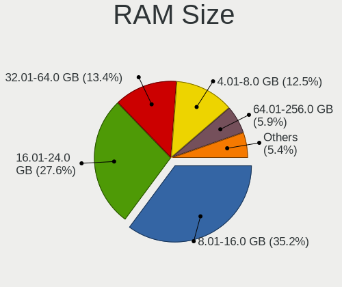
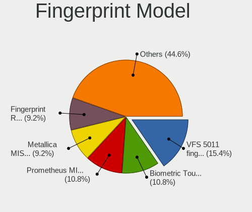

BSD in USA - Tested Hardware & Statistics
-----------------------------------------

A project to collect tested hardware configurations for BSD in USA.

Anyone can contribute to this report by the [hw-probe](https://github.com/linuxhw/hw-probe/blob/master/INSTALL.BSD.md) tool:

    hw-probe -all -upload

Please contribute! Especially if your hardware is rare.

This is a report for all computer types. See also reports for [desktops](/Location/USA/Desktop/README.md) and [notebooks](/Location/USA/Notebook/README.md).

Contents
--------

* [ Test Cases ](#test-cases)

* [ System ](#system)
  - [ OS                       ](#os)
  - [ OS Family                ](#os-family)
  - [ Arch                     ](#arch)
  - [ DE                       ](#de)
  - [ Display Server           ](#display-server)
  - [ Display Manager          ](#display-manager)
  - [ OS Lang                  ](#os-lang)
  - [ Boot Mode                ](#boot-mode)
  - [ Filesystem               ](#filesystem)
  - [ Part. scheme             ](#part-scheme)

* [ Board ](#board)
  - [ Vendor                   ](#vendor)
  - [ Model                    ](#model)
  - [ Model Family             ](#model-family)
  - [ MFG Year                 ](#mfg-year)
  - [ Form Factor              ](#form-factor)
  - [ Coreboot                 ](#coreboot)
  - [ RAM Size                 ](#ram-size)
  - [ RAM Used                 ](#ram-used)
  - [ Total Drives             ](#total-drives)
  - [ Has CD-ROM               ](#has-cd-rom)
  - [ Has Ethernet             ](#has-ethernet)
  - [ Has WiFi                 ](#has-wifi)
  - [ Has Bluetooth            ](#has-bluetooth)

* [ Location ](#location)
  - [ Country                  ](#country)
  - [ City                     ](#city)

* [ Drives ](#drives)
  - [ Drive Vendor             ](#drive-vendor)
  - [ Drive Model              ](#drive-model)
  - [ HDD Vendor               ](#hdd-vendor)
  - [ SSD Vendor               ](#ssd-vendor)
  - [ Drive Kind               ](#drive-kind)
  - [ Drive Connector          ](#drive-connector)
  - [ Drive Size               ](#drive-size)
  - [ Space Total              ](#space-total)
  - [ Space Used               ](#space-used)
  - [ Malfunc. Drives          ](#malfunc-drives)
  - [ Malfunc. Drive Vendor    ](#malfunc-drive-vendor)
  - [ Malfunc. HDD Vendor      ](#malfunc-hdd-vendor)
  - [ Malfunc. Drive Kind      ](#malfunc-drive-kind)
  - [ Failed Drives            ](#failed-drives)
  - [ Failed Drive Vendor      ](#failed-drive-vendor)
  - [ Drive Status             ](#drive-status)

* [ Storage controller ](#storage-controller)
  - [ Storage Vendor           ](#storage-vendor)
  - [ Storage Model            ](#storage-model)
  - [ Storage Kind             ](#storage-kind)

* [ Processor ](#processor)
  - [ CPU Vendor               ](#cpu-vendor)
  - [ CPU Model                ](#cpu-model)
  - [ CPU Model Family         ](#cpu-model-family)
  - [ CPU Cores                ](#cpu-cores)
  - [ CPU Sockets              ](#cpu-sockets)
  - [ CPU Threads              ](#cpu-threads)
  - [ CPU Microarch            ](#cpu-microarch)

* [ Graphics ](#graphics)
  - [ GPU Vendor               ](#gpu-vendor)
  - [ GPU Model                ](#gpu-model)
  - [ GPU Combo                ](#gpu-combo)
  - [ GPU Driver               ](#gpu-driver)
  - [ GPU Memory               ](#gpu-memory)

* [ Monitor ](#monitor)
  - [ Monitor Vendor           ](#monitor-vendor)
  - [ Monitor Model            ](#monitor-model)
  - [ Monitor Resolution       ](#monitor-resolution)
  - [ Monitor Diagonal         ](#monitor-diagonal)
  - [ Monitor Width            ](#monitor-width)
  - [ Aspect Ratio             ](#aspect-ratio)
  - [ Monitor Area             ](#monitor-area)
  - [ Pixel Density            ](#pixel-density)
  - [ Multiple Monitors        ](#multiple-monitors)

* [ Network ](#network)
  - [ Net Controller Vendor    ](#net-controller-vendor)
  - [ Net Controller Model     ](#net-controller-model)
  - [ Wireless Vendor          ](#wireless-vendor)
  - [ Wireless Model           ](#wireless-model)
  - [ Ethernet Vendor          ](#ethernet-vendor)
  - [ Ethernet Model           ](#ethernet-model)
  - [ Net Controller Kind      ](#net-controller-kind)
  - [ Used Controller          ](#used-controller)
  - [ NICs                     ](#nics)
  - [ IPv6                     ](#ipv6)

* [ Bluetooth ](#bluetooth)
  - [ Bluetooth Vendor         ](#bluetooth-vendor)
  - [ Bluetooth Model          ](#bluetooth-model)

* [ Sound ](#sound)
  - [ Sound Vendor             ](#sound-vendor)
  - [ Sound Model              ](#sound-model)

* [ Memory ](#memory)
  - [ Memory Vendor            ](#memory-vendor)
  - [ Memory Model             ](#memory-model)
  - [ Memory Kind              ](#memory-kind)
  - [ Memory Form Factor       ](#memory-form-factor)
  - [ Memory Size              ](#memory-size)
  - [ Memory Speed             ](#memory-speed)

* [ Printers & scanners ](#printers--scanners)
  - [ Printer Vendor           ](#printer-vendor)
  - [ Printer Model            ](#printer-model)
  - [ Scanner Vendor           ](#scanner-vendor)
  - [ Scanner Model            ](#scanner-model)

* [ Camera ](#camera)
  - [ Camera Vendor            ](#camera-vendor)
  - [ Camera Model             ](#camera-model)

* [ Security ](#security)
  - [ Fingerprint Vendor       ](#fingerprint-vendor)
  - [ Fingerprint Model        ](#fingerprint-model)
  - [ Chipcard Vendor          ](#chipcard-vendor)
  - [ Chipcard Model           ](#chipcard-model)

* [ Unsupported ](#unsupported)
  - [ Unsupported Devices      ](#unsupported-devices)
  - [ Unsupported Device Types ](#unsupported-device-types)

Test Cases
----------

Total: 5403

| Vendor        | Model                       | Form-Factor | Probe                                                     | Date         |
|---------------|-----------------------------|-------------|-----------------------------------------------------------|--------------|
| Cisco         | ASA5525 A0                  | Desktop     | [f6eb14f059](https://bsd-hardware.info/?probe=f6eb14f059) | Nov 06, 2023 |
| Unknown       | Unknown                     | Desktop     | [8b1079a297](https://bsd-hardware.info/?probe=8b1079a297) | Nov 06, 2023 |
| Dell          | 05XGC8 A01                  | Desktop     | [9e054bbcb2](https://bsd-hardware.info/?probe=9e054bbcb2) | Nov 06, 2023 |
| Dell          | 0M788G A07                  | Server      | [a404997d9d](https://bsd-hardware.info/?probe=a404997d9d) | Nov 06, 2023 |
| CncTion       | N6000-4L B0                 | Desktop     | [7ee545bad3](https://bsd-hardware.info/?probe=7ee545bad3) | Nov 06, 2023 |
| ASUSTek       | ROG STRIX B550-F GAMING     | Desktop     | [e8c7d22b1f](https://bsd-hardware.info/?probe=e8c7d22b1f) | Nov 05, 2023 |
| MSI           | H81M-P33                    | Desktop     | [d44c30f985](https://bsd-hardware.info/?probe=d44c30f985) | Nov 05, 2023 |
| ASUSTek       | P5Q-E                       | Desktop     | [dac3ca2eca](https://bsd-hardware.info/?probe=dac3ca2eca) | Nov 05, 2023 |
| ASUSTek       | ROG CROSSHAIR VIII HERO     | Desktop     | [e744712416](https://bsd-hardware.info/?probe=e744712416) | Nov 05, 2023 |
| Dell          | 0XHGV1 A00                  | Desktop     | [ab650cfab8](https://bsd-hardware.info/?probe=ab650cfab8) | Nov 05, 2023 |
| Unknown       | Unknown                     | Desktop     | [2a768a9f63](https://bsd-hardware.info/?probe=2a768a9f63) | Nov 05, 2023 |
| Unknown       | Unknown                     | Desktop     | [5d0e537b3e](https://bsd-hardware.info/?probe=5d0e537b3e) | Nov 05, 2023 |
| HP            | ProLiant ML10               | Desktop     | [43badefe76](https://bsd-hardware.info/?probe=43badefe76) | Nov 05, 2023 |
| Dell          | 0XCR8D A03                  | Desktop     | [cc58b2f58f](https://bsd-hardware.info/?probe=cc58b2f58f) | Nov 05, 2023 |
| Supermicro    | X10SLM+-LN4F                | Server      | [ed0fb62285](https://bsd-hardware.info/?probe=ed0fb62285) | Nov 04, 2023 |
| Dell          | 00V62H A00                  | Desktop     | [0b678c5e33](https://bsd-hardware.info/?probe=0b678c5e33) | Nov 04, 2023 |
| Techvision    | TVI7309X B0                 | Desktop     | [90a26f497a](https://bsd-hardware.info/?probe=90a26f497a) | Nov 04, 2023 |
| HP            | 18E4                        | Desktop     | [479b255034](https://bsd-hardware.info/?probe=479b255034) | Nov 03, 2023 |
| Protectli     | FW6                         | Desktop     | [2dc16f3849](https://bsd-hardware.info/?probe=2dc16f3849) | Nov 03, 2023 |
| Shenzhen M... | RPBNB                       | Desktop     | [db0f05f919](https://bsd-hardware.info/?probe=db0f05f919) | Nov 03, 2023 |
| Shenzhen M... | RPBNB                       | Desktop     | [b729c4137a](https://bsd-hardware.info/?probe=b729c4137a) | Nov 03, 2023 |
| Lenovo        | 312D SDK0L22692 WIN 3306... | Mini pc     | [c958c2b087](https://bsd-hardware.info/?probe=c958c2b087) | Nov 02, 2023 |
| IBM           | FWA-3211 A102               | Server      | [8c4e5effec](https://bsd-hardware.info/?probe=8c4e5effec) | Nov 02, 2023 |
| CWWK          | MINIPC-G12                  | Desktop     | [4fd9e1d707](https://bsd-hardware.info/?probe=4fd9e1d707) | Nov 02, 2023 |
| Unknown       | Unknown                     | Desktop     | [f1e1a3e8c8](https://bsd-hardware.info/?probe=f1e1a3e8c8) | Nov 02, 2023 |
| MW            | GMLK-2_5G4L                 | Desktop     | [ff78edaee6](https://bsd-hardware.info/?probe=ff78edaee6) | Nov 02, 2023 |
| Dell          | 0XCR8D A01                  | Desktop     | [224cc728f5](https://bsd-hardware.info/?probe=224cc728f5) | Nov 02, 2023 |
| Dell          | 0XCR8D A02                  | Desktop     | [f9df1890fa](https://bsd-hardware.info/?probe=f9df1890fa) | Nov 02, 2023 |
| Dell          | 0M788G A07                  | Server      | [3d5a1fc986](https://bsd-hardware.info/?probe=3d5a1fc986) | Nov 02, 2023 |
| Dell          | 0XCR8D A01                  | Desktop     | [83c8ab8d4b](https://bsd-hardware.info/?probe=83c8ab8d4b) | Nov 02, 2023 |
| Lenovo        | 312D SDK0J40697 WIN 3305... | Mini pc     | [3e55355c4b](https://bsd-hardware.info/?probe=3e55355c4b) | Nov 02, 2023 |
| Protectli     | VP2420                      | Desktop     | [7621eb7370](https://bsd-hardware.info/?probe=7621eb7370) | Nov 01, 2023 |
| ATOPNUC       | MA90                        | Mini pc     | [7e40f68fc3](https://bsd-hardware.info/?probe=7e40f68fc3) | Nov 01, 2023 |
| Supermicro    | A2SDi-4C-HLN4F              | Server      | [5b6e9f8808](https://bsd-hardware.info/?probe=5b6e9f8808) | Oct 31, 2023 |
| Shuttle       | FS61                        | Desktop     | [24158fbe17](https://bsd-hardware.info/?probe=24158fbe17) | Oct 31, 2023 |
| Shuttle       | FS61                        | Desktop     | [2efb16a5f4](https://bsd-hardware.info/?probe=2efb16a5f4) | Oct 31, 2023 |
| Lenovo        | ThinkPad T480 20L5000WUS    | Notebook    | [4dcf84c76c](https://bsd-hardware.info/?probe=4dcf84c76c) | Oct 31, 2023 |
| ASRock        | X570 Phantom Gaming 4       | Desktop     | [c163891517](https://bsd-hardware.info/?probe=c163891517) | Oct 31, 2023 |
| CheckPoint    | T-110-00                    | Desktop     | [970671ce27](https://bsd-hardware.info/?probe=970671ce27) | Oct 31, 2023 |
| Gigabyte      | H370M D3H-CF                | Desktop     | [6b2553e06c](https://bsd-hardware.info/?probe=6b2553e06c) | Oct 30, 2023 |
| Seeed Stud... | ODYSSEY-X86J41X5 SD-BS-C... | Desktop     | [da2fa90c43](https://bsd-hardware.info/?probe=da2fa90c43) | Oct 30, 2023 |
| Dell          | 0KP561                      | Desktop     | [cd0ae50eb0](https://bsd-hardware.info/?probe=cd0ae50eb0) | Oct 30, 2023 |
| Dell          | 0WMJ54 A01                  | Desktop     | [10d46f39aa](https://bsd-hardware.info/?probe=10d46f39aa) | Oct 30, 2023 |
| Dell          | 0WMJ54 A01                  | Desktop     | [5995fa3115](https://bsd-hardware.info/?probe=5995fa3115) | Oct 30, 2023 |
| Intel         | NUC11PABi7 K90104-302       | Mini pc     | [c7e5f79b34](https://bsd-hardware.info/?probe=c7e5f79b34) | Oct 30, 2023 |
| ShenZhen M... | MW-GMLK-2.5G6L              | Desktop     | [9567268d28](https://bsd-hardware.info/?probe=9567268d28) | Oct 30, 2023 |
| Panasonic     | CFSX4-1                     | Notebook    | [32b7f19d78](https://bsd-hardware.info/?probe=32b7f19d78) | Oct 30, 2023 |
| Panasonic     | CFSX4-1                     | Notebook    | [522298f90a](https://bsd-hardware.info/?probe=522298f90a) | Oct 29, 2023 |
| ShenZhen M... | MW-GMLK-2.5G6L              | Desktop     | [709f8e1566](https://bsd-hardware.info/?probe=709f8e1566) | Oct 29, 2023 |
| Raspberry ... | Raspberry Pi                | Soc         | [1f6542c47d](https://bsd-hardware.info/?probe=1f6542c47d) | Oct 29, 2023 |
| HP            | ZBook 15 G3                 | Notebook    | [74c3cbd1a3](https://bsd-hardware.info/?probe=74c3cbd1a3) | Oct 29, 2023 |
| ASRock        | B450M Pro4 R2.0             | Desktop     | [b60083ef1f](https://bsd-hardware.info/?probe=b60083ef1f) | Oct 28, 2023 |
| ASRock        | H370M-ITX/ac                | Desktop     | [ace25d235f](https://bsd-hardware.info/?probe=ace25d235f) | Oct 28, 2023 |
| HP            | 2AF7                        | Desktop     | [a45659c9d2](https://bsd-hardware.info/?probe=a45659c9d2) | Oct 28, 2023 |
| Unknown       | Unknown                     | Desktop     | [3e99a14af3](https://bsd-hardware.info/?probe=3e99a14af3) | Oct 28, 2023 |
| IBM           | ThinkPad R51 2889W11        | Notebook    | [26d2e55032](https://bsd-hardware.info/?probe=26d2e55032) | Oct 28, 2023 |
| Dell          | 09WH54 A01                  | Desktop     | [a012c0e1c9](https://bsd-hardware.info/?probe=a012c0e1c9) | Oct 27, 2023 |
| Intel         | Q3XXG4-P V1.0               | Desktop     | [03ef00fab1](https://bsd-hardware.info/?probe=03ef00fab1) | Oct 27, 2023 |
| Unknown       | Unknown                     | Desktop     | [7a9e2d88ed](https://bsd-hardware.info/?probe=7a9e2d88ed) | Oct 27, 2023 |
| Dell          | 0M5DCD A00                  | Desktop     | [f8ae786555](https://bsd-hardware.info/?probe=f8ae786555) | Oct 27, 2023 |
| Shenzhen M... | AHBNB OEM                   | Desktop     | [8a1a0cdc32](https://bsd-hardware.info/?probe=8a1a0cdc32) | Oct 27, 2023 |
| Supermicro    | X10SLM+-LN4F                | Server      | [53651e09ac](https://bsd-hardware.info/?probe=53651e09ac) | Oct 27, 2023 |
| Supermicro    | X9SCL/X9SCMA                | Desktop     | [233d4d3b64](https://bsd-hardware.info/?probe=233d4d3b64) | Oct 26, 2023 |
| HPE           | ProLiant DL20 Gen10         | Server      | [3541caeb52](https://bsd-hardware.info/?probe=3541caeb52) | Oct 25, 2023 |
| Unknown       | Unknown                     | Desktop     | [f06cbf02dc](https://bsd-hardware.info/?probe=f06cbf02dc) | Oct 25, 2023 |
| Protectli     | FW6 Ver                     | Desktop     | [66f5010f59](https://bsd-hardware.info/?probe=66f5010f59) | Oct 24, 2023 |
| Protectli     | FW6                         | Desktop     | [9ba0e874f4](https://bsd-hardware.info/?probe=9ba0e874f4) | Oct 24, 2023 |
| Lenovo        | ThinkPad T490 20N3X50500    | Notebook    | [364c7828be](https://bsd-hardware.info/?probe=364c7828be) | Oct 24, 2023 |
| Unknown       | Unknown                     | Desktop     | [b42465c967](https://bsd-hardware.info/?probe=b42465c967) | Oct 23, 2023 |
| Techvision    | TVI7309X B0                 | Desktop     | [2424acbde7](https://bsd-hardware.info/?probe=2424acbde7) | Oct 23, 2023 |
| Supermicro    | X10SLM-F                    | Desktop     | [8e622421c6](https://bsd-hardware.info/?probe=8e622421c6) | Oct 23, 2023 |
| HP            | 3397                        | Desktop     | [2c004318d4](https://bsd-hardware.info/?probe=2c004318d4) | Oct 22, 2023 |
| Acer          | Aspire XC-830               | Desktop     | [6aea1130aa](https://bsd-hardware.info/?probe=6aea1130aa) | Oct 22, 2023 |
| Acer          | Aspire XC-830               | Desktop     | [3a4d822cfc](https://bsd-hardware.info/?probe=3a4d822cfc) | Oct 22, 2023 |
| MSI           | H81M-P33                    | Desktop     | [dd9ff802a9](https://bsd-hardware.info/?probe=dd9ff802a9) | Oct 22, 2023 |
| ASUSTek       | P5Q-E                       | Desktop     | [1b94fd9385](https://bsd-hardware.info/?probe=1b94fd9385) | Oct 22, 2023 |
| ASUSTek       | ROG CROSSHAIR VIII HERO     | Desktop     | [cc7fb797f5](https://bsd-hardware.info/?probe=cc7fb797f5) | Oct 22, 2023 |
| Sophos        | SG                          | Firewall    | [cb44d7e49b](https://bsd-hardware.info/?probe=cb44d7e49b) | Oct 22, 2023 |
| Protectli     | FW6 Ver                     | Desktop     | [e12093f6bd](https://bsd-hardware.info/?probe=e12093f6bd) | Oct 22, 2023 |
| Lenovo        | ThinkPad T410 2518C3U       | Notebook    | [e4b35a3ff6](https://bsd-hardware.info/?probe=e4b35a3ff6) | Oct 21, 2023 |
| Dell          | 0M788G A07                  | Server      | [702549b133](https://bsd-hardware.info/?probe=702549b133) | Oct 21, 2023 |
| HP            | 8054                        | Desktop     | [71b61dc284](https://bsd-hardware.info/?probe=71b61dc284) | Oct 21, 2023 |
| Lenovo        | 312D SDK0J40697 WIN 3305... | Mini pc     | [3a35f074d9](https://bsd-hardware.info/?probe=3a35f074d9) | Oct 20, 2023 |
| Dell          | Latitude 5490               | Notebook    | [eeab525ffd](https://bsd-hardware.info/?probe=eeab525ffd) | Oct 20, 2023 |
| Techvision    | TVI7309X B0                 | Desktop     | [48bb0077c3](https://bsd-hardware.info/?probe=48bb0077c3) | Oct 20, 2023 |
| Protectli     | FW4A Ver                    | Desktop     | [d40c67f9ca](https://bsd-hardware.info/?probe=d40c67f9ca) | Oct 20, 2023 |
| Dell          | 0HD5W2 A01                  | Desktop     | [3f7a4e2865](https://bsd-hardware.info/?probe=3f7a4e2865) | Oct 20, 2023 |
| Panasonic     | CFSX4-1                     | Notebook    | [d3ad63aa13](https://bsd-hardware.info/?probe=d3ad63aa13) | Oct 19, 2023 |
| AMI           | Aptio CRB                   | Mini pc     | [a8dd61b29b](https://bsd-hardware.info/?probe=a8dd61b29b) | Oct 19, 2023 |
| AMI           | Aptio CRB                   | Mini pc     | [e85b1bd1ee](https://bsd-hardware.info/?probe=e85b1bd1ee) | Oct 19, 2023 |
| Gigabyte      | B85M-DS3H                   | Desktop     | [bd9d649fb6](https://bsd-hardware.info/?probe=bd9d649fb6) | Oct 19, 2023 |
| Unknown       | Unknown                     | Desktop     | [94f0b39689](https://bsd-hardware.info/?probe=94f0b39689) | Oct 19, 2023 |
| Dell          | 0NW6H5 A00                  | Desktop     | [606ed441ae](https://bsd-hardware.info/?probe=606ed441ae) | Oct 19, 2023 |
| Fujitsu       | D3433-S2 S26361-D3433-S2    | Desktop     | [26a1b95e16](https://bsd-hardware.info/?probe=26a1b95e16) | Oct 19, 2023 |
| ASRock        | 970 Extreme3 R2.0           | Desktop     | [6f6f1bf009](https://bsd-hardware.info/?probe=6f6f1bf009) | Oct 18, 2023 |
| CncTion       | J4125-4L-I225               | Desktop     | [d8114642f5](https://bsd-hardware.info/?probe=d8114642f5) | Oct 18, 2023 |
| Dell          | 0YXT71 A00                  | Desktop     | [1bf1c3b807](https://bsd-hardware.info/?probe=1bf1c3b807) | Oct 18, 2023 |
| AZW           | EQ                          | Desktop     | [0d647b68a6](https://bsd-hardware.info/?probe=0d647b68a6) | Oct 18, 2023 |
| AZW           | EQ                          | Desktop     | [71f6a16f5a](https://bsd-hardware.info/?probe=71f6a16f5a) | Oct 18, 2023 |
| HP            | 8299                        | Desktop     | [b4ba6a7e52](https://bsd-hardware.info/?probe=b4ba6a7e52) | Oct 18, 2023 |
| CncTion       | N5105-4L B0                 | Desktop     | [0f18316a17](https://bsd-hardware.info/?probe=0f18316a17) | Oct 18, 2023 |
| ASRock        | 970 Extreme3 R2.0           | Desktop     | [3dffc4d445](https://bsd-hardware.info/?probe=3dffc4d445) | Oct 18, 2023 |
| HP            | 8299                        | Desktop     | [8da92e01e0](https://bsd-hardware.info/?probe=8da92e01e0) | Oct 17, 2023 |
| Dell          | Inspiron 5559               | Notebook    | [0ae4cee8b3](https://bsd-hardware.info/?probe=0ae4cee8b3) | Oct 17, 2023 |
| ASUSTek       | X99-A/USB                   | Desktop     | [0f914c6351](https://bsd-hardware.info/?probe=0f914c6351) | Oct 17, 2023 |
| Apple         | MacBook5,2                  | Notebook    | [5f364ec930](https://bsd-hardware.info/?probe=5f364ec930) | Oct 17, 2023 |
| Dell          | 0W3F1J A00                  | Mini pc     | [0139098ee3](https://bsd-hardware.info/?probe=0139098ee3) | Oct 16, 2023 |
| Dell          | 00V62H A00                  | Desktop     | [8ff0ba4fcb](https://bsd-hardware.info/?probe=8ff0ba4fcb) | Oct 16, 2023 |
| Supermicro    | X10SRi-FB                   | Server      | [3129e4f848](https://bsd-hardware.info/?probe=3129e4f848) | Oct 16, 2023 |
| Sophos        | SG                          | Firewall    | [d825f1a130](https://bsd-hardware.info/?probe=d825f1a130) | Oct 15, 2023 |
| Intel         | DH55TC AAE70932-206         | Desktop     | [745b988354](https://bsd-hardware.info/?probe=745b988354) | Oct 15, 2023 |
| Dell          | 0WR7PY A03                  | Desktop     | [128323ada4](https://bsd-hardware.info/?probe=128323ada4) | Oct 15, 2023 |
| Techvision    | TVI7309X B0                 | Desktop     | [bf66ef021e](https://bsd-hardware.info/?probe=bf66ef021e) | Oct 15, 2023 |
| MSI           | H81M-P33                    | Desktop     | [6902d492db](https://bsd-hardware.info/?probe=6902d492db) | Oct 15, 2023 |
| ASUSTek       | P5Q-E                       | Desktop     | [094b766a05](https://bsd-hardware.info/?probe=094b766a05) | Oct 15, 2023 |
| ASUSTek       | ROG CROSSHAIR VIII HERO     | Desktop     | [b502116394](https://bsd-hardware.info/?probe=b502116394) | Oct 15, 2023 |
| Protectli     | VP4650                      | Desktop     | [9c073eb854](https://bsd-hardware.info/?probe=9c073eb854) | Oct 15, 2023 |
| Gigabyte      | Z68AP-D3                    | Desktop     | [ca5e8cfb2b](https://bsd-hardware.info/?probe=ca5e8cfb2b) | Oct 15, 2023 |
| Protectli     | VP2410                      | Desktop     | [aaffd45671](https://bsd-hardware.info/?probe=aaffd45671) | Oct 15, 2023 |
| Lenovo        | 312D SDK0J40697 WIN 3305... | Mini pc     | [9d81c598a9](https://bsd-hardware.info/?probe=9d81c598a9) | Oct 15, 2023 |
| Sophos        | XG                          | Firewall    | [ab8b265b82](https://bsd-hardware.info/?probe=ab8b265b82) | Oct 13, 2023 |
| ASUSTek       | PRIME X370-PRO              | Desktop     | [697f24cf01](https://bsd-hardware.info/?probe=697f24cf01) | Oct 13, 2023 |
| ASRock        | X570 Phantom Gaming 4       | Desktop     | [d14ff47394](https://bsd-hardware.info/?probe=d14ff47394) | Oct 13, 2023 |
| ASUSTek       | PRIME Z690-P                | Desktop     | [95653dd42d](https://bsd-hardware.info/?probe=95653dd42d) | Oct 13, 2023 |
| Protectli     | FW4C                        | Desktop     | [16326174bb](https://bsd-hardware.info/?probe=16326174bb) | Oct 13, 2023 |
| Dell          | 02YYK5 A00                  | Desktop     | [b57183cbb0](https://bsd-hardware.info/?probe=b57183cbb0) | Oct 13, 2023 |
| Supermicro    | X9SCL/X9SCMA                | Desktop     | [30f97615e6](https://bsd-hardware.info/?probe=30f97615e6) | Oct 13, 2023 |
| Unknown       | Unknown                     | Desktop     | [9145630ed9](https://bsd-hardware.info/?probe=9145630ed9) | Oct 12, 2023 |
| IBM           | ThinkPad R51 2889W11        | Notebook    | [45836fafc3](https://bsd-hardware.info/?probe=45836fafc3) | Oct 12, 2023 |
| Toshiba       | Satellite C55-A             | Notebook    | [f27ea283cf](https://bsd-hardware.info/?probe=f27ea283cf) | Oct 12, 2023 |
| Pegatron      | 2AD5                        | Desktop     | [cdc40fe6a3](https://bsd-hardware.info/?probe=cdc40fe6a3) | Oct 11, 2023 |
| Dell          | Precision 7550              | Notebook    | [a21e06c16c](https://bsd-hardware.info/?probe=a21e06c16c) | Oct 11, 2023 |
| Dell          | 08WKV3 A00                  | Desktop     | [67379c4768](https://bsd-hardware.info/?probe=67379c4768) | Oct 11, 2023 |
| Deciso        | NetBoard-A20                | Notebook    | [ddffd0a126](https://bsd-hardware.info/?probe=ddffd0a126) | Oct 10, 2023 |
| Intel         | Q3XXG4-P V1.0               | Desktop     | [3aa38e5b1f](https://bsd-hardware.info/?probe=3aa38e5b1f) | Oct 10, 2023 |
| AZW           | EQ                          | Desktop     | [ea7e5029de](https://bsd-hardware.info/?probe=ea7e5029de) | Oct 10, 2023 |
| Dell          | 03X6X0 A00                  | Server      | [26e755b8be](https://bsd-hardware.info/?probe=26e755b8be) | Oct 10, 2023 |
| Unknown       | Unknown                     | Desktop     | [89d680cba1](https://bsd-hardware.info/?probe=89d680cba1) | Oct 09, 2023 |
| Dell          | 065TRV A04                  | Server      | [2d07fc66b5](https://bsd-hardware.info/?probe=2d07fc66b5) | Oct 09, 2023 |
| HP            | 1497                        | Desktop     | [9ffee4ae55](https://bsd-hardware.info/?probe=9ffee4ae55) | Oct 09, 2023 |
| ASUSTek       | ProArt X670E-CREATOR WIF... | Desktop     | [f55c557bcf](https://bsd-hardware.info/?probe=f55c557bcf) | Oct 09, 2023 |
| EVGA          | X299 MICRO                  | Desktop     | [2907f2166d](https://bsd-hardware.info/?probe=2907f2166d) | Oct 09, 2023 |
| Gigabyte      | H470M DS3H                  | Desktop     | [80e01e48bf](https://bsd-hardware.info/?probe=80e01e48bf) | Oct 09, 2023 |
| ASRock        | Z690M Phantom Gaming 4      | Desktop     | [20ff855aec](https://bsd-hardware.info/?probe=20ff855aec) | Oct 08, 2023 |
| Unknown       | Unknown                     | Desktop     | [a64ed6b5d1](https://bsd-hardware.info/?probe=a64ed6b5d1) | Oct 08, 2023 |
| MSI           | H81M-P33                    | Desktop     | [a9729ebc38](https://bsd-hardware.info/?probe=a9729ebc38) | Oct 08, 2023 |
| ASUSTek       | P5Q-E                       | Desktop     | [06a76899d6](https://bsd-hardware.info/?probe=06a76899d6) | Oct 08, 2023 |
| ASUSTek       | ROG CROSSHAIR VIII HERO     | Desktop     | [cacbb83f98](https://bsd-hardware.info/?probe=cacbb83f98) | Oct 08, 2023 |
| Unknown       | Unknown                     | Desktop     | [bb66634f7c](https://bsd-hardware.info/?probe=bb66634f7c) | Oct 08, 2023 |
| Lenovo        | ThinkPad T410 2518C3U       | Notebook    | [36daf066ca](https://bsd-hardware.info/?probe=36daf066ca) | Oct 08, 2023 |
| MSI           | Aspen                       | Desktop     | [7bb665508f](https://bsd-hardware.info/?probe=7bb665508f) | Oct 07, 2023 |
| Lenovo        | ThinkPad T460s 20FAS2AD0... | Notebook    | [ac6742bd0f](https://bsd-hardware.info/?probe=ac6742bd0f) | Oct 07, 2023 |
| Lenovo        | ThinkPad T460s 20FAS2AD0... | Notebook    | [3e15173331](https://bsd-hardware.info/?probe=3e15173331) | Oct 07, 2023 |
| ASRock        | X570 Phantom Gaming 4       | Desktop     | [b3580a1e53](https://bsd-hardware.info/?probe=b3580a1e53) | Oct 07, 2023 |
| Dell          | 0PXXHP A03                  | Server      | [f3f37dd0e7](https://bsd-hardware.info/?probe=f3f37dd0e7) | Oct 06, 2023 |
| Intel         | CRESCENTBAY                 | Desktop     | [fb6d008bfc](https://bsd-hardware.info/?probe=fb6d008bfc) | Oct 06, 2023 |
| Intel         | QHSW02                      | Desktop     | [e0d4a273f5](https://bsd-hardware.info/?probe=e0d4a273f5) | Oct 06, 2023 |
| HP            | 8056                        | Desktop     | [7516a37588](https://bsd-hardware.info/?probe=7516a37588) | Oct 06, 2023 |
| Dell          | 0XN8Y6 A09                  | Server      | [0aa4133255](https://bsd-hardware.info/?probe=0aa4133255) | Oct 05, 2023 |
| Win elemen... | M600                        | Desktop     | [da4e03cd91](https://bsd-hardware.info/?probe=da4e03cd91) | Oct 05, 2023 |
| Win elemen... | M600                        | Desktop     | [27492e0298](https://bsd-hardware.info/?probe=27492e0298) | Oct 04, 2023 |
| Lenovo        | ThinkPad P73 20QRCTO1WW     | Notebook    | [88e8c64b6f](https://bsd-hardware.info/?probe=88e8c64b6f) | Oct 04, 2023 |
| Lenovo        | SHARKBAY 0B98401 WIN        | Desktop     | [17406f5021](https://bsd-hardware.info/?probe=17406f5021) | Oct 04, 2023 |
| Protectli     | FW4C                        | Desktop     | [671429444f](https://bsd-hardware.info/?probe=671429444f) | Oct 04, 2023 |
| Supermicro    | A2SDi-TP8F                  | Desktop     | [1792df4520](https://bsd-hardware.info/?probe=1792df4520) | Oct 04, 2023 |
| Chuwi         | LarkBox X                   | Mini pc     | [4fa9bbbecf](https://bsd-hardware.info/?probe=4fa9bbbecf) | Oct 03, 2023 |
| HP            | 83E2                        | Desktop     | [dbb1010907](https://bsd-hardware.info/?probe=dbb1010907) | Oct 03, 2023 |
| ASUSTek       | PRIME B560-PLUS AC-HES      | Desktop     | [471133280c](https://bsd-hardware.info/?probe=471133280c) | Oct 03, 2023 |
| Unknown       | Unknown                     | Desktop     | [cab6cdb306](https://bsd-hardware.info/?probe=cab6cdb306) | Oct 02, 2023 |
| AMI           | Aptio CRB                   | Mini pc     | [d5d794abdb](https://bsd-hardware.info/?probe=d5d794abdb) | Oct 02, 2023 |
| Google        | Auron_Paine                 | Notebook    | [d202b4dd6f](https://bsd-hardware.info/?probe=d202b4dd6f) | Oct 02, 2023 |
| Google        | Auron_Paine                 | Notebook    | [1c44cf70e8](https://bsd-hardware.info/?probe=1c44cf70e8) | Oct 02, 2023 |
| Protectli     | VP2420                      | Desktop     | [c77ef1792c](https://bsd-hardware.info/?probe=c77ef1792c) | Oct 02, 2023 |
| Protectli     | VP46xx                      | Desktop     | [4985863bd8](https://bsd-hardware.info/?probe=4985863bd8) | Oct 01, 2023 |
| Google        | Auron_Paine                 | Notebook    | [021624028a](https://bsd-hardware.info/?probe=021624028a) | Oct 01, 2023 |
| Dell          | Inspiron 5559               | Notebook    | [7a6b97e997](https://bsd-hardware.info/?probe=7a6b97e997) | Oct 01, 2023 |
| MSI           | H81M-P33                    | Desktop     | [da12fe3c05](https://bsd-hardware.info/?probe=da12fe3c05) | Oct 01, 2023 |
| ASUSTek       | P5Q-E                       | Desktop     | [6975204e47](https://bsd-hardware.info/?probe=6975204e47) | Oct 01, 2023 |
| Supermicro    | A2SDi-4C-HLN4F              | Desktop     | [f97e242e6b](https://bsd-hardware.info/?probe=f97e242e6b) | Oct 01, 2023 |
| Win elemen... | M600                        | Desktop     | [b5caabfd31](https://bsd-hardware.info/?probe=b5caabfd31) | Oct 01, 2023 |
| Win elemen... | M600                        | Desktop     | [7a1378a001](https://bsd-hardware.info/?probe=7a1378a001) | Oct 01, 2023 |
| Win elemen... | M600                        | Desktop     | [93cc6a1173](https://bsd-hardware.info/?probe=93cc6a1173) | Oct 01, 2023 |
| Gigabyte      | H470M DS3H                  | Desktop     | [604bce28c1](https://bsd-hardware.info/?probe=604bce28c1) | Sep 30, 2023 |
| Supermicro    | X9DRD-iF                    | Server      | [fc2ba7c8d8](https://bsd-hardware.info/?probe=fc2ba7c8d8) | Sep 30, 2023 |
| Win elemen... | M600                        | Desktop     | [abc175c93b](https://bsd-hardware.info/?probe=abc175c93b) | Sep 30, 2023 |
| Win elemen... | M600                        | Desktop     | [5b7606e786](https://bsd-hardware.info/?probe=5b7606e786) | Sep 30, 2023 |
| Acer          | F672CR R01-B1               | Desktop     | [2008598c7e](https://bsd-hardware.info/?probe=2008598c7e) | Sep 29, 2023 |
| Deciso        | Netboard A20                | Notebook    | [3877143e37](https://bsd-hardware.info/?probe=3877143e37) | Sep 29, 2023 |
| Lenovo        | 312D SDK0J40697 WIN 3305... | Mini pc     | [cda7be3da8](https://bsd-hardware.info/?probe=cda7be3da8) | Sep 29, 2023 |
| Unknown       | Unknown                     | Desktop     | [6ed3c7314d](https://bsd-hardware.info/?probe=6ed3c7314d) | Sep 29, 2023 |
| HP            | 0B54h D                     | Desktop     | [55122a1908](https://bsd-hardware.info/?probe=55122a1908) | Sep 29, 2023 |
| AMI           | Aptio CRB                   | Mini pc     | [0f1805a40e](https://bsd-hardware.info/?probe=0f1805a40e) | Sep 27, 2023 |
| AMI           | Aptio CRB                   | Mini pc     | [d86474bd03](https://bsd-hardware.info/?probe=d86474bd03) | Sep 27, 2023 |
| AMI           | Aptio CRB                   | Mini pc     | [57577a5f14](https://bsd-hardware.info/?probe=57577a5f14) | Sep 27, 2023 |
| Supermicro    | X9SCL/X9SCMA                | Desktop     | [8a4596eefa](https://bsd-hardware.info/?probe=8a4596eefa) | Sep 27, 2023 |
| Panasonic     | CFSX4-1                     | Notebook    | [86abd76c4e](https://bsd-hardware.info/?probe=86abd76c4e) | Sep 27, 2023 |
| Lenovo        | ThinkPad T16 Gen 2 21HHC... | Notebook    | [74d0396f87](https://bsd-hardware.info/?probe=74d0396f87) | Sep 27, 2023 |
| Intel         | DENLOW_REFRESH_WS           | Desktop     | [9ca318e043](https://bsd-hardware.info/?probe=9ca318e043) | Sep 27, 2023 |
| Lenovo        | ThinkPad X220 Tablet 429... | Notebook    | [0c56aeb6b5](https://bsd-hardware.info/?probe=0c56aeb6b5) | Sep 27, 2023 |
| AMI           | Aptio CRB                   | Mini pc     | [d7cdc9b73e](https://bsd-hardware.info/?probe=d7cdc9b73e) | Sep 26, 2023 |
| HP            | 8055                        | Desktop     | [b86f4f02a5](https://bsd-hardware.info/?probe=b86f4f02a5) | Sep 26, 2023 |
| HPE           | ProLiant DL20 Gen10         | Server      | [3c10d0b8ed](https://bsd-hardware.info/?probe=3c10d0b8ed) | Sep 26, 2023 |
| HPE           | ProLiant DL20 Gen10         | Server      | [bc62c36654](https://bsd-hardware.info/?probe=bc62c36654) | Sep 25, 2023 |
| Lenovo        | ThinkPad P16 Gen 1 21D60... | Notebook    | [231aedbf9e](https://bsd-hardware.info/?probe=231aedbf9e) | Sep 25, 2023 |
| Unknown       | Unknown                     | Desktop     | [a77db6c46a](https://bsd-hardware.info/?probe=a77db6c46a) | Sep 25, 2023 |
| Lenovo        | 312A SDK0J40697 WIN 3305... | Desktop     | [6153909c9e](https://bsd-hardware.info/?probe=6153909c9e) | Sep 25, 2023 |
| Unknown       | Unknown                     | Desktop     | [5232e5837b](https://bsd-hardware.info/?probe=5232e5837b) | Sep 25, 2023 |
| CncTion       | N4505-4L B0                 | Desktop     | [5880a22b30](https://bsd-hardware.info/?probe=5880a22b30) | Sep 25, 2023 |
| Protectli     | VP4630                      | Desktop     | [d5c0fe73ef](https://bsd-hardware.info/?probe=d5c0fe73ef) | Sep 24, 2023 |
| MSI           | H81M-P33                    | Desktop     | [971f3fdba1](https://bsd-hardware.info/?probe=971f3fdba1) | Sep 24, 2023 |
| ASUSTek       | P5Q-E                       | Desktop     | [6538212bd6](https://bsd-hardware.info/?probe=6538212bd6) | Sep 24, 2023 |
| ASUSTek       | ROG CROSSHAIR VIII HERO     | Desktop     | [f7aee1db53](https://bsd-hardware.info/?probe=f7aee1db53) | Sep 24, 2023 |
| Intel         | DQ77KB AAG40294-401         | Desktop     | [be147f7ff1](https://bsd-hardware.info/?probe=be147f7ff1) | Sep 24, 2023 |
| Protectli     | VP2420                      | Desktop     | [8644c80a4a](https://bsd-hardware.info/?probe=8644c80a4a) | Sep 24, 2023 |
| Protectli     | FW6 Ver                     | Desktop     | [d8ccddab5a](https://bsd-hardware.info/?probe=d8ccddab5a) | Sep 23, 2023 |
| Unknown       | Unknown                     | Desktop     | [3e1ef4a73c](https://bsd-hardware.info/?probe=3e1ef4a73c) | Sep 23, 2023 |
| IceWhale T... | ZimaBoard 216 ZMB           | Desktop     | [8386219e8f](https://bsd-hardware.info/?probe=8386219e8f) | Sep 22, 2023 |
| Dell          | 0HD5W2 A01                  | Desktop     | [5478cff8a7](https://bsd-hardware.info/?probe=5478cff8a7) | Sep 21, 2023 |
| Lenovo        | ThinkPad P50 20EN0012US     | Notebook    | [a1945198c6](https://bsd-hardware.info/?probe=a1945198c6) | Sep 21, 2023 |
| Premio        | BlueCat XMB3 00C            | Desktop     | [423687627b](https://bsd-hardware.info/?probe=423687627b) | Sep 21, 2023 |
| Protectli     | FW4C Ver                    | Desktop     | [eae9f87345](https://bsd-hardware.info/?probe=eae9f87345) | Sep 20, 2023 |
| Panasonic     | CFSX4-1                     | Notebook    | [398d7a6f26](https://bsd-hardware.info/?probe=398d7a6f26) | Sep 20, 2023 |
| Supermicro    | A1SRi-2758F                 | Desktop     | [6ee2f45613](https://bsd-hardware.info/?probe=6ee2f45613) | Sep 20, 2023 |
| Supermicro    | A1SRi-2758F                 | Desktop     | [34bffe0ed1](https://bsd-hardware.info/?probe=34bffe0ed1) | Sep 20, 2023 |
| Intel         | Q3XXG4-P V1.0               | Desktop     | [60a616adf4](https://bsd-hardware.info/?probe=60a616adf4) | Sep 20, 2023 |
| HP            | 8522 A01                    | Mini pc     | [dd5d9863aa](https://bsd-hardware.info/?probe=dd5d9863aa) | Sep 19, 2023 |
| Shenzhen M... | RPBNB                       | Desktop     | [07698e61c2](https://bsd-hardware.info/?probe=07698e61c2) | Sep 19, 2023 |
| AMI           | Aptio CRB                   | Mini pc     | [ed7bef076e](https://bsd-hardware.info/?probe=ed7bef076e) | Sep 19, 2023 |
| AMI           | Aptio CRB                   | Mini pc     | [7c6f946c9b](https://bsd-hardware.info/?probe=7c6f946c9b) | Sep 19, 2023 |
| Lenovo        | SHARKBAY SDK0E50510 WIN     | Desktop     | [0fe1aab1d8](https://bsd-hardware.info/?probe=0fe1aab1d8) | Sep 19, 2023 |
| Protectli     | VP2420                      | Desktop     | [c4599cac13](https://bsd-hardware.info/?probe=c4599cac13) | Sep 19, 2023 |
| Unknown       | Unknown                     | Desktop     | [0a9c074970](https://bsd-hardware.info/?probe=0a9c074970) | Sep 18, 2023 |
| Techvision    | TVI7309X B0                 | Desktop     | [5e7775568c](https://bsd-hardware.info/?probe=5e7775568c) | Sep 18, 2023 |
| AMI           | Aptio CRB                   | Mini pc     | [815d9f2867](https://bsd-hardware.info/?probe=815d9f2867) | Sep 18, 2023 |
| Inventec      | DQ Class A02                | Desktop     | [e6e705b7cf](https://bsd-hardware.info/?probe=e6e705b7cf) | Sep 18, 2023 |
| Advantech     | NAMB-3250 A102-1            | Desktop     | [143c5f73fc](https://bsd-hardware.info/?probe=143c5f73fc) | Sep 17, 2023 |
| Dell          | 04415J A00                  | Mini pc     | [35fbb60b50](https://bsd-hardware.info/?probe=35fbb60b50) | Sep 17, 2023 |
| Lenovo        | 312A SDK0J40697 WIN 3305... | Desktop     | [31455b0d33](https://bsd-hardware.info/?probe=31455b0d33) | Sep 17, 2023 |
| Unknown       | Unknown                     | Desktop     | [31cf5dc87d](https://bsd-hardware.info/?probe=31cf5dc87d) | Sep 16, 2023 |
| Supermicro    | X9SCL/X9SCMA                | Desktop     | [a054400ef6](https://bsd-hardware.info/?probe=a054400ef6) | Sep 16, 2023 |
| Lenovo        | 312D SDK0J40697 WIN 3305... | Mini pc     | [1f54d2bb5b](https://bsd-hardware.info/?probe=1f54d2bb5b) | Sep 16, 2023 |
| Dell          | 02YYK5 A00                  | Desktop     | [a2d011d2d7](https://bsd-hardware.info/?probe=a2d011d2d7) | Sep 16, 2023 |
| MW            | GMLK-2_5G4L                 | Desktop     | [d36ff6181c](https://bsd-hardware.info/?probe=d36ff6181c) | Sep 15, 2023 |
| Unknown       | Unknown                     | Desktop     | [3fcc5727d3](https://bsd-hardware.info/?probe=3fcc5727d3) | Sep 15, 2023 |
| Gigabyte      | X470 AORUS ULTRA GAMING-... | Desktop     | [6fc18e3db7](https://bsd-hardware.info/?probe=6fc18e3db7) | Sep 15, 2023 |
| Lenovo        | ThinkPad Edge E531 68852... | Notebook    | [cc3bef6a45](https://bsd-hardware.info/?probe=cc3bef6a45) | Sep 15, 2023 |
| Deciso        | NetBoard-A20                | Notebook    | [0c65fb5e8c](https://bsd-hardware.info/?probe=0c65fb5e8c) | Sep 15, 2023 |
| Protectli     | FW4B Ver                    | Desktop     | [9790cd72bc](https://bsd-hardware.info/?probe=9790cd72bc) | Sep 15, 2023 |
| Dell          | OptiPlex 3020               | Desktop     | [dfb6cce27d](https://bsd-hardware.info/?probe=dfb6cce27d) | Sep 14, 2023 |
| ASRock        | J1900D2Y                    | Desktop     | [2084583d47](https://bsd-hardware.info/?probe=2084583d47) | Sep 14, 2023 |
| ASRock        | J3455M                      | Desktop     | [f9809dfb0f](https://bsd-hardware.info/?probe=f9809dfb0f) | Sep 13, 2023 |
| Dell          | 04YP6J A02                  | Desktop     | [0933e1164a](https://bsd-hardware.info/?probe=0933e1164a) | Sep 13, 2023 |
| GPU Compan... | GWTC116-2                   | Notebook    | [03a8809fe4](https://bsd-hardware.info/?probe=03a8809fe4) | Sep 13, 2023 |
| GPU Compan... | GWTC116-2                   | Notebook    | [7ba189ff8a](https://bsd-hardware.info/?probe=7ba189ff8a) | Sep 13, 2023 |
| ASUSTek       | PRIME X370-PRO              | Desktop     | [5dee3a945f](https://bsd-hardware.info/?probe=5dee3a945f) | Sep 13, 2023 |
| ASRock        | X570 Phantom Gaming 4       | Desktop     | [9fee6e83fc](https://bsd-hardware.info/?probe=9fee6e83fc) | Sep 13, 2023 |
| Dell          | 02YYK5 A00                  | Desktop     | [ae320bd7de](https://bsd-hardware.info/?probe=ae320bd7de) | Sep 13, 2023 |
| Intel         | S1200BTL E98681-306         | Server      | [f3594b1f7c](https://bsd-hardware.info/?probe=f3594b1f7c) | Sep 13, 2023 |
| HP            | 212B                        | Desktop     | [3370718b29](https://bsd-hardware.info/?probe=3370718b29) | Sep 13, 2023 |
| Protectli     | FW4B Ver                    | Desktop     | [984a64677e](https://bsd-hardware.info/?probe=984a64677e) | Sep 13, 2023 |
| ASRockRack    | X470D4U                     | Desktop     | [b0cd1ce0f4](https://bsd-hardware.info/?probe=b0cd1ce0f4) | Sep 13, 2023 |
| Lenovo        | ThinkPad X140e 20BMS03E0... | Notebook    | [54b04ea958](https://bsd-hardware.info/?probe=54b04ea958) | Sep 12, 2023 |
| ASUSTek       | TUF Gaming B550M-PLUS (W... | Desktop     | [89a601d720](https://bsd-hardware.info/?probe=89a601d720) | Sep 12, 2023 |
| MW            | GMLK-2_5G4L                 | Desktop     | [7923196f55](https://bsd-hardware.info/?probe=7923196f55) | Sep 11, 2023 |
| MSI           | A520M-A PRO                 | Desktop     | [8b541c71a9](https://bsd-hardware.info/?probe=8b541c71a9) | Sep 11, 2023 |
| Unknown       | Unknown                     | Desktop     | [6610a56ab4](https://bsd-hardware.info/?probe=6610a56ab4) | Sep 11, 2023 |
| Unknown       | Unknown                     | Desktop     | [ccc62ac366](https://bsd-hardware.info/?probe=ccc62ac366) | Sep 10, 2023 |
| Intel         | NUC5i5MYBE H47797-205       | Mini pc     | [5ef436c661](https://bsd-hardware.info/?probe=5ef436c661) | Sep 10, 2023 |
| ASRock        | 4X4-4000 Series             | Desktop     | [525ed7878c](https://bsd-hardware.info/?probe=525ed7878c) | Sep 10, 2023 |
| ASRock        | 4X4-4000 Series             | Desktop     | [0131f46755](https://bsd-hardware.info/?probe=0131f46755) | Sep 10, 2023 |
| AZW           | EQ                          | Desktop     | [c6f83de1e4](https://bsd-hardware.info/?probe=c6f83de1e4) | Sep 10, 2023 |
| MSI           | H81M-P33                    | Desktop     | [57a847859f](https://bsd-hardware.info/?probe=57a847859f) | Sep 10, 2023 |
| ASUSTek       | P5Q-E                       | Desktop     | [b7e0d87f47](https://bsd-hardware.info/?probe=b7e0d87f47) | Sep 10, 2023 |
| ASUSTek       | ROG CROSSHAIR VIII HERO     | Desktop     | [c2378b3e83](https://bsd-hardware.info/?probe=c2378b3e83) | Sep 10, 2023 |
| Unknown       | QGLK03                      | Desktop     | [42ea8dfb44](https://bsd-hardware.info/?probe=42ea8dfb44) | Sep 10, 2023 |
| CWWK          | CW-AD4L-N V1                | Desktop     | [52764da7d8](https://bsd-hardware.info/?probe=52764da7d8) | Sep 10, 2023 |
| Supermicro    | X10SLM-F                    | Desktop     | [332a3f8516](https://bsd-hardware.info/?probe=332a3f8516) | Sep 09, 2023 |
| Supermicro    | X8DTH-i/6/iF/6F             | Desktop     | [df114e1b94](https://bsd-hardware.info/?probe=df114e1b94) | Sep 09, 2023 |
| Unknown       | Unknown                     | Desktop     | [8579d5fa0d](https://bsd-hardware.info/?probe=8579d5fa0d) | Sep 09, 2023 |
| Protectli     | FW4C Ver                    | Desktop     | [7ea278ed7a](https://bsd-hardware.info/?probe=7ea278ed7a) | Sep 09, 2023 |
| Protectli     | FW4C Ver                    | Desktop     | [331f3de91a](https://bsd-hardware.info/?probe=331f3de91a) | Sep 09, 2023 |
| Unknown       | Unknown                     | Desktop     | [ee507594a0](https://bsd-hardware.info/?probe=ee507594a0) | Sep 09, 2023 |
| Lenovo        | ThinkPad X61 Tablet 7762... | Notebook    | [252fc12d3b](https://bsd-hardware.info/?probe=252fc12d3b) | Sep 09, 2023 |
| Intel         | Q3XXG4-P V1.0               | Desktop     | [07d197cf04](https://bsd-hardware.info/?probe=07d197cf04) | Sep 09, 2023 |
| Unknown       | Unknown                     | Desktop     | [2e51c11ed2](https://bsd-hardware.info/?probe=2e51c11ed2) | Sep 08, 2023 |
| Unknown       | Unknown                     | Desktop     | [480823e372](https://bsd-hardware.info/?probe=480823e372) | Sep 08, 2023 |
| Dell          | 0NC2VH A01                  | Desktop     | [122601f717](https://bsd-hardware.info/?probe=122601f717) | Sep 08, 2023 |
| AZW           | MINI S 10                   | Desktop     | [4580cb5481](https://bsd-hardware.info/?probe=4580cb5481) | Sep 08, 2023 |
| Techvision    | TVI7309X B0                 | Desktop     | [aaeb12b1c6](https://bsd-hardware.info/?probe=aaeb12b1c6) | Sep 08, 2023 |
| Protectli     | VP2420                      | Desktop     | [2a8eb1b056](https://bsd-hardware.info/?probe=2a8eb1b056) | Sep 08, 2023 |
| Unknown       | Unknown                     | Desktop     | [fa747c859f](https://bsd-hardware.info/?probe=fa747c859f) | Sep 08, 2023 |
| Intel         | MAHOBAY                     | Desktop     | [a3e54e7628](https://bsd-hardware.info/?probe=a3e54e7628) | Sep 08, 2023 |
| HP            | 8158 A01                    | Mini pc     | [ae22c1bea5](https://bsd-hardware.info/?probe=ae22c1bea5) | Sep 08, 2023 |
| HP            | Pavilion g7                 | Notebook    | [4870da3b0e](https://bsd-hardware.info/?probe=4870da3b0e) | Sep 07, 2023 |
| Techvision    | TVI7309X B0                 | Desktop     | [eff74e8df0](https://bsd-hardware.info/?probe=eff74e8df0) | Sep 07, 2023 |
| Dell          | 05XGC8 A01                  | Desktop     | [7c0acfa5b9](https://bsd-hardware.info/?probe=7c0acfa5b9) | Sep 07, 2023 |
| Unknown       | Unknown                     | Desktop     | [94d9b19ade](https://bsd-hardware.info/?probe=94d9b19ade) | Sep 07, 2023 |
| Lenovo        | 3136 SDK0J40697 WIN 3305... | Mini pc     | [b5aa3f010f](https://bsd-hardware.info/?probe=b5aa3f010f) | Sep 07, 2023 |
| AMI           | Aptio CRB                   | Mini pc     | [12145f939b](https://bsd-hardware.info/?probe=12145f939b) | Sep 07, 2023 |
| Dell          | 0KM5PX A01                  | Server      | [67f910daa9](https://bsd-hardware.info/?probe=67f910daa9) | Sep 06, 2023 |
| Lenovo        | 0B98401 PRO                 | Desktop     | [4397f70291](https://bsd-hardware.info/?probe=4397f70291) | Sep 06, 2023 |
| AZW           | MINI S 10                   | Desktop     | [2daf516a05](https://bsd-hardware.info/?probe=2daf516a05) | Sep 06, 2023 |
| ASUSTek       | SABERTOOTH 990FX R2.0       | Desktop     | [0b7d85b124](https://bsd-hardware.info/?probe=0b7d85b124) | Sep 06, 2023 |
| LG Electro... | 16U70Q-K.AAS7U1             | Notebook    | [82e3b2e5f8](https://bsd-hardware.info/?probe=82e3b2e5f8) | Sep 06, 2023 |
| Supermicro    | X9SCL/X9SCMA                | Desktop     | [3af68f2594](https://bsd-hardware.info/?probe=3af68f2594) | Sep 06, 2023 |
| Dell          | 096JG8 A01                  | Desktop     | [ec3e0338eb](https://bsd-hardware.info/?probe=ec3e0338eb) | Sep 06, 2023 |
| Dell          | 096JG8 A01                  | Desktop     | [84d768ee15](https://bsd-hardware.info/?probe=84d768ee15) | Sep 05, 2023 |
| Intel         | Q3XXG4-P V1.0               | Desktop     | [3fb536ecce](https://bsd-hardware.info/?probe=3fb536ecce) | Sep 05, 2023 |
| Dell          | Inspiron 15 7000 Gaming     | Notebook    | [67e9eafa7e](https://bsd-hardware.info/?probe=67e9eafa7e) | Sep 05, 2023 |
| Dell          | 0X3D66 A02                  | Server      | [8dcfb77863](https://bsd-hardware.info/?probe=8dcfb77863) | Sep 05, 2023 |
| ASUSTek       | H97I-PLUS                   | Desktop     | [e92272bb87](https://bsd-hardware.info/?probe=e92272bb87) | Sep 05, 2023 |
| Supermicro    | X11SSH-F                    | Desktop     | [bff90e93d0](https://bsd-hardware.info/?probe=bff90e93d0) | Sep 05, 2023 |
| Lenovo        | ThinkPad X61 Tablet 7762... | Notebook    | [00dd1bd84e](https://bsd-hardware.info/?probe=00dd1bd84e) | Sep 04, 2023 |
| Unknown       | Unknown                     | Desktop     | [a4796e8170](https://bsd-hardware.info/?probe=a4796e8170) | Sep 04, 2023 |
| Dell          | 0NC2VH A01                  | Desktop     | [8cc0358a69](https://bsd-hardware.info/?probe=8cc0358a69) | Sep 04, 2023 |
| CWWK          | CW-AD4L-N V1                | Desktop     | [dd32d9d4e1](https://bsd-hardware.info/?probe=dd32d9d4e1) | Sep 04, 2023 |
| Toshiba       | QOSMIO X775                 | Notebook    | [d92a05ab1d](https://bsd-hardware.info/?probe=d92a05ab1d) | Sep 04, 2023 |
| Unknown       | Unknown                     | Desktop     | [7d95befe6e](https://bsd-hardware.info/?probe=7d95befe6e) | Sep 04, 2023 |
| Intel         | S1200KP AAG34877-201        | Desktop     | [1b07865ce7](https://bsd-hardware.info/?probe=1b07865ce7) | Sep 04, 2023 |
| ASRock        | X570 Steel Legend WiFi a... | Desktop     | [a98f0b3d67](https://bsd-hardware.info/?probe=a98f0b3d67) | Sep 03, 2023 |
| Gigabyte      | A520I AC                    | Desktop     | [58e061f420](https://bsd-hardware.info/?probe=58e061f420) | Sep 03, 2023 |
| ASRock        | X570 Steel Legend WiFi a... | Desktop     | [d352ea60cf](https://bsd-hardware.info/?probe=d352ea60cf) | Sep 03, 2023 |
| MSI           | PRO Z790-P WIFI             | Desktop     | [fe53c55492](https://bsd-hardware.info/?probe=fe53c55492) | Sep 03, 2023 |
| MSI           | H81M-P33                    | Desktop     | [b47290007a](https://bsd-hardware.info/?probe=b47290007a) | Sep 03, 2023 |
| ASUSTek       | P5Q-E                       | Desktop     | [ef4604a40f](https://bsd-hardware.info/?probe=ef4604a40f) | Sep 03, 2023 |
| ASUSTek       | ROG CROSSHAIR VIII HERO     | Desktop     | [8d37c44440](https://bsd-hardware.info/?probe=8d37c44440) | Sep 03, 2023 |
| Unknown       | Unknown                     | Desktop     | [9c1891cda7](https://bsd-hardware.info/?probe=9c1891cda7) | Sep 03, 2023 |
| AAEON         | FWS-2363 V1.0               | Desktop     | [098bc5466b](https://bsd-hardware.info/?probe=098bc5466b) | Sep 03, 2023 |
| Lenovo        | ThinkPad P50 20EN0012US     | Notebook    | [9d1b9e7af6](https://bsd-hardware.info/?probe=9d1b9e7af6) | Sep 03, 2023 |
| Dell          | 08NPPY A00                  | Desktop     | [1ae33cfe72](https://bsd-hardware.info/?probe=1ae33cfe72) | Sep 02, 2023 |
| ASRock        | J3455M                      | Desktop     | [762d4d9370](https://bsd-hardware.info/?probe=762d4d9370) | Sep 02, 2023 |
| Dell          | 0XCR8D A00                  | Desktop     | [b89126c9d9](https://bsd-hardware.info/?probe=b89126c9d9) | Sep 02, 2023 |
| AMI           | Aptio CRB                   | Mini pc     | [b63ded7b81](https://bsd-hardware.info/?probe=b63ded7b81) | Sep 02, 2023 |
| MSI           | Z390-A PRO                  | Desktop     | [57925dc8bb](https://bsd-hardware.info/?probe=57925dc8bb) | Sep 02, 2023 |
| Unknown       | Unknown                     | Desktop     | [94487109c2](https://bsd-hardware.info/?probe=94487109c2) | Sep 01, 2023 |
| Supermicro    | X9DRD-iF                    | Server      | [708af02c7b](https://bsd-hardware.info/?probe=708af02c7b) | Sep 01, 2023 |
| HP            | EliteBook 8540w             | Notebook    | [5e44dfed67](https://bsd-hardware.info/?probe=5e44dfed67) | Sep 01, 2023 |
| Dell          | 0DRG19 A00                  | Mini pc     | [9e6cb6fe25](https://bsd-hardware.info/?probe=9e6cb6fe25) | Sep 01, 2023 |
| CompuLab      | fitlet2                     | Mini pc     | [525a1718ff](https://bsd-hardware.info/?probe=525a1718ff) | Sep 01, 2023 |
| Shuttle       | FS77U                       | Desktop     | [149a8a1437](https://bsd-hardware.info/?probe=149a8a1437) | Sep 01, 2023 |
| Panasonic     | CFSX4-1                     | Notebook    | [8f54654916](https://bsd-hardware.info/?probe=8f54654916) | Sep 01, 2023 |
| Dell          | 0YXT71 A02                  | Desktop     | [b887caabe7](https://bsd-hardware.info/?probe=b887caabe7) | Aug 31, 2023 |
| Foxconn       | nT-A3000 series FAB         | Desktop     | [d9f360b4fe](https://bsd-hardware.info/?probe=d9f360b4fe) | Aug 31, 2023 |
| Dell          | 0WR7PY A02                  | Desktop     | [2557e04cf5](https://bsd-hardware.info/?probe=2557e04cf5) | Aug 31, 2023 |
| Intel         | NUC8i7HNB J68197-602        | Mini pc     | [f2806a3c65](https://bsd-hardware.info/?probe=f2806a3c65) | Aug 31, 2023 |
| Biostar       | A68N-5545                   | Desktop     | [b2a1070e2d](https://bsd-hardware.info/?probe=b2a1070e2d) | Aug 31, 2023 |
| CWWK          | CW-AD4L-N V1                | Desktop     | [363a27fb74](https://bsd-hardware.info/?probe=363a27fb74) | Aug 31, 2023 |
| Acer          | Aspire A515-55              | Notebook    | [fcbd8a3f31](https://bsd-hardware.info/?probe=fcbd8a3f31) | Aug 31, 2023 |
| AMI           | Aptio CRB                   | Mini pc     | [97975e788b](https://bsd-hardware.info/?probe=97975e788b) | Aug 30, 2023 |
| Deciso        | NetBoard-A20                | Notebook    | [0119402f80](https://bsd-hardware.info/?probe=0119402f80) | Aug 30, 2023 |
| Infoblox      | IB-810                      | Desktop     | [34c0fa6bec](https://bsd-hardware.info/?probe=34c0fa6bec) | Aug 30, 2023 |
| Supermicro    | X12SDV-8C-SPT8FA            | Server      | [c46557f737](https://bsd-hardware.info/?probe=c46557f737) | Aug 30, 2023 |
| Techvision    | TVI7309X B0                 | Desktop     | [259a7ec99d](https://bsd-hardware.info/?probe=259a7ec99d) | Aug 30, 2023 |
| Techvision    | TVI7309X B0                 | Desktop     | [20946147de](https://bsd-hardware.info/?probe=20946147de) | Aug 30, 2023 |
| Unknown       | Unknown                     | Desktop     | [8cfa60050b](https://bsd-hardware.info/?probe=8cfa60050b) | Aug 30, 2023 |
| Dell          | Latitude E4310              | Notebook    | [7645de3654](https://bsd-hardware.info/?probe=7645de3654) | Aug 30, 2023 |
| Supermicro    | A1SRi-2758F                 | Desktop     | [c8b4f33fb1](https://bsd-hardware.info/?probe=c8b4f33fb1) | Aug 30, 2023 |
| Biostar       | A68N-5545                   | Desktop     | [c90edbc46a](https://bsd-hardware.info/?probe=c90edbc46a) | Aug 29, 2023 |
| Lenovo        | IdeaPad 110S-11IBR 80WG     | Notebook    | [e74ef1d37c](https://bsd-hardware.info/?probe=e74ef1d37c) | Aug 29, 2023 |
| Supermicro    | X9DRD-iF                    | Desktop     | [be36f2fe2b](https://bsd-hardware.info/?probe=be36f2fe2b) | Aug 28, 2023 |
| ATOPNUC       | MA90                        | Mini pc     | [e0d13077ea](https://bsd-hardware.info/?probe=e0d13077ea) | Aug 28, 2023 |
| Lenovo        | ThinkPad T490 20RYS06R00    | Notebook    | [978cd1d6bc](https://bsd-hardware.info/?probe=978cd1d6bc) | Aug 28, 2023 |
| Dell          | 04Y8V0 A02                  | Desktop     | [a84c23941d](https://bsd-hardware.info/?probe=a84c23941d) | Aug 27, 2023 |
| Protectli     | FW6                         | Desktop     | [37b744ff79](https://bsd-hardware.info/?probe=37b744ff79) | Aug 27, 2023 |
| Dell          | Latitude 7280               | Notebook    | [c858f191cf](https://bsd-hardware.info/?probe=c858f191cf) | Aug 27, 2023 |
| MSI           | H81M-P33                    | Desktop     | [2e9a066a01](https://bsd-hardware.info/?probe=2e9a066a01) | Aug 27, 2023 |
| ASUSTek       | P5Q-E                       | Desktop     | [9898ae1ead](https://bsd-hardware.info/?probe=9898ae1ead) | Aug 27, 2023 |
| ASUSTek       | ROG CROSSHAIR VIII HERO     | Desktop     | [0bb56ff672](https://bsd-hardware.info/?probe=0bb56ff672) | Aug 27, 2023 |
| HP            | 8103 A01                    | Mini pc     | [484d82cac6](https://bsd-hardware.info/?probe=484d82cac6) | Aug 27, 2023 |
| Supermicro    | X11SDV-4C-TP8F-01           | Desktop     | [21e958a05d](https://bsd-hardware.info/?probe=21e958a05d) | Aug 26, 2023 |
| ASRock        | 970 Extreme3 R2.0           | Desktop     | [bf289c5941](https://bsd-hardware.info/?probe=bf289c5941) | Aug 26, 2023 |
| HP            | 8299                        | Desktop     | [77a077cb11](https://bsd-hardware.info/?probe=77a077cb11) | Aug 26, 2023 |
| Pegatron      | 2ACD                        | Desktop     | [c20fcb2b2f](https://bsd-hardware.info/?probe=c20fcb2b2f) | Aug 26, 2023 |
| HP            | ENVY Notebook 13-ab0XX      | Notebook    | [3d96f4d5b4](https://bsd-hardware.info/?probe=3d96f4d5b4) | Aug 26, 2023 |
| Lenovo        | ThinkPad X1 Carbon 7th 2... | Notebook    | [c8e95f3772](https://bsd-hardware.info/?probe=c8e95f3772) | Aug 26, 2023 |
| Supermicro    | X10DRi-LN4+                 | Server      | [4978b62b97](https://bsd-hardware.info/?probe=4978b62b97) | Aug 24, 2023 |
| Lenovo        | ThinkPad X1 Carbon Gen 9... | Notebook    | [f1a43ebe23](https://bsd-hardware.info/?probe=f1a43ebe23) | Aug 24, 2023 |
| Inventec      | Z CLASS A02                 | Desktop     | [8d7f83c319](https://bsd-hardware.info/?probe=8d7f83c319) | Aug 24, 2023 |
| Dell          | Inspiron 15-7568            | Notebook    | [9e555f0b24](https://bsd-hardware.info/?probe=9e555f0b24) | Aug 24, 2023 |
| Dell          | Latitude 7490               | Notebook    | [0b05de2297](https://bsd-hardware.info/?probe=0b05de2297) | Aug 24, 2023 |
| MW            | GMLK-2_5G4L                 | Desktop     | [d07ade15d2](https://bsd-hardware.info/?probe=d07ade15d2) | Aug 23, 2023 |
| MSI           | PRO B550-VC                 | Desktop     | [005e9c7b4c](https://bsd-hardware.info/?probe=005e9c7b4c) | Aug 23, 2023 |
| AZW           | EQ                          | Desktop     | [a43bd92291](https://bsd-hardware.info/?probe=a43bd92291) | Aug 23, 2023 |
| Lenovo        | 3102 SDK0J40705 WIN 3425... | Desktop     | [1fcc80636d](https://bsd-hardware.info/?probe=1fcc80636d) | Aug 22, 2023 |
| Supermicro    | X9DRD-iF                    | Server      | [962bf51507](https://bsd-hardware.info/?probe=962bf51507) | Aug 22, 2023 |
| Techvision    | TVI7309X B0                 | Desktop     | [ff55eb5161](https://bsd-hardware.info/?probe=ff55eb5161) | Aug 22, 2023 |
| Protectli     | FW4B                        | Desktop     | [6041b7e153](https://bsd-hardware.info/?probe=6041b7e153) | Aug 21, 2023 |
| Intel         | JSL MRD                     | Desktop     | [0f3ef76fb8](https://bsd-hardware.info/?probe=0f3ef76fb8) | Aug 21, 2023 |
| Cisco         | ASA5525 A0                  | Desktop     | [7c88ca29f7](https://bsd-hardware.info/?probe=7c88ca29f7) | Aug 21, 2023 |
| Dell          | 0PXXHP A03                  | Server      | [e8eef1fb22](https://bsd-hardware.info/?probe=e8eef1fb22) | Aug 21, 2023 |
| ASUSTek       | B85M-G R2.0                 | Desktop     | [3941ce5fae](https://bsd-hardware.info/?probe=3941ce5fae) | Aug 21, 2023 |
| ASRock        | X570M Pro4                  | Desktop     | [c03bc6fa91](https://bsd-hardware.info/?probe=c03bc6fa91) | Aug 21, 2023 |
| MSI           | MEG X570 ACE                | Desktop     | [0d69491bdd](https://bsd-hardware.info/?probe=0d69491bdd) | Aug 21, 2023 |
| MSI           | MEG X570 ACE                | Desktop     | [913cc77381](https://bsd-hardware.info/?probe=913cc77381) | Aug 21, 2023 |
| Unknown       | Unknown                     | Desktop     | [e57d2d76d2](https://bsd-hardware.info/?probe=e57d2d76d2) | Aug 21, 2023 |
| Unknown       | J3160-4L                    | Desktop     | [cf30fa594f](https://bsd-hardware.info/?probe=cf30fa594f) | Aug 21, 2023 |
| Intel         | DQ67SW AAG12527-310         | Desktop     | [e6bfadb400](https://bsd-hardware.info/?probe=e6bfadb400) | Aug 21, 2023 |
| Inventec      | Z CLASS A02                 | Desktop     | [3194978ea5](https://bsd-hardware.info/?probe=3194978ea5) | Aug 20, 2023 |
| Dell          | 0D7449 A01                  | Server      | [33c9f97cb9](https://bsd-hardware.info/?probe=33c9f97cb9) | Aug 20, 2023 |
| Raspberry ... | Raspberry Pi 4 Model B      | Soc         | [2beb3e34d8](https://bsd-hardware.info/?probe=2beb3e34d8) | Aug 20, 2023 |
| Gigabyte      | GA-880GA-UD3H               | Desktop     | [35eb7df9a7](https://bsd-hardware.info/?probe=35eb7df9a7) | Aug 20, 2023 |
| MSI           | 990FXA-GD80                 | Desktop     | [70c65a5a34](https://bsd-hardware.info/?probe=70c65a5a34) | Aug 20, 2023 |
| Unknown       | Unknown                     | Desktop     | [3296816fc1](https://bsd-hardware.info/?probe=3296816fc1) | Aug 20, 2023 |
| ASRock        | H110M-STX                   | Desktop     | [5c819b9ff1](https://bsd-hardware.info/?probe=5c819b9ff1) | Aug 20, 2023 |
| ASUSTek       | TUF Gaming B450M-PLUS II    | Desktop     | [1b53079f34](https://bsd-hardware.info/?probe=1b53079f34) | Aug 19, 2023 |
| Protectli     | FW1 Ver                     | Desktop     | [8b49278bbd](https://bsd-hardware.info/?probe=8b49278bbd) | Aug 19, 2023 |
| Supermicro    | A1SRi-2758F                 | Desktop     | [c9c0312302](https://bsd-hardware.info/?probe=c9c0312302) | Aug 19, 2023 |
| Lenovo        | IdeaPad 330-15IKB 81DE      | Notebook    | [1bc7f67754](https://bsd-hardware.info/?probe=1bc7f67754) | Aug 18, 2023 |
| Protectli     | FW2B Ver                    | Desktop     | [b200aabc73](https://bsd-hardware.info/?probe=b200aabc73) | Aug 18, 2023 |
| Unknown       | Unknown                     | Desktop     | [f7c887c84f](https://bsd-hardware.info/?probe=f7c887c84f) | Aug 18, 2023 |
| MSI           | MPG Z390 GAMING PRO CARB... | Desktop     | [df095be4ba](https://bsd-hardware.info/?probe=df095be4ba) | Aug 18, 2023 |
| Dell          | 0GY6Y8 A00                  | Desktop     | [e982da98d2](https://bsd-hardware.info/?probe=e982da98d2) | Aug 18, 2023 |
| MSI           | MS-7721                     | Desktop     | [a577019634](https://bsd-hardware.info/?probe=a577019634) | Aug 18, 2023 |
| MSI           | MS-7721                     | Desktop     | [678c81c8c1](https://bsd-hardware.info/?probe=678c81c8c1) | Aug 18, 2023 |
| Unknown       | Unknown                     | Desktop     | [3521bed0e8](https://bsd-hardware.info/?probe=3521bed0e8) | Aug 18, 2023 |
| Unknown       | QSKL01                      | Desktop     | [b768029249](https://bsd-hardware.info/?probe=b768029249) | Aug 18, 2023 |
| ASRock        | B660M Steel Legend          | Desktop     | [c50e637bc2](https://bsd-hardware.info/?probe=c50e637bc2) | Aug 18, 2023 |
| Supermicro    | A1SRi-2758F                 | Desktop     | [71fff01c39](https://bsd-hardware.info/?probe=71fff01c39) | Aug 18, 2023 |
| Protectli     | FW4B                        | Desktop     | [880c0c7069](https://bsd-hardware.info/?probe=880c0c7069) | Aug 18, 2023 |
| HP            | 1495                        | Desktop     | [556a339a7e](https://bsd-hardware.info/?probe=556a339a7e) | Aug 17, 2023 |
| Unknown       | Unknown                     | Desktop     | [a574d1cce5](https://bsd-hardware.info/?probe=a574d1cce5) | Aug 17, 2023 |
| Unknown       | Unknown                     | Desktop     | [20348d2f47](https://bsd-hardware.info/?probe=20348d2f47) | Aug 17, 2023 |
| Unknown       | YL-E3854L4-V2               | Desktop     | [6b85b4a31c](https://bsd-hardware.info/?probe=6b85b4a31c) | Aug 16, 2023 |
| MSI           | PRO Z790-P WIFI             | Desktop     | [fcb3075158](https://bsd-hardware.info/?probe=fcb3075158) | Aug 16, 2023 |
| Dell          | 0F9NPY A00                  | Server      | [bc1b3da23f](https://bsd-hardware.info/?probe=bc1b3da23f) | Aug 16, 2023 |
| Dell          | 05KX61 A02                  | Server      | [2fe3211471](https://bsd-hardware.info/?probe=2fe3211471) | Aug 16, 2023 |
| Unknown       | Unknown                     | Desktop     | [e457a41b4a](https://bsd-hardware.info/?probe=e457a41b4a) | Aug 16, 2023 |
| Supermicro    | X11SDV-8C-TP8F              | Desktop     | [3b5ddbcb06](https://bsd-hardware.info/?probe=3b5ddbcb06) | Aug 16, 2023 |
| CncTion       | J4125-4L-I225               | Desktop     | [269cfa2253](https://bsd-hardware.info/?probe=269cfa2253) | Aug 16, 2023 |
| CWWK          | CW-AD4L-N V1                | Desktop     | [f710821a92](https://bsd-hardware.info/?probe=f710821a92) | Aug 16, 2023 |
| HP            | 18E7                        | Desktop     | [3c24defdf8](https://bsd-hardware.info/?probe=3c24defdf8) | Aug 16, 2023 |
| Acer          | Aspire A315-59              | Notebook    | [9a8ad54cd3](https://bsd-hardware.info/?probe=9a8ad54cd3) | Aug 16, 2023 |
| Gigabyte      | Z390 AORUS PRO WIFI-CF      | Desktop     | [fc152ce8d4](https://bsd-hardware.info/?probe=fc152ce8d4) | Aug 16, 2023 |
| Unknown       | Unknown                     | Desktop     | [86c4d1f8cf](https://bsd-hardware.info/?probe=86c4d1f8cf) | Aug 15, 2023 |
| Gigabyte      | G41M-ES2L                   | Desktop     | [30c58f7403](https://bsd-hardware.info/?probe=30c58f7403) | Aug 15, 2023 |
| Lenovo        | IdeaPad Slim 9 14ITL5 82... | Notebook    | [be7bd4b126](https://bsd-hardware.info/?probe=be7bd4b126) | Aug 15, 2023 |
| PC Engines    | APU2                        | Desktop     | [c11fdc1cf9](https://bsd-hardware.info/?probe=c11fdc1cf9) | Aug 15, 2023 |
| Unknown       | Unknown                     | Desktop     | [99fd3696dd](https://bsd-hardware.info/?probe=99fd3696dd) | Aug 15, 2023 |
| AZW           | EQ                          | Desktop     | [5393736ae4](https://bsd-hardware.info/?probe=5393736ae4) | Aug 15, 2023 |
| Protectli     | FW4B Ver                    | Desktop     | [dbbd82bd80](https://bsd-hardware.info/?probe=dbbd82bd80) | Aug 15, 2023 |
| MSI           | B360M BAZOOKA               | Desktop     | [472c17f992](https://bsd-hardware.info/?probe=472c17f992) | Aug 15, 2023 |
| Dell          | 08NPPY A00                  | Desktop     | [aba7b573c1](https://bsd-hardware.info/?probe=aba7b573c1) | Aug 14, 2023 |
| MSI           | 990FXA-GD80                 | Desktop     | [169da97c61](https://bsd-hardware.info/?probe=169da97c61) | Aug 14, 2023 |
| Protectli     | FW4B                        | Desktop     | [417b740320](https://bsd-hardware.info/?probe=417b740320) | Aug 14, 2023 |
| Dell          | 0HY9JP A00                  | Desktop     | [c09110c605](https://bsd-hardware.info/?probe=c09110c605) | Aug 13, 2023 |
| Protectli     | VP2420                      | Desktop     | [b4bed593e9](https://bsd-hardware.info/?probe=b4bed593e9) | Aug 13, 2023 |
| Protectli     | VP2420                      | Desktop     | [b81c163920](https://bsd-hardware.info/?probe=b81c163920) | Aug 13, 2023 |
| ASUSTek       | PRIME X370-PRO              | Desktop     | [2529ce32a7](https://bsd-hardware.info/?probe=2529ce32a7) | Aug 13, 2023 |
| ASRock        | X570 Phantom Gaming 4       | Desktop     | [80fbf43a6c](https://bsd-hardware.info/?probe=80fbf43a6c) | Aug 13, 2023 |
| ASUSTek       | P5Q-E                       | Desktop     | [fbb75a1ace](https://bsd-hardware.info/?probe=fbb75a1ace) | Aug 13, 2023 |
| MSI           | H81M-P33                    | Desktop     | [c7b0e4ca6c](https://bsd-hardware.info/?probe=c7b0e4ca6c) | Aug 13, 2023 |
| ASUSTek       | ROG CROSSHAIR VIII HERO     | Desktop     | [245d908d1a](https://bsd-hardware.info/?probe=245d908d1a) | Aug 13, 2023 |
| Dell          | 02YYK5 A00                  | Desktop     | [fecdfd45c7](https://bsd-hardware.info/?probe=fecdfd45c7) | Aug 13, 2023 |
| MSI           | MPG Z390 GAMING PRO CARB... | Desktop     | [9d53e56e92](https://bsd-hardware.info/?probe=9d53e56e92) | Aug 13, 2023 |
| Supermicro    | X11SSH-F                    | Desktop     | [deb4e10cd2](https://bsd-hardware.info/?probe=deb4e10cd2) | Aug 13, 2023 |
| Supermicro    | X11SSH-F                    | Desktop     | [947caf3be1](https://bsd-hardware.info/?probe=947caf3be1) | Aug 13, 2023 |
| Unknown       | YL-E3854L4-V2               | Desktop     | [e21c4e8012](https://bsd-hardware.info/?probe=e21c4e8012) | Aug 13, 2023 |
| Unknown       | YL-E3854L4-V2               | Desktop     | [2b24029c25](https://bsd-hardware.info/?probe=2b24029c25) | Aug 12, 2023 |
| HP            | 8265                        | Desktop     | [cefac793c7](https://bsd-hardware.info/?probe=cefac793c7) | Aug 12, 2023 |
| MW            | GMLK-2_5G4L                 | Desktop     | [41f42269dc](https://bsd-hardware.info/?probe=41f42269dc) | Aug 12, 2023 |
| Protectli     | FW6 Ver                     | Desktop     | [edc2f0f879](https://bsd-hardware.info/?probe=edc2f0f879) | Aug 12, 2023 |
| Protectli     | FW4C Ver                    | Desktop     | [519987ec57](https://bsd-hardware.info/?probe=519987ec57) | Aug 12, 2023 |
| MW            | GMLK-2_5G4L                 | Desktop     | [2ee5b48d5c](https://bsd-hardware.info/?probe=2ee5b48d5c) | Aug 12, 2023 |
| Unknown       | Unknown                     | Desktop     | [e310e0d309](https://bsd-hardware.info/?probe=e310e0d309) | Aug 11, 2023 |
| HP            | 8054                        | Desktop     | [05cae0efcc](https://bsd-hardware.info/?probe=05cae0efcc) | Aug 11, 2023 |
| HP            | 8055                        | Desktop     | [d686196496](https://bsd-hardware.info/?probe=d686196496) | Aug 11, 2023 |
| HP            | 1495                        | Desktop     | [7591160534](https://bsd-hardware.info/?probe=7591160534) | Aug 11, 2023 |
| Shuttle       | FH270                       | Desktop     | [8b697be8be](https://bsd-hardware.info/?probe=8b697be8be) | Aug 11, 2023 |
| Lenovo        | ThinkPad X220 4286CTO       | Notebook    | [2db86b4dff](https://bsd-hardware.info/?probe=2db86b4dff) | Aug 11, 2023 |
| Unknown       | Unknown                     | Desktop     | [fdd28fbae2](https://bsd-hardware.info/?probe=fdd28fbae2) | Aug 10, 2023 |
| MSI           | B360M BAZOOKA               | Desktop     | [4b0b4b88a7](https://bsd-hardware.info/?probe=4b0b4b88a7) | Aug 10, 2023 |
| Gigabyte      | X570 UD                     | Desktop     | [d4b7006d24](https://bsd-hardware.info/?probe=d4b7006d24) | Aug 10, 2023 |
| ATOPNUC       | MA90                        | Mini pc     | [4f4c550075](https://bsd-hardware.info/?probe=4f4c550075) | Aug 10, 2023 |
| Supermicro    | X12SDV-4C-SP6F              | Desktop     | [6a275811b8](https://bsd-hardware.info/?probe=6a275811b8) | Aug 10, 2023 |
| Supermicro    | A1SRi 123456789             | Mini pc     | [a66d0c2283](https://bsd-hardware.info/?probe=a66d0c2283) | Aug 10, 2023 |
| Techvision    | TVI7309X B0                 | Desktop     | [877307aa80](https://bsd-hardware.info/?probe=877307aa80) | Aug 09, 2023 |
| Premio        | BlueCat XMB3 00C            | Desktop     | [76abf23a1f](https://bsd-hardware.info/?probe=76abf23a1f) | Aug 08, 2023 |
| Dell          | 08NPPY A00                  | Desktop     | [c0884d7f16](https://bsd-hardware.info/?probe=c0884d7f16) | Aug 08, 2023 |
| Supermicro    | X10SDV-4C-TLN2F             | Server      | [211a64ef6e](https://bsd-hardware.info/?probe=211a64ef6e) | Aug 08, 2023 |
| Dell          | 00NH4P A07                  | Server      | [be1b164954](https://bsd-hardware.info/?probe=be1b164954) | Aug 08, 2023 |
| ASUSTek       | K30AD_M31AD_M51AD_M32AD     | Desktop     | [c54bdb8e4b](https://bsd-hardware.info/?probe=c54bdb8e4b) | Aug 08, 2023 |
| ASUSTek       | PRIME Z590M-PLUS            | Desktop     | [87810aceef](https://bsd-hardware.info/?probe=87810aceef) | Aug 08, 2023 |
| PC Engines    | apu4                        | Desktop     | [bb7ad49154](https://bsd-hardware.info/?probe=bb7ad49154) | Aug 07, 2023 |
| Intel         | Q3XXG4-P V1.0               | Desktop     | [d880905ae7](https://bsd-hardware.info/?probe=d880905ae7) | Aug 07, 2023 |
| Intel         | SHARKBAY                    | Desktop     | [2a8896bb78](https://bsd-hardware.info/?probe=2a8896bb78) | Aug 07, 2023 |
| Intel         | Q3XXG4-P V1.0               | Desktop     | [5b58edb60b](https://bsd-hardware.info/?probe=5b58edb60b) | Aug 07, 2023 |
| Unknown       | Unknown                     | Desktop     | [16e7763338](https://bsd-hardware.info/?probe=16e7763338) | Aug 07, 2023 |
| Supermicro    | X9SCL/X9SCMA                | Desktop     | [19e34e504c](https://bsd-hardware.info/?probe=19e34e504c) | Aug 07, 2023 |
| PC Engines    | apu4                        | Desktop     | [57e0cc469e](https://bsd-hardware.info/?probe=57e0cc469e) | Aug 07, 2023 |
| Protectli     | FW6 Ver                     | Desktop     | [c05ddd6998](https://bsd-hardware.info/?probe=c05ddd6998) | Aug 07, 2023 |
| Protectli     | FW6 Ver                     | Desktop     | [4836027efd](https://bsd-hardware.info/?probe=4836027efd) | Aug 07, 2023 |
| Lenovo        | SHARKBAY 0B98401 WIN        | Desktop     | [ec37cc1ba1](https://bsd-hardware.info/?probe=ec37cc1ba1) | Aug 07, 2023 |
| Dell          | 01G5C3 A02                  | Server      | [da26fc11fd](https://bsd-hardware.info/?probe=da26fc11fd) | Aug 07, 2023 |
| Lenovo        | 30FD SDK0J40705 WIN 3425... | Mini pc     | [6a45c89f9c](https://bsd-hardware.info/?probe=6a45c89f9c) | Aug 06, 2023 |
| Lenovo        | 312D SDK0J40697 WIN 3305... | Mini pc     | [21c932d1ca](https://bsd-hardware.info/?probe=21c932d1ca) | Aug 06, 2023 |
| ZOTAC         | Unknown                     | Desktop     | [415f49b491](https://bsd-hardware.info/?probe=415f49b491) | Aug 06, 2023 |
| Fujitsu       | D3313-G1 S26361-D3313-G1    | Desktop     | [d2ba7bbf34](https://bsd-hardware.info/?probe=d2ba7bbf34) | Aug 06, 2023 |
| Dell          | 0KWVT8 A03                  | Desktop     | [d203b32a8f](https://bsd-hardware.info/?probe=d203b32a8f) | Aug 06, 2023 |
| Supermicro    | X12SDV-4C-SP6F              | Desktop     | [5a87146725](https://bsd-hardware.info/?probe=5a87146725) | Aug 06, 2023 |
| Supermicro    | X10DRI-TB                   | Server      | [d4e7a4dde7](https://bsd-hardware.info/?probe=d4e7a4dde7) | Aug 06, 2023 |
| MSI           | H81M-P33                    | Desktop     | [1f7493ada9](https://bsd-hardware.info/?probe=1f7493ada9) | Aug 06, 2023 |
| ASUSTek       | P5Q-E                       | Desktop     | [46b9ec2e56](https://bsd-hardware.info/?probe=46b9ec2e56) | Aug 06, 2023 |
| ASUSTek       | ROG CROSSHAIR VIII HERO     | Desktop     | [5bd8b552e6](https://bsd-hardware.info/?probe=5bd8b552e6) | Aug 06, 2023 |
| Acer          | Aspire TC-330               | Desktop     | [4d3de96309](https://bsd-hardware.info/?probe=4d3de96309) | Aug 05, 2023 |
| HP            | 843F                        | Desktop     | [d192efba82](https://bsd-hardware.info/?probe=d192efba82) | Aug 05, 2023 |
| Unknown       | Unknown                     | Desktop     | [0f6e0d9566](https://bsd-hardware.info/?probe=0f6e0d9566) | Aug 05, 2023 |
| Protectli     | FW4B Ver                    | Desktop     | [8446d61b81](https://bsd-hardware.info/?probe=8446d61b81) | Aug 04, 2023 |
| Dell          | 0NC2VH A01                  | Desktop     | [36d63888b2](https://bsd-hardware.info/?probe=36d63888b2) | Aug 04, 2023 |
| Dell          | 0NC2VH A01                  | Desktop     | [bee8eb05f2](https://bsd-hardware.info/?probe=bee8eb05f2) | Aug 04, 2023 |
| Intel         | S2600GZ G29051-355          | Server      | [33697196aa](https://bsd-hardware.info/?probe=33697196aa) | Aug 04, 2023 |
| CompuLab      | fitlet2                     | Mini pc     | [1c593bf547](https://bsd-hardware.info/?probe=1c593bf547) | Aug 04, 2023 |
| Apple         | MacBookPro11,1              | Notebook    | [4a2c98005b](https://bsd-hardware.info/?probe=4a2c98005b) | Aug 04, 2023 |
| Protectli     | VP4650                      | Desktop     | [94d2d08a9d](https://bsd-hardware.info/?probe=94d2d08a9d) | Aug 04, 2023 |
| ASRock        | 4X4-4000 Series             | Desktop     | [da7d5e31aa](https://bsd-hardware.info/?probe=da7d5e31aa) | Aug 03, 2023 |
| Gigabyte      | X570 UD                     | Desktop     | [2bef587ef1](https://bsd-hardware.info/?probe=2bef587ef1) | Aug 03, 2023 |
| Dell          | 0G7MDY A12                  | Server      | [3caa904aa3](https://bsd-hardware.info/?probe=3caa904aa3) | Aug 03, 2023 |
| Dell          | 0G7MDY A12                  | Server      | [4dfb2ccae6](https://bsd-hardware.info/?probe=4dfb2ccae6) | Aug 03, 2023 |
| Unknown       | Unknown                     | Desktop     | [803f6b50b3](https://bsd-hardware.info/?probe=803f6b50b3) | Aug 03, 2023 |
| Unknown       | Unknown                     | Desktop     | [91dd6813a1](https://bsd-hardware.info/?probe=91dd6813a1) | Aug 03, 2023 |
| ASRock        | 4X4-4000 Series             | Desktop     | [d896138d30](https://bsd-hardware.info/?probe=d896138d30) | Aug 03, 2023 |
| HP            | 1495                        | Desktop     | [551688d163](https://bsd-hardware.info/?probe=551688d163) | Aug 03, 2023 |
| Shuttle       | FH270                       | Desktop     | [92c45a20de](https://bsd-hardware.info/?probe=92c45a20de) | Aug 02, 2023 |
| AMI           | Aptio CRB                   | Mini pc     | [e0a72a6c82](https://bsd-hardware.info/?probe=e0a72a6c82) | Aug 02, 2023 |
| Dell          | 08NPPY A00                  | Desktop     | [249d4620d2](https://bsd-hardware.info/?probe=249d4620d2) | Aug 02, 2023 |
| ASRock        | B660-ITX                    | Desktop     | [c218c3c4d4](https://bsd-hardware.info/?probe=c218c3c4d4) | Aug 02, 2023 |
| Protectli     | VP2410 10                   | Desktop     | [3d653ab54c](https://bsd-hardware.info/?probe=3d653ab54c) | Aug 02, 2023 |
| Dell          | 0DRG19 A00                  | Mini pc     | [3962253bda](https://bsd-hardware.info/?probe=3962253bda) | Aug 02, 2023 |
| Dell          | 0WR7PY A01                  | Desktop     | [54388809cd](https://bsd-hardware.info/?probe=54388809cd) | Aug 02, 2023 |
| ASRock        | B550M Steel Legend          | Desktop     | [ffc50e224c](https://bsd-hardware.info/?probe=ffc50e224c) | Aug 01, 2023 |
| Supermicro    | X7SPA-H                     | Desktop     | [de44613a90](https://bsd-hardware.info/?probe=de44613a90) | Aug 01, 2023 |
| Fujitsu       | D3433-S2 S26361-D3433-S2    | Desktop     | [bdb1c85615](https://bsd-hardware.info/?probe=bdb1c85615) | Aug 01, 2023 |
| CWWK          | CW-AD4L-N V1                | Desktop     | [9cf0b7fe7c](https://bsd-hardware.info/?probe=9cf0b7fe7c) | Aug 01, 2023 |
| Lenovo        | 312D SDK0J40697 WIN 3305... | Mini pc     | [1421e45cea](https://bsd-hardware.info/?probe=1421e45cea) | Aug 01, 2023 |
| AZW           | EQ                          | Desktop     | [24d56ab18f](https://bsd-hardware.info/?probe=24d56ab18f) | Aug 01, 2023 |
| ASRockRack    | X470D4U                     | Desktop     | [f26504cb5b](https://bsd-hardware.info/?probe=f26504cb5b) | Jul 31, 2023 |
| ASUSTek       | K30AD_M31AD_M51AD_M32AD     | Desktop     | [c045012233](https://bsd-hardware.info/?probe=c045012233) | Jul 31, 2023 |
| Sophos        | XG                          | Firewall    | [629bf7a092](https://bsd-hardware.info/?probe=629bf7a092) | Jul 31, 2023 |
| Protectli     | FW6                         | Desktop     | [aa7b970016](https://bsd-hardware.info/?probe=aa7b970016) | Jul 31, 2023 |
| Protectli     | FW1 Ver                     | Desktop     | [1d6213fd35](https://bsd-hardware.info/?probe=1d6213fd35) | Jul 30, 2023 |
| MSI           | H81M-P33                    | Desktop     | [9c27c27611](https://bsd-hardware.info/?probe=9c27c27611) | Jul 30, 2023 |
| ASUSTek       | P5Q-E                       | Desktop     | [a2dbe84ed3](https://bsd-hardware.info/?probe=a2dbe84ed3) | Jul 30, 2023 |
| ASUSTek       | ROG CROSSHAIR VIII HERO     | Desktop     | [591f8397a9](https://bsd-hardware.info/?probe=591f8397a9) | Jul 30, 2023 |
| Sophos        | XG                          | Firewall    | [a6fc41a58b](https://bsd-hardware.info/?probe=a6fc41a58b) | Jul 30, 2023 |
| Supermicro    | X10SDV-4C-TLN2F             | Server      | [72abf8e420](https://bsd-hardware.info/?probe=72abf8e420) | Jul 30, 2023 |
| Premio        | BlueCat XMB3 00C            | Desktop     | [c453573c71](https://bsd-hardware.info/?probe=c453573c71) | Jul 30, 2023 |
| Dell          | 05XGC8 A01                  | Desktop     | [38310a9c5e](https://bsd-hardware.info/?probe=38310a9c5e) | Jul 30, 2023 |
| HP            | 213D A01                    | Desktop     | [802a71b9f6](https://bsd-hardware.info/?probe=802a71b9f6) | Jul 29, 2023 |
| Sophos        | SG                          | Firewall    | [07e908538b](https://bsd-hardware.info/?probe=07e908538b) | Jul 29, 2023 |
| ASRockRack    | X470D4U                     | Desktop     | [fc2a96cc75](https://bsd-hardware.info/?probe=fc2a96cc75) | Jul 29, 2023 |
| AMI           | Aptio CRB                   | Mini pc     | [71b3719bfe](https://bsd-hardware.info/?probe=71b3719bfe) | Jul 29, 2023 |
| Cisco Syst... | ENCS5412/K9 M3              | Server      | [4a34cf5294](https://bsd-hardware.info/?probe=4a34cf5294) | Jul 29, 2023 |
| Lenovo        | 312D SDK0J40697 WIN 3305... | Mini pc     | [a1380ccfe1](https://bsd-hardware.info/?probe=a1380ccfe1) | Jul 29, 2023 |
| Dell          | 0HD5W2 A00                  | Desktop     | [ce83168854](https://bsd-hardware.info/?probe=ce83168854) | Jul 29, 2023 |
| Cisco Syst... | ENCS5412/K9 M3              | Server      | [2be0baa769](https://bsd-hardware.info/?probe=2be0baa769) | Jul 29, 2023 |
| Apple         | MacBookPro9,2               | Notebook    | [53e133857b](https://bsd-hardware.info/?probe=53e133857b) | Jul 29, 2023 |
| Dell          | 05XGC8 A01                  | Desktop     | [06e6afb4f1](https://bsd-hardware.info/?probe=06e6afb4f1) | Jul 28, 2023 |
| HP            | 18E4                        | Desktop     | [6a0ce7d626](https://bsd-hardware.info/?probe=6a0ce7d626) | Jul 28, 2023 |
| Dell          | 03X6X0 A03                  | Server      | [74ef7a9db3](https://bsd-hardware.info/?probe=74ef7a9db3) | Jul 28, 2023 |
| Techvision    | TVI7309X B0                 | Desktop     | [088f599199](https://bsd-hardware.info/?probe=088f599199) | Jul 28, 2023 |
| Dell          | 0NC2VH A01                  | Desktop     | [1595ce505c](https://bsd-hardware.info/?probe=1595ce505c) | Jul 28, 2023 |
| Unknown       | Unknown                     | Desktop     | [836d435712](https://bsd-hardware.info/?probe=836d435712) | Jul 28, 2023 |
| Unknown       | Unknown                     | Desktop     | [6d6a8cb863](https://bsd-hardware.info/?probe=6d6a8cb863) | Jul 28, 2023 |
| Dell          | 0KWVT8 A03                  | Desktop     | [fccf22f7a7](https://bsd-hardware.info/?probe=fccf22f7a7) | Jul 27, 2023 |
| Unknown       | Unknown                     | Desktop     | [9d078811ba](https://bsd-hardware.info/?probe=9d078811ba) | Jul 27, 2023 |
| Unknown       | Unknown                     | Desktop     | [dbb7d95d59](https://bsd-hardware.info/?probe=dbb7d95d59) | Jul 27, 2023 |
| Unknown       | Unknown                     | Desktop     | [7841057467](https://bsd-hardware.info/?probe=7841057467) | Jul 27, 2023 |
| Protectli     | VP2420                      | Desktop     | [87d17e77a8](https://bsd-hardware.info/?probe=87d17e77a8) | Jul 26, 2023 |
| ATOPNUC       | MA90                        | Mini pc     | [e266a42fa5](https://bsd-hardware.info/?probe=e266a42fa5) | Jul 26, 2023 |
| CONTEC        | G1/EMB-CV1/iD2550           | Desktop     | [34f5c817fb](https://bsd-hardware.info/?probe=34f5c817fb) | Jul 26, 2023 |
| HP            | 17E2                        | Mini pc     | [61d1f4cd45](https://bsd-hardware.info/?probe=61d1f4cd45) | Jul 25, 2023 |
| Dell          | Inspiron 3180               | Notebook    | [e97b5d9219](https://bsd-hardware.info/?probe=e97b5d9219) | Jul 25, 2023 |
| Dell          | 0NC2VH A01                  | Desktop     | [103e75cb64](https://bsd-hardware.info/?probe=103e75cb64) | Jul 25, 2023 |
| Deciso        | Netboard A20                | Notebook    | [9030d92418](https://bsd-hardware.info/?probe=9030d92418) | Jul 25, 2023 |
| HP            | 339A                        | Desktop     | [b770568bae](https://bsd-hardware.info/?probe=b770568bae) | Jul 25, 2023 |
| Seeed Stud... | ODYSSEY-TGL-A               | Desktop     | [11ee31d0b3](https://bsd-hardware.info/?probe=11ee31d0b3) | Jul 24, 2023 |
| Panasonic     | CFSX4-1                     | Notebook    | [461ad23cc9](https://bsd-hardware.info/?probe=461ad23cc9) | Jul 24, 2023 |
| HP            | 1495                        | Desktop     | [3ddc49b877](https://bsd-hardware.info/?probe=3ddc49b877) | Jul 24, 2023 |
| Panasonic     | CFSX4-1                     | Notebook    | [1ac1ddd084](https://bsd-hardware.info/?probe=1ac1ddd084) | Jul 24, 2023 |
| Unknown       | Unknown                     | Desktop     | [bbae253aa2](https://bsd-hardware.info/?probe=bbae253aa2) | Jul 23, 2023 |
| HP            | 1495                        | Desktop     | [9de7021e50](https://bsd-hardware.info/?probe=9de7021e50) | Jul 23, 2023 |
| Protectli     | VP2420                      | Desktop     | [7f388b0128](https://bsd-hardware.info/?probe=7f388b0128) | Jul 23, 2023 |
| MSI           | H81M-P33                    | Desktop     | [14b1509851](https://bsd-hardware.info/?probe=14b1509851) | Jul 23, 2023 |
| ASUSTek       | P5Q-E                       | Desktop     | [7b725a65c4](https://bsd-hardware.info/?probe=7b725a65c4) | Jul 23, 2023 |
| ASUSTek       | ROG CROSSHAIR VIII HERO     | Desktop     | [877ddd1995](https://bsd-hardware.info/?probe=877ddd1995) | Jul 23, 2023 |
| Premio        | BlueCat XMB3 00C            | Desktop     | [974c8673b7](https://bsd-hardware.info/?probe=974c8673b7) | Jul 23, 2023 |
| Techvision    | TVI7309X B0                 | Desktop     | [a2f320b278](https://bsd-hardware.info/?probe=a2f320b278) | Jul 23, 2023 |
| Unknown       | Unknown                     | Desktop     | [4d91799b3c](https://bsd-hardware.info/?probe=4d91799b3c) | Jul 23, 2023 |
| PC Engines    | APU2                        | Desktop     | [e02df69b63](https://bsd-hardware.info/?probe=e02df69b63) | Jul 23, 2023 |
| Unknown       | Unknown                     | Desktop     | [fb0affa930](https://bsd-hardware.info/?probe=fb0affa930) | Jul 23, 2023 |
| Intel         | S1200KP AAG34877-201        | Desktop     | [26d7c98e18](https://bsd-hardware.info/?probe=26d7c98e18) | Jul 22, 2023 |
| Acer          | Spin SP314-21               | Convertible | [375c9f30cd](https://bsd-hardware.info/?probe=375c9f30cd) | Jul 22, 2023 |
| Unknown       | Unknown                     | Desktop     | [36ccde4a75](https://bsd-hardware.info/?probe=36ccde4a75) | Jul 22, 2023 |
| ASRock        | 970 Extreme3 R2.0           | Desktop     | [89f4d8e6a0](https://bsd-hardware.info/?probe=89f4d8e6a0) | Jul 22, 2023 |
| Unknown       | Unknown                     | Desktop     | [267063ed35](https://bsd-hardware.info/?probe=267063ed35) | Jul 22, 2023 |
| HP            | ProBook x360 11 G7 Educa... | Convertible | [22e1b9f0d5](https://bsd-hardware.info/?probe=22e1b9f0d5) | Jul 22, 2023 |
| Dell          | 00V62H A00                  | Desktop     | [db56801c55](https://bsd-hardware.info/?probe=db56801c55) | Jul 21, 2023 |
| Unknown       | QGLK03                      | Desktop     | [d7396cc0e8](https://bsd-hardware.info/?probe=d7396cc0e8) | Jul 21, 2023 |
| Shuttle       | FX48 V10                    | Desktop     | [c0ac40d196](https://bsd-hardware.info/?probe=c0ac40d196) | Jul 21, 2023 |
| Toshiba       | Satellite L655              | Notebook    | [67080aeb1d](https://bsd-hardware.info/?probe=67080aeb1d) | Jul 20, 2023 |
| HPE           | ProLiant DL360 Gen10        | Server      | [115edf7c58](https://bsd-hardware.info/?probe=115edf7c58) | Jul 20, 2023 |
| HP            | 3397                        | Desktop     | [c6d7ddd8e8](https://bsd-hardware.info/?probe=c6d7ddd8e8) | Jul 19, 2023 |
| Protectli     | FW4B Ver                    | Desktop     | [5b3f040896](https://bsd-hardware.info/?probe=5b3f040896) | Jul 19, 2023 |
| HP            | 81C5 MVB                    | Desktop     | [1a4fbc384d](https://bsd-hardware.info/?probe=1a4fbc384d) | Jul 19, 2023 |
| Intel         | HURONRIVER                  | Desktop     | [b7f28022b2](https://bsd-hardware.info/?probe=b7f28022b2) | Jul 19, 2023 |
| HP            | 1495                        | Desktop     | [174216c4d3](https://bsd-hardware.info/?probe=174216c4d3) | Jul 18, 2023 |
| Dell          | 0WMJ54 A01                  | Desktop     | [fe07363baa](https://bsd-hardware.info/?probe=fe07363baa) | Jul 18, 2023 |
| ASUSTek       | PRIME B560M-A AC            | Desktop     | [13985f2c0c](https://bsd-hardware.info/?probe=13985f2c0c) | Jul 18, 2023 |
| Lenovo        | ThinkServer TS140           | Desktop     | [b5f034579d](https://bsd-hardware.info/?probe=b5f034579d) | Jul 17, 2023 |
| Lenovo        | 312D SDK0J40697 WIN 3305... | Mini pc     | [aeb5bc8b52](https://bsd-hardware.info/?probe=aeb5bc8b52) | Jul 17, 2023 |
| Apple         | Mac-F221BEC8                | Desktop     | [3a5b0b3193](https://bsd-hardware.info/?probe=3a5b0b3193) | Jul 17, 2023 |
| Lenovo        | ThinkPad X395 20NLCTO1WW    | Notebook    | [826ba238d8](https://bsd-hardware.info/?probe=826ba238d8) | Jul 16, 2023 |
| Lenovo        | ThinkPad X395 20NLCTO1WW    | Notebook    | [0273f2f271](https://bsd-hardware.info/?probe=0273f2f271) | Jul 16, 2023 |
| ASUSTek       | ROG STRIX B550-I GAMING     | Desktop     | [93dd663d57](https://bsd-hardware.info/?probe=93dd663d57) | Jul 16, 2023 |
| ASUSTek       | H97M-E                      | Desktop     | [82bc9b32bd](https://bsd-hardware.info/?probe=82bc9b32bd) | Jul 16, 2023 |
| HP            | 8103 A01                    | Mini pc     | [17401bacdc](https://bsd-hardware.info/?probe=17401bacdc) | Jul 16, 2023 |
| Unknown       | Unknown                     | Desktop     | [a0b045dfd2](https://bsd-hardware.info/?probe=a0b045dfd2) | Jul 15, 2023 |
| HP            | 1495                        | Desktop     | [7756cc81eb](https://bsd-hardware.info/?probe=7756cc81eb) | Jul 15, 2023 |
| Supermicro    | X9DRD-iF                    | Server      | [62035a5d06](https://bsd-hardware.info/?probe=62035a5d06) | Jul 15, 2023 |
| Lenovo        | 312D SDK0J40697 WIN 3305... | Mini pc     | [5f7014bcb6](https://bsd-hardware.info/?probe=5f7014bcb6) | Jul 15, 2023 |
| PC Engines    | APU2                        | Desktop     | [167d51d317](https://bsd-hardware.info/?probe=167d51d317) | Jul 14, 2023 |
| 10ZiG Tech... | 5900q                       | Notebook    | [3c3668fcd2](https://bsd-hardware.info/?probe=3c3668fcd2) | Jul 14, 2023 |
| HP            | 8055                        | Desktop     | [1274fc1b5e](https://bsd-hardware.info/?probe=1274fc1b5e) | Jul 14, 2023 |
| Protectli     | VP2420                      | Desktop     | [26957c4a08](https://bsd-hardware.info/?probe=26957c4a08) | Jul 14, 2023 |
| Sophos        | SG                          | Firewall    | [61bd0223ab](https://bsd-hardware.info/?probe=61bd0223ab) | Jul 14, 2023 |
| HP            | 8299                        | Desktop     | [5874bc1020](https://bsd-hardware.info/?probe=5874bc1020) | Jul 14, 2023 |
| Protectli     | FW6                         | Desktop     | [f337c2d283](https://bsd-hardware.info/?probe=f337c2d283) | Jul 13, 2023 |
| PC Engines    | APU2                        | Desktop     | [a1af1a8c1d](https://bsd-hardware.info/?probe=a1af1a8c1d) | Jul 13, 2023 |
| ASUSTek       | STRIX H270I GAMING          | Desktop     | [f1899c02c1](https://bsd-hardware.info/?probe=f1899c02c1) | Jul 13, 2023 |
| ASUSTek       | PRIME X370-PRO              | Desktop     | [88fae8d98c](https://bsd-hardware.info/?probe=88fae8d98c) | Jul 13, 2023 |
| ASRock        | X570 Phantom Gaming 4       | Desktop     | [1516e2960a](https://bsd-hardware.info/?probe=1516e2960a) | Jul 13, 2023 |
| Dell          | 02YYK5 A00                  | Desktop     | [32b118286e](https://bsd-hardware.info/?probe=32b118286e) | Jul 13, 2023 |
| HP            | Laptop 14-cf2xxx            | Notebook    | [91965a9c00](https://bsd-hardware.info/?probe=91965a9c00) | Jul 13, 2023 |
| Dell          | 0RC130 A03                  | Server      | [01cb31f643](https://bsd-hardware.info/?probe=01cb31f643) | Jul 12, 2023 |
| Unknown       | Unknown                     | Desktop     | [c580a701d0](https://bsd-hardware.info/?probe=c580a701d0) | Jul 12, 2023 |
| Gigabyte      | B450M DS3H-CF               | Desktop     | [4ec99c1909](https://bsd-hardware.info/?probe=4ec99c1909) | Jul 12, 2023 |
| Unknown       | Unknown                     | Desktop     | [7e735a2b8f](https://bsd-hardware.info/?probe=7e735a2b8f) | Jul 12, 2023 |
| ASUSTek       | PRIME B760M-A D4            | Desktop     | [d13984b682](https://bsd-hardware.info/?probe=d13984b682) | Jul 12, 2023 |
| Techvision    | TVI7309X B0                 | Desktop     | [3658cb969a](https://bsd-hardware.info/?probe=3658cb969a) | Jul 11, 2023 |
| Hardkernel    | ODROID-H3                   | Desktop     | [63f0cba062](https://bsd-hardware.info/?probe=63f0cba062) | Jul 10, 2023 |
| Unknown       | Unknown                     | Desktop     | [fe3184dd5b](https://bsd-hardware.info/?probe=fe3184dd5b) | Jul 10, 2023 |
| ASUSTek       | PRIME B760M-A D4            | Desktop     | [a24f2cca34](https://bsd-hardware.info/?probe=a24f2cca34) | Jul 10, 2023 |
| Dell          | 0HFG24 A02                  | Server      | [153d52d1c3](https://bsd-hardware.info/?probe=153d52d1c3) | Jul 10, 2023 |
| PC Engines    | apu4                        | Desktop     | [8f0a65309f](https://bsd-hardware.info/?probe=8f0a65309f) | Jul 10, 2023 |
| HP            | 8299                        | Desktop     | [9cfe218328](https://bsd-hardware.info/?probe=9cfe218328) | Jul 10, 2023 |
| PC Engines    | apu4                        | Desktop     | [b82b8da585](https://bsd-hardware.info/?probe=b82b8da585) | Jul 10, 2023 |
| AZW           | EQ                          | Desktop     | [46754d358b](https://bsd-hardware.info/?probe=46754d358b) | Jul 10, 2023 |
| AZW           | EQ                          | Desktop     | [3f38b7c248](https://bsd-hardware.info/?probe=3f38b7c248) | Jul 10, 2023 |
| Protectli     | VP2420                      | Desktop     | [83135eaeca](https://bsd-hardware.info/?probe=83135eaeca) | Jul 10, 2023 |
| HP            | 802E                        | Desktop     | [298896b37a](https://bsd-hardware.info/?probe=298896b37a) | Jul 09, 2023 |
| Unknown       | QCML03                      | Desktop     | [63a27fdd5b](https://bsd-hardware.info/?probe=63a27fdd5b) | Jul 09, 2023 |
| Intel         | DH55TC AAE70932-206         | Desktop     | [bbfc2c35b1](https://bsd-hardware.info/?probe=bbfc2c35b1) | Jul 09, 2023 |
| MSI           | H81M-P33                    | Desktop     | [f0de15f4e2](https://bsd-hardware.info/?probe=f0de15f4e2) | Jul 09, 2023 |
| ASUSTek       | P5Q-E                       | Desktop     | [3bb3ebc39d](https://bsd-hardware.info/?probe=3bb3ebc39d) | Jul 09, 2023 |
| ASUSTek       | ROG CROSSHAIR VIII HERO     | Desktop     | [87bb7727a2](https://bsd-hardware.info/?probe=87bb7727a2) | Jul 09, 2023 |
| Getac         | F110G2                      | Notebook    | [b7b9efc38d](https://bsd-hardware.info/?probe=b7b9efc38d) | Jul 09, 2023 |
| Seeed Stud... | ODYSSEY-TGL-A               | Desktop     | [264f689c35](https://bsd-hardware.info/?probe=264f689c35) | Jul 09, 2023 |
| Supermicro    | X10SDV-TLN4F                | Server      | [46021c73ca](https://bsd-hardware.info/?probe=46021c73ca) | Jul 09, 2023 |
| Unknown       | Unknown                     | Desktop     | [7395b234bc](https://bsd-hardware.info/?probe=7395b234bc) | Jul 09, 2023 |
| Sophos        | XG                          | Firewall    | [4c98fc4092](https://bsd-hardware.info/?probe=4c98fc4092) | Jul 09, 2023 |
| Acer          | Aspire XC-830               | Desktop     | [b121db09fb](https://bsd-hardware.info/?probe=b121db09fb) | Jul 09, 2023 |
| Protectli     | FW1 Ver                     | Desktop     | [f5844f1fbd](https://bsd-hardware.info/?probe=f5844f1fbd) | Jul 09, 2023 |
| Protectli     | VP2410 10                   | Desktop     | [75f3eb7e81](https://bsd-hardware.info/?probe=75f3eb7e81) | Jul 08, 2023 |
| Lenovo        | ThinkPad T480s 20L8S45W0... | Notebook    | [80ac9dddda](https://bsd-hardware.info/?probe=80ac9dddda) | Jul 08, 2023 |
| Unknown       | Unknown                     | Desktop     | [80eb767d39](https://bsd-hardware.info/?probe=80eb767d39) | Jul 08, 2023 |
| HP            | 3397                        | Desktop     | [3d32ba4cd9](https://bsd-hardware.info/?probe=3d32ba4cd9) | Jul 08, 2023 |
| Unknown       | Unknown                     | Desktop     | [a780f8f8ad](https://bsd-hardware.info/?probe=a780f8f8ad) | Jul 08, 2023 |
| Unknown       | Unknown                     | Desktop     | [273d642ff6](https://bsd-hardware.info/?probe=273d642ff6) | Jul 08, 2023 |
| Unknown       | Unknown                     | Desktop     | [b07e2a5b47](https://bsd-hardware.info/?probe=b07e2a5b47) | Jul 08, 2023 |
| Intel         | Q3XXG4-P V1.0               | Desktop     | [2100c4c1d0](https://bsd-hardware.info/?probe=2100c4c1d0) | Jul 07, 2023 |
| HP            | 1495                        | Desktop     | [3e7cdee510](https://bsd-hardware.info/?probe=3e7cdee510) | Jul 07, 2023 |
| Lenovo        | ThinkCentre M81 7518E1U     | Desktop     | [2c818e6169](https://bsd-hardware.info/?probe=2c818e6169) | Jul 06, 2023 |
| AZW           | EQ                          | Desktop     | [158f9680b5](https://bsd-hardware.info/?probe=158f9680b5) | Jul 06, 2023 |
| Protectli     | FW4B Ver                    | Desktop     | [fd8e3ee5d6](https://bsd-hardware.info/?probe=fd8e3ee5d6) | Jul 06, 2023 |
| HP            | 8265                        | Desktop     | [c0f867283f](https://bsd-hardware.info/?probe=c0f867283f) | Jul 06, 2023 |
| Protectli     | FW4B Ver                    | Desktop     | [45dd8f839f](https://bsd-hardware.info/?probe=45dd8f839f) | Jul 06, 2023 |
| Lenovo        | ThinkPad T590 20N4001PUS    | Notebook    | [9e3b26b01b](https://bsd-hardware.info/?probe=9e3b26b01b) | Jul 06, 2023 |
| Dell          | 0WR7PY A01                  | Desktop     | [6a32c3663b](https://bsd-hardware.info/?probe=6a32c3663b) | Jul 05, 2023 |
| Unknown       | Unknown                     | Desktop     | [4060a343aa](https://bsd-hardware.info/?probe=4060a343aa) | Jul 05, 2023 |
| Dell          | 0J3C2F A02                  | Desktop     | [a97b53bcf5](https://bsd-hardware.info/?probe=a97b53bcf5) | Jul 05, 2023 |
| Dell          | 0NW6H5 A00                  | Desktop     | [2ac2980803](https://bsd-hardware.info/?probe=2ac2980803) | Jul 05, 2023 |
| Protectli     | FW4B                        | Desktop     | [b73a26aa23](https://bsd-hardware.info/?probe=b73a26aa23) | Jul 05, 2023 |
| Deciso        | Netboard A20                | Notebook    | [dd0a39a4d0](https://bsd-hardware.info/?probe=dd0a39a4d0) | Jul 05, 2023 |
| IceWhale T... | ZimaBoard 432 ZMB           | Desktop     | [529a30afc2](https://bsd-hardware.info/?probe=529a30afc2) | Jul 04, 2023 |
| MW            | GMLK-2_5G4L                 | Desktop     | [8a446692ce](https://bsd-hardware.info/?probe=8a446692ce) | Jul 04, 2023 |
| Intel         | Q3XXG4-P V1.0               | Desktop     | [5838cc1cac](https://bsd-hardware.info/?probe=5838cc1cac) | Jul 04, 2023 |
| Protectli     | FW4B Ver                    | Desktop     | [37fd6c7e30](https://bsd-hardware.info/?probe=37fd6c7e30) | Jul 04, 2023 |
| Protectli     | FW4B Ver                    | Desktop     | [dc56a8a565](https://bsd-hardware.info/?probe=dc56a8a565) | Jul 04, 2023 |
| Dell          | 0W3F1J A00                  | Mini pc     | [09f34d5436](https://bsd-hardware.info/?probe=09f34d5436) | Jul 04, 2023 |
| Dell          | 0WR7PY A01                  | Desktop     | [d1662eef0f](https://bsd-hardware.info/?probe=d1662eef0f) | Jul 04, 2023 |
| AMI           | Aptio CRB                   | Mini pc     | [2e4b44e8af](https://bsd-hardware.info/?probe=2e4b44e8af) | Jul 04, 2023 |
| Intel         | CRESCENTBAY                 | Desktop     | [d919ca6b12](https://bsd-hardware.info/?probe=d919ca6b12) | Jul 03, 2023 |
| ASUSTek       | ROG STRIX X570-E GAMING     | Desktop     | [e212a51c70](https://bsd-hardware.info/?probe=e212a51c70) | Jul 03, 2023 |
| Protectli     | FW4C Ver                    | Desktop     | [3b591d1374](https://bsd-hardware.info/?probe=3b591d1374) | Jul 03, 2023 |
| Unknown       | Unknown                     | Notebook    | [ae2bb37185](https://bsd-hardware.info/?probe=ae2bb37185) | Jul 03, 2023 |
| Seeed Stud... | ODYSSEY-X86J4105 SD-BS-C... | Desktop     | [c265c181c2](https://bsd-hardware.info/?probe=c265c181c2) | Jul 03, 2023 |
| Supermicro    | X9SCL/X9SCMA                | Desktop     | [4a7a333c20](https://bsd-hardware.info/?probe=4a7a333c20) | Jul 02, 2023 |
| Supermicro    | A1SRi 123456789             | Mini pc     | [a096236226](https://bsd-hardware.info/?probe=a096236226) | Jul 02, 2023 |
| MSI           | H81M-P33                    | Desktop     | [71edaf952e](https://bsd-hardware.info/?probe=71edaf952e) | Jul 02, 2023 |
| ASUSTek       | P5Q-E                       | Desktop     | [98254451c1](https://bsd-hardware.info/?probe=98254451c1) | Jul 02, 2023 |
| ASUSTek       | ROG CROSSHAIR VIII HERO     | Desktop     | [977d44457e](https://bsd-hardware.info/?probe=977d44457e) | Jul 02, 2023 |
| Supermicro    | X10SLH-N6-ST031             | Server      | [f5160f6455](https://bsd-hardware.info/?probe=f5160f6455) | Jul 02, 2023 |
| Dell          | 03KWTV A00                  | Desktop     | [d8f6429e70](https://bsd-hardware.info/?probe=d8f6429e70) | Jul 02, 2023 |
| Fujitsu       | D3433-S2 S26361-D3433-S2    | Desktop     | [496439b2aa](https://bsd-hardware.info/?probe=496439b2aa) | Jul 02, 2023 |
| Dell          | 03X6X0 A06                  | Server      | [6c7703d57f](https://bsd-hardware.info/?probe=6c7703d57f) | Jul 02, 2023 |
| Gigabyte      | MSQ87TN-00                  | Desktop     | [276b7100a2](https://bsd-hardware.info/?probe=276b7100a2) | Jul 01, 2023 |
| Gigabyte      | F2A68HM-H                   | Desktop     | [7cce12e9cf](https://bsd-hardware.info/?probe=7cce12e9cf) | Jul 01, 2023 |
| Protectli     | FW4A Ver                    | Desktop     | [997c72b98d](https://bsd-hardware.info/?probe=997c72b98d) | Jul 01, 2023 |
| Protectli     | FW6 Ver                     | Desktop     | [61c7be6541](https://bsd-hardware.info/?probe=61c7be6541) | Jul 01, 2023 |
| Lenovo        | ThinkPad T60 20076PU        | Notebook    | [cb47bfef12](https://bsd-hardware.info/?probe=cb47bfef12) | Jun 30, 2023 |
| Lenovo        | 3136 SDK0J40697 WIN 3305... | Mini pc     | [0e1a626160](https://bsd-hardware.info/?probe=0e1a626160) | Jun 30, 2023 |
| ASUSTek       | ROG STRIX X570-F GAMING     | Desktop     | [b6cfa09740](https://bsd-hardware.info/?probe=b6cfa09740) | Jun 30, 2023 |
| Protectli     | FW6 Ver                     | Desktop     | [5c6f36540d](https://bsd-hardware.info/?probe=5c6f36540d) | Jun 29, 2023 |
| Protectli     | VP2420                      | Desktop     | [950ff902c2](https://bsd-hardware.info/?probe=950ff902c2) | Jun 29, 2023 |
| Intel         | DQ67SW AAG12527-310         | Desktop     | [5b272b02cb](https://bsd-hardware.info/?probe=5b272b02cb) | Jun 29, 2023 |
| HP            | 8055                        | Desktop     | [94df572de4](https://bsd-hardware.info/?probe=94df572de4) | Jun 29, 2023 |
| Dell          | 0NW6H5 A00                  | Desktop     | [0cdc2b47b2](https://bsd-hardware.info/?probe=0cdc2b47b2) | Jun 29, 2023 |
| HP            | 8595                        | Desktop     | [e1a82ff0c5](https://bsd-hardware.info/?probe=e1a82ff0c5) | Jun 29, 2023 |
| Unknown       | Unknown                     | Desktop     | [41e020bc03](https://bsd-hardware.info/?probe=41e020bc03) | Jun 29, 2023 |
| Intel         | MAHOBAY                     | Desktop     | [4053bc358e](https://bsd-hardware.info/?probe=4053bc358e) | Jun 29, 2023 |
| Dell          | 0NC2VH A01                  | Desktop     | [d5a7320a8a](https://bsd-hardware.info/?probe=d5a7320a8a) | Jun 28, 2023 |
| Dell          | 03X6X0 A00                  | Server      | [88c047f069](https://bsd-hardware.info/?probe=88c047f069) | Jun 28, 2023 |
| HP            | 339A                        | Desktop     | [b08e1fc092](https://bsd-hardware.info/?probe=b08e1fc092) | Jun 27, 2023 |
| Lenovo        | 3136 SDK0J40697 WIN 3305... | Mini pc     | [30240eb64b](https://bsd-hardware.info/?probe=30240eb64b) | Jun 27, 2023 |
| ASUSTek       | TUF Gaming B550M-PLUS (W... | Desktop     | [4d99bc4b63](https://bsd-hardware.info/?probe=4d99bc4b63) | Jun 27, 2023 |
| ASUSTek       | TUF Gaming B550M-PLUS (W... | Desktop     | [8866724f46](https://bsd-hardware.info/?probe=8866724f46) | Jun 27, 2023 |
| Supermicro    | X11SDV-4C-TP8F              | Desktop     | [bc448a4c10](https://bsd-hardware.info/?probe=bc448a4c10) | Jun 27, 2023 |
| Supermicro    | X9SCL/X9SCMA                | Desktop     | [489b7b6bae](https://bsd-hardware.info/?probe=489b7b6bae) | Jun 26, 2023 |
| Lenovo        | ThinkPad T440p 20AW000BU... | Notebook    | [9a7628d17b](https://bsd-hardware.info/?probe=9a7628d17b) | Jun 26, 2023 |
| Unknown       | Unknown                     | Desktop     | [cd3b925f27](https://bsd-hardware.info/?probe=cd3b925f27) | Jun 26, 2023 |
| Gigabyte      | C1037UN                     | Desktop     | [fccc3f4b80](https://bsd-hardware.info/?probe=fccc3f4b80) | Jun 26, 2023 |
| AZW           | EQ                          | Desktop     | [c410cd5c1c](https://bsd-hardware.info/?probe=c410cd5c1c) | Jun 25, 2023 |
| Gigabyte      | B450M DS3H-CF               | Desktop     | [dc937eee63](https://bsd-hardware.info/?probe=dc937eee63) | Jun 25, 2023 |
| MSI           | H81M-P33                    | Desktop     | [80bd24461a](https://bsd-hardware.info/?probe=80bd24461a) | Jun 25, 2023 |
| ASUSTek       | P5Q-E                       | Desktop     | [e368d55893](https://bsd-hardware.info/?probe=e368d55893) | Jun 25, 2023 |
| ASUSTek       | ROG CROSSHAIR VIII HERO     | Desktop     | [483865aca5](https://bsd-hardware.info/?probe=483865aca5) | Jun 25, 2023 |
| Unknown       | Unknown                     | Desktop     | [32e290d370](https://bsd-hardware.info/?probe=32e290d370) | Jun 25, 2023 |
| HP            | 8103 A01                    | Mini pc     | [feb4e78649](https://bsd-hardware.info/?probe=feb4e78649) | Jun 24, 2023 |
| AMI           | Aptio CRB                   | Mini pc     | [c72cc8a340](https://bsd-hardware.info/?probe=c72cc8a340) | Jun 24, 2023 |
| Protectli     | FW6 Ver                     | Desktop     | [6210e8f0bc](https://bsd-hardware.info/?probe=6210e8f0bc) | Jun 24, 2023 |
| Techvision    | TVI7309X B0                 | Desktop     | [93213fc931](https://bsd-hardware.info/?probe=93213fc931) | Jun 24, 2023 |
| Supermicro    | X10SLL-F                    | Server      | [fdf31a6e78](https://bsd-hardware.info/?probe=fdf31a6e78) | Jun 23, 2023 |
| Dell          | 0Y7WYT A00                  | Desktop     | [a931ed9f0a](https://bsd-hardware.info/?probe=a931ed9f0a) | Jun 23, 2023 |
| Lenovo        | 312A SDK0J40697 WIN 3305... | Desktop     | [b6916f61a8](https://bsd-hardware.info/?probe=b6916f61a8) | Jun 23, 2023 |
| AZW           | EQ                          | Desktop     | [8a85da80b2](https://bsd-hardware.info/?probe=8a85da80b2) | Jun 23, 2023 |
| BESSTAR Te... | GB7                         | Mini pc     | [bc8c23b6ff](https://bsd-hardware.info/?probe=bc8c23b6ff) | Jun 22, 2023 |
| NetGear       | ReadyNAS 3130               | Firewall    | [7fa1d24d06](https://bsd-hardware.info/?probe=7fa1d24d06) | Jun 22, 2023 |
| CWWK          | CW-AD4L-N V1                | Desktop     | [b7ca7c7195](https://bsd-hardware.info/?probe=b7ca7c7195) | Jun 22, 2023 |
| Unknown       | Unknown                     | Desktop     | [f73625157c](https://bsd-hardware.info/?probe=f73625157c) | Jun 22, 2023 |
| Protectli     | VP2410                      | Desktop     | [94e2177a56](https://bsd-hardware.info/?probe=94e2177a56) | Jun 22, 2023 |
| Dell          | 0NW6H5 A00                  | Desktop     | [7d3a60d628](https://bsd-hardware.info/?probe=7d3a60d628) | Jun 22, 2023 |
| HP            | ProLiant DL360 G7           | Server      | [ed967db034](https://bsd-hardware.info/?probe=ed967db034) | Jun 22, 2023 |
| Techvision    | TVI7309X B0                 | Desktop     | [178a67ff39](https://bsd-hardware.info/?probe=178a67ff39) | Jun 21, 2023 |
| Supermicro    | X10SLH-N6-ST031             | Server      | [572c03a709](https://bsd-hardware.info/?probe=572c03a709) | Jun 21, 2023 |
| Dell          | 0NC2VH A01                  | Desktop     | [f094606e8f](https://bsd-hardware.info/?probe=f094606e8f) | Jun 21, 2023 |
| Hardkernel    | ODROID-H3                   | Desktop     | [8f550b0d75](https://bsd-hardware.info/?probe=8f550b0d75) | Jun 21, 2023 |
| BESSTAR Te... | TH50                        | Desktop     | [efc396837c](https://bsd-hardware.info/?probe=efc396837c) | Jun 21, 2023 |
| Techvision    | TVI7309X B0                 | Desktop     | [12d57aa9d9](https://bsd-hardware.info/?probe=12d57aa9d9) | Jun 21, 2023 |
| CWWK          | CW-AD4L-N V1                | Desktop     | [a09d71cc14](https://bsd-hardware.info/?probe=a09d71cc14) | Jun 21, 2023 |
| HP            | 802E                        | Desktop     | [595a5d4f60](https://bsd-hardware.info/?probe=595a5d4f60) | Jun 21, 2023 |
| Unknown       | Unknown                     | Desktop     | [d0c184ae86](https://bsd-hardware.info/?probe=d0c184ae86) | Jun 20, 2023 |
| Supermicro    | M11SDV-4CT-LN4F             | Server      | [18f6f78915](https://bsd-hardware.info/?probe=18f6f78915) | Jun 19, 2023 |
| Techvision    | TVI7309X B0                 | Desktop     | [1fa198f78d](https://bsd-hardware.info/?probe=1fa198f78d) | Jun 19, 2023 |
| Intel         | CRESCENTBAY                 | Desktop     | [e8c8da464a](https://bsd-hardware.info/?probe=e8c8da464a) | Jun 19, 2023 |
| AMI           | Aptio CRB                   | Mini pc     | [1b3b10c231](https://bsd-hardware.info/?probe=1b3b10c231) | Jun 19, 2023 |
| Apple         | MacBook2,1                  | Notebook    | [9e864bfe3b](https://bsd-hardware.info/?probe=9e864bfe3b) | Jun 18, 2023 |
| Dell          | Inspiron 5559               | Notebook    | [b0659ff5bf](https://bsd-hardware.info/?probe=b0659ff5bf) | Jun 18, 2023 |
| Dell          | 07F37C A01                  | Desktop     | [16e5a062a2](https://bsd-hardware.info/?probe=16e5a062a2) | Jun 18, 2023 |
| Dell          | 05KX61 A02                  | Server      | [7131f9450f](https://bsd-hardware.info/?probe=7131f9450f) | Jun 18, 2023 |
| Dell          | 04415J A00                  | Mini pc     | [31c6e3d0b1](https://bsd-hardware.info/?probe=31c6e3d0b1) | Jun 17, 2023 |
| ASRock        | X570 Phantom Gaming 4       | Desktop     | [705c750691](https://bsd-hardware.info/?probe=705c750691) | Jun 17, 2023 |
| Dell          | 0HC3G4 A00                  | Mini pc     | [72ac0afa21](https://bsd-hardware.info/?probe=72ac0afa21) | Jun 16, 2023 |
| HP            | 83E9                        | Desktop     | [23ec260317](https://bsd-hardware.info/?probe=23ec260317) | Jun 16, 2023 |
| Unknown       | Unknown                     | Desktop     | [a6d5232f75](https://bsd-hardware.info/?probe=a6d5232f75) | Jun 16, 2023 |
| Unknown       | Unknown                     | Desktop     | [06754d9e71](https://bsd-hardware.info/?probe=06754d9e71) | Jun 15, 2023 |
| Unknown       | Unknown                     | Notebook    | [e218344894](https://bsd-hardware.info/?probe=e218344894) | Jun 15, 2023 |
| Panasonic     | CFSX4-1                     | Notebook    | [ff83a965d2](https://bsd-hardware.info/?probe=ff83a965d2) | Jun 15, 2023 |
| Dell          | 08NPPY A00                  | Desktop     | [8586467924](https://bsd-hardware.info/?probe=8586467924) | Jun 15, 2023 |
| MW            | GMLK-2_5G4L                 | Desktop     | [3274745a08](https://bsd-hardware.info/?probe=3274745a08) | Jun 15, 2023 |
| Lenovo        | ThinkPad T430 2344BZU       | Notebook    | [01df487b47](https://bsd-hardware.info/?probe=01df487b47) | Jun 14, 2023 |
| Lenovo        | 312D SDK0J40697 WIN 3305... | Mini pc     | [355639e85e](https://bsd-hardware.info/?probe=355639e85e) | Jun 14, 2023 |
| Dell          | 0VWT90 A00                  | Server      | [884ea7a785](https://bsd-hardware.info/?probe=884ea7a785) | Jun 14, 2023 |
| Protectli     | VP2420                      | Desktop     | [82ecf3a046](https://bsd-hardware.info/?probe=82ecf3a046) | Jun 14, 2023 |
| ASUSTek       | PRIME X370-PRO              | Desktop     | [6e8e70ddc2](https://bsd-hardware.info/?probe=6e8e70ddc2) | Jun 13, 2023 |
| ASRock        | X570 Phantom Gaming 4       | Desktop     | [c19a29f083](https://bsd-hardware.info/?probe=c19a29f083) | Jun 13, 2023 |
| MSI           | X370 GAMING PRO CARBON      | Desktop     | [33b64d3084](https://bsd-hardware.info/?probe=33b64d3084) | Jun 13, 2023 |
| Dell          | 02YYK5 A00                  | Desktop     | [0dc0eab687](https://bsd-hardware.info/?probe=0dc0eab687) | Jun 13, 2023 |
| Pegatron      | 2AD5                        | Desktop     | [751e307940](https://bsd-hardware.info/?probe=751e307940) | Jun 13, 2023 |
| Lenovo        | IdeaPad 310-15IKB 80TV      | Notebook    | [76809610f9](https://bsd-hardware.info/?probe=76809610f9) | Jun 13, 2023 |
| Dell          | 0VWT90 A00                  | Server      | [1860066c89](https://bsd-hardware.info/?probe=1860066c89) | Jun 12, 2023 |
| HP            | 213D A01                    | Desktop     | [2a6603c79a](https://bsd-hardware.info/?probe=2a6603c79a) | Jun 12, 2023 |
| Intel         | NUC11PABi5 M68265-500       | Mini pc     | [1db246e3ab](https://bsd-hardware.info/?probe=1db246e3ab) | Jun 12, 2023 |
| Dell          | 0D28YY A00                  | Desktop     | [9f14962984](https://bsd-hardware.info/?probe=9f14962984) | Jun 11, 2023 |
| MSI           | H81M-P33                    | Desktop     | [3d9a05635f](https://bsd-hardware.info/?probe=3d9a05635f) | Jun 11, 2023 |
| ASUSTek       | P5Q-E                       | Desktop     | [b8f3eeed4b](https://bsd-hardware.info/?probe=b8f3eeed4b) | Jun 11, 2023 |
| ASUSTek       | ROG CROSSHAIR VIII HERO     | Desktop     | [9c888141fb](https://bsd-hardware.info/?probe=9c888141fb) | Jun 11, 2023 |
| Protectli     | FW6 Ver                     | Desktop     | [3f8a97d0e7](https://bsd-hardware.info/?probe=3f8a97d0e7) | Jun 11, 2023 |
| Supermicro    | X11SBA-LN4FA                | Server      | [be7bf70aff](https://bsd-hardware.info/?probe=be7bf70aff) | Jun 11, 2023 |
| Intel         | S1200KP AAG34877-201        | Desktop     | [39eba90e6a](https://bsd-hardware.info/?probe=39eba90e6a) | Jun 10, 2023 |
| Dell          | Inspiron 3180               | Notebook    | [cb769078b4](https://bsd-hardware.info/?probe=cb769078b4) | Jun 10, 2023 |
| Dell          | Inspiron 5593               | Notebook    | [8bedc249ea](https://bsd-hardware.info/?probe=8bedc249ea) | Jun 10, 2023 |
| Dell          | Inspiron 7548               | Notebook    | [c80bb80e8f](https://bsd-hardware.info/?probe=c80bb80e8f) | Jun 10, 2023 |
| AMI           | Aptio CRB                   | Mini pc     | [ffeca6e776](https://bsd-hardware.info/?probe=ffeca6e776) | Jun 10, 2023 |
| Gigabyte      | C1037UN                     | Desktop     | [d8f7cea73b](https://bsd-hardware.info/?probe=d8f7cea73b) | Jun 10, 2023 |
| Intel         | S1200KP AAG34877-201        | Desktop     | [ec04f3f6d5](https://bsd-hardware.info/?probe=ec04f3f6d5) | Jun 10, 2023 |
| Protectli     | FW4B Ver                    | Desktop     | [af56081a76](https://bsd-hardware.info/?probe=af56081a76) | Jun 10, 2023 |
| Protectli     | FW6 Ver                     | Desktop     | [6cc2f54681](https://bsd-hardware.info/?probe=6cc2f54681) | Jun 10, 2023 |
| ASUSTek       | PRIME B760M-A D4            | Desktop     | [7d23d1c91f](https://bsd-hardware.info/?probe=7d23d1c91f) | Jun 09, 2023 |
| PC Engines    | APU2                        | Desktop     | [24545e8f90](https://bsd-hardware.info/?probe=24545e8f90) | Jun 09, 2023 |
| Dell          | 0YXT71 A02                  | Desktop     | [e42082ba89](https://bsd-hardware.info/?probe=e42082ba89) | Jun 09, 2023 |
| MSI           | MS-7360                     | Desktop     | [f54096f3e5](https://bsd-hardware.info/?probe=f54096f3e5) | Jun 08, 2023 |
| ASUSTek       | M11AD                       | Desktop     | [7ffef5814d](https://bsd-hardware.info/?probe=7ffef5814d) | Jun 07, 2023 |
| MW            | GMLK-2_5G4L                 | Desktop     | [54c23902c7](https://bsd-hardware.info/?probe=54c23902c7) | Jun 07, 2023 |
| Pegatron      | 2AD5                        | Desktop     | [e50d3f9b86](https://bsd-hardware.info/?probe=e50d3f9b86) | Jun 06, 2023 |
| Dell          | 0NC2VH A01                  | Desktop     | [0b9ad8d7d8](https://bsd-hardware.info/?probe=0b9ad8d7d8) | Jun 06, 2023 |
| Dell          | Inspiron 5559               | Notebook    | [fe5f99c4b0](https://bsd-hardware.info/?probe=fe5f99c4b0) | Jun 06, 2023 |
| Dell          | 04415J A00                  | Mini pc     | [eb7049ca10](https://bsd-hardware.info/?probe=eb7049ca10) | Jun 06, 2023 |
| HP            | 843F                        | Desktop     | [57b6c258ad](https://bsd-hardware.info/?probe=57b6c258ad) | Jun 06, 2023 |
| Lenovo        | ThinkPad T500 2082BNU       | Notebook    | [dedd066084](https://bsd-hardware.info/?probe=dedd066084) | Jun 06, 2023 |
| Acer          | Aspire XC-1660G V:1.1       | Desktop     | [e07bfb044b](https://bsd-hardware.info/?probe=e07bfb044b) | Jun 06, 2023 |
| Lenovo        | IdeaPad Slim 9 14ITL5 82... | Notebook    | [03e1e6d302](https://bsd-hardware.info/?probe=03e1e6d302) | Jun 05, 2023 |
| Deciso        | Netboard A20                | Notebook    | [eb03ae7215](https://bsd-hardware.info/?probe=eb03ae7215) | Jun 05, 2023 |
| HP            | 212B                        | Desktop     | [4db61072c4](https://bsd-hardware.info/?probe=4db61072c4) | Jun 05, 2023 |
| MW            | GMLK-2_5G4L                 | Desktop     | [e137b3e686](https://bsd-hardware.info/?probe=e137b3e686) | Jun 05, 2023 |
| HP            | 339A                        | Desktop     | [74f857c400](https://bsd-hardware.info/?probe=74f857c400) | Jun 05, 2023 |
| MSI           | H81M-P33                    | Desktop     | [88598bfbf5](https://bsd-hardware.info/?probe=88598bfbf5) | Jun 04, 2023 |
| ASUSTek       | P5Q-E                       | Desktop     | [fac0ed387e](https://bsd-hardware.info/?probe=fac0ed387e) | Jun 04, 2023 |
| ASUSTek       | ROG CROSSHAIR VIII HERO     | Desktop     | [3c76deca15](https://bsd-hardware.info/?probe=3c76deca15) | Jun 04, 2023 |
| HP            | 802E                        | Desktop     | [2af6f8a101](https://bsd-hardware.info/?probe=2af6f8a101) | Jun 04, 2023 |
| Acer          | Aspire XC-1660G V:1.1       | Desktop     | [cf05481728](https://bsd-hardware.info/?probe=cf05481728) | Jun 04, 2023 |
| Unknown       | Unknown                     | Notebook    | [a243045cc3](https://bsd-hardware.info/?probe=a243045cc3) | Jun 04, 2023 |
| HP            | 805A                        | Desktop     | [3ad8551330](https://bsd-hardware.info/?probe=3ad8551330) | Jun 04, 2023 |
| Protectli     | FW4B Ver                    | Desktop     | [0f5b2ad316](https://bsd-hardware.info/?probe=0f5b2ad316) | Jun 03, 2023 |
| Unknown       | Unknown                     | Desktop     | [ffb4544d8c](https://bsd-hardware.info/?probe=ffb4544d8c) | Jun 03, 2023 |
| Protectli     | FW6 Ver                     | Desktop     | [a42fcbbc12](https://bsd-hardware.info/?probe=a42fcbbc12) | Jun 03, 2023 |
| Dell          | 08NPPY A00                  | Desktop     | [538e16bf08](https://bsd-hardware.info/?probe=538e16bf08) | Jun 03, 2023 |
| Dell          | G5 5505                     | Notebook    | [5a3c1f19a0](https://bsd-hardware.info/?probe=5a3c1f19a0) | Jun 03, 2023 |
| AAEON         | FWS-2360 V1.0               | Desktop     | [bcb707d6d0](https://bsd-hardware.info/?probe=bcb707d6d0) | Jun 02, 2023 |
| Unknown       | Unknown                     | Desktop     | [2702f3486a](https://bsd-hardware.info/?probe=2702f3486a) | Jun 02, 2023 |
| ASRockRack    | X570D4U-2L2T                | Desktop     | [4cada5d71b](https://bsd-hardware.info/?probe=4cada5d71b) | Jun 02, 2023 |
| Unknown       | Unknown                     | Desktop     | [09b74995b7](https://bsd-hardware.info/?probe=09b74995b7) | Jun 02, 2023 |
| Supermicro    | X9SCL/X9SCMA                | Desktop     | [2348a2736e](https://bsd-hardware.info/?probe=2348a2736e) | Jun 02, 2023 |
| Unknown       | Unknown                     | Desktop     | [a3bc187a6b](https://bsd-hardware.info/?probe=a3bc187a6b) | Jun 02, 2023 |
| Dell          | G5 5505                     | Notebook    | [1b10aecc38](https://bsd-hardware.info/?probe=1b10aecc38) | Jun 02, 2023 |
| HP            | 805A                        | Desktop     | [b50fd38c94](https://bsd-hardware.info/?probe=b50fd38c94) | Jun 01, 2023 |
| Advantech     | FWA-1320 A103               | Server      | [0b78bc1741](https://bsd-hardware.info/?probe=0b78bc1741) | Jun 01, 2023 |
| Intel         | Q3XXG4-P V1.0               | Desktop     | [ef66603fb9](https://bsd-hardware.info/?probe=ef66603fb9) | Jun 01, 2023 |
| ASRock        | FM2A78M-ITX+                | Desktop     | [aecc8b1372](https://bsd-hardware.info/?probe=aecc8b1372) | Jun 01, 2023 |
| Dell          | 05XGC8 A01                  | Desktop     | [c40e01cab3](https://bsd-hardware.info/?probe=c40e01cab3) | Jun 01, 2023 |
| Dell          | Inspiron 5559               | Notebook    | [330c08c388](https://bsd-hardware.info/?probe=330c08c388) | Jun 01, 2023 |
| Dell          | Inspiron 5559               | Notebook    | [53cf3cea13](https://bsd-hardware.info/?probe=53cf3cea13) | Jun 01, 2023 |
| Acer          | Aspire XC-1660G V:1.1       | Desktop     | [8b0669a87d](https://bsd-hardware.info/?probe=8b0669a87d) | May 31, 2023 |
| HP            | 802E                        | Desktop     | [2b1f2776cd](https://bsd-hardware.info/?probe=2b1f2776cd) | May 31, 2023 |
| Gigabyte      | C1037UN                     | Desktop     | [7502577edc](https://bsd-hardware.info/?probe=7502577edc) | May 31, 2023 |
| CWWK          | CW-AD4L-N V1                | Desktop     | [d5a2882e49](https://bsd-hardware.info/?probe=d5a2882e49) | May 31, 2023 |
| Unknown       | Unknown                     | Desktop     | [f6643f3b06](https://bsd-hardware.info/?probe=f6643f3b06) | May 31, 2023 |
| Fujitsu       | D3313-G1 S26361-D3313-G1    | Desktop     | [c7f2f78173](https://bsd-hardware.info/?probe=c7f2f78173) | May 31, 2023 |
| Supermicro    | X10SDV-4C-TLN2F             | Server      | [d186c4c443](https://bsd-hardware.info/?probe=d186c4c443) | May 30, 2023 |
| Gigabyte      | C1037UN                     | Desktop     | [79e0162b9c](https://bsd-hardware.info/?probe=79e0162b9c) | May 30, 2023 |
| Intel         | S1200KP AAG34877-201        | Desktop     | [b264e962d0](https://bsd-hardware.info/?probe=b264e962d0) | May 30, 2023 |
| Dell          | 00V62H A01                  | Desktop     | [7d2e30807a](https://bsd-hardware.info/?probe=7d2e30807a) | May 30, 2023 |
| Protectli     | FW6 Ver                     | Desktop     | [21bad05407](https://bsd-hardware.info/?probe=21bad05407) | May 29, 2023 |
| Intel         | SKYBAY                      | Desktop     | [86747c5b22](https://bsd-hardware.info/?probe=86747c5b22) | May 29, 2023 |
| Unknown       | iKoolCore R1 iKoolCore R... | Desktop     | [a12b5d1715](https://bsd-hardware.info/?probe=a12b5d1715) | May 29, 2023 |
| Dell          | Inspiron 5559               | Notebook    | [23cad3f06e](https://bsd-hardware.info/?probe=23cad3f06e) | May 28, 2023 |
| Intel         | JSL MRD                     | Desktop     | [6fa703d206](https://bsd-hardware.info/?probe=6fa703d206) | May 28, 2023 |
| ASUSTek       | ROG CROSSHAIR VIII HERO     | Desktop     | [28c84f71fd](https://bsd-hardware.info/?probe=28c84f71fd) | May 28, 2023 |
| ASUSTek       | P5Q-E                       | Desktop     | [cf8b2af78b](https://bsd-hardware.info/?probe=cf8b2af78b) | May 28, 2023 |
| Intel         | JSL MRD                     | Desktop     | [fc7970abd1](https://bsd-hardware.info/?probe=fc7970abd1) | May 28, 2023 |
| PC Engines    | APU2                        | Desktop     | [4c27451012](https://bsd-hardware.info/?probe=4c27451012) | May 28, 2023 |
| PC Engines    | APU2                        | Desktop     | [6b276a70c5](https://bsd-hardware.info/?probe=6b276a70c5) | May 28, 2023 |
| Unknown       | iKoolCore R1 iKoolCore R... | Desktop     | [3560dcfedc](https://bsd-hardware.info/?probe=3560dcfedc) | May 27, 2023 |
| Unknown       | iKoolCore R1 iKoolCore R... | Desktop     | [2caaa9f6cf](https://bsd-hardware.info/?probe=2caaa9f6cf) | May 27, 2023 |
| ASRock        | H270M-ITX/ac                | Desktop     | [69aaebd77e](https://bsd-hardware.info/?probe=69aaebd77e) | May 27, 2023 |
| Unknown       | Unknown                     | Desktop     | [0918049f45](https://bsd-hardware.info/?probe=0918049f45) | May 27, 2023 |
| HP            | ProLiant DL360 G5           | Server      | [d8496263d4](https://bsd-hardware.info/?probe=d8496263d4) | May 27, 2023 |
| Intel         | S1200KP AAG34877-201        | Desktop     | [5bf84ec376](https://bsd-hardware.info/?probe=5bf84ec376) | May 27, 2023 |
| Protectli     | FW6                         | Desktop     | [f7626db73e](https://bsd-hardware.info/?probe=f7626db73e) | May 27, 2023 |
| ASUSTek       | Z97-E/USB                   | Desktop     | [dbda738a56](https://bsd-hardware.info/?probe=dbda738a56) | May 27, 2023 |
| Dell          | 051FJ8 A02                  | Desktop     | [d0d211e4e7](https://bsd-hardware.info/?probe=d0d211e4e7) | May 27, 2023 |
| ChangWang     | CW56-58                     | Desktop     | [b6b902639c](https://bsd-hardware.info/?probe=b6b902639c) | May 27, 2023 |
| Dell          | 051FJ8 A02                  | Desktop     | [8ba976666f](https://bsd-hardware.info/?probe=8ba976666f) | May 27, 2023 |
| Lenovo        | 30D0 SDK0J40705 WIN 3425... | Desktop     | [8514299fe4](https://bsd-hardware.info/?probe=8514299fe4) | May 26, 2023 |
| Acer          | Nitro AN515-42              | Notebook    | [adc687fcfe](https://bsd-hardware.info/?probe=adc687fcfe) | May 26, 2023 |
| Supermicro    | X9SCL/X9SCMA                | Desktop     | [19c6226530](https://bsd-hardware.info/?probe=19c6226530) | May 26, 2023 |
| Supermicro    | X10SDV-4C-TLN2F             | Server      | [acdcef4b1c](https://bsd-hardware.info/?probe=acdcef4b1c) | May 26, 2023 |
| Protectli     | VP2420                      | Desktop     | [2b716b3dd3](https://bsd-hardware.info/?probe=2b716b3dd3) | May 26, 2023 |
| Lenovo        | ThinkPad X140e 20BMS03E0... | Notebook    | [580c52399f](https://bsd-hardware.info/?probe=580c52399f) | May 25, 2023 |
| Protectli     | FW4B Ver                    | Desktop     | [90b4ae806f](https://bsd-hardware.info/?probe=90b4ae806f) | May 25, 2023 |
| Lenovo        | Yoga 2 Pro 20266            | Notebook    | [a2726e621b](https://bsd-hardware.info/?probe=a2726e621b) | May 25, 2023 |
| Supermicro    | M11SDV-8C-LN4F              | Server      | [3797f9d0a9](https://bsd-hardware.info/?probe=3797f9d0a9) | May 24, 2023 |
| HP            | 8299                        | Desktop     | [14a7b5fc70](https://bsd-hardware.info/?probe=14a7b5fc70) | May 24, 2023 |
| Unknown       | Unknown                     | Desktop     | [a9d20f955e](https://bsd-hardware.info/?probe=a9d20f955e) | May 24, 2023 |
| Dell          | 0NC2VH A01                  | Desktop     | [572d966731](https://bsd-hardware.info/?probe=572d966731) | May 24, 2023 |
| Dell          | Inspiron 5559               | Notebook    | [9a2c066dfa](https://bsd-hardware.info/?probe=9a2c066dfa) | May 23, 2023 |
| Lenovo        | ThinkPad X140e 20BMS03E0... | Notebook    | [84e3ac62d5](https://bsd-hardware.info/?probe=84e3ac62d5) | May 23, 2023 |
| ASUSTek       | PRIME A520M-A II            | Desktop     | [eba55377e0](https://bsd-hardware.info/?probe=eba55377e0) | May 22, 2023 |
| Supermicro    | X8SIL                       | Desktop     | [21823c6dbd](https://bsd-hardware.info/?probe=21823c6dbd) | May 22, 2023 |
| Unknown       | Unknown                     | Desktop     | [b5e5e8e2cc](https://bsd-hardware.info/?probe=b5e5e8e2cc) | May 21, 2023 |
| MSI           | H81M-P33                    | Desktop     | [cadb0f588f](https://bsd-hardware.info/?probe=cadb0f588f) | May 21, 2023 |
| ASUSTek       | P5Q-E                       | Desktop     | [4a55c4a669](https://bsd-hardware.info/?probe=4a55c4a669) | May 21, 2023 |
| ASUSTek       | ROG CROSSHAIR VIII HERO     | Desktop     | [f2fb56c7dc](https://bsd-hardware.info/?probe=f2fb56c7dc) | May 21, 2023 |
| Dell          | Inspiron 5559               | Notebook    | [a87acae699](https://bsd-hardware.info/?probe=a87acae699) | May 21, 2023 |
| HP            | ProBook 455 G3              | Notebook    | [b6a6c91115](https://bsd-hardware.info/?probe=b6a6c91115) | May 21, 2023 |
| Lenovo        | ThinkPad 11e 20DAS0S300     | Notebook    | [44d30cfcf6](https://bsd-hardware.info/?probe=44d30cfcf6) | May 21, 2023 |
| Intel         | Q3XXG4-P V1.0               | Desktop     | [7c28bf2d83](https://bsd-hardware.info/?probe=7c28bf2d83) | May 20, 2023 |
| Supermicro    | X10SLH-N6-ST031             | Server      | [9d1ee9fb7c](https://bsd-hardware.info/?probe=9d1ee9fb7c) | May 20, 2023 |
| Gigabyte      | X570 UD                     | Desktop     | [5576c293d8](https://bsd-hardware.info/?probe=5576c293d8) | May 20, 2023 |
| ASUSTek       | Z87M-PLUS                   | Desktop     | [58da7daed7](https://bsd-hardware.info/?probe=58da7daed7) | May 20, 2023 |
| Dell          | 03X6X0 A02                  | Server      | [0c153dcf2d](https://bsd-hardware.info/?probe=0c153dcf2d) | May 20, 2023 |
| Supermicro    | X9SRE/X9SRE-3F/X9SRi/X9S... | Server      | [4528db7fba](https://bsd-hardware.info/?probe=4528db7fba) | May 20, 2023 |
| Intel         | NUC11PHBi7 M26151-405       | Mini pc     | [186e5d4e15](https://bsd-hardware.info/?probe=186e5d4e15) | May 19, 2023 |
| Dell          | 0DRG19 A00                  | Mini pc     | [bf9eb20343](https://bsd-hardware.info/?probe=bf9eb20343) | May 19, 2023 |
| ASUSTek       | Z97-E/USB                   | Desktop     | [484774ff19](https://bsd-hardware.info/?probe=484774ff19) | May 19, 2023 |
| Valve         | Jupiter                     | Notebook    | [7be0869603](https://bsd-hardware.info/?probe=7be0869603) | May 19, 2023 |
| Valve         | Jupiter                     | Notebook    | [ef56a2bd17](https://bsd-hardware.info/?probe=ef56a2bd17) | May 19, 2023 |
| HP            | 18E7                        | Desktop     | [477f3d4c80](https://bsd-hardware.info/?probe=477f3d4c80) | May 19, 2023 |
| Shuttle       | FH270                       | Desktop     | [95b532312a](https://bsd-hardware.info/?probe=95b532312a) | May 18, 2023 |
| Supermicro    | X7SBL                       | Desktop     | [b5ba4ba0e8](https://bsd-hardware.info/?probe=b5ba4ba0e8) | May 18, 2023 |
| Protectli     | FW4C                        | Desktop     | [a8252edc71](https://bsd-hardware.info/?probe=a8252edc71) | May 18, 2023 |
| HP            | 8299                        | Desktop     | [6d2f149a51](https://bsd-hardware.info/?probe=6d2f149a51) | May 18, 2023 |
| Supermicro    | M11SDV-8C-LN4F              | Server      | [73335cbb47](https://bsd-hardware.info/?probe=73335cbb47) | May 17, 2023 |
| Panasonic     | CF-30KAPAXAM                | Notebook    | [62910ad9d9](https://bsd-hardware.info/?probe=62910ad9d9) | May 17, 2023 |
| Techvision    | TVI7309X B0                 | Desktop     | [c4546c2b83](https://bsd-hardware.info/?probe=c4546c2b83) | May 17, 2023 |
| AMI           | Aptio CRB                   | Mini pc     | [2f5ff5fa71](https://bsd-hardware.info/?probe=2f5ff5fa71) | May 17, 2023 |
| Supermicro    | M11SDV-8C-LN4F              | Server      | [12b0e44025](https://bsd-hardware.info/?probe=12b0e44025) | May 17, 2023 |
| Dell          | 03X6X0 A03                  | Server      | [b2287aeafe](https://bsd-hardware.info/?probe=b2287aeafe) | May 17, 2023 |
| MW            | GMLK-2_5G4L                 | Desktop     | [39516c2e91](https://bsd-hardware.info/?probe=39516c2e91) | May 16, 2023 |
| Dell          | 0XN8Y6 A09                  | Server      | [f130e8ac22](https://bsd-hardware.info/?probe=f130e8ac22) | May 16, 2023 |
| MSI           | Z170A PC MATE               | Desktop     | [9c08a669ab](https://bsd-hardware.info/?probe=9c08a669ab) | May 16, 2023 |
| MSI           | Z170A PC MATE               | Desktop     | [75a9fd684a](https://bsd-hardware.info/?probe=75a9fd684a) | May 16, 2023 |
| AMI           | Aptio CRB                   | Mini pc     | [ed8e952359](https://bsd-hardware.info/?probe=ed8e952359) | May 16, 2023 |
| MSI           | H81TI                       | Desktop     | [798ddd2aa1](https://bsd-hardware.info/?probe=798ddd2aa1) | May 16, 2023 |
| Dell          | Inspiron 5559               | Notebook    | [dca662fc41](https://bsd-hardware.info/?probe=dca662fc41) | May 16, 2023 |
| Dell          | 0D7449 A01                  | Server      | [9e81eed411](https://bsd-hardware.info/?probe=9e81eed411) | May 16, 2023 |
| Lenovo        | 30D0 SDK0J40705 WIN 3425... | Desktop     | [27be69ed61](https://bsd-hardware.info/?probe=27be69ed61) | May 15, 2023 |
| MW            | GMLK-2_5G4L                 | Desktop     | [bc475b9528](https://bsd-hardware.info/?probe=bc475b9528) | May 15, 2023 |
| Protectli     | FW6 Ver                     | Desktop     | [ea9ff40bdb](https://bsd-hardware.info/?probe=ea9ff40bdb) | May 14, 2023 |
| ASRock        | 4X4-V1000                   | Desktop     | [189073c58e](https://bsd-hardware.info/?probe=189073c58e) | May 14, 2023 |
| HP            | 8054                        | Desktop     | [1ffc97728a](https://bsd-hardware.info/?probe=1ffc97728a) | May 14, 2023 |
| Supermicro    | X9SCL/X9SCMA                | Desktop     | [cb87f3725f](https://bsd-hardware.info/?probe=cb87f3725f) | May 14, 2023 |
| Supermicro    | X9DRD-iF                    | Server      | [895dfa9596](https://bsd-hardware.info/?probe=895dfa9596) | May 14, 2023 |
| MSI           | H81M-P33                    | Desktop     | [ebf1ee8152](https://bsd-hardware.info/?probe=ebf1ee8152) | May 14, 2023 |
| ASUSTek       | P5Q-E                       | Desktop     | [2bf04b4cf1](https://bsd-hardware.info/?probe=2bf04b4cf1) | May 14, 2023 |
| ASUSTek       | ROG CROSSHAIR VIII HERO     | Desktop     | [ae7796a444](https://bsd-hardware.info/?probe=ae7796a444) | May 14, 2023 |
| Protectli     | FW1 Ver                     | Desktop     | [824016ccf0](https://bsd-hardware.info/?probe=824016ccf0) | May 14, 2023 |
| Supermicro    | M11SDV-8C-LN4F              | Server      | [71ad6e7c1c](https://bsd-hardware.info/?probe=71ad6e7c1c) | May 14, 2023 |
| Dell          | 0MGK50 A01                  | Desktop     | [4222f2f8a5](https://bsd-hardware.info/?probe=4222f2f8a5) | May 13, 2023 |
| Unknown       | N4000                       | Desktop     | [48742290f1](https://bsd-hardware.info/?probe=48742290f1) | May 13, 2023 |
| Dell          | 0PC5F7 A02                  | Desktop     | [b22c9a0cdf](https://bsd-hardware.info/?probe=b22c9a0cdf) | May 13, 2023 |
| Unknown       | Unknown                     | Desktop     | [00a94d98fb](https://bsd-hardware.info/?probe=00a94d98fb) | May 13, 2023 |
| Supermicro    | A1SRi 123456789             | Mini pc     | [362cbefc66](https://bsd-hardware.info/?probe=362cbefc66) | May 13, 2023 |
| AMI           | Aptio CRB                   | Mini pc     | [3e685e1db0](https://bsd-hardware.info/?probe=3e685e1db0) | May 13, 2023 |
| Unknown       | Unknown                     | Desktop     | [2e9d95aed5](https://bsd-hardware.info/?probe=2e9d95aed5) | May 13, 2023 |
| MSI           | PRO B550M-VC WIFI           | Desktop     | [1daa68fb84](https://bsd-hardware.info/?probe=1daa68fb84) | May 13, 2023 |
| ASUSTek       | PRIME X370-PRO              | Desktop     | [a477479a00](https://bsd-hardware.info/?probe=a477479a00) | May 13, 2023 |
| ASRock        | X570 Phantom Gaming 4       | Desktop     | [de9fcd9543](https://bsd-hardware.info/?probe=de9fcd9543) | May 13, 2023 |
| Dell          | 02YYK5 A00                  | Desktop     | [71e4a5f1ec](https://bsd-hardware.info/?probe=71e4a5f1ec) | May 13, 2023 |
| BCM Advanc... | MX81HV/MX81H 10             | Desktop     | [f58c8bdd86](https://bsd-hardware.info/?probe=f58c8bdd86) | May 13, 2023 |
| Gigabyte      | GA-78LMT-USB3               | Desktop     | [a7fe22ce82](https://bsd-hardware.info/?probe=a7fe22ce82) | May 13, 2023 |
| Intel         | S1200BTL E98681-306         | Server      | [ac2a74785a](https://bsd-hardware.info/?probe=ac2a74785a) | May 13, 2023 |
| Biostar       | H61MGC                      | Desktop     | [001611da7e](https://bsd-hardware.info/?probe=001611da7e) | May 12, 2023 |
| Unknown       | YL-J3160L4                  | Desktop     | [fc9a0ecef6](https://bsd-hardware.info/?probe=fc9a0ecef6) | May 12, 2023 |
| Lenovo        | 312D SDK0J40697 WIN 3305... | Mini pc     | [5dadf3509b](https://bsd-hardware.info/?probe=5dadf3509b) | May 12, 2023 |
| JHZD          | BQM5                        | Desktop     | [6b32c22615](https://bsd-hardware.info/?probe=6b32c22615) | May 12, 2023 |
| JHZD          | BQM5                        | Desktop     | [fbbaf0b924](https://bsd-hardware.info/?probe=fbbaf0b924) | May 11, 2023 |
| Protectli     | FW6 Ver                     | Desktop     | [fc8375381d](https://bsd-hardware.info/?probe=fc8375381d) | May 11, 2023 |
| ASRock        | H370M-ITX/ac                | Desktop     | [1e9cfaf845](https://bsd-hardware.info/?probe=1e9cfaf845) | May 11, 2023 |
| ASUSTek       | ROG STRIX B450-F GAMING     | Desktop     | [834174a5a8](https://bsd-hardware.info/?probe=834174a5a8) | May 11, 2023 |
| HP            | 1588h                       | Desktop     | [f1d543fb77](https://bsd-hardware.info/?probe=f1d543fb77) | May 11, 2023 |
| Protectli     | FW6 Ver                     | Desktop     | [f76a340f4a](https://bsd-hardware.info/?probe=f76a340f4a) | May 11, 2023 |
| Protectli     | FW6                         | Desktop     | [37432c6de1](https://bsd-hardware.info/?probe=37432c6de1) | May 10, 2023 |
| Intel         | NUC11PHBi7 M26151-405       | Mini pc     | [89cd98c281](https://bsd-hardware.info/?probe=89cd98c281) | May 10, 2023 |
| Dell          | 0Y7WYT A00                  | Desktop     | [89abd9548b](https://bsd-hardware.info/?probe=89abd9548b) | May 10, 2023 |
| Lenovo        | 3111 SDK0J40705 WIN 3425... | Desktop     | [42b97c3277](https://bsd-hardware.info/?probe=42b97c3277) | May 10, 2023 |
| Dell          | 0NV0M7 A01                  | Desktop     | [72cdd452c8](https://bsd-hardware.info/?probe=72cdd452c8) | May 10, 2023 |
| Intel         | Q3XXG4-P V1.0               | Desktop     | [3359e9a10e](https://bsd-hardware.info/?probe=3359e9a10e) | May 10, 2023 |
| Lenovo        | 3111 SDK0J40705 WIN 3425... | Desktop     | [df84be1ef9](https://bsd-hardware.info/?probe=df84be1ef9) | May 10, 2023 |
| ASUSTek       | P10S-E Series               | Desktop     | [37451da8a7](https://bsd-hardware.info/?probe=37451da8a7) | May 08, 2023 |
| HP            | 8103 A01                    | Mini pc     | [7fcf1a72ee](https://bsd-hardware.info/?probe=7fcf1a72ee) | May 08, 2023 |
| AZW           | SER V1.0                    | Mini pc     | [bb96adbb13](https://bsd-hardware.info/?probe=bb96adbb13) | May 08, 2023 |
| Dell          | 040DDP A01                  | Desktop     | [d5fa48cd90](https://bsd-hardware.info/?probe=d5fa48cd90) | May 07, 2023 |
| MSI           | H81M-P33                    | Desktop     | [55cfed4de4](https://bsd-hardware.info/?probe=55cfed4de4) | May 07, 2023 |
| ASUSTek       | P5Q-E                       | Desktop     | [0cb51a327e](https://bsd-hardware.info/?probe=0cb51a327e) | May 07, 2023 |
| ASUSTek       | ROG CROSSHAIR VIII HERO     | Desktop     | [7e41914431](https://bsd-hardware.info/?probe=7e41914431) | May 07, 2023 |
| Supermicro    | X11SDV-4C-TP8F-01           | Desktop     | [733c921923](https://bsd-hardware.info/?probe=733c921923) | May 07, 2023 |
| Sophos        | SG                          | Firewall    | [19b5a03391](https://bsd-hardware.info/?probe=19b5a03391) | May 07, 2023 |
| AMI           | Aptio CRB                   | Mini pc     | [9ae7407dc4](https://bsd-hardware.info/?probe=9ae7407dc4) | May 07, 2023 |
| Dell          | 0HD5W2 A01                  | Desktop     | [a583770abc](https://bsd-hardware.info/?probe=a583770abc) | May 07, 2023 |
| Lenovo        | SHARKBAY 0B98401 PRO        | Desktop     | [f2ea102ee1](https://bsd-hardware.info/?probe=f2ea102ee1) | May 06, 2023 |
| ASRock        | X570 PG Velocita            | Desktop     | [46925c3dda](https://bsd-hardware.info/?probe=46925c3dda) | May 06, 2023 |
| Panasonic     | CF-30KAPAXAM                | Notebook    | [1c918b79b0](https://bsd-hardware.info/?probe=1c918b79b0) | May 06, 2023 |
| AZW           | MINI S 10                   | Desktop     | [123024f70d](https://bsd-hardware.info/?probe=123024f70d) | May 06, 2023 |
| Dell          | 0Y7WYT A00                  | Desktop     | [dfb339020a](https://bsd-hardware.info/?probe=dfb339020a) | May 06, 2023 |
| Dell          | 0NV0M7 A01                  | Desktop     | [85256a78f6](https://bsd-hardware.info/?probe=85256a78f6) | May 05, 2023 |
| Unknown       | Unknown                     | Desktop     | [2002ddd198](https://bsd-hardware.info/?probe=2002ddd198) | May 05, 2023 |
| Protectli     | VP2420                      | Desktop     | [3fcbd494fc](https://bsd-hardware.info/?probe=3fcbd494fc) | May 05, 2023 |
| Supermicro    | X11SCV-Q                    | Desktop     | [7a6949713d](https://bsd-hardware.info/?probe=7a6949713d) | May 05, 2023 |
| CWWK          | MINIPC-G12                  | Desktop     | [f2ab15324b](https://bsd-hardware.info/?probe=f2ab15324b) | May 05, 2023 |
| ASUSTek       | PRIME B560M-A AC            | Desktop     | [bdd112ce9b](https://bsd-hardware.info/?probe=bdd112ce9b) | May 05, 2023 |
| Supermicro    | X9SCL/X9SCMA                | Desktop     | [982f87fd4d](https://bsd-hardware.info/?probe=982f87fd4d) | May 05, 2023 |
| Dell          | 0F6X5P A00                  | Desktop     | [ba619e879e](https://bsd-hardware.info/?probe=ba619e879e) | May 04, 2023 |

...

See full list of test cases in the file [Test_Cases.md](</Location/USA/All/Test_Cases.md>).

System
------

OS
--

Installed operating systems

| Name              | Computers | Percent |
|-------------------|-----------|---------|
| OPNsense 23.1.11  | 113       | 2.68%   |
| OPNsense 21.7.7   | 90        | 2.13%   |
| OPNsense 22.7.10  | 82        | 1.94%   |
| OPNsense 23.1     | 80        | 1.9%    |
| OPNsense 21.7.3   | 77        | 1.83%   |
| OPNsense 23.1.7   | 69        | 1.64%   |
| OPNsense 21.7.1   | 69        | 1.64%   |
| OPNsense 23.1.1   | 68        | 1.61%   |
| OPNsense 22.1     | 68        | 1.61%   |
| OPNsense 21.1.5   | 67        | 1.59%   |
| OPNsense 22.1.10  | 66        | 1.56%   |
| helloSystem 0.7.0 | 66        | 1.56%   |
| OPNsense 23.1.5   | 65        | 1.54%   |
| OPNsense 22.7.4   | 65        | 1.54%   |
| OPNsense 20.7.8   | 61        | 1.45%   |
| OPNsense 21.1.4   | 60        | 1.42%   |
| FreeBSD 13.0      | 60        | 1.42%   |
| OPNsense 23.7.1   | 58        | 1.38%   |
| OPNsense 22.1.8   | 58        | 1.38%   |
| OPNsense 21.1.3   | 58        | 1.38%   |
| helloSystem 0.8.1 | 56        | 1.33%   |
| FreeBSD 13.1      | 56        | 1.33%   |
| OPNsense 23.1.9   | 54        | 1.28%   |
| OPNsense 23.1.6   | 54        | 1.28%   |
| OPNsense 23.7.3   | 53        | 1.26%   |
| OPNsense 21.1     | 51        | 1.21%   |
| OPNsense 22.7.9   | 50        | 1.19%   |
| OPNsense 22.7.6   | 50        | 1.19%   |
| OPNsense 21.1.8   | 50        | 1.19%   |
| OPNsense 23.7     | 48        | 1.14%   |
| helloSystem 0.8.0 | 48        | 1.14%   |
| OPNsense 22.7.8   | 45        | 1.07%   |
| OPNsense 22.7.2   | 45        | 1.07%   |
| OPNsense 22.7.11  | 43        | 1.02%   |
| OPNsense 22.7     | 43        | 1.02%   |
| OPNsense 22.1.6   | 42        | 1%      |
| OPNsense 22.1.4   | 42        | 1%      |
| OPNsense 22.1.2   | 42        | 1%      |
| OPNsense 21.1.7   | 42        | 1%      |
| OPNsense 21.1.1   | 42        | 1%      |

OS Family
---------

OS without a version

| Name        | Computers | Percent |
|-------------|-----------|---------|
| OPNsense    | 1934      | 63.47%  |
| FreeBSD     | 543       | 17.82%  |
| helloSystem | 270       | 8.86%   |
| OpenBSD     | 104       | 3.41%   |
| GhostBSD    | 63        | 2.07%   |
| NomadBSD    | 37        | 1.21%   |
| pfSense     | 18        | 0.59%   |
| FreeNAS     | 17        | 0.56%   |
| MidnightBSD | 16        | 0.53%   |
| TrueNAS     | 11        | 0.36%   |
| NetBSD      | 9         | 0.3%    |
| HardenedBSD | 9         | 0.3%    |
| DragonFly   | 6         | 0.2%    |
| XigmaNAS    | 3         | 0.1%    |
| FuryBSD     | 3         | 0.1%    |
| OS108       | 2         | 0.07%   |
| MyBee       | 1         | 0.03%   |
| ClonOS      | 1         | 0.03%   |

Arch
----

OS architecture (x86_64, i586, etc.)

| Name    | Computers | Percent |
|---------|-----------|---------|
| amd64   | 2961      | 98.05%  |
| i386    | 30        | 0.99%   |
| arm64   | 24        | 0.79%   |
| powerpc | 3         | 0.1%    |
| sparc64 | 1         | 0.03%   |
| evbarm  | 1         | 0.03%   |

DE
--

Desktop Environment

| Name          | Computers | Percent |
|---------------|-----------|---------|
| Console       | 2194      | 71.21%  |
| helloDesktop  | 291       | 9.44%   |
| XFCE          | 115       | 3.73%   |
| MATE          | 89        | 2.89%   |
| KDE5          | 87        | 2.82%   |
| TWM           | 58        | 1.88%   |
| fvwm          | 58        | 1.88%   |
| Openbox       | 51        | 1.66%   |
| GNOME         | 51        | 1.66%   |
| i3            | 32        | 1.04%   |
| Cinnamon      | 12        | 0.39%   |
| Enlightenment | 8         | 0.26%   |
| LXQt          | 6         | 0.19%   |
| Fluxbox       | 6         | 0.19%   |
| Lumina        | 5         | 0.16%   |
| AwesomeWM     | 3         | 0.1%    |
| Xfwm4         | 2         | 0.06%   |
| Picom         | 2         | 0.06%   |
| GNUstep       | 2         | 0.06%   |
| DWM           | 2         | 0.06%   |
| Window Maker  | 1         | 0.03%   |
| spectrwm      | 1         | 0.03%   |
| sdorfehs      | 1         | 0.03%   |
| LXDE          | 1         | 0.03%   |
| KDE           | 1         | 0.03%   |
| Compton       | 1         | 0.03%   |
| CDE           | 1         | 0.03%   |

Display Server
--------------

X11 or Wayland

| Name    | Computers | Percent |
|---------|-----------|---------|
| Console | 2219      | 73.09%  |
| X11     | 810       | 26.68%  |
| Wayland | 7         | 0.23%   |

Display Manager
---------------

SDDM, LightDM, etc.

| Name    | Computers | Percent |
|---------|-----------|---------|
| Console | 2419      | 79.03%  |
| SLiM    | 368       | 12.02%  |
| LightDM | 104       | 3.4%    |
| SDDM    | 86        | 2.81%   |
| XDM     | 48        | 1.57%   |
| GDM     | 33        | 1.08%   |
| Ly      | 3         | 0.1%    |

OS Lang
-------

Language

| Lang            | Computers | Percent |
|-----------------|-----------|---------|
| Unknown         | 2260      | 73.07%  |
| en_US           | 434       | 14.03%  |
| C               | 344       | 11.12%  |
| en              | 34        | 1.1%    |
| fr_FR           | 6         | 0.19%   |
| fr              | 4         | 0.13%   |
| ru_RU           | 2         | 0.06%   |
| en_US.US-ASCII  | 2         | 0.06%   |
| en_US.ISO8859-1 | 2         | 0.06%   |
| en_GB           | 2         | 0.06%   |
| es_CO           | 1         | 0.03%   |
| en_US.utf-8     | 1         | 0.03%   |
| de_DE           | 1         | 0.03%   |

Boot Mode
---------

EFI or BIOS

| Mode | Computers | Percent |
|------|-----------|---------|
| EFI  | 2625      | 85.56%  |
| BIOS | 443       | 14.44%  |

Filesystem
----------

Type of filesystem

| Type    | Computers | Percent |
|---------|-----------|---------|
| Ufs     | 1539      | 49.39%  |
| Zfs     | 1373      | 44.06%  |
| Ffs     | 104       | 3.34%   |
| Cd9660  | 93        | 2.98%   |
| Hammer2 | 6         | 0.19%   |
| Unknown | 1         | 0.03%   |

Part. scheme
------------

Scheme of partitioning

| Type    | Computers | Percent |
|---------|-----------|---------|
| GPT     | 2816      | 92.3%   |
| MBR     | 205       | 6.72%   |
| Unknown | 23        | 0.75%   |
| BSD     | 7         | 0.23%   |

Board
-----

Vendor
------

Motherboard manufacturer

| Name                    | Computers | Percent |
|-------------------------|-----------|---------|
| Dell                    | 497       | 16.47%  |
| Hewlett-Packard         | 305       | 10.11%  |
| Lenovo                  | 277       | 9.18%   |
| Supermicro              | 245       | 8.12%   |
| Unknown                 | 243       | 8.05%   |
| Protectli               | 224       | 7.42%   |
| ASUSTek Computer        | 187       | 6.2%    |
| Intel                   | 131       | 4.34%   |
| ASRock                  | 105       | 3.48%   |
| Gigabyte Technology     | 86        | 2.85%   |
| MSI                     | 78        | 2.58%   |
| AMI                     | 54        | 1.79%   |
| Apple                   | 49        | 1.62%   |
| PC Engines              | 39        | 1.29%   |
| Acer                    | 34        | 1.13%   |
| Techvision              | 26        | 0.86%   |
| Sophos                  | 22        | 0.73%   |
| Deciso                  | 20        | 0.66%   |
| AZW                     | 20        | 0.66%   |
| MW                      | 15        | 0.5%    |
| Toshiba                 | 13        | 0.43%   |
| Google                  | 13        | 0.43%   |
| Biostar                 | 13        | 0.43%   |
| CWWK                    | 12        | 0.4%    |
| CompuLab                | 12        | 0.4%    |
| BESSTAR Tech            | 11        | 0.36%   |
| ASRockRack              | 11        | 0.36%   |
| System76                | 10        | 0.33%   |
| Shuttle                 | 10        | 0.33%   |
| AWOW                    | 10        | 0.33%   |
| Seeed Studio            | 9         | 0.3%    |
| Fujitsu                 | 9         | 0.3%    |
| Foxconn                 | 8         | 0.27%   |
| Raspberry Pi Foundation | 7         | 0.23%   |
| HARDKERNEL              | 7         | 0.23%   |
| Framework               | 7         | 0.23%   |
| CheckPoint              | 7         | 0.23%   |
| ZOTAC                   | 6         | 0.2%    |
| HPE                     | 6         | 0.2%    |
| Datto                   | 6         | 0.2%    |

Model
-----

Motherboard model

| Name                                | Computers | Percent |
|-------------------------------------|-----------|---------|
| Unknown                             | 250       | 8.28%   |
| Protectli FW4B                      | 74        | 2.45%   |
| Supermicro Super Server             | 66        | 2.19%   |
| Protectli FW6                       | 62        | 2.05%   |
| AMI Aptio CRB                       | 49        | 1.62%   |
| Intel Q3XXG4-P V1.0                 | 41        | 1.36%   |
| HP t730 Thin Client                 | 27        | 0.89%   |
| Dell OptiPlex 9020                  | 27        | 0.89%   |
| Techvision TVI7309X                 | 26        | 0.86%   |
| Dell OptiPlex 3020                  | 25        | 0.83%   |
| HP t620 PLUS Quad Core TC           | 24        | 0.8%    |
| Dell PowerEdge R210 II              | 23        | 0.76%   |
| ASUS All Series                     | 23        | 0.76%   |
| Supermicro X9SCL/X9SCM              | 21        | 0.7%    |
| Supermicro X10SLH-N6-ST031          | 19        | 0.63%   |
| PC Engines APU2                     | 19        | 0.63%   |
| Dell OptiPlex 7010                  | 19        | 0.63%   |
| Protectli VP2410                    | 15        | 0.5%    |
| PC Engines apu4                     | 15        | 0.5%    |
| MW GMLK-2_5G4L                      | 15        | 0.5%    |
| Dell Wyse 5070 Extended Thin Client | 14        | 0.46%   |
| Protectli FW2B                      | 13        | 0.43%   |
| Dell OptiPlex 990                   | 13        | 0.43%   |
| Dell OptiPlex 7040                  | 13        | 0.43%   |
| Protectli FW4C                      | 12        | 0.4%    |
| CompuLab fitlet2                    | 12        | 0.4%    |
| Supermicro A1SAi                    | 11        | 0.36%   |
| Sophos XG                           | 11        | 0.36%   |
| Protectli VP2420                    | 11        | 0.36%   |
| Protectli FW1                       | 11        | 0.36%   |
| HP EliteDesk 800 G3 SFF             | 11        | 0.36%   |
| HP EliteDesk 800 G1 SFF             | 11        | 0.36%   |
| Dell OptiPlex 3040                  | 10        | 0.33%   |
| Deciso Netboard A20                 | 10        | 0.33%   |
| Sophos SG                           | 9         | 0.3%    |
| Intel Nobilis                       | 9         | 0.3%    |
| HP Compaq Elite 8300 SFF            | 9         | 0.3%    |
| Dell PowerEdge R610                 | 9         | 0.3%    |
| Dell OptiPlex 9010                  | 9         | 0.3%    |
| Dell OptiPlex 790                   | 9         | 0.3%    |

Model Family
------------

Motherboard model prefix

| Name                       | Computers | Percent |
|----------------------------|-----------|---------|
| Unknown                    | 250       | 8.28%   |
| Dell OptiPlex              | 206       | 6.83%   |
| Lenovo ThinkPad            | 151       | 5%      |
| Dell PowerEdge             | 123       | 4.08%   |
| Protectli FW4B             | 74        | 2.45%   |
| Lenovo ThinkCentre         | 72        | 2.39%   |
| Supermicro Super           | 66        | 2.19%   |
| Protectli FW6              | 62        | 2.05%   |
| HP EliteDesk               | 50        | 1.66%   |
| AMI Aptio                  | 49        | 1.62%   |
| Dell Inspiron              | 47        | 1.56%   |
| Intel Q3XXG4-P             | 42        | 1.39%   |
| Dell Latitude              | 42        | 1.39%   |
| Dell Precision             | 32        | 1.06%   |
| HP ProDesk                 | 30        | 0.99%   |
| ASUS ROG                   | 30        | 0.99%   |
| HP t730                    | 27        | 0.89%   |
| HP Compaq                  | 27        | 0.89%   |
| ASUS PRIME                 | 27        | 0.89%   |
| Techvision TVI7309X        | 26        | 0.86%   |
| HP t620                    | 26        | 0.86%   |
| ASUS TUF                   | 25        | 0.83%   |
| HP Pavilion                | 24        | 0.8%    |
| ASUS All                   | 23        | 0.76%   |
| HP ProLiant                | 22        | 0.73%   |
| Supermicro X9SCL           | 21        | 0.7%    |
| Supermicro X10SLH-N6-ST031 | 19        | 0.63%   |
| PC Engines APU2            | 19        | 0.63%   |
| Acer Aspire                | 16        | 0.53%   |
| Protectli VP2410           | 15        | 0.5%    |
| PC Engines apu4            | 15        | 0.5%    |
| MW GMLK-2                  | 15        | 0.5%    |
| Lenovo IdeaPad             | 15        | 0.5%    |
| Dell Wyse                  | 15        | 0.5%    |
| ASRock X570                | 15        | 0.5%    |
| Protectli FW2B             | 13        | 0.43%   |
| Protectli FW4C             | 12        | 0.4%    |
| Dell XPS                   | 12        | 0.4%    |
| CompuLab fitlet2           | 12        | 0.4%    |
| Supermicro A1SAi           | 11        | 0.36%   |

MFG Year
--------

Motherboard manufacture year

| Year    | Computers | Percent |
|---------|-----------|---------|
| 2018    | 380       | 12.59%  |
| 2019    | 290       | 9.61%   |
| 2022    | 275       | 9.11%   |
| 2020    | 254       | 8.42%   |
| 2021    | 250       | 8.28%   |
| 2016    | 221       | 7.32%   |
| 2014    | 200       | 6.63%   |
| 2013    | 176       | 5.83%   |
| 2011    | 173       | 5.73%   |
| 2015    | 163       | 5.4%    |
| 2017    | 158       | 5.24%   |
| 2012    | 148       | 4.9%    |
| 2023    | 77        | 2.55%   |
| 2010    | 73        | 2.42%   |
| 2009    | 49        | 1.62%   |
| 2008    | 45        | 1.49%   |
| Unknown | 40        | 1.33%   |
| 2007    | 22        | 0.73%   |
| 2006    | 15        | 0.5%    |
| 2004    | 4         | 0.13%   |
| 2005    | 2         | 0.07%   |
| 2003    | 1         | 0.03%   |
| 2002    | 1         | 0.03%   |
| 2001    | 1         | 0.03%   |

Form Factor
-----------

Physical design of the computer

| Name           | Computers | Percent |
|----------------|-----------|---------|
| Desktop        | 1922      | 63.68%  |
| Notebook       | 510       | 16.9%   |
| Server         | 299       | 9.91%   |
| Mini pc        | 216       | 7.16%   |
| Firewall       | 30        | 0.99%   |
| Convertible    | 19        | 0.63%   |
| System on chip | 15        | 0.5%    |
| All in one     | 7         | 0.23%   |

Coreboot
--------

Have coreboot on board

| Used | Computers | Percent |
|------|-----------|---------|
| No   | 2906      | 96.29%  |
| Yes  | 112       | 3.71%   |

RAM Size
--------

Total RAM memory

| Size in GB      | Computers | Percent |
|-----------------|-----------|---------|
| 8.01-16.0       | 1107      | 35.7%   |
| 16.01-24.0      | 779       | 25.12%  |
| 4.01-8.0        | 467       | 15.06%  |
| 32.01-64.0      | 387       | 12.48%  |
| 64.01-256.0     | 173       | 5.58%   |
| 2.01-3.0        | 64        | 2.06%   |
| 24.01-32.0      | 60        | 1.93%   |
| 3.01-4.0        | 32        | 1.03%   |
| 0.51-1.0        | 14        | 0.45%   |
| 1.01-2.0        | 9         | 0.29%   |
| 0.01-0.5        | 5         | 0.16%   |
| More than 256.0 | 4         | 0.13%   |

RAM Used
--------

Used RAM memory

| Used GB     | Computers | Percent |
|-------------|-----------|---------|
| 0.01-0.5    | 1364      | 43.23%  |
| 0.51-1.0    | 990       | 31.38%  |
| 1.01-2.0    | 469       | 14.87%  |
| 2.01-3.0    | 90        | 2.85%   |
| 4.01-8.0    | 70        | 2.22%   |
| 3.01-4.0    | 49        | 1.55%   |
| 8.01-16.0   | 40        | 1.27%   |
| 16.01-24.0  | 19        | 0.6%    |
| 24.01-32.0  | 18        | 0.57%   |
| 32.01-64.0  | 14        | 0.44%   |
| Unknown     | 14        | 0.44%   |
| 0           | 12        | 0.38%   |
| 64.01-256.0 | 6         | 0.19%   |

Total Drives
------------

Number of drives on board

| Drives | Computers | Percent |
|--------|-----------|---------|
| 1      | 2139      | 68.47%  |
| 2      | 413       | 13.22%  |
| 0      | 284       | 9.09%   |
| 3      | 113       | 3.62%   |
| 4      | 48        | 1.54%   |
| 5      | 33        | 1.06%   |
| 6      | 24        | 0.77%   |
| 7      | 14        | 0.45%   |
| 8      | 9         | 0.29%   |
| 14     | 8         | 0.26%   |
| 10     | 7         | 0.22%   |
| 12     | 6         | 0.19%   |
| 9      | 6         | 0.19%   |
| 11     | 4         | 0.13%   |
| 21     | 2         | 0.06%   |
| 18     | 2         | 0.06%   |
| 17     | 2         | 0.06%   |
| 58     | 1         | 0.03%   |
| 40     | 1         | 0.03%   |
| 30     | 1         | 0.03%   |
| 28     | 1         | 0.03%   |
| 26     | 1         | 0.03%   |
| 22     | 1         | 0.03%   |
| 19     | 1         | 0.03%   |
| 16     | 1         | 0.03%   |
| 15     | 1         | 0.03%   |
| 13     | 1         | 0.03%   |

Has CD-ROM
----------

Has CD-ROM on board

| Presented | Computers | Percent |
|-----------|-----------|---------|
| No        | 2396      | 78.53%  |
| Yes       | 655       | 21.47%  |

Has Ethernet
------------

Has Ethernet on board

| Presented | Computers | Percent |
|-----------|-----------|---------|
| Yes       | 2895      | 95.92%  |
| No        | 123       | 4.08%   |

Has WiFi
--------

Has WiFi module

| Presented | Computers | Percent |
|-----------|-----------|---------|
| No        | 2025      | 66.48%  |
| Yes       | 1021      | 33.52%  |

Has Bluetooth
-------------

Has Bluetooth module

| Presented | Computers | Percent |
|-----------|-----------|---------|
| No        | 2330      | 76.59%  |
| Yes       | 712       | 23.41%  |

Location
--------

Country
-------

Geographic location (country)

| Country | Computers | Percent |
|---------|-----------|---------|
| USA     | 3018      | 100%    |

City
----

Geographic location (city)

| City          | Computers | Percent |
|---------------|-----------|---------|
| Seattle       | 54        | 1.61%   |
| Brooklyn      | 47        | 1.4%    |
| Chicago       | 46        | 1.37%   |
| New York      | 45        | 1.34%   |
| Denver        | 45        | 1.34%   |
| Los Angeles   | 37        | 1.1%    |
| Portland      | 35        | 1.04%   |
| Dallas        | 33        | 0.98%   |
| Austin        | 30        | 0.89%   |
| San Francisco | 24        | 0.72%   |
| Atlanta       | 24        | 0.72%   |
| Phoenix       | 23        | 0.69%   |
| Rochester     | 22        | 0.66%   |
| Columbus      | 22        | 0.66%   |
| Oakland       | 18        | 0.54%   |
| Mountain View | 18        | 0.54%   |
| Grand Rapids  | 18        | 0.54%   |
| Springfield   | 17        | 0.51%   |
| Houston       | 17        | 0.51%   |
| San Jose      | 15        | 0.45%   |
| Orlando       | 15        | 0.45%   |
| Ypsilanti     | 14        | 0.42%   |
| Philadelphia  | 14        | 0.42%   |
| Omaha         | 14        | 0.42%   |
| Minneapolis   | 14        | 0.42%   |
| Las Vegas     | 14        | 0.42%   |
| Charlotte     | 14        | 0.42%   |
| San Antonio   | 13        | 0.39%   |
| Raleigh       | 13        | 0.39%   |
| Oklahoma City | 13        | 0.39%   |
| Kansas City   | 13        | 0.39%   |
| Jacksonville  | 13        | 0.39%   |
| Salem         | 12        | 0.36%   |
| Pittsburgh    | 12        | 0.36%   |
| Milwaukee     | 12        | 0.36%   |
| Indianapolis  | 12        | 0.36%   |
| Washington    | 11        | 0.33%   |
| Saint Paul    | 11        | 0.33%   |
| Fremont       | 11        | 0.33%   |
| Bothell       | 11        | 0.33%   |

Drives
------

Drive Vendor
------------

Hard drive vendors

| Vendor              | Computers | Drives | Percent |
|---------------------|-----------|--------|---------|
| Samsung Electronics | 572       | 1109   | 16.21%  |
| WDC                 | 430       | 1281   | 12.19%  |
| Seagate             | 306       | 821    | 8.67%   |
| Kingston            | 240       | 326    | 6.8%    |
| Crucial             | 175       | 275    | 4.96%   |
| Intel               | 156       | 298    | 4.42%   |
| SanDisk             | 155       | 202    | 4.39%   |
| Toshiba             | 125       | 220    | 3.54%   |
| Transcend           | 118       | 221    | 3.34%   |
| SK hynix            | 74        | 103    | 2.1%    |
| Hoodisk             | 73        | 102    | 2.07%   |
| Hitachi             | 70        | 164    | 1.98%   |
| A-DATA Technology   | 70        | 111    | 1.98%   |
| China               | 68        | 104    | 1.93%   |
| PNY                 | 65        | 93     | 1.84%   |
| Phison              | 64        | 103    | 1.81%   |
| Protectli           | 63        | 101    | 1.79%   |
| SPCC                | 52        | 95     | 1.47%   |
| HGST                | 42        | 128    | 1.19%   |
| Hewlett-Packard     | 40        | 118    | 1.13%   |
| Micron Technology   | 38        | 52     | 1.08%   |
| Dogfish             | 31        | 53     | 0.88%   |
| BIWIN               | 27        | 43     | 0.77%   |
| NVMe                | 26        | 36     | 0.74%   |
| Team                | 25        | 44     | 0.71%   |
| FORESEE             | 25        | 40     | 0.71%   |
| OCZ                 | 22        | 33     | 0.62%   |
| Apple               | 22        | 26     | 0.62%   |
| Apacer              | 17        | 23     | 0.48%   |
| Corsair             | 16        | 43     | 0.45%   |
| Silicon Motion      | 15        | 22     | 0.43%   |
| KIOXIA              | 15        | 21     | 0.43%   |
| KingSpec            | 15        | 19     | 0.43%   |
| Mushkin             | 14        | 21     | 0.4%    |
| Patriot             | 12        | 15     | 0.34%   |
| Lexar               | 12        | 19     | 0.34%   |
| Fanxiang            | 12        | 15     | 0.34%   |
| LITEON              | 11        | 17     | 0.31%   |
| Zheino              | 10        | 18     | 0.28%   |
| Supermicro          | 10        | 10     | 0.28%   |

Drive Model
-----------

Hard drive models

| Model                           | Computers | Percent |
|---------------------------------|-----------|---------|
| Kingston SA400S37240G 240GB     | 34        | 0.88%   |
| Samsung SSD 850 EVO 250GB       | 32        | 0.83%   |
| Hoodisk SSD 32GB                | 30        | 0.78%   |
| Samsung SSD 970 EVO Plus 500GB  | 26        | 0.67%   |
| Samsung SSD 860 EVO 500GB       | 26        | 0.67%   |
| Kingston SUV500MS240G 240GB     | 24        | 0.62%   |
| Kingston SA400S37120G 120GB     | 23        | 0.59%   |
| Seagate ST500DM002-1BD142 500GB | 22        | 0.57%   |
| Samsung SSD 860 EVO 250GB       | 21        | 0.54%   |
| Samsung SSD 860 EVO 1TB         | 21        | 0.54%   |
| PNY CS900 120GB SSD             | 21        | 0.54%   |
| Kingston SUV500MS120G 120GB     | 21        | 0.54%   |
| Hoodisk SSD 128GB               | 20        | 0.52%   |
| Crucial CT500MX500SSD1 500GB    | 20        | 0.52%   |
| Samsung SSD 970 EVO Plus 1TB    | 19        | 0.49%   |
| Samsung SSD 850 EVO 500GB       | 19        | 0.49%   |
| Protectli 120GB mSATA           | 19        | 0.49%   |
| BIWIN SSD 128GB                 | 19        | 0.49%   |
| Samsung SSD 870 EVO 500GB       | 16        | 0.41%   |
| Hoodisk SSD 64GB                | 16        | 0.41%   |
| Crucial CT250MX500SSD1 250GB    | 16        | 0.41%   |
| WDC WD800JD-75MSA3 80GB         | 15        | 0.39%   |
| SanDisk SSD PLUS 240GB          | 15        | 0.39%   |
| Kingston SV300S37A120G 120GB    | 15        | 0.39%   |
| FORESEE 128GB SSD               | 15        | 0.39%   |
| Crucial CT1000MX500SSD1 1TB     | 15        | 0.39%   |
| Samsung SSD 860 EVO M.2 250GB   | 14        | 0.36%   |
| Phison Sabrent 1TB              | 14        | 0.36%   |
| WDC WD10EZEX-08WN4A0 1TB        | 13        | 0.34%   |
| Transcend TS256GMTS952T2 256GB  | 13        | 0.34%   |
| SPCC Solid State Disk 128GB     | 13        | 0.34%   |
| SanDisk SDSSDA120G 120GB        | 12        | 0.31%   |
| China SATA SSD 120GB            | 12        | 0.31%   |
| WDC WDS500G3X0C-00SJG0 500GB    | 11        | 0.28%   |
| WDC WD30EFRX-68EUZN0 3TB        | 11        | 0.28%   |
| Toshiba DT01ACA100 1TB          | 11        | 0.28%   |
| SanDisk SDSA6MM-016G-1006 16GB  | 11        | 0.28%   |
| Protectli 64GB mSATA            | 11        | 0.28%   |
| Protectli 240GB mSATA           | 11        | 0.28%   |
| HP RAID 0 599GB                 | 11        | 0.28%   |

HDD Vendor
----------

Hard disk drive vendors

| Vendor                             | Computers | Drives | Percent |
|------------------------------------|-----------|--------|---------|
| WDC                                | 316       | 1080   | 34.54%  |
| Seagate                            | 292       | 787    | 31.91%  |
| Toshiba                            | 96        | 181    | 10.49%  |
| Hitachi                            | 69        | 163    | 7.54%   |
| HGST                               | 42        | 124    | 4.59%   |
| Hewlett-Packard                    | 23        | 74     | 2.51%   |
| NVMe                               | 17        | 23     | 1.86%   |
| Samsung Electronics                | 12        | 17     | 1.31%   |
| Apple                              | 10        | 11     | 1.09%   |
| Fujitsu                            | 6         | 6      | 0.66%   |
| Maxtor                             | 5         | 9      | 0.55%   |
| Lexar                              | 3         | 3      | 0.33%   |
| LSI                                | 2         | 8      | 0.22%   |
| HPE                                | 2         | 7      | 0.22%   |
| Adaptec                            | 2         | 2      | 0.22%   |
| WD MediaMax                        | 1         | 3      | 0.11%   |
| QUANTUM                            | 1         | 2      | 0.11%   |
| Product:              USB DISK 3.0 | 1         | 1      | 0.11%   |
| OPENBSD                            | 1         | 1      | 0.11%   |
| NETAPP                             | 1         | 2      | 0.11%   |
| Memorex                            | 1         | 1      | 0.11%   |
| MaxDigital                         | 1         | 1      | 0.11%   |
| MARVELL                            | 1         | 1      | 0.11%   |
| IBM/Hitachi                        | 1         | 1      | 0.11%   |
| IBM-ESXS                           | 1         | 1      | 0.11%   |
| IBM-207x                           | 1         | 1      | 0.11%   |
| HPT                                | 1         | 8      | 0.11%   |
| Generic                            | 1         | 1      | 0.11%   |
| General                            | 1         | 1      | 0.11%   |
| ExcelStor Technology               | 1         | 4      | 0.11%   |
| Dell                               | 1         | 3      | 0.11%   |
| China                              | 1         | 1      | 0.11%   |
| ASMT                               | 1         | 1      | 0.11%   |

SSD Vendor
----------

Solid state drive vendors

| Vendor              | Computers | Drives | Percent |
|---------------------|-----------|--------|---------|
| Samsung Electronics | 373       | 744    | 18.39%  |
| Kingston            | 212       | 295    | 10.45%  |
| SanDisk             | 153       | 196    | 7.54%   |
| Crucial             | 142       | 220    | 7%      |
| Transcend           | 113       | 215    | 5.57%   |
| Intel               | 112       | 235    | 5.52%   |
| Hoodisk             | 72        | 101    | 3.55%   |
| China               | 67        | 103    | 3.3%    |
| Protectli           | 63        | 101    | 3.11%   |
| PNY                 | 61        | 89     | 3.01%   |
| A-DATA Technology   | 60        | 91     | 2.96%   |
| WDC                 | 51        | 89     | 2.51%   |
| SK hynix            | 40        | 56     | 1.97%   |
| SPCC                | 38        | 76     | 1.87%   |
| Dogfish             | 31        | 53     | 1.53%   |
| Phison              | 28        | 38     | 1.38%   |
| BIWIN               | 27        | 43     | 1.33%   |
| Micron Technology   | 25        | 33     | 1.23%   |
| FORESEE             | 24        | 39     | 1.18%   |
| OCZ                 | 22        | 33     | 1.08%   |
| Apacer              | 17        | 23     | 0.84%   |
| KingSpec            | 15        | 19     | 0.74%   |
| Toshiba             | 13        | 18     | 0.64%   |
| Team                | 13        | 30     | 0.64%   |
| Seagate             | 13        | 27     | 0.64%   |
| Corsair             | 13        | 18     | 0.64%   |
| Apple               | 12        | 15     | 0.59%   |
| Mushkin             | 11        | 17     | 0.54%   |
| Zheino              | 10        | 18     | 0.49%   |
| Supermicro          | 10        | 10     | 0.49%   |
| Patriot             | 10        | 13     | 0.49%   |
| OWC                 | 9         | 13     | 0.44%   |
| NVMe                | 9         | 11     | 0.44%   |
| LITEON              | 9         | 15     | 0.44%   |
| Hewlett-Packard     | 9         | 14     | 0.44%   |
| LITEONIT            | 8         | 11     | 0.39%   |
| Lexar               | 8         | 15     | 0.39%   |
| Innodisk            | 8         | 10     | 0.39%   |
| Plextor             | 7         | 12     | 0.35%   |
| Intenso             | 6         | 12     | 0.3%    |

Drive Kind
----------

HDD or SSD

| Kind | Computers | Drives | Percent |
|------|-----------|--------|---------|
| SSD  | 1822      | 3323   | 57.44%  |
| HDD  | 761       | 2529   | 23.99%  |
| NVMe | 589       | 992    | 18.57%  |

Drive Connector
---------------

SATA, SAS, NVMe, etc.

| Type | Computers | Drives | Percent |
|------|-----------|--------|---------|
| SATA | 2350      | 5852   | 79.96%  |
| NVMe | 589       | 992    | 20.04%  |

Drive Size
----------

Size of hard drive

| Size in TB | Computers | Drives | Percent |
|------------|-----------|--------|---------|
| 0.01-0.5   | 1958      | 3472   | 72.14%  |
| 0.51-1.0   | 422       | 854    | 15.55%  |
| 1.01-2.0   | 145       | 400    | 5.34%   |
| 4.01-10.0  | 67        | 546    | 2.47%   |
| 3.01-4.0   | 52        | 228    | 1.92%   |
| 2.01-3.0   | 50        | 202    | 1.84%   |
| 10.01-20.0 | 19        | 146    | 0.7%    |
| 20.01-50.0 | 1         | 4      | 0.04%   |

Space Total
-----------

Amount of disk space available on the file system

| Size in GB     | Computers | Percent |
|----------------|-----------|---------|
| 101-250        | 1240      | 39.48%  |
| 251-500        | 591       | 18.82%  |
| 1-20           | 311       | 9.9%    |
| 51-100         | 301       | 9.58%   |
| 501-1000       | 300       | 9.55%   |
| 21-50          | 277       | 8.82%   |
| 1001-2000      | 73        | 2.32%   |
| More than 3000 | 27        | 0.86%   |
| Unknown        | 13        | 0.41%   |
| 2001-3000      | 8         | 0.25%   |

Space Used
----------

Amount of used disk space

| Used GB        | Computers | Percent |
|----------------|-----------|---------|
| 1-20           | 2811      | 89.78%  |
| 21-50          | 175       | 5.59%   |
| 51-100         | 65        | 2.08%   |
| 101-250        | 36        | 1.15%   |
| 251-500        | 15        | 0.48%   |
| Unknown        | 13        | 0.42%   |
| 501-1000       | 6         | 0.19%   |
| More than 3000 | 5         | 0.16%   |
| 2001-3000      | 2         | 0.06%   |
| 1001-2000      | 2         | 0.06%   |
| 0              | 1         | 0.03%   |

Malfunc. Drives
---------------

Drive models with a malfunction

| Model                                 | Computers | Drives | Percent |
|---------------------------------------|-----------|--------|---------|
| Seagate ST500DM002-1BD142 500GB       | 8         | 12     | 1.96%   |
| Seagate ST500LM021-1KJ152 500GB       | 5         | 5      | 1.23%   |
| Kingston SV300S37A120G 120GB          | 5         | 5      | 1.23%   |
| Apacer 16GB SATA Flash Drive          | 5         | 9      | 1.23%   |
| Seagate ST3500418AS 500GB             | 4         | 11     | 0.98%   |
| SanDisk SSD PLUS 240GB                | 4         | 5      | 0.98%   |
| Kingston SV300S37A60G 64GB            | 4         | 4      | 0.98%   |
| Kingston SMS200S3120G 120GB           | 4         | 4      | 0.98%   |
| Crucial CT275MX300SSD1 275GB          | 4         | 7      | 0.98%   |
| WDC WD5003ABYX-18WERA0 500GB          | 3         | 6      | 0.74%   |
| WDC WD5000AAKX-60U6AA0 500GB          | 3         | 3      | 0.74%   |
| WDC WD30EFRX-68EUZN0 3TB              | 3         | 15     | 0.74%   |
| SK hynix SC210 mSATA 256GB            | 3         | 4      | 0.74%   |
| Seagate ST2000DM008-2FR102 2TB        | 3         | 3      | 0.74%   |
| Seagate ST1000DM003-9YN162 1TB        | 3         | 7      | 0.74%   |
| Kingston SNS4151S316GD 16GB           | 3         | 5      | 0.74%   |
| Apacer 32GB SATA Flash Drive          | 3         | 3      | 0.74%   |
| WDC WD5000AAKX-001CA0 500GB           | 2         | 4      | 0.49%   |
| WDC WD20EARS-00MVWB0 2TB              | 2         | 2      | 0.49%   |
| WDC WD2001FASS-00W2B0 2TB             | 2         | 3      | 0.49%   |
| WDC WD1600BEKT-66F3T2 160GB           | 2         | 4      | 0.49%   |
| WDC WD1600AAJS-75M0A0 160GB           | 2         | 2      | 0.49%   |
| Toshiba MQ01ABF050 500GB              | 2         | 2      | 0.49%   |
| Toshiba MQ01ABD100 1TB                | 2         | 2      | 0.49%   |
| Toshiba DT01ACA050 500GB              | 2         | 2      | 0.49%   |
| SSSTC CVB-8D128-HP 128GB              | 2         | 2      | 0.49%   |
| SK hynix SC308 SATA 128GB             | 2         | 3      | 0.49%   |
| Seagate ST95005620AS 500GB            | 2         | 2      | 0.49%   |
| Seagate ST9500420AS 500GB             | 2         | 2      | 0.49%   |
| Seagate ST500LT012-1DG142 500GB       | 2         | 3      | 0.49%   |
| Seagate ST3500413AS 500GB             | 2         | 10     | 0.49%   |
| Seagate ST31000528AS 1TB              | 2         | 2      | 0.49%   |
| Seagate ST2000DL001-9VT156 2TB        | 2         | 2      | 0.49%   |
| Samsung Electronics SSD 950 PRO 256GB | 2         | 2      | 0.49%   |
| Samsung Electronics SSD 850 EVO 500GB | 2         | 2      | 0.49%   |
| MyDigitalSSD SB2 256GB                | 2         | 4      | 0.49%   |
| Kingston SUV400S37120G 120GB          | 2         | 3      | 0.49%   |
| Kingston SNS4151S316G 16GB            | 2         | 3      | 0.49%   |
| Kingston SMS200S360G 64GB             | 2         | 2      | 0.49%   |
| Kingston SA400S37240G 240GB           | 2         | 2      | 0.49%   |

Malfunc. Drive Vendor
---------------------

Vendors of faulty drives

| Vendor              | Computers | Drives | Percent |
|---------------------|-----------|--------|---------|
| Seagate             | 82        | 143    | 20.81%  |
| WDC                 | 64        | 119    | 16.24%  |
| Kingston            | 32        | 36     | 8.12%   |
| Intel               | 29        | 36     | 7.36%   |
| Samsung Electronics | 26        | 39     | 6.6%    |
| Hitachi             | 23        | 30     | 5.84%   |
| Toshiba             | 22        | 31     | 5.58%   |
| Crucial             | 18        | 26     | 4.57%   |
| SanDisk             | 13        | 16     | 3.3%    |
| HGST                | 11        | 11     | 2.79%   |
| SK hynix            | 9         | 12     | 2.28%   |
| Apacer              | 8         | 12     | 2.03%   |
| OCZ                 | 4         | 4      | 1.02%   |
| Micron Technology   | 4         | 5      | 1.02%   |
| HP Phison           | 4         | 4      | 1.02%   |
| Phison              | 3         | 3      | 0.76%   |
| Maxtor              | 3         | 6      | 0.76%   |
| LITEON              | 3         | 4      | 0.76%   |
| Apple               | 3         | 3      | 0.76%   |
| SSSTC               | 2         | 2      | 0.51%   |
| SPCC                | 2         | 4      | 0.51%   |
| PNY                 | 2         | 2      | 0.51%   |
| Patriot             | 2         | 2      | 0.51%   |
| MyDigitalSSD        | 2         | 4      | 0.51%   |
| Corsair             | 2         | 2      | 0.51%   |
| A-DATA Technology   | 2         | 2      | 0.51%   |
| ZTC                 | 1         | 3      | 0.25%   |
| Wintec              | 1         | 1      | 0.25%   |
| WD MediaMax         | 1         | 3      | 0.25%   |
| VisionTek           | 1         | 1      | 0.25%   |
| Transcend           | 1         | 4      | 0.25%   |
| LITEONIT            | 1         | 3      | 0.25%   |
| KingSpec            | 1         | 1      | 0.25%   |
| KingDian            | 1         | 1      | 0.25%   |
| KeepData            | 1         | 1      | 0.25%   |
| INDMEM              | 1         | 1      | 0.25%   |
| IBM/Hitachi         | 1         | 1      | 0.25%   |
| HPE                 | 1         | 3      | 0.25%   |
| Hewlett-Packard     | 1         | 4      | 0.25%   |
| Fujitsu             | 1         | 1      | 0.25%   |

Malfunc. HDD Vendor
-------------------

Vendors of faulty HDD drives

| Vendor               | Computers | Drives | Percent |
|----------------------|-----------|--------|---------|
| Seagate              | 82        | 143    | 37.96%  |
| WDC                  | 63        | 118    | 29.17%  |
| Hitachi              | 23        | 30     | 10.65%  |
| Toshiba              | 20        | 29     | 9.26%   |
| HGST                 | 11        | 11     | 5.09%   |
| Samsung Electronics  | 5         | 6      | 2.31%   |
| Maxtor               | 3         | 6      | 1.39%   |
| Apple                | 2         | 2      | 0.93%   |
| WD MediaMax          | 1         | 3      | 0.46%   |
| IBM/Hitachi          | 1         | 1      | 0.46%   |
| HPE                  | 1         | 3      | 0.46%   |
| Hewlett-Packard      | 1         | 4      | 0.46%   |
| Fujitsu              | 1         | 1      | 0.46%   |
| ExcelStor Technology | 1         | 2      | 0.46%   |
| China                | 1         | 1      | 0.46%   |

Malfunc. Drive Kind
-------------------

Kinds of faulty drives

| Kind | Computers | Drives | Percent |
|------|-----------|--------|---------|
| HDD  | 207       | 360    | 53.91%  |
| SSD  | 174       | 233    | 45.31%  |
| NVMe | 3         | 3      | 0.78%   |

Failed Drives
-------------

Failed drive models

| Model                                        | Computers | Drives | Percent |
|----------------------------------------------|-----------|--------|---------|
| Samsung Electronics MZYLN256HCHP-000L2 256GB | 2         | 2      | 18.18%  |
| WDC WD3200L 320GB                            | 1         | 1      | 9.09%   |
| SK hynix SC308 SATA 256GB                    | 1         | 1      | 9.09%   |
| Seagate ST3500418AS 500GB                    | 1         | 2      | 9.09%   |
| SanDisk pSSD 256GB                           | 1         | 1      | 9.09%   |
| Samsung Electronics SSD 970 EVO Plus 500GB   | 1         | 1      | 9.09%   |
| Samsung Electronics PM981 NVMe 256GB         | 1         | 1      | 9.09%   |
| Samsung Electronics HD204UI 2TB              | 1         | 2      | 9.09%   |
| Kingston SA2000M8500G 500GB                  | 1         | 2      | 9.09%   |
| Intel SSDSC2KB019T8 1.9TB                    | 1         | 2      | 9.09%   |

Failed Drive Vendor
-------------------

Failed drive vendors

| Vendor              | Computers | Drives | Percent |
|---------------------|-----------|--------|---------|
| Samsung Electronics | 5         | 6      | 45.45%  |
| WDC                 | 1         | 1      | 9.09%   |
| SK hynix            | 1         | 1      | 9.09%   |
| Seagate             | 1         | 2      | 9.09%   |
| SanDisk             | 1         | 1      | 9.09%   |
| Kingston            | 1         | 2      | 9.09%   |
| Intel               | 1         | 2      | 9.09%   |

Drive Status
------------

Number of failed and malfunc. drives

| Status   | Computers | Drives | Percent |
|----------|-----------|--------|---------|
| Works    | 2478      | 6067   | 83.91%  |
| Malfunc  | 377       | 596    | 12.77%  |
| Detected | 87        | 166    | 2.95%   |
| Failed   | 11        | 15     | 0.37%   |

Storage controller
------------------

Storage Vendor
--------------

Storage controller vendors

| Vendor                                  | Computers | Percent |
|-----------------------------------------|-----------|---------|
| Intel                                   | 2352      | 61.43%  |
| AMD                                     | 463       | 12.09%  |
| Samsung Electronics                     | 236       | 6.16%   |
| Broadcom / LSI                          | 135       | 3.53%   |
| SanDisk                                 | 113       | 2.95%   |
| Phison Electronics                      | 62        | 1.62%   |
| ASMedia Technology                      | 56        | 1.46%   |
| Silicon Motion                          | 47        | 1.23%   |
| Marvell Technology Group                | 37        | 0.97%   |
| SK hynix                                | 36        | 0.94%   |
| Micron/Crucial Technology               | 31        | 0.81%   |
| Kingston Technology Company             | 28        | 0.73%   |
| Chelsio Communications                  | 25        | 0.65%   |
| MAXIO Technology (Hangzhou)             | 20        | 0.52%   |
| Hewlett-Packard                         | 19        | 0.5%    |
| JMicron Technology                      | 17        | 0.44%   |
| Micron Technology                       | 16        | 0.42%   |
| KIOXIA                                  | 16        | 0.42%   |
| Toshiba                                 | 15        | 0.39%   |
| Nvidia                                  | 15        | 0.39%   |
| Realtek Semiconductor                   | 11        | 0.29%   |
| Adaptec                                 | 11        | 0.29%   |
| ADATA Technology                        | 8         | 0.21%   |
| Silicon Image                           | 6         | 0.16%   |
| Seagate Technology                      | 6         | 0.16%   |
| Transcend                               | 5         | 0.13%   |
| Shenzhen Longsys Electronics            | 5         | 0.13%   |
| VIA Technologies                        | 3         | 0.08%   |
| Solid State Storage Technology          | 3         | 0.08%   |
| Silicon Integrated Systems [SiS]        | 3         | 0.08%   |
| Lite-On Technology                      | 3         | 0.08%   |
| Hosin Global Electronics                | 3         | 0.08%   |
| Union Memory (Shenzhen)                 | 2         | 0.05%   |
| Shenzhen Unionmemory Information System | 2         | 0.05%   |
| Netac Technology                        | 2         | 0.05%   |
| Lenovo                                  | 2         | 0.05%   |
| HighPoint Technologies                  | 2         | 0.05%   |
| Dell                                    | 2         | 0.05%   |
| Broadcom                                | 2         | 0.05%   |
| Biwin Storage Technology                | 2         | 0.05%   |

Storage Model
-------------

Storage controller models

| Model                                                                            | Computers | Percent |
|----------------------------------------------------------------------------------|-----------|---------|
| AMD FCH SATA Controller [AHCI mode]                                              | 323       | 7.43%   |
| Intel 8 Series/C220 Series Chipset Family 6-port SATA Controller 1 [AHCI mode]   | 246       | 5.66%   |
| Intel Sunrise Point-LP SATA Controller [AHCI mode]                               | 171       | 3.93%   |
| Intel Atom/Celeron/Pentium Processor x5-E8000/J3xxx/N3xxx Series SATA Controller | 147       | 3.38%   |
| Intel Celeron/Pentium Silver Processor SATA Controller                           | 131       | 3.01%   |
| Samsung NVMe SSD Controller SM981/PM981/PM983                                    | 123       | 2.83%   |
| Intel Q170/Q150/B150/H170/H110/Z170/CM236 Chipset SATA Controller [AHCI Mode]    | 122       | 2.81%   |
| Intel 6 Series/C200 Series Chipset Family 6 port Desktop SATA AHCI Controller    | 122       | 2.81%   |
| Intel Cannon Lake PCH SATA AHCI Controller                                       | 89        | 2.05%   |
| Intel Atom Processor E3800 Series SATA AHCI Controller                           | 85        | 1.96%   |
| Intel SATA Controller [RAID mode]                                                | 83        | 1.91%   |
| Intel Jasper Lake SATA AHCI Controller                                           | 74        | 1.7%    |
| Intel 7 Series/C210 Series Chipset Family 6-port SATA Controller [AHCI mode]     | 66        | 1.52%   |
| Intel 200 Series PCH SATA controller [AHCI mode]                                 | 63        | 1.45%   |
| Intel Wildcat Point-LP SATA Controller [AHCI Mode]                               | 60        | 1.38%   |
| Intel 7 Series Chipset Family 6-port SATA Controller [AHCI mode]                 | 60        | 1.38%   |
| ASMedia ASM1062 Serial ATA Controller                                            | 49        | 1.13%   |
| Intel Celeron N3350/Pentium N4200/Atom E3900 Series SATA AHCI Controller         | 48        | 1.1%    |
| AMD 400 Series Chipset SATA Controller                                           | 48        | 1.1%    |
| AMD SB7x0/SB8x0/SB9x0 SATA Controller [AHCI mode]                                | 47        | 1.08%   |
| Silicon Motion SM2263EN/SM2263XT (DRAM-less) NVMe SSD Controllers                | 45        | 1.04%   |
| Intel 8 Series SATA Controller 1 [AHCI mode]                                     | 45        | 1.04%   |
| Intel 6 Series/C200 Series Chipset Family 6 port Mobile SATA AHCI Controller     | 43        | 0.99%   |
| Intel C610/X99 series chipset 6-Port SATA Controller [AHCI mode]                 | 42        | 0.97%   |
| SanDisk Extreme Pro / WD Black SN750 / PC SN730 / Red SN700 NVMe SSD             | 40        | 0.92%   |
| Intel C600/X79 series chipset 6-Port SATA AHCI Controller                        | 40        | 0.92%   |
| Broadcom / LSI SAS2008 PCI-Express Fusion-MPT SAS-2 [Falcon]                     | 40        | 0.92%   |
| Samsung NVMe SSD Controller 980 (DRAM-less)                                      | 39        | 0.9%    |
| Samsung NVMe SSD Controller SM961/PM961/SM963                                    | 38        | 0.87%   |
| Intel C610/X99 series chipset sSATA Controller [AHCI mode]                       | 38        | 0.87%   |
| AMD FCH IDE Controller                                                           | 38        | 0.87%   |
| AMD 500 Series Chipset SATA Controller                                           | 38        | 0.87%   |
| Intel Atom processor C2000 AHCI SATA3 Controller                                 | 37        | 0.85%   |
| Phison E12 NVMe Controller                                                       | 33        | 0.76%   |
| Intel 82801HM/HEM (ICH8M/ICH8M-E) IDE Controller                                 | 33        | 0.76%   |
| Intel 5 Series/3400 Series Chipset 6 port SATA AHCI Controller                   | 33        | 0.76%   |
| Intel Atom processor C2000 AHCI SATA2 Controller                                 | 32        | 0.74%   |
| Intel 82801G (ICH7 Family) IDE Controller                                        | 32        | 0.74%   |
| AMD SB7x0/SB8x0/SB9x0 IDE Controller                                             | 28        | 0.64%   |
| Intel Comet Lake SATA AHCI Controller                                            | 25        | 0.58%   |

Storage Kind
------------

Kind of storage controller (IDE, SATA, NVMe, SAS, ...)

| Kind | Computers | Percent |
|------|-----------|---------|
| SATA | 2505      | 65.01%  |
| NVMe | 666       | 17.29%  |
| IDE  | 328       | 8.51%   |
| RAID | 228       | 5.92%   |
| SAS  | 81        | 2.1%    |
| SCSI | 45        | 1.17%   |

Processor
---------

CPU Vendor
----------

Processor vendors

| Vendor   | Computers | Percent |
|----------|-----------|---------|
| Intel    | 2487      | 82.21%  |
| AMD      | 507       | 16.76%  |
| ARM      | 20        | 0.66%   |
| Unknown  | 5         | 0.17%   |
| IBM      | 2         | 0.07%   |
| NXP      | 1         | 0.03%   |
| Motorola | 1         | 0.03%   |
| i        | 1         | 0.03%   |
| Broadcom | 1         | 0.03%   |

CPU Model
---------

Processor models

| Model                                    | Computers | Percent |
|------------------------------------------|-----------|---------|
| Intel Celeron J4125 CPU @ 2.00GHz        | 87        | 2.83%   |
| Intel Celeron CPU J3160 @ 1.60GHz        | 77        | 2.51%   |
| Intel Celeron N5105 @ 2.00GHz            | 67        | 2.18%   |
| Intel Celeron CPU J1900 @ 1.99GHz        | 50        | 1.63%   |
| Intel Core i5-6500 CPU @ 3.20GHz         | 43        | 1.4%    |
| Intel Core i5-7200U CPU @ 2.50GHz        | 36        | 1.17%   |
| AMD GX-412TC SOC                         | 35        | 1.14%   |
| Intel Core i5-4570 CPU @ 3.20GHz         | 32        | 1.04%   |
| AMD RX-427BB with AMD Radeon R7 Graphics | 29        | 0.94%   |
| Intel Core i5-8250U CPU @ 1.60GHz        | 28        | 0.91%   |
| Intel Core i5-3470 CPU @ 3.20GHz         | 27        | 0.88%   |
| Intel Core i5-4590 CPU @ 3.30GHz         | 26        | 0.85%   |
| AMD GX-420CA SOC with Radeon HD Graphics | 25        | 0.81%   |
| Intel Core i7-3770 CPU @ 3.40GHz         | 23        | 0.75%   |
| Intel Pentium CPU N3700 @ 1.60GHz        | 22        | 0.72%   |
| Intel N100                               | 22        | 0.72%   |
| Intel Core i3-7100U CPU @ 2.40GHz        | 22        | 0.72%   |
| Intel Celeron CPU J3455 @ 1.50GHz        | 21        | 0.68%   |
| Intel Atom CPU D525 @ 1.80GHz            | 20        | 0.65%   |
| Intel Core i7-8550U CPU @ 1.80GHz        | 18        | 0.59%   |
| Intel Core i5-5200U CPU @ 2.20GHz        | 18        | 0.59%   |
| Intel Celeron CPU 3865U @ 1.80GHz        | 18        | 0.59%   |
| Intel Xeon D-2123IT CPU @ 2.20GHz        | 17        | 0.55%   |
| Intel Core i7-7500U CPU @ 2.70GHz        | 17        | 0.55%   |
| Intel Core i5-7500 CPU @ 3.40GHz         | 17        | 0.55%   |
| Intel Atom CPU C3558 @ 2.20GHz           | 17        | 0.55%   |
| Intel Core i7-6700 CPU @ 3.40GHz         | 16        | 0.52%   |
| Intel Pentium Silver J5005 CPU @ 1.50GHz | 15        | 0.49%   |
| Intel Core i7-4770 CPU @ 3.40GHz         | 15        | 0.49%   |
| Intel Core i5-3320M CPU @ 2.60GHz        | 15        | 0.49%   |
| Intel Core i5-2400 CPU @ 3.10GH          | 15        | 0.49%   |
| Intel Core 2 Duo                         | 15        | 0.49%   |
| Intel Pentium Silver N6005 @ 2.00GHz     | 14        | 0.46%   |
| Intel Core i7-4790 CPU @ 3.60GHz         | 14        | 0.46%   |
| Intel Celeron CPU J3060 @ 1.60GHz        | 14        | 0.46%   |
| Intel Xeon CPU E3-1270 v3 @ 3.50GHz      | 13        | 0.42%   |
| Intel Xeon CPU E3-1230 V2 @ 3.30GHz      | 13        | 0.42%   |
| Intel Pentium CPU J3710 @ 1.60GHz        | 13        | 0.42%   |
| Intel Core i5-2400 CPU @ 3.10GHz         | 13        | 0.42%   |
| Intel Core i3-4160 CPU @ 3.60GHz         | 13        | 0.42%   |

CPU Model Family
----------------

Processor model prefix

| Model                   | Computers | Percent |
|-------------------------|-----------|---------|
| Intel Core i5           | 605       | 19.84%  |
| Intel Celeron           | 476       | 15.61%  |
| Intel Xeon              | 406       | 13.31%  |
| Intel Core i7           | 344       | 11.28%  |
| Intel Core i3           | 185       | 6.07%   |
| Other                   | 162       | 5.31%   |
| Intel Atom              | 146       | 4.79%   |
| AMD Ryzen 7             | 87        | 2.85%   |
| AMD GX                  | 74        | 2.43%   |
| Intel Pentium           | 72        | 2.36%   |
| AMD Ryzen 5             | 66        | 2.16%   |
| Intel Core 2 Duo        | 53        | 1.74%   |
| Intel Pentium Silver    | 32        | 1.05%   |
| AMD Ryzen 9             | 27        | 0.89%   |
| AMD FX                  | 23        | 0.75%   |
| AMD EPYC                | 23        | 0.75%   |
| AMD Ryzen 3             | 21        | 0.69%   |
| ARM Cortex              | 19        | 0.62%   |
| AMD A10                 | 19        | 0.62%   |
| Intel Core i9           | 13        | 0.43%   |
| Intel Core 2 Quad       | 12        | 0.39%   |
| AMD Ryzen 5 PRO         | 11        | 0.36%   |
| Intel Core 2            | 10        | 0.33%   |
| AMD Phenom II X4        | 10        | 0.33%   |
| AMD G                   | 10        | 0.33%   |
| AMD Athlon              | 10        | 0.33%   |
| AMD Ryzen Embedded      | 9         | 0.3%    |
| AMD A8                  | 9         | 0.3%    |
| AMD A6                  | 8         | 0.26%   |
| Intel Genuine           | 7         | 0.23%   |
| Intel Pentium Dual-Core | 6         | 0.2%    |
| Intel Pentium 4         | 6         | 0.2%    |
| AMD Opteron             | 6         | 0.2%    |
| AMD Ryzen Threadripper  | 5         | 0.16%   |
| AMD Phenom II X6        | 5         | 0.16%   |
| AMD A4                  | 5         | 0.16%   |
| Intel Pentium M         | 4         | 0.13%   |
| AMD Ryzen 7 PRO         | 4         | 0.13%   |
| AMD E2                  | 4         | 0.13%   |
| AMD E1                  | 4         | 0.13%   |

CPU Cores
---------

Number of processor cores

| Number  | Computers | Percent |
|---------|-----------|---------|
| 4       | 1583      | 51.85%  |
| 2       | 716       | 23.45%  |
| 8       | 200       | 6.55%   |
| 6       | 154       | 5.04%   |
| 16      | 106       | 3.47%   |
| Unknown | 105       | 3.44%   |
| 12      | 101       | 3.31%   |
| 1       | 24        | 0.79%   |
| 24      | 19        | 0.62%   |
| 32      | 13        | 0.43%   |
| 10      | 10        | 0.33%   |
| 20      | 7         | 0.23%   |
| 48      | 3         | 0.1%    |
| 14      | 3         | 0.1%    |
| 64      | 2         | 0.07%   |
| 36      | 2         | 0.07%   |
| 28      | 2         | 0.07%   |
| 3       | 2         | 0.07%   |
| 40      | 1         | 0.03%   |

CPU Sockets
-----------

Number of sockets

| Number  | Computers | Percent |
|---------|-----------|---------|
| 1       | 2859      | 94.51%  |
| 2       | 123       | 4.07%   |
| Unknown | 41        | 1.36%   |
| 8       | 1         | 0.03%   |
| 4       | 1         | 0.03%   |

CPU Threads
-----------

Threads per core (Hyper-Threading)

| Number  | Computers | Percent |
|---------|-----------|---------|
| 1       | 1693      | 55.71%  |
| 2       | 1229      | 40.44%  |
| Unknown | 116       | 3.82%   |
| 4       | 1         | 0.03%   |

CPU Microarch
-------------

Microarchitecture

| Name            | Computers | Percent |
|-----------------|-----------|---------|
| KabyLake        | 401       | 13.13%  |
| Haswell         | 339       | 11.1%   |
| Silvermont      | 274       | 8.97%   |
| Unknown         | 227       | 7.44%   |
| IvyBridge       | 213       | 6.98%   |
| Skylake         | 197       | 6.45%   |
| SandyBridge     | 185       | 6.06%   |
| Goldmont plus   | 136       | 4.45%   |
| Broadwell       | 120       | 3.93%   |
| Goldmont        | 76        | 2.49%   |
| Westmere        | 73        | 2.39%   |
| Zen 2           | 66        | 2.16%   |
| Zen+            | 64        | 2.1%    |
| Zen             | 60        | 1.97%   |
| Penryn          | 60        | 1.97%   |
| Zen 3           | 58        | 1.9%    |
| Nehalem         | 49        | 1.6%    |
| Bonnell         | 49        | 1.6%    |
| Core            | 48        | 1.57%   |
| CometLake       | 47        | 1.54%   |
| Jaguar          | 45        | 1.47%   |
| Puma            | 44        | 1.44%   |
| Steamroller     | 39        | 1.28%   |
| Piledriver      | 38        | 1.24%   |
| TigerLake       | 32        | 1.05%   |
| K10             | 26        | 0.85%   |
| Bobcat          | 22        | 0.72%   |
| Excavator       | 20        | 0.66%   |
| NetBurst        | 16        | 0.52%   |
| K8 Hammer       | 10        | 0.33%   |
| P6              | 6         | 0.2%    |
| IceLake         | 5         | 0.16%   |
| K10 Llano       | 4         | 0.13%   |
| Bulldozer       | 2         | 0.07%   |
| K8 & K10 hybrid | 1         | 0.03%   |
| Geode           | 1         | 0.03%   |

Graphics
--------

GPU Vendor
----------

Vendors of graphics cards

| Vendor                                       | Computers | Percent |
|----------------------------------------------|-----------|---------|
| Intel                                        | 1847      | 60.96%  |
| AMD                                          | 473       | 15.61%  |
| Nvidia                                       | 301       | 9.93%   |
| ASPEED Technology                            | 206       | 6.8%    |
| Matrox Electronics Systems                   | 196       | 6.47%   |
| XGI Technology (eXtreme Graphics Innovation) | 4         | 0.13%   |
| Silicon Integrated Systems [SiS]             | 3         | 0.1%    |

GPU Model
---------

Graphics card models

| Model                                                                                    | Computers | Percent |
|------------------------------------------------------------------------------------------|-----------|---------|
| ASPEED Technology ASPEED Graphics Family                                                 | 206       | 6.67%   |
| Intel Atom/Celeron/Pentium Processor x5-E8000/J3xxx/N3xxx Integrated Graphics Controller | 148       | 4.79%   |
| Intel Xeon E3-1200 v3/4th Gen Core Processor Integrated Graphics Controller              | 136       | 4.4%    |
| Intel GeminiLake [UHD Graphics 600]                                                      | 119       | 3.85%   |
| Matrox Electronics Systems MGA G200eW WPCM450                                            | 117       | 3.79%   |
| Intel 2nd Generation Core Processor Family Integrated Graphics Controller                | 115       | 3.72%   |
| Intel HD Graphics 530                                                                    | 110       | 3.56%   |
| Intel JasperLake [UHD Graphics]                                                          | 88        | 2.85%   |
| Intel Atom Processor Z36xxx/Z37xxx Series Graphics & Display                             | 84        | 2.72%   |
| Intel CoffeeLake-S GT2 [UHD Graphics 630]                                                | 83        | 2.69%   |
| Intel HD Graphics 620                                                                    | 80        | 2.59%   |
| Intel UHD Graphics 620                                                                   | 59        | 1.91%   |
| Intel 3rd Gen Core processor Graphics Controller                                         | 56        | 1.81%   |
| Intel Xeon E3-1200 v2/3rd Gen Core processor Graphics Controller                         | 54        | 1.75%   |
| Intel HD Graphics 630                                                                    | 51        | 1.65%   |
| Matrox Electronics Systems G200eR2                                                       | 47        | 1.52%   |
| Intel Haswell-ULT Integrated Graphics Controller                                         | 47        | 1.52%   |
| Intel HD Graphics 500                                                                    | 44        | 1.42%   |
| Intel HD Graphics 5500                                                                   | 42        | 1.36%   |
| AMD Kaveri [Radeon R7 Graphics]                                                          | 37        | 1.2%    |
| AMD Picasso/Raven 2 [Radeon Vega Series / Radeon Vega Mobile Series]                     | 33        | 1.07%   |
| Intel Alder Lake-N [UHD Graphics]                                                        | 31        | 1%      |
| Intel TigerLake-LP GT2 [Iris Xe Graphics]                                                | 29        | 0.94%   |
| Intel CometLake-S GT2 [UHD Graphics 630]                                                 | 29        | 0.94%   |
| Intel IvyBridge GT2 [HD Graphics 4000]                                                   | 28        | 0.91%   |
| Nvidia GK208B [GeForce GT 710]                                                           | 27        | 0.87%   |
| Intel Core Processor Integrated Graphics Controller                                      | 27        | 0.87%   |
| Intel 4th Generation Core Processor Family Integrated Graphics Controller                | 27        | 0.87%   |
| AMD Cezanne [Radeon Vega Series / Radeon Vega Mobile Series]                             | 27        | 0.87%   |
| Intel Skylake GT2 [HD Graphics 520]                                                      | 25        | 0.81%   |
| AMD Kabini [Radeon HD 8400E]                                                             | 25        | 0.81%   |
| AMD Ellesmere [Radeon RX 470/480/570/570X/580/580X/590]                                  | 24        | 0.78%   |
| Intel HD Graphics 610                                                                    | 23        | 0.74%   |
| Intel Atom Processor D4xx/D5xx/N4xx/N5xx Integrated Graphics Controller                  | 22        | 0.71%   |
| Intel WhiskeyLake-U GT2 [UHD Graphics 620]                                               | 21        | 0.68%   |
| AMD Renoir [Radeon RX Vega 6 (Ryzen 4000/5000 Mobile Series)]                            | 21        | 0.68%   |
| AMD ES1000                                                                               | 19        | 0.61%   |
| Intel Elkhart Lake [UHD Graphics Gen11 16EU]                                             | 18        | 0.58%   |
| Intel 4 Series Chipset Integrated Graphics Controller                                    | 18        | 0.58%   |
| Intel GeminiLake [UHD Graphics 605]                                                      | 17        | 0.55%   |

GPU Combo
---------

Combinations of graphics cards

| Name            | Computers | Percent |
|-----------------|-----------|---------|
| 1 x Intel       | 1681      | 55.13%  |
| 1 x AMD         | 424       | 13.91%  |
| 1 x Nvidia      | 216       | 7.08%   |
| 1 x Matrox      | 194       | 6.36%   |
| 1 x ASPEED      | 192       | 6.3%    |
| Other           | 132       | 4.33%   |
| Intel + Nvidia  | 69        | 2.26%   |
| 2 x Intel       | 68        | 2.23%   |
| Intel + AMD     | 23        | 0.75%   |
| 2 x AMD         | 12        | 0.39%   |
| AMD + Nvidia    | 11        | 0.36%   |
| Intel + ASPEED  | 8         | 0.26%   |
| Nvidia + ASPEED | 5         | 0.16%   |
| 1 x XGI         | 4         | 0.13%   |
| 2 x Nvidia      | 3         | 0.1%    |
| 1 x SiS         | 3         | 0.1%    |
| AMD + ASPEED    | 2         | 0.07%   |
| Intel + 2 x AMD | 1         | 0.03%   |
| AMD + Matrox    | 1         | 0.03%   |

GPU Driver
----------

Free vs proprietary

| Driver      | Computers | Percent |
|-------------|-----------|---------|
| Free        | 2717      | 89.43%  |
| Unknown     | 167       | 5.5%    |
| Proprietary | 154       | 5.07%   |

GPU Memory
----------

Total video memory

| Size in GB | Computers | Percent |
|------------|-----------|---------|
| Unknown    | 2782      | 91.24%  |
| 1.01-2.0   | 66        | 2.16%   |
| 0.01-0.5   | 57        | 1.87%   |
| 3.01-4.0   | 44        | 1.44%   |
| 0.51-1.0   | 33        | 1.08%   |
| 7.01-8.0   | 31        | 1.02%   |
| 5.01-6.0   | 21        | 0.69%   |
| 8.01-16.0  | 10        | 0.33%   |
| 2.01-3.0   | 4         | 0.13%   |
| 4.01-5.0   | 1         | 0.03%   |

Monitor
-------

Monitor Vendor
--------------

Monitor vendors

| Vendor                  | Computers | Percent |
|-------------------------|-----------|---------|
| Samsung Electronics     | 73        | 10.6%   |
| LG Display              | 71        | 10.3%   |
| AU Optronics            | 71        | 10.3%   |
| Dell                    | 64        | 9.29%   |
| BOE                     | 51        | 7.4%    |
| Chimei Innolux          | 42        | 6.1%    |
| Goldstar                | 36        | 5.22%   |
| Acer                    | 36        | 5.22%   |
| Lenovo                  | 33        | 4.79%   |
| Hewlett-Packard         | 26        | 3.77%   |
| Apple                   | 22        | 3.19%   |
| Ancor Communications    | 22        | 3.19%   |
| AOC                     | 12        | 1.74%   |
| Vizio                   | 10        | 1.45%   |
| ASUSTek Computer        | 10        | 1.45%   |
| ViewSonic               | 9         | 1.31%   |
| Sharp                   | 9         | 1.31%   |
| Sceptre Tech            | 8         | 1.16%   |
| Chi Mei Optoelectronics | 8         | 1.16%   |
| BenQ                    | 8         | 1.16%   |
| LG Electronics          | 7         | 1.02%   |
| InfoVision              | 5         | 0.73%   |
| Sony                    | 3         | 0.44%   |
| Philips                 | 3         | 0.44%   |
| MSI                     | 3         | 0.44%   |
| LGD                     | 3         | 0.44%   |
| Lenovo Group Limited    | 3         | 0.44%   |
| Insignia                | 3         | 0.44%   |
| HannStar                | 3         | 0.44%   |
| Westinghouse            | 2         | 0.29%   |
| NEC Computers           | 2         | 0.29%   |
| LG Philips              | 2         | 0.29%   |
| IBM                     | 2         | 0.29%   |
| Unknown                 | 2         | 0.29%   |
| Wacom                   | 1         | 0.15%   |
| unknown                 | 1         | 0.15%   |
| Toshiba                 | 1         | 0.15%   |
| Tech Concepts           | 1         | 0.15%   |
| SHI                     | 1         | 0.15%   |
| SGT                     | 1         | 0.15%   |

Monitor Model
-------------

Monitor models

| Model                                                                 | Computers | Percent |
|-----------------------------------------------------------------------|-----------|---------|
| LG Display LCD Monitor LGD02D8 1366x768 280x160mm 12.7-inch           | 7         | 0.98%   |
| BOE LCD Monitor BOE095F 2256x1504 280x190mm 13.3-inch                 | 7         | 0.98%   |
| LG Display LCD Monitor LGD03AB 1366x768 340x190mm 15.3-inch           | 5         | 0.7%    |
| Lenovo LEN X24A LEN60CF 1920x1080 530x300mm 24.0-inch                 | 5         | 0.7%    |
| Sceptre Tech Sceptre P30 SPT0BCC 2560x1080 690x290mm 29.5-inch        | 4         | 0.56%   |
| Samsung Electronics LCD Monitor SEC5441 1366x768 340x190mm 15.3-inch  | 4         | 0.56%   |
| Lenovo LCD Monitor LEN40B1 1600x900 340x190mm 15.3-inch               | 4         | 0.56%   |
| Lenovo LCD Monitor LEN4035 1280x800 300x190mm 14.0-inch               | 4         | 0.56%   |
| Chimei Innolux LCD Monitor CMN1132 1366x768 260x140mm 11.6-inch       | 4         | 0.56%   |
| Samsung Electronics SyncMaster SAM00A4 1024x768 300x230mm 14.9-inch   | 3         | 0.42%   |
| MSI G32C4 MSI3DA6 1920x1080 700x390mm 31.5-inch                       | 3         | 0.42%   |
| LG Display LCD Monitor LGD02DC 1366x768 340x190mm 15.3-inch           | 3         | 0.42%   |
| Lenovo LCD Monitor LEN40B2 1920x1080 340x190mm 15.3-inch              | 3         | 0.42%   |
| Lenovo LCD Monitor LEN4031 1280x800 300x190mm 14.0-inch               | 3         | 0.42%   |
| Lenovo LCD Monitor LEN4011 1280x800 260x160mm 12.0-inch               | 3         | 0.42%   |
| Goldstar LG FULL HD GSM5B55 1920x1080 480x270mm 21.7-inch             | 3         | 0.42%   |
| Dell U2518D DEL413C 2560x1440 550x310mm 24.9-inch                     | 3         | 0.42%   |
| Dell U2412M DELA07B 1920x1200 520x320mm 24.0-inch                     | 3         | 0.42%   |
| Dell S2418HN/NX DEL4123 1920x1080 530x300mm 24.0-inch                 | 3         | 0.42%   |
| Chimei Innolux LCD Monitor CMN14D4 1920x1080 310x170mm 13.9-inch      | 3         | 0.42%   |
| BOE LCD Monitor BOE05DA 1366x768 280x160mm 12.7-inch                  | 3         | 0.42%   |
| AU Optronics LCD Monitor AUO213E 1600x900 310x170mm 13.9-inch         | 3         | 0.42%   |
| ASUSTek Computer VG245 AUS24A1 1920x1080 530x300mm 24.0-inch          | 3         | 0.42%   |
| Ancor Communications VS248 ACI2498 1920x1080 530x300mm 24.0-inch      | 3         | 0.42%   |
| Acer V246HL ACR032E 1920x1080 530x300mm 24.0-inch                     | 3         | 0.42%   |
| Sony TV SNY9C01 1360x768                                              | 2         | 0.28%   |
| Sceptre Tech Sceptre C35 SPT0DB7 3440x1440 820x350mm 35.1-inch        | 2         | 0.28%   |
| Samsung Electronics U28E510 SAM0D68 3840x2160 610x350mm 27.7-inch     | 2         | 0.28%   |
| Samsung Electronics S27C750 SAM0A60 1920x1080 600x340mm 27.2-inch     | 2         | 0.28%   |
| Samsung Electronics LCD Monitor SEC324C 1600x900 310x170mm 13.9-inch  | 2         | 0.28%   |
| Samsung Electronics LCD Monitor SEC3157 1280x800 300x190mm 14.0-inch  | 2         | 0.28%   |
| Samsung Electronics LCD Monitor SDC4C46 3840x2160 340x190mm 15.3-inch | 2         | 0.28%   |
| Samsung Electronics LCD Monitor SDC424A 3200x1800 290x170mm 13.2-inch | 2         | 0.28%   |
| LG Display LCD Monitor LGD05E5 1920x1080 340x190mm 15.3-inch          | 2         | 0.28%   |
| LG Display LCD Monitor LGD058B 2560x1440 310x170mm 13.9-inch          | 2         | 0.28%   |
| LG Display LCD Monitor LGD046F 1920x1080 340x190mm 15.3-inch          | 2         | 0.28%   |
| LG Display LCD Monitor LGD0459 1920x1080 380x210mm 17.1-inch          | 2         | 0.28%   |
| LG Display LCD Monitor LGD0418 2560x1440 310x170mm 13.9-inch          | 2         | 0.28%   |
| LG Display LCD Monitor LGD0335 1366x768 310x170mm 13.9-inch           | 2         | 0.28%   |
| LG Display LCD Monitor LGD02EB 1366x768 310x170mm 13.9-inch           | 2         | 0.28%   |

Monitor Resolution
------------------

Monitor screen resolution

| Resolution         | Computers | Percent |
|--------------------|-----------|---------|
| 1920x1080 (FHD)    | 228       | 33.63%  |
| 1366x768 (WXGA)    | 137       | 20.21%  |
| 3840x2160 (4K)     | 45        | 6.64%   |
| 2560x1440 (QHD)    | 44        | 6.49%   |
| 1600x900 (HD+)     | 36        | 5.31%   |
| 1280x800 (WXGA)    | 26        | 3.83%   |
| 1920x1200 (WUXGA)  | 25        | 3.69%   |
| 1280x1024 (SXGA)   | 20        | 2.95%   |
| 1680x1050 (WSXGA+) | 18        | 2.65%   |
| 2560x1080          | 13        | 1.92%   |
| 1440x900 (WXGA+)   | 13        | 1.92%   |
| 3440x1440          | 12        | 1.77%   |
| 1360x768           | 8         | 1.18%   |
| 2256x1504          | 7         | 1.03%   |
| 1024x768 (XGA)     | 7         | 1.03%   |
| Unknown            | 7         | 1.03%   |
| 2560x1600          | 6         | 0.88%   |
| 1024x600           | 5         | 0.74%   |
| 3200x1800 (QHD+)   | 3         | 0.44%   |
| 3840x1600          | 2         | 0.29%   |
| 3840x1080          | 2         | 0.29%   |
| 1600x1200          | 2         | 0.29%   |
| 7040x1440          | 1         | 0.15%   |
| 5760x2160          | 1         | 0.15%   |
| 5760x1080          | 1         | 0.15%   |
| 4640x1080          | 1         | 0.15%   |
| 4480x1080          | 1         | 0.15%   |
| 3520x1080          | 1         | 0.15%   |
| 2880x1620          | 1         | 0.15%   |
| 2806x900           | 1         | 0.15%   |
| 1920x540           | 1         | 0.15%   |
| 1920x1920          | 1         | 0.15%   |
| 1400x1050          | 1         | 0.15%   |
| 1280x768           | 1         | 0.15%   |

Monitor Diagonal
----------------

Diagonal size in inches

| Inches  | Computers | Percent |
|---------|-----------|---------|
| 15      | 133       | 19.33%  |
| 13      | 117       | 17.01%  |
| 24      | 61        | 8.87%   |
| 27      | 54        | 7.85%   |
| Unknown | 43        | 6.25%   |
| 31      | 29        | 4.22%   |
| 19      | 27        | 3.92%   |
| 17      | 27        | 3.92%   |
| 12      | 27        | 3.92%   |
| 23      | 25        | 3.63%   |
| 11      | 25        | 3.63%   |
| 21      | 24        | 3.49%   |
| 14      | 22        | 3.2%    |
| 34      | 16        | 2.33%   |
| 22      | 9         | 1.31%   |
| 29      | 7         | 1.02%   |
| 20      | 6         | 0.87%   |
| 18      | 6         | 0.87%   |
| 64      | 4         | 0.58%   |
| 26      | 4         | 0.58%   |
| 42      | 2         | 0.29%   |
| 37      | 2         | 0.29%   |
| 35      | 2         | 0.29%   |
| 16      | 2         | 0.29%   |
| 10      | 2         | 0.29%   |
| 9       | 2         | 0.29%   |
| 54      | 1         | 0.15%   |
| 52      | 1         | 0.15%   |
| 49      | 1         | 0.15%   |
| 43      | 1         | 0.15%   |
| 41      | 1         | 0.15%   |
| 39      | 1         | 0.15%   |
| 32      | 1         | 0.15%   |
| 28      | 1         | 0.15%   |
| 25      | 1         | 0.15%   |
| 8       | 1         | 0.15%   |

Monitor Width
-------------

Physical width

| Width in mm | Computers | Percent |
|-------------|-----------|---------|
| 301-350     | 221       | 32.74%  |
| 501-600     | 130       | 19.26%  |
| 201-300     | 116       | 17.19%  |
| 401-500     | 63        | 9.33%   |
| Unknown     | 43        | 6.37%   |
| 601-700     | 42        | 6.22%   |
| 351-400     | 24        | 3.56%   |
| 701-800     | 17        | 2.52%   |
| 1001-1500   | 7         | 1.04%   |
| 801-900     | 5         | 0.74%   |
| 901-1000    | 4         | 0.59%   |
| 101-200     | 3         | 0.44%   |

Aspect Ratio
------------

Proportional relationship between the width and the height

| Ratio   | Computers | Percent |
|---------|-----------|---------|
| 16/9    | 455       | 70.76%  |
| 16/10   | 77        | 11.98%  |
| Unknown | 39        | 6.07%   |
| 21/9    | 25        | 3.89%   |
| 5/4     | 17        | 2.64%   |
| 3/2     | 14        | 2.18%   |
| 4/3     | 11        | 1.71%   |
| 6/5     | 3         | 0.47%   |
| 32/9    | 1         | 0.16%   |
| 1.00    | 1         | 0.16%   |

Monitor Area
------------

Area in inch

| Area in inch | Computers | Percent |
|----------------|-----------|---------|
| 81-90          | 115       | 16.79%  |
| 91-100         | 102       | 14.89%  |
| 201-250        | 97        | 14.16%  |
| 301-350        | 60        | 8.76%   |
| 351-500        | 51        | 7.45%   |
| Unknown        | 43        | 6.28%   |
| 151-200        | 33        | 4.82%   |
| 101-110        | 33        | 4.82%   |
| 61-70          | 28        | 4.09%   |
| 51-60          | 24        | 3.5%    |
| 251-300        | 22        | 3.21%   |
| 71-80          | 17        | 2.48%   |
| 141-150        | 17        | 2.48%   |
| 121-130        | 17        | 2.48%   |
| 501-1000       | 8         | 1.17%   |
| More than 1000 | 6         | 0.88%   |
| 111-120        | 5         | 0.73%   |
| 1-40           | 3         | 0.44%   |
| 41-50          | 2         | 0.29%   |
| 131-140        | 2         | 0.29%   |

Pixel Density
-------------

Pixels per inch

| Density       | Computers | Percent |
|---------------|-----------|---------|
| 51-100        | 212       | 31.78%  |
| 121-160       | 179       | 26.84%  |
| 101-120       | 167       | 25.04%  |
| 161-240       | 48        | 7.2%    |
| Unknown       | 43        | 6.45%   |
| More than 240 | 14        | 2.1%    |
| 1-50          | 4         | 0.6%    |

Multiple Monitors
-----------------

Total monitors connected

| Total | Computers | Percent |
|-------|-----------|---------|
| 0     | 2331      | 76.55%  |
| 1     | 636       | 20.89%  |
| 2     | 70        | 2.3%    |
| 3     | 7         | 0.23%   |
| 4     | 1         | 0.03%   |

Network
-------

Net Controller Vendor
---------------------

Controller vendors

| Vendor                          | Computers | Percent |
|---------------------------------|-----------|---------|
| Intel                           | 2449      | 58.12%  |
| Realtek Semiconductor           | 886       | 21.03%  |
| Broadcom                        | 299       | 7.1%    |
| Qualcomm Atheros                | 186       | 4.41%   |
| Mellanox Technologies           | 53        | 1.26%   |
| Ralink Technology               | 35        | 0.83%   |
| Chelsio Communications          | 28        | 0.66%   |
| IMC Networks                    | 22        | 0.52%   |
| AMD                             | 19        | 0.45%   |
| Marvell Technology Group        | 17        | 0.4%    |
| U-Blox                          | 16        | 0.38%   |
| TP-Link                         | 15        | 0.36%   |
| Ralink                          | 15        | 0.36%   |
| Edimax Technology               | 13        | 0.31%   |
| Solarflare Communications       | 12        | 0.28%   |
| Aquantia                        | 11        | 0.26%   |
| MediaTek                        | 10        | 0.24%   |
| Google                          | 8         | 0.19%   |
| D-Link System                   | 8         | 0.19%   |
| Nvidia                          | 7         | 0.17%   |
| Novatel Wireless                | 7         | 0.17%   |
| NetGear                         | 7         | 0.17%   |
| Seeed Technology                | 6         | 0.14%   |
| Emulex                          | 6         | 0.14%   |
| Dell                            | 6         | 0.14%   |
| QLogic                          | 5         | 0.12%   |
| ASUSTek Computer                | 5         | 0.12%   |
| Apple                           | 5         | 0.12%   |
| American Megatrends             | 4         | 0.09%   |
| Sierra Wireless                 | 3         | 0.07%   |
| Sequans Communications          | 3         | 0.07%   |
| Cisco Systems                   | 3         | 0.07%   |
| VIA Technologies                | 2         | 0.05%   |
| Qualcomm Atheros Communications | 2         | 0.05%   |
| Qualcomm                        | 2         | 0.05%   |
| OnePlus Technology (Shenzhen)   | 2         | 0.05%   |
| Linksys                         | 2         | 0.05%   |
| Insyde Software                 | 2         | 0.05%   |
| ICS Advent                      | 2         | 0.05%   |
| D-Link                          | 2         | 0.05%   |

Net Controller Model
--------------------

Controller models

| Model                                                                         | Computers | Percent |
|-------------------------------------------------------------------------------|-----------|---------|
| Realtek RTL8111/8168/8411 PCI Express Gigabit Ethernet Controller             | 694       | 12.8%   |
| Intel I211 Gigabit Network Connection                                         | 335       | 6.18%   |
| Intel I210 Gigabit Network Connection                                         | 248       | 4.57%   |
| Intel I350 Gigabit Network Connection                                         | 226       | 4.17%   |
| Intel 82579LM Gigabit Network Connection (Lewisville)                         | 183       | 3.38%   |
| Intel Ethernet Controller I225-V                                              | 173       | 3.19%   |
| Intel 82574L Gigabit Network Connection                                       | 148       | 2.73%   |
| Intel Ethernet Connection I217-LM                                             | 125       | 2.31%   |
| Intel Ethernet Controller I226-V                                              | 101       | 1.86%   |
| Intel 82580 Gigabit Network Connection                                        | 93        | 1.72%   |
| Intel 82583V Gigabit Network Connection                                       | 91        | 1.68%   |
| Intel 82576 Gigabit Network Connection                                        | 83        | 1.53%   |
| Realtek RTL8125 2.5GbE Controller                                             | 81        | 1.49%   |
| Intel 82599ES 10-Gigabit SFI/SFP+ Network Connection                          | 81        | 1.49%   |
| Intel Wi-Fi 6 AX200                                                           | 79        | 1.46%   |
| Intel Ethernet Controller 10-Gigabit X540-AT2                                 | 78        | 1.44%   |
| Intel 82571EB/82571GB Gigabit Ethernet Controller D0/D1 (copper applications) | 78        | 1.44%   |
| Intel Ethernet Connection (2) I219-LM                                         | 70        | 1.29%   |
| Intel 82571EB/82571GB Gigabit Ethernet Controller (Copper)                    | 57        | 1.05%   |
| Intel Wireless 8265 / 8275                                                    | 54        | 1%      |
| Broadcom NetXtreme BCM5720 Gigabit Ethernet PCIe                              | 53        | 0.98%   |
| Realtek RTL810xE PCI Express Fast Ethernet controller                         | 51        | 0.94%   |
| Broadcom NetXtreme II BCM5709 Gigabit Ethernet                                | 45        | 0.83%   |
| Intel Centrino Advanced-N 6205 [Taylor Peak]                                  | 43        | 0.79%   |
| Intel Wireless 8260                                                           | 42        | 0.77%   |
| Intel Wireless 7260                                                           | 42        | 0.77%   |
| Intel Wireless 7265                                                           | 40        | 0.74%   |
| Intel Ethernet Connection I354                                                | 37        | 0.68%   |
| Intel Ethernet Connection (7) I219-LM                                         | 35        | 0.65%   |
| Intel Ethernet Connection (2) I219-V                                          | 35        | 0.65%   |
| Broadcom NetXtreme II BCM5716 Gigabit Ethernet                                | 35        | 0.65%   |
| Intel Wireless 3165                                                           | 32        | 0.59%   |
| Intel Ethernet Connection (7) I219-V                                          | 32        | 0.59%   |
| Mellanox MT27500 Family [ConnectX-3]                                          | 31        | 0.57%   |
| Intel Ethernet Controller X550                                                | 30        | 0.55%   |
| Realtek RTL8821CE 802.11ac PCIe Wireless Network Adapter                      | 29        | 0.53%   |
| Intel Wireless-AC 9260                                                        | 24        | 0.44%   |
| Intel Wi-Fi 6 AX210/AX211/AX411 160MHz                                        | 24        | 0.44%   |
| Intel Dual Band Wireless-AC 3168NGW [Stone Peak]                              | 24        | 0.44%   |
| Intel 82575EB Gigabit Network Connection                                      | 23        | 0.42%   |

Wireless Vendor
---------------

Wireless vendors

| Vendor                          | Computers | Percent |
|---------------------------------|-----------|---------|
| Intel                           | 596       | 54.23%  |
| Qualcomm Atheros                | 159       | 14.47%  |
| Realtek Semiconductor           | 128       | 11.65%  |
| Broadcom                        | 79        | 7.19%   |
| Ralink Technology               | 35        | 3.18%   |
| IMC Networks                    | 22        | 2%      |
| TP-Link                         | 15        | 1.36%   |
| Ralink                          | 15        | 1.36%   |
| Edimax Technology               | 13        | 1.18%   |
| MediaTek                        | 10        | 0.91%   |
| NetGear                         | 7         | 0.64%   |
| ASUSTek Computer                | 5         | 0.45%   |
| Sierra Wireless                 | 2         | 0.18%   |
| Qualcomm Atheros Communications | 2         | 0.18%   |
| D-Link System                   | 2         | 0.18%   |
| D-Link                          | 2         | 0.18%   |
| Belkin Components               | 2         | 0.18%   |
| ZyXEL Communications            | 1         | 0.09%   |
| Marvell Technology Group        | 1         | 0.09%   |
| Linksys                         | 1         | 0.09%   |
| Dell                            | 1         | 0.09%   |
| AboCom Systems                  | 1         | 0.09%   |

Wireless Model
--------------

Wireless models

| Model                                                          | Computers | Percent |
|----------------------------------------------------------------|-----------|---------|
| Intel Wi-Fi 6 AX200                                            | 79        | 7.11%   |
| Intel Wireless 8265 / 8275                                     | 54        | 4.86%   |
| Intel Centrino Advanced-N 6205 [Taylor Peak]                   | 43        | 3.87%   |
| Intel Wireless 8260                                            | 42        | 3.78%   |
| Intel Wireless 7260                                            | 42        | 3.78%   |
| Intel Wireless 7265                                            | 40        | 3.6%    |
| Intel Wireless 3165                                            | 32        | 2.88%   |
| Realtek RTL8821CE 802.11ac PCIe Wireless Network Adapter       | 29        | 2.61%   |
| Intel Wireless-AC 9260                                         | 24        | 2.16%   |
| Intel Wi-Fi 6 AX210/AX211/AX411 160MHz                         | 24        | 2.16%   |
| Intel Dual Band Wireless-AC 3168NGW [Stone Peak]               | 24        | 2.16%   |
| Qualcomm Atheros AR928X Wireless Network Adapter (PCI-Express) | 22        | 1.98%   |
| IMC Networks 802.11 n/g/b Wireless LAN USB Mini-Card           | 22        | 1.98%   |
| Intel Gemini Lake PCH CNVi WiFi                                | 21        | 1.89%   |
| Qualcomm Atheros AR9485 Wireless Network Adapter               | 20        | 1.8%    |
| Realtek RTL8188EUS 802.11n Wireless Network Adapter            | 19        | 1.71%   |
| Qualcomm Atheros AR9462 Wireless Network Adapter               | 18        | 1.62%   |
| Qualcomm Atheros QCA9377 802.11ac Wireless Network Adapter     | 17        | 1.53%   |
| Ralink RT5370 Wireless Adapter                                 | 16        | 1.44%   |
| Intel Wireless 3160                                            | 16        | 1.44%   |
| Intel Cannon Point-LP CNVi [Wireless-AC]                       | 16        | 1.44%   |
| Intel Cannon Lake PCH CNVi WiFi                                | 16        | 1.44%   |
| Qualcomm Atheros AR9285 Wireless Network Adapter (PCI-Express) | 15        | 1.35%   |
| Qualcomm Atheros QCA6174 802.11ac Wireless Network Adapter     | 14        | 1.26%   |
| Qualcomm Atheros AR93xx Wireless Network Adapter               | 14        | 1.26%   |
| Broadcom BCM4331 802.11a/b/g/n                                 | 14        | 1.26%   |
| Realtek RTL8188CE 802.11b/g/n WiFi Adapter                     | 13        | 1.17%   |
| Edimax EW-7811Un 802.11n Wireless Adapter [Realtek RTL8188CUS] | 13        | 1.17%   |
| Realtek RTL8822CE 802.11ac PCIe Wireless Network Adapter       | 12        | 1.08%   |
| Intel Wi-Fi 6 AX201                                            | 12        | 1.08%   |
| Broadcom BCM4322 802.11a/b/g/n Wireless LAN Controller         | 11        | 0.99%   |
| Intel Centrino Wireless-N 2230                                 | 10        | 0.9%    |
| Broadcom BCM43224 802.11a/b/g/n                                | 10        | 0.9%    |
| Qualcomm Atheros QCA9565 / AR9565 Wireless Network Adapter     | 9         | 0.81%   |
| Intel Comet Lake PCH-LP CNVi WiFi                              | 9         | 0.81%   |
| Broadcom BCM4360 802.11ac Dual Band Wireless Network Adapter   | 9         | 0.81%   |
| Intel Tiger Lake PCH CNVi WiFi                                 | 8         | 0.72%   |
| Intel PRO/Wireless 4965 AG or AGN [Kedron] Network Connection  | 8         | 0.72%   |
| Realtek RTL8723BE PCIe Wireless Network Adapter                | 7         | 0.63%   |
| Realtek RTL8188EE Wireless Network Adapter                     | 7         | 0.63%   |

Ethernet Vendor
---------------

Ethernet vendors

| Vendor                           | Computers | Percent |
|----------------------------------|-----------|---------|
| Intel                            | 2199      | 63.55%  |
| Realtek Semiconductor            | 824       | 23.82%  |
| Broadcom                         | 251       | 7.25%   |
| Qualcomm Atheros                 | 35        | 1.01%   |
| Chelsio Communications           | 25        | 0.72%   |
| AMD                              | 18        | 0.52%   |
| Marvell Technology Group         | 15        | 0.43%   |
| Solarflare Communications        | 12        | 0.35%   |
| Aquantia                         | 10        | 0.29%   |
| Nvidia                           | 7         | 0.2%    |
| Novatel Wireless                 | 7         | 0.2%    |
| Emulex                           | 6         | 0.17%   |
| D-Link System                    | 6         | 0.17%   |
| QLogic                           | 5         | 0.14%   |
| Apple                            | 4         | 0.12%   |
| American Megatrends              | 4         | 0.12%   |
| Google                           | 3         | 0.09%   |
| Cisco Systems                    | 3         | 0.09%   |
| VIA Technologies                 | 2         | 0.06%   |
| Qualcomm                         | 2         | 0.06%   |
| OnePlus Technology (Shenzhen)    | 2         | 0.06%   |
| Insyde Software                  | 2         | 0.06%   |
| ICS Advent                       | 2         | 0.06%   |
| 3Com                             | 2         | 0.06%   |
| Xiaomi                           | 1         | 0.03%   |
| TRENDnet                         | 1         | 0.03%   |
| Tehuti Networks                  | 1         | 0.03%   |
| Silicon Integrated Systems [SiS] | 1         | 0.03%   |
| Silicom                          | 1         | 0.03%   |
| Samsung Electronics              | 1         | 0.03%   |
| Oracle/SUN                       | 1         | 0.03%   |
| National Semiconductor           | 1         | 0.03%   |
| MYRICOM                          | 1         | 0.03%   |
| Linksys                          | 1         | 0.03%   |
| Lenovo                           | 1         | 0.03%   |
| Amazon.com                       | 1         | 0.03%   |
| ADMtek                           | 1         | 0.03%   |
| Accton Technology                | 1         | 0.03%   |

Ethernet Model
--------------

Ethernet models

| Model                                                                         | Computers | Percent |
|-------------------------------------------------------------------------------|-----------|---------|
| Realtek RTL8111/8168/8411 PCI Express Gigabit Ethernet Controller             | 694       | 16.6%   |
| Intel I211 Gigabit Network Connection                                         | 335       | 8.01%   |
| Intel I210 Gigabit Network Connection                                         | 248       | 5.93%   |
| Intel I350 Gigabit Network Connection                                         | 226       | 5.41%   |
| Intel 82579LM Gigabit Network Connection (Lewisville)                         | 183       | 4.38%   |
| Intel Ethernet Controller I225-V                                              | 173       | 4.14%   |
| Intel 82574L Gigabit Network Connection                                       | 148       | 3.54%   |
| Intel Ethernet Connection I217-LM                                             | 125       | 2.99%   |
| Intel Ethernet Controller I226-V                                              | 101       | 2.42%   |
| Intel 82580 Gigabit Network Connection                                        | 93        | 2.22%   |
| Intel 82583V Gigabit Network Connection                                       | 91        | 2.18%   |
| Intel 82576 Gigabit Network Connection                                        | 83        | 1.99%   |
| Intel 82599ES 10-Gigabit SFI/SFP+ Network Connection                          | 81        | 1.94%   |
| Realtek RTL8125 2.5GbE Controller                                             | 78        | 1.87%   |
| Intel Ethernet Controller 10-Gigabit X540-AT2                                 | 78        | 1.87%   |
| Intel 82571EB/82571GB Gigabit Ethernet Controller D0/D1 (copper applications) | 78        | 1.87%   |
| Intel Ethernet Connection (2) I219-LM                                         | 70        | 1.67%   |
| Intel 82571EB/82571GB Gigabit Ethernet Controller (Copper)                    | 57        | 1.36%   |
| Broadcom NetXtreme BCM5720 Gigabit Ethernet PCIe                              | 53        | 1.27%   |
| Realtek RTL810xE PCI Express Fast Ethernet controller                         | 51        | 1.22%   |
| Broadcom NetXtreme II BCM5709 Gigabit Ethernet                                | 45        | 1.08%   |
| Intel Ethernet Connection I354                                                | 37        | 0.88%   |
| Intel Ethernet Connection (7) I219-LM                                         | 35        | 0.84%   |
| Intel Ethernet Connection (2) I219-V                                          | 35        | 0.84%   |
| Broadcom NetXtreme II BCM5716 Gigabit Ethernet                                | 35        | 0.84%   |
| Intel Ethernet Connection (7) I219-V                                          | 32        | 0.77%   |
| Intel Ethernet Controller X550                                                | 30        | 0.72%   |
| Intel 82575EB Gigabit Network Connection                                      | 23        | 0.55%   |
| Intel Ethernet Connection X722 for 10GBASE-T                                  | 22        | 0.53%   |
| Intel Ethernet Connection X553 1GbE                                           | 22        | 0.53%   |
| Intel Ethernet Connection X722 for 10GbE SFP+                                 | 20        | 0.48%   |
| Intel Ethernet Connection (5) I219-LM                                         | 20        | 0.48%   |
| Intel 82579V Gigabit Network Connection                                       | 20        | 0.48%   |
| Broadcom NetXtreme II BCM57810 10 Gigabit Ethernet                            | 19        | 0.45%   |
| Intel Ethernet Controller X710 for 10GbE SFP+                                 | 18        | 0.43%   |
| AMD XGMAC 10GbE Controller                                                    | 18        | 0.43%   |
| Intel Ethernet Connection X552/X557-AT 10GBASE-T                              | 17        | 0.41%   |
| Broadcom NetXtreme BCM5719 Gigabit Ethernet PCIe                              | 17        | 0.41%   |
| Realtek RTL8169 PCI Gigabit Ethernet Controller                               | 16        | 0.38%   |
| Intel Ethernet Controller I225-LM                                             | 16        | 0.38%   |

Net Controller Kind
-------------------

Ethernet, WiFi or modem

| Kind     | Computers | Percent |
|----------|-----------|---------|
| Ethernet | 2894      | 71.6%   |
| WiFi     | 1022      | 25.28%  |
| Unknown  | 90        | 2.23%   |
| Modem    | 36        | 0.89%   |

Used Controller
---------------

Currently used network controller

| Kind     | Computers | Percent |
|----------|-----------|---------|
| Ethernet | 2705      | 86.09%  |
| WiFi     | 428       | 13.62%  |
| Unknown  | 9         | 0.29%   |

NICs
----

Total network controllers on board

| Total | Computers | Percent |
|-------|-----------|---------|
| 2     | 864       | 27.94%  |
| 4     | 629       | 20.34%  |
| 3     | 426       | 13.78%  |
| 1     | 379       | 12.26%  |
| 6     | 330       | 10.67%  |
| 5     | 231       | 7.47%   |
| 8     | 69        | 2.23%   |
| 7     | 60        | 1.94%   |
| 0     | 29        | 0.94%   |
| 10    | 28        | 0.91%   |
| 9     | 23        | 0.74%   |
| 11    | 7         | 0.23%   |
| 13    | 4         | 0.13%   |
| 16    | 3         | 0.1%    |
| 15    | 3         | 0.1%    |
| 14    | 3         | 0.1%    |
| 12    | 3         | 0.1%    |
| 20    | 1         | 0.03%   |

IPv6
----

IPv6 vs IPv4

| Used | Computers | Percent |
|------|-----------|---------|
| No   | 2506      | 79.63%  |
| Yes  | 641       | 20.37%  |

Bluetooth
---------

Bluetooth Vendor
----------------

Controller vendors

| Vendor                          | Computers | Percent |
|---------------------------------|-----------|---------|
| Intel                           | 447       | 61.74%  |
| Broadcom                        | 53        | 7.32%   |
| Apple                           | 48        | 6.63%   |
| Realtek Semiconductor           | 47        | 6.49%   |
| Qualcomm Atheros Communications | 31        | 4.28%   |
| IMC Networks                    | 27        | 3.73%   |
| Cambridge Silicon Radio         | 14        | 1.93%   |
| ASUSTek Computer                | 12        | 1.66%   |
| Lite-On Technology              | 10        | 1.38%   |
| Dell                            | 9         | 1.24%   |
| MediaTek                        | 7         | 0.97%   |
| Foxconn / Hon Hai               | 6         | 0.83%   |
| Alps Electric                   | 4         | 0.55%   |
| Ralink                          | 2         | 0.28%   |
| TP-Link                         | 1         | 0.14%   |
| Taiyo Yuden                     | 1         | 0.14%   |
| Primax Electronics              | 1         | 0.14%   |
| Hewlett-Packard                 | 1         | 0.14%   |
| Esel International              | 1         | 0.14%   |
| Dynex                           | 1         | 0.14%   |
| Corsair                         | 1         | 0.14%   |

Bluetooth Model
---------------

Controller models

| Model                                                       | Computers | Percent |
|-------------------------------------------------------------|-----------|---------|
| Intel Bluetooth wireless interface                          | 186       | 25.55%  |
| Intel AX200 Bluetooth                                       | 71        | 9.75%   |
| Intel Bluetooth 9460/9560 Jefferson Peak (JfP)              | 62        | 8.52%   |
| Intel AX201 Bluetooth                                       | 42        | 5.77%   |
| Intel Wireless-AC 3168 Bluetooth                            | 25        | 3.43%   |
| Intel AX210 Bluetooth                                       | 22        | 3.02%   |
| Intel Wireless-AC 9260 Bluetooth Adapter                    | 21        | 2.88%   |
| Apple Bluetooth Host Controller                             | 21        | 2.88%   |
| Realtek  Bluetooth 4.2 Adapter                              | 18        | 2.47%   |
| Broadcom BCM20702 Bluetooth 4.0 [ThinkPad]                  | 16        | 2.2%    |
| Realtek Bluetooth Adapter                                   | 14        | 1.92%   |
| Intel Centrino Bluetooth Wireless Transceiver               | 14        | 1.92%   |
| Cambridge Silicon Radio Bluetooth Dongle (HCI mode)         | 14        | 1.92%   |
| Broadcom BCM2045B (BDC-2.1)                                 | 12        | 1.65%   |
| Apple Built-in Bluetooth 2.0+EDR HCI                        | 12        | 1.65%   |
| Apple Broadcom Built-in Bluetooth                           | 10        | 1.37%   |
| IMC Networks Realtek Bluetooth Adapter                      | 9         | 1.24%   |
| Broadcom BCM20702A0 Bluetooth 4.0                           | 9         | 1.24%   |
| Broadcom BCM2045B (BDC-2) [Bluetooth Controller]            | 7         | 0.96%   |
| Qualcomm Atheros QCA9377 Bluetooth 4.1                      | 6         | 0.82%   |
| MediaTek RZ608 Bluetooth Adapter                            | 6         | 0.82%   |
| Lite-On Bluetooth USB Module                                | 6         | 0.82%   |
| IMC Networks Qualcomm Atheros Bluetooth 4.1                 | 6         | 0.82%   |
| Foxconn / Hon Hai Bluetooth USB Module                      | 6         | 0.82%   |
| Apple Built-in iSight (no firmware loaded)                  | 6         | 0.82%   |
| Realtek Bluetooth 4.2 Adapter                               | 5         | 0.69%   |
| Qualcomm Atheros Dell Wireless 1707 Bluetooth 4.0 LE Device | 5         | 0.69%   |
| Dell DW375 Bluetooth Module                                 | 5         | 0.69%   |
| Qualcomm Atheros AR9462 Bluetooth                           | 4         | 0.55%   |
| Qualcomm Atheros AR3012 Bluetooth 4.0                       | 4         | 0.55%   |
| Intel AX211 Bluetooth                                       | 4         | 0.55%   |
| Realtek RTL8821A Bluetooth                                  | 3         | 0.41%   |
| Realtek Bluetooth 4.0 Adapter                               | 3         | 0.41%   |
| Qualcomm Atheros AR3011 Bluetooth (no firmware)             | 3         | 0.41%   |
| Lite-On Qualcomm Atheros QCA9377 Bluetooth                  | 3         | 0.41%   |
| ASUS USB-BT500                                              | 3         | 0.41%   |
| Realtek RTL8822BE Bluetooth 4.2 Adapter                     | 2         | 0.27%   |
| Ralink RT3290 Bluetooth                                     | 2         | 0.27%   |
| Qualcomm Atheros QCA61x4 Bluetooth 4.1                      | 2         | 0.27%   |
| Qualcomm Atheros QCA61x4 Bluetooth 4.0                      | 2         | 0.27%   |

Sound
-----

Sound Vendor
------------

Sound card vendors

| Vendor                                       | Computers | Percent |
|----------------------------------------------|-----------|---------|
| Intel                                        | 1775      | 67.03%  |
| AMD                                          | 511       | 19.3%   |
| Nvidia                                       | 234       | 8.84%   |
| C-Media Electronics                          | 38        | 1.44%   |
| Creative Labs                                | 13        | 0.49%   |
| Texas Instruments                            | 6         | 0.23%   |
| SteelSeries ApS                              | 6         | 0.23%   |
| Logitech                                     | 6         | 0.23%   |
| Realtek Semiconductor                        | 5         | 0.19%   |
| Blue Microphones                             | 5         | 0.19%   |
| Creative Technology                          | 3         | 0.11%   |
| Corsair                                      | 3         | 0.11%   |
| Yamaha                                       | 2         | 0.08%   |
| Silicon Integrated Systems [SiS]             | 2         | 0.08%   |
| Razer USA                                    | 2         | 0.08%   |
| MosArt Semiconductor                         | 2         | 0.08%   |
| Lenovo                                       | 2         | 0.08%   |
| Google                                       | 2         | 0.08%   |
| Generalplus Technology                       | 2         | 0.08%   |
| CMX Systems                                  | 2         | 0.08%   |
| Cambridge Silicon Radio                      | 2         | 0.08%   |
| ASUSTek Computer                             | 2         | 0.08%   |
| Apple                                        | 2         | 0.08%   |
| Zoran Co. Personal Media Division (Nogatech) | 1         | 0.04%   |
| XMOS                                         | 1         | 0.04%   |
| VIA Technologies                             | 1         | 0.04%   |
| Thesycon Systemsoftware & Consulting         | 1         | 0.04%   |
| Tenx Technology                              | 1         | 0.04%   |
| Quanta                                       | 1         | 0.04%   |
| Nektar                                       | 1         | 0.04%   |
| LG Electronics                               | 1         | 0.04%   |
| KORG                                         | 1         | 0.04%   |
| Kingston Technology                          | 1         | 0.04%   |
| JMTek                                        | 1         | 0.04%   |
| Hewlett-Packard                              | 1         | 0.04%   |
| Harman                                       | 1         | 0.04%   |
| Genesys Logic                                | 1         | 0.04%   |
| Focusrite-Novation                           | 1         | 0.04%   |
| ESS Technology                               | 1         | 0.04%   |
| Dell                                         | 1         | 0.04%   |

Sound Model
-----------

Sound card models

| Model                                                                                             | Computers | Percent |
|---------------------------------------------------------------------------------------------------|-----------|---------|
| Intel Xeon E3-1200 v3/4th Gen Core Processor HD Audio Controller                                  | 178       | 5.54%   |
| Intel 8 Series/C220 Series Chipset High Definition Audio Controller                               | 161       | 5.01%   |
| Intel Atom/Celeron/Pentium Processor x5-E8000/J3xxx/N3xxx Series High Definition Audio Controller | 140       | 4.35%   |
| Intel 7 Series/C216 Chipset Family High Definition Audio Controller                               | 133       | 4.14%   |
| Intel Sunrise Point-LP HD Audio                                                                   | 132       | 4.11%   |
| Intel 6 Series/C200 Series Chipset Family High Definition Audio Controller                        | 125       | 3.89%   |
| Intel Celeron/Pentium Silver Processor High Definition Audio                                      | 121       | 3.76%   |
| AMD Family 17h/19h HD Audio Controller                                                            | 103       | 3.2%    |
| Intel 100 Series/C230 Series Chipset Family HD Audio Controller                                   | 102       | 3.17%   |
| AMD FCH Azalia Controller                                                                         | 100       | 3.11%   |
| Intel Cannon Lake PCH cAVS                                                                        | 97        | 3.02%   |
| Intel Jasper Lake HD Audio                                                                        | 88        | 2.74%   |
| AMD Starship/Matisse HD Audio Controller                                                          | 66        | 2.05%   |
| Intel Atom Processor Z36xxx/Z37xxx Series High Definition Audio Controller                        | 65        | 2.02%   |
| Intel 200 Series PCH HD Audio                                                                     | 62        | 1.93%   |
| Intel Wildcat Point-LP High Definition Audio Controller                                           | 61        | 1.9%    |
| Intel Broadwell-U Audio Controller                                                                | 61        | 1.9%    |
| AMD Family 17h (Models 00h-0fh) HD Audio Controller                                               | 58        | 1.8%    |
| AMD Kabini HDMI/DP Audio                                                                          | 55        | 1.71%   |
| AMD SBx00 Azalia (Intel HDA)                                                                      | 54        | 1.68%   |
| AMD Renoir Radeon High Definition Audio Controller                                                | 49        | 1.52%   |
| Intel Haswell-ULT HD Audio Controller                                                             | 48        | 1.49%   |
| Intel 8 Series HD Audio Controller                                                                | 48        | 1.49%   |
| AMD Raven/Raven2/Fenghuang HDMI/DP Audio Controller                                               | 48        | 1.49%   |
| Intel Celeron N3350/Pentium N4200/Atom E3900 Series Audio Cluster                                 | 39        | 1.21%   |
| AMD Kaveri HDMI/DP Audio Controller                                                               | 36        | 1.12%   |
| Nvidia GK208 HDMI/DP Audio Controller                                                             | 35        | 1.09%   |
| Intel NM10/ICH7 Family High Definition Audio Controller                                           | 33        | 1.03%   |
| Intel 5 Series/3400 Series Chipset High Definition Audio                                          | 33        | 1.03%   |
| Intel Tiger Lake-LP Smart Sound Technology Audio Controller                                       | 29        | 0.9%    |
| Intel Alder Lake-N HD Graphics SGPC                                                               | 27        | 0.84%   |
| AMD Ellesmere HDMI Audio [Radeon RX 470/480 / 570/580/590]                                        | 25        | 0.78%   |
| Intel 82801H (ICH8 Family) HD Audio Controller                                                    | 24        | 0.75%   |
| Intel Cannon Point-LP High Definition Audio Controller                                            | 22        | 0.68%   |
| Intel 82801I (ICH9 Family) HD Audio Controller                                                    | 20        | 0.62%   |
| Nvidia TU116 High Definition Audio Controller                                                     | 19        | 0.59%   |
| Intel 82801JI (ICH10 Family) HD Audio Controller                                                  | 19        | 0.59%   |
| AMD Oland/Hainan/Cape Verde/Pitcairn HDMI Audio [Radeon HD 7000 Series]                           | 19        | 0.59%   |
| AMD Navi 21/23 HDMI/DP Audio Controller                                                           | 19        | 0.59%   |
| Nvidia GP107GL High Definition Audio Controller                                                   | 18        | 0.56%   |

Memory
------

Memory Vendor
-------------

Memory module vendors

| Vendor                                  | Computers | Percent |
|-----------------------------------------|-----------|---------|
| Samsung Electronics                     | 606       | 18.53%  |
| SK hynix                                | 519       | 15.87%  |
| Micron Technology                       | 351       | 10.73%  |
| Crucial                                 | 350       | 10.7%   |
| Kingston                                | 274       | 8.38%   |
| Unknown                                 | 264       | 8.07%   |
| G.Skill                                 | 151       | 4.62%   |
| Corsair                                 | 124       | 3.79%   |
| Unknown                                 | 89        | 2.72%   |
| Team                                    | 63        | 1.93%   |
| Unknown (ABCD)                          | 43        | 1.31%   |
| Transcend                               | 43        | 1.31%   |
| A-DATA Technology                       | 39        | 1.19%   |
| Ramaxel Technology                      | 38        | 1.16%   |
| Nanya Technology                        | 35        | 1.07%   |
| Patriot                                 | 32        | 0.98%   |
| PNY                                     | 26        | 0.8%    |
| Elpida                                  | 22        | 0.67%   |
| Kimtigo                                 | 20        | 0.61%   |
| Timetec                                 | 16        | 0.49%   |
| Toshiba                                 | 12        | 0.37%   |
| Silicon Power                           | 12        | 0.37%   |
| Avant                                   | 12        | 0.37%   |
| Super Talent                            | 11        | 0.34%   |
| Innodisk                                | 7         | 0.21%   |
| SK_Hynix                                | 6         | 0.18%   |
| Silicon Power Computer & Communications | 6         | 0.18%   |
| Sesame                                  | 6         | 0.18%   |
| HPE                                     | 4         | 0.12%   |
| GeIL                                    | 4         | 0.12%   |
| Apacer                                  | 4         | 0.12%   |
| Wodposit                                | 3         | 0.09%   |
| tigo                                    | 3         | 0.09%   |
| Ramsta                                  | 3         | 0.09%   |
| Patriot Memory (PDP Systems)            | 3         | 0.09%   |
| Neo Forza                               | 3         | 0.09%   |
| Mushkin                                 | 3         | 0.09%   |
| Hewlett-Packard                         | 3         | 0.09%   |
| Goldkey                                 | 3         | 0.09%   |
| Vasekey                                 | 2         | 0.06%   |

Memory Model
------------

Memory module models

| Model                                                          | Computers | Percent |
|----------------------------------------------------------------|-----------|---------|
| Unknown                                                        | 89        | 2.55%   |
| Unknown (ABCD) RAM 123456789012345678 2GB DIMM LPDDR4 2400MT/s | 39        | 1.12%   |
| Samsung RAM M471B5173QH0-YK0 4GB SODIMM DDR3 1600MT/s          | 24        | 0.69%   |
| Unknown RAM Module 8GB 1600MT/s                                | 20        | 0.57%   |
| SK hynix RAM HMT451S6BFR8A-PB 4GB SODIMM DDR3 1600MT/s         | 20        | 0.57%   |
| Micron RAM 8JTF51264AZ-1G6E1 4GB DIMM DDR3 1600MT/s            | 19        | 0.54%   |
| SK hynix RAM HMA81GS6AFR8N-UH 8GB SODIMM DDR4 2400MT/s         | 18        | 0.52%   |
| Samsung RAM M378B5173DB0-CK0 4GB DIMM DDR3 1600MT/s            | 18        | 0.52%   |
| Samsung RAM M471B5273DH0-CH9 4GB SODIMM DDR3 1334MT/s          | 17        | 0.49%   |
| Unknown RAM Module 4GB SODIMM DDR3 1333MT/s                    | 16        | 0.46%   |
| SK hynix RAM HMT451U6BFR8A-PB 4GB DIMM DDR3 1600MT/s           | 16        | 0.46%   |
| Samsung RAM M471B5173EB0-YK0 4GB SODIMM DDR3 1600MT/s          | 16        | 0.46%   |
| Samsung RAM M471B1G73QH0-YK0 8GB DIMM DDR3 1600MT/s            | 16        | 0.46%   |
| Samsung RAM M471A1K43CB1-CTD 8GB SODIMM DDR4 2667MT/s          | 16        | 0.46%   |
| Unknown RAM Module 4GB DIMM DDR3 1333MT/s                      | 15        | 0.43%   |
| Samsung RAM M471B1G73DB0-YK0 8GB DIMM DDR3 1600MT/s            | 14        | 0.4%    |
| Samsung RAM M393A2G40DB0-CPB 16GB DIMM DDR4 2133MT/s           | 14        | 0.4%    |
| Unknown RAM Module 8GB DIMM DDR3 1600MT/s                      | 13        | 0.37%   |
| Team RAM TEAMGROUP-SD4-3200 32GB SODIMM DDR4 3200MT/s          | 13        | 0.37%   |
| SK hynix RAM HMT451U6AFR8C-PB 4GB DIMM DDR3 1600MT/s           | 12        | 0.34%   |
| SK hynix RAM HMT351U6CFR8C-PB 4GB DIMM DDR3 1600MT/s           | 12        | 0.34%   |
| Samsung RAM M471B5273CH0-CH9 4GB SODIMM DDR3 1334MT/s          | 12        | 0.34%   |
| Samsung RAM M471A1K43CB1-CRC 8GB SODIMM DDR4 2667MT/s          | 12        | 0.34%   |
| Micron RAM 8KTF51264HZ-1G9P1 4GB SODIMM DDR3 1867MT/s          | 12        | 0.34%   |
| Crucial RAM CT102464BF160B.M16 8GB DIMM DDR3 1600MT/s          | 12        | 0.34%   |
| Crucial RAM CT102464BF160B.C16 8GB DIMM DDR3 1600MT/s          | 12        | 0.34%   |
| Unknown RAM Module 2GB SODIMM DDR2 667MT/s                     | 11        | 0.31%   |
| SK hynix RAM HMT351U6EFR8C-PB 4GB DIMM DDR3 1600MT/s           | 11        | 0.31%   |
| Samsung RAM M471B1G73QH0-YK0 8GB SODIMM DDR3 1867MT/s          | 10        | 0.29%   |
| Samsung RAM M471A4G43MB1-CTD 32GB SODIMM DDR4 2667MT/s         | 10        | 0.29%   |
| Samsung RAM M471A2K43CB1-CTD 16GB SODIMM DDR4 2667MT/s         | 10        | 0.29%   |
| Samsung RAM M378B5173QH0-CK0 4GB DIMM DDR3 1600MT/s            | 10        | 0.29%   |
| G.Skill RAM F4-3200C16-16GVK 16GB DIMM DDR4 3200MT/s           | 10        | 0.29%   |
| Unknown RAM Module 4GB DIMM DDR3 1600MT/s                      | 9         | 0.26%   |
| Super Talent RAM SUPERTALENT02 4GB DIMM DDR3 1600MT/s          | 9         | 0.26%   |
| SK hynix RAM HMT451U6BFR8C-PB 4GB DIMM DDR3 1600MT/s           | 9         | 0.26%   |
| SK hynix RAM HMT41GU6BFR8A-PB 8GB DIMM DDR3 1600MT/s           | 9         | 0.26%   |
| SK hynix RAM HMT41GS6BFR8A-PB 8GB SODIMM DDR3 1600MT/s         | 9         | 0.26%   |
| SK hynix RAM HMA81GU6AFR8N-UH 8GB DIMM DDR4 2400MT/s           | 9         | 0.26%   |
| Samsung RAM M471B5173QH0-YK0 4GB DIMM DDR3 1600MT/s            | 9         | 0.26%   |

Memory Kind
-----------

Memory module kinds

| Kind         | Computers | Percent |
|--------------|-----------|---------|
| DDR3         | 1329      | 46.63%  |
| DDR4         | 1184      | 41.54%  |
| DDR2         | 106       | 3.72%   |
| LPDDR4       | 68        | 2.39%   |
| Unknown      | 61        | 2.14%   |
| DDR5         | 38        | 1.33%   |
| SDRAM        | 23        | 0.81%   |
| LPDDR3       | 15        | 0.53%   |
| DDR          | 15        | 0.53%   |
| LPDDR5       | 6         | 0.21%   |
| DRAM         | 3         | 0.11%   |
| SRAM         | 1         | 0.04%   |
| DDR2 FB-DIMM | 1         | 0.04%   |

Memory Form Factor
------------------

Physical design of the memory module

| Name         | Computers | Percent |
|--------------|-----------|---------|
| DIMM         | 1562      | 54.94%  |
| SODIMM       | 1168      | 41.08%  |
| Row Of Chips | 44        | 1.55%   |
| Unknown      | 41        | 1.44%   |
| Chip         | 13        | 0.46%   |
| FB-DIMM      | 10        | 0.35%   |
| RIMM         | 5         | 0.18%   |

Memory Size
-----------

Memory module size

| Size   | Computers | Percent |
|--------|-----------|---------|
| 8192   | 1232      | 40.09%  |
| 4096   | 901       | 29.32%  |
| 16384  | 449       | 14.61%  |
| 2048   | 293       | 9.53%   |
| 32768  | 123       | 4%      |
| 1024   | 63        | 2.05%   |
| 512    | 7         | 0.23%   |
| 65536  | 2         | 0.07%   |
| 131072 | 1         | 0.03%   |
| 3072   | 1         | 0.03%   |
| 256    | 1         | 0.03%   |

Memory Speed
------------

Memory module speed

| Speed   | Computers | Percent |
|---------|-----------|---------|
| 1600    | 916       | 29.97%  |
| 2400    | 378       | 12.37%  |
| 1333    | 365       | 11.94%  |
| 2667    | 297       | 9.72%   |
| 3200    | 283       | 9.26%   |
| 2133    | 247       | 8.08%   |
| 800     | 70        | 2.29%   |
| 667     | 64        | 2.09%   |
| 2666    | 62        | 2.03%   |
| 1867    | 44        | 1.44%   |
| 1334    | 44        | 1.44%   |
| 1066    | 38        | 1.24%   |
| 1067    | 37        | 1.21%   |
| 4800    | 32        | 1.05%   |
| Unknown | 31        | 1.01%   |
| 3600    | 29        | 0.95%   |
| 3000    | 27        | 0.88%   |
| 2933    | 16        | 0.52%   |
| 1866    | 12        | 0.39%   |
| 533     | 11        | 0.36%   |
| 4267    | 10        | 0.33%   |
| 6400    | 6         | 0.2%    |
| 5600    | 5         | 0.16%   |
| 400     | 5         | 0.16%   |
| 975     | 4         | 0.13%   |
| 4266    | 3         | 0.1%    |
| 1400    | 3         | 0.1%    |
| 1200    | 3         | 0.1%    |
| 4000    | 2         | 0.07%   |
| 4133    | 1         | 0.03%   |
| 3733    | 1         | 0.03%   |
| 3534    | 1         | 0.03%   |
| 3333    | 1         | 0.03%   |
| 2866    | 1         | 0.03%   |
| 2048    | 1         | 0.03%   |
| 1639    | 1         | 0.03%   |
| 1596    | 1         | 0.03%   |
| 1033    | 1         | 0.03%   |
| 266     | 1         | 0.03%   |
| 200     | 1         | 0.03%   |

Printers & scanners
-------------------

Printer Vendor
--------------

Printer device vendors

| Vendor                | Computers | Percent |
|-----------------------|-----------|---------|
| Hewlett-Packard       | 2         | 28.57%  |
| Brother Industries    | 2         | 28.57%  |
| Prolific Technology   | 1         | 14.29%  |
| Lexmark International | 1         | 14.29%  |
| Apple                 | 1         | 14.29%  |

Printer Model
-------------

Printer device models

| Model                                                                    | Computers | Percent |
|--------------------------------------------------------------------------|-----------|---------|
| Prolific PL2305 Parallel Port                                            | 1         | 12.5%   |
| Lexmark International Lexmark MS710 Print                                | 1         | 12.5%   |
| HP PNP Fax Null                                                          | 1         | 12.5%   |
| HP LaserJet 1012                                                         | 1         | 12.5%   |
| HP HP LaserJet M101-M106 Printer HP LEDM HP LEDM IPP Printer IPP Printer | 1         | 12.5%   |
| Brother MFC-L2685DW                                                      | 1         | 12.5%   |
| Brother MFC-J485DW                                                       | 1         | 12.5%   |
| Apple Gamesir-G3s 2.10                                                   | 1         | 12.5%   |

Scanner Vendor
--------------

Scanner device vendors

| Vendor          | Computers | Percent |
|-----------------|-----------|---------|
| Seiko Epson     | 2         | 66.67%  |
| Hewlett-Packard | 1         | 33.33%  |

Scanner Model
-------------

Scanner device models

| Model                                                                               | Computers | Percent |
|-------------------------------------------------------------------------------------|-----------|---------|
| Seiko Epson WF-2850 Series EPSON Scanner USB2.0 Printer EPSON Utility USB2.0 Faxout | 2         | 66.67%  |
| HP ScanJet 5300c/5370c                                                              | 1         | 33.33%  |

Camera
------

Camera Vendor
-------------

Camera device vendors

| Vendor                                 | Computers | Percent |
|----------------------------------------|-----------|---------|
| Chicony Electronics                    | 102       | 25.37%  |
| Bison Electronics                      | 44        | 10.95%  |
| Realtek Semiconductor                  | 33        | 8.21%   |
| Microdia                               | 31        | 7.71%   |
| Sunplus Innovation Technology          | 29        | 7.21%   |
| IMC Networks                           | 28        | 6.97%   |
| Logitech                               | 26        | 6.47%   |
| Apple                                  | 15        | 3.73%   |
| Quanta                                 | 12        | 2.99%   |
| Cheng Uei Precision Industry (Foxlink) | 11        | 2.74%   |
| Suyin                                  | 10        | 2.49%   |
| Lite-On Technology                     | 9         | 2.24%   |
| Luxvisions Innotech Limited            | 8         | 1.99%   |
| Syntek                                 | 6         | 1.49%   |
| Lenovo                                 | 6         | 1.49%   |
| Importek                               | 4         | 1%      |
| Primax Electronics                     | 3         | 0.75%   |
| Intel                                  | 3         | 0.75%   |
| Alcor Micro                            | 3         | 0.75%   |
| WCM_USB                                | 2         | 0.5%    |
| SHENZHEN EMEET TECHNOLOGY              | 2         | 0.5%    |
| Ricoh                                  | 2         | 0.5%    |
| OmniVision Technologies                | 2         | 0.5%    |
| Generalplus Technology                 | 2         | 0.5%    |
| Z-Star Microelectronics                | 1         | 0.25%   |
| Xiongmai                               | 1         | 0.25%   |
| Supreme Electronics                    | 1         | 0.25%   |
| Silicon Motion                         | 1         | 0.25%   |
| Shenzhen Kingcome Optoelectronic       | 1         | 0.25%   |
| Goodong Industry                       | 1         | 0.25%   |
| Arkmicro Technologies                  | 1         | 0.25%   |
| ARC International                      | 1         | 0.25%   |
| ALi                                    | 1         | 0.25%   |

Camera Model
------------

Camera device models

| Model                                               | Computers | Percent |
|-----------------------------------------------------|-----------|---------|
| Chicony Integrated Camera                           | 32        | 7.86%   |
| Bison Integrated Camera                             | 23        | 5.65%   |
| Sunplus Integrated_Webcam_HD                        | 13        | 3.19%   |
| Chicony Lenovo Integrated Camera (0.3MP)            | 11        | 2.7%    |
| Realtek Integrated_Webcam_HD                        | 10        | 2.46%   |
| IMC Networks Integrated Camera                      | 10        | 2.46%   |
| Apple FaceTime HD Camera                            | 10        | 2.46%   |
| Chicony Integrated Camera (1280x720@30)             | 9         | 2.21%   |
| Realtek USB 2.0 PC Camera                           | 8         | 1.97%   |
| Microdia Integrated Webcam                          | 8         | 1.97%   |
| Logitech HD Pro Webcam C920                         | 7         | 1.72%   |
| Chicony Integrated Camera [ThinkPad]                | 7         | 1.72%   |
| Logitech Webcam C270                                | 6         | 1.47%   |
| Lite-On Integrated Camera                           | 6         | 1.47%   |
| Microdia Integrated_Webcam_HD                       | 5         | 1.23%   |
| Bison ThinkPad Integrated Camera                    | 5         | 1.23%   |
| Suyin Integrated_Webcam_HD                          | 4         | 0.98%   |
| Sunplus Laptop_Integrated_Webcam_FHD                | 4         | 0.98%   |
| Microdia Webcam Vitade AF                           | 4         | 0.98%   |
| Microdia Dell Laptop Integrated Webcam HD           | 4         | 0.98%   |
| Luxvisions Innotech Limited Integrated Camera       | 4         | 0.98%   |
| Logitech BRIO Ultra HD Webcam                       | 4         | 0.98%   |
| Lenovo Integrated Webcam [R5U877]                   | 4         | 0.98%   |
| IMC Networks Realtek PC Camera                      | 4         | 0.98%   |
| Chicony Integrated IR Camera                        | 4         | 0.98%   |
| Chicony HP TrueVision HD Camera                     | 4         | 0.98%   |
| Cheng Uei Precision Industry (Foxlink) HP HD Camera | 4         | 0.98%   |
| Bison SunplusIT Integrated Camera                   | 4         | 0.98%   |
| Apple FaceTime HD Camera (Built-in)                 | 4         | 0.98%   |
| Syntek EasyCamera                                   | 3         | 0.74%   |
| Sunplus HD WebCam                                   | 3         | 0.74%   |
| Realtek Laptop Camera                               | 3         | 0.74%   |
| Realtek Integrated Webcam HD                        | 3         | 0.74%   |
| Quanta HP Webcam                                    | 3         | 0.74%   |
| Quanta HP TrueVision HD Camera                      | 3         | 0.74%   |
| Logitech C922 Pro Stream Webcam                     | 3         | 0.74%   |
| IMC Networks UVC VGA Webcam                         | 3         | 0.74%   |
| IMC Networks EasyCamera                             | 3         | 0.74%   |
| Chicony thinkpad t430s camera                       | 3         | 0.74%   |
| Chicony HD WebCam                                   | 3         | 0.74%   |

Security
--------

Fingerprint Vendor
------------------

Fingerprint sensor vendors

| Vendor                     | Computers | Percent |
|----------------------------|-----------|---------|
| Validity Sensors           | 34        | 33.66%  |
| Synaptics                  | 20        | 19.8%   |
| Upek                       | 14        | 13.86%  |
| STMicroelectronics         | 12        | 11.88%  |
| Shenzhen Goodix Technology | 7         | 6.93%   |
| AuthenTec                  | 7         | 6.93%   |
| Elan Microelectronics      | 2         | 1.98%   |
| Broadcom                   | 2         | 1.98%   |
| Samsung Electronics        | 1         | 0.99%   |
| LighTuning Technology      | 1         | 0.99%   |
| FocalTech Systems          | 1         | 0.99%   |

Fingerprint Model
-----------------

Fingerprint sensor models

| Model                                                                        | Computers | Percent |
|------------------------------------------------------------------------------|-----------|---------|
| Validity Sensors VFS 5011 fingerprint sensor                                 | 16        | 15.84%  |
| Upek Biometric Touchchip/Touchstrip Fingerprint Sensor                       | 14        | 13.86%  |
| STMicroelectronics Fingerprint Reader                                        | 12        | 11.88%  |
| Synaptics Metallica MIS Touch Fingerprint Reader                             | 9         | 8.91%   |
| Synaptics Prometheus MIS Touch Fingerprint Reader                            | 8         | 7.92%   |
| Shenzhen Goodix Fingerprint Reader                                           | 6         | 5.94%   |
| Validity Sensors VFS7500 Touch Fingerprint Sensor                            | 4         | 3.96%   |
| Validity Sensors VFS495 Fingerprint Reader                                   | 4         | 3.96%   |
| Validity Sensors Synaptics WBDI                                              | 4         | 3.96%   |
| AuthenTec AES2810                                                            | 3         | 2.97%   |
| Validity Sensors VFS5011 Fingerprint Reader                                  | 2         | 1.98%   |
| Elan Fingerprint Sensor                                                      | 2         | 1.98%   |
| Broadcom BCM5880 Secure Applications Processor with fingerprint swipe sensor | 2         | 1.98%   |
| AuthenTec AES2501 Fingerprint Sensor                                         | 2         | 1.98%   |
| AuthenTec AES1660                                                            | 2         | 1.98%   |
| Validity Sensors VFS491                                                      | 1         | 0.99%   |
| Validity Sensors VFS471 Fingerprint Reader                                   | 1         | 0.99%   |
| Validity Sensors VFS301 Fingerprint Reader                                   | 1         | 0.99%   |
| Validity Sensors Fingerprint scanner                                         | 1         | 0.99%   |
| Synaptics WBDI Fingerprint Reader USB 102                                    | 1         | 0.99%   |
| Synaptics WBDI                                                               | 1         | 0.99%   |
| Synaptics UWP WBDI                                                           | 1         | 0.99%   |
| Shenzhen Goodix Fingerprint Reader SGX                                       | 1         | 0.99%   |
| Samsung CanvasBio Fingerprint Reader                                         | 1         | 0.99%   |
| LighTuning EgisTec Touch Fingerprint Sensor                                  | 1         | 0.99%   |
| FocalTech Systems Fingerprint Reader                                         | 1         | 0.99%   |

Chipcard Vendor
---------------

Chipcard module vendors

Zero info for selected period =(

Chipcard Model
--------------

Chipcard module models

Zero info for selected period =(

Unsupported
-----------

Unsupported Devices
-------------------

Total unsupported devices on board

| Total | Computers | Percent |
|-------|-----------|---------|
| 1     | 1257      | 40.35%  |
| 0     | 933       | 29.95%  |
| 2     | 615       | 19.74%  |
| 3     | 225       | 7.22%   |
| 4     | 65        | 2.09%   |
| 5     | 13        | 0.42%   |
| 6     | 5         | 0.16%   |
| 7     | 2         | 0.06%   |

Unsupported Device Types
------------------------

Types of unsupported devices

| Type                     | Computers | Percent |
|--------------------------|-----------|---------|
| Communication controller | 1838      | 62.54%  |
| Bluetooth                | 306       | 10.41%  |
| Net/wireless             | 272       | 9.25%   |
| Card reader              | 137       | 4.66%   |
| Firewire controller      | 102       | 3.47%   |
| Fingerprint reader       | 86        | 2.93%   |
| Net/ethernet             | 52        | 1.77%   |
| Sound                    | 51        | 1.74%   |
| Network                  | 39        | 1.33%   |
| Graphics card            | 22        | 0.75%   |
| Storage                  | 11        | 0.37%   |
| Modem                    | 8         | 0.27%   |
| Storage/raid             | 7         | 0.24%   |
| Storage/ata              | 3         | 0.1%    |
| Dvb card                 | 3         | 0.1%    |
| Storage/ide              | 2         | 0.07%   |

