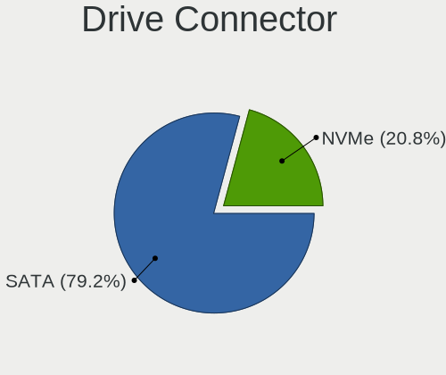
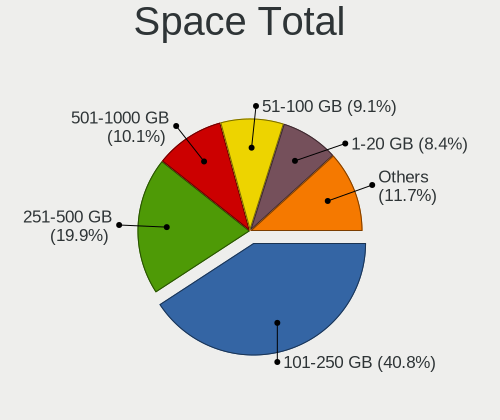
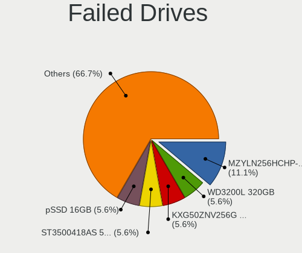
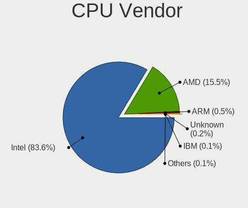
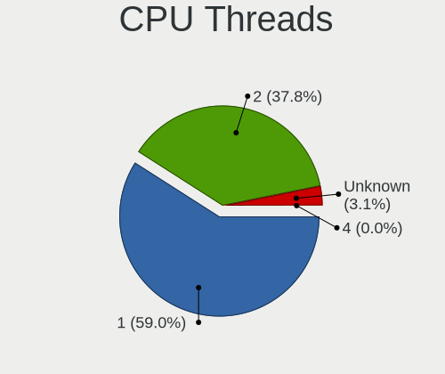
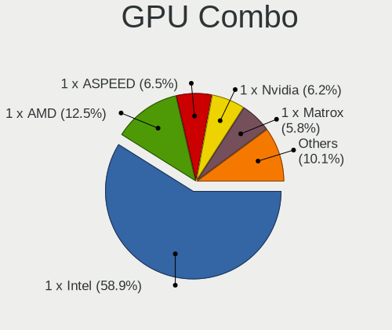
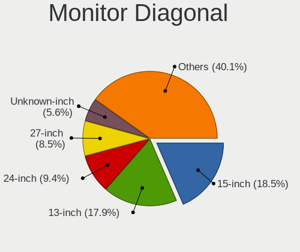
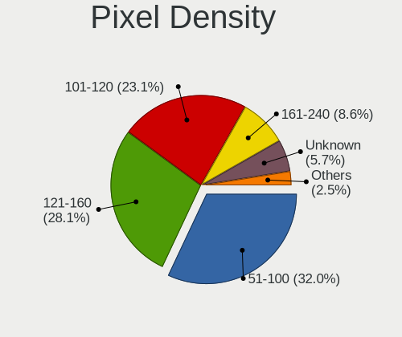
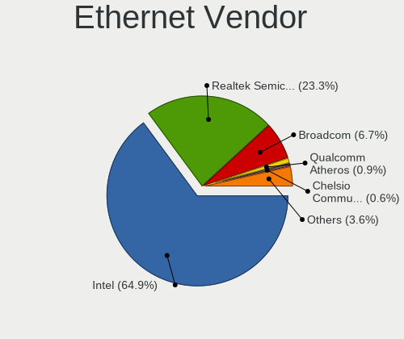
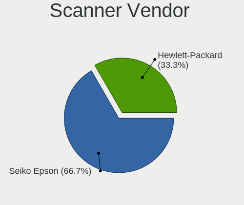

BSD in USA - Tested Hardware & Statistics
-----------------------------------------

A project to collect tested hardware configurations for BSD in USA.

Anyone can contribute to this report by the [hw-probe](https://github.com/linuxhw/hw-probe/blob/master/INSTALL.BSD.md) tool:

    hw-probe -all -upload

Please contribute! Especially if your hardware is rare.

This is a report for all computer types. See also reports for [desktops](/Location/USA/Desktop/README.md) and [notebooks](/Location/USA/Notebook/README.md).

Contents
--------

* [ Test Cases ](#test-cases)

* [ System ](#system)
  - [ OS                       ](#os)
  - [ OS Family                ](#os-family)
  - [ Arch                     ](#arch)
  - [ DE                       ](#de)
  - [ Display Server           ](#display-server)
  - [ Display Manager          ](#display-manager)
  - [ OS Lang                  ](#os-lang)
  - [ Boot Mode                ](#boot-mode)
  - [ Filesystem               ](#filesystem)
  - [ Part. scheme             ](#part-scheme)

* [ Board ](#board)
  - [ Vendor                   ](#vendor)
  - [ Model                    ](#model)
  - [ Model Family             ](#model-family)
  - [ MFG Year                 ](#mfg-year)
  - [ Form Factor              ](#form-factor)
  - [ Coreboot                 ](#coreboot)
  - [ RAM Size                 ](#ram-size)
  - [ RAM Used                 ](#ram-used)
  - [ Total Drives             ](#total-drives)
  - [ Has CD-ROM               ](#has-cd-rom)
  - [ Has Ethernet             ](#has-ethernet)
  - [ Has WiFi                 ](#has-wifi)
  - [ Has Bluetooth            ](#has-bluetooth)

* [ Location ](#location)
  - [ Country                  ](#country)
  - [ City                     ](#city)

* [ Drives ](#drives)
  - [ Drive Vendor             ](#drive-vendor)
  - [ Drive Model              ](#drive-model)
  - [ HDD Vendor               ](#hdd-vendor)
  - [ SSD Vendor               ](#ssd-vendor)
  - [ Drive Kind               ](#drive-kind)
  - [ Drive Connector          ](#drive-connector)
  - [ Drive Size               ](#drive-size)
  - [ Space Total              ](#space-total)
  - [ Space Used               ](#space-used)
  - [ Malfunc. Drives          ](#malfunc-drives)
  - [ Malfunc. Drive Vendor    ](#malfunc-drive-vendor)
  - [ Malfunc. HDD Vendor      ](#malfunc-hdd-vendor)
  - [ Malfunc. Drive Kind      ](#malfunc-drive-kind)
  - [ Failed Drives            ](#failed-drives)
  - [ Failed Drive Vendor      ](#failed-drive-vendor)
  - [ Drive Status             ](#drive-status)

* [ Storage controller ](#storage-controller)
  - [ Storage Vendor           ](#storage-vendor)
  - [ Storage Model            ](#storage-model)
  - [ Storage Kind             ](#storage-kind)

* [ Processor ](#processor)
  - [ CPU Vendor               ](#cpu-vendor)
  - [ CPU Model                ](#cpu-model)
  - [ CPU Model Family         ](#cpu-model-family)
  - [ CPU Cores                ](#cpu-cores)
  - [ CPU Sockets              ](#cpu-sockets)
  - [ CPU Threads              ](#cpu-threads)
  - [ CPU Microarch            ](#cpu-microarch)

* [ Graphics ](#graphics)
  - [ GPU Vendor               ](#gpu-vendor)
  - [ GPU Model                ](#gpu-model)
  - [ GPU Combo                ](#gpu-combo)
  - [ GPU Driver               ](#gpu-driver)
  - [ GPU Memory               ](#gpu-memory)

* [ Monitor ](#monitor)
  - [ Monitor Vendor           ](#monitor-vendor)
  - [ Monitor Model            ](#monitor-model)
  - [ Monitor Resolution       ](#monitor-resolution)
  - [ Monitor Diagonal         ](#monitor-diagonal)
  - [ Monitor Width            ](#monitor-width)
  - [ Aspect Ratio             ](#aspect-ratio)
  - [ Monitor Area             ](#monitor-area)
  - [ Pixel Density            ](#pixel-density)
  - [ Multiple Monitors        ](#multiple-monitors)

* [ Network ](#network)
  - [ Net Controller Vendor    ](#net-controller-vendor)
  - [ Net Controller Model     ](#net-controller-model)
  - [ Wireless Vendor          ](#wireless-vendor)
  - [ Wireless Model           ](#wireless-model)
  - [ Ethernet Vendor          ](#ethernet-vendor)
  - [ Ethernet Model           ](#ethernet-model)
  - [ Net Controller Kind      ](#net-controller-kind)
  - [ Used Controller          ](#used-controller)
  - [ NICs                     ](#nics)
  - [ IPv6                     ](#ipv6)

* [ Bluetooth ](#bluetooth)
  - [ Bluetooth Vendor         ](#bluetooth-vendor)
  - [ Bluetooth Model          ](#bluetooth-model)

* [ Sound ](#sound)
  - [ Sound Vendor             ](#sound-vendor)
  - [ Sound Model              ](#sound-model)

* [ Memory ](#memory)
  - [ Memory Vendor            ](#memory-vendor)
  - [ Memory Model             ](#memory-model)
  - [ Memory Kind              ](#memory-kind)
  - [ Memory Form Factor       ](#memory-form-factor)
  - [ Memory Size              ](#memory-size)
  - [ Memory Speed             ](#memory-speed)

* [ Printers & scanners ](#printers--scanners)
  - [ Printer Vendor           ](#printer-vendor)
  - [ Printer Model            ](#printer-model)
  - [ Scanner Vendor           ](#scanner-vendor)
  - [ Scanner Model            ](#scanner-model)

* [ Camera ](#camera)
  - [ Camera Vendor            ](#camera-vendor)
  - [ Camera Model             ](#camera-model)

* [ Security ](#security)
  - [ Fingerprint Vendor       ](#fingerprint-vendor)
  - [ Fingerprint Model        ](#fingerprint-model)
  - [ Chipcard Vendor          ](#chipcard-vendor)
  - [ Chipcard Model           ](#chipcard-model)

* [ Unsupported ](#unsupported)
  - [ Unsupported Devices      ](#unsupported-devices)
  - [ Unsupported Device Types ](#unsupported-device-types)

Test Cases
----------

Total: 8112

| Vendor        | Model                       | Form-Factor | Probe                                                     | Date         |
|---------------|-----------------------------|-------------|-----------------------------------------------------------|--------------|
| MSI           | Z270M MORTAR                | Desktop     | [52d87b1ad7](https://bsd-hardware.info/?probe=52d87b1ad7) | Jan 06, 2025 |
| MW            | GMLK-2_5G4L                 | Desktop     | [aef8a88a74](https://bsd-hardware.info/?probe=aef8a88a74) | Jan 06, 2025 |
| MW            | GMLK-2_5G4L                 | Desktop     | [56c096c579](https://bsd-hardware.info/?probe=56c096c579) | Jan 06, 2025 |
| Unknown       | Unknown                     | Desktop     | [72473eb7c0](https://bsd-hardware.info/?probe=72473eb7c0) | Jan 06, 2025 |
| Supermicro    | A1SRi-2758F                 | Desktop     | [3e6fbd3ab8](https://bsd-hardware.info/?probe=3e6fbd3ab8) | Jan 06, 2025 |
| Lenovo        | 312D SDK0J40697 WIN 3305... | Mini pc     | [3431d0bef2](https://bsd-hardware.info/?probe=3431d0bef2) | Jan 05, 2025 |
| MSI           | H81M-P33                    | Desktop     | [4de04d7c63](https://bsd-hardware.info/?probe=4de04d7c63) | Jan 05, 2025 |
| ASUSTek       | P5Q-E                       | Desktop     | [ced4dbfd4b](https://bsd-hardware.info/?probe=ced4dbfd4b) | Jan 05, 2025 |
| ASUSTek       | ROG CROSSHAIR VIII HERO     | Desktop     | [c5f2cf7f1e](https://bsd-hardware.info/?probe=c5f2cf7f1e) | Jan 05, 2025 |
| ASRock        | Z690M-ITX/ax                | Desktop     | [9d38560d6a](https://bsd-hardware.info/?probe=9d38560d6a) | Jan 05, 2025 |
| Protectli     | FW2B Ver                    | Desktop     | [705883b807](https://bsd-hardware.info/?probe=705883b807) | Jan 04, 2025 |
| Dell          | 0FDY5C A00                  | Desktop     | [ccba495e89](https://bsd-hardware.info/?probe=ccba495e89) | Jan 04, 2025 |
| AZW           | EQ                          | Mini pc     | [40f6440619](https://bsd-hardware.info/?probe=40f6440619) | Jan 04, 2025 |
| MSI           | Z270M MORTAR                | Desktop     | [6c0213efea](https://bsd-hardware.info/?probe=6c0213efea) | Jan 04, 2025 |
| Lenovo        | 316A SDK0J40697 WIN 3305... | Mini pc     | [a9c1f616a2](https://bsd-hardware.info/?probe=a9c1f616a2) | Jan 04, 2025 |
| PC Engines    | apu4                        | Desktop     | [aba651f461](https://bsd-hardware.info/?probe=aba651f461) | Jan 04, 2025 |
| Dell          | 0YDJK3 A02                  | Server      | [db63c0a016](https://bsd-hardware.info/?probe=db63c0a016) | Jan 04, 2025 |
| Dell          | 0WMJ54 A01                  | Desktop     | [a87d1a2609](https://bsd-hardware.info/?probe=a87d1a2609) | Jan 04, 2025 |
| Lenovo        | ThinkStation P320 Tiny 3... | Desktop     | [c8a55cde50](https://bsd-hardware.info/?probe=c8a55cde50) | Jan 04, 2025 |
| ASUSTek       | SABERTOOTH X58              | Desktop     | [92e2cb380a](https://bsd-hardware.info/?probe=92e2cb380a) | Jan 03, 2025 |
| SJRC          | ADLN-6L                     | Desktop     | [9afe02f983](https://bsd-hardware.info/?probe=9afe02f983) | Jan 03, 2025 |
| ASUSTek       | B150M-PLUS D3               | Desktop     | [d269e833ba](https://bsd-hardware.info/?probe=d269e833ba) | Jan 03, 2025 |
| Intel         | MAHOBAY                     | Desktop     | [e1fbd3a5ef](https://bsd-hardware.info/?probe=e1fbd3a5ef) | Jan 03, 2025 |
| Lenovo        | 3106 SDK0J40697 WIN 3305... | Desktop     | [9f03b43d72](https://bsd-hardware.info/?probe=9f03b43d72) | Jan 03, 2025 |
| Protectli     | FW6 Ver                     | Desktop     | [e66a74f63e](https://bsd-hardware.info/?probe=e66a74f63e) | Jan 03, 2025 |
| Dell          | 0YP4HV A00                  | Desktop     | [f4bf8c469e](https://bsd-hardware.info/?probe=f4bf8c469e) | Jan 03, 2025 |
| AMI           | Aptio CRB                   | Mini pc     | [977feef3aa](https://bsd-hardware.info/?probe=977feef3aa) | Jan 03, 2025 |
| Lenovo        | 3136 SDK0J40697 WIN 3305... | Mini pc     | [1ae378d1c0](https://bsd-hardware.info/?probe=1ae378d1c0) | Jan 03, 2025 |
| Dell          | 0YP4HV A00                  | Desktop     | [7c407b8021](https://bsd-hardware.info/?probe=7c407b8021) | Jan 03, 2025 |
| ASUSTek       | PRIME H310M-E R2.0          | Desktop     | [d5f369f5da](https://bsd-hardware.info/?probe=d5f369f5da) | Jan 03, 2025 |
| Apple         | MacBookPro11,4              | Notebook    | [f990a4641f](https://bsd-hardware.info/?probe=f990a4641f) | Jan 03, 2025 |
| Supermicro    | A1SRM-2758F                 | Server      | [63e9e4d254](https://bsd-hardware.info/?probe=63e9e4d254) | Jan 03, 2025 |
| Lenovo        | 3136 SDK0J40697 WIN 3305... | Mini pc     | [cbde580f7e](https://bsd-hardware.info/?probe=cbde580f7e) | Jan 03, 2025 |
| Dell          | 0WMJ54 A01                  | Desktop     | [2fb7873b0b](https://bsd-hardware.info/?probe=2fb7873b0b) | Jan 02, 2025 |
| Dell          | 0JJ7YG A00                  | Desktop     | [60a9be6897](https://bsd-hardware.info/?probe=60a9be6897) | Jan 02, 2025 |
| youyeetoo     | X1 SBC                      | Notebook    | [645ba05e41](https://bsd-hardware.info/?probe=645ba05e41) | Jan 02, 2025 |
| Dell          | 01D4TT A00                  | Desktop     | [447a0925d1](https://bsd-hardware.info/?probe=447a0925d1) | Jan 02, 2025 |
| Dell          | 0JJ7YG A00                  | Desktop     | [f586af63cf](https://bsd-hardware.info/?probe=f586af63cf) | Jan 02, 2025 |
| Lenovo        | ThinkPad X220 Tablet 429... | Notebook    | [5270850f20](https://bsd-hardware.info/?probe=5270850f20) | Jan 02, 2025 |
| Lenovo        | ThinkPad T420s 417153U      | Notebook    | [f3220cb60d](https://bsd-hardware.info/?probe=f3220cb60d) | Jan 02, 2025 |
| Sophos        | SG                          | Firewall    | [6ed95430e7](https://bsd-hardware.info/?probe=6ed95430e7) | Jan 02, 2025 |
| MSI           | MAG B550M MORTAR WIFI       | Desktop     | [9b908a1339](https://bsd-hardware.info/?probe=9b908a1339) | Jan 02, 2025 |
| Protectli     | V1410                       | Desktop     | [2f503f2fc2](https://bsd-hardware.info/?probe=2f503f2fc2) | Jan 02, 2025 |
| Unknown       | Unknown                     | Desktop     | [3b5881e6d2](https://bsd-hardware.info/?probe=3b5881e6d2) | Jan 02, 2025 |
| Dell          | 0WMJ54 A01                  | Desktop     | [f5ab48d136](https://bsd-hardware.info/?probe=f5ab48d136) | Jan 02, 2025 |
| Dell          | Precision 7540              | Notebook    | [481eeb3296](https://bsd-hardware.info/?probe=481eeb3296) | Jan 02, 2025 |
| Intel         | S1200KP AAG34877-201        | Desktop     | [80e080363c](https://bsd-hardware.info/?probe=80e080363c) | Jan 01, 2025 |
| Trigkey       | Green G5                    | Desktop     | [b319e43076](https://bsd-hardware.info/?probe=b319e43076) | Jan 01, 2025 |
| Dell          | 08NPPY A00                  | Desktop     | [a9e88edfae](https://bsd-hardware.info/?probe=a9e88edfae) | Jan 01, 2025 |
| Unknown       | adnasc01                    | Desktop     | [e4417d31c4](https://bsd-hardware.info/?probe=e4417d31c4) | Jan 01, 2025 |
| HP            | 83E2                        | Desktop     | [c0cce366c3](https://bsd-hardware.info/?probe=c0cce366c3) | Jan 01, 2025 |
| Seeed Stud... | ODYSSEY-X86J41X5 SD-BS-C... | Desktop     | [6c1907d15b](https://bsd-hardware.info/?probe=6c1907d15b) | Jan 01, 2025 |
| Gigabyte      | EP43T-UD3L                  | Desktop     | [4c4764a3fe](https://bsd-hardware.info/?probe=4c4764a3fe) | Jan 01, 2025 |
| ASUSTek       | Z97I-PLUS                   | Desktop     | [280124bd49](https://bsd-hardware.info/?probe=280124bd49) | Dec 31, 2024 |
| UD            | sgt-k13                     | Mini pc     | [4c703e6c49](https://bsd-hardware.info/?probe=4c703e6c49) | Dec 31, 2024 |
| Protectli     | FW4B                        | Desktop     | [fddeda1514](https://bsd-hardware.info/?probe=fddeda1514) | Dec 31, 2024 |
| HP            | 8055                        | Desktop     | [ad2cab0e5d](https://bsd-hardware.info/?probe=ad2cab0e5d) | Dec 31, 2024 |
| Unknown       | Unknown                     | Desktop     | [1c2ec43b47](https://bsd-hardware.info/?probe=1c2ec43b47) | Dec 31, 2024 |
| ASUSTek       | Z97-PRO GAMER               | Desktop     | [8fe128b9b2](https://bsd-hardware.info/?probe=8fe128b9b2) | Dec 31, 2024 |
| Advantech     | NAMB-3250 A102-1            | Desktop     | [975b60a167](https://bsd-hardware.info/?probe=975b60a167) | Dec 31, 2024 |
| AZW           | EQ                          | Desktop     | [89e2185696](https://bsd-hardware.info/?probe=89e2185696) | Dec 31, 2024 |
| Unknown       | Unknown                     | Desktop     | [f85ed259c8](https://bsd-hardware.info/?probe=f85ed259c8) | Dec 30, 2024 |
| Intel         | JSL MRD                     | Desktop     | [91ddafe16b](https://bsd-hardware.info/?probe=91ddafe16b) | Dec 30, 2024 |
| HP            | 1998                        | Desktop     | [da5ac06da2](https://bsd-hardware.info/?probe=da5ac06da2) | Dec 30, 2024 |
| ASUSTek       | TUF Gaming B560M-PLUS WI... | Desktop     | [e69f71eb23](https://bsd-hardware.info/?probe=e69f71eb23) | Dec 30, 2024 |
| Supermicro    | X9SCL/X9SCMA                | Desktop     | [7b307c888b](https://bsd-hardware.info/?probe=7b307c888b) | Dec 30, 2024 |
| ASRock        | X570 Phantom Gaming-ITX/... | Desktop     | [f72205b123](https://bsd-hardware.info/?probe=f72205b123) | Dec 30, 2024 |
| HP            | Presario CQ57               | Notebook    | [97f4e3b3f9](https://bsd-hardware.info/?probe=97f4e3b3f9) | Dec 30, 2024 |
| Dell EMC      | EDGE680-CPU A00             | Desktop     | [b5233e4ced](https://bsd-hardware.info/?probe=b5233e4ced) | Dec 30, 2024 |
| Unknown       | adnasc01                    | Desktop     | [b813bc581d](https://bsd-hardware.info/?probe=b813bc581d) | Dec 30, 2024 |
| ASUSTek       | Maximus V FORMULA           | Desktop     | [3e59dc6c59](https://bsd-hardware.info/?probe=3e59dc6c59) | Dec 30, 2024 |
| ASUSTek       | Maximus VIII RANGER         | Desktop     | [2d3eb6c2f5](https://bsd-hardware.info/?probe=2d3eb6c2f5) | Dec 30, 2024 |
| Dell          | OptiPlex 5070               | Desktop     | [e2e08cab4b](https://bsd-hardware.info/?probe=e2e08cab4b) | Dec 29, 2024 |
| ASUSTek       | PRIME Z270-A                | Desktop     | [601c3c7a49](https://bsd-hardware.info/?probe=601c3c7a49) | Dec 29, 2024 |
| Intel         | QHSW02                      | Desktop     | [07fd887929](https://bsd-hardware.info/?probe=07fd887929) | Dec 29, 2024 |
| Unknown       | Unknown                     | Desktop     | [b9ca7abc2d](https://bsd-hardware.info/?probe=b9ca7abc2d) | Dec 29, 2024 |
| Deciso        | Netboard A20                | Notebook    | [8fab4ef775](https://bsd-hardware.info/?probe=8fab4ef775) | Dec 29, 2024 |
| MSI           | H81M-P33                    | Desktop     | [a1fc208c90](https://bsd-hardware.info/?probe=a1fc208c90) | Dec 29, 2024 |
| ASUSTek       | P5Q-E                       | Desktop     | [f497fed563](https://bsd-hardware.info/?probe=f497fed563) | Dec 29, 2024 |
| ASUSTek       | ROG CROSSHAIR VIII HERO     | Desktop     | [71afdfab99](https://bsd-hardware.info/?probe=71afdfab99) | Dec 29, 2024 |
| Unknown       | Unknown                     | Desktop     | [2e57c5140f](https://bsd-hardware.info/?probe=2e57c5140f) | Dec 29, 2024 |
| Dell          | OptiPlex 5070               | Desktop     | [12d5d8ce92](https://bsd-hardware.info/?probe=12d5d8ce92) | Dec 29, 2024 |
| Trigkey       | Green G5                    | Desktop     | [560c067a01](https://bsd-hardware.info/?probe=560c067a01) | Dec 29, 2024 |
| AZW           | EQ                          | Mini pc     | [dd50b4053f](https://bsd-hardware.info/?probe=dd50b4053f) | Dec 29, 2024 |
| Protectli     | FW2B Ver                    | Desktop     | [0f9a74892c](https://bsd-hardware.info/?probe=0f9a74892c) | Dec 29, 2024 |
| Dell          | 0NW6H5 A00                  | Desktop     | [d2f12e9d57](https://bsd-hardware.info/?probe=d2f12e9d57) | Dec 28, 2024 |
| ZOTAC         | ZBOX-CI325NANO              | Mini pc     | [29528fef20](https://bsd-hardware.info/?probe=29528fef20) | Dec 28, 2024 |
| BOSGAME       | Ecolite Series              | Desktop     | [c1083a8777](https://bsd-hardware.info/?probe=c1083a8777) | Dec 28, 2024 |
| Lenovo        | ThinkPad T490 20N20028US    | Notebook    | [609bd09ed4](https://bsd-hardware.info/?probe=609bd09ed4) | Dec 28, 2024 |
| ASUSTek       | Maximus V FORMULA           | Desktop     | [6a110d5e92](https://bsd-hardware.info/?probe=6a110d5e92) | Dec 28, 2024 |
| Intel         | QHSW02                      | Desktop     | [0e73244f65](https://bsd-hardware.info/?probe=0e73244f65) | Dec 28, 2024 |
| UD            | sgt-k13                     | Mini pc     | [74cbbc576a](https://bsd-hardware.info/?probe=74cbbc576a) | Dec 27, 2024 |
| Protectli     | V1410                       | Desktop     | [b6727da944](https://bsd-hardware.info/?probe=b6727da944) | Dec 27, 2024 |
| Protectli     | V1410                       | Desktop     | [09e8629eb8](https://bsd-hardware.info/?probe=09e8629eb8) | Dec 27, 2024 |
| Dell          | OptiPlex 5070               | Desktop     | [5a98f9dd3a](https://bsd-hardware.info/?probe=5a98f9dd3a) | Dec 27, 2024 |
| Dell          | OptiPlex 5070               | Desktop     | [7ee0a90c4b](https://bsd-hardware.info/?probe=7ee0a90c4b) | Dec 27, 2024 |
| Dell          | 07F37C A01                  | Desktop     | [6518ba4c6c](https://bsd-hardware.info/?probe=6518ba4c6c) | Dec 26, 2024 |
| MW            | GMLK-2_5G4L                 | Desktop     | [1dbdbd867c](https://bsd-hardware.info/?probe=1dbdbd867c) | Dec 26, 2024 |
| Dell          | Latitude 5500               | Notebook    | [36b6d99530](https://bsd-hardware.info/?probe=36b6d99530) | Dec 26, 2024 |
| Gigabyte      | B760M C                     | Desktop     | [b3926cb9a9](https://bsd-hardware.info/?probe=b3926cb9a9) | Dec 26, 2024 |
| Gigabyte      | B760M C                     | Desktop     | [c01a3f3d27](https://bsd-hardware.info/?probe=c01a3f3d27) | Dec 26, 2024 |
| Unknown       | Unknown                     | Desktop     | [9f549fa7ce](https://bsd-hardware.info/?probe=9f549fa7ce) | Dec 26, 2024 |
| Unknown       | Unknown                     | Desktop     | [4937ea1ef5](https://bsd-hardware.info/?probe=4937ea1ef5) | Dec 25, 2024 |
| Gigabyte      | Z77X-UP4 TH                 | Desktop     | [3b5e5eeea4](https://bsd-hardware.info/?probe=3b5e5eeea4) | Dec 25, 2024 |
| Dell          | 0HD5W2 A01                  | Desktop     | [5e50386e5c](https://bsd-hardware.info/?probe=5e50386e5c) | Dec 25, 2024 |
| Lenovo        | 3111 SDK0J40697 WIN 3305... | Mini pc     | [07a2d0d1ce](https://bsd-hardware.info/?probe=07a2d0d1ce) | Dec 25, 2024 |
| AMI           | Aptio CRB                   | Mini pc     | [7b462d43e7](https://bsd-hardware.info/?probe=7b462d43e7) | Dec 25, 2024 |
| Dell          | 0WMJ54 A01                  | Desktop     | [e677c34698](https://bsd-hardware.info/?probe=e677c34698) | Dec 25, 2024 |
| Lenovo        | ThinkPad T430 2344BPU       | Notebook    | [1432f4e11c](https://bsd-hardware.info/?probe=1432f4e11c) | Dec 25, 2024 |
| Gateway       | LT40                        | Notebook    | [7546fc1fd0](https://bsd-hardware.info/?probe=7546fc1fd0) | Dec 25, 2024 |
| Dell          | Latitude D620               | Notebook    | [df7fa9c810](https://bsd-hardware.info/?probe=df7fa9c810) | Dec 25, 2024 |
| Unknown       | Unknown                     | Desktop     | [f3922a40a8](https://bsd-hardware.info/?probe=f3922a40a8) | Dec 24, 2024 |
| Unknown       | Unknown                     | Desktop     | [25a20f4c0e](https://bsd-hardware.info/?probe=25a20f4c0e) | Dec 24, 2024 |
| MSI           | 970 GAMING                  | Desktop     | [7caa8db16a](https://bsd-hardware.info/?probe=7caa8db16a) | Dec 24, 2024 |
| IBM           | 00J6086                     | Server      | [61cdfa8b70](https://bsd-hardware.info/?probe=61cdfa8b70) | Dec 24, 2024 |
| HP            | 339A                        | Desktop     | [ad9ed0ee8d](https://bsd-hardware.info/?probe=ad9ed0ee8d) | Dec 24, 2024 |
| ASUSTek       | TUF Gaming X570-PLUS        | Desktop     | [2c141d9a6e](https://bsd-hardware.info/?probe=2c141d9a6e) | Dec 24, 2024 |
| Dell          | 0FF3FN A00                  | Desktop     | [33a3dcb343](https://bsd-hardware.info/?probe=33a3dcb343) | Dec 24, 2024 |
| Lenovo        | ThinkPad T430 2342CTO       | Notebook    | [10ab9145d9](https://bsd-hardware.info/?probe=10ab9145d9) | Dec 24, 2024 |
| Shenzhen M... | AHWSA                       | Desktop     | [929e0f0aa1](https://bsd-hardware.info/?probe=929e0f0aa1) | Dec 23, 2024 |
| Infoblox      | IB-810                      | Desktop     | [94e43c90e0](https://bsd-hardware.info/?probe=94e43c90e0) | Dec 23, 2024 |
| Dell          | 0YXT71 A00                  | Desktop     | [fc782b729d](https://bsd-hardware.info/?probe=fc782b729d) | Dec 23, 2024 |
| MW            | GMLK-2_5G4L                 | Desktop     | [bd781ad496](https://bsd-hardware.info/?probe=bd781ad496) | Dec 23, 2024 |
| Techvision    | TVI7309X B0                 | Desktop     | [92cefa8a8c](https://bsd-hardware.info/?probe=92cefa8a8c) | Dec 22, 2024 |
| Dell          | 08NPPY A00                  | Desktop     | [a94c82e978](https://bsd-hardware.info/?probe=a94c82e978) | Dec 22, 2024 |
| Dell          | 0FDY5C A00                  | Desktop     | [97a894078c](https://bsd-hardware.info/?probe=97a894078c) | Dec 22, 2024 |
| Alienware     | 0VDT73 A00                  | Desktop     | [cc0448c975](https://bsd-hardware.info/?probe=cc0448c975) | Dec 22, 2024 |
| Deciso        | Netboard A20                | Notebook    | [932588d77a](https://bsd-hardware.info/?probe=932588d77a) | Dec 22, 2024 |
| Unknown       | QDNV01                      | Desktop     | [877dbd28c5](https://bsd-hardware.info/?probe=877dbd28c5) | Dec 22, 2024 |
| Protectli     | FW6 Ver                     | Desktop     | [f8133ffca6](https://bsd-hardware.info/?probe=f8133ffca6) | Dec 22, 2024 |
| Dell          | 0HC3G4 A00                  | Mini pc     | [1b29bfe2b3](https://bsd-hardware.info/?probe=1b29bfe2b3) | Dec 22, 2024 |
| ZOTAC         | ZBOX-CI325NANO              | Mini pc     | [a06d9a4f80](https://bsd-hardware.info/?probe=a06d9a4f80) | Dec 22, 2024 |
| Supermicro    | X9SCL/X9SCM                 | Desktop     | [dd220a27af](https://bsd-hardware.info/?probe=dd220a27af) | Dec 22, 2024 |
| IceWhale T... | ZimaBoard 832 ZMB           | Desktop     | [0fd27a04f7](https://bsd-hardware.info/?probe=0fd27a04f7) | Dec 22, 2024 |
| ASRock        | B550 Phantom Gaming 4       | Desktop     | [ce9a08d930](https://bsd-hardware.info/?probe=ce9a08d930) | Dec 22, 2024 |
| ASUSTek       | Z97-PRO GAMER               | Desktop     | [e7c1d45a38](https://bsd-hardware.info/?probe=e7c1d45a38) | Dec 21, 2024 |
| Dell          | 00V62H A00                  | Desktop     | [0b6e2a4e95](https://bsd-hardware.info/?probe=0b6e2a4e95) | Dec 21, 2024 |
| Dell          | 00V62H A01                  | Desktop     | [3048d1b957](https://bsd-hardware.info/?probe=3048d1b957) | Dec 21, 2024 |
| Unknown       | Unknown                     | Desktop     | [cf2ef7e381](https://bsd-hardware.info/?probe=cf2ef7e381) | Dec 21, 2024 |
| Unknown       | QDNV01                      | Desktop     | [95d17434b8](https://bsd-hardware.info/?probe=95d17434b8) | Dec 21, 2024 |
| MSI           | Z270M MORTAR                | Desktop     | [1bf2d8a709](https://bsd-hardware.info/?probe=1bf2d8a709) | Dec 21, 2024 |
| ASUSTek       | TUF Gaming B560M-PLUS WI... | Desktop     | [bee58d9e52](https://bsd-hardware.info/?probe=bee58d9e52) | Dec 21, 2024 |
| HP            | 1998                        | Desktop     | [a875c0ccf0](https://bsd-hardware.info/?probe=a875c0ccf0) | Dec 20, 2024 |
| Dell          | 05KX61 A02                  | Server      | [b578e02bf0](https://bsd-hardware.info/?probe=b578e02bf0) | Dec 20, 2024 |
| Dell          | 0F9NPY A02                  | Server      | [dc772d383e](https://bsd-hardware.info/?probe=dc772d383e) | Dec 20, 2024 |
| Protectli     | FW6                         | Desktop     | [221484fba7](https://bsd-hardware.info/?probe=221484fba7) | Dec 20, 2024 |
| ASUSTek       | PRIME Z270-A                | Desktop     | [9a8a0a932a](https://bsd-hardware.info/?probe=9a8a0a932a) | Dec 20, 2024 |
| HP            | 0B4Ch D                     | Desktop     | [4278f18694](https://bsd-hardware.info/?probe=4278f18694) | Dec 20, 2024 |
| Gigabyte      | Z490I AORUS ULTRA           | Desktop     | [12aa966592](https://bsd-hardware.info/?probe=12aa966592) | Dec 20, 2024 |
| MSI           | MAG B550M MORTAR WIFI       | Desktop     | [84a86156de](https://bsd-hardware.info/?probe=84a86156de) | Dec 20, 2024 |
| Supermicro    | X11SSH-F                    | Server      | [d8e4317cbc](https://bsd-hardware.info/?probe=d8e4317cbc) | Dec 19, 2024 |
| Dell          | 0WMJ54 A01                  | Desktop     | [79aa961e28](https://bsd-hardware.info/?probe=79aa961e28) | Dec 19, 2024 |
| Dell          | 0HD5W2 A01                  | Desktop     | [075230a87b](https://bsd-hardware.info/?probe=075230a87b) | Dec 19, 2024 |
| Sophos        | XG                          | Firewall    | [9e3c0c6821](https://bsd-hardware.info/?probe=9e3c0c6821) | Dec 19, 2024 |
| Lenovo        | 312D SDK0J40697 WIN 3305... | Mini pc     | [43f2fae544](https://bsd-hardware.info/?probe=43f2fae544) | Dec 19, 2024 |
| Lenovo        | 312D SDK0J40697 WIN 3305... | Mini pc     | [e635bff760](https://bsd-hardware.info/?probe=e635bff760) | Dec 18, 2024 |
| Unknown       | YL-SKUL6-7 Series           | Desktop     | [58389edbfa](https://bsd-hardware.info/?probe=58389edbfa) | Dec 18, 2024 |
| Dell          | 0D6H9T A00                  | Desktop     | [53d4b51f32](https://bsd-hardware.info/?probe=53d4b51f32) | Dec 18, 2024 |
| Protectli     | FW4B                        | Desktop     | [ae842a3368](https://bsd-hardware.info/?probe=ae842a3368) | Dec 18, 2024 |
| Sophos        | XG                          | Firewall    | [27bcf16efc](https://bsd-hardware.info/?probe=27bcf16efc) | Dec 18, 2024 |
| Dell          | 0WMJ54 A01                  | Desktop     | [122081b48c](https://bsd-hardware.info/?probe=122081b48c) | Dec 18, 2024 |
| HP            | 82A2                        | Desktop     | [7f93f17101](https://bsd-hardware.info/?probe=7f93f17101) | Dec 18, 2024 |
| Fujitsu       | D3433-S2 S26361-D3433-S2    | Desktop     | [c6673ef4fb](https://bsd-hardware.info/?probe=c6673ef4fb) | Dec 17, 2024 |
| Unknown       | Unknown                     | Desktop     | [40eb87fd37](https://bsd-hardware.info/?probe=40eb87fd37) | Dec 17, 2024 |
| AZW           | EQ                          | Desktop     | [5fb971011a](https://bsd-hardware.info/?probe=5fb971011a) | Dec 17, 2024 |
| HP            | 2000                        | Notebook    | [0705a401f8](https://bsd-hardware.info/?probe=0705a401f8) | Dec 16, 2024 |
| Supermicro    | X10SLH-N6-ST031             | Server      | [a3ac5117c7](https://bsd-hardware.info/?probe=a3ac5117c7) | Dec 16, 2024 |
| Unknown       | Unknown                     | Desktop     | [931a89f2d1](https://bsd-hardware.info/?probe=931a89f2d1) | Dec 16, 2024 |
| AMI           | Aptio CRB                   | Mini pc     | [8f0f26fb2b](https://bsd-hardware.info/?probe=8f0f26fb2b) | Dec 16, 2024 |
| Dell          | 0FF3FN A00                  | Desktop     | [6f008745da](https://bsd-hardware.info/?probe=6f008745da) | Dec 16, 2024 |
| Dell          | 07WP95 A01                  | Desktop     | [7dccc03284](https://bsd-hardware.info/?probe=7dccc03284) | Dec 16, 2024 |
| AZW           | EQ                          | Desktop     | [cdc2be64c3](https://bsd-hardware.info/?probe=cdc2be64c3) | Dec 15, 2024 |
| Supermicro    | X9SCL/X9SCMA                | Desktop     | [f520de0eef](https://bsd-hardware.info/?probe=f520de0eef) | Dec 15, 2024 |
| AZW           | EQ                          | Desktop     | [427eade38e](https://bsd-hardware.info/?probe=427eade38e) | Dec 15, 2024 |
| Dell          | 0HC3G4 A00                  | Mini pc     | [15bd94eb6d](https://bsd-hardware.info/?probe=15bd94eb6d) | Dec 15, 2024 |
| Unknown       | Unknown                     | Desktop     | [f57757a059](https://bsd-hardware.info/?probe=f57757a059) | Dec 14, 2024 |
| Supermicro    | X11SSL-F                    | Server      | [c40294f0b5](https://bsd-hardware.info/?probe=c40294f0b5) | Dec 14, 2024 |
| Gigabyte      | Z490I AORUS ULTRA           | Desktop     | [d2cec3b140](https://bsd-hardware.info/?probe=d2cec3b140) | Dec 14, 2024 |
| Dell          | 0WMJ54 A01                  | Desktop     | [bc26b0ad7f](https://bsd-hardware.info/?probe=bc26b0ad7f) | Dec 14, 2024 |
| HP            | Laptop 14-dq2xxx            | Notebook    | [fc481181a6](https://bsd-hardware.info/?probe=fc481181a6) | Dec 14, 2024 |
| Supermicro    | M11SDV-8C-LN4F              | Server      | [d3c097cc6b](https://bsd-hardware.info/?probe=d3c097cc6b) | Dec 14, 2024 |
| AZW           | EQ                          | Desktop     | [2828b59ca4](https://bsd-hardware.info/?probe=2828b59ca4) | Dec 14, 2024 |
| Unknown       | QGLK03                      | Desktop     | [f11efa36fc](https://bsd-hardware.info/?probe=f11efa36fc) | Dec 14, 2024 |
| Unknown       | QDNV01                      | Desktop     | [6d7de0a35e](https://bsd-hardware.info/?probe=6d7de0a35e) | Dec 14, 2024 |
| Protectli     | VP6630                      | Desktop     | [c4d391ee74](https://bsd-hardware.info/?probe=c4d391ee74) | Dec 14, 2024 |
| Supermicro    | X9DRD-iF                    | Server      | [06958bbf47](https://bsd-hardware.info/?probe=06958bbf47) | Dec 14, 2024 |
| GoWin Solu... | R86S                        | Desktop     | [fec0e025ff](https://bsd-hardware.info/?probe=fec0e025ff) | Dec 13, 2024 |
| Unknown       | Unknown                     | Desktop     | [04c8beca54](https://bsd-hardware.info/?probe=04c8beca54) | Dec 13, 2024 |
| Protectli     | V1410                       | Desktop     | [8b38528c6a](https://bsd-hardware.info/?probe=8b38528c6a) | Dec 13, 2024 |
| Intel         | DH61AG AAG23736-400         | Desktop     | [ac76ab9cf5](https://bsd-hardware.info/?probe=ac76ab9cf5) | Dec 13, 2024 |
| Dell          | 02YYK5 A00                  | Desktop     | [dfd626feb6](https://bsd-hardware.info/?probe=dfd626feb6) | Dec 13, 2024 |
| Unknown       | Unknown                     | Desktop     | [ed46ec5a1f](https://bsd-hardware.info/?probe=ed46ec5a1f) | Dec 13, 2024 |
| Apple         | MacBookPro11,1              | Notebook    | [0aea251037](https://bsd-hardware.info/?probe=0aea251037) | Dec 13, 2024 |
| VGKE          | N95                         | Desktop     | [456e2dd02e](https://bsd-hardware.info/?probe=456e2dd02e) | Dec 13, 2024 |
| ASRock        | B550 Phantom Gaming 4       | Desktop     | [132bcb0d2a](https://bsd-hardware.info/?probe=132bcb0d2a) | Dec 13, 2024 |
| HP            | 802E                        | Desktop     | [a73cbe8149](https://bsd-hardware.info/?probe=a73cbe8149) | Dec 12, 2024 |
| Unknown       | QDNV01                      | Desktop     | [f2df17ea71](https://bsd-hardware.info/?probe=f2df17ea71) | Dec 12, 2024 |
| ASRock        | Z370M Pro4                  | Desktop     | [e97904a981](https://bsd-hardware.info/?probe=e97904a981) | Dec 12, 2024 |
| IceWhale T... | ZimaBoard 832 ZMB           | Desktop     | [28d155dd95](https://bsd-hardware.info/?probe=28d155dd95) | Dec 12, 2024 |
| Lenovo        | ThinkPad X250 20CLS14400    | Notebook    | [d3a7de0e4b](https://bsd-hardware.info/?probe=d3a7de0e4b) | Dec 12, 2024 |
| Unknown       | ROUTER                      | Desktop     | [64ce081f31](https://bsd-hardware.info/?probe=64ce081f31) | Dec 12, 2024 |
| Protectli     | VP4630                      | Desktop     | [04f464a725](https://bsd-hardware.info/?probe=04f464a725) | Dec 11, 2024 |
| Unknown       | QDNV01                      | Desktop     | [61510207af](https://bsd-hardware.info/?probe=61510207af) | Dec 11, 2024 |
| Protectli     | VP4630                      | Desktop     | [90fd44ca00](https://bsd-hardware.info/?probe=90fd44ca00) | Dec 11, 2024 |
| ASUSTek       | SABERTOOTH X58              | Desktop     | [f34dc483d5](https://bsd-hardware.info/?probe=f34dc483d5) | Dec 11, 2024 |
| Intel         | ADL-4L                      | Desktop     | [f3c65c2394](https://bsd-hardware.info/?probe=f3c65c2394) | Dec 11, 2024 |
| Supermicro    | X11SSL-F                    | Server      | [d993d1bb66](https://bsd-hardware.info/?probe=d993d1bb66) | Dec 11, 2024 |
| Dell          | 03X6X0 A00                  | Server      | [178d3bd582](https://bsd-hardware.info/?probe=178d3bd582) | Dec 11, 2024 |
| Protectli     | FW6                         | Desktop     | [85c85ff13e](https://bsd-hardware.info/?probe=85c85ff13e) | Dec 11, 2024 |
| Dell          | 0MGK50 A00                  | Desktop     | [43ded3b6d5](https://bsd-hardware.info/?probe=43ded3b6d5) | Dec 10, 2024 |
| Deciso        | NetBoard-A20                | Notebook    | [d253682d99](https://bsd-hardware.info/?probe=d253682d99) | Dec 10, 2024 |
| Dell          | 0GXH08 A03                  | Server      | [2fd65d9cd9](https://bsd-hardware.info/?probe=2fd65d9cd9) | Dec 10, 2024 |
| Apple         | Mac-F65AE981FFA204ED Mac... | Mini pc     | [9963fc5832](https://bsd-hardware.info/?probe=9963fc5832) | Dec 10, 2024 |
| Unknown       | Unknown                     | Desktop     | [c3010f06f3](https://bsd-hardware.info/?probe=c3010f06f3) | Dec 10, 2024 |
| HP            | 8054                        | Desktop     | [252f0cf51b](https://bsd-hardware.info/?probe=252f0cf51b) | Dec 10, 2024 |
| ASUSTek       | PRIME Z790-A WIFI           | Desktop     | [09413cb67c](https://bsd-hardware.info/?probe=09413cb67c) | Dec 10, 2024 |
| GoWin Solu... | R86S                        | Desktop     | [971f443507](https://bsd-hardware.info/?probe=971f443507) | Dec 09, 2024 |
| Unknown       | QDNV01                      | Desktop     | [881aa7c3be](https://bsd-hardware.info/?probe=881aa7c3be) | Dec 09, 2024 |
| Dell          | 0YJMC0 A02                  | Desktop     | [8a6e226054](https://bsd-hardware.info/?probe=8a6e226054) | Dec 09, 2024 |
| ShenZhen M... | MW-GMLK-2.5G6L              | Desktop     | [89c3e8f75c](https://bsd-hardware.info/?probe=89c3e8f75c) | Dec 09, 2024 |
| Unknown       | QCML02                      | Desktop     | [a6f3640fd8](https://bsd-hardware.info/?probe=a6f3640fd8) | Dec 09, 2024 |
| Protectli     | FW6 Ver                     | Desktop     | [ba507c395e](https://bsd-hardware.info/?probe=ba507c395e) | Dec 09, 2024 |
| Unknown       | QCML02                      | Desktop     | [30378a61c3](https://bsd-hardware.info/?probe=30378a61c3) | Dec 09, 2024 |
| Dell          | 0T7D40 A01                  | Desktop     | [4cfeb93125](https://bsd-hardware.info/?probe=4cfeb93125) | Dec 09, 2024 |
| Dell          | 05KX61 A02                  | Server      | [11260fea94](https://bsd-hardware.info/?probe=11260fea94) | Dec 09, 2024 |
| Dell          | 0F9NPY A02                  | Server      | [358deee0d5](https://bsd-hardware.info/?probe=358deee0d5) | Dec 09, 2024 |
| Protectli     | VP2420                      | Desktop     | [c539321419](https://bsd-hardware.info/?probe=c539321419) | Dec 09, 2024 |
| Unknown       | QDNV01                      | Desktop     | [fed4778ce8](https://bsd-hardware.info/?probe=fed4778ce8) | Dec 08, 2024 |
| Protectli     | FW1 Ver                     | Desktop     | [0886b7bcf1](https://bsd-hardware.info/?probe=0886b7bcf1) | Dec 08, 2024 |
| Unknown       | Unknown                     | Desktop     | [de026455d9](https://bsd-hardware.info/?probe=de026455d9) | Dec 08, 2024 |
| Supermicro    | A2SDi-8C+-HLN4F             | Server      | [aa0d856587](https://bsd-hardware.info/?probe=aa0d856587) | Dec 08, 2024 |
| AMI           | Aptio CRB                   | Mini pc     | [37f092637e](https://bsd-hardware.info/?probe=37f092637e) | Dec 08, 2024 |
| Dell          | 08NPPY A00                  | Desktop     | [977d532fb8](https://bsd-hardware.info/?probe=977d532fb8) | Dec 07, 2024 |
| Lenovo        | SKYBAY SDK0J40705 WIN 34... | Desktop     | [fb966a942a](https://bsd-hardware.info/?probe=fb966a942a) | Dec 07, 2024 |
| Unknown       | Unknown                     | Desktop     | [6435c060c8](https://bsd-hardware.info/?probe=6435c060c8) | Dec 07, 2024 |
| Apple         | MacBookAir6,2               | Notebook    | [bf94f894cb](https://bsd-hardware.info/?probe=bf94f894cb) | Dec 07, 2024 |
| GoWin Solu... | R86S                        | Desktop     | [55685eeb85](https://bsd-hardware.info/?probe=55685eeb85) | Dec 07, 2024 |
| Apple         | MacBookAir6,2               | Notebook    | [831f538244](https://bsd-hardware.info/?probe=831f538244) | Dec 06, 2024 |
| Dell          | 05GD68 A00                  | Desktop     | [eb955cee95](https://bsd-hardware.info/?probe=eb955cee95) | Dec 06, 2024 |
| Supermicro    | X11SSL-F                    | Server      | [f9113e9725](https://bsd-hardware.info/?probe=f9113e9725) | Dec 06, 2024 |
| ASUSTek       | D500SA                      | Desktop     | [d1a788187e](https://bsd-hardware.info/?probe=d1a788187e) | Dec 06, 2024 |
| ASUSTek       | PRIME Z790-A WIFI           | Desktop     | [7839a021dc](https://bsd-hardware.info/?probe=7839a021dc) | Dec 06, 2024 |
| Deciso        | Netboard A20                | Notebook    | [02f8326943](https://bsd-hardware.info/?probe=02f8326943) | Dec 06, 2024 |
| Dell          | 07WP95 A01                  | Desktop     | [18aef5be33](https://bsd-hardware.info/?probe=18aef5be33) | Dec 06, 2024 |
| HP            | 829A                        | Mini pc     | [25abfdcee7](https://bsd-hardware.info/?probe=25abfdcee7) | Dec 06, 2024 |
| Framework     | Laptop 16 (AMD Ryzen 704... | Notebook    | [ebaa050586](https://bsd-hardware.info/?probe=ebaa050586) | Dec 06, 2024 |
| AMI           | Aptio CRB                   | Mini pc     | [2f0fa2dd03](https://bsd-hardware.info/?probe=2f0fa2dd03) | Dec 05, 2024 |
| Shenzhen M... | AHWSA                       | Desktop     | [fa4c1042c1](https://bsd-hardware.info/?probe=fa4c1042c1) | Dec 05, 2024 |
| Protectli     | FW6 Ver                     | Desktop     | [d35bd9310c](https://bsd-hardware.info/?probe=d35bd9310c) | Dec 05, 2024 |
| HP            | ProLiant DL360 G5           | Server      | [fb8e9a36d8](https://bsd-hardware.info/?probe=fb8e9a36d8) | Dec 05, 2024 |
| Deciso        | NetBoard-A20                | Notebook    | [664484892c](https://bsd-hardware.info/?probe=664484892c) | Dec 05, 2024 |
| Unknown       | ROUTER                      | Desktop     | [9af72def1f](https://bsd-hardware.info/?probe=9af72def1f) | Dec 05, 2024 |
| Dell          | 03X6X0 A08                  | Server      | [b5582e05c4](https://bsd-hardware.info/?probe=b5582e05c4) | Dec 04, 2024 |
| HP            | 1998                        | Desktop     | [6233446d5e](https://bsd-hardware.info/?probe=6233446d5e) | Dec 04, 2024 |
| ASUSTek       | CROSSHAIR V FORMULA-Z       | Desktop     | [8fbade62a5](https://bsd-hardware.info/?probe=8fbade62a5) | Dec 04, 2024 |
| Lenovo        | 3135 SDK0J40697 WIN 3305... | Mini pc     | [ce8e9f61b2](https://bsd-hardware.info/?probe=ce8e9f61b2) | Dec 04, 2024 |
| HP            | 339A                        | Desktop     | [3c450d9163](https://bsd-hardware.info/?probe=3c450d9163) | Dec 04, 2024 |
| Supermicro    | X11SDV-4C-TP8F              | Desktop     | [ff4d9d279d](https://bsd-hardware.info/?probe=ff4d9d279d) | Dec 04, 2024 |
| ASUSTek       | ROG STRIX B550-F GAMING     | Desktop     | [ba4099f218](https://bsd-hardware.info/?probe=ba4099f218) | Dec 04, 2024 |
| Supermicro    | X7DBU                       | Desktop     | [fc50e5a8a4](https://bsd-hardware.info/?probe=fc50e5a8a4) | Dec 04, 2024 |
| Protectli     | FW4B Ver                    | Desktop     | [6078d4ac6d](https://bsd-hardware.info/?probe=6078d4ac6d) | Dec 04, 2024 |
| Foxconn       | AHD1S                       | Desktop     | [de4e6051ae](https://bsd-hardware.info/?probe=de4e6051ae) | Dec 04, 2024 |
| Intel         | MAHOBAY                     | Desktop     | [c27e4750d2](https://bsd-hardware.info/?probe=c27e4750d2) | Dec 03, 2024 |
| Supermicro    | A1SRi-2758F                 | Desktop     | [7c779086d3](https://bsd-hardware.info/?probe=7c779086d3) | Dec 03, 2024 |
| ASRock        | N100M                       | Desktop     | [530dd6daef](https://bsd-hardware.info/?probe=530dd6daef) | Dec 03, 2024 |
| Deciso        | NetBoard-A10_Gen.3          | Notebook    | [449237e52a](https://bsd-hardware.info/?probe=449237e52a) | Dec 03, 2024 |
| Lenovo        | MAHOBAY Win8 Pro DPK MM ... | Desktop     | [4b79e0bdbe](https://bsd-hardware.info/?probe=4b79e0bdbe) | Dec 02, 2024 |
| Dell          | 0YJMC0 A02                  | Desktop     | [e266af3c4c](https://bsd-hardware.info/?probe=e266af3c4c) | Dec 01, 2024 |
| Techvision    | TVI7309X B0                 | Desktop     | [2774e932cb](https://bsd-hardware.info/?probe=2774e932cb) | Dec 01, 2024 |
| MSI           | Z490-A PRO                  | Desktop     | [50ca527f2b](https://bsd-hardware.info/?probe=50ca527f2b) | Dec 01, 2024 |
| Unknown       | Unknown                     | Desktop     | [d39e379bda](https://bsd-hardware.info/?probe=d39e379bda) | Dec 01, 2024 |
| MSI           | H81M-P33                    | Desktop     | [a910f6b4a8](https://bsd-hardware.info/?probe=a910f6b4a8) | Dec 01, 2024 |
| ASUSTek       | P5Q-E                       | Desktop     | [dd9d2b4701](https://bsd-hardware.info/?probe=dd9d2b4701) | Dec 01, 2024 |
| ASUSTek       | ROG CROSSHAIR VIII HERO     | Desktop     | [aaabbe33c6](https://bsd-hardware.info/?probe=aaabbe33c6) | Dec 01, 2024 |
| Supermicro    | X11SDV-4C-TP8F              | Desktop     | [c1d1a0a203](https://bsd-hardware.info/?probe=c1d1a0a203) | Dec 01, 2024 |
| Supermicro    | A1SRi 123456789             | Desktop     | [745f4b6682](https://bsd-hardware.info/?probe=745f4b6682) | Dec 01, 2024 |
| Unknown       | Unknown                     | Desktop     | [f2d5915c37](https://bsd-hardware.info/?probe=f2d5915c37) | Dec 01, 2024 |
| Dell          | 0YY62T A00                  | Mini pc     | [ce9217ba9c](https://bsd-hardware.info/?probe=ce9217ba9c) | Dec 01, 2024 |
| Lenovo        | ThinkCentre M715q 10M2S0... | Desktop     | [9082d8b443](https://bsd-hardware.info/?probe=9082d8b443) | Dec 01, 2024 |
| Techvision    | TVI7309X B0                 | Desktop     | [936f1cf164](https://bsd-hardware.info/?probe=936f1cf164) | Dec 01, 2024 |
| Gigabyte      | C1037UN                     | Desktop     | [881fe2dddd](https://bsd-hardware.info/?probe=881fe2dddd) | Nov 30, 2024 |
| ASUSTek       | PRIME B450M-A II            | Desktop     | [20d9d6bd7b](https://bsd-hardware.info/?probe=20d9d6bd7b) | Nov 30, 2024 |
| Supermicro    | X10SLH-F/X10SLM+-F          | Server      | [62ebe21a62](https://bsd-hardware.info/?probe=62ebe21a62) | Nov 30, 2024 |
| Supermicro    | M11SDV-8C-LN4F              | Desktop     | [fbca60a68a](https://bsd-hardware.info/?probe=fbca60a68a) | Nov 30, 2024 |
| Unknown       | Unknown                     | Desktop     | [b3d7bdb73f](https://bsd-hardware.info/?probe=b3d7bdb73f) | Nov 30, 2024 |
| CompuLab      | fitlet2                     | Mini pc     | [7775874cc7](https://bsd-hardware.info/?probe=7775874cc7) | Nov 30, 2024 |
| Dell          | 0YXT71 A00                  | Desktop     | [11cad93f24](https://bsd-hardware.info/?probe=11cad93f24) | Nov 29, 2024 |
| Unknown       | Unknown                     | Desktop     | [809babc888](https://bsd-hardware.info/?probe=809babc888) | Nov 29, 2024 |
| HP            | 3048h                       | Desktop     | [36a9b2f835](https://bsd-hardware.info/?probe=36a9b2f835) | Nov 29, 2024 |
| ASUSTek       | ROG STRIX B550-I GAMING     | Desktop     | [b9694f6726](https://bsd-hardware.info/?probe=b9694f6726) | Nov 29, 2024 |
| Protectli     | FW1 Ver                     | Desktop     | [a8e980a004](https://bsd-hardware.info/?probe=a8e980a004) | Nov 28, 2024 |
| Supermicro    | A1SRi-2758F                 | Desktop     | [adacb50c52](https://bsd-hardware.info/?probe=adacb50c52) | Nov 28, 2024 |
| Unknown       | Unknown                     | Desktop     | [88f7fc5770](https://bsd-hardware.info/?probe=88f7fc5770) | Nov 28, 2024 |
| ASRock        | E3C226D2I                   | Desktop     | [b872c811d8](https://bsd-hardware.info/?probe=b872c811d8) | Nov 28, 2024 |
| Unknown       | Unknown                     | Desktop     | [cd7af4ce2e](https://bsd-hardware.info/?probe=cd7af4ce2e) | Nov 28, 2024 |
| Unknown       | Unknown                     | Desktop     | [6b95721cd2](https://bsd-hardware.info/?probe=6b95721cd2) | Nov 27, 2024 |
| ASUSTek       | CROSSHAIR V FORMULA-Z       | Desktop     | [8282b592ac](https://bsd-hardware.info/?probe=8282b592ac) | Nov 27, 2024 |
| Dell          | Latitude 5320               | Notebook    | [aeca583292](https://bsd-hardware.info/?probe=aeca583292) | Nov 27, 2024 |
| CncTion       | J4125-4L-I225               | Desktop     | [a6541ec947](https://bsd-hardware.info/?probe=a6541ec947) | Nov 27, 2024 |
| Protectli     | FW6 Ver                     | Desktop     | [ff2f3667a7](https://bsd-hardware.info/?probe=ff2f3667a7) | Nov 27, 2024 |
| Techvision    | TVI7309X B0                 | Desktop     | [6d2e2757a1](https://bsd-hardware.info/?probe=6d2e2757a1) | Nov 26, 2024 |
| Unknown       | QDNV01                      | Desktop     | [98aafbcae9](https://bsd-hardware.info/?probe=98aafbcae9) | Nov 26, 2024 |
| Protectli     | FW6                         | Desktop     | [c05460d9ae](https://bsd-hardware.info/?probe=c05460d9ae) | Nov 26, 2024 |
| ShenZhen M... | MW-GMLK-2.5G6L              | Desktop     | [f58d8e2122](https://bsd-hardware.info/?probe=f58d8e2122) | Nov 26, 2024 |
| MSI           | H310M PRO-M2 PLUS           | Desktop     | [db040ae85a](https://bsd-hardware.info/?probe=db040ae85a) | Nov 26, 2024 |
| Lenovo        | SKYBAY SDK0J40705 WIN 34... | Desktop     | [6cae463825](https://bsd-hardware.info/?probe=6cae463825) | Nov 26, 2024 |
| Unknown       | Unknown                     | Desktop     | [300e6c8024](https://bsd-hardware.info/?probe=300e6c8024) | Nov 25, 2024 |
| PC Engines    | APU3                        | Desktop     | [87ce049caa](https://bsd-hardware.info/?probe=87ce049caa) | Nov 25, 2024 |
| Supermicro    | X11SDW-8C-TP13F             | Desktop     | [27385b062c](https://bsd-hardware.info/?probe=27385b062c) | Nov 25, 2024 |
| Dell          | 0T7D40 A01                  | Desktop     | [e5d3e617f3](https://bsd-hardware.info/?probe=e5d3e617f3) | Nov 25, 2024 |
| Dell          | Latitude E5440              | Notebook    | [289f3c134f](https://bsd-hardware.info/?probe=289f3c134f) | Nov 24, 2024 |
| MSI           | H81M-P33                    | Desktop     | [9e5c756f1f](https://bsd-hardware.info/?probe=9e5c756f1f) | Nov 24, 2024 |
| ASUSTek       | P5Q-E                       | Desktop     | [2d7f40d5f5](https://bsd-hardware.info/?probe=2d7f40d5f5) | Nov 24, 2024 |
| ASUSTek       | ROG CROSSHAIR VIII HERO     | Desktop     | [ed997ac3e9](https://bsd-hardware.info/?probe=ed997ac3e9) | Nov 24, 2024 |
| AMI           | Aptio CRB                   | Mini pc     | [d30555f031](https://bsd-hardware.info/?probe=d30555f031) | Nov 24, 2024 |
| Trigkey       | Green G5                    | Desktop     | [610e4d3506](https://bsd-hardware.info/?probe=610e4d3506) | Nov 24, 2024 |
| Dell          | 0W3F1J A00                  | Mini pc     | [23d366fbc4](https://bsd-hardware.info/?probe=23d366fbc4) | Nov 23, 2024 |
| Lenovo        | SKYBAY SDK0J40705 WIN 34... | Desktop     | [8a4a441c60](https://bsd-hardware.info/?probe=8a4a441c60) | Nov 23, 2024 |
| Unknown       | Unknown                     | Desktop     | [b68fea4f7c](https://bsd-hardware.info/?probe=b68fea4f7c) | Nov 23, 2024 |
| Lenovo        | SKYBAY SDK0J40705 WIN 34... | Desktop     | [1dcf4cbd3d](https://bsd-hardware.info/?probe=1dcf4cbd3d) | Nov 23, 2024 |
| Lenovo        | 3136 SDK0J40697 WIN 3305... | Mini pc     | [0eaec7896b](https://bsd-hardware.info/?probe=0eaec7896b) | Nov 23, 2024 |
| Protectli     | FW4B Ver                    | Desktop     | [e0e42cac94](https://bsd-hardware.info/?probe=e0e42cac94) | Nov 23, 2024 |
| ASUSTek       | Maximus VI HERO             | Desktop     | [e606e48c03](https://bsd-hardware.info/?probe=e606e48c03) | Nov 23, 2024 |
| Supermicro    | X12SDV-4C-SP6F              | Desktop     | [24538ad488](https://bsd-hardware.info/?probe=24538ad488) | Nov 23, 2024 |
| Deciso        | NetBoard-A20                | Notebook    | [85c8370a30](https://bsd-hardware.info/?probe=85c8370a30) | Nov 22, 2024 |
| Dell          | 08VT7V A00                  | Server      | [7aac7f770e](https://bsd-hardware.info/?probe=7aac7f770e) | Nov 22, 2024 |
| HP            | 8103 A01                    | Mini pc     | [5febe7df60](https://bsd-hardware.info/?probe=5febe7df60) | Nov 22, 2024 |
| AZW           | EQ                          | Desktop     | [c9ffc39bdc](https://bsd-hardware.info/?probe=c9ffc39bdc) | Nov 22, 2024 |
| Unknown       | Unknown                     | Desktop     | [ba56222c51](https://bsd-hardware.info/?probe=ba56222c51) | Nov 22, 2024 |
| Protectli     | FW2B Ver                    | Desktop     | [eaf91534c2](https://bsd-hardware.info/?probe=eaf91534c2) | Nov 22, 2024 |
| Intel         | HM570                       | Desktop     | [ed04f558f8](https://bsd-hardware.info/?probe=ed04f558f8) | Nov 22, 2024 |
| Unknown       | Unknown                     | Desktop     | [1e8eb4f28c](https://bsd-hardware.info/?probe=1e8eb4f28c) | Nov 22, 2024 |
| Protectli     | VP6650                      | Desktop     | [db351cd4d9](https://bsd-hardware.info/?probe=db351cd4d9) | Nov 22, 2024 |
| Lenovo        | 30C9 SDK0J40705 WIN 3425... | Desktop     | [80514ce1ec](https://bsd-hardware.info/?probe=80514ce1ec) | Nov 22, 2024 |
| Intel         | NUC5i5MYBE H47797-205       | Mini pc     | [ae8781cafb](https://bsd-hardware.info/?probe=ae8781cafb) | Nov 22, 2024 |
| Lenovo        | 3136 SDK0J40697 WIN 3305... | Mini pc     | [8871445d07](https://bsd-hardware.info/?probe=8871445d07) | Nov 22, 2024 |
| pc1           | ID-PCI7E                    | Desktop     | [faccfe1d3b](https://bsd-hardware.info/?probe=faccfe1d3b) | Nov 22, 2024 |
| Lenovo        | 3136 SDK0J40697 WIN 3305... | Mini pc     | [279c62fea7](https://bsd-hardware.info/?probe=279c62fea7) | Nov 22, 2024 |
| Intel         | MAHOBAY                     | Desktop     | [03e1a3a88b](https://bsd-hardware.info/?probe=03e1a3a88b) | Nov 21, 2024 |
| Dell          | 08NPPY A00                  | Desktop     | [f1e99521b6](https://bsd-hardware.info/?probe=f1e99521b6) | Nov 21, 2024 |
| Shenzhen M... | AHWSA                       | Desktop     | [26f56da44b](https://bsd-hardware.info/?probe=26f56da44b) | Nov 21, 2024 |
| Apple         | Mac-F223BEC8                | Desktop     | [6c8eff9f8a](https://bsd-hardware.info/?probe=6c8eff9f8a) | Nov 20, 2024 |
| Supermicro    | X9SCL/X9SCMA                | Desktop     | [cd9dc8fa65](https://bsd-hardware.info/?probe=cd9dc8fa65) | Nov 20, 2024 |
| Lenovo        | MAHOBAY Win8 Pro DPK MM ... | Desktop     | [b5bccd485a](https://bsd-hardware.info/?probe=b5bccd485a) | Nov 20, 2024 |
| Unknown       | Unknown                     | Desktop     | [b63c750759](https://bsd-hardware.info/?probe=b63c750759) | Nov 19, 2024 |
| Deciso        | NetBoard-A20                | Notebook    | [d3e65107db](https://bsd-hardware.info/?probe=d3e65107db) | Nov 19, 2024 |
| ASUSTek       | ROG STRIX B550-F GAMING ... | Desktop     | [43f93bb4ab](https://bsd-hardware.info/?probe=43f93bb4ab) | Nov 19, 2024 |
| Unknown       | Unknown                     | Desktop     | [89843a75ad](https://bsd-hardware.info/?probe=89843a75ad) | Nov 19, 2024 |
| ASUSTek       | ROG STRIX B550-F GAMING     | Desktop     | [51118016ec](https://bsd-hardware.info/?probe=51118016ec) | Nov 19, 2024 |
| Dell          | 0WR7PY A01                  | Desktop     | [717d2d2065](https://bsd-hardware.info/?probe=717d2d2065) | Nov 19, 2024 |
| Unknown       | QDNV01                      | Desktop     | [94efe1f339](https://bsd-hardware.info/?probe=94efe1f339) | Nov 19, 2024 |
| Supermicro    | X8SIE                       | Desktop     | [f9fe22450b](https://bsd-hardware.info/?probe=f9fe22450b) | Nov 19, 2024 |
| Protectli     | FW4A Ver                    | Desktop     | [53c26b5311](https://bsd-hardware.info/?probe=53c26b5311) | Nov 18, 2024 |
| Intel         | NUC9VXQNB K47179-403        | Mini pc     | [6dfba9c2d8](https://bsd-hardware.info/?probe=6dfba9c2d8) | Nov 18, 2024 |
| Techvision    | TVI7309X B0                 | Desktop     | [aa78bf0a87](https://bsd-hardware.info/?probe=aa78bf0a87) | Nov 18, 2024 |
| ASRock        | J4105B-ITX                  | Desktop     | [7fd6c94e26](https://bsd-hardware.info/?probe=7fd6c94e26) | Nov 18, 2024 |
| Foxconn       | PANGU-B 1A32N3500-600-G     | Desktop     | [07f16ac5d7](https://bsd-hardware.info/?probe=07f16ac5d7) | Nov 18, 2024 |
| Protectli     | FW4A Ver                    | Desktop     | [8a17eff754](https://bsd-hardware.info/?probe=8a17eff754) | Nov 18, 2024 |
| Dell          | 08K0X7 A00                  | Desktop     | [9d6151ce25](https://bsd-hardware.info/?probe=9d6151ce25) | Nov 18, 2024 |
| Intel         | MB331                       | Desktop     | [34901a8dcc](https://bsd-hardware.info/?probe=34901a8dcc) | Nov 18, 2024 |
| Intel         | DENLOW_REFRESH_WS           | Desktop     | [70346b61e6](https://bsd-hardware.info/?probe=70346b61e6) | Nov 18, 2024 |
| Unknown       | Unknown                     | Desktop     | [28acc05f2f](https://bsd-hardware.info/?probe=28acc05f2f) | Nov 17, 2024 |
| Unknown       | Unknown                     | Desktop     | [81287e9bb1](https://bsd-hardware.info/?probe=81287e9bb1) | Nov 17, 2024 |
| HP            | 829A                        | Mini pc     | [e52cbe48ba](https://bsd-hardware.info/?probe=e52cbe48ba) | Nov 17, 2024 |
| Intel         | MB331                       | Desktop     | [b70c88d0d7](https://bsd-hardware.info/?probe=b70c88d0d7) | Nov 17, 2024 |
| Unknown       | Unknown                     | Desktop     | [1f711d9ed6](https://bsd-hardware.info/?probe=1f711d9ed6) | Nov 17, 2024 |
| HP            | 8158 A01                    | Mini pc     | [a33d6d7672](https://bsd-hardware.info/?probe=a33d6d7672) | Nov 17, 2024 |
| Supermicro    | A2SDi-4C-HLN4F              | Server      | [d168c3a0d5](https://bsd-hardware.info/?probe=d168c3a0d5) | Nov 17, 2024 |
| Protectli     | FW6 Ver                     | Desktop     | [ffe2e8cde2](https://bsd-hardware.info/?probe=ffe2e8cde2) | Nov 17, 2024 |
| MSI           | 970 GAMING                  | Desktop     | [c0436dfea6](https://bsd-hardware.info/?probe=c0436dfea6) | Nov 17, 2024 |
| Dell          | 07HXY6 A01                  | Desktop     | [910a689bfa](https://bsd-hardware.info/?probe=910a689bfa) | Nov 17, 2024 |
| MSI           | B650 GAMING PLUS WIFI       | Desktop     | [434fcb2264](https://bsd-hardware.info/?probe=434fcb2264) | Nov 17, 2024 |
| Unknown       | Unknown                     | Desktop     | [c3f9ae3321](https://bsd-hardware.info/?probe=c3f9ae3321) | Nov 17, 2024 |
| MSI           | B650 GAMING PLUS WIFI       | Desktop     | [7ae29d1e0f](https://bsd-hardware.info/?probe=7ae29d1e0f) | Nov 17, 2024 |
| Gigabyte      | B450 AORUS M                | Desktop     | [ed01f027f5](https://bsd-hardware.info/?probe=ed01f027f5) | Nov 17, 2024 |
| ASUSTek       | ROG STRIX B550-F GAMING     | Desktop     | [523072e069](https://bsd-hardware.info/?probe=523072e069) | Nov 16, 2024 |
| Biostar       | B550MH                      | Desktop     | [13016fffa1](https://bsd-hardware.info/?probe=13016fffa1) | Nov 16, 2024 |
| Protectli     | V1410                       | Desktop     | [338cc5bf3d](https://bsd-hardware.info/?probe=338cc5bf3d) | Nov 16, 2024 |
| Supermicro    | X10SDV-4C-TLN2F             | Server      | [0f921001e2](https://bsd-hardware.info/?probe=0f921001e2) | Nov 16, 2024 |
| Unknown       | QDNV01                      | Desktop     | [ada3ae66fe](https://bsd-hardware.info/?probe=ada3ae66fe) | Nov 16, 2024 |
| ASUSTek       | D500SA                      | Desktop     | [c21aeb779b](https://bsd-hardware.info/?probe=c21aeb779b) | Nov 16, 2024 |
| AZW           | EQ                          | Desktop     | [1878949c41](https://bsd-hardware.info/?probe=1878949c41) | Nov 16, 2024 |
| ASUSTek       | D500SA                      | Desktop     | [9c9fb2b595](https://bsd-hardware.info/?probe=9c9fb2b595) | Nov 15, 2024 |
| ASUSTek       | PN65                        | Mini pc     | [c17badf262](https://bsd-hardware.info/?probe=c17badf262) | Nov 15, 2024 |
| AZW           | EQ                          | Desktop     | [07180434c7](https://bsd-hardware.info/?probe=07180434c7) | Nov 15, 2024 |
| Unknown       | QGLK03                      | Desktop     | [12de5b893b](https://bsd-hardware.info/?probe=12de5b893b) | Nov 15, 2024 |
| MSI           | PRO B760M-P DDR4            | Desktop     | [6bb1eb040a](https://bsd-hardware.info/?probe=6bb1eb040a) | Nov 15, 2024 |
| Unknown       | Unknown                     | Desktop     | [75fae19e94](https://bsd-hardware.info/?probe=75fae19e94) | Nov 15, 2024 |
| Protectli     | VP6670                      | Desktop     | [08a6c0e92d](https://bsd-hardware.info/?probe=08a6c0e92d) | Nov 15, 2024 |
| ASRock        | J3455-ITX                   | Desktop     | [e744ed49f2](https://bsd-hardware.info/?probe=e744ed49f2) | Nov 15, 2024 |
| Supermicro    | A2SDi-4C-HLN4F              | Server      | [05afb2ca93](https://bsd-hardware.info/?probe=05afb2ca93) | Nov 15, 2024 |
| Supermicro    | X11SDW-8C-TP13F             | Desktop     | [fc0bf710f5](https://bsd-hardware.info/?probe=fc0bf710f5) | Nov 15, 2024 |
| Supermicro    | X10SLM+-LN4F                | Server      | [02cc7465e1](https://bsd-hardware.info/?probe=02cc7465e1) | Nov 15, 2024 |
| Gigabyte      | Z390 AORUS PRO WIFI-CF      | Desktop     | [f54bc7d733](https://bsd-hardware.info/?probe=f54bc7d733) | Nov 14, 2024 |
| ASUSTek       | UX360CAK                    | Convertible | [f6177b63e7](https://bsd-hardware.info/?probe=f6177b63e7) | Nov 14, 2024 |
| Unknown       | Unknown                     | Desktop     | [fb6c41f228](https://bsd-hardware.info/?probe=fb6c41f228) | Nov 14, 2024 |
| Unknown       | Unknown                     | Desktop     | [57fb6e98cb](https://bsd-hardware.info/?probe=57fb6e98cb) | Nov 14, 2024 |
| Panasonic     | CFSX4-1                     | Notebook    | [2bfe5665da](https://bsd-hardware.info/?probe=2bfe5665da) | Nov 14, 2024 |
| Unknown       | J3160-4L                    | Desktop     | [60e64ba75c](https://bsd-hardware.info/?probe=60e64ba75c) | Nov 13, 2024 |
| CWWK          | CW-AD4L-N V1                | Desktop     | [6ff228e26d](https://bsd-hardware.info/?probe=6ff228e26d) | Nov 13, 2024 |
| CWWK          | CW-AD4L-N V1                | Desktop     | [86b849d8a6](https://bsd-hardware.info/?probe=86b849d8a6) | Nov 13, 2024 |
| Unknown       | Unknown                     | Desktop     | [9108766b12](https://bsd-hardware.info/?probe=9108766b12) | Nov 13, 2024 |
| ChangWang     | CW56-58                     | Desktop     | [4e42f97f48](https://bsd-hardware.info/?probe=4e42f97f48) | Nov 13, 2024 |
| Lenovo        | ThinkPad T530 2392AQU       | Notebook    | [b614df64c1](https://bsd-hardware.info/?probe=b614df64c1) | Nov 13, 2024 |
| Dell          | 04YP6J A02                  | Desktop     | [ce2354f59f](https://bsd-hardware.info/?probe=ce2354f59f) | Nov 13, 2024 |
| Lenovo        | ThinkPad T530 2392AQU       | Notebook    | [4f62b90287](https://bsd-hardware.info/?probe=4f62b90287) | Nov 13, 2024 |
| Intel         | NUC9VXQNB K47179-403        | Mini pc     | [1966e7dab9](https://bsd-hardware.info/?probe=1966e7dab9) | Nov 13, 2024 |
| Dell          | 02YYK5 A00                  | Desktop     | [4d8e9ed13c](https://bsd-hardware.info/?probe=4d8e9ed13c) | Nov 13, 2024 |
| Panasonic     | CFSX4-1                     | Notebook    | [3b6c29e294](https://bsd-hardware.info/?probe=3b6c29e294) | Nov 13, 2024 |
| Dell          | 0Y0MYH A01                  | Desktop     | [d47ec33ba4](https://bsd-hardware.info/?probe=d47ec33ba4) | Nov 13, 2024 |
| Toshiba       | Satellite L655              | Notebook    | [dc1b79d2f5](https://bsd-hardware.info/?probe=dc1b79d2f5) | Nov 13, 2024 |
| Toshiba       | Satellite L655              | Notebook    | [8a36444ca1](https://bsd-hardware.info/?probe=8a36444ca1) | Nov 13, 2024 |
| Lenovo        | ThinkCentre M715q 10M2S0... | Desktop     | [bb5dc8520d](https://bsd-hardware.info/?probe=bb5dc8520d) | Nov 13, 2024 |
| Unknown       | Unknown                     | Desktop     | [8ff615858c](https://bsd-hardware.info/?probe=8ff615858c) | Nov 13, 2024 |
| Protectli     | FW4B                        | Desktop     | [da3c96b1f2](https://bsd-hardware.info/?probe=da3c96b1f2) | Nov 12, 2024 |
| Intel         | ADL-4L                      | Desktop     | [7e2b5782e0](https://bsd-hardware.info/?probe=7e2b5782e0) | Nov 12, 2024 |
| ASUSTek       | ROG STRIX B550-F GAMING ... | Desktop     | [2cda07b3f5](https://bsd-hardware.info/?probe=2cda07b3f5) | Nov 12, 2024 |
| Lenovo        | 3130 SDK0J40697 WIN 3305... | Mini pc     | [7dab30a926](https://bsd-hardware.info/?probe=7dab30a926) | Nov 12, 2024 |
| Dell          | 0HD5W2 A01                  | Desktop     | [b9b0b10a15](https://bsd-hardware.info/?probe=b9b0b10a15) | Nov 12, 2024 |
| Protectli     | VP2420                      | Desktop     | [ece38de1cc](https://bsd-hardware.info/?probe=ece38de1cc) | Nov 12, 2024 |
| Protectli     | FW4B                        | Desktop     | [3fd1232ac4](https://bsd-hardware.info/?probe=3fd1232ac4) | Nov 12, 2024 |
| Unknown       | Unknown                     | Desktop     | [851de38361](https://bsd-hardware.info/?probe=851de38361) | Nov 12, 2024 |
| ASUSTek       | TUF Gaming B560M-PLUS WI... | Desktop     | [e36d556ad9](https://bsd-hardware.info/?probe=e36d556ad9) | Nov 12, 2024 |
| HP            | ProLiant DL360 Gen9         | Server      | [d3e7a9c25b](https://bsd-hardware.info/?probe=d3e7a9c25b) | Nov 12, 2024 |
| ASUSTek       | TUF Gaming B460M-PLUS       | Desktop     | [36fb402076](https://bsd-hardware.info/?probe=36fb402076) | Nov 11, 2024 |
| HP            | Laptop 15t-dy200            | Notebook    | [bb0b650de5](https://bsd-hardware.info/?probe=bb0b650de5) | Nov 11, 2024 |
| HP            | ProLiant DL20 Gen9          | Server      | [f7f230fc4f](https://bsd-hardware.info/?probe=f7f230fc4f) | Nov 11, 2024 |
| Unknown       | Unknown                     | Desktop     | [47767f4737](https://bsd-hardware.info/?probe=47767f4737) | Nov 11, 2024 |
| ASUSTek       | TUF Gaming B450M-PLUS II    | Desktop     | [8f87e1ac76](https://bsd-hardware.info/?probe=8f87e1ac76) | Nov 11, 2024 |
| G57IX         | Unknown                     | Desktop     | [f136ef38b5](https://bsd-hardware.info/?probe=f136ef38b5) | Nov 11, 2024 |
| MSI           | 970 GAMING                  | Desktop     | [690e504a65](https://bsd-hardware.info/?probe=690e504a65) | Nov 11, 2024 |
| MSI           | PRO Z790-P WIFI DDR4        | Desktop     | [91ff3e1c4e](https://bsd-hardware.info/?probe=91ff3e1c4e) | Nov 11, 2024 |
| Shenzhen M... | AHWSA                       | Desktop     | [3565c4d1ce](https://bsd-hardware.info/?probe=3565c4d1ce) | Nov 11, 2024 |
| ASUSTek       | TUF Gaming B460M-PLUS       | Desktop     | [7306c02351](https://bsd-hardware.info/?probe=7306c02351) | Nov 11, 2024 |
| Supermicro    | A3SSV-8C-SPLN10F            | Server      | [a616577a77](https://bsd-hardware.info/?probe=a616577a77) | Nov 10, 2024 |
| ASRock        | Z370M Pro4                  | Desktop     | [862e72f60c](https://bsd-hardware.info/?probe=862e72f60c) | Nov 10, 2024 |
| Dell          | Inspiron 5559               | Notebook    | [4044711f14](https://bsd-hardware.info/?probe=4044711f14) | Nov 10, 2024 |
| Shuttle       | FH61V                       | Desktop     | [b21fb707aa](https://bsd-hardware.info/?probe=b21fb707aa) | Nov 10, 2024 |
| Protectli     | FW6                         | Desktop     | [7acb887a55](https://bsd-hardware.info/?probe=7acb887a55) | Nov 10, 2024 |
| Lenovo        | MAHOBAY NO DPK              | Desktop     | [b145fb7ebb](https://bsd-hardware.info/?probe=b145fb7ebb) | Nov 09, 2024 |
| AZW           | EQ                          | Desktop     | [b9c0842178](https://bsd-hardware.info/?probe=b9c0842178) | Nov 09, 2024 |
| Protectli     | FW2B                        | Desktop     | [048515a923](https://bsd-hardware.info/?probe=048515a923) | Nov 09, 2024 |
| Dell          | 04Y8V0 A01                  | Desktop     | [12f65253fe](https://bsd-hardware.info/?probe=12f65253fe) | Nov 09, 2024 |
| MSI           | PRO Z790-P WIFI DDR4        | Desktop     | [cc6df5de19](https://bsd-hardware.info/?probe=cc6df5de19) | Nov 09, 2024 |
| Unknown       | V00                         | Mini pc     | [5a5692fcd5](https://bsd-hardware.info/?probe=5a5692fcd5) | Nov 08, 2024 |
| Protectli     | FW4A Ver                    | Desktop     | [9a67c1a94e](https://bsd-hardware.info/?probe=9a67c1a94e) | Nov 08, 2024 |
| MSI           | PRO Z790-P WIFI DDR4        | Desktop     | [e069d424cb](https://bsd-hardware.info/?probe=e069d424cb) | Nov 08, 2024 |
| Protectli     | V1410                       | Desktop     | [ad73a9fd15](https://bsd-hardware.info/?probe=ad73a9fd15) | Nov 08, 2024 |
| ASRock        | Z590 Pro4                   | Desktop     | [0383e0778f](https://bsd-hardware.info/?probe=0383e0778f) | Nov 08, 2024 |
| CloudGenix    | ion 7000                    | Desktop     | [bf08b154de](https://bsd-hardware.info/?probe=bf08b154de) | Nov 08, 2024 |
| Supermicro    | C7SIM-Q                     | Desktop     | [a4b9fb2cc7](https://bsd-hardware.info/?probe=a4b9fb2cc7) | Nov 08, 2024 |
| Unknown       | Unknown                     | Desktop     | [d99af18566](https://bsd-hardware.info/?probe=d99af18566) | Nov 08, 2024 |
| HP            | 1495                        | Desktop     | [5b7ca2c045](https://bsd-hardware.info/?probe=5b7ca2c045) | Nov 08, 2024 |
| Intel         | DENLOW_REFRESH_WS           | Desktop     | [77ab54639c](https://bsd-hardware.info/?probe=77ab54639c) | Nov 07, 2024 |
| Lenovo        | 3135 SDK0J40697 WIN 3305... | Mini pc     | [82070ca1b6](https://bsd-hardware.info/?probe=82070ca1b6) | Nov 07, 2024 |
| Dell          | 042P49 A01                  | Desktop     | [b529b5b49e](https://bsd-hardware.info/?probe=b529b5b49e) | Nov 07, 2024 |
| Supermicro    | M11SDV-8C-LN4F              | Desktop     | [1e31f29168](https://bsd-hardware.info/?probe=1e31f29168) | Nov 07, 2024 |
| Unknown       | Unknown                     | Desktop     | [eec671fa8a](https://bsd-hardware.info/?probe=eec671fa8a) | Nov 07, 2024 |
| Inventec      | 0W63N3 A01                  | Mini pc     | [79a81046af](https://bsd-hardware.info/?probe=79a81046af) | Nov 07, 2024 |
| Lenovo        | 312D SDK0J40697 WIN 3305... | Mini pc     | [e996c25536](https://bsd-hardware.info/?probe=e996c25536) | Nov 07, 2024 |
| Apple         | Mac-F2218EA9                | All in one  | [0d18fbeaf8](https://bsd-hardware.info/?probe=0d18fbeaf8) | Nov 07, 2024 |
| Lenovo        | 3136 NOK                    | Mini pc     | [489274bd56](https://bsd-hardware.info/?probe=489274bd56) | Nov 07, 2024 |
| Supermicro    | X11SDV-4C-TP8F              | Desktop     | [8ddac4498f](https://bsd-hardware.info/?probe=8ddac4498f) | Nov 07, 2024 |
| IceWhale T... | ZimaBoard 432 ZMB           | Desktop     | [8121c24d0f](https://bsd-hardware.info/?probe=8121c24d0f) | Nov 06, 2024 |
| Supermicro    | A1SRi 123456789             | Desktop     | [b3e7b0381b](https://bsd-hardware.info/?probe=b3e7b0381b) | Nov 06, 2024 |
| Unknown       | Unknown                     | Desktop     | [7b8203f3b4](https://bsd-hardware.info/?probe=7b8203f3b4) | Nov 06, 2024 |
| IceWhale T... | ZimaBoard 832 ZMB           | Desktop     | [65acfbe417](https://bsd-hardware.info/?probe=65acfbe417) | Nov 06, 2024 |
| Sophos        | XG                          | Firewall    | [00e5174b15](https://bsd-hardware.info/?probe=00e5174b15) | Nov 05, 2024 |
| ASRock        | N100M                       | Desktop     | [9cae9ac82b](https://bsd-hardware.info/?probe=9cae9ac82b) | Nov 05, 2024 |
| ZOTAC         | ZBOX-CI325NANO              | Mini pc     | [0e9484389b](https://bsd-hardware.info/?probe=0e9484389b) | Nov 05, 2024 |
| Unknown       | QDNV01                      | Desktop     | [533ced093e](https://bsd-hardware.info/?probe=533ced093e) | Nov 05, 2024 |
| Dell          | 0T7D40 A01                  | Desktop     | [8fd4d473fc](https://bsd-hardware.info/?probe=8fd4d473fc) | Nov 05, 2024 |
| Dell          | 0G214D A00                  | Desktop     | [71d4e0ef91](https://bsd-hardware.info/?probe=71d4e0ef91) | Nov 05, 2024 |
| Supermicro    | X9SCL/X9SCMA                | Desktop     | [1f02968b7c](https://bsd-hardware.info/?probe=1f02968b7c) | Nov 05, 2024 |
| Supermicro    | A1SRi 123456789             | Mini pc     | [5b51129bd0](https://bsd-hardware.info/?probe=5b51129bd0) | Nov 04, 2024 |
| CloudGenix    | ion 7000                    | Desktop     | [ada68c9c86](https://bsd-hardware.info/?probe=ada68c9c86) | Nov 04, 2024 |
| Dell          | 0WMJ54 A01                  | Desktop     | [36fcf17f40](https://bsd-hardware.info/?probe=36fcf17f40) | Nov 04, 2024 |
| Dell          | 00V62H A00                  | Desktop     | [0b4bf6ef50](https://bsd-hardware.info/?probe=0b4bf6ef50) | Nov 04, 2024 |
| AMI           | Aptio CRB                   | Mini pc     | [6d1b4ab8f8](https://bsd-hardware.info/?probe=6d1b4ab8f8) | Nov 04, 2024 |
| Sophos        | SG                          | Firewall    | [632fc80948](https://bsd-hardware.info/?probe=632fc80948) | Nov 04, 2024 |
| Protectli     | VP2420                      | Desktop     | [3c1bff4c83](https://bsd-hardware.info/?probe=3c1bff4c83) | Nov 04, 2024 |
| Protectli     | FW4B                        | Desktop     | [4d5251cc45](https://bsd-hardware.info/?probe=4d5251cc45) | Nov 04, 2024 |
| Intel         | S1200BTL E98681-306         | Server      | [d952eb4354](https://bsd-hardware.info/?probe=d952eb4354) | Nov 04, 2024 |
| Dell          | 0W0CHX A01                  | Desktop     | [07b9e69a20](https://bsd-hardware.info/?probe=07b9e69a20) | Nov 04, 2024 |
| Dell          | 0W0CHX A01                  | Desktop     | [cfa78b7bfd](https://bsd-hardware.info/?probe=cfa78b7bfd) | Nov 04, 2024 |
| Lenovo        | 312D SDK0J40697 WIN 3305... | Mini pc     | [da411a3ea2](https://bsd-hardware.info/?probe=da411a3ea2) | Nov 03, 2024 |
| AZW           | EQ                          | Desktop     | [8759829bd4](https://bsd-hardware.info/?probe=8759829bd4) | Nov 03, 2024 |
| Unknown       | QDNV01                      | Desktop     | [ca3ac415c7](https://bsd-hardware.info/?probe=ca3ac415c7) | Nov 03, 2024 |
| Unknown       | Unknown                     | Desktop     | [5553803295](https://bsd-hardware.info/?probe=5553803295) | Nov 03, 2024 |
| ASRockRack    | X470D4U                     | Desktop     | [ac50fa66c3](https://bsd-hardware.info/?probe=ac50fa66c3) | Nov 03, 2024 |
| MSI           | PRO Z790-P WIFI             | Desktop     | [b85eb0bf0c](https://bsd-hardware.info/?probe=b85eb0bf0c) | Nov 03, 2024 |
| Unknown       | Unknown                     | Desktop     | [27fbd4cff9](https://bsd-hardware.info/?probe=27fbd4cff9) | Nov 03, 2024 |
| AZW           | EQ                          | Desktop     | [130315114a](https://bsd-hardware.info/?probe=130315114a) | Nov 03, 2024 |
| Lenovo        | ThinkPad P51 20HHCTO1WW     | Notebook    | [fa70f945fe](https://bsd-hardware.info/?probe=fa70f945fe) | Nov 03, 2024 |
| Supermicro    | X9SCL/X9SCMA                | Desktop     | [339106feb6](https://bsd-hardware.info/?probe=339106feb6) | Nov 02, 2024 |
| HP            | 83E1                        | Desktop     | [1885c6e89b](https://bsd-hardware.info/?probe=1885c6e89b) | Nov 02, 2024 |
| HP            | 83E1                        | Desktop     | [b69f3be6cc](https://bsd-hardware.info/?probe=b69f3be6cc) | Nov 02, 2024 |
| Dell          | 072T6D A01                  | Server      | [c55e70f365](https://bsd-hardware.info/?probe=c55e70f365) | Nov 02, 2024 |
| Sophos        | XG                          | Firewall    | [1b416532fc](https://bsd-hardware.info/?probe=1b416532fc) | Nov 02, 2024 |
| Dell          | 0WMJ54 A01                  | Desktop     | [9684e73aaf](https://bsd-hardware.info/?probe=9684e73aaf) | Nov 01, 2024 |
| Unknown       | QGLK03                      | Desktop     | [78633b1036](https://bsd-hardware.info/?probe=78633b1036) | Nov 01, 2024 |
| ASRock        | H270M-ITX/ac                | Desktop     | [016301bac4](https://bsd-hardware.info/?probe=016301bac4) | Nov 01, 2024 |
| Dell          | 0Y0MYH A01                  | Desktop     | [4f7c41fa6d](https://bsd-hardware.info/?probe=4f7c41fa6d) | Nov 01, 2024 |
| ASUSTek       | VivoBook_ASUSLaptop X140... | Notebook    | [90c3811006](https://bsd-hardware.info/?probe=90c3811006) | Nov 01, 2024 |
| ASUSTek       | VivoBook_ASUSLaptop X140... | Notebook    | [a137d76671](https://bsd-hardware.info/?probe=a137d76671) | Nov 01, 2024 |
| MSI           | PRO B550-VC                 | Desktop     | [4ef20421c9](https://bsd-hardware.info/?probe=4ef20421c9) | Nov 01, 2024 |
| Dell          | 09T7VV A05                  | Server      | [c5402a82ef](https://bsd-hardware.info/?probe=c5402a82ef) | Nov 01, 2024 |
| ASUSTek       | M5A99X EVO                  | Desktop     | [497b67a38e](https://bsd-hardware.info/?probe=497b67a38e) | Nov 01, 2024 |
| Unknown       | Unknown                     | Desktop     | [8413a82b26](https://bsd-hardware.info/?probe=8413a82b26) | Nov 01, 2024 |
| Supermicro    | X12SDV-4C-SP6F              | Desktop     | [3e38bf79cf](https://bsd-hardware.info/?probe=3e38bf79cf) | Nov 01, 2024 |
| MSI           | H310M PRO-M2 PLUS           | Desktop     | [8c3d77a23b](https://bsd-hardware.info/?probe=8c3d77a23b) | Oct 31, 2024 |
| Sophos        | SG                          | Firewall    | [5b7e44ff23](https://bsd-hardware.info/?probe=5b7e44ff23) | Oct 31, 2024 |
| ASUSTek       | CM6330_CM6630_CM6730_CM6... | Desktop     | [26a36c7d8f](https://bsd-hardware.info/?probe=26a36c7d8f) | Oct 31, 2024 |
| Dell          | 042P49 A01                  | Desktop     | [64d7a12182](https://bsd-hardware.info/?probe=64d7a12182) | Oct 31, 2024 |
| ShenZhen M... | MW-GMLK-2.5G6L              | Desktop     | [c50cf46562](https://bsd-hardware.info/?probe=c50cf46562) | Oct 31, 2024 |
| Dell          | 0WMJ54 A01                  | Desktop     | [0ea15ad3c1](https://bsd-hardware.info/?probe=0ea15ad3c1) | Oct 31, 2024 |
| Unknown       | QDNV01                      | Desktop     | [d330d9a5fe](https://bsd-hardware.info/?probe=d330d9a5fe) | Oct 31, 2024 |
| ASUSTek       | AM1I-A                      | Desktop     | [51e3e93bcd](https://bsd-hardware.info/?probe=51e3e93bcd) | Oct 30, 2024 |
| MSI           | H310M PRO-M2 PLUS           | Desktop     | [8ad31a1bad](https://bsd-hardware.info/?probe=8ad31a1bad) | Oct 30, 2024 |
| Sophos        | XG                          | Firewall    | [fdc14af447](https://bsd-hardware.info/?probe=fdc14af447) | Oct 30, 2024 |
| Deciso        | NetBoard-A20                | Notebook    | [c48c73ac00](https://bsd-hardware.info/?probe=c48c73ac00) | Oct 30, 2024 |
| Dell          | 0T10XW A00                  | Desktop     | [9f3cec2607](https://bsd-hardware.info/?probe=9f3cec2607) | Oct 30, 2024 |
| Deciso        | NetBoard-A20                | Notebook    | [9a4bbbaaea](https://bsd-hardware.info/?probe=9a4bbbaaea) | Oct 30, 2024 |
| ASRock        | H270M-ITX/ac                | Desktop     | [b948d02159](https://bsd-hardware.info/?probe=b948d02159) | Oct 30, 2024 |
| SJRC          | ADLN-6L                     | Desktop     | [0cc1d296e1](https://bsd-hardware.info/?probe=0cc1d296e1) | Oct 29, 2024 |
| ASRock        | J3355B-ITX                  | Desktop     | [d5360ca331](https://bsd-hardware.info/?probe=d5360ca331) | Oct 29, 2024 |
| Unknown       | Unknown                     | Desktop     | [ee69990eca](https://bsd-hardware.info/?probe=ee69990eca) | Oct 29, 2024 |
| SZQFTX        | DNB19-SC                    | Mini pc     | [9adabbeb8b](https://bsd-hardware.info/?probe=9adabbeb8b) | Oct 29, 2024 |
| AZW           | EQ                          | Desktop     | [5492fa5d3b](https://bsd-hardware.info/?probe=5492fa5d3b) | Oct 29, 2024 |
| NEWSMAY TE... | AC8F-POE in                 | Desktop     | [c2ada1c0b3](https://bsd-hardware.info/?probe=c2ada1c0b3) | Oct 29, 2024 |
| Unknown       | Unknown                     | Desktop     | [ad7dc146f5](https://bsd-hardware.info/?probe=ad7dc146f5) | Oct 28, 2024 |
| Acer          | Aspire ES1-512              | Notebook    | [7027c4efd5](https://bsd-hardware.info/?probe=7027c4efd5) | Oct 28, 2024 |
| CncTion       | J4125-4L-I225               | Desktop     | [f3cba97ee0](https://bsd-hardware.info/?probe=f3cba97ee0) | Oct 28, 2024 |
| Unknown       | Unknown                     | Desktop     | [09a6a4092c](https://bsd-hardware.info/?probe=09a6a4092c) | Oct 27, 2024 |
| Unknown       | Unknown                     | Desktop     | [fb165d30dd](https://bsd-hardware.info/?probe=fb165d30dd) | Oct 27, 2024 |
| Intel         | ADL-4L                      | Desktop     | [e14f02b4d2](https://bsd-hardware.info/?probe=e14f02b4d2) | Oct 27, 2024 |
| Supermicro    | A1SRi 123456789             | Desktop     | [987344659e](https://bsd-hardware.info/?probe=987344659e) | Oct 27, 2024 |
| Unknown       | QDNV01                      | Desktop     | [735aebd4b6](https://bsd-hardware.info/?probe=735aebd4b6) | Oct 27, 2024 |
| AZW           | U59                         | Desktop     | [71b82eb65b](https://bsd-hardware.info/?probe=71b82eb65b) | Oct 27, 2024 |
| Unknown       | QGLK03                      | Desktop     | [92c823a8aa](https://bsd-hardware.info/?probe=92c823a8aa) | Oct 26, 2024 |
| Unknown       | Unknown                     | Desktop     | [4d8773c1a5](https://bsd-hardware.info/?probe=4d8773c1a5) | Oct 26, 2024 |
| Lenovo        | ThinkPad X200 745496U       | Notebook    | [324b718161](https://bsd-hardware.info/?probe=324b718161) | Oct 26, 2024 |
| ASRockRack    | X570D4U-2L2T                | Server      | [5d964f972a](https://bsd-hardware.info/?probe=5d964f972a) | Oct 26, 2024 |
| ZOTAC         | ZBOX-CI325NANO              | Mini pc     | [ff1d8f8484](https://bsd-hardware.info/?probe=ff1d8f8484) | Oct 26, 2024 |
| Intel         | NUC6i5SYB H81131-503        | Mini pc     | [522c952e57](https://bsd-hardware.info/?probe=522c952e57) | Oct 26, 2024 |
| Supermicro    | X12SDV-4C-SP6F              | Desktop     | [8c93bb2dd3](https://bsd-hardware.info/?probe=8c93bb2dd3) | Oct 25, 2024 |
| AMI           | Aptio CRB                   | Mini pc     | [7afa38b072](https://bsd-hardware.info/?probe=7afa38b072) | Oct 25, 2024 |
| Dell          | 00V62H A01                  | Desktop     | [a6c20b1787](https://bsd-hardware.info/?probe=a6c20b1787) | Oct 25, 2024 |
| GoWin Solu... | R86S                        | Desktop     | [9a8e7d2621](https://bsd-hardware.info/?probe=9a8e7d2621) | Oct 25, 2024 |
| Protectli     | VP2420                      | Desktop     | [8c25817d7f](https://bsd-hardware.info/?probe=8c25817d7f) | Oct 25, 2024 |
| Protectli     | V1410                       | Desktop     | [5bcc1ea0b0](https://bsd-hardware.info/?probe=5bcc1ea0b0) | Oct 25, 2024 |
| Lenovo        | 3135 SDK0J40697 WIN 3305... | Mini pc     | [a953e590ca](https://bsd-hardware.info/?probe=a953e590ca) | Oct 24, 2024 |
| HP            | 8103 A01                    | Mini pc     | [98415efbe4](https://bsd-hardware.info/?probe=98415efbe4) | Oct 24, 2024 |
| Supermicro    | M11SDV-8C-LN4F              | Server      | [d7ab7ecc7c](https://bsd-hardware.info/?probe=d7ab7ecc7c) | Oct 24, 2024 |
| AMI           | Aptio CRB                   | Mini pc     | [571990e8df](https://bsd-hardware.info/?probe=571990e8df) | Oct 24, 2024 |
| AZW           | EQ                          | Desktop     | [e9d5c0af4a](https://bsd-hardware.info/?probe=e9d5c0af4a) | Oct 23, 2024 |
| Intel         | NUC6i5SYB H81131-503        | Mini pc     | [cfa86d5e17](https://bsd-hardware.info/?probe=cfa86d5e17) | Oct 23, 2024 |
| ASRock        | Z590 Pro4                   | Desktop     | [48a2a90fd0](https://bsd-hardware.info/?probe=48a2a90fd0) | Oct 23, 2024 |
| Unknown       | Unknown                     | Desktop     | [9e465aa6fb](https://bsd-hardware.info/?probe=9e465aa6fb) | Oct 23, 2024 |
| Supermicro    | M11SDV-8C-LN4F              | Server      | [abf43031a2](https://bsd-hardware.info/?probe=abf43031a2) | Oct 23, 2024 |
| Dell          | 0HFG24 A02                  | Server      | [61de464f2d](https://bsd-hardware.info/?probe=61de464f2d) | Oct 22, 2024 |
| Intel         | BOX-J41L4A V3.01            | Desktop     | [cd3ccb9404](https://bsd-hardware.info/?probe=cd3ccb9404) | Oct 22, 2024 |
| ASRock        | IMB-194-D                   | Desktop     | [1b1a038c35](https://bsd-hardware.info/?probe=1b1a038c35) | Oct 22, 2024 |
| Intel         | QHSW02                      | Desktop     | [86de4c5b26](https://bsd-hardware.info/?probe=86de4c5b26) | Oct 21, 2024 |
| Protectli     | VP2420                      | Desktop     | [1f891d9c4a](https://bsd-hardware.info/?probe=1f891d9c4a) | Oct 21, 2024 |
| MSI           | X470 GAMING PLUS            | Desktop     | [11ef4c2c54](https://bsd-hardware.info/?probe=11ef4c2c54) | Oct 21, 2024 |
| AMI           | Aptio CRB                   | Mini pc     | [661951d0b7](https://bsd-hardware.info/?probe=661951d0b7) | Oct 21, 2024 |
| AZW           | EQ                          | Desktop     | [adc30fd643](https://bsd-hardware.info/?probe=adc30fd643) | Oct 21, 2024 |
| Unknown       | QDNV01                      | Desktop     | [4f243b14a8](https://bsd-hardware.info/?probe=4f243b14a8) | Oct 20, 2024 |
| Unknown       | Unknown                     | Desktop     | [5a8f364eb8](https://bsd-hardware.info/?probe=5a8f364eb8) | Oct 20, 2024 |
| ASUSTek       | STRIX Z270G GAMING          | Desktop     | [c8fcd08977](https://bsd-hardware.info/?probe=c8fcd08977) | Oct 20, 2024 |
| AMI           | Aptio CRB                   | Mini pc     | [f10699f2b9](https://bsd-hardware.info/?probe=f10699f2b9) | Oct 20, 2024 |
| Lenovo        | ThinkPad Edge E545 20B20... | Notebook    | [934ff561a5](https://bsd-hardware.info/?probe=934ff561a5) | Oct 20, 2024 |
| Advantech     | DPX-W257                    | Desktop     | [e535508fb5](https://bsd-hardware.info/?probe=e535508fb5) | Oct 20, 2024 |
| Advantech     | DPX-W257                    | Desktop     | [9fb313cabb](https://bsd-hardware.info/?probe=9fb313cabb) | Oct 20, 2024 |
| Dell          | Latitude 5290 2-in-1        | Notebook    | [ddd11037f6](https://bsd-hardware.info/?probe=ddd11037f6) | Oct 20, 2024 |
| Gigabyte      | B450M DS3H WIFI-CF          | Desktop     | [2c4cb4fd49](https://bsd-hardware.info/?probe=2c4cb4fd49) | Oct 20, 2024 |
| Unknown       | QDNV01                      | Desktop     | [d256b5624d](https://bsd-hardware.info/?probe=d256b5624d) | Oct 20, 2024 |
| Protectli     | VP6670                      | Desktop     | [23c2fd3796](https://bsd-hardware.info/?probe=23c2fd3796) | Oct 20, 2024 |
| CncTion       | N5105-4L B0                 | Desktop     | [4ddeea2ddf](https://bsd-hardware.info/?probe=4ddeea2ddf) | Oct 19, 2024 |
| Intel         | DENLOW_REFRESH_WS           | Desktop     | [37af3aae2a](https://bsd-hardware.info/?probe=37af3aae2a) | Oct 19, 2024 |
| Lenovo        | ThinkPad W530 24491A0       | Notebook    | [6c6e16db1a](https://bsd-hardware.info/?probe=6c6e16db1a) | Oct 19, 2024 |
| Protectli     | FW6                         | Desktop     | [a2c443c351](https://bsd-hardware.info/?probe=a2c443c351) | Oct 19, 2024 |
| AMI           | Aptio CRB                   | Mini pc     | [16b3ae1ef7](https://bsd-hardware.info/?probe=16b3ae1ef7) | Oct 19, 2024 |
| ASRock        | IMB-194-D                   | Desktop     | [8c85fad66f](https://bsd-hardware.info/?probe=8c85fad66f) | Oct 18, 2024 |
| MSI           | MPG Z590 GAMING FORCE       | Desktop     | [e99cab767a](https://bsd-hardware.info/?probe=e99cab767a) | Oct 18, 2024 |
| Unknown       | Unknown                     | Desktop     | [f4d5b935bb](https://bsd-hardware.info/?probe=f4d5b935bb) | Oct 18, 2024 |
| Supermicro    | X11SSL-F                    | Desktop     | [31d3089c5c](https://bsd-hardware.info/?probe=31d3089c5c) | Oct 18, 2024 |
| Unknown       | Unknown                     | Desktop     | [d61cd0981e](https://bsd-hardware.info/?probe=d61cd0981e) | Oct 18, 2024 |
| Dell          | Inspiron 13-7368            | Notebook    | [2dc255b034](https://bsd-hardware.info/?probe=2dc255b034) | Oct 17, 2024 |
| Supermicro    | X11SSL-F                    | Desktop     | [4995068770](https://bsd-hardware.info/?probe=4995068770) | Oct 17, 2024 |
| Unknown       | Unknown                     | Desktop     | [7af526765b](https://bsd-hardware.info/?probe=7af526765b) | Oct 17, 2024 |
| Unknown       | Unknown                     | Desktop     | [ccaf29050d](https://bsd-hardware.info/?probe=ccaf29050d) | Oct 17, 2024 |
| Unknown       | Unknown                     | Desktop     | [d408973732](https://bsd-hardware.info/?probe=d408973732) | Oct 17, 2024 |
| Intel         | D2500CC AAG81477-401        | Desktop     | [d5bf92c2a4](https://bsd-hardware.info/?probe=d5bf92c2a4) | Oct 17, 2024 |
| HP            | 1998                        | Desktop     | [5d64a82475](https://bsd-hardware.info/?probe=5d64a82475) | Oct 17, 2024 |
| Lenovo        | SHARKBAY 0B98401 WIN        | Desktop     | [fa31be6f2f](https://bsd-hardware.info/?probe=fa31be6f2f) | Oct 17, 2024 |
| Dell          | 0YNVJG A01                  | Desktop     | [c1e2c8a108](https://bsd-hardware.info/?probe=c1e2c8a108) | Oct 16, 2024 |
| Lenovo        | 3136 SDK0J40697 WIN 3305... | Mini pc     | [fde864cced](https://bsd-hardware.info/?probe=fde864cced) | Oct 16, 2024 |
| IceWhale T... | ZimaBoard 832 ZMB           | Desktop     | [128853dfe0](https://bsd-hardware.info/?probe=128853dfe0) | Oct 16, 2024 |
| Gigabyte      | Z390 AORUS PRO WIFI-CF      | Desktop     | [73c2d74f5b](https://bsd-hardware.info/?probe=73c2d74f5b) | Oct 16, 2024 |
| Unknown       | Unknown                     | Desktop     | [f26fea613d](https://bsd-hardware.info/?probe=f26fea613d) | Oct 16, 2024 |
| Intel         | Q3XXG4-P V1.0               | Desktop     | [7af6b2227a](https://bsd-hardware.info/?probe=7af6b2227a) | Oct 15, 2024 |
| Supermicro    | X10SDV-8C-TLN4F+            | Server      | [7a9ed02c53](https://bsd-hardware.info/?probe=7a9ed02c53) | Oct 15, 2024 |
| Techvision    | TVI7309X B0                 | Desktop     | [2dd54002d8](https://bsd-hardware.info/?probe=2dd54002d8) | Oct 15, 2024 |
| Raspberry ... | Raspberry Pi                | Soc         | [17b78fd12d](https://bsd-hardware.info/?probe=17b78fd12d) | Oct 14, 2024 |
| Lenovo        | 312D SDK0J40697 WIN 3305... | Mini pc     | [679e347fda](https://bsd-hardware.info/?probe=679e347fda) | Oct 14, 2024 |
| Unknown       | Unknown                     | Desktop     | [2ffd3f2808](https://bsd-hardware.info/?probe=2ffd3f2808) | Oct 14, 2024 |
| Supermicro    | X10SDV-6C-TLN4F             | Desktop     | [3c94f9a284](https://bsd-hardware.info/?probe=3c94f9a284) | Oct 14, 2024 |
| Protectli     | VP6630                      | Desktop     | [7f8046d96c](https://bsd-hardware.info/?probe=7f8046d96c) | Oct 14, 2024 |
| Protectli     | VP6630                      | Desktop     | [dba8ed6741](https://bsd-hardware.info/?probe=dba8ed6741) | Oct 14, 2024 |
| Lenovo        | 0x30F617AA SDK0J40697 WI... | Desktop     | [83db74b59f](https://bsd-hardware.info/?probe=83db74b59f) | Oct 14, 2024 |
| Supermicro    | A1SRi 123456789             | Mini pc     | [6a9208636b](https://bsd-hardware.info/?probe=6a9208636b) | Oct 13, 2024 |
| Dell          | 00V62H A00                  | Desktop     | [22d88db350](https://bsd-hardware.info/?probe=22d88db350) | Oct 13, 2024 |
| Unknown       | Unknown                     | Desktop     | [56448b4771](https://bsd-hardware.info/?probe=56448b4771) | Oct 13, 2024 |
| Dell          | 0YXT71 A01                  | Desktop     | [a50ed2f28d](https://bsd-hardware.info/?probe=a50ed2f28d) | Oct 13, 2024 |
| Acer          | Aspire M5910                | Desktop     | [2448fef112](https://bsd-hardware.info/?probe=2448fef112) | Oct 13, 2024 |
| MSI           | H81M-P33                    | Desktop     | [a47d55306c](https://bsd-hardware.info/?probe=a47d55306c) | Oct 13, 2024 |
| ASUSTek       | P5Q-E                       | Desktop     | [5f32e7b082](https://bsd-hardware.info/?probe=5f32e7b082) | Oct 13, 2024 |
| ASUSTek       | ROG CROSSHAIR VIII HERO     | Desktop     | [27016d6537](https://bsd-hardware.info/?probe=27016d6537) | Oct 13, 2024 |
| Intel         | Q3XXG4-P V1.0               | Desktop     | [912888b100](https://bsd-hardware.info/?probe=912888b100) | Oct 13, 2024 |
| Dell          | 02YYK5 A00                  | Desktop     | [321c2c4b42](https://bsd-hardware.info/?probe=321c2c4b42) | Oct 13, 2024 |
| Unknown       | KPADLU3R10                  | Desktop     | [bc699e66a2](https://bsd-hardware.info/?probe=bc699e66a2) | Oct 13, 2024 |
| Dell          | 0599V5 A06                  | Server      | [3fc75e4b57](https://bsd-hardware.info/?probe=3fc75e4b57) | Oct 13, 2024 |
| Dell          | 03NXH8 A00                  | Mini pc     | [7a47d97be1](https://bsd-hardware.info/?probe=7a47d97be1) | Oct 13, 2024 |
| Protectli     | FW4C Ver                    | Desktop     | [32bad59395](https://bsd-hardware.info/?probe=32bad59395) | Oct 12, 2024 |
| MSI           | X470 GAMING PLUS            | Desktop     | [04bc08afe0](https://bsd-hardware.info/?probe=04bc08afe0) | Oct 12, 2024 |
| Unknown       | Unknown                     | Desktop     | [941a117f96](https://bsd-hardware.info/?probe=941a117f96) | Oct 12, 2024 |
| Unknown       | Unknown                     | Desktop     | [f3ddd04a30](https://bsd-hardware.info/?probe=f3ddd04a30) | Oct 12, 2024 |
| Lenovo        | 3136 SDK0J40697 WIN 3305... | Mini pc     | [26130470c0](https://bsd-hardware.info/?probe=26130470c0) | Oct 12, 2024 |
| Silicom       | 80300-0134-g01              | Desktop     | [a49a15f7e1](https://bsd-hardware.info/?probe=a49a15f7e1) | Oct 12, 2024 |
| Dell          | 0599V5 A06                  | Server      | [3a3773cb43](https://bsd-hardware.info/?probe=3a3773cb43) | Oct 12, 2024 |
| Gigabyte      | Z370 AORUS Ultra Gaming-... | Desktop     | [b8416db286](https://bsd-hardware.info/?probe=b8416db286) | Oct 12, 2024 |
| ASRock        | Z370M Pro4                  | Desktop     | [236b6e55e7](https://bsd-hardware.info/?probe=236b6e55e7) | Oct 12, 2024 |
| Supermicro    | X12SDV-4C-SP6F              | Desktop     | [584d950fc0](https://bsd-hardware.info/?probe=584d950fc0) | Oct 12, 2024 |
| Supermicro    | A2SDi-8C+-HLN4F             | Server      | [a26e4ec8c7](https://bsd-hardware.info/?probe=a26e4ec8c7) | Oct 11, 2024 |
| Intel         | CARLOW                      | Desktop     | [21e1c3c2a5](https://bsd-hardware.info/?probe=21e1c3c2a5) | Oct 11, 2024 |
| HP            | 802E                        | Desktop     | [5b124e0c72](https://bsd-hardware.info/?probe=5b124e0c72) | Oct 11, 2024 |
| Protectli     | VP6630                      | Desktop     | [b0ca58cb0c](https://bsd-hardware.info/?probe=b0ca58cb0c) | Oct 11, 2024 |
| ASUSTek       | ASUS TUF Gaming A16 FA60... | Notebook    | [c926ec5baf](https://bsd-hardware.info/?probe=c926ec5baf) | Oct 11, 2024 |
| Deciso        | NetBoard-A10_Gen.3          | Notebook    | [9c0970e29d](https://bsd-hardware.info/?probe=9c0970e29d) | Oct 11, 2024 |
| Lenovo        | 313C SDK0J40697 WIN 3305... | Desktop     | [76740cda6d](https://bsd-hardware.info/?probe=76740cda6d) | Oct 11, 2024 |
| Protectli     | V1410                       | Desktop     | [f530484996](https://bsd-hardware.info/?probe=f530484996) | Oct 11, 2024 |
| Unknown       | T3 MRD                      | Desktop     | [e31ea54e44](https://bsd-hardware.info/?probe=e31ea54e44) | Oct 11, 2024 |
| Dell          | 04YP6J A02                  | Desktop     | [9380a859d6](https://bsd-hardware.info/?probe=9380a859d6) | Oct 10, 2024 |
| Dell          | 04YP6J A02                  | Desktop     | [75e4040b94](https://bsd-hardware.info/?probe=75e4040b94) | Oct 10, 2024 |
| Dell          | 0R1PCR A00                  | Desktop     | [d4abcde1eb](https://bsd-hardware.info/?probe=d4abcde1eb) | Oct 10, 2024 |
| Unknown       | Unknown                     | Desktop     | [8bdc82b46f](https://bsd-hardware.info/?probe=8bdc82b46f) | Oct 10, 2024 |
| Protectli     | VP2420                      | Desktop     | [0de9d72775](https://bsd-hardware.info/?probe=0de9d72775) | Oct 10, 2024 |
| Dell          | 0HFG24 A02                  | Server      | [5e6d462ccf](https://bsd-hardware.info/?probe=5e6d462ccf) | Oct 10, 2024 |
| Sophos        | XG                          | Firewall    | [df92f7c67c](https://bsd-hardware.info/?probe=df92f7c67c) | Oct 10, 2024 |
| Unknown       | QGLK03                      | Desktop     | [393d6ff10f](https://bsd-hardware.info/?probe=393d6ff10f) | Oct 10, 2024 |
| HP            | 0B4Ch D                     | Desktop     | [bcb5491fcd](https://bsd-hardware.info/?probe=bcb5491fcd) | Oct 10, 2024 |
| Dell          | 00V62H A01                  | Desktop     | [e7437426c5](https://bsd-hardware.info/?probe=e7437426c5) | Oct 10, 2024 |
| Advantech     | NAMB-3250 A102-1            | Desktop     | [ee4f5adee1](https://bsd-hardware.info/?probe=ee4f5adee1) | Oct 10, 2024 |
| Unknown       | T3 MRD                      | Desktop     | [73a9841c4f](https://bsd-hardware.info/?probe=73a9841c4f) | Oct 09, 2024 |
| Protectli     | V1410                       | Desktop     | [0468ac89f1](https://bsd-hardware.info/?probe=0468ac89f1) | Oct 09, 2024 |
| Unknown       | Unknown                     | Desktop     | [18b065562c](https://bsd-hardware.info/?probe=18b065562c) | Oct 09, 2024 |
| MSI           | PRO B550M-VC WIFI           | Desktop     | [566f6b1b2f](https://bsd-hardware.info/?probe=566f6b1b2f) | Oct 09, 2024 |
| Dell          | 0HHV7N A00                  | Desktop     | [ef5b400680](https://bsd-hardware.info/?probe=ef5b400680) | Oct 09, 2024 |
| MSI           | PRO B550M-VC WIFI           | Desktop     | [8ad5f1d680](https://bsd-hardware.info/?probe=8ad5f1d680) | Oct 09, 2024 |
| HP            | Spectre x360 Convertible... | Convertible | [b3efeccae5](https://bsd-hardware.info/?probe=b3efeccae5) | Oct 09, 2024 |
| CncTion       | J4125-4L-I225               | Desktop     | [2a2e1442e9](https://bsd-hardware.info/?probe=2a2e1442e9) | Oct 09, 2024 |
| Dell          | 02YYK5 A00                  | Desktop     | [4138e28df7](https://bsd-hardware.info/?probe=4138e28df7) | Oct 08, 2024 |
| HP            | 1497                        | Desktop     | [2c10adeb06](https://bsd-hardware.info/?probe=2c10adeb06) | Oct 08, 2024 |
| Lenovo        | 3136 SDK0J40697 WIN 3305... | Mini pc     | [e5747025e5](https://bsd-hardware.info/?probe=e5747025e5) | Oct 08, 2024 |
| Dell EMC      | EDGE620-CPU A00             | Desktop     | [fe5f517f9e](https://bsd-hardware.info/?probe=fe5f517f9e) | Oct 08, 2024 |
| Lenovo        | 3136 SDK0J40697 WIN 3305... | Mini pc     | [bb5ff020ef](https://bsd-hardware.info/?probe=bb5ff020ef) | Oct 08, 2024 |
| Unknown       | Unknown                     | Desktop     | [f4153e714d](https://bsd-hardware.info/?probe=f4153e714d) | Oct 08, 2024 |
| HP            | 213D A01                    | Desktop     | [4e4793e343](https://bsd-hardware.info/?probe=4e4793e343) | Oct 07, 2024 |
| Unknown       | Unknown                     | Desktop     | [d46b649f6d](https://bsd-hardware.info/?probe=d46b649f6d) | Oct 07, 2024 |
| HP            | 83EE                        | Desktop     | [ffdcc00a9f](https://bsd-hardware.info/?probe=ffdcc00a9f) | Oct 07, 2024 |
| HP            | 8103 A01                    | Mini pc     | [5ecf58ae86](https://bsd-hardware.info/?probe=5ecf58ae86) | Oct 07, 2024 |
| Lenovo        | 3111 SDK0J40697 WIN 3305... | Desktop     | [ea45ad26d8](https://bsd-hardware.info/?probe=ea45ad26d8) | Oct 07, 2024 |
| Supermicro    | M11SDV-8C-LN4F              | Server      | [afe0208a1e](https://bsd-hardware.info/?probe=afe0208a1e) | Oct 07, 2024 |
| Silicom       | 80300-0134-g01              | Desktop     | [2b529e500b](https://bsd-hardware.info/?probe=2b529e500b) | Oct 07, 2024 |
| Supermicro    | X10SLL-F                    | Desktop     | [144c6ba473](https://bsd-hardware.info/?probe=144c6ba473) | Oct 07, 2024 |
| Dell          | 02D0WN A00                  | Mini pc     | [dd89fbbbf7](https://bsd-hardware.info/?probe=dd89fbbbf7) | Oct 07, 2024 |
| Lenovo        | ThinkPad W530 24491A0       | Notebook    | [37cb237ce2](https://bsd-hardware.info/?probe=37cb237ce2) | Oct 07, 2024 |
| Lenovo        | 312D SDK0J40697 WIN 3305... | Mini pc     | [fb01db7213](https://bsd-hardware.info/?probe=fb01db7213) | Oct 06, 2024 |
| Lenovo        | ThinkPad T495 20NJ0008US    | Notebook    | [12b6d4abf3](https://bsd-hardware.info/?probe=12b6d4abf3) | Oct 06, 2024 |
| Intel         | Q3XXG4-P V1.0               | Desktop     | [92e0354e98](https://bsd-hardware.info/?probe=92e0354e98) | Oct 06, 2024 |
| Protectli     | VP6670                      | Desktop     | [23f454b706](https://bsd-hardware.info/?probe=23f454b706) | Oct 06, 2024 |
| Protectli     | VP6670                      | Desktop     | [9fad842df2](https://bsd-hardware.info/?probe=9fad842df2) | Oct 06, 2024 |
| ASRock        | N100M                       | Desktop     | [d71a96e266](https://bsd-hardware.info/?probe=d71a96e266) | Oct 06, 2024 |
| MSI           | H81M-P33                    | Desktop     | [fd33f9f838](https://bsd-hardware.info/?probe=fd33f9f838) | Oct 06, 2024 |
| ASUSTek       | P5Q-E                       | Desktop     | [a1eb43b45a](https://bsd-hardware.info/?probe=a1eb43b45a) | Oct 06, 2024 |
| ASUSTek       | ROG CROSSHAIR VIII HERO     | Desktop     | [4c2adb15b8](https://bsd-hardware.info/?probe=4c2adb15b8) | Oct 06, 2024 |
| Lenovo        | 312D SDK0J40697 WIN 3305... | Mini pc     | [a094249fa8](https://bsd-hardware.info/?probe=a094249fa8) | Oct 06, 2024 |
| Lenovo        | 310C SDK0J40697 WIN 3305... | Desktop     | [d5488cd6f7](https://bsd-hardware.info/?probe=d5488cd6f7) | Oct 06, 2024 |
| Sophos        | SG                          | Firewall    | [74f6c6980a](https://bsd-hardware.info/?probe=74f6c6980a) | Oct 06, 2024 |
| Unknown       | QDNV01                      | Desktop     | [47788e4180](https://bsd-hardware.info/?probe=47788e4180) | Oct 06, 2024 |
| Intel         | BOX-J41L4A V3.01            | Desktop     | [03c748554c](https://bsd-hardware.info/?probe=03c748554c) | Oct 06, 2024 |
| Lenovo        | ThinkPad W530 24491A0       | Notebook    | [74e780b044](https://bsd-hardware.info/?probe=74e780b044) | Oct 05, 2024 |
| Protectli     | VP2420                      | Desktop     | [0775b7fdf5](https://bsd-hardware.info/?probe=0775b7fdf5) | Oct 05, 2024 |
| Lenovo        | 314D SDK0J40700 WIN 3258... | Mini pc     | [e201d0b61a](https://bsd-hardware.info/?probe=e201d0b61a) | Oct 05, 2024 |
| Unknown       | Unknown                     | Desktop     | [55fbff91d1](https://bsd-hardware.info/?probe=55fbff91d1) | Oct 04, 2024 |
| Unknown       | Unknown                     | Desktop     | [b08b0b3b6a](https://bsd-hardware.info/?probe=b08b0b3b6a) | Oct 04, 2024 |
| System76      | Pangolin                    | Notebook    | [956c014a4d](https://bsd-hardware.info/?probe=956c014a4d) | Oct 04, 2024 |
| Protectli     | VP2420                      | Desktop     | [39c5f315cb](https://bsd-hardware.info/?probe=39c5f315cb) | Oct 03, 2024 |
| MSI           | X470 GAMING PLUS            | Desktop     | [f46975a506](https://bsd-hardware.info/?probe=f46975a506) | Oct 03, 2024 |
| Lenovo        | ThinkPad P73 20QRCTO1WW     | Notebook    | [7ca711991e](https://bsd-hardware.info/?probe=7ca711991e) | Oct 03, 2024 |
| Unknown       | Unknown                     | Desktop     | [b68849346e](https://bsd-hardware.info/?probe=b68849346e) | Oct 03, 2024 |
| Dell          | 0YXT71 A00                  | Desktop     | [5716bbcde9](https://bsd-hardware.info/?probe=5716bbcde9) | Oct 03, 2024 |
| Unknown       | Unknown                     | Desktop     | [0dab59f92f](https://bsd-hardware.info/?probe=0dab59f92f) | Oct 03, 2024 |
| Unknown       | Unknown                     | Desktop     | [382ac8fc66](https://bsd-hardware.info/?probe=382ac8fc66) | Oct 03, 2024 |
| Dell          | 030VXY A02                  | Desktop     | [12db6c8f3e](https://bsd-hardware.info/?probe=12db6c8f3e) | Oct 03, 2024 |
| Cisco         | ASA5525 A0                  | Desktop     | [c5725e1bcf](https://bsd-hardware.info/?probe=c5725e1bcf) | Oct 02, 2024 |
| HP            | 859B                        | Desktop     | [3e71152895](https://bsd-hardware.info/?probe=3e71152895) | Oct 02, 2024 |
| Unknown       | Unknown                     | Desktop     | [ff8a4f97f2](https://bsd-hardware.info/?probe=ff8a4f97f2) | Oct 02, 2024 |
| Sophos        | XG                          | Firewall    | [a4a3078fbd](https://bsd-hardware.info/?probe=a4a3078fbd) | Oct 01, 2024 |
| Unknown       | Unknown                     | Desktop     | [9b8975788c](https://bsd-hardware.info/?probe=9b8975788c) | Oct 01, 2024 |
| Supermicro    | M11SDV-8C-LN4F              | Server      | [8795b16d4e](https://bsd-hardware.info/?probe=8795b16d4e) | Oct 01, 2024 |
| HP            | 859B                        | Desktop     | [cd99cb8c8c](https://bsd-hardware.info/?probe=cd99cb8c8c) | Oct 01, 2024 |
| Protectli     | VP2420                      | Desktop     | [cb7471a202](https://bsd-hardware.info/?probe=cb7471a202) | Oct 01, 2024 |
| Dell          | 096JG8 A01                  | Desktop     | [76aabacac7](https://bsd-hardware.info/?probe=76aabacac7) | Oct 01, 2024 |
| AWOW          | AZ51                        | Mini pc     | [bbb16772ef](https://bsd-hardware.info/?probe=bbb16772ef) | Oct 01, 2024 |
| Protectli     | VP2420                      | Desktop     | [37a9bd637d](https://bsd-hardware.info/?probe=37a9bd637d) | Sep 30, 2024 |
| NEWSMAY TE... | AC8F-POE in                 | Desktop     | [634e1192c1](https://bsd-hardware.info/?probe=634e1192c1) | Sep 30, 2024 |
| MSI           | X470 GAMING PLUS            | Desktop     | [40cef83e7f](https://bsd-hardware.info/?probe=40cef83e7f) | Sep 30, 2024 |
| Lenovo        | ThinkPad P51 20HHCTO1WW     | Notebook    | [c1a712cb6a](https://bsd-hardware.info/?probe=c1a712cb6a) | Sep 30, 2024 |
| Dell          | 07WP95 A01                  | Desktop     | [89360a5810](https://bsd-hardware.info/?probe=89360a5810) | Sep 29, 2024 |
| Lenovo        | 310C SDK0J40697 WIN 3305... | Mini pc     | [dd41c651e7](https://bsd-hardware.info/?probe=dd41c651e7) | Sep 29, 2024 |
| HP            | 82A2                        | Desktop     | [cffd6d0301](https://bsd-hardware.info/?probe=cffd6d0301) | Sep 29, 2024 |
| HP            | 8103 A01                    | Mini pc     | [f622d1b1d2](https://bsd-hardware.info/?probe=f622d1b1d2) | Sep 29, 2024 |
| HP            | 213D A01                    | Desktop     | [20c3c79a92](https://bsd-hardware.info/?probe=20c3c79a92) | Sep 29, 2024 |
| AZW           | EQ                          | Desktop     | [d4deb6998a](https://bsd-hardware.info/?probe=d4deb6998a) | Sep 28, 2024 |
| Lenovo        | 312D SDK0J40697 WIN 3305... | Mini pc     | [ee63c1507d](https://bsd-hardware.info/?probe=ee63c1507d) | Sep 28, 2024 |
| MSI           | H61M-P25                    | Desktop     | [23965b8b28](https://bsd-hardware.info/?probe=23965b8b28) | Sep 28, 2024 |
| Dell          | 0JJ7YG A00                  | Desktop     | [a79cc51c41](https://bsd-hardware.info/?probe=a79cc51c41) | Sep 28, 2024 |
| Unknown       | QDNV01                      | Desktop     | [af0134e700](https://bsd-hardware.info/?probe=af0134e700) | Sep 28, 2024 |
| Unknown       | Unknown                     | Desktop     | [4ef8c20106](https://bsd-hardware.info/?probe=4ef8c20106) | Sep 28, 2024 |
| Supermicro    | X7SPA-H                     | Desktop     | [7325ab0cfb](https://bsd-hardware.info/?probe=7325ab0cfb) | Sep 28, 2024 |
| ASRock        | Z690 Taichi                 | Desktop     | [bd745d1ac8](https://bsd-hardware.info/?probe=bd745d1ac8) | Sep 28, 2024 |
| Supermicro    | X12STL-IF                   | Server      | [974c7cfc64](https://bsd-hardware.info/?probe=974c7cfc64) | Sep 28, 2024 |
| Unknown       | Unknown                     | Desktop     | [b1cd64b670](https://bsd-hardware.info/?probe=b1cd64b670) | Sep 27, 2024 |
| Unknown       | Unknown                     | Desktop     | [61e492d738](https://bsd-hardware.info/?probe=61e492d738) | Sep 27, 2024 |
| MSI           | PRO Z790-P WIFI             | Desktop     | [a010a93b0f](https://bsd-hardware.info/?probe=a010a93b0f) | Sep 27, 2024 |
| Dell          | 07WP95 A01                  | Desktop     | [09605fe2bb](https://bsd-hardware.info/?probe=09605fe2bb) | Sep 27, 2024 |
| Apple         | Mac-8ED6AF5B48C039E1 Mac... | Mini pc     | [a7554b21e1](https://bsd-hardware.info/?probe=a7554b21e1) | Sep 27, 2024 |
| Dell          | 0599V5 A06                  | Server      | [76c51c975f](https://bsd-hardware.info/?probe=76c51c975f) | Sep 26, 2024 |
| Supermicro    | A2SDi-TP8F                  | Desktop     | [522f85e3a2](https://bsd-hardware.info/?probe=522f85e3a2) | Sep 26, 2024 |
| Dell          | 03NXH8 A00                  | Mini pc     | [fbf36b73ed](https://bsd-hardware.info/?probe=fbf36b73ed) | Sep 26, 2024 |
| Intel         | S1200BTL G68718-102         | Server      | [03db32b41d](https://bsd-hardware.info/?probe=03db32b41d) | Sep 26, 2024 |
| Shenzhen M... | AHWSA                       | Desktop     | [20f7847fd4](https://bsd-hardware.info/?probe=20f7847fd4) | Sep 26, 2024 |
| CncTion       | N6000-4L B0                 | Desktop     | [1073769b6e](https://bsd-hardware.info/?probe=1073769b6e) | Sep 26, 2024 |
| Dell          | 0Y2K8N A00                  | Desktop     | [9eab6cb80e](https://bsd-hardware.info/?probe=9eab6cb80e) | Sep 26, 2024 |
| Intel         | ADL-4L                      | Desktop     | [b6f55958a4](https://bsd-hardware.info/?probe=b6f55958a4) | Sep 25, 2024 |
| Unknown       | QDNV01                      | Desktop     | [d30e450ff4](https://bsd-hardware.info/?probe=d30e450ff4) | Sep 25, 2024 |
| Unknown       | Unknown                     | Desktop     | [2235d70f26](https://bsd-hardware.info/?probe=2235d70f26) | Sep 25, 2024 |
| Dell          | Inspiron 5559               | Notebook    | [cebd0ef1e3](https://bsd-hardware.info/?probe=cebd0ef1e3) | Sep 25, 2024 |
| Shenzhen M... | AHBNB OEM                   | Desktop     | [14068c40e2](https://bsd-hardware.info/?probe=14068c40e2) | Sep 25, 2024 |
| AZW           | EQ                          | Desktop     | [39dfd1e1a6](https://bsd-hardware.info/?probe=39dfd1e1a6) | Sep 24, 2024 |
| ASUSTek       | P8Z77-V PRO                 | Desktop     | [de0ed84afb](https://bsd-hardware.info/?probe=de0ed84afb) | Sep 24, 2024 |
| MSI           | X470 GAMING PLUS            | Desktop     | [cb6ee9bf5a](https://bsd-hardware.info/?probe=cb6ee9bf5a) | Sep 24, 2024 |
| HP            | 8767 A                      | Desktop     | [d76c4135b0](https://bsd-hardware.info/?probe=d76c4135b0) | Sep 24, 2024 |
| MSI           | Z87-G43 GAMING              | Desktop     | [7fcdbd6660](https://bsd-hardware.info/?probe=7fcdbd6660) | Sep 24, 2024 |
| Shenzhen M... | AHBNB OEM                   | Desktop     | [7bc48c4d81](https://bsd-hardware.info/?probe=7bc48c4d81) | Sep 24, 2024 |
| ASRock        | AM1B-MDH                    | Desktop     | [69418b9b9b](https://bsd-hardware.info/?probe=69418b9b9b) | Sep 24, 2024 |
| ASUSTek       | SABERTOOTH X58              | Desktop     | [47138b3361](https://bsd-hardware.info/?probe=47138b3361) | Sep 24, 2024 |
| Unknown       | Unknown                     | Desktop     | [64dab6e5a7](https://bsd-hardware.info/?probe=64dab6e5a7) | Sep 24, 2024 |
| Unknown       | Unknown                     | Desktop     | [3a8026f4fa](https://bsd-hardware.info/?probe=3a8026f4fa) | Sep 24, 2024 |
| Dell          | 0WMJ54 A01                  | Desktop     | [b1e801af1b](https://bsd-hardware.info/?probe=b1e801af1b) | Sep 23, 2024 |
| Google        | Dragonair                   | Notebook    | [47b39b3760](https://bsd-hardware.info/?probe=47b39b3760) | Sep 23, 2024 |
| Deciso        | NetBoard-A10_Gen.3          | Notebook    | [f1eadfeb56](https://bsd-hardware.info/?probe=f1eadfeb56) | Sep 23, 2024 |
| Dell          | 0CYXX7 A00                  | Mini pc     | [501f441db1](https://bsd-hardware.info/?probe=501f441db1) | Sep 23, 2024 |
| CncTion       | J4125-4L-I225               | Desktop     | [caec74c52e](https://bsd-hardware.info/?probe=caec74c52e) | Sep 23, 2024 |
| Lenovo        | 3136 SDK0J40697 WIN 3305... | Mini pc     | [d486789f7d](https://bsd-hardware.info/?probe=d486789f7d) | Sep 23, 2024 |
| Unknown       | Unknown                     | Desktop     | [03b816e169](https://bsd-hardware.info/?probe=03b816e169) | Sep 23, 2024 |
| Dell          | 0WMJ54 A01                  | Desktop     | [912fc36e23](https://bsd-hardware.info/?probe=912fc36e23) | Sep 23, 2024 |
| Unknown       | Unknown                     | Desktop     | [1ecaaa2ea9](https://bsd-hardware.info/?probe=1ecaaa2ea9) | Sep 22, 2024 |
| Gigabyte      | MZBSWIP-SI                  | Desktop     | [fd8f63fd5c](https://bsd-hardware.info/?probe=fd8f63fd5c) | Sep 22, 2024 |
| HP            | 213D A01                    | Desktop     | [682e330685](https://bsd-hardware.info/?probe=682e330685) | Sep 22, 2024 |
| Apple         | MacBook6,1                  | Notebook    | [6b5e02a63b](https://bsd-hardware.info/?probe=6b5e02a63b) | Sep 22, 2024 |
| Dell          | Precision M4800             | Notebook    | [e44c7842b3](https://bsd-hardware.info/?probe=e44c7842b3) | Sep 22, 2024 |
| Gigabyte      | H97-HD3                     | Desktop     | [b446fce80b](https://bsd-hardware.info/?probe=b446fce80b) | Sep 22, 2024 |
| Unknown       | Unknown                     | Desktop     | [eb859b1270](https://bsd-hardware.info/?probe=eb859b1270) | Sep 21, 2024 |
| Supermicro    | X11SDV-4C-TP8F              | Desktop     | [e44d1c2b16](https://bsd-hardware.info/?probe=e44d1c2b16) | Sep 21, 2024 |
| HP            | 83F2                        | Desktop     | [3164fae47f](https://bsd-hardware.info/?probe=3164fae47f) | Sep 21, 2024 |
| ECS           | H81H3-WM                    | Desktop     | [2295d6539a](https://bsd-hardware.info/?probe=2295d6539a) | Sep 21, 2024 |
| Supermicro    | X11SDV-4C-TP8F              | Desktop     | [ab1bde91c7](https://bsd-hardware.info/?probe=ab1bde91c7) | Sep 21, 2024 |
| Unknown       | Unknown                     | Desktop     | [5f14fd2c7e](https://bsd-hardware.info/?probe=5f14fd2c7e) | Sep 21, 2024 |
| Dell          | 01Y1CJ A00                  | Mini pc     | [7321c6f2de](https://bsd-hardware.info/?probe=7321c6f2de) | Sep 21, 2024 |
| Advantech     | NAMB-3250 A102-1            | Desktop     | [330f3912bf](https://bsd-hardware.info/?probe=330f3912bf) | Sep 20, 2024 |
| Deciso        | NetBoard-A20                | Notebook    | [0e3030f76f](https://bsd-hardware.info/?probe=0e3030f76f) | Sep 20, 2024 |
| AZW           | EQ13                        | Mini pc     | [039856bb8a](https://bsd-hardware.info/?probe=039856bb8a) | Sep 20, 2024 |
| Lenovo        | ThinkPad T450s 20BWS2FQ0... | Notebook    | [8a1f8b7ead](https://bsd-hardware.info/?probe=8a1f8b7ead) | Sep 20, 2024 |
| Dell          | 0T7D40 A00                  | Desktop     | [b77f2af71f](https://bsd-hardware.info/?probe=b77f2af71f) | Sep 20, 2024 |
| IceWhale T... | ZimaBoard 832 ZMB           | Desktop     | [30dd6f7b9e](https://bsd-hardware.info/?probe=30dd6f7b9e) | Sep 20, 2024 |
| Supermicro    | X9SCL/X9SCMA                | Desktop     | [0e3442cfbe](https://bsd-hardware.info/?probe=0e3442cfbe) | Sep 20, 2024 |
| MSI           | MS-B0B11                    | Desktop     | [aedfebf41f](https://bsd-hardware.info/?probe=aedfebf41f) | Sep 20, 2024 |
| Google        | Dragonair                   | Notebook    | [ec1f3c073b](https://bsd-hardware.info/?probe=ec1f3c073b) | Sep 20, 2024 |
| MSI           | MS-B0B11                    | Desktop     | [f171219ede](https://bsd-hardware.info/?probe=f171219ede) | Sep 19, 2024 |
| Alienware     | 0VDT73 A00                  | Desktop     | [742b1c8f8b](https://bsd-hardware.info/?probe=742b1c8f8b) | Sep 19, 2024 |
| AMI           | Aptio CRB                   | Mini pc     | [afd3b373c8](https://bsd-hardware.info/?probe=afd3b373c8) | Sep 19, 2024 |
| Lenovo        | IdeaPad Gaming 3 15ACH6 ... | Notebook    | [14457d4dfe](https://bsd-hardware.info/?probe=14457d4dfe) | Sep 19, 2024 |
| Protectli     | VP4630                      | Desktop     | [4e669ea059](https://bsd-hardware.info/?probe=4e669ea059) | Sep 18, 2024 |
| ASRock        | Z490M-ITX/ac                | Desktop     | [d56a51a744](https://bsd-hardware.info/?probe=d56a51a744) | Sep 18, 2024 |
| Protectli     | VP4630                      | Desktop     | [10158cdc51](https://bsd-hardware.info/?probe=10158cdc51) | Sep 18, 2024 |
| DFI           | SB630-CRM                   | Desktop     | [7f60b929ea](https://bsd-hardware.info/?probe=7f60b929ea) | Sep 18, 2024 |
| Unknown       | QDNV01                      | Desktop     | [a5fd716796](https://bsd-hardware.info/?probe=a5fd716796) | Sep 18, 2024 |
| Unknown       | SKYBAY                      | Desktop     | [66a54c775e](https://bsd-hardware.info/?probe=66a54c775e) | Sep 18, 2024 |
| Dell          | 0KM5PX A04                  | Server      | [fffd2f29f8](https://bsd-hardware.info/?probe=fffd2f29f8) | Sep 18, 2024 |
| HP            | 8103 A01                    | Mini pc     | [17858bd562](https://bsd-hardware.info/?probe=17858bd562) | Sep 18, 2024 |
| Unknown       | ROUTER                      | Desktop     | [e36266c0b5](https://bsd-hardware.info/?probe=e36266c0b5) | Sep 18, 2024 |
| Lenovo        | ThinkPad T420 41786UU       | Notebook    | [81062d2bf1](https://bsd-hardware.info/?probe=81062d2bf1) | Sep 17, 2024 |
| ASUSTek       | E35M1-M PRO                 | Desktop     | [9e2d1b11c3](https://bsd-hardware.info/?probe=9e2d1b11c3) | Sep 17, 2024 |
| Dell          | 03KWTV A00                  | Desktop     | [7bfb28ab86](https://bsd-hardware.info/?probe=7bfb28ab86) | Sep 17, 2024 |
| Intel         | BOX-J41L4A V3.01            | Desktop     | [00a3592812](https://bsd-hardware.info/?probe=00a3592812) | Sep 17, 2024 |
| AZW           | EQ                          | Desktop     | [bbc4bfc64f](https://bsd-hardware.info/?probe=bbc4bfc64f) | Sep 17, 2024 |
| ASRock        | N100M                       | Desktop     | [624a5c053e](https://bsd-hardware.info/?probe=624a5c053e) | Sep 16, 2024 |
| ASRock        | B550 Phantom Gaming 4       | Desktop     | [486cde1a0b](https://bsd-hardware.info/?probe=486cde1a0b) | Sep 16, 2024 |
| Unknown       | Unknown                     | Desktop     | [a753331332](https://bsd-hardware.info/?probe=a753331332) | Sep 16, 2024 |
| AMI           | Aptio CRB                   | Mini pc     | [4d1d8a564e](https://bsd-hardware.info/?probe=4d1d8a564e) | Sep 16, 2024 |
| Protectli     | VP2410 10                   | Desktop     | [c8ab113460](https://bsd-hardware.info/?probe=c8ab113460) | Sep 16, 2024 |
| Protectli     | V1410                       | Desktop     | [3a26650203](https://bsd-hardware.info/?probe=3a26650203) | Sep 16, 2024 |
| Lenovo        | 312D SDK0J40697 WIN 3305... | Mini pc     | [27d6ddb733](https://bsd-hardware.info/?probe=27d6ddb733) | Sep 15, 2024 |
| HP            | 213D A01                    | Desktop     | [cf02e4ed51](https://bsd-hardware.info/?probe=cf02e4ed51) | Sep 15, 2024 |
| HP            | 339A                        | Desktop     | [e3bb97716a](https://bsd-hardware.info/?probe=e3bb97716a) | Sep 15, 2024 |
| Supermicro    | X11SDV-4C-TP8F              | Server      | [59769bae4c](https://bsd-hardware.info/?probe=59769bae4c) | Sep 15, 2024 |
| ASUSTek       | TUF Gaming B450M-PRO S      | Desktop     | [25bed13946](https://bsd-hardware.info/?probe=25bed13946) | Sep 15, 2024 |
| Unknown       | Unknown                     | Desktop     | [4b8ab7bd59](https://bsd-hardware.info/?probe=4b8ab7bd59) | Sep 15, 2024 |
| ASRock        | Z370M Pro4                  | Desktop     | [c360dd9bf6](https://bsd-hardware.info/?probe=c360dd9bf6) | Sep 15, 2024 |
| MSI           | 970 GAMING                  | Desktop     | [54a49ef19c](https://bsd-hardware.info/?probe=54a49ef19c) | Sep 14, 2024 |
| AMI           | Aptio CRB                   | Mini pc     | [c7e90e0693](https://bsd-hardware.info/?probe=c7e90e0693) | Sep 14, 2024 |
| Unknown       | Unknown                     | Desktop     | [80a53e9ff8](https://bsd-hardware.info/?probe=80a53e9ff8) | Sep 14, 2024 |
| Dell          | 05XGC8 A01                  | Desktop     | [7b993096f2](https://bsd-hardware.info/?probe=7b993096f2) | Sep 14, 2024 |
| Unknown       | QDNV01                      | Desktop     | [3ffe35c459](https://bsd-hardware.info/?probe=3ffe35c459) | Sep 14, 2024 |
| Dell          | Latitude 5591               | Notebook    | [99f8e55057](https://bsd-hardware.info/?probe=99f8e55057) | Sep 14, 2024 |
| Dell          | Latitude 5591               | Notebook    | [618f474b5c](https://bsd-hardware.info/?probe=618f474b5c) | Sep 14, 2024 |
| Supermicro    | X10SLH-N6-ST031             | Desktop     | [8e17894541](https://bsd-hardware.info/?probe=8e17894541) | Sep 14, 2024 |
| Unknown       | Unknown                     | Desktop     | [db2255a8b6](https://bsd-hardware.info/?probe=db2255a8b6) | Sep 14, 2024 |
| Sophos        | XG                          | Firewall    | [87d106c750](https://bsd-hardware.info/?probe=87d106c750) | Sep 13, 2024 |
| Dell          | Latitude E6540              | Notebook    | [14fbf15794](https://bsd-hardware.info/?probe=14fbf15794) | Sep 13, 2024 |
| AZW           | EQ                          | Desktop     | [bacd609b64](https://bsd-hardware.info/?probe=bacd609b64) | Sep 13, 2024 |
| Dell          | 0XN8Y6 A09                  | Server      | [ecbc93bb3c](https://bsd-hardware.info/?probe=ecbc93bb3c) | Sep 13, 2024 |
| Unknown       | Unknown                     | Desktop     | [f84e4b22e7](https://bsd-hardware.info/?probe=f84e4b22e7) | Sep 13, 2024 |
| Dell          | 02YYK5 A00                  | Desktop     | [a51b613237](https://bsd-hardware.info/?probe=a51b613237) | Sep 13, 2024 |
| HP            | 213D A01                    | Desktop     | [ac1aae2cf4](https://bsd-hardware.info/?probe=ac1aae2cf4) | Sep 13, 2024 |
| GEEK+         | Mini PC                     | Mini pc     | [47a343f676](https://bsd-hardware.info/?probe=47a343f676) | Sep 13, 2024 |
| Intel         | JSL MRD                     | Desktop     | [804d85438b](https://bsd-hardware.info/?probe=804d85438b) | Sep 12, 2024 |
| Protectli     | FW6 Ver                     | Desktop     | [b140d3408a](https://bsd-hardware.info/?probe=b140d3408a) | Sep 12, 2024 |
| HP            | 802E                        | Desktop     | [020ab385f7](https://bsd-hardware.info/?probe=020ab385f7) | Sep 11, 2024 |
| Dell          | Latitude E7440              | Notebook    | [0e95a909ad](https://bsd-hardware.info/?probe=0e95a909ad) | Sep 11, 2024 |
| Unknown       | QDNV01                      | Desktop     | [86d668be90](https://bsd-hardware.info/?probe=86d668be90) | Sep 11, 2024 |
| Supermicro    | X12SDV-4C-SP6F              | Desktop     | [d3e94c4221](https://bsd-hardware.info/?probe=d3e94c4221) | Sep 11, 2024 |
| Protectli     | VP2420                      | Desktop     | [05dc5fc789](https://bsd-hardware.info/?probe=05dc5fc789) | Sep 11, 2024 |
| Dell          | 0NW6H5 A00                  | Desktop     | [fd2079a8c1](https://bsd-hardware.info/?probe=fd2079a8c1) | Sep 11, 2024 |
| Unknown       | Unknown                     | Desktop     | [c427e74018](https://bsd-hardware.info/?probe=c427e74018) | Sep 11, 2024 |
| HP            | ProLiant DL20 Gen9          | Server      | [b815923013](https://bsd-hardware.info/?probe=b815923013) | Sep 11, 2024 |
| HP            | 8062                        | Desktop     | [cd6ad4397a](https://bsd-hardware.info/?probe=cd6ad4397a) | Sep 11, 2024 |
| Lenovo        | 312D SDK0J40697 WIN 3305... | Mini pc     | [36f919e321](https://bsd-hardware.info/?probe=36f919e321) | Sep 11, 2024 |
| AZW           | EQ                          | Desktop     | [3254af3ecc](https://bsd-hardware.info/?probe=3254af3ecc) | Sep 10, 2024 |
| Dell          | 0W0CHX A01                  | Desktop     | [b93da3e6ff](https://bsd-hardware.info/?probe=b93da3e6ff) | Sep 10, 2024 |
| Unknown       | Unknown                     | Desktop     | [597da5fb03](https://bsd-hardware.info/?probe=597da5fb03) | Sep 10, 2024 |
| Lenovo        | 3111 SDK0J40697 WIN 3305... | Desktop     | [864195dc42](https://bsd-hardware.info/?probe=864195dc42) | Sep 10, 2024 |
| Dell          | 0XDN97 A02                  | Server      | [e093c04d5b](https://bsd-hardware.info/?probe=e093c04d5b) | Sep 10, 2024 |
| Protectli     | VP2420                      | Desktop     | [88d590212e](https://bsd-hardware.info/?probe=88d590212e) | Sep 09, 2024 |
| ASUSTek       | SABERTOOTH X58              | Desktop     | [90220b30ee](https://bsd-hardware.info/?probe=90220b30ee) | Sep 09, 2024 |
| ASRock        | N100M                       | Desktop     | [f120e919df](https://bsd-hardware.info/?probe=f120e919df) | Sep 09, 2024 |
| Techvision    | TVI7309X B0                 | Desktop     | [989a21f892](https://bsd-hardware.info/?probe=989a21f892) | Sep 09, 2024 |
| ASRockRack    | E3C236D2I                   | Desktop     | [d20296dd42](https://bsd-hardware.info/?probe=d20296dd42) | Sep 09, 2024 |
| Unknown       | QSKL01                      | Desktop     | [ad42a01f4f](https://bsd-hardware.info/?probe=ad42a01f4f) | Sep 08, 2024 |
| Unknown       | QSKL01                      | Desktop     | [2cc748a207](https://bsd-hardware.info/?probe=2cc748a207) | Sep 08, 2024 |
| Shuttle       | FS310                       | Desktop     | [f490800f8c](https://bsd-hardware.info/?probe=f490800f8c) | Sep 08, 2024 |
| Dell          | 0PXXHP A03                  | Server      | [2c2b3f562e](https://bsd-hardware.info/?probe=2c2b3f562e) | Sep 08, 2024 |
| Lenovo        | 3136 SDK0J40697 WIN 3305... | Mini pc     | [9700aa26f8](https://bsd-hardware.info/?probe=9700aa26f8) | Sep 08, 2024 |
| IceWhale T... | ZimaBoard 832 ZMB           | Desktop     | [f7650da68d](https://bsd-hardware.info/?probe=f7650da68d) | Sep 08, 2024 |
| MSI           | H81M-P33                    | Desktop     | [501f155011](https://bsd-hardware.info/?probe=501f155011) | Sep 08, 2024 |
| ASUSTek       | P5Q-E                       | Desktop     | [6d991754a1](https://bsd-hardware.info/?probe=6d991754a1) | Sep 08, 2024 |
| ASUSTek       | ROG CROSSHAIR VIII HERO     | Desktop     | [4555603f55](https://bsd-hardware.info/?probe=4555603f55) | Sep 08, 2024 |
| Gigabyte      | H97-HD3                     | Desktop     | [0129ada156](https://bsd-hardware.info/?probe=0129ada156) | Sep 08, 2024 |
| Cisco         | ASA5555 A0                  | Desktop     | [e213d1a97f](https://bsd-hardware.info/?probe=e213d1a97f) | Sep 08, 2024 |
| AMI           | Aptio CRB                   | Mini pc     | [14992f093a](https://bsd-hardware.info/?probe=14992f093a) | Sep 07, 2024 |
| Supermicro    | X10SDV-8C-TLN4F             | Desktop     | [05551c2520](https://bsd-hardware.info/?probe=05551c2520) | Sep 07, 2024 |
| Panasonic     | CFSX4-1                     | Notebook    | [545a918b07](https://bsd-hardware.info/?probe=545a918b07) | Sep 07, 2024 |
| Gigabyte      | Z690I A ULTRA LITE D4       | Desktop     | [ddd2d0624f](https://bsd-hardware.info/?probe=ddd2d0624f) | Sep 07, 2024 |
| Protectli     | FW4B                        | Desktop     | [5085ded271](https://bsd-hardware.info/?probe=5085ded271) | Sep 07, 2024 |
| Unknown       | Unknown                     | Desktop     | [6d1da9236a](https://bsd-hardware.info/?probe=6d1da9236a) | Sep 06, 2024 |
| Google        | Dragonair                   | Notebook    | [d49059cd45](https://bsd-hardware.info/?probe=d49059cd45) | Sep 06, 2024 |
| Gigabyte      | MSQ87TN-00                  | Desktop     | [111e34d5b2](https://bsd-hardware.info/?probe=111e34d5b2) | Sep 06, 2024 |
| HP            | 1998                        | Desktop     | [eb664e66a6](https://bsd-hardware.info/?probe=eb664e66a6) | Sep 06, 2024 |
| Unknown       | QDNV01                      | Desktop     | [7c80a2e711](https://bsd-hardware.info/?probe=7c80a2e711) | Sep 06, 2024 |
| Protectli     | FW6 Ver                     | Desktop     | [8b6996f721](https://bsd-hardware.info/?probe=8b6996f721) | Sep 06, 2024 |
| Lenovo        | IdeaPad 100S-14IBR 80R9     | Notebook    | [2fd4b148bb](https://bsd-hardware.info/?probe=2fd4b148bb) | Sep 06, 2024 |
| Dell          | 05XGC8 A01                  | Desktop     | [dec9e4eb88](https://bsd-hardware.info/?probe=dec9e4eb88) | Sep 06, 2024 |
| ASUSTek       | AM1I-A                      | Desktop     | [71264da58d](https://bsd-hardware.info/?probe=71264da58d) | Sep 05, 2024 |
| HP            | 1495                        | Desktop     | [bf36a892ec](https://bsd-hardware.info/?probe=bf36a892ec) | Sep 05, 2024 |
| HP            | 1495                        | Desktop     | [200812d721](https://bsd-hardware.info/?probe=200812d721) | Sep 05, 2024 |
| ASUSTek       | UX360CAK                    | Convertible | [54fc7498ad](https://bsd-hardware.info/?probe=54fc7498ad) | Sep 05, 2024 |
| Intel         | NUC5i5RYB H40999-503        | Mini pc     | [1b16132f67](https://bsd-hardware.info/?probe=1b16132f67) | Sep 04, 2024 |
| 10ZiG Tech... | 6000q                       | Notebook    | [b73e2b66f3](https://bsd-hardware.info/?probe=b73e2b66f3) | Sep 04, 2024 |
| Unknown       | Unknown                     | Desktop     | [d593d6adaa](https://bsd-hardware.info/?probe=d593d6adaa) | Sep 04, 2024 |
| AZW           | EQ                          | Desktop     | [e23b847995](https://bsd-hardware.info/?probe=e23b847995) | Sep 04, 2024 |
| Protectli     | FW4C Ver                    | Desktop     | [c972968958](https://bsd-hardware.info/?probe=c972968958) | Sep 04, 2024 |
| Unknown       | Unknown                     | Desktop     | [82c4afd7a0](https://bsd-hardware.info/?probe=82c4afd7a0) | Sep 04, 2024 |
| Unknown       | Unknown                     | Desktop     | [31a33433fe](https://bsd-hardware.info/?probe=31a33433fe) | Sep 04, 2024 |
| ASUSTek       | PRIME B350-PLUS             | Desktop     | [889da33e98](https://bsd-hardware.info/?probe=889da33e98) | Sep 04, 2024 |
| Protectli     | V1410                       | Desktop     | [180b32050c](https://bsd-hardware.info/?probe=180b32050c) | Sep 04, 2024 |
| AZW           | EQ13                        | Mini pc     | [ff73c873bc](https://bsd-hardware.info/?probe=ff73c873bc) | Sep 04, 2024 |
| Dell          | 0WMJ54 A01                  | Desktop     | [2b452d7c9c](https://bsd-hardware.info/?probe=2b452d7c9c) | Sep 04, 2024 |
| Unknown       | QDNV01                      | Desktop     | [cb7ae53563](https://bsd-hardware.info/?probe=cb7ae53563) | Sep 03, 2024 |
| AZW           | EQ                          | Desktop     | [d844a5d6ed](https://bsd-hardware.info/?probe=d844a5d6ed) | Sep 03, 2024 |
| Lenovo        | SHARKBAY 0B98401 WIN        | Desktop     | [0439bb24a8](https://bsd-hardware.info/?probe=0439bb24a8) | Sep 03, 2024 |
| NEWSMAY TE... | AC8F-POE in                 | Desktop     | [86b17df59c](https://bsd-hardware.info/?probe=86b17df59c) | Sep 03, 2024 |
| Protectli     | VP2420                      | Desktop     | [044790bec5](https://bsd-hardware.info/?probe=044790bec5) | Sep 03, 2024 |
| Protectli     | FW6                         | Desktop     | [eea23ab2c0](https://bsd-hardware.info/?probe=eea23ab2c0) | Sep 02, 2024 |
| ASRock        | B450M Pro4                  | Desktop     | [bb4384f200](https://bsd-hardware.info/?probe=bb4384f200) | Sep 02, 2024 |
| MSI           | MEG X670E ACE               | Desktop     | [7a4b9f7ab3](https://bsd-hardware.info/?probe=7a4b9f7ab3) | Sep 02, 2024 |
| AZW           | EQ                          | Desktop     | [6984bbae5a](https://bsd-hardware.info/?probe=6984bbae5a) | Sep 02, 2024 |
| ASUSTek       | SABERTOOTH 990FX            | Desktop     | [da5774ddfc](https://bsd-hardware.info/?probe=da5774ddfc) | Sep 02, 2024 |
| Protectli     | FW6 Ver                     | Desktop     | [f5fa1f2581](https://bsd-hardware.info/?probe=f5fa1f2581) | Sep 02, 2024 |
| Lenovo        | ThinkCentre M715q 10M2S0... | Desktop     | [66a3b3e94e](https://bsd-hardware.info/?probe=66a3b3e94e) | Sep 02, 2024 |
| HP            | 8103 A01                    | Mini pc     | [8b51b9f965](https://bsd-hardware.info/?probe=8b51b9f965) | Sep 01, 2024 |
| HP            | 8103 A01                    | Mini pc     | [d6c5d9f69e](https://bsd-hardware.info/?probe=d6c5d9f69e) | Sep 01, 2024 |
| Unknown       | Unknown                     | Desktop     | [844106fdf1](https://bsd-hardware.info/?probe=844106fdf1) | Sep 01, 2024 |
| MSI           | H81M-P33                    | Desktop     | [e3c0874758](https://bsd-hardware.info/?probe=e3c0874758) | Sep 01, 2024 |
| ASUSTek       | P5Q-E                       | Desktop     | [50014d5a6e](https://bsd-hardware.info/?probe=50014d5a6e) | Sep 01, 2024 |
| ASUSTek       | ROG CROSSHAIR VIII HERO     | Desktop     | [6d2430cad3](https://bsd-hardware.info/?probe=6d2430cad3) | Sep 01, 2024 |
| Gigabyte      | A520I AC                    | Desktop     | [1c01bc0a96](https://bsd-hardware.info/?probe=1c01bc0a96) | Sep 01, 2024 |
| HP            | 0B4Ch D                     | Desktop     | [ffe937a08d](https://bsd-hardware.info/?probe=ffe937a08d) | Sep 01, 2024 |
| AZW           | EQ                          | Desktop     | [9240dc2612](https://bsd-hardware.info/?probe=9240dc2612) | Sep 01, 2024 |
| Unknown       | YL-SKUL6                    | Desktop     | [0cf21c39fa](https://bsd-hardware.info/?probe=0cf21c39fa) | Sep 01, 2024 |
| CncTion       | J4125-4L-I225               | Desktop     | [caf7f74205](https://bsd-hardware.info/?probe=caf7f74205) | Sep 01, 2024 |
| CncTion       | J4125-4L-I225               | Desktop     | [474bed6e20](https://bsd-hardware.info/?probe=474bed6e20) | Sep 01, 2024 |
| Shenzhen M... | F7BSC                       | Mini pc     | [f9fedcb8ce](https://bsd-hardware.info/?probe=f9fedcb8ce) | Sep 01, 2024 |
| MSI           | MEG X670E ACE               | Desktop     | [5002ff60fc](https://bsd-hardware.info/?probe=5002ff60fc) | Sep 01, 2024 |
| Lenovo        | ThinkPad T470s W10DG 20J... | Notebook    | [8c91d180a9](https://bsd-hardware.info/?probe=8c91d180a9) | Aug 31, 2024 |
| Firewalla     | FirewallaGold               | Firewall    | [963e77c163](https://bsd-hardware.info/?probe=963e77c163) | Aug 31, 2024 |
| Lenovo        | 3136 SDK0J40697 WIN 3305... | Mini pc     | [416274a4db](https://bsd-hardware.info/?probe=416274a4db) | Aug 31, 2024 |
| AAEON         | FWS-2362 V1.0               | Desktop     | [3230602161](https://bsd-hardware.info/?probe=3230602161) | Aug 31, 2024 |
| MSI           | X470 GAMING PLUS            | Desktop     | [831e0a7313](https://bsd-hardware.info/?probe=831e0a7313) | Aug 31, 2024 |
| Unknown       | Unknown                     | Desktop     | [4f859e0f33](https://bsd-hardware.info/?probe=4f859e0f33) | Aug 30, 2024 |
| HP            | Stream Notebook             | Notebook    | [7d427180ae](https://bsd-hardware.info/?probe=7d427180ae) | Aug 30, 2024 |
| Unknown       | QDNV01                      | Desktop     | [ccf7db2122](https://bsd-hardware.info/?probe=ccf7db2122) | Aug 30, 2024 |
| BESSTAR Te... | GK45                        | Convertible | [b55f65a090](https://bsd-hardware.info/?probe=b55f65a090) | Aug 30, 2024 |
| Unknown       | Unknown                     | Desktop     | [2edf9fc46e](https://bsd-hardware.info/?probe=2edf9fc46e) | Aug 29, 2024 |
| ASRock        | B550M Phantom Gaming 4      | Desktop     | [253205ac7b](https://bsd-hardware.info/?probe=253205ac7b) | Aug 29, 2024 |
| Intel         | Q3XXG4-P                    | Desktop     | [072a3b6857](https://bsd-hardware.info/?probe=072a3b6857) | Aug 29, 2024 |
| ASUSTek       | UX305FA                     | Notebook    | [8f27558fdf](https://bsd-hardware.info/?probe=8f27558fdf) | Aug 29, 2024 |
| Lenovo        | SDK0E50519 WIN              | Desktop     | [9a3bf417b6](https://bsd-hardware.info/?probe=9a3bf417b6) | Aug 29, 2024 |
| Protectli     | FW4B                        | Desktop     | [fc282d477e](https://bsd-hardware.info/?probe=fc282d477e) | Aug 28, 2024 |
| Unknown       | Unknown                     | Desktop     | [0b707e57a2](https://bsd-hardware.info/?probe=0b707e57a2) | Aug 28, 2024 |
| Protectli     | VP2420                      | Desktop     | [34918fa61d](https://bsd-hardware.info/?probe=34918fa61d) | Aug 28, 2024 |
| AWOW          | MC02                        | Mini pc     | [63bc581233](https://bsd-hardware.info/?probe=63bc581233) | Aug 28, 2024 |
| AWOW          | MC02                        | Mini pc     | [235b5516a9](https://bsd-hardware.info/?probe=235b5516a9) | Aug 28, 2024 |
| VGKE          | N95                         | Desktop     | [b4104eb85c](https://bsd-hardware.info/?probe=b4104eb85c) | Aug 28, 2024 |
| HP            | 859B                        | Desktop     | [8ed8810f01](https://bsd-hardware.info/?probe=8ed8810f01) | Aug 28, 2024 |
| HP            | ProLiant DL360 G5           | Server      | [81830619fb](https://bsd-hardware.info/?probe=81830619fb) | Aug 28, 2024 |
| Unknown       | Unknown                     | Desktop     | [f7924f363d](https://bsd-hardware.info/?probe=f7924f363d) | Aug 27, 2024 |
| Shenzhen M... | AHWSA                       | Desktop     | [e950ae6aa3](https://bsd-hardware.info/?probe=e950ae6aa3) | Aug 27, 2024 |
| Unknown       | Unknown                     | Desktop     | [012e8c9187](https://bsd-hardware.info/?probe=012e8c9187) | Aug 27, 2024 |
| Unknown       | Unknown                     | Desktop     | [fefea6e7cb](https://bsd-hardware.info/?probe=fefea6e7cb) | Aug 27, 2024 |
| Lenovo        | ThinkPad T420 4236GW8       | Notebook    | [8c20a09638](https://bsd-hardware.info/?probe=8c20a09638) | Aug 27, 2024 |
| Supermicro    | C7Z87                       | Server      | [1ece18f5be](https://bsd-hardware.info/?probe=1ece18f5be) | Aug 27, 2024 |
| Supermicro    | X7SBL                       | Desktop     | [5c77df02b7](https://bsd-hardware.info/?probe=5c77df02b7) | Aug 26, 2024 |
| CWWK          | CW-AD4L-N V1                | Desktop     | [1b06cd5c30](https://bsd-hardware.info/?probe=1b06cd5c30) | Aug 26, 2024 |
| Gowin Solu... | GW-MB-U01                   | Desktop     | [53a7690e15](https://bsd-hardware.info/?probe=53a7690e15) | Aug 26, 2024 |
| Dell          | 0T10XW A00                  | Desktop     | [b421f6c4f7](https://bsd-hardware.info/?probe=b421f6c4f7) | Aug 25, 2024 |
| IceWhale T... | ZimaBoard 832 ZMB           | Desktop     | [6cd8c89a11](https://bsd-hardware.info/?probe=6cd8c89a11) | Aug 25, 2024 |
| Dell          | 0FDY5C A00                  | Desktop     | [f8239b3bd1](https://bsd-hardware.info/?probe=f8239b3bd1) | Aug 25, 2024 |
| MSI           | MPG Z590 GAMING FORCE       | Desktop     | [35f28692a7](https://bsd-hardware.info/?probe=35f28692a7) | Aug 25, 2024 |
| HP            | 2129                        | Desktop     | [be8891e59a](https://bsd-hardware.info/?probe=be8891e59a) | Aug 25, 2024 |
| Protectli     | VP6650                      | Desktop     | [757d4e0d34](https://bsd-hardware.info/?probe=757d4e0d34) | Aug 25, 2024 |
| HP            | 2129                        | Desktop     | [b2e76238aa](https://bsd-hardware.info/?probe=b2e76238aa) | Aug 25, 2024 |
| Protectli     | VP2420                      | Desktop     | [f9cac6e5ac](https://bsd-hardware.info/?probe=f9cac6e5ac) | Aug 24, 2024 |
| Dell          | 08NPPY A00                  | Desktop     | [b0e98d324c](https://bsd-hardware.info/?probe=b0e98d324c) | Aug 24, 2024 |
| ASRock        | H110M-HDS                   | Desktop     | [f383d025fc](https://bsd-hardware.info/?probe=f383d025fc) | Aug 24, 2024 |
| Unknown       | Unknown                     | Desktop     | [daeb64794d](https://bsd-hardware.info/?probe=daeb64794d) | Aug 24, 2024 |
| Protectli     | VP6650                      | Desktop     | [77c53b6ba4](https://bsd-hardware.info/?probe=77c53b6ba4) | Aug 24, 2024 |
| BESSTAR Te... | GB7                         | Mini pc     | [1a9b7462c6](https://bsd-hardware.info/?probe=1a9b7462c6) | Aug 24, 2024 |
| ASRock        | 970 Extreme3 R2.0           | Desktop     | [606b5088dc](https://bsd-hardware.info/?probe=606b5088dc) | Aug 24, 2024 |
| Dell          | 0WMJ54 A01                  | Desktop     | [6206ea5625](https://bsd-hardware.info/?probe=6206ea5625) | Aug 24, 2024 |
| ASRock        | B450 Gaming-ITX/ac          | Desktop     | [4b64d3ca1f](https://bsd-hardware.info/?probe=4b64d3ca1f) | Aug 24, 2024 |
| Panasonic     | CFSX4-1                     | Notebook    | [afe54c104a](https://bsd-hardware.info/?probe=afe54c104a) | Aug 24, 2024 |
| Unknown       | QDNV01                      | Desktop     | [cb04714497](https://bsd-hardware.info/?probe=cb04714497) | Aug 23, 2024 |
| Sophos        | SG                          | Firewall    | [15957dc644](https://bsd-hardware.info/?probe=15957dc644) | Aug 23, 2024 |
| Unknown       | Unknown                     | Desktop     | [b2e8999761](https://bsd-hardware.info/?probe=b2e8999761) | Aug 22, 2024 |
| Dell          | 0NC2VH A01                  | Desktop     | [3c2acbbff6](https://bsd-hardware.info/?probe=3c2acbbff6) | Aug 22, 2024 |
| Unknown       | Unknown                     | Desktop     | [061e27be1d](https://bsd-hardware.info/?probe=061e27be1d) | Aug 22, 2024 |
| Protectli     | VP2420                      | Desktop     | [bbb42d9695](https://bsd-hardware.info/?probe=bbb42d9695) | Aug 22, 2024 |
| Protectli     | FW4B                        | Desktop     | [61ff91f7f9](https://bsd-hardware.info/?probe=61ff91f7f9) | Aug 22, 2024 |
| Dell          | 00V62H A00                  | Desktop     | [4efb646d65](https://bsd-hardware.info/?probe=4efb646d65) | Aug 22, 2024 |
| Protectli     | FW1 Ver                     | Desktop     | [ad7971dc08](https://bsd-hardware.info/?probe=ad7971dc08) | Aug 22, 2024 |
| Acer          | Aspire A514-52              | Notebook    | [69ff95eed9](https://bsd-hardware.info/?probe=69ff95eed9) | Aug 22, 2024 |
| ASRock        | Z370M Pro4                  | Desktop     | [c87e7ce544](https://bsd-hardware.info/?probe=c87e7ce544) | Aug 22, 2024 |
| Supermicro    | X7DVL                       | Desktop     | [93929fd201](https://bsd-hardware.info/?probe=93929fd201) | Aug 21, 2024 |
| Sophos        | XG                          | Firewall    | [e9917c4d5c](https://bsd-hardware.info/?probe=e9917c4d5c) | Aug 21, 2024 |
| Intel         | Q3XXG4-P V1.0               | Desktop     | [2e32706196](https://bsd-hardware.info/?probe=2e32706196) | Aug 21, 2024 |
| Protectli     | FW4C Ver                    | Desktop     | [25c93d1f46](https://bsd-hardware.info/?probe=25c93d1f46) | Aug 21, 2024 |
| Foxconn       | 2ADA                        | Desktop     | [f0883d79ec](https://bsd-hardware.info/?probe=f0883d79ec) | Aug 21, 2024 |
| HP            | 1495                        | Desktop     | [7d11476cb4](https://bsd-hardware.info/?probe=7d11476cb4) | Aug 21, 2024 |
| Advantech     | DPX-W257                    | Desktop     | [ca38c0686c](https://bsd-hardware.info/?probe=ca38c0686c) | Aug 21, 2024 |
| Unknown       | T100                        | Desktop     | [fa4875a7d5](https://bsd-hardware.info/?probe=fa4875a7d5) | Aug 21, 2024 |
| Intel         | Q3XXG4-P V1.0               | Desktop     | [2727fa1a8f](https://bsd-hardware.info/?probe=2727fa1a8f) | Aug 21, 2024 |
| ' '           | Unknown                     | Notebook    | [ad1210fffc](https://bsd-hardware.info/?probe=ad1210fffc) | Aug 21, 2024 |
| ASRock        | IMB-157                     | Desktop     | [23b78b403c](https://bsd-hardware.info/?probe=23b78b403c) | Aug 20, 2024 |
| Dell          | 01G5C3 A02                  | Server      | [c54539531b](https://bsd-hardware.info/?probe=c54539531b) | Aug 20, 2024 |
| Protectli     | FW4C                        | Desktop     | [ca2e28d03b](https://bsd-hardware.info/?probe=ca2e28d03b) | Aug 20, 2024 |
| GoWin Solu... | R86S                        | Desktop     | [0670ae3ca8](https://bsd-hardware.info/?probe=0670ae3ca8) | Aug 20, 2024 |
| Protectli     | FW4C Ver                    | Desktop     | [2107b9b7df](https://bsd-hardware.info/?probe=2107b9b7df) | Aug 20, 2024 |

...

See full list of test cases in the file [Test_Cases.md](</Location/USA/All/Test_Cases.md>).

System
------

OS
--

Installed operating systems

| Name              | Computers | Percent |
|-------------------|-----------|---------|
| OPNsense 23.1.11  | 120       | 1.87%   |
| OPNsense 24.1.10  | 95        | 1.48%   |
| OPNsense 24.1.6   | 94        | 1.47%   |
| helloSystem 0.8.1 | 94        | 1.47%   |
| OPNsense 24.7.11  | 93        | 1.45%   |
| OPNsense 21.7.7   | 90        | 1.4%    |
| OPNsense 24.7     | 86        | 1.34%   |
| OPNsense 23.7.10  | 82        | 1.28%   |
| OPNsense 22.7.10  | 82        | 1.28%   |
| OPNsense 23.1     | 81        | 1.26%   |
| OPNsense 23.7.12  | 79        | 1.23%   |
| OPNsense 21.7.3   | 77        | 1.2%    |
| OPNsense 24.7.8   | 76        | 1.19%   |
| OPNsense 23.7.9   | 70        | 1.09%   |
| OPNsense 23.1.7   | 69        | 1.08%   |
| OPNsense 22.1.10  | 69        | 1.08%   |
| OPNsense 21.7.1   | 69        | 1.08%   |
| OPNsense 23.1.1   | 68        | 1.06%   |
| OPNsense 22.1     | 68        | 1.06%   |
| OPNsense 21.1.5   | 67        | 1.05%   |
| helloSystem 0.7.0 | 67        | 1.05%   |
| OPNsense 24.1.9   | 66        | 1.03%   |
| OPNsense 23.1.5   | 65        | 1.01%   |
| OPNsense 22.7.4   | 65        | 1.01%   |
| OPNsense 24.1.4   | 64        | 1%      |
| OPNsense 24.7.4   | 63        | 0.98%   |
| OPNsense 24.1.7   | 63        | 0.98%   |
| OPNsense 24.1.2   | 63        | 0.98%   |
| OPNsense 24.7.7   | 62        | 0.97%   |
| OPNsense 24.7.6   | 61        | 0.95%   |
| OPNsense 24.7.3   | 61        | 0.95%   |
| OPNsense 24.7.10  | 61        | 0.95%   |
| OPNsense 20.7.8   | 61        | 0.95%   |
| OPNsense 21.1.4   | 60        | 0.94%   |
| FreeBSD 13.0      | 60        | 0.94%   |
| OPNsense 23.7.1   | 58        | 0.91%   |
| OPNsense 22.1.8   | 58        | 0.91%   |
| OPNsense 21.1.3   | 58        | 0.91%   |
| OPNsense 24.7.5   | 57        | 0.89%   |
| FreeBSD 13.1      | 57        | 0.89%   |

OS Family
---------

OS without a version

| Name        | Computers | Percent |
|-------------|-----------|---------|
| OPNsense    | 3043      | 68.54%  |
| FreeBSD     | 697       | 15.7%   |
| helloSystem | 326       | 7.34%   |
| OpenBSD     | 135       | 3.04%   |
| GhostBSD    | 83        | 1.87%   |
| NomadBSD    | 42        | 0.95%   |
| pfSense     | 20        | 0.45%   |
| MidnightBSD | 19        | 0.43%   |
| NetBSD      | 17        | 0.38%   |
| FreeNAS     | 17        | 0.38%   |
| TrueNAS     | 14        | 0.32%   |
| HardenedBSD | 10        | 0.23%   |
| DragonFly   | 6         | 0.14%   |
| XigmaNAS    | 4         | 0.09%   |
| FuryBSD     | 3         | 0.07%   |
| OS108       | 2         | 0.05%   |
| MyBee       | 1         | 0.02%   |
| ClonOS      | 1         | 0.02%   |

Arch
----

OS architecture (x86_64, i586, etc.)

| Name    | Computers | Percent |
|---------|-----------|---------|
| amd64   | 4331      | 98.39%  |
| i386    | 34        | 0.77%   |
| arm64   | 27        | 0.61%   |
| powerpc | 4         | 0.09%   |
| evbarm  | 3         | 0.07%   |
| macppc  | 2         | 0.05%   |
| sparc64 | 1         | 0.02%   |

DE
--

Desktop Environment

| Name          | Computers | Percent |
|---------------|-----------|---------|
| Console       | 3355      | 74.85%  |
| helloDesktop  | 373       | 8.32%   |
| XFCE          | 149       | 3.32%   |
| KDE5          | 119       | 2.66%   |
| MATE          | 113       | 2.52%   |
| TWM           | 71        | 1.58%   |
| GNOME         | 66        | 1.47%   |
| fvwm          | 59        | 1.32%   |
| Openbox       | 55        | 1.23%   |
| i3            | 40        | 0.89%   |
| Cinnamon      | 16        | 0.36%   |
| LXQt          | 11        | 0.25%   |
| Enlightenment | 10        | 0.22%   |
| Fluxbox       | 7         | 0.16%   |
| Lumina        | 5         | 0.11%   |
| Hyprland      | 3         | 0.07%   |
| DWM           | 3         | 0.07%   |
| AwesomeWM     | 3         | 0.07%   |
| Xfwm4         | 2         | 0.04%   |
| X-Cinnamon    | 2         | 0.04%   |
| wlroots       | 2         | 0.04%   |
| Picom         | 2         | 0.04%   |
| KDE           | 2         | 0.04%   |
| GNUstep       | 2         | 0.04%   |
| Window Maker  | 1         | 0.02%   |
| Wayfire       | 1         | 0.02%   |
| StumpWM       | 1         | 0.02%   |
| spectrwm      | 1         | 0.02%   |
| sdorfehs      | 1         | 0.02%   |
| LXDE          | 1         | 0.02%   |
| KDE6          | 1         | 0.02%   |
| fvwm2         | 1         | 0.02%   |
| ctwm          | 1         | 0.02%   |
| Compton       | 1         | 0.02%   |
| CDE           | 1         | 0.02%   |
| Budgie        | 1         | 0.02%   |

Display Server
--------------

X11 or Wayland

| Name    | Computers | Percent |
|---------|-----------|---------|
| Console | 3385      | 76.53%  |
| X11     | 1023      | 23.13%  |
| Wayland | 15        | 0.34%   |

Display Manager
---------------

SDDM, LightDM, etc.

| Name    | Computers | Percent |
|---------|-----------|---------|
| Console | 3653      | 82.05%  |
| SLiM    | 430       | 9.66%   |
| LightDM | 144       | 3.23%   |
| SDDM    | 126       | 2.83%   |
| XDM     | 52        | 1.17%   |
| GDM     | 42        | 0.94%   |
| Ly      | 5         | 0.11%   |

OS Lang
-------

Language

| Lang            | Computers | Percent |
|-----------------|-----------|---------|
| Unknown         | 3430      | 76.26%  |
| en_US           | 516       | 11.47%  |
| C               | 489       | 10.87%  |
| en              | 34        | 0.76%   |
| fr_FR           | 10        | 0.22%   |
| fr              | 4         | 0.09%   |
| en_CA           | 3         | 0.07%   |
| ru_RU           | 2         | 0.04%   |
| en_US.US-ASCII  | 2         | 0.04%   |
| en_US.ISO8859-1 | 2         | 0.04%   |
| en_GB           | 2         | 0.04%   |
| ru              | 1         | 0.02%   |
| es_CO           | 1         | 0.02%   |
| en_US.utf-8     | 1         | 0.02%   |
| de_DE           | 1         | 0.02%   |

Boot Mode
---------

EFI or BIOS

| Mode | Computers | Percent |
|------|-----------|---------|
| EFI  | 3959      | 88.83%  |
| BIOS | 498       | 11.17%  |

Filesystem
----------

Type of filesystem

| Type    | Computers | Percent |
|---------|-----------|---------|
| Zfs     | 2252      | 49.46%  |
| Ufs     | 2039      | 44.78%  |
| Ffs     | 135       | 2.97%   |
| Cd9660  | 120       | 2.64%   |
| Hammer2 | 6         | 0.13%   |
| Unknown | 1         | 0.02%   |

Part. scheme
------------

Scheme of partitioning

| Type    | Computers | Percent |
|---------|-----------|---------|
| GPT     | 4178      | 94.12%  |
| MBR     | 223       | 5.02%   |
| Unknown | 29        | 0.65%   |
| BSD     | 9         | 0.2%    |

Board
-----

Vendor
------

Motherboard manufacturer

| Name                                 | Computers | Percent |
|--------------------------------------|-----------|---------|
| Dell                                 | 697       | 15.84%  |
| Unknown                              | 443       | 10.07%  |
| Hewlett-Packard                      | 403       | 9.16%   |
| Lenovo                               | 396       | 9%      |
| Protectli                            | 330       | 7.5%    |
| Supermicro                           | 315       | 7.16%   |
| ASUSTek Computer                     | 259       | 5.89%   |
| Intel                                | 179       | 4.07%   |
| ASRock                               | 146       | 3.32%   |
| Gigabyte Technology                  | 116       | 2.64%   |
| MSI                                  | 114       | 2.59%   |
| AMI                                  | 76        | 1.73%   |
| Apple                                | 68        | 1.55%   |
| AZW                                  | 63        | 1.43%   |
| Sophos                               | 47        | 1.07%   |
| PC Engines                           | 46        | 1.05%   |
| Acer                                 | 40        | 0.91%   |
| Techvision                           | 36        | 0.82%   |
| Deciso                               | 35        | 0.8%    |
| CWWK                                 | 26        | 0.59%   |
| Shenzhen Meigao Electronic Equipment | 19        | 0.43%   |
| MW                                   | 19        | 0.43%   |
| Google                               | 19        | 0.43%   |
| ASRockRack                           | 19        | 0.43%   |
| IceWhale Technology                  | 17        | 0.39%   |
| GoWin Solution                       | 16        | 0.36%   |
| BESSTAR Tech                         | 16        | 0.36%   |
| CompuLab                             | 15        | 0.34%   |
| AWOW                                 | 15        | 0.34%   |
| Foxconn                              | 14        | 0.32%   |
| Biostar                              | 14        | 0.32%   |
| Toshiba                              | 13        | 0.3%    |
| Shuttle                              | 13        | 0.3%    |
| System76                             | 11        | 0.25%   |
| Framework                            | 11        | 0.25%   |
| Advantech                            | 11        | 0.25%   |
| ZOTAC                                | 10        | 0.23%   |
| Seeed Studio                         | 10        | 0.23%   |
| Fujitsu                              | 10        | 0.23%   |
| CheckPoint                           | 10        | 0.23%   |

Model
-----

Motherboard model

| Name                                              | Computers | Percent |
|---------------------------------------------------|-----------|---------|
| Unknown                                           | 457       | 10.39%  |
| Protectli FW4B                                    | 88        | 2%      |
| Supermicro Super Server                           | 85        | 1.93%   |
| Protectli FW6                                     | 74        | 1.68%   |
| AMI Aptio CRB                                     | 68        | 1.55%   |
| Intel Q3XXG4-P V1.0                               | 50        | 1.14%   |
| AZW EQ                                            | 40        | 0.91%   |
| HP t730 Thin Client                               | 39        | 0.89%   |
| Techvision TVI7309X                               | 36        | 0.82%   |
| Dell OptiPlex 3020                                | 35        | 0.8%    |
| Dell PowerEdge R210 II                            | 34        | 0.77%   |
| Dell OptiPlex 9020                                | 33        | 0.75%   |
| ASUS All Series                                   | 33        | 0.75%   |
| Protectli VP2420                                  | 31        | 0.7%    |
| HP t620 PLUS Quad Core TC                         | 31        | 0.7%    |
| Protectli FW4C                                    | 29        | 0.66%   |
| Supermicro X10SLH-N6-ST031                        | 28        | 0.64%   |
| Protectli FW2B                                    | 26        | 0.59%   |
| Sophos XG                                         | 25        | 0.57%   |
| Supermicro X9SCL/X9SCM                            | 23        | 0.52%   |
| PC Engines APU2                                   | 23        | 0.52%   |
| Dell OptiPlex 7010                                | 23        | 0.52%   |
| Sophos SG                                         | 20        | 0.45%   |
| Dell Wyse 5070 Extended Thin Client               | 20        | 0.45%   |
| Dell OptiPlex 7040                                | 20        | 0.45%   |
| MW GMLK-2_5G4L                                    | 19        | 0.43%   |
| Protectli VP2410                                  | 18        | 0.41%   |
| PC Engines apu4                                   | 17        | 0.39%   |
| HP EliteDesk 800 G1 SFF                           | 17        | 0.39%   |
| Shenzhen Meigao Electronic Equipment Venus Series | 16        | 0.36%   |
| Dell OptiPlex 990                                 | 16        | 0.36%   |
| Dell OptiPlex 3040                                | 16        | 0.36%   |
| CWWK CW-AD4L-N V1                                 | 15        | 0.34%   |
| CompuLab fitlet2                                  | 15        | 0.34%   |
| Protectli FW1                                     | 13        | 0.3%    |
| IceWhale ZimaBoard 832 ZMB                        | 13        | 0.3%    |
| Dell PowerEdge R630                               | 13        | 0.3%    |
| Supermicro A1SAi                                  | 12        | 0.27%   |
| GoWin Solution R86S                               | 12        | 0.27%   |
| Dell PowerEdge R610                               | 12        | 0.27%   |

Model Family
------------

Motherboard model prefix

| Name                       | Computers | Percent |
|----------------------------|-----------|---------|
| Unknown                    | 457       | 10.39%  |
| Dell OptiPlex              | 302       | 6.86%   |
| Lenovo ThinkPad            | 192       | 4.36%   |
| Dell PowerEdge             | 165       | 3.75%   |
| Lenovo ThinkCentre         | 132       | 3%      |
| Protectli FW4B             | 88        | 2%      |
| Supermicro Super           | 85        | 1.93%   |
| Protectli FW6              | 74        | 1.68%   |
| HP EliteDesk               | 69        | 1.57%   |
| AMI Aptio                  | 68        | 1.55%   |
| Dell Latitude              | 61        | 1.39%   |
| Dell Inspiron              | 57        | 1.3%    |
| Intel Q3XXG4-P             | 52        | 1.18%   |
| HP ProDesk                 | 47        | 1.07%   |
| Dell Precision             | 46        | 1.05%   |
| AZW EQ                     | 40        | 0.91%   |
| HP t730                    | 39        | 0.89%   |
| ASUS PRIME                 | 38        | 0.86%   |
| ASUS ROG                   | 37        | 0.84%   |
| Techvision TVI7309X        | 36        | 0.82%   |
| HP Compaq                  | 34        | 0.77%   |
| ASUS TUF                   | 34        | 0.77%   |
| HP t620                    | 33        | 0.75%   |
| ASUS All                   | 33        | 0.75%   |
| Protectli VP2420           | 31        | 0.7%    |
| HP ProLiant                | 31        | 0.7%    |
| Protectli FW4C             | 29        | 0.66%   |
| Supermicro X10SLH-N6-ST031 | 28        | 0.64%   |
| Dell Wyse                  | 28        | 0.64%   |
| HP Pavilion                | 27        | 0.61%   |
| Protectli FW2B             | 26        | 0.59%   |
| Sophos XG                  | 25        | 0.57%   |
| Supermicro X9SCL           | 23        | 0.52%   |
| PC Engines APU2            | 23        | 0.52%   |
| Acer Aspire                | 22        | 0.5%    |
| Sophos SG                  | 20        | 0.45%   |
| MW GMLK-2                  | 19        | 0.43%   |
| Protectli VP2410           | 18        | 0.41%   |
| PC Engines apu4            | 17        | 0.39%   |
| Lenovo IdeaPad             | 17        | 0.39%   |

MFG Year
--------

Motherboard manufacture year

| Year    | Computers | Percent |
|---------|-----------|---------|
| 2018    | 452       | 10.27%  |
| 2022    | 418       | 9.5%    |
| 2023    | 351       | 7.98%   |
| 2021    | 333       | 7.57%   |
| 2020    | 331       | 7.52%   |
| 2019    | 319       | 7.25%   |
| 2017    | 306       | 6.95%   |
| 2016    | 286       | 6.5%    |
| 2014    | 267       | 6.07%   |
| 2013    | 257       | 5.84%   |
| 2015    | 229       | 5.2%    |
| 2012    | 213       | 4.84%   |
| 2011    | 211       | 4.8%    |
| 2024    | 124       | 2.82%   |
| 2010    | 85        | 1.93%   |
| 2009    | 62        | 1.41%   |
| 2008    | 57        | 1.3%    |
| Unknown | 47        | 1.07%   |
| 2007    | 27        | 0.61%   |
| 2006    | 15        | 0.34%   |
| 2004    | 4         | 0.09%   |
| 2005    | 3         | 0.07%   |
| 2003    | 1         | 0.02%   |
| 2002    | 1         | 0.02%   |
| 2001    | 1         | 0.02%   |

Form Factor
-----------

Physical design of the computer

| Name           | Computers | Percent |
|----------------|-----------|---------|
| Desktop        | 2863      | 65.07%  |
| Notebook       | 656       | 14.91%  |
| Server         | 395       | 8.98%   |
| Mini pc        | 366       | 8.32%   |
| Firewall       | 62        | 1.41%   |
| Convertible    | 28        | 0.64%   |
| System on chip | 18        | 0.41%   |
| All in one     | 11        | 0.25%   |
| Stick pc       | 1         | 0.02%   |

Coreboot
--------

Have coreboot on board

| Used | Computers | Percent |
|------|-----------|---------|
| No   | 4249      | 96.57%  |
| Yes  | 151       | 3.43%   |

RAM Size
--------

Total RAM memory

| Size in GB      | Computers | Percent |
|-----------------|-----------|---------|
| 8.01-16.0       | 1596      | 35.15%  |
| 16.01-24.0      | 1255      | 27.64%  |
| 32.01-64.0      | 607       | 13.37%  |
| 4.01-8.0        | 568       | 12.51%  |
| 64.01-256.0     | 270       | 5.95%   |
| 24.01-32.0      | 87        | 1.92%   |
| 2.01-3.0        | 78        | 1.72%   |
| 3.01-4.0        | 35        | 0.77%   |
| 0.51-1.0        | 17        | 0.37%   |
| 1.01-2.0        | 11        | 0.24%   |
| More than 256.0 | 8         | 0.18%   |
| 0.01-0.5        | 8         | 0.18%   |

RAM Used
--------

Used RAM memory

| Used GB     | Computers | Percent |
|-------------|-----------|---------|
| 0.01-0.5    | 1819      | 39.53%  |
| 0.51-1.0    | 1612      | 35.04%  |
| 1.01-2.0    | 730       | 15.87%  |
| 2.01-3.0    | 147       | 3.19%   |
| 4.01-8.0    | 88        | 1.91%   |
| 3.01-4.0    | 66        | 1.43%   |
| 8.01-16.0   | 44        | 0.96%   |
| Unknown     | 22        | 0.48%   |
| 16.01-24.0  | 20        | 0.43%   |
| 24.01-32.0  | 18        | 0.39%   |
| 32.01-64.0  | 15        | 0.33%   |
| 0           | 14        | 0.3%    |
| 64.01-256.0 | 6         | 0.13%   |

Total Drives
------------

Number of drives on board

| Drives | Computers | Percent |
|--------|-----------|---------|
| 1      | 2986      | 64.73%  |
| 0      | 731       | 15.85%  |
| 2      | 548       | 11.88%  |
| 3      | 138       | 2.99%   |
| 4      | 66        | 1.43%   |
| 5      | 39        | 0.85%   |
| 6      | 27        | 0.59%   |
| 7      | 16        | 0.35%   |
| 8      | 10        | 0.22%   |
| 14     | 9         | 0.2%    |
| 10     | 9         | 0.2%    |
| 9      | 7         | 0.15%   |
| 12     | 6         | 0.13%   |
| 11     | 4         | 0.09%   |
| 21     | 2         | 0.04%   |
| 18     | 2         | 0.04%   |
| 17     | 2         | 0.04%   |
| 16     | 2         | 0.04%   |
| 58     | 1         | 0.02%   |
| 40     | 1         | 0.02%   |
| 30     | 1         | 0.02%   |
| 28     | 1         | 0.02%   |
| 26     | 1         | 0.02%   |
| 22     | 1         | 0.02%   |
| 19     | 1         | 0.02%   |
| 15     | 1         | 0.02%   |
| 13     | 1         | 0.02%   |

Has CD-ROM
----------

Has CD-ROM on board

| Presented | Computers | Percent |
|-----------|-----------|---------|
| No        | 3621      | 81.39%  |
| Yes       | 828       | 18.61%  |

Has Ethernet
------------

Has Ethernet on board

| Presented | Computers | Percent |
|-----------|-----------|---------|
| Yes       | 4226      | 96.05%  |
| No        | 174       | 3.95%   |

Has WiFi
--------

Has WiFi module

| Presented | Computers | Percent |
|-----------|-----------|---------|
| No        | 2991      | 67.33%  |
| Yes       | 1451      | 32.67%  |

Has Bluetooth
-------------

Has Bluetooth module

| Presented | Computers | Percent |
|-----------|-----------|---------|
| No        | 3362      | 75.84%  |
| Yes       | 1071      | 24.16%  |

Location
--------

Country
-------

Geographic location (country)

| Country | Computers | Percent |
|---------|-----------|---------|
| USA     | 4400      | 100%    |

City
----

Geographic location (city)

| City           | Computers | Percent |
|----------------|-----------|---------|
| Seattle        | 91        | 1.84%   |
| Denver         | 68        | 1.38%   |
| New York       | 62        | 1.25%   |
| Chicago        | 61        | 1.23%   |
| Brooklyn       | 60        | 1.21%   |
| Los Angeles    | 55        | 1.11%   |
| Portland       | 48        | 0.97%   |
| Dallas         | 45        | 0.91%   |
| Austin         | 41        | 0.83%   |
| San Francisco  | 36        | 0.73%   |
| Oakland        | 35        | 0.71%   |
| Atlanta        | 34        | 0.69%   |
| Columbus       | 32        | 0.65%   |
| Phoenix        | 31        | 0.63%   |
| Philadelphia   | 29        | 0.59%   |
| Las Vegas      | 27        | 0.55%   |
| San Jose       | 26        | 0.53%   |
| Rochester      | 26        | 0.53%   |
| Houston        | 25        | 0.51%   |
| San Antonio    | 24        | 0.49%   |
| Grand Rapids   | 24        | 0.49%   |
| Orlando        | 22        | 0.45%   |
| Springfield    | 21        | 0.42%   |
| Minneapolis    | 21        | 0.42%   |
| Ypsilanti      | 20        | 0.4%    |
| Salt Lake City | 20        | 0.4%    |
| Mountain View  | 20        | 0.4%    |
| Charlotte      | 20        | 0.4%    |
| Jacksonville   | 19        | 0.38%   |
| Boston         | 19        | 0.38%   |
| Oklahoma City  | 18        | 0.36%   |
| Columbia       | 18        | 0.36%   |
| Kansas City    | 17        | 0.34%   |
| Washington     | 16        | 0.32%   |
| St Louis       | 16        | 0.32%   |
| Pittsburgh     | 16        | 0.32%   |
| Omaha          | 16        | 0.32%   |
| Fremont        | 16        | 0.32%   |
| San Diego      | 15        | 0.3%    |
| Raleigh        | 15        | 0.3%    |

Drives
------

Drive Vendor
------------

Hard drive vendors

| Vendor              | Computers | Drives | Percent |
|---------------------|-----------|--------|---------|
| Samsung Electronics | 757       | 1506   | 16.06%  |
| WDC                 | 514       | 1521   | 10.9%   |
| Seagate             | 372       | 988    | 7.89%   |
| Kingston            | 309       | 433    | 6.55%   |
| Crucial             | 234       | 391    | 4.96%   |
| Intel               | 221       | 420    | 4.69%   |
| SanDisk             | 209       | 284    | 4.43%   |
| Toshiba             | 168       | 298    | 3.56%   |
| Transcend           | 157       | 292    | 3.33%   |
| China               | 117       | 186    | 2.48%   |
| SK hynix            | 111       | 169    | 2.35%   |
| A-DATA Technology   | 98        | 150    | 2.08%   |
| Hoodisk             | 91        | 139    | 1.93%   |
| Protectli           | 89        | 154    | 1.89%   |
| Hitachi             | 87        | 196    | 1.85%   |
| PNY                 | 83        | 142    | 1.76%   |
| SPCC                | 81        | 165    | 1.72%   |
| Phison              | 78        | 129    | 1.65%   |
| Team                | 55        | 102    | 1.17%   |
| Micron Technology   | 53        | 79     | 1.12%   |
| HGST                | 53        | 164    | 1.12%   |
| FORESEE             | 49        | 71     | 1.04%   |
| Hewlett-Packard     | 48        | 143    | 1.02%   |
| Dogfish             | 41        | 72     | 0.87%   |
| NVMe                | 35        | 50     | 0.74%   |
| BIWIN               | 35        | 55     | 0.74%   |
| OCZ                 | 31        | 47     | 0.66%   |
| Silicon Motion      | 30        | 46     | 0.64%   |
| Apple               | 27        | 31     | 0.57%   |
| Patriot             | 24        | 32     | 0.51%   |
| Apacer              | 24        | 34     | 0.51%   |
| Lexar               | 20        | 33     | 0.42%   |
| KIOXIA              | 20        | 26     | 0.42%   |
| Corsair             | 19        | 52     | 0.4%    |
| Mushkin             | 18        | 28     | 0.38%   |
| KingSpec            | 18        | 24     | 0.38%   |
| Fanxiang            | 16        | 28     | 0.34%   |
| T-FORCE             | 15        | 19     | 0.32%   |
| LITEON              | 15        | 26     | 0.32%   |
| LITEONIT            | 14        | 20     | 0.3%    |

Drive Model
-----------

Hard drive models

| Model                           | Computers | Percent |
|---------------------------------|-----------|---------|
| Samsung SSD 850 EVO 250GB       | 45        | 0.88%   |
| Kingston SA400S37240G 240GB     | 45        | 0.88%   |
| Hoodisk SSD 32GB                | 34        | 0.66%   |
| Samsung SSD 860 EVO 500GB       | 31        | 0.61%   |
| Hoodisk SSD 128GB               | 31        | 0.61%   |
| Samsung SSD 970 EVO Plus 500GB  | 30        | 0.59%   |
| Protectli 120GB mSATA           | 29        | 0.57%   |
| Kingston SA400S37120G 120GB     | 29        | 0.57%   |
| Samsung SSD 860 EVO 250GB       | 28        | 0.55%   |
| Crucial CT500MX500SSD1 500GB    | 28        | 0.55%   |
| Seagate ST500DM002-1BD142 500GB | 25        | 0.49%   |
| Samsung SSD 870 EVO 500GB       | 25        | 0.49%   |
| Samsung SSD 860 EVO 1TB         | 25        | 0.49%   |
| Samsung SSD 850 EVO 500GB       | 25        | 0.49%   |
| Kingston SUV500MS240G 240GB     | 25        | 0.49%   |
| Kingston SUV500MS120G 120GB     | 25        | 0.49%   |
| FORESEE 128GB SSD               | 25        | 0.49%   |
| BIWIN SSD 128GB                 | 24        | 0.47%   |
| PNY CS900 120GB SSD             | 23        | 0.45%   |
| Samsung SSD 970 EVO Plus 1TB    | 21        | 0.41%   |
| Kingston SV300S37A120G 120GB    | 21        | 0.41%   |
| Crucial CT1000MX500SSD1 1TB     | 21        | 0.41%   |
| China SATA SSD 120GB            | 21        | 0.41%   |
| SanDisk SDSSDA120G 120GB        | 18        | 0.35%   |
| Phison PCIe SSD 128GB           | 18        | 0.35%   |
| Crucial CT250MX500SSD1 250GB    | 18        | 0.35%   |
| WDC WDS500G2B0A-00SM50 500GB    | 17        | 0.33%   |
| SPCC Solid State Disk 128GB     | 17        | 0.33%   |
| Kingston SKC600MS256G 256GB     | 17        | 0.33%   |
| Hoodisk SSD 64GB                | 17        | 0.33%   |
| WDC WD800JD-75MSA3 80GB         | 16        | 0.31%   |
| WDC WD10EZEX-08WN4A0 1TB        | 16        | 0.31%   |
| Team TM8FP6256G 256GB           | 16        | 0.31%   |
| SanDisk SSD PLUS 240GB          | 16        | 0.31%   |
| Samsung SSD 870 EVO 1TB         | 16        | 0.31%   |
| Transcend TS128GMSA230S 128GB   | 15        | 0.29%   |
| Protectli 64GB mSATA            | 15        | 0.29%   |
| Transcend TS256GMTS952T2 256GB  | 14        | 0.27%   |
| SanDisk SDSA6MM-016G-1006 16GB  | 14        | 0.27%   |
| Samsung SSD 960 EVO 250GB       | 14        | 0.27%   |

HDD Vendor
----------

Hard disk drive vendors

| Vendor                             | Computers | Drives | Percent |
|------------------------------------|-----------|--------|---------|
| WDC                                | 373       | 1262   | 33.6%   |
| Seagate                            | 355       | 946    | 31.98%  |
| Toshiba                            | 123       | 232    | 11.08%  |
| Hitachi                            | 85        | 194    | 7.66%   |
| HGST                               | 52        | 156    | 4.68%   |
| NVMe                               | 23        | 33     | 2.07%   |
| Hewlett-Packard                    | 21        | 72     | 1.89%   |
| Samsung Electronics                | 16        | 22     | 1.44%   |
| Apple                              | 12        | 13     | 1.08%   |
| Fujitsu                            | 7         | 8      | 0.63%   |
| Maxtor                             | 5         | 9      | 0.45%   |
| HPE                                | 4         | 10     | 0.36%   |
| China                              | 4         | 6      | 0.36%   |
| Lexar                              | 3         | 3      | 0.27%   |
| WD MediaMax                        | 2         | 4      | 0.18%   |
| OPENBSD                            | 2         | 2      | 0.18%   |
| LSI                                | 2         | 8      | 0.18%   |
| IBM-207x                           | 2         | 2      | 0.18%   |
| Generic                            | 2         | 2      | 0.18%   |
| Adaptec                            | 2         | 2      | 0.18%   |
| USB                                | 1         | 1      | 0.09%   |
| QUANTUM                            | 1         | 2      | 0.09%   |
| Product:              USB DISK 3.0 | 1         | 1      | 0.09%   |
| NETAPP                             | 1         | 2      | 0.09%   |
| Memorex                            | 1         | 1      | 0.09%   |
| MaxDigital                         | 1         | 1      | 0.09%   |
| MARVELL                            | 1         | 1      | 0.09%   |
| IBM/Hitachi                        | 1         | 1      | 0.09%   |
| IBM-ESXS                           | 1         | 1      | 0.09%   |
| HPT                                | 1         | 8      | 0.09%   |
| General                            | 1         | 1      | 0.09%   |
| ExcelStor Technology               | 1         | 4      | 0.09%   |
| Dell                               | 1         | 3      | 0.09%   |
| ASMT                               | 1         | 1      | 0.09%   |
| ASMedia                            | 1         | 2      | 0.09%   |

SSD Vendor
----------

Solid state drive vendors

| Vendor              | Computers | Drives | Percent |
|---------------------|-----------|--------|---------|
| Samsung Electronics | 497       | 1031   | 17.86%  |
| Kingston            | 272       | 387    | 9.77%   |
| SanDisk             | 207       | 278    | 7.44%   |
| Crucial             | 187       | 311    | 6.72%   |
| Intel               | 158       | 325    | 5.68%   |
| Transcend           | 146       | 275    | 5.25%   |
| China               | 113       | 180    | 4.06%   |
| Protectli           | 89        | 154    | 3.2%    |
| Hoodisk             | 89        | 137    | 3.2%    |
| A-DATA Technology   | 88        | 130    | 3.16%   |
| PNY                 | 78        | 134    | 2.8%    |
| WDC                 | 71        | 129    | 2.55%   |
| SK hynix            | 58        | 86     | 2.08%   |
| SPCC                | 57        | 121    | 2.05%   |
| FORESEE             | 44        | 65     | 1.58%   |
| Dogfish             | 41        | 72     | 1.47%   |
| Micron Technology   | 39        | 59     | 1.4%    |
| BIWIN               | 32        | 52     | 1.15%   |
| OCZ                 | 31        | 47     | 1.11%   |
| Phison              | 29        | 39     | 1.04%   |
| Team                | 27        | 69     | 0.97%   |
| Apacer              | 24        | 34     | 0.86%   |
| Toshiba             | 22        | 32     | 0.79%   |
| KingSpec            | 18        | 24     | 0.65%   |
| Patriot             | 17        | 24     | 0.61%   |
| Seagate             | 16        | 35     | 0.57%   |
| Lexar               | 16        | 29     | 0.57%   |
| Hewlett-Packard     | 16        | 34     | 0.57%   |
| Corsair             | 16        | 23     | 0.57%   |
| Mushkin             | 15        | 24     | 0.54%   |
| Apple               | 15        | 18     | 0.54%   |
| LITEONIT            | 14        | 20     | 0.5%    |
| OWC                 | 13        | 19     | 0.47%   |
| LITEON              | 13        | 24     | 0.47%   |
| T-FORCE             | 12        | 15     | 0.43%   |
| Supermicro          | 12        | 13     | 0.43%   |
| NVMe                | 12        | 15     | 0.43%   |
| Innodisk            | 11        | 15     | 0.4%    |
| Zheino              | 10        | 20     | 0.36%   |
| Intenso             | 8         | 18     | 0.29%   |

Drive Kind
----------

HDD or SSD

| Kind | Computers | Drives | Percent |
|------|-----------|--------|---------|
| SSD  | 2515      | 4748   | 58.9%   |
| HDD  | 928       | 3016   | 21.73%  |
| NVMe | 827       | 1410   | 19.37%  |

Drive Connector
---------------

SATA, SAS, NVMe, etc.

| Type | Computers | Drives | Percent |
|------|-----------|--------|---------|
| SATA | 3145      | 7764   | 79.18%  |
| NVMe | 827       | 1410   | 20.82%  |

Drive Size
----------

Size of hard drive

| Size in TB | Computers | Drives | Percent |
|------------|-----------|--------|---------|
| 0.01-0.5   | 2613      | 4742   | 72.74%  |
| 0.51-1.0   | 570       | 1158   | 15.87%  |
| 1.01-2.0   | 186       | 555    | 5.18%   |
| 4.01-10.0  | 80        | 631    | 2.23%   |
| 3.01-4.0   | 61        | 292    | 1.7%    |
| 2.01-3.0   | 54        | 208    | 1.5%    |
| 10.01-20.0 | 27        | 174    | 0.75%   |
| 20.01-50.0 | 1         | 4      | 0.03%   |

Space Total
-----------

Amount of disk space available on the file system

| Size in GB     | Computers | Percent |
|----------------|-----------|---------|
| 101-250        | 1871      | 40.8%   |
| 251-500        | 912       | 19.89%  |
| 501-1000       | 461       | 10.05%  |
| 51-100         | 419       | 9.14%   |
| 1-20           | 385       | 8.4%    |
| 21-50          | 355       | 7.74%   |
| 1001-2000      | 118       | 2.57%   |
| More than 3000 | 39        | 0.85%   |
| Unknown        | 14        | 0.31%   |
| 2001-3000      | 12        | 0.26%   |

Space Used
----------

Amount of used disk space

| Used GB        | Computers | Percent |
|----------------|-----------|---------|
| 1-20           | 4118      | 89.87%  |
| 21-50          | 274       | 5.98%   |
| 51-100         | 86        | 1.88%   |
| 101-250        | 49        | 1.07%   |
| 251-500        | 18        | 0.39%   |
| Unknown        | 14        | 0.31%   |
| More than 3000 | 8         | 0.17%   |
| 501-1000       | 8         | 0.17%   |
| 1001-2000      | 4         | 0.09%   |
| 2001-3000      | 2         | 0.04%   |
| 0              | 1         | 0.02%   |

Malfunc. Drives
---------------

Drive models with a malfunction

| Model                                 | Computers | Drives | Percent |
|---------------------------------------|-----------|--------|---------|
| Seagate ST500DM002-1BD142 500GB       | 9         | 13     | 1.67%   |
| Crucial CT275MX300SSD1 275GB          | 7         | 11     | 1.3%    |
| Seagate ST500LM021-1KJ152 500GB       | 6         | 6      | 1.11%   |
| Kingston SV300S37A120G 120GB          | 6         | 7      | 1.11%   |
| Apacer 16GB SATA Flash Drive          | 5         | 9      | 0.93%   |
| Seagate ST500LT012-1DG142 500GB       | 4         | 5      | 0.74%   |
| Seagate ST3500418AS 500GB             | 4         | 11     | 0.74%   |
| Seagate ST1000DM003-9YN162 1TB        | 4         | 8      | 0.74%   |
| SanDisk SSD PLUS 240GB                | 4         | 5      | 0.74%   |
| Kingston SV300S37A60G 64GB            | 4         | 4      | 0.74%   |
| Kingston SNS4151S316GD 16GB           | 4         | 6      | 0.74%   |
| Kingston SMS200S3120G 120GB           | 4         | 4      | 0.74%   |
| Kingston SA400S37240G 240GB           | 4         | 4      | 0.74%   |
| China CF 2GB                          | 4         | 6      | 0.74%   |
| WDC WD5003ABYX-18WERA0 500GB          | 3         | 7      | 0.56%   |
| WDC WD5000AAKX-60U6AA0 500GB          | 3         | 4      | 0.56%   |
| WDC WD30EFRX-68EUZN0 3TB              | 3         | 15     | 0.56%   |
| WDC WD20EARS-00MVWB0 2TB              | 3         | 3      | 0.56%   |
| SK hynix SC308 SATA 128GB             | 3         | 4      | 0.56%   |
| SK hynix SC210 mSATA 256GB            | 3         | 4      | 0.56%   |
| Seagate ST9500420AS 500GB             | 3         | 4      | 0.56%   |
| Seagate ST2000DM008-2FR102 2TB        | 3         | 6      | 0.56%   |
| Samsung Electronics SSD 850 EVO 500GB | 3         | 3      | 0.56%   |
| Kingston SMS200S360G 64GB             | 3         | 3      | 0.56%   |
| Intel SSDSC2BF180A4L 180GB            | 3         | 4      | 0.56%   |
| Intel SSDSA2M120G2GC 120GB            | 3         | 8      | 0.56%   |
| Intel SSDSA2M080G2GC 80GB             | 3         | 3      | 0.56%   |
| HGST HTS725050A7E630 500GB            | 3         | 3      | 0.56%   |
| HGST HTS721010A9E630 1TB              | 3         | 3      | 0.56%   |
| Crucial CT480M500SSD1 480GB           | 3         | 4      | 0.56%   |
| Crucial CT120M500SSD1 120GB           | 3         | 4      | 0.56%   |
| Apacer 32GB SATA Flash Drive          | 3         | 3      | 0.56%   |
| WDC WD5003ABYZ-011FA0 500GB           | 2         | 4      | 0.37%   |
| WDC WD5000AAKX-75U6AA0 500GB          | 2         | 2      | 0.37%   |
| WDC WD5000AAKX-001CA0 500GB           | 2         | 4      | 0.37%   |
| WDC WD2001FASS-00W2B0 2TB             | 2         | 3      | 0.37%   |
| WDC WD1600BEKT-66F3T2 160GB           | 2         | 4      | 0.37%   |
| WDC WD1600AAJS-75M0A0 160GB           | 2         | 2      | 0.37%   |
| Toshiba THNSNK128GVN8 M.2 2280 128GB  | 2         | 2      | 0.37%   |
| Toshiba MQ01ABF050 500GB              | 2         | 2      | 0.37%   |

Malfunc. Drive Vendor
---------------------

Vendors of faulty drives

| Vendor              | Computers | Drives | Percent |
|---------------------|-----------|--------|---------|
| Seagate             | 100       | 173    | 19.12%  |
| WDC                 | 78        | 145    | 14.91%  |
| Intel               | 43        | 59     | 8.22%   |
| Kingston            | 42        | 52     | 8.03%   |
| Samsung Electronics | 39        | 56     | 7.46%   |
| Hitachi             | 30        | 42     | 5.74%   |
| Toshiba             | 29        | 43     | 5.54%   |
| Crucial             | 28        | 44     | 5.35%   |
| SanDisk             | 20        | 23     | 3.82%   |
| SK hynix            | 14        | 20     | 2.68%   |
| HGST                | 14        | 14     | 2.68%   |
| Apacer              | 9         | 13     | 1.72%   |
| China               | 6         | 8      | 1.15%   |
| Micron Technology   | 5         | 7      | 0.96%   |
| LITEON              | 5         | 10     | 0.96%   |
| HP Phison           | 5         | 6      | 0.96%   |
| OCZ                 | 4         | 4      | 0.76%   |
| Corsair             | 4         | 4      | 0.76%   |
| Transcend           | 3         | 6      | 0.57%   |
| SPCC                | 3         | 6      | 0.57%   |
| Phison              | 3         | 3      | 0.57%   |
| Maxtor              | 3         | 6      | 0.57%   |
| Apple               | 3         | 3      | 0.57%   |
| A-DATA Technology   | 3         | 3      | 0.57%   |
| SSSTC               | 2         | 2      | 0.38%   |
| PNY                 | 2         | 2      | 0.38%   |
| Plextor             | 2         | 2      | 0.38%   |
| Patriot             | 2         | 2      | 0.38%   |
| MyDigitalSSD        | 2         | 4      | 0.38%   |
| LITEONIT            | 2         | 5      | 0.38%   |
| BIWIN               | 2         | 2      | 0.38%   |
| ZTC                 | 1         | 3      | 0.19%   |
| Wintec              | 1         | 1      | 0.19%   |
| WD MediaMax         | 1         | 3      | 0.19%   |
| VisionTek           | 1         | 1      | 0.19%   |
| KingSpec            | 1         | 1      | 0.19%   |
| KingDian            | 1         | 1      | 0.19%   |
| KeepData            | 1         | 1      | 0.19%   |
| INDMEM              | 1         | 1      | 0.19%   |
| IBM/Hitachi         | 1         | 1      | 0.19%   |

Malfunc. HDD Vendor
-------------------

Vendors of faulty HDD drives

| Vendor               | Computers | Drives | Percent |
|----------------------|-----------|--------|---------|
| Seagate              | 100       | 173    | 37.74%  |
| WDC                  | 77        | 144    | 29.06%  |
| Hitachi              | 30        | 42     | 11.32%  |
| Toshiba              | 23        | 37     | 8.68%   |
| HGST                 | 14        | 14     | 5.28%   |
| Samsung Electronics  | 6         | 7      | 2.26%   |
| China                | 4         | 6      | 1.51%   |
| Maxtor               | 3         | 6      | 1.13%   |
| Apple                | 2         | 2      | 0.75%   |
| WD MediaMax          | 1         | 3      | 0.38%   |
| IBM/Hitachi          | 1         | 1      | 0.38%   |
| HPE                  | 1         | 3      | 0.38%   |
| Hewlett-Packard      | 1         | 4      | 0.38%   |
| Fujitsu              | 1         | 1      | 0.38%   |
| ExcelStor Technology | 1         | 2      | 0.38%   |

Malfunc. Drive Kind
-------------------

Kinds of faulty drives

| Kind | Computers | Drives | Percent |
|------|-----------|--------|---------|
| HDD  | 254       | 445    | 49.71%  |
| SSD  | 248       | 346    | 48.53%  |
| NVMe | 9         | 9      | 1.76%   |

Failed Drives
-------------

Failed drive models

| Model                                        | Computers | Drives | Percent |
|----------------------------------------------|-----------|--------|---------|
| Samsung Electronics MZYLN256HCHP-000L2 256GB | 2         | 2      | 11.11%  |
| WDC WD3200L 320GB                            | 1         | 1      | 5.56%   |
| Toshiba KXG50ZNV256G NVMe 256GB              | 1         | 1      | 5.56%   |
| SK hynix SC308 SATA 256GB                    | 1         | 1      | 5.56%   |
| SK hynix SC308 SATA 128GB                    | 1         | 1      | 5.56%   |
| Seagate ST3500418AS 500GB                    | 1         | 2      | 5.56%   |
| SanDisk pSSD 16GB                            | 1         | 1      | 5.56%   |
| Samsung Electronics SSD 970 EVO Plus 500GB   | 1         | 1      | 5.56%   |
| Samsung Electronics SSD 960 EVO 500GB        | 1         | 1      | 5.56%   |
| Samsung Electronics PM981 NVMe 256GB         | 1         | 1      | 5.56%   |
| Samsung Electronics MZVLB256HBHQ-000H1 256GB | 1         | 1      | 5.56%   |
| Samsung Electronics HD204UI 2TB              | 1         | 2      | 5.56%   |
| Phison PCIe SSD 128GB                        | 1         | 1      | 5.56%   |
| Kingston SA2000M8500G 500GB                  | 1         | 2      | 5.56%   |
| Intel SSDSCKKF512G8 SATA 512GB               | 1         | 1      | 5.56%   |
| Intel SSDSC2KB019T8 1.9TB                    | 1         | 2      | 5.56%   |
| Crucial CT500P3PSSD8 500GB                   | 1         | 1      | 5.56%   |

Failed Drive Vendor
-------------------

Failed drive vendors

| Vendor              | Computers | Drives | Percent |
|---------------------|-----------|--------|---------|
| Samsung Electronics | 7         | 8      | 38.89%  |
| SK hynix            | 2         | 2      | 11.11%  |
| Intel               | 2         | 3      | 11.11%  |
| WDC                 | 1         | 1      | 5.56%   |
| Toshiba             | 1         | 1      | 5.56%   |
| Seagate             | 1         | 2      | 5.56%   |
| SanDisk             | 1         | 1      | 5.56%   |
| Phison              | 1         | 1      | 5.56%   |
| Kingston            | 1         | 2      | 5.56%   |
| Crucial             | 1         | 1      | 5.56%   |

Drive Status
------------

Number of failed and malfunc. drives

| Status   | Computers | Drives | Percent |
|----------|-----------|--------|---------|
| Works    | 3392      | 8151   | 84.4%   |
| Malfunc  | 502       | 800    | 12.49%  |
| Detected | 107       | 201    | 2.66%   |
| Failed   | 18        | 22     | 0.45%   |

Storage controller
------------------

Storage Vendor
--------------

Storage controller vendors

| Vendor                                  | Computers | Percent |
|-----------------------------------------|-----------|---------|
| Intel                                   | 3435      | 60.57%  |
| AMD                                     | 604       | 10.65%  |
| Samsung Electronics                     | 349       | 6.15%   |
| SanDisk                                 | 173       | 3.05%   |
| Broadcom / LSI                          | 161       | 2.84%   |
| Silicon Motion                          | 111       | 1.96%   |
| Phison Electronics                      | 101       | 1.78%   |
| ASMedia Technology                      | 79        | 1.39%   |
| SK hynix                                | 78        | 1.38%   |
| MAXIO Technology (Hangzhou)             | 66        | 1.16%   |
| Kingston Technology Company             | 57        | 1.01%   |
| Micron/Crucial Technology               | 50        | 0.88%   |
| Marvell Technology Group                | 48        | 0.85%   |
| Micron Technology                       | 35        | 0.62%   |
| Toshiba                                 | 31        | 0.55%   |
| Chelsio Communications                  | 30        | 0.53%   |
| Realtek Semiconductor                   | 29        | 0.51%   |
| JMicron Technology                      | 28        | 0.49%   |
| KIOXIA                                  | 26        | 0.46%   |
| Hewlett-Packard                         | 23        | 0.41%   |
| Transcend                               | 19        | 0.34%   |
| Nvidia                                  | 19        | 0.34%   |
| Hosin Global Electronics                | 17        | 0.3%    |
| Shenzhen Longsys Electronics            | 11        | 0.19%   |
| Adaptec                                 | 11        | 0.19%   |
| ADATA Technology                        | 9         | 0.16%   |
| Seagate Technology                      | 7         | 0.12%   |
| Lite-On Technology                      | 7         | 0.12%   |
| Silicon Image                           | 6         | 0.11%   |
| INNOGRIT                                | 5         | 0.09%   |
| Biwin Storage Technology                | 5         | 0.09%   |
| VIA Technologies                        | 4         | 0.07%   |
| Union Memory (Shenzhen)                 | 4         | 0.07%   |
| Solidigm                                | 4         | 0.07%   |
| Solid State Storage Technology          | 4         | 0.07%   |
| Silicon Integrated Systems [SiS]        | 3         | 0.05%   |
| Shenzhen Unionmemory Information System | 3         | 0.05%   |
| Yangtze Memory Technologies             | 2         | 0.04%   |
| Netac Technology                        | 2         | 0.04%   |
| Lenovo                                  | 2         | 0.04%   |

Storage Model
-------------

Storage controller models

| Model                                                                            | Computers | Percent |
|----------------------------------------------------------------------------------|-----------|---------|
| AMD FCH SATA Controller [AHCI mode]                                              | 417       | 6.54%   |
| Intel 8 Series/C220 Series Chipset Family 6-port SATA Controller 1 [AHCI mode]   | 328       | 5.14%   |
| Intel Atom/Celeron/Pentium Processor x5-E8000/J3xxx/N3xxx Series SATA Controller | 214       | 3.36%   |
| Intel Sunrise Point-LP SATA Controller [AHCI mode]                               | 210       | 3.29%   |
| Intel Q170/Q150/B150/H170/H110/Z170/CM236 Chipset SATA Controller [AHCI Mode]    | 195       | 3.06%   |
| Intel Celeron/Pentium Silver Processor SATA Controller                           | 175       | 2.74%   |
| Samsung NVMe SSD Controller SM981/PM981/PM983                                    | 168       | 2.63%   |
| Intel 6 Series/C200 Series Chipset Family 6 port Desktop SATA AHCI Controller    | 167       | 2.62%   |
| Intel Cannon Lake PCH SATA AHCI Controller                                       | 156       | 2.45%   |
| Intel Alder Lake-N SATA AHCI Controller                                          | 147       | 2.31%   |
| Intel SATA Controller [RAID mode]                                                | 134       | 2.1%    |
| Intel Jasper Lake SATA AHCI Controller                                           | 125       | 1.96%   |
| Intel Atom Processor E3800 Series SATA AHCI Controller                           | 107       | 1.68%   |
| Intel 200 Series PCH SATA controller [AHCI mode]                                 | 107       | 1.68%   |
| Silicon Motion SM2263EN/SM2263XT (DRAM-less) NVMe SSD Controllers                | 106       | 1.66%   |
| Intel 7 Series/C210 Series Chipset Family 6-port SATA Controller [AHCI mode]     | 85        | 1.33%   |
| Intel Wildcat Point-LP SATA Controller [AHCI Mode]                               | 79        | 1.24%   |
| Intel Celeron N3350/Pentium N4200/Atom E3900 Series SATA AHCI Controller         | 75        | 1.18%   |
| Intel 7 Series Chipset Family 6-port SATA Controller [AHCI mode]                 | 73        | 1.14%   |
| AMD 400 Series Chipset SATA Controller                                           | 68        | 1.07%   |
| ASMedia ASM1061/ASM1062 Serial ATA Controller                                    | 67        | 1.05%   |
| MAXIO (Hangzhou) NVMe SSD Controller MAP1202 (DRAM-less)                         | 65        | 1.02%   |
| Samsung NVMe SSD Controller 980 (DRAM-less)                                      | 61        | 0.96%   |
| AMD SB7x0/SB8x0/SB9x0 SATA Controller [AHCI mode]                                | 59        | 0.93%   |
| Intel 8 Series SATA Controller 1 [AHCI mode]                                     | 56        | 0.88%   |
| Intel 6 Series/C200 Series Chipset Family 6 port Mobile SATA AHCI Controller     | 55        | 0.86%   |
| Intel C610/X99 series chipset 6-Port SATA Controller [AHCI mode]                 | 54        | 0.85%   |
| AMD 500 Series Chipset SATA Controller                                           | 53        | 0.83%   |
| Intel C600/X79 series chipset 6-Port SATA AHCI Controller                        | 51        | 0.8%    |
| Intel Atom Processor C3000 Series SATA Controller 1                              | 51        | 0.8%    |
| AMD FCH IDE Controller                                                           | 51        | 0.8%    |
| Intel Atom processor C2000 AHCI SATA3 Controller                                 | 50        | 0.78%   |
| SanDisk Extreme Pro / WD Black SN750 / PC SN730 / Red SN700 NVMe SSD             | 49        | 0.77%   |
| Samsung NVMe SSD Controller SM961/PM961/SM963                                    | 49        | 0.77%   |
| Intel Atom Processor C3000 Series SATA Controller 0                              | 49        | 0.77%   |
| Intel C610/X99 series chipset sSATA Controller [AHCI mode]                       | 48        | 0.75%   |
| Intel Elkhart Lake SATA AHCI                                                     | 45        | 0.71%   |
| Intel 5 Series/3400 Series Chipset 6 port SATA AHCI Controller                   | 43        | 0.67%   |
| Samsung NVMe SSD Controller PM9A1/PM9A3/980PRO                                   | 41        | 0.64%   |
| Intel Atom processor C2000 AHCI SATA2 Controller                                 | 41        | 0.64%   |

Storage Kind
------------

Kind of storage controller (IDE, SATA, NVMe, SAS, ...)

| Kind | Computers | Percent |
|------|-----------|---------|
| SATA | 3628      | 63.68%  |
| NVMe | 1198      | 21.03%  |
| IDE  | 414       | 7.27%   |
| RAID | 308       | 5.41%   |
| SAS  | 94        | 1.65%   |
| SCSI | 55        | 0.97%   |

Processor
---------

CPU Vendor
----------

Processor vendors

| Vendor   | Computers | Percent |
|----------|-----------|---------|
| Intel    | 3687      | 83.61%  |
| AMD      | 683       | 15.49%  |
| ARM      | 23        | 0.52%   |
| Unknown  | 8         | 0.18%   |
| IBM      | 3         | 0.07%   |
| VIA      | 1         | 0.02%   |
| PowerPC  | 1         | 0.02%   |
| NXP      | 1         | 0.02%   |
| Motorola | 1         | 0.02%   |
| i        | 1         | 0.02%   |
| Broadcom | 1         | 0.02%   |

CPU Model
---------

Processor models

| Model                                    | Computers | Percent |
|------------------------------------------|-----------|---------|
| Intel N100                               | 159       | 3.56%   |
| Intel Celeron N5105 @ 2.00GHz            | 113       | 2.53%   |
| Intel Celeron J4125 CPU @ 2.00GHz        | 111       | 2.48%   |
| Intel Celeron CPU J3160 @ 1.60GHz        | 91        | 2.03%   |
| Intel Core i5-6500 CPU @ 3.20GHz         | 64        | 1.43%   |
| Intel Celeron CPU J1900 @ 1.99GHz        | 60        | 1.34%   |
| Intel Core i5-7200U CPU @ 2.50GHz        | 44        | 0.98%   |
| Intel Core i5-4570 CPU @ 3.20GHz         | 43        | 0.96%   |
| AMD GX-412TC SOC                         | 42        | 0.94%   |
| Intel Core i5-3470 CPU @ 3.20GHz         | 41        | 0.92%   |
| AMD RX-427BB with AMD Radeon R7 Graphics | 41        | 0.92%   |
| AMD GX-420CA SOC with Radeon HD Graphics | 33        | 0.74%   |
| Intel Core i5-8250U CPU @ 1.60GHz        | 32        | 0.72%   |
| Intel Core i5-4590 CPU @ 3.30GHz         | 32        | 0.72%   |
| Intel Pentium CPU N3700 @ 1.60GHz        | 31        | 0.69%   |
| Intel Pentium CPU J3710 @ 1.60GHz        | 31        | 0.69%   |
| Intel Core i7-3770 CPU @ 3.40GHz         | 31        | 0.69%   |
| Intel Celeron J6412 @ 2.00GHz            | 31        | 0.69%   |
| Intel Core i5-8500T CPU @ 2.10GHz        | 30        | 0.67%   |
| Intel Core i7-6700 CPU @ 3.40GHz         | 28        | 0.63%   |
| Intel Celeron CPU J3455 @ 1.50GHz        | 28        | 0.63%   |
| Intel Celeron CPU J3060 @ 1.60GHz        | 27        | 0.6%    |
| Intel Atom CPU C3558 @ 2.20GHz           | 26        | 0.58%   |
| Intel Core i5-7500 CPU @ 3.40GHz         | 25        | 0.56%   |
| Intel Pentium Silver J5005 CPU @ 1.50GHz | 24        | 0.54%   |
| Intel Core i3-N305                       | 24        | 0.54%   |
| Intel Core i3-7100U CPU @ 2.40GHz        | 24        | 0.54%   |
| Intel Celeron J4105 CPU @ 1.50GHz        | 23        | 0.51%   |
| Intel Xeon CPU E3-1270 v3 @ 3.50GHz      | 22        | 0.49%   |
| Intel Core i7-8550U CPU @ 1.80GHz        | 22        | 0.49%   |
| Intel Atom CPU D525 @ 1.80GHz            | 22        | 0.49%   |
| Intel Core i7-7500U CPU @ 2.70GHz        | 21        | 0.47%   |
| Intel Core 2 Duo                         | 21        | 0.47%   |
| Intel Xeon D-2123IT CPU @ 2.20GHz        | 20        | 0.45%   |
| Intel Celeron CPU 3865U @ 1.80GHz        | 20        | 0.45%   |
| Intel Core i5-8500 CPU @ 3.00GHz         | 19        | 0.42%   |
| Intel Core i5-5200U CPU @ 2.20GHz        | 19        | 0.42%   |
| Intel Core i5-3320M CPU @ 2.60GHz        | 19        | 0.42%   |
| Intel Atom CPU C2758 @ 2.40GHz           | 19        | 0.42%   |
| AMD Ryzen 7 5700G with Radeon Graphics   | 19        | 0.42%   |

CPU Model Family
----------------

Processor model prefix

| Model                   | Computers | Percent |
|-------------------------|-----------|---------|
| Intel Core i5           | 844       | 18.99%  |
| Intel Celeron           | 694       | 15.62%  |
| Intel Xeon              | 545       | 12.26%  |
| Intel Core i7           | 468       | 10.53%  |
| Other                   | 405       | 9.11%   |
| Intel Core i3           | 274       | 6.17%   |
| Intel Atom              | 221       | 4.97%   |
| Intel Pentium           | 117       | 2.63%   |
| AMD Ryzen 7             | 116       | 2.61%   |
| AMD Ryzen 5             | 95        | 2.14%   |
| AMD GX                  | 93        | 2.09%   |
| Intel Core 2 Duo        | 63        | 1.42%   |
| Intel Pentium Silver    | 47        | 1.06%   |
| AMD Ryzen 9             | 45        | 1.01%   |
| AMD EPYC                | 36        | 0.81%   |
| AMD FX                  | 32        | 0.72%   |
| AMD Ryzen 3             | 27        | 0.61%   |
| ARM Cortex              | 22        | 0.5%    |
| AMD A10                 | 22        | 0.5%    |
| Intel Core i9           | 19        | 0.43%   |
| Intel Core 2 Quad       | 17        | 0.38%   |
| AMD Ryzen 5 PRO         | 17        | 0.38%   |
| AMD Ryzen Embedded      | 16        | 0.36%   |
| AMD Athlon              | 13        | 0.29%   |
| Intel Core 2            | 11        | 0.25%   |
| AMD A6                  | 11        | 0.25%   |
| Intel Pentium Gold      | 10        | 0.23%   |
| Intel Pentium Dual-Core | 10        | 0.23%   |
| AMD Phenom II X4        | 10        | 0.23%   |
| AMD G                   | 10        | 0.23%   |
| AMD A8                  | 10        | 0.23%   |
| Intel Genuine           | 9         | 0.2%    |
| AMD Opteron             | 8         | 0.18%   |
| Intel Pentium 4         | 7         | 0.16%   |
| AMD E                   | 7         | 0.16%   |
| AMD Ryzen Threadripper  | 6         | 0.14%   |
| AMD Ryzen 7 PRO         | 6         | 0.14%   |
| AMD A4                  | 6         | 0.14%   |
| Intel Xeon Gold         | 5         | 0.11%   |
| AMD Phenom II X6        | 5         | 0.11%   |

CPU Cores
---------

Number of processor cores

| Number  | Computers | Percent |
|---------|-----------|---------|
| 4       | 2344      | 52.5%   |
| 2       | 946       | 21.19%  |
| 8       | 333       | 7.46%   |
| 6       | 268       | 6%      |
| 12      | 151       | 3.38%   |
| 16      | 149       | 3.34%   |
| Unknown | 125       | 2.8%    |
| 1       | 28        | 0.63%   |
| 32      | 26        | 0.58%   |
| 24      | 26        | 0.58%   |
| 10      | 21        | 0.47%   |
| 20      | 18        | 0.4%    |
| 28      | 7         | 0.16%   |
| 14      | 7         | 0.16%   |
| 3       | 5         | 0.11%   |
| 64      | 3         | 0.07%   |
| 48      | 3         | 0.07%   |
| 36      | 3         | 0.07%   |
| 40      | 1         | 0.02%   |
| 22      | 1         | 0.02%   |

CPU Sockets
-----------

Number of sockets

| Number  | Computers | Percent |
|---------|-----------|---------|
| 1       | 4200      | 95.26%  |
| 2       | 154       | 3.49%   |
| Unknown | 53        | 1.2%    |
| 8       | 1         | 0.02%   |
| 4       | 1         | 0.02%   |

CPU Threads
-----------

Threads per core (Hyper-Threading)

| Number  | Computers | Percent |
|---------|-----------|---------|
| 1       | 2628      | 59.04%  |
| 2       | 1682      | 37.79%  |
| Unknown | 140       | 3.15%   |
| 4       | 1         | 0.02%   |

CPU Microarch
-------------

Microarchitecture

| Name            | Computers | Percent |
|-----------------|-----------|---------|
| Unknown         | 592       | 13.31%  |
| KabyLake        | 580       | 13.04%  |
| Haswell         | 455       | 10.23%  |
| Silvermont      | 381       | 8.57%   |
| Skylake         | 302       | 6.79%   |
| IvyBridge       | 290       | 6.52%   |
| SandyBridge     | 231       | 5.19%   |
| Goldmont plus   | 182       | 4.09%   |
| Broadwell       | 156       | 3.51%   |
| Goldmont        | 145       | 3.26%   |
| Zen 3           | 93        | 2.09%   |
| Zen             | 88        | 1.98%   |
| Westmere        | 87        | 1.96%   |
| Zen 2           | 84        | 1.89%   |
| Penryn          | 78        | 1.75%   |
| Zen+            | 77        | 1.73%   |
| CometLake       | 70        | 1.57%   |
| Nehalem         | 59        | 1.33%   |
| Jaguar          | 56        | 1.26%   |
| Core            | 55        | 1.24%   |
| Puma            | 54        | 1.21%   |
| Bonnell         | 54        | 1.21%   |
| Steamroller     | 51        | 1.15%   |
| Piledriver      | 50        | 1.12%   |
| TigerLake       | 45        | 1.01%   |
| K10             | 30        | 0.67%   |
| Excavator       | 25        | 0.56%   |
| Bobcat          | 25        | 0.56%   |
| NetBurst        | 17        | 0.38%   |
| K8 Hammer       | 12        | 0.27%   |
| P6              | 6         | 0.13%   |
| IceLake         | 6         | 0.13%   |
| Bulldozer       | 6         | 0.13%   |
| K10 Llano       | 4         | 0.09%   |
| K8 & K10 hybrid | 1         | 0.02%   |
| Geode           | 1         | 0.02%   |

Graphics
--------

GPU Vendor
----------

Vendors of graphics cards

| Vendor                                       | Computers | Percent |
|----------------------------------------------|-----------|---------|
| Intel                                        | 2830      | 64.01%  |
| AMD                                          | 622       | 14.07%  |
| Nvidia                                       | 390       | 8.82%   |
| ASPEED Technology                            | 312       | 7.06%   |
| Matrox Electronics Systems                   | 259       | 5.86%   |
| XGI Technology (eXtreme Graphics Innovation) | 4         | 0.09%   |
| Silicon Integrated Systems [SiS]             | 3         | 0.07%   |
| VIA Technologies                             | 1         | 0.02%   |

GPU Model
---------

Graphics card models

| Model                                                                                    | Computers | Percent |
|------------------------------------------------------------------------------------------|-----------|---------|
| ASPEED Technology ASPEED Graphics Family                                                 | 312       | 6.93%   |
| Intel Atom/Celeron/Pentium Processor x5-E8000/J3xxx/N3xxx Integrated Graphics Controller | 219       | 4.87%   |
| Intel Alder Lake-N [UHD Graphics]                                                        | 202       | 4.49%   |
| Intel Xeon E3-1200 v3/4th Gen Core Processor Integrated Graphics Controller              | 189       | 4.2%    |
| Intel HD Graphics 530                                                                    | 176       | 3.91%   |
| Intel CoffeeLake-S GT2 [UHD Graphics 630]                                                | 159       | 3.53%   |
| Intel GeminiLake [UHD Graphics 600]                                                      | 155       | 3.45%   |
| Intel JasperLake [UHD Graphics]                                                          | 146       | 3.25%   |
| Intel 2nd Generation Core Processor Family Integrated Graphics Controller                | 142       | 3.16%   |
| Matrox Electronics Systems MGA G200eW WPCM450                                            | 141       | 3.13%   |
| Intel Atom Processor Z36xxx/Z37xxx Series Graphics & Display                             | 107       | 2.38%   |
| Intel HD Graphics 620                                                                    | 97        | 2.16%   |
| Intel HD Graphics 630                                                                    | 84        | 1.87%   |
| Intel Xeon E3-1200 v2/3rd Gen Core processor Graphics Controller                         | 83        | 1.84%   |
| Intel UHD Graphics 620                                                                   | 74        | 1.64%   |
| Matrox Electronics Systems G200eR2                                                       | 71        | 1.58%   |
| Intel HD Graphics 500                                                                    | 68        | 1.51%   |
| Intel 3rd Gen Core processor Graphics Controller                                         | 66        | 1.47%   |
| Intel Haswell-ULT Integrated Graphics Controller                                         | 64        | 1.42%   |
| Intel HD Graphics 5500                                                                   | 52        | 1.16%   |
| AMD Kaveri [Radeon R7 Graphics]                                                          | 49        | 1.09%   |
| AMD Cezanne [Radeon Vega Series / Radeon Vega Mobile Series]                             | 48        | 1.07%   |
| Intel Elkhart Lake [UHD Graphics Gen11 16EU]                                             | 45        | 1%      |
| AMD Picasso/Raven 2 [Radeon Vega Series / Radeon Vega Mobile Series]                     | 42        | 0.93%   |
| Intel CometLake-S GT2 [UHD Graphics 630]                                                 | 41        | 0.91%   |
| Intel TigerLake-LP GT2 [Iris Xe Graphics]                                                | 39        | 0.87%   |
| Intel IvyBridge GT2 [HD Graphics 4000]                                                   | 39        | 0.87%   |
| Intel 4th Generation Core Processor Family Integrated Graphics Controller                | 34        | 0.76%   |
| AMD Kabini [Radeon HD 8400E]                                                             | 33        | 0.73%   |
| Nvidia GK208B [GeForce GT 710]                                                           | 32        | 0.71%   |
| Intel Skylake GT2 [HD Graphics 520]                                                      | 32        | 0.71%   |
| Intel Core Processor Integrated Graphics Controller                                      | 30        | 0.67%   |
| AMD Renoir [Radeon Vega Series / Radeon Vega Mobile Series]                              | 30        | 0.67%   |
| Intel HD Graphics 610                                                                    | 29        | 0.64%   |
| Intel WhiskeyLake-U GT2 [UHD Graphics 620]                                               | 28        | 0.62%   |
| AMD Ellesmere [Radeon RX 470/480/570/570X/580/580X/590]                                  | 28        | 0.62%   |
| Intel GeminiLake [UHD Graphics 605]                                                      | 27        | 0.6%    |
| Intel 4 Series Chipset Integrated Graphics Controller                                    | 27        | 0.6%    |
| Intel Atom Processor D4xx/D5xx/N4xx/N5xx Integrated Graphics Controller                  | 24        | 0.53%   |
| AMD Raven Ridge [Radeon Vega Series / Radeon Vega Mobile Series]                         | 23        | 0.51%   |

GPU Combo
---------

Combinations of graphics cards

| Name                    | Computers | Percent |
|-------------------------|-----------|---------|
| 1 x Intel               | 2622      | 58.89%  |
| 1 x AMD                 | 556       | 12.49%  |
| 1 x ASPEED              | 291       | 6.54%   |
| 1 x Nvidia              | 277       | 6.22%   |
| 1 x Matrox              | 256       | 5.75%   |
| Other                   | 184       | 4.13%   |
| Intel + Nvidia          | 89        | 2%      |
| 2 x Intel               | 81        | 1.82%   |
| Intel + AMD             | 28        | 0.63%   |
| AMD + Nvidia            | 17        | 0.38%   |
| 2 x AMD                 | 15        | 0.34%   |
| Intel + ASPEED          | 12        | 0.27%   |
| Nvidia + ASPEED         | 5         | 0.11%   |
| 1 x XGI                 | 4         | 0.09%   |
| AMD + ASPEED            | 4         | 0.09%   |
| 2 x Nvidia              | 3         | 0.07%   |
| 1 x SiS                 | 3         | 0.07%   |
| 2 x Nvidia + 1 x ASPEED | 1         | 0.02%   |
| 1 x VIA                 | 1         | 0.02%   |
| Nvidia + Matrox         | 1         | 0.02%   |
| Intel + 2 x AMD         | 1         | 0.02%   |
| AMD + Matrox            | 1         | 0.02%   |

GPU Driver
----------

Free vs proprietary

| Driver      | Computers | Percent |
|-------------|-----------|---------|
| Free        | 4020      | 90.74%  |
| Unknown     | 225       | 5.08%   |
| Proprietary | 185       | 4.18%   |

GPU Memory
----------

Total video memory

| Size in GB | Computers | Percent |
|------------|-----------|---------|
| Unknown    | 4114      | 92.53%  |
| 1.01-2.0   | 77        | 1.73%   |
| 0.01-0.5   | 69        | 1.55%   |
| 3.01-4.0   | 52        | 1.17%   |
| 7.01-8.0   | 42        | 0.94%   |
| 0.51-1.0   | 42        | 0.94%   |
| 5.01-6.0   | 25        | 0.56%   |
| 8.01-16.0  | 18        | 0.4%    |
| 2.01-3.0   | 5         | 0.11%   |
| 4.01-5.0   | 2         | 0.04%   |

Monitor
-------

Monitor Vendor
--------------

Monitor vendors

| Vendor                  | Computers | Percent |
|-------------------------|-----------|---------|
| AU Optronics            | 93        | 10.37%  |
| Samsung Electronics     | 88        | 9.81%   |
| Dell                    | 86        | 9.59%   |
| LG Display              | 84        | 9.36%   |
| BOE                     | 72        | 8.03%   |
| Chimei Innolux          | 60        | 6.69%   |
| Acer                    | 45        | 5.02%   |
| Goldstar                | 44        | 4.91%   |
| Lenovo                  | 38        | 4.24%   |
| Hewlett-Packard         | 35        | 3.9%    |
| Ancor Communications    | 30        | 3.34%   |
| Apple                   | 29        | 3.23%   |
| ASUSTek Computer        | 17        | 1.9%    |
| ViewSonic               | 14        | 1.56%   |
| Sharp                   | 13        | 1.45%   |
| AOC                     | 13        | 1.45%   |
| BenQ                    | 12        | 1.34%   |
| Vizio                   | 11        | 1.23%   |
| Sceptre Tech            | 10        | 1.11%   |
| Chi Mei Optoelectronics | 9         | 1%      |
| LG Electronics          | 8         | 0.89%   |
| InfoVision              | 7         | 0.78%   |
| Sony                    | 5         | 0.56%   |
| MSI                     | 5         | 0.56%   |
| Philips                 | 4         | 0.45%   |
| NEC Computers           | 3         | 0.33%   |
| LGD                     | 3         | 0.33%   |
| Lenovo Group Limited    | 3         | 0.33%   |
| Insignia                | 3         | 0.33%   |
| HannStar                | 3         | 0.33%   |
| Westinghouse            | 2         | 0.22%   |
| PANDA                   | 2         | 0.22%   |
| ONN                     | 2         | 0.22%   |
| LG Philips              | 2         | 0.22%   |
| IBM                     | 2         | 0.22%   |
| Hitachi                 | 2         | 0.22%   |
| Gigabyte Technology     | 2         | 0.22%   |
| CTO                     | 2         | 0.22%   |
| CSO                     | 2         | 0.22%   |
| Unknown                 | 2         | 0.22%   |

Monitor Model
-------------

Monitor models

| Model                                                                    | Computers | Percent |
|--------------------------------------------------------------------------|-----------|---------|
| LG Display LCD Monitor LGD02D8 1366x768 280x160mm 12.7-inch              | 9         | 0.97%   |
| BOE LCD Monitor BOE095F 2256x1504 280x190mm 13.3-inch                    | 9         | 0.97%   |
| LG Display LCD Monitor LGD03AB 1366x768 340x190mm 15.3-inch              | 5         | 0.54%   |
| Lenovo LEN X24A LEN60CF 1920x1080 530x300mm 24.0-inch                    | 5         | 0.54%   |
| Lenovo LCD Monitor LEN40B1 1600x900 350x190mm 15.7-inch                  | 5         | 0.54%   |
| Sceptre Tech Sceptre P30 SPT0BCC 2560x1080 690x290mm 29.5-inch           | 4         | 0.43%   |
| Samsung Electronics LCD Monitor SEC5441 1280x800 330x210mm 15.4-inch     | 4         | 0.43%   |
| Lenovo LCD Monitor LEN4035 1280x800 300x190mm 14.0-inch                  | 4         | 0.43%   |
| Dell U2412M DELA07B 1920x1200 520x320mm 24.0-inch                        | 4         | 0.43%   |
| Chimei Innolux LCD Monitor CMN14D4 1920x1080 310x170mm 13.9-inch         | 4         | 0.43%   |
| Chimei Innolux LCD Monitor CMN1132 1366x768 260x140mm 11.6-inch          | 4         | 0.43%   |
| AU Optronics LCD Monitor AUO403D 1920x1080 310x170mm 13.9-inch           | 4         | 0.43%   |
| AU Optronics LCD Monitor AUO213E 1600x900 310x170mm 13.9-inch            | 4         | 0.43%   |
| Samsung Electronics SyncMaster SAM00A4 1024x768 300x230mm 14.9-inch      | 3         | 0.32%   |
| Samsung Electronics LCD Monitor SEC324C 1600x900 310x170mm 13.9-inch     | 3         | 0.32%   |
| MSI G32C4 MSI3DA6 1920x1080 700x390mm 31.5-inch                          | 3         | 0.32%   |
| LG Display LCD Monitor LGD05FA 1920x1080 310x170mm 13.9-inch             | 3         | 0.32%   |
| LG Display LCD Monitor LGD02DC 1366x768 340x190mm 15.3-inch              | 3         | 0.32%   |
| Lenovo LCD Monitor LEN40B2 1920x1080 340x190mm 15.3-inch                 | 3         | 0.32%   |
| Lenovo LCD Monitor LEN4031 1280x800 300x190mm 14.0-inch                  | 3         | 0.32%   |
| Lenovo LCD Monitor LEN4011 1280x800 260x160mm 12.0-inch                  | 3         | 0.32%   |
| Goldstar LG Ultra HD GSM5B09 3840x2160 600x340mm 27.2-inch               | 3         | 0.32%   |
| Goldstar LG FULL HD GSM5B55 1920x1080 480x270mm 21.7-inch                | 3         | 0.32%   |
| Dell U2518D DEL413C 2560x1440 550x310mm 24.9-inch                        | 3         | 0.32%   |
| Dell S2418HN/NX DEL4123 1920x1080 530x300mm 24.0-inch                    | 3         | 0.32%   |
| Chimei Innolux LCD Monitor CMN14C9 1920x1080 310x170mm 13.9-inch         | 3         | 0.32%   |
| Chi Mei Optoelectronics LCD Monitor CMO15A2 1366x768 340x190mm 15.3-inch | 3         | 0.32%   |
| BOE LCD Monitor BOE0731 1366x768 260x140mm 11.6-inch                     | 3         | 0.32%   |
| BOE LCD Monitor BOE06CB 1920x1080 340x190mm 15.3-inch                    | 3         | 0.32%   |
| BOE LCD Monitor BOE05DA 1366x768 280x160mm 12.7-inch                     | 3         | 0.32%   |
| AU Optronics LCD Monitor AUO243D 1920x1080 310x170mm 13.9-inch           | 3         | 0.32%   |
| AU Optronics LCD Monitor AUO133D 1920x1080 310x170mm 13.9-inch           | 3         | 0.32%   |
| ASUSTek Computer VG245 AUS24A1 1920x1080 530x300mm 24.0-inch             | 3         | 0.32%   |
| Ancor Communications VS248 ACI2498 1920x1080 530x300mm 24.0-inch         | 3         | 0.32%   |
| Acer V246HL ACR032E 1920x1080 530x300mm 24.0-inch                        | 3         | 0.32%   |
| Sony TV SNY9C01 1360x768                                                 | 2         | 0.22%   |
| Sharp LCD Monitor SHP1481 1920x1080 290x170mm 13.2-inch                  | 2         | 0.22%   |
| Sceptre Tech Sceptre J20 SPT080D 1600x900 440x230mm 19.5-inch            | 2         | 0.22%   |
| Sceptre Tech Sceptre C35 SPT0DB7 3440x1440 820x350mm 35.1-inch           | 2         | 0.22%   |
| Samsung Electronics U32J59x SAM0F33 3840x2160 700x390mm 31.5-inch        | 2         | 0.22%   |

Monitor Resolution
------------------

Monitor screen resolution

| Resolution         | Computers | Percent |
|--------------------|-----------|---------|
| 1920x1080 (FHD)    | 317       | 36.15%  |
| 1366x768 (WXGA)    | 170       | 19.38%  |
| 3840x2160 (4K)     | 67        | 7.64%   |
| 2560x1440 (QHD)    | 49        | 5.59%   |
| 1600x900 (HD+)     | 43        | 4.9%    |
| 1920x1200 (WUXGA)  | 35        | 3.99%   |
| 1280x800 (WXGA)    | 25        | 2.85%   |
| 1280x1024 (SXGA)   | 24        | 2.74%   |
| 1680x1050 (WSXGA+) | 21        | 2.39%   |
| 2560x1080          | 16        | 1.82%   |
| 1440x900 (WXGA+)   | 16        | 1.82%   |
| 3440x1440          | 12        | 1.37%   |
| 2560x1600          | 10        | 1.14%   |
| Unknown            | 10        | 1.14%   |
| 2256x1504          | 9         | 1.03%   |
| 1360x768           | 8         | 0.91%   |
| 1024x768 (XGA)     | 7         | 0.8%    |
| 1024x600           | 6         | 0.68%   |
| 3200x1800 (QHD+)   | 4         | 0.46%   |
| 1600x1200          | 4         | 0.46%   |
| 3840x1080          | 3         | 0.34%   |
| 3840x1600          | 2         | 0.23%   |
| 1920x1280          | 2         | 0.23%   |
| 7860x2400          | 1         | 0.11%   |
| 7040x1440          | 1         | 0.11%   |
| 5760x2160          | 1         | 0.11%   |
| 5760x1080          | 1         | 0.11%   |
| 5120x1440          | 1         | 0.11%   |
| 4640x1080          | 1         | 0.11%   |
| 4480x1080          | 1         | 0.11%   |
| 3840x2560          | 1         | 0.11%   |
| 3840x2400          | 1         | 0.11%   |
| 3520x1080          | 1         | 0.11%   |
| 2806x900           | 1         | 0.11%   |
| 2160x1350          | 1         | 0.11%   |
| 1920x540           | 1         | 0.11%   |
| 1920x1920          | 1         | 0.11%   |
| 1400x1050          | 1         | 0.11%   |
| 1280x854           | 1         | 0.11%   |
| 1280x768           | 1         | 0.11%   |

Monitor Diagonal
----------------

Diagonal size in inches

| Inches  | Computers | Percent |
|---------|-----------|---------|
| 15      | 166       | 18.51%  |
| 13      | 161       | 17.95%  |
| 24      | 84        | 9.36%   |
| 27      | 76        | 8.47%   |
| Unknown | 50        | 5.57%   |
| 31      | 38        | 4.24%   |
| 23      | 38        | 4.24%   |
| 12      | 38        | 4.24%   |
| 11      | 34        | 3.79%   |
| 17      | 33        | 3.68%   |
| 21      | 32        | 3.57%   |
| 19      | 30        | 3.34%   |
| 14      | 23        | 2.56%   |
| 34      | 17        | 1.9%    |
| 22      | 11        | 1.23%   |
| 20      | 9         | 1%      |
| 18      | 9         | 1%      |
| 29      | 8         | 0.89%   |
| 64      | 4         | 0.45%   |
| 26      | 4         | 0.45%   |
| 42      | 3         | 0.33%   |
| 32      | 3         | 0.33%   |
| 28      | 3         | 0.33%   |
| 10      | 3         | 0.33%   |
| 52      | 2         | 0.22%   |
| 43      | 2         | 0.22%   |
| 37      | 2         | 0.22%   |
| 35      | 2         | 0.22%   |
| 16      | 2         | 0.22%   |
| 9       | 2         | 0.22%   |
| 74      | 1         | 0.11%   |
| 54      | 1         | 0.11%   |
| 50      | 1         | 0.11%   |
| 49      | 1         | 0.11%   |
| 41      | 1         | 0.11%   |
| 39      | 1         | 0.11%   |
| 25      | 1         | 0.11%   |
| 8       | 1         | 0.11%   |

Monitor Width
-------------

Physical width

| Width in mm | Computers | Percent |
|-------------|-----------|---------|
| 301-350     | 286       | 32.54%  |
| 501-600     | 183       | 20.82%  |
| 201-300     | 151       | 17.18%  |
| 401-500     | 80        | 9.1%    |
| 601-700     | 55        | 6.26%   |
| Unknown     | 50        | 5.69%   |
| 351-400     | 30        | 3.41%   |
| 701-800     | 20        | 2.28%   |
| 1001-1500   | 9         | 1.02%   |
| 901-1000    | 6         | 0.68%   |
| 801-900     | 5         | 0.57%   |
| 101-200     | 3         | 0.34%   |
| 1501-2000   | 1         | 0.11%   |

Aspect Ratio
------------

Proportional relationship between the width and the height

| Ratio   | Computers | Percent |
|---------|-----------|---------|
| 16/9    | 604       | 72.25%  |
| 16/10   | 96        | 11.48%  |
| Unknown | 45        | 5.38%   |
| 21/9    | 27        | 3.23%   |
| 3/2     | 25        | 2.99%   |
| 5/4     | 20        | 2.39%   |
| 4/3     | 13        | 1.56%   |
| 6/5     | 4         | 0.48%   |
| 32/9    | 1         | 0.12%   |
| 1.00    | 1         | 0.12%   |

Monitor Area
------------

Area in inch

| Area in inch | Computers | Percent |
|----------------|-----------|---------|
| 81-90          | 152       | 17.06%  |
| 201-250        | 133       | 14.93%  |
| 91-100         | 122       | 13.69%  |
| 301-350        | 82        | 9.2%    |
| 351-500        | 65        | 7.3%    |
| Unknown        | 50        | 5.61%   |
| 101-110        | 42        | 4.71%   |
| 151-200        | 40        | 4.49%   |
| 61-70          | 38        | 4.26%   |
| 51-60          | 33        | 3.7%    |
| 251-300        | 30        | 3.37%   |
| 71-80          | 26        | 2.92%   |
| 141-150        | 21        | 2.36%   |
| 121-130        | 20        | 2.24%   |
| 501-1000       | 10        | 1.12%   |
| More than 1000 | 9         | 1.01%   |
| 111-120        | 9         | 1.01%   |
| 41-50          | 3         | 0.34%   |
| 1-40           | 3         | 0.34%   |
| 131-140        | 3         | 0.34%   |

Pixel Density
-------------

Pixels per inch

| Density       | Computers | Percent |
|---------------|-----------|---------|
| 51-100        | 279       | 32%     |
| 121-160       | 245       | 28.1%   |
| 101-120       | 201       | 23.05%  |
| 161-240       | 75        | 8.6%    |
| Unknown       | 50        | 5.73%   |
| More than 240 | 18        | 2.06%   |
| 1-50          | 4         | 0.46%   |

Multiple Monitors
-----------------

Total monitors connected

| Total | Computers | Percent |
|-------|-----------|---------|
| 0     | 3535      | 79.62%  |
| 1     | 805       | 18.13%  |
| 2     | 88        | 1.98%   |
| 3     | 10        | 0.23%   |
| 4     | 2         | 0.05%   |

Network
-------

Net Controller Vendor
---------------------

Controller vendors

| Vendor                          | Computers | Percent |
|---------------------------------|-----------|---------|
| Intel                           | 3645      | 59.59%  |
| Realtek Semiconductor           | 1266      | 20.7%   |
| Broadcom                        | 408       | 6.67%   |
| Qualcomm Atheros                | 240       | 3.92%   |
| Mellanox Technologies           | 84        | 1.37%   |
| Ralink Technology               | 42        | 0.69%   |
| Chelsio Communications          | 35        | 0.57%   |
| MediaTek                        | 33        | 0.54%   |
| IMC Networks                    | 32        | 0.52%   |
| AMD                             | 31        | 0.51%   |
| U-Blox                          | 23        | 0.38%   |
| TP-Link                         | 21        | 0.34%   |
| Marvell Technology Group        | 18        | 0.29%   |
| Edimax Technology               | 18        | 0.29%   |
| Ralink                          | 17        | 0.28%   |
| Solarflare Communications       | 15        | 0.25%   |
| Aquantia                        | 14        | 0.23%   |
| Google                          | 12        | 0.2%    |
| Emulex                          | 11        | 0.18%   |
| D-Link System                   | 10        | 0.16%   |
| American Megatrends             | 9         | 0.15%   |
| Nvidia                          | 8         | 0.13%   |
| Novatel Wireless                | 8         | 0.13%   |
| Seeed Technology                | 7         | 0.11%   |
| NetGear                         | 7         | 0.11%   |
| Insyde Software                 | 7         | 0.11%   |
| Dell                            | 7         | 0.11%   |
| ASUSTek Computer                | 7         | 0.11%   |
| Apple                           | 7         | 0.11%   |
| QLogic                          | 5         | 0.08%   |
| Sequans Communications          | 4         | 0.07%   |
| Sierra Wireless                 | 3         | 0.05%   |
| Samsung Electronics             | 3         | 0.05%   |
| Qualcomm Atheros Communications | 3         | 0.05%   |
| Qualcomm                        | 3         | 0.05%   |
| D-Link                          | 3         | 0.05%   |
| Cisco Systems                   | 3         | 0.05%   |
| 3Com                            | 3         | 0.05%   |
| Xiaomi                          | 2         | 0.03%   |
| VIA Technologies                | 2         | 0.03%   |

Net Controller Model
--------------------

Controller models

| Model                                                                         | Computers | Percent |
|-------------------------------------------------------------------------------|-----------|---------|
| Realtek RTL8111/8168/8211/8411 PCI Express Gigabit Ethernet Controller        | 974       | 12.07%  |
| Intel I211 Gigabit Network Connection                                         | 438       | 5.43%   |
| Intel I210 Gigabit Network Connection                                         | 360       | 4.46%   |
| Intel Ethernet Controller I226-V                                              | 359       | 4.45%   |
| Intel I350 Gigabit Network Connection                                         | 333       | 4.13%   |
| Intel Ethernet Controller I225-V                                              | 320       | 3.97%   |
| Intel 82579LM Gigabit Network Connection (Lewisville)                         | 228       | 2.83%   |
| Intel 82574L Gigabit Network Connection                                       | 192       | 2.38%   |
| Intel 82599ES 10-Gigabit SFI/SFP+ Network Connection                          | 162       | 2.01%   |
| Intel Ethernet Connection I217-LM                                             | 156       | 1.93%   |
| Realtek RTL8125 2.5GbE Controller                                             | 140       | 1.74%   |
| Intel Ethernet Controller 10-Gigabit X540-AT2                                 | 129       | 1.6%    |
| Intel 82576 Gigabit Network Connection                                        | 116       | 1.44%   |
| Intel 82580 Gigabit Network Connection                                        | 115       | 1.43%   |
| Intel 82583V Gigabit Network Connection                                       | 106       | 1.31%   |
| Intel Wi-Fi 6 AX200                                                           | 105       | 1.3%    |
| Intel Ethernet Connection (2) I219-LM                                         | 100       | 1.24%   |
| Intel 82571EB/82571GB Gigabit Ethernet Controller D0/D1 (copper applications) | 93        | 1.15%   |
| Intel Wireless 8265 / 8275                                                    | 77        | 0.95%   |
| Broadcom NetXtreme BCM5720 Gigabit Ethernet PCIe                              | 77        | 0.95%   |
| Intel 82571EB/82571GB Gigabit Ethernet Controller (Copper)                    | 70        | 0.87%   |
| Intel Ethernet Connection (7) I219-LM                                         | 69        | 0.86%   |
| Intel Ethernet Controller X550                                                | 68        | 0.84%   |
| Realtek RTL810xE PCI Express Fast Ethernet controller                         | 62        | 0.77%   |
| Intel Ethernet Connection (2) I219-V                                          | 61        | 0.76%   |
| Intel Ethernet Connection (7) I219-V                                          | 59        | 0.73%   |
| Intel Wireless 7265                                                           | 58        | 0.72%   |
| Broadcom NetXtreme II BCM5709 Gigabit Ethernet                                | 56        | 0.69%   |
| Intel Centrino Advanced-N 6205 [Taylor Peak]                                  | 54        | 0.67%   |
| Intel Wireless 8260                                                           | 53        | 0.66%   |
| Intel Wireless 7260                                                           | 53        | 0.66%   |
| Intel Ethernet Controller X710 for 10GbE SFP+                                 | 53        | 0.66%   |
| Realtek RTL8821CE 802.11ac PCIe Wireless Network Adapter                      | 52        | 0.64%   |
| Intel Wi-Fi 6E(802.11ax) AX210/AX1675* 2x2 [Typhoon Peak]                     | 51        | 0.63%   |
| Broadcom NetXtreme II BCM5716 Gigabit Ethernet                                | 49        | 0.61%   |
| Intel Ethernet Connection I354                                                | 48        | 0.59%   |
| Mellanox MT27500 Family [ConnectX-3]                                          | 46        | 0.57%   |
| Intel CNVi: Wi-Fi                                                             | 43        | 0.53%   |
| Intel Wireless 3165                                                           | 42        | 0.52%   |
| Intel Ethernet Connection X553 10 GbE SFP+                                    | 37        | 0.46%   |

Wireless Vendor
---------------

Wireless vendors

| Vendor                          | Computers | Percent |
|---------------------------------|-----------|---------|
| Intel                           | 852       | 55.07%  |
| Qualcomm Atheros                | 203       | 13.12%  |
| Realtek Semiconductor           | 189       | 12.22%  |
| Broadcom                        | 110       | 7.11%   |
| Ralink Technology               | 42        | 2.71%   |
| IMC Networks                    | 32        | 2.07%   |
| MediaTek                        | 30        | 1.94%   |
| TP-Link                         | 21        | 1.36%   |
| Edimax Technology               | 18        | 1.16%   |
| Ralink                          | 17        | 1.1%    |
| NetGear                         | 7         | 0.45%   |
| ASUSTek Computer                | 7         | 0.45%   |
| Qualcomm Atheros Communications | 3         | 0.19%   |
| D-Link                          | 3         | 0.19%   |
| Sierra Wireless                 | 2         | 0.13%   |
| Qualcomm Technologies           | 2         | 0.13%   |
| D-Link System                   | 2         | 0.13%   |
| Belkin Components               | 2         | 0.13%   |
| ZyXEL Communications            | 1         | 0.06%   |
| Marvell Technology Group        | 1         | 0.06%   |
| Linksys                         | 1         | 0.06%   |
| Dell                            | 1         | 0.06%   |
| AboCom Systems                  | 1         | 0.06%   |

Wireless Model
--------------

Wireless models

| Model                                                           | Computers | Percent |
|-----------------------------------------------------------------|-----------|---------|
| Intel Wi-Fi 6 AX200                                             | 105       | 6.7%    |
| Intel Wireless 8265 / 8275                                      | 77        | 4.92%   |
| Intel Wireless 7265                                             | 58        | 3.7%    |
| Intel Centrino Advanced-N 6205 [Taylor Peak]                    | 54        | 3.45%   |
| Intel Wireless 8260                                             | 53        | 3.38%   |
| Intel Wireless 7260                                             | 53        | 3.38%   |
| Realtek RTL8821CE 802.11ac PCIe Wireless Network Adapter        | 52        | 3.32%   |
| Intel Wi-Fi 6E(802.11ax) AX210/AX1675* 2x2 [Typhoon Peak]       | 51        | 3.26%   |
| Intel CNVi: Wi-Fi                                               | 43        | 2.75%   |
| Intel Wireless 3165                                             | 42        | 2.68%   |
| IMC Networks 802.11 n/g/b Wireless LAN USB Mini-Card            | 32        | 2.04%   |
| Intel Dual Band Wireless-AC 3168NGW [Stone Peak]                | 31        | 1.98%   |
| Qualcomm Atheros AR9485 Wireless Network Adapter                | 30        | 1.92%   |
| Intel Wi-Fi 5(802.11ac) Wireless-AC 9x6x [Thunder Peak]         | 28        | 1.79%   |
| Realtek RTL8188EUS 802.11n Wireless Network Adapter             | 25        | 1.6%    |
| Qualcomm Atheros AR928X Wireless Network Adapter (PCI-Express)  | 25        | 1.6%    |
| Intel Gemini Lake PCH CNVi WiFi                                 | 25        | 1.6%    |
| Intel Cannon Lake PCH CNVi WiFi                                 | 24        | 1.53%   |
| Qualcomm Atheros QCA6174 802.11ac Wireless Network Adapter      | 22        | 1.4%    |
| Qualcomm Atheros AR9462 Wireless Network Adapter                | 21        | 1.34%   |
| Qualcomm Atheros QCA9377 802.11ac Wireless Network Adapter      | 20        | 1.28%   |
| Intel Wireless 3160                                             | 20        | 1.28%   |
| Intel Wi-Fi 6 AX201                                             | 20        | 1.28%   |
| Intel Cannon Point-LP CNVi [Wireless-AC]                        | 20        | 1.28%   |
| Broadcom BCM4331 802.11a/b/g/n                                  | 20        | 1.28%   |
| Ralink RT5370 Wireless Adapter                                  | 18        | 1.15%   |
| Qualcomm Atheros AR93xx Wireless Network Adapter                | 18        | 1.15%   |
| Edimax EW-7811Un 802.11n Wireless Adapter [Realtek RTL8188CUS]  | 18        | 1.15%   |
| Realtek RTL8822CE 802.11ac PCIe Wireless Network Adapter        | 17        | 1.09%   |
| Qualcomm Atheros AR9285 Wireless Network Adapter (PCI-Express)  | 16        | 1.02%   |
| Broadcom BCM4360 802.11ac Dual Band Wireless Network Adapter    | 15        | 0.96%   |
| Realtek RTL8188CE 802.11b/g/n WiFi Adapter                      | 14        | 0.89%   |
| Qualcomm Atheros QCA9565 / AR9565 Wireless Network Adapter      | 13        | 0.83%   |
| MediaTek MT7922 802.11ax PCI Express Wireless Network Adapter   | 13        | 0.83%   |
| MediaTek MT7921K (RZ608) Wi-Fi 6E 80MHz                         | 13        | 0.83%   |
| Broadcom BCM4352 802.11ac Dual Band Wireless Network Adapter    | 13        | 0.83%   |
| Qualcomm Atheros QCA986x/988x 802.11ac Wireless Network Adapter | 12        | 0.77%   |
| Intel Wi-Fi 6 AX201 160MHz                                      | 12        | 0.77%   |
| Broadcom BCM4322 802.11a/b/g/n Wireless LAN Controller          | 12        | 0.77%   |
| Intel Comet Lake PCH-LP CNVi WiFi                               | 11        | 0.7%    |

Ethernet Vendor
---------------

Ethernet vendors

| Vendor                           | Computers | Percent |
|----------------------------------|-----------|---------|
| Intel                            | 3290      | 64.9%   |
| Realtek Semiconductor            | 1180      | 23.28%  |
| Broadcom                         | 340       | 6.71%   |
| Qualcomm Atheros                 | 47        | 0.93%   |
| Chelsio Communications           | 30        | 0.59%   |
| AMD                              | 30        | 0.59%   |
| Marvell Technology Group         | 16        | 0.32%   |
| Solarflare Communications        | 15        | 0.3%    |
| Aquantia                         | 13        | 0.26%   |
| Emulex                           | 11        | 0.22%   |
| American Megatrends              | 9         | 0.18%   |
| Nvidia                           | 8         | 0.16%   |
| Novatel Wireless                 | 8         | 0.16%   |
| D-Link System                    | 8         | 0.16%   |
| Insyde Software                  | 7         | 0.14%   |
| QLogic                           | 5         | 0.1%    |
| Google                           | 5         | 0.1%    |
| Apple                            | 5         | 0.1%    |
| Samsung Electronics              | 3         | 0.06%   |
| Qualcomm                         | 3         | 0.06%   |
| MediaTek                         | 3         | 0.06%   |
| Cisco Systems                    | 3         | 0.06%   |
| 3Com                             | 3         | 0.06%   |
| Xiaomi                           | 2         | 0.04%   |
| VIA Technologies                 | 2         | 0.04%   |
| OnePlus Technology (Shenzhen)    | 2         | 0.04%   |
| National Semiconductor           | 2         | 0.04%   |
| Lenovo                           | 2         | 0.04%   |
| ICS Advent                       | 2         | 0.04%   |
| ZTE WCDMA Technologies MSM       | 1         | 0.02%   |
| TRENDnet                         | 1         | 0.02%   |
| Tehuti Networks                  | 1         | 0.02%   |
| Silicon Integrated Systems [SiS] | 1         | 0.02%   |
| Silicom                          | 1         | 0.02%   |
| Quectel Wireless Solutions       | 1         | 0.02%   |
| Oracle/SUN                       | 1         | 0.02%   |
| OPPO Electronics                 | 1         | 0.02%   |
| MYRICOM                          | 1         | 0.02%   |
| Motorola PCS                     | 1         | 0.02%   |
| Linksys                          | 1         | 0.02%   |

Ethernet Model
--------------

Ethernet models

| Model                                                                         | Computers | Percent |
|-------------------------------------------------------------------------------|-----------|---------|
| Realtek RTL8111/8168/8211/8411 PCI Express Gigabit Ethernet Controller        | 974       | 15.41%  |
| Intel I211 Gigabit Network Connection                                         | 438       | 6.93%   |
| Intel I210 Gigabit Network Connection                                         | 360       | 5.7%    |
| Intel Ethernet Controller I226-V                                              | 359       | 5.68%   |
| Intel I350 Gigabit Network Connection                                         | 333       | 5.27%   |
| Intel Ethernet Controller I225-V                                              | 320       | 5.06%   |
| Intel 82579LM Gigabit Network Connection (Lewisville)                         | 228       | 3.61%   |
| Intel 82574L Gigabit Network Connection                                       | 192       | 3.04%   |
| Intel 82599ES 10-Gigabit SFI/SFP+ Network Connection                          | 162       | 2.56%   |
| Intel Ethernet Connection I217-LM                                             | 156       | 2.47%   |
| Realtek RTL8125 2.5GbE Controller                                             | 138       | 2.18%   |
| Intel Ethernet Controller 10-Gigabit X540-AT2                                 | 129       | 2.04%   |
| Intel 82576 Gigabit Network Connection                                        | 116       | 1.84%   |
| Intel 82580 Gigabit Network Connection                                        | 115       | 1.82%   |
| Intel 82583V Gigabit Network Connection                                       | 106       | 1.68%   |
| Intel Ethernet Connection (2) I219-LM                                         | 100       | 1.58%   |
| Intel 82571EB/82571GB Gigabit Ethernet Controller D0/D1 (copper applications) | 93        | 1.47%   |
| Broadcom NetXtreme BCM5720 Gigabit Ethernet PCIe                              | 77        | 1.22%   |
| Intel 82571EB/82571GB Gigabit Ethernet Controller (Copper)                    | 70        | 1.11%   |
| Intel Ethernet Connection (7) I219-LM                                         | 69        | 1.09%   |
| Intel Ethernet Controller X550                                                | 68        | 1.08%   |
| Realtek RTL810xE PCI Express Fast Ethernet controller                         | 62        | 0.98%   |
| Intel Ethernet Connection (2) I219-V                                          | 61        | 0.97%   |
| Intel Ethernet Connection (7) I219-V                                          | 59        | 0.93%   |
| Broadcom NetXtreme II BCM5709 Gigabit Ethernet                                | 56        | 0.89%   |
| Intel Ethernet Controller X710 for 10GbE SFP+                                 | 53        | 0.84%   |
| Broadcom NetXtreme II BCM5716 Gigabit Ethernet                                | 49        | 0.78%   |
| Intel Ethernet Connection I354                                                | 48        | 0.76%   |
| Intel Ethernet Connection X553 10 GbE SFP+                                    | 37        | 0.59%   |
| Intel 82575EB Gigabit Network Connection                                      | 37        | 0.59%   |
| Intel Ethernet Connection (5) I219-LM                                         | 36        | 0.57%   |
| Intel Ethernet Connection X553 1GbE                                           | 35        | 0.55%   |
| Broadcom NetXtreme II BCM57810 10 Gigabit Ethernet                            | 33        | 0.52%   |
| AMD XGMAC 10GbE Controller                                                    | 30        | 0.47%   |
| Intel Ethernet Controller I225-LM                                             | 29        | 0.46%   |
| Intel Ethernet Connection X722 for 10GbE SFP+                                 | 28        | 0.44%   |
| Intel Ethernet Connection X722 for 10GBASE-T                                  | 28        | 0.44%   |
| Intel 82579V Gigabit Network Connection                                       | 27        | 0.43%   |
| Broadcom NetXtreme BCM5719 Gigabit Ethernet PCIe                              | 26        | 0.41%   |
| Realtek RTL8169 PCI Gigabit Ethernet Controller                               | 22        | 0.35%   |

Net Controller Kind
-------------------

Ethernet, WiFi or modem

| Kind     | Computers | Percent |
|----------|-----------|---------|
| Ethernet | 4226      | 72.17%  |
| WiFi     | 1451      | 24.78%  |
| Unknown  | 136       | 2.32%   |
| Modem    | 43        | 0.73%   |

Used Controller
---------------

Currently used network controller

| Kind     | Computers | Percent |
|----------|-----------|---------|
| Ethernet | 3939      | 87.92%  |
| WiFi     | 532       | 11.88%  |
| Unknown  | 9         | 0.2%    |

NICs
----

Total network controllers on board

| Total | Computers | Percent |
|-------|-----------|---------|
| 2     | 1167      | 25.88%  |
| 4     | 977       | 21.67%  |
| 3     | 654       | 14.5%   |
| 1     | 494       | 10.96%  |
| 6     | 491       | 10.89%  |
| 5     | 334       | 7.41%   |
| 8     | 112       | 2.48%   |
| 7     | 88        | 1.95%   |
| 9     | 70        | 1.55%   |
| 10    | 41        | 0.91%   |
| 0     | 36        | 0.8%    |
| 14    | 9         | 0.2%    |
| 12    | 9         | 0.2%    |
| 11    | 9         | 0.2%    |
| 16    | 7         | 0.16%   |
| 13    | 6         | 0.13%   |
| 15    | 3         | 0.07%   |
| 20    | 1         | 0.02%   |
| 17    | 1         | 0.02%   |

IPv6
----

IPv6 vs IPv4

| Used | Computers | Percent |
|------|-----------|---------|
| No   | 3556      | 76.87%  |
| Yes  | 1070      | 23.13%  |

Bluetooth
---------

Bluetooth Vendor
----------------

Controller vendors

| Vendor                          | Computers | Percent |
|---------------------------------|-----------|---------|
| Intel                           | 679       | 62.29%  |
| Realtek Semiconductor           | 82        | 7.52%   |
| Broadcom                        | 66        | 6.06%   |
| Apple                           | 63        | 5.78%   |
| Qualcomm Atheros Communications | 42        | 3.85%   |
| IMC Networks                    | 40        | 3.67%   |
| MediaTek                        | 27        | 2.48%   |
| ASUSTek Computer                | 21        | 1.93%   |
| Cambridge Silicon Radio         | 20        | 1.83%   |
| Lite-On Technology              | 12        | 1.1%    |
| Dell                            | 11        | 1.01%   |
| Foxconn / Hon Hai               | 10        | 0.92%   |
| Alps Electric                   | 4         | 0.37%   |
| TP-Link                         | 2         | 0.18%   |
| Ralink                          | 2         | 0.18%   |
| USI                             | 1         | 0.09%   |
| Taiyo Yuden                     | 1         | 0.09%   |
| Primax Electronics              | 1         | 0.09%   |
| Hewlett-Packard                 | 1         | 0.09%   |
| Esel International              | 1         | 0.09%   |
| Edimax Technology               | 1         | 0.09%   |
| Dynex                           | 1         | 0.09%   |
| Corsair                         | 1         | 0.09%   |
| Unknown                         | 1         | 0.09%   |

Bluetooth Model
---------------

Controller models

| Model                                                       | Computers | Percent |
|-------------------------------------------------------------|-----------|---------|
| Intel Bluetooth wireless interface                          | 263       | 24%     |
| Intel AX201 Bluetooth                                       | 100       | 9.12%   |
| Intel AX200 Bluetooth                                       | 96        | 8.76%   |
| Intel Bluetooth 9460/9560 Jefferson Peak (JfP)              | 82        | 7.48%   |
| Intel AX210 Bluetooth                                       | 47        | 4.29%   |
| Realtek Bluetooth Adapter                                   | 34        | 3.1%    |
| Intel Wireless-AC 3168 Bluetooth                            | 32        | 2.92%   |
| Apple Bluetooth Host Controller                             | 30        | 2.74%   |
| Intel Wireless-AC 9260 Bluetooth Adapter                    | 25        | 2.28%   |
| Realtek  Bluetooth 4.2 Adapter                              | 23        | 2.1%    |
| Broadcom BCM20702 Bluetooth 4.0 [ThinkPad]                  | 21        | 1.92%   |
| Cambridge Silicon Radio Bluetooth Dongle (HCI mode)         | 20        | 1.82%   |
| Intel AX211 Bluetooth                                       | 18        | 1.64%   |
| Intel Centrino Bluetooth Wireless Transceiver               | 17        | 1.55%   |
| IMC Networks Realtek Bluetooth Adapter                      | 14        | 1.28%   |
| Broadcom BCM2045B (BDC-2.1)                                 | 14        | 1.28%   |
| Apple Built-in Bluetooth 2.0+EDR HCI                        | 14        | 1.28%   |
| Apple Broadcom Built-in Bluetooth                           | 14        | 1.28%   |
| MediaTek RZ608 Bluetooth Adapter                            | 13        | 1.19%   |
| Realtek Bluetooth 4.2 Adapter                               | 11        | 1%      |
| Broadcom BCM20702A0 Bluetooth 4.0                           | 11        | 1%      |
| MediaTek Wireless_Device                                    | 9         | 0.82%   |
| IMC Networks Qualcomm Atheros Bluetooth 4.1                 | 8         | 0.73%   |
| Foxconn / Hon Hai Bluetooth USB Module                      | 8         | 0.73%   |
| Qualcomm Atheros Dell Wireless 1707 Bluetooth 4.0 LE Device | 7         | 0.64%   |
| Qualcomm Atheros AR3012 Bluetooth 4.0                       | 7         | 0.64%   |
| Lite-On Bluetooth USB Module                                | 7         | 0.64%   |
| Broadcom BCM2045B (BDC-2) [Bluetooth Controller]            | 7         | 0.64%   |
| Qualcomm Atheros QCA9377 Bluetooth 4.1                      | 6         | 0.55%   |
| Dell DW375 Bluetooth Module                                 | 6         | 0.55%   |
| Apple Built-in iSight (no firmware loaded)                  | 6         | 0.55%   |
| Qualcomm Atheros AR9462 Bluetooth                           | 5         | 0.46%   |
| Qualcomm Atheros AR3011 Bluetooth (no firmware)             | 5         | 0.46%   |
| ASUS Broadcom BCM20702A0 Bluetooth                          | 5         | 0.46%   |
| Realtek Bluetooth 4.0 Adapter                               | 4         | 0.36%   |
| Qualcomm Atheros QCA61x4 Bluetooth 4.0                      | 4         | 0.36%   |
| ASUS USB-BT500                                              | 4         | 0.36%   |
| ASUS Qualcomm Bluetooth 4.1                                 | 4         | 0.36%   |
| ASUS Bluetooth USB module                                   | 4         | 0.36%   |
| Realtek Wireless Bluetooth Adapter                          | 3         | 0.27%   |

Sound
-----

Sound Vendor
------------

Sound card vendors

| Vendor                                       | Computers | Percent |
|----------------------------------------------|-----------|---------|
| Intel                                        | 2694      | 69.79%  |
| AMD                                          | 677       | 17.54%  |
| Nvidia                                       | 303       | 7.85%   |
| C-Media Electronics                          | 50        | 1.3%    |
| Creative Labs                                | 15        | 0.39%   |
| Zoran Co. Personal Media Division (Nogatech) | 11        | 0.28%   |
| Logitech                                     | 10        | 0.26%   |
| Texas Instruments                            | 8         | 0.21%   |
| SteelSeries ApS                              | 6         | 0.16%   |
| Blue Microphones                             | 6         | 0.16%   |
| Realtek Semiconductor                        | 5         | 0.13%   |
| Creative Technology                          | 5         | 0.13%   |
| MosArt Semiconductor                         | 4         | 0.1%    |
| Micro Star International                     | 3         | 0.08%   |
| Lenovo                                       | 3         | 0.08%   |
| KTMicro                                      | 3         | 0.08%   |
| JMTek                                        | 3         | 0.08%   |
| Generalplus Technology                       | 3         | 0.08%   |
| Focusrite-Novation                           | 3         | 0.08%   |
| Corsair                                      | 3         | 0.08%   |
| Cambridge Silicon Radio                      | 3         | 0.08%   |
| Yamaha                                       | 2         | 0.05%   |
| Walmart                                      | 2         | 0.05%   |
| VIA Technologies                             | 2         | 0.05%   |
| Thesycon Systemsoftware & Consulting         | 2         | 0.05%   |
| Silicon Integrated Systems [SiS]             | 2         | 0.05%   |
| Razer USA                                    | 2         | 0.05%   |
| Google                                       | 2         | 0.05%   |
| Dell                                         | 2         | 0.05%   |
| CMX Systems                                  | 2         | 0.05%   |
| ASUSTek Computer                             | 2         | 0.05%   |
| Apple                                        | 2         | 0.05%   |
| XMOS                                         | 1         | 0.03%   |
| Universal Audio                              | 1         | 0.03%   |
| Tenx Technology                              | 1         | 0.03%   |
| Shure                                        | 1         | 0.03%   |
| Quanta                                       | 1         | 0.03%   |
| Nektar                                       | 1         | 0.03%   |
| LG Electronics                               | 1         | 0.03%   |
| KORG                                         | 1         | 0.03%   |

Sound Model
-----------

Sound card models

| Model                                                                                             | Computers | Percent |
|---------------------------------------------------------------------------------------------------|-----------|---------|
| Intel Xeon E3-1200 v3/4th Gen Core Processor HD Audio Controller                                  | 238       | 5.13%   |
| Intel Atom/Celeron/Pentium Processor x5-E8000/J3xxx/N3xxx Series High Definition Audio Controller | 209       | 4.51%   |
| Intel 8 Series/C220 Series Chipset High Definition Audio Controller                               | 205       | 4.42%   |
| Intel Alder Lake-N PCH High Definition Audio Controller                                           | 185       | 3.99%   |
| Intel Sunrise Point-LP HD Audio                                                                   | 169       | 3.64%   |
| Intel Cannon Lake PCH cAVS                                                                        | 169       | 3.64%   |
| Intel 7 Series/C216 Chipset Family High Definition Audio Controller                               | 168       | 3.62%   |
| AMD Family 17h/19h/1ah HD Audio Controller                                                        | 168       | 3.62%   |
| Intel 6 Series/C200 Series Chipset Family High Definition Audio Controller                        | 161       | 3.47%   |
| Intel Celeron/Pentium Silver Processor High Definition Audio                                      | 159       | 3.43%   |
| Intel 100 Series/C230 Series Chipset Family HD Audio Controller                                   | 159       | 3.43%   |
| Intel Jasper Lake HD Audio                                                                        | 146       | 3.15%   |
| AMD FCH Azalia Controller                                                                         | 128       | 2.76%   |
| Intel 200 Series PCH HD Audio                                                                     | 113       | 2.44%   |
| AMD Renoir Radeon High Definition Audio Controller                                                | 86        | 1.85%   |
| AMD Starship/Matisse HD Audio Controller                                                          | 85        | 1.83%   |
| Intel Atom Processor Z36xxx/Z37xxx Series High Definition Audio Controller                        | 82        | 1.77%   |
| Intel Broadwell-U Audio Controller                                                                | 81        | 1.75%   |
| Intel Wildcat Point-LP High Definition Audio Controller                                           | 80        | 1.73%   |
| AMD Kabini HDMI/DP Audio                                                                          | 71        | 1.53%   |
| AMD Family 17h (Models 00h-0fh) HD Audio Controller                                               | 67        | 1.44%   |
| Intel 8 Series HD Audio Controller                                                                | 65        | 1.4%    |
| AMD SBx00 Azalia (Intel HDA)                                                                      | 65        | 1.4%    |
| AMD Raven/Raven2/Fenghuang HDMI/DP Audio Controller                                               | 64        | 1.38%   |
| Intel Haswell-ULT HD Audio Controller                                                             | 63        | 1.36%   |
| Intel Celeron N3350/Pentium N4200/Atom E3900 Series Audio Cluster                                 | 59        | 1.27%   |
| AMD Kaveri HDMI/DP Audio Controller                                                               | 48        | 1.04%   |
| Intel Elkhart Lake High Density Audio bus interface                                               | 45        | 0.97%   |
| Nvidia GK208 HDMI/DP Audio Controller                                                             | 42        | 0.91%   |
| Intel Tiger Lake-LP Smart Sound Technology Audio Controller                                       | 42        | 0.91%   |
| Intel NM10/ICH7 Family High Definition Audio Controller                                           | 40        | 0.86%   |
| Intel Alder Lake PCH-P High Definition Audio Controller                                           | 40        | 0.86%   |
| Intel 5 Series/3400 Series Chipset High Definition Audio                                          | 39        | 0.84%   |
| Intel Cannon Point-LP High Definition Audio Controller                                            | 29        | 0.63%   |
| AMD Ellesmere HDMI Audio [Radeon RX 470/480 / 570/580/590]                                        | 29        | 0.63%   |
| Intel Comet Lake PCH-LP cAVS                                                                      | 28        | 0.6%    |
| AMD Oland/Hainan/Cape Verde/Pitcairn HDMI Audio [Radeon HD 7000 Series]                           | 27        | 0.58%   |
| Intel 82801JI (ICH10 Family) HD Audio Controller                                                  | 26        | 0.56%   |
| Intel 82801I (ICH9 Family) HD Audio Controller                                                    | 26        | 0.56%   |
| Intel 82801H (ICH8 Family) HD Audio Controller                                                    | 26        | 0.56%   |

Memory
------

Memory Vendor
-------------

Memory module vendors

| Vendor                                  | Computers | Percent |
|-----------------------------------------|-----------|---------|
| Samsung Electronics                     | 862       | 18.11%  |
| SK hynix                                | 733       | 15.4%   |
| Crucial                                 | 554       | 11.64%  |
| Micron Technology                       | 522       | 10.97%  |
| Kingston                                | 378       | 7.94%   |
| Unknown                                 | 328       | 6.89%   |
| G.Skill                                 | 222       | 4.66%   |
| Corsair                                 | 189       | 3.97%   |
| Unknown                                 | 164       | 3.45%   |
| Team                                    | 97        | 2.04%   |
| Transcend                               | 69        | 1.45%   |
| Unknown (ABCD)                          | 64        | 1.34%   |
| A-DATA Technology                       | 59        | 1.24%   |
| Ramaxel Technology                      | 54        | 1.13%   |
| Patriot                                 | 48        | 1.01%   |
| Nanya Technology                        | 43        | 0.9%    |
| PNY                                     | 32        | 0.67%   |
| TIMETEC                                 | 31        | 0.65%   |
| Kimtigo                                 | 29        | 0.61%   |
| Elpida                                  | 27        | 0.57%   |
| Toshiba                                 | 23        | 0.48%   |
| Silicon Power                           | 16        | 0.34%   |
| Avant                                   | 15        | 0.32%   |
| Super Talent                            | 14        | 0.29%   |
| SK_Hynix                                | 9         | 0.19%   |
| Silicon Power Computer & Communications | 9         | 0.19%   |
| Hewlett-Packard                         | 9         | 0.19%   |
| Innodisk                                | 8         | 0.17%   |
| Apacer                                  | 8         | 0.17%   |
| Sesame                                  | 7         | 0.15%   |
| Patriot Memory (PDP Systems)            | 6         | 0.13%   |
| GeIL                                    | 5         | 0.11%   |
| Wodposit                                | 4         | 0.08%   |
| Vasekey                                 | 4         | 0.08%   |
| Unknown (AB)                            | 4         | 0.08%   |
| Neo Forza                               | 4         | 0.08%   |
| Mushkin                                 | 4         | 0.08%   |
| Lexar Co Limited                        | 4         | 0.08%   |
| HPE                                     | 4         | 0.08%   |
| Goldkey                                 | 4         | 0.08%   |

Memory Model
------------

Memory module models

| Model                                                          | Computers | Percent |
|----------------------------------------------------------------|-----------|---------|
| Unknown                                                        | 164       | 3.24%   |
| Unknown (ABCD) RAM 123456789012345678 2GB DIMM LPDDR4 2133MT/s | 58        | 1.14%   |
| Crucial RAM CT16G56C46S5.M8G1 16GB SODIMM DDR5 5600MT/s        | 34        | 0.67%   |
| Unknown RAM Module 8GB 1600MT/s                                | 31        | 0.61%   |
| SK hynix RAM HMA81GS6AFR8N-UH 8GB SODIMM DDR4 2400MT/s         | 30        | 0.59%   |
| SK hynix RAM HMT451S6BFR8A-PB 4GB SODIMM DDR3 1600MT/s         | 29        | 0.57%   |
| Samsung RAM M471A1K43CB1-CTD 8GB SODIMM DDR4 2667MT/s          | 29        | 0.57%   |
| Samsung RAM M471B5173QH0-YK0 4GB SODIMM DDR3 1600MT/s          | 26        | 0.51%   |
| Micron RAM 8JTF51264AZ-1G6E1 4GB DIMM DDR3 1600MT/s            | 25        | 0.49%   |
| Crucial RAM CT16G48C40S5.M8A1 16GB SODIMM DDR5 4800MT/s        | 23        | 0.45%   |
| Samsung RAM M471B5173EB0-YK0 4GB SODIMM DDR3 1600MT/s          | 22        | 0.43%   |
| Samsung RAM M471B1G73QH0-YK0 8GB DIMM DDR3 1600MT/s            | 22        | 0.43%   |
| Samsung RAM M378B5173DB0-CK0 4GB DIMM DDR3 1600MT/s            | 22        | 0.43%   |
| Unknown RAM Module 4GB SODIMM DDR3 1333MT/s                    | 21        | 0.41%   |
| SK hynix RAM HMT451U6AFR8C-PB 4GB DIMM DDR3 1600MT/s           | 21        | 0.41%   |
| Samsung RAM M471B1G73DB0-YK0 8GB DIMM DDR3 1600MT/s            | 20        | 0.39%   |
| Samsung RAM M393A2G40DB0-CPB 16GB DIMM DDR4 2133MT/s           | 20        | 0.39%   |
| Micron RAM 18KSF1G72AZ-1G6E1 8GB DIMM DDR3 1600MT/s            | 20        | 0.39%   |
| Unknown RAM Module 4GB DIMM DDR3 1333MT/s                      | 19        | 0.37%   |
| SK hynix RAM HMT451U6BFR8A-PB 4GB DIMM DDR3 1600MT/s           | 18        | 0.36%   |
| SK hynix RAM HMT351U6CFR8C-PB 4GB DIMM DDR3 1600MT/s           | 18        | 0.36%   |
| Samsung RAM M471B5273DH0-CH9 4GB SODIMM DDR3 1334MT/s          | 18        | 0.36%   |
| Unknown RAM Module 8GB DIMM DDR3 1600MT/s                      | 17        | 0.34%   |
| Transcend RAM TS1GLH64V6BL 8GB SODIMM DDR4 2667MT/s            | 17        | 0.34%   |
| Samsung RAM M425R1GB4BB0-CQKOL 8GB SODIMM DDR5 4800MT/s        | 17        | 0.34%   |
| Team RAM TEAMGROUP-UD4-3200 8GB DIMM DDR4 3200MT/s             | 16        | 0.32%   |
| SK hynix RAM HMT41GU6BFR8A-PB 8GB DIMM DDR3 1600MT/s           | 16        | 0.32%   |
| Samsung RAM M471B1G73EB0-YK0 8GB DIMM DDR3 1600MT/s            | 16        | 0.32%   |
| Samsung RAM M471A1K43CB1-CRC 8GB SODIMM DDR4 2667MT/s          | 16        | 0.32%   |
| Samsung RAM M471A2K43CB1-CTD 16GB SODIMM DDR4 2667MT/s         | 15        | 0.3%    |
| Samsung RAM M471A1K43DB1-CTD 8GB SODIMM DDR4 2667MT/s          | 15        | 0.3%    |
| Micron RAM 8KTF51264HZ-1G9P1 4GB SODIMM DDR3 1867MT/s          | 15        | 0.3%    |
| G.Skill RAM F4-3200C16-16GVK 16GB DIMM DDR4 3200MT/s           | 15        | 0.3%    |
| SK hynix RAM HMT451U6BFR8C-PB 4GB DIMM DDR3 1600MT/s           | 14        | 0.28%   |
| Kimtigo RAM KT8GS3EDF 8GB SODIMM DDR3 1600MT/s                 | 14        | 0.28%   |
| Crucial RAM CT102464BF160B.M16 8GB DIMM DDR3 1600MT/s          | 14        | 0.28%   |
| SK hynix RAM HMA81GU6AFR8N-UH 8GB DIMM DDR4 2400MT/s           | 13        | 0.26%   |
| Samsung RAM M471B5273CH0-CH9 4GB SODIMM DDR3 1334MT/s          | 13        | 0.26%   |
| Crucial RAM CT102464BF160B.M16 8GB SODIMM DDR3 1600MT/s        | 13        | 0.26%   |
| Crucial RAM CT102464BF160B.C16 8GB DIMM DDR3 1600MT/s          | 13        | 0.26%   |

Memory Kind
-----------

Memory module kinds

| Kind            | Computers | Percent |
|-----------------|-----------|---------|
| DDR4            | 1783      | 42.67%  |
| DDR3            | 1749      | 41.85%  |
| DDR5            | 213       | 5.1%    |
| DDR2            | 122       | 2.92%   |
| LPDDR4          | 112       | 2.68%   |
| Unknown         | 86        | 2.06%   |
| LPDDR5          | 41        | 0.98%   |
| SDRAM           | 27        | 0.65%   |
| LPDDR3          | 21        | 0.5%    |
| DDR             | 16        | 0.38%   |
| DRAM            | 6         | 0.14%   |
| SRAM            | 1         | 0.02%   |
| Logical non-vol | 1         | 0.02%   |
| DDR2 FB-DIMM    | 1         | 0.02%   |

Memory Form Factor
------------------

Physical design of the memory module

| Name            | Computers | Percent |
|-----------------|-----------|---------|
| DIMM            | 2183      | 52.43%  |
| SODIMM          | 1778      | 42.7%   |
| Row Of Chips    | 105       | 2.52%   |
| Unknown         | 64        | 1.54%   |
| Chip            | 15        | 0.36%   |
| FB-DIMM         | 10        | 0.24%   |
| RIMM            | 8         | 0.19%   |
| Proprietary Car | 1         | 0.02%   |

Memory Size
-----------

Memory module size

| Size   | Computers | Percent |
|--------|-----------|---------|
| 8192   | 1785      | 39.77%  |
| 4096   | 1193      | 26.58%  |
| 16384  | 806       | 17.96%  |
| 2048   | 369       | 8.22%   |
| 32768  | 240       | 5.35%   |
| 1024   | 72        | 1.6%    |
| 512    | 7         | 0.16%   |
| 3072   | 6         | 0.13%   |
| 65536  | 5         | 0.11%   |
| 131072 | 2         | 0.04%   |
| 49152  | 2         | 0.04%   |
| 256    | 1         | 0.02%   |

Memory Speed
------------

Memory module speed

| Speed   | Computers | Percent |
|---------|-----------|---------|
| 1600    | 1243      | 27.76%  |
| 2400    | 521       | 11.64%  |
| 3200    | 510       | 11.39%  |
| 2667    | 485       | 10.83%  |
| 1333    | 458       | 10.23%  |
| 2133    | 336       | 7.51%   |
| 4800    | 152       | 3.4%    |
| 800     | 83        | 1.85%   |
| 2666    | 77        | 1.72%   |
| 667     | 69        | 1.54%   |
| 5600    | 67        | 1.5%    |
| 1867    | 58        | 1.3%    |
| 1066    | 53        | 1.18%   |
| 1334    | 50        | 1.12%   |
| 3600    | 43        | 0.96%   |
| 1067    | 39        | 0.87%   |
| Unknown | 38        | 0.85%   |
| 3000    | 37        | 0.83%   |
| 6400    | 35        | 0.78%   |
| 1866    | 29        | 0.65%   |
| 2933    | 20        | 0.45%   |
| 4267    | 16        | 0.36%   |
| 533     | 12        | 0.27%   |
| 3733    | 6         | 0.13%   |
| 400     | 6         | 0.13%   |
| 4000    | 4         | 0.09%   |
| 975     | 4         | 0.09%   |
| 5200    | 3         | 0.07%   |
| 4266    | 3         | 0.07%   |
| 1200    | 3         | 0.07%   |
| 6600    | 2         | 0.04%   |
| 1400    | 2         | 0.04%   |
| 4133    | 1         | 0.02%   |
| 3534    | 1         | 0.02%   |
| 3333    | 1         | 0.02%   |
| 2866    | 1         | 0.02%   |
| 2800    | 1         | 0.02%   |
| 2600    | 1         | 0.02%   |
| 2048    | 1         | 0.02%   |
| 1639    | 1         | 0.02%   |

Printers & scanners
-------------------

Printer Vendor
--------------

Printer device vendors

| Vendor                | Computers | Percent |
|-----------------------|-----------|---------|
| Hewlett-Packard       | 2         | 28.57%  |
| Brother Industries    | 2         | 28.57%  |
| Prolific Technology   | 1         | 14.29%  |
| Lexmark International | 1         | 14.29%  |
| Apple                 | 1         | 14.29%  |

Printer Model
-------------

Printer device models

| Model                                                                    | Computers | Percent |
|--------------------------------------------------------------------------|-----------|---------|
| Prolific PL2305 Parallel Port                                            | 1         | 12.5%   |
| Lexmark International Lexmark MS710 Print                                | 1         | 12.5%   |
| HP PNP Fax Null                                                          | 1         | 12.5%   |
| HP LaserJet 1012                                                         | 1         | 12.5%   |
| HP HP LaserJet M101-M106 Printer HP LEDM HP LEDM IPP Printer IPP Printer | 1         | 12.5%   |
| Brother MFC-L2685DW                                                      | 1         | 12.5%   |
| Brother MFC-J485DW                                                       | 1         | 12.5%   |
| Apple Gamesir-G3s 2.10                                                   | 1         | 12.5%   |

Scanner Vendor
--------------

Scanner device vendors

| Vendor          | Computers | Percent |
|-----------------|-----------|---------|
| Seiko Epson     | 2         | 66.67%  |
| Hewlett-Packard | 1         | 33.33%  |

Scanner Model
-------------

Scanner device models

| Model                                                                               | Computers | Percent |
|-------------------------------------------------------------------------------------|-----------|---------|
| Seiko Epson WF-2850 Series EPSON Scanner USB2.0 Printer EPSON Utility USB2.0 Faxout | 2         | 66.67%  |
| HP ScanJet 5300c/5370c                                                              | 1         | 33.33%  |

Camera
------

Camera Vendor
-------------

Camera device vendors

| Vendor                                 | Computers | Percent |
|----------------------------------------|-----------|---------|
| Chicony Electronics                    | 121       | 23.31%  |
| Bison Electronics                      | 58        | 11.18%  |
| Microdia                               | 52        | 10.02%  |
| Realtek Semiconductor                  | 41        | 7.9%    |
| Sunplus Innovation Technology          | 39        | 7.51%   |
| Logitech                               | 37        | 7.13%   |
| IMC Networks                           | 33        | 6.36%   |
| Quanta                                 | 19        | 3.66%   |
| Apple                                  | 17        | 3.28%   |
| Lite-On Technology                     | 15        | 2.89%   |
| Cheng Uei Precision Industry (Foxlink) | 14        | 2.7%    |
| Suyin                                  | 12        | 2.31%   |
| Luxvisions Innotech Limited            | 11        | 2.12%   |
| Syntek                                 | 7         | 1.35%   |
| Lenovo                                 | 6         | 1.16%   |
| Importek                               | 4         | 0.77%   |
| Primax Electronics                     | 3         | 0.58%   |
| Intel                                  | 3         | 0.58%   |
| Alcor Micro                            | 3         | 0.58%   |
| WCM_USB                                | 2         | 0.39%   |
| Silicon Motion                         | 2         | 0.39%   |
| Shenzhen Kingcome Optoelectronic       | 2         | 0.39%   |
| SHENZHEN EMEET TECHNOLOGY              | 2         | 0.39%   |
| Ricoh                                  | 2         | 0.39%   |
| OmniVision Technologies                | 2         | 0.39%   |
| Generalplus Technology                 | 2         | 0.39%   |
| Z-Star Microelectronics                | 1         | 0.19%   |
| Xiongmai                               | 1         | 0.19%   |
| Unknown                                | 1         | 0.19%   |
| Supreme Electronics                    | 1         | 0.19%   |
| Jiangxi Shinetech Optical              | 1         | 0.19%   |
| Goodong Industry                       | 1         | 0.19%   |
| Cubeternet                             | 1         | 0.19%   |
| Arkmicro Technologies                  | 1         | 0.19%   |
| ARC International                      | 1         | 0.19%   |
| ALi                                    | 1         | 0.19%   |

Camera Model
------------

Camera device models

| Model                                               | Computers | Percent |
|-----------------------------------------------------|-----------|---------|
| Chicony integrated camera                           | 41        | 7.81%   |
| Bison Integrated Camera                             | 30        | 5.71%   |
| Sunplus Integrated_Webcam_HD                        | 19        | 3.62%   |
| Microdia Integrated_Webcam_HD                       | 13        | 2.48%   |
| Microdia Integrated Webcam                          | 12        | 2.29%   |
| Lite-On Integrated Camera                           | 12        | 2.29%   |
| IMC Networks Integrated Camera                      | 12        | 2.29%   |
| Realtek Integrated_Webcam_HD                        | 11        | 2.1%    |
| Chicony Lenovo Integrated Camera (0.3MP)            | 11        | 2.1%    |
| Apple FaceTime HD Camera                            | 11        | 2.1%    |
| Realtek USB 2.0 PC Camera                           | 9         | 1.71%   |
| Chicony Integrated Camera (1280x720@30)             | 9         | 1.71%   |
| Logitech HD Pro Webcam C920                         | 8         | 1.52%   |
| Bison ThinkPad Integrated Camera                    | 8         | 1.52%   |
| Logitech Webcam C270                                | 7         | 1.33%   |
| Chicony Integrated Camera [ThinkPad]                | 7         | 1.33%   |
| Quanta HP TrueVision HD Camera                      | 6         | 1.14%   |
| Luxvisions Innotech Limited Integrated Camera       | 6         | 1.14%   |
| Chicony thinkpad t430s camera                       | 6         | 1.14%   |
| Chicony HD WebCam                                   | 6         | 1.14%   |
| Bison SunplusIT Integrated Camera                   | 6         | 1.14%   |
| Realtek Laptop Camera                               | 5         | 0.95%   |
| Logitech BRIO Ultra HD Webcam                       | 5         | 0.95%   |
| IMC Networks Realtek PC Camera                      | 5         | 0.95%   |
| Chicony Integrated IR Camera                        | 5         | 0.95%   |
| Cheng Uei Precision Industry (Foxlink) HP HD Camera | 5         | 0.95%   |
| Suyin Integrated_Webcam_HD                          | 4         | 0.76%   |
| Sunplus Laptop_Integrated_Webcam_FHD                | 4         | 0.76%   |
| Sunplus HD Webcam                                   | 4         | 0.76%   |
| Realtek Integrated Webcam HD                        | 4         | 0.76%   |
| Microdia Webcam Vitade AF                           | 4         | 0.76%   |
| Microdia Integrated Webcam HD                       | 4         | 0.76%   |
| Microdia Dell Laptop Integrated Webcam HD           | 4         | 0.76%   |
| Logitech C922 Pro Stream Webcam                     | 4         | 0.76%   |
| Lenovo Integrated Webcam [R5U877]                   | 4         | 0.76%   |
| Chicony HP TrueVision HD Camera                     | 4         | 0.76%   |
| Bison Lenovo Integrated Webcam                      | 4         | 0.76%   |
| Bison Lenovo EasyCamera                             | 4         | 0.76%   |
| Apple FaceTime HD Camera (Built-in)                 | 4         | 0.76%   |
| Syntek EasyCamera                                   | 3         | 0.57%   |

Security
--------

Fingerprint Vendor
------------------

Fingerprint sensor vendors

| Vendor                     | Computers | Percent |
|----------------------------|-----------|---------|
| Validity Sensors           | 43        | 33.08%  |
| Synaptics                  | 29        | 22.31%  |
| Upek                       | 14        | 10.77%  |
| STMicroelectronics         | 12        | 9.23%   |
| AuthenTec                  | 9         | 6.92%   |
| Elan Microelectronics      | 8         | 6.15%   |
| Shenzhen Goodix Technology | 7         | 5.38%   |
| FocalTech Systems          | 3         | 2.31%   |
| Broadcom                   | 3         | 2.31%   |
| Samsung Electronics        | 1         | 0.77%   |
| LighTuning Technology      | 1         | 0.77%   |

Fingerprint Model
-----------------

Fingerprint sensor models

| Model                                                                             | Computers | Percent |
|-----------------------------------------------------------------------------------|-----------|---------|
| Validity Sensors VFS 5011 fingerprint sensor                                      | 20        | 15.38%  |
| Upek Biometric Touchchip/Touchstrip Fingerprint Sensor                            | 14        | 10.77%  |
| Synaptics Prometheus MIS Touch Fingerprint Reader                                 | 14        | 10.77%  |
| Synaptics Metallica MIS Touch Fingerprint Reader                                  | 12        | 9.23%   |
| STMicroelectronics Fingerprint Reader                                             | 12        | 9.23%   |
| Elan Fingerprint Sensor                                                           | 8         | 6.15%   |
| Validity Sensors VFS495 Fingerprint Reader                                        | 6         | 4.62%   |
| Shenzhen Goodix Fingerprint Reader                                                | 6         | 4.62%   |
| Validity Sensors Synaptics WBDI                                                   | 5         | 3.85%   |
| Validity Sensors VFS7500 Touch Fingerprint Sensor                                 | 4         | 3.08%   |
| AuthenTec AES2810                                                                 | 4         | 3.08%   |
| Broadcom BCM5880 Secure Applications Processor with fingerprint swipe sensor      | 3         | 2.31%   |
| AuthenTec AES2501 Fingerprint Sensor                                              | 3         | 2.31%   |
| Validity Sensors VFS7552 Touch Fingerprint Sensor                                 | 2         | 1.54%   |
| Validity Sensors VFS5011 Fingerprint Reader                                       | 2         | 1.54%   |
| FocalTech Systems Fingerprint Reader                                              | 2         | 1.54%   |
| AuthenTec AES1660                                                                 | 2         | 1.54%   |
| Validity Sensors VFS491                                                           | 1         | 0.77%   |
| Validity Sensors VFS471 Fingerprint Reader                                        | 1         | 0.77%   |
| Validity Sensors VFS301 Fingerprint Reader                                        | 1         | 0.77%   |
| Validity Sensors Fingerprint scanner                                              | 1         | 0.77%   |
| Synaptics WBDI Fingerprint Reader USB 102                                         | 1         | 0.77%   |
| Synaptics WBDI                                                                    | 1         | 0.77%   |
| Synaptics UWP WBDI                                                                | 1         | 0.77%   |
| Shenzhen Goodix Fingerprint Reader SGX                                            | 1         | 0.77%   |
| Samsung CanvasBio Fingerprint Reader                                              | 1         | 0.77%   |
| LighTuning EgisTec Touch Fingerprint Sensor                                       | 1         | 0.77%   |
| FocalTech Systems FocalTech Fingerprint Device Realtek USB2.0 Finger Print Bridge | 1         | 0.77%   |

Chipcard Vendor
---------------

Chipcard module vendors

Zero info for selected period =(

Chipcard Model
--------------

Chipcard module models

Zero info for selected period =(

Unsupported
-----------

Unsupported Devices
-------------------

Total unsupported devices on board

| Total | Computers | Percent |
|-------|-----------|---------|
| 1     | 1899      | 41.87%  |
| 0     | 1249      | 27.54%  |
| 2     | 920       | 20.28%  |
| 3     | 348       | 7.67%   |
| 4     | 91        | 2.01%   |
| 5     | 21        | 0.46%   |
| 6     | 6         | 0.13%   |
| 7     | 2         | 0.04%   |

Unsupported Device Types
------------------------

Types of unsupported devices

| Type                     | Computers | Percent |
|--------------------------|-----------|---------|
| Communication controller | 2816      | 64.48%  |
| Bluetooth                | 509       | 11.66%  |
| Net/wireless             | 382       | 8.75%   |
| Card reader              | 161       | 3.69%   |
| Firewire controller      | 126       | 2.89%   |
| Fingerprint reader       | 112       | 2.56%   |
| Net/ethernet             | 72        | 1.65%   |
| Sound                    | 69        | 1.58%   |
| Network                  | 56        | 1.28%   |
| Graphics card            | 26        | 0.6%    |
| Storage                  | 13        | 0.3%    |
| Storage/raid             | 8         | 0.18%   |
| Modem                    | 8         | 0.18%   |
| Dvb card                 | 4         | 0.09%   |
| Storage/ata              | 3         | 0.07%   |
| Storage/ide              | 2         | 0.05%   |

