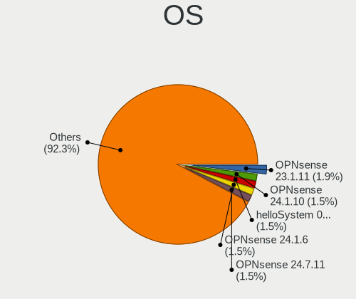
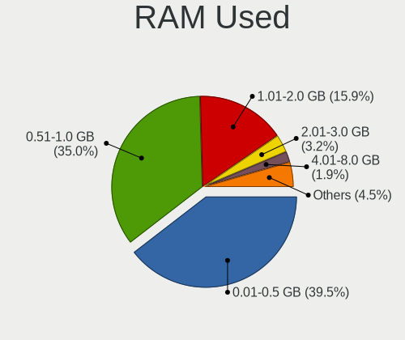
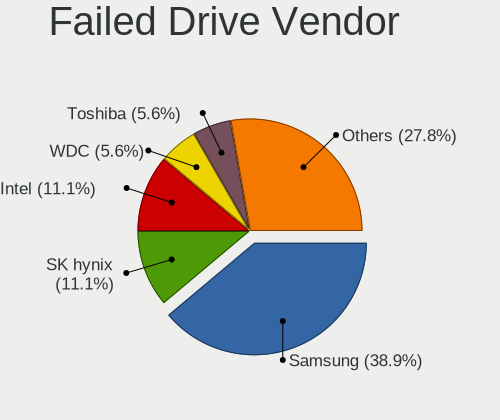
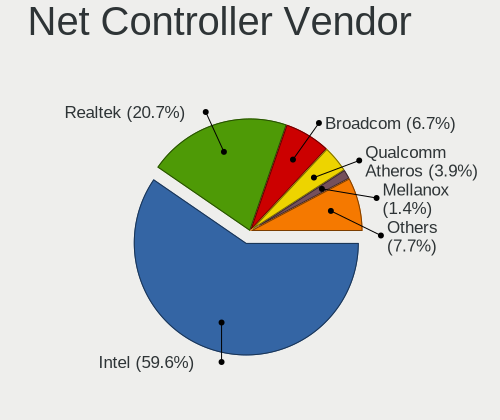
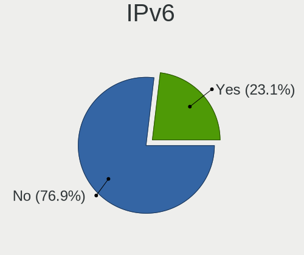
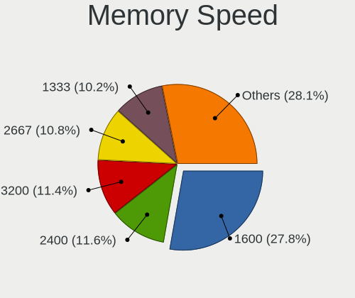
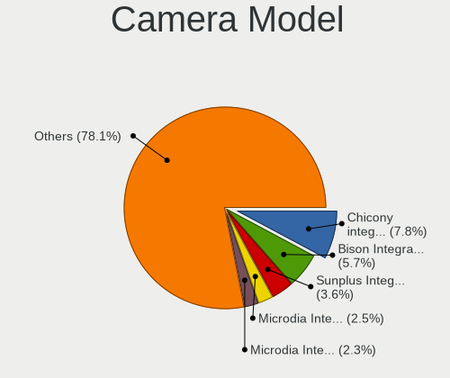

BSD in USA - Tested Hardware & Statistics
-----------------------------------------

A project to collect tested hardware configurations for BSD in USA.

Anyone can contribute to this report by the [hw-probe](https://github.com/linuxhw/hw-probe/blob/master/INSTALL.BSD.md) tool:

    hw-probe -all -upload

Please contribute! Especially if your hardware is rare.

This is a report for all computer types. See also reports for [desktops](/Location/USA/Desktop/README.md) and [notebooks](/Location/USA/Notebook/README.md).

Contents
--------

* [ Test Cases ](#test-cases)

* [ System ](#system)
  - [ OS                       ](#os)
  - [ OS Family                ](#os-family)
  - [ Arch                     ](#arch)
  - [ DE                       ](#de)
  - [ Display Server           ](#display-server)
  - [ Display Manager          ](#display-manager)
  - [ OS Lang                  ](#os-lang)
  - [ Boot Mode                ](#boot-mode)
  - [ Filesystem               ](#filesystem)
  - [ Part. scheme             ](#part-scheme)

* [ Board ](#board)
  - [ Vendor                   ](#vendor)
  - [ Model                    ](#model)
  - [ Model Family             ](#model-family)
  - [ MFG Year                 ](#mfg-year)
  - [ Form Factor              ](#form-factor)
  - [ Coreboot                 ](#coreboot)
  - [ RAM Size                 ](#ram-size)
  - [ RAM Used                 ](#ram-used)
  - [ Total Drives             ](#total-drives)
  - [ Has CD-ROM               ](#has-cd-rom)
  - [ Has Ethernet             ](#has-ethernet)
  - [ Has WiFi                 ](#has-wifi)
  - [ Has Bluetooth            ](#has-bluetooth)

* [ Location ](#location)
  - [ Country                  ](#country)
  - [ City                     ](#city)

* [ Drives ](#drives)
  - [ Drive Vendor             ](#drive-vendor)
  - [ Drive Model              ](#drive-model)
  - [ HDD Vendor               ](#hdd-vendor)
  - [ SSD Vendor               ](#ssd-vendor)
  - [ Drive Kind               ](#drive-kind)
  - [ Drive Connector          ](#drive-connector)
  - [ Drive Size               ](#drive-size)
  - [ Space Total              ](#space-total)
  - [ Space Used               ](#space-used)
  - [ Malfunc. Drives          ](#malfunc-drives)
  - [ Malfunc. Drive Vendor    ](#malfunc-drive-vendor)
  - [ Malfunc. HDD Vendor      ](#malfunc-hdd-vendor)
  - [ Malfunc. Drive Kind      ](#malfunc-drive-kind)
  - [ Failed Drives            ](#failed-drives)
  - [ Failed Drive Vendor      ](#failed-drive-vendor)
  - [ Drive Status             ](#drive-status)

* [ Storage controller ](#storage-controller)
  - [ Storage Vendor           ](#storage-vendor)
  - [ Storage Model            ](#storage-model)
  - [ Storage Kind             ](#storage-kind)

* [ Processor ](#processor)
  - [ CPU Vendor               ](#cpu-vendor)
  - [ CPU Model                ](#cpu-model)
  - [ CPU Model Family         ](#cpu-model-family)
  - [ CPU Cores                ](#cpu-cores)
  - [ CPU Sockets              ](#cpu-sockets)
  - [ CPU Threads              ](#cpu-threads)
  - [ CPU Microarch            ](#cpu-microarch)

* [ Graphics ](#graphics)
  - [ GPU Vendor               ](#gpu-vendor)
  - [ GPU Model                ](#gpu-model)
  - [ GPU Combo                ](#gpu-combo)
  - [ GPU Driver               ](#gpu-driver)
  - [ GPU Memory               ](#gpu-memory)

* [ Monitor ](#monitor)
  - [ Monitor Vendor           ](#monitor-vendor)
  - [ Monitor Model            ](#monitor-model)
  - [ Monitor Resolution       ](#monitor-resolution)
  - [ Monitor Diagonal         ](#monitor-diagonal)
  - [ Monitor Width            ](#monitor-width)
  - [ Aspect Ratio             ](#aspect-ratio)
  - [ Monitor Area             ](#monitor-area)
  - [ Pixel Density            ](#pixel-density)
  - [ Multiple Monitors        ](#multiple-monitors)

* [ Network ](#network)
  - [ Net Controller Vendor    ](#net-controller-vendor)
  - [ Net Controller Model     ](#net-controller-model)
  - [ Wireless Vendor          ](#wireless-vendor)
  - [ Wireless Model           ](#wireless-model)
  - [ Ethernet Vendor          ](#ethernet-vendor)
  - [ Ethernet Model           ](#ethernet-model)
  - [ Net Controller Kind      ](#net-controller-kind)
  - [ Used Controller          ](#used-controller)
  - [ NICs                     ](#nics)
  - [ IPv6                     ](#ipv6)

* [ Bluetooth ](#bluetooth)
  - [ Bluetooth Vendor         ](#bluetooth-vendor)
  - [ Bluetooth Model          ](#bluetooth-model)

* [ Sound ](#sound)
  - [ Sound Vendor             ](#sound-vendor)
  - [ Sound Model              ](#sound-model)

* [ Memory ](#memory)
  - [ Memory Vendor            ](#memory-vendor)
  - [ Memory Model             ](#memory-model)
  - [ Memory Kind              ](#memory-kind)
  - [ Memory Form Factor       ](#memory-form-factor)
  - [ Memory Size              ](#memory-size)
  - [ Memory Speed             ](#memory-speed)

* [ Printers & scanners ](#printers--scanners)
  - [ Printer Vendor           ](#printer-vendor)
  - [ Printer Model            ](#printer-model)
  - [ Scanner Vendor           ](#scanner-vendor)
  - [ Scanner Model            ](#scanner-model)

* [ Camera ](#camera)
  - [ Camera Vendor            ](#camera-vendor)
  - [ Camera Model             ](#camera-model)

* [ Security ](#security)
  - [ Fingerprint Vendor       ](#fingerprint-vendor)
  - [ Fingerprint Model        ](#fingerprint-model)
  - [ Chipcard Vendor          ](#chipcard-vendor)
  - [ Chipcard Model           ](#chipcard-model)

* [ Unsupported ](#unsupported)
  - [ Unsupported Devices      ](#unsupported-devices)
  - [ Unsupported Device Types ](#unsupported-device-types)

Test Cases
----------

Total: 4696

| Vendor        | Model                       | Form-Factor | Probe                                                     | Date         |
|---------------|-----------------------------|-------------|-----------------------------------------------------------|--------------|
| Protectli     | FW6 Ver                     | Desktop     | [61c7be6541](https://bsd-hardware.info/?probe=61c7be6541) | Jul 01, 2023 |
| Lenovo        | ThinkPad T60 20076PU        | Notebook    | [cb47bfef12](https://bsd-hardware.info/?probe=cb47bfef12) | Jun 30, 2023 |
| Lenovo        | 3136 SDK0J40697 WIN 3305... | Mini pc     | [0e1a626160](https://bsd-hardware.info/?probe=0e1a626160) | Jun 30, 2023 |
| ASUSTek       | ROG STRIX X570-F GAMING     | Desktop     | [b6cfa09740](https://bsd-hardware.info/?probe=b6cfa09740) | Jun 30, 2023 |
| Protectli     | FW6 Ver                     | Desktop     | [5c6f36540d](https://bsd-hardware.info/?probe=5c6f36540d) | Jun 29, 2023 |
| Protectli     | VP2420                      | Desktop     | [950ff902c2](https://bsd-hardware.info/?probe=950ff902c2) | Jun 29, 2023 |
| Intel         | DQ67SW AAG12527-310         | Desktop     | [5b272b02cb](https://bsd-hardware.info/?probe=5b272b02cb) | Jun 29, 2023 |
| HP            | 8055                        | Desktop     | [94df572de4](https://bsd-hardware.info/?probe=94df572de4) | Jun 29, 2023 |
| Dell          | 0NW6H5 A00                  | Desktop     | [0cdc2b47b2](https://bsd-hardware.info/?probe=0cdc2b47b2) | Jun 29, 2023 |
| HP            | 8595                        | Desktop     | [e1a82ff0c5](https://bsd-hardware.info/?probe=e1a82ff0c5) | Jun 29, 2023 |
| Unknown       | Unknown                     | Desktop     | [41e020bc03](https://bsd-hardware.info/?probe=41e020bc03) | Jun 29, 2023 |
| Intel         | MAHOBAY                     | Desktop     | [4053bc358e](https://bsd-hardware.info/?probe=4053bc358e) | Jun 29, 2023 |
| Dell          | 0NC2VH A01                  | Desktop     | [d5a7320a8a](https://bsd-hardware.info/?probe=d5a7320a8a) | Jun 28, 2023 |
| Dell          | 03X6X0 A00                  | Server      | [88c047f069](https://bsd-hardware.info/?probe=88c047f069) | Jun 28, 2023 |
| HP            | 339A                        | Desktop     | [b08e1fc092](https://bsd-hardware.info/?probe=b08e1fc092) | Jun 27, 2023 |
| Lenovo        | 3136 SDK0J40697 WIN 3305... | Mini pc     | [30240eb64b](https://bsd-hardware.info/?probe=30240eb64b) | Jun 27, 2023 |
| ASUSTek       | TUF Gaming B550M-PLUS (W... | Desktop     | [4d99bc4b63](https://bsd-hardware.info/?probe=4d99bc4b63) | Jun 27, 2023 |
| ASUSTek       | TUF Gaming B550M-PLUS (W... | Desktop     | [8866724f46](https://bsd-hardware.info/?probe=8866724f46) | Jun 27, 2023 |
| Supermicro    | X11SDV-4C-TP8F              | Desktop     | [bc448a4c10](https://bsd-hardware.info/?probe=bc448a4c10) | Jun 27, 2023 |
| Supermicro    | X9SCL/X9SCMA                | Desktop     | [489b7b6bae](https://bsd-hardware.info/?probe=489b7b6bae) | Jun 26, 2023 |
| Lenovo        | ThinkPad T440p 20AW000BU... | Notebook    | [9a7628d17b](https://bsd-hardware.info/?probe=9a7628d17b) | Jun 26, 2023 |
| Unknown       | Unknown                     | Desktop     | [cd3b925f27](https://bsd-hardware.info/?probe=cd3b925f27) | Jun 26, 2023 |
| Gigabyte      | C1037UN                     | Desktop     | [fccc3f4b80](https://bsd-hardware.info/?probe=fccc3f4b80) | Jun 26, 2023 |
| AZW           | EQ                          | Desktop     | [c410cd5c1c](https://bsd-hardware.info/?probe=c410cd5c1c) | Jun 25, 2023 |
| Gigabyte      | B450M DS3H-CF               | Desktop     | [dc937eee63](https://bsd-hardware.info/?probe=dc937eee63) | Jun 25, 2023 |
| MSI           | H81M-P33                    | Desktop     | [80bd24461a](https://bsd-hardware.info/?probe=80bd24461a) | Jun 25, 2023 |
| ASUSTek       | P5Q-E                       | Desktop     | [e368d55893](https://bsd-hardware.info/?probe=e368d55893) | Jun 25, 2023 |
| ASUSTek       | ROG CROSSHAIR VIII HERO     | Desktop     | [483865aca5](https://bsd-hardware.info/?probe=483865aca5) | Jun 25, 2023 |
| Unknown       | Unknown                     | Desktop     | [32e290d370](https://bsd-hardware.info/?probe=32e290d370) | Jun 25, 2023 |
| HP            | 8103 A01                    | Mini pc     | [feb4e78649](https://bsd-hardware.info/?probe=feb4e78649) | Jun 24, 2023 |
| AMI           | Aptio CRB                   | Mini pc     | [c72cc8a340](https://bsd-hardware.info/?probe=c72cc8a340) | Jun 24, 2023 |
| Protectli     | FW6 Ver                     | Desktop     | [6210e8f0bc](https://bsd-hardware.info/?probe=6210e8f0bc) | Jun 24, 2023 |
| Techvision    | TVI7309X B0                 | Desktop     | [93213fc931](https://bsd-hardware.info/?probe=93213fc931) | Jun 24, 2023 |
| Supermicro    | X10SLL-F                    | Server      | [fdf31a6e78](https://bsd-hardware.info/?probe=fdf31a6e78) | Jun 23, 2023 |
| Dell          | 0Y7WYT A00                  | Desktop     | [a931ed9f0a](https://bsd-hardware.info/?probe=a931ed9f0a) | Jun 23, 2023 |
| Lenovo        | 312A SDK0J40697 WIN 3305... | Desktop     | [b6916f61a8](https://bsd-hardware.info/?probe=b6916f61a8) | Jun 23, 2023 |
| AZW           | EQ                          | Desktop     | [8a85da80b2](https://bsd-hardware.info/?probe=8a85da80b2) | Jun 23, 2023 |
| BESSTAR Te... | GB7                         | Mini pc     | [bc8c23b6ff](https://bsd-hardware.info/?probe=bc8c23b6ff) | Jun 22, 2023 |
| NetGear       | ReadyNAS 3130               | Firewall    | [7fa1d24d06](https://bsd-hardware.info/?probe=7fa1d24d06) | Jun 22, 2023 |
| CWWK          | CW-AD4L-N V1                | Desktop     | [b7ca7c7195](https://bsd-hardware.info/?probe=b7ca7c7195) | Jun 22, 2023 |
| Unknown       | Unknown                     | Desktop     | [f73625157c](https://bsd-hardware.info/?probe=f73625157c) | Jun 22, 2023 |
| Protectli     | VP2410                      | Desktop     | [94e2177a56](https://bsd-hardware.info/?probe=94e2177a56) | Jun 22, 2023 |
| Dell          | 0NW6H5 A00                  | Desktop     | [7d3a60d628](https://bsd-hardware.info/?probe=7d3a60d628) | Jun 22, 2023 |
| HP            | ProLiant DL360 G7           | Server      | [ed967db034](https://bsd-hardware.info/?probe=ed967db034) | Jun 22, 2023 |
| Techvision    | TVI7309X B0                 | Desktop     | [178a67ff39](https://bsd-hardware.info/?probe=178a67ff39) | Jun 21, 2023 |
| Supermicro    | X10SLH-N6-ST031             | Server      | [572c03a709](https://bsd-hardware.info/?probe=572c03a709) | Jun 21, 2023 |
| Dell          | 0NC2VH A01                  | Desktop     | [f094606e8f](https://bsd-hardware.info/?probe=f094606e8f) | Jun 21, 2023 |
| Hardkernel    | ODROID-H3                   | Desktop     | [8f550b0d75](https://bsd-hardware.info/?probe=8f550b0d75) | Jun 21, 2023 |
| BESSTAR Te... | TH50                        | Desktop     | [efc396837c](https://bsd-hardware.info/?probe=efc396837c) | Jun 21, 2023 |
| Techvision    | TVI7309X B0                 | Desktop     | [12d57aa9d9](https://bsd-hardware.info/?probe=12d57aa9d9) | Jun 21, 2023 |
| CWWK          | CW-AD4L-N V1                | Desktop     | [a09d71cc14](https://bsd-hardware.info/?probe=a09d71cc14) | Jun 21, 2023 |
| HP            | 802E                        | Desktop     | [595a5d4f60](https://bsd-hardware.info/?probe=595a5d4f60) | Jun 21, 2023 |
| Unknown       | Unknown                     | Desktop     | [d0c184ae86](https://bsd-hardware.info/?probe=d0c184ae86) | Jun 20, 2023 |
| Supermicro    | M11SDV-4CT-LN4F             | Server      | [18f6f78915](https://bsd-hardware.info/?probe=18f6f78915) | Jun 19, 2023 |
| Techvision    | TVI7309X B0                 | Desktop     | [1fa198f78d](https://bsd-hardware.info/?probe=1fa198f78d) | Jun 19, 2023 |
| Intel         | CRESCENTBAY                 | Desktop     | [e8c8da464a](https://bsd-hardware.info/?probe=e8c8da464a) | Jun 19, 2023 |
| AMI           | Aptio CRB                   | Mini pc     | [1b3b10c231](https://bsd-hardware.info/?probe=1b3b10c231) | Jun 19, 2023 |
| Apple         | MacBook2,1                  | Notebook    | [9e864bfe3b](https://bsd-hardware.info/?probe=9e864bfe3b) | Jun 18, 2023 |
| Dell          | Inspiron 5559               | Notebook    | [b0659ff5bf](https://bsd-hardware.info/?probe=b0659ff5bf) | Jun 18, 2023 |
| Dell          | 07F37C A01                  | Desktop     | [16e5a062a2](https://bsd-hardware.info/?probe=16e5a062a2) | Jun 18, 2023 |
| Dell          | 05KX61 A02                  | Server      | [7131f9450f](https://bsd-hardware.info/?probe=7131f9450f) | Jun 18, 2023 |
| Dell          | 04415J A00                  | Mini pc     | [31c6e3d0b1](https://bsd-hardware.info/?probe=31c6e3d0b1) | Jun 17, 2023 |
| ASRock        | X570 Phantom Gaming 4       | Desktop     | [705c750691](https://bsd-hardware.info/?probe=705c750691) | Jun 17, 2023 |
| Dell          | 0HC3G4 A00                  | Mini pc     | [72ac0afa21](https://bsd-hardware.info/?probe=72ac0afa21) | Jun 16, 2023 |
| HP            | 83E9                        | Desktop     | [23ec260317](https://bsd-hardware.info/?probe=23ec260317) | Jun 16, 2023 |
| Unknown       | Unknown                     | Desktop     | [a6d5232f75](https://bsd-hardware.info/?probe=a6d5232f75) | Jun 16, 2023 |
| Unknown       | Unknown                     | Desktop     | [06754d9e71](https://bsd-hardware.info/?probe=06754d9e71) | Jun 15, 2023 |
| Unknown       | Unknown                     | Notebook    | [e218344894](https://bsd-hardware.info/?probe=e218344894) | Jun 15, 2023 |
| Panasonic     | CFSX4-1                     | Notebook    | [ff83a965d2](https://bsd-hardware.info/?probe=ff83a965d2) | Jun 15, 2023 |
| Dell          | 08NPPY A00                  | Desktop     | [8586467924](https://bsd-hardware.info/?probe=8586467924) | Jun 15, 2023 |
| MW            | GMLK-2_5G4L                 | Desktop     | [3274745a08](https://bsd-hardware.info/?probe=3274745a08) | Jun 15, 2023 |
| Lenovo        | ThinkPad T430 2344BZU       | Notebook    | [01df487b47](https://bsd-hardware.info/?probe=01df487b47) | Jun 14, 2023 |
| Lenovo        | 312D SDK0J40697 WIN 3305... | Mini pc     | [355639e85e](https://bsd-hardware.info/?probe=355639e85e) | Jun 14, 2023 |
| Dell          | 0VWT90 A00                  | Server      | [884ea7a785](https://bsd-hardware.info/?probe=884ea7a785) | Jun 14, 2023 |
| Protectli     | VP2420                      | Desktop     | [82ecf3a046](https://bsd-hardware.info/?probe=82ecf3a046) | Jun 14, 2023 |
| ASUSTek       | PRIME X370-PRO              | Desktop     | [6e8e70ddc2](https://bsd-hardware.info/?probe=6e8e70ddc2) | Jun 13, 2023 |
| ASRock        | X570 Phantom Gaming 4       | Desktop     | [c19a29f083](https://bsd-hardware.info/?probe=c19a29f083) | Jun 13, 2023 |
| MSI           | X370 GAMING PRO CARBON      | Desktop     | [33b64d3084](https://bsd-hardware.info/?probe=33b64d3084) | Jun 13, 2023 |
| Dell          | 02YYK5 A00                  | Desktop     | [0dc0eab687](https://bsd-hardware.info/?probe=0dc0eab687) | Jun 13, 2023 |
| Pegatron      | 2AD5                        | Desktop     | [751e307940](https://bsd-hardware.info/?probe=751e307940) | Jun 13, 2023 |
| Lenovo        | IdeaPad 310-15IKB 80TV      | Notebook    | [76809610f9](https://bsd-hardware.info/?probe=76809610f9) | Jun 13, 2023 |
| Dell          | 0VWT90 A00                  | Server      | [1860066c89](https://bsd-hardware.info/?probe=1860066c89) | Jun 12, 2023 |
| HP            | 213D A01                    | Desktop     | [2a6603c79a](https://bsd-hardware.info/?probe=2a6603c79a) | Jun 12, 2023 |
| Intel         | NUC11PABi5 M68265-500       | Mini pc     | [1db246e3ab](https://bsd-hardware.info/?probe=1db246e3ab) | Jun 12, 2023 |
| Dell          | 0D28YY A00                  | Desktop     | [9f14962984](https://bsd-hardware.info/?probe=9f14962984) | Jun 11, 2023 |
| MSI           | H81M-P33                    | Desktop     | [3d9a05635f](https://bsd-hardware.info/?probe=3d9a05635f) | Jun 11, 2023 |
| ASUSTek       | P5Q-E                       | Desktop     | [b8f3eeed4b](https://bsd-hardware.info/?probe=b8f3eeed4b) | Jun 11, 2023 |
| ASUSTek       | ROG CROSSHAIR VIII HERO     | Desktop     | [9c888141fb](https://bsd-hardware.info/?probe=9c888141fb) | Jun 11, 2023 |
| Protectli     | FW6 Ver                     | Desktop     | [3f8a97d0e7](https://bsd-hardware.info/?probe=3f8a97d0e7) | Jun 11, 2023 |
| Supermicro    | X11SBA-LN4FA                | Server      | [be7bf70aff](https://bsd-hardware.info/?probe=be7bf70aff) | Jun 11, 2023 |
| Intel         | S1200KP AAG34877-201        | Desktop     | [39eba90e6a](https://bsd-hardware.info/?probe=39eba90e6a) | Jun 10, 2023 |
| Dell          | Inspiron 3180               | Notebook    | [cb769078b4](https://bsd-hardware.info/?probe=cb769078b4) | Jun 10, 2023 |
| Dell          | Inspiron 5593               | Notebook    | [8bedc249ea](https://bsd-hardware.info/?probe=8bedc249ea) | Jun 10, 2023 |
| Dell          | Inspiron 7548               | Notebook    | [c80bb80e8f](https://bsd-hardware.info/?probe=c80bb80e8f) | Jun 10, 2023 |
| AMI           | Aptio CRB                   | Mini pc     | [ffeca6e776](https://bsd-hardware.info/?probe=ffeca6e776) | Jun 10, 2023 |
| Gigabyte      | C1037UN                     | Desktop     | [d8f7cea73b](https://bsd-hardware.info/?probe=d8f7cea73b) | Jun 10, 2023 |
| Intel         | S1200KP AAG34877-201        | Desktop     | [ec04f3f6d5](https://bsd-hardware.info/?probe=ec04f3f6d5) | Jun 10, 2023 |
| Protectli     | FW4B Ver                    | Desktop     | [af56081a76](https://bsd-hardware.info/?probe=af56081a76) | Jun 10, 2023 |
| Protectli     | FW6 Ver                     | Desktop     | [6cc2f54681](https://bsd-hardware.info/?probe=6cc2f54681) | Jun 10, 2023 |
| ASUSTek       | PRIME B760M-A D4            | Desktop     | [7d23d1c91f](https://bsd-hardware.info/?probe=7d23d1c91f) | Jun 09, 2023 |
| PC Engines    | APU2                        | Desktop     | [24545e8f90](https://bsd-hardware.info/?probe=24545e8f90) | Jun 09, 2023 |
| Dell          | 0YXT71 A02                  | Desktop     | [e42082ba89](https://bsd-hardware.info/?probe=e42082ba89) | Jun 09, 2023 |
| MSI           | MS-7360                     | Desktop     | [f54096f3e5](https://bsd-hardware.info/?probe=f54096f3e5) | Jun 08, 2023 |
| ASUSTek       | M11AD                       | Desktop     | [7ffef5814d](https://bsd-hardware.info/?probe=7ffef5814d) | Jun 07, 2023 |
| MW            | GMLK-2_5G4L                 | Desktop     | [54c23902c7](https://bsd-hardware.info/?probe=54c23902c7) | Jun 07, 2023 |
| Pegatron      | 2AD5                        | Desktop     | [e50d3f9b86](https://bsd-hardware.info/?probe=e50d3f9b86) | Jun 06, 2023 |
| Dell          | 0NC2VH A01                  | Desktop     | [0b9ad8d7d8](https://bsd-hardware.info/?probe=0b9ad8d7d8) | Jun 06, 2023 |
| Dell          | Inspiron 5559               | Notebook    | [fe5f99c4b0](https://bsd-hardware.info/?probe=fe5f99c4b0) | Jun 06, 2023 |
| Dell          | 04415J A00                  | Mini pc     | [eb7049ca10](https://bsd-hardware.info/?probe=eb7049ca10) | Jun 06, 2023 |
| HP            | 843F                        | Desktop     | [57b6c258ad](https://bsd-hardware.info/?probe=57b6c258ad) | Jun 06, 2023 |
| Lenovo        | ThinkPad T500 2082BNU       | Notebook    | [dedd066084](https://bsd-hardware.info/?probe=dedd066084) | Jun 06, 2023 |
| Acer          | Aspire XC-1660G V:1.1       | Desktop     | [e07bfb044b](https://bsd-hardware.info/?probe=e07bfb044b) | Jun 06, 2023 |
| Lenovo        | IdeaPad Slim 9 14ITL5 82... | Notebook    | [03e1e6d302](https://bsd-hardware.info/?probe=03e1e6d302) | Jun 05, 2023 |
| Deciso        | Netboard A20                | Notebook    | [eb03ae7215](https://bsd-hardware.info/?probe=eb03ae7215) | Jun 05, 2023 |
| HP            | 212B                        | Desktop     | [4db61072c4](https://bsd-hardware.info/?probe=4db61072c4) | Jun 05, 2023 |
| MW            | GMLK-2_5G4L                 | Desktop     | [e137b3e686](https://bsd-hardware.info/?probe=e137b3e686) | Jun 05, 2023 |
| HP            | 339A                        | Desktop     | [74f857c400](https://bsd-hardware.info/?probe=74f857c400) | Jun 05, 2023 |
| MSI           | H81M-P33                    | Desktop     | [88598bfbf5](https://bsd-hardware.info/?probe=88598bfbf5) | Jun 04, 2023 |
| ASUSTek       | P5Q-E                       | Desktop     | [fac0ed387e](https://bsd-hardware.info/?probe=fac0ed387e) | Jun 04, 2023 |
| ASUSTek       | ROG CROSSHAIR VIII HERO     | Desktop     | [3c76deca15](https://bsd-hardware.info/?probe=3c76deca15) | Jun 04, 2023 |
| HP            | 802E                        | Desktop     | [2af6f8a101](https://bsd-hardware.info/?probe=2af6f8a101) | Jun 04, 2023 |
| Acer          | Aspire XC-1660G V:1.1       | Desktop     | [cf05481728](https://bsd-hardware.info/?probe=cf05481728) | Jun 04, 2023 |
| Unknown       | Unknown                     | Notebook    | [a243045cc3](https://bsd-hardware.info/?probe=a243045cc3) | Jun 04, 2023 |
| HP            | 805A                        | Desktop     | [3ad8551330](https://bsd-hardware.info/?probe=3ad8551330) | Jun 04, 2023 |
| Protectli     | FW4B Ver                    | Desktop     | [0f5b2ad316](https://bsd-hardware.info/?probe=0f5b2ad316) | Jun 03, 2023 |
| Unknown       | Unknown                     | Desktop     | [ffb4544d8c](https://bsd-hardware.info/?probe=ffb4544d8c) | Jun 03, 2023 |
| Protectli     | FW6 Ver                     | Desktop     | [a42fcbbc12](https://bsd-hardware.info/?probe=a42fcbbc12) | Jun 03, 2023 |
| Dell          | 08NPPY A00                  | Desktop     | [538e16bf08](https://bsd-hardware.info/?probe=538e16bf08) | Jun 03, 2023 |
| Dell          | G5 5505                     | Notebook    | [5a3c1f19a0](https://bsd-hardware.info/?probe=5a3c1f19a0) | Jun 03, 2023 |
| AAEON         | FWS-2360 V1.0               | Desktop     | [bcb707d6d0](https://bsd-hardware.info/?probe=bcb707d6d0) | Jun 02, 2023 |
| Unknown       | Unknown                     | Desktop     | [2702f3486a](https://bsd-hardware.info/?probe=2702f3486a) | Jun 02, 2023 |
| ASRockRack    | X570D4U-2L2T                | Desktop     | [4cada5d71b](https://bsd-hardware.info/?probe=4cada5d71b) | Jun 02, 2023 |
| Unknown       | Unknown                     | Desktop     | [09b74995b7](https://bsd-hardware.info/?probe=09b74995b7) | Jun 02, 2023 |
| Supermicro    | X9SCL/X9SCMA                | Desktop     | [2348a2736e](https://bsd-hardware.info/?probe=2348a2736e) | Jun 02, 2023 |
| Unknown       | Unknown                     | Desktop     | [a3bc187a6b](https://bsd-hardware.info/?probe=a3bc187a6b) | Jun 02, 2023 |
| Dell          | G5 5505                     | Notebook    | [1b10aecc38](https://bsd-hardware.info/?probe=1b10aecc38) | Jun 02, 2023 |
| HP            | 805A                        | Desktop     | [b50fd38c94](https://bsd-hardware.info/?probe=b50fd38c94) | Jun 01, 2023 |
| Advantech     | FWA-1320 A103               | Server      | [0b78bc1741](https://bsd-hardware.info/?probe=0b78bc1741) | Jun 01, 2023 |
| Intel         | Q3XXG4-P V1.0               | Desktop     | [ef66603fb9](https://bsd-hardware.info/?probe=ef66603fb9) | Jun 01, 2023 |
| ASRock        | FM2A78M-ITX+                | Desktop     | [aecc8b1372](https://bsd-hardware.info/?probe=aecc8b1372) | Jun 01, 2023 |
| Dell          | 05XGC8 A01                  | Desktop     | [c40e01cab3](https://bsd-hardware.info/?probe=c40e01cab3) | Jun 01, 2023 |
| Dell          | Inspiron 5559               | Notebook    | [330c08c388](https://bsd-hardware.info/?probe=330c08c388) | Jun 01, 2023 |
| Dell          | Inspiron 5559               | Notebook    | [53cf3cea13](https://bsd-hardware.info/?probe=53cf3cea13) | Jun 01, 2023 |
| Acer          | Aspire XC-1660G V:1.1       | Desktop     | [8b0669a87d](https://bsd-hardware.info/?probe=8b0669a87d) | May 31, 2023 |
| HP            | 802E                        | Desktop     | [2b1f2776cd](https://bsd-hardware.info/?probe=2b1f2776cd) | May 31, 2023 |
| Gigabyte      | C1037UN                     | Desktop     | [7502577edc](https://bsd-hardware.info/?probe=7502577edc) | May 31, 2023 |
| CWWK          | CW-AD4L-N V1                | Desktop     | [d5a2882e49](https://bsd-hardware.info/?probe=d5a2882e49) | May 31, 2023 |
| Unknown       | Unknown                     | Desktop     | [f6643f3b06](https://bsd-hardware.info/?probe=f6643f3b06) | May 31, 2023 |
| Fujitsu       | D3313-G1 S26361-D3313-G1    | Desktop     | [c7f2f78173](https://bsd-hardware.info/?probe=c7f2f78173) | May 31, 2023 |
| Supermicro    | X10SDV-4C-TLN2F             | Server      | [d186c4c443](https://bsd-hardware.info/?probe=d186c4c443) | May 30, 2023 |
| Gigabyte      | C1037UN                     | Desktop     | [79e0162b9c](https://bsd-hardware.info/?probe=79e0162b9c) | May 30, 2023 |
| Intel         | S1200KP AAG34877-201        | Desktop     | [b264e962d0](https://bsd-hardware.info/?probe=b264e962d0) | May 30, 2023 |
| Dell          | 00V62H A01                  | Desktop     | [7d2e30807a](https://bsd-hardware.info/?probe=7d2e30807a) | May 30, 2023 |
| Protectli     | FW6 Ver                     | Desktop     | [21bad05407](https://bsd-hardware.info/?probe=21bad05407) | May 29, 2023 |
| Intel         | SKYBAY                      | Desktop     | [86747c5b22](https://bsd-hardware.info/?probe=86747c5b22) | May 29, 2023 |
| Unknown       | iKoolCore R1 iKoolCore R... | Desktop     | [a12b5d1715](https://bsd-hardware.info/?probe=a12b5d1715) | May 29, 2023 |
| Dell          | Inspiron 5559               | Notebook    | [23cad3f06e](https://bsd-hardware.info/?probe=23cad3f06e) | May 28, 2023 |
| Intel         | JSL MRD                     | Desktop     | [6fa703d206](https://bsd-hardware.info/?probe=6fa703d206) | May 28, 2023 |
| ASUSTek       | ROG CROSSHAIR VIII HERO     | Desktop     | [28c84f71fd](https://bsd-hardware.info/?probe=28c84f71fd) | May 28, 2023 |
| ASUSTek       | P5Q-E                       | Desktop     | [cf8b2af78b](https://bsd-hardware.info/?probe=cf8b2af78b) | May 28, 2023 |
| Intel         | JSL MRD                     | Desktop     | [fc7970abd1](https://bsd-hardware.info/?probe=fc7970abd1) | May 28, 2023 |
| PC Engines    | APU2                        | Desktop     | [4c27451012](https://bsd-hardware.info/?probe=4c27451012) | May 28, 2023 |
| PC Engines    | APU2                        | Desktop     | [6b276a70c5](https://bsd-hardware.info/?probe=6b276a70c5) | May 28, 2023 |
| Unknown       | iKoolCore R1 iKoolCore R... | Desktop     | [3560dcfedc](https://bsd-hardware.info/?probe=3560dcfedc) | May 27, 2023 |
| Unknown       | iKoolCore R1 iKoolCore R... | Desktop     | [2caaa9f6cf](https://bsd-hardware.info/?probe=2caaa9f6cf) | May 27, 2023 |
| ASRock        | H270M-ITX/ac                | Desktop     | [69aaebd77e](https://bsd-hardware.info/?probe=69aaebd77e) | May 27, 2023 |
| Unknown       | Unknown                     | Desktop     | [0918049f45](https://bsd-hardware.info/?probe=0918049f45) | May 27, 2023 |
| HP            | ProLiant DL360 G5           | Server      | [d8496263d4](https://bsd-hardware.info/?probe=d8496263d4) | May 27, 2023 |
| Intel         | S1200KP AAG34877-201        | Desktop     | [5bf84ec376](https://bsd-hardware.info/?probe=5bf84ec376) | May 27, 2023 |
| Protectli     | FW6                         | Desktop     | [f7626db73e](https://bsd-hardware.info/?probe=f7626db73e) | May 27, 2023 |
| ASUSTek       | Z97-E/USB                   | Desktop     | [dbda738a56](https://bsd-hardware.info/?probe=dbda738a56) | May 27, 2023 |
| Dell          | 051FJ8 A02                  | Desktop     | [d0d211e4e7](https://bsd-hardware.info/?probe=d0d211e4e7) | May 27, 2023 |
| ChangWang     | CW56-58                     | Desktop     | [b6b902639c](https://bsd-hardware.info/?probe=b6b902639c) | May 27, 2023 |
| Dell          | 051FJ8 A02                  | Desktop     | [8ba976666f](https://bsd-hardware.info/?probe=8ba976666f) | May 27, 2023 |
| Lenovo        | 30D0 SDK0J40705 WIN 3425... | Desktop     | [8514299fe4](https://bsd-hardware.info/?probe=8514299fe4) | May 26, 2023 |
| Acer          | Nitro AN515-42              | Notebook    | [adc687fcfe](https://bsd-hardware.info/?probe=adc687fcfe) | May 26, 2023 |
| Supermicro    | X9SCL/X9SCMA                | Desktop     | [19c6226530](https://bsd-hardware.info/?probe=19c6226530) | May 26, 2023 |
| Supermicro    | X10SDV-4C-TLN2F             | Server      | [acdcef4b1c](https://bsd-hardware.info/?probe=acdcef4b1c) | May 26, 2023 |
| Protectli     | VP2420                      | Desktop     | [2b716b3dd3](https://bsd-hardware.info/?probe=2b716b3dd3) | May 26, 2023 |
| Lenovo        | ThinkPad X140e 20BMS03E0... | Notebook    | [580c52399f](https://bsd-hardware.info/?probe=580c52399f) | May 25, 2023 |
| Protectli     | FW4B Ver                    | Desktop     | [90b4ae806f](https://bsd-hardware.info/?probe=90b4ae806f) | May 25, 2023 |
| Lenovo        | Yoga 2 Pro 20266            | Notebook    | [a2726e621b](https://bsd-hardware.info/?probe=a2726e621b) | May 25, 2023 |
| Supermicro    | M11SDV-8C-LN4F              | Server      | [3797f9d0a9](https://bsd-hardware.info/?probe=3797f9d0a9) | May 24, 2023 |
| HP            | 8299                        | Desktop     | [14a7b5fc70](https://bsd-hardware.info/?probe=14a7b5fc70) | May 24, 2023 |
| Unknown       | Unknown                     | Desktop     | [a9d20f955e](https://bsd-hardware.info/?probe=a9d20f955e) | May 24, 2023 |
| Dell          | 0NC2VH A01                  | Desktop     | [572d966731](https://bsd-hardware.info/?probe=572d966731) | May 24, 2023 |
| Dell          | Inspiron 5559               | Notebook    | [9a2c066dfa](https://bsd-hardware.info/?probe=9a2c066dfa) | May 23, 2023 |
| Lenovo        | ThinkPad X140e 20BMS03E0... | Notebook    | [84e3ac62d5](https://bsd-hardware.info/?probe=84e3ac62d5) | May 23, 2023 |
| ASUSTek       | PRIME A520M-A II            | Desktop     | [eba55377e0](https://bsd-hardware.info/?probe=eba55377e0) | May 22, 2023 |
| Supermicro    | X8SIL                       | Desktop     | [21823c6dbd](https://bsd-hardware.info/?probe=21823c6dbd) | May 22, 2023 |
| Unknown       | Unknown                     | Desktop     | [b5e5e8e2cc](https://bsd-hardware.info/?probe=b5e5e8e2cc) | May 21, 2023 |
| MSI           | H81M-P33                    | Desktop     | [cadb0f588f](https://bsd-hardware.info/?probe=cadb0f588f) | May 21, 2023 |
| ASUSTek       | P5Q-E                       | Desktop     | [4a55c4a669](https://bsd-hardware.info/?probe=4a55c4a669) | May 21, 2023 |
| ASUSTek       | ROG CROSSHAIR VIII HERO     | Desktop     | [f2fb56c7dc](https://bsd-hardware.info/?probe=f2fb56c7dc) | May 21, 2023 |
| Dell          | Inspiron 5559               | Notebook    | [a87acae699](https://bsd-hardware.info/?probe=a87acae699) | May 21, 2023 |
| HP            | ProBook 455 G3              | Notebook    | [b6a6c91115](https://bsd-hardware.info/?probe=b6a6c91115) | May 21, 2023 |
| Lenovo        | ThinkPad 11e 20DAS0S300     | Notebook    | [44d30cfcf6](https://bsd-hardware.info/?probe=44d30cfcf6) | May 21, 2023 |
| Intel         | Q3XXG4-P V1.0               | Desktop     | [7c28bf2d83](https://bsd-hardware.info/?probe=7c28bf2d83) | May 20, 2023 |
| Supermicro    | X10SLH-N6-ST031             | Server      | [9d1ee9fb7c](https://bsd-hardware.info/?probe=9d1ee9fb7c) | May 20, 2023 |
| Gigabyte      | X570 UD                     | Desktop     | [5576c293d8](https://bsd-hardware.info/?probe=5576c293d8) | May 20, 2023 |
| ASUSTek       | Z87M-PLUS                   | Desktop     | [58da7daed7](https://bsd-hardware.info/?probe=58da7daed7) | May 20, 2023 |
| Dell          | 03X6X0 A02                  | Server      | [0c153dcf2d](https://bsd-hardware.info/?probe=0c153dcf2d) | May 20, 2023 |
| Supermicro    | X9SRE/X9SRE-3F/X9SRi/X9S... | Server      | [4528db7fba](https://bsd-hardware.info/?probe=4528db7fba) | May 20, 2023 |
| Intel         | NUC11PHBi7 M26151-405       | Mini pc     | [186e5d4e15](https://bsd-hardware.info/?probe=186e5d4e15) | May 19, 2023 |
| Dell          | 0DRG19 A00                  | Mini pc     | [bf9eb20343](https://bsd-hardware.info/?probe=bf9eb20343) | May 19, 2023 |
| ASUSTek       | Z97-E/USB                   | Desktop     | [484774ff19](https://bsd-hardware.info/?probe=484774ff19) | May 19, 2023 |
| Valve         | Jupiter                     | Notebook    | [7be0869603](https://bsd-hardware.info/?probe=7be0869603) | May 19, 2023 |
| Valve         | Jupiter                     | Notebook    | [ef56a2bd17](https://bsd-hardware.info/?probe=ef56a2bd17) | May 19, 2023 |
| HP            | 18E7                        | Desktop     | [477f3d4c80](https://bsd-hardware.info/?probe=477f3d4c80) | May 19, 2023 |
| Shuttle       | FH270                       | Desktop     | [95b532312a](https://bsd-hardware.info/?probe=95b532312a) | May 18, 2023 |
| Supermicro    | X7SBL                       | Desktop     | [b5ba4ba0e8](https://bsd-hardware.info/?probe=b5ba4ba0e8) | May 18, 2023 |
| Protectli     | FW4C                        | Desktop     | [a8252edc71](https://bsd-hardware.info/?probe=a8252edc71) | May 18, 2023 |
| HP            | 8299                        | Desktop     | [6d2f149a51](https://bsd-hardware.info/?probe=6d2f149a51) | May 18, 2023 |
| Supermicro    | M11SDV-8C-LN4F              | Server      | [73335cbb47](https://bsd-hardware.info/?probe=73335cbb47) | May 17, 2023 |
| Panasonic     | CF-30KAPAXAM                | Notebook    | [62910ad9d9](https://bsd-hardware.info/?probe=62910ad9d9) | May 17, 2023 |
| Techvision    | TVI7309X B0                 | Desktop     | [c4546c2b83](https://bsd-hardware.info/?probe=c4546c2b83) | May 17, 2023 |
| AMI           | Aptio CRB                   | Mini pc     | [2f5ff5fa71](https://bsd-hardware.info/?probe=2f5ff5fa71) | May 17, 2023 |
| Supermicro    | M11SDV-8C-LN4F              | Server      | [12b0e44025](https://bsd-hardware.info/?probe=12b0e44025) | May 17, 2023 |
| Dell          | 03X6X0 A03                  | Server      | [b2287aeafe](https://bsd-hardware.info/?probe=b2287aeafe) | May 17, 2023 |
| MW            | GMLK-2_5G4L                 | Desktop     | [39516c2e91](https://bsd-hardware.info/?probe=39516c2e91) | May 16, 2023 |
| Dell          | 0XN8Y6 A09                  | Server      | [f130e8ac22](https://bsd-hardware.info/?probe=f130e8ac22) | May 16, 2023 |
| MSI           | Z170A PC MATE               | Desktop     | [9c08a669ab](https://bsd-hardware.info/?probe=9c08a669ab) | May 16, 2023 |
| MSI           | Z170A PC MATE               | Desktop     | [75a9fd684a](https://bsd-hardware.info/?probe=75a9fd684a) | May 16, 2023 |
| AMI           | Aptio CRB                   | Mini pc     | [ed8e952359](https://bsd-hardware.info/?probe=ed8e952359) | May 16, 2023 |
| MSI           | H81TI                       | Desktop     | [798ddd2aa1](https://bsd-hardware.info/?probe=798ddd2aa1) | May 16, 2023 |
| Dell          | Inspiron 5559               | Notebook    | [dca662fc41](https://bsd-hardware.info/?probe=dca662fc41) | May 16, 2023 |
| Dell          | 0D7449 A01                  | Server      | [9e81eed411](https://bsd-hardware.info/?probe=9e81eed411) | May 16, 2023 |
| Lenovo        | 30D0 SDK0J40705 WIN 3425... | Desktop     | [27be69ed61](https://bsd-hardware.info/?probe=27be69ed61) | May 15, 2023 |
| MW            | GMLK-2_5G4L                 | Desktop     | [bc475b9528](https://bsd-hardware.info/?probe=bc475b9528) | May 15, 2023 |
| Protectli     | FW6 Ver                     | Desktop     | [ea9ff40bdb](https://bsd-hardware.info/?probe=ea9ff40bdb) | May 14, 2023 |
| ASRock        | 4X4-V1000                   | Desktop     | [189073c58e](https://bsd-hardware.info/?probe=189073c58e) | May 14, 2023 |
| HP            | 8054                        | Desktop     | [1ffc97728a](https://bsd-hardware.info/?probe=1ffc97728a) | May 14, 2023 |
| Supermicro    | X9SCL/X9SCMA                | Desktop     | [cb87f3725f](https://bsd-hardware.info/?probe=cb87f3725f) | May 14, 2023 |
| Supermicro    | X9DRD-iF                    | Server      | [895dfa9596](https://bsd-hardware.info/?probe=895dfa9596) | May 14, 2023 |
| MSI           | H81M-P33                    | Desktop     | [ebf1ee8152](https://bsd-hardware.info/?probe=ebf1ee8152) | May 14, 2023 |
| ASUSTek       | P5Q-E                       | Desktop     | [2bf04b4cf1](https://bsd-hardware.info/?probe=2bf04b4cf1) | May 14, 2023 |
| ASUSTek       | ROG CROSSHAIR VIII HERO     | Desktop     | [ae7796a444](https://bsd-hardware.info/?probe=ae7796a444) | May 14, 2023 |
| Protectli     | FW1 Ver                     | Desktop     | [824016ccf0](https://bsd-hardware.info/?probe=824016ccf0) | May 14, 2023 |
| Supermicro    | M11SDV-8C-LN4F              | Server      | [71ad6e7c1c](https://bsd-hardware.info/?probe=71ad6e7c1c) | May 14, 2023 |
| Dell          | 0MGK50 A01                  | Desktop     | [4222f2f8a5](https://bsd-hardware.info/?probe=4222f2f8a5) | May 13, 2023 |
| Unknown       | N4000                       | Desktop     | [48742290f1](https://bsd-hardware.info/?probe=48742290f1) | May 13, 2023 |
| Dell          | 0PC5F7 A02                  | Desktop     | [b22c9a0cdf](https://bsd-hardware.info/?probe=b22c9a0cdf) | May 13, 2023 |
| Unknown       | Unknown                     | Desktop     | [00a94d98fb](https://bsd-hardware.info/?probe=00a94d98fb) | May 13, 2023 |
| Supermicro    | A1SRi 123456789             | Mini pc     | [362cbefc66](https://bsd-hardware.info/?probe=362cbefc66) | May 13, 2023 |
| AMI           | Aptio CRB                   | Mini pc     | [3e685e1db0](https://bsd-hardware.info/?probe=3e685e1db0) | May 13, 2023 |
| Unknown       | Unknown                     | Desktop     | [2e9d95aed5](https://bsd-hardware.info/?probe=2e9d95aed5) | May 13, 2023 |
| MSI           | PRO B550M-VC WIFI           | Desktop     | [1daa68fb84](https://bsd-hardware.info/?probe=1daa68fb84) | May 13, 2023 |
| ASUSTek       | PRIME X370-PRO              | Desktop     | [a477479a00](https://bsd-hardware.info/?probe=a477479a00) | May 13, 2023 |
| ASRock        | X570 Phantom Gaming 4       | Desktop     | [de9fcd9543](https://bsd-hardware.info/?probe=de9fcd9543) | May 13, 2023 |
| Dell          | 02YYK5 A00                  | Desktop     | [71e4a5f1ec](https://bsd-hardware.info/?probe=71e4a5f1ec) | May 13, 2023 |
| BCM Advanc... | MX81HV/MX81H 10             | Desktop     | [f58c8bdd86](https://bsd-hardware.info/?probe=f58c8bdd86) | May 13, 2023 |
| Gigabyte      | GA-78LMT-USB3               | Desktop     | [a7fe22ce82](https://bsd-hardware.info/?probe=a7fe22ce82) | May 13, 2023 |
| Intel         | S1200BTL E98681-306         | Server      | [ac2a74785a](https://bsd-hardware.info/?probe=ac2a74785a) | May 13, 2023 |
| Biostar       | H61MGC                      | Desktop     | [001611da7e](https://bsd-hardware.info/?probe=001611da7e) | May 12, 2023 |
| Unknown       | YL-J3160L4                  | Desktop     | [fc9a0ecef6](https://bsd-hardware.info/?probe=fc9a0ecef6) | May 12, 2023 |
| Lenovo        | 312D SDK0J40697 WIN 3305... | Mini pc     | [5dadf3509b](https://bsd-hardware.info/?probe=5dadf3509b) | May 12, 2023 |
| JHZD          | BQM5                        | Desktop     | [6b32c22615](https://bsd-hardware.info/?probe=6b32c22615) | May 12, 2023 |
| JHZD          | BQM5                        | Desktop     | [fbbaf0b924](https://bsd-hardware.info/?probe=fbbaf0b924) | May 11, 2023 |
| Protectli     | FW6 Ver                     | Desktop     | [fc8375381d](https://bsd-hardware.info/?probe=fc8375381d) | May 11, 2023 |
| ASRock        | H370M-ITX/ac                | Desktop     | [1e9cfaf845](https://bsd-hardware.info/?probe=1e9cfaf845) | May 11, 2023 |
| ASUSTek       | ROG STRIX B450-F GAMING     | Desktop     | [834174a5a8](https://bsd-hardware.info/?probe=834174a5a8) | May 11, 2023 |
| HP            | 1588h                       | Desktop     | [f1d543fb77](https://bsd-hardware.info/?probe=f1d543fb77) | May 11, 2023 |
| Protectli     | FW6 Ver                     | Desktop     | [f76a340f4a](https://bsd-hardware.info/?probe=f76a340f4a) | May 11, 2023 |
| Protectli     | FW6                         | Desktop     | [37432c6de1](https://bsd-hardware.info/?probe=37432c6de1) | May 10, 2023 |
| Intel         | NUC11PHBi7 M26151-405       | Mini pc     | [89cd98c281](https://bsd-hardware.info/?probe=89cd98c281) | May 10, 2023 |
| Dell          | 0Y7WYT A00                  | Desktop     | [89abd9548b](https://bsd-hardware.info/?probe=89abd9548b) | May 10, 2023 |
| Lenovo        | 3111 SDK0J40705 WIN 3425... | Desktop     | [42b97c3277](https://bsd-hardware.info/?probe=42b97c3277) | May 10, 2023 |
| Dell          | 0NV0M7 A01                  | Desktop     | [72cdd452c8](https://bsd-hardware.info/?probe=72cdd452c8) | May 10, 2023 |
| Intel         | Q3XXG4-P V1.0               | Desktop     | [3359e9a10e](https://bsd-hardware.info/?probe=3359e9a10e) | May 10, 2023 |
| Lenovo        | 3111 SDK0J40705 WIN 3425... | Desktop     | [df84be1ef9](https://bsd-hardware.info/?probe=df84be1ef9) | May 10, 2023 |
| ASUSTek       | P10S-E Series               | Desktop     | [37451da8a7](https://bsd-hardware.info/?probe=37451da8a7) | May 08, 2023 |
| HP            | 8103 A01                    | Mini pc     | [7fcf1a72ee](https://bsd-hardware.info/?probe=7fcf1a72ee) | May 08, 2023 |
| AZW           | SER V1.0                    | Mini pc     | [bb96adbb13](https://bsd-hardware.info/?probe=bb96adbb13) | May 08, 2023 |
| Dell          | 040DDP A01                  | Desktop     | [d5fa48cd90](https://bsd-hardware.info/?probe=d5fa48cd90) | May 07, 2023 |
| MSI           | H81M-P33                    | Desktop     | [55cfed4de4](https://bsd-hardware.info/?probe=55cfed4de4) | May 07, 2023 |
| ASUSTek       | P5Q-E                       | Desktop     | [0cb51a327e](https://bsd-hardware.info/?probe=0cb51a327e) | May 07, 2023 |
| ASUSTek       | ROG CROSSHAIR VIII HERO     | Desktop     | [7e41914431](https://bsd-hardware.info/?probe=7e41914431) | May 07, 2023 |
| Supermicro    | X11SDV-4C-TP8F-01           | Desktop     | [733c921923](https://bsd-hardware.info/?probe=733c921923) | May 07, 2023 |
| Sophos        | SG                          | Firewall    | [19b5a03391](https://bsd-hardware.info/?probe=19b5a03391) | May 07, 2023 |
| AMI           | Aptio CRB                   | Mini pc     | [9ae7407dc4](https://bsd-hardware.info/?probe=9ae7407dc4) | May 07, 2023 |
| Dell          | 0HD5W2 A01                  | Desktop     | [a583770abc](https://bsd-hardware.info/?probe=a583770abc) | May 07, 2023 |
| Lenovo        | SHARKBAY 0B98401 PRO        | Desktop     | [f2ea102ee1](https://bsd-hardware.info/?probe=f2ea102ee1) | May 06, 2023 |
| ASRock        | X570 PG Velocita            | Desktop     | [46925c3dda](https://bsd-hardware.info/?probe=46925c3dda) | May 06, 2023 |
| Panasonic     | CF-30KAPAXAM                | Notebook    | [1c918b79b0](https://bsd-hardware.info/?probe=1c918b79b0) | May 06, 2023 |
| AZW           | MINI S 10                   | Desktop     | [123024f70d](https://bsd-hardware.info/?probe=123024f70d) | May 06, 2023 |
| Dell          | 0Y7WYT A00                  | Desktop     | [dfb339020a](https://bsd-hardware.info/?probe=dfb339020a) | May 06, 2023 |
| Dell          | 0NV0M7 A01                  | Desktop     | [85256a78f6](https://bsd-hardware.info/?probe=85256a78f6) | May 05, 2023 |
| Unknown       | Unknown                     | Desktop     | [2002ddd198](https://bsd-hardware.info/?probe=2002ddd198) | May 05, 2023 |
| Protectli     | VP2420                      | Desktop     | [3fcbd494fc](https://bsd-hardware.info/?probe=3fcbd494fc) | May 05, 2023 |
| Supermicro    | X11SCV-Q                    | Desktop     | [7a6949713d](https://bsd-hardware.info/?probe=7a6949713d) | May 05, 2023 |
| CWWK          | MINIPC-G12                  | Desktop     | [f2ab15324b](https://bsd-hardware.info/?probe=f2ab15324b) | May 05, 2023 |
| ASUSTek       | PRIME B560M-A AC            | Desktop     | [bdd112ce9b](https://bsd-hardware.info/?probe=bdd112ce9b) | May 05, 2023 |
| Supermicro    | X9SCL/X9SCMA                | Desktop     | [982f87fd4d](https://bsd-hardware.info/?probe=982f87fd4d) | May 05, 2023 |
| Dell          | 0F6X5P A00                  | Desktop     | [ba619e879e](https://bsd-hardware.info/?probe=ba619e879e) | May 04, 2023 |
| GoWin Solu... | R86S                        | Desktop     | [a1274a9d0c](https://bsd-hardware.info/?probe=a1274a9d0c) | May 04, 2023 |
| Intel         | DQ77KB AAG81483-501         | Desktop     | [38f47bf53f](https://bsd-hardware.info/?probe=38f47bf53f) | May 04, 2023 |
| Protectli     | FW6 Ver                     | Desktop     | [5e30b0e6b1](https://bsd-hardware.info/?probe=5e30b0e6b1) | May 04, 2023 |
| Supermicro    | X10SLH-N6-ST031             | Server      | [797f0c4b0e](https://bsd-hardware.info/?probe=797f0c4b0e) | May 04, 2023 |
| Unknown       | Unknown                     | Desktop     | [c430ceb253](https://bsd-hardware.info/?probe=c430ceb253) | May 04, 2023 |
| Supermicro    | X10SLH-N6-ST031             | Server      | [baaf2935c4](https://bsd-hardware.info/?probe=baaf2935c4) | May 04, 2023 |
| ASUSTek       | PRIME B760M-A D4            | Desktop     | [31c9c606ab](https://bsd-hardware.info/?probe=31c9c606ab) | May 04, 2023 |
| Unknown       | Unknown                     | Desktop     | [4277dc49d0](https://bsd-hardware.info/?probe=4277dc49d0) | May 04, 2023 |
| Dell          | 0252PH A04                  | Desktop     | [0cc9ef6521](https://bsd-hardware.info/?probe=0cc9ef6521) | May 03, 2023 |
| Dell          | 0252PH A04                  | Desktop     | [acaf59c3d5](https://bsd-hardware.info/?probe=acaf59c3d5) | May 03, 2023 |
| Apple         | MacBookPro11,5              | Notebook    | [45bffd3275](https://bsd-hardware.info/?probe=45bffd3275) | May 03, 2023 |
| Lenovo        | Flex 2-15 20405             | Notebook    | [3773da7851](https://bsd-hardware.info/?probe=3773da7851) | May 03, 2023 |
| Sophos        | XG                          | Firewall    | [cda12ab89f](https://bsd-hardware.info/?probe=cda12ab89f) | May 03, 2023 |
| HP            | Compaq Presario CQ50        | Notebook    | [f296048a29](https://bsd-hardware.info/?probe=f296048a29) | May 03, 2023 |
| HP            | 82B4                        | Desktop     | [1bcefd3823](https://bsd-hardware.info/?probe=1bcefd3823) | May 02, 2023 |
| Supermicro    | X10SLH-N6-ST031             | Server      | [e1628ea30a](https://bsd-hardware.info/?probe=e1628ea30a) | May 02, 2023 |
| Dell          | 0T7D40 A00                  | Desktop     | [83ccb5ff07](https://bsd-hardware.info/?probe=83ccb5ff07) | May 02, 2023 |
| ASUSTek       | ROG STRIX B550-F GAMING     | Desktop     | [3f089673e0](https://bsd-hardware.info/?probe=3f089673e0) | May 01, 2023 |
| ASUSTek       | ROG STRIX B550-F GAMING     | Desktop     | [396d7f268c](https://bsd-hardware.info/?probe=396d7f268c) | May 01, 2023 |
| IceWhale T... | ZimaBoard 832 ZMB           | Desktop     | [a59b6fc6dc](https://bsd-hardware.info/?probe=a59b6fc6dc) | Apr 30, 2023 |
| IceWhale T... | ZimaBoard 832 ZMB           | Desktop     | [2cc6521d1f](https://bsd-hardware.info/?probe=2cc6521d1f) | Apr 30, 2023 |
| Dell          | 0FF3FN A00                  | Desktop     | [717b46840a](https://bsd-hardware.info/?probe=717b46840a) | Apr 30, 2023 |
| Dell          | 0H634K A00                  | Desktop     | [5e783a1c2e](https://bsd-hardware.info/?probe=5e783a1c2e) | Apr 30, 2023 |
| Intel         | NUC7i3DNB J57625-512        | Mini pc     | [50836a160a](https://bsd-hardware.info/?probe=50836a160a) | Apr 30, 2023 |
| MSI           | H81M-P33                    | Desktop     | [e28acf1164](https://bsd-hardware.info/?probe=e28acf1164) | Apr 30, 2023 |
| ASUSTek       | P5Q-E                       | Desktop     | [33d1b6e2d2](https://bsd-hardware.info/?probe=33d1b6e2d2) | Apr 30, 2023 |
| ASUSTek       | ROG CROSSHAIR VIII HERO     | Desktop     | [b0d9eaaceb](https://bsd-hardware.info/?probe=b0d9eaaceb) | Apr 30, 2023 |
| Gigabyte      | B450M DS3H-CF               | Desktop     | [2b922b7925](https://bsd-hardware.info/?probe=2b922b7925) | Apr 30, 2023 |
| HP            | 83E1                        | Desktop     | [d3e5e9a563](https://bsd-hardware.info/?probe=d3e5e9a563) | Apr 30, 2023 |
| HP            | 8103 A01                    | Mini pc     | [51ec1cdb56](https://bsd-hardware.info/?probe=51ec1cdb56) | Apr 29, 2023 |
| Dell          | Latitude E5570              | Notebook    | [98e3f9821b](https://bsd-hardware.info/?probe=98e3f9821b) | Apr 29, 2023 |
| Dell          | 00V62H A00                  | Desktop     | [ad97036f62](https://bsd-hardware.info/?probe=ad97036f62) | Apr 29, 2023 |
| Supermicro    | X11SDV-4C-TP8F              | Desktop     | [dbdb6539fb](https://bsd-hardware.info/?probe=dbdb6539fb) | Apr 29, 2023 |
| Protectli     | FW4C Ver                    | Desktop     | [29ecd63e1e](https://bsd-hardware.info/?probe=29ecd63e1e) | Apr 28, 2023 |
| Unknown       | iKoolCore R1 iKoolCore R... | Desktop     | [9495b45b30](https://bsd-hardware.info/?probe=9495b45b30) | Apr 28, 2023 |
| Protectli     | VP2420                      | Desktop     | [b980175f4f](https://bsd-hardware.info/?probe=b980175f4f) | Apr 28, 2023 |
| Gigabyte      | Z590 AORUS ULTRA            | Desktop     | [f6200a69eb](https://bsd-hardware.info/?probe=f6200a69eb) | Apr 28, 2023 |
| NCR           | Richmond BIOS.6.0           | Desktop     | [e41e1e5c70](https://bsd-hardware.info/?probe=e41e1e5c70) | Apr 28, 2023 |
| Protectli     | FW4B Ver                    | Desktop     | [ef3774c8f2](https://bsd-hardware.info/?probe=ef3774c8f2) | Apr 28, 2023 |
| Dell          | 03X6X0 A02                  | Server      | [95a05a3e59](https://bsd-hardware.info/?probe=95a05a3e59) | Apr 28, 2023 |
| Protectli     | VP2420                      | Desktop     | [8b2758be02](https://bsd-hardware.info/?probe=8b2758be02) | Apr 27, 2023 |
| Apple         | MacBookPro8,3               | Notebook    | [08e155a558](https://bsd-hardware.info/?probe=08e155a558) | Apr 27, 2023 |
| Dell          | 081N4V A05                  | Server      | [e5f9ddcee3](https://bsd-hardware.info/?probe=e5f9ddcee3) | Apr 27, 2023 |
| HP            | 8299                        | Desktop     | [f26926526d](https://bsd-hardware.info/?probe=f26926526d) | Apr 27, 2023 |
| HP            | OMEN by Laptop 15-dc1xxx    | Notebook    | [fc81710889](https://bsd-hardware.info/?probe=fc81710889) | Apr 27, 2023 |
| ASUSTek       | PRIME B760M-A D4            | Desktop     | [9d15e108e6](https://bsd-hardware.info/?probe=9d15e108e6) | Apr 27, 2023 |
| Lenovo        | 312D SDK0J40697 WIN 3305... | Mini pc     | [8a4ea432e6](https://bsd-hardware.info/?probe=8a4ea432e6) | Apr 27, 2023 |
| Dell          | 0252PH A04                  | Desktop     | [f497e66dec](https://bsd-hardware.info/?probe=f497e66dec) | Apr 27, 2023 |
| Acer          | Spin SP314-21               | Convertible | [f5debc3ef8](https://bsd-hardware.info/?probe=f5debc3ef8) | Apr 27, 2023 |
| HP            | 83EE                        | Desktop     | [b5a00cabd1](https://bsd-hardware.info/?probe=b5a00cabd1) | Apr 26, 2023 |
| Unknown       | Unknown                     | Desktop     | [ece1b6bacb](https://bsd-hardware.info/?probe=ece1b6bacb) | Apr 26, 2023 |
| Supermicro    | A1SRi 123456789             | Mini pc     | [acb9ca23c8](https://bsd-hardware.info/?probe=acb9ca23c8) | Apr 26, 2023 |
| HP            | 859B                        | Desktop     | [357ef27be4](https://bsd-hardware.info/?probe=357ef27be4) | Apr 26, 2023 |
| HP            | 82B4                        | Desktop     | [58c58b6a82](https://bsd-hardware.info/?probe=58c58b6a82) | Apr 26, 2023 |
| HP            | 8056                        | Desktop     | [44fb168511](https://bsd-hardware.info/?probe=44fb168511) | Apr 26, 2023 |
| AZW           | EQ                          | Desktop     | [8dd15b5070](https://bsd-hardware.info/?probe=8dd15b5070) | Apr 26, 2023 |
| Lenovo        | 3132 SDK0J40697 WIN 3305... | Desktop     | [6efffdce00](https://bsd-hardware.info/?probe=6efffdce00) | Apr 25, 2023 |
| ASUSTek       | P10S-E Series               | Desktop     | [e6d1a90732](https://bsd-hardware.info/?probe=e6d1a90732) | Apr 25, 2023 |
| HP            | 83E1                        | Desktop     | [865bd9b84e](https://bsd-hardware.info/?probe=865bd9b84e) | Apr 25, 2023 |
| Deciso        | NetBoard-A20                | Notebook    | [3d0f6b629d](https://bsd-hardware.info/?probe=3d0f6b629d) | Apr 25, 2023 |
| Supermicro    | X11SDV-8C-TP8F              | Desktop     | [b56e27db28](https://bsd-hardware.info/?probe=b56e27db28) | Apr 25, 2023 |
| Dell          | 0F0XJ6 A11                  | Server      | [2d4f063c9f](https://bsd-hardware.info/?probe=2d4f063c9f) | Apr 25, 2023 |
| Dell          | 0NV0M7 A01                  | Desktop     | [601f819826](https://bsd-hardware.info/?probe=601f819826) | Apr 25, 2023 |
| ASUSTek       | ROG CROSSHAIR VIII HERO     | Desktop     | [cf0771c3a2](https://bsd-hardware.info/?probe=cf0771c3a2) | Apr 25, 2023 |
| Supermicro    | X11SDV-4C-TP8F-01           | Desktop     | [02d2e2ea42](https://bsd-hardware.info/?probe=02d2e2ea42) | Apr 25, 2023 |
| HP            | 18E7                        | Desktop     | [777359d3c1](https://bsd-hardware.info/?probe=777359d3c1) | Apr 24, 2023 |
| ASUSTek       | TUF Gaming X670E-PLUS WI... | Desktop     | [d3373e972b](https://bsd-hardware.info/?probe=d3373e972b) | Apr 24, 2023 |
| Protectli     | FW4C Ver                    | Desktop     | [39d17845fb](https://bsd-hardware.info/?probe=39d17845fb) | Apr 24, 2023 |
| AZW           | EQ                          | Desktop     | [fe3205803d](https://bsd-hardware.info/?probe=fe3205803d) | Apr 24, 2023 |
| ASRock        | X370 Pro4                   | Desktop     | [9678198b3b](https://bsd-hardware.info/?probe=9678198b3b) | Apr 24, 2023 |
| Dell          | 0NV0M7 A01                  | Desktop     | [280ab26f33](https://bsd-hardware.info/?probe=280ab26f33) | Apr 24, 2023 |
| Google        | Peppy                       | Notebook    | [d162160498](https://bsd-hardware.info/?probe=d162160498) | Apr 24, 2023 |
| Supermicro    | A1SRi-2758F                 | Desktop     | [750e44f983](https://bsd-hardware.info/?probe=750e44f983) | Apr 24, 2023 |
| MW            | GMLK-2_5G4L                 | Desktop     | [b3a756536a](https://bsd-hardware.info/?probe=b3a756536a) | Apr 23, 2023 |
| MSI           | H81M-P33                    | Desktop     | [6df7a17ff2](https://bsd-hardware.info/?probe=6df7a17ff2) | Apr 23, 2023 |
| ASUSTek       | P5Q-E                       | Desktop     | [37564b68c3](https://bsd-hardware.info/?probe=37564b68c3) | Apr 23, 2023 |
| ASUSTek       | ROG CROSSHAIR VIII HERO     | Desktop     | [d44a98739c](https://bsd-hardware.info/?probe=d44a98739c) | Apr 23, 2023 |
| Protectli     | VP2410 10                   | Desktop     | [463567a3e6](https://bsd-hardware.info/?probe=463567a3e6) | Apr 23, 2023 |
| Techvision    | TVI7309X B0                 | Desktop     | [dab120ab36](https://bsd-hardware.info/?probe=dab120ab36) | Apr 23, 2023 |
| ASUSTek       | TUF Gaming B560M-PLUS WI... | Desktop     | [50ff0c14dd](https://bsd-hardware.info/?probe=50ff0c14dd) | Apr 22, 2023 |
| PC Engines    | apu1                        | Desktop     | [9838a040ba](https://bsd-hardware.info/?probe=9838a040ba) | Apr 22, 2023 |
| PC Engines    | apu1                        | Desktop     | [6e3df79f6d](https://bsd-hardware.info/?probe=6e3df79f6d) | Apr 22, 2023 |
| Supermicro    | A2SDi-4C-HLN4F              | Desktop     | [631a166cee](https://bsd-hardware.info/?probe=631a166cee) | Apr 22, 2023 |
| Protectli     | FW4B Ver                    | Desktop     | [f241a78410](https://bsd-hardware.info/?probe=f241a78410) | Apr 22, 2023 |
| HP            | 82B4                        | Desktop     | [35360c7568](https://bsd-hardware.info/?probe=35360c7568) | Apr 22, 2023 |
| Unknown       | Unknown                     | Desktop     | [66614019db](https://bsd-hardware.info/?probe=66614019db) | Apr 22, 2023 |
| Supermicro    | X9SCL/X9SCMA                | Desktop     | [9b975ac704](https://bsd-hardware.info/?probe=9b975ac704) | Apr 22, 2023 |
| Supermicro    | A2SDi-4C-HLN4F              | Server      | [8e138145ca](https://bsd-hardware.info/?probe=8e138145ca) | Apr 22, 2023 |
| HP            | Pavilion 17                 | Notebook    | [0f891b4377](https://bsd-hardware.info/?probe=0f891b4377) | Apr 21, 2023 |
| PC Engines    | APU                         | Desktop     | [c4238a76d1](https://bsd-hardware.info/?probe=c4238a76d1) | Apr 21, 2023 |
| PC Engines    | APU                         | Desktop     | [ae3ce982fe](https://bsd-hardware.info/?probe=ae3ce982fe) | Apr 21, 2023 |
| HP            | OMEN by Laptop 15-dc1xxx    | Notebook    | [e17bcecec8](https://bsd-hardware.info/?probe=e17bcecec8) | Apr 21, 2023 |
| HP            | 83F2                        | Desktop     | [1ff683e02b](https://bsd-hardware.info/?probe=1ff683e02b) | Apr 20, 2023 |
| Acer          | Aspire TC-885 V:1.1         | Desktop     | [6f85c5453c](https://bsd-hardware.info/?probe=6f85c5453c) | Apr 20, 2023 |
| GoWin Solu... | R86S                        | Desktop     | [5e94539f7f](https://bsd-hardware.info/?probe=5e94539f7f) | Apr 20, 2023 |
| Lenovo        | 310B SDK0J40697 WIN 3305... | Desktop     | [94507dfaf6](https://bsd-hardware.info/?probe=94507dfaf6) | Apr 20, 2023 |
| MW            | GMLK-2_5G4L                 | Desktop     | [24162b26be](https://bsd-hardware.info/?probe=24162b26be) | Apr 20, 2023 |
| Dell          | 081N4V A05                  | Server      | [8189917b77](https://bsd-hardware.info/?probe=8189917b77) | Apr 20, 2023 |
| PC Engines    | APU3                        | Desktop     | [110d848c38](https://bsd-hardware.info/?probe=110d848c38) | Apr 19, 2023 |
| Protectli     | FW4B Ver                    | Desktop     | [d727bd2723](https://bsd-hardware.info/?probe=d727bd2723) | Apr 19, 2023 |
| Raspberry ... | Raspberry Pi                | Soc         | [3852dcb332](https://bsd-hardware.info/?probe=3852dcb332) | Apr 19, 2023 |
| Dell          | 05XGC8 A01                  | Desktop     | [d89f79132d](https://bsd-hardware.info/?probe=d89f79132d) | Apr 19, 2023 |
| HP            | 8299                        | Desktop     | [a9e845749a](https://bsd-hardware.info/?probe=a9e845749a) | Apr 19, 2023 |
| Intel         | Q3XXG4-P V1.0               | Desktop     | [c626643f89](https://bsd-hardware.info/?probe=c626643f89) | Apr 18, 2023 |
| HP            | 8055                        | Desktop     | [83ecb873fe](https://bsd-hardware.info/?probe=83ecb873fe) | Apr 18, 2023 |
| AZW           | EQ                          | Desktop     | [c9fe4601ec](https://bsd-hardware.info/?probe=c9fe4601ec) | Apr 18, 2023 |
| HP            | Laptop 14-dk1xxx            | Notebook    | [464059d8b1](https://bsd-hardware.info/?probe=464059d8b1) | Apr 18, 2023 |
| Apple         | Mac-35C5E08120C7EEAF Mac... | Mini pc     | [73ccbd2631](https://bsd-hardware.info/?probe=73ccbd2631) | Apr 18, 2023 |
| Acer          | Spin SP314-21               | Convertible | [820e7da3c8](https://bsd-hardware.info/?probe=820e7da3c8) | Apr 18, 2023 |
| PC Engines    | APU2                        | Desktop     | [5d714a9c0d](https://bsd-hardware.info/?probe=5d714a9c0d) | Apr 18, 2023 |
| BYTENUC       | AZ51                        | Mini pc     | [d03887218d](https://bsd-hardware.info/?probe=d03887218d) | Apr 18, 2023 |
| Gigabyte      | A520M DS3H AC               | Desktop     | [16021ac5b5](https://bsd-hardware.info/?probe=16021ac5b5) | Apr 17, 2023 |
| ASRock        | B250M-HDV                   | Desktop     | [3608477e76](https://bsd-hardware.info/?probe=3608477e76) | Apr 16, 2023 |
| MSI           | H81M-P33                    | Desktop     | [e285cc821f](https://bsd-hardware.info/?probe=e285cc821f) | Apr 16, 2023 |
| ASUSTek       | P5Q-E                       | Desktop     | [b79bdd39da](https://bsd-hardware.info/?probe=b79bdd39da) | Apr 16, 2023 |
| ASUSTek       | ROG CROSSHAIR VIII HERO     | Desktop     | [e6734bf5e3](https://bsd-hardware.info/?probe=e6734bf5e3) | Apr 16, 2023 |
| Techvision    | TVI7309X B0                 | Desktop     | [4110309ccc](https://bsd-hardware.info/?probe=4110309ccc) | Apr 16, 2023 |
| Gigabyte      | X670E AORUS MASTER          | Desktop     | [773b28fbc7](https://bsd-hardware.info/?probe=773b28fbc7) | Apr 16, 2023 |
| Intel         | NUC7i3DNB J57625-512        | Mini pc     | [a9c8c58abc](https://bsd-hardware.info/?probe=a9c8c58abc) | Apr 16, 2023 |
| AMI           | Aptio CRB                   | Mini pc     | [19b7b614dc](https://bsd-hardware.info/?probe=19b7b614dc) | Apr 15, 2023 |
| ASUSTek       | P5BV-E                      | Desktop     | [f134ff34ba](https://bsd-hardware.info/?probe=f134ff34ba) | Apr 15, 2023 |
| Toshiba       | PORTEGE R700                | Notebook    | [8b196955ac](https://bsd-hardware.info/?probe=8b196955ac) | Apr 15, 2023 |
| Techvision    | TVI7309X B0                 | Desktop     | [3b0562fe2a](https://bsd-hardware.info/?probe=3b0562fe2a) | Apr 15, 2023 |
| Supermicro    | X11SSQ-L-DE05BA             | Server      | [dcbd42abdd](https://bsd-hardware.info/?probe=dcbd42abdd) | Apr 15, 2023 |
| MW            | GMLK-2_5G4L                 | Desktop     | [4127e0b00d](https://bsd-hardware.info/?probe=4127e0b00d) | Apr 15, 2023 |
| Protectli     | FW6                         | Desktop     | [15753be1b9](https://bsd-hardware.info/?probe=15753be1b9) | Apr 15, 2023 |
| MW            | GMLK-2_5G4L                 | Desktop     | [e665283e47](https://bsd-hardware.info/?probe=e665283e47) | Apr 15, 2023 |
| ASRockRack    | C226M WS                    | Desktop     | [06a8ca514a](https://bsd-hardware.info/?probe=06a8ca514a) | Apr 14, 2023 |
| Supermicro    | M11SDV-4CT-LN4F             | Server      | [57a82eb257](https://bsd-hardware.info/?probe=57a82eb257) | Apr 14, 2023 |
| BYTENUC       | AZ51                        | Mini pc     | [1b2a188c77](https://bsd-hardware.info/?probe=1b2a188c77) | Apr 14, 2023 |
| MSI           | Z87-G41 PC Mate             | Desktop     | [3958a90c04](https://bsd-hardware.info/?probe=3958a90c04) | Apr 13, 2023 |
| Lenovo        | ThinkPad R61 89208RU        | Notebook    | [e892cdffee](https://bsd-hardware.info/?probe=e892cdffee) | Apr 13, 2023 |
| MW            | GMLK-2_5G4L                 | Desktop     | [93632f99ad](https://bsd-hardware.info/?probe=93632f99ad) | Apr 13, 2023 |
| ASUSTek       | PRIME X370-PRO              | Desktop     | [e2b6422180](https://bsd-hardware.info/?probe=e2b6422180) | Apr 13, 2023 |
| ASRock        | X570 Phantom Gaming 4       | Desktop     | [f54d0b103e](https://bsd-hardware.info/?probe=f54d0b103e) | Apr 13, 2023 |
| Dell          | 02YYK5 A00                  | Desktop     | [3f95d84c6f](https://bsd-hardware.info/?probe=3f95d84c6f) | Apr 13, 2023 |
| ECS           | Z77H2-AX                    | Desktop     | [32a290eb5f](https://bsd-hardware.info/?probe=32a290eb5f) | Apr 13, 2023 |
| TUXEDO        | Pulse 15 Gen1               | Notebook    | [bee20c6a4c](https://bsd-hardware.info/?probe=bee20c6a4c) | Apr 12, 2023 |
| Dell          | 03NVJ6 A00                  | Desktop     | [128489e571](https://bsd-hardware.info/?probe=128489e571) | Apr 12, 2023 |
| HP            | 212B                        | Desktop     | [0fb2a36b23](https://bsd-hardware.info/?probe=0fb2a36b23) | Apr 12, 2023 |
| Acer          | Spin SP314-21               | Convertible | [a5ee042606](https://bsd-hardware.info/?probe=a5ee042606) | Apr 12, 2023 |
| ASUSTek       | P8Z77-V LX                  | Desktop     | [6622d21ee9](https://bsd-hardware.info/?probe=6622d21ee9) | Apr 12, 2023 |
| Lenovo        | 314D SDK0J40700 WIN 3258... | Mini pc     | [a3dbe88338](https://bsd-hardware.info/?probe=a3dbe88338) | Apr 11, 2023 |
| Supermicro    | C7SIM-Q                     | Desktop     | [dca54cc956](https://bsd-hardware.info/?probe=dca54cc956) | Apr 11, 2023 |
| Supermicro    | M11SDV-8C+-LN4F             | Server      | [f7bcf353a9](https://bsd-hardware.info/?probe=f7bcf353a9) | Apr 11, 2023 |
| Techvision    | TVI7309X B0                 | Desktop     | [f44190a72a](https://bsd-hardware.info/?probe=f44190a72a) | Apr 11, 2023 |
| Protectli     | FW4B Ver                    | Desktop     | [c9d3e3ccd9](https://bsd-hardware.info/?probe=c9d3e3ccd9) | Apr 11, 2023 |
| Protectli     | FW4C Ver                    | Desktop     | [14e9a37e55](https://bsd-hardware.info/?probe=14e9a37e55) | Apr 11, 2023 |
| HP            | ProLiant DL360 G7           | Server      | [9e860251ae](https://bsd-hardware.info/?probe=9e860251ae) | Apr 10, 2023 |
| Dell          | 04JGCK A01                  | Desktop     | [5eb06957e2](https://bsd-hardware.info/?probe=5eb06957e2) | Apr 10, 2023 |
| Dell          | 04JGCK A01                  | Desktop     | [43e509c47b](https://bsd-hardware.info/?probe=43e509c47b) | Apr 10, 2023 |
| Unknown       | Unknown                     | Notebook    | [5bfbfb213e](https://bsd-hardware.info/?probe=5bfbfb213e) | Apr 09, 2023 |
| MSI           | H81M-P33                    | Desktop     | [90ab4216eb](https://bsd-hardware.info/?probe=90ab4216eb) | Apr 09, 2023 |
| ASUSTek       | P5Q-E                       | Desktop     | [62358071bf](https://bsd-hardware.info/?probe=62358071bf) | Apr 09, 2023 |
| ASUSTek       | ROG CROSSHAIR VIII HERO     | Desktop     | [a06682a305](https://bsd-hardware.info/?probe=a06682a305) | Apr 09, 2023 |
| AZW           | SER V1.0                    | Mini pc     | [689c25b4f6](https://bsd-hardware.info/?probe=689c25b4f6) | Apr 09, 2023 |
| HP            | 212B                        | Desktop     | [6dc537109d](https://bsd-hardware.info/?probe=6dc537109d) | Apr 09, 2023 |
| ASUSTek       | ROG STRIX B450-F GAMING     | Desktop     | [0e9cae4351](https://bsd-hardware.info/?probe=0e9cae4351) | Apr 09, 2023 |
| Lenovo        | 3136 SDK0J40697 WIN 3305... | Mini pc     | [b288c3264c](https://bsd-hardware.info/?probe=b288c3264c) | Apr 09, 2023 |
| GoWin Solu... | R86S                        | Desktop     | [6b448c285b](https://bsd-hardware.info/?probe=6b448c285b) | Apr 08, 2023 |
| Dell          | 02YYK5 A01                  | Desktop     | [c4cb33b0a1](https://bsd-hardware.info/?probe=c4cb33b0a1) | Apr 08, 2023 |
| Protectli     | FW6 Ver                     | Desktop     | [7525421240](https://bsd-hardware.info/?probe=7525421240) | Apr 08, 2023 |
| Dell          | 084XW4 A05                  | Server      | [4300ecfb51](https://bsd-hardware.info/?probe=4300ecfb51) | Apr 08, 2023 |
| Dell          | Latitude 7300               | Notebook    | [d036260cce](https://bsd-hardware.info/?probe=d036260cce) | Apr 08, 2023 |
| HP            | 83EF                        | Desktop     | [56fd6177cd](https://bsd-hardware.info/?probe=56fd6177cd) | Apr 07, 2023 |
| HP            | 83F2                        | Desktop     | [40a4bc3252](https://bsd-hardware.info/?probe=40a4bc3252) | Apr 06, 2023 |
| AMI           | Aptio CRB                   | Mini pc     | [6acbfb84ea](https://bsd-hardware.info/?probe=6acbfb84ea) | Apr 06, 2023 |
| PC Engines    | APU2                        | Desktop     | [83b404b047](https://bsd-hardware.info/?probe=83b404b047) | Apr 06, 2023 |
| Dell          | 0WMJ54 A01                  | Desktop     | [ea48bd3665](https://bsd-hardware.info/?probe=ea48bd3665) | Apr 06, 2023 |
| Intel         | MAHOBAY                     | Desktop     | [bae6bb22e0](https://bsd-hardware.info/?probe=bae6bb22e0) | Apr 06, 2023 |
| Dell          | 05GD68 A00                  | Desktop     | [00cc70100d](https://bsd-hardware.info/?probe=00cc70100d) | Apr 06, 2023 |
| Fujitsu       | LIFEBOOK U810               | Notebook    | [3073cd605c](https://bsd-hardware.info/?probe=3073cd605c) | Apr 06, 2023 |
| Gigabyte      | Z97X-UD3H-BK-CF             | Desktop     | [eb5e28d965](https://bsd-hardware.info/?probe=eb5e28d965) | Apr 05, 2023 |
| Unknown       | Unknown                     | Desktop     | [3e06c6010d](https://bsd-hardware.info/?probe=3e06c6010d) | Apr 05, 2023 |
| Dell          | 0KWVT8 A03                  | Desktop     | [05465e4575](https://bsd-hardware.info/?probe=05465e4575) | Apr 04, 2023 |
| Supermicro    | X10SDV-4C-TLN2F             | Server      | [540417a54b](https://bsd-hardware.info/?probe=540417a54b) | Apr 04, 2023 |
| Techvision    | TVI7309X B0                 | Desktop     | [6a4aceff9b](https://bsd-hardware.info/?probe=6a4aceff9b) | Apr 04, 2023 |
| Unknown       | Unknown                     | Desktop     | [3fdf1c8c26](https://bsd-hardware.info/?probe=3fdf1c8c26) | Apr 04, 2023 |
| CWWK          | MINIPC-G4                   | Desktop     | [ece70e8117](https://bsd-hardware.info/?probe=ece70e8117) | Apr 04, 2023 |
| Protectli     | FW4C                        | Desktop     | [b0d1010d58](https://bsd-hardware.info/?probe=b0d1010d58) | Apr 04, 2023 |
| Dell          | 0HD5W2 A00                  | Desktop     | [43c6f94486](https://bsd-hardware.info/?probe=43c6f94486) | Apr 04, 2023 |
| Fujitsu       | LIFEBOOK U810               | Notebook    | [c7718b4aa3](https://bsd-hardware.info/?probe=c7718b4aa3) | Apr 03, 2023 |
| Supermicro    | X10SDV-6C-TLN4F             | Server      | [d6a5747911](https://bsd-hardware.info/?probe=d6a5747911) | Apr 03, 2023 |
| MW            | GMLK-2_5G4L                 | Desktop     | [61ab7d478c](https://bsd-hardware.info/?probe=61ab7d478c) | Apr 03, 2023 |
| HP            | 81C6 MVB 0C                 | Server      | [65d2113596](https://bsd-hardware.info/?probe=65d2113596) | Apr 03, 2023 |
| Gigabyte      | X570 UD                     | Desktop     | [e0b56a9911](https://bsd-hardware.info/?probe=e0b56a9911) | Apr 03, 2023 |
| Techvision    | TVI7309X B0                 | Desktop     | [1d4b3bd94f](https://bsd-hardware.info/?probe=1d4b3bd94f) | Apr 03, 2023 |
| HP            | 212B                        | Desktop     | [00c0cbbc9a](https://bsd-hardware.info/?probe=00c0cbbc9a) | Apr 03, 2023 |
| Techvision    | TVI7309X B0                 | Desktop     | [6b05bd9d53](https://bsd-hardware.info/?probe=6b05bd9d53) | Apr 03, 2023 |
| Lenovo        | ThinkBook 14-IML 20RV       | Notebook    | [48b0a1024e](https://bsd-hardware.info/?probe=48b0a1024e) | Apr 02, 2023 |
| MSI           | H81M-P33                    | Desktop     | [0013b5dfa4](https://bsd-hardware.info/?probe=0013b5dfa4) | Apr 02, 2023 |
| ASUSTek       | P5Q-E                       | Desktop     | [ff7383d618](https://bsd-hardware.info/?probe=ff7383d618) | Apr 02, 2023 |
| ASUSTek       | ROG CROSSHAIR VIII HERO     | Desktop     | [d4cc6cf349](https://bsd-hardware.info/?probe=d4cc6cf349) | Apr 02, 2023 |
| HP            | 82A2                        | Desktop     | [92fb7830a2](https://bsd-hardware.info/?probe=92fb7830a2) | Apr 02, 2023 |
| Lenovo        | ThinkPad T590 20N4001PUS    | Notebook    | [0b93ef8199](https://bsd-hardware.info/?probe=0b93ef8199) | Apr 02, 2023 |
| ASUSTek       | Z97-E/USB                   | Desktop     | [0ce88445bf](https://bsd-hardware.info/?probe=0ce88445bf) | Apr 02, 2023 |
| Sun           | SUNW,T5140                  | Desktop     | [a285e4f43a](https://bsd-hardware.info/?probe=a285e4f43a) | Apr 02, 2023 |
| Protectli     | VP2410                      | Desktop     | [8eda4d8e3d](https://bsd-hardware.info/?probe=8eda4d8e3d) | Apr 01, 2023 |
| ASUSTek       | ASUS TUF Gaming A15 FA50... | Notebook    | [9bac0139f1](https://bsd-hardware.info/?probe=9bac0139f1) | Apr 01, 2023 |
| Dell          | 0N4YC8 A00                  | Desktop     | [bd01e6e577](https://bsd-hardware.info/?probe=bd01e6e577) | Apr 01, 2023 |
| Supermicro    | X11SDV-4C-TP8F              | Desktop     | [b41b088f96](https://bsd-hardware.info/?probe=b41b088f96) | Apr 01, 2023 |
| Supermicro    | X9SCL/X9SCMA                | Desktop     | [31ed779fdc](https://bsd-hardware.info/?probe=31ed779fdc) | Mar 31, 2023 |
| SolidRun      | CEX7 Platform               | Desktop     | [8e2e4d6686](https://bsd-hardware.info/?probe=8e2e4d6686) | Mar 31, 2023 |
| Dell          | 0F0XJ6 A11                  | Server      | [99f769056a](https://bsd-hardware.info/?probe=99f769056a) | Mar 31, 2023 |
| HP            | 1495                        | Desktop     | [a916ab2122](https://bsd-hardware.info/?probe=a916ab2122) | Mar 31, 2023 |
| Intel         | DENLOW_REFRESH_WS           | Desktop     | [1285cbe6ca](https://bsd-hardware.info/?probe=1285cbe6ca) | Mar 31, 2023 |
| Protectli     | FW4B Ver                    | Desktop     | [cc6e076383](https://bsd-hardware.info/?probe=cc6e076383) | Mar 31, 2023 |
| Lenovo        | ThinkPad X220 4290DK6       | Notebook    | [96c83a2846](https://bsd-hardware.info/?probe=96c83a2846) | Mar 31, 2023 |
| Gigabyte      | X570 UD                     | Desktop     | [a71a4da74b](https://bsd-hardware.info/?probe=a71a4da74b) | Mar 31, 2023 |
| Foxconn       | nT-A3000 series FAB         | Desktop     | [c13f32c492](https://bsd-hardware.info/?probe=c13f32c492) | Mar 30, 2023 |
| Inventec      | Z CLASS A02                 | Desktop     | [c654ef10d6](https://bsd-hardware.info/?probe=c654ef10d6) | Mar 30, 2023 |
| Protectli     | FW4B Ver                    | Desktop     | [27d9a92cda](https://bsd-hardware.info/?probe=27d9a92cda) | Mar 30, 2023 |
| Toshiba       | Satellite L675D             | Notebook    | [0bf578daec](https://bsd-hardware.info/?probe=0bf578daec) | Mar 30, 2023 |
| Unknown       | Unknown                     | Desktop     | [44da021f65](https://bsd-hardware.info/?probe=44da021f65) | Mar 29, 2023 |
| Seeed Stud... | ODYSSEY-X86J4105 SD-BS-C... | Desktop     | [dc06ff6076](https://bsd-hardware.info/?probe=dc06ff6076) | Mar 29, 2023 |
| ASRock        | B550M Steel Legend          | Desktop     | [06a2d12cbe](https://bsd-hardware.info/?probe=06a2d12cbe) | Mar 29, 2023 |
| Dell          | Latitude 5590               | Notebook    | [7e87d436df](https://bsd-hardware.info/?probe=7e87d436df) | Mar 29, 2023 |
| Supermicro    | C7SIM-Q                     | Desktop     | [47ce885e13](https://bsd-hardware.info/?probe=47ce885e13) | Mar 29, 2023 |
| Dell          | 0DRG19 A00                  | Mini pc     | [34ad91005f](https://bsd-hardware.info/?probe=34ad91005f) | Mar 29, 2023 |
| Google        | Stout                       | Notebook    | [d8346bb5da](https://bsd-hardware.info/?probe=d8346bb5da) | Mar 29, 2023 |
| ASRock        | H510M-HVS R2.0              | Desktop     | [38a784fcd8](https://bsd-hardware.info/?probe=38a784fcd8) | Mar 29, 2023 |
| Unknown       | Unknown                     | Desktop     | [723e81c698](https://bsd-hardware.info/?probe=723e81c698) | Mar 29, 2023 |
| Gigabyte      | X570S AORUS ELITE           | Desktop     | [3895705bbd](https://bsd-hardware.info/?probe=3895705bbd) | Mar 29, 2023 |
| Apple         | Mac-F221BEC8                | Desktop     | [b2a2fc8fe6](https://bsd-hardware.info/?probe=b2a2fc8fe6) | Mar 29, 2023 |
| ASUSTek       | TUF Gaming B450M-PLUS II    | Desktop     | [2c6fc04801](https://bsd-hardware.info/?probe=2c6fc04801) | Mar 29, 2023 |
| Unknown       | Unknown                     | Desktop     | [c6c33779dc](https://bsd-hardware.info/?probe=c6c33779dc) | Mar 29, 2023 |
| Supermicro    | X11SSL-F                    | Server      | [ac9e97cf34](https://bsd-hardware.info/?probe=ac9e97cf34) | Mar 28, 2023 |
| HP            | 18E7                        | Desktop     | [f83e0bbd69](https://bsd-hardware.info/?probe=f83e0bbd69) | Mar 28, 2023 |
| BESSTAR Te... | UM700                       | Desktop     | [78ee14c1a5](https://bsd-hardware.info/?probe=78ee14c1a5) | Mar 28, 2023 |
| Protectli     | FW4B                        | Desktop     | [17c0040b42](https://bsd-hardware.info/?probe=17c0040b42) | Mar 28, 2023 |
| Unknown       | Unknown                     | Firewall    | [c2c2b195e4](https://bsd-hardware.info/?probe=c2c2b195e4) | Mar 28, 2023 |
| Dell          | 0CNCJW A10                  | Server      | [f912d933df](https://bsd-hardware.info/?probe=f912d933df) | Mar 27, 2023 |
| Lenovo        | ThinkPad X1 Extreme 20MF... | Notebook    | [b4805cd318](https://bsd-hardware.info/?probe=b4805cd318) | Mar 27, 2023 |
| HP            | 8054                        | Desktop     | [6c82269548](https://bsd-hardware.info/?probe=6c82269548) | Mar 27, 2023 |
| HP            | 213D A01                    | Desktop     | [d5efcf6e96](https://bsd-hardware.info/?probe=d5efcf6e96) | Mar 27, 2023 |
| ASUSTek       | Z97-E/USB                   | Desktop     | [e5a3f523a6](https://bsd-hardware.info/?probe=e5a3f523a6) | Mar 27, 2023 |
| WeiBu         | ADL-N Prod                  | Desktop     | [1d0a4ac0a1](https://bsd-hardware.info/?probe=1d0a4ac0a1) | Mar 27, 2023 |
| WeiBu         | ADL-N Prod                  | Desktop     | [91759ff33b](https://bsd-hardware.info/?probe=91759ff33b) | Mar 27, 2023 |
| Lenovo        | MAHOBAY NO DPK              | Desktop     | [0eab0142d5](https://bsd-hardware.info/?probe=0eab0142d5) | Mar 26, 2023 |
| CWWK          | MINIPC-G4                   | Desktop     | [06e3c70f23](https://bsd-hardware.info/?probe=06e3c70f23) | Mar 26, 2023 |
| CWWK          | MINIPC-G4                   | Desktop     | [8f47736c3b](https://bsd-hardware.info/?probe=8f47736c3b) | Mar 26, 2023 |
| Dell          | 0C2GT0 A05                  | Server      | [2d32ae23e6](https://bsd-hardware.info/?probe=2d32ae23e6) | Mar 26, 2023 |
| ChangWang     | CW56-58                     | Desktop     | [39410cb2dd](https://bsd-hardware.info/?probe=39410cb2dd) | Mar 26, 2023 |
| Dell          | Inspiron 5559               | Notebook    | [7652c9891e](https://bsd-hardware.info/?probe=7652c9891e) | Mar 26, 2023 |
| MSI           | H81M-P33                    | Desktop     | [f07e9fd36c](https://bsd-hardware.info/?probe=f07e9fd36c) | Mar 26, 2023 |
| ASUSTek       | P5Q-E                       | Desktop     | [3f21567fdf](https://bsd-hardware.info/?probe=3f21567fdf) | Mar 26, 2023 |
| ASUSTek       | ROG CROSSHAIR VIII HERO     | Desktop     | [38a22651c6](https://bsd-hardware.info/?probe=38a22651c6) | Mar 26, 2023 |
| Lenovo        | 312D SDK0L22692 WIN 3306... | Mini pc     | [73519e765c](https://bsd-hardware.info/?probe=73519e765c) | Mar 26, 2023 |
| ASRock        | H510M-HVS R2.0              | Desktop     | [3db3c8f002](https://bsd-hardware.info/?probe=3db3c8f002) | Mar 26, 2023 |
| Dell          | 0HD5W2 A01                  | Desktop     | [284c499b74](https://bsd-hardware.info/?probe=284c499b74) | Mar 26, 2023 |
| Unknown       | Unknown                     | Firewall    | [e17beb7d4c](https://bsd-hardware.info/?probe=e17beb7d4c) | Mar 26, 2023 |
| Intel         | Q3XXG4-P V1.0               | Desktop     | [2634ccb935](https://bsd-hardware.info/?probe=2634ccb935) | Mar 26, 2023 |
| Acer          | Aspire XC-830               | Desktop     | [bc1cc29291](https://bsd-hardware.info/?probe=bc1cc29291) | Mar 26, 2023 |
| Acer          | Aspire XC-830               | Desktop     | [2affd2540a](https://bsd-hardware.info/?probe=2affd2540a) | Mar 26, 2023 |
| CheckPoint    | T-110-00                    | Desktop     | [eecf6b8096](https://bsd-hardware.info/?probe=eecf6b8096) | Mar 25, 2023 |
| Protectli     | FW4B                        | Desktop     | [3c333bad9c](https://bsd-hardware.info/?probe=3c333bad9c) | Mar 25, 2023 |
| Unknown       | Unknown                     | Desktop     | [c7c5a8ae97](https://bsd-hardware.info/?probe=c7c5a8ae97) | Mar 25, 2023 |
| Hardkernel    | ODROID-H3                   | Desktop     | [312a9b3461](https://bsd-hardware.info/?probe=312a9b3461) | Mar 25, 2023 |
| ASUSTek       | ASUS TUF Gaming A15 FA50... | Notebook    | [a46f77ccdc](https://bsd-hardware.info/?probe=a46f77ccdc) | Mar 25, 2023 |
| ASUSTek       | ASUS TUF Gaming A15 FA50... | Notebook    | [b64571464f](https://bsd-hardware.info/?probe=b64571464f) | Mar 25, 2023 |
| ASUSTek       | Z97-E/USB                   | Desktop     | [9aa3b17016](https://bsd-hardware.info/?probe=9aa3b17016) | Mar 25, 2023 |
| Lenovo        | ThinkPad X230 Tablet 343... | Notebook    | [8e798ca6ef](https://bsd-hardware.info/?probe=8e798ca6ef) | Mar 25, 2023 |
| Lenovo        | ThinkPad W541 20EF000NUS    | Notebook    | [34b156c20c](https://bsd-hardware.info/?probe=34b156c20c) | Mar 24, 2023 |
| HP            | 8055                        | Desktop     | [03930fa6c3](https://bsd-hardware.info/?probe=03930fa6c3) | Mar 24, 2023 |
| Intel         | Q3XXG4-P V1.0               | Desktop     | [56c12d6bf6](https://bsd-hardware.info/?probe=56c12d6bf6) | Mar 24, 2023 |
| Dell          | Latitude 5500               | Notebook    | [8db518ef3d](https://bsd-hardware.info/?probe=8db518ef3d) | Mar 24, 2023 |
| ASUSTek       | Z97-E/USB                   | Desktop     | [e9cbfc666b](https://bsd-hardware.info/?probe=e9cbfc666b) | Mar 24, 2023 |
| Intel         | Q3XXG4-P V1.0               | Desktop     | [e99acbbc10](https://bsd-hardware.info/?probe=e99acbbc10) | Mar 24, 2023 |
| Acer          | Nitro AN515-53              | Notebook    | [a46e065fac](https://bsd-hardware.info/?probe=a46e065fac) | Mar 23, 2023 |
| Dell          | Inspiron 5559               | Notebook    | [f294f7ae04](https://bsd-hardware.info/?probe=f294f7ae04) | Mar 23, 2023 |
| HP            | 3397                        | Desktop     | [a3a77965fc](https://bsd-hardware.info/?probe=a3a77965fc) | Mar 23, 2023 |
| Lenovo        | ThinkPad T61 7658CTO        | Notebook    | [f00e571f76](https://bsd-hardware.info/?probe=f00e571f76) | Mar 23, 2023 |
| Supermicro    | X9SRE/X9SRE-3F/X9SRi/X9S... | Server      | [bff3fc8a58](https://bsd-hardware.info/?probe=bff3fc8a58) | Mar 23, 2023 |
| Lenovo        | ThinkCentre M910q 10MVCT... | Desktop     | [5459ed9c31](https://bsd-hardware.info/?probe=5459ed9c31) | Mar 22, 2023 |
| Dell          | 0WWJRX A00                  | Desktop     | [b016b1fb3c](https://bsd-hardware.info/?probe=b016b1fb3c) | Mar 22, 2023 |
| Supermicro    | X10SDV-4C-TLN4F             | Server      | [7b22e68dea](https://bsd-hardware.info/?probe=7b22e68dea) | Mar 22, 2023 |
| Protectli     | FW4C Ver                    | Desktop     | [73ecb1afc1](https://bsd-hardware.info/?probe=73ecb1afc1) | Mar 22, 2023 |
| ASRock        | B450M Pro4                  | Desktop     | [e2d0aa1444](https://bsd-hardware.info/?probe=e2d0aa1444) | Mar 22, 2023 |
| Protectli     | FW4B Ver                    | Desktop     | [c2546b211b](https://bsd-hardware.info/?probe=c2546b211b) | Mar 22, 2023 |
| ASUSTek       | M4A88TD-V EVO/USB3          | Desktop     | [c486bbb209](https://bsd-hardware.info/?probe=c486bbb209) | Mar 22, 2023 |
| NF596         | 1.0                         | Desktop     | [9de0fd33a4](https://bsd-hardware.info/?probe=9de0fd33a4) | Mar 22, 2023 |
| Protectli     | VP2410 10                   | Desktop     | [491f4cc780](https://bsd-hardware.info/?probe=491f4cc780) | Mar 22, 2023 |
| HP            | ProLiant DL360 G7           | Server      | [1f8be65019](https://bsd-hardware.info/?probe=1f8be65019) | Mar 22, 2023 |
| ASRock        | B460M-HDV                   | Desktop     | [e1ee6d8a11](https://bsd-hardware.info/?probe=e1ee6d8a11) | Mar 22, 2023 |
| ASRockRack    | E3C236D2I                   | Desktop     | [e407119ecf](https://bsd-hardware.info/?probe=e407119ecf) | Mar 22, 2023 |
| Dell          | 081N4V A04                  | Server      | [d8a5f43d05](https://bsd-hardware.info/?probe=d8a5f43d05) | Mar 21, 2023 |
| ASRockRack    | E3C236D2I                   | Desktop     | [0854f96185](https://bsd-hardware.info/?probe=0854f96185) | Mar 21, 2023 |
| ASRock        | X570M Pro4                  | Desktop     | [e405ff5adf](https://bsd-hardware.info/?probe=e405ff5adf) | Mar 21, 2023 |
| Supermicro    | X9SCL/X9SCMA                | Desktop     | [7bac9347ec](https://bsd-hardware.info/?probe=7bac9347ec) | Mar 21, 2023 |
| Techvision    | TVI7309X B0                 | Desktop     | [8d84f81be3](https://bsd-hardware.info/?probe=8d84f81be3) | Mar 21, 2023 |
| Dell          | 0DRG19 A00                  | Mini pc     | [0fe355f959](https://bsd-hardware.info/?probe=0fe355f959) | Mar 21, 2023 |
| Lenovo        | 30BC SDK0J40705 WIN 3425... | Desktop     | [33b600b436](https://bsd-hardware.info/?probe=33b600b436) | Mar 20, 2023 |
| Supermicro    | X11SSL-F                    | Server      | [1aab89d35b](https://bsd-hardware.info/?probe=1aab89d35b) | Mar 20, 2023 |
| Silicom       | 80300-0134-g01              | Desktop     | [3cd6c5ba13](https://bsd-hardware.info/?probe=3cd6c5ba13) | Mar 20, 2023 |
| Techvision    | TVI7309X B0                 | Desktop     | [10f3485393](https://bsd-hardware.info/?probe=10f3485393) | Mar 20, 2023 |
| ASUSTek       | TUF Gaming B550M-PLUS       | Desktop     | [c07b0a75e5](https://bsd-hardware.info/?probe=c07b0a75e5) | Mar 20, 2023 |
| ASUSTek       | TUF Gaming B550M-PLUS       | Desktop     | [71d2b7317c](https://bsd-hardware.info/?probe=71d2b7317c) | Mar 19, 2023 |
| Unknown       | Unknown                     | Desktop     | [91b5500917](https://bsd-hardware.info/?probe=91b5500917) | Mar 19, 2023 |
| MSI           | H81M-P33                    | Desktop     | [17f0f138ee](https://bsd-hardware.info/?probe=17f0f138ee) | Mar 19, 2023 |
| ASUSTek       | P5Q-E                       | Desktop     | [da50d91be4](https://bsd-hardware.info/?probe=da50d91be4) | Mar 19, 2023 |
| ASUSTek       | ROG CROSSHAIR VIII HERO     | Desktop     | [726abe2f1d](https://bsd-hardware.info/?probe=726abe2f1d) | Mar 19, 2023 |
| Protectli     | FW4B Ver                    | Desktop     | [317c44acd2](https://bsd-hardware.info/?probe=317c44acd2) | Mar 19, 2023 |
| Datto         | SSD                         | Desktop     | [40831257b2](https://bsd-hardware.info/?probe=40831257b2) | Mar 19, 2023 |
| HP            | 212B                        | Desktop     | [d4d93ad679](https://bsd-hardware.info/?probe=d4d93ad679) | Mar 19, 2023 |
| Lenovo        | IdeaPad 330-15IKB 81DE      | Notebook    | [be9a45f529](https://bsd-hardware.info/?probe=be9a45f529) | Mar 18, 2023 |
| Lenovo        | IdeaPad 330-15IKB 81DE      | Notebook    | [a365a5b411](https://bsd-hardware.info/?probe=a365a5b411) | Mar 18, 2023 |
| ASUSTek       | CM6330_CM6630_CM6730_CM6... | Desktop     | [4e1fe3a676](https://bsd-hardware.info/?probe=4e1fe3a676) | Mar 18, 2023 |
| Apple         | MacBook4,1                  | Notebook    | [6f2790802d](https://bsd-hardware.info/?probe=6f2790802d) | Mar 18, 2023 |
| HP            | 18E7                        | Desktop     | [d3b280214a](https://bsd-hardware.info/?probe=d3b280214a) | Mar 18, 2023 |
| Unknown       | QD-CMU01                    | Desktop     | [c6ddfac225](https://bsd-hardware.info/?probe=c6ddfac225) | Mar 18, 2023 |
| Dell          | Inspiron 5559               | Notebook    | [705ac0b37f](https://bsd-hardware.info/?probe=705ac0b37f) | Mar 18, 2023 |
| IGEL Techn... | M350C                       | Notebook    | [a04efafd2e](https://bsd-hardware.info/?probe=a04efafd2e) | Mar 18, 2023 |
| Dell          | Inspiron 5559               | Notebook    | [dcab531d1e](https://bsd-hardware.info/?probe=dcab531d1e) | Mar 18, 2023 |
| Dell          | 03X6X0 A01                  | Server      | [6366bfde8d](https://bsd-hardware.info/?probe=6366bfde8d) | Mar 18, 2023 |
| HP            | Pavilion dv5                | Notebook    | [113fe74799](https://bsd-hardware.info/?probe=113fe74799) | Mar 18, 2023 |
| Protectli     | FW6                         | Desktop     | [f24f1a8a3e](https://bsd-hardware.info/?probe=f24f1a8a3e) | Mar 17, 2023 |
| Unknown       | Unknown                     | Desktop     | [daaa6c0069](https://bsd-hardware.info/?probe=daaa6c0069) | Mar 17, 2023 |
| Protectli     | FW4B                        | Desktop     | [fd65403ca2](https://bsd-hardware.info/?probe=fd65403ca2) | Mar 17, 2023 |
| HP            | 3397                        | Desktop     | [2851f91f5f](https://bsd-hardware.info/?probe=2851f91f5f) | Mar 17, 2023 |
| HP            | 8103 A01                    | Mini pc     | [5898916fc9](https://bsd-hardware.info/?probe=5898916fc9) | Mar 16, 2023 |
| Unknown       | Unknown                     | Desktop     | [d0a9398982](https://bsd-hardware.info/?probe=d0a9398982) | Mar 16, 2023 |
| Unknown       | Unknown                     | Desktop     | [19fc3562d9](https://bsd-hardware.info/?probe=19fc3562d9) | Mar 16, 2023 |
| Silicom       | 80300-0134-g01              | Desktop     | [228e446ed5](https://bsd-hardware.info/?probe=228e446ed5) | Mar 15, 2023 |
| Dell          | 0M9KCM A00                  | Desktop     | [27a1ab8450](https://bsd-hardware.info/?probe=27a1ab8450) | Mar 15, 2023 |
| HP            | 81B7                        | All in one  | [fa5eb6a694](https://bsd-hardware.info/?probe=fa5eb6a694) | Mar 15, 2023 |
| HP            | Pavilion TS Sleekbook 14    | Notebook    | [d57e5b1b88](https://bsd-hardware.info/?probe=d57e5b1b88) | Mar 15, 2023 |
| Dell          | 078NPM A00                  | Desktop     | [234e8a451a](https://bsd-hardware.info/?probe=234e8a451a) | Mar 14, 2023 |
| ASUSTek       | Pro B550M-C                 | Desktop     | [a0e38ad11b](https://bsd-hardware.info/?probe=a0e38ad11b) | Mar 14, 2023 |
| Gigabyte      | H370M D3H-CF                | Desktop     | [8025ea3b29](https://bsd-hardware.info/?probe=8025ea3b29) | Mar 14, 2023 |
| Protectli     | FW4C Ver                    | Desktop     | [6b260b1da3](https://bsd-hardware.info/?probe=6b260b1da3) | Mar 14, 2023 |
| Intel         | HURONRIVER                  | Desktop     | [06f89fc17d](https://bsd-hardware.info/?probe=06f89fc17d) | Mar 14, 2023 |
| Apple         | Mac-4BC72D62AD45599E Mac... | Mini pc     | [80e3f3f6cf](https://bsd-hardware.info/?probe=80e3f3f6cf) | Mar 14, 2023 |
| Lenovo        | 0B98401 PRO                 | Desktop     | [4e27c68fa1](https://bsd-hardware.info/?probe=4e27c68fa1) | Mar 14, 2023 |
| Apple         | Mac-4BC72D62AD45599E Mac... | Mini pc     | [7db8571228](https://bsd-hardware.info/?probe=7db8571228) | Mar 13, 2023 |
| Google        | Panther                     | Desktop     | [3577da7e53](https://bsd-hardware.info/?probe=3577da7e53) | Mar 13, 2023 |
| Unknown       | Unknown                     | Desktop     | [51bc37434e](https://bsd-hardware.info/?probe=51bc37434e) | Mar 13, 2023 |
| Intel         | QHSW02                      | Desktop     | [ccfc6d4abf](https://bsd-hardware.info/?probe=ccfc6d4abf) | Mar 13, 2023 |
| Dell          | Inspiron 7520               | Notebook    | [8b259d99ec](https://bsd-hardware.info/?probe=8b259d99ec) | Mar 13, 2023 |
| Intel         | QHSW02                      | Desktop     | [b56a128e7e](https://bsd-hardware.info/?probe=b56a128e7e) | Mar 13, 2023 |
| MSI           | Z87-G41 PC Mate             | Desktop     | [f1dc71b749](https://bsd-hardware.info/?probe=f1dc71b749) | Mar 13, 2023 |
| ASUSTek       | PRIME X370-PRO              | Desktop     | [49764ec5fa](https://bsd-hardware.info/?probe=49764ec5fa) | Mar 13, 2023 |
| ASRock        | X570 Phantom Gaming 4       | Desktop     | [a8a9ed7f9e](https://bsd-hardware.info/?probe=a8a9ed7f9e) | Mar 13, 2023 |
| MSI           | Z87-G41 PC Mate             | Desktop     | [8f819aa5b0](https://bsd-hardware.info/?probe=8f819aa5b0) | Mar 13, 2023 |
| HP            | 8056                        | Desktop     | [164b3e5c3f](https://bsd-hardware.info/?probe=164b3e5c3f) | Mar 13, 2023 |
| Lenovo        | ThinkPad X220 4286CTO       | Notebook    | [5ce3dfe4a2](https://bsd-hardware.info/?probe=5ce3dfe4a2) | Mar 13, 2023 |
| HP            | 18E7                        | Desktop     | [a5f169c741](https://bsd-hardware.info/?probe=a5f169c741) | Mar 13, 2023 |
| Dell          | 02YYK5 A00                  | Desktop     | [82ec8cfd3b](https://bsd-hardware.info/?probe=82ec8cfd3b) | Mar 13, 2023 |
| HP            | 1495                        | Desktop     | [840b4864ab](https://bsd-hardware.info/?probe=840b4864ab) | Mar 13, 2023 |
| Unknown       | Unknown                     | Desktop     | [1bff43fa4b](https://bsd-hardware.info/?probe=1bff43fa4b) | Mar 13, 2023 |
| Unknown       | Unknown                     | Desktop     | [2b318d15c4](https://bsd-hardware.info/?probe=2b318d15c4) | Mar 13, 2023 |
| Lenovo        | ThinkPad E495 20NEA00QUS    | Notebook    | [8b112aa100](https://bsd-hardware.info/?probe=8b112aa100) | Mar 13, 2023 |
| Protectli     | FW4B Ver                    | Desktop     | [a81fd51eee](https://bsd-hardware.info/?probe=a81fd51eee) | Mar 13, 2023 |
| HP            | 213D A01                    | Desktop     | [7021648a32](https://bsd-hardware.info/?probe=7021648a32) | Mar 13, 2023 |
| Lenovo        | SHARKBAY SDK0K17763 WIN ... | Desktop     | [c9279ce424](https://bsd-hardware.info/?probe=c9279ce424) | Mar 13, 2023 |
| Dell          | 02YYK5 A01                  | Desktop     | [fe42d48be1](https://bsd-hardware.info/?probe=fe42d48be1) | Mar 13, 2023 |
| Dell          | 0DRG19 A00                  | Mini pc     | [8fb58149ab](https://bsd-hardware.info/?probe=8fb58149ab) | Mar 12, 2023 |
| GoWin Solu... | R86S                        | Desktop     | [44f983da74](https://bsd-hardware.info/?probe=44f983da74) | Mar 12, 2023 |
| Dell          | 0WMJ54 A00                  | Desktop     | [8a41ff57c2](https://bsd-hardware.info/?probe=8a41ff57c2) | Mar 12, 2023 |
| AWOW          | PC BOX                      | Mini pc     | [cdccf8cecb](https://bsd-hardware.info/?probe=cdccf8cecb) | Mar 12, 2023 |
| Supermicro    | X7DWE                       | Desktop     | [e40b569ff7](https://bsd-hardware.info/?probe=e40b569ff7) | Mar 12, 2023 |
| MSI           | H81M-P33                    | Desktop     | [12dbc1a2b3](https://bsd-hardware.info/?probe=12dbc1a2b3) | Mar 12, 2023 |
| ASUSTek       | P5Q-E                       | Desktop     | [bcd9058821](https://bsd-hardware.info/?probe=bcd9058821) | Mar 12, 2023 |
| ASUSTek       | ROG CROSSHAIR VIII HERO     | Desktop     | [d93ae717cc](https://bsd-hardware.info/?probe=d93ae717cc) | Mar 12, 2023 |
| ASRock        | 4X4-V1000                   | Desktop     | [f0582d78bf](https://bsd-hardware.info/?probe=f0582d78bf) | Mar 12, 2023 |
| Dell          | 0WMJ54 A01                  | Desktop     | [38af3096a6](https://bsd-hardware.info/?probe=38af3096a6) | Mar 12, 2023 |
| Acer          | Nitro AN515-54              | Notebook    | [6e97a003ec](https://bsd-hardware.info/?probe=6e97a003ec) | Mar 12, 2023 |
| Dell          | 0KYJ8C A02                  | Desktop     | [53fa01007b](https://bsd-hardware.info/?probe=53fa01007b) | Mar 12, 2023 |
| Dell          | 02YYK5 A01                  | Desktop     | [69db0ac0a4](https://bsd-hardware.info/?probe=69db0ac0a4) | Mar 12, 2023 |
| Unknown       | Unknown                     | Desktop     | [83fa5b5a27](https://bsd-hardware.info/?probe=83fa5b5a27) | Mar 12, 2023 |
| Lenovo        | ThinkPad P52s 20LBS0FH00    | Notebook    | [80dd48bca9](https://bsd-hardware.info/?probe=80dd48bca9) | Mar 12, 2023 |
| Acer          | Swift SF314-42              | Notebook    | [aa89c48cb7](https://bsd-hardware.info/?probe=aa89c48cb7) | Mar 12, 2023 |
| Apple         | MacBookAir1,1               | Notebook    | [2142f08b3f](https://bsd-hardware.info/?probe=2142f08b3f) | Mar 12, 2023 |
| ASUSTek       | ROG STRIX B550-F GAMING     | Desktop     | [37ee7b4f47](https://bsd-hardware.info/?probe=37ee7b4f47) | Mar 12, 2023 |
| HP            | 802E                        | Desktop     | [914384fca0](https://bsd-hardware.info/?probe=914384fca0) | Mar 11, 2023 |
| HP            | 1495                        | Desktop     | [a8b5c70376](https://bsd-hardware.info/?probe=a8b5c70376) | Mar 11, 2023 |
| HP            | 1495                        | Desktop     | [f238006f2e](https://bsd-hardware.info/?probe=f238006f2e) | Mar 11, 2023 |
| Lenovo        | ThinkPad P52s 20LBS0FH00    | Notebook    | [a4366e53ba](https://bsd-hardware.info/?probe=a4366e53ba) | Mar 10, 2023 |
| Techvision    | TVI7309X B0                 | Desktop     | [5cdfb9cc34](https://bsd-hardware.info/?probe=5cdfb9cc34) | Mar 10, 2023 |
| ASUSTek       | SABERTOOTH X58              | Desktop     | [37e1562772](https://bsd-hardware.info/?probe=37e1562772) | Mar 10, 2023 |
| GoWin Solu... | R86S                        | Desktop     | [b815ae3950](https://bsd-hardware.info/?probe=b815ae3950) | Mar 10, 2023 |
| Dell          | 03X6X0 A02                  | Server      | [a61aa56ca8](https://bsd-hardware.info/?probe=a61aa56ca8) | Mar 10, 2023 |
| Unknown       | Unknown                     | Desktop     | [0fc6796cea](https://bsd-hardware.info/?probe=0fc6796cea) | Mar 10, 2023 |
| maiyunda      | www.maiyunda.com            | Desktop     | [e09800b936](https://bsd-hardware.info/?probe=e09800b936) | Mar 10, 2023 |
| Lenovo        | ThinkPad X220 4286CTO       | Notebook    | [e5a43dd311](https://bsd-hardware.info/?probe=e5a43dd311) | Mar 10, 2023 |
| Lenovo        | ThinkPad P52s 20LBS0FH00    | Notebook    | [44a8bf8fbc](https://bsd-hardware.info/?probe=44a8bf8fbc) | Mar 10, 2023 |
| Supermicro    | X9SCL/X9SCMA                | Desktop     | [904fde472a](https://bsd-hardware.info/?probe=904fde472a) | Mar 10, 2023 |
| Dell          | 07F37C A01                  | Desktop     | [6819027308](https://bsd-hardware.info/?probe=6819027308) | Mar 10, 2023 |
| Apple         | Mac-F2268CC8                | All in one  | [970f35af17](https://bsd-hardware.info/?probe=970f35af17) | Mar 09, 2023 |
| Unknown       | Unknown                     | Desktop     | [5082b8203b](https://bsd-hardware.info/?probe=5082b8203b) | Mar 09, 2023 |
| maiyunda      | www.maiyunda.com            | Desktop     | [8687dfb1bb](https://bsd-hardware.info/?probe=8687dfb1bb) | Mar 09, 2023 |
| Supermicro    | X11SPW-TF                   | Server      | [09e5fc33ad](https://bsd-hardware.info/?probe=09e5fc33ad) | Mar 09, 2023 |
| Unknown       | Unknown                     | Desktop     | [12ac44cbf7](https://bsd-hardware.info/?probe=12ac44cbf7) | Mar 09, 2023 |
| Unknown       | Unknown                     | Desktop     | [486646710b](https://bsd-hardware.info/?probe=486646710b) | Mar 09, 2023 |
| Supermicro    | X9SCL/X9SCMA                | Desktop     | [bfa33e378d](https://bsd-hardware.info/?probe=bfa33e378d) | Mar 09, 2023 |
| Dell          | 0DRG19 A00                  | Mini pc     | [df7a30fc45](https://bsd-hardware.info/?probe=df7a30fc45) | Mar 09, 2023 |
| BYTENUC       | AZ51                        | Mini pc     | [b6909ae507](https://bsd-hardware.info/?probe=b6909ae507) | Mar 08, 2023 |
| Lenovo        | SHARKBAY 0B98401 WIN        | Desktop     | [61c0604160](https://bsd-hardware.info/?probe=61c0604160) | Mar 08, 2023 |
| PC Engines    | APU2                        | Desktop     | [bd7676affa](https://bsd-hardware.info/?probe=bd7676affa) | Mar 08, 2023 |
| Lenovo        | ThinkPad X1 Carbon 3444F... | Notebook    | [1a31b27b2a](https://bsd-hardware.info/?probe=1a31b27b2a) | Mar 08, 2023 |
| Hardkernel    | ODROID-H3                   | Desktop     | [34cf4827d7](https://bsd-hardware.info/?probe=34cf4827d7) | Mar 07, 2023 |
| Pegatron      | 2ACD                        | Desktop     | [7058138064](https://bsd-hardware.info/?probe=7058138064) | Mar 07, 2023 |
| Dell          | 0DRG19 A00                  | Mini pc     | [724809078f](https://bsd-hardware.info/?probe=724809078f) | Mar 07, 2023 |
| Supermicro    | X11SBA-LN4F                 | Server      | [1a107a7c43](https://bsd-hardware.info/?probe=1a107a7c43) | Mar 07, 2023 |
| Supermicro    | X10SLH-N6-ST031             | Server      | [64d844777a](https://bsd-hardware.info/?probe=64d844777a) | Mar 07, 2023 |
| Dell          | 0RC130 A03                  | Server      | [f59f5613b3](https://bsd-hardware.info/?probe=f59f5613b3) | Mar 06, 2023 |
| Supermicro    | X11SDV-4C-TP8F              | Desktop     | [d0bf3eb35d](https://bsd-hardware.info/?probe=d0bf3eb35d) | Mar 06, 2023 |
| HP            | 1495                        | Desktop     | [4a91a0efd9](https://bsd-hardware.info/?probe=4a91a0efd9) | Mar 06, 2023 |
| HP            | 1495                        | Desktop     | [1379869eeb](https://bsd-hardware.info/?probe=1379869eeb) | Mar 06, 2023 |
| Supermicro    | X12SDV-8C-SPT8FA            | Server      | [1cfe8960a1](https://bsd-hardware.info/?probe=1cfe8960a1) | Mar 06, 2023 |
| Acer          | Veriton X2120G v1.0         | Desktop     | [f5acb2d032](https://bsd-hardware.info/?probe=f5acb2d032) | Mar 06, 2023 |
| Unknown       | N4000                       | Desktop     | [12afb5cc25](https://bsd-hardware.info/?probe=12afb5cc25) | Mar 06, 2023 |
| Protectli     | FW4B Ver                    | Desktop     | [98f6c8f34b](https://bsd-hardware.info/?probe=98f6c8f34b) | Mar 06, 2023 |
| Gigabyte      | X570 UD                     | Desktop     | [13e4d3ce10](https://bsd-hardware.info/?probe=13e4d3ce10) | Mar 05, 2023 |
| MSI           | H81M-P33                    | Desktop     | [dfa124b6f9](https://bsd-hardware.info/?probe=dfa124b6f9) | Mar 05, 2023 |
| ASUSTek       | P5Q-E                       | Desktop     | [64513c0ff5](https://bsd-hardware.info/?probe=64513c0ff5) | Mar 05, 2023 |
| ASUSTek       | ROG CROSSHAIR VIII HERO     | Desktop     | [ebba69095d](https://bsd-hardware.info/?probe=ebba69095d) | Mar 05, 2023 |
| Dell          | 0D02VH A01                  | Desktop     | [0a9a676d17](https://bsd-hardware.info/?probe=0a9a676d17) | Mar 05, 2023 |
| Unknown       | YL-J3160L4                  | Desktop     | [f75fee2a2d](https://bsd-hardware.info/?probe=f75fee2a2d) | Mar 05, 2023 |
| Dell          | 0KV62T A02                  | Desktop     | [986f18fa08](https://bsd-hardware.info/?probe=986f18fa08) | Mar 05, 2023 |
| Supermicro    | X11SPW-TF                   | Server      | [5e615ed399](https://bsd-hardware.info/?probe=5e615ed399) | Mar 05, 2023 |
| Dell          | 08VT7V A05                  | Server      | [8783f6ce77](https://bsd-hardware.info/?probe=8783f6ce77) | Mar 05, 2023 |
| Gigabyte      | Z390 UD                     | Desktop     | [8d278732dd](https://bsd-hardware.info/?probe=8d278732dd) | Mar 04, 2023 |
| Unknown       | Unknown                     | Desktop     | [a9e37e0391](https://bsd-hardware.info/?probe=a9e37e0391) | Mar 04, 2023 |
| Dell          | 0W23H8 A03                  | Server      | [7e2a57616b](https://bsd-hardware.info/?probe=7e2a57616b) | Mar 04, 2023 |
| AZW           | GK55                        | Desktop     | [c22ee2e279](https://bsd-hardware.info/?probe=c22ee2e279) | Mar 03, 2023 |
| Gigabyte      | H77N-WIFI                   | Desktop     | [d8c78b92a7](https://bsd-hardware.info/?probe=d8c78b92a7) | Mar 03, 2023 |
| HP            | ProLiant DL360 G7           | Server      | [b281eec189](https://bsd-hardware.info/?probe=b281eec189) | Mar 03, 2023 |
| Dell          | 0YDJK3 A10                  | Server      | [5d6babda3e](https://bsd-hardware.info/?probe=5d6babda3e) | Mar 02, 2023 |
| Techvision    | TVI7309X B0                 | Desktop     | [822db616e5](https://bsd-hardware.info/?probe=822db616e5) | Mar 01, 2023 |
| ASRock        | H470M-STX                   | Desktop     | [98096adfaa](https://bsd-hardware.info/?probe=98096adfaa) | Mar 01, 2023 |
| Techvision    | TVI7309X B0                 | Desktop     | [5b6dd24e9a](https://bsd-hardware.info/?probe=5b6dd24e9a) | Mar 01, 2023 |
| Inventec      | Z CLASS A02                 | Desktop     | [2e40df5a32](https://bsd-hardware.info/?probe=2e40df5a32) | Mar 01, 2023 |
| Lenovo        | 3136 SDK0J40697 WIN 3305... | Mini pc     | [084e395665](https://bsd-hardware.info/?probe=084e395665) | Mar 01, 2023 |
| Supermicro    | X11SBA-LN4F                 | Server      | [1f530ffbc8](https://bsd-hardware.info/?probe=1f530ffbc8) | Mar 01, 2023 |
| HP            | ProLiant DL360 G7           | Server      | [dd8749ed6a](https://bsd-hardware.info/?probe=dd8749ed6a) | Feb 28, 2023 |
| Dell          | 0GY6Y8 A00                  | Desktop     | [72d45455a5](https://bsd-hardware.info/?probe=72d45455a5) | Feb 28, 2023 |
| HP            | 8522 A01                    | Mini pc     | [9cc3faa610](https://bsd-hardware.info/?probe=9cc3faa610) | Feb 28, 2023 |
| Lenovo        | Kabini CRB 31900058 STD     | Desktop     | [735f2f3ece](https://bsd-hardware.info/?probe=735f2f3ece) | Feb 28, 2023 |
| Lenovo        | ThinkPad T480s 20L7002CU... | Notebook    | [0e051e7291](https://bsd-hardware.info/?probe=0e051e7291) | Feb 27, 2023 |
| Dell          | 0HHV7N A00                  | Desktop     | [ffbb7e1a96](https://bsd-hardware.info/?probe=ffbb7e1a96) | Feb 27, 2023 |
| Inventec      | Z CLASS A02                 | Desktop     | [1b11bb9003](https://bsd-hardware.info/?probe=1b11bb9003) | Feb 27, 2023 |
| ASUSTek       | PRIME A320M-R               | Desktop     | [652b3323c6](https://bsd-hardware.info/?probe=652b3323c6) | Feb 27, 2023 |
| Lenovo        | Kabini CRB 31900058 STD     | Desktop     | [b0fcea0c90](https://bsd-hardware.info/?probe=b0fcea0c90) | Feb 27, 2023 |
| HP            | 17E2                        | Mini pc     | [12fde81dce](https://bsd-hardware.info/?probe=12fde81dce) | Feb 27, 2023 |
| Intel         | HM570                       | Desktop     | [2588c37fc2](https://bsd-hardware.info/?probe=2588c37fc2) | Feb 27, 2023 |
| HP            | 2215                        | Desktop     | [33881e14ce](https://bsd-hardware.info/?probe=33881e14ce) | Feb 27, 2023 |
| ASUSTek       | TUF Gaming Z590-PLUS        | Desktop     | [55afde6894](https://bsd-hardware.info/?probe=55afde6894) | Feb 26, 2023 |
| ASUSTek       | X541SA                      | Notebook    | [9d406d735e](https://bsd-hardware.info/?probe=9d406d735e) | Feb 26, 2023 |
| HP            | 1495                        | Desktop     | [70c761d6fe](https://bsd-hardware.info/?probe=70c761d6fe) | Feb 26, 2023 |
| MSI           | H81M-P33                    | Desktop     | [806efadc12](https://bsd-hardware.info/?probe=806efadc12) | Feb 26, 2023 |
| ASUSTek       | P5Q-E                       | Desktop     | [efb350b5f2](https://bsd-hardware.info/?probe=efb350b5f2) | Feb 26, 2023 |
| ASUSTek       | ROG CROSSHAIR VIII HERO     | Desktop     | [62567aa5d4](https://bsd-hardware.info/?probe=62567aa5d4) | Feb 26, 2023 |
| Gigabyte      | Z390 I AORUS PRO WIFI-CF    | Desktop     | [2e3026e0fd](https://bsd-hardware.info/?probe=2e3026e0fd) | Feb 26, 2023 |
| Techvision    | TVI7309X B0                 | Desktop     | [d558069dea](https://bsd-hardware.info/?probe=d558069dea) | Feb 26, 2023 |
| AMI           | Aptio CRB                   | Mini pc     | [f4b0301fe5](https://bsd-hardware.info/?probe=f4b0301fe5) | Feb 26, 2023 |
| Dell          | 088DT1 A01                  | Desktop     | [d13b4a674b](https://bsd-hardware.info/?probe=d13b4a674b) | Feb 26, 2023 |
| Dell          | 0WMJ54 A01                  | Desktop     | [263be0365a](https://bsd-hardware.info/?probe=263be0365a) | Feb 26, 2023 |
| Lenovo        | ThinkPad T440s 20AQ005SU... | Notebook    | [7750c38cd0](https://bsd-hardware.info/?probe=7750c38cd0) | Feb 25, 2023 |
| Dell          | Latitude 5591               | Notebook    | [fb33d7a0c4](https://bsd-hardware.info/?probe=fb33d7a0c4) | Feb 25, 2023 |
| Dell          | 0M877N A01                  | Server      | [cfae198d09](https://bsd-hardware.info/?probe=cfae198d09) | Feb 25, 2023 |
| Techvision    | TVI7309X B0                 | Desktop     | [8a16d2e606](https://bsd-hardware.info/?probe=8a16d2e606) | Feb 24, 2023 |
| Gigabyte      | H77N-WIFI                   | Desktop     | [cd96288347](https://bsd-hardware.info/?probe=cd96288347) | Feb 24, 2023 |
| ASUSTek       | VivoBook_ASUSLaptop E410... | Notebook    | [95c66df5a4](https://bsd-hardware.info/?probe=95c66df5a4) | Feb 24, 2023 |
| Lenovo        | 312D SDK0J40697 WIN 3305... | Mini pc     | [867c14f8d1](https://bsd-hardware.info/?probe=867c14f8d1) | Feb 24, 2023 |
| Unknown       | Unknown                     | Desktop     | [efce6f6c1e](https://bsd-hardware.info/?probe=efce6f6c1e) | Feb 24, 2023 |
| Lenovo        | SHARKBAY SDK0E50510 WIN     | Desktop     | [31122bd298](https://bsd-hardware.info/?probe=31122bd298) | Feb 24, 2023 |
| Gigabyte      | G31M-ES2L                   | Desktop     | [c55b1dd170](https://bsd-hardware.info/?probe=c55b1dd170) | Feb 23, 2023 |
| Supermicro    | X10SDV-6C-TLN4F             | Desktop     | [d6ab3464c6](https://bsd-hardware.info/?probe=d6ab3464c6) | Feb 23, 2023 |
| Dell          | 0WMJ54 A01                  | Desktop     | [26b7986e0b](https://bsd-hardware.info/?probe=26b7986e0b) | Feb 23, 2023 |
| Supermicro    | X9SCL/X9SCMA                | Desktop     | [96aceb6d32](https://bsd-hardware.info/?probe=96aceb6d32) | Feb 23, 2023 |
| ASUSTek       | Pro A520M-C II              | Desktop     | [542b244f4b](https://bsd-hardware.info/?probe=542b244f4b) | Feb 23, 2023 |
| Techvision    | TVI7309X B0                 | Desktop     | [765b1a8064](https://bsd-hardware.info/?probe=765b1a8064) | Feb 22, 2023 |
| Intel         | Q3XXG4-P V1.0               | Desktop     | [639886b591](https://bsd-hardware.info/?probe=639886b591) | Feb 22, 2023 |
| Gigabyte      | X570S AORUS ELITE           | Desktop     | [8d1496f3a9](https://bsd-hardware.info/?probe=8d1496f3a9) | Feb 22, 2023 |
| Protectli     | VP2410                      | Desktop     | [b31bcf2087](https://bsd-hardware.info/?probe=b31bcf2087) | Feb 22, 2023 |
| Protectli     | VP2410                      | Desktop     | [8dff61bc43](https://bsd-hardware.info/?probe=8dff61bc43) | Feb 22, 2023 |
| Unknown       | Unknown                     | Desktop     | [9e92cf3575](https://bsd-hardware.info/?probe=9e92cf3575) | Feb 22, 2023 |
| Dell          | 0DRG19 A00                  | Mini pc     | [25a3e5cea1](https://bsd-hardware.info/?probe=25a3e5cea1) | Feb 22, 2023 |
| Supermicro    | X7SLA                       | Desktop     | [80d6f2c0f8](https://bsd-hardware.info/?probe=80d6f2c0f8) | Feb 21, 2023 |
| HP            | ZBook 15 G3                 | Notebook    | [ff6ddb74bb](https://bsd-hardware.info/?probe=ff6ddb74bb) | Feb 21, 2023 |
| Protectli     | FW2B                        | Desktop     | [34b349eead](https://bsd-hardware.info/?probe=34b349eead) | Feb 21, 2023 |
| Dell          | 01V648 A01                  | Server      | [51fbbaf053](https://bsd-hardware.info/?probe=51fbbaf053) | Feb 21, 2023 |
| Dell          | 0GY6Y8 A00                  | Desktop     | [9a3d7de5ff](https://bsd-hardware.info/?probe=9a3d7de5ff) | Feb 21, 2023 |
| ASUSTek       | TUF Gaming Z590-PLUS        | Desktop     | [da5536f58a](https://bsd-hardware.info/?probe=da5536f58a) | Feb 21, 2023 |
| Unknown       | Unknown                     | Desktop     | [67c7a561a9](https://bsd-hardware.info/?probe=67c7a561a9) | Feb 21, 2023 |
| Dell          | 01V648 A01                  | Server      | [fa7b2a91e8](https://bsd-hardware.info/?probe=fa7b2a91e8) | Feb 21, 2023 |
| Supermicro    | X11SDV-4C-TP8F              | Server      | [43147a0d7b](https://bsd-hardware.info/?probe=43147a0d7b) | Feb 20, 2023 |
| ASUSTek       | Pro A520M-C II              | Desktop     | [205bf8b29d](https://bsd-hardware.info/?probe=205bf8b29d) | Feb 20, 2023 |
| Lenovo        | 32E1 SDK0J40697 WIN 3305... | Desktop     | [820b3d1a1b](https://bsd-hardware.info/?probe=820b3d1a1b) | Feb 20, 2023 |
| Protectli     | VP4650                      | Desktop     | [44b691e7b8](https://bsd-hardware.info/?probe=44b691e7b8) | Feb 20, 2023 |
| Lenovo        | 3136 SDK0J40697 WIN 3305... | Mini pc     | [648e3b6a57](https://bsd-hardware.info/?probe=648e3b6a57) | Feb 20, 2023 |
| Protectli     | VP4650                      | Desktop     | [a3011cc486](https://bsd-hardware.info/?probe=a3011cc486) | Feb 20, 2023 |
| ASRock        | X570 Taichi                 | Desktop     | [8eb068a097](https://bsd-hardware.info/?probe=8eb068a097) | Feb 20, 2023 |
| HP            | 8076 MVB,A                  | Desktop     | [7743861bae](https://bsd-hardware.info/?probe=7743861bae) | Feb 19, 2023 |
| MSI           | H81M-P33                    | Desktop     | [28f48b7936](https://bsd-hardware.info/?probe=28f48b7936) | Feb 19, 2023 |
| ASUSTek       | P5Q-E                       | Desktop     | [b3525afaa7](https://bsd-hardware.info/?probe=b3525afaa7) | Feb 19, 2023 |
| ASUSTek       | ROG CROSSHAIR VIII HERO     | Desktop     | [19c7044a7d](https://bsd-hardware.info/?probe=19c7044a7d) | Feb 19, 2023 |
| HP            | 1998                        | Desktop     | [e0ab2d859c](https://bsd-hardware.info/?probe=e0ab2d859c) | Feb 18, 2023 |
| AMI           | Aptio CRB                   | Mini pc     | [81041acbb7](https://bsd-hardware.info/?probe=81041acbb7) | Feb 18, 2023 |
| Lenovo        | ThinkPad W520 427638U       | Notebook    | [baa0e928a8](https://bsd-hardware.info/?probe=baa0e928a8) | Feb 18, 2023 |
| Dell          | Inspiron 5767               | Notebook    | [39b4581223](https://bsd-hardware.info/?probe=39b4581223) | Feb 18, 2023 |
| Lenovo        | ThinkPad T61p 6457UN2       | Notebook    | [67b2e8db2b](https://bsd-hardware.info/?probe=67b2e8db2b) | Feb 18, 2023 |
| AMI           | Aptio CRB                   | Mini pc     | [5b10e92d28](https://bsd-hardware.info/?probe=5b10e92d28) | Feb 18, 2023 |
| Dell          | Inspiron 5767               | Notebook    | [fd58d235b3](https://bsd-hardware.info/?probe=fd58d235b3) | Feb 18, 2023 |
| Lenovo        | ThinkPad T61p 6457UN2       | Notebook    | [f7646f9d7f](https://bsd-hardware.info/?probe=f7646f9d7f) | Feb 18, 2023 |
| Techvision    | TVI7309X B0                 | Desktop     | [633becefb6](https://bsd-hardware.info/?probe=633becefb6) | Feb 18, 2023 |
| Supermicro    | X10SRL-F                    | Server      | [49c49487e2](https://bsd-hardware.info/?probe=49c49487e2) | Feb 17, 2023 |
| Google        | Lulu                        | Notebook    | [cf598483cf](https://bsd-hardware.info/?probe=cf598483cf) | Feb 17, 2023 |
| AZW           | Green G1                    | Desktop     | [f5da027d84](https://bsd-hardware.info/?probe=f5da027d84) | Feb 17, 2023 |
| Unknown       | CMB-A9SC2                   | Server      | [6d3e23081c](https://bsd-hardware.info/?probe=6d3e23081c) | Feb 17, 2023 |
| Dell          | 04YP6J A02                  | Desktop     | [26cd25b4ca](https://bsd-hardware.info/?probe=26cd25b4ca) | Feb 17, 2023 |
| Dell          | 04YP6J A02                  | Desktop     | [ef370f6033](https://bsd-hardware.info/?probe=ef370f6033) | Feb 17, 2023 |
| Jingsha       | x79-P3 by xUz               | Desktop     | [0e5ed7f4de](https://bsd-hardware.info/?probe=0e5ed7f4de) | Feb 17, 2023 |
| Supermicro    | X10SLH-N6-ST031             | Desktop     | [897a3b3bf5](https://bsd-hardware.info/?probe=897a3b3bf5) | Feb 16, 2023 |
| Protectli     | FW2B Ver                    | Desktop     | [b72039f369](https://bsd-hardware.info/?probe=b72039f369) | Feb 16, 2023 |
| Dell          | 04415J A00                  | Mini pc     | [f74527184f](https://bsd-hardware.info/?probe=f74527184f) | Feb 16, 2023 |
| ASUSTek       | ROG STRIX Z390-I GAMING     | Desktop     | [b241a8afd7](https://bsd-hardware.info/?probe=b241a8afd7) | Feb 16, 2023 |
| ASRock        | A520M-ITX/ac                | Desktop     | [dd083df1a2](https://bsd-hardware.info/?probe=dd083df1a2) | Feb 16, 2023 |
| Lenovo        | ThinkPad 13 20GJCTO1WW      | Notebook    | [59713ca193](https://bsd-hardware.info/?probe=59713ca193) | Feb 15, 2023 |
| Dell          | 05GD68 A00                  | Desktop     | [c6946f5300](https://bsd-hardware.info/?probe=c6946f5300) | Feb 15, 2023 |
| MSI           | A88XM-E45                   | Desktop     | [933b4d3226](https://bsd-hardware.info/?probe=933b4d3226) | Feb 15, 2023 |
| Dell          | 0DRG19 A00                  | Mini pc     | [0f07f95c55](https://bsd-hardware.info/?probe=0f07f95c55) | Feb 15, 2023 |
| Deciso        | OPNsense Appliance          | Notebook    | [1eda4c5b48](https://bsd-hardware.info/?probe=1eda4c5b48) | Feb 15, 2023 |
| Unknown       | Unknown                     | Desktop     | [415389b74c](https://bsd-hardware.info/?probe=415389b74c) | Feb 14, 2023 |
| CncTion       | N5105-4L B0                 | Desktop     | [fb2a05c862](https://bsd-hardware.info/?probe=fb2a05c862) | Feb 14, 2023 |
| Dell          | 0NW6H5 A00                  | Desktop     | [b0020c937b](https://bsd-hardware.info/?probe=b0020c937b) | Feb 14, 2023 |
| PC Engines    | APU2                        | Desktop     | [0648ebd771](https://bsd-hardware.info/?probe=0648ebd771) | Feb 14, 2023 |
| ASRock        | B450M Pro4                  | Desktop     | [2d9ff025ff](https://bsd-hardware.info/?probe=2d9ff025ff) | Feb 14, 2023 |
| ASRock        | B450M Pro4                  | Desktop     | [7b60f91e47](https://bsd-hardware.info/?probe=7b60f91e47) | Feb 14, 2023 |
| Dell          | 0XCR8D A02                  | Desktop     | [a477c2b046](https://bsd-hardware.info/?probe=a477c2b046) | Feb 14, 2023 |
| Gigabyte      | H97N                        | Desktop     | [88e7d124ef](https://bsd-hardware.info/?probe=88e7d124ef) | Feb 14, 2023 |
| Dell          | 0D02VH A01                  | Desktop     | [a629bf3445](https://bsd-hardware.info/?probe=a629bf3445) | Feb 14, 2023 |
| ASUSTek       | PRIME X370-PRO              | Desktop     | [b3f41e1cb4](https://bsd-hardware.info/?probe=b3f41e1cb4) | Feb 13, 2023 |
| CWWK          | MINIPC-G4                   | Desktop     | [a186c77c21](https://bsd-hardware.info/?probe=a186c77c21) | Feb 13, 2023 |
| ASRock        | X570 Phantom Gaming 4       | Desktop     | [b962baf73d](https://bsd-hardware.info/?probe=b962baf73d) | Feb 13, 2023 |
| Dell          | 02YYK5 A00                  | Desktop     | [431374482e](https://bsd-hardware.info/?probe=431374482e) | Feb 13, 2023 |
| Dell          | 0NC2VH A01                  | Desktop     | [3e96602a8f](https://bsd-hardware.info/?probe=3e96602a8f) | Feb 13, 2023 |
| Supermicro    | X7SPA-HF                    | Desktop     | [6acbae85b9](https://bsd-hardware.info/?probe=6acbae85b9) | Feb 13, 2023 |
| Panasonic     | CF-30KAPAXAM                | Notebook    | [f686e3756c](https://bsd-hardware.info/?probe=f686e3756c) | Feb 13, 2023 |
| ASUSTek       | P8Z68 DELUXE                | Desktop     | [f65675c771](https://bsd-hardware.info/?probe=f65675c771) | Feb 13, 2023 |
| ASUSTek       | H170I-PRO                   | Desktop     | [63000ada74](https://bsd-hardware.info/?probe=63000ada74) | Feb 12, 2023 |
| Dell          | 0D02VH A01                  | Desktop     | [d0823031a5](https://bsd-hardware.info/?probe=d0823031a5) | Feb 12, 2023 |
| Lenovo        | 3132 SDK0J40697 WIN 3305... | Desktop     | [5988d9a034](https://bsd-hardware.info/?probe=5988d9a034) | Feb 12, 2023 |
| Unknown       | Unknown                     | Desktop     | [71aa276f7f](https://bsd-hardware.info/?probe=71aa276f7f) | Feb 12, 2023 |
| Dell          | 0WMJ54 A00                  | Desktop     | [ba5f8c568b](https://bsd-hardware.info/?probe=ba5f8c568b) | Feb 12, 2023 |
| MSI           | H81M-P33                    | Desktop     | [84aff26f99](https://bsd-hardware.info/?probe=84aff26f99) | Feb 12, 2023 |
| ASUSTek       | P5Q-E                       | Desktop     | [4e899d9a1c](https://bsd-hardware.info/?probe=4e899d9a1c) | Feb 12, 2023 |
| ASUSTek       | ROG CROSSHAIR VIII HERO     | Desktop     | [d16e93b7f3](https://bsd-hardware.info/?probe=d16e93b7f3) | Feb 12, 2023 |
| Unknown       | Unknown                     | Desktop     | [133d9aedfd](https://bsd-hardware.info/?probe=133d9aedfd) | Feb 12, 2023 |
| HP            | 8522 A01                    | Mini pc     | [4a8f9eefc9](https://bsd-hardware.info/?probe=4a8f9eefc9) | Feb 12, 2023 |
| HP            | 843B                        | Desktop     | [2b9c5f49f5](https://bsd-hardware.info/?probe=2b9c5f49f5) | Feb 12, 2023 |
| Dell          | 0PU052                      | Desktop     | [03bcc500c0](https://bsd-hardware.info/?probe=03bcc500c0) | Feb 12, 2023 |
| Dell          | 0PU052                      | Desktop     | [035408150f](https://bsd-hardware.info/?probe=035408150f) | Feb 11, 2023 |
| Sophos        | SG                          | Firewall    | [08b02dfc2d](https://bsd-hardware.info/?probe=08b02dfc2d) | Feb 11, 2023 |
| Intel         | Q3XXG4-P V1.0               | Desktop     | [0684ee3bb7](https://bsd-hardware.info/?probe=0684ee3bb7) | Feb 11, 2023 |
| Unknown       | Unknown                     | Desktop     | [7d908f5c62](https://bsd-hardware.info/?probe=7d908f5c62) | Feb 11, 2023 |
| Protectli     | FW4B Ver                    | Desktop     | [3724be73d9](https://bsd-hardware.info/?probe=3724be73d9) | Feb 11, 2023 |
| Dell          | 0773VG A00                  | Desktop     | [b9caeb411f](https://bsd-hardware.info/?probe=b9caeb411f) | Feb 11, 2023 |
| HP            | ProLiant DL360 G7           | Server      | [9a97e27b37](https://bsd-hardware.info/?probe=9a97e27b37) | Feb 10, 2023 |
| Unknown       | Unknown                     | Desktop     | [1d63a08b5d](https://bsd-hardware.info/?probe=1d63a08b5d) | Feb 10, 2023 |
| Protectli     | FW6 Ver                     | Desktop     | [882f0868fe](https://bsd-hardware.info/?probe=882f0868fe) | Feb 10, 2023 |
| Apple         | Mac-4B682C642B45593E iMa... | All in one  | [367edc6620](https://bsd-hardware.info/?probe=367edc6620) | Feb 10, 2023 |
| Dell          | 051FJ8 A02                  | Desktop     | [f853cd2270](https://bsd-hardware.info/?probe=f853cd2270) | Feb 10, 2023 |
| Lenovo        | MAHOBAY NOK                 | Desktop     | [d6be869761](https://bsd-hardware.info/?probe=d6be869761) | Feb 09, 2023 |
| Apple         | Mac-4B682C642B45593E iMa... | All in one  | [1d8b9a30c5](https://bsd-hardware.info/?probe=1d8b9a30c5) | Feb 09, 2023 |
| Gigabyte      | H270-HD3-CF                 | Desktop     | [a15eee8687](https://bsd-hardware.info/?probe=a15eee8687) | Feb 09, 2023 |
| Dell          | 051FJ8 A01                  | Desktop     | [573c8ffac2](https://bsd-hardware.info/?probe=573c8ffac2) | Feb 09, 2023 |
| Biostar       | TA970                       | Desktop     | [8c1a7aedf1](https://bsd-hardware.info/?probe=8c1a7aedf1) | Feb 09, 2023 |
| Sophos        | XG                          | Firewall    | [8bf27537e4](https://bsd-hardware.info/?probe=8bf27537e4) | Feb 09, 2023 |
| HP            | Laptop 14-df0xxx            | Notebook    | [1dc503f21d](https://bsd-hardware.info/?probe=1dc503f21d) | Feb 09, 2023 |
| HP            | Pavilion dv6                | Notebook    | [d6c8ad1034](https://bsd-hardware.info/?probe=d6c8ad1034) | Feb 08, 2023 |
| ASUSTek       | K30AD_M31AD_M51AD_M32AD     | Desktop     | [b9166d8134](https://bsd-hardware.info/?probe=b9166d8134) | Feb 08, 2023 |
| HP            | ProLiant DL360 G7           | Server      | [9111a4027f](https://bsd-hardware.info/?probe=9111a4027f) | Feb 08, 2023 |
| Dell          | 0DRG19 A00                  | Mini pc     | [b359adb611](https://bsd-hardware.info/?probe=b359adb611) | Feb 08, 2023 |
| ADI Engine... | RCC                         | Desktop     | [d28d10f385](https://bsd-hardware.info/?probe=d28d10f385) | Feb 08, 2023 |
| Seeed Stud... | ODYSSEY-X86J41X5 SD-BS-C... | Desktop     | [d3b116f637](https://bsd-hardware.info/?probe=d3b116f637) | Feb 07, 2023 |
| Unknown       | Unknown                     | Desktop     | [9f2744c3af](https://bsd-hardware.info/?probe=9f2744c3af) | Feb 07, 2023 |
| Supermicro    | X10SDV-4C-TLN4F             | Server      | [c52d47435b](https://bsd-hardware.info/?probe=c52d47435b) | Feb 07, 2023 |
| BESSTAR Te... | GB7B                        | Mini pc     | [f67ce5d559](https://bsd-hardware.info/?probe=f67ce5d559) | Feb 07, 2023 |
| CompuLab      | fitlet2                     | Mini pc     | [8642fcacb2](https://bsd-hardware.info/?probe=8642fcacb2) | Feb 07, 2023 |
| Panasonic     | CF-30KAPAXAM                | Notebook    | [baa7612257](https://bsd-hardware.info/?probe=baa7612257) | Feb 07, 2023 |
| Dell          | 02YYK5 A00                  | Desktop     | [259f0ae05e](https://bsd-hardware.info/?probe=259f0ae05e) | Feb 06, 2023 |
| AMI           | Aptio CRB                   | Mini pc     | [2f92461169](https://bsd-hardware.info/?probe=2f92461169) | Feb 06, 2023 |
| CheckPoint    | T-120-00                    | Desktop     | [f1f935b515](https://bsd-hardware.info/?probe=f1f935b515) | Feb 06, 2023 |
| Dell          | 0M788G A01                  | Server      | [9f4ac237db](https://bsd-hardware.info/?probe=9f4ac237db) | Feb 06, 2023 |
| HP            | ProLiant DL360 G7           | Server      | [a8c0107319](https://bsd-hardware.info/?probe=a8c0107319) | Feb 06, 2023 |
| Lenovo        | ThinkPad X380 Yoga 20LH0... | Convertible | [27702234cc](https://bsd-hardware.info/?probe=27702234cc) | Feb 06, 2023 |
| MSI           | MPG X570 GAMING PLUS        | Desktop     | [c04d9caf55](https://bsd-hardware.info/?probe=c04d9caf55) | Feb 06, 2023 |
| Unknown       | Unknown                     | Desktop     | [61019d305c](https://bsd-hardware.info/?probe=61019d305c) | Feb 06, 2023 |
| Dell          | 02YYK5 A01                  | Desktop     | [cc612f1fa0](https://bsd-hardware.info/?probe=cc612f1fa0) | Feb 06, 2023 |
| CheckPoint    | T-120-00                    | Desktop     | [fbce242920](https://bsd-hardware.info/?probe=fbce242920) | Feb 05, 2023 |
| HP            | Victus by Gaming Laptop ... | Notebook    | [b97af82e5c](https://bsd-hardware.info/?probe=b97af82e5c) | Feb 05, 2023 |
| HP            | 8103 A01                    | Mini pc     | [7be10e8844](https://bsd-hardware.info/?probe=7be10e8844) | Feb 05, 2023 |
| MSI           | H81M-P33                    | Desktop     | [6f8f329a5b](https://bsd-hardware.info/?probe=6f8f329a5b) | Feb 05, 2023 |
| ASUSTek       | P5Q-E                       | Desktop     | [bd418783d4](https://bsd-hardware.info/?probe=bd418783d4) | Feb 05, 2023 |
| ASUSTek       | ROG CROSSHAIR VIII HERO     | Desktop     | [ec1ab0bf97](https://bsd-hardware.info/?probe=ec1ab0bf97) | Feb 05, 2023 |
| Lenovo        | 312D SDK0J40697 WIN 3305... | Mini pc     | [dc0514457f](https://bsd-hardware.info/?probe=dc0514457f) | Feb 05, 2023 |
| Lenovo        | IdeaPad 3 15ITL6 82H8       | Notebook    | [c771b7daf4](https://bsd-hardware.info/?probe=c771b7daf4) | Feb 05, 2023 |
| HP            | 8103 A01                    | Mini pc     | [3987499e64](https://bsd-hardware.info/?probe=3987499e64) | Feb 05, 2023 |
| Dell          | 0PC5F7 A02                  | Desktop     | [5512097fd0](https://bsd-hardware.info/?probe=5512097fd0) | Feb 05, 2023 |
| Lenovo        | 312D SDK0J40697 WIN 3305... | Mini pc     | [7cb3eeeb08](https://bsd-hardware.info/?probe=7cb3eeeb08) | Feb 04, 2023 |
| HP            | 8103 A01                    | Mini pc     | [1cc384c148](https://bsd-hardware.info/?probe=1cc384c148) | Feb 04, 2023 |
| Unknown       | Unknown                     | Desktop     | [b1713eb2b5](https://bsd-hardware.info/?probe=b1713eb2b5) | Feb 04, 2023 |
| PC Engines    | APU2                        | Desktop     | [79deea0fd2](https://bsd-hardware.info/?probe=79deea0fd2) | Feb 03, 2023 |
| Intel         | S1200BTL E98681-306         | Server      | [11bc81ef41](https://bsd-hardware.info/?probe=11bc81ef41) | Feb 03, 2023 |
| Supermicro    | X11SSH-F                    | Server      | [7e2b421011](https://bsd-hardware.info/?probe=7e2b421011) | Feb 03, 2023 |
| Dell          | 0WR7PY A03                  | Desktop     | [84ad5cfa43](https://bsd-hardware.info/?probe=84ad5cfa43) | Feb 03, 2023 |
| Unknown       | Unknown                     | Desktop     | [5511770d75](https://bsd-hardware.info/?probe=5511770d75) | Feb 03, 2023 |
| Supermicro    | M11SDV-8CT-LN4F             | Server      | [568bc002e2](https://bsd-hardware.info/?probe=568bc002e2) | Feb 03, 2023 |
| Dell          | 0DRG19 A00                  | Mini pc     | [1df309e6ec](https://bsd-hardware.info/?probe=1df309e6ec) | Feb 03, 2023 |
| Unknown       | Unknown                     | Desktop     | [e6c145f7b3](https://bsd-hardware.info/?probe=e6c145f7b3) | Feb 02, 2023 |
| Protectli     | FW4B                        | Desktop     | [a140b31d9d](https://bsd-hardware.info/?probe=a140b31d9d) | Feb 02, 2023 |
| Dell          | 0PTTT9 A01                  | Desktop     | [c8993dcca5](https://bsd-hardware.info/?probe=c8993dcca5) | Feb 02, 2023 |
| Protectli     | VP2410                      | Desktop     | [595e8af4d0](https://bsd-hardware.info/?probe=595e8af4d0) | Feb 02, 2023 |
| Dell          | 0KM5PX A04                  | Server      | [5b86b7c534](https://bsd-hardware.info/?probe=5b86b7c534) | Feb 02, 2023 |
| Supermicro    | X9SCL/X9SCMA                | Desktop     | [af957bb4fa](https://bsd-hardware.info/?probe=af957bb4fa) | Feb 01, 2023 |
| HP            | ENVY TS m6 Sleekbook        | Notebook    | [402494618a](https://bsd-hardware.info/?probe=402494618a) | Feb 01, 2023 |
| Dell          | 0F0XJ6 A11                  | Server      | [1364889ca4](https://bsd-hardware.info/?probe=1364889ca4) | Feb 01, 2023 |
| HP            | ENVY TS m6 Sleekbook        | Notebook    | [63d90da096](https://bsd-hardware.info/?probe=63d90da096) | Feb 01, 2023 |
| Dell          | 0J584C A00                  | Desktop     | [3f5428623d](https://bsd-hardware.info/?probe=3f5428623d) | Feb 01, 2023 |
| ASRock        | B450M Pro4                  | Desktop     | [27f3968fd4](https://bsd-hardware.info/?probe=27f3968fd4) | Jan 31, 2023 |
| Unknown       | Unknown                     | Desktop     | [c00728e738](https://bsd-hardware.info/?probe=c00728e738) | Jan 31, 2023 |
| Hardkernel    | ODROID-H3                   | Desktop     | [28530f37ec](https://bsd-hardware.info/?probe=28530f37ec) | Jan 31, 2023 |
| ASUSTek       | M5A99X EVO                  | Desktop     | [1e97ee1c05](https://bsd-hardware.info/?probe=1e97ee1c05) | Jan 31, 2023 |
| HP            | EliteBook 8440p             | Notebook    | [d732f4d6c4](https://bsd-hardware.info/?probe=d732f4d6c4) | Jan 31, 2023 |
| ASRock        | 970 Extreme3                | Desktop     | [5e2fd4b48f](https://bsd-hardware.info/?probe=5e2fd4b48f) | Jan 30, 2023 |
| Unknown       | Unknown                     | Desktop     | [348805aada](https://bsd-hardware.info/?probe=348805aada) | Jan 30, 2023 |
| Protectli     | FW6                         | Desktop     | [5a05c9fe40](https://bsd-hardware.info/?probe=5a05c9fe40) | Jan 30, 2023 |
| Dell          | 0WMJ54 A01                  | Desktop     | [5b55b50956](https://bsd-hardware.info/?probe=5b55b50956) | Jan 30, 2023 |
| Gigabyte      | H110M-A-CF                  | Desktop     | [27e7ae6041](https://bsd-hardware.info/?probe=27e7ae6041) | Jan 30, 2023 |
| Apple         | Mac-F65AE981FFA204ED Mac... | Mini pc     | [951295643c](https://bsd-hardware.info/?probe=951295643c) | Jan 30, 2023 |
| HP            | 8103 A01                    | Mini pc     | [8bcc484918](https://bsd-hardware.info/?probe=8bcc484918) | Jan 29, 2023 |
| MSI           | A88XM-E45                   | Desktop     | [f7eb6735d3](https://bsd-hardware.info/?probe=f7eb6735d3) | Jan 29, 2023 |
| Supermicro    | X9SRE/X9SRE-3F/X9SRi/X9S... | Server      | [3676751039](https://bsd-hardware.info/?probe=3676751039) | Jan 29, 2023 |
| MSI           | H81M-P33                    | Desktop     | [e6626da98c](https://bsd-hardware.info/?probe=e6626da98c) | Jan 29, 2023 |
| ASUSTek       | P5Q-E                       | Desktop     | [3d5ea9f313](https://bsd-hardware.info/?probe=3d5ea9f313) | Jan 29, 2023 |
| ASUSTek       | ROG CROSSHAIR VIII HERO     | Desktop     | [9b7532b795](https://bsd-hardware.info/?probe=9b7532b795) | Jan 29, 2023 |
| Techvision    | TVI7309X B0                 | Desktop     | [7cfdbb0e90](https://bsd-hardware.info/?probe=7cfdbb0e90) | Jan 29, 2023 |
| Protectli     | FW4B Ver                    | Desktop     | [7db7965ebb](https://bsd-hardware.info/?probe=7db7965ebb) | Jan 29, 2023 |
| HP            | 213D A01                    | Desktop     | [dea507ebe0](https://bsd-hardware.info/?probe=dea507ebe0) | Jan 29, 2023 |
| Protectli     | FW4B Ver                    | Desktop     | [ac63fa59a6](https://bsd-hardware.info/?probe=ac63fa59a6) | Jan 29, 2023 |
| Biostar       | Hi-Fi A85S3                 | Desktop     | [f4b661ad85](https://bsd-hardware.info/?probe=f4b661ad85) | Jan 28, 2023 |
| Dell          | 08NPPY A00                  | Desktop     | [1c4edf62e6](https://bsd-hardware.info/?probe=1c4edf62e6) | Jan 28, 2023 |
| AMI           | Aptio CRB                   | Mini pc     | [431cf63cae](https://bsd-hardware.info/?probe=431cf63cae) | Jan 28, 2023 |
| AMI           | Aptio CRB                   | Mini pc     | [2db24eed0a](https://bsd-hardware.info/?probe=2db24eed0a) | Jan 28, 2023 |
| Lenovo        | ThinkPad E585 20KV0010US    | Notebook    | [9cfe2dd858](https://bsd-hardware.info/?probe=9cfe2dd858) | Jan 28, 2023 |
| Supermicro    | X11SDV-4C-TP8F              | Server      | [d473269837](https://bsd-hardware.info/?probe=d473269837) | Jan 28, 2023 |
| ASRock        | B550M Phantom Gaming 4      | Desktop     | [a0a26f529c](https://bsd-hardware.info/?probe=a0a26f529c) | Jan 27, 2023 |
| HP            | 8299                        | Desktop     | [61b1c41f22](https://bsd-hardware.info/?probe=61b1c41f22) | Jan 27, 2023 |
| Google        | Kefka                       | Notebook    | [83771661c6](https://bsd-hardware.info/?probe=83771661c6) | Jan 27, 2023 |
| Protectli     | FW4B                        | Desktop     | [06eeeaa67b](https://bsd-hardware.info/?probe=06eeeaa67b) | Jan 27, 2023 |
| Dell          | 0HD5W2 A00                  | Desktop     | [226f25a086](https://bsd-hardware.info/?probe=226f25a086) | Jan 27, 2023 |
| Dell          | 02YYK5 A01                  | Desktop     | [56fea0c931](https://bsd-hardware.info/?probe=56fea0c931) | Jan 27, 2023 |
| ASUSTek       | M5A99X EVO                  | Desktop     | [18e688307e](https://bsd-hardware.info/?probe=18e688307e) | Jan 27, 2023 |
| AMD           | Kabini CRB                  | Desktop     | [3405de1629](https://bsd-hardware.info/?probe=3405de1629) | Jan 27, 2023 |
| Deciso        | Netboard A20                | Notebook    | [07de4617d2](https://bsd-hardware.info/?probe=07de4617d2) | Jan 26, 2023 |
| Dell          | 0NC2VH A01                  | Desktop     | [d1e71effc5](https://bsd-hardware.info/?probe=d1e71effc5) | Jan 26, 2023 |
| Dell          | 0YDJK3 A02                  | Server      | [ca78843973](https://bsd-hardware.info/?probe=ca78843973) | Jan 26, 2023 |
| Unknown       | Unknown                     | Desktop     | [bc41bdb431](https://bsd-hardware.info/?probe=bc41bdb431) | Jan 26, 2023 |
| Techvision    | TVI7309X B0                 | Desktop     | [1803740ba6](https://bsd-hardware.info/?probe=1803740ba6) | Jan 25, 2023 |
| Dell          | 02YYK5 A01                  | Desktop     | [82718999a8](https://bsd-hardware.info/?probe=82718999a8) | Jan 25, 2023 |
| HP            | 802E                        | Desktop     | [1f3bf517af](https://bsd-hardware.info/?probe=1f3bf517af) | Jan 25, 2023 |
| Google        | Panther                     | Desktop     | [73d3147166](https://bsd-hardware.info/?probe=73d3147166) | Jan 24, 2023 |
| Deciso        | NetBoard-A20                | Notebook    | [0a40a0b8e2](https://bsd-hardware.info/?probe=0a40a0b8e2) | Jan 24, 2023 |
| Deciso        | NetBoard-A20                | Notebook    | [211bc64e5e](https://bsd-hardware.info/?probe=211bc64e5e) | Jan 24, 2023 |
| Dell          | Latitude 5580               | Notebook    | [90cd22ad55](https://bsd-hardware.info/?probe=90cd22ad55) | Jan 24, 2023 |
| Gigabyte      | H110M-A-CF                  | Desktop     | [54be5c792e](https://bsd-hardware.info/?probe=54be5c792e) | Jan 24, 2023 |
| HP            | 83F2                        | Desktop     | [970c786b06](https://bsd-hardware.info/?probe=970c786b06) | Jan 24, 2023 |
| Apple         | Mac-F221BEC8                | Desktop     | [556e872ffe](https://bsd-hardware.info/?probe=556e872ffe) | Jan 24, 2023 |
| Apple         | MacBookPro9,2               | Notebook    | [aaccb6df1a](https://bsd-hardware.info/?probe=aaccb6df1a) | Jan 23, 2023 |
| Protectli     | FW4A Ver                    | Desktop     | [b91fe4d66f](https://bsd-hardware.info/?probe=b91fe4d66f) | Jan 23, 2023 |
| Dell          | 05GD68 A00                  | Desktop     | [f2f100ee10](https://bsd-hardware.info/?probe=f2f100ee10) | Jan 23, 2023 |
| Lenovo        | ThinkPad W541 20EF000NUS    | Notebook    | [200a92d510](https://bsd-hardware.info/?probe=200a92d510) | Jan 23, 2023 |
| Dell          | Inspiron 15-7568            | Notebook    | [44e36adfa4](https://bsd-hardware.info/?probe=44e36adfa4) | Jan 23, 2023 |
| Gigabyte      | B450 AORUS PRO WIFI-CF      | Desktop     | [d03f9c19f8](https://bsd-hardware.info/?probe=d03f9c19f8) | Jan 23, 2023 |
| Dell          | 0HHV7N A00                  | Desktop     | [771f2c4d96](https://bsd-hardware.info/?probe=771f2c4d96) | Jan 23, 2023 |
| ASUSTek       | X99-A/USB                   | Desktop     | [006553f965](https://bsd-hardware.info/?probe=006553f965) | Jan 23, 2023 |
| ASUSTek       | P5Q-E                       | Desktop     | [26d1d923d6](https://bsd-hardware.info/?probe=26d1d923d6) | Jan 22, 2023 |
| MSI           | H81M-P33                    | Desktop     | [0bbc074f1c](https://bsd-hardware.info/?probe=0bbc074f1c) | Jan 22, 2023 |
| ASUSTek       | ROG CROSSHAIR VIII HERO     | Desktop     | [28d8d82d34](https://bsd-hardware.info/?probe=28d8d82d34) | Jan 22, 2023 |
| Panasonic     | CF-C1BWFAZ1M                | Notebook    | [d129d929ac](https://bsd-hardware.info/?probe=d129d929ac) | Jan 22, 2023 |
| Datto         | 1000                        | Notebook    | [3d2880dd30](https://bsd-hardware.info/?probe=3d2880dd30) | Jan 21, 2023 |
| AZW           | Green G1                    | Desktop     | [80498a4090](https://bsd-hardware.info/?probe=80498a4090) | Jan 21, 2023 |
| AZW           | Green G1                    | Desktop     | [0c84e93ba7](https://bsd-hardware.info/?probe=0c84e93ba7) | Jan 21, 2023 |
| Lenovo        | ThinkPad X1 Carbon Gen 9... | Notebook    | [1d040b684b](https://bsd-hardware.info/?probe=1d040b684b) | Jan 21, 2023 |
| MSI           | Z87-G41 PC Mate             | Desktop     | [7a21bfbfb9](https://bsd-hardware.info/?probe=7a21bfbfb9) | Jan 20, 2023 |
| Gigabyte      | F2A75M-HD2                  | Desktop     | [4770b980d6](https://bsd-hardware.info/?probe=4770b980d6) | Jan 20, 2023 |
| Intel         | DQ67SW AAG12527-310         | Desktop     | [a4688e4059](https://bsd-hardware.info/?probe=a4688e4059) | Jan 20, 2023 |
| ASUSTek       | ROG STRIX B450-F GAMING     | Desktop     | [2ea8c1d1a4](https://bsd-hardware.info/?probe=2ea8c1d1a4) | Jan 20, 2023 |
| Dell          | 04415J A00                  | Mini pc     | [8ffe26845d](https://bsd-hardware.info/?probe=8ffe26845d) | Jan 20, 2023 |
| Intel         | SHARKBAY                    | Desktop     | [47742b68d5](https://bsd-hardware.info/?probe=47742b68d5) | Jan 19, 2023 |
| Acer          | TravelMate B311-31          | Notebook    | [dc3f072645](https://bsd-hardware.info/?probe=dc3f072645) | Jan 19, 2023 |
| Unknown       | Unknown                     | Desktop     | [62bad8c9f8](https://bsd-hardware.info/?probe=62bad8c9f8) | Jan 19, 2023 |
| HP            | ProLiant DL120 Gen9         | Server      | [7df2c509dd](https://bsd-hardware.info/?probe=7df2c509dd) | Jan 19, 2023 |
| Unknown       | Unknown                     | Desktop     | [28bb1a7282](https://bsd-hardware.info/?probe=28bb1a7282) | Jan 19, 2023 |
| Datto         | Unknown                     | Notebook    | [0b70f2b2b0](https://bsd-hardware.info/?probe=0b70f2b2b0) | Jan 18, 2023 |
| Intel         | DQ77KB AAG81483-501         | Desktop     | [c5d050f0d6](https://bsd-hardware.info/?probe=c5d050f0d6) | Jan 18, 2023 |
| Datto         | 1000                        | Notebook    | [c2abd24ed6](https://bsd-hardware.info/?probe=c2abd24ed6) | Jan 18, 2023 |
| Dell          | 05XGC8 A01                  | Desktop     | [f929122d8a](https://bsd-hardware.info/?probe=f929122d8a) | Jan 18, 2023 |
| Intel         | DH67BL AAG10189-206         | Desktop     | [37ae895d75](https://bsd-hardware.info/?probe=37ae895d75) | Jan 17, 2023 |
| Intel         | DQ45CB AAE30148-302         | Desktop     | [349da05405](https://bsd-hardware.info/?probe=349da05405) | Jan 17, 2023 |
| Dell          | 0J584C A00                  | Desktop     | [65ce4b26be](https://bsd-hardware.info/?probe=65ce4b26be) | Jan 17, 2023 |
| Apple         | MacBookAir7,2               | Notebook    | [d8007634f3](https://bsd-hardware.info/?probe=d8007634f3) | Jan 17, 2023 |
| Dell          | 0NW6H5 A00                  | Desktop     | [11943e270e](https://bsd-hardware.info/?probe=11943e270e) | Jan 17, 2023 |
| HP            | 1998                        | Desktop     | [6c36e5e82e](https://bsd-hardware.info/?probe=6c36e5e82e) | Jan 17, 2023 |
| Unknown       | Unknown                     | Desktop     | [63689d3fbc](https://bsd-hardware.info/?probe=63689d3fbc) | Jan 17, 2023 |
| Intel         | DQ67SW AAG12527-310         | Desktop     | [78a4659386](https://bsd-hardware.info/?probe=78a4659386) | Jan 16, 2023 |

...

See full list of test cases in the file [Test_Cases.md](</Location/USA/All/Test_Cases.md>).

System
------

OS
--

Installed operating systems

| Name              | Computers | Percent |
|-------------------|-----------|---------|
| OPNsense 21.7.7   | 90        | 2.45%   |
| OPNsense 22.7.10  | 82        | 2.23%   |
| OPNsense 23.1     | 79        | 2.15%   |
| OPNsense 21.7.3   | 77        | 2.09%   |
| OPNsense 21.7.1   | 69        | 1.88%   |
| OPNsense 23.1.7   | 68        | 1.85%   |
| OPNsense 23.1.1   | 68        | 1.85%   |
| OPNsense 22.1     | 68        | 1.85%   |
| OPNsense 21.1.5   | 67        | 1.82%   |
| helloSystem 0.7.0 | 66        | 1.79%   |
| OPNsense 23.1.5   | 65        | 1.77%   |
| OPNsense 22.7.4   | 65        | 1.77%   |
| OPNsense 22.1.10  | 64        | 1.74%   |
| OPNsense 20.7.8   | 61        | 1.66%   |
| OPNsense 21.1.4   | 60        | 1.63%   |
| FreeBSD 13.0      | 60        | 1.63%   |
| OPNsense 22.1.8   | 58        | 1.58%   |
| OPNsense 21.1.3   | 58        | 1.58%   |
| FreeBSD 13.1      | 56        | 1.52%   |
| OPNsense 23.1.6   | 54        | 1.47%   |
| OPNsense 23.1.9   | 52        | 1.41%   |
| OPNsense 21.1     | 51        | 1.39%   |
| OPNsense 22.7.9   | 50        | 1.36%   |
| OPNsense 22.7.6   | 50        | 1.36%   |
| OPNsense 21.1.8   | 50        | 1.36%   |
| helloSystem 0.8.0 | 46        | 1.25%   |
| OPNsense 22.7.8   | 45        | 1.22%   |
| OPNsense 22.7.2   | 45        | 1.22%   |
| OPNsense 22.7     | 43        | 1.17%   |
| OPNsense 22.1.6   | 42        | 1.14%   |
| OPNsense 22.1.4   | 42        | 1.14%   |
| OPNsense 22.1.2   | 42        | 1.14%   |
| OPNsense 21.1.7   | 42        | 1.14%   |
| OPNsense 21.1.1   | 42        | 1.14%   |
| helloSystem 0.5.0 | 42        | 1.14%   |
| OPNsense 22.7.7   | 40        | 1.09%   |
| helloSystem 0.8.1 | 40        | 1.09%   |
| OPNsense 22.7.11  | 38        | 1.03%   |
| OPNsense 23.1.3   | 37        | 1.01%   |
| OPNsense 22.1.1   | 36        | 0.98%   |

OS Family
---------

OS without a version

| Name        | Computers | Percent |
|-------------|-----------|---------|
| OPNsense    | 1665      | 61.74%  |
| FreeBSD     | 513       | 19.02%  |
| helloSystem | 236       | 8.75%   |
| OpenBSD     | 100       | 3.71%   |
| GhostBSD    | 55        | 2.04%   |
| NomadBSD    | 36        | 1.33%   |
| pfSense     | 18        | 0.67%   |
| FreeNAS     | 17        | 0.63%   |
| MidnightBSD | 15        | 0.56%   |
| TrueNAS     | 11        | 0.41%   |
| HardenedBSD | 9         | 0.33%   |
| NetBSD      | 7         | 0.26%   |
| DragonFly   | 6         | 0.22%   |
| FuryBSD     | 3         | 0.11%   |
| XigmaNAS    | 2         | 0.07%   |
| OS108       | 2         | 0.07%   |
| MyBee       | 1         | 0.04%   |
| ClonOS      | 1         | 0.04%   |

Arch
----

OS architecture (x86_64, i586, etc.)

| Name    | Computers | Percent |
|---------|-----------|---------|
| amd64   | 2617      | 97.9%   |
| i386    | 29        | 1.08%   |
| arm64   | 23        | 0.86%   |
| powerpc | 3         | 0.11%   |
| sparc64 | 1         | 0.04%   |

DE
--

Desktop Environment

| Name          | Computers | Percent |
|---------------|-----------|---------|
| Console       | 1915      | 70.28%  |
| helloDesktop  | 254       | 9.32%   |
| XFCE          | 110       | 4.04%   |
| KDE5          | 83        | 3.05%   |
| MATE          | 77        | 2.83%   |
| fvwm          | 58        | 2.13%   |
| TWM           | 54        | 1.98%   |
| Openbox       | 47        | 1.72%   |
| GNOME         | 47        | 1.72%   |
| i3            | 29        | 1.06%   |
| Cinnamon      | 12        | 0.44%   |
| Enlightenment | 8         | 0.29%   |
| Fluxbox       | 6         | 0.22%   |
| Lumina        | 5         | 0.18%   |
| LXQt          | 3         | 0.11%   |
| AwesomeWM     | 3         | 0.11%   |
| Xfwm4         | 2         | 0.07%   |
| GNUstep       | 2         | 0.07%   |
| DWM           | 2         | 0.07%   |
| Window Maker  | 1         | 0.04%   |
| spectrwm      | 1         | 0.04%   |
| sdorfehs      | 1         | 0.04%   |
| Picom         | 1         | 0.04%   |
| LXDE          | 1         | 0.04%   |
| KDE           | 1         | 0.04%   |
| Compton       | 1         | 0.04%   |
| CDE           | 1         | 0.04%   |

Display Server
--------------

X11 or Wayland

| Name    | Computers | Percent |
|---------|-----------|---------|
| Console | 1938      | 72.1%   |
| X11     | 744       | 27.68%  |
| Wayland | 6         | 0.22%   |

Display Manager
---------------

SDDM, LightDM, etc.

| Name    | Computers | Percent |
|---------|-----------|---------|
| Console | 2126      | 78.57%  |
| SLiM    | 334       | 12.34%  |
| LightDM | 88        | 3.25%   |
| SDDM    | 82        | 3.03%   |
| XDM     | 45        | 1.66%   |
| GDM     | 28        | 1.03%   |
| Ly      | 3         | 0.11%   |

OS Lang
-------

Language

| Lang            | Computers | Percent |
|-----------------|-----------|---------|
| Unknown         | 1980      | 72.37%  |
| en_US           | 399       | 14.58%  |
| C               | 306       | 11.18%  |
| en              | 32        | 1.17%   |
| fr_FR           | 4         | 0.15%   |
| fr              | 4         | 0.15%   |
| ru_RU           | 2         | 0.07%   |
| en_US.US-ASCII  | 2         | 0.07%   |
| en_US.ISO8859-1 | 2         | 0.07%   |
| en_GB           | 2         | 0.07%   |
| es_CO           | 1         | 0.04%   |
| en_US.utf-8     | 1         | 0.04%   |
| de_DE           | 1         | 0.04%   |

Boot Mode
---------

EFI or BIOS

| Mode | Computers | Percent |
|------|-----------|---------|
| EFI  | 2292      | 84.36%  |
| BIOS | 425       | 15.64%  |

Filesystem
----------

Type of filesystem

| Type    | Computers | Percent |
|---------|-----------|---------|
| Ufs     | 1386      | 50.27%  |
| Zfs     | 1184      | 42.95%  |
| Ffs     | 100       | 3.63%   |
| Cd9660  | 80        | 2.9%    |
| Hammer2 | 6         | 0.22%   |
| Unknown | 1         | 0.04%   |

Part. scheme
------------

Scheme of partitioning

| Type    | Computers | Percent |
|---------|-----------|---------|
| GPT     | 2473      | 91.52%  |
| MBR     | 201       | 7.44%   |
| Unknown | 22        | 0.81%   |
| BSD     | 6         | 0.22%   |

Board
-----

Vendor
------

Motherboard manufacturer

| Name                    | Computers | Percent |
|-------------------------|-----------|---------|
| Dell                    | 444       | 16.62%  |
| Hewlett-Packard         | 277       | 10.37%  |
| Lenovo                  | 247       | 9.25%   |
| Supermicro              | 230       | 8.61%   |
| Unknown                 | 197       | 7.38%   |
| Protectli               | 196       | 7.34%   |
| ASUSTek Computer        | 175       | 6.55%   |
| Intel                   | 114       | 4.27%   |
| ASRock                  | 96        | 3.59%   |
| Gigabyte Technology     | 76        | 2.85%   |
| MSI                     | 69        | 2.58%   |
| AMI                     | 47        | 1.76%   |
| Apple                   | 45        | 1.68%   |
| PC Engines              | 35        | 1.31%   |
| Acer                    | 28        | 1.05%   |
| Techvision              | 21        | 0.79%   |
| Deciso                  | 19        | 0.71%   |
| Sophos                  | 18        | 0.67%   |
| AZW                     | 16        | 0.6%    |
| Google                  | 12        | 0.45%   |
| CompuLab                | 12        | 0.45%   |
| Biostar                 | 12        | 0.45%   |
| MW                      | 11        | 0.41%   |
| BESSTAR Tech            | 11        | 0.41%   |
| Toshiba                 | 10        | 0.37%   |
| System76                | 10        | 0.37%   |
| AWOW                    | 10        | 0.37%   |
| ASRockRack              | 10        | 0.37%   |
| Fujitsu                 | 8         | 0.3%    |
| Foxconn                 | 8         | 0.3%    |
| Shuttle                 | 7         | 0.26%   |
| Seeed Studio            | 7         | 0.26%   |
| Framework               | 7         | 0.26%   |
| SeeedStudio             | 6         | 0.22%   |
| HARDKERNEL              | 6         | 0.22%   |
| Datto                   | 6         | 0.22%   |
| CWWK                    | 6         | 0.22%   |
| CheckPoint              | 6         | 0.22%   |
| ZOTAC                   | 5         | 0.19%   |
| Raspberry Pi Foundation | 5         | 0.19%   |

Model
-----

Motherboard model

| Name                                | Computers | Percent |
|-------------------------------------|-----------|---------|
| Unknown                             | 203       | 7.6%    |
| Protectli FW4B                      | 68        | 2.55%   |
| Supermicro Super Server             | 62        | 2.32%   |
| Protectli FW6                       | 57        | 2.13%   |
| AMI Aptio CRB                       | 42        | 1.57%   |
| Intel Q3XXG4-P V1.0                 | 37        | 1.39%   |
| HP t730 Thin Client                 | 25        | 0.94%   |
| HP t620 PLUS Quad Core TC           | 24        | 0.9%    |
| Dell OptiPlex 9020                  | 23        | 0.86%   |
| Dell OptiPlex 3020                  | 22        | 0.82%   |
| Techvision TVI7309X                 | 21        | 0.79%   |
| Supermicro X9SCL/X9SCM              | 21        | 0.79%   |
| ASUS All Series                     | 20        | 0.75%   |
| Dell PowerEdge R210 II              | 19        | 0.71%   |
| Supermicro X10SLH-N6-ST031          | 18        | 0.67%   |
| PC Engines APU2                     | 17        | 0.64%   |
| Protectli VP2410                    | 15        | 0.56%   |
| Dell OptiPlex 7010                  | 15        | 0.56%   |
| Protectli FW2B                      | 13        | 0.49%   |
| PC Engines apu4                     | 13        | 0.49%   |
| Dell OptiPlex 990                   | 13        | 0.49%   |
| Dell Wyse 5070 Extended Thin Client | 12        | 0.45%   |
| CompuLab fitlet2                    | 12        | 0.45%   |
| MW GMLK-2_5G4L                      | 11        | 0.41%   |
| HP EliteDesk 800 G1 SFF             | 11        | 0.41%   |
| Supermicro A1SAi                    | 10        | 0.37%   |
| Sophos XG                           | 10        | 0.37%   |
| Deciso Netboard A20                 | 10        | 0.37%   |
| Protectli FW4C                      | 9         | 0.34%   |
| Intel Nobilis                       | 9         | 0.34%   |
| Dell PowerEdge R610                 | 9         | 0.34%   |
| Dell OptiPlex 9010                  | 9         | 0.34%   |
| Dell OptiPlex 7040                  | 9         | 0.34%   |
| Protectli FW1                       | 8         | 0.3%    |
| HP ProDesk 600 G1 SFF               | 8         | 0.3%    |
| Dell PowerEdge R630                 | 8         | 0.3%    |
| Dell OptiPlex 390                   | 8         | 0.3%    |
| Supermicro HYVE-ZEUS                | 7         | 0.26%   |
| Protectli FW6E                      | 7         | 0.26%   |
| Protectli FW6D                      | 7         | 0.26%   |

Model Family
------------

Motherboard model prefix

| Name                       | Computers | Percent |
|----------------------------|-----------|---------|
| Unknown                    | 203       | 7.6%    |
| Dell OptiPlex              | 176       | 6.59%   |
| Lenovo ThinkPad            | 139       | 5.2%    |
| Dell PowerEdge             | 109       | 4.08%   |
| Protectli FW4B             | 68        | 2.55%   |
| Supermicro Super           | 62        | 2.32%   |
| Lenovo ThinkCentre         | 58        | 2.17%   |
| Protectli FW6              | 57        | 2.13%   |
| Dell Inspiron              | 45        | 1.68%   |
| AMI Aptio                  | 42        | 1.57%   |
| HP EliteDesk               | 41        | 1.54%   |
| Intel Q3XXG4-P             | 38        | 1.42%   |
| Dell Latitude              | 38        | 1.42%   |
| Dell Precision             | 31        | 1.16%   |
| HP ProDesk                 | 30        | 1.12%   |
| ASUS ROG                   | 27        | 1.01%   |
| HP t620                    | 26        | 0.97%   |
| HP t730                    | 25        | 0.94%   |
| ASUS TUF                   | 25        | 0.94%   |
| ASUS PRIME                 | 24        | 0.9%    |
| HP Pavilion                | 23        | 0.86%   |
| HP Compaq                  | 22        | 0.82%   |
| Techvision TVI7309X        | 21        | 0.79%   |
| Supermicro X9SCL           | 21        | 0.79%   |
| HP ProLiant                | 21        | 0.79%   |
| ASUS All                   | 20        | 0.75%   |
| Supermicro X10SLH-N6-ST031 | 18        | 0.67%   |
| PC Engines APU2            | 17        | 0.64%   |
| Protectli VP2410           | 15        | 0.56%   |
| ASRock X570                | 15        | 0.56%   |
| Protectli FW2B             | 13        | 0.49%   |
| PC Engines apu4            | 13        | 0.49%   |
| Dell Wyse                  | 13        | 0.49%   |
| Lenovo IdeaPad             | 12        | 0.45%   |
| Dell XPS                   | 12        | 0.45%   |
| CompuLab fitlet2           | 12        | 0.45%   |
| Acer Aspire                | 12        | 0.45%   |
| MW GMLK-2                  | 11        | 0.41%   |
| Deciso Netboard            | 11        | 0.41%   |
| Supermicro A1SAi           | 10        | 0.37%   |

MFG Year
--------

Motherboard manufacture year

| Year    | Computers | Percent |
|---------|-----------|---------|
| 2018    | 327       | 12.24%  |
| 2019    | 296       | 11.08%  |
| 2020    | 245       | 9.17%   |
| 2022    | 217       | 8.12%   |
| 2021    | 216       | 8.09%   |
| 2016    | 188       | 7.04%   |
| 2014    | 181       | 6.78%   |
| 2013    | 164       | 6.14%   |
| 2011    | 158       | 5.92%   |
| 2015    | 146       | 5.47%   |
| 2017    | 141       | 5.28%   |
| 2012    | 134       | 5.02%   |
| 2010    | 68        | 2.55%   |
| 2009    | 46        | 1.72%   |
| 2008    | 41        | 1.54%   |
| Unknown | 38        | 1.42%   |
| 2023    | 23        | 0.86%   |
| 2007    | 22        | 0.82%   |
| 2006    | 12        | 0.45%   |
| 2004    | 4         | 0.15%   |
| 2005    | 1         | 0.04%   |
| 2003    | 1         | 0.04%   |
| 2002    | 1         | 0.04%   |
| 2001    | 1         | 0.04%   |

Form Factor
-----------

Physical design of the computer

| Name           | Computers | Percent |
|----------------|-----------|---------|
| Desktop        | 1678      | 62.82%  |
| Notebook       | 468       | 17.52%  |
| Server         | 273       | 10.22%  |
| Mini pc        | 189       | 7.08%   |
| Firewall       | 26        | 0.97%   |
| Convertible    | 17        | 0.64%   |
| System on chip | 13        | 0.49%   |
| All in one     | 7         | 0.26%   |

Coreboot
--------

Have coreboot on board

| Used | Computers | Percent |
|------|-----------|---------|
| No   | 2565      | 96.03%  |
| Yes  | 106       | 3.97%   |

RAM Size
--------

Total RAM memory

| Size in GB      | Computers | Percent |
|-----------------|-----------|---------|
| 8.01-16.0       | 984       | 35.87%  |
| 16.01-24.0      | 662       | 24.13%  |
| 4.01-8.0        | 432       | 15.75%  |
| 32.01-64.0      | 338       | 12.32%  |
| 64.01-256.0     | 156       | 5.69%   |
| 2.01-3.0        | 59        | 2.15%   |
| 24.01-32.0      | 53        | 1.93%   |
| 3.01-4.0        | 30        | 1.09%   |
| 0.51-1.0        | 12        | 0.44%   |
| 1.01-2.0        | 9         | 0.33%   |
| 0.01-0.5        | 5         | 0.18%   |
| More than 256.0 | 3         | 0.11%   |

RAM Used
--------

Used RAM memory

| Used GB     | Computers | Percent |
|-------------|-----------|---------|
| 0.01-0.5    | 1230      | 43.98%  |
| 0.51-1.0    | 848       | 30.32%  |
| 1.01-2.0    | 409       | 14.62%  |
| 2.01-3.0    | 80        | 2.86%   |
| 4.01-8.0    | 68        | 2.43%   |
| 3.01-4.0    | 48        | 1.72%   |
| 8.01-16.0   | 38        | 1.36%   |
| 24.01-32.0  | 18        | 0.64%   |
| 16.01-24.0  | 18        | 0.64%   |
| 32.01-64.0  | 12        | 0.43%   |
| 0           | 11        | 0.39%   |
| Unknown     | 11        | 0.39%   |
| 64.01-256.0 | 6         | 0.21%   |

Total Drives
------------

Number of drives on board

| Drives | Computers | Percent |
|--------|-----------|---------|
| 1      | 1883      | 68.22%  |
| 2      | 373       | 13.51%  |
| 0      | 237       | 8.59%   |
| 3      | 104       | 3.77%   |
| 4      | 43        | 1.56%   |
| 5      | 32        | 1.16%   |
| 6      | 23        | 0.83%   |
| 7      | 12        | 0.43%   |
| 14     | 8         | 0.29%   |
| 10     | 7         | 0.25%   |
| 8      | 7         | 0.25%   |
| 12     | 6         | 0.22%   |
| 9      | 6         | 0.22%   |
| 11     | 4         | 0.14%   |
| 21     | 2         | 0.07%   |
| 18     | 2         | 0.07%   |
| 17     | 2         | 0.07%   |
| 58     | 1         | 0.04%   |
| 40     | 1         | 0.04%   |
| 28     | 1         | 0.04%   |
| 26     | 1         | 0.04%   |
| 22     | 1         | 0.04%   |
| 19     | 1         | 0.04%   |
| 16     | 1         | 0.04%   |
| 15     | 1         | 0.04%   |
| 13     | 1         | 0.04%   |

Has CD-ROM
----------

Has CD-ROM on board

| Presented | Computers | Percent |
|-----------|-----------|---------|
| No        | 2105      | 77.93%  |
| Yes       | 596       | 22.07%  |

Has Ethernet
------------

Has Ethernet on board

| Presented | Computers | Percent |
|-----------|-----------|---------|
| Yes       | 2563      | 95.96%  |
| No        | 108       | 4.04%   |

Has WiFi
--------

Has WiFi module

| Presented | Computers | Percent |
|-----------|-----------|---------|
| No        | 1774      | 65.78%  |
| Yes       | 923       | 34.22%  |

Has Bluetooth
-------------

Has Bluetooth module

| Presented | Computers | Percent |
|-----------|-----------|---------|
| No        | 2050      | 76.21%  |
| Yes       | 640       | 23.79%  |

Location
--------

Country
-------

Geographic location (country)

| Country | Computers | Percent |
|---------|-----------|---------|
| USA     | 2671      | 100%    |

City
----

Geographic location (city)

| City           | Computers | Percent |
|----------------|-----------|---------|
| Seattle        | 46        | 1.56%   |
| Brooklyn       | 45        | 1.53%   |
| Chicago        | 42        | 1.43%   |
| Denver         | 40        | 1.36%   |
| New York       | 38        | 1.29%   |
| Los Angeles    | 31        | 1.05%   |
| Portland       | 30        | 1.02%   |
| Dallas         | 30        | 1.02%   |
| Austin         | 28        | 0.95%   |
| Rochester      | 22        | 0.75%   |
| San Francisco  | 21        | 0.71%   |
| Phoenix        | 21        | 0.71%   |
| Atlanta        | 20        | 0.68%   |
| Columbus       | 19        | 0.65%   |
| Springfield    | 16        | 0.54%   |
| Mountain View  | 16        | 0.54%   |
| Houston        | 16        | 0.54%   |
| Grand Rapids   | 16        | 0.54%   |
| Oakland        | 14        | 0.48%   |
| Ypsilanti      | 13        | 0.44%   |
| Omaha          | 13        | 0.44%   |
| Minneapolis    | 13        | 0.44%   |
| San Jose       | 12        | 0.41%   |
| Salem          | 12        | 0.41%   |
| Las Vegas      | 12        | 0.41%   |
| Washington     | 11        | 0.37%   |
| San Antonio    | 11        | 0.37%   |
| Milwaukee      | 11        | 0.37%   |
| Fremont        | 11        | 0.37%   |
| Charlotte      | 11        | 0.37%   |
| Vienna         | 10        | 0.34%   |
| Salt Lake City | 10        | 0.34%   |
| Raleigh        | 10        | 0.34%   |
| Philadelphia   | 10        | 0.34%   |
| Oklahoma City  | 10        | 0.34%   |
| Lexington      | 10        | 0.34%   |
| Kansas City    | 10        | 0.34%   |
| Jacksonville   | 10        | 0.34%   |
| Harrisburg     | 10        | 0.34%   |
| Fort Worth     | 10        | 0.34%   |

Drives
------

Drive Vendor
------------

Hard drive vendors

| Vendor              | Computers | Drives | Percent |
|---------------------|-----------|--------|---------|
| Samsung Electronics | 511       | 958    | 16.17%  |
| WDC                 | 399       | 1155   | 12.63%  |
| Seagate             | 287       | 761    | 9.08%   |
| Kingston            | 217       | 289    | 6.87%   |
| Crucial             | 150       | 235    | 4.75%   |
| SanDisk             | 142       | 181    | 4.49%   |
| Intel               | 138       | 258    | 4.37%   |
| Toshiba             | 109       | 194    | 3.45%   |
| Transcend           | 103       | 192    | 3.26%   |
| Hitachi             | 66        | 158    | 2.09%   |
| SK hynix            | 65        | 84     | 2.06%   |
| Hoodisk             | 65        | 87     | 2.06%   |
| A-DATA Technology   | 62        | 101    | 1.96%   |
| Phison              | 59        | 97     | 1.87%   |
| PNY                 | 58        | 79     | 1.84%   |
| China               | 58        | 89     | 1.84%   |
| Protectli           | 55        | 87     | 1.74%   |
| SPCC                | 43        | 80     | 1.36%   |
| HGST                | 39        | 124    | 1.23%   |
| Hewlett-Packard     | 34        | 105    | 1.08%   |
| Micron Technology   | 30        | 39     | 0.95%   |
| Dogfish             | 29        | 50     | 0.92%   |
| NVMe                | 25        | 33     | 0.79%   |
| FORESEE             | 23        | 32     | 0.73%   |
| BIWIN               | 23        | 38     | 0.73%   |
| OCZ                 | 21        | 32     | 0.66%   |
| Apple               | 20        | 24     | 0.63%   |
| Team                | 19        | 32     | 0.6%    |
| Apacer              | 17        | 20     | 0.54%   |
| KingSpec            | 15        | 18     | 0.47%   |
| Corsair             | 15        | 37     | 0.47%   |
| Mushkin             | 14        | 21     | 0.44%   |
| Patriot             | 12        | 14     | 0.38%   |
| LITEON              | 11        | 17     | 0.35%   |
| Lexar               | 11        | 18     | 0.35%   |
| KIOXIA              | 11        | 17     | 0.35%   |
| Zheino              | 10        | 18     | 0.32%   |
| Supermicro          | 10        | 10     | 0.32%   |
| Silicon Motion      | 9         | 13     | 0.28%   |
| OWC                 | 9         | 13     | 0.28%   |

Drive Model
-----------

Hard drive models

| Model                           | Computers | Percent |
|---------------------------------|-----------|---------|
| Samsung SSD 850 EVO 250GB       | 31        | 0.9%    |
| Kingston SA400S37240G 240GB     | 31        | 0.9%    |
| Hoodisk SSD 32GB                | 26        | 0.75%   |
| Kingston SUV500MS240G 240GB     | 23        | 0.66%   |
| Samsung SSD 970 EVO Plus 500GB  | 22        | 0.64%   |
| Samsung SSD 860 EVO 500GB       | 22        | 0.64%   |
| Kingston SA400S37120G 120GB     | 22        | 0.64%   |
| Seagate ST500DM002-1BD142 500GB | 21        | 0.61%   |
| Samsung SSD 860 EVO 1TB         | 20        | 0.58%   |
| PNY CS900 120GB SSD             | 20        | 0.58%   |
| Kingston SUV500MS120G 120GB     | 20        | 0.58%   |
| Samsung SSD 970 EVO Plus 1TB    | 18        | 0.52%   |
| Samsung SSD 860 EVO 250GB       | 17        | 0.49%   |
| Samsung SSD 850 EVO 500GB       | 17        | 0.49%   |
| Protectli 120GB mSATA           | 17        | 0.49%   |
| Hoodisk SSD 128GB               | 17        | 0.49%   |
| BIWIN SSD 128GB                 | 17        | 0.49%   |
| Crucial CT500MX500SSD1 500GB    | 16        | 0.46%   |
| WDC WD800JD-75MSA3 80GB         | 15        | 0.43%   |
| Hoodisk SSD 64GB                | 15        | 0.43%   |
| Crucial CT250MX500SSD1 250GB    | 15        | 0.43%   |
| SanDisk SSD PLUS 240GB          | 14        | 0.4%    |
| Phison Sabrent 1TB              | 14        | 0.4%    |
| Kingston SV300S37A120G 120GB    | 14        | 0.4%    |
| FORESEE 128GB SSD               | 14        | 0.4%    |
| Crucial CT1000MX500SSD1 1TB     | 14        | 0.4%    |
| Transcend TS256GMTS952T2 256GB  | 13        | 0.38%   |
| Samsung SSD 870 EVO 500GB       | 13        | 0.38%   |
| Samsung SSD 860 EVO M.2 250GB   | 13        | 0.38%   |
| WDC WD10EZEX-08WN4A0 1TB        | 12        | 0.35%   |
| SPCC Solid State Disk 128GB     | 12        | 0.35%   |
| SanDisk SDSSDA120G 120GB        | 12        | 0.35%   |
| China SATA SSD 120GB            | 12        | 0.35%   |
| WDC WDS500G3X0C-00SJG0 500GB    | 11        | 0.32%   |
| SanDisk SDSA6MM-016G-1006 16GB  | 11        | 0.32%   |
| HP RAID 0 146GB                 | 11        | 0.32%   |
| Dogfish SSD 128GB               | 11        | 0.32%   |
| WDC WD30EFRX-68EUZN0 3TB        | 10        | 0.29%   |
| Toshiba DT01ACA100 1TB          | 10        | 0.29%   |
| Seagate ST1000LM035-1RK172 1TB  | 10        | 0.29%   |

HDD Vendor
----------

Hard disk drive vendors

| Vendor                             | Computers | Drives | Percent |
|------------------------------------|-----------|--------|---------|
| WDC                                | 296       | 973    | 34.54%  |
| Seagate                            | 275       | 731    | 32.09%  |
| Toshiba                            | 87        | 165    | 10.15%  |
| Hitachi                            | 66        | 158    | 7.7%    |
| HGST                               | 39        | 120    | 4.55%   |
| Hewlett-Packard                    | 22        | 70     | 2.57%   |
| NVMe                               | 16        | 20     | 1.87%   |
| Samsung Electronics                | 12        | 17     | 1.4%    |
| Apple                              | 9         | 10     | 1.05%   |
| Maxtor                             | 4         | 8      | 0.47%   |
| Fujitsu                            | 4         | 4      | 0.47%   |
| Lexar                              | 3         | 3      | 0.35%   |
| LSI                                | 2         | 7      | 0.23%   |
| HPE                                | 2         | 7      | 0.23%   |
| Adaptec                            | 2         | 2      | 0.23%   |
| WD MediaMax                        | 1         | 3      | 0.12%   |
| QUANTUM                            | 1         | 2      | 0.12%   |
| Product:              USB DISK 3.0 | 1         | 1      | 0.12%   |
| OPENBSD                            | 1         | 1      | 0.12%   |
| NETAPP                             | 1         | 2      | 0.12%   |
| Memorex                            | 1         | 1      | 0.12%   |
| MaxDigital                         | 1         | 1      | 0.12%   |
| MARVELL                            | 1         | 1      | 0.12%   |
| IBM/Hitachi                        | 1         | 1      | 0.12%   |
| IBM-ESXS                           | 1         | 1      | 0.12%   |
| IBM-207x                           | 1         | 1      | 0.12%   |
| HPT                                | 1         | 8      | 0.12%   |
| Generic                            | 1         | 1      | 0.12%   |
| General                            | 1         | 1      | 0.12%   |
| ExcelStor Technology               | 1         | 4      | 0.12%   |
| Dell                               | 1         | 3      | 0.12%   |
| China                              | 1         | 1      | 0.12%   |
| ASMT                               | 1         | 1      | 0.12%   |

SSD Vendor
----------

Solid state drive vendors

| Vendor              | Computers | Drives | Percent |
|---------------------|-----------|--------|---------|
| Samsung Electronics | 338       | 643    | 18.64%  |
| Kingston            | 194       | 265    | 10.7%   |
| SanDisk             | 140       | 176    | 7.72%   |
| Crucial             | 125       | 193    | 6.89%   |
| Intel               | 103       | 210    | 5.68%   |
| Transcend           | 98        | 186    | 5.41%   |
| Hoodisk             | 64        | 86     | 3.53%   |
| China               | 57        | 88     | 3.14%   |
| Protectli           | 55        | 87     | 3.03%   |
| PNY                 | 55        | 76     | 3.03%   |
| A-DATA Technology   | 52        | 81     | 2.87%   |
| WDC                 | 45        | 82     | 2.48%   |
| SK hynix            | 35        | 46     | 1.93%   |
| SPCC                | 31        | 64     | 1.71%   |
| Dogfish             | 29        | 50     | 1.6%    |
| Phison              | 28        | 38     | 1.54%   |
| FORESEE             | 23        | 32     | 1.27%   |
| BIWIN               | 23        | 38     | 1.27%   |
| OCZ                 | 21        | 32     | 1.16%   |
| Micron Technology   | 19        | 24     | 1.05%   |
| Apacer              | 17        | 20     | 0.94%   |
| KingSpec            | 15        | 18     | 0.83%   |
| Corsair             | 12        | 17     | 0.66%   |
| Team                | 11        | 23     | 0.61%   |
| Seagate             | 11        | 23     | 0.61%   |
| Mushkin             | 11        | 17     | 0.61%   |
| Apple               | 11        | 14     | 0.61%   |
| Zheino              | 10        | 18     | 0.55%   |
| Toshiba             | 10        | 13     | 0.55%   |
| Supermicro          | 10        | 10     | 0.55%   |
| Patriot             | 10        | 12     | 0.55%   |
| OWC                 | 9         | 13     | 0.5%    |
| NVMe                | 9         | 11     | 0.5%    |
| LITEON              | 9         | 15     | 0.5%    |
| Innodisk            | 8         | 9      | 0.44%   |
| Plextor             | 7         | 12     | 0.39%   |
| LITEONIT            | 7         | 10     | 0.39%   |
| Lexar               | 7         | 14     | 0.39%   |
| Intenso             | 6         | 12     | 0.33%   |
| Hewlett-Packard     | 6         | 10     | 0.33%   |

Drive Kind
----------

HDD or SSD

| Kind | Computers | Drives | Percent |
|------|-----------|--------|---------|
| SSD  | 1636      | 2906   | 57.61%  |
| HDD  | 710       | 2329   | 25%     |
| NVMe | 494       | 827    | 17.39%  |

Drive Connector
---------------

SATA, SAS, NVMe, etc.

| Type | Computers | Drives | Percent |
|------|-----------|--------|---------|
| SATA | 2127      | 5235   | 81.15%  |
| NVMe | 494       | 827    | 18.85%  |

Drive Size
----------

Size of hard drive

| Size in TB | Computers | Drives | Percent |
|------------|-----------|--------|---------|
| 0.01-0.5   | 1778      | 3103   | 72.28%  |
| 0.51-1.0   | 376       | 749    | 15.28%  |
| 1.01-2.0   | 130       | 355    | 5.28%   |
| 4.01-10.0  | 62        | 492    | 2.52%   |
| 3.01-4.0   | 50        | 209    | 2.03%   |
| 2.01-3.0   | 46        | 190    | 1.87%   |
| 10.01-20.0 | 17        | 133    | 0.69%   |
| 20.01-50.0 | 1         | 4      | 0.04%   |

Space Total
-----------

Amount of disk space available on the file system

| Size in GB     | Computers | Percent |
|----------------|-----------|---------|
| 101-250        | 1102      | 39.74%  |
| 251-500        | 510       | 18.39%  |
| 1-20           | 286       | 10.31%  |
| 51-100         | 264       | 9.52%   |
| 501-1000       | 258       | 9.3%    |
| 21-50          | 245       | 8.84%   |
| 1001-2000      | 65        | 2.34%   |
| More than 3000 | 23        | 0.83%   |
| Unknown        | 13        | 0.47%   |
| 2001-3000      | 7         | 0.25%   |

Space Used
----------

Amount of used disk space

| Used GB        | Computers | Percent |
|----------------|-----------|---------|
| 1-20           | 2482      | 89.86%  |
| 21-50          | 153       | 5.54%   |
| 51-100         | 59        | 2.14%   |
| 101-250        | 29        | 1.05%   |
| 251-500        | 13        | 0.47%   |
| Unknown        | 13        | 0.47%   |
| More than 3000 | 5         | 0.18%   |
| 501-1000       | 4         | 0.14%   |
| 2001-3000      | 2         | 0.07%   |
| 1001-2000      | 1         | 0.04%   |
| 0              | 1         | 0.04%   |

Malfunc. Drives
---------------

Drive models with a malfunction

| Model                                 | Computers | Drives | Percent |
|---------------------------------------|-----------|--------|---------|
| Seagate ST500DM002-1BD142 500GB       | 7         | 11     | 1.91%   |
| Seagate ST500LM021-1KJ152 500GB       | 5         | 5      | 1.36%   |
| Apacer 16GB SATA Flash Drive          | 5         | 7      | 1.36%   |
| Kingston SV300S37A60G 64GB            | 4         | 4      | 1.09%   |
| Kingston SV300S37A120G 120GB          | 4         | 4      | 1.09%   |
| Kingston SMS200S3120G 120GB           | 4         | 4      | 1.09%   |
| Crucial CT275MX300SSD1 275GB          | 4         | 7      | 1.09%   |
| WDC WD5000AAKX-60U6AA0 500GB          | 3         | 3      | 0.82%   |
| SK hynix SC210 mSATA 256GB            | 3         | 4      | 0.82%   |
| Seagate ST3500418AS 500GB             | 3         | 10     | 0.82%   |
| Seagate ST2000DM008-2FR102 2TB        | 3         | 3      | 0.82%   |
| SanDisk SSD PLUS 240GB                | 3         | 4      | 0.82%   |
| Apacer 32GB SATA Flash Drive          | 3         | 3      | 0.82%   |
| WDC WD30EFRX-68EUZN0 3TB              | 2         | 9      | 0.54%   |
| WDC WD2001FASS-00W2B0 2TB             | 2         | 3      | 0.54%   |
| WDC WD1600BEKT-66F3T2 160GB           | 2         | 4      | 0.54%   |
| WDC WD1600AAJS-75M0A0 160GB           | 2         | 2      | 0.54%   |
| Toshiba MQ01ABF050 500GB              | 2         | 2      | 0.54%   |
| Toshiba MQ01ABD100 1TB                | 2         | 2      | 0.54%   |
| Toshiba DT01ACA050 500GB              | 2         | 2      | 0.54%   |
| SSSTC CVB-8D128-HP 128GB              | 2         | 2      | 0.54%   |
| SK hynix SC308 SATA 128GB             | 2         | 3      | 0.54%   |
| Seagate ST500LT012-1DG142 500GB       | 2         | 3      | 0.54%   |
| Seagate ST3500413AS 500GB             | 2         | 10     | 0.54%   |
| Seagate ST31000528AS 1TB              | 2         | 2      | 0.54%   |
| Seagate ST2000DL001-9VT156 2TB        | 2         | 2      | 0.54%   |
| Seagate ST1000DM003-9YN162 1TB        | 2         | 6      | 0.54%   |
| Samsung Electronics SSD 950 PRO 256GB | 2         | 2      | 0.54%   |
| Samsung Electronics SSD 850 EVO 500GB | 2         | 2      | 0.54%   |
| MyDigitalSSD SB2 256GB                | 2         | 4      | 0.54%   |
| Kingston SUV400S37120G 120GB          | 2         | 3      | 0.54%   |
| Kingston SNS4151S316GD 16GB           | 2         | 4      | 0.54%   |
| Kingston SNS4151S316G 16GB            | 2         | 3      | 0.54%   |
| Intel SSDSC2BX200G4R 200GB            | 2         | 3      | 0.54%   |
| Intel SSDSA2M080G2GC 80GB             | 2         | 2      | 0.54%   |
| Hitachi HUA722020ALA331 2TB           | 2         | 4      | 0.54%   |
| Hitachi HUA722020ALA330 2TB           | 2         | 3      | 0.54%   |
| Hitachi HTS725032A9A364 320GB         | 2         | 2      | 0.54%   |
| HGST HTS725050A7E630 500GB            | 2         | 2      | 0.54%   |
| HGST HTS721010A9E630 1TB              | 2         | 2      | 0.54%   |

Malfunc. Drive Vendor
---------------------

Vendors of faulty drives

| Vendor              | Computers | Drives | Percent |
|---------------------|-----------|--------|---------|
| Seagate             | 75        | 130    | 21.13%  |
| WDC                 | 51        | 97     | 14.37%  |
| Intel               | 28        | 35     | 7.89%   |
| Kingston            | 27        | 31     | 7.61%   |
| Samsung Electronics | 24        | 35     | 6.76%   |
| Hitachi             | 23        | 29     | 6.48%   |
| Toshiba             | 21        | 30     | 5.92%   |
| Crucial             | 16        | 22     | 4.51%   |
| SanDisk             | 10        | 13     | 2.82%   |
| HGST                | 10        | 10     | 2.82%   |
| SK hynix            | 9         | 12     | 2.54%   |
| Apacer              | 8         | 10     | 2.25%   |
| OCZ                 | 4         | 4      | 1.13%   |
| Phison              | 3         | 3      | 0.85%   |
| LITEON              | 3         | 4      | 0.85%   |
| HP Phison           | 3         | 3      | 0.85%   |
| Apple               | 3         | 3      | 0.85%   |
| SSSTC               | 2         | 2      | 0.56%   |
| SPCC                | 2         | 4      | 0.56%   |
| PNY                 | 2         | 2      | 0.56%   |
| Patriot             | 2         | 2      | 0.56%   |
| MyDigitalSSD        | 2         | 4      | 0.56%   |
| Micron Technology   | 2         | 2      | 0.56%   |
| Maxtor              | 2         | 5      | 0.56%   |
| Corsair             | 2         | 2      | 0.56%   |
| A-DATA Technology   | 2         | 2      | 0.56%   |
| ZTC                 | 1         | 3      | 0.28%   |
| Wintec              | 1         | 1      | 0.28%   |
| WD MediaMax         | 1         | 3      | 0.28%   |
| VisionTek           | 1         | 1      | 0.28%   |
| Transcend           | 1         | 4      | 0.28%   |
| LITEONIT            | 1         | 3      | 0.28%   |
| KingSpec            | 1         | 1      | 0.28%   |
| KingDian            | 1         | 1      | 0.28%   |
| KeepData            | 1         | 1      | 0.28%   |
| INDMEM              | 1         | 1      | 0.28%   |
| IBM/Hitachi         | 1         | 1      | 0.28%   |
| HPE                 | 1         | 3      | 0.28%   |
| Hewlett-Packard     | 1         | 4      | 0.28%   |
| Fujitsu             | 1         | 1      | 0.28%   |

Malfunc. HDD Vendor
-------------------

Vendors of faulty HDD drives

| Vendor               | Computers | Drives | Percent |
|----------------------|-----------|--------|---------|
| Seagate              | 75        | 130    | 38.86%  |
| WDC                  | 50        | 96     | 25.91%  |
| Hitachi              | 23        | 29     | 11.92%  |
| Toshiba              | 19        | 28     | 9.84%   |
| HGST                 | 10        | 10     | 5.18%   |
| Samsung Electronics  | 5         | 6      | 2.59%   |
| Maxtor               | 2         | 5      | 1.04%   |
| Apple                | 2         | 2      | 1.04%   |
| WD MediaMax          | 1         | 3      | 0.52%   |
| IBM/Hitachi          | 1         | 1      | 0.52%   |
| HPE                  | 1         | 3      | 0.52%   |
| Hewlett-Packard      | 1         | 4      | 0.52%   |
| Fujitsu              | 1         | 1      | 0.52%   |
| ExcelStor Technology | 1         | 2      | 0.52%   |
| China                | 1         | 1      | 0.52%   |

Malfunc. Drive Kind
-------------------

Kinds of faulty drives

| Kind | Computers | Drives | Percent |
|------|-----------|--------|---------|
| HDD  | 185       | 321    | 53.47%  |
| SSD  | 158       | 210    | 45.66%  |
| NVMe | 3         | 3      | 0.87%   |

Failed Drives
-------------

Failed drive models

| Model                                        | Computers | Drives | Percent |
|----------------------------------------------|-----------|--------|---------|
| Samsung Electronics MZYLN256HCHP-000L2 256GB | 2         | 2      | 25%     |
| SK hynix SC308 SATA 256GB                    | 1         | 1      | 12.5%   |
| Seagate ST3500418AS 500GB                    | 1         | 2      | 12.5%   |
| Samsung Electronics SSD 970 EVO Plus 500GB   | 1         | 1      | 12.5%   |
| Samsung Electronics PM981 NVMe 256GB         | 1         | 1      | 12.5%   |
| Samsung Electronics HD204UI 2TB              | 1         | 2      | 12.5%   |
| Kingston SA2000M8500G 500GB                  | 1         | 1      | 12.5%   |

Failed Drive Vendor
-------------------

Failed drive vendors

| Vendor              | Computers | Drives | Percent |
|---------------------|-----------|--------|---------|
| Samsung Electronics | 5         | 6      | 62.5%   |
| SK hynix            | 1         | 1      | 12.5%   |
| Seagate             | 1         | 2      | 12.5%   |
| Kingston            | 1         | 1      | 12.5%   |

Drive Status
------------

Number of failed and malfunc. drives

| Status   | Computers | Drives | Percent |
|----------|-----------|--------|---------|
| Works    | 2199      | 5361   | 83.71%  |
| Malfunc  | 339       | 534    | 12.9%   |
| Detected | 81        | 157    | 3.08%   |
| Failed   | 8         | 10     | 0.3%    |

Storage controller
------------------

Storage Vendor
--------------

Storage controller vendors

| Vendor                                  | Computers | Percent |
|-----------------------------------------|-----------|---------|
| Intel                                   | 2062      | 61.31%  |
| AMD                                     | 429       | 12.76%  |
| Samsung Electronics                     | 203       | 6.04%   |
| Broadcom / LSI                          | 123       | 3.66%   |
| SanDisk                                 | 100       | 2.97%   |
| Phison Electronics                      | 54        | 1.61%   |
| ASMedia Technology                      | 51        | 1.52%   |
| Marvell Technology Group                | 36        | 1.07%   |
| Silicon Motion                          | 33        | 0.98%   |
| SK hynix                                | 32        | 0.95%   |
| Micron/Crucial Technology               | 23        | 0.68%   |
| Kingston Technology Company             | 23        | 0.68%   |
| Chelsio Communications                  | 21        | 0.62%   |
| Hewlett-Packard                         | 19        | 0.56%   |
| MAXIO Technology (Hangzhou)             | 15        | 0.45%   |
| Nvidia                                  | 14        | 0.42%   |
| JMicron Technology                      | 14        | 0.42%   |
| Micron Technology                       | 13        | 0.39%   |
| KIOXIA                                  | 12        | 0.36%   |
| Toshiba                                 | 11        | 0.33%   |
| Adaptec                                 | 9         | 0.27%   |
| ADATA Technology                        | 8         | 0.24%   |
| Silicon Image                           | 6         | 0.18%   |
| Seagate Technology                      | 6         | 0.18%   |
| Realtek Semiconductor                   | 6         | 0.18%   |
| Transcend                               | 5         | 0.15%   |
| Shenzhen Longsys Electronics            | 4         | 0.12%   |
| VIA Technologies                        | 3         | 0.09%   |
| Solid State Storage Technology          | 3         | 0.09%   |
| Lite-On Technology                      | 3         | 0.09%   |
| Union Memory (Shenzhen)                 | 2         | 0.06%   |
| Silicon Integrated Systems [SiS]        | 2         | 0.06%   |
| Shenzhen Unionmemory Information System | 2         | 0.06%   |
| Netac Technology                        | 2         | 0.06%   |
| Lenovo                                  | 2         | 0.06%   |
| HighPoint Technologies                  | 2         | 0.06%   |
| Broadcom                                | 2         | 0.06%   |
| Biwin Storage Technology                | 2         | 0.06%   |
| Innodisk                                | 1         | 0.03%   |
| HGST                                    | 1         | 0.03%   |

Storage Model
-------------

Storage controller models

| Model                                                                            | Computers | Percent |
|----------------------------------------------------------------------------------|-----------|---------|
| AMD FCH SATA Controller [AHCI mode]                                              | 299       | 7.78%   |
| Intel 8 Series/C220 Series Chipset Family 6-port SATA Controller 1 [AHCI mode]   | 223       | 5.8%    |
| Intel Sunrise Point-LP SATA Controller [AHCI mode]                               | 157       | 4.09%   |
| Intel Atom/Celeron/Pentium Processor x5-E8000/J3xxx/N3xxx Series SATA Controller | 132       | 3.44%   |
| Intel Celeron/Pentium Silver Processor SATA Controller                           | 116       | 3.02%   |
| Intel 6 Series/C200 Series Chipset Family 6 port Desktop SATA AHCI Controller    | 110       | 2.86%   |
| Intel Q170/Q150/B150/H170/H110/Z170/CM236 Chipset SATA Controller [AHCI Mode]    | 108       | 2.81%   |
| Samsung NVMe SSD Controller SM981/PM981/PM983                                    | 106       | 2.76%   |
| Intel SATA Controller [RAID mode]                                                | 76        | 1.98%   |
| Intel Cannon Lake PCH SATA AHCI Controller                                       | 72        | 1.87%   |
| Intel Atom Processor E3800 Series SATA AHCI Controller                           | 70        | 1.82%   |
| Intel 7 Series/C210 Series Chipset Family 6-port SATA Controller [AHCI mode]     | 59        | 1.54%   |
| Intel 7 Series Chipset Family 6-port SATA Controller [AHCI mode]                 | 57        | 1.48%   |
| Intel Jasper Lake SATA AHCI Controller                                           | 55        | 1.43%   |
| Intel 200 Series PCH SATA controller [AHCI mode]                                 | 52        | 1.35%   |
| Intel Wildcat Point-LP SATA Controller [AHCI Mode]                               | 51        | 1.33%   |
| ASMedia ASM1062 Serial ATA Controller                                            | 45        | 1.17%   |
| AMD SB7x0/SB8x0/SB9x0 SATA Controller [AHCI mode]                                | 45        | 1.17%   |
| Intel Celeron N3350/Pentium N4200/Atom E3900 Series SATA AHCI Controller         | 44        | 1.15%   |
| AMD 400 Series Chipset SATA Controller                                           | 44        | 1.15%   |
| Intel 8 Series SATA Controller 1 [AHCI mode]                                     | 43        | 1.12%   |
| Intel 6 Series/C200 Series Chipset Family 6 port Mobile SATA AHCI Controller     | 40        | 1.04%   |
| Intel C610/X99 series chipset 6-Port SATA Controller [AHCI mode]                 | 39        | 1.02%   |
| Broadcom / LSI SAS2008 PCI-Express Fusion-MPT SAS-2 [Falcon]                     | 38        | 0.99%   |
| AMD FCH IDE Controller                                                           | 36        | 0.94%   |
| SanDisk WD Black SN750 / PC SN730 NVMe SSD                                       | 35        | 0.91%   |
| Intel C610/X99 series chipset sSATA Controller [AHCI mode]                       | 35        | 0.91%   |
| Intel Atom processor C2000 AHCI SATA3 Controller                                 | 35        | 0.91%   |
| Samsung NVMe SSD Controller SM961/PM961/SM963                                    | 34        | 0.88%   |
| Intel C600/X79 series chipset 6-Port SATA AHCI Controller                        | 34        | 0.88%   |
| AMD 500 Series Chipset SATA Controller                                           | 32        | 0.83%   |
| Silicon Motion SM2263EN/SM2263XT SSD Controller                                  | 31        | 0.81%   |
| Samsung NVMe SSD Controller 980                                                  | 31        | 0.81%   |
| Intel Atom processor C2000 AHCI SATA2 Controller                                 | 31        | 0.81%   |
| Intel 82801HM/HEM (ICH8M/ICH8M-E) IDE Controller                                 | 31        | 0.81%   |
| Intel 82801G (ICH7 Family) IDE Controller                                        | 31        | 0.81%   |
| Unknown                                                                          | 31        | 0.81%   |
| Phison E12 NVMe Controller                                                       | 30        | 0.78%   |
| Intel 5 Series/3400 Series Chipset 6 port SATA AHCI Controller                   | 29        | 0.75%   |
| AMD SB7x0/SB8x0/SB9x0 IDE Controller                                             | 26        | 0.68%   |

Storage Kind
------------

Kind of storage controller (IDE, SATA, NVMe, SAS, ...)

| Kind | Computers | Percent |
|------|-----------|---------|
| SATA | 2201      | 64.89%  |
| NVMe | 553       | 16.3%   |
| IDE  | 317       | 9.35%   |
| RAID | 207       | 6.1%    |
| SAS  | 74        | 2.18%   |
| SCSI | 40        | 1.18%   |

Processor
---------

CPU Vendor
----------

Processor vendors

| Vendor   | Computers | Percent |
|----------|-----------|---------|
| Intel    | 2181      | 81.5%   |
| AMD      | 466       | 17.41%  |
| ARM      | 19        | 0.71%   |
| Unknown  | 5         | 0.19%   |
| IBM      | 2         | 0.07%   |
| NXP      | 1         | 0.04%   |
| Motorola | 1         | 0.04%   |
| i        | 1         | 0.04%   |

CPU Model
---------

Processor models

| Model                                    | Computers | Percent |
|------------------------------------------|-----------|---------|
| Intel Celeron J4125 CPU @ 2.00GHz        | 76        | 2.8%    |
| Intel Celeron CPU J3160 @ 1.60GHz        | 72        | 2.65%   |
| Intel Celeron N5105 @ 2.00GHz            | 53        | 1.95%   |
| Intel Celeron CPU J1900 @ 1.99GHz        | 40        | 1.47%   |
| Intel Core i5-6500 CPU @ 3.20GHz         | 35        | 1.29%   |
| Intel Core i5-7200U CPU @ 2.50GHz        | 33        | 1.21%   |
| AMD GX-412TC SOC                         | 31        | 1.14%   |
| AMD RX-427BB with AMD Radeon R7 Graphics | 27        | 0.99%   |
| Intel Core i5-8250U CPU @ 1.60GHz        | 26        | 0.96%   |
| Intel Core i5-4570 CPU @ 3.20GHz         | 26        | 0.96%   |
| Intel Core i5-4590 CPU @ 3.30GHz         | 25        | 0.92%   |
| Intel Core i5-3470 CPU @ 3.20GHz         | 25        | 0.92%   |
| AMD GX-420CA SOC with Radeon HD Graphics | 24        | 0.88%   |
| Intel Core i3-7100U CPU @ 2.40GHz        | 22        | 0.81%   |
| Intel Core i7-3770 CPU @ 3.40GHz         | 21        | 0.77%   |
| Intel Celeron CPU J3455 @ 1.50GHz        | 20        | 0.74%   |
| Intel Pentium CPU N3700 @ 1.60GHz        | 19        | 0.7%    |
| Intel Atom CPU D525 @ 1.80GHz            | 18        | 0.66%   |
| Intel Xeon D-2123IT CPU @ 2.20GHz        | 17        | 0.63%   |
| Intel Core i7-7500U CPU @ 2.70GHz        | 17        | 0.63%   |
| Intel Core i7-8550U CPU @ 1.80GHz        | 16        | 0.59%   |
| Intel Core i5-5200U CPU @ 2.20GHz        | 16        | 0.59%   |
| Intel Celeron CPU 3865U @ 1.80GHz        | 16        | 0.59%   |
| Intel Atom CPU C3558 @ 2.20GHz           | 16        | 0.59%   |
| Intel Core i5-3320M CPU @ 2.60GHz        | 15        | 0.55%   |
| Intel Core i7-6700 CPU @ 3.40GHz         | 14        | 0.52%   |
| Intel Core 2 Duo                         | 14        | 0.52%   |
| Intel Celeron CPU J3060 @ 1.60GHz        | 14        | 0.52%   |
| Intel Xeon CPU E3-1270 v3 @ 3.50GHz      | 13        | 0.48%   |
| Intel Pentium Silver J5005 CPU @ 1.50GHz | 13        | 0.48%   |
| Intel Core i5-7500 CPU @ 3.40GHz         | 13        | 0.48%   |
| Intel Celeron J4105 CPU @ 1.50GHz        | 13        | 0.48%   |
| Intel Xeon CPU E3-1230 V2 @ 3.30GHz      | 12        | 0.44%   |
| Intel Xeon CPU D-1518 @ 2.20GHz          | 12        | 0.44%   |
| Intel Core i7-4770 CPU @ 3.40GHz         | 12        | 0.44%   |
| Intel Core i5-2400 CPU @ 3.10GHz         | 12        | 0.44%   |
| Intel Core i5-2400 CPU @ 3.10GH          | 12        | 0.44%   |
| Intel Core i3-4160 CPU @ 3.60GHz         | 12        | 0.44%   |
| Intel Atom CPU C2758 @ 2.40GHz           | 12        | 0.44%   |
| Intel Pentium Silver N6005 @ 2.00GHz     | 11        | 0.4%    |

CPU Model Family
----------------

Processor model prefix

| Model                   | Computers | Percent |
|-------------------------|-----------|---------|
| Intel Core i5           | 531       | 19.67%  |
| Intel Celeron           | 406       | 15.04%  |
| Intel Xeon              | 370       | 13.7%   |
| Intel Core i7           | 317       | 11.74%  |
| Intel Core i3           | 168       | 6.22%   |
| Intel Atom              | 132       | 4.89%   |
| Other                   | 114       | 4.22%   |
| AMD Ryzen 7             | 79        | 2.93%   |
| AMD GX                  | 68        | 2.52%   |
| Intel Pentium           | 61        | 2.26%   |
| AMD Ryzen 5             | 58        | 2.15%   |
| Intel Core 2 Duo        | 50        | 1.85%   |
| Intel Pentium Silver    | 26        | 0.96%   |
| AMD Ryzen 9             | 25        | 0.93%   |
| AMD FX                  | 22        | 0.81%   |
| AMD EPYC                | 22        | 0.81%   |
| AMD Ryzen 3             | 20        | 0.74%   |
| AMD A10                 | 19        | 0.7%    |
| ARM Cortex              | 18        | 0.67%   |
| Intel Core i9           | 12        | 0.44%   |
| Intel Core 2 Quad       | 11        | 0.41%   |
| AMD Ryzen 5 PRO         | 11        | 0.41%   |
| Intel Core 2            | 10        | 0.37%   |
| AMD Phenom II X4        | 10        | 0.37%   |
| AMD G                   | 10        | 0.37%   |
| AMD Athlon              | 10        | 0.37%   |
| AMD Ryzen Embedded      | 8         | 0.3%    |
| AMD A8                  | 8         | 0.3%    |
| Intel Genuine           | 7         | 0.26%   |
| AMD A6                  | 7         | 0.26%   |
| Intel Pentium 4         | 6         | 0.22%   |
| AMD Opteron             | 6         | 0.22%   |
| Intel Pentium Dual-Core | 5         | 0.19%   |
| AMD Ryzen Threadripper  | 5         | 0.19%   |
| AMD A4                  | 5         | 0.19%   |
| AMD Phenom II X6        | 4         | 0.15%   |
| AMD E2                  | 4         | 0.15%   |
| AMD E1                  | 4         | 0.15%   |
| AMD E                   | 4         | 0.15%   |
| Intel Xeon Gold         | 3         | 0.11%   |

CPU Cores
---------

Number of processor cores

| Number  | Computers | Percent |
|---------|-----------|---------|
| 4       | 1377      | 50.94%  |
| 2       | 654       | 24.2%   |
| 8       | 180       | 6.66%   |
| 6       | 131       | 4.85%   |
| Unknown | 99        | 3.66%   |
| 16      | 97        | 3.59%   |
| 12      | 83        | 3.07%   |
| 1       | 23        | 0.85%   |
| 24      | 16        | 0.59%   |
| 32      | 12        | 0.44%   |
| 10      | 9         | 0.33%   |
| 20      | 7         | 0.26%   |
| 48      | 3         | 0.11%   |
| 14      | 3         | 0.11%   |
| 64      | 2         | 0.07%   |
| 36      | 2         | 0.07%   |
| 28      | 2         | 0.07%   |
| 3       | 2         | 0.07%   |
| 40      | 1         | 0.04%   |

CPU Sockets
-----------

Number of sockets

| Number  | Computers | Percent |
|---------|-----------|---------|
| 1       | 2525      | 94.32%  |
| 2       | 111       | 4.15%   |
| Unknown | 39        | 1.46%   |
| 8       | 1         | 0.04%   |
| 4       | 1         | 0.04%   |

CPU Threads
-----------

Threads per core (Hyper-Threading)

| Number  | Computers | Percent |
|---------|-----------|---------|
| 1       | 1466      | 54.48%  |
| 2       | 1115      | 41.43%  |
| Unknown | 109       | 4.05%   |
| 4       | 1         | 0.04%   |

CPU Microarch
-------------

Microarchitecture

| Name            | Computers | Percent |
|-----------------|-----------|---------|
| KabyLake        | 356       | 13.19%  |
| Haswell         | 308       | 11.41%  |
| Silvermont      | 241       | 8.93%   |
| IvyBridge       | 193       | 7.15%   |
| Skylake         | 175       | 6.48%   |
| SandyBridge     | 168       | 6.22%   |
| Unknown         | 152       | 5.63%   |
| Goldmont plus   | 121       | 4.48%   |
| Broadwell       | 108       | 4%      |
| Goldmont        | 69        | 2.56%   |
| Westmere        | 66        | 2.44%   |
| Zen 2           | 63        | 2.33%   |
| Zen+            | 60        | 2.22%   |
| Zen             | 57        | 2.11%   |
| Penryn          | 56        | 2.07%   |
| Zen 3           | 49        | 1.81%   |
| Nehalem         | 46        | 1.7%    |
| Bonnell         | 46        | 1.7%    |
| Core            | 45        | 1.67%   |
| Jaguar          | 43        | 1.59%   |
| Puma            | 40        | 1.48%   |
| CometLake       | 40        | 1.48%   |
| Steamroller     | 36        | 1.33%   |
| Piledriver      | 35        | 1.3%    |
| TigerLake       | 25        | 0.93%   |
| K10             | 24        | 0.89%   |
| Bobcat          | 22        | 0.81%   |
| NetBurst        | 15        | 0.56%   |
| Excavator       | 14        | 0.52%   |
| K8 Hammer       | 10        | 0.37%   |
| P6              | 5         | 0.19%   |
| K10 Llano       | 4         | 0.15%   |
| IceLake         | 4         | 0.15%   |
| Bulldozer       | 2         | 0.07%   |
| K8 & K10 hybrid | 1         | 0.04%   |
| Geode           | 1         | 0.04%   |

Graphics
--------

GPU Vendor
----------

Vendors of graphics cards

| Vendor                                       | Computers | Percent |
|----------------------------------------------|-----------|---------|
| Intel                                        | 1601      | 59.65%  |
| AMD                                          | 431       | 16.06%  |
| Nvidia                                       | 278       | 10.36%  |
| ASPEED Technology                            | 191       | 7.12%   |
| Matrox Electronics Systems                   | 177       | 6.59%   |
| XGI Technology (eXtreme Graphics Innovation) | 4         | 0.15%   |
| Silicon Integrated Systems [SiS]             | 2         | 0.07%   |

GPU Model
---------

Graphics card models

| Model                                                                                    | Computers | Percent |
|------------------------------------------------------------------------------------------|-----------|---------|
| ASPEED Technology ASPEED Graphics Family                                                 | 191       | 6.98%   |
| Intel Atom/Celeron/Pentium Processor x5-E8000/J3xxx/N3xxx Integrated Graphics Controller | 133       | 4.86%   |
| Intel Xeon E3-1200 v3/4th Gen Core Processor Integrated Graphics Controller              | 118       | 4.31%   |
| Matrox Electronics Systems MGA G200eW WPCM450                                            | 110       | 4.02%   |
| Intel GeminiLake [UHD Graphics 600]                                                      | 106       | 3.87%   |
| Intel 2nd Generation Core Processor Family Integrated Graphics Controller                | 105       | 3.84%   |
| Intel HD Graphics 530                                                                    | 95        | 3.47%   |
| Intel HD Graphics 620                                                                    | 77        | 2.81%   |
| Intel CoffeeLake-S GT2 [UHD Graphics 630]                                                | 71        | 2.59%   |
| Intel Atom Processor Z36xxx/Z37xxx Series Graphics & Display                             | 69        | 2.52%   |
| Intel JasperLake [UHD Graphics]                                                          | 66        | 2.41%   |
| Intel 3rd Gen Core processor Graphics Controller                                         | 53        | 1.94%   |
| Intel UHD Graphics 620                                                                   | 51        | 1.86%   |
| Intel Xeon E3-1200 v2/3rd Gen Core processor Graphics Controller                         | 48        | 1.75%   |
| Intel Haswell-ULT Integrated Graphics Controller                                         | 44        | 1.61%   |
| Matrox Electronics Systems G200eR2                                                       | 43        | 1.57%   |
| Intel HD Graphics 630                                                                    | 41        | 1.5%    |
| Intel HD Graphics 500                                                                    | 40        | 1.46%   |
| Intel HD Graphics 5500                                                                   | 36        | 1.32%   |
| AMD Kaveri [Radeon R7 Graphics]                                                          | 35        | 1.28%   |
| AMD Picasso/Raven 2 [Radeon Vega Series / Radeon Vega Mobile Series]                     | 31        | 1.13%   |
| Intel IvyBridge GT2 [HD Graphics 4000]                                                   | 26        | 0.95%   |
| Intel CometLake-S GT2 [UHD Graphics 630]                                                 | 26        | 0.95%   |
| Nvidia GK208B [GeForce GT 710]                                                           | 25        | 0.91%   |
| Intel 4th Generation Core Processor Family Integrated Graphics Controller                | 25        | 0.91%   |
| AMD Kabini [Radeon HD 8400E]                                                             | 24        | 0.88%   |
| AMD Ellesmere [Radeon RX 470/480/570/570X/580/580X/590]                                  | 24        | 0.88%   |
| Intel TigerLake-LP GT2 [Iris Xe Graphics]                                                | 23        | 0.84%   |
| Intel Core Processor Integrated Graphics Controller                                      | 23        | 0.84%   |
| AMD Cezanne [Radeon Vega Series / Radeon Vega Mobile Series]                             | 23        | 0.84%   |
| Intel Skylake GT2 [HD Graphics 520]                                                      | 22        | 0.8%    |
| Intel HD Graphics 610                                                                    | 21        | 0.77%   |
| Intel WhiskeyLake-U GT2 [UHD Graphics 620]                                               | 20        | 0.73%   |
| Intel Atom Processor D4xx/D5xx/N4xx/N5xx Integrated Graphics Controller                  | 20        | 0.73%   |
| AMD Renoir                                                                               | 20        | 0.73%   |
| Intel 4 Series Chipset Integrated Graphics Controller                                    | 18        | 0.66%   |
| AMD ES1000                                                                               | 18        | 0.66%   |
| Intel GeminiLake [UHD Graphics 605]                                                      | 15        | 0.55%   |
| Intel 4th Gen Core Processor Integrated Graphics Controller                              | 15        | 0.55%   |
| Intel HD Graphics 6000                                                                   | 14        | 0.51%   |

GPU Combo
---------

Combinations of graphics cards

| Name            | Computers | Percent |
|-----------------|-----------|---------|
| 1 x Intel       | 1444      | 53.52%  |
| 1 x AMD         | 386       | 14.31%  |
| 1 x Nvidia      | 197       | 7.3%    |
| 1 x ASPEED      | 178       | 6.6%    |
| 1 x Matrox      | 175       | 6.49%   |
| Other           | 122       | 4.52%   |
| Intel + Nvidia  | 65        | 2.41%   |
| 2 x Intel       | 64        | 2.37%   |
| Intel + AMD     | 22        | 0.82%   |
| AMD + Nvidia    | 11        | 0.41%   |
| 2 x AMD         | 10        | 0.37%   |
| Intel + ASPEED  | 8         | 0.3%    |
| 1 x XGI         | 4         | 0.15%   |
| Nvidia + ASPEED | 4         | 0.15%   |
| 2 x Nvidia      | 3         | 0.11%   |
| 1 x SiS         | 2         | 0.07%   |
| AMD + ASPEED    | 2         | 0.07%   |
| AMD + Matrox    | 1         | 0.04%   |

GPU Driver
----------

Free vs proprietary

| Driver      | Computers | Percent |
|-------------|-----------|---------|
| Free        | 2392      | 89.05%  |
| Unknown     | 153       | 5.7%    |
| Proprietary | 141       | 5.25%   |

GPU Memory
----------

Total video memory

| Size in GB | Computers | Percent |
|------------|-----------|---------|
| Unknown    | 2453      | 90.99%  |
| 1.01-2.0   | 63        | 2.34%   |
| 0.01-0.5   | 51        | 1.89%   |
| 3.01-4.0   | 39        | 1.45%   |
| 0.51-1.0   | 30        | 1.11%   |
| 7.01-8.0   | 28        | 1.04%   |
| 5.01-6.0   | 19        | 0.7%    |
| 8.01-16.0  | 8         | 0.3%    |
| 2.01-3.0   | 4         | 0.15%   |
| 4.01-5.0   | 1         | 0.04%   |

Monitor
-------

Monitor Vendor
--------------

Monitor vendors

| Vendor                  | Computers | Percent |
|-------------------------|-----------|---------|
| Samsung Electronics     | 65        | 10.52%  |
| LG Display              | 64        | 10.36%  |
| AU Optronics            | 63        | 10.19%  |
| Dell                    | 57        | 9.22%   |
| BOE                     | 45        | 7.28%   |
| Chimei Innolux          | 36        | 5.83%   |
| Goldstar                | 34        | 5.5%    |
| Acer                    | 33        | 5.34%   |
| Lenovo                  | 29        | 4.69%   |
| Hewlett-Packard         | 26        | 4.21%   |
| Ancor Communications    | 22        | 3.56%   |
| Apple                   | 18        | 2.91%   |
| ASUSTek Computer        | 10        | 1.62%   |
| Vizio                   | 9         | 1.46%   |
| AOC                     | 9         | 1.46%   |
| ViewSonic               | 8         | 1.29%   |
| Sharp                   | 8         | 1.29%   |
| Sceptre Tech            | 8         | 1.29%   |
| LG Electronics          | 7         | 1.13%   |
| Chi Mei Optoelectronics | 7         | 1.13%   |
| BenQ                    | 7         | 1.13%   |
| InfoVision              | 4         | 0.65%   |
| Sony                    | 3         | 0.49%   |
| Philips                 | 3         | 0.49%   |
| MSI                     | 3         | 0.49%   |
| LGD                     | 3         | 0.49%   |
| Lenovo Group Limited    | 3         | 0.49%   |
| Insignia                | 3         | 0.49%   |
| HannStar                | 3         | 0.49%   |
| Westinghouse            | 2         | 0.32%   |
| NEC Computers           | 2         | 0.32%   |
| LG Philips              | 2         | 0.32%   |
| IBM                     | 2         | 0.32%   |
| Unknown                 | 2         | 0.32%   |
| unknown                 | 1         | 0.16%   |
| Toshiba                 | 1         | 0.16%   |
| Tech Concepts           | 1         | 0.16%   |
| SHI                     | 1         | 0.16%   |
| SGT                     | 1         | 0.16%   |
| Seiko/Epson             | 1         | 0.16%   |

Monitor Model
-------------

Monitor models

| Model                                                                 | Computers | Percent |
|-----------------------------------------------------------------------|-----------|---------|
| BOE LCD Monitor BOE095F 2256x1504 280x190mm 13.3-inch                 | 7         | 1.1%    |
| LG Display LCD Monitor LGD02D8 1366x768 280x160mm 12.7-inch           | 6         | 0.94%   |
| LG Display LCD Monitor LGD03AB 1366x768 340x190mm 15.3-inch           | 5         | 0.78%   |
| Sceptre Tech Sceptre P30 SPT0BCC 2560x1080 690x290mm 29.5-inch        | 4         | 0.63%   |
| Samsung Electronics LCD Monitor SEC5441 1366x768 340x190mm 15.3-inch  | 4         | 0.63%   |
| Lenovo LCD Monitor LEN40B1 1600x900 340x190mm 15.3-inch               | 4         | 0.63%   |
| Lenovo LCD Monitor LEN4035 1280x800 300x190mm 14.0-inch               | 4         | 0.63%   |
| MSI G32C4 MSI3DA6 1920x1080 700x390mm 31.5-inch                       | 3         | 0.47%   |
| LG Display LCD Monitor LGD02DC 1366x768 340x190mm 15.3-inch           | 3         | 0.47%   |
| Lenovo LEN X24A LEN60CF 1920x1080 530x300mm 24.0-inch                 | 3         | 0.47%   |
| Lenovo LCD Monitor LEN40B2 1920x1080 340x190mm 15.3-inch              | 3         | 0.47%   |
| Lenovo LCD Monitor LEN4031 1280x800 300x190mm 14.0-inch               | 3         | 0.47%   |
| Lenovo LCD Monitor LEN4011 1280x800 260x160mm 12.0-inch               | 3         | 0.47%   |
| Goldstar LG FULL HD GSM5B55 1920x1080 480x270mm 21.7-inch             | 3         | 0.47%   |
| Dell U2518D DEL413C 2560x1440 550x310mm 24.9-inch                     | 3         | 0.47%   |
| Dell U2412M DELA07B 1920x1200 520x320mm 24.0-inch                     | 3         | 0.47%   |
| Dell S2418HN/NX DEL4123 1920x1080 530x300mm 24.0-inch                 | 3         | 0.47%   |
| Chimei Innolux LCD Monitor CMN14D4 1920x1080 310x170mm 13.9-inch      | 3         | 0.47%   |
| Chimei Innolux LCD Monitor CMN1132 1366x768 260x140mm 11.6-inch       | 3         | 0.47%   |
| BOE LCD Monitor BOE05DA 1366x768 280x160mm 12.7-inch                  | 3         | 0.47%   |
| AU Optronics LCD Monitor AUO213E 1600x900 310x170mm 13.9-inch         | 3         | 0.47%   |
| ASUSTek Computer VG245 AUS24A1 1920x1080 530x300mm 24.0-inch          | 3         | 0.47%   |
| Ancor Communications VS248 ACI2498 1920x1080 530x300mm 24.0-inch      | 3         | 0.47%   |
| Acer V246HL ACR032E 1920x1080 530x300mm 24.0-inch                     | 3         | 0.47%   |
| Sony TV SNY9C01 1360x768                                              | 2         | 0.31%   |
| Sceptre Tech Sceptre C35 SPT0DB7 3440x1440 820x350mm 35.1-inch        | 2         | 0.31%   |
| Samsung Electronics U28E510 SAM0D68 3840x2160 610x350mm 27.7-inch     | 2         | 0.31%   |
| Samsung Electronics SyncMaster SAM00A4 1024x768 300x230mm 14.9-inch   | 2         | 0.31%   |
| Samsung Electronics S27C750 SAM0A60 1920x1080 600x340mm 27.2-inch     | 2         | 0.31%   |
| Samsung Electronics LCD Monitor SEC324C 1600x900 310x170mm 13.9-inch  | 2         | 0.31%   |
| Samsung Electronics LCD Monitor SEC3157 1280x800 300x190mm 14.0-inch  | 2         | 0.31%   |
| Samsung Electronics LCD Monitor SDC424A 3200x1800 290x170mm 13.2-inch | 2         | 0.31%   |
| LG Display LCD Monitor LGD05E5 1920x1080 340x190mm 15.3-inch          | 2         | 0.31%   |
| LG Display LCD Monitor LGD058B 2560x1440 310x170mm 13.9-inch          | 2         | 0.31%   |
| LG Display LCD Monitor LGD046F 1920x1080 350x190mm 15.7-inch          | 2         | 0.31%   |
| LG Display LCD Monitor LGD0459 1920x1080 380x210mm 17.1-inch          | 2         | 0.31%   |
| LG Display LCD Monitor LGD0418 2560x1440 310x170mm 13.9-inch          | 2         | 0.31%   |
| LG Display LCD Monitor LGD0335 1366x768 310x170mm 13.9-inch           | 2         | 0.31%   |
| LG Display LCD Monitor LGD02EB 1366x768 310x170mm 13.9-inch           | 2         | 0.31%   |
| LG Display LCD Monitor LGD02D3 1366x768 280x160mm 12.7-inch           | 2         | 0.31%   |

Monitor Resolution
------------------

Monitor screen resolution

| Resolution         | Computers | Percent |
|--------------------|-----------|---------|
| 1920x1080 (FHD)    | 200       | 32.89%  |
| 1366x768 (WXGA)    | 118       | 19.41%  |
| 3840x2160 (4K)     | 42        | 6.91%   |
| 2560x1440 (QHD)    | 40        | 6.58%   |
| 1600x900 (HD+)     | 34        | 5.59%   |
| 1280x800 (WXGA)    | 25        | 4.11%   |
| 1920x1200 (WUXGA)  | 19        | 3.13%   |
| 1280x1024 (SXGA)   | 19        | 3.13%   |
| 1680x1050 (WSXGA+) | 17        | 2.8%    |
| 2560x1080          | 13        | 2.14%   |
| 1440x900 (WXGA+)   | 12        | 1.97%   |
| 3440x1440          | 11        | 1.81%   |
| 2256x1504          | 7         | 1.15%   |
| 1360x768           | 7         | 1.15%   |
| Unknown            | 7         | 1.15%   |
| 1024x768 (XGA)     | 6         | 0.99%   |
| 2560x1600          | 5         | 0.82%   |
| 1024x600           | 5         | 0.82%   |
| 3200x1800 (QHD+)   | 3         | 0.49%   |
| 3840x1600          | 2         | 0.33%   |
| 3840x1080          | 2         | 0.33%   |
| 1600x1200          | 2         | 0.33%   |
| 7040x1440          | 1         | 0.16%   |
| 5760x2160          | 1         | 0.16%   |
| 5760x1080          | 1         | 0.16%   |
| 4640x1080          | 1         | 0.16%   |
| 4480x1080          | 1         | 0.16%   |
| 3520x1080          | 1         | 0.16%   |
| 2880x1620          | 1         | 0.16%   |
| 2806x900           | 1         | 0.16%   |
| 1920x540           | 1         | 0.16%   |
| 1920x1920          | 1         | 0.16%   |
| 1400x1050          | 1         | 0.16%   |
| 1280x768           | 1         | 0.16%   |

Monitor Diagonal
----------------

Diagonal size in inches

| Inches  | Computers | Percent |
|---------|-----------|---------|
| 15      | 120       | 19.51%  |
| 13      | 100       | 16.26%  |
| 24      | 53        | 8.62%   |
| 27      | 47        | 7.64%   |
| Unknown | 41        | 6.67%   |
| 31      | 27        | 4.39%   |
| 19      | 26        | 4.23%   |
| 12      | 26        | 4.23%   |
| 17      | 24        | 3.9%    |
| 23      | 22        | 3.58%   |
| 21      | 20        | 3.25%   |
| 14      | 20        | 3.25%   |
| 11      | 20        | 3.25%   |
| 34      | 15        | 2.44%   |
| 22      | 8         | 1.3%    |
| 29      | 7         | 1.14%   |
| 20      | 5         | 0.81%   |
| 18      | 5         | 0.81%   |
| 64      | 4         | 0.65%   |
| 26      | 4         | 0.65%   |
| 42      | 2         | 0.33%   |
| 37      | 2         | 0.33%   |
| 35      | 2         | 0.33%   |
| 16      | 2         | 0.33%   |
| 10      | 2         | 0.33%   |
| 9       | 2         | 0.33%   |
| 54      | 1         | 0.16%   |
| 52      | 1         | 0.16%   |
| 49      | 1         | 0.16%   |
| 41      | 1         | 0.16%   |
| 39      | 1         | 0.16%   |
| 32      | 1         | 0.16%   |
| 28      | 1         | 0.16%   |
| 25      | 1         | 0.16%   |
| 8       | 1         | 0.16%   |

Monitor Width
-------------

Physical width

| Width in mm | Computers | Percent |
|-------------|-----------|---------|
| 301-350     | 196       | 32.5%   |
| 501-600     | 113       | 18.74%  |
| 201-300     | 102       | 16.92%  |
| 401-500     | 55        | 9.12%   |
| Unknown     | 41        | 6.8%    |
| 601-700     | 40        | 6.63%   |
| 351-400     | 22        | 3.65%   |
| 701-800     | 16        | 2.65%   |
| 1001-1500   | 7         | 1.16%   |
| 801-900     | 5         | 0.83%   |
| 101-200     | 3         | 0.5%    |
| 901-1000    | 3         | 0.5%    |

Aspect Ratio
------------

Proportional relationship between the width and the height

| Ratio   | Computers | Percent |
|---------|-----------|---------|
| 16/9    | 402       | 69.91%  |
| 16/10   | 69        | 12%     |
| Unknown | 37        | 6.43%   |
| 21/9    | 24        | 4.17%   |
| 5/4     | 16        | 2.78%   |
| 3/2     | 12        | 2.09%   |
| 4/3     | 10        | 1.74%   |
| 6/5     | 3         | 0.52%   |
| 32/9    | 1         | 0.17%   |
| 1.00    | 1         | 0.17%   |

Monitor Area
------------

Area in inch

| Area in inch | Computers | Percent |
|----------------|-----------|---------|
| 81-90          | 101       | 16.48%  |
| 91-100         | 93        | 15.17%  |
| 201-250        | 84        | 13.7%   |
| 301-350        | 53        | 8.65%   |
| 351-500        | 48        | 7.83%   |
| Unknown        | 41        | 6.69%   |
| 151-200        | 31        | 5.06%   |
| 101-110        | 30        | 4.89%   |
| 61-70          | 27        | 4.4%    |
| 251-300        | 20        | 3.26%   |
| 51-60          | 19        | 3.1%    |
| 141-150        | 15        | 2.45%   |
| 121-130        | 15        | 2.45%   |
| 71-80          | 13        | 2.12%   |
| 501-1000       | 7         | 1.14%   |
| More than 1000 | 6         | 0.98%   |
| 1-40           | 3         | 0.49%   |
| 111-120        | 3         | 0.49%   |
| 41-50          | 2         | 0.33%   |
| 131-140        | 2         | 0.33%   |

Pixel Density
-------------

Pixels per inch

| Density       | Computers | Percent |
|---------------|-----------|---------|
| 51-100        | 189       | 31.76%  |
| 121-160       | 162       | 27.23%  |
| 101-120       | 146       | 24.54%  |
| 161-240       | 42        | 7.06%   |
| Unknown       | 41        | 6.89%   |
| More than 240 | 12        | 2.02%   |
| 1-50          | 3         | 0.5%    |

Multiple Monitors
-----------------

Total monitors connected

| Total | Computers | Percent |
|-------|-----------|---------|
| 0     | 2046      | 76%     |
| 1     | 574       | 21.32%  |
| 2     | 64        | 2.38%   |
| 3     | 7         | 0.26%   |
| 4     | 1         | 0.04%   |

Network
-------

Net Controller Vendor
---------------------

Controller vendors

| Vendor                          | Computers | Percent |
|---------------------------------|-----------|---------|
| Intel                           | 2146      | 57.41%  |
| Realtek Semiconductor           | 798       | 21.35%  |
| Broadcom                        | 272       | 7.28%   |
| Qualcomm Atheros                | 171       | 4.57%   |
| Mellanox Technologies           | 47        | 1.26%   |
| Ralink Technology               | 30        | 0.8%    |
| Chelsio Communications          | 24        | 0.64%   |
| IMC Networks                    | 18        | 0.48%   |
| AMD                             | 18        | 0.48%   |
| U-Blox                          | 15        | 0.4%    |
| Ralink                          | 15        | 0.4%    |
| Marvell Technology Group        | 15        | 0.4%    |
| TP-Link                         | 14        | 0.37%   |
| Edimax Technology               | 13        | 0.35%   |
| Solarflare Communications       | 11        | 0.29%   |
| Aquantia                        | 9         | 0.24%   |
| Novatel Wireless                | 7         | 0.19%   |
| NetGear                         | 7         | 0.19%   |
| MediaTek                        | 7         | 0.19%   |
| Google                          | 7         | 0.19%   |
| Nvidia                          | 6         | 0.16%   |
| D-Link System                   | 6         | 0.16%   |
| Seeed Technology                | 5         | 0.13%   |
| QLogic                          | 5         | 0.13%   |
| Emulex                          | 5         | 0.13%   |
| ASUSTek Computer                | 5         | 0.13%   |
| Apple                           | 5         | 0.13%   |
| Dell                            | 4         | 0.11%   |
| Sequans Communications          | 3         | 0.08%   |
| Cisco Systems                   | 3         | 0.08%   |
| American Megatrends             | 3         | 0.08%   |
| VIA Technologies                | 2         | 0.05%   |
| Sierra Wireless                 | 2         | 0.05%   |
| Qualcomm Atheros Communications | 2         | 0.05%   |
| OnePlus Technology (Shenzhen)   | 2         | 0.05%   |
| Linksys                         | 2         | 0.05%   |
| D-Link                          | 2         | 0.05%   |
| Belkin Components               | 2         | 0.05%   |
| Accton Technology               | 2         | 0.05%   |
| 3Com                            | 2         | 0.05%   |

Net Controller Model
--------------------

Controller models

| Model                                                                         | Computers | Percent |
|-------------------------------------------------------------------------------|-----------|---------|
| Realtek RTL8111/8168/8411 PCI Express Gigabit Ethernet Controller             | 630       | 13.08%  |
| Intel I211 Gigabit Network Connection                                         | 304       | 6.31%   |
| Intel I210 Gigabit Network Connection                                         | 227       | 4.71%   |
| Intel I350 Gigabit Network Connection                                         | 201       | 4.17%   |
| Intel 82579LM Gigabit Network Connection (Lewisville)                         | 168       | 3.49%   |
| Intel 82574L Gigabit Network Connection                                       | 138       | 2.86%   |
| Intel Ethernet Controller I225-V                                              | 130       | 2.7%    |
| Intel Ethernet Connection I217-LM                                             | 111       | 2.3%    |
| Intel 82580 Gigabit Network Connection                                        | 87        | 1.81%   |
| Intel 82583V Gigabit Network Connection                                       | 79        | 1.64%   |
| Intel Wi-Fi 6 AX200                                                           | 73        | 1.52%   |
| Intel Ethernet Controller 10-Gigabit X540-AT2                                 | 73        | 1.52%   |
| Intel 82576 Gigabit Network Connection                                        | 72        | 1.49%   |
| Intel 82571EB/82571GB Gigabit Ethernet Controller D0/D1 (copper applications) | 69        | 1.43%   |
| Realtek RTL8125 2.5GbE Controller                                             | 67        | 1.39%   |
| Intel 82599ES 10-Gigabit SFI/SFP+ Network Connection                          | 65        | 1.35%   |
| Intel Ethernet Connection (2) I219-LM                                         | 60        | 1.25%   |
| Intel Ethernet Controller I226-V                                              | 56        | 1.16%   |
| Intel 82571EB/82571GB Gigabit Ethernet Controller (Copper)                    | 52        | 1.08%   |
| Realtek RTL810xE PCI Express Fast Ethernet controller                         | 49        | 1.02%   |
| Broadcom NetXtreme BCM5720 Gigabit Ethernet PCIe                              | 48        | 1%      |
| Intel Wireless 8265 / 8275                                                    | 44        | 0.91%   |
| Broadcom NetXtreme II BCM5709 Gigabit Ethernet                                | 42        | 0.87%   |
| Intel Centrino Advanced-N 6205 [Taylor Peak]                                  | 41        | 0.85%   |
| Intel Wireless 7260                                                           | 40        | 0.83%   |
| Intel Wireless 8260                                                           | 38        | 0.79%   |
| Intel Wireless 7265                                                           | 37        | 0.77%   |
| Intel Ethernet Connection I354                                                | 34        | 0.71%   |
| Intel Ethernet Connection (7) I219-LM                                         | 34        | 0.71%   |
| Intel Ethernet Connection (2) I219-V                                          | 32        | 0.66%   |
| Intel Wireless 3165                                                           | 31        | 0.64%   |
| Broadcom NetXtreme II BCM5716 Gigabit Ethernet                                | 31        | 0.64%   |
| Realtek RTL8821CE 802.11ac PCIe Wireless Network Adapter                      | 26        | 0.54%   |
| Mellanox MT27500 Family [ConnectX-3]                                          | 26        | 0.54%   |
| Intel Ethernet Controller X550                                                | 26        | 0.54%   |
| Intel Wireless-AC 9260                                                        | 24        | 0.5%    |
| Intel Wi-Fi 6 AX210/AX211/AX411 160MHz                                        | 23        | 0.48%   |
| Qualcomm Atheros AR928X Wireless Network Adapter (PCI-Express)                | 22        | 0.46%   |
| Intel Ethernet Connection X722 for 10GBASE-T                                  | 22        | 0.46%   |
| Intel Dual Band Wireless-AC 3168NGW [Stone Peak]                              | 22        | 0.46%   |

Wireless Vendor
---------------

Wireless vendors

| Vendor                          | Computers | Percent |
|---------------------------------|-----------|---------|
| Intel                           | 537       | 54.02%  |
| Qualcomm Atheros                | 146       | 14.69%  |
| Realtek Semiconductor           | 114       | 11.47%  |
| Broadcom                        | 74        | 7.44%   |
| Ralink Technology               | 30        | 3.02%   |
| IMC Networks                    | 18        | 1.81%   |
| Ralink                          | 15        | 1.51%   |
| TP-Link                         | 14        | 1.41%   |
| Edimax Technology               | 13        | 1.31%   |
| NetGear                         | 7         | 0.7%    |
| MediaTek                        | 7         | 0.7%    |
| ASUSTek Computer                | 5         | 0.5%    |
| Sierra Wireless                 | 2         | 0.2%    |
| Qualcomm Atheros Communications | 2         | 0.2%    |
| D-Link System                   | 2         | 0.2%    |
| D-Link                          | 2         | 0.2%    |
| Belkin Components               | 2         | 0.2%    |
| ZyXEL Communications            | 1         | 0.1%    |
| Marvell Technology Group        | 1         | 0.1%    |
| Linksys                         | 1         | 0.1%    |
| AboCom Systems                  | 1         | 0.1%    |

Wireless Model
--------------

Wireless models

| Model                                                                   | Computers | Percent |
|-------------------------------------------------------------------------|-----------|---------|
| Intel Wi-Fi 6 AX200                                                     | 73        | 7.26%   |
| Intel Wireless 8265 / 8275                                              | 44        | 4.38%   |
| Intel Centrino Advanced-N 6205 [Taylor Peak]                            | 41        | 4.08%   |
| Intel Wireless 7260                                                     | 40        | 3.98%   |
| Intel Wireless 8260                                                     | 38        | 3.78%   |
| Intel Wireless 7265                                                     | 37        | 3.68%   |
| Intel Wireless 3165                                                     | 31        | 3.08%   |
| Realtek RTL8821CE 802.11ac PCIe Wireless Network Adapter                | 26        | 2.59%   |
| Intel Wireless-AC 9260                                                  | 24        | 2.39%   |
| Intel Wi-Fi 6 AX210/AX211/AX411 160MHz                                  | 23        | 2.29%   |
| Qualcomm Atheros AR928X Wireless Network Adapter (PCI-Express)          | 22        | 2.19%   |
| Intel Dual Band Wireless-AC 3168NGW [Stone Peak]                        | 22        | 2.19%   |
| Realtek RTL8188EUS 802.11n Wireless Network Adapter                     | 18        | 1.79%   |
| Qualcomm Atheros AR9462 Wireless Network Adapter                        | 18        | 1.79%   |
| Intel Gemini Lake PCH CNVi WiFi                                         | 18        | 1.79%   |
| IMC Networks 802.11 n/g/b Wireless LAN USB Mini-Card                    | 18        | 1.79%   |
| Qualcomm Atheros AR9485 Wireless Network Adapter                        | 17        | 1.69%   |
| Ralink RT5370 Wireless Adapter                                          | 15        | 1.49%   |
| Intel Cannon Point-LP CNVi [Wireless-AC]                                | 15        | 1.49%   |
| Qualcomm Atheros QCA9377 802.11ac Wireless Network Adapter              | 14        | 1.39%   |
| Qualcomm Atheros AR9285 Wireless Network Adapter (PCI-Express)          | 14        | 1.39%   |
| Intel Wireless 3160                                                     | 14        | 1.39%   |
| Qualcomm Atheros AR93xx Wireless Network Adapter                        | 13        | 1.29%   |
| Intel Cannon Lake PCH CNVi WiFi                                         | 13        | 1.29%   |
| Edimax EW-7811Un 802.11n Wireless Adapter [Realtek RTL8188CUS]          | 13        | 1.29%   |
| Broadcom BCM4331 802.11a/b/g/n                                          | 13        | 1.29%   |
| Realtek RTL8188CE 802.11b/g/n WiFi Adapter                              | 12        | 1.19%   |
| Qualcomm Atheros QCA6174 802.11ac Wireless Network Adapter              | 11        | 1.09%   |
| Realtek RTL8822CE 802.11ac PCIe Wireless Network Adapter                | 10        | 1%      |
| Broadcom BCM43224 802.11a/b/g/n                                         | 10        | 1%      |
| Qualcomm Atheros QCA9565 / AR9565 Wireless Network Adapter              | 9         | 0.9%    |
| Intel Wi-Fi 6 AX201                                                     | 9         | 0.9%    |
| Intel Comet Lake PCH-LP CNVi WiFi                                       | 9         | 0.9%    |
| Intel Centrino Wireless-N 2230                                          | 9         | 0.9%    |
| Broadcom BCM4322 802.11a/b/g/n Wireless LAN Controller                  | 9         | 0.9%    |
| Broadcom BCM4360 802.11ac Wireless Network Adapter                      | 8         | 0.8%    |
| Realtek RTL8723BE PCIe Wireless Network Adapter                         | 7         | 0.7%    |
| Qualcomm Atheros AR242x / AR542x Wireless Network Adapter (PCI-Express) | 7         | 0.7%    |
| Intel PRO/Wireless 4965 AG or AGN [Kedron] Network Connection           | 7         | 0.7%    |
| Intel Centrino Wireless-N 1000 [Condor Peak]                            | 7         | 0.7%    |

Ethernet Vendor
---------------

Ethernet vendors

| Vendor                           | Computers | Percent |
|----------------------------------|-----------|---------|
| Intel                            | 1918      | 62.68%  |
| Realtek Semiconductor            | 746       | 24.38%  |
| Broadcom                         | 228       | 7.45%   |
| Qualcomm Atheros                 | 33        | 1.08%   |
| Chelsio Communications           | 21        | 0.69%   |
| AMD                              | 17        | 0.56%   |
| Marvell Technology Group         | 14        | 0.46%   |
| Solarflare Communications        | 11        | 0.36%   |
| Aquantia                         | 9         | 0.29%   |
| Novatel Wireless                 | 7         | 0.23%   |
| Nvidia                           | 6         | 0.2%    |
| QLogic                           | 5         | 0.16%   |
| Emulex                           | 5         | 0.16%   |
| D-Link System                    | 4         | 0.13%   |
| Apple                            | 4         | 0.13%   |
| Google                           | 3         | 0.1%    |
| Cisco Systems                    | 3         | 0.1%    |
| American Megatrends              | 3         | 0.1%    |
| VIA Technologies                 | 2         | 0.07%   |
| OnePlus Technology (Shenzhen)    | 2         | 0.07%   |
| 3Com                             | 2         | 0.07%   |
| Xiaomi                           | 1         | 0.03%   |
| TRENDnet                         | 1         | 0.03%   |
| Tehuti Networks                  | 1         | 0.03%   |
| Silicon Integrated Systems [SiS] | 1         | 0.03%   |
| Silicom                          | 1         | 0.03%   |
| Samsung Electronics              | 1         | 0.03%   |
| Qualcomm                         | 1         | 0.03%   |
| Oracle/SUN                       | 1         | 0.03%   |
| National Semiconductor           | 1         | 0.03%   |
| MYRICOM                          | 1         | 0.03%   |
| Linksys                          | 1         | 0.03%   |
| Lenovo                           | 1         | 0.03%   |
| Insyde Software                  | 1         | 0.03%   |
| ICS Advent                       | 1         | 0.03%   |
| Amazon.com                       | 1         | 0.03%   |
| ADMtek                           | 1         | 0.03%   |
| Accton Technology                | 1         | 0.03%   |

Ethernet Model
--------------

Ethernet models

| Model                                                                         | Computers | Percent |
|-------------------------------------------------------------------------------|-----------|---------|
| Realtek RTL8111/8168/8411 PCI Express Gigabit Ethernet Controller             | 630       | 17.04%  |
| Intel I211 Gigabit Network Connection                                         | 304       | 8.22%   |
| Intel I210 Gigabit Network Connection                                         | 227       | 6.14%   |
| Intel I350 Gigabit Network Connection                                         | 201       | 5.44%   |
| Intel 82579LM Gigabit Network Connection (Lewisville)                         | 168       | 4.54%   |
| Intel 82574L Gigabit Network Connection                                       | 138       | 3.73%   |
| Intel Ethernet Controller I225-V                                              | 130       | 3.52%   |
| Intel Ethernet Connection I217-LM                                             | 111       | 3%      |
| Intel 82580 Gigabit Network Connection                                        | 87        | 2.35%   |
| Intel 82583V Gigabit Network Connection                                       | 79        | 2.14%   |
| Intel Ethernet Controller 10-Gigabit X540-AT2                                 | 73        | 1.97%   |
| Intel 82576 Gigabit Network Connection                                        | 72        | 1.95%   |
| Intel 82571EB/82571GB Gigabit Ethernet Controller D0/D1 (copper applications) | 69        | 1.87%   |
| Realtek RTL8125 2.5GbE Controller                                             | 65        | 1.76%   |
| Intel 82599ES 10-Gigabit SFI/SFP+ Network Connection                          | 65        | 1.76%   |
| Intel Ethernet Connection (2) I219-LM                                         | 60        | 1.62%   |
| Intel Ethernet Controller I226-V                                              | 56        | 1.51%   |
| Intel 82571EB/82571GB Gigabit Ethernet Controller (Copper)                    | 52        | 1.41%   |
| Realtek RTL810xE PCI Express Fast Ethernet controller                         | 49        | 1.33%   |
| Broadcom NetXtreme BCM5720 Gigabit Ethernet PCIe                              | 48        | 1.3%    |
| Broadcom NetXtreme II BCM5709 Gigabit Ethernet                                | 42        | 1.14%   |
| Intel Ethernet Connection I354                                                | 34        | 0.92%   |
| Intel Ethernet Connection (7) I219-LM                                         | 34        | 0.92%   |
| Intel Ethernet Connection (2) I219-V                                          | 32        | 0.87%   |
| Broadcom NetXtreme II BCM5716 Gigabit Ethernet                                | 31        | 0.84%   |
| Intel Ethernet Controller X550                                                | 26        | 0.7%    |
| Intel Ethernet Connection X722 for 10GBASE-T                                  | 22        | 0.59%   |
| Intel Ethernet Connection X722 for 10GbE SFP+                                 | 20        | 0.54%   |
| Intel Ethernet Connection X553 1GbE                                           | 20        | 0.54%   |
| Intel Ethernet Connection (7) I219-V                                          | 20        | 0.54%   |
| Intel 82579V Gigabit Network Connection                                       | 20        | 0.54%   |
| Intel 82575EB Gigabit Network Connection                                      | 18        | 0.49%   |
| AMD Family 17h Processor 10 Gb Ethernet Controller Port 0                     | 17        | 0.46%   |
| Intel Ethernet Connection X552/X557-AT 10GBASE-T                              | 16        | 0.43%   |
| Intel Ethernet Connection X552 10 GbE SFP+                                    | 15        | 0.41%   |
| Broadcom NetXtreme II BCM57810 10 Gigabit Ethernet                            | 15        | 0.41%   |
| Broadcom NetXtreme BCM5719 Gigabit Ethernet PCIe                              | 15        | 0.41%   |
| Realtek RTL8169 PCI Gigabit Ethernet Controller                               | 14        | 0.38%   |
| Intel Ethernet Controller X710 for 10GbE SFP+                                 | 14        | 0.38%   |
| Intel Ethernet Controller I225-LM                                             | 14        | 0.38%   |

Net Controller Kind
-------------------

Ethernet, WiFi or modem

| Kind     | Computers | Percent |
|----------|-----------|---------|
| Ethernet | 2563      | 71.23%  |
| WiFi     | 924       | 25.68%  |
| Unknown  | 78        | 2.17%   |
| Modem    | 33        | 0.92%   |

Used Controller
---------------

Currently used network controller

| Kind     | Computers | Percent |
|----------|-----------|---------|
| Ethernet | 2396      | 85.39%  |
| WiFi     | 401       | 14.29%  |
| Unknown  | 9         | 0.32%   |

NICs
----

Total network controllers on board

| Total | Computers | Percent |
|-------|-----------|---------|
| 2     | 792       | 28.97%  |
| 4     | 524       | 19.17%  |
| 3     | 371       | 13.57%  |
| 1     | 346       | 12.66%  |
| 6     | 284       | 10.39%  |
| 5     | 206       | 7.53%   |
| 8     | 65        | 2.38%   |
| 7     | 54        | 1.98%   |
| 10    | 25        | 0.91%   |
| 0     | 25        | 0.91%   |
| 9     | 21        | 0.77%   |
| 11    | 6         | 0.22%   |
| 13    | 4         | 0.15%   |
| 16    | 3         | 0.11%   |
| 14    | 3         | 0.11%   |
| 12    | 3         | 0.11%   |
| 20    | 1         | 0.04%   |
| 15    | 1         | 0.04%   |

IPv6
----

IPv6 vs IPv4

| Used | Computers | Percent |
|------|-----------|---------|
| No   | 2238      | 80.56%  |
| Yes  | 540       | 19.44%  |

Bluetooth
---------

Bluetooth Vendor
----------------

Controller vendors

| Vendor                          | Computers | Percent |
|---------------------------------|-----------|---------|
| Intel                           | 398       | 61.23%  |
| Broadcom                        | 50        | 7.69%   |
| Apple                           | 44        | 6.77%   |
| Realtek Semiconductor           | 42        | 6.46%   |
| Qualcomm Atheros Communications | 28        | 4.31%   |
| IMC Networks                    | 25        | 3.85%   |
| Cambridge Silicon Radio         | 14        | 2.15%   |
| ASUSTek Computer                | 10        | 1.54%   |
| Lite-On Technology              | 8         | 1.23%   |
| Dell                            | 8         | 1.23%   |
| Foxconn / Hon Hai               | 6         | 0.92%   |
| MediaTek                        | 5         | 0.77%   |
| Alps Electric                   | 4         | 0.62%   |
| Ralink                          | 2         | 0.31%   |
| TP-Link                         | 1         | 0.15%   |
| Taiyo Yuden                     | 1         | 0.15%   |
| Primax Electronics              | 1         | 0.15%   |
| Hewlett-Packard                 | 1         | 0.15%   |
| Esel International              | 1         | 0.15%   |
| Dynex                           | 1         | 0.15%   |

Bluetooth Model
---------------

Controller models

| Model                                                       | Computers | Percent |
|-------------------------------------------------------------|-----------|---------|
| Intel Bluetooth wireless interface                          | 166       | 25.42%  |
| Intel AX200 Bluetooth                                       | 65        | 9.95%   |
| Intel Bluetooth 9460/9560 Jefferson Peak (JfP)              | 51        | 7.81%   |
| Intel AX201 Bluetooth                                       | 36        | 5.51%   |
| Intel Wireless-AC 3168 Bluetooth                            | 23        | 3.52%   |
| Intel Wireless-AC 9260 Bluetooth Adapter                    | 21        | 3.22%   |
| Intel AX210 Bluetooth                                       | 21        | 3.22%   |
| Apple Bluetooth Host Controller                             | 20        | 3.06%   |
| Realtek  Bluetooth 4.2 Adapter                              | 17        | 2.6%    |
| Broadcom BCM20702 Bluetooth 4.0 [ThinkPad]                  | 16        | 2.45%   |
| Cambridge Silicon Radio Bluetooth Dongle (HCI mode)         | 14        | 2.14%   |
| Intel Centrino Bluetooth Wireless Transceiver               | 13        | 1.99%   |
| Broadcom BCM2045B (BDC-2.1)                                 | 11        | 1.68%   |
| Realtek Bluetooth Adapter                                   | 10        | 1.53%   |
| Apple Built-in Bluetooth 2.0+EDR HCI                        | 10        | 1.53%   |
| Apple Broadcom Built-in Bluetooth                           | 9         | 1.38%   |
| Broadcom BCM20702A0 Bluetooth 4.0                           | 8         | 1.23%   |
| IMC Networks Realtek Bluetooth Adapter                      | 7         | 1.07%   |
| Broadcom BCM2045B (BDC-2) [Bluetooth Controller]            | 7         | 1.07%   |
| IMC Networks Qualcomm Atheros Bluetooth 4.1                 | 6         | 0.92%   |
| Foxconn / Hon Hai Bluetooth USB Module                      | 6         | 0.92%   |
| Realtek Bluetooth 4.2 Adapter                               | 5         | 0.77%   |
| Qualcomm Atheros QCA9377 Bluetooth 4.1                      | 5         | 0.77%   |
| Qualcomm Atheros Dell Wireless 1707 Bluetooth 4.0 LE Device | 5         | 0.77%   |
| Lite-On Bluetooth USB Module                                | 5         | 0.77%   |
| Apple Built-in iSight (no firmware loaded)                  | 5         | 0.77%   |
| Qualcomm Atheros AR9462 Bluetooth                           | 4         | 0.61%   |
| MediaTek RZ608 Bluetooth Adapter                            | 4         | 0.61%   |
| Dell DW375 Bluetooth Module                                 | 4         | 0.61%   |
| Realtek RTL8821A Bluetooth                                  | 3         | 0.46%   |
| Realtek Bluetooth 4.0 Adapter                               | 3         | 0.46%   |
| Qualcomm Atheros AR3012 Bluetooth 4.0                       | 3         | 0.46%   |
| Qualcomm Atheros AR3011 Bluetooth (no firmware)             | 3         | 0.46%   |
| Realtek RTL8822BE Bluetooth 4.2 Adapter                     | 2         | 0.31%   |
| Ralink RT3290 Bluetooth                                     | 2         | 0.31%   |
| Qualcomm Atheros QCA61x4 Bluetooth 4.1                      | 2         | 0.31%   |
| Qualcomm Atheros QCA61x4 Bluetooth 4.0                      | 2         | 0.31%   |
| Qualcomm Atheros AR9462 Bluetooth 3.0 + HS Adapter          | 2         | 0.31%   |
| Lite-On Qualcomm Atheros QCA9377 Bluetooth                  | 2         | 0.31%   |
| Intel Wireless Bluetooth                                    | 2         | 0.31%   |

Sound
-----

Sound Vendor
------------

Sound card vendors

| Vendor                               | Computers | Percent |
|--------------------------------------|-----------|---------|
| Intel                                | 1539      | 65.85%  |
| AMD                                  | 467       | 19.98%  |
| Nvidia                               | 216       | 9.24%   |
| C-Media Electronics                  | 33        | 1.41%   |
| Creative Labs                        | 13        | 0.56%   |
| SteelSeries ApS                      | 6         | 0.26%   |
| Logitech                             | 6         | 0.26%   |
| Texas Instruments                    | 5         | 0.21%   |
| Blue Microphones                     | 5         | 0.21%   |
| Realtek Semiconductor                | 4         | 0.17%   |
| Corsair                              | 3         | 0.13%   |
| Yamaha                               | 2         | 0.09%   |
| Silicon Integrated Systems [SiS]     | 2         | 0.09%   |
| Razer USA                            | 2         | 0.09%   |
| MosArt Semiconductor                 | 2         | 0.09%   |
| Lenovo                               | 2         | 0.09%   |
| Google                               | 2         | 0.09%   |
| Creative Technology                  | 2         | 0.09%   |
| CMX Systems                          | 2         | 0.09%   |
| Cambridge Silicon Radio              | 2         | 0.09%   |
| ASUSTek Computer                     | 2         | 0.09%   |
| Apple                                | 2         | 0.09%   |
| XMOS                                 | 1         | 0.04%   |
| VIA Technologies                     | 1         | 0.04%   |
| Thesycon Systemsoftware & Consulting | 1         | 0.04%   |
| Tenx Technology                      | 1         | 0.04%   |
| Quanta                               | 1         | 0.04%   |
| Nektar                               | 1         | 0.04%   |
| LG Electronics                       | 1         | 0.04%   |
| KORG                                 | 1         | 0.04%   |
| Kingston Technology                  | 1         | 0.04%   |
| JMTek                                | 1         | 0.04%   |
| Genesys Logic                        | 1         | 0.04%   |
| Focusrite-Novation                   | 1         | 0.04%   |
| ESS Technology                       | 1         | 0.04%   |
| Dell                                 | 1         | 0.04%   |
| Cirrus Logic                         | 1         | 0.04%   |
| AudioQuest                           | 1         | 0.04%   |
| Astro Gaming                         | 1         | 0.04%   |
| AKAI  Professional M.I.              | 1         | 0.04%   |

Sound Model
-----------

Sound card models

| Model                                                                                             | Computers | Percent |
|---------------------------------------------------------------------------------------------------|-----------|---------|
| Intel Xeon E3-1200 v3/4th Gen Core Processor HD Audio Controller                                  | 159       | 5.58%   |
| Intel 8 Series/C220 Series Chipset High Definition Audio Controller                               | 145       | 5.08%   |
| Intel Atom/Celeron/Pentium Processor x5-E8000/J3xxx/N3xxx Series High Definition Audio Controller | 125       | 4.38%   |
| Intel 7 Series/C216 Chipset Family High Definition Audio Controller                               | 122       | 4.28%   |
| Intel Sunrise Point-LP HD Audio                                                                   | 120       | 4.21%   |
| Intel 6 Series/C200 Series Chipset Family High Definition Audio Controller                        | 115       | 4.03%   |
| Intel Celeron/Pentium Silver Processor High Definition Audio                                      | 106       | 3.72%   |
| AMD FCH Azalia Controller                                                                         | 94        | 3.3%    |
| AMD Family 17h/19h HD Audio Controller                                                            | 92        | 3.23%   |
| Intel 100 Series/C230 Series Chipset Family HD Audio Controller                                   | 91        | 3.19%   |
| Intel Cannon Lake PCH cAVS                                                                        | 84        | 2.95%   |
| Intel Jasper Lake HD Audio                                                                        | 66        | 2.31%   |
| AMD Starship/Matisse HD Audio Controller                                                          | 62        | 2.17%   |
| Intel Atom Processor Z36xxx/Z37xxx Series High Definition Audio Controller                        | 55        | 1.93%   |
| AMD Family 17h (Models 00h-0fh) HD Audio Controller                                               | 55        | 1.93%   |
| Intel Broadwell-U Audio Controller                                                                | 53        | 1.86%   |
| Intel Wildcat Point-LP High Definition Audio Controller                                           | 52        | 1.82%   |
| Intel 200 Series PCH HD Audio                                                                     | 52        | 1.82%   |
| AMD SBx00 Azalia (Intel HDA)                                                                      | 51        | 1.79%   |
| AMD Kabini HDMI/DP Audio                                                                          | 50        | 1.75%   |
| Intel Haswell-ULT HD Audio Controller                                                             | 45        | 1.58%   |
| Intel 8 Series HD Audio Controller                                                                | 45        | 1.58%   |
| AMD Renoir Radeon High Definition Audio Controller                                                | 44        | 1.54%   |
| AMD Raven/Raven2/Fenghuang HDMI/DP Audio Controller                                               | 44        | 1.54%   |
| Intel Celeron N3350/Pentium N4200/Atom E3900 Series Audio Cluster                                 | 36        | 1.26%   |
| AMD Kaveri HDMI/DP Audio Controller                                                               | 34        | 1.19%   |
| Nvidia GK208 HDMI/DP Audio Controller                                                             | 33        | 1.16%   |
| Intel NM10/ICH7 Family High Definition Audio Controller                                           | 31        | 1.09%   |
| Intel 5 Series/3400 Series Chipset High Definition Audio                                          | 29        | 1.02%   |
| AMD Ellesmere HDMI Audio [Radeon RX 470/480 / 570/580/590]                                        | 25        | 0.88%   |
| Intel 82801H (ICH8 Family) HD Audio Controller                                                    | 23        | 0.81%   |
| Intel Tiger Lake-LP Smart Sound Technology Audio Controller                                       | 22        | 0.77%   |
| Intel Cannon Point-LP High Definition Audio Controller                                            | 21        | 0.74%   |
| Nvidia TU116 High Definition Audio Controller                                                     | 19        | 0.67%   |
| Intel 82801I (ICH9 Family) HD Audio Controller                                                    | 19        | 0.67%   |
| AMD Oland/Hainan/Cape Verde/Pitcairn HDMI Audio [Radeon HD 7000 Series]                           | 18        | 0.63%   |
| AMD Navi 21/23 HDMI/DP Audio Controller                                                           | 18        | 0.63%   |
| Intel 82801JI (ICH10 Family) HD Audio Controller                                                  | 17        | 0.6%    |
| Nvidia GP107GL High Definition Audio Controller                                                   | 15        | 0.53%   |
| Intel Comet Lake PCH-LP cAVS                                                                      | 14        | 0.49%   |

Memory
------

Memory Vendor
-------------

Memory module vendors

| Vendor                                  | Computers | Percent |
|-----------------------------------------|-----------|---------|
| Samsung Electronics                     | 524       | 18.23%  |
| SK hynix                                | 466       | 16.21%  |
| Micron Technology                       | 310       | 10.78%  |
| Crucial                                 | 292       | 10.16%  |
| Kingston                                | 258       | 8.97%   |
| Unknown                                 | 243       | 8.45%   |
| G.Skill                                 | 134       | 4.66%   |
| Corsair                                 | 112       | 3.9%    |
| Unknown                                 | 73        | 2.54%   |
| Team                                    | 44        | 1.53%   |
| Unknown (ABCD)                          | 40        | 1.39%   |
| Transcend                               | 40        | 1.39%   |
| Ramaxel Technology                      | 36        | 1.25%   |
| A-DATA Technology                       | 32        | 1.11%   |
| Patriot                                 | 30        | 1.04%   |
| Nanya Technology                        | 30        | 1.04%   |
| PNY                                     | 24        | 0.83%   |
| Elpida                                  | 20        | 0.7%    |
| Kimtigo                                 | 15        | 0.52%   |
| Toshiba                                 | 12        | 0.42%   |
| Timetec                                 | 11        | 0.38%   |
| Super Talent                            | 11        | 0.38%   |
| Silicon Power                           | 11        | 0.38%   |
| Avant                                   | 10        | 0.35%   |
| Innodisk                                | 7         | 0.24%   |
| Sesame                                  | 6         | 0.21%   |
| SK_Hynix                                | 5         | 0.17%   |
| Silicon Power Computer & Communications | 5         | 0.17%   |
| tigo                                    | 3         | 0.1%    |
| Ramsta                                  | 3         | 0.1%    |
| Patriot Memory (PDP Systems)            | 3         | 0.1%    |
| Neo Forza                               | 3         | 0.1%    |
| Hewlett-Packard                         | 3         | 0.1%    |
| Goldkey                                 | 3         | 0.1%    |
| GeIL                                    | 3         | 0.1%    |
| Apacer                                  | 3         | 0.1%    |
| Qimonda                                 | 2         | 0.07%   |
| Mushkin                                 | 2         | 0.07%   |
| J&A Information                         | 2         | 0.07%   |
| HPE                                     | 2         | 0.07%   |

Memory Model
------------

Memory module models

| Model                                                        | Computers | Percent |
|--------------------------------------------------------------|-----------|---------|
| Unknown                                                      | 73        | 2.37%   |
| Unknown (ABCD) RAM 123456789012345678 4GB DIMM DDR4 2400MT/s | 37        | 1.2%    |
| Samsung RAM M471B5173QH0-YK0 4GB SODIMM DDR3 1600MT/s        | 24        | 0.78%   |
| Unknown RAM Module 8GB 1600MT/s                              | 19        | 0.62%   |
| SK hynix RAM HMT451S6BFR8A-PB 4GB SODIMM DDR3 1600MT/s       | 19        | 0.62%   |
| Micron RAM 8JTF51264AZ-1G6E1 4GB DIMM DDR3 1600MT/s          | 17        | 0.55%   |
| Samsung RAM M471B5173EB0-YK0 4GB SODIMM DDR3 1600MT/s        | 16        | 0.52%   |
| SK hynix RAM HMT451U6BFR8A-PB 4GB DIMM DDR3 1600MT/s         | 15        | 0.49%   |
| SK hynix RAM HMA81GS6AFR8N-UH 8GB SODIMM DDR4 2400MT/s       | 15        | 0.49%   |
| Samsung RAM M378B5173DB0-CK0 4GB DIMM DDR3 1600MT/s          | 15        | 0.49%   |
| Unknown RAM Module 4GB SODIMM DDR3 1333MT/s                  | 14        | 0.46%   |
| Unknown RAM Module 4GB DIMM DDR3 1333MT/s                    | 14        | 0.46%   |
| Samsung RAM M471B1G73QH0-YK0 8GB DIMM DDR3 1600MT/s          | 14        | 0.46%   |
| Samsung RAM M471A1K43CB1-CTD 8GB SODIMM DDR4 2667MT/s        | 14        | 0.46%   |
| Unknown RAM Module 8GB DIMM DDR3 1600MT/s                    | 13        | 0.42%   |
| Samsung RAM M471B5273DH0-CH9 4GB SODIMM DDR3 1334MT/s        | 13        | 0.42%   |
| Samsung RAM M393A2G40DB0-CPB 16GB DIMM DDR4 2133MT/s         | 13        | 0.42%   |
| SK hynix RAM HMT351U6CFR8C-PB 4GB DIMM DDR3 1600MT/s         | 12        | 0.39%   |
| Samsung RAM M471B5273CH0-CH9 4GB SODIMM DDR3 1334MT/s        | 12        | 0.39%   |
| Samsung RAM M471B1G73DB0-YK0 8GB DIMM DDR3 1600MT/s          | 12        | 0.39%   |
| SK hynix RAM HMT451U6AFR8C-PB 4GB DIMM DDR3 1600MT/s         | 11        | 0.36%   |
| Micron RAM 8KTF51264HZ-1G9P1 4GB SODIMM DDR3 1867MT/s        | 11        | 0.36%   |
| Unknown RAM Module 2GB SODIMM DDR2 667MT/s                   | 10        | 0.33%   |
| SK hynix RAM HMT351U6EFR8C-PB 4GB DIMM DDR3 1600MT/s         | 10        | 0.33%   |
| Samsung RAM M471A1K43CB1-CRC 8GB SODIMM DDR4 2667MT/s        | 10        | 0.33%   |
| Crucial RAM CT102464BF160B.M16 8GB DIMM DDR3 1600MT/s        | 10        | 0.33%   |
| Super Talent RAM SUPERTALENT02 4GB DIMM DDR3 1600MT/s        | 9         | 0.29%   |
| SK hynix RAM HMT41GS6BFR8A-PB 8GB SODIMM DDR3 1600MT/s       | 9         | 0.29%   |
| Samsung RAM M471B5173QH0-YK0 4GB DIMM DDR3 1600MT/s          | 9         | 0.29%   |
| Samsung RAM M471B1G73QH0-YK0 8GB SODIMM DDR3 1867MT/s        | 9         | 0.29%   |
| Samsung RAM M471A4G43MB1-CTD 32GB SODIMM DDR4 2667MT/s       | 9         | 0.29%   |
| Samsung RAM M471A2K43CB1-CTD 16GB SODIMM DDR4 2667MT/s       | 9         | 0.29%   |
| Samsung RAM M378B5173QH0-CK0 4GB DIMM DDR3 1600MT/s          | 9         | 0.29%   |
| G.Skill RAM F4-3200C16-16GVK 16GB DIMM DDR4 3200MT/s         | 9         | 0.29%   |
| Crucial RAM CT102464BF160B.C16 8GB DIMM DDR3 1600MT/s        | 9         | 0.29%   |
| Unknown RAM Module 4GB DIMM DDR3 1600MT/s                    | 8         | 0.26%   |
| SK hynix RAM HMA81GS6CJR8N-VK 8GB SODIMM DDR4 2667MT/s       | 8         | 0.26%   |
| Samsung RAM M471B5273DH0-CK0 8GB SODIMM DDR3 1600MT/s        | 8         | 0.26%   |
| Samsung RAM M471B1G73EB0-YK0 8GB DIMM DDR3 1600MT/s          | 8         | 0.26%   |
| Samsung RAM M471A5244CB0-CRC 4GB SODIMM DDR4 2400MT/s        | 8         | 0.26%   |

Memory Kind
-----------

Memory module kinds

| Kind         | Computers | Percent |
|--------------|-----------|---------|
| DDR3         | 1199      | 47.73%  |
| DDR4         | 1030      | 41%     |
| DDR2         | 98        | 3.9%    |
| LPDDR4       | 59        | 2.35%   |
| Unknown      | 57        | 2.27%   |
| SDRAM        | 22        | 0.88%   |
| DDR          | 15        | 0.6%    |
| LPDDR3       | 14        | 0.56%   |
| DDR5         | 10        | 0.4%    |
| LPDDR5       | 4         | 0.16%   |
| DRAM         | 2         | 0.08%   |
| SRAM         | 1         | 0.04%   |
| DDR2 FB-DIMM | 1         | 0.04%   |

Memory Form Factor
------------------

Physical design of the memory module

| Name         | Computers | Percent |
|--------------|-----------|---------|
| DIMM         | 1402      | 56.01%  |
| SODIMM       | 1001      | 39.99%  |
| Unknown      | 39        | 1.56%   |
| Row Of Chips | 36        | 1.44%   |
| Chip         | 11        | 0.44%   |
| FB-DIMM      | 9         | 0.36%   |
| RIMM         | 5         | 0.2%    |

Memory Size
-----------

Memory module size

| Size   | Computers | Percent |
|--------|-----------|---------|
| 8192   | 1068      | 39.6%   |
| 4096   | 823       | 30.52%  |
| 16384  | 378       | 14.02%  |
| 2048   | 268       | 9.94%   |
| 32768  | 95        | 3.52%   |
| 1024   | 54        | 2%      |
| 512    | 7         | 0.26%   |
| 65536  | 2         | 0.07%   |
| 131072 | 1         | 0.04%   |
| 256    | 1         | 0.04%   |

Memory Speed
------------

Memory module speed

| Speed   | Computers | Percent |
|---------|-----------|---------|
| 1600    | 816       | 30.44%  |
| 2400    | 331       | 12.35%  |
| 1333    | 331       | 12.35%  |
| 2667    | 260       | 9.7%    |
| 3200    | 230       | 8.58%   |
| 2133    | 227       | 8.47%   |
| 800     | 67        | 2.5%    |
| 667     | 60        | 2.24%   |
| 2666    | 52        | 1.94%   |
| 1334    | 40        | 1.49%   |
| 1867    | 38        | 1.42%   |
| 1066    | 35        | 1.31%   |
| 1067    | 33        | 1.23%   |
| Unknown | 28        | 1.04%   |
| 3600    | 24        | 0.9%    |
| 3000    | 24        | 0.9%    |
| 2933    | 15        | 0.56%   |
| 1866    | 11        | 0.41%   |
| 533     | 11        | 0.41%   |
| 4800    | 10        | 0.37%   |
| 4267    | 7         | 0.26%   |
| 975     | 4         | 0.15%   |
| 400     | 4         | 0.15%   |
| 6400    | 3         | 0.11%   |
| 1200    | 3         | 0.11%   |
| 4266    | 2         | 0.07%   |
| 4000    | 2         | 0.07%   |
| 1400    | 2         | 0.07%   |
| 4133    | 1         | 0.04%   |
| 3733    | 1         | 0.04%   |
| 3534    | 1         | 0.04%   |
| 3333    | 1         | 0.04%   |
| 2866    | 1         | 0.04%   |
| 2048    | 1         | 0.04%   |
| 1639    | 1         | 0.04%   |
| 1596    | 1         | 0.04%   |
| 266     | 1         | 0.04%   |
| 200     | 1         | 0.04%   |
| 166     | 1         | 0.04%   |

Printers & scanners
-------------------

Printer Vendor
--------------

Printer device vendors

| Vendor                | Computers | Percent |
|-----------------------|-----------|---------|
| Hewlett-Packard       | 2         | 28.57%  |
| Brother Industries    | 2         | 28.57%  |
| Prolific Technology   | 1         | 14.29%  |
| Lexmark International | 1         | 14.29%  |
| Apple                 | 1         | 14.29%  |

Printer Model
-------------

Printer device models

| Model                                                                    | Computers | Percent |
|--------------------------------------------------------------------------|-----------|---------|
| Prolific PL2305 Parallel Port                                            | 1         | 12.5%   |
| Lexmark International Lexmark MS710 Print                                | 1         | 12.5%   |
| HP PNP Fax Null                                                          | 1         | 12.5%   |
| HP LaserJet 1012                                                         | 1         | 12.5%   |
| HP HP LaserJet M101-M106 Printer HP LEDM HP LEDM IPP Printer IPP Printer | 1         | 12.5%   |
| Brother MFC-L2685DW                                                      | 1         | 12.5%   |
| Brother MFC-J485DW                                                       | 1         | 12.5%   |
| Apple Gamesir-G3s 2.10                                                   | 1         | 12.5%   |

Scanner Vendor
--------------

Scanner device vendors

| Vendor          | Computers | Percent |
|-----------------|-----------|---------|
| Seiko Epson     | 1         | 50%     |
| Hewlett-Packard | 1         | 50%     |

Scanner Model
-------------

Scanner device models

| Model                                                                               | Computers | Percent |
|-------------------------------------------------------------------------------------|-----------|---------|
| Seiko Epson WF-2850 Series EPSON Scanner USB2.0 Printer EPSON Utility USB2.0 Faxout | 1         | 50%     |
| HP ScanJet 5300c/5370c                                                              | 1         | 50%     |

Camera
------

Camera Vendor
-------------

Camera device vendors

| Vendor                                 | Computers | Percent |
|----------------------------------------|-----------|---------|
| Chicony Electronics                    | 94        | 25.47%  |
| Bison Electronics                      | 41        | 11.11%  |
| Microdia                               | 30        | 8.13%   |
| Realtek Semiconductor                  | 28        | 7.59%   |
| Sunplus Innovation Technology          | 26        | 7.05%   |
| Logitech                               | 25        | 6.78%   |
| IMC Networks                           | 25        | 6.78%   |
| Apple                                  | 14        | 3.79%   |
| Quanta                                 | 12        | 3.25%   |
| Suyin                                  | 10        | 2.71%   |
| Lite-On Technology                     | 9         | 2.44%   |
| Cheng Uei Precision Industry (Foxlink) | 9         | 2.44%   |
| Luxvisions Innotech Limited            | 7         | 1.9%    |
| Syntek                                 | 6         | 1.63%   |
| Lenovo                                 | 6         | 1.63%   |
| Importek                               | 3         | 0.81%   |
| WCM_USB                                | 2         | 0.54%   |
| SHENZHEN EMEET TECHNOLOGY              | 2         | 0.54%   |
| Ricoh                                  | 2         | 0.54%   |
| Primax Electronics                     | 2         | 0.54%   |
| OmniVision Technologies                | 2         | 0.54%   |
| Intel                                  | 2         | 0.54%   |
| Alcor Micro                            | 2         | 0.54%   |
| Z-Star Microelectronics                | 1         | 0.27%   |
| Xiongmai                               | 1         | 0.27%   |
| Supreme Electronics                    | 1         | 0.27%   |
| Silicon Motion                         | 1         | 0.27%   |
| Shenzhen Kingcome Optoelectronic       | 1         | 0.27%   |
| Goodong Industry                       | 1         | 0.27%   |
| Generalplus Technology                 | 1         | 0.27%   |
| Arkmicro Technologies                  | 1         | 0.27%   |
| ARC International                      | 1         | 0.27%   |
| ALi                                    | 1         | 0.27%   |

Camera Model
------------

Camera device models

| Model                                               | Computers | Percent |
|-----------------------------------------------------|-----------|---------|
| Chicony Integrated Camera                           | 31        | 8.29%   |
| Bison Integrated Camera                             | 22        | 5.88%   |
| Sunplus Integrated_Webcam_HD                        | 10        | 2.67%   |
| Realtek Integrated_Webcam_HD                        | 10        | 2.67%   |
| Chicony Lenovo Integrated Camera (0.3MP)            | 10        | 2.67%   |
| Apple FaceTime HD Camera                            | 9         | 2.41%   |
| Microdia Integrated Webcam                          | 8         | 2.14%   |
| Chicony Integrated Camera (1280x720@30)             | 8         | 2.14%   |
| Logitech HD Pro Webcam C920                         | 7         | 1.87%   |
| IMC Networks Integrated Camera                      | 7         | 1.87%   |
| Chicony Integrated Camera [ThinkPad]                | 7         | 1.87%   |
| Realtek USB 2.0 PC Camera                           | 6         | 1.6%    |
| Logitech Webcam C270                                | 6         | 1.6%    |
| Lite-On Integrated Camera                           | 6         | 1.6%    |
| Microdia Integrated_Webcam_HD                       | 5         | 1.34%   |
| Bison ThinkPad Integrated Camera                    | 5         | 1.34%   |
| Suyin Integrated_Webcam_HD                          | 4         | 1.07%   |
| Sunplus Laptop_Integrated_Webcam_FHD                | 4         | 1.07%   |
| Microdia Webcam Vitade AF                           | 4         | 1.07%   |
| Microdia Dell Laptop Integrated Webcam HD           | 4         | 1.07%   |
| Lenovo Integrated Webcam [R5U877]                   | 4         | 1.07%   |
| IMC Networks Realtek PC Camera                      | 4         | 1.07%   |
| Chicony Integrated IR Camera                        | 4         | 1.07%   |
| Apple FaceTime HD Camera (Built-in)                 | 4         | 1.07%   |
| Syntek EasyCamera                                   | 3         | 0.8%    |
| Sunplus HD WebCam                                   | 3         | 0.8%    |
| Realtek Laptop Camera                               | 3         | 0.8%    |
| Quanta HP Webcam                                    | 3         | 0.8%    |
| Quanta HP TrueVision HD Camera                      | 3         | 0.8%    |
| Luxvisions Innotech Limited Integrated Camera       | 3         | 0.8%    |
| Logitech C922 Pro Stream Webcam                     | 3         | 0.8%    |
| Logitech BRIO Ultra HD Webcam                       | 3         | 0.8%    |
| IMC Networks UVC VGA Webcam                         | 3         | 0.8%    |
| IMC Networks EasyCamera                             | 3         | 0.8%    |
| Chicony thinkpad t430s camera                       | 3         | 0.8%    |
| Chicony HP TrueVision HD Camera                     | 3         | 0.8%    |
| Chicony HD WebCam                                   | 3         | 0.8%    |
| Chicony Chicony USB2.0 Camera                       | 3         | 0.8%    |
| Cheng Uei Precision Industry (Foxlink) HP HD Camera | 3         | 0.8%    |
| Bison SunplusIT Integrated Camera                   | 3         | 0.8%    |

Security
--------

Fingerprint Vendor
------------------

Fingerprint sensor vendors

| Vendor                     | Computers | Percent |
|----------------------------|-----------|---------|
| Validity Sensors           | 31        | 33.7%   |
| Synaptics                  | 17        | 18.48%  |
| Upek                       | 13        | 14.13%  |
| STMicroelectronics         | 11        | 11.96%  |
| Shenzhen Goodix Technology | 7         | 7.61%   |
| AuthenTec                  | 7         | 7.61%   |
| Elan Microelectronics      | 2         | 2.17%   |
| Samsung Electronics        | 1         | 1.09%   |
| LighTuning Technology      | 1         | 1.09%   |
| FocalTech Systems          | 1         | 1.09%   |
| Broadcom                   | 1         | 1.09%   |

Fingerprint Model
-----------------

Fingerprint sensor models

| Model                                                                        | Computers | Percent |
|------------------------------------------------------------------------------|-----------|---------|
| Validity Sensors VFS 5011 fingerprint sensor                                 | 16        | 17.39%  |
| Upek Biometric Touchchip/Touchstrip Fingerprint Sensor                       | 13        | 14.13%  |
| STMicroelectronics Fingerprint Reader                                        | 11        | 11.96%  |
| Synaptics Metallica MIS Touch Fingerprint Reader                             | 8         | 8.7%    |
| Synaptics Prometheus MIS Touch Fingerprint Reader                            | 6         | 6.52%   |
| Shenzhen Goodix Fingerprint Reader                                           | 6         | 6.52%   |
| Validity Sensors Synaptics WBDI                                              | 4         | 4.35%   |
| Validity Sensors VFS7500 Touch Fingerprint Sensor                            | 3         | 3.26%   |
| Validity Sensors VFS495 Fingerprint Reader                                   | 3         | 3.26%   |
| AuthenTec AES2810                                                            | 3         | 3.26%   |
| Elan Fingerprint Sensor                                                      | 2         | 2.17%   |
| AuthenTec AES2501 Fingerprint Sensor                                         | 2         | 2.17%   |
| AuthenTec AES1660                                                            | 2         | 2.17%   |
| Validity Sensors VFS5011 Fingerprint Reader                                  | 1         | 1.09%   |
| Validity Sensors VFS491                                                      | 1         | 1.09%   |
| Validity Sensors VFS471 Fingerprint Reader                                   | 1         | 1.09%   |
| Validity Sensors VFS301 Fingerprint Reader                                   | 1         | 1.09%   |
| Validity Sensors Fingerprint scanner                                         | 1         | 1.09%   |
| Synaptics WBDI Fingerprint Reader USB 102                                    | 1         | 1.09%   |
| Synaptics WBDI                                                               | 1         | 1.09%   |
| Synaptics UWP WBDI                                                           | 1         | 1.09%   |
| Shenzhen Goodix Fingerprint Reader SGX                                       | 1         | 1.09%   |
| Samsung CanvasBio Fingerprint Reader                                         | 1         | 1.09%   |
| LighTuning EgisTec Touch Fingerprint Sensor                                  | 1         | 1.09%   |
| FocalTech Systems Fingerprint Reader                                         | 1         | 1.09%   |
| Broadcom BCM5880 Secure Applications Processor with fingerprint swipe sensor | 1         | 1.09%   |

Chipcard Vendor
---------------

Chipcard module vendors

Zero info for selected period =(

Chipcard Model
--------------

Chipcard module models

Zero info for selected period =(

Unsupported
-----------

Unsupported Devices
-------------------

Total unsupported devices on board

| Total | Computers | Percent |
|-------|-----------|---------|
| 1     | 1085      | 39.33%  |
| 0     | 842       | 30.52%  |
| 2     | 543       | 19.68%  |
| 3     | 211       | 7.65%   |
| 4     | 58        | 2.1%    |
| 5     | 13        | 0.47%   |
| 6     | 5         | 0.18%   |
| 7     | 2         | 0.07%   |

Unsupported Device Types
------------------------

Types of unsupported devices

| Type                     | Computers | Percent |
|--------------------------|-----------|---------|
| Communication controller | 1597      | 61.09%  |
| Bluetooth                | 274       | 10.48%  |
| Net/wireless             | 251       | 9.6%    |
| Card reader              | 131       | 5.01%   |
| Firewire controller      | 98        | 3.75%   |
| Fingerprint reader       | 78        | 2.98%   |
| Net/ethernet             | 49        | 1.87%   |
| Sound                    | 48        | 1.84%   |
| Network                  | 34        | 1.3%    |
| Graphics card            | 22        | 0.84%   |
| Storage                  | 11        | 0.42%   |
| Modem                    | 7         | 0.27%   |
| Storage/raid             | 6         | 0.23%   |
| Storage/ata              | 3         | 0.11%   |
| Dvb card                 | 3         | 0.11%   |
| Storage/ide              | 2         | 0.08%   |

