BSD in USA - Tested Hardware & Statistics (Desktops)
----------------------------------------------------

A project to collect tested hardware configurations for BSD in USA.

Anyone can contribute to this report by the [hw-probe](https://github.com/linuxhw/hw-probe/blob/master/INSTALL.BSD.md) tool:

    hw-probe -all -upload

Please contribute! Especially if your hardware is rare.

Contents
--------

* [ Test Cases ](#test-cases)

* [ System ](#system)
  - [ OS                       ](#os)
  - [ OS Family                ](#os-family)
  - [ Arch                     ](#arch)
  - [ DE                       ](#de)
  - [ Display Server           ](#display-server)
  - [ Display Manager          ](#display-manager)
  - [ OS Lang                  ](#os-lang)
  - [ Boot Mode                ](#boot-mode)
  - [ Filesystem               ](#filesystem)
  - [ Part. scheme             ](#part-scheme)

* [ Board ](#board)
  - [ Vendor                   ](#vendor)
  - [ Model                    ](#model)
  - [ Model Family             ](#model-family)
  - [ MFG Year                 ](#mfg-year)
  - [ Form Factor              ](#form-factor)
  - [ Coreboot                 ](#coreboot)
  - [ RAM Size                 ](#ram-size)
  - [ RAM Used                 ](#ram-used)
  - [ Total Drives             ](#total-drives)
  - [ Has CD-ROM               ](#has-cd-rom)
  - [ Has Ethernet             ](#has-ethernet)
  - [ Has WiFi                 ](#has-wifi)
  - [ Has Bluetooth            ](#has-bluetooth)

* [ Location ](#location)
  - [ Country                  ](#country)
  - [ City                     ](#city)

* [ Drives ](#drives)
  - [ Drive Vendor             ](#drive-vendor)
  - [ Drive Model              ](#drive-model)
  - [ HDD Vendor               ](#hdd-vendor)
  - [ SSD Vendor               ](#ssd-vendor)
  - [ Drive Kind               ](#drive-kind)
  - [ Drive Connector          ](#drive-connector)
  - [ Drive Size               ](#drive-size)
  - [ Space Total              ](#space-total)
  - [ Space Used               ](#space-used)
  - [ Malfunc. Drives          ](#malfunc-drives)
  - [ Malfunc. Drive Vendor    ](#malfunc-drive-vendor)
  - [ Malfunc. HDD Vendor      ](#malfunc-hdd-vendor)
  - [ Malfunc. Drive Kind      ](#malfunc-drive-kind)
  - [ Failed Drives            ](#failed-drives)
  - [ Failed Drive Vendor      ](#failed-drive-vendor)
  - [ Drive Status             ](#drive-status)

* [ Storage controller ](#storage-controller)
  - [ Storage Vendor           ](#storage-vendor)
  - [ Storage Model            ](#storage-model)
  - [ Storage Kind             ](#storage-kind)

* [ Processor ](#processor)
  - [ CPU Vendor               ](#cpu-vendor)
  - [ CPU Model                ](#cpu-model)
  - [ CPU Model Family         ](#cpu-model-family)
  - [ CPU Cores                ](#cpu-cores)
  - [ CPU Sockets              ](#cpu-sockets)
  - [ CPU Threads              ](#cpu-threads)
  - [ CPU Microarch            ](#cpu-microarch)

* [ Graphics ](#graphics)
  - [ GPU Vendor               ](#gpu-vendor)
  - [ GPU Model                ](#gpu-model)
  - [ GPU Combo                ](#gpu-combo)
  - [ GPU Driver               ](#gpu-driver)
  - [ GPU Memory               ](#gpu-memory)

* [ Monitor ](#monitor)
  - [ Monitor Vendor           ](#monitor-vendor)
  - [ Monitor Model            ](#monitor-model)
  - [ Monitor Resolution       ](#monitor-resolution)
  - [ Monitor Diagonal         ](#monitor-diagonal)
  - [ Monitor Width            ](#monitor-width)
  - [ Aspect Ratio             ](#aspect-ratio)
  - [ Monitor Area             ](#monitor-area)
  - [ Pixel Density            ](#pixel-density)
  - [ Multiple Monitors        ](#multiple-monitors)

* [ Network ](#network)
  - [ Net Controller Vendor    ](#net-controller-vendor)
  - [ Net Controller Model     ](#net-controller-model)
  - [ Wireless Vendor          ](#wireless-vendor)
  - [ Wireless Model           ](#wireless-model)
  - [ Ethernet Vendor          ](#ethernet-vendor)
  - [ Ethernet Model           ](#ethernet-model)
  - [ Net Controller Kind      ](#net-controller-kind)
  - [ Used Controller          ](#used-controller)
  - [ NICs                     ](#nics)
  - [ IPv6                     ](#ipv6)

* [ Bluetooth ](#bluetooth)
  - [ Bluetooth Vendor         ](#bluetooth-vendor)
  - [ Bluetooth Model          ](#bluetooth-model)

* [ Sound ](#sound)
  - [ Sound Vendor             ](#sound-vendor)
  - [ Sound Model              ](#sound-model)

* [ Memory ](#memory)
  - [ Memory Vendor            ](#memory-vendor)
  - [ Memory Model             ](#memory-model)
  - [ Memory Kind              ](#memory-kind)
  - [ Memory Form Factor       ](#memory-form-factor)
  - [ Memory Size              ](#memory-size)
  - [ Memory Speed             ](#memory-speed)

* [ Printers & scanners ](#printers--scanners)
  - [ Printer Vendor           ](#printer-vendor)
  - [ Printer Model            ](#printer-model)
  - [ Scanner Vendor           ](#scanner-vendor)
  - [ Scanner Model            ](#scanner-model)

* [ Camera ](#camera)
  - [ Camera Vendor            ](#camera-vendor)
  - [ Camera Model             ](#camera-model)

* [ Security ](#security)
  - [ Fingerprint Vendor       ](#fingerprint-vendor)
  - [ Fingerprint Model        ](#fingerprint-model)
  - [ Chipcard Vendor          ](#chipcard-vendor)
  - [ Chipcard Model           ](#chipcard-model)

* [ Unsupported ](#unsupported)
  - [ Unsupported Devices      ](#unsupported-devices)
  - [ Unsupported Device Types ](#unsupported-device-types)

Test Cases
----------

Total: 7326

| Vendor        | Model                       | Probe                                                     | Date         |
|---------------|-----------------------------|-----------------------------------------------------------|--------------|
| Intel         | DH61AG AAG23736-400         | [d9e65d18b8](https://bsd-hardware.info/?probe=d9e65d18b8) | Jan 03, 2026 |
| Unknown       | Unknown                     | [d2e0854dcf](https://bsd-hardware.info/?probe=d2e0854dcf) | Jan 03, 2026 |
| Cisco         | ASA5525 A0                  | [0ff88bf36c](https://bsd-hardware.info/?probe=0ff88bf36c) | Jan 03, 2026 |
| Unknown       | QGLK03                      | [99fd520559](https://bsd-hardware.info/?probe=99fd520559) | Jan 03, 2026 |
| Protectli     | FW6 Ver                     | [4a85a19847](https://bsd-hardware.info/?probe=4a85a19847) | Jan 03, 2026 |
| Dell          | 07WP95 A02                  | [6ceea70304](https://bsd-hardware.info/?probe=6ceea70304) | Jan 02, 2026 |
| Unknown       | Unknown                     | [4c0a31104f](https://bsd-hardware.info/?probe=4c0a31104f) | Jan 01, 2026 |
| AZW           | EQ                          | [eeb9d5cf31](https://bsd-hardware.info/?probe=eeb9d5cf31) | Jan 01, 2026 |
| MW            | GMLK-2_5G4L                 | [324e993084](https://bsd-hardware.info/?probe=324e993084) | Dec 31, 2025 |
| ASUSTek       | PRIME Z890M-PLUS WIFI       | [8f541476b3](https://bsd-hardware.info/?probe=8f541476b3) | Dec 31, 2025 |
| ASUSTek       | Pro WS WRX80E-SAGE SE WI... | [57365eba60](https://bsd-hardware.info/?probe=57365eba60) | Dec 30, 2025 |
| Dell          | 042P49 A02                  | [370af47460](https://bsd-hardware.info/?probe=370af47460) | Dec 30, 2025 |
| Protectli     | VP2440                      | [205c2b0629](https://bsd-hardware.info/?probe=205c2b0629) | Dec 30, 2025 |
| Protectli     | FW4B Ver                    | [578cc5e151](https://bsd-hardware.info/?probe=578cc5e151) | Dec 29, 2025 |
| Protectli     | VP2420                      | [1415ea724a](https://bsd-hardware.info/?probe=1415ea724a) | Dec 29, 2025 |
| Protectli     | VP6630                      | [dd4e1c39b5](https://bsd-hardware.info/?probe=dd4e1c39b5) | Dec 29, 2025 |
| Dell          | OptiPlex 7010               | [b67e89db64](https://bsd-hardware.info/?probe=b67e89db64) | Dec 29, 2025 |
| ASUSTek       | PRIME Z890M-PLUS WIFI       | [b250613285](https://bsd-hardware.info/?probe=b250613285) | Dec 29, 2025 |
| Protectli     | VP2420                      | [8984679422](https://bsd-hardware.info/?probe=8984679422) | Dec 28, 2025 |
| Dell          | 0T10XW A01                  | [d0b59d9824](https://bsd-hardware.info/?probe=d0b59d9824) | Dec 28, 2025 |
| ASUSTek       | ROG CROSSHAIR VIII HERO     | [4c910be0ef](https://bsd-hardware.info/?probe=4c910be0ef) | Dec 28, 2025 |
| MSI           | H81M-P33                    | [a9ee8bf095](https://bsd-hardware.info/?probe=a9ee8bf095) | Dec 28, 2025 |
| ASUSTek       | P5Q-E                       | [691c2992ae](https://bsd-hardware.info/?probe=691c2992ae) | Dec 28, 2025 |
| Unknown       | Unknown                     | [ce35af183d](https://bsd-hardware.info/?probe=ce35af183d) | Dec 27, 2025 |
| AZW           | EQ                          | [6cdd654310](https://bsd-hardware.info/?probe=6cdd654310) | Dec 27, 2025 |
| Protectli     | V1410                       | [dea2e5ed75](https://bsd-hardware.info/?probe=dea2e5ed75) | Dec 27, 2025 |
| Unknown       | Unknown                     | [ac9c3243fc](https://bsd-hardware.info/?probe=ac9c3243fc) | Dec 26, 2025 |
| SJRC          | SJ-ADLN-6L                  | [5ce06658cc](https://bsd-hardware.info/?probe=5ce06658cc) | Dec 26, 2025 |
| Dell          | 02K9CR A01                  | [a13eacfe1a](https://bsd-hardware.info/?probe=a13eacfe1a) | Dec 25, 2025 |
| Huanan        | H81-PLUS V1.4               | [9deba8b808](https://bsd-hardware.info/?probe=9deba8b808) | Dec 25, 2025 |
| ASUSTek       | PRIME B760M-A AX6 II        | [0e087b33c7](https://bsd-hardware.info/?probe=0e087b33c7) | Dec 25, 2025 |
| HP            | 8299                        | [3bf3b61017](https://bsd-hardware.info/?probe=3bf3b61017) | Dec 25, 2025 |
| Unknown       | Unknown                     | [f18fa5d51b](https://bsd-hardware.info/?probe=f18fa5d51b) | Dec 25, 2025 |
| Nitrokey      | NitroWall                   | [5667ee6ebc](https://bsd-hardware.info/?probe=5667ee6ebc) | Dec 25, 2025 |
| Dell          | 08NPPY A00                  | [511902f606](https://bsd-hardware.info/?probe=511902f606) | Dec 24, 2025 |
| Dell          | 08NPPY A00                  | [e9cb2d618c](https://bsd-hardware.info/?probe=e9cb2d618c) | Dec 24, 2025 |
| Unknown       | Unknown                     | [491b8f551f](https://bsd-hardware.info/?probe=491b8f551f) | Dec 24, 2025 |
| HP            | 18E4                        | [97e1e55d8e](https://bsd-hardware.info/?probe=97e1e55d8e) | Dec 24, 2025 |
| Dell          | 008PGD A00                  | [295959f4ec](https://bsd-hardware.info/?probe=295959f4ec) | Dec 23, 2025 |
| Dell          | 008PGD A00                  | [8691d19823](https://bsd-hardware.info/?probe=8691d19823) | Dec 23, 2025 |
| Protectli     | VP2420                      | [2bdb9c0ac8](https://bsd-hardware.info/?probe=2bdb9c0ac8) | Dec 22, 2025 |
| Intel         | BKHD-1264-SFP               | [ff1c9701fc](https://bsd-hardware.info/?probe=ff1c9701fc) | Dec 22, 2025 |
| HP            | 1998                        | [c07aa20bbb](https://bsd-hardware.info/?probe=c07aa20bbb) | Dec 22, 2025 |
| PC Engines    | APU2                        | [8df772a49c](https://bsd-hardware.info/?probe=8df772a49c) | Dec 22, 2025 |
| DNI           | SNDTP-1513N 5508015890      | [2ab2c29c18](https://bsd-hardware.info/?probe=2ab2c29c18) | Dec 22, 2025 |
| Protectli     | FW4B                        | [39963d0dfd](https://bsd-hardware.info/?probe=39963d0dfd) | Dec 22, 2025 |
| Protectli     | FW6                         | [c8e469c431](https://bsd-hardware.info/?probe=c8e469c431) | Dec 22, 2025 |
| Protectli     | FW6                         | [77c8921ce4](https://bsd-hardware.info/?probe=77c8921ce4) | Dec 22, 2025 |
| Unknown       | Unknown                     | [139bf7531f](https://bsd-hardware.info/?probe=139bf7531f) | Dec 21, 2025 |
| Gigabyte      | F2A68HM-H                   | [a766857e93](https://bsd-hardware.info/?probe=a766857e93) | Dec 21, 2025 |
| Datto         | SSD                         | [ab46ddc835](https://bsd-hardware.info/?probe=ab46ddc835) | Dec 20, 2025 |
| Unknown       | Unknown                     | [4eefb88bdd](https://bsd-hardware.info/?probe=4eefb88bdd) | Dec 20, 2025 |
| Shenzhen M... | AHWSA                       | [e4d3be5b79](https://bsd-hardware.info/?probe=e4d3be5b79) | Dec 20, 2025 |
| Unknown       | Unknown                     | [c74ac31391](https://bsd-hardware.info/?probe=c74ac31391) | Dec 19, 2025 |
| Unknown       | Unknown                     | [aa7b0c2b20](https://bsd-hardware.info/?probe=aa7b0c2b20) | Dec 19, 2025 |
| Dell          | 0GXM1W A01                  | [516ec3b736](https://bsd-hardware.info/?probe=516ec3b736) | Dec 19, 2025 |
| Unknown       | Unknown                     | [cf5047b233](https://bsd-hardware.info/?probe=cf5047b233) | Dec 19, 2025 |
| MSI           | B450M PRO-VDH MAX           | [ba163e1313](https://bsd-hardware.info/?probe=ba163e1313) | Dec 18, 2025 |
| Unknown       | Unknown                     | [0dbdd1c692](https://bsd-hardware.info/?probe=0dbdd1c692) | Dec 18, 2025 |
| TianBei       | N1 PRO                      | [101d0abd8e](https://bsd-hardware.info/?probe=101d0abd8e) | Dec 17, 2025 |
| HP            | 8767 A                      | [72eafb9e47](https://bsd-hardware.info/?probe=72eafb9e47) | Dec 17, 2025 |
| Gowin Solu... | GW-MB-U01                   | [df01a454bc](https://bsd-hardware.info/?probe=df01a454bc) | Dec 17, 2025 |
| Protectli     | FW6                         | [dfe0817996](https://bsd-hardware.info/?probe=dfe0817996) | Dec 16, 2025 |
| Meigao Inn... | P1WSB                       | [c8212f0aac](https://bsd-hardware.info/?probe=c8212f0aac) | Dec 16, 2025 |
| Unknown       | ADL-N Prod                  | [12b78a6bec](https://bsd-hardware.info/?probe=12b78a6bec) | Dec 16, 2025 |
| Protectli     | VP4630                      | [864cd285eb](https://bsd-hardware.info/?probe=864cd285eb) | Dec 15, 2025 |
| Supermicro    | X11SSH-F                    | [5e62dde81e](https://bsd-hardware.info/?probe=5e62dde81e) | Dec 15, 2025 |
| Gigabyte      | GA-78LMT-USB3 x.x           | [aec4100e91](https://bsd-hardware.info/?probe=aec4100e91) | Dec 15, 2025 |
| Dell          | 00V62H A01                  | [fbc7deabe7](https://bsd-hardware.info/?probe=fbc7deabe7) | Dec 14, 2025 |
| Unknown       | QGLK03                      | [1c250903fa](https://bsd-hardware.info/?probe=1c250903fa) | Dec 14, 2025 |
| Unknown       | Unknown                     | [71781f4b3b](https://bsd-hardware.info/?probe=71781f4b3b) | Dec 14, 2025 |
| Unknown       | Unknown                     | [2a8a0ae3b0](https://bsd-hardware.info/?probe=2a8a0ae3b0) | Dec 14, 2025 |
| Protectli     | VP4670                      | [bce05d9296](https://bsd-hardware.info/?probe=bce05d9296) | Dec 14, 2025 |
| Dell          | 0W0CHX A01                  | [65dc191c4d](https://bsd-hardware.info/?probe=65dc191c4d) | Dec 13, 2025 |
| Deciso        | Netboard A8V2               | [6c79af4944](https://bsd-hardware.info/?probe=6c79af4944) | Dec 13, 2025 |
| HP            | 8768 A                      | [c97b14f278](https://bsd-hardware.info/?probe=c97b14f278) | Dec 13, 2025 |
| HP            | 8299                        | [0e56e12496](https://bsd-hardware.info/?probe=0e56e12496) | Dec 13, 2025 |
| ASUSTek       | PRIME H370M-PLUS            | [4adb33eb06](https://bsd-hardware.info/?probe=4adb33eb06) | Dec 13, 2025 |
| Dell          | 0H0P0M A00                  | [6e947007a9](https://bsd-hardware.info/?probe=6e947007a9) | Dec 12, 2025 |
| Dell          | 0J3C2F A00                  | [54bb8f0006](https://bsd-hardware.info/?probe=54bb8f0006) | Dec 12, 2025 |
| Unknown       | Unknown                     | [1e26e6588d](https://bsd-hardware.info/?probe=1e26e6588d) | Dec 12, 2025 |
| HP            | 8299                        | [82048f26e5](https://bsd-hardware.info/?probe=82048f26e5) | Dec 12, 2025 |
| Protectli     | V1410                       | [42efa7fc68](https://bsd-hardware.info/?probe=42efa7fc68) | Dec 12, 2025 |
| Protectli     | VP3230                      | [fdec19275a](https://bsd-hardware.info/?probe=fdec19275a) | Dec 12, 2025 |
| HP            | 8768 A                      | [459ba89fac](https://bsd-hardware.info/?probe=459ba89fac) | Dec 10, 2025 |
| Unknown       | Unknown                     | [f39e618268](https://bsd-hardware.info/?probe=f39e618268) | Dec 09, 2025 |
| Unknown       | Unknown                     | [11b43ba925](https://bsd-hardware.info/?probe=11b43ba925) | Dec 09, 2025 |
| MSI           | MPG Z690 EDGE WIFI DDR4     | [9b828c62b9](https://bsd-hardware.info/?probe=9b828c62b9) | Dec 09, 2025 |
| HP            | ProLiant MicroServer        | [925d4b2cda](https://bsd-hardware.info/?probe=925d4b2cda) | Dec 09, 2025 |
| Dell          | 00V62H A01                  | [b04fca2565](https://bsd-hardware.info/?probe=b04fca2565) | Dec 08, 2025 |
| Dell          | 04Y8V0 A02                  | [a48222f54f](https://bsd-hardware.info/?probe=a48222f54f) | Dec 08, 2025 |
| TianBei       | N1 PRO                      | [36e18cbf57](https://bsd-hardware.info/?probe=36e18cbf57) | Dec 08, 2025 |
| AZW           | EQ                          | [55c910a886](https://bsd-hardware.info/?probe=55c910a886) | Dec 08, 2025 |
| Unknown       | Unknown                     | [19487063a4](https://bsd-hardware.info/?probe=19487063a4) | Dec 08, 2025 |
| TianBei       | N1 PRO                      | [1b323c5438](https://bsd-hardware.info/?probe=1b323c5438) | Dec 08, 2025 |
| Protectli     | V1410                       | [fc9ac3ca93](https://bsd-hardware.info/?probe=fc9ac3ca93) | Dec 08, 2025 |
| Unknown       | Unknown                     | [1f987d1e1c](https://bsd-hardware.info/?probe=1f987d1e1c) | Dec 08, 2025 |
| TianBei       | N1 PRO                      | [6c0b7e5d98](https://bsd-hardware.info/?probe=6c0b7e5d98) | Dec 08, 2025 |
| CWWK          | MINIPC-G4                   | [0a3a0bbbbe](https://bsd-hardware.info/?probe=0a3a0bbbbe) | Dec 07, 2025 |
| Unknown       | Unknown                     | [acee412fa9](https://bsd-hardware.info/?probe=acee412fa9) | Dec 07, 2025 |
| Supermicro    | X7SLA                       | [98c02f588c](https://bsd-hardware.info/?probe=98c02f588c) | Dec 07, 2025 |
| Unknown       | Unknown                     | [dff66bf3b9](https://bsd-hardware.info/?probe=dff66bf3b9) | Dec 07, 2025 |
| Protectli     | FW6 Ver                     | [e280289247](https://bsd-hardware.info/?probe=e280289247) | Dec 06, 2025 |
| ASUSTek       | PRIME B650-PLUS WIFI        | [d3ed24b18f](https://bsd-hardware.info/?probe=d3ed24b18f) | Dec 06, 2025 |
| Supermicro    | A1SRI-2758F                 | [0afdca8b0e](https://bsd-hardware.info/?probe=0afdca8b0e) | Dec 06, 2025 |
| Techvision    | TVI7309X B0                 | [050ba175b2](https://bsd-hardware.info/?probe=050ba175b2) | Dec 06, 2025 |
| Supermicro    | A1SRI-2758F                 | [ae0e3be92f](https://bsd-hardware.info/?probe=ae0e3be92f) | Dec 06, 2025 |
| Dell          | 018D1Y A00                  | [e997bfacb8](https://bsd-hardware.info/?probe=e997bfacb8) | Dec 06, 2025 |
| Dell          | 0WMJ54 A00                  | [5d40a1cdf8](https://bsd-hardware.info/?probe=5d40a1cdf8) | Dec 06, 2025 |
| Protectli     | VP2440                      | [3ad4ac5e8b](https://bsd-hardware.info/?probe=3ad4ac5e8b) | Dec 05, 2025 |
| Unknown       | QADL04                      | [5a56c549c8](https://bsd-hardware.info/?probe=5a56c549c8) | Dec 05, 2025 |
| Dell          | 0KWVT8 A03                  | [3c8740cde4](https://bsd-hardware.info/?probe=3c8740cde4) | Dec 05, 2025 |
| Unknown       | QGLK03                      | [e919fa7e5f](https://bsd-hardware.info/?probe=e919fa7e5f) | Dec 05, 2025 |
| Dell          | 0WR7PY A01                  | [2f7fd52386](https://bsd-hardware.info/?probe=2f7fd52386) | Dec 05, 2025 |
| Pegatron      | NARRA3                      | [afc324cb51](https://bsd-hardware.info/?probe=afc324cb51) | Dec 05, 2025 |
| Foxconn       | Napa HP P/N                 | [6490373908](https://bsd-hardware.info/?probe=6490373908) | Dec 04, 2025 |
| HP            | 2B29                        | [be6e023ec2](https://bsd-hardware.info/?probe=be6e023ec2) | Dec 04, 2025 |
| ASRockRack    | EPC621D6U-2T                | [59984331dd](https://bsd-hardware.info/?probe=59984331dd) | Dec 03, 2025 |
| MSI           | MAG B550M MORTAR MAX WIF... | [2647e8f6e3](https://bsd-hardware.info/?probe=2647e8f6e3) | Dec 03, 2025 |
| Protectli     | V1410                       | [65cd31dd92](https://bsd-hardware.info/?probe=65cd31dd92) | Dec 03, 2025 |
| Unknown       | Unknown                     | [68810bc939](https://bsd-hardware.info/?probe=68810bc939) | Dec 02, 2025 |
| Meigao Inn... | P1WSB                       | [daf0cf1b5e](https://bsd-hardware.info/?probe=daf0cf1b5e) | Dec 02, 2025 |
| Unknown       | Unknown                     | [442c3c98a3](https://bsd-hardware.info/?probe=442c3c98a3) | Dec 02, 2025 |
| Unknown       | Unknown                     | [9c5643cbf7](https://bsd-hardware.info/?probe=9c5643cbf7) | Dec 01, 2025 |
| Unknown       | Unknown                     | [01ba0c4e6c](https://bsd-hardware.info/?probe=01ba0c4e6c) | Dec 01, 2025 |
| Unknown       | Unknown                     | [08b670de6f](https://bsd-hardware.info/?probe=08b670de6f) | Dec 01, 2025 |
| Protectli     | VP2410                      | [32753342d0](https://bsd-hardware.info/?probe=32753342d0) | Dec 01, 2025 |
| IceWhale T... | ZimaBoard 832 ZMB           | [41490bd1f5](https://bsd-hardware.info/?probe=41490bd1f5) | Dec 01, 2025 |
| Supermicro    | X10SRW-FB                   | [52c4b71378](https://bsd-hardware.info/?probe=52c4b71378) | Dec 01, 2025 |
| Dell          | 0W0CHX A01                  | [3046cc37d7](https://bsd-hardware.info/?probe=3046cc37d7) | Nov 30, 2025 |
| Dell          | 073Y7Y A00                  | [d8b79f5292](https://bsd-hardware.info/?probe=d8b79f5292) | Nov 30, 2025 |
| ASUSTek       | K30AD_M31AD_M51AD_M32AD     | [c2ad6b359c](https://bsd-hardware.info/?probe=c2ad6b359c) | Nov 30, 2025 |
| ASUSTek       | P5Q-E                       | [c4ae96b022](https://bsd-hardware.info/?probe=c4ae96b022) | Nov 30, 2025 |
| MSI           | H81M-P33                    | [3387d770f8](https://bsd-hardware.info/?probe=3387d770f8) | Nov 30, 2025 |
| ASUSTek       | ROG CROSSHAIR VIII HERO     | [db6cea5fd8](https://bsd-hardware.info/?probe=db6cea5fd8) | Nov 30, 2025 |
| Dell          | 05GD68 A00                  | [e3a38f3bd4](https://bsd-hardware.info/?probe=e3a38f3bd4) | Nov 30, 2025 |
| Protectli     | FW4B Ver                    | [b631637c53](https://bsd-hardware.info/?probe=b631637c53) | Nov 30, 2025 |
| MSI           | MAG B550 TOMAHAWK           | [daba7c50d1](https://bsd-hardware.info/?probe=daba7c50d1) | Nov 30, 2025 |
| Protectli     | VP4630                      | [cfa1ca3179](https://bsd-hardware.info/?probe=cfa1ca3179) | Nov 29, 2025 |
| Protectli     | VP2440                      | [cac03b0516](https://bsd-hardware.info/?probe=cac03b0516) | Nov 29, 2025 |
| Protectli     | VP4630                      | [274a159317](https://bsd-hardware.info/?probe=274a159317) | Nov 29, 2025 |
| Shenzhen M... | AHBNB OEM                   | [f2cb04e335](https://bsd-hardware.info/?probe=f2cb04e335) | Nov 29, 2025 |
| ASRock        | X570 Taichi                 | [1269b36c93](https://bsd-hardware.info/?probe=1269b36c93) | Nov 29, 2025 |
| ASRock        | X570 Taichi                 | [33c2ee0f6e](https://bsd-hardware.info/?probe=33c2ee0f6e) | Nov 29, 2025 |
| Gigabyte      | F2A68HM-H                   | [2926391644](https://bsd-hardware.info/?probe=2926391644) | Nov 29, 2025 |
| Dell          | 0WR7PY A02                  | [33dfe9c719](https://bsd-hardware.info/?probe=33dfe9c719) | Nov 29, 2025 |
| Gigabyte      | H110M-A-CF                  | [9e72decce9](https://bsd-hardware.info/?probe=9e72decce9) | Nov 28, 2025 |
| SJRC          | SJ-ADLN-6L                  | [cdcf5d5c5a](https://bsd-hardware.info/?probe=cdcf5d5c5a) | Nov 27, 2025 |
| Unknown       | Unknown                     | [95d910dfa4](https://bsd-hardware.info/?probe=95d910dfa4) | Nov 27, 2025 |
| Unknown       | Unknown                     | [a5da347493](https://bsd-hardware.info/?probe=a5da347493) | Nov 26, 2025 |
| TianBei       | N1 PRO                      | [1ca1b81065](https://bsd-hardware.info/?probe=1ca1b81065) | Nov 26, 2025 |
| AZW           | EQ                          | [b5b6bde371](https://bsd-hardware.info/?probe=b5b6bde371) | Nov 26, 2025 |
| YANYU         | ITX-N29 VER:1.5 baytrail    | [d904f04884](https://bsd-hardware.info/?probe=d904f04884) | Nov 26, 2025 |
| MSI           | MAG B550M MORTAR MAX WIF... | [04be0149cb](https://bsd-hardware.info/?probe=04be0149cb) | Nov 26, 2025 |
| Gigabyte      | GA-78LMT-USB3 x.x           | [e53651453c](https://bsd-hardware.info/?probe=e53651453c) | Nov 26, 2025 |
| Supermicro    | X11SSN-L-WOHS               | [a0d4b672aa](https://bsd-hardware.info/?probe=a0d4b672aa) | Nov 25, 2025 |
| Unknown       | Unknown                     | [95f760ce24](https://bsd-hardware.info/?probe=95f760ce24) | Nov 25, 2025 |
| AWOW          | AK10                        | [5aabb891dc](https://bsd-hardware.info/?probe=5aabb891dc) | Nov 25, 2025 |
| MSI           | MAG B550M MORTAR MAX WIF... | [3bb19560d4](https://bsd-hardware.info/?probe=3bb19560d4) | Nov 25, 2025 |
| Unknown       | QGLK03                      | [f98ae072d0](https://bsd-hardware.info/?probe=f98ae072d0) | Nov 25, 2025 |
| Unknown       | Unknown                     | [20085358b4](https://bsd-hardware.info/?probe=20085358b4) | Nov 25, 2025 |
| Dell          | 04GJJT A00                  | [9dabfad9cd](https://bsd-hardware.info/?probe=9dabfad9cd) | Nov 25, 2025 |
| Protectli     | VP4630                      | [cf2277243d](https://bsd-hardware.info/?probe=cf2277243d) | Nov 24, 2025 |
| Unknown       | Unknown                     | [c079f3387a](https://bsd-hardware.info/?probe=c079f3387a) | Nov 24, 2025 |
| Protectli     | VP2420                      | [7d56325b8d](https://bsd-hardware.info/?probe=7d56325b8d) | Nov 24, 2025 |
| Unknown       | Unknown                     | [dadd3d8c29](https://bsd-hardware.info/?probe=dadd3d8c29) | Nov 24, 2025 |
| PC Engines    | APU2                        | [04c41740ba](https://bsd-hardware.info/?probe=04c41740ba) | Nov 24, 2025 |
| Dell          | 00V62H A01                  | [fc439fef2b](https://bsd-hardware.info/?probe=fc439fef2b) | Nov 24, 2025 |
| Unknown       | Unknown                     | [bfc13fa66f](https://bsd-hardware.info/?probe=bfc13fa66f) | Nov 24, 2025 |
| ASUSTek       | P5Q-E                       | [6dc6882c58](https://bsd-hardware.info/?probe=6dc6882c58) | Nov 23, 2025 |
| MSI           | H81M-P33                    | [9c3403d8cd](https://bsd-hardware.info/?probe=9c3403d8cd) | Nov 23, 2025 |
| ASUSTek       | ROG CROSSHAIR VIII HERO     | [01a5b680c5](https://bsd-hardware.info/?probe=01a5b680c5) | Nov 23, 2025 |
| Gigabyte      | M5NM1AI                     | [d9e1baddc9](https://bsd-hardware.info/?probe=d9e1baddc9) | Nov 23, 2025 |
| Dell          | 0HD5W2 A01                  | [b942616e2e](https://bsd-hardware.info/?probe=b942616e2e) | Nov 23, 2025 |
| Protectli     | VP4630                      | [190aacf864](https://bsd-hardware.info/?probe=190aacf864) | Nov 22, 2025 |
| Gigabyte      | GA-890GPA-UD3H              | [b4d1c2c6c6](https://bsd-hardware.info/?probe=b4d1c2c6c6) | Nov 22, 2025 |
| Protectli     | VP2440                      | [ac1f1c54ea](https://bsd-hardware.info/?probe=ac1f1c54ea) | Nov 22, 2025 |
| Supermicro    | X9SCL/X9SCMA                | [26f1e3b2d7](https://bsd-hardware.info/?probe=26f1e3b2d7) | Nov 21, 2025 |
| Unknown       | QDNV01                      | [88ddc31051](https://bsd-hardware.info/?probe=88ddc31051) | Nov 20, 2025 |
| Lenovo        | 3178 SDK0J40697 WIN 3305... | [bc1819dbca](https://bsd-hardware.info/?probe=bc1819dbca) | Nov 20, 2025 |
| Gigabyte      | B550M DS3H                  | [a4f9740176](https://bsd-hardware.info/?probe=a4f9740176) | Nov 19, 2025 |
| Dell          | 0KYJ8C A02                  | [b8369b973e](https://bsd-hardware.info/?probe=b8369b973e) | Nov 19, 2025 |
| CWWK          | MINIPC-G4                   | [b70a275b52](https://bsd-hardware.info/?probe=b70a275b52) | Nov 18, 2025 |
| Supermicro    | X11SSH-F                    | [58b29f21ac](https://bsd-hardware.info/?probe=58b29f21ac) | Nov 18, 2025 |
| Lenovo        | SHARKBAY 0B98401 PRO        | [7c6dc15a93](https://bsd-hardware.info/?probe=7c6dc15a93) | Nov 18, 2025 |
| Unknown       | Unknown                     | [dfd42b6aa2](https://bsd-hardware.info/?probe=dfd42b6aa2) | Nov 18, 2025 |
| ASRock        | C2750D4I                    | [d26feffeb7](https://bsd-hardware.info/?probe=d26feffeb7) | Nov 18, 2025 |
| Unknown       | Unknown                     | [8eaefa887f](https://bsd-hardware.info/?probe=8eaefa887f) | Nov 17, 2025 |
| Dell          | 02YYK5 A01                  | [ccf2fe1da6](https://bsd-hardware.info/?probe=ccf2fe1da6) | Nov 17, 2025 |
| Shenzhen M... | AHWSA                       | [a4f4a1a0c3](https://bsd-hardware.info/?probe=a4f4a1a0c3) | Nov 16, 2025 |
| Dell          | 0D6H9T A00                  | [ffa5f64866](https://bsd-hardware.info/?probe=ffa5f64866) | Nov 16, 2025 |
| Dell          | 0D6H9T A00                  | [2b9b6cb9e7](https://bsd-hardware.info/?probe=2b9b6cb9e7) | Nov 16, 2025 |
| YANYU         | ITX-N29 VER:1.5 baytrail    | [09cc5dc63f](https://bsd-hardware.info/?probe=09cc5dc63f) | Nov 16, 2025 |
| Silicom       | 80300-0214-G10 4            | [b4fbff8a80](https://bsd-hardware.info/?probe=b4fbff8a80) | Nov 15, 2025 |
| Lenovo        | 0B98401 PRO                 | [3019385a2b](https://bsd-hardware.info/?probe=3019385a2b) | Nov 15, 2025 |
| Unknown       | Unknown                     | [7e55b52d40](https://bsd-hardware.info/?probe=7e55b52d40) | Nov 15, 2025 |
| Unknown       | QADL04                      | [a2c1fdba0d](https://bsd-hardware.info/?probe=a2c1fdba0d) | Nov 15, 2025 |
| Advantech     | NAMB-3250 A102-1            | [495ad442db](https://bsd-hardware.info/?probe=495ad442db) | Nov 15, 2025 |
| Unknown       | Unknown                     | [6194c73947](https://bsd-hardware.info/?probe=6194c73947) | Nov 14, 2025 |
| Supermicro    | X9DRT-HF+J-NI22             | [d6098c992a](https://bsd-hardware.info/?probe=d6098c992a) | Nov 14, 2025 |
| Dell          | 0YNVJG A01                  | [d6b5dbd9fd](https://bsd-hardware.info/?probe=d6b5dbd9fd) | Nov 14, 2025 |
| Intel         | D5400XS AAD94664-501        | [c700f8a0b8](https://bsd-hardware.info/?probe=c700f8a0b8) | Nov 14, 2025 |
| Protectli     | VP2420                      | [a883bfd1ce](https://bsd-hardware.info/?probe=a883bfd1ce) | Nov 13, 2025 |
| Dell          | 00V62H A01                  | [88f7f9c6c8](https://bsd-hardware.info/?probe=88f7f9c6c8) | Nov 12, 2025 |
| Techvision    | TVI7309X B0                 | [3918395458](https://bsd-hardware.info/?probe=3918395458) | Nov 12, 2025 |
| Shenzhen M... | AHWSA                       | [2e73dcf5bf](https://bsd-hardware.info/?probe=2e73dcf5bf) | Nov 12, 2025 |
| Dell          | 00V62H A01                  | [97cc66bcae](https://bsd-hardware.info/?probe=97cc66bcae) | Nov 12, 2025 |
| OEM           | PB-1900-A                   | [4b70996473](https://bsd-hardware.info/?probe=4b70996473) | Nov 12, 2025 |
| Shenzhen M... | F1FXM                       | [7a6e22c827](https://bsd-hardware.info/?probe=7a6e22c827) | Nov 11, 2025 |
| Protectli     | FW4B                        | [7b87d3af38](https://bsd-hardware.info/?probe=7b87d3af38) | Nov 11, 2025 |
| Dell          | 0HD5W2 A01                  | [076e44e8f9](https://bsd-hardware.info/?probe=076e44e8f9) | Nov 11, 2025 |
| MSI           | 970 GAMING                  | [4885349976](https://bsd-hardware.info/?probe=4885349976) | Nov 10, 2025 |
| Intel         | D5400XS AAD94664-501        | [d0e11002d1](https://bsd-hardware.info/?probe=d0e11002d1) | Nov 10, 2025 |
| Dell          | OptiPlex 7010               | [4b38db0081](https://bsd-hardware.info/?probe=4b38db0081) | Nov 10, 2025 |
| Dell          | 0HD5W2 A01                  | [383c8dfe41](https://bsd-hardware.info/?probe=383c8dfe41) | Nov 10, 2025 |
| Gigabyte      | B450 I AORUS PRO WIFI-CF    | [0fbdddc76c](https://bsd-hardware.info/?probe=0fbdddc76c) | Nov 10, 2025 |
| Protectli     | VP6650                      | [13c61636ef](https://bsd-hardware.info/?probe=13c61636ef) | Nov 10, 2025 |
| Dell          | 01KD4V A01                  | [96f5b4454a](https://bsd-hardware.info/?probe=96f5b4454a) | Nov 09, 2025 |
| Gigabyte      | B450M DS3H-CF               | [4dcccc60af](https://bsd-hardware.info/?probe=4dcccc60af) | Nov 09, 2025 |
| ASUSTek       | ROG CROSSHAIR VIII HERO     | [6d6cad644a](https://bsd-hardware.info/?probe=6d6cad644a) | Nov 09, 2025 |
| ASUSTek       | P5Q-E                       | [6d3eb55b22](https://bsd-hardware.info/?probe=6d3eb55b22) | Nov 09, 2025 |
| MSI           | H81M-P33                    | [10143f0078](https://bsd-hardware.info/?probe=10143f0078) | Nov 09, 2025 |
| Unknown       | Unknown                     | [2457ab6378](https://bsd-hardware.info/?probe=2457ab6378) | Nov 09, 2025 |
| Unknown       | Unknown                     | [5aae25dbf2](https://bsd-hardware.info/?probe=5aae25dbf2) | Nov 08, 2025 |
| Supermicro    | X10SRW-FB                   | [3240cd9640](https://bsd-hardware.info/?probe=3240cd9640) | Nov 08, 2025 |
| Dell          | 04Y8V0 A02                  | [e6f47df002](https://bsd-hardware.info/?probe=e6f47df002) | Nov 08, 2025 |
| CWWK          | MINIPC-G12                  | [f3efe7a6e4](https://bsd-hardware.info/?probe=f3efe7a6e4) | Nov 08, 2025 |
| Unknown       | Unknown                     | [e36cbb13b3](https://bsd-hardware.info/?probe=e36cbb13b3) | Nov 08, 2025 |
| Unknown       | Unknown                     | [00e4346986](https://bsd-hardware.info/?probe=00e4346986) | Nov 07, 2025 |
| Gigabyte      | Z790 AORUS ELITE AX         | [f1880c4f62](https://bsd-hardware.info/?probe=f1880c4f62) | Nov 07, 2025 |
| HC Technol... | HCAR4000-MI                 | [52cfddcffe](https://bsd-hardware.info/?probe=52cfddcffe) | Nov 07, 2025 |
| Unknown       | QDNV01                      | [e46bb86e19](https://bsd-hardware.info/?probe=e46bb86e19) | Nov 07, 2025 |
| Unknown       | Unknown                     | [bf41ace9e0](https://bsd-hardware.info/?probe=bf41ace9e0) | Nov 07, 2025 |
| Techvision    | TVI7309X B0                 | [d52c6aeb18](https://bsd-hardware.info/?probe=d52c6aeb18) | Nov 07, 2025 |
| ASRockRack    | B550D4ID-2L2T               | [889dc2883f](https://bsd-hardware.info/?probe=889dc2883f) | Nov 07, 2025 |
| Dell          | 09D2HH A00                  | [0df700a183](https://bsd-hardware.info/?probe=0df700a183) | Nov 07, 2025 |
| HP            | 2B29                        | [2ffc0d081c](https://bsd-hardware.info/?probe=2ffc0d081c) | Nov 06, 2025 |
| Unknown       | Unknown                     | [81eca378bf](https://bsd-hardware.info/?probe=81eca378bf) | Nov 06, 2025 |
| Intel         | SHARKBAY                    | [22dcc80698](https://bsd-hardware.info/?probe=22dcc80698) | Nov 05, 2025 |
| Unknown       | Unknown                     | [4304c2bdec](https://bsd-hardware.info/?probe=4304c2bdec) | Nov 05, 2025 |
| Dell          | OptiPlex 7010               | [805e22268e](https://bsd-hardware.info/?probe=805e22268e) | Nov 05, 2025 |
| Unknown       | QGLK03                      | [52731e372c](https://bsd-hardware.info/?probe=52731e372c) | Nov 05, 2025 |
| Unknown       | Unknown                     | [0596f5d9c1](https://bsd-hardware.info/?probe=0596f5d9c1) | Nov 05, 2025 |
| ASUSTek       | ROG STRIX X670E-I GAMING... | [f148aa72f2](https://bsd-hardware.info/?probe=f148aa72f2) | Nov 04, 2025 |
| Shenzhen M... | F1WSA                       | [8ac5025b94](https://bsd-hardware.info/?probe=8ac5025b94) | Nov 03, 2025 |
| ASRock        | J4105M                      | [b860ce81ff](https://bsd-hardware.info/?probe=b860ce81ff) | Nov 03, 2025 |
| Unknown       | Unknown                     | [19a8e6bf16](https://bsd-hardware.info/?probe=19a8e6bf16) | Nov 02, 2025 |
| Lenovo        | SHARKBAY 0B98401 WIN        | [c1ac3f5b39](https://bsd-hardware.info/?probe=c1ac3f5b39) | Nov 02, 2025 |
| Unknown       | Unknown                     | [10b88f1d45](https://bsd-hardware.info/?probe=10b88f1d45) | Nov 02, 2025 |
| MSI           | H81M-P33                    | [9805a34b01](https://bsd-hardware.info/?probe=9805a34b01) | Nov 02, 2025 |
| ASUSTek       | ROG CROSSHAIR VIII HERO     | [8fa45f5d44](https://bsd-hardware.info/?probe=8fa45f5d44) | Nov 02, 2025 |
| ASUSTek       | P5Q-E                       | [74fa8a77a5](https://bsd-hardware.info/?probe=74fa8a77a5) | Nov 02, 2025 |
| Dell EMC      | EDGE680-CPU A00             | [75d2736f85](https://bsd-hardware.info/?probe=75d2736f85) | Nov 02, 2025 |
| Gigabyte      | H97N-WIFI                   | [4eccba6c11](https://bsd-hardware.info/?probe=4eccba6c11) | Nov 01, 2025 |
| Unknown       | Unknown                     | [dd430b5681](https://bsd-hardware.info/?probe=dd430b5681) | Nov 01, 2025 |
| Gigabyte      | H97N-WIFI                   | [2c8ebfa267](https://bsd-hardware.info/?probe=2c8ebfa267) | Nov 01, 2025 |
| Protectli     | V1410                       | [3f72a455f1](https://bsd-hardware.info/?probe=3f72a455f1) | Nov 01, 2025 |
| HP            | 83EE                        | [e7af547e78](https://bsd-hardware.info/?probe=e7af547e78) | Oct 30, 2025 |
| Unknown       | Unknown                     | [5c24c9b198](https://bsd-hardware.info/?probe=5c24c9b198) | Oct 30, 2025 |
| System76      | Thelio Major thelio-majo... | [bf3d02ce96](https://bsd-hardware.info/?probe=bf3d02ce96) | Oct 30, 2025 |
| Dell          | OptiPlex 3020               | [c1ffc3f3ff](https://bsd-hardware.info/?probe=c1ffc3f3ff) | Oct 30, 2025 |
| Protectli     | VP2410 10                   | [a459d2e585](https://bsd-hardware.info/?probe=a459d2e585) | Oct 30, 2025 |
| Protectli     | FW4B                        | [9d5164e07c](https://bsd-hardware.info/?probe=9d5164e07c) | Oct 29, 2025 |
| Shenzhen M... | AHWSA                       | [f8b3e84f0e](https://bsd-hardware.info/?probe=f8b3e84f0e) | Oct 29, 2025 |
| Unknown       | Unknown                     | [a050294d5f](https://bsd-hardware.info/?probe=a050294d5f) | Oct 28, 2025 |
| Protectli     | V1211                       | [4107e3be6a](https://bsd-hardware.info/?probe=4107e3be6a) | Oct 27, 2025 |
| VIA Techno... | VT8366-8233                 | [9c4b031e64](https://bsd-hardware.info/?probe=9c4b031e64) | Oct 27, 2025 |
| Dell          | OptiPlex 7010               | [692f1aa54a](https://bsd-hardware.info/?probe=692f1aa54a) | Oct 26, 2025 |
| Dell          | 0NW6H5 A00                  | [08f3a01bca](https://bsd-hardware.info/?probe=08f3a01bca) | Oct 26, 2025 |
| AZW           | EQ                          | [1d42e4a8be](https://bsd-hardware.info/?probe=1d42e4a8be) | Oct 26, 2025 |
| Unknown       | Unknown                     | [9d3455d7c9](https://bsd-hardware.info/?probe=9d3455d7c9) | Oct 26, 2025 |
| Dell          | 08K0X7 A00                  | [a8e5de4c6c](https://bsd-hardware.info/?probe=a8e5de4c6c) | Oct 24, 2025 |
| HP            | 213D A01                    | [a16051b7ae](https://bsd-hardware.info/?probe=a16051b7ae) | Oct 24, 2025 |
| HP            | 83EE                        | [096269e385](https://bsd-hardware.info/?probe=096269e385) | Oct 22, 2025 |
| Unknown       | Unknown                     | [64b6fddcde](https://bsd-hardware.info/?probe=64b6fddcde) | Oct 22, 2025 |
| Protectli     | VP2430                      | [e175304140](https://bsd-hardware.info/?probe=e175304140) | Oct 22, 2025 |
| Intel         | BKHD-1264-SFP               | [f15fea7819](https://bsd-hardware.info/?probe=f15fea7819) | Oct 21, 2025 |
| Intel         | BKHD-1264-SFP               | [97ca406dd7](https://bsd-hardware.info/?probe=97ca406dd7) | Oct 21, 2025 |
| MSI           | Z370 SLI PLUS               | [81d788c16b](https://bsd-hardware.info/?probe=81d788c16b) | Oct 21, 2025 |
| Dell          | 07WP95 A01                  | [5990e2c871](https://bsd-hardware.info/?probe=5990e2c871) | Oct 21, 2025 |
| Dell          | 0KWVT8 A03                  | [a4bd55da30](https://bsd-hardware.info/?probe=a4bd55da30) | Oct 20, 2025 |
| Unknown       | Unknown                     | [ffd22756a1](https://bsd-hardware.info/?probe=ffd22756a1) | Oct 20, 2025 |
| Unknown       | Unknown                     | [61cf1809ff](https://bsd-hardware.info/?probe=61cf1809ff) | Oct 20, 2025 |
| Gigabyte      | C1037UN                     | [7923a7792c](https://bsd-hardware.info/?probe=7923a7792c) | Oct 19, 2025 |
| ASUSTek       | ROG CROSSHAIR VIII HERO     | [4b6a524d67](https://bsd-hardware.info/?probe=4b6a524d67) | Oct 19, 2025 |
| MSI           | H81M-P33                    | [44c8f9ff88](https://bsd-hardware.info/?probe=44c8f9ff88) | Oct 19, 2025 |
| ASUSTek       | P5Q-E                       | [a545e029ad](https://bsd-hardware.info/?probe=a545e029ad) | Oct 19, 2025 |
| Protectli     | FW4B Ver                    | [ea0a60f9bb](https://bsd-hardware.info/?probe=ea0a60f9bb) | Oct 19, 2025 |
| Biostar       | Z170GT7                     | [ba671d820f](https://bsd-hardware.info/?probe=ba671d820f) | Oct 19, 2025 |
| MSI           | Z370 SLI PLUS               | [3461761e3b](https://bsd-hardware.info/?probe=3461761e3b) | Oct 19, 2025 |
| Unknown       | Unknown                     | [d6b6163656](https://bsd-hardware.info/?probe=d6b6163656) | Oct 18, 2025 |
| Lenovo        | SHARKBAY 0B98401 WIN        | [06e99b1137](https://bsd-hardware.info/?probe=06e99b1137) | Oct 18, 2025 |
| acrelec       | ACR-1123                    | [70b09fe1f1](https://bsd-hardware.info/?probe=70b09fe1f1) | Oct 17, 2025 |
| Protectli     | FW6                         | [8ca5e158e5](https://bsd-hardware.info/?probe=8ca5e158e5) | Oct 17, 2025 |
| TYAN Compu... | S5550GM2NR                  | [48081dabf4](https://bsd-hardware.info/?probe=48081dabf4) | Oct 17, 2025 |
| Unknown       | Unknown                     | [daede4775e](https://bsd-hardware.info/?probe=daede4775e) | Oct 17, 2025 |
| ASRock        | N3150-ITX                   | [d7c8646432](https://bsd-hardware.info/?probe=d7c8646432) | Oct 17, 2025 |
| Unknown       | Unknown                     | [79129b1582](https://bsd-hardware.info/?probe=79129b1582) | Oct 16, 2025 |
| Supermicro    | X12SCZ-TLN4FA               | [0fad2202dd](https://bsd-hardware.info/?probe=0fad2202dd) | Oct 16, 2025 |
| SLIMBOOK      | ZERO-N100-4RJ               | [897d94658d](https://bsd-hardware.info/?probe=897d94658d) | Oct 15, 2025 |
| Dell          | 073Y7Y A00                  | [a39e69a090](https://bsd-hardware.info/?probe=a39e69a090) | Oct 14, 2025 |
| Dell          | OptiPlex 7010               | [0bcd5ae58c](https://bsd-hardware.info/?probe=0bcd5ae58c) | Oct 14, 2025 |
| Protectli     | VP2420                      | [01005c7131](https://bsd-hardware.info/?probe=01005c7131) | Oct 14, 2025 |
| Unknown       | Unknown                     | [bd4a8f0d0a](https://bsd-hardware.info/?probe=bd4a8f0d0a) | Oct 14, 2025 |
| Unknown       | Unknown                     | [e1c98c7670](https://bsd-hardware.info/?probe=e1c98c7670) | Oct 13, 2025 |
| Dell          | 0Y2K8N A00                  | [b2b2653648](https://bsd-hardware.info/?probe=b2b2653648) | Oct 13, 2025 |
| ASRock        | X570M Pro4                  | [a5282177ea](https://bsd-hardware.info/?probe=a5282177ea) | Oct 12, 2025 |
| ASRock        | B365M Pro4                  | [1328ec5d44](https://bsd-hardware.info/?probe=1328ec5d44) | Oct 12, 2025 |
| MSI           | PRO Z790-P WIFI             | [7d7e90fdbe](https://bsd-hardware.info/?probe=7d7e90fdbe) | Oct 12, 2025 |
| Protectli     | VP4650                      | [82ab256896](https://bsd-hardware.info/?probe=82ab256896) | Oct 12, 2025 |
| ASUSTek       | P5Q-E                       | [8bed50740c](https://bsd-hardware.info/?probe=8bed50740c) | Oct 12, 2025 |
| MSI           | H81M-P33                    | [02efd3960a](https://bsd-hardware.info/?probe=02efd3960a) | Oct 12, 2025 |
| ASUSTek       | ROG CROSSHAIR VIII HERO     | [f5c1e89755](https://bsd-hardware.info/?probe=f5c1e89755) | Oct 12, 2025 |
| TianBei       | N1 PRO                      | [c509165eb0](https://bsd-hardware.info/?probe=c509165eb0) | Oct 12, 2025 |
| Gigabyte      | C1037UN                     | [df77d69bd8](https://bsd-hardware.info/?probe=df77d69bd8) | Oct 12, 2025 |
| Silicom       | 80300-0214-G10 4            | [a4cb2d6cfc](https://bsd-hardware.info/?probe=a4cb2d6cfc) | Oct 12, 2025 |
| acrelec       | ACR-1123                    | [5aef12ec7b](https://bsd-hardware.info/?probe=5aef12ec7b) | Oct 11, 2025 |
| MSI           | PRO Z790-P WIFI             | [9e215f26c1](https://bsd-hardware.info/?probe=9e215f26c1) | Oct 11, 2025 |
| Supermicro    | X9SCL/X9SCMA                | [6f5d5856a3](https://bsd-hardware.info/?probe=6f5d5856a3) | Oct 11, 2025 |
| Jetway        | NU93                        | [6a5d65d0bc](https://bsd-hardware.info/?probe=6a5d65d0bc) | Oct 11, 2025 |
| ASRock        | C2750D4I                    | [ff0319914d](https://bsd-hardware.info/?probe=ff0319914d) | Oct 11, 2025 |
| Dell          | 073Y7Y A00                  | [42d96adcff](https://bsd-hardware.info/?probe=42d96adcff) | Oct 10, 2025 |
| CWWK          | MINIPC-G12                  | [aaddf2e799](https://bsd-hardware.info/?probe=aaddf2e799) | Oct 10, 2025 |
| Protectli     | VP2420                      | [908033eb41](https://bsd-hardware.info/?probe=908033eb41) | Oct 10, 2025 |
| Dell          | 0C1R19 A01                  | [6a6dab5096](https://bsd-hardware.info/?probe=6a6dab5096) | Oct 09, 2025 |
| Protectli     | VP4670                      | [70c19ae054](https://bsd-hardware.info/?probe=70c19ae054) | Oct 09, 2025 |
| ASUSTek       | H81I-PLUS                   | [53178c01c4](https://bsd-hardware.info/?probe=53178c01c4) | Oct 09, 2025 |
| Unknown       | Unknown                     | [e7feb180b7](https://bsd-hardware.info/?probe=e7feb180b7) | Oct 09, 2025 |
| Gigabyte      | F2A68HM-H                   | [550f04409f](https://bsd-hardware.info/?probe=550f04409f) | Oct 09, 2025 |
| Dell          | 0C1R19 A01                  | [763b1bbdd7](https://bsd-hardware.info/?probe=763b1bbdd7) | Oct 09, 2025 |
| Unknown       | Unknown                     | [0f5dcd473a](https://bsd-hardware.info/?probe=0f5dcd473a) | Oct 09, 2025 |
| Techvision    | TVI7309X B0                 | [3639220cff](https://bsd-hardware.info/?probe=3639220cff) | Oct 08, 2025 |
| Dell          | 04Y8V0 A02                  | [04499cd4df](https://bsd-hardware.info/?probe=04499cd4df) | Oct 08, 2025 |
| Lanner        | w/o WiFi, w/ LTE Verge-L... | [44f08a317e](https://bsd-hardware.info/?probe=44f08a317e) | Oct 08, 2025 |
| MSI           | PRO Z790-P WIFI             | [3e8ed53efe](https://bsd-hardware.info/?probe=3e8ed53efe) | Oct 07, 2025 |
| ASUSTek       | AM1M-A                      | [ef146faf5f](https://bsd-hardware.info/?probe=ef146faf5f) | Oct 07, 2025 |
| Supermicro    | X11SDV-8C-TP8F              | [ced2eb5b38](https://bsd-hardware.info/?probe=ced2eb5b38) | Oct 06, 2025 |
| Unknown       | Unknown                     | [0659eec98f](https://bsd-hardware.info/?probe=0659eec98f) | Oct 06, 2025 |
| Gigabyte      | C1037UN                     | [b8e2a88f1a](https://bsd-hardware.info/?probe=b8e2a88f1a) | Oct 05, 2025 |
| ASUSTek       | ROG STRIX X670E-I GAMING... | [b2c72f07d0](https://bsd-hardware.info/?probe=b2c72f07d0) | Oct 05, 2025 |
| Dell          | OptiPlex 7010               | [9c9cf22c77](https://bsd-hardware.info/?probe=9c9cf22c77) | Oct 05, 2025 |
| Cisco         | ASA5555 A0                  | [f2641d90b4](https://bsd-hardware.info/?probe=f2641d90b4) | Oct 05, 2025 |
| Lenovo        | 3111 SDK0J40697 WIN 3305... | [0bf5651149](https://bsd-hardware.info/?probe=0bf5651149) | Oct 05, 2025 |
| ASRock        | B550M Steel Legend          | [1ccb0b59a5](https://bsd-hardware.info/?probe=1ccb0b59a5) | Oct 04, 2025 |
| iKOOLCORE     | R2Max                       | [a6a97d8e11](https://bsd-hardware.info/?probe=a6a97d8e11) | Oct 03, 2025 |
| Unknown       | J3160-4L                    | [acfc63b5f3](https://bsd-hardware.info/?probe=acfc63b5f3) | Oct 03, 2025 |
| Dell          | 0D24M8 A00                  | [8abcc9eb2c](https://bsd-hardware.info/?probe=8abcc9eb2c) | Oct 03, 2025 |
| MSI           | PRO Z790-P WIFI             | [65a347ea4d](https://bsd-hardware.info/?probe=65a347ea4d) | Oct 03, 2025 |
| Lenovo        | 3138 SDK0Q40104 WIN 3305... | [6ea9d20341](https://bsd-hardware.info/?probe=6ea9d20341) | Oct 03, 2025 |
| ASUSTek       | PRIME Z590-P WIFI           | [4433d2eaf8](https://bsd-hardware.info/?probe=4433d2eaf8) | Oct 02, 2025 |
| Dell          | 0KYJ8C A02                  | [960d08bbe2](https://bsd-hardware.info/?probe=960d08bbe2) | Oct 01, 2025 |
| CNCTION-IA... | Unknown                     | [42f84ba78a](https://bsd-hardware.info/?probe=42f84ba78a) | Oct 01, 2025 |
| Unknown       | Unknown                     | [146ed3ce3c](https://bsd-hardware.info/?probe=146ed3ce3c) | Oct 01, 2025 |
| Gigabyte      | Z890 AORUS ELITE WIFI7 I... | [5463b7bde4](https://bsd-hardware.info/?probe=5463b7bde4) | Sep 30, 2025 |
| HPE           | ProLiant MicroServer Gen... | [f6ece7fbae](https://bsd-hardware.info/?probe=f6ece7fbae) | Sep 30, 2025 |
| ASUSTek       | PRIME Z270-A                | [099c29c114](https://bsd-hardware.info/?probe=099c29c114) | Sep 30, 2025 |
| MSI           | A88XM-E45                   | [682155a540](https://bsd-hardware.info/?probe=682155a540) | Sep 30, 2025 |
| ASUSTek       | PRIME B550M-A WIFI II       | [7c3103f38f](https://bsd-hardware.info/?probe=7c3103f38f) | Sep 29, 2025 |
| ASUSTek       | ROG STRIX B550-I GAMING     | [871fef5084](https://bsd-hardware.info/?probe=871fef5084) | Sep 29, 2025 |
| Unknown       | Unknown                     | [1c3a7912ab](https://bsd-hardware.info/?probe=1c3a7912ab) | Sep 28, 2025 |
| Supermicro    | X11SDV-8C-TP8F              | [c51c8c7335](https://bsd-hardware.info/?probe=c51c8c7335) | Sep 28, 2025 |
| Techvision    | TVI7309X B0                 | [a0fb634d0c](https://bsd-hardware.info/?probe=a0fb634d0c) | Sep 28, 2025 |
| Unknown       | Unknown                     | [61cae24687](https://bsd-hardware.info/?probe=61cae24687) | Sep 28, 2025 |
| MSI           | H81M-P33                    | [8fe4d62c8f](https://bsd-hardware.info/?probe=8fe4d62c8f) | Sep 28, 2025 |
| ASUSTek       | P5Q-E                       | [48ef152fc5](https://bsd-hardware.info/?probe=48ef152fc5) | Sep 28, 2025 |
| ASUSTek       | ROG CROSSHAIR VIII HERO     | [84959ac273](https://bsd-hardware.info/?probe=84959ac273) | Sep 28, 2025 |
| Dell          | 0WR7PY A02                  | [3a04d04a1b](https://bsd-hardware.info/?probe=3a04d04a1b) | Sep 28, 2025 |
| Accton Tec... | SAF4121 MK                  | [6d219f3d86](https://bsd-hardware.info/?probe=6d219f3d86) | Sep 26, 2025 |
| Dell          | OptiPlex 7010               | [8538bef190](https://bsd-hardware.info/?probe=8538bef190) | Sep 25, 2025 |
| Dell          | 0HHV7N A00                  | [0f126671d0](https://bsd-hardware.info/?probe=0f126671d0) | Sep 25, 2025 |
| Unknown       | Unknown                     | [b5fe25229f](https://bsd-hardware.info/?probe=b5fe25229f) | Sep 25, 2025 |
| Unknown       | Unknown                     | [5b6eeb19e2](https://bsd-hardware.info/?probe=5b6eeb19e2) | Sep 25, 2025 |
| Dell          | 0HD5W2 A00                  | [fee813a3a4](https://bsd-hardware.info/?probe=fee813a3a4) | Sep 24, 2025 |
| Unknown       | Unknown                     | [71779607db](https://bsd-hardware.info/?probe=71779607db) | Sep 24, 2025 |
| Intel         | SKYBAY                      | [7fa4fc5e41](https://bsd-hardware.info/?probe=7fa4fc5e41) | Sep 23, 2025 |
| Intel         | BKHD-1264-SFP               | [ea94f3bd17](https://bsd-hardware.info/?probe=ea94f3bd17) | Sep 22, 2025 |
| Unknown       | Unknown                     | [955c7a84a1](https://bsd-hardware.info/?probe=955c7a84a1) | Sep 22, 2025 |
| Supermicro    | X11SDW-8C-TP13F             | [758dd96fed](https://bsd-hardware.info/?probe=758dd96fed) | Sep 22, 2025 |
| TianBei       | N1 PRO                      | [897efdcb6d](https://bsd-hardware.info/?probe=897efdcb6d) | Sep 21, 2025 |
| ASUSTek       | P5Q-E                       | [07f7434e42](https://bsd-hardware.info/?probe=07f7434e42) | Sep 21, 2025 |
| MSI           | H81M-P33                    | [4199a49976](https://bsd-hardware.info/?probe=4199a49976) | Sep 21, 2025 |
| ASUSTek       | ROG CROSSHAIR VIII HERO     | [a678424e5d](https://bsd-hardware.info/?probe=a678424e5d) | Sep 21, 2025 |
| Protectli     | FW4B                        | [dbf251f160](https://bsd-hardware.info/?probe=dbf251f160) | Sep 21, 2025 |
| ASRockRack    | B550D4ID-2L2T               | [5c329a35fa](https://bsd-hardware.info/?probe=5c329a35fa) | Sep 21, 2025 |
| Unknown       | ROUTER                      | [5a74880131](https://bsd-hardware.info/?probe=5a74880131) | Sep 20, 2025 |
| ASRock        | C2750D4I                    | [42e18a0cc5](https://bsd-hardware.info/?probe=42e18a0cc5) | Sep 20, 2025 |
| ASUSTek       | ROG STRIX B550-I GAMING     | [174e087b79](https://bsd-hardware.info/?probe=174e087b79) | Sep 19, 2025 |
| Hardkernel    | ODROID-H4                   | [dc46eb9b63](https://bsd-hardware.info/?probe=dc46eb9b63) | Sep 19, 2025 |
| Lenovo        | 30BC SDK0J40705 WIN 3425... | [e1183aaef5](https://bsd-hardware.info/?probe=e1183aaef5) | Sep 19, 2025 |
| Dell          | 05XGC8 A02                  | [29d12f09fb](https://bsd-hardware.info/?probe=29d12f09fb) | Sep 18, 2025 |
| Dell          | 0NW6H5 A00                  | [f51b718e5e](https://bsd-hardware.info/?probe=f51b718e5e) | Sep 18, 2025 |
| Unknown       | Unknown                     | [1881a38861](https://bsd-hardware.info/?probe=1881a38861) | Sep 18, 2025 |
| Unknown       | QGLK03                      | [5bebc85e60](https://bsd-hardware.info/?probe=5bebc85e60) | Sep 18, 2025 |
| Gigabyte      | Z890 AORUS ELITE WIFI7 I... | [e69da7709a](https://bsd-hardware.info/?probe=e69da7709a) | Sep 18, 2025 |
| TianBei       | N1 PRO                      | [f8755eb759](https://bsd-hardware.info/?probe=f8755eb759) | Sep 18, 2025 |
| Lenovo        | 30BC SDK0J40705 WIN 3425... | [164b80034f](https://bsd-hardware.info/?probe=164b80034f) | Sep 17, 2025 |
| Dell          | 018D1Y A00                  | [3f79012f59](https://bsd-hardware.info/?probe=3f79012f59) | Sep 17, 2025 |
| Protectli     | VP6650                      | [458cc38314](https://bsd-hardware.info/?probe=458cc38314) | Sep 16, 2025 |
| Protectli     | FW4B Ver                    | [ec236c8de9](https://bsd-hardware.info/?probe=ec236c8de9) | Sep 16, 2025 |
| Dell          | 0200DY A01                  | [c116084241](https://bsd-hardware.info/?probe=c116084241) | Sep 15, 2025 |
| Dell          | OptiPlex 7010               | [a61df6a112](https://bsd-hardware.info/?probe=a61df6a112) | Sep 15, 2025 |
| Protectli     | FW6                         | [408352c582](https://bsd-hardware.info/?probe=408352c582) | Sep 14, 2025 |
| Unknown       | Unknown                     | [1ae6afda7a](https://bsd-hardware.info/?probe=1ae6afda7a) | Sep 14, 2025 |
| Dell          | 0NW6H5 A00                  | [e08f502f93](https://bsd-hardware.info/?probe=e08f502f93) | Sep 14, 2025 |
| Shenzhen M... | F1WSA                       | [6ba99fdb67](https://bsd-hardware.info/?probe=6ba99fdb67) | Sep 14, 2025 |
| Dell          | 0D6H9T A00                  | [758623d6ac](https://bsd-hardware.info/?probe=758623d6ac) | Sep 14, 2025 |
| Unknown       | Unknown                     | [7ef8c740df](https://bsd-hardware.info/?probe=7ef8c740df) | Sep 12, 2025 |
| Unknown       | Unknown                     | [2dfad7d91b](https://bsd-hardware.info/?probe=2dfad7d91b) | Sep 12, 2025 |
| Unknown       | Unknown                     | [5c102f87b2](https://bsd-hardware.info/?probe=5c102f87b2) | Sep 12, 2025 |
| Shuttle       | FS81                        | [ff51ca329c](https://bsd-hardware.info/?probe=ff51ca329c) | Sep 12, 2025 |
| Unknown       | Unknown                     | [a202121918](https://bsd-hardware.info/?probe=a202121918) | Sep 12, 2025 |
| Shenzhen M... | F1WSA                       | [d2932c2995](https://bsd-hardware.info/?probe=d2932c2995) | Sep 11, 2025 |
| Silicom       | 80200-0240-G03 R203         | [6364aa6b0f](https://bsd-hardware.info/?probe=6364aa6b0f) | Sep 11, 2025 |
| Unknown       | Unknown                     | [756eaf14c5](https://bsd-hardware.info/?probe=756eaf14c5) | Sep 10, 2025 |
| HP            | 1495                        | [8aa5f14892](https://bsd-hardware.info/?probe=8aa5f14892) | Sep 10, 2025 |
| Supermicro    | X11SSW-4TF                  | [f0075e6597](https://bsd-hardware.info/?probe=f0075e6597) | Sep 09, 2025 |
| ASRock        | J4105M                      | [9fb74ebc2c](https://bsd-hardware.info/?probe=9fb74ebc2c) | Sep 08, 2025 |
| HP            | 212B                        | [769b0aeb69](https://bsd-hardware.info/?probe=769b0aeb69) | Sep 08, 2025 |
| Protectli     | FW4C Ver                    | [51b7248cf1](https://bsd-hardware.info/?probe=51b7248cf1) | Sep 08, 2025 |
| Gigabyte      | GA-78LMT-USB3               | [bf69975d55](https://bsd-hardware.info/?probe=bf69975d55) | Sep 08, 2025 |
| ASUSTek       | P5Q-E                       | [10eea6235f](https://bsd-hardware.info/?probe=10eea6235f) | Sep 07, 2025 |
| MSI           | H81M-P33                    | [731635f5d2](https://bsd-hardware.info/?probe=731635f5d2) | Sep 07, 2025 |
| ASUSTek       | ROG CROSSHAIR VIII HERO     | [126577a7d2](https://bsd-hardware.info/?probe=126577a7d2) | Sep 07, 2025 |
| HP            | 805D                        | [6a60635ba3](https://bsd-hardware.info/?probe=6a60635ba3) | Sep 07, 2025 |
| Dell          | OptiPlex 7010               | [df0888c7ac](https://bsd-hardware.info/?probe=df0888c7ac) | Sep 07, 2025 |
| Protectli     | VP46xx                      | [9957b55b0d](https://bsd-hardware.info/?probe=9957b55b0d) | Sep 07, 2025 |
| MW            | GMLK-2_5G4L                 | [83b57cf1a3](https://bsd-hardware.info/?probe=83b57cf1a3) | Sep 06, 2025 |
| HP            | 212B                        | [a38d356621](https://bsd-hardware.info/?probe=a38d356621) | Sep 06, 2025 |
| Unknown       | Unknown                     | [f12a988d2f](https://bsd-hardware.info/?probe=f12a988d2f) | Sep 06, 2025 |
| Unknown       | Unknown                     | [5610133074](https://bsd-hardware.info/?probe=5610133074) | Sep 06, 2025 |
| Protectli     | VP2430                      | [bab4e8271d](https://bsd-hardware.info/?probe=bab4e8271d) | Sep 06, 2025 |
| Unknown       | Unknown                     | [6473fadfb4](https://bsd-hardware.info/?probe=6473fadfb4) | Sep 06, 2025 |
| Unknown       | Unknown                     | [519b303bfe](https://bsd-hardware.info/?probe=519b303bfe) | Sep 05, 2025 |
| ASUSTek       | B85M-G R2.0                 | [669acb57f2](https://bsd-hardware.info/?probe=669acb57f2) | Sep 05, 2025 |
| TianBei       | N1 PRO                      | [fe20565267](https://bsd-hardware.info/?probe=fe20565267) | Sep 05, 2025 |
| Dell          | 08NPPY A00                  | [9a6a466268](https://bsd-hardware.info/?probe=9a6a466268) | Sep 05, 2025 |
| ASRock        | J4105M                      | [0c5974f5b5](https://bsd-hardware.info/?probe=0c5974f5b5) | Sep 04, 2025 |
| ASRock        | J4105M                      | [8f13d7f60f](https://bsd-hardware.info/?probe=8f13d7f60f) | Sep 04, 2025 |
| AZW           | EQ                          | [a89590e159](https://bsd-hardware.info/?probe=a89590e159) | Sep 04, 2025 |
| Silicom       | 80300-0214-G07 R311         | [d598ddc1e4](https://bsd-hardware.info/?probe=d598ddc1e4) | Sep 03, 2025 |
| Unknown       | Unknown                     | [5d3c09a9b9](https://bsd-hardware.info/?probe=5d3c09a9b9) | Sep 03, 2025 |
| Unknown       | Unknown                     | [195ce7c2f9](https://bsd-hardware.info/?probe=195ce7c2f9) | Sep 03, 2025 |
| Unknown       | Unknown                     | [f43004e455](https://bsd-hardware.info/?probe=f43004e455) | Sep 03, 2025 |
| Protectli     | FW4B                        | [b5f70280e0](https://bsd-hardware.info/?probe=b5f70280e0) | Sep 03, 2025 |
| Biostar       | TZ77XE3                     | [027c09436c](https://bsd-hardware.info/?probe=027c09436c) | Sep 03, 2025 |
| Dell          | 0D28YY A00                  | [b1095a487d](https://bsd-hardware.info/?probe=b1095a487d) | Sep 02, 2025 |
| Unknown       | Unknown                     | [34e0385079](https://bsd-hardware.info/?probe=34e0385079) | Sep 01, 2025 |
| ASUSTek       | P5Q-E                       | [92160963a0](https://bsd-hardware.info/?probe=92160963a0) | Aug 31, 2025 |
| MSI           | H81M-P33                    | [46a01f7010](https://bsd-hardware.info/?probe=46a01f7010) | Aug 31, 2025 |
| ASUSTek       | ROG CROSSHAIR VIII HERO     | [5068be69ef](https://bsd-hardware.info/?probe=5068be69ef) | Aug 31, 2025 |
| Supermicro    | X11SDW-8C-TP13F             | [df1ae0209a](https://bsd-hardware.info/?probe=df1ae0209a) | Aug 31, 2025 |
| Lenovo        | ThinkCentre M920 Tiny       | [c376be9ed6](https://bsd-hardware.info/?probe=c376be9ed6) | Aug 30, 2025 |
| Unknown       | Unknown                     | [d9a6f39858](https://bsd-hardware.info/?probe=d9a6f39858) | Aug 30, 2025 |
| Dell          | 0D28YY A00                  | [697dfd8325](https://bsd-hardware.info/?probe=697dfd8325) | Aug 29, 2025 |
| Dell          | 0NW6H5 A00                  | [b34d530695](https://bsd-hardware.info/?probe=b34d530695) | Aug 29, 2025 |
| Unknown       | Unknown                     | [bf1f543b82](https://bsd-hardware.info/?probe=bf1f543b82) | Aug 29, 2025 |
| AWOW          | AK10                        | [bff6169534](https://bsd-hardware.info/?probe=bff6169534) | Aug 28, 2025 |
| Lenovo        | ThinkCentre M920 Tiny       | [2794b97d40](https://bsd-hardware.info/?probe=2794b97d40) | Aug 28, 2025 |
| PC Engines    | APU2                        | [34f069a18d](https://bsd-hardware.info/?probe=34f069a18d) | Aug 28, 2025 |
| Unknown       | Unknown                     | [59a54ccbcc](https://bsd-hardware.info/?probe=59a54ccbcc) | Aug 28, 2025 |
| Minix         | NEO J51-C8 V1.1             | [6c0fad1e5a](https://bsd-hardware.info/?probe=6c0fad1e5a) | Aug 27, 2025 |
| ASRock        | Z68 Extreme3 Gen3           | [b8ea16d30d](https://bsd-hardware.info/?probe=b8ea16d30d) | Aug 27, 2025 |
| Foxconn       | PANGU-B 1A32N3500-600-G     | [cde4014d68](https://bsd-hardware.info/?probe=cde4014d68) | Aug 26, 2025 |
| V.JMTX-ADN... | 1.0                         | [65e66ef684](https://bsd-hardware.info/?probe=65e66ef684) | Aug 26, 2025 |
| Unknown       | Unknown                     | [6bce43db20](https://bsd-hardware.info/?probe=6bce43db20) | Aug 26, 2025 |
| Supermicro    | X10SDV-6C-TLN4F             | [915ad9d205](https://bsd-hardware.info/?probe=915ad9d205) | Aug 26, 2025 |
| ASRock        | H270M-ITX/ac                | [e05ad67a7b](https://bsd-hardware.info/?probe=e05ad67a7b) | Aug 26, 2025 |
| TianBei       | N1 PRO                      | [11f69c7a03](https://bsd-hardware.info/?probe=11f69c7a03) | Aug 26, 2025 |
| Deciso        | Netboard A8                 | [c2432e24ab](https://bsd-hardware.info/?probe=c2432e24ab) | Aug 25, 2025 |
| Protectli     | V1410                       | [5cea1ee118](https://bsd-hardware.info/?probe=5cea1ee118) | Aug 25, 2025 |
| HP            | 82B4                        | [f26d7cfe78](https://bsd-hardware.info/?probe=f26d7cfe78) | Aug 25, 2025 |
| Unknown       | Unknown                     | [271c1c606c](https://bsd-hardware.info/?probe=271c1c606c) | Aug 24, 2025 |
| Supermicro    | A1SAM-2550F                 | [5812004afa](https://bsd-hardware.info/?probe=5812004afa) | Aug 24, 2025 |
| Shenzhen M... | AHWSA                       | [9c4f33beba](https://bsd-hardware.info/?probe=9c4f33beba) | Aug 24, 2025 |
| Protectli     | FW4B Ver                    | [817127c8bb](https://bsd-hardware.info/?probe=817127c8bb) | Aug 24, 2025 |
| Dell          | 0WMJ54 A01                  | [988dc7d70c](https://bsd-hardware.info/?probe=988dc7d70c) | Aug 24, 2025 |
| TianBei       | N1 PRO                      | [6bbd80d126](https://bsd-hardware.info/?probe=6bbd80d126) | Aug 23, 2025 |
| ShenZhen M... | MW-GMLK-2.5G6L              | [900c735074](https://bsd-hardware.info/?probe=900c735074) | Aug 23, 2025 |
| Unknown       | Unknown                     | [2f0ba5620f](https://bsd-hardware.info/?probe=2f0ba5620f) | Aug 23, 2025 |
| ASUSTek       | TUF Gaming B550M-PLUS       | [504670efca](https://bsd-hardware.info/?probe=504670efca) | Aug 23, 2025 |
| Dell          | 08NPPY A00                  | [b87ed646ff](https://bsd-hardware.info/?probe=b87ed646ff) | Aug 23, 2025 |
| Protectli     | FW6                         | [222eae46d5](https://bsd-hardware.info/?probe=222eae46d5) | Aug 23, 2025 |
| HP            | 82B4                        | [261194bcf8](https://bsd-hardware.info/?probe=261194bcf8) | Aug 23, 2025 |
| HP            | 8617                        | [186e2ee6c7](https://bsd-hardware.info/?probe=186e2ee6c7) | Aug 23, 2025 |
| Acer          | Aspire M5910                | [0675098238](https://bsd-hardware.info/?probe=0675098238) | Aug 22, 2025 |
| Shenzhen M... | AHWSA                       | [1ca2cd28d6](https://bsd-hardware.info/?probe=1ca2cd28d6) | Aug 22, 2025 |
| MSI           | B350M GAMING PRO            | [79797f50b7](https://bsd-hardware.info/?probe=79797f50b7) | Aug 22, 2025 |
| Unknown       | Unknown                     | [0e9aefa870](https://bsd-hardware.info/?probe=0e9aefa870) | Aug 22, 2025 |
| Protectli     | V1410                       | [6ab7890428](https://bsd-hardware.info/?probe=6ab7890428) | Aug 22, 2025 |
| Dell          | 0WWJRX A00                  | [e520d715ad](https://bsd-hardware.info/?probe=e520d715ad) | Aug 22, 2025 |
| Unknown       | Unknown                     | [f2c65c65dd](https://bsd-hardware.info/?probe=f2c65c65dd) | Aug 21, 2025 |
| Unknown       | Unknown                     | [e5ee4f44fa](https://bsd-hardware.info/?probe=e5ee4f44fa) | Aug 21, 2025 |
| Unknown       | Unknown                     | [2c2b51ff46](https://bsd-hardware.info/?probe=2c2b51ff46) | Aug 20, 2025 |
| CncTion       | J4125-4L-I225               | [04b4be9a6b](https://bsd-hardware.info/?probe=04b4be9a6b) | Aug 19, 2025 |
| Lenovo        | MAHOBAY 0B98401 PRO         | [4672296edc](https://bsd-hardware.info/?probe=4672296edc) | Aug 19, 2025 |
| Dell          | OptiPlex 7050               | [43d615f981](https://bsd-hardware.info/?probe=43d615f981) | Aug 19, 2025 |
| Dell          | 04GJJT A00                  | [6ba94225a9](https://bsd-hardware.info/?probe=6ba94225a9) | Aug 18, 2025 |
| Protectli     | V1410                       | [de9a439046](https://bsd-hardware.info/?probe=de9a439046) | Aug 17, 2025 |
| Gigabyte      | Z890 AORUS ELITE WIFI7 I... | [6155d77d8d](https://bsd-hardware.info/?probe=6155d77d8d) | Aug 17, 2025 |
| Intel         | SKYBAY                      | [6cd68388d6](https://bsd-hardware.info/?probe=6cd68388d6) | Aug 17, 2025 |
| WeiBu         | ADL-N Prod                  | [a5eecf1112](https://bsd-hardware.info/?probe=a5eecf1112) | Aug 17, 2025 |
| Shenzhen M... | AHBNB OEM                   | [d6afe256d2](https://bsd-hardware.info/?probe=d6afe256d2) | Aug 16, 2025 |
| Protectli     | V1410                       | [4857aaa868](https://bsd-hardware.info/?probe=4857aaa868) | Aug 16, 2025 |
| AZW           | EQ                          | [9eab7e4563](https://bsd-hardware.info/?probe=9eab7e4563) | Aug 16, 2025 |
| Techvision    | TVI7309X B0                 | [c52960d598](https://bsd-hardware.info/?probe=c52960d598) | Aug 15, 2025 |
| Protectli     | V1410                       | [a99497fb45](https://bsd-hardware.info/?probe=a99497fb45) | Aug 15, 2025 |
| Biostar       | Z170GT7                     | [951dff4346](https://bsd-hardware.info/?probe=951dff4346) | Aug 15, 2025 |
| Unknown       | Unknown                     | [093cf58c78](https://bsd-hardware.info/?probe=093cf58c78) | Aug 15, 2025 |
| Shenzhen M... | AHBNB OEM                   | [6cf5a9d741](https://bsd-hardware.info/?probe=6cf5a9d741) | Aug 14, 2025 |
| Protectli     | FW1 Ver                     | [4215691c08](https://bsd-hardware.info/?probe=4215691c08) | Aug 14, 2025 |
| Unknown       | QDNV01                      | [a21e4bf6ea](https://bsd-hardware.info/?probe=a21e4bf6ea) | Aug 14, 2025 |
| Protectli     | VP46xx                      | [805fd6015a](https://bsd-hardware.info/?probe=805fd6015a) | Aug 14, 2025 |
| Protectli     | VP2420                      | [ea9592c8e1](https://bsd-hardware.info/?probe=ea9592c8e1) | Aug 14, 2025 |
| Unknown       | QDNV01                      | [6c50d3334a](https://bsd-hardware.info/?probe=6c50d3334a) | Aug 13, 2025 |
| ASRock        | Z790 LiveMixer              | [2a3e8ecf64](https://bsd-hardware.info/?probe=2a3e8ecf64) | Aug 13, 2025 |
| Unknown       | Unknown                     | [17fd492e39](https://bsd-hardware.info/?probe=17fd492e39) | Aug 13, 2025 |
| Dell          | 0200DY A01                  | [9ec0372d21](https://bsd-hardware.info/?probe=9ec0372d21) | Aug 13, 2025 |
| ASRock        | Z790 LiveMixer              | [73fe77aae6](https://bsd-hardware.info/?probe=73fe77aae6) | Aug 13, 2025 |
| Protectli     | FW1 Ver                     | [b464f8e04e](https://bsd-hardware.info/?probe=b464f8e04e) | Aug 13, 2025 |
| WeiBu         | ADL-N Prod                  | [68193f85f5](https://bsd-hardware.info/?probe=68193f85f5) | Aug 12, 2025 |
| Dell          | 0FDY5C A00                  | [77b0598a2f](https://bsd-hardware.info/?probe=77b0598a2f) | Aug 12, 2025 |
| Dell          | 0FDY5C A00                  | [eaa9411d10](https://bsd-hardware.info/?probe=eaa9411d10) | Aug 12, 2025 |
| Unknown       | Unknown                     | [fc12cf3f2c](https://bsd-hardware.info/?probe=fc12cf3f2c) | Aug 11, 2025 |
| Gigabyte      | Z890 AORUS ELITE WIFI7 I... | [db59b5ddec](https://bsd-hardware.info/?probe=db59b5ddec) | Aug 11, 2025 |
| TianBei       | N1 PRO                      | [0701d4e793](https://bsd-hardware.info/?probe=0701d4e793) | Aug 11, 2025 |
| Protectli     | VP2430                      | [cdede9e27b](https://bsd-hardware.info/?probe=cdede9e27b) | Aug 10, 2025 |
| Intel         | BKHD-1264-SFP               | [018fe1f960](https://bsd-hardware.info/?probe=018fe1f960) | Aug 10, 2025 |
| Shenzhen M... | AHBNB OEM                   | [2722cbe01d](https://bsd-hardware.info/?probe=2722cbe01d) | Aug 10, 2025 |
| HP            | 8299                        | [29f73f63ae](https://bsd-hardware.info/?probe=29f73f63ae) | Aug 09, 2025 |
| Protectli     | V1410                       | [74cf4a2e00](https://bsd-hardware.info/?probe=74cf4a2e00) | Aug 09, 2025 |
| HP            | 1998                        | [de757089bb](https://bsd-hardware.info/?probe=de757089bb) | Aug 09, 2025 |
| ASRock        | AB350 Pro4                  | [3d9fb67af3](https://bsd-hardware.info/?probe=3d9fb67af3) | Aug 09, 2025 |
| ASRock        | A520M-HDV                   | [5c7312bc6d](https://bsd-hardware.info/?probe=5c7312bc6d) | Aug 09, 2025 |
| Gigabyte      | B450M DS3H V2               | [48b0e0abfd](https://bsd-hardware.info/?probe=48b0e0abfd) | Aug 09, 2025 |
| Intel         | BKHD-1264-SFP               | [d4e431976f](https://bsd-hardware.info/?probe=d4e431976f) | Aug 09, 2025 |
| Protectli     | FW6 Ver                     | [c7c189b8f4](https://bsd-hardware.info/?probe=c7c189b8f4) | Aug 09, 2025 |
| Protectli     | FW4B Ver                    | [09bcfe4a1f](https://bsd-hardware.info/?probe=09bcfe4a1f) | Aug 09, 2025 |
| Intel         | DENLOW_REFRESH_WS           | [07f5dbf219](https://bsd-hardware.info/?probe=07f5dbf219) | Aug 08, 2025 |
| Gigabyte      | B450M DS3H V2               | [7bc43681ed](https://bsd-hardware.info/?probe=7bc43681ed) | Aug 08, 2025 |
| Unknown       | Unknown                     | [060c11a6e9](https://bsd-hardware.info/?probe=060c11a6e9) | Aug 08, 2025 |
| Shenzhen M... | AHWSA                       | [95b66d9372](https://bsd-hardware.info/?probe=95b66d9372) | Aug 08, 2025 |
| TianBei       | N1 PRO                      | [49ebd067db](https://bsd-hardware.info/?probe=49ebd067db) | Aug 08, 2025 |
| CncTion       | N5105-4L B0                 | [70c756b105](https://bsd-hardware.info/?probe=70c756b105) | Aug 08, 2025 |
| Protectli     | VP2420                      | [a51f225b04](https://bsd-hardware.info/?probe=a51f225b04) | Aug 08, 2025 |
| TianBei       | N1 PRO                      | [e48662ccac](https://bsd-hardware.info/?probe=e48662ccac) | Aug 08, 2025 |
| GoWin Solu... | R86S                        | [fc36507f2b](https://bsd-hardware.info/?probe=fc36507f2b) | Aug 07, 2025 |
| Unknown       | Unknown                     | [41b5a6a8ef](https://bsd-hardware.info/?probe=41b5a6a8ef) | Aug 07, 2025 |
| Hardkernel    | ODROID-H4                   | [7af14aef27](https://bsd-hardware.info/?probe=7af14aef27) | Aug 07, 2025 |
| Dell          | 0WWJRX A00                  | [cd874a74ed](https://bsd-hardware.info/?probe=cd874a74ed) | Aug 07, 2025 |
| Techvision    | TVI7309X B0                 | [7452934fa5](https://bsd-hardware.info/?probe=7452934fa5) | Aug 06, 2025 |
| Seeed Stud... | ODYSSEY-X86J41X5 SD-BS-C... | [88c4d812ee](https://bsd-hardware.info/?probe=88c4d812ee) | Aug 06, 2025 |
| SJRC          | ADLN-6L                     | [458ae58baa](https://bsd-hardware.info/?probe=458ae58baa) | Aug 06, 2025 |
| Foxconn       | 2AB1                        | [97c0f93896](https://bsd-hardware.info/?probe=97c0f93896) | Aug 06, 2025 |
| SJRC          | ADLN-6L                     | [23aa9f7fb6](https://bsd-hardware.info/?probe=23aa9f7fb6) | Aug 06, 2025 |
| Dell          | 0HD5W2 A01                  | [bea9263ca3](https://bsd-hardware.info/?probe=bea9263ca3) | Aug 06, 2025 |
| Unknown       | Unknown                     | [6cd710d5f4](https://bsd-hardware.info/?probe=6cd710d5f4) | Aug 06, 2025 |
| Dell          | 00V62H A01                  | [8f0e07d408](https://bsd-hardware.info/?probe=8f0e07d408) | Aug 06, 2025 |
| Dell          | 00V62H A01                  | [7241760f68](https://bsd-hardware.info/?probe=7241760f68) | Aug 06, 2025 |
| Unknown       | QGLK03                      | [b609cf092a](https://bsd-hardware.info/?probe=b609cf092a) | Aug 06, 2025 |
| ASRock        | Z68 Extreme3 Gen3           | [db6f0371fe](https://bsd-hardware.info/?probe=db6f0371fe) | Aug 05, 2025 |
| HP            | 8767 A                      | [ee251313e1](https://bsd-hardware.info/?probe=ee251313e1) | Aug 05, 2025 |
| Unknown       | Unknown                     | [b9f2274a8d](https://bsd-hardware.info/?probe=b9f2274a8d) | Aug 05, 2025 |
| Unknown       | Unknown                     | [8906b84f44](https://bsd-hardware.info/?probe=8906b84f44) | Aug 05, 2025 |
| Unknown       | Unknown                     | [eff7609d16](https://bsd-hardware.info/?probe=eff7609d16) | Aug 05, 2025 |
| Protectli     | VP2410 10                   | [631a7850bd](https://bsd-hardware.info/?probe=631a7850bd) | Aug 05, 2025 |
| HP            | 213D A01                    | [e26f909ffd](https://bsd-hardware.info/?probe=e26f909ffd) | Aug 05, 2025 |
| TianBei       | N1 PRO                      | [ff726afbb5](https://bsd-hardware.info/?probe=ff726afbb5) | Aug 05, 2025 |
| HP            | 213D A01                    | [c6efebbd90](https://bsd-hardware.info/?probe=c6efebbd90) | Aug 04, 2025 |
| Dell          | 02YYK5 A01                  | [54fec979f9](https://bsd-hardware.info/?probe=54fec979f9) | Aug 04, 2025 |
| Unknown       | Unknown                     | [8cb8f9bb4d](https://bsd-hardware.info/?probe=8cb8f9bb4d) | Aug 04, 2025 |
| HP            | 83F2                        | [0cd86efd93](https://bsd-hardware.info/?probe=0cd86efd93) | Aug 03, 2025 |
| Protectli     | VP2420                      | [3bc9804e29](https://bsd-hardware.info/?probe=3bc9804e29) | Aug 03, 2025 |
| Dell          | 02YYK5 A01                  | [25d0ce77f0](https://bsd-hardware.info/?probe=25d0ce77f0) | Aug 03, 2025 |
| HP            | 8299                        | [6f50640ac1](https://bsd-hardware.info/?probe=6f50640ac1) | Aug 03, 2025 |
| TianBei       | N1 PRO                      | [a32abb1d4a](https://bsd-hardware.info/?probe=a32abb1d4a) | Aug 03, 2025 |
| Protectli     | VP4630                      | [136e696502](https://bsd-hardware.info/?probe=136e696502) | Aug 02, 2025 |
| Protectli     | VP2420                      | [ad78a9a3b9](https://bsd-hardware.info/?probe=ad78a9a3b9) | Aug 02, 2025 |
| Unknown       | Unknown                     | [4d51b026cd](https://bsd-hardware.info/?probe=4d51b026cd) | Aug 02, 2025 |
| Shenzhen M... | AHWSA                       | [469b63f717](https://bsd-hardware.info/?probe=469b63f717) | Aug 02, 2025 |
| Unknown       | Unknown                     | [40833e7d99](https://bsd-hardware.info/?probe=40833e7d99) | Aug 02, 2025 |
| Gigabyte      | B550 UD AC-Y1               | [84e4463fb3](https://bsd-hardware.info/?probe=84e4463fb3) | Aug 01, 2025 |
| Gigabyte      | B550 UD AC-Y1               | [6da3b6823b](https://bsd-hardware.info/?probe=6da3b6823b) | Aug 01, 2025 |
| Protectli     | VP2410                      | [2a031736b3](https://bsd-hardware.info/?probe=2a031736b3) | Aug 01, 2025 |
| TianBei       | N1 PRO                      | [3d7c5f2385](https://bsd-hardware.info/?probe=3d7c5f2385) | Aug 01, 2025 |
| MSI           | PRO B550-VC                 | [73b0f53703](https://bsd-hardware.info/?probe=73b0f53703) | Aug 01, 2025 |
| PC Engines    | APU                         | [f43312fb09](https://bsd-hardware.info/?probe=f43312fb09) | Aug 01, 2025 |
| Gigabyte      | B550 UD AC-Y1               | [651164e063](https://bsd-hardware.info/?probe=651164e063) | Jul 31, 2025 |
| Intel         | Q3XXG4-P V1.0               | [a90b32467e](https://bsd-hardware.info/?probe=a90b32467e) | Jul 31, 2025 |
| Techvision    | TVI7309X B0                 | [a2b586b357](https://bsd-hardware.info/?probe=a2b586b357) | Jul 31, 2025 |
| Unknown       | Unknown                     | [b87e800d75](https://bsd-hardware.info/?probe=b87e800d75) | Jul 31, 2025 |
| iKOOLCORE     | R2Max                       | [ae9c17969b](https://bsd-hardware.info/?probe=ae9c17969b) | Jul 30, 2025 |
| Dell          | 0H4VK7 A01                  | [285c2e8538](https://bsd-hardware.info/?probe=285c2e8538) | Jul 29, 2025 |
| Unknown       | Unknown                     | [ff80a395b5](https://bsd-hardware.info/?probe=ff80a395b5) | Jul 29, 2025 |
| Intel         | BKHD-1264-SFP               | [686fa4caee](https://bsd-hardware.info/?probe=686fa4caee) | Jul 29, 2025 |
| Unknown       | Unknown                     | [43a54e870f](https://bsd-hardware.info/?probe=43a54e870f) | Jul 28, 2025 |
| TianBei       | N1 PRO                      | [535a26d8a2](https://bsd-hardware.info/?probe=535a26d8a2) | Jul 28, 2025 |
| ASUSTek       | M5A97 R2.0                  | [ddd77eb773](https://bsd-hardware.info/?probe=ddd77eb773) | Jul 28, 2025 |
| Lenovo        | 3138 SDK0Q40104 WIN 3305... | [eb8f713a8c](https://bsd-hardware.info/?probe=eb8f713a8c) | Jul 28, 2025 |
| PC Engines    | APU2                        | [caf2722ae4](https://bsd-hardware.info/?probe=caf2722ae4) | Jul 28, 2025 |
| Unknown       | Unknown                     | [458f622805](https://bsd-hardware.info/?probe=458f622805) | Jul 28, 2025 |
| Shuttle       | FS310                       | [16ec3b9bd5](https://bsd-hardware.info/?probe=16ec3b9bd5) | Jul 28, 2025 |
| Protectli     | VP2420                      | [7ab755677d](https://bsd-hardware.info/?probe=7ab755677d) | Jul 28, 2025 |
| Dell          | 0KYJ8C A02                  | [fcebb20ae1](https://bsd-hardware.info/?probe=fcebb20ae1) | Jul 27, 2025 |
| Unknown       | Unknown                     | [92cd743029](https://bsd-hardware.info/?probe=92cd743029) | Jul 27, 2025 |
| Unknown       | Unknown                     | [331e6db488](https://bsd-hardware.info/?probe=331e6db488) | Jul 27, 2025 |
| Protectli     | FW4B Ver                    | [f7286d6340](https://bsd-hardware.info/?probe=f7286d6340) | Jul 27, 2025 |
| Protectli     | V1410                       | [9cf7a8574d](https://bsd-hardware.info/?probe=9cf7a8574d) | Jul 27, 2025 |
| Dell          | 0NW6H5 A00                  | [407c207d3e](https://bsd-hardware.info/?probe=407c207d3e) | Jul 27, 2025 |
| Protectli     | FW4A Ver                    | [ed74079e63](https://bsd-hardware.info/?probe=ed74079e63) | Jul 27, 2025 |
| Shenzhen M... | DNBID                       | [cc1cff28be](https://bsd-hardware.info/?probe=cc1cff28be) | Jul 27, 2025 |
| Unknown       | iKoolCore R1 iKoolCore R... | [b9c6d37279](https://bsd-hardware.info/?probe=b9c6d37279) | Jul 27, 2025 |
| HP            | 83EE                        | [3a8e8834de](https://bsd-hardware.info/?probe=3a8e8834de) | Jul 26, 2025 |
| Unknown       | Unknown                     | [6b7b19cb16](https://bsd-hardware.info/?probe=6b7b19cb16) | Jul 26, 2025 |
| Unknown       | Unknown                     | [4a3c2480f0](https://bsd-hardware.info/?probe=4a3c2480f0) | Jul 26, 2025 |
| ASUSTek       | PRIME B450M-A II            | [287975a625](https://bsd-hardware.info/?probe=287975a625) | Jul 25, 2025 |
| HP            | 1495                        | [4b6be35d3b](https://bsd-hardware.info/?probe=4b6be35d3b) | Jul 25, 2025 |
| Unknown       | Unknown                     | [5552c44b79](https://bsd-hardware.info/?probe=5552c44b79) | Jul 25, 2025 |
| Dell          | 00HK8K A02                  | [008f5b5b31](https://bsd-hardware.info/?probe=008f5b5b31) | Jul 24, 2025 |
| Unknown       | Unknown                     | [baa5c88ebf](https://bsd-hardware.info/?probe=baa5c88ebf) | Jul 24, 2025 |
| Unknown       | Unknown                     | [386ed93c3e](https://bsd-hardware.info/?probe=386ed93c3e) | Jul 24, 2025 |
| ShenZhen M... | MW-GMLK-2.5G6L              | [faaa171c67](https://bsd-hardware.info/?probe=faaa171c67) | Jul 24, 2025 |
| Unknown       | Unknown                     | [29a9fe86cf](https://bsd-hardware.info/?probe=29a9fe86cf) | Jul 23, 2025 |
| Unknown       | QDNV01                      | [42aa4908f3](https://bsd-hardware.info/?probe=42aa4908f3) | Jul 23, 2025 |
| Unknown       | Unknown                     | [5557e3bb51](https://bsd-hardware.info/?probe=5557e3bb51) | Jul 23, 2025 |
| TYAN Compu... | S5550GM2NR                  | [7add46dcdd](https://bsd-hardware.info/?probe=7add46dcdd) | Jul 23, 2025 |
| Unknown       | Unknown                     | [2d510d4638](https://bsd-hardware.info/?probe=2d510d4638) | Jul 23, 2025 |
| Techvision    | TVI7309X B0                 | [6e1c24a9fb](https://bsd-hardware.info/?probe=6e1c24a9fb) | Jul 23, 2025 |
| Dell          | OptiPlex 7010               | [4832e129a2](https://bsd-hardware.info/?probe=4832e129a2) | Jul 23, 2025 |
| Protectli     | VP2430                      | [5322253303](https://bsd-hardware.info/?probe=5322253303) | Jul 22, 2025 |
| ASRock        | AB350 Pro4                  | [20ea778e39](https://bsd-hardware.info/?probe=20ea778e39) | Jul 22, 2025 |
| Techvision    | TVI7309X B0                 | [7232def8ec](https://bsd-hardware.info/?probe=7232def8ec) | Jul 22, 2025 |
| HP            | ProLiant ML10 v2            | [e82e5948f9](https://bsd-hardware.info/?probe=e82e5948f9) | Jul 21, 2025 |
| Shenzhen M... | F7BFD                       | [c685320f2f](https://bsd-hardware.info/?probe=c685320f2f) | Jul 21, 2025 |
| Dell          | 0FF3FN A00                  | [e5883a0067](https://bsd-hardware.info/?probe=e5883a0067) | Jul 21, 2025 |
| ASUSTek       | TUF Gaming X570-PLUS        | [82159cf430](https://bsd-hardware.info/?probe=82159cf430) | Jul 21, 2025 |
| ASUSTek       | PRIME Z590M-PLUS            | [57b44a29a6](https://bsd-hardware.info/?probe=57b44a29a6) | Jul 21, 2025 |
| Techvision    | TVI7309X B0                 | [13b6af2fdf](https://bsd-hardware.info/?probe=13b6af2fdf) | Jul 21, 2025 |
| Unknown       | Unknown                     | [16333d9537](https://bsd-hardware.info/?probe=16333d9537) | Jul 21, 2025 |
| AZW           | EQ                          | [6e30babf1b](https://bsd-hardware.info/?probe=6e30babf1b) | Jul 20, 2025 |
| Gigabyte      | X58A-UD5                    | [589d9a9b10](https://bsd-hardware.info/?probe=589d9a9b10) | Jul 20, 2025 |
| Unknown       | Unknown                     | [56b064f7dc](https://bsd-hardware.info/?probe=56b064f7dc) | Jul 20, 2025 |
| Unknown       | QDNV01                      | [a4357cd523](https://bsd-hardware.info/?probe=a4357cd523) | Jul 20, 2025 |
| Supermicro    | X11SDV-4C-TP8F              | [e520c33d73](https://bsd-hardware.info/?probe=e520c33d73) | Jul 20, 2025 |
| ASUSTek       | P5Q-E                       | [2cd5a729c5](https://bsd-hardware.info/?probe=2cd5a729c5) | Jul 20, 2025 |
| MSI           | H81M-P33                    | [6dd5db0b7c](https://bsd-hardware.info/?probe=6dd5db0b7c) | Jul 20, 2025 |
| ASUSTek       | ROG CROSSHAIR VIII HERO     | [2f399ea55a](https://bsd-hardware.info/?probe=2f399ea55a) | Jul 20, 2025 |
| Supermicro    | X11SDV-4C-TP8F              | [e7234bb469](https://bsd-hardware.info/?probe=e7234bb469) | Jul 20, 2025 |
| Techvision    | TVI7309X B0                 | [7e0ea98a47](https://bsd-hardware.info/?probe=7e0ea98a47) | Jul 20, 2025 |
| Unknown       | Unknown                     | [49c0088a48](https://bsd-hardware.info/?probe=49c0088a48) | Jul 20, 2025 |
| ASRock        | B760M PG Riptide            | [aba0c8fe15](https://bsd-hardware.info/?probe=aba0c8fe15) | Jul 19, 2025 |
| Unknown       | Unknown                     | [87422d876c](https://bsd-hardware.info/?probe=87422d876c) | Jul 19, 2025 |
| Supermicro    | X9SAE                       | [12f021a71f](https://bsd-hardware.info/?probe=12f021a71f) | Jul 19, 2025 |
| ASRock        | B760M PG Riptide            | [f09d6c3c43](https://bsd-hardware.info/?probe=f09d6c3c43) | Jul 19, 2025 |
| Unknown       | Unknown                     | [b050893d2f](https://bsd-hardware.info/?probe=b050893d2f) | Jul 18, 2025 |
| Protectli     | FW4C Ver                    | [3cb3d724f0](https://bsd-hardware.info/?probe=3cb3d724f0) | Jul 18, 2025 |
| Protectli     | VP2420                      | [e7407e9b58](https://bsd-hardware.info/?probe=e7407e9b58) | Jul 18, 2025 |
| Protectli     | V1211                       | [b0a77174ab](https://bsd-hardware.info/?probe=b0a77174ab) | Jul 18, 2025 |
| Protectli     | VP2410                      | [9870d87dc4](https://bsd-hardware.info/?probe=9870d87dc4) | Jul 18, 2025 |
| Protectli     | V1211                       | [5db138973b](https://bsd-hardware.info/?probe=5db138973b) | Jul 18, 2025 |
| Intel         | BKHD-1264-SFP               | [d8b989aecd](https://bsd-hardware.info/?probe=d8b989aecd) | Jul 17, 2025 |
| Protectli     | FW4A Ver                    | [a13bad114f](https://bsd-hardware.info/?probe=a13bad114f) | Jul 17, 2025 |
| GoWin Solu... | R86S                        | [b17aaa0dc8](https://bsd-hardware.info/?probe=b17aaa0dc8) | Jul 17, 2025 |
| Protectli     | V1410                       | [9170f669d5](https://bsd-hardware.info/?probe=9170f669d5) | Jul 17, 2025 |
| Intel         | X99 V102                    | [dae5fcba0c](https://bsd-hardware.info/?probe=dae5fcba0c) | Jul 17, 2025 |
| MSI           | Z370 SLI PLUS               | [eba26b6c7e](https://bsd-hardware.info/?probe=eba26b6c7e) | Jul 17, 2025 |
| HP            | 1791                        | [0155efab45](https://bsd-hardware.info/?probe=0155efab45) | Jul 16, 2025 |
| Unknown       | Unknown                     | [cf43d6e43b](https://bsd-hardware.info/?probe=cf43d6e43b) | Jul 16, 2025 |
| AZW           | EQ                          | [79a2d85707](https://bsd-hardware.info/?probe=79a2d85707) | Jul 15, 2025 |
| ASUSTek       | B85M-G R2.0                 | [4945eba028](https://bsd-hardware.info/?probe=4945eba028) | Jul 14, 2025 |
| Biostar       | Z170GT7                     | [1fd5dceaaf](https://bsd-hardware.info/?probe=1fd5dceaaf) | Jul 14, 2025 |
| TianBei       | N1 PRO                      | [51b32fafbe](https://bsd-hardware.info/?probe=51b32fafbe) | Jul 14, 2025 |
| Protectli     | FW6 Ver                     | [a9e08440a6](https://bsd-hardware.info/?probe=a9e08440a6) | Jul 14, 2025 |
| Dell          | 02YYK5 A01                  | [c3dd986838](https://bsd-hardware.info/?probe=c3dd986838) | Jul 14, 2025 |
| Intel         | Q3XXG4-P V1.0               | [2064a6694a](https://bsd-hardware.info/?probe=2064a6694a) | Jul 14, 2025 |
| ASUSTek       | P5Q-E                       | [bf3534723a](https://bsd-hardware.info/?probe=bf3534723a) | Jul 13, 2025 |
| MSI           | H81M-P33                    | [91420fb1e7](https://bsd-hardware.info/?probe=91420fb1e7) | Jul 13, 2025 |
| ASUSTek       | ROG CROSSHAIR VIII HERO     | [eb30859f46](https://bsd-hardware.info/?probe=eb30859f46) | Jul 13, 2025 |
| Protectli     | FW4C Ver                    | [94295c9885](https://bsd-hardware.info/?probe=94295c9885) | Jul 13, 2025 |
| TianBei       | N1 PRO                      | [b17d53d453](https://bsd-hardware.info/?probe=b17d53d453) | Jul 13, 2025 |
| Dell          | 0Y7WYT A00                  | [097c656fb0](https://bsd-hardware.info/?probe=097c656fb0) | Jul 13, 2025 |
| Unknown       | Unknown                     | [665457d8be](https://bsd-hardware.info/?probe=665457d8be) | Jul 13, 2025 |
| Dell          | 0H4VK7 A01                  | [58b9f6926c](https://bsd-hardware.info/?probe=58b9f6926c) | Jul 12, 2025 |
| Unknown       | Unknown                     | [88aefb9279](https://bsd-hardware.info/?probe=88aefb9279) | Jul 12, 2025 |
| HP            | 18E7                        | [85113c597d](https://bsd-hardware.info/?probe=85113c597d) | Jul 12, 2025 |
| Dell          | 0T7D40 A01                  | [ab10cf01e5](https://bsd-hardware.info/?probe=ab10cf01e5) | Jul 12, 2025 |
| TianBei       | N1 PRO                      | [cf19a5bb8d](https://bsd-hardware.info/?probe=cf19a5bb8d) | Jul 12, 2025 |
| Protectli     | VP6670                      | [0079b06d8f](https://bsd-hardware.info/?probe=0079b06d8f) | Jul 12, 2025 |
| ASUSTek       | PRIME B650-PLUS             | [e7905dd101](https://bsd-hardware.info/?probe=e7905dd101) | Jul 12, 2025 |
| ASUSTek       | PRIME B650-PLUS             | [0e85813296](https://bsd-hardware.info/?probe=0e85813296) | Jul 11, 2025 |
| Dell          | 0Y7WYT A00                  | [863ad668f7](https://bsd-hardware.info/?probe=863ad668f7) | Jul 11, 2025 |
| Dell          | 0Y2V0C A03                  | [1ebc9ef2d5](https://bsd-hardware.info/?probe=1ebc9ef2d5) | Jul 11, 2025 |
| ASUSTek       | B150 PRO GAMING/AURA        | [19af5e2fc1](https://bsd-hardware.info/?probe=19af5e2fc1) | Jul 11, 2025 |
| Intel         | Q3XXG4-P V1.0               | [28b8fc938d](https://bsd-hardware.info/?probe=28b8fc938d) | Jul 11, 2025 |
| Protectli     | FW4C Ver                    | [05e841c263](https://bsd-hardware.info/?probe=05e841c263) | Jul 11, 2025 |
| HP            | 83EE                        | [b32ced64b2](https://bsd-hardware.info/?probe=b32ced64b2) | Jul 10, 2025 |
| Dell          | 0H4VK7 A01                  | [5e27c7225f](https://bsd-hardware.info/?probe=5e27c7225f) | Jul 10, 2025 |
| TianBei       | N1 PRO                      | [71b324ef43](https://bsd-hardware.info/?probe=71b324ef43) | Jul 10, 2025 |
| Unknown       | Unknown                     | [30c01572af](https://bsd-hardware.info/?probe=30c01572af) | Jul 10, 2025 |
| TianBei       | N1 PRO                      | [3c7fe10e44](https://bsd-hardware.info/?probe=3c7fe10e44) | Jul 10, 2025 |
| Dell          | 0T10XW A02                  | [1a0ab61280](https://bsd-hardware.info/?probe=1a0ab61280) | Jul 09, 2025 |
| ASUSTek       | TUF Gaming B460M-PLUS       | [26e589cce0](https://bsd-hardware.info/?probe=26e589cce0) | Jul 09, 2025 |
| Dell          | 0WMJ54 A00                  | [39ad4ff14d](https://bsd-hardware.info/?probe=39ad4ff14d) | Jul 08, 2025 |
| Techvision    | TVI7309X B0                 | [03d76a8be2](https://bsd-hardware.info/?probe=03d76a8be2) | Jul 08, 2025 |
| Unknown       | Unknown                     | [eb917c5602](https://bsd-hardware.info/?probe=eb917c5602) | Jul 08, 2025 |
| Intel         | BKHD-ALD-N100-9 VER1.0      | [352e2cb9e0](https://bsd-hardware.info/?probe=352e2cb9e0) | Jul 08, 2025 |
| ASUSTek       | P8Z77-V PRO                 | [37373117de](https://bsd-hardware.info/?probe=37373117de) | Jul 07, 2025 |
| Shenzhen M... | AHWSA                       | [66e226da3c](https://bsd-hardware.info/?probe=66e226da3c) | Jul 07, 2025 |
| GoWin Solu... | R86S                        | [ede8192b6a](https://bsd-hardware.info/?probe=ede8192b6a) | Jul 07, 2025 |
| ShenZhen M... | MW-GMLK-2.5G6L              | [27d8922c16](https://bsd-hardware.info/?probe=27d8922c16) | Jul 06, 2025 |
| ShenZhen M... | MW-GMLK-2.5G6L              | [48e5e7ed8d](https://bsd-hardware.info/?probe=48e5e7ed8d) | Jul 06, 2025 |
| MW            | GMLK-2_5G4L                 | [07bdc04bc9](https://bsd-hardware.info/?probe=07bdc04bc9) | Jul 06, 2025 |
| Unknown       | QDNV01                      | [af1984be99](https://bsd-hardware.info/?probe=af1984be99) | Jul 06, 2025 |
| Dell          | 0D6H9T A00                  | [629282663b](https://bsd-hardware.info/?probe=629282663b) | Jul 06, 2025 |
| Unknown       | Unknown                     | [b5cb77034c](https://bsd-hardware.info/?probe=b5cb77034c) | Jul 06, 2025 |
| TianBei       | N1 PRO                      | [ac982489dd](https://bsd-hardware.info/?probe=ac982489dd) | Jul 06, 2025 |
| HP            | 339A                        | [5070cc1462](https://bsd-hardware.info/?probe=5070cc1462) | Jul 05, 2025 |
| Protectli     | VP4630                      | [4dd22ea109](https://bsd-hardware.info/?probe=4dd22ea109) | Jul 05, 2025 |
| GoWin Solu... | R86S                        | [6e2e9b7114](https://bsd-hardware.info/?probe=6e2e9b7114) | Jul 05, 2025 |
| HP            | 82A2                        | [3b500d7adb](https://bsd-hardware.info/?probe=3b500d7adb) | Jul 05, 2025 |
| Unknown       | Unknown                     | [e4791806fd](https://bsd-hardware.info/?probe=e4791806fd) | Jul 05, 2025 |
| Intel         | JSL MRD                     | [ddfb92d9cd](https://bsd-hardware.info/?probe=ddfb92d9cd) | Jul 05, 2025 |
| Unknown       | Unknown                     | [4694355860](https://bsd-hardware.info/?probe=4694355860) | Jul 05, 2025 |
| Protectli     | FW4C Ver                    | [aa9f998d79](https://bsd-hardware.info/?probe=aa9f998d79) | Jul 05, 2025 |
| Unknown       | QDNV01                      | [b8a4dbb590](https://bsd-hardware.info/?probe=b8a4dbb590) | Jul 04, 2025 |
| Unknown       | Unknown                     | [3b2cb4c7c2](https://bsd-hardware.info/?probe=3b2cb4c7c2) | Jul 04, 2025 |
| Protectli     | V1410                       | [f2d72a1746](https://bsd-hardware.info/?probe=f2d72a1746) | Jul 04, 2025 |
| Unknown       | QDNV01                      | [d96ad21c3c](https://bsd-hardware.info/?probe=d96ad21c3c) | Jul 04, 2025 |
| Unknown       | QGLK03                      | [7710290f33](https://bsd-hardware.info/?probe=7710290f33) | Jul 04, 2025 |
| Intel         | X99 V102                    | [5a5971273d](https://bsd-hardware.info/?probe=5a5971273d) | Jul 04, 2025 |
| Unknown       | Unknown                     | [238b1c31bf](https://bsd-hardware.info/?probe=238b1c31bf) | Jul 03, 2025 |
| Unknown       | Unknown                     | [a97e292217](https://bsd-hardware.info/?probe=a97e292217) | Jul 03, 2025 |
| Protectli     | VP2420                      | [571704729d](https://bsd-hardware.info/?probe=571704729d) | Jul 03, 2025 |
| Unknown       | Unknown                     | [680f332b47](https://bsd-hardware.info/?probe=680f332b47) | Jul 03, 2025 |
| PC Engines    | APU2                        | [4f71aeb6ad](https://bsd-hardware.info/?probe=4f71aeb6ad) | Jul 02, 2025 |
| TianBei       | N1 PRO                      | [c3b43c4b90](https://bsd-hardware.info/?probe=c3b43c4b90) | Jul 02, 2025 |
| Dell          | 0NW6H5 A00                  | [d9d18f2bdf](https://bsd-hardware.info/?probe=d9d18f2bdf) | Jul 02, 2025 |
| Dell          | 0FF3FN A00                  | [54f5555c99](https://bsd-hardware.info/?probe=54f5555c99) | Jul 02, 2025 |
| ASUSTek       | TUF Gaming X570-PLUS        | [50c321b2b3](https://bsd-hardware.info/?probe=50c321b2b3) | Jul 02, 2025 |
| ASRock        | J4105M                      | [f57a22d698](https://bsd-hardware.info/?probe=f57a22d698) | Jul 02, 2025 |
| Protectli     | FW4B Ver                    | [17e087fd68](https://bsd-hardware.info/?probe=17e087fd68) | Jul 02, 2025 |
| Protectli     | VP46xx                      | [13b837661b](https://bsd-hardware.info/?probe=13b837661b) | Jul 01, 2025 |
| Protectli     | FW1 Ver                     | [14f239d1f4](https://bsd-hardware.info/?probe=14f239d1f4) | Jul 01, 2025 |
| TianBei       | N1 PRO                      | [7057b239f2](https://bsd-hardware.info/?probe=7057b239f2) | Jul 01, 2025 |
| Unknown       | Unknown                     | [8b7f5f087a](https://bsd-hardware.info/?probe=8b7f5f087a) | Jul 01, 2025 |
| Unknown       | Unknown                     | [69ce599510](https://bsd-hardware.info/?probe=69ce599510) | Jul 01, 2025 |
| HP            | 213D A01                    | [67d47fa268](https://bsd-hardware.info/?probe=67d47fa268) | Jun 30, 2025 |
| Dell          | 0T10XW A02                  | [e4966c58c3](https://bsd-hardware.info/?probe=e4966c58c3) | Jun 30, 2025 |
| Protectli     | V1410                       | [86dc32a163](https://bsd-hardware.info/?probe=86dc32a163) | Jun 30, 2025 |
| Unknown       | ROUTER                      | [e708812a95](https://bsd-hardware.info/?probe=e708812a95) | Jun 30, 2025 |
| Lenovo        | 3111 SDK0J40697 WIN 3305... | [b16cd2248b](https://bsd-hardware.info/?probe=b16cd2248b) | Jun 30, 2025 |
| Unknown       | Unknown                     | [bdb2225179](https://bsd-hardware.info/?probe=bdb2225179) | Jun 30, 2025 |
| Intel         | Q3XXG4-P V1.0               | [0dd1613661](https://bsd-hardware.info/?probe=0dd1613661) | Jun 30, 2025 |
| Unknown       | Unknown                     | [d23ca4a53d](https://bsd-hardware.info/?probe=d23ca4a53d) | Jun 29, 2025 |
| Unknown       | Unknown                     | [78c9d1fa02](https://bsd-hardware.info/?probe=78c9d1fa02) | Jun 29, 2025 |
| Dell          | 00V62H A01                  | [b161221194](https://bsd-hardware.info/?probe=b161221194) | Jun 28, 2025 |
| Techvision    | TVI7309X B0                 | [5b338becca](https://bsd-hardware.info/?probe=5b338becca) | Jun 28, 2025 |
| ASUSTek       | PRIME B650-PLUS             | [89a0c6ee27](https://bsd-hardware.info/?probe=89a0c6ee27) | Jun 28, 2025 |
| HP            | 8299                        | [bf054bfc86](https://bsd-hardware.info/?probe=bf054bfc86) | Jun 28, 2025 |
| Dell          | 0D6H9T A03                  | [a09e235524](https://bsd-hardware.info/?probe=a09e235524) | Jun 27, 2025 |
| Shenzhen M... | AHWSA                       | [ca42774342](https://bsd-hardware.info/?probe=ca42774342) | Jun 26, 2025 |
| Unknown       | Unknown                     | [b87aa39c92](https://bsd-hardware.info/?probe=b87aa39c92) | Jun 26, 2025 |
| Unknown       | Unknown                     | [a04139125e](https://bsd-hardware.info/?probe=a04139125e) | Jun 26, 2025 |
| ASRock        | H110M-HDV PS                | [e5584ef56a](https://bsd-hardware.info/?probe=e5584ef56a) | Jun 26, 2025 |
| Dell          | 008PGD A00                  | [8ee10057e0](https://bsd-hardware.info/?probe=8ee10057e0) | Jun 26, 2025 |
| Shenzhen M... | AHWSA                       | [c11b061f61](https://bsd-hardware.info/?probe=c11b061f61) | Jun 25, 2025 |
| Unknown       | Unknown                     | [e3e7985bbf](https://bsd-hardware.info/?probe=e3e7985bbf) | Jun 25, 2025 |
| AZW           | EQ                          | [78d47b6a01](https://bsd-hardware.info/?probe=78d47b6a01) | Jun 25, 2025 |
| Dell          | 0C0YYY A01                  | [c7d1db2357](https://bsd-hardware.info/?probe=c7d1db2357) | Jun 24, 2025 |
| Unknown       | Unknown                     | [31d2bec65d](https://bsd-hardware.info/?probe=31d2bec65d) | Jun 23, 2025 |
| Protectli     | VP2430                      | [2d683eb30a](https://bsd-hardware.info/?probe=2d683eb30a) | Jun 23, 2025 |
| Dell          | 0JC474                      | [b9c0695c64](https://bsd-hardware.info/?probe=b9c0695c64) | Jun 23, 2025 |
| IceWhale T... | ZimaBoard 832 ZMB           | [d04093ed84](https://bsd-hardware.info/?probe=d04093ed84) | Jun 23, 2025 |
| Lenovo        | SHARKBAY SDK0E50510 WIN     | [3692a0b9bf](https://bsd-hardware.info/?probe=3692a0b9bf) | Jun 23, 2025 |
| ASRock        | N100M                       | [32f6322a61](https://bsd-hardware.info/?probe=32f6322a61) | Jun 23, 2025 |
| Dell          | 0WMJ54 A01                  | [536a96b386](https://bsd-hardware.info/?probe=536a96b386) | Jun 23, 2025 |
| Protectli     | FW4C                        | [1b967df270](https://bsd-hardware.info/?probe=1b967df270) | Jun 22, 2025 |
| HP            | 8595                        | [5918217ff4](https://bsd-hardware.info/?probe=5918217ff4) | Jun 22, 2025 |
| TianBei       | N1 PRO                      | [bcc37e9c12](https://bsd-hardware.info/?probe=bcc37e9c12) | Jun 22, 2025 |
| Alienware     | 01NYPT A00                  | [73c4ffe54a](https://bsd-hardware.info/?probe=73c4ffe54a) | Jun 21, 2025 |
| TianBei       | N1 PRO                      | [4ad0b70013](https://bsd-hardware.info/?probe=4ad0b70013) | Jun 21, 2025 |
| Unknown       | Unknown                     | [2a0e185dcf](https://bsd-hardware.info/?probe=2a0e185dcf) | Jun 20, 2025 |
| HP            | 859B                        | [cfcb936c49](https://bsd-hardware.info/?probe=cfcb936c49) | Jun 20, 2025 |
| ASRock        | B760M PG Riptide            | [1445530a61](https://bsd-hardware.info/?probe=1445530a61) | Jun 20, 2025 |
| Protectli     | VP2420                      | [e7ce99b813](https://bsd-hardware.info/?probe=e7ce99b813) | Jun 20, 2025 |
| Protectli     | VP2430                      | [d82777bd92](https://bsd-hardware.info/?probe=d82777bd92) | Jun 20, 2025 |
| ASUSTek       | B85M-G R2.0                 | [11c08c47dc](https://bsd-hardware.info/?probe=11c08c47dc) | Jun 19, 2025 |
| ASUSTek       | B85M-G R2.0                 | [59379dbbd9](https://bsd-hardware.info/?probe=59379dbbd9) | Jun 19, 2025 |
| HP            | 8299                        | [fef0f3cd46](https://bsd-hardware.info/?probe=fef0f3cd46) | Jun 19, 2025 |
| ASUSTek       | D500TD                      | [3ed8dcc660](https://bsd-hardware.info/?probe=3ed8dcc660) | Jun 19, 2025 |
| ASRock        | B760M PG Riptide            | [6f7ccf9936](https://bsd-hardware.info/?probe=6f7ccf9936) | Jun 19, 2025 |
| Unknown       | Unknown                     | [140fb0e481](https://bsd-hardware.info/?probe=140fb0e481) | Jun 19, 2025 |
| ASRock        | B760M PG Riptide            | [f8ae64c912](https://bsd-hardware.info/?probe=f8ae64c912) | Jun 19, 2025 |
| MW            | GMLK-2_5G4L                 | [7ce26a030b](https://bsd-hardware.info/?probe=7ce26a030b) | Jun 19, 2025 |
| Unknown       | Unknown                     | [747778bb52](https://bsd-hardware.info/?probe=747778bb52) | Jun 19, 2025 |
| ASRock        | B760M PG Riptide            | [80897b2fce](https://bsd-hardware.info/?probe=80897b2fce) | Jun 19, 2025 |
| Shenzhen M... | AHWSA                       | [bdb8aeb21f](https://bsd-hardware.info/?probe=bdb8aeb21f) | Jun 18, 2025 |
| Unknown       | QGLK03                      | [7c61da2bca](https://bsd-hardware.info/?probe=7c61da2bca) | Jun 18, 2025 |
| Unknown       | Unknown                     | [6a322b0cf8](https://bsd-hardware.info/?probe=6a322b0cf8) | Jun 18, 2025 |
| TianBei       | N1 PRO                      | [026a331d49](https://bsd-hardware.info/?probe=026a331d49) | Jun 18, 2025 |
| Intel         | BOX-J41L4A V3.01            | [85d503fb5c](https://bsd-hardware.info/?probe=85d503fb5c) | Jun 18, 2025 |
| AZW           | EQ                          | [73b2972b04](https://bsd-hardware.info/?probe=73b2972b04) | Jun 17, 2025 |
| HP            | 83EE                        | [249199be7c](https://bsd-hardware.info/?probe=249199be7c) | Jun 17, 2025 |
| Supermicro    | X11SDV-4C-TP8F              | [3be8df8f2f](https://bsd-hardware.info/?probe=3be8df8f2f) | Jun 16, 2025 |
| Unknown       | QDNV01                      | [4ba812d69e](https://bsd-hardware.info/?probe=4ba812d69e) | Jun 16, 2025 |
| ASUSTek       | K30AD_M31AD_M51AD_M32AD     | [2f4cc162db](https://bsd-hardware.info/?probe=2f4cc162db) | Jun 15, 2025 |
| AZW           | EQ                          | [fa000241d5](https://bsd-hardware.info/?probe=fa000241d5) | Jun 15, 2025 |
| Supermicro    | X9SPV-F/LN4F                | [1c78f6d217](https://bsd-hardware.info/?probe=1c78f6d217) | Jun 15, 2025 |
| Lenovo        | 3111 SDK0J40697 WIN 3305... | [0fbb3f65c8](https://bsd-hardware.info/?probe=0fbb3f65c8) | Jun 14, 2025 |
| Protectli     | VP2420                      | [4757c09c47](https://bsd-hardware.info/?probe=4757c09c47) | Jun 14, 2025 |
| Protectli     | VP6670                      | [f290ba655e](https://bsd-hardware.info/?probe=f290ba655e) | Jun 14, 2025 |
| HP            | 8299                        | [c1c065128c](https://bsd-hardware.info/?probe=c1c065128c) | Jun 14, 2025 |
| Protectli     | VP2430                      | [9315e58e7c](https://bsd-hardware.info/?probe=9315e58e7c) | Jun 14, 2025 |
| Dell          | 0NW6H5 A00                  | [a5181d487a](https://bsd-hardware.info/?probe=a5181d487a) | Jun 14, 2025 |
| HP            | 8299                        | [bab61f0fe2](https://bsd-hardware.info/?probe=bab61f0fe2) | Jun 13, 2025 |
| HP            | 1906                        | [1f1a0fcaeb](https://bsd-hardware.info/?probe=1f1a0fcaeb) | Jun 13, 2025 |
| Unknown       | Unknown                     | [e25319aa6e](https://bsd-hardware.info/?probe=e25319aa6e) | Jun 13, 2025 |
| Supermicro    | C7Q67                       | [711c231363](https://bsd-hardware.info/?probe=711c231363) | Jun 13, 2025 |
| Supermicro    | X11SDV-4C-TP8F              | [679af43c09](https://bsd-hardware.info/?probe=679af43c09) | Jun 12, 2025 |
| TianBei       | N1 PRO                      | [d86051fe05](https://bsd-hardware.info/?probe=d86051fe05) | Jun 12, 2025 |
| Protectli     | FW1 Ver                     | [ed8e3bbdec](https://bsd-hardware.info/?probe=ed8e3bbdec) | Jun 12, 2025 |
| Dell          | 008PGD A00                  | [45b9136a0a](https://bsd-hardware.info/?probe=45b9136a0a) | Jun 12, 2025 |
| Intel         | JSL MRD                     | [0830559d10](https://bsd-hardware.info/?probe=0830559d10) | Jun 11, 2025 |
| MW            | GMLK-2_5G4L                 | [2c27cb38c7](https://bsd-hardware.info/?probe=2c27cb38c7) | Jun 11, 2025 |
| ASUSTek       | H110M-A/M.2                 | [889c37739a](https://bsd-hardware.info/?probe=889c37739a) | Jun 11, 2025 |
| Lenovo        | SKYBAY SDK0J40705 WIN 34... | [c8d482ec8f](https://bsd-hardware.info/?probe=c8d482ec8f) | Jun 11, 2025 |
| Unknown       | Unknown                     | [bcef649502](https://bsd-hardware.info/?probe=bcef649502) | Jun 11, 2025 |
| MSI           | PRO B550-VC                 | [2c9a2d47e8](https://bsd-hardware.info/?probe=2c9a2d47e8) | Jun 11, 2025 |
| ASRock        | B450M/ac R2.0               | [c3644b80ce](https://bsd-hardware.info/?probe=c3644b80ce) | Jun 11, 2025 |
| ASRock        | B450M/ac R2.0               | [281b2ea1ee](https://bsd-hardware.info/?probe=281b2ea1ee) | Jun 10, 2025 |
| Dell          | 0C0YYY A01                  | [5739e88146](https://bsd-hardware.info/?probe=5739e88146) | Jun 10, 2025 |
| Protectli     | VP2430                      | [7fcee032e1](https://bsd-hardware.info/?probe=7fcee032e1) | Jun 10, 2025 |
| Lenovo        | 3178 SDK0J40697 WIN 3305... | [f8578a404a](https://bsd-hardware.info/?probe=f8578a404a) | Jun 10, 2025 |
| Unknown       | Unknown                     | [8af278a010](https://bsd-hardware.info/?probe=8af278a010) | Jun 09, 2025 |
| Gigabyte      | Q87M-D2H                    | [9684220fa5](https://bsd-hardware.info/?probe=9684220fa5) | Jun 09, 2025 |
| Gigabyte      | AB350M-DS3H-CF              | [bd66cba0ac](https://bsd-hardware.info/?probe=bd66cba0ac) | Jun 09, 2025 |
| ASRock        | H110M-HDV                   | [84b0d8923e](https://bsd-hardware.info/?probe=84b0d8923e) | Jun 08, 2025 |
| ADLINK Tec... | MXC6300                     | [8608a7f554](https://bsd-hardware.info/?probe=8608a7f554) | Jun 08, 2025 |
| MSI           | H81M-P33                    | [afb24fff25](https://bsd-hardware.info/?probe=afb24fff25) | Jun 08, 2025 |
| ASUSTek       | P5Q-E                       | [510295b34c](https://bsd-hardware.info/?probe=510295b34c) | Jun 08, 2025 |
| ASUSTek       | ROG CROSSHAIR VIII HERO     | [85480ce94e](https://bsd-hardware.info/?probe=85480ce94e) | Jun 08, 2025 |
| Protectli     | V1410                       | [608334a379](https://bsd-hardware.info/?probe=608334a379) | Jun 08, 2025 |
| Unknown       | Unknown                     | [769a77edc8](https://bsd-hardware.info/?probe=769a77edc8) | Jun 08, 2025 |
| Unknown       | Unknown                     | [8edd43cb1d](https://bsd-hardware.info/?probe=8edd43cb1d) | Jun 08, 2025 |
| Shenzhen M... | AHWSA                       | [1c138752f7](https://bsd-hardware.info/?probe=1c138752f7) | Jun 08, 2025 |
| Dell          | 0FDY5C A00                  | [35848764d9](https://bsd-hardware.info/?probe=35848764d9) | Jun 08, 2025 |
| MSI           | 880GM-P51                   | [42376b8b4b](https://bsd-hardware.info/?probe=42376b8b4b) | Jun 08, 2025 |
| TianBei       | N1 PRO                      | [98c4b72574](https://bsd-hardware.info/?probe=98c4b72574) | Jun 08, 2025 |
| Protectli     | FW1 Ver                     | [b967cb55fd](https://bsd-hardware.info/?probe=b967cb55fd) | Jun 07, 2025 |
| Gigabyte      | AB350M-DS3H-CF              | [4cab4d794d](https://bsd-hardware.info/?probe=4cab4d794d) | Jun 07, 2025 |
| Dell          | 051FJ8 A02                  | [fba1b3d855](https://bsd-hardware.info/?probe=fba1b3d855) | Jun 07, 2025 |
| Unknown       | EMB-B75A                    | [8b8d7faadb](https://bsd-hardware.info/?probe=8b8d7faadb) | Jun 07, 2025 |
| Protectli     | FW4C Ver                    | [928aa6c8df](https://bsd-hardware.info/?probe=928aa6c8df) | Jun 06, 2025 |
| Dell          | 042P49 A00                  | [18b9bdcdc4](https://bsd-hardware.info/?probe=18b9bdcdc4) | Jun 06, 2025 |
| Protectli     | V1610                       | [396cd73c5c](https://bsd-hardware.info/?probe=396cd73c5c) | Jun 06, 2025 |
| MW            | GMLK-2_5G4L                 | [90e21d0f87](https://bsd-hardware.info/?probe=90e21d0f87) | Jun 06, 2025 |
| Supermicro    | X9SCL/X9SCMA                | [ca61e4543b](https://bsd-hardware.info/?probe=ca61e4543b) | Jun 06, 2025 |
| TianBei       | N1 PRO                      | [b6e65ffdd0](https://bsd-hardware.info/?probe=b6e65ffdd0) | Jun 05, 2025 |
| Dell          | 0496JX A02                  | [eb4b8c2c9b](https://bsd-hardware.info/?probe=eb4b8c2c9b) | Jun 05, 2025 |
| TianBei       | N1 PRO                      | [bd509796e5](https://bsd-hardware.info/?probe=bd509796e5) | Jun 05, 2025 |
| ASUSTek       | CROSSHAIR V FORMULA-Z       | [345bae72fc](https://bsd-hardware.info/?probe=345bae72fc) | Jun 05, 2025 |
| ASUSTek       | ROG CROSSHAIR VI HERO       | [8ef6cd3f7e](https://bsd-hardware.info/?probe=8ef6cd3f7e) | Jun 05, 2025 |
| Shenzhen M... | AHWSA                       | [ab9ddfa6a2](https://bsd-hardware.info/?probe=ab9ddfa6a2) | Jun 05, 2025 |
| Protectli     | FW4C Ver                    | [cbe6577452](https://bsd-hardware.info/?probe=cbe6577452) | Jun 04, 2025 |
| Unknown       | QTGL01                      | [82e273df2e](https://bsd-hardware.info/?probe=82e273df2e) | Jun 04, 2025 |
| Lenovo        | 30D9 SDK0J40705 WIN 3425... | [8e94d90fa0](https://bsd-hardware.info/?probe=8e94d90fa0) | Jun 04, 2025 |
| Unknown       | Unknown                     | [da772cbda0](https://bsd-hardware.info/?probe=da772cbda0) | Jun 04, 2025 |
| rmicro        | L/X9SCM A                   | [ec70f593b3](https://bsd-hardware.info/?probe=ec70f593b3) | Jun 04, 2025 |
| Protectli     | V1210                       | [db3b7219e6](https://bsd-hardware.info/?probe=db3b7219e6) | Jun 04, 2025 |
| Unknown       | Unknown                     | [68b541fa3e](https://bsd-hardware.info/?probe=68b541fa3e) | Jun 04, 2025 |
| ASUSTek       | ROG CROSSHAIR VI HERO       | [01be58b7ca](https://bsd-hardware.info/?probe=01be58b7ca) | Jun 04, 2025 |
| Dell          | 08NPPY A00                  | [4d972153ac](https://bsd-hardware.info/?probe=4d972153ac) | Jun 03, 2025 |
| Unknown       | Unknown                     | [86934bd566](https://bsd-hardware.info/?probe=86934bd566) | Jun 03, 2025 |
| Shuttle       | FS310                       | [9f0e9f4737](https://bsd-hardware.info/?probe=9f0e9f4737) | Jun 03, 2025 |
| Unknown       | Unknown                     | [b62162f7df](https://bsd-hardware.info/?probe=b62162f7df) | Jun 03, 2025 |
| Dell          | 08WKV3 A00                  | [aea143525c](https://bsd-hardware.info/?probe=aea143525c) | Jun 03, 2025 |
| Unknown       | Unknown                     | [a838212416](https://bsd-hardware.info/?probe=a838212416) | Jun 02, 2025 |
| Unknown       | Unknown                     | [3790eb2750](https://bsd-hardware.info/?probe=3790eb2750) | Jun 02, 2025 |
| Unknown       | QDNV01                      | [4e4cf1f019](https://bsd-hardware.info/?probe=4e4cf1f019) | Jun 02, 2025 |
| Protectli     | V1410                       | [f88a95b574](https://bsd-hardware.info/?probe=f88a95b574) | Jun 02, 2025 |
| MSI           | 880GM-P51                   | [da500cd292](https://bsd-hardware.info/?probe=da500cd292) | Jun 02, 2025 |
| Gigabyte      | H81M-H                      | [99ef53da93](https://bsd-hardware.info/?probe=99ef53da93) | Jun 02, 2025 |
| Unknown       | Unknown                     | [c3ad82f47e](https://bsd-hardware.info/?probe=c3ad82f47e) | Jun 02, 2025 |
| Protectli     | FW4B Ver                    | [279a3b4e96](https://bsd-hardware.info/?probe=279a3b4e96) | Jun 02, 2025 |
| Unknown       | QDNV01                      | [b6355ec64d](https://bsd-hardware.info/?probe=b6355ec64d) | Jun 01, 2025 |
| Intel         | DE3815TYKH H26998-403       | [fafd386caa](https://bsd-hardware.info/?probe=fafd386caa) | Jun 01, 2025 |
| ASUSTek       | P5Q-E                       | [124894d883](https://bsd-hardware.info/?probe=124894d883) | Jun 01, 2025 |
| MSI           | H81M-P33                    | [364d380d86](https://bsd-hardware.info/?probe=364d380d86) | Jun 01, 2025 |
| ASUSTek       | ROG CROSSHAIR VIII HERO     | [ecbdbc00c0](https://bsd-hardware.info/?probe=ecbdbc00c0) | Jun 01, 2025 |
| Unknown       | QDNV01                      | [44d037b5ac](https://bsd-hardware.info/?probe=44d037b5ac) | Jun 01, 2025 |
| Unknown       | J3160-4L                    | [f63831738c](https://bsd-hardware.info/?probe=f63831738c) | May 31, 2025 |
| Gigabyte      | B550M DS3H                  | [f41a766976](https://bsd-hardware.info/?probe=f41a766976) | May 31, 2025 |
| Techvision    | TVI7309X B0                 | [908c556d0d](https://bsd-hardware.info/?probe=908c556d0d) | May 31, 2025 |
| Unknown       | J3160-4L                    | [bba040ab9f](https://bsd-hardware.info/?probe=bba040ab9f) | May 31, 2025 |
| Dell          | 04YP6J A01                  | [1cc7ccc2b4](https://bsd-hardware.info/?probe=1cc7ccc2b4) | May 31, 2025 |
| Unknown       | QDNV01                      | [07cd792ec3](https://bsd-hardware.info/?probe=07cd792ec3) | May 31, 2025 |
| Unknown       | Unknown                     | [8dcba0e5c5](https://bsd-hardware.info/?probe=8dcba0e5c5) | May 31, 2025 |
| Alienware     | 01NYPT A00                  | [404b06f427](https://bsd-hardware.info/?probe=404b06f427) | May 31, 2025 |
| ASRock        | B560M-C                     | [71b54a4013](https://bsd-hardware.info/?probe=71b54a4013) | May 31, 2025 |
| Cisco Syst... | UCSC-C220-M3S 74-10442-0... | [1f4e7ba9a8](https://bsd-hardware.info/?probe=1f4e7ba9a8) | May 30, 2025 |
| Unknown       | Unknown                     | [c19487e369](https://bsd-hardware.info/?probe=c19487e369) | May 30, 2025 |
| Unknown       | Unknown                     | [f754d0d001](https://bsd-hardware.info/?probe=f754d0d001) | May 30, 2025 |
| Protectli     | VP2430                      | [ab06d326ef](https://bsd-hardware.info/?probe=ab06d326ef) | May 30, 2025 |
| AZW           | EQ                          | [f5bd4bc822](https://bsd-hardware.info/?probe=f5bd4bc822) | May 30, 2025 |
| Unknown       | EMB-BT4                     | [fa48877d69](https://bsd-hardware.info/?probe=fa48877d69) | May 30, 2025 |
| Protectli     | VP6670                      | [25c64e333a](https://bsd-hardware.info/?probe=25c64e333a) | May 29, 2025 |
| Unknown       | Unknown                     | [861410e7f3](https://bsd-hardware.info/?probe=861410e7f3) | May 29, 2025 |
| Gigabyte      | B550M DS3H                  | [eb9d7a3d3c](https://bsd-hardware.info/?probe=eb9d7a3d3c) | May 29, 2025 |
| ASRock        | B560M-C                     | [f20750c8d7](https://bsd-hardware.info/?probe=f20750c8d7) | May 29, 2025 |
| Protectli     | VP2420                      | [c66211e944](https://bsd-hardware.info/?probe=c66211e944) | May 29, 2025 |
| Lenovo        | ThinkCentre M910q 10MVCT... | [762f06356b](https://bsd-hardware.info/?probe=762f06356b) | May 29, 2025 |
| Protectli     | VP2430                      | [814a584e0f](https://bsd-hardware.info/?probe=814a584e0f) | May 29, 2025 |
| TianBei       | N1 PRO                      | [7db8dbba2b](https://bsd-hardware.info/?probe=7db8dbba2b) | May 28, 2025 |
| ASUSTek       | PRIME Z890M-PLUS WIFI       | [de9d7b29ed](https://bsd-hardware.info/?probe=de9d7b29ed) | May 28, 2025 |
| ASUSTek       | PRIME Z890M-PLUS WIFI       | [f09ed8b9d2](https://bsd-hardware.info/?probe=f09ed8b9d2) | May 28, 2025 |
| Protectli     | VP2430                      | [9b3d567aad](https://bsd-hardware.info/?probe=9b3d567aad) | May 28, 2025 |
| Unknown       | Unknown                     | [5776e92695](https://bsd-hardware.info/?probe=5776e92695) | May 28, 2025 |
| Unknown       | Unknown                     | [0b723524b4](https://bsd-hardware.info/?probe=0b723524b4) | May 28, 2025 |
| Unknown       | Unknown                     | [512fa59d0e](https://bsd-hardware.info/?probe=512fa59d0e) | May 28, 2025 |
| Protectli     | FW6                         | [58558d7fc8](https://bsd-hardware.info/?probe=58558d7fc8) | May 28, 2025 |
| Unknown       | QD-CMU01                    | [90a3a3492f](https://bsd-hardware.info/?probe=90a3a3492f) | May 28, 2025 |
| CncTion       | N4505-4L B0                 | [0d3fb0d41c](https://bsd-hardware.info/?probe=0d3fb0d41c) | May 28, 2025 |
| Protectli     | VP4670                      | [d926b8b0e4](https://bsd-hardware.info/?probe=d926b8b0e4) | May 28, 2025 |
| ASUSTek       | PRIME Z790-V AX             | [ac46acfd28](https://bsd-hardware.info/?probe=ac46acfd28) | May 27, 2025 |
| Unknown       | QDNV01                      | [2e49da895d](https://bsd-hardware.info/?probe=2e49da895d) | May 27, 2025 |
| Unknown       | Unknown                     | [5310530103](https://bsd-hardware.info/?probe=5310530103) | May 26, 2025 |
| Gigabyte      | C1037UN                     | [dfc00dc66e](https://bsd-hardware.info/?probe=dfc00dc66e) | May 26, 2025 |
| ASUSTek       | TUF Gaming B460M-PLUS       | [154e973dc8](https://bsd-hardware.info/?probe=154e973dc8) | May 26, 2025 |
| Unknown       | Unknown                     | [5a4c44fcc2](https://bsd-hardware.info/?probe=5a4c44fcc2) | May 26, 2025 |
| MSI           | H81M-P33                    | [5ecd381b04](https://bsd-hardware.info/?probe=5ecd381b04) | May 25, 2025 |
| ASUSTek       | P5Q-E                       | [16cb81bebf](https://bsd-hardware.info/?probe=16cb81bebf) | May 25, 2025 |
| ASUSTek       | ROG CROSSHAIR VIII HERO     | [791baf1f5d](https://bsd-hardware.info/?probe=791baf1f5d) | May 25, 2025 |
| Unknown       | Unknown                     | [3c30fd7b2c](https://bsd-hardware.info/?probe=3c30fd7b2c) | May 25, 2025 |
| MSI           | Z87I                        | [dccdb88f9d](https://bsd-hardware.info/?probe=dccdb88f9d) | May 25, 2025 |
| ASUSTek       | CROSSHAIR V FORMULA-Z       | [0e7a45f929](https://bsd-hardware.info/?probe=0e7a45f929) | May 25, 2025 |
| Trigkey       | Green G5                    | [4d60b41cc0](https://bsd-hardware.info/?probe=4d60b41cc0) | May 25, 2025 |
| Protectli     | VP2420                      | [63dd4cc64a](https://bsd-hardware.info/?probe=63dd4cc64a) | May 24, 2025 |
| Unknown       | Unknown                     | [bbb7755e8f](https://bsd-hardware.info/?probe=bbb7755e8f) | May 24, 2025 |
| Unknown       | QDNV01                      | [bf183538e4](https://bsd-hardware.info/?probe=bf183538e4) | May 24, 2025 |
| Protectli     | VP46xx                      | [d9350bae12](https://bsd-hardware.info/?probe=d9350bae12) | May 24, 2025 |
| ASRock        | B760M PG Riptide            | [33b0b4ecaa](https://bsd-hardware.info/?probe=33b0b4ecaa) | May 23, 2025 |
| Shenzhen M... | AHWSA                       | [3b4774e0ac](https://bsd-hardware.info/?probe=3b4774e0ac) | May 23, 2025 |
| ASRock        | B760M PG Riptide            | [2bd927e985](https://bsd-hardware.info/?probe=2bd927e985) | May 23, 2025 |
| Protectli     | VP4630                      | [a0ef79ca4e](https://bsd-hardware.info/?probe=a0ef79ca4e) | May 23, 2025 |
| Supermicro    | X9SPV-F/LN4F                | [f15301f7e8](https://bsd-hardware.info/?probe=f15301f7e8) | May 22, 2025 |
| Unknown       | Unknown                     | [21223b3921](https://bsd-hardware.info/?probe=21223b3921) | May 21, 2025 |
| ASRock        | X570 Taichi                 | [6d109b4f69](https://bsd-hardware.info/?probe=6d109b4f69) | May 21, 2025 |
| Foxconn       | PANGU-B 1A32N3500-600-G     | [0ea1d6302e](https://bsd-hardware.info/?probe=0ea1d6302e) | May 21, 2025 |
| Unknown       | Unknown                     | [1a5397f34b](https://bsd-hardware.info/?probe=1a5397f34b) | May 20, 2025 |
| Dell          | 0C2KJT A00                  | [b183699189](https://bsd-hardware.info/?probe=b183699189) | May 20, 2025 |
| Dell          | 05GD68 A00                  | [f9080a6a64](https://bsd-hardware.info/?probe=f9080a6a64) | May 20, 2025 |
| HP            | 1495                        | [8f1bebb962](https://bsd-hardware.info/?probe=8f1bebb962) | May 20, 2025 |
| Unknown       | Unknown                     | [80d7256093](https://bsd-hardware.info/?probe=80d7256093) | May 20, 2025 |
| Unknown       | Unknown                     | [6bfb42af44](https://bsd-hardware.info/?probe=6bfb42af44) | May 20, 2025 |
| ASUSTek       | EB1012G                     | [6687e92476](https://bsd-hardware.info/?probe=6687e92476) | May 20, 2025 |
| ASUSTek       | PRIME Z790-V AX             | [ffe17b6af0](https://bsd-hardware.info/?probe=ffe17b6af0) | May 20, 2025 |
| ASUSTek       | EB1012G                     | [6ffbbdff8d](https://bsd-hardware.info/?probe=6ffbbdff8d) | May 20, 2025 |
| AZW           | EQ                          | [ad8974c803](https://bsd-hardware.info/?probe=ad8974c803) | May 20, 2025 |
| HP            | 802E                        | [b8162c69c5](https://bsd-hardware.info/?probe=b8162c69c5) | May 20, 2025 |
| Dell          | 0WMJ54 A01                  | [23bc031c02](https://bsd-hardware.info/?probe=23bc031c02) | May 20, 2025 |
| DNI           | SNDTP-1533N 5508015889      | [aabe44a28c](https://bsd-hardware.info/?probe=aabe44a28c) | May 19, 2025 |
| Unknown       | Unknown                     | [5c51ff8ece](https://bsd-hardware.info/?probe=5c51ff8ece) | May 19, 2025 |
| ADLINK Tec... | MXC6300                     | [f552101155](https://bsd-hardware.info/?probe=f552101155) | May 19, 2025 |
| Unknown       | KPADLU3R10                  | [c2f86051e9](https://bsd-hardware.info/?probe=c2f86051e9) | May 19, 2025 |
| Gigabyte      | X58A-UD5                    | [8d9aeab7fa](https://bsd-hardware.info/?probe=8d9aeab7fa) | May 19, 2025 |
| Dell          | 08NPPY A00                  | [2d3133aaca](https://bsd-hardware.info/?probe=2d3133aaca) | May 19, 2025 |
| Unknown       | QGLK03                      | [663701eefb](https://bsd-hardware.info/?probe=663701eefb) | May 19, 2025 |
| HP            | 805D                        | [438daf2f8c](https://bsd-hardware.info/?probe=438daf2f8c) | May 19, 2025 |
| Foxconn       | PANGU-B 1A32N3500-600-G     | [e81fb8972b](https://bsd-hardware.info/?probe=e81fb8972b) | May 19, 2025 |
| Dell          | 0NW6H5 A00                  | [cff2f4a18d](https://bsd-hardware.info/?probe=cff2f4a18d) | May 19, 2025 |
| Dell          | 04Y8V0 A02                  | [5494b1dffc](https://bsd-hardware.info/?probe=5494b1dffc) | May 18, 2025 |
| Unknown       | Unknown                     | [eb282f11ed](https://bsd-hardware.info/?probe=eb282f11ed) | May 18, 2025 |
| ASRock        | X670E Taichi                | [1753bf6fd2](https://bsd-hardware.info/?probe=1753bf6fd2) | May 18, 2025 |
| PC Engines    | APU2                        | [30c52e669d](https://bsd-hardware.info/?probe=30c52e669d) | May 18, 2025 |
| Unknown       | Unknown                     | [aba6783f2a](https://bsd-hardware.info/?probe=aba6783f2a) | May 18, 2025 |
| Cisco Syst... | UCSC-C220-M3S 74-10442-0... | [457f2f2834](https://bsd-hardware.info/?probe=457f2f2834) | May 18, 2025 |
| AZW           | U59                         | [cfd9fabfe8](https://bsd-hardware.info/?probe=cfd9fabfe8) | May 18, 2025 |
| Techvision    | TVI7309X B0                 | [04bd7e7e42](https://bsd-hardware.info/?probe=04bd7e7e42) | May 17, 2025 |
| Protectli     | VP2430                      | [3ac734dfe0](https://bsd-hardware.info/?probe=3ac734dfe0) | May 17, 2025 |
| Protectli     | FW4B Ver                    | [96b1afdbe1](https://bsd-hardware.info/?probe=96b1afdbe1) | May 17, 2025 |
| Unknown       | Unknown                     | [69caf569a5](https://bsd-hardware.info/?probe=69caf569a5) | May 17, 2025 |
| Lenovo        | SHARKBAY 0B98401 PRO        | [954ac09949](https://bsd-hardware.info/?probe=954ac09949) | May 16, 2025 |
| Bosgame       | ARB19D                      | [7f4eeac5be](https://bsd-hardware.info/?probe=7f4eeac5be) | May 15, 2025 |
| Dell          | 0F6X5P A00                  | [0d8a0deca3](https://bsd-hardware.info/?probe=0d8a0deca3) | May 15, 2025 |
| Dell          | 0Y0MYH A01                  | [cacf89a431](https://bsd-hardware.info/?probe=cacf89a431) | May 15, 2025 |
| Dell          | 0C27VV A04                  | [981d964cc6](https://bsd-hardware.info/?probe=981d964cc6) | May 15, 2025 |
| Intel         | ADL-4L                      | [43745afa9a](https://bsd-hardware.info/?probe=43745afa9a) | May 15, 2025 |
| HP            | 8056                        | [fa5d908ffd](https://bsd-hardware.info/?probe=fa5d908ffd) | May 15, 2025 |
| ASRock        | X570 Taichi                 | [e0ed6199c8](https://bsd-hardware.info/?probe=e0ed6199c8) | May 14, 2025 |
| 128Technol... | 90500-0151-G01 PRO797363    | [44fa052208](https://bsd-hardware.info/?probe=44fa052208) | May 14, 2025 |
| Dell          | 0NC2VH A01                  | [5ae356482a](https://bsd-hardware.info/?probe=5ae356482a) | May 13, 2025 |
| Protectli     | FW4C                        | [ab76c5efb4](https://bsd-hardware.info/?probe=ab76c5efb4) | May 13, 2025 |
| Intel         | ADL-4L                      | [caa4785f28](https://bsd-hardware.info/?probe=caa4785f28) | May 13, 2025 |
| Protectli     | FW6                         | [732a1609cc](https://bsd-hardware.info/?probe=732a1609cc) | May 12, 2025 |
| Gigabyte      | B650 AORUS ELITE AX         | [d9910d0b4e](https://bsd-hardware.info/?probe=d9910d0b4e) | May 12, 2025 |
| Protectli     | VP6670                      | [1532fe700c](https://bsd-hardware.info/?probe=1532fe700c) | May 12, 2025 |
| ZOTAC         | Unknown                     | [a85ddb28ee](https://bsd-hardware.info/?probe=a85ddb28ee) | May 12, 2025 |
| Unknown       | Unknown                     | [8a6a58489e](https://bsd-hardware.info/?probe=8a6a58489e) | May 12, 2025 |
| Dell          | 07WP95 A01                  | [d5445d374c](https://bsd-hardware.info/?probe=d5445d374c) | May 11, 2025 |
| Unknown       | Unknown                     | [8e4cd1b4ba](https://bsd-hardware.info/?probe=8e4cd1b4ba) | May 11, 2025 |
| Supermicro    | X12SDV-4C-SP6F              | [1ece18aace](https://bsd-hardware.info/?probe=1ece18aace) | May 11, 2025 |
| Supermicro    | X12SDV-4C-SP6F              | [b79e9374c0](https://bsd-hardware.info/?probe=b79e9374c0) | May 11, 2025 |

...

See full list of test cases in the file [Test_Cases.md](</Location/USA/Desktop/Test_Cases.md>).

System
------

OS
--

Installed operating systems

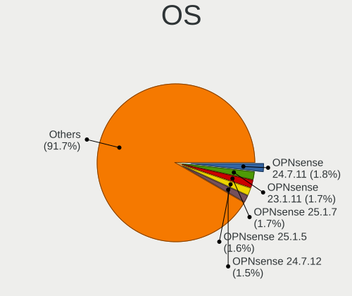

| Name             | Desktops | Percent |
|------------------|----------|---------|
| OPNsense 24.7.11 | 101      | 1.77%   |
| OPNsense 23.1.11 | 99       | 1.73%   |
| OPNsense 25.1.7  | 95       | 1.66%   |
| OPNsense 25.1.5  | 94       | 1.64%   |
| OPNsense 24.7.12 | 88       | 1.54%   |
| OPNsense 25.1    | 87       | 1.52%   |
| OPNsense 24.1.10 | 85       | 1.49%   |
| OPNsense 24.1.6  | 71       | 1.24%   |
| OPNsense 25.1.1  | 70       | 1.22%   |
| OPNsense 24.7    | 69       | 1.21%   |
| OPNsense 21.7.7  | 67       | 1.17%   |
| OPNsense 23.7.10 | 64       | 1.12%   |
| OPNsense 23.7.12 | 63       | 1.1%    |
| OPNsense 22.7.10 | 63       | 1.1%    |
| OPNsense 24.7.8  | 61       | 1.07%   |
| OPNsense 25.7.1  | 60       | 1.05%   |
| OPNsense 23.1    | 58       | 1.01%   |
| OPNsense 25.1.4  | 56       | 0.98%   |
| OPNsense 23.1.7  | 56       | 0.98%   |
| OPNsense 21.7.3  | 56       | 0.98%   |
| OPNsense 22.1.10 | 55       | 0.96%   |
| OPNsense 23.7.9  | 52       | 0.91%   |
| OPNsense 24.1.4  | 51       | 0.89%   |
| OPNsense 23.7.1  | 51       | 0.89%   |
| OPNsense 23.1.5  | 51       | 0.89%   |
| OPNsense 22.7.4  | 51       | 0.89%   |
| OPNsense 25.7.7  | 50       | 0.87%   |
| OPNsense 24.1.9  | 50       | 0.87%   |
| OPNsense 25.1.10 | 49       | 0.86%   |
| OPNsense 24.7.7  | 49       | 0.86%   |
| OPNsense 24.7.6  | 49       | 0.86%   |
| OPNsense 24.7.3  | 49       | 0.86%   |
| OPNsense 24.1.2  | 49       | 0.86%   |
| OPNsense 21.1.5  | 49       | 0.86%   |
| OPNsense 25.7.2  | 48       | 0.84%   |
| OPNsense 24.7.10 | 48       | 0.84%   |
| OPNsense 23.7.7  | 48       | 0.84%   |
| OPNsense 22.1    | 48       | 0.84%   |
| OPNsense 24.7.4  | 47       | 0.82%   |
| OPNsense 25.1.3  | 46       | 0.8%    |

OS Family
---------

OS without a version

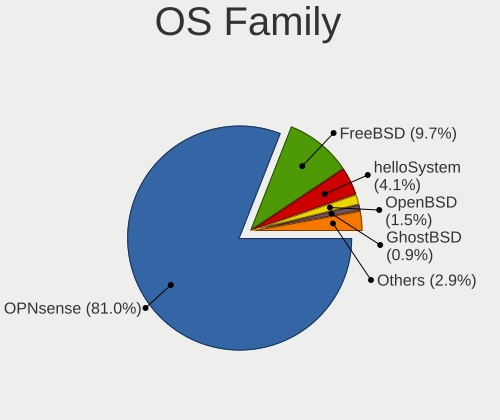

| Name        | Desktops | Percent |
|-------------|----------|---------|
| OPNsense    | 2959     | 80.96%  |
| FreeBSD     | 354      | 9.69%   |
| helloSystem | 149      | 4.08%   |
| OpenBSD     | 54       | 1.48%   |
| GhostBSD    | 34       | 0.93%   |
| pfSense     | 19       | 0.52%   |
| NomadBSD    | 19       | 0.52%   |
| MidnightBSD | 16       | 0.44%   |
| TrueNAS     | 14       | 0.38%   |
| FreeNAS     | 14       | 0.38%   |
| NetBSD      | 9        | 0.25%   |
| ClonOS      | 5        | 0.14%   |
| XigmaNAS    | 2        | 0.05%   |
| OS108       | 2        | 0.05%   |
| HardenedBSD | 2        | 0.05%   |
| MyBee       | 1        | 0.03%   |
| FuryBSD     | 1        | 0.03%   |
| DragonFly   | 1        | 0.03%   |

Arch
----

OS architecture (x86_64, i586, etc.)

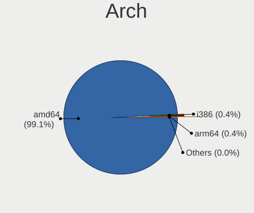

| Name    | Desktops | Percent |
|---------|----------|---------|
| amd64   | 3597     | 99.09%  |
| i386    | 14       | 0.39%   |
| arm64   | 13       | 0.36%   |
| powerpc | 4        | 0.11%   |
| sparc64 | 1        | 0.03%   |
| riscv   | 1        | 0.03%   |

DE
--

Desktop Environment

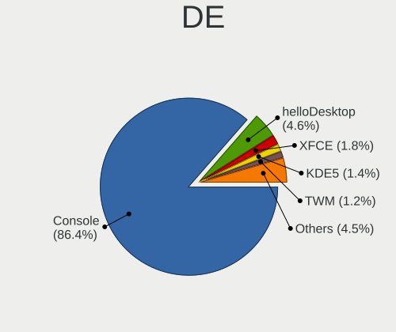

| Name          | Desktops | Percent |
|---------------|----------|---------|
| Console       | 3182     | 86.42%  |
| helloDesktop  | 171      | 4.64%   |
| XFCE          | 65       | 1.77%   |
| KDE5          | 52       | 1.41%   |
| TWM           | 45       | 1.22%   |
| MATE          | 44       | 1.2%    |
| GNOME         | 35       | 0.95%   |
| Openbox       | 22       | 0.6%    |
| fvwm          | 20       | 0.54%   |
| i3            | 15       | 0.41%   |
| Enlightenment | 5        | 0.14%   |
| Cinnamon      | 5        | 0.14%   |
| stumpwm       | 3        | 0.08%   |
| Lumina        | 3        | 0.08%   |
| KDE           | 3        | 0.08%   |
| Window Maker  | 2        | 0.05%   |
| Picom         | 2        | 0.05%   |
| Fluxbox       | 2        | 0.05%   |
| Xfwm4         | 1        | 0.03%   |
| LXQt          | 1        | 0.03%   |
| LXDE          | 1        | 0.03%   |
| KDE6          | 1        | 0.03%   |
| fvwm2         | 1        | 0.03%   |
| DWM           | 1        | 0.03%   |

Display Server
--------------

X11 or Wayland

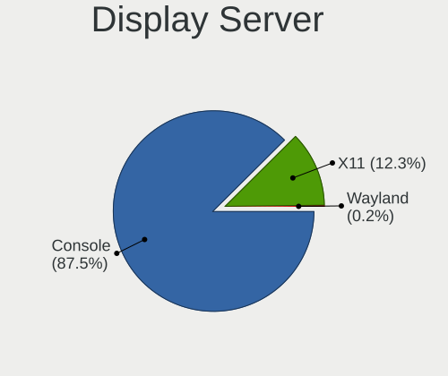

| Name    | Desktops | Percent |
|---------|----------|---------|
| Console | 3192     | 87.55%  |
| X11     | 447      | 12.26%  |
| Wayland | 7        | 0.19%   |

Display Manager
---------------

SDDM, LightDM, etc.

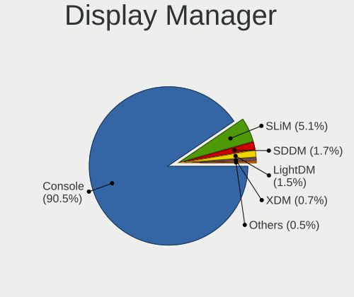

| Name    | Desktops | Percent |
|---------|----------|---------|
| Console | 3306     | 90.5%   |
| SLiM    | 186      | 5.09%   |
| SDDM    | 61       | 1.67%   |
| LightDM | 55       | 1.51%   |
| XDM     | 27       | 0.74%   |
| GDM     | 18       | 0.49%   |

OS Lang
-------

Language

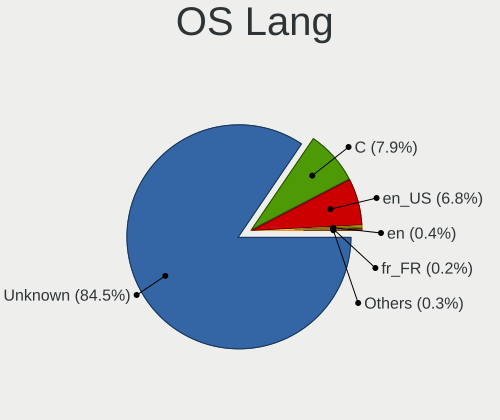

| Lang            | Desktops | Percent |
|-----------------|----------|---------|
| Unknown         | 3134     | 84.5%   |
| C               | 292      | 7.87%   |
| en_US           | 253      | 6.82%   |
| en              | 13       | 0.35%   |
| fr_FR           | 6        | 0.16%   |
| fr              | 4        | 0.11%   |
| en_CA           | 2        | 0.05%   |
| ru_RU           | 1        | 0.03%   |
| ru              | 1        | 0.03%   |
| en_US.utf-8     | 1        | 0.03%   |
| en_US.ISO8859-1 | 1        | 0.03%   |
| en_GB           | 1        | 0.03%   |

Boot Mode
---------

EFI or BIOS

| Mode | Desktops | Percent |
|------|----------|---------|
| EFI  | 3371     | 91.73%  |
| BIOS | 304      | 8.27%   |

Filesystem
----------

Type of filesystem

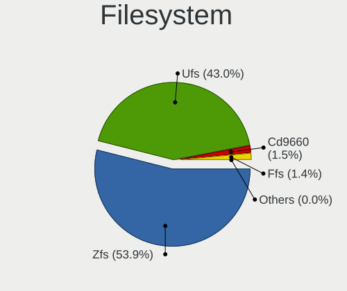

| Type    | Desktops | Percent |
|---------|----------|---------|
| Zfs     | 2033     | 53.94%  |
| Ufs     | 1622     | 43.04%  |
| Cd9660  | 58       | 1.54%   |
| Ffs     | 54       | 1.43%   |
| Hammer2 | 1        | 0.03%   |
| Unknown | 1        | 0.03%   |

Part. scheme
------------

Scheme of partitioning

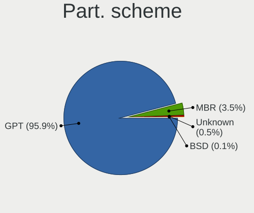

| Type    | Desktops | Percent |
|---------|----------|---------|
| GPT     | 3506     | 95.92%  |
| MBR     | 129      | 3.53%   |
| Unknown | 17       | 0.47%   |
| BSD     | 3        | 0.08%   |

Board
-----

Vendor
------

Motherboard manufacturer

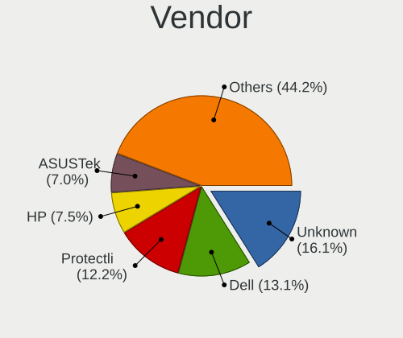

| Name                                 | Desktops | Percent |
|--------------------------------------|----------|---------|
| Unknown                              | 583      | 16.06%  |
| Dell                                 | 476      | 13.11%  |
| Protectli                            | 442      | 12.18%  |
| Hewlett-Packard                      | 271      | 7.47%   |
| ASUSTek Computer                     | 255      | 7.02%   |
| ASRock                               | 181      | 4.99%   |
| Intel                                | 174      | 4.79%   |
| Supermicro                           | 150      | 4.13%   |
| Gigabyte Technology                  | 141      | 3.88%   |
| MSI                                  | 125      | 3.44%   |
| Lenovo                               | 106      | 2.92%   |
| AZW                                  | 71       | 1.96%   |
| PC Engines                           | 52       | 1.43%   |
| Techvision                           | 46       | 1.27%   |
| Shenzhen Meigao Electronic Equipment | 41       | 1.13%   |
| CWWK                                 | 28       | 0.77%   |
| TianBei                              | 27       | 0.74%   |
| MW                                   | 24       | 0.66%   |
| IceWhale Technology                  | 19       | 0.52%   |
| GoWin Solution                       | 19       | 0.52%   |
| ASRockRack                           | 19       | 0.52%   |
| Foxconn                              | 16       | 0.44%   |
| Biostar                              | 16       | 0.44%   |
| Acer                                 | 15       | 0.41%   |
| Shuttle                              | 14       | 0.39%   |
| CncTion                              | 13       | 0.36%   |
| Hardkernel                           | 12       | 0.33%   |
| CheckPoint                           | 12       | 0.33%   |
| Apple                                | 12       | 0.33%   |
| Seeed Studio                         | 11       | 0.3%    |
| Fujitsu                              | 10       | 0.28%   |
| Advantech                            | 10       | 0.28%   |
| Cisco                                | 9        | 0.25%   |
| Alienware                            | 9        | 0.25%   |
| AAEON                                | 9        | 0.25%   |
| Silicom                              | 8        | 0.22%   |
| Pegatron                             | 8        | 0.22%   |
| Deciso                               | 7        | 0.19%   |
| TYAN Computer                        | 6        | 0.17%   |
| ShenZhen MinWin Technology           | 6        | 0.17%   |

Model
-----

Motherboard model

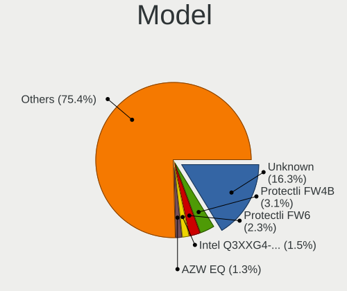

| Name                                              | Desktops | Percent |
|---------------------------------------------------|----------|---------|
| Unknown                                           | 591      | 16.28%  |
| Protectli FW4B                                    | 114      | 3.14%   |
| Protectli FW6                                     | 84       | 2.31%   |
| Intel Q3XXG4-P V1.0                               | 54       | 1.49%   |
| AZW EQ                                            | 49       | 1.35%   |
| Techvision TVI7309X                               | 46       | 1.27%   |
| Protectli VP2420                                  | 43       | 1.18%   |
| Dell OptiPlex 9020                                | 41       | 1.13%   |
| Dell OptiPlex 3020                                | 39       | 1.07%   |
| Protectli FW4C                                    | 38       | 1.05%   |
| ASUS All Series                                   | 36       | 0.99%   |
| Shenzhen Meigao Electronic Equipment Venus Series | 31       | 0.85%   |
| HP t620 PLUS Quad Core TC                         | 30       | 0.83%   |
| Protectli FW2B                                    | 28       | 0.77%   |
| PC Engines APU2                                   | 28       | 0.77%   |
| TianBei N1 PRO                                    | 27       | 0.74%   |
| Dell OptiPlex 7010                                | 27       | 0.74%   |
| Dell OptiPlex 7040                                | 26       | 0.72%   |
| Protectli VP2410                                  | 25       | 0.69%   |
| Supermicro X9SCL/X9SCM                            | 24       | 0.66%   |
| MW GMLK-2_5G4L                                    | 24       | 0.66%   |
| Dell OptiPlex 3050                                | 19       | 0.52%   |
| HP EliteDesk 800 G1 SFF                           | 18       | 0.5%    |
| Dell OptiPlex 5050                                | 18       | 0.5%    |
| Dell OptiPlex 3040                                | 18       | 0.5%    |
| Protectli V1410                                   | 17       | 0.47%   |
| PC Engines apu4                                   | 17       | 0.47%   |
| Dell OptiPlex 990                                 | 17       | 0.47%   |
| Dell OptiPlex 7050                                | 17       | 0.47%   |
| HP EliteDesk 800 G3 SFF                           | 16       | 0.44%   |
| IceWhale ZimaBoard 832 ZMB                        | 15       | 0.41%   |
| CWWK CW-AD4L-N V1                                 | 15       | 0.41%   |
| HP EliteDesk 800 G2 SFF                           | 14       | 0.39%   |
| GoWin Solution R86S                               | 14       | 0.39%   |
| Dell OptiPlex 9010                                | 14       | 0.39%   |
| Dell OptiPlex 3010                                | 14       | 0.39%   |
| Protectli FW1                                     | 13       | 0.36%   |
| Dell OptiPlex 790                                 | 13       | 0.36%   |
| Dell OptiPlex 3060                                | 13       | 0.36%   |
| Dell OptiPlex 7020                                | 12       | 0.33%   |

Model Family
------------

Motherboard model prefix

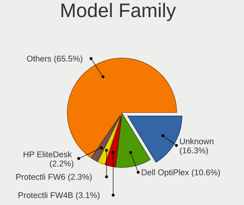

| Name                                       | Desktops | Percent |
|--------------------------------------------|----------|---------|
| Unknown                                    | 591      | 16.28%  |
| Dell OptiPlex                              | 386      | 10.63%  |
| Protectli FW4B                             | 114      | 3.14%   |
| Protectli FW6                              | 84       | 2.31%   |
| HP EliteDesk                               | 79       | 2.18%   |
| Lenovo ThinkCentre                         | 71       | 1.96%   |
| Intel Q3XXG4-P                             | 56       | 1.54%   |
| HP ProDesk                                 | 53       | 1.46%   |
| AZW EQ                                     | 49       | 1.35%   |
| ASUS PRIME                                 | 48       | 1.32%   |
| Techvision TVI7309X                        | 46       | 1.27%   |
| Protectli VP2420                           | 43       | 1.18%   |
| ASUS ROG                                   | 41       | 1.13%   |
| Protectli FW4C                             | 38       | 1.05%   |
| ASUS All                                   | 36       | 0.99%   |
| HP Compaq                                  | 35       | 0.96%   |
| Dell Precision                             | 33       | 0.91%   |
| HP t620                                    | 32       | 0.88%   |
| Dell Inspiron                              | 32       | 0.88%   |
| ASUS TUF                                   | 32       | 0.88%   |
| Shenzhen Meigao Electronic Equipment Venus | 31       | 0.85%   |
| Protectli FW2B                             | 28       | 0.77%   |
| PC Engines APU2                            | 28       | 0.77%   |
| TianBei N1                                 | 27       | 0.74%   |
| Protectli VP2410                           | 25       | 0.69%   |
| Supermicro X9SCL                           | 24       | 0.66%   |
| MW GMLK-2                                  | 24       | 0.66%   |
| IceWhale ZimaBoard                         | 19       | 0.52%   |
| ASRock X570                                | 18       | 0.5%    |
| Protectli V1410                            | 17       | 0.47%   |
| PC Engines apu4                            | 17       | 0.47%   |
| CWWK CW-AD4L-N                             | 15       | 0.41%   |
| GoWin Solution R86S                        | 14       | 0.39%   |
| Protectli FW1                              | 13       | 0.36%   |
| Lenovo ThinkStation                        | 13       | 0.36%   |
| HP Slim                                    | 12       | 0.33%   |
| Acer Aspire                                | 12       | 0.33%   |
| Protectli FW4A                             | 10       | 0.28%   |
| Dell XPS                                   | 10       | 0.28%   |
| Protectli VP4630                           | 9        | 0.25%   |

MFG Year
--------

Motherboard manufacture year

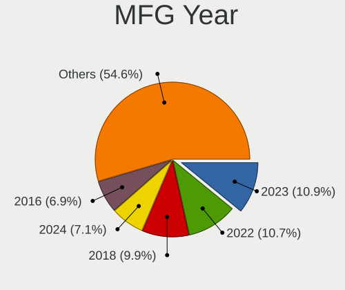

| Year    | Desktops | Percent |
|---------|----------|---------|
| 2023    | 395      | 10.88%  |
| 2022    | 387      | 10.66%  |
| 2018    | 359      | 9.89%   |
| 2024    | 258      | 7.11%   |
| 2016    | 250      | 6.89%   |
| 2021    | 246      | 6.78%   |
| 2019    | 234      | 6.45%   |
| 2017    | 233      | 6.42%   |
| 2014    | 224      | 6.17%   |
| 2013    | 208      | 5.73%   |
| 2020    | 191      | 5.26%   |
| 2012    | 152      | 4.19%   |
| 2011    | 133      | 3.66%   |
| 2015    | 126      | 3.47%   |
| 2010    | 59       | 1.63%   |
| 2008    | 45       | 1.24%   |
| 2009    | 38       | 1.05%   |
| 2025    | 36       | 0.99%   |
| Unknown | 34       | 0.94%   |
| 2007    | 13       | 0.36%   |
| 2006    | 3        | 0.08%   |
| 2004    | 2        | 0.06%   |
| 2003    | 2        | 0.06%   |
| 2005    | 1        | 0.03%   |
| 2001    | 1        | 0.03%   |

Form Factor
-----------

Physical design of the computer

| Name    | Desktops | Percent |
|---------|----------|---------|
| Desktop | 3630     | 100%    |

Coreboot
--------

Have coreboot on board

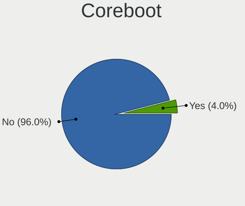

| Used | Desktops | Percent |
|------|----------|---------|
| No   | 3484     | 95.98%  |
| Yes  | 146      | 4.02%   |

RAM Size
--------

Total RAM memory

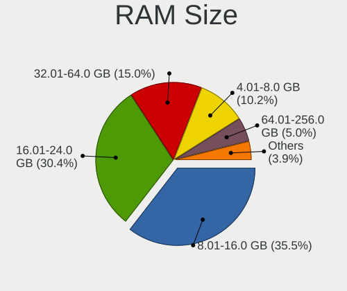

| Size in GB      | Desktops | Percent |
|-----------------|----------|---------|
| 8.01-16.0       | 1335     | 35.49%  |
| 16.01-24.0      | 1142     | 30.36%  |
| 32.01-64.0      | 566      | 15.05%  |
| 4.01-8.0        | 382      | 10.15%  |
| 64.01-256.0     | 189      | 5.02%   |
| 24.01-32.0      | 65       | 1.73%   |
| 2.01-3.0        | 48       | 1.28%   |
| 3.01-4.0        | 11       | 0.29%   |
| 0.51-1.0        | 9        | 0.24%   |
| 0.01-0.5        | 7        | 0.19%   |
| 1.01-2.0        | 6        | 0.16%   |
| More than 256.0 | 2        | 0.05%   |

RAM Used
--------

Used RAM memory

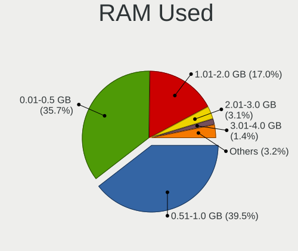

| Used GB     | Desktops | Percent |
|-------------|----------|---------|
| 0.51-1.0    | 1504     | 39.55%  |
| 0.01-0.5    | 1356     | 35.66%  |
| 1.01-2.0    | 647      | 17.01%  |
| 2.01-3.0    | 119      | 3.13%   |
| 3.01-4.0    | 54       | 1.42%   |
| 4.01-8.0    | 49       | 1.29%   |
| 8.01-16.0   | 22       | 0.58%   |
| Unknown     | 14       | 0.37%   |
| 16.01-24.0  | 11       | 0.29%   |
| 24.01-32.0  | 9        | 0.24%   |
| 32.01-64.0  | 8        | 0.21%   |
| 64.01-256.0 | 5        | 0.13%   |
| 0           | 5        | 0.13%   |

Total Drives
------------

Number of drives on board

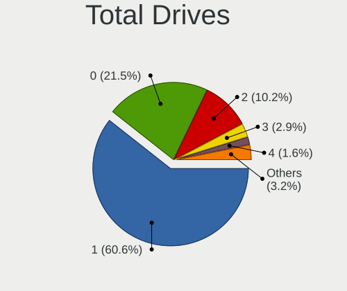

| Drives | Desktops | Percent |
|--------|----------|---------|
| 1      | 2341     | 60.63%  |
| 0      | 830      | 21.5%   |
| 2      | 392      | 10.15%  |
| 3      | 112      | 2.9%    |
| 4      | 63       | 1.63%   |
| 5      | 39       | 1.01%   |
| 6      | 24       | 0.62%   |
| 7      | 15       | 0.39%   |
| 10     | 8        | 0.21%   |
| 9      | 8        | 0.21%   |
| 8      | 7        | 0.18%   |
| 12     | 4        | 0.1%    |
| 11     | 4        | 0.1%    |
| 21     | 2        | 0.05%   |
| 17     | 2        | 0.05%   |
| 14     | 2        | 0.05%   |
| 13     | 2        | 0.05%   |
| 40     | 1        | 0.03%   |
| 36     | 1        | 0.03%   |
| 26     | 1        | 0.03%   |
| 22     | 1        | 0.03%   |
| 19     | 1        | 0.03%   |
| 18     | 1        | 0.03%   |

Has CD-ROM
----------

Has CD-ROM on board

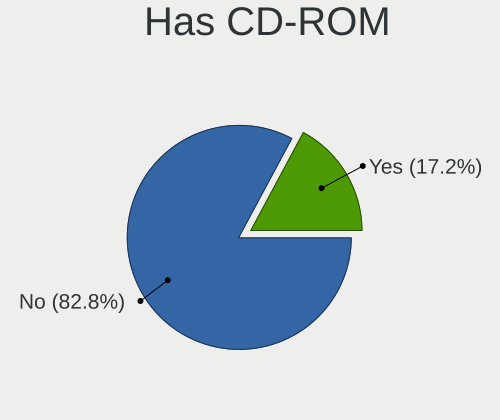

| Presented | Desktops | Percent |
|-----------|----------|---------|
| No        | 3050     | 82.84%  |
| Yes       | 632      | 17.16%  |

Has Ethernet
------------

Has Ethernet on board

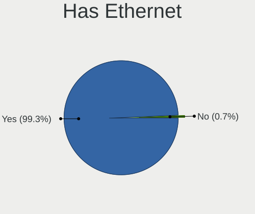

| Presented | Desktops | Percent |
|-----------|----------|---------|
| Yes       | 3605     | 99.31%  |
| No        | 25       | 0.69%   |

Has WiFi
--------

Has WiFi module

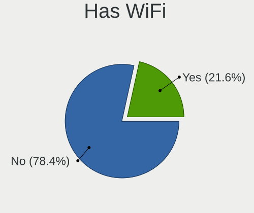

| Presented | Desktops | Percent |
|-----------|----------|---------|
| No        | 2881     | 78.44%  |
| Yes       | 792      | 21.56%  |

Has Bluetooth
-------------

Has Bluetooth module

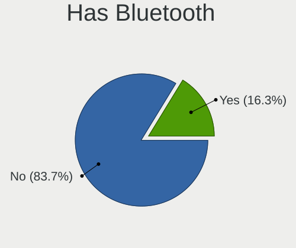

| Presented | Desktops | Percent |
|-----------|----------|---------|
| No        | 3065     | 83.72%  |
| Yes       | 596      | 16.28%  |

Location
--------

Country
-------

Geographic location (country)

| Country | Desktops | Percent |
|---------|----------|---------|
| USA     | 3630     | 100%    |

City
----

Geographic location (city)

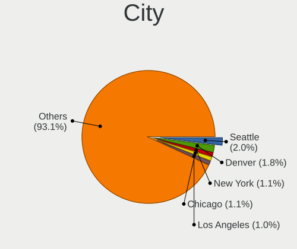

| City           | Desktops | Percent |
|----------------|----------|---------|
| Seattle        | 81       | 1.95%   |
| Denver         | 75       | 1.81%   |
| New York       | 45       | 1.08%   |
| Chicago        | 44       | 1.06%   |
| Los Angeles    | 42       | 1.01%   |
| Portland       | 40       | 0.96%   |
| Oakland        | 36       | 0.87%   |
| Philadelphia   | 31       | 0.75%   |
| Dallas         | 31       | 0.75%   |
| Brooklyn       | 31       | 0.75%   |
| Atlanta        | 30       | 0.72%   |
| Columbus       | 29       | 0.7%    |
| Austin         | 29       | 0.7%    |
| Minneapolis    | 28       | 0.67%   |
| Houston        | 27       | 0.65%   |
| Phoenix        | 22       | 0.53%   |
| Orlando        | 22       | 0.53%   |
| San Jose       | 21       | 0.51%   |
| Grand Rapids   | 21       | 0.51%   |
| San Francisco  | 20       | 0.48%   |
| Rochester      | 20       | 0.48%   |
| Las Vegas      | 20       | 0.48%   |
| Springfield    | 19       | 0.46%   |
| Mountain View  | 19       | 0.46%   |
| Brookfield     | 19       | 0.46%   |
| Jacksonville   | 18       | 0.43%   |
| Ypsilanti      | 17       | 0.41%   |
| San Antonio    | 17       | 0.41%   |
| Pittsburgh     | 17       | 0.41%   |
| St Louis       | 16       | 0.39%   |
| Louisville     | 16       | 0.39%   |
| Salt Lake City | 15       | 0.36%   |
| Fremont        | 15       | 0.36%   |
| Boston         | 15       | 0.36%   |
| Tucson         | 14       | 0.34%   |
| Oklahoma City  | 14       | 0.34%   |
| Miami          | 14       | 0.34%   |
| Indianapolis   | 14       | 0.34%   |
| Charlotte      | 14       | 0.34%   |
| Vancouver      | 13       | 0.31%   |

Drives
------

Drive Vendor
------------

Hard drive vendors

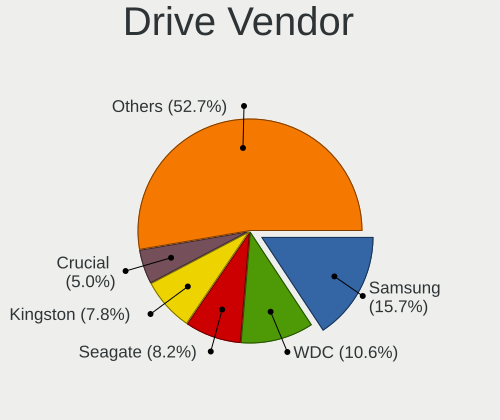

| Vendor              | Desktops | Drives | Percent |
|---------------------|----------|--------|---------|
| Samsung Electronics | 582      | 1389   | 15.72%  |
| WDC                 | 393      | 1355   | 10.61%  |
| Seagate             | 303      | 846    | 8.18%   |
| Kingston            | 288      | 437    | 7.78%   |
| Crucial             | 186      | 318    | 5.02%   |
| SanDisk             | 157      | 232    | 4.24%   |
| Intel               | 144      | 321    | 3.89%   |
| China               | 138      | 212    | 3.73%   |
| Toshiba             | 109      | 198    | 2.94%   |
| Protectli           | 104      | 187    | 2.81%   |
| Transcend           | 102      | 191    | 2.75%   |
| Hoodisk             | 93       | 149    | 2.51%   |
| SK hynix            | 82       | 125    | 2.21%   |
| PNY                 | 69       | 126    | 1.86%   |
| A-DATA Technology   | 66       | 107    | 1.78%   |
| Phison              | 64       | 105    | 1.73%   |
| SPCC                | 62       | 143    | 1.67%   |
| Hitachi             | 55       | 132    | 1.49%   |
| Team                | 48       | 97     | 1.3%    |
| FORESEE             | 37       | 58     | 1%      |
| HGST                | 35       | 132    | 0.95%   |
| Dogfish             | 35       | 68     | 0.95%   |
| Micron Technology   | 31       | 52     | 0.84%   |
| BIWIN               | 30       | 49     | 0.81%   |
| Silicon Motion      | 27       | 43     | 0.73%   |
| OCZ                 | 25       | 43     | 0.68%   |
| Hewlett-Packard     | 25       | 62     | 0.68%   |
| Patriot             | 19       | 22     | 0.51%   |
| Fanxiang            | 17       | 29     | 0.46%   |
| ASint Technology    | 17       | 18     | 0.46%   |
| Apacer              | 17       | 25     | 0.46%   |
| Lexar               | 16       | 23     | 0.43%   |
| T-FORCE             | 15       | 18     | 0.41%   |
| ShiJi               | 13       | 16     | 0.35%   |
| NVMe                | 13       | 22     | 0.35%   |
| Mushkin             | 13       | 22     | 0.35%   |
| KingSpec            | 13       | 29     | 0.35%   |
| KIOXIA              | 12       | 18     | 0.32%   |
| CWDISK              | 11       | 16     | 0.3%    |
| Corsair             | 11       | 44     | 0.3%    |

Drive Model
-----------

Hard drive models

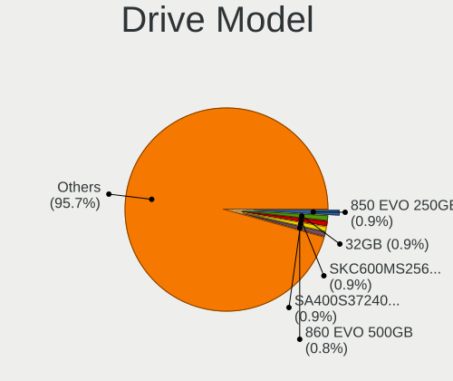

| Model                           | Desktops | Percent |
|---------------------------------|----------|---------|
| Samsung SSD 850 EVO 250GB       | 36       | 0.89%   |
| Hoodisk SSD 32GB                | 36       | 0.89%   |
| Kingston SKC600MS256G 256GB     | 35       | 0.87%   |
| Kingston SA400S37240G 240GB     | 35       | 0.87%   |
| Samsung SSD 860 EVO 500GB       | 32       | 0.79%   |
| Hoodisk SSD 128GB               | 32       | 0.79%   |
| Protectli 120GB mSATA           | 30       | 0.74%   |
| Seagate ST500DM002-1BD142 500GB | 27       | 0.67%   |
| Kingston SUV500MS120G 120GB     | 27       | 0.67%   |
| Samsung SSD 860 EVO 250GB       | 26       | 0.65%   |
| Samsung SSD 870 EVO 500GB       | 24       | 0.6%    |
| Kingston SUV500MS240G 240GB     | 24       | 0.6%    |
| Kingston SA400S37120G 120GB     | 24       | 0.6%    |
| BIWIN SSD 128GB                 | 24       | 0.6%    |
| Samsung SSD 850 EVO 500GB       | 23       | 0.57%   |
| China SATA SSD 120GB            | 23       | 0.57%   |
| Samsung SSD 970 EVO Plus 500GB  | 22       | 0.55%   |
| Transcend TS128GMSA230S 128GB   | 20       | 0.5%    |
| Samsung SSD 860 EVO 1TB         | 20       | 0.5%    |
| Kingston SV300S37A120G 120GB    | 19       | 0.47%   |
| WDC WDS500G2B0A-00SM50 500GB    | 18       | 0.45%   |
| Samsung SSD 870 EVO 1TB         | 18       | 0.45%   |
| PNY CS900 120GB SSD             | 18       | 0.45%   |
| WDC WD10EZEX-08WN4A0 1TB        | 17       | 0.42%   |
| Samsung SSD 970 EVO Plus 1TB    | 17       | 0.42%   |
| Crucial CT240BX500SSD1 240GB    | 17       | 0.42%   |
| Protectli 64GB mSATA            | 16       | 0.4%    |
| Crucial CT250MX500SSD1 250GB    | 16       | 0.4%    |
| WDC WD800JD-75MSA3 80GB         | 15       | 0.37%   |
| Toshiba DT01ACA100 1TB          | 15       | 0.37%   |
| Team TM8FP6256G 256GB           | 15       | 0.37%   |
| Seagate ST2000DM008-2FR102 2TB  | 15       | 0.37%   |
| Phison PCIe SSD 2TB             | 15       | 0.37%   |
| Crucial CT500MX500SSD1 500GB    | 15       | 0.37%   |
| SanDisk SDSSDA120G 120GB        | 14       | 0.35%   |
| Samsung SSD 850 EVO 120GB       | 14       | 0.35%   |
| FORESEE 128GB SSD               | 14       | 0.35%   |
| SPCC Solid State Disk 128GB     | 13       | 0.32%   |
| Samsung SSD 980 500GB           | 13       | 0.32%   |
| Hoodisk SSD 64GB                | 13       | 0.32%   |

HDD Vendor
----------

Hard disk drive vendors

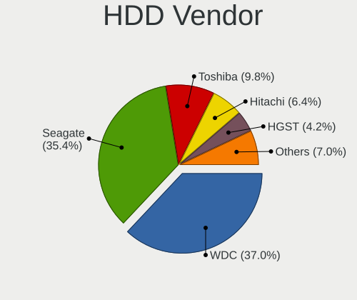

| Vendor                             | Desktops | Drives | Percent |
|------------------------------------|----------|--------|---------|
| WDC                                | 305      | 1144   | 37.01%  |
| Seagate                            | 292      | 818    | 35.44%  |
| Toshiba                            | 81       | 158    | 9.83%   |
| Hitachi                            | 53       | 130    | 6.43%   |
| HGST                               | 35       | 132    | 4.25%   |
| Samsung Electronics                | 12       | 14     | 1.46%   |
| Hewlett-Packard                    | 6        | 19     | 0.73%   |
| NVMe                               | 5        | 12     | 0.61%   |
| Maxtor                             | 4        | 7      | 0.49%   |
| Apple                              | 4        | 5      | 0.49%   |
| Lexar                              | 3        | 3      | 0.36%   |
| WD MediaMax                        | 2        | 4      | 0.24%   |
| IBM-207x                           | 2        | 2      | 0.24%   |
| HPE                                | 2        | 7      | 0.24%   |
| Fujitsu                            | 2        | 3      | 0.24%   |
| Adaptec                            | 2        | 2      | 0.24%   |
| USB                                | 1        | 1      | 0.12%   |
| QUANTUM                            | 1        | 2      | 0.12%   |
| Product:              USB DISK 3.0 | 1        | 1      | 0.12%   |
| OPENBSD                            | 1        | 1      | 0.12%   |
| Memorex                            | 1        | 1      | 0.12%   |
| MaxDigital                         | 1        | 1      | 0.12%   |
| MARVELL                            | 1        | 1      | 0.12%   |
| LSI                                | 1        | 4      | 0.12%   |
| IBM-ESXS                           | 1        | 1      | 0.12%   |
| HPT                                | 1        | 8      | 0.12%   |
| Generic                            | 1        | 1      | 0.12%   |
| ExcelStor Technology               | 1        | 4      | 0.12%   |
| China                              | 1        | 1      | 0.12%   |
| ASMT                               | 1        | 1      | 0.12%   |

SSD Vendor
----------

Solid state drive vendors

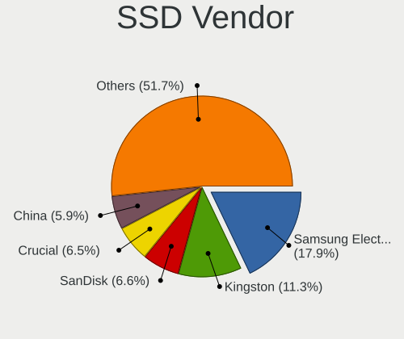

| Vendor              | Desktops | Drives | Percent |
|---------------------|----------|--------|---------|
| Samsung Electronics | 412      | 1033   | 17.89%  |
| Kingston            | 261      | 402    | 11.33%  |
| SanDisk             | 153      | 224    | 6.64%   |
| Crucial             | 149      | 261    | 6.47%   |
| China               | 137      | 211    | 5.95%   |
| Protectli           | 104      | 187    | 4.52%   |
| Intel               | 101      | 248    | 4.39%   |
| Transcend           | 99       | 187    | 4.3%    |
| Hoodisk             | 91       | 147    | 3.95%   |
| PNY                 | 63       | 116    | 2.74%   |
| A-DATA Technology   | 58       | 92     | 2.52%   |
| WDC                 | 55       | 126    | 2.39%   |
| SK hynix            | 45       | 60     | 1.95%   |
| SPCC                | 41       | 105    | 1.78%   |
| Dogfish             | 35       | 68     | 1.52%   |
| FORESEE             | 32       | 52     | 1.39%   |
| BIWIN               | 30       | 49     | 1.3%    |
| Micron Technology   | 26       | 45     | 1.13%   |
| OCZ                 | 25       | 43     | 1.09%   |
| Phison              | 24       | 31     | 1.04%   |
| Team                | 23       | 67     | 1%      |
| Toshiba             | 17       | 28     | 0.74%   |
| ASint Technology    | 17       | 18     | 0.74%   |
| Apacer              | 17       | 25     | 0.74%   |
| Patriot             | 15       | 18     | 0.65%   |
| T-FORCE             | 13       | 15     | 0.56%   |
| Lexar               | 13       | 20     | 0.56%   |
| KingSpec            | 13       | 29     | 0.56%   |
| Mushkin             | 11       | 19     | 0.48%   |
| Seagate             | 10       | 23     | 0.43%   |
| Intenso             | 10       | 22     | 0.43%   |
| CWDISK              | 10       | 15     | 0.43%   |
| ShiJi               | 9        | 11     | 0.39%   |
| LITEONIT            | 9        | 15     | 0.39%   |
| Innodisk            | 9        | 11     | 0.39%   |
| Hewlett-Packard     | 9        | 16     | 0.39%   |
| Hanstor             | 9        | 12     | 0.39%   |
| NVMe                | 7        | 9      | 0.3%    |
| Corsair             | 7        | 14     | 0.3%    |
| Zheino              | 6        | 13     | 0.26%   |

Drive Kind
----------

HDD or SSD

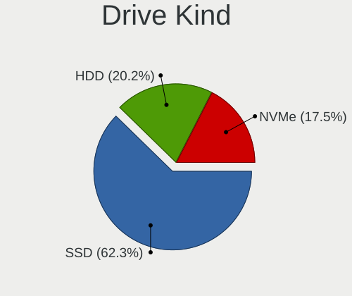

| Kind | Desktops | Drives | Percent |
|------|----------|--------|---------|
| SSD  | 2081     | 4289   | 62.29%  |
| HDD  | 676      | 2488   | 20.23%  |
| NVMe | 584      | 1067   | 17.48%  |

Drive Connector
---------------

SATA, SAS, NVMe, etc.

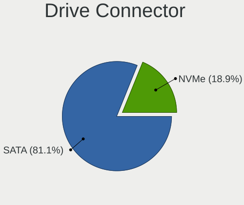

| Type | Desktops | Drives | Percent |
|------|----------|--------|---------|
| SATA | 2509     | 6777   | 81.12%  |
| NVMe | 584      | 1067   | 18.88%  |

Drive Size
----------

Size of hard drive

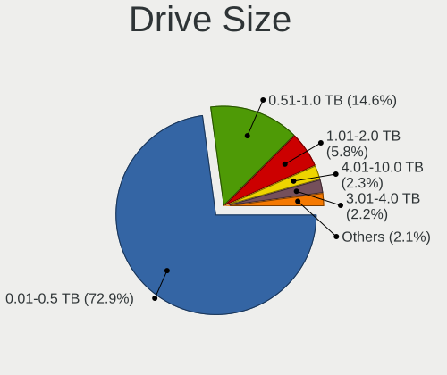

| Size in TB | Desktops | Drives | Percent |
|------------|----------|--------|---------|
| 0.01-0.5   | 2094     | 4081   | 72.89%  |
| 0.51-1.0   | 420      | 949    | 14.62%  |
| 1.01-2.0   | 168      | 582    | 5.85%   |
| 4.01-10.0  | 67       | 524    | 2.33%   |
| 3.01-4.0   | 63       | 350    | 2.19%   |
| 2.01-3.0   | 38       | 129    | 1.32%   |
| 10.01-20.0 | 23       | 162    | 0.8%    |

Space Total
-----------

Amount of disk space available on the file system

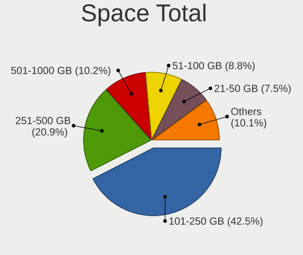

| Size in GB     | Desktops | Percent |
|----------------|----------|---------|
| 101-250        | 1619     | 42.52%  |
| 251-500        | 795      | 20.88%  |
| 501-1000       | 387      | 10.16%  |
| 51-100         | 336      | 8.82%   |
| 21-50          | 287      | 7.54%   |
| 1-20           | 235      | 6.17%   |
| 1001-2000      | 100      | 2.63%   |
| More than 3000 | 33       | 0.87%   |
| 2001-3000      | 10       | 0.26%   |
| Unknown        | 6        | 0.16%   |

Space Used
----------

Amount of used disk space

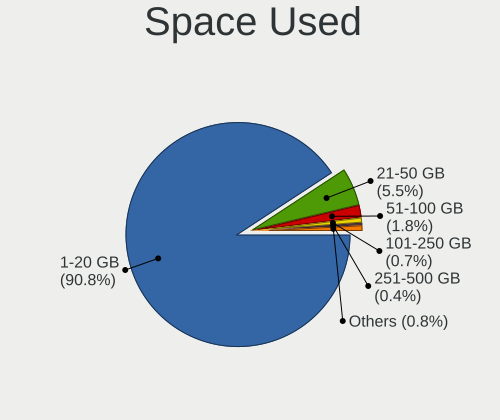

| Used GB        | Desktops | Percent |
|----------------|----------|---------|
| 1-20           | 3441     | 90.77%  |
| 21-50          | 209      | 5.51%   |
| 51-100         | 68       | 1.79%   |
| 101-250        | 28       | 0.74%   |
| 251-500        | 14       | 0.37%   |
| More than 3000 | 8        | 0.21%   |
| 501-1000       | 7        | 0.18%   |
| 1001-2000      | 6        | 0.16%   |
| Unknown        | 6        | 0.16%   |
| 2001-3000      | 3        | 0.08%   |
| 0              | 1        | 0.03%   |

Malfunc. Drives
---------------

Drive models with a malfunction

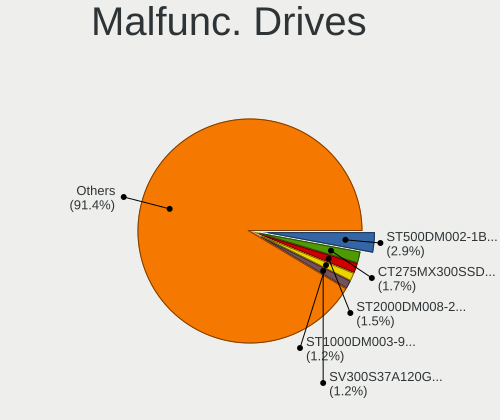

| Model                                 | Desktops | Drives | Percent |
|---------------------------------------|----------|--------|---------|
| Seagate ST500DM002-1BD142 500GB       | 12       | 17     | 2.93%   |
| Crucial CT275MX300SSD1 275GB          | 7        | 12     | 1.71%   |
| Seagate ST2000DM008-2FR102 2TB        | 6        | 12     | 1.47%   |
| Seagate ST1000DM003-9YN162 1TB        | 5        | 9      | 1.22%   |
| Kingston SV300S37A120G 120GB          | 5        | 6      | 1.22%   |
| Seagate ST3500418AS 500GB             | 4        | 11     | 0.98%   |
| WDC WD5003ABYZ-011FA0 500GB           | 3        | 5      | 0.73%   |
| WDC WD5000AAKX-60U6AA0 500GB          | 3        | 4      | 0.73%   |
| WDC WD20EARS-00MVWB0 2TB              | 3        | 3      | 0.73%   |
| WDC WD1600AAJS-75M0A0 160GB           | 3        | 3      | 0.73%   |
| Seagate ST9500420AS 500GB             | 3        | 5      | 0.73%   |
| Samsung Electronics SSD 850 EVO 500GB | 3        | 3      | 0.73%   |
| Kingston SV300S37A60G 64GB            | 3        | 3      | 0.73%   |
| Kingston SMS200S360G 64GB             | 3        | 3      | 0.73%   |
| Kingston SMS200S3120G 120GB           | 3        | 5      | 0.73%   |
| Kingston SA400S37240G 240GB           | 3        | 3      | 0.73%   |
| Intel SSDSC2BF180A4L 180GB            | 3        | 4      | 0.73%   |
| Intel SSDSA2M120G2GC 120GB            | 3        | 8      | 0.73%   |
| HGST HTS725050A7E630 500GB            | 3        | 3      | 0.73%   |
| WDC WD5000AAKX-75U6AA0 500GB          | 2        | 2      | 0.49%   |
| WDC WD5000AAKX-001CA0 500GB           | 2        | 4      | 0.49%   |
| WDC WD30EFRX-68EUZN0 3TB              | 2        | 9      | 0.49%   |
| WDC WD2001FASS-00W2B0 2TB             | 2        | 3      | 0.49%   |
| Toshiba KSG60ZMV256G M.2 2280 256GB   | 2        | 2      | 0.49%   |
| Toshiba DT01ACA100 1TB                | 2        | 2      | 0.49%   |
| Toshiba DT01ACA050 500GB              | 2        | 2      | 0.49%   |
| SPCC Solid State Disk 512GB           | 2        | 3      | 0.49%   |
| SK hynix SHGS31-250GS-2 250GB         | 2        | 4      | 0.49%   |
| SK hynix SC210 mSATA 256GB            | 2        | 3      | 0.49%   |
| Seagate ST8000DM004-2CX188 8TB        | 2        | 6      | 0.49%   |
| Seagate ST500LT012-1DG142 500GB       | 2        | 3      | 0.49%   |
| Seagate ST500LM021-1KJ152 500GB       | 2        | 4      | 0.49%   |
| Seagate ST5000DM000-1FK178 5TB        | 2        | 5      | 0.49%   |
| Seagate ST4000DM000-1F2168 4TB        | 2        | 9      | 0.49%   |
| Seagate ST380815AS 80GB               | 2        | 2      | 0.49%   |
| Seagate ST3500413AS 500GB             | 2        | 11     | 0.49%   |
| Seagate ST31000528AS 1TB              | 2        | 2      | 0.49%   |
| Seagate ST31000524AS 1TB              | 2        | 3      | 0.49%   |
| Seagate ST2000DL001-9VT156 2TB        | 2        | 2      | 0.49%   |
| Seagate ST1000LX015-1U7172 1TB        | 2        | 2      | 0.49%   |

Malfunc. Drive Vendor
---------------------

Vendors of faulty drives

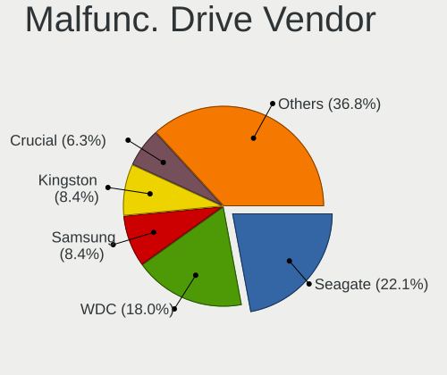

| Vendor              | Desktops | Drives | Percent |
|---------------------|----------|--------|---------|
| Seagate             | 87       | 167    | 22.08%  |
| WDC                 | 71       | 116    | 18.02%  |
| Samsung Electronics | 33       | 45     | 8.38%   |
| Kingston            | 33       | 45     | 8.38%   |
| Crucial             | 25       | 45     | 6.35%   |
| Intel               | 23       | 37     | 5.84%   |
| Toshiba             | 16       | 25     | 4.06%   |
| SanDisk             | 15       | 18     | 3.81%   |
| Hitachi             | 15       | 26     | 3.81%   |
| SK hynix            | 13       | 20     | 3.3%    |
| HGST                | 8        | 8      | 2.03%   |
| Apacer              | 4        | 5      | 1.02%   |
| SPCC                | 3        | 6      | 0.76%   |
| OCZ                 | 3        | 3      | 0.76%   |
| Maxtor              | 3        | 6      | 0.76%   |
| LITEON              | 3        | 6      | 0.76%   |
| A-DATA Technology   | 3        | 3      | 0.76%   |
| Transcend           | 2        | 5      | 0.51%   |
| PNY                 | 2        | 2      | 0.51%   |
| Plextor             | 2        | 2      | 0.51%   |
| Netac               | 2        | 6      | 0.51%   |
| MyDigitalSSD        | 2        | 4      | 0.51%   |
| Micron Technology   | 2        | 2      | 0.51%   |
| LITEONIT            | 2        | 5      | 0.51%   |
| Dogfish             | 2        | 6      | 0.51%   |
| Corsair             | 2        | 3      | 0.51%   |
| China               | 2        | 2      | 0.51%   |
| BIWIN               | 2        | 2      | 0.51%   |
| WD MediaMax         | 1        | 3      | 0.25%   |
| VisionTek           | 1        | 1      | 0.25%   |
| Phison              | 1        | 1      | 0.25%   |
| Patriot             | 1        | 1      | 0.25%   |
| MSI                 | 1        | 1      | 0.25%   |
| KingDian            | 1        | 1      | 0.25%   |
| Kimtigo             | 1        | 1      | 0.25%   |
| KeepData            | 1        | 1      | 0.25%   |
| INDMEM              | 1        | 1      | 0.25%   |
| HPE                 | 1        | 3      | 0.25%   |
| Hewlett-Packard     | 1        | 4      | 0.25%   |
| Fujitsu             | 1        | 1      | 0.25%   |

Malfunc. HDD Vendor
-------------------

Vendors of faulty HDD drives

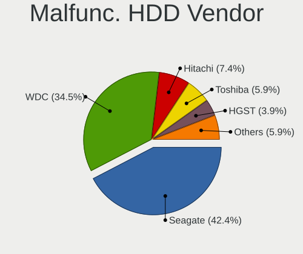

| Vendor               | Desktops | Drives | Percent |
|----------------------|----------|--------|---------|
| Seagate              | 86       | 166    | 42.36%  |
| WDC                  | 70       | 115    | 34.48%  |
| Hitachi              | 15       | 26     | 7.39%   |
| Toshiba              | 12       | 21     | 5.91%   |
| HGST                 | 8        | 8      | 3.94%   |
| Samsung Electronics  | 4        | 4      | 1.97%   |
| Maxtor               | 3        | 6      | 1.48%   |
| WD MediaMax          | 1        | 3      | 0.49%   |
| HPE                  | 1        | 3      | 0.49%   |
| Hewlett-Packard      | 1        | 4      | 0.49%   |
| Fujitsu              | 1        | 1      | 0.49%   |
| ExcelStor Technology | 1        | 2      | 0.49%   |

Malfunc. Drive Kind
-------------------

Kinds of faulty drives

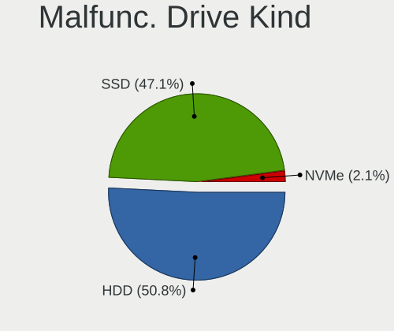

| Kind | Desktops | Drives | Percent |
|------|----------|--------|---------|
| HDD  | 195      | 359    | 50.78%  |
| SSD  | 181      | 275    | 47.14%  |
| NVMe | 8        | 8      | 2.08%   |

Failed Drives
-------------

Failed drive models

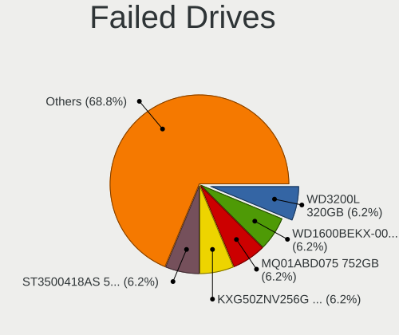

| Model                                        | Desktops | Drives | Percent |
|----------------------------------------------|----------|--------|---------|
| WDC WD3200L 320GB                            | 1        | 1      | 6.25%   |
| WDC WD1600BEKX-00B7WT0 160GB                 | 1        | 1      | 6.25%   |
| Toshiba MQ01ABD075 752GB                     | 1        | 1      | 6.25%   |
| Toshiba KXG50ZNV256G NVMe 256GB              | 1        | 1      | 6.25%   |
| SK hynix SC308 SATA 256GB                    | 1        | 1      | 6.25%   |
| Seagate ST3500418AS 500GB                    | 1        | 2      | 6.25%   |
| Samsung Electronics SSD 970 EVO Plus 500GB   | 1        | 1      | 6.25%   |
| Samsung Electronics SSD 960 EVO 500GB        | 1        | 1      | 6.25%   |
| Samsung Electronics PM981 NVMe 256GB         | 1        | 1      | 6.25%   |
| Samsung Electronics MZVLB256HBHQ-000H1 256GB | 1        | 1      | 6.25%   |
| Samsung Electronics HD204UI 2TB              | 1        | 2      | 6.25%   |
| Phison PCIe SSD 2TB                          | 1        | 1      | 6.25%   |
| Kingston SA2000M8500G 500GB                  | 1        | 2      | 6.25%   |
| Intel SSDSC2KB019T8 1.9TB                    | 1        | 2      | 6.25%   |
| Intel SSDSC2BF180A4L 180GB                   | 1        | 1      | 6.25%   |
| Crucial CT500P3PSSD8 500GB                   | 1        | 1      | 6.25%   |

Failed Drive Vendor
-------------------

Failed drive vendors

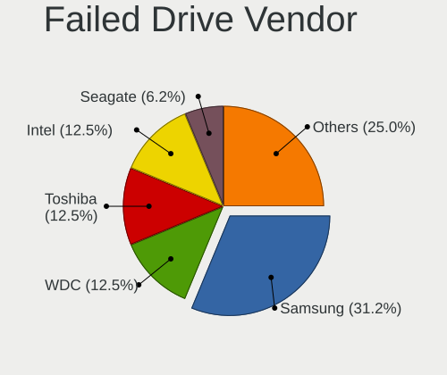

| Vendor              | Desktops | Drives | Percent |
|---------------------|----------|--------|---------|
| Samsung Electronics | 5        | 6      | 31.25%  |
| WDC                 | 2        | 2      | 12.5%   |
| Toshiba             | 2        | 2      | 12.5%   |
| Intel               | 2        | 3      | 12.5%   |
| SK hynix            | 1        | 1      | 6.25%   |
| Seagate             | 1        | 2      | 6.25%   |
| Phison              | 1        | 1      | 6.25%   |
| Kingston            | 1        | 2      | 6.25%   |
| Crucial             | 1        | 1      | 6.25%   |

Drive Status
------------

Number of failed and malfunc. drives

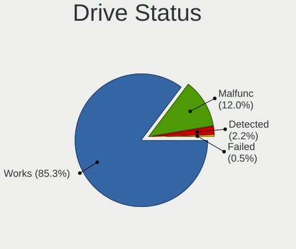

| Status   | Desktops | Drives | Percent |
|----------|----------|--------|---------|
| Works    | 2688     | 7055   | 85.31%  |
| Malfunc  | 379      | 642    | 12.03%  |
| Detected | 68       | 127    | 2.16%   |
| Failed   | 16       | 20     | 0.51%   |

Storage controller
------------------

Storage Vendor
--------------

Storage controller vendors

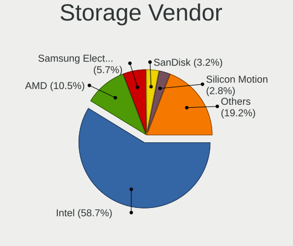

| Vendor                                  | Desktops | Percent |
|-----------------------------------------|----------|---------|
| Intel                                   | 2877     | 58.74%  |
| AMD                                     | 513      | 10.47%  |
| Samsung Electronics                     | 279      | 5.7%    |
| SanDisk                                 | 155      | 3.16%   |
| Silicon Motion                          | 136      | 2.78%   |
| Phison Electronics                      | 111      | 2.27%   |
| MAXIO Technology (Hangzhou)             | 108      | 2.2%    |
| ASMedia Technology                      | 98       | 2%      |
| Kingston Technology Company             | 73       | 1.49%   |
| SK hynix                                | 69       | 1.41%   |
| Micron/Crucial Technology               | 58       | 1.18%   |
| Broadcom / LSI                          | 53       | 1.08%   |
| Marvell Technology Group                | 46       | 0.94%   |
| Micron Technology                       | 39       | 0.8%    |
| JMicron Technology                      | 33       | 0.67%   |
| Realtek Semiconductor                   | 30       | 0.61%   |
| Toshiba                                 | 24       | 0.49%   |
| KIOXIA                                  | 21       | 0.43%   |
| Chelsio Communications                  | 21       | 0.43%   |
| Hosin Global Electronics                | 19       | 0.39%   |
| Nvidia                                  | 16       | 0.33%   |
| Shenzhen Longsys Electronics            | 14       | 0.29%   |
| INNOGRIT                                | 14       | 0.29%   |
| Seagate Technology                      | 9        | 0.18%   |
| ADATA Technology                        | 9        | 0.18%   |
| Adaptec                                 | 8        | 0.16%   |
| Yangtze Memory Technologies             | 7        | 0.14%   |
| Transcend                               | 7        | 0.14%   |
| Lite-On Technology                      | 7        | 0.14%   |
| VIA Technologies                        | 6        | 0.12%   |
| Solidigm                                | 6        | 0.12%   |
| Shenzhen Unionmemory Information System | 5        | 0.1%    |
| Silicon Image                           | 4        | 0.08%   |
| Solid State Storage Technology          | 3        | 0.06%   |
| Biwin Storage Technology                | 3        | 0.06%   |
| Unknown                                 | 3        | 0.06%   |
| Silicon Integrated Systems [SiS]        | 2        | 0.04%   |
| Innodisk                                | 2        | 0.04%   |
| HighPoint Technologies                  | 2        | 0.04%   |
| Hewlett-Packard                         | 2        | 0.04%   |

Storage Model
-------------

Storage controller models

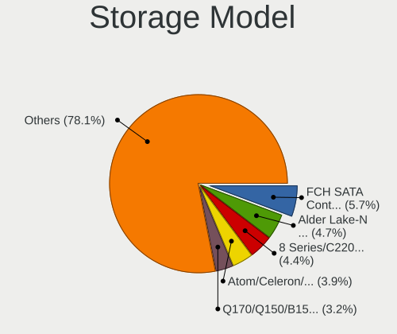

| Model                                                                            | Desktops | Percent |
|----------------------------------------------------------------------------------|----------|---------|
| AMD FCH SATA Controller [AHCI mode]                                              | 310      | 5.68%   |
| Intel Alder Lake-N SATA AHCI Controller                                          | 256      | 4.69%   |
| Intel 8 Series/C220 Series Chipset Family 6-port SATA Controller 1 [AHCI mode]   | 240      | 4.39%   |
| Intel Atom/Celeron/Pentium Processor x5-E8000/J3xxx/N3xxx Series SATA Controller | 213      | 3.9%    |
| Intel Q170/Q150/B150/H170/H110/Z170/CM236 Chipset SATA Controller [AHCI Mode]    | 177      | 3.24%   |
| Intel SATA Controller [RAID mode]                                                | 158      | 2.89%   |
| Intel Sunrise Point-LP SATA Controller [AHCI mode]                               | 155      | 2.84%   |
| Intel Celeron/Pentium Silver Processor SATA Controller                           | 154      | 2.82%   |
| Intel Jasper Lake SATA AHCI Controller                                           | 146      | 2.67%   |
| Intel 6 Series/C200 Series Chipset Family 6 port Desktop SATA AHCI Controller    | 143      | 2.62%   |
| Silicon Motion SM2263EN/SM2263XT (DRAM-less) NVMe SSD Controllers                | 131      | 2.4%    |
| Intel 200 Series PCH SATA controller [AHCI mode]                                 | 131      | 2.4%    |
| Intel Cannon Lake PCH SATA AHCI Controller                                       | 127      | 2.33%   |
| Samsung NVMe SSD Controller SM981/PM981/PM983                                    | 123      | 2.25%   |
| MAXIO (Hangzhou) NVMe SSD Controller MAP1202 (DRAM-less)                         | 106      | 1.94%   |
| Intel 7 Series/C210 Series Chipset Family 6-port SATA Controller [AHCI mode]     | 96       | 1.76%   |
| ASMedia ASM1061/ASM1062 Serial ATA Controller                                    | 79       | 1.45%   |
| AMD 400 Series Chipset SATA Controller                                           | 79       | 1.45%   |
| Intel Atom Processor E3800 Series SATA AHCI Controller                           | 67       | 1.23%   |
| AMD 500 Series Chipset SATA Controller                                           | 66       | 1.21%   |
| Intel Elkhart Lake SATA AHCI                                                     | 65       | 1.19%   |
| Intel Alder Lake-P SATA AHCI Controller                                          | 56       | 1.03%   |
| AMD SB7x0/SB8x0/SB9x0 SATA Controller [AHCI mode]                                | 55       | 1.01%   |
| Intel Atom Processor C3000 Series SATA Controller 1                              | 51       | 0.93%   |
| Intel Atom Processor C3000 Series SATA Controller 0                              | 49       | 0.9%    |
| Intel Wildcat Point-LP SATA Controller [AHCI Mode]                               | 46       | 0.84%   |
| Samsung NVMe SSD Controller 980 (DRAM-less)                                      | 45       | 0.82%   |
| Samsung NVMe SSD Controller SM961/PM961/SM963                                    | 43       | 0.79%   |
| Intel Comet Lake SATA AHCI Controller                                            | 40       | 0.73%   |
| AMD SB7x0/SB8x0/SB9x0 IDE Controller                                             | 38       | 0.7%    |
| SK hynix Gold P31/BC711/PC711 NVMe Solid State Drive                             | 36       | 0.66%   |
| Phison E12 NVMe Controller                                                       | 36       | 0.66%   |
| Intel 8 Series SATA Controller 1 [AHCI mode]                                     | 35       | 0.64%   |
| Intel Celeron N3350/Pentium N4200/Atom E3900 Series SATA AHCI Controller         | 34       | 0.62%   |
| Intel 500 Series Chipset Family SATA AHCI Controller                             | 34       | 0.62%   |
| Samsung NVMe SSD Controller PM9A1/PM9A3/980PRO                                   | 33       | 0.6%    |
| Micron/Crucial P2 [Nick P2] / P3 / P3 Plus NVMe PCIe SSD (DRAM-less)             | 33       | 0.6%    |
| Sandisk WD SN560/SN740/SN770/SN5000 NVMe SSD                                     | 31       | 0.57%   |
| Intel 5 Series/3400 Series Chipset 6 port SATA AHCI Controller                   | 30       | 0.55%   |
| SanDisk Ultra 3D / WD PC SN530, IX SN530, Blue SN550 NVMe SSD (DRAM-less)        | 28       | 0.51%   |

Storage Kind
------------

Kind of storage controller (IDE, SATA, NVMe, SAS, ...)

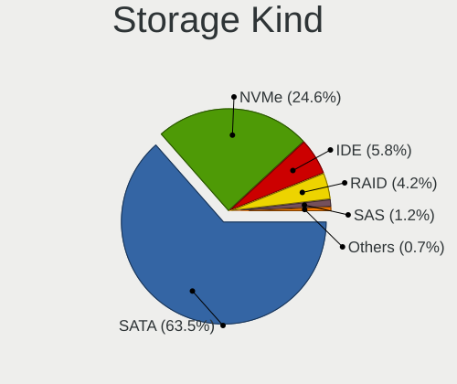

| Kind | Desktops | Percent |
|------|----------|---------|
| SATA | 3071     | 63.52%  |
| NVMe | 1190     | 24.61%  |
| IDE  | 281      | 5.81%   |
| RAID | 203      | 4.2%    |
| SAS  | 56       | 1.16%   |
| SCSI | 34       | 0.7%    |

Processor
---------

CPU Vendor
----------

Processor vendors

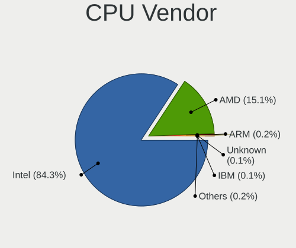

| Vendor               | Desktops | Percent |
|----------------------|----------|---------|
| Intel                | 3067     | 84.26%  |
| AMD                  | 551      | 15.14%  |
| ARM                  | 9        | 0.25%   |
| Unknown              | 4        | 0.11%   |
| IBM                  | 3        | 0.08%   |
| VIA                  | 2        | 0.05%   |
| NXP                  | 1        | 0.03%   |
| Motorola             | 1        | 0.03%   |
| i                    | 1        | 0.03%   |
| Cix Technology Group | 1        | 0.03%   |

CPU Model
---------

Processor models

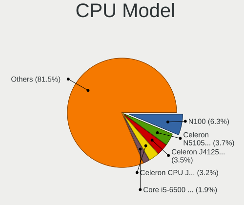

| Model                                    | Desktops | Percent |
|------------------------------------------|----------|---------|
| Intel N100                               | 233      | 6.31%   |
| Intel Celeron N5105 @ 2.00GHz            | 137      | 3.71%   |
| Intel Celeron J4125 CPU @ 2.00GHz        | 128      | 3.47%   |
| Intel Celeron CPU J3160 @ 1.60GHz        | 117      | 3.17%   |
| Intel Core i5-6500 CPU @ 3.20GHz         | 70       | 1.89%   |
| Intel N150                               | 63       | 1.71%   |
| Intel Core i5-3470 CPU @ 3.20GHz         | 47       | 1.27%   |
| Intel Celeron J6412 @ 2.00GHz            | 47       | 1.27%   |
| AMD GX-412TC SOC                         | 47       | 1.27%   |
| Intel Core i5-4570 CPU @ 3.20GHz         | 46       | 1.25%   |
| Intel Core i3-N305                       | 43       | 1.16%   |
| Intel Pentium CPU J3710 @ 1.60GHz        | 40       | 1.08%   |
| Intel Core i7-6700 CPU @ 3.40GHz         | 40       | 1.08%   |
| Intel Core i7-3770 CPU @ 3.40GHz         | 37       | 1%      |
| Intel Core i5-7200U CPU @ 2.50GHz        | 37       | 1%      |
| Intel Core i5-4590 CPU @ 3.30GHz         | 37       | 1%      |
| Intel Core i5-7500 CPU @ 3.40GHz         | 36       | 0.97%   |
| Intel Celeron CPU J1900 @ 1.99GHz        | 35       | 0.95%   |
| AMD GX-420CA SOC with Radeon HD Graphics | 31       | 0.84%   |
| Intel Celeron CPU J3060 @ 1.60GHz        | 29       | 0.79%   |
| Intel Core i5-8500 CPU @ 3.00GHz         | 25       | 0.68%   |
| Intel Core i3-7100U CPU @ 2.40GHz        | 25       | 0.68%   |
| Intel Atom CPU D525 @ 1.80GHz            | 24       | 0.65%   |
| Intel Core i7-4790 CPU @ 3.60GHz         | 23       | 0.62%   |
| Intel Core i7-7700 CPU @ 3.60GHz         | 22       | 0.6%    |
| Intel Core i5-8250U CPU @ 1.60GHz        | 22       | 0.6%    |
| Intel Pentium Silver N6005 @ 2.00GHz     | 21       | 0.57%   |
| Intel Core i7-8550U CPU @ 1.80GHz        | 21       | 0.57%   |
| Intel Core i7-4770 CPU @ 3.40GHz         | 21       | 0.57%   |
| AMD Ryzen 7 5700G with Radeon Graphics   | 21       | 0.57%   |
| Intel Core i5-2400 CPU @ 3.10GH          | 20       | 0.54%   |
| Intel Celeron CPU 3865U @ 1.80GHz        | 20       | 0.54%   |
| Intel Atom CPU C3758R @ 2.40GHz          | 20       | 0.54%   |
| Intel Celeron J6413 @ 1.80GHz            | 19       | 0.51%   |
| Intel Atom CPU C3558 @ 2.20GHz           | 19       | 0.51%   |
| Intel N95                                | 18       | 0.49%   |
| Intel Celeron J4105 CPU @ 1.50GHz        | 18       | 0.49%   |
| Intel Atom CPU E3845 @ 1.91GHz           | 18       | 0.49%   |
| AMD Ryzen 5 5600G with Radeon Graphics   | 18       | 0.49%   |
| Intel Pentium Gold 8505                  | 16       | 0.43%   |

CPU Model Family
----------------

Processor model prefix

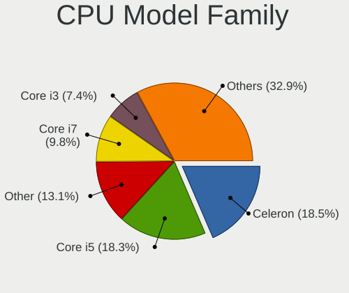

| Model                   | Desktops | Percent |
|-------------------------|----------|---------|
| Intel Celeron           | 681      | 18.54%  |
| Intel Core i5           | 671      | 18.27%  |
| Other                   | 480      | 13.07%  |
| Intel Core i7           | 361      | 9.83%   |
| Intel Core i3           | 271      | 7.38%   |
| Intel Xeon              | 241      | 6.56%   |
| Intel Atom              | 169      | 4.6%    |
| AMD Ryzen 7             | 106      | 2.89%   |
| Intel Pentium           | 94       | 2.56%   |
| AMD Ryzen 5             | 94       | 2.56%   |
| AMD GX                  | 94       | 2.56%   |
| AMD Ryzen 9             | 53       | 1.44%   |
| AMD FX                  | 36       | 0.98%   |
| Intel Core 2 Duo        | 27       | 0.74%   |
| Intel Pentium Silver    | 24       | 0.65%   |
| AMD Ryzen 3             | 23       | 0.63%   |
| Intel Pentium Gold      | 19       | 0.52%   |
| Intel Core 2 Quad       | 18       | 0.49%   |
| AMD A10                 | 17       | 0.46%   |
| Intel Core i9           | 16       | 0.44%   |
| AMD Athlon              | 14       | 0.38%   |
| AMD Phenom II X4        | 13       | 0.35%   |
| Intel Pentium Dual-Core | 11       | 0.3%    |
| AMD Ryzen 5 PRO         | 10       | 0.27%   |
| ARM Cortex              | 9        | 0.25%   |
| AMD A8                  | 9        | 0.25%   |
| AMD Ryzen Threadripper  | 8        | 0.22%   |
| Intel Core              | 7        | 0.19%   |
| AMD G                   | 7        | 0.19%   |
| AMD A6                  | 7        | 0.19%   |
| Intel Pentium 4         | 6        | 0.16%   |
| AMD Opteron             | 6        | 0.16%   |
| AMD A4                  | 6        | 0.16%   |
| AMD Phenom II X6        | 5        | 0.14%   |
| AMD EPYC                | 5        | 0.14%   |
| AMD Athlon 64 X2        | 5        | 0.14%   |
| Intel Core 2            | 4        | 0.11%   |
| AMD Ryzen Embedded      | 4        | 0.11%   |
| AMD E                   | 4        | 0.11%   |
| AMD Athlon II X2        | 4        | 0.11%   |

CPU Cores
---------

Number of processor cores

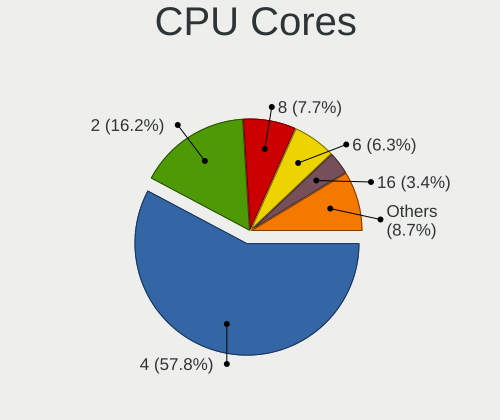

| Number  | Desktops | Percent |
|---------|----------|---------|
| 4       | 2152     | 57.77%  |
| 2       | 605      | 16.24%  |
| 8       | 285      | 7.65%   |
| 6       | 234      | 6.28%   |
| 16      | 126      | 3.38%   |
| 12      | 117      | 3.14%   |
| Unknown | 69       | 1.85%   |
| 10      | 34       | 0.91%   |
| 24      | 23       | 0.62%   |
| 32      | 22       | 0.59%   |
| 1       | 16       | 0.43%   |
| 20      | 13       | 0.35%   |
| 3       | 10       | 0.27%   |
| 14      | 7        | 0.19%   |
| 28      | 6        | 0.16%   |
| 48      | 2        | 0.05%   |
| 18      | 2        | 0.05%   |
| 64      | 1        | 0.03%   |
| 36      | 1        | 0.03%   |

CPU Sockets
-----------

Number of sockets

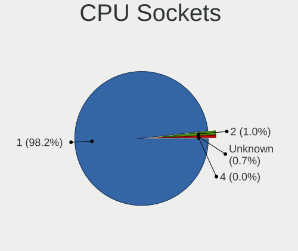

| Number  | Desktops | Percent |
|---------|----------|---------|
| 1       | 3568     | 98.21%  |
| 2       | 37       | 1.02%   |
| Unknown | 26       | 0.72%   |
| 8       | 1        | 0.03%   |
| 4       | 1        | 0.03%   |

CPU Threads
-----------

Threads per core (Hyper-Threading)

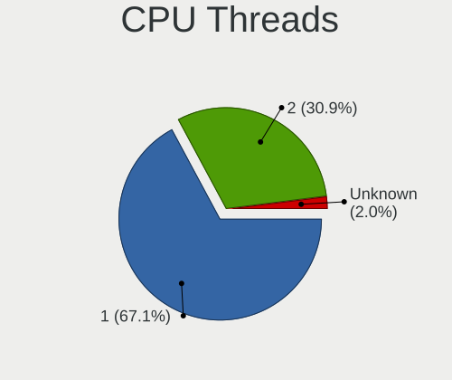

| Number  | Desktops | Percent |
|---------|----------|---------|
| 1       | 2491     | 67.14%  |
| 2       | 1145     | 30.86%  |
| Unknown | 74       | 1.99%   |

CPU Microarch
-------------

Microarchitecture

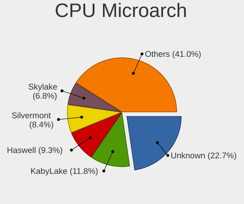

| Name          | Desktops | Percent |
|---------------|----------|---------|
| Unknown       | 835      | 22.71%  |
| KabyLake      | 435      | 11.83%  |
| Haswell       | 342      | 9.3%    |
| Silvermont    | 309      | 8.4%    |
| Skylake       | 250      | 6.8%    |
| IvyBridge     | 218      | 5.93%   |
| Goldmont plus | 154      | 4.19%   |
| SandyBridge   | 132      | 3.59%   |
| Goldmont      | 103      | 2.8%    |
| Zen 3         | 97       | 2.64%   |
| CometLake     | 77       | 2.09%   |
| Zen 2         | 76       | 2.07%   |
| Broadwell     | 73       | 1.99%   |
| Zen+          | 62       | 1.69%   |
| Puma          | 56       | 1.52%   |
| Penryn        | 51       | 1.39%   |
| Jaguar        | 51       | 1.39%   |
| Piledriver    | 48       | 1.31%   |
| Bonnell       | 48       | 1.31%   |
| Zen           | 45       | 1.22%   |
| Nehalem       | 41       | 1.12%   |
| K10           | 32       | 0.87%   |
| Core          | 29       | 0.79%   |
| Westmere      | 26       | 0.71%   |
| TigerLake     | 17       | 0.46%   |
| Bobcat        | 14       | 0.38%   |
| Steamroller   | 12       | 0.33%   |
| Excavator     | 11       | 0.3%    |
| NetBurst      | 10       | 0.27%   |
| K8 Hammer     | 9        | 0.24%   |
| Bulldozer     | 8        | 0.22%   |
| K10 Llano     | 2        | 0.05%   |
| Geode         | 2        | 0.05%   |
| P6            | 1        | 0.03%   |
| K6            | 1        | 0.03%   |

Graphics
--------

GPU Vendor
----------

Vendors of graphics cards

| Vendor                                       | Desktops | Percent |
|----------------------------------------------|----------|---------|
| Intel                                        | 2589     | 72.28%  |
| AMD                                          | 462      | 12.9%   |
| Nvidia                                       | 290      | 8.1%    |
| ASPEED Technology                            | 167      | 4.66%   |
| Matrox Electronics Systems                   | 65       | 1.81%   |
| XGI Technology (eXtreme Graphics Innovation) | 5        | 0.14%   |
| VIA Technologies                             | 2        | 0.06%   |
| Silicon Integrated Systems [SiS]             | 2        | 0.06%   |

GPU Model
---------

Graphics card models

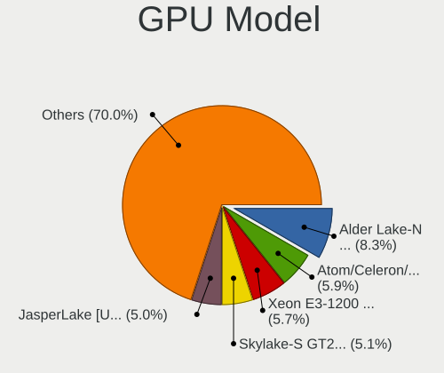

| Model                                                                                    | Desktops | Percent |
|------------------------------------------------------------------------------------------|----------|---------|
| Intel Alder Lake-N [UHD Graphics]                                                        | 303      | 8.34%   |
| Intel Atom/Celeron/Pentium Processor x5-E8000/J3xxx/N3xxx Integrated Graphics Controller | 215      | 5.92%   |
| Intel Xeon E3-1200 v3/4th Gen Core Processor Integrated Graphics Controller              | 207      | 5.7%    |
| Intel Skylake-S GT2 [HD Graphics 530]                                                    | 185      | 5.09%   |
| Intel JasperLake [UHD Graphics]                                                          | 180      | 4.95%   |
| ASPEED Technology ASPEED Graphics Family                                                 | 167      | 4.6%    |
| Intel GeminiLake [UHD Graphics 600]                                                      | 154      | 4.24%   |
| Intel CoffeeLake-S GT2 [UHD Graphics 630]                                                | 140      | 3.85%   |
| Intel Xeon E3-1200 v2/3rd Gen Core processor Graphics Controller                         | 96       | 2.64%   |
| Intel Kaby Lake-S GT2 [HD Graphics 630]                                                  | 95       | 2.61%   |
| Intel 2nd Generation Core Processor Family Integrated Graphics Controller                | 89       | 2.45%   |
| Intel Kaby Lake-U GT2 [HD Graphics 620]                                                  | 81       | 2.23%   |
| Intel Atom Processor Z36xxx/Z37xxx Series Graphics & Display                             | 67       | 1.84%   |
| Intel Elkhart Lake [UHD Graphics Gen11 16EU]                                             | 66       | 1.82%   |
| Intel Alder Lake-N [Intel Graphics]                                                      | 66       | 1.82%   |
| Matrox Electronics Systems MGA G200eW WPCM450                                            | 54       | 1.49%   |
| Intel Kaby Lake-R GT2 [UHD Graphics 620]                                                 | 45       | 1.24%   |
| AMD Cezanne [Radeon Vega Series / Radeon Vega Mobile Series]                             | 45       | 1.24%   |
| Intel IvyBridge GT2 [HD Graphics 4000]                                                   | 44       | 1.21%   |
| Intel CometLake-S GT2 [UHD Graphics 630]                                                 | 44       | 1.21%   |
| Intel 4th Generation Core Processor Family Integrated Graphics Controller                | 39       | 1.07%   |
| Nvidia GK208B [GeForce GT 710]                                                           | 33       | 0.91%   |
| Intel Haswell-ULT Integrated Graphics Controller                                         | 33       | 0.91%   |
| Intel Apollo Lake GT1 [HD Graphics 500]                                                  | 32       | 0.88%   |
| Intel 4 Series Chipset Integrated Graphics Controller                                    | 31       | 0.85%   |
| AMD Kabini [Radeon HD 8400E]                                                             | 31       | 0.85%   |
| AMD Ellesmere [Radeon RX 470/480/570/570X/580/580X/590]                                  | 30       | 0.83%   |
| Intel Alder Lake-UP3 GT1 [UHD Graphics]                                                  | 25       | 0.69%   |
| Intel Broadwell-U GT2 [HD Graphics 5500]                                                 | 24       | 0.66%   |
| Intel Atom Processor D4xx/D5xx/N4xx/N5xx Integrated Graphics Controller                  | 24       | 0.66%   |
| AMD Picasso/Raven 2 [Radeon Vega Series / Radeon Vega Mobile Series]                     | 24       | 0.66%   |
| Intel Kaby Lake-U GT1 [HD Graphics 610]                                                  | 23       | 0.63%   |
| Intel Comet Lake UHD Graphics                                                            | 22       | 0.61%   |
| Intel Alder Lake-S GT1 [UHD Graphics 770]                                                | 22       | 0.61%   |
| Intel Alder Lake-P GT2 [Iris Xe Graphics]                                                | 21       | 0.58%   |
| Nvidia GP108 [GeForce GT 1030]                                                           | 20       | 0.55%   |
| AMD Renoir [Radeon Vega Series / Radeon Vega Mobile Series]                              | 19       | 0.52%   |
| Intel Broadwell-U GT3 [HD Graphics 6000]                                                 | 17       | 0.47%   |
| AMD Raven Ridge [Radeon Vega Series / Radeon Vega Mobile Series]                         | 16       | 0.44%   |
| Intel TigerLake-LP GT2 [Iris Xe Graphics]                                                | 15       | 0.41%   |

GPU Combo
---------

Combinations of graphics cards

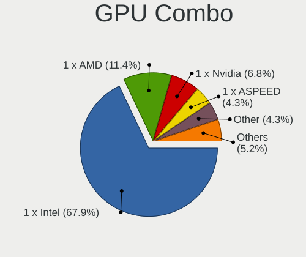

| Name                 | Desktops | Percent |
|----------------------|----------|---------|
| 1 x Intel            | 2499     | 67.94%  |
| 1 x AMD              | 421      | 11.45%  |
| 1 x Nvidia           | 250      | 6.8%    |
| 1 x ASPEED           | 159      | 4.32%   |
| Other                | 158      | 4.3%    |
| 1 x Matrox           | 63       | 1.71%   |
| 2 x Intel            | 44       | 1.2%    |
| Intel + Nvidia       | 28       | 0.76%   |
| 2 x AMD              | 12       | 0.33%   |
| Intel + AMD          | 12       | 0.33%   |
| AMD + Nvidia         | 9        | 0.24%   |
| 1 x XGI              | 5        | 0.14%   |
| Intel + ASPEED       | 5        | 0.14%   |
| 2 x Nvidia           | 3        | 0.08%   |
| 1 x VIA              | 2        | 0.05%   |
| 1 x SiS              | 2        | 0.05%   |
| AMD + ASPEED         | 2        | 0.05%   |
| 2 x AMD + 1 x ASPEED | 1        | 0.03%   |
| Nvidia + ASPEED      | 1        | 0.03%   |
| Intel + 2 x AMD      | 1        | 0.03%   |
| AMD + Matrox         | 1        | 0.03%   |

GPU Driver
----------

Free vs proprietary

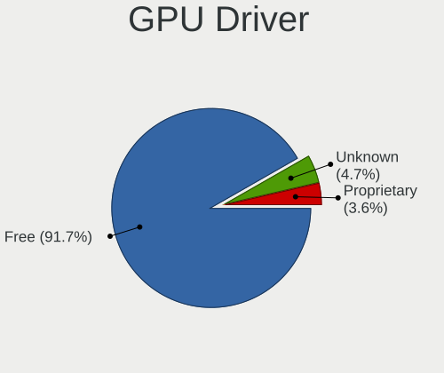

| Driver      | Desktops | Percent |
|-------------|----------|---------|
| Free        | 3352     | 91.74%  |
| Unknown     | 170      | 4.65%   |
| Proprietary | 132      | 3.61%   |

GPU Memory
----------

Total video memory

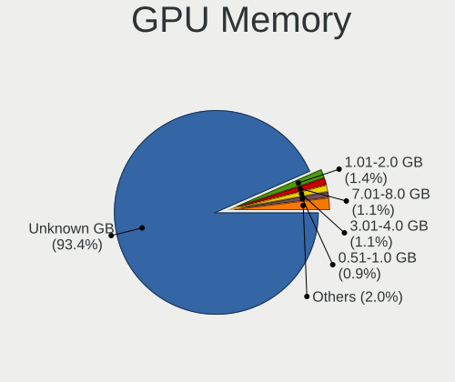

| Size in GB | Desktops | Percent |
|------------|----------|---------|
| Unknown    | 3420     | 93.44%  |
| 1.01-2.0   | 53       | 1.45%   |
| 7.01-8.0   | 42       | 1.15%   |
| 3.01-4.0   | 40       | 1.09%   |
| 0.51-1.0   | 33       | 0.9%    |
| 0.01-0.5   | 29       | 0.79%   |
| 8.01-16.0  | 20       | 0.55%   |
| 5.01-6.0   | 18       | 0.49%   |
| 4.01-5.0   | 2        | 0.05%   |
| 2.01-3.0   | 2        | 0.05%   |
| 16.01-24.0 | 1        | 0.03%   |

Monitor
-------

Monitor Vendor
--------------

Monitor vendors

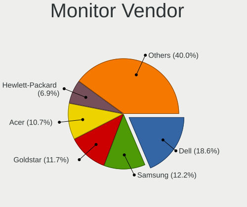

| Vendor               | Desktops | Percent |
|----------------------|----------|---------|
| Dell                 | 75       | 18.61%  |
| Samsung Electronics  | 49       | 12.16%  |
| Goldstar             | 47       | 11.66%  |
| Acer                 | 43       | 10.67%  |
| Hewlett-Packard      | 28       | 6.95%   |
| Ancor Communications | 21       | 5.21%   |
| ASUSTek Computer     | 16       | 3.97%   |
| ViewSonic            | 12       | 2.98%   |
| Lenovo               | 12       | 2.98%   |
| BenQ                 | 10       | 2.48%   |
| AOC                  | 10       | 2.48%   |
| Vizio                | 9        | 2.23%   |
| LG Electronics       | 8        | 1.99%   |
| MSI                  | 6        | 1.49%   |
| Sceptre Tech         | 5        | 1.24%   |
| Apple                | 5        | 1.24%   |
| Sony                 | 4        | 0.99%   |
| Philips              | 4        | 0.99%   |
| Westinghouse         | 3        | 0.74%   |
| Insignia             | 3        | 0.74%   |
| ONN                  | 2        | 0.5%    |
| NEC Computers        | 2        | 0.5%    |
| Gigabyte Technology  | 2        | 0.5%    |
| Unknown              | 2        | 0.5%    |
| Wacom                | 1        | 0.25%   |
| VKK                  | 1        | 0.25%   |
| Viotek               | 1        | 0.25%   |
| unknown              | 1        | 0.25%   |
| Toshiba              | 1        | 0.25%   |
| SHI                  | 1        | 0.25%   |
| SGT                  | 1        | 0.25%   |
| RS                   | 1        | 0.25%   |
| Pioneer Electronic   | 1        | 0.25%   |
| Lenovo Group Limited | 1        | 0.25%   |
| Lecoo                | 1        | 0.25%   |
| ITE                  | 1        | 0.25%   |
| IPS                  | 1        | 0.25%   |
| Impression           | 1        | 0.25%   |
| HKC                  | 1        | 0.25%   |
| Hitachi              | 1        | 0.25%   |

Monitor Model
-------------

Monitor models

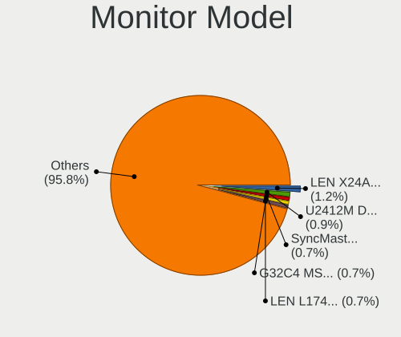

| Model                                                                 | Desktops | Percent |
|-----------------------------------------------------------------------|----------|---------|
| Lenovo LEN X24A LEN60CF 1920x1080 530x300mm 24.0-inch                 | 5        | 1.15%   |
| Dell U2412M DELA07B 1920x1200 520x320mm 24.0-inch                     | 4        | 0.92%   |
| Samsung Electronics SyncMaster SAM00A4 1024x768 300x230mm 14.9-inch   | 3        | 0.69%   |
| MSI G32C4 MSI3DA6 1920x1080 700x390mm 31.5-inch                       | 3        | 0.69%   |
| Lenovo LEN L174 LEN240B 1280x1024 340x270mm 17.1-inch                 | 3        | 0.69%   |
| Goldstar LG Ultra HD GSM5B09 3840x2160 600x340mm 27.2-inch            | 3        | 0.69%   |
| Dell U2518D DEL413C 2560x1440 550x310mm 24.9-inch                     | 3        | 0.69%   |
| ASUSTek Computer VG245 AUS24A1 1920x1080 530x300mm 24.0-inch          | 3        | 0.69%   |
| Sony TV SNY9C01 1360x768                                              | 2        | 0.46%   |
| Samsung Electronics U32J59x SAM0F33 3840x2160 700x390mm 31.5-inch     | 2        | 0.46%   |
| Samsung Electronics U28E510 SAM0D68 3840x2160 610x350mm 27.7-inch     | 2        | 0.46%   |
| Samsung Electronics S27C750 SAM0A60 1920x1080 600x340mm 27.2-inch     | 2        | 0.46%   |
| Samsung Electronics LCD Monitor SAM0C39 1920x1080 700x390mm 31.5-inch | 2        | 0.46%   |
| Samsung Electronics LCD Monitor SAM0B54 1366x768 520x290mm 23.4-inch  | 2        | 0.46%   |
| Philips PHL 326E8F PHLC170 2560x1440 700x390mm 31.5-inch              | 2        | 0.46%   |
| ONN 100002487 ONN0101 1920x1080 520x320mm 24.0-inch                   | 2        | 0.46%   |
| LG Electronics LCD Monitor LG HDR WQHD 3440x1440                      | 2        | 0.46%   |
| Hewlett-Packard All-in-One HWP4218 1600x900 440x250mm 19.9-inch       | 2        | 0.46%   |
| Goldstar W2246 GSM5784 1920x1080 480x270mm 21.7-inch                  | 2        | 0.46%   |
| Goldstar LG ULTRAWIDE GSM59F1 2560x1080 670x280mm 28.6-inch           | 2        | 0.46%   |
| Goldstar LG ULTRAGEAR GSM7766 2560x1440 700x390mm 31.5-inch           | 2        | 0.46%   |
| Goldstar LG ULTRAGEAR GSM7765 2560x1440 700x390mm 31.5-inch           | 2        | 0.46%   |
| Goldstar LG FULL HD GSM5B55 1920x1080 480x270mm 21.7-inch             | 2        | 0.46%   |
| Dell U2412M DELA07A 1920x1200 520x320mm 24.0-inch                     | 2        | 0.46%   |
| Dell SE2719H DELF10D 1920x1080 600x340mm 27.2-inch                    | 2        | 0.46%   |
| Dell S2716DG DELA0D1 2560x1440 600x340mm 27.2-inch                    | 2        | 0.46%   |
| Dell S2418HN/NX DEL4123 1920x1080 530x300mm 24.0-inch                 | 2        | 0.46%   |
| Dell P2715Q DEL40BD 3840x2160 600x340mm 27.2-inch                     | 2        | 0.46%   |
| Dell E2414H DEL4091 1920x1080 530x300mm 24.0-inch                     | 2        | 0.46%   |
| Dell E196FP DELA015 1280x1024 380x300mm 19.1-inch                     | 2        | 0.46%   |
| BenQ PD3200U BNQ8025 3840x2160 710x400mm 32.1-inch                    | 2        | 0.46%   |
| ASUSTek Computer VP247 AUS24CA 1920x1080 520x290mm 23.4-inch          | 2        | 0.46%   |
| ASUSTek Computer PA279 AUS2768 3840x2160 600x340mm 27.2-inch          | 2        | 0.46%   |
| AOC 24G2W1G4 AOC2402 1920x1080 530x300mm 24.0-inch                    | 2        | 0.46%   |
| Ancor Communications VS248 ACI2498 1920x1080 530x300mm 24.0-inch      | 2        | 0.46%   |
| Ancor Communications VG248 ACI24A5 1920x1080 530x300mm 24.0-inch      | 2        | 0.46%   |
| Acer X183H ACR006A 1366x768 410x230mm 18.5-inch                       | 2        | 0.46%   |
| Acer V277 E ACR0B7C 1920x1080 600x330mm 27.0-inch                     | 2        | 0.46%   |
| Acer V246HL ACR032E 1920x1080 530x300mm 24.0-inch                     | 2        | 0.46%   |
| Acer G276HL ACR0300 1920x1080 600x340mm 27.2-inch                     | 2        | 0.46%   |

Monitor Resolution
------------------

Monitor screen resolution

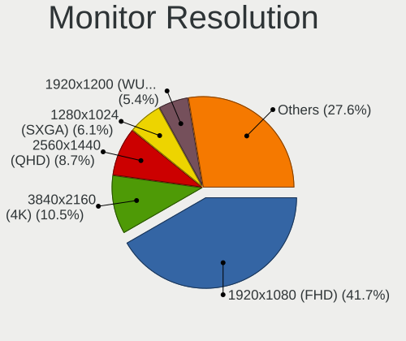

| Resolution         | Desktops | Percent |
|--------------------|----------|---------|
| 1920x1080 (FHD)    | 163      | 41.69%  |
| 3840x2160 (4K)     | 41       | 10.49%  |
| 2560x1440 (QHD)    | 34       | 8.7%    |
| 1280x1024 (SXGA)   | 24       | 6.14%   |
| 1920x1200 (WUXGA)  | 21       | 5.37%   |
| 1680x1050 (WSXGA+) | 15       | 3.84%   |
| 1366x768 (WXGA)    | 13       | 3.32%   |
| 2560x1080          | 12       | 3.07%   |
| 3440x1440          | 10       | 2.56%   |
| 1600x900 (HD+)     | 10       | 2.56%   |
| 1440x900 (WXGA+)   | 9        | 2.3%    |
| Unknown            | 8        | 2.05%   |
| 1360x768           | 6        | 1.53%   |
| 1024x768 (XGA)     | 5        | 1.28%   |
| 2560x1600          | 4        | 1.02%   |
| 1600x1200          | 4        | 1.02%   |
| 3840x1080          | 3        | 0.77%   |
| 7860x2400          | 1        | 0.26%   |
| 5760x1080          | 1        | 0.26%   |
| 5120x1440          | 1        | 0.26%   |
| 4640x1080          | 1        | 0.26%   |
| 3840x1600          | 1        | 0.26%   |
| 3520x1080          | 1        | 0.26%   |
| 2806x900           | 1        | 0.26%   |
| 1920x540           | 1        | 0.26%   |
| 1024x600           | 1        | 0.26%   |

Monitor Diagonal
----------------

Diagonal size in inches

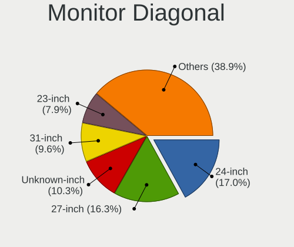

| Inches  | Desktops | Percent |
|---------|----------|---------|
| 24      | 69       | 17%     |
| 27      | 66       | 16.26%  |
| Unknown | 42       | 10.34%  |
| 31      | 39       | 9.61%   |
| 23      | 32       | 7.88%   |
| 21      | 32       | 7.88%   |
| 19      | 26       | 6.4%    |
| 34      | 14       | 3.45%   |
| 17      | 14       | 3.45%   |
| 22      | 11       | 2.71%   |
| 18      | 9        | 2.22%   |
| 20      | 6        | 1.48%   |
| 29      | 5        | 1.23%   |
| 14      | 5        | 1.23%   |
| 15      | 4        | 0.99%   |
| 42      | 3        | 0.74%   |
| 32      | 3        | 0.74%   |
| 13      | 3        | 0.74%   |
| 64      | 2        | 0.49%   |
| 52      | 2        | 0.49%   |
| 43      | 2        | 0.49%   |
| 41      | 2        | 0.49%   |
| 40      | 2        | 0.49%   |
| 28      | 2        | 0.49%   |
| 26      | 2        | 0.49%   |
| 54      | 1        | 0.25%   |
| 49      | 1        | 0.25%   |
| 39      | 1        | 0.25%   |
| 37      | 1        | 0.25%   |
| 35      | 1        | 0.25%   |
| 25      | 1        | 0.25%   |
| 16      | 1        | 0.25%   |
| 11      | 1        | 0.25%   |
| 9       | 1        | 0.25%   |

Monitor Width
-------------

Physical width

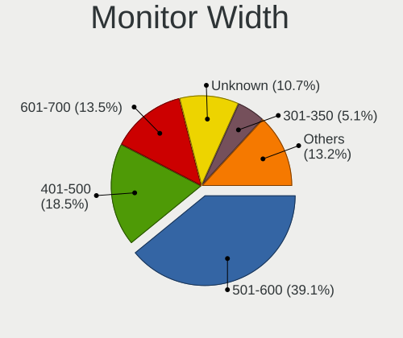

| Width in mm | Desktops | Percent |
|-------------|----------|---------|
| 501-600     | 154      | 39.09%  |
| 401-500     | 73       | 18.53%  |
| 601-700     | 53       | 13.45%  |
| Unknown     | 42       | 10.66%  |
| 301-350     | 20       | 5.08%   |
| 701-800     | 17       | 4.31%   |
| 351-400     | 8        | 2.03%   |
| 201-300     | 8        | 2.03%   |
| 901-1000    | 7        | 1.78%   |
| 1001-1500   | 6        | 1.52%   |
| 801-900     | 5        | 1.27%   |
| 101-200     | 1        | 0.25%   |

Aspect Ratio
------------

Proportional relationship between the width and the height

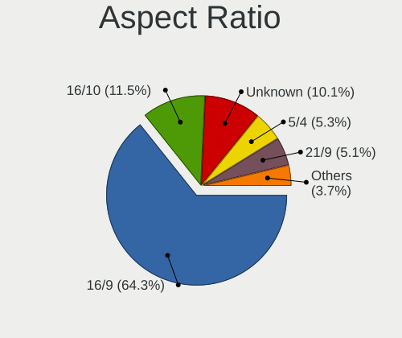

| Ratio   | Desktops | Percent |
|---------|----------|---------|
| 16/9    | 241      | 64.27%  |
| 16/10   | 43       | 11.47%  |
| Unknown | 38       | 10.13%  |
| 5/4     | 20       | 5.33%   |
| 21/9    | 19       | 5.07%   |
| 4/3     | 9        | 2.4%    |
| 6/5     | 3        | 0.8%    |
| 32/9    | 1        | 0.27%   |
| 3/2     | 1        | 0.27%   |

Monitor Area
------------

Area in inch²

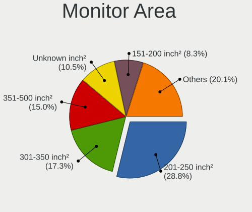

| Area in inch² | Desktops | Percent |
|----------------|----------|---------|
| 201-250        | 115      | 28.82%  |
| 301-350        | 69       | 17.29%  |
| 351-500        | 60       | 15.04%  |
| Unknown        | 42       | 10.53%  |
| 151-200        | 33       | 8.27%   |
| 251-300        | 26       | 6.52%   |
| 141-150        | 22       | 5.51%   |
| 501-1000       | 12       | 3.01%   |
| More than 1000 | 5        | 1.25%   |
| 101-110        | 5        | 1.25%   |
| 81-90          | 3        | 0.75%   |
| 121-130        | 2        | 0.5%    |
| 111-120        | 2        | 0.5%    |
| 71-80          | 1        | 0.25%   |
| 51-60          | 1        | 0.25%   |
| 1-40           | 1        | 0.25%   |

Pixel Density
-------------

Pixels per inch

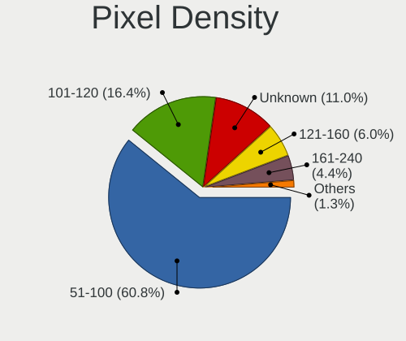

| Density | Desktops | Percent |
|---------|----------|---------|
| 51-100  | 233      | 60.84%  |
| 101-120 | 63       | 16.45%  |
| Unknown | 42       | 10.97%  |
| 121-160 | 23       | 6.01%   |
| 161-240 | 17       | 4.44%   |
| 1-50    | 5        | 1.31%   |

Multiple Monitors
-----------------

Total monitors connected

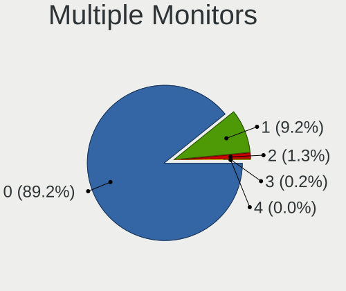

| Total | Desktops | Percent |
|-------|----------|---------|
| 0     | 3265     | 89.23%  |
| 1     | 338      | 9.24%   |
| 2     | 47       | 1.28%   |
| 3     | 8        | 0.22%   |
| 4     | 1        | 0.03%   |

Network
-------

Net Controller Vendor
---------------------

Controller vendors

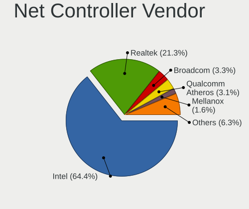

| Vendor                          | Desktops | Percent |
|---------------------------------|----------|---------|
| Intel                           | 3181     | 64.43%  |
| Realtek Semiconductor           | 1050     | 21.27%  |
| Broadcom                        | 165      | 3.34%   |
| Qualcomm Atheros                | 152      | 3.08%   |
| Mellanox Technologies           | 77       | 1.56%   |
| MediaTek                        | 44       | 0.89%   |
| Ralink Technology               | 29       | 0.59%   |
| IMC Networks                    | 25       | 0.51%   |
| Chelsio Communications          | 24       | 0.49%   |
| U-Blox                          | 23       | 0.47%   |
| Aquantia                        | 16       | 0.32%   |
| Solarflare Communications       | 12       | 0.24%   |
| Ralink                          | 12       | 0.24%   |
| D-Link System                   | 10       | 0.2%    |
| American Megatrends             | 9        | 0.18%   |
| TP-Link                         | 7        | 0.14%   |
| Seeed Technology                | 7        | 0.14%   |
| Marvell Technology Group        | 7        | 0.14%   |
| Edimax Technology               | 7        | 0.14%   |
| Emulex                          | 5        | 0.1%    |
| 3Com                            | 5        | 0.1%    |
| VIA Technologies                | 4        | 0.08%   |
| sipeed                          | 4        | 0.08%   |
| Sequans Communications          | 4        | 0.08%   |
| Novatel Wireless                | 4        | 0.08%   |
| Insyde Software                 | 4        | 0.08%   |
| Samsung Electronics             | 2        | 0.04%   |
| Qualcomm Atheros Communications | 2        | 0.04%   |
| OPPO Electronics                | 2        | 0.04%   |
| National Semiconductor          | 2        | 0.04%   |
| Microchip Technology            | 2        | 0.04%   |
| Linksys                         | 2        | 0.04%   |
| ICS Advent                      | 2        | 0.04%   |
| Google                          | 2        | 0.04%   |
| D-Link                          | 2        | 0.04%   |
| Belkin Components               | 2        | 0.04%   |
| ASUSTek Computer                | 2        | 0.04%   |
| Apple                           | 2        | 0.04%   |
| Accton Technology               | 2        | 0.04%   |
| ZyXEL Communications            | 1        | 0.02%   |

Net Controller Model
--------------------

Controller models

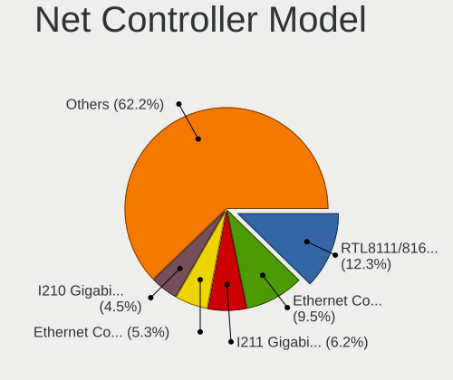

| Model                                                                         | Desktops | Percent |
|-------------------------------------------------------------------------------|----------|---------|
| Realtek RTL8111/8168/8211/8411 PCI Express Gigabit Ethernet Controller        | 805      | 12.31%  |
| Intel Ethernet Controller I226-V                                              | 622      | 9.51%   |
| Intel I211 Gigabit Network Connection                                         | 404      | 6.18%   |
| Intel Ethernet Controller I225-V                                              | 348      | 5.32%   |
| Intel I210 Gigabit Network Connection                                         | 293      | 4.48%   |
| Intel I350 Gigabit Network Connection                                         | 228      | 3.49%   |
| Intel 82574L Gigabit Network Connection                                       | 191      | 2.92%   |
| Intel 82579LM Gigabit Network Connection (Lewisville)                         | 177      | 2.71%   |
| Intel 82599ES 10-Gigabit SFI/SFP+ Network Connection                          | 162      | 2.48%   |
| Realtek RTL8125 2.5GbE Controller                                             | 158      | 2.42%   |
| Intel Ethernet Connection I217-LM                                             | 148      | 2.26%   |
| Intel 82576 Gigabit Network Connection                                        | 119      | 1.82%   |
| Intel 82583V Gigabit Network Connection                                       | 110      | 1.68%   |
| Intel 82580 Gigabit Network Connection                                        | 110      | 1.68%   |
| Intel Ethernet Controller 10-Gigabit X540-AT2                                 | 104      | 1.59%   |
| Intel Ethernet Connection (2) I219-LM                                         | 102      | 1.56%   |
| Intel 82571EB/82571GB Gigabit Ethernet Controller D0/D1 (copper applications) | 87       | 1.33%   |
| Realtek RTL8821CE 802.11ac PCIe Wireless Network Adapter                      | 74       | 1.13%   |
| Intel Ethernet Controller X710 for 10GbE SFP+                                 | 74       | 1.13%   |
| Intel Ethernet Connection (2) I219-V                                          | 72       | 1.1%    |
| Intel Wi-Fi 6 AX200                                                           | 71       | 1.09%   |
| Intel Ethernet Controller X550                                                | 69       | 1.06%   |
| Intel 82571EB/82571GB Gigabit Ethernet Controller (Copper)                    | 68       | 1.04%   |
| Intel Ethernet Connection (7) I219-LM                                         | 51       | 0.78%   |
| Intel Ethernet Connection X553 10 GbE SFP+                                    | 50       | 0.76%   |
| Intel Alder Lake-N PCH CNVi WiFi                                              | 49       | 0.75%   |
| Mellanox MT27500 Family [ConnectX-3]                                          | 45       | 0.69%   |
| Intel 82575EB Gigabit Network Connection                                      | 39       | 0.6%    |
| Intel Ethernet Connection (5) I219-LM                                         | 38       | 0.58%   |
| Intel Wi-Fi 6E(802.11ax) AX210/AX1675* 2x2 [Typhoon Peak]                     | 36       | 0.55%   |
| Intel Ethernet Connection (7) I219-V                                          | 34       | 0.52%   |
| Intel Dual Band Wireless-AC 3168NGW [Stone Peak]                              | 34       | 0.52%   |
| Intel 82579V Gigabit Network Connection                                       | 32       | 0.49%   |
| Intel Ethernet Controller I225-LM                                             | 28       | 0.43%   |
| Intel Ethernet Connection X553 1GbE                                           | 26       | 0.4%    |
| MediaTek MT7922 802.11ax PCI Express Wireless Network Adapter                 | 25       | 0.38%   |
| IMC Networks 802.11 n/g/b Wireless LAN USB Mini-Card                          | 25       | 0.38%   |
| Intel Wireless 3165                                                           | 23       | 0.35%   |
| Intel Ethernet Controller I226-LM                                             | 23       | 0.35%   |
| Intel Ethernet Connection X722 for 10GbE SFP+                                 | 23       | 0.35%   |

Wireless Vendor
---------------

Wireless vendors

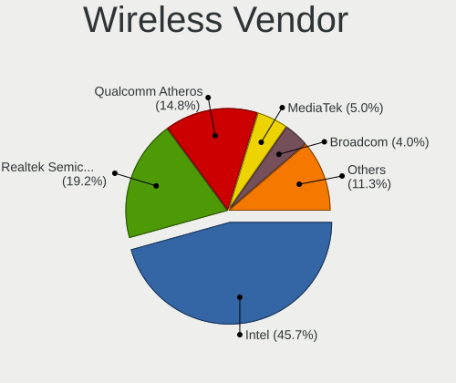

| Vendor                          | Desktops | Percent |
|---------------------------------|----------|---------|
| Intel                           | 376      | 45.69%  |
| Realtek Semiconductor           | 158      | 19.2%   |
| Qualcomm Atheros                | 122      | 14.82%  |
| MediaTek                        | 41       | 4.98%   |
| Broadcom                        | 33       | 4.01%   |
| Ralink Technology               | 29       | 3.52%   |
| IMC Networks                    | 25       | 3.04%   |
| Ralink                          | 12       | 1.46%   |
| TP-Link                         | 7        | 0.85%   |
| Edimax Technology               | 7        | 0.85%   |
| Qualcomm Atheros Communications | 2        | 0.24%   |
| D-Link                          | 2        | 0.24%   |
| Belkin Components               | 2        | 0.24%   |
| ASUSTek Computer                | 2        | 0.24%   |
| ZyXEL Communications            | 1        | 0.12%   |
| Sierra Wireless                 | 1        | 0.12%   |
| Qualcomm Technologies           | 1        | 0.12%   |
| Linksys                         | 1        | 0.12%   |
| D-Link System                   | 1        | 0.12%   |

Wireless Model
--------------

Wireless models

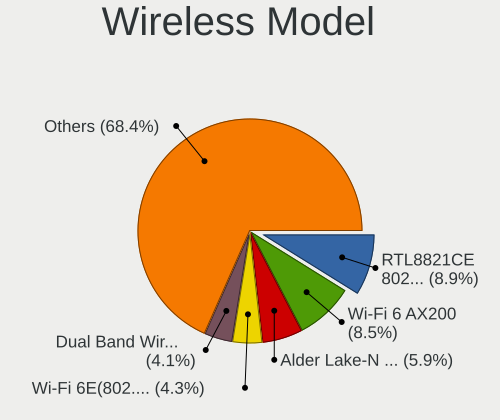

| Model                                                           | Desktops | Percent |
|-----------------------------------------------------------------|----------|---------|
| Realtek RTL8821CE 802.11ac PCIe Wireless Network Adapter        | 74       | 8.86%   |
| Intel Wi-Fi 6 AX200                                             | 71       | 8.5%    |
| Intel Alder Lake-N PCH CNVi WiFi                                | 49       | 5.87%   |
| Intel Wi-Fi 6E(802.11ax) AX210/AX1675* 2x2 [Typhoon Peak]       | 36       | 4.31%   |
| Intel Dual Band Wireless-AC 3168NGW [Stone Peak]                | 34       | 4.07%   |
| MediaTek MT7922 802.11ax PCI Express Wireless Network Adapter   | 25       | 2.99%   |
| IMC Networks 802.11 n/g/b Wireless LAN USB Mini-Card            | 25       | 2.99%   |
| Intel Wireless 3165                                             | 23       | 2.75%   |
| Qualcomm Atheros AR9485 Wireless Network Adapter                | 21       | 2.51%   |
| Intel Wireless 7265                                             | 21       | 2.51%   |
| Qualcomm Atheros AR93xx Wireless Network Adapter                | 18       | 2.16%   |
| Qualcomm Atheros AR928X Wireless Network Adapter (PCI-Express)  | 18       | 2.16%   |
| Intel Wireless 7260                                             | 16       | 1.92%   |
| Intel Wi-Fi 5(802.11ac) Wireless-AC 9x6x [Thunder Peak]         | 15       | 1.8%    |
| Intel Cannon Lake PCH CNVi WiFi                                 | 14       | 1.68%   |
| Realtek RTL8188EUS 802.11n Wireless Network Adapter             | 13       | 1.56%   |
| Intel Wireless 8260                                             | 13       | 1.56%   |
| Qualcomm Atheros QCA6174 802.11ac Wireless Network Adapter      | 12       | 1.44%   |
| MediaTek MT7921K (RZ608) Wi-Fi 6E 80MHz                         | 12       | 1.44%   |
| Ralink RT5370 Wireless Adapter                                  | 11       | 1.32%   |
| Qualcomm Atheros AR9462 Wireless Network Adapter                | 11       | 1.32%   |
| Intel Wireless 8265 / 8275                                      | 10       | 1.2%    |
| Intel Gemini Lake PCH CNVi WiFi                                 | 10       | 1.2%    |
| Broadcom BCM4352 802.11ac Dual Band Wireless Network Adapter    | 10       | 1.2%    |
| Qualcomm Atheros QCA986x/988x 802.11ac Wireless Network Adapter | 9        | 1.08%   |
| Qualcomm Atheros QCA9565 / AR9565 Wireless Network Adapter      | 9        | 1.08%   |
| Qualcomm Atheros QCA9377 802.11ac Wireless Network Adapter      | 9        | 1.08%   |
| Intel Tiger Lake PCH CNVi WiFi                                  | 9        | 1.08%   |
| Realtek RTL8822CE 802.11ac PCIe Wireless Network Adapter        | 8        | 0.96%   |
| Intel Jasper Lake PCH CNVi WiFi                                 | 8        | 0.96%   |
| Intel 700 Series Chipset CNVi WiFi                              | 8        | 0.96%   |
| Realtek RTL8852BE PCIe 802.11ax Wireless Network Controller     | 7        | 0.84%   |
| Intel Wireless 3160                                             | 7        | 0.84%   |
| Edimax EW-7811Un 802.11n Wireless Adapter [Realtek RTL8188CUS]  | 7        | 0.84%   |
| Realtek RTL88x2bu [AC1200 Techkey]                              | 6        | 0.72%   |
| Realtek RTL8723BE PCIe Wireless Network Adapter                 | 6        | 0.72%   |
| Ralink RT5572 Wireless Adapter                                  | 6        | 0.72%   |
| Intel Centrino Wireless-N 105                                   | 6        | 0.72%   |
| Intel Alder Lake-S PCH CNVi WiFi                                | 6        | 0.72%   |
| Broadcom BCM4360 802.11ac Dual Band Wireless Network Adapter    | 6        | 0.72%   |

Ethernet Vendor
---------------

Ethernet vendors

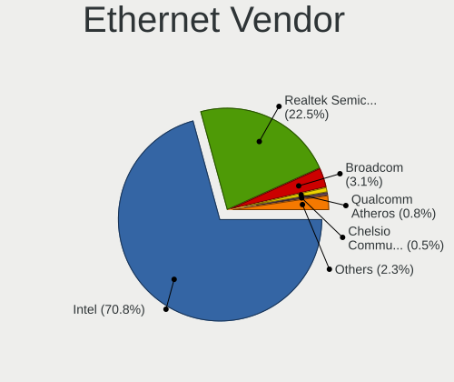

| Vendor                        | Desktops | Percent |
|-------------------------------|----------|---------|
| Intel                         | 3076     | 70.78%  |
| Realtek Semiconductor         | 977      | 22.48%  |
| Broadcom                      | 136      | 3.13%   |
| Qualcomm Atheros              | 35       | 0.81%   |
| Chelsio Communications        | 21       | 0.48%   |
| Aquantia                      | 15       | 0.35%   |
| Solarflare Communications     | 12       | 0.28%   |
| D-Link System                 | 9        | 0.21%   |
| American Megatrends           | 9        | 0.21%   |
| Marvell Technology Group      | 7        | 0.16%   |
| Emulex                        | 5        | 0.12%   |
| 3Com                          | 5        | 0.12%   |
| VIA Technologies              | 4        | 0.09%   |
| sipeed                        | 4        | 0.09%   |
| Novatel Wireless              | 4        | 0.09%   |
| Insyde Software               | 4        | 0.09%   |
| Samsung Electronics           | 2        | 0.05%   |
| OPPO Electronics              | 2        | 0.05%   |
| National Semiconductor        | 2        | 0.05%   |
| MediaTek                      | 2        | 0.05%   |
| ICS Advent                    | 2        | 0.05%   |
| Xiaomi                        | 1        | 0.02%   |
| Tehuti Networks               | 1        | 0.02%   |
| Silicom                       | 1        | 0.02%   |
| Quectel Wireless Solutions    | 1        | 0.02%   |
| Qualcomm                      | 1        | 0.02%   |
| Oracle/SUN                    | 1        | 0.02%   |
| OnePlus Technology (Shenzhen) | 1        | 0.02%   |
| Nvidia                        | 1        | 0.02%   |
| Linksys                       | 1        | 0.02%   |
| Google                        | 1        | 0.02%   |
| Apple                         | 1        | 0.02%   |
| ADMtek                        | 1        | 0.02%   |
| Accton Technology             | 1        | 0.02%   |

Ethernet Model
--------------

Ethernet models

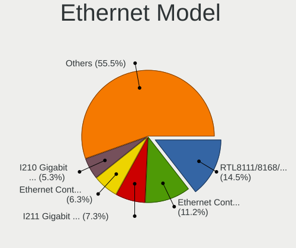

| Model                                                                         | Desktops | Percent |
|-------------------------------------------------------------------------------|----------|---------|
| Realtek RTL8111/8168/8211/8411 PCI Express Gigabit Ethernet Controller        | 805      | 14.5%   |
| Intel Ethernet Controller I226-V                                              | 622      | 11.21%  |
| Intel I211 Gigabit Network Connection                                         | 404      | 7.28%   |
| Intel Ethernet Controller I225-V                                              | 348      | 6.27%   |
| Intel I210 Gigabit Network Connection                                         | 293      | 5.28%   |
| Intel I350 Gigabit Network Connection                                         | 228      | 4.11%   |
| Intel 82574L Gigabit Network Connection                                       | 191      | 3.44%   |
| Intel 82579LM Gigabit Network Connection (Lewisville)                         | 177      | 3.19%   |
| Intel 82599ES 10-Gigabit SFI/SFP+ Network Connection                          | 162      | 2.92%   |
| Realtek RTL8125 2.5GbE Controller                                             | 156      | 2.81%   |
| Intel Ethernet Connection I217-LM                                             | 148      | 2.67%   |
| Intel 82576 Gigabit Network Connection                                        | 119      | 2.14%   |
| Intel 82583V Gigabit Network Connection                                       | 110      | 1.98%   |
| Intel 82580 Gigabit Network Connection                                        | 110      | 1.98%   |
| Intel Ethernet Controller 10-Gigabit X540-AT2                                 | 104      | 1.87%   |
| Intel Ethernet Connection (2) I219-LM                                         | 102      | 1.84%   |
| Intel 82571EB/82571GB Gigabit Ethernet Controller D0/D1 (copper applications) | 87       | 1.57%   |
| Intel Ethernet Controller X710 for 10GbE SFP+                                 | 74       | 1.33%   |
| Intel Ethernet Connection (2) I219-V                                          | 72       | 1.3%    |
| Intel Ethernet Controller X550                                                | 69       | 1.24%   |
| Intel 82571EB/82571GB Gigabit Ethernet Controller (Copper)                    | 68       | 1.23%   |
| Intel Ethernet Connection (7) I219-LM                                         | 51       | 0.92%   |
| Intel Ethernet Connection X553 10 GbE SFP+                                    | 50       | 0.9%    |
| Intel 82575EB Gigabit Network Connection                                      | 39       | 0.7%    |
| Intel Ethernet Connection (5) I219-LM                                         | 38       | 0.68%   |
| Intel Ethernet Connection (7) I219-V                                          | 34       | 0.61%   |
| Intel 82579V Gigabit Network Connection                                       | 32       | 0.58%   |
| Intel Ethernet Controller I225-LM                                             | 28       | 0.5%    |
| Intel Ethernet Connection X553 1GbE                                           | 26       | 0.47%   |
| Intel Ethernet Controller I226-LM                                             | 23       | 0.41%   |
| Intel Ethernet Connection X722 for 10GbE SFP+                                 | 23       | 0.41%   |
| Intel Ethernet Connection (2) I218-V                                          | 23       | 0.41%   |
| Broadcom NetXtreme II BCM57810 10 Gigabit Ethernet                            | 22       | 0.4%    |
| Intel Ethernet Connection X722 for 10GBASE-T                                  | 21       | 0.38%   |
| Realtek USB 2.5GbE Controller                                                 | 20       | 0.36%   |
| Realtek RTL8169 PCI Gigabit Ethernet Controller                               | 20       | 0.36%   |
| Intel Ethernet Connection I354                                                | 19       | 0.34%   |
| Broadcom NetXtreme II BCM5709 Gigabit Ethernet                                | 19       | 0.34%   |
| Intel 82575GB Gigabit Network Connection                                      | 18       | 0.32%   |
| Broadcom NetXtreme BCM5719 Gigabit Ethernet PCIe                              | 18       | 0.32%   |

Net Controller Kind
-------------------

Ethernet, WiFi or modem

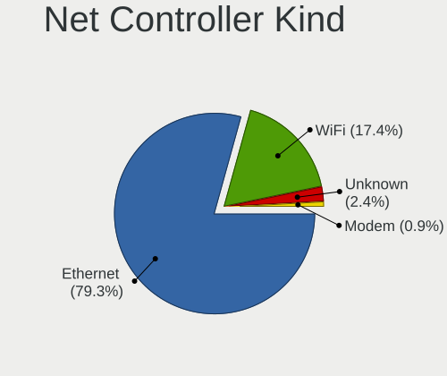

| Kind     | Desktops | Percent |
|----------|----------|---------|
| Ethernet | 3605     | 79.3%   |
| WiFi     | 793      | 17.44%  |
| Unknown  | 109      | 2.4%    |
| Modem    | 39       | 0.86%   |

Used Controller
---------------

Currently used network controller

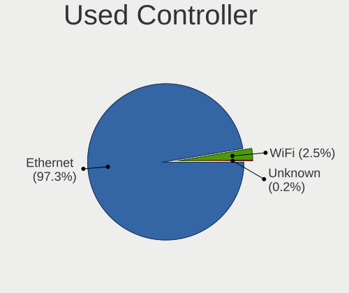

| Kind     | Desktops | Percent |
|----------|----------|---------|
| Ethernet | 3522     | 97.32%  |
| WiFi     | 90       | 2.49%   |
| Unknown  | 7        | 0.19%   |

NICs
----

Total network controllers on board

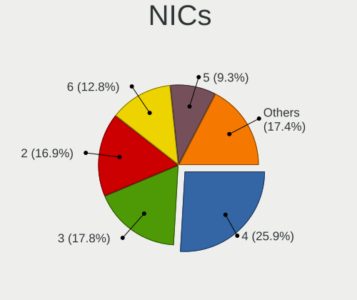

| Total | Desktops | Percent |
|-------|----------|---------|
| 4     | 969      | 25.92%  |
| 3     | 664      | 17.76%  |
| 2     | 632      | 16.9%   |
| 6     | 477      | 12.76%  |
| 5     | 347      | 9.28%   |
| 1     | 334      | 8.93%   |
| 7     | 101      | 2.7%    |
| 9     | 76       | 2.03%   |
| 8     | 68       | 1.82%   |
| 10    | 24       | 0.64%   |
| 0     | 16       | 0.43%   |
| 11    | 9        | 0.24%   |
| 12    | 6        | 0.16%   |
| 16    | 5        | 0.13%   |
| 13    | 4        | 0.11%   |
| 15    | 3        | 0.08%   |
| 14    | 2        | 0.05%   |
| 20    | 1        | 0.03%   |
| 17    | 1        | 0.03%   |

IPv6
----

IPv6 vs IPv4

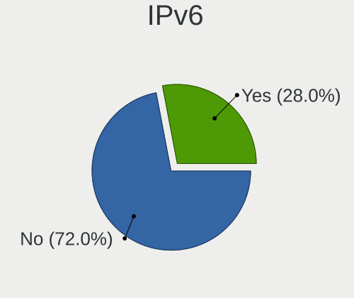

| Used | Desktops | Percent |
|------|----------|---------|
| No   | 2787     | 72%     |
| Yes  | 1084     | 28%     |

Bluetooth
---------

Bluetooth Vendor
----------------

Controller vendors

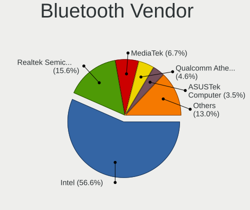

| Vendor                          | Desktops | Percent |
|---------------------------------|----------|---------|
| Intel                           | 344      | 56.58%  |
| Realtek Semiconductor           | 95       | 15.63%  |
| MediaTek                        | 41       | 6.74%   |
| Qualcomm Atheros Communications | 28       | 4.61%   |
| ASUSTek Computer                | 21       | 3.45%   |
| Cambridge Silicon Radio         | 17       | 2.8%    |
| IMC Networks                    | 16       | 2.63%   |
| Broadcom                        | 13       | 2.14%   |
| Apple                           | 13       | 2.14%   |
| Foxconn / Hon Hai               | 8        | 1.32%   |
| Lite-On Technology              | 5        | 0.82%   |
| Dynex                           | 2        | 0.33%   |
| TP-Link                         | 1        | 0.16%   |
| Ralink                          | 1        | 0.16%   |
| Primax Electronics              | 1        | 0.16%   |
| Corsair                         | 1        | 0.16%   |
| Unknown                         | 1        | 0.16%   |

Bluetooth Model
---------------

Controller models

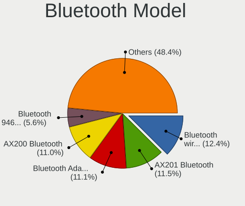

| Model                                                       | Desktops | Percent |
|-------------------------------------------------------------|----------|---------|
| Intel Bluetooth wireless interface                          | 76       | 12.44%  |
| Intel AX201 Bluetooth                                       | 70       | 11.46%  |
| Realtek Bluetooth Adapter                                   | 68       | 11.13%  |
| Intel AX200 Bluetooth                                       | 67       | 10.97%  |
| Intel Bluetooth 9460/9560 Jefferson Peak (JfP)              | 34       | 5.56%   |
| Intel Wireless-AC 3168 Bluetooth                            | 33       | 5.4%    |
| Intel AX210 Bluetooth                                       | 33       | 5.4%    |
| MediaTek Wireless_Device                                    | 23       | 3.76%   |
| Cambridge Silicon Radio Bluetooth Dongle (HCI mode)         | 17       | 2.78%   |
| Realtek  Bluetooth 4.2 Adapter                              | 14       | 2.29%   |
| Intel Wireless-AC 9260 Bluetooth Adapter                    | 13       | 2.13%   |
| MediaTek RZ608 Bluetooth Adapter                            | 12       | 1.96%   |
| Intel Centrino Bluetooth Wireless Transceiver               | 11       | 1.8%    |
| Realtek Bluetooth 4.2 Adapter                               | 8        | 1.31%   |
| Intel AX211 Bluetooth                                       | 8        | 1.31%   |
| Apple Built-in Bluetooth 2.0+EDR HCI                        | 8        | 1.31%   |
| Broadcom BCM20702A0 Bluetooth 4.0                           | 7        | 1.15%   |
| Qualcomm Atheros Dell Wireless 1707 Bluetooth 4.0 LE Device | 6        | 0.98%   |
| Qualcomm Atheros AR3012 Bluetooth 4.0                       | 6        | 0.98%   |
| Qualcomm Atheros AR3011 Bluetooth (no firmware)             | 5        | 0.82%   |
| ASUS Qualcomm Bluetooth 4.1                                 | 5        | 0.82%   |
| ASUS Bluetooth USB module                                   | 5        | 0.82%   |
| Qualcomm Atheros QCA61x4 Bluetooth 4.0                      | 4        | 0.65%   |
| Qualcomm Atheros AR9462 Bluetooth                           | 4        | 0.65%   |
| IMC Networks Realtek Bluetooth Adapter                      | 4        | 0.65%   |
| ASUS Broadcom BCM20702A0 Bluetooth                          | 4        | 0.65%   |
| Apple Bluetooth Host Controller                             | 4        | 0.65%   |
| Realtek Dell Wireless 1801 Bluetooth 4.0 LE                 | 3        | 0.49%   |
| MediaTek RZ616 Bluetooth Adapter                            | 3        | 0.49%   |
| MediaTek Bluetooth Adapter                                  | 3        | 0.49%   |
| IMC Networks Realtek Bluetooth 4.0 + High Speed Chip        | 3        | 0.49%   |
| Foxconn / Hon Hai Android ADB Interface                     | 3        | 0.49%   |
| Broadcom 20702 Bluetooth 4.0 Adapter                        | 3        | 0.49%   |
| Lite-On Qualcomm Atheros QCA9377 Bluetooth                  | 2        | 0.33%   |
| Lite-On Bluetooth USB Module                                | 2        | 0.33%   |
| IMC Networks Qualcomm Atheros AR9462 Bluetooth 4.0 + HS     | 2        | 0.33%   |
| IMC Networks Bluetooth                                      | 2        | 0.33%   |
| Foxconn / Hon Hai Wireless_Device                           | 2        | 0.33%   |
| Foxconn / Hon Hai RZ616 Bluetooth Adapter                   | 2        | 0.33%   |
| Dynex Bluetooth 4.0 Adapter [Broadcom, 1.12, BCM20702A0]    | 2        | 0.33%   |

Sound
-----

Sound Vendor
------------

Sound card vendors

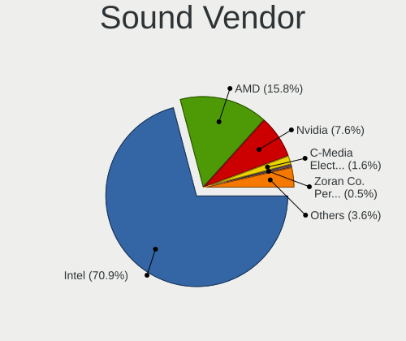

| Vendor                                       | Desktops | Percent |
|----------------------------------------------|----------|---------|
| Intel                                        | 2413     | 70.91%  |
| AMD                                          | 537      | 15.78%  |
| Nvidia                                       | 260      | 7.64%   |
| C-Media Electronics                          | 53       | 1.56%   |
| Zoran Co. Personal Media Division (Nogatech) | 18       | 0.53%   |
| Creative Labs                                | 18       | 0.53%   |
| Logitech                                     | 9        | 0.26%   |
| SteelSeries ApS                              | 6        | 0.18%   |
| KTMicro                                      | 6        | 0.18%   |
| Texas Instruments                            | 5        | 0.15%   |
| Corsair                                      | 5        | 0.15%   |
| Blue Microphones                             | 5        | 0.15%   |
| Razer USA                                    | 4        | 0.12%   |
| Micro Star International                     | 4        | 0.12%   |
| Creative Technology                          | 4        | 0.12%   |
| Walmart                                      | 3        | 0.09%   |
| VIA Technologies                             | 3        | 0.09%   |
| Realtek Semiconductor                        | 3        | 0.09%   |
| ASUSTek Computer                             | 3        | 0.09%   |
| ASRock                                       | 3        | 0.09%   |
| Yamaha                                       | 2        | 0.06%   |
| Thesycon Systemsoftware & Consulting         | 2        | 0.06%   |
| JMTek                                        | 2        | 0.06%   |
| Hewlett-Packard                              | 2        | 0.06%   |
| Google                                       | 2        | 0.06%   |
| Giga-Byte Technology                         | 2        | 0.06%   |
| Focusrite-Novation                           | 2        | 0.06%   |
| Dell                                         | 2        | 0.06%   |
| Cambridge Silicon Radio                      | 2        | 0.06%   |
| Apple                                        | 2        | 0.06%   |
| XMOS                                         | 1        | 0.03%   |
| Universal Audio                              | 1        | 0.03%   |
| Tenx Technology                              | 1        | 0.03%   |
| Sony                                         | 1        | 0.03%   |
| Silicon Integrated Systems [SiS]             | 1        | 0.03%   |
| Shure                                        | 1        | 0.03%   |
| Quanta                                       | 1        | 0.03%   |
| Nektar                                       | 1        | 0.03%   |
| LG Electronics                               | 1        | 0.03%   |
| KORG                                         | 1        | 0.03%   |

Sound Model
-----------

Sound card models

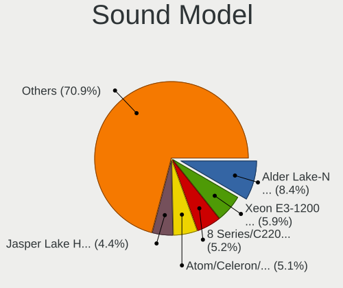

| Model                                                                                             | Desktops | Percent |
|---------------------------------------------------------------------------------------------------|----------|---------|
| Intel Alder Lake-N PCH High Definition Audio Controller                                           | 338      | 8.4%    |
| Intel Xeon E3-1200 v3/4th Gen Core Processor HD Audio Controller                                  | 237      | 5.89%   |
| Intel 8 Series/C220 Series Chipset High Definition Audio Controller                               | 210      | 5.22%   |
| Intel Atom/Celeron/Pentium Processor x5-E8000/J3xxx/N3xxx Series High Definition Audio Controller | 207      | 5.15%   |
| Intel Jasper Lake HD Audio                                                                        | 178      | 4.42%   |
| Intel 100 Series/C230 Series Chipset Family HD Audio Controller                                   | 163      | 4.05%   |
| Intel Celeron/Pentium Silver Processor High Definition Audio                                      | 140      | 3.48%   |
| Intel 200 Series PCH HD Audio                                                                     | 138      | 3.43%   |
| Intel Cannon Lake PCH cAVS                                                                        | 120      | 2.98%   |
| Intel 7 Series/C216 Chipset Family High Definition Audio Controller                               | 119      | 2.96%   |
| AMD Ryzen HD Audio Controller                                                                     | 115      | 2.86%   |
| Intel 6 Series/C200 Series Chipset Family High Definition Audio Controller                        | 113      | 2.81%   |
| AMD Starship/Matisse HD Audio Controller                                                          | 91       | 2.26%   |
| Intel Sunrise Point-LP HD Audio                                                                   | 80       | 1.99%   |
| AMD FCH Azalia Controller                                                                         | 78       | 1.94%   |
| AMD Renoir/Cezanne HDMI/DP Audio Controller                                                       | 72       | 1.79%   |
| Intel Elkhart Lake High Density Audio bus interface                                               | 65       | 1.62%   |
| Intel Alder Lake PCH-P High Definition Audio Controller                                           | 63       | 1.57%   |
| AMD SBx00 Azalia (Intel HDA)                                                                      | 59       | 1.47%   |
| AMD Kabini HDMI/DP Audio                                                                          | 55       | 1.37%   |
| AMD Family 17h (Models 00h-0fh) HD Audio Controller                                               | 51       | 1.27%   |
| Nvidia GK208 HDMI/DP Audio Controller                                                             | 49       | 1.22%   |
| Intel Atom Processor Z36xxx/Z37xxx Series High Definition Audio Controller                        | 47       | 1.17%   |
| Intel Broadwell-U Audio Controller                                                                | 44       | 1.09%   |
| Intel Wildcat Point-LP High Definition Audio Controller                                           | 42       | 1.04%   |
| AMD Raven/Raven2/Fenghuang HDMI/DP Audio Controller                                               | 40       | 0.99%   |
| Intel 8 Series HD Audio Controller                                                                | 35       | 0.87%   |
| AMD Navi 21/23 HDMI/DP Audio Controller                                                           | 34       | 0.85%   |
| Intel Haswell-ULT HD Audio Controller                                                             | 32       | 0.8%    |
| AMD Ellesmere HDMI Audio [Radeon RX 470/480 / 570/580/590]                                        | 31       | 0.77%   |
| Intel Celeron N3350/Pentium N4200/Atom E3900 Series Audio Cluster                                 | 27       | 0.67%   |
| Intel NM10/ICH7 Family High Definition Audio Controller                                           | 26       | 0.65%   |
| Intel 82801JI (ICH10 Family) HD Audio Controller                                                  | 26       | 0.65%   |
| C-Media Electronics Audio Adapter (Unitek Y-247A)                                                 | 26       | 0.65%   |
| AMD Oland/Hainan/Cape Verde/Pitcairn HDMI Audio [Radeon HD 7000 Series]                           | 26       | 0.65%   |
| Intel Comet Lake PCH-LP cAVS                                                                      | 24       | 0.6%    |
| Intel 9 Series Chipset Family HD Audio Controller                                                 | 24       | 0.6%    |
| Intel Alder Lake-S HD Audio Controller                                                            | 21       | 0.52%   |
| AMD Radeon High Definition Audio Controller                                                       | 21       | 0.52%   |
| Nvidia GP108 High Definition Audio Controller                                                     | 20       | 0.5%    |

Memory
------

Memory Vendor
-------------

Memory module vendors

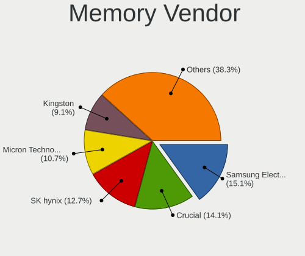

| Vendor                                  | Desktops | Percent |
|-----------------------------------------|----------|---------|
| Samsung Electronics                     | 595      | 15.05%  |
| Crucial                                 | 559      | 14.14%  |
| SK hynix                                | 501      | 12.67%  |
| Micron Technology                       | 424      | 10.73%  |
| Kingston                                | 361      | 9.13%   |
| Unknown                                 | 267      | 6.75%   |
| G.Skill                                 | 242      | 6.12%   |
| Corsair                                 | 226      | 5.72%   |
| Unknown                                 | 143      | 3.62%   |
| Team                                    | 99       | 2.5%    |
| A-DATA Technology                       | 44       | 1.11%   |
| Patriot                                 | 42       | 1.06%   |
| Unknown (ABCD)                          | 38       | 0.96%   |
| Ramaxel Technology                      | 37       | 0.94%   |
| Nanya Technology                        | 30       | 0.76%   |
| Transcend                               | 29       | 0.73%   |
| PNY                                     | 29       | 0.73%   |
| Timetec                                 | 27       | 0.68%   |
| Kimtigo                                 | 22       | 0.56%   |
| Silicon Power                           | 15       | 0.38%   |
| Super Talent                            | 12       | 0.3%    |
| Avant                                   | 12       | 0.3%    |
| Silicon Power Computer & Communications | 10       | 0.25%   |
| Toshiba                                 | 9        | 0.23%   |
| Patriot Memory (PDP Systems)            | 9        | 0.23%   |
| Innodisk                                | 8        | 0.2%    |
| Elpida                                  | 8        | 0.2%    |
| SK_Hynix                                | 7        | 0.18%   |
| Lexar Co Limited                        | 7        | 0.18%   |
| Apacer                                  | 7        | 0.18%   |
| Sesame                                  | 5        | 0.13%   |
| GeIL                                    | 5        | 0.13%   |
| Essencore Limited                       | 5        | 0.13%   |
| Vasekey                                 | 4        | 0.1%    |
| Unknown (AB)                            | 4        | 0.1%    |
| Unknown (0x0C6E)                        | 4        | 0.1%    |
| Ramsta                                  | 4        | 0.1%    |
| Neo Forza                               | 4        | 0.1%    |
| Mushkin                                 | 4        | 0.1%    |
| Hoodisk                                 | 4        | 0.1%    |

Memory Model
------------

Memory module models

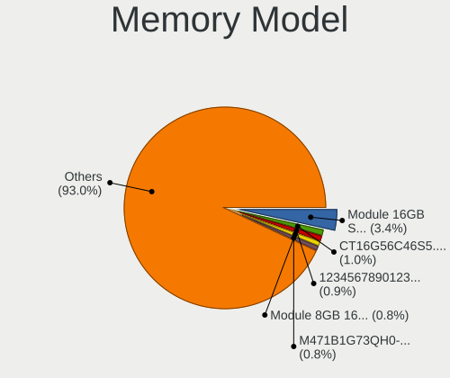

| Model                                                         | Desktops | Percent |
|---------------------------------------------------------------|----------|---------|
| Unknown                                                       | 143      | 3.44%   |
| Crucial RAM CT16G56C46S5.M8G1 16GB SODIMM DDR5 5600MT/s       | 42       | 1.01%   |
| Unknown (ABCD) RAM 123456789012345678 8GB DIMM DDR4 2400MT/s  | 38       | 0.91%   |
| Unknown RAM Module 8GB 1600MT/s                               | 34       | 0.82%   |
| Samsung RAM M471B1G73QH0-YK0 8GB DIMM DDR3 1600MT/s           | 32       | 0.77%   |
| Crucial RAM CT16G48C40S5.M8A1 16GB SODIMM DDR5 4800MT/s       | 29       | 0.7%    |
| SK hynix RAM Module 3GB Row Of Chips LPDDR5 4800MT/s          | 27       | 0.65%   |
| Samsung RAM M378B5173DB0-CK0 4GB DIMM DDR3 1600MT/s           | 26       | 0.63%   |
| SK hynix RAM HMT451U6AFR8C-PB 4GB DIMM DDR3 1600MT/s          | 25       | 0.6%    |
| Micron RAM 8JTF51264AZ-1G6E1 4GB DIMM DDR3 1600MT/s           | 25       | 0.6%    |
| Unknown RAM Module 4GB SODIMM DDR3 1333MT/s                   | 22       | 0.53%   |
| Samsung RAM M425R1GB4BB0-CQKOL 8GB SODIMM DDR5 4800MT/s       | 22       | 0.53%   |
| Micron RAM 53D512M64D4RQ-046 8GB Row Of Chips LPDDR4 4800MT/s | 22       | 0.53%   |
| Team RAM TEAMGROUP-SD4-3200 32GB SODIMM DDR4 3200MT/s         | 21       | 0.51%   |
| SK hynix RAM HMA81GU6AFR8N-UH 8GB DIMM DDR4 2400MT/s          | 21       | 0.51%   |
| Samsung RAM M471B1G73DB0-YK0 8GB DIMM DDR3 1600MT/s           | 21       | 0.51%   |
| SK hynix RAM HMT451U6BFR8A-PB 4GB DIMM DDR3 1600MT/s          | 20       | 0.48%   |
| Samsung RAM M471B1G73EB0-YK0 8GB DIMM DDR3 1600MT/s           | 19       | 0.46%   |
| G.Skill RAM F4-3200C16-16GVK 16GB DIMM DDR4 3200MT/s          | 18       | 0.43%   |
| SK hynix RAM HMT351U6CFR8C-PB 4GB DIMM DDR3 1600MT/s          | 17       | 0.41%   |
| Samsung RAM M471B5173QH0-YK0 4GB SODIMM DDR3 1600MT/s         | 17       | 0.41%   |
| SK hynix RAM HMT41GU6BFR8A-PB 8GB DIMM DDR3 1600MT/s          | 16       | 0.38%   |
| SK hynix RAM HMA81GS6AFR8N-UH 8GB SODIMM DDR4 2400MT/s        | 16       | 0.38%   |
| Crucial RAM CT8G48C40S5.M4A1 8GB SODIMM DDR5 4800MT/s         | 16       | 0.38%   |
| Unknown RAM Module 8GB DIMM DDR3 1600MT/s                     | 15       | 0.36%   |
| Team RAM TEAMGROUP-UD4-3200 8GB DIMM DDR4 3200MT/s            | 15       | 0.36%   |
| SK hynix RAM Module 8GB DIMM DDR4 2133MT/s                    | 15       | 0.36%   |
| SK hynix RAM HMT451U6BFR8C-PB 4GB DIMM DDR3 1600MT/s          | 15       | 0.36%   |
| Samsung RAM M425R1GB4BB0-CWMOD 8GB SODIMM DDR5 5600MT/s       | 15       | 0.36%   |
| Kingston RAM 99U5428-018.A00LF 8GB DIMM DDR3 1600MT/s         | 15       | 0.36%   |
| Kimtigo RAM KT8GS3EDF 8GB SODIMM DDR3 1600MT/s                | 15       | 0.36%   |
| G.Skill RAM F4-3200C16-8GVKB 8GB DIMM DDR4 3200MT/s           | 15       | 0.36%   |
| Crucial RAM CT102464BF160B.M16 8GB DIMM DDR3 1600MT/s         | 15       | 0.36%   |
| Corsair RAM CMSX16GX5M1A4800C40 16GB SODIMM DDR5 4800MT/s     | 15       | 0.36%   |
| Corsair RAM CMK16GX4M2B3200C16 8GB DIMM DDR4 3200MT/s         | 15       | 0.36%   |
| Micron RAM MTC4C10163S1SC48BA1 8GB SODIMM DDR5 4800MT/s       | 14       | 0.34%   |
| Unknown RAM Module 4GB DIMM DDR3 1333MT/s                     | 13       | 0.31%   |
| Crucial RAM CT102464BF160B.C16 8GB DIMM DDR3 1600MT/s         | 13       | 0.31%   |
| Team RAM SD5-4800 16GB SODIMM DDR5 4800MT/s                   | 12       | 0.29%   |
| SK hynix RAM HMT451S6BFR8A-PB 4GB SODIMM DDR3 1600MT/s        | 12       | 0.29%   |

Memory Kind
-----------

Memory module kinds

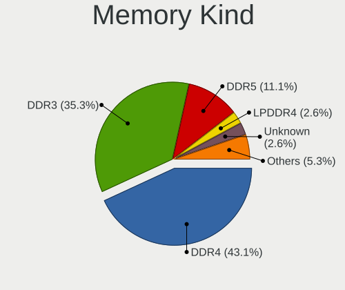

| Kind         | Desktops | Percent |
|--------------|----------|---------|
| DDR4         | 1511     | 43.12%  |
| DDR3         | 1238     | 35.33%  |
| DDR5         | 390      | 11.13%  |
| LPDDR4       | 91       | 2.6%    |
| Unknown      | 90       | 2.57%   |
| LPDDR5       | 70       | 2%      |
| DDR2         | 69       | 1.97%   |
| SDRAM        | 31       | 0.88%   |
| DDR          | 11       | 0.31%   |
| LPDDR3       | 1        | 0.03%   |
| DRAM         | 1        | 0.03%   |
| DDR2 FB-DIMM | 1        | 0.03%   |

Memory Form Factor
------------------

Physical design of the memory module

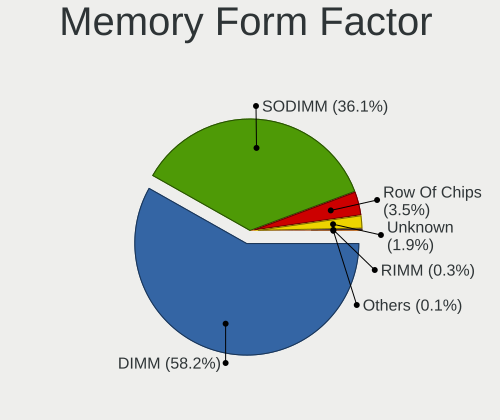

| Name         | Desktops | Percent |
|--------------|----------|---------|
| DIMM         | 2022     | 58.19%  |
| SODIMM       | 1255     | 36.12%  |
| Row Of Chips | 120      | 3.45%   |
| Unknown      | 66       | 1.9%    |
| RIMM         | 9        | 0.26%   |
| FB-DIMM      | 2        | 0.06%   |
| Chip         | 1        | 0.03%   |

Memory Size
-----------

Memory module size

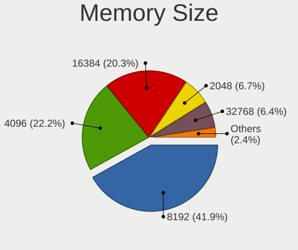

| Size  | Desktops | Percent |
|-------|----------|---------|
| 8192  | 1558     | 41.94%  |
| 4096  | 824      | 22.18%  |
| 16384 | 753      | 20.27%  |
| 2048  | 250      | 6.73%   |
| 32768 | 239      | 6.43%   |
| 1024  | 44       | 1.18%   |
| 3072  | 34       | 0.92%   |
| 49152 | 5        | 0.13%   |
| 512   | 5        | 0.13%   |
| 65536 | 2        | 0.05%   |
| 24576 | 1        | 0.03%   |

Memory Speed
------------

Memory module speed

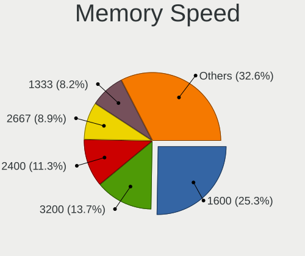

| Speed   | Desktops | Percent |
|---------|----------|---------|
| 1600    | 940      | 25.28%  |
| 3200    | 510      | 13.71%  |
| 2400    | 421      | 11.32%  |
| 2667    | 331      | 8.9%    |
| 1333    | 306      | 8.23%   |
| 4800    | 294      | 7.91%   |
| 2133    | 249      | 6.7%    |
| 5600    | 141      | 3.79%   |
| 800     | 71       | 1.91%   |
| 2666    | 67       | 1.8%    |
| 3600    | 54       | 1.45%   |
| 1066    | 43       | 1.16%   |
| 3000    | 42       | 1.13%   |
| 6400    | 34       | 0.91%   |
| 667     | 33       | 0.89%   |
| Unknown | 32       | 0.86%   |
| 1867    | 24       | 0.65%   |
| 1866    | 24       | 0.65%   |
| 3733    | 16       | 0.43%   |
| 2933    | 15       | 0.4%    |
| 1067    | 14       | 0.38%   |
| 1334    | 9        | 0.24%   |
| 533     | 7        | 0.19%   |
| 6000    | 6        | 0.16%   |
| 5200    | 6        | 0.16%   |
| 4267    | 6        | 0.16%   |
| 4000    | 4        | 0.11%   |
| 6600    | 3        | 0.08%   |
| 400     | 3        | 0.08%   |
| 8400    | 1        | 0.03%   |
| 5500    | 1        | 0.03%   |
| 4266    | 1        | 0.03%   |
| 4133    | 1        | 0.03%   |
| 3534    | 1        | 0.03%   |
| 3333    | 1        | 0.03%   |
| 2866    | 1        | 0.03%   |
| 2800    | 1        | 0.03%   |
| 2600    | 1        | 0.03%   |
| 2473    | 1        | 0.03%   |
| 1639    | 1        | 0.03%   |

Printers & scanners
-------------------

Printer Vendor
--------------

Printer device vendors

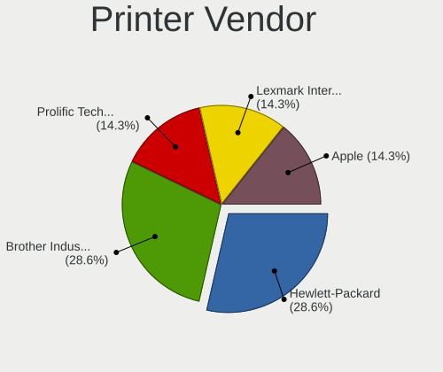

| Vendor                | Desktops | Percent |
|-----------------------|----------|---------|
| Hewlett-Packard       | 2        | 28.57%  |
| Brother Industries    | 2        | 28.57%  |
| Prolific Technology   | 1        | 14.29%  |
| Lexmark International | 1        | 14.29%  |
| Apple                 | 1        | 14.29%  |

Printer Model
-------------

Printer device models

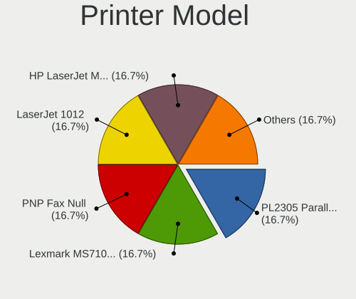

| Model                                                                    | Desktops | Percent |
|--------------------------------------------------------------------------|----------|---------|
| Prolific PL2305 Parallel Port                                            | 1        | 12.5%   |
| Lexmark International Lexmark MS710 Print                                | 1        | 12.5%   |
| HP PNP Fax Null                                                          | 1        | 12.5%   |
| HP LaserJet 1012                                                         | 1        | 12.5%   |
| HP HP LaserJet M101-M106 Printer HP LEDM HP LEDM IPP Printer IPP Printer | 1        | 12.5%   |
| Brother MFC-L2685DW                                                      | 1        | 12.5%   |
| Brother MFC-J485DW                                                       | 1        | 12.5%   |
| Apple Gamesir-G3s 2.10                                                   | 1        | 12.5%   |

Scanner Vendor
--------------

Scanner device vendors

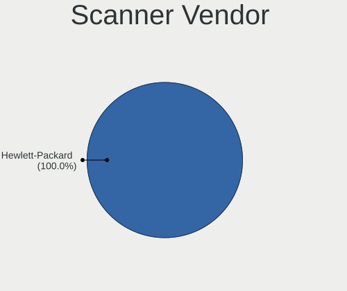

| Vendor          | Desktops | Percent |
|-----------------|----------|---------|
| Seiko Epson     | 2        | 66.67%  |
| Hewlett-Packard | 1        | 33.33%  |

Scanner Model
-------------

Scanner device models

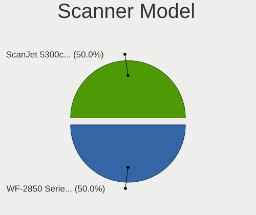

| Model                                                                               | Desktops | Percent |
|-------------------------------------------------------------------------------------|----------|---------|
| Seiko Epson WF-2850 Series EPSON Scanner USB2.0 Printer EPSON Utility USB2.0 Faxout | 2        | 66.67%  |
| HP ScanJet 5300c/5370c                                                              | 1        | 33.33%  |

Camera
------

Camera Vendor
-------------

Camera device vendors

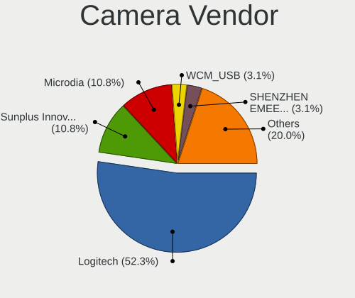

| Vendor                        | Desktops | Percent |
|-------------------------------|----------|---------|
| Logitech                      | 34       | 52.31%  |
| Sunplus Innovation Technology | 7        | 10.77%  |
| Microdia                      | 7        | 10.77%  |
| WCM_USB                       | 2        | 3.08%   |
| SHENZHEN EMEET TECHNOLOGY     | 2        | 3.08%   |
| Generalplus Technology        | 2        | 3.08%   |
| Chicony Electronics           | 2        | 3.08%   |
| Xiongmai                      | 1        | 1.54%   |
| Suyin                         | 1        | 1.54%   |
| Silicon Motion                | 1        | 1.54%   |
| Quanta                        | 1        | 1.54%   |
| Lenovo                        | 1        | 1.54%   |
| Cubeternet                    | 1        | 1.54%   |
| Asuscom Network               | 1        | 1.54%   |
| Arkmicro Technologies         | 1        | 1.54%   |
| ARC International             | 1        | 1.54%   |

Camera Model
------------

Camera device models

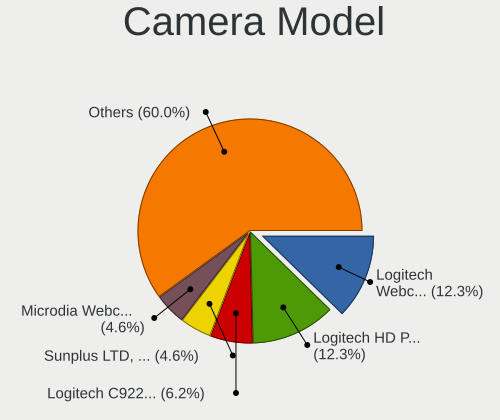

| Model                                                               | Desktops | Percent |
|---------------------------------------------------------------------|----------|---------|
| Logitech Webcam C270                                                | 8        | 12.31%  |
| Logitech HD Pro Webcam C920                                         | 8        | 12.31%  |
| Logitech C922 Pro Stream Webcam                                     | 4        | 6.15%   |
| Sunplus LTD, NexiGo N930AF FHD Webcam                               | 3        | 4.62%   |
| Microdia Webcam Vitade AF                                           | 3        | 4.62%   |
| Logitech Webcam C310                                                | 3        | 4.62%   |
| WCM_USB WEB CAM                                                     | 2        | 3.08%   |
| Sunplus USB 2.0 Camera                                              | 2        | 3.08%   |
| SHENZHEN EMEET TECHNOLOGY HD Webcam eMeet C960                      | 2        | 3.08%   |
| Logitech Logi Webcam C920e                                          | 2        | 3.08%   |
| Logitech C920 HD Pro Webcam                                         | 2        | 3.08%   |
| Logitech BRIO Ultra HD Webcam                                       | 2        | 3.08%   |
| Generalplus HD Webcam                                               | 2        | 3.08%   |
| Xiongmai web camera                                                 | 1        | 1.54%   |
| Suyin Acer CrystalEye Webcam                                        | 1        | 1.54%   |
| Sunplus Integrated_Webcam_HD                                        | 1        | 1.54%   |
| Sunplus HD Webcam                                                   | 1        | 1.54%   |
| Silicon Motion LG HD WebCam                                         | 1        | 1.54%   |
| Quanta Realtek DMFT RGB                                             | 1        | 1.54%   |
| Microdia USB Camera                                                 | 1        | 1.54%   |
| Microdia USB 2.0 Camera                                             | 1        | 1.54%   |
| Microdia Ltd., USB  Live camera                                     | 1        | 1.54%   |
| Microdia Camera                                                     | 1        | 1.54%   |
| Logitech Webcam C930e                                               | 1        | 1.54%   |
| Logitech QuickCam OEM Cisco VT Camera II                            | 1        | 1.54%   |
| Logitech HD Webcam C615                                             | 1        | 1.54%   |
| Logitech HD Webcam C525                                             | 1        | 1.54%   |
| Logitech C920 PRO HD Webcam                                         | 1        | 1.54%   |
| Lenovo Integrated Camera                                            | 1        | 1.54%   |
| Cubeternet EtronTech CMOS based eSP570 WebCam [Onyx Titanium TC101] | 1        | 1.54%   |
| Chicony Ltd., HP 0.3MP Webcam                                       | 1        | 1.54%   |
| Chicony HP High Definition 1MP Webcam                               | 1        | 1.54%   |
| Asuscom Network Depstech webcam                                     | 1        | 1.54%   |
| Arkmicro USB 2.0 PC CAMERA                                          | 1        | 1.54%   |
| ARC International Camera                                            | 1        | 1.54%   |

Security
--------

Fingerprint Vendor
------------------

Fingerprint sensor vendors

Zero info for selected period =(

Fingerprint Model
-----------------

Fingerprint sensor models

Zero info for selected period =(

Chipcard Vendor
---------------

Chipcard module vendors

Zero info for selected period =(

Chipcard Model
--------------

Chipcard module models

Zero info for selected period =(

Unsupported
-----------

Unsupported Devices
-------------------

Total unsupported devices on board

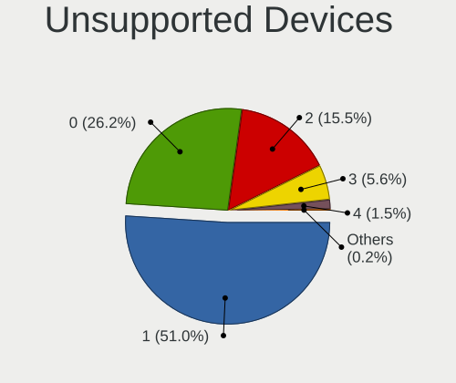

| Total | Desktops | Percent |
|-------|----------|---------|
| 1     | 1911     | 51.03%  |
| 0     | 980      | 26.17%  |
| 2     | 581      | 15.51%  |
| 3     | 208      | 5.55%   |
| 4     | 56       | 1.5%    |
| 5     | 6        | 0.16%   |
| 7     | 2        | 0.05%   |
| 6     | 1        | 0.03%   |

Unsupported Device Types
------------------------

Types of unsupported devices

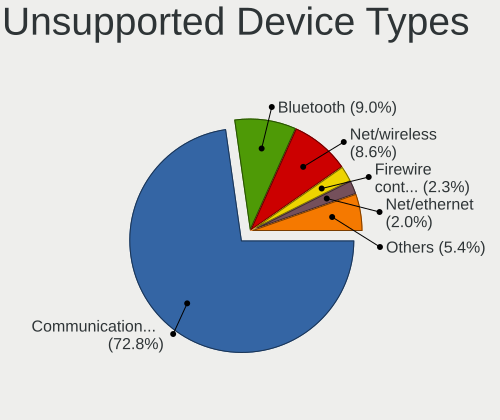

| Type                     | Desktops | Percent |
|--------------------------|----------|---------|
| Communication controller | 2438     | 72.75%  |
| Bluetooth                | 300      | 8.95%   |
| Net/wireless             | 289      | 8.62%   |
| Firewire controller      | 77       | 2.3%    |
| Net/ethernet             | 67       | 2%      |
| Sound                    | 56       | 1.67%   |
| Card reader              | 56       | 1.67%   |
| Network                  | 48       | 1.43%   |
| Storage/raid             | 8        | 0.24%   |
| Graphics card            | 8        | 0.24%   |
| Dvb card                 | 2        | 0.06%   |
| Storage/ata              | 1        | 0.03%   |
| Modem                    | 1        | 0.03%   |

