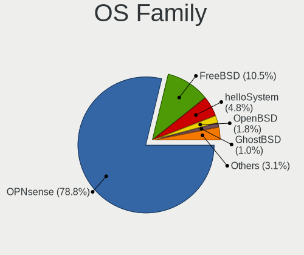
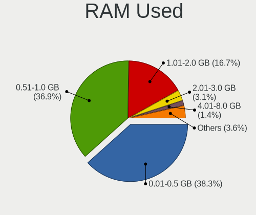
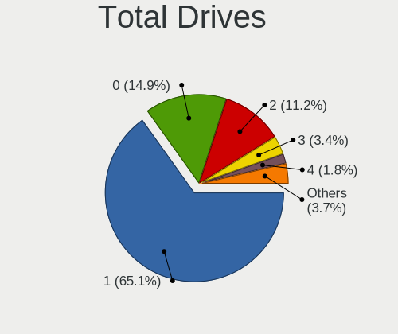
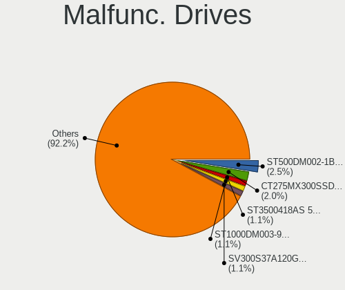
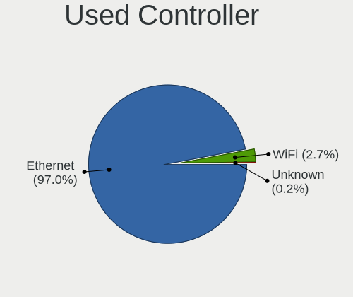
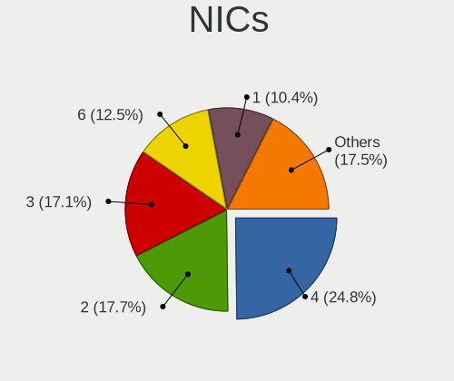
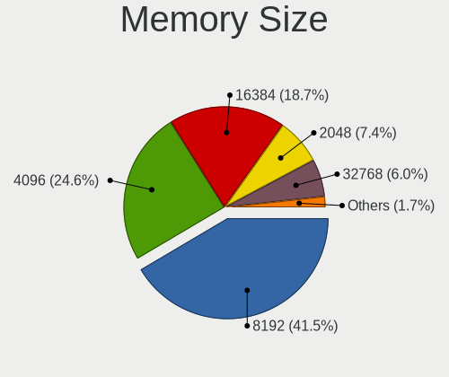

BSD in USA - Tested Hardware & Statistics (Desktops)
----------------------------------------------------

A project to collect tested hardware configurations for BSD in USA.

Anyone can contribute to this report by the [hw-probe](https://github.com/linuxhw/hw-probe/blob/master/INSTALL.BSD.md) tool:

    hw-probe -all -upload

Please contribute! Especially if your hardware is rare.

Contents
--------

* [ Test Cases ](#test-cases)

* [ System ](#system)
  - [ OS                       ](#os)
  - [ OS Family                ](#os-family)
  - [ Arch                     ](#arch)
  - [ DE                       ](#de)
  - [ Display Server           ](#display-server)
  - [ Display Manager          ](#display-manager)
  - [ OS Lang                  ](#os-lang)
  - [ Boot Mode                ](#boot-mode)
  - [ Filesystem               ](#filesystem)
  - [ Part. scheme             ](#part-scheme)

* [ Board ](#board)
  - [ Vendor                   ](#vendor)
  - [ Model                    ](#model)
  - [ Model Family             ](#model-family)
  - [ MFG Year                 ](#mfg-year)
  - [ Form Factor              ](#form-factor)
  - [ Coreboot                 ](#coreboot)
  - [ RAM Size                 ](#ram-size)
  - [ RAM Used                 ](#ram-used)
  - [ Total Drives             ](#total-drives)
  - [ Has CD-ROM               ](#has-cd-rom)
  - [ Has Ethernet             ](#has-ethernet)
  - [ Has WiFi                 ](#has-wifi)
  - [ Has Bluetooth            ](#has-bluetooth)

* [ Location ](#location)
  - [ Country                  ](#country)
  - [ City                     ](#city)

* [ Drives ](#drives)
  - [ Drive Vendor             ](#drive-vendor)
  - [ Drive Model              ](#drive-model)
  - [ HDD Vendor               ](#hdd-vendor)
  - [ SSD Vendor               ](#ssd-vendor)
  - [ Drive Kind               ](#drive-kind)
  - [ Drive Connector          ](#drive-connector)
  - [ Drive Size               ](#drive-size)
  - [ Space Total              ](#space-total)
  - [ Space Used               ](#space-used)
  - [ Malfunc. Drives          ](#malfunc-drives)
  - [ Malfunc. Drive Vendor    ](#malfunc-drive-vendor)
  - [ Malfunc. HDD Vendor      ](#malfunc-hdd-vendor)
  - [ Malfunc. Drive Kind      ](#malfunc-drive-kind)
  - [ Failed Drives            ](#failed-drives)
  - [ Failed Drive Vendor      ](#failed-drive-vendor)
  - [ Drive Status             ](#drive-status)

* [ Storage controller ](#storage-controller)
  - [ Storage Vendor           ](#storage-vendor)
  - [ Storage Model            ](#storage-model)
  - [ Storage Kind             ](#storage-kind)

* [ Processor ](#processor)
  - [ CPU Vendor               ](#cpu-vendor)
  - [ CPU Model                ](#cpu-model)
  - [ CPU Model Family         ](#cpu-model-family)
  - [ CPU Cores                ](#cpu-cores)
  - [ CPU Sockets              ](#cpu-sockets)
  - [ CPU Threads              ](#cpu-threads)
  - [ CPU Microarch            ](#cpu-microarch)

* [ Graphics ](#graphics)
  - [ GPU Vendor               ](#gpu-vendor)
  - [ GPU Model                ](#gpu-model)
  - [ GPU Combo                ](#gpu-combo)
  - [ GPU Driver               ](#gpu-driver)
  - [ GPU Memory               ](#gpu-memory)

* [ Monitor ](#monitor)
  - [ Monitor Vendor           ](#monitor-vendor)
  - [ Monitor Model            ](#monitor-model)
  - [ Monitor Resolution       ](#monitor-resolution)
  - [ Monitor Diagonal         ](#monitor-diagonal)
  - [ Monitor Width            ](#monitor-width)
  - [ Aspect Ratio             ](#aspect-ratio)
  - [ Monitor Area             ](#monitor-area)
  - [ Pixel Density            ](#pixel-density)
  - [ Multiple Monitors        ](#multiple-monitors)

* [ Network ](#network)
  - [ Net Controller Vendor    ](#net-controller-vendor)
  - [ Net Controller Model     ](#net-controller-model)
  - [ Wireless Vendor          ](#wireless-vendor)
  - [ Wireless Model           ](#wireless-model)
  - [ Ethernet Vendor          ](#ethernet-vendor)
  - [ Ethernet Model           ](#ethernet-model)
  - [ Net Controller Kind      ](#net-controller-kind)
  - [ Used Controller          ](#used-controller)
  - [ NICs                     ](#nics)
  - [ IPv6                     ](#ipv6)

* [ Bluetooth ](#bluetooth)
  - [ Bluetooth Vendor         ](#bluetooth-vendor)
  - [ Bluetooth Model          ](#bluetooth-model)

* [ Sound ](#sound)
  - [ Sound Vendor             ](#sound-vendor)
  - [ Sound Model              ](#sound-model)

* [ Memory ](#memory)
  - [ Memory Vendor            ](#memory-vendor)
  - [ Memory Model             ](#memory-model)
  - [ Memory Kind              ](#memory-kind)
  - [ Memory Form Factor       ](#memory-form-factor)
  - [ Memory Size              ](#memory-size)
  - [ Memory Speed             ](#memory-speed)

* [ Printers & scanners ](#printers--scanners)
  - [ Printer Vendor           ](#printer-vendor)
  - [ Printer Model            ](#printer-model)
  - [ Scanner Vendor           ](#scanner-vendor)
  - [ Scanner Model            ](#scanner-model)

* [ Camera ](#camera)
  - [ Camera Vendor            ](#camera-vendor)
  - [ Camera Model             ](#camera-model)

* [ Security ](#security)
  - [ Fingerprint Vendor       ](#fingerprint-vendor)
  - [ Fingerprint Model        ](#fingerprint-model)
  - [ Chipcard Vendor          ](#chipcard-vendor)
  - [ Chipcard Model           ](#chipcard-model)

* [ Unsupported ](#unsupported)
  - [ Unsupported Devices      ](#unsupported-devices)
  - [ Unsupported Device Types ](#unsupported-device-types)

Test Cases
----------

Total: 3503

| Vendor        | Model                       | Probe                                                     | Date         |
|---------------|-----------------------------|-----------------------------------------------------------|--------------|
| MSI           | H81M-P33                    | [da12fe3c05](https://bsd-hardware.info/?probe=da12fe3c05) | Oct 01, 2023 |
| ASUSTek       | P5Q-E                       | [6975204e47](https://bsd-hardware.info/?probe=6975204e47) | Oct 01, 2023 |
| Supermicro    | A2SDi-4C-HLN4F              | [f97e242e6b](https://bsd-hardware.info/?probe=f97e242e6b) | Oct 01, 2023 |
| Win elemen... | M600                        | [b5caabfd31](https://bsd-hardware.info/?probe=b5caabfd31) | Oct 01, 2023 |
| Win elemen... | M600                        | [7a1378a001](https://bsd-hardware.info/?probe=7a1378a001) | Oct 01, 2023 |
| Win elemen... | M600                        | [93cc6a1173](https://bsd-hardware.info/?probe=93cc6a1173) | Oct 01, 2023 |
| Gigabyte      | H470M DS3H                  | [604bce28c1](https://bsd-hardware.info/?probe=604bce28c1) | Sep 30, 2023 |
| Win elemen... | M600                        | [abc175c93b](https://bsd-hardware.info/?probe=abc175c93b) | Sep 30, 2023 |
| Win elemen... | M600                        | [5b7606e786](https://bsd-hardware.info/?probe=5b7606e786) | Sep 30, 2023 |
| Acer          | F672CR R01-B1               | [2008598c7e](https://bsd-hardware.info/?probe=2008598c7e) | Sep 29, 2023 |
| Unknown       | Unknown                     | [6ed3c7314d](https://bsd-hardware.info/?probe=6ed3c7314d) | Sep 29, 2023 |
| HP            | 0B54h D                     | [55122a1908](https://bsd-hardware.info/?probe=55122a1908) | Sep 29, 2023 |
| Supermicro    | X9SCL/X9SCMA                | [8a4596eefa](https://bsd-hardware.info/?probe=8a4596eefa) | Sep 27, 2023 |
| Intel         | DENLOW_REFRESH_WS           | [9ca318e043](https://bsd-hardware.info/?probe=9ca318e043) | Sep 27, 2023 |
| HP            | 8055                        | [b86f4f02a5](https://bsd-hardware.info/?probe=b86f4f02a5) | Sep 26, 2023 |
| Unknown       | Unknown                     | [a77db6c46a](https://bsd-hardware.info/?probe=a77db6c46a) | Sep 25, 2023 |
| Lenovo        | 312A SDK0J40697 WIN 3305... | [6153909c9e](https://bsd-hardware.info/?probe=6153909c9e) | Sep 25, 2023 |
| Unknown       | Unknown                     | [5232e5837b](https://bsd-hardware.info/?probe=5232e5837b) | Sep 25, 2023 |
| CncTion       | N4505-4L B0                 | [5880a22b30](https://bsd-hardware.info/?probe=5880a22b30) | Sep 25, 2023 |
| Protectli     | VP4630                      | [d5c0fe73ef](https://bsd-hardware.info/?probe=d5c0fe73ef) | Sep 24, 2023 |
| MSI           | H81M-P33                    | [971f3fdba1](https://bsd-hardware.info/?probe=971f3fdba1) | Sep 24, 2023 |
| ASUSTek       | P5Q-E                       | [6538212bd6](https://bsd-hardware.info/?probe=6538212bd6) | Sep 24, 2023 |
| ASUSTek       | ROG CROSSHAIR VIII HERO     | [f7aee1db53](https://bsd-hardware.info/?probe=f7aee1db53) | Sep 24, 2023 |
| Intel         | DQ77KB AAG40294-401         | [be147f7ff1](https://bsd-hardware.info/?probe=be147f7ff1) | Sep 24, 2023 |
| Protectli     | VP2420                      | [8644c80a4a](https://bsd-hardware.info/?probe=8644c80a4a) | Sep 24, 2023 |
| Protectli     | FW6 Ver                     | [d8ccddab5a](https://bsd-hardware.info/?probe=d8ccddab5a) | Sep 23, 2023 |
| Unknown       | Unknown                     | [3e1ef4a73c](https://bsd-hardware.info/?probe=3e1ef4a73c) | Sep 23, 2023 |
| IceWhale T... | ZimaBoard 216 ZMB           | [8386219e8f](https://bsd-hardware.info/?probe=8386219e8f) | Sep 22, 2023 |
| Dell          | 0HD5W2 A01                  | [5478cff8a7](https://bsd-hardware.info/?probe=5478cff8a7) | Sep 21, 2023 |
| Premio        | BlueCat XMB3 00C            | [423687627b](https://bsd-hardware.info/?probe=423687627b) | Sep 21, 2023 |
| Protectli     | FW4C Ver                    | [eae9f87345](https://bsd-hardware.info/?probe=eae9f87345) | Sep 20, 2023 |
| Supermicro    | A1SRi-2758F                 | [6ee2f45613](https://bsd-hardware.info/?probe=6ee2f45613) | Sep 20, 2023 |
| Supermicro    | A1SRi-2758F                 | [34bffe0ed1](https://bsd-hardware.info/?probe=34bffe0ed1) | Sep 20, 2023 |
| Intel         | Q3XXG4-P V1.0               | [60a616adf4](https://bsd-hardware.info/?probe=60a616adf4) | Sep 20, 2023 |
| Shenzhen M... | RPBNB                       | [07698e61c2](https://bsd-hardware.info/?probe=07698e61c2) | Sep 19, 2023 |
| Lenovo        | SHARKBAY SDK0E50510 WIN     | [0fe1aab1d8](https://bsd-hardware.info/?probe=0fe1aab1d8) | Sep 19, 2023 |
| Protectli     | VP2420                      | [c4599cac13](https://bsd-hardware.info/?probe=c4599cac13) | Sep 19, 2023 |
| Unknown       | Unknown                     | [0a9c074970](https://bsd-hardware.info/?probe=0a9c074970) | Sep 18, 2023 |
| Techvision    | TVI7309X B0                 | [5e7775568c](https://bsd-hardware.info/?probe=5e7775568c) | Sep 18, 2023 |
| Inventec      | DQ Class A02                | [e6e705b7cf](https://bsd-hardware.info/?probe=e6e705b7cf) | Sep 18, 2023 |
| Advantech     | NAMB-3250 A102-1            | [143c5f73fc](https://bsd-hardware.info/?probe=143c5f73fc) | Sep 17, 2023 |
| Lenovo        | 312A SDK0J40697 WIN 3305... | [31455b0d33](https://bsd-hardware.info/?probe=31455b0d33) | Sep 17, 2023 |
| Unknown       | Unknown                     | [31cf5dc87d](https://bsd-hardware.info/?probe=31cf5dc87d) | Sep 16, 2023 |
| Supermicro    | X9SCL/X9SCMA                | [a054400ef6](https://bsd-hardware.info/?probe=a054400ef6) | Sep 16, 2023 |
| Dell          | 02YYK5 A00                  | [a2d011d2d7](https://bsd-hardware.info/?probe=a2d011d2d7) | Sep 16, 2023 |
| MW            | GMLK-2_5G4L                 | [d36ff6181c](https://bsd-hardware.info/?probe=d36ff6181c) | Sep 15, 2023 |
| Unknown       | Unknown                     | [3fcc5727d3](https://bsd-hardware.info/?probe=3fcc5727d3) | Sep 15, 2023 |
| Gigabyte      | X470 AORUS ULTRA GAMING-... | [6fc18e3db7](https://bsd-hardware.info/?probe=6fc18e3db7) | Sep 15, 2023 |
| Protectli     | FW4B Ver                    | [9790cd72bc](https://bsd-hardware.info/?probe=9790cd72bc) | Sep 15, 2023 |
| Dell          | OptiPlex 3020               | [dfb6cce27d](https://bsd-hardware.info/?probe=dfb6cce27d) | Sep 14, 2023 |
| ASRock        | J1900D2Y                    | [2084583d47](https://bsd-hardware.info/?probe=2084583d47) | Sep 14, 2023 |
| ASRock        | J3455M                      | [f9809dfb0f](https://bsd-hardware.info/?probe=f9809dfb0f) | Sep 13, 2023 |
| Dell          | 04YP6J A02                  | [0933e1164a](https://bsd-hardware.info/?probe=0933e1164a) | Sep 13, 2023 |
| ASUSTek       | PRIME X370-PRO              | [5dee3a945f](https://bsd-hardware.info/?probe=5dee3a945f) | Sep 13, 2023 |
| ASRock        | X570 Phantom Gaming 4       | [9fee6e83fc](https://bsd-hardware.info/?probe=9fee6e83fc) | Sep 13, 2023 |
| Dell          | 02YYK5 A00                  | [ae320bd7de](https://bsd-hardware.info/?probe=ae320bd7de) | Sep 13, 2023 |
| HP            | 212B                        | [3370718b29](https://bsd-hardware.info/?probe=3370718b29) | Sep 13, 2023 |
| Protectli     | FW4B Ver                    | [984a64677e](https://bsd-hardware.info/?probe=984a64677e) | Sep 13, 2023 |
| ASRockRack    | X470D4U                     | [b0cd1ce0f4](https://bsd-hardware.info/?probe=b0cd1ce0f4) | Sep 13, 2023 |
| ASUSTek       | TUF Gaming B550M-PLUS (W... | [89a601d720](https://bsd-hardware.info/?probe=89a601d720) | Sep 12, 2023 |
| MW            | GMLK-2_5G4L                 | [7923196f55](https://bsd-hardware.info/?probe=7923196f55) | Sep 11, 2023 |
| MSI           | A520M-A PRO                 | [8b541c71a9](https://bsd-hardware.info/?probe=8b541c71a9) | Sep 11, 2023 |
| Unknown       | Unknown                     | [6610a56ab4](https://bsd-hardware.info/?probe=6610a56ab4) | Sep 11, 2023 |
| Unknown       | Unknown                     | [ccc62ac366](https://bsd-hardware.info/?probe=ccc62ac366) | Sep 10, 2023 |
| ASRock        | 4X4-4000 Series             | [525ed7878c](https://bsd-hardware.info/?probe=525ed7878c) | Sep 10, 2023 |
| ASRock        | 4X4-4000 Series             | [0131f46755](https://bsd-hardware.info/?probe=0131f46755) | Sep 10, 2023 |
| AZW           | EQ                          | [c6f83de1e4](https://bsd-hardware.info/?probe=c6f83de1e4) | Sep 10, 2023 |
| MSI           | H81M-P33                    | [57a847859f](https://bsd-hardware.info/?probe=57a847859f) | Sep 10, 2023 |
| ASUSTek       | P5Q-E                       | [b7e0d87f47](https://bsd-hardware.info/?probe=b7e0d87f47) | Sep 10, 2023 |
| ASUSTek       | ROG CROSSHAIR VIII HERO     | [c2378b3e83](https://bsd-hardware.info/?probe=c2378b3e83) | Sep 10, 2023 |
| Unknown       | QGLK03                      | [42ea8dfb44](https://bsd-hardware.info/?probe=42ea8dfb44) | Sep 10, 2023 |
| CWWK          | CW-AD4L-N V1                | [52764da7d8](https://bsd-hardware.info/?probe=52764da7d8) | Sep 10, 2023 |
| Supermicro    | X10SLM-F                    | [332a3f8516](https://bsd-hardware.info/?probe=332a3f8516) | Sep 09, 2023 |
| Supermicro    | X8DTH-i/6/iF/6F             | [df114e1b94](https://bsd-hardware.info/?probe=df114e1b94) | Sep 09, 2023 |
| Unknown       | Unknown                     | [8579d5fa0d](https://bsd-hardware.info/?probe=8579d5fa0d) | Sep 09, 2023 |
| Protectli     | FW4C Ver                    | [7ea278ed7a](https://bsd-hardware.info/?probe=7ea278ed7a) | Sep 09, 2023 |
| Protectli     | FW4C Ver                    | [331f3de91a](https://bsd-hardware.info/?probe=331f3de91a) | Sep 09, 2023 |
| Unknown       | Unknown                     | [ee507594a0](https://bsd-hardware.info/?probe=ee507594a0) | Sep 09, 2023 |
| Intel         | Q3XXG4-P V1.0               | [07d197cf04](https://bsd-hardware.info/?probe=07d197cf04) | Sep 09, 2023 |
| Unknown       | Unknown                     | [2e51c11ed2](https://bsd-hardware.info/?probe=2e51c11ed2) | Sep 08, 2023 |
| Unknown       | Unknown                     | [480823e372](https://bsd-hardware.info/?probe=480823e372) | Sep 08, 2023 |
| Dell          | 0NC2VH A01                  | [122601f717](https://bsd-hardware.info/?probe=122601f717) | Sep 08, 2023 |
| AZW           | MINI S 10                   | [4580cb5481](https://bsd-hardware.info/?probe=4580cb5481) | Sep 08, 2023 |
| Techvision    | TVI7309X B0                 | [aaeb12b1c6](https://bsd-hardware.info/?probe=aaeb12b1c6) | Sep 08, 2023 |
| Protectli     | VP2420                      | [2a8eb1b056](https://bsd-hardware.info/?probe=2a8eb1b056) | Sep 08, 2023 |
| Unknown       | Unknown                     | [fa747c859f](https://bsd-hardware.info/?probe=fa747c859f) | Sep 08, 2023 |
| Intel         | MAHOBAY                     | [a3e54e7628](https://bsd-hardware.info/?probe=a3e54e7628) | Sep 08, 2023 |
| Techvision    | TVI7309X B0                 | [eff74e8df0](https://bsd-hardware.info/?probe=eff74e8df0) | Sep 07, 2023 |
| Dell          | 05XGC8 A01                  | [7c0acfa5b9](https://bsd-hardware.info/?probe=7c0acfa5b9) | Sep 07, 2023 |
| Unknown       | Unknown                     | [94d9b19ade](https://bsd-hardware.info/?probe=94d9b19ade) | Sep 07, 2023 |
| Lenovo        | 0B98401 PRO                 | [4397f70291](https://bsd-hardware.info/?probe=4397f70291) | Sep 06, 2023 |
| AZW           | MINI S 10                   | [2daf516a05](https://bsd-hardware.info/?probe=2daf516a05) | Sep 06, 2023 |
| ASUSTek       | SABERTOOTH 990FX R2.0       | [0b7d85b124](https://bsd-hardware.info/?probe=0b7d85b124) | Sep 06, 2023 |
| Supermicro    | X9SCL/X9SCMA                | [3af68f2594](https://bsd-hardware.info/?probe=3af68f2594) | Sep 06, 2023 |
| Dell          | 096JG8 A01                  | [ec3e0338eb](https://bsd-hardware.info/?probe=ec3e0338eb) | Sep 06, 2023 |
| Dell          | 096JG8 A01                  | [84d768ee15](https://bsd-hardware.info/?probe=84d768ee15) | Sep 05, 2023 |
| Intel         | Q3XXG4-P V1.0               | [3fb536ecce](https://bsd-hardware.info/?probe=3fb536ecce) | Sep 05, 2023 |
| ASUSTek       | H97I-PLUS                   | [e92272bb87](https://bsd-hardware.info/?probe=e92272bb87) | Sep 05, 2023 |
| Supermicro    | X11SSH-F                    | [bff90e93d0](https://bsd-hardware.info/?probe=bff90e93d0) | Sep 05, 2023 |
| Unknown       | Unknown                     | [a4796e8170](https://bsd-hardware.info/?probe=a4796e8170) | Sep 04, 2023 |
| Dell          | 0NC2VH A01                  | [8cc0358a69](https://bsd-hardware.info/?probe=8cc0358a69) | Sep 04, 2023 |
| CWWK          | CW-AD4L-N V1                | [dd32d9d4e1](https://bsd-hardware.info/?probe=dd32d9d4e1) | Sep 04, 2023 |
| Unknown       | Unknown                     | [7d95befe6e](https://bsd-hardware.info/?probe=7d95befe6e) | Sep 04, 2023 |
| Intel         | S1200KP AAG34877-201        | [1b07865ce7](https://bsd-hardware.info/?probe=1b07865ce7) | Sep 04, 2023 |
| ASRock        | X570 Steel Legend WiFi a... | [a98f0b3d67](https://bsd-hardware.info/?probe=a98f0b3d67) | Sep 03, 2023 |
| Gigabyte      | A520I AC                    | [58e061f420](https://bsd-hardware.info/?probe=58e061f420) | Sep 03, 2023 |
| ASRock        | X570 Steel Legend WiFi a... | [d352ea60cf](https://bsd-hardware.info/?probe=d352ea60cf) | Sep 03, 2023 |
| MSI           | PRO Z790-P WIFI             | [fe53c55492](https://bsd-hardware.info/?probe=fe53c55492) | Sep 03, 2023 |
| MSI           | H81M-P33                    | [b47290007a](https://bsd-hardware.info/?probe=b47290007a) | Sep 03, 2023 |
| ASUSTek       | P5Q-E                       | [ef4604a40f](https://bsd-hardware.info/?probe=ef4604a40f) | Sep 03, 2023 |
| ASUSTek       | ROG CROSSHAIR VIII HERO     | [8d37c44440](https://bsd-hardware.info/?probe=8d37c44440) | Sep 03, 2023 |
| Unknown       | Unknown                     | [9c1891cda7](https://bsd-hardware.info/?probe=9c1891cda7) | Sep 03, 2023 |
| AAEON         | FWS-2363 V1.0               | [098bc5466b](https://bsd-hardware.info/?probe=098bc5466b) | Sep 03, 2023 |
| Dell          | 08NPPY A00                  | [1ae33cfe72](https://bsd-hardware.info/?probe=1ae33cfe72) | Sep 02, 2023 |
| ASRock        | J3455M                      | [762d4d9370](https://bsd-hardware.info/?probe=762d4d9370) | Sep 02, 2023 |
| Dell          | 0XCR8D A00                  | [b89126c9d9](https://bsd-hardware.info/?probe=b89126c9d9) | Sep 02, 2023 |
| MSI           | Z390-A PRO                  | [57925dc8bb](https://bsd-hardware.info/?probe=57925dc8bb) | Sep 02, 2023 |
| Unknown       | Unknown                     | [94487109c2](https://bsd-hardware.info/?probe=94487109c2) | Sep 01, 2023 |
| Shuttle       | FS77U                       | [149a8a1437](https://bsd-hardware.info/?probe=149a8a1437) | Sep 01, 2023 |
| Dell          | 0YXT71 A02                  | [b887caabe7](https://bsd-hardware.info/?probe=b887caabe7) | Aug 31, 2023 |
| Foxconn       | nT-A3000 series FAB         | [d9f360b4fe](https://bsd-hardware.info/?probe=d9f360b4fe) | Aug 31, 2023 |
| Dell          | 0WR7PY A02                  | [2557e04cf5](https://bsd-hardware.info/?probe=2557e04cf5) | Aug 31, 2023 |
| Biostar       | A68N-5545                   | [b2a1070e2d](https://bsd-hardware.info/?probe=b2a1070e2d) | Aug 31, 2023 |
| CWWK          | CW-AD4L-N V1                | [363a27fb74](https://bsd-hardware.info/?probe=363a27fb74) | Aug 31, 2023 |
| Infoblox      | IB-810                      | [34c0fa6bec](https://bsd-hardware.info/?probe=34c0fa6bec) | Aug 30, 2023 |
| Techvision    | TVI7309X B0                 | [259a7ec99d](https://bsd-hardware.info/?probe=259a7ec99d) | Aug 30, 2023 |
| Techvision    | TVI7309X B0                 | [20946147de](https://bsd-hardware.info/?probe=20946147de) | Aug 30, 2023 |
| Unknown       | Unknown                     | [8cfa60050b](https://bsd-hardware.info/?probe=8cfa60050b) | Aug 30, 2023 |
| Supermicro    | A1SRi-2758F                 | [c8b4f33fb1](https://bsd-hardware.info/?probe=c8b4f33fb1) | Aug 30, 2023 |
| Biostar       | A68N-5545                   | [c90edbc46a](https://bsd-hardware.info/?probe=c90edbc46a) | Aug 29, 2023 |
| Supermicro    | X9DRD-iF                    | [be36f2fe2b](https://bsd-hardware.info/?probe=be36f2fe2b) | Aug 28, 2023 |
| Dell          | 04Y8V0 A02                  | [a84c23941d](https://bsd-hardware.info/?probe=a84c23941d) | Aug 27, 2023 |
| Protectli     | FW6                         | [37b744ff79](https://bsd-hardware.info/?probe=37b744ff79) | Aug 27, 2023 |
| MSI           | H81M-P33                    | [2e9a066a01](https://bsd-hardware.info/?probe=2e9a066a01) | Aug 27, 2023 |
| ASUSTek       | P5Q-E                       | [9898ae1ead](https://bsd-hardware.info/?probe=9898ae1ead) | Aug 27, 2023 |
| ASUSTek       | ROG CROSSHAIR VIII HERO     | [0bb56ff672](https://bsd-hardware.info/?probe=0bb56ff672) | Aug 27, 2023 |
| Supermicro    | X11SDV-4C-TP8F-01           | [21e958a05d](https://bsd-hardware.info/?probe=21e958a05d) | Aug 26, 2023 |
| ASRock        | 970 Extreme3 R2.0           | [bf289c5941](https://bsd-hardware.info/?probe=bf289c5941) | Aug 26, 2023 |
| HP            | 8299                        | [77a077cb11](https://bsd-hardware.info/?probe=77a077cb11) | Aug 26, 2023 |
| Pegatron      | 2ACD                        | [c20fcb2b2f](https://bsd-hardware.info/?probe=c20fcb2b2f) | Aug 26, 2023 |
| Inventec      | Z CLASS A02                 | [8d7f83c319](https://bsd-hardware.info/?probe=8d7f83c319) | Aug 24, 2023 |
| MW            | GMLK-2_5G4L                 | [d07ade15d2](https://bsd-hardware.info/?probe=d07ade15d2) | Aug 23, 2023 |
| MSI           | PRO B550-VC                 | [005e9c7b4c](https://bsd-hardware.info/?probe=005e9c7b4c) | Aug 23, 2023 |
| AZW           | EQ                          | [a43bd92291](https://bsd-hardware.info/?probe=a43bd92291) | Aug 23, 2023 |
| Lenovo        | 3102 SDK0J40705 WIN 3425... | [1fcc80636d](https://bsd-hardware.info/?probe=1fcc80636d) | Aug 22, 2023 |
| Techvision    | TVI7309X B0                 | [ff55eb5161](https://bsd-hardware.info/?probe=ff55eb5161) | Aug 22, 2023 |
| Protectli     | FW4B                        | [6041b7e153](https://bsd-hardware.info/?probe=6041b7e153) | Aug 21, 2023 |
| Intel         | JSL MRD                     | [0f3ef76fb8](https://bsd-hardware.info/?probe=0f3ef76fb8) | Aug 21, 2023 |
| Cisco         | ASA5525 A0                  | [7c88ca29f7](https://bsd-hardware.info/?probe=7c88ca29f7) | Aug 21, 2023 |
| ASUSTek       | B85M-G R2.0                 | [3941ce5fae](https://bsd-hardware.info/?probe=3941ce5fae) | Aug 21, 2023 |
| ASRock        | X570M Pro4                  | [c03bc6fa91](https://bsd-hardware.info/?probe=c03bc6fa91) | Aug 21, 2023 |
| MSI           | MEG X570 ACE                | [0d69491bdd](https://bsd-hardware.info/?probe=0d69491bdd) | Aug 21, 2023 |
| MSI           | MEG X570 ACE                | [913cc77381](https://bsd-hardware.info/?probe=913cc77381) | Aug 21, 2023 |
| Unknown       | Unknown                     | [e57d2d76d2](https://bsd-hardware.info/?probe=e57d2d76d2) | Aug 21, 2023 |
| Unknown       | J3160-4L                    | [cf30fa594f](https://bsd-hardware.info/?probe=cf30fa594f) | Aug 21, 2023 |
| Intel         | DQ67SW AAG12527-310         | [e6bfadb400](https://bsd-hardware.info/?probe=e6bfadb400) | Aug 21, 2023 |
| Inventec      | Z CLASS A02                 | [3194978ea5](https://bsd-hardware.info/?probe=3194978ea5) | Aug 20, 2023 |
| Gigabyte      | GA-880GA-UD3H               | [35eb7df9a7](https://bsd-hardware.info/?probe=35eb7df9a7) | Aug 20, 2023 |
| MSI           | 990FXA-GD80                 | [70c65a5a34](https://bsd-hardware.info/?probe=70c65a5a34) | Aug 20, 2023 |
| Unknown       | Unknown                     | [3296816fc1](https://bsd-hardware.info/?probe=3296816fc1) | Aug 20, 2023 |
| ASRock        | H110M-STX                   | [5c819b9ff1](https://bsd-hardware.info/?probe=5c819b9ff1) | Aug 20, 2023 |
| ASUSTek       | TUF Gaming B450M-PLUS II    | [1b53079f34](https://bsd-hardware.info/?probe=1b53079f34) | Aug 19, 2023 |
| Protectli     | FW1 Ver                     | [8b49278bbd](https://bsd-hardware.info/?probe=8b49278bbd) | Aug 19, 2023 |
| Supermicro    | A1SRi-2758F                 | [c9c0312302](https://bsd-hardware.info/?probe=c9c0312302) | Aug 19, 2023 |
| Protectli     | FW2B Ver                    | [b200aabc73](https://bsd-hardware.info/?probe=b200aabc73) | Aug 18, 2023 |
| Unknown       | Unknown                     | [f7c887c84f](https://bsd-hardware.info/?probe=f7c887c84f) | Aug 18, 2023 |
| MSI           | MPG Z390 GAMING PRO CARB... | [df095be4ba](https://bsd-hardware.info/?probe=df095be4ba) | Aug 18, 2023 |
| Dell          | 0GY6Y8 A00                  | [e982da98d2](https://bsd-hardware.info/?probe=e982da98d2) | Aug 18, 2023 |
| MSI           | MS-7721                     | [a577019634](https://bsd-hardware.info/?probe=a577019634) | Aug 18, 2023 |
| MSI           | MS-7721                     | [678c81c8c1](https://bsd-hardware.info/?probe=678c81c8c1) | Aug 18, 2023 |
| Unknown       | Unknown                     | [3521bed0e8](https://bsd-hardware.info/?probe=3521bed0e8) | Aug 18, 2023 |
| Unknown       | QSKL01                      | [b768029249](https://bsd-hardware.info/?probe=b768029249) | Aug 18, 2023 |
| ASRock        | B660M Steel Legend          | [c50e637bc2](https://bsd-hardware.info/?probe=c50e637bc2) | Aug 18, 2023 |
| Supermicro    | A1SRi-2758F                 | [71fff01c39](https://bsd-hardware.info/?probe=71fff01c39) | Aug 18, 2023 |
| Protectli     | FW4B                        | [880c0c7069](https://bsd-hardware.info/?probe=880c0c7069) | Aug 18, 2023 |
| HP            | 1495                        | [556a339a7e](https://bsd-hardware.info/?probe=556a339a7e) | Aug 17, 2023 |
| Unknown       | Unknown                     | [a574d1cce5](https://bsd-hardware.info/?probe=a574d1cce5) | Aug 17, 2023 |
| Unknown       | Unknown                     | [20348d2f47](https://bsd-hardware.info/?probe=20348d2f47) | Aug 17, 2023 |
| Unknown       | YL-E3854L4-V2               | [6b85b4a31c](https://bsd-hardware.info/?probe=6b85b4a31c) | Aug 16, 2023 |
| MSI           | PRO Z790-P WIFI             | [fcb3075158](https://bsd-hardware.info/?probe=fcb3075158) | Aug 16, 2023 |
| Unknown       | Unknown                     | [e457a41b4a](https://bsd-hardware.info/?probe=e457a41b4a) | Aug 16, 2023 |
| Supermicro    | X11SDV-8C-TP8F              | [3b5ddbcb06](https://bsd-hardware.info/?probe=3b5ddbcb06) | Aug 16, 2023 |
| CncTion       | J4125-4L-I225               | [269cfa2253](https://bsd-hardware.info/?probe=269cfa2253) | Aug 16, 2023 |
| CWWK          | CW-AD4L-N V1                | [f710821a92](https://bsd-hardware.info/?probe=f710821a92) | Aug 16, 2023 |
| HP            | 18E7                        | [3c24defdf8](https://bsd-hardware.info/?probe=3c24defdf8) | Aug 16, 2023 |
| Gigabyte      | Z390 AORUS PRO WIFI-CF      | [fc152ce8d4](https://bsd-hardware.info/?probe=fc152ce8d4) | Aug 16, 2023 |
| Unknown       | Unknown                     | [86c4d1f8cf](https://bsd-hardware.info/?probe=86c4d1f8cf) | Aug 15, 2023 |
| Gigabyte      | G41M-ES2L                   | [30c58f7403](https://bsd-hardware.info/?probe=30c58f7403) | Aug 15, 2023 |
| PC Engines    | APU2                        | [c11fdc1cf9](https://bsd-hardware.info/?probe=c11fdc1cf9) | Aug 15, 2023 |
| Unknown       | Unknown                     | [99fd3696dd](https://bsd-hardware.info/?probe=99fd3696dd) | Aug 15, 2023 |
| AZW           | EQ                          | [5393736ae4](https://bsd-hardware.info/?probe=5393736ae4) | Aug 15, 2023 |
| Protectli     | FW4B Ver                    | [dbbd82bd80](https://bsd-hardware.info/?probe=dbbd82bd80) | Aug 15, 2023 |
| MSI           | B360M BAZOOKA               | [472c17f992](https://bsd-hardware.info/?probe=472c17f992) | Aug 15, 2023 |
| Dell          | 08NPPY A00                  | [aba7b573c1](https://bsd-hardware.info/?probe=aba7b573c1) | Aug 14, 2023 |
| MSI           | 990FXA-GD80                 | [169da97c61](https://bsd-hardware.info/?probe=169da97c61) | Aug 14, 2023 |
| Protectli     | FW4B                        | [417b740320](https://bsd-hardware.info/?probe=417b740320) | Aug 14, 2023 |
| Dell          | 0HY9JP A00                  | [c09110c605](https://bsd-hardware.info/?probe=c09110c605) | Aug 13, 2023 |
| Protectli     | VP2420                      | [b4bed593e9](https://bsd-hardware.info/?probe=b4bed593e9) | Aug 13, 2023 |
| Protectli     | VP2420                      | [b81c163920](https://bsd-hardware.info/?probe=b81c163920) | Aug 13, 2023 |
| ASUSTek       | PRIME X370-PRO              | [2529ce32a7](https://bsd-hardware.info/?probe=2529ce32a7) | Aug 13, 2023 |
| ASRock        | X570 Phantom Gaming 4       | [80fbf43a6c](https://bsd-hardware.info/?probe=80fbf43a6c) | Aug 13, 2023 |
| ASUSTek       | P5Q-E                       | [fbb75a1ace](https://bsd-hardware.info/?probe=fbb75a1ace) | Aug 13, 2023 |
| MSI           | H81M-P33                    | [c7b0e4ca6c](https://bsd-hardware.info/?probe=c7b0e4ca6c) | Aug 13, 2023 |
| ASUSTek       | ROG CROSSHAIR VIII HERO     | [245d908d1a](https://bsd-hardware.info/?probe=245d908d1a) | Aug 13, 2023 |
| Dell          | 02YYK5 A00                  | [fecdfd45c7](https://bsd-hardware.info/?probe=fecdfd45c7) | Aug 13, 2023 |
| MSI           | MPG Z390 GAMING PRO CARB... | [9d53e56e92](https://bsd-hardware.info/?probe=9d53e56e92) | Aug 13, 2023 |
| Supermicro    | X11SSH-F                    | [deb4e10cd2](https://bsd-hardware.info/?probe=deb4e10cd2) | Aug 13, 2023 |
| Supermicro    | X11SSH-F                    | [947caf3be1](https://bsd-hardware.info/?probe=947caf3be1) | Aug 13, 2023 |
| Unknown       | YL-E3854L4-V2               | [e21c4e8012](https://bsd-hardware.info/?probe=e21c4e8012) | Aug 13, 2023 |
| Unknown       | YL-E3854L4-V2               | [2b24029c25](https://bsd-hardware.info/?probe=2b24029c25) | Aug 12, 2023 |
| HP            | 8265                        | [cefac793c7](https://bsd-hardware.info/?probe=cefac793c7) | Aug 12, 2023 |
| MW            | GMLK-2_5G4L                 | [41f42269dc](https://bsd-hardware.info/?probe=41f42269dc) | Aug 12, 2023 |
| Protectli     | FW6 Ver                     | [edc2f0f879](https://bsd-hardware.info/?probe=edc2f0f879) | Aug 12, 2023 |
| Protectli     | FW4C Ver                    | [519987ec57](https://bsd-hardware.info/?probe=519987ec57) | Aug 12, 2023 |
| MW            | GMLK-2_5G4L                 | [2ee5b48d5c](https://bsd-hardware.info/?probe=2ee5b48d5c) | Aug 12, 2023 |
| Unknown       | Unknown                     | [e310e0d309](https://bsd-hardware.info/?probe=e310e0d309) | Aug 11, 2023 |
| HP            | 8054                        | [05cae0efcc](https://bsd-hardware.info/?probe=05cae0efcc) | Aug 11, 2023 |
| HP            | 8055                        | [d686196496](https://bsd-hardware.info/?probe=d686196496) | Aug 11, 2023 |
| HP            | 1495                        | [7591160534](https://bsd-hardware.info/?probe=7591160534) | Aug 11, 2023 |
| Shuttle       | FH270                       | [8b697be8be](https://bsd-hardware.info/?probe=8b697be8be) | Aug 11, 2023 |
| Unknown       | Unknown                     | [fdd28fbae2](https://bsd-hardware.info/?probe=fdd28fbae2) | Aug 10, 2023 |
| MSI           | B360M BAZOOKA               | [4b0b4b88a7](https://bsd-hardware.info/?probe=4b0b4b88a7) | Aug 10, 2023 |
| Gigabyte      | X570 UD                     | [d4b7006d24](https://bsd-hardware.info/?probe=d4b7006d24) | Aug 10, 2023 |
| Supermicro    | X12SDV-4C-SP6F              | [6a275811b8](https://bsd-hardware.info/?probe=6a275811b8) | Aug 10, 2023 |
| Techvision    | TVI7309X B0                 | [877307aa80](https://bsd-hardware.info/?probe=877307aa80) | Aug 09, 2023 |
| Premio        | BlueCat XMB3 00C            | [76abf23a1f](https://bsd-hardware.info/?probe=76abf23a1f) | Aug 08, 2023 |
| Dell          | 08NPPY A00                  | [c0884d7f16](https://bsd-hardware.info/?probe=c0884d7f16) | Aug 08, 2023 |
| ASUSTek       | K30AD_M31AD_M51AD_M32AD     | [c54bdb8e4b](https://bsd-hardware.info/?probe=c54bdb8e4b) | Aug 08, 2023 |
| ASUSTek       | PRIME Z590M-PLUS            | [87810aceef](https://bsd-hardware.info/?probe=87810aceef) | Aug 08, 2023 |
| PC Engines    | apu4                        | [bb7ad49154](https://bsd-hardware.info/?probe=bb7ad49154) | Aug 07, 2023 |
| Intel         | Q3XXG4-P V1.0               | [d880905ae7](https://bsd-hardware.info/?probe=d880905ae7) | Aug 07, 2023 |
| Intel         | SHARKBAY                    | [2a8896bb78](https://bsd-hardware.info/?probe=2a8896bb78) | Aug 07, 2023 |
| Intel         | Q3XXG4-P V1.0               | [5b58edb60b](https://bsd-hardware.info/?probe=5b58edb60b) | Aug 07, 2023 |
| Unknown       | Unknown                     | [16e7763338](https://bsd-hardware.info/?probe=16e7763338) | Aug 07, 2023 |
| Supermicro    | X9SCL/X9SCMA                | [19e34e504c](https://bsd-hardware.info/?probe=19e34e504c) | Aug 07, 2023 |
| PC Engines    | apu4                        | [57e0cc469e](https://bsd-hardware.info/?probe=57e0cc469e) | Aug 07, 2023 |
| Protectli     | FW6 Ver                     | [c05ddd6998](https://bsd-hardware.info/?probe=c05ddd6998) | Aug 07, 2023 |
| Protectli     | FW6 Ver                     | [4836027efd](https://bsd-hardware.info/?probe=4836027efd) | Aug 07, 2023 |
| Lenovo        | SHARKBAY 0B98401 WIN        | [ec37cc1ba1](https://bsd-hardware.info/?probe=ec37cc1ba1) | Aug 07, 2023 |
| ZOTAC         | Unknown                     | [415f49b491](https://bsd-hardware.info/?probe=415f49b491) | Aug 06, 2023 |
| Fujitsu       | D3313-G1 S26361-D3313-G1    | [d2ba7bbf34](https://bsd-hardware.info/?probe=d2ba7bbf34) | Aug 06, 2023 |
| Dell          | 0KWVT8 A03                  | [d203b32a8f](https://bsd-hardware.info/?probe=d203b32a8f) | Aug 06, 2023 |
| Supermicro    | X12SDV-4C-SP6F              | [5a87146725](https://bsd-hardware.info/?probe=5a87146725) | Aug 06, 2023 |
| MSI           | H81M-P33                    | [1f7493ada9](https://bsd-hardware.info/?probe=1f7493ada9) | Aug 06, 2023 |
| ASUSTek       | P5Q-E                       | [46b9ec2e56](https://bsd-hardware.info/?probe=46b9ec2e56) | Aug 06, 2023 |
| ASUSTek       | ROG CROSSHAIR VIII HERO     | [5bd8b552e6](https://bsd-hardware.info/?probe=5bd8b552e6) | Aug 06, 2023 |
| Acer          | Aspire TC-330               | [4d3de96309](https://bsd-hardware.info/?probe=4d3de96309) | Aug 05, 2023 |
| HP            | 843F                        | [d192efba82](https://bsd-hardware.info/?probe=d192efba82) | Aug 05, 2023 |
| Unknown       | Unknown                     | [0f6e0d9566](https://bsd-hardware.info/?probe=0f6e0d9566) | Aug 05, 2023 |
| Protectli     | FW4B Ver                    | [8446d61b81](https://bsd-hardware.info/?probe=8446d61b81) | Aug 04, 2023 |
| Dell          | 0NC2VH A01                  | [36d63888b2](https://bsd-hardware.info/?probe=36d63888b2) | Aug 04, 2023 |
| Dell          | 0NC2VH A01                  | [bee8eb05f2](https://bsd-hardware.info/?probe=bee8eb05f2) | Aug 04, 2023 |
| Protectli     | VP4650                      | [94d2d08a9d](https://bsd-hardware.info/?probe=94d2d08a9d) | Aug 04, 2023 |
| ASRock        | 4X4-4000 Series             | [da7d5e31aa](https://bsd-hardware.info/?probe=da7d5e31aa) | Aug 03, 2023 |
| Gigabyte      | X570 UD                     | [2bef587ef1](https://bsd-hardware.info/?probe=2bef587ef1) | Aug 03, 2023 |
| Unknown       | Unknown                     | [803f6b50b3](https://bsd-hardware.info/?probe=803f6b50b3) | Aug 03, 2023 |
| Unknown       | Unknown                     | [91dd6813a1](https://bsd-hardware.info/?probe=91dd6813a1) | Aug 03, 2023 |
| ASRock        | 4X4-4000 Series             | [d896138d30](https://bsd-hardware.info/?probe=d896138d30) | Aug 03, 2023 |
| HP            | 1495                        | [551688d163](https://bsd-hardware.info/?probe=551688d163) | Aug 03, 2023 |
| Shuttle       | FH270                       | [92c45a20de](https://bsd-hardware.info/?probe=92c45a20de) | Aug 02, 2023 |
| Dell          | 08NPPY A00                  | [249d4620d2](https://bsd-hardware.info/?probe=249d4620d2) | Aug 02, 2023 |
| ASRock        | B660-ITX                    | [c218c3c4d4](https://bsd-hardware.info/?probe=c218c3c4d4) | Aug 02, 2023 |
| Protectli     | VP2410 10                   | [3d653ab54c](https://bsd-hardware.info/?probe=3d653ab54c) | Aug 02, 2023 |
| Dell          | 0WR7PY A01                  | [54388809cd](https://bsd-hardware.info/?probe=54388809cd) | Aug 02, 2023 |
| ASRock        | B550M Steel Legend          | [ffc50e224c](https://bsd-hardware.info/?probe=ffc50e224c) | Aug 01, 2023 |
| Supermicro    | X7SPA-H                     | [de44613a90](https://bsd-hardware.info/?probe=de44613a90) | Aug 01, 2023 |
| Fujitsu       | D3433-S2 S26361-D3433-S2    | [bdb1c85615](https://bsd-hardware.info/?probe=bdb1c85615) | Aug 01, 2023 |
| CWWK          | CW-AD4L-N V1                | [9cf0b7fe7c](https://bsd-hardware.info/?probe=9cf0b7fe7c) | Aug 01, 2023 |
| AZW           | EQ                          | [24d56ab18f](https://bsd-hardware.info/?probe=24d56ab18f) | Aug 01, 2023 |
| ASRockRack    | X470D4U                     | [f26504cb5b](https://bsd-hardware.info/?probe=f26504cb5b) | Jul 31, 2023 |
| ASUSTek       | K30AD_M31AD_M51AD_M32AD     | [c045012233](https://bsd-hardware.info/?probe=c045012233) | Jul 31, 2023 |
| Protectli     | FW6                         | [aa7b970016](https://bsd-hardware.info/?probe=aa7b970016) | Jul 31, 2023 |
| Protectli     | FW1 Ver                     | [1d6213fd35](https://bsd-hardware.info/?probe=1d6213fd35) | Jul 30, 2023 |
| MSI           | H81M-P33                    | [9c27c27611](https://bsd-hardware.info/?probe=9c27c27611) | Jul 30, 2023 |
| ASUSTek       | P5Q-E                       | [a2dbe84ed3](https://bsd-hardware.info/?probe=a2dbe84ed3) | Jul 30, 2023 |
| ASUSTek       | ROG CROSSHAIR VIII HERO     | [591f8397a9](https://bsd-hardware.info/?probe=591f8397a9) | Jul 30, 2023 |
| Premio        | BlueCat XMB3 00C            | [c453573c71](https://bsd-hardware.info/?probe=c453573c71) | Jul 30, 2023 |
| Dell          | 05XGC8 A01                  | [38310a9c5e](https://bsd-hardware.info/?probe=38310a9c5e) | Jul 30, 2023 |
| HP            | 213D A01                    | [802a71b9f6](https://bsd-hardware.info/?probe=802a71b9f6) | Jul 29, 2023 |
| ASRockRack    | X470D4U                     | [fc2a96cc75](https://bsd-hardware.info/?probe=fc2a96cc75) | Jul 29, 2023 |
| Dell          | 0HD5W2 A00                  | [ce83168854](https://bsd-hardware.info/?probe=ce83168854) | Jul 29, 2023 |
| Dell          | 05XGC8 A01                  | [06e6afb4f1](https://bsd-hardware.info/?probe=06e6afb4f1) | Jul 28, 2023 |
| HP            | 18E4                        | [6a0ce7d626](https://bsd-hardware.info/?probe=6a0ce7d626) | Jul 28, 2023 |
| Techvision    | TVI7309X B0                 | [088f599199](https://bsd-hardware.info/?probe=088f599199) | Jul 28, 2023 |
| Dell          | 0NC2VH A01                  | [1595ce505c](https://bsd-hardware.info/?probe=1595ce505c) | Jul 28, 2023 |
| Unknown       | Unknown                     | [836d435712](https://bsd-hardware.info/?probe=836d435712) | Jul 28, 2023 |
| Unknown       | Unknown                     | [6d6a8cb863](https://bsd-hardware.info/?probe=6d6a8cb863) | Jul 28, 2023 |
| Dell          | 0KWVT8 A03                  | [fccf22f7a7](https://bsd-hardware.info/?probe=fccf22f7a7) | Jul 27, 2023 |
| Unknown       | Unknown                     | [9d078811ba](https://bsd-hardware.info/?probe=9d078811ba) | Jul 27, 2023 |
| Unknown       | Unknown                     | [dbb7d95d59](https://bsd-hardware.info/?probe=dbb7d95d59) | Jul 27, 2023 |
| Unknown       | Unknown                     | [7841057467](https://bsd-hardware.info/?probe=7841057467) | Jul 27, 2023 |
| Protectli     | VP2420                      | [87d17e77a8](https://bsd-hardware.info/?probe=87d17e77a8) | Jul 26, 2023 |
| CONTEC        | G1/EMB-CV1/iD2550           | [34f5c817fb](https://bsd-hardware.info/?probe=34f5c817fb) | Jul 26, 2023 |
| Dell          | 0NC2VH A01                  | [103e75cb64](https://bsd-hardware.info/?probe=103e75cb64) | Jul 25, 2023 |
| HP            | 339A                        | [b770568bae](https://bsd-hardware.info/?probe=b770568bae) | Jul 25, 2023 |
| Seeed Stud... | ODYSSEY-TGL-A               | [11ee31d0b3](https://bsd-hardware.info/?probe=11ee31d0b3) | Jul 24, 2023 |
| HP            | 1495                        | [3ddc49b877](https://bsd-hardware.info/?probe=3ddc49b877) | Jul 24, 2023 |
| Unknown       | Unknown                     | [bbae253aa2](https://bsd-hardware.info/?probe=bbae253aa2) | Jul 23, 2023 |
| HP            | 1495                        | [9de7021e50](https://bsd-hardware.info/?probe=9de7021e50) | Jul 23, 2023 |
| Protectli     | VP2420                      | [7f388b0128](https://bsd-hardware.info/?probe=7f388b0128) | Jul 23, 2023 |
| MSI           | H81M-P33                    | [14b1509851](https://bsd-hardware.info/?probe=14b1509851) | Jul 23, 2023 |
| ASUSTek       | P5Q-E                       | [7b725a65c4](https://bsd-hardware.info/?probe=7b725a65c4) | Jul 23, 2023 |
| ASUSTek       | ROG CROSSHAIR VIII HERO     | [877ddd1995](https://bsd-hardware.info/?probe=877ddd1995) | Jul 23, 2023 |
| Premio        | BlueCat XMB3 00C            | [974c8673b7](https://bsd-hardware.info/?probe=974c8673b7) | Jul 23, 2023 |
| Techvision    | TVI7309X B0                 | [a2f320b278](https://bsd-hardware.info/?probe=a2f320b278) | Jul 23, 2023 |
| Unknown       | Unknown                     | [4d91799b3c](https://bsd-hardware.info/?probe=4d91799b3c) | Jul 23, 2023 |
| PC Engines    | APU2                        | [e02df69b63](https://bsd-hardware.info/?probe=e02df69b63) | Jul 23, 2023 |
| Unknown       | Unknown                     | [fb0affa930](https://bsd-hardware.info/?probe=fb0affa930) | Jul 23, 2023 |
| Intel         | S1200KP AAG34877-201        | [26d7c98e18](https://bsd-hardware.info/?probe=26d7c98e18) | Jul 22, 2023 |
| Unknown       | Unknown                     | [36ccde4a75](https://bsd-hardware.info/?probe=36ccde4a75) | Jul 22, 2023 |
| ASRock        | 970 Extreme3 R2.0           | [89f4d8e6a0](https://bsd-hardware.info/?probe=89f4d8e6a0) | Jul 22, 2023 |
| Unknown       | Unknown                     | [267063ed35](https://bsd-hardware.info/?probe=267063ed35) | Jul 22, 2023 |
| Dell          | 00V62H A00                  | [db56801c55](https://bsd-hardware.info/?probe=db56801c55) | Jul 21, 2023 |
| Unknown       | QGLK03                      | [d7396cc0e8](https://bsd-hardware.info/?probe=d7396cc0e8) | Jul 21, 2023 |
| Shuttle       | FX48 V10                    | [c0ac40d196](https://bsd-hardware.info/?probe=c0ac40d196) | Jul 21, 2023 |
| HP            | 3397                        | [c6d7ddd8e8](https://bsd-hardware.info/?probe=c6d7ddd8e8) | Jul 19, 2023 |
| Protectli     | FW4B Ver                    | [5b3f040896](https://bsd-hardware.info/?probe=5b3f040896) | Jul 19, 2023 |
| HP            | 81C5 MVB                    | [1a4fbc384d](https://bsd-hardware.info/?probe=1a4fbc384d) | Jul 19, 2023 |
| Intel         | HURONRIVER                  | [b7f28022b2](https://bsd-hardware.info/?probe=b7f28022b2) | Jul 19, 2023 |
| HP            | 1495                        | [174216c4d3](https://bsd-hardware.info/?probe=174216c4d3) | Jul 18, 2023 |
| Dell          | 0WMJ54 A01                  | [fe07363baa](https://bsd-hardware.info/?probe=fe07363baa) | Jul 18, 2023 |
| ASUSTek       | PRIME B560M-A AC            | [13985f2c0c](https://bsd-hardware.info/?probe=13985f2c0c) | Jul 18, 2023 |
| Lenovo        | ThinkServer TS140           | [b5f034579d](https://bsd-hardware.info/?probe=b5f034579d) | Jul 17, 2023 |
| Apple         | Mac-F221BEC8                | [3a5b0b3193](https://bsd-hardware.info/?probe=3a5b0b3193) | Jul 17, 2023 |
| ASUSTek       | ROG STRIX B550-I GAMING     | [93dd663d57](https://bsd-hardware.info/?probe=93dd663d57) | Jul 16, 2023 |
| ASUSTek       | H97M-E                      | [82bc9b32bd](https://bsd-hardware.info/?probe=82bc9b32bd) | Jul 16, 2023 |
| Unknown       | Unknown                     | [a0b045dfd2](https://bsd-hardware.info/?probe=a0b045dfd2) | Jul 15, 2023 |
| HP            | 1495                        | [7756cc81eb](https://bsd-hardware.info/?probe=7756cc81eb) | Jul 15, 2023 |
| PC Engines    | APU2                        | [167d51d317](https://bsd-hardware.info/?probe=167d51d317) | Jul 14, 2023 |
| HP            | 8055                        | [1274fc1b5e](https://bsd-hardware.info/?probe=1274fc1b5e) | Jul 14, 2023 |
| Protectli     | VP2420                      | [26957c4a08](https://bsd-hardware.info/?probe=26957c4a08) | Jul 14, 2023 |
| HP            | 8299                        | [5874bc1020](https://bsd-hardware.info/?probe=5874bc1020) | Jul 14, 2023 |
| Protectli     | FW6                         | [f337c2d283](https://bsd-hardware.info/?probe=f337c2d283) | Jul 13, 2023 |
| PC Engines    | APU2                        | [a1af1a8c1d](https://bsd-hardware.info/?probe=a1af1a8c1d) | Jul 13, 2023 |
| ASUSTek       | STRIX H270I GAMING          | [f1899c02c1](https://bsd-hardware.info/?probe=f1899c02c1) | Jul 13, 2023 |
| ASUSTek       | PRIME X370-PRO              | [88fae8d98c](https://bsd-hardware.info/?probe=88fae8d98c) | Jul 13, 2023 |
| ASRock        | X570 Phantom Gaming 4       | [1516e2960a](https://bsd-hardware.info/?probe=1516e2960a) | Jul 13, 2023 |
| Dell          | 02YYK5 A00                  | [32b118286e](https://bsd-hardware.info/?probe=32b118286e) | Jul 13, 2023 |
| Unknown       | Unknown                     | [c580a701d0](https://bsd-hardware.info/?probe=c580a701d0) | Jul 12, 2023 |
| Gigabyte      | B450M DS3H-CF               | [4ec99c1909](https://bsd-hardware.info/?probe=4ec99c1909) | Jul 12, 2023 |
| Unknown       | Unknown                     | [7e735a2b8f](https://bsd-hardware.info/?probe=7e735a2b8f) | Jul 12, 2023 |
| ASUSTek       | PRIME B760M-A D4            | [d13984b682](https://bsd-hardware.info/?probe=d13984b682) | Jul 12, 2023 |
| Techvision    | TVI7309X B0                 | [3658cb969a](https://bsd-hardware.info/?probe=3658cb969a) | Jul 11, 2023 |
| Hardkernel    | ODROID-H3                   | [63f0cba062](https://bsd-hardware.info/?probe=63f0cba062) | Jul 10, 2023 |
| Unknown       | Unknown                     | [fe3184dd5b](https://bsd-hardware.info/?probe=fe3184dd5b) | Jul 10, 2023 |
| ASUSTek       | PRIME B760M-A D4            | [a24f2cca34](https://bsd-hardware.info/?probe=a24f2cca34) | Jul 10, 2023 |
| PC Engines    | apu4                        | [8f0a65309f](https://bsd-hardware.info/?probe=8f0a65309f) | Jul 10, 2023 |
| HP            | 8299                        | [9cfe218328](https://bsd-hardware.info/?probe=9cfe218328) | Jul 10, 2023 |
| PC Engines    | apu4                        | [b82b8da585](https://bsd-hardware.info/?probe=b82b8da585) | Jul 10, 2023 |
| AZW           | EQ                          | [46754d358b](https://bsd-hardware.info/?probe=46754d358b) | Jul 10, 2023 |
| AZW           | EQ                          | [3f38b7c248](https://bsd-hardware.info/?probe=3f38b7c248) | Jul 10, 2023 |
| Protectli     | VP2420                      | [83135eaeca](https://bsd-hardware.info/?probe=83135eaeca) | Jul 10, 2023 |
| HP            | 802E                        | [298896b37a](https://bsd-hardware.info/?probe=298896b37a) | Jul 09, 2023 |
| Unknown       | QCML03                      | [63a27fdd5b](https://bsd-hardware.info/?probe=63a27fdd5b) | Jul 09, 2023 |
| Intel         | DH55TC AAE70932-206         | [bbfc2c35b1](https://bsd-hardware.info/?probe=bbfc2c35b1) | Jul 09, 2023 |
| MSI           | H81M-P33                    | [f0de15f4e2](https://bsd-hardware.info/?probe=f0de15f4e2) | Jul 09, 2023 |
| ASUSTek       | P5Q-E                       | [3bb3ebc39d](https://bsd-hardware.info/?probe=3bb3ebc39d) | Jul 09, 2023 |
| ASUSTek       | ROG CROSSHAIR VIII HERO     | [87bb7727a2](https://bsd-hardware.info/?probe=87bb7727a2) | Jul 09, 2023 |
| Seeed Stud... | ODYSSEY-TGL-A               | [264f689c35](https://bsd-hardware.info/?probe=264f689c35) | Jul 09, 2023 |
| Unknown       | Unknown                     | [7395b234bc](https://bsd-hardware.info/?probe=7395b234bc) | Jul 09, 2023 |
| Acer          | Aspire XC-830               | [b121db09fb](https://bsd-hardware.info/?probe=b121db09fb) | Jul 09, 2023 |
| Protectli     | FW1 Ver                     | [f5844f1fbd](https://bsd-hardware.info/?probe=f5844f1fbd) | Jul 09, 2023 |
| Protectli     | VP2410 10                   | [75f3eb7e81](https://bsd-hardware.info/?probe=75f3eb7e81) | Jul 08, 2023 |
| Unknown       | Unknown                     | [80eb767d39](https://bsd-hardware.info/?probe=80eb767d39) | Jul 08, 2023 |
| HP            | 3397                        | [3d32ba4cd9](https://bsd-hardware.info/?probe=3d32ba4cd9) | Jul 08, 2023 |
| Unknown       | Unknown                     | [a780f8f8ad](https://bsd-hardware.info/?probe=a780f8f8ad) | Jul 08, 2023 |
| Unknown       | Unknown                     | [273d642ff6](https://bsd-hardware.info/?probe=273d642ff6) | Jul 08, 2023 |
| Unknown       | Unknown                     | [b07e2a5b47](https://bsd-hardware.info/?probe=b07e2a5b47) | Jul 08, 2023 |
| Intel         | Q3XXG4-P V1.0               | [2100c4c1d0](https://bsd-hardware.info/?probe=2100c4c1d0) | Jul 07, 2023 |
| HP            | 1495                        | [3e7cdee510](https://bsd-hardware.info/?probe=3e7cdee510) | Jul 07, 2023 |
| Lenovo        | ThinkCentre M81 7518E1U     | [2c818e6169](https://bsd-hardware.info/?probe=2c818e6169) | Jul 06, 2023 |
| AZW           | EQ                          | [158f9680b5](https://bsd-hardware.info/?probe=158f9680b5) | Jul 06, 2023 |
| Protectli     | FW4B Ver                    | [fd8e3ee5d6](https://bsd-hardware.info/?probe=fd8e3ee5d6) | Jul 06, 2023 |
| HP            | 8265                        | [c0f867283f](https://bsd-hardware.info/?probe=c0f867283f) | Jul 06, 2023 |
| Protectli     | FW4B Ver                    | [45dd8f839f](https://bsd-hardware.info/?probe=45dd8f839f) | Jul 06, 2023 |
| Dell          | 0WR7PY A01                  | [6a32c3663b](https://bsd-hardware.info/?probe=6a32c3663b) | Jul 05, 2023 |
| Unknown       | Unknown                     | [4060a343aa](https://bsd-hardware.info/?probe=4060a343aa) | Jul 05, 2023 |
| Dell          | 0J3C2F A02                  | [a97b53bcf5](https://bsd-hardware.info/?probe=a97b53bcf5) | Jul 05, 2023 |
| Dell          | 0NW6H5 A00                  | [2ac2980803](https://bsd-hardware.info/?probe=2ac2980803) | Jul 05, 2023 |
| Protectli     | FW4B                        | [b73a26aa23](https://bsd-hardware.info/?probe=b73a26aa23) | Jul 05, 2023 |
| IceWhale T... | ZimaBoard 432 ZMB           | [529a30afc2](https://bsd-hardware.info/?probe=529a30afc2) | Jul 04, 2023 |
| MW            | GMLK-2_5G4L                 | [8a446692ce](https://bsd-hardware.info/?probe=8a446692ce) | Jul 04, 2023 |
| Intel         | Q3XXG4-P V1.0               | [5838cc1cac](https://bsd-hardware.info/?probe=5838cc1cac) | Jul 04, 2023 |
| Protectli     | FW4B Ver                    | [37fd6c7e30](https://bsd-hardware.info/?probe=37fd6c7e30) | Jul 04, 2023 |
| Protectli     | FW4B Ver                    | [dc56a8a565](https://bsd-hardware.info/?probe=dc56a8a565) | Jul 04, 2023 |
| Dell          | 0WR7PY A01                  | [d1662eef0f](https://bsd-hardware.info/?probe=d1662eef0f) | Jul 04, 2023 |
| Intel         | CRESCENTBAY                 | [d919ca6b12](https://bsd-hardware.info/?probe=d919ca6b12) | Jul 03, 2023 |
| ASUSTek       | ROG STRIX X570-E GAMING     | [e212a51c70](https://bsd-hardware.info/?probe=e212a51c70) | Jul 03, 2023 |
| Protectli     | FW4C Ver                    | [3b591d1374](https://bsd-hardware.info/?probe=3b591d1374) | Jul 03, 2023 |
| Seeed Stud... | ODYSSEY-X86J4105 SD-BS-C... | [c265c181c2](https://bsd-hardware.info/?probe=c265c181c2) | Jul 03, 2023 |
| Supermicro    | X9SCL/X9SCMA                | [4a7a333c20](https://bsd-hardware.info/?probe=4a7a333c20) | Jul 02, 2023 |
| MSI           | H81M-P33                    | [71edaf952e](https://bsd-hardware.info/?probe=71edaf952e) | Jul 02, 2023 |
| ASUSTek       | P5Q-E                       | [98254451c1](https://bsd-hardware.info/?probe=98254451c1) | Jul 02, 2023 |
| ASUSTek       | ROG CROSSHAIR VIII HERO     | [977d44457e](https://bsd-hardware.info/?probe=977d44457e) | Jul 02, 2023 |
| Dell          | 03KWTV A00                  | [d8f6429e70](https://bsd-hardware.info/?probe=d8f6429e70) | Jul 02, 2023 |
| Fujitsu       | D3433-S2 S26361-D3433-S2    | [496439b2aa](https://bsd-hardware.info/?probe=496439b2aa) | Jul 02, 2023 |
| Gigabyte      | MSQ87TN-00                  | [276b7100a2](https://bsd-hardware.info/?probe=276b7100a2) | Jul 01, 2023 |
| Gigabyte      | F2A68HM-H                   | [7cce12e9cf](https://bsd-hardware.info/?probe=7cce12e9cf) | Jul 01, 2023 |
| Protectli     | FW4A Ver                    | [997c72b98d](https://bsd-hardware.info/?probe=997c72b98d) | Jul 01, 2023 |
| Protectli     | FW6 Ver                     | [61c7be6541](https://bsd-hardware.info/?probe=61c7be6541) | Jul 01, 2023 |
| ASUSTek       | ROG STRIX X570-F GAMING     | [b6cfa09740](https://bsd-hardware.info/?probe=b6cfa09740) | Jun 30, 2023 |
| Protectli     | FW6 Ver                     | [5c6f36540d](https://bsd-hardware.info/?probe=5c6f36540d) | Jun 29, 2023 |
| Protectli     | VP2420                      | [950ff902c2](https://bsd-hardware.info/?probe=950ff902c2) | Jun 29, 2023 |
| Intel         | DQ67SW AAG12527-310         | [5b272b02cb](https://bsd-hardware.info/?probe=5b272b02cb) | Jun 29, 2023 |
| HP            | 8055                        | [94df572de4](https://bsd-hardware.info/?probe=94df572de4) | Jun 29, 2023 |
| Dell          | 0NW6H5 A00                  | [0cdc2b47b2](https://bsd-hardware.info/?probe=0cdc2b47b2) | Jun 29, 2023 |
| HP            | 8595                        | [e1a82ff0c5](https://bsd-hardware.info/?probe=e1a82ff0c5) | Jun 29, 2023 |
| Unknown       | Unknown                     | [41e020bc03](https://bsd-hardware.info/?probe=41e020bc03) | Jun 29, 2023 |
| Intel         | MAHOBAY                     | [4053bc358e](https://bsd-hardware.info/?probe=4053bc358e) | Jun 29, 2023 |
| Dell          | 0NC2VH A01                  | [d5a7320a8a](https://bsd-hardware.info/?probe=d5a7320a8a) | Jun 28, 2023 |
| HP            | 339A                        | [b08e1fc092](https://bsd-hardware.info/?probe=b08e1fc092) | Jun 27, 2023 |
| ASUSTek       | TUF Gaming B550M-PLUS (W... | [4d99bc4b63](https://bsd-hardware.info/?probe=4d99bc4b63) | Jun 27, 2023 |
| ASUSTek       | TUF Gaming B550M-PLUS (W... | [8866724f46](https://bsd-hardware.info/?probe=8866724f46) | Jun 27, 2023 |
| Supermicro    | X11SDV-4C-TP8F              | [bc448a4c10](https://bsd-hardware.info/?probe=bc448a4c10) | Jun 27, 2023 |
| Supermicro    | X9SCL/X9SCMA                | [489b7b6bae](https://bsd-hardware.info/?probe=489b7b6bae) | Jun 26, 2023 |
| Unknown       | Unknown                     | [cd3b925f27](https://bsd-hardware.info/?probe=cd3b925f27) | Jun 26, 2023 |
| Gigabyte      | C1037UN                     | [fccc3f4b80](https://bsd-hardware.info/?probe=fccc3f4b80) | Jun 26, 2023 |
| AZW           | EQ                          | [c410cd5c1c](https://bsd-hardware.info/?probe=c410cd5c1c) | Jun 25, 2023 |
| Gigabyte      | B450M DS3H-CF               | [dc937eee63](https://bsd-hardware.info/?probe=dc937eee63) | Jun 25, 2023 |
| MSI           | H81M-P33                    | [80bd24461a](https://bsd-hardware.info/?probe=80bd24461a) | Jun 25, 2023 |
| ASUSTek       | P5Q-E                       | [e368d55893](https://bsd-hardware.info/?probe=e368d55893) | Jun 25, 2023 |
| ASUSTek       | ROG CROSSHAIR VIII HERO     | [483865aca5](https://bsd-hardware.info/?probe=483865aca5) | Jun 25, 2023 |
| Unknown       | Unknown                     | [32e290d370](https://bsd-hardware.info/?probe=32e290d370) | Jun 25, 2023 |
| Protectli     | FW6 Ver                     | [6210e8f0bc](https://bsd-hardware.info/?probe=6210e8f0bc) | Jun 24, 2023 |
| Techvision    | TVI7309X B0                 | [93213fc931](https://bsd-hardware.info/?probe=93213fc931) | Jun 24, 2023 |
| Dell          | 0Y7WYT A00                  | [a931ed9f0a](https://bsd-hardware.info/?probe=a931ed9f0a) | Jun 23, 2023 |
| Lenovo        | 312A SDK0J40697 WIN 3305... | [b6916f61a8](https://bsd-hardware.info/?probe=b6916f61a8) | Jun 23, 2023 |
| AZW           | EQ                          | [8a85da80b2](https://bsd-hardware.info/?probe=8a85da80b2) | Jun 23, 2023 |
| CWWK          | CW-AD4L-N V1                | [b7ca7c7195](https://bsd-hardware.info/?probe=b7ca7c7195) | Jun 22, 2023 |
| Unknown       | Unknown                     | [f73625157c](https://bsd-hardware.info/?probe=f73625157c) | Jun 22, 2023 |
| Protectli     | VP2410                      | [94e2177a56](https://bsd-hardware.info/?probe=94e2177a56) | Jun 22, 2023 |
| Dell          | 0NW6H5 A00                  | [7d3a60d628](https://bsd-hardware.info/?probe=7d3a60d628) | Jun 22, 2023 |
| Techvision    | TVI7309X B0                 | [178a67ff39](https://bsd-hardware.info/?probe=178a67ff39) | Jun 21, 2023 |
| Dell          | 0NC2VH A01                  | [f094606e8f](https://bsd-hardware.info/?probe=f094606e8f) | Jun 21, 2023 |
| Hardkernel    | ODROID-H3                   | [8f550b0d75](https://bsd-hardware.info/?probe=8f550b0d75) | Jun 21, 2023 |
| BESSTAR Te... | TH50                        | [efc396837c](https://bsd-hardware.info/?probe=efc396837c) | Jun 21, 2023 |
| Techvision    | TVI7309X B0                 | [12d57aa9d9](https://bsd-hardware.info/?probe=12d57aa9d9) | Jun 21, 2023 |
| CWWK          | CW-AD4L-N V1                | [a09d71cc14](https://bsd-hardware.info/?probe=a09d71cc14) | Jun 21, 2023 |
| HP            | 802E                        | [595a5d4f60](https://bsd-hardware.info/?probe=595a5d4f60) | Jun 21, 2023 |
| Unknown       | Unknown                     | [d0c184ae86](https://bsd-hardware.info/?probe=d0c184ae86) | Jun 20, 2023 |
| Techvision    | TVI7309X B0                 | [1fa198f78d](https://bsd-hardware.info/?probe=1fa198f78d) | Jun 19, 2023 |
| Intel         | CRESCENTBAY                 | [e8c8da464a](https://bsd-hardware.info/?probe=e8c8da464a) | Jun 19, 2023 |
| Dell          | 07F37C A01                  | [16e5a062a2](https://bsd-hardware.info/?probe=16e5a062a2) | Jun 18, 2023 |
| ASRock        | X570 Phantom Gaming 4       | [705c750691](https://bsd-hardware.info/?probe=705c750691) | Jun 17, 2023 |
| HP            | 83E9                        | [23ec260317](https://bsd-hardware.info/?probe=23ec260317) | Jun 16, 2023 |
| Unknown       | Unknown                     | [a6d5232f75](https://bsd-hardware.info/?probe=a6d5232f75) | Jun 16, 2023 |
| Unknown       | Unknown                     | [06754d9e71](https://bsd-hardware.info/?probe=06754d9e71) | Jun 15, 2023 |
| Dell          | 08NPPY A00                  | [8586467924](https://bsd-hardware.info/?probe=8586467924) | Jun 15, 2023 |
| MW            | GMLK-2_5G4L                 | [3274745a08](https://bsd-hardware.info/?probe=3274745a08) | Jun 15, 2023 |
| Protectli     | VP2420                      | [82ecf3a046](https://bsd-hardware.info/?probe=82ecf3a046) | Jun 14, 2023 |
| ASUSTek       | PRIME X370-PRO              | [6e8e70ddc2](https://bsd-hardware.info/?probe=6e8e70ddc2) | Jun 13, 2023 |
| ASRock        | X570 Phantom Gaming 4       | [c19a29f083](https://bsd-hardware.info/?probe=c19a29f083) | Jun 13, 2023 |
| MSI           | X370 GAMING PRO CARBON      | [33b64d3084](https://bsd-hardware.info/?probe=33b64d3084) | Jun 13, 2023 |
| Dell          | 02YYK5 A00                  | [0dc0eab687](https://bsd-hardware.info/?probe=0dc0eab687) | Jun 13, 2023 |
| Pegatron      | 2AD5                        | [751e307940](https://bsd-hardware.info/?probe=751e307940) | Jun 13, 2023 |
| HP            | 213D A01                    | [2a6603c79a](https://bsd-hardware.info/?probe=2a6603c79a) | Jun 12, 2023 |
| Dell          | 0D28YY A00                  | [9f14962984](https://bsd-hardware.info/?probe=9f14962984) | Jun 11, 2023 |
| MSI           | H81M-P33                    | [3d9a05635f](https://bsd-hardware.info/?probe=3d9a05635f) | Jun 11, 2023 |
| ASUSTek       | P5Q-E                       | [b8f3eeed4b](https://bsd-hardware.info/?probe=b8f3eeed4b) | Jun 11, 2023 |
| ASUSTek       | ROG CROSSHAIR VIII HERO     | [9c888141fb](https://bsd-hardware.info/?probe=9c888141fb) | Jun 11, 2023 |
| Protectli     | FW6 Ver                     | [3f8a97d0e7](https://bsd-hardware.info/?probe=3f8a97d0e7) | Jun 11, 2023 |
| Intel         | S1200KP AAG34877-201        | [39eba90e6a](https://bsd-hardware.info/?probe=39eba90e6a) | Jun 10, 2023 |
| Gigabyte      | C1037UN                     | [d8f7cea73b](https://bsd-hardware.info/?probe=d8f7cea73b) | Jun 10, 2023 |
| Intel         | S1200KP AAG34877-201        | [ec04f3f6d5](https://bsd-hardware.info/?probe=ec04f3f6d5) | Jun 10, 2023 |
| Protectli     | FW4B Ver                    | [af56081a76](https://bsd-hardware.info/?probe=af56081a76) | Jun 10, 2023 |
| Protectli     | FW6 Ver                     | [6cc2f54681](https://bsd-hardware.info/?probe=6cc2f54681) | Jun 10, 2023 |
| ASUSTek       | PRIME B760M-A D4            | [7d23d1c91f](https://bsd-hardware.info/?probe=7d23d1c91f) | Jun 09, 2023 |
| PC Engines    | APU2                        | [24545e8f90](https://bsd-hardware.info/?probe=24545e8f90) | Jun 09, 2023 |
| Dell          | 0YXT71 A02                  | [e42082ba89](https://bsd-hardware.info/?probe=e42082ba89) | Jun 09, 2023 |
| MSI           | MS-7360                     | [f54096f3e5](https://bsd-hardware.info/?probe=f54096f3e5) | Jun 08, 2023 |
| ASUSTek       | M11AD                       | [7ffef5814d](https://bsd-hardware.info/?probe=7ffef5814d) | Jun 07, 2023 |
| MW            | GMLK-2_5G4L                 | [54c23902c7](https://bsd-hardware.info/?probe=54c23902c7) | Jun 07, 2023 |
| Pegatron      | 2AD5                        | [e50d3f9b86](https://bsd-hardware.info/?probe=e50d3f9b86) | Jun 06, 2023 |
| Dell          | 0NC2VH A01                  | [0b9ad8d7d8](https://bsd-hardware.info/?probe=0b9ad8d7d8) | Jun 06, 2023 |
| HP            | 843F                        | [57b6c258ad](https://bsd-hardware.info/?probe=57b6c258ad) | Jun 06, 2023 |
| Acer          | Aspire XC-1660G V:1.1       | [e07bfb044b](https://bsd-hardware.info/?probe=e07bfb044b) | Jun 06, 2023 |
| HP            | 212B                        | [4db61072c4](https://bsd-hardware.info/?probe=4db61072c4) | Jun 05, 2023 |
| MW            | GMLK-2_5G4L                 | [e137b3e686](https://bsd-hardware.info/?probe=e137b3e686) | Jun 05, 2023 |
| HP            | 339A                        | [74f857c400](https://bsd-hardware.info/?probe=74f857c400) | Jun 05, 2023 |
| MSI           | H81M-P33                    | [88598bfbf5](https://bsd-hardware.info/?probe=88598bfbf5) | Jun 04, 2023 |
| ASUSTek       | P5Q-E                       | [fac0ed387e](https://bsd-hardware.info/?probe=fac0ed387e) | Jun 04, 2023 |
| ASUSTek       | ROG CROSSHAIR VIII HERO     | [3c76deca15](https://bsd-hardware.info/?probe=3c76deca15) | Jun 04, 2023 |
| HP            | 802E                        | [2af6f8a101](https://bsd-hardware.info/?probe=2af6f8a101) | Jun 04, 2023 |
| Acer          | Aspire XC-1660G V:1.1       | [cf05481728](https://bsd-hardware.info/?probe=cf05481728) | Jun 04, 2023 |
| HP            | 805A                        | [3ad8551330](https://bsd-hardware.info/?probe=3ad8551330) | Jun 04, 2023 |
| Protectli     | FW4B Ver                    | [0f5b2ad316](https://bsd-hardware.info/?probe=0f5b2ad316) | Jun 03, 2023 |
| Unknown       | Unknown                     | [ffb4544d8c](https://bsd-hardware.info/?probe=ffb4544d8c) | Jun 03, 2023 |
| Protectli     | FW6 Ver                     | [a42fcbbc12](https://bsd-hardware.info/?probe=a42fcbbc12) | Jun 03, 2023 |
| Dell          | 08NPPY A00                  | [538e16bf08](https://bsd-hardware.info/?probe=538e16bf08) | Jun 03, 2023 |
| AAEON         | FWS-2360 V1.0               | [bcb707d6d0](https://bsd-hardware.info/?probe=bcb707d6d0) | Jun 02, 2023 |
| Unknown       | Unknown                     | [2702f3486a](https://bsd-hardware.info/?probe=2702f3486a) | Jun 02, 2023 |
| ASRockRack    | X570D4U-2L2T                | [4cada5d71b](https://bsd-hardware.info/?probe=4cada5d71b) | Jun 02, 2023 |
| Unknown       | Unknown                     | [09b74995b7](https://bsd-hardware.info/?probe=09b74995b7) | Jun 02, 2023 |
| Supermicro    | X9SCL/X9SCMA                | [2348a2736e](https://bsd-hardware.info/?probe=2348a2736e) | Jun 02, 2023 |
| Unknown       | Unknown                     | [a3bc187a6b](https://bsd-hardware.info/?probe=a3bc187a6b) | Jun 02, 2023 |
| HP            | 805A                        | [b50fd38c94](https://bsd-hardware.info/?probe=b50fd38c94) | Jun 01, 2023 |
| Intel         | Q3XXG4-P V1.0               | [ef66603fb9](https://bsd-hardware.info/?probe=ef66603fb9) | Jun 01, 2023 |
| ASRock        | FM2A78M-ITX+                | [aecc8b1372](https://bsd-hardware.info/?probe=aecc8b1372) | Jun 01, 2023 |
| Dell          | 05XGC8 A01                  | [c40e01cab3](https://bsd-hardware.info/?probe=c40e01cab3) | Jun 01, 2023 |
| Acer          | Aspire XC-1660G V:1.1       | [8b0669a87d](https://bsd-hardware.info/?probe=8b0669a87d) | May 31, 2023 |
| HP            | 802E                        | [2b1f2776cd](https://bsd-hardware.info/?probe=2b1f2776cd) | May 31, 2023 |
| Gigabyte      | C1037UN                     | [7502577edc](https://bsd-hardware.info/?probe=7502577edc) | May 31, 2023 |
| CWWK          | CW-AD4L-N V1                | [d5a2882e49](https://bsd-hardware.info/?probe=d5a2882e49) | May 31, 2023 |
| Unknown       | Unknown                     | [f6643f3b06](https://bsd-hardware.info/?probe=f6643f3b06) | May 31, 2023 |
| Fujitsu       | D3313-G1 S26361-D3313-G1    | [c7f2f78173](https://bsd-hardware.info/?probe=c7f2f78173) | May 31, 2023 |
| Gigabyte      | C1037UN                     | [79e0162b9c](https://bsd-hardware.info/?probe=79e0162b9c) | May 30, 2023 |
| Intel         | S1200KP AAG34877-201        | [b264e962d0](https://bsd-hardware.info/?probe=b264e962d0) | May 30, 2023 |
| Dell          | 00V62H A01                  | [7d2e30807a](https://bsd-hardware.info/?probe=7d2e30807a) | May 30, 2023 |
| Protectli     | FW6 Ver                     | [21bad05407](https://bsd-hardware.info/?probe=21bad05407) | May 29, 2023 |
| Intel         | SKYBAY                      | [86747c5b22](https://bsd-hardware.info/?probe=86747c5b22) | May 29, 2023 |
| Unknown       | iKoolCore R1 iKoolCore R... | [a12b5d1715](https://bsd-hardware.info/?probe=a12b5d1715) | May 29, 2023 |
| Intel         | JSL MRD                     | [6fa703d206](https://bsd-hardware.info/?probe=6fa703d206) | May 28, 2023 |
| ASUSTek       | ROG CROSSHAIR VIII HERO     | [28c84f71fd](https://bsd-hardware.info/?probe=28c84f71fd) | May 28, 2023 |
| ASUSTek       | P5Q-E                       | [cf8b2af78b](https://bsd-hardware.info/?probe=cf8b2af78b) | May 28, 2023 |
| Intel         | JSL MRD                     | [fc7970abd1](https://bsd-hardware.info/?probe=fc7970abd1) | May 28, 2023 |
| PC Engines    | APU2                        | [4c27451012](https://bsd-hardware.info/?probe=4c27451012) | May 28, 2023 |
| PC Engines    | APU2                        | [6b276a70c5](https://bsd-hardware.info/?probe=6b276a70c5) | May 28, 2023 |
| Unknown       | iKoolCore R1 iKoolCore R... | [3560dcfedc](https://bsd-hardware.info/?probe=3560dcfedc) | May 27, 2023 |
| Unknown       | iKoolCore R1 iKoolCore R... | [2caaa9f6cf](https://bsd-hardware.info/?probe=2caaa9f6cf) | May 27, 2023 |
| ASRock        | H270M-ITX/ac                | [69aaebd77e](https://bsd-hardware.info/?probe=69aaebd77e) | May 27, 2023 |
| Unknown       | Unknown                     | [0918049f45](https://bsd-hardware.info/?probe=0918049f45) | May 27, 2023 |
| Intel         | S1200KP AAG34877-201        | [5bf84ec376](https://bsd-hardware.info/?probe=5bf84ec376) | May 27, 2023 |
| Protectli     | FW6                         | [f7626db73e](https://bsd-hardware.info/?probe=f7626db73e) | May 27, 2023 |
| ASUSTek       | Z97-E/USB                   | [dbda738a56](https://bsd-hardware.info/?probe=dbda738a56) | May 27, 2023 |
| Dell          | 051FJ8 A02                  | [d0d211e4e7](https://bsd-hardware.info/?probe=d0d211e4e7) | May 27, 2023 |
| ChangWang     | CW56-58                     | [b6b902639c](https://bsd-hardware.info/?probe=b6b902639c) | May 27, 2023 |
| Dell          | 051FJ8 A02                  | [8ba976666f](https://bsd-hardware.info/?probe=8ba976666f) | May 27, 2023 |
| Lenovo        | 30D0 SDK0J40705 WIN 3425... | [8514299fe4](https://bsd-hardware.info/?probe=8514299fe4) | May 26, 2023 |
| Supermicro    | X9SCL/X9SCMA                | [19c6226530](https://bsd-hardware.info/?probe=19c6226530) | May 26, 2023 |
| Protectli     | VP2420                      | [2b716b3dd3](https://bsd-hardware.info/?probe=2b716b3dd3) | May 26, 2023 |
| Protectli     | FW4B Ver                    | [90b4ae806f](https://bsd-hardware.info/?probe=90b4ae806f) | May 25, 2023 |
| HP            | 8299                        | [14a7b5fc70](https://bsd-hardware.info/?probe=14a7b5fc70) | May 24, 2023 |
| Unknown       | Unknown                     | [a9d20f955e](https://bsd-hardware.info/?probe=a9d20f955e) | May 24, 2023 |
| Dell          | 0NC2VH A01                  | [572d966731](https://bsd-hardware.info/?probe=572d966731) | May 24, 2023 |
| ASUSTek       | PRIME A520M-A II            | [eba55377e0](https://bsd-hardware.info/?probe=eba55377e0) | May 22, 2023 |
| Supermicro    | X8SIL                       | [21823c6dbd](https://bsd-hardware.info/?probe=21823c6dbd) | May 22, 2023 |
| Unknown       | Unknown                     | [b5e5e8e2cc](https://bsd-hardware.info/?probe=b5e5e8e2cc) | May 21, 2023 |
| MSI           | H81M-P33                    | [cadb0f588f](https://bsd-hardware.info/?probe=cadb0f588f) | May 21, 2023 |
| ASUSTek       | P5Q-E                       | [4a55c4a669](https://bsd-hardware.info/?probe=4a55c4a669) | May 21, 2023 |
| ASUSTek       | ROG CROSSHAIR VIII HERO     | [f2fb56c7dc](https://bsd-hardware.info/?probe=f2fb56c7dc) | May 21, 2023 |
| Intel         | Q3XXG4-P V1.0               | [7c28bf2d83](https://bsd-hardware.info/?probe=7c28bf2d83) | May 20, 2023 |
| Gigabyte      | X570 UD                     | [5576c293d8](https://bsd-hardware.info/?probe=5576c293d8) | May 20, 2023 |
| ASUSTek       | Z87M-PLUS                   | [58da7daed7](https://bsd-hardware.info/?probe=58da7daed7) | May 20, 2023 |
| ASUSTek       | Z97-E/USB                   | [484774ff19](https://bsd-hardware.info/?probe=484774ff19) | May 19, 2023 |
| HP            | 18E7                        | [477f3d4c80](https://bsd-hardware.info/?probe=477f3d4c80) | May 19, 2023 |
| Shuttle       | FH270                       | [95b532312a](https://bsd-hardware.info/?probe=95b532312a) | May 18, 2023 |
| Supermicro    | X7SBL                       | [b5ba4ba0e8](https://bsd-hardware.info/?probe=b5ba4ba0e8) | May 18, 2023 |
| Protectli     | FW4C                        | [a8252edc71](https://bsd-hardware.info/?probe=a8252edc71) | May 18, 2023 |
| HP            | 8299                        | [6d2f149a51](https://bsd-hardware.info/?probe=6d2f149a51) | May 18, 2023 |
| Techvision    | TVI7309X B0                 | [c4546c2b83](https://bsd-hardware.info/?probe=c4546c2b83) | May 17, 2023 |
| MW            | GMLK-2_5G4L                 | [39516c2e91](https://bsd-hardware.info/?probe=39516c2e91) | May 16, 2023 |
| MSI           | Z170A PC MATE               | [9c08a669ab](https://bsd-hardware.info/?probe=9c08a669ab) | May 16, 2023 |
| MSI           | Z170A PC MATE               | [75a9fd684a](https://bsd-hardware.info/?probe=75a9fd684a) | May 16, 2023 |
| MSI           | H81TI                       | [798ddd2aa1](https://bsd-hardware.info/?probe=798ddd2aa1) | May 16, 2023 |
| Lenovo        | 30D0 SDK0J40705 WIN 3425... | [27be69ed61](https://bsd-hardware.info/?probe=27be69ed61) | May 15, 2023 |
| MW            | GMLK-2_5G4L                 | [bc475b9528](https://bsd-hardware.info/?probe=bc475b9528) | May 15, 2023 |
| Protectli     | FW6 Ver                     | [ea9ff40bdb](https://bsd-hardware.info/?probe=ea9ff40bdb) | May 14, 2023 |
| ASRock        | 4X4-V1000                   | [189073c58e](https://bsd-hardware.info/?probe=189073c58e) | May 14, 2023 |
| HP            | 8054                        | [1ffc97728a](https://bsd-hardware.info/?probe=1ffc97728a) | May 14, 2023 |
| Supermicro    | X9SCL/X9SCMA                | [cb87f3725f](https://bsd-hardware.info/?probe=cb87f3725f) | May 14, 2023 |
| MSI           | H81M-P33                    | [ebf1ee8152](https://bsd-hardware.info/?probe=ebf1ee8152) | May 14, 2023 |
| ASUSTek       | P5Q-E                       | [2bf04b4cf1](https://bsd-hardware.info/?probe=2bf04b4cf1) | May 14, 2023 |
| ASUSTek       | ROG CROSSHAIR VIII HERO     | [ae7796a444](https://bsd-hardware.info/?probe=ae7796a444) | May 14, 2023 |
| Protectli     | FW1 Ver                     | [824016ccf0](https://bsd-hardware.info/?probe=824016ccf0) | May 14, 2023 |
| Dell          | 0MGK50 A01                  | [4222f2f8a5](https://bsd-hardware.info/?probe=4222f2f8a5) | May 13, 2023 |
| Unknown       | N4000                       | [48742290f1](https://bsd-hardware.info/?probe=48742290f1) | May 13, 2023 |
| Dell          | 0PC5F7 A02                  | [b22c9a0cdf](https://bsd-hardware.info/?probe=b22c9a0cdf) | May 13, 2023 |
| Unknown       | Unknown                     | [00a94d98fb](https://bsd-hardware.info/?probe=00a94d98fb) | May 13, 2023 |
| Unknown       | Unknown                     | [2e9d95aed5](https://bsd-hardware.info/?probe=2e9d95aed5) | May 13, 2023 |
| MSI           | PRO B550M-VC WIFI           | [1daa68fb84](https://bsd-hardware.info/?probe=1daa68fb84) | May 13, 2023 |
| ASUSTek       | PRIME X370-PRO              | [a477479a00](https://bsd-hardware.info/?probe=a477479a00) | May 13, 2023 |
| ASRock        | X570 Phantom Gaming 4       | [de9fcd9543](https://bsd-hardware.info/?probe=de9fcd9543) | May 13, 2023 |
| Dell          | 02YYK5 A00                  | [71e4a5f1ec](https://bsd-hardware.info/?probe=71e4a5f1ec) | May 13, 2023 |
| BCM Advanc... | MX81HV/MX81H 10             | [f58c8bdd86](https://bsd-hardware.info/?probe=f58c8bdd86) | May 13, 2023 |
| Gigabyte      | GA-78LMT-USB3               | [a7fe22ce82](https://bsd-hardware.info/?probe=a7fe22ce82) | May 13, 2023 |
| Biostar       | H61MGC                      | [001611da7e](https://bsd-hardware.info/?probe=001611da7e) | May 12, 2023 |
| Unknown       | YL-J3160L4                  | [fc9a0ecef6](https://bsd-hardware.info/?probe=fc9a0ecef6) | May 12, 2023 |
| JHZD          | BQM5                        | [6b32c22615](https://bsd-hardware.info/?probe=6b32c22615) | May 12, 2023 |
| JHZD          | BQM5                        | [fbbaf0b924](https://bsd-hardware.info/?probe=fbbaf0b924) | May 11, 2023 |
| Protectli     | FW6 Ver                     | [fc8375381d](https://bsd-hardware.info/?probe=fc8375381d) | May 11, 2023 |
| ASRock        | H370M-ITX/ac                | [1e9cfaf845](https://bsd-hardware.info/?probe=1e9cfaf845) | May 11, 2023 |
| ASUSTek       | ROG STRIX B450-F GAMING     | [834174a5a8](https://bsd-hardware.info/?probe=834174a5a8) | May 11, 2023 |
| HP            | 1588h                       | [f1d543fb77](https://bsd-hardware.info/?probe=f1d543fb77) | May 11, 2023 |
| Protectli     | FW6 Ver                     | [f76a340f4a](https://bsd-hardware.info/?probe=f76a340f4a) | May 11, 2023 |
| Protectli     | FW6                         | [37432c6de1](https://bsd-hardware.info/?probe=37432c6de1) | May 10, 2023 |
| Dell          | 0Y7WYT A00                  | [89abd9548b](https://bsd-hardware.info/?probe=89abd9548b) | May 10, 2023 |
| Lenovo        | 3111 SDK0J40705 WIN 3425... | [42b97c3277](https://bsd-hardware.info/?probe=42b97c3277) | May 10, 2023 |
| Dell          | 0NV0M7 A01                  | [72cdd452c8](https://bsd-hardware.info/?probe=72cdd452c8) | May 10, 2023 |
| Intel         | Q3XXG4-P V1.0               | [3359e9a10e](https://bsd-hardware.info/?probe=3359e9a10e) | May 10, 2023 |
| Lenovo        | 3111 SDK0J40705 WIN 3425... | [df84be1ef9](https://bsd-hardware.info/?probe=df84be1ef9) | May 10, 2023 |
| ASUSTek       | P10S-E Series               | [37451da8a7](https://bsd-hardware.info/?probe=37451da8a7) | May 08, 2023 |
| Dell          | 040DDP A01                  | [d5fa48cd90](https://bsd-hardware.info/?probe=d5fa48cd90) | May 07, 2023 |
| MSI           | H81M-P33                    | [55cfed4de4](https://bsd-hardware.info/?probe=55cfed4de4) | May 07, 2023 |
| ASUSTek       | P5Q-E                       | [0cb51a327e](https://bsd-hardware.info/?probe=0cb51a327e) | May 07, 2023 |
| ASUSTek       | ROG CROSSHAIR VIII HERO     | [7e41914431](https://bsd-hardware.info/?probe=7e41914431) | May 07, 2023 |
| Supermicro    | X11SDV-4C-TP8F-01           | [733c921923](https://bsd-hardware.info/?probe=733c921923) | May 07, 2023 |
| Dell          | 0HD5W2 A01                  | [a583770abc](https://bsd-hardware.info/?probe=a583770abc) | May 07, 2023 |
| Lenovo        | SHARKBAY 0B98401 PRO        | [f2ea102ee1](https://bsd-hardware.info/?probe=f2ea102ee1) | May 06, 2023 |
| ASRock        | X570 PG Velocita            | [46925c3dda](https://bsd-hardware.info/?probe=46925c3dda) | May 06, 2023 |
| AZW           | MINI S 10                   | [123024f70d](https://bsd-hardware.info/?probe=123024f70d) | May 06, 2023 |
| Dell          | 0Y7WYT A00                  | [dfb339020a](https://bsd-hardware.info/?probe=dfb339020a) | May 06, 2023 |
| Dell          | 0NV0M7 A01                  | [85256a78f6](https://bsd-hardware.info/?probe=85256a78f6) | May 05, 2023 |
| Unknown       | Unknown                     | [2002ddd198](https://bsd-hardware.info/?probe=2002ddd198) | May 05, 2023 |
| Protectli     | VP2420                      | [3fcbd494fc](https://bsd-hardware.info/?probe=3fcbd494fc) | May 05, 2023 |
| Supermicro    | X11SCV-Q                    | [7a6949713d](https://bsd-hardware.info/?probe=7a6949713d) | May 05, 2023 |
| CWWK          | MINIPC-G12                  | [f2ab15324b](https://bsd-hardware.info/?probe=f2ab15324b) | May 05, 2023 |
| ASUSTek       | PRIME B560M-A AC            | [bdd112ce9b](https://bsd-hardware.info/?probe=bdd112ce9b) | May 05, 2023 |
| Supermicro    | X9SCL/X9SCMA                | [982f87fd4d](https://bsd-hardware.info/?probe=982f87fd4d) | May 05, 2023 |
| Dell          | 0F6X5P A00                  | [ba619e879e](https://bsd-hardware.info/?probe=ba619e879e) | May 04, 2023 |
| GoWin Solu... | R86S                        | [a1274a9d0c](https://bsd-hardware.info/?probe=a1274a9d0c) | May 04, 2023 |
| Intel         | DQ77KB AAG81483-501         | [38f47bf53f](https://bsd-hardware.info/?probe=38f47bf53f) | May 04, 2023 |
| Protectli     | FW6 Ver                     | [5e30b0e6b1](https://bsd-hardware.info/?probe=5e30b0e6b1) | May 04, 2023 |
| Unknown       | Unknown                     | [c430ceb253](https://bsd-hardware.info/?probe=c430ceb253) | May 04, 2023 |
| ASUSTek       | PRIME B760M-A D4            | [31c9c606ab](https://bsd-hardware.info/?probe=31c9c606ab) | May 04, 2023 |
| Unknown       | QSKL01                      | [4277dc49d0](https://bsd-hardware.info/?probe=4277dc49d0) | May 04, 2023 |
| Dell          | 0252PH A04                  | [0cc9ef6521](https://bsd-hardware.info/?probe=0cc9ef6521) | May 03, 2023 |
| Dell          | 0252PH A04                  | [acaf59c3d5](https://bsd-hardware.info/?probe=acaf59c3d5) | May 03, 2023 |
| HP            | 82B4                        | [1bcefd3823](https://bsd-hardware.info/?probe=1bcefd3823) | May 02, 2023 |
| Dell          | 0T7D40 A00                  | [83ccb5ff07](https://bsd-hardware.info/?probe=83ccb5ff07) | May 02, 2023 |
| ASUSTek       | ROG STRIX B550-F GAMING     | [3f089673e0](https://bsd-hardware.info/?probe=3f089673e0) | May 01, 2023 |
| ASUSTek       | ROG STRIX B550-F GAMING     | [396d7f268c](https://bsd-hardware.info/?probe=396d7f268c) | May 01, 2023 |
| IceWhale T... | ZimaBoard 832 ZMB           | [a59b6fc6dc](https://bsd-hardware.info/?probe=a59b6fc6dc) | Apr 30, 2023 |
| IceWhale T... | ZimaBoard 832 ZMB           | [2cc6521d1f](https://bsd-hardware.info/?probe=2cc6521d1f) | Apr 30, 2023 |
| Dell          | 0FF3FN A00                  | [717b46840a](https://bsd-hardware.info/?probe=717b46840a) | Apr 30, 2023 |
| Dell          | 0H634K A00                  | [5e783a1c2e](https://bsd-hardware.info/?probe=5e783a1c2e) | Apr 30, 2023 |
| MSI           | H81M-P33                    | [e28acf1164](https://bsd-hardware.info/?probe=e28acf1164) | Apr 30, 2023 |
| ASUSTek       | P5Q-E                       | [33d1b6e2d2](https://bsd-hardware.info/?probe=33d1b6e2d2) | Apr 30, 2023 |
| ASUSTek       | ROG CROSSHAIR VIII HERO     | [b0d9eaaceb](https://bsd-hardware.info/?probe=b0d9eaaceb) | Apr 30, 2023 |
| Gigabyte      | B450M DS3H-CF               | [2b922b7925](https://bsd-hardware.info/?probe=2b922b7925) | Apr 30, 2023 |
| HP            | 83E1                        | [d3e5e9a563](https://bsd-hardware.info/?probe=d3e5e9a563) | Apr 30, 2023 |
| Dell          | 00V62H A00                  | [ad97036f62](https://bsd-hardware.info/?probe=ad97036f62) | Apr 29, 2023 |
| Supermicro    | X11SDV-4C-TP8F              | [dbdb6539fb](https://bsd-hardware.info/?probe=dbdb6539fb) | Apr 29, 2023 |
| Protectli     | FW4C Ver                    | [29ecd63e1e](https://bsd-hardware.info/?probe=29ecd63e1e) | Apr 28, 2023 |
| Unknown       | iKoolCore R1 iKoolCore R... | [9495b45b30](https://bsd-hardware.info/?probe=9495b45b30) | Apr 28, 2023 |
| Protectli     | VP2420                      | [b980175f4f](https://bsd-hardware.info/?probe=b980175f4f) | Apr 28, 2023 |
| Gigabyte      | Z590 AORUS ULTRA            | [f6200a69eb](https://bsd-hardware.info/?probe=f6200a69eb) | Apr 28, 2023 |
| NCR           | Richmond BIOS.6.0           | [e41e1e5c70](https://bsd-hardware.info/?probe=e41e1e5c70) | Apr 28, 2023 |
| Protectli     | FW4B Ver                    | [ef3774c8f2](https://bsd-hardware.info/?probe=ef3774c8f2) | Apr 28, 2023 |
| Protectli     | VP2420                      | [8b2758be02](https://bsd-hardware.info/?probe=8b2758be02) | Apr 27, 2023 |
| HP            | 8299                        | [f26926526d](https://bsd-hardware.info/?probe=f26926526d) | Apr 27, 2023 |
| ASUSTek       | PRIME B760M-A D4            | [9d15e108e6](https://bsd-hardware.info/?probe=9d15e108e6) | Apr 27, 2023 |
| Dell          | 0252PH A04                  | [f497e66dec](https://bsd-hardware.info/?probe=f497e66dec) | Apr 27, 2023 |
| HP            | 83EE                        | [b5a00cabd1](https://bsd-hardware.info/?probe=b5a00cabd1) | Apr 26, 2023 |
| Unknown       | Unknown                     | [ece1b6bacb](https://bsd-hardware.info/?probe=ece1b6bacb) | Apr 26, 2023 |
| HP            | 859B                        | [357ef27be4](https://bsd-hardware.info/?probe=357ef27be4) | Apr 26, 2023 |
| HP            | 82B4                        | [58c58b6a82](https://bsd-hardware.info/?probe=58c58b6a82) | Apr 26, 2023 |
| HP            | 8056                        | [44fb168511](https://bsd-hardware.info/?probe=44fb168511) | Apr 26, 2023 |
| AZW           | EQ                          | [8dd15b5070](https://bsd-hardware.info/?probe=8dd15b5070) | Apr 26, 2023 |
| Lenovo        | 3132 SDK0J40697 WIN 3305... | [6efffdce00](https://bsd-hardware.info/?probe=6efffdce00) | Apr 25, 2023 |
| ASUSTek       | P10S-E Series               | [e6d1a90732](https://bsd-hardware.info/?probe=e6d1a90732) | Apr 25, 2023 |
| HP            | 83E1                        | [865bd9b84e](https://bsd-hardware.info/?probe=865bd9b84e) | Apr 25, 2023 |
| Supermicro    | X11SDV-8C-TP8F              | [b56e27db28](https://bsd-hardware.info/?probe=b56e27db28) | Apr 25, 2023 |
| Dell          | 0NV0M7 A01                  | [601f819826](https://bsd-hardware.info/?probe=601f819826) | Apr 25, 2023 |
| ASUSTek       | ROG CROSSHAIR VIII HERO     | [cf0771c3a2](https://bsd-hardware.info/?probe=cf0771c3a2) | Apr 25, 2023 |
| Supermicro    | X11SDV-4C-TP8F-01           | [02d2e2ea42](https://bsd-hardware.info/?probe=02d2e2ea42) | Apr 25, 2023 |
| HP            | 18E7                        | [777359d3c1](https://bsd-hardware.info/?probe=777359d3c1) | Apr 24, 2023 |
| ASUSTek       | TUF Gaming X670E-PLUS WI... | [d3373e972b](https://bsd-hardware.info/?probe=d3373e972b) | Apr 24, 2023 |
| Protectli     | FW4C Ver                    | [39d17845fb](https://bsd-hardware.info/?probe=39d17845fb) | Apr 24, 2023 |
| AZW           | EQ                          | [fe3205803d](https://bsd-hardware.info/?probe=fe3205803d) | Apr 24, 2023 |
| ASRock        | X370 Pro4                   | [9678198b3b](https://bsd-hardware.info/?probe=9678198b3b) | Apr 24, 2023 |
| Dell          | 0NV0M7 A01                  | [280ab26f33](https://bsd-hardware.info/?probe=280ab26f33) | Apr 24, 2023 |
| Supermicro    | A1SRi-2758F                 | [750e44f983](https://bsd-hardware.info/?probe=750e44f983) | Apr 24, 2023 |
| MW            | GMLK-2_5G4L                 | [b3a756536a](https://bsd-hardware.info/?probe=b3a756536a) | Apr 23, 2023 |
| MSI           | H81M-P33                    | [6df7a17ff2](https://bsd-hardware.info/?probe=6df7a17ff2) | Apr 23, 2023 |
| ASUSTek       | P5Q-E                       | [37564b68c3](https://bsd-hardware.info/?probe=37564b68c3) | Apr 23, 2023 |
| ASUSTek       | ROG CROSSHAIR VIII HERO     | [d44a98739c](https://bsd-hardware.info/?probe=d44a98739c) | Apr 23, 2023 |
| Protectli     | VP2410 10                   | [463567a3e6](https://bsd-hardware.info/?probe=463567a3e6) | Apr 23, 2023 |
| Techvision    | TVI7309X B0                 | [dab120ab36](https://bsd-hardware.info/?probe=dab120ab36) | Apr 23, 2023 |
| ASUSTek       | TUF Gaming B560M-PLUS WI... | [50ff0c14dd](https://bsd-hardware.info/?probe=50ff0c14dd) | Apr 22, 2023 |
| PC Engines    | apu1                        | [9838a040ba](https://bsd-hardware.info/?probe=9838a040ba) | Apr 22, 2023 |
| PC Engines    | apu1                        | [6e3df79f6d](https://bsd-hardware.info/?probe=6e3df79f6d) | Apr 22, 2023 |
| Supermicro    | A2SDi-4C-HLN4F              | [631a166cee](https://bsd-hardware.info/?probe=631a166cee) | Apr 22, 2023 |
| Protectli     | FW4B Ver                    | [f241a78410](https://bsd-hardware.info/?probe=f241a78410) | Apr 22, 2023 |
| HP            | 82B4                        | [35360c7568](https://bsd-hardware.info/?probe=35360c7568) | Apr 22, 2023 |
| Unknown       | Unknown                     | [66614019db](https://bsd-hardware.info/?probe=66614019db) | Apr 22, 2023 |
| Supermicro    | X9SCL/X9SCMA                | [9b975ac704](https://bsd-hardware.info/?probe=9b975ac704) | Apr 22, 2023 |
| PC Engines    | APU                         | [c4238a76d1](https://bsd-hardware.info/?probe=c4238a76d1) | Apr 21, 2023 |
| PC Engines    | APU                         | [ae3ce982fe](https://bsd-hardware.info/?probe=ae3ce982fe) | Apr 21, 2023 |
| HP            | 83F2                        | [1ff683e02b](https://bsd-hardware.info/?probe=1ff683e02b) | Apr 20, 2023 |
| Acer          | Aspire TC-885 V:1.1         | [6f85c5453c](https://bsd-hardware.info/?probe=6f85c5453c) | Apr 20, 2023 |
| GoWin Solu... | R86S                        | [5e94539f7f](https://bsd-hardware.info/?probe=5e94539f7f) | Apr 20, 2023 |
| Lenovo        | 310B SDK0J40697 WIN 3305... | [94507dfaf6](https://bsd-hardware.info/?probe=94507dfaf6) | Apr 20, 2023 |
| MW            | GMLK-2_5G4L                 | [24162b26be](https://bsd-hardware.info/?probe=24162b26be) | Apr 20, 2023 |
| PC Engines    | APU3                        | [110d848c38](https://bsd-hardware.info/?probe=110d848c38) | Apr 19, 2023 |
| Protectli     | FW4B Ver                    | [d727bd2723](https://bsd-hardware.info/?probe=d727bd2723) | Apr 19, 2023 |
| Dell          | 05XGC8 A01                  | [d89f79132d](https://bsd-hardware.info/?probe=d89f79132d) | Apr 19, 2023 |
| HP            | 8299                        | [a9e845749a](https://bsd-hardware.info/?probe=a9e845749a) | Apr 19, 2023 |
| Intel         | Q3XXG4-P V1.0               | [c626643f89](https://bsd-hardware.info/?probe=c626643f89) | Apr 18, 2023 |
| HP            | 8055                        | [83ecb873fe](https://bsd-hardware.info/?probe=83ecb873fe) | Apr 18, 2023 |
| AZW           | EQ                          | [c9fe4601ec](https://bsd-hardware.info/?probe=c9fe4601ec) | Apr 18, 2023 |
| PC Engines    | APU2                        | [5d714a9c0d](https://bsd-hardware.info/?probe=5d714a9c0d) | Apr 18, 2023 |
| Gigabyte      | A520M DS3H AC               | [16021ac5b5](https://bsd-hardware.info/?probe=16021ac5b5) | Apr 17, 2023 |
| ASRock        | B250M-HDV                   | [3608477e76](https://bsd-hardware.info/?probe=3608477e76) | Apr 16, 2023 |
| MSI           | H81M-P33                    | [e285cc821f](https://bsd-hardware.info/?probe=e285cc821f) | Apr 16, 2023 |
| ASUSTek       | P5Q-E                       | [b79bdd39da](https://bsd-hardware.info/?probe=b79bdd39da) | Apr 16, 2023 |
| ASUSTek       | ROG CROSSHAIR VIII HERO     | [e6734bf5e3](https://bsd-hardware.info/?probe=e6734bf5e3) | Apr 16, 2023 |
| Techvision    | TVI7309X B0                 | [4110309ccc](https://bsd-hardware.info/?probe=4110309ccc) | Apr 16, 2023 |
| Gigabyte      | X670E AORUS MASTER          | [773b28fbc7](https://bsd-hardware.info/?probe=773b28fbc7) | Apr 16, 2023 |
| ASUSTek       | P5BV-E                      | [f134ff34ba](https://bsd-hardware.info/?probe=f134ff34ba) | Apr 15, 2023 |
| Techvision    | TVI7309X B0                 | [3b0562fe2a](https://bsd-hardware.info/?probe=3b0562fe2a) | Apr 15, 2023 |
| MW            | GMLK-2_5G4L                 | [4127e0b00d](https://bsd-hardware.info/?probe=4127e0b00d) | Apr 15, 2023 |
| Protectli     | FW6                         | [15753be1b9](https://bsd-hardware.info/?probe=15753be1b9) | Apr 15, 2023 |
| MW            | GMLK-2_5G4L                 | [e665283e47](https://bsd-hardware.info/?probe=e665283e47) | Apr 15, 2023 |
| ASRockRack    | C226M WS                    | [06a8ca514a](https://bsd-hardware.info/?probe=06a8ca514a) | Apr 14, 2023 |
| MSI           | Z87-G41 PC Mate             | [3958a90c04](https://bsd-hardware.info/?probe=3958a90c04) | Apr 13, 2023 |
| MW            | GMLK-2_5G4L                 | [93632f99ad](https://bsd-hardware.info/?probe=93632f99ad) | Apr 13, 2023 |
| ASUSTek       | PRIME X370-PRO              | [e2b6422180](https://bsd-hardware.info/?probe=e2b6422180) | Apr 13, 2023 |
| ASRock        | X570 Phantom Gaming 4       | [f54d0b103e](https://bsd-hardware.info/?probe=f54d0b103e) | Apr 13, 2023 |
| Dell          | 02YYK5 A00                  | [3f95d84c6f](https://bsd-hardware.info/?probe=3f95d84c6f) | Apr 13, 2023 |
| ECS           | Z77H2-AX                    | [32a290eb5f](https://bsd-hardware.info/?probe=32a290eb5f) | Apr 13, 2023 |
| Dell          | 03NVJ6 A00                  | [128489e571](https://bsd-hardware.info/?probe=128489e571) | Apr 12, 2023 |
| HP            | 212B                        | [0fb2a36b23](https://bsd-hardware.info/?probe=0fb2a36b23) | Apr 12, 2023 |
| ASUSTek       | P8Z77-V LX                  | [6622d21ee9](https://bsd-hardware.info/?probe=6622d21ee9) | Apr 12, 2023 |
| Supermicro    | C7SIM-Q                     | [dca54cc956](https://bsd-hardware.info/?probe=dca54cc956) | Apr 11, 2023 |
| Techvision    | TVI7309X B0                 | [f44190a72a](https://bsd-hardware.info/?probe=f44190a72a) | Apr 11, 2023 |
| Protectli     | FW4B Ver                    | [c9d3e3ccd9](https://bsd-hardware.info/?probe=c9d3e3ccd9) | Apr 11, 2023 |
| Protectli     | FW4C Ver                    | [14e9a37e55](https://bsd-hardware.info/?probe=14e9a37e55) | Apr 11, 2023 |
| Dell          | 04JGCK A01                  | [5eb06957e2](https://bsd-hardware.info/?probe=5eb06957e2) | Apr 10, 2023 |
| Dell          | 04JGCK A01                  | [43e509c47b](https://bsd-hardware.info/?probe=43e509c47b) | Apr 10, 2023 |
| MSI           | H81M-P33                    | [90ab4216eb](https://bsd-hardware.info/?probe=90ab4216eb) | Apr 09, 2023 |
| ASUSTek       | P5Q-E                       | [62358071bf](https://bsd-hardware.info/?probe=62358071bf) | Apr 09, 2023 |
| ASUSTek       | ROG CROSSHAIR VIII HERO     | [a06682a305](https://bsd-hardware.info/?probe=a06682a305) | Apr 09, 2023 |
| HP            | 212B                        | [6dc537109d](https://bsd-hardware.info/?probe=6dc537109d) | Apr 09, 2023 |
| ASUSTek       | ROG STRIX B450-F GAMING     | [0e9cae4351](https://bsd-hardware.info/?probe=0e9cae4351) | Apr 09, 2023 |
| GoWin Solu... | R86S                        | [6b448c285b](https://bsd-hardware.info/?probe=6b448c285b) | Apr 08, 2023 |
| Dell          | 02YYK5 A01                  | [c4cb33b0a1](https://bsd-hardware.info/?probe=c4cb33b0a1) | Apr 08, 2023 |
| Protectli     | FW6 Ver                     | [7525421240](https://bsd-hardware.info/?probe=7525421240) | Apr 08, 2023 |
| HP            | 83EF                        | [56fd6177cd](https://bsd-hardware.info/?probe=56fd6177cd) | Apr 07, 2023 |
| HP            | 83F2                        | [40a4bc3252](https://bsd-hardware.info/?probe=40a4bc3252) | Apr 06, 2023 |
| PC Engines    | APU2                        | [83b404b047](https://bsd-hardware.info/?probe=83b404b047) | Apr 06, 2023 |
| Dell          | 0WMJ54 A01                  | [ea48bd3665](https://bsd-hardware.info/?probe=ea48bd3665) | Apr 06, 2023 |
| Intel         | MAHOBAY                     | [bae6bb22e0](https://bsd-hardware.info/?probe=bae6bb22e0) | Apr 06, 2023 |
| Dell          | 05GD68 A00                  | [00cc70100d](https://bsd-hardware.info/?probe=00cc70100d) | Apr 06, 2023 |
| Gigabyte      | Z97X-UD3H-BK-CF             | [eb5e28d965](https://bsd-hardware.info/?probe=eb5e28d965) | Apr 05, 2023 |
| Unknown       | Unknown                     | [3e06c6010d](https://bsd-hardware.info/?probe=3e06c6010d) | Apr 05, 2023 |
| Dell          | 0KWVT8 A03                  | [05465e4575](https://bsd-hardware.info/?probe=05465e4575) | Apr 04, 2023 |
| Techvision    | TVI7309X B0                 | [6a4aceff9b](https://bsd-hardware.info/?probe=6a4aceff9b) | Apr 04, 2023 |
| Unknown       | Unknown                     | [3fdf1c8c26](https://bsd-hardware.info/?probe=3fdf1c8c26) | Apr 04, 2023 |
| CWWK          | MINIPC-G4                   | [ece70e8117](https://bsd-hardware.info/?probe=ece70e8117) | Apr 04, 2023 |
| Protectli     | FW4C                        | [b0d1010d58](https://bsd-hardware.info/?probe=b0d1010d58) | Apr 04, 2023 |
| Dell          | 0HD5W2 A00                  | [43c6f94486](https://bsd-hardware.info/?probe=43c6f94486) | Apr 04, 2023 |
| MW            | GMLK-2_5G4L                 | [61ab7d478c](https://bsd-hardware.info/?probe=61ab7d478c) | Apr 03, 2023 |
| Gigabyte      | X570 UD                     | [e0b56a9911](https://bsd-hardware.info/?probe=e0b56a9911) | Apr 03, 2023 |
| Techvision    | TVI7309X B0                 | [1d4b3bd94f](https://bsd-hardware.info/?probe=1d4b3bd94f) | Apr 03, 2023 |
| HP            | 212B                        | [00c0cbbc9a](https://bsd-hardware.info/?probe=00c0cbbc9a) | Apr 03, 2023 |
| Techvision    | TVI7309X B0                 | [6b05bd9d53](https://bsd-hardware.info/?probe=6b05bd9d53) | Apr 03, 2023 |
| MSI           | H81M-P33                    | [0013b5dfa4](https://bsd-hardware.info/?probe=0013b5dfa4) | Apr 02, 2023 |
| ASUSTek       | P5Q-E                       | [ff7383d618](https://bsd-hardware.info/?probe=ff7383d618) | Apr 02, 2023 |
| ASUSTek       | ROG CROSSHAIR VIII HERO     | [d4cc6cf349](https://bsd-hardware.info/?probe=d4cc6cf349) | Apr 02, 2023 |
| HP            | 82A2                        | [92fb7830a2](https://bsd-hardware.info/?probe=92fb7830a2) | Apr 02, 2023 |
| ASUSTek       | Z97-E/USB                   | [0ce88445bf](https://bsd-hardware.info/?probe=0ce88445bf) | Apr 02, 2023 |
| Sun           | SUNW,T5140                  | [a285e4f43a](https://bsd-hardware.info/?probe=a285e4f43a) | Apr 02, 2023 |
| Protectli     | VP2410                      | [8eda4d8e3d](https://bsd-hardware.info/?probe=8eda4d8e3d) | Apr 01, 2023 |
| Dell          | 0N4YC8 A00                  | [bd01e6e577](https://bsd-hardware.info/?probe=bd01e6e577) | Apr 01, 2023 |
| Supermicro    | X11SDV-4C-TP8F              | [b41b088f96](https://bsd-hardware.info/?probe=b41b088f96) | Apr 01, 2023 |
| Supermicro    | X9SCL/X9SCMA                | [31ed779fdc](https://bsd-hardware.info/?probe=31ed779fdc) | Mar 31, 2023 |
| SolidRun      | CEX7 Platform               | [8e2e4d6686](https://bsd-hardware.info/?probe=8e2e4d6686) | Mar 31, 2023 |
| HP            | 1495                        | [a916ab2122](https://bsd-hardware.info/?probe=a916ab2122) | Mar 31, 2023 |
| Intel         | DENLOW_REFRESH_WS           | [1285cbe6ca](https://bsd-hardware.info/?probe=1285cbe6ca) | Mar 31, 2023 |
| Protectli     | FW4B Ver                    | [cc6e076383](https://bsd-hardware.info/?probe=cc6e076383) | Mar 31, 2023 |
| Gigabyte      | X570 UD                     | [a71a4da74b](https://bsd-hardware.info/?probe=a71a4da74b) | Mar 31, 2023 |
| Foxconn       | nT-A3000 series FAB         | [c13f32c492](https://bsd-hardware.info/?probe=c13f32c492) | Mar 30, 2023 |
| Inventec      | Z CLASS A02                 | [c654ef10d6](https://bsd-hardware.info/?probe=c654ef10d6) | Mar 30, 2023 |
| Protectli     | FW4B Ver                    | [27d9a92cda](https://bsd-hardware.info/?probe=27d9a92cda) | Mar 30, 2023 |
| Unknown       | Unknown                     | [44da021f65](https://bsd-hardware.info/?probe=44da021f65) | Mar 29, 2023 |
| Seeed Stud... | ODYSSEY-X86J4105 SD-BS-C... | [dc06ff6076](https://bsd-hardware.info/?probe=dc06ff6076) | Mar 29, 2023 |
| ASRock        | B550M Steel Legend          | [06a2d12cbe](https://bsd-hardware.info/?probe=06a2d12cbe) | Mar 29, 2023 |
| Supermicro    | C7SIM-Q                     | [47ce885e13](https://bsd-hardware.info/?probe=47ce885e13) | Mar 29, 2023 |
| ASRock        | H510M-HVS R2.0              | [38a784fcd8](https://bsd-hardware.info/?probe=38a784fcd8) | Mar 29, 2023 |
| Unknown       | Unknown                     | [723e81c698](https://bsd-hardware.info/?probe=723e81c698) | Mar 29, 2023 |
| Gigabyte      | X570S AORUS ELITE           | [3895705bbd](https://bsd-hardware.info/?probe=3895705bbd) | Mar 29, 2023 |
| Apple         | Mac-F221BEC8                | [b2a2fc8fe6](https://bsd-hardware.info/?probe=b2a2fc8fe6) | Mar 29, 2023 |
| ASUSTek       | TUF Gaming B450M-PLUS II    | [2c6fc04801](https://bsd-hardware.info/?probe=2c6fc04801) | Mar 29, 2023 |
| Unknown       | Unknown                     | [c6c33779dc](https://bsd-hardware.info/?probe=c6c33779dc) | Mar 29, 2023 |
| HP            | 18E7                        | [f83e0bbd69](https://bsd-hardware.info/?probe=f83e0bbd69) | Mar 28, 2023 |
| BESSTAR Te... | UM700                       | [78ee14c1a5](https://bsd-hardware.info/?probe=78ee14c1a5) | Mar 28, 2023 |
| Protectli     | FW4B                        | [17c0040b42](https://bsd-hardware.info/?probe=17c0040b42) | Mar 28, 2023 |
| HP            | 8054                        | [6c82269548](https://bsd-hardware.info/?probe=6c82269548) | Mar 27, 2023 |
| HP            | 213D A01                    | [d5efcf6e96](https://bsd-hardware.info/?probe=d5efcf6e96) | Mar 27, 2023 |
| ASUSTek       | Z97-E/USB                   | [e5a3f523a6](https://bsd-hardware.info/?probe=e5a3f523a6) | Mar 27, 2023 |
| WeiBu         | ADL-N Prod                  | [1d0a4ac0a1](https://bsd-hardware.info/?probe=1d0a4ac0a1) | Mar 27, 2023 |
| WeiBu         | ADL-N Prod                  | [91759ff33b](https://bsd-hardware.info/?probe=91759ff33b) | Mar 27, 2023 |
| Lenovo        | MAHOBAY NO DPK              | [0eab0142d5](https://bsd-hardware.info/?probe=0eab0142d5) | Mar 26, 2023 |
| CWWK          | MINIPC-G4                   | [06e3c70f23](https://bsd-hardware.info/?probe=06e3c70f23) | Mar 26, 2023 |
| CWWK          | MINIPC-G4                   | [8f47736c3b](https://bsd-hardware.info/?probe=8f47736c3b) | Mar 26, 2023 |
| ChangWang     | CW56-58                     | [39410cb2dd](https://bsd-hardware.info/?probe=39410cb2dd) | Mar 26, 2023 |
| MSI           | H81M-P33                    | [f07e9fd36c](https://bsd-hardware.info/?probe=f07e9fd36c) | Mar 26, 2023 |
| ASUSTek       | P5Q-E                       | [3f21567fdf](https://bsd-hardware.info/?probe=3f21567fdf) | Mar 26, 2023 |
| ASUSTek       | ROG CROSSHAIR VIII HERO     | [38a22651c6](https://bsd-hardware.info/?probe=38a22651c6) | Mar 26, 2023 |
| ASRock        | H510M-HVS R2.0              | [3db3c8f002](https://bsd-hardware.info/?probe=3db3c8f002) | Mar 26, 2023 |
| Dell          | 0HD5W2 A01                  | [284c499b74](https://bsd-hardware.info/?probe=284c499b74) | Mar 26, 2023 |
| Intel         | Q3XXG4-P V1.0               | [2634ccb935](https://bsd-hardware.info/?probe=2634ccb935) | Mar 26, 2023 |
| Acer          | Aspire XC-830               | [bc1cc29291](https://bsd-hardware.info/?probe=bc1cc29291) | Mar 26, 2023 |
| Acer          | Aspire XC-830               | [2affd2540a](https://bsd-hardware.info/?probe=2affd2540a) | Mar 26, 2023 |
| CheckPoint    | T-110-00                    | [eecf6b8096](https://bsd-hardware.info/?probe=eecf6b8096) | Mar 25, 2023 |
| Protectli     | FW4B                        | [3c333bad9c](https://bsd-hardware.info/?probe=3c333bad9c) | Mar 25, 2023 |
| Unknown       | Unknown                     | [c7c5a8ae97](https://bsd-hardware.info/?probe=c7c5a8ae97) | Mar 25, 2023 |
| Hardkernel    | ODROID-H3                   | [312a9b3461](https://bsd-hardware.info/?probe=312a9b3461) | Mar 25, 2023 |
| ASUSTek       | Z97-E/USB                   | [9aa3b17016](https://bsd-hardware.info/?probe=9aa3b17016) | Mar 25, 2023 |
| HP            | 8055                        | [03930fa6c3](https://bsd-hardware.info/?probe=03930fa6c3) | Mar 24, 2023 |
| Intel         | Q3XXG4-P V1.0               | [56c12d6bf6](https://bsd-hardware.info/?probe=56c12d6bf6) | Mar 24, 2023 |
| ASUSTek       | Z97-E/USB                   | [e9cbfc666b](https://bsd-hardware.info/?probe=e9cbfc666b) | Mar 24, 2023 |
| Intel         | Q3XXG4-P V1.0               | [e99acbbc10](https://bsd-hardware.info/?probe=e99acbbc10) | Mar 24, 2023 |
| HP            | 3397                        | [a3a77965fc](https://bsd-hardware.info/?probe=a3a77965fc) | Mar 23, 2023 |
| Lenovo        | ThinkCentre M910q 10MVCT... | [5459ed9c31](https://bsd-hardware.info/?probe=5459ed9c31) | Mar 22, 2023 |
| Dell          | 0WWJRX A00                  | [b016b1fb3c](https://bsd-hardware.info/?probe=b016b1fb3c) | Mar 22, 2023 |
| Protectli     | FW4C Ver                    | [73ecb1afc1](https://bsd-hardware.info/?probe=73ecb1afc1) | Mar 22, 2023 |
| ASRock        | B450M Pro4                  | [e2d0aa1444](https://bsd-hardware.info/?probe=e2d0aa1444) | Mar 22, 2023 |
| Protectli     | FW4B Ver                    | [c2546b211b](https://bsd-hardware.info/?probe=c2546b211b) | Mar 22, 2023 |
| ASUSTek       | M4A88TD-V EVO/USB3          | [c486bbb209](https://bsd-hardware.info/?probe=c486bbb209) | Mar 22, 2023 |
| NF596         | 1.0                         | [9de0fd33a4](https://bsd-hardware.info/?probe=9de0fd33a4) | Mar 22, 2023 |
| Protectli     | VP2410 10                   | [491f4cc780](https://bsd-hardware.info/?probe=491f4cc780) | Mar 22, 2023 |
| ASRock        | B460M-HDV                   | [e1ee6d8a11](https://bsd-hardware.info/?probe=e1ee6d8a11) | Mar 22, 2023 |
| ASRockRack    | E3C236D2I                   | [e407119ecf](https://bsd-hardware.info/?probe=e407119ecf) | Mar 22, 2023 |
| ASRockRack    | E3C236D2I                   | [0854f96185](https://bsd-hardware.info/?probe=0854f96185) | Mar 21, 2023 |
| ASRock        | X570M Pro4                  | [e405ff5adf](https://bsd-hardware.info/?probe=e405ff5adf) | Mar 21, 2023 |
| Supermicro    | X9SCL/X9SCMA                | [7bac9347ec](https://bsd-hardware.info/?probe=7bac9347ec) | Mar 21, 2023 |
| Techvision    | TVI7309X B0                 | [8d84f81be3](https://bsd-hardware.info/?probe=8d84f81be3) | Mar 21, 2023 |
| Lenovo        | 30BC SDK0J40705 WIN 3425... | [33b600b436](https://bsd-hardware.info/?probe=33b600b436) | Mar 20, 2023 |
| Silicom       | 80300-0134-g01              | [3cd6c5ba13](https://bsd-hardware.info/?probe=3cd6c5ba13) | Mar 20, 2023 |
| Techvision    | TVI7309X B0                 | [10f3485393](https://bsd-hardware.info/?probe=10f3485393) | Mar 20, 2023 |
| ASUSTek       | TUF Gaming B550M-PLUS       | [c07b0a75e5](https://bsd-hardware.info/?probe=c07b0a75e5) | Mar 20, 2023 |
| ASUSTek       | TUF Gaming B550M-PLUS       | [71d2b7317c](https://bsd-hardware.info/?probe=71d2b7317c) | Mar 19, 2023 |
| Unknown       | Unknown                     | [91b5500917](https://bsd-hardware.info/?probe=91b5500917) | Mar 19, 2023 |
| MSI           | H81M-P33                    | [17f0f138ee](https://bsd-hardware.info/?probe=17f0f138ee) | Mar 19, 2023 |
| ASUSTek       | P5Q-E                       | [da50d91be4](https://bsd-hardware.info/?probe=da50d91be4) | Mar 19, 2023 |
| ASUSTek       | ROG CROSSHAIR VIII HERO     | [726abe2f1d](https://bsd-hardware.info/?probe=726abe2f1d) | Mar 19, 2023 |
| Protectli     | FW4B Ver                    | [317c44acd2](https://bsd-hardware.info/?probe=317c44acd2) | Mar 19, 2023 |
| Datto         | SSD                         | [40831257b2](https://bsd-hardware.info/?probe=40831257b2) | Mar 19, 2023 |
| HP            | 212B                        | [d4d93ad679](https://bsd-hardware.info/?probe=d4d93ad679) | Mar 19, 2023 |
| ASUSTek       | CM6330_CM6630_CM6730_CM6... | [4e1fe3a676](https://bsd-hardware.info/?probe=4e1fe3a676) | Mar 18, 2023 |
| HP            | 18E7                        | [d3b280214a](https://bsd-hardware.info/?probe=d3b280214a) | Mar 18, 2023 |
| Unknown       | QD-CMU01                    | [c6ddfac225](https://bsd-hardware.info/?probe=c6ddfac225) | Mar 18, 2023 |
| Protectli     | FW6                         | [f24f1a8a3e](https://bsd-hardware.info/?probe=f24f1a8a3e) | Mar 17, 2023 |
| Unknown       | Unknown                     | [daaa6c0069](https://bsd-hardware.info/?probe=daaa6c0069) | Mar 17, 2023 |
| Protectli     | FW4B                        | [fd65403ca2](https://bsd-hardware.info/?probe=fd65403ca2) | Mar 17, 2023 |
| HP            | 3397                        | [2851f91f5f](https://bsd-hardware.info/?probe=2851f91f5f) | Mar 17, 2023 |
| Unknown       | Unknown                     | [d0a9398982](https://bsd-hardware.info/?probe=d0a9398982) | Mar 16, 2023 |
| Unknown       | Unknown                     | [19fc3562d9](https://bsd-hardware.info/?probe=19fc3562d9) | Mar 16, 2023 |
| Silicom       | 80300-0134-g01              | [228e446ed5](https://bsd-hardware.info/?probe=228e446ed5) | Mar 15, 2023 |
| Dell          | 0M9KCM A00                  | [27a1ab8450](https://bsd-hardware.info/?probe=27a1ab8450) | Mar 15, 2023 |
| Dell          | 078NPM A00                  | [234e8a451a](https://bsd-hardware.info/?probe=234e8a451a) | Mar 14, 2023 |
| ASUSTek       | Pro B550M-C                 | [a0e38ad11b](https://bsd-hardware.info/?probe=a0e38ad11b) | Mar 14, 2023 |
| Gigabyte      | H370M D3H-CF                | [8025ea3b29](https://bsd-hardware.info/?probe=8025ea3b29) | Mar 14, 2023 |
| Protectli     | FW4C Ver                    | [6b260b1da3](https://bsd-hardware.info/?probe=6b260b1da3) | Mar 14, 2023 |
| Intel         | HURONRIVER                  | [06f89fc17d](https://bsd-hardware.info/?probe=06f89fc17d) | Mar 14, 2023 |
| Lenovo        | 0B98401 PRO                 | [4e27c68fa1](https://bsd-hardware.info/?probe=4e27c68fa1) | Mar 14, 2023 |
| Google        | Panther                     | [3577da7e53](https://bsd-hardware.info/?probe=3577da7e53) | Mar 13, 2023 |
| Unknown       | Unknown                     | [51bc37434e](https://bsd-hardware.info/?probe=51bc37434e) | Mar 13, 2023 |
| Intel         | QHSW02                      | [ccfc6d4abf](https://bsd-hardware.info/?probe=ccfc6d4abf) | Mar 13, 2023 |
| Intel         | QHSW02                      | [b56a128e7e](https://bsd-hardware.info/?probe=b56a128e7e) | Mar 13, 2023 |
| MSI           | Z87-G41 PC Mate             | [f1dc71b749](https://bsd-hardware.info/?probe=f1dc71b749) | Mar 13, 2023 |
| ASUSTek       | PRIME X370-PRO              | [49764ec5fa](https://bsd-hardware.info/?probe=49764ec5fa) | Mar 13, 2023 |
| ASRock        | X570 Phantom Gaming 4       | [a8a9ed7f9e](https://bsd-hardware.info/?probe=a8a9ed7f9e) | Mar 13, 2023 |
| MSI           | Z87-G41 PC Mate             | [8f819aa5b0](https://bsd-hardware.info/?probe=8f819aa5b0) | Mar 13, 2023 |
| HP            | 8056                        | [164b3e5c3f](https://bsd-hardware.info/?probe=164b3e5c3f) | Mar 13, 2023 |
| HP            | 18E7                        | [a5f169c741](https://bsd-hardware.info/?probe=a5f169c741) | Mar 13, 2023 |
| Dell          | 02YYK5 A00                  | [82ec8cfd3b](https://bsd-hardware.info/?probe=82ec8cfd3b) | Mar 13, 2023 |
| HP            | 1495                        | [840b4864ab](https://bsd-hardware.info/?probe=840b4864ab) | Mar 13, 2023 |
| Unknown       | Unknown                     | [1bff43fa4b](https://bsd-hardware.info/?probe=1bff43fa4b) | Mar 13, 2023 |
| Unknown       | Unknown                     | [2b318d15c4](https://bsd-hardware.info/?probe=2b318d15c4) | Mar 13, 2023 |
| Protectli     | FW4B Ver                    | [a81fd51eee](https://bsd-hardware.info/?probe=a81fd51eee) | Mar 13, 2023 |
| HP            | 213D A01                    | [7021648a32](https://bsd-hardware.info/?probe=7021648a32) | Mar 13, 2023 |
| Lenovo        | SHARKBAY SDK0K17763 WIN ... | [c9279ce424](https://bsd-hardware.info/?probe=c9279ce424) | Mar 13, 2023 |
| Dell          | 02YYK5 A01                  | [fe42d48be1](https://bsd-hardware.info/?probe=fe42d48be1) | Mar 13, 2023 |
| GoWin Solu... | R86S                        | [44f983da74](https://bsd-hardware.info/?probe=44f983da74) | Mar 12, 2023 |
| Dell          | 0WMJ54 A00                  | [8a41ff57c2](https://bsd-hardware.info/?probe=8a41ff57c2) | Mar 12, 2023 |
| Supermicro    | X7DWE                       | [e40b569ff7](https://bsd-hardware.info/?probe=e40b569ff7) | Mar 12, 2023 |
| MSI           | H81M-P33                    | [12dbc1a2b3](https://bsd-hardware.info/?probe=12dbc1a2b3) | Mar 12, 2023 |
| ASUSTek       | P5Q-E                       | [bcd9058821](https://bsd-hardware.info/?probe=bcd9058821) | Mar 12, 2023 |
| ASUSTek       | ROG CROSSHAIR VIII HERO     | [d93ae717cc](https://bsd-hardware.info/?probe=d93ae717cc) | Mar 12, 2023 |
| ASRock        | 4X4-V1000                   | [f0582d78bf](https://bsd-hardware.info/?probe=f0582d78bf) | Mar 12, 2023 |
| Dell          | 0WMJ54 A01                  | [38af3096a6](https://bsd-hardware.info/?probe=38af3096a6) | Mar 12, 2023 |
| Dell          | 0KYJ8C A02                  | [53fa01007b](https://bsd-hardware.info/?probe=53fa01007b) | Mar 12, 2023 |
| Dell          | 02YYK5 A01                  | [69db0ac0a4](https://bsd-hardware.info/?probe=69db0ac0a4) | Mar 12, 2023 |
| Unknown       | Unknown                     | [83fa5b5a27](https://bsd-hardware.info/?probe=83fa5b5a27) | Mar 12, 2023 |
| ASUSTek       | ROG STRIX B550-F GAMING     | [37ee7b4f47](https://bsd-hardware.info/?probe=37ee7b4f47) | Mar 12, 2023 |
| HP            | 802E                        | [914384fca0](https://bsd-hardware.info/?probe=914384fca0) | Mar 11, 2023 |
| HP            | 1495                        | [a8b5c70376](https://bsd-hardware.info/?probe=a8b5c70376) | Mar 11, 2023 |
| HP            | 1495                        | [f238006f2e](https://bsd-hardware.info/?probe=f238006f2e) | Mar 11, 2023 |
| Techvision    | TVI7309X B0                 | [5cdfb9cc34](https://bsd-hardware.info/?probe=5cdfb9cc34) | Mar 10, 2023 |
| ASUSTek       | SABERTOOTH X58              | [37e1562772](https://bsd-hardware.info/?probe=37e1562772) | Mar 10, 2023 |
| GoWin Solu... | R86S                        | [b815ae3950](https://bsd-hardware.info/?probe=b815ae3950) | Mar 10, 2023 |
| Unknown       | Unknown                     | [0fc6796cea](https://bsd-hardware.info/?probe=0fc6796cea) | Mar 10, 2023 |
| maiyunda      | www.maiyunda.com            | [e09800b936](https://bsd-hardware.info/?probe=e09800b936) | Mar 10, 2023 |
| Supermicro    | X9SCL/X9SCMA                | [904fde472a](https://bsd-hardware.info/?probe=904fde472a) | Mar 10, 2023 |
| Dell          | 07F37C A01                  | [6819027308](https://bsd-hardware.info/?probe=6819027308) | Mar 10, 2023 |
| Unknown       | Unknown                     | [5082b8203b](https://bsd-hardware.info/?probe=5082b8203b) | Mar 09, 2023 |
| maiyunda      | www.maiyunda.com            | [8687dfb1bb](https://bsd-hardware.info/?probe=8687dfb1bb) | Mar 09, 2023 |
| Unknown       | Unknown                     | [12ac44cbf7](https://bsd-hardware.info/?probe=12ac44cbf7) | Mar 09, 2023 |
| Unknown       | Unknown                     | [486646710b](https://bsd-hardware.info/?probe=486646710b) | Mar 09, 2023 |
| Supermicro    | X9SCL/X9SCMA                | [bfa33e378d](https://bsd-hardware.info/?probe=bfa33e378d) | Mar 09, 2023 |
| Lenovo        | SHARKBAY 0B98401 WIN        | [61c0604160](https://bsd-hardware.info/?probe=61c0604160) | Mar 08, 2023 |
| PC Engines    | APU2                        | [bd7676affa](https://bsd-hardware.info/?probe=bd7676affa) | Mar 08, 2023 |
| Hardkernel    | ODROID-H3                   | [34cf4827d7](https://bsd-hardware.info/?probe=34cf4827d7) | Mar 07, 2023 |
| Pegatron      | 2ACD                        | [7058138064](https://bsd-hardware.info/?probe=7058138064) | Mar 07, 2023 |
| Supermicro    | X11SDV-4C-TP8F              | [d0bf3eb35d](https://bsd-hardware.info/?probe=d0bf3eb35d) | Mar 06, 2023 |
| HP            | 1495                        | [4a91a0efd9](https://bsd-hardware.info/?probe=4a91a0efd9) | Mar 06, 2023 |
| HP            | 1495                        | [1379869eeb](https://bsd-hardware.info/?probe=1379869eeb) | Mar 06, 2023 |
| Acer          | Veriton X2120G v1.0         | [f5acb2d032](https://bsd-hardware.info/?probe=f5acb2d032) | Mar 06, 2023 |
| Unknown       | N4000                       | [12afb5cc25](https://bsd-hardware.info/?probe=12afb5cc25) | Mar 06, 2023 |
| Protectli     | FW4B Ver                    | [98f6c8f34b](https://bsd-hardware.info/?probe=98f6c8f34b) | Mar 06, 2023 |
| Gigabyte      | X570 UD                     | [13e4d3ce10](https://bsd-hardware.info/?probe=13e4d3ce10) | Mar 05, 2023 |
| MSI           | H81M-P33                    | [dfa124b6f9](https://bsd-hardware.info/?probe=dfa124b6f9) | Mar 05, 2023 |
| ASUSTek       | P5Q-E                       | [64513c0ff5](https://bsd-hardware.info/?probe=64513c0ff5) | Mar 05, 2023 |
| ASUSTek       | ROG CROSSHAIR VIII HERO     | [ebba69095d](https://bsd-hardware.info/?probe=ebba69095d) | Mar 05, 2023 |
| Dell          | 0D02VH A01                  | [0a9a676d17](https://bsd-hardware.info/?probe=0a9a676d17) | Mar 05, 2023 |
| Unknown       | YL-J3160L4                  | [f75fee2a2d](https://bsd-hardware.info/?probe=f75fee2a2d) | Mar 05, 2023 |
| Dell          | 0KV62T A02                  | [986f18fa08](https://bsd-hardware.info/?probe=986f18fa08) | Mar 05, 2023 |
| Gigabyte      | Z390 UD                     | [8d278732dd](https://bsd-hardware.info/?probe=8d278732dd) | Mar 04, 2023 |
| Unknown       | Unknown                     | [a9e37e0391](https://bsd-hardware.info/?probe=a9e37e0391) | Mar 04, 2023 |
| AZW           | GK55                        | [c22ee2e279](https://bsd-hardware.info/?probe=c22ee2e279) | Mar 03, 2023 |
| Gigabyte      | H77N-WIFI                   | [d8c78b92a7](https://bsd-hardware.info/?probe=d8c78b92a7) | Mar 03, 2023 |
| Techvision    | TVI7309X B0                 | [822db616e5](https://bsd-hardware.info/?probe=822db616e5) | Mar 01, 2023 |
| ASRock        | H470M-STX                   | [98096adfaa](https://bsd-hardware.info/?probe=98096adfaa) | Mar 01, 2023 |
| Techvision    | TVI7309X B0                 | [5b6dd24e9a](https://bsd-hardware.info/?probe=5b6dd24e9a) | Mar 01, 2023 |
| Inventec      | Z CLASS A02                 | [2e40df5a32](https://bsd-hardware.info/?probe=2e40df5a32) | Mar 01, 2023 |
| Dell          | 0GY6Y8 A00                  | [72d45455a5](https://bsd-hardware.info/?probe=72d45455a5) | Feb 28, 2023 |
| Lenovo        | Kabini CRB 31900058 STD     | [735f2f3ece](https://bsd-hardware.info/?probe=735f2f3ece) | Feb 28, 2023 |
| Dell          | 0HHV7N A00                  | [ffbb7e1a96](https://bsd-hardware.info/?probe=ffbb7e1a96) | Feb 27, 2023 |
| Inventec      | Z CLASS A02                 | [1b11bb9003](https://bsd-hardware.info/?probe=1b11bb9003) | Feb 27, 2023 |
| ASUSTek       | PRIME A320M-R               | [652b3323c6](https://bsd-hardware.info/?probe=652b3323c6) | Feb 27, 2023 |
| Lenovo        | Kabini CRB 31900058 STD     | [b0fcea0c90](https://bsd-hardware.info/?probe=b0fcea0c90) | Feb 27, 2023 |
| Intel         | HM570                       | [2588c37fc2](https://bsd-hardware.info/?probe=2588c37fc2) | Feb 27, 2023 |
| HP            | 2215                        | [33881e14ce](https://bsd-hardware.info/?probe=33881e14ce) | Feb 27, 2023 |
| ASUSTek       | TUF Gaming Z590-PLUS        | [55afde6894](https://bsd-hardware.info/?probe=55afde6894) | Feb 26, 2023 |
| HP            | 1495                        | [70c761d6fe](https://bsd-hardware.info/?probe=70c761d6fe) | Feb 26, 2023 |
| MSI           | H81M-P33                    | [806efadc12](https://bsd-hardware.info/?probe=806efadc12) | Feb 26, 2023 |
| ASUSTek       | P5Q-E                       | [efb350b5f2](https://bsd-hardware.info/?probe=efb350b5f2) | Feb 26, 2023 |
| ASUSTek       | ROG CROSSHAIR VIII HERO     | [62567aa5d4](https://bsd-hardware.info/?probe=62567aa5d4) | Feb 26, 2023 |
| Gigabyte      | Z390 I AORUS PRO WIFI-CF    | [2e3026e0fd](https://bsd-hardware.info/?probe=2e3026e0fd) | Feb 26, 2023 |
| Techvision    | TVI7309X B0                 | [d558069dea](https://bsd-hardware.info/?probe=d558069dea) | Feb 26, 2023 |
| Dell          | 088DT1 A01                  | [d13b4a674b](https://bsd-hardware.info/?probe=d13b4a674b) | Feb 26, 2023 |
| Dell          | 0WMJ54 A01                  | [263be0365a](https://bsd-hardware.info/?probe=263be0365a) | Feb 26, 2023 |
| Techvision    | TVI7309X B0                 | [8a16d2e606](https://bsd-hardware.info/?probe=8a16d2e606) | Feb 24, 2023 |
| Gigabyte      | H77N-WIFI                   | [cd96288347](https://bsd-hardware.info/?probe=cd96288347) | Feb 24, 2023 |
| Unknown       | Unknown                     | [efce6f6c1e](https://bsd-hardware.info/?probe=efce6f6c1e) | Feb 24, 2023 |
| Lenovo        | SHARKBAY SDK0E50510 WIN     | [31122bd298](https://bsd-hardware.info/?probe=31122bd298) | Feb 24, 2023 |
| Gigabyte      | G31M-ES2L                   | [c55b1dd170](https://bsd-hardware.info/?probe=c55b1dd170) | Feb 23, 2023 |
| Supermicro    | X10SDV-6C-TLN4F             | [d6ab3464c6](https://bsd-hardware.info/?probe=d6ab3464c6) | Feb 23, 2023 |
| Dell          | 0WMJ54 A01                  | [26b7986e0b](https://bsd-hardware.info/?probe=26b7986e0b) | Feb 23, 2023 |
| Supermicro    | X9SCL/X9SCMA                | [96aceb6d32](https://bsd-hardware.info/?probe=96aceb6d32) | Feb 23, 2023 |
| ASUSTek       | Pro A520M-C II              | [542b244f4b](https://bsd-hardware.info/?probe=542b244f4b) | Feb 23, 2023 |
| Techvision    | TVI7309X B0                 | [765b1a8064](https://bsd-hardware.info/?probe=765b1a8064) | Feb 22, 2023 |
| Intel         | Q3XXG4-P V1.0               | [639886b591](https://bsd-hardware.info/?probe=639886b591) | Feb 22, 2023 |
| Gigabyte      | X570S AORUS ELITE           | [8d1496f3a9](https://bsd-hardware.info/?probe=8d1496f3a9) | Feb 22, 2023 |
| Protectli     | VP2410                      | [b31bcf2087](https://bsd-hardware.info/?probe=b31bcf2087) | Feb 22, 2023 |
| Protectli     | VP2410                      | [8dff61bc43](https://bsd-hardware.info/?probe=8dff61bc43) | Feb 22, 2023 |
| Unknown       | Unknown                     | [9e92cf3575](https://bsd-hardware.info/?probe=9e92cf3575) | Feb 22, 2023 |
| Supermicro    | X7SLA                       | [80d6f2c0f8](https://bsd-hardware.info/?probe=80d6f2c0f8) | Feb 21, 2023 |
| Protectli     | FW2B                        | [34b349eead](https://bsd-hardware.info/?probe=34b349eead) | Feb 21, 2023 |
| Dell          | 0GY6Y8 A00                  | [9a3d7de5ff](https://bsd-hardware.info/?probe=9a3d7de5ff) | Feb 21, 2023 |
| ASUSTek       | TUF Gaming Z590-PLUS        | [da5536f58a](https://bsd-hardware.info/?probe=da5536f58a) | Feb 21, 2023 |
| Unknown       | Unknown                     | [67c7a561a9](https://bsd-hardware.info/?probe=67c7a561a9) | Feb 21, 2023 |
| ASUSTek       | Pro A520M-C II              | [205bf8b29d](https://bsd-hardware.info/?probe=205bf8b29d) | Feb 20, 2023 |
| Lenovo        | 32E1 SDK0J40697 WIN 3305... | [820b3d1a1b](https://bsd-hardware.info/?probe=820b3d1a1b) | Feb 20, 2023 |
| Protectli     | VP4650                      | [44b691e7b8](https://bsd-hardware.info/?probe=44b691e7b8) | Feb 20, 2023 |
| Protectli     | VP4650                      | [a3011cc486](https://bsd-hardware.info/?probe=a3011cc486) | Feb 20, 2023 |
| ASRock        | X570 Taichi                 | [8eb068a097](https://bsd-hardware.info/?probe=8eb068a097) | Feb 20, 2023 |
| HP            | 8076 MVB,A                  | [7743861bae](https://bsd-hardware.info/?probe=7743861bae) | Feb 19, 2023 |
| MSI           | H81M-P33                    | [28f48b7936](https://bsd-hardware.info/?probe=28f48b7936) | Feb 19, 2023 |
| ASUSTek       | P5Q-E                       | [b3525afaa7](https://bsd-hardware.info/?probe=b3525afaa7) | Feb 19, 2023 |
| ASUSTek       | ROG CROSSHAIR VIII HERO     | [19c7044a7d](https://bsd-hardware.info/?probe=19c7044a7d) | Feb 19, 2023 |
| HP            | 1998                        | [e0ab2d859c](https://bsd-hardware.info/?probe=e0ab2d859c) | Feb 18, 2023 |
| Techvision    | TVI7309X B0                 | [633becefb6](https://bsd-hardware.info/?probe=633becefb6) | Feb 18, 2023 |
| AZW           | Green G1                    | [f5da027d84](https://bsd-hardware.info/?probe=f5da027d84) | Feb 17, 2023 |
| Dell          | 04YP6J A02                  | [26cd25b4ca](https://bsd-hardware.info/?probe=26cd25b4ca) | Feb 17, 2023 |
| Dell          | 04YP6J A02                  | [ef370f6033](https://bsd-hardware.info/?probe=ef370f6033) | Feb 17, 2023 |
| Jingsha       | x79-P3 by xUz               | [0e5ed7f4de](https://bsd-hardware.info/?probe=0e5ed7f4de) | Feb 17, 2023 |
| Supermicro    | X10SLH-N6-ST031             | [897a3b3bf5](https://bsd-hardware.info/?probe=897a3b3bf5) | Feb 16, 2023 |
| Protectli     | FW2B Ver                    | [b72039f369](https://bsd-hardware.info/?probe=b72039f369) | Feb 16, 2023 |
| ASUSTek       | ROG STRIX Z390-I GAMING     | [b241a8afd7](https://bsd-hardware.info/?probe=b241a8afd7) | Feb 16, 2023 |
| ASRock        | A520M-ITX/ac                | [dd083df1a2](https://bsd-hardware.info/?probe=dd083df1a2) | Feb 16, 2023 |
| Dell          | 05GD68 A00                  | [c6946f5300](https://bsd-hardware.info/?probe=c6946f5300) | Feb 15, 2023 |
| MSI           | A88XM-E45                   | [933b4d3226](https://bsd-hardware.info/?probe=933b4d3226) | Feb 15, 2023 |
| Unknown       | Unknown                     | [415389b74c](https://bsd-hardware.info/?probe=415389b74c) | Feb 14, 2023 |
| CncTion       | N5105-4L B0                 | [fb2a05c862](https://bsd-hardware.info/?probe=fb2a05c862) | Feb 14, 2023 |
| Dell          | 0NW6H5 A00                  | [b0020c937b](https://bsd-hardware.info/?probe=b0020c937b) | Feb 14, 2023 |
| PC Engines    | APU2                        | [0648ebd771](https://bsd-hardware.info/?probe=0648ebd771) | Feb 14, 2023 |
| ASRock        | B450M Pro4                  | [2d9ff025ff](https://bsd-hardware.info/?probe=2d9ff025ff) | Feb 14, 2023 |
| ASRock        | B450M Pro4                  | [7b60f91e47](https://bsd-hardware.info/?probe=7b60f91e47) | Feb 14, 2023 |
| Dell          | 0XCR8D A02                  | [a477c2b046](https://bsd-hardware.info/?probe=a477c2b046) | Feb 14, 2023 |
| Gigabyte      | H97N                        | [88e7d124ef](https://bsd-hardware.info/?probe=88e7d124ef) | Feb 14, 2023 |
| Dell          | 0D02VH A01                  | [a629bf3445](https://bsd-hardware.info/?probe=a629bf3445) | Feb 14, 2023 |
| ASUSTek       | PRIME X370-PRO              | [b3f41e1cb4](https://bsd-hardware.info/?probe=b3f41e1cb4) | Feb 13, 2023 |
| CWWK          | MINIPC-G4                   | [a186c77c21](https://bsd-hardware.info/?probe=a186c77c21) | Feb 13, 2023 |
| ASRock        | X570 Phantom Gaming 4       | [b962baf73d](https://bsd-hardware.info/?probe=b962baf73d) | Feb 13, 2023 |
| Dell          | 02YYK5 A00                  | [431374482e](https://bsd-hardware.info/?probe=431374482e) | Feb 13, 2023 |
| Dell          | 0NC2VH A01                  | [3e96602a8f](https://bsd-hardware.info/?probe=3e96602a8f) | Feb 13, 2023 |
| Supermicro    | X7SPA-HF                    | [6acbae85b9](https://bsd-hardware.info/?probe=6acbae85b9) | Feb 13, 2023 |
| ASUSTek       | P8Z68 DELUXE                | [f65675c771](https://bsd-hardware.info/?probe=f65675c771) | Feb 13, 2023 |
| ASUSTek       | H170I-PRO                   | [63000ada74](https://bsd-hardware.info/?probe=63000ada74) | Feb 12, 2023 |
| Dell          | 0D02VH A01                  | [d0823031a5](https://bsd-hardware.info/?probe=d0823031a5) | Feb 12, 2023 |
| Lenovo        | 3132 SDK0J40697 WIN 3305... | [5988d9a034](https://bsd-hardware.info/?probe=5988d9a034) | Feb 12, 2023 |
| Unknown       | Unknown                     | [71aa276f7f](https://bsd-hardware.info/?probe=71aa276f7f) | Feb 12, 2023 |
| Dell          | 0WMJ54 A00                  | [ba5f8c568b](https://bsd-hardware.info/?probe=ba5f8c568b) | Feb 12, 2023 |
| MSI           | H81M-P33                    | [84aff26f99](https://bsd-hardware.info/?probe=84aff26f99) | Feb 12, 2023 |
| ASUSTek       | P5Q-E                       | [4e899d9a1c](https://bsd-hardware.info/?probe=4e899d9a1c) | Feb 12, 2023 |
| ASUSTek       | ROG CROSSHAIR VIII HERO     | [d16e93b7f3](https://bsd-hardware.info/?probe=d16e93b7f3) | Feb 12, 2023 |
| Unknown       | Unknown                     | [133d9aedfd](https://bsd-hardware.info/?probe=133d9aedfd) | Feb 12, 2023 |
| HP            | 843B                        | [2b9c5f49f5](https://bsd-hardware.info/?probe=2b9c5f49f5) | Feb 12, 2023 |

...

See full list of test cases in the file [Test_Cases.md](</Location/USA/Desktop/Test_Cases.md>).

System
------

OS
--

Installed operating systems

| Name              | Desktops | Percent |
|-------------------|----------|---------|
| OPNsense 23.1.11  | 90       | 3.33%   |
| OPNsense 21.7.7   | 67       | 2.48%   |
| OPNsense 22.7.10  | 63       | 2.33%   |
| OPNsense 23.1     | 58       | 2.15%   |
| OPNsense 23.1.7   | 56       | 2.07%   |
| OPNsense 21.7.3   | 56       | 2.07%   |
| OPNsense 22.1.10  | 54       | 2%      |
| OPNsense 23.1.5   | 52       | 1.93%   |
| OPNsense 22.7.4   | 51       | 1.89%   |
| OPNsense 23.7.1   | 50       | 1.85%   |
| OPNsense 21.1.5   | 49       | 1.82%   |
| OPNsense 22.1     | 47       | 1.74%   |
| OPNsense 23.1.1   | 46       | 1.7%    |
| OPNsense 20.7.8   | 46       | 1.7%    |
| OPNsense 21.7.1   | 45       | 1.67%   |
| OPNsense 22.1.8   | 44       | 1.63%   |
| OPNsense 21.1.3   | 43       | 1.59%   |
| OPNsense 23.7.3   | 41       | 1.52%   |
| OPNsense 23.1.6   | 41       | 1.52%   |
| OPNsense 21.1.4   | 40       | 1.48%   |
| OPNsense 23.1.9   | 39       | 1.44%   |
| OPNsense 22.7.8   | 38       | 1.41%   |
| OPNsense 21.1     | 38       | 1.41%   |
| OPNsense 21.1.8   | 37       | 1.37%   |
| OPNsense 23.7     | 35       | 1.3%    |
| OPNsense 22.7.11  | 34       | 1.26%   |
| OPNsense 22.1.6   | 34       | 1.26%   |
| OPNsense 22.1.2   | 34       | 1.26%   |
| OPNsense 22.7.6   | 33       | 1.22%   |
| OPNsense 23.1.3   | 32       | 1.19%   |
| OPNsense 22.7.7   | 32       | 1.19%   |
| OPNsense 22.7.9   | 31       | 1.15%   |
| OPNsense 22.1.4   | 31       | 1.15%   |
| OPNsense 21.1.1   | 30       | 1.11%   |
| OPNsense 21.7.6   | 29       | 1.07%   |
| OPNsense 23.1.4   | 28       | 1.04%   |
| OPNsense 22.7.2   | 28       | 1.04%   |
| OPNsense 21.1.7   | 28       | 1.04%   |
| helloSystem 0.7.0 | 28       | 1.04%   |
| OPNsense 23.7.4   | 27       | 1%      |

OS Family
---------

OS without a version

| Name        | Desktops | Percent |
|-------------|----------|---------|
| OPNsense    | 1389     | 73.92%  |
| FreeBSD     | 231      | 12.29%  |
| helloSystem | 113      | 6.01%   |
| OpenBSD     | 41       | 2.18%   |
| GhostBSD    | 23       | 1.22%   |
| NomadBSD    | 17       | 0.9%    |
| pfSense     | 15       | 0.8%    |
| FreeNAS     | 14       | 0.75%   |
| MidnightBSD | 13       | 0.69%   |
| TrueNAS     | 9        | 0.48%   |
| NetBSD      | 5        | 0.27%   |
| OS108       | 2        | 0.11%   |
| HardenedBSD | 2        | 0.11%   |
| XigmaNAS    | 1        | 0.05%   |
| MyBee       | 1        | 0.05%   |
| FuryBSD     | 1        | 0.05%   |
| DragonFly   | 1        | 0.05%   |
| ClonOS      | 1        | 0.05%   |

Arch
----

OS architecture (x86_64, i586, etc.)

| Name    | Desktops | Percent |
|---------|----------|---------|
| amd64   | 1845     | 98.82%  |
| i386    | 9        | 0.48%   |
| arm64   | 9        | 0.48%   |
| powerpc | 3        | 0.16%   |
| sparc64 | 1        | 0.05%   |

DE
--

Desktop Environment

| Name          | Desktops | Percent |
|---------------|----------|---------|
| Console       | 1559     | 82.23%  |
| helloDesktop  | 123      | 6.49%   |
| XFCE          | 37       | 1.95%   |
| KDE5          | 34       | 1.79%   |
| MATE          | 32       | 1.69%   |
| TWM           | 25       | 1.32%   |
| GNOME         | 21       | 1.11%   |
| Openbox       | 20       | 1.05%   |
| fvwm          | 18       | 0.95%   |
| i3            | 11       | 0.58%   |
| Cinnamon      | 4        | 0.21%   |
| Lumina        | 3        | 0.16%   |
| Enlightenment | 3        | 0.16%   |
| Picom         | 2        | 0.11%   |
| Xfwm4         | 1        | 0.05%   |
| Window Maker  | 1        | 0.05%   |
| Fluxbox       | 1        | 0.05%   |
| DWM           | 1        | 0.05%   |

Display Server
--------------

X11 or Wayland

| Name    | Desktops | Percent |
|---------|----------|---------|
| Console | 1566     | 83.39%  |
| X11     | 311      | 16.56%  |
| Wayland | 1        | 0.05%   |

Display Manager
---------------

SDDM, LightDM, etc.

| Name    | Desktops | Percent |
|---------|----------|---------|
| Console | 1637     | 87.12%  |
| SLiM    | 145      | 7.72%   |
| LightDM | 35       | 1.86%   |
| SDDM    | 29       | 1.54%   |
| XDM     | 21       | 1.12%   |
| GDM     | 12       | 0.64%   |

OS Lang
-------

Language

| Lang            | Desktops | Percent |
|-----------------|----------|---------|
| Unknown         | 1548     | 81.13%  |
| en_US           | 195      | 10.22%  |
| C               | 139      | 7.29%   |
| en              | 13       | 0.68%   |
| fr_FR           | 5        | 0.26%   |
| fr              | 4        | 0.21%   |
| ru_RU           | 1        | 0.05%   |
| en_US.utf-8     | 1        | 0.05%   |
| en_US.ISO8859-1 | 1        | 0.05%   |
| en_GB           | 1        | 0.05%   |

Boot Mode
---------

EFI or BIOS

| Mode | Desktops | Percent |
|------|----------|---------|
| EFI  | 1651     | 86.8%   |
| BIOS | 251      | 13.2%   |

Filesystem
----------

Type of filesystem

| Type    | Desktops | Percent |
|---------|----------|---------|
| Ufs     | 1055     | 54.63%  |
| Zfs     | 795      | 41.17%  |
| Ffs     | 41       | 2.12%   |
| Cd9660  | 38       | 1.97%   |
| Hammer2 | 1        | 0.05%   |
| Unknown | 1        | 0.05%   |

Part. scheme
------------

Scheme of partitioning

| Type    | Desktops | Percent |
|---------|----------|---------|
| GPT     | 1758     | 93.11%  |
| MBR     | 116      | 6.14%   |
| Unknown | 11       | 0.58%   |
| BSD     | 3        | 0.16%   |

Board
-----

Vendor
------

Motherboard manufacturer

| Name                       | Desktops | Percent |
|----------------------------|----------|---------|
| Dell                       | 246      | 13.18%  |
| Protectli                  | 222      | 11.89%  |
| Unknown                    | 216      | 11.57%  |
| Hewlett-Packard            | 171      | 9.16%   |
| ASUSTek Computer           | 158      | 8.46%   |
| Intel                      | 103      | 5.52%   |
| ASRock                     | 102      | 5.46%   |
| Supermicro                 | 100      | 5.36%   |
| Gigabyte Technology        | 83       | 4.45%   |
| MSI                        | 73       | 3.91%   |
| Lenovo                     | 65       | 3.48%   |
| PC Engines                 | 39       | 2.09%   |
| Techvision                 | 25       | 1.34%   |
| AZW                        | 18       | 0.96%   |
| MW                         | 14       | 0.75%   |
| Biostar                    | 13       | 0.7%    |
| Acer                       | 13       | 0.7%    |
| CWWK                       | 11       | 0.59%   |
| ASRockRack                 | 10       | 0.54%   |
| Shuttle                    | 9        | 0.48%   |
| Seeed Studio               | 9        | 0.48%   |
| Apple                      | 9        | 0.48%   |
| Foxconn                    | 8        | 0.43%   |
| Hardkernel                 | 7        | 0.37%   |
| Fujitsu                    | 7        | 0.37%   |
| CheckPoint                 | 6        | 0.32%   |
| AAEON                      | 6        | 0.32%   |
| SeeedStudio                | 5        | 0.27%   |
| IceWhale Technology        | 5        | 0.27%   |
| BESSTAR Tech               | 5        | 0.27%   |
| TYAN Computer              | 4        | 0.21%   |
| Pegatron                   | 4        | 0.21%   |
| GoWin Solution             | 4        | 0.21%   |
| Google                     | 4        | 0.21%   |
| CncTion                    | 4        | 0.21%   |
| Cisco                      | 4        | 0.21%   |
| Silicom                    | 3        | 0.16%   |
| ShenZhen MinWin Technology | 3        | 0.16%   |
| MiTAC                      | 3        | 0.16%   |
| Inventec                   | 3        | 0.16%   |

Model
-----

Motherboard model

| Name                        | Desktops | Percent |
|-----------------------------|----------|---------|
| Unknown                     | 219      | 11.73%  |
| Protectli FW4B              | 74       | 3.96%   |
| Protectli FW6               | 61       | 3.27%   |
| Intel Q3XXG4-P V1.0         | 40       | 2.14%   |
| Techvision TVI7309X         | 25       | 1.34%   |
| HP t620 PLUS Quad Core TC   | 24       | 1.29%   |
| Dell OptiPlex 9020          | 24       | 1.29%   |
| Dell OptiPlex 3020          | 24       | 1.29%   |
| ASUS All Series             | 23       | 1.23%   |
| Supermicro X9SCL/X9SCM      | 21       | 1.12%   |
| PC Engines APU2             | 19       | 1.02%   |
| Dell OptiPlex 7010          | 18       | 0.96%   |
| Protectli VP2410            | 15       | 0.8%    |
| PC Engines apu4             | 15       | 0.8%    |
| MW GMLK-2_5G4L              | 14       | 0.75%   |
| Protectli FW2B              | 13       | 0.7%    |
| Dell OptiPlex 990           | 13       | 0.7%    |
| Protectli FW4C              | 12       | 0.64%   |
| Dell OptiPlex 7040          | 12       | 0.64%   |
| Protectli VP2420            | 11       | 0.59%   |
| Protectli FW1               | 11       | 0.59%   |
| HP EliteDesk 800 G1 SFF     | 11       | 0.59%   |
| HP EliteDesk 800 G3 SFF     | 10       | 0.54%   |
| Intel Nobilis               | 9        | 0.48%   |
| Dell OptiPlex 9010          | 9        | 0.48%   |
| Dell OptiPlex 790           | 9        | 0.48%   |
| Dell OptiPlex 3040          | 9        | 0.48%   |
| HP ProDesk 600 G1 SFF       | 8        | 0.43%   |
| HP Compaq Elite 8300 SFF    | 8        | 0.43%   |
| Dell OptiPlex 390           | 8        | 0.43%   |
| Protectli FW6E              | 7        | 0.37%   |
| Protectli FW6D              | 7        | 0.37%   |
| HP EliteDesk 800 G2 SFF     | 7        | 0.37%   |
| HP Compaq 8200 Elite SFF PC | 7        | 0.37%   |
| Dell OptiPlex 7020          | 7        | 0.37%   |
| CWWK CW-AD4L-N V1           | 7        | 0.37%   |
| AZW GK55                    | 7        | 0.37%   |
| ASUS TUF Gaming X570-PLUS   | 7        | 0.37%   |
| Supermicro X7SPA-HF         | 6        | 0.32%   |
| Protectli FW4A              | 6        | 0.32%   |

Model Family
------------

Motherboard model prefix

| Name                | Desktops | Percent |
|---------------------|----------|---------|
| Unknown             | 219      | 11.73%  |
| Dell OptiPlex       | 194      | 10.39%  |
| Protectli FW4B      | 74       | 3.96%   |
| Protectli FW6       | 61       | 3.27%   |
| Lenovo ThinkCentre  | 46       | 2.46%   |
| HP EliteDesk        | 45       | 2.41%   |
| Intel Q3XXG4-P      | 41       | 2.2%    |
| HP ProDesk          | 30       | 1.61%   |
| ASUS ROG            | 28       | 1.5%    |
| HP t620             | 26       | 1.39%   |
| ASUS PRIME          | 26       | 1.39%   |
| Techvision TVI7309X | 25       | 1.34%   |
| ASUS TUF            | 24       | 1.29%   |
| HP Compaq           | 23       | 1.23%   |
| ASUS All            | 23       | 1.23%   |
| Supermicro X9SCL    | 21       | 1.12%   |
| PC Engines APU2     | 19       | 1.02%   |
| Dell Inspiron       | 18       | 0.96%   |
| Dell Precision      | 16       | 0.86%   |
| Protectli VP2410    | 15       | 0.8%    |
| PC Engines apu4     | 15       | 0.8%    |
| ASRock X570         | 15       | 0.8%    |
| MW GMLK-2           | 14       | 0.75%   |
| Protectli FW2B      | 13       | 0.7%    |
| Protectli FW4C      | 12       | 0.64%   |
| Protectli VP2420    | 11       | 0.59%   |
| Protectli FW1       | 11       | 0.59%   |
| Intel Nobilis       | 9        | 0.48%   |
| Acer Aspire         | 9        | 0.48%   |
| HP Slim             | 8        | 0.43%   |
| Protectli FW6E      | 7        | 0.37%   |
| Protectli FW6D      | 7        | 0.37%   |
| Lenovo IdeaCentre   | 7        | 0.37%   |
| HP Pavilion         | 7        | 0.37%   |
| Gigabyte X570       | 7        | 0.37%   |
| CWWK CW-AD4L-N      | 7        | 0.37%   |
| AZW GK55            | 7        | 0.37%   |
| Supermicro X7SPA-HF | 6        | 0.32%   |
| Protectli FW4A      | 6        | 0.32%   |
| MSI MS-7721         | 6        | 0.32%   |

MFG Year
--------

Motherboard manufacture year

| Year    | Desktops | Percent |
|---------|----------|---------|
| 2018    | 264      | 14.14%  |
| 2022    | 197      | 10.55%  |
| 2019    | 196      | 10.5%   |
| 2016    | 163      | 8.73%   |
| 2021    | 148      | 7.93%   |
| 2014    | 138      | 7.39%   |
| 2020    | 124      | 6.64%   |
| 2013    | 114      | 6.11%   |
| 2011    | 95       | 5.09%   |
| 2017    | 90       | 4.82%   |
| 2012    | 88       | 4.71%   |
| 2015    | 65       | 3.48%   |
| 2023    | 47       | 2.52%   |
| 2010    | 45       | 2.41%   |
| 2008    | 28       | 1.5%    |
| Unknown | 28       | 1.5%    |
| 2009    | 23       | 1.23%   |
| 2007    | 8        | 0.43%   |
| 2006    | 2        | 0.11%   |
| 2004    | 2        | 0.11%   |
| 2003    | 1        | 0.05%   |
| 2001    | 1        | 0.05%   |

Form Factor
-----------

Physical design of the computer

| Name    | Desktops | Percent |
|---------|----------|---------|
| Desktop | 1867     | 100%    |

Coreboot
--------

Have coreboot on board

| Used | Desktops | Percent |
|------|----------|---------|
| No   | 1771     | 94.86%  |
| Yes  | 96       | 5.14%   |

RAM Size
--------

Total RAM memory

| Size in GB      | Desktops | Percent |
|-----------------|----------|---------|
| 8.01-16.0       | 703      | 36.56%  |
| 16.01-24.0      | 505      | 26.26%  |
| 4.01-8.0        | 276      | 14.35%  |
| 32.01-64.0      | 257      | 13.36%  |
| 64.01-256.0     | 83       | 4.32%   |
| 24.01-32.0      | 37       | 1.92%   |
| 2.01-3.0        | 35       | 1.82%   |
| 3.01-4.0        | 9        | 0.47%   |
| 0.51-1.0        | 8        | 0.42%   |
| 1.01-2.0        | 5        | 0.26%   |
| 0.01-0.5        | 4        | 0.21%   |
| More than 256.0 | 1        | 0.05%   |

RAM Used
--------

Used RAM memory

| Used GB     | Desktops | Percent |
|-------------|----------|---------|
| 0.01-0.5    | 845      | 43.11%  |
| 0.51-1.0    | 630      | 32.14%  |
| 1.01-2.0    | 304      | 15.51%  |
| 2.01-3.0    | 49       | 2.5%    |
| 4.01-8.0    | 39       | 1.99%   |
| 3.01-4.0    | 27       | 1.38%   |
| 8.01-16.0   | 19       | 0.97%   |
| 16.01-24.0  | 11       | 0.56%   |
| Unknown     | 10       | 0.51%   |
| 32.01-64.0  | 8        | 0.41%   |
| 24.01-32.0  | 8        | 0.41%   |
| 64.01-256.0 | 5        | 0.26%   |
| 0           | 5        | 0.26%   |

Total Drives
------------

Number of drives on board

| Drives | Desktops | Percent |
|--------|----------|---------|
| 1      | 1342     | 69.07%  |
| 2      | 233      | 11.99%  |
| 0      | 150      | 7.72%   |
| 3      | 78       | 4.01%   |
| 4      | 42       | 2.16%   |
| 5      | 30       | 1.54%   |
| 6      | 20       | 1.03%   |
| 7      | 12       | 0.62%   |
| 8      | 7        | 0.36%   |
| 9      | 6        | 0.31%   |
| 10     | 5        | 0.26%   |
| 12     | 3        | 0.15%   |
| 11     | 3        | 0.15%   |
| 21     | 2        | 0.1%    |
| 17     | 2        | 0.1%    |
| 14     | 2        | 0.1%    |
| 40     | 1        | 0.05%   |
| 26     | 1        | 0.05%   |
| 22     | 1        | 0.05%   |
| 19     | 1        | 0.05%   |
| 18     | 1        | 0.05%   |
| 13     | 1        | 0.05%   |

Has CD-ROM
----------

Has CD-ROM on board

| Presented | Desktops | Percent |
|-----------|----------|---------|
| No        | 1502     | 79.39%  |
| Yes       | 390      | 20.61%  |

Has Ethernet
------------

Has Ethernet on board

| Presented | Desktops | Percent |
|-----------|----------|---------|
| Yes       | 1850     | 99.09%  |
| No        | 17       | 0.91%   |

Has WiFi
--------

Has WiFi module

| Presented | Desktops | Percent |
|-----------|----------|---------|
| No        | 1488     | 78.73%  |
| Yes       | 402      | 21.27%  |

Has Bluetooth
-------------

Has Bluetooth module

| Presented | Desktops | Percent |
|-----------|----------|---------|
| No        | 1614     | 85.71%  |
| Yes       | 269      | 14.29%  |

Location
--------

Country
-------

Geographic location (country)

| Country | Desktops | Percent |
|---------|----------|---------|
| USA     | 1867     | 100%    |

City
----

Geographic location (city)

| City           | Desktops | Percent |
|----------------|----------|---------|
| Denver         | 34       | 1.62%   |
| Seattle        | 32       | 1.53%   |
| New York       | 27       | 1.29%   |
| Chicago        | 22       | 1.05%   |
| Austin         | 22       | 1.05%   |
| Portland       | 20       | 0.96%   |
| Brooklyn       | 20       | 0.96%   |
| Los Angeles    | 17       | 0.81%   |
| Grand Rapids   | 17       | 0.81%   |
| Columbus       | 17       | 0.81%   |
| Dallas         | 16       | 0.76%   |
| Rochester      | 15       | 0.72%   |
| Atlanta        | 15       | 0.72%   |
| Springfield    | 13       | 0.62%   |
| Oakland        | 13       | 0.62%   |
| Mountain View  | 13       | 0.62%   |
| Houston        | 13       | 0.62%   |
| Ypsilanti      | 12       | 0.57%   |
| San Francisco  | 12       | 0.57%   |
| Pittsburgh     | 11       | 0.53%   |
| Phoenix        | 11       | 0.53%   |
| Fort Worth     | 10       | 0.48%   |
| Raleigh        | 9        | 0.43%   |
| Minneapolis    | 9        | 0.43%   |
| Milwaukee      | 9        | 0.43%   |
| Miami          | 9        | 0.43%   |
| Charlotte      | 9        | 0.43%   |
| San Jose       | 8        | 0.38%   |
| San Antonio    | 8        | 0.38%   |
| Salem          | 8        | 0.38%   |
| Philadelphia   | 8        | 0.38%   |
| Orlando        | 8        | 0.38%   |
| Oklahoma City  | 8        | 0.38%   |
| Jacksonville   | 8        | 0.38%   |
| Indianapolis   | 8        | 0.38%   |
| Tucson         | 7        | 0.33%   |
| Silver Spring  | 7        | 0.33%   |
| Salt Lake City | 7        | 0.33%   |
| Saint Paul     | 7        | 0.33%   |
| Kansas City    | 7        | 0.33%   |

Drives
------

Drive Vendor
------------

Hard drive vendors

| Vendor              | Desktops | Drives | Percent |
|---------------------|----------|--------|---------|
| Samsung Electronics | 366      | 804    | 16.09%  |
| WDC                 | 280      | 961    | 12.31%  |
| Seagate             | 221      | 582    | 9.71%   |
| Kingston            | 183      | 256    | 8.04%   |
| Crucial             | 110      | 167    | 4.84%   |
| SanDisk             | 90       | 119    | 3.96%   |
| Intel               | 84       | 189    | 3.69%   |
| Transcend           | 69       | 132    | 3.03%   |
| Toshiba             | 64       | 110    | 2.81%   |
| Protectli           | 62       | 96     | 2.73%   |
| Hoodisk             | 62       | 87     | 2.73%   |
| China               | 53       | 66     | 2.33%   |
| A-DATA Technology   | 46       | 73     | 2.02%   |
| Phison              | 45       | 74     | 1.98%   |
| PNY                 | 43       | 63     | 1.89%   |
| SK hynix            | 42       | 58     | 1.85%   |
| Hitachi             | 40       | 96     | 1.76%   |
| SPCC                | 38       | 76     | 1.67%   |
| Dogfish             | 26       | 47     | 1.14%   |
| BIWIN               | 24       | 39     | 1.05%   |
| HGST                | 21       | 68     | 0.92%   |
| Team                | 18       | 34     | 0.79%   |
| Hewlett-Packard     | 17       | 44     | 0.75%   |
| Micron Technology   | 15       | 19     | 0.66%   |
| OCZ                 | 14       | 22     | 0.62%   |
| FORESEE             | 13       | 20     | 0.57%   |
| Fanxiang            | 12       | 15     | 0.53%   |
| Silicon Motion      | 11       | 16     | 0.48%   |
| Apacer              | 11       | 14     | 0.48%   |
| NVMe                | 9        | 15     | 0.4%    |
| Mushkin             | 9        | 15     | 0.4%    |
| Corsair             | 9        | 34     | 0.4%    |
| KingSpec            | 8        | 12     | 0.35%   |
| Patriot             | 7        | 8      | 0.31%   |
| Lexar               | 7        | 8      | 0.31%   |
| KIOXIA              | 7        | 13     | 0.31%   |
| Innodisk            | 7        | 9      | 0.31%   |
| Zheino              | 6        | 11     | 0.26%   |
| LITEON              | 6        | 9      | 0.26%   |
| CWDISK              | 6        | 7      | 0.26%   |

Drive Model
-----------

Hard drive models

| Model                           | Desktops | Percent |
|---------------------------------|----------|---------|
| Hoodisk SSD 32GB                | 27       | 1.07%   |
| Kingston SUV500MS240G 240GB     | 23       | 0.91%   |
| Seagate ST500DM002-1BD142 500GB | 22       | 0.87%   |
| Samsung SSD 850 EVO 250GB       | 22       | 0.87%   |
| Kingston SUV500MS120G 120GB     | 20       | 0.79%   |
| Kingston SA400S37240G 240GB     | 20       | 0.79%   |
| Samsung SSD 860 EVO 500GB       | 19       | 0.75%   |
| Protectli 120GB mSATA           | 19       | 0.75%   |
| Samsung SSD 970 EVO Plus 500GB  | 18       | 0.71%   |
| BIWIN SSD 128GB                 | 18       | 0.71%   |
| Hoodisk SSD 128GB               | 17       | 0.67%   |
| Samsung SSD 860 EVO 250GB       | 16       | 0.63%   |
| Samsung SSD 860 EVO 1TB         | 16       | 0.63%   |
| Kingston SA400S37120G 120GB     | 16       | 0.63%   |
| Samsung SSD 850 EVO 500GB       | 15       | 0.59%   |
| PNY CS900 120GB SSD             | 15       | 0.59%   |
| WDC WD800JD-75MSA3 80GB         | 14       | 0.56%   |
| Samsung SSD 970 EVO Plus 1TB    | 13       | 0.52%   |
| Kingston SV300S37A120G 120GB    | 13       | 0.52%   |
| WDC WD10EZEX-08WN4A0 1TB        | 12       | 0.48%   |
| Samsung SSD 870 EVO 500GB       | 12       | 0.48%   |
| Crucial CT250MX500SSD1 250GB    | 12       | 0.48%   |
| Toshiba DT01ACA100 1TB          | 11       | 0.44%   |
| SPCC Solid State Disk 128GB     | 11       | 0.44%   |
| Protectli 240GB mSATA           | 11       | 0.44%   |
| Phison Sabrent 1TB              | 11       | 0.44%   |
| Hoodisk SSD 64GB                | 11       | 0.44%   |
| Transcend TS128GMSA230S 128GB   | 10       | 0.4%    |
| Protectli 64GB mSATA            | 10       | 0.4%    |
| Kingston SKC600MS256G 256GB     | 10       | 0.4%    |
| China SATA SSD 120GB            | 10       | 0.4%    |
| Seagate ST2000DM008-2FR102 2TB  | 9        | 0.36%   |
| SanDisk SDSA6MM-016G-1006 16GB  | 9        | 0.36%   |
| Crucial CT240BX500SSD1 240GB    | 9        | 0.36%   |
| Transcend TS64GMSA230S 64GB     | 8        | 0.32%   |
| Seagate ST4000DM000-1F2168 4TB  | 8        | 0.32%   |
| Seagate ST250DM000-1BD141 250GB | 8        | 0.32%   |
| Seagate ST1000DM003-1CH162 1TB  | 8        | 0.32%   |
| Samsung SSD 960 EVO 500GB       | 8        | 0.32%   |
| Samsung SSD 870 EVO 1TB         | 8        | 0.32%   |

HDD Vendor
----------

Hard disk drive vendors

| Vendor                             | Desktops | Drives | Percent |
|------------------------------------|----------|--------|---------|
| WDC                                | 220      | 831    | 37.48%  |
| Seagate                            | 214      | 566    | 36.46%  |
| Toshiba                            | 50       | 91     | 8.52%   |
| Hitachi                            | 39       | 95     | 6.64%   |
| HGST                               | 21       | 68     | 3.58%   |
| Samsung Electronics                | 8        | 9      | 1.36%   |
| Maxtor                             | 4        | 7      | 0.68%   |
| Hewlett-Packard                    | 4        | 14     | 0.68%   |
| Apple                              | 4        | 5      | 0.68%   |
| NVMe                               | 3        | 7      | 0.51%   |
| Lexar                              | 3        | 3      | 0.51%   |
| HPE                                | 2        | 7      | 0.34%   |
| Adaptec                            | 2        | 2      | 0.34%   |
| WD MediaMax                        | 1        | 3      | 0.17%   |
| QUANTUM                            | 1        | 2      | 0.17%   |
| Product:              USB DISK 3.0 | 1        | 1      | 0.17%   |
| Memorex                            | 1        | 1      | 0.17%   |
| MaxDigital                         | 1        | 1      | 0.17%   |
| MARVELL                            | 1        | 1      | 0.17%   |
| LSI                                | 1        | 4      | 0.17%   |
| IBM-ESXS                           | 1        | 1      | 0.17%   |
| IBM-207x                           | 1        | 1      | 0.17%   |
| HPT                                | 1        | 8      | 0.17%   |
| Fujitsu                            | 1        | 1      | 0.17%   |
| ExcelStor Technology               | 1        | 4      | 0.17%   |
| ASMT                               | 1        | 1      | 0.17%   |

SSD Vendor
----------

Solid state drive vendors

| Vendor              | Desktops | Drives | Percent |
|---------------------|----------|--------|---------|
| Samsung Electronics | 246      | 556    | 18.57%  |
| Kingston            | 165      | 238    | 12.45%  |
| SanDisk             | 88       | 113    | 6.64%   |
| Crucial             | 86       | 136    | 6.49%   |
| Transcend           | 68       | 131    | 5.13%   |
| Protectli           | 62       | 96     | 4.68%   |
| Hoodisk             | 61       | 86     | 4.6%    |
| Intel               | 59       | 150    | 4.45%   |
| China               | 53       | 66     | 4%      |
| PNY                 | 39       | 59     | 2.94%   |
| A-DATA Technology   | 38       | 58     | 2.87%   |
| WDC                 | 31       | 63     | 2.34%   |
| SPCC                | 27       | 62     | 2.04%   |
| Dogfish             | 26       | 47     | 1.96%   |
| BIWIN               | 24       | 39     | 1.81%   |
| SK hynix            | 21       | 25     | 1.58%   |
| Phison              | 19       | 26     | 1.43%   |
| OCZ                 | 14       | 22     | 1.06%   |
| FORESEE             | 13       | 20     | 0.98%   |
| Micron Technology   | 11       | 13     | 0.83%   |
| Apacer              | 11       | 14     | 0.83%   |
| Toshiba             | 10       | 14     | 0.75%   |
| KingSpec            | 8        | 12     | 0.6%    |
| Team                | 7        | 21     | 0.53%   |
| Mushkin             | 7        | 12     | 0.53%   |
| Innodisk            | 7        | 9      | 0.53%   |
| Zheino              | 6        | 11     | 0.45%   |
| Seagate             | 6        | 11     | 0.45%   |
| Patriot             | 6        | 7      | 0.45%   |
| Hewlett-Packard     | 6        | 11     | 0.45%   |
| Corsair             | 6        | 11     | 0.45%   |
| ShiJi               | 5        | 6      | 0.38%   |
| NVMe                | 5        | 7      | 0.38%   |
| LITEON              | 5        | 8      | 0.38%   |
| Intenso             | 5        | 11     | 0.38%   |
| CWDISK              | 5        | 6      | 0.38%   |
| Vaseky              | 4        | 4      | 0.3%    |
| Plextor             | 4        | 6      | 0.3%    |
| MyDigitalSSD        | 4        | 6      | 0.3%    |
| LITEONIT            | 4        | 7      | 0.3%    |

Drive Kind
----------

HDD or SSD

| Kind | Desktops | Drives | Percent |
|------|----------|--------|---------|
| SSD  | 1192     | 2283   | 58.66%  |
| HDD  | 469      | 1734   | 23.08%  |
| NVMe | 371      | 660    | 18.26%  |

Drive Connector
---------------

SATA, SAS, NVMe, etc.

| Type | Desktops | Drives | Percent |
|------|----------|--------|---------|
| SATA | 1495     | 4017   | 80.12%  |
| NVMe | 371      | 660    | 19.88%  |

Drive Size
----------

Size of hard drive

| Size in TB | Desktops | Drives | Percent |
|------------|----------|--------|---------|
| 0.01-0.5   | 1273     | 2371   | 72.78%  |
| 0.51-1.0   | 242      | 538    | 13.84%  |
| 1.01-2.0   | 99       | 292    | 5.66%   |
| 3.01-4.0   | 45       | 190    | 2.57%   |
| 4.01-10.0  | 45       | 401    | 2.57%   |
| 2.01-3.0   | 31       | 120    | 1.77%   |
| 10.01-20.0 | 14       | 105    | 0.8%    |

Space Total
-----------

Amount of disk space available on the file system

| Size in GB     | Desktops | Percent |
|----------------|----------|---------|
| 101-250        | 793      | 40.77%  |
| 251-500        | 349      | 17.94%  |
| 51-100         | 197      | 10.13%  |
| 21-50          | 193      | 9.92%   |
| 501-1000       | 178      | 9.15%   |
| 1-20           | 165      | 8.48%   |
| 1001-2000      | 41       | 2.11%   |
| More than 3000 | 18       | 0.93%   |
| Unknown        | 6        | 0.31%   |
| 2001-3000      | 5        | 0.26%   |

Space Used
----------

Amount of used disk space

| Used GB        | Desktops | Percent |
|----------------|----------|---------|
| 1-20           | 1756     | 90.94%  |
| 21-50          | 96       | 4.97%   |
| 51-100         | 35       | 1.81%   |
| 101-250        | 14       | 0.73%   |
| 251-500        | 10       | 0.52%   |
| Unknown        | 6        | 0.31%   |
| More than 3000 | 5        | 0.26%   |
| 501-1000       | 4        | 0.21%   |
| 2001-3000      | 2        | 0.1%    |
| 1001-2000      | 2        | 0.1%    |
| 0              | 1        | 0.05%   |

Malfunc. Drives
---------------

Drive models with a malfunction

| Model                                 | Desktops | Drives | Percent |
|---------------------------------------|----------|--------|---------|
| Seagate ST500DM002-1BD142 500GB       | 8        | 12     | 3.07%   |
| Kingston SV300S37A120G 120GB          | 4        | 4      | 1.53%   |
| Crucial CT275MX300SSD1 275GB          | 4        | 7      | 1.53%   |
| WDC WD5000AAKX-60U6AA0 500GB          | 3        | 3      | 1.15%   |
| Seagate ST3500418AS 500GB             | 3        | 10     | 1.15%   |
| Seagate ST2000DM008-2FR102 2TB        | 3        | 3      | 1.15%   |
| Seagate ST1000DM003-9YN162 1TB        | 3        | 7      | 1.15%   |
| Kingston SV300S37A60G 64GB            | 3        | 3      | 1.15%   |
| WDC WD30EFRX-68EUZN0 3TB              | 2        | 9      | 0.77%   |
| WDC WD20EARS-00MVWB0 2TB              | 2        | 2      | 0.77%   |
| WDC WD2001FASS-00W2B0 2TB             | 2        | 3      | 0.77%   |
| WDC WD1600AAJS-75M0A0 160GB           | 2        | 2      | 0.77%   |
| Toshiba DT01ACA050 500GB              | 2        | 2      | 0.77%   |
| SK hynix SC210 mSATA 256GB            | 2        | 3      | 0.77%   |
| Seagate ST500LT012-1DG142 500GB       | 2        | 3      | 0.77%   |
| Seagate ST3500413AS 500GB             | 2        | 10     | 0.77%   |
| Seagate ST31000528AS 1TB              | 2        | 2      | 0.77%   |
| Seagate ST2000DL001-9VT156 2TB        | 2        | 2      | 0.77%   |
| Samsung Electronics SSD 950 PRO 256GB | 2        | 2      | 0.77%   |
| Samsung Electronics SSD 850 EVO 500GB | 2        | 2      | 0.77%   |
| MyDigitalSSD SB2 256GB                | 2        | 4      | 0.77%   |
| Kingston SUV400S37120G 120GB          | 2        | 3      | 0.77%   |
| Kingston SNS4151S316G 16GB            | 2        | 3      | 0.77%   |
| Kingston SMS200S360G 64GB             | 2        | 2      | 0.77%   |
| Kingston SMS200S3120G 120GB           | 2        | 2      | 0.77%   |
| Hitachi HUA722020ALA330 2TB           | 2        | 4      | 0.77%   |
| Hitachi HTS725032A9A364 320GB         | 2        | 2      | 0.77%   |
| HGST HTS725050A7E630 500GB            | 2        | 2      | 0.77%   |
| Crucial CT512M550SSD1 512GB           | 2        | 5      | 0.77%   |
| Crucial CT240M500SSD1 240GB           | 2        | 3      | 0.77%   |
| Crucial CT1050MX300SSD4 1TB           | 2        | 2      | 0.77%   |
| Apacer 32GB SATA Flash Drive          | 2        | 2      | 0.77%   |
| Apacer 16GB SATA Flash Drive          | 2        | 3      | 0.77%   |
| WDC WDS500G2B0A-00SM50 500GB          | 1        | 1      | 0.38%   |
| WDC WD80EDAZ-11TA3A0 8TB              | 1        | 4      | 0.38%   |
| WDC WD6400AAKS-00A7B0 640GB           | 1        | 1      | 0.38%   |
| WDC WD60EFAX-68SHWN0 6TB              | 1        | 2      | 0.38%   |
| WDC WD6003FZBX-00K5WB0 6TB            | 1        | 1      | 0.38%   |
| WDC WD5003ABYZ-011FA0 500GB           | 1        | 1      | 0.38%   |
| WDC WD5000AAVS-00G9B1 500GB           | 1        | 1      | 0.38%   |

Malfunc. Drive Vendor
---------------------

Vendors of faulty drives

| Vendor               | Desktops | Drives | Percent |
|----------------------|----------|--------|---------|
| Seagate              | 56       | 100    | 22.4%   |
| WDC                  | 45       | 78     | 18%     |
| Kingston             | 22       | 26     | 8.8%    |
| Samsung Electronics  | 17       | 24     | 6.8%    |
| Crucial              | 15       | 22     | 6%      |
| Intel                | 13       | 15     | 5.2%    |
| Hitachi              | 13       | 18     | 5.2%    |
| Toshiba              | 10       | 10     | 4%      |
| SanDisk              | 8        | 10     | 3.2%    |
| SK hynix             | 7        | 10     | 2.8%    |
| HGST                 | 5        | 5      | 2%      |
| Apacer               | 4        | 5      | 1.6%    |
| OCZ                  | 3        | 3      | 1.2%    |
| Maxtor               | 3        | 6      | 1.2%    |
| LITEON               | 3        | 4      | 1.2%    |
| SPCC                 | 2        | 4      | 0.8%    |
| PNY                  | 2        | 2      | 0.8%    |
| MyDigitalSSD         | 2        | 4      | 0.8%    |
| A-DATA Technology    | 2        | 2      | 0.8%    |
| WD MediaMax          | 1        | 3      | 0.4%    |
| VisionTek            | 1        | 1      | 0.4%    |
| Transcend            | 1        | 4      | 0.4%    |
| Phison               | 1        | 1      | 0.4%    |
| Patriot              | 1        | 1      | 0.4%    |
| Micron Technology    | 1        | 1      | 0.4%    |
| LITEONIT             | 1        | 3      | 0.4%    |
| KingDian             | 1        | 1      | 0.4%    |
| KeepData             | 1        | 1      | 0.4%    |
| INDMEM               | 1        | 1      | 0.4%    |
| HPE                  | 1        | 3      | 0.4%    |
| Hewlett-Packard      | 1        | 4      | 0.4%    |
| Fujitsu              | 1        | 1      | 0.4%    |
| ExcelStor Technology | 1        | 2      | 0.4%    |
| EDGE                 | 1        | 1      | 0.4%    |
| Dogfish              | 1        | 5      | 0.4%    |
| Corsair              | 1        | 1      | 0.4%    |
| BIWIN                | 1        | 1      | 0.4%    |

Malfunc. HDD Vendor
-------------------

Vendors of faulty HDD drives

| Vendor               | Desktops | Drives | Percent |
|----------------------|----------|--------|---------|
| Seagate              | 56       | 100    | 40.88%  |
| WDC                  | 44       | 77     | 32.12%  |
| Hitachi              | 13       | 18     | 9.49%   |
| Toshiba              | 8        | 8      | 5.84%   |
| HGST                 | 5        | 5      | 3.65%   |
| Samsung Electronics  | 3        | 3      | 2.19%   |
| Maxtor               | 3        | 6      | 2.19%   |
| WD MediaMax          | 1        | 3      | 0.73%   |
| HPE                  | 1        | 3      | 0.73%   |
| Hewlett-Packard      | 1        | 4      | 0.73%   |
| Fujitsu              | 1        | 1      | 0.73%   |
| ExcelStor Technology | 1        | 2      | 0.73%   |

Malfunc. Drive Kind
-------------------

Kinds of faulty drives

| Kind | Desktops | Drives | Percent |
|------|----------|--------|---------|
| HDD  | 131      | 230    | 53.91%  |
| SSD  | 110      | 151    | 45.27%  |
| NVMe | 2        | 2      | 0.82%   |

Failed Drives
-------------

Failed drive models

| Model                                      | Desktops | Drives | Percent |
|--------------------------------------------|----------|--------|---------|
| WDC WD3200L 320GB                          | 1        | 1      | 14.29%  |
| SK hynix SC308 SATA 256GB                  | 1        | 1      | 14.29%  |
| Seagate ST3500418AS 500GB                  | 1        | 2      | 14.29%  |
| Samsung Electronics SSD 970 EVO Plus 500GB | 1        | 1      | 14.29%  |
| Samsung Electronics PM981 NVMe 256GB       | 1        | 1      | 14.29%  |
| Samsung Electronics HD204UI 2TB            | 1        | 2      | 14.29%  |
| Kingston SA2000M8500G 500GB                | 1        | 1      | 14.29%  |

Failed Drive Vendor
-------------------

Failed drive vendors

| Vendor              | Desktops | Drives | Percent |
|---------------------|----------|--------|---------|
| Samsung Electronics | 3        | 4      | 42.86%  |
| WDC                 | 1        | 1      | 14.29%  |
| SK hynix            | 1        | 1      | 14.29%  |
| Seagate             | 1        | 2      | 14.29%  |
| Kingston            | 1        | 1      | 14.29%  |

Drive Status
------------

Number of failed and malfunc. drives

| Status   | Desktops | Drives | Percent |
|----------|----------|--------|---------|
| Works    | 1583     | 4193   | 84.38%  |
| Malfunc  | 239      | 383    | 12.74%  |
| Detected | 47       | 92     | 2.51%   |
| Failed   | 7        | 9      | 0.37%   |

Storage controller
------------------

Storage Vendor
--------------

Storage controller vendors

| Vendor                                  | Desktops | Percent |
|-----------------------------------------|----------|---------|
| Intel                                   | 1469     | 60.5%   |
| AMD                                     | 340      | 14%     |
| Samsung Electronics                     | 144      | 5.93%   |
| SanDisk                                 | 67       | 2.76%   |
| ASMedia Technology                      | 54       | 2.22%   |
| Phison Electronics                      | 46       | 1.89%   |
| Broadcom / LSI                          | 43       | 1.77%   |
| Silicon Motion                          | 40       | 1.65%   |
| Marvell Technology Group                | 32       | 1.32%   |
| Micron/Crucial Technology               | 24       | 0.99%   |
| SK hynix                                | 22       | 0.91%   |
| MAXIO Technology (Hangzhou)             | 18       | 0.74%   |
| Kingston Technology Company             | 18       | 0.74%   |
| JMicron Technology                      | 14       | 0.58%   |
| Chelsio Communications                  | 14       | 0.58%   |
| Realtek Semiconductor                   | 9        | 0.37%   |
| Nvidia                                  | 9        | 0.37%   |
| KIOXIA                                  | 8        | 0.33%   |
| Adaptec                                 | 7        | 0.29%   |
| ADATA Technology                        | 6        | 0.25%   |
| Seagate Technology                      | 5        | 0.21%   |
| Micron Technology                       | 5        | 0.21%   |
| VIA Technologies                        | 3        | 0.12%   |
| Toshiba                                 | 3        | 0.12%   |
| Silicon Image                           | 3        | 0.12%   |
| Shenzhen Longsys Electronics            | 3        | 0.12%   |
| Solid State Storage Technology          | 2        | 0.08%   |
| Silicon Integrated Systems [SiS]        | 2        | 0.08%   |
| Shenzhen Unionmemory Information System | 2        | 0.08%   |
| Lite-On Technology                      | 2        | 0.08%   |
| Hosin Global Electronics                | 2        | 0.08%   |
| HighPoint Technologies                  | 2        | 0.08%   |
| Hewlett-Packard                         | 2        | 0.08%   |
| Union Memory (Shenzhen)                 | 1        | 0.04%   |
| Transcend                               | 1        | 0.04%   |
| Solidigm                                | 1        | 0.04%   |
| Innodisk                                | 1        | 0.04%   |
| Broadcom                                | 1        | 0.04%   |
| Biwin Storage Technology                | 1        | 0.04%   |
| Areca Technology                        | 1        | 0.04%   |

Storage Model
-------------

Storage controller models

| Model                                                                                   | Desktops | Percent |
|-----------------------------------------------------------------------------------------|----------|---------|
| AMD FCH SATA Controller [AHCI mode]                                                     | 224      | 8.12%   |
| Intel 8 Series/C220 Series Chipset Family 6-port SATA Controller 1 [AHCI mode]          | 149      | 5.4%    |
| Intel Sunrise Point-LP SATA Controller [AHCI mode]                                      | 117      | 4.24%   |
| Intel Atom/Celeron/Pentium Processor x5-E8000/J3xxx/N3xxx Series SATA Controller        | 116      | 4.21%   |
| Intel Celeron/Pentium Silver Processor SATA Controller                                  | 99       | 3.59%   |
| Intel 6 Series/C200 Series Chipset Family 6 port Desktop SATA AHCI Controller           | 93       | 3.37%   |
| Intel Q170/Q150/B150/H170/H110/Z170/CM236 Chipset SATA Controller [AHCI Mode]           | 91       | 3.3%    |
| Intel SATA Controller [RAID mode]                                                       | 80       | 2.9%    |
| Samsung NVMe SSD Controller SM981/PM981/PM983                                           | 75       | 2.72%   |
| Intel Jasper Lake SATA AHCI Controller                                                  | 70       | 2.54%   |
| Intel 7 Series/C210 Series Chipset Family 6-port SATA Controller [AHCI mode]            | 64       | 2.32%   |
| Intel Cannon Lake PCH SATA AHCI Controller                                              | 61       | 2.21%   |
| Intel 200 Series PCH SATA controller [AHCI mode]                                        | 57       | 2.07%   |
| Intel Atom Processor E3800 Series SATA AHCI Controller                                  | 48       | 1.74%   |
| ASMedia ASM1062 Serial ATA Controller                                                   | 48       | 1.74%   |
| AMD 400 Series Chipset SATA Controller                                                  | 46       | 1.67%   |
| Silicon Motion SM2263EN/SM2263XT (DRAM-less) NVMe SSD Controllers                       | 39       | 1.41%   |
| AMD SB7x0/SB8x0/SB9x0 SATA Controller [AHCI mode]                                       | 37       | 1.34%   |
| AMD 500 Series Chipset SATA Controller                                                  | 37       | 1.34%   |
| Intel Wildcat Point-LP SATA Controller [AHCI Mode]                                      | 32       | 1.16%   |
| Samsung NVMe SSD Controller SM961/PM961/SM963                                           | 25       | 0.91%   |
| AMD SB7x0/SB8x0/SB9x0 IDE Controller                                                    | 25       | 0.91%   |
| Phison E12 NVMe Controller                                                              | 24       | 0.87%   |
| Intel 8 Series SATA Controller 1 [AHCI mode]                                            | 24       | 0.87%   |
| Samsung NVMe SSD Controller 980                                                         | 20       | 0.73%   |
| Intel 82801G (ICH7 Family) IDE Controller                                               | 20       | 0.73%   |
| Broadcom / LSI SAS2008 PCI-Express Fusion-MPT SAS-2 [Falcon]                            | 20       | 0.73%   |
| Samsung NVMe SSD Controller PM9A1/PM9A3/980PRO                                          | 18       | 0.65%   |
| MAXIO (Hangzhou) NVMe SSD Controller MAP1202                                            | 18       | 0.65%   |
| Intel NM10/ICH7 Family SATA Controller [IDE mode]                                       | 18       | 0.65%   |
| Intel Elkhart Lake SATA AHCI                                                            | 18       | 0.65%   |
| Intel 500 Series Chipset Family SATA AHCI Controller                                    | 18       | 0.65%   |
| AMD FCH SATA Controller [IDE mode]                                                      | 18       | 0.65%   |
| Unknown                                                                                 | 18       | 0.65%   |
| SanDisk WD Black SN750 / PC SN730 NVMe SSD                                              | 17       | 0.62%   |
| Intel 82801JI (ICH10 Family) SATA AHCI Controller                                       | 17       | 0.62%   |
| Intel 6 Series/C200 Series Chipset Family Desktop SATA Controller (IDE mode, ports 0-3) | 17       | 0.62%   |
| Intel 5 Series/3400 Series Chipset 6 port SATA AHCI Controller                          | 17       | 0.62%   |
| Micron/Crucial P2 [Nick P2] / P3 / P3 Plus NVMe PCIe SSD (DRAM-less)                    | 16       | 0.58%   |
| Intel Comet Lake SATA AHCI Controller                                                   | 16       | 0.58%   |

Storage Kind
------------

Kind of storage controller (IDE, SATA, NVMe, SAS, ...)

| Kind | Desktops | Percent |
|------|----------|---------|
| SATA | 1605     | 66.71%  |
| NVMe | 419      | 17.41%  |
| IDE  | 195      | 8.1%    |
| RAID | 120      | 4.99%   |
| SAS  | 42       | 1.75%   |
| SCSI | 25       | 1.04%   |

Processor
---------

CPU Vendor
----------

Processor vendors

| Vendor   | Desktops | Percent |
|----------|----------|---------|
| Intel    | 1500     | 80.21%  |
| AMD      | 356      | 19.04%  |
| ARM      | 6        | 0.32%   |
| Unknown  | 3        | 0.16%   |
| IBM      | 2        | 0.11%   |
| NXP      | 1        | 0.05%   |
| Motorola | 1        | 0.05%   |
| i        | 1        | 0.05%   |

CPU Model
---------

Processor models

| Model                                    | Desktops | Percent |
|------------------------------------------|----------|---------|
| Intel Celeron J4125 CPU @ 2.00GHz        | 80       | 4.2%    |
| Intel Celeron CPU J3160 @ 1.60GHz        | 76       | 3.99%   |
| Intel Celeron N5105 @ 2.00GHz            | 65       | 3.42%   |
| Intel Core i5-6500 CPU @ 3.20GHz         | 41       | 2.15%   |
| AMD GX-412TC SOC                         | 35       | 1.84%   |
| Intel Core i5-7200U CPU @ 2.50GHz        | 31       | 1.63%   |
| Intel Core i5-4570 CPU @ 3.20GHz         | 30       | 1.58%   |
| Intel Celeron CPU J1900 @ 1.99GHz        | 27       | 1.42%   |
| Intel Core i5-3470 CPU @ 3.20GHz         | 26       | 1.37%   |
| AMD GX-420CA SOC with Radeon HD Graphics | 24       | 1.26%   |
| Intel Core i7-3770 CPU @ 3.40GHz         | 23       | 1.21%   |
| Intel Core i5-4590 CPU @ 3.30GHz         | 23       | 1.21%   |
| Intel Core i5-8250U CPU @ 1.60GHz        | 19       | 1%      |
| Intel Atom CPU D525 @ 1.80GHz            | 19       | 1%      |
| Intel Core i3-7100U CPU @ 2.40GHz        | 17       | 0.89%   |
| Intel Celeron CPU 3865U @ 1.80GHz        | 17       | 0.89%   |
| Intel N100                               | 15       | 0.79%   |
| Intel Core i7-6700 CPU @ 3.40GHz         | 15       | 0.79%   |
| Intel Core i5-7500 CPU @ 3.40GHz         | 15       | 0.79%   |
| Intel Pentium Silver N6005 @ 2.00GHz     | 14       | 0.74%   |
| Intel Core i7-8550U CPU @ 1.80GHz        | 14       | 0.74%   |
| Intel Core i5-2400 CPU @ 3.10GH          | 14       | 0.74%   |
| Intel Celeron CPU J3060 @ 1.60GHz        | 14       | 0.74%   |
| Intel Pentium CPU J3710 @ 1.60GHz        | 13       | 0.68%   |
| Intel Core i7-4790 CPU @ 3.60GHz         | 13       | 0.68%   |
| Intel Core i7-4770 CPU @ 3.40GHz         | 13       | 0.68%   |
| Intel Core i5-2400 CPU @ 3.10GHz         | 13       | 0.68%   |
| Intel Xeon D-2123IT CPU @ 2.20GHz        | 12       | 0.63%   |
| Intel Xeon CPU E3-1230 V2 @ 3.30GHz      | 12       | 0.63%   |
| Intel Celeron J4105 CPU @ 1.50GHz        | 12       | 0.63%   |
| Intel Atom CPU E3845 @ 1.91GHz           | 12       | 0.63%   |
| AMD Ryzen 7 5700G with Radeon Graphics   | 12       | 0.63%   |
| AMD Ryzen 7 2700 Eight-Core Processor    | 12       | 0.63%   |
| Intel Core i7-7500U CPU @ 2.70GHz        | 11       | 0.58%   |
| Intel Core i3-10100 CPU @ 3.60GHz        | 11       | 0.58%   |
| Intel Celeron J6412 @ 2.00GHz            | 11       | 0.58%   |
| AMD Ryzen 7 5800X 8-Core Processor       | 11       | 0.58%   |
| AMD Ryzen 5 5600G with Radeon Graphics   | 11       | 0.58%   |
| Intel Core i5-8500 CPU @ 3.00GHz         | 10       | 0.53%   |
| Intel Core i3-4160 CPU @ 3.60GHz         | 10       | 0.53%   |

CPU Model Family
----------------

Processor model prefix

| Model                   | Desktops | Percent |
|-------------------------|----------|---------|
| Intel Core i5           | 400      | 21.16%  |
| Intel Celeron           | 372      | 19.68%  |
| Intel Core i7           | 197      | 10.42%  |
| Intel Xeon              | 152      | 8.04%   |
| Intel Core i3           | 138      | 7.3%    |
| Intel Atom              | 78       | 4.13%   |
| Other                   | 72       | 3.81%   |
| AMD Ryzen 7             | 71       | 3.76%   |
| AMD GX                  | 70       | 3.7%    |
| AMD Ryzen 5             | 54       | 2.86%   |
| Intel Pentium           | 40       | 2.12%   |
| AMD Ryzen 9             | 25       | 1.32%   |
| AMD FX                  | 23       | 1.22%   |
| Intel Core 2 Duo        | 17       | 0.9%    |
| Intel Pentium Silver    | 14       | 0.74%   |
| AMD Ryzen 3             | 14       | 0.74%   |
| AMD A10                 | 13       | 0.69%   |
| Intel Core 2 Quad       | 12       | 0.63%   |
| AMD Phenom II X4        | 10       | 0.53%   |
| AMD Athlon              | 9        | 0.48%   |
| Intel Core i9           | 8        | 0.42%   |
| AMD Ryzen 5 PRO         | 7        | 0.37%   |
| AMD A8                  | 7        | 0.37%   |
| Intel Pentium Dual-Core | 6        | 0.32%   |
| ARM Cortex              | 6        | 0.32%   |
| AMD G                   | 6        | 0.32%   |
| AMD Ryzen Threadripper  | 5        | 0.26%   |
| AMD Phenom II X6        | 5        | 0.26%   |
| AMD Opteron             | 5        | 0.26%   |
| AMD A6                  | 5        | 0.26%   |
| AMD A4                  | 5        | 0.26%   |
| Intel Pentium 4         | 4        | 0.21%   |
| Intel Core 2            | 4        | 0.21%   |
| Intel Pentium Gold      | 3        | 0.16%   |
| Intel 686-class         | 3        | 0.16%   |
| AMD E2                  | 3        | 0.16%   |
| AMD Athlon 64 X2        | 3        | 0.16%   |
| Intel Pentium D         | 2        | 0.11%   |
| Intel Genuine           | 2        | 0.11%   |
| AMD Sempron             | 2        | 0.11%   |

CPU Cores
---------

Number of processor cores

| Number  | Desktops | Percent |
|---------|----------|---------|
| 4       | 1079     | 57%     |
| 2       | 387      | 20.44%  |
| 8       | 101      | 5.34%   |
| 6       | 91       | 4.81%   |
| 16      | 73       | 3.86%   |
| 12      | 61       | 3.22%   |
| Unknown | 49       | 2.59%   |
| 24      | 15       | 0.79%   |
| 32      | 11       | 0.58%   |
| 1       | 10       | 0.53%   |
| 10      | 6        | 0.32%   |
| 14      | 3        | 0.16%   |
| 48      | 2        | 0.11%   |
| 3       | 2        | 0.11%   |
| 64      | 1        | 0.05%   |
| 28      | 1        | 0.05%   |
| 20      | 1        | 0.05%   |

CPU Sockets
-----------

Number of sockets

| Number  | Desktops | Percent |
|---------|----------|---------|
| 1       | 1823     | 97.54%  |
| 2       | 25       | 1.34%   |
| Unknown | 19       | 1.02%   |
| 8       | 1        | 0.05%   |
| 4       | 1        | 0.05%   |

CPU Threads
-----------

Threads per core (Hyper-Threading)

| Number  | Desktops | Percent |
|---------|----------|---------|
| 1       | 1215     | 64.59%  |
| 2       | 614      | 32.64%  |
| Unknown | 52       | 2.76%   |

CPU Microarch
-------------

Microarchitecture

| Name          | Desktops | Percent |
|---------------|----------|---------|
| KabyLake      | 241      | 12.73%  |
| Haswell       | 217      | 11.46%  |
| Silvermont    | 176      | 9.3%    |
| Unknown       | 175      | 9.24%   |
| Skylake       | 132      | 6.97%   |
| IvyBridge     | 129      | 6.81%   |
| Goldmont plus | 99       | 5.23%   |
| SandyBridge   | 98       | 5.18%   |
| Zen 3         | 53       | 2.8%    |
| Zen 2         | 50       | 2.64%   |
| Broadwell     | 49       | 2.59%   |
| Zen+          | 47       | 2.48%   |
| Puma          | 40       | 2.11%   |
| Jaguar        | 40       | 2.11%   |
| CometLake     | 39       | 2.06%   |
| Bonnell       | 38       | 2.01%   |
| Piledriver    | 35       | 1.85%   |
| Penryn        | 32       | 1.69%   |
| Zen           | 29       | 1.53%   |
| Nehalem       | 28       | 1.48%   |
| Goldmont      | 26       | 1.37%   |
| K10           | 21       | 1.11%   |
| Core          | 20       | 1.06%   |
| Westmere      | 17       | 0.9%    |
| TigerLake     | 12       | 0.63%   |
| Bobcat        | 11       | 0.58%   |
| Steamroller   | 10       | 0.53%   |
| NetBurst      | 8        | 0.42%   |
| Excavator     | 8        | 0.42%   |
| K8 Hammer     | 7        | 0.37%   |
| K10 Llano     | 2        | 0.11%   |
| Bulldozer     | 2        | 0.11%   |
| P6            | 1        | 0.05%   |
| Geode         | 1        | 0.05%   |

Graphics
--------

GPU Vendor
----------

Vendors of graphics cards

| Vendor                                       | Desktops | Percent |
|----------------------------------------------|----------|---------|
| Intel                                        | 1216     | 66.56%  |
| AMD                                          | 291      | 15.93%  |
| Nvidia                                       | 196      | 10.73%  |
| ASPEED Technology                            | 70       | 3.83%   |
| Matrox Electronics Systems                   | 48       | 2.63%   |
| XGI Technology (eXtreme Graphics Innovation) | 4        | 0.22%   |
| Silicon Integrated Systems [SiS]             | 2        | 0.11%   |

GPU Model
---------

Graphics card models

| Model                                                                                    | Desktops | Percent |
|------------------------------------------------------------------------------------------|----------|---------|
| Intel Xeon E3-1200 v3/4th Gen Core Processor Integrated Graphics Controller              | 124      | 6.7%    |
| Intel Atom/Celeron/Pentium Processor x5-E8000/J3xxx/N3xxx Integrated Graphics Controller | 116      | 6.27%   |
| Intel GeminiLake [UHD Graphics 600]                                                      | 99       | 5.35%   |
| Intel HD Graphics 530                                                                    | 93       | 5.02%   |
| Intel JasperLake [UHD Graphics]                                                          | 83       | 4.48%   |
| ASPEED Technology ASPEED Graphics Family                                                 | 70       | 3.78%   |
| Intel 2nd Generation Core Processor Family Integrated Graphics Controller                | 66       | 3.57%   |
| Intel CoffeeLake-S GT2 [UHD Graphics 630]                                                | 62       | 3.35%   |
| Intel HD Graphics 620                                                                    | 60       | 3.24%   |
| Intel Xeon E3-1200 v2/3rd Gen Core processor Graphics Controller                         | 51       | 2.76%   |
| Intel Atom Processor Z36xxx/Z37xxx Series Graphics & Display                             | 47       | 2.54%   |
| Matrox Electronics Systems MGA G200eW WPCM450                                            | 44       | 2.38%   |
| Intel HD Graphics 630                                                                    | 35       | 1.89%   |
| Intel UHD Graphics 620                                                                   | 33       | 1.78%   |
| Intel CometLake-S GT2 [UHD Graphics 630]                                                 | 28       | 1.51%   |
| Intel IvyBridge GT2 [HD Graphics 4000]                                                   | 27       | 1.46%   |
| Intel 4th Generation Core Processor Family Integrated Graphics Controller                | 25       | 1.35%   |
| Nvidia GK208B [GeForce GT 710]                                                           | 24       | 1.3%    |
| Intel Alder Lake-N [UHD Graphics]                                                        | 24       | 1.3%    |
| AMD Kabini [Radeon HD 8400E]                                                             | 24       | 1.3%    |
| AMD Ellesmere [Radeon RX 470/480/570/570X/580/580X/590]                                  | 24       | 1.3%    |
| AMD Cezanne [Radeon Vega Series / Radeon Vega Mobile Series]                             | 24       | 1.3%    |
| Intel Haswell-ULT Integrated Graphics Controller                                         | 23       | 1.24%   |
| Intel HD Graphics 610                                                                    | 22       | 1.19%   |
| Intel Atom Processor D4xx/D5xx/N4xx/N5xx Integrated Graphics Controller                  | 19       | 1.03%   |
| Intel Elkhart Lake [UHD Graphics Gen11 16EU]                                             | 18       | 0.97%   |
| Intel HD Graphics 5500                                                                   | 17       | 0.92%   |
| Intel 4 Series Chipset Integrated Graphics Controller                                    | 17       | 0.92%   |
| AMD Picasso/Raven 2 [Radeon Vega Series / Radeon Vega Mobile Series]                     | 16       | 0.86%   |
| Nvidia GP108 [GeForce GT 1030]                                                           | 13       | 0.7%    |
| Intel HD Graphics 6000                                                                   | 12       | 0.65%   |
| Intel HD Graphics 500                                                                    | 12       | 0.65%   |
| Intel TigerLake-LP GT2 [Iris Xe Graphics]                                                | 10       | 0.54%   |
| AMD RV730 XT [Radeon HD 4670]                                                            | 9        | 0.49%   |
| AMD Raven Ridge [Radeon Vega Series / Radeon Vega Mobile Series]                         | 9        | 0.49%   |
| Intel Atom Processor D2xxx/N2xxx Integrated Graphics Controller                          | 8        | 0.43%   |
| Intel 3rd Gen Core processor Graphics Controller                                         | 8        | 0.43%   |
| AMD RS780L [Radeon 3000]                                                                 | 8        | 0.43%   |
| AMD Renoir                                                                               | 8        | 0.43%   |
| AMD Kaveri [Radeon R7 Graphics]                                                          | 8        | 0.43%   |

GPU Combo
---------

Combinations of graphics cards

| Name            | Desktops | Percent |
|-----------------|----------|---------|
| 1 x Intel       | 1166     | 61.76%  |
| 1 x AMD         | 275      | 14.57%  |
| 1 x Nvidia      | 174      | 9.22%   |
| Other           | 88       | 4.66%   |
| 1 x ASPEED      | 67       | 3.55%   |
| 1 x Matrox      | 46       | 2.44%   |
| 2 x Intel       | 28       | 1.48%   |
| Intel + Nvidia  | 15       | 0.79%   |
| 2 x AMD         | 6        | 0.32%   |
| Intel + AMD     | 5        | 0.26%   |
| 1 x XGI         | 4        | 0.21%   |
| AMD + Nvidia    | 4        | 0.21%   |
| 2 x Nvidia      | 3        | 0.16%   |
| 1 x SiS         | 2        | 0.11%   |
| Intel + ASPEED  | 2        | 0.11%   |
| Nvidia + ASPEED | 1        | 0.05%   |
| AMD + Matrox    | 1        | 0.05%   |
| AMD + ASPEED    | 1        | 0.05%   |

GPU Driver
----------

Free vs proprietary

| Driver      | Desktops | Percent |
|-------------|----------|---------|
| Free        | 1670     | 88.83%  |
| Proprietary | 110      | 5.85%   |
| Unknown     | 100      | 5.32%   |

GPU Memory
----------

Total video memory

| Size in GB | Desktops | Percent |
|------------|----------|---------|
| Unknown    | 1711     | 90.87%  |
| 1.01-2.0   | 47       | 2.5%    |
| 3.01-4.0   | 31       | 1.65%   |
| 7.01-8.0   | 28       | 1.49%   |
| 0.51-1.0   | 23       | 1.22%   |
| 0.01-0.5   | 16       | 0.85%   |
| 5.01-6.0   | 14       | 0.74%   |
| 8.01-16.0  | 10       | 0.53%   |
| 2.01-3.0   | 2        | 0.11%   |
| 4.01-5.0   | 1        | 0.05%   |

Monitor
-------

Monitor Vendor
--------------

Monitor vendors

| Vendor               | Desktops | Percent |
|----------------------|----------|---------|
| Dell                 | 53       | 19.63%  |
| Goldstar             | 33       | 12.22%  |
| Samsung Electronics  | 31       | 11.48%  |
| Acer                 | 31       | 11.48%  |
| Hewlett-Packard      | 19       | 7.04%   |
| Ancor Communications | 16       | 5.93%   |
| AOC                  | 10       | 3.7%    |
| ASUSTek Computer     | 9        | 3.33%   |
| Vizio                | 8        | 2.96%   |
| ViewSonic            | 6        | 2.22%   |
| LG Electronics       | 6        | 2.22%   |
| Lenovo               | 6        | 2.22%   |
| BenQ                 | 5        | 1.85%   |
| Sceptre Tech         | 4        | 1.48%   |
| Apple                | 4        | 1.48%   |
| Sony                 | 3        | 1.11%   |
| Philips              | 3        | 1.11%   |
| MSI                  | 3        | 1.11%   |
| Insignia             | 3        | 1.11%   |
| Westinghouse         | 2        | 0.74%   |
| unknown              | 1        | 0.37%   |
| SHI                  | 1        | 0.37%   |
| SGT                  | 1        | 0.37%   |
| RS                   | 1        | 0.37%   |
| Pioneer Electronic   | 1        | 0.37%   |
| NEC Computers        | 1        | 0.37%   |
| Lenovo Group Limited | 1        | 0.37%   |
| Hitachi              | 1        | 0.37%   |
| HannStar             | 1        | 0.37%   |
| Gateway              | 1        | 0.37%   |
| Envision             | 1        | 0.37%   |
| Chimei Innolux       | 1        | 0.37%   |
| AU Optronics         | 1        | 0.37%   |
| ASRock               | 1        | 0.37%   |
| Unknown              | 1        | 0.37%   |

Monitor Model
-------------

Monitor models

| Model                                                               | Desktops | Percent |
|---------------------------------------------------------------------|----------|---------|
| MSI G32C4 MSI3DA6 1920x1080 700x390mm 31.5-inch                     | 3        | 1.04%   |
| Lenovo LEN X24A LEN60CF 1920x1080 530x300mm 24.0-inch               | 3        | 1.04%   |
| Dell U2518D DEL413C 2560x1440 550x310mm 24.9-inch                   | 3        | 1.04%   |
| Dell U2412M DELA07B 1920x1200 520x320mm 24.0-inch                   | 3        | 1.04%   |
| ASUSTek Computer VG245 AUS24A1 1920x1080 530x300mm 24.0-inch        | 3        | 1.04%   |
| Sony TV SNY9C01 1360x768                                            | 2        | 0.69%   |
| Samsung Electronics U28E510 SAM0D68 3840x2160 610x350mm 27.7-inch   | 2        | 0.69%   |
| Samsung Electronics SyncMaster SAM00A4 1024x768 300x230mm 14.9-inch | 2        | 0.69%   |
| Samsung Electronics S27C750 SAM0A60 1920x1080 600x340mm 27.2-inch   | 2        | 0.69%   |
| Hewlett-Packard LCD Monitor HWP4218 1600x900 440x250mm 19.9-inch    | 2        | 0.69%   |
| Goldstar W2246 GSM5784 1920x1080 480x270mm 21.7-inch                | 2        | 0.69%   |
| Goldstar LG Ultra HD GSM5B09 3840x2160 600x340mm 27.2-inch          | 2        | 0.69%   |
| Goldstar LG FULL HD GSM5B55 1920x1080 480x270mm 21.7-inch           | 2        | 0.69%   |
| Dell U2412M DELA07A 1920x1200 520x320mm 24.0-inch                   | 2        | 0.69%   |
| Dell S2716DG DELA0D1 2560x1440 600x340mm 27.2-inch                  | 2        | 0.69%   |
| Dell S2418HN/NX DEL4123 1920x1080 530x300mm 24.0-inch               | 2        | 0.69%   |
| ASUSTek Computer VP247 AUS24CA 1920x1080 520x290mm 23.4-inch        | 2        | 0.69%   |
| AOC 24G2W1G4 AOC2402 1920x1080 530x300mm 24.0-inch                  | 2        | 0.69%   |
| Ancor Communications VS248 ACI2498 1920x1080 530x300mm 24.0-inch    | 2        | 0.69%   |
| Acer V246HL ACR032E 1920x1080 530x300mm 24.0-inch                   | 2        | 0.69%   |
| Acer G276HL ACR0300 1920x1080 600x340mm 27.2-inch                   | 2        | 0.69%   |
| Westinghouse LCM-19w4 WDE1904 1440x900 410x260mm 19.1-inch          | 1        | 0.35%   |
| Westinghouse DWM40F3G1 WET1ECC 1920x1080 880x480mm 39.5-inch        | 1        | 0.35%   |
| Vizio SV370XVT VIZ0057 1920x1080 820x460mm 37.0-inch                | 1        | 0.35%   |
| Vizio LCD Monitor VIZ0022 1920x540 480x270mm 21.7-inch              | 1        | 0.35%   |
| Vizio E321VL VIZ0083 1366x768 700x400mm 31.7-inch                   | 1        | 0.35%   |
| Vizio E320i-B2 VIZ1002 1360x768 700x400mm 31.7-inch                 | 1        | 0.35%   |
| Vizio E320i-A0 VIZ0091 1366x768 700x390mm 31.5-inch                 | 1        | 0.35%   |
| Vizio D43-D2 VIZ1004 1920x1080 930x520mm 41.9-inch                  | 1        | 0.35%   |
| Vizio D32x-D1 VIZ1005 1920x1080 700x390mm 31.5-inch                 | 1        | 0.35%   |
| Vizio D32f-F1 VIZ1027 1920x1080 700x390mm 31.5-inch                 | 1        | 0.35%   |
| ViewSonic VX910 VSC3C19 1280x1024 380x300mm 19.1-inch               | 1        | 0.35%   |
| ViewSonic VX2250 SERIES VSCCB25 1920x1080 480x270mm 21.7-inch       | 1        | 0.35%   |
| ViewSonic N2635w-3M VSC1B24 1360x768 580x330mm 26.3-inch            | 1        | 0.35%   |
| ViewSonic LCD Monitor VSCE032 2560x1440 530x300mm 24.0-inch         | 1        | 0.35%   |
| ViewSonic LCD Monitor VSCDC2E 1920x1080 480x270mm 21.7-inch         | 1        | 0.35%   |
| ViewSonic LCD Monitor VA1938 Series                                 | 1        | 0.35%   |
| unknown LCD Monitor Dell SE2717H/HX 1920x1080                       | 1        | 0.35%   |
| Sony SDM-HS75P SNY2300 1280x1024 340x270mm 17.1-inch                | 1        | 0.35%   |
| SHI LCD-TV**** SHI6102 1360x768 700x390mm 31.5-inch                 | 1        | 0.35%   |

Monitor Resolution
------------------

Monitor screen resolution

| Resolution         | Desktops | Percent |
|--------------------|----------|---------|
| 1920x1080 (FHD)    | 101      | 37.97%  |
| 2560x1440 (QHD)    | 25       | 9.4%    |
| 3840x2160 (4K)     | 24       | 9.02%   |
| 1920x1200 (WUXGA)  | 16       | 6.02%   |
| 1280x1024 (SXGA)   | 15       | 5.64%   |
| 1680x1050 (WSXGA+) | 13       | 4.89%   |
| 1600x900 (HD+)     | 10       | 3.76%   |
| 3440x1440          | 9        | 3.38%   |
| 2560x1080          | 9        | 3.38%   |
| 1366x768 (WXGA)    | 8        | 3.01%   |
| 1440x900 (WXGA+)   | 7        | 2.63%   |
| 1360x768           | 6        | 2.26%   |
| Unknown            | 5        | 1.88%   |
| 1024x768 (XGA)     | 4        | 1.5%    |
| 2560x1600          | 3        | 1.13%   |
| 3840x1080          | 2        | 0.75%   |
| 1600x1200          | 2        | 0.75%   |
| 5760x1080          | 1        | 0.38%   |
| 4640x1080          | 1        | 0.38%   |
| 3840x1600          | 1        | 0.38%   |
| 3520x1080          | 1        | 0.38%   |
| 2806x900           | 1        | 0.38%   |
| 1920x540           | 1        | 0.38%   |
| 1024x600           | 1        | 0.38%   |

Monitor Diagonal
----------------

Diagonal size in inches

| Inches  | Desktops | Percent |
|---------|----------|---------|
| 24      | 46       | 16.97%  |
| 27      | 38       | 14.02%  |
| Unknown | 31       | 11.44%  |
| 31      | 25       | 9.23%   |
| 21      | 23       | 8.49%   |
| 19      | 22       | 8.12%   |
| 23      | 19       | 7.01%   |
| 34      | 13       | 4.8%    |
| 22      | 9        | 3.32%   |
| 17      | 8        | 2.95%   |
| 18      | 5        | 1.85%   |
| 29      | 4        | 1.48%   |
| 20      | 4        | 1.48%   |
| 15      | 3        | 1.11%   |
| 14      | 3        | 1.11%   |
| 64      | 2        | 0.74%   |
| 42      | 2        | 0.74%   |
| 13      | 2        | 0.74%   |
| 52      | 1        | 0.37%   |
| 49      | 1        | 0.37%   |
| 41      | 1        | 0.37%   |
| 39      | 1        | 0.37%   |
| 37      | 1        | 0.37%   |
| 35      | 1        | 0.37%   |
| 32      | 1        | 0.37%   |
| 28      | 1        | 0.37%   |
| 26      | 1        | 0.37%   |
| 25      | 1        | 0.37%   |
| 16      | 1        | 0.37%   |
| 9       | 1        | 0.37%   |

Monitor Width
-------------

Physical width

| Width in mm | Desktops | Percent |
|-------------|----------|---------|
| 501-600     | 97       | 36.88%  |
| 401-500     | 55       | 20.91%  |
| 601-700     | 33       | 12.55%  |
| Unknown     | 31       | 11.79%  |
| 701-800     | 14       | 5.32%   |
| 301-350     | 12       | 4.56%   |
| 351-400     | 5        | 1.9%    |
| 201-300     | 5        | 1.9%    |
| 1001-1500   | 4        | 1.52%   |
| 801-900     | 3        | 1.14%   |
| 901-1000    | 3        | 1.14%   |
| 101-200     | 1        | 0.38%   |

Aspect Ratio
------------

Proportional relationship between the width and the height

| Ratio   | Desktops | Percent |
|---------|----------|---------|
| 16/9    | 155      | 61.26%  |
| 16/10   | 31       | 12.25%  |
| Unknown | 28       | 11.07%  |
| 21/9    | 17       | 6.72%   |
| 5/4     | 12       | 4.74%   |
| 4/3     | 6        | 2.37%   |
| 6/5     | 2        | 0.79%   |
| 32/9    | 1        | 0.4%    |
| 3/2     | 1        | 0.4%    |

Monitor Area
------------

Area in inch

| Area in inch | Desktops | Percent |
|----------------|----------|---------|
| 201-250        | 78       | 29.21%  |
| 351-500        | 42       | 15.73%  |
| 301-350        | 40       | 14.98%  |
| Unknown        | 31       | 11.61%  |
| 151-200        | 26       | 9.74%   |
| 251-300        | 18       | 6.74%   |
| 141-150        | 13       | 4.87%   |
| 501-1000       | 6        | 2.25%   |
| More than 1000 | 3        | 1.12%   |
| 101-110        | 3        | 1.12%   |
| 81-90          | 2        | 0.75%   |
| 121-130        | 2        | 0.75%   |
| 111-120        | 2        | 0.75%   |
| 1-40           | 1        | 0.37%   |

Pixel Density
-------------

Pixels per inch

| Density | Desktops | Percent |
|---------|----------|---------|
| 51-100  | 152      | 60.08%  |
| 101-120 | 44       | 17.39%  |
| Unknown | 31       | 12.25%  |
| 121-160 | 12       | 4.74%   |
| 161-240 | 10       | 3.95%   |
| 1-50    | 4        | 1.58%   |

Multiple Monitors
-----------------

Total monitors connected

| Total | Desktops | Percent |
|-------|----------|---------|
| 0     | 1613     | 85.8%   |
| 1     | 230      | 12.23%  |
| 2     | 31       | 1.65%   |
| 3     | 6        | 0.32%   |

Network
-------

Net Controller Vendor
---------------------

Controller vendors

| Vendor                          | Desktops | Percent |
|---------------------------------|----------|---------|
| Intel                           | 1584     | 61.92%  |
| Realtek Semiconductor           | 575      | 22.48%  |
| Qualcomm Atheros                | 98       | 3.83%   |
| Broadcom                        | 93       | 3.64%   |
| Mellanox Technologies           | 36       | 1.41%   |
| Ralink Technology               | 22       | 0.86%   |
| Chelsio Communications          | 16       | 0.63%   |
| IMC Networks                    | 15       | 0.59%   |
| U-Blox                          | 13       | 0.51%   |
| Ralink                          | 11       | 0.43%   |
| Solarflare Communications       | 9        | 0.35%   |
| Aquantia                        | 8        | 0.31%   |
| Marvell Technology Group        | 7        | 0.27%   |
| D-Link System                   | 7        | 0.27%   |
| Seeed Technology                | 6        | 0.23%   |
| MediaTek                        | 5        | 0.2%    |
| American Megatrends             | 4        | 0.16%   |
| TP-Link                         | 3        | 0.12%   |
| Sequans Communications          | 3        | 0.12%   |
| Novatel Wireless                | 3        | 0.12%   |
| Emulex                          | 3        | 0.12%   |
| VIA Technologies                | 2        | 0.08%   |
| Qualcomm Atheros Communications | 2        | 0.08%   |
| Linksys                         | 2        | 0.08%   |
| Edimax Technology               | 2        | 0.08%   |
| Belkin Components               | 2        | 0.08%   |
| Apple                           | 2        | 0.08%   |
| Accton Technology               | 2        | 0.08%   |
| 3Com                            | 2        | 0.08%   |
| ZyXEL Communications            | 1        | 0.04%   |
| Xiaomi                          | 1        | 0.04%   |
| Tehuti Networks                 | 1        | 0.04%   |
| Silicom                         | 1        | 0.04%   |
| Sierra Wireless                 | 1        | 0.04%   |
| Pulse-Eight                     | 1        | 0.04%   |
| Oracle/SUN                      | 1        | 0.04%   |
| OnePlus Technology (Shenzhen)   | 1        | 0.04%   |
| Nvidia                          | 1        | 0.04%   |
| NetXen Incorporated             | 1        | 0.04%   |
| National Semiconductor          | 1        | 0.04%   |

Net Controller Model
--------------------

Controller models

| Model                                                                         | Desktops | Percent |
|-------------------------------------------------------------------------------|----------|---------|
| Realtek RTL8111/8168/8411 PCI Express Gigabit Ethernet Controller             | 473      | 14.54%  |
| Intel I211 Gigabit Network Connection                                         | 278      | 8.55%   |
| Intel I210 Gigabit Network Connection                                         | 164      | 5.04%   |
| Intel Ethernet Controller I225-V                                              | 141      | 4.34%   |
| Intel 82574L Gigabit Network Connection                                       | 131      | 4.03%   |
| Intel 82579LM Gigabit Network Connection (Lewisville)                         | 128      | 3.94%   |
| Intel I350 Gigabit Network Connection                                         | 118      | 3.63%   |
| Intel Ethernet Connection I217-LM                                             | 96       | 2.95%   |
| Intel Ethernet Controller I226-V                                              | 91       | 2.8%    |
| Intel 82583V Gigabit Network Connection                                       | 85       | 2.61%   |
| Intel 82580 Gigabit Network Connection                                        | 78       | 2.4%    |
| Realtek RTL8125 2.5GbE Controller                                             | 70       | 2.15%   |
| Intel 82571EB/82571GB Gigabit Ethernet Controller D0/D1 (copper applications) | 62       | 1.91%   |
| Intel 82576 Gigabit Network Connection                                        | 61       | 1.88%   |
| Intel Ethernet Connection (2) I219-LM                                         | 54       | 1.66%   |
| Intel Wi-Fi 6 AX200                                                           | 50       | 1.54%   |
| Intel 82599ES 10-Gigabit SFI/SFP+ Network Connection                          | 49       | 1.51%   |
| Intel 82571EB/82571GB Gigabit Ethernet Controller (Copper)                    | 48       | 1.48%   |
| Intel Ethernet Controller 10-Gigabit X540-AT2                                 | 45       | 1.38%   |
| Intel Ethernet Connection (2) I219-V                                          | 34       | 1.05%   |
| Mellanox MT27500 Family [ConnectX-3]                                          | 23       | 0.71%   |
| Intel Ethernet Connection (7) I219-LM                                         | 22       | 0.68%   |
| Intel 82579V Gigabit Network Connection                                       | 20       | 0.62%   |
| Intel Ethernet Controller X550                                                | 19       | 0.58%   |
| Intel Dual Band Wireless-AC 3168NGW [Stone Peak]                              | 19       | 0.58%   |
| Intel 82575EB Gigabit Network Connection                                      | 19       | 0.58%   |
| Qualcomm Atheros AR928X Wireless Network Adapter (PCI-Express)                | 17       | 0.52%   |
| Intel Ethernet Connection (7) I219-V                                          | 17       | 0.52%   |
| Intel Wi-Fi 6 AX210/AX211/AX411 160MHz                                        | 16       | 0.49%   |
| Intel Ethernet Connection X722 for 10GbE SFP+                                 | 15       | 0.46%   |
| Intel Ethernet Connection X722 for 10GBASE-T                                  | 15       | 0.46%   |
| IMC Networks 802.11 n/g/b Wireless LAN USB Mini-Card                          | 15       | 0.46%   |
| Realtek RTL8821CE 802.11ac PCIe Wireless Network Adapter                      | 14       | 0.43%   |
| Realtek RTL8169 PCI Gigabit Ethernet Controller                               | 14       | 0.43%   |
| Qualcomm Atheros AR93xx Wireless Network Adapter                              | 14       | 0.43%   |
| Intel Wireless 3165                                                           | 14       | 0.43%   |
| Intel Ethernet Controller I225-LM                                             | 14       | 0.43%   |
| Intel Ethernet Connection (5) I219-LM                                         | 14       | 0.43%   |
| Intel Ethernet Connection (2) I218-V                                          | 14       | 0.43%   |
| Intel Wireless-AC 9260                                                        | 12       | 0.37%   |

Wireless Vendor
---------------

Wireless vendors

| Vendor                          | Desktops | Percent |
|---------------------------------|----------|---------|
| Intel                           | 193      | 45.95%  |
| Qualcomm Atheros                | 82       | 19.52%  |
| Realtek Semiconductor           | 57       | 13.57%  |
| Ralink Technology               | 22       | 5.24%   |
| Broadcom                        | 20       | 4.76%   |
| IMC Networks                    | 15       | 3.57%   |
| Ralink                          | 11       | 2.62%   |
| MediaTek                        | 5        | 1.19%   |
| TP-Link                         | 3        | 0.71%   |
| Qualcomm Atheros Communications | 2        | 0.48%   |
| Edimax Technology               | 2        | 0.48%   |
| Belkin Components               | 2        | 0.48%   |
| ZyXEL Communications            | 1        | 0.24%   |
| Sierra Wireless                 | 1        | 0.24%   |
| Linksys                         | 1        | 0.24%   |
| D-Link System                   | 1        | 0.24%   |
| D-Link                          | 1        | 0.24%   |
| ASUSTek Computer                | 1        | 0.24%   |

Wireless Model
--------------

Wireless models

| Model                                                                                         | Desktops | Percent |
|-----------------------------------------------------------------------------------------------|----------|---------|
| Intel Wi-Fi 6 AX200                                                                           | 50       | 11.79%  |
| Intel Dual Band Wireless-AC 3168NGW [Stone Peak]                                              | 19       | 4.48%   |
| Qualcomm Atheros AR928X Wireless Network Adapter (PCI-Express)                                | 17       | 4.01%   |
| Intel Wi-Fi 6 AX210/AX211/AX411 160MHz                                                        | 16       | 3.77%   |
| IMC Networks 802.11 n/g/b Wireless LAN USB Mini-Card                                          | 15       | 3.54%   |
| Realtek RTL8821CE 802.11ac PCIe Wireless Network Adapter                                      | 14       | 3.3%    |
| Qualcomm Atheros AR93xx Wireless Network Adapter                                              | 14       | 3.3%    |
| Intel Wireless 3165                                                                           | 14       | 3.3%    |
| Intel Wireless-AC 9260                                                                        | 12       | 2.83%   |
| Qualcomm Atheros AR9485 Wireless Network Adapter                                              | 11       | 2.59%   |
| Intel Wireless 7265                                                                           | 10       | 2.36%   |
| Intel Gemini Lake PCH CNVi WiFi                                                               | 10       | 2.36%   |
| Qualcomm Atheros AR9462 Wireless Network Adapter                                              | 9        | 2.12%   |
| Intel Wireless 7260                                                                           | 9        | 2.12%   |
| Ralink RT5370 Wireless Adapter                                                                | 8        | 1.89%   |
| Intel Wireless 8260                                                                           | 8        | 1.89%   |
| Realtek RTL8188EUS 802.11n Wireless Network Adapter                                           | 7        | 1.65%   |
| Intel Cannon Lake PCH CNVi WiFi                                                               | 7        | 1.65%   |
| Realtek RTL8822CE 802.11ac PCIe Wireless Network Adapter                                      | 6        | 1.42%   |
| Qualcomm Atheros QCA9377 802.11ac Wireless Network Adapter                                    | 6        | 1.42%   |
| Qualcomm Atheros QCA6174 802.11ac Wireless Network Adapter                                    | 6        | 1.42%   |
| Ralink RT5572 Wireless Adapter                                                                | 5        | 1.18%   |
| MediaTek MT7921K (RZ608) Wi-Fi 6E 80MHz                                                       | 5        | 1.18%   |
| Intel Wireless 3160                                                                           | 5        | 1.18%   |
| Intel Tiger Lake PCH CNVi WiFi                                                                | 5        | 1.18%   |
| Intel Centrino Wireless-N 2230                                                                | 5        | 1.18%   |
| Realtek RTL8723BE PCIe Wireless Network Adapter                                               | 4        | 0.94%   |
| Ralink MT7601U Wireless Adapter                                                               | 4        | 0.94%   |
| Ralink RT5390R 802.11bgn PCIe Wireless Network Adapter                                        | 4        | 0.94%   |
| Qualcomm Atheros QCA9565 / AR9565 Wireless Network Adapter                                    | 4        | 0.94%   |
| Intel Wireless 8265 / 8275                                                                    | 4        | 0.94%   |
| Intel CNVi: Wi-Fi                                                                             | 4        | 0.94%   |
| Intel Centrino Wireless-N 105                                                                 | 4        | 0.94%   |
| Broadcom BCM4352 802.11ac Wireless Network Adapter                                            | 4        | 0.94%   |
| Broadcom BCM4322 802.11a/b/g/n Wireless LAN Controller                                        | 4        | 0.94%   |
| Realtek RTL88x2bu [AC1200 Techkey]                                                            | 3        | 0.71%   |
| Realtek RTL8822BE 802.11a/b/g/n/ac WiFi adapter                                               | 3        | 0.71%   |
| Realtek RTL8812AE 802.11ac PCIe Wireless Network Adapter                                      | 3        | 0.71%   |
| Realtek RTL8188EE Wireless Network Adapter                                                    | 3        | 0.71%   |
| Realtek Realtek 8812AU/8821AU 802.11ac WLAN Adapter [USB Wireless Dual-Band Adapter 2.4/5Ghz] | 3        | 0.71%   |

Ethernet Vendor
---------------

Ethernet vendors

| Vendor                        | Desktops | Percent |
|-------------------------------|----------|---------|
| Intel                         | 1531     | 68.32%  |
| Realtek Semiconductor         | 547      | 24.41%  |
| Broadcom                      | 75       | 3.35%   |
| Qualcomm Atheros              | 18       | 0.8%    |
| Chelsio Communications        | 14       | 0.62%   |
| Solarflare Communications     | 9        | 0.4%    |
| Marvell Technology Group      | 7        | 0.31%   |
| Aquantia                      | 7        | 0.31%   |
| D-Link System                 | 6        | 0.27%   |
| American Megatrends           | 4        | 0.18%   |
| Novatel Wireless              | 3        | 0.13%   |
| Emulex                        | 3        | 0.13%   |
| VIA Technologies              | 2        | 0.09%   |
| 3Com                          | 2        | 0.09%   |
| Xiaomi                        | 1        | 0.04%   |
| Tehuti Networks               | 1        | 0.04%   |
| Silicom                       | 1        | 0.04%   |
| Oracle/SUN                    | 1        | 0.04%   |
| OnePlus Technology (Shenzhen) | 1        | 0.04%   |
| Nvidia                        | 1        | 0.04%   |
| National Semiconductor        | 1        | 0.04%   |
| Linksys                       | 1        | 0.04%   |
| Insyde Software               | 1        | 0.04%   |
| ICS Advent                    | 1        | 0.04%   |
| Apple                         | 1        | 0.04%   |
| ADMtek                        | 1        | 0.04%   |
| Accton Technology             | 1        | 0.04%   |

Ethernet Model
--------------

Ethernet models

| Model                                                                         | Desktops | Percent |
|-------------------------------------------------------------------------------|----------|---------|
| Realtek RTL8111/8168/8411 PCI Express Gigabit Ethernet Controller             | 473      | 17.21%  |
| Intel I211 Gigabit Network Connection                                         | 278      | 10.12%  |
| Intel I210 Gigabit Network Connection                                         | 164      | 5.97%   |
| Intel Ethernet Controller I225-V                                              | 141      | 5.13%   |
| Intel 82574L Gigabit Network Connection                                       | 131      | 4.77%   |
| Intel 82579LM Gigabit Network Connection (Lewisville)                         | 128      | 4.66%   |
| Intel I350 Gigabit Network Connection                                         | 118      | 4.29%   |
| Intel Ethernet Connection I217-LM                                             | 96       | 3.49%   |
| Intel Ethernet Controller I226-V                                              | 91       | 3.31%   |
| Intel 82583V Gigabit Network Connection                                       | 85       | 3.09%   |
| Intel 82580 Gigabit Network Connection                                        | 78       | 2.84%   |
| Realtek RTL8125 2.5GbE Controller                                             | 67       | 2.44%   |
| Intel 82571EB/82571GB Gigabit Ethernet Controller D0/D1 (copper applications) | 62       | 2.26%   |
| Intel 82576 Gigabit Network Connection                                        | 61       | 2.22%   |
| Intel Ethernet Connection (2) I219-LM                                         | 54       | 1.97%   |
| Intel 82599ES 10-Gigabit SFI/SFP+ Network Connection                          | 49       | 1.78%   |
| Intel 82571EB/82571GB Gigabit Ethernet Controller (Copper)                    | 48       | 1.75%   |
| Intel Ethernet Controller 10-Gigabit X540-AT2                                 | 45       | 1.64%   |
| Intel Ethernet Connection (2) I219-V                                          | 34       | 1.24%   |
| Intel Ethernet Connection (7) I219-LM                                         | 22       | 0.8%    |
| Intel 82579V Gigabit Network Connection                                       | 20       | 0.73%   |
| Intel Ethernet Controller X550                                                | 19       | 0.69%   |
| Intel 82575EB Gigabit Network Connection                                      | 19       | 0.69%   |
| Intel Ethernet Connection (7) I219-V                                          | 17       | 0.62%   |
| Intel Ethernet Connection X722 for 10GbE SFP+                                 | 15       | 0.55%   |
| Intel Ethernet Connection X722 for 10GBASE-T                                  | 15       | 0.55%   |
| Realtek RTL8169 PCI Gigabit Ethernet Controller                               | 14       | 0.51%   |
| Intel Ethernet Controller I225-LM                                             | 14       | 0.51%   |
| Intel Ethernet Connection (5) I219-LM                                         | 14       | 0.51%   |
| Intel Ethernet Connection (2) I218-V                                          | 14       | 0.51%   |
| Intel Ethernet Connection I217-V                                              | 12       | 0.44%   |
| Intel Ethernet Connection X553 1GbE                                           | 11       | 0.4%    |
| Broadcom NetXtreme II BCM5709 Gigabit Ethernet                                | 11       | 0.4%    |
| Broadcom NetXtreme BCM5720 Gigabit Ethernet PCIe                              | 11       | 0.4%    |
| Broadcom NetXtreme BCM5719 Gigabit Ethernet PCIe                              | 10       | 0.36%   |
| Realtek RTL810xE PCI Express Fast Ethernet controller                         | 9        | 0.33%   |
| Intel Ethernet Connection I354                                                | 9        | 0.33%   |
| Intel 82572EI Gigabit Ethernet Controller (Copper)                            | 9        | 0.33%   |
| Intel 82575GB Gigabit Network Connection                                      | 8        | 0.29%   |
| Intel NM10/ICH7 Family LAN Controller                                         | 7        | 0.25%   |

Net Controller Kind
-------------------

Ethernet, WiFi or modem

| Kind     | Desktops | Percent |
|----------|----------|---------|
| Ethernet | 1850     | 79.37%  |
| WiFi     | 403      | 17.29%  |
| Unknown  | 56       | 2.4%    |
| Modem    | 22       | 0.94%   |

Used Controller
---------------

Currently used network controller

| Kind     | Desktops | Percent |
|----------|----------|---------|
| Ethernet | 1805     | 96.22%  |
| WiFi     | 64       | 3.41%   |
| Unknown  | 7        | 0.37%   |

NICs
----

Total network controllers on board

| Total | Desktops | Percent |
|-------|----------|---------|
| 4     | 441      | 22.99%  |
| 2     | 358      | 18.67%  |
| 3     | 311      | 16.21%  |
| 1     | 249      | 12.98%  |
| 6     | 230      | 11.99%  |
| 5     | 188      | 9.8%    |
| 7     | 52       | 2.71%   |
| 8     | 34       | 1.77%   |
| 9     | 17       | 0.89%   |
| 10    | 11       | 0.57%   |
| 0     | 11       | 0.57%   |
| 11    | 4        | 0.21%   |
| 16    | 3        | 0.16%   |
| 15    | 2        | 0.1%    |
| 14    | 2        | 0.1%    |
| 13    | 2        | 0.1%    |
| 12    | 2        | 0.1%    |
| 20    | 1        | 0.05%   |

IPv6
----

IPv6 vs IPv4

| Used | Desktops | Percent |
|------|----------|---------|
| No   | 1513     | 77.19%  |
| Yes  | 447      | 22.81%  |

Bluetooth
---------

Bluetooth Vendor
----------------

Controller vendors

| Vendor                          | Desktops | Percent |
|---------------------------------|----------|---------|
| Intel                           | 169      | 61.23%  |
| Realtek Semiconductor           | 27       | 9.78%   |
| Qualcomm Atheros Communications | 14       | 5.07%   |
| Cambridge Silicon Radio         | 13       | 4.71%   |
| ASUSTek Computer                | 11       | 3.99%   |
| Broadcom                        | 10       | 3.62%   |
| Apple                           | 10       | 3.62%   |
| IMC Networks                    | 7        | 2.54%   |
| MediaTek                        | 5        | 1.81%   |
| Lite-On Technology              | 5        | 1.81%   |
| TP-Link                         | 1        | 0.36%   |
| Ralink                          | 1        | 0.36%   |
| Primax Electronics              | 1        | 0.36%   |
| Dynex                           | 1        | 0.36%   |
| Corsair                         | 1        | 0.36%   |

Bluetooth Model
---------------

Controller models

| Model                                                       | Desktops | Percent |
|-------------------------------------------------------------|----------|---------|
| Intel AX200 Bluetooth                                       | 43       | 15.52%  |
| Intel Bluetooth wireless interface                          | 42       | 15.16%  |
| Intel Wireless-AC 3168 Bluetooth                            | 20       | 7.22%   |
| Intel Bluetooth 9460/9560 Jefferson Peak (JfP)              | 19       | 6.86%   |
| Intel AX210 Bluetooth                                       | 14       | 5.05%   |
| Intel AX201 Bluetooth                                       | 14       | 5.05%   |
| Cambridge Silicon Radio Bluetooth Dongle (HCI mode)         | 13       | 4.69%   |
| Realtek Bluetooth Adapter                                   | 11       | 3.97%   |
| Intel Wireless-AC 9260 Bluetooth Adapter                    | 10       | 3.61%   |
| Realtek  Bluetooth 4.2 Adapter                              | 9        | 3.25%   |
| Intel Centrino Bluetooth Wireless Transceiver               | 8        | 2.89%   |
| Apple Built-in Bluetooth 2.0+EDR HCI                        | 7        | 2.53%   |
| Broadcom BCM20702A0 Bluetooth 4.0                           | 6        | 2.17%   |
| Realtek Bluetooth 4.2 Adapter                               | 5        | 1.81%   |
| MediaTek RZ608 Bluetooth Adapter                            | 5        | 1.81%   |
| Qualcomm Atheros AR3012 Bluetooth 4.0                       | 3        | 1.08%   |
| Qualcomm Atheros AR3011 Bluetooth (no firmware)             | 3        | 1.08%   |
| Qualcomm Atheros Dell Wireless 1707 Bluetooth 4.0 LE Device | 2        | 0.72%   |
| Qualcomm Atheros AR9462 Bluetooth                           | 2        | 0.72%   |
| Lite-On Qualcomm Atheros QCA9377 Bluetooth                  | 2        | 0.72%   |
| Lite-On Bluetooth USB Module                                | 2        | 0.72%   |
| IMC Networks Realtek Bluetooth 4.0 + High Speed Chip        | 2        | 0.72%   |
| IMC Networks Qualcomm Atheros AR9462 Bluetooth 4.0 + HS     | 2        | 0.72%   |
| Broadcom 20702 Bluetooth 4.0 Adapter                        | 2        | 0.72%   |
| ASUS USB-BT500                                              | 2        | 0.72%   |
| ASUS Qualcomm Bluetooth 4.1                                 | 2        | 0.72%   |
| ASUS Broadcom BCM20702A0 Bluetooth                          | 2        | 0.72%   |
| ASUS Bluetooth USB module                                   | 2        | 0.72%   |
| ASUS Bluetooth Controller                                   | 2        | 0.72%   |
| Apple Bluetooth Host Controller                             | 2        | 0.72%   |
| TP-Link Bluetooth 5.0 USB Adapter                           | 1        | 0.36%   |
| Realtek Dell Wireless 1801 Bluetooth 4.0 LE                 | 1        | 0.36%   |
| Realtek Bluetooth 4.0 Adapter                               | 1        | 0.36%   |
| Ralink RT3290 Bluetooth                                     | 1        | 0.36%   |
| Qualcomm Atheros QCA9377 Bluetooth 4.1                      | 1        | 0.36%   |
| Qualcomm Atheros QCA61x4 Bluetooth 4.1                      | 1        | 0.36%   |
| Qualcomm Atheros QCA61x4 Bluetooth 4.0                      | 1        | 0.36%   |
| Qualcomm Atheros AR9462 Bluetooth 3.0 + HS Adapter          | 1        | 0.36%   |
| Primax Rocketfish RF-FLBTAD Bluetooth Adapter               | 1        | 0.36%   |
| Lite-On Atheros AR9462 Bluetooth 4.0 + HS                   | 1        | 0.36%   |

Sound
-----

Sound Vendor
------------

Sound card vendors

| Vendor                                       | Desktops | Percent |
|----------------------------------------------|----------|---------|
| Intel                                        | 1140     | 64.77%  |
| AMD                                          | 346      | 19.66%  |
| Nvidia                                       | 173      | 9.83%   |
| C-Media Electronics                          | 33       | 1.88%   |
| Creative Labs                                | 13       | 0.74%   |
| SteelSeries ApS                              | 6        | 0.34%   |
| Texas Instruments                            | 4        | 0.23%   |
| Logitech                                     | 4        | 0.23%   |
| Blue Microphones                             | 4        | 0.23%   |
| Corsair                                      | 3        | 0.17%   |
| Yamaha                                       | 2        | 0.11%   |
| Realtek Semiconductor                        | 2        | 0.11%   |
| Razer USA                                    | 2        | 0.11%   |
| Google                                       | 2        | 0.11%   |
| Creative Technology                          | 2        | 0.11%   |
| ASUSTek Computer                             | 2        | 0.11%   |
| Zoran Co. Personal Media Division (Nogatech) | 1        | 0.06%   |
| XMOS                                         | 1        | 0.06%   |
| VIA Technologies                             | 1        | 0.06%   |
| Thesycon Systemsoftware & Consulting         | 1        | 0.06%   |
| Tenx Technology                              | 1        | 0.06%   |
| Silicon Integrated Systems [SiS]             | 1        | 0.06%   |
| Quanta                                       | 1        | 0.06%   |
| Nektar                                       | 1        | 0.06%   |
| LG Electronics                               | 1        | 0.06%   |
| KORG                                         | 1        | 0.06%   |
| Kingston Technology                          | 1        | 0.06%   |
| Hewlett-Packard                              | 1        | 0.06%   |
| Harman                                       | 1        | 0.06%   |
| Genesys Logic                                | 1        | 0.06%   |
| Focusrite-Novation                           | 1        | 0.06%   |
| Dell                                         | 1        | 0.06%   |
| Cirrus Logic                                 | 1        | 0.06%   |
| Cambridge Silicon Radio                      | 1        | 0.06%   |
| AudioQuest                                   | 1        | 0.06%   |
| Astro Gaming                                 | 1        | 0.06%   |
| Apple                                        | 1        | 0.06%   |
| AKAI  Professional M.I.                      | 1        | 0.06%   |

Sound Model
-----------

Sound card models

| Model                                                                                             | Desktops | Percent |
|---------------------------------------------------------------------------------------------------|----------|---------|
| Intel Xeon E3-1200 v3/4th Gen Core Processor HD Audio Controller                                  | 146      | 6.81%   |
| Intel 8 Series/C220 Series Chipset High Definition Audio Controller                               | 134      | 6.25%   |
| Intel Atom/Celeron/Pentium Processor x5-E8000/J3xxx/N3xxx Series High Definition Audio Controller | 111      | 5.18%   |
| Intel Celeron/Pentium Silver Processor High Definition Audio                                      | 88       | 4.1%    |
| Intel Jasper Lake HD Audio                                                                        | 83       | 3.87%   |
| Intel 100 Series/C230 Series Chipset Family HD Audio Controller                                   | 83       | 3.87%   |
| Intel 7 Series/C216 Chipset Family High Definition Audio Controller                               | 77       | 3.59%   |
| Intel 6 Series/C200 Series Chipset Family High Definition Audio Controller                        | 76       | 3.54%   |
| AMD Starship/Matisse HD Audio Controller                                                          | 63       | 2.94%   |
| AMD FCH Azalia Controller                                                                         | 62       | 2.89%   |
| Intel Sunrise Point-LP HD Audio                                                                   | 59       | 2.75%   |
| Intel Cannon Lake PCH cAVS                                                                        | 58       | 2.71%   |
| Intel 200 Series PCH HD Audio                                                                     | 57       | 2.66%   |
| AMD Family 17h/19h HD Audio Controller                                                            | 53       | 2.47%   |
| AMD Kabini HDMI/DP Audio                                                                          | 42       | 1.96%   |
| AMD Family 17h (Models 00h-0fh) HD Audio Controller                                               | 42       | 1.96%   |
| AMD SBx00 Azalia (Intel HDA)                                                                      | 40       | 1.87%   |
| AMD Renoir Radeon High Definition Audio Controller                                                | 34       | 1.59%   |
| Intel Atom Processor Z36xxx/Z37xxx Series High Definition Audio Controller                        | 33       | 1.54%   |
| Nvidia GK208 HDMI/DP Audio Controller                                                             | 32       | 1.49%   |
| Intel Broadwell-U Audio Controller                                                                | 31       | 1.45%   |
| Intel Wildcat Point-LP High Definition Audio Controller                                           | 30       | 1.4%    |
| AMD Raven/Raven2/Fenghuang HDMI/DP Audio Controller                                               | 25       | 1.17%   |
| AMD Ellesmere HDMI Audio [Radeon RX 470/480 / 570/580/590]                                        | 25       | 1.17%   |
| Intel 8 Series HD Audio Controller                                                                | 24       | 1.12%   |
| Intel Haswell-ULT HD Audio Controller                                                             | 23       | 1.07%   |
| Intel Alder Lake-N HD Graphics SGPC                                                               | 20       | 0.93%   |
| Intel NM10/ICH7 Family High Definition Audio Controller                                           | 19       | 0.89%   |
| Intel Elkhart Lake High Density Audio bus interface                                               | 18       | 0.84%   |
| Intel 82801JI (ICH10 Family) HD Audio Controller                                                  | 18       | 0.84%   |
| AMD Navi 21/23 HDMI/DP Audio Controller                                                           | 18       | 0.84%   |
| Intel 9 Series Chipset Family HD Audio Controller                                                 | 15       | 0.7%    |
| Nvidia TU116 High Definition Audio Controller                                                     | 14       | 0.65%   |
| Intel C600/X79 series chipset High Definition Audio Controller                                    | 14       | 0.65%   |
| AMD Oland/Hainan/Cape Verde/Pitcairn HDMI Audio [Radeon HD 7000 Series]                           | 14       | 0.65%   |
| Nvidia GP108 High Definition Audio Controller                                                     | 13       | 0.61%   |
| AMD RV710/730 HDMI Audio [Radeon HD 4000 series]                                                  | 13       | 0.61%   |
| AMD Caicos HDMI Audio [Radeon HD 6450 / 7450/8450/8490 OEM / R5 230/235/235X OEM]                 | 13       | 0.61%   |
| Nvidia GP107GL High Definition Audio Controller                                                   | 12       | 0.56%   |
| C-Media Electronics Audio Adapter (Unitek Y-247A)                                                 | 12       | 0.56%   |

Memory
------

Memory Vendor
-------------

Memory module vendors

| Vendor                                  | Desktops | Percent |
|-----------------------------------------|----------|---------|
| Samsung Electronics                     | 304      | 15.06%  |
| Crucial                                 | 263      | 13.03%  |
| SK hynix                                | 246      | 12.18%  |
| Kingston                                | 211      | 10.45%  |
| Unknown                                 | 181      | 8.96%   |
| Micron Technology                       | 178      | 8.82%   |
| G.Skill                                 | 134      | 6.64%   |
| Corsair                                 | 117      | 5.79%   |
| Unknown                                 | 62       | 3.07%   |
| Team                                    | 49       | 2.43%   |
| Patriot                                 | 25       | 1.24%   |
| Ramaxel Technology                      | 23       | 1.14%   |
| Nanya Technology                        | 22       | 1.09%   |
| Unknown (ABCD)                          | 21       | 1.04%   |
| A-DATA Technology                       | 20       | 0.99%   |
| PNY                                     | 18       | 0.89%   |
| Transcend                               | 14       | 0.69%   |
| Kimtigo                                 | 13       | 0.64%   |
| Timetec                                 | 10       | 0.5%    |
| Silicon Power                           | 9        | 0.45%   |
| Super Talent                            | 7        | 0.35%   |
| Innodisk                                | 6        | 0.3%    |
| Elpida                                  | 6        | 0.3%    |
| Avant                                   | 6        | 0.3%    |
| Silicon Power Computer & Communications | 5        | 0.25%   |
| SK_Hynix                                | 4        | 0.2%    |
| Sesame                                  | 4        | 0.2%    |
| GeIL                                    | 4        | 0.2%    |
| Toshiba                                 | 3        | 0.15%   |
| Ramsta                                  | 3        | 0.15%   |
| Patriot Memory (PDP Systems)            | 3        | 0.15%   |
| Mushkin                                 | 3        | 0.15%   |
| Vasekey                                 | 2        | 0.1%    |
| Unknown (AB)                            | 2        | 0.1%    |
| Neo Forza                               | 2        | 0.1%    |
| J&A Information                         | 2        | 0.1%    |
| GSkill                                  | 2        | 0.1%    |
| Wodposit                                | 1        | 0.05%   |
| V-Color                                 | 1        | 0.05%   |
| Unknown (D386)                          | 1        | 0.05%   |

Memory Model
------------

Memory module models

| Model                                                        | Desktops | Percent |
|--------------------------------------------------------------|----------|---------|
| Unknown                                                      | 62       | 2.92%   |
| Unknown (ABCD) RAM 123456789012345678 4GB DIMM DDR4 2400MT/s | 21       | 0.99%   |
| Unknown RAM Module 8GB 1600MT/s                              | 20       | 0.94%   |
| Samsung RAM M471B1G73QH0-YK0 8GB DIMM DDR3 1600MT/s          | 16       | 0.75%   |
| Micron RAM 8JTF51264AZ-1G6E1 4GB DIMM DDR3 1600MT/s          | 16       | 0.75%   |
| Samsung RAM M378B5173DB0-CK0 4GB DIMM DDR3 1600MT/s          | 15       | 0.71%   |
| Unknown RAM Module 4GB SODIMM DDR3 1333MT/s                  | 14       | 0.66%   |
| SK hynix RAM HMT451U6BFR8A-PB 4GB DIMM DDR3 1600MT/s         | 14       | 0.66%   |
| Samsung RAM M471B5173QH0-YK0 4GB SODIMM DDR3 1600MT/s        | 14       | 0.66%   |
| SK hynix RAM HMT451U6AFR8C-PB 4GB DIMM DDR3 1600MT/s         | 12       | 0.56%   |
| Samsung RAM M471B1G73DB0-YK0 8GB DIMM DDR3 1600MT/s          | 12       | 0.56%   |
| SK hynix RAM HMT351U6EFR8C-PB 4GB DIMM DDR3 1600MT/s         | 10       | 0.47%   |
| SK hynix RAM HMT351U6CFR8C-PB 4GB DIMM DDR3 1600MT/s         | 10       | 0.47%   |
| SK hynix RAM HMA81GS6AFR8N-UH 8GB SODIMM DDR4 2400MT/s       | 10       | 0.47%   |
| Crucial RAM CT102464BF160B.M16 8GB DIMM DDR3 1600MT/s        | 10       | 0.47%   |
| Crucial RAM CT102464BF160B.C16 8GB DIMM DDR3 1600MT/s        | 10       | 0.47%   |
| SK hynix RAM HMT451S6BFR8A-PB 4GB SODIMM DDR3 1600MT/s       | 9        | 0.42%   |
| Kimtigo RAM KT8GS3EDF 8GB SODIMM DDR3 1600MT/s               | 9        | 0.42%   |
| G.Skill RAM F4-3200C16-16GVK 16GB DIMM DDR4 3200MT/s         | 9        | 0.42%   |
| Unknown RAM Module 8GB DIMM DDR3 1600MT/s                    | 8        | 0.38%   |
| Team RAM TEAMGROUP-UD4-3200 16GB DIMM DDR4 3200MT/s          | 8        | 0.38%   |
| SK hynix RAM Module 8GB DIMM DDR4 2133MT/s                   | 8        | 0.38%   |
| SK hynix RAM HMT41GU6BFR8A-PB 8GB DIMM DDR3 1600MT/s         | 8        | 0.38%   |
| Samsung RAM M471B5173QH0-YK0 4GB DIMM DDR3 1600MT/s          | 8        | 0.38%   |
| Samsung RAM M471B1G73EB0-YK0 8GB DIMM DDR3 1600MT/s          | 8        | 0.38%   |
| Crucial RAM BLS8G3D1609DS1S00. 8GB DIMM DDR3 1600MT/s        | 8        | 0.38%   |
| Corsair RAM CMZ16GX3M2A1600C10 8GB DIMM DDR3 1600MT/s        | 8        | 0.38%   |
| Unknown RAM Module 2GB SODIMM DDR3 800MT/s                   | 7        | 0.33%   |
| Super Talent RAM SUPERTALENT02 4GB DIMM DDR3 1600MT/s        | 7        | 0.33%   |
| SK hynix RAM HMT451U6BFR8C-PB 4GB DIMM DDR3 1600MT/s         | 7        | 0.33%   |
| SK hynix RAM HMA81GU6AFR8N-UH 8GB DIMM DDR4 2400MT/s         | 7        | 0.33%   |
| SK hynix RAM HMA451U6AFR8N-TF 4GB DIMM DDR4 2133MT/s         | 7        | 0.33%   |
| Samsung RAM M378B5173QH0-CK0 4GB DIMM DDR3 1600MT/s          | 7        | 0.33%   |
| Samsung RAM M378B5173EB0-CK0 4GB DIMM DDR3 1600MT/s          | 7        | 0.33%   |
| Ramaxel RAM RMR5030EF68F9W1600 4GB DIMM DDR3 1600MT/s        | 7        | 0.33%   |
| Crucial RAM BLS4G3D1609DS1S00. 4GB DIMM DDR3 1600MT/s        | 7        | 0.33%   |
| Corsair RAM CMK16GX4M2B3200C16 8GB DIMM DDR4 3200MT/s        | 7        | 0.33%   |
| Unknown RAM Module 4GB DIMM DDR3 1333MT/s                    | 6        | 0.28%   |
| Unknown RAM Module 2GB DIMM DDR2 800MT/s                     | 6        | 0.28%   |
| Unknown RAM Module 1GB DIMM SDRAM                            | 6        | 0.28%   |

Memory Kind
-----------

Memory module kinds

| Kind         | Desktops | Percent |
|--------------|----------|---------|
| DDR4         | 788      | 44.49%  |
| DDR3         | 784      | 44.27%  |
| Unknown      | 56       | 3.16%   |
| DDR2         | 50       | 2.82%   |
| LPDDR4       | 34       | 1.92%   |
| DDR5         | 26       | 1.47%   |
| SDRAM        | 21       | 1.19%   |
| DDR          | 9        | 0.51%   |
| LPDDR5       | 1        | 0.06%   |
| LPDDR3       | 1        | 0.06%   |
| DDR2 FB-DIMM | 1        | 0.06%   |

Memory Form Factor
------------------

Physical design of the memory module

| Name         | Desktops | Percent |
|--------------|----------|---------|
| DIMM         | 1151     | 65.47%  |
| SODIMM       | 550      | 31.29%  |
| Unknown      | 37       | 2.1%    |
| Row Of Chips | 14       | 0.8%    |
| RIMM         | 5        | 0.28%   |
| FB-DIMM      | 1        | 0.06%   |

Memory Size
-----------

Memory module size

| Size  | Desktops | Percent |
|-------|----------|---------|
| 8192  | 798      | 42.29%  |
| 4096  | 525      | 27.82%  |
| 16384 | 284      | 15.05%  |
| 2048  | 164      | 8.69%   |
| 32768 | 81       | 4.29%   |
| 1024  | 29       | 1.54%   |
| 512   | 5        | 0.26%   |
| 65536 | 1        | 0.05%   |

Memory Speed
------------

Memory module speed

| Speed   | Desktops | Percent |
|---------|----------|---------|
| 1600    | 580      | 30.8%   |
| 2400    | 249      | 13.22%  |
| 1333    | 203      | 10.78%  |
| 3200    | 201      | 10.67%  |
| 2133    | 161      | 8.55%   |
| 2667    | 160      | 8.5%    |
| 800     | 55       | 2.92%   |
| 2666    | 44       | 2.34%   |
| 667     | 29       | 1.54%   |
| 3600    | 28       | 1.49%   |
| 3000    | 27       | 1.43%   |
| 1066    | 24       | 1.27%   |
| 4800    | 23       | 1.22%   |
| Unknown | 19       | 1.01%   |
| 1867    | 16       | 0.85%   |
| 1067    | 13       | 0.69%   |
| 2933    | 11       | 0.58%   |
| 1334    | 9        | 0.48%   |
| 1866    | 7        | 0.37%   |
| 533     | 6        | 0.32%   |
| 5600    | 3        | 0.16%   |
| 4267    | 2        | 0.11%   |
| 4000    | 2        | 0.11%   |
| 1400    | 2        | 0.11%   |
| 6400    | 1        | 0.05%   |
| 4133    | 1        | 0.05%   |
| 3534    | 1        | 0.05%   |
| 3333    | 1        | 0.05%   |
| 2866    | 1        | 0.05%   |
| 1639    | 1        | 0.05%   |
| 1033    | 1        | 0.05%   |
| 400     | 1        | 0.05%   |
| 266     | 1        | 0.05%   |

Printers & scanners
-------------------

Printer Vendor
--------------

Printer device vendors

| Vendor                | Desktops | Percent |
|-----------------------|----------|---------|
| Hewlett-Packard       | 2        | 28.57%  |
| Brother Industries    | 2        | 28.57%  |
| Prolific Technology   | 1        | 14.29%  |
| Lexmark International | 1        | 14.29%  |
| Apple                 | 1        | 14.29%  |

Printer Model
-------------

Printer device models

| Model                                                                    | Desktops | Percent |
|--------------------------------------------------------------------------|----------|---------|
| Prolific PL2305 Parallel Port                                            | 1        | 12.5%   |
| Lexmark International Lexmark MS710 Print                                | 1        | 12.5%   |
| HP PNP Fax Null                                                          | 1        | 12.5%   |
| HP LaserJet 1012                                                         | 1        | 12.5%   |
| HP HP LaserJet M101-M106 Printer HP LEDM HP LEDM IPP Printer IPP Printer | 1        | 12.5%   |
| Brother MFC-L2685DW                                                      | 1        | 12.5%   |
| Brother MFC-J485DW                                                       | 1        | 12.5%   |
| Apple Gamesir-G3s 2.10                                                   | 1        | 12.5%   |

Scanner Vendor
--------------

Scanner device vendors

| Vendor          | Desktops | Percent |
|-----------------|----------|---------|
| Seiko Epson     | 1        | 50%     |
| Hewlett-Packard | 1        | 50%     |

Scanner Model
-------------

Scanner device models

| Model                                                                               | Desktops | Percent |
|-------------------------------------------------------------------------------------|----------|---------|
| Seiko Epson WF-2850 Series EPSON Scanner USB2.0 Printer EPSON Utility USB2.0 Faxout | 1        | 50%     |
| HP ScanJet 5300c/5370c                                                              | 1        | 50%     |

Camera
------

Camera Vendor
-------------

Camera device vendors

| Vendor                        | Desktops | Percent |
|-------------------------------|----------|---------|
| Logitech                      | 20       | 47.62%  |
| Microdia                      | 5        | 11.9%   |
| Sunplus Innovation Technology | 3        | 7.14%   |
| WCM_USB                       | 2        | 4.76%   |
| SHENZHEN EMEET TECHNOLOGY     | 2        | 4.76%   |
| Generalplus Technology        | 2        | 4.76%   |
| Chicony Electronics           | 2        | 4.76%   |
| Xiongmai                      | 1        | 2.38%   |
| Suyin                         | 1        | 2.38%   |
| Quanta                        | 1        | 2.38%   |
| Lenovo                        | 1        | 2.38%   |
| Arkmicro Technologies         | 1        | 2.38%   |
| ARC International             | 1        | 2.38%   |

Camera Model
------------

Camera device models

| Model                                          | Desktops | Percent |
|------------------------------------------------|----------|---------|
| Logitech Webcam C270                           | 6        | 14.29%  |
| Logitech HD Pro Webcam C920                    | 6        | 14.29%  |
| Microdia Webcam Vitade AF                      | 3        | 7.14%   |
| Logitech C922 Pro Stream Webcam                | 3        | 7.14%   |
| WCM_USB WEB CAM                                | 2        | 4.76%   |
| Sunplus USB 2.0 Camera                         | 2        | 4.76%   |
| SHENZHEN EMEET TECHNOLOGY HD Webcam eMeet C960 | 2        | 4.76%   |
| Logitech Webcam C310                           | 2        | 4.76%   |
| Generalplus HD Webcam                          | 2        | 4.76%   |
| Xiongmai web camera                            | 1        | 2.38%   |
| Suyin Acer CrystalEye Webcam                   | 1        | 2.38%   |
| Sunplus SPCA2650 AV Camera                     | 1        | 2.38%   |
| Quanta Realtek DMFT RGB                        | 1        | 2.38%   |
| Microdia Ltd., USB  Live camera                | 1        | 2.38%   |
| Microdia Camera                                | 1        | 2.38%   |
| Logitech HD Webcam C615                        | 1        | 2.38%   |
| Logitech HD Webcam C525                        | 1        | 2.38%   |
| Logitech BRIO Ultra HD Webcam                  | 1        | 2.38%   |
| Lenovo Integrated Camera                       | 1        | 2.38%   |
| Chicony Ltd., HP 0.3MP Webcam                  | 1        | 2.38%   |
| Chicony HP High Definition 1MP Webcam          | 1        | 2.38%   |
| Arkmicro USB 2.0 PC CAMERA                     | 1        | 2.38%   |
| ARC International Camera                       | 1        | 2.38%   |

Security
--------

Fingerprint Vendor
------------------

Fingerprint sensor vendors

Zero info for selected period =(

Fingerprint Model
-----------------

Fingerprint sensor models

Zero info for selected period =(

Chipcard Vendor
---------------

Chipcard module vendors

Zero info for selected period =(

Chipcard Model
--------------

Chipcard module models

Zero info for selected period =(

Unsupported
-----------

Unsupported Devices
-------------------

Total unsupported devices on board

| Total | Desktops | Percent |
|-------|----------|---------|
| 1     | 965      | 50.23%  |
| 0     | 598      | 31.13%  |
| 2     | 254      | 13.22%  |
| 3     | 82       | 4.27%   |
| 4     | 18       | 0.94%   |
| 7     | 2        | 0.1%    |
| 6     | 1        | 0.05%   |
| 5     | 1        | 0.05%   |

Unsupported Device Types
------------------------

Types of unsupported devices

| Type                     | Desktops | Percent |
|--------------------------|----------|---------|
| Communication controller | 1134     | 71.23%  |
| Net/wireless             | 135      | 8.48%   |
| Bluetooth                | 116      | 7.29%   |
| Firewire controller      | 59       | 3.71%   |
| Sound                    | 36       | 2.26%   |
| Net/ethernet             | 34       | 2.14%   |
| Card reader              | 33       | 2.07%   |
| Network                  | 29       | 1.82%   |
| Graphics card            | 8        | 0.5%    |
| Storage/raid             | 6        | 0.38%   |
| Storage/ata              | 1        | 0.06%   |
| Dvb card                 | 1        | 0.06%   |

